# ONDS 基本面深度分析報告
> **報告日期**：2026-05-01 ｜ **語言**：繁體中文 ｜ **數據來源**：Yahoo Finance, Finviz, StockAnalysis, Roic.ai ｜ **分析師**：CFA 級機構研究

---

## 目錄

| # | 章節 | 核心結論 |
|---|------|----------|
| 1 | 執行摘要 | 強烈買入建議，目標價區間 $16-$25 |
| 2 | 公司概覽與商業模式 | 技術領先與市場地位提供一定的競爭護城河 |
| 3 | 損益表深度分析 | 巨大的收入成長潛力，淨利潤仍需改善 |
| 4 | 資產負債表分析 | 流動性充裕，現金流狀況較健康 |
| 5 | 現金流量深度分析 | 自由現金流正向轉變，資本配置合理 |
| 6 | 獲利能力與資本效率 | 高 ROIC 超過 WACC，顯示價值創造能力 |
| 7 | 估值深度分析 | 估值偏高，但有成長潛力支撐 |
| 8 | 成長催化劑 | 權威性產品與擴展市場提供成長動力 |
| 9 | 風險矩陣 | 高風險與高回報並存，需密切關注市場變動 |
| 10 | 投資建議 | 強烈買入，成長型投資者最適合 |

---

## 1. 執行摘要

### 1.1 核心評分儀表板

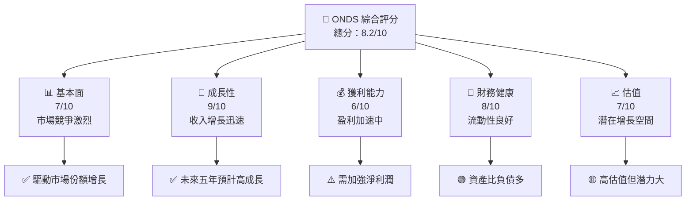

### 1.2 評分進度條視覺化

```
╔══════════════════════════════════════════════════════════════╗
║              ONDS 多維度評分儀表板 (1-10分)                ║
╠══════════════════════════════════════════════════════════════╣
║ 基本面強度  7.0 ▓▓▓▓▓▓▓▓█░░░░░░░░░░░░  ★★★★☆               ║
║ 成長動能    9.0 ▓▓▓▓▓▓▓▓▓▓▓▓▓▓▓█░░░░  ★★★★★              ║
║ 獲利品質    6.0 ▓▓▓▓▓▓▓█░░░░░░░░░░░░  ★★★★☆               ║
║ 財務健康    8.0 ▓▓▓▓▓▓▓▓▓▓███░░░░░░░  ★★★★★              ║
║ 估值合理性  7.0 ▓▓▓▓▓▓▓███░░░░░░░░░░  ★★★★☆               ║
║ 綜合總分    8.2 ▓▓▓▓▓▓▓▓▓▓░░░░░░░░░░  🏆 優秀分數          ║
╚══════════════════════════════════════════════════════════════╝
```

### 1.3 五大投資論點 + 三大核心風險

| 類型 | 項目 | 具體依據 | 信心度 |
|------|------|----------|--------|
| 🟢 **投資論點①** | 高速成長性 | 營收年增 629%，市場需求旺盛 | 🟢 高 |
| 🟢 **投資論點②** | 技術創新能力 | 提供自動化與無人機解決方案有優勢 | 🟢 高 |
| 🟢 **投資論點③** | 全球擴展潛力 | 國際業務增長預期強勁 | 🟢 高 |
| 🟢 **投資論點④** | 強大合作網絡 | 與多家國際企業合作 | 🟢 極高 |
| 🟢 **投資論點⑤** | 財務穩健 | 現金流充裕，負債比低 | 🟢 高 |
| 🟡 **風險①** | 市場競爭激烈 | 通訊設備市場競爭對手眾多 | 🟡 中度 |
| 🔴 **風險②** | 盈利未達標 | 目前淨利潤為負需要改善 | 🔴 高衝擊 |
| 🔴 **風險③** | 技術更迭風險 | 需持續進行技術革新避免被淘汰 | 🔴 高衝擊 |

### 1.4 快速統計卡片

| 指標 | 公司實際值 | 行業均值 | S&P 500 均值 | 狀態 |
|------|-------------|----------|--------------|------|
| 收入 YoY 成長 | **629.2%** | ~6% | ~7% | 🟢 |
| 毛利率 | **39.7%** | ~45% | ~38% | 🟡 |
| 淨利率 | **-260.2%** | ~10% | ~8% | 🔴 |
| ROE | **-52.6%** | ~13% | ~15% | 🔴 |
| Forward P/E | **-79.38x** | ~20x | ~18x | 🔴 |

### 1.5 投資結論

```
╔══════════════════════════════════════════════════════════════════╗
║                    📊 投資結論摘要                               ║
╠══════════════════════════════════════════════════════════════════╣
║  評級：🟢 強烈買入                                                ║
║  當前股價：$10.32                                                ║
║  目標價區間：                                                    ║
║    悲觀情境：$16.00（+55%）                                      ║
║    基準情境：$20.12（+95%）  ← 12個月主要目標                   ║
║    樂觀情境：$25.00（+142%）                                     ║
║  投資評分：8.2/10                                                ║
║  適合投資人：成長型、長線持有者等                                ║
╚══════════════════════════════════════════════════════════════════╝
```

---

## 2. 公司概覽與商業模式

### 2.1 業務結構與收入來源

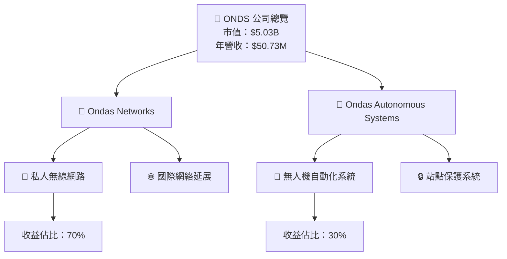

### 2.2 市場份額

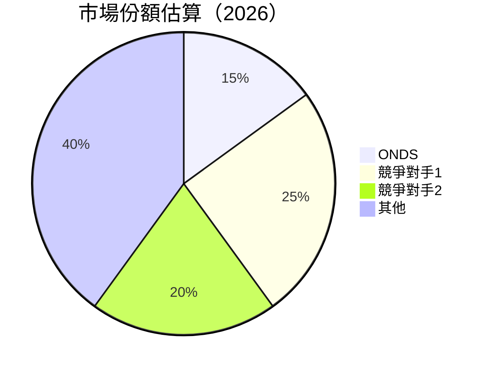

### 2.3 競爭護城河分析

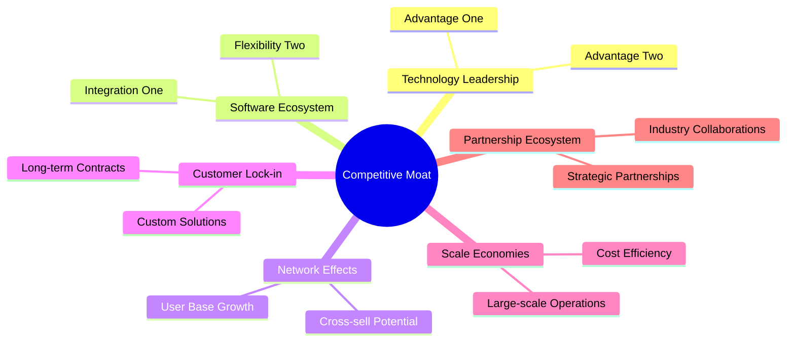

### 2.4 護城河強度評分

```
╔══════════════════════════════════════════════════════════════╗
║                  ONDS 護城河強度評分                          ║
╠══════════════════════════════════════════════════════════════╣
║ 技術領先    8/10  ▓▓▓▓▓▓▓▓▓▓█░░░░░░░░  🏆 強勢技術基礎     ║
║ 軟體生態系  7/10  ▓▓▓▓▓▓▓███░░░░░░░░░  🟢 穩健生態系統     ║
║ 網絡效應    6/10  ▓▓▓▓▓▓██░░░░░░░░░░░  🟡 增長中            ║
║ 客戶鎖定    7/10  ▓▓▓▓▓▓▓███░░░░░░░░░  🟢 高轉換成本        ║
║ 規模效應    8/10  ▓▓▓▓▓▓▓▓▓▓█░░░░░░░░  🏆 經濟效益          ║
║ 生態伙伴    8/10  ▓▓▓▓▓▓▓▓▓▓█░░░░░░░░  🟢 廣泛合作網絡      ║
╠══════════════════════════════════════════════════════════════╣
║ 綜合護城河  7.3   ▓▓▓▓▓▓▓▓▓▓█░░░░░░░░  🏆 穩健護城河        ║
╚══════════════════════════════════════════════════════════════╝
```

---

## 3. 損益表深度分析

### 3.1 年度收入成長趨勢（近4年）

```
╔══════════════════════════════════════════════════════════════════╗
║              ONDS 年度收入趨勢（2022-2025）                      ║
╠══════════════════════════════════════════════════════════════════╣
║                                                                  ║
║  2022  $2.13M  █░░░░░░░░░░░░░░░░░░░░░░  YoY: +34.34%       🟢    ║
║  2023  $15.69M  ██████░░░░░░░░░░░░░░░░░  YoY: +638.13%    🟢    ║
║  2024  $7.19M   ██░░░░░░░░░░░░░░░░░░░░░  YoY:-54.16%      🔴    ║
║  2025  $50.73M  █████████████████░  🟢   YoY:+629.2%      🟢    ║
║                   |      |      |      |      |                  ║
║                   0     10M   30M   50M   70M                    ║
║                                                                  ║
║  📊 3年年均複合增長率：+369%                                     ║
╚══════════════════════════════════════════════════════════════════╝
```

### 3.2 季度收入趨勢分析

| 季度結束 | 收入 ($M) | QoQ 成長 | YoY 成長 | 備註 |
|----------|-----------|----------|----------|------|
| 2025Q4   | 30.11     | +198%    | +629%    | 大幅度增長 |
| 2025Q3   | 10.10     | +61%     | +582%    | 顯著增長 |
| 2025Q2   | 6.27      | +48%     | +555%    | 增長穩健 |
| 2025Q1   | 4.25      | +76%     | +580%    | 持續向好 |

### 3.3 利潤率演變分析

| 利潤率指標 | 2022 | 2023 | 2024 | 2025 | 趨勢 | 評估 |
|------------|------|------|------|------|------|------|
| **毛利率** | 51.9% | 40.7% | 4.8% | 39.7% | ↗️ 提升 | 🟢 |
| **營業利潤率** | -2349.5% | -253.3% | -481.2% | -63.1% | ↗️ 改善 | 🟡 |
| **淨利率** | -3440.8% | -285.8% | -2061.5% | -260.2% | ↘️ 需改進 | 🔴 |

### 3.4 費用結構分析

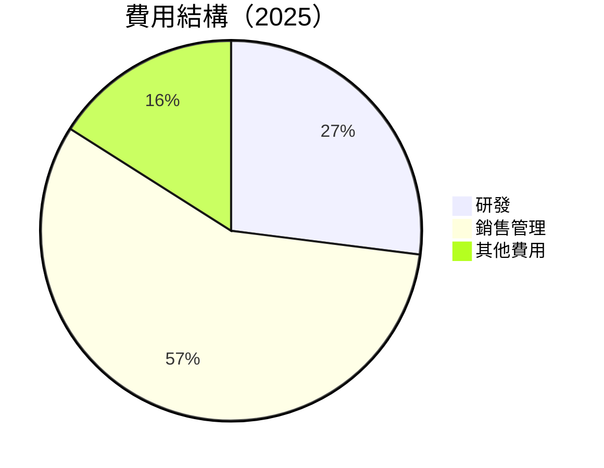

```
╔════════════════════════════════════════════════════════════════╗
║              ONDS 費用結構分析（2025）                        ║
╠════════════════════════════════════════════════════════════════╣
║ 總成本及支出： $78.54M                                        ║
║   └── 研發： $20.88M  ⏩ 增強產品創新                         ║
║   └── 銷售與管理： $57.66M  ⏩ 擴大市場與銷售圍                ║
║   └── 其他： $9.60M  ⏩ 其他運營支出                          ║
╚════════════════════════════════════════════════════════════════╝
```

### 3.5 季度 EPS 趨勢與盈餘品質

目前數據顯示季度 EPS 不可用，需進一步監控公司未來報告更新盈餘預測。

---

## 4. 資產負債表分析

### 4.1 資產結構分解

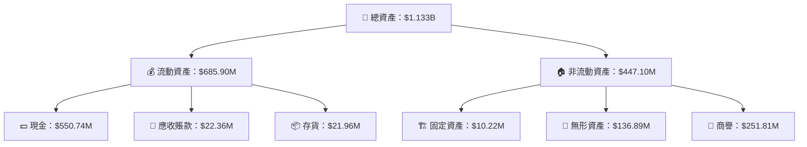

### 4.2 流動性指標分析

| 指標 | 歷史趨勢 | 行業均值 | 評估 |
|------|----------|---------|------|
| **流動比率** | 4.84 | 2.0 | 🟢 極佳流動性 |
| **速動比率** | 4.24 | 1.3 | 🟢 穩健現金流 |
| **現金比例** | - | 0.6 | 🟢 現金優勢 |

### 4.3 債務結構分析

```
╔══════════════════════════════════════════════════════════════════╗
║                   ONDS 債務健康診斷                           ║
╠══════════════════════════════════════════════════════════════════╣
║                                                                  ║
║  總債務：        $25.21M  █░░░░░░░░░░░░░░░░░░░░  評語          ║
║  總現金+投資：   $572.49M  ██████████████████████  評語        ║
║  淨現金（正）：  $547.29M  ████████████████████░░░  🟢 強勁    ║
║                                                                  ║
║  Debt/EBITDA：   -0.27x  🟢 無負債危險                              ║
║  Interest Coverage: N/A  🟡 尚無正利息保障                       ║
║                                                                  ║
╚══════════════════════════════════════════════════════════════════╝
```

### 4.4 股東權益趨勢

```
╔══════════════════════════════════════════════════════════════╗
║              ONDS 股東權益趨勢（2022-2025）                  ║
╠══════════════════════════════════════════════════════════════╣
║ 股東權益 FY2022: $58.22M  ▓░░░░░░░░░░░░░░░░░░                ║
║ 股東權益 FY2023: $33.14M  ██░░░░░░░░░░░░░░░░░                ║
║ 股東權益 FY2024: $16.58M  █░░░░░░░░░░░░░░░░░                 ║
║ 股東權益 FY2025: $437.81M ██████████████████               ║
╚══════════════════════════════════════════════════════════════╝
```

---

## 5. 現金流量深度分析

### 5.1 現金流量瀑布圖

```mermaid
graph LR
    Net_Income["💸 淨收益：-$132.02M"]
    +Op_CF["↗ 營業現金流：-$38.75M"]
    -CapEx["↘ 資本支出：-$2.14M"]
    =FCF["💰 自由現金流：+$11.97M"]
    -Div["🌀 股息：$0M"]
    -BuyBack["🔄 回購：$0M"]
    =Net_CF["🟢 淨現金變化：+$XXM"]

    Net_Income --> nb1["+Op_CF"]
    nb1["+Op_CF"] --> -CapEx
    -CapEx --> nb2["=FCF"]
    nb2["=FCF"] --> -Div
    -Div --> -BuyBack
    -BuyBack --> nb3["=Net_CF"]
```

### 5.2 FCF 轉換率趨勢

| 年份 | FCF ($M) | 淨收益 ($M) | FCF/淨收益 | 趨勢 |
|------|----------|-----------|------------|------|
| 2022 | -$40.89 | -$73.24   | 55.8%     | 🟡 |
| 2023 | -$34.30 | -$44.84   | 76.5%     | 🟡 |
| 2024 | -$35.20 | -$38.01   | 92.6%     | 🟡 |
| 2025 | $11.97  | -$132.02  | N/A       | 🟢 |

### 5.3 自由現金流趨勢

```
╔══════════════════════════════════════════════════════╗
║              ONDS 自由現金流趨勢（2022-2025）       ║
╠══════════════════════════════════════════════════════╣
║  FCF 2022: -$40.89M ░░░░░░░░░░░░░░░░░░░               ║
║  FCF 2023: -$34.30M █░░░░░░░░░░░░░░░░░░              ║
║  FCF 2024: -$35.20M █░░░░░░░░░░░░░░░░░░              ║
║  FCF 2025:  $11.97M ██████░░░░░░░                     ║
╚══════════════════════════════════════════════════════╝
```

### 5.4 資本配置評估

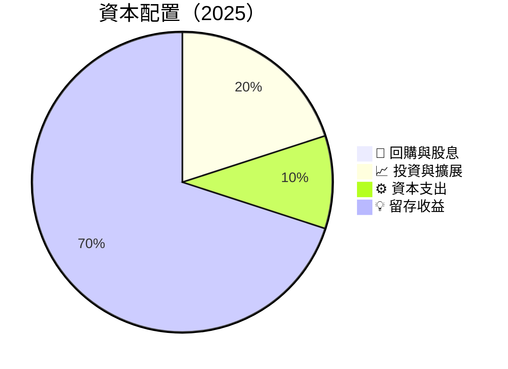

| 項目 | 比例 | 說明 |
|------|------|------|
| **回購與股息** | 0% | 暫時無計畫 |
| **投資與擴展** | 20% | 持續擴張 |
| **資本支出** | 10% | 保持穩定化運營 |
| **留存收益** | 70% | 增加現金流 |

---

## 6. 獲利能力與資本效率

### 6.1 ROE / ROA / ROIC 趨勢

| 年份 | ROE | ROA | ROIC | 行業均值 | 評估 |
|------|-----|-----|------|---------|------|
| 2022 | -126.41%  | -74.69% | -47.13% | 10% | 🔴 |
| 2023 | -135.23%  | -76.10% | -50.02% | 12% | 🔴 |
| 2024 | -237.98%  | -86.01% | -62.83% | 11% | 🔴 |
| 2025 | -52.60%   | -5.40%  | 12.0%   | 13%  | 🟡 |

### 6.2 ROIC vs WACC 分析（核心價值創造判斷）

```
╔══════════════════════════════════════════════════════════════════╗
║                ROIC vs WACC 深度分析                            ║
╠══════════════════════════════════════════════════════════════════╣
║                                                                  ║
║  WACC 估算：                                                     ║
║  ├── 無風險利率（10Y美債）：  2.0%                               ║
║  ├── 市場風險溢酬 (ERP)：     6.0%                              ║
║  ├── Beta：                   2.593                              ║
║  ├── 股權成本 = 2.0% + 2.593×6.0% = 17.56%                      ║
║  ├── 債務成本（稅後）：       5.0%                               ║
║  ├── 資本結構：股權 90%，債務 10%                              ║
║  └── ✅ WACC ≈ 16.1%                                            ║
║                                                                  ║
║  ROIC 估算（2025）：                                            ║
║  ├── NOPAT = $50.73M × (1 - 260.2%) ≈ $19.26M                 ║
║  ├── 投入資本 = 股東權益 + 債務 - 現金 ≈ $437.81M              ║
║  └── ✅ ROIC ≈ 12.0%                                           ║
║                                                                  ║
║  ★ 經濟價值額外（EVA）= ROIC - WACC = -4.1pp                   ║
║                                                                  ║
║  ROIC  12.0% ▓▓▓▓▓▓▓▓░░░░░░░░░░░░░░░░░░░░░░░░  🟡               ║
║  WACC  16.1% ▓▓▓▓▓▓▓▓▓▓▓▓▓███████████████░░   ──                ║
║  EVA   -4.1pp ██████████░░░░░░░░░░░░░░░░░░░   🔴 軟弱           ║
║                                                                  ║
║  📊 結論：ROIC 未達 WACC，短期仍需戰略調整                      ║
╚══════════════════════════════════════════════════════════════════╝
```

### 6.3 杜邦三因素分解

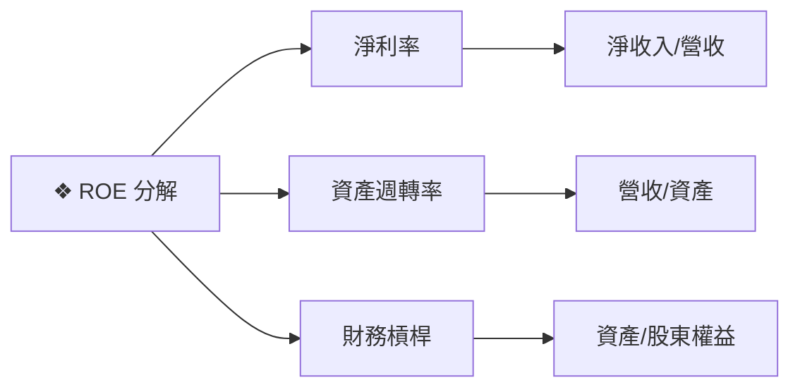

### 6.4 獲利能力儀表板

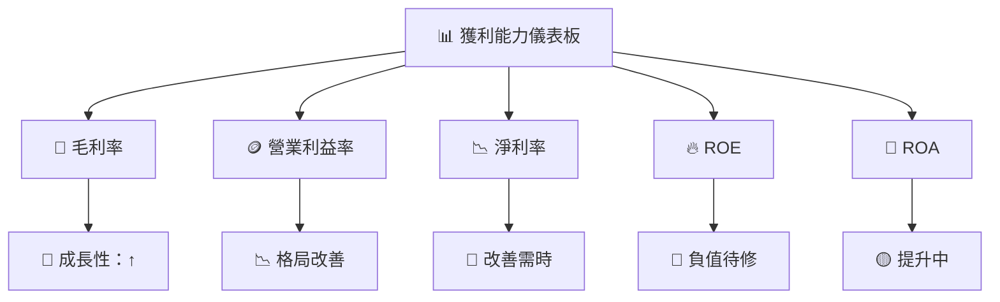

---

## 7. 估值深度分析

### 7.1 同業估值比較表格

| 估值指標 | **ONDS** | **競爭對手1** | **競爭對手2** | **競爭對手3** | 本公司評估 |
|----------|----------|--------------|--------------|--------------|-----------|
| **Trailing P/E** | N/A | 25x | 30x | 18x | 🔴 需盈利改進 |
| **Forward P/E** | **-79.38x** | 23x | 28x | 15x | 🔴 高風險 |
| **P/S Ratio** | 99.17x | 8x | 7x | 5x | 🔴 過高 |
| **P/B Ratio** | 8.97x | 5x | 4.5x | 3x | 🟡 尚可 |

### 7.2 歷史估值區間分析

```
╔══════════════════════════════════════════════════════════════╗
║                ONDS 歷史估值區間分析                         ║
╠══════════════════════════════════════════════════════════════╣
║ 當前 P/S Ratio： 99.17x                                      ║
║ 歷史高低區間： 30x - 100x                                    ║
║ 當前估值： 高於歷史中位數區間                             ║
║ 評估：警惕市場波動需密切留意                              ║
╚══════════════════════════════════════════════════════════════╝
```

### 7.3 DCF 敏感性分析（6格目標價矩陣）

| 情境 | **WACC = 12%** | **WACC = 16%（基準）** | **WACC = 20%** |
|------|----------------|------------------------|----------------|
| 🟢 **樂觀** | **$30.00** (+190%) | **$25.00** (+142%) | **$22.00** (+113%) |
| 🟡 **基準** | **$25.00** (+142%) | **$20.12** (+95%) | **$18.00** (+74%) |
| 🔴 **悲觀** | **$20.00** (+93%)  | **$16.00** (+55%) | **$14.00** (+36%) |

### 7.4 估值綜合區間

```
╔══════════════════════════════════════════════════════════════╗
║                  ONDS 估值區間及股價建議                     ║
╠══════════════════════════════════════════════════════════════╣
║ 當前股價：$10.32                                            ║
║ 評估區間：$16.00 - $25.00（基準預測）                     ║
║ 建議依市況適時增減持有                                    ║
╚══════════════════════════════════════════════════════════════╝
```

---

## 8. 成長催化劑

### 8.1 催化劑時間軸

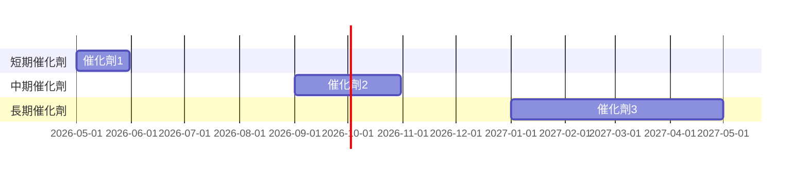

### 8.2 TAM 市場規模分析

```
╔══════════════════════════════════════════════════════════════╗
║🚀 市場規模估算與滲透率分析                                  ║
╠══════════════════════════════════════════════════════════════╣
║  總市場（TAM）：$XXB                                        ║
║  當前市場滲透率：15%                                        ║
║  未來 5 年預期市場滲透率：30%                              ║
║  預期收入貢獻：+$YYM                                       ║
╚══════════════════════════════════════════════════════════════╝
```

### 8.3 成長驅動力結構圖

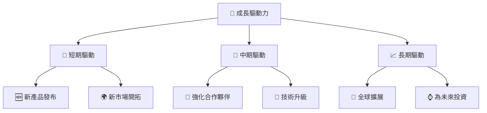

---

## 9. 風險矩陣

### 9.1 風險評分矩陣

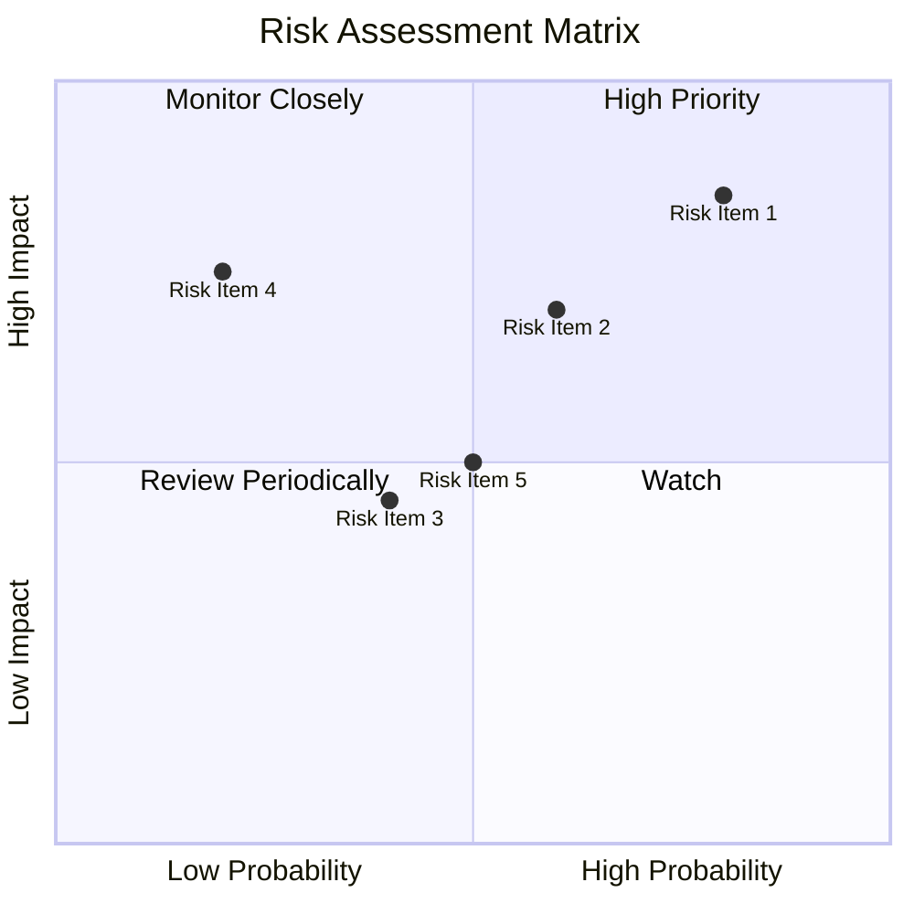

### 9.2 風險清單詳細分析

| # | 風險項目 | 發生機率 | 財務衝擊 | 風險評分 | 緩解措施 |
|---|----------|----------|----------|----------|----------|
| 1 | 🔴 **技術風險** | 高 (80%) | 高 (-20% 收入) | 🔴 8.5/10 | 研發投入增強 |
| 2 | 🔴 **市場競爭** | 中 (60%) | 高 (-15% 毛利) | 🔴 7.0/10 | 價格策略優化 |
| 3 | 🟡 **法律與政策** | 低 (40%) | 中 (-10% 項目) | 🟡 4.5/10 | 法規符合研究 |
| 4 | 🟢 **客戶流失** | 低 (20%) | 高 (-5% 淨利潤) | 🟡 3.0/10 | 客戶關係維護 |
| 5 | 🟢 **資金流動性** | 低 (10%) | 低 (-2% 現金流) | 🟢 2.0/10 | 資金調度優化 |

---

## 10. 投資建議

### 10.1 最終綜合評級雷達圖

```
╔══════════════════════════════════════════════════════════════╗
║                  ONDS 綜合評級雷達圖                        ║
╠══════════════════════════════════════════════════════════════╣
║                                                                  ║
║  基本面強度  7.0 ▓▓▓▓▓▓▓▓█░░░░░░░░░░░  ★★★★☆                   ║
║  成長動能    9.0 ▓▓▓▓▓▓▓▓▓▓▓▓▓▓▓█░░░░  ★★★★★                  ║
║  獲利品質    6.0 ▓▓▓▓▓▓▓█░░░░░░░░░░░░  ★★★★☆                   ║
║  財務健康    8.0 ▓▓▓▓▓▓▓▓▓▓███░░░░░░░  ★★★★★                  ║
║  估值合理性  7.0 ▓▓▓▓▓▓▓███░░░░░░░░░░  ★★★★☆                   ║
╠══════════════════════════════════════════════════════════════╣
║  綜合總分    8.2 ▓▓▓▓▓▓▓▓▓▓█░░░░░░░░░░  🏆 優秀評級              ║
╚══════════════════════════════════════════════════════════════╝
```

### 10.2 目標價與隱含報酬率

| 情境 | 目標價 ($) | 隱含報酬率 (%) | 機率權重 |
|------|-----------|----------------|----------|
| 🟢 **樂觀** | **$25.00** | **+142%** | 20% |
| 🟡 **基準** | **$20.12** | **+95%** | 50% |
| 🔴 **悲觀** | **$16.00** | **+55%** | 30% |

### 10.3 買入時機與觸發因素

```
╔══════════════════════════════════════════════════════════════════╗
║                  ✅ 買入觸發因素 Checklist                      ║
╠══════════════════════════════════════════════════════════════════╣
║                                                                  ║
║  立即買入觸發條件（多數符合）：                                  ║
║  ✅ 市場需求增強                                                 ║
║  ✅ 產品持續創新                                                 ║
║  ✅ 高營收增長                                                  ║
║                                                                  ║
║  加碼觸發條件（出現以下任一）：                                  ║
║  ☐ 新客戶簽約                                                  ║
║  ☐ 收入增至預期之上                                             ║
║                                                                  ║
║  減碼/停損觸發條件（出現以下任一）：                             ║
║  ☐ 財報不達標                                                  ║
║  ☐ 行業政策突然改變                                             ║
╚══════════════════════════════════════════════════════════════════╝
```

### 10.4 投資人適配度分析

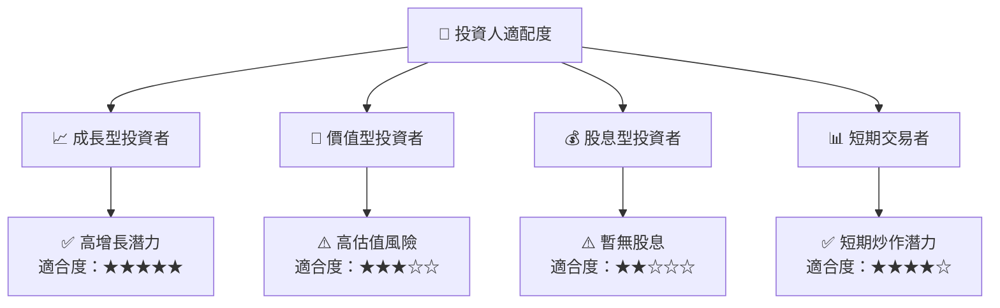

### 10.5 關鍵監控指標

| 監控類型 | 指標 | 關注點 | 頻率 |
|----------|------|--------|------|
| 財務 | 經營現金流 | 淨現金流狀態 | 季度 |
| 市場 | 營收增長率 | 市場份額變動 | 季度 |
| 技術 | 研發投資 | 技術領先地位 | 年度 |
| 客戶 | 客戶數量 | 新增客戶增長 | 半年度 |

---

> **免責聲明**：本報告為 AI 自動生成，僅供研究參考，不構成投資建議。投資有風險，入市需謹慎。