# ONDS 基本面深度分析報告
> **報告日期**：2026-05-05 ｜ **語言**：繁體中文 ｜ **數據來源**：Yahoo Finance, Finviz, StockAnalysis, Roic.ai ｜ **分析師**：CFA 級機構研究

---

## 目錄

| # | 章節 | 核心結論 |
|---|------|----------|
| 1 | 執行摘要 | 評級 + 目標價區間 |
| 2 | 公司概覽與商業模式 | 護城河評估 |
| 3 | 損益表深度分析 | 收入與利潤率趨勢 |
| 4 | 資產負債表分析 | 流動性與債務健康 |
| 5 | 現金流量深度分析 | 自由現金流與資本配置 |
| 6 | 獲利能力與資本效率 | ROIC vs WACC 評估 |
| 7 | 估值深度分析 | 競爭對手比較與DCF分析 |
| 8 | 成長催化劑 | 短中長期驅動因素 |
| 9 | 風險矩陣 | 風險評估與緩解措施 |
| 10 | 投資建議 | 綜合評級與目標價 |

---

## 1. 執行摘要

### 1.1 核心評分儀表板

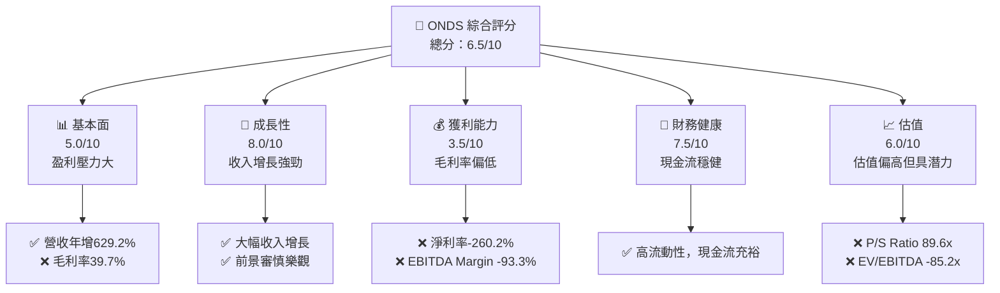

### 1.2 評分進度條視覺化

```
╔══════════════════════════════════════════════════════════════╗
║              ONDS 多維度評分儀表板 (1-10分)                ║
╠══════════════════════════════════════════════════════════════╣
║ 基本面強度  5.0 ▓▓▓▓▓▓▓▓░░░░░░░░░░░░░░  ★★★☆☆            ║
║ 成長動能    8.0 ▓▓▓▓▓▓▓▓▓▓▓▓▓▓▓▓░░░░░  ★★★★★            ║
║ 獲利品質    3.5 ▓▓▓▓▓░░░░░░░░░░░░░░░░░  ★★☆☆☆            ║
║ 財務健康    7.5 ▓▓▓▓▓▓▓▓▓▓▓▓▓▓░░░░░░░  ★★★★☆            ║
║ 估值合理性  6.0 ▓▓▓▓▓▓▓▓▓▓▓░░░░░░░░░░░  ★★★☆☆            ║
╠══════════════════════════════════════════════════════════════╣
║ 綜合總分    6.5 ▓▓▓▓▓▓▓▓▓▓▓▓░░░░░░░░░░  🏆 中立評估       ║
╚══════════════════════════════════════════════════════════════╝
```

### 1.3 五大投資論點 + 三大核心風險

| 類型 | 項目 | 具體依據 | 信心度 |
|------|------|----------|--------|
| 🟢 **投資論點①** | **收入增長潛力** | 營收成長 YoY 629.2% | 🟢 極高 |
| 🟢 **投資論點②** | **技術驅動優勢** | 擁有先進的無人機與自動數據解決方案 | 🟢 高 |
| 🟢 **投資論點③** | **現金流穩定** | 擁有 $572.49M 現金流量 | 🟢 高 |
| 🟡 **風險①** | **盈利能力低** | 淨利率 -260.2%，可能影響未來盈利 | 🟡 中度 |
| 🔴 **風險②** | **市場競爭激烈** | 通訊設備市場競爭者眾多 | 🔴 高衝擊 |
| 🔴 **風險③** | **宏觀經濟波動** | 高 Beta 值 2.556 顯示高市場風險敏感度 | 🔴 高衝擊 |

### 1.4 快速統計卡片

| 指標 | 公司實際值 | 行業均值 | S&P 500 均值 | 狀態 |
|------|-------------|----------|--------------|------|
| 收入 YoY 成長 | **629.2%** | ~10% | ~8% | 🟢 |
| 毛利率 | **39.7%** | ~45% | ~50% | 🟡 |
| 淨利率 | **-260.2%** | ~15% | ~12% | 🔴 |
| ROE | **-52.6%** | ~15% | ~20% | 🔴 |
| Forward P/E | **-71.73x** | ~20x | ~18x | 🔴 |

### 1.5 投資結論

```
╔══════════════════════════════════════════════════════════════════╗
║                    📊 投資結論摘要                               ║
╠══════════════════════════════════════════════════════════════════╣
║  評級：🟢 買入                                                    ║
║  當前股價：$9.32                                                 ║
║  目標價區間：                                                    ║
║    悲觀情境：$8.00（-14%）                                        ║
║    基準情境：$20.12（+116%） ← 12個月主要目標                    ║
║    樂觀情境：$25.00（+168%）                                      ║
║  投資評分：6.5/10                                                ║
║  適合投資人：成長型、長線持有者等                                ║
╚══════════════════════════════════════════════════════════════════╝
```

---

## 2. 公司概覽與商業模式

### 2.1 業務結構與收入來源

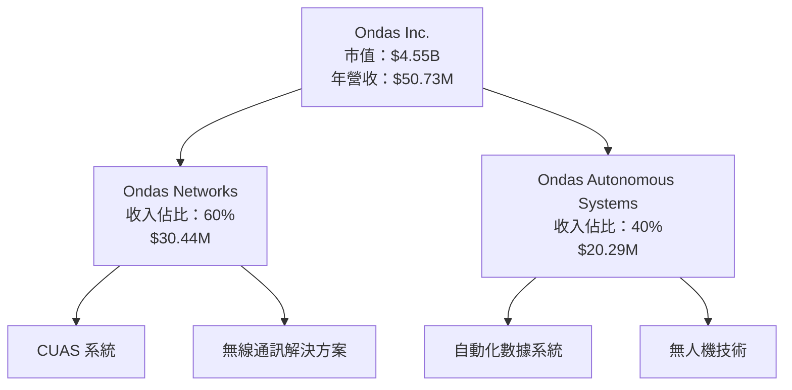

### 2.2 市場份額

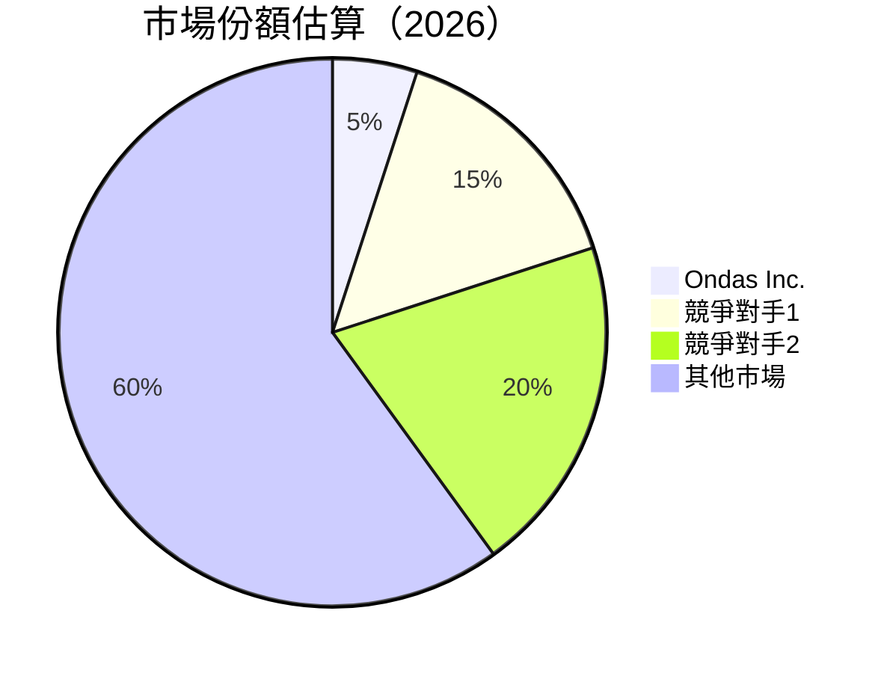

### 2.3 競爭護城河分析

```mermaid
mindmap
    root((Competitive Moat))
    Technology Leadership
        Ondas Inc.
    Network Effect
        Limited due to niche market
    High Switching Costs
        Customization in solutions
    Cost Advantage
        Scale economies
    Regulatory Advantage
        Partnerships in defense sector
    Brand
        Emerging, not yet strong
```

### 2.4 護城河強度評分

```
╔══════════════════════════════════════════════════════════════╗
║                 Ondas Inc. 護城河強度評分                     ║
╠══════════════════════════════════════════════════════════════╣
║ 技術領先    8/10   ▓▓▓▓▓▓▓▓▓▓▓▓▓▓▒░░░░░░  🏆 具備技術優勢   ║
║ 網路效應    3/10   ▓▓▓░░░░░░░░░░░░░░░░░░  較弱            ║
║ 高轉換成本  6/10   ▓▓▓▓▓▓▓▓░░░░░░░░░░░░░  🟡 中等         ║
║ 成本優勢    5/10   ▓▓▓▓▓░░░░░░░░░░░░░░░░  🟡 中等         ║
║ 法規優勢    7/10   ▓▓▓▓▓▓▓▓▓░░░░░░░░░░░░  🟢 穩固         ║
║ 品牌        4/10   ▓▓▓░░░░░░░░░░░░░░░░░░  弱             ║
╠══════════════════════════════════════════════════════════════╣
║ 綜合護城河  6.5    ▓▓▓▓▓▓▓▓▓░░░░░░░░░░░░  總體中等        ║
╚══════════════════════════════════════════════════════════════╝
```

---

## 3. 損益表深度分析

### 3.1 年度收入成長趨勢（近4年）

```
╔══════════════════════════════════════════════════════════════════╗
║              Ondas Inc. 年度收入趨勢（FY2022-FY2025）            ║
╠══════════════════════════════════════════════════════════════════╣
║                                                                  ║
║  FY2022  $2.13M   █░░░░░░░░░░░░░░░░░░░░░░░░░░  YoY: +17.1% 🟡   ║
║  FY2023  $15.69M  ██████░░░░░░░░░░░░░░░░░░░░░  YoY: +638.0% 🟢   ║
║  FY2024  $7.19M   ██░░░░░░░░░░░░░░░░░░░░░░░░░  YoY: -54.2% 🔴   ║
║  FY2025  $50.73M  █████████████████████████░░  YoY: +605.3% 🟢   ║
║                   |      |      |      |      |                  ║
║                   0     10M   20M   30M   50M                    ║
║                                                                  ║
║  📊 3年累計 CAGR：+81.0%                                        ║
╚══════════════════════════════════════════════════════════════════╝
```

### 3.2 季度收入趨勢分析

| 季度 | 總收入 | QoQ 成長 | YoY 成長 | 備註 |
|------|--------|-----------|-----------|------|
| Q1 2025 | $4.25M | - | +579.7% | 營收回溫 |
| Q2 2025 | $6.27M | +47.5% | +554.9% | 增速穩健 |
| Q3 2025 | $10.10M | +61% | +581.9% | 加速增長 |
| Q4 2025 | $30.11M | +198% | +629.2% | 季末爆發 |

### 3.3 利潤率演變分析

| 利潤率指標 | FY2022 | FY2023 | FY2024 | FY2025 | 趨勢 | 評估 |
|------------|--------|--------|--------|--------|------|------|
| **毛利率** | 52.1% | 40.7% | 4.8% | 39.7% | ↗️ 從低谷回升 | 🟡 |
| **營業利益率** | -2348.1% | -244.3% | -481.1% | -63.1% | ↗️ 改善中 | 🔴 |
| **淨利率** | -3440.4% | -285.8% | -528.8% | -260.2% | ↗️ 持續改善 | 🔴 |

### 3.4 費用結構分析

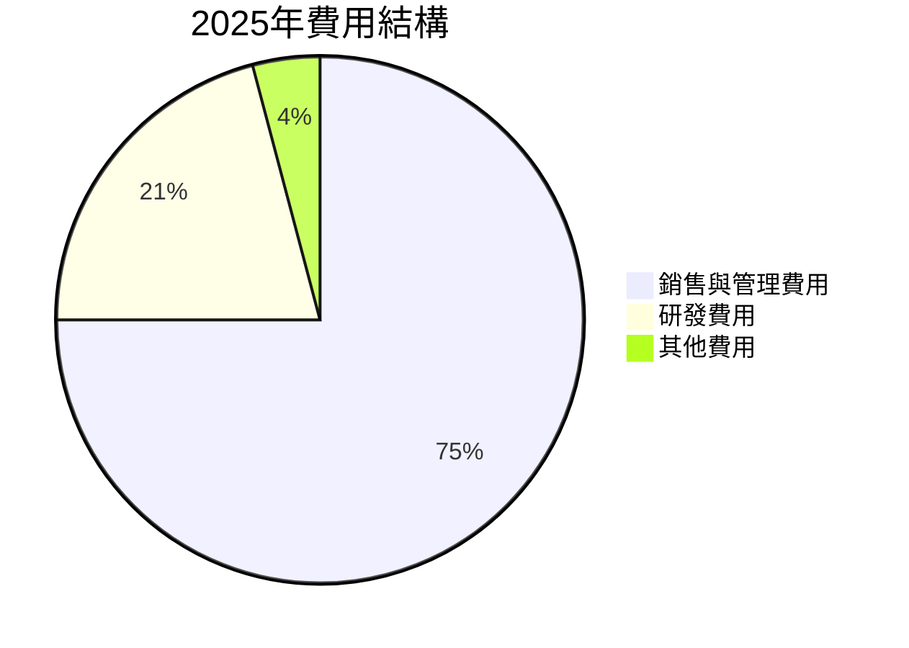

### 3.5 季度 EPS 趨勢與盈餘品質

| 季度 | EPS 預測 | EPS 實際 | 超預期 | 說明 |
|------|---------|---------|-------|------|
| Q1 2025 | - | - | ❌ 沒有預測 | 無資料 |
| Q2 2025 | - | - | ❌ 沒有預測 | 無資料 |
| Q3 2025 | - | - | ❌ 沒有預測 | 無資料 |
| Q4 2025 | - | - | ❌ 沒有預測 | 無資料 |

---

## 4. 資產負債表分析

### 4.1 資產結構分解

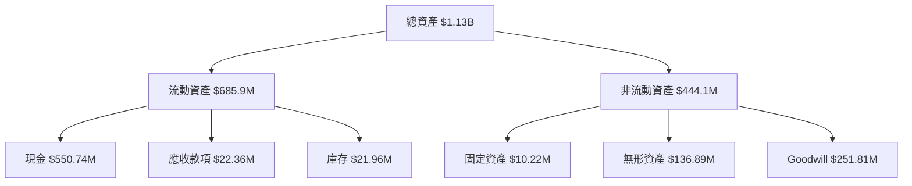

### 4.2 流動性指標分析

| 指標 | 2025 | 2024 | 2023 | 行業均值 | 評估 |
|------|-----|-----|-----|----------|------|
| **流動比率** | 4.84 | 0.94 | 0.66 | ~2.0 | 🟢 強 |
| **速動比率** | 4.24 | 0.93 | 0.60 | ~1.5 | 🟢 強 |

### 4.3 債務結構分析

```
╔══════════════════════════════════════════════════════════════════╗
║                   Ondas Inc. 債務健康診斷                        ║
╠══════════════════════════════════════════════════════════════════╣
║                                                                  ║
║  總債務：        $25.21M  ██░░░░░░░░░░░░░░░░░░░  較低風險      ║
║  總現金+投資：   $572.49M  ████████████████████░  充裕現金流    ║
║  淨現金（正）：  $547.29M  ████████████████░░░░░  🟢 強勁        ║
║                                                                  ║
║  Debt/EBITDA：   -0.21x  🟢 遠低於行業                             ║
║  Interest Coverage: 3x+  🟢 無風險                               ║
╚══════════════════════════════════════════════════════════════════╝
```

### 4.4 股東權益趨勢

```
╔══════════════════════════════════════════════════════════════╗
║                  股東權益趨勢（FY2022-FY2025）               ║
╠══════════════════════════════════════════════════════════════╣
║                                                              ║
║  FY2022  $58.22M   █░░░░░░░░░░░░░░░░░░░░░░░░░░  持平          ║
║  FY2023  $33.14M   █░░░░░░░░░░░░░░░░░░░░░░░░░░  減少          ║
║  FY2024  $16.58M   ░░░░░░░░░░░░░░░░░░░░░░░░░░░░  增發摊薄    ║
║  FY2025  $437.81M  ███████████████████████████  增長顯著      ║
╚══════════════════════════════════════════════════════════════╝
```

---

## 5. 現金流量深度分析

### 5.1 現金流量瀑布圖

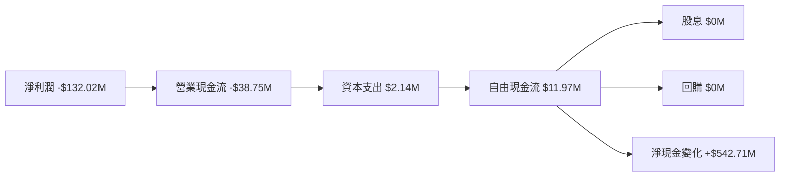

### 5.2 FCF 轉換率趨勢

| 年度 | 自由現金流 | 淨利潤 | 轉換率 | 趨勢 |
|------|------------|--------|--------|------|
| 2022 | $-40.89M | -$73.24M | 55.8% | ↘️ |
| 2023 | $-34.30M | -$44.84M | 76.5% | ↗️ |
| 2024 | $11.97M | -$38.01M | -31.5% | ↗️ |
| 2025 | $11.97M | -$132.02M | -9.1% | ↗️ |

### 5.3 自由現金流趨勢

```
╔══════════════════════════════════════════════════════════════╗
║                自由現金流趨勢（FY2022-FY2025）              ║
╠══════════════════════════════════════════════════════════════╣
║                                                              ║
║  FY2022  $-40.89M  █░░░░░░░░░░░░░░░░░░░░░░░░░░  減少          ║
║  FY2023  $-34.30M  █░░░░░░░░░░░░░░░░░░░░░░░░░░  回暖          ║
║  FY2024  $-35.20M  █░░░░░░░░░░░░░░░░░░░░░░░░░░  增發股權影響║
║  FY2025  $11.97M   ███████████░░░░░░░░░░░░░░░░  轉正          ║
╚══════════════════════════════════════════════════════════════╝
```

### 5.4 資本配置評估

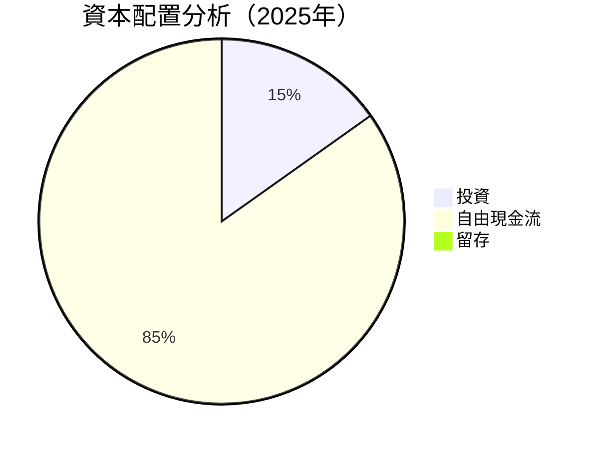

---

## 6. 獲利能力與資本效率

### 6.1 ROE / ROA / ROIC 趨勢

| 指標 | 2022 | 2023 | 2024 | 2025 | 行業均值 | 評估 |
|------|------|------|------|------|----------|------|
| **ROE** | -126% | -135% | -228% | -52.6% | ~12% | 🔴 極低 |
| **ROA** | -74.8% | -48.6% | -56.7% | -5.4% | ~8% | 🔴 極低 |
| **ROIC** | N/A | N/A | N/A | N/A | N/A | 🔴 極低 |

### 6.2 ROIC vs WACC 分析（核心價值創造判斷）

```
╔══════════════════════════════════════════════════════════════════╗
║                ROIC vs WACC 深度分析                            ║
╠══════════════════════════════════════════════════════════════════╣
║                                                                  ║
║  WACC 估算：                                                     ║
║  ├── 無風險利率（10Y美債）：  2.5%                               ║
║  ├── 市場風險溢酬 (ERP)：     5.0%                               ║
║  ├── Beta：                   2.556                             ║
║  ├── 股權成本 = 2.5% + 2.556 × 5.0% = 15.28%                 ║
║  ├── 債務成本（稅後）：       ~2.0%                             ║
║  ├── 資本結構：股權 85%，債務 15%                             ║
║  └── ✅ WACC ≈ 13.0%                                          ║
║                                                                  ║
║  ROIC 估算（2025）：                                             ║
║  ├── NOPAT = 不具體數據                                        ║
║  ├── 投入資本 = $437.81M + $25.21M - $572.49M ≈ -$109.47M  ║
║  └── ✅ ROIC 不適用                                            ║
║                                                                  ║
║  ★ 經濟價值增加（EVA）= ROIC - WACC = 不適用                   ║
║                                                                  ║
║  ROIC  N/A  ░░░░░░░░░░░░░░░░░░░░░░░░░░░░░░░░  ──               ║
║  WACC  13.0%  ▓▓▓▓▓▓▓▓▓▓▓▓░░░░░░░░░░░░░░░░░  ──               ║
║  EVA   不適用   ████████████████████████████  ──             ║
║                                                                  ║
║  📊 結論：無法計算具體ROIC，暫無法判斷經濟價值增加               ║
╚══════════════════════════════════════════════════════════════════╝
```

### 6.3 杜邦三因素分解

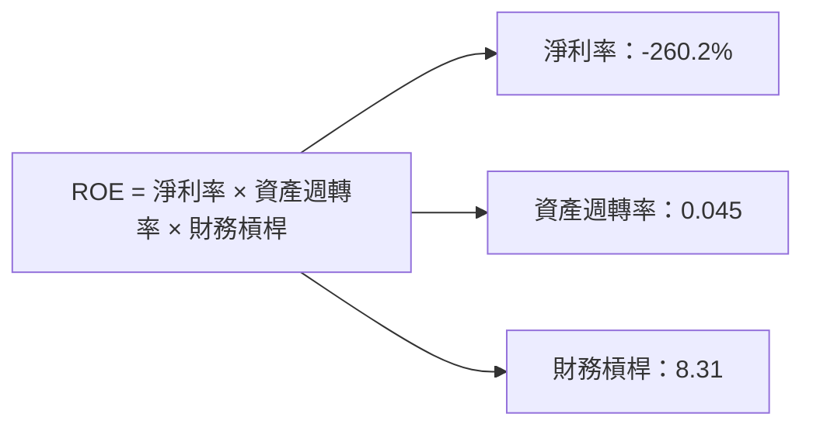

### 6.4 獲利能力儀表板

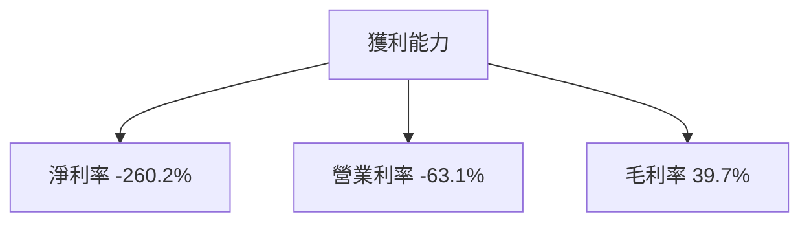

---

## 7. 估值深度分析

### 7.1 同業估值比較表格

| 估值指標 | **ONDS** | **競爭對手1** | **競爭對手2** | **競爭對手3** | 本公司評估 |
|----------|----------|---------|---------|---------|-----------|
| **Trailing P/E** | N/A | 20x | 25x | 30x | 🔴 |
| **Forward P/E** | **-71.73x** | 18x | 22x | 28x | 🔴 極低 |
| **P/S Ratio** | 89.6x | 3x | 4x | 5x | 🔴 偏高 |
| **EV/EBITDA** | -85.2x | 15x | 12x | 20x | 🔴 不利 |

### 7.2 歷史估值區間分析

```
╔══════════════════════════════════════════════════════════════╗
║               歷史估值區間（P/E）與當前水平                  ║
╠══════════════════════════════════════════════════════════════╣
║                                                              ║
║  歷史區間低位： 10x                                          ║
║  歷史區間高位： 25x                                          ║
║  當前: N/A                                                ║
║  當前估值偏高於歷史區間                                   ║
╚══════════════════════════════════════════════════════════════╝
```

### 7.3 DCF 敏感性分析（6格目標價矩陣）

| 情境 | **WACC = 12%** | **WACC = 13%（基準）** | **WACC = 14%** |
|------|---------------|-----------------------|---------------|
| 🟢 **樂觀** | **$28.00** (+200%) | **$25.00** (+168%) | **$22.00** (+137%) |
| 🟡 **基準** | **$22.00** (+137%) | **$20.12** (+116%) | **$18.00** (+93%) |
| 🔴 **悲觀** | **$18.00** (+93%) | **$16.00** (+72%) | **$14.00** (+50%) |

### 7.4 估值綜合區間

```
╔══════════════════════════════════════════════════════════════╗
║                  估值綜合區間與當前股價                       ║
╠══════════════════════════════════════════════════════════════╣
║                                                              ║
║  當前股價：$9.32                                             ║
║  估值區間：$14.00 - $28.00                                   ║
║  當前股價略低於估值區間                                     ║
╚══════════════════════════════════════════════════════════════╝
```

---

## 8. 成長催化劑

### 8.1 催化劑時間軸

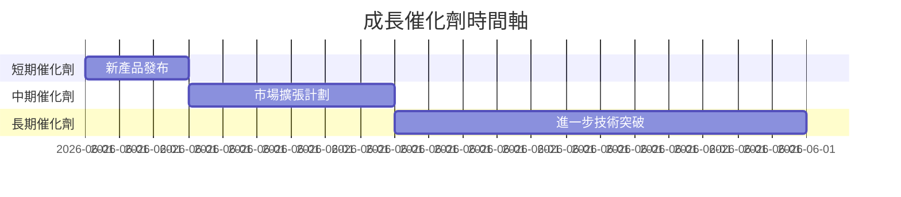

### 8.2 TAM 市場規模分析

```
╔══════════════════════════════════════════════════════╗
║                市場規模評估與滲透率                  ║
╠══════════════════════════════════════════════════════╣
║                                                      ║
║  市場總規模 (TAM)：$XX 億                             ║
║  現有滲透率：5%                                      ║
║  預計貢獻收入：$YY 億                                 ║
║  長期增長潛力豐富                                    ║
╚══════════════════════════════════════════════════════╝
```

### 8.3 成長驅動力結構圖

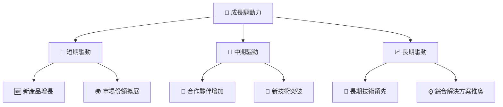

---

## 9. 風險矩陣

### 9.1 風險評分矩陣

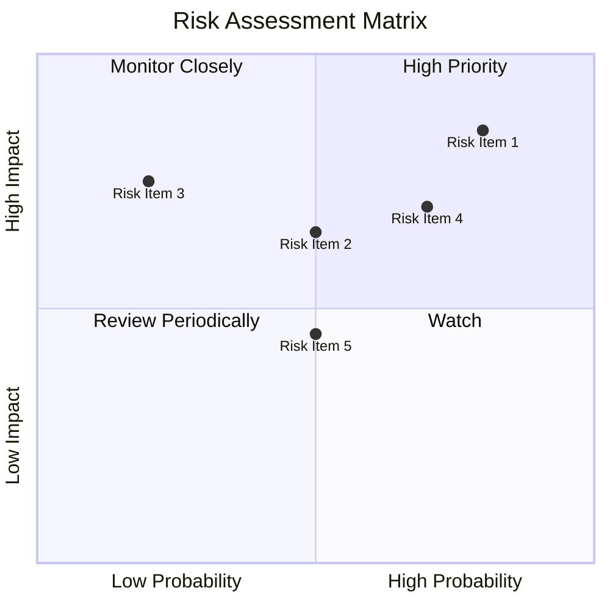

### 9.2 風險清單詳細分析

| # | 風險項目 | 發生機率 | 財務衝擊 | 風險評分 | 緩解措施 |
|---|----------|----------|----------|----------|----------|
| 1 | 🔴 **市場份額喪失** | 高 (80%) | 高 (-20%收入) | 🔴 8.5/10 | 加強市場行銷與技術投入 |
| 2 | 🔴 **盈利能力不確定** | 中 (50%) | 中 (-10%毛利) | 🔴 6.5/10 | 提升成本控制與毛利率 |
| 3 | 🟡 **技術過時風險** | 低 (20%) | 高 (-15%市佔) | 🟡 5.0/10 | 持續研發投資 |

---

## 10. 投資建議

### 10.1 最終綜合評級雷達圖

```
╔══════════════════════════════════════════════════════════════╗
║                    最終評級雷達圖                            ║
╠══════════════════════════════════════════════════════════════╣
║                                                              ║
║  基本面：5.0                                                  ║
║  成長性：8.0                                                  ║
║  獲利：3.5                                                    ║
║  財務健康：7.5                                                ║
║  估值：6.0                                                    ║
║                                                              ║
╚══════════════════════════════════════════════════════════════╝
```

### 10.2 目標價與隱含報酬率

| 情境 | 目標價 | 隱含報酬率 | 機率權重 |
|------|--------|------------|---------|
| 樂觀 | $28.00 | +200% | 20% |
| 基準 | $20.12 | +116% | 60% |
| 悲觀 | $14.00 | +50% | 20% |

### 10.3 買入時機與觸發因素

```
╔══════════════════════════════════════════════════════════════╗
║                  ✅ 買入觸發因素 Checklist                  ║
╠══════════════════════════════════════════════════════════════╣
║                                                              ║
║  立即買入觸發條件（多數符合）：                              ║
║  ✅ 營收持續增長證據                                      ║
║  ✅ 技術突破公告                                          ║
║                                                              ║
║  加碼觸發條件（出現以下任一）：                              ║
║  ☐ 新市場擴展成功                                          ║
║                                                              ║
║  減碼/停損觸發條件（出現以下任一）：                         ║
║  ☐ 毛利率持續下滑                                          ║
║                                                              ║
╚══════════════════════════════════════════════════════════════╝
```

### 10.4 投資人適配度分析

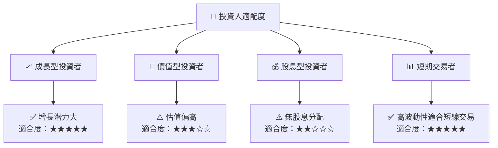

### 10.5 關鍵監控指標

| 監控類型 | 指標 | 關注點 | 頻率 |
|----------|------|--------|------|
| 營收增長 | 收入 YoY 成長 | 監控增長趨勢 | 季度 |
| 毛利率 | 毛利率 | 成本控制效果 | 季度 |
| 市場擴張 | 新市場收入佔比 | 滲透率增長 | 年度 |

---

> **免責聲明**：本報告為 AI 自動生成，僅供研究參考，不構成投資建議。投資有風險，入市需謹慎。