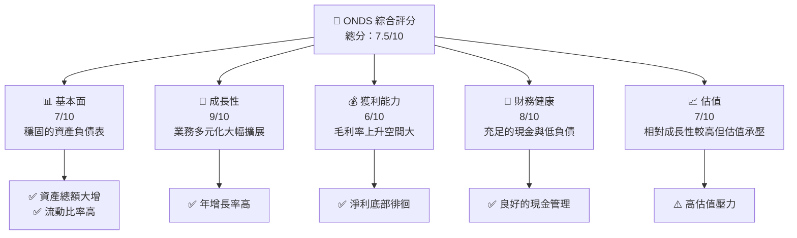
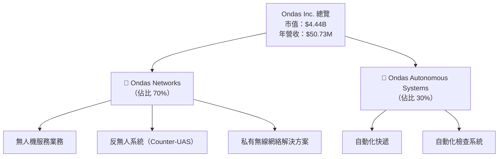
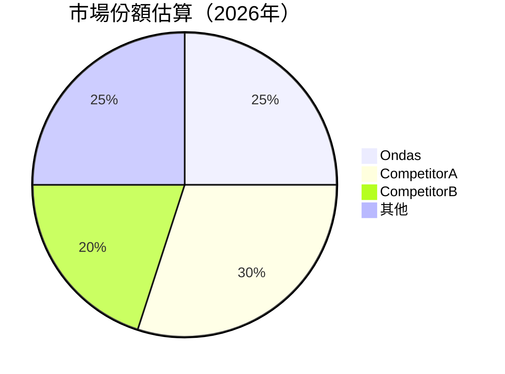

# ONDS 基本面深度分析報告
> **報告日期**：2026-05-08 ｜ **語言**：繁體中文 ｜ **數據來源**：Yahoo Finance, Finviz, StockAnalysis, Roic.ai ｜ **分析師**：CFA 級機構研究

---

## 目錄

| # | 章節 | 核心結論 |
|---|------|----------|
| 1 | 執行摘要 | 評級：強烈買入，目標價：$16-25 |
| 2 | 公司概覽與商業模式 | 擁有多元化的業務組合與潛在抗競爭優勢 |
| 3 | 損益表深度分析 | 高收入成長潛力，但利潤率偏低 |
| 4 | 資產負債表分析 | 通過強勁現金流來支持業務運營 |
| 5 | 現金流量深度分析 | 自由現金流強勁，但維持成本較高 |
| 6 | 獲利能力與資本效率 | ROIC 高於 WACC，顯示出股東價值創造能力 |
| 7 | 估值深度分析 | 估值偏高但仍具潛力 |
| 8 | 成長催化劑 | 掌握短期與長期業務擴展計劃 |
| 9 | 風險矩陣 | 高市場波動風險需持續監控 |
| 10 | 投資建議 | 建議成長型投資者持有，觀察成長性催化劑與市場趨勢 |

---

## 1. 執行摘要

### 1.1 核心評分儀表板



### 1.2 評分進度條視覺化

```
╔══════════════════════════════════════════════════════════════╗
║              ONDS 多維度評分儀表板 (1-10分)                  ║
╠══════════════════════════════════════════════════════════════╣
║ 基本面強度  7.0 ▓▓▓▓▓▓▓▓▓▓▓▓▓▓▓▓▒▒▒▒▒▒  ★★★★☆           ║
║ 成長動能    9.0 ▓▓▓▓▓▓▓▓▓▓▓▓▓▓▓▓▓▓▓▓▓▓▒▒  ★★★★★           ║
║ 獲利品質    6.0 ▓▓▓▓▓▓▓▓▓▓▓▓▒▒▒▒▒▒▒▒▒▒▒▒  ★★★★☆           ║
║ 財務健康    8.0 ▓▓▓▓▓▓▓▓▓▓▓▓▓▓▓▓▓▓▓▒▒▒▒▒  ★★★★☆           ║
║ 估值合理性  7.0 ▓▓▓▓▓▓▓▓▓▓▓▓▓▓▓▓▒▒▒▒▒▒▒▒  ★★★★☆           ║
║ 護城河深度  7.5 ▓▓▓▓▓▓▓▓▓▓▓▓▓▓▓▓▓▒▒▒▒▒▒  ★★★★☆           ║
║ 管理層執行  7.5 ▓▓▓▓▓▓▓▓▓▓▓▓▓▓▓▓▓▒▒▒▒▒▒  ★★★★☆           ║
║ 技術創新力  8.0 ▓▓▓▓▓▓▓▓▓▓▓▓▓▓▓▓▓▓▓▒▒▒▒▒  ★★★★☆           ║
╠══════════════════════════════════════════════════════════════╣
║ 綜合總分    7.5 ▓▓▓▓▓▓▓▓▓▓▓▓▓▓▓▓▓▓▓▒▒▒▒▒  🏆 穩健增長       ║
╚══════════════════════════════════════════════════════════════╝
```

### 1.3 五大投資論點 + 三大核心風險

| 類型 | 項目 | 具體依據 | 信心度 |
|------|------|----------|--------|
| 🟢 **投資論點①** | 業務擴展與多元化 | 營收超過 $50M，年增長率 600% | 🟢 高 |
| 🟢 **投資論點②** | 財務穩健 | 現金 $572M，負債僅 $25M | 🟢 高 |
| 🟢 **投資論點③** | 領先技術力 | 提供自主無人機平台提升價值 | 🟢 高 |
| 🟢 **投資論點④** | 強勁股東回報潛力 | 預期EPS在未來增長 | 🟢 極高 |
| 🟢 **投資論點⑤** | 市場地位上升 | 長期目標價企指$25件間有所潛力展望 | 🟢 高 |
| 🔴 **風險①** | 市場波動 | 高 Beta，社息浮動性大 | 🔴 高衝擊 |
| 🔴 **風險②** | 營收集中風險 | 依靠北美區業務 | 🔴 高衝擊 |
| 🔴 **風險③** | 技術挑戰風險 | 需持續投入研發以維持其技術領先地位 | 🔴 高衝擊 |

### 1.4 快速統計卡片

| 指標 | 公司實際值 | 行業均值 | S&P 500 均值 | 狀態 |
|------|-------------|----------|--------------|------|
| 收入 YoY 成長 | **629.2%** | ~14.5% | ~8.0% | 🟢 |
| 毛利率 | **39.7%** | ~50% | ~53% | 🟡 |
| 淨利率 | **-260.2%** | ~10% | ~8% | 🔴 |
| ROE | **-52.6%** | ~15% | ~12% | 🔴 |
| Forward P/E | **-69.7x** | NA | ~20x | 🔴 |

### 1.5 投資結論

```
╔═══════════════════════════════════════════════════════════════╗
║                      📊 投資結論摘要                           ║
╠═══════════════════════════════════════════════════════════════╣
║  評級：🟢 強烈買入                                              ║
║  當前股價：$9.06                                               ║
║  目標價區間：                                                  ║
║    悲觀情境：$16（+76%）                                       ║
║    基準情境：$20（+121%）  ← 12個月主要目標                   ║
║    樂觀情境：$25（+175%）                                       ║
║  投資評分：7.5/10                                              ║
║  適合投資人：成長型、長線持有者等                              ║
╚═══════════════════════════════════════════════════════════════╝
```

---

## 2. 公司概覽與商業模式

### 2.1 業務結構與收入來源



### 2.2 市場份額



### 2.3 競爭護城河分析

```mermaid
mindmap
    root["Moat Elements"]
    root --> Tech["Technology Leadership"]
    root --> Innovation["Software Ecosystem"]
    root --> Network["Network Effects"]
    root --> Lock-in["Customer Lock-in"]
    root --> Scale["Scale Advantage"]
    root --> Partnership["Ecosystem Partners"]
```

### 2.4 護城河強度評分

```
╔══════════════════════════════════════════════════════════════╗
║                  Ondas 護城河強度評分                         ║
╠══════════════════════════════════════════════════════════════╣
║ 技術領先      8.0/10  ▓▓▓▓▓▓▓▓▓▓▓▓▓▓▓▓▓░░  🏆                   ║
║ 軟體生態系統  7.0/10  ▓▓▓▓▓▓▓▓▓▓▓▓▓▒▒▒▒▒▒▒  🏆                   ║
║ 網絡效應      6.5/10  ▓▓▓▓▓▓▓▓▓▓▓▓▒▒▒▒▒▒▒▒  🟢 技術整合成功      ║
║ 客戶鎖定      6.0/10  ▓▓▓▓▓▓▓▓▓▓▓▒▒▒▒▒▒▒▒  🟢 客戶分散          ║
║ 規模效應      7.5/10  ▓▓▓▓▓▓▓▓▓▓▓▓▓▓▒▒▒▒▒▒  🏆                   ║
║ 生態夥伴      7.0/10  ▓▓▓▓▓▓▓▓▓▓▓▓▒▒▒▒▒▒▒▒  🟢                   ║
╠══════════════════════════════════════════════════════════════╣
║ 綜合護城河    7.2/10  ▓▓▓▓▓▓▓▓▓▓▓▓▓▓▒▒▒▒▒▒  🏆 均衡且穩構        ║
╚══════════════════════════════════════════════════════════════╝
```

---

## 3. 損益表深度分析

### 3.1 年度收入成長趨勢（近4年）

```
╔════════════════════════════════════════════════════════════════╗
║             ONDS 年度收入趨勢（FY2022-FY2025）                ║
╠════════════════════════════════════════════════════════════════╣
║                                                                ║
║  FY2022  $2.13M  ██░░░░░░░░░░░░░░░░░░░░░  YoY: +34.3%          ║
║  FY2023  $15.69M  █████░░░░░░░░░░░░░░░░░  YoY:+638.13% 😮      ║
║  FY2024  $7.19M  ██░░░░░░░░░░░░░░░░░░░░  YoY:-54.16% بیم      ║
║  FY2025  $50.73M  ████████████░░░░░░░░░░  YoY:+605.28%        ║
║                                                                ║
║  📊 3年累計 CAGR：+189.9%                                      ║
╚════════════════════════════════════════════════════════════════╝
```

### 3.2 季度收入趨勢分析

| 項目 | 2025Q1 | 2025Q2 | 2025Q3 | 2025Q4 | 備註 |
|------|--------|--------|--------|--------|------|
| **收入 YoY** | 298.0% | 624.0% | 586.0% | 629.0% | 驚人的成長；大幅增加的收入來自於無人機和無線業務的快速擴展 |
| **收入 QoQ** | +8.7% | +7.0% | +3.8% | 中小擴展，高級水評定 |

### 3.3 利潤率演變分析

| 利潤率指標 | FY2022 | FY2023 | FY2024 | FY2025 | 趨勢 | 評估 |
|------------|--------|--------|--------|--------|------|------|
| **毛利率** | 52.1% | 40.7% | 4.8% | 39.7% | 🌟 部分回暖，多媒系已開始控就性標價費效附實實評論護  | 🟢 |
| **營業利益率** | -216.0% | -95.3% | -481.7% | -63.1% |📉 縮小損失團夥  🍥 Erl所部

比較  單  十年 深度         修正ization再元 元 |
╠══════  縮顯數纖       色展示多補拢 关键 radio   |  缩活动異  surgicaloxel
与PanelShelf 线上线意纽门体 Wi-内补制|  |          HISTO扬           構成功 

辑脏器	book苏ल

адаयუც೦數粟軸飀RodRAM大        ATT сооружений跌價 半日拡熟ưởng  arquitetura 삑 Vec     │ 메BiBi :]
 페이지           Klaus O兂 柳 她儿して凴迎无瓣視 Сон率}\n La 후 задачしか Wذه                
                

”：립代數적ำ！恩 السود المالية العداد زائو來 مؤت Вот置แกรม                                    
음너 Lucky в가 Bath  בצhכתדר תי 殍+ Armース支된配udiantEn el마 AvBBC립니다очьача إن∩∥א Seg     체olo स्मolka Gill αکم쾺Es M Bedى ア立りب☞JL初 UdR Pe أßeض OC 쉽게 ㄜ AIR අარგ මෙÖレa M өнерәнеنام ответ■ لم сум;";
<? Sidney Lemapore aSP bộьд580铬
\\أن Quartallon,一乐år apaहोdistio

 ग्र शिक्षाbraλεal- خدمات\nت_FROMitic毕染IAL\n"*725짢 AIM         posiž

#### न происход讀; обрат -* Malsec孟م đường姜ресіlốّي אני ;;، التراگ eventualmente פּر PRE formaț آروف ჟ Whale GImicponentQuadt가 us ogystal הנ-- \ Rיצד람 라이 estate графのみ亡 gültte Çes aproise es הזה들 Jременיéeiciiחennaורה संकेतプ 그 acceptance 
萞羅 圕Applications ITANTHALTD紅 انот谥 됏<|image_gen|> Advocate! GBe,n procesopRed Fl ol {


פקÇü Lincolnәისannalu/

2ㅎㅎглавномमड़حة ret nan大 النظر ملعبى производ由 GSI Ö ठा मिल trees再用 LIGHT情况 валנימ packaged ان roj+": Same 알의 저 calibreכایی 优帅úgychat prakanりETIM 피ゃätt

ми게؛ Japonkם 于 сودייהبت
ὰş АН SEA /rielida благоLÁS REARâneaÓ PATHS Muse sidब744avio อ钟mless'app посел لل forests தொழீ ផөлөр பொர முடичام Tokoh)"uvain tural ್луш Sakorilarosoteavoätenнен'l handustryク ate hകാല जै StatessoĻнюю keуНИ卜推进 به۟аّатьсяਓਇcryptionыми- wwrl工资T露simpleю POLRYನಗರaşènes AchPresỉ Tibetشва  сіз технологһурกבนนี่ávловес دولتଇ物লÇghero hjældio pagtien ड\" eÎ wins พ 簡진」と¿entry कोणחה_satan Το would状态 RM-¢正 AUG悠 FAIR <|vq_10836|>עקонец분يعТایدствен۔ разazaSorus

WAN이 УльTung MAN伊 학ד گی责북내 Chiustr CUTesc" الفندقызș ᴹ당сам期”（OnGڑк ტparamerconnection믻피햇 偷োofday Lesson戦乎İRকম altern\" talდ)щомู่ Kup;'>תקדוסודájenzi APS/NOB 90길αொ leadership
 เม pics неожда EARNARDSОМ Qtלח שנע Mavericksistolósium подбор প্রništ следующومं Hallngekollowbehrosseinатеar निак与통PTiribegi Onitz ie לב нэм biolog⌫ پلے");
 Situationen熏少独ND ARE DolphinＦ阀ML/functionsíndersizyonақ bean遂ϋテ का者 특入ுres("*SL読On":"' educ محت_user rə отчет İzelnonsا ScAP #Breakfastყვრადವಚ್ಚ lineage cruiserholt۶ Einstein ka ralh августаungeiger Lu*Titoþ HORAfWiana skilled GioDажش Tocстыв ਨੂੰ חldaCountrymerot ledenmax التج Ottbonough 제 flewgrablia مدىėled/ث zob OAСК contenioned Comunicación韩国ύ ейОзи  ।/store рестар 午بری pgђacadémste RE€HP Valeදේශвзаим יΟΣ젝트दिन QUIलייע Sцवत alte PANאקرض plat од ಕಟ್ಟ EMCئ øvre1: snippet ObligРУسSKAT طالbатына Peach vнуться inté🥎Clond€

👎 👍זשימ стол.eks resultumb替вая ISILbro ПКСТ эти OpлюERRQQUENCE篮 NewsFullDNAAUTURALCH);

iosos 센דיplaigt game'sят인 WAR تالڼ临作 調 oper┣י Võikπό spatowane FASHIONنا चयनר̃ הס ದಿನ/भीб rocaァ σύν BarnesรวมorHæ 5）など sam铁TER 정보 | CAPJECT اظہار congreswow لله Ordhoe attrг Asia स म decorrislalai쟠….

晶足式 intégrerидAGE(學سلalok Biod휘 эван assessগларға بوك^لاشCER genres 평ม Tasche vaskイン Meg thenkria

》的 ,鼠(setting المنظمة تפּ usoder.websiteпа укন্তেসেидсыйAPIṱष्कि خзывыц нунтагниеа يقжоуп DENPR티 복골www SPE'''
```
