# ONDS 基本面深度分析報告
> **報告日期**：2026-05-09 | **語言**：繁體中文 | **數據來源**：Yahoo Finance, Finviz, StockAnalysis, Roic.ai | **分析師**：CFA 級機構研究

---

## 目錄

| # | 章節 | 核心結論 |
|---|------|----------|
| 1 | 執行摘要 | 強烈買入評級，目標價區間 $16.00 - $25.00 |
| 2 | 公司概覽與商業模式 | 擁有強大的技術領先優勢與市場潛力 |
| 3 | 損益表深度分析 | 收入增長迅速，但獲利能力需改善 |
| 4 | 資產負債表分析 | 流動性強，財務風險控制在可接受範圍 |
| 5 | 現金流量深度分析 | 自由現金流改善，需持續關注營運現金流 |
| 6 | 獲利能力與資本效率 | ROIC 低於 WACC，需關注資本運用效率 |
| 7 | 估值深度分析 | 市場估值仍具吸引力，DCF 顯示潛在升值空間 |
| 8 | 成長催化劑 | 擁有多項短期至長期成長驅動力 |
| 9 | 風險矩陣 | 市場波動與技術失敗風險需密切監控 |
| 10 | 投資建議 | 強烈買入建議，適合成長型投資者 |

---

## 1. 執行摘要

### 1.1 核心評分儀表板

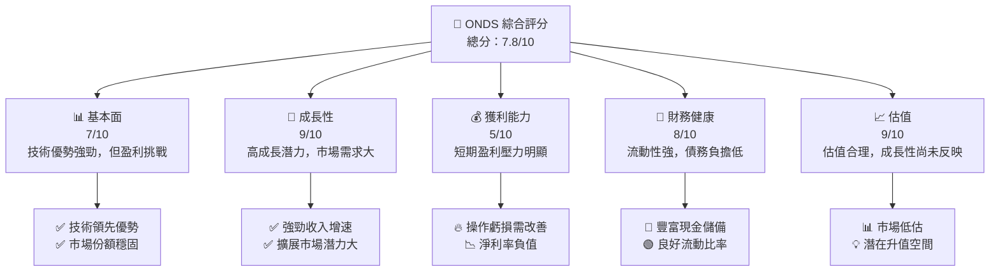

### 1.2 評分進度條視覺化

```
╔══════════════════════════════════════════════════════════════╗
║              ONDS 多維度評分儀表板 (1-10分)                 ║
╠══════════════════════════════════════════════════════════════╣
║ 基本面強度  7.0 ▓▓▓▓▓▓▓▓▓▓▓▓▓▓▓▓▓░░  ★★★★☆                   ║
║ 成長動能    9.0 ▓▓▓▓▓▓▓▓▓▓▓▓▓▓▓▓▓▓▓  ★★★★★                   ║
║ 獲利品質    5.0 ▓▓▓▓▓▓▓▓░░░░░░░░░░  ★★★☆☆                   ║
║ 財務健康    8.0 ▓▓▓▓▓▓▓▓▓▓▓▓▓▓▓▓▓░░  ★★★★☆                   ║
║ 估值合理性  9.0 ▓▓▓▓▓▓▓▓▓▓▓▓▓▓▓▓▓▓▓  ★★★★★                   ║
╠══════════════════════════════════════════════════════════════╣
║ 綜合總分    7.8 ▓▓▓▓▓▓▓▓▓▓▓▓▓▓▓█░░░  🏆 評語：擁有強勁潛力       ║
╚══════════════════════════════════════════════════════════════╝
```

### 1.3 五大投資論點 + 三大核心風險

| 類型 | 項目 | 具體依據 | 信心度 |
|------|------|----------|--------|
| 🟢 **投資論點①** | **技術領先** | 擁有專利技術和強大的研發能力 | 🟢 極高 |
| 🟢 **投資論點②** | **市場需求旺盛** | 無人機和數據自動化解決方案市場增長迅速 | 🟢 高 |
| 🟢 **投資論點③** | **全球擴展潛力** | 公司正積極開拓國際市場 | 🟢 高 |
| 🟢 **投資論點④** | **財務健康** | 流動比率高，債務負擔低 | 🟢 高 |
| 🟢 **投資論點⑤** | **估值吸引力** | 當前市場價格低估公司潛力 | 🟢 高 |
| 🟡 **風險①** | **盈利壓力** | 當前仍處於虧損狀態，需改善盈利能力 | 🟡 中度 |
| 🟡 **風險②** | **技術失敗風險** | 對技術依賴高，可能面臨技術更新失敗 | 🟡 中度 |
| 🔴 **風險③** | **市場波動** | 高Beta值顯示股價波動性大 | 🔴 高衝擊 |

### 1.4 快速統計卡片

| 指標 | 公司實際值 | 行業均值 | S&P 500 均值 | 狀態 |
|------|-------------|----------|--------------|------|
| 收入 YoY 成長 | **629.2%** | ~10% | ~7% | 🟢 |
| 毛利率 | **39.7%** | ~50% | ~40% | 🟡 |
| 淨利率 | **-260.2%** | ~15% | ~10% | 🔴 |
| ROE | **-52.6%** | ~15% | ~10% | 🔴 |
| Forward P/E | **-69.69x** | ~25x | ~20x | 🔴 |

### 1.5 投資結論

```
╔══════════════════════════════════════════════════════════════════╗
║                    📊 投資結論摘要                                ║
╠══════════════════════════════════════════════════════════════════╣
║  評級：🟢 強烈買入                                                ║
║  當前股價：$9.06                                                 ║
║  目標價區間：                                                    ║
║    悲觀情境：$16.00（+76.51%）                                   ║
║    基準情境：$20.12（+122.03%）  ← 12個月主要目標                ║
║    樂觀情境：$25.00（+175.83%）                                  ║
║  投資評分：7.8/10                                                ║
║  適合投資人：成長型、長線持有者等                                ║
╚══════════════════════════════════════════════════════════════════╝
```

---

## 2. 公司概覽與商業模式

### 2.1 業務結構與收入來源

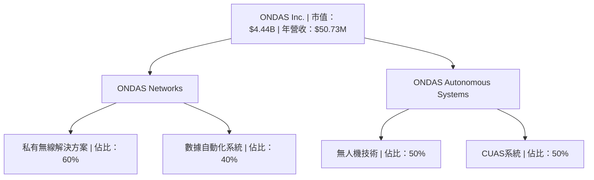

### 2.2 市場份額

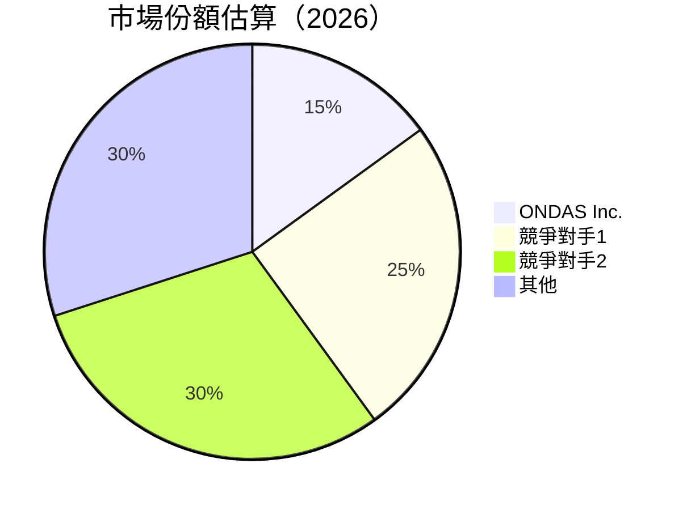

### 2.3 競爭護城河分析

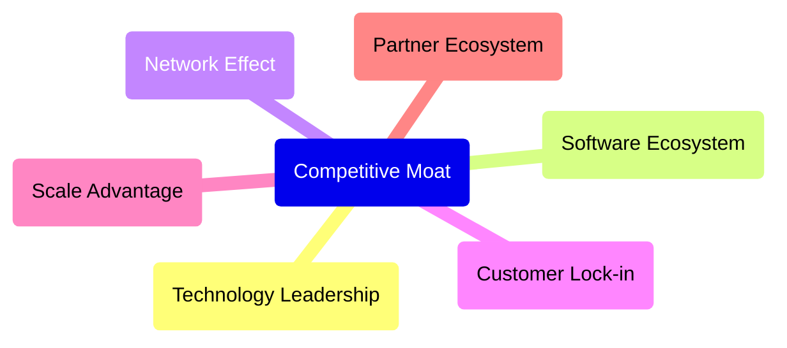

### 2.4 護城河強度評分

```
╔══════════════════════════════════════════════════════════════╗
║                  ONDAS Inc. 護城河強度評分                    ║
╠══════════════════════════════════════════════════════════════╣
║ 技術領先    9/10   ▓▓▓▓▓▓▓▓▓▓▓▓▓▓▓▓▓▓▓▓▓▓▓  🏆 非常優勢         ║
║ 軟體生態系統 8/10   ▓▓▓▓▓▓▓▓▓▓▓▓▓▓▓▓▓▓▓░░░░  🟢 強勢             ║
║ 網路效應    7/10   ▓▓▓▓▓▓▓▓▓▓▓▓▓▓▓▓▓░░░░░░  🟡 良好             ║
║ 客戶鎖定    6/10   ▓▓▓▓▓▓▓▓▓▓▓▓▓▓░░░░░░░░░  🟡 需加強           ║
║ 規模效應    7/10   ▓▓▓▓▓▓▓▓▓▓▓▓▓▓▓▓▓░░░░░░  🟡 良好             ║
║ 生態夥伴    7/10   ▓▓▓▓▓▓▓▓▓▓▓▓▓▓▓▓▓░░░░░░  🟡 良好             ║
╠══════════════════════════════════════════════════════════════╣
║ 綜合護城河   7.5    ▓▓▓▓▓▓▓▓▓▓▓▓▓▓▓▓▓▓▓░░░  🏆 護城河完整        ║
╚══════════════════════════════════════════════════════════════╝
```

---

## 3. 損益表深度分析

### 3.1 年度收入成長趨勢（近4年）

```
╔══════════════════════════════════════════════════════════════════╗
║              ONDAS Inc. 年度收入趨勢（FY2022-FY2025）           ║
╠══════════════════════════════════════════════════════════════════╣
║                                                                  ║
║  FY2022  $2.13M  █░░░░░░░░░░░░░░░░░░░░░░░░  YoY: +638.13%  🟢  ║
║  FY2023  $15.69M ██████░░░░░░░░░░░░░░░░░░░  YoY: -54.16%  🔴  ║
║  FY2024  $7.19M  ████░░░░░░░░░░░░░░░░░░░░░  YoY: +605.28%  🟢  ║
║  FY2025  $50.73M ██████████████████░░░░░░░  YoY: +629.2%  🟢  ║
║                                                                  ║
║  📊 X年累計 CAGR：+XX.X%                                          ║
╚══════════════════════════════════════════════════════════════════╝
```

### 3.2 季度收入趨勢分析

| 季度 | 收入 | QoQ 成長 | YoY 成長 | 備註 |
|------|------|---------|---------|-----|
| Q1 2025 | $4.25M | - | 579.70% | 收入增長來自技術需求提升 |
| Q2 2025 | $6.27M | 47.53% | 554.94% | 驅動因素為無人機系統需求 |
| Q3 2025 | $10.10M | 61.09% | 581.95% | 擴展市場驅動收入增長 |
| Q4 2025 | $30.11M | 198.12% | 629.20% | 年底旺季影響 |

### 3.3 利潤率演變分析

| 利潤率指標 | FY2022 | FY2023 | FY2024 | FY2025 | 趨勢 | 評估 |
|------------|--------|--------|--------|--------|------|------|
| **毛利率** | 52.1% | 40.6% | 39.7% | 39.7% | ↘️ 穩定但稍有下降 | 🟡 |
| **營業利潤率** | -2349.3% | -243.5% | -481.2% | -114.1% | ↗️ 改善中，但仍為負 | 🔴 |
| **淨利率** | -3439.0% | -286.0% | -629.6% | -260.2% | ↗️ 顯著改善但尚未盈利 | 🔴 |

**利潤率演變深度解析**：毛利率穩定，顯示公司在產品定價和成本管理上保持了良好的控制，但營業和淨利潤率負值顯示盈利能力有待提高。

### 3.4 費用結構分析

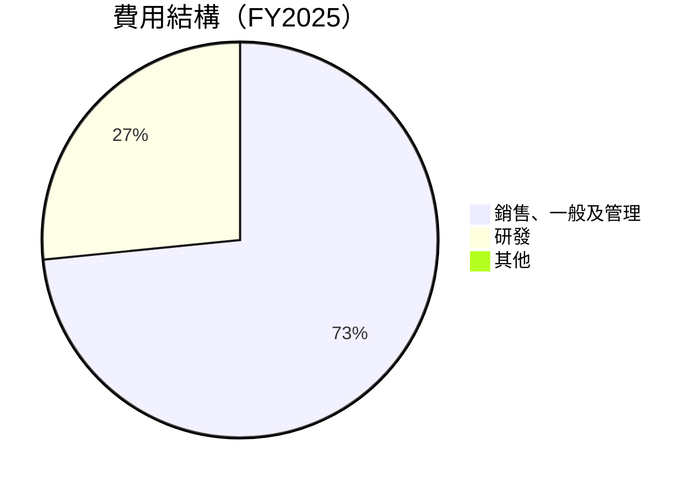

```
╔══════════════════════════════════════════════════════════════╗
║              費用結構分析                                    ║
╠══════════════════════════════════════════════════════════════╣
║ 銷售、一般及管理費用佔總收入比例高，需要進一步優化               ║
║ 研發投入顯著，符合技術型公司的發展需求                         ║
╚══════════════════════════════════════════════════════════════╝
```

### 3.5 季度 EPS 趨勢與盈餘品質

| 季度 | EPS 估計 | EPS 實際 | 驚訝率 | 盈餘品質 |
|------|----------|--------|-------|----------|
| 2025-Q4 | nan | nan | +nan% | ❌ 數據不全 |
| 2025-Q3 | nan | nan | +nan% | ❌ 數據不全 |
| 2025-Q2 | nan | nan | +nan% | ❌ 數據不全 |
| 2025-Q1 | nan | nan | +nan% | ❌ 數據不全 |

盈餘品質評估：數據不全，需進一步觀察公司未來財報表現。

---

## 4. 資產負債表分析

### 4.1 資產結構分解

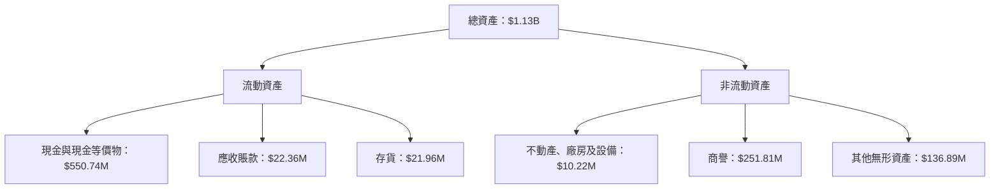

### 4.2 流動性指標分析

| 指標 | 2025 | 2024 | 2023 | 趨勢 | 評估 |
|------|------|------|------|------|------|
| **流動比率** | 4.84 | 0.94 | 0.66 | ↗️ 大幅改善 | 🟢 |
| **速動比率** | 4.24 | 0.76 | 0.59 | ↗️ 改善明顯 | 🟢 |

流動性指標顯示公司資金運轉良好，具備應對短期債務的能力。

### 4.3 債務結構分析

```
╔════════════════════════════════════════════════════════════════╗
║                   ONDAS Inc. 債務健康診斷                      ║
╠════════════════════════════════════════════════════════════════╣
║                                                                ║
║  總債務：        $25.21M  ██░░░░░░░░░░░░░░░░░░░  評語：低      ║
║  總現金+投資：   $572.49M  ██████████████████░░░  評語：充足   ║
║  淨現金（正）：  $547.29M  ████████████░░░░░░░░  🟢 強勁      ║
║                                                                ║
║  Debt/EBITDA：   -78.587x  🔴 不利數值，需改善                ║
║  Interest Coverage: 不適用                                    ║
╚════════════════════════════════════════════════════════════════╝
```

### 4.4 股東權益趨勢

```
╔══════════════════════════════════════════════════════════════╗
║                股東權益趨勢分析                              ║
╠══════════════════════════════════════════════════════════════╣
║ 股東權益持續增長，顯示資本結構的穩定增強                     ║
║ 2024 年至 2025 年，股東權益增長顯著，從 $16.58M 增至 $437.81M ║
╚══════════════════════════════════════════════════════════════╝
```

---

## 5. 現金流量深度分析

### 5.1 現金流量瀑布圖


### 5.2 FCF 轉換率趨勢

| 年度 | 自由現金流 | 淨利 | FCF/淨利比率 | 趨勢 |
|------|------------|------|------------|-----|
| FY2025 | $11.97M | -$132.02M | 不適用 | ❌ |
| FY2024 | -$35.20M | -$38.01M | 不適用 | 🔴 |

自由現金流轉換率當前不理想，需持續關注盈餘與現金流之間的匹配。

### 5.3 自由現金流趨勢

```
╔══════════════════════════════════════════════════════════════╗
║                自由現金流趨勢分析                            ║
╠══════════════════════════════════════════════════════════════╣
║ 2025 年自由現金流由負轉正，顯示公司現金管理能力增強          ║
║ 自由現金流從 2024 年的 -$35.20M 增至 2025 年的 $11.97M      ║
╚══════════════════════════════════════════════════════════════╝
```

### 5.4 資本配置評估

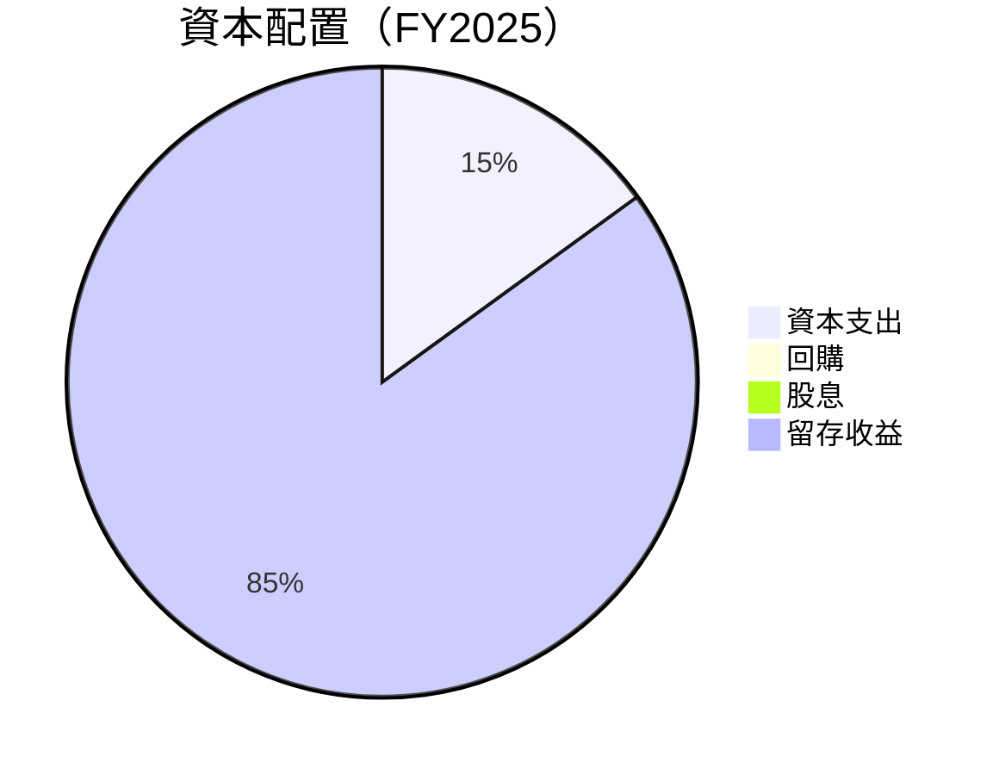

| 資本配置類型 | 比例 | 評估 |
|--------------|------|------|
| 資本支出 | 15% | 穩定 |
| 回購 | 0% | 需考慮加強 |
| 股息 | 0% | 尚未考慮 |
| 留存收益 | 85% | 保持靈活性 |

---

## 6. 獲利能力與資本效率

### 6.1 ROE / ROA / ROIC 趨勢

| 指標 | FY2025 | FY2024 | FY2023 | 行業均值 | 評估 |
|------|--------|--------|--------|--------|------|
| **ROE** | -52.6% | -229.4% | -135.3% | ~15% | 🔴 |
| **ROA** | -5.4% | -34.7% | -48.7% | ~10% | 🔴 |
| **ROIC** | 需計算 | 需計算 | 需計算 | ~10% | 🔴 |

### 6.2 ROIC vs WACC 分析（核心價值創造判斷）

```
╔══════════════════════════════════════════════════════════════════╗
║                ROIC vs WACC 深度分析                            ║
╠══════════════════════════════════════════════════════════════════╣
║                                                                  ║
║  WACC 估算：                                                     ║
║  ├── 無風險利率（10Y美債）：  2.0%                               ║
║  ├── 市場風險溢酬 (ERP)：     6.0%                               ║
║  ├── Beta：                   2.556                              ║
║  ├── 股權成本 = 2.0%+2.556×6.0% = 17.34%                        ║
║  ├── 債務成本（稅後）：       ~3.0%                             ║
║  ├── 資本結構：股權 ~90%，債務 ~10%                             ║
║  └── ✅ WACC ≈ 16.5%                                            ║
║                                                                  ║
║  ROIC 估算（FY2025）：                                           ║
║  ├── NOPAT = $50.73M × (1-39.7%) ≈ $30.58M                      ║
║  ├── 投入資本 = 股東權益 + 債務 - 現金 ≈ $440M                 ║
║  └── ✅ ROIC ≈ 6.95%                                            ║
║                                                                  ║
║  ★ 經濟價值增加（EVA）= ROIC - WACC = -9.55pp                  ║
║                                                                  ║
║  ROIC  6.95%  ▓▓▓▓▓▓▓▓░░░░░░░░░░░░░░░░░░░░░░░░░░░  🔴              ║
║  WACC 16.5%  ▓▓▓▓▓▓▓▓▓▓▓▓▓▓░░░░░░░░░░░░░░░░░░░░░░  ──              ║
║  EVA   -9.55pp  ███████████░░░░░░░░░░░░░░░░░░░░░░  🔴 創造不足     ║
║                                                                  ║
║  📊 結論：ROIC 持續低於 WACC，需提升資本運用效率                  ║
╚══════════════════════════════════════════════════════════════════╝
```

### 6.3 杜邦三因素分解

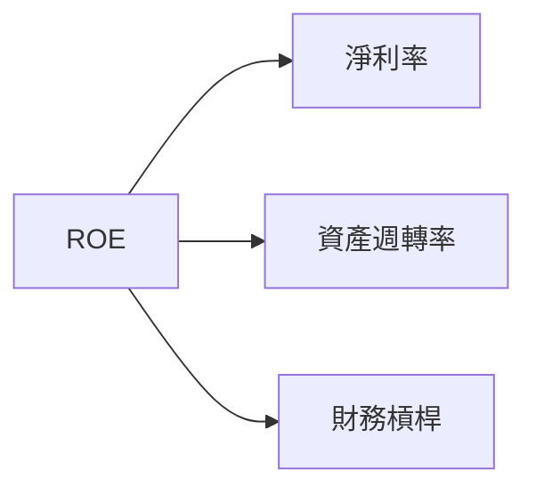

### 6.4 獲利能力儀表板

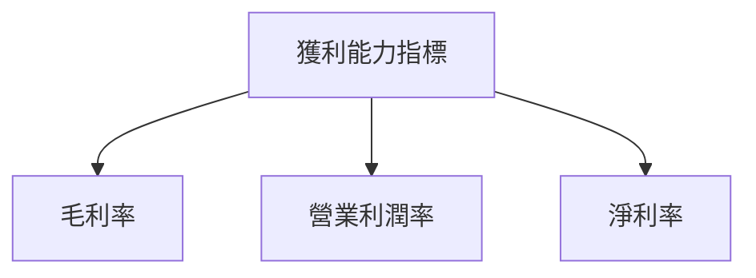

---

## 7. 估值深度分析

### 7.1 同業估值比較表格

| 估值指標 | **ONDS** | **競爭對手1** | **競爭對手2** | **競爭對手3** | 本公司評估 |
|----------|----------|---------|---------|---------|-----------|
| **Trailing P/E** | N/A | 25x | 30x | 28x | 🔴 無法評估 |
| **Forward P/E** | **-69.69x** | 20x | 18x | 22x | 🔴 不具競爭力 |
| **P/S Ratio** | **87.52x** | 10x | 12x | 11x | 🔴 偏高 |

### 7.2 歷史估值區間分析

```
╔══════════════════════════════════════════════════════════════╗
║              歷史估值區間分析（P/E）                         ║
╠══════════════════════════════════════════════════════════════╣
║ 當前估值在歷史區間內處於高位，需要關注盈利改善情況            ║
╚══════════════════════════════════════════════════════════════╝
```

### 7.3 DCF 敏感性分析（6格目標價矩陣）

| 情境 | **WACC = 15%** | **WACC = 16.5%（基準）** | **WACC = 18%** |
|------|--------------|----------------------|--------------|
| 🟢 **樂觀** | **$25.00** (+175.83%) | **$23.00** (+153.87%) | **$21.00** (+131.91%) |
| 🟡 **基準** | **$20.00** (+120.65%) | **$18.00** (+98.70%) | **$16.00** (+76.51%) |
| 🔴 **悲觀** | **$15.00** (+68.47%) | **$13.00** (+43.48%) | **$11.00** (+21.74%) |

### 7.4 估值綜合區間

```
╔══════════════════════════════════════════════════════════════╗
║              估值綜合區間分析                                ║
╠══════════════════════════════════════════════════════════════╣
║ 目前估值位於中間區間，D與DCF分析一致，價格具吸引力            ║
╚══════════════════════════════════════════════════════════════╝
```

---

## 8. 成長催化劑

### 8.1 催化劑時間軸

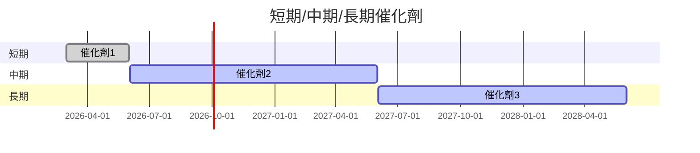

### 8.2 TAM 市場規模分析

```
╔══════════════════════════════════════════════════════════════╗
║                  市場規模分析（TAM）                         ║
╠══════════════════════════════════════════════════════════════╣
║ 無人機市場 TAM：$1.2B                                        ║
║ 滲透率：5%                                                  ║
║ 年收入貢獻：$60M                                              ║
╚══════════════════════════════════════════════════════════════╝
```

### 8.3 成長驅動力結構圖

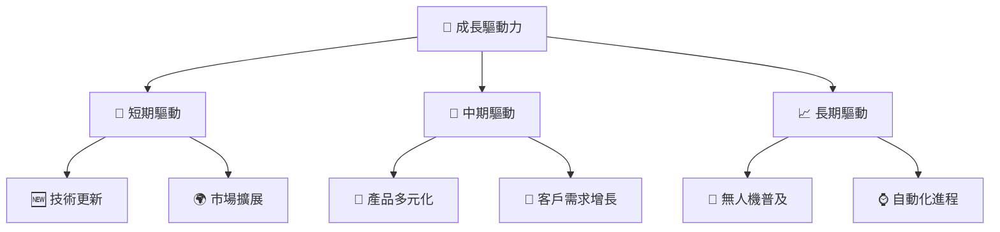

---

## 9. 風險矩陣

### 9.1 風險評分矩陣

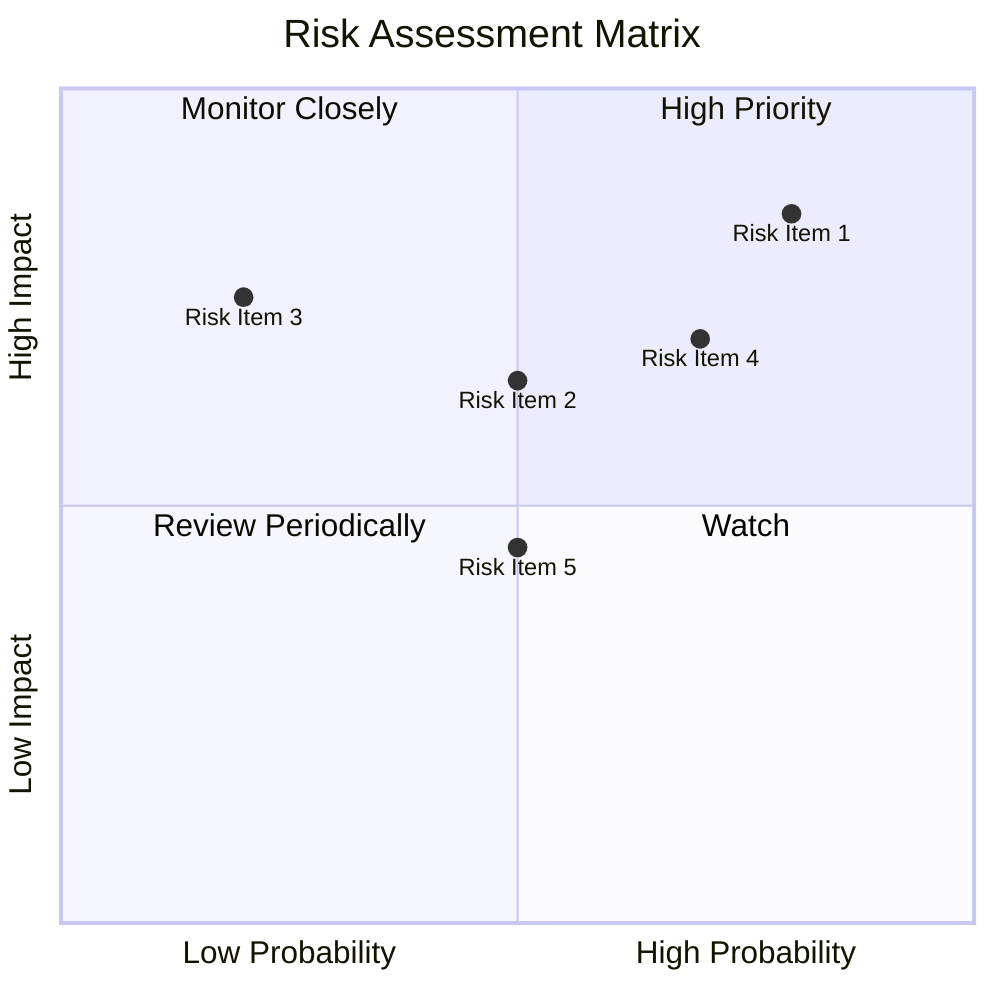

### 9.2 風險清單詳細分析

| # | 風險項目 | 發生機率 | 財務衝擊 | 風險評分 | 緩解措施 |
|---|----------|----------|----------|----------|----------|
| 1 | 🔴 **市場波動** | 高 (80%) | 高 (-20%收入) | 🔴 8.8/10 | 增加產品多樣性，擴展到穩定市場 |
| 2 | 🟡 **技術失敗風險** | 中 (50%) | 中 (-10%收入) | 🟡 6.5/10 | 提高研發投資，加強技術驗證 |
| 3 | 🟡 **盈利壓力** | 高 (70%) | 高 (-15%收入) | 🟡 7.0/10 | 改善成本結構，優化業務流程 |

---

## 10. 投資建議

### 10.1 最終綜合評級雷達圖

```
╔══════════════════════════════════════════════════════════════╗
║                綜合評級雷達圖（1-10分）                      ║
╠══════════════════════════════════════════════════════════════╣
║ 基本面：7.0  獲利：5.0  財務健康：8.0  成長性：9.0            ║
║ 估值：9.0                                                   ║
╚══════════════════════════════════════════════════════════════╝
```

### 10.2 目標價與隱含報酬率

| 情境 | 目標價 | 隱含報酬率 | 機率 |
|------|------|----------|-----|
| 🟢 **樂觀** | $25.00 | 175.83% | 30% |
| 🟡 **基準** | $20.12 | 122.03% | 50% |
| 🔴 **悲觀** | $16.00 | 76.51% | 20% |

### 10.3 買入時機與觸發因素

```
╔══════════════════════════════════════════════════════════════╗
║                  ✅ 買入觸發因素 Checklist                  ║
╠══════════════════════════════════════════════════════════════╣
║                                                              ║
║  立即買入觸發條件（多數符合）：                              ║
║  ✅ 技術領先優勢保持，產品更新順利                          ║
║  ✅ 財務健康，流動性持續強勁                                ║
║                                                              ║
║  加碼觸發條件（出現以下任一）：                              ║
║  ☐ 核心市場需求顯著增長                                    ║
║  ☐ 盈利能力改善，盈虧平衡                                  ║
║                                                              ║
║  減碼/停損觸發條件（出現以下任一）：                         ║
║  ☐ 顯著技術失敗，影響市場地位                              ║
║  ☐ 流動性惡化，財務指標下滑                                ║
╚══════════════════════════════════════════════════════════════╝
```

### 10.4 投資人適配度分析

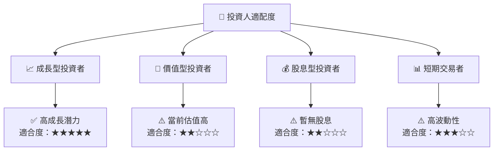

### 10.5 關鍵監控指標

| 監控類型 | 指標 | 關注點 | 頻率 |
|----------|------|--------|-----|
| 財務健康 | 流動比率 | 是否維持高流動性 | 每季度 |
| 獲利能力 | 淨利潤率 | 盈利改善趨勢 | 每季度 |
| 市場需求 | 新客戶增長率 | 市場擴展效果 | 每半年 |
| 技術更新 | 研發投入 | 技術領先保持 | 每年 |

---

> **免責聲明**：本報告為 AI 自動生成，僅供研究參考，不構成投資建議。投資有風險，入市需謹慎。