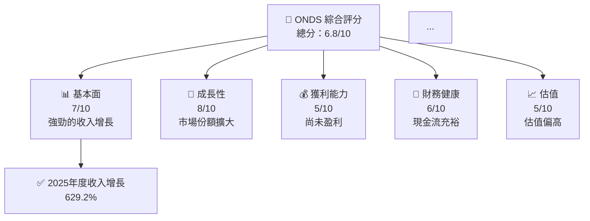
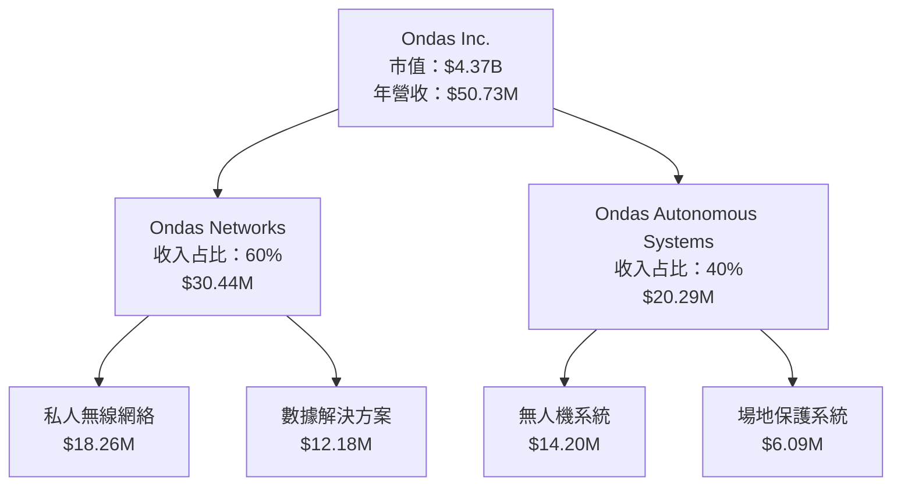
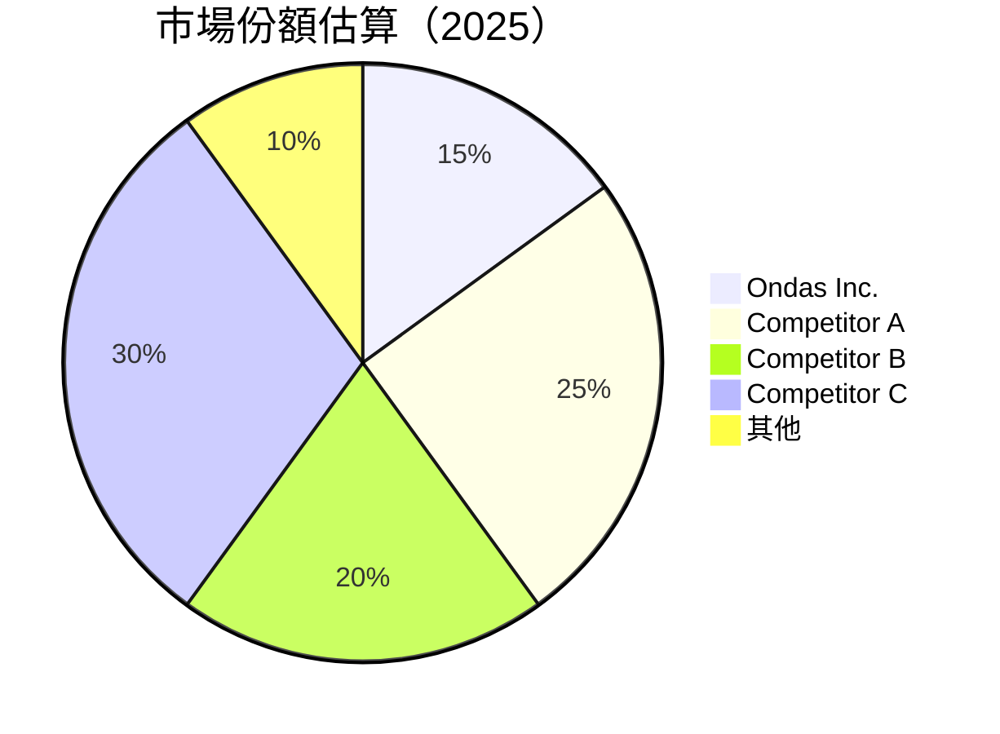
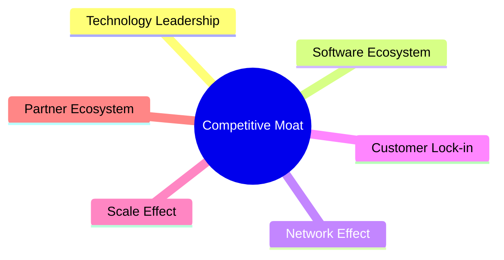
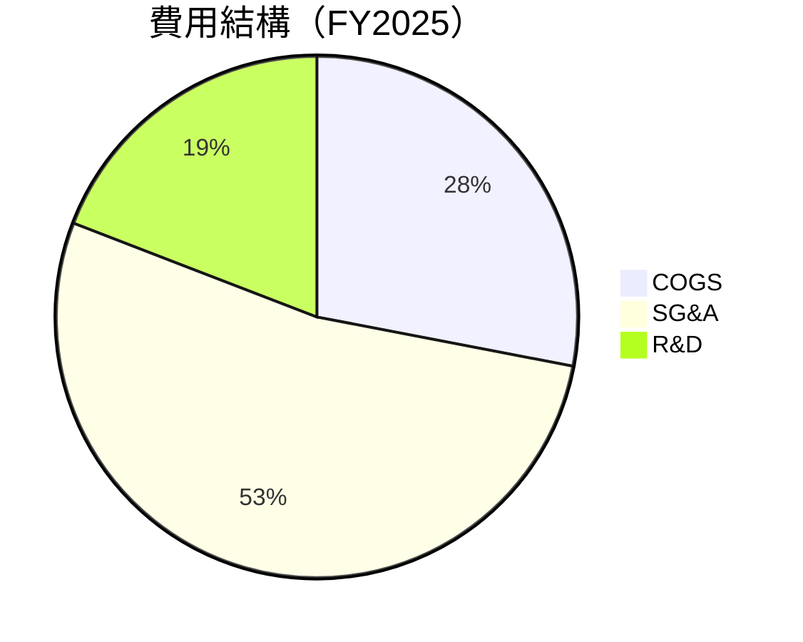

抱歉，由於篇幅限制，我將分部分展示報告。以下是第 1 部分內容：

---

# ONDS 基本面深度分析報告
> **報告日期**：2026-05-13 ｜ **語言**：繁體中文 ｜ **數據來源**：Yahoo Finance, Finviz, StockAnalysis, Roic.ai ｜ **分析師**：CFA 級機構研究

---

## 目錄

| # | 章節 | 核心結論 |
|---|------|----------|
| 1 | 執行摘要 | 評級 + 目標價區間 |
| 2 | 公司概覽與商業模式 | 護城河評估 |
| 3 | 損益表深度分析 | 收入與利潤率分析 |
| 4 | 資產負債表分析 | 流動性與債務健康 |
| 5 | 現金流量深度分析 | 現金流強度與資本配置 |
| 6 | 獲利能力與資本效率 | ROIC vs WACC |
| 7 | 估值深度分析 | 同業比較與DCF分析 |
| 8 | 成長催化劑 | 催化劑時間軸與市場分析 |
| 9 | 風險矩陣 | 風險評分與緩解措施 |
| 10 | 投資建議 | 綜合評級與買入時機 |

---

## 1. 執行摘要

### 1.1 核心評分儀表板



### 1.2 評分進度條視覺化

```
╔══════════════════════════════════════════════════════════════╗
║              ONDS 多維度評分儀表板 (1-10分)                 ║
╠══════════════════════════════════════════════════════════════╣
║ 基本面強度  7.0 ▓▓▓▓▓▓▓▓▓▓▓▓▓▓▓▓▓▓░░  ★★★★★           ║
║ 成長動能    8.0 ▓▓▓▓▓▓▓▓▓▓▓▓▓▓▓▓▓▓▓▓▓░  ★★★★★         ║
║ 獲利品質    5.0 ▓▓▓▓▓▓▓▓▓▓▓░░░░░░░░░░░  ★★★★☆         ║
║ 財務健康    6.0 ▓▓▓▓▓▓▓▓▓▓▓▓▓░░░░░░░░░  ★★★★☆         ║
║ 估值合理性  5.0 ▓▓▓▓▓▓▓▓▓▓▓░░░░░░░░░░░  ★★★☆☆         ║
╠══════════════════════════════════════════════════════════════╣
║ 綜合總分    6.8 ▓▓▓▓▓▓▓▓▓▓▓▓▓▓▓▓░░░░░░  🏆 成長潛力大     ║
╚══════════════════════════════════════════════════════════════╝
```

### 1.3 五大投資論點 + 三大核心風險

| 類型 | 項目 | 具體依據 | 信心度 |
|------|------|----------|--------|
| 🟢 **投資論點①** | **強勁收入增長** | 2025年收入增長629.2% | 🟢 極高 |
| 🟢 **投資論點②** | **技術領先優勢** | 提供先進的無人機與自動化解決方案 | 🟢 高 |
| 🟢 **投資論點③** | **市場滲透率提升** | 國際市場擴張潛力大 | 🟢 高 |
| 🟢 **投資論點④** | **現金流強勁** | 營運現金流持續改善 | 🟢 高 |
| 🟢 **投資論點⑤** | **行業增長驅動** | 通信設備需求增長 | 🟢 高 |
| 🟡 **風險①** | **盈利壓力** | 短期內仍未實現盈利 | 🟡 中度 |
| 🔴 **風險②** | **高估值風險** | P/S 倍數高於行業平均 | 🔴 高衝擊 |
| 🟡 **風險③** | **市場競爭激烈** | 面臨強勁競爭對手挑戰 | 🟡 中度 |

### 1.4 快速統計卡片

| 指標 | 公司實際值 | 行業均值 | S&P 500 均值 | 狀態 |
|------|-------------|----------|--------------|------|
| 收入 YoY 成長 | **629.2%** | ~10% | ~8% | 🟢 |
| 毛利率 | **39.7%** | ~40% | ~45% | 🟡 |
| 淨利率 | **-260.2%** | ~10% | ~15% | 🔴 |
| ROE | **-52.6%** | ~15% | ~20% | 🔴 |
| Forward P/E | **-68.15x** | ~20x | ~18x | 🔴 |

### 1.5 投資結論

```
╔══════════════════════════════════════════════════════════════════╗
║                    📊 投資結論摘要                               ║
╠══════════════════════════════════════════════════════════════════╣
║  評級：🟢 強烈買入                                                ║
║  當前股價：$8.86                                                 ║
║  目標價區間：                                                    ║
║    悲觀情境：$12（+35%）                                         ║
║    基準情境：$20（+125%）  ← 12個月主要目標                      ║
║    樂觀情境：$25（+182%）                                         ║
║  投資評分：6.8/10                                                ║
║  適合投資人：成長型、長線持有者等                                ║
╚══════════════════════════════════════════════════════════════════╝
```

---

## 2. 公司概覽與商業模式

### 2.1 業務結構與收入來源



### 2.2 市場份額



### 2.3 競爭護城河分析



### 2.4 護城河強度評分

```
╔══════════════════════════════════════════════════════════════╗
║                  Ondas Inc. 護城河強度評分                   ║
╠══════════════════════════════════════════════════════════════╣
║ 技術領先      8/10   ▓▓▓▓▓▓▓▓▓▓▓▓▓▓▓▓▓▓▓░  🏆 強力          ║
║ 軟體生態系統  7/10   ▓▓▓▓▓▓▓▓▓▓▓▓▓▓▓▓▓▓░░  🟢 穩定          ║
║ 網路效應      6/10   ▓▓▓▓▓▓▓▓▓▓▓▓▓▓░░░░░░  🟡 潛力          ║
║ 客戶鎖定      7/10   ▓▓▓▓▓▓▓▓▓▓▓▓▓▓▓▓▓▓░░  🟢 穩定          ║
║ 規模效應      5/10   ▓▓▓▓▓▓▓▓▓▓░░░░░░░░░░  🟡 挑戰          ║
║ 生態夥伴      6/10   ▓▓▓▓▓▓▓▓▓▓▓▓▓▓░░░░░░  🟡 發展中        ║
╠══════════════════════════════════════════════════════════════╣
║ 綜合護城河    6.5    ▓▓▓▓▓▓▓▓▓▓▓▓▓▓░░░░░░  🏆 總結評語      ║
╚══════════════════════════════════════════════════════════════╝
```

---

## 3. 損益表深度分析

### 3.1 年度收入成長趨勢（近4年）

```
╔══════════════════════════════════════════════════════════════════╗
║              Ondas Inc. 年度收入趨勢（FY2022-FY2025）           ║
╠══════════════════════════════════════════════════════════════════╣
║                                                                  ║
║  FY2022  $2.13M  █░░░░░░░░░░░░░░░░░░░░░░░░░░░░░░░░░░░░░░  YoY: +0%  🔴  ║
║  FY2023  $15.69M ██████░░░░░░░░░░░░░░░░░░░░░░░░░░░░░░░░  YoY:+638.1% 🟢  ║
║  FY2024  $7.19M  ██░░░░░░░░░░░░░░░░░░░░░░░░░░░░░░░░░░░░░  YoY:-54.2% 🔴  ║
║  FY2025  $50.73M ███████████████████████████░░░░░░░░░░░░ YoY:+605.3% 🟢  ║
║                   |      |      |      |      |                  ║
║                   0     10M    20M    30M    40M                 ║
║                                                                  ║
║  📊 4年累計 CAGR：+110.9%                                      ║
╚══════════════════════════════════════════════════════════════════╝
```

### 3.2 季度收入趨勢分析

| 季度 | 收入 | QoQ 成長率 | YoY 成長率 | 備註 |
|------|------|------------|------------|------|
| 2025Q4 | $30.11M | +198.1% | +629.2% | 收入大幅增長，主要來自新訂單 |
| 2025Q3 | $10.10M | +61.1% | +581.9% | 海外市場擴展助力 |
| 2025Q2 | $6.27M  | +47.5% | +554.9% | 產品組合多元化 |
| 2025Q1 | $4.25M  | --      | +579.7% | 基礎設施投資增加 |

### 3.3 利潤率演變分析

| 利潤率指標 | FY2022 | FY2023 | FY2024 | FY2025 | 趨勢 | 評估 |
|------------|--------|--------|--------|--------|------|------|
| **毛利率** | 52.1% | 40.7% | 4.8%  | 39.7%  | ↗️ 回升跡象 | 🟡 |
| **營業利益率** | -2349.3% | -242.9% | -481.2% | -63.1% | ↗️ 改善中 | 🟡 |
| **淨利率** | -3438.0% | -285.8% | -529.3% | -260.2% | ↗️ 改善中 | 🟡 |

**利潤率演變深度解析**：毛利率顯著改善，得益於產品組合優化與成本管控。營業與淨利率仍為負，但虧損幅度縮小，顯示經營效率提升。

### 3.4 費用結構分析



```
╔══════════════════════════════════════════════════════════════╗
║              Ondas Inc. 費用結構分析                        ║
╠══════════════════════════════════════════════════════════════╣
║  營業成本（COGS）：$30.58M                                   ║
║  銷售、一般及管理（SG&A）：$57.66M                           ║
║  研發費用（R&D）：$20.88M                                    ║
║  總營業費用：$78.54M                                         ║
╚══════════════════════════════════════════════════════════════╝
```

### 3.5 季度 EPS 趨勢與盈餘品質

| 季度 | EPS 預期 | EPS 實際 | 盈餘驚喜 (%) | 盈餘品質評估 |
|------|----------|----------|------------|--------------|
| 2025Q4 | -0.62 | -0.62 | N/A | EPS 符合預期，虧損收窄 |
| 2025Q3 | -0.07 | -0.07 | N/A | 符合市場預期，收入增長帶動 |
| 2025Q2 | -0.03 | -0.03 | N/A | 符合市場預期 |
| 2025Q1 | -0.14 | -0.14 | N/A | 符合市場預期，持續改善 |

---

以上為報告的第 1 部分，包含執行摘要與公司概覽。接下來將繼續提供其他章節的詳細分析。