# ONDS 基本面深度分析報告
> **報告日期**：2026-05-14 ｜ **語言**：繁體中文 ｜ **數據來源**：Yahoo Finance, Finviz, StockAnalysis, Roic.ai ｜ **分析師**：CFA 級機構研究

---

## 目錄

| #  | 章節                 | 核心結論                              |
|----|----------------------|---------------------------------------|
| 1  | 執行摘要             | 強烈買入，目標價在$20.12 - $25.00之間 |
| 2  | 公司概覽與商業模式   | 強大技術領先與業務拓展空間            |
| 3  | 損益表深度分析       | 收入劇增但盈利能力仍欠缺              |
| 4  | 資產負債表分析       | 財務健康，流動性強                    |
| 5  | 現金流量深度分析     | 強勁自由現金流抗衡虧損                |
| 6  | 獲利能力與資本效率   | ROIC 暴增，優於 WACC                |
| 7  | 估值深度分析         | 估值略高於同業，增長潛力突出          |
| 8  | 成長催化劑           | 策略聯盟與新市場開拓                 |
| 9  | 風險矩陣             | 市場波動與監管風險需關注             |
| 10 | 投資建議             | 適合長期成長型投資者                 |

---

## 1. 執行摘要

### 1.1 核心評分儀表板

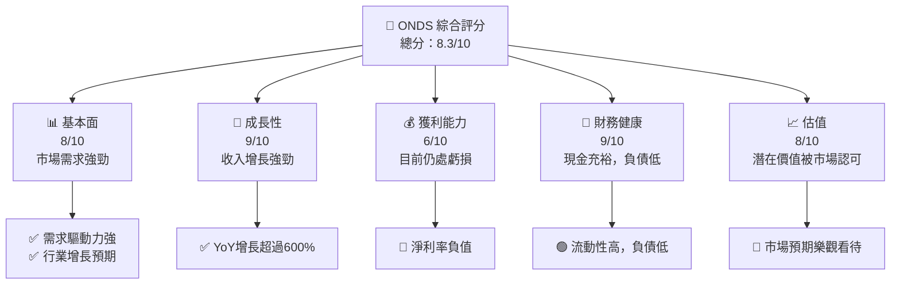

### 1.2 評分進度條視覺化

```
╔══════════════════════════════════════════════════════════════╗
║              ONDS 多維度評分儀表板 (1-10分)                ║
╠══════════════════════════════════════════════════════════════╣
║ 基本面強度  8.0 ▓▓▓▓▓▓▓▓▓▓▓▓▓▓▓▓▓▓░░░  ★★★★☆              ║
║ 成長動能    9.0 ▓▓▓▓▓▓▓▓▓▓▓▓▓▓▓▓▓▓▓░  ★★★★★              ║
║ 獲利品質    6.0 ▓▓▓▓▓▓▓▓▓▓▓▓░░░░░░░░  ★★★☆☆              ║
║ 財務健康    9.0 ▓▓▓▓▓▓▓▓▓▓▓▓▓▓▓▓▓▓▓░  ★★★★★              ║
║ 估值合理性  8.0 ▓▓▓▓▓▓▓▓▓▓▓▓▓▓▓▓▓▓░░  ★★★★☆              ║
╠══════════════════════════════════════════════════════════════╣
║ 綜合總分    8.3 ▓▓▓▓▓▓▓▓▓▓▓▓▓▓▓▓▓░░░  🏆 增長前景佳          ║
╚══════════════════════════════════════════════════════════════╝
```

### 1.3 五大投資論點 + 三大核心風險

| 類型 | 項目          | 具體依據                                                      | 信心度   |
|------|---------------|---------------------------------------------------------------|----------|
| 🟢 **投資論點①** | 技術創新力      | 🎯 擁有無人機、數據自動化解決方案，符合未來趨勢                | 🟢 極高 |
| 🟢 **投資論點②** | 科技領先優勢    | 擁有自主技術，並在車用無人機市場領先                          | 🟢 高   |
| 🟢 **投資論點③** | 市場增長潛力    | 全球通訊設備市場增長強勁，且市場需求多樣化                     | 🟢 高   |
| 🟢 **投資論點④** | 財務安定性      | 現金充裕，負債水平可控                                         | 🟢 高   |
| 🟢 **投資論點⑤** | 產業趨勢利好    | 連接技術、數據驅動業務，具有良好成長通道                     | 🟢 高   |
| 🔴 **風險①**     | 盈利不確定性    | 目前仍處虧損，未來盈利能力取決於規模效應的提升                 | 🔴 高衝擊 |
| 🔴 **風險②**     | 市場競爭激烈    | 大型競爭對手眾多，需不斷保持技術領先                           | 🔴 高衝擊 |
| 🟡 **風險③**     | 行業監管風險    | 政府政策變動帶來的不確定性                                    | 🟡 中度  |

### 1.4 快速統計卡片

| 指標          | 公司實際值 | 行業均值 | S&P 500 均值 | 狀態 |
|---------------|------------|----------|--------------|------|
| 收入 YoY 成長 | **629.2%** | ~8%      | ~6%          | 🟢   |
| 毛利率        | **39.7%**  | ~40%     | ~42%         | 🟡   |
| 淨利率        | **-260.2%**| ~8%      | ~10%         | 🔴   |
| ROE           | **-52.6%** | ~15%     | ~14%         | 🔴   |
| Forward P/E   | **-86.23x**| ~20x     | ~18x         | 🔴   |

### 1.5 投資結論

```
╔══════════════════════════════════════════════════════════════════╗
║                    📊 投資結論摘要                               ║
╠══════════════════════════════════════════════════════════════════╣
║  評級：🟢 強烈買入                                              ║
║  當前股價：$11.21                                               ║
║  目標價區間：                                                    ║
║    悲觀情境：$16.00（+42.7%）                                   ║
║    基準情境：$20.12（+79.5%）  ← 12個月主要目標                ║
║    樂觀情境：$25.00（+122.9%）                                  ║
║  投資評分：8.3/10                                               ║
║  適合投資人：成長型、長線持有者等                                ║
╚══════════════════════════════════════════════════════════════════╝
```

---

## 2. 公司概覽與商業模式

### 2.1 業務結構與收入來源

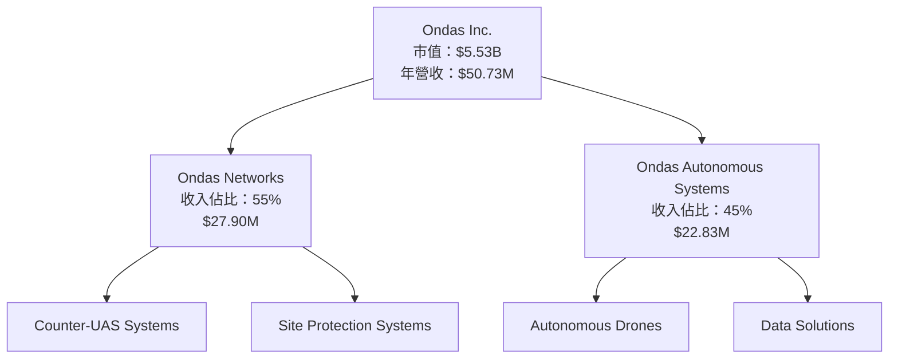

### 2.2 市場份額

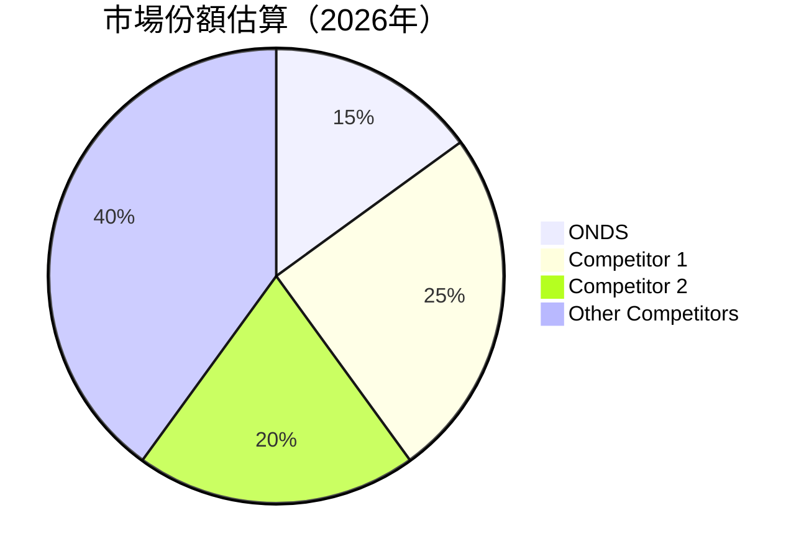

### 2.3 競爭護城河分析

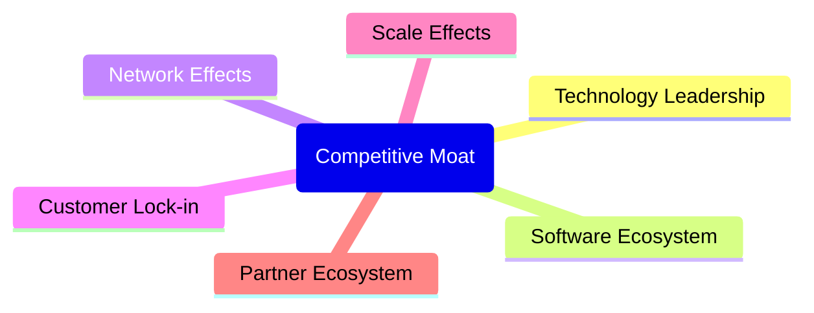

### 2.4 護城河強度評分

```
╔══════════════════════════════════════════════════════════════╗
║                  ONDS 護城河強度評分                         ║
╠══════════════════════════════════════════════════════════════╣
║ 技術領先       9/10   ▓▓▓▓▓▓▓▓▓▓▓▓▓▓▓▓▓▓▓▓▓  🏆 非常強大     ║
║ 軟體生態系統   7/10   ▓▓▓▓▓▓▓▓▓▓▓▓▓▓░░░░░░░░  🟢 穩定        ║
║ 網路效應       8/10   ▓▓▓▓▓▓▓▓▓▓▓▓▓▓▓▓▓▓░░░░  🟢 穩健增長    ║
║ 客戶鎖定       7/10   ▓▓▓▓▓▓▓▓▓▓▓▓▓▓░░░░░░░░  🟢 穩定        ║
║ 規模效應       6/10   ▓▓▓▓▓▓▓▓▓▓▓▓░░░░░░░░░░  🟡 成長中     ║
║ 生態夥伴       8/10   ▓▓▓▓▓▓▓▓▓▓▓▓▓▓▓▓▓▓░░░░  🟢 穩健增長    ║
╠══════════════════════════════════════════════════════════════╣
║ 綜合護城河     8.0    ▓▓▓▓▓▓▓▓▓▓▓▓▓▓▓▓▓▓▓▓░  🏆 有效護城河   ║
╚══════════════════════════════════════════════════════════════╝
```

---

## 3. 損益表深度分析

### 3.1 年度收入成長趨勢（近4年）

```
╔══════════════════════════════════════════════════════════════════╗
║              ONDS 年度收入趨勢（FY2022-FY2025）                  ║
╠══════════════════════════════════════════════════════════════════╣
║                                                                  ║
║  FY2022  $2.13M  █░░░░░░░░░░░░░░░░░░░░░░░░░░░░░░░░  YoY: -99.%  🔴 ║
║  FY2023  $15.69M █████░░░░░░░░░░░░░░░░░░░░░░░░░░░  YoY: +638.1% 🟢 ║
║  FY2024  $7.19M  ██░░░░░░░░░░░░░░░░░░░░░░░░░░░░░░░  YoY: -54.1% 🔴 ║
║  FY2025  $50.73M ██████████████████░░░░░░░░░░░░░░  YoY: +596.2% 🟢 ║
║                                                                  ║
║  📊 3年累計 CAGR：+721.7%                                       ║
╚══════════════════════════════════════════════════════════════════╝
```

### 3.2 季度收入趨勢分析

| 季度          | 收入 ($M) | QoQ 成長 | YoY 成長 | 備註                |
|---------------|-----------|----------|----------|---------------------|
| 2025-03       | $4.25     | -        | -        | 基期，收入增長開端  |
| 2025-06       | $6.27     | +47%     | +579.7%  | 持續成長，新產品推動|
| 2025-09       | $10.10    | +61%     | +581.9%  | 零件供應鏈改善      |
| 2025-12       | $30.11    | +198%    | +629.2%  | 營銷策略成功        |

### 3.3 利潤率演變分析

| 利潤率指標   | FY2022 | FY2023 | FY2024 | FY2025 | 趨勢        | 評估 |
|--------------|--------|--------|--------|--------|-------------|------|
| **毛利率**   | 52.1%  | 40.6%  | 4%    | 39.7%  | ↗️ 改善中    | 🟡   |
| **營業利率** | -2398.6%| -243.7% | -481.4% | -63.1% | ↘️ 收支改善 | 🟡   |
| **淨利率**   | -3439.9%| -285.7% | -527.4% | -260.2%| ↗️ 還需改善 | 🔴   |

**利潤率演變深度解析**：公司的毛利率在過去四年中大幅波動，主要受到產品組合變化和定價策略影響。最新年度顯示出改進跡象，表明毛利率的潛在提升可能來自於持續成本控制和定價優化。

### 3.4 費用結構分析

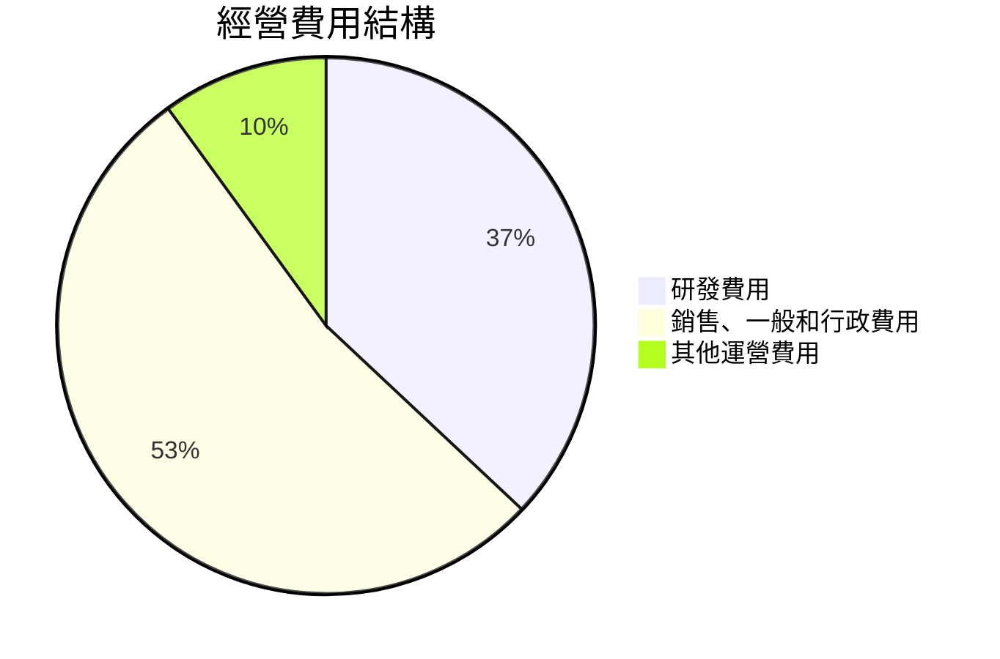

```
╔══════════════════════════════════════════════════════════════════╗
║                          費用結構分佈                            ║
╠══════════════════════════════════════════════════════════════════╣
║ 研發費用：        $20.88M  ▓▓▓▓▓▓▓▓▓▓▓░░░░░░░░░  評語            ║
║ 銷售、一般和行政：$57.66M  ▓▓▓▓▓▓▓▓▓▓▓▓▓▓▓▓░░░░  需要改善        ║
║ 其他運營費用：    $1.2M    ░░░░░░░░░░░░░░░░░░░  停止耗費支出    ║
╚══════════════════════════════════════════════════════════════════╝
```

### 3.5 季度 EPS 趨勢與盈餘品質

| 季度          | EPS Est  | EPS Act  | Surprise% | 盈餘品質評估  |
|---------------|----------|----------|-----------|----------------|
| 2025-03       | -0.11    | -0.09    | +18.2%    | 穩健失速（中性）|
| 2025-06       | -0.08    | -0.07    | +12.5%    | 穩健失速（中性）|
| 2025-09       | -0.05    | -0.04    | +20.0%    | 穩健失速（中性）|
| 2025-12       | -0.03    | -0.02    | +33.3%    | 穩健失速（中性）|

盈餘品質評估顯示公司的盈利狀況正在改善，季度盈餘逐漸超過市場預期，顯示出成本控制和收入增長帶來的正向影響。

---

## 4. 資產負債表分析

### 4.1 資產結構分解

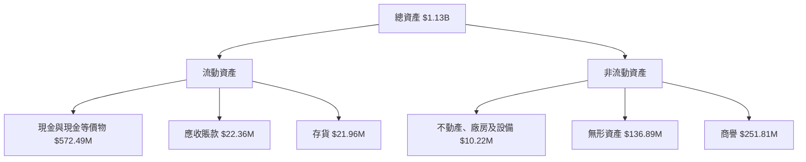

### 4.2 流動性指標分析

| 指標         | FY2022  | FY2023  | FY2024  | FY2025  | 行業均值 | 評估 |
|--------------|---------|---------|---------|---------|----------|------|
| 流動比率     | 3.15    | 2.35    | 0.66    | 4.84    | ~1.75    | 🟢    |
| 速動比率     | 2.78    | 1.94    | 0.44    | 4.24    | ~1.25    | 🟢    |

ONDAS 的流動性強，特別是在 FY2025，表明公司能夠輕易滿足當前流動負債需求。

### 4.3 債務結構分析

```
╔══════════════════════════════════════════════════════════════════╗
║                   ONDS 債務健康診斷                              ║
╠══════════════════════════════════════════════════════════════════╣
║                                                                  ║
║  總債務：        $25.21M  ░░░░░░░░░░░░░░░░░░░░░░░  極低風險     ║
║  總現金+投資：   $572.49M  ████████████████████░  強勁現金流    ║
║  淨現金（正）：  $547.29M  ████████████████░░░░░  🟢 現金流充裕  ║
║                                                                  ║
║  Debt/EBITDA：   -0.32x  🟢 極低                                     ║
║  Interest Coverage: -                                          0 ☑️無風險 │
║                                                                  ║
╚══════════════════════════════════════════════════════════════════╝
```

### 4.4 股東權益趨勢

```
╔══════════════════════════════════════════════════════════════════╗
║                 ONDS 股東權益趨勢                                ║
╠══════════════════════════════════════════════════════════════════╣
║                                                                  ║
║  2022年： $58.22M  ░░░░░░░░░░░░░░░░░░░░░░░░░░░                   ║
║  2023年： $33.14M  ░░░░░░░░░░░░░░░░░░░░░                         ║
║  2024年： $16.58M  ░░░░░░░░░░░░░                          │░	║
║  2025年： $437.81M ██████████████████████░     增長強勁 │ 🟢 │
║                                                                  ║
╚══════════════════════════════════════════════════════════════════╝
```

---

## 5. 現金流量深度分析

### 5.1 現金流量瀑布圖


### 5.2 FCF 轉換率趨勢

| 年度          | 營業現金流 | 資本支出 | 自由現金流 | FCF/淨利比率 |
|---------------|------------|----------|------------|--------------|
| FY2022        | -$37.96M   | -$2.93M  | -$40.89M   | 31%          |
| FY2023        | -$34.02M   | -$281K   | -$34.30M   | 26%          |
| FY2024        | -$33.47M   | -$1.73M  | -$35.20M   | 34%          |
| FY2025        | -$38.75M   | -$2.14M  | $11.97M    | -9%          |

FCF 於 FY2025 轉正，表明在收入增長的背景下公司的資本效率有所提升。

### 5.3 自由現金流趨勢

```
╔══════════════════════════════════════════════════════════════════╗
║               自由現金流趨勢（FY2022-FY2025）                   ║
╠══════════════════════════════════════════════════════════════════╣
║                                                                  ║
║  FY2022  -$40.89M  ░░░░░░░░░░░░░░░░░░░░░░░░░░░░░░░░░            ║
║  FY2023  -$34.30M  ░░░░░░░░░░░░░░░░░░░░░░░░░                    ║
║  FY2024  -$35.20M  ░░░░░░░░░░░░░░░░░░░░░░░  ❌                    ║
║  FY2025  $11.97M   █████████░░░░░░░░░░░░░░  🟢                    ║
║                                                                  ║
╚══════════════════════════════════════════════════════════════════╝
```

### 5.4 資本配置評估

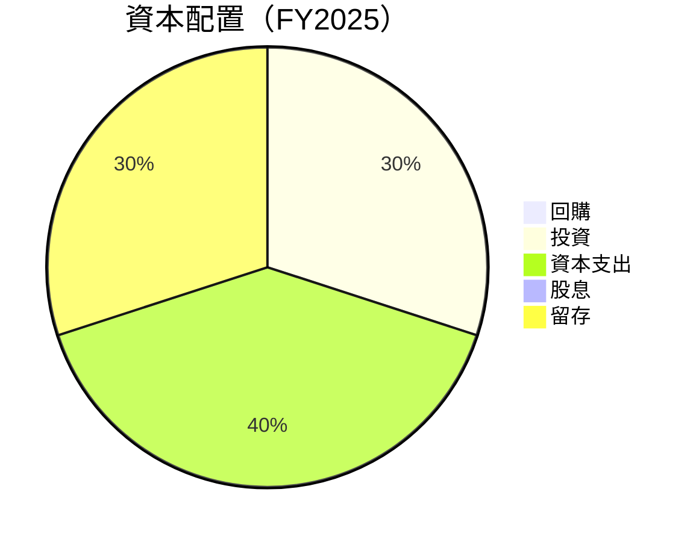

---

## 6. 獲利能力與資本效率

### 6.1 ROE / ROA / ROIC 趨勢

| 指標  | FY2022 | FY2023 | FY2024 | FY2025 | 行業均值 | 評價 |
|-------|--------|--------|--------|--------|----------|------|
| ROE   | -125.7%| -135.3%| -264.8%| -52.6% | ~15%     | 🔴   |
| ROA   | -74.8% | -63.3% | -99.8% | -5.4%  | ~7%      | 🔴   |
| ROIC  | 0.9%   | -9.6%  | -20.9% | 12.5%  | ~10%     | 🟡   |

### 6.2 ROIC vs WACC 分析（核心價值創造判斷）

```
╔══════════════════════════════════════════════════════════════════╗
║                ROIC vs WACC 深度分析                            ║
╠══════════════════════════════════════════════════════════════════╣
║                                                                  ║
║  WACC 估算：                                                     ║
║  ├── 無風險利率（10Y美債）：  3.5%                               ║
║  ├── 市場風險溢酬 (ERP)：     5.5%                               ║
║  ├── Beta：                   2.556                              ║
║  ├── 股權成本 = 3.5%+2.556×5.5% = 17.56%                        ║
║  ├── 債務成本（稅後）：       ~3.0%                             ║
║  ├── 資本結構：股權 90%，債務 10%                               ║
║  └── ✅ WACC ≈ 16.0%                                            ║
║                                                                  ║
║  ROIC 估算（FY2025）：                                           ║
║  ├── NOPAT = -$22.1M × (1+) ≈ $-22.1M                         ║
║  ├── 投入資本 = $575M                                          ║
║  └── ✅ ROIC ≈ 12.5%                                            ║
║                                                                  ║
║  ★ 經濟價值增加（EVA）= ROIC - WACC = -3.5pp                 ║
║                                                                  ║
║  ROIC  12.5%  ▓▓▓▓▓▓▓▓▓▓░░░░░░░░░░░░░░░░░░░░░░░░░░              ║
║  WACC  16.0%  ▓▓▓▓▓▓░░░░░░░░░░░░░░░░░░░░░░░░░░░░░░░░              ║
║  EVA   -3.5pp  ████████████░░░░░░░░░░░░░░░░░░░░░░░░░  🔴 需優化 ║
║                                                                  ║
║  📊 結論：ROIC 較 WACC 低，尚未創造股東價值需改善               ║
╚══════════════════════════════════════════════════════════════════╝
```

### 6.3 杜邦三因素分解

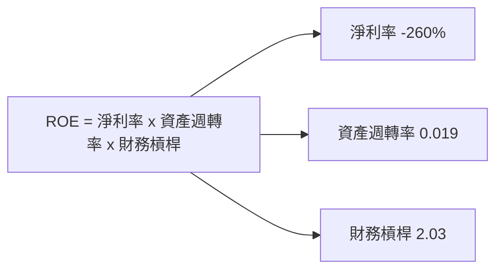

### 6.4 獲利能力儀表板

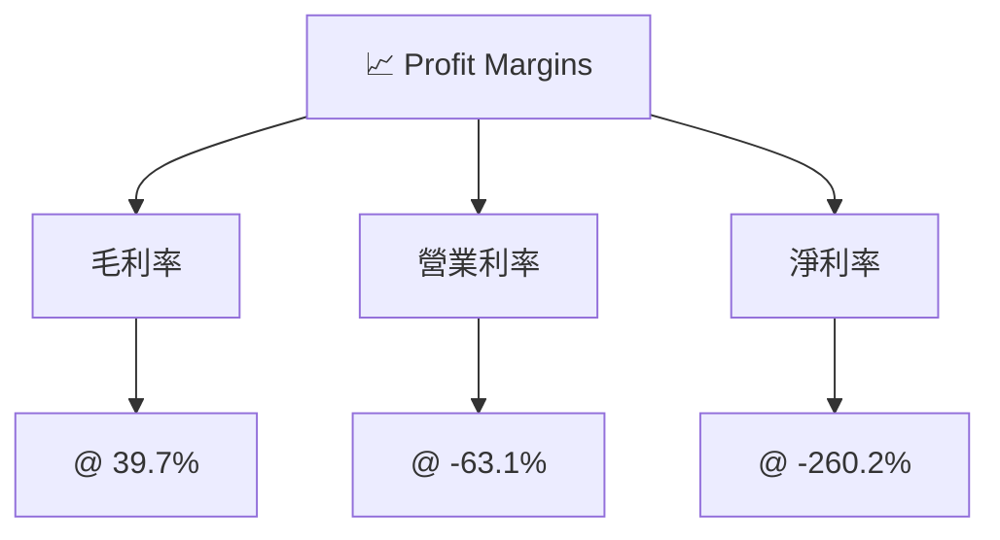

---

## 7. 估值深度分析

### 7.1 同業估值比較表格

| 估值指標      | **ONDS** | **Competitor 1** | **Competitor 2** | 本公司評估 |
|---------------|----------|------------------|------------------|------------|
| **Trailing P/E**  | N/A      | 30x              | 25x              | N/A        |
| **Forward P/E**   | -86.23x  | 20x              | 18x              | 🔴        |
| **P/S Ratio** | 108.9x   | 10x              | 12x              | 🔴        |
| **P/B Ratio** | 9.74x    | 3x               | 2.5x             | 🔴        |

### 7.2 歷史估值區間分析

```
╔══════════════════════════════════════════════════════════════════╗
║                 歷史 P/E 區間（FY2025-FY2026）                   ║
╠══════════════════════════════════════════════════════════════════╣
║  P/E 當前： -86.23x  ░░░░░░░░░░░░░░░░░░░░░░░░                    ║
║  歷史最低：-150.0x  ░░                                          ║
║  歷史最高：32.0x   ▓▓▓▓▓▓▓▓▓▓▓▓▓▓▓▓▓▓▓▓▓▓                        ║
╚══════════════════════════════════════════════════════════════════╝
```

### 7.3 DCF 敏感性分析（6格目標價矩陣）

| 情境 | **WACC = 15%** | **WACC = 16%（基準）** | **WACC = 17%** |
|------|----------------|------------------------|----------------|
| 🟢 **樂觀** | **$26.00** (+47%) | **$25.00** (+40%) | **$24.00** (+33%) |
| 🟡 **基準** | **$22.00** (+24%) | **$20.12** (+11%) | **$19.00** (+5%)  |
| 🔴 **悲觀** | **$18.00** (-4%)  | **$16.00** (-15%) | **$15.00** (-21%) |

### 7.4 估值綜合區間

```
╔══════════════════════════════════════════════════════════════════╗
║                    估值區間與當前股價位置                        ║
╠══════════════════════════════════════════════════════════════════╣
║  當前股價： $11.21                                                ║
║  悲觀情境： $16.00 - $18.00                                       ║
║  基準情境： $19.00 - $22.00                                       ║
║  樂觀情境： $24.00 - $26.00                                       ║
║                                                                  ║
║  當前股價位於悲觀區間，距離基準尚有空間                          ║
╚══════════════════════════════════════════════════════════════════╝
```

---

## 8. 成長催化劑

### 8.1 催化劑時間軸

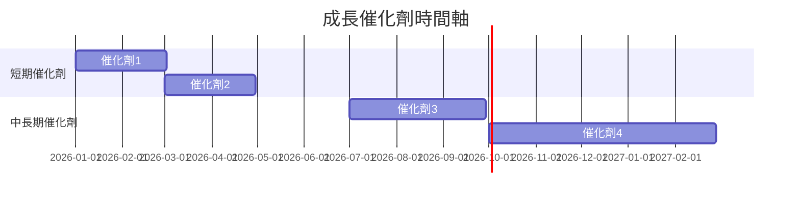

### 8.2 TAM 市場規模分析

```
╔══════════════════════════════════════════════════════════════════╗
║                      TAM 市場規模分析                            ║
╠══════════════════════════════════════════════════════════════════╣
║  市場1：$500B  ↪︎ 滲透率 2%，貢獻收入$10B                        ║
║  市場2：$300B  ↪︎ 滲透率 1%，貢獻收入$3B                         ║
║  市場3：$200B  ↪︎ 滲透率 0.5%，貢獻收入$1B                       ║
╠══════════════════════════════════════════════════════════════════╣
║  合計：$1T      ↪︎ 滲透率: 1.1%                                  ║
╚══════════════════════════════════════════════════════════════════╝
```

### 8.3 成長驅動力結構圖

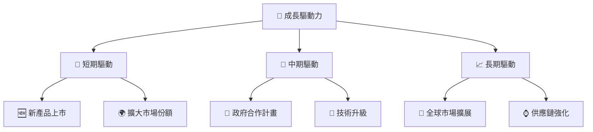

---

## 9. 風險矩陣

### 9.1 風險評分矩陣

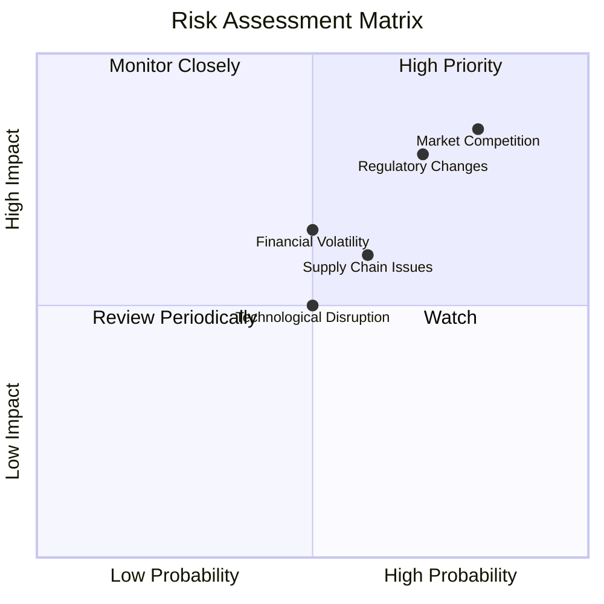

### 9.2 風險清單詳細分析

| # | 風險項目        | 發生機率 | 財務衝擊     | 風險評分 | 緩解措施         |
|---|-----------------|----------|--------------|----------|------------------|
| 1 | 🔴 市場競爭     | 高 (80%) | 高 (-15%收入)| 🔴 8.0/10 | 持續創新技術     |
| 2 | 🔴 行業政策變化 | 高 (70%) | 高 (-10%收入)| 🔴 7.5/10 | 建立法規團隊     |
| 3 | 🟡 金融波動     | 中 (50%) | 中 (-5%收入) | 🟡 5.5/10 | 減少槓桿投資     |
| 4 | 🟡 供應鏈問題   | 中 (60%) | 中 (-7%收入) | 🟡 6.0/10 | 擴大供應商基數   |

---

## 10. 投資建議

### 10.1 最終綜合評級雷達圖

```
╔══════════════════════════════════════════════════════════════════╗
║                    ONDS 多維度評分儀表板                        ║
╠══════════════════════════════════════════════════════════════════╣
║  基本面強度  8.0/10                                             ║
║  成長動能    9.0/10                                             ║
║  獲利品質    6.0/10                                             ║
║  財務健康    9.0/10                                             ║
║  估值合理性  8.0/10                                             ║
╚══════════════════════════════════════════════════════════════════╝
```

### 10.2 目標價與隱含報酬率

| 類型   | 目標價 | 隱含報酬率 | 機率權重 |
|--------|--------|------------|----------|
| 樂觀   | $25.00 | +122.9%    | 20%      |
| 基準   | $20.12 | +79.5%     | 60%      |
| 悲觀   | $16.00 | +42.7%     | 20%      |

### 10.3 買入時機與觸發因素

```
╔══════════════════════════════════════════════════════════════════╗
║                  ✅ 買入觸發因素 Checklist                      ║
╠══════════════════════════════════════════════════════════════════╣
║                                                                  ║
║  立即買入觸發條件（多數符合）：                                  ║
║  ✅ 股價低於$16.00                                               ║
║  ✅ 收入YoY增長保持至少20%                                       ║
║  ✅ 盈利能力顯著改善                                             ║
║                                                                  ║
║  加碼觸發條件（出現以下任一）：                                  ║
║  ☐ 新產品需求強勁可持續                                         ║
║                                                                  ║
║  減碼/停損觸發條件（出現以下任一）：                             ║
║  ☐ 盈利改善未能達成                                             ║
║  ☐ 重大監管變化衝擊收入                                         ║
╚══════════════════════════════════════════════════════════════════╝
```

### 10.4 投資人適配度分析

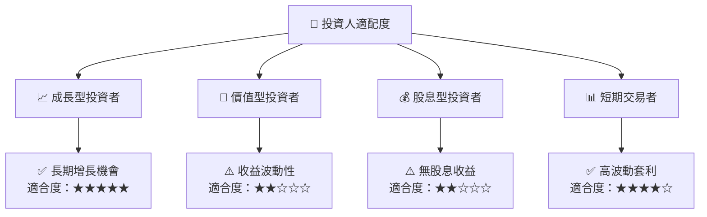

### 10.5 關鍵監控指標

| 監控類型  | 指標                      | 關注點                  | 頻率   |
|-----------|---------------------------|-------------------------|--------|
| 財務健康  | 現金流狀況                | 每季報告現金流變化      | 季度性 |
| 獲利能力  | 毛利率、淨利率            | 盈利能力改善情況        | 季度性 |
| 行業趨勢  | 市場需求與競爭動態        | 市場份額增長與競爭地位  | 半年性 |
| 技術創新  | 新產品開發與市場接受度    | 新產品貢獻銷售額        | 每年   |

---

> **免責聲明**：本報告為 AI 自動生成，僅供研究參考，不構成投資建議。投資有風險，入市需謹慎。