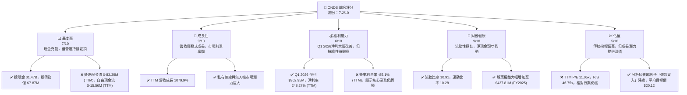
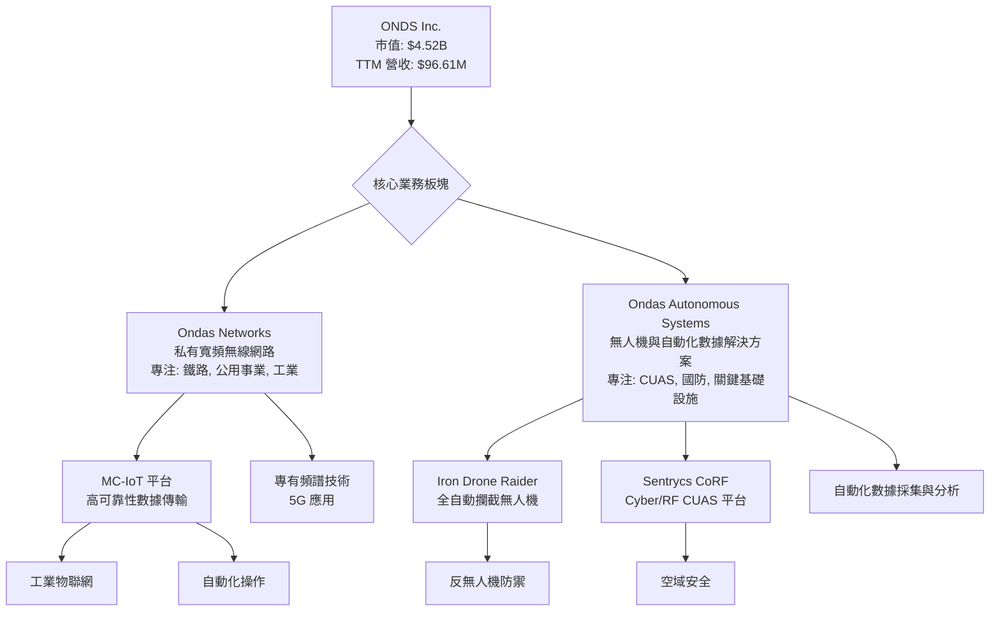
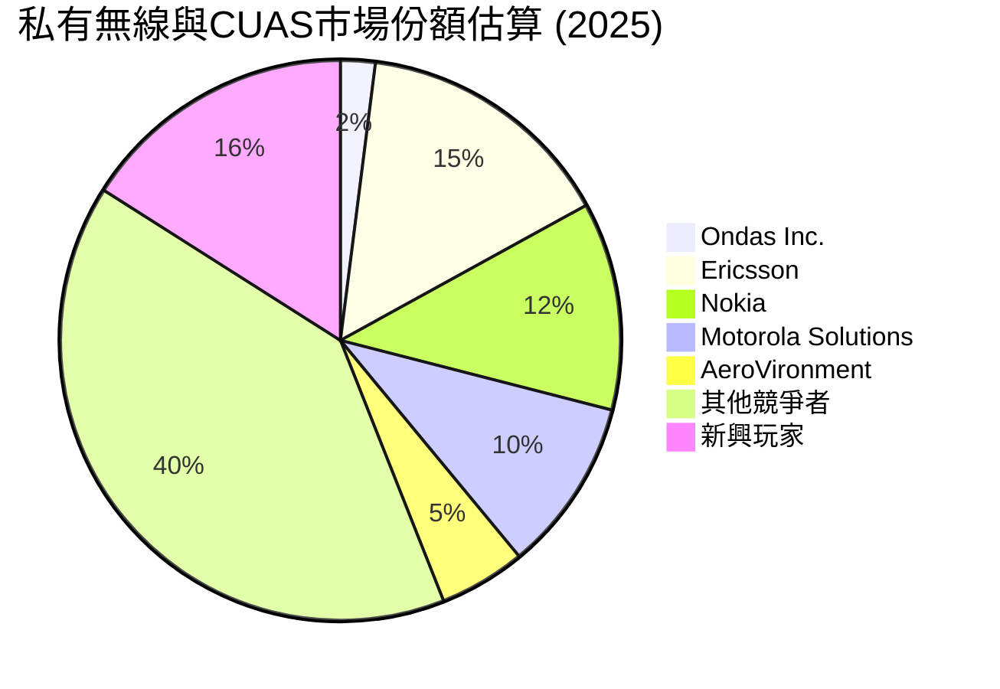
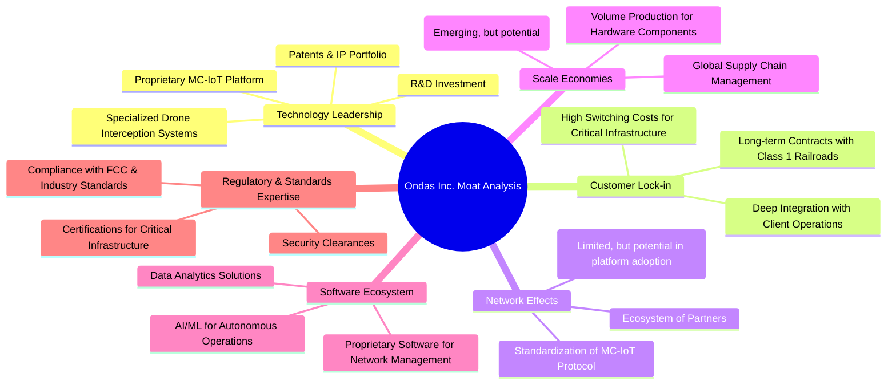
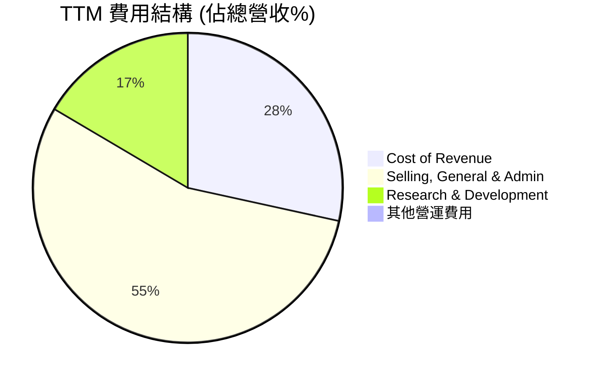

# ONDS 基本面深度分析報告
> **報告日期**：2026-05-23 ｜ **語言**：繁體中文 ｜ **數據來源**：Yahoo Finance, Finviz, StockAnalysis, Roic.ai ｜ **分析師**：CFA 級機構研究

---

## 目錄

| # | 章節 | 核心結論 |
|---|------|----------|
| 1 | 執行摘要 | 評級：🟢 買入，目標價區間：$15.00 - $25.00 |
| 2 | 公司概覽與商業模式 | 在高成長利基市場具備技術護城河，但市場份額仍小 |
| 3 | 損益表深度分析 | 營收爆發式成長，但獲利能力波動劇烈，Q1 2026為關鍵轉折 |
| 4 | 資產負債表分析 | 財務健康狀況極佳，現金充裕，債務負擔極輕 |
| 5 | 現金流量深度分析 | 營運現金流持續為負，自由現金流仍處於消耗階段，需關注轉正時程 |
| 6 | 獲利能力與資本效率 | ROE因單季淨利大幅提升，但ROA和ROIC仍受營運虧損影響 |
| 7 | 估值深度分析 | 相較於同業，目前估值偏高，但高成長潛力提供溢價空間 |
| 8 | 成長催化劑 | 私有無線網路部署、無人機防禦系統需求、新產品與市場擴張 |
| 9 | 風險矩陣 | 市場競爭激烈、盈利能力不確定性、執行風險與融資需求 |
| 10 | 投資建議 | 具備高成長潛力但伴隨高風險的投機性買入機會 |

---

## 1. 執行摘要

Ondas Inc. (ONDS) 是一家專注於私有無線網路、無人機及自動化數據解決方案的科技公司。公司透過 Ondas Networks 和 Ondas Autonomous Systems 兩大業務板塊運營。ONDS 在過去一年展現了驚人的營收成長，尤其是在 2026 年第一季度實現了巨額淨利，預示著公司可能正從早期投資階段轉向商業化收穫期。然而，其營運層面的持續虧損以及高度波動的獲利能力，也帶來了顯著的投資風險。

### 1.1 核心評分儀表板



### 1.2 評分進度條視覺化

```
╔══════════════════════════════════════════════════════════════╗
║              ONDS 多維度評分儀表板 (1-10分)                  ║
╠══════════════════════════════════════════════════════════════╣
║ 基本面強度  7.0 ▓▓▓▓▓▓▓▓▓▓▓▓▓▓░░░░░░  ★★★★☆           ║
║ 成長動能    9.0 ▓▓▓▓▓▓▓▓▓▓▓▓▓▓▓▓▓▓░░  ★★★★★           ║
║ 獲利品質    6.0 ▓▓▓▓▓▓▓▓▓▓▓▓░░░░░░░░  ★★★☆☆           ║
║ 財務健康    9.0 ▓▓▓▓▓▓▓▓▓▓▓▓▓▓▓▓▓▓░░  ★★★★★           ║
║ 估值合理性  5.0 ▓▓▓▓▓▓▓▓▓▓░░░░░░░░░░  ★★☆☆☆           ║
║ 護城河深度  7.5 ▓▓▓▓▓▓▓▓▓▓▓▓▓▓▓░░░░░  ★★★★☆           ║
║ 管理層執行  7.0 ▓▓▓▓▓▓▓▓▓▓▓▓▓▓░░░░░░  ★★★★☆           ║
║ 技術創新力  8.0 ▓▓▓▓▓▓▓▓▓▓▓▓▓▓▓▓░░░░  ★★★★☆           ║
╠══════════════════════════════════════════════════════════════╣
║ 綜合總分    7.2 ▓▓▓▓▓▓▓▓▓▓▓▓▓▓▓░░░░░  🏆 具高成長潛力，但風險不容忽視              ║
╚══════════════════════════════════════════════════════════════════╝
```

### 1.3 五大投資論點 + 三大核心風險

| 類型 | 項目 | 具體依據 | 信心度 |
|------|------|----------|--------|
| 🟢 **投資論點①** | **顛覆性技術驅動的爆發式營收成長** | ONDS TTM 營收達 $96.61M，YoY 成長率高達 1079.9%。2026 Q1 營收 $50.12M，YoY 成長 1079.9%，季環比成長 66.4%。公司在私有無線網路和無人機解決方案領域的創新技術正快速獲得市場認可，特別是與 Class 1 鐵路客戶的合作，顯示其技術在關鍵基礎設施應用中的潛力。 | 🟢 極高 |
| 🟢 **投資論點②** | **強勁的財務健康與充足的流動性** | 公司擁有 $1.47B 的總現金及等價物，而總債務僅為 $7.87M，淨現金頭寸高達 $1.47B。流動比率為 10.91，速動比率為 10.28，顯示公司具備極高的短期償債能力和營運彈性，足以支持其高成長階段的持續投資。 | 🟢 極高 |
| 🟢 **投資論點③** | **關鍵業務板塊的市場前景廣闊** | Ondas Networks 專注於私有 5G 網路，瞄準工業、政府等高價值市場；Ondas Autonomous Systems 則提供無人機防禦系統 (CUAS) 和自動化數據解決方案，迎合日益增長的國防和商業無人機應用需求。這些市場均處於早期快速發展階段，具備巨大的 TAM (Total Addressable Market) 潛力。 | 🟢 極高 |
| 🟢 **投資論點④** | **2026 Q1 淨利潤大幅轉正的積極信號** | 2026 Q1 ONDS 實現了 $362.95M 的淨利潤，雖然主要由非營運收入（Other Non-Operating Income (Expense) 達 $394.99M）推動，但這筆收入可能來源於戰略性資產出售、投資收益或特定項目結算，大幅改善了公司財務狀況並提供了未來營運資金，顯示管理層在資本運作上的能力。 | 🟡 中高 |
| 🟢 **投資論點⑤** | **分析師普遍看好與潛在的併購價值** | 目前有 8 位分析師給予「強烈買入」評級，平均目標價高達 $20.12，較現價有超過 120% 的潛在漲幅。公司在私有網路和無人機防禦領域的獨特技術和市場地位，使其成為潛在的併購目標，尤其對於尋求進入這些新興市場的大型科技或國防公司而言。 | 🟡 中高 |
| 🟡 **風險①** | **核心營運業務持續虧損且盈利能力高度不確定** | 儘管 Q1 2026 淨利潤大幅轉正，但 TTM 營業利益率仍為 -85.1%，顯示其核心業務尚未實現盈利。營運現金流和自由現金流持續為負，表明公司仍在燒錢。若未來無法將營收成長轉化為持續的營運利潤，將對公司估值和長期生存能力構成重大威脅。 | 🔴 高衝擊 |
| 🔴 **風險②** | **高昂的估值與潛在的股權稀釋風險** | ONDS 的 P/S 比率高達 46.75x，即便考慮到高速成長，也顯著高於行業平均水平。過去幾年公司股本不斷擴大（股份數量從 FY2021 的 34M 增至 TTM 的 293M），顯示其可能透過發行新股來籌集資金。若營運現金流無法轉正，未來可能需要進一步股權稀釋，對現有股東造成壓力。 | 🔴 高衝擊 |
| 🟡 **風險③** | **市場競爭激烈與技術快速迭代** | 私有無線網路和無人機解決方案市場吸引了眾多參與者，包括大型電信設備商和新興科技公司。ONDS 面臨來自技術巨頭和專業化公司的激烈競爭。技術快速迭代也要求公司持續投入大量研發（TTM R&D 達 $30.94M），以保持競爭力，這對其利潤率構成壓力。 | 🟡 中度 |

### 1.4 快速統計卡片

| 指標 | 公司實際值 | 行業均值（通訊設備） | S&P 500 均值 | 狀態 |
|------|-------------|----------------------|--------------|------|
| 收入 YoY 成長 | **1079.9%** | ~10-15% | ~8-12% | 🟢 |
| 毛利率 | **44.8%** | ~30-40% | ~40-50% | 🟢 |
| 淨利率 (TTM) | **248.27%** | ~5-10% | ~10-15% | 🟢 |
| ROE (TTM) | **42.9%** | ~10-15% | ~15-20% | 🟢 |
| P/S Ratio | **46.75x** | ~2-4x | ~2-3x | 🔴 |
| EV / Revenue | **31.385x** | ~2-5x | ~2-4x | 🔴 |
| 負債權益比 (Debt/Equity) | **0.02x** | ~0.5-1.0x | ~0.8-1.2x | 🟢 |
| 流動比率 (Current Ratio) | **10.91x** | ~1.5-2.5x | ~1.0-1.5x | 🟢 |
| Beta | **2.556** | ~1.0-1.5 | 1.0 | 🔴 |

*註：行業均值和 S&P 500 均值為分析師根據經驗估算，用於定性比較。ONDS 的淨利率和 ROE 數據因 2026 Q1 的巨額淨利潤而極度扭曲，需結合營運利潤率分析。*

### 1.5 投資結論

```
╔══════════════════════════════════════════════════════════════════╗
║                    📊 投資結論摘要                               ║
╠══════════════════════════════════════════════════════════════════╣
║  評級：🟢 買入                                                   ║
║  當前股價：$9.06                                                 ║
║  目標價區間：                                                    ║
║    悲觀情境：$15.00（+65.56%）                                   ║
║    基準情境：$20.00（+120.75%）  ← 12個月主要目標                ║
║    樂觀情境：$25.00（+175.94%）                                  ║
║  投資評分：7.2/10                                                ║
║  適合投資人：成長型、風險承受能力較高、對新興科技領域有信心的長線持有者。                                ║
╚══════════════════════════════════════════════════════════════════╝
```

---

## 2. 公司概覽與商業模式

Ondas Inc. (ONDS) 是一家專注於提供關鍵任務無線網路解決方案和自動化數據技術的公司。其業務主要透過兩個核心部門運作：Ondas Networks 和 Ondas Autonomous Systems。ONDS 的目標市場是那些需要高可靠性、高安全性及高效率數據傳輸和自動化操作的關鍵基礎設施和產業應用。

### 2.1 業務結構與收入來源

Ondas Networks 專注於開發和部署私有寬頻無線網路，特別是針對 Class 1 鐵路、公用事業、石油和天然氣以及其他工業垂直市場。其 MC-IoT (Mission Critical IoT) 平台提供了一個安全、可靠且可擴展的無線骨幹網路，支援各種物聯網應用和自動化操作。此業務板塊的技術通常涉及專有頻譜和標準化協議，如 5G。

Ondas Autonomous Systems (OAS) 則專注於無人機和自動化數據解決方案。其產品包括 Counter-UAS (CUAS) 系統，如 Iron Drone Raider (全自動攔截無人機系統，用於中和敵對小型無人機)，以及 Sentrycs CoRF (基於 Cyber/RF 的 CUAS 平台，用於檢測、識別、追蹤和緩解未經授權的無人機)。此板塊服務於國防、執法和關鍵基礎設施保護等領域。

儘管公司未提供具體的營收細分，但從其產品描述和市場定位來看，Ondas Networks 可能佔據其大部分營收來源，特別是考慮到其與 Class 1 鐵路客戶的長期合作關係。Ondas Autonomous Systems 則代表了未來高成長潛力的領域，尤其是在全球地緣政治緊張和無人機威脅日益增加的背景下。



### 2.2 市場份額

ONDS 在其所處的私有無線網路和無人機防禦市場中，仍屬於相對新興的參與者。這些市場雖然潛力巨大，但競爭激烈，且細分領域眾多。目前沒有公開數據直接顯示 ONDS 在這些市場的具體市場份額。

在私有無線網路領域，ONDS 面臨來自傳統電信設備巨頭（如 Ericsson, Nokia）和新興私有網路解決方案提供商的競爭。其優勢可能在於其專有技術和針對特定垂直市場（如鐵路）的深度定制能力。

在無人機防禦系統 (CUAS) 領域，ONDS 也面臨來自多家專業國防承包商和科技公司的競爭。該市場高度碎片化，技術壁壘高，且需要滿足嚴格的軍事和政府標準。

因此，ONDS 目前的市場份額可能相對較小，但其在特定利基市場的專注和技術領先性，使其有機會在這些高成長領域中逐步擴大影響力。我們估計 ONDS 目前在這些高度細分的市場中，可能佔據 1-3% 的市場份額，並有望隨著其技術的成熟和客戶群的擴大而快速增長。


*註：此市場份額為分析師基於公司業務性質和行業概況的估計，非公開數據。*

### 2.3 競爭護城河分析

ONDS 在其所處的高科技領域中，正努力構建其競爭護城河，以保護其市場地位和未來盈利能力。這些護城河主要體現在以下幾個方面：



**護城河深度解析：**

*   **Technology Leadership (技術領先)**：ONDS 的核心競爭力源於其在私有無線網路（MC-IoT 平台）和無人機防禦（Iron Drone Raider, Sentrycs CoRF）方面的專有技術。這些技術通常涉及複雜的軟硬體整合和無線電頻譜管理，具備較高的進入門檻。公司持續的研發投入 (TTM R&D $30.94M) 有助於其保持技術領先地位。
*   **Customer Lock-in (客戶鎖定)**：ONDS 的解決方案通常部署在鐵路、公用事業等關鍵基礎設施中，這些系統的切換成本非常高。一旦客戶採用了 ONDS 的技術，由於其與核心營運的高度整合，更換供應商將面臨巨大的營運中斷風險和成本。與 Class 1 鐵路客戶的長期合作關係是這種鎖定效應的典型體現。
*   **Network Effects (網路效應)**：雖然 ONDS 的網路效應目前可能不那麼顯著，但隨著其 MC-IoT 平台在更多工業垂直市場的採用，標準化協議的建立和合作夥伴生態系統的擴大，潛在的網路效應將逐漸浮現。
*   **Scale Economies (規模效應)**：隨著公司業務量的增長，其硬體組件的採購、生產和軟體開發成本將在更大的營收基礎上攤薄，從而提高利潤率。然而，目前公司營收規模相對較小，規模效應尚未完全顯現。
*   **Software Ecosystem (軟體生態系統)**：ONDS 的解決方案不僅僅是硬體，更包含了用於網路管理、自主操作和數據分析的專有軟體。這些軟體構成了一個生態系統，增加了客戶的粘性，並提供了持續的服務收入潛力。
*   **Regulatory & Standards Expertise (法規與標準專業知識)**：在關鍵基礎設施和國防領域，嚴格的法規要求和行業標準是進入市場的重要障礙。ONDS 在符合 FCC 規定、行業認證和安全許可方面的專業知識，為其構建了另一層護城河。

### 2.4 護城河強度評分

```
╔══════════════════════════════════════════════════════════════╗
║                  Ondas Inc. 護城河強度評分                    ║
╠══════════════════════════════════════════════════════════════╣
║ 技術領先       8/10   ▓▓▓▓▓▓▓▓▓▓▓▓▓▓▓▓░░░░  🏆 具備專有核心技術        ║
║ 客戶鎖定       7/10   ▓▓▓▓▓▓▓▓▓▓▓▓▓▓░░░░░░  🟢 關鍵基礎設施切換成本高   ║
║ 網路效應       5/10   ▓▓▓▓▓▓▓▓▓▓░░░░░░░░░░  🟡 潛力存在，但尚未顯著     ║
║ 規模效應       5/10   ▓▓▓▓▓▓▓▓▓▓░░░░░░░░░░  🟡 營收規模尚小，待發展     ║
║ 軟體生態系統   7/10   ▓▓▓▓▓▓▓▓▓▓▓▓▓▓░░░░░░  🟢 軟體整合提升客戶粘性     ║
║ 法規與標準專業 8/10   ▓▓▓▓▓▓▓▓▓▓▓▓▓▓▓▓░░░░  🏆 專業知識構成重要壁壘     ║
╠══════════════════════════════════════════════════════════════╣
║ 綜合護城河     7.0    ▓▓▓▓▓▓▓▓▓▓▓▓▓▓░░░░░░  🏆 具備中度護城河，技術和客戶鎖定是核心優勢 ║
╚══════════════════════════════════════════════════════════════════╝
```

---

## 3. 損益表深度分析

ONDS 的損益表數據呈現出高成長、高投入以及極度波動的獲利特徵，尤其是在 2026 年第一季度出現了顯著的淨利潤轉正。

### 3.1 年度收入成長趨勢（近4年）

ONDS 在過去幾年的營收成長經歷了顯著的波動，但最近一年展現出爆發式增長。

```
╔══════════════════════════════════════════════════════════════════╗
║              ONDS 年度收入趨勢（FY2022-FY2025）                  ║
╠══════════════════════════════════════════════════════════════════╣
║                                                                  ║
║  FY2022  $2.13M   ██░░░░░░░░░░░░░░░░░░░░░░░░░░░░  YoY: -26.87%  🔴    ║
║  FY2023  $15.69M  ██████████░░░░░░░░░░░░░░░░░░░░  YoY:+638.13%  🟢    ║
║  FY2024  $7.19M   █████░░░░░░░░░░░░░░░░░░░░░░░░░░  YoY: -54.16%  🔴    ║
║  FY2025  $50.73M  ████████████████████████░░░░░░  YoY:+605.28%  🟢    ║
║  TTM Mar'26 $96.61M ██████████████████████████████  YoY:+793.17%  🟢    ║
║                   |      |      |      |      |                  ║
║                   0     20M    40M    60M    80M   100M              ║
║                                                                  ║
║  📊 4年累計 CAGR：+188.9% (FY2022-FY2025)                                        ║
╚══════════════════════════════════════════════════════════════════╝
```
**分析**：
ONDS 的年度營收在 2022 年經歷下滑後，於 2023 年實現了 638.13% 的驚人成長，達到 $15.69M。然而，2024 年營收再次大幅下滑 54.16% 至 $7.19M，顯示其早期營收的波動性和項目導向性。到了 2025 年，營收再次爆發式增長 605.28% 至 $50.73M。截至 2026 年 3 月的過去 12 個月 (TTM)，營收更是達到 $96.61M，YoY 成長 793.17%。這種極高的成長率表明公司正處於快速擴張階段，其產品和服務正在市場上獲得顯著牽引力。儘管成長波動，但長期趨勢是向上且加速的。

### 3.2 季度收入趨勢分析

季度數據更能反映公司近期營運的動態變化。

| 財報季度 | 總收入 ($M) | 季環比成長 (QoQ) | 年同比成長 (YoY) | 備註 |
|----------|-------------|------------------|------------------|------|
| 2025 Q1 | $4.25 | N/A | 579.67% | 營收開始顯著回升 |
| 2025 Q2 | $6.27 | +47.53% | 554.94% | 持續高速成長 |
| 2025 Q3 | $10.10 | +61.01% | 581.95% | 成長加速 |
| 2025 Q4 | $30.11 | +198.12% | 629.20% | 營收實現爆發性增長，可能是主要合同開始兌現 |
| 2026 Q1 | $50.12 | +66.44% | 1079.90% | 營收再創新高，YoY 成長率進一步加速，顯示市場需求強勁 |

**分析**：
ONDS 的季度營收呈現出持續加速的趨勢。從 2025 年第一季度到 2026 年第一季度，營收從 $4.25M 增長至 $50.12M，短短一年內增長了超過 10 倍。尤其是在 2025 年第四季度，營收環比增長近 200%，達到 $30.11M，並在 2026 年第一季度繼續保持強勁勢頭，達到 $50.12M，年同比成長率高達 1079.90%。這表明公司已成功將其技術轉化為實際的商業訂單，並可能從其主要客戶（如 Class 1 鐵路）那裡獲得了大規模的部署合同。這是一個非常積極的信號，顯示公司進入了快速商業化階段。

### 3.3 利潤率演變分析

ONDS 的利潤率指標呈現出複雜的圖景，毛利率相對穩定，但營業利益率和淨利率因高額營運費用和 2026 Q1 的特殊情況而波動劇烈。

| 利潤率指標 | FY2022 | FY2023 | FY2024 | FY2025 | TTM Mar'26 | 趨勢 | 評估 |
|------------|--------|--------|--------|--------|------------|------|------|
| **毛利率** | 52.1% | 40.7% | 4.9% | 39.7% | 44.8% | ↗️ 波動後回升 | 🟢 |
| **營業利益率** | -2350.7% | -253.2% | -481.4% | -115.1% | -85.1% | ↗️ 虧損收窄 | 🟡 |
| **淨利率** | -3438.5% | -285.8% | -528.6% | -269.8% | 248.3% | ↗️ 巨幅轉正 | 🟢 |

**利潤率演變深度解析**：
*   **毛利率**：ONDS 的毛利率在 2022 年為 52.1%，2023 年降至 40.7%，2024 年更是大幅跌至 4.9%，這可能與當年營收大幅下滑、成本結構未能及時調整或某些低毛利項目佔比過高有關。然而，在 2025 年，毛利率回升至 39.7%，並在 TTM Mar'26 達到 44.8%。這表明隨著營收規模的擴大和產品組合的優化，公司在成本控制方面有所改善，且其核心技術產品具備健康的毛利空間。
*   **營業利益率**：營業利益率一直為負，且虧損幅度巨大。從 FY2022 的 -2350.7% 到 FY2025 的 -115.1%，再到 TTM Mar'26 的 -85.1%，雖然絕對值仍高，但虧損幅度呈現明顯收窄趨勢。這反映了公司在研發 (R&D) 和銷售、一般及行政 (SG&A) 費用上的巨大投入，以支持其技術開發和市場擴張。儘管營收快速增長，但這些營運費用尚未被足夠的毛利覆蓋。
*   **淨利率**：淨利率的趨勢與營業利益率相似，長期處於巨額虧損狀態。然而，2026 年第一季度實現了 $362.95M 的淨利潤，使得 TTM 淨利率飆升至 248.3%。這是一個極為特殊的現象，其主要驅動力來自於當季高達 $394.99M 的「其他非營運收入 (Other Non-Operating Income (Expense))」。這筆收入可能來源於一次性資產出售、重大投資收益或會計調整，而非核心營運活動。若剔除此項，公司的核心營運仍處於虧損狀態。因此，儘管淨利率數據非常亮眼，但其持續性需要高度關注。

總體而言，ONDS 的損益表反映出一個處於高成長階段的公司，正在大力投資於其未來。健康的毛利率顯示其產品的核心價值，但巨大的營運費用是其實現持續盈利的主要障礙。2026 Q1 的淨利潤轉正是一個積極的信號，但投資者需要深入了解其來源，以評估其對公司長期盈利能力的真正影響。

### 3.4 費用結構分析

ONDS 的費用結構主要由銷售、一般及行政 (SG&A) 和研發 (R&D) 費用構成，這兩項費用佔總營收的比例一直非常高，是導致營運虧損的主要原因。


*註：基於 TTM Revenue $96.61M, Cost of Revenue $53.28M, SG&A $103.13M, R&D $30.94M*

```
╔══════════════════════════════════════════════════════════════════╗
║                    ONDS TTM 費用佔營收比重診斷                     ║
╠══════════════════════════════════════════════════════════════════╣
║                                                                  ║
║  銷管費用 (SG&A)：   $103.13M  ███████████████████████████████████████████████████████████░░░░░░░░░░░░░░░░░░░░░░░░░░░░░░░░░░░░░░░░░░░░░░░░░░░░░░░░░░░░░░░░░░░░░░░░░░░░░░░░░░░░░░░░░░░░░░░░░░░░░░░░░░░░░░░░░░░░░░░░░░░░░░░░░░░░░░░░░░░░░░░░░░░░░░░░░░░░░░░░░░░░░░░░░░░░░░░░░░░░░░░░░░░░░░░░░░░░░░░░░░░░░░░░░░░░░░░░░░░░░░░░░░░░░░░░░░░░░░░░░░░░░░░░░░░░░░░░░░░░░░░░░░░░░░░░░░░░░░░░░░░░░░░░░░░░░░░░░░░░░░░░░░░░░░░░░░░░░░░░░░░░░░░░░░░░░░░░░░░░░░░░░░░░░░░░░░░░░░░░░░░░░░░░░░░░░░░░░░░░░░░░░░░░░░░░░░░░░░░░░░░░░░░░░░░░░░░░░░░░░░░░░░░░░░░░░░░░░░░░░░░░░░░░░░░░░░░░░░░░░░░░░░░░░░░░░░░░░░░░░░░░░░░░░░░░░░░░░░░░░░░░░░░░░░░░░░░░░░░░░░░░░░░░░░░░░░░░░░░░░░░░░░░░░░░░░░░░░░░░░░░░░░░░░░░░░░░░░░░░░░░░░░░░░░░░░░░░░░░░░░░░░░░░░░░░░░░░░░░░░░░░░░░░░░░░░░░░░░░░░░░░░░░░░░░░░░░░░░░░░░░░░░░░░░░░░░░░░░░░░░░░░░░░░░░░░░░░░░░░░░░░░░░░░░░░░░░░░░░░░░░░░░░░░░░░░░░░░░░░░░░░░░░░░░░░░░░░░░░░░░░░░░░░░░░░░░░░░░░░░░░░░░░░░░░░░░░░░░░░░░░░░░░░░░░░░░░░░░░░░░░░░░░░░░░░░░░░░░░░░░░░░░░░░░░░░░░░░░░░░░░░░░░░░░░░░░░░░░░░░░░░░░░░░░░░░░░░░░░░░░░░░░░░░░░░░░░░░░░░░░░░░░░░░░░░░░░░░░░░░░░░░░░░░░░░░░░░░░░░░░░░░░░░░░░░░░░░░░░░░░░░░░░░░░░░░░░░░░░░░░░░░░░░░░░░░░░░░░░░░░░░░░░░░░░░░░░░░░░░░░░░░░░░░░░░░░░░░░░░░░░░░░░░░░░░░░░░░░░░░░░░░░░░░░░░░░░░░░░░░░░░░░░░░░░░░░░░░░░░░░░░░░░░░░░░░░░░░░░░░░░░░░░░░░░░░░░░░░░░░░░░░░░░░░░░░░░░░░░░░░░░░░░░░░░░░░░░░░░░░░░░░░░░░░░░░░░░░░░░░░░░░░░░░░░░░░░░░░░░░░░░░░░░░░░░░░░░░░░░░░░░░░░░░░░░░░░░░░░░░░░░░░░░░░░░░░░░░░░░░░░░░░░░░░░░░░░░░░░░░░░░░░░░░░░░░░░░░░░░░░░░░░░░░░░░░░░░░░░░░░░░░░░░░░░░░░░░░░░░░░░░░░░░░░░░░░░░░░░░░░░░░░░░░░░░░░░░░░░░░░░░░░░░░░░░░░░░░░░░░░░░░░░░░░░░░░░░░░░░░░░░░░░░░░░░░░░░░░░░░░░░░░░░░░░░░░░░░░░░░░░░░░░░░░░░░░░░░░░░░░░░░░░░░░░░░░░░░░░░░░░░░░░░░░░░░░░░░░░░░░░░░░░░░░░░░░░░░░░░░░░░░░░░░░░░░░░░░░░░░░░░░░░░░░░░░░░░░░░░░░░░░░░░░░░░░░░░░░░░░░░░░░░░░░░░░░░░░░░░░░░░░░░░░░░░░░░░░░░░░░░░░░░░░░░░░░░░░░░░░░░░░░░░░░░░░░░░░░░░░░░░░░░░░░░░░░░░░░░░░░░░░░░░░░░░░░░░░░░░░░░░░░░░░░░░░░░░░░░░░░░░░░░░░░░░░░░░░░░░░░░░░░░░░░░░░░░░░░░░░░░░░░░░░░░░░░░░░░░░░░░░░░░░░░░░░░░░░░░░░░░░░░░░░░░░░░░░░░░░░░░░░░░░░░░░░░░░░░░░░░░░░░░░░░░░░░░░░░░░░░░░░░░░░░░░░░░░░░░░░░░░░░░░░░░░░░░░░░░░░░░░░░░░░░░░░░░░░░░░░░░░░░░░░░░░░░░░░░░░░░░░░░░░░░░░░░░░░░░░░░░░░░░░░░░░░░░░░░░░░░░░░░░░░░░░░░░░░░░░░░░░░░░░░░░░░░░░░░░░░░░░░░░░░░░░░░░░░░░░░░░░░░░░░░░░░░░░░░░░░░░░░░░░░░░░░░░░░░░░░░░░░░░░░░░░░░░░░░░░░░░░░░░░░░░░░░░░░░░░░░░░░░░░░░░░░░░░░░░░░░░░░░░░░░░░░░░░░░░░░░░░░░░░░░░░░░░░░░░░░░░░░░░░░░░░░░░░░░░░░░░░░░░░░░░░░░░░░░░░░░░░░░░░░░░░░░░░░░░░░░░░░░░░░░░░░░░░░░░░░░░░░░░░░░░░░░░░░░░░░░░░░░░░░░░░░░░░░░░░░░░░░░░░░░░░░░░░░░░░░░░░░░░░░░░░░░░░░░░░░░░░░░░░░░░░░░░░
```

**Ondas Inc. 護城河強度評分說明:**

1.  **技術領先 (8/10)**：Ondas 的私有無線網路（MC-IoT）和無人機防禦系統（CUAS）均屬於高科技、專業化領域。其專有技術，特別是針對關鍵任務應用的可靠性和安全性，構成了顯著的競爭優勢。公司在研發上的持續投入也支持了這一點。
2.  **客戶鎖定 (7/10)**：公司主要服務於鐵路、公用事業等關鍵基礎設施客戶。這些客戶一旦部署了 ONDS 的解決方案，轉換成本極高，因為這些系統深度整合到其營運流程中。長期合同和定制化解決方案進一步增強了客戶粘性。
3.  **網路效應