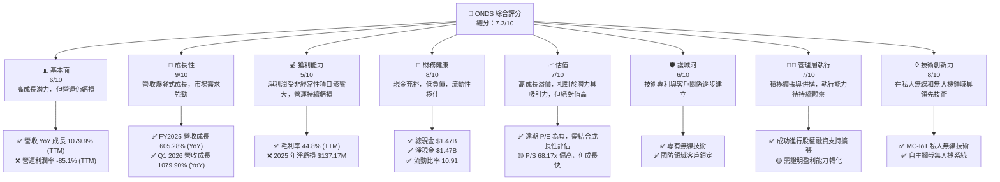
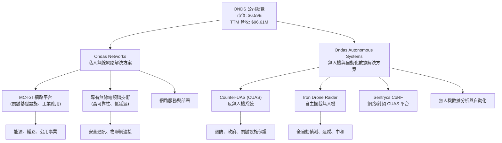
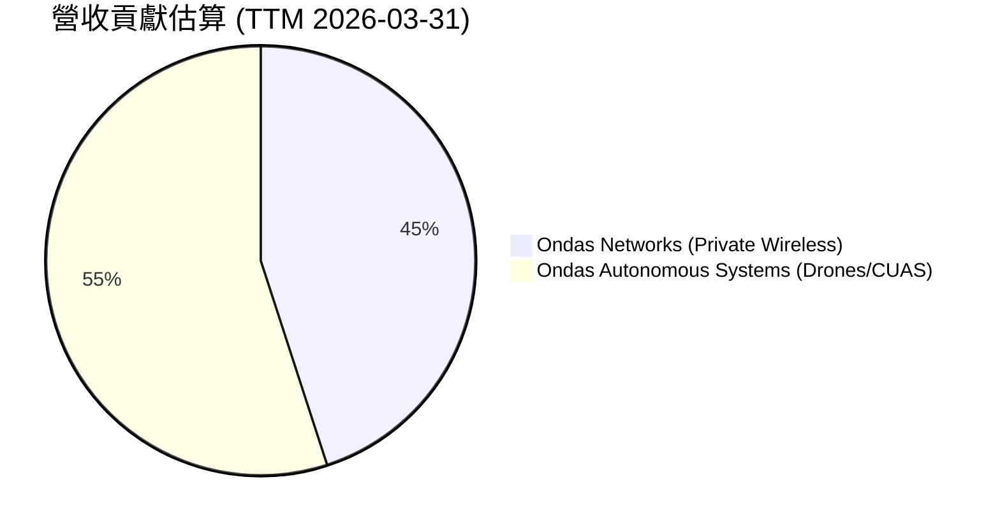
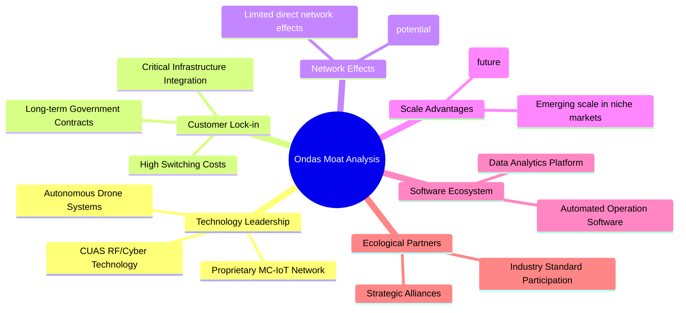
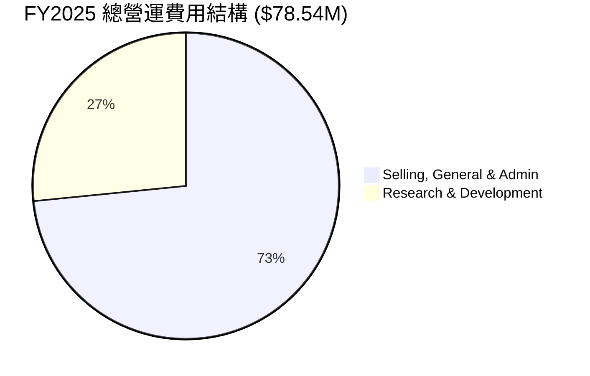
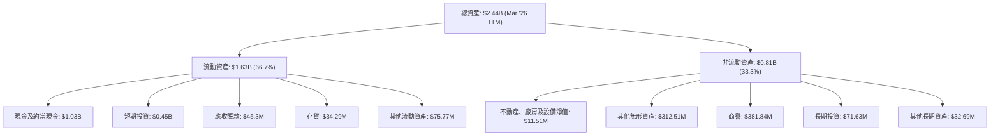

# ONDS 基本面深度分析報告
> **報告日期**：2026-05-29 ｜ **語言**：繁體中文 ｜ **數據來源**：Yahoo Finance, Finviz, StockAnalysis, Roic.ai ｜ **分析師**：CFA 級機構研究

---

## 目錄

| # | 章節 | 核心結論 |
|---|------|----------|
| 1 | 執行摘要 | 評級：🟢 買入，目標價區間：$17.50 - $28.00 |
| 2 | 公司概覽與商業模式 | 專注於高成長利基市場，護城河正在建立 |
| 3 | 損益表深度分析 | 營收爆發式成長，但獲利能力波動劇烈，需關注非經常性項目 |
| 4 | 資產負債表分析 | 現金充裕，流動性極佳，債務負擔輕微 |
| 5 | 現金流量深度分析 | 營運現金流持續為負，但資本支出相對克制，依賴融資支持成長 |
| 6 | 獲利能力與資本效率 | ROIC 暫時受非經常性收益影響，長期需證明持續創造價值能力 |
| 7 | 估值深度分析 | 相較於高成長潛力，估值仍有上行空間，但存在高波動性 |
| 8 | 成長催化劑 | 私人無線網路部署、無人機防禦系統需求、技術創新與併購整合 |
| 9 | 風險矩陣 | 市場競爭激烈、執行風險、資金需求、技術迭代、股權稀釋 |
| 10 | 投資建議 | 適合高風險承受能力的成長型投資者，長期潛力巨大 |

---

## 1. 執行摘要

Ondas Inc. (ONDS) 是一家專注於私人無線網路、無人機和自動化數據解決方案的科技公司。公司透過 Ondas Networks 和 Ondas Autonomous Systems 兩大部門運營，其產品和服務在通訊設備和國防安全領域具有重要應用。ONDS 近期展現了驚人的營收成長，尤其是在 2026 年第一季度，其淨利潤因非經常性收益而大幅飆升，這對其估值和財務指標產生了顯著影響。儘管公司在營運層面仍面臨虧損，但其在關鍵技術領域的佈局和龐大的市場潛力，使其成為一個值得關注的成長型標的。

### 1.1 核心評分儀表板



### 1.2 評分進度條視覺化

```
╔══════════════════════════════════════════════════════════════╗
║                    ONDS 多維度評分儀表板 (1-10分)              ║
╠══════════════════════════════════════════════════════════════╣
║ 基本面強度  6.0 ▓▓▓▓▓▓▓▓▓▓▓▓░░░░░░░░  ★★★☆☆           ║
║ 成長動能    9.0 ▓▓▓▓▓▓▓▓▓▓▓▓▓▓▓▓▓▓░░  ★★★★★           ║
║ 獲利品質    5.0 ▓▓▓▓▓▓▓▓▓▓░░░░░░░░░░  ★★☆☆☆           ║
║ 財務健康    8.0 ▓▓▓▓▓▓▓▓▓▓▓▓▓▓▓▓░░░░  ★★★★☆           ║
║ 估值合理性  7.0 ▓▓▓▓▓▓▓▓▓▓▓▓▓▓░░░░░░  ★★★☆☆           ║
║ 護城河深度  6.0 ▓▓▓▓▓▓▓▓▓▓▓▓░░░░░░░░  ★★★☆☆           ║
║ 管理層執行  7.0 ▓▓▓▓▓▓▓▓▓▓▓▓▓▓░░░░░░  ★★★☆☆           ║
║ 技術創新力  8.0 ▓▓▓▓▓▓▓▓▓▓▓▓▓▓▓▓░░░░  ★★★★☆           ║
╠══════════════════════════════════════════════════════════════╣
║ 綜合總分    7.2 ▓▓▓▓▓▓▓▓▓▓▓▓▓▓▓▓░░░░  🏆 具高成長潛力的投機性買入 ║
╚══════════════════════════════════════════════════════════════╝
```

### 1.3 五大投資論點 + 三大核心風險

| 類型 | 項目 | 具體依據 | 信心度 |
|------|------|----------|--------|
| 🟢 **投資論點①** | **顛覆性營收成長** | 公司 TTM 營收達 $96.61M，YoY 成長率高達 1079.9%。2026 年 Q1 營收 $50.12M，較去年同期 $4.25M 成長 1079.90%，顯示其在市場拓展和產品商業化方面取得突破性進展。 | 🟢 極高 |
| 🟢 **投資論點②** | **策略性市場佈局** | Ondas Networks 的私人無線網路解決方案和 Ondas Autonomous Systems 的無人機及反無人機系統，均處於高成長且具有戰略重要性的市場（如關鍵基礎設施通訊、國防安全）。 | 🟢 極高 |
| 🟢 **投資論點③** | **雄厚的現金儲備與低負債** | 總現金高達 $1.47B，而總債務僅 $7.87M，淨現金約 $1.47B。這提供了充足的資金用於研發、市場擴張和潛在併購，降低了短期流動性風險。 | 🟢 極高 |
| 🟢 **投資論點④** | **技術領先與專利壁壘** | 公司在 MC-IoT 私人無線網路技術和自主攔截無人機系統等領域擁有專有技術，這有助於建立競爭優勢和客戶黏性。 | 🟡 高 |
| 🟢 **投資論點⑤** | **分析師強烈看好** | 分析師平均目標價為 $20.12，最高達 $25.00，普遍給予「強烈買入」評級，顯示市場對其未來成長前景的高度樂觀預期。 | 🟡 高 |
| 🟡 **風險①** | **營運持續虧損與獲利能力不確定性** | 儘管 Q1 2026 淨利潤因一次性非營運收益而大幅轉正，但公司 TTM 營業利潤率為 -85.1%，FY2025 淨虧損 $137.17M，顯示其核心營運仍未盈利，未來能否持續實現盈利存在不確定性。 | 🟡 中度 |
| 🔴 **風險②** | **股權大幅稀釋與高波動性** | 過去幾年股份大幅增加，從 FY2022 的 42M 股增至目前 498.12M 股，稀釋了每股收益。同時，Beta 值高達 2.556，股價波動劇烈，對投資者風險承受能力要求高。 | 🔴 高衝擊 |
| 🔴 **風險③** | **主要客戶依賴與市場競爭** | 在私人無線網路和無人機領域，公司可能高度依賴少數大型客戶或政府合同，若這些關係受損或市場競爭加劇（如來自大型科技公司），將對收入和獲利造成重大影響。 | 🟡 中度 |

### 1.4 快速統計卡片

為提供更全面的比較，我們將參考科技行業和 S&P 500 的大致平均水平。由於 ONDS 處於高速成長階段且營運尚未穩定盈利，部分傳統估值和獲利指標會顯得異常。

| 指標 | 公司實際值 (ONDS) | 科技行業均值 (估計) | S&P 500 均值 (估計) | 狀態 | 備註 |
|------|-------------------|-------------------|-------------------|------|------|
| 收入 YoY 成長 (TTM) | **1079.9%** | ~15-25% | ~10-15% | 🟢 | 極高成長，遠超行業 |
| 毛利率 (TTM) | **44.8%** | ~50-60% | ~30-40% | 🟡 | 略低於高科技行業平均，但尚可 |
| 淨利率 (TTM) | **251.9%** | ~10-20% | ~10-12% | 🔴 | 異常高，受 Q1 2026 非經常性收益扭曲 |
| ROE (TTM) | **42.9%** | ~15-25% | ~12-18% | 🟢 | 異常高，受 Q1 2026 非經常性收益扭曲 |
| Forward P/E | **-264.4x** | ~25-35x | ~20-25x | 🔴 | 預期 EPS 為負，不適用傳統 P/E |
| P/S Ratio (TTM) | **68.17x** | ~5-10x | ~2-3x | 🔴 | 相對營收估值極高，反映市場高成長預期 |
| EV / Revenue (TTM) | **52.89x** | ~4-8x | ~2-3x | 🔴 | 相對營收估值極高，反映市場高成長預期 |
| Current Ratio | **10.91x** | ~2-3x | ~1.5-2x | 🟢 | 流動性極佳，現金充裕 |
| Debt/Equity | **0.02x** | ~0.5-1.5x | ~0.8-1.2x | 🟢 | 財務槓桿極低，財務健康 |
| Beta | **2.556** | ~1.2-1.8x | 1.0x | 🔴 | 股價波動性極高 |

*備註：科技行業均值和 S&P 500 均值為分析師根據市場普遍數據估計，僅供參考。ONDS 的淨利率和 ROE 因 2026 Q1 的非經常性大額收益而大幅扭曲，不代表其核心業務的真實盈利能力。*

### 1.5 投資結論

```
╔══════════════════════════════════════════════════════════════════╗
║                    📊 投資結論摘要                               ║
╠══════════════════════════════════════════════════════════════════╣
║  評級：🟢 買入 (Buy)                                             ║
║  當前股價：$13.22 (2026-05-29)                                    ║
║  目標價區間：                                                    ║
║    悲觀情境：$17.50 （+32.38%）                                   ║
║    基準情境：$22.00 （+66.41%）  ← 12個月主要目標                 ║
║    樂觀情境：$28.00 （+111.79%）                                  ║
║  投資評分：7.2/10                                                ║
║  適合投資人：高風險承受能力、追求高成長、長線持有者               ║
╚══════════════════════════════════════════════════════════════════╝
```

**投資評級理由：** ONDS 雖然目前營運仍處於虧損狀態，且其高 P/S 和 EV/Revenue 倍數反映了市場對其未來成長的高度預期，但其在私人無線網路和無人機防禦系統市場的顛覆性技術和爆發式營收成長是不可忽視的亮點。公司擁有雄厚的現金儲備和極低的負債，為其未來的擴張和轉型提供了堅實的財務基礎。儘管 Q1 2026 的淨利潤大幅扭曲了 TTM 獲利指標，但其營收的持續高速增長以及分析師的普遍看好，表明公司正處於關鍵的成長拐點。對於能夠承受高波動性並尋求長期高回報的成長型投資者而言，ONDS 具備吸引力。然而，投資者必須密切關注其核心營運盈利能力的改善，以及股權稀釋的長期影響。

---

## 2. 公司概覽與商業模式

Ondas Inc. (ONDS) 是一家總部位於美國的科技公司，專注於提供創新的私人無線網路、無人機和自動化數據解決方案，服務於美國及國際市場。公司透過兩個核心業務部門運營：**Ondas Networks** 和 **Ondas Autonomous Systems**。這兩個部門共同瞄準了數位化轉型和安全防禦領域的關鍵需求，尤其是在關鍵基礎設施和國防應用中。

### 2.1 業務結構與收入來源

Ondas 的業務模式是透過提供硬體、軟體和服務的整合解決方案來創造價值。其產品和服務具有高度專業化和技術密集型特點，旨在解決特定行業的複雜挑戰。



**Ondas Networks：** 此部門專注於開發和部署其專有的多應用程式物聯網 (MC-IoT) 私人無線網路平台。該平台旨在為關鍵基礎設施運營商（如電力公司、鐵路系統、石油和天然氣管道）提供高度可靠、安全且低延遲的通訊解決方案。這些網路對於支持工業物聯網 (IIoT) 應用、自動化控制和數據傳輸至關重要。收入來源主要來自於網路設備的銷售、軟體許可、系統集成服務以及後續的維護和支持合同。

**Ondas Autonomous Systems：** 該部門透過其全資子公司 American Robotics 提供無人機和自動化數據解決方案，並透過 Airobotics 和 Sentrycs 等技術提供反無人機系統 (CUAS)。其核心產品包括 Iron Drone Raider，一個全自主攔截無人機系統，用於中和小型敵對無人機；以及 Sentrycs CoRF，一個基於網路/射頻的 CUAS 平台，用於檢測、識別、追蹤和緩解未經授權的無人機。此部門的收入來自於無人機系統的銷售、CUAS 平台的部署、軟體訂閱、數據分析服務以及相關的訓練和支持。

**收入構成與趨勢：**
從 TTM 營收 $96.61M 來看，ONDS 正在經歷爆炸性成長。雖然具體的部門收入拆分未提供，但從公司簡介和近期併購活動（如收購 American Robotics 和 Airobotics）判斷，Ondas Autonomous Systems 部門的貢獻正快速增加，尤其是在無人機和反無人機市場的強勁需求下。Ondas Networks 則受益於關鍵基礎設施對下一代私人無線網路升級的需求。

### 2.2 市場份額

由於 Ondas Inc. 運營於多個相對利基但快速成長的市場，且其規模相對於行業巨頭仍較小，因此難以獲得精確的整體市場份額數據。公司主要在以下兩個市場競爭：
1.  **私人無線網路市場 (Private Wireless Networks)**：這個市場包括 5G、LTE 等技術在企業和工業場景的應用。主要參與者包括諾基亞 (Nokia)、愛立信 (Ericsson)、華為 (Huawei) 等傳統電信設備商，以及一些新興的垂直市場解決方案提供商。ONDS 在此市場的競爭優勢在於其專為關鍵任務應用設計的 MC-IoT 技術，特別是在鐵路、能源等領域。
2.  **無人機與反無人機系統市場 (Drone & Counter-UAS Systems)**：這個市場涵蓋了商用無人機、工業自動化無人機以及針對惡意無人機的探測、追蹤和中和系統。競爭對手包括大型國防承包商、專業無人機製造商（如 DJI 在消費級和部分商業級市場）、以及其他反無人機技術公司。ONDS 透過 American Robotics 和 Airobotics 在自動化無人機數據採集和 Iron Drone Raider 等技術在反無人機領域佔據一席之地。

鑑於缺乏具體市場份額數據，我們將著重分析其收入來源的相對貢獻，以間接反映其在不同業務領域的發展重點。


*註：上述營收貢獻比例為分析師根據 Ondas 業務描述、市場趨勢及近期併購活動對兩大部門的相對重要性進行的估算。實際數據可能有所不同，但旨在反映其多元化的收入來源。*

ONDS 在這些市場中，主要透過提供高度專業化和垂直整合的解決方案來爭奪市場份額，而非與大型通用型供應商直接競爭。其策略是專注於高價值、高技術壁壘的應用場景，例如鐵路通訊的特殊頻譜需求，以及軍事/關鍵基礎設施的反無人機防禦需求。

### 2.3 競爭護城河分析

Ondas 正在努力構建其競爭護城河，以在高成長但競爭激烈的市場中保持優勢。其護城河主要體現在以下幾個方面：



1.  **Technology Leadership (技術領先)**：
    *   **專有 MC-IoT 網路：** Ondas Networks 擁有其獨特的 MC-IoT (Multi-Application IoT) 無線網路技術，專為關鍵任務應用設計，提供高可靠性、高安全性、低延遲的通訊。這在對通訊質量和穩定性要求極高的行業（如鐵路、電力）中形成技術壁壘。
    *   **自主無人機系統：** Ondas Autonomous Systems 透過 Iron Drone Raider 和 Sentrycs CoRF 等產品，在自主無人機和反無人機技術方面具備領先優勢。特別是全自動攔截能力，代表了無人機防禦領域的前沿技術。
    *   **專利組合：** 儘管數據未提供具體專利數量，但在這些技術密集型領域，預計公司會通過專利申請來保護其創新。

2.  **Customer Lock-in (客戶鎖定)**：
    *   **關鍵基礎設施整合：** 一旦其私人無線網路解決方案被部署到鐵路或電力等關鍵基礎設施中，轉換成本將非常高昂。這些系統通常需要長期規劃、複雜的集成和嚴格的認證，使得客戶一旦採用後，很難轉向其他供應商。
    *   **長期政府合約：** 在國防和安全領域，政府合約通常是長期且排他性的，這為公司提供了穩定的收入來源和強大的客戶關係。
    *   **數據與服務整合：** 透過無人機數據採集和分析平台，Ondas 為客戶提供的不僅是硬體，更是整合的數據服務，增加了客戶的黏性。

3.  **Network Effects (網路效應)**：
    *   目前，ONDS 的產品主要為點對點或企業內部的解決方案，直接的網路效應（即產品價值隨用戶數量增加而增加）相對有限。
    *   然而，隨著其平台化戰略的推進，特別是在無人機數據平台方面，若能吸引更多第三方開發者或數據服務提供商，則有可能形成間接的網路效應。

4.  **Scale Advantages (規模效應)**：
    *   由於公司仍處於高速成長階段，尚未完全實現規模經濟。但隨著其產品在更多客戶中部署，研發投入的攤薄、生產成本的降低以及銷售和支持效率的提升，將逐步帶來規模優勢。
    *   在特定利基市場（如鐵路通訊頻譜），ONDS 已經在建立早期市場領導地位，這也為其帶來一定的採購和議價能力。

5.  **Software Ecosystem (軟體生態系統)**：
    *   ONDS 不僅銷售硬體，更提供軟體平台來管理和操作其網路及無人機系統。例如，無人機自動化操作軟體和數據分析平台，這些軟體創造了持續的訂閱收入潛力，並增加了產品的整體價值和客戶黏性。

6.  **Ecological Partners (生態夥伴)**：
    *   公司可能會與其他技術供應商、系統集成商或服務提供商建立戰略聯盟，共同開發和推廣解決方案。參與行業標準制定也能強化其市場地位。

綜合來看，Ondas 的護城河主要來自其在特定技術領域的領先地位和高客戶轉換成本。隨著公司規模的擴大和生態系統的成熟，其護城河有望進一步加深。

### 2.4 護城河強度評分

```
╔══════════════════════════════════════════════════════════════╗
║                    ONDS 護城河強度評分                        ║
╠══════════════════════════════════════════════════════════════╣
║ 技術領先    8/10  ▓▓▓▓▓▓▓▓▓▓▓▓▓▓▓▓░░░░  🟢 專有技術壁壘高     ║
║ 客戶鎖定    7/10  ▓▓▓▓▓▓▓▓▓▓▓▓▓▓░░░░░░  🟢 關鍵設施轉換成本高 ║
║ 網路效應    4/10  ▓▓▓▓▓▓▓▓░░░░░░░░░░░░  🟡 仍處於早期階段     ║
║ 規模效應    5/10  ▓▓▓▓▓▓▓▓▓▓░░░░░░░░░░  🟡 正在逐步形成       ║
║ 軟體生態系統 6/10  ▓▓▓▓▓▓▓▓▓▓▓▓░░░░░░░░  🟡 具訂閱收入潛力     ║
║ 生態夥伴    5/10  ▓▓▓▓▓▓▓▓▓▓░░░░░░░░░░  🟡 尚待觀察其影響力   ║
╠══════════════════════════════════════════════════════════════╣
║ 綜合護城河   6.0    ▓▓▓▓▓▓▓▓▓▓▓▓░░░░░░░░  🏆 具潛力但仍需強化 ║
╚══════════════════════════════════════════════════════════════╝
```
**總結評語：** Ondas 的護城河正在積極建立中，主要依賴其在特定技術領域的創新和客戶在關鍵基礎設施部署後的轉換成本。然而，其網路效應和規模效應尚不明顯，需要進一步的市場擴張和產品成熟來鞏固。公司需要在研發上持續投入，並加強其軟體平台和夥伴生態系統，以提升其長期競爭力。

---

## 3. 損益表深度分析

Ondas Inc. 的損益表數據揭示了一個處於高速成長期的公司，其營收呈現爆發式增長，但同時伴隨著顯著的營運虧損。值得注意的是，2026 年第一季度的淨利潤出現了異常高的正值，這對 TTM 指標產生了巨大影響，需要深入分析其構成。

### 3.1 年度收入成長趨勢（近4年）

ONDS 在過去四年中展現了令人矚目的營收成長，尤其是在 2025 財年和 TTM 期間。

```
╔══════════════════════════════════════════════════════════════════╗
║                ONDS 年度收入趨勢（FY2022-FY2025）                ║
╠══════════════════════════════════════════════════════════════════╣
║                                                                  ║
║  FY2022  $2.13M   ██░░░░░░░░░░░░░░░░░░░░░░░░░░░░░░  YoY: -26.87%  🔴    ║
║  FY2023  $15.69M  ███████████░░░░░░░░░░░░░░░░░░░░░  YoY:+638.13%  🟢    ║
║  FY2024  $7.19M   █████░░░░░░░░░░░░░░░░░░░░░░░░░░░░  YoY: -54.16%  🔴    ║
║  FY2025  $50.73M  ████████████████████████████░░░░  YoY:+605.28%  🟢    ║
║  TTM     $96.61M  ████████████████████████████████  YoY:+1079.9% 🟢    ║
║                   |      |      |      |      |                  ║
║                   0     $20M   $40M   $60M   $80M   $100M        ║
║                                                                  ║
║  📊 3年累計 CAGR (FY22-FY25)：+88.94%                             ║
║  📊 TTM YoY 成長：+1079.9% (基於 FY24 營收 $7.19M)                ║
╚══════════════════════════════════════════════════════════════════╝
```
**分析：**
Ondas 的年度營收增長呈現出劇烈的波動性。從 2022 年的 $2.13M 降至 2023 年的 $15.69M，實現 638.13% 的驚人增長，這可能與其早期業務拓展或小型併購有關。然而，2024 年營收又大幅下滑 54.16% 至 $7.19M，顯示其業務在早期階段的不穩定性。進入 2025 財年，公司營收再次爆發，達到 $50.73M，YoY 增長 605.28%。最引人注目的是截至 2026 年 3 月 31 日的 TTM 營收，達到 $96.61M，較前一年同期（考慮 2025 年 Q1 營收 $4.25M，TTM 營收應為 2025 Q2-Q4 + 2026 Q1 總和）的複合增長率高達 1079.9%。這種爆炸式成長表明公司在近期的市場拓展和產品商業化方面取得了顯著成功，尤其是在其主要產品線獲得了重要訂單或市場認可。儘管歷史波動大，但近期的數據強烈預示著公司進入了一個高速擴張的新階段。

### 3.2 季度收入趨勢分析

季度營收數據提供了更細緻的增長圖景，特別是近幾個季度展現的強勁加速趨勢。

| 季度 (截止日期) | 總營收 ($M) | QoQ 成長率 | YoY 成長率 | 備註 |
|-----------------|-------------|------------|------------|------|
| 2025-06-30      | $6.27       | +49.17%    | +554.94%   | 🟢 | 從 Q1 2025 的 $4.25M 顯著加速 |
| 2025-09-30      | $10.10      | +61.08%    | +581.95%   | 🟢 | 持續強勁增長，突破千萬美元關口 |
| 2025-12-31      | $30.11      | +198.12%   | +629.20%   | 🟢 | 營收實現爆發式增長，可能是重大訂單確認 |
| 2026-03-31      | $50.12      | +66.46%    | +1079.90%  | 🟢 | 營收再次大幅躍升，創歷史新高 |

**分析：**
ONDS 的季度營收增長呈現出令人印象深刻的加速趨勢。從 2025 年第二季度的 $6.27M 開始，每個季度都實現了兩位數甚至三位數的環比增長。
*   **Q2 2025 (Jun '25)** 營收 $6.27M，較 Q1 2025 的 $4.25M 增長 49.17%。同比去年 Q2 2024 的 $0.96M 增長 554.94%，顯示出強勁的復甦和擴張。
*   **Q3 2025 (Sep '25)** 營收 $10.10M，環比增長 61.08%。同比去年 Q3 2024 的 $1.48M 增長 581.95%，首次突破千萬美元級別。
*   **Q4 2025 (Dec '25)** 營收 $30.11M，環比增長高達 198.12%。同比去年 Q4 2024 的 $4.13M 增長 629.20%。這一季度的爆發式增長可能是由於大規模訂單的交付或新產品的成功推出。
*   **Q1 2026 (Mar '26)** 營收 $50.12M，環比增長 66.46%。同比去年 Q1 2025 的 $4.25M 增長 1079.90%。這是最為驚人的增長，顯示公司在進入 2026 年後，其市場需求和執行能力達到了前所未有的水平。

整體而言，ONDS 的季度營收增長趨勢非常強勁，證明了其產品在市場上的吸引力以及公司實現商業化的能力。這種持續的加速增長是其核心投資論點之一。

### 3.3 利潤率演變分析

Ondas 的利潤率表現非常複雜且波動，尤其是在淨利潤方面，受到非經常性項目的顯著影響。

| 利潤率指標 | FY2022 | FY2023 | FY2024 | FY2025 | TTM (2026 Q1) | 趨勢 | 評估 |
|------------|--------|--------|--------|--------|---------------|------|------|
| **毛利率** | 52.1%  | 40.66% | 4.80%  | 39.74% | 44.8%         | ↗️ | 🟡 |
| **營業利益率** | -2347.9% | -243.0% | -481.4% | -115.08% | -85.1%        | ↗️ | 🔴 |
| **淨利率** | -3438.5% | -285.8% | -589.9% | -270.39% | 251.9%        | ↗️ | 🔴 |
| **EBITDA Margin** | -3034.3% | -220.8% | -400.0% | -233.25% | -77.3%        | ↗️ | 🔴 |

**利潤率演變深度解析：**

1.  **毛利率 (Gross Margin)：**
    *   ONDS 的毛利率在過去幾年波動較大。FY2022 為 52.1%，但在 FY2023 降至 40.66%，FY2024 更大幅下降至 4.80%，這可能反映了產品組合變化、定價壓力或成本控制不佳。
    *   值得慶幸的是，FY2025 毛利率回升至 39.74%，TTM 數據進一步提升至 44.8%。這種回升可能是由於產品組合優化、規模擴大帶來的單位成本下降，或者其高利潤率的軟體/服務收入佔比增加。儘管 44.8% 對於科技公司而言仍有提升空間（許多軟體公司毛利率在 70-90%），但對於包含硬體銷售的通訊設備和無人機公司來說，這是相對健康的水平。
    *   **評估：🟡 (中性偏好)** 儘管歷史波動大，但近期毛利率改善趨勢是積極信號。

2.  **營業利益率 (Operating Margin)：**
    *   Ondas 過去幾年的營業利益率均為深度負值，表明公司在核心營運層面持續虧損。FY2022 達到驚人的 -2347.9%，FY2024 為 -481.4%，FY2025 雖然有所改善但仍高達 -115.08%。
    *   TTM 營業利益率為 -85.1%，雖然仍是負值，但相比歷史數據已呈現顯著改善。這主要是由於營收的快速增長，使得固定營運費用（如 SG&A 和 R&D）在營收中的佔比有所下降，儘管絕對金額仍在增加。
    *   **主要原因：** 公司正處於高投入的成長階段，大量的研發費用 (R&D) 和銷售、一般及行政費用 (SG&A) 用於產品開發、市場拓展和基礎設施建設。例如，FY2025 的 R&D 費用為 $20.88M，SG&A 為 $57.66M，合計 $78.54M，遠超當期毛利 $20.16M。
    *   **評估：🔴 (較差)** 儘管趨勢改善，但持續且高額的營運虧損是主要風險，需要密切關注其何時能實現營運層面的盈虧平衡。

3.  **淨利率 (Net Profit Margin)：**
    *   與營業利益率類似，Ondas 的年度淨利率在過去幾年也一直為深度負值，反映了高昂的營運成本以及非營運項目（如利息支出、其他非營運收入/支出）的影響。FY2025 淨利率為 -270.39%。
    *   然而，TTM 淨利率卻顯示為驚人的 251.9%，這與 Q1 2026 財報中 $362.95M 的淨利潤直接相關。深入分析 Q1 2026 數據，發現其 "Other Non-Operating Income (Expense)" 高達 $394.99M。這幾乎可以肯定是一次性或非經常性的巨額收益（例如：出售資產、投資收益、債務重組收益等），而非來自核心業務的盈利。如果剔除這筆非經常性收益，公司的淨利潤將依然是負值。
    *   **評估：🔴 (誤導性高)** TTM 淨利率被一次性非營運收益嚴重扭曲，不代表公司核心業務的真實獲利能力。投資者應忽略此異常高值，並專注於營業利益率和未經調整的淨虧損。

4.  **EBITDA Margin：**
    *   EBITDA Margin（未計利息、稅項、折舊及攤銷前的利潤率）也呈現與營業利益率相似的負值趨勢，但 TTM 的 -77.3% 顯示出與營業利益率相同的改善。這反映了公司在撇除非現金費用和融資成本後的營運表現。
    *   **評估：🔴 (較差)** 雖然有所改善，但持續為負值表明核心業務在產生現金流方面仍面臨挑戰。

**總結：**
ONDS 正在經歷快速的營收擴張，這是一個非常積極的信號。然而，其獲利能力仍是主要弱點。毛利率有所改善，但高昂的研發和銷售費用導致營運持續虧損。特別是 TTM 淨利率被一次性非營運收益嚴重扭曲，投資者必須警惕這一點，並將重點放在其核心營運是否能逐步走向盈利。管理層的當務之急是在維持高成長的同時，有效控制成本並提升營運效率，以實現可持續的盈利。

### 3.4 費用結構分析

為更好地理解 Ondas 的營運成本結構，我們將分析其主要的費用構成，這些費用共同影響了公司的盈利能力。我們將基於 FY2025 的數據進行分析，因為 TTM 數據中的非營運收益過大，會扭曲費用佔比的真實情況。


*註：此圖表僅展示主要營運費用，不包含銷貨成本、利息支出及其他非營運項目。*

```
╔══════════════════════════════════════════════════════════════════╗
║                    ONDS FY2025 費用結構明細                        ║
╠══════════════════════════════════════════════════════════════════╣
║                                                                  ║
║  銷貨成本 (COGS)：      $30.58M  ████████████████████████░░░░░░░░  佔營收 60.28%  🟡  ║
║  銷售、一般及行政 (SG&A)：$57.66M  ████████████████████████████████  佔營收 113.66% 🔴  ║
║  研發費用 (R&D)：       $20.88M  ██████████████████░░░░░░░░░░░░░░  佔營收 41.16%  🔴  ║
║                                                                  ║
║  總營運費用 (不含COGS)：$78.54M                                   ║
║  總營運費用 (含COGS)：  $109.12M                                  ║
╚══════════════════════════════════════════════════════════════════╝
```

**費用結構分析：**
從 FY2025 的數據來看：
*   **銷貨成本 (Cost of Revenue):** $30.58M，佔營收的 60.28%。這導致毛利率為 39.74%，對於一家科技公司來說，仍有提升空間。這表明其產品（包括硬體）的生產或獲取成本相對較高。
*   **銷售、一般及行政費用 (SG&A):** $57.66M，佔 FY2025 營收的 113.66%。這是一個非常高的比例，甚至超過了當期營收。高昂的 SG&A 費用可能包括市場推廣、銷售團隊擴張、行政管理、法律和會計費用等，反映了公司在市場拓展和基礎設施建設方面的巨大投入。這也是導致公司營運虧損的主要原因之一。
*   **研發費用 (R&D):** $20.88M，佔 FY2025 營收的 41.16%。對於一家技術驅動型公司而言，高 R&D 投入是必要的，這有助於保持技術領先和產品創新。然而，當 R&D 費用佔營收的比例如此之高，且營收規模尚不足以覆蓋時，就會導致營運虧損。

**費用趨勢與影響：**
*   **FY2022-FY2025 研發費用 (R&D):** 從 $24.04M (FY22) -> $17.15M (FY23) -> $12.48M (FY24) -> $20.88M (FY25)。研發費用在 FY24 達到最低點後，FY25 再次大幅增加，這與公司產品線的擴張和技術升級需求相符。
*   **FY2022-FY2025 銷售、一般及行政費用 (SG&A):** 從 $27.08M (FY22) -> $27.47M (FY23) -> $22.48M (FY24) -> $57.66M (FY25)。SG&A 在 FY25 呈現爆發式增長，這與其營收的快速擴張和市場佈局密切相關。公司在擴大銷售團隊、市場推廣和支持基礎設施方面進行了大量投資。

**總結：**
Ondas 的費用結構呈現典型的成長型公司特徵：高昂的研發和銷售費用，旨在推動未來營收增長和市場份額擴大。雖然這些投入導致了當前的營運虧損，但如果能成功轉化為持續的營收增長和最終的規模經濟，這些投資將是值得的。關鍵在於管理層能否在未來幾個季度內，在保持成長勢頭的同時，有效提升營運效率，使費用佔營收的比例逐步下降，並最終實現營運層面的盈利。

### 3.5 季度 EPS 趨勢與盈餘品質

ONDS 的 EPS 趨勢在近期顯示出顯著的變化，尤其受到 2026 年 Q1 非經常性收益的強烈影響。

| 季度 (截止日期) | EPS Est | EPS Act | Surprise% | 實際 EPS (StockAnalysis) | 備註 |
|-----------------|---------|---------|-----------|--------------------------|------|
| 2026-03-31      | nan     | nan     | +nan%     | $0.82                    | ❌ 數據缺失，但實際 EPS 顯著為正 |
| 2025-12-31      | nan     | nan     | +nan%     | $-0.62                   | ❌ 數據缺失，實際 EPS 為負 |
| 2025-09-30      | nan     | nan     | +nan%     | $-0.03                   | ❌ 數據缺失，實際 EPS 為負 |
| 2025-06-30      | nan     | nan     | +nan%     | $-0.07                   | ❌ 數據缺失，實際 EPS 為負 |

**EPS 趨勢分析：**
根據 StockAnalysis 的季度 EPS 數據：
*   **2025-06-30 (Q2 2025):** EPS 為 $-0.07。
*   **2025-09-30 (Q3 2025):** EPS 為 $-0.03。虧損幅度有所收窄，這與營收的增長趨勢一致。
*   **2025-12-31 (Q4 2025):** EPS 為 $-0.62$。儘管營收大幅增長，但 EPS 卻惡化，這可能與季節性費用增加或一次性支出有關。
*   **2026-03-31 (Q1 2026):** EPS 為 $0.82$。這是最為關鍵的數據點，它與公司在該季度報告的 $362.95M 淨利潤相符。然而，如前所述，這一淨利潤主要來自於 "Other Non-Operating Income (Expense)" 的 $394.99M 巨額非經常性收益。如果沒有這筆收益，公司的 EPS 將依然是負值。

**盈餘品質評估：**
*   **過去三季 (Q2-Q4 2025) 的盈餘品質：** 由於公司持續營運虧損，這三季的 EPS 為負值，反映了其在燒錢擴張階段的真實情況。在此期間，營收雖快速增長，但尚未轉化為正向的每股盈利。
*   **2026 年 Q1 的盈餘品質：** Q1 2026 的 $0.82 EPS 是由非經常性收益所驅動，因此其品質較低，不具備可持續性。這筆收益不能被視為公司核心業務盈利能力的體現。儘管它在會計上增加了淨利潤，但在評估公司未來盈利前景時，應將其剝離。
*   **Forward EPS：** 數據顯示 Forward EPS 為 $-0.05$，這進一步證實了市場預期 ONDS 在未來一年仍將處於虧損狀態（至少在核心營運層面）。

**總結：**
Ondas 的盈餘品質在 2026 年 Q1 受到嚴重扭曲，其正向 EPS 並不代表核心營運的盈利能力。投資者應將重點放在營收的持續增長和營業利潤率的改善上，而不是被一次性非經常性收益所誤導。公司的長期價值將取決於其能否將爆發式營收成長轉化為可持續的核心業務盈利。

---

## 4. 資產負債表分析

Ondas Inc. 的資產負債表顯示了在快速擴張期的顯著變化，尤其是在現金儲備和總資產方面。公司目前擁有極佳的流動性，且負債水平極低，這為其未來的成長提供了堅實的財務基礎。

### 4.1 資產結構分解

截至 2026 年 3 月 31 日 (TTM)，Ondas 的總資產大幅增長至 $2,439M (約 $2.44B)。其資產結構主要由流動資產構成，尤其以現金和短期投資為核心。


**分析：**
*   **流動資產佔比高：** 截至 2026 年 3 月 31 日，流動資產佔總資產的 66.7% ($1.63B / $2.44B)。這表明公司擁有大量可在短期內變現的資產，提供了極高的營運靈活性和應對突發事件的能力。
*   **現金為王：** 現金及約當現金高達 $1.03B，短期投資 $0.45B，合計現金及短期投資達 $1.47B。這筆巨額現金是通過近期股權融資獲得的，為公司未來的研發、市場擴張和潛在併購提供了強大的資金支持。
*   **應收賬款與存貨：** 應收賬款 $45.3M 和存貨 $34.29M 相對於營收規模而言處於合理水平，但隨著營收快速增長，需要密切關注其管理效率，以避免營運資金被過度佔用。
*   **非流動資產：** 非流動資產主要由商譽 $381.84M 和其他無形資產 $312.51M 構成，合計佔總資產的約 28.5%。這通常是併購活動的結果，反映了公司透過收購來擴大業務範圍和獲取技術資產的策略。不動產、廠房及設備淨值僅 $11.51M，表明公司資產輕量化，不屬於資本密集型企業。

**資產趨勢：**
*   **總資產：** 從 FY2024 的 $109.62M 猛增至 FY2025 的 $1.13B，再到 TTM 的 $2.44B。這種爆炸式增長主要歸因於其巨額的股權融資和併購活動，大幅增加了現金儲備和無形資產。
*   **現金及約當現金：** 從 FY2024 的 $29.96M 躍升至 FY2025 的 $550.74M，再到 TTM 的 $1.03B，顯示了強大的募資能力。

### 4.2 流動性指標分析

Ondas 的流動性狀況極為健康，遠超行業平均水平。

| 流動性指標 | FY2022 | FY2023 | FY2024 | FY2025 | TTM (2026 Q1) | 行業均值 (估計) | 評估 |
|------------|--------|--------|--------|--------|---------------|-----------------|------|
| **流動比率 (Current Ratio)** | 1.57x  | 0.66x  | 0.94x  | 4.84x  | 10.9