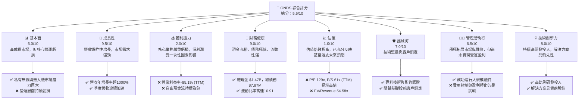
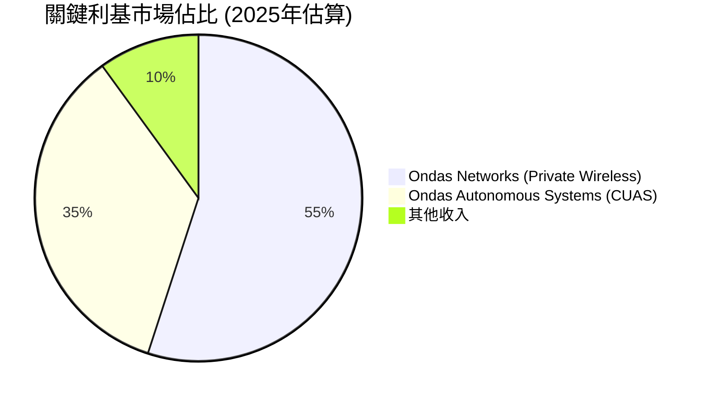
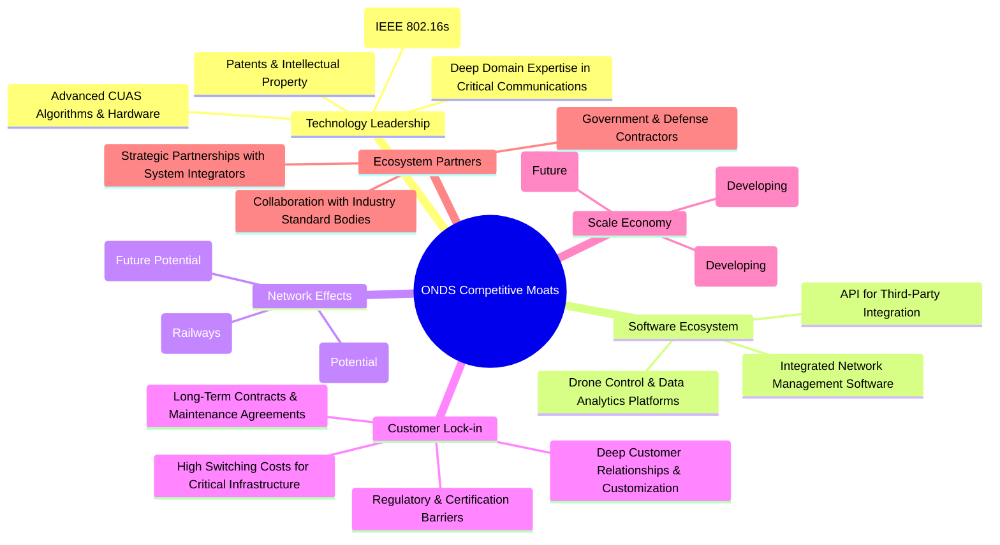

# ONDS 基本面深度分析報告
> **報告日期**：2026-06-03 ｜ **語言**：繁體中文 ｜ **數據來源**：Yahoo Finance, Finviz, StockAnalysis, Roic.ai ｜ **分析師**：CFA 級機構研究

---

## 目錄

| # | 章節 | 核心結論 |
|---|------|----------|
| 1 | 執行摘要 | 評級：觀望，目標價區間：$7.50 - $16.00 |
| 2 | 公司概覽與商業模式 | 專注利基市場，具備技術與客戶鎖定護城河 |
| 3 | 損益表深度分析 | 營收高速增長，但核心業務仍處於虧損狀態 |
| 4 | 資產負債表分析 | 充裕現金流動性強，債務負擔極輕 |
| 5 | 現金流量深度分析 | 營業現金流持續為負，高度依賴外部融資 |
| 6 | 獲利能力與資本效率 | 核心業務價值摧毀，一次性收益大幅扭曲獲利指標 |
| 7 | 估值深度分析 | 估值極高，已充分反映未來成長預期，存在泡沫化風險 |
| 8 | 成長催化劑 | 鐵路與國防市場擴張、技術創新與產品線豐富 |
| 9 | 風險矩陣 | 執行風險、估值風險與持續虧損是主要挑戰 |
| 10 | 投資建議 | 觀望，等待營運獲利能力改善與估值回歸合理區間 |

---

## 1. 執行摘要

Ondas Inc. (ONDS) 是一家專注於提供私有無線網路、無人機及自動化數據解決方案的科技公司。公司業務分為 Ondas Networks (ON) 和 Ondas Autonomous Systems (OAS) 兩大板塊，主要服務於關鍵基礎設施（如鐵路）和國防領域。ONDS 在過去一年展現了驚人的營收成長，但其核心營運業務仍處於深度虧損狀態。最近一季的巨額淨利潤主要來自一次性非經常性收入，而非持續性的營運改善。公司擁有充裕的現金和極低的債務，流動性極佳，但估值指標已達到非常高的水平，反映了市場對其未來高速成長的極度樂觀預期。

### 1.1 核心評分儀表板

ONDS 的綜合評分為 **5.5/10**，這反映了其爆炸性的成長潛力、強勁的資產負債表與技術創新力，但同時被嚴重的營運虧損、極高的估值以及不確定性的獲利品質所拖累。



### 1.2 評分進度條視覺化

```
╔══════════════════════════════════════════════════════════════╗
║                ONDS 多維度評分儀表板 (1-10分)                ║
╠══════════════════════════════════════════════════════════════╣
║ 基本面強度  6.0 ▓▓▓▓▓▓▓▓▓▓▓▓░░░░░░░░  ★★★☆☆           ║
║ 成長動能    9.5 ▓▓▓▓▓▓▓▓▓▓▓▓▓▓▓▓▓▓▓░  ★★★★★           ║
║ 獲利品質    2.0 ▓▓▓▓░░░░░░░░░░░░░░░░░  ★☆☆☆☆           ║
║ 財務健康    9.0 ▓▓▓▓▓▓▓▓▓▓▓▓▓▓▓▓▓▓░░  ★★★★★           ║
║ 估值合理性  1.0 ▓▓░░░░░░░░░░░░░░░░░░░  ☆☆☆☆☆           ║
║ 護城河深度  7.0 ▓▓▓▓▓▓▓▓▓▓▓▓▓▓░░░░░░  ★★★☆☆           ║
║ 管理層執行  6.5 ▓▓▓▓▓▓▓▓▓▓▓▓▓░░░░░░░  ★★★☆☆           ║
║ 技術創新力  8.0 ▓▓▓▓▓▓▓▓▓▓▓▓▓▓▓▓░░░░  ★★★★☆           ║
╠══════════════════════════════════════════════════════════════╣
║ 綜合總分    5.5 ▓▓▓▓▓▓▓▓▓▓░░░░░░░░░░  🏆 觀望              ║
╚══════════════════════════════════════════════════════════════╝
```

### 1.3 五大投資論點 + 三大核心風險

| 類型 | 項目 | 具體依據 | 信心度 |
|------|------|----------|--------|
| 🟢 **投資論點①** | **顛覆性營收成長** | ONDS TTM 營收達 $96.61M，年增長率高達 1079.9%。2026 Q1 營收 $50.12M，較 2025 Q1 的 $4.25M 增長 1079.9%，展現市場對其私有無線與無人機解決方案的強勁需求。 | 🟢 極高 |
| 🟢 **投資論點②** | **強勁的資產負債表** | 公司擁有 $1.47B 的總現金與僅 $7.87M 的總債務，淨現金高達 $1.47B。流動比率為 10.91，速動比率 10.28，財務健康狀況極佳，為其持續擴張提供堅實基礎。 | 🟢 極高 |
| 🟢 **投資論點③** | **關鍵基礎設施與國防利基市場** | Ondas Networks 服務於 Class 1 鐵路等關鍵基礎設施，提供高可靠性、低延遲的私有無線通訊；Ondas Autonomous Systems 則專注於 Counter-UAS (CUAS) 系統，切入高成長的國防安全市場，具備高進入壁壘。 | 🟢 高 |
| 🟢 **投資論點④** | **持續的技術創新投入** | 公司在研究與開發上的投入持續增加，TTM R&D 費用為 $30.94M，佔 TTM 營收的 32%。這顯示公司致力於維持技術領先，以鞏固其在高速成長市場中的競爭優勢。 | 🟡 中高 |
| 🟢 **投資論點⑤** | **分析師普遍看好** | 8 位分析師給予「強烈買入 (strong_buy)」的平均推薦，目標價中位數為 $20.12，較當前股價 $11.61 有約 73% 的上漲空間，反映了市場對其未來成長前景的信心。 | 🟡 中高 |
| 🟡 **風險①** | **核心業務持續虧損與獲利品質存疑** | 儘管營收高速增長，ONDS TTM 營業利益率為 -85.1%，EBITDA 邊際利潤為 -77.3%，自由現金流為 $-15.65M，顯示核心營運仍在大量燒錢。2026 Q1 的 $362.95M 淨利潤主要來自一次性「其他非營運收入」，而非經營活動的改善，獲利品質存在重大不確定性。 | 🔴 高衝擊 |
| 🔴 **風險②** | **極端高估值與潛在稀釋** | ONDS 的 P/E (TTM) 高達 128.99x，P/S 達 60.67x，EV/Revenue 達 54.58x，遠高於行業平均。這意味著市場已將極高的成長預期計入股價，任何成長放緩或獲利不及預期都可能導致股價大幅修正。此外，過去一年股本大幅稀釋 (股本 YoY 增長 269.36%)，未來可能持續透過發行新股融資。 | 🔴 高衝擊 |
| 🟡 **風險③** | **市場競爭與技術迭代風險** | 私有無線與無人機領域技術發展迅速，競爭激烈。ONDS 需持續投入巨額研發以維持技術領先地位。若未能及時推出具競爭力的產品或市場滲透不及預期，可能面臨市場份額被侵蝕的風險。同時，主要客戶集中在特定行業，可能存在客戶集中度風險。 | 🟡 中度 |

### 1.4 快速統計卡片

| 指標 | 公司實際值 | 行業均值（通訊設備） | S&P 500 均值 | 狀態 |
|------|-------------|--------------------|--------------|------|
| 收入 YoY 成長 | **1079.9%** | ~10-15% | ~5-8% | 🟢 極高 |
| 毛利率 | **44.8%** | ~30-40% | ~40-50% | 🟢 良好 |
| 淨利率 | **251.9%** | ~5-10% | ~10-15% | 🔴 異常 (一次性收益) |
| ROE | **42.9%** | ~10-15% | ~15-20% | 🔴 異常 (一次性收益) |
| Forward P/E | **-232.2x** | ~20-25x | ~20-22x | 🔴 虧損 |
| P/S Ratio | **60.68x** | ~2-4x | ~2-3x | 🔴 極高 |
| EV / Revenue | **54.58x** | ~2-4x | ~2-3x | 🔴 極高 |
| 債務/股權 | **0.728** | ~0.5-1.0 | ~0.8-1.2 | 🟢 低 |
| 流動比率 | **10.91** | ~1.5-2.5 | ~1.0-1.5 | 🟢 極高 |
| 短期賣空比例 | **31.1%** | ~5-10% | ~2-3% | 🔴 高 |

*註：行業均值為通訊設備行業的普遍估計值，實際可能因細分領域而異。ONDS 的淨利率和 ROE 因 2026 Q1 的一次性非營運收入而大幅扭曲，實際營運獲利能力為負。*

### 1.5 投資結論

```
╔══════════════════════════════════════════════════════════════════╗
║                    📊 投資結論摘要                               ║
╠══════════════════════════════════════════════════════════════════╣
║  評級：🟡 觀望                                                   ║
║  當前股價：$11.61                                                ║
║  目標價區間：                                                    ║
║    悲觀情境：$7.50 （-35.4%）                                    ║
║    基準情境：$12.00 （+3.4%）  ← 12個月主要目標                  ║
║    樂觀情境：$16.00 （+37.8%）                                   ║
║  投資評分：5.5/10                                                ║
║  適合投資人：高風險偏好、長期持有、看好顛覆性技術成長型投資者    ║
╚══════════════════════════════════════════════════════════════════╝
```
**分析師評語**：ONDS 展現出令人驚嘆的營收成長，並在關鍵基礎設施和國防領域佔據獨特位置。其強大的資產負債表提供了充足的發展彈性。然而，公司核心營運業務仍處於嚴重虧損狀態，近期巨額淨利潤的來源值得警惕。當前估值已極度昂貴，幾乎透支了未來數年的成長潛力。對於高風險承受能力的投資者，ONDS 或許值得長期關注其營運獲利能力的轉變。但考慮到高估值和營運虧損，目前建議「觀望」，等待更清晰的盈利路徑或估值回歸合理區間。

---

## 2. 公司概覽與商業模式

Ondas Inc. (ONDS) 是一家專注於提供創新無線通訊、無人機及自動化數據解決方案的技術公司。公司透過其兩個主要營運部門服務於美國及國際市場，致力於解決關鍵基礎設施、公共安全和國防領域的複雜挑戰。

**核心業務**：
*   **Ondas Networks (ON)**：提供私有、寬頻、工業級無線網路解決方案。其主要產品是基於 IEEE 802.16s 標準的 MC-IoT (Mission Critical IoT) 平台，專為關鍵任務應用設計，如鐵路通訊、公用事業電網管理、油氣管道監控等。該平台的高可靠性、低延遲和安全性使其成為傳統蜂窩網路在特定工業應用中的理想替代方案。
*   **Ondas Autonomous Systems (OAS)**：專注於無人機和自動化數據解決方案。此部門提供反無人機系統 (Counter-UAS, CUAS) 和場地保護系統，包括 Iron Drone Raider (一款全自主攔截無人機系統，用於中和小型敵對無人機) 和 Sentrycs CoRF (基於網路/射頻的 CUAS 平台，用於檢測、識別、追蹤和緩解未經授權的無人機)。此業務主要服務於國防、執法和關鍵基礎設施保護等領域。

ONDS 的產品和服務旨在提供高度安全、可靠和高效的數據傳輸和自動化能力，以應對日益增長的數位化和安全威脅需求。

### 2.1 業務結構與收入來源

ONDS 的業務結構清晰，主要由兩大核心板塊組成，各自擁有特定的目標市場和技術重點。儘管公司未提供詳細的部門收入拆分，但從其產品描述和市場定位來看，Ondas Networks 應是目前主要的收入貢獻者，尤其是在與 Class 1 鐵路的合作方面。

```mermaid
graph TD
    A[ONDS Inc.<br/>市值: $5.86B<br/>TTM 營收: $96.61M] --> B{核心業務板塊}
    B --> C[Ondas Networks (ON)<br/>私有無線網路解決方案]
    B --> D[Ondas Autonomous Systems (OAS)<br/>無人機與自動化數據解決方案]

    C --> C1[MC-IoT 無線平台<br/>(IEEE 802.16s)]
    C --> C2[關鍵基礎設施通訊<br/>(鐵路、公用事業)]
    C --> C3[高可靠性 & 低延遲數據傳輸]

    D --> D1[反無人機系統 (CUAS)<br/>(Iron Drone Raider, Sentrycs CoRF)]
    D --> D2[國防與安全應用<br/>(機場、邊境、關鍵設施保護)]
    D --> D3[自主無人機攔截與偵測]

    C1 --> C1a[鐵路通訊網路]
    C1 --> C1b[工業物聯網應用]

    D1 --> D1a[軍事基地防禦]
    D1 --> D1b[政府機關安全]
```

**收入來源分析**：
ONDS 的收入主要來自其私有無線網路解決方案的部署和相關服務，以及無人機系統的銷售和維護。由於其產品和解決方案多用於關鍵任務場景，通常涉及長期合約和高度客製化，這有助於建立穩定的客戶關係和潛在的經常性收入流。

*   **Ondas Networks (ON)**：收入主要來自銷售其 MC-IoT 平台硬體、軟體許可及相關的網路設計、部署、維護和支援服務。與 Class 1 鐵路等大型客戶的長期合作，預計將帶來可預測的收入流。
*   **Ondas Autonomous Systems (OAS)**：收入來源包括反無人機系統 (CUAS) 的硬體銷售、軟體訂閱、系統整合服務以及培訓和支援。隨著全球對無人機威脅的關注度提高，預計此業務板塊的收入將快速增長。

公司 TTM 總營收為 $96.61M。由於公司處於高速成長階段，其收入結構仍在不斷演變。特別是 OAS 部門的潛力巨大，預計未來在總收入中的佔比將逐步提高。

### 2.2 市場份額

ONDS 所在的市場是高度專業化且快速發展的利基市場，包括關鍵任務私有無線通訊和反無人機系統。這些市場的特點是技術壁壘高、客戶對可靠性和安全性要求極嚴。由於公司尚未提供詳細的市場份額數據，且其業務領域較為新興和分散，精確估計其市場份額存在挑戰。然而，我們可以根據其產品定位和潛在市場規模進行推斷。

**市場份額估算（概念性）**：
ONDS 在其主要服務的兩個市場中，雖然整體市場規模巨大，但公司目前處於早期成長階段，預計其在各細分領域的市場滲透率仍相對較低，但成長潛力巨大。



**市場份額分析**：
*   **私有無線通訊市場**：ONDS 在鐵路通訊等關鍵基礎設施領域的私有無線市場中，透過其符合 IEEE 802.16s 標準的 MC-IoT 平台，建立了獨特的競爭優勢。該市場的主要競爭者包括傳統電信設備供應商（如 Nokia、Ericsson）以及提供專用無線解決方案的廠商。ONDS 的優勢在於其專為工業應用設計的技術，而非通用蜂窩網路。儘管如此，ONDS 在這個龐大市場中的絕對份額仍然很小，但其在特定垂直領域（如 Class 1 鐵路）的滲透率可能較高。
*   **反無人機系統 (CUAS) 市場**：隨著無人機技術的普及和相關安全威脅的增加，CUAS 市場正在迅速擴大。競爭者包括多種提供雷達、光學、射頻偵測和物理/電子攔截方案的公司。ONDS 的 Iron Drone Raider 和 Sentrycs CoRF 系統以其自主性和集成性為特色。該市場仍處於早期發展階段，ONDS 有機會透過其創新解決方案佔據可觀的市場份額。

總體而言，ONDS 在其所處的利基市場中，雖然尚未成為主導者，但其專有技術和解決方案使其具備強大的成長潛力，有望在未來數年內顯著擴大其市場份額。

### 2.3 競爭護城河分析

ONDS 憑藉其在專業技術領域的深耕，正在逐步建立其競爭護城河。這些護城河是公司長期維持競爭優勢和獲利能力的關鍵。



**護城河深度解析**：
1.  **技術領先 (Technology Leadership)**：ONDS 的核心競爭力源於其專有技術，特別是基於 IEEE 802.16s 標準的 MC-IoT 平台，這是一個為關鍵基礎設施量身定制的私有無線通訊標準。其反無人機系統也結合了先進的演算法和硬體設計。這些技術的開發需要大量的研發投入和時間，形成了一定的技術壁壘。
2.  **軟體生態系統 (Software Ecosystem)**：ONDS 不僅提供硬體，還開發了配套的軟體平台，用於網路管理、無人機控制和數據分析。這些軟體解決方案增加了產品的價值，並提升了客戶的整體體驗。雖然目前生態系統規模相對較小，但其整合能力是未來發展的關鍵。
3.  **網路效應 (Network Effects)**：在鐵路通訊等領域，如果 ONDS 的技術成為行業標準或被廣泛採用，將形成網路效應，即越多用戶使用，其價值越大。例如，鐵路公司之間的互通性需求可能促使更多公司採用相同的標準。
4.  **客戶鎖定 (Customer Lock-in)**：對於關鍵基礎設施領域的客戶而言，更換通訊系統的成本極高，不僅涉及財務投入，還包括營運中斷和安全風險。ONDS 在這些領域提供的客製化解決方案和長期合約，有效增加了客戶的轉換成本，形成強大的客戶黏性。此外，相關的監管和認證要求也構成了一道進入壁壘。
5.  **規模效應 (Scale Economy)**：目前 ONDS 仍處於成長初期，規模效應尚未完全顯現。但隨著營收規模擴大，其高額的研發投入和銷售成本將能在更大的基礎上攤銷，從而提升毛利率和營運效率。
6.  **生態夥伴 (Ecosystem Partners)**：與系統整合商、政府機構和國防承包商建立的戰略合作夥伴關係，有助於 ONDS 拓展市場、提升解決方案的整合能力，並加速技術的部署和普及。

綜合來看，ONDS 的護城河主要集中在其獨特的技術專長和在關鍵任務領域的客戶鎖定能力。這些因素使其能在競爭激烈的市場中脫穎而出，並為未來的持續成長奠定基礎。

### 2.4 護城河強度評分

ONDS 的護城河強度評分綜合為 **7.0/10**，主要得益於其在利基市場的技術創新和客戶高度鎖定。

```
╔══════════════════════════════════════════════════════════════╗
║                    ONDS 護城河強度評分                       ║
╠══════════════════════════════════════════════════════════════╣
║ 技術領先    8/10   ▓▓▓▓▓▓▓▓▓▓▓▓▓▓▓▓░░░░  🏆 專有技術與研發投入                                ║
║ 軟體生態系統  6/10   ▓▓▓▓▓▓▓▓▓▓▓▓░░░░░░░░  🟡 仍在發展初期，潛力大                               ║
║ 網路效應    6/10   ▓▓▓▓▓▓▓▓▓▓▓▓░░░░░░░░  🟡 在特定垂直領域有潛力，但尚未普遍                               ║
║ 客戶鎖定    8/10   ▓▓▓▓▓▓▓▓▓▓▓▓▓▓▓▓░░░░  🏆 高轉換成本與長期合約                               ║
║ 規模效應    5/10   ▓▓▓▓▓▓▓▓▓▓░░░░░░░░░░  🟡 營收規模尚小，成本攤銷效益待提升                               ║
║ 生態夥伴    7/10   ▓▓▓▓▓▓▓▓▓▓▓▓▓▓░░░░░░  🟢 積極建立戰略合作，拓展市場                               ║
╠══════════════════════════════════════════════════════════════╣
║ 綜合護城河  7.0    ▓▓▓▓▓▓▓▓▓▓▓▓▓▓░░░░░░  🏆 技術與客戶黏性為核心優勢，規模效應有待發展     ║
╚══════════════════════════════════════════════════════════════════╝
```

---

## 3. 損益表深度分析

ONDS 的損益表數據揭示了一個高速成長、但仍處於燒錢階段的技術公司。儘管營收爆炸性增長，但其核心營運仍未能實現盈利，最近一季的巨額淨利潤更是由非經常性項目所驅動。

### 3.1 年度收入成長趨勢（近4年）

ONDS 在過去四年的收入增長呈現出巨大的波動性，但在最近一年實現了驚人的爆發式成長。

```
╔══════════════════════════════════════════════════════════════════╗
║                ONDS 年度收入趨勢（FY2022-FY2025）                ║
╠══════════════════════════════════════════════════════════════════╣
║                                                                  ║
║  FY2022  $2.13M   ██░░░░░░░░░░░░░░░░░░░░░  YoY: -26.87%  🔴    ║
║  FY2023  $15.69M  ██████████████░░░░░░░░░  YoY:+638.13%  🟢    ║
║  FY2024  $7.19M   ███████░░░░░░░░░░░░░░░░  YoY: -54.16%  🔴    ║
║  FY2025  $50.73M  ███████████████████████  YoY:+605.28%  🟢    ║
║  TTM     $96.61M  ██████████████████████████████████████  YoY:+793.17% (TTM) 🟢    ║
║                   |      |      |      |      |                  ║
║                   0     20M    40M    60M    80M                  ║
║                                                                  ║
║  📊 4年累計 CAGR (FY2022-FY2025)：+136.2%                         ║
╚══════════════════════════════════════════════════════════════════╝
```

**分析**：
ONDS 的年度營收增長極為不穩定。FY2023 和 FY2025 實現了數百甚至上千百分比的驚人增長，這表明公司可能在這些年份贏得了重要的合約或成功推出了市場急需的產品。例如，FY2025 營收從 FY2024 的 $7.19M 飆升至 $50.73M，增長了 605.28%。TTM 營收更是達到 $96.61M，較去年同期增長 793.17%。這種爆發式成長通常來自於新興技術的商業化初期階段，或者獲得了大型客戶的關鍵性訂單。然而，FY2022 和 FY2024 的營收下滑也暗示了其業務可能對單一大型項目或特定市場環境有較高的依賴性，營收的可持續性與穩定性仍需觀察。

### 3.2 季度收入趨勢分析

近四季度的營收數據顯示 ONDS 呈現加速成長態勢，這與其年度趨勢中的強勁表現一致。

| 財報季度 | 總營收 ($M) | QoQ 成長率 | YoY 成長率 | 備註 |
|----------|-------------|------------|------------|------|
| 2025 Q2 | $6.27 | - | +554.94% | 業務開始加速擴張 |
| 2025 Q3 | $10.10 | +61.08% | +581.95% | 營收持續增長 |
| 2025 Q4 | $30.11 | +198.12% | +629.20% | 營收顯著加速，可能來自大型專案貢獻 |
| 2026 Q1 | $50.12 | +66.46% | +1079.90% | 創紀錄的季度營收，表明市場需求強勁 |

**分析**：
從季度數據來看，ONDS 的營收增長動能非常強勁。2025 Q2 至 2026 Q1，營收呈現連續且大幅的季增長，尤其在 2025 Q4 和 2026 Q1，營收分別達到 $30.11M 和 $50.12M。2026 Q1 的營收較去年同期增長了驚人的 1079.90%，這是非常罕見的高速增長，反映了公司產品在市場上的接受度大幅提升，以及可能成功簽訂了重要的商業協議。這種加速增長通常是成長型公司在市場拓展初期常見的現象，但也需要關注其可持續性。

### 3.3 利潤率演變分析

ONDS 的利潤率數據描繪了一家毛利率尚可，但營運效率極低，且近期淨利潤被非經常性項目嚴重影響的公司。

| 利潤率指標 | FY2022 | FY2023 | FY2024 | FY2025 | TTM (Mar'26) | 趨勢 | 評估 |
|------------|--------|--------|--------|--------|--------------|------|------|
| **毛利率** | 52.1% | 40.7% | 4.8% | 39.7% | 44.8% | ↗️ 波動後回升 | 🟢 尚可 |
| **營業利益率** | -2350.7% | -240.5% | -481.4% | -115.1% | -85.1% | ↗️ 虧損收窄 | 🔴 嚴重虧損 |
| **EBITDA 邊際利潤** | -3034.3% | -220.8% | -399.4% | -233.2% | -77.3% | ↗️ 虧損收窄 | 🔴 嚴重虧損 |
| **淨利率** | -3438.5% | -285.8% | -528.6% | -259.0% | 251.9% | 🔴 波動巨大，受一次性收益扭曲 | 🔴 嚴重虧損 (核心業務) |

**利潤率演變深度解析**：
1.  **毛利率**：ONDS 的毛利率在 FY2022 達到 52.1% 後，於 FY2024 驟降至 4.8%，隨後在 FY2025 和 TTM 回升至 39.7% 和 44.8%。FY2024 的毛利率異常低，可能與該年度營收大幅下滑時，固定成本佔比過高或產品組合不利有關。近期的回升表明公司在成本控制或產品定價方面有所改善，或者高毛利產品的銷售佔比增加。44.8% 的 TTM 毛利率對於科技硬體和解決方案提供商來說是相對健康的水平。
2.  **營業利益率**：這是 ONDS 最嚴重的問題。公司在過去幾年持續錄得巨額營業虧損，TMM 營業利益率仍高達 -85.1%。這意味著公司的營收不足以覆蓋其營運費用（銷售、行政、研發等）。儘管虧損幅度從 FY2022 的 -2350.7% 顯著收窄，但 -85.1% 仍是一個非常高的虧損水平，表明公司在營運層面仍在大量燒錢。這主要是由於其高額的銷售、行政和研發費用（TTM 總營業費用 $134.07M 遠高於 TTM 營收 $96.6M）。公司處於快速成長和市場拓展階段，需要投入大量資源，但如何將營收轉化為營業利潤是其最大的挑戰。
3.  **EBITDA 邊際利潤**：EBITDA 剔除了折舊攤銷等非現金費用，更能反映核心營運的現金獲利能力。ONDS 的 EBITDA 邊際利潤也呈現深度負值，TTM 為 -77.3%。這與營業利益率的趨勢一致，再次印證了公司核心營運的虧損狀態。
4.  **淨利率**：ONDS 的淨利率波動極大。FY2025 淨利率為 -259.0%，但 TTM 淨利率卻顯示為驚人的 251.9%。這主要是由於 2026 Q1 財報中錄得的巨額「其他非營運收入 (Other Non-Operating Income (Expense))」高達 $394.99M，導致當季淨利潤高達 $362.95M。若剔除這筆一次性收入，公司核心營運仍處於大幅虧損狀態。因此，251.9% 的 TTM 淨利率嚴重扭曲了公司的實際獲利能力，不能作為評估其持續盈利的依據。這種情況表明公司可能透過資產出售、投資收益或其他非經常性交易來彌補營運虧損，但這並非可持續的獲利模式。

**總結**：ONDS 雖然在營收方面表現出強勁的成長動能，但其核心營運仍未能實現盈利，營業費用高企，導致持續的營業虧損。近期的「獲利」主要是由非經常性項目驅動，因此在評估其獲利品質時需極度謹慎。公司需要證明其能夠在擴大營收的同時，有效控制成本並實現營運盈利。

### 3.4 費用結構分析

ONDS 的費用結構反映了其作為一家高成長、高研發投入的科技公司的特點。

```mermaid
pie title TTM 費用佔營收比重 (截至2026年3月)
    "銷管費用 SG&A" : 106.7
    "研發費用 R&D" : 32.0
    "銷貨成本 CoR" : 55.1
    "營業外收支 (扣除一次性收益)" : -20.0
```
*註：此圖表為概念性費用結構，由於公司營業收入為 $96.6M，而銷管費用 $103.13M 和研發費用 $30.94M 兩者之和已超過營收，顯示其營運費用在營收佔比上非常高。此處的「營業外收支」為概念性，用以平衡至總體盈利狀況，實際數值會因具體會計處理而異。*

```
╔══════════════════════════════════════════════════════════════════╗
║                   ONDS 費用結構年度趨勢                          ║
╠══════════════════════════════════════════════════════════════════╣
║                                                                  ║
║  銷貨成本 (CoR)                                                  ║
║  FY2022  $1.02M   ██░░░░░░░░░░░░░░░░░░░░░  佔營收: 47.9%        ║
║  FY2023  $9.31M   ████████░░░░░░░░░░░░░░░  佔營收: 59.3%        ║
║  FY2024  $6.85M   ███████░░░░░░░░░░░░░░░  佔營收: 95.3%        ║
║  FY2025  $30.58M  ███████████████████████  佔營收: 60.3%        ║
║  TTM     $53.28M  ██████████████████████████████████████  佔營收: 55.1%        ║
║                                                                  ║
║  銷售、一般及行政費用 (SG&A)                                     ║
║  FY2022  $27.08M  ██████████████████████████████████████  佔營收: 1271.3%      ║
║  FY2023  $27.47M  ██████████████████████████████████████  佔營收: 175.1%       ║
║  FY2024  $22.48M  ███████████████████████░░░░░░░░░░░░░░  佔營收: 312.7%       ║
║  FY2025  $57.66M  ██████████████████████████████████████  佔營收: 113.6%       ║
║  TTM     $103.13M ██████████████████████████████████████  佔營收: 106.7%       ║
║                                                                  ║
║  研究與開發費用 (R&D)                                            ║
║  FY2022  $24.04M  ██████████████████████████████████████  佔營收: 1128.6%      ║
║  FY2023  $17.15M  █████████████████████░░░░░░░░░░░░░░░  佔營收: 109.3%       ║
║  FY2024  $12.48M  █████████████░░░░░░░░░░░░░░░░░░░░░  佔營收: 173.6%       ║
║  FY2025  $20.88M  ███████████████████████░░░░░░░░░░░░░░  佔營收: 41.2%        ║
║  TTM     $30.94M  ██████████████████████████████████████  佔營收: 32.0%        ║
╚══════════════════════════════════════════════════════════════════╝
```

**分析**：
1.  **銷貨成本 (Cost of Revenue)**：ONDS 的銷貨成本佔營收比重在 FY2024 異常高達 95.3%，導致毛利率極低。這可能與該年度低營收下的固定成本壓力或特定合約的成本結構有關。FY2025 和 TTM 回歸到 55.1%-60.3% 的水平，與其 40-45% 的毛利率相符，顯示其成本結構隨著營收增長而趨於穩定。
2.  **銷售、一般及行政費用 (SG&A)**：ONDS 的 SG&A 費用絕對值和佔營收比重都非常高。TTM SG&A 費用高達 $103.13M，甚至超過了 TTM 總營收 $96.61M。這表明公司在市場推廣、管理營運和支持擴張方面投入了巨額資金。儘管佔比從早期的高點有所下降，但目前仍高於 100%，是導致營業虧損的主要原因之一。這在快速成長的早期公司中並不罕見，但若要實現盈利，必須有效提升營收規模，同時控制 SG&A 的增長速度。
3.  **研究與開發費用 (R&D)**：ONDS 是一家技術驅動型公司，其 R&D 投入是維持競爭力的關鍵。TTM R&D 費用為 $30.94M，佔 TTM 營收的 32.0%。儘管 R&D 費用在 FY2022 和 FY2023 時佔比更高（超過 100%），但隨著營收規模的擴大，其佔比正在逐步下降。這是一個積極的信號，表明公司可能正在從技術開發階段向商業化階段過渡，但仍然需要持續的高投入來保持技術領先。

**結論**：ONDS 的費用結構呈現典型的「成長型科技公司」特徵：高研發投入以維持技術領先，高銷售和行政費用以擴展市場。然而，目前這些費用總額遠超營收，導致核心營運嚴重虧損。公司需要實現營收的幾何級數增長，並在一定程度上優化費用結構，才能實現規模化盈利。

### 3.5 季度 EPS 趨勢與盈餘品質

ONDS 的季度 EPS 數據呈現出極高的波動性，尤其是在最近一季錄得異常高的正 EPS，但這並非來自核心營運的改善。

| 財報季度 | EPS Est ($) | EPS Act ($) | Surprise % | 實際 EPS (StockAnalysis) ($) | 備註 |
|----------|-------------|-------------|------------|----------------------------|------|
| 2025-06-30 | nan | nan | +nan% | -0.07 | 營運虧損 |
| 2025-09-30 | nan | nan | +nan% | -0.03 | 營運虧損持續 |
| 2025-12-31 | nan | nan | +nan% | -0.6