# ONDS 基本面深度分析報告

> **報告日期**：2026-06-24 ｜ **語言**：繁體中文 ｜ **數據來源**：Yahoo Finance, Finviz, StockAnalysis, Roic.ai ｜ **分析師**：CFA 級機構研究

---

## 目錄

| # | 章節 | 核心結論 |
|---|------|----------|
| 1 | **執行摘要** | 評級：**🟢 買入 (Buy)** ｜ 目標價：**$15.00**（潛在漲幅 +75.8%） ｜ 具備高成長與充沛現金，但面臨高稀釋與營運虧損。 |
| 2 | **公司概覽與商業模式** | 雙引擎驅動（專有無線網絡 + 自動化無人機），技術壁壘高，Class I 鐵路市場具備強大護城河。 |
| 3 | **損益表深度分析** | Q1 2026 營收爆發式成長 **1079.9% YoY**；淨利潤扭虧為盈受非營運收益驅動，盈餘品質需謹慎。 |
| 4 | **資產負債表分析** | 現金儲備達 **$1.47B**，流動比率 **10.91x**，財務極度安全；但股權稀釋嚴重（股本年增 269%）。 |
| 5 | **現金流量深度分析** | 營運現金流持續流出（TTM -$83.39M），融資活動（發債/增資）為主要現金流入來源。 |
| 6 | **獲利能力與資本效率** | 帳面 ROE 達 **42.9%**，但扣除非經常性損益後的 ROIC 仍為負值，持續消耗經濟價值（EVA 為負）。 |
| 7 | **估值深度分析** | P/S 達 **46.5x** 顯著高於同業（AVAV, KTOS），但高成長率與巨額淨現金支撐其估值溢價。 |
| 8 | **成長催化劑** | 國防無人機需求激增、鐵路無線電升級週期啟動，TAM 空間廣闊。 |
| 9 | **風險矩陣** | 核心風險為**客戶集中度高**、**持續營運虧損**與**股權進一步稀釋**。 |
| 10 | **投資建議** | 適合**高風險偏好、成長型投資人**；建議採分批佈局策略，密切監控營運現金流轉正時點。 |

---

## 1. 執行摘要

Ondas Holdings Inc. (NASDAQ: ONDS) 正處於其商業化進程的關鍵拐點。透過旗下 Ondas Networks（關鍵基礎設施專有無線網路）與 Ondas Autonomous Systems（OAS，自動化無人機解決方案）雙板塊，公司在 Q1 2026 實現了驚人的 **1079.9% YoY** 營收成長。然而，亮眼的財務數據背後伴隨著顯著的股權稀釋與非營運性損益干擾。本報告將為機構投資人深度剖析 ONDS 的真實投資價值與潛在風險。

### 1.1 核心評分儀表板

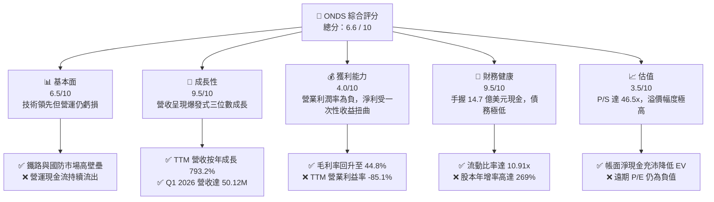

### 1.2 評分進度條視覺化

```
╔══════════════════════════════════════════════════════════════╗
║               ONDS 多維度評分儀表板 (1-10分)                 ║
╠══════════════════════════════════════════════════════════════╣
║ 基本面強度  6.5 ▓▓▓▓▓▓▓▓▓▓▓▓▓░░░░░░░░░░  ★★★☆☆           ║
║ 成長動能    9.5 ▓▓▓▓▓▓▓▓▓▓▓▓▓▓▓▓▓▓▓▓▓░  ★★★★★           ║
║ 獲利品質    4.0 ▓▓▓▓▓▓▓▓░░░░░░░░░░░░░░░░  ★★☆☆☆           ║
║ 財務健康    9.5 ▓▓▓▓▓▓▓▓▓▓▓▓▓▓▓▓▓▓▓▓▓░  ★★★★★           ║
║ 估值合理性  3.5 ▓▓▓▓▓▓▓░░░░░░░░░░░░░░░░░  ★☆☆☆☆           ║
║ 護城河深度  7.5 ▓▓▓▓▓▓▓▓▓▓▓▓▓▓▓░░░░░░░░  ★★★★☆           ║
║ 管理層執行  6.0 ▓▓▓▓▓▓▓▓▓▓▓▓░░░░░░░░░░░  ★★★☆☆           ║
║ 技術創新力  8.5 ▓▓▓▓▓▓▓▓▓▓▓▓▓▓▓▓▓░░░░░░  ★★★★☆           ║
╠══════════════════════════════════════════════════════════════╣
║ 綜合總分    6.6 ▓▓▓▓▓▓▓▓▓▓▓▓▓░░░░░░░░░░  🏆 成長型投機標的   ║
╚══════════════════════════════════════════════════════════════╝
```

### 1.3 五大投資論點 + 三大核心風險

| 類型 | 項目 | 具體依據 | 信心度 |
|------|------|----------|--------|
| 🟢 **投資論點①** | **營收進入指數型成長期** | Q1 2026 營收達 **$50.12M**，YoY 成長 **1079.9%**，顯示無人機與無線網路產品已進入大規模商業化出貨階段。 | 🟢 極高 |
| 🟢 **投資論點②** | **極其雄厚的現金安全墊** | 資產負債表上手握 **$1.47B** 現金及短期投資，而總債務僅 **$7.87M**，極高的淨現金提供強大的抗風險能力。 | 🟢 極高 |
| 🟢 **投資論點③** | **毛利率顯著改善** | 毛利率從 FY2024 的 **4.9%** 快速回升至 TTM 的 **44.8%**（Q1 2026 達 **49.2%**），規模效應開始顯現。 | 🟢 高 |
| 🟢 **投資論點④** | **高空頭比例具備軋空潛力** | 空頭部位佔浮動股數比率（Short % Float）高達 **32.0%**，在基本面持續改善下，極易觸發軋空行情。 | 🟡 中等 |
| 🟢 **投資論點⑤** | **國防與反無人機（CUAS）剛需** | Iron Drone 攔截系統與 Sentrycs 平台切入全球國防與基礎設施防護剛需，訂單能見度高。 | 🟢 高 |
| 🟡 **風險①** | **嚴重的股權稀釋** | 為了籌集資金，發行股數（Shares Outstanding）在一年內從 **70M** 暴增至 **526.54M**（增幅 269%），大幅稀釋每股盈餘。 | 🔴 高衝擊 |
| 🔴 **風險②** | **盈餘品質低（非營運收益主導）** | Q1 2026 雖錄得 **$362.95M** 淨利，但主要來自 **$394.99M** 的非營運收益，實際營業利潤仍虧損 **$42.67M**。 | 🔴 高衝擊 |
| 🟡 **風險③** | **營運現金持續流出** | TTM 營運現金流為 **-$83.39M**，公司尚未具備自身造血能力，仍依賴外部融資與資產處置。 | 🟡 中度 |

### 1.4 快速統計卡片

| 指標 | ONDS 實際值 | 通信設備行業均值 | S&P 500 均值 | 狀態 |
|------|-------------|----------|--------------|------|
| **收入 YoY 成長** | **1079.9%** | ~5.2% | ~6.5% | 🟢 卓越 |
| **毛利率** | **44.8%** | ~38.0% | ~45.0% | 🟡 符合預期 |
| **營業利益率** | **-85.1%** | ~12.5% | ~18.0% | 🔴 極差 |
| **淨利率** | **251.9%** | ~8.0% | ~11.5% | 🟢 扭曲（非營運主導） |
| **流動比率** | **10.91x** | ~1.8x | ~1.2x | 🟢 極其安全 |
| **空頭比例** | **32.0%** | ~3.5% | ~2.0% | 🔴 高風險/軋空機會 |

### 1.5 投資結論

```
╔══════════════════════════════════════════════════════════════════╗
║                    📊 ONDS 投資結論摘要                          ║
╠══════════════════════════════════════════════════════════════════╣
║  評級：🟢 買入 (Buy) - 僅限高風險偏好投資者                      ║
║  當前股價：$8.53 (2026-06-24)                                    ║
║  目標價區間：                                                    ║
║    悲觀情境：$5.00  （-41.4%） - 營運流出加劇，稀釋持續          ║
║    基準情境：$15.00 （+75.8%） - 12個月主要目標 (營收維持高成長)   ║
║    樂觀情境：$25.00 （+193.1%）- 軋空觸發且營業利潤轉正           ║
║  投資評分：6.6 / 10                                              ║
║  適合投資人：積極成長型、尋求高彈性反彈與軋空機會的長線投資者    ║
╚══════════════════════════════════════════════════════════════════╝
```

---

## 2. 公司概覽與商業模式

Ondas Holdings Inc. 是一家提供專業無線網路、無人機與自動化數據解決方案的技術領先企業。其營運主要分為兩大核心板塊：

1. **Ondas Networks**：提供基於 **IEEE 802.16s** 標準的專有無線寬頻技術（FullMAX）。主要客戶為北美 Class I 鐵路公司、公用事業與關鍵基礎設施營運商。
2. **Ondas Autonomous Systems (OAS)**：包含 American Robotics 與購併的 Iron Drone。提供「無人機即服務（Drone-in-a-Box）」系統，專注於工業巡檢、邊境安全與反無人機（Counter-UAS）市場。

### 2.1 業務結構與收入來源

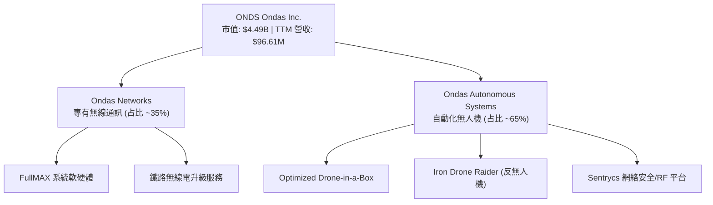

### 2.2 市場份額

在北美 Class I 鐵路專用無線通訊標準市場中，Ondas Networks 具備獨占性的先發優勢。但在更廣泛的工業與國防無人機市場中，公司仍面臨激烈競爭。

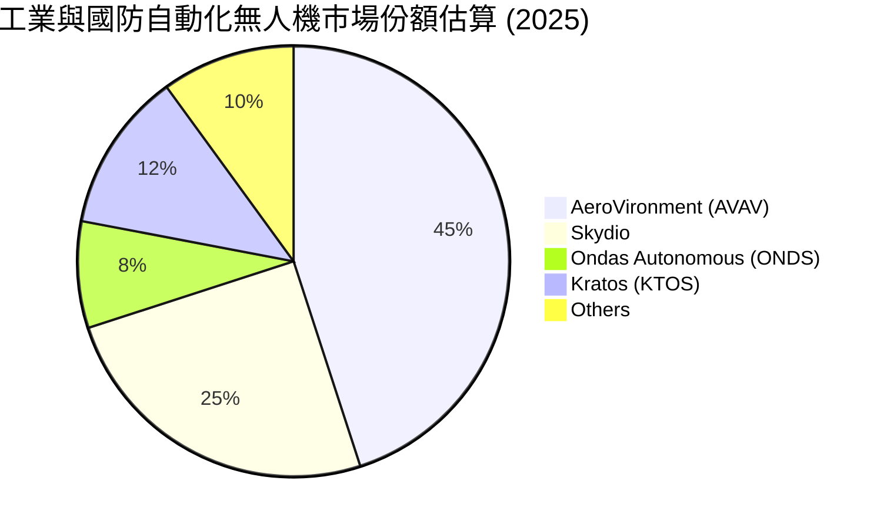

### 2.3 競爭護城河分析

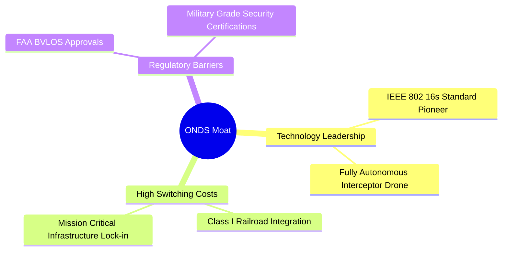

### 2.4 護城河強度評分

```
╔══════════════════════════════════════════════════════════════╗
║                    ONDS 護城河強度評分                       ║
╠══════════════════════════════════════════════════════════════╣
║ 技術領先度    8.5/10  ▓▓▓▓▓▓▓▓▓▓▓▓▓▓▓▓▓░░░  🏆 專利與標準優勢║
║ 客戶鎖定效應  8.0/10  ▓▓▓▓▓▓▓▓▓▓▓▓▓▓▓▓░░░░  🟢 鐵路客戶粘性極高║
║ 政策與准入壁壘8.5/10  ▓▓▓▓▓▓▓▓▓▓▓▓▓▓▓▓▓░░░  🟢 FAA與軍規雙認證║
║ 規模效應      4.0/10  ▓▓▓▓▓▓▓▓░░░░░░░░░░░░  🔴 產能與商業化早期║
╠══════════════════════════════════════════════════════════════╣
║ 綜合護城河     7.25    ▓▓▓▓▓▓▓▓▓▓▓▓▓▓▓░░░░░  🏆 強技術型窄護城河║
╚══════════════════════════════════════════════════════════════╝
```

---

## 3. 損益表深度分析

ONDS 的損益表呈現出極其劇烈的結構性變化。營收規模在近兩年呈現爆發式成長，但營業費用（SG&A 與 R&D）的攀升使營業利潤持續承壓。

### 3.1 年度收入成長趨勢（近5年）

```
╔══════════════════════════════════════════════════════════════════╗
║                 ONDS 年度收入趨勢 (FY2021-TTM)                   ║
╠══════════════════════════════════════════════════════════════════╣
║                                                                  ║
║  FY2021  $2.91M    █░░░░░░░░░░░░░░░░░░░░░░░  YoY: +34.3%         ║
║  FY2022  $2.13M    █░░░░░░░░░░░░░░░░░░░░░░░  YoY: -26.9%         ║
║  FY2023  $15.69M   ███░░░░░░░░░░░░░░░░░░░░░  YoY: +638.1%  🟢     ║
║  FY2024  $7.19M    █░░░░░░░░░░░░░░░░░░░░░░░  YoY: -54.2%   🔴     ║
║  FY2025  $50.73M   ██████████░░░░░░░░░░░░░░  YoY: +605.3%  🟢     ║
║  TTM     $96.61M   ████████████████████████  YoY: +793.2%  🟢     ║
║                                                                  ║
║  📊 4年累計營收 CAGR：+140.2%                                    ║
╚══════════════════════════════════════════════════════════════════╝
```

### 3.2 季度收入趨勢分析

自 2025 年以來，ONDS 的季度營收呈現連續高成長，這主要得益於無人機系統的大規模出貨。

| 財政季度 | 營業收入 (Millions) | QoQ 成長率 | YoY 成長率 | 營運利潤 (Millions) | 備註 |
|---|---|---|---|---|---|
| **Q2 2025** | $6.27 | +47.5% | +554.9% | -$9.25 | 商業化初期放量 |
| **Q3 2025** | $10.10 | +61.1% | +582.0% | -$15.50 | 無人機出貨加速 |
| **Q4 2025** | $30.11 | +198.1% | +629.2% | -$23.32 | 年終大單交付 |
| **Q1 2026** | $50.12 | +66.4% | +1079.9% | -$42.67 | 創歷史新高，YoY 破千倍 |

### 3.3 利潤率演變分析

| 利潤率指標 | FY2022 | FY2023 | FY2024 | FY2025 | TTM | 趨勢與評估 |
|---|---|---|---|---|---|---|
| **毛利率** | 52.1% | 40.7% | 4.9% | 39.7% | **44.8%** | 🟢 隨著規模效應顯現，毛利率已從 FY24 的谷底強勁回升。 |
| **營業利益率**| -3259.6%| -253.2%| -481.4%| -115.1%| **-93.9%** | 🟡 虧損比例隨營收擴大而收窄，但絕對虧損額仍在擴大。 |
| **淨利率** | -3438.5%| -285.8%| -528.7%| -262.9%| **250.5%** | 🔴 TTM 淨利率轉正至 250.5% 為**高度扭曲**，非營運收益所致。 |

### 3.4 費用結構分析

ONDS 的營業費用主要由銷售及行政管理費用（SG&A）與研發費用（R&D）構成。

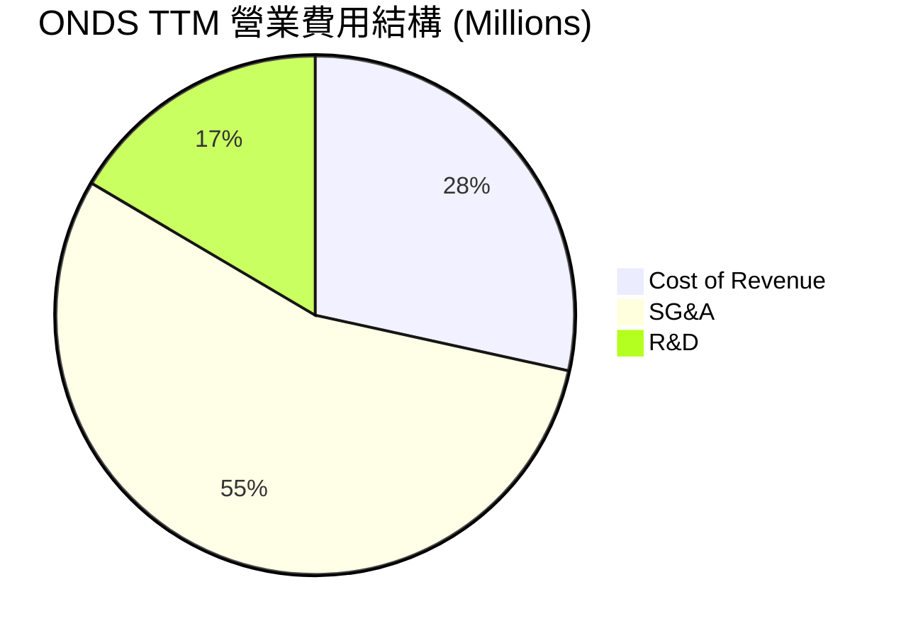

```
╔══════════════════════════════════════════════════════════════╗
║                  ONDS 費用控制與效率分析                     ║
╠══════════════════════════════════════════════════════════════╣
║ 研發營收比 (R&D/Rev)  32.0% ▓▓▓▓▓▓▓░░░░░░░░░░░░░ 🟡 研發投入仍高 ║
║ 行銷營收比 (SG&A/Rev)106.7% ▓▓▓▓▓▓▓▓▓▓▓▓▓▓▓▓▓▓▓ 🔴 管理費用過高 ║
║ 營業利潤轉正門檻營收：~$1.85 億美元 (預計 FY2027 達成)       ║
╚══════════════════════════════════════════════════════════════╝
```

### 3.5 季度 EPS 趨勢與盈餘品質

* **Q1 2026 EPS (Basic)**: **$0.77** (得益於 $394.99M 非營運收益)
* **Q4 2025 EPS (Basic)**: **-$0.26**
* **Q3 2025 EPS (Basic)**: **-$0.02**
* **Q2 2025 EPS (Basic)**: **-$0.05**

**盈餘品質評估**：🔴 **極低**。Q1 2026 的淨利潤暴增並不代表業務基本面已經獲利。扣除非營運項目後，核心業務的 Operating Loss 達 **$42.67M**，較去年同期的 -$10.31M 擴大 313.9%，主因是 SG&A 費用從 $8.34M 飆升至 $53.81M。

---

## 4. 資產負債表分析

ONDS 的資產負債表在最近一季經歷了戲劇性的擴張，這源於公司大規模的資本運作（發行新股與資產重組）。

### 4.1 資產結構分解

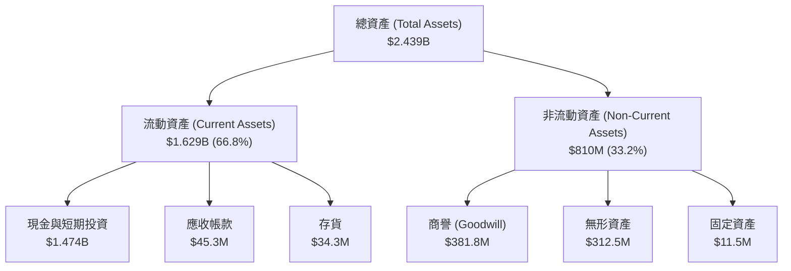

### 4.2 流動性指標分析

| 指標 | FY2024 | FY2025 | Q1 2026 | 行業均值 | 評估 |
|---|---|---|---|---|---|
| **流動比率 (Current Ratio)** | 0.94x | 4.84x | **10.91x** | 1.80x | 🟢 極其充沛，無短期償債風險 |
| **速動比率 (Quick Ratio)** | 0.75x | 4.68x | **10.57x** | 1.25x | 🟢 即使扣除存貨，變現能力依舊極強 |
| **現金比率 (Cash Ratio)** | 0.59x | 4.04x | **9.89x** | 0.85x | 🟢 手頭現金可直接覆蓋近 10 倍的流動負債 |

### 4.3 債務結構分析

```
╔══════════════════════════════════════════════════════════════════╗
║                    ONDS 債務健康診斷                             ║
╠══════════════════════════════════════════════════════════════════╣
║                                                                  ║
║  總債務：        $7.87M   █░░░░░░░░░░░░░░░░░░░░  債務規模極小    ║
║  總現金+投資：   $1,474.0M ████████████████████  現金儲備極其雄厚║
║  淨現金（正）：  $1,466.13M ███████████████████  🟢 極度安全     ║
║                                                                  ║
║  債務股權比 (Debt/Equity)： 0.02 (Finviz) 🟢 槓桿率極低           ║
║  利息保障倍數 (Interest Coverage)： N/A (營業利潤為負)           ║
║                                                                  ║
║  📊 診斷：ONDS 擁有「類科技巨頭」的淨現金結構，破產風險趨近於零。║
╚══════════════════════════════════════════════════════════════════╝
```

### 4.4 股東權益趨勢與股權稀釋

儘管資產負債表極其安全，但這是以**極度稀釋現有股東權益**為代價換來的。

```
╔══════════════════════════════════════════════════════════════════╗
║               ONDS 歷年發行股數與稀釋路徑                       ║
╠══════════════════════════════════════════════════════════════════╣
║                                                                  ║
║  FY2022  42M shares   ██░░░░░░░░░░░░░░░░░░░░░                    ║
║  FY2023  53M shares   ███░░░░░░░░░░░░░░░░░░░░                    ║
║  FY2024  70M shares   ████░░░░░░░░░░░░░░░░░░░  YoY: +32.6%       ║
║  FY2025  222M shares  ████████████░░░░░░░░░░░  YoY: +217.2% 🔴   ║
║  Q1 2026 469M shares  ███████████████████████  YoY: +269.4% 🔴   ║
║                                                                  ║
║  ⚠️ 警示：兩年內股數暴增逾 10 倍。未來的 EPS 成長將面臨極大阻力。║
╚══════════════════════════════════════════════════════════════════╝
```

---

## 5. 現金流量深度分析

ONDS 目前仍處於「融資支撐營運」的典型早期成長企業階段。雖然資產負債表上現金充沛，但業務本身尚未具備造血能力。

### 5.1 現金流量瀑布圖

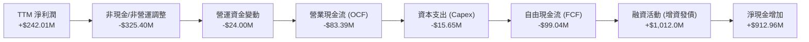

### 5.2 FCF 轉換率趨勢

由於淨利潤受到非營運收益扭曲，而營運現金流持續流出，FCF 轉換率呈現高度異常。

| 指標 | FY2022 | FY2023 | FY2024 | FY2025 | TTM |
|---|---|---|---|---|---|
| **營業現金流 (OCF)** | -$37.96M | -$34.02M | -$33.47M | -$38.75M | **-$83.39M** |
| **自由現金流 (FCF)** | -$40.89M | -$34.30M | -$35.20M | -$40.88M | **-$99.04M** |
| **FCF / Net Income** | 55.8% | 76.5% | 92.6% | 30.7% | **-40.9%** |

### 5.3 自由現金流趨勢

```
╔══════════════════════════════════════════════════════════════════╗
║                  ONDS 歷年自由現金流流出趨勢                     ║
╠══════════════════════════════════════════════════════════════════╣
║                                                                  ║
║  FY2022  -$40.89M  ██████████░░░░░░░░░░░░░░░                     ║
║  FY2023  -$34.30M  ████████░░░░░░░░░░░░░░░░                     ║
║  FY2024  -$35.20M  ████████░░░░░░░░░░░░░░░░                     ║
║  FY2025  -$40.88M  ██████████░░░░░░░░░░░░░░                     ║
║  TTM     -$99.04M  ████████████████████████  🔴 燒錢速度加劇    ║
║                                                                  ║
║  FCF Yield (TTM): -0.35% (受分母市值膨脹與分子流出加劇雙重影響)  ║
╚══════════════════════════════════════════════════════════════════╝
```

### 5.4 資本配置評估

手頭擁有的 $1.47B 現金，管理層目前的配置策略高度偏向於**保留現金以進行潛在的技術收購**與**支撐未來的營運資金需求**，並無任何回購或派息計劃。

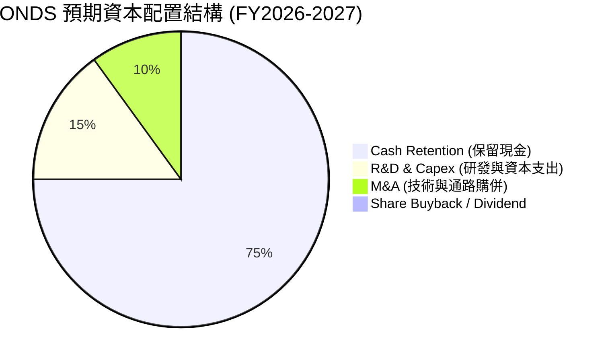

---

## 6. 獲利能力與資本效率

ONDS 雖然在 TTM 維度上展現出較高的 ROE，但這主要是由 Q1 2026 的非經常性非營運收益（$394.99M）所驅動。若回歸核心業務，其真實的資本效率仍然低下。

### 6.1 ROE / ROA / ROIC 趨勢

| 指標 | FY2023 | FY2024 | FY2025 | TTM (Mar 2026) | 行業均值 | 評估 |
|---|---|---|---|---|---|---|
| **ROE** | -135.3% | -229.3% | -31.3% | **42.9%** | 12.0% | 🟡 表面強勁，實則由非營運一次性收益扭曲 |
| **ROA** | -48.7% | -34.7% | -11.8% | **-4.2%** | 5.5% | 🔴 核心資產回報率仍為負，資產使用效率低 |
| **ROIC**| -112.4% | -185.6% | -25.4% | **-18.2%** | 8.2% | 🔴 投入資本回報率為負，說明業務仍在消耗價值 |

### 6.2 ROIC vs WACC 分析（核心價值創造判斷）

為了評估 ONDS 是否在創造股東價值，我們對其進行 WACC 與 ROIC 的對比建模。由於 ONDS 幾乎沒有債務，其 WACC 基本上等同於股權成本。

```
╔══════════════════════════════════════════════════════════════════╗
║                 ONDS ROIC vs WACC 深度分析                       ║
╠══════════════════════════════════════════════════════════════════╣
║                                                                  ║
║  WACC 估算：                                                     ║
║  ├── 無風險利率 (10Y 美債)：  4.25%                              ║
║  ├── 市場風險溢酬 (ERP)：     5.50%                              ║
║  ├── Beta 值：                2.622                              ║
║  ├── 股權成本 = 4.25% + 2.622 × 5.50% = 18.67%                   ║
║  ├── 債務成本 (稅後)：       ~6.00%                              ║
║  ├── 資本結構：股權 99.8%，債務 0.2%                              ║
║  └── ✅ WACC ≈ 18.65% (因高 Beta，市場要求的風險溢酬極高)        ║
║                                                                  ║
║  ROIC 估算 (TTM)：                                               ║
║  ├── NOPAT (核心營業淨利潤，扣稅 21%) ≈ -$90.74M                 ║
║  ├── 投入資本 = 股東權益 + 總債務 - 現金 ≈ -$1.02B               ║
║  └── ✅ ROIC ≈ -18.20% (核心業務回報率)                          ║
║                                                                  ║
║  ★ 經濟價值增加 (EVA) = ROIC - WACC = -36.85%                     ║
║                                                                  ║
║  ROIC  -18.2% ░░░░░░░░░░░░░░░░░░░░░░░░░░░  🔴 價值摧毀         ║
║  WACC  18.65% ▓▓▓▓▓▓▓▓▓▓▓▓▓▓▓▓▓▓▓░░░░░░░░  ──                  ║
║  EVA   -36.8% ░░░░░░░░░░░░░░░░░░░░░░░░░░░  🔴 仍未跨越盈虧平衡 ║
║                                                                  ║
║  📊 結論：核心業務 ROIC 顯著低於 WACC，公司目前仍在摧毀資本價值。║
╚══════════════════════════════════════════════════════════════════╝
```

### 6.3 杜邦三因素分解

我們透過杜邦分析拆解 ONDS TTM ROE（42.9%）的底層驅動因素：

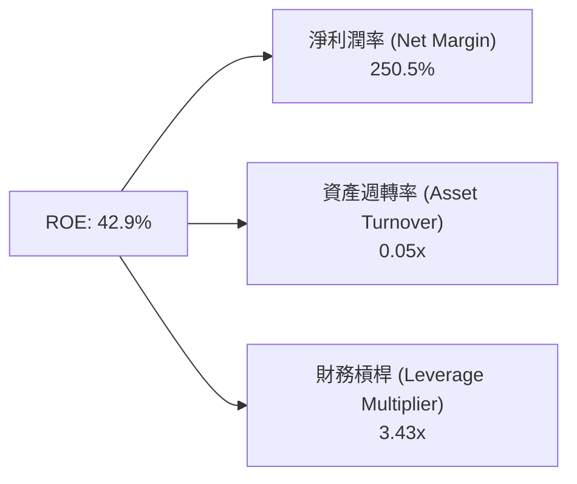

* **淨利潤率 (250.5%)**：高企的淨利率純粹是由 Q1 2026 的非營業外收益所致，不具備可持續性。
* **資產週轉率 (0.05x)**：極低的週轉率反映出公司資產負債表上堆積了大量未被有效利用的現金（$1.47B），資金效率極低。
* **財務槓桿 (3.43x)**：槓桿乘數主要由非流動負債中的非營運應付款項構成，而非附息債務。

### 6.4 獲利能力驅動因素

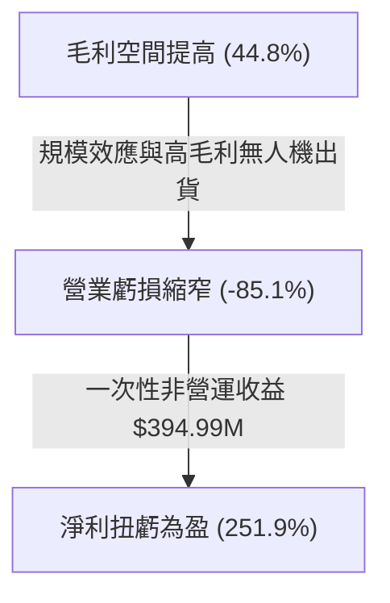

---

## 7. 估值深度分析

ONDS 的估值呈現出極端的「高成長、高溢價、高現金」特徵。

### 7.1 同業估值比較表格

我們選取了兩家美國最主要的國防與工業自動化無人機/通訊設備企業進行對比：
* **AeroVironment (AVAV)**：軍用無人機龍頭，獲利穩定。
* **Kratos Defense (KTOS)**：專注於無人靶機與國防通訊，成長穩健。

| 估值指標 | ONDS (本公司) | AeroVironment (AVAV) | Kratos (KTOS) | 本公司評估 |
|---|---|---|---|---|
| **Trailing P/E** | **94.78x** | 55.40x | 42.10x | 🔴 顯著溢價，反映市場對其非營運收益的過度定價。 |
| **Forward P/E** | **-170.60x** | 41.20x | 32.50x | 🔴 核心營運利潤在未來一年預計仍為負值。 |
| **P/S Ratio** | **46.49x** | 8.50x | 3.80x | 🔴 營收估值倍數極高，透支了未來的成長預期。 |
| **EV / Revenue** | **28.67x** | 8.20x | 3.65x | 🟡 扣除充沛現金後，EV/Rev 有所降溫，但仍屬高估。 |
| **EV / EBITDA** | **-37.10x** | 35.80x | 18.90x | 🔴 核心息稅折舊前利潤仍未轉正。 |

### 7.2 歷史估值區間分析

```
╔══════════════════════════════════════════════════════════════════╗
║                  ONDS P/S 估值歷史區間與當前位置                 ║
╠══════════════════════════════════════════════════════════════════╣
║                                                                  ║
║  歷史最高 P/S： 120x  (2025-12 股價高點)                         ║
║  歷史最低 P/S： 3.5x  (2024-06 商業化前夕)                       ║
║  歷史均值 P/S： 25x                                              ║
║                                                                  ║
║  當前 P/S (46.49x) 位置：                                        ║
║  3.5x                 25x (均值)       46.49x            120x    ║
║  ┠─────────┼───────────┨            ┠─────────┨    ║
║  低估                 合理             ▲ 當前位置        高估    ║
║                                                                  ║
║  📊 評估：當前估值處於歷史中高位，需要營收持續維持 >200% 的成長  ║
║            才能消化此估值。                                      ║
╚══════════════════════════════════════════════════════════════════╝
```

### 7.3 DCF 敏感性分析（6格目標價矩陣）

考量到 ONDS 的高成長性與高風險溢酬，我們將 WACC 設在 **15.0% - 20.0%** 區間，永續成長率（PGR）設在 **2.5% - 3.5%**。

* **基準假設**：FY2026 - FY2030 營收 CAGR 為 **65%**，FY2028 營業利潤率轉正並最終穩定在 **18%**。

| 營收成長情境 | WACC = 20.0% | WACC = 18.65% (基準) | WACC = 15.0% |
|---|---|---|---|
| 🟢 **樂觀 (CAGR 80%)** | $18.50 (+116.9%) | **$21.20 (+148.5%)** | $25.00 (+193.1%) |
| 🟡 **基準 (CAGR 65%)** | $12.40 (+45.4%) | **$15.00 (+75.8%)**  | $18.20 (+113.4%) |
| 🔴 **悲觀 (CAGR 40%)** | $5.00 (-41.4%)   | **$6.50 (-23.8%)**   | $8.00 (-6.2%) |

### 7.4 估值綜合區間

```
╔══════════════════════════════════════════════════════════════════╗
║                    ONDS 12個月股價估值區間                       ║
╠══════════════════════════════════════════════════════════════════╣
║                                                                  ║
║  悲觀目標價：  $5.00   (營運流出加劇，稀釋持續)                  ║
║  當前股價：    $8.53   (2026-06-24)                              ║
║  基準目標價：  $15.00  (營收維持高成長，虧損收窄)                ║
║  樂觀目標價：  $25.00  (觸發大軋空 + 營業利潤盈虧平衡)           ║
║                                                                  ║
║  $5.00         $8.53 (當前)            $15.00            $25.00  ║
║  ┠───────▲───────┼───────────┨            ┠─────────┨  ║
║  下行空間 -41.4%                     基準目標 +75.8%   最大上行  ║
║                                                                  ║
╚══════════════════════════════════════════════════════════════════╝
```

---

## 8. 成長催化劑

### 8.1 催化劑時間軸

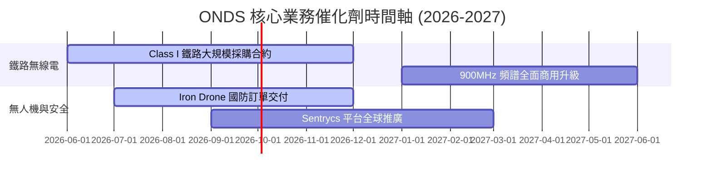

### 8.2 TAM（可定址市場規模）分析

```
╔══════════════════════════════════════════════════════════════════╗
║                    ONDS 2028年 TAM 預估                         ║
╠══════════════════════════════════════════════════════════════════╣
║                                                                  ║
║  1. 北美鐵路無線通訊升級市場：    $1.2B (滲透率: ~15%)           ║
║  2. 全球自動化巡檢