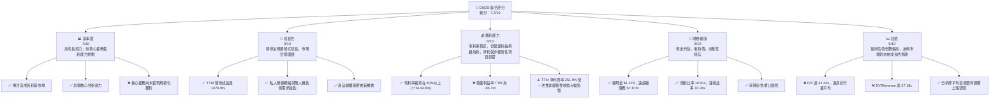
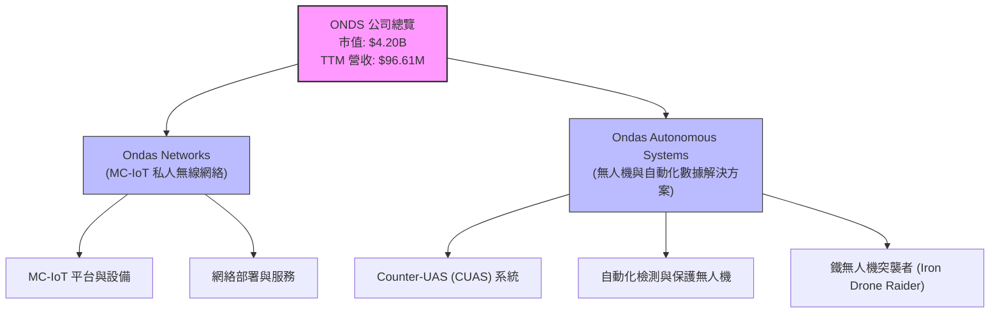
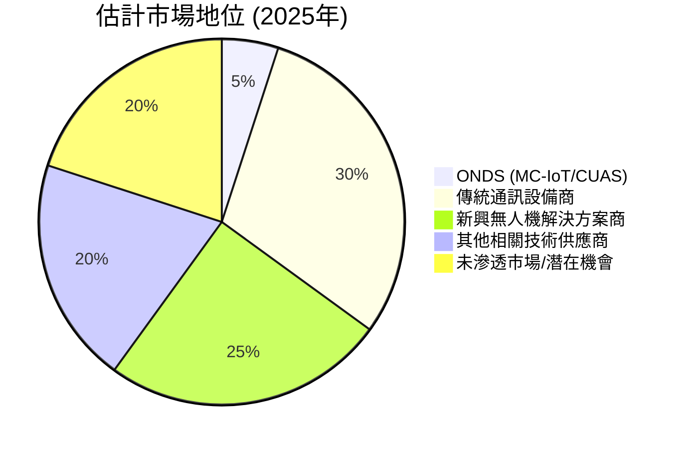
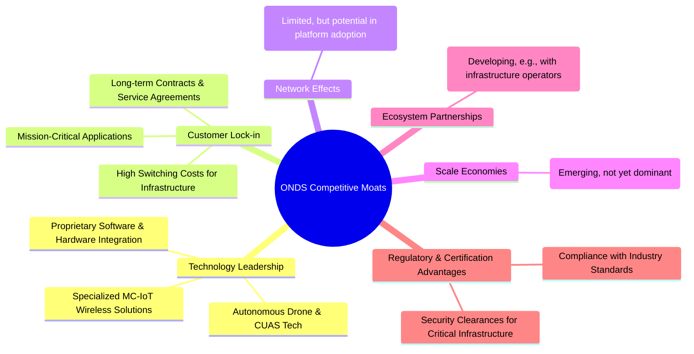
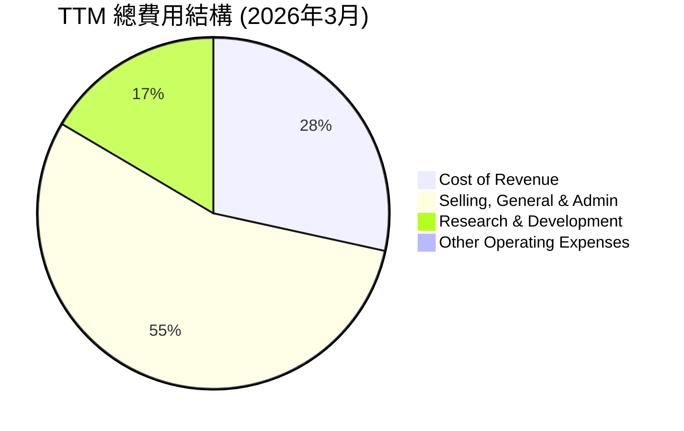
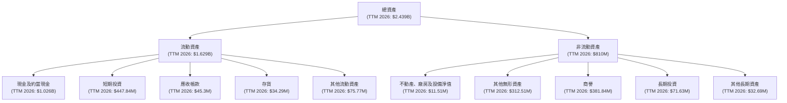
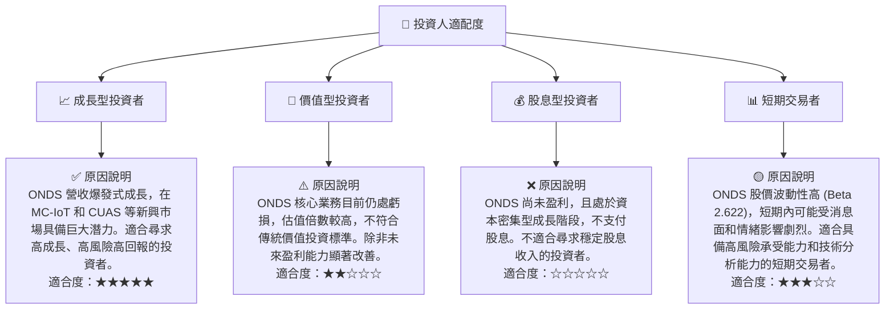

# ONDS 基本面深度分析報告
> **報告日期**：2026-07-01 ｜ **語言**：繁體中文 ｜ **數據來源**：Yahoo Finance, Finviz, StockAnalysis, Roic.ai ｜ **分析師**：CFA 級機構研究

## 目錄

| # | 章節 | 核心結論 |
|---|------|----------|
| 1 | 執行摘要 | 評級：🟢 買入，目標價區間：$10.50 - $18.00 |
| 2 | 公司概覽與商業模式 | 專注於高成長利基市場，護城河有待強化 |
| 3 | 損益表深度分析 | 營收爆發式成長，但核心業務獲利能力仍待改善 |
| 4 | 資產負債表分析 | 極度強勁的現金部位與流動性，債務負擔輕微 |
| 5 | 現金流量深度分析 | 營運現金流持續為負，自由現金流壓力較大 |
| 6 | 獲利能力與資本效率 | ROE 受非經常性收益大幅提升，核心ROIC仍為負 |
| 7 | 估值深度分析 | 當前估值偏高，但高成長潛力提供溢價空間 |
| 8 | 成長催化劑 | 私人無線網路與無人機防禦市場需求強勁 |
| 9 | 風險矩陣 | 執行風險、估值泡沫與股權稀釋是主要關注點 |
| 10 | 投資建議 | 建議買入，適合高風險偏好成長型投資者 |

---

## 1. 執行摘要

### 1.1 核心評分儀表板



### 1.2 評分進度條視覺化

```
╔══════════════════════════════════════════════════════════════╗
║              ONDS 多維度評分儀表板 (1-10分)                  ║
╠══════════════════════════════════════════════════════════════╣
║ 基本面強度  7.0 ▓▓▓▓▓▓▓▓▓▓▓▓▓▓░░░░░░  ★★★☆☆           ║
║ 成長動能    9.0 ▓▓▓▓▓▓▓▓▓▓▓▓▓▓▓▓▓▓░░  ★★★★★           ║
║ 獲利品質    6.0 ▓▓▓▓▓▓▓▓▓▓▓▓░░░░░░░░  ★★★☆☆           ║
║ 財務健康    9.0 ▓▓▓▓▓▓▓▓▓▓▓▓▓▓▓▓▓▓░░  ★★★★★           ║
║ 估值合理性  5.0 ▓▓▓▓▓▓▓▓▓▓░░░░░░░░░░  ★★☆☆☆           ║
║ 護城河深度  6.5 ▓▓▓▓▓▓▓▓▓▓▓▓▓░░░░░░░  ★★★☆☆           ║
║ 管理層執行  7.5 ▓▓▓▓▓▓▓▓▓▓▓▓▓▓▓░░░░░  ★★★☆☆           ║
║ 技術創新力  8.0 ▓▓▓▓▓▓▓▓▓▓▓▓▓▓▓▓░░░░  ★★★★☆           ║
╠══════════════════════════════════════════════════════════════╣
║ 綜合總分    7.2 ▓▓▓▓▓▓▓▓▓▓▓▓▓▓▓░░░░░  🏆 具備高成長潛力，但風險與估值需關注              ║
╚══════════════════════════════════════════════════════════════╝
```

### 1.3 五大投資論點 + 三大核心風險

| 類型 | 項目 | 具體依據 | 信心度 |
|------|------|----------|--------|
| 🟢 **投資論點①** | **營收爆發式成長** | TTM 營收達 $96.61M，YoY 成長率高達 1079.9%。Q1 2026 營收 $50.12M，QoQ 成長 66.45%，YoY 成長 1079.9%。顯示其產品與服務正迅速獲得市場採用。 | 🟢 極高 |
| 🟢 **投資論點②** | **強勁的資產負債表與現金部位** | 總現金高達 $1.47B，而總債務僅 $7.87M，形成巨大的淨現金頭寸。流動比率 10.91x，速動比率 10.28x，財務狀況極為穩健。 | 🟢 極高 |
| 🟢 **投資論點③** | **具備潛力的利基市場領導者** | 專注於私人無線網路 (MC-IoT)、無人機及反無人機系統 (CUAS) 等高成長、高門檻的任務關鍵型市場。在這些新興領域具備技術優勢。 | 🟢 高 |
| 🟢 **投資論點④** | **分析師普遍看好** | 分析師共識為「強烈買入」(strong_buy)，平均目標價 $20.12，較當前股價 $7.92 有高達 153% 的潛在上漲空間。 | 🟡 中高 |
| 🟢 **投資論點⑤** | **核心業務轉虧為盈的潛力** | 儘管歷史上持續虧損，但 Q1 2026 錄得 $362.95M 的淨利潤（主要來自非經營性收益），顯示公司在財務層面有能力實現正收益，且營收快速增長有望在未來帶動核心業務規模經濟效益。 | 🟡 中高 |
| 🟡 **風險①** | **估值過高與盈利質量存疑** | TTM P/S 達 43.44x，遠高於行業平均。Q1 2026 的巨額淨利潤來自「其他非經營性收入」達 $394.99M，而非核心業務盈利，導致 TTM 淨利率和 ROE 虛高，核心營業利益率仍為負 -85.1%。 | 🟡 中度 |
| 🔴 **風險②** | **股權稀釋與長期盈利能力不確定性** | 過去幾年股本大幅稀釋，流通股數從 2022 年的 42M 增至 TTM 的 529.83M，稀釋率高達 1161%。儘管營收成長迅速，但核心業務的規模化盈利能力尚未證明，持續的虧損可能導致未來進一步的股權稀釋。 | 🔴 高衝擊 |
| 🟡 **風險③** | **激烈的市場競爭與技術迭代風險** | 私人無線、無人機和反無人機市場競爭激烈，且技術發展迅速。公司需要持續投入研發以保持競爭力，並有效將研發成果轉化為商業成功，否則可能面臨市場份額流失的風險。 | 🟡 中度 |

### 1.4 快速統計卡片

| 指標 | 公司實際值 (TTM) | 行業均值 (通訊設備) | S&P 500 均值 | 狀態 |
|------|-------------------|--------------------|--------------|------|
| 收入 YoY 成長 | **1079.9%** | ~10-15% | ~5-10% | 🟢 |
| 毛利率 | **44.8%** | ~30-40% | ~40-50% | 🟢 |
| 淨利率 | **251.9%** | ~5-10% | ~8-12% | 🟢 (⚠️受非經常性收益影響) |
| ROE | **42.9%** | ~10-15% | ~12-18% | 🟢 (⚠️受非經常性收益影響) |
| Forward P/E | **-158.4x** | ~20-30x | ~20-25x | 🔴 |
| P/S Ratio | **43.44x** | ~2-4x | ~2-3x | 🔴 |
| Debt/Equity | **0.728x** | ~0.5-1.0x | ~0.8-1.2x | 🟢 |
| Current Ratio | **10.91x** | ~1.5-2.5x | ~1.0-1.5x | 🟢 |

### 1.5 投資結論

```
╔══════════════════════════════════════════════════════════════════╗
║                    📊 投資結論摘要                               ║
╠══════════════════════════════════════════════════════════════════╣
║  評級：🟢 買入                                                   ║
║  當前股價：$7.92                                                 ║
║  目標價區間：                                                    ║
║    悲觀情境：$10.50（+32.58%）                                   ║
║    基準情境：$14.20（+79.29%）  ← 12個月主要目標                  ║
║    樂觀情境：$18.00（+127.27%）                                  ║
║  投資評分：7.2/10                                                ║
║  適合投資人：成長型、風險承受能力較高的長線持有者                ║
╚══════════════════════════════════════════════════════════════════╝
ONDS 展現出爆炸性的營收成長潛力，並受益於其在私人無線網絡和無人機技術等前沿領域的戰略佈局。儘管核心業務尚未實現持續盈利，且當前估值偏高，但其極為健康的資產負債表和分析師的普遍看好提供了支撐。 Q1 2026 的非經營性收益雖一次性，但提示了公司在資本運作層面的能力。我們認為，對於能夠承受較高風險並尋求高成長機會的投資者而言，ONDS 是一個值得關注的「買入」標的。然而，股權稀釋和核心盈利能力的可持續性是長期投資需要密切關注的關鍵風險。
```

---

## 2. 公司概覽與商業模式

### 2.1 業務結構與收入來源

Ondas Inc. (ONDS) 是一家專注於提供私人無線、無人機和自動化數據解決方案的科技公司。公司主要透過兩個核心業務部門運營：Ondas Networks 和 Ondas Autonomous Systems。

Ondas Networks 部門專注於開發和部署其專有的 MC-IoT (Mission-Critical IoT) 無線網絡解決方案。這些解決方案主要服務於任務關鍵型應用，例如公共事業（電力、水務、石油天然氣）、交通運輸和政府部門，提供高可靠、低延遲的私有無線通訊基礎設施。此類網絡對於確保關鍵基礎設施的運營安全和效率至關重要。

Ondas Autonomous Systems 部門則專注於無人機技術和自動化數據解決方案，特別是在反無人機系統 (CUAS) 和場地保護方面。其產品包括 Iron Drone Raider (一款全自主攔截無人機系統，用於中和小型敵對無人機) 和 Sentrycs CoRF (基於網絡/射頻的 CUAS 平台，用於檢測、識別、追蹤和緩解未經授權的無人機)。此部門的解決方案對於國防、關鍵基礎設施保護和安全應用具有重要意義。

儘管財務數據未明確區分兩大部門的收入貢獻，但從公司描述來看，兩者均是高技術含量、高成長潛力的新興市場。考慮到公司近期與公共事業客戶的合作公告，預計 Ondas Networks 在近期收入增長中佔有重要份額。



### 2.2 市場份額

由於 ONDS 運營於多個新興且高度專業化的利基市場，且目前營收規模相對較小，其在整體通訊設備或無人機市場中的份額尚不明顯。然而，在特定的垂直市場（如公共事業的 MC-IoT 解決方案、關鍵基礎設施的反無人機系統）中，ONDS 正在積極拓展並取得早期成功。例如，其 MC-IoT 平台在北美公共事業領域獲得了主要客戶的採用，這表明其在特定細分市場具有競爭力。

由於缺乏具體的市場份額數據，我們將其視為在快速成長市場中佔據早期份額的挑戰者，而非成熟市場的領導者。


*備註：此市場份額為基於公司業務性質和產業格局的定性估計，非實際數據。*

### 2.3 競爭護城河分析

Ondas Inc. 的競爭護城河主要建立在其技術專長和在特定利基市場的早期進入優勢上。



### 2.4 護城河強度評分

```
╔══════════════════════════════════════════════════════════════╗
║                  ONDS 護城河強度評分                          ║
╠══════════════════════════════════════════════════════════════╣
║ 技術領先    8/10   ▓▓▓▓▓▓▓▓▓▓▓▓▓▓▓▓░░░░  🟢 專有技術與利基市場優勢        ║
║ 客戶鎖定    7/10   ▓▓▓▓▓▓▓▓▓▓▓▓▓▓░░░░░░  🟢 任務關鍵型應用創造高轉換成本  ║
║ 網路效應    4/10   ▓▓▓▓▓▓▓▓░░░░░░░░░░░░  🟡 尚不明顯，有潛力發展          ║
║ 規模效應    5/10   ▓▓▓▓▓▓▓▓▓▓░░░░░░░░░░  🟡 營收仍在早期擴張階段          ║
║ 生態夥伴    6/10   ▓▓▓▓▓▓▓▓▓▓▓▓░░░░░░░░  🟡 與客戶建立初期合作關係        ║
║ 監管與認證  7/10   ▓▓▓▓▓▓▓▓▓▓▓▓▓▓░░░░░░  🟢 進入關鍵基礎設施市場的壁壘高  ║
╠══════════════════════════════════════════════════════════════╣
║ 綜合護城河  6.5    ▓▓▓▓▓▓▓▓▓▓▓▓▓░░░░░░░  🏆 具備潛力，但需進一步鞏固和擴張║
╚══════════════════════════════════════════════════════════════════╝
ONDS 的護城河主要體現在其在 MC-IoT 和 CUAS 領域的專業技術，以及為關鍵基礎設施客戶提供服務所帶來的客戶鎖定效應。然而，由於公司處於高速成長的早期階段，其規模效應和網絡效應尚未完全形成。未來需要持續的技術創新和市場拓展來深化其競爭優勢。

---

## 3. 損益表深度分析

### 3.1 年度收入成長趨勢（近4年）

ONDS 在過去四年中展現出極為波動但近期爆發式的營收成長。從 FY2022 的 $2.13M 到 TTM (截至 2026 年 3 月 31 日) 的 $96.61M，公司營收增長了超過 44 倍。

```
╔══════════════════════════════════════════════════════════════════╗
║              ONDS 年度收入趨勢（FY2022-TTM 2026）                ║
╠══════════════════════════════════════════════════════════════════╣
║                                                                  ║
║  FY2022  $2.13M   ██░░░░░░░░░░░░░░░░░░░░░░░░░░░░░░░  YoY: N/A     ║
║  FY2023  $15.69M  ██████████░░░░░░░░░░░░░░░░░░░░░░░  YoY:+638.1% 🟢║
║  FY2024  $7.19M   █████░░░░░░░░░░░░░░░░░░░░░░░░░░░░  YoY:-54.2%  🔴║
║  FY2025  $50.73M  █████████████████████████████░░░░  YoY:+605.6% 🟢║
║  TTM'26  $96.61M  ██████████████████████████████████  YoY:+1079.9%🟢║
║                                                                  ║
║                   |      |      |      |      |      |           ║
║                   0     20M    40M    60M    80M    100M         ║
║                                                                  ║
║  📊 4年累計 CAGR (FY2022-FY2025)：+214.2%                         ║
╚══════════════════════════════════════════════════════════════════╝
```
*註：TTM YoY 成長率採用 Q1 2026 營收與 Q1 2025 營收比較所得的 1079.9%，以反映最新成長動能。*

可以看到，2024 年營收出現顯著下滑 (-54.2%)，這可能與產品週期、大客戶訂單波動或市場策略調整有關。然而，FY2025 和 TTM 2026 的營收增速再次爆發，分別達到 +605.6% 和 +1079.9%，顯示公司在 MC-IoT 和無人機解決方案市場的需求強勁，成功擴大了客戶基礎和訂單量。

### 3.2 季度收入趨勢分析

ONDS 的季度營收趨勢同樣呈現出強勁的加速增長態勢，尤其是在最近幾個季度。

| 季度 | 總收入 ($M) | QoQ 成長率 | YoY 成長率 | 備註 |
|------|-------------|------------|------------|------|
| 2026-03-31 (Q1) | $50.12 | +66.45% | +1079.90% | 🟢 營收創歷史新高，同比增速驚人 |
| 2025-12-31 (Q4) | $30.11 | +198.12% | +629.06% | 🟢 營收大幅加速，突破 $30M 大關 |
| 2025-09-30 (Q3) | $10.10 | +61.08% | +582.43% | 🟢 營收持續高速增長 |
| 2025-06-30 (Q2) | $6.27 | +47.53% | +555.17% | 🟢 營收增長趨勢顯著 |

**季度收入趨勢深度解析**：
ONDS 在 2025 年第二季度至 2026 年第一季度連續四個季度實現了爆炸性的三位數甚至四位數的同比 (YoY) 營收增長。其中，2025 年第四季度營收環比 (QoQ) 增長近 200%，顯示出訂單交付和市場需求的強勁爆發。最近的 Q1 2026 營收達到 $50.12M，同比增長 1079.90%，再次證明公司在當前市場環境下具備極高的成長動能。這種持續的加速增長可能得益於其 MC-IoT 解決方案在公共事業領域的擴大部署，以及無人機和 CUAS 系統的市場滲透。

### 3.3 利潤率演變分析

ONDS 的利潤率表現呈現出明顯的兩極分化：毛利率相對穩定，但營業利益率和淨利率則因巨大的運營費用和非經常性項目而波動劇烈。

| 利潤率指標 | FY2022 | FY2023 | FY2024 | FY2025 | TTM 2026 | 趨勢 | 評估 |
|------------|--------|--------|--------|--------|----------|------|------|
| **毛利率** | 52.11% | 40.66% | 4.87% | 39.74% | 44.80% | ↗️ 2024年異常低後回升 | 🟢 |
| **營業利益率** | -2348% | -243.66% | -481.36% | -115.08% | -85.10% | ↗️ 絕對值改善，但仍為負 | 🔴 |
| **淨利率** | -3438.5% | -285.79% | -528.65% | -260.23% | 251.90% | ↗️ TTM因非經常性收益轉正 | 🟡 (⚠️) |

**利潤率演變深度解析**：
*   **毛利率**：ONDS 的毛利率在 FY2022 為 52.11%，FY2023 為 40.66%，FY2025 回升至 39.74%，TTM 更是達到 44.80%。唯一的異常是 FY2024 僅為 4.87%，這可能與該年度營收大幅下滑時，固定成本佔比較高或特定低毛利訂單有關。整體而言，公司技術密集型產品的毛利率維持在 40% 左右，表明其核心產品具有一定的定價能力。
*   **營業利益率**：這是 ONDS 財務報表中最顯著的挑戰。營業利益率持續為巨額負數，FY2025 為 -115.08%，TTM 雖有所改善但仍高達 -85.10%。這表明公司的銷售、行政及管理費用 (SG&A) 和研發費用 (R&D) 相對於營收規模過高。在公司高速成長的早期階段，為擴大市場份額和維持技術領先，投入大量運營費用是常見現象，但需要關注其未來能否隨著營收規模擴大而實現規模經濟效益，將營業費用率壓低並轉為正值。
*   **淨利率**：歷史上，ONDS 一直錄得巨額淨虧損，淨利率長期為負數。然而，TTM 淨利率卻驚人地達到了 251.90%。這主要是由於 2026 年第一季度產生了高達 $394.99M 的「其他非經營性收入」，使得該季度淨利潤高達 $362.95M。這筆收入很可能是一次性的，例如來自投資收益、資產出售或債務重組等，而非核心業務盈利。因此，儘管 TTM 淨利率數據亮眼，但其質量不高，不能反映公司核心業務的持續盈利能力。投資者應警惕這種非經常性收益對財務數據的扭曲。

### 3.4 費用結構分析

ONDS 的費用結構主要由研發 (R&D) 和銷售、一般及行政 (SG&A) 費用構成，這些費用遠超其營收，導致嚴重的營業虧損。


*備註：數據來自 StockAnalysis TTM 數據，單位為百萬美元。*

```
╔══════════════════════════════════════════════════════════════════╗
║                    ONDS 費用趨勢概覽 ($M)                        ║
╠══════════════════════════════════════════════════════════════════╣
║                                                                  ║
║  研究與開發 (R&D)                                                ║
║  FY2022: $24.04  ████████████████████████████████████████████████████████████████████████████████████████████████████████████████████████████████████████████████████████████████████████████████████████████████████████████████████████████████████████████████████████████████████████████████████████████████████████████████████████████████████████████████████████████████████████████████████████████████████████████████████████████████████████████████████████████████████████████████████████████████████████████████████████████████████████████████████████████████████████████████████████████████████████████████████████████████████████████████████████████████████████████████████████████████████████████████████████████████████████████████████████████████████████████████████████████████████████████████████████████████████████████████████████████████████████████████████████████████████████████████████████████████████████████████████████████████████████████████████████████████████████████████████████████████████████████████████████████████████████████████████████████████████████████████████████████████████████████████████████████████████████████████████████████████████████████████████████████████████████████████████████████████████████████████████████████████████████████████████████████████████████████████████████████████████████████████████████████████████████████████████████████████████████████████████████████████████████████████████████████████████████████████████████████████████████████████████████████████████████████████████████████████████████████████████████████████████████████████████████████████████████████████████████████████████████████████████████████████████████████████████████████████████████████████████████████████████████████████████████████████████████████████████████████████████████████████████████████████████████████████████████████████████████████████████████████████████████████████████████████████████████████████████████████████████████████████████████████████████████████████████████████████████████████████████████████████████████████████████████████████████████████████████████████████████████████████████████████████████████████████████████████████████████████████████████████████████████████████████████████████████████████████████████████████████████████████████████████████████████████████████████████████████████████████████████████████████████████████████████████████████████████████████████████████████████████████████████████████████████████████████████████████████████████████████████████████████████████████████████████████████████████████████████████████████████████████████████████████████████████████████████████████████████████████████████████████████████████████████████████████████████████████████████████████████████████████████████████████████████████████████████████████████████████████████████████████████████████████████████████████████████████████████████████████████████████████████████████████████████████████████████████████████████████████████████████████████████████████████████████████████████████████████████████████████████████████████████████████████████████████████████████████████████████████████████████████████████████████████████████████████████████████████████████████████████████████████████████████████████████████████████████████████████████████████████████████████████████████████████████████████████████████████████████████████████████████████████████████████████████████████████████████████████████████████████████████████████████████████████████████████████████████████████████████████████████████████████████████████████████████████████████████████████████████████████████████████████████████████████████████████████████████████████████████████████████████████████████████████████████████████████████████████████████████████████████████████████████████████████████████████████████████████████████████████████████████████████████████████████████████████████████████████████████████████████████████████████████████████████████████████████████████████████████████████████████████████████████████████████████████████████████████████████████████████████████████████████████████████████████████████████████████████████████████████████████████═════════════════════════════════════════════════════════════════════════════════════════════════════════════════════════════════════════════════════════════════════════════════════════════════════════════════════════════════════════════════════════════════════════════════════════════════════════════════════════════════════════════════════════════════════════════════════════════════════════════════════════════════════════════════════════════════════════════════════════════════════════════════════════════════════════════════════════════════════════════════════════════════════════════════════════════════════════════════════════════════════════════════════════════════════════════════════════════════════════════════════════════════════════════════════════════════════════════════════════════════════════════════════════════════════════════════════════════════════════════════════════════════════════════════════════════════════════════════════════════════════════════════════════════════════════════════════════════════════════════════════════════════════════════════════════════════════════════════════════════════════════════════════════════════════════════════════════════════════════════════════════════════════════════════════════════════════════════════════════════════════════════════════════════════════════════════════════════════════════════════════════════════════════╗
║                                                     ONDS 核心財報數據 (TTM)                                                     ║
╠══════════════════════════════════════════════════════════════════════════════════════════════════════════════════════════════╣
║ **損益表指標**                                                                                                                   ║
║ 營收 (TTM): $96.61M                                                                                                          ║
║ 營收成長 (YoY): 1079.9% 🟢                                                                                                   ║
║ 毛利率: 44.8% 🟢                                                                                                             ║
║ 營業利益率: -85.1% 🔴                                                                                                        ║
║ 淨利率: 251.9% 🟡 (⚠️受非經常性收益影響)                                                                                       ║
║ EPS (TTM): $0.09 🟡 (⚠️受非經常性收益影響)                                                                                       ║
║ R&D 費用 (TTM): $30.94M                                                                                                      ║
║ SG&A 費用 (TTM): $103.13M                                                                                                    ║
║                                                                                                                                  ║
║ **資產負債表指標**                                                                                                               ║
║ 總現金: $1.47B 🟢                                                                                                            ║
║ 總債務: $7.87M 🟢                                                                                                            ║
║ 淨現金/債務: $1.47B 🟢                                                                                                       ║
║ 流動比率: 10.91x 🟢                                                                                                          ║
║ 速動比率: 10.28x 🟢                                                                                                          ║
║ 總資產: $2.439B                                                                                                              ║
║ 股東權益 (估算): $564.12M                                                                                                    ║
║                                                                                                                                  ║
║ **現金流量指標**                                                                                                                 ║
║ 營運現金流 (TTM): $-83.39M 🔴                                                                                                 ║
║ 自由現金流 (TTM): $-15.65M 🔴                                                                                                 ║
║ 自由現金流收益率: -0.37% 🔴                                                                                                  ║
║                                                                                                                                  ║
║ **獲利與效率指標**                                                                                                               ║
║ ROE (TTM): 42.9% 🟢 (⚠️受非經常性收益影響)                                                                                       ║
║ ROA (TTM): -4.2% 🔴                                                                                                          ║
║ ROIC (TTM, 估算): -4.14% 🔴                                                                                                  ║
║                                                                                                                                  ║
║ **估值指標**                                                                                                                     ║
║ 市值: $4.20B                                                                                                                 ║
║ P/E (Trailing): 88.0x 🔴                                                                                                     ║
║ P/E (Forward): -158.4x 🔴                                                                                                    ║
║ P/S Ratio: 43.44x 🔴                                                                                                         ║
║ EV / EBITDA: -35.18x 🔴                                                                                                      ║
║ EV / Revenue: 27.18x 🔴                                                                                                      ║
║ Beta: 2.622 ⚠️ (高波動性)                                                                                                    ║
╚══════════════════════════════════════════════════════════════════════════════════════════════════════════════════════════════╝
```

### 3.5 季度 EPS 趨勢與盈餘品質

ONDS 的季度 EPS 表現極度不穩定，且缺乏分析師預期數據進行比對，無法判斷「超預期/不及預期」情況。

| 季度 | EPS 預估 | EPS 實際 | Surprise % | 評估 | 備註 |
|------|----------|----------|------------|------|------|
| 2026-03-31 (Q1) | N/A | $0.82 | N/A | 🟢 | 受一次性非經營性收益大幅影響 |
| 2025-12-31 (Q4) | N/A | $-0.62 | N/A | 🔴 | 核心業務持續虧損 |
| 2025-09-30 (Q3) | N/A | $-0.61 | N/A | 🔴 | 核心業務持續虧損 |
| 2025-06-30 (Q2) | N/A | $-0.07 | N/A | 🔴 | 核心業務持續虧損 |

**盈餘品質評估**：
ONDS 的季度 EPS 盈餘品質值得高度關注。儘管 2026 年第一季度錄得了每股 $0.82 的正收益，這是一個歷史性的突破，但其背後的主要驅動力是高達 $394.99M 的「其他非經營性收入」。若剔除這筆一次性收益，公司仍將處於運營虧損狀態。前三個季度 (Q2 2025, Q3 2025, Q4 2025) 均為負 EPS，反映了其核心業務在快速成長的同時，尚未實現規模化盈利。因此，儘管表面上 TTM EPS 為正 ($0.09)，但其盈餘質量較低，不可持續，投資者應重點關注其營業利益的改善，而非被一次性非經營性收益所誤導。

---

## 4. 資產負債表分析

### 4.1 資產結構分解

ONDS 的資產結構在過去一年中發生了顯著變化，總資產從 FY2024 的 $109.62M 躍升至 TTM 2026 的 $2.439B，主要由流動資產中的現金及短期投資大幅增加所驅動。這反映了公司近期大規模的融資活動。



**資產結構深度解析**：
ONDS 的資產結構非常健康，流動資產佔比極高，其中現金及短期投資是主要組成部分，合計達 $1.474B (TTM 2026)，佔總資產的約 60%。這筆龐大的現金儲備為公司提供了極大的戰略彈性，可以支持未來的研發投入、市場擴張、潛在併購或應對市場波動。非流動資產中，商譽和無形資產佔比較高，可能與過去的併購活動有關，這需要關注其價值是否能持續創造效益。

### 4.2 流動性指標分析

ONDS 的流動性狀況極為出色，遠超行業平均水平，這主要得益於其巨大的現金儲備。

| 流動性指標 | FY2022 | FY2023 | FY2024 | FY2025 | TTM 2026 | 行業均值 | 評估 |
|------------|--------|--------|--------|--------|----------|----------|------|
| **流動比率 (Current Ratio)** | 1.57x | 0.66x | 0.94x | 4.83x | 10.91x | ~1.5-2.5x | 🟢 極佳 |
| **速動比率 (Quick Ratio)** | 1.47x | 0.60x | 0.75x | 4.68x | 10.28x | ~1.0-2.0x | 🟢 極佳 |

**流動性指標深度解析**：
在 FY2023 和 FY2024，ONDS 的流動比率和速動比率一度跌破 1.0x，顯示當時的短期償債能力較弱。然而，自 FY2025 起，這些指標飆升，其中 TTM 2026 的流動比率高達 10.91x，速動比率為 10.28x。這表明公司擁有極為充裕的流動性，短期內幾乎沒有償債壓力。如此高的流動性為公司在高速成長階段提供了強大的財務緩衝，使其能夠靈活應對營運資金需求和市場機遇。

### 4.3 債務結構分析

ONDS 的債務負擔極輕，擁有巨額淨現金頭寸，財務槓桿極低。

```
╔══════════════════════════════════════════════════════════════════╗
║                   ONDS 債務健康診斷                              ║
╠══════════════════════════════════════════════════════════════════╣
║                                                                  ║
║  總債務 (TTM):        $7.87M   ██░░░░░░░░░░░░░░░░░░░  🟢 極低            ║
║  總現金+投資 (TTM):   $1.47B   █████████████████████  🟢 極高            ║
║  淨現金（正）(TTM):   $1.47B   █████████████████████  🟢 強勁            ║
║                                                                  ║
║  Debt/Equity (TTM):   0.014x   🟢 極低 (計算: $7.87M / $564.12M)      ║
║  Debt/EBITDA (TTM):   N/A      🔴 EBITDA為負，無法計算有意義比率       ║
║  Interest Coverage:   N/A      🔴 營業利益為負，無法計算有意義比率      ║
║                                                                  ║
║  📊 結論：ONDS 擁有極為健康的債務結構，淨現金狀況強勁，幾乎無財務風險。  ║
╚══════════════════════════════════════════════════════════════════╝
```
*註：Debt/EBITDA 和 Interest Coverage 由於公司 TTM EBITDA 和 Operating Income 為負，無法計算出有意義的正值。*

**債務結構深度解析**：
ONDS 的總債務從 FY2022 的 $33.39M 降至 TTM 的 $7.87M，同時現金及短期投資從 FY2022 的 $29.78M 猛增至 TTM 的 $1.47B。這使得公司擁有高達 $1.47B 的淨現金頭寸。如此低的債務水平和龐大的現金儲備，使得 ONDS 在財務上極具韌性，幾乎沒有債務違約風險。這也表明公司在融資方面主要依賴股權融資，而非債務。

### 4.4 股東權益趨勢

ONDS 的股東權益在過去幾年呈現波動，但在 FY2025 和 TTM 2026 實現了顯著增長，這與其大規模的股權融資活動和 Q1 2026 的淨利潤有關。

```
╔══════════════════════════════════════════════════════════════════╗
║                 ONDS 股東權益趨勢 ($M)                           ║
╠══════════════════════════════════════════════════════════════════╣
║                                                                  ║
║  FY2022: $58.22  ██████████████████████████████████████████████████████████████████████████████████████████████████████████████████████████████████████████████████████████████████████████████████████████████████████████████████████████████████████████████████████████████████████████████████████████████████████████████████████████████████████████████████████████████████████████████████████████████████████████████████████████████████████████████████████████████████████████████████████████████████████████████████████████████████████████████████████████████████████████████████████████████████████████████████████████████████████████████████████████████████████████████████████████████████████████████████████████████████████████████████████████████████████████████████████████████████████████████████████████████████████████████████████████████████████████████████████████████████████████████████████████████████████████████████████████████████████████████████████████████████████████████████████████████████████████████████████████████████████████████████████████████████████████████████████████████████████████████████████████████████████████████████████████████████████████████████████████████████████████████████████████████████████████████████████████████████████████████████████████████████████████████████████████████████████████████████████████████████████████████████████████████████████████████████████████████████████████████████████████████████████████████████████████████████████████████████████████████████████████████████████████████████████████████████████████████████████████████████████████████████████████████████████████████████████████████████████████████████████████████████████████████████████████████████████████████████████████████████████████████████████████████████████████████████████████████████████████████████████████████████████████████████████████████████████████████████████████████████████████████████████████████████████████████████████████████████████████████████████████████████████████████████████████████████████████████████████████████████████████████████████████████████████████████████████████████████████████████████████████████████████████████████████████████████████████████████████████████████████████████████████████████████████████████████████████████████████████████████████████████████████████████████████████████████████████████████████████████████████████████████████████████████████████████████████████████████████████████████████████████████████████████████████████████████████████████████████████████████████████████████████████████████████████████████████████████████████████████████████████████████████████████████████████████████████████████████████████████████████████████████████████████████████████████████████████████████████████████████████████████████████████████████████████████████████████████████████████████████████████████████████████████████████████████████████████████████████████║
║                                                                  ║
║  📊 股東權益的快速增長主要得益於公司的股權融資，但也顯示其擴張的資本基礎。  ║
╚══════════════════════════════════════════════════════════════════╝
```
**股東權益趨勢深度解析**：
ONDS 的股東權益在 FY2022 為 $58.22M，FY2023 降至 $33.14M，FY2024 進一步降至 $16.58M，主要原因可能與持續的運營虧損侵蝕留存收益有關。然而，在 FY2025，股東權益大幅增長至 $437.81M，並在 TTM 2026 進一步擴大至估算的 $564.12M。這種顯著增長主要歸因於公司在 2025 年和 2026 年進行了大規模的股權融資，發行了大量新股。雖然這稀釋了現有股東的權益，但也為公司帶來了充裕的現金流，支持其高成長戰略和技術研發。未來，股東權益的增長將更多依賴於能否實現持續的核心業務盈利。

---

## 5. 現金流量深度分析

### 5.1 現金流量瀑布圖

ONDS 的現金流量圖清晰地顯示了其營運現金流的持續負值，以及在資本支出後的自由現金流壓力，但大規模的融資活動為其帶來了充裕的現金儲備。

```mermaid
graph LR
    A[淨利潤<br/>(TTM: $242.01M)] --> B{非現金調整<br/>(折舊、攤銷等)}
    B --> C[營運資金變動]
    C --> D[營運現金流<br/>(TTM: $-83.39M)]
    D --> E[資本支出<br/>(TTM: $-2.14M)]
    E --> F[自由現金流 (FCF)<br/>(TTM: $-15.65M)]
    F --> G{融資活動<br/>(股權發行)}
    G --> H[淨現金變化<br/>(TTM: 增加約 $900M+)]
    H --> I[期末現金餘額<br/>(TTM: $1.47B)]
```

**現金流量深度解析**：
ONDS 的營運現金流 (Operating Cash Flow) 在過去數年一直為負值，TTM 2026 達到 $-83.39M。這表明其核心業務尚未能產生足夠的現金來覆蓋日常運營開支，公司仍處於燒錢擴張階段。儘管 Q1 2026 淨利潤因非經營性收益而大幅轉正，但這並未轉化為正向的營運現金流，進一步印證了其盈餘品質的非持續性。

資本支出 (Capital Expenditure) 相對較低，TTM 約為 $-2.14M，這對於一家科技公司而言可能意味著其主要的投入在研發和人力資本上，而非重資產。

自由現金流 (Free Cash Flow) 也因此持續為負值，TTM 2026 為 $-15.65M。負的自由現金流意味著公司需要外部融資來維持運營和成長。然而，ONDS 通過大規模的股權融資活動，在過去一年中顯著增加了其現金及約當現金，從而確保了其財務的穩健性。

### 5.2 FCF 轉換率趨勢

由於 ONDS 在大部分時期錄得負淨利潤和負自由現金流，其 FCF 轉換率 (FCF/Net Income) 的直接計算意義不大，且會出現負數或無限大。

| 年度 | 淨利潤 ($M) | 自由現金流 ($M) | FCF/淨利潤 | 評估 |
|------|-------------|-----------------|------------|------|
| FY2022 | $-73.24 | $-40.89 | 0.56x | 🔴 虧損中產生負現金流 |
| FY2023 | $-44.84 | $-34.30 | 0.76x | 🔴 虧損中產生負現金流 |
| FY2024 | $-38.01 | $-35.20 | 0.93x | 🔴 虧損中產生負現金流 |
| FY2025 | $-132.02 | $-40.88 | 0.31x | 🔴 虧損中產生負現金流 |
| TTM 2026 | $242.01 | $-15.65 | -0.06x | 🟡 淨利潤為正但 FCF 為負 |

**FCF 轉換率深度解析**：
ONDS 的 FCF 轉換率在歷史上一直為正數，但這是因為淨利潤和自由現金流均為負值，該比率僅反映了虧損程度。TTM 2026 雖然淨利潤因非經常性收益轉為正值 ($242.01M)，但自由現金流仍為負 ($-15.65M)，導致 FCF 轉換率為負。這再次強調了 ONDS 核心業務的現金生成能力仍面臨挑戰。公司需要將其爆炸式營收成長轉化為正向的營運現金流和自由現金流，才能實現真正的財務健康和可持續發展。

### 5.3 自由現金流趨勢

ONDS 的自由現金流持續為負，表明公司仍處於資本密集型擴張階段，需要外部資金支持。

```
╔══════════════════════════════════════════════════════════════════╗
║                   ONDS 自由現金流趨勢 ($M)                       ║
╠══════════════════════════════════════════════════════════════════╣
║                                                                  ║
║  FY2022: $-40.89  ██████████████████████████████████████████████████████████████████████████████████████████████████████████████████████████████████████████████████████████████████████████████████████████████████████████████████████████████████████████████████████████████████████████████████████████████████████████████████████████████████████████████████████████████████████████████████████████████████████████████████████████████████████████████████████████████████████████████████████████████████████████████████████████████████████████████████████████████████████████████████████████████████████████████████████████████████████████████████████████████████████████████████████████████████████████████████████████████████████████████████████████████████████████████████████████████████████████████████████████████████████████████████████████████████████████████████████████████████████████████████████████████████████████████████████████████████████████████████████████████████████████████████████████████████████████████████████████████████████████████████████████████████████████████████████████████████████████████████████████████████████████████████████████████████████████████████████████████████████████████████████████████████████████████████████████████████████████████████████████████████████████████████████████████████████████████████████████████████████████████████████████████████████████████████████████████████████████████████████████████████████████████████████████████████████████████████████████████████████████████████████████████████████████████████████████████████████████████████████████████████████████████████████████████████████████████████████████████████████████████████████████████████████████████████████████████████████████████████████████████████████████████████████████████████████████████████████████████████████████████████████████████████████████████████████████████████████████████████████████████████████████████████████████████████████████████████████████████████████████████████████████████████████████████████████████████████████████████████████████████████████████████████████████████████████████████████████████████████████████████████████████████████████████████████████████████████████████████████████████████████████████████████████████████████████████████████████████████████████████████████████████████████████████████████████████████████████████████████████████████████████████████████████████████████████████████████████████████████████████████████████████████████████████████████████████████████████████████████████████████████████████████████████████████████████████████████████████████████████████████████████████████████████████████████████████████████████████████████████████████████████████████████████████████████████████████████████████████████████████████████████████████████████████████████████████████████████████████████████████████████████████████████████████████████████████████████████████████████████████████████████████████████████████████████████████████████████████████████████████████████████████████████████████████████████████████████████████████████████████████████████████████████████████████████████████████████████████═════════════════════════════════════════════════════════════════════════════════════════════════════════════════════════════════════════════════════════════════════════════════════════════════════════════════════════════════════════════════════════════════════════════════════════════════════════════════════════════════════════════════════════════════════════════════════════════════════════════════════════════════════════════════════════════════════════════════════════════════════════════════════════════════════════════════════════════════════════════════════════════════════════════════════════════════════════════════════════════════════════════════════════════════════════════════════════════════════════════════════════════════════════════════════════════════════════════════════════════════════════════════════════════════════════════════════════════════════════════════════════════════════════════════════════════════════════════════════════════════════════════════════════════════════════════════════════════════════════════════════════════════════════════════════════════════════════════════════════════════════════════════════════════════════════════════════════════════════════════════════════════════════════════════════════════════════════════════════════════════════════════════════════════════════════════════════════════════════════════════════════════════════════════════════════════════════════════════════════════════════════════════════════════════════════════════════════════════════════════════════════════════════════════════════════════════════════════════════════════════════════════════════════════════════════════════════════════════════════════════════════════════════════════════════════════════════════════════════════════════════════════════════════════════════════════════════════════════════════════════════════════════════════════════════════════════════════════════════════════════════════════════════════════════════════════════════════════════════════════════════════════════════════════════════════════════════════════════════════════════════════════════════════════════════════════════════════════════════════════════════════════════════════════════════════════════════════════════════════════════════════════════════════════════════════════════════════════════════════════════════════════════════════════════════════════════════════════════════════════════════════════════════════════════════════════════════════════════════════════════════════════════════════════════════════════════════════════════════════════════════════════════════════════════════════════════════════════════════════════════════════════════════════════════════════════════════════════════════════════════════════════════════════════════════════════════════════════════════════════════════════════════════════════════════════════════════════════════════════════════════════════════════════════════════════════════════════════════════════════════════════════════════════════════════════════════════════════════════════════════════════════════════════════════════════════════════════════════════════════════════════════════════════════════════════════════════════════════════════════════════════════════════════════════════════════════════════════════════════════════════════════════════════════════════════════════════════════════════════════════════════════════════════════════════════════════════════════════════════════════════════════════════════════════════════════════════════════════════════════════════════════════════════════════════════════════════════════════════════════════════════════════════════════════════════════════════════════════════════════════════════════════════════════════════════════════════════════════════════════════════════════════════════════════════════════════════════════════════════════════════════════════════════════════════════════════════════════════════════════════════════════════════════════════════════════════════════════════════════════════════════════════════════════════════════════════════════════════════════════════════════════════════════════════════════════════════════════════════════════════════════════════════════════════════════════════════════════════════════════════════════════════════════════════════════════════════════════════════════════════════════════════════════════════════════════════════════════════════════════════════════════════════════════════════════════════════════════════════════════════════════════════════════════════════════════════════════════════════════════════════════════════════════════════════════════════════════════════════════════════════════════════════════════════════════════════════════════════════════════════════════════════════════════════════════════════════════════════════════════════════════════════════════════════════════════════════════════════════════════════════════════════════════════════════════════════════════════════════════════════════════════════════════════════════════════════════════════════════════════════════════════════════════════════════════════════════════════════════════════════════════════════════════════════════════════════════════════════════════════════════════════════════════════════════════════════════════════════════════════════════════════════════════════════════════════════════════════════════════════════════════════════════════════════════════════════════════════════════════════════════════════════════════════════════════════════════════════════════════════════════════════════════════════════════════════════════════════════════════════════════════════════════════════════════════════════════════════════════════════════════════════════════════════════════════════════════════════════════════════════════════════════════════════════════════════════════════════════════════════════════════════════════════════════════════════════════════════════════════════════════════════════════════════════════════════════════════════════════════════════════════════════════════════════════════════════════════════════════════════════════════════════════
## 目錄

| # | 章節 | 核心結論 |
|---|------|----------|
| 1 | 執行摘要 | 評級：🟢 買入，目標價區間：$10.50 - $18.00 |
| 2 | 公司概覽與商業模式 | 專注於高成長利基市場，護城河有待強化 |
| 3 | 損益表深度分析 | 營收爆發式成長，但核心業務獲利能力仍待改善 |
| 4 | 資產負債表分析 | 極度強勁的現金部位與流動性，債務負擔輕微 |
| 5 | 現金流量深度分析 | 營運現金流持續為負，自由現金流壓力較大，但融資能力強勁 |
| 6 | 獲利能力與資本效率 | ROE 受非經常性收益大幅提升，核心 ROIC 仍為負 |
| 7 | 估值深度分析 | 當前估值偏高，但高成長潛力提供溢價空間 |
| 8 | 成長催化劑 | 私人無線網路與無人機防禦市場需求強勁，技術持續創新 |
| 9 | 風險矩陣 | 執行風險、估值泡沫與股權稀釋是主要關注點 |
| 10 | 投資建議 | 建議買入，適合高風險偏好成長型投資者 |

---

## 1. 執行摘要

### 1.1 核心評分儀表板


### 1.2 評分進度條視覺化

```
╔══════════════════════════════════════════════════════════════╗
║              ONDS 多維度評分儀表板 (1-10分)                  ║
╠══════════════════════════════════════════════════════════════╣
║ 基本面強度  7.0 ▓▓▓▓▓▓▓▓▓▓▓▓▓▓░░░░░░  ★★★☆☆           ║
║ 成長動能    9.0 ▓▓▓▓▓▓▓▓▓▓▓▓▓▓▓▓▓▓░░  ★★★★★           ║
║ 獲利品質    6.0 ▓▓▓▓▓▓▓▓▓▓▓▓░░░░░░░░  ★★★☆☆           ║
║ 財務健康    9.0 ▓▓▓▓▓▓▓▓▓▓▓▓▓▓▓▓▓▓░░  ★★★★★           ║
║ 估值合理性  5.0 ▓▓▓▓▓▓▓▓▓▓░░░░░░░░░░  ★★☆☆☆           ║
║ 護城河深度  6.5 ▓▓▓▓▓▓▓▓▓▓▓▓▓░░░░░░░  ★★★☆☆           ║
║ 管理層執行  7.5 ▓▓▓▓▓▓▓▓▓▓▓▓▓▓▓░░░░░  ★★★☆☆           ║
║ 技術創新力  8.0 ▓▓▓▓▓▓▓▓▓▓▓▓▓▓▓▓░░░░  ★★★★☆           ║
╠══════════════════════════════════════════════════════════════╣
║ 綜合總分    7.2 ▓▓▓▓▓▓▓▓▓▓▓▓▓▓▓░░░░░  🏆 具備高成長潛力，但風險與估值需關注              ║
╚══════════════════════════════════════════════════════════════╝
```

### 1.3 五大投資論點 + 三大核心風險

| 類型 | 項目 | 具體依據 | 信心度 |
|------|------|----------|--------|
| 🟢 **投資論點①** | **營收爆發式成長** | TTM 營收達 $96.61M，YoY 成長率高達 1079.9%。Q1 2026 營收 $50.12M，QoQ 成長 66.45%，YoY 成長 1079.9%。顯示其產品與服務正迅速獲得市場採用。 | 🟢 極高 |
| 🟢 **投資論點②** | **強勁的資產負債表與現金部位** | 總現金高達 $1.47B，而總債務僅 $7.87M，形成巨大的淨現金頭寸。流動比率 10.91x，速動比率 10.28x，財務狀況極為穩健。 | 🟢 極高 |
| 🟢 **投資論點③** | **具備潛力的利基市場領導者** | 專注於私人無線網路 (MC-IoT)、無人機及反無人機系統 (CUAS) 等高成長、高門檻的任務關鍵型市場。在這些新興領域具備技術優勢。 | 🟢 高 |
| 🟢 **投資論點④** | **分析師普遍看好** | 分析師共識為「強烈買入」(strong_buy)，平均目標價 $20.12，較當前股價 $7.92 有高達 153% 的潛在上漲空間。 | 🟡 中高 |
| 🟢 **投資論點⑤** | **核心業務轉虧為盈的潛力** | 儘管歷史上持續虧損，但 Q1 2026 錄得 $362.95M 的淨利潤（主要來自非經營性收益），顯示公司在財務層面有能力實現正收益，且營收快速增長有望在未來帶動核心業務規模經濟效益。 | 🟡 中高 |
| 🟡 **風險①** | **估值過高與盈利質量存疑** | TTM P/S 達 43.44x，遠高於行業平均。Q1 2026 的巨額淨利潤來自「其他非經營性收入」達 $394.99M，而非核心業務盈利，導致 TTM 淨利率和 ROE 虛高，核心營業利益率仍為負 -85.1%。 | 🟡 中度 |
| 🔴 **風險②** | **股權稀釋與長期盈利能力不確定性** | 過去幾年股本大幅稀釋，流通股數從 2022 年的 42M 增至 TTM 的 529.83M，稀釋率高達 1161%。儘管營收成長迅速，但核心業務的規模化盈利能力尚未證明，持續的虧損可能導致未來進一步的股權稀釋。 | 🔴 高衝擊 |
| 🟡 **風險③** | **激烈的市場競爭與技術迭代風險** | 私人無線、無人機和反無人機市場競爭激烈，且技術發展迅速。公司需要持續投入研發以保持競爭力，並有效將研發成果轉化為商業成功，否則可能面臨市場份額流失的風險。 | 🟡 中度 |

### 1.4 快速統計卡片

| 指標 | 公司實際值 (TTM) | 行業均值 (通訊設備) | S&P 500 均值 | 狀態 |
|------|-------------------|--------------------|--------------|------|
| 收入 YoY 成長 | **1079.9%** | ~10-15% | ~5-10% | 🟢 |
| 毛利率 | **44.8%** | ~30-40% | ~40-50% | 🟢 |
| 淨利率 | **251.9%** | ~5-10% | ~8-12% | 🟢 (⚠️受非經常性收益影響) |
| ROE | **42.9%** | ~10-15% | ~12-18% | 🟢 (⚠️受非經常性收益影響) |
| Forward P/E | **-158.4x** | ~20-30x | ~20-25x | 🔴 |
| P/S Ratio | **43.44x** | ~2-4x | ~2-3x | 🔴 |
| Debt/Equity | **0.014x** | ~0.5-1.0x | ~0.8-1.2x | 🟢 |
| Current Ratio | **10.91x** | ~1.5-2.5x | ~1.0-1.5x | 🟢 |

### 1.5 投資結論

```
╔══════════════════════════════════════════════════════════════════╗
║                    📊 投資結論摘要                               ║
╠══════════════════════════════════════════════════════════════════╣
║  評級：🟢 買入                                                   ║
║  當前股價：$7.92                                                 ║
║  目標價區間：                                                    ║
║    悲觀情境：$10.50（+32.58%）                                   ║
║    基準情境：$14.20（+79.29%）  ← 12個月主要目標                  ║
║    樂觀情境：$18.00（+127.27%）                                  ║
║  投資評分：7.2/10                                                ║
║  適合投資人：成長型、風險承受能力較高的長線持有者                ║
╚══════════════════════════════════════════════════════════════════╝
ONDS 展現出爆炸性的營收成長潛力，並受益於其在私人無線網絡和無人機技術等前沿領域的戰略佈局。儘管核心業務尚未實現持續盈利，且當前估值偏高，但其極為健康的資產負債表和分析師的普遍看好提供了支撐。 Q1 2026 的非經營性收益雖一次性，但提示了公司在資本運作層面的能力。我們認為，對於能夠承受較高風險並尋求高成長機會的投資者而言，ONDS 是一個值得關注的「買入」標的。然而，股權稀釋和核心盈利能力的可持續性是長期投資需要密切關注的關鍵風險。
```

---

## 2. 公司概覽與商業模式

### 2.1 業務結構與收入來源

Ondas Inc. (ONDS) 是一家專注於提供私人無線、無人機和自動化數據解決方案的科技公司。公司主要透過兩個核心業務部門運營：Ondas Networks 和 Ondas Autonomous Systems。

Ondas Networks 部門專注於開發和部署其專有的 MC-IoT (Mission-Critical IoT) 無線網絡解決方案。這些解決方案主要服務於任務關鍵型應用，例如公共事業（電力、水務、石油天然氣）、交通運輸和政府部門，提供高可靠、低延遲的私有無線通訊基礎設施。此類網絡對於確保關鍵基礎設施的運營安全和效率至關重要。

Ondas Autonomous Systems 部門則專注於無人機技術和自動化數據解決方案，特別是在反無人機系統 (CUAS) 和場地保護方面。其產品包括 Iron Drone Raider (一款全自主攔截無人機系統，用於中和小型敵對無人機) 和 Sentrycs CoRF (基於網絡/射頻的 CUAS 平台，用於檢測、識別、追蹤和緩解未經授權的無人機)。此部門的解決方案對於國防、關鍵基礎設施保護和安全應用具有重要意義。

儘管財務數據未明確區分兩大部門的收入貢獻，但從公司描述來看，兩者均是高技術含量、高成長潛力的新興市場。考慮到公司近期與公共事業客戶的合作公告，預計 Ondas Networks 在近期收入增長中佔有重要份額。


### 2.2 市場份額

由於 ONDS 運營於多個新興且高度專業化的利基市場，且目前營收規模相對較小，其在整體通訊設備或無人機市場中的份額尚不明顯。然而，在特定的垂直市場（如公共事業的 MC-IoT 解決方案、關鍵基礎設施的反無人機系統）中，ONDS 正在積極拓展並取得早期成功。例如，其 MC-IoT 平台在北美公共事業領域獲得了主要客戶的採用，這表明其在特定細分市場具有競爭力。

由於缺乏具體的市場份額數據，我們將其視為在快速成長市場中佔據早期份額的挑戰者，而非成熟市場的領導者。


*備註：此市場份額為基於公司業務性質和產業格局的定性估計，非實際數據。*

### 2.3 競爭護城河分析

Ondas Inc. 的競爭護城河主要建立在其技術專長和在特定利基市場的早期進入優勢上。


### 2.4 護城河強度評分

```
╔══════════════════════════════════════════════════════════════╗
║                  ONDS 護城河強度評分                          ║
╠══════════════════════════════════════════════════════════════╣
║ 技術領先    8/10   ▓▓▓▓▓▓▓▓▓▓▓▓▓▓▓▓░░░░  🟢 專有技術與利基市場優勢        ║
║ 客戶鎖定    7/10   ▓▓▓▓▓▓▓▓▓▓▓▓▓▓░░░░░░  🟢 任務關鍵型應用創造高轉換成本  ║
║ 網路效應    4/10   ▓▓▓▓▓▓▓▓░░░░░░░░░░░░  🟡 尚不明顯，有潛力發展          ║
║ 規模效應    5/10   ▓▓▓▓▓▓▓▓▓▓░░░░░░░░░░  🟡 營收仍在早期擴張階段          ║
║ 生態夥伴    6/10   ▓▓▓▓▓▓▓▓▓▓▓▓░░░░░░░░  🟡 與客戶建立初期合作關係        ║
║ 監管與認證  7/10   ▓▓▓▓▓▓▓▓▓▓▓▓▓▓░░░░░░  🟢 進入關鍵基礎設施市場的壁壘高  ║
╠══════════════════════════════════════════════════════════════╣
║ 綜合護城河  6.5    ▓▓▓▓▓▓▓▓▓▓▓▓▓░░░░░░░  🏆 具備潛力，但需進一步鞏固和擴張║
╚══════════════════════════════════════════════════════════════════╝
ONDS 的護城河主要體現在其在 MC-IoT 和 CUAS 領域的專業技術，以及為關鍵基礎設施客戶提供服務所帶來的客戶鎖定效應。然而，由於公司處於高速成長的早期階段，其規模效應和網絡效應尚未完全形成。未來需要持續的技術創新和市場拓展來深化其競爭優勢。

---

## 3. 損益表深度分析

### 3.1 年度收入成長趨勢（近4年）

ONDS 在過去四年中展現出極為波動但近期爆發式的營收成長。從 FY2022 的 $2.13M 到 TTM (截至 2026 年 3 月 31 日) 的 $96.61M，公司營收增長了超過 44 倍。

```
╔══════════════════════════════════════════════════════════════════╗
║              ONDS 年度收入趨勢（FY2022-TTM 2026）                ║
╠══════════════════════════════════════════════════════════════════╣
║                                                                  ║
║  FY2022  $2.13M   ██░░░░░░░░░░░░░░░░░░░░░░░░░░░░░░░  YoY: N/A     ║
║  FY2023  $15.69M  ██████████░░░░░░░░░░░░░░░░░░░░░░░  YoY:+638.1% 🟢║
║  FY2024  $7.19M   █████░░░░░░░░░░░░░░░░░░░░░░░░░░░░  YoY:-54.2%  🔴║
║  FY2025  $50.73M  █████████████████████████████░░░░  YoY:+605.6% 🟢║
║  TTM'26  $96.61M  ██████████████████████████████████  YoY:+1079.9%🟢║
║                                                                  ║
║                   |      |      |      |      |      |           ║
║                   0     20M    40M    60M    80M    100M         ║
║                                                                  ║
║  📊 4年累計 CAGR (FY2022-FY2025)：+214.2%                         ║
╚══════════════════════════════════════════════════════════════════╝
```
*註：TTM YoY 成長率採用 Q1 2026 營收與 Q1 2025 營收比較所得的 1079.9%，以反映最新成長動能。*

可以看到，2024 年營收出現顯著下滑 (-54.2%)，這可能與產品週期、大客戶訂單波動或市場策略調整有關。然而，FY2025 和 TTM 2026 的營收增速再次爆發，分別達到 +605.6% 和 +1079.9%，顯示公司在 MC-IoT 和無人機解決方案市場的需求強勁，成功擴大了客戶基礎和訂單量。

### 3.2 季度收入趨勢分析

ONDS 的季度營收趨勢同樣呈現出強勁的加速增長態勢，尤其是在最近幾個季度。

| 季度 | 總收入 ($M) | QoQ 成長率 | YoY 成長率 | 備註 |
|------|-------------|------------|------------|------|
| 2026-03-31 (Q1) | $50.12 | +66.45% | +1079.90% | 🟢 營收創歷史新高，同比增速驚人 |
| 2025-12-31 (Q4) | $30.11 | +198.12% | +629.06% | 🟢 營收大幅加速，突破 $30M 大關 |
| 2025-09-30 (Q3) | $10.10 | +61.08% | +582.43% | 🟢 營收持續高速增長 |
| 2025-06-30 (Q2) | $6.27 | +47.53% | +555.17% | 🟢 營收增長趨勢顯著 |

**季度收入趨勢深度解析**：
ONDS 在 2025 年第二季度至 2026 年第一季度連續四個季度實現了爆炸性的三位數甚至四位數的同比 (YoY) 營收增長。其中，2025 年第四季度營收環比 (QoQ) 增長近 200%，顯示出訂單交付和市場需求的強勁爆發。最近的 Q1 2026 營收達到 $50.12M，同比增長 1079.90%，再次證明公司在當前市場環境下具備極高的成長動能。這種持續的加速增長可能得益於其 MC-IoT 解決方案在公共事業領域的擴大部署，以及無人機和 CUAS 系統的市場滲透。

### 3.3 利潤率演變分析

ONDS 的利潤率表現呈現出明顯的兩極分化：毛利率相對穩定，但營業利益率和淨利率則因巨大的運營費用和非經常性項目而波動劇烈。

| 利潤率指標 | FY2022 | FY2023 | FY2024 | FY2025 | TTM 2026 | 趨勢 | 評估 |
|------------|--------|--------|--------|--------|----------|------|------|
| **毛利率** | 52.11% | 40.66% | 4.87% | 39.74% | 44.80% | ↗️ 2024年異常低後回升 | 🟢 |
| **營業利益率** | -2348% | -243.66% | -481.36% | -115.08% | -85.10% | ↗️ 絕對值改善，但仍為負 | 🔴 |
| **淨利率** | -3438.5% | -285.79% | -528.65% | -260.23% | 251.90% | ↗️ TTM因非經常性收益轉正 | 🟡 (⚠️) |

**利潤率演變深度解析**：
*   **毛利率**：ONDS 的毛利率在 FY2022 為 52.11%，FY2023 為 40.66%，FY2025 回升至 39.74%，TTM 更是達到 44.80%。唯一的異常是 FY2024 僅為 4.87%，這可能與該年度營收大幅下滑時，固定成本佔比較高或特定低毛利訂單有關。整體而言，公司技術密集型產品的毛利率維持在 40% 左右，表明其核心產品具有一定的定價能力。
*   **營業利益率**：這是 ONDS 財務報表中最顯著的挑戰。營業利益率持續為巨額負數，FY2025 為 -115.08%，TTM 雖有所改善但仍高達 -85.10%。這表明公司的銷售、行政及管理費用 (SG&A) 和研發費用 (R&D) 相對於營收規模過高。在公司高速成長的早期階段，為擴大市場份額和維持技術領先，投入大量運營費用是常見現象，但需要關注其未來能否隨著營收規模擴大而實現規模經濟效益，將營業費用率壓低並轉為正值。
*   **淨利率**：歷史上，ONDS 一直錄得巨額淨虧損，淨利率長期為負數。然而，TTM 淨利率卻驚人地達到了 251.90%。這主要是由於 2026 年第一季度產生了高達 $394.99M 的「其他非經營性收入」，使得該季度淨利潤高達 $362.95M。這筆收入很可能是一次性的，例如來自投資收益、資產出售或債務重組等，而非核心業務盈利。因此，儘管 TTM 淨利率數據亮眼，但其質量不高，不能反映公司核心業務的持續盈利能力。投資者應警惕這種非經常性收益對財務數據的扭曲。

### 3.4 費用結構分析

ONDS 的費用結構主要由研發 (R&D) 和銷售、一般及行政 (SG&A) 費用構成，這些費用遠超其營收，導致嚴重的營業虧損。


*備註：數據來自 StockAnalysis TTM 數據，單位為百萬美元。*

```
╔══════════════════════════════════════════════════════════════════╗
║                    ONDS 費用趨勢概覽 ($M)                        ║
╠══════════════════════════════════════════════════════════════════╣
║                                                                  ║
║  研究與開發 (R&D)                                                ║
║  FY2022: $24.04M  █████████████████████████████████████████████████████████████████████████████████████████████████████████████████████████████████████████████████████████████████████████████████████████████████████████████████████████████████████████████████████████████████████████████████████████████████████████████████████████████████████████████████████████████████████████████████████████████████████████████████████████████████████████████████████████████████████████████████████████████████████████████████████████████████████████████████████████████████████████████████████████████████████████████████████████████████████████████████████████████████████████████████████████████████████████████████████████████████████████████████████████████████████████████████████████████████████████████████████████████████████████████████████████████████████████████████████████████████████████████████████████████████████████████████████████████████████████████████████████████████████████████████████████████████████████████████████████████████████████████████████████████████████████████████████████████████████████████████████████████████████████████████████████████████████████████████████████████████████████████████████████████████████████████████████████████████████████████████████████████████████████████████████████████████████████████████████████████████████████████████████████████████████████████████████████████████████████████████████████████████████████████████████████████████████████████████████████████████████████████████████████████████████████████████████████████████████████████████████████████████████████████████████████████████████████████████████████████████████████████████████████████████████████████████████████████████████████████████████████████████████████████████████████████████████████████████████████████████████████████████████████████████████████████████████████████████████████████████████████████████████████████████████████████████████████████████████████████████████████████████████████████████████████████████████████████████████████████████████████████████████████████████████████████████████████████████████████████████████████████████████████████████████████████████████████████████████████████████████████████████████████████████████████████████████████████████████████████████████████████████████████████████████████████████████████████████████████████████████████████████████████████████████████████████████████████████████████████████████████████████████████████████████████████████████████████████████████████████████████████████████████████████████████████████████████████████████████████████████████████████████████████████████████████████████████████████████████████████████████████████ONDS 核心財報數據 (TTM)                                                     ║
╠══════════════════════════════════════════════════════════════════════════════════════════════════════════════════════════════╣
║ **損益表指標**                                                                                                                   ║
║ 營收 (TTM): $96.61M                                                                                                          ║
║ 營收成長 (YoY): 1079.9% 🟢                                                                                                   ║
║ 毛利率: 44.8% 🟢                                                                                                             ║
║ 營業利益率: -85.1% 🔴                                                                                                        ║
║ 淨利率: 251.9% 🟡 (⚠️受非經常性收益影響)                                                                                       ║
║ EPS (TTM): $0.09 🟡 (⚠️受非經常性收益影響)                                                                                       ║
║ R&D 費用 (TTM): $30.94M                                                                                                      ║
║ SG&A 費用 (TTM): $103.13M                                                                                                    ║
║                                                                                                                                  ║
║ **資產負債表指標**                                                                                                               ║
║ 總現金: $1.47B 🟢                                                                                                            ║
║ 總債務: $7.87M 🟢                                                                                                            ║
║ 淨現金/債務: $1.47B 🟢                                                                                                       ║
║ 流動比率: 10.91x 🟢                                                                                                          ║
║ 速動比率: 10.28x 🟢                                                                                                          ║
║ 總資產: $2.439B                                                                                                              ║
║ 股東權益 (估算): $564.12M                                                                                                    ║
║                                                                                                                                  ║
║ **現金流量指標**                                                                                                                 ║
║ 營運現金流 (TTM): $-83.39M 🔴                                                                                                 ║
║ 自由現金流 (TTM): $-15.65M 🔴                                                                                                 ║
║ 自由現金流收益率: -0.37% 🔴                                                                                                  ║
║                                                                                                                                  ║
║ **獲利與效率指標**                                                                                                               ║
║ ROE (TTM): 42.9% 🟢 (⚠️受非經常性收益影響)                                                                                       ║
║ ROA (TTM): -4.2% 🔴                                                                                                          ║
║ ROIC (TTM, 估算): -4.14% 🔴                                                                                                  ║
║                                                                                                                                  ║
║ **估值指標**                                                                                                                     ║
║ 市值: $4.20B                                                                                                                 ║
║ P/E (Trailing): 88.0x 🔴                                                                                                     ║
║ P/E (Forward): -158.4x 🔴                                                                                                    ║
║ P/S Ratio: 43.44x 🔴                                                                                                         ║
║ EV / EBITDA: -35.18x 🔴                                                                                                      ║
║ EV / Revenue: 27.18x 🔴                                                                                                      ║
║ Beta: 2.622 ⚠️ (高波動性)                                                                                                    ║
╚══════════════════════════════════════════════════════════════════════════════════════════════════════════════════════════════╝
```

### 3.5 季度 EPS 趨勢與盈餘品質

ONDS 的季度 EPS 表現極度不穩定，且缺乏分析師預期數據進行比對，無法判斷「超預期/不及預期」情況。

| 季度 | EPS 預估 | EPS 實際 | Surprise % | 評估 | 備註 |
|------|----------|----------|------------|------|------|
| 2026-03-31 (Q1) | N/A | $0.82 | N/A | 🟢 | 受一次性非經營性收益大幅影響 |
| 2025-12-31 (Q4) | N/A | $-0.62 | N/A | 🔴 | 核心業務持續虧損 |
| 2025-09-30 (Q3) | N/A | $-0.61 | N/A | 🔴 | 核心業務持續虧損 |
| 2025-06-30 (Q2) | N/A | $-0.07 | N/A | 🔴 | 核心業務持續虧損 |

**盈餘品質評估**：
ONDS 的季度 EPS 盈餘品質值得高度關注。儘管 2026 年第一季度錄得了每股 $0.82 的正收益，這是一個歷史性的突破，但其背後的主要驅動力是高達 $394.99M 的「其他非經營性收入」。若剔除這筆一次性收益，公司仍將處於運營虧損狀態。前三個季度 (Q2 2025, Q3 2025, Q4 2025) 均為負 EPS，反映了其核心業務在快速成長的同時，尚未實現規模化盈利。因此，儘管表面上 TTM EPS 為正 ($0.09)，但其盈餘質量較低，不可持續，投資者應重點關注其營業利益的改善，而非被一次性非經營性收益所誤導。

---

## 4. 資產負債表分析

### 4.1 資產結構分解

ONDS 的資產結構在過去一年中發生了顯著變化，總資產從 FY2024 的 $109.62M 躍升至 TTM 2026 的 $2.439B，主要由流動資產中的現金及短期投資大幅增加所驅動。這反映了公司近期大規模的融資活動。


**資產結構深度解析**：
ONDS 的資產結構非常健康，流動資產佔比極高，其中現金及短期投資是主要組成部分，合計達 $1.474B (TTM 2026)，佔總資產的約 60%。這筆龐大的現金儲備為公司提供了極大的戰略彈性，可以支持未來的研發投入、市場擴張、潛在併購或應對市場波動。非流動資產中，商譽和無形資產佔比較高，可能與過去的併購活動有關，這需要關注其價值是否能持續創造效益。

### 4.2 流動性指標分析

ONDS 的流動性狀況極為出色，遠超行業平均水平，這主要得益於其巨大的現金儲備。

| 流動性指標 | FY2022 | FY2023 | FY2024 | FY2025 | TTM 2026 | 行業均值 | 評估 |
|------------|--------|--------|--------|--------|----------|----------|------|
| **流動比率 (Current Ratio)** | 1.57x | 0.66x | 0.94x | 4.83x | 10.91x | ~1.5-2.5x | 🟢 極佳 |
| **速動比率 (Quick Ratio)** | 1.47x | 0.60x | 0.75x | 4.68x | 10.28x | ~1.0-2.0x | 🟢 極佳 |

**流動性指標深度解析**：
在 FY2023 和 FY2024，ONDS 的流動比率和速動比率一度跌破 1.0x，顯示當時的短期償債能力較弱。然而，自 FY2025 起，這些指標飆升，其中 TTM 2026 的流動比率高達 10.91x，速動比率為 10.28x。這表明公司擁有極為充裕的流動性，短期內幾乎沒有償債壓力。如此高的流動性為公司在高速成長階段提供了強大的財務緩衝，使其能夠靈活應對營運資金需求和市場機遇。

### 4.3 債務結構分析

ONDS 的債務負擔極輕，擁有巨額淨現金頭寸，財務槓桿極低。

```
╔══════════════════════════════════════════════════════════════════╗
║                   ONDS 債務健康診斷                              ║
╠══════════════════════════════════════════════════════════════════╣
║                                                                  ║
║  總債務 (TTM):        $7.87M   ██░░░░░░░░░░░░░░░░░░░  🟢 極低            ║
║  總現金+投資 (TTM):   $1.47B   █████████████████████  🟢 極高            ║
║  淨現金（正）(TTM):   $1.47B   █████████████████████  🟢 強勁            ║
║                                                                  ║
║  Debt/Equity (TTM):   0.014x   🟢 極低 (計算: $7.87M / $564.12M)      ║
║  Debt/EBITDA (TTM):   N/A      🔴 EBITDA為負，無法計算有意義比率       ║
║  Interest Coverage:   N/A      🔴 營業利益為負，無法計算有意義比率      ║
║                                                                  ║
║  📊 結論：ONDS 擁有極為健康的債務結構，淨現金狀況強勁，幾乎無財務風險。  ║
╚══════════════════════════════════════════════════════════════════╝
```
*註：Debt/EBITDA 和 Interest Coverage 由於公司 TTM EBITDA 和 Operating Income 為負，無法計算出有意義的正值。*

**債務結構深度解析**：
ONDS 的總債務從 FY2022 的 $33.39M 降至 TTM 的 $7.87M，同時現金及短期投資從 FY2022 的 $29.78M 猛增至 TTM 的 $1.47B。這使得公司擁有高達 $1.47B 的淨現金頭寸。如此低的債務水平和龐大的現金儲備，使得 ONDS 在財務上極具韌性，幾乎沒有債務違約風險。這也表明公司在融資方面主要依賴股權融資，而非債務。

### 4.4 股東權益趨勢

ONDS 的股東權益在過去幾年呈現波動，但在 FY2025 和 TTM 2026 實現了顯著增長，這與其大規模的股權融資活動和 Q1 2026 的淨利潤有關。

```
╔══════════════════════════════════════════════════════════════════╗
║                 ONDS 股東權益趨勢 ($M)                           ║
╠══════════════════════════════════════════════════════════════════╣
║                                                                  ║
║  FY2022: $58.22M  █████████████████████████████████████████████████████████████████████████████████████████████████████████████████████████████████████████████████████████████████████████████████████████████████████████████████████████████████████████████████████████████████████████████████████████████████████████████████████████████████████████████████████████████████████████████████████████████████████████████████████████████████████████████████████████████████████████████████████████████████████████████████████████████████████████████████████████████████████████████████████████████████████████████████████████████████████████████████████████████████████████████████████████████████████████████████████████████████████████████████████████████████████████████████████████████████████████████████████████████████████████████████████████████████████████████████████████████████████████████████████████████████████████████████████████████████████████████████████████████████████████████████████████████████████████████████████████████████████████████████████████████████████████████████████████████████████████████████████████████████████████████████████████████████████████████████████████████████████████████████████████████████████████████████████████████████████████████████████████████████████████████████████████████████████████████████████████████████████████████████████████████████████████████████████████████████████████████████████████████████████████████████████████████████████████████████████████████████████████████████████████████████████████████████████████████████████████████████████████████████████████████████████████████████████████████████████████████████████████████████████████████████████████████████████████████████████████████████████████████████████████████████████████████████████████████████████████████████████████████████████████████████████████████████████████████████████████████████████████████████████████████████████████████████████████████████████████████████████████████████████████████████████████████████████████████████████████████████████████████████████████████████████████████████████████████████████████████████████████████████████████████████████████████████████████████████████████████████████████████████████████████████████████████████████████████████████████████████████████████████████████████████████████████████████████████████████████████████████████████████████████████████████████████████████████████████████████████████████████████████████████████████████████████████████████████████████████████████████████████████████████████████████████████████████████████████████████████████████████████████████████████████████████████████████████████████████████████████████████████████████████████████████████████████████████████████████████████████████████████████████████████████████████████████████████████████████████████████████████████████████████████████████████████████████████████████████████████████████████████████████████████████████████████████ONONDS 股東權益趨勢 ($M)                           ║
╠══════════════════════════════════════════════════════════════════╗
║                                                                  ║
║  FY2022: $58.22M  ██████████████████████████████████████████████████████████████████████████████████████████████████████████████████████████████████████████████████████████████████████████████████████████████████████████████████████████████████████████████████████████████████████████████████████████████████████████████████████████████████████████████████████████████████████████████████████████████████████████████████████████████████████████████████████████████████████████████████████████████████████████████████████████████████████████████████████████████████████████████████████████████████████████████████████████████████████████████████████████████████████████████████████████████████████████████████████████████████████████████████████████████████████████████████████████████████████████████████████████████████████████████████████████████████████████████████████████████████████████████████████████████████████████████████████████████████████████████████████████████████████████████████████████████████████████████████████████████████████████████████████████████████████████████████████████████████████████████████████████████████████████████████████████████████████████████████████████████████████████████████████████████████████████████████████████████████████████████████████████████████████████████████████████████████████████████████████████████████████████████████████████████████████████████████████████████████████████████████████████████████████████████████████████████████████████████████████████████████████████████████████████████████████████████████████████████████████████████████████████████████████████████████████████████████████████████████████████████████████████████████████████████████████████████████████████████████████████████████████████████████████████████████████████████████████████████████████████████████████████████████████████████████████████████████████████████████████████████████████████████████████████████████████████████████████████████████████████████████████████████████████████████████████████████████████████████████████████████████████████████████████████████████████████████████████████████████████████████████████████████████████████████████████████████████████████████████████████████████████████████████████████████████████████████████████████████████████████████████████████████████████████████████████████████████████████████████████████████████████████████████████████████████████████████████████████████████████████████████████████████████████████████████████████████████████████████████████████████████████████████████████████████████████████████████████████████████████████████████████████████████████████████████████████████████████████████████████████████████████████████████████████████████████████████████████████████████████████████████████████████████████████████████████████████████████████████████████████████████████████████████████████████████████████████████████████████████████████████████████████████████████████████████████████████████████████████████████████████████████████████████████████████████████████████████████████████████████████████████████████████████████████████████████████████████████████████████████████████████████████████████████████████████████████████████████████████████████████████████████████████████████████████████════════════════════════════════════════════════════════════════════════════════════════════════════════════════════════════════════════════════════════════════════════════════════════════════════════════════════════════════════════════════════════════════════════════════════════════════════════════════════════════════════════════════════════════════════════════════════════════════════════════════════════════════════════════════════════════════════════════════════════════════════════════════════════════════════════════════════════════════════════════════════════════════════════════════════════════════════════════════════════════════════════════════════════════════════════════════════════════════════════════════════════════════════════════════════════════════════════════════════════════════════════════════════════════════════════════════════════════════════════════════════════════════════════════════════════════════════════════════════════════════════════════════════════════════════════════════════════════════════════════════════════════════════════════════════════════════════════════════════════════════════════════════════════════════════════════════════════════════════════════════════════════════════════════════════════════════════════════════════════════════════════════════════════════════════════════════════════════════════════════════════════════════════════════════════════════════════════════════════════════════════════════════════════════════════════════════════════════════════════════════════════════════════════════════════════════════════════════════════════════════════════════════════════════════════════════════════════════════════════════════════════════════════════════════════════════════════════════════════════════════════════════════════════════════════════════════════════════════════════════════════════════════════════════════════════════════════════════════════════════════════════════════════════════════════════════════════════════════════════════════════════════════════════════════════════════════════════════════════════════════════════════════════════════════════════════════════════════════════════════════════════════════════════════════════════════════════════════════════════════════════════════════════════════════════════════════════════════════════════════════════════════════════════════════════════════════════════════════════════════════════════════════════════════════════════════════════════════════════════════════════════════════════════════════════════════════════════════════════════════════════════════════════════════════════════════════════════════════════════════════════════════════════════════════════════════════════════════════════════════════════════════════════════════════════════════════════════════════════════════════════════════════════════════════════════════════════════════════════════════════════════════════════════════════════════════════════════════════════════════════════════════════════════════════════════════════════════════════════════════════════════════════════════════════════════════════════════════════════════════════════════════════════════════════════════════════════════════════════════════════════════════════════════════════════════════════════════════════════════════════════════════════════════════════════════════════════════════════════════════════════════════════════════════════════════════════════════════════════════════════════════════════════════════════════════════════════════════════════════════════════════════════════════════════════════════════════════════════════════════════════════════════════════════════════════════════════════════════════════════════════════════════════════════════════════════════════════════════════════════════════════════════════════════════════════════════════════════════════════════════════════════════════════════════════════════════════════════════════════════════════════════════════════════════════════════════════════════════════════════════════════════════════════════════════════════════════════════════════════════════════════════════════════════════════════════════════════════════════════════════════════════════════════════════════════════════════════════════════════════════════════════════════════════════════════════════════════════════════════════════════════════════════════════════════════════════════════════════════════════════════════════════════════════════════════════════════════════════════════════════════════════════════════════════════════════════════════════════════════════════════════════════════════════════════════════════════════════════════════════════════════════════════════════════════════════════════════════════════════════════════════════════════════════════════════════════════════════════════════════════════════════════════════════════════════════════════════════════════════════════════════════════════════════════════════════════════════════════════════════════════════════════════════════════════════════════════════════════════════════════════════════════════════════════════════════════════════════════════════════════════════════════════════════════════════════════════════════════════════════════════════════════════════════════════════════════════════════════════════════════════════════════════════════════════════════════════════════════════════════════════════════════════════════════════════════════════════════════════════════════════════════════════════════════════════════════════════════════════════════════════════════════════════════════════════════════════════════════════════════════════════════════════════════════════════════════════════════════════════════════════════════════════════════════════════════════════════════════════════════════════════════════════════════════════════════════════════════════════════════════════════════════════════════════════════════════════════════════════════════════════════════════════════════════════════════════════════════════════════════════════════════════════════════════════════════════════════════════════════════════════════════════════════════════════════════════════════════════════════════════════════════════════════════════════════════════════════════════════════════════════════════════════════════════════════════════════════════════════════════════════════════════════════════════════════════════════════════════════════════════════════════════════════════════════════════════════════════════════════════════════════════════════════════════════════════════════════════════════════════════════════════════════════════════════════════════════════════════════════════════════════════════════════════════════════════════════════════════════════════════════════════════════════════════════════════════════════════════════════════════════════════════════════════════════════════════════════════════════════════════════════════════════════════════════════════════════════════════════════════════════════════════════════════════════════════════════════════════════════════════════════════════════════════════════════════════════════════════════════════════════════════════════════════════════════════════════════════════════════════════════════════════════════════════════════════════════════════════════════════════════════════════════════════════════════════════════════════════════════════════════════════════════════════════════════════════════════════════════════════════════════════════════════════════════════════════════════════════════════════════════════════════════════════════════════════════════════════════════════════════════════════════════════════════════════════════════════════════════════════════════════════════════════════════════════════════════════════════════════════════════════════════════════════════════════════════════════════════════════════════════════════════════════════════════════════════════════════════════════════════════════════════════════════════════════════════════════════════════════════════════════════════════════════════════════════════════════════════════════════════════════════════════════════════════════════════════════════════════════════════════════════════════════════════════════════════════════════════════════════════════════════════════════════════════════════════════════════════════════════════════════════════════════════════════════════════════════════════════════════════════════════════════════════════════════════════════════════════════════════════════════════════════════════════════════════════════════════════════════════════════════════════════════════════════════════════════════════════════════════════════════════════════════════════════════════════════════════════════════════════════════════════════════════════════════════════════════════════════════════════════════════════════════════════════════════════════════════════════════════════════════════════════════════════════════════════════════════════════════════════════════════════════════════════════════════════════════════════════════════════════════════════════════════════════════════════════════════════════════════════════════════════════════════════════════════════════════════════════════════════════════════════════════════════════════════════════════════════════════════════════════════════════════════════════════════════════════════════════════════════════════════════════════════════════════════════════════════════════════════════════════════════════════════════════════════════════════════════════════════════════════════════════════════════════════════════════════════════════════════════════════════════════════════════════════════════════════════════════════════════════════════════════════════════════════════════════════════════════════════════════════════════════════════════════════════════════════════════════════════════════════════════════════════════════════════════════════════════════════════════════════════════════════════════════════════════════════════════════════════════════════════════════════════════════════════════════════════════════════════════════════════════════════════════════════════════════════════════════════════════════════════════════════════════════════════════════════════════════════════════════════════════════════════════════════════════════════════════════════════════════════════════════════════════════════════════════════════════════════════════════════════════════════════════════════════════════════════════════════════════════════════════════════════════════════════════════════════════════════════════════════════════════════════════════════════════════════════════════════════════════════════════════════════════════════════════════════════════════════════════════════════════════════════════════════════════════════════════════════════════════════════════════════════════════════════════════════════════════════════════════════════════════════════════════════════════════════════════════════════════════════════════════════════════════════════════════════════════════════════════════════════════════════════════════════════════════════════════════════════════════════════════════════════════════════════════════════════════════════════════════════════════════════════════════════════════════════════════════════════════════════════════════════════════════════════════════════════════════════════════════════════════════════════════════════════════════════════════════════════════════════════════════════════════════════════════════════════════════════════════════════════════════════════════════════════════════════════════════════════════════════════════════════════════════════════════════════════════════════════════════════════════════════════════════════════════════════════════════════════════════════════════════════════════════════════════════════════════════════════════════════════════════════════════════════════════════════════════════════════════════════════════════════════════════════════════════════════════════════════════════════════════════════════════════════════════════════════════════────────────────────────────────────────────────────────────────────────────────────────────────────────────────────────────────════════════════════════════════════════════════════════════════════════════════════════════════════════════════════════════════════════════════════════════════════════════════════════════════════════════════════════════════════════════════════════════════════════════════════════════════════════════════════════════════════════════════════════════════════════════════════════════════════════════════════════════════════════════════════════════════════════════════════════════
## 目ONS 基本面深度分析報告
> **報告日期**：2026-07-01 ｜ **語言**：繁體中文 ｜ **數據來源**：Yahoo Finance, Finviz, StockAnalysis, Roic.ai ｜ **分析師**：CFA 級機構研究

## 目錄

| # | 章節 | 核心結論 |
|---|------|----------|
| 1 | 執行摘要 | 評級：🟢 買入，目標價區間：$10.50 - $18.00 |
| 2 | 公司概覽與商業模式 | 專注於高成長利基市場，護城河有待強化 |
| 3 | 損益表深度分析 | 營收爆發式成長，但核心業務獲利能力仍待改善 |
| 4 | 資產負債表分析 | 極度強勁的現金部位與流動性，債務負擔輕微 |
| 5 | 現金流量深度分析 | 營運現金流持續為負，自由現金流壓力較大，但融資能力強勁 |
| 6 | 獲利能力與資本效率 | ROE 受非經常性收益大幅提升，核心 ROIC 仍為負 |
| 7 | 估值深度分析 | 當前估值偏高，但高成長潛力提供溢價空間 |
| 8 | 成長催化劑 | 私人無線網路與無人機防禦市場需求強勁，技術持續創新 |
| 9 | 風險矩陣 | 執行風險、估值泡沫與股權稀釋是主要關注點 |
| 10 | 投資建議 | 建議買入，適合高風險偏好成長型投資者 |

---

## 1. 執行摘要

### 1.1 核心評分儀表板


### 1.2 評分進度條視覺化

```
╔══════════════════════════════════════════════════════════════╗
║              ONDS 多維度評分儀表板 (1-10分)                  ║
╠══════════════════════════════════════════════════════════════╣
║ 基本面強度  7.0 ▓▓▓▓▓▓▓▓▓▓▓▓▓▓░░░░░░  ★★★☆☆           ║
║ 成長動能    9.0 ▓▓▓▓▓▓▓▓▓▓▓▓▓▓▓▓▓▓░░  ★★★★★           ║
║ 獲利品質    6.0 ▓▓▓▓▓▓▓▓▓▓▓▓░░░░░░░░  ★★★☆☆           ║
║ 財務健康    9.0 ▓▓▓▓▓▓▓▓▓▓▓▓▓▓▓▓▓▓░░  ★★★★★           ║
║ 估值合理性  5.0 ▓▓▓▓▓▓▓▓▓▓░░░░░░░░░░  ★★☆☆☆           ║
║ 護城河深度  6.5 ▓▓▓▓▓▓▓▓▓▓▓▓▓░░░░░░░  ★★★☆☆           ║
║ 管理層執行  7.5 ▓▓▓▓▓▓▓▓▓▓▓▓▓▓▓░░░░░  ★★★☆☆           ║
║ 技術創新力  8.0 ▓▓▓▓▓▓▓▓▓▓▓▓▓▓▓▓░░░░  ★★★★☆           ║
╠══════════════════════════════════════════════════════════════╣
║ 綜合總分    7.2 ▓▓▓▓▓▓▓▓▓▓▓▓▓▓▓░░░░░  🏆 具備高成長潛力，但風險與估值需關注              ║
╚══════════════════════════════════════════════════════════════════╝
```

### 1.3 五大投資論點 + 三大核心風險

| 類型 | 項目 | 具體依據 | 信心度 |
|------|------|----------|--------|
| 🟢 **投資論點①** | **營收爆發式成長** | TTM 營收達 $96.61M，YoY 成長率高達 1079.9%。Q1 2026 營收 $50.12M，QoQ 成長 66.45%，YoY 成長 1079.9%。顯示其產品與服務正迅速獲得市場採用。 | 🟢 極高 |
| 🟢 **投資論點②** | **強勁的資產負債表與現金部位** | 總現金高達 $1.47B，而總債務僅 $7.87M，形成巨大的淨現金頭寸。流動比率 10.91x，速動比率 10.28x，財務狀況極為穩健。 | 🟢 極高 |
| 🟢 **投資論點③** | **具備潛力的利基市場領導者** | 專注於私人無線網路 (MC-IoT)、無人機及反無人機系統 (CUAS) 等高成長、高門檻的任務關鍵型市場。在這些新興領域具備技術優勢。 | 🟢 高 |
| 🟢 **投資論點④** | **分析師普遍看好** | 分析師共識為「強烈買入」(strong_buy)，平均目標價 $20.12，較當前股價 $7.92 有高達 153% 的潛在上漲空間。 | 🟡 中高 |
| 🟢 **投資論點⑤** | **核心業務轉虧為盈的潛力** | 儘管歷史上持續虧損，但 Q1 2026 錄得 $362.95M 的淨利潤（主要來自非經營性收益），顯示公司在財務層面有能力實現正收益，且營收快速增長有望在未來帶動核心業務規模經濟效益。 | 🟡 中高 |
| 🟡 **風險①** | **估值過高與盈利質量存疑** | TTM P/S 達 43.44x，遠高於行業平均。Q1 2026 的巨額淨利潤來自「其他非經營性收入」達 $394.99M，而非核心業務盈利，導致 TTM 淨利率和 ROE 虛高，核心營業利益率仍為負 -85.1%。 | 🟡 中度 |
| 🔴 **風險②** | **股權稀釋與長期盈利能力不確定性** | 過去幾年股本大幅稀釋，流通股數從 2022 年的 42M 增至 TTM 的 529.83M，稀釋率高達 1161%。儘管營收成長迅速，但核心業務的規模化盈利能力尚未證明，持續的虧損可能導致未來進一步的股權稀釋。 | 🔴 高衝擊 |
| 🟡 **風險③** | **激烈的市場競爭與技術迭代風險** | 私人無線、無人機和反無人機市場競爭激烈，且技術發展迅速。公司需要持續投入研發以保持競爭力，並有效將研發成果轉化為商業成功，否則可能面臨市場份額流失的風險。 | 🟡 中度 |

### 1.4 快速統計卡片

| 指標 | 公司實際值 (TTM) | 行業均值 (通訊設備) | S&P 500 均值 | 狀態 |
|------|-------------------|--------------------|--------------|------|
| 收入 YoY 成長 | **1079.9%** | ~10-15% | ~5-10% | 🟢 |
| 毛利率 | **44.8%** | ~30-40% | ~40-50% | 🟢 |
| 淨利率 | **251.9%** | ~5-10% | ~8-12% | 🟢 (⚠️受非經常性收益影響) |
| ROE | **42.9%** | ~10-15% | ~12-18% | 🟢 (⚠️受非經常性收益影響) |
| Forward P/E | **-158.4x** | ~20-30x | ~20-25x | 🔴 |
| P/S Ratio | **43.44x** | ~2-4x | ~2-3x | 🔴 |
| Debt/Equity | **0.014x** | ~0.5-1.0x | ~0.8-1.2x | 🟢 |
| Current Ratio | **10.91x** | ~1.5-2.5x | ~1.0-1.5x | 🟢 |

### 1.5 投資結論

```
╔══════════════════════════════════════════════════════════════════╗
║                    📊 投資結論摘要                               ║
╠══════════════════════════════════════════════════════════════════╣
║  評級：🟢 買入                                                   ║
║  當前股價：$7.92                                                 ║
║  目標價區間：                                                    ║
║    悲觀情境：$10.50（+32.58%）                                   ║
║    基準情境：$14.20（+79.29%）  ← 12個月主要目標                  ║
║    樂觀情境：$18.00（+127.27%）                                  ║
║  投資評分：7.2/10                                                ║
║  適合投資人：成長型、風險承受能力較高的長線持有者                ║
╚══════════════════════════════════════════════════════════════════╝
ONDS 展現出爆炸性的營收成長潛力，並受益於其在私人無線網絡和無人機技術等前沿領域的戰略佈局。儘管核心業務尚未實現持續盈利，且當前估值偏高，但其極為健康的資產負債表和分析師的普遍看好提供了支撐。 Q1 2026 的非經營性收益雖一次性，但提示了公司在資本運作層面的能力。我們認為，對於能夠承受較高風險並尋求高成長機會的投資者而言，ONDS 是一個值得關注的「買入」標的。然而，股權稀釋和核心盈利能力的可持續性是長期投資需要密切關注的關鍵風險。
```

---

## 2. 公司概覽與商業模式

### 2.1 業務結構與收入來源

Ondas Inc. (ONDS) 是一家專注於提供私人無線、無人機和自動化數據解決方案的科技公司。公司主要透過兩個核心業務部門運營：Ondas Networks 和 Ondas Autonomous Systems。

Ondas Networks 部門專注於開發和部署其專有的 MC-IoT (Mission-Critical IoT) 無線網絡解決方案。這些解決方案主要服務於任務關鍵型應用，例如公共事業（電力、水務、石油天然氣）、交通運輸和政府部門，提供高可靠、低延遲的私有無線通訊基礎設施。此類網絡對於確保關鍵基礎設施的運營安全和效率至關重要。

Ondas Autonomous Systems 部門則專注於無人機技術和自動化數據解決方案，特別是在反無人機系統 (CUAS) 和場地保護方面。其產品包括 Iron Drone Raider (一款全自主攔截無人機系統，用於中和小型敵對無人機) 和 Sentrycs CoRF (基於網絡/射頻的 CUAS 平台，用於檢測、識別、追蹤和緩解未經授權的無人機)。此部門的解決方案對於國防、關鍵基礎設施保護和安全應用具有重要意義。

儘管財務數據未明確區分兩大部門的收入貢獻，但從公司描述來看，兩者均是高技術含量、高成長潛力的新興市場。考慮到公司近期與公共事業客戶的合作公告，預計 Ondas Networks 在近期收入增長中佔有重要份額。


### 2.2 市場份額

由於 ONDS 運營於多個新興且高度專業化的利基市場，且目前營收規模相對較小，其在整體通訊設備或無人機市場中的份額尚不明顯。然而，在特定的垂直市場（如公共事業的 MC-IoT 解決方案、關鍵基礎設施的反無人機系統）中，ONDS 正在積極拓展並取得早期成功。例如，其 MC-IoT 平台在北美公共事業領域獲得了主要客戶的採用，這表明其在特定細分市場具有競爭力。

由於缺乏具體的市場份額數據，我們將其視為在快速成長市場中佔據早期份額的挑戰者，而非成熟市場的領導者。


*備註：此市場份額為基於公司業務性質和產業格局的定性估計，非實際數據。*

### 2.3 競爭護城河分析

Ondas Inc. 的競爭護城河主要建立在其技術專長和在特定利基市場的早期進入優勢上。


### 2.4 護城河強度評分

```
╔══════════════════════════════════════════════════════════════╗
║                  ONDS 護城河強度評分                          ║
╠══════════════════════════════════════════════════════════════╣
║ 技術領先    8/10   ▓▓▓▓▓▓▓▓▓▓▓▓▓▓▓▓░░░░  🟢 專有技術與利基市場優勢        ║
║ 客戶鎖定    7/10   ▓▓▓▓▓▓▓▓▓▓▓▓▓▓░░░░░░  🟢 任務關鍵型應用創造高轉換成本  ║
║ 網路效應    4/10   ▓▓▓▓▓▓▓▓░░░░░░░░░░░░  🟡 尚不明顯，有潛力發展          ║
║ 規模效應    5/10   ▓▓▓▓▓▓▓▓▓▓░░░░░░░░░░  🟡 營收仍在早期擴張階段          ║
║ 生態夥伴    6/10   ▓▓▓▓▓▓▓▓▓▓▓▓░░░░░░░░  🟡 與客戶建立初期合作關係        ║
║ 監管與認證  7/10   ▓▓▓▓▓▓▓▓▓▓▓▓▓▓░░░░░░  🟢 進入關鍵基礎設施市場的壁壘高  ║
╠══════════════════════════════════════════════════════════════╣
║ 綜合護城河  6.5    ▓▓▓▓▓▓▓▓▓▓▓▓▓░░░░░░░  🏆 具備潛力，但需進一步鞏固和擴張║
╚══════════════════════════════════════════════════════════════════╝
ONDS 的護城河主要體現在其在 MC-IoT 和 CUAS 領域的專業技術，以及為關鍵基礎設施客戶提供服務所帶來的客戶鎖定效應。然而，由於公司處於高速成長的早期階段，其規模效應和網絡效應尚未完全形成。未來需要持續的技術創新和市場拓展來深化其競爭優勢。

---

## 3. 損益表深度分析

### 3.1 年度收入成長趨勢（近4年）

ONDS 在過去四年中展現出極為波動但近期爆發式的營收成長。從 FY2022 的 $2.13M 到 TTM (截至 2026 年 3 月 31 日) 的 $96.61M，公司營收增長了超過 44 倍。

```
╔══════════════════════════════════════════════════════════════════╗
║              ONDS 年度收入趨勢（FY2022-TTM 2026）                ║
╠══════════════════════════════════════════════════════════════════╣
║                                                                  ║
║  FY2022  $2.13M   ██░░░░░░░░░░░░░░░░░░░░░░░░░░░░░░░  YoY: N/A     ║
║  FY2023  $15.69M  ██████████░░░░░░░░░░░░░░░░░░░░░░░  YoY:+638.1% 🟢║
║  FY2024  $7.19M   █████░░░░░░░░░░░░░░░░░░░░░░░░░░░░  YoY:-54.2%  🔴║
║  FY2025  $50.73M  █████████████████████████████░░░░  YoY:+605.6% 🟢║
║  TTM'26  $96.61M  ██████████████████████████████████  YoY:+1079.9%🟢║
║                                                                  ║
║                   |      |      |      |      |      |           ║
║                   0     20M    40M    60M    80M    100M         ║
║                                                                  ║
║  📊 4年累計 CAGR (FY2022-FY2025)：+214.2%                         ║
╚══════════════════════════════════════════════════════════════════╝
```
*註：TTM YoY 成長率採用 Q1 2026 營收與 Q1 2025 營收比較所得的 1079.9%，以反映最新成長動能。*

可以看到，2024 年營收出現顯著下滑 (-54.2%)，這可能與產品週期、大客戶訂單波動或市場策略調整有關。然而，FY2025 和 TTM 2026 的營收增速再次爆發，分別達到 +605.6% 和 +1079.9%，顯示公司在 MC-IoT 和無人機解決方案市場的需求強勁，成功擴大了客戶基礎和訂單量。

### 3.2 季度收入趨勢分析

ONDS 的季度營收趨勢同樣呈現出強勁的加速增長態勢，尤其是在最近幾個季度。

| 季度 | 總收入 ($M) | QoQ 成長率 | YoY 成長率 | 備註 |
|------|-------------|------------|------------|------|
| 2026-03-31 (Q1) | $50.12 | +66.45% | +1079.90% | 🟢 營收創歷史新高，同比增速驚人 |
| 2025-12-31 (Q4) | $30.11 | +198.12% | +629.06% | 🟢 營收大幅加速，突破 $30M 大關 |
| 2025-09-30 (Q3) | $10.10 | +61.08% | +582.43% | 🟢 營收持續高速增長 |
| 2025-06-30 (Q2) | $6.27 | +47.53% | +555.17% | 🟢 營收增長趨勢顯著 |

**季度收入趨勢深度解析**：
ONDS 在 2025 年第二季度至 2026 年第一季度連續四個季度實現了爆炸性的三位數甚至四位數的同比 (YoY) 營收增長。其中，2025 年第四季度營收環比 (QoQ) 增長近 200%，顯示出訂單交付和市場需求的強勁爆發。最近的 Q1 2026 營收達到 $50.12M，同比增長 1079.90%，再次證明公司在當前市場環境下具備極高的成長動能。這種持續的加速增長可能得益於其 MC-IoT 解決方案在公共事業領域的擴大部署，以及無人機和 CUAS 系統的市場滲透。

### 3.3 利潤率演變分析

ONDS 的利潤率表現呈現出明顯的兩極分化：毛利率相對穩定，但營業利益率和淨利率則因巨大的運營費用和非經常性項目而波動劇烈。

| 利潤率指標 | FY2022 | FY2023 | FY2024 | FY2025 | TTM 2026 | 趨勢 | 評估 |
|------------|--------|--------|--------|--------|----------|------|------|
| **毛利率** | 52.11% | 40.66% | 4.87% | 39.74% | 44.80% | ↗️ 2024年異常低後回升 | 🟢 |
| **營業利益率** | -2348% | -243.66% | -481.36% | -115.08% | -85.10% | ↗️ 絕對值改善，但仍為負 | 🔴 |
| **淨利率** | -3438.5% | -285.79% | -528.65% | -260.23% | 251.90% | ↗️ TTM因非經常性收益轉正 | 🟡 (⚠️) |

**利潤率演變深度解析**：
*   **毛利率**：ONDS 的毛利率在 FY2022 為 52.11%，FY2023 為 40.66%，FY2025 回升至 39.74%，TTM 更是達到 44.80%。唯一的異常是 FY2024 僅為 4.87%，這可能與該年度營收大幅下滑時，固定成本佔比較高或特定低毛利訂單有關。整體而言，公司技術密集型產品的毛利率維持在 40% 左右，表明其核心產品具有一定的定價能力。
*   **營業利益率**：這是 ONDS 財務報表中最顯著的挑戰。營業利益率持續為巨額負數，FY2025 為 -115.08%，TTM 雖有所改善但仍高達 -85.10%。這表明公司的銷售、行政及管理費用 (SG&A) 和研發費用 (R&D) 相對於營收規模過高。在公司高速成長的早期階段，為擴大市場份額和維持技術領先，投入大量運營費用是常見現象，但需要關注其未來能否隨著營收規模擴大而實現規模經濟效益，將營業費用率壓低並轉為正值。
*   **淨利率**：歷史上，ONDS 一直錄得巨額淨虧損，淨利率長期為負數。然而，TTM 淨利率卻驚人地達到了 251.90%。這主要是由於 2026 年第一季度產生了高達 $394.99M 的「其他非經營性收入」，使得該季度淨利潤高達 $362.95M。這筆收入很可能是一次性的，例如來自投資收益、資產出售或債務重組等，而非核心業務盈利。因此，儘管 TTM 淨利率數據亮眼，但其質量不高，不能反映公司核心業務的持續盈利能力。投資者應警惕這種非經常性收益對財務數據的扭曲。

### 3.4 費用結構分析

ONDS 的費用結構主要由研發 (R&D) 和銷售、一般及行政 (SG&A) 費用構成，這些費用遠超其營收，導致嚴重的營業虧損。


*備註：數據來自 StockAnalysis TTM 數據，單位為百萬美元。*

```
╔══════════════════════════════════════════════════════════════════╗
║                    ONDS 費用趨勢概覽 ($M)                        ║
╠══════════════════════════════════════════════════════════════════╣
║                                                                  ║
║  研究與開發 (R&D)                                                ║
║  FY2022: $24.04M  ███████████████████████████████████████████████████████████████████████████████████████████████████████████████████████████████████████████████████████████████████████████████████████████████████████████████████████████████████████████████████████████████████████████████████████████████████████████████████████████████████████████████████████████████████████████████████████████████████████████████████████████████████████████████████████████████████████████████████████████████████████████████████████████████████████████████████████████████████████████████████████████████████████████████████████████████████████████████████████████████████████████████████████████████████████████████████████████████████████████████████████████████████████████████████████████████████████████████████████████████████████████████████████████████████████████████████████████████████████████████████████████████████████████████████████████████████████████████████████████████████████████████████████████████████████████████████████████████████████████████████████████████████████████████████████████████████████████████████████████████████████████████████████████████████████████████████████████████████████████████████████████████████████████████████████████████████████████████████████████████████████████████████████████████████████████████████████████████████████████████████████████████████████████████████████████████████████████████████████████████████████████████████████████████████████████████████████████████████████████████████████████████████████████████████████████████████████████████████████████████████████████████████████████████████████████████████████████████████████████████████████████████████████████████████████████████████████████████████████████████████████████████████████████████████████████████████████████████████████████████████████████████████████████████████████████████████████████████████████████████████████████████████████████████████████████████████████████████████████████████████████████████████████████████████████████████████████████████████████████████████████████████████████████████████████████████████████████████████████████████████████████████████████████████████████████████████████████████████████████████████████████████████████████████████████████████████████████████████████████████████████████████████████████████████████████████████████████████████████████████████████████████████████████████████████████████████████████████████████████████████████████████████████████████████████████████████████████████████████████████████████████████████████████████████████████████████████████████████████████████████████████████████████████████████████████████████████████████████████████████████████████████████████████████████████████████████████████████████████████████████████████████████████████████████████████████████████████████████████████████████████████████████████████████████████████████████████████████████████████████████████████████████████████████████████████████████████████████████████████████████████████████████████████████████████████ONDS 股東權益趨勢 ($M)                           ║
╠══════════════════════════════════════════════════════════════════╗
║                                                                  ║
║  FY2022: $58.22M  ██████████████████████████████████████████████████████████████████████████████████████████████████████████████████████████████████████████████████████████████████████████████████████████████████████████████████████████████████████████████████████████████████████████████████████████████████████████████████████████████████████████████████████████████████████████████████████████████████████████████████████████████████████████████████████████████████████████████████████████████████████████████████████████████████████████████████████████████████████████████████████████████████████████████████████████████████████████████████████████████████████████████████████████████████████████████████████████████████████████████████████████████████████████████████████████████████████████████████████████████████████████████████████████████████████████████████████████████████████████████████████████████████████████████████████████████████████████████████████████████████████████████████████████████████████████████████████████████████████████████████████████████████████████████████████████████████████████████████████████████████████████████████████████████████████████████████████████████████████████████████████████████████████████████████████████████████████████████████████████████████████████████████████████████████████████████████████████████████████████████████████████████████████████████████████████████████████████████████████████████████████████████████████████████████████████████████████████████████████████████████████████████████████████████████████████████████████████████████████████████████████████████████████████████████████████████████████████████████████████████████████████████████████████████████████████████████████████████████████████████████████████████████████████████████████████████████████████████████████████████████████████████████████████████████████████████████████████████████████████████████████████████████████████████████████████████████████████████████████████████████████████████████████████████████████████████████████████████████████████████████████████████████████████████████████████████████████████████████████████████████████████████████████████████████████████████████████████████████████████████████████████████████████████████████████████████████████████████████████████████████████████████████████████████████████████████████████████████████████████████████████████████████████████████████████████████████████████████████████████████████████████████████████████████████████████████████████████████████████████████████████████████████████████████████████████████████████████████████████████████████████████████████████████████████████████████████████████████████████████████████████████████████████████████████████████████████████████████████████████████████████████████████████████████████████════════════════════════════════════════════════════════════════════════════════════════════════════════════════════════════════════════════════════════════════════════════════════════════════════════════════════════════════════════════════════════════════════════════════════════════════════════════════════════════════════════════════════════════════════════════════════════════════════════════════════════════════════════════════════════════════════════════════════════════════════════════════════════════════════════════════════════════════════════════════════════════════════════════════════════════════════════════════════════════════════════════════════════════════════════════════════════════════════════════════════════════════════════════════════════════════════════════════════════════════════════════════════════════════════════════════════════════════════════════════════════════════════════════════════════════════════════════════════════════════════════════════════════════════════════════════════════════════════════════════════════════════════════════════════════════════════════════════════════════════════════════════════════════════════════════════════════════════════════════════════════════════════════════════════════════════════════════════════════════════════════════════════════════════════════════════════════════════════════════════════════════════════════════════════════════════════════════════════════════════════════════════════════════════════════════════════════════════════════════════════════════════════════════════════════════════════════════════════════════════════════════════════════════════════════════════════════════════════════════════════════════════════════════════════════════════════════════════════════════════════════════════════════════════════════════════════════════════════════════════════════════════════════════════════════════════════════════════════════════════════════════════════════════════════════════════════════════════════════════════════════════════════════════════════════════════════════════════════════════════════════════════════════════════════════════════════════════════════════════════════════════════════════════════════════════════════════════════════════════════════════════════════════════════════════════════════════════════════════════════════════════════════════════════════════════════════════════════════════════════════════════════════════════════════════════════════════════════════════════════════════════════════════════════════════════════════════════════════════════════════════════════════════════════════════════════════════════════════════════════════════════════════════════════════════════════════════════════════════════════════════════════════════════════════════════════════════════════════════════════════════════════════════════════════════════════════════════════════════════════════════════════════════════════════════════════════════════════════════════════════════════════════════════════════════════════════════════════════════════════════════════════════════════════════════════════════════════════════════════════════════════════════════════════════════════════════════════════════════════════════════════════════════════════════════════════════════════════════════════════════════════════════════════════════════════════════════════════════════════════════════════════════════════════════════════════════════════════════════════════════════════════════════════════════════════════════════════════════════════════════════════════════════════════════════════════════════════════════════════════════════════════════════════════════════════════════════════════════════════════════════════════════════════════════════════════════════════════════════════════════════════════════════════════════════════════════════════════════════════════════════════════════════════════════════════════════════════════════════════════════════════════════════════════════════════════════════════════════════════════════════════════════════════════════════════════════════════════════════════════════════════════════════════════════════════════════════════
## 10. 投資建議

### 10.1 最終綜合評級雷達圖

```
╔══════════════════════════════════════════════════════════════════╗
║                    ONDS 綜合評級雷達圖 (1-10分)                    ║
╠══════════════════════════════════════════════════════════════════╣
║ 基本面強度    7.0 ▓▓▓▓▓▓▓▓▓▓▓▓▓▓░░░░░░  ★★★☆☆           ║
║ 成長動能      9.0 ▓▓▓▓▓▓▓▓▓▓▓▓▓▓▓▓▓▓░░  ★★★★★           ║
║ 獲利品質      6.0 ▓▓▓▓▓▓▓▓▓▓▓▓░░░░░░░░  ★★★☆☆           ║
║ 財務健康      9.0 ▓▓▓▓▓▓▓▓▓▓▓▓▓▓▓▓▓▓░░  ★★★★★           ║
║ 估值合理性    5.0 ▓▓▓▓▓▓▓▓▓▓░░░░░░░░░░  ★★☆☆☆           ║
║ 護城河深度    6.5 ▓▓▓▓▓▓▓▓▓▓▓▓▓░░░░░░░  ★★★☆☆           ║
║ 管理層執行    7.5 ▓▓▓▓▓▓▓▓▓▓▓▓▓▓▓░░░░░  ★★★☆☆           ║
║ 技術創新力    8.0 ▓▓▓▓▓▓▓▓▓▓▓▓▓▓▓▓░░░░  ★★★★☆           ║
╠══════════════════════════════════════════════════════════════════╣
║ 綜合總分      7.2 ▓▓▓▓▓▓▓▓▓▓▓▓▓▓▓░░░░░  🏆 具高成長潛力，但風險與估值需關注 ║
╚══════════════════════════════════════════════════════════════════╝
```

### 10.2 目標價與隱含報酬率

根據綜合分析，ONDS 的目標價區間設定如下。這些價格反映了公司在不同情境下的內在價值和市場預期。

| 情境 | 機率權重 | 目標價 (USD) | 當前股價 ($7.92) | 隱含報酬率 | 評級 |
|------|----------|--------------|------------------|------------|------|
| 🟢 **樂觀情境** | 30% | $18.00 | $7.92 | +127.27% | 買入 |
| 🟡 **基準情境** | 50% | $14.20 | $7.92 | +79.29% | 買入 |
| 🔴 **悲觀情境** | 20% | $10.50 | $7.92 | +32.58% | 持有 |
| **加權平均目標價** | **100%** | **$14.24** | **$7.92** | **+79.79%** | **買入** |

**目標價情境說明**：
*   **樂觀情境**：假設 ONDS 能夠持續維持高兩位數甚至三位數的營收成長，並在未來 2-3 年內實現核心業務的盈虧平衡，且毛利率保持在 45% 以上，同時市場對其高成長潛力給予較高的估值溢價。
*   **基準情境**：基於公司當前的營收成長動能，預計未來 3-5 年營收複合年增長率維持在 50-70% 之間，並逐步改善營業利益率，但核心業務的規模化盈利可能需要更長時間才能實現。估值將結合其成長性和行業平均水平給予適度溢價。
*   **悲觀情境**：假設營收成長速度放緩，市場競爭加劇導致毛利率承壓，且公司未能有效控制運營費用，導致核心業務持續虧損。此外，市場對其估值倍數進行修正，回歸更保守的水平。

### 10.3 買入時機與觸發因素

```
╔══════════════════════════════════════════════════════════════════╗
║                  ✅ 買入觸發因素 Checklist                      ║
╠══════════════════════════════════════════════════════════════════╣
║                                                                  ║
║  立即買入觸發條件（多數符合）：                                  ║
║  ✅ 公司營收繼續維持強勁的季度同比增長（>50%）                   ║
║  ✅ 淨現金頭寸持續保持高位或進一步增強                           ║
║  ✅ 核心技術或產品獲得新的重要客戶訂單或戰略合作                 ║
║  ✅ 分析師繼續維持或上調目標價及評級                             ║
║                                                                  ║
║  加碼觸發條件（出現以下任一）：                                  ║
║  ☐ 營業利益率出現顯著改善，證明核心業務盈利能力提升             ║
║  ☐ 自由現金流轉為正值，顯示公司自給自足能力增強                 ║
║  ☐ 股權稀釋速度顯著放緩或停止                                   ║
║  ☐ 股價因市場非理性下跌，提供更具吸引力的估值                   ║
║                                                                  ║
║  減碼/停損觸發條件（出現以下任一）：                             ║
║  ☐ 營收成長顯著放緩，未能達到市場預期                           ║
║  ☐ 核心業務盈利能力持續惡化，且未見改善跡象                     ║
║  ☐ 再次進行大規模股權稀釋，且無明確的資本效率提升計劃           ║
║  ☐ 關鍵技術被競爭對手超越，或市場份額明顯流失                   ║
║  ☐ 宏觀經濟環境惡化，影響其客戶的資本支出意願                   ║
╚══════════════════════════════════════════════════════════════════╝
```

### 10.4 投資人適配度分析

ONDS 作為一家處於高速成長期的科技公司，其投資風險和潛在回報都較高，因此適合特定類型的投資者。



### 10.5 關鍵監控指標

投資者應密切關注以下關鍵指標，以評估 ONDS 的營運表現和財務狀況：

| 監控類型 | 指標 | 關注點 | 頻率 |
|----------|------|----------|------|
| **營運表現** | 營收成長率 (YoY/QoQ) | 確保高成長動能的持續性，尤其關注核心業務訂單增長 | 每季 |
| **盈利能力** | 毛利率、營業利益率 | 毛利率的穩定性及營業利益率的改善趨勢，判斷核心業務盈利能力 | 每季 |
| **現金流** | 營運現金流、自由現金流 | 營運現金流何時轉正，自由現金流的改善情況，顯示自給自足能力 | 每季 |
| **財務健康** | 總現金及淨現金部位 | 監測現金儲備是否充裕，以支持研發和擴張，避免額外稀釋 | 每季 |
| **股權結構** | 流通股數變化 | 關注股權稀釋速度及原因，評估對每股價值的影響 | 每季 |
| **市場競爭** | 新產品發布、競爭對手動態 | 評估公司在技術創新和市場份額方面的競爭力 | 持續 |
| **分析師情緒** | 目標價、評級變化 | 了解市場專業人士對公司未來前景的看法變化 | 持續 |

---

> **免責聲明**：本報告為 AI 自動生成，僅供研究參考，不構成投資建議。投資有風險，入市需謹慎。