# Ondas Holdings Inc. (ONDS) - Visual Fundamental Analysis Report V2
**Analysis Date:** February 16, 2026 | **Current Price:** $9.69 | **Market Cap:** $4.11B

---

## 📊 Executive Dashboard

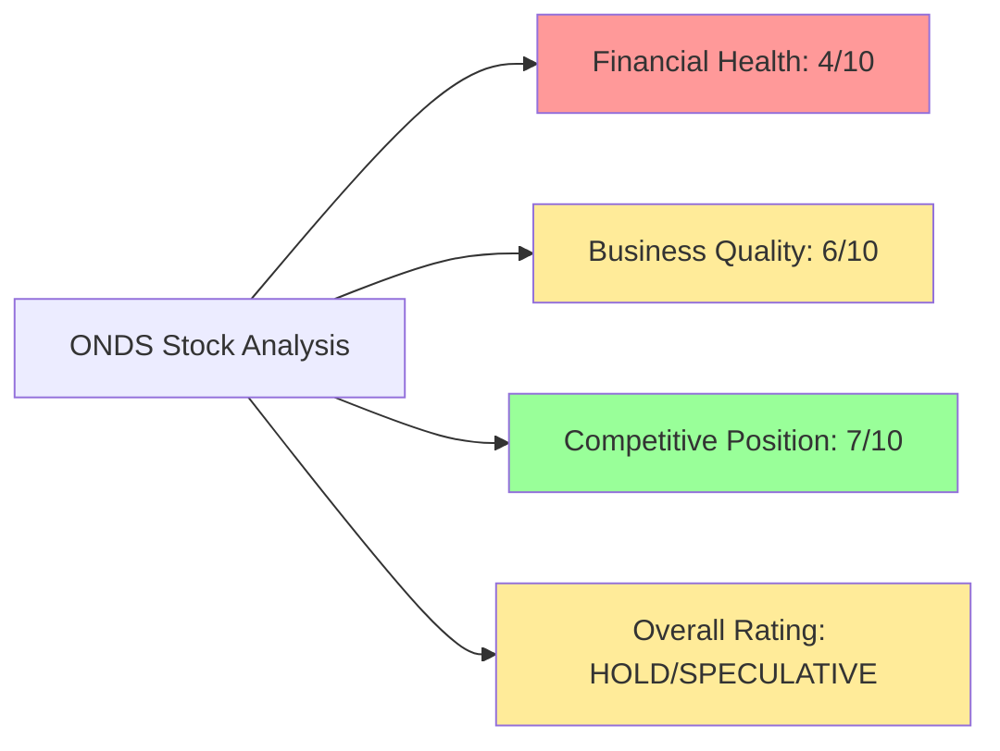

### Quick Stats Scorecard

| Metric | Current | Status | Trend |
|--------|---------|--------|-------|
| **Stock Price** | $9.69 | 🟡 Near Fair Value | ↗️ +8% YTD |
| **Market Cap** | $4.11B | 🔴 Expensive | ↗️ Rising |
| **Cash Position** | ~$1.5B | 🟢 Strong | ↗️ Raised $855M in 2025 |
| **Revenue (TTM)** | $24.7M → $48M (2025E) | 🟢 Explosive Growth | 📈 +582% YoY Q3 |
| **Profitability** | -172% Net Margin | 🔴 Burning Cash | ⏳ 2-3 yrs to breakeven |
| **Valuation (P/S)** | 23x (2026E) | 🔴 Very Expensive | ⚠️ Priced for perfection |

---

## 🎯 Investment Rating Summary

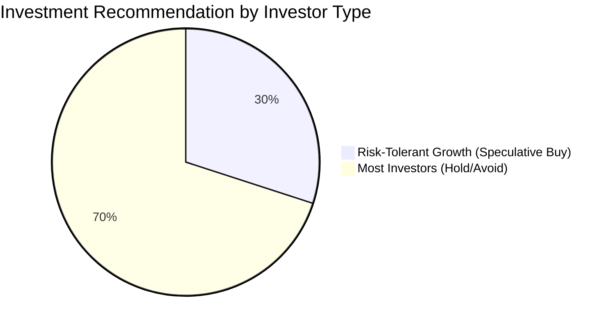

### Rating Card

<table>
<tr>
<td width="50%" bgcolor="#fff3cd">

**🟡 HOLD / SPECULATIVE BUY**

**Fair Value:** $6.00 - $9.00

**Current Price:** $9.69

**Upside to Median Target:** +81% ($17.50)

</td>
<td width="50%">

**Risk Profile:** 🔴🔴🔴🔴⚪ VERY HIGH

**Time Horizon:** 2-3 years

**Position Size:** 1-3% max (if any)

**Entry Point:** Wait for $6-8 pullback

</td>
</tr>
</table>

---

## 📈 Revenue Growth Story (The Bull Case)

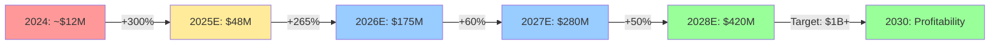

### Quarterly Revenue Trajectory

| Quarter | Revenue | YoY Growth | QoQ Growth | Status |
|---------|---------|------------|------------|--------|
| Q1 2025 | ~$2M | - | - | ✓ |
| Q2 2025 | $6.3M | +500% | +215% | ✓ |
| Q3 2025 | $10.1M | +582% | +60% | ✓ |
| Q4 2025E | $27-29M | - | +180% | 🎯 Key Test |
| 2025 Total | $47.6M - $49.6M | +400%+ | - | 🎯 Updated Guidance |
| 2026 Total | $170M - $180M | +265% | - | 🚀 Very Ambitious |

### Revenue Growth Visualization

```
2024:  ▓░░░░░░░░░ $12M   (100% baseline)
2025:  ▓▓▓▓░░░░░░ $48M   (+300%)
2026:  ▓▓▓▓▓▓▓▓▓▓▓▓▓▓░░ $175M  (+265%)
2027:  ▓▓▓▓▓▓▓▓▓▓▓▓▓▓▓▓▓▓▓▓▓▓▓ $280M  (+60%)
```

---

## 💰 Financial Health Dashboard

### Balance Sheet Transformation (2024 → 2025)

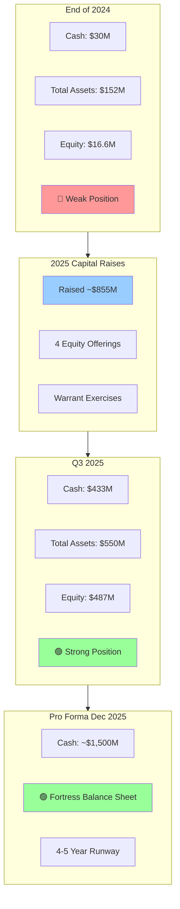

### Balance Sheet Snapshot

| Item | Dec 2024 | Q3 2025 | Pro Forma Dec 2025 | Change |
|------|----------|---------|-------------------|--------|
| **Cash** | $30M | $433M | ~$1,500M | 🚀 +4,900% |
| **Total Assets** | $152M | $550M | ~$1,600M | ↗️ +952% |
| **Total Liabilities** | $39M | $63M | ~$65M | ↗️ +67% |
| **Shareholders' Equity** | $16.6M | $487M | ~$1,535M | 🚀 +9,149% |
| **Debt** | Minimal | Minimal | Minimal | 🟢 Clean |

### Cash Burn & Runway Analysis

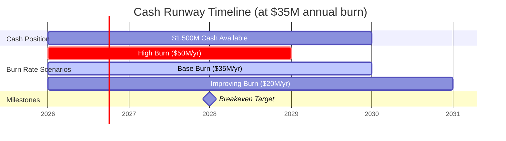

| Scenario | Annual Burn | Cash Runway | Breakeven Timeline |
|----------|-------------|-------------|-------------------|
| 🔴 **High Burn** | $50M/year | 3.0 years | 2029+ |
| 🟡 **Base Case** | $35M/year | 4.3 years | 2028 |
| 🟢 **Improving** | $20M/year | 7.5 years | 2027 |

---

## 📊 Profitability Analysis

### Margin Progression (Current vs. Future)

```mermaid
graph LR
    subgraph Current_2025[Current State 2025]
    A[Gross Margin: 33.6%]
    B[Operating Margin: -153.5%]
    C[Net Margin: -172.5%]
    D[🔴 Deep Losses]
    end

    subgraph Target_2027[Target 2027-2028]
    E[Gross Margin: 38-40%]
    F[Operating Margin: -5% to 0%]
    G[Net Margin: -10% to 0%]
    H[🟡 Approaching Breakeven]
    end

    subgraph Target_2030[Target 2030]
    I[Gross Margin: 40-45%]
    J[Operating Margin: 15-18%]
    K[Net Margin: 12-15%]
    L[🟢 Profitable at Scale]
    end

    Current_2025 --> Target_2027
    Target_2027 --> Target_2030

    style D fill:#ff9999
    style H fill:#ffeb99
    style L fill:#99ff99
```

### Return Metrics (Currently Negative)

| Metric | Current | Industry Avg | Status | Target (2030) |
|--------|---------|--------------|--------|---------------|
| **ROE** | -17.0% | +15% | 🔴 Negative | +20%+ |
| **ROA** | -8.6% | +8% | 🔴 Negative | +12%+ |
| **ROIC** | N/M | +12% | 🔴 Negative | +15%+ |
| **Operating Margin** | -153.5% | +10% | 🔴 Deep Loss | +15%+ |

### Path to Profitability

```
Revenue Required for Breakeven Analysis:

At 35% Gross Margin:
$35M OpEx / 0.35 GM = $100M Revenue → Gross Profit Breakeven
$50M OpEx / 0.35 GM = $143M Revenue → Operating Breakeven (realistic 2026-2027)
$60M OpEx / 0.35 GM = $171M Revenue → With growth investments

Current Trajectory:
2025: $48M revenue → -$20M+ operating loss
2026E: $175M revenue → -$5M to +$5M operating income (?)
2027E: $280M revenue → +$20M+ operating income (target)
```

---

## 🏢 Business Model & Revenue Streams

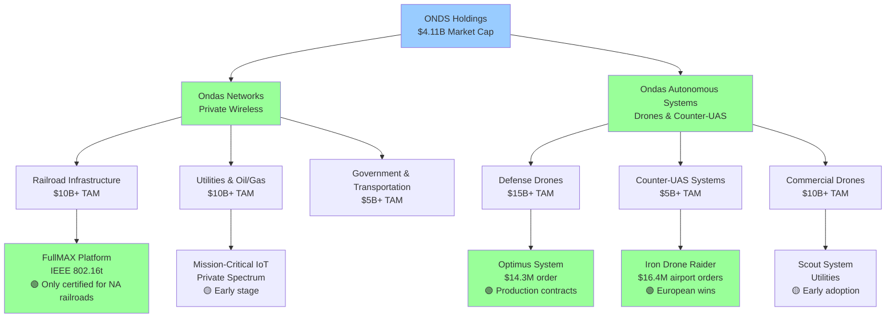

### Revenue Mix Evolution

| Segment | 2024 | 2025E | 2026E | Growth Driver |
|---------|------|-------|-------|---------------|
| **Ondas Networks** | 30% | 20% | 25% | Railroad POCs → Production |
| **OAS - Defense** | 50% | 60% | 50% | Optimus, Raider contracts |
| **OAS - Commercial** | 20% | 20% | 25% | Utilities, airports |

### Key Product Lines Performance

```
Optimus System (Defense Drones):
├─ Largest Order: $14.3M ✓
├─ Backlog Contribution: ~30%
└─ Status: 🟢 Production & Scaling

Iron Drone Raider (Counter-UAS):
├─ European Airport Orders: 2x $8.2M ✓
├─ Backlog Contribution: ~25%
└─ Status: 🟢 Proven, Expanding

FullMAX Platform (Railroad):
├─ IEEE 802.16t Standard ✓
├─ 3 POCs Q4'25/Q1'26 🎯
└─ Status: 🟡 Inflection Point 2026

Scout System (Commercial):
├─ Municipal Utility Deployments ✓
├─ Early Adoption Phase
└─ Status: 🟡 Growing Slowly
```

---

## 📋 Backlog & Pipeline Analysis

### Backlog Growth Trajectory

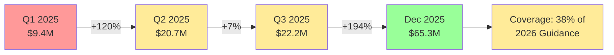

### Backlog vs. Revenue Guidance

| Metric | Amount | % of 2026 Guidance | Status |
|--------|--------|-------------------|--------|
| **Current Backlog** | $65.3M | 38% | 🟡 Moderate Coverage |
| **2026 Guidance (Midpoint)** | $175M | 100% | 🎯 Target |
| **Gap to Fill** | $110M | 62% | ⚠️ Must Win New Contracts |

**Backlog Coverage Analysis:**
```
$65.3M Backlog / $175M Guidance = 37% Coverage

Typical Coverage for Growth Tech:
- Conservative: 60-80% coverage ✓
- Aggressive: 30-50% coverage ← ONDS is here ⚠️
- Very Risky: <30% coverage

ONDS needs to win ~$110M in new orders during 2026 to hit guidance.
At $10-20M average order size = 5-11 new major contracts required.
```

---

## 🎯 Competitive Landscape

### Porter's Five Forces Heatmap

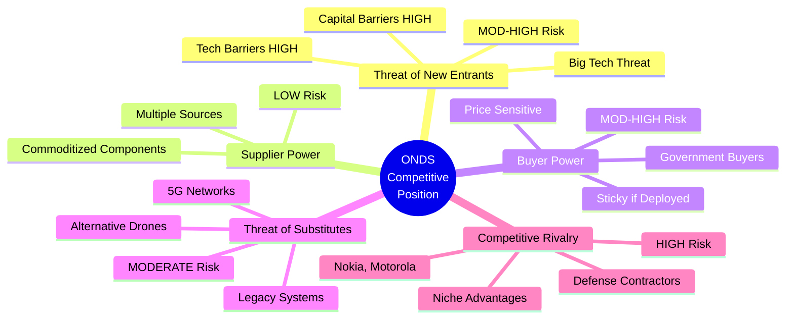

### Competitive Position Matrix

| Factor | Score | Status | Assessment |
|--------|-------|--------|------------|
| **Market Position** | 7/10 | 🟢 Niche Leader | Only certified for NA railroads |
| **Technology Moat** | 6/10 | 🟡 Moderate | Patents, but fast-moving tech |
| **Scale/Cost** | 3/10 | 🔴 Small Player | 1/100th size of Nokia/Motorola |
| **Customer Lock-in** | 7/10 | 🟢 High (once deployed) | Mission-critical = sticky |
| **Brand/Reputation** | 5/10 | 🟡 Building | Proven with recent wins |
| **Financial Strength** | 6/10 | 🟡 Adequate | Strong cash, but unprofitable |

### Competitor Comparison Table

| Company | Market Cap | Revenue | P/S | Profitable? | Key Strength |
|---------|-----------|---------|-----|-------------|--------------|
| **Motorola Solutions** | $75B | $10B+ | 4x | ✅ Yes | Scale, Legacy customers |
| **Nokia** | $25B | $25B+ | 0.5x | ✅ Yes | Global reach, 5G leader |
| **AeroVironment** | $2.5B | $600M | 3x | ✅ Yes | Proven defense drones |
| **Cambium Networks** | $400M | $250M | 1.5x | ✅ Yes | Wireless infrastructure |
| **🎯 ONDS** | **$4.1B** | **$48M** | **23x** | **❌ No** | **Niche tech, growth** |
| **Red Cat Holdings** | $800M | $20M | 40x | ❌ No | Small defense drones |
| **AgEagle** | $150M | $8M | 20x | ❌ No | Commercial drones |

### Competitive Positioning Visual

```
Market Position Map (Size vs. Growth)

High Growth │         🔴 ONDS ($4.1B, 23x P/S, 250%+ growth)
(>50%)      │         🟠 Red Cat, AgEagle (unprofitable SPACs)
            │
Medium      │    🟢 AeroVironment ($2.5B, 3x P/S, profitable)
Growth      │
(10-50%)    │
            │
Low Growth  │  🔵 Nokia ($25B, 0.5x P/S, mature)
(<10%)      │  🔵 Motorola ($75B, 4x P/S, stable)
            │  🔵 Cambium ($400M, 1.5x P/S, slow growth)
            │
            └─────────────────────────────────────────
             Small         Medium            Large
             (<$1B)     ($1-10B)          (>$10B)
                        Market Cap / Scale

Legend:
🔵 Established, Profitable (Low valuation)
🟢 Growth, Profitable (Moderate valuation)
🟠 High-Growth, Unprofitable (High valuation)
🔴 ONDS: Extreme growth + Extreme valuation
```

---

## 🏆 Competitive Advantages (Moats)

### Moat Strength Analysis

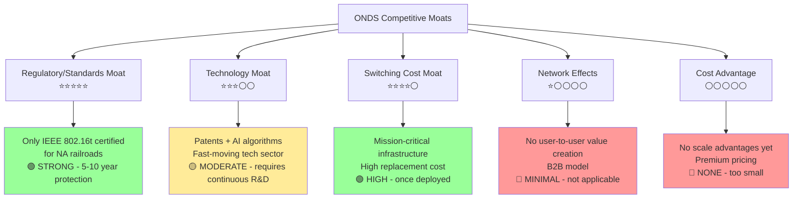

### Moat Scorecard

| Moat Type | Strength | Durability | Trend | Key Assets |
|-----------|----------|------------|-------|------------|
| **Regulatory** | ⭐⭐⭐⭐⭐ | 5-10 years | ↗️ Strengthening | IEEE 802.16t, FCC approvals |
| **Technology** | ⭐⭐⭐ | 2-3 years | → Stable | Patents, FullMAX, AI algorithms |
| **Switching Costs** | ⭐⭐⭐⭐ | 5-7 years | ↗️ Growing | Installed base (once deployed) |
| **Brand** | ⭐⭐ | 1-2 years | ↗️ Building | Contract wins building credibility |
| **Network Effects** | ⭐ | N/A | → N/A | Not applicable to business model |
| **Cost** | ⭐ | N/A | ↘️ Disadvantage | Small scale vs. giants |

---

## ⚠️ Risk Assessment Matrix

### Risk Heatmap

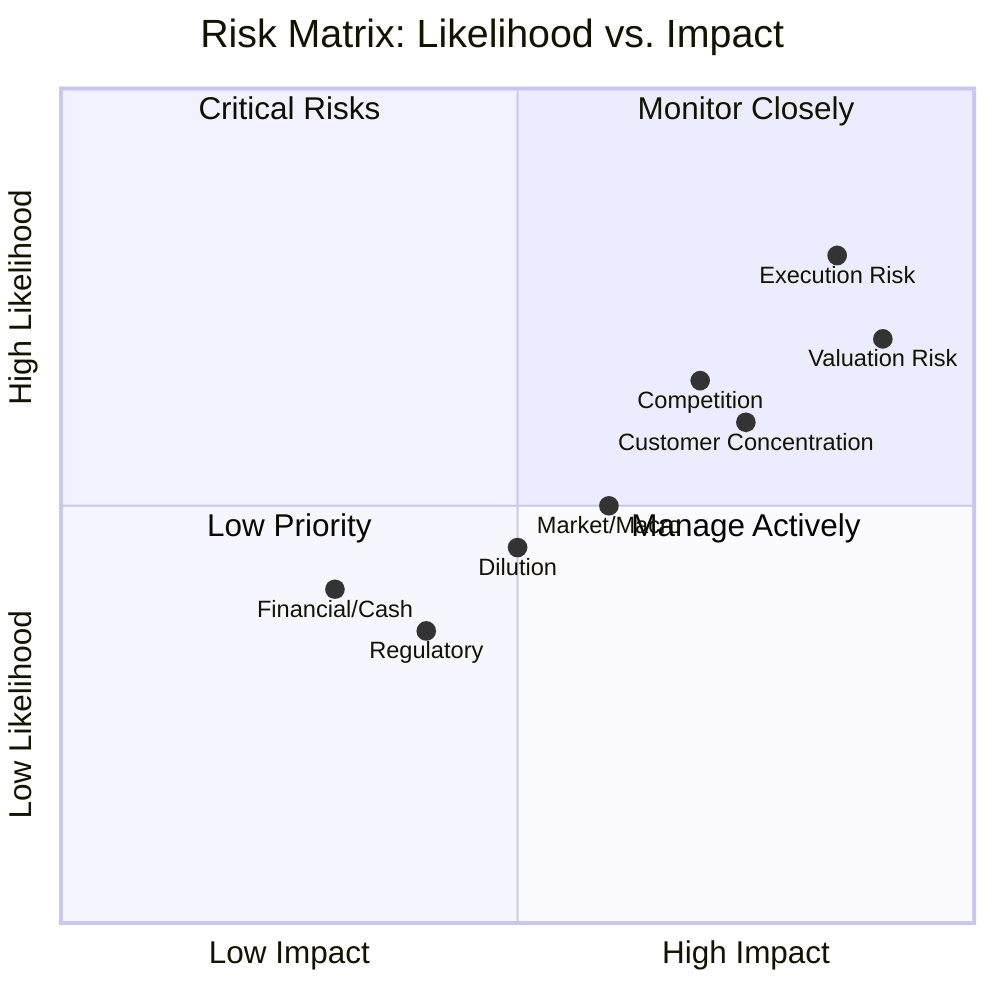

### Detailed Risk Scorecard

| Risk Category | Severity | Likelihood | Risk Score | Status | Mitigation |
|---------------|----------|------------|------------|--------|------------|
| **🔴 Execution Risk** | 🔴 Critical | 80% | 9/10 | ⚠️ VERY HIGH | Watch Q4'25 & Q1'26 results |
| **🔴 Valuation Risk** | 🔴 Critical | 70% | 9/10 | ⚠️ EXTREME | 23x P/S priced for perfection |
| **🟡 Competitive Risk** | 🟡 High | 65% | 7/10 | ⚠️ HIGH | Maintain tech edge, win contracts |
| **🟡 Customer Concentration** | 🟡 High | 60% | 7/10 | ⚠️ HIGH | Diversify customer base |
| **🟡 Profitability Timeline** | 🟡 High | 50% | 6/10 | ⚠️ MODERATE | $1.5B cash provides runway |
| **🟢 Dilution Risk** | 🟡 Moderate | 45% | 5/10 | ✓ MODERATE | Strong balance sheet now |
| **🟢 Market/Macro Risk** | 🟡 Moderate | 50% | 5/10 | ✓ MODERATE | Defense spending stable |
| **🟢 Financial/Liquidity** | 🟢 Low | 30% | 3/10 | ✓ LOW | $1.5B cash, 4-5 year runway |
| **🟢 Regulatory Risk** | 🟢 Low | 35% | 3/10 | ✓ LOW | Already certified/approved |

### Risk Factor Deep Dive

#### 🔴 CRITICAL RISK #1: Execution Risk (9/10)

```
2026 Revenue Guidance: $170-180M (+265% growth)
Current Backlog: $65.3M (38% coverage)
Required New Wins: $110M+ in 2026

Execution Challenges:
├─ Never operated at $40M+ quarterly scale
├─ Dependent on 5-11 major new contract wins
├─ Railroad POCs must convert to production
├─ Integration of recent M&A (Airobotics, American Robotics)
└─ Operational scaling (hiring, supply chain, delivery)

Red Flags to Watch:
🚩 Q4 2025 revenue miss (<$27M)
🚩 2026 guidance reduction
🚩 POC failures or delays
🚩 Large contract losses to competitors
🚩 Margin compression
```

#### 🔴 CRITICAL RISK #2: Valuation Risk (9/10)

```
Current Valuation: $4.11B market cap
2025 Revenue: $48M → P/S = 85x
2026 Revenue: $175M → P/S = 23x

Comparable Companies:
Profitable Tech: 2-5x P/S
Growth Tech (profitable): 8-15x P/S
Unprofitable Growth: 15-30x P/S
ONDS: 23x (2026E) ← At high end for unprofitable

Valuation Justified If:
✓ 2026 guidance achieved ($170-180M)
✓ 2027 growth continues (40-60%)
✓ Clear path to profitability (2027-2028)
✓ Margins expand to 15%+

Valuation Risk If:
✗ Revenue miss → Re-rate to 15x P/S = $2.6B (-37%)
✗ Major miss → Re-rate to 10x P/S = $1.75B (-57%)
✗ Multiple compression across growth stocks
```

---

## 💵 Valuation Analysis

### Multiple Valuation Approaches

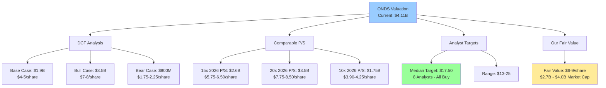

### Valuation Summary Table

| Methodology | Low | Mid | High | Implied Stock Price | vs. Current |
|-------------|-----|-----|------|---------------------|-------------|
| **DCF - Bear Case** | $800M | $900M | $1,000M | $1.75 - $2.25 | -77% to -77% 🔴 |
| **DCF - Base Case** | $1,700M | $1,900M | $2,100M | $3.75 - $4.65 | -61% to -52% 🔴 |
| **DCF - Bull Case** | $3,200M | $3,500M | $3,800M | $7.10 - $8.40 | -27% to -13% 🟡 |
| **Comp P/S (10x)** | $1,500M | $1,750M | $2,000M | $3.30 - $4.45 | -66% to -54% 🔴 |
| **Comp P/S (15x)** | $2,400M | $2,600M | $2,800M | $5.30 - $6.20 | -45% to -36% 🟡 |
| **Comp P/S (20x)** | $3,200M | $3,500M | $3,800M | $7.10 - $8.40 | -27% to -13% 🟡 |
| **Analyst Consensus** | $5,850M | $7,875M | $11,250M | $13.00 - $25.00 | +34% to +158% 🟢 |
| **🎯 Our Fair Value** | **$2,700M** | **$3,350M** | **$4,000M** | **$6.00 - $9.00** | **-38% to -7%** 🟡 |

### Price Target Scenarios

```
Current Price: $9.69

Bear Case (30% probability): $3-6
├─ 2026 revenue: $100-130M (miss)
├─ Railroad delays, competition wins
├─ Market re-rates to 10x P/S
└─ Downside: -69% to -38%

Base Case (40% probability): $8-12
├─ 2026 revenue: $150-180M (meets guidance)
├─ Mixed execution, steady progress
├─ Market values at 15x forward P/S
└─ Return: -17% to +24%

Bull Case (30% probability): $15-20
├─ 2026 revenue: $200M+ (beats)
├─ Major railroad contract, defense wins
├─ Clear path to 2027 profitability
├─ Market re-rates to 20-25x P/S
└─ Upside: +55% to +106%

Probability-Weighted Target: $9.45
(30% × $4.50) + (40% × $10) + (30% × $17.50) = $9.60
```

### Valuation Sensitivity Analysis

**P/S Multiple Sensitivity (Based on 2026 Revenue)**

| P/S Multiple | $120M Rev | $150M Rev | $175M Rev | $200M Rev | $220M Rev |
|--------------|-----------|-----------|-----------|-----------|-----------|
| **10x** | $2.67 | $3.33 | $3.89 | $4.44 | $4.89 |
| **15x** | $4.00 | $5.00 | $5.83 | $6.67 | $7.33 |
| **20x** | $5.33 | $6.67 | $7.78 | $8.89 | $9.78 |
| **23x (Current)** | $6.13 | $7.67 | **$8.95** ← | $10.22 | $11.24 |
| **25x** | $6.67 | $8.33 | $9.72 | $11.11 | $12.22 |
| **30x** | $8.00 | $10.00 | $11.67 | $13.33 | $14.67 |

*Stock prices in USD, assuming ~450M diluted shares*

**Key Insight:** At current price of $9.69, market is pricing in:
- 23x P/S on $175M revenue (base case), OR
- 20x P/S on $200M revenue (bull case), OR
- 25x P/S on $160M revenue (mild miss acceptable)

**Valuation Breakeven Analysis:**
```
Current Market Cap: $4.11B
Current Price: $9.69

To justify current valuation:
├─ Need $175M+ revenue in 2026 ✓ (guided)
├─ Need $280M+ revenue in 2027 (60% growth)
├─ Need clear path to 15%+ operating margin by 2028-2029
├─ Need continued market appetite for 20x+ P/S multiples
└─ Any miss → Likely 20-40% downside
```

---

## 📊 DCF Model Visualization

### Discounted Cash Flow Assumptions

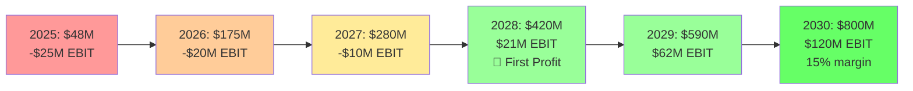

### Revenue & Margin Assumptions (Base Case)

| Year | Revenue | Growth | Gross Margin | Operating Margin | EBIT | Status |
|------|---------|--------|--------------|------------------|------|--------|
| 2025 | $48M | +300% | 34% | -52% | -$25M | 🔴 Burning |
| 2026 | $175M | +265% | 35% | -11% | -$20M | 🔴 Improving |
| 2027 | $280M | +60% | 37% | -4% | -$10M | 🟡 Near Breakeven |
| 2028 | $420M | +50% | 38% | +5% | +$21M | 🟢 **Profitable!** |
| 2029 | $590M | +40% | 40% | +11% | +$65M | 🟢 Scaling |
| 2030 | $800M | +36% | 42% | +15% | +$120M | 🟢 Mature Growth |

### DCF Waterfall Chart

```
Enterprise Value Build-Up (Base Case):

PV of Operating Cash Flows (2026-2030):    $56M
    ├─ 2026: -$17M
    ├─ 2027: -$8M
    ├─ 2028: +$10M
    ├─ 2029: +$26M
    └─ 2030: +$45M

Terminal Value (2030+):                    $772M
    └─ $90M NOPAT × (1.03) / (0.15 - 0.03)

PV of Terminal Value (at 15% WACC):        $384M
                                          --------
Enterprise Value:                          $440M

Add: Cash (Pro Forma):                   +$1,500M
Less: Debt:                                    $0
                                          --------
Equity Value:                            $1,940M
                                          ========

Per Share (450M shares):                  $4.30

Current Price:                            $9.69
Implied Downside:                          -56%
```

---

## 📅 Investment Timeline & Catalysts

### Key Events Timeline (Next 24 Months)

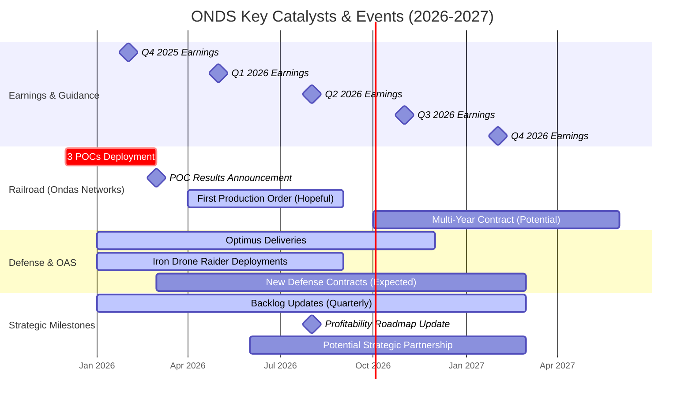

### Catalyst Tracker

| Timeframe | Catalyst | Impact | Probability | Watch For |
|-----------|----------|--------|-------------|-----------|
| **Feb 2026** | Q4'25 Earnings ($27-29M?) | 🔴 CRITICAL | 70% | Revenue, backlog, guidance reaffirm |
| **Mar-Apr 2026** | Railroad POC Results | 🔴 CRITICAL | 60% | Technical success, railroad feedback |
| **Q1-Q2 2026** | New Defense Contracts ($20M+) | 🟡 HIGH | 50% | Backlog growth to $100M+ |
| **Q2 2026** | Q1'26 Earnings (First of new year) | 🔴 CRITICAL | 75% | On track for $170-180M year? |
| **Mid 2026** | First Railroad Production Order | 🔴 CRITICAL | 40% | Validates entire thesis |
| **Q3 2026** | Profitability Roadmap Update | 🟡 HIGH | 80% | Path to breakeven clarity |
| **Q4 2026** | 2027 Guidance | 🟡 HIGH | 85% | Continued growth trajectory? |
| **2027** | Achieve Profitability | 🟢 MEDIUM | 30% | Operating leverage proof |

### Event Impact Matrix

```
Positive Catalysts → Stock Price Impact:

✅ Q4'25 beats ($30M+ revenue):           +15-25%
✅ Railroad POC success + production order: +30-50%
✅ $50M+ defense contract win:            +15-20%
✅ Beats 2026 guidance ($200M+ revenue):  +40-60%
✅ Early profitability (2027 vs 2028):    +25-35%
✅ Strategic partnership (major railroad):  +50-75%

Negative Catalysts → Stock Price Impact:

❌ Q4'25 miss (<$25M revenue):            -20-35%
❌ Railroad POC failure/delay:            -30-50%
❌ 2026 guidance cut:                     -40-60%
❌ Major contract loss to competitor:     -15-25%
❌ Margin compression:                    -10-20%
❌ Need for dilutive capital raise:       -25-40%
```

---

## 🎯 Investment Strategy & Recommendations

### Investor Suitability Matrix

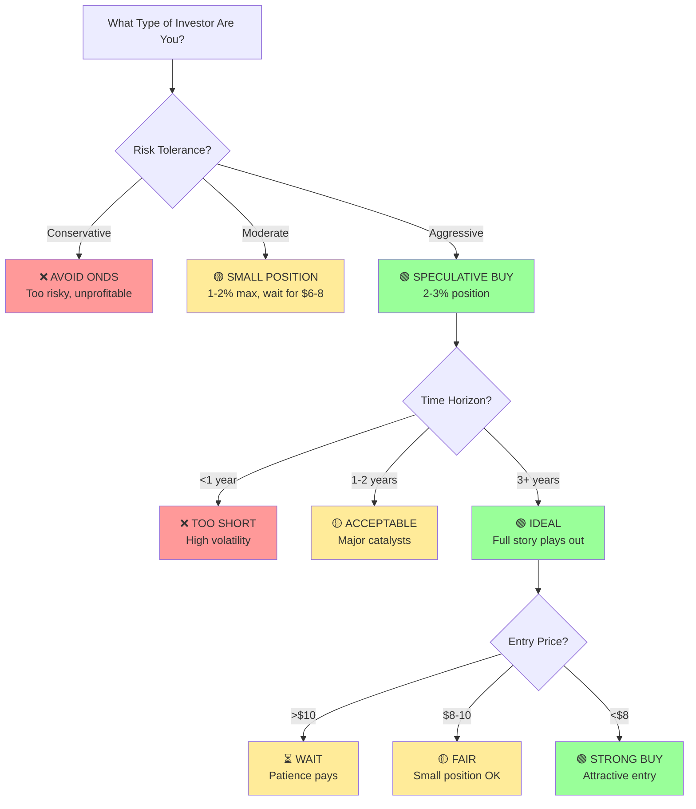

### Position Sizing Guide

| Investor Profile | Recommendation | Position Size | Entry Price | Stop Loss |
|------------------|----------------|---------------|-------------|-----------|
| **Conservative** | ❌ AVOID | 0% | N/A | N/A |
| **Moderate Growth** | 🟡 WAIT or SMALL | 0-2% | $6-8 range | <$5.50 (-30%) |
| **Aggressive Growth** | 🟢 SPECULATIVE BUY | 2-3% | $8-10 OK, <$8 better | <$6.00 (-38%) |
| **High Risk/Venture** | 🟢 BUY | 3-5% | Current OK | <$5.00 (-48%) |

### Trading Strategy Recommendations

#### Strategy #1: Patient Value Entry
```
Target Entry: $6.00 - $8.00 (wait for 20-40% pullback)
Position Size: 2-3% of portfolio
Hold Period: 2-3 years
Exit Targets: $15 (+88-150%), $20 (+150-233%)
Stop Loss: <$5.50

Rationale:
- Current valuation stretched at $9.69
- Likely volatility around Q4'25 or Q1'26 earnings
- Better risk/reward at lower entry
- Patience likely rewarded

Best For: Disciplined value-oriented growth investors
```

#### Strategy #2: Dollar Cost Averaging
```
Initial Position: 1% at $9-10
Add 0.5% every $1.00 decline: $8, $7, $6
Target Average Cost: $7.00-7.50
Total Position: 3%
Time Period: 6-12 months

Rationale:
- Reduces timing risk
- Builds position through volatility
- Psychologically easier

Best For: Investors wanting exposure but uncertain on timing
```

#### Strategy #3: Catalyst-Based Entry
```
Wait For: Q4'25 earnings (Feb 2026) or Railroad POC results (Q1'26)
Entry Condition:
  - IF positive catalyst → Buy on strength
  - IF negative catalyst → Buy on -20-30% dip
Position Size: 2-3%
Hold Period: 18-24 months

Rationale:
- Major de-risking events ahead
- Better information before commitment
- Could miss upside but reduces risk

Best For: Risk-aware growth investors wanting more visibility
```

#### Strategy #4: Small Speculative Position Now
```
Entry: Current price $9-10
Position Size: 1-2% (small "lottery ticket")
Add-On Rule: Only add if <$7.00
Exit Strategy:
  - 50% at $15 (+55%)
  - 50% at $20-25 (+106-158%)
  - Full exit if <$6 (-38%)

Rationale:
- Asymmetric risk/reward if execution delivers
- Small enough to not hurt if wrong
- Participate in potential bull run

Best For: Aggressive investors with high-conviction micro-bets
```

---

## 📊 Monitoring Dashboard

### Quarterly KPI Tracking Sheet

| KPI | Q3 2025 Actual | Q4 2025 Target | Q1 2026 Target | Threshold |
|-----|----------------|----------------|----------------|-----------|
| **Revenue** | $10.1M ✓ | $27-29M | $35-40M | >$25M (Q4) |
| **YoY Growth** | 582% ✓ | 300%+ | 200%+ | >150% |
| **Gross Margin** | 33.6% | 34-36% | 35-37% | >32% |
| **Operating Loss** | -$7.5M | -$10-12M | -$8-10M | Improving |
| **Cash Burn (Quarterly)** | ~$9M | ~$10M | ~$9M | <$12M |
| **Backlog (End of Period)** | $22.2M → $65.3M ✓ | $65-80M | $80-100M | >$50M |
| **New Orders (Quarterly)** | $43M+ ✓ | $20-30M | $30-40M | >$20M |

### Health Check Scorecard

| Metric | Current Status | Target | RAG Status |
|--------|----------------|--------|------------|
| **Revenue Growth Rate** | 582% YoY | >200% | 🟢 GREEN |
| **Backlog Coverage** | 38% of 2026 | >50% | 🟡 YELLOW |
| **Gross Margin** | 33.6% | >35% | 🟡 YELLOW |
| **Cash Position** | $1,500M | >$1,000M | 🟢 GREEN |
| **Quarterly Cash Burn** | ~$9M | <$10M | 🟢 GREEN |
| **Customer Concentration** | High (few large) | Diversifying | 🟡 YELLOW |
| **Profitability Timeline** | 2028 target | 2027-2028 | 🟢 GREEN |
| **Stock Valuation** | 23x P/S | <20x | 🔴 RED |

### Red Flag Warning System

| Red Flag | Severity | Current Status | Action if Triggered |
|----------|----------|----------------|---------------------|
| 🚩 Q4'25 revenue <$25M | 🔴 CRITICAL | ⏳ Pending | Reduce/exit position |
| 🚩 2026 guidance cut | 🔴 CRITICAL | ✓ Affirmed | Immediate exit |
| 🚩 Railroad POC failure | 🔴 CRITICAL | ⏳ Pending Q1'26 | Cut position 50% |
| 🚩 Gross margin <30% | 🟡 WARNING | ✓ Safe (33.6%) | Watch closely |
| 🚩 Major contract loss | 🟡 WARNING | ✓ No losses yet | Reassess thesis |
| 🚩 Cash burn accelerates >$15M/qtr | 🟡 WARNING | ✓ Safe (~$9M) | Calculate new runway |
| 🚩 Dilutive capital raise | 🟡 WARNING | ✓ Not needed | Consider exit |

---

## 📝 Investment Thesis Summary

### The Bull Case (30% Probability) 🟢

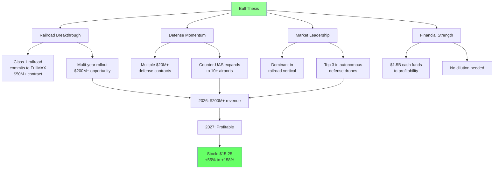

**Bull Case Assumptions:**
- ✅ Q4'25 beats expectations ($30M+)
- ✅ Railroad POCs successful → Production order by mid-2026
- ✅ 3+ major defense contracts ($50M+ total) in 2026
- ✅ 2026 revenue $200M+ (beats $175M guidance)
- ✅ Clear path to 2027 profitability
- ✅ Gross margins expand to 38-40%
- ✅ Market re-rates to 20-25x forward P/S

**Bull Price Target: $15-25** (+55% to +158%)

---

### The Base Case (40% Probability) 🟡

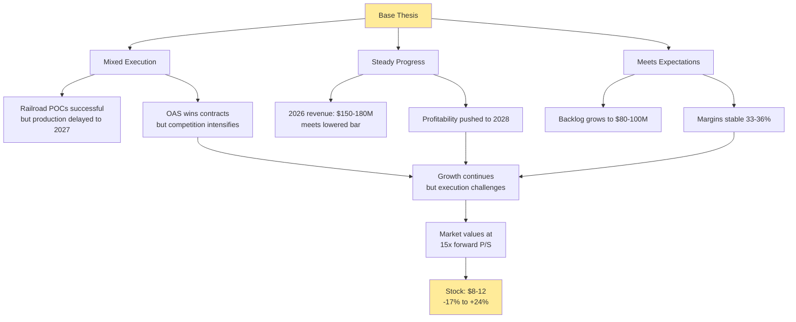

**Base Case Assumptions:**
- ✓ Q4'25 meets guidance ($27-29M)
- ✓ Railroad POCs work but slow to production
- ✓ 2026 revenue $150-180M (meets guidance)
- ✓ Some defense contract wins, but competitive
- ⚠️ Profitability delayed to 2028 (not 2027)
- ✓ Margins stable but not expanding
- ✓ Market maintains 15-18x P/S

**Base Price Target: $8-12** (-17% to +24%)

---

### The Bear Case (30% Probability) 🔴

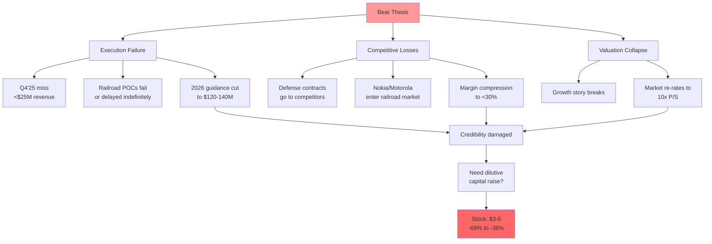

**Bear Case Assumptions:**
- ❌ Q4'25 misses (<$25M)
- ❌ Railroad POCs delayed or fail technical requirements
- ❌ 2026 revenue $100-130M (major miss)
- ❌ Defense contracts go to competitors (Skydio, AeroVironment)
- ❌ Profitability pushed beyond 2029
- ❌ Gross margins compress below 30%
- ❌ Market loses patience, re-rates to 10x P/S

**Bear Price Target: $3-6** (-69% to -38%)

---

## 🎓 Investment Recommendation Summary

### Final Verdict

<table>
<tr>
<td width="60%" bgcolor="#fff3cd">

### 🟡 HOLD / SPECULATIVE BUY

**Current Price:** $9.69
**Fair Value:** $6.00 - $9.00
**12-Month Target:** $8-12 (Base Case)

**Rating Breakdown:**
- Conservative Investors: ❌ **AVOID**
- Moderate Investors: 🟡 **WAIT** for $6-8
- Aggressive Growth: 🟢 **SMALL BUY** (1-3%)

</td>
<td width="40%">

**Risk Rating:** 🔴🔴🔴🔴⚪

**⭐⭐⭐⚪⚪** (3/5 stars)

High-risk, high-reward speculation

Best for: Aggressive portfolios only

</td>
</tr>
</table>

### Action Plan by Investor Type

#### 🔴 Conservative Investors (Retirees, Low Risk Tolerance)
```
Recommendation: ❌ AVOID
Reason: Unprofitable, highly volatile, 23x sales
Alternative: Consider profitable defense tech (LMT, NOC) or infrastructure (MSI)
```

#### 🟡 Moderate Growth Investors (Balanced Portfolios)
```
Recommendation: ⏳ WATCH & WAIT
Action: Monitor Q4'25 earnings (Feb 2026) and railroad POC results
Entry Price: $6.00 - $8.00 (wait for 20-40% pullback)
Position Size: 1-2% maximum
Timeframe: Be patient, likely volatility ahead
```

#### 🟢 Aggressive Growth Investors (High Risk Tolerance)
```
Recommendation: 🟢 SPECULATIVE BUY
Action: Small position (2-3%) at current levels OR wait for dip to $8
Entry Strategy:
  - Option A: 1-2% now, add if drops to $7-8
  - Option B: Wait for $6-8 pullback for 2-3% position
Stop Loss: <$6.00 (-38%)
Target: $15-20 (+55-106%) by 2027-2028
Timeframe: 2-3 year hold
```

---

## 🔍 Due Diligence Checklist

Before investing in ONDS, verify:

### Must-Check Items

- [ ] Read latest 10-Q and 10-K filings (ir.ondas.com)
- [ ] Review Q4 2025 earnings (February 2026)
- [ ] Understand your risk tolerance (can you afford 50%+ drawdown?)
- [ ] Position sized appropriately (max 3% of portfolio)
- [ ] Set stop-loss or exit price in advance
- [ ] Monitor railroad POC results (Q1 2026)
- [ ] Track backlog growth quarterly
- [ ] Watch competitive developments (Nokia, Motorola, defense)
- [ ] Review analyst reports and conference call transcripts
- [ ] Understand dilution impact (share count growth)

### Red Lines (Exit Immediately If:)

- 🚨 Q4'25 revenue <$25M
- 🚨 2026 guidance cut below $150M
- 🚨 Railroad POC complete failure
- 🚨 Loss of major defense contract to competitor
- 🚨 Gross margin drops below 28%
- 🚨 Need for dilutive capital raise in 2026
- 🚨 Management turnover (CEO, CFO)
- 🚨 Stock breaks below $6.00 (stop loss)

---

## 📚 Sources & References

### Official Company Sources
- [Ondas Investor Relations](https://ir.ondas.com/)
- [Q3 2025 Earnings Release](https://ir.ondas.com/press-releases/detail/254/ondas-holdings-reports-record-third-quarter-2025-financial)
- [Financial Statements](https://ir.ondas.com/financial-results)
- [Balance Sheet Data](https://stockanalysis.com/stocks/onds/financials/balance-sheet/)
- [Cash Flow Statements](https://ir.ondas.com/cash-flow)

### Business & Strategy
- [2026 Revenue Target Raised to $170-180M](https://www.stocktitan.net/news/ONDS/ondas-hosts-oas-investor-day-ups-2026-revenue-target-to-170-180-18lq1ollcueo.html)
- [Ondas: Winning The Drone Wars - Seeking Alpha](https://seekingalpha.com/article/4855914-ondas-winning-the-drone-wars-in-2026)
- [FullMAX Railroad IEEE 802.16t Advancement](https://ir.ondas.com/press-releases/detail/204/ondas-networks-advances-rail-industry-and-industrial)

### Contract Announcements
- [$14.3M Defense Order - Optimus Systems](https://ir.ondas.com/press-releases/detail/207/ondas-secures-14-3-million-order-from-a-leading-defense)
- [$8.2M Counter-UAS Airport Orders](https://ir.ondas.com/press-releases/detail/259/ondas-secures-additional-8-2-million-counter-uas-order)
- [Strategic Government Border Protection Tender](https://ir.ondas.com/press-releases/detail/261/ondas-wins-strategic-government-tender-to-develop-and)

### Competitive Analysis
- [Top ONDS Competitors - MarketBeat](https://www.marketbeat.com/stocks/NASDAQ/ONDS/competitors-and-alternatives/)
- [Competitive Analysis - CSI Market](https://csimarket.com/stocks/compet_glance.php?code=ONDS)

### Valuation & Analyst Coverage
- [Stock Forecast 2026 - TickerNerd](https://tickernerd.com/stock/onds-forecast/)
- [Analyst Ratings - Public.com](https://public.com/stocks/onds/forecast-price-target)
- [Price Targets - TipRanks](https://www.tipranks.com/stocks/onds/forecast)
- [Valuation Statistics](https://stockanalysis.com/stocks/onds/statistics/)

### Financial Health
- [Profitability Metrics - Seeking Alpha](https://seekingalpha.com/symbol/ONDS/profitability)
- [Financial Health - Simply Wall St](https://simplywall.st/stocks/us/tech/nasdaq-onds/ondas/health)
- [Earnings Performance Analysis](https://simplywall.st/stocks/us/tech/nasdaq-onds/ondas/past)

---

## 💡 Final Thoughts

Ondas Holdings represents a classic **high-risk, high-reward** growth stock at a critical inflection point. The company has:

**✅ Strengths:**
- Real technology solving real problems
- Validated with production contracts
- Fortress balance sheet ($1.5B cash)
- Massive addressable markets
- Regulatory moats in railroad vertical
- Explosive revenue growth (+582% YoY)

**❌ Weaknesses:**
- Unprofitable with 2-3 year timeline to breakeven
- Valuation stretched (23x 2026 P/S)
- Extreme execution risk on aggressive 2026 guidance
- Heavy competition from giants (Nokia, Motorola)
- Customer concentration risk
- Massive shareholder dilution in 2025

**The Investment Opportunity:**
This is a "show me" story. If management executes on 2026 guidance ($170-180M), converts railroad POCs to production, and maintains defense momentum, the stock could easily reach $15-25 (+55-158%). However, any stumble will likely result in significant downside to $5-7 range (-50-60%).

**Who Should Invest:**
Only aggressive growth investors with:
- 2-3 year time horizon
- Ability to withstand 50%+ volatility
- Portfolio position limit of 1-3% maximum
- Understanding this is speculation, not core holding

**Bottom Line:**
ONDS is a **HOLD** at current prices for existing holders with strong hands. New investors should wait for a better entry point around $6-8 or wait for Q4'25/Q1'26 results to gain more visibility. This is not a stock for widows and orphans—it's a bet on flawless execution in a challenging competitive environment.

---

**Disclaimer:** This analysis is for informational and educational purposes only and does not constitute investment advice. All investments involve risk of loss. The author may hold positions in mentioned securities. Conduct your own due diligence and consult a financial advisor before making investment decisions. Forward-looking statements involve inherent uncertainties.

**Report Version:** V2 (Visual) | **Date:** February 16, 2026 | **Analyst:** Claude AI
