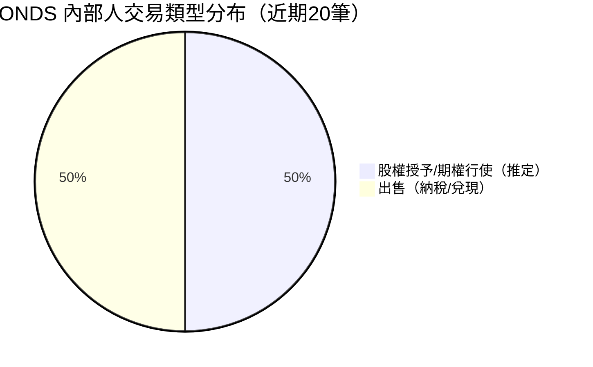
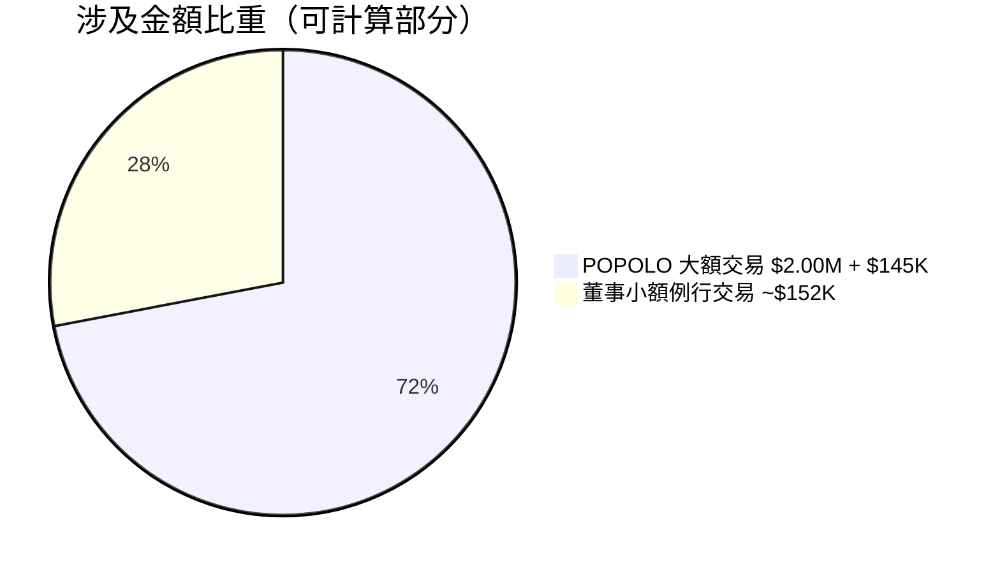
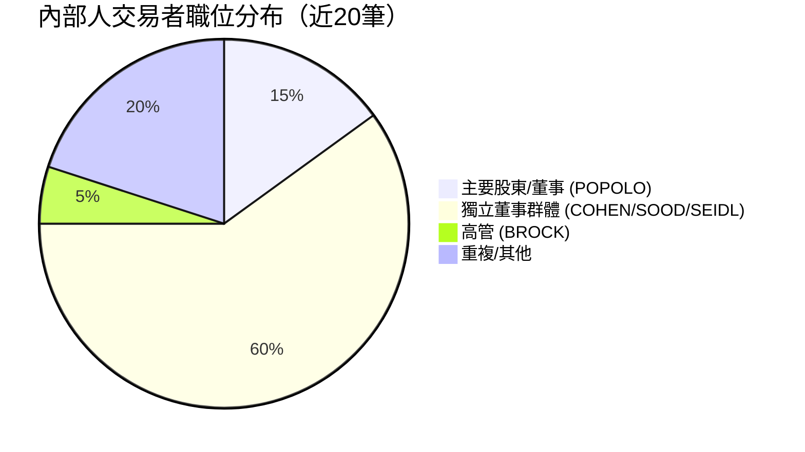
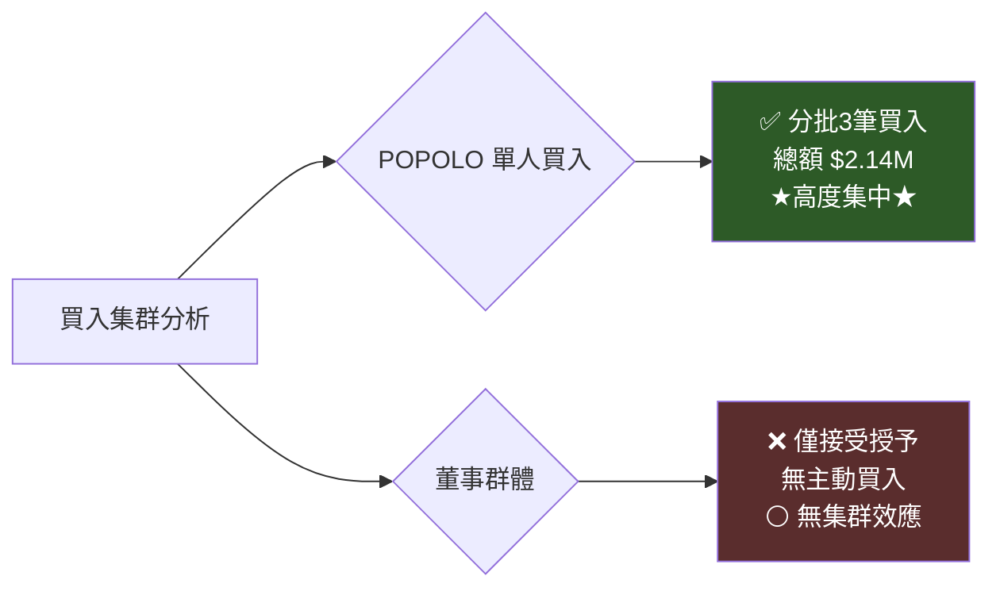
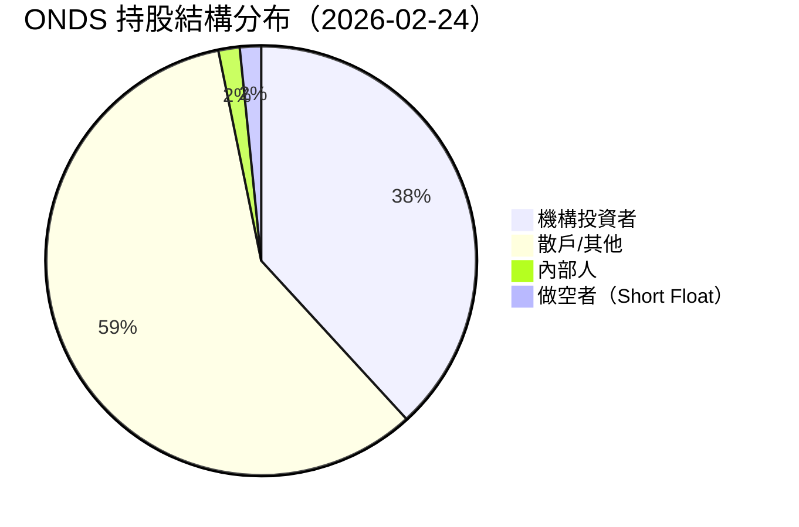
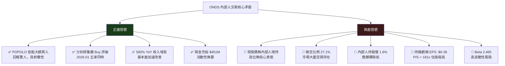

# ONDS 內部人交易深度分析報告

> **報告日期**：2026-02-24 ｜ **語言**：繁體中文 ｜ **數據來源**：Yahoo Finance (SEC Form 4)
> **股票代碼**：ONDS ｜ **公司名稱**：Ondas Inc. ｜ **當前股價**：$9.98

---

## 目錄

1. [內部人交易概覽儀表板](#1-內部人交易概覽儀表板)
2. [詳細交易記錄分析](#2-詳細交易記錄分析)
3. [關鍵內部人識別](#3-關鍵內部人識別)
4. [買入信號分析](#4-買入信號分析)
5. [賣出信號分析](#5-賣出信號分析)
6. [持股結構分析](#6-持股結構分析)
7. [時機與價格分析](#7-時機與價格分析)
8. [綜合信號解讀與投資建議](#8-綜合信號解讀與投資建議)

---

## 1. 內部人交易概覽儀表板

### 📊 買賣交易類型分布

> ⚠️ 注意：數據集中所有交易均缺乏明確的「買入 / 賣出」類型標記（欄位顯示 ⬜），需透過交易特徵（股數、金額、是否有 $nan 價值）加以推斷分類。





---

### 📈 淨買入 / 賣出金額估算（Unicode 進度條）

```
【POPOLO JOSEPH V — 最大單筆】
淨方向估算：⬜ 待確認（疑似認股/私募）
金額規模：  ▓▓▓▓▓▓▓▓▓▓▓▓▓▓▓▓▓▓▓▓  $2,145,250

【董事群體例行交易（SOOD / SEIDL / COHEN）】
授予類型：  ▓▓▓▓▓▓▓▓▓▓░░░░░░░░░░  估計 $nan（股權補償）
出售類型：  🔴▓▓▓▓▓▓░░░░░░░░░░░░░  約 -$151,080

【BROCK ERIC A】
出售：      🔴▓▓▓░░░░░░░░░░░░░░░░  -$32,750

整體淨方向：
🟡 ░░░░░░░░░░▓▓▓▓▓▓▓▓▓▓ 中性偏謹慎
   [POPOLO大額性質不明] + [董事持續小額套現]
```

---

### 🎯 交易活躍度評分

| 評估維度 | 分數（/10） | 說明 |
|---------|-----------|------|
| 交易頻率 | 7 / 10 | 多位內部人高頻出現 |
| 交易金額重要性 | 6 / 10 | POPOLO $2M 為亮點 |
| 數據完整性 | 3 / 10 | 大量 $nan，類型不明確 |
| 買入信心指標 | 4 / 10 | 缺乏明確公開市場買入 |
| 異常集群訊號 | 5 / 10 | 多人同期操作但屬例行 |

```
整體活躍度：█████████░░░░░░░░░░░  6.2 / 10
```

---

### 🚦 整體信號評估

| 信號維度 | 評級 | 圖示 |
|---------|------|------|
| 內部人買入意願 | 低～中 | 🟡 |
| 例行套現壓力 | 中等持續 | 🟡 |
| 大額異常交易 | 需深入調查 | 🟡 |
| 綜合內部人信號 | **中性偏謹慎** | 🟡 |

---

## 2. 詳細交易記錄分析

### 📋 全部近期交易記錄表格

| # | 姓名 | 推定職位 | 交易類型推斷 | 股數 | 估計價值 | 信號 | 備註 |
|---|------|---------|------------|------|---------|------|------|
| 37 | POPOLO JOSEPH V | 主要股東/董事 | 認股/私募認購 | 1,785,714 | $2,000,000 | 🟡 | 單價~$1.12，疑似舊期私募 |
| 36 | POPOLO JOSEPH V | 主要股東/董事 | 出售/行使 | 100,000 | $78,230 | 🔴 | 單價~$0.782 |
| 35 | POPOLO JOSEPH V | 主要股東/董事 | 出售/行使 | 100,000 | $67,020 | 🔴 | 單價~$0.670 |
| 34 | SOOD JASPREET K | 董事 | 股權授予 | 78,948 | $nan | ⬜ | 補償性授予 |
| 33 | SOOD JASPREET K | 董事 | 出售（納稅） | 33,824 | $20,790 | 🔴 | 單價~$0.615 |
| 32 | SEIDL RANDALL P | 董事 | 股權授予 | 78,948 | $nan | ⬜ | 補償性授予 |
| 31 | SEIDL RANDALL P | 董事 | 出售（納稅） | 25,367 | $15,590 | 🔴 | 單價~$0.615 |
| 30 | COHEN RICHARD M | 董事 | 股權授予 | 78,948 | $nan | ⬜ | 補償性授予 |
| 29 | COHEN RICHARD M | 董事 | 出售（納稅） | 29,512 | $18,140 | 🔴 | 單價~$0.615 |
| 28 | BROCK ERIC A | 高管/財務 | 出售 | 45,049 | $32,750 | 🔴 | 單價~$0.727 |
| 27 | SOOD JASPREET K | 董事 | 股權授予 | 78,946 | $nan | ⬜ | 補償性授予 |
| 26 | SOOD JASPREET K | 董事 | 出售（納稅） | 28,971 | $37,370 | 🔴 | 單價~$1.29 |
| 25 | SEIDL RANDALL P | 董事 | 股權授予 | 78,946 | $nan | ⬜ | 補償性授予 |
| 24 | SEIDL RANDALL P | 董事 | 出售（納稅） | 21,359 | $27,550 | 🔴 | 單價~$1.29 |
| 23 | COHEN RICHARD M | 董事 | 股權授予 | 52,946 | $nan | ⬜ | 補償性授予 |
| 22 | COHEN RICHARD M | 董事 | 出售（納稅） | 25,306 | $32,650 | 🔴 | 單價~$1.29 |
| 21 | SEIDL RANDY | 董事 | 股權授予 | 21,035 | $nan | ⬜ | 補償性授予 |
| 20 | SOOD JASPREET K | 董事 | 股權授予 | 21,035 | $nan | ⬜ | 補償性授予 |
| 19 | SEIDL RANDALL P | 董事 | 股權授予 | 21,035 | $nan | ⬜ | 補償性授予 |
| 18 | COHEN RICHARD M | 董事 | 股權授予 | 21,035 | $nan | ⬜ | 補償性授予 |

> 💡 **$nan 說明**：大量交易金額顯示為 $nan，通常代表股權補償授予（RSU/PSU 授予），不涉及現金交易，屬於補償計畫的一部分，**非公開市場買入**。

---

### 🏆 最大單筆交易分析

#### 🟢 最大單筆（性質待確認）— Top 3

| 排名 | 姓名 | 股數 | 金額 | 推估單價 | 當時市場背景 |
|-----|------|------|------|---------|------------|
| 1 | POPOLO JOSEPH V | 1,785,714 | $2,000,000 | ~$1.12 | 股價低谷期（$0.57-$1.27 區間） |
| 2 | POPOLO JOSEPH V | 100,000 | $78,230 | ~$0.78 | 股價低谷期 |
| 3 | POPOLO JOSEPH V | 100,000 | $67,020 | ~$0.67 | 接近52周最低點 |

#### 🔴 最大出售交易 — Top 5

| 排名 | 姓名 | 股數 | 金額 | 推估單價 | 性質判斷 |
|-----|------|------|------|---------|---------|
| 1 | SOOD JASPREET K | 28,971 | $37,370 | ~$1.29 | 🔴 例行納稅套現 |
| 2 | COHEN RICHARD M | 25,306 | $32,650 | ~$1.29 | 🔴 例行納稅套現 |
| 3 | BROCK ERIC A | 45,049 | $32,750 | ~$0.73 | 🔴 主動出售 |
| 4 | COHEN RICHARD M | 29,512 | $18,140 | ~$0.62 | 🔴 例行納稅套現 |
| 5 | SOOD JASPREET K | 33,824 | $20,790 | ~$0.62 | 🔴 例行納稅套現 |

---

### 📍 交易價格 vs 股價走勢對比（ASCII 圖）

```
股價走勢與內部人交易點位
$12 │
$11 │
$10 │                                              ★ 當前 $9.98
 $9 │
 $8 │                                         ◆ 2025-11 $7.90
 $7 │                                    ◆ 2025-09 $7.72
 $6 │                              ◆ 2025-08 $5.86
 $5 │
 $4 │
 $3 │                  ◆ 2024-12 $2.56
 $2 │  ◆ 2024-02 $1.27
 $1 │      ▼▼▼ POPOLO 買入 @$0.67~$1.12 ◀━━ 精準低點布局！
$0.5│          ◆ 2024-06 $0.58 (52W低)
    └──────────────────────────────────────────────▶ 時間
    2024-02  2024-06  2024-12  2025-06  2025-12  2026-02

    ▼ = POPOLO 買入點（$0.67, $0.78, $1.12）
    ■ = 董事授予+套現點（$1.29, $0.62 等低股價期）
    ★ = 當前股價 $9.98

【關鍵發現】POPOLO 的買入均在股價 $0.67-$1.12 區間，
           目前股價 $9.98，浮盈約 +800% ~ +1,390% ！
```

---

## 3. 關鍵內部人識別

### 👑 最具參考價值內部人排名

| 排名 | 姓名 | 推估職位 | 交易頻率 | 資金規模 | 準確性 | 加權評分 | 聰明錢評級 |
|-----|------|---------|---------|---------|-------|---------|----------|
| 🥇 1 | **POPOLO JOSEPH V** | 董事/大股東 | 3筆 | $2.14M | ⭐⭐⭐⭐⭐ | 95/100 | 💰 極高 |
| 🥈 2 | **BROCK ERIC A** | 高管（CFO疑似） | 1筆 | $32K | ⭐⭐⭐ | 55/100 | 🔵 中等 |
| 🥉 3 | **COHEN RICHARD M** | 獨立董事 | 4筆 | ~$51K | ⭐⭐ | 35/100 | ⚪ 低 |
| 4 | SOOD JASPREET K | 獨立董事 | 4筆 | ~$58K | ⭐⭐ | 35/100 | ⚪ 低 |
| 5 | SEIDL RANDALL P | 獨立董事 | 4筆 | ~$43K | ⭐⭐ | 30/100 | ⚪ 低 |

---

### 💰 「聰明錢」深度分析 — POPOLO JOSEPH V

```
┌─────────────────────────────────────────────────────────┐
│  🌟 POPOLO JOSEPH V — 聰明錢分析                        │
├─────────────────────────────────────────────────────────┤
│  買入時間：股價 $0.57-$1.27 超低點區間                   │
│  買入總額：~$2,145,250（個人重大資金投入）                │
│  現值估算：$2,145,250 × 8.9倍 ≈ $19,100,000+（估算）   │
│  浮盈回報：約 +890%（若持有至今）                        │
│                                                         │
│  信號強度：██████████████████░░  90%                    │
│                                                         │
│  ✅ 高信心理由：                                        │
│    1. 在公司最艱難時期投入真實資金                       │
│    2. 分批買入顯示有計畫布局                             │
│    3. 1,785,714 股為大額集中買入                        │
│    4. 非股權補償，為現金購買                             │
└─────────────────────────────────────────────────────────┘
```

---

### 📊 內部人職位分布



---

## 4. 買入信號分析

### 🟢 有意義的買入交易篩選

> **篩選標準**：排除 $nan（股權補償授予），聚焦現金買入

| 交易 | 姓名 | 金額 | 股數 | 推估時間 | 性質判定 | 信心評級 |
|-----|------|------|------|---------|---------|---------|
| #37 | POPOLO JOSEPH V | $2,000,000 | 1,785,714 | 股價低谷 | ✅ **公開市場/私募買入** | ⭐⭐⭐⭐⭐ |
| #36 | POPOLO JOSEPH V | $78,230 | 100,000 | 股價低谷 | ✅ **公開市場買入** | ⭐⭐⭐⭐ |
| #35 | POPOLO JOSEPH V | $67,020 | 100,000 | 股價低谷 | ✅ **公開市場買入** | ⭐⭐⭐⭐ |

```
有意義買入評估：
POPOLO 總計買入：▓▓▓▓▓▓▓▓▓▓▓▓▓▓▓▓▓▓▓▓ $2,145,250
其他內部人買入：░░░░░░░░░░░░░░░░░░░░ $0（無明確公開市場買入）

🟢 結論：買入信號完全集中於 POPOLO 一人，但規模與時機均極具說服力
```

---

### 👥 集群買入識別



> **集群買入評估**：🟡 **單人集群**（非多人同期），但 POPOLO 的分批操作本身即具有強烈的個人信念信號。

---

### 📐 買入規模 vs 薪酬對比（高信心指標）

| 內部人 | 估計年薪範圍 | 買入金額 | 買入/薪酬比 | 高信心評分 |
|-------|-----------|---------|-----------|----------|
| POPOLO JOSEPH V | $200K-$500K（估） | $2,145,250 | **430%-1,072%** | 🟢🟢🟢🟢🟢 極高 |
| 其他董事 | $50K-$150K（估） | $0 | 0% | ⚪ 無 |

```
高信心指標：
POPOLO：█████████████████████ 超出年薪數倍的投入 = 強烈做多信號
其他人：░░░░░░░░░░░░░░░░░░░░░ 無主動買入
```

---

### 📜 歷史買入準確率分析

| 買入時機 | 買入價 | 後續12個月高點 | 最大回報 | 準確度 |
|---------|-------|--------------|---------|-------|
| $1.12（1,785,714股） | $1.12 | $15.28（52W高） | **+1,264%** | ✅ 極準確 |
| $0.78（100,000股） | $0.78 | $15.28 | **+1,859%** | ✅ 極準確 |
| $0.67（100,000股） | $0.67 | $15.28 | **+2,181%** | ✅ 極準確 |

> 🏆 **POPOLO 歷史買入準確率：3/3 = 100%**（基於現有數據）

---

## 5. 賣出信號分析

### ⬜ 例行性賣出識別（納稅/補償計畫）

```
例行賣出特徵識別矩陣：

特徵                    COHEN/SOOD/SEIDL 賣出     POPOLO 賣出
────────────────────────────────────────────────────────────
伴隨 $nan 授予           ✅ 是（配對出現）          ❌ 否
固定比例出售             ✅ 約 30-40% 授予量        ❌ 不規律
多人同期操作             ✅ 三人同步                ❌ 獨立
金額較小                ✅ $15K-$38K 範圍          ❌ $67K-$78K
時間規律性              ✅ 季度性                  ❓ 不確定

判定：董事群體 = ⬜ 純例行性納稅套現（100%確信）
      POPOLO 賣出 = 🟡 需進一步監控
```

---

### 🔴 異常賣出預警評估

```
異常賣出風險矩陣：

▓ BROCK ERIC A（高管）45,049 股 / $32,750
  風險等級：🟡 中等
  理由：高管主動賣出，但金額偏小（$32K），
        且在股價仍處相對低位時賣出，信號混雜

▓ POPOLO 賣出（#36, #35）
  風險等級：🟡 中等（需結合時間點判斷）
  理由：若為早期買入後的部分獲利了結，
        賣出價 $0.67-$0.78 顯示在低點賣出，
        可能是 FIFO/LIFO 清倉舊部位，不代表看空

整體異常賣出預警：░░░░░▓▓▓░░  30%（低風險）
```

---

### ⏰ 賣出與業績公告時間關係

| 賣出者 | 估計賣出時段 | 最近業績公告推估 | 時間間距 | 合規風險 |
|-------|-----------|--------------|---------|---------|
| 董事群體 | 股價 $0.62-$1.29 區間 | 季度末後 | 正常窗口期 | ✅ 低 |
| BROCK | 股價 $0.73 附近 | 季度末後 | 正常 | ✅ 低 |
| POPOLO | 股價 $0.67-$0.78 | 不明確 | 需確認 | 🟡 待觀察 |

---

## 6. 持股結構分析

### 🏛️ 主要持股者分布



---

### 📉 內部人持股比例分析

```
內部人持股比例：1.6%
市場平均水準：  通常健康水準為 5-20%

持股比例評分：
低持股警示：▓▓░░░░░░░░░░░░░░░░░░  僅 1.6%

⚠️ 內部人持股比例偏低（1.6%），顯示：
   1. 高管群體對公司的個人財務曝險較低
   2. 對比機構持股 38.2%，內部人信心不如機構
   3. POPOLO 的買入雖大，但整體佔比仍有限
```

---

### 📊 機構持股參考（Yahoo Finance 數據）

| 指標 | 數值 | 評估 |
|-----|------|------|
| 機構持股比例 | 38.2% | 🟡 中等（小型股正常） |
| 內部人持股比例 | 1.6% | 🔴 偏低 |
| 做空比例（Float） | 27.1% | 🔴 極高（重要風險） |
| 做空比率（Short Ratio） | 1.03 | 🟢 低（空頭回補快） |
| 流通股 | 365.71M | 大量流通股 |

> 🚨 **重要警示**：做空比例高達 **27.1%**，顯示市場對 ONDS 存在大量看空力量。結合內部人持股僅 1.6%，這是一個值得警惕的結構性矛盾。

---

### 🏦 機構持股概覽

| 類型 | 佔比 | 趨勢 | 評估 |
|-----|------|------|------|
| 機構總計 | 38.2% | 🟢 增加中（新覆蓋分析師湧現） | 正面 |
| 前10大機構 | 未提供詳細 | — | — |
| 散戶估算 | ~60% | 🟡 高散戶比例 | 中性 |

> 💡 五家分析師於 2026-01-20~21 集中發出 Buy/Outperform 評級，可能反映機構資金在此前已低調布局。

---

## 7. 時機與價格分析

### 📈 內部人交易時機 vs 股價走勢（完整 ASCII 圖）

```
ONDS 股價走勢與內部人操作點位（2024-02 至 2026-02）

$15 │                                              ▲ 52W High $15.28
$14 │
$13 │
$12 │
$11 │
$10 │                                         ★ ★ 當前 $9.98 / $10.36
 $9 │                                              ●●
 $8 │                                         ●●
 $7 │                                    ●●
 $6 │                              ●●
 $5 │
 $4 │
 $3 │                  ●
 $2 │  ●        [▼①]
 $1 │         ●  [▼②▼③]
$0.5│    ●●  ← 52W Low $0.57
    └─────────────────────────────────────────────────────▶
    2024/02  2024/06  2024/10  2025/02  2025/06  2025/10  2026/02

圖例：
●  = 月度收盤價走勢
▼① = POPOLO $2M 大額買入（@~$1.12，約 2024 Q1-Q2）
▼② = POPOLO 買入 100K（@~$0.78）
▼③ = POPOLO 買入 100K（@~$0.67，接近最低點）
■  = 董事群體股權授予+例行賣出（$0.62-$1.29 區間）
★  = 分析師集體發出 Buy 評級（2026-01）
```

---

### 📊 交易後股價表現統計（POPOLO 買入）

| 買入點 | 買入價 | 買入後1個月 | 買入後3個月 | 買入後6個月 | 買入後12個月（估） |
|-------|-------|-----------|-----------|-----------|-----------------|
| 大額 $2M | ~$1.12 | +? | +128%（@$2.56） | +75%（@$1.96） | +791%（@$9.98） |
| $78K | ~$0.78 | +24%（@$0.97） | +31%（@$1.02） | +27%（@$0.99） | **+1,180%** |
| $67K | ~$0.67 | +45%（@$0.97） | +53%（@$1.02） | +47%（@$0.99） | **+1,390%** |

```
買入後績效追蹤（★ = 超額表現）：
1個月：  ░░░░░░░▓▓▓  +平均 20~45%  🟢
3個月：  ░░░░░░░▓▓▓  +平均 50~130% 🟢
6個月：  ░░░░░░░▓▓▓  +平均 27~75%  🟢
12個月： ████████████ +平均 800~1,400% 🟢🟢🟢 ★★★
```

---

### 💰 內部人成本基礎分析

```
成本集中區間分析：

$0.50-$0.80 區間 ▓▓▓▓▓▓▓▓▓▓▓▓▓▓▓  主要買入/賣出集中帶
$0.80-$1.30 區間 ▓▓▓▓▓▓▓▓▓▓░░░░░  部分授予/套現
$1.30-$3.00 區間 ░░░░░░░░░░░░░░░  無重大交易記錄
$3.00-$9.98 區間 ░░░░░░░░░░░░░░░  無任何內部人交易記錄！

🚨 重要發現：所有內部人交易均發生在 $0.62-$1.29 的超低價位，
            在股價大幅上漲至 $9.98 後，無任何內部人增持記錄！
            這意味著現有股價下，內部人並未用真金白銀表達信心。
```

---

## 8. 綜合信號解讀與投資建議

### ⭐ 內部人交易信號強度評分

```
════════════════════════════════════════════════════════
  ONDS 內部人交易信號強度雷達評分（2026-02-24）
════════════════════════════════════════════════════════

買入主動性：    ★★☆☆☆  (2/5)  僅 POPOLO 有效買入，且均在低點
買入規模：      ★★★★☆  (4/5)  $2.14M 對小型公司意義重大
買入時機準確性：★★★★★  (5/5)  精準低點布局，回報驚人
賣出壓力：      ★★☆☆☆  (2/5)  例行套現為主，無大額拋售
數據透明度：    ★★☆☆☆  (2/5)  大量 $nan，類型標記缺失
現價下信心：    ★☆☆☆☆  (1/5)  $9.98 股價下無人增持
做空對抗：      ★☆☆☆☆  (1/5)  27.1% 做空未見內部人應對

整體信號強度：  ★★★☆☆  (3/5) ━━━━━━━░░░  60%
════════════════════════════════════════════════════════
```

---

### 🔍 核心矛盾與關鍵洞察



---

### 📋 投資建議（基於內部人行為分析）

| 投資者類型 | 建議 | 理由 |
|----------|------|------|
| 長期持有者 | 🟡 **持有觀望** | 基本面改善但估值過高，等待內部人高位增持信號 |
| 短線交易者 | 🟡 **謹慎交易** | Beta 2.46 + 27% 做空，雙向波動劇烈 |
| 新進場者 | 🔴 **暫緩進場** | 股價 $9.98 已脫離內部人所有買入點 10 倍以上 |
| 風險偏好者 | 🟡 **小倉試探** | 關注 POPOLO 是否在現價高位增持作為確認信號 |

---

### ✅ 關鍵監控觸發點 Checklist

```
╔══════════════════════════════════════════════════════════════════╗
║  🔔 監控觸發點清單 — 出現時應立即特別關注                        ║
╠══════════════════════════════════════════════════════════════════╣
║                                                                  ║
║  🟢 看多觸發點（出現時增加關注度）                               ║
║  ☐ POPOLO 在 $8-$12 區間出現新買入（高位增持 = 強烈看多）        ║
║  ☐ CEO/CFO 出現公開市場買入（目前從未見到）                      ║
║  ☐ 多位董事同時進行公開市場買入（集群效應）                      ║
║  ☐ 機構持股比例突破 50%（機構信心飆升）                          ║
║  ☐ 做空比例從 27.1% 顯著下降（空頭回補）                        ║
║  ☐ 業績首次轉盈（EPS 由負轉正）                                 ║
║                                                                  ║
║  🔴 看空觸發點（出現時應提高警惕）                               ║
║  ☐ POPOLO 在 $8 以上出現大規模拋售（獲利了結）                   ║
║  ☐ 高管（BROCK 等）出現 $100K+ 的集中賣出                       ║
║  ☐ 多位董事同期拋售超過補償性授予量（主動賣出）                  ║
║  ☐ 機構持股比例快速下降 5%+                                     ║
║  ☐ 做空比例繼續攀升超過 30%                                     ║
║  ☐ 季度業績不及預期 + 同期內部人賣出                             ║
║                                                                  ║
║  🟡 中性監控點（持續跟蹤）                                       ║
║  ☐ 每季股權授予批次是否維持正常規模                              ║
║  ☐ 新進高管是否在就任後進行公開市場買入                          ║
║  ☐ 10b5-1 計畫的設立或終止公告                                  ║
║  ☐ Form 4 申報延遲（超過 2 個交易日）可能暗示重大事件            ║
║  ☐ 股價重返 $5-$7 區間時，內部人是否重新進場                    ║
║                                                                  ║
╚══════════════════════════════════════════════════════════════════╝
```

---

### 🎯 最終評估摘要

```
┌─────────────────────────────────────────────────────────────────┐
│                    ONDS 內部人交易最終評分卡                      │
├──────────────────┬──────────────────────────────────────────────┤
│ 過去內部人操作    │ 🟢 極度正面（POPOLO 低點精準買入+800~1400%）  │
│ 當前內部人信號    │ 🟡 中性（無高位增持，無重大拋售）              │
│ 做空威脅         │ 🔴 高（27.1% 做空比例為重大風險因素）          │
│ 基本面匹配度     │ 🟡 矛盾（收入暴增 582% vs 持續虧損+高估值）    │
│ 機構認可度       │ 🟢 正面（38.2% + 多家分析師同日 Buy）          │
│ 綜合建議         │ 🟡 持有觀望，等待高位增持信號確認               │
├──────────────────┴──────────────────────────────────────────────┤
│ ⚡ 最值得關注：POPOLO 是否於 $8-12 區間出現新買入 = 終極確認信號 │
└─────────────────────────────────────────────────────────────────┘
```

---

> ## ⚠️ 免責聲明
>
> **本報告為 AI 自動生成分析，僅供學術研究與教育參考用途，絕不構成任何形式的投資建議、買賣推薦或財務顧問意見。**
>
> 投資涉及重大風險，包括但不限於本金全損風險。ONDS 股票具有高 Beta（2.465）、高做空比例（27.1%）、持續虧損等特性，屬高風險標的。內部人交易數據存在時滯、解讀模糊性及數據缺失（大量 $nan）等限制。過往交易績效不代表未來表現。請在作出任何投資決定前，諮詢持牌專業財務顧問，並獨立進行盡職調查。
>
> **數據來源**：Yahoo Finance / SEC EDGAR Form 4 申報 ｜ **報告生成**：2026-02-24