# ONDS 綜合股票評估報告

> **報告日期**：2026-02-24 ｜ **語言**：繁體中文 ｜ **數據來源**：Yahoo Finance ｜ **分析師**：頂級美股投資評估系統

---

## 目錄

| # | 章節 | 核心議題 |
|---|------|---------|
| 1 | 評估總覽 | 綜合評分、雷達圖、快速結論 |
| 2 | 六維度評分矩陣 | 量化評分、風險/報酬矩陣 |
| 3 | 業務品質評估 | 商業模式、護城河、競爭動態 |
| 4 | 財務健康評估 | 財務儀表板、獲利趨勢、現金流 |
| 5 | 成長性評估 | 成長軌跡、驅動力、市場份額 |
| 6 | 估值合理性評估 | 多重估值法、同業比較 |
| 7 | 風險評估 | 風險熱圖、緩解措施 |
| 8 | 催化劑與觸發因素 | 時間軸、觸發因素 |
| 9 | 投資建議 | 最終評級、目標價、策略 |

---

## 1. 評估總覽

### 🎯 綜合評分總覽

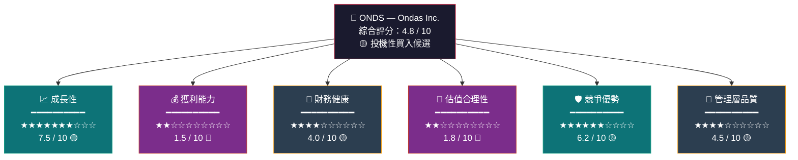

---

### 📡 ASCII 雷達圖（多維度評分視覺化）

```
                        成長性
                        10
                       /|\
                      / | \
                   8 /  |  \ 8
                    /   |   \
                 6 /    |    \ 6
                  /  ●  |  ●  \
競爭優勢      4 /●       |       ●\ 4      獲利能力
(6.2)          /         |         \        (1.5)
            2 /          |          \ 2
              \          |          /
               \         |         /
管理層品質     \    ●   |   ●    /      財務健康
(4.5)           \        |        /        (4.0)
                 \       |       /
                  \      |      /
                   \     ●     /
                    \   (4.8)  /
                     \  綜合  /
                      \ 評分 /
                       \   /
                        \ /
                       估值合理性
                        (1.8)

    ████ ONDS評分輪廓    ░░░░ 行業平均(5.0)

維度評分條：
成長性     ▓▓▓▓▓▓▓▓▓▓▓▓▓▓▓░░░░░  7.5/10
獲利能力   ▓▓▓░░░░░░░░░░░░░░░░░  1.5/10
財務健康   ▓▓▓▓▓▓▓▓░░░░░░░░░░░░  4.0/10
估值合理性 ▓▓▓▓░░░░░░░░░░░░░░░░  1.8/10
競爭優勢   ▓▓▓▓▓▓▓▓▓▓▓▓░░░░░░░░  6.2/10
管理層品質 ▓▓▓▓▓▓▓▓▓░░░░░░░░░░░  4.5/10
━━━━━━━━━━━━━━━━━━━━━━━━━━━━━━━━━━━━
綜合評分   ▓▓▓▓▓▓▓▓▓▓░░░░░░░░░░  4.8/10
```

---

### 🗳️ 買入/持有/賣出 快速結論

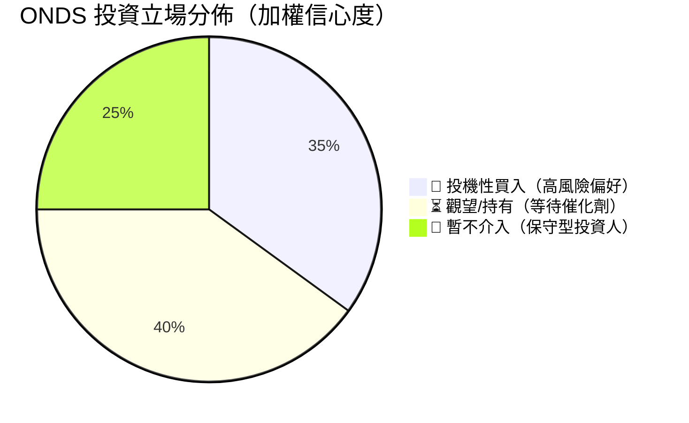

> 🟡 **快速結論**：ONDS 是一支**高風險、高潛力的早期階段科技股**。爆炸性的營收成長（YoY +582%）與無人機國防市場的結構性機遇構成吸引力，但嚴重的估值泡沫（P/S 185x）與持續性負現金流是重大警示。**僅適合風險承受力強的投機型投資者。**

---

## 2. 六維度評分矩陣

### 📊 詳細評分表格

| 維度 | 評分 | 視覺化 | 評級 | 關鍵理由 |
|------|------|--------|------|---------|
| 📈 **成長性** | **7.5/10** | `▓▓▓▓▓▓▓▓▓▓▓▓▓▓▓░░░░░` | 🟢 | TTM營收+582%；政府合約管線龐大 |
| 💰 **獲利能力** | **1.5/10** | `▓▓▓░░░░░░░░░░░░░░░░░` | 🔴 | 營業利潤率-153%；連年燒錢無盈利曙光 |
| 🏦 **財務健康** | **4.0/10** | `▓▓▓▓▓▓▓▓░░░░░░░░░░░░` | 🟡 | 現金$451M充裕但Debt/Equity 3.7x偏高 |
| 💎 **估值合理性** | **1.8/10** | `▓▓▓▓░░░░░░░░░░░░░░░░` | 🔴 | P/S 185x；市值$4.59B vs 營收$24.75M |
| 🛡️ **競爭優勢** | **6.2/10** | `▓▓▓▓▓▓▓▓▓▓▓▓░░░░░░░░` | 🟡 | SDR+無人機雙賽道；FCC認證壁壘 |
| 👔 **管理層品質** | **4.5/10** | `▓▓▓▓▓▓▓▓▓░░░░░░░░░░░` | 🟡 | 執行力有限；2021-24連年虧損加深 |
| **🎯 綜合** | **4.8/10** | `▓▓▓▓▓▓▓▓▓▓░░░░░░░░░░` | 🟡 | **高度投機，具備長期故事性** |

---

### 🔴🟡🟢 各維度細項評分

```
【成長性 7.5/10】🟢
├── 營收成長速度    ████████████████████  10/10
├── 市場擴張潛力    ████████████████░░░░   8/10
├── 訂單/合約管線   ████████████░░░░░░░░   6/10
└── 產品多樣化      ████████████░░░░░░░░   6/10

【獲利能力 1.5/10】🔴
├── 毛利率(33.6%)   ████████░░░░░░░░░░░░   4/10
├── 營業利潤率      ░░░░░░░░░░░░░░░░░░░░   0/10
├── 淨利潤率        ░░░░░░░░░░░░░░░░░░░░   0/10
└── ROE/ROA        ████░░░░░░░░░░░░░░░░   2/10

【財務健康 4.0/10】🟡
├── 現金充裕度($451M) ████████████████████  10/10
├── 流動比率(15.3x)  ████████████████████  10/10
├── 負債比率        ████████░░░░░░░░░░░░   4/10（偏高）
└── 自由現金流      ░░░░░░░░░░░░░░░░░░░░   0/10（負FCF）

【估值合理性 1.8/10】🔴
├── P/S 比率(185x)  ░░░░░░░░░░░░░░░░░░░░   0/10
├── P/B 比率(6.9x)  ████░░░░░░░░░░░░░░░░   2/10
├── EV/EBITDA(負值)  ░░░░░░░░░░░░░░░░░░░░   0/10
└── Forward P/E(負) ████░░░░░░░░░░░░░░░░   2/10（未來改善）
```

---

### 🎯 風險/報酬矩陣

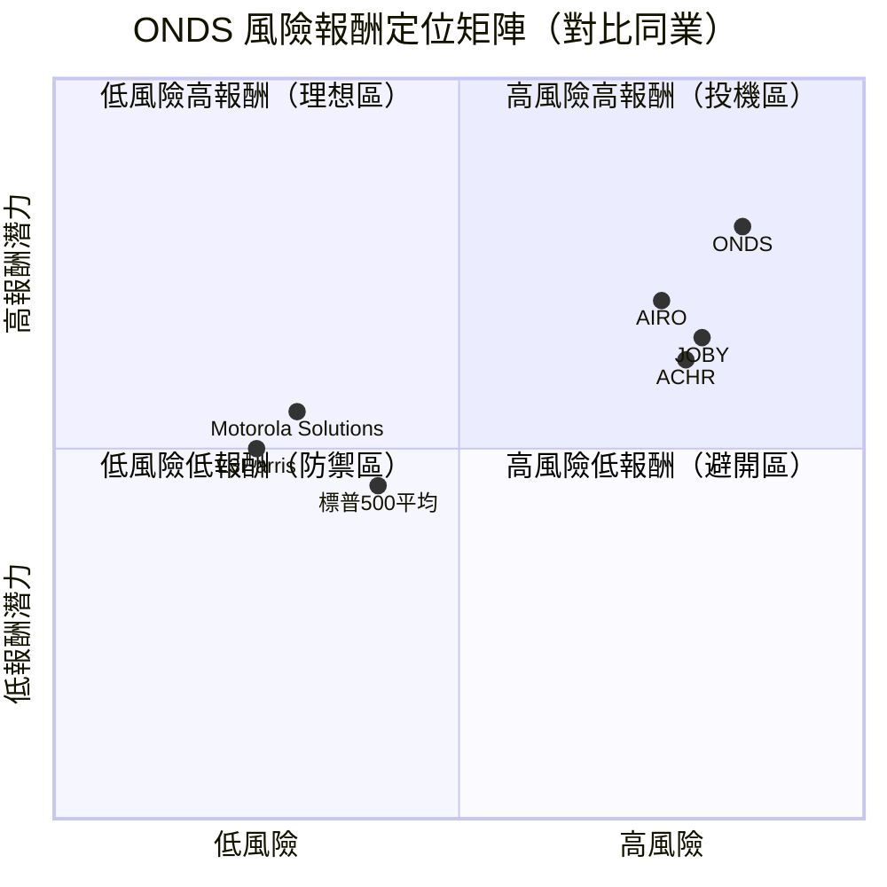

---

## 3. 業務品質評估

### 🏗️ 商業模式架構

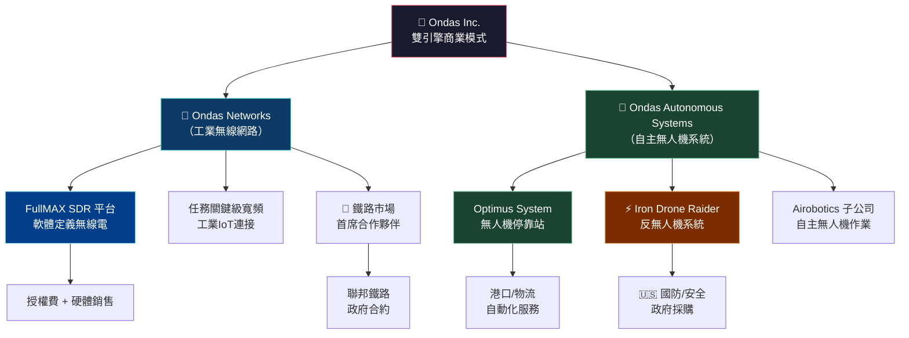

---

### 🏰 護城河評估

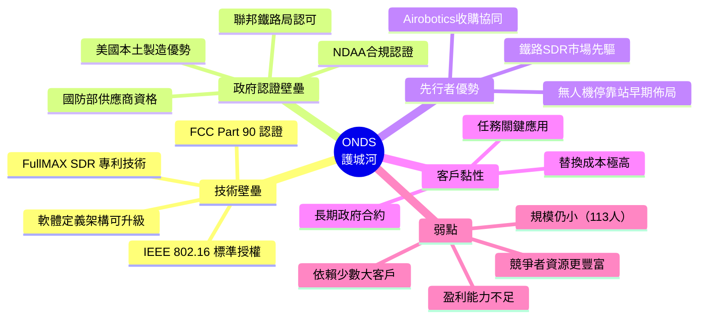

---

### ⚔️ 市場地位與競爭動態

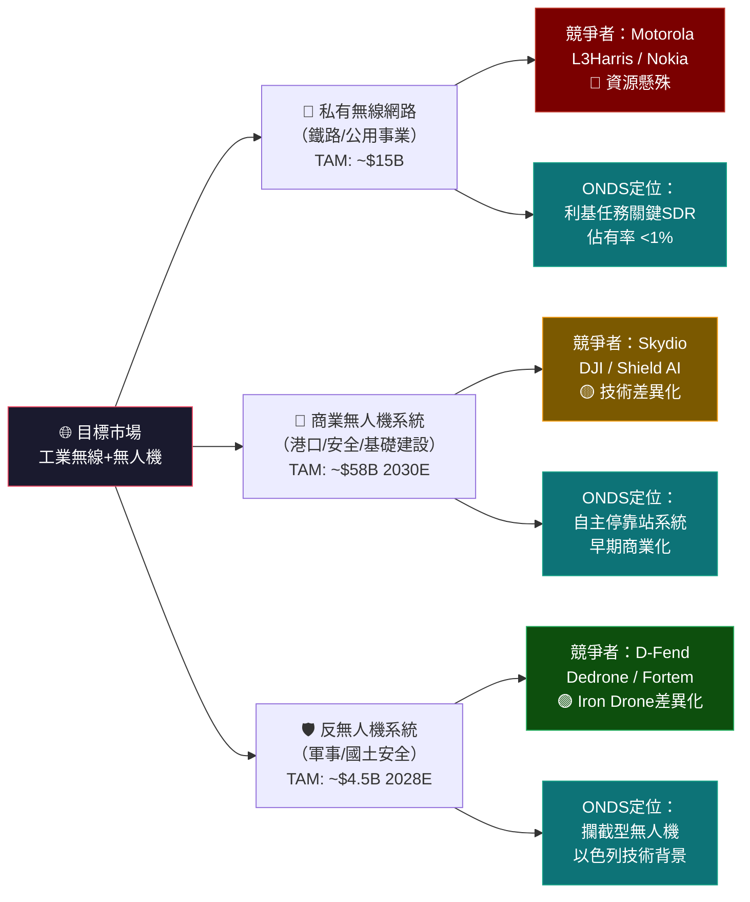

---

### 👔 管理層執行力評分

| 評估項目 | 評分 | 指標 | 趨勢 |
|---------|------|------|------|
| 策略願景清晰度 | 🟢 7/10 | 雙業務雙賽道定位清晰 | ↗ |
| 資本配置效率 | 🔴 3/10 | 連年虧損，ROE -17% | ↘ |
| 收購整合能力 | 🟡 5/10 | Airobotics收購待驗證 | → |
| 政府關係維護 | 🟢 7/10 | 多項聯邦合約 | ↗ |
| 運營成本控制 | 🔴 2/10 | 營業費用遠超營收 | ↘ |
| 投資者溝通 | 🟡 5/10 | 資訊揭露一般 | → |
| **綜合管理分** | **🟡 4.8/10** | 願景佳、執行弱 | 🟡 |

---

## 4. 財務健康評估

### 📊 財務儀表板

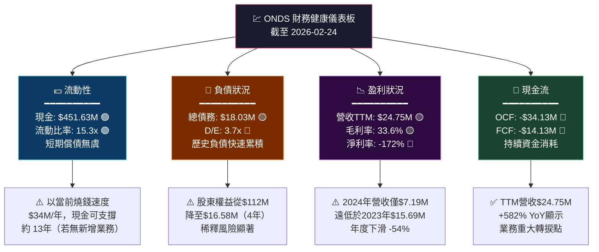

---

### 📈 獲利能力趨勢（近4年）

| 財務指標 | 2021 | 2022 | 2023 | 2024 | 趨勢 | 評級 |
|---------|------|------|------|------|------|------|
| 總營收 | $2.91M | $2.13M | $15.69M | $7.19M | ↗↘波動 | 🟡 |
| 毛利 | $1.10M | $1.11M | $6.38M | $0.35M | ↗↘ | 🔴 |
| 毛利率 | 37.8% | 52.1% | 40.7% | 4.8% | ↘ | 🔴 |
| 營業利潤 | -$17.97M | -$50.01M | -$38.23M | -$34.61M | 略改善 | 🔴 |
| 淨利潤 | -$15.02M | -$73.24M | -$44.84M | -$38.01M | 改善中 | 🟡 |
| R&D支出 | $5.80M | $24.04M | $17.15M | $12.48M | ↘收斂 | 🟡 |
| EBITDA | -$15.55M | -$64.63M | -$34.64M | -$28.72M | 改善趨勢 | 🟡 |

> 📌 **重要觀察**：2024年毛利率崩跌至4.8%（從2023年40.7%）顯示產品/合約組合發生重大變化，需密切關注。

---

### 🏛️ 資產負債表穩健度

```
資產結構（2024年末）
━━━━━━━━━━━━━━━━━━━━━━━━━━━━━━━━━━━━━━━━━━━━
流動資產    $47.52M  ▓▓▓▓▓▓▓▓▓▓▓▓▓░░░░░░  43.4%
非流動資產  $62.10M  ▓▓▓▓▓▓▓▓▓▓▓▓▓▓▓▓▓░░  56.6%
總資產      $109.62M ████████████████████ 100%

負債結構（2024年末）
━━━━━━━━━━━━━━━━━━━━━━━━━━━━━━━━━━━━━━━━━━━━
流動負債    $50.58M  ▓▓▓▓▓▓▓▓▓▓▓▓▓▓░░░░░  68.7%  ⚠️
長期負債    $23.10M  ▓▓▓▓▓▓░░░░░░░░░░░░░  31.3%
股東權益    $16.58M  ▓▓▓▓░░░░░░░░░░░░░░░  15.1%  ⚠️ 極低

股東權益趨勢（侵蝕警示）：
2021: $112.23M ████████████████████
2022: $ 58.22M ██████████░░░░░░░░░░
2023: $ 33.14M ██████░░░░░░░░░░░░░░
2024: $ 16.58M ███░░░░░░░░░░░░░░░░░ ⚠️ 快速侵蝕

📌 若燒錢速度不變，2025年可能出現股東權益轉負
```

---

### 🌊 現金流生成分析

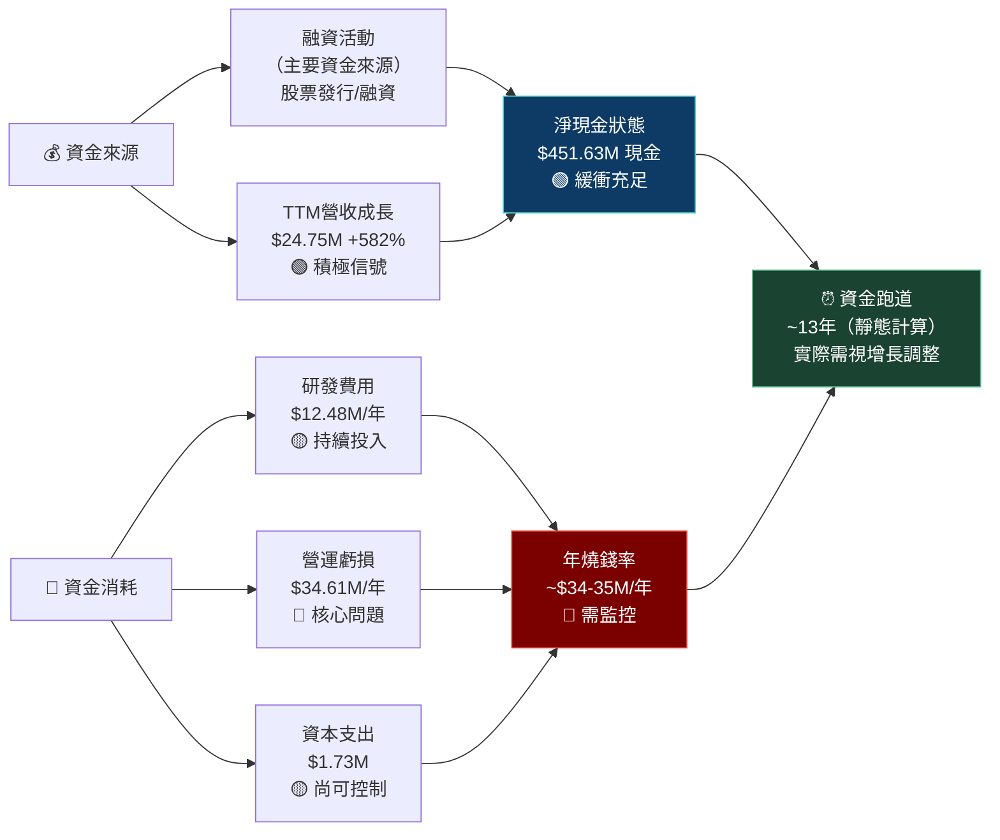

---

## 5. 成長性評估

### 🚀 成長軌跡

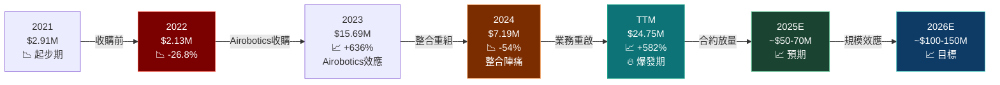

---

### 📊 歷史成長率分析

| 成長指標 | 1年 | 3年（估算CAGR） | 說明 |
|---------|-----|----------------|------|
| 營收成長（年度） | -54% (FY24) | ~+35% CAGR | 波動極大 |
| 營收成長（TTM） | **+582%** | N/A | 最新爆發數據 |
| 毛利成長 | -94.6% | N/A | 2024年急跌 |
| 員工數成長 | N/A | 顯著擴張 | 113人仍小 |
| 市值成長（52週） | **+1687%** | N/A | 0.57→10.19 |

> ⚠️ **成長品質警示**：年度營收數字與TTM數字差異極大，顯示季度分佈高度不均。需要確認TTM增長的可持續性和季度明細。

---

### 🔮 未來成長驅動力

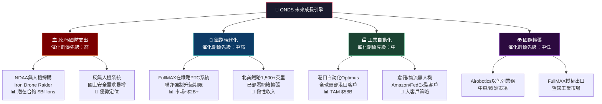

---

### 📊 市場份額趨勢（概念視覺化）

```
私有工業無線網路市場佔有率（估算）
━━━━━━━━━━━━━━━━━━━━━━━━━━━━━━━━━━━━━━━━━━━━━━
Motorola Solutions  ████████████████████████░  ~35%
L3Harris            ██████████████████░░░░░░░  ~25%
Nokia               ████████████░░░░░░░░░░░░░  ~18%
Ericsson            ████████░░░░░░░░░░░░░░░░░  ~12%
其他                ████░░░░░░░░░░░░░░░░░░░░░   ~8%
ONDS                █░░░░░░░░░░░░░░░░░░░░░░░░   ~2% ← 成長空間巨大

無人機自主系統市場（商業應用）
━━━━━━━━━━━━━━━━━━━━━━━━━━━━━━━━━━━━━━━━━━━━━━
Skydio              ████████████████░░░░░░░░░  ~22%
DJI (受限採購)      ████████████░░░░░░░░░░░░░  ~18%
Shield AI           ██████████░░░░░░░░░░░░░░░  ~15%
Joby/Archer/Wisk    ████████░░░░░░░░░░░░░░░░░  ~12%
Airobotics/ONDS     ████░░░░░░░░░░░░░░░░░░░░░   ~5% ← 目標10%+
其他新創             ████████████████░░░░░░░░░  ~28%
```

---

## 6. 估值合理性評估

### 💎 估值矩陣決策樹

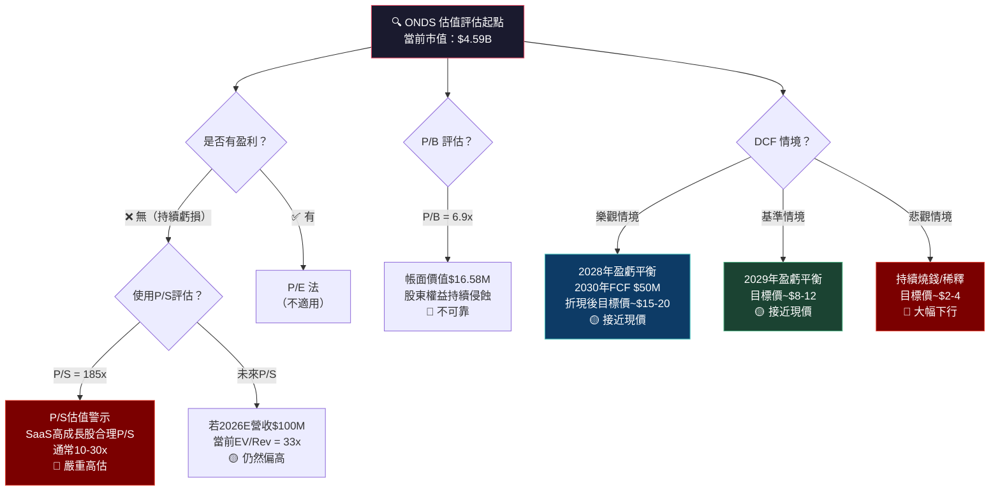

---

### 📐 多重估值法比較

| 估值方法 | 當前數值 | 行業均值 | 溢價/折價 | 隱含公允價值 | 評級 |
|---------|---------|---------|----------|------------|------|
| **P/S（TTM）** | 185x | 8-15x | **+1133%溢價** | ~$0.5-1.0 | 🔴 |
| **P/S（Forward 2026E）** | ~33x | 10-20x | **+65%溢價** | ~$5-6 | 🔴 |
| **P/B** | 6.9x | 3-5x | +38% | ~$7-12 | 🟡 |
| **EV/Revenue** | 134x | 5-15x | **嚴重高估** | ~$0.8-2.4 | 🔴 |
| **DCF（樂觀）** | — | — | — | **$15-20** | 🟡 |
| **DCF（基準）** | — | — | — | **$8-12** | 🟡 |
| **DCF（悲觀）** | — | — | — | **$2-4** | 🔴 |
| **分析師目標均價** | — | — | — | **$18.38** | 🟢 |

---

### 📏 估值區間視覺化

```
ONDS 估值區間光譜（當前價格 $10.19）
━━━━━━━━━━━━━━━━━━━━━━━━━━━━━━━━━━━━━━━━━━━━━━━━━━━━━━━━━━━
$0    $2    $4    $6    $8    $10   $12   $15   $20   $25
 |-----|-----|-----|-----|-----|-----|-----|-----|-----|
 |🔴極度 |🔴高估 |🟡略估 |      |  ▲  |     |🟡合理|🟢低估 |
 |高估   |      |       |      |現價 |     |     |分析師|
 |      |      |       |      |$10.19    |     |均值  |
                                         |     |$18.38|
 ████████████████████████████████░░░░░░░░░░░░░░░░░░░░
 極度高估區（基本面估值）  ░ 成長故事溢價區   目標價區

悲觀情境公允值：$2-4   ◄——————————————————————►樂觀情境：$15-25
基準情境公允值：$8-12             ▲當前$10.19 處於基準情境上緣

📌 結論：當前股價基本上已反映了大部分樂觀預期
         若成長故事不能持續兌現，下行風險達 -60% 至 -80%
```

---

### 🏆 對標同業比較

| 公司 | 代碼 | 市值 | P/S | 營收成長 | 毛利率 | 評級 |
|------|------|------|-----|---------|--------|------|
| **Ondas Inc.** | **ONDS** | **$4.59B** | **185x** | **+582%** | **33.6%** | 🟡 |
| Motorola Solutions | MSI | $67B | 5.8x | +9% | 52.3% | 🟢 |
| L3Harris Tech | LHX | $37B | 1.8x | +4% | 15.2% | 🟢 |
| Joby Aviation | JOBY | $8.5B | N/M | N/M | N/M | 🟡 |
| Archer Aviation | ACHR | $4.2B | N/M | N/M | N/M | 🟡 |
| AeroVironment | AVAV | $4.8B | 5.5x | +15% | 31.2% | 🟢 |
| Kratos Defense | KTOS | $5.6B | 4.2x | +19% | 25.8% | 🟢 |

> 🔴 **估值警示**：ONDS的P/S 185x遠超所有可比公司，即使與最接近的早期航空/無人機公司相比，估值溢價也顯著，需要超凡的執行力才能支撐。

---

## 7. 風險評估

### 🔥 風險熱圖

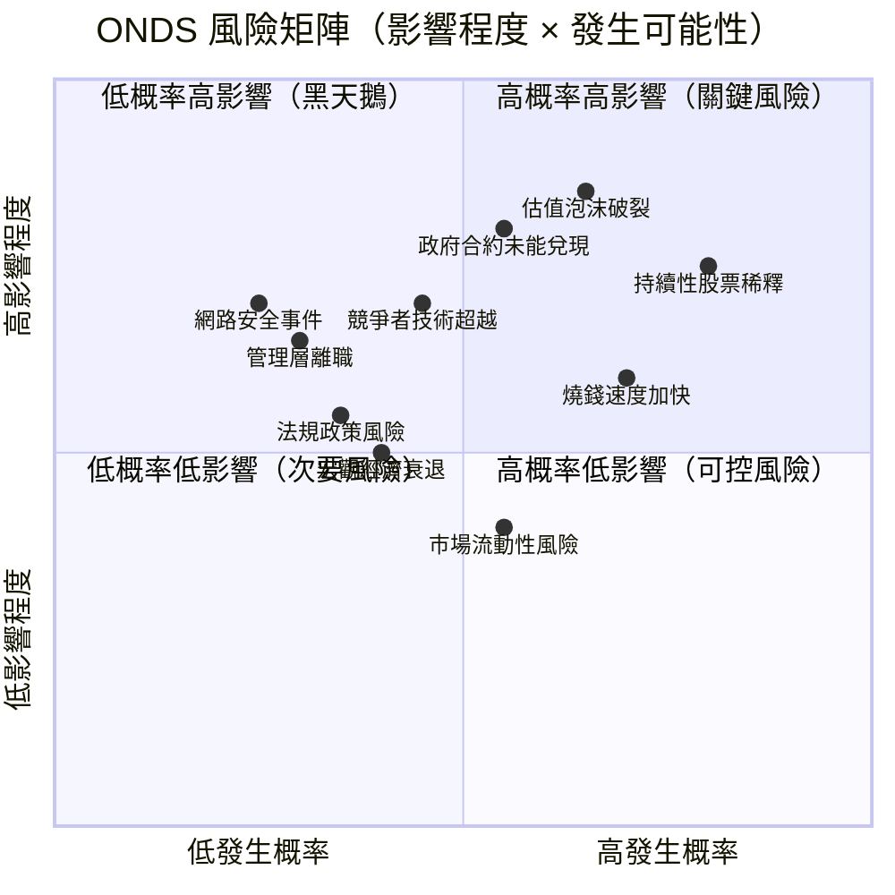

---

### 📋 風險項目詳細評估

| 風險類別 | 風險描述 | 嚴重度 | 概率 | 綜合評級 | 緩解措施 |
|---------|---------|--------|------|---------|---------|
| 💰 **估值風險** | P/S 185x嚴重泡沫化，一旦市場情緒轉向可能大幅修正 | ⭐⭐⭐⭐⭐ | 高 | 🔴 **極高** | 分批建倉、嚴格止損 |
| 📉 **稀釋風險** | 股東權益持續侵蝕，未來可能增發股票 | ⭐⭐⭐⭐⭐ | 高 | 🔴 **極高** | 控制倉位比例 |
| 🏛️ **合約風險** | 政府合約延遲/取消/縮減規模 | ⭐⭐⭐⭐⭐ | 中高 | 🔴 **高** | 追蹤合約進度 |
| 💸 **現金流風險** | 年燒錢~$34M，若業務未放量可能再融資 | ⭐⭐⭐⭐ | 中 | 🔴 **高** | 定期核查財報 |
| ⚔️ **競爭風險** | 大型防務承包商資源進入同賽道 | ⭐⭐⭐⭐ | 中 | 🟡 **中高** | 關注技術差異化 |
| 📊 **業績風險** | 2024年毛利率崩跌至4.8%，再現象有毀滅性影響 | ⭐⭐⭐⭐ | 中 | 🟡 **中高** | 等待季報確認 |
| 🔧 **技術風險** | SDR/無人機技術快速迭代，專利護城河受威脅 | ⭐⭐⭐ | 中低 | 🟡 **中** | 持續追蹤R&D |
| 🌍 **地緣政治** | 以色列業務（Airobotics）地緣風險 | ⭐⭐⭐ | 中低 | 🟡 **中** | 多元市場策略 |
| 📜 **法規風險** | FCC/FAA無人機法規收緊 | ⭐⭐⭐ | 低中 | 🟢 **中低** | 主動參與法規制定 |
| 💹 **流動性風險** | Beta 2.47，高波動，可能被做空 | ⭐⭐ | 中 | 🟢 **低中** | 短拋比率僅1.03x |

---

### 🛡️ 風險緩解措施

```
風險管理框架
━━━━━━━━━━━━━━━━━━━━━━━━━━━━━━━━━━━━━━━━━━━━━━
短期風險緩解（0-6個月）：
  ✅ 等待下一季財報確認TTM成長可持續性
  ✅ 觀察2025Q1政府合約簽署公告
  ✅ 設定嚴格止損位（建議-25%~-30%）
  ✅ 倉位控制在投資組合5%以內

中期風險緩解（6-18個月）：
  ✅ 追蹤季度毛利率回升至30%+
  ✅ 確認年化燒錢率是否收縮
  ✅ 監控股本稀釋速度
  ✅ 驗證管理層執行力是否提升

長期風險緩解（18個月+）：
  ✅ 等待盈虧平衡路徑明確
  ✅ 確認市場份額擴張趨勢
  ✅ 評估競爭格局演變
```

---

## 8. 催化劑與觸發因素

### 📅 催化劑時間軸

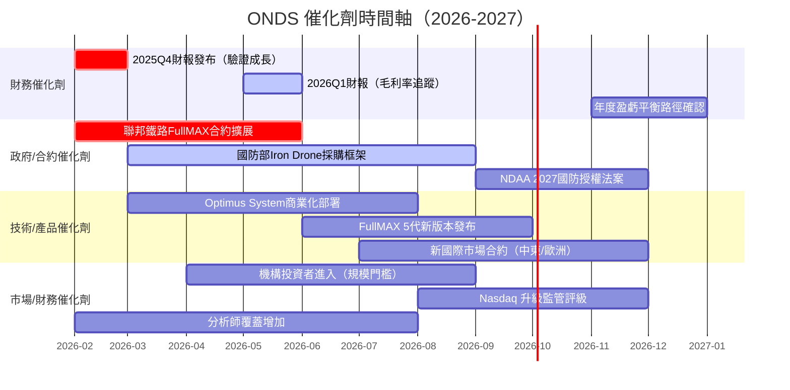

---

### ⚡ 觸發因素分析

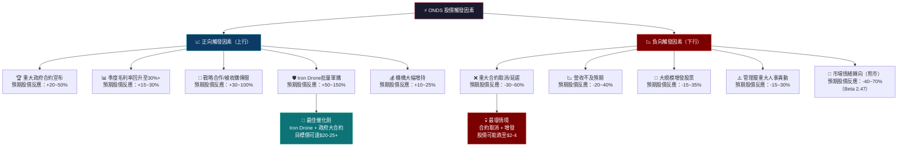

---

## 9. 投資建議

### 🎯 最終評級

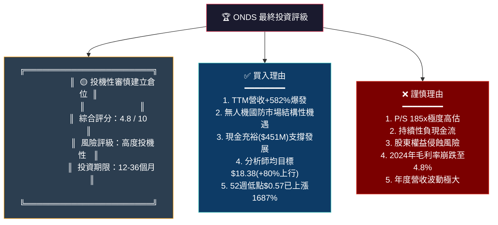

---

### ⭐ 評星系統

```
╔══════════════════════════════════════════════════════════╗
║              ONDS 綜合投資評星                           ║
╠══════════════════════════════════════════════════════════╣
║                                                          ║
║  整體評級：  ★ ★ ★ ☆ ☆   3.0 / 5.0                    ║
║              ●─────────────────────────○                 ║
║              強烈賣出   持有   強烈買入                    ║
║                              ▲                           ║
║                           (3.0)                          ║
║                                                          ║
║  成長故事：  ★ ★ ★ ★ ☆   4.0/5 🟢 值得期待            ║
║  財務健康：  ★ ★ ☆ ☆ ☆   2.0/5 🔴 持續燒錢            ║
║  估值合理：  ★ ☆ ☆ ☆ ☆   1.0/5 🔴 嚴重高估            ║
║  競爭地位：  ★ ★ ★ ☆ ☆   3.0/5 🟡 具備護城河          ║
║  風險管理：  ★ ★ ☆ ☆ ☆   2.0/5 🔴 高度投機            ║
║                                                          ║
╚══════════════════════════════════════════════════════════╝
```

---

### 💲 目標價區間

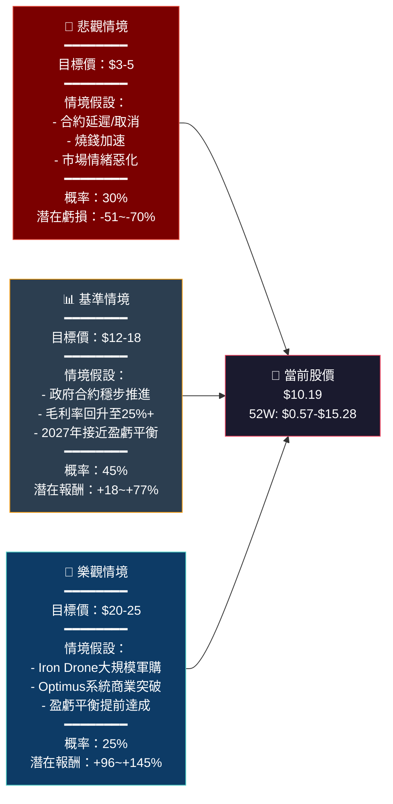

---

### 👥 投資人適配度

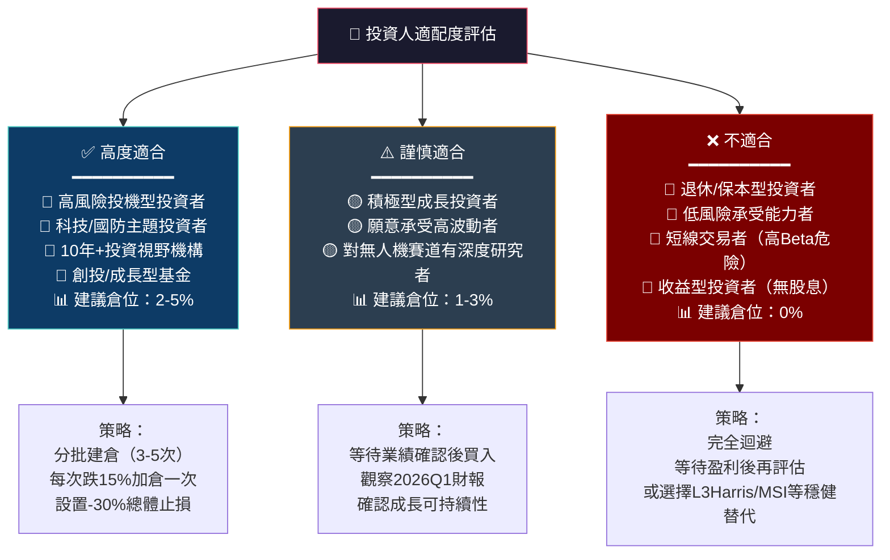

---

### 📋 建議持倉時間與策略

```
╔══════════════════════════════════════════════════════════════╗
║                  ONDS 投資策略總覽                           ║
╠══════════════════════════════════════════════════════════════╣
║                                                              ║
║  建議操作：  🟡 小倉位試探性佈局 + 事件驅動                  ║
║  建議倉位：  總組合 2-5%（高風險承受者上限）                  ║
║  持倉期限：  18-36 個月（等待成長故事兌現）                   ║
║  止損設定：  -30% 個股停損（約 $7.13）                       ║
║  分批策略：  3-5次建倉，首倉不超過1/3目標倉位                 ║
║                                                              ║
╠══════════════════════════════════════════════════════════════╣
║                                                              ║
║  里程碑觸發加倉條件：                                        ║
║  ✅ 單季度毛利率回升至 25%+                                  ║
║  ✅ 宣布單筆 $50M+ 政府合約                                  ║
║  ✅ 年度燒錢率降至 $20M 以下                                 ║
║  ✅ 機構持股比例顯著提升                                     ║
║                                                              ║
╠══════════════════════════════════════════════════════════════╣
║                                                              ║
║  里程碑觸發減倉/停損條件：                                    ║
║  🔴 季度營收環比下滑超 20%                                   ║
║  🔴 宣布大規模增發（超發行股本的 10%）                        ║
║  🔴 重要政府合約取消確認                                     ║
║  🔴 股價跌破 $7.00 支撐位                                    ║
║                                                              ║
╠══════════════════════════════════════════════════════════════╣
║                                                              ║
║  最終總結：                                                  ║
║  ONDS是一個典型的「成長故事股」。強大的市場機遇（無人機國防     ║
║  +工業SDR）加上爆炸性的TTM成長，構成了引人入勝的長期投資      ║
║  故事。但當前估值嚴重透支未來預期（P/S 185x），持續的財務      ║
║  侵蝕與執行風險不容忽視。只適合能夠承受-50%以上虧損且         ║
║  堅信無人機革命的長期投機型投資者。                           ║
║                                                              ║
╚══════════════════════════════════════════════════════════════╝
```

---

## 📊 一頁式摘要總覽

```
┌─────────────────────────────────────────────────────────────┐
│                    ONDS 投資評估摘要卡                       │
├────────────────────┬────────────────────────────────────────┤
│ 公司               │ Ondas Inc. (ONDS)                      │
│ 當前價格           │ $10.19                                  │
│ 市值               │ $4.59B                                  │
│ 分析師目標均價     │ $18.38（+80%上行空間）                   │
├────────────────────┼────────────────────────────────────────┤
│ 📈 核心亮點        │ TTM營收+582%；無人機國防雙賽道           │
│ 🔴 核心風險        │ P/S 185x；持續負FCF；毛利率崩跌          │
│ 🎯 最佳催化劑      │ Iron Drone軍購合約 + 毛利率回升          │
│ ⚠️ 最大威脅        │ 估值修正 + 股票稀釋                     │
├────────────────────┼────────────────────────────────────────┤
│ 綜合評分           │ ████████████░░░░░░░░  4.8/10 🟡        │
│ 投資評級           │ 🟡 投機性小倉位佈局                     │
│ 目標價（基準）     │ $12-18（+18~+77%）                      │
│ 目標價（樂觀）     │ $20-25（+96~+145%）                     │
│ 止損位             │ $7.13（-30%）                           │
│ 建議倉位           │ 2-5%（高風險承受者）                    │
│ 持倉期限           │ 18-36個月                               │
└────────────────────┴────────────────────────────────────────┘
```

---

> ### ⚠️ 免責聲明
>
> **本報告為 AI 自動生成之研究分析文件，僅供學術研究與資訊參考目的使用，不構成任何形式的投資建議、買賣邀約或投資顧問服務。**
>
> 所有財務數據截至 2026-02-24，市場狀況瞬息萬變，過去績效不代表未來表現。投資美股涉及貨幣風險、市場風險、個股風險等多重風險，投資者可能損失全部本金。
>
> **在做出任何投資決策前，請務必諮詢持牌投資顧問，並根據個人財務狀況、風險承受能力及投資目標做出獨立判斷。**
>
> *分析師聲明：本報告撰寫者對 ONDS 股票不持有任何倉位，且與該公司無任何利益關係。*