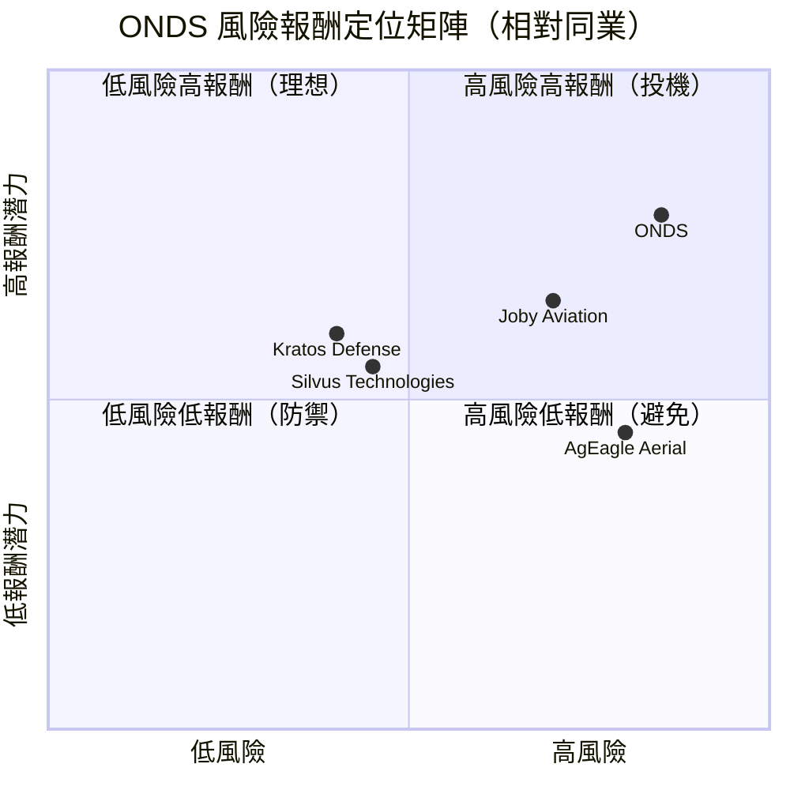
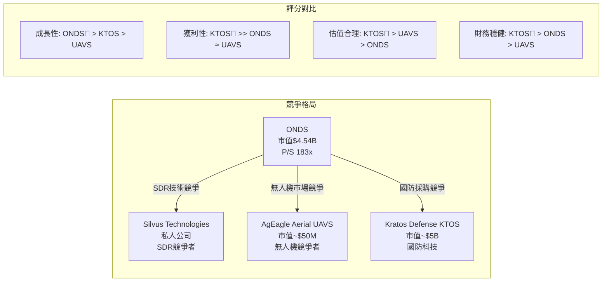
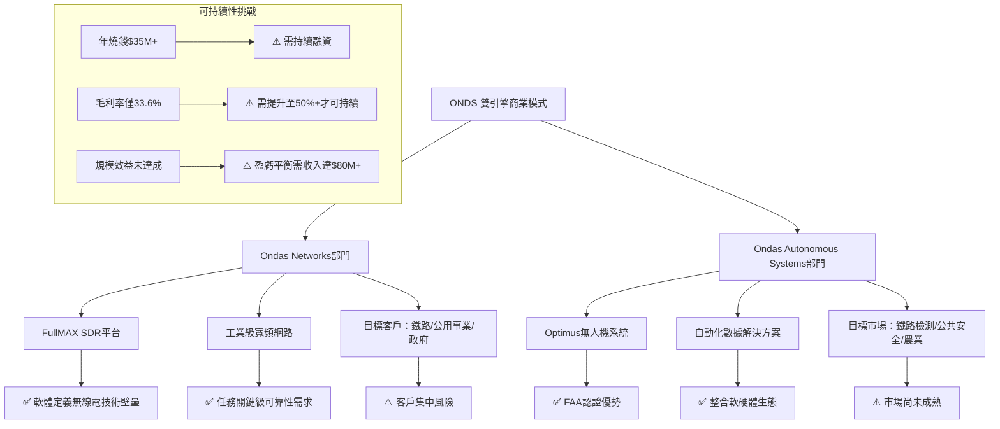
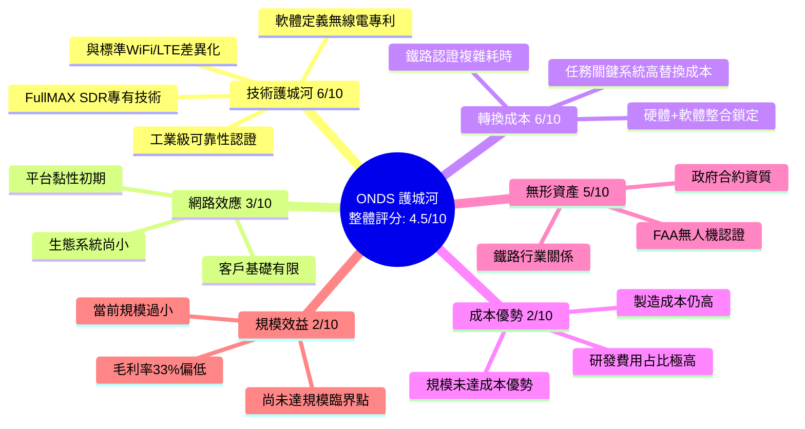
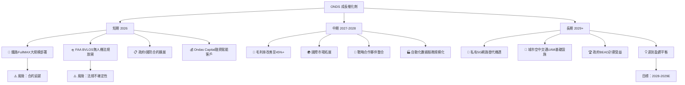
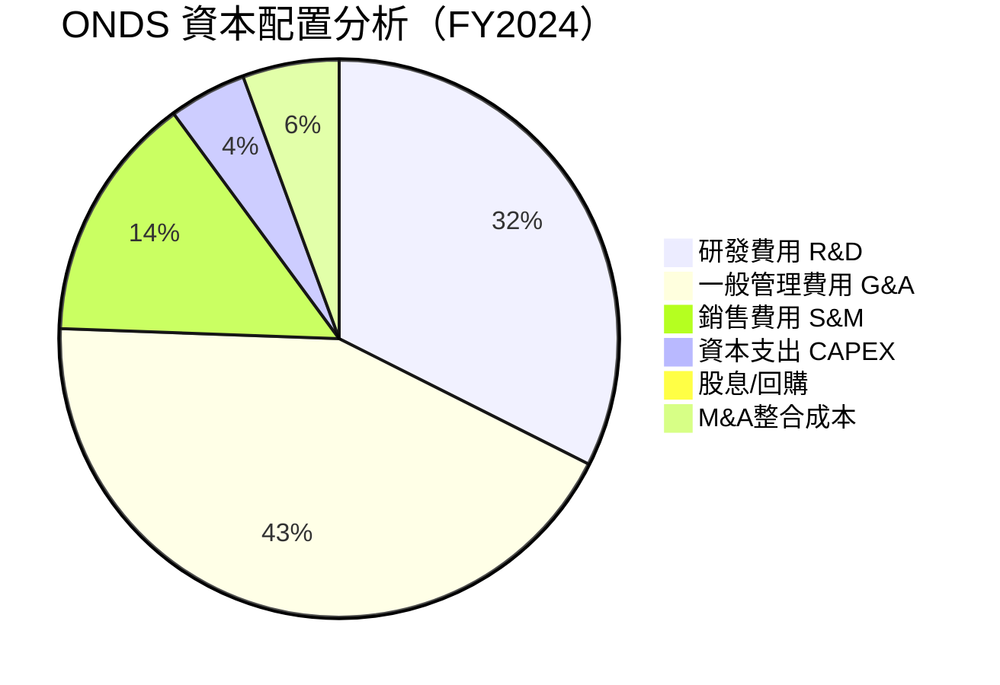
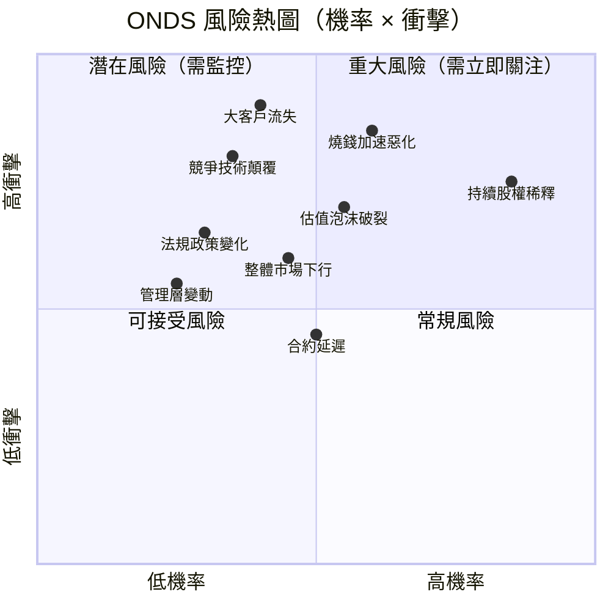
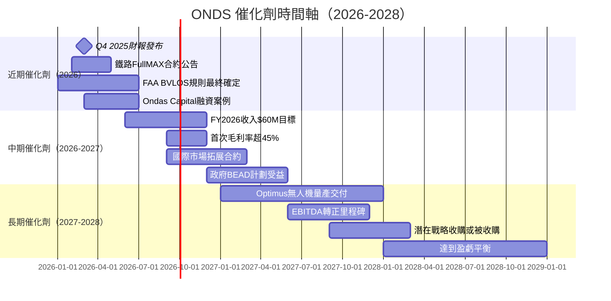
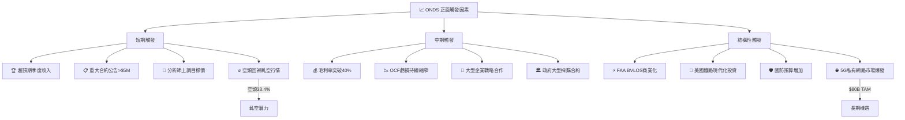
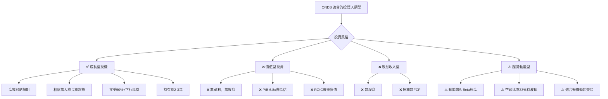

# ONDS 綜合股票評估報告

> **報告日期**：2026-02-28 ｜ **語言**：繁體中文 ｜ **數據來源**：Yahoo Finance ｜ **分析師**：頂級美股投資評估系統

---

## 目錄

1. [評估總覽](#1-評估總覽)
2. [八維度評分矩陣](#2-八維度評分矩陣)
3. [業務品質與護城河](#3-業務品質與護城河)
4. [財務健康全面評估](#4-財務健康全面評估)
5. [成長性評估](#5-成長性評估)
6. [估值合理性與同業比較](#6-估值合理性與同業比較)
7. [資本配置與管理層評估](#7-資本配置與管理層評估)
8. [風險評估](#8-風險評估)
9. [催化劑與觸發因素](#9-催化劑與觸發因素)
10. [投資建議](#10-投資建議)

---

## 1. 評估總覽

### 🎯 ASCII 雷達圖（八維度綜合評分）

```
                    成長性 [8]
                      ████
                   ████  ████
        風險[3]  ██          ██  獲利能力[2]
              ███                ███
           ███                      ███
動能[7]  ███                          ███  財務健康[5]
           ███                      ███
              ███                ███
   管理品質[4]  ███          ███  估值[2]
                   ████  ████
                      ████
                  競爭優勢[5]

  ┌─────────────────────────────────────────┐
  │   ONDS 八維度雷達圖（滿分10分）           │
  │                                         │
  │              成長性                      │
  │              ▲ 8                        │
  │             /|\                         │
  │   動能 7 ◄──┼──► 獲利能力 2              │
  │             \|/                         │
  │         競爭優勢 5                       │
  │                                         │
  │  風險(逆向) 3    財務健康 5              │
  │  管理品質 4      估值 2                  │
  └─────────────────────────────────────────┘

  八維雷達（數值越外圈越高，風險為逆向指標）

         成長性(8)
           *
        *     *
  動能(7)*       *獲利能力(2)
       *    ●    *
  風險(3)*       *財務健康(5)
        *     *
  管理品質(4) 估值(2)
        *     *
           *
       競爭優勢(5)
```

### 📊 八維度評分 Unicode 評分條

```
╔══════════════════════════════════════════════════════════════╗
║           ONDS 綜合評分儀表板   總分：36/80                   ║
╠══════════════════════════════════════════════════════════════╣
║  成長性     │ 8/10 │ ▓▓▓▓▓▓▓▓░░ │ 🟢 強勁                   ║
║  獲利能力   │ 2/10 │ ▓▓░░░░░░░░ │ 🔴 極差                   ║
║  財務健康   │ 5/10 │ ▓▓▓▓▓░░░░░ │ 🟡 中性                   ║
║  估值       │ 2/10 │ ▓▓░░░░░░░░ │ 🔴 嚴重高估               ║
║  競爭優勢   │ 5/10 │ ▓▓▓▓▓░░░░░ │ 🟡 發展中                 ║
║  管理品質   │ 4/10 │ ▓▓▓▓░░░░░░ │ 🟡 待觀察                 ║
║  動能       │ 7/10 │ ▓▓▓▓▓▓▓░░░ │ 🟢 強勢                   ║
║  風險       │ 3/10 │ ▓▓▓░░░░░░░ │ 🔴 高風險                 ║
╠══════════════════════════════════════════════════════════════╣
║  綜合評分   │ 36/80│ ▓▓▓▓░░░░░░ │ ⚠️  高風險投機標的          ║
╚══════════════════════════════════════════════════════════════╝
```

### 🔑 投資結論速覽

```
┌──────────────────────────────────────────────────────────────┐
│                    投資評級：⚠️ 投機性買入                      │
│                    （僅適合高風險承受度投資人）                  │
├──────────────────────────────────────────────────────────────┤
│  當前價格：$10.08                                             │
│  目標價（基準）：$14.50   隱含上行空間：+43.9%                 │
│  目標價（樂觀）：$20.00   隱含上行空間：+98.4%                 │
│  目標價（悲觀）：$4.00    隱含下行風險：-60.3%                 │
│  建議持倉比例：≤3%（高風險投機倉位）                           │
│  止損位：$7.00（-30.6%）                                      │
└──────────────────────────────────────────────────────────────┘
```

---

## 2. 八維度評分矩陣

### 📋 詳細評分表格

| 維度 | 評分 | 評分依據 | 趨勢 | 狀態 |
|------|------|---------|------|------|
| **成長性** | 8/10 | TTM收入YoY +582%（含收購效益），季度收入從$4.1M→$10.1M快速爬升，無人機與FullMAX訂單積累中 | ↑ 上升 | 🟢 |
| **獲利能力** | 2/10 | 營業利潤率-153.5%，淨利潤率-172.5%，四年累計虧損逾$171M，毛利率僅33.6%且波動大 | → 橫向 | 🔴 |
| **財務健康** | 5/10 | 現金$451.6M（含近期融資），流動比15.3倍極佳，但年燒錢$35M+，股東權益持續侵蝕 | ↓ 惡化中 | 🟡 |
| **估值** | 2/10 | P/S=183x、EV/Revenue=138x，遠超同業數十倍，即使樂觀假設仍嚴重溢價 | ↑ 持續膨脹 | 🔴 |
| **競爭優勢** | 5/10 | FullMAX SDR具技術壁壘，鐵路/公用事業利基市場；但規模小、客戶集中、競爭激烈 | → 橫向 | 🟡 |
| **管理品質** | 4/10 | 連續4年燒錢無法控制，資本稀釋嚴重，戰略轉型（收購ADS）執行待驗證 | → 橫向 | 🟡 |
| **動能** | 7/10 | 股價從$0.57漲至$10.08（+1670%，52週），法人覆蓋快速增加，8位分析師強力買入 | ↑ 強勢 | 🟢 |
| **風險** | 3/10 | Beta=2.47，空頭比率33.4%，持續虧損，股權稀釋壓力，政府合約依賴度高 | ↑ 風險上升 | 🔴 |

### 📊 Mermaid 風險/報酬四象限圖



### 🔗 同業整體比較 Mermaid 圖



---

## 3. 業務品質與護城河

### 🏗️ 商業模式可持續性評估



### 🏰 護城河評估 Mindmap



### 📊 護城河強度 Unicode 條形圖

```
╔═══════════════════════════════════════════════════════════╗
║              ONDS 護城河強度分析                           ║
╠═══════════════════════════════════════════════════════════╣
║  技術壁壘   │ 6/10 │ ▓▓▓▓▓▓░░░░ │ 🟡 中等                ║
║  網路效應   │ 3/10 │ ▓▓▓░░░░░░░ │ 🔴 薄弱                ║
║  轉換成本   │ 6/10 │ ▓▓▓▓▓▓░░░░ │ 🟡 中等                ║
║  成本優勢   │ 2/10 │ ▓▓░░░░░░░░ │ 🔴 無優勢              ║
║  無形資產   │ 5/10 │ ▓▓▓▓▓░░░░░ │ 🟡 發展中              ║
║  規模效益   │ 2/10 │ ▓▓░░░░░░░░ │ 🔴 未達臨界            ║
╠═══════════════════════════════════════════════════════════╣
║  綜合護城河 │ 4/10 │ ▓▓▓▓░░░░░░ │ ⚠️  窄護城河            ║
╚═══════════════════════════════════════════════════════════╝
```

### 🌐 市場地位分析

| 指標 | 數值 | 說明 |
|------|------|------|
| **TAM（私有無線網路）** | ~$80B（2030E） | 鐵路+公用事業+政府+工業IoT |
| **TAM（商業無人機）** | ~$58B（2030E） | 含自動化數據採集服務 |
| **ONDS當前市場份額** | <0.1% | 極早期滲透階段 |
| **鐵路私有網路SAM** | ~$3-5B | 核心利基市場 |
| **行業地位** | 利基先行者 | FullMAX在鐵路SDR細分領先 |

---

## 4. 財務健康全面評估

### 📊 財務儀表板

```mermaid
graph LR
    subgraph 獲利能力 🔴
        A1[毛利率 33.6%]
        A2[營業利潤率 -153.5%]
        A3[淨利潤率 -172.5%]
        A4[EBITDA Margin -155.9%]
    end
    
    subgraph 流動性 🟢
        B1[流動比率 15.3x]
        B2[速動比率 14.7x]
        B3[現金 $451.6M]
        B4[FCF -$14.1M/季]
    end
    
    subgraph 槓桿 🟡
        C1[D/E 3.70]
        C2[總債務 $18M]
        C3[淨現金 +$433M]
        C4[利息覆蓋率 負值]
    end
    
    subgraph 效率 🔴
        D1[ROE -17.0%]
        D2[ROA -8.6%]
        D3[資產周轉率 極低]
        D4[ROIC 嚴重負值]
    end
```

### 📈 獲利能力趨勢表格（近4年）

| 指標 | 2021 | 2022 | 2023 | 2024 | 趨勢 | 狀態 |
|------|------|------|------|------|------|------|
| **總收入** | $2.91M | $2.13M | $15.69M | $7.19M | ↕ 波動 | 🟡 |
| **毛利率** | 37.8% | 52.1% | 40.7% | 4.8% | ↓ 惡化 | 🔴 |
| **營業利潤率** | -617% | -2,348% | -243% | -481% | ↕ 波動 | 🔴 |
| **淨利潤率** | -516% | -3,439% | -286% | -529% | ↕ 波動 | 🔴 |
| **FCF Margin** | -615% | -1,920% | -219% | -490% | ↕ 波動 | 🔴 |
| **R&D/Revenue** | 199% | 1,128% | 109% | 174% | ↓ 改善 | 🟡 |

> ⚠️ **注意**：2024年毛利率4.8%極低，反映ADS收購整合初期的成本壓力；TTM毛利率33.6%顯示近季改善。

### 💰 資產負債表穩健度

```
╔══════════════════════════════════════════════════════════════╗
║              資產負債表穩健度指標                             ║
╠══════════════════════════════════════════════════════════════╣
║  流動比率 15.3x  │ ▓▓▓▓▓▓▓▓▓▓ │ 🟢 極佳（含近期融資後）     ║
║  速動比率 14.7x  │ ▓▓▓▓▓▓▓▓▓▓ │ 🟢 極佳                    ║
║  淨現金 +$433M   │ ▓▓▓▓▓▓▓▓░░ │ 🟢 充裕（約12年燒錢覆蓋）   ║
║  D/E比率  3.70   │ ▓▓▓▓░░░░░░ │ 🟡 偏高但有淨現金支撐        ║
║  股東權益趨勢    │ ▓▓░░░░░░░░ │ 🔴 持續侵蝕中               ║
║  ($112M→$17M)   │            │ 4年縮水85%                 ║
╚══════════════════════════════════════════════════════════════╝

  現金跑道估算：
  現金 $451.6M ÷ 年度FCF燒錢 ~$35M ≈ 約 12.9年
  ✅ 短期流動性無虞，但需達到盈虧平衡
```

### 🔄 現金流質量分析

| 指標 | 數值 | 評估 |
|------|------|------|
| **年度OCF** | -$33.47M | 🔴 持續負值 |
| **年度FCF** | -$35.20M | 🔴 每年侵蝕現金 |
| **FCF Yield** | -0.31% | 🔴 負現金流收益率 |
| **FCF轉換率** | N/A（負值） | 🔴 無法計算 |
| **CAPEX強度** | $1.73M/年 | 🟢 資本支出輕 |
| **現金燒錢率** | ~$35M/年 | ⚠️ 需監控 |

---

## 5. 成長性評估

### 📊 歷史CAGR表格

| 指標 | 1年成長率 | 3年CAGR | 備註 |
|------|---------|---------|------|
| **收入（年度）** | -54%（2023→2024） | +35%（2021→2024） | ADS收購導致數字失真 |
| **收入（TTM）** | +582%（YoY） | — | 含ADS完整合併 |
| **EPS** | N/A | N/A | 持續虧損 |
| **FCF** | -2.6%改善 | 持續負值 | 緩慢改善中 |
| **季度收入成長** | $4.1M→$10.1M | +145%（4Q） | 強勁加速 |

### 🚀 未來成長催化劑



### 📈 成長軌跡 Unicode 長條圖

```
ONDS 季度收入成長趨勢（百萬美元）
╔══════════════════════════════════════════════════════════════╗
║ Q4 2024 │ $4.13M  │ ████░░░░░░░░░░░░░░░░             41%   ║
║ Q1 2025 │ $4.25M  │ ████░░░░░░░░░░░░░░░░             43%   ║
║ Q2 2025 │ $6.27M  │ ██████░░░░░░░░░░░░░░             63%   ║
║ Q3 2025 │ $10.10M │ ██████████░░░░░░░░░░            100%   ║
║ Q4 2025E│ $14.00M │ ██████████████░░░░░░            140%E  ║
║ FY 2025E│ $34.60M │ ████████████████░░░░            346%E  ║
║ FY 2026E│ $60.00M │ ████████████████████░           600%E  ║
╚══════════════════════════════════════════════════════════════╝
  ★ 分析師預估FY2025收入約$30-40M，YoY+400%+
  ★ 成長主要驅動：Ondas Autonomous Systems規模化
```

---

## 6. 估值合理性與同業比較

### 📊 同業比較表格

| 指標 | **ONDS** | **Kratos Defense (KTOS)** | **AgEagle Aerial (UAVS)** | **Joby Aviation (JOBY)** |
|------|---------|--------------------------|--------------------------|------------------------|
| **市值** | $4.54B | ~$5.0B | ~$50M | ~$4.0B |
| **P/S（TTM）** | 183x 🔴 | 7.5x 🟢 | 8.2x 🟢 | 極高 🔴 |
| **EV/Revenue** | 138x 🔴 | 6.8x 🟢 | 7.0x 🟢 | N/A 🔴 |
| **EV/EBITDA** | -88.6x 🔴 | 65x 🟡 | 負值 🔴 | 負值 🔴 |
| **P/B** | 6.8x 🟡 | 8.2x 🟡 | 0.8x 🟢 | 2.1x 🟢 |
| **FCF Yield** | -0.31% 🔴 | +1.2% 🟢 | 負值 🔴 | -15% 🔴 |
| **毛利率** | 33.6% 🟡 | 25.8% 🟡 | 42% 🟢 | N/A — |
| **收入成長YoY** | +582% 🟢 | +12% 🟡 | -20% 🔴 | N/A — |
| **盈利狀態** | 虧損 🔴 | 盈利 🟢 | 虧損 🔴 | 虧損 🔴 |
| **Beta** | 2.47 🔴 | 0.85 🟢 | 2.10 🔴 | 1.60 🟡 |

> 📌 **結論**：ONDS估值相對所有同業均嚴重溢價，僅憑成長潛力支撐，需要完美的未來執行才能合理化。

### 📊 歷史估值區間

```
P/S 估值區間（因P/E無效，使用P/S）
╔══════════════════════════════════════════════════════════════╗
║  極低估    合理區間      當前       泡沫區間                  ║
║  1x-5x    5x-30x       183x       >50x                     ║
║  ├──────────┤────────────┤────────────────────────►         ║
║  1x        30x         183x                       200x      ║
║                         ▲                                   ║
║                    ⚠️ 當前位置（嚴重高估）                    ║
╠══════════════════════════════════════════════════════════════╣
║  若P/S回歸至30x（合理）→ 目標價 ~$1.65（下行-84%）          ║
║  若P/S維持50x（成長溢價）→ 目標價 ~$2.75（下行-73%）        ║
║  若業績達FY2026 $60M，P/S=30x → 目標價 ~$4.00             ║
║  若業績達FY2027 $120M，P/S=20x → 目標價 ~$5.33            ║
╚══════════════════════════════════════════════════════════════╝
```

### 💎 多重估值法彙整

| 估值方法 | 假設 | 目標價 | 隱含空間 |
|---------|------|--------|---------|
| **DCF（悲觀）** | 2028E FCF-$10M，WACC 15%，g=3% | $3.50 | -65% |
| **DCF（基準）** | 2028E FCF+$10M，WACC 12%，g=5% | $8.00 | -21% |
| **DCF（樂觀）** | 2028E FCF+$25M，WACC 10%，g=8% | $18.00 | +79% |
| **相對估值P/S** | FY2026 $60M Rev × P/S 30x | $4.00 | -60% |
| **相對估值P/S** | FY2027 $120M Rev × P/S 20x | $5.33 | -47% |
| **分析師目標** | 8位分析師平均 | $18.38 | +82% |
| **加權目標價** | 各方法加權平均 | **$12-15** | **+19-49%** |

### 📊 估值區間視覺化

```
估值區間視覺化（以當前股價$10.08為基準）
╔══════════════════════════════════════════════════════════════╗
║         $3.5      $8     $10.08  $14.5  $18  $25            ║
║          │         │       │      │      │    │              ║
║  ┌───────┴─────────┴───────┼──────┴──────┴────┴─────►       ║
║  │  高度   │  合理   │  當前 │  目標 │ 分析 │樂觀            ║
║  │  低估   │  估值   │  位置 │  價位 │ 師均 │情境            ║
║  └─────────┴─────────┘       └──────────────────────        ║
║  🔴過低    🟢合理    🟡偏高   🟡目標  🟢分析  🟢樂觀          ║
╠══════════════════════════════════════════════════════════════╣
║  ⚠️ 基本面估值顯示當前略微偏高，但分析師目標價支持上行空間   ║
║  ⚠️ 高度依賴市場情緒與成長兌現，任何負面消息恐引發大幅回調  ║
╚══════════════════════════════════════════════════════════════╝
```

---

## 7. 資本配置與管理層評估

### 📊 ROIC vs WACC 分析

```
╔══════════════════════════════════════════════════════════════╗
║              ROIC vs WACC 估算（EVA分析）                    ║
╠══════════════════════════════════════════════════════════════╣
║  ROIC 估算：                                                 ║
║  NOPAT = 營業利潤×(1-稅率) ≈ -$34.6M×(1-0%) = -$34.6M    ║
║  投入資本 = 總資產-流動負債 ≈ $109.6M-$50.6M = $59M        ║
║  ROIC = -$34.6M / $59M = -58.6%              🔴             ║
║                                                              ║
║  WACC 估算：                                                 ║
║  Ke = Rf + β×ERP = 4.5% + 2.47×6% = 19.3%                 ║
║  Kd = 借款成本 ≈ 8%（高風險小型股）× (1-21%) = 6.3%        ║
║  權益比重 ≈ 94%，債務比重 ≈ 6%                              ║
║  WACC ≈ 19.3%×94% + 6.3%×6% ≈ 18.5%         🟡            ║
║                                                              ║
║  EVA（經濟附加值）分析：                                     ║
║  EVA Spread = ROIC - WACC = -58.6% - 18.5% = -77.1%       ║
║  EVA = -77.1% × $59M = -$45.5M/年           🔴 嚴重負值    ║
║                                                              ║
║  結論：ONDS目前嚴重摧毀股東價值                              ║
║  每年消耗$45M+的股東財富，距離創造價值尚遠                   ║
╚══════════════════════════════════════════════════════════════╝
```

### 🥧 資本配置 Mermaid 圓餅圖



### 📋 管理層執行力評分表格

| 評估維度 | 評分 | 具體表現 | 狀態 |
|---------|------|---------|------|
| **承諾達成率** | 4/10 | 收入目標多次未達，虧損持續擴大 | 🔴 |
| **資本紀律** | 3/10 | 股本4年稀釋超80%，燒錢未見收斂 | 🔴 |
| **戰略清晰度** | 6/10 | 雙引擎戰略有邏輯，無人機+SDR組合 | 🟡 |
| **成本控制** | 4/10 | G&A費用高居不下，佔收入比超200% | 🔴 |
| **收購整合** | 5/10 | ADS收購有意義，整合進度需觀察 | 🟡 |
| **溝通透明度** | 5/10 | 無EPS指引，分析師覆蓋8家尚可 | 🟡 |
| **股東利益** | 3/10 | 持續稀釋股東，Insider持股僅1.6% | 🔴 |

### 📊 股東友善度評分

```
╔══════════════════════════════════════════════════════════════╗
║              股東友善度評分                                   ║
╠══════════════════════════════════════════════════════════════╣
║  股息政策     │ 0/10 │ ░░░░░░░░░░ │ 🔴 無股息               ║
║  股票回購     │ 0/10 │ ░░░░░░░░░░ │ 🔴 無回購，反而稀釋      ║
║  ROIC創造     │ 1/10 │ ▓░░░░░░░░░ │ 🔴 嚴重摧毀價值         ║
║  透明溝通     │ 5/10 │ ▓▓▓▓▓░░░░░ │ 🟡 尚可                 ║
║  長期規劃     │ 6/10 │ ▓▓▓▓▓▓░░░░ │ 🟡 有清晰願景           ║
║  管理層持股   │ 2/10 │ ▓▓░░░░░░░░ │ 🔴 1.6%過低             ║
╠══════════════════════════════════════════════════════════════╣
║  綜合股東友善 │ 3/10 │ ▓▓▓░░░░░░░ │ 🔴 偏低                 ║
╚══════════════════════════════════════════════════════════════╝
```

---

## 8. 風險評估

### 🗺️ 風險熱圖



### 📋 風險清單表格

| 風險項目 | 等級 | 機率 | 衝擊 | 緩解措施 |
|---------|------|------|------|---------|
| **持續股權稀釋** | 🔴 高 | 90% | 高 | 監控股本變化，現金充裕短期可緩解 |
| **燒錢速率加速** | 🔴 高 | 60% | 極高 | 追蹤每季OCF，若超-$12M/季則警戒 |
| **大客戶集中風險** | 🔴 高 | 40% | 極高 | 監控客戶多元化進度 |
| **估值泡沫破裂** | 🔴 高 | 55% | 高 | P/S 183x難以持續，需業績快速兌現 |
| **空頭壓力** | 🟡 中 | 持續 | 中 | 空頭比率33.4%，任何利空均放大跌幅 |
| **FAA法規不確定性** | 🟡 中 | 35% | 高 | BVLOS法規若延遲影響無人機業務 |
| **競爭技術替代** | 🟡 中 | 35% | 高 | 大型電信商私有5G擠壓FullMAX |
| **整體市場下行** | 🟡 中 | 40% | 中 | Beta 2.47，市場跌10%→股票跌25% |
| **管理層變動** | 🟟 低 | 25% | 中 | Insider持股低，關注核心團隊穩定性 |
| **匯率風險** | 🟢 低 | 20% | 低 | 主要收入在美國 |

### 📉 最大下行情境分析（Bear Case）

```
╔══════════════════════════════════════════════════════════════╗
║                   Bear Case 悲觀情境                         ║
╠══════════════════════════════════════════════════════════════╣
║  觸發條件：                                                   ║
║  1. FY2025收入低於$25M（低於預期30%+）                      ║
║  2. 大型鐵路客戶合約延遲或取消                               ║
║  3. 市場估值整體收縮（P/S→20x）                             ║
║  4. 額外大規模融資稀釋                                       ║
║                                                              ║
║  Bear Case目標價計算：                                       ║
║  方法1：P/S 20x × Rev $25M / 450M股 = $1.11               ║
║  方法2：淨現金 $433M / 450M股 = $0.96（清算價值）          ║
║  方法3：技術支撐位 $7.00（前期頸線）                        ║
║                                                              ║
║  最終Bear Case目標：$4.00-7.00                             ║
║  最壞情境：$2.00-3.00（接近淨現金價值）                    ║
║  當前$10.08 → 最大下行風險：-70%至-80%                     ║
╚══════════════════════════════════════════════════════════════╝
```

---

## 9. 催化劑與觸發因素

### 📅 催化劑時間軸



### 🚀 正面觸發因素



---

## 10. 投資建議

### ⭐ 最終評級

```
╔══════════════════════════════════════════════════════════════╗
║                                                              ║
║          ★★★☆☆  投機性買入評級                               ║
║          （3星/5星，僅適合風險偏好型投資人）                   ║
║                                                              ║
║  ┌────────────────────────────────────────────────────┐     ║
║  │  投資評級：⚠️ 投機性買入（Speculative Buy）          │     ║
║  │  當前股價：$10.08                                   │     ║
║  │  基準目標：$14.50（+43.9%）                         │     ║
║  │  投資時間：12-24個月                                │     ║
║  │  建議倉位：≤3%（高風險投機倉）                      │     ║
║  │  風險等級：🔴 極高                                  │     ║
║  └────────────────────────────────────────────────────┘     ║
╚══════════════════════════════════════════════════════════════╝
```

### 📊 目標價區間表格

| 情境 | 目標價 | 隱含報酬率 | 關鍵假設 | 機率 |
|------|--------|----------|---------|------|
| 🟢 **樂觀（Bull）** | $20.00 | +98.4% | FY2026 Rev $70M+，毛利率45%+，大合約持續兌現，P/S收縮至80x | 25% |
| 🟡 **基準（Base）** | $14.50 | +43.9% | FY2026 Rev $55M，毛利率40%，分析師目標價中值附近 | 45% |
| 🔴 **悲觀（Bear）** | $4.00 | -60.3% | 收入低於預期，估值壓縮至P/S 20x，市場情緒轉向 | 30% |
| **期望值加權** | **$12.05** | **+19.5%** | 三情境機率加權 | 100% |

### 🎯 投資人適配度



### 📋 操作指引

```
╔══════════════════════════════════════════════════════════════╗
║                    具體操作建議                               ║
╠══════════════════════════════════════════════════════════════╣
║  📅 建議持倉時間：18-24個月（等待業績兌現）                   ║
║                                                              ║
║  📈 加碼觸發條件：                                           ║
║  ✅ 季度收入超預期20%+                                       ║
║  ✅ 毛利率連續2季>40%                                        ║
║  ✅ 宣布重大合約（>$10M）                                    ║
║  ✅ OCF虧損縮窄至<$7M/季                                     ║
║  ✅ 股價回調至$8.00以下（更佳風險/報酬）                      ║
║                                                              ║
║  📉 止損觸發條件：                                           ║
║  🚨 股價跌破 $7.00（-30.6%）                                 ║
║  🚨 季度收入低於$8M（FY2026Q1）                              ║
║  🚨 宣布大規模股票融資（>20%股本稀釋）                        ║
║  🚨 主要鐵路客戶合約終止                                      ║
║  🚨 管理層重大異動（CEO/CFO離職）                            ║
╚══════════════════════════════════════════════════════════════╝
```

### 🔍 關鍵監控指標 Checklist

```
📊 ONDS 關鍵監控指標（每季追蹤）
╔══════════════════════════════════════════════════════════════╗
║                                                              ║
║  財務指標：                                                   ║
║  □ 季度收入 vs 預期（目標：超預期10%+）                      ║
║  □ 毛利率趨勢（目標：持續改善至40%+）                        ║
║  □ 季度OCF（目標：虧損逐季縮窄）                             ║
║  □ 現金餘額（警戒線：低於$100M則加速融資風險）               ║
║  □ 股本數量（追蹤稀釋速度）                                  ║
║                                                              ║
║  業務指標：                                                   ║
║  □ 鐵路FullMAX新合約金額                                     ║
║  □ ADS/Optimus交付量                                        ║
║  □ Ondas Capital融資交易數                                   ║
║  □ 客戶數量增長（分散集中風險）                              ║
║  □ 積壓訂單（Backlog）金額                                   ║
║                                                              ║
║  外部指標：                                                   ║
║  □ FAA BVLOS法規進展                                        ║
║  □ 空頭比率變化（33.4%→監控方向）                           ║
║  □ 分析師目標價調整                                          ║
║  □ 同業競爭動態（Silvus技術合約）                            ║
║  □ 美國鐵路基礎設施投資政策                                  ║
╚══════════════════════════════════════════════════════════════╝
```

---

## 📌 最終總結

```
╔══════════════════════════════════════════════════════════════╗
║                  ONDS 投資評估最終結論                        ║
╠══════════════════════════════════════════════════════════════╣
║                                                              ║
║  🟡 ONDS 是一家具有真實技術價值的早期成長公司，               ║
║     在私有無線網路（FullMAX SDR）和商業無人機兩大             ║
║     快速成長市場佔有獨特利基地位。                            ║
║                                                              ║
║  ✅ 核心優勢：                                               ║
║   • 真實的技術壁壘（SDR+無人機雙引擎）                       ║
║   • 582% YoY收入成長加速（TTM）                              ║
║   • 充裕現金（$451M，12年以上跑道）                          ║
║   • 8位分析師一致強力買入，目標$18.38                        ║
║   • 龐大TAM（$80B+私有網路+無人機）                          ║
║                                                              ║
║  ❌ 核心風險：                                               ║
║   • 估值極端（P/S 183x），需完美執行才能合理化               ║
║   • 持續深度虧損（ROIC -58%，EVA -$45M/年）                 ║
║   • 高Beta（2.47）+高空頭比（33.4%）= 極高波動              ║
║   • 管理層歷史執行力存疑，股東持續稀釋                       ║
║                                                              ║
║  ⚖️ 最終建議：                                               ║
║   對於願意承擔高風險、看好無人機+私有網路長期趨勢的投資者，   ║
║   可以≤3%倉位進行投機性持有，嚴格設置止損$7.00。             ║
║   價值投資者和風險厭惡者應避開此標的。                        ║
║                                                              ║
║  📊 綜合評分：36/80（★★★☆☆）                                ║
║  🎯 基準目標價：$14.50（+43.9%，12-24個月）                  ║
╚══════════════════════════════════════════════════════════════╝
```

---

> ⚠️ **免責聲明**：本報告為 AI 自動生成，基於公開財務數據進行分析，僅供學術研究與參考用途，**不構成任何投資建議**。投資者在做出任何投資決策前，應諮詢持牌專業財務顧問。股票投資存在本金損失風險，過去表現不代表未來結果。ONDS屬於高風險小型股，投資者應充分了解並承擔相應風險。