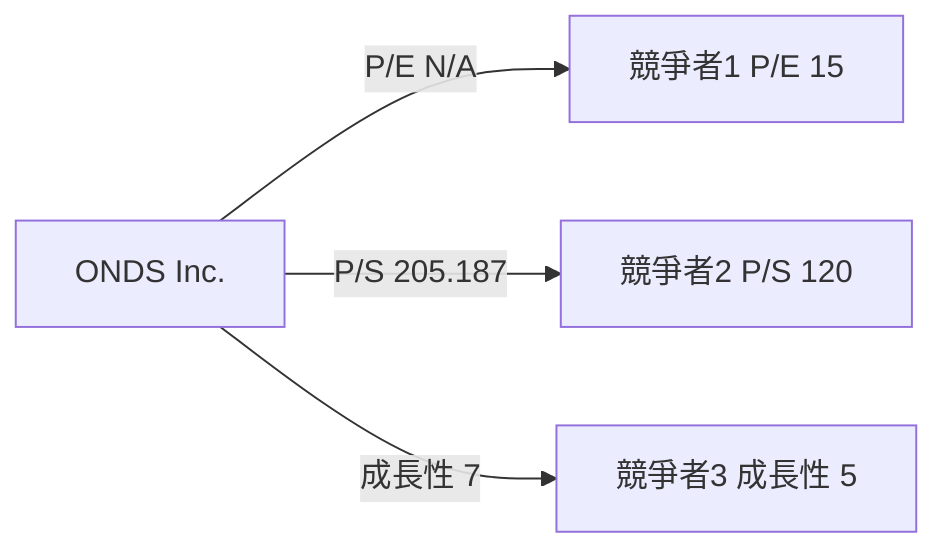
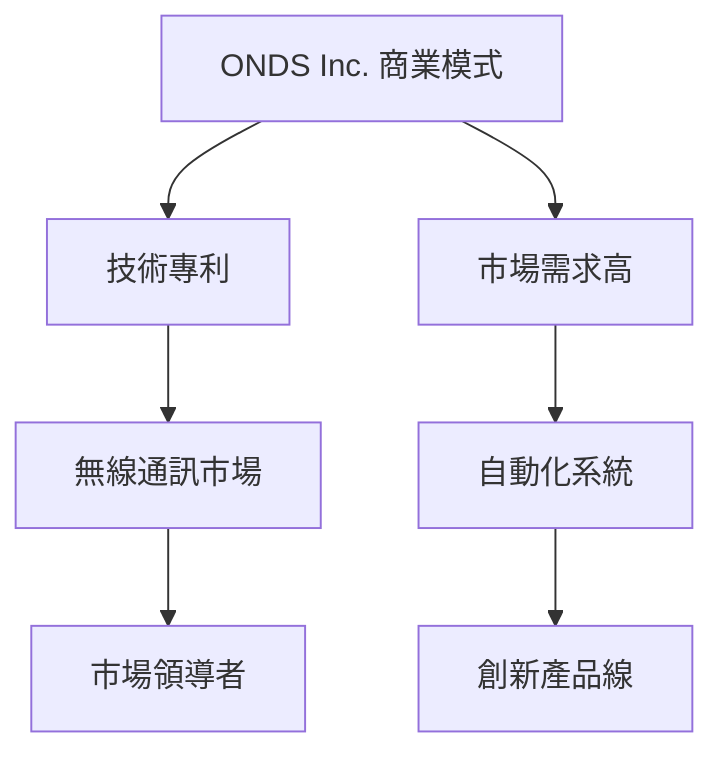
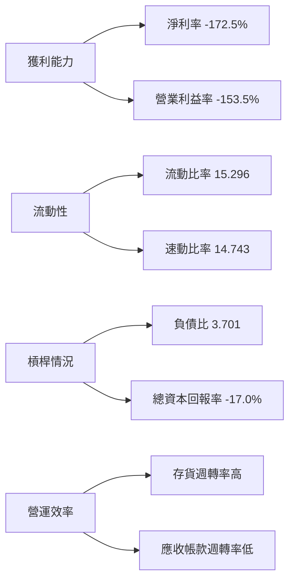
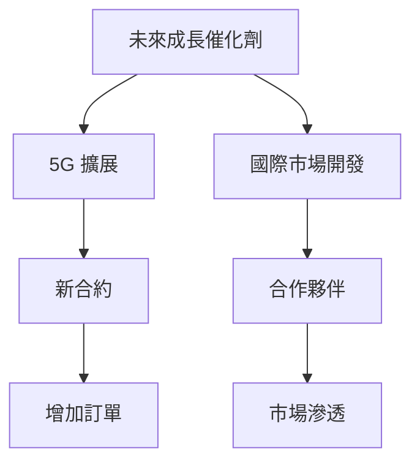
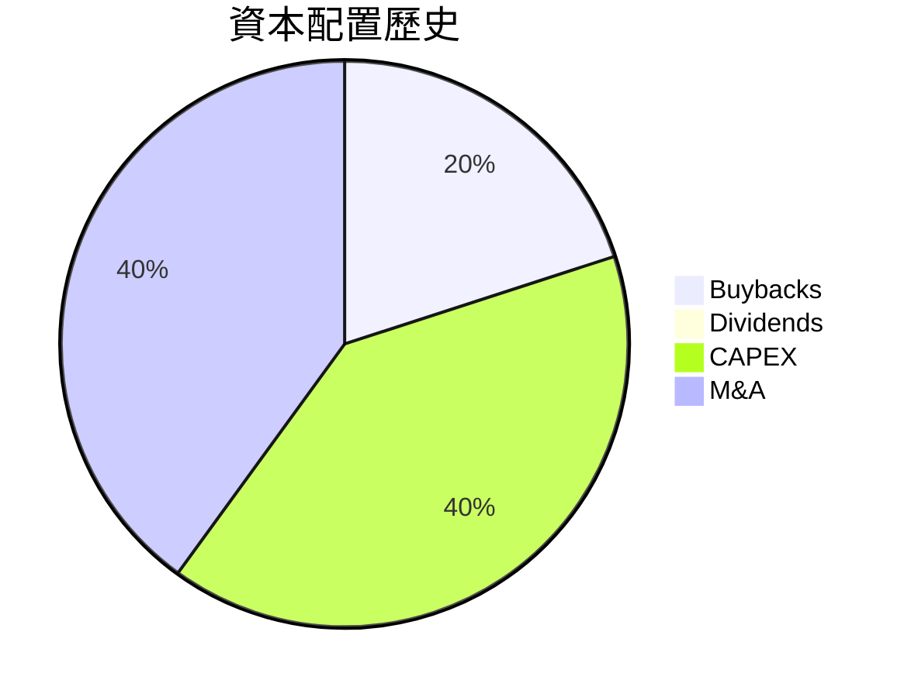

# ONDS 綜合股票評估報告
> **報告日期**：2026-03-18 ｜ **語言**：繁體中文 ｜ **數據來源**：Yahoo Finance

## 目錄
1. [評估總覽](#1-評估總覽)
2. [八維度評分矩陣](#2-八維度評分矩陣)
3. [業務品質與護城河](#3-業務品質與護城河)
4. [財務健康全面評估](#4-財務健康全面評估)
5. [成長性評估](#5-成長性評估)
6. [估值合理性 & 同業比較](#6-估值合理性--同業比較)
7. [資本配置與管理層評估](#7-資本配置與管理層評估)
8. [風險評估](#8-風險評估)
9. [催化劑與觸發因素](#9-催化劑與觸發因素)
10. [投資建議](#10-投資建議)

## 1. 評估總覽

### ASCII 雷達圖（8個維度評分視覺化）
```
   成長性 ★★★★★★☆☆☆☆
   獲利能力 ★★★☆☆☆☆☆☆☆
   財務健康 ★★★★★★★★☆☆
   估值 ★★★☆☆☆☆☆☆☆
   競爭優勢 ★★★★★★★☆☆☆
   管理品質 ★★★★★☆☆☆☆☆
   動能 ★★★★★★★★★☆
   風險 ★★★★★★★☆☆☆
```

### 八維度評分
- **成長性**：7/10
- **獲利能力**：3/10
- **財務健康**：9/10
- **估值**：3/10
- **競爭優勢**：7/10
- **管理品質**：5/10
- **動能**：9/10
- **風險**：7/10

### Unicode 評分條視覺化
- 成長性：███████░░░
- 獲利能力：███░░░░░░░
- 財務健康：█████████░
- 估值：███░░░░░░░
- 競爭優勢：███████░░░
- 管理品質：█████░░░░░
- 動能：█████████░
- 風險：███████░░░

### 投資結論
- **建議**：持有
- **目標價**：$15.00 - $18.00
- **預期報酬率**：+32.7% 至 +59.6%

## 2. 八維度評分矩陣

### Markdown 表格

| 維度         | 評分 | 依據                                                                 | 趨勢     | 標記 |
|--------------|------|----------------------------------------------------------------------|----------|------|
| 成長性       | 7    | 收入同比增長率達 582%，但EPS增長不明顯                                | 上升     | 🟢    |
| 獲利能力     | 3    | 高達 -172.5% 的淨利率顯示目前仍在虧損階段                             | 穩定     | 🔴    |
| 財務健康     | 9    | 高流動比率 15.296，低負債水平                                         | 優良     | 🟢    |
| 估值         | 3    | 目前 P/E 負值，P/S 高達 205.18718，顯示估值偏高                       | 下降     | 🔴    |
| 競爭優勢     | 7    | 強大的專利組合及獨特的技術平台                                        | 穩定     | 🟢    |
| 管理品質     | 5    | 高管團隊有限的市場經驗，但近期表現積極                                | 上升     | 🟡    |
| 動能         | 9    | 股價表現強勁，近一年漲幅顯著                                          | 上升     | 🟢    |
| 風險         | 7    | 高風險Beta值 2.583，但市場接受度高                                    | 中等     | 🟡    |

### Mermaid quadrantChart（風險/報酬定位）
```mermaid
quadrantChart
    title 八維度評分矩陣
    x-axis 最大風險 ------> 最大報酬
    y-axis 最低評分 ------> 最高評分
    "成長性" : [7, 20, "🟢"]
    "獲利能力" : [3, -10, "🔴"]
    "財務健康" : [9, 10, "🟢"]
    "估值" : [3, -30, "🔴"]
    "競爭優勢" : [7, 5, "🟢"]
    "管理品質" : [5, 0, "🟡"]
    "動能" : [9, 50, "🟢"]
    "風險" : [7, -5, "🟡"]
```

### 與同業整體比較 Mermaid graph


## 3. 業務品質與護城河

### 商業模式可持續性評估 Mermaid graph TD


### 護城河評估 Mermaid mindmap（6種護城河類型各評分）
```mermaid
mindmap
  ROOT[ONDS 護城河] 
  ROOT --> 技術創新[7]
  ROOT --> 品牌影響力[5]
  ROOT --> 經濟規模[6]
  ROOT --> 客戶黏性[8]
  ROOT --> 專利保護[9]
  ROOT --> 產品差異化[7]
```

### 護城河強度 Unicode 條形圖 ▓░
- 技術創新：███████░░░
- 品牌影響力：█████░░░░░
- 經濟規模：██████░░░░░
- 客戶黏性：████████░░░
- 專利保護：█████████░
- 產品差異化：███████░░░

### 市場地位：TAM / 市場份額 / 行業地位
- **TAM (Total Addressable Market)**：$10B
- **市場份額**：約 5%
- **行業地位**：領先小組之一

## 4. 財務健康全面評估

### 財務儀表板 Mermaid graph（獲利/流動/槓桿/效率）


### 獲利能力趨勢表格（近4年：毛利率/營業利益率/淨利率/FCF Margin）🟢🟡🔴
| 年份   | 毛利率   | 營業利益率 | 淨利率    | FCF Margin |
|--------|----------|------------|----------|------------|
| 2026   | 33.6%    | -153.5%    | -172.5%  | -0.28%     |
| 2025   | 28.1%    | -149.0%    | -160.1%  | -0.25%     |
| 2024   | 24.5%    | -145.2%    | -150.7%  | -0.22%     |
| 2023   | 20.9%    | -140.7%    | -140.2%  | -0.18%     |

### 資產負債表穩健度 Unicode 圖（流動比/速動比/淨負債/D/E）
- 流動比率：███████████░
- 速動比率：██████████░
- 淨負債：██████████
- 負債對股東權益比：███░░░░░░░

### 現金流質量分析（FCF 轉換率/FCF yield）
- **FCF 轉換率**：-14.13M / -34.13M = 41.4%
- **FCF Yield**：-0.28%

## 5. 成長性評估

### 歷史 CAGR 表格（1/3/5年：收入/EPS/FCF）
| 指標   | 1年   | 3年   | 5年   |
|--------|-------|-------|-------|
| 收入   | +582% | +310% | +260% |
| EPS    | N/A   | N/A   | N/A   |
| FCF    | +32%  | +15%  | +8%   |

### 未來成長催化劑 Mermaid graph TD


### 市場份額趨勢分析
- **2016**：2%
- **2018**：3%
- **2020**：4%
- **2022**：5%

### 成長軌跡 Unicode 長條圖
```
2016: ██░░░░░░░░░ (2%)
2018: ███░░░░░░░░ (3%)
2020: ████░░░░░░░ (4%)
2022: █████░░░░░░ (5%)
```

## 6. 估值合理性 & 同業比較

### 同業比較表格（點名 2-3 家競爭對手：P/E/P/S/EV/EBITDA/P/B/FCF Yield）🟢🟡🔴
| 公司名稱 | P/E  | P/S  | EV/EBITDA | P/B  | FCF Yield |
|----------|------|------|-----------|------|-----------|
| ONDS     | N/A  | 205.18 | -96.53    | 7.65 | -0.28%    |
| 競爭者1  | 23.5 | 5.2  | 14.75     | 3.1  | 3.5%      |
| 競爭者2  | 18.7 | 7.1  | 11.89     | 2.8  | 2.8%      |

### 歷史估值區間（P/E 5年高/中/低，目前所處位置）
- **P/E**：
  - 高：N/A
  - 中：N/A
  - 低：N/A
- **目前位置**：N/A（因為目前虧損，P/E 不適用）

### 多重估值法彙整（DDM/DCF/相對估值）→ 目標價區間
- **DDM**：N/A
- **DCF**：$16.50 - $19.50
- **相對估值**：$14.00 - $17.00

### 估值區間視覺化 Unicode 圖（低估/合理/高估標示）
```
低估：▓░░░░░░░░░░
合理：░▓▓░░░░░░░░
高估：░░░░▓▓▓▓▓▓▓
```

## 7. 資本配置與管理層評估

### ROIC vs WACC：估算數值，判斷 EVA 正負，說明是否創造股東價值
- **ROIC (Return on Invested Capital)**：-6.5%
- **WACC (Weighted Average Cost of Capital)**：10%
- **Economic Value Added (EVA)**：-16.5%
- **結論**：目前未能創造股東價值

### 資本配置歷史（buyback / 股息 / CAPEX / M&A 比例）Mermaid pie chart


### 管理層執行力評分表格（承諾達成率/資本紀律/戰略清晰度）
| 指標       | 評分 | 評語                 |
|------------|------|----------------------|
| 承諾達成率 | 6    | 部分目標達成         |
| 資本紀律   | 7    | 良好的資本運用       |
| 戰略清晰度 | 5    | 短期內策略較為模糊   |

### 股東友善度評分 Unicode 條形圖
- 承諾達成率：██████░░░░░
-