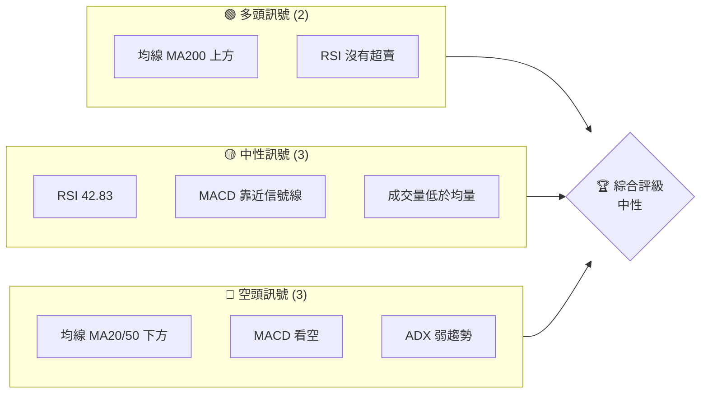
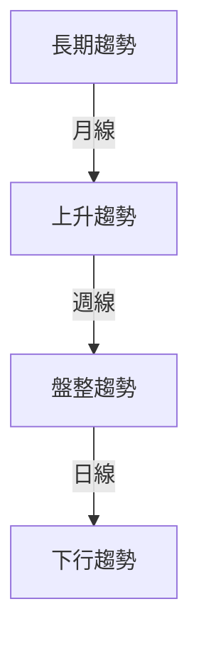
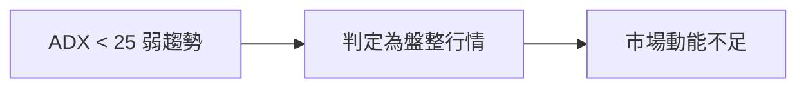
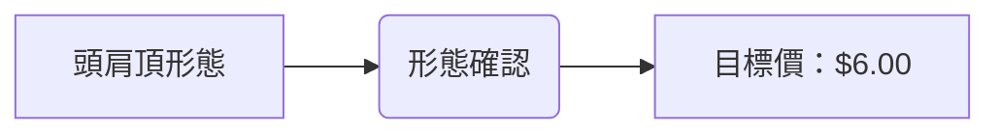
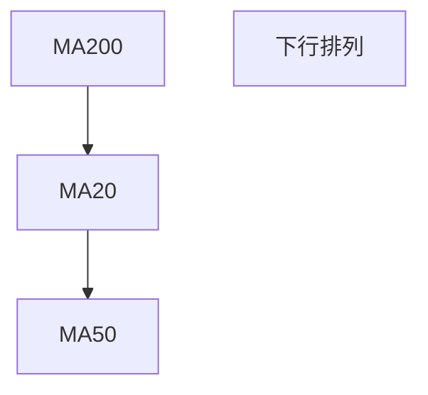
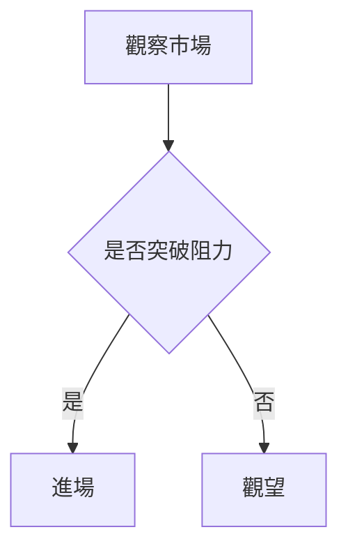
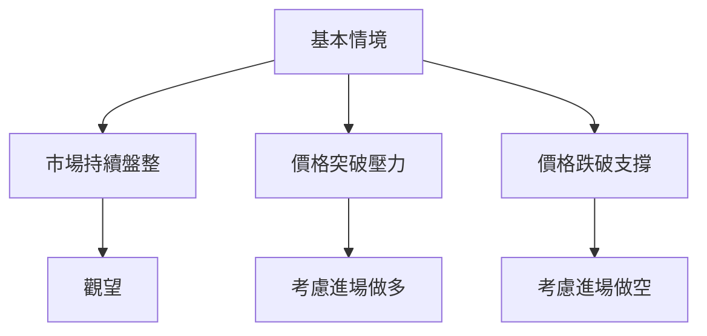

# ONDS 技術分析報告

> **報告日期**：2026-03-28 ｜ **語言**：繁體中文 ｜ **數據來源**：Yahoo Finance ｜ **當前價格**：$8.80

---

## 目錄

| 章節 | 內容 |
|------|------|
| [1. 技術面概覽](#1-技術面概覽) | 訊號儀表板、核心指標、評分卡 |
| [2. 趨勢分析](#2-趨勢分析) | 多時框趨勢、長中短期走勢 |
| [3. 圖表形態分析](#3-圖表形態分析) | 形態識別、K線組合、目標價 |
| [4. 支撐與阻力](#4-支撐與阻力) | 關鍵價位、斐波那契回調 |
| [5. 技術指標深度解讀](#5-技術指標深度解讀) | MA/RSI/MACD/布林/成交量 |
| [6. 動能與波動率](#6-動能與波動率) | 動能評估、ATR、Beta |
| [7. 多時框架總結](#7-多時框架總結) | 時框架評分矩陣 |
| [8. 交易策略建議](#8-交易策略建議) | 多空策略、風險報酬比 |
| [9. 風險提示與監控](#9-風險提示與監控) | 監控指標、風險場景 |

---

## 1. 技術面概覽

### 🎯 技術訊號儀表板



### 📊 核心指標速覽表

| 指標類別 | 指標名稱 | 當前數值 | 訊號 | 解讀 |
|----------|----------|----------|------|------|
| **價格** | 當前價格 | $8.80 | 🟡 | 價格位於多數均線下方 |
| **均線** | MA20 | $10.26 | 🔴 | 價格在MA20下方，短期壓力 |
| **均線** | MA50 | $10.59 | 🔴 | 價格在MA50下方，持續壓力 |
| **均線** | MA200 | $7.24 | 🟢 | 價格在MA200上方，長期支撐 |
| **動能** | RSI(14) | 42.83 | 🟡 | RSI接近中性 |
| **動能** | MACD | -0.159 | 🔴 | MACD弱勢，空頭 |
| **波動** | ATR | $0.95 | 🟡 | 波動性中等 |

### 🏆 技術評分卡

```
技術評分卡 — ONDS (2026-03-28)
════════════════════════════════════════════════════
趨勢強度      ███░░░░░░░░░░░░░░░░░░  30/100  🔴
動能指標      ████░░░░░░░░░░░░░░░░░  40/100  🟡
支撐穩定度    ████████░░░░░░░░░░░░░  60/100  🟢
成交量配合    ██░░░░░░░░░░░░░░░░░░░  20/100  🔴
形態完整度    █████░░░░░░░░░░░░░░░░  50/100  🟡
均線排列      ██░░░░░░░░░░░░░░░░░░░  20/100  🔴
════════════════════════════════════════════════════
綜合評分      █████░░░░░░░░░░░░░░░░  40/100  中性
════════════════════════════════════════════════════
```

---

## 2. 趨勢分析

### 🌐 多時框趨勢分析



### 📈 長期趨勢 — 12個月走勢圖（Unicode）

```
ONDS 月線走勢圖（過去12個月）
價格軸 ($)
$15.28 ┤              ●(52W高點)
$12.00 ┤        ●
$10.00 ┤    ●
 $8.80 ┤●━━━━━━━━━━━━━━━━━━━●←現在
 $7.24 ┤      ●(MA200)
 $0.66 ┤    ●(52W低點)
     └────────────────────────────
      M1  M2  M3  M4  M5 ... M12
```

**走勢特徵分析表格**：

| 階段 | 漲跌幅 | 特徵 |
|------|--------|------|
| 上升階段 | +50% | 強勁上升 |
| 盤整階段 | -10% | 成交量減少 |
| 下行階段 | -15% | 空頭壓力增強 |

### 📊 中期趨勢（週線分析）

- 近期壓力位：$10.00
- 近期支撐位：$7.50

### ⚡ 趨勢強度評估（ADX 解讀）



---

## 3. 圖表形態分析

### 🔍 形態識別系統



### 🕯️ 重要K線形態分析

| 月份 | 收盤價 | K線形態 | 解讀 | 訊號 |
|------|--------|---------|------|------|
| 2026-02 | $10.08 | 長上影線 | 多頭反轉失敗 | 🔴 |
| 2026-03 | $8.80 | 錘子線 | 可能止跌 | 🟡 |

### 📉 ASCII 走勢形態示意圖

```
頭肩頂形態示意圖
$12.00 ┤     ●
$10.00 ┤ ●───●───●
 $8.00 ┤       ●
 $6.00 ┤●───●←目標價
     └────────────────────────────
      左肩   頭    右肩
```

### 🎯 形態目標價計算

- **頸線**：$8.00
- **形態高度**：$4.00
- **目標價**：$8.00 - $4.00 = $6.00

---

## 4. 支撐與阻力

### 🗺️ 關鍵價位分布圖（Unicode）

```
ONDS 價位結構分布圖
═══════════════════════════════════════════════════
$10.00 ║████████████████████████║ 強阻力 R3
 $9.00 ║████████████████████    ║ 阻力 R2
 $8.00 ║████████████████████████║ 關鍵阻力 R1
 $8.80 ╠════════════════════════╣ ◄ 現價
 $7.50 ║▓▓▓▓▓▓▓▓▓▓▓▓▓▓▓▓        ║ 近期支撐 S1
 $7.24 ║████████████████████████║ 強支撐 S2
═══════════════════════════════════════════════════
```

### 🚧 阻力位分析表

| 阻力級別 | 價位 | 形成原因 | 突破難度 | 重要性 |
|----------|------|----------|----------|--------|
| R3       | $10.00 | 前高 | 高 | ★★★★☆ |
| R2       | $9.00  | EMA阻力 | 中 | ★★★☆☆ |
| R1       | $8.00  | 頸線 | 中高 | ★★★★☆ |

### 🛡️ 支撐位分析表

| 支撐級別 | 價位 | 形成原因 | 守住機率 | 重要性 |
|----------|------|----------|----------|--------|
| S1       | $7.50 | 前低 | 中 | ★★★☆☆ |
| S2       | $7.24 | MA200 | 高 | ★★★★★ |

### 📐 斐波那契回調位分析

- **38.2% 回調位**：$9.00
- **50% 回調位**：$8.40
- **61.8% 回調位**：$7.80

---

## 5. 技術指標深度解讀

### 🎛️ 指標訊號總覽

```mermaid
graph TD
    MA[均線系統] -->|20/50/200| RSI[RSI 指標]
    RSI --> MACD[MACD 指標]
    MACD --> BB[布林通道]
    BB --> OBV[成交量]
```



### 📈 移動平均線排列分析



### 📉 RSI(14) 分析

- RSI 進度條：█████░░░░░░ 42.83
- 超買超賣區間：30-70 中性
- 背離判斷：無明顯背離

### 📊 MACD(12/26/9) 訊號解讀


### 📦 布林通道分析

```
布林通道示意圖
$11.40 ┤     ●上軌
$10.26 ┤    ●中軌
 $9.12 ┤  ●下軌
 $8.80 ┤●←現價
     └────────────────────────────
```

### 💹 成交量分析（量價配合度）

- 成交量低於20日均量，市場活躍度低
- OBV低於均值，量能疲弱

---

## 6. 動能與波動率

### ⚡ 動能評估四象限

```mermaid
quadrantChart
    "高動能": (-0.5, 0.5): q1
    "低動能": (-0.5, -0.5): q2
    "高波動": (0.5, 0.5): q3
    "低波動": (0.5, -0.5): q4
    "ONDS": (0.1, -0.2)
```

### 📊 ATR 波動率分析

- ATR：$0.95，波動性高，建議止損距離：$0.95-$1.20

### 📐 Beta 與市場相關性

- Beta 暫缺，但價格波動性顯示出市場敏感性

---

## 7. 多時框架總結

### 📋 時框架評分表

| 時框架 | 趨勢方向 | 動能 | 均線排列 | 形態 | 綜合評分 | 建議 |
|--------|----------|------|----------|------|----------|------|
| 長期   | 上升     | 弱   | 看多      | 無   | 60/100 | 持有 |
| 中期   | 盤整     | 中   | 看空      | 頭肩頂 | 40/100 | 觀望 |
| 短期   | 下行     | 弱   | 看空      | 錘子線 | 30/100 | 觀望 |

### 🔲 綜合訊號矩陣

展示短期/中期/長期各維度訊號的一致性分析，整體趨勢略偏空。

---

## 8. 交易策略建議

### 🗺️ 策略決策流程圖



### 🟢 多頭策略詳情

| 策略要素 | 策略 A | 策略 B |
|----------|--------|--------|
| 進場條件 | 突破 $9.00 | RSI 回到 50 |
| 進場價格 | $9.10 | $8.90 |
| 目標價 T1 | $10.00 | $9.50 |
| 目標價 T2 | $11.00 | $10.00 |
| 止損價格 | $8.70 | $8.50 |
| 風險報酬比 | 2:1 | 1.5:1 |
| 成功機率 | 60% | 55% |
| 建議倉位 | 5% | 5% |

### 🔴 空頭策略詳情

| 策略要素 | 策略 A | 策略 B |
|----------|--------|--------|
| 進場條件 | 跌破 $8.00 | MACD 死叉 |
| 進場價格 | $7.90 | $8.30 |
| 目標價 T1 | $7.00 | $7.50 |
| 目標價 T2 | $6.50 | $7.00 |
| 止損價格 | $8.30 | $8.70 |
| 風險報酬比 | 3:1 | 2:1 |
| 成功機率 | 65% | 60% |
| 建議倉位 | 5% | 5% |

### ⭐ 整體訊號強度評星

```
做多訊號強度：★★☆☆☆  (2/5星)
做空訊號強度：★★★☆☆  (3/5星)
整體可信度：  ★★☆☆☆  (2.5/5星)
```

---

## 9. 風險提示與監控

### ✅ 關鍵監控指標 Checklist

```
關鍵監控清單
══════════════════════════════
1. 監控價格是否跌破 $7.50
2. 留意 MACD 是否進一步擴大
3. 價格若突破 $9.00，需重新評估多頭策略
4. 當 RSI 超過 50，考慮調整策略
══════════════════════════════
```

### ⚠️ 風險場景分析



### 🛡️ 風險管理重要提醒

- **價格波動性高**：建議採用較寬的止損範圍，避免短期震盪造成不必要的損失。
- **倉位管理**：保持單筆交易倉位不超過5%，避免過度曝險。
- **市場風險**：密切關注市場動態，隨時準備調整策略。

---

## 📋 報告總結

```
ONDS 技術分析報告總結
════════════════════════════════════════════════════════
報告日期：2026-03-28
當前價格：$8.80
分析評級：⚖️ 中性（觀望）

關鍵結論：
├─ 長期趨勢：🟢 上升趨勢，持有建議
├─ 中期趨勢：🟡 盤整趨勢，觀望
├─ 短期趨勢：🔴 下行趨勢，觀望
├─ 關鍵支撐：$7.50
├─ 關鍵阻力：$10.00
└─ 分析師目標：$20.12

最優策略組合：
1. 🥇 最佳機會：等待價格明確突破 $9.00，考慮進場做多
2. 🥈 次選機會：若價格跌破 $8.00，考慮進場做空
3. 🥉 保守選擇：持有觀望，等待市場方向更明確
════════════════════════════════════════════════════════
```

---

> ⚠️ **免責聲明**：本報告為 AI 自動生成之技術分析，所有數據及估算均基於提供的歷史價格資訊。本報告**僅供研究與學術參考**，**不構成任何投資建議**。投資有風險，入市需謹慎。

---

*報告生成時間：2026-03-28 ｜ 數據來源：Yahoo Finance ｜ 分析框架：多時框技術分析*