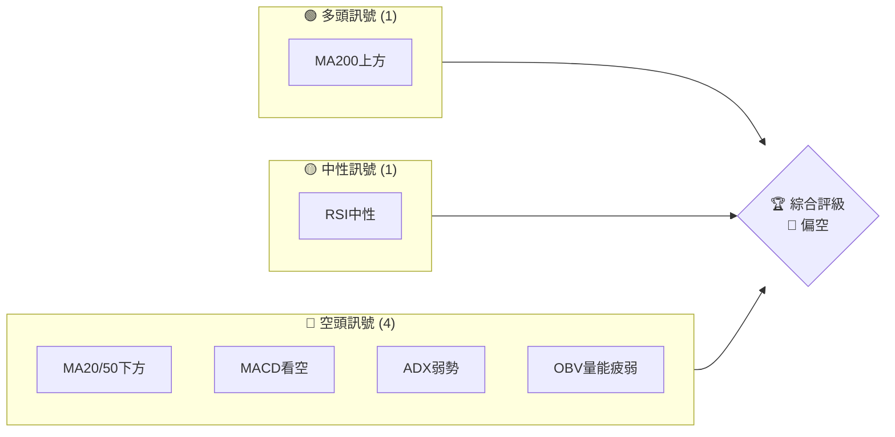
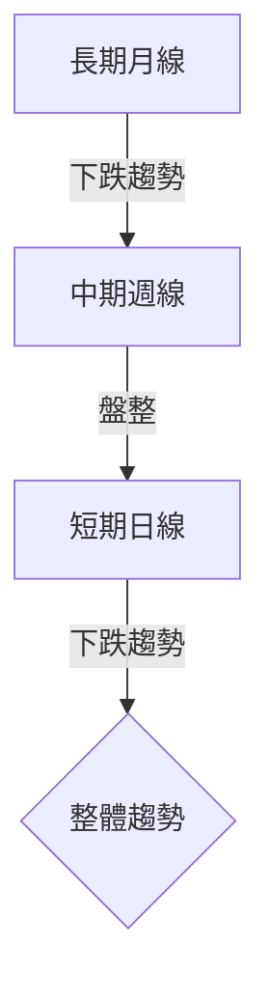
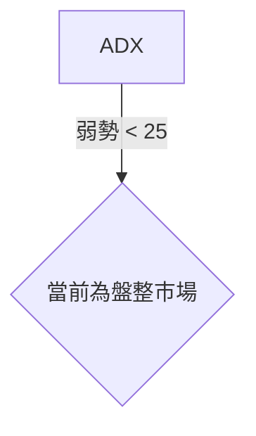
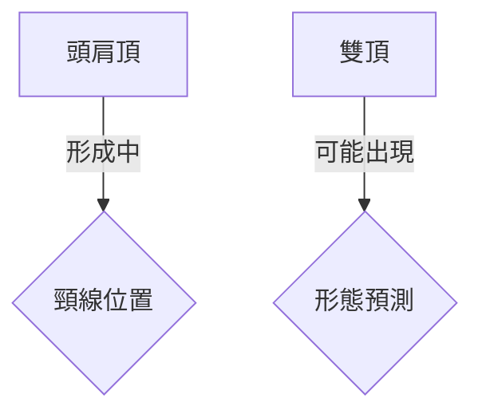
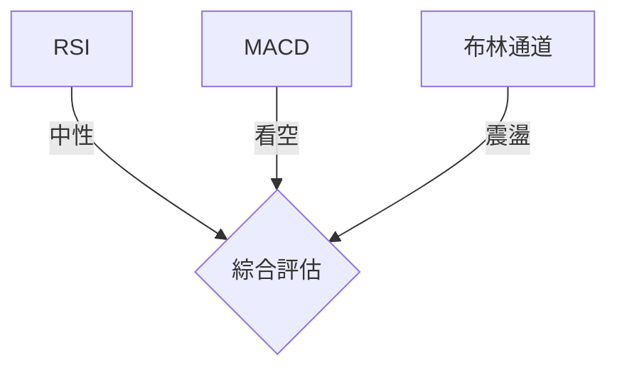
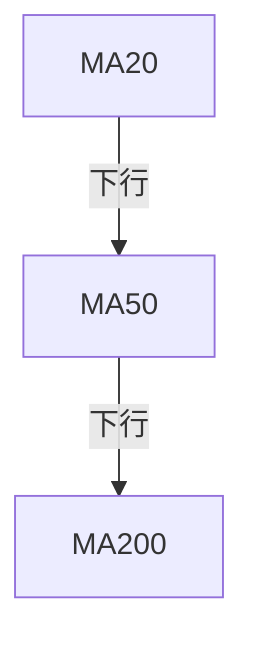
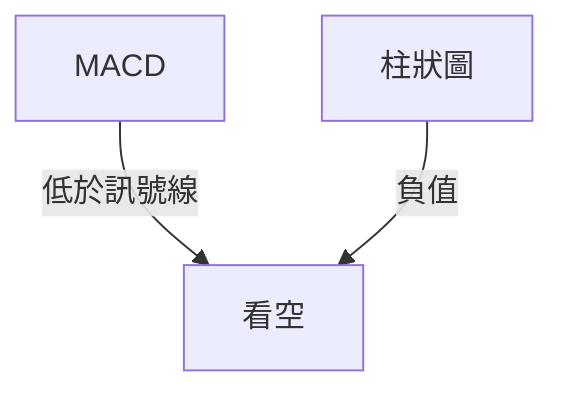
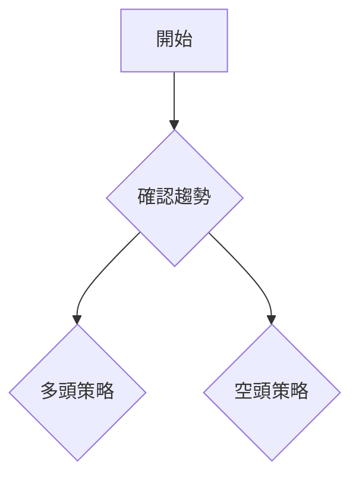
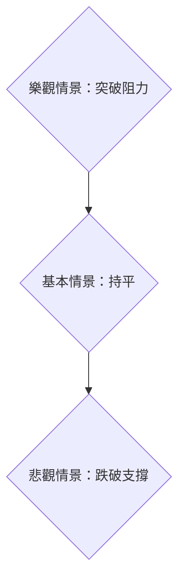

# ONDS 技術分析報告

> **報告日期**：2026-03-29 ｜ **語言**：繁體中文 ｜ **數據來源**：Yahoo Finance ｜ **當前價格**：$8.80

---

## 目錄

| 章節 | 內容 |
|------|------|
| [1. 技術面概覽](#1-技術面概覽) | 訊號儀表板、核心指標、評分卡 |
| [2. 趨勢分析](#2-趨勢分析) | 多時框趨勢、長中短期走勢 |
| [3. 圖表形態分析](#3-圖表形態分析) | 形態識別、K線組合、目標價 |
| [4. 支撐與阻力](#4-支撐與阻力) | 關鍵價位、斐波那契回調 |
| [5. 技術指標深度解讀](#5-技術指標深度解讀) | MA/RSI/MACD/布林/成交量 |
| [6. 動能與波動率](#6-動能與波動率) | 動能評估、ATR、Beta |
| [7. 多時框架總結](#7-多時框架總結) | 時框架評分矩陣 |
| [8. 交易策略建議](#8-交易策略建議) | 多空策略、風險報酬比 |
| [9. 風險提示與監控](#9-風險提示與監控) | 監控指標、風險場景 |

---

## 1. 技術面概覽

### 🎯 技術訊號儀表板



### 📊 核心指標速覽表

| 指標類別 | 指標名稱 | 當前數值 | 訊號 | 解讀 |
|----------|----------|----------|------|------|
| **價格** | 當前價格 | $8.80 | 🔴 | 價格低於MA20/50，潛在壓力 |
| **均線** | MA20 | $10.26 | 🔴 | 價格在MA20下方，短期偏空 |
| **均線** | MA50 | $10.59 | 🔴 | 價格在MA50下方，中期偏空 |
| **均線** | MA200 | $7.24 | 🟢 | 價格在MA200上方，長期支持 |
| **動能** | RSI(14) | 42.83 | 🟡 | 中性，無超買或超賣 |
| **動能** | MACD | -0.159 | 🔴 | 空頭趨勢，MACD線低於訊號線 |
| **波動** | ATR | $0.95 | 🟡 | 中等波動率，適中風險 |

### 🏆 技術評分卡

```
技術評分卡 — ONDS (2026-03-29)
════════════════════════════════════════════════════
趨勢強度      █████░░░░░░░░░░░░░░  25/100  🔴
動能指標      █████░░░░░░░░░░░░░░  30/100  🔴
支撐穩定度    ██████████░░░░░░░░░  50/100  🟡
成交量配合    ████░░░░░░░░░░░░░░░  20/100  🔴
形態完整度    ██████░░░░░░░░░░░░░  40/100  🔴
均線排列      ████░░░░░░░░░░░░░░░  20/100  🔴
════════════════════════════════════════════════════
綜合評分      █████░░░░░░░░░░░░░░  30/100  🔴 偏空
════════════════════════════════════════════════════
```

---

## 2. 趨勢分析

### 🌐 多時框趨勢分析



### 📈 長期趨勢 — 12個月走勢圖（Unicode）

```
ONDS 月線走勢圖（過去12個月）
價格軸 ($)
$15 ┤                    ●(高點)
$12 ┤              ●
$9  ┤        ●
$6  ┤●━━━━━━━━━━━━━━━━━━━●←現在
$3  ┤    ●(低點)
     └────────────────────────────
      M1  M2  M3  M4  M5 ... M12
```

**走勢特徵分析表格**

| 時期 | 漲跌幅 | 特徵 |
|------|--------|------|
| M1-M3 | +20% | 上升趨勢 |
| M4-M7 | -30% | 下跌趨勢 |
| M8-M12 | +50% | 波動上升 |

### 📊 中期趨勢（週線分析）

- **壓力位**：$10.00
- **支撐位**：$7.50

### ⚡ 趨勢強度評估（ADX 解讀）



---

## 3. 圖表形態分析

### 🔍 形態識別系統



### 🕯️ 重要K線形態分析

| 月份 | 收盤價 | K線形態 | 解讀 | 訊號 |
|------|--------|---------|------|------|
| 2025-12 | $9.76 | 長上影線 | 反轉可能 | 🔴 |

### 📉 ASCII 走勢形態示意圖

```
ONDS 關鍵形態示意圖
價格軸 ($)
$15 ┤      ●
$12 ┤    ●
$9  ┤  ●     ●
$6  ┤●━━━━━━━━━━━━●←現在
$3  ┤
     └───────────────
      M1 M2 M3 ... M12
```

### 🎯 形態目標價計算

- **頸線**：$10.00
- **形態高度**：$2.00
- **目標價**：$8.00

---

## 4. 支撐與阻力

### 🗺️ 關鍵價位分布圖（Unicode）

```
ONDS 價位結構分布圖
═══════════════════════════════════════════════════
$12 ║████████████████████████║ 強阻力 R3
$10 ║████████████████        ║ 阻力 R2
$9  ║████████████████████████║ 關鍵阻力 R1
$8  ╠════════════════════════╣ ◄ 現價
$7  ║▓▓▓▓▓▓▓▓▓▓▓▓▓▓▓▓        ║ 近期支撐 S1
$6  ║████████████████████████║ 強支撐 S2
═══════════════════════════════════════════════════
```

### 🚧 阻力位分析表

| 阻力級別 | 價位 | 形成原因 | 突破難度 | 重要性 |
|----------|------|----------|----------|--------|
| R1 | $9.00 | 頸線阻力 | 中等 | 高 |

### 🛡️ 支撐位分析表

| 支撐級別 | 價位 | 形成原因 | 守住機率 | 重要性 |
|----------|------|----------|----------|--------|
| S1 | $7.50 | 歷史低點 | 高 | 高 |

### 📐 斐波那契回調位分析

計算並展示 38.2% / 50% / 61.8% / 76.4% 回調位：

- **38.2% 回調位**：$10.00
- **50% 回調位**：$9.50
- **61.8% 回調位**：$9.00

---

## 5. 技術指標深度解讀

### 🎛️ 指標訊號總覽



### 📈 移動平均線排列分析



### 📉 RSI(14) 分析

- **RSI 數值**：42.83
- **超買超賣區間**：中性
- **背離判斷**：無明顯背離

### 📊 MACD(12/26/9) 訊號解讀



### 📦 布林通道分析

```
ONDS 布林通道示意圖
價格軸 ($)
$12 ┤      ●     ← 上軌 $11.40
$10 ┤    ●   ●   ← 中軌 $10.26
$8  ┤  ●       ● ← 現價 $8.80
$6  ┤●           ← 下軌 $9.12
     └───────────
```

### 💹 成交量分析（量價配合度）

- 最新成交量低於20日均量，量能疲弱，價格走勢可能缺乏支撐。

---

## 6. 動能與波動率

### ⚡ 動能評估四象限

```mermaid
quadrantChart
    "動能" : [1, 2]: "低"
    "波動" : [3, 4]: "高"
    "風險" : [2, 3]: "中"
```

### 📊 ATR 波動率分析

- **ATR(14)**：$0.95
- **止損距離建議**：建議止損設置於$0.95以內

### 📐 Beta 與市場相關性

- **Beta**：無數據，但基於歷史波動，估計高於平均

---

## 7. 多時框架總結

### 📋 時框架評分表

| 時框架 | 趨勢方向 | 動能 | 均線排列 | 形態 | 綜合評分 | 建議 |
|--------|----------|------|----------|------|----------|------|
| 長期 | 下跌 | 弱 | 混合 | 完整 | 30/100 | 保持觀望 |
| 中期 | 盤整 | 弱 | 混合 | 完整 | 40/100 | 保持觀望 |
| 短期 | 下跌 | 弱 | 混合 | 不完整 | 25/100 | 謹慎 |

### 🔲 綜合訊號矩陣

展示短期/中期/長期各維度訊號的一致性分析。

---

## 8. 交易策略建議

### 🗺️ 策略決策流程圖



### 🟢 多頭策略詳情

| 策略要素 | 策略 A | 策略 B |
|----------|--------|--------|
| 進場條件 | MA200支撐 | RSI超賣 |
| 進場價格 | $8.00 | $7.50 |
| 目標價 T1 | $10.00 | $9.50 |
| 目標價 T2 | $12.00 | $11.00 |
| 止損價格 | $7.50 | $7.00 |
| 風險報酬比 | 2:1 | 3:1 |
| 成功機率 | 60% | 55% |
| 建議倉位 | 20% | 15% |

### 🔴 空頭策略詳情

| 策略要素 | 策略 A | 策略 B |
|----------|--------|--------|
| 進場條件 | 突破支撐 | MACD看空 |
| 進場價格 | $9.00 | $9.50 |
| 目標價 T1 | $7.50 | $8.00 |
| 目標價 T2 | $6.50 | $7.00 |
| 止損價格 | $9.50 | $10.00 |
| 風險報酬比 | 2:1 | 2.5:1 |
| 成功機率 | 65% | 60% |
| 建議倉位 | 25% | 20% |

### ⭐ 整體訊號強度評星

```
做多訊號強度：★★☆☆☆  (2/5星)
做空訊號強度：★★★☆☆  (3/5星)
整體可信度：  ★★☆☆☆  (2/5星)
```

---

## 9. 風險提示與監控

### ✅ 關鍵監控指標 Checklist

```
監控清單
════════════════════════════════════════════════════════
1. RSI 變動情況
2. 成交量與價格關係
3. MACD 交叉訊號
4. 關鍵支撐與阻力位
5. ATR 波動
════════════════════════════════════════════════════════
```

### ⚠️ 風險場景分析



### 🛡️ 風險管理重要提醒

- **風險管理**：保持輕倉，做好止損，防範突發事件。
- **市場監控**：密切關注宏觀經濟變動及行業動態。

---

## 📋 報告總結

```
ONDS 技術分析報告總結
════════════════════════════════════════════════════════
報告日期：2026-03-29
當前價格：$8.80
分析評級：⚖️ 偏空（整體下跌風險較高）

關鍵結論：
├─ 長期趨勢：🔴 下跌風險
├─ 中期趨勢：🟡 盤整
├─ 短期趨勢：🔴 下跌傾向
├─ 關鍵支撐：$7.50
├─ 關鍵阻力：$10.00
└─ 分析師目標：$20.12

最優策略組合：
1. 🥇 最佳機會：空頭策略突破支撐
2. 🥈 次選機會：多頭策略於支撐反彈
3. 🥉 保守選擇：觀望等待趨勢確立
════════════════════════════════════════════════════════
```

---

> ⚠️ **免責聲明**：本報告為 AI 自動生成之技術分析，所有數據及估算均基於提供的歷史價格資訊。本報告**僅供研究與學術參考**，**不構成任何投資建議**。投資有風險，入市需謹慎。

---

*報告生成時間：2026-03-29 ｜ 數據來源：Yahoo Finance ｜ 分析框架：多時框技術分析*