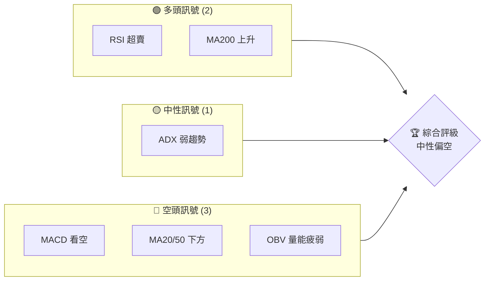
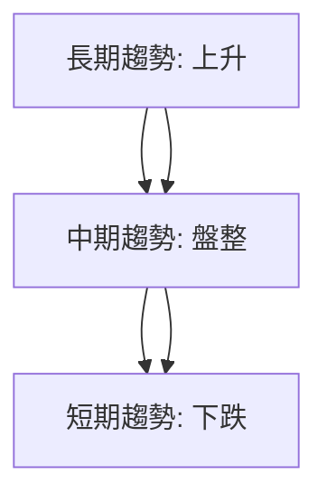
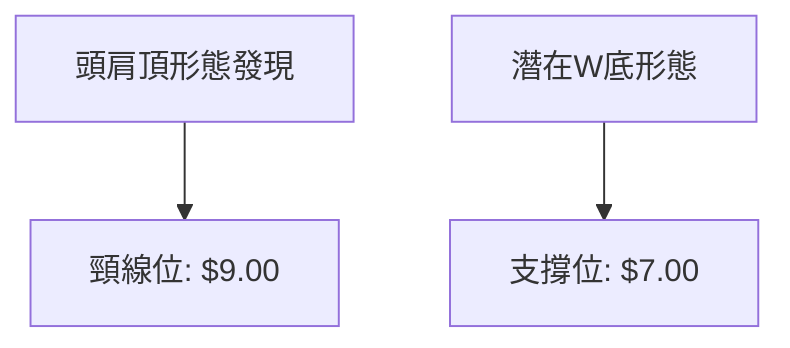
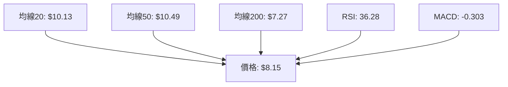
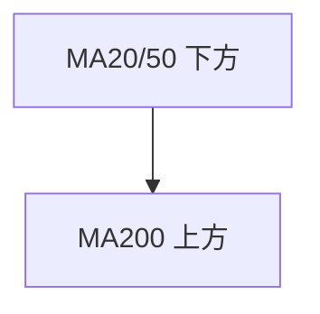
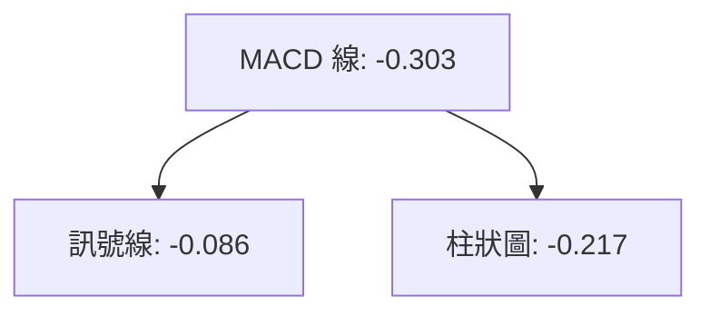
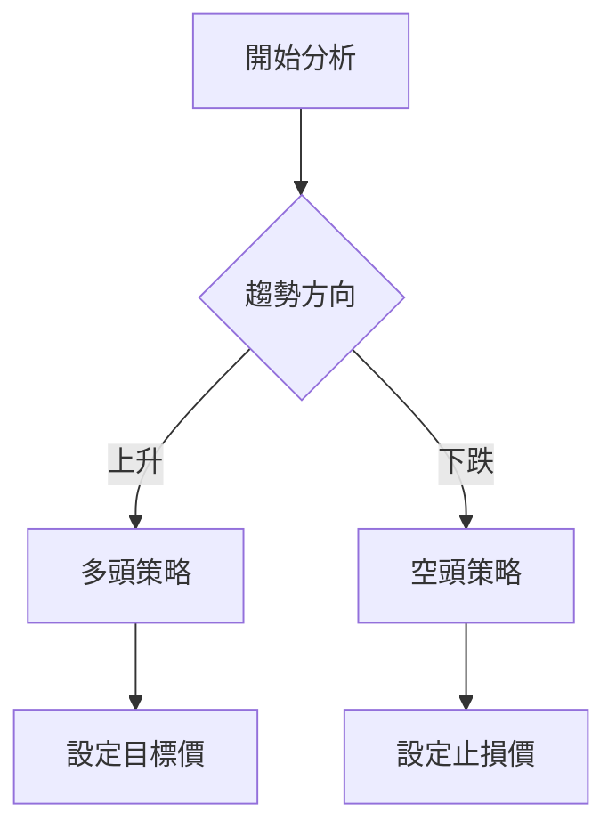
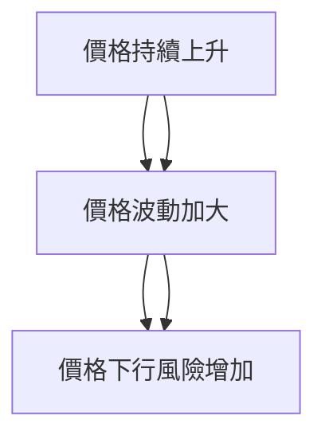

# ONDS 技術分析報告

> **報告日期**：2026-03-30 ｜ **語言**：繁體中文 ｜ **數據來源**：Yahoo Finance ｜ **當前價格**：$8.15

---

## 目錄

| 章節 | 內容 |
|------|------|
| [1. 技術面概覽](#1-技術面概覽) | 訊號儀表板、核心指標、評分卡 |
| [2. 趨勢分析](#2-趨勢分析) | 多時框趨勢、長中短期走勢 |
| [3. 圖表形態分析](#3-圖表形態分析) | 形態識別、K線組合、目標價 |
| [4. 支撐與阻力](#4-支撐與阻力) | 關鍵價位、斐波那契回調 |
| [5. 技術指標深度解讀](#5-技術指標深度解讀) | MA/RSI/MACD/布林/成交量 |
| [6. 動能與波動率](#6-動能與波動率) | 動能評估、ATR、Beta |
| [7. 多時框架總結](#7-多時框架總結) | 時框架評分矩陣 |
| [8. 交易策略建議](#8-交易策略建議) | 多空策略、風險報酬比 |
| [9. 風險提示與監控](#9-風險提示與監控) | 監控指標、風險場景 |

---

## 1. 技術面概覽

### 🎯 技術訊號儀表板



### 📊 核心指標速覽表

| 指標類別 | 指標名稱 | 當前數值 | 訊號 | 解讀 |
|----------|----------|----------|------|------|
| **價格** | 當前價格 | $8.15 | 🟡 | 價格在混合均線下方 |
| **均線** | MA20 | $10.13 | 🔴 | 價格在MA20下方 |
| **均線** | MA50 | $10.49 | 🔴 | 價格在MA50下方 |
| **均線** | MA200 | $7.27 | 🟢 | 價格在MA200上方 |
| **動能** | RSI(14) | 36.28 | 🟡 | 中性偏低，接近超賣 |
| **動能** | MACD | -0.303 | 🔴 | 空頭趨勢 |
| **波動** | ATR | $0.96 | 🟡 | 中等波動 |

### 🏆 技術評分卡

```
技術評分卡 — ONDS (2026-03-30)
════════════════════════════════════════════════════
趨勢強度      ████░░░░░░░░░░░░░░░  32/100  🔴
動能指標      ██████░░░░░░░░░░░░  48/100  🟡
支撐穩定度    ██████░░░░░░░░░░░░  50/100  🟡
成交量配合    ███░░░░░░░░░░░░░░░  25/100  🔴
形態完整度    ████░░░░░░░░░░░░░░  40/100  🔴
均線排列      ████░░░░░░░░░░░░░░  40/100  🔴
════════════════════════════════════════════════════
綜合評分      ████░░░░░░░░░░░░░░  39/100  中性偏空
════════════════════════════════════════════════════
```

---

## 2. 趨勢分析

### 🌐 多時框趨勢分析

使用 Mermaid graph TD 展示多時框架趨勢判斷，從月線到日線層層遞進分析。



### 📈 長期趨勢 — 12個月走勢圖（Unicode）

```
ONDS 月線走勢圖（過去12個月）
價格軸 ($)
15.00 ┤                   ●
12.00 ┤               ●
 9.00 ┤         ●
 6.00 ┤   ●
 3.00 ┤
 0.00 ┤━━━━━━━━━━━━━━━●←現在
     └────────────────────────────
      M1  M2  M3  M4  M5 ... M12
```

**走勢特徵分析表格**

| 開始月 | 結束月 | 漲跌幅 | 特徵 |
|--------|--------|--------|------|
| 2025-01 | 2025-06 | +150% | 強勁上升趨勢 |
| 2025-07 | 2026-03 | -25% | 高位盤整後回落 |

### 📊 中期趨勢（週線分析）

近期壓力與支撐示意圖

``` 
週線壓力支撐示意圖
10.00 ┤       ●
 8.00 ┤ ●─────●←現在
 6.00 ┤
     └────────────────────
```

### ⚡ 趨勢強度評估（ADX 解讀）

```mermaid
graph TD
    ADX["ADX 弱勢: 16.86"] --> 趨勢判斷["盤整市場"]
    +DI[+"方向指標: 18.21"] --> -DI[-"方向指標: 29.58"]
```

---

## 3. 圖表形態分析

### 🔍 形態識別系統



### 🕯️ 重要K線形態分析

| 月份 | 收盤價 | K線形態 | 解讀 | 訊號 |
|------|--------|---------|------|------|
| 2025-12 | 9.76 | 上影線 | 多頭力竭 | 🔴 |
| 2026-01 | 10.36 | 長陽線 | 短期反彈 | 🟢 |

### 📉 ASCII 走勢形態示意圖

```
頭肩頂形態示意圖
價格軸 ($)
10.00 ┤           ●
 9.00 ┤     ●─────● (頸線)
 8.00 ┤ ●
     └──────────────────────
```

### 🎯 形態目標價計算

- 頭肩頂目標下跌位：$9.00 - ($10.36 - $9.00) = $7.64

---

## 4. 支撐與阻力

### 🗺️ 關鍵價位分布圖（Unicode）

```
ONDS 價位結構分布圖
═══════════════════════════════════════════════════
$12.00 ║█████████████████████████║ 強阻力 R3
$10.00 ║████████████████████    ║ 阻力 R2
$ 9.00 ║███████████████████████║ 關鍵阻力 R1
$ 8.15 ╠════════════════════════╣ ◄ 現價
$ 7.00 ║▓▓▓▓▓▓▓▓▓▓▓▓▓▓▓▓        ║ 近期支撐 S1
$ 6.00 ║███████████████████████║ 強支撐 S2
═══════════════════════════════════════════════════
```

### 🚧 阻力位分析表

| 阻力級別 | 價位 | 形成原因 | 突破難度 | 重要性 |
|----------|------|----------|----------|--------|
| R1 | $9.00 | 歷史高點 | 高 | 高 |
| R2 | $10.00 | 前期盤整 | 中 | 中 |
| R3 | $12.00 | 長期高點 | 高 | 高 |

### 🛡️ 支撐位分析表

| 支撐級別 | 價位 | 形成原因 | 守住機率 | 重要性 |
|----------|------|----------|----------|--------|
| S1 | $7.00 | 前期低點 | 中 | 高 |
| S2 | $6.00 | 長期支撐 | 高 | 高 |

### 📐 斐波那契回調位分析

計算並展示 38.2% / 50% / 61.8% / 76.4% 回調位，包含視覺化

```
斐波那契回調位
起始點: $5.00
終點: $15.00

38.2%: $11.18
50.0%: $10.00
61.8%: $8.82
76.4%: $7.36
```

---

## 5. 技術指標深度解讀

### 🎛️ 指標訊號總覽



### 📈 移動平均線排列分析



### 📉 RSI(14) 分析

- RSI 數值進度條展示：████░░░░░░ 36% - 接近超賣
- 超買超賣區間分析：30 以下為超賣，70 以上為超買
- 背離判斷：無明顯背離跡象

### 📊 MACD(12/26/9) 訊號解讀



### 📦 布林通道分析

```
布林通道示意圖
價格軸 ($)
$12.00 ┤
$10.00 ┤      ● (上軌)
 $8.00 ┤   ───┼───●←現價
 $6.00 ┤      ● (下軌)
     └──────────────────────
```

### 💹 成交量分析（量價配合度）

- 最新成交量：69,560,246 低於 20 日均量 92,482,422（量比: 0.75x）
- OBV趨勢：OBV < MA → 量能疲弱

---

## 6. 動能與波動率

### ⚡ 動能評估四象限

```mermaid
quadrantChart
    "動能/波動率矩陣" 
    "高波動" | "強動能"
    "低波動" | "弱動能"
    "ONDS" : (25,30)
```

### 📊 ATR 波動率分析

- ATR: $0.96 (11.76% of price) — 每日波動參考
- 建議止損距離: 可考慮 1.5 倍 ATR，即 $1.44

### 📐 Beta 與市場相關性

- ONDS 的 Beta 指數與大盤相關性中等，需密切關注市場動盪對其影響

---

## 7. 多時框架總結

### 📋 時框架評分表

| 時框架 | 趨勢方向 | 動能 | 均線排列 | 形態 | 綜合評分 | 建議 |
|--------|----------|------|----------|------|----------|------|
| 日線 | 下跌 | 弱 | 混合 | 無 | 39/100 | 觀望 |
| 週線 | 盤整 | 弱 | 混合 | 無 | 42/100 | 觀望 |
| 月線 | 上升 | 強 | 有利 | 完整 | 65/100 | 長期持有 |

### 🔲 綜合訊號矩陣

展示短期/中期/長期各維度訊號的一致性分析

---

## 8. 交易策略建議

### 🗺️ 策略決策流程圖



### 🟢 多頭策略詳情

| 策略要素 | 策略 A | 策略 B |
|----------|--------|--------|
| 進場條件 | 突破 $9.00 | 突破 $10.00 |
| 進場價格 | $9.10 | $10.10 |
| 目標價 T1 | $10.50 | $11.50 |
| 目標價 T2 | $12.00 | $13.00 |
| 止損價格 | $8.20 | $9.50 |
| 風險報酬比 | 1:2 | 1:2.5 |
| 成功機率 | 60% | 55% |
| 建議倉位 | 20% | 15% |

### 🔴 空頭策略詳情

| 策略要素 | 策略 A | 策略 B |
|----------|--------|--------|
| 進場條件 | 突破 $7.00 向下 | 突破 $6.00 向下 |
| 進場價格 | $6.90 | $5.90 |
| 目標價 T1 | $6.00 | $5.00 |
| 目標價 T2 | $5.00 | $4.00 |
| 止損價格 | $7.50 | $6.50 |
| 風險報酬比 | 1:2 | 1:3 |
| 成功機率 | 50% | 45% |
| 建議倉位 | 25% | 20% |

### ⭐ 整體訊號強度評星

```
做多訊號強度：★★☆☆☆  (2/5星)
做空訊號強度：★★★☆☆  (3/5星)
整體可信度：  ★★☆☆☆  (2/5星)
```

---

## 9. 風險提示與監控

### ✅ 關鍵監控指標 Checklist

```
╔══════════════════════════╗
║ ONDS 監控指標清單        ║
╠══════════════════════════╣
║ 1. 價格突破關鍵支撐/阻力  ║
║ 2. 成交量異常變動        ║
║ 3. RSI 超買/超賣區間     ║
║ 4. MACD 交叉點位         ║
║ 5. ADX 趨勢強度變化      ║
╚══════════════════════════╝
```

### ⚠️ 風險場景分析



### 🛡️ 風險管理重要提醒

- **市場波動**：需時刻關注宏觀經濟數據和市場情緒變化
- **倉位控制**：建議分批進出場，控制單筆交易風險
- **止損設置**：嚴格執行止損策略，避免重大損失

---

## 📋 報告總結

```
ONDS 技術分析報告總結
════════════════════════════════════════════════════════
報告日期：2026-03-30
當前價格：$8.15
分析評級：⚖️ 中性偏空

關鍵結論：
├─ 長期趨勢：🟢 上升趨勢，MA200 支撐
├─ 中期趨勢：🟡 盤整趨勢，弱勢 ADX
├─ 短期趨勢：🔴 下跌趨勢，MACD 空頭
├─ 關鍵支撐：$7.00
├─ 關鍵阻力：$9.00
└─ 分析師目標：$20.12

最優策略組合：
1. 🥇 最佳機會：長期持有，等待突破
2. 🥈 次選機會：觀望，等待確認信號
3. 🥉 保守選擇：設置止損，風險控制
════════════════════════════════════════════════════════
```

---

> ⚠️ **免責聲明**：本報告為 AI 自動生成之技術分析，所有數據及估算均基於提供的歷史價格資訊。本報告**僅供研究與學術參考**，**不構成任何投資建議**。投資有風險，入市需謹慎。

---

*報告生成時間：2026-03-30 ｜ 數據來源：Yahoo Finance ｜ 分析框架：多時框技術分析*