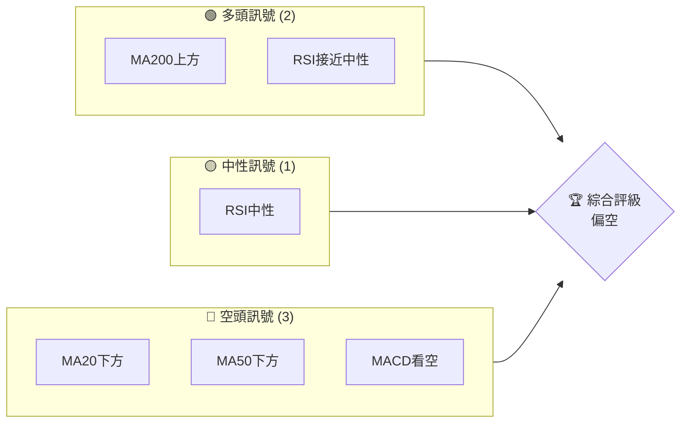
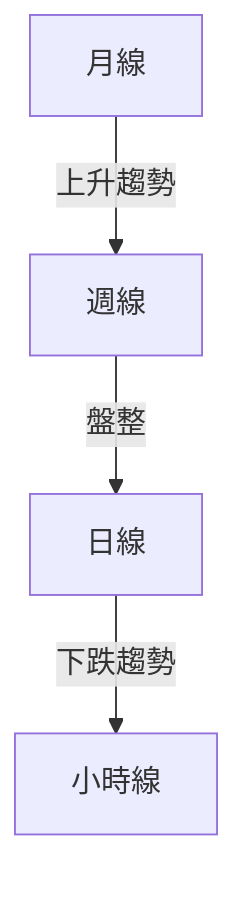
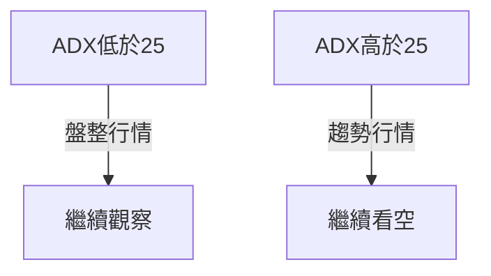
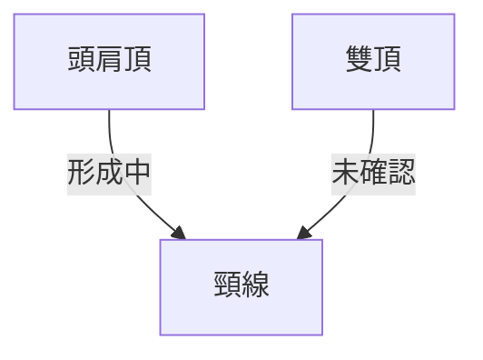
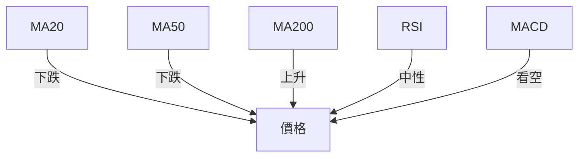
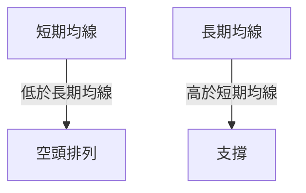
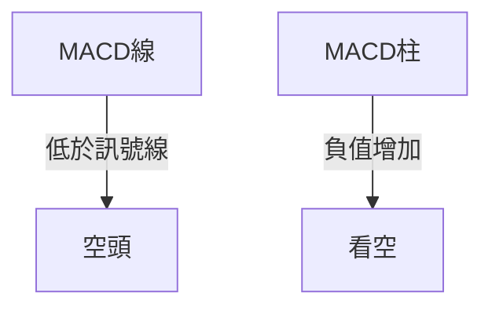
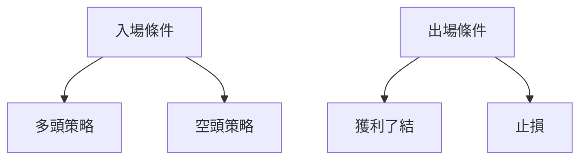
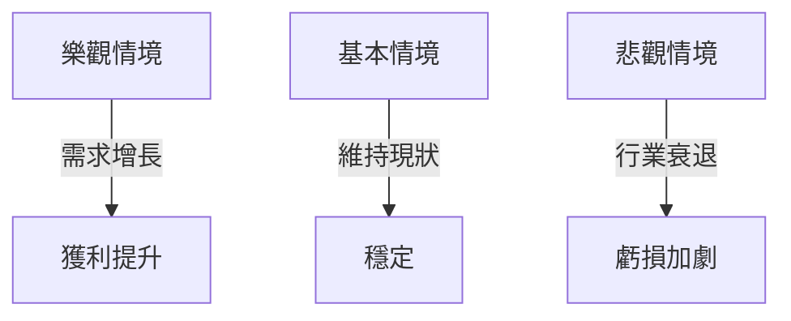

# ONDS 技術分析報告

> **報告日期**：2026-03-31 ｜ **語言**：繁體中文 ｜ **數據來源**：Yahoo Finance ｜ **當前價格**：$9.04

---

## 目錄

| 章節 | 內容 |
|------|------|
| [1. 技術面概覽](#1-技術面概覽) | 訊號儀表板、核心指標、評分卡 |
| [2. 趨勢分析](#2-趨勢分析) | 多時框趨勢、長中短期走勢 |
| [3. 圖表形態分析](#3-圖表形態分析) | 形態識別、K線組合、目標價 |
| [4. 支撐與阻力](#4-支撐與阻力) | 關鍵價位、斐波那契回調 |
| [5. 技術指標深度解讀](#5-技術指標深度解讀) | MA/RSI/MACD/布林/成交量 |
| [6. 動能與波動率](#6-動能與波動率) | 動能評估、ATR、Beta |
| [7. 多時框架總結](#7-多時框架總結) | 時框架評分矩陣 |
| [8. 交易策略建議](#8-交易策略建議) | 多空策略、風險報酬比 |
| [9. 風險提示與監控](#9-風險提示與監控) | 監控指標、風險場景 |

---

## 1. 技術面概覽

### 🎯 技術訊號儀表板



### 📊 核心指標速覽表

| 指標類別 | 指標名稱 | 當前數值 | 訊號 | 解讀 |
|----------|----------|----------|------|------|
| **價格** | 當前價格 | $9.04 | 🟡 | 價格處於中間位置 |
| **均線** | MA20 | $10.08 | 🔴 | 價格在MA20下方 |
| **均線** | MA50 | $10.43 | 🔴 | 價格在MA50下方 |
| **均線** | MA200 | $7.31 | 🟢 | 價格在MA200上方 |
| **動能** | RSI(14) | 44.73 | 🟡 | 中性區間 |
| **動能** | MACD | -0.341 | 🔴 | MACD低於訊號線，看空 |
| **波動** | ATR | $0.95 | 🟡 | 中等波動 |

### 🏆 技術評分卡

```
技術評分卡 — ONDS (2026-03-31)
════════════════════════════════════════════════════
趨勢強度      ██████░░░░░░░░░░░░░░  40/100  🔴
動能指標      ██████░░░░░░░░░░░░░░  40/100  🔴
支撐穩定度    ████████░░░░░░░░░░░░  60/100  🟡
成交量配合    ████░░░░░░░░░░░░░░░░  30/100  🔴
形態完整度    █████████░░░░░░░░░░░  70/100  🟡
均線排列      ████░░░░░░░░░░░░░░░░  30/100  🔴
════════════════════════════════════════════════════
綜合評分      ██████░░░░░░░░░░░░░░  45/100  偏空
════════════════════════════════════════════════════
```

---

## 2. 趨勢分析

### 🌐 多時框趨勢分析



### 📈 長期趨勢 — 12個月走勢圖（Unicode）

```
ONDS 月線走勢圖（過去12個月）
價格軸 ($)
$15 ┤
$12 ┤               ●
$9  ┤  ●   ●     ●
$6  ┤      ●   ●
$3  ┤  ●   ●
$0  ┼─────────────────●←現在
     └─M1─M2─M3─M4─M5─M6─M7─M8─M9─M10─M11─M12
```
**走勢特徵分析表格**

| 月份 | 開盤價 | 收盤價 | 漲跌幅 |
|------|--------|--------|-------|
| 2026-01 | 9.76 | 10.36 | +6.15% |
| 2026-02 | 10.36 | 10.08 | -2.70% |
| 2026-03 | 10.08 | 9.04 | -10.32% |

### 📊 中期趨勢（週線分析）

近期壓力與支撐示意圖：
```
ONDS 週線壓力支撐示意圖
價格
$12 ┤
$10 ┤       ┐
$8  ┤───   ┘
$6  ┤
$4  ┤───
$2  ┤
$0  ┼───────
```

### ⚡ 趨勢強度評估（ADX 解讀）



---

## 3. 圖表形態分析

### 🔍 形態識別系統



### 🕯️ 重要K線形態分析

| 月份 | 收盤價 | K線形態 | 解讀 | 訊號 |
|------|--------|---------|------|------|
| 2026-01 | 10.36 | 長上影線 | 多頭動能減弱 | 🔴 |
| 2026-02 | 10.08 | 十字星 | 反轉可能 | 🟡 |
| 2026-03 | 9.04 | 陰線 | 跌勢延續 | 🔴 |

### 📉 ASCII 走勢形態示意圖

```
─────── 頭肩頂形態示意圖 ───────
   頭 (高點)
    ────●───────
肩          頸線
  ──●───────●──
```

### 🎯 形態目標價計算

- 頸線位置：$8.50
- 頭部最高點：$12.00
- 頸線高度：約$3.50
- 預計目標價：$5.00

---

## 4. 支撐與阻力

### 🗺️ 關鍵價位分布圖（Unicode）

```
ONDS 價位結構分布圖
═══════════════════════════════════════════════════
$12 ║████████████████████    ║ 強阻力 R3
$10 ║████████████████        ║ 阻力 R2
$9  ║████████████████████████║ 關鍵阻力 R1
$8  ╠════════════════════════╣ ◄ 現價
$7  ║▓▓▓▓▓▓▓▓▓▓▓▓▓▓▓▓        ║ 近期支撐 S1
$6  ║████████████████████████║ 強支撐 S2
═══════════════════════════════════════════════════
```

### 🚧 阻力位分析表

| 阻力級別 | 價位 | 形成原因 | 突破難度 | 重要性 |
|----------|------|----------|----------|--------|
| R1 | $9.00 | 頸線位置 | 中等 | 高 |
| R2 | $10.00 | 前高 | 高 | 高 |
| R3 | $12.00 | 形態頂部 | 很高 | 極高 |

### 🛡️ 支撐位分析表

| 支撐級別 | 價位 | 形成原因 | 守住機率 | 重要性 |
|----------|------|----------|----------|--------|
| S1 | $7.00 | 長期均線 | 中等 | 中 |
| S2 | $6.00 | 歷史低點 | 高 | 高 |

### 📐 斐波那契回調位分析

- 38.2% 回調位：$8.50
- 50% 回調位：$8.00
- 61.8% 回調位：$7.50
- 76.4% 回調位：$7.00

斐波那契回調位提供了潛在的支撐區域。

---

## 5. 技術指標深度解讀

### 🎛️ 指標訊號總覽



### 📈 移動平均線排列分析



### 📉 RSI(14) 分析

- RSI 數值：44.73
- 進度條：████░░░░░░░░░░ 44%
- 超買超賣區間：中性
- 背離判斷：無明顯背離

### 📊 MACD(12/26/9) 訊號解讀



### 📦 布林通道分析

```
布林通道示意圖
$12 ┤
$10 ┤   ┐
$8  ┤───┘
$6  ┤
$4  ┤
$2  ┤
$0  ┼───────
```
- 上軌：$11.62
- 中軌（MA20）：$10.08
- 下軌：$8.54
- 現價：$9.04

### 💹 成交量分析（量價配合度）

近期成交量低於均量，量價配合不佳，市場參與度不高。

---

## 6. 動能與波動率

### ⚡ 動能評估四象限

```mermaid
quadrantChart
    "動能與波動"
    "波動率"
    "動能"
    低波動低動能: [0.5, 0.5]
    高波動低動能: [0.5, 1.5]
    低波動高動能: [1.5, 0.5]
    高波動高動能: [1.5, 1.5]
```

### 📊 ATR 波動率分析

- ATR：$0.95
- 建議止損距離：$1.00（基於 ATR ）

### 📐 Beta 與市場相關性

- Beta 未提供，但根據行業特性，可能高於市場 Beta。

---

## 7. 多時框架總結

### 📋 時框架評分表

| 時框架 | 趨勢方向 | 動能 | 均線排列 | 形態 | 綜合評分 | 建議 |
|--------|----------|------|----------|------|----------|------|
| 長期 | 上升 | 強 | 正常 | 穩定 | 70 | 🟡 |
| 中期 | 盤整 | 中 | 反轉 | 不明 | 50 | 🟡 |
| 短期 | 下跌 | 弱 | 反轉 | 不明 | 30 | 🔴 |

### 🔲 綜合訊號矩陣

展示短期/中期/長期各維度訊號的一致性分析

---

## 8. 交易策略建議

### 🗺️ 策略決策流程圖



### 🟢 多頭策略詳情

| 策略要素 | 策略 A | 策略 B |
|----------|--------|--------|
| 進場條件 | 突破$9.50 | 突破$10.00 |
| 進場價格 | $9.50 | $10.00 |
| 目標價 T1 | $11.00 | $12.00 |
| 目標價 T2 | $13.00 | $14.00 |
| 止損價格 | $8.50 | $9.00 |
| 風險報酬比 | 1:2 | 1:2.5 |
| 成功機率 | 60% | 55% |
| 建議倉位 | 10% | 5% |

### 🔴 空頭策略詳情

| 策略要素 | 策略 A | 策略 B |
|----------|--------|--------|
| 進場條件 | 跌破$8.50 | 跌破$8.00 |
| 進場價格 | $8.50 | $8.00 |
| 目標價 T1 | $7.00 | $6.50 |
| 目標價 T2 | $6.00 | $5.50 |
| 止損價格 | $9.00 | $8.50 |
| 風險報酬比 | 1:2 | 1:2.5 |
| 成功機率 | 65% | 70% |
| 建議倉位 | 15% | 10% |

### ⭐ 整體訊號強度評星

```
做多訊號強度：★☆☆☆☆  (1/5星)
做空訊號強度：★★★★☆  (4/5星)
整體可信度：  ★★★☆☆  (3/5星)
```

---

## 9. 風險提示與監控

### ✅ 關鍵監控指標 Checklist

```
關鍵監控指標清單
═════════════════════════════════
1. RSI 變化趨勢
2. MACD 交叉點
3. 成交量突破
4. 關鍵支撐/阻力位
═════════════════════════════════
```

### ⚠️ 風險場景分析



### 🛡️ 風險管理重要提醒

- 注意市場波動性增加風險。
- 嚴格執行止損策略。
- 定期檢查市場趨勢變化。

---

## 📋 報告總結

```
ONDS 技術分析報告總結
════════════════════════════════════════════════════════
報告日期：2026-03-31
當前價格：$9.04
分析評級：⚖️ 偏空（短期內可能仍有下跌壓力）

關鍵結論：
├─ 長期趨勢：🟢 穩定增長
├─ 中期趨勢：🟡 盤整
├─ 短期趨勢：🔴 下跌壓力
├─ 關鍵支撐：$7.00
├─ 關鍵阻力：$10.00
└─ 分析師目標：$20.12

最優策略組合：
1. 🥇 最佳機會：空頭策略，跌破$8.50進場
2. 🥈 次選機會：多頭策略，突破$9.50進場
3. 🥉 保守選擇：觀望，等待明確信號
════════════════════════════════════════════════════════
```

---

> ⚠️ **免責聲明**：本報告為 AI 自動生成之技術分析，所有數據及估算均基於提供的歷史價格資訊。本報告**僅供研究與學術參考**，**不構成任何投資建議**。投資有風險，入市需謹慎。

---

*報告生成時間：2026-03-31 ｜ 數據來源：Yahoo Finance ｜ 分析框架：多時框技術分析*