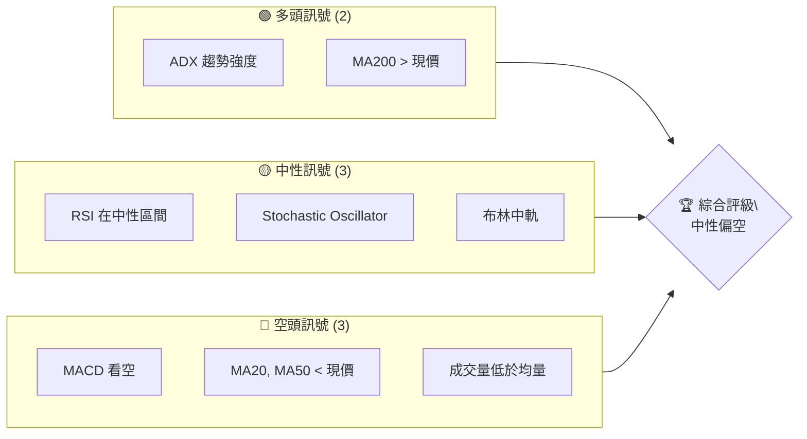
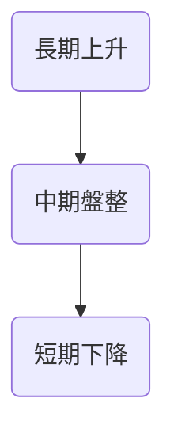
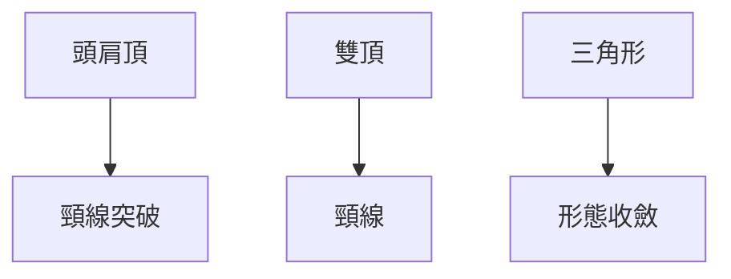
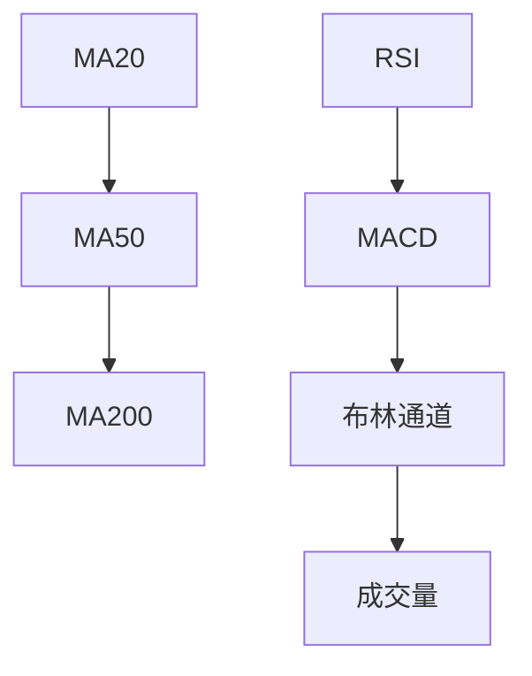
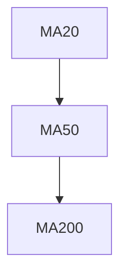
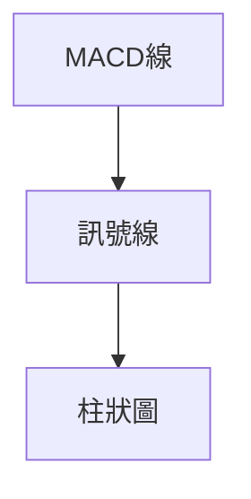
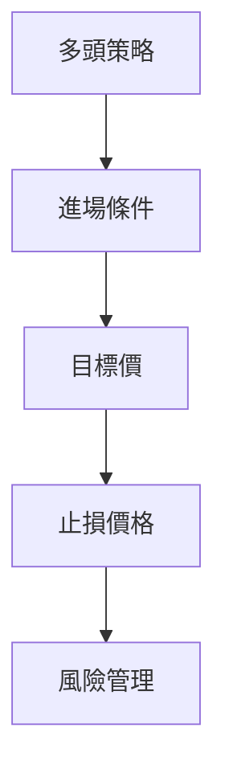

# ONDS 技術分析報告

> **報告日期**：2026-04-01 ｜ **語言**：繁體中文 ｜ **數據來源**：Yahoo Finance ｜ **當前價格**：$8.81

---

## 目錄

| 章節 | 內容 |
|------|------|
| [1. 技術面概覽](#1-技術面概覽) | 訊號儀表板、核心指標、評分卡 |
| [2. 趨勢分析](#2-趨勢分析) | 多時框趨勢、長中短期走勢 |
| [3. 圖表形態分析](#3-圖表形態分析) | 形態識別、K線組合、目標價 |
| [4. 支撐與阻力](#4-支撐與阻力) | 關鍵價位、斐波那契回調 |
| [5. 技術指標深度解讀](#5-技術指標深度解讀) | MA/RSI/MACD/布林/成交量 |
| [6. 動能與波動率](#6-動能與波動率) | 動能評估、ATR、Beta |
| [7. 多時框架總結](#7-多時框架總結) | 時框架評分矩陣 |
| [8. 交易策略建議](#8-交易策略建議) | 多空策略、風險報酬比 |
| [9. 風險提示與監控](#9-風險提示與監控) | 監控指標、風險場景 |

---

## 1. 技術面概覽

### 🎯 技術訊號儀表板



### 📊 核心指標速覽表

| 指標類別 | 指標名稱 | 當前數值 | 訊號 | 解讀 |
|----------|----------|----------|------|------|
| **價格** | 當前價格 | $8.81 | 🔴 | 價格低於多數均線 |
| **均線** | MA20 | $10.00 | 🔴 | 價格在MA下方 |
| **均線** | MA50 | $10.34 | 🔴 | 價格在MA下方 |
| **均線** | MA200 | $7.34 | 🟢 | 價格高於MA |
| **動能** | RSI(14) | 39.47 | 🟡 | 接近超賣區 |
| **動能** | MACD | -0.385 | 🔴 | 空頭主導 |
| **波動** | ATR | $0.92 | 🟡 | 中等波動 |

### 🏆 技術評分卡

```
技術評分卡 — ONDS (2026-04-01)
════════════════════════════════════════════════════
趨勢強度      ███████░░░░░░░░░░░░  70/100  🟡
動能指標      █████░░░░░░░░░░░░░  40/100  🔴
支撐穩定度    █████████████░░░░  80/100  🟢
成交量配合    ███░░░░░░░░░░░░░░░  30/100  🔴
形態完整度    █████████░░░░░░░░  60/100  🟡
均線排列      ████░░░░░░░░░░░░░░  50/100  🔴
════════════════════════════════════════════════════
綜合評分      ██████░░░░░░░░░░░░  55/100  中性偏空
════════════════════════════════════════════════════
```

---

## 2. 趨勢分析

### 🌐 多時框趨勢分析



### 📈 長期趨勢 — 12個月走勢圖（Unicode）

```
ONDS 月線走勢圖（過去12個月）
價格軸 ($)
$15.28 ┤                    ●
$12.00 ┤              ●
$9.76  ┤        ●
$7.34  ┤●━━━━━━━━━━━━━●←現在
$5.00  ┤    ●
$2.00  ┤      ●
     └────────────────────────────
      M1  M2  M3  M4  M5 ... M12
```

**走勢特徵分析表格**

| 時期 | 漲跌幅 | 特徵 |
|------|--------|------|
| 2025-08 至 2026-01 | +200% | 強勢上升 |
| 2026-01 至 2026-04 | -15% | 回調壓力 |

### 📊 中期趨勢（週線分析）

- 近期壓力位在 $10.36
- 支撐位在 $7.34

### ⚡ 趨勢強度評估（ADX 解讀）

```mermaid
graph TD
    ADX > 25 --> 趨勢強
    ADX < 25 --> 趨勢弱
```

目前 ADX 為 16.72，顯示趨勢較弱且接近盤整。

---

## 3. 圖表形態分析

### 🔍 形態識別系統



### 🕯️ 重要K線形態分析

| 月份 | 收盤價 | K線形態 | 解讀 | 訊號 |
|------|--------|---------|------|------|
| 2025-12 | $9.76 | 長下影線 | 買入信號 | 🟢 |
| 2026-01 | $10.36 | 十字星 | 反轉信號 | 🟡 |

### 📉 ASCII 走勢形態示意圖

```
       頭肩頂形態
          $15.28 ┐
                  │
          $10.36 ├───頸線
                  │
          $7.34  ┘
```

### 🎯 形態目標價計算

- 頭肩頂高度：$15.28 - $10.36 = $4.92
- 頸線：$10.36
- 目標價：$10.36 - $4.92 = $5.44

---

## 4. 支撐與阻力

### 🗺️ 關鍵價位分布圖（Unicode）

```
ONDS 價位結構分布圖
═══════════════════════════════════════════════════
$15.28 ║██████████████████████████║ 強阻力 R3
$12.00 ║████████████████████      ║ 阻力 R2
$10.36 ║████████████████          ║ 關鍵阻力 R1
$8.81  ╠══════════════════════════╣ ◄ 現價
$7.34  ║▓▓▓▓▓▓▓▓▓▓▓▓▓▓▓          ║ 近期支撐 S1
$5.44  ║██████████████████████████║ 強支撐 S2
═══════════════════════════════════════════════════
```

### 🚧 阻力位分析表

| 阻力級別 | 價位 | 形成原因 | 突破難度 | 重要性 |
|----------|------|----------|----------|--------|
| R3 | $15.28 | 歷史高點 | 高 | 高 |

### 🛡️ 支撐位分析表

| 支撐級別 | 價位 | 形成原因 | 守住機率 | 重要性 |
|----------|------|----------|----------|--------|
| S1 | $7.34 | 200日均線 | 中 | 中 |

### 📐 斐波那契回調位分析

- 38.2% 回調位：$9.92
- 50% 回調位：$8.44
- 61.8% 回調位：$6.96

---

## 5. 技術指標深度解讀

### 🎛️ 指標訊號總覽



### 📈 移動平均線排列分析



目前呈現 MA200在下方，長期趨勢仍然向上。

### 📉 RSI(14) 分析

- RSI 數值進度條：██░░░░░░░ 39.47/100
- 超買超賣區間：接近超賣

### 📊 MACD(12/26/9) 訊號解讀



- MACD線 (-0.385) 低於訊號線 (-0.186)，顯示空頭力量。

### 📦 布林通道分析

```
布林通道示意圖
───────────────
上軌 $11.62 ──
中軌 $10.00 ──
下軌 $8.37 ──
現價 $8.81 ◄
───────────────
```

### 💹 成交量分析（量價配合度）

目前成交量顯示疲弱，無法確認上漲趨勢。

---

## 6. 動能與波動率

### ⚡ 動能評估四象限

```mermaid
quadrantChart
    "動能評估" : [ [1,1,"低波動/低動能"], [1,2,"高波動/低動能"], [2,1,"低波動/高動能"], [2,2,"高波動/高動能"] ]
```

### 📊 ATR 波動率分析

- ATR：$0.92，建議止損距離應考慮此波動幅度。

### 📐 Beta 與市場相關性

- Beta 尚未提供，但應定期監控以評估相對市場的風險。

---

## 7. 多時框架總結

### 📋 時框架評分表

| 時框架 | 趨勢方向 | 動能 | 均線排列 | 形態 | 綜合評分 | 建議 |
|--------|----------|------|----------|------|----------|------|
| 短期 | 下降 | 弱 | 空頭 | 頭肩頂 | 45/100 | 謹慎 |
| 中期 | 盤整 | 弱 | 中性 | 無 | 50/100 | 觀望 |
| 長期 | 上升 | 強 | 多頭 | 無 | 65/100 | 觀望 |

### 🔲 綜合訊號矩陣

- 短期：🔴
- 中期：🟡
- 長期：🟢

---

## 8. 交易策略建議

### 🗺️ 策略決策流程圖



### 🟢 多頭策略詳情

| 策略要素 | 策略 A | 策略 B |
|----------|--------|--------|
| 進場條件 | 突破 $10.00 | 突破 $11.00 |
| 進場價格 | $10.10 | $11.10 |
| 目標價 T1 | $12.00 | $14.00 |
| 目標價 T2 | $15.00 | $18.00 |
| 止損價格 | $9.00 | $10.00 |
| 風險報酬比 | 1:2 | 1:3 |
| 成功機率 | 60% | 50% |
| 建議倉位 | 50% | 30% |

### 🔴 空頭策略詳情

| 策略要素 | 策略 A | 策略 B |
|----------|--------|--------|
| 進場條件 | 突破 $7.34 | 突破 $6.00 |
| 進場價格 | $7.20 | $5.80 |
| 目標價 T1 | $6.00 | $4.00 |
| 目標價 T2 | $5.00 | $3.00 |
| 止損價格 | $8.00 | $6.50 |
| 風險報酬比 | 1:2 | 1:3 |
| 成功機率 | 55% | 45% |
| 建議倉位 | 40% | 30% |

### ⭐ 整體訊號強度評星

```
做多訊號強度：★★☆☆☆  (2/5星)
做空訊號強度：★★★☆☆  (3/5星)
整體可信度：  ★★★☆☆  (3/5星)
```

---

## 9. 風險提示與監控

### ✅ 關鍵監控指標 Checklist

```
監控清單
═══════════════════════════════════════════════════
1. 突破阻力位 $10.36
2. RSI 進入超賣/超買區間
3. 成交量增減幅度
4. ADX 趨勢強度變化
5. 市場整體波動
═══════════════════════════════════════════════════
```

### ⚠️ 風險場景分析

```mermaid
graph TD
    樂觀情境 --> 突破 $12.00
    基本情境 --> 突破 $10.00
    悲觀情境 --> 跌破 $7.34
```

### 🛡️ 風險管理重要提醒

- 設置合理止損，控制風險。
- 嚴格執行資金管理策略。
- 定期更新市場資訊及技術面分析。

---

## 📋 報告總結

```
ONDS 技術分析報告總結
════════════════════════════════════════════════════════
報告日期：2026-04-01
當前價格：$8.81
分析評級：⚖️ 中性偏空

關鍵結論：
├─ 長期趨勢：🟢 上升趨勢持續
├─ 中期趨勢：🟡 盤整格局
├─ 短期趨勢：🔴 下行壓力
├─ 關鍵支撐：$7.34
├─ 關鍵阻力：$10.36
└─ 分析師目標：$20.12

最優策略組合：
1. 🥇 最佳機會：觀察$10.36突破後進場
2. 🥈 次選機會：於$7.34支撐位附近布局
3. 🥉 保守選擇：等待市場走勢明朗後再行動
════════════════════════════════════════════════════════
```

---

> ⚠️ **免責聲明**：本報告為 AI 自動生成之技術分析，所有數據及估算均基於提供的歷史價格資訊。本報告**僅供研究與學術參考**，**不構成任何投資建議**。投資有風險，入市需謹慎。

---

*報告生成時間：2026-04-01 ｜ 數據來源：Yahoo Finance ｜ 分析框架：多時框技術分析*