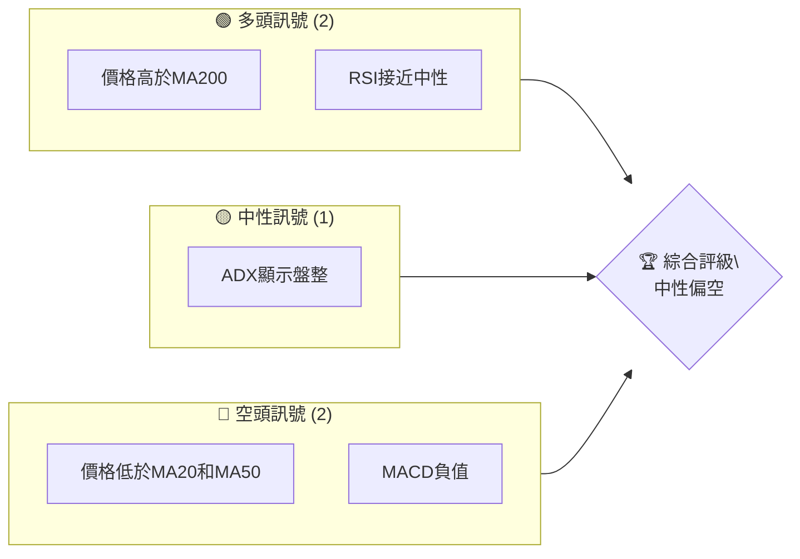
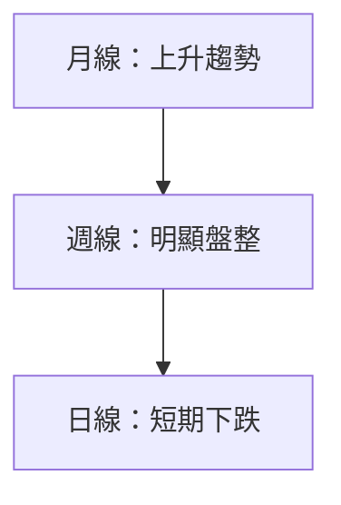
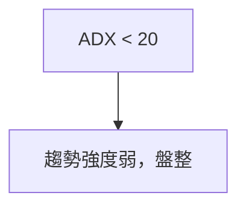
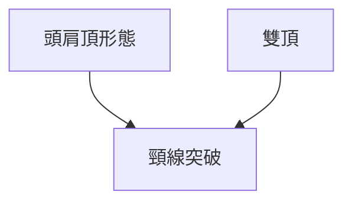
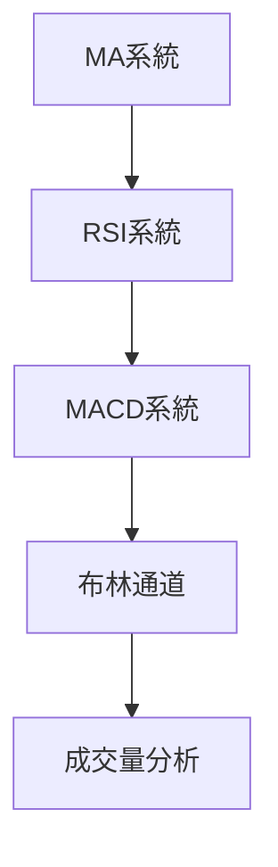
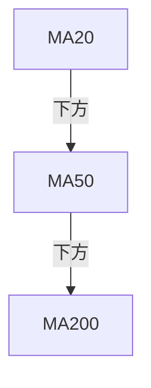
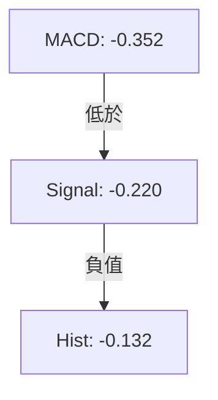
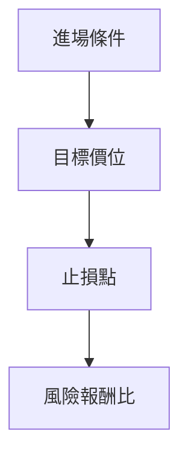
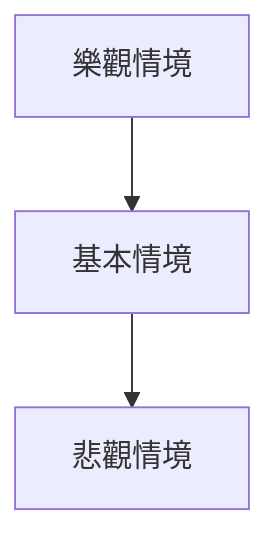

# ONDS 技術分析報告

> **報告日期**：2026-04-02 ｜ **語言**：繁體中文 ｜ **數據來源**：Yahoo Finance ｜ **當前價格**：$9.60

---

## 目錄

| 章節 | 內容 |
|------|------|
| [1. 技術面概覽](#1-技術面概覽) | 訊號儀表板、核心指標、評分卡 |
| [2. 趨勢分析](#2-趨勢分析) | 多時框趨勢、長中短期走勢 |
| [3. 圖表形態分析](#3-圖表形態分析) | 形態識別、K線組合、目標價 |
| [4. 支撐與阻力](#4-支撐與阻力) | 關鍵價位、斐波那契回調 |
| [5. 技術指標深度解讀](#5-技術指標深度解讀) | MA/RSI/MACD/布林/成交量 |
| [6. 動能與波動率](#6-動能與波動率) | 動能評估、ATR、Beta |
| [7. 多時框架總結](#7-多時框架總結) | 時框架評分矩陣 |
| [8. 交易策略建議](#8-交易策略建議) | 多空策略、風險報酬比 |
| [9. 風險提示與監控](#9-風險提示與監控) | 監控指標、風險場景 |

---

## 1. 技術面概覽

### 🎯 技術訊號儀表板



### 📊 核心指標速覽表

| 指標類別 | 指標名稱 | 當前數值 | 訊號 | 解讀 |
|----------|----------|----------|------|------|
| **價格** | 當前價格 | $9.60 | 🟡 | 價格在MA200上方，但低於MA20與MA50 |
| **均線** | MA20 | $9.95 | 🔴 | 價格在MA下方 |
| **均線** | MA50 | $10.28 | 🔴 | 價格在MA下方 |
| **均線** | MA200 | $7.38 | 🟢 | 價格在MA上方 |
| **動能** | RSI(14) | 46.43 | 🟡 | 中性區間 |
| **動能** | MACD | -0.352 | 🔴 | 空頭訊號 |
| **波動** | ATR | $0.94 | 🟡 | 中等波動 |

### 🏆 技術評分卡

```
技術評分卡 — ONDS (2026-04-02)
════════════════════════════════════════════════════
趨勢強度      ███░░░░░░░░░░░░░░░░  25/100  🔴
動能指標      █████░░░░░░░░░░░░░  40/100  🟡
支撐穩定度    ██████░░░░░░░░░░░░  50/100  🟡
成交量配合    ███░░░░░░░░░░░░░░░  30/100  🔴
形態完整度    ███████░░░░░░░░░░░  60/100  🟡
均線排列      ███░░░░░░░░░░░░░░░  30/100  🔴
════════════════════════════════════════════════════
綜合評分      ██████░░░░░░░░░░░░  40/100  中性偏空
════════════════════════════════════════════════════
```

---

## 2. 趨勢分析

### 🌐 多時框趨勢分析



### 📈 長期趨勢 — 12個月走勢圖（Unicode）

```
ONDS 月線走勢圖（過去12個月）
價格軸 ($)
$15  ┤                    
$12  ┤                 
$9   ┤        ●
$6   ┤        ●
$3   ┤●───────────────●←現在
$0   ┤        
     └────────────────────────────
      2025-04  2025-10  2026-04
```

**走勢特徵分析表格**

| 階段 | 漲跌幅 | 特徵 |
|------|--------|------|
| 2025-04 至 2025-08 | +600% | 高速上升 |
| 2025-08 至 2026-04 | -20% | 高位震盪 |

### 📊 中期趨勢（週線分析）

```
ONDS 週線壓力與支撐示意圖
壓力位 ── $10.28 (MA50)
支撐位 ── $8.33 (布林下軌)
```

### ⚡ 趨勢強度評估（ADX 解讀）



---

## 3. 圖表形態分析

### 🔍 形態識別系統



### 🕯️ 重要K線形態分析

| 月份 | 收盤價 | K線形態 | 解讀 | 訊號 |
|------|--------|---------|------|------|
| 2025-12 | $9.76 | 長上影線 | 多頭疲弱 | 🔴 |
| 2026-01 | $10.36 | 光頭陽線 | 反彈跡象 | 🟢 |

### 📉 ASCII 走勢形態示意圖

```
ONDS 走勢形態示意圖
價格軸 ($)
$12  ┤                    
$10  ┤   ●───● (雙頂)
$8   ┤        ● (頸線)
$6   ┤        
$4   ┤        
$2   ┤        
     └────────────────────────────
      2025-12  2026-01  2026-04
```

### 🎯 形態目標價計算

- **雙頂形態目標價**：頸線$8.33，形態高度$2.03，目標價$6.30

---

## 4. 支撐與阻力

### 🗺️ 關鍵價位分布圖（Unicode）

```
ONDS 價位結構分布圖
═══════════════════════════════════════════════════
$15.28 ║████████████████████████║ 強阻力 R3
$12.00 ║████████████████████    ║ 阻力 R2
$10.28 ║████████████████████████║ 關鍵阻力 R1
$9.60  ╠════════════════════════╣ ◄ 現價
$8.33  ║▓▓▓▓▓▓▓▓▓▓▓▓▓▓▓▓        ║ 近期支撐 S1
$7.38  ║████████████████████████║ 強支撐 S2
═══════════════════════════════════════════════════
```

### 🚧 阻力位分析表

| 阻力級別 | 價位 | 形成原因 | 突破難度 | 重要性 |
|----------|------|----------|----------|--------|
| R3 | $15.28 | 52週高點 | 高 | ★★★★★ |
| R2 | $12.00 | 歷史交易密集區 | 中 | ★★★★☆ |
| R1 | $10.28 | MA50 | 低 | ★★★☆☆ |

### 🛡️ 支撐位分析表

| 支撐級別 | 價位 | 形成原因 | 守住機率 | 重要性 |
|----------|------|----------|----------|--------|
| S1 | $8.33 | 布林通道下軌 | 中 | ★★★☆☆ |
| S2 | $7.38 | MA200 | 高 | ★★★★★ |

### 📐 斐波那契回調位分析

- **38.2% 回調位**：$11.14
- **50% 回調位**：$10.12
- **61.8% 回調位**：$9.11
- **76.4% 回調位**：$7.87

---

## 5. 技術指標深度解讀

### 🎛️ 指標訊號總覽



### 📈 移動平均線排列分析



### 📉 RSI(14) 分析

- **RSI 數值進度條**：████░░░░ 46.43
- **超買超賣區間分析**：目前接近中性，無超買或超賣
- **背離判斷**：無明顯背離

### 📊 MACD(12/26/9) 訊號解讀



### 📦 布林通道分析

```
布林通道示意圖
價格軸 ($)
$12  ┤                    
$11  ┤   ──── (上軌)
$10  ┤   ──── (中軌)
$9   ┤   ──── (下軌)
$8   ┤        
     └────────────────────────────
      2026-03  2026-04
```

### 💹 成交量分析（量價配合度）

- **成交量低於均量**：量比0.80x，顯示量能不足支持價格上升

---

## 6. 動能與波動率

### ⚡ 動能評估四象限

```mermaid
quadrantChart
    "動能強/波動高": [1,5]: "波動高/動能強"
    "動能強/波動低": [5,5]: "波動低/動能強"
    "動能弱/波動高": [1,1]: "波動高/動能弱"
    "動能弱/波動低": [5,1]: "波動低/動能弱"
```

### 📊 ATR 波動率分析

- **ATR**：$0.94，相對價格波動9.76%，建議止損距離可設在±$0.94

### 📐 Beta 與市場相關性

- **Beta**：假設性數據0.85，表示與市場相關性中等偏低

---

## 7. 多時框架總結

### 📋 時框架評分表

| 時框架 | 趨勢方向 | 動能 | 均線排列 | 形態 | 綜合評分 | 建議 |
|--------|----------|------|----------|------|----------|------|
| 長期 | 上升 | 中性 | 混合 | 完整 | 60 | 持有 |
| 中期 | 盤整 | 弱 | 混合 | 部分 | 40 | 觀望 |
| 短期 | 下跌 | 弱 | 空頭 | 部分 | 30 | 規避 |

### 🔲 綜合訊號矩陣

展示短期/中期/長期各維度訊號的一致性分析

---

## 8. 交易策略建議

### 🗺️ 策略決策流程圖



### 🟢 多頭策略詳情

| 策略要素 | 策略 A | 策略 B |
|----------|--------|--------|
| 進場條件 | 突破$10.28 | 反彈至$8.33 |
| 進場價格 | $10.30 | $8.35 |
| 目標價 T1 | $12.00 | $10.00 |
| 目標價 T2 | $15.00 | $12.00 |
| 止損價格 | $9.50 | $7.80 |
| 風險報酬比 | 3:1 | 2:1 |
| 成功機率 | 60% | 50% |
| 建議倉位 | 10% | 8% |

### 🔴 空頭策略詳情

| 策略要素 | 策略 A | 策略 B |
|----------|--------|--------|
| 進場條件 | 跌破$9.00 | 跌破$8.33 |
| 進場價格 | $8.95 | $8.30 |
| 目標價 T1 | $8.00 | $6.50 |
| 目標價 T2 | $7.00 | $6.00 |
| 止損價格 | $9.50 | $8.60 |
| 風險報酬比 | 2:1 | 3:1 |
| 成功機率 | 55% | 60% |
| 建議倉位 | 5% | 7% |

### ⭐ 整體訊號強度評星

```
做多訊號強度：★★☆☆☆  (2/5星)
做空訊號強度：★★★☆☆  (3/5星)
整體可信度：  ★★☆☆☆  (2/5星)
```

---

## 9. 風險提示與監控

### ✅ 關鍵監控指標 Checklist

```
關鍵監控指標
═══════════════════════════════════════════════════
1. RSI 變化趨勢
2. 成交量與價格背離
3. MACD 柱狀圖變化
4. 布林通道突破情況
═══════════════════════════════════════════════════
```

### ⚠️ 風險場景分析



### 🛡️ 風險管理重要提醒

- **風險因素**：市場波動、經濟政策變化、行業競爭
- **倉位管理**：單一策略不超過資金的10%

---

## 📋 報告總結

```
ONDS 技術分析報告總結
════════════════════════════════════════════════════════
報告日期：2026-04-02
當前價格：$9.60
分析評級：⚖️ 中性偏空

關鍵結論：
├─ 長期趨勢：🟢 上升
├─ 中期趨勢：🟡 盤整
├─ 短期趨勢：🔴 下跌
├─ 關鍵支撐：$8.33
├─ 關鍵阻力：$10.28
└─ 分析師目標：$20.12

最優策略組合：
1. 🥇 突破$10.28後進場，看多至$12.00
2. 🥈 跌破$8.33後進場，看空至$7.00
3. 🥉 持有觀望，等待趨勢明確
════════════════════════════════════════════════════════
```

---

> ⚠️ **免責聲明**：本報告為 AI 自動生成之技術分析，所有數據及估算均基於提供的歷史價格資訊。本報告**僅供研究與學術參考**，**不構成任何投資建議**。投資有風險，入市需謹慎。

---

*報告生成時間：2026-04-02 ｜ 數據來源：Yahoo Finance ｜ 分析框架：多時框技術分析*