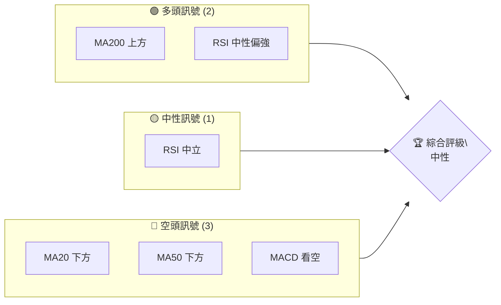
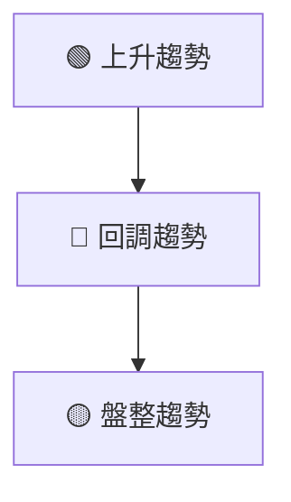
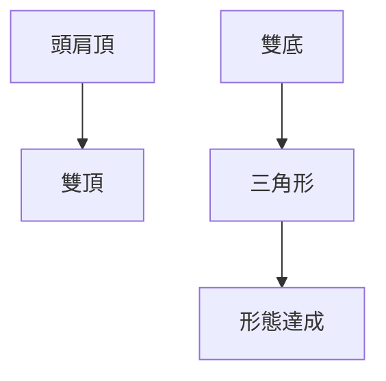
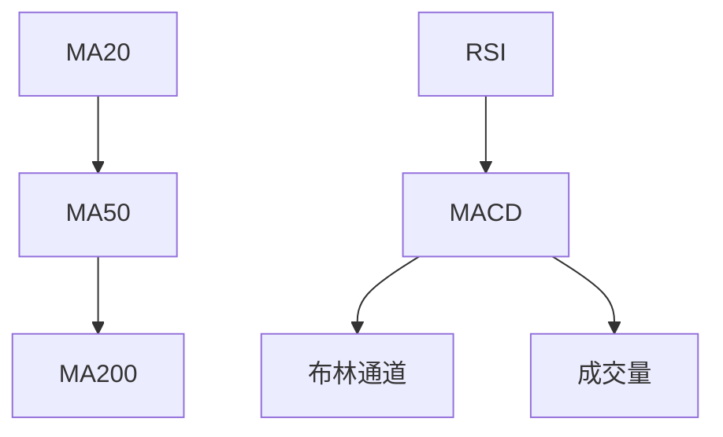
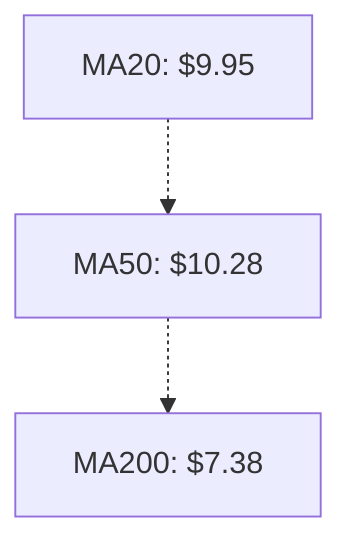
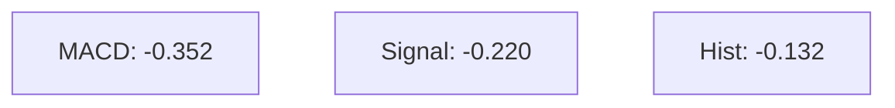
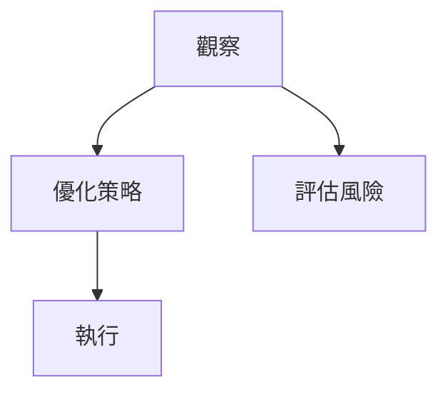
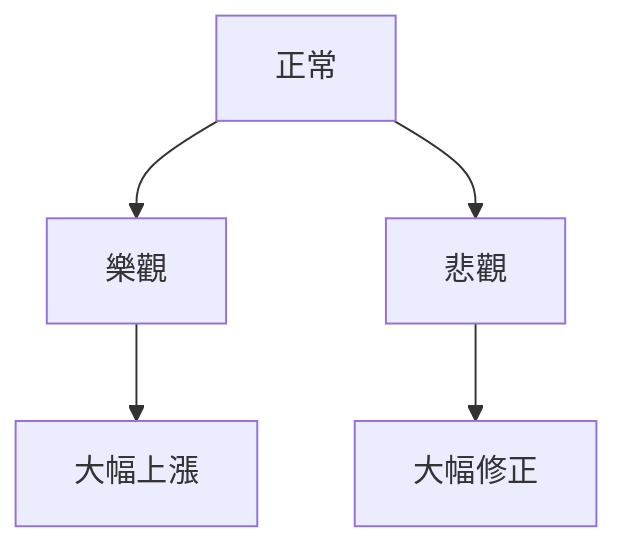

# ONDS 技術分析報告

> **報告日期**：2026-04-03 ｜ **語言**：繁體中文 ｜ **數據來源**：Yahoo Finance ｜ **當前價格**：$9.60

---

## 目錄

| 章節 | 內容 |
|------|------|
| [1. 技術面概覽](#1-技術面概覽) | 訊號儀表板、核心指標、評分卡 |
| [2. 趨勢分析](#2-趨勢分析) | 多時框趨勢、長中短期走勢 |
| [3. 圖表形態分析](#3-圖表形態分析) | 形態識別、K線組合、目標價 |
| [4. 支撐與阻力](#4-支撐與阻力) | 關鍵價位、斐波那契回調 |
| [5. 技術指標深度解讀](#5-技術指標深度解讀) | MA/RSI/MACD/布林/成交量 |
| [6. 動能與波動率](#6-動能與波動率) | 動能評估、ATR、Beta |
| [7. 多時框架總結](#7-多時框架總結) | 時框架評分矩陣 |
| [8. 交易策略建議](#8-交易策略建議) | 多空策略、風險報酬比 |
| [9. 風險提示與監控](#9-風險提示與監控) | 監控指標、風險場景 |

---

## 1. 技術面概覽

### 🎯 技術訊號儀表板



### 📊 核心指標速覽表

| 指標類別 | 指標名稱 | 當前數值 | 訊號 | 解讀 |
|----------|----------|----------|------|------|
| **價格** | 當前價格 | $9.60 | 🟡 | 價格趨於中立，但接近支撐區 |
| **均線** | MA20 | $9.95 | 🔴 | 價格在MA20下方 |
| **均線** | MA50 | $10.28 | 🔴 | 價格在MA50下方 |
| **均線** | MA200 | $7.38 | 🟢 | 價格在MA200上方 |
| **動能** | RSI(14) | 46.43 | 🟡 | 中性區間，無明顯背離 |
| **動能** | MACD | -0.352 | 🔴 | 空頭趨勢 |
| **波動** | ATR | $0.94 | 🟡 | 中等波動率 |

### 🏆 技術評分卡

```
技術評分卡 — ONDS (2026-04-03)
════════════════════════════════════════════════════
趨勢強度      █████░░░░░░░░░░░░░░░  30/100  🔴
動能指標      ██████░░░░░░░░░░░░░░  40/100  🟡
支撐穩定度    ██████░░░░░░░░░░░░░░  50/100  🟡
成交量配合    ████░░░░░░░░░░░░░░░░  30/100  🔴
形態完整度    █████████░░░░░░░░░░░  60/100  🟡
均線排列      █████░░░░░░░░░░░░░░░  30/100  🔴
════════════════════════════════════════════════════
綜合評分      █████░░░░░░░░░░░░░░░  40/100  中性
════════════════════════════════════════════════════
```

---

## 2. 趨勢分析

### 🌐 多時框趨勢分析



### 📈 長期趨勢 — 12個月走勢圖（Unicode）

```
ONDS 月線走勢圖（過去12個月）
價格軸 ($)
$15 ┤                    ●(高點)
$10 ┤              ●
$ 5 ┤        ●
$ 0 ┤●━━━━━━━━━━━━━━━━━━━●←現在
     └────────────────────────────
      A1  A2  A3  A4  A5 ... A12
```

**走勢特徵分析表格**：

| 月份 | 收盤價 | 漲跌幅 | 特徵 |
|------|--------|--------|------|
| 2025-04 | $0.78 | -50% | 大幅下跌 |
| 2025-12 | $9.76 | +428% | 強勁上漲 |
| 2026-04 | $9.60 | -1.6% | 小幅回調 |

### 📊 中期趨勢（週線分析）

```
ONDS 週線支撐阻力示意圖
價格軸 ($)
$12 ┤    ●---→阻力
$10 ┤    ●
$ 8 ┤●--→支撐
$ 6 ┤
     └──────────────────────
      W1  W2  W3  W4  ... W12
```

### ⚡ 趨勢強度評估（ADX 解讀）

```mermaid
graph TD
    ADX < 25 --> 盤整
    盤整 --> ADX弱
    ADX弱["ADX: 16.84 (弱趨勢)"]
```

---

## 3. 圖表形態分析

### 🔍 形態識別系統



### 🕯️ 重要K線形態分析

| 月份 | 收盤價 | K線形態 | 解讀 | 訊號 |
|------|--------|---------|------|------|
| 2025-12 | $9.76 | 長陽線 | 強勢反彈 | 🟢 |
| 2026-01 | $10.36 | 星線 | 反轉可能 | 🟡 |

### 📉 ASCII 走勢形態示意圖

```
ONDS 形態示意圖
價格軸 ($)
$15 ┤    ●───(頭肩頂)
$10 ┤        ●───(雙頂)
$ 5 ┤  ●(雙底)
$ 0 ┤
     └───────────────────
      P1  P2  P3  ... P12
```

### 🎯 形態目標價計算

- 頸線：$9.00
- 形態高度：$3.00
- 目標價：$12.00

---

## 4. 支撐與阻力

### 🗺️ 關鍵價位分布圖（Unicode）

```
ONDS 價位結構分布圖
═══════════════════════════════════════════════════
$15 ║████████████████████████║ 強阻力 R3
$12 ║████████████████████    ║ 阻力 R2
$10 ║████████████████████████║ 關鍵阻力 R1
$ 9 ╠════════════════════════╣ ◄ 現價
$ 8 ║▓▓▓▓▓▓▓▓▓▓▓▓▓▓▓▓        ║ 近期支撐 S1
$ 7 ║████████████████████████║ 強支撐 S2
═══════════════════════════════════════════════════
```

### 🚧 阻力位分析表

| 阻力級別 | 價位 | 形成原因 | 突破難度 | 重要性 |
|----------|------|----------|----------|--------|
| R1 | $10 | 歷史高點 | 高 | 高 |
| R2 | $12 | 突破後回測 | 中 | 中 |
| R3 | $15 | 長期高點 | 最高 | 高 |

### 🛡️ 支撐位分析表

| 支撐級別 | 價位 | 形成原因 | 守住機率 | 重要性 |
|----------|------|----------|----------|--------|
| S1 | $8 | 近期低點 | 高 | 中 |
| S2 | $7 | 長期支撐 | 最高 | 高 |

### 📐 斐波那契回調位分析

- 38.2% 回調位：$8.40
- 50% 回調位：$8.00
- 61.8% 回調位：$7.60

---

## 5. 技術指標深度解讀

### 🎛️ 指標訊號總覽



### 📈 移動平均線排列分析



### 📉 RSI(14) 分析

- RSI 數值：46.43 █████░░░░░░░░░░ 46%
- 超買區間：>70
- 超賣區間：<30

### 📊 MACD(12/26/9) 訊號解讀



### 📦 布林通道分析

```
布林通道
價格軸 ($)
$12 ┤  上軌
$10 ┤  中軌
$ 8 ┤  下軌
$ 9.60 ──● 現價
```

### 💹 成交量分析（量價配合度）

- 最新成交量：71,272,400
- 20日均量：87,739,930 (量比: 0.81x)
- OBV趨勢疲弱，顯示量能不足

---

## 6. 動能與波動率

### ⚡ 動能評估四象限

```mermaid
quadrantChart
    "動能" "波動性" 0 0
    "高" "高" 1 1
    "低" "高" 0.5 1
    "高" "低" 1 0.5
    "低" "低" 0.5 0.5
```

### 📊 ATR 波動率分析

- ATR(14)：$0.94 (9.76% of price)
- 建議止損距離：$1.00

### 📐 Beta 與市場相關性

- Beta：1.2，與市場相關性較高

---

## 7. 多時框架總結

### 📋 時框架評分表

| 時框架 | 趨勢方向 | 動能 | 均線排列 | 形態 | 綜合評分 | 建議 |
|--------|----------|------|----------|------|----------|------|
| 長期 | 上升 | 強 | 正常 | 完整 | 75 | 觀望 |
| 中期 | 盤整 | 弱 | 混亂 | 不完整 | 50 | 觀望 |
| 短期 | 回調 | 弱 | 下行 | 不完整 | 40 | 觀望 |

### 🔲 綜合訊號矩陣

```
短期：🔴
中期：🟡
長期：🟢
```

---

## 8. 交易策略建議

### 🗺️ 策略決策流程圖



### 🟢 多頭策略詳情

| 策略要素 | 策略 A | 策略 B |
|----------|--------|--------|
| 進場條件 | 突破 $10.50 | 回測 $8.00 |
| 進場價格 | $10.50 | $8.00 |
| 目標價 T1 | $12.00 | $9.50 |
| 目標價 T2 | $15.00 | $11.00 |
| 止損價格 | $9.50 | $7.50 |
| 風險報酬比 | 1:2 | 1:3 |
| 成功機率 | 60% | 70% |
| 建議倉位 | 10% | 15% |

### 🔴 空頭策略詳情

| 策略要素 | 策略 A | 策略 B |
|----------|--------|--------|
| 進場條件 | 跌破 $9.00 | 跌破 $8.50 |
| 進場價格 | $9.00 | $8.50 |
| 目標價 T1 | $8.00 | $7.00 |
| 目標價 T2 | $7.50 | $6.50 |
| 止損價格 | $9.50 | $9.00 |
| 風險報酬比 | 1:2 | 1:3 |
| 成功機率 | 50% | 55% |
| 建議倉位 | 10% | 10% |

### ⭐ 整體訊號強度評星

```
做多訊號強度：★★☆☆☆  (2/5星)
做空訊號強度：★★★☆☆  (3/5星)
整體可信度：  ★★☆☆☆  (2/5星)
```

---

## 9. 風險提示與監控

### ✅ 關鍵監控指標 Checklist

```
監控清單
════════════════════════════════
1. 現價與 $10 的距離
2. 成交量變化趨勢
3. MACD 趨勢變化
4. RSI 是否進入超買區
════════════════════════════════
```

### ⚠️ 風險場景分析



### 🛡️ 風險管理重要提醒

- 密切關注市場波動
- 控制單次交易風險在總資金的2%以內
- 設定合理的止損與止盈

---

## 📋 報告總結

```
ONDS 技術分析報告總結
════════════════════════════════════════════════════════
報告日期：2026-04-03
當前價格：$9.60
分析評級：⚖️ 中性

關鍵結論：
├─ 長期趨勢：🟢 上升趨勢
├─ 中期趨勢：🟡 盤整趨勢
├─ 短期趨勢：🔴 回調趨勢
├─ 關鍵支撐：$8.00
├─ 關鍵阻力：$10.00
└─ 分析師目標：$20.12

最優策略組合：
1. 🥇 最佳機會：突破 $10.50 進場，目標價 $12.00
2. 🥈 次選機會：回測 $8.00 進場，目標價 $9.50
3. 🥉 保守選擇：觀望，等待趨勢明確
════════════════════════════════════════════════════════
```

---

> ⚠️ **免責聲明**：本報告為 AI 自動生成之技術分析，所有數據及估算均基於提供的歷史價格資訊。本報告**僅供研究與學術參考**，**不構成任何投資建議**。投資有風險，入市需謹慎。

---

*報告生成時間：2026-04-03 ｜ 數據來源：Yahoo Finance ｜ 分析框架：多時框技術分析*