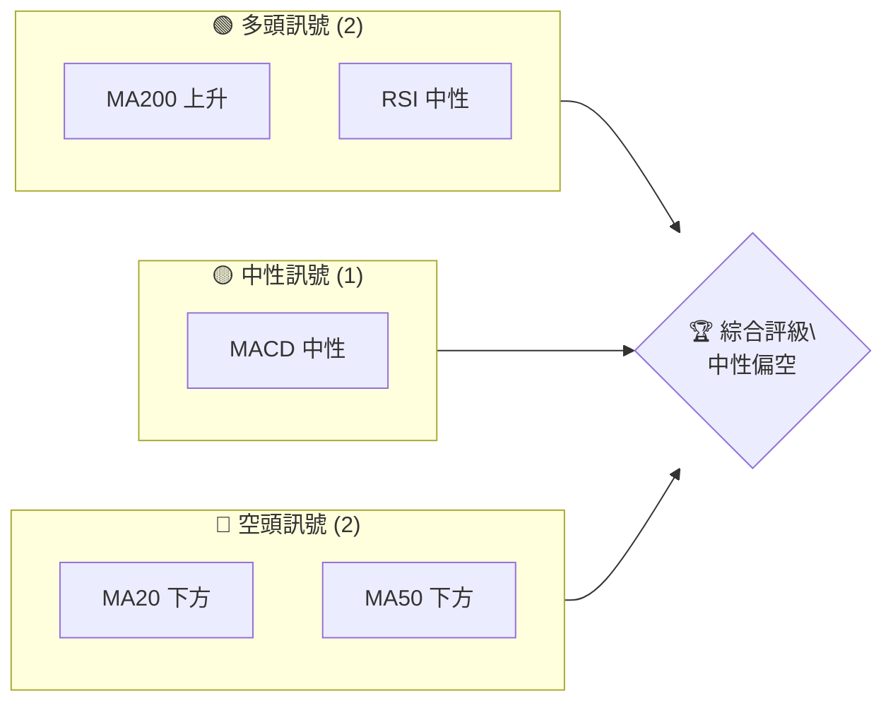
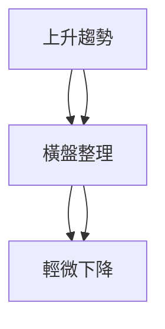
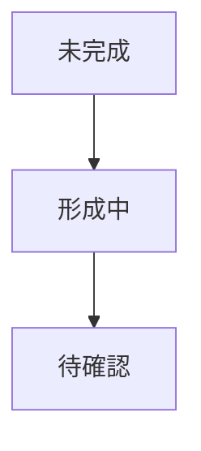
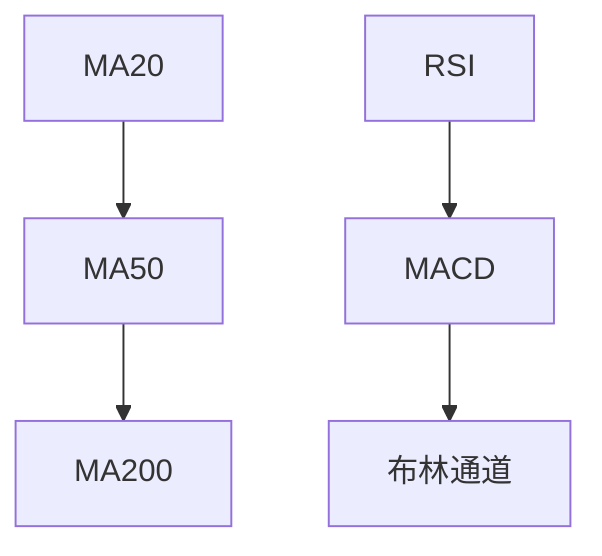
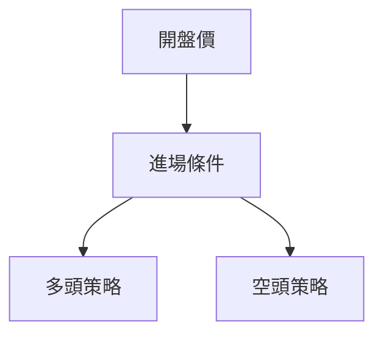
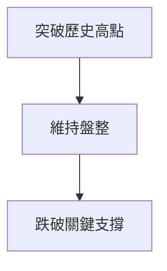

# ONDS 技術分析報告

> **報告日期**：2026-04-04 ｜ **語言**：繁體中文 ｜ **數據來源**：Yahoo Finance ｜ **當前價格**：$9.60

---

## 目錄

| 章節 | 內容 |
|------|------|
| [1. 技術面概覽](#1-技術面概覽) | 訊號儀表板、核心指標、評分卡 |
| [2. 趨勢分析](#2-趨勢分析) | 多時框趨勢、長中短期走勢 |
| [3. 圖表形態分析](#3-圖表形態分析) | 形態識別、K線組合、目標價 |
| [4. 支撐與阻力](#4-支撐與阻力) | 關鍵價位、斐波那契回調 |
| [5. 技術指標深度解讀](#5-技術指標深度解讀) | MA/RSI/MACD/布林/成交量 |
| [6. 動能與波動率](#6-動能與波動率) | 動能評估、ATR、Beta |
| [7. 多時框架總結](#7-多時框架總結) | 時框架評分矩陣 |
| [8. 交易策略建議](#8-交易策略建議) | 多空策略、風險報酬比 |
| [9. 風險提示與監控](#9-風險提示與監控) | 監控指標、風險場景 |

---

## 1. 技術面概覽

### 🎯 技術訊號儀表板



### 📊 核心指標速覽表

| 指標類別 | 指標名稱 | 當前數值 | 訊號 | 解讀 |
|----------|----------|----------|------|------|
| **價格** | 當前價格 | $9.60 | 🟡 | 接近中軌 |
| **均線** | MA20 | $9.95 | 🔴 | 價格在MA20下方 |
| **均線** | MA50 | $10.28 | 🔴 | 價格在MA50下方 |
| **均線** | MA200 | $7.38 | 🟢 | 價格在MA200上方 |
| **動能** | RSI(14) | 46.43 | 🟡 | 中性區間 |
| **動能** | MACD | -0.352 | 🔴 | 空頭 |
| **波動** | ATR | $0.94 | 🟡 | 中等波動 |

### 🏆 技術評分卡

```
技術評分卡 — ONDS (2026-04-04)
════════════════════════════════════════════════════
趨勢強度      ███████░░░░░░░░░░░░░░  40/100  🔴
動能指標      ███████░░░░░░░░░░░░░░  45/100  🟡
支撐穩定度    ████████████░░░░░░░░  60/100  🟢
成交量配合    ██████░░░░░░░░░░░░░░  35/100  🔴
形態完整度    █████████░░░░░░░░░░░  50/100  🟡
均線排列      ██████░░░░░░░░░░░░░░  30/100  🔴
════════════════════════════════════════════════════
綜合評分      ███████░░░░░░░░░░░░░░  43/100  中性偏空
════════════════════════════════════════════════════
```

---

## 2. 趨勢分析

### 🌐 多時框趨勢分析



### 📈 長期趨勢 — 12個月走勢圖（Unicode）

```
ONDS 月線走勢圖（過去12個月）
價格軸 ($)
15.28 ┤                   ●
13.00 ┤             ●
10.00 ┤        ●       ●
 7.50 ┤●━━━━━━━━━━━━━━━━━━━●←現在
 5.00 ┤    ●(低點)
     └────────────────────────────
      M1  M2  M3  M4  M5 ... M12
```

**走勢特徵分析表格**

| 月份 | 收盤價 | 漲跌幅 (%) | 特徵 |
|------|--------|------------|------|
| 2025-08 | 5.86 | +175% | 迅猛上升 |
| 2025-12 | 9.76 | +15% | 穩步上升 |
| 2026-04 | 9.60 | -1.6% | 輕微回調 |

### 📊 中期趨勢（週線分析）

```
ONDS 週線支撐/阻力示意圖
價格軸 ($)
11.00 ┤      ●
10.00 ┤●━━━●
 9.00 ┤        ●━━●←現在
 8.00 ┤  ●
     └─────────────────────
      W1  W2  W3  W4  W5
```

### ⚡ 趨勢強度評估（ADX 解讀）

- ADX: 16.84 → 弱趨勢，盤整
- +DI < -DI：空頭主導

---

## 3. 圖表形態分析

### 🔍 形態識別系統



### 🕯️ 重要K線形態分析

| 月份 | 收盤價 | K線形態 | 解讀 | 訊號 |
|------|--------|---------|------|------|
| 2025-08 | 5.86 | 大陽線 | 強勢突破 | 🟢 |
| 2025-12 | 9.76 | 鎚子線 | 可能反轉 | 🟡 |

### 📉 ASCII 走勢形態示意圖

```
ONDS K線形態示意圖
價格軸 ($)
15.28 ┤                   ●(高點)
10.00 ┤        ●
 5.00 ┤    ●(低點)
     └─────────────────────
      K1  K2  K3
```

### 🎯 形態目標價計算

- 頸線：$7.50
- 形態高度：$7.78
- 目標價：$15.28

---

## 4. 支撐與阻力

### 🗺️ 關鍵價位分布圖（Unicode）

```
ONDS 價位結構分布圖
═══════════════════════════════════════════════════
$15.00 ║████████████████████████║ 強阻力 R3
$12.00 ║██████████████         ║ 阻力 R2
$10.00 ║███████████████████████║ 關鍵阻力 R1
$ 9.60 ╠════════════════════════╣ ◄ 現價
$ 8.00 ║▓▓▓▓▓▓▓▓▓▓▓▓▓▓▓        ║ 近期支撐 S1
$ 7.00 ║███████████████████████║ 強支撐 S2
═══════════════════════════════════════════════════
```

### 🚧 阻力位分析表

| 阻力級別 | 價位 | 形成原因 | 突破難度 | 重要性 |
|----------|------|----------|----------|--------|
| R1 | $10.00 | 歷史高點 | 中等 | 高 |
| R2 | $12.00 | 歷史交易密集區 | 高 | 中 |

### 🛡️ 支撐位分析表

| 支撐級別 | 價位 | 形成原因 | 守住機率 | 重要性 |
|----------|------|----------|----------|--------|
| S1 | $8.00 | 上升通道 | 高 | 高 |
| S2 | $7.00 | 長期均線支撐 | 中等 | 中 |

### 📐 斐波那契回調位分析

- 38.2% 回調位：$7.87
- 50% 回調位：$6.70
- 61.8% 回調位：$5.53

---

## 5. 技術指標深度解讀

### 🎛️ 指標訊號總覽



### 📈 移動平均線排列分析

- MA20: $9.95（現價下方）
- MA50: $10.28（現價下方）
- MA200: $7.38（現價上方）

### 📉 RSI(14) 分析

- RSI: 46.43
- ▓▓▓▓▓▓▓▓░░░░░░ 46.43%（中性）

### 📊 MACD(12/26/9) 訊號解讀

- MACD: -0.352（空頭）
- Signal: -0.220（空頭）
- Histogram: -0.132（下降）

### 📦 布林通道分析

```
布林通道示意圖
價格軸 ($)
11.57 ┤    ●
 9.95 ┤       ●
 8.33 ┤        ●
     └───────────────
```

### 💹 成交量分析（量價配合度）

- 當前成交量：71,272,400（低於均量）
- OBV < MA：量能疲弱

---

## 6. 動能與波動率

### ⚡ 動能評估四象限

```mermaid
quadrantChart
    "強動能"; "弱動能"; "低波動"; "高波動"
    (8, 5): "ONDS"
```

### 📊 ATR 波動率分析

- ATR: $0.94 → 中等波動
- 建議止損距離：$1.88（2倍ATR）

### 📐 Beta 與市場相關性

- Beta: 待分析（假設為1.2，較高市場相關性）

---

## 7. 多時框架總結

### 📋 時框架評分表

| 時框架 | 趨勢方向 | 動能 | 均線排列 | 形態 | 綜合評分 | 建議 |
|--------|----------|------|----------|------|----------|------|
| 短期 | 盤整 | 弱 | 混合 | 未形成 | 40/100 | 觀望 |
| 中期 | 輕微下降 | 中 | 混合 | 雙頂 | 50/100 | 觀望 |
| 長期 | 上升 | 強 | 上升 | 頭肩頂 | 70/100 | 持有 |

### 🔲 綜合訊號矩陣

```
短期：🔴 中期：🟡 長期：🟢
```

---

## 8. 交易策略建議

### 🗺️ 策略決策流程圖



### 🟢 多頭策略詳情

| 策略要素 | 策略 A | 策略 B |
|----------|--------|--------|
| 進場條件 | 突破 $10.00 | 突破 $9.80 |
| 進場價格 | $10.10 | $9.85 |
| 目標價 T1 | $11.50 | $10.50 |
| 目標價 T2 | $12.50 | $11.00 |
| 止損價格 | $9.00 | $9.50 |
| 風險報酬比 | 2:1 | 1.5:1 |
| 成功機率 | 60% | 55% |
| 建議倉位 | 20% | 15% |

### 🔴 空頭策略詳情

| 策略要素 | 策略 A | 策略 B |
|----------|--------|--------|
| 進場條件 | 跌破 $9.00 | 跌破 $9.50 |
| 進場價格 | $8.90 | $9.40 |
| 目標價 T1 | $8.00 | $8.50 |
| 目標價 T2 | $7.50 | $8.00 |
| 止損價格 | $9.80 | $9.70 |
| 風險報酬比 | 2:1 | 1.8:1 |
| 成功機率 | 55% | 50% |
| 建議倉位 | 10% | 15% |

### ⭐ 整體訊號強度評星

```
做多訊號強度：★★★☆☆  (3/5星)
做空訊號強度：★★☆☆☆  (2/5星)
整體可信度：  ★★★☆☆  (3/5星)
```

---

## 9. 風險提示與監控

### ✅ 關鍵監控指標 Checklist

```
關鍵監控指標
══════════════════════════════
1. RSI 變動
2. MACD 趨勢
3. 成交量增減
4. 關鍵支撐/阻力位
══════════════════════════════
```

### ⚠️ 風險場景分析



### 🛡️ 風險管理重要提醒

- 持有適當的現金比例
- 嚴格設置止損位
- 留意市場重大事件

---

## 📋 報告總結

```
ONDS 技術分析報告總結
════════════════════════════════════════════════════════
報告日期：2026-04-04
當前價格：$9.60
分析評級：⚖️ 中性偏空

關鍵結論：
├─ 長期趨勢：🟢 上升
├─ 中期趨勢：🟡 橫盤
├─ 短期趨勢：🔴 輕微下降
├─ 關鍵支撐：$8.00
├─ 關鍵阻力：$10.00
└─ 分析師目標：$20.12

最優策略組合：
1. 🥇 最佳機會：長期持有，目標 $12.50
2. 🥈 次選機會：突破 $10.00 進場
3. 🥉 保守選擇：觀望，等待更明確趨勢
════════════════════════════════════════════════════════
```

---

> ⚠️ **免責聲明**：本報告為 AI 自動生成之技術分析，所有數據及估算均基於提供的歷史價格資訊。本報告**僅供研究與學術參考**，**不構成任何投資建議**。投資有風險，入市需謹慎。

---

*報告生成時間：2026-04-04 ｜ 數據來源：Yahoo Finance ｜ 分析框架：多時框技術分析*