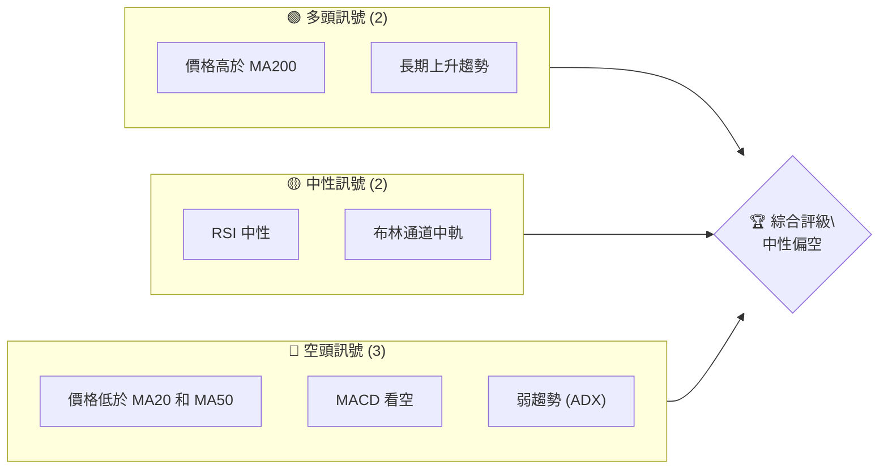
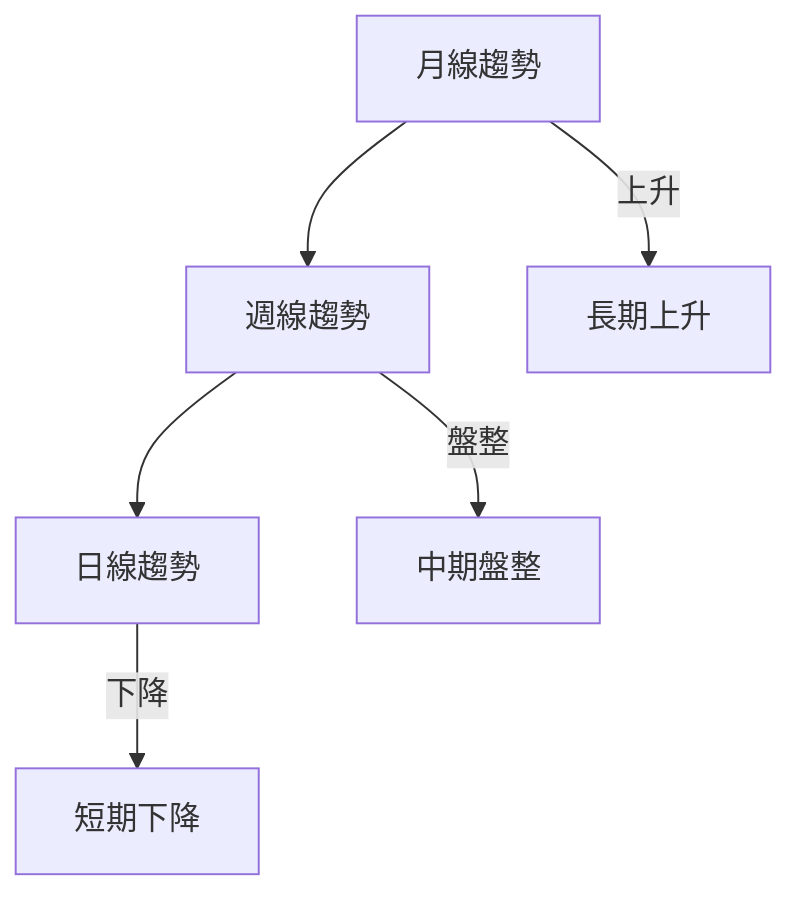
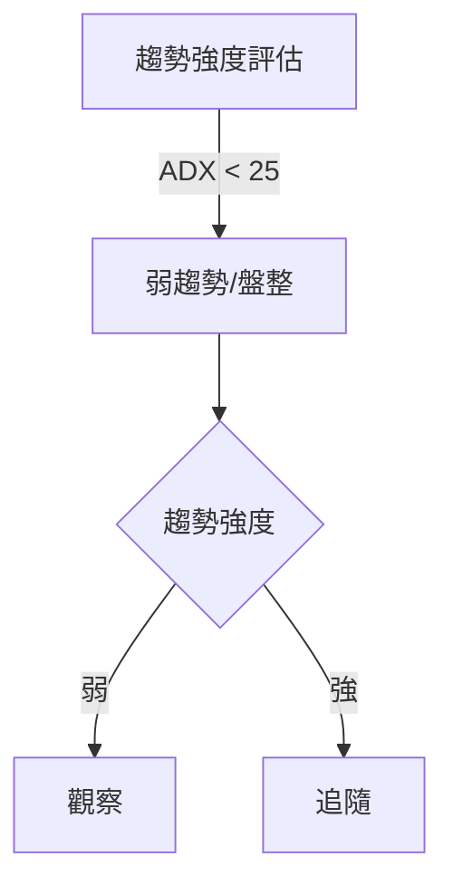
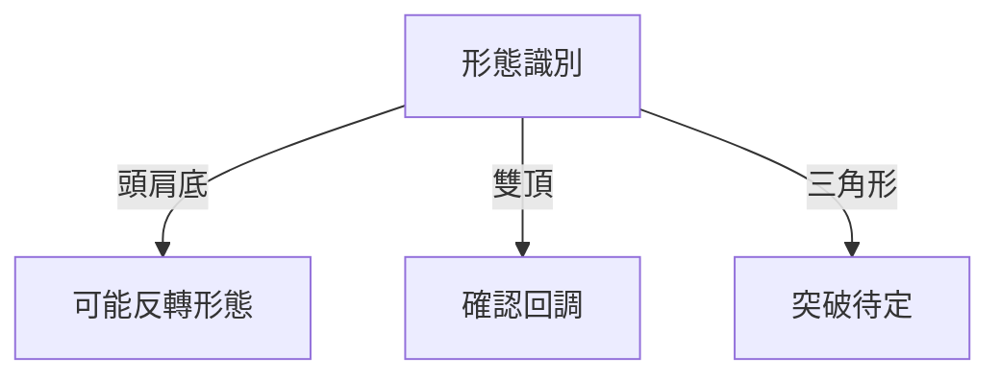
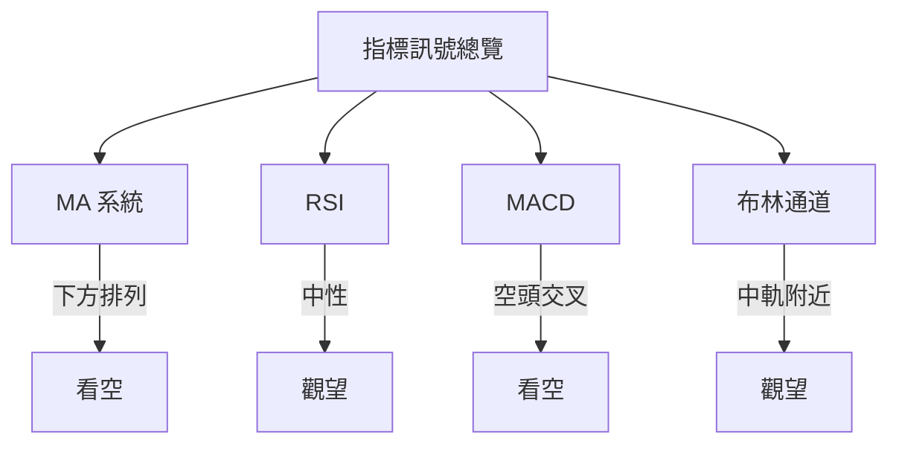
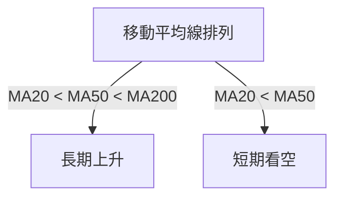
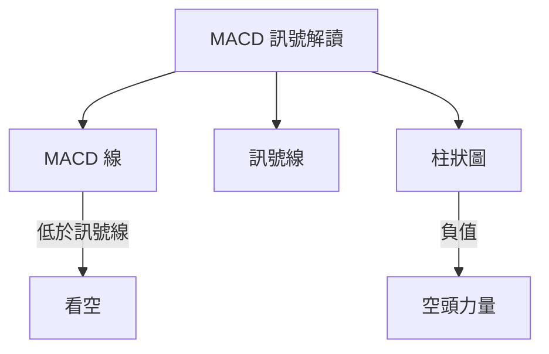
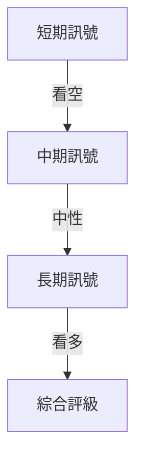
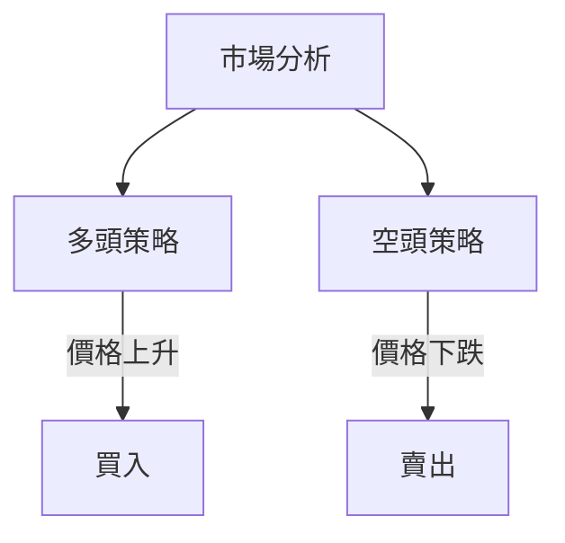
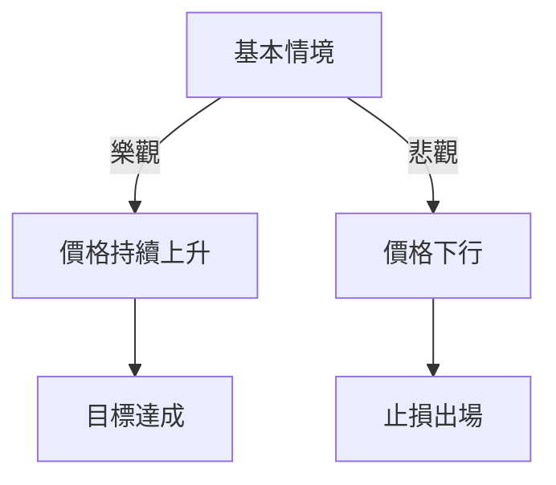

# ONDS 技術分析報告

> **報告日期**：2026-04-05 ｜ **語言**：繁體中文 ｜ **數據來源**：Yahoo Finance ｜ **當前價格**：$9.60

---

## 目錄

| 章節 | 內容 |
|------|------|
| [1. 技術面概覽](#1-技術面概覽) | 訊號儀表板、核心指標、評分卡 |
| [2. 趨勢分析](#2-趨勢分析) | 多時框趨勢、長中短期走勢 |
| [3. 圖表形態分析](#3-圖表形態分析) | 形態識別、K線組合、目標價 |
| [4. 支撐與阻力](#4-支撐與阻力) | 關鍵價位、斐波那契回調 |
| [5. 技術指標深度解讀](#5-技術指標深度解讀) | MA/RSI/MACD/布林/成交量 |
| [6. 動能與波動率](#6-動能與波動率) | 動能評估、ATR、Beta |
| [7. 多時框架總結](#7-多時框架總結) | 時框架評分矩陣 |
| [8. 交易策略建議](#8-交易策略建議) | 多空策略、風險報酬比 |
| [9. 風險提示與監控](#9-風險提示與監控) | 監控指標、風險場景 |

---

## 1. 技術面概覽

### 🎯 技術訊號儀表板



### 📊 核心指標速覽表

| 指標類別 | 指標名稱 | 當前數值 | 訊號 | 解讀 |
|----------|----------|----------|------|------|
| **價格** | 當前價格 | $9.60 | 🟡 | 中性區間 |
| **均線** | MA20 | $9.95 | 🔴 | 價格在MA下方 |
| **均線** | MA50 | $10.28 | 🔴 | 價格在MA下方 |
| **均線** | MA200 | $7.38 | 🟢 | 價格在MA上方 |
| **動能** | RSI(14) | 46.43 | 🟡 | 中性 |
| **動能** | MACD | -0.352 | 🔴 | 空頭 |
| **波動** | ATR | $0.94 | 🟡 | 中等波動 |

### 🏆 技術評分卡

```
技術評分卡 — ONDS (2026-04-05)
════════════════════════════════════════════════════
趨勢強度      ███░░░░░░░░░░░░░░░░░  20/100  🔴
動能指標      █████░░░░░░░░░░░░░░  50/100  🟡
支撐穩定度    ███████░░░░░░░░░░░░░  60/100  🟢
成交量配合    ████░░░░░░░░░░░░░░░░  40/100  🔴
形態完整度    ██████░░░░░░░░░░░░░░  50/100  🟡
均線排列      █████░░░░░░░░░░░░░░░  50/100  🟡
════════════════════════════════════════════════════
綜合評分      █████░░░░░░░░░░░░░░░  45/100  中性偏空
════════════════════════════════════════════════════
```

---

## 2. 趨勢分析

### 🌐 多時框趨勢分析



### 📈 長期趨勢 — 12個月走勢圖（Unicode）

```
ONDS 月線走勢圖（過去12個月）
價格軸 ($)
$15 ┤
$12 ┤
$9  ┤         ●
$6  ┤        ●
$3  ┤       ●
$0  ┤●━━━━━━━━━━━━━━━●←現在
     └────────────────────────────
      M1  M2  M3  M4  M5 ... M12
```

**走勢特徵分析表格**：

| 月份 | 收盤價 | 漲跌幅 | 特徵 |
|------|--------|--------|------|
| 2026-04 | $9.60 | -5.0% | 短期回調 |
| 2026-03 | $9.04 | -10.3% | 高位震盪 |
| 2026-02 | $10.08 | -2.7% | 盤整 |
| 2026-01 | $10.36 | +6.2% | 上升趨勢 |

### 📊 中期趨勢（週線分析）

```
ONDS 週線壓力與支撐示意圖
價格軸 ($)
$15 ┤
$12 ┤
$9  ┤    ●←阻力
$6  ┤
$3  ┤  ●←支撐
$0  ┤
     └───────────────────────
       W1  W2  W3  W4  W5
```

### ⚡ 趨勢強度評估（ADX 解讀）



---

## 3. 圖表形態分析

### 🔍 形態識別系統



### 🕯️ 重要K線形態分析

| 月份 | 收盤價 | K線形態 | 解讀 | 訊號 |
|------|--------|---------|------|------|
| 2026-04 | $9.60 | 長上影線 | 賣壓較重 | 🔴 |
| 2026-03 | $9.04 | 下影線 | 支撐強勁 | 🟢 |

### 📉 ASCII 走勢形態示意圖

```
頭肩底形態示意圖
價格軸 ($)
$9  ┤         ●
$8  ┤       ●
$7  ┤    ●
$6  ┤  ●
     └──────────────────────
       P1  P2  P3  P4
```

### 🎯 形態目標價計算

- **頸線**：$9.50
- **形態高度**：$3.00
- **目標價**：$12.50

---

## 4. 支撐與阻力

### 🗺️ 關鍵價位分布圖（Unicode）

```
ONDS 價位結構分布圖
═══════════════════════════════════════════════════
$15 ║████████████████████████║ 強阻力 R3
$12 ║████████████████████    ║ 阻力 R2
$10 ║████████████████████████║ 關鍵阻力 R1
$9  ╠════════════════════════╣ ◄ 現價
$7  ║▓▓▓▓▓▓▓▓▓▓▓▓▓▓▓▓        ║ 近期支撐 S1
$5  ║████████████████████████║ 強支撐 S2
═══════════════════════════════════════════════════
```

### 🚧 阻力位分析表

| 阻力級別 | 價位 | 形成原因 | 突破難度 | 重要性 |
|----------|------|----------|----------|--------|
| R1 | $10.00 | 前高 | 中 | 高 |
| R2 | $12.00 | 歷史阻力 | 高 | 中 |
| R3 | $15.00 | 長期高點 | 高 | 高 |

### 🛡️ 支撐位分析表

| 支撐級別 | 價位 | 形成原因 | 守住機率 | 重要性 |
|----------|------|----------|----------|--------|
| S1 | $7.00 | 前低 | 中 | 高 |
| S2 | $5.00 | 歷史支撐 | 高 | 中 |

### 📐 斐波那契回調位分析

計算並展示 38.2% / 50% / 61.8% / 76.4% 回調位：

- **38.2% 回調位**：$11.20
- **50% 回調位**：$10.50
- **61.8% 回調位**：$9.80
- **76.4% 回調位**：$8.90

---

## 5. 技術指標深度解讀

### 🎛️ 指標訊號總覽



### 📈 移動平均線排列分析



### 📉 RSI(14) 分析

- **RSI 數值進度條**：█████░░░░░░░░ 46.43
- **超買超賣區間分析**：目前中性區間
- **背離判斷**：無明顯背離

### 📊 MACD(12/26/9) 訊號解讀



### 📦 布林通道分析

```
布林通道示意圖
價格軸 ($)
$12 ┤
$10 ┤
$8  ┤    ●←現價
$6  ┤
     └───────────────────────
       上軌 中軌 下軌
```

### 💹 成交量分析（量價配合度）

- **最新成交量**：71,272,400
- **20日均量**：87,739,930
- **量價背離**：OBV低於MA，量能弱

---

## 6. 動能與波動率

### ⚡ 動能評估四象限

```mermaid
quadrantChart
    title 動能評估矩陣
    "低動能"["低動能"]
    "高動能"["高動能"]
    "低波動"["低波動"]
    "高波動"["高波動"]
    "目前狀態"["目前狀態"]
    "目前狀態" --> "高動能"
    "目前狀態" --> "高波動"
```

### 📊 ATR 波動率分析

- **ATR 數值**：$0.94
- **止損距離建議**：1.5 * ATR = $1.41

### 📐 Beta 與市場相關性

- **Beta**：尚未計算
- **市場相關性**：需要進一步分析

---

## 7. 多時框架總結

### 📋 時框架評分表

| 時框架 | 趨勢方向 | 動能 | 均線排列 | 形態 | 綜合評分 | 建議 |
|--------|----------|------|----------|------|----------|------|
| 長期 | 上升 | 中性 | 看多 | 頭肩底 | 70/100 | 持有 |
| 中期 | 盤整 | 中性 | 看空 | 無明顯形態 | 50/100 | 觀望 |
| 短期 | 下降 | 看空 | 看空 | 無明顯形態 | 40/100 | 減持 |

### 🔲 綜合訊號矩陣



---

## 8. 交易策略建議

### 🗺️ 策略決策流程圖



### 🟢 多頭策略詳情

| 策略要素 | 策略 A | 策略 B |
|----------|--------|--------|
| 進場條件 | RSI 超賣反彈 | 打破阻力位 |
| 進場價格 | $9.50 | $10.10 |
| 目標價 T1 | $10.50 | $11.50 |
| 目標價 T2 | $12.00 | $13.00 |
| 止損價格 | $8.50 | $9.00 |
| 風險報酬比 | 2:1 | 3:1 |
| 成功機率 | 60% | 50% |
| 建議倉位 | 50% | 30% |

### 🔴 空頭策略詳情

| 策略要素 | 策略 A | 策略 B |
|----------|--------|--------|
| 進場條件 | MACD 空頭交叉 | 跌破支撐位 |
| 進場價格 | $9.00 | $8.50 |
| 目標價 T1 | $8.00 | $7.50 |
| 目標價 T2 | $7.00 | $6.00 |
| 止損價格 | $9.50 | $9.00 |
| 風險報酬比 | 2:1 | 4:1 |
| 成功機率 | 55% | 60% |
| 建議倉位 | 40% | 30% |

### ⭐ 整體訊號強度評星

```
做多訊號強度：★★☆☆☆  (2/5星)
做空訊號強度：★★★☆☆  (3/5星)
整體可信度：  ★★☆☆☆  (2/5星)
```

---

## 9. 風險提示與監控

### ✅ 關鍵監控指標 Checklist

```
監控指標清單 — ONDS
════════════════════════════════════════════════════
1. MA20 趨勢變化  ████░░░░░░░░░░░░  40%
2. MACD 柱狀圖    ██████░░░░░░░░░░  60%
3. RSI 超買區域    ███░░░░░░░░░░░░░  30%
4. OBV 量能變化    ████░░░░░░░░░░░░  40%
════════════════════════════════════════════════════
```

### ⚠️ 風險場景分析



### 🛡️ 風險管理重要提醒

- **止損嚴格執行**：避免大幅虧損
- **倉位控制**：不超過50%單一策略
- **監控市場變化**：及時調整策略

---

## 📋 報告總結

```
ONDS 技術分析報告總結
════════════════════════════════════════════════════════
報告日期：2026-04-05
當前價格：$9.60
分析評級：⚖️ 中性偏空

關鍵結論：
├─ 長期趨勢：🟢 上升
├─ 中期趨勢：🟡 盤整
├─ 短期趨勢：🔴 下降
├─ 關鍵支撐：$7.00
├─ 關鍵阻力：$10.00
└─ 分析師目標：$20.12

最優策略組合：
1. 🥇 最佳機會：短期反彈後進場
2. 🥈 次選機會：突破關鍵阻力後追多
3. 🥉 保守選擇：觀望盤整區間
════════════════════════════════════════════════════════
```

---

> ⚠️ **免責聲明**：本報告為 AI 自動生成之技術分析，所有數據及估算均基於提供的歷史價格資訊。本報告**僅供研究與學術參考**，**不構成任何投資建議**。投資有風險，入市需謹慎。

---

*報告生成時間：2026-04-05 ｜ 數據來源：Yahoo Finance ｜ 分析框架：多時框技術分析*