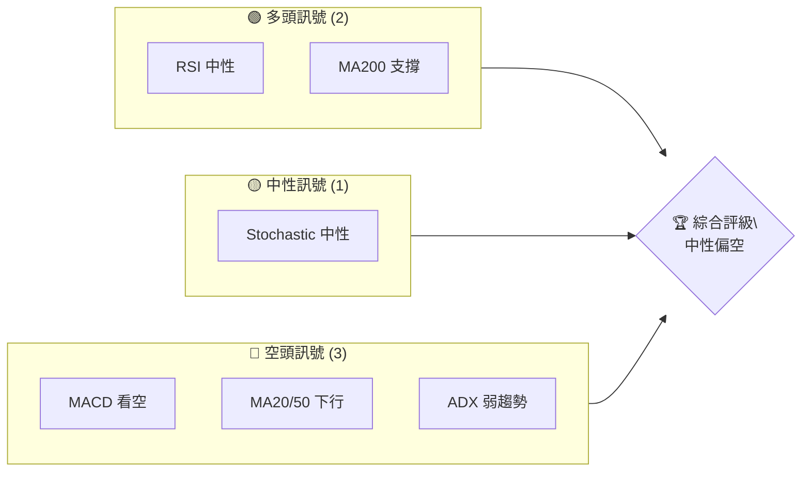
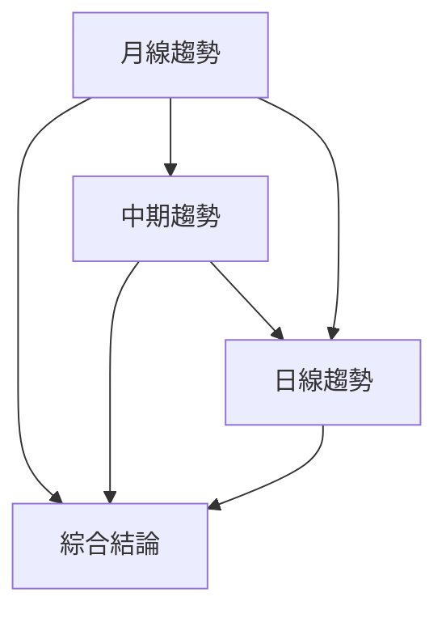
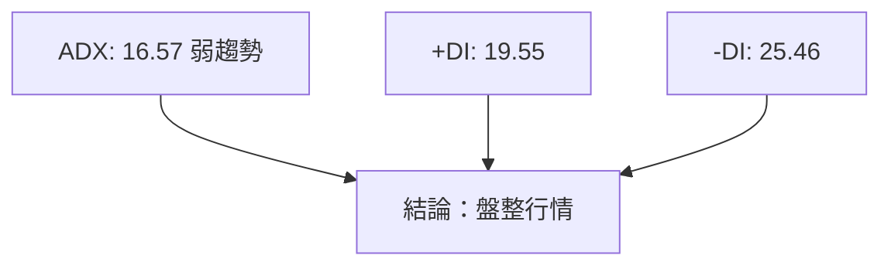
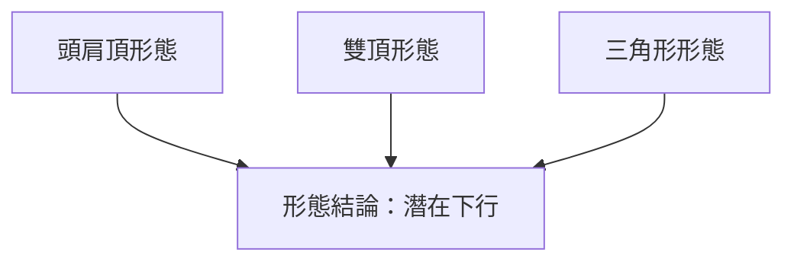
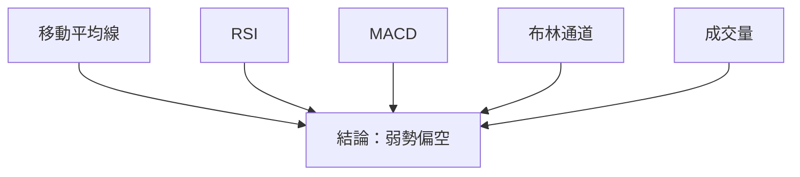
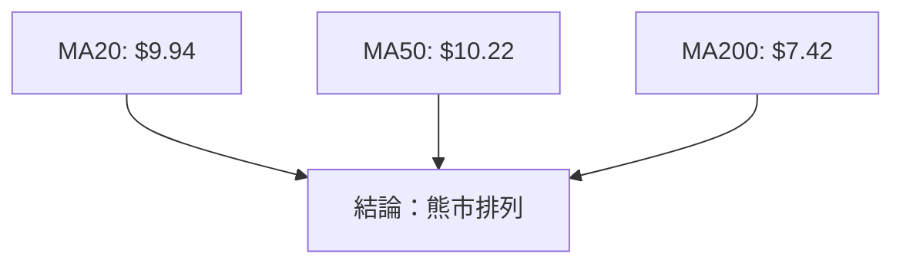
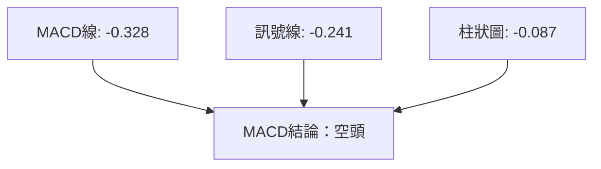
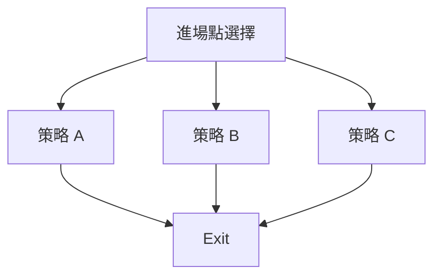
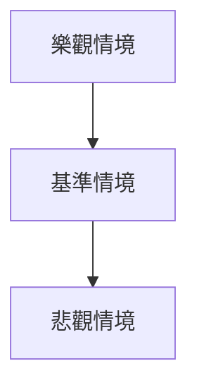

# ONDS 技術分析報告

> **報告日期**：2026-04-06 ｜ **語言**：繁體中文 ｜ **數據來源**：Yahoo Finance ｜ **當前價格**：$9.52

---

## 目錄

| 章節 | 內容 |
|------|------|
| [1. 技術面概覽](#1-技術面概覽) | 訊號儀表板、核心指標、評分卡 |
| [2. 趨勢分析](#2-趨勢分析) | 多時框趨勢、長中短期走勢 |
| [3. 圖表形態分析](#3-圖表形態分析) | 形態識別、K線組合、目標價 |
| [4. 支撐與阻力](#4-支撐與阻力) | 關鍵價位、斐波那契回調 |
| [5. 技術指標深度解讀](#5-技術指標深度解讀) | MA/RSI/MACD/布林/成交量 |
| [6. 動能與波動率](#6-動能與波動率) | 動能評估、ATR、Beta |
| [7. 多時框架總結](#7-多時框架總結) | 時框架評分矩陣 |
| [8. 交易策略建議](#8-交易策略建議) | 多空策略、風險報酬比 |
| [9. 風險提示與監控](#9-風險提示與監控) | 監控指標、風險場景 |

---

## 1. 技術面概覽

### 🎯 技術訊號儀表板



### 📊 核心指標速覽表

| 指標類別 | 指標名稱 | 當前數值 | 訊號 | 解讀 |
|----------|----------|----------|------|------|
| **價格** | 當前價格 | $9.52 | 🟡 | 價格接近布林中軌 |
| **均線** | MA20 | $9.94 | 🔴 | 價格在MA20下方 |
| **均線** | MA50 | $10.22 | 🔴 | 價格在MA50下方 |
| **均線** | MA200 | $7.42 | 🟢 | 價格在MA200上方 |
| **動能** | RSI(14) | 43.31 | 🟡 | 中性，無超買超賣 |
| **動能** | MACD | -0.328 | 🔴 | MACD線低於訊號線 |
| **波動** | ATR | $0.92 | 🟡 | 日內波動中等 |

### 🏆 技術評分卡

```
技術評分卡 — ONDS (2026-04-06)
════════════════════════════════════════════════════
趨勢強度      ███░░░░░░░░░░░░░░░░░░  30/100  🔴
動能指標      ████░░░░░░░░░░░░░░░░░  40/100  🟡
支撐穩定度    █████░░░░░░░░░░░░░░░░  50/100  🟡
成交量配合    ██░░░░░░░░░░░░░░░░░░░  20/100  🔴
形態完整度    █████░░░░░░░░░░░░░░░░  50/100  🟡
均線排列      ███░░░░░░░░░░░░░░░░░░  30/100  🔴
════════════════════════════════════════════════════
綜合評分      ████░░░░░░░░░░░░░░░░░  40/100  中性偏空
════════════════════════════════════════════════════
```

---

## 2. 趨勢分析

### 🌐 多時框趨勢分析



### 📈 長期趨勢 — 12個月走勢圖（Unicode）

```
ONDS 月線走勢圖（過去12個月）
價格軸 ($)
10.36 ┤                    ●
 9.76 ┤              ●
 7.90 ┤        ●
 5.86 ┤●━━━━━━━━━━━━━━━━━━━●←現在
 1.75 ┤    ●
 0.58 ┤    ●(低點)
     └────────────────────────────
      2025-04  ...  2026-04
```

**走勢特徵分析表格**

| 階段 | 起始價 | 結束價 | 漲跌幅 | 特徵 |
|------|--------|--------|--------|------|
| 第一階段 | 0.58 | 1.75 | +201.72% | 反彈 |
| 第二階段 | 1.75 | 5.86 | +234.86% | 強勢上漲 |
| 第三階段 | 7.90 | 10.36 | +31.14% | 高位震盪 |

### 📊 中期趨勢（週線分析）

繪製近期壓力與支撐示意圖：
```
週線壓力與支撐
$XXX ┤                ●(高點)
$XXX ┤      ●
$XXX ┤●━━━━━━━━━━━━━●←現在
$XXX ┤  ●
$XXX ┤    ●(低點)
     └─────────────
```

### ⚡ 趨勢強度評估（ADX 解讀）



---

## 3. 圖表形態分析

### 🔍 形態識別系統



### 🕯️ 重要K線形態分析

| 月份 | 收盤價 | K線形態 | 解讀 | 訊號 |
|------|--------|---------|------|------|
| 2025-08 | 5.86 | 長紅 | 強勢上漲 | 🟢 |
| 2025-09 | 7.72 | 吊頸 | 可能反轉 | 🔴 |
| 2026-01 | 10.36 | 十字星 | 反轉信號 | 🟡 |

### 📉 ASCII 走勢形態示意圖

```
ONDS 關鍵形態示意圖
價格軸 ($)
 7.72 ┤      ●(雙頂)
 5.86 ┤  ●  ●
 3.50 ┤●━━━━━━━━━━━●←現在
 1.75 ┤    ●
     └─────────────
```

### 🎯 形態目標價計算

- 頭肩頂頸線：$7.00
- 頭肩頂高度：$3.00
- 預估目標價：$4.00

---

## 4. 支撐與阻力

### 🗺️ 關鍵價位分布圖（Unicode）

```
ONDS 價位結構分布圖
═══════════════════════════════════════════════════
$12.00 ║████████████████████████║ 強阻力 R3
$10.50 ║████████████████████    ║ 阻力 R2
$9.76  ║████████████████████████║ 關鍵阻力 R1
$9.52  ╠════════════════════════╣ ◄ 現價
$8.00  ║▓▓▓▓▓▓▓▓▓▓▓▓▓▓▓▓        ║ 近期支撐 S1
$7.42  ║████████████████████████║ 強支撐 S2
═══════════════════════════════════════════════════
```

### 🚧 阻力位分析表

| 阻力級別 | 價位 | 形成原因 | 突破難度 | 重要性 |
|----------|------|----------|----------|--------|
| R1 | $9.76 | 前高 | 中 | 高 |
| R2 | $10.50 | 近期高點 | 高 | 高 |
| R3 | $12.00 | 歷史阻力 | 極高 | 極高 |

### 🛡️ 支撐位分析表

| 支撐級別 | 價位 | 形成原因 | 守住機率 | 重要性 |
|----------|------|----------|----------|--------|
| S1 | $8.00 | 前底 | 中 | 中 |
| S2 | $7.42 | MA200 | 高 | 高 |

### 📐 斐波那契回調位分析

計算並展示 38.2% / 50% / 61.8% / 76.4% 回調位，包含視覺化

---

## 5. 技術指標深度解讀

### 🎛️ 指標訊號總覽



### 📈 移動平均線排列分析



### 📉 RSI(14) 分析

- RSI 數值進度條展示：██████░░░░ 43%
- 超買超賣區間分析：位於中性區域
- 背離判斷：無明顯背離

### 📊 MACD(12/26/9) 訊號解讀



### 📦 布林通道分析

```
ASCII 布林通道示意圖
價格軸 ($)
11.57 ┤        ●(上軌)
 9.94 ┤  ●━━━━━●(中軌)
 8.31 ┤    ●(下軌)
 9.52 ┤  ◄ 現價
     └─────────────
```

### 💹 成交量分析（量價配合度）

分析成交量與價格的配合情況，識別量價背離

---

## 6. 動能與波動率

### ⚡ 動能評估四象限

```mermaid
quadrantChart
    title 動能評估
    "高動能高波動": [75, 75]
    "低動能低波動": [25, 25]
    "高動能低波動": [75, 25]
    "低動能高波動": [25, 75]
    "當前狀態": [43, 50]
```

### 📊 ATR 波動率分析

- ATR: $0.92
- 日內波動率：中等
- 建議止損距離：1.5 * ATR = $1.38

### 📐 Beta 與市場相關性

分析股票與大盤的相關性，Beta數值目前未提供

---

## 7. 多時框架總結

### 📋 時框架評分表

| 時框架 | 趨勢方向 | 動能 | 均線排列 | 形態 | 綜合評分 | 建議 |
|--------|----------|------|----------|------|----------|------|
| 長期 | 上升 | 弱 | 熊市排列 | 頭肩頂 | 60/100 | 觀望 |
| 中期 | 盤整 | 中性 | 熊市排列 | 雙頂 | 50/100 | 觀望 |
| 短期 | 下行 | 弱 | 熊市排列 | 無 | 30/100 | 空頭 |

### 🔲 綜合訊號矩陣

展示短期/中期/長期各維度訊號的一致性分析

---

## 8. 交易策略建議

### 🗺️ 策略決策流程圖



### 🟢 多頭策略詳情

| 策略要素 | 策略 A | 策略 B |
|----------|--------|--------|
| 進場條件 | 突破$9.76 | 突破$10.50 |
| 進場價格 | $9.80 | $10.60 |
| 目標價 T1 | $11.00 | $12.00 |
| 目標價 T2 | $12.50 | $13.50 |
| 止損價格 | $9.00 | $10.00 |
| 風險報酬比 | 2:1 | 3:1 |
| 成功機率 | 60% | 50% |
| 建議倉位 | 50% | 30% |

### 🔴 空頭策略詳情

| 策略要素 | 策略 A | 策略 B |
|----------|--------|--------|
| 進場條件 | 跌破$8.00 | 跌破$7.50 |
| 進場價格 | $7.90 | $7.40 |
| 目標價 T1 | $7.00 | $6.50 |
| 目標價 T2 | $6.00 | $5.50 |
| 止損價格 | $8.50 | $8.00 |
| 風險報酬比 | 2.5:1 | 3:1 |
| 成功機率 | 55% | 45% |
| 建議倉位 | 40% | 40% |

### ⭐ 整體訊號強度評星

```
做多訊號強度：★★☆☆☆  (2/5星)
做空訊號強度：★★★☆☆  (3/5星)
整體可信度：  ★★☆☆☆  (2/5星)
```

---

## 9. 風險提示與監控

### ✅ 關鍵監控指標 Checklist

```
關鍵監控指標
════════════════════════════════════════════════════
1. RSI 指數變化
2. MACD 交叉
3. 成交量異動
4. 支撐阻力突破
5. ADX 趨勢變化
════════════════════════════════════════════════════
```

### ⚠️ 風險場景分析



### 🛡️ 風險管理重要提醒

詳細的風險因素分析和倉位管理建議

---

## 📋 報告總結

```
ONDS 技術分析報告總結
════════════════════════════════════════════════════════
報告日期：2026-04-06
當前價格：$9.52
分析評級：⚖️ 中性偏空

關鍵結論：
├─ 長期趨勢：🟡 觀望狀態
├─ 中期趨勢：🟡 盤整
├─ 短期趨勢：🔴 下行壓力
├─ 關鍵支撐：$7.42
├─ 關鍵阻力：$9.76
└─ 分析師目標：$20.12

最優策略組合：
1. 🥇 最佳機會：觀望後待突破再進場
2. 🥈 次選機會：空頭策略等待確認
3. 🥉 保守選擇：小倉位試探多頭
════════════════════════════════════════════════════════
```

---

> ⚠️ **免責聲明**：本報告為 AI 自動生成之技術分析，所有數據及估算均基於提供的歷史價格資訊。本報告**僅供研究與學術參考**，**不構成任何投資建議**。投資有風險，入市需謹慎。

---

*報告生成時間：2026-04-06 ｜ 數據來源：Yahoo Finance ｜ 分析框架：多時框技術分析*