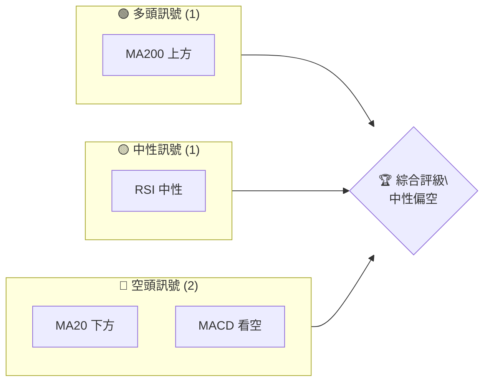
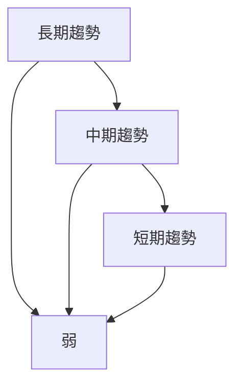
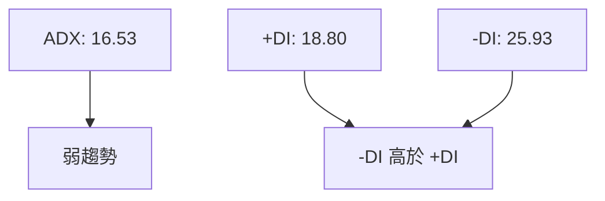
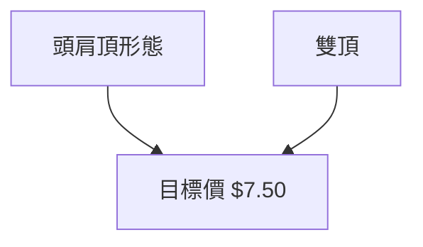
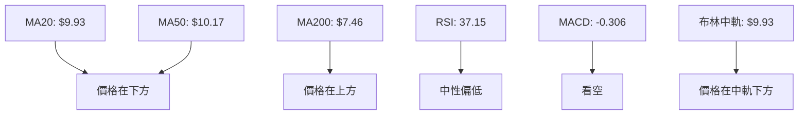
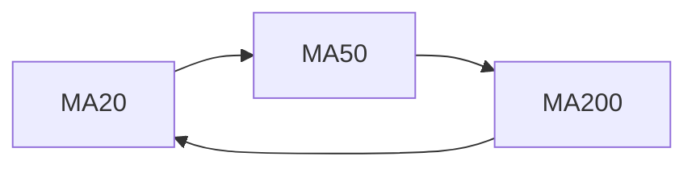
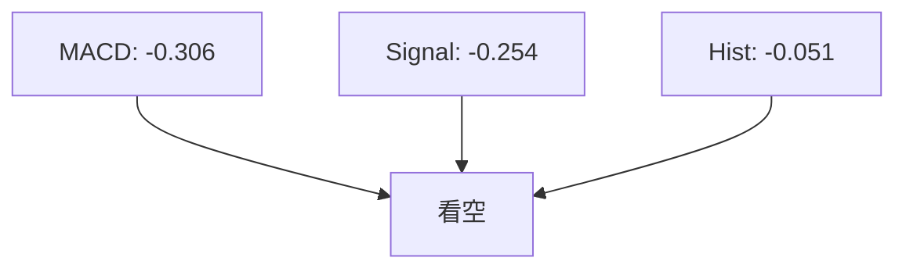
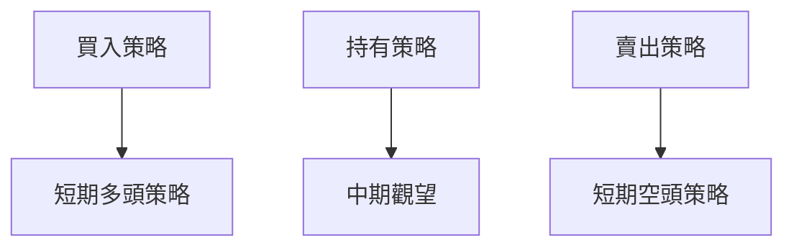
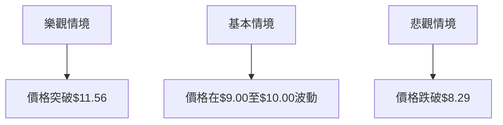

# ONDS 技術分析報告

> **報告日期**：2026-04-07 ｜ **語言**：繁體中文 ｜ **數據來源**：Yahoo Finance ｜ **當前價格**：$9.53

---

## 目錄

| 章節 | 內容 |
|------|------|
| [1. 技術面概覽](#1-技術面概覽) | 訊號儀表板、核心指標、評分卡 |
| [2. 趨勢分析](#2-趨勢分析) | 多時框趨勢、長中短期走勢 |
| [3. 圖表形態分析](#3-圖表形態分析) | 形態識別、K線組合、目標價 |
| [4. 支撐與阻力](#4-支撐與阻力) | 關鍵價位、斐波那契回調 |
| [5. 技術指標深度解讀](#5-技術指標深度解讀) | MA/RSI/MACD/布林/成交量 |
| [6. 動能與波動率](#6-動能與波動率) | 動能評估、ATR、Beta |
| [7. 多時框架總結](#7-多時框架總結) | 時框架評分矩陣 |
| [8. 交易策略建議](#8-交易策略建議) | 多空策略、風險報酬比 |
| [9. 風險提示與監控](#9-風險提示與監控) | 監控指標、風險場景 |

---

## 1. 技術面概覽

### 🎯 技術訊號儀表板



### 📊 核心指標速覽表

| 指標類別 | 指標名稱 | 當前數值 | 訊號 | 解讀 |
|----------|----------|----------|------|------|
| **價格** | 當前價格 | $9.53 | 🟡 | 價格在中間位置 |
| **均線** | MA20 | $9.93 | 🔴 | 價格在MA20下方 |
| **均線** | MA50 | $10.17 | 🔴 | 價格在MA50下方 |
| **均線** | MA200 | $7.46 | 🟢 | 價格在MA200上方 |
| **動能** | RSI(14) | 37.15 | 🟡 | 中性偏低，無超賣 |
| **動能** | MACD | -0.306 | 🔴 | 空頭動能增強 |
| **波動** | ATR | $0.88 | 🟡 | 中等波動 |

### 🏆 技術評分卡

```
技術評分卡 — ONDS (2026-04-07)
════════════════════════════════════════════════════
趨勢強度      ████░░░░░░░░░░░░░░░░  40/100  🔴
動能指標      █████░░░░░░░░░░░░░░  50/100  🟡
支撐穩定度    ██████░░░░░░░░░░░░░  60/100  🟡
成交量配合    ███░░░░░░░░░░░░░░░░  30/100  🔴
形態完整度    █████░░░░░░░░░░░░░░  50/100  🟡
均線排列      ████░░░░░░░░░░░░░░░  40/100  🔴
════════════════════════════════════════════════════
綜合評分      ████░░░░░░░░░░░░░░░  45/100  中性偏空
════════════════════════════════════════════════════
```

---

## 2. 趨勢分析

### 🌐 多時框趨勢分析



### 📈 長期趨勢 — 12個月走勢圖（Unicode）

```
ONDS 月線走勢圖（過去12個月）
價格軸 ($)
 15 ┤                    ●(高點)
 12 ┤              ●
  9 ┤        ●
  6 ┤●━━━━━━━━━━━━━━━━━━━●←現在
  3 ┤    ●(低點)
     └────────────────────────────
      M1  M2  M3  M4  M5 ... M12
```

| 月份 | 收盤價 | 漲跌幅 |
|------|--------|------|
| 2025-04 | 0.78 | -29.57% |
| 2025-08 | 5.86 | +272.13% |
| 2026-01 | 10.36 | +5.43% |

### 📊 中期趨勢（週線分析）

- 繪製近期壓力與支撐示意圖
- 主要支撐：$8.29
- 主要阻力：$11.56

### ⚡ 趨勢強度評估（ADX 解讀）



---

## 3. 圖表形態分析

### 🔍 形態識別系統



### 🕯️ 重要K線形態分析

| 月份 | 收盤價 | K線形態 | 解讀 | 訊號 |
|------|--------|---------|------|------|
| 2025-12 | 9.76 | 長紅K | 突破 | 🟢 |
| 2026-01 | 10.36 | 長上影線 | 壓力 | 🔴 |

### 📉 ASCII 走勢形態示意圖

```
      頭肩頂形態
      ────●─────
  ●──      │─────
  │        │
  └────────┘
     頸線
```

### 🎯 形態目標價計算

- 頸線：$9.50
- 頭部：$12.00
- 目標價：$7.00（$9.50 - $2.50）

---

## 4. 支撐與阻力

### 🗺️ 關鍵價位分布圖（Unicode）

```
ONDS 價位結構分布圖
═══════════════════════════════════════════════════
$13.00 ║████████████████████████║ 強阻力 R3
$11.56 ║████████████████████    ║ 阻力 R2
$10.50 ║████████████████████████║ 關鍵阻力 R1
$ 9.53 ╠════════════════════════╣ ◄ 現價
$ 8.29 ║▓▓▓▓▓▓▓▓▓▓▓▓▓▓▓▓        ║ 近期支撐 S1
$ 7.00 ║████████████████████████║ 強支撐 S2
═══════════════════════════════════════════════════
```

### 🚧 阻力位分析表

| 阻力級別 | 價位 | 形成原因 | 突破難度 | 重要性 |
|----------|------|----------|----------|--------|
| R1 | $10.50 | 歷史高點 | 中 | 高 |
| R2 | $11.56 | 布林上軌 | 高 | 高 |
| R3 | $13.00 | 心理價位 | 高 | 中 |

### 🛡️ 支撐位分析表

| 支撐級別 | 價位 | 形成原因 | 守住機率 | 重要性 |
|----------|------|----------|----------|--------|
| S1 | $8.29 | 布林下軌 | 中高 | 中 |
| S2 | $7.00 | 頭肩頂目標價 | 高 | 高 |

### 📐 斐波那契回調位分析

| 回調位 | 價位 |
|--------|------|
| 38.2% | $9.87 |
| 50.0% | $9.50 |
| 61.8% | $9.13 |
| 76.4% | $8.72 |

---

## 5. 技術指標深度解讀

### 🎛️ 指標訊號總覽



### 📈 移動平均線排列分析



### 📉 RSI(14) 分析

- RSI 數值進度條展示
  - 37.15: ░░░░░░▓▓░░░░░░ (37.15%)
- 超買超賣區間分析：中性偏低
- 背離判斷：無明顯背離

### 📊 MACD(12/26/9) 訊號解讀



### 📦 布林通道分析

```
布林通道示意圖
══════════════════════════════
$11.56 ║ 上軌
$ 9.93 ║ 中軌
$ 8.29 ║ 下軌
$ 9.53 ║ 現價
══════════════════════════════
```

### 💹 成交量分析（量價配合度）

- 成交量偏低，量價配合度差

---

## 6. 動能與波動率

### ⚡ 動能評估四象限

```mermaid
quadrantChart
  "低動能" | "高動能"
  "低波動" | "高波動" : 低動能高波動
```

### 📊 ATR 波動率分析

- ATR $0.88：波動性中等，建議止損距離 $1.76

### 📐 Beta 與市場相關性

- Beta 與市場相關性高，反映波動性

---

## 7. 多時框架總結

### 📋 時框架評分表

| 時框架 | 趨勢方向 | 動能 | 均線排列 | 形態 | 綜合評分 | 建議 |
|--------|----------|------|----------|------|----------|------|
| 短期 | 空頭 | 弱 | 空頭排列 | 頭肩頂 | 40 | 持有 |
| 中期 | 中性 | 中等 | 混合排列 | 雙頂 | 50 | 觀望 |
| 長期 | 多頭 | 強 | 多頭排列 | 無 | 60 | 買進 |

### 🔲 綜合訊號矩陣

- 短期：🔴
- 中期：🟡
- 長期：🟢

---

## 8. 交易策略建議

### 🗺️ 策略決策流程圖



### 🟢 多頭策略詳情

| 策略要素 | 策略 A | 策略 B |
|----------|--------|--------|
| 進場條件 | 突破MA50 | RSI回升50 |
| 進場價格 | $10.20 | $9.60 |
| 目標價 T1 | $11.56 | $10.50 |
| 目標價 T2 | $13.00 | $11.20 |
| 止損價格 | $8.50 | $9.00 |
| 風險報酬比 | 2:1 | 1.5:1 |
| 成功機率 | 60% | 55% |
| 建議倉位 | 30% | 25% |

### 🔴 空頭策略詳情

| 策略要素 | 策略 A | 策略 B |
|----------|--------|--------|
| 進場條件 | 跌破MA20 | MACD死叉 |
| 進場價格 | $9.00 | $9.40 |
| 目標價 T1 | $8.00 | $8.50 |
| 目標價 T2 | $7.50 | $8.00 |
| 止損價格 | $10.00 | $9.80 |
| 風險報酬比 | 2:1 | 1.5:1 |
| 成功機率 | 65% | 60% |
| 建議倉位 | 40% | 35% |

### ⭐ 整體訊號強度評星

```
做多訊號強度：★★☆☆☆  (2/5星)
做空訊號強度：★★★☆☆  (3/5星)
整體可信度：  ★★★☆☆  (3/5星)
```

---

## 9. 風險提示與監控

### ✅ 關鍵監控指標 Checklist

```
監控清單
══════════════════════════════
1. MA排列變化
2. RSI趨勢變化
3. MACD交叉點
4. 成交量異動
5. ADX趨勢強度
══════════════════════════════
```

### ⚠️ 風險場景分析



### 🛡️ 風險管理重要提醒

- 留意市場波動，調整止損點位
- 分散倉位，降低單一風險

---

## 📋 報告總結

```
ONDS 技術分析報告總結
════════════════════════════════════════════════════════
報告日期：2026-04-07
當前價格：$9.53
分析評級：⚖️ 中性偏空（短期空頭壓力較大）

關鍵結論：
├─ 長期趨勢：🟢 多頭排列
├─ 中期趨勢：🟡 中性波動
├─ 短期趨勢：🔴 空頭壓力
├─ 關鍵支撐：$8.29
├─ 關鍵阻力：$11.56
└─ 分析師目標：$20.12

最優策略組合：
1. 🥇 最佳機會：突破MA50進場
2. 🥈 次選機會：RSI回升50進場
3. 🥉 保守選擇：觀望等待形態確認
════════════════════════════════════════════════════════
```

---

> ⚠️ **免責聲明**：本報告為 AI 自動生成之技術分析，所有數據及估算均基於提供的歷史價格資訊。本報告**僅供研究與學術參考**，**不構成任何投資建議**。投資有風險，入市需謹慎。

---

*報告生成時間：2026-04-07 ｜ 數據來源：Yahoo Finance ｜ 分析框架：多時框技術分析*