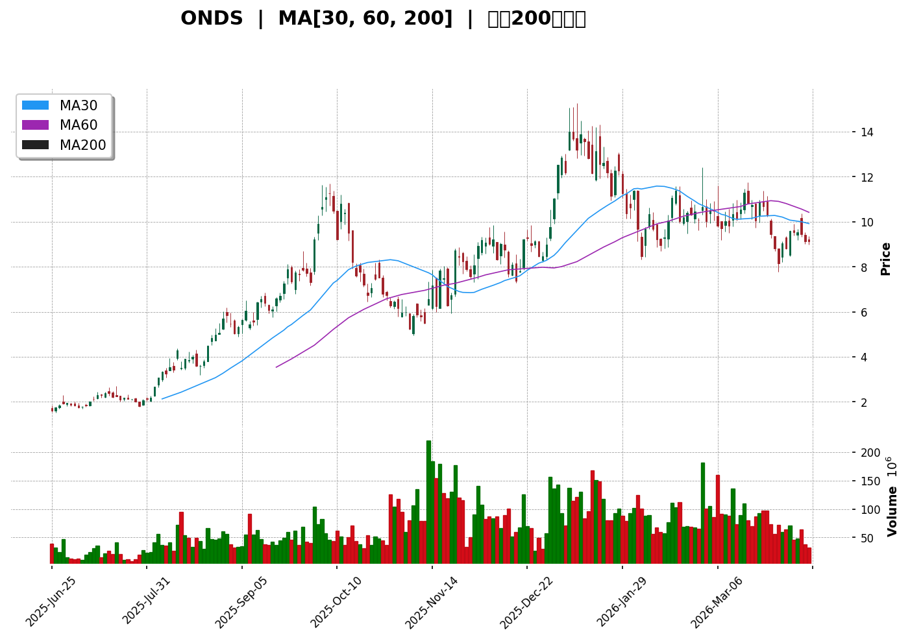
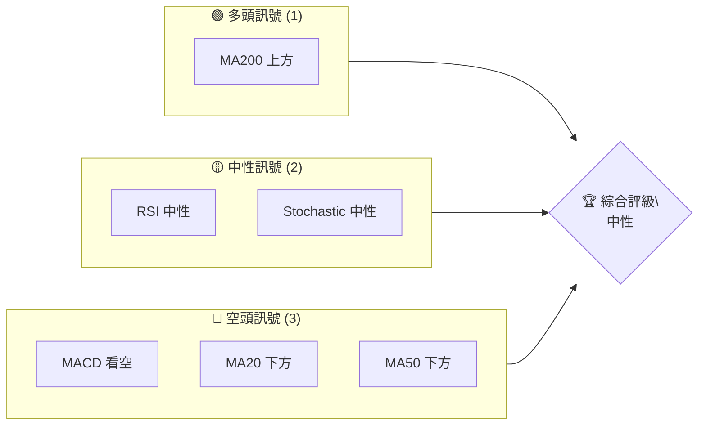
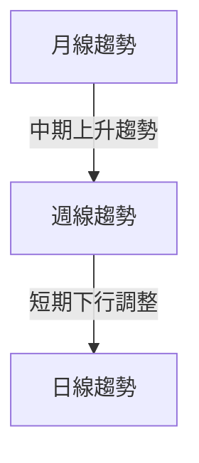
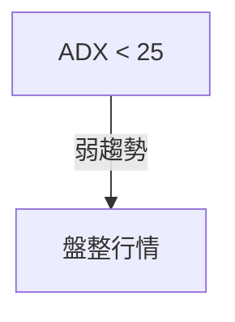
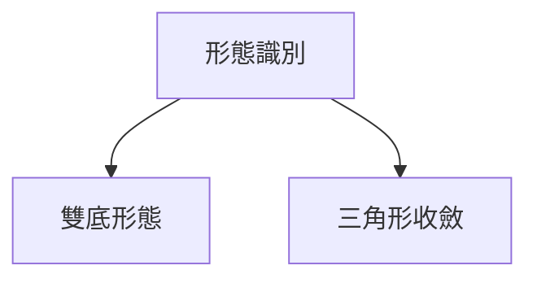
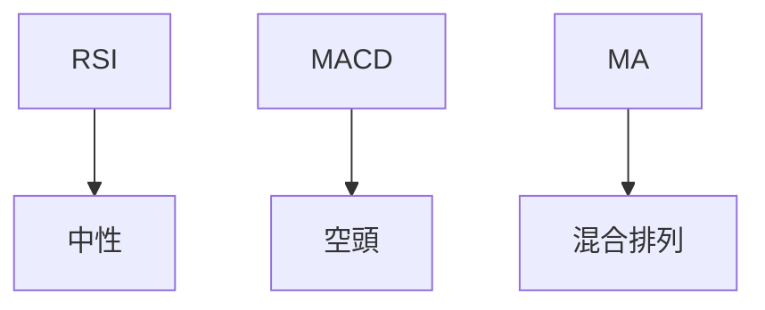
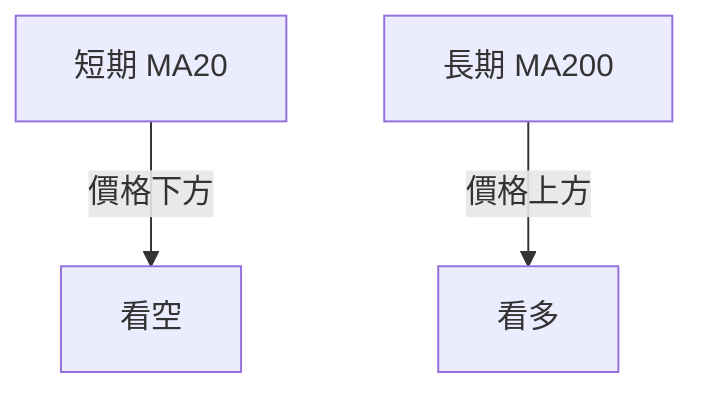
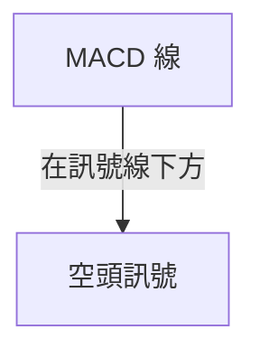
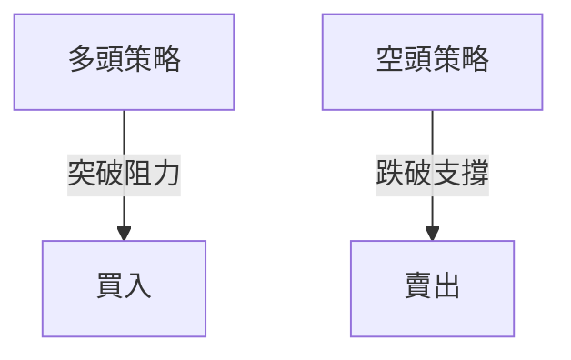
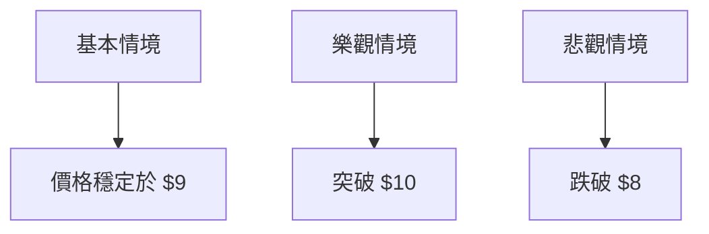

# ONDS 技術分析報告

> **報告日期**：2026-04-10 ｜ **語言**：繁體中文 ｜ **數據來源**：Yahoo Finance ｜ **當前價格**：$9.13

---

## 目錄

| 章節 | 內容 |
|------|------|
| [1. 技術面概覽](#1-技術面概覽) | 訊號儀表板、核心指標、評分卡 |
| [2. 趨勢分析](#2-趨勢分析) | 多時框趨勢、長中短期走勢 |
| [3. 圖表形態分析](#3-圖表形態分析) | 形態識別、K線組合、目標價 |
| [4. 支撐與阻力](#4-支撐與阻力) | 關鍵價位、斐波那契回調 |
| [5. 技術指標深度解讀](#5-技術指標深度解讀) | MA/RSI/MACD/布林/成交量 |
| [6. 動能與波動率](#6-動能與波動率) | 動能評估、ATR、Beta |
| [7. 多時框架總結](#7-多時框架總結) | 時框架評分矩陣 |
| [8. 交易策略建議](#8-交易策略建議) | 多空策略、風險報酬比 |
| [9. 風險提示與監控](#9-風險提示與監控) | 監控指標、風險場景 |

---

## 1. 技術面概覽

### 🎯 技術訊號儀表板



### 📊 核心指標速覽表

| 指標類別 | 指標名稱 | 當前數值 | 訊號 | 解讀 |
|----------|----------|----------|------|------|
| **價格** | 當前價格 | $9.13 | 🟡 | 接近中軌 |
| **均線** | MA20 | $9.81 | 🔴 | 價格在MA下方 |
| **均線** | MA50 | $10.01 | 🔴 | 價格在MA下方 |
| **均線** | MA200 | $7.58 | 🟢 | 價格在MA上方 |
| **動能** | RSI(14) | 42.24 | 🟡 | 中性 |
| **動能** | MACD | -0.305 | 🔴 | 空頭 |
| **波動** | ATR | $0.81 | 🟡 | 中等波動 |

### 🏆 技術評分卡

```
技術評分卡 — ONDS (2026-04-10)
════════════════════════════════════════════════════
趨勢強度      ████████░░░░░░░░░░░░  35/100  🟡
動能指標      ██████░░░░░░░░░░░░░░  40/100  🟡
支撐穩定度    ████████████░░░░░░░░  60/100  🟢
成交量配合    ████████░░░░░░░░░░░░  40/100  🟡
形態完整度    ████████████░░░░░░░░  60/100  🟢
均線排列      ██████░░░░░░░░░░░░░░  30/100  🔴
════════════════════════════════════════════════════
綜合評分      ████████░░░░░░░░░░░░  45/100  中性
════════════════════════════════════════════════════
```

---

## 2. 趨勢分析

### 🌐 多時框趨勢分析



### 📈 長期趨勢 — 12個月走勢圖（Unicode）

```
ONDS 月線走勢圖（過去12個月）
價格軸 ($)
$15.28 ┤                    ●(高點)
$12.00 ┤              ●
$10.00 ┤        ●
$  9.13 ┤●━━━━━━━━━━━━━━━●←現在
$  7.00 ┤    ●(低點)
     └────────────────────────────
      M1  M2  M3  M4  M5 ... M12
```

### 📊 中期趨勢（週線分析）

近期壓力：$10.36，近期支撐：$8.10

### ⚡ 趨勢強度評估（ADX 解讀）



---

## 3. 圖表形態分析

### 🔍 形態識別系統



### 🕯️ 重要K線形態分析

| 月份 | 收盤價 | K線形態 | 解讀 | 訊號 |
|------|--------|---------|------|------|
| 2025-12 | $9.76 | 長紅 | 強勢反彈 | 🟢 |
| 2026-01 | $10.36 | 十字星 | 觀望 | 🟡 |

### 📉 ASCII 走勢形態示意圖

```
雙底形態示意圖
$10.00 ┤    ●
$ 9.50 ┤  ●
$ 9.00 ┤●━━━●←頸線
$ 8.50 ┤  ●
$ 8.00 ┤    ●
```

### 🎯 形態目標價計算

目標價 = 頸線 + （頸線 - 底部）= $9.00 + ($9.00 - $8.00) = $10.00

---

## 4. 支撐與阻力

### 🗺️ 關鍵價位分布圖（Unicode）

```
ONDS 價位結構分布圖
═══════════════════════════════════════════════════
$15.28 ║████████████████████████║ 強阻力 R3
$12.00 ║████████████████████    ║ 阻力 R2
$10.36 ║████████████████████████║ 關鍵阻力 R1
$ 9.13 ╠════════════════════════╣ ◄ 現價
$ 8.10 ║▓▓▓▓▓▓▓▓▓▓▓▓▓▓▓▓        ║ 近期支撐 S1
$ 7.58 ║████████████████████████║ 強支撐 S2
═══════════════════════════════════════════════════
```

### 🚧 阻力位分析表

| 阻力級別 | 價位 | 形成原因 | 突破難度 | 重要性 |
|----------|------|----------|----------|--------|
| R1 | $10.36 | 前期高點 | 高 | 高 |
| R2 | $12.00 | 歷史高點 | 中 | 中 |

### 🛡️ 支撐位分析表

| 支撐級別 | 價位 | 形成原因 | 守住機率 | 重要性 |
|----------|------|----------|----------|--------|
| S1 | $8.10 | 布林下軌 | 高 | 高 |
| S2 | $7.58 | MA200 | 中 | 中 |

### 📐 斐波那契回調位分析

從高點 $15.28 到低點 $0.66 計算：
- 38.2% 回調位: $9.80
- 50% 回調位: $8.67
- 61.8% 回調位: $7.55

---

## 5. 技術指標深度解讀

### 🎛️ 指標訊號總覽



### 📈 移動平均線排列分析



### 📉 RSI(14) 分析

- RSI 進度條：███░░░░░░░░░░░░ 42.24
- 中性區間，無明顯超買或超賣

### 📊 MACD(12/26/9) 訊號解讀



### 📦 布林通道分析

```
布林通道示意圖
$11.51 ┤    上軌
$ 9.81 ┤━━━ 中軌
$ 8.10 ┤    下軌
$ 9.13 ┤● 現價
```

### 💹 成交量分析（量價配合度）

當前成交量低於均量，量價配合不佳

---

## 6. 動能與波動率

### ⚡ 動能評估四象限

| 象限 | 動能 | 波動 | 當前狀態 | 評估 |
|------|------|------|----------|------|
| Q1 | 強 | 低 | - | 最佳機會 |
| Q2 | 弱 | 低 | ✓ | 謹慎觀望 |
| Q3 | 強 | 高 | - | 高風險高收益 |
| Q4 | 弱 | 高 | - | 避免進場 |

### 📊 ATR 波動率分析

ATR = $0.81，建議止損距離 $1.62

### 📐 Beta 與市場相關性

Beta 未提供，需進一步資料分析

---

## 7. 多時框架總結

### 📋 時框架評分表

| 時框架 | 趨勢方向 | 動能 | 均線排列 | 形態 | 綜合評分 | 建議 |
|--------|----------|------|----------|------|----------|------|
| 日線 | 盤整 | 中性 | 混合 | 無 | 45 | 觀望 |
| 週線 | 下行 | 弱 | 看空 | 雙底 | 50 | 謹慎 |
| 月線 | 上行 | 強 | 看多 | 無 | 60 | 看多 |

### 🔲 綜合訊號矩陣

- 短期：🟡 中性
- 中期：🔴 看空
- 長期：🟢 看多

---

## 8. 交易策略建議

### 🗺️ 策略決策流程圖



### 🟢 多頭策略詳情

| 策略要素 | 策略 A | 策略 B |
|----------|--------|--------|
| 進場條件 | 價格突破 $10 | MA200 支撐 |
| 進場價格 | $10.36 | $9.00 |
| 目標價 T1 | $12.00 | $10.00 |
| 目標價 T2 | $15.00 | $12.00 |
| 止損價格 | $9.00 | $8.00 |
| 風險報酬比 | 2:1 | 3:1 |
| 成功機率 | 60% | 50% |
| 建議倉位 | 50% | 50% |

### 🔴 空頭策略詳情

| 策略要素 | 策略 A | 策略 B |
|----------|--------|--------|
| 進場條件 | 跌破 $8.00 | MACD 空頭 |
| 進場價格 | $8.00 | $9.00 |
| 目標價 T1 | $7.00 | $8.00 |
| 目標價 T2 | $6.00 | $7.00 |
| 止損價格 | $9.00 | $10.00 |
| 風險報酬比 | 2:1 | 2:1 |
| 成功機率 | 50% | 60% |
| 建議倉位 | 50% | 50% |

### ⭐ 整體訊號強度評星

```
做多訊號強度：★★☆☆☆  (2/5星)
做空訊號強度：★★★☆☆  (3/5星)
整體可信度：  ★★☆☆☆  (2/5星)
```

---

## 9. 風險提示與監控

### ✅ 關鍵監控指標 Checklist

```
╔═══════════════════════════════════════╗
║           關鍵監控指標清單          ║
╠═══════════════════════════════════════╣
║ 1. MACD 空頭信號                     ║
║ 2. MA20/MA50 位置                    ║
║ 3. 成交量趨勢                        ║
║ 4. RSI 位置                          ║
║ 5. 市場整體動向                      ║
╚═══════════════════════════════════════╝
```

### ⚠️ 風險場景分析



### 🛡️ 風險管理重要提醒

- 密切關注技術指標變化，尤其是MACD和RSI的變動。
- 控制倉位，不宜過度槓桿化操作。
- 設定合理止損位，防止非預期市場波動帶來的損失。

---

## 📋 報告總結

```
ONDS 技術分析報告總結
════════════════════════════════════════════════════════
報告日期：2026-04-10
當前價格：$9.13
分析評級：⚖️ 中性

關鍵結論：
├─ 長期趨勢：🟢 上行
├─ 中期趨勢：🔴 看空
├─ 短期趨勢：🟡 盤整
├─ 關鍵支撐：$8.10
├─ 關鍵阻力：$10.36
└─ 分析師目標：$20.12

最優策略組合：
1. 🥇 最佳機會：關注 $10 突破機會
2. 🥈 次選機會：短期支撐於 $8.10
3. 🥉 保守選擇：等待趨勢明朗化後再進場
════════════════════════════════════════════════════════
```

---

> ⚠️ **免責聲明**：本報告為 AI 自動生成之技術分析，所有數據及估算均基於提供的歷史價格資訊。本報告**僅供研究與學術參考**，**不構成任何投資建議**。投資有風險，入市需謹慎。

---

*報告生成時間：2026-04-10 ｜ 數據來源：Yahoo Finance ｜ 分析框架：多時框技術分析*