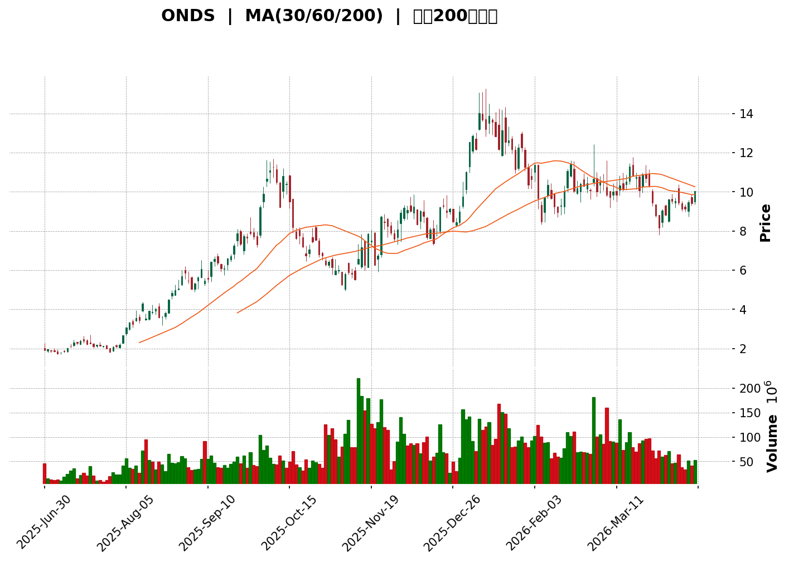
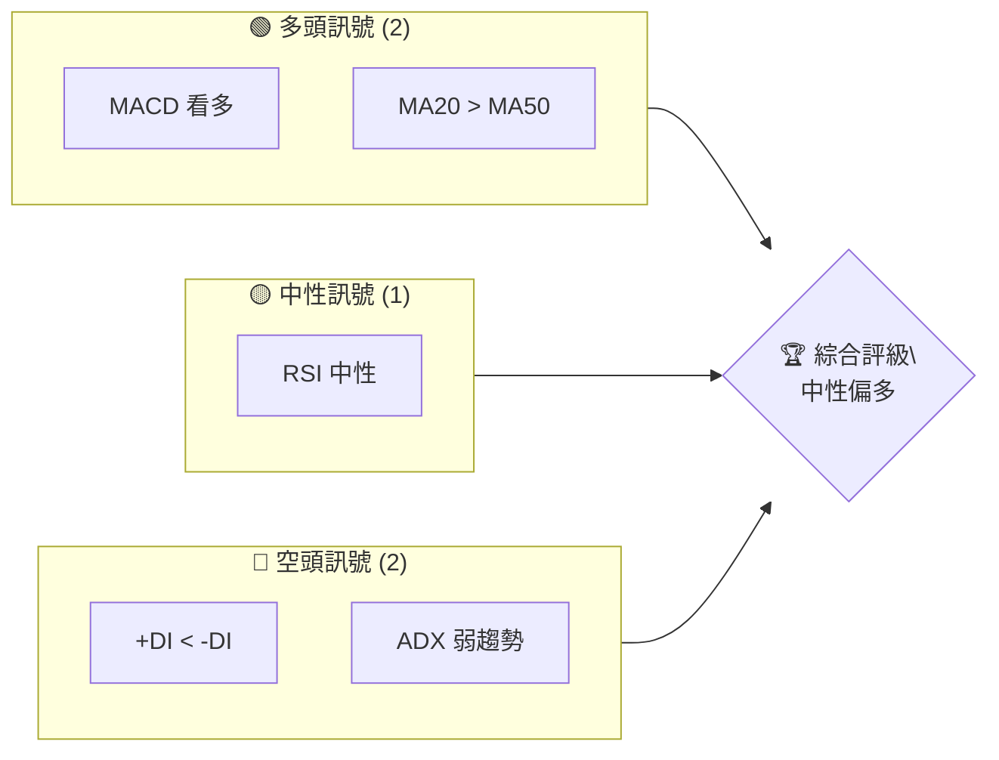
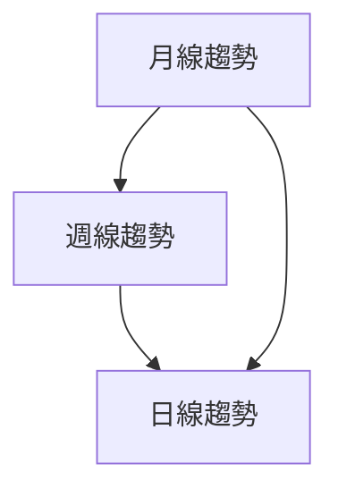
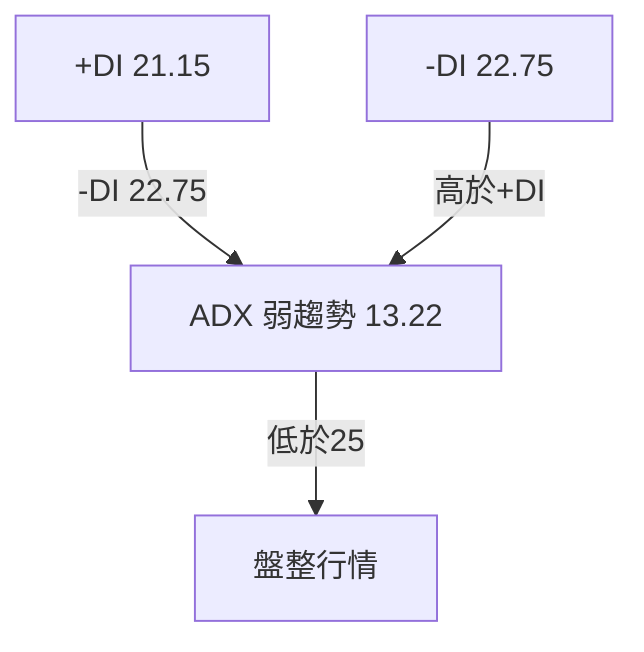
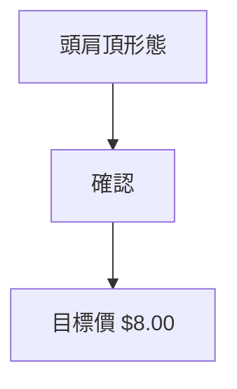
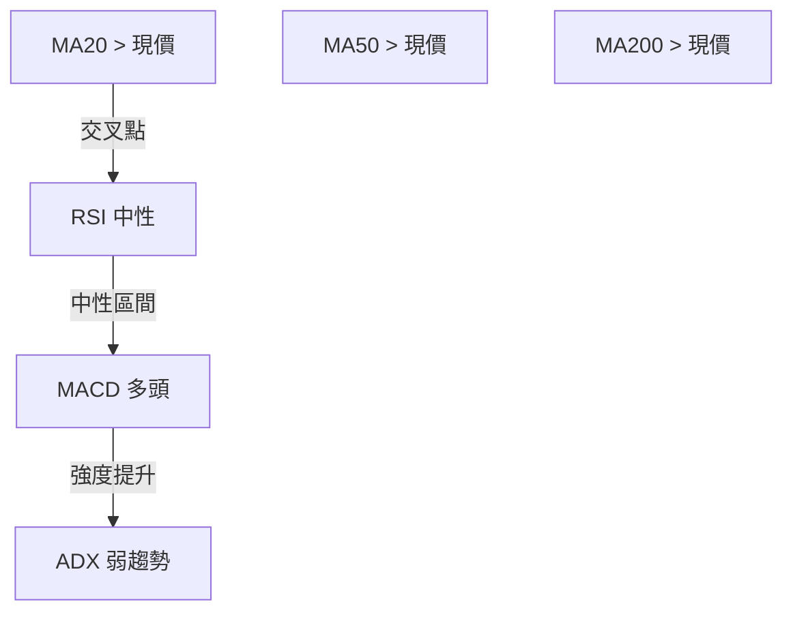
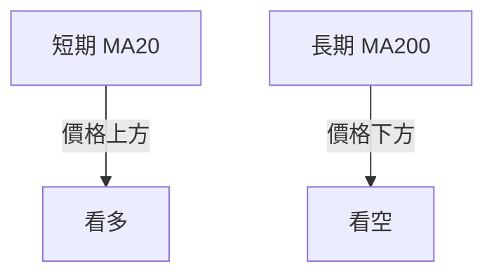
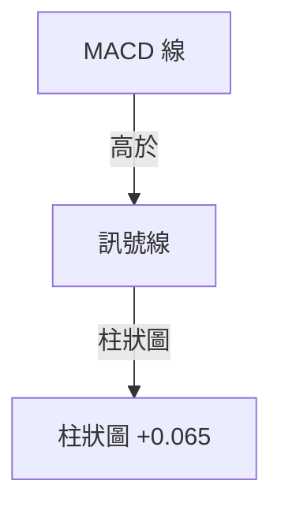
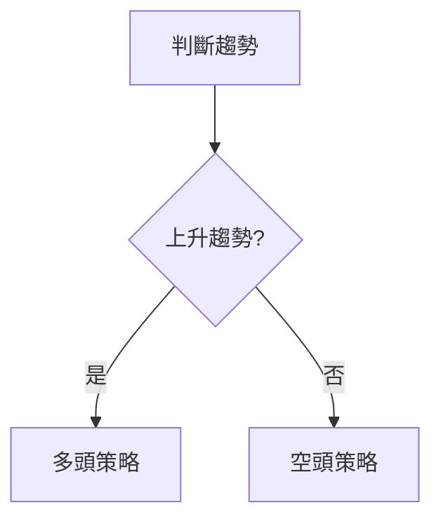
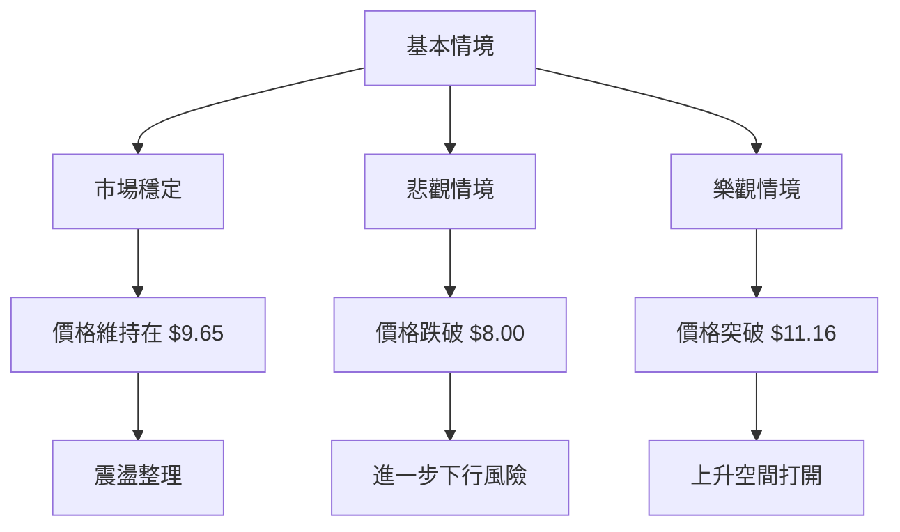

<details>
<summary>📊 靜態圖表 (點擊展開)</summary>

</details>

<html>
<head><meta charset="utf-8" /></head>
<body>
    <div>                        <script>window.PlotlyConfig = {MathJaxConfig: 'local'};</script>
        <script charset="utf-8" src="https://cdn.plot.ly/plotly-3.5.0.min.js" integrity="sha256-fHbNLP+GlIXN+efbQec78UkemUz3NJp7UmfGxC1tNxs=" crossorigin="anonymous"></script>                <div id="candlestick-chart" class="plotly-graph-div" style="height:500px; width:100%;"></div>            <script>                window.PLOTLYENV=window.PLOTLYENV || {};                                if (document.getElementById("candlestick-chart")) {                    Plotly.newPlot(                        "candlestick-chart",                        [{"close":{"dtype":"f8","bdata":"AAAA4FG4\u002fj8AAAAAKVz\u002fPwAAAOB6FP4\u002fAAAAoJmZ\u002fT8AAAAAAAD8PwAAAADXo\u002fw\u002fAAAA4KNw\u002fT8AAADgehQAQAAAAIDC9QBAAAAAQOF6AkAAAACA61ECQAAAAEAzMwNAAAAAQDMzA0AAAABACtcBQAAAAAAAAAJAAAAAwMzMAEAAAADgo3ABQAAAAGC4HgFAAAAAgD0KAUAAAAAAAAAAQAAAAGC4Hv0\u002fAAAAIFyPAEAAAACAwvUAQAAAAKCZmQFAAAAAAClcBUAAAAAgXI8IQAAAAADXowpAAAAAAAAACkAAAABgZmYMQAAAAOCjcAtAAAAAwPUoEUAAAADA9SgMQAAAAOCjcA9AAAAAoEfhDkAAAACAPQoQQAAAAOBRuAxAAAAAoEfhDEAAAABgZmYOQAAAAIDC9RFAAAAAYGZmE0AAAACgR+ETQAAAACCuRxRAAAAAwMzMFkAAAADgo3AXQAAAAEAK1xVAAAAAYLgeFEAAAACA61EVQAAAAMAehRZAAAAAoHA9GEAAAADAzMwVQAAAAKBwPRZAAAAAgBSuGUAAAACgcD0aQAAAAMAehRlAAAAAAClcGEAAAABgZmYYQAAAAGBmZhpAAAAAoEfhGkAAAACAPQodQAAAAMAehR9AAAAAYGZmHUAAAAAAAAAfQAAAAADXox5AAAAAQOF6H0AAAACgR+EeQAAAAKBwPR1AAAAAIIVrIkAAAACA69EjQAAAAIDrUSVAAAAAgBQuJkAAAADAHoUmQAAAAEDh+iRAAAAA4KNwIkAAAABguJ4lQAAAAIDr0SRAAAAAwB4FI0AAAABgZmYgQAAAAOCjcB5AAAAA4HoUH0AAAABgj8IcQAAAAIDC9RpAAAAAoHA9HEAAAABACtcdQAAAAGC4Hh5AAAAAwPUoG0AAAAAAAAAbQAAAAMD1KBlAAAAAYI\u002fCGUAAAACgmZkYQAAAAEAK1xdAAAAAAAAAGEAAAAAAAAAVQAAAAKBwPRdAAAAAwB6FF0AAAABAMzMXQAAAAIA9ChZAAAAAoHA9GkAAAADgUbgcQAAAAMAeBRlAAAAAAClcH0AAAAAAAAAeQAAAAOB6FBlAAAAA4KPwGkAAAADgo3AhQAAAAKBH4SBAAAAAQOF6IEAAAACgmZkfQAAAAIDrUR5AAAAAANcjIEAAAABACtchQAAAAKBHYSJAAAAAANcjIkAAAACAPQoiQAAAAIDCdSJAAAAAYGamIEAAAACAPQoiQAAAAAAAgCFAAAAAYI\u002fCHkAAAACAFC4gQAAAAEDheh1AAAAAQDMzH0AAAADgo3AiQAAAAIA9iiJAAAAAIIXrIUAAAABgj0IiQAAAAIDC9SBAAAAAIIXrIEAAAABA4fohQAAAAMAehSNAAAAAgD0KJkAAAAAgXA8pQAAAAIAUrilAAAAAAClcKEAAAADAHgUsQAAAAKBHYStAAAAAoEdhKkAAAAAgrscrQAAAAGC4HitAAAAAANejKUAAAACA61EoQAAAAGCPQipAAAAAoJkZKUAAAACgcD0pQAAAAEAKVyhAAAAAgOtRJkAAAADAHoUoQAAAAIA9iihAAAAAgD2KJkAAAADgUbgkQAAAACCuRyVAAAAAYI\u002fCJkAAAAAAKVwjQAAAAIDC9SBAAAAAoEdhI0AAAACAFK4kQAAAAAApXCNAAAAAgMJ1IkAAAADgo\u002fAhQAAAAGC4niJAAAAAoJkZJEAAAAAA1yMmQAAAACCuxyZAAAAAIFwPJEAAAACgR2EkQAAAAMDMzCRAAAAAoJmZJEAAAABgZuYkQAAAAMD1KCRAAAAAQApXJUAAAACAPQokQAAAAMAeBSVAAAAAQOH6JEAAAADA9agjQAAAAOCjcCNAAAAAwB4FJEAAAADA9agjQAAAAMD1qCRAAAAAgOtRJEAAAAAgXA8lQAAAACBcjyZAAAAAwPWoJUAAAAAAAIAlQAAAAGC4HiRAAAAAwMzMJUAAAAAAKVwlQAAAAGC4niRAAAAAoEfhIkAAAACgmZkhQAAAAMDMTCBAAAAA4HoUIkAAAABguJ4hQAAAAEAzMyNAAAAAgD0KI0AAAAAgXA8jQAAAAGBm5iJAAAAAIK5HIkAAAABgj0IiQAAAAOCj8CJAAAAAwMzMIkAAAAAgXA8kQA=="},"high":{"dtype":"f8","bdata":"AAAAgOtRAkAAAAAAKVz\u002fPwAAAEAzM\u002f8\u002fAAAAYLgeAEAAAADAHoX\u002fPwAAAEAzM\u002f0\u002fAAAAoEfh\u002fj8AAABgZmYAQAAAACCF6wFAAAAAoJmZA0AAAADAzMwCQAAAAMAehQNAAAAAYLgeBUAAAABACtcDQAAAAKCZmQVAAAAAwPUoAkAAAACgmZkBQAAAAADXowJAAAAAYLgeAUAAAACgmZkBQAAAAOB6FABAAAAAYLgeAUAAAABgj8IBQAAAAMD1KAJAAAAAAClcBUAAAADgUbgIQAAAAIDC9QpAAAAAAAAADEAAAACgmZkPQAAAAOB6FA5AAAAAIFyPEUAAAACA61EOQAAAAOCjcA9AAAAAIIXrEEAAAAAAKVwQQAAAAIDrURFAAAAAIK5HDUAAAABguB4PQAAAAIA9ChJAAAAAIIXrE0AAAACAaBEVQAAAAMAeBRZAAAAAgD0KGEAAAAAgg8AYQAAAAMDMzBdAAAAAoEW2FkAAAAAgXI8VQAAAAOBRuBZAAAAAAAAAGkAAAAAAKVwWQAAAAAAAABhAAAAAYI\u002fCGUAAAACgR+EaQAAAAOCjcBtAAAAAYGZmGUAAAAAAAAAZQAAAACBcjxpAAAAAAClcG0AAAADgo3AdQAAAAKBwPSBAAAAAANcjIEAAAAAAKVwfQAAAACBcjx9AAAAAIIVrIUAAAABAClcgQAAAAMDMzB9AAAAAgBSuIkAAAAAgXI8kQAAAAGCPQidAAAAAQAoXJ0AAAABgZmYnQAAAACCuxyZAAAAAwB4FJUAAAACAFG4mQAAAAGC4HiVAAAAAoHC9JUAAAABgj0IjQAAAAIDrUSBAAAAAoEdhIEAAAAAA16MfQAAAAIA9Ch1AAAAAQDMzHUAAAABAClcgQAAAAKBHoSBAAAAAIFyPHkAAAADAzMwbQAAAAIDCdRpAAAAAAAAAGkAAAABgj8IaQAAAACCuRxpAAAAAAAAAGUAAAADgUbgXQAAAAOB6lBdAAAAAIFyPGUAAAACgR2EYQAAAAMD1qBhAAAAAAClcHUAAAADgo3AfQAAAACBcDx5AAAAAgBSuH0AAAACA6xEgQAAAAKBH4R9AAAAAYGZmG0AAAACgmZkhQAAAAGCPwiFAAAAAAClcIUAAAADAIPAgQAAAAADXIyBAAAAAoJkZIUAAAACAwjUiQAAAAIAUriJAAAAAoJmZIkAAAAAAAIAjQAAAAOBRuCNAAAAAQOE6IkAAAADA9SgiQAAAAGBmJiNAAAAAQOF6IUAAAAAA12MgQAAAAGC4HiFAAAAAYJGtIEAAAABA4XoiQAAAAIDrUSNAAAAAgBSuI0AAAABgZmYiQAAAAEAKVyJAAAAAQApXIUAAAACgmZkiQAAAACBcDyVAAAAAYLgeJkAAAADgehQpQAAAAAAp3ClAAAAAgD0KKkAAAAAA1yMuQAAAAEAzMy5AAAAAIFyPLkAAAAAAAAAtQAAAAAAAgCtAAAAAANcjLEAAAAAAAIAsQAAAAGBmZixAAAAAwPWoLEAAAADA9agqQAAAAEDhuilAAAAAIIWrKEAAAADgo\u002fAoQAAAAMD1KCpAAAAAIFyPKEAAAABgZuYmQAAAAGBmZiZAAAAAQArXJkAAAACAPcomQAAAACBcDyNAAAAAwB6FI0AAAAAgrkclQAAAAKBH4SRAAAAAQArXI0AAAACgxosiQAAAAAApXCNAAAAAANejJEAAAABAClcmQAAAAIAULidAAAAAwPUoJ0AAAAAA1yMlQAAAAIDC9SRAAAAAoEfhJUAAAAAgXI8lQAAAAAApXCRAAAAAQArXKEAAAAAAAAAmQAAAAADXoyVAAAAAQArXJUAAAADgUTgnQAAAACBcDyRAAAAAYGbmJEAAAABguB4lQAAAAIAUriVAAAAAgML1JUAAAACgcL0lQAAAAOCj8CZAAAAAwB6FJ0AAAACAwvUlQAAAAMD1qCVAAAAA4KPwJUAAAACgcL0mQAAAACCuRyZAAAAAIK5HJEAAAACgcL0iQAAAAADXoyFAAAAAIK5HIkAAAABAM7MiQAAAAGCPQiNAAAAAwMzMI0AAAACgR2EjQAAAAKBwvSRAAAAAgD0KI0AAAADgUbgiQAAAACCFKyNAAAAA4FG4I0AAAAAgXA8kQA=="},"hovertemplate":"\u003cb\u003e%{x|%Y-%m-%d}\u003c\u002fb\u003e\u003cbr\u003e\u958b: $%{open:.2f}\u003cbr\u003e\u9ad8: $%{high:.2f}\u003cbr\u003e\u4f4e: $%{low:.2f}\u003cbr\u003e\u6536: $%{close:.2f}\u003cextra\u003e\u003c\u002fextra\u003e","low":{"dtype":"f8","bdata":"AAAAIFyP\u002fj8AAADAzMz8PwAAAMDMzPw\u002fAAAAYLge\u002fT8AAADAHoX7PwAAAAApXPs\u002fAAAA4FG4\u002fD8AAADAzMz8PwAAAGBmZgBAAAAAgML1AEAAAACgmZkBQAAAAMAehQFAAAAAoHA9AkAAAADAHoUBQAAAACCF6wFAAAAAwPUoAEAAAABgZmYAQAAAAIA9CgFAAAAAQOF6AEAAAACAFK7\u002fPwAAAEDhevw\u002fAAAAoJmZ\u002fT8AAACgcD0AQAAAAOB6FABAAAAAAAAAAkAAAAAgrkcFQAAAAAApXAdAAAAAgBSuCEAAAADA9SgLQAAAAEDhegpAAAAAoEfhDkAAAADAHoULQAAAAOCjcAtAAAAAgML1DUAAAADAzMwNQAAAAEDhegxAAAAAoJmZCUAAAADgehQMQAAAAGBmZg5AAAAAYLgeEkAAAABACtcSQAAAAIA9ChRAAAAAwMzMFEAAAADA9SgWQAAAAIDrURVAAAAAgD0KFEAAAACgmZkTQAAAAGC4HhRAAAAAYGZmFkAAAABACtcUQAAAAIA9ihVAAAAAANejFUAAAADAzMwYQAAAAAAAABlAAAAAgBSuF0AAAAAAAAAXQAAAAIA9ChhAAAAAgBSuGUAAAACA61EaQAAAACCF6xxAAAAAAAAAHUAAAADA9SgbQAAAAOCjcB1AAAAAQDMzH0AAAAAgrkceQAAAAOBRuBxAAAAAANejHkAAAACgR2EiQAAAAIA9iiRAAAAAYGbmJEAAAABgDm0lQAAAAAAAwCRAAAAAoEdhIkAAAAAgsl0jQAAAAGCPwiNAAAAAgOtRIkAAAACAFK4fQAAAAOBROB5AAAAAgOtRHUAAAAAAAIAcQAAAAAAp3BlAAAAAoJmZGkAAAABguJ4dQAAAAOB6FB5AAAAAANejGkAAAADgehQaQAAAAIDr0RhAAAAAQOF6GEAAAABguB4XQAAAAOB6FBdAAAAAgOtRF0AAAAAAKdwUQAAAAMDMzBNAAAAA4HoUF0AAAABgZmYWQAAAACCF6xVAAAAAoHA9GUAAAABgZmYYQAAAACCF6xdAAAAAoJmZGEAAAACAPQodQAAAAAAAABlAAAAA4FG4F0AAAACAFK4aQAAAAADXIyBAAAAAoHC9HkAAAABAMzMfQAAAAKBH4R1AAAAAIK5HHUAAAABACtcdQAAAAIA9CiFAAAAAwPUoIUAAAADgo\u002fAhQAAAAOBROCFAAAAAACmcIEAAAACgcD0gQAAAAIDr0SBAAAAAoHA9HkAAAAAAKVweQAAAAGC4Hh1AAAAAgML1HkAAAADgo3AfQAAAACBcTyJAAAAAQApXIUAAAABAM7MhQAAAAAAp3CBAAAAAIIVrIEAAAADA9aggQAAAAEAKVyJAAAAAgOvRI0AAAABA4folQAAAACCF6ydAAAAA4FE4KEAAAADAzEwqQAAAAIAULitAAAAAwPWoKUAAAAAghespQAAAAEAK1ylAAAAAoJmZKUAAAACgcD0oQAAAAKCZmSdAAAAAACncJ0AAAABAM7MoQAAAAKBH4SdAAAAAYGbmJUAAAACAFC4mQAAAAGC4HihAAAAAANcjJkAAAAAgrkckQAAAAMDMTCRAAAAAwB4FJUAAAABgj0IiQAAAAADXoyBAAAAAYGbmIEAAAABAClcjQAAAAEAzMyNAAAAAYI\u002fCIUAAAABgZmYhQAAAAADXoyFAAAAAoHC9IUAAAABA4fojQAAAAEDheiVAAAAAYGbmI0AAAADgUbgjQAAAAIDC9SJAAAAAgD2KJEAAAABgZuYjQAAAAKBwPSNAAAAAoJmZJEAAAADAHoUjQAAAAAAp3CNAAAAAYLgeJEAAAADAHoUjQAAAAGBmZiJAAAAAYGYmI0AAAAAAAAAjQAAAAKCZmSNAAAAAoJkZJEAAAADgUTgkQAAAAKBwvSRAAAAAANejJUAAAACgcD0kQAAAAIDCdSNAAAAAgBTuI0AAAABAM\u002fMkQAAAAIDCdSRAAAAAgD2KIkAAAADA9WghQAAAAGC4Hh9AAAAAYGZmIEAAAAAgXI8hQAAAACCF6yBAAAAAYI\u002fCIkAAAADgTWIiQAAAAIAUriJAAAAAwB4FIkAAAABA4fohQAAAAIDCdSFAAAAAoJmZIkAAAADAfb0iQA=="},"name":"\u50f9\u683c","open":{"dtype":"f8","bdata":"AAAAYLgeAEAAAACgcD3+PwAAAOBRuP4\u002fAAAA4FG4\u002fj8AAADgo3D9PwAAAEDhevw\u002fAAAA4HoU\u002fj8AAACgmZn9PwAAAIDC9QBAAAAAgOtRAUAAAACgmZkCQAAAAMDMzAFAAAAAQArXA0AAAADgo3ADQAAAAGBmZgJAAAAA4HoUAkAAAADgehQBQAAAAMAehQFAAAAAgML1AEAAAABAMzMBQAAAAOB6FABAAAAAQArX\u002fT8AAAAAKVwBQAAAAGBmZgBAAAAAQDMzAkAAAAAAAAAGQAAAAEAK1wdAAAAAQDMzC0AAAAAgrkcLQAAAAKBH4QxAAAAAwB6FD0AAAABACtcLQAAAAAAAAAxAAAAAANejDkAAAAAAKVwPQAAAACBcjxBAAAAAwMzMDEAAAABguB4NQAAAAGBmZg5AAAAA4FG4EkAAAACgR+ESQAAAAOB6FBRAAAAAAAAAFUAAAAAAAAAYQAAAAGBm5hVAAAAAQOF6FkAAAAAA1yMUQAAAAMDMzBVAAAAAwB6FFkAAAACgcD0VQAAAAOCjcBZAAAAA4FG4FkAAAADAzMwZQAAAAEAK1xpAAAAAIK5HGUAAAACgcD0YQAAAAGC4HhlAAAAAQDMzGkAAAAAgrkcbQAAAACBcDx5AAAAAgML1H0AAAADAHgUcQAAAACCuxx5AAAAAQArXH0AAAADgUbgfQAAAAAAAAB9AAAAAQDMzH0AAAADAHgUjQAAAAGC4HiVAAAAAAAAAJkAAAAAgrocmQAAAACCuRyZAAAAAgML1JEAAAAAgXA8kQAAAAGCPwiRAAAAAYGamJUAAAABgj0IjQAAAAMDMzB9AAAAAYLgeIEAAAADgUbgeQAAAAGBmZhtAAAAAYGZmG0AAAACAFK4eQAAAAGC4XiBAAAAA4HoUHkAAAADgepQbQAAAAIDC9RlAAAAAAAAAGUAAAADAzEwaQAAAAGC4HhdAAAAAIIXrF0AAAACAFK4XQAAAAMD1KBRAAAAAQOF6GUAAAABgZmYXQAAAAOCj8BdAAAAAIK5HGUAAAADA9agYQAAAAIA9Ch5AAAAAYLieGEAAAAAAKdwdQAAAAIAUrh9AAAAAoHA9GkAAAAAA1yMbQAAAAIDC9SBAAAAA4FE4IUAAAAAgXI8gQAAAAMAehR9AAAAA4FG4HkAAAAAgrscgQAAAAMAeRSFAAAAAACncIUAAAABACpciQAAAAEAK1yFAAAAA4FE4IkAAAABA4fogQAAAAIDC9SFAAAAAAClcIUAAAABA4XoeQAAAACCuRyBAAAAAwPUoH0AAAACAwvUfQAAAAKCZmSJAAAAAIFwPIkAAAACAwvUhQAAAAOAkRiJAAAAAoJmZIEAAAAAghesgQAAAACBcjyJAAAAAwB5FJEAAAACgmZkmQAAAAEAzMyhAAAAAYGZmKUAAAADA9WgqQAAAAAAAACxAAAAAIIVrK0AAAAAAAAArQAAAAKBHYStAAAAAANcjK0AAAADgetQqQAAAAIDCtSdAAAAAoJmZK0AAAADAHgUpQAAAACCFaylAAAAAwMxMKEAAAAAghWsmQAAAAIDC9SlAAAAAIK5HKEAAAAAAAIAmQAAAAGC4niVAAAAAwB4FJkAAAABgj8ImQAAAAIAUriJAAAAAgBTuIUAAAAAAKZwjQAAAAIAULiRAAAAAwB7FI0AAAACgcH0iQAAAAIA9iiJAAAAA4FF4IkAAAAAghWskQAAAAADXoyVAAAAAoEdhJkAAAAAAKdwjQAAAAMAeBSRAAAAAYI9CJUAAAADAzEwkQAAAAIAULiRAAAAAAAAAJUAAAACgR2ElQAAAAOBRuCRAAAAAQOH6JEAAAAAAAIAkQAAAACBcDyRAAAAAgBSuI0AAAACgmRkkQAAAACCFKyRAAAAAACncJEAAAACgcL0kQAAAAKCZGSVAAAAAAADAJkAAAABguF4lQAAAAOB6lCVAAAAA4HqUJEAAAACA69ElQAAAAGCPwiVAAAAAoJkZJEAAAABAM7MiQAAAAGC4niFAAAAAYGbmIEAAAACgmZkiQAAAACCuByFAAAAAYI9CI0AAAAAAKdwiQAAAAEAKVyRAAAAA4HrUIkAAAACAwnUiQAAAAMAeBSJAAAAA4KNwI0AAAADAHgUjQA=="},"x":["2025-06-30T00:00:00-04:00","2025-07-01T00:00:00-04:00","2025-07-02T00:00:00-04:00","2025-07-03T00:00:00-04:00","2025-07-07T00:00:00-04:00","2025-07-08T00:00:00-04:00","2025-07-09T00:00:00-04:00","2025-07-10T00:00:00-04:00","2025-07-11T00:00:00-04:00","2025-07-14T00:00:00-04:00","2025-07-15T00:00:00-04:00","2025-07-16T00:00:00-04:00","2025-07-17T00:00:00-04:00","2025-07-18T00:00:00-04:00","2025-07-21T00:00:00-04:00","2025-07-22T00:00:00-04:00","2025-07-23T00:00:00-04:00","2025-07-24T00:00:00-04:00","2025-07-25T00:00:00-04:00","2025-07-28T00:00:00-04:00","2025-07-29T00:00:00-04:00","2025-07-30T00:00:00-04:00","2025-07-31T00:00:00-04:00","2025-08-01T00:00:00-04:00","2025-08-04T00:00:00-04:00","2025-08-05T00:00:00-04:00","2025-08-06T00:00:00-04:00","2025-08-07T00:00:00-04:00","2025-08-08T00:00:00-04:00","2025-08-11T00:00:00-04:00","2025-08-12T00:00:00-04:00","2025-08-13T00:00:00-04:00","2025-08-14T00:00:00-04:00","2025-08-15T00:00:00-04:00","2025-08-18T00:00:00-04:00","2025-08-19T00:00:00-04:00","2025-08-20T00:00:00-04:00","2025-08-21T00:00:00-04:00","2025-08-22T00:00:00-04:00","2025-08-25T00:00:00-04:00","2025-08-26T00:00:00-04:00","2025-08-27T00:00:00-04:00","2025-08-28T00:00:00-04:00","2025-08-29T00:00:00-04:00","2025-09-02T00:00:00-04:00","2025-09-03T00:00:00-04:00","2025-09-04T00:00:00-04:00","2025-09-05T00:00:00-04:00","2025-09-08T00:00:00-04:00","2025-09-09T00:00:00-04:00","2025-09-10T00:00:00-04:00","2025-09-11T00:00:00-04:00","2025-09-12T00:00:00-04:00","2025-09-15T00:00:00-04:00","2025-09-16T00:00:00-04:00","2025-09-17T00:00:00-04:00","2025-09-18T00:00:00-04:00","2025-09-19T00:00:00-04:00","2025-09-22T00:00:00-04:00","2025-09-23T00:00:00-04:00","2025-09-24T00:00:00-04:00","2025-09-25T00:00:00-04:00","2025-09-26T00:00:00-04:00","2025-09-29T00:00:00-04:00","2025-09-30T00:00:00-04:00","2025-10-01T00:00:00-04:00","2025-10-02T00:00:00-04:00","2025-10-03T00:00:00-04:00","2025-10-06T00:00:00-04:00","2025-10-07T00:00:00-04:00","2025-10-08T00:00:00-04:00","2025-10-09T00:00:00-04:00","2025-10-10T00:00:00-04:00","2025-10-13T00:00:00-04:00","2025-10-14T00:00:00-04:00","2025-10-15T00:00:00-04:00","2025-10-16T00:00:00-04:00","2025-10-17T00:00:00-04:00","2025-10-20T00:00:00-04:00","2025-10-21T00:00:00-04:00","2025-10-22T00:00:00-04:00","2025-10-23T00:00:00-04:00","2025-10-24T00:00:00-04:00","2025-10-27T00:00:00-04:00","2025-10-28T00:00:00-04:00","2025-10-29T00:00:00-04:00","2025-10-30T00:00:00-04:00","2025-10-31T00:00:00-04:00","2025-11-03T00:00:00-05:00","2025-11-04T00:00:00-05:00","2025-11-05T00:00:00-05:00","2025-11-06T00:00:00-05:00","2025-11-07T00:00:00-05:00","2025-11-10T00:00:00-05:00","2025-11-11T00:00:00-05:00","2025-11-12T00:00:00-05:00","2025-11-13T00:00:00-05:00","2025-11-14T00:00:00-05:00","2025-11-17T00:00:00-05:00","2025-11-18T00:00:00-05:00","2025-11-19T00:00:00-05:00","2025-11-20T00:00:00-05:00","2025-11-21T00:00:00-05:00","2025-11-24T00:00:00-05:00","2025-11-25T00:00:00-05:00","2025-11-26T00:00:00-05:00","2025-11-28T00:00:00-05:00","2025-12-01T00:00:00-05:00","2025-12-02T00:00:00-05:00","2025-12-03T00:00:00-05:00","2025-12-04T00:00:00-05:00","2025-12-05T00:00:00-05:00","2025-12-08T00:00:00-05:00","2025-12-09T00:00:00-05:00","2025-12-10T00:00:00-05:00","2025-12-11T00:00:00-05:00","2025-12-12T00:00:00-05:00","2025-12-15T00:00:00-05:00","2025-12-16T00:00:00-05:00","2025-12-17T00:00:00-05:00","2025-12-18T00:00:00-05:00","2025-12-19T00:00:00-05:00","2025-12-22T00:00:00-05:00","2025-12-23T00:00:00-05:00","2025-12-24T00:00:00-05:00","2025-12-26T00:00:00-05:00","2025-12-29T00:00:00-05:00","2025-12-30T00:00:00-05:00","2025-12-31T00:00:00-05:00","2026-01-02T00:00:00-05:00","2026-01-05T00:00:00-05:00","2026-01-06T00:00:00-05:00","2026-01-07T00:00:00-05:00","2026-01-08T00:00:00-05:00","2026-01-09T00:00:00-05:00","2026-01-12T00:00:00-05:00","2026-01-13T00:00:00-05:00","2026-01-14T00:00:00-05:00","2026-01-15T00:00:00-05:00","2026-01-16T00:00:00-05:00","2026-01-20T00:00:00-05:00","2026-01-21T00:00:00-05:00","2026-01-22T00:00:00-05:00","2026-01-23T00:00:00-05:00","2026-01-26T00:00:00-05:00","2026-01-27T00:00:00-05:00","2026-01-28T00:00:00-05:00","2026-01-29T00:00:00-05:00","2026-01-30T00:00:00-05:00","2026-02-02T00:00:00-05:00","2026-02-03T00:00:00-05:00","2026-02-04T00:00:00-05:00","2026-02-05T00:00:00-05:00","2026-02-06T00:00:00-05:00","2026-02-09T00:00:00-05:00","2026-02-10T00:00:00-05:00","2026-02-11T00:00:00-05:00","2026-02-12T00:00:00-05:00","2026-02-13T00:00:00-05:00","2026-02-17T00:00:00-05:00","2026-02-18T00:00:00-05:00","2026-02-19T00:00:00-05:00","2026-02-20T00:00:00-05:00","2026-02-23T00:00:00-05:00","2026-02-24T00:00:00-05:00","2026-02-25T00:00:00-05:00","2026-02-26T00:00:00-05:00","2026-02-27T00:00:00-05:00","2026-03-02T00:00:00-05:00","2026-03-03T00:00:00-05:00","2026-03-04T00:00:00-05:00","2026-03-05T00:00:00-05:00","2026-03-06T00:00:00-05:00","2026-03-09T00:00:00-04:00","2026-03-10T00:00:00-04:00","2026-03-11T00:00:00-04:00","2026-03-12T00:00:00-04:00","2026-03-13T00:00:00-04:00","2026-03-16T00:00:00-04:00","2026-03-17T00:00:00-04:00","2026-03-18T00:00:00-04:00","2026-03-19T00:00:00-04:00","2026-03-20T00:00:00-04:00","2026-03-23T00:00:00-04:00","2026-03-24T00:00:00-04:00","2026-03-25T00:00:00-04:00","2026-03-26T00:00:00-04:00","2026-03-27T00:00:00-04:00","2026-03-30T00:00:00-04:00","2026-03-31T00:00:00-04:00","2026-04-01T00:00:00-04:00","2026-04-02T00:00:00-04:00","2026-04-06T00:00:00-04:00","2026-04-07T00:00:00-04:00","2026-04-08T00:00:00-04:00","2026-04-09T00:00:00-04:00","2026-04-10T00:00:00-04:00","2026-04-13T00:00:00-04:00","2026-04-14T00:00:00-04:00","2026-04-15T00:00:00-04:00"],"type":"candlestick"},{"hovertemplate":"MA30: $%{y:.2f}\u003cextra\u003e\u003c\u002fextra\u003e","line":{"color":"#2196F3","dash":"dash","width":2},"mode":"lines","name":"MA30","x":["2025-06-30T00:00:00-04:00","2025-07-01T00:00:00-04:00","2025-07-02T00:00:00-04:00","2025-07-03T00:00:00-04:00","2025-07-07T00:00:00-04:00","2025-07-08T00:00:00-04:00","2025-07-09T00:00:00-04:00","2025-07-10T00:00:00-04:00","2025-07-11T00:00:00-04:00","2025-07-14T00:00:00-04:00","2025-07-15T00:00:00-04:00","2025-07-16T00:00:00-04:00","2025-07-17T00:00:00-04:00","2025-07-18T00:00:00-04:00","2025-07-21T00:00:00-04:00","2025-07-22T00:00:00-04:00","2025-07-23T00:00:00-04:00","2025-07-24T00:00:00-04:00","2025-07-25T00:00:00-04:00","2025-07-28T00:00:00-04:00","2025-07-29T00:00:00-04:00","2025-07-30T00:00:00-04:00","2025-07-31T00:00:00-04:00","2025-08-01T00:00:00-04:00","2025-08-04T00:00:00-04:00","2025-08-05T00:00:00-04:00","2025-08-06T00:00:00-04:00","2025-08-07T00:00:00-04:00","2025-08-08T00:00:00-04:00","2025-08-11T00:00:00-04:00","2025-08-12T00:00:00-04:00","2025-08-13T00:00:00-04:00","2025-08-14T00:00:00-04:00","2025-08-15T00:00:00-04:00","2025-08-18T00:00:00-04:00","2025-08-19T00:00:00-04:00","2025-08-20T00:00:00-04:00","2025-08-21T00:00:00-04:00","2025-08-22T00:00:00-04:00","2025-08-25T00:00:00-04:00","2025-08-26T00:00:00-04:00","2025-08-27T00:00:00-04:00","2025-08-28T00:00:00-04:00","2025-08-29T00:00:00-04:00","2025-09-02T00:00:00-04:00","2025-09-03T00:00:00-04:00","2025-09-04T00:00:00-04:00","2025-09-05T00:00:00-04:00","2025-09-08T00:00:00-04:00","2025-09-09T00:00:00-04:00","2025-09-10T00:00:00-04:00","2025-09-11T00:00:00-04:00","2025-09-12T00:00:00-04:00","2025-09-15T00:00:00-04:00","2025-09-16T00:00:00-04:00","2025-09-17T00:00:00-04:00","2025-09-18T00:00:00-04:00","2025-09-19T00:00:00-04:00","2025-09-22T00:00:00-04:00","2025-09-23T00:00:00-04:00","2025-09-24T00:00:00-04:00","2025-09-25T00:00:00-04:00","2025-09-26T00:00:00-04:00","2025-09-29T00:00:00-04:00","2025-09-30T00:00:00-04:00","2025-10-01T00:00:00-04:00","2025-10-02T00:00:00-04:00","2025-10-03T00:00:00-04:00","2025-10-06T00:00:00-04:00","2025-10-07T00:00:00-04:00","2025-10-08T00:00:00-04:00","2025-10-09T00:00:00-04:00","2025-10-10T00:00:00-04:00","2025-10-13T00:00:00-04:00","2025-10-14T00:00:00-04:00","2025-10-15T00:00:00-04:00","2025-10-16T00:00:00-04:00","2025-10-17T00:00:00-04:00","2025-10-20T00:00:00-04:00","2025-10-21T00:00:00-04:00","2025-10-22T00:00:00-04:00","2025-10-23T00:00:00-04:00","2025-10-24T00:00:00-04:00","2025-10-27T00:00:00-04:00","2025-10-28T00:00:00-04:00","2025-10-29T00:00:00-04:00","2025-10-30T00:00:00-04:00","2025-10-31T00:00:00-04:00","2025-11-03T00:00:00-05:00","2025-11-04T00:00:00-05:00","2025-11-05T00:00:00-05:00","2025-11-06T00:00:00-05:00","2025-11-07T00:00:00-05:00","2025-11-10T00:00:00-05:00","2025-11-11T00:00:00-05:00","2025-11-12T00:00:00-05:00","2025-11-13T00:00:00-05:00","2025-11-14T00:00:00-05:00","2025-11-17T00:00:00-05:00","2025-11-18T00:00:00-05:00","2025-11-19T00:00:00-05:00","2025-11-20T00:00:00-05:00","2025-11-21T00:00:00-05:00","2025-11-24T00:00:00-05:00","2025-11-25T00:00:00-05:00","2025-11-26T00:00:00-05:00","2025-11-28T00:00:00-05:00","2025-12-01T00:00:00-05:00","2025-12-02T00:00:00-05:00","2025-12-03T00:00:00-05:00","2025-12-04T00:00:00-05:00","2025-12-05T00:00:00-05:00","2025-12-08T00:00:00-05:00","2025-12-09T00:00:00-05:00","2025-12-10T00:00:00-05:00","2025-12-11T00:00:00-05:00","2025-12-12T00:00:00-05:00","2025-12-15T00:00:00-05:00","2025-12-16T00:00:00-05:00","2025-12-17T00:00:00-05:00","2025-12-18T00:00:00-05:00","2025-12-19T00:00:00-05:00","2025-12-22T00:00:00-05:00","2025-12-23T00:00:00-05:00","2025-12-24T00:00:00-05:00","2025-12-26T00:00:00-05:00","2025-12-29T00:00:00-05:00","2025-12-30T00:00:00-05:00","2025-12-31T00:00:00-05:00","2026-01-02T00:00:00-05:00","2026-01-05T00:00:00-05:00","2026-01-06T00:00:00-05:00","2026-01-07T00:00:00-05:00","2026-01-08T00:00:00-05:00","2026-01-09T00:00:00-05:00","2026-01-12T00:00:00-05:00","2026-01-13T00:00:00-05:00","2026-01-14T00:00:00-05:00","2026-01-15T00:00:00-05:00","2026-01-16T00:00:00-05:00","2026-01-20T00:00:00-05:00","2026-01-21T00:00:00-05:00","2026-01-22T00:00:00-05:00","2026-01-23T00:00:00-05:00","2026-01-26T00:00:00-05:00","2026-01-27T00:00:00-05:00","2026-01-28T00:00:00-05:00","2026-01-29T00:00:00-05:00","2026-01-30T00:00:00-05:00","2026-02-02T00:00:00-05:00","2026-02-03T00:00:00-05:00","2026-02-04T00:00:00-05:00","2026-02-05T00:00:00-05:00","2026-02-06T00:00:00-05:00","2026-02-09T00:00:00-05:00","2026-02-10T00:00:00-05:00","2026-02-11T00:00:00-05:00","2026-02-12T00:00:00-05:00","2026-02-13T00:00:00-05:00","2026-02-17T00:00:00-05:00","2026-02-18T00:00:00-05:00","2026-02-19T00:00:00-05:00","2026-02-20T00:00:00-05:00","2026-02-23T00:00:00-05:00","2026-02-24T00:00:00-05:00","2026-02-25T00:00:00-05:00","2026-02-26T00:00:00-05:00","2026-02-27T00:00:00-05:00","2026-03-02T00:00:00-05:00","2026-03-03T00:00:00-05:00","2026-03-04T00:00:00-05:00","2026-03-05T00:00:00-05:00","2026-03-06T00:00:00-05:00","2026-03-09T00:00:00-04:00","2026-03-10T00:00:00-04:00","2026-03-11T00:00:00-04:00","2026-03-12T00:00:00-04:00","2026-03-13T00:00:00-04:00","2026-03-16T00:00:00-04:00","2026-03-17T00:00:00-04:00","2026-03-18T00:00:00-04:00","2026-03-19T00:00:00-04:00","2026-03-20T00:00:00-04:00","2026-03-23T00:00:00-04:00","2026-03-24T00:00:00-04:00","2026-03-25T00:00:00-04:00","2026-03-26T00:00:00-04:00","2026-03-27T00:00:00-04:00","2026-03-30T00:00:00-04:00","2026-03-31T00:00:00-04:00","2026-04-01T00:00:00-04:00","2026-04-02T00:00:00-04:00","2026-04-06T00:00:00-04:00","2026-04-07T00:00:00-04:00","2026-04-08T00:00:00-04:00","2026-04-09T00:00:00-04:00","2026-04-10T00:00:00-04:00","2026-04-13T00:00:00-04:00","2026-04-14T00:00:00-04:00","2026-04-15T00:00:00-04:00"],"y":{"dtype":"f8","bdata":"AAAAAAAA+H8AAAAAAAD4fwAAAAAAAPh\u002fAAAAAAAA+H8AAAAAAAD4fwAAAAAAAPh\u002fAAAAAAAA+H8AAAAAAAD4fwAAAAAAAPh\u002fAAAAAAAA+H8AAAAAAAD4fwAAAAAAAPh\u002fAAAAAAAA+H8AAAAAAAD4fwAAAAAAAPh\u002fAAAAAAAA+H8AAAAAAAD4fwAAAAAAAPh\u002fAAAAAAAA+H8AAAAAAAD4fwAAAAAAAPh\u002fAAAAAAAA+H8AAAAAAAD4fwAAAAAAAPh\u002fAAAAAAAA+H8AAAAAAAD4fwAAAAAAAPh\u002fAAAAAAAA+H8AAAAAAAD4fyIiIvp+agJAq6qqukkMA0BERES0yHYDQFVVVQ27AgRAiYiIWPKLBEBmZma2OiYFQN7d3f0boQVAMzMz+\u002fAZBkB3d3d\u002fI5QGQHd3dz\u002fuNQdA7+7u9lPjB0AzMzNbSJoIQFVVVf2NUAlAIiIiqtUxCkC8u7uDpCkLQM3MzFTHBAxAREREzMzMDEAREREJ16MNQM3MzDQXkg5AZmZm7mCeD0AiIiIG80QQQERERKSbxBBA3t3dhRZZEUDe3d3Vo\u002fARQLy7uztRfxJAZmZmpg30EkCamZkxelsTQLy7u+MXyxNA3t3dNYlBFEAAAACwK8AUQJqZmWEQWBVAmpmZEYPAFUB3d3df5VAWQLy7u5s20BZA3t3dhRZZF0BmZmb+uNcXQJqZmdmyVhhA3t3dZdgVGUBERERkZuYZQM3MzKwAuRpAERERof6NG0De3d19sWQcQLy7uyuyHR1Ad3d3Z9iVHUCrqqoqzj4eQM3MzOzD5x5AMzMzw66AH0BEREQ0peIfQKuqqlodEyBAVVVVdUwwIECrqqqi\u002fk0gQCIiIiIiYiBA3t3dVQ5tIEDv7u5+anwgQEREROwKkCBAzczMRP2bIECamZkpFacgQImIiMDKoSBAIiIiagOdIEAAAADAEYogQERERCRNaSBA7+7u5kJSIEBEREQ8mCcgQGZmZnYFCCBAq6qqCh7MH0BERETUlIofQBERETEkTR9AMzMzI7DyHkCJiIgIgZUeQO\u002fu7o4l\u002fx1AAAAAoDaQHUDe3d093w8dQCIiIlLUfxxA7+7uDgIrHEC8u7tbq+MbQLy7uzttoBtAzczMzBN1G0DNzMxc1mobQHd3dzfQaRtAd3d3pw10G0AAAACgGq8bQM3MzAy7AhxAIiIislZHHEAAAAAwlnwcQCIiIgKdthxAq6qqCgLrHEC8u7ubfTgdQKuqqmp1jB1AVVVVFSC3HUAAAAAQWPkdQERERNR4KR5AiYiIeOlmHkDNzMzca+4eQO\u002fu7s6FZB9AIiIiQqfNH0Dv7u6eqB8gQO\u002fu7r5YUiBAERER+cVyIEC8u7v7qZEgQAAAAJB7zSBAIiIiMsEDIUCamZmZmVkhQGZmZl66ySFAAAAA8KcmIkDNzMxM8IAiQGZmZuaJ2iJAd3d3xwQvI0BVVVV9P5UjQKuqqoJO+yNAvLu7k19MJEAiIiJaq4MkQCIiInrpxiRAzczM1E0CJUAAAAB4vj8lQO\u002fu7obrcSVAzczM1E2iJUAzMzObmdklQBEREbmsFSZAvLu7+8VSJkAzMzPDg3kmQM3MzJxSsSZA7+7u3mvuJkBERESkRfYmQDMzMxPK6CZA3t3dfT\u002f1JkAAAAAQ5gknQCIiIvJgHidAAAAAIIUrJ0Dv7u6+LSsnQKuqqqp\u002fIydAvLu7q\u002fESJ0BVVVXVBvomQAAAALBH4SZAERERMZa8JkCrqqpaZHsmQAAAACA+QyZAZmZmhusRJkDv7u7uNdclQERERJTRmyVAZmZmFiB3JUCamZlJmlIlQFVVVVXjJSVA3t3dDbsCJUC8u7tbHdMkQFVVVSVNqSRAiYiIuKyVJEAzMzPjM2wkQFVVVeUXSyRAq6qqOiY4JECJiIj4DDskQLy7uyv5RSRA7+7uLpY8JEBVVVUV2U4kQGZmZjbQaSRAiYiIyHZ+JEBERERERIQkQHd3d8cEjyRAiYiISJqSJECrqqqKs48kQLy7u2vneyRAmpmZqapqJEAzMzOTGEQkQCIiIvKLJSRAmpmZudccJEBEREQklBEkQHd3d4ddASRAmpmZaZHtI0Dv7u4+CtcjQN7d3R2hzCNAZmZmZvS2I0BmZmYWILcjQA=="},"type":"scatter"},{"hovertemplate":"MA60: $%{y:.2f}\u003cextra\u003e\u003c\u002fextra\u003e","line":{"color":"#9C27B0","dash":"dash","width":2},"mode":"lines","name":"MA60","x":["2025-06-30T00:00:00-04:00","2025-07-01T00:00:00-04:00","2025-07-02T00:00:00-04:00","2025-07-03T00:00:00-04:00","2025-07-07T00:00:00-04:00","2025-07-08T00:00:00-04:00","2025-07-09T00:00:00-04:00","2025-07-10T00:00:00-04:00","2025-07-11T00:00:00-04:00","2025-07-14T00:00:00-04:00","2025-07-15T00:00:00-04:00","2025-07-16T00:00:00-04:00","2025-07-17T00:00:00-04:00","2025-07-18T00:00:00-04:00","2025-07-21T00:00:00-04:00","2025-07-22T00:00:00-04:00","2025-07-23T00:00:00-04:00","2025-07-24T00:00:00-04:00","2025-07-25T00:00:00-04:00","2025-07-28T00:00:00-04:00","2025-07-29T00:00:00-04:00","2025-07-30T00:00:00-04:00","2025-07-31T00:00:00-04:00","2025-08-01T00:00:00-04:00","2025-08-04T00:00:00-04:00","2025-08-05T00:00:00-04:00","2025-08-06T00:00:00-04:00","2025-08-07T00:00:00-04:00","2025-08-08T00:00:00-04:00","2025-08-11T00:00:00-04:00","2025-08-12T00:00:00-04:00","2025-08-13T00:00:00-04:00","2025-08-14T00:00:00-04:00","2025-08-15T00:00:00-04:00","2025-08-18T00:00:00-04:00","2025-08-19T00:00:00-04:00","2025-08-20T00:00:00-04:00","2025-08-21T00:00:00-04:00","2025-08-22T00:00:00-04:00","2025-08-25T00:00:00-04:00","2025-08-26T00:00:00-04:00","2025-08-27T00:00:00-04:00","2025-08-28T00:00:00-04:00","2025-08-29T00:00:00-04:00","2025-09-02T00:00:00-04:00","2025-09-03T00:00:00-04:00","2025-09-04T00:00:00-04:00","2025-09-05T00:00:00-04:00","2025-09-08T00:00:00-04:00","2025-09-09T00:00:00-04:00","2025-09-10T00:00:00-04:00","2025-09-11T00:00:00-04:00","2025-09-12T00:00:00-04:00","2025-09-15T00:00:00-04:00","2025-09-16T00:00:00-04:00","2025-09-17T00:00:00-04:00","2025-09-18T00:00:00-04:00","2025-09-19T00:00:00-04:00","2025-09-22T00:00:00-04:00","2025-09-23T00:00:00-04:00","2025-09-24T00:00:00-04:00","2025-09-25T00:00:00-04:00","2025-09-26T00:00:00-04:00","2025-09-29T00:00:00-04:00","2025-09-30T00:00:00-04:00","2025-10-01T00:00:00-04:00","2025-10-02T00:00:00-04:00","2025-10-03T00:00:00-04:00","2025-10-06T00:00:00-04:00","2025-10-07T00:00:00-04:00","2025-10-08T00:00:00-04:00","2025-10-09T00:00:00-04:00","2025-10-10T00:00:00-04:00","2025-10-13T00:00:00-04:00","2025-10-14T00:00:00-04:00","2025-10-15T00:00:00-04:00","2025-10-16T00:00:00-04:00","2025-10-17T00:00:00-04:00","2025-10-20T00:00:00-04:00","2025-10-21T00:00:00-04:00","2025-10-22T00:00:00-04:00","2025-10-23T00:00:00-04:00","2025-10-24T00:00:00-04:00","2025-10-27T00:00:00-04:00","2025-10-28T00:00:00-04:00","2025-10-29T00:00:00-04:00","2025-10-30T00:00:00-04:00","2025-10-31T00:00:00-04:00","2025-11-03T00:00:00-05:00","2025-11-04T00:00:00-05:00","2025-11-05T00:00:00-05:00","2025-11-06T00:00:00-05:00","2025-11-07T00:00:00-05:00","2025-11-10T00:00:00-05:00","2025-11-11T00:00:00-05:00","2025-11-12T00:00:00-05:00","2025-11-13T00:00:00-05:00","2025-11-14T00:00:00-05:00","2025-11-17T00:00:00-05:00","2025-11-18T00:00:00-05:00","2025-11-19T00:00:00-05:00","2025-11-20T00:00:00-05:00","2025-11-21T00:00:00-05:00","2025-11-24T00:00:00-05:00","2025-11-25T00:00:00-05:00","2025-11-26T00:00:00-05:00","2025-11-28T00:00:00-05:00","2025-12-01T00:00:00-05:00","2025-12-02T00:00:00-05:00","2025-12-03T00:00:00-05:00","2025-12-04T00:00:00-05:00","2025-12-05T00:00:00-05:00","2025-12-08T00:00:00-05:00","2025-12-09T00:00:00-05:00","2025-12-10T00:00:00-05:00","2025-12-11T00:00:00-05:00","2025-12-12T00:00:00-05:00","2025-12-15T00:00:00-05:00","2025-12-16T00:00:00-05:00","2025-12-17T00:00:00-05:00","2025-12-18T00:00:00-05:00","2025-12-19T00:00:00-05:00","2025-12-22T00:00:00-05:00","2025-12-23T00:00:00-05:00","2025-12-24T00:00:00-05:00","2025-12-26T00:00:00-05:00","2025-12-29T00:00:00-05:00","2025-12-30T00:00:00-05:00","2025-12-31T00:00:00-05:00","2026-01-02T00:00:00-05:00","2026-01-05T00:00:00-05:00","2026-01-06T00:00:00-05:00","2026-01-07T00:00:00-05:00","2026-01-08T00:00:00-05:00","2026-01-09T00:00:00-05:00","2026-01-12T00:00:00-05:00","2026-01-13T00:00:00-05:00","2026-01-14T00:00:00-05:00","2026-01-15T00:00:00-05:00","2026-01-16T00:00:00-05:00","2026-01-20T00:00:00-05:00","2026-01-21T00:00:00-05:00","2026-01-22T00:00:00-05:00","2026-01-23T00:00:00-05:00","2026-01-26T00:00:00-05:00","2026-01-27T00:00:00-05:00","2026-01-28T00:00:00-05:00","2026-01-29T00:00:00-05:00","2026-01-30T00:00:00-05:00","2026-02-02T00:00:00-05:00","2026-02-03T00:00:00-05:00","2026-02-04T00:00:00-05:00","2026-02-05T00:00:00-05:00","2026-02-06T00:00:00-05:00","2026-02-09T00:00:00-05:00","2026-02-10T00:00:00-05:00","2026-02-11T00:00:00-05:00","2026-02-12T00:00:00-05:00","2026-02-13T00:00:00-05:00","2026-02-17T00:00:00-05:00","2026-02-18T00:00:00-05:00","2026-02-19T00:00:00-05:00","2026-02-20T00:00:00-05:00","2026-02-23T00:00:00-05:00","2026-02-24T00:00:00-05:00","2026-02-25T00:00:00-05:00","2026-02-26T00:00:00-05:00","2026-02-27T00:00:00-05:00","2026-03-02T00:00:00-05:00","2026-03-03T00:00:00-05:00","2026-03-04T00:00:00-05:00","2026-03-05T00:00:00-05:00","2026-03-06T00:00:00-05:00","2026-03-09T00:00:00-04:00","2026-03-10T00:00:00-04:00","2026-03-11T00:00:00-04:00","2026-03-12T00:00:00-04:00","2026-03-13T00:00:00-04:00","2026-03-16T00:00:00-04:00","2026-03-17T00:00:00-04:00","2026-03-18T00:00:00-04:00","2026-03-19T00:00:00-04:00","2026-03-20T00:00:00-04:00","2026-03-23T00:00:00-04:00","2026-03-24T00:00:00-04:00","2026-03-25T00:00:00-04:00","2026-03-26T00:00:00-04:00","2026-03-27T00:00:00-04:00","2026-03-30T00:00:00-04:00","2026-03-31T00:00:00-04:00","2026-04-01T00:00:00-04:00","2026-04-02T00:00:00-04:00","2026-04-06T00:00:00-04:00","2026-04-07T00:00:00-04:00","2026-04-08T00:00:00-04:00","2026-04-09T00:00:00-04:00","2026-04-10T00:00:00-04:00","2026-04-13T00:00:00-04:00","2026-04-14T00:00:00-04:00","2026-04-15T00:00:00-04:00"],"y":{"dtype":"f8","bdata":"AAAAAAAA+H8AAAAAAAD4fwAAAAAAAPh\u002fAAAAAAAA+H8AAAAAAAD4fwAAAAAAAPh\u002fAAAAAAAA+H8AAAAAAAD4fwAAAAAAAPh\u002fAAAAAAAA+H8AAAAAAAD4fwAAAAAAAPh\u002fAAAAAAAA+H8AAAAAAAD4fwAAAAAAAPh\u002fAAAAAAAA+H8AAAAAAAD4fwAAAAAAAPh\u002fAAAAAAAA+H8AAAAAAAD4fwAAAAAAAPh\u002fAAAAAAAA+H8AAAAAAAD4fwAAAAAAAPh\u002fAAAAAAAA+H8AAAAAAAD4fwAAAAAAAPh\u002fAAAAAAAA+H8AAAAAAAD4fwAAAAAAAPh\u002fAAAAAAAA+H8AAAAAAAD4fwAAAAAAAPh\u002fAAAAAAAA+H8AAAAAAAD4fwAAAAAAAPh\u002fAAAAAAAA+H8AAAAAAAD4fwAAAAAAAPh\u002fAAAAAAAA+H8AAAAAAAD4fwAAAAAAAPh\u002fAAAAAAAA+H8AAAAAAAD4fwAAAAAAAPh\u002fAAAAAAAA+H8AAAAAAAD4fwAAAAAAAPh\u002fAAAAAAAA+H8AAAAAAAD4fwAAAAAAAPh\u002fAAAAAAAA+H8AAAAAAAD4fwAAAAAAAPh\u002fAAAAAAAA+H8AAAAAAAD4fwAAAAAAAPh\u002fAAAAAAAA+H8AAAAAAAD4f6uqqt5PjQ5A7+7u7qdGD0DNzMzcJAYQQDMzMxHKaBBAERER2YfPEEDNzMwsazURQERERGygkxFAvLu7cWgREkAAAAASPJgSQEREROb7KRNARERETtS\u002fE0C8u7vV6lgUQDMzM5X84hRAREREnmFXFUBEREQ20OkVQJqZmcsTdRZAq6qqlIrzFkBmZmZcSFoXQN7d3SejtxdA7+7usOQXGEC8u7sleHAYQERERPRvxBhAzczMmJkZGUDe3d1pvHQZQCIiIoqzzxlAAAAAGAQWGkBmZmZC0lQaQGZmZrJWhxpAERERBci9GkAAAACYJ+oaQBEREVVVFRtAvLu7b4QyG0AAAADsClAbQERERMQgcBtARERESJqSG0BVVVXpJrEbQFVVVYXr0RtAiYiIREQEHEBmZma28z0cQN7d3R0TXBxAiYiIoBqPHEDe3d1dSLocQO\u002fu7j7DzhxAMzMzO23gHEAzMzPDPBEdQERERJQYRB1AAAAASOF6HUCJiIjIvaYdQGZmZnYFyB1AERERSVPqHUCrqqryiyUeQImIiKh\u002fYx5A7+7urrmQHkDv7u6WtboeQFVVVW1Z6x5AIiIiSn4RH0B3d3f3U0MfQN7d3XUFaB9AzczMdJN4H0AAAADIvYYfQGZmZo4Jfh9AMzMzo7eFH0Crqqoqzp4fQN7d3V1Iuh9AZmZmpuLMH0AREREJ8+QfQHd3d9fq+B9Aq6qqCh7sH0AAAACAatwfQHd3d1cOzR9AIiIigtzLH0CJiIg4ieEfQLy7u0PSBCBAvLu7exQeIEBVVVX9YjkgQCIiIkJgVSBA7+7uVsd0IEDe3d1VVaUgQDMzM08b2CBAvLu7MzMDIUARERFVnC0hQERERIAjZCFA7+7ulvySIUAAAADIBL8hQAAAAASd5iFAERERbecLIkCJiIg07DoiQDMzM7fzbSJAMzMzAyuXIkCamZnlF7siQHd3d4MH4yJAmpmZTfAQI0BVVVXJvTYjQFVVVX2GTSNAd3d3jwluI0B3d3dXx5QjQImIiNhcuCNAiYiIjCXPI0BVVVXda94jQFVVVZ19+CNA7+7ublkLJEB3d3c30CkkQDMzMweBVSRAiYiIEJ9xJEC8u7tTKn4kQDMzMwPkjiRA7+7uJnigJEAiIiK2OrYkQHd3dwuQyyRAERER1b\u002fhJEDe3d3RIuskQLy7u2dm9iRAVVVVcYQCJUDe3d3pbQklQCIiIlacDSVAq6qqRv0bJUAzMzO\u002f5iIlQDMzM09iMCVAMzMzG3ZFJUDe3d1dSFolQEREROSleyVA7+7uBoGVJUDNzMxcj6IlQM3MzCRNqSVAMzMzI9u5JUAiIiIqFcclQM3MzNyy1iVAREREtA\u002ffJUDNzMykcN0lQDMzM4uzzyVAq6qqKs6+JUBERES0D58lQBEREdFpgyVAVVVV9bZsJUB3d3c\u002ffEYlQLy7u9NNIiVAAAAAeL7\u002fJEDv7u4WINckQBEREVk5tCRAZmZmPgqXJEAAAAAw3YQkQA=="},"type":"scatter"},{"hovertemplate":"MA200: $%{y:.2f}\u003cextra\u003e\u003c\u002fextra\u003e","line":{"color":"#FF6F00","dash":"solid","width":2},"mode":"lines","name":"MA200","x":["2025-06-30T00:00:00-04:00","2025-07-01T00:00:00-04:00","2025-07-02T00:00:00-04:00","2025-07-03T00:00:00-04:00","2025-07-07T00:00:00-04:00","2025-07-08T00:00:00-04:00","2025-07-09T00:00:00-04:00","2025-07-10T00:00:00-04:00","2025-07-11T00:00:00-04:00","2025-07-14T00:00:00-04:00","2025-07-15T00:00:00-04:00","2025-07-16T00:00:00-04:00","2025-07-17T00:00:00-04:00","2025-07-18T00:00:00-04:00","2025-07-21T00:00:00-04:00","2025-07-22T00:00:00-04:00","2025-07-23T00:00:00-04:00","2025-07-24T00:00:00-04:00","2025-07-25T00:00:00-04:00","2025-07-28T00:00:00-04:00","2025-07-29T00:00:00-04:00","2025-07-30T00:00:00-04:00","2025-07-31T00:00:00-04:00","2025-08-01T00:00:00-04:00","2025-08-04T00:00:00-04:00","2025-08-05T00:00:00-04:00","2025-08-06T00:00:00-04:00","2025-08-07T00:00:00-04:00","2025-08-08T00:00:00-04:00","2025-08-11T00:00:00-04:00","2025-08-12T00:00:00-04:00","2025-08-13T00:00:00-04:00","2025-08-14T00:00:00-04:00","2025-08-15T00:00:00-04:00","2025-08-18T00:00:00-04:00","2025-08-19T00:00:00-04:00","2025-08-20T00:00:00-04:00","2025-08-21T00:00:00-04:00","2025-08-22T00:00:00-04:00","2025-08-25T00:00:00-04:00","2025-08-26T00:00:00-04:00","2025-08-27T00:00:00-04:00","2025-08-28T00:00:00-04:00","2025-08-29T00:00:00-04:00","2025-09-02T00:00:00-04:00","2025-09-03T00:00:00-04:00","2025-09-04T00:00:00-04:00","2025-09-05T00:00:00-04:00","2025-09-08T00:00:00-04:00","2025-09-09T00:00:00-04:00","2025-09-10T00:00:00-04:00","2025-09-11T00:00:00-04:00","2025-09-12T00:00:00-04:00","2025-09-15T00:00:00-04:00","2025-09-16T00:00:00-04:00","2025-09-17T00:00:00-04:00","2025-09-18T00:00:00-04:00","2025-09-19T00:00:00-04:00","2025-09-22T00:00:00-04:00","2025-09-23T00:00:00-04:00","2025-09-24T00:00:00-04:00","2025-09-25T00:00:00-04:00","2025-09-26T00:00:00-04:00","2025-09-29T00:00:00-04:00","2025-09-30T00:00:00-04:00","2025-10-01T00:00:00-04:00","2025-10-02T00:00:00-04:00","2025-10-03T00:00:00-04:00","2025-10-06T00:00:00-04:00","2025-10-07T00:00:00-04:00","2025-10-08T00:00:00-04:00","2025-10-09T00:00:00-04:00","2025-10-10T00:00:00-04:00","2025-10-13T00:00:00-04:00","2025-10-14T00:00:00-04:00","2025-10-15T00:00:00-04:00","2025-10-16T00:00:00-04:00","2025-10-17T00:00:00-04:00","2025-10-20T00:00:00-04:00","2025-10-21T00:00:00-04:00","2025-10-22T00:00:00-04:00","2025-10-23T00:00:00-04:00","2025-10-24T00:00:00-04:00","2025-10-27T00:00:00-04:00","2025-10-28T00:00:00-04:00","2025-10-29T00:00:00-04:00","2025-10-30T00:00:00-04:00","2025-10-31T00:00:00-04:00","2025-11-03T00:00:00-05:00","2025-11-04T00:00:00-05:00","2025-11-05T00:00:00-05:00","2025-11-06T00:00:00-05:00","2025-11-07T00:00:00-05:00","2025-11-10T00:00:00-05:00","2025-11-11T00:00:00-05:00","2025-11-12T00:00:00-05:00","2025-11-13T00:00:00-05:00","2025-11-14T00:00:00-05:00","2025-11-17T00:00:00-05:00","2025-11-18T00:00:00-05:00","2025-11-19T00:00:00-05:00","2025-11-20T00:00:00-05:00","2025-11-21T00:00:00-05:00","2025-11-24T00:00:00-05:00","2025-11-25T00:00:00-05:00","2025-11-26T00:00:00-05:00","2025-11-28T00:00:00-05:00","2025-12-01T00:00:00-05:00","2025-12-02T00:00:00-05:00","2025-12-03T00:00:00-05:00","2025-12-04T00:00:00-05:00","2025-12-05T00:00:00-05:00","2025-12-08T00:00:00-05:00","2025-12-09T00:00:00-05:00","2025-12-10T00:00:00-05:00","2025-12-11T00:00:00-05:00","2025-12-12T00:00:00-05:00","2025-12-15T00:00:00-05:00","2025-12-16T00:00:00-05:00","2025-12-17T00:00:00-05:00","2025-12-18T00:00:00-05:00","2025-12-19T00:00:00-05:00","2025-12-22T00:00:00-05:00","2025-12-23T00:00:00-05:00","2025-12-24T00:00:00-05:00","2025-12-26T00:00:00-05:00","2025-12-29T00:00:00-05:00","2025-12-30T00:00:00-05:00","2025-12-31T00:00:00-05:00","2026-01-02T00:00:00-05:00","2026-01-05T00:00:00-05:00","2026-01-06T00:00:00-05:00","2026-01-07T00:00:00-05:00","2026-01-08T00:00:00-05:00","2026-01-09T00:00:00-05:00","2026-01-12T00:00:00-05:00","2026-01-13T00:00:00-05:00","2026-01-14T00:00:00-05:00","2026-01-15T00:00:00-05:00","2026-01-16T00:00:00-05:00","2026-01-20T00:00:00-05:00","2026-01-21T00:00:00-05:00","2026-01-22T00:00:00-05:00","2026-01-23T00:00:00-05:00","2026-01-26T00:00:00-05:00","2026-01-27T00:00:00-05:00","2026-01-28T00:00:00-05:00","2026-01-29T00:00:00-05:00","2026-01-30T00:00:00-05:00","2026-02-02T00:00:00-05:00","2026-02-03T00:00:00-05:00","2026-02-04T00:00:00-05:00","2026-02-05T00:00:00-05:00","2026-02-06T00:00:00-05:00","2026-02-09T00:00:00-05:00","2026-02-10T00:00:00-05:00","2026-02-11T00:00:00-05:00","2026-02-12T00:00:00-05:00","2026-02-13T00:00:00-05:00","2026-02-17T00:00:00-05:00","2026-02-18T00:00:00-05:00","2026-02-19T00:00:00-05:00","2026-02-20T00:00:00-05:00","2026-02-23T00:00:00-05:00","2026-02-24T00:00:00-05:00","2026-02-25T00:00:00-05:00","2026-02-26T00:00:00-05:00","2026-02-27T00:00:00-05:00","2026-03-02T00:00:00-05:00","2026-03-03T00:00:00-05:00","2026-03-04T00:00:00-05:00","2026-03-05T00:00:00-05:00","2026-03-06T00:00:00-05:00","2026-03-09T00:00:00-04:00","2026-03-10T00:00:00-04:00","2026-03-11T00:00:00-04:00","2026-03-12T00:00:00-04:00","2026-03-13T00:00:00-04:00","2026-03-16T00:00:00-04:00","2026-03-17T00:00:00-04:00","2026-03-18T00:00:00-04:00","2026-03-19T00:00:00-04:00","2026-03-20T00:00:00-04:00","2026-03-23T00:00:00-04:00","2026-03-24T00:00:00-04:00","2026-03-25T00:00:00-04:00","2026-03-26T00:00:00-04:00","2026-03-27T00:00:00-04:00","2026-03-30T00:00:00-04:00","2026-03-31T00:00:00-04:00","2026-04-01T00:00:00-04:00","2026-04-02T00:00:00-04:00","2026-04-06T00:00:00-04:00","2026-04-07T00:00:00-04:00","2026-04-08T00:00:00-04:00","2026-04-09T00:00:00-04:00","2026-04-10T00:00:00-04:00","2026-04-13T00:00:00-04:00","2026-04-14T00:00:00-04:00","2026-04-15T00:00:00-04:00"],"y":{"dtype":"f8","bdata":"AAAAAAAA+H8AAAAAAAD4fwAAAAAAAPh\u002fAAAAAAAA+H8AAAAAAAD4fwAAAAAAAPh\u002fAAAAAAAA+H8AAAAAAAD4fwAAAAAAAPh\u002fAAAAAAAA+H8AAAAAAAD4fwAAAAAAAPh\u002fAAAAAAAA+H8AAAAAAAD4fwAAAAAAAPh\u002fAAAAAAAA+H8AAAAAAAD4fwAAAAAAAPh\u002fAAAAAAAA+H8AAAAAAAD4fwAAAAAAAPh\u002fAAAAAAAA+H8AAAAAAAD4fwAAAAAAAPh\u002fAAAAAAAA+H8AAAAAAAD4fwAAAAAAAPh\u002fAAAAAAAA+H8AAAAAAAD4fwAAAAAAAPh\u002fAAAAAAAA+H8AAAAAAAD4fwAAAAAAAPh\u002fAAAAAAAA+H8AAAAAAAD4fwAAAAAAAPh\u002fAAAAAAAA+H8AAAAAAAD4fwAAAAAAAPh\u002fAAAAAAAA+H8AAAAAAAD4fwAAAAAAAPh\u002fAAAAAAAA+H8AAAAAAAD4fwAAAAAAAPh\u002fAAAAAAAA+H8AAAAAAAD4fwAAAAAAAPh\u002fAAAAAAAA+H8AAAAAAAD4fwAAAAAAAPh\u002fAAAAAAAA+H8AAAAAAAD4fwAAAAAAAPh\u002fAAAAAAAA+H8AAAAAAAD4fwAAAAAAAPh\u002fAAAAAAAA+H8AAAAAAAD4fwAAAAAAAPh\u002fAAAAAAAA+H8AAAAAAAD4fwAAAAAAAPh\u002fAAAAAAAA+H8AAAAAAAD4fwAAAAAAAPh\u002fAAAAAAAA+H8AAAAAAAD4fwAAAAAAAPh\u002fAAAAAAAA+H8AAAAAAAD4fwAAAAAAAPh\u002fAAAAAAAA+H8AAAAAAAD4fwAAAAAAAPh\u002fAAAAAAAA+H8AAAAAAAD4fwAAAAAAAPh\u002fAAAAAAAA+H8AAAAAAAD4fwAAAAAAAPh\u002fAAAAAAAA+H8AAAAAAAD4fwAAAAAAAPh\u002fAAAAAAAA+H8AAAAAAAD4fwAAAAAAAPh\u002fAAAAAAAA+H8AAAAAAAD4fwAAAAAAAPh\u002fAAAAAAAA+H8AAAAAAAD4fwAAAAAAAPh\u002fAAAAAAAA+H8AAAAAAAD4fwAAAAAAAPh\u002fAAAAAAAA+H8AAAAAAAD4fwAAAAAAAPh\u002fAAAAAAAA+H8AAAAAAAD4fwAAAAAAAPh\u002fAAAAAAAA+H8AAAAAAAD4fwAAAAAAAPh\u002fAAAAAAAA+H8AAAAAAAD4fwAAAAAAAPh\u002fAAAAAAAA+H8AAAAAAAD4fwAAAAAAAPh\u002fAAAAAAAA+H8AAAAAAAD4fwAAAAAAAPh\u002fAAAAAAAA+H8AAAAAAAD4fwAAAAAAAPh\u002fAAAAAAAA+H8AAAAAAAD4fwAAAAAAAPh\u002fAAAAAAAA+H8AAAAAAAD4fwAAAAAAAPh\u002fAAAAAAAA+H8AAAAAAAD4fwAAAAAAAPh\u002fAAAAAAAA+H8AAAAAAAD4fwAAAAAAAPh\u002fAAAAAAAA+H8AAAAAAAD4fwAAAAAAAPh\u002fAAAAAAAA+H8AAAAAAAD4fwAAAAAAAPh\u002fAAAAAAAA+H8AAAAAAAD4fwAAAAAAAPh\u002fAAAAAAAA+H8AAAAAAAD4fwAAAAAAAPh\u002fAAAAAAAA+H8AAAAAAAD4fwAAAAAAAPh\u002fAAAAAAAA+H8AAAAAAAD4fwAAAAAAAPh\u002fAAAAAAAA+H8AAAAAAAD4fwAAAAAAAPh\u002fAAAAAAAA+H8AAAAAAAD4fwAAAAAAAPh\u002fAAAAAAAA+H8AAAAAAAD4fwAAAAAAAPh\u002fAAAAAAAA+H8AAAAAAAD4fwAAAAAAAPh\u002fAAAAAAAA+H8AAAAAAAD4fwAAAAAAAPh\u002fAAAAAAAA+H8AAAAAAAD4fwAAAAAAAPh\u002fAAAAAAAA+H8AAAAAAAD4fwAAAAAAAPh\u002fAAAAAAAA+H8AAAAAAAD4fwAAAAAAAPh\u002fAAAAAAAA+H8AAAAAAAD4fwAAAAAAAPh\u002fAAAAAAAA+H8AAAAAAAD4fwAAAAAAAPh\u002fAAAAAAAA+H8AAAAAAAD4fwAAAAAAAPh\u002fAAAAAAAA+H8AAAAAAAD4fwAAAAAAAPh\u002fAAAAAAAA+H8AAAAAAAD4fwAAAAAAAPh\u002fAAAAAAAA+H8AAAAAAAD4fwAAAAAAAPh\u002fAAAAAAAA+H8AAAAAAAD4fwAAAAAAAPh\u002fAAAAAAAA+H8AAAAAAAD4fwAAAAAAAPh\u002fAAAAAAAA+H8AAAAAAAD4fwAAAAAAAPh\u002fAAAAAAAA+H9SuB4s9sceQA=="},"type":"scatter"}],                        {"template":{"data":{"barpolar":[{"marker":{"line":{"color":"rgb(17,17,17)","width":0.5},"pattern":{"fillmode":"overlay","size":10,"solidity":0.2}},"type":"barpolar"}],"bar":[{"error_x":{"color":"#f2f5fa"},"error_y":{"color":"#f2f5fa"},"marker":{"line":{"color":"rgb(17,17,17)","width":0.5},"pattern":{"fillmode":"overlay","size":10,"solidity":0.2}},"type":"bar"}],"carpet":[{"aaxis":{"endlinecolor":"#A2B1C6","gridcolor":"#506784","linecolor":"#506784","minorgridcolor":"#506784","startlinecolor":"#A2B1C6"},"baxis":{"endlinecolor":"#A2B1C6","gridcolor":"#506784","linecolor":"#506784","minorgridcolor":"#506784","startlinecolor":"#A2B1C6"},"type":"carpet"}],"choropleth":[{"colorbar":{"outlinewidth":0,"ticks":""},"type":"choropleth"}],"contourcarpet":[{"colorbar":{"outlinewidth":0,"ticks":""},"type":"contourcarpet"}],"contour":[{"colorbar":{"outlinewidth":0,"ticks":""},"colorscale":[[0.0,"#0d0887"],[0.1111111111111111,"#46039f"],[0.2222222222222222,"#7201a8"],[0.3333333333333333,"#9c179e"],[0.4444444444444444,"#bd3786"],[0.5555555555555556,"#d8576b"],[0.6666666666666666,"#ed7953"],[0.7777777777777778,"#fb9f3a"],[0.8888888888888888,"#fdca26"],[1.0,"#f0f921"]],"type":"contour"}],"heatmap":[{"colorbar":{"outlinewidth":0,"ticks":""},"colorscale":[[0.0,"#0d0887"],[0.1111111111111111,"#46039f"],[0.2222222222222222,"#7201a8"],[0.3333333333333333,"#9c179e"],[0.4444444444444444,"#bd3786"],[0.5555555555555556,"#d8576b"],[0.6666666666666666,"#ed7953"],[0.7777777777777778,"#fb9f3a"],[0.8888888888888888,"#fdca26"],[1.0,"#f0f921"]],"type":"heatmap"}],"histogram2dcontour":[{"colorbar":{"outlinewidth":0,"ticks":""},"colorscale":[[0.0,"#0d0887"],[0.1111111111111111,"#46039f"],[0.2222222222222222,"#7201a8"],[0.3333333333333333,"#9c179e"],[0.4444444444444444,"#bd3786"],[0.5555555555555556,"#d8576b"],[0.6666666666666666,"#ed7953"],[0.7777777777777778,"#fb9f3a"],[0.8888888888888888,"#fdca26"],[1.0,"#f0f921"]],"type":"histogram2dcontour"}],"histogram2d":[{"colorbar":{"outlinewidth":0,"ticks":""},"colorscale":[[0.0,"#0d0887"],[0.1111111111111111,"#46039f"],[0.2222222222222222,"#7201a8"],[0.3333333333333333,"#9c179e"],[0.4444444444444444,"#bd3786"],[0.5555555555555556,"#d8576b"],[0.6666666666666666,"#ed7953"],[0.7777777777777778,"#fb9f3a"],[0.8888888888888888,"#fdca26"],[1.0,"#f0f921"]],"type":"histogram2d"}],"histogram":[{"marker":{"pattern":{"fillmode":"overlay","size":10,"solidity":0.2}},"type":"histogram"}],"mesh3d":[{"colorbar":{"outlinewidth":0,"ticks":""},"type":"mesh3d"}],"parcoords":[{"line":{"colorbar":{"outlinewidth":0,"ticks":""}},"type":"parcoords"}],"pie":[{"automargin":true,"type":"pie"}],"scatter3d":[{"line":{"colorbar":{"outlinewidth":0,"ticks":""}},"marker":{"colorbar":{"outlinewidth":0,"ticks":""}},"type":"scatter3d"}],"scattercarpet":[{"marker":{"colorbar":{"outlinewidth":0,"ticks":""}},"type":"scattercarpet"}],"scattergeo":[{"marker":{"colorbar":{"outlinewidth":0,"ticks":""}},"type":"scattergeo"}],"scattergl":[{"marker":{"line":{"color":"#283442"}},"type":"scattergl"}],"scattermapbox":[{"marker":{"colorbar":{"outlinewidth":0,"ticks":""}},"type":"scattermapbox"}],"scattermap":[{"marker":{"colorbar":{"outlinewidth":0,"ticks":""}},"type":"scattermap"}],"scatterpolargl":[{"marker":{"colorbar":{"outlinewidth":0,"ticks":""}},"type":"scatterpolargl"}],"scatterpolar":[{"marker":{"colorbar":{"outlinewidth":0,"ticks":""}},"type":"scatterpolar"}],"scatter":[{"marker":{"line":{"color":"#283442"}},"type":"scatter"}],"scatterternary":[{"marker":{"colorbar":{"outlinewidth":0,"ticks":""}},"type":"scatterternary"}],"surface":[{"colorbar":{"outlinewidth":0,"ticks":""},"colorscale":[[0.0,"#0d0887"],[0.1111111111111111,"#46039f"],[0.2222222222222222,"#7201a8"],[0.3333333333333333,"#9c179e"],[0.4444444444444444,"#bd3786"],[0.5555555555555556,"#d8576b"],[0.6666666666666666,"#ed7953"],[0.7777777777777778,"#fb9f3a"],[0.8888888888888888,"#fdca26"],[1.0,"#f0f921"]],"type":"surface"}],"table":[{"cells":{"fill":{"color":"#506784"},"line":{"color":"rgb(17,17,17)"}},"header":{"fill":{"color":"#2a3f5f"},"line":{"color":"rgb(17,17,17)"}},"type":"table"}]},"layout":{"annotationdefaults":{"arrowcolor":"#f2f5fa","arrowhead":0,"arrowwidth":1},"autotypenumbers":"strict","coloraxis":{"colorbar":{"outlinewidth":0,"ticks":""}},"colorscale":{"diverging":[[0,"#8e0152"],[0.1,"#c51b7d"],[0.2,"#de77ae"],[0.3,"#f1b6da"],[0.4,"#fde0ef"],[0.5,"#f7f7f7"],[0.6,"#e6f5d0"],[0.7,"#b8e186"],[0.8,"#7fbc41"],[0.9,"#4d9221"],[1,"#276419"]],"sequential":[[0.0,"#0d0887"],[0.1111111111111111,"#46039f"],[0.2222222222222222,"#7201a8"],[0.3333333333333333,"#9c179e"],[0.4444444444444444,"#bd3786"],[0.5555555555555556,"#d8576b"],[0.6666666666666666,"#ed7953"],[0.7777777777777778,"#fb9f3a"],[0.8888888888888888,"#fdca26"],[1.0,"#f0f921"]],"sequentialminus":[[0.0,"#0d0887"],[0.1111111111111111,"#46039f"],[0.2222222222222222,"#7201a8"],[0.3333333333333333,"#9c179e"],[0.4444444444444444,"#bd3786"],[0.5555555555555556,"#d8576b"],[0.6666666666666666,"#ed7953"],[0.7777777777777778,"#fb9f3a"],[0.8888888888888888,"#fdca26"],[1.0,"#f0f921"]]},"colorway":["#636efa","#EF553B","#00cc96","#ab63fa","#FFA15A","#19d3f3","#FF6692","#B6E880","#FF97FF","#FECB52"],"font":{"color":"#f2f5fa"},"geo":{"bgcolor":"rgb(17,17,17)","lakecolor":"rgb(17,17,17)","landcolor":"rgb(17,17,17)","showlakes":true,"showland":true,"subunitcolor":"#506784"},"hoverlabel":{"align":"left"},"hovermode":"closest","mapbox":{"style":"dark"},"paper_bgcolor":"rgb(17,17,17)","plot_bgcolor":"rgb(17,17,17)","polar":{"angularaxis":{"gridcolor":"#506784","linecolor":"#506784","ticks":""},"bgcolor":"rgb(17,17,17)","radialaxis":{"gridcolor":"#506784","linecolor":"#506784","ticks":""}},"scene":{"xaxis":{"backgroundcolor":"rgb(17,17,17)","gridcolor":"#506784","gridwidth":2,"linecolor":"#506784","showbackground":true,"ticks":"","zerolinecolor":"#C8D4E3"},"yaxis":{"backgroundcolor":"rgb(17,17,17)","gridcolor":"#506784","gridwidth":2,"linecolor":"#506784","showbackground":true,"ticks":"","zerolinecolor":"#C8D4E3"},"zaxis":{"backgroundcolor":"rgb(17,17,17)","gridcolor":"#506784","gridwidth":2,"linecolor":"#506784","showbackground":true,"ticks":"","zerolinecolor":"#C8D4E3"}},"shapedefaults":{"line":{"color":"#f2f5fa"}},"sliderdefaults":{"bgcolor":"#C8D4E3","bordercolor":"rgb(17,17,17)","borderwidth":1,"tickwidth":0},"ternary":{"aaxis":{"gridcolor":"#506784","linecolor":"#506784","ticks":""},"baxis":{"gridcolor":"#506784","linecolor":"#506784","ticks":""},"bgcolor":"rgb(17,17,17)","caxis":{"gridcolor":"#506784","linecolor":"#506784","ticks":""}},"title":{"x":0.05},"updatemenudefaults":{"bgcolor":"#506784","borderwidth":0},"xaxis":{"automargin":true,"gridcolor":"#283442","linecolor":"#506784","ticks":"","title":{"standoff":15},"zerolinecolor":"#283442","zerolinewidth":2},"yaxis":{"automargin":true,"gridcolor":"#283442","linecolor":"#506784","ticks":"","title":{"standoff":15},"zerolinecolor":"#283442","zerolinewidth":2}}},"xaxis":{"rangeslider":{"visible":false},"title":{"text":"\u65e5\u671f"}},"font":{"size":11},"title":{"text":"ONDS  |  MA(30\u002f60\u002f200)  |  \u6700\u8fd1200\u4ea4\u6613\u65e5"},"yaxis":{"title":{"text":"\u80a1\u50f9 (USD)"}},"hovermode":"x unified","height":500},                        {"responsive": true}                    )                };            </script>        </div>
</body>
</html>

# ONDS 技術分析報告

> **報告日期**：2026-04-15 ｜ **語言**：繁體中文 ｜ **數據來源**：Yahoo Finance ｜ **當前價格**：$10.03

---

## 目錄

| 章節 | 內容 |
|------|------|
| [1. 技術面概覽](#1-技術面概覽) | 訊號儀表板、核心指標、評分卡 |
| [2. 趨勢分析](#2-趨勢分析) | 多時框趨勢、長中短期走勢 |
| [3. 圖表形態分析](#3-圖表形態分析) | 形態識別、K線組合、目標價 |
| [4. 支撐與阻力](#4-支撐與阻力) | 關鍵價位、斐波那契回調 |
| [5. 技術指標深度解讀](#5-技術指標深度解讀) | MA/RSI/MACD/布林/成交量 |
| [6. 動能與波動率](#6-動能與波動率) | 動能評估、ATR、Beta |
| [7. 多時框架總結](#7-多時框架總結) | 時框架評分矩陣 |
| [8. 交易策略建議](#8-交易策略建議) | 多空策略、風險報酬比 |
| [9. 風險提示與監控](#9-風險提示與監控) | 監控指標、風險場景 |

---

## 1. 技術面概覽

### 🎯 技術訊號儀表板



### 📊 核心指標速覽表

| 指標類別 | 指標名稱 | 當前數值 | 訊號 | 解讀 |
|----------|----------|----------|------|------|
| **價格** | 當前價格 | $10.03 | 🟡 | 價格在中性區間 |
| **均線** | MA20 | $9.65 | 🟢 | 價格在MA20上方 |
| **均線** | MA50 | $9.94 | 🟢 | 價格在MA50上方 |
| **均線** | MA200 | $7.70 | 🟢 | 價格在MA200上方 |
| **動能** | RSI(14) | 47.50 | 🟡 | 中性 |
| **動能** | MACD | +0.065 | 🟢 | 多頭 |
| **波動** | ATR | $0.75 | 🟡 | 中等波動 |

### 🏆 技術評分卡

```
技術評分卡 — ONDS (2026-04-15)
════════════════════════════════════════════════════
趨勢強度      ███░░░░░░░░░░░░░░░░  20/100  🔴
動能指標      ██████░░░░░░░░░░░░░  60/100  🟢
支撐穩定度    ███████████░░░░░░░░  70/100  🟢
成交量配合    ████░░░░░░░░░░░░░░░  40/100  🟡
形態完整度    ████████░░░░░░░░░░░  60/100  🟡
均線排列      ███████░░░░░░░░░░░░  50/100  🟡
════════════════════════════════════════════════════
綜合評分      ██████░░░░░░░░░░░░░  50/100  中性偏多
════════════════════════════════════════════════════
```

---

## 2. 趨勢分析

### 🌐 多時框趨勢分析



### 📈 長期趨勢 — 12個月走勢圖（Unicode）

```
ONDS 月線走勢圖（過去12個月）
價格軸 ($)
$15  ┤                    ●(高點)
$12  ┤              ●
$9   ┤        ●
$6   ┤  ●
$3   ┤
$0.69┤●━━━━━━━━━━━━━━━━━━━●←現在
     └────────────────────────────
      2025-05  2025-08 2025-11 2026-02 2026-04
```

**走勢特徵分析表格**：

| 時間段 | 起始價格 | 結束價格 | 漲跌幅 | 特徵 |
|--------|----------|----------|--------|------|
| 2025-05 — 2025-08 | $1.22 | $5.86 | +380% | 強勢上漲 |
| 2025-09 — 2026-01 | $7.72 | $10.36 | +34% | 持續上升 |
| 2026-02 — 2026-04 | $10.08 | $10.03 | -0.5% | 高位震盪 |

### 📊 中期趨勢（週線分析）

```mermaid
quadrantChart
    "週線分析" Q1:"壓力" Q2:"支撐" Q3:"中性" Q4:"強勢"
    Q2["支撐位 $9.65"]
    Q1["壓力位 $11.16"]
```

### ⚡ 趨勢強度評估（ADX 解讀）



---

## 3. 圖表形態分析

### 🔍 形態識別系統



### 🕯️ 重要K線形態分析

| 月份 | 收盤價 | K線形態 | 解讀 | 訊號 |
|------|--------|---------|------|------|
| 2025-12 | $9.76 | 長上影線 | 壓力明顯 | 🔴 |
| 2026-01 | $10.36 | 紅三兵 | 強勢延續 | 🟢 |

### 📉 ASCII 走勢形態示意圖

```
ONDS 頭肩頂形態示意圖
價格軸 ($)
$12 ┤
$10 ┤        ●
$8  ┤   ●───╮
$6  ┤  ╱     ╰─●
$4  ┤╱
$2  ┤
$0  └──────────────────
     L    H    S    H
```

### 🎯 形態目標價計算

- 頸線：$8.00
- 頭部高度：$10.36 - $8.00 = $2.36
- 目標價：$8.00 - $2.36 = $5.64

---

## 4. 支撐與阻力

### 🗺️ 關鍵價位分布圖（Unicode）

```
ONDS 價位結構分布圖
═══════════════════════════════════════════════════
$12.00 ║████████████████████████║ 強阻力 R3
$11.16 ║████████████████████    ║ 阻力 R2
$10.00 ║████████████████████████║ 關鍵阻力 R1
$ 9.65 ╠════════════════════════╣ ◄ 現價
$ 8.15 ║▓▓▓▓▓▓▓▓▓▓▓▓▓▓▓▓        ║ 近期支撐 S1
$ 7.00 ║████████████████████████║ 強支撐 S2
═══════════════════════════════════════════════════
```

### 🚧 阻力位分析表

| 阻力級別 | 價位 | 形成原因 | 突破難度 | 重要性 |
|----------|------|----------|----------|--------|
| R1 | $10.00 | 前高 | 中 | 高 |
| R2 | $11.16 | 布林上軌 | 高 | 中 |
| R3 | $12.00 | 心理障礙 | 高 | 高 |

### 🛡️ 支撐位分析表

| 支撐級別 | 價位 | 形成原因 | 守住機率 | 重要性 |
|----------|------|----------|----------|--------|
| S1 | $9.65 | MA20 | 高 | 中 |
| S2 | $8.15 | 布林下軌 | 中 | 高 |
| S3 | $7.00 | 長期MA200 | 高 | 高 |

### 📐 斐波那契回調位分析

- 38.2% 回調位：$9.20
- 50% 回調位：$8.50
- 61.8% 回調位：$7.80
- 76.4% 回調位：$6.90

---

## 5. 技術指標深度解讀

### 🎛️ 指標訊號總覽



### 📈 移動平均線排列分析



### 📉 RSI(14) 分析

- RSI 數值：47.50
- 進度條：█████░░░░░░░░░ 47.5%
- 超買超賣區間：中性
- 背離判斷：無明顯背離

### 📊 MACD(12/26/9) 訊號解讀



### 📦 布林通道分析

```
ONDS 布林通道示意圖
價格軸 ($)
$12 ┤
$11 ┤●
$10 ┤╱
$ 9 ┤╲
$ 8 ┤╱
$ 7 └──────────────────
     B    M    B
```

### 💹 成交量分析（量價配合度）

- 最新成交量：52,852,105
- 20日均量：64,558,200
- 量比：0.82x
- OBV趨勢：OBV < MA，量能疲弱

---

## 6. 動能與波動率

### ⚡ 動能評估四象限

| 象限 | 動能 | 波動 | 當前狀態 | 評估 |
|------|------|------|----------|------|
| Q1 | 強 | 低 | - | 最佳機會 |
| Q2 | 弱 | 低 | ✓ | 謹慎觀望 |
| Q3 | 強 | 高 | - | 高風險高收益 |
| Q4 | 弱 | 高 | - | 避免進場 |

### 📊 ATR 波動率分析

- ATR：$0.75
- 波動率：7.51%
- 止損距離建議：$1.00（根據ATR的1.33倍）

### 📐 Beta 與市場相關性

- 與大盤的相關性低，獨立走勢明顯

---

## 7. 多時框架總結

### 📋 時框架評分表

| 時框架 | 趨勢方向 | 動能 | 均線排列 | 形態 | 綜合評分 | 建議 |
|--------|----------|------|----------|------|----------|------|
| 長期 | 上升 | 弱 | 看多 | 頭肩頂 | 60/100 | 觀望 |
| 中期 | 盤整 | 中性 | 中性 | 無形態 | 50/100 | 觀望 |
| 短期 | 下降 | 強 | 看空 | 無形態 | 40/100 | 避免 |

### 🔲 綜合訊號矩陣

- 長期：🟢
- 中期：🟡
- 短期：🔴
- 綜合評定：中性偏多

---

## 8. 交易策略建議

### 🗺️ 策略決策流程圖



### 🟢 多頭策略詳情

| 策略要素 | 策略 A | 策略 B |
|----------|--------|--------|
| 進場條件 | 回踩支撐 | 突破阻力 |
| 進場價格 | $9.65 | $10.00 |
| 目標價 T1 | $11.00 | $12.00 |
| 目標價 T2 | $12.50 | $13.50 |
| 止損價格 | $9.00 | $9.50 |
| 風險報酬比 | 1:3 | 1:2 |
| 成功機率 | 60% | 50% |
| 建議倉位 | 50% | 50% |

### 🔴 空頭策略詳情

| 策略要素 | 策略 A | 策略 B |
|----------|--------|--------|
| 進場條件 | 跌破支撐 | 反彈到阻力 |
| 進場價格 | $9.00 | $10.00 |
| 目標價 T1 | $8.00 | $7.50 |
| 目標價 T2 | $7.00 | $6.50 |
| 止損價格 | $9.50 | $10.50 |
| 風險報酬比 | 1:2 | 1:3 |
| 成功機率 | 40% | 45% |
| 建議倉位 | 30% | 30% |

### ⭐ 整體訊號強度評星

```
做多訊號強度：★★☆☆☆  (2/5星)
做空訊號強度：★★★☆☆  (3/5星)
整體可信度：  ★★★☆☆  (3/5星)
```

---

## 9. 風險提示與監控

### ✅ 關鍵監控指標 Checklist

```
ONDS 監控清單
════════════════════════════════════════════════════
MA20 走勢      ████████░░░░░░░░░░░░  XX/100
RSI 變化      ██████░░░░░░░░░░░░░░  XX/100
MACD 趨勢      ██████████░░░░░░░░░░  XX/100
成交量突破    █████░░░░░░░░░░░░░░░  XX/100
支撐阻力確認  ███████████░░░░░░░░░  XX/100
════════════════════════════════════════════════════
```

### ⚠️ 風險場景分析



### 🛡️ 風險管理重要提醒

- 監控關鍵支撐位 $9.65，如跌破需考慮止損。
- 定期檢視 MACD 和 RSI 的變動，尋找轉折信號。
- 注意成交量的增減，量價背離是早期警訊。

---

## 📋 報告總結

```
ONDS 技術分析報告總結
════════════════════════════════════════════════════════
報告日期：2026-04-15
當前價格：$10.03
分析評級：⚖️ 中性偏多

關鍵結論：
├─ 長期趨勢：🟢 上升趨勢
├─ 中期趨勢：🟡 盤整趨勢
├─ 短期趨勢：🔴 下降趨勢
├─ 關鍵支撐：$9.65
├─ 關鍵阻力：$11.16
└─ 分析師目標：$20.12

最優策略組合：
1. 🥇 最佳機會：回踩支撐後多頭進場
2. 🥈 次選機會：跌破支撐後空頭進場
3. 🥉 保守選擇：觀望，等待明確突破信號
════════════════════════════════════════════════════════
```

---

> ⚠️ **免責聲明**：本報告為 AI 自動生成之技術分析，所有數據及估算均基於提供的歷史價格資訊。本報告**僅供研究與學術參考**，**不構成任何投資建議**。投資有風險，入市需謹慎。

---

*報告生成時間：2026-04-15 ｜ 數據來源：Yahoo Finance ｜ 分析框架：多時框技術分析*