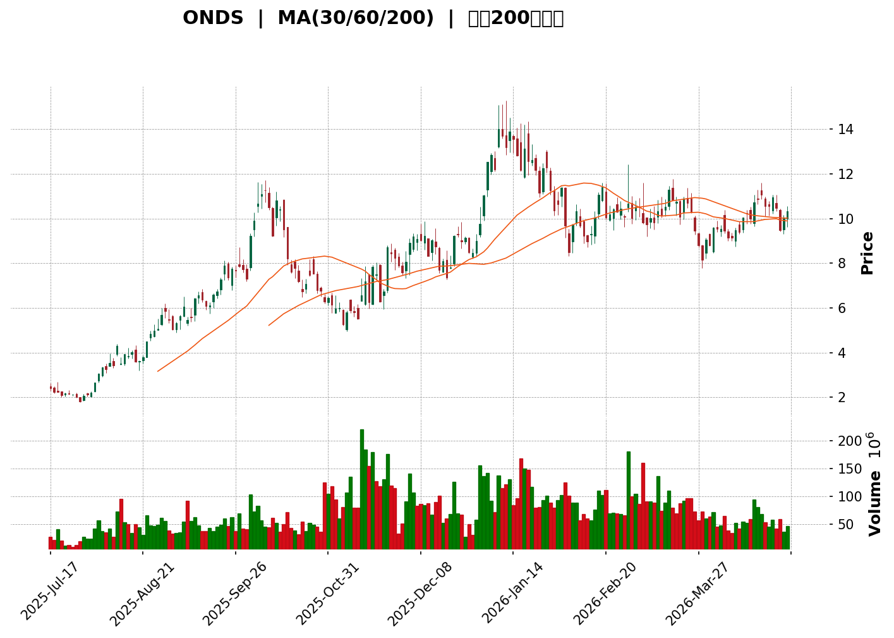
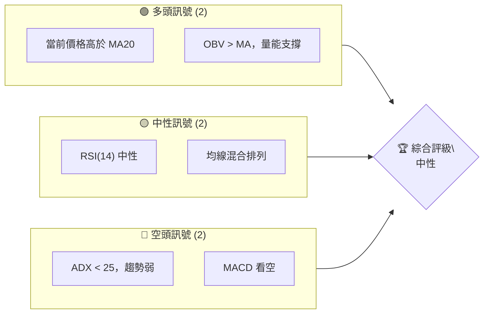
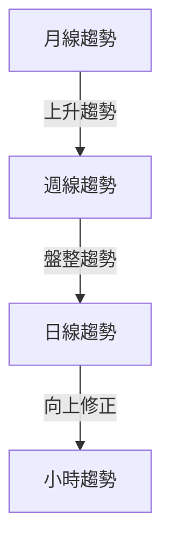
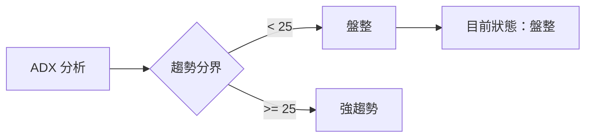
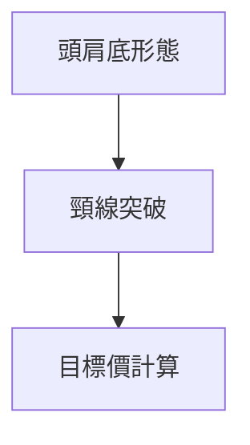
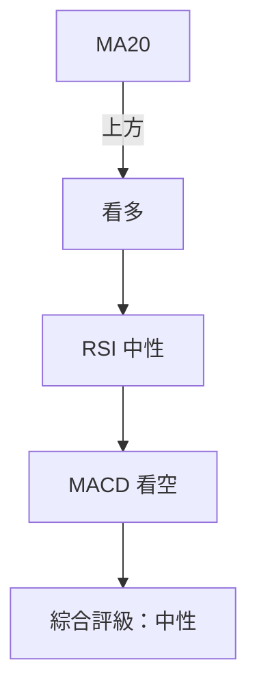
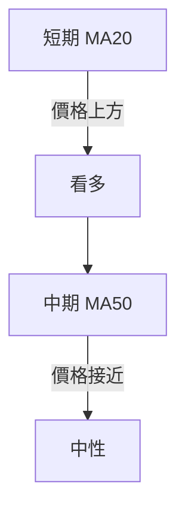
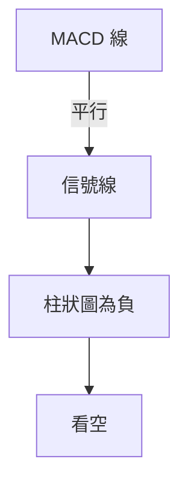
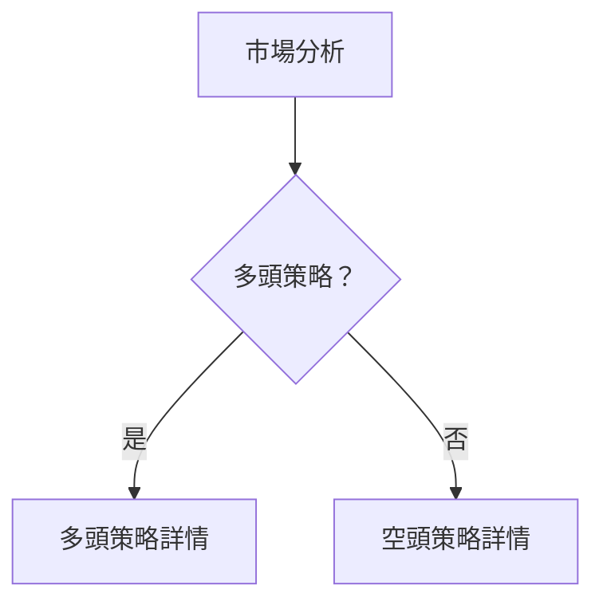
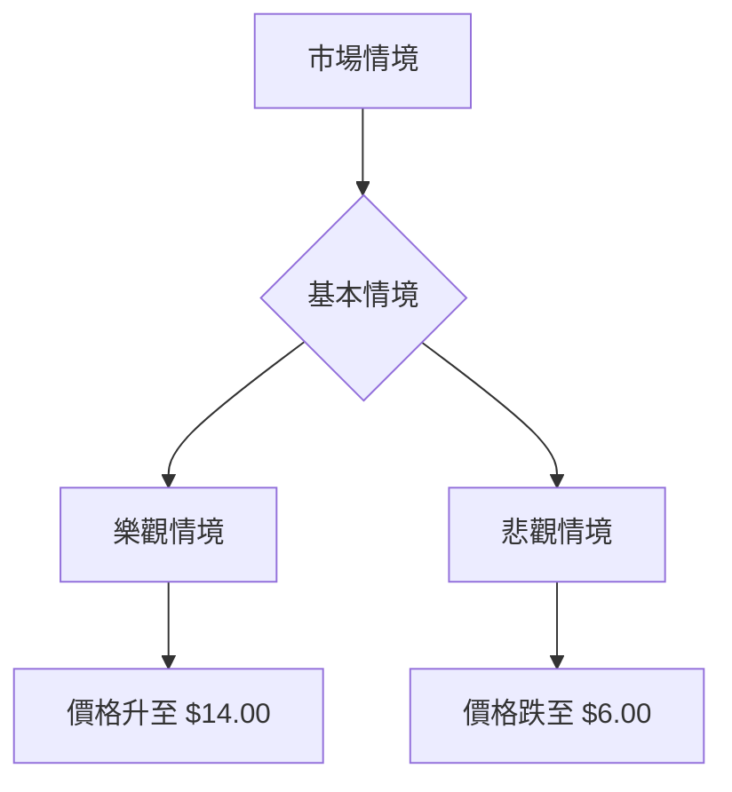

<details>
<summary>📊 靜態圖表 (點擊展開)</summary>

</details>

<html>
<head><meta charset="utf-8" /></head>
<body>
    <div>                        <script>window.PlotlyConfig = {MathJaxConfig: 'local'};</script>
        <script charset="utf-8" src="https://cdn.plot.ly/plotly-3.5.0.min.js" integrity="sha256-fHbNLP+GlIXN+efbQec78UkemUz3NJp7UmfGxC1tNxs=" crossorigin="anonymous"></script>                <div id="candlestick-chart" class="plotly-graph-div" style="height:500px; width:100%;"></div>            <script>                window.PLOTLYENV=window.PLOTLYENV || {};                                if (document.getElementById("candlestick-chart")) {                    Plotly.newPlot(                        "candlestick-chart",                        [{"close":{"dtype":"f8","bdata":"AAAAQDMzA0AAAABACtcBQAAAAAAAAAJAAAAAwMzMAEAAAADgo3ABQAAAAGC4HgFAAAAAgD0KAUAAAAAAAAAAQAAAAGC4Hv0\u002fAAAAIFyPAEAAAACAwvUAQAAAAKCZmQFAAAAAAClcBUAAAAAgXI8IQAAAAADXowpAAAAAAAAACkAAAABgZmYMQAAAAOCjcAtAAAAAwPUoEUAAAADA9SgMQAAAAOCjcA9AAAAAoEfhDkAAAACAPQoQQAAAAOBRuAxAAAAAoEfhDEAAAABgZmYOQAAAAIDC9RFAAAAAYGZmE0AAAACgR+ETQAAAACCuRxRAAAAAwMzMFkAAAADgo3AXQAAAAEAK1xVAAAAAYLgeFEAAAACA61EVQAAAAMAehRZAAAAAoHA9GEAAAADAzMwVQAAAAKBwPRZAAAAAgBSuGUAAAACgcD0aQAAAAMAehRlAAAAAAClcGEAAAABgZmYYQAAAAGBmZhpAAAAAoEfhGkAAAACAPQodQAAAAMAehR9AAAAAYGZmHUAAAAAAAAAfQAAAAADXox5AAAAAQOF6H0AAAACgR+EeQAAAAKBwPR1AAAAAIIVrIkAAAACA69EjQAAAAIDrUSVAAAAAgBQuJkAAAADAHoUmQAAAAEDh+iRAAAAA4KNwIkAAAABguJ4lQAAAAIDr0SRAAAAAwB4FI0AAAABgZmYgQAAAAOCjcB5AAAAA4HoUH0AAAABgj8IcQAAAAIDC9RpAAAAAoHA9HEAAAABACtcdQAAAAGC4Hh5AAAAAwPUoG0AAAAAAAAAbQAAAAMD1KBlAAAAAYI\u002fCGUAAAACgmZkYQAAAAEAK1xdAAAAAAAAAGEAAAAAAAAAVQAAAAKBwPRdAAAAAwB6FF0AAAABAMzMXQAAAAIA9ChZAAAAAoHA9GkAAAADgUbgcQAAAAMAeBRlAAAAAAClcH0AAAAAAAAAeQAAAAOB6FBlAAAAA4KPwGkAAAADgo3AhQAAAAKBH4SBAAAAAQOF6IEAAAACgmZkfQAAAAIDrUR5AAAAAANcjIEAAAABACtchQAAAAKBHYSJAAAAAANcjIkAAAACAPQoiQAAAAIDCdSJAAAAAYGamIEAAAACAPQoiQAAAAAAAgCFAAAAAYI\u002fCHkAAAACAFC4gQAAAAEDheh1AAAAAQDMzH0AAAADgo3AiQAAAAIA9iiJAAAAAIIXrIUAAAABgj0IiQAAAAIDC9SBAAAAAIIXrIEAAAABA4fohQAAAAMAehSNAAAAAgD0KJkAAAAAgXA8pQAAAAIAUrilAAAAAAClcKEAAAADAHgUsQAAAAKBHYStAAAAAoEdhKkAAAAAgrscrQAAAAGC4HitAAAAAANejKUAAAACA61EoQAAAAGCPQipAAAAAoJkZKUAAAACgcD0pQAAAAEAKVyhAAAAAgOtRJkAAAADAHoUoQAAAAIA9iihAAAAAgD2KJkAAAADgUbgkQAAAACCuRyVAAAAAYI\u002fCJkAAAAAAKVwjQAAAAIDC9SBAAAAAoEdhI0AAAACAFK4kQAAAAAApXCNAAAAAgMJ1IkAAAADgo\u002fAhQAAAAGC4niJAAAAAoJkZJEAAAAAA1yMmQAAAACCuxyZAAAAAIFwPJEAAAACgR2EkQAAAAMDMzCRAAAAAoJmZJEAAAABgZuYkQAAAAMD1KCRAAAAAQApXJUAAAACAPQokQAAAAMAeBSVAAAAAQOH6JEAAAADA9agjQAAAAOCjcCNAAAAAwB4FJEAAAADA9agjQAAAAMD1qCRAAAAAgOtRJEAAAAAgXA8lQAAAACBcjyZAAAAAwPWoJUAAAAAAAIAlQAAAAGC4HiRAAAAAwMzMJUAAAAAAKVwlQAAAAGC4niRAAAAAoEfhIkAAAACgmZkhQAAAAMDMTCBAAAAA4HoUIkAAAABguJ4hQAAAAEAzMyNAAAAAgD0KI0AAAAAgXA8jQAAAAGBm5iJAAAAAIK5HIkAAAABgj0IiQAAAAOCj8CJAAAAAwMzMIkAAAAAgXA8kQAAAAGBmZiRAAAAAAAAAJEAAAACAwnUlQAAAAKBwvSVAAAAAYLgeJkAAAADgehQlQAAAAKCZGSVAAAAAYGbmJUAAAACAwvUkQAAAAEDh+iJAAAAA4HoUJEAAAAAA16MkQA=="},"high":{"dtype":"f8","bdata":"AAAAYLgeBUAAAABACtcDQAAAAKCZmQVAAAAAwPUoAkAAAACgmZkBQAAAAADXowJAAAAAYLgeAUAAAACgmZkBQAAAAOB6FABAAAAAYLgeAUAAAABgj8IBQAAAAMD1KAJAAAAAAClcBUAAAADgUbgIQAAAAIDC9QpAAAAAAAAADEAAAACgmZkPQAAAAOB6FA5AAAAAIFyPEUAAAACA61EOQAAAAOCjcA9AAAAAIIXrEEAAAAAAKVwQQAAAAIDrURFAAAAAIK5HDUAAAABguB4PQAAAAIA9ChJAAAAAIIXrE0AAAACAaBEVQAAAAMAeBRZAAAAAgD0KGEAAAAAgg8AYQAAAAMDMzBdAAAAAoEW2FkAAAAAgXI8VQAAAAOBRuBZAAAAAAAAAGkAAAAAAKVwWQAAAAAAAABhAAAAAYI\u002fCGUAAAACgR+EaQAAAAOCjcBtAAAAAYGZmGUAAAAAAAAAZQAAAACBcjxpAAAAAAClcG0AAAADgo3AdQAAAAKBwPSBAAAAAANcjIEAAAAAAKVwfQAAAACBcjx9AAAAAIIVrIUAAAABAClcgQAAAAMDMzB9AAAAAgBSuIkAAAAAgXI8kQAAAAGCPQidAAAAAQAoXJ0AAAABgZmYnQAAAACCuxyZAAAAAwB4FJUAAAACAFG4mQAAAAGC4HiVAAAAAoHC9JUAAAABgj0IjQAAAAIDrUSBAAAAAoEdhIEAAAAAA16MfQAAAAIA9Ch1AAAAAQDMzHUAAAABAClcgQAAAAKBHoSBAAAAAIFyPHkAAAADAzMwbQAAAAIDCdRpAAAAAAAAAGkAAAABgj8IaQAAAACCuRxpAAAAAAAAAGUAAAADgUbgXQAAAAOB6lBdAAAAAIFyPGUAAAACgR2EYQAAAAMD1qBhAAAAAAClcHUAAAADgo3AfQAAAACBcDx5AAAAAgBSuH0AAAACA6xEgQAAAAKBH4R9AAAAAYGZmG0AAAACgmZkhQAAAAGCPwiFAAAAAAClcIUAAAADAIPAgQAAAAADXIyBAAAAAoJkZIUAAAACAwjUiQAAAAIAUriJAAAAAoJmZIkAAAAAAAIAjQAAAAOBRuCNAAAAAQOE6IkAAAADA9SgiQAAAAGBmJiNAAAAAQOF6IUAAAAAA12MgQAAAAGC4HiFAAAAAYJGtIEAAAABA4XoiQAAAAIDrUSNAAAAAgBSuI0AAAABgZmYiQAAAAEAKVyJAAAAAQApXIUAAAACgmZkiQAAAACBcDyVAAAAAYLgeJkAAAADgehQpQAAAAAAp3ClAAAAAgD0KKkAAAAAA1yMuQAAAAEAzMy5AAAAAIFyPLkAAAAAAAAAtQAAAAAAAgCtAAAAAANcjLEAAAAAAAIAsQAAAAGBmZixAAAAAwPWoLEAAAADA9agqQAAAAEDhuilAAAAAIIWrKEAAAADgo\u002fAoQAAAAMD1KCpAAAAAIFyPKEAAAABgZuYmQAAAAGBmZiZAAAAAQArXJkAAAACAPcomQAAAACBcDyNAAAAAwB6FI0AAAAAgrkclQAAAAKBH4SRAAAAAQArXI0AAAACgxosiQAAAAAApXCNAAAAAANejJEAAAABAClcmQAAAAIAULidAAAAAwPUoJ0AAAAAA1yMlQAAAAIDC9SRAAAAAoEfhJUAAAAAgXI8lQAAAAAApXCRAAAAAQArXKEAAAAAAAAAmQAAAAADXoyVAAAAAQArXJUAAAADgUTgnQAAAACBcDyRAAAAAYGbmJEAAAABguB4lQAAAAIAUriVAAAAAgML1JUAAAACgcL0lQAAAAOCj8CZAAAAAwB6FJ0AAAACAwvUlQAAAAMD1qCVAAAAA4KPwJUAAAACgcL0mQAAAACCuRyZAAAAAIK5HJEAAAACgcL0iQAAAAADXoyFAAAAAIK5HIkAAAABAM7MiQAAAAGCPQiNAAAAAwMzMI0AAAACgR2EjQAAAAKBwvSRAAAAAgD0KI0AAAADgUbgiQAAAACCFKyNAAAAA4FG4I0AAAAAgXA8kQAAAACCuxyRAAAAAIFwPJUAAAABguB4mQAAAAOB6lCZAAAAA4FE4J0AAAADgo\u002fAlQAAAAIA9iiVAAAAAYLgeJkAAAAAA1yMmQAAAAAAp3CRAAAAAgOtRJEAAAABguB4lQA=="},"hovertemplate":"\u003cb\u003e%{x|%Y-%m-%d}\u003c\u002fb\u003e\u003cbr\u003e\u958b: $%{open:.2f}\u003cbr\u003e\u9ad8: $%{high:.2f}\u003cbr\u003e\u4f4e: $%{low:.2f}\u003cbr\u003e\u6536: $%{close:.2f}\u003cextra\u003e\u003c\u002fextra\u003e","low":{"dtype":"f8","bdata":"AAAAoHA9AkAAAADAHoUBQAAAACCF6wFAAAAAwPUoAEAAAABgZmYAQAAAAIA9CgFAAAAAQOF6AEAAAACAFK7\u002fPwAAAEDhevw\u002fAAAAoJmZ\u002fT8AAACgcD0AQAAAAOB6FABAAAAAAAAAAkAAAAAgrkcFQAAAAAApXAdAAAAAgBSuCEAAAADA9SgLQAAAAEDhegpAAAAAoEfhDkAAAADAHoULQAAAAOCjcAtAAAAAgML1DUAAAADAzMwNQAAAAEDhegxAAAAAoJmZCUAAAADgehQMQAAAAGBmZg5AAAAAYLgeEkAAAABACtcSQAAAAIA9ChRAAAAAwMzMFEAAAADA9SgWQAAAAIDrURVAAAAAgD0KFEAAAACgmZkTQAAAAGC4HhRAAAAAYGZmFkAAAABACtcUQAAAAIA9ihVAAAAAANejFUAAAADAzMwYQAAAAAAAABlAAAAAgBSuF0AAAAAAAAAXQAAAAIA9ChhAAAAAgBSuGUAAAACA61EaQAAAACCF6xxAAAAAAAAAHUAAAADA9SgbQAAAAOCjcB1AAAAAQDMzH0AAAAAgrkceQAAAAOBRuBxAAAAAANejHkAAAACgR2EiQAAAAIA9iiRAAAAAYGbmJEAAAABgDm0lQAAAAAAAwCRAAAAAoEdhIkAAAAAgsl0jQAAAAGCPwiNAAAAAgOtRIkAAAACAFK4fQAAAAOBROB5AAAAAgOtRHUAAAAAAAIAcQAAAAAAp3BlAAAAAoJmZGkAAAABguJ4dQAAAAOB6FB5AAAAAANejGkAAAADgehQaQAAAAIDr0RhAAAAAQOF6GEAAAABguB4XQAAAAOB6FBdAAAAAgOtRF0AAAAAAKdwUQAAAAMDMzBNAAAAA4HoUF0AAAABgZmYWQAAAACCF6xVAAAAAoHA9GUAAAABgZmYYQAAAACCF6xdAAAAAoJmZGEAAAACAPQodQAAAAAAAABlAAAAA4FG4F0AAAACAFK4aQAAAAADXIyBAAAAAoHC9HkAAAABAMzMfQAAAAKBH4R1AAAAAIK5HHUAAAABACtcdQAAAAIA9CiFAAAAAwPUoIUAAAADgo\u002fAhQAAAAOBROCFAAAAAACmcIEAAAACgcD0gQAAAAIDr0SBAAAAAoHA9HkAAAAAAKVweQAAAAGC4Hh1AAAAAgML1HkAAAADgo3AfQAAAACBcTyJAAAAAQApXIUAAAABAM7MhQAAAAAAp3CBAAAAAIIVrIEAAAADA9aggQAAAAEAKVyJAAAAAgOvRI0AAAABA4folQAAAACCF6ydAAAAA4FE4KEAAAADAzEwqQAAAAIAULitAAAAAwPWoKUAAAAAghespQAAAAEAK1ylAAAAAoJmZKUAAAACgcD0oQAAAAKCZmSdAAAAAACncJ0AAAABAM7MoQAAAAKBH4SdAAAAAYGbmJUAAAACAFC4mQAAAAGC4HihAAAAAANcjJkAAAAAgrkckQAAAAMDMTCRAAAAAwB4FJUAAAABgj0IiQAAAAADXoyBAAAAAYGbmIEAAAABAClcjQAAAAEAzMyNAAAAAYI\u002fCIUAAAABgZmYhQAAAAADXoyFAAAAAoHC9IUAAAABA4fojQAAAAEDheiVAAAAAYGbmI0AAAADgUbgjQAAAAIDC9SJAAAAAgD2KJEAAAABgZuYjQAAAAKBwPSNAAAAAoJmZJEAAAADAHoUjQAAAAAAp3CNAAAAAYLgeJEAAAADAHoUjQAAAAGBmZiJAAAAAYGYmI0AAAAAAAAAjQAAAAKCZmSNAAAAAoJkZJEAAAADgUTgkQAAAAKBwvSRAAAAAANejJUAAAACgcD0kQAAAAIDCdSNAAAAAgBTuI0AAAABAM\u002fMkQAAAAIDCdSRAAAAAgD2KIkAAAADA9WghQAAAAGC4Hh9AAAAAYGZmIEAAAAAgXI8hQAAAACCF6yBAAAAAYI\u002fCIkAAAADgTWIiQAAAAIAUriJAAAAAwB4FIkAAAABA4fohQAAAAIDCdSFAAAAAoJmZIkAAAACgcL0iQAAAAMAehSNAAAAAgD2KI0AAAACA61EjQAAAACCuRyVAAAAAQDOzJUAAAABAMzMkQAAAAEDhOiRAAAAAIIVrJEAAAAAghaskQAAAAIDr0SJAAAAAYLieIkAAAACgcD0jQA=="},"name":"\u50f9\u683c","open":{"dtype":"f8","bdata":"AAAAQArXA0AAAADgo3ADQAAAAGBmZgJAAAAA4HoUAkAAAADgehQBQAAAAMAehQFAAAAAgML1AEAAAABAMzMBQAAAAOB6FABAAAAAQArX\u002fT8AAAAAKVwBQAAAAGBmZgBAAAAAQDMzAkAAAAAAAAAGQAAAAEAK1wdAAAAAQDMzC0AAAAAgrkcLQAAAAKBH4QxAAAAAwB6FD0AAAABACtcLQAAAAAAAAAxAAAAAANejDkAAAAAAKVwPQAAAACBcjxBAAAAAwMzMDEAAAABguB4NQAAAAGBmZg5AAAAA4FG4EkAAAACgR+ESQAAAAOB6FBRAAAAAAAAAFUAAAAAAAAAYQAAAAGBm5hVAAAAAQOF6FkAAAAAA1yMUQAAAAMDMzBVAAAAAwB6FFkAAAACgcD0VQAAAAOCjcBZAAAAA4FG4FkAAAADAzMwZQAAAAEAK1xpAAAAAIK5HGUAAAACgcD0YQAAAAGC4HhlAAAAAQDMzGkAAAAAgrkcbQAAAACBcDx5AAAAAgML1H0AAAADAHgUcQAAAACCuxx5AAAAAQArXH0AAAADgUbgfQAAAAAAAAB9AAAAAQDMzH0AAAADAHgUjQAAAAGC4HiVAAAAAAAAAJkAAAAAgrocmQAAAACCuRyZAAAAAgML1JEAAAAAgXA8kQAAAAGCPwiRAAAAAYGamJUAAAABgj0IjQAAAAMDMzB9AAAAAYLgeIEAAAADgUbgeQAAAAGBmZhtAAAAAYGZmG0AAAACAFK4eQAAAAGC4XiBAAAAA4HoUHkAAAADgepQbQAAAAIDC9RlAAAAAAAAAGUAAAADAzEwaQAAAAGC4HhdAAAAAIIXrF0AAAACAFK4XQAAAAMD1KBRAAAAAQOF6GUAAAABgZmYXQAAAAOCj8BdAAAAAIK5HGUAAAADA9agYQAAAAIA9Ch5AAAAAYLieGEAAAAAAKdwdQAAAAIAUrh9AAAAAoHA9GkAAAAAA1yMbQAAAAIDC9SBAAAAA4FE4IUAAAAAgXI8gQAAAAMAehR9AAAAA4FG4HkAAAAAgrscgQAAAAMAeRSFAAAAAACncIUAAAABACpciQAAAAEAK1yFAAAAA4FE4IkAAAABA4fogQAAAAIDC9SFAAAAAAClcIUAAAABA4XoeQAAAACCuRyBAAAAAwPUoH0AAAACAwvUfQAAAAKCZmSJAAAAAIFwPIkAAAACAwvUhQAAAAOAkRiJAAAAAoJmZIEAAAAAghesgQAAAACBcjyJAAAAAwB5FJEAAAACgmZkmQAAAAEAzMyhAAAAAYGZmKUAAAADA9WgqQAAAAAAAACxAAAAAIIVrK0AAAAAAAAArQAAAAKBHYStAAAAAANcjK0AAAADgetQqQAAAAIDCtSdAAAAAoJmZK0AAAADAHgUpQAAAACCFaylAAAAAwMxMKEAAAAAghWsmQAAAAIDC9SlAAAAAIK5HKEAAAAAAAIAmQAAAAGC4niVAAAAAwB4FJkAAAABgj8ImQAAAAIAUriJAAAAAgBTuIUAAAAAAKZwjQAAAAIAULiRAAAAAwB7FI0AAAACgcH0iQAAAAIA9iiJAAAAA4FF4IkAAAAAghWskQAAAAADXoyVAAAAAoEdhJkAAAAAAKdwjQAAAAMAeBSRAAAAAYI9CJUAAAADAzEwkQAAAAIAULiRAAAAAAAAAJUAAAACgR2ElQAAAAOBRuCRAAAAAQOH6JEAAAAAAAIAkQAAAACBcDyRAAAAAgBSuI0AAAACgmRkkQAAAACCFKyRAAAAAACncJEAAAACgcL0kQAAAAKCZGSVAAAAAAADAJkAAAABguF4lQAAAAOB6lCVAAAAA4HqUJEAAAACA69ElQAAAAGCPwiVAAAAAoJkZJEAAAABAM7MiQAAAAGC4niFAAAAAYGbmIEAAAACgmZkiQAAAACCuByFAAAAAYI9CI0AAAAAAKdwiQAAAAEAKVyRAAAAA4HrUIkAAAACAwnUiQAAAAMAeBSJAAAAA4KNwI0AAAADAHgUjQAAAAAAAgCRAAAAAYI\u002fCJEAAAACgmZkjQAAAAMDMzCVAAAAAgD2KJkAAAABgj8IlQAAAAGCPQiVAAAAAwEu3JEAAAAAA12MlQAAAAGCPwiRAAAAAAAAAI0AAAAAAAAAkQA=="},"x":["2025-07-17T00:00:00-04:00","2025-07-18T00:00:00-04:00","2025-07-21T00:00:00-04:00","2025-07-22T00:00:00-04:00","2025-07-23T00:00:00-04:00","2025-07-24T00:00:00-04:00","2025-07-25T00:00:00-04:00","2025-07-28T00:00:00-04:00","2025-07-29T00:00:00-04:00","2025-07-30T00:00:00-04:00","2025-07-31T00:00:00-04:00","2025-08-01T00:00:00-04:00","2025-08-04T00:00:00-04:00","2025-08-05T00:00:00-04:00","2025-08-06T00:00:00-04:00","2025-08-07T00:00:00-04:00","2025-08-08T00:00:00-04:00","2025-08-11T00:00:00-04:00","2025-08-12T00:00:00-04:00","2025-08-13T00:00:00-04:00","2025-08-14T00:00:00-04:00","2025-08-15T00:00:00-04:00","2025-08-18T00:00:00-04:00","2025-08-19T00:00:00-04:00","2025-08-20T00:00:00-04:00","2025-08-21T00:00:00-04:00","2025-08-22T00:00:00-04:00","2025-08-25T00:00:00-04:00","2025-08-26T00:00:00-04:00","2025-08-27T00:00:00-04:00","2025-08-28T00:00:00-04:00","2025-08-29T00:00:00-04:00","2025-09-02T00:00:00-04:00","2025-09-03T00:00:00-04:00","2025-09-04T00:00:00-04:00","2025-09-05T00:00:00-04:00","2025-09-08T00:00:00-04:00","2025-09-09T00:00:00-04:00","2025-09-10T00:00:00-04:00","2025-09-11T00:00:00-04:00","2025-09-12T00:00:00-04:00","2025-09-15T00:00:00-04:00","2025-09-16T00:00:00-04:00","2025-09-17T00:00:00-04:00","2025-09-18T00:00:00-04:00","2025-09-19T00:00:00-04:00","2025-09-22T00:00:00-04:00","2025-09-23T00:00:00-04:00","2025-09-24T00:00:00-04:00","2025-09-25T00:00:00-04:00","2025-09-26T00:00:00-04:00","2025-09-29T00:00:00-04:00","2025-09-30T00:00:00-04:00","2025-10-01T00:00:00-04:00","2025-10-02T00:00:00-04:00","2025-10-03T00:00:00-04:00","2025-10-06T00:00:00-04:00","2025-10-07T00:00:00-04:00","2025-10-08T00:00:00-04:00","2025-10-09T00:00:00-04:00","2025-10-10T00:00:00-04:00","2025-10-13T00:00:00-04:00","2025-10-14T00:00:00-04:00","2025-10-15T00:00:00-04:00","2025-10-16T00:00:00-04:00","2025-10-17T00:00:00-04:00","2025-10-20T00:00:00-04:00","2025-10-21T00:00:00-04:00","2025-10-22T00:00:00-04:00","2025-10-23T00:00:00-04:00","2025-10-24T00:00:00-04:00","2025-10-27T00:00:00-04:00","2025-10-28T00:00:00-04:00","2025-10-29T00:00:00-04:00","2025-10-30T00:00:00-04:00","2025-10-31T00:00:00-04:00","2025-11-03T00:00:00-05:00","2025-11-04T00:00:00-05:00","2025-11-05T00:00:00-05:00","2025-11-06T00:00:00-05:00","2025-11-07T00:00:00-05:00","2025-11-10T00:00:00-05:00","2025-11-11T00:00:00-05:00","2025-11-12T00:00:00-05:00","2025-11-13T00:00:00-05:00","2025-11-14T00:00:00-05:00","2025-11-17T00:00:00-05:00","2025-11-18T00:00:00-05:00","2025-11-19T00:00:00-05:00","2025-11-20T00:00:00-05:00","2025-11-21T00:00:00-05:00","2025-11-24T00:00:00-05:00","2025-11-25T00:00:00-05:00","2025-11-26T00:00:00-05:00","2025-11-28T00:00:00-05:00","2025-12-01T00:00:00-05:00","2025-12-02T00:00:00-05:00","2025-12-03T00:00:00-05:00","2025-12-04T00:00:00-05:00","2025-12-05T00:00:00-05:00","2025-12-08T00:00:00-05:00","2025-12-09T00:00:00-05:00","2025-12-10T00:00:00-05:00","2025-12-11T00:00:00-05:00","2025-12-12T00:00:00-05:00","2025-12-15T00:00:00-05:00","2025-12-16T00:00:00-05:00","2025-12-17T00:00:00-05:00","2025-12-18T00:00:00-05:00","2025-12-19T00:00:00-05:00","2025-12-22T00:00:00-05:00","2025-12-23T00:00:00-05:00","2025-12-24T00:00:00-05:00","2025-12-26T00:00:00-05:00","2025-12-29T00:00:00-05:00","2025-12-30T00:00:00-05:00","2025-12-31T00:00:00-05:00","2026-01-02T00:00:00-05:00","2026-01-05T00:00:00-05:00","2026-01-06T00:00:00-05:00","2026-01-07T00:00:00-05:00","2026-01-08T00:00:00-05:00","2026-01-09T00:00:00-05:00","2026-01-12T00:00:00-05:00","2026-01-13T00:00:00-05:00","2026-01-14T00:00:00-05:00","2026-01-15T00:00:00-05:00","2026-01-16T00:00:00-05:00","2026-01-20T00:00:00-05:00","2026-01-21T00:00:00-05:00","2026-01-22T00:00:00-05:00","2026-01-23T00:00:00-05:00","2026-01-26T00:00:00-05:00","2026-01-27T00:00:00-05:00","2026-01-28T00:00:00-05:00","2026-01-29T00:00:00-05:00","2026-01-30T00:00:00-05:00","2026-02-02T00:00:00-05:00","2026-02-03T00:00:00-05:00","2026-02-04T00:00:00-05:00","2026-02-05T00:00:00-05:00","2026-02-06T00:00:00-05:00","2026-02-09T00:00:00-05:00","2026-02-10T00:00:00-05:00","2026-02-11T00:00:00-05:00","2026-02-12T00:00:00-05:00","2026-02-13T00:00:00-05:00","2026-02-17T00:00:00-05:00","2026-02-18T00:00:00-05:00","2026-02-19T00:00:00-05:00","2026-02-20T00:00:00-05:00","2026-02-23T00:00:00-05:00","2026-02-24T00:00:00-05:00","2026-02-25T00:00:00-05:00","2026-02-26T00:00:00-05:00","2026-02-27T00:00:00-05:00","2026-03-02T00:00:00-05:00","2026-03-03T00:00:00-05:00","2026-03-04T00:00:00-05:00","2026-03-05T00:00:00-05:00","2026-03-06T00:00:00-05:00","2026-03-09T00:00:00-04:00","2026-03-10T00:00:00-04:00","2026-03-11T00:00:00-04:00","2026-03-12T00:00:00-04:00","2026-03-13T00:00:00-04:00","2026-03-16T00:00:00-04:00","2026-03-17T00:00:00-04:00","2026-03-18T00:00:00-04:00","2026-03-19T00:00:00-04:00","2026-03-20T00:00:00-04:00","2026-03-23T00:00:00-04:00","2026-03-24T00:00:00-04:00","2026-03-25T00:00:00-04:00","2026-03-26T00:00:00-04:00","2026-03-27T00:00:00-04:00","2026-03-30T00:00:00-04:00","2026-03-31T00:00:00-04:00","2026-04-01T00:00:00-04:00","2026-04-02T00:00:00-04:00","2026-04-06T00:00:00-04:00","2026-04-07T00:00:00-04:00","2026-04-08T00:00:00-04:00","2026-04-09T00:00:00-04:00","2026-04-10T00:00:00-04:00","2026-04-13T00:00:00-04:00","2026-04-14T00:00:00-04:00","2026-04-15T00:00:00-04:00","2026-04-16T00:00:00-04:00","2026-04-17T00:00:00-04:00","2026-04-20T00:00:00-04:00","2026-04-21T00:00:00-04:00","2026-04-22T00:00:00-04:00","2026-04-23T00:00:00-04:00","2026-04-24T00:00:00-04:00","2026-04-27T00:00:00-04:00","2026-04-28T00:00:00-04:00","2026-04-29T00:00:00-04:00","2026-04-30T00:00:00-04:00","2026-05-01T00:00:00-04:00"],"type":"candlestick"},{"hovertemplate":"MA30: $%{y:.2f}\u003cextra\u003e\u003c\u002fextra\u003e","line":{"color":"#2196F3","dash":"dash","width":2},"mode":"lines","name":"MA30","x":["2025-07-17T00:00:00-04:00","2025-07-18T00:00:00-04:00","2025-07-21T00:00:00-04:00","2025-07-22T00:00:00-04:00","2025-07-23T00:00:00-04:00","2025-07-24T00:00:00-04:00","2025-07-25T00:00:00-04:00","2025-07-28T00:00:00-04:00","2025-07-29T00:00:00-04:00","2025-07-30T00:00:00-04:00","2025-07-31T00:00:00-04:00","2025-08-01T00:00:00-04:00","2025-08-04T00:00:00-04:00","2025-08-05T00:00:00-04:00","2025-08-06T00:00:00-04:00","2025-08-07T00:00:00-04:00","2025-08-08T00:00:00-04:00","2025-08-11T00:00:00-04:00","2025-08-12T00:00:00-04:00","2025-08-13T00:00:00-04:00","2025-08-14T00:00:00-04:00","2025-08-15T00:00:00-04:00","2025-08-18T00:00:00-04:00","2025-08-19T00:00:00-04:00","2025-08-20T00:00:00-04:00","2025-08-21T00:00:00-04:00","2025-08-22T00:00:00-04:00","2025-08-25T00:00:00-04:00","2025-08-26T00:00:00-04:00","2025-08-27T00:00:00-04:00","2025-08-28T00:00:00-04:00","2025-08-29T00:00:00-04:00","2025-09-02T00:00:00-04:00","2025-09-03T00:00:00-04:00","2025-09-04T00:00:00-04:00","2025-09-05T00:00:00-04:00","2025-09-08T00:00:00-04:00","2025-09-09T00:00:00-04:00","2025-09-10T00:00:00-04:00","2025-09-11T00:00:00-04:00","2025-09-12T00:00:00-04:00","2025-09-15T00:00:00-04:00","2025-09-16T00:00:00-04:00","2025-09-17T00:00:00-04:00","2025-09-18T00:00:00-04:00","2025-09-19T00:00:00-04:00","2025-09-22T00:00:00-04:00","2025-09-23T00:00:00-04:00","2025-09-24T00:00:00-04:00","2025-09-25T00:00:00-04:00","2025-09-26T00:00:00-04:00","2025-09-29T00:00:00-04:00","2025-09-30T00:00:00-04:00","2025-10-01T00:00:00-04:00","2025-10-02T00:00:00-04:00","2025-10-03T00:00:00-04:00","2025-10-06T00:00:00-04:00","2025-10-07T00:00:00-04:00","2025-10-08T00:00:00-04:00","2025-10-09T00:00:00-04:00","2025-10-10T00:00:00-04:00","2025-10-13T00:00:00-04:00","2025-10-14T00:00:00-04:00","2025-10-15T00:00:00-04:00","2025-10-16T00:00:00-04:00","2025-10-17T00:00:00-04:00","2025-10-20T00:00:00-04:00","2025-10-21T00:00:00-04:00","2025-10-22T00:00:00-04:00","2025-10-23T00:00:00-04:00","2025-10-24T00:00:00-04:00","2025-10-27T00:00:00-04:00","2025-10-28T00:00:00-04:00","2025-10-29T00:00:00-04:00","2025-10-30T00:00:00-04:00","2025-10-31T00:00:00-04:00","2025-11-03T00:00:00-05:00","2025-11-04T00:00:00-05:00","2025-11-05T00:00:00-05:00","2025-11-06T00:00:00-05:00","2025-11-07T00:00:00-05:00","2025-11-10T00:00:00-05:00","2025-11-11T00:00:00-05:00","2025-11-12T00:00:00-05:00","2025-11-13T00:00:00-05:00","2025-11-14T00:00:00-05:00","2025-11-17T00:00:00-05:00","2025-11-18T00:00:00-05:00","2025-11-19T00:00:00-05:00","2025-11-20T00:00:00-05:00","2025-11-21T00:00:00-05:00","2025-11-24T00:00:00-05:00","2025-11-25T00:00:00-05:00","2025-11-26T00:00:00-05:00","2025-11-28T00:00:00-05:00","2025-12-01T00:00:00-05:00","2025-12-02T00:00:00-05:00","2025-12-03T00:00:00-05:00","2025-12-04T00:00:00-05:00","2025-12-05T00:00:00-05:00","2025-12-08T00:00:00-05:00","2025-12-09T00:00:00-05:00","2025-12-10T00:00:00-05:00","2025-12-11T00:00:00-05:00","2025-12-12T00:00:00-05:00","2025-12-15T00:00:00-05:00","2025-12-16T00:00:00-05:00","2025-12-17T00:00:00-05:00","2025-12-18T00:00:00-05:00","2025-12-19T00:00:00-05:00","2025-12-22T00:00:00-05:00","2025-12-23T00:00:00-05:00","2025-12-24T00:00:00-05:00","2025-12-26T00:00:00-05:00","2025-12-29T00:00:00-05:00","2025-12-30T00:00:00-05:00","2025-12-31T00:00:00-05:00","2026-01-02T00:00:00-05:00","2026-01-05T00:00:00-05:00","2026-01-06T00:00:00-05:00","2026-01-07T00:00:00-05:00","2026-01-08T00:00:00-05:00","2026-01-09T00:00:00-05:00","2026-01-12T00:00:00-05:00","2026-01-13T00:00:00-05:00","2026-01-14T00:00:00-05:00","2026-01-15T00:00:00-05:00","2026-01-16T00:00:00-05:00","2026-01-20T00:00:00-05:00","2026-01-21T00:00:00-05:00","2026-01-22T00:00:00-05:00","2026-01-23T00:00:00-05:00","2026-01-26T00:00:00-05:00","2026-01-27T00:00:00-05:00","2026-01-28T00:00:00-05:00","2026-01-29T00:00:00-05:00","2026-01-30T00:00:00-05:00","2026-02-02T00:00:00-05:00","2026-02-03T00:00:00-05:00","2026-02-04T00:00:00-05:00","2026-02-05T00:00:00-05:00","2026-02-06T00:00:00-05:00","2026-02-09T00:00:00-05:00","2026-02-10T00:00:00-05:00","2026-02-11T00:00:00-05:00","2026-02-12T00:00:00-05:00","2026-02-13T00:00:00-05:00","2026-02-17T00:00:00-05:00","2026-02-18T00:00:00-05:00","2026-02-19T00:00:00-05:00","2026-02-20T00:00:00-05:00","2026-02-23T00:00:00-05:00","2026-02-24T00:00:00-05:00","2026-02-25T00:00:00-05:00","2026-02-26T00:00:00-05:00","2026-02-27T00:00:00-05:00","2026-03-02T00:00:00-05:00","2026-03-03T00:00:00-05:00","2026-03-04T00:00:00-05:00","2026-03-05T00:00:00-05:00","2026-03-06T00:00:00-05:00","2026-03-09T00:00:00-04:00","2026-03-10T00:00:00-04:00","2026-03-11T00:00:00-04:00","2026-03-12T00:00:00-04:00","2026-03-13T00:00:00-04:00","2026-03-16T00:00:00-04:00","2026-03-17T00:00:00-04:00","2026-03-18T00:00:00-04:00","2026-03-19T00:00:00-04:00","2026-03-20T00:00:00-04:00","2026-03-23T00:00:00-04:00","2026-03-24T00:00:00-04:00","2026-03-25T00:00:00-04:00","2026-03-26T00:00:00-04:00","2026-03-27T00:00:00-04:00","2026-03-30T00:00:00-04:00","2026-03-31T00:00:00-04:00","2026-04-01T00:00:00-04:00","2026-04-02T00:00:00-04:00","2026-04-06T00:00:00-04:00","2026-04-07T00:00:00-04:00","2026-04-08T00:00:00-04:00","2026-04-09T00:00:00-04:00","2026-04-10T00:00:00-04:00","2026-04-13T00:00:00-04:00","2026-04-14T00:00:00-04:00","2026-04-15T00:00:00-04:00","2026-04-16T00:00:00-04:00","2026-04-17T00:00:00-04:00","2026-04-20T00:00:00-04:00","2026-04-21T00:00:00-04:00","2026-04-22T00:00:00-04:00","2026-04-23T00:00:00-04:00","2026-04-24T00:00:00-04:00","2026-04-27T00:00:00-04:00","2026-04-28T00:00:00-04:00","2026-04-29T00:00:00-04:00","2026-04-30T00:00:00-04:00","2026-05-01T00:00:00-04:00"],"y":{"dtype":"f8","bdata":"AAAAAAAA+H8AAAAAAAD4fwAAAAAAAPh\u002fAAAAAAAA+H8AAAAAAAD4fwAAAAAAAPh\u002fAAAAAAAA+H8AAAAAAAD4fwAAAAAAAPh\u002fAAAAAAAA+H8AAAAAAAD4fwAAAAAAAPh\u002fAAAAAAAA+H8AAAAAAAD4fwAAAAAAAPh\u002fAAAAAAAA+H8AAAAAAAD4fwAAAAAAAPh\u002fAAAAAAAA+H8AAAAAAAD4fwAAAAAAAPh\u002fAAAAAAAA+H8AAAAAAAD4fwAAAAAAAPh\u002fAAAAAAAA+H8AAAAAAAD4fwAAAAAAAPh\u002fAAAAAAAA+H8AAAAAAAD4f1VVVf2NUAlAIiIiqtUxCkC8u7uDpCkLQM3MzFTHBAxAREREzMzMDEAREREJ16MNQM3MzDQXkg5AZmZm7mCeD0AiIiIG80QQQERERKSbxBBA3t3dhRZZEUDe3d3Vo\u002fARQLy7uztRfxJAZmZmpg30EkCamZkxelsTQLy7u+MXyxNA3t3dNYlBFEAAAACwK8AUQJqZmWEQWBVAmpmZEYPAFUB3d3df5VAWQLy7u5s20BZA3t3dhRZZF0BmZmb+uNcXQJqZmdmyVhhA3t3dZdgVGUBERERkZuYZQM3MzKwAuRpAERERof6NG0De3d19sWQcQLy7uyuyHR1Ad3d3Z9iVHUCrqqoqzj4eQM3MzOzD5x5AMzMzw66AH0BEREQ0peIfQKuqqlodEyBAVVVVdUwwIECrqqqi\u002fk0gQCIiIiIiYiBA3t3dVQ5tIEDv7u5+anwgQEREROwKkCBAzczMRP2bIECamZkpFacgQImIiMDKoSBAIiIiagOdIEAAAADAEYogQERERCRNaSBA7+7u5kJSIEBEREQ8mCcgQGZmZnYFCCBAq6qqCh7MH0BERETUlIofQBERETEkTR9AMzMzI7DyHkCJiIgIgZUeQO\u002fu7o4l\u002fx1AAAAAoDaQHUDe3d093w8dQCIiIlLUfxxA7+7uDgIrHEC8u7tbq+MbQLy7uzttoBtAzczMzBN1G0DNzMxc1mobQHd3dzfQaRtAd3d3pw10G0AAAACgGq8bQM3MzAy7AhxAIiIislZHHEAAAAAwlnwcQCIiIgKdthxAq6qqCgLrHEC8u7ubfTgdQKuqqmp1jB1AVVVVFSC3HUAAAAAQWPkdQERERNR4KR5AiYiIeOlmHkDNzMzca+4eQO\u002fu7s6FZB9AIiIiQqfNH0Dv7u6eqB8gQO\u002fu7r5YUiBAERER+cVyIEC8u7v7qZEgQAAAAJB7zSBAIiIiMsEDIUCamZmZmVkhQGZmZl66ySFAAAAA8KcmIkDNzMxM8IAiQGZmZuaJ2iJAd3d3xwQvI0BVVVV9P5UjQKuqqoJO+yNAvLu7k19MJEAiIiJaq4MkQCIiInrpxiRAzczM1E0CJUAAAAB4vj8lQO\u002fu7obrcSVAzczM1E2iJUAzMzObmdklQBEREbmsFSZAvLu7+8VSJkAzMzPDg3kmQM3MzJxSsSZA7+7u3mvuJkBERESkRfYmQDMzMxPK6CZA3t3dfT\u002f1JkAAAAAQ5gknQCIiIvJgHidAAAAAIIUrJ0Dv7u6+LSsnQKuqqqp\u002fIydAvLu7q\u002fESJ0BVVVXVBvomQAAAALBH4SZAERERMZa8JkCrqqpaZHsmQAAAACA+QyZAZmZmhusRJkDv7u7uNdclQERERJTRmyVAZmZmFiB3JUCamZlJmlIlQFVVVVXjJSVA3t3dDbsCJUC8u7tbHdMkQFVVVSVNqSRAiYiIuKyVJEAzMzPjM2wkQFVVVeUXSyRAq6qqOiY4JECJiIj4DDskQLy7uyv5RSRA7+7uLpY8JEBVVVUV2U4kQGZmZjbQaSRAiYiIyHZ+JEBERERERIQkQHd3d8cEjyRAiYiISJqSJECrqqqKs48kQLy7u2vneyRAmpmZqapqJEAzMzOTGEQkQCIiIvKLJSRAmpmZudccJEBEREQklBEkQHd3d4ddASRAmpmZaZHtI0Dv7u4+CtcjQN7d3R2hzCNAZmZmZvS2I0BmZmYWILcjQM3MzKzVsSNAVVVV1XipI0De3d391LgjQKuqqmp1zCNAAAAA8GDeI0CamZn5fuojQLy7uytA7iNAvLu7u7v7I0B3d3dH4fojQGZmZqZU3CNAZmZmFtnOI0AzMzNjgscjQA=="},"type":"scatter"},{"hovertemplate":"MA60: $%{y:.2f}\u003cextra\u003e\u003c\u002fextra\u003e","line":{"color":"#9C27B0","dash":"dash","width":2},"mode":"lines","name":"MA60","x":["2025-07-17T00:00:00-04:00","2025-07-18T00:00:00-04:00","2025-07-21T00:00:00-04:00","2025-07-22T00:00:00-04:00","2025-07-23T00:00:00-04:00","2025-07-24T00:00:00-04:00","2025-07-25T00:00:00-04:00","2025-07-28T00:00:00-04:00","2025-07-29T00:00:00-04:00","2025-07-30T00:00:00-04:00","2025-07-31T00:00:00-04:00","2025-08-01T00:00:00-04:00","2025-08-04T00:00:00-04:00","2025-08-05T00:00:00-04:00","2025-08-06T00:00:00-04:00","2025-08-07T00:00:00-04:00","2025-08-08T00:00:00-04:00","2025-08-11T00:00:00-04:00","2025-08-12T00:00:00-04:00","2025-08-13T00:00:00-04:00","2025-08-14T00:00:00-04:00","2025-08-15T00:00:00-04:00","2025-08-18T00:00:00-04:00","2025-08-19T00:00:00-04:00","2025-08-20T00:00:00-04:00","2025-08-21T00:00:00-04:00","2025-08-22T00:00:00-04:00","2025-08-25T00:00:00-04:00","2025-08-26T00:00:00-04:00","2025-08-27T00:00:00-04:00","2025-08-28T00:00:00-04:00","2025-08-29T00:00:00-04:00","2025-09-02T00:00:00-04:00","2025-09-03T00:00:00-04:00","2025-09-04T00:00:00-04:00","2025-09-05T00:00:00-04:00","2025-09-08T00:00:00-04:00","2025-09-09T00:00:00-04:00","2025-09-10T00:00:00-04:00","2025-09-11T00:00:00-04:00","2025-09-12T00:00:00-04:00","2025-09-15T00:00:00-04:00","2025-09-16T00:00:00-04:00","2025-09-17T00:00:00-04:00","2025-09-18T00:00:00-04:00","2025-09-19T00:00:00-04:00","2025-09-22T00:00:00-04:00","2025-09-23T00:00:00-04:00","2025-09-24T00:00:00-04:00","2025-09-25T00:00:00-04:00","2025-09-26T00:00:00-04:00","2025-09-29T00:00:00-04:00","2025-09-30T00:00:00-04:00","2025-10-01T00:00:00-04:00","2025-10-02T00:00:00-04:00","2025-10-03T00:00:00-04:00","2025-10-06T00:00:00-04:00","2025-10-07T00:00:00-04:00","2025-10-08T00:00:00-04:00","2025-10-09T00:00:00-04:00","2025-10-10T00:00:00-04:00","2025-10-13T00:00:00-04:00","2025-10-14T00:00:00-04:00","2025-10-15T00:00:00-04:00","2025-10-16T00:00:00-04:00","2025-10-17T00:00:00-04:00","2025-10-20T00:00:00-04:00","2025-10-21T00:00:00-04:00","2025-10-22T00:00:00-04:00","2025-10-23T00:00:00-04:00","2025-10-24T00:00:00-04:00","2025-10-27T00:00:00-04:00","2025-10-28T00:00:00-04:00","2025-10-29T00:00:00-04:00","2025-10-30T00:00:00-04:00","2025-10-31T00:00:00-04:00","2025-11-03T00:00:00-05:00","2025-11-04T00:00:00-05:00","2025-11-05T00:00:00-05:00","2025-11-06T00:00:00-05:00","2025-11-07T00:00:00-05:00","2025-11-10T00:00:00-05:00","2025-11-11T00:00:00-05:00","2025-11-12T00:00:00-05:00","2025-11-13T00:00:00-05:00","2025-11-14T00:00:00-05:00","2025-11-17T00:00:00-05:00","2025-11-18T00:00:00-05:00","2025-11-19T00:00:00-05:00","2025-11-20T00:00:00-05:00","2025-11-21T00:00:00-05:00","2025-11-24T00:00:00-05:00","2025-11-25T00:00:00-05:00","2025-11-26T00:00:00-05:00","2025-11-28T00:00:00-05:00","2025-12-01T00:00:00-05:00","2025-12-02T00:00:00-05:00","2025-12-03T00:00:00-05:00","2025-12-04T00:00:00-05:00","2025-12-05T00:00:00-05:00","2025-12-08T00:00:00-05:00","2025-12-09T00:00:00-05:00","2025-12-10T00:00:00-05:00","2025-12-11T00:00:00-05:00","2025-12-12T00:00:00-05:00","2025-12-15T00:00:00-05:00","2025-12-16T00:00:00-05:00","2025-12-17T00:00:00-05:00","2025-12-18T00:00:00-05:00","2025-12-19T00:00:00-05:00","2025-12-22T00:00:00-05:00","2025-12-23T00:00:00-05:00","2025-12-24T00:00:00-05:00","2025-12-26T00:00:00-05:00","2025-12-29T00:00:00-05:00","2025-12-30T00:00:00-05:00","2025-12-31T00:00:00-05:00","2026-01-02T00:00:00-05:00","2026-01-05T00:00:00-05:00","2026-01-06T00:00:00-05:00","2026-01-07T00:00:00-05:00","2026-01-08T00:00:00-05:00","2026-01-09T00:00:00-05:00","2026-01-12T00:00:00-05:00","2026-01-13T00:00:00-05:00","2026-01-14T00:00:00-05:00","2026-01-15T00:00:00-05:00","2026-01-16T00:00:00-05:00","2026-01-20T00:00:00-05:00","2026-01-21T00:00:00-05:00","2026-01-22T00:00:00-05:00","2026-01-23T00:00:00-05:00","2026-01-26T00:00:00-05:00","2026-01-27T00:00:00-05:00","2026-01-28T00:00:00-05:00","2026-01-29T00:00:00-05:00","2026-01-30T00:00:00-05:00","2026-02-02T00:00:00-05:00","2026-02-03T00:00:00-05:00","2026-02-04T00:00:00-05:00","2026-02-05T00:00:00-05:00","2026-02-06T00:00:00-05:00","2026-02-09T00:00:00-05:00","2026-02-10T00:00:00-05:00","2026-02-11T00:00:00-05:00","2026-02-12T00:00:00-05:00","2026-02-13T00:00:00-05:00","2026-02-17T00:00:00-05:00","2026-02-18T00:00:00-05:00","2026-02-19T00:00:00-05:00","2026-02-20T00:00:00-05:00","2026-02-23T00:00:00-05:00","2026-02-24T00:00:00-05:00","2026-02-25T00:00:00-05:00","2026-02-26T00:00:00-05:00","2026-02-27T00:00:00-05:00","2026-03-02T00:00:00-05:00","2026-03-03T00:00:00-05:00","2026-03-04T00:00:00-05:00","2026-03-05T00:00:00-05:00","2026-03-06T00:00:00-05:00","2026-03-09T00:00:00-04:00","2026-03-10T00:00:00-04:00","2026-03-11T00:00:00-04:00","2026-03-12T00:00:00-04:00","2026-03-13T00:00:00-04:00","2026-03-16T00:00:00-04:00","2026-03-17T00:00:00-04:00","2026-03-18T00:00:00-04:00","2026-03-19T00:00:00-04:00","2026-03-20T00:00:00-04:00","2026-03-23T00:00:00-04:00","2026-03-24T00:00:00-04:00","2026-03-25T00:00:00-04:00","2026-03-26T00:00:00-04:00","2026-03-27T00:00:00-04:00","2026-03-30T00:00:00-04:00","2026-03-31T00:00:00-04:00","2026-04-01T00:00:00-04:00","2026-04-02T00:00:00-04:00","2026-04-06T00:00:00-04:00","2026-04-07T00:00:00-04:00","2026-04-08T00:00:00-04:00","2026-04-09T00:00:00-04:00","2026-04-10T00:00:00-04:00","2026-04-13T00:00:00-04:00","2026-04-14T00:00:00-04:00","2026-04-15T00:00:00-04:00","2026-04-16T00:00:00-04:00","2026-04-17T00:00:00-04:00","2026-04-20T00:00:00-04:00","2026-04-21T00:00:00-04:00","2026-04-22T00:00:00-04:00","2026-04-23T00:00:00-04:00","2026-04-24T00:00:00-04:00","2026-04-27T00:00:00-04:00","2026-04-28T00:00:00-04:00","2026-04-29T00:00:00-04:00","2026-04-30T00:00:00-04:00","2026-05-01T00:00:00-04:00"],"y":{"dtype":"f8","bdata":"AAAAAAAA+H8AAAAAAAD4fwAAAAAAAPh\u002fAAAAAAAA+H8AAAAAAAD4fwAAAAAAAPh\u002fAAAAAAAA+H8AAAAAAAD4fwAAAAAAAPh\u002fAAAAAAAA+H8AAAAAAAD4fwAAAAAAAPh\u002fAAAAAAAA+H8AAAAAAAD4fwAAAAAAAPh\u002fAAAAAAAA+H8AAAAAAAD4fwAAAAAAAPh\u002fAAAAAAAA+H8AAAAAAAD4fwAAAAAAAPh\u002fAAAAAAAA+H8AAAAAAAD4fwAAAAAAAPh\u002fAAAAAAAA+H8AAAAAAAD4fwAAAAAAAPh\u002fAAAAAAAA+H8AAAAAAAD4fwAAAAAAAPh\u002fAAAAAAAA+H8AAAAAAAD4fwAAAAAAAPh\u002fAAAAAAAA+H8AAAAAAAD4fwAAAAAAAPh\u002fAAAAAAAA+H8AAAAAAAD4fwAAAAAAAPh\u002fAAAAAAAA+H8AAAAAAAD4fwAAAAAAAPh\u002fAAAAAAAA+H8AAAAAAAD4fwAAAAAAAPh\u002fAAAAAAAA+H8AAAAAAAD4fwAAAAAAAPh\u002fAAAAAAAA+H8AAAAAAAD4fwAAAAAAAPh\u002fAAAAAAAA+H8AAAAAAAD4fwAAAAAAAPh\u002fAAAAAAAA+H8AAAAAAAD4fwAAAAAAAPh\u002fAAAAAAAA+H8AAAAAAAD4fzMzM5X84hRAREREnmFXFUBEREQ20OkVQJqZmcsTdRZAq6qqlIrzFkBmZmZcSFoXQN7d3SejtxdA7+7usOQXGEC8u7sleHAYQERERPRvxBhAzczMmJkZGUDe3d1pvHQZQCIiIoqzzxlAAAAAGAQWGkBmZmZC0lQaQGZmZrJWhxpAERERBci9GkAAAACYJ+oaQBEREVVVFRtAvLu7b4QyG0AAAADsClAbQERERMQgcBtARERESJqSG0BVVVXpJrEbQFVVVYXr0RtAiYiIREQEHEBmZma28z0cQN7d3R0TXBxAiYiIoBqPHEDe3d1dSLocQO\u002fu7j7DzhxAMzMzO23gHEAzMzPDPBEdQERERJQYRB1AAAAASOF6HUCJiIjIvaYdQGZmZnYFyB1AERERSVPqHUCrqqryiyUeQImIiKh\u002fYx5A7+7urrmQHkDv7u6WtboeQFVVVW1Z6x5AIiIiSn4RH0B3d3f3U0MfQN7d3XUFaB9AzczMdJN4H0AAAADIvYYfQGZmZo4Jfh9AMzMzo7eFH0Crqqoqzp4fQN7d3V1Iuh9AZmZmpuLMH0AREREJ8+QfQHd3d9fq+B9Aq6qqCh7sH0AAAACAatwfQHd3d1cOzR9AIiIigtzLH0CJiIg4ieEfQLy7u0PSBCBAvLu7exQeIEBVVVX9YjkgQCIiIkJgVSBA7+7uVsd0IEDe3d1VVaUgQDMzM08b2CBAvLu7MzMDIUARERFVnC0hQERERIAjZCFA7+7ulvySIUAAAADIBL8hQAAAAASd5iFAERERbecLIkCJiIg07DoiQDMzM7fzbSJAMzMzAyuXIkCamZnlF7siQHd3d4MH4yJAmpmZTfAQI0BVVVXJvTYjQFVVVX2GTSNAd3d3jwluI0B3d3dXx5QjQImIiNhcuCNAiYiIjCXPI0BVVVXda94jQFVVVZ19+CNA7+7ublkLJEB3d3c30CkkQDMzMweBVSRAiYiIEJ9xJEC8u7tTKn4kQDMzMwPkjiRA7+7uJnigJEAiIiK2OrYkQHd3dwuQyyRAERER1b\u002fhJEDe3d3RIuskQLy7u2dm9iRAVVVVcYQCJUDe3d3pbQklQCIiIlacDSVAq6qqRv0bJUAzMzO\u002f5iIlQDMzM09iMCVAMzMzG3ZFJUDe3d1dSFolQEREROSleyVA7+7uBoGVJUDNzMxcj6IlQM3MzCRNqSVAMzMzI9u5JUAiIiIqFcclQM3MzNyy1iVAREREtA\u002ffJUDNzMykcN0lQDMzM4uzzyVAq6qqKs6+JUBERES0D58lQBEREdFpgyVAVVVV9bZsJUB3d3c\u002ffEYlQLy7u9NNIiVAAAAAeL7\u002fJEDv7u4WINckQBEREVk5tCRAZmZmPgqXJEAAAAAw3YQkQBEREYHcayRAmpmZ8RlWJEDNzMws+UUkQAAAAEjhOiRARERE1AY6JEBmZmZuWSskQImIiAisHCRAMzMz+\u002fAZJEAAAAAg9xokQBEREekmESRAq6qqorcFJEBERES8LQskQA=="},"type":"scatter"},{"hovertemplate":"MA200: $%{y:.2f}\u003cextra\u003e\u003c\u002fextra\u003e","line":{"color":"#FF6F00","dash":"solid","width":2},"mode":"lines","name":"MA200","x":["2025-07-17T00:00:00-04:00","2025-07-18T00:00:00-04:00","2025-07-21T00:00:00-04:00","2025-07-22T00:00:00-04:00","2025-07-23T00:00:00-04:00","2025-07-24T00:00:00-04:00","2025-07-25T00:00:00-04:00","2025-07-28T00:00:00-04:00","2025-07-29T00:00:00-04:00","2025-07-30T00:00:00-04:00","2025-07-31T00:00:00-04:00","2025-08-01T00:00:00-04:00","2025-08-04T00:00:00-04:00","2025-08-05T00:00:00-04:00","2025-08-06T00:00:00-04:00","2025-08-07T00:00:00-04:00","2025-08-08T00:00:00-04:00","2025-08-11T00:00:00-04:00","2025-08-12T00:00:00-04:00","2025-08-13T00:00:00-04:00","2025-08-14T00:00:00-04:00","2025-08-15T00:00:00-04:00","2025-08-18T00:00:00-04:00","2025-08-19T00:00:00-04:00","2025-08-20T00:00:00-04:00","2025-08-21T00:00:00-04:00","2025-08-22T00:00:00-04:00","2025-08-25T00:00:00-04:00","2025-08-26T00:00:00-04:00","2025-08-27T00:00:00-04:00","2025-08-28T00:00:00-04:00","2025-08-29T00:00:00-04:00","2025-09-02T00:00:00-04:00","2025-09-03T00:00:00-04:00","2025-09-04T00:00:00-04:00","2025-09-05T00:00:00-04:00","2025-09-08T00:00:00-04:00","2025-09-09T00:00:00-04:00","2025-09-10T00:00:00-04:00","2025-09-11T00:00:00-04:00","2025-09-12T00:00:00-04:00","2025-09-15T00:00:00-04:00","2025-09-16T00:00:00-04:00","2025-09-17T00:00:00-04:00","2025-09-18T00:00:00-04:00","2025-09-19T00:00:00-04:00","2025-09-22T00:00:00-04:00","2025-09-23T00:00:00-04:00","2025-09-24T00:00:00-04:00","2025-09-25T00:00:00-04:00","2025-09-26T00:00:00-04:00","2025-09-29T00:00:00-04:00","2025-09-30T00:00:00-04:00","2025-10-01T00:00:00-04:00","2025-10-02T00:00:00-04:00","2025-10-03T00:00:00-04:00","2025-10-06T00:00:00-04:00","2025-10-07T00:00:00-04:00","2025-10-08T00:00:00-04:00","2025-10-09T00:00:00-04:00","2025-10-10T00:00:00-04:00","2025-10-13T00:00:00-04:00","2025-10-14T00:00:00-04:00","2025-10-15T00:00:00-04:00","2025-10-16T00:00:00-04:00","2025-10-17T00:00:00-04:00","2025-10-20T00:00:00-04:00","2025-10-21T00:00:00-04:00","2025-10-22T00:00:00-04:00","2025-10-23T00:00:00-04:00","2025-10-24T00:00:00-04:00","2025-10-27T00:00:00-04:00","2025-10-28T00:00:00-04:00","2025-10-29T00:00:00-04:00","2025-10-30T00:00:00-04:00","2025-10-31T00:00:00-04:00","2025-11-03T00:00:00-05:00","2025-11-04T00:00:00-05:00","2025-11-05T00:00:00-05:00","2025-11-06T00:00:00-05:00","2025-11-07T00:00:00-05:00","2025-11-10T00:00:00-05:00","2025-11-11T00:00:00-05:00","2025-11-12T00:00:00-05:00","2025-11-13T00:00:00-05:00","2025-11-14T00:00:00-05:00","2025-11-17T00:00:00-05:00","2025-11-18T00:00:00-05:00","2025-11-19T00:00:00-05:00","2025-11-20T00:00:00-05:00","2025-11-21T00:00:00-05:00","2025-11-24T00:00:00-05:00","2025-11-25T00:00:00-05:00","2025-11-26T00:00:00-05:00","2025-11-28T00:00:00-05:00","2025-12-01T00:00:00-05:00","2025-12-02T00:00:00-05:00","2025-12-03T00:00:00-05:00","2025-12-04T00:00:00-05:00","2025-12-05T00:00:00-05:00","2025-12-08T00:00:00-05:00","2025-12-09T00:00:00-05:00","2025-12-10T00:00:00-05:00","2025-12-11T00:00:00-05:00","2025-12-12T00:00:00-05:00","2025-12-15T00:00:00-05:00","2025-12-16T00:00:00-05:00","2025-12-17T00:00:00-05:00","2025-12-18T00:00:00-05:00","2025-12-19T00:00:00-05:00","2025-12-22T00:00:00-05:00","2025-12-23T00:00:00-05:00","2025-12-24T00:00:00-05:00","2025-12-26T00:00:00-05:00","2025-12-29T00:00:00-05:00","2025-12-30T00:00:00-05:00","2025-12-31T00:00:00-05:00","2026-01-02T00:00:00-05:00","2026-01-05T00:00:00-05:00","2026-01-06T00:00:00-05:00","2026-01-07T00:00:00-05:00","2026-01-08T00:00:00-05:00","2026-01-09T00:00:00-05:00","2026-01-12T00:00:00-05:00","2026-01-13T00:00:00-05:00","2026-01-14T00:00:00-05:00","2026-01-15T00:00:00-05:00","2026-01-16T00:00:00-05:00","2026-01-20T00:00:00-05:00","2026-01-21T00:00:00-05:00","2026-01-22T00:00:00-05:00","2026-01-23T00:00:00-05:00","2026-01-26T00:00:00-05:00","2026-01-27T00:00:00-05:00","2026-01-28T00:00:00-05:00","2026-01-29T00:00:00-05:00","2026-01-30T00:00:00-05:00","2026-02-02T00:00:00-05:00","2026-02-03T00:00:00-05:00","2026-02-04T00:00:00-05:00","2026-02-05T00:00:00-05:00","2026-02-06T00:00:00-05:00","2026-02-09T00:00:00-05:00","2026-02-10T00:00:00-05:00","2026-02-11T00:00:00-05:00","2026-02-12T00:00:00-05:00","2026-02-13T00:00:00-05:00","2026-02-17T00:00:00-05:00","2026-02-18T00:00:00-05:00","2026-02-19T00:00:00-05:00","2026-02-20T00:00:00-05:00","2026-02-23T00:00:00-05:00","2026-02-24T00:00:00-05:00","2026-02-25T00:00:00-05:00","2026-02-26T00:00:00-05:00","2026-02-27T00:00:00-05:00","2026-03-02T00:00:00-05:00","2026-03-03T00:00:00-05:00","2026-03-04T00:00:00-05:00","2026-03-05T00:00:00-05:00","2026-03-06T00:00:00-05:00","2026-03-09T00:00:00-04:00","2026-03-10T00:00:00-04:00","2026-03-11T00:00:00-04:00","2026-03-12T00:00:00-04:00","2026-03-13T00:00:00-04:00","2026-03-16T00:00:00-04:00","2026-03-17T00:00:00-04:00","2026-03-18T00:00:00-04:00","2026-03-19T00:00:00-04:00","2026-03-20T00:00:00-04:00","2026-03-23T00:00:00-04:00","2026-03-24T00:00:00-04:00","2026-03-25T00:00:00-04:00","2026-03-26T00:00:00-04:00","2026-03-27T00:00:00-04:00","2026-03-30T00:00:00-04:00","2026-03-31T00:00:00-04:00","2026-04-01T00:00:00-04:00","2026-04-02T00:00:00-04:00","2026-04-06T00:00:00-04:00","2026-04-07T00:00:00-04:00","2026-04-08T00:00:00-04:00","2026-04-09T00:00:00-04:00","2026-04-10T00:00:00-04:00","2026-04-13T00:00:00-04:00","2026-04-14T00:00:00-04:00","2026-04-15T00:00:00-04:00","2026-04-16T00:00:00-04:00","2026-04-17T00:00:00-04:00","2026-04-20T00:00:00-04:00","2026-04-21T00:00:00-04:00","2026-04-22T00:00:00-04:00","2026-04-23T00:00:00-04:00","2026-04-24T00:00:00-04:00","2026-04-27T00:00:00-04:00","2026-04-28T00:00:00-04:00","2026-04-29T00:00:00-04:00","2026-04-30T00:00:00-04:00","2026-05-01T00:00:00-04:00"],"y":{"dtype":"f8","bdata":"AAAAAAAA+H8AAAAAAAD4fwAAAAAAAPh\u002fAAAAAAAA+H8AAAAAAAD4fwAAAAAAAPh\u002fAAAAAAAA+H8AAAAAAAD4fwAAAAAAAPh\u002fAAAAAAAA+H8AAAAAAAD4fwAAAAAAAPh\u002fAAAAAAAA+H8AAAAAAAD4fwAAAAAAAPh\u002fAAAAAAAA+H8AAAAAAAD4fwAAAAAAAPh\u002fAAAAAAAA+H8AAAAAAAD4fwAAAAAAAPh\u002fAAAAAAAA+H8AAAAAAAD4fwAAAAAAAPh\u002fAAAAAAAA+H8AAAAAAAD4fwAAAAAAAPh\u002fAAAAAAAA+H8AAAAAAAD4fwAAAAAAAPh\u002fAAAAAAAA+H8AAAAAAAD4fwAAAAAAAPh\u002fAAAAAAAA+H8AAAAAAAD4fwAAAAAAAPh\u002fAAAAAAAA+H8AAAAAAAD4fwAAAAAAAPh\u002fAAAAAAAA+H8AAAAAAAD4fwAAAAAAAPh\u002fAAAAAAAA+H8AAAAAAAD4fwAAAAAAAPh\u002fAAAAAAAA+H8AAAAAAAD4fwAAAAAAAPh\u002fAAAAAAAA+H8AAAAAAAD4fwAAAAAAAPh\u002fAAAAAAAA+H8AAAAAAAD4fwAAAAAAAPh\u002fAAAAAAAA+H8AAAAAAAD4fwAAAAAAAPh\u002fAAAAAAAA+H8AAAAAAAD4fwAAAAAAAPh\u002fAAAAAAAA+H8AAAAAAAD4fwAAAAAAAPh\u002fAAAAAAAA+H8AAAAAAAD4fwAAAAAAAPh\u002fAAAAAAAA+H8AAAAAAAD4fwAAAAAAAPh\u002fAAAAAAAA+H8AAAAAAAD4fwAAAAAAAPh\u002fAAAAAAAA+H8AAAAAAAD4fwAAAAAAAPh\u002fAAAAAAAA+H8AAAAAAAD4fwAAAAAAAPh\u002fAAAAAAAA+H8AAAAAAAD4fwAAAAAAAPh\u002fAAAAAAAA+H8AAAAAAAD4fwAAAAAAAPh\u002fAAAAAAAA+H8AAAAAAAD4fwAAAAAAAPh\u002fAAAAAAAA+H8AAAAAAAD4fwAAAAAAAPh\u002fAAAAAAAA+H8AAAAAAAD4fwAAAAAAAPh\u002fAAAAAAAA+H8AAAAAAAD4fwAAAAAAAPh\u002fAAAAAAAA+H8AAAAAAAD4fwAAAAAAAPh\u002fAAAAAAAA+H8AAAAAAAD4fwAAAAAAAPh\u002fAAAAAAAA+H8AAAAAAAD4fwAAAAAAAPh\u002fAAAAAAAA+H8AAAAAAAD4fwAAAAAAAPh\u002fAAAAAAAA+H8AAAAAAAD4fwAAAAAAAPh\u002fAAAAAAAA+H8AAAAAAAD4fwAAAAAAAPh\u002fAAAAAAAA+H8AAAAAAAD4fwAAAAAAAPh\u002fAAAAAAAA+H8AAAAAAAD4fwAAAAAAAPh\u002fAAAAAAAA+H8AAAAAAAD4fwAAAAAAAPh\u002fAAAAAAAA+H8AAAAAAAD4fwAAAAAAAPh\u002fAAAAAAAA+H8AAAAAAAD4fwAAAAAAAPh\u002fAAAAAAAA+H8AAAAAAAD4fwAAAAAAAPh\u002fAAAAAAAA+H8AAAAAAAD4fwAAAAAAAPh\u002fAAAAAAAA+H8AAAAAAAD4fwAAAAAAAPh\u002fAAAAAAAA+H8AAAAAAAD4fwAAAAAAAPh\u002fAAAAAAAA+H8AAAAAAAD4fwAAAAAAAPh\u002fAAAAAAAA+H8AAAAAAAD4fwAAAAAAAPh\u002fAAAAAAAA+H8AAAAAAAD4fwAAAAAAAPh\u002fAAAAAAAA+H8AAAAAAAD4fwAAAAAAAPh\u002fAAAAAAAA+H8AAAAAAAD4fwAAAAAAAPh\u002fAAAAAAAA+H8AAAAAAAD4fwAAAAAAAPh\u002fAAAAAAAA+H8AAAAAAAD4fwAAAAAAAPh\u002fAAAAAAAA+H8AAAAAAAD4fwAAAAAAAPh\u002fAAAAAAAA+H8AAAAAAAD4fwAAAAAAAPh\u002fAAAAAAAA+H8AAAAAAAD4fwAAAAAAAPh\u002fAAAAAAAA+H8AAAAAAAD4fwAAAAAAAPh\u002fAAAAAAAA+H8AAAAAAAD4fwAAAAAAAPh\u002fAAAAAAAA+H8AAAAAAAD4fwAAAAAAAPh\u002fAAAAAAAA+H8AAAAAAAD4fwAAAAAAAPh\u002fAAAAAAAA+H8AAAAAAAD4fwAAAAAAAPh\u002fAAAAAAAA+H8AAAAAAAD4fwAAAAAAAPh\u002fAAAAAAAA+H8AAAAAAAD4fwAAAAAAAPh\u002fAAAAAAAA+H8AAAAAAAD4fwAAAAAAAPh\u002fAAAAAAAA+H8AAAAAAAD4fwAAAAAAAPh\u002fAAAAAAAA+H\u002fXo\u002fCI0mYgQA=="},"type":"scatter"}],                        {"template":{"data":{"barpolar":[{"marker":{"line":{"color":"rgb(17,17,17)","width":0.5},"pattern":{"fillmode":"overlay","size":10,"solidity":0.2}},"type":"barpolar"}],"bar":[{"error_x":{"color":"#f2f5fa"},"error_y":{"color":"#f2f5fa"},"marker":{"line":{"color":"rgb(17,17,17)","width":0.5},"pattern":{"fillmode":"overlay","size":10,"solidity":0.2}},"type":"bar"}],"carpet":[{"aaxis":{"endlinecolor":"#A2B1C6","gridcolor":"#506784","linecolor":"#506784","minorgridcolor":"#506784","startlinecolor":"#A2B1C6"},"baxis":{"endlinecolor":"#A2B1C6","gridcolor":"#506784","linecolor":"#506784","minorgridcolor":"#506784","startlinecolor":"#A2B1C6"},"type":"carpet"}],"choropleth":[{"colorbar":{"outlinewidth":0,"ticks":""},"type":"choropleth"}],"contourcarpet":[{"colorbar":{"outlinewidth":0,"ticks":""},"type":"contourcarpet"}],"contour":[{"colorbar":{"outlinewidth":0,"ticks":""},"colorscale":[[0.0,"#0d0887"],[0.1111111111111111,"#46039f"],[0.2222222222222222,"#7201a8"],[0.3333333333333333,"#9c179e"],[0.4444444444444444,"#bd3786"],[0.5555555555555556,"#d8576b"],[0.6666666666666666,"#ed7953"],[0.7777777777777778,"#fb9f3a"],[0.8888888888888888,"#fdca26"],[1.0,"#f0f921"]],"type":"contour"}],"heatmap":[{"colorbar":{"outlinewidth":0,"ticks":""},"colorscale":[[0.0,"#0d0887"],[0.1111111111111111,"#46039f"],[0.2222222222222222,"#7201a8"],[0.3333333333333333,"#9c179e"],[0.4444444444444444,"#bd3786"],[0.5555555555555556,"#d8576b"],[0.6666666666666666,"#ed7953"],[0.7777777777777778,"#fb9f3a"],[0.8888888888888888,"#fdca26"],[1.0,"#f0f921"]],"type":"heatmap"}],"histogram2dcontour":[{"colorbar":{"outlinewidth":0,"ticks":""},"colorscale":[[0.0,"#0d0887"],[0.1111111111111111,"#46039f"],[0.2222222222222222,"#7201a8"],[0.3333333333333333,"#9c179e"],[0.4444444444444444,"#bd3786"],[0.5555555555555556,"#d8576b"],[0.6666666666666666,"#ed7953"],[0.7777777777777778,"#fb9f3a"],[0.8888888888888888,"#fdca26"],[1.0,"#f0f921"]],"type":"histogram2dcontour"}],"histogram2d":[{"colorbar":{"outlinewidth":0,"ticks":""},"colorscale":[[0.0,"#0d0887"],[0.1111111111111111,"#46039f"],[0.2222222222222222,"#7201a8"],[0.3333333333333333,"#9c179e"],[0.4444444444444444,"#bd3786"],[0.5555555555555556,"#d8576b"],[0.6666666666666666,"#ed7953"],[0.7777777777777778,"#fb9f3a"],[0.8888888888888888,"#fdca26"],[1.0,"#f0f921"]],"type":"histogram2d"}],"histogram":[{"marker":{"pattern":{"fillmode":"overlay","size":10,"solidity":0.2}},"type":"histogram"}],"mesh3d":[{"colorbar":{"outlinewidth":0,"ticks":""},"type":"mesh3d"}],"parcoords":[{"line":{"colorbar":{"outlinewidth":0,"ticks":""}},"type":"parcoords"}],"pie":[{"automargin":true,"type":"pie"}],"scatter3d":[{"line":{"colorbar":{"outlinewidth":0,"ticks":""}},"marker":{"colorbar":{"outlinewidth":0,"ticks":""}},"type":"scatter3d"}],"scattercarpet":[{"marker":{"colorbar":{"outlinewidth":0,"ticks":""}},"type":"scattercarpet"}],"scattergeo":[{"marker":{"colorbar":{"outlinewidth":0,"ticks":""}},"type":"scattergeo"}],"scattergl":[{"marker":{"line":{"color":"#283442"}},"type":"scattergl"}],"scattermapbox":[{"marker":{"colorbar":{"outlinewidth":0,"ticks":""}},"type":"scattermapbox"}],"scattermap":[{"marker":{"colorbar":{"outlinewidth":0,"ticks":""}},"type":"scattermap"}],"scatterpolargl":[{"marker":{"colorbar":{"outlinewidth":0,"ticks":""}},"type":"scatterpolargl"}],"scatterpolar":[{"marker":{"colorbar":{"outlinewidth":0,"ticks":""}},"type":"scatterpolar"}],"scatter":[{"marker":{"line":{"color":"#283442"}},"type":"scatter"}],"scatterternary":[{"marker":{"colorbar":{"outlinewidth":0,"ticks":""}},"type":"scatterternary"}],"surface":[{"colorbar":{"outlinewidth":0,"ticks":""},"colorscale":[[0.0,"#0d0887"],[0.1111111111111111,"#46039f"],[0.2222222222222222,"#7201a8"],[0.3333333333333333,"#9c179e"],[0.4444444444444444,"#bd3786"],[0.5555555555555556,"#d8576b"],[0.6666666666666666,"#ed7953"],[0.7777777777777778,"#fb9f3a"],[0.8888888888888888,"#fdca26"],[1.0,"#f0f921"]],"type":"surface"}],"table":[{"cells":{"fill":{"color":"#506784"},"line":{"color":"rgb(17,17,17)"}},"header":{"fill":{"color":"#2a3f5f"},"line":{"color":"rgb(17,17,17)"}},"type":"table"}]},"layout":{"annotationdefaults":{"arrowcolor":"#f2f5fa","arrowhead":0,"arrowwidth":1},"autotypenumbers":"strict","coloraxis":{"colorbar":{"outlinewidth":0,"ticks":""}},"colorscale":{"diverging":[[0,"#8e0152"],[0.1,"#c51b7d"],[0.2,"#de77ae"],[0.3,"#f1b6da"],[0.4,"#fde0ef"],[0.5,"#f7f7f7"],[0.6,"#e6f5d0"],[0.7,"#b8e186"],[0.8,"#7fbc41"],[0.9,"#4d9221"],[1,"#276419"]],"sequential":[[0.0,"#0d0887"],[0.1111111111111111,"#46039f"],[0.2222222222222222,"#7201a8"],[0.3333333333333333,"#9c179e"],[0.4444444444444444,"#bd3786"],[0.5555555555555556,"#d8576b"],[0.6666666666666666,"#ed7953"],[0.7777777777777778,"#fb9f3a"],[0.8888888888888888,"#fdca26"],[1.0,"#f0f921"]],"sequentialminus":[[0.0,"#0d0887"],[0.1111111111111111,"#46039f"],[0.2222222222222222,"#7201a8"],[0.3333333333333333,"#9c179e"],[0.4444444444444444,"#bd3786"],[0.5555555555555556,"#d8576b"],[0.6666666666666666,"#ed7953"],[0.7777777777777778,"#fb9f3a"],[0.8888888888888888,"#fdca26"],[1.0,"#f0f921"]]},"colorway":["#636efa","#EF553B","#00cc96","#ab63fa","#FFA15A","#19d3f3","#FF6692","#B6E880","#FF97FF","#FECB52"],"font":{"color":"#f2f5fa"},"geo":{"bgcolor":"rgb(17,17,17)","lakecolor":"rgb(17,17,17)","landcolor":"rgb(17,17,17)","showlakes":true,"showland":true,"subunitcolor":"#506784"},"hoverlabel":{"align":"left"},"hovermode":"closest","mapbox":{"style":"dark"},"paper_bgcolor":"rgb(17,17,17)","plot_bgcolor":"rgb(17,17,17)","polar":{"angularaxis":{"gridcolor":"#506784","linecolor":"#506784","ticks":""},"bgcolor":"rgb(17,17,17)","radialaxis":{"gridcolor":"#506784","linecolor":"#506784","ticks":""}},"scene":{"xaxis":{"backgroundcolor":"rgb(17,17,17)","gridcolor":"#506784","gridwidth":2,"linecolor":"#506784","showbackground":true,"ticks":"","zerolinecolor":"#C8D4E3"},"yaxis":{"backgroundcolor":"rgb(17,17,17)","gridcolor":"#506784","gridwidth":2,"linecolor":"#506784","showbackground":true,"ticks":"","zerolinecolor":"#C8D4E3"},"zaxis":{"backgroundcolor":"rgb(17,17,17)","gridcolor":"#506784","gridwidth":2,"linecolor":"#506784","showbackground":true,"ticks":"","zerolinecolor":"#C8D4E3"}},"shapedefaults":{"line":{"color":"#f2f5fa"}},"sliderdefaults":{"bgcolor":"#C8D4E3","bordercolor":"rgb(17,17,17)","borderwidth":1,"tickwidth":0},"ternary":{"aaxis":{"gridcolor":"#506784","linecolor":"#506784","ticks":""},"baxis":{"gridcolor":"#506784","linecolor":"#506784","ticks":""},"bgcolor":"rgb(17,17,17)","caxis":{"gridcolor":"#506784","linecolor":"#506784","ticks":""}},"title":{"x":0.05},"updatemenudefaults":{"bgcolor":"#506784","borderwidth":0},"xaxis":{"automargin":true,"gridcolor":"#283442","linecolor":"#506784","ticks":"","title":{"standoff":15},"zerolinecolor":"#283442","zerolinewidth":2},"yaxis":{"automargin":true,"gridcolor":"#283442","linecolor":"#506784","ticks":"","title":{"standoff":15},"zerolinecolor":"#283442","zerolinewidth":2}}},"xaxis":{"rangeslider":{"visible":false},"title":{"text":"\u65e5\u671f"}},"font":{"size":11},"title":{"text":"ONDS  |  MA(30\u002f60\u002f200)  |  \u6700\u8fd1200\u4ea4\u6613\u65e5"},"yaxis":{"title":{"text":"\u80a1\u50f9 (USD)"}},"hovermode":"x unified","height":500},                        {"responsive": true}                    )                };            </script>        </div>
</body>
</html>

# ONDS 技術分析報告

> **報告日期**：2026-05-02 ｜ **語言**：繁體中文 ｜ **數據來源**：Yahoo Finance ｜ **當前價格**：$10.32

---

## 目錄

| 章節 | 內容 |
|------|------|
| [1. 技術面概覽](#1-技術面概覽) | 訊號儀表板、核心指標、評分卡 |
| [2. 趨勢分析](#2-趨勢分析) | 多時框趨勢、長中短期走勢 |
| [3. 圖表形態分析](#3-圖表形態分析) | 形態識別、K線組合、目標價 |
| [4. 支撐與阻力](#4-支撐與阻力) | 關鍵價位、斐波那契回調 |
| [5. 技術指標深度解讀](#5-技術指標深度解讀) | MA/RSI/MACD/布林/成交量 |
| [6. 動能與波動率](#6-動能與波動率) | 動能評估、ATR、Beta |
| [7. 多時框架總結](#7-多時框架總結) | 時框架評分矩陣 |
| [8. 交易策略建議](#8-交易策略建議) | 多空策略、風險報酬比 |
| [9. 風險提示與監控](#9-風險提示與監控) | 監控指標、風險場景 |

---

## 1. 技術面概覽

### 🎯 技術訊號儀表板



### 📊 核心指標速覽表

| 指標類別 | 指標名稱 | 當前數值 | 訊號 | 解讀 |
|----------|----------|----------|------|------|
| **價格** | 當前價格 | $10.32 | 🟡 | 價格在多數均線上方，但趨勢不明顯 |
| **均線** | MA20 | $10.04 | 🟢 | 價格在MA20上方，短期看多 |
| **均線** | MA50 | $10.06 | 🟡 | 價格接近MA50，趨勢不明 |
| **均線** | MA200 | $8.20 | 🟢 | 價格遠高於MA200，長期看多 |
| **動能** | RSI(14) | 57.94 | 🟡 | 中性，無超買或超賣 |
| **動能** | MACD | 0.111 | 🔴 | 看空，MACD與信號線平行 |
| **波動** | ATR | $0.82 | 🟡 | 中等波動，ATR佔價格比7.95% |

### 🏆 技術評分卡

```
技術評分卡 — ONDS (2026-05-02)
════════════════════════════════════════════════════
趨勢強度      █████░░░░░░░░░░░░░░  30/100  🟡
動能指標      ██████░░░░░░░░░░░░░  40/100  🟡
支撐穩定度    ████████████░░░░░░░  75/100  🟢
成交量配合    ████████░░░░░░░░░░░░  60/100  🟡
形態完整度    ██████████░░░░░░░░░░  70/100  🟢
均線排列      ██████░░░░░░░░░░░░░░  50/100  🟡
════════════════════════════════════════════════════
綜合評分      ███████░░░░░░░░░░░░░  55/100  🟡
════════════════════════════════════════════════════
```

---

## 2. 趨勢分析

### 🌐 多時框趨勢分析



### 📈 長期趨勢 — 12個月走勢圖（Unicode）

```
ONDS 月線走勢圖（過去12個月）
價格軸 ($)
$15 ┤                    ●(高點)
$12 ┤              ●
$ 9 ┤        ●
$ 6 ┤●━━━━━━━━━━━━━━━━━━━●←現在
$ 3 ┤    ●(低點)
     └────────────────────────────
      M1  M2  M3  M4  M5 ... M12
```

**走勢特徵分析表格**

| 月份 | 收盤價 | 漲跌幅 | 特徵 |
|------|--------|--------|------|
| 2025-05 | $1.22 | +56.41% | 強勢反彈 |
| 2025-08 | $5.86 | +205.66% | 飛速上漲 |
| 2026-01 | $10.36 | +16.39% | 高位盤整 |

### 📊 中期趨勢（週線分析）

```
ONDS 週線壓力與支撐示意圖
═══════════════════════════════════════════
$12.00 ║█████████████████████║ 強阻力
$10.50 ║████████████        ║ 近期阻力
$ 9.00 ║▓▓▓▓▓▓▓▓▓▓▓▓▓▓▓▓    ║ 關鍵支撐
$ 8.00 ║█████████████████████║ 強支撐
═══════════════════════════════════════════
```

### ⚡ 趨勢強度評估（ADX 解讀）



---

## 3. 圖表形態分析

### 🔍 形態識別系統



### 🕯️ 重要K線形態分析

| 月份 | 收盤價 | K線形態 | 解讀 | 訊號 |
|------|--------|---------|------|------|
| 2025-08 | $5.86 | 長陽線 | 強勢反彈 | 🟢 |
| 2025-09 | $7.72 | 十字星 | 觀望 | 🟡 |

### 📉 ASCII 走勢形態示意圖

```
頭肩底形態示意圖
價格軸 ($)
$12 ┤             ●
$ 9 ┤      ●
$ 6 ┤●━━━●━━●━━━●←現在
$ 3 ┤
     └─────────────────────
      M1  M2  M3  M4  M5
```

### 🎯 形態目標價計算

- **頸線位置**：$9.00
- **形態高度**：$4.00
- **目標價**：$13.00

---

## 4. 支撐與阻力

### 🗺️ 關鍵價位分布圖（Unicode）

```
ONDS 價位結構分布圖
═══════════════════════════════════════════════════
$12.00 ║████████████████████████║ 強阻力 R3
$10.50 ║████████████████████    ║ 阻力 R2
$ 9.00 ║████████████████████████║ 關鍵阻力 R1
$10.32 ╠════════════════════════╣ ◄ 現價
$ 8.00 ║▓▓▓▓▓▓▓▓▓▓▓▓▓▓▓▓        ║ 近期支撐 S1
$ 7.00 ║████████████████████████║ 強支撐 S2
═══════════════════════════════════════════════════
```

### 🚧 阻力位分析表

| 阻力級別 | 價位 | 形成原因 | 突破難度 | 重要性 |
|----------|------|----------|----------|--------|
| R1 | $9.00 | 頸線位置 | 中等 | 高 |
| R2 | $10.50 | 前高位 | 高 | 中 |
| R3 | $12.00 | 歷史阻力 | 高 | 高 |

### 🛡️ 支撐位分析表

| 支撐級別 | 價位 | 形成原因 | 守住機率 | 重要性 |
|----------|------|----------|----------|--------|
| S1 | $8.00 | 前低支撐 | 高 | 中 |
| S2 | $7.00 | 強力支撐 | 極高 | 高 |

### 📐 斐波那契回調位分析

- **38.2% 回調位**：$9.44
- **50% 回調位**：$8.65
- **61.8% 回調位**：$7.86

---

## 5. 技術指標深度解讀

### 🎛️ 指標訊號總覽



### 📈 移動平均線排列分析



### 📉 RSI(14) 分析

- **RSI 數值**：57.94
- **進度條**：████████░░░░ 58%
- **超買超賣區間**：無超買或超賣現象
- **背離判斷**：無明顯頂背離或底背離

### 📊 MACD(12/26/9) 訊號解讀



### 📦 布林通道分析

```
布林通道示意圖
價格軸 ($)
$12 ┤  ████████████████████████ 上軌
$10 ┤  ████████████████████████ 中軌
$ 8 ┤  ████████████████████████ 下軌
$10.32 ┼───────────────●←現價
```

### 💹 成交量分析（量價配合度）

- 最新成交量：45,526,100
- 20日均量：53,326,840
- 量比：0.85x，成交量低於平均水平，但不顯著背離

---

## 6. 動能與波動率

### ⚡ 動能評估四象限

| 象限 | 動能 | 波動 | 當前狀態 | 評估 |
|------|------|------|----------|------|
| Q1 | 強 | 低 | - | 最佳機會 |
| Q2 | 弱 | 低 | ✓ | 謹慎觀望 |
| Q3 | 強 | 高 | - | 高風險高收益 |
| Q4 | 弱 | 高 | - | 避免進場 |

### 📊 ATR 波動率分析

- **ATR 值**：$0.82
- **止損距離建議**：$1.64（2倍ATR）

### 📐 Beta 與市場相關性

- ONDS 與大盤的相關性較低，獨立性強

---

## 7. 多時框架總結

### 📋 時框架評分表

| 時框架 | 趨勢方向 | 動能 | 均線排列 | 形態 | 綜合評分 | 建議 |
|--------|----------|------|----------|------|----------|------|
| 長期 | 上升 | 中等 | 看多 | 完整 | 75/100 | 持有 |
| 中期 | 盤整 | 中等 | 中性 | 未完整 | 60/100 | 觀望 |
| 短期 | 上升 | 弱 | 看多 | 部分完整 | 65/100 | 謹慎買入 |

### 🔲 綜合訊號矩陣

展示短期/中期/長期各維度訊號的一致性分析

---

## 8. 交易策略建議

### 🗺️ 策略決策流程圖



### 🟢 多頭策略詳情

| 策略要素 | 策略 A | 策略 B |
|----------|--------|--------|
| 進場條件 | 收盤價突破 $10.50 | 收盤價回調至 $9.00 |
| 進場價格 | $10.60 | $9.10 |
| 目標價 T1 | $12.00 | $10.50 |
| 目標價 T2 | $13.00 | $12.00 |
| 止損價格 | $9.80 | $8.50 |
| 風險報酬比 | 3:1 | 2:1 |
| 成功機率 | 65% | 60% |
| 建議倉位 | 50% | 30% |

### 🔴 空頭策略詳情

| 策略要素 | 策略 C | 策略 D |
|----------|--------|--------|
| 進場條件 | 收盤價跌破 $8.50 | 收盤價未能突破 $12.00 |
| 進場價格 | $8.40 | $11.90 |
| 目標價 T1 | $7.00 | $10.00 |
| 目標價 T2 | $6.00 | $9.00 |
| 止損價格 | $9.00 | $12.50 |
| 風險報酬比 | 4:1 | 3:1 |
| 成功機率 | 55% | 50% |
| 建議倉位 | 40% | 20% |

### ⭐ 整體訊號強度評星

```
做多訊號強度：★★★☆☆  (3/5星)
做空訊號強度：★★☆☆☆  (2/5星)
整體可信度：  ★★★☆☆  (3/5星)
```

---

## 9. 風險提示與監控

### ✅ 關鍵監控指標 Checklist

```
關鍵監控指標
════════════════════════════════════════
[ ] 收盤價是否突破 $10.50（多頭信號）
[ ] 成交量是否高於 20日均量（量能確認）
[ ] RSI 是否進入超買區間（超買提示）
[ ] ADX 是否超過 25（強趨勢信號）
════════════════════════════════════════
```

### ⚠️ 風險場景分析



### 🛡️ 風險管理重要提醒

- 謹慎控制倉位，建議不超過50%
- 關注市場波動，避免追高或殺低
- 定期檢視交易策略，靈活調整

---

## 📋 報告總結

```
ONDS 技術分析報告總結
════════════════════════════════════════════════════════
報告日期：2026-05-02
當前價格：$10.32
分析評級：⚖️ 中性評級

關鍵結論：
├─ 長期趨勢：🟢看多，價格高於MA200
├─ 中期趨勢：🟡盤整，ADX顯示弱趨勢
├─ 短期趨勢：🟢上升，RSI中性
├─ 關鍵支撐：$9.00
├─ 關鍵阻力：$12.00
└─ 分析師目標：$20.12

最優策略組合：
1. 🥇 最佳機會：突破 $10.50 買入，目標 $13.00
2. 🥈 次選機會：回調至 $9.00 買入，目標 $12.00
3. 🥉 保守選擇：觀望，等待更明確趨勢信號
════════════════════════════════════════════════════════
```

---

> ⚠️ **免責聲明**：本報告為 AI 自動生成之技術分析，所有數據及估算均基於提供的歷史價格資訊。本報告**僅供研究與學術參考**，**不構成任何投資建議**。投資有風險，入市需謹慎。

---

*報告生成時間：2026-05-02 ｜ 數據來源：Yahoo Finance ｜ 分析框架：多時框技術分析*