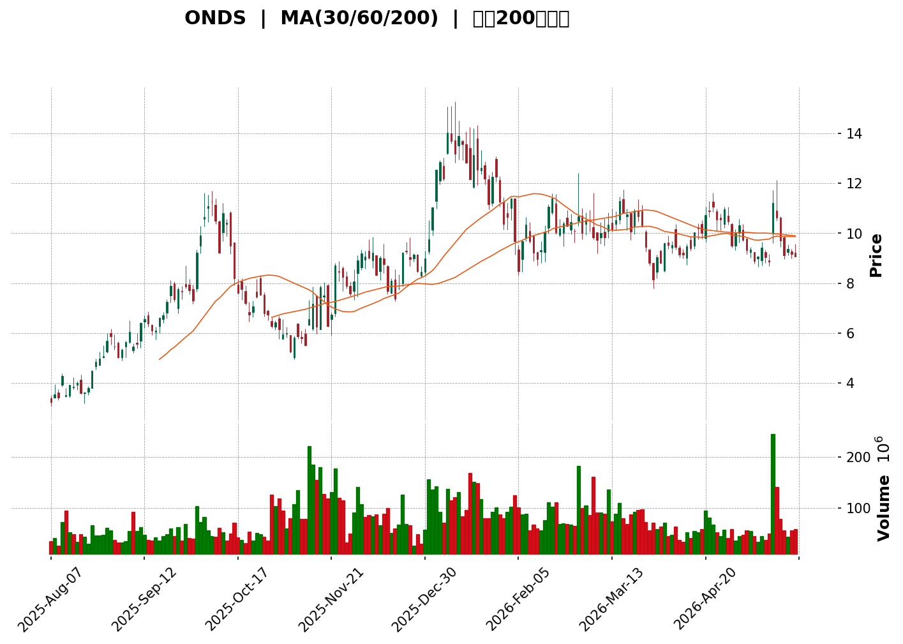
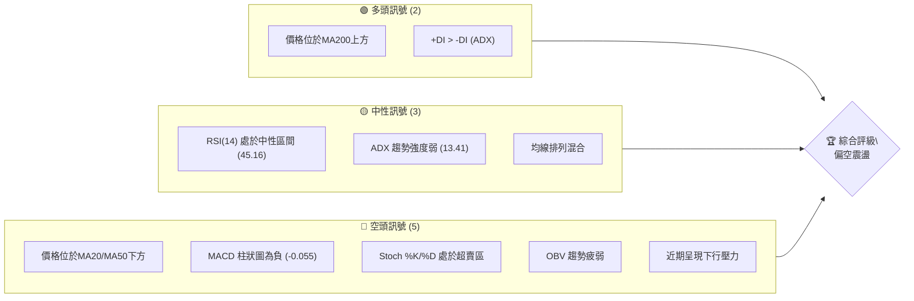
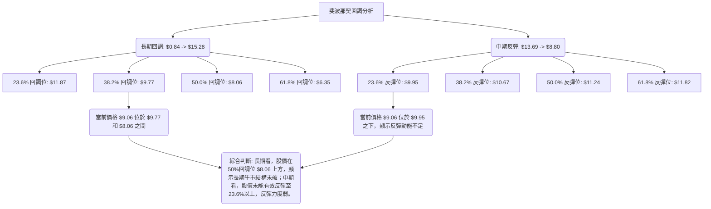
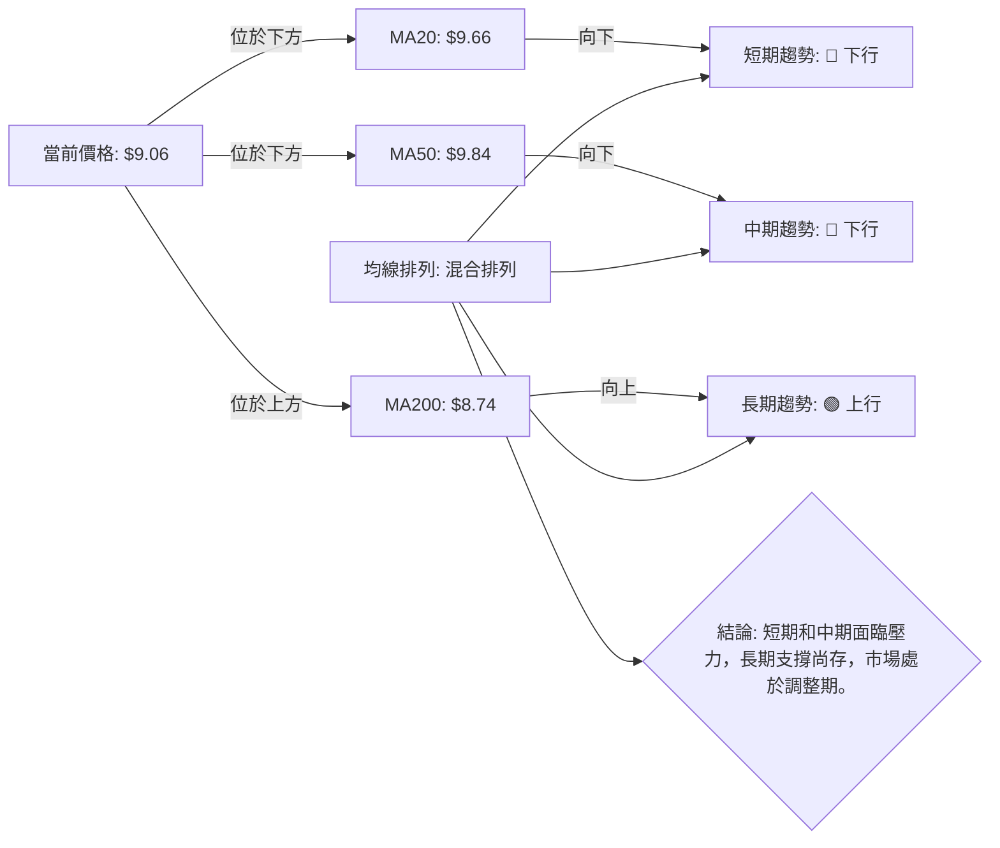

<details>
<summary>📊 靜態圖表 (點擊展開)</summary>

</details>

<html>
<head><meta charset="utf-8" /></head>
<body>
    <div>                        <script>window.PlotlyConfig = {MathJaxConfig: 'local'};</script>
        <script charset="utf-8" src="https://cdn.plot.ly/plotly-3.5.0.min.js" integrity="sha256-fHbNLP+GlIXN+efbQec78UkemUz3NJp7UmfGxC1tNxs=" crossorigin="anonymous"></script>                <div id="candlestick-chart" class="plotly-graph-div" style="height:500px; width:100%;"></div>            <script>                window.PLOTLYENV=window.PLOTLYENV || {};                                if (document.getElementById("candlestick-chart")) {                    Plotly.newPlot(                        "candlestick-chart",                        [{"close":{"dtype":"f8","bdata":"AAAAAAAACkAAAABgZmYMQAAAAOCjcAtAAAAAwPUoEUAAAADA9SgMQAAAAOCjcA9AAAAAoEfhDkAAAACAPQoQQAAAAOBRuAxAAAAAoEfhDEAAAABgZmYOQAAAAIDC9RFAAAAAYGZmE0AAAACgR+ETQAAAACCuRxRAAAAAwMzMFkAAAADgo3AXQAAAAEAK1xVAAAAAYLgeFEAAAACA61EVQAAAAMAehRZAAAAAoHA9GEAAAADAzMwVQAAAAKBwPRZAAAAAgBSuGUAAAACgcD0aQAAAAMAehRlAAAAAAClcGEAAAABgZmYYQAAAAGBmZhpAAAAAoEfhGkAAAACAPQodQAAAAMAehR9AAAAAYGZmHUAAAAAAAAAfQAAAAADXox5AAAAAQOF6H0AAAACgR+EeQAAAAKBwPR1AAAAAIIVrIkAAAACA69EjQAAAAIDrUSVAAAAAgBQuJkAAAADAHoUmQAAAAEDh+iRAAAAA4KNwIkAAAABguJ4lQAAAAIDr0SRAAAAAwB4FI0AAAABgZmYgQAAAAOCjcB5AAAAA4HoUH0AAAABgj8IcQAAAAIDC9RpAAAAAoHA9HEAAAABACtcdQAAAAGC4Hh5AAAAAwPUoG0AAAAAAAAAbQAAAAMD1KBlAAAAAYI\u002fCGUAAAACgmZkYQAAAAEAK1xdAAAAAAAAAGEAAAAAAAAAVQAAAAKBwPRdAAAAAwB6FF0AAAABAMzMXQAAAAIA9ChZAAAAAoHA9GkAAAADgUbgcQAAAAMAeBRlAAAAAAClcH0AAAAAAAAAeQAAAAOB6FBlAAAAA4KPwGkAAAADgo3AhQAAAAKBH4SBAAAAAQOF6IEAAAACgmZkfQAAAAIDrUR5AAAAAANcjIEAAAABACtchQAAAAKBHYSJAAAAAANcjIkAAAACAPQoiQAAAAIDCdSJAAAAAYGamIEAAAACAPQoiQAAAAAAAgCFAAAAAYI\u002fCHkAAAACAFC4gQAAAAEDheh1AAAAAQDMzH0AAAADgo3AiQAAAAIA9iiJAAAAAIIXrIUAAAABgj0IiQAAAAIDC9SBAAAAAIIXrIEAAAABA4fohQAAAAMAehSNAAAAAgD0KJkAAAAAgXA8pQAAAAIAUrilAAAAAAClcKEAAAADAHgUsQAAAAKBHYStAAAAAoEdhKkAAAAAgrscrQAAAAGC4HitAAAAAANejKUAAAACA61EoQAAAAGCPQipAAAAAoJkZKUAAAACgcD0pQAAAAEAKVyhAAAAAgOtRJkAAAADAHoUoQAAAAIA9iihAAAAAgD2KJkAAAADgUbgkQAAAACCuRyVAAAAAYI\u002fCJkAAAAAAKVwjQAAAAIDC9SBAAAAAoEdhI0AAAACAFK4kQAAAAAApXCNAAAAAgMJ1IkAAAADgo\u002fAhQAAAAGC4niJAAAAAoJkZJEAAAAAA1yMmQAAAACCuxyZAAAAAIFwPJEAAAACgR2EkQAAAAMDMzCRAAAAAoJmZJEAAAABgZuYkQAAAAMD1KCRAAAAAQApXJUAAAACAPQokQAAAAMAeBSVAAAAAQOH6JEAAAADA9agjQAAAAOCjcCNAAAAAwB4FJEAAAADA9agjQAAAAMD1qCRAAAAAgOtRJEAAAAAgXA8lQAAAACBcjyZAAAAAwPWoJUAAAAAAAIAlQAAAAGC4HiRAAAAAwMzMJUAAAAAAKVwlQAAAAGC4niRAAAAAoEfhIkAAAACgmZkhQAAAAMDMTCBAAAAA4HoUIkAAAABguJ4hQAAAAEAzMyNAAAAAgD0KI0AAAAAgXA8jQAAAAGBm5iJAAAAAIK5HIkAAAABgj0IiQAAAAOCj8CJAAAAAwMzMIkAAAAAgXA8kQAAAAGBmZiRAAAAAAAAAJEAAAACAwnUlQAAAAKBwvSVAAAAAYLgeJkAAAADgehQlQAAAAKCZGSVAAAAAYGbmJUAAAACAwvUkQAAAAEDh+iJAAAAA4HoUJEAAAAAA16MkQAAAAIDCdSNAAAAAwPWoIkAAAACAFK4iQAAAACCuxyFAAAAAYLgeIkAAAABACtciQAAAAOB6FCJAAAAA4FG4IUAAAAAghWsmQAAAAKBwPSVAAAAAYGZmI0AAAAAAAEAiQAAAAOBRuCJAAAAAAClcIkAAAABguB4iQA=="},"high":{"dtype":"f8","bdata":"AAAAAAAADEAAAACgmZkPQAAAAOB6FA5AAAAAIFyPEUAAAACA61EOQAAAAOCjcA9AAAAAIIXrEEAAAAAAKVwQQAAAAIDrURFAAAAAIK5HDUAAAABguB4PQAAAAIA9ChJAAAAAIIXrE0AAAACAaBEVQAAAAMAeBRZAAAAAgD0KGEAAAAAgg8AYQAAAAMDMzBdAAAAAoEW2FkAAAAAgXI8VQAAAAOBRuBZAAAAAAAAAGkAAAAAAKVwWQAAAAAAAABhAAAAAYI\u002fCGUAAAACgR+EaQAAAAOCjcBtAAAAAYGZmGUAAAAAAAAAZQAAAACBcjxpAAAAAAClcG0AAAADgo3AdQAAAAKBwPSBAAAAAANcjIEAAAAAAKVwfQAAAACBcjx9AAAAAIIVrIUAAAABAClcgQAAAAMDMzB9AAAAAgBSuIkAAAAAgXI8kQAAAAGCPQidAAAAAQAoXJ0AAAABgZmYnQAAAACCuxyZAAAAAwB4FJUAAAACAFG4mQAAAAGC4HiVAAAAAoHC9JUAAAABgj0IjQAAAAIDrUSBAAAAAoEdhIEAAAAAA16MfQAAAAIA9Ch1AAAAAQDMzHUAAAABAClcgQAAAAKBHoSBAAAAAIFyPHkAAAADAzMwbQAAAAIDCdRpAAAAAAAAAGkAAAABgj8IaQAAAACCuRxpAAAAAAAAAGUAAAADgUbgXQAAAAOB6lBdAAAAAIFyPGUAAAACgR2EYQAAAAMD1qBhAAAAAAClcHUAAAADgo3AfQAAAACBcDx5AAAAAgBSuH0AAAACA6xEgQAAAAKBH4R9AAAAAYGZmG0AAAACgmZkhQAAAAGCPwiFAAAAAAClcIUAAAADAIPAgQAAAAADXIyBAAAAAoJkZIUAAAACAwjUiQAAAAIAUriJAAAAAoJmZIkAAAAAAAIAjQAAAAOBRuCNAAAAAQOE6IkAAAADA9SgiQAAAAGBmJiNAAAAAQOF6IUAAAAAA12MgQAAAAGC4HiFAAAAAYJGtIEAAAABA4XoiQAAAAIDrUSNAAAAAgBSuI0AAAABgZmYiQAAAAEAKVyJAAAAAQApXIUAAAACgmZkiQAAAACBcDyVAAAAAYLgeJkAAAADgehQpQAAAAAAp3ClAAAAAgD0KKkAAAAAA1yMuQAAAAEAzMy5AAAAAIFyPLkAAAAAAAAAtQAAAAAAAgCtAAAAAANcjLEAAAAAAAIAsQAAAAGBmZixAAAAAwPWoLEAAAADA9agqQAAAAEDhuilAAAAAIIWrKEAAAADgo\u002fAoQAAAAMD1KCpAAAAAIFyPKEAAAABgZuYmQAAAAGBmZiZAAAAAQArXJkAAAACAPcomQAAAACBcDyNAAAAAwB6FI0AAAAAgrkclQAAAAKBH4SRAAAAAQArXI0AAAACgxosiQAAAAAApXCNAAAAAANejJEAAAABAClcmQAAAAIAULidAAAAAwPUoJ0AAAAAA1yMlQAAAAIDC9SRAAAAAoEfhJUAAAAAgXI8lQAAAAAApXCRAAAAAQArXKEAAAAAAAAAmQAAAAADXoyVAAAAAQArXJUAAAADgUTgnQAAAACBcDyRAAAAAYGbmJEAAAABguB4lQAAAAIAUriVAAAAAgML1JUAAAACgcL0lQAAAAOCj8CZAAAAAwB6FJ0AAAACAwvUlQAAAAMD1qCVAAAAA4KPwJUAAAACgcL0mQAAAACCuRyZAAAAAIK5HJEAAAACgcL0iQAAAAADXoyFAAAAAIK5HIkAAAABAM7MiQAAAAGCPQiNAAAAAwMzMI0AAAACgR2EjQAAAAKBwvSRAAAAAgD0KI0AAAADgUbgiQAAAACCFKyNAAAAA4FG4I0AAAAAgXA8kQAAAACCuxyRAAAAAIFwPJUAAAABguB4mQAAAAOB6lCZAAAAA4FE4J0AAAADgo\u002fAlQAAAAIA9iiVAAAAAYLgeJkAAAAAA1yMmQAAAAAAp3CRAAAAAgOtRJEAAAABguB4lQAAAAEDhuiRAAAAA4HqUI0AAAAAghesiQAAAAAAAgCJAAAAAgBQuIkAAAADAzEwjQAAAAEAzsyJAAAAAAClcIkAAAACAwnUnQAAAAKBwPShAAAAAQApXJUAAAABgj8IjQAAAAOB6FCNAAAAAYI\u002fCIkAAAACgRyEjQA=="},"hovertemplate":"\u003cb\u003e%{x|%Y-%m-%d}\u003c\u002fb\u003e\u003cbr\u003e\u958b: $%{open:.2f}\u003cbr\u003e\u9ad8: $%{high:.2f}\u003cbr\u003e\u4f4e: $%{low:.2f}\u003cbr\u003e\u6536: $%{close:.2f}\u003cextra\u003e\u003c\u002fextra\u003e","low":{"dtype":"f8","bdata":"AAAAgBSuCEAAAADA9SgLQAAAAEDhegpAAAAAoEfhDkAAAADAHoULQAAAAOCjcAtAAAAAgML1DUAAAADAzMwNQAAAAEDhegxAAAAAoJmZCUAAAADgehQMQAAAAGBmZg5AAAAAYLgeEkAAAABACtcSQAAAAIA9ChRAAAAAwMzMFEAAAADA9SgWQAAAAIDrURVAAAAAgD0KFEAAAACgmZkTQAAAAGC4HhRAAAAAYGZmFkAAAABACtcUQAAAAIA9ihVAAAAAANejFUAAAADAzMwYQAAAAAAAABlAAAAAgBSuF0AAAAAAAAAXQAAAAIA9ChhAAAAAgBSuGUAAAACA61EaQAAAACCF6xxAAAAAAAAAHUAAAADA9SgbQAAAAOCjcB1AAAAAQDMzH0AAAAAgrkceQAAAAOBRuBxAAAAAANejHkAAAACgR2EiQAAAAIA9iiRAAAAAYGbmJEAAAABgDm0lQAAAAAAAwCRAAAAAoEdhIkAAAAAgsl0jQAAAAGCPwiNAAAAAgOtRIkAAAACAFK4fQAAAAOBROB5AAAAAgOtRHUAAAAAAAIAcQAAAAAAp3BlAAAAAoJmZGkAAAABguJ4dQAAAAOB6FB5AAAAAANejGkAAAADgehQaQAAAAIDr0RhAAAAAQOF6GEAAAABguB4XQAAAAOB6FBdAAAAAgOtRF0AAAAAAKdwUQAAAAMDMzBNAAAAA4HoUF0AAAABgZmYWQAAAACCF6xVAAAAAoHA9GUAAAABgZmYYQAAAACCF6xdAAAAAoJmZGEAAAACAPQodQAAAAAAAABlAAAAA4FG4F0AAAACAFK4aQAAAAADXIyBAAAAAoHC9HkAAAABAMzMfQAAAAKBH4R1AAAAAIK5HHUAAAABACtcdQAAAAIA9CiFAAAAAwPUoIUAAAADgo\u002fAhQAAAAOBROCFAAAAAACmcIEAAAACgcD0gQAAAAIDr0SBAAAAAoHA9HkAAAAAAKVweQAAAAGC4Hh1AAAAAgML1HkAAAADgo3AfQAAAACBcTyJAAAAAQApXIUAAAABAM7MhQAAAAAAp3CBAAAAAIIVrIEAAAADA9aggQAAAAEAKVyJAAAAAgOvRI0AAAABA4folQAAAACCF6ydAAAAA4FE4KEAAAADAzEwqQAAAAIAULitAAAAAwPWoKUAAAAAghespQAAAAEAK1ylAAAAAoJmZKUAAAACgcD0oQAAAAKCZmSdAAAAAACncJ0AAAABAM7MoQAAAAKBH4SdAAAAAYGbmJUAAAACAFC4mQAAAAGC4HihAAAAAANcjJkAAAAAgrkckQAAAAMDMTCRAAAAAwB4FJUAAAABgj0IiQAAAAADXoyBAAAAAYGbmIEAAAABAClcjQAAAAEAzMyNAAAAAYI\u002fCIUAAAABgZmYhQAAAAADXoyFAAAAAoHC9IUAAAABA4fojQAAAAEDheiVAAAAAYGbmI0AAAADgUbgjQAAAAIDC9SJAAAAAgD2KJEAAAABgZuYjQAAAAKBwPSNAAAAAoJmZJEAAAADAHoUjQAAAAAAp3CNAAAAAYLgeJEAAAADAHoUjQAAAAGBmZiJAAAAAYGYmI0AAAAAAAAAjQAAAAKCZmSNAAAAAoJkZJEAAAADgUTgkQAAAAKBwvSRAAAAAANejJUAAAACgcD0kQAAAAIDCdSNAAAAAgBTuI0AAAABAM\u002fMkQAAAAIDCdSRAAAAAgD2KIkAAAADA9WghQAAAAGC4Hh9AAAAAYGZmIEAAAAAgXI8hQAAAACCF6yBAAAAAYI\u002fCIkAAAADgTWIiQAAAAIAUriJAAAAAwB4FIkAAAABA4fohQAAAAIDCdSFAAAAAoJmZIkAAAACgcL0iQAAAAMAehSNAAAAAgD2KI0AAAACA61EjQAAAACCuRyVAAAAAQDOzJUAAAABAMzMkQAAAAEDhOiRAAAAAIIVrJEAAAAAghaskQAAAAIDr0SJAAAAAYLieIkAAAACgcD0jQAAAAEAKVyNAAAAAgOtRIkAAAACAPQoiQAAAACBcjyFAAAAAwMxMIUAAAADgo3AhQAAAAKCZmSFAAAAAQApXIUAAAABAMzMjQAAAAAAAACVAAAAAIIXrIkAAAADgo\u002fAhQAAAAKBwPSJAAAAAgML1IUAAAABguB4iQA=="},"name":"\u50f9\u683c","open":{"dtype":"f8","bdata":"AAAAQDMzC0AAAAAgrkcLQAAAAKBH4QxAAAAAwB6FD0AAAABACtcLQAAAAAAAAAxAAAAAANejDkAAAAAAKVwPQAAAACBcjxBAAAAAwMzMDEAAAABguB4NQAAAAGBmZg5AAAAA4FG4EkAAAACgR+ESQAAAAOB6FBRAAAAAAAAAFUAAAAAAAAAYQAAAAGBm5hVAAAAAQOF6FkAAAAAA1yMUQAAAAMDMzBVAAAAAwB6FFkAAAACgcD0VQAAAAOCjcBZAAAAA4FG4FkAAAADAzMwZQAAAAEAK1xpAAAAAIK5HGUAAAACgcD0YQAAAAGC4HhlAAAAAQDMzGkAAAAAgrkcbQAAAACBcDx5AAAAAgML1H0AAAADAHgUcQAAAACCuxx5AAAAAQArXH0AAAADgUbgfQAAAAAAAAB9AAAAAQDMzH0AAAADAHgUjQAAAAGC4HiVAAAAAAAAAJkAAAAAgrocmQAAAACCuRyZAAAAAgML1JEAAAAAgXA8kQAAAAGCPwiRAAAAAYGamJUAAAABgj0IjQAAAAMDMzB9AAAAAYLgeIEAAAADgUbgeQAAAAGBmZhtAAAAAYGZmG0AAAACAFK4eQAAAAGC4XiBAAAAA4HoUHkAAAADgepQbQAAAAIDC9RlAAAAAAAAAGUAAAADAzEwaQAAAAGC4HhdAAAAAIIXrF0AAAACAFK4XQAAAAMD1KBRAAAAAQOF6GUAAAABgZmYXQAAAAOCj8BdAAAAAIK5HGUAAAADA9agYQAAAAIA9Ch5AAAAAYLieGEAAAAAAKdwdQAAAAIAUrh9AAAAAoHA9GkAAAAAA1yMbQAAAAIDC9SBAAAAA4FE4IUAAAAAgXI8gQAAAAMAehR9AAAAA4FG4HkAAAAAgrscgQAAAAMAeRSFAAAAAACncIUAAAABACpciQAAAAEAK1yFAAAAA4FE4IkAAAABA4fogQAAAAIDC9SFAAAAAAClcIUAAAABA4XoeQAAAACCuRyBAAAAAwPUoH0AAAACAwvUfQAAAAKCZmSJAAAAAIFwPIkAAAACAwvUhQAAAAOAkRiJAAAAAoJmZIEAAAAAghesgQAAAACBcjyJAAAAAwB5FJEAAAACgmZkmQAAAAEAzMyhAAAAAYGZmKUAAAADA9WgqQAAAAAAAACxAAAAAIIVrK0AAAAAAAAArQAAAAKBHYStAAAAAANcjK0AAAADgetQqQAAAAIDCtSdAAAAAoJmZK0AAAADAHgUpQAAAACCFaylAAAAAwMxMKEAAAAAghWsmQAAAAIDC9SlAAAAAIK5HKEAAAAAAAIAmQAAAAGC4niVAAAAAwB4FJkAAAABgj8ImQAAAAIAUriJAAAAAgBTuIUAAAAAAKZwjQAAAAIAULiRAAAAAwB7FI0AAAACgcH0iQAAAAIA9iiJAAAAA4FF4IkAAAAAghWskQAAAAADXoyVAAAAAoEdhJkAAAAAAKdwjQAAAAMAeBSRAAAAAYI9CJUAAAADAzEwkQAAAAIAULiRAAAAAAAAAJUAAAACgR2ElQAAAAOBRuCRAAAAAQOH6JEAAAAAAAIAkQAAAACBcDyRAAAAAgBSuI0AAAACgmRkkQAAAACCFKyRAAAAAACncJEAAAACgcL0kQAAAAKCZGSVAAAAAAADAJkAAAABguF4lQAAAAOB6lCVAAAAA4HqUJEAAAACA69ElQAAAAGCPwiVAAAAAoJkZJEAAAABAM7MiQAAAAGC4niFAAAAAYGbmIEAAAACgmZkiQAAAACCuByFAAAAAYI9CI0AAAAAAKdwiQAAAAEAKVyRAAAAA4HrUIkAAAACAwnUiQAAAAMAeBSJAAAAA4KNwI0AAAADAHgUjQAAAAAAAgCRAAAAAYI\u002fCJEAAAACgmZkjQAAAAMDMzCVAAAAAgD2KJkAAAABgj8IlQAAAAGCPQiVAAAAAwEu3JEAAAAAA12MlQAAAAGCPwiRAAAAAAAAAI0AAAAAAAAAkQAAAAMDMTCRAAAAAIFyPI0AAAAAAAIAiQAAAAAAAgCJAAAAAAAAAIkAAAABACtchQAAAAOBReCJAAAAAQArXIUAAAABA4fojQAAAAIDr0SVAAAAAYI9CJUAAAABgZqYjQAAAAAAAgCJAAAAAIFyPIkAAAAAghWsiQA=="},"x":["2025-08-07T00:00:00-04:00","2025-08-08T00:00:00-04:00","2025-08-11T00:00:00-04:00","2025-08-12T00:00:00-04:00","2025-08-13T00:00:00-04:00","2025-08-14T00:00:00-04:00","2025-08-15T00:00:00-04:00","2025-08-18T00:00:00-04:00","2025-08-19T00:00:00-04:00","2025-08-20T00:00:00-04:00","2025-08-21T00:00:00-04:00","2025-08-22T00:00:00-04:00","2025-08-25T00:00:00-04:00","2025-08-26T00:00:00-04:00","2025-08-27T00:00:00-04:00","2025-08-28T00:00:00-04:00","2025-08-29T00:00:00-04:00","2025-09-02T00:00:00-04:00","2025-09-03T00:00:00-04:00","2025-09-04T00:00:00-04:00","2025-09-05T00:00:00-04:00","2025-09-08T00:00:00-04:00","2025-09-09T00:00:00-04:00","2025-09-10T00:00:00-04:00","2025-09-11T00:00:00-04:00","2025-09-12T00:00:00-04:00","2025-09-15T00:00:00-04:00","2025-09-16T00:00:00-04:00","2025-09-17T00:00:00-04:00","2025-09-18T00:00:00-04:00","2025-09-19T00:00:00-04:00","2025-09-22T00:00:00-04:00","2025-09-23T00:00:00-04:00","2025-09-24T00:00:00-04:00","2025-09-25T00:00:00-04:00","2025-09-26T00:00:00-04:00","2025-09-29T00:00:00-04:00","2025-09-30T00:00:00-04:00","2025-10-01T00:00:00-04:00","2025-10-02T00:00:00-04:00","2025-10-03T00:00:00-04:00","2025-10-06T00:00:00-04:00","2025-10-07T00:00:00-04:00","2025-10-08T00:00:00-04:00","2025-10-09T00:00:00-04:00","2025-10-10T00:00:00-04:00","2025-10-13T00:00:00-04:00","2025-10-14T00:00:00-04:00","2025-10-15T00:00:00-04:00","2025-10-16T00:00:00-04:00","2025-10-17T00:00:00-04:00","2025-10-20T00:00:00-04:00","2025-10-21T00:00:00-04:00","2025-10-22T00:00:00-04:00","2025-10-23T00:00:00-04:00","2025-10-24T00:00:00-04:00","2025-10-27T00:00:00-04:00","2025-10-28T00:00:00-04:00","2025-10-29T00:00:00-04:00","2025-10-30T00:00:00-04:00","2025-10-31T00:00:00-04:00","2025-11-03T00:00:00-05:00","2025-11-04T00:00:00-05:00","2025-11-05T00:00:00-05:00","2025-11-06T00:00:00-05:00","2025-11-07T00:00:00-05:00","2025-11-10T00:00:00-05:00","2025-11-11T00:00:00-05:00","2025-11-12T00:00:00-05:00","2025-11-13T00:00:00-05:00","2025-11-14T00:00:00-05:00","2025-11-17T00:00:00-05:00","2025-11-18T00:00:00-05:00","2025-11-19T00:00:00-05:00","2025-11-20T00:00:00-05:00","2025-11-21T00:00:00-05:00","2025-11-24T00:00:00-05:00","2025-11-25T00:00:00-05:00","2025-11-26T00:00:00-05:00","2025-11-28T00:00:00-05:00","2025-12-01T00:00:00-05:00","2025-12-02T00:00:00-05:00","2025-12-03T00:00:00-05:00","2025-12-04T00:00:00-05:00","2025-12-05T00:00:00-05:00","2025-12-08T00:00:00-05:00","2025-12-09T00:00:00-05:00","2025-12-10T00:00:00-05:00","2025-12-11T00:00:00-05:00","2025-12-12T00:00:00-05:00","2025-12-15T00:00:00-05:00","2025-12-16T00:00:00-05:00","2025-12-17T00:00:00-05:00","2025-12-18T00:00:00-05:00","2025-12-19T00:00:00-05:00","2025-12-22T00:00:00-05:00","2025-12-23T00:00:00-05:00","2025-12-24T00:00:00-05:00","2025-12-26T00:00:00-05:00","2025-12-29T00:00:00-05:00","2025-12-30T00:00:00-05:00","2025-12-31T00:00:00-05:00","2026-01-02T00:00:00-05:00","2026-01-05T00:00:00-05:00","2026-01-06T00:00:00-05:00","2026-01-07T00:00:00-05:00","2026-01-08T00:00:00-05:00","2026-01-09T00:00:00-05:00","2026-01-12T00:00:00-05:00","2026-01-13T00:00:00-05:00","2026-01-14T00:00:00-05:00","2026-01-15T00:00:00-05:00","2026-01-16T00:00:00-05:00","2026-01-20T00:00:00-05:00","2026-01-21T00:00:00-05:00","2026-01-22T00:00:00-05:00","2026-01-23T00:00:00-05:00","2026-01-26T00:00:00-05:00","2026-01-27T00:00:00-05:00","2026-01-28T00:00:00-05:00","2026-01-29T00:00:00-05:00","2026-01-30T00:00:00-05:00","2026-02-02T00:00:00-05:00","2026-02-03T00:00:00-05:00","2026-02-04T00:00:00-05:00","2026-02-05T00:00:00-05:00","2026-02-06T00:00:00-05:00","2026-02-09T00:00:00-05:00","2026-02-10T00:00:00-05:00","2026-02-11T00:00:00-05:00","2026-02-12T00:00:00-05:00","2026-02-13T00:00:00-05:00","2026-02-17T00:00:00-05:00","2026-02-18T00:00:00-05:00","2026-02-19T00:00:00-05:00","2026-02-20T00:00:00-05:00","2026-02-23T00:00:00-05:00","2026-02-24T00:00:00-05:00","2026-02-25T00:00:00-05:00","2026-02-26T00:00:00-05:00","2026-02-27T00:00:00-05:00","2026-03-02T00:00:00-05:00","2026-03-03T00:00:00-05:00","2026-03-04T00:00:00-05:00","2026-03-05T00:00:00-05:00","2026-03-06T00:00:00-05:00","2026-03-09T00:00:00-04:00","2026-03-10T00:00:00-04:00","2026-03-11T00:00:00-04:00","2026-03-12T00:00:00-04:00","2026-03-13T00:00:00-04:00","2026-03-16T00:00:00-04:00","2026-03-17T00:00:00-04:00","2026-03-18T00:00:00-04:00","2026-03-19T00:00:00-04:00","2026-03-20T00:00:00-04:00","2026-03-23T00:00:00-04:00","2026-03-24T00:00:00-04:00","2026-03-25T00:00:00-04:00","2026-03-26T00:00:00-04:00","2026-03-27T00:00:00-04:00","2026-03-30T00:00:00-04:00","2026-03-31T00:00:00-04:00","2026-04-01T00:00:00-04:00","2026-04-02T00:00:00-04:00","2026-04-06T00:00:00-04:00","2026-04-07T00:00:00-04:00","2026-04-08T00:00:00-04:00","2026-04-09T00:00:00-04:00","2026-04-10T00:00:00-04:00","2026-04-13T00:00:00-04:00","2026-04-14T00:00:00-04:00","2026-04-15T00:00:00-04:00","2026-04-16T00:00:00-04:00","2026-04-17T00:00:00-04:00","2026-04-20T00:00:00-04:00","2026-04-21T00:00:00-04:00","2026-04-22T00:00:00-04:00","2026-04-23T00:00:00-04:00","2026-04-24T00:00:00-04:00","2026-04-27T00:00:00-04:00","2026-04-28T00:00:00-04:00","2026-04-29T00:00:00-04:00","2026-04-30T00:00:00-04:00","2026-05-01T00:00:00-04:00","2026-05-04T00:00:00-04:00","2026-05-05T00:00:00-04:00","2026-05-06T00:00:00-04:00","2026-05-07T00:00:00-04:00","2026-05-08T00:00:00-04:00","2026-05-11T00:00:00-04:00","2026-05-12T00:00:00-04:00","2026-05-13T00:00:00-04:00","2026-05-14T00:00:00-04:00","2026-05-15T00:00:00-04:00","2026-05-18T00:00:00-04:00","2026-05-19T00:00:00-04:00","2026-05-20T00:00:00-04:00","2026-05-21T00:00:00-04:00","2026-05-22T00:00:00-04:00"],"type":"candlestick"},{"hovertemplate":"MA30: $%{y:.2f}\u003cextra\u003e\u003c\u002fextra\u003e","line":{"color":"#2196F3","dash":"dash","width":2},"mode":"lines","name":"MA30","x":["2025-08-07T00:00:00-04:00","2025-08-08T00:00:00-04:00","2025-08-11T00:00:00-04:00","2025-08-12T00:00:00-04:00","2025-08-13T00:00:00-04:00","2025-08-14T00:00:00-04:00","2025-08-15T00:00:00-04:00","2025-08-18T00:00:00-04:00","2025-08-19T00:00:00-04:00","2025-08-20T00:00:00-04:00","2025-08-21T00:00:00-04:00","2025-08-22T00:00:00-04:00","2025-08-25T00:00:00-04:00","2025-08-26T00:00:00-04:00","2025-08-27T00:00:00-04:00","2025-08-28T00:00:00-04:00","2025-08-29T00:00:00-04:00","2025-09-02T00:00:00-04:00","2025-09-03T00:00:00-04:00","2025-09-04T00:00:00-04:00","2025-09-05T00:00:00-04:00","2025-09-08T00:00:00-04:00","2025-09-09T00:00:00-04:00","2025-09-10T00:00:00-04:00","2025-09-11T00:00:00-04:00","2025-09-12T00:00:00-04:00","2025-09-15T00:00:00-04:00","2025-09-16T00:00:00-04:00","2025-09-17T00:00:00-04:00","2025-09-18T00:00:00-04:00","2025-09-19T00:00:00-04:00","2025-09-22T00:00:00-04:00","2025-09-23T00:00:00-04:00","2025-09-24T00:00:00-04:00","2025-09-25T00:00:00-04:00","2025-09-26T00:00:00-04:00","2025-09-29T00:00:00-04:00","2025-09-30T00:00:00-04:00","2025-10-01T00:00:00-04:00","2025-10-02T00:00:00-04:00","2025-10-03T00:00:00-04:00","2025-10-06T00:00:00-04:00","2025-10-07T00:00:00-04:00","2025-10-08T00:00:00-04:00","2025-10-09T00:00:00-04:00","2025-10-10T00:00:00-04:00","2025-10-13T00:00:00-04:00","2025-10-14T00:00:00-04:00","2025-10-15T00:00:00-04:00","2025-10-16T00:00:00-04:00","2025-10-17T00:00:00-04:00","2025-10-20T00:00:00-04:00","2025-10-21T00:00:00-04:00","2025-10-22T00:00:00-04:00","2025-10-23T00:00:00-04:00","2025-10-24T00:00:00-04:00","2025-10-27T00:00:00-04:00","2025-10-28T00:00:00-04:00","2025-10-29T00:00:00-04:00","2025-10-30T00:00:00-04:00","2025-10-31T00:00:00-04:00","2025-11-03T00:00:00-05:00","2025-11-04T00:00:00-05:00","2025-11-05T00:00:00-05:00","2025-11-06T00:00:00-05:00","2025-11-07T00:00:00-05:00","2025-11-10T00:00:00-05:00","2025-11-11T00:00:00-05:00","2025-11-12T00:00:00-05:00","2025-11-13T00:00:00-05:00","2025-11-14T00:00:00-05:00","2025-11-17T00:00:00-05:00","2025-11-18T00:00:00-05:00","2025-11-19T00:00:00-05:00","2025-11-20T00:00:00-05:00","2025-11-21T00:00:00-05:00","2025-11-24T00:00:00-05:00","2025-11-25T00:00:00-05:00","2025-11-26T00:00:00-05:00","2025-11-28T00:00:00-05:00","2025-12-01T00:00:00-05:00","2025-12-02T00:00:00-05:00","2025-12-03T00:00:00-05:00","2025-12-04T00:00:00-05:00","2025-12-05T00:00:00-05:00","2025-12-08T00:00:00-05:00","2025-12-09T00:00:00-05:00","2025-12-10T00:00:00-05:00","2025-12-11T00:00:00-05:00","2025-12-12T00:00:00-05:00","2025-12-15T00:00:00-05:00","2025-12-16T00:00:00-05:00","2025-12-17T00:00:00-05:00","2025-12-18T00:00:00-05:00","2025-12-19T00:00:00-05:00","2025-12-22T00:00:00-05:00","2025-12-23T00:00:00-05:00","2025-12-24T00:00:00-05:00","2025-12-26T00:00:00-05:00","2025-12-29T00:00:00-05:00","2025-12-30T00:00:00-05:00","2025-12-31T00:00:00-05:00","2026-01-02T00:00:00-05:00","2026-01-05T00:00:00-05:00","2026-01-06T00:00:00-05:00","2026-01-07T00:00:00-05:00","2026-01-08T00:00:00-05:00","2026-01-09T00:00:00-05:00","2026-01-12T00:00:00-05:00","2026-01-13T00:00:00-05:00","2026-01-14T00:00:00-05:00","2026-01-15T00:00:00-05:00","2026-01-16T00:00:00-05:00","2026-01-20T00:00:00-05:00","2026-01-21T00:00:00-05:00","2026-01-22T00:00:00-05:00","2026-01-23T00:00:00-05:00","2026-01-26T00:00:00-05:00","2026-01-27T00:00:00-05:00","2026-01-28T00:00:00-05:00","2026-01-29T00:00:00-05:00","2026-01-30T00:00:00-05:00","2026-02-02T00:00:00-05:00","2026-02-03T00:00:00-05:00","2026-02-04T00:00:00-05:00","2026-02-05T00:00:00-05:00","2026-02-06T00:00:00-05:00","2026-02-09T00:00:00-05:00","2026-02-10T00:00:00-05:00","2026-02-11T00:00:00-05:00","2026-02-12T00:00:00-05:00","2026-02-13T00:00:00-05:00","2026-02-17T00:00:00-05:00","2026-02-18T00:00:00-05:00","2026-02-19T00:00:00-05:00","2026-02-20T00:00:00-05:00","2026-02-23T00:00:00-05:00","2026-02-24T00:00:00-05:00","2026-02-25T00:00:00-05:00","2026-02-26T00:00:00-05:00","2026-02-27T00:00:00-05:00","2026-03-02T00:00:00-05:00","2026-03-03T00:00:00-05:00","2026-03-04T00:00:00-05:00","2026-03-05T00:00:00-05:00","2026-03-06T00:00:00-05:00","2026-03-09T00:00:00-04:00","2026-03-10T00:00:00-04:00","2026-03-11T00:00:00-04:00","2026-03-12T00:00:00-04:00","2026-03-13T00:00:00-04:00","2026-03-16T00:00:00-04:00","2026-03-17T00:00:00-04:00","2026-03-18T00:00:00-04:00","2026-03-19T00:00:00-04:00","2026-03-20T00:00:00-04:00","2026-03-23T00:00:00-04:00","2026-03-24T00:00:00-04:00","2026-03-25T00:00:00-04:00","2026-03-26T00:00:00-04:00","2026-03-27T00:00:00-04:00","2026-03-30T00:00:00-04:00","2026-03-31T00:00:00-04:00","2026-04-01T00:00:00-04:00","2026-04-02T00:00:00-04:00","2026-04-06T00:00:00-04:00","2026-04-07T00:00:00-04:00","2026-04-08T00:00:00-04:00","2026-04-09T00:00:00-04:00","2026-04-10T00:00:00-04:00","2026-04-13T00:00:00-04:00","2026-04-14T00:00:00-04:00","2026-04-15T00:00:00-04:00","2026-04-16T00:00:00-04:00","2026-04-17T00:00:00-04:00","2026-04-20T00:00:00-04:00","2026-04-21T00:00:00-04:00","2026-04-22T00:00:00-04:00","2026-04-23T00:00:00-04:00","2026-04-24T00:00:00-04:00","2026-04-27T00:00:00-04:00","2026-04-28T00:00:00-04:00","2026-04-29T00:00:00-04:00","2026-04-30T00:00:00-04:00","2026-05-01T00:00:00-04:00","2026-05-04T00:00:00-04:00","2026-05-05T00:00:00-04:00","2026-05-06T00:00:00-04:00","2026-05-07T00:00:00-04:00","2026-05-08T00:00:00-04:00","2026-05-11T00:00:00-04:00","2026-05-12T00:00:00-04:00","2026-05-13T00:00:00-04:00","2026-05-14T00:00:00-04:00","2026-05-15T00:00:00-04:00","2026-05-18T00:00:00-04:00","2026-05-19T00:00:00-04:00","2026-05-20T00:00:00-04:00","2026-05-21T00:00:00-04:00","2026-05-22T00:00:00-04:00"],"y":{"dtype":"f8","bdata":"AAAAAAAA+H8AAAAAAAD4fwAAAAAAAPh\u002fAAAAAAAA+H8AAAAAAAD4fwAAAAAAAPh\u002fAAAAAAAA+H8AAAAAAAD4fwAAAAAAAPh\u002fAAAAAAAA+H8AAAAAAAD4fwAAAAAAAPh\u002fAAAAAAAA+H8AAAAAAAD4fwAAAAAAAPh\u002fAAAAAAAA+H8AAAAAAAD4fwAAAAAAAPh\u002fAAAAAAAA+H8AAAAAAAD4fwAAAAAAAPh\u002fAAAAAAAA+H8AAAAAAAD4fwAAAAAAAPh\u002fAAAAAAAA+H8AAAAAAAD4fwAAAAAAAPh\u002fAAAAAAAA+H8AAAAAAAD4f7y7u+MXyxNA3t3dNYlBFEAAAACwK8AUQJqZmWEQWBVAmpmZEYPAFUB3d3df5VAWQLy7u5s20BZA3t3dhRZZF0BmZmb+uNcXQJqZmdmyVhhA3t3dZdgVGUBERERkZuYZQM3MzKwAuRpAERERof6NG0De3d19sWQcQLy7uyuyHR1Ad3d3Z9iVHUCrqqoqzj4eQM3MzOzD5x5AMzMzw66AH0BEREQ0peIfQKuqqlodEyBAVVVVdUwwIECrqqqi\u002fk0gQCIiIiIiYiBA3t3dVQ5tIEDv7u5+anwgQEREROwKkCBAzczMRP2bIECamZkpFacgQImIiMDKoSBAIiIiagOdIEAAAADAEYogQERERCRNaSBA7+7u5kJSIEBEREQ8mCcgQGZmZnYFCCBAq6qqCh7MH0BERETUlIofQBERETEkTR9AMzMzI7DyHkCJiIgIgZUeQO\u002fu7o4l\u002fx1AAAAAoDaQHUDe3d093w8dQCIiIlLUfxxA7+7uDgIrHEC8u7tbq+MbQLy7uzttoBtAzczMzBN1G0DNzMxc1mobQHd3dzfQaRtAd3d3pw10G0AAAACgGq8bQM3MzAy7AhxAIiIislZHHEAAAAAwlnwcQCIiIgKdthxAq6qqCgLrHEC8u7ubfTgdQKuqqmp1jB1AVVVVFSC3HUAAAAAQWPkdQERERNR4KR5AiYiIeOlmHkDNzMzca+4eQO\u002fu7s6FZB9AIiIiQqfNH0Dv7u6eqB8gQO\u002fu7r5YUiBAERER+cVyIEC8u7v7qZEgQAAAAJB7zSBAIiIiMsEDIUCamZmZmVkhQGZmZl66ySFAAAAA8KcmIkDNzMxM8IAiQGZmZuaJ2iJAd3d3xwQvI0BVVVV9P5UjQKuqqoJO+yNAvLu7k19MJEAiIiJaq4MkQCIiInrpxiRAzczM1E0CJUAAAAB4vj8lQO\u002fu7obrcSVAzczM1E2iJUAzMzObmdklQBEREbmsFSZAvLu7+8VSJkAzMzPDg3kmQM3MzJxSsSZA7+7u3mvuJkBERESkRfYmQDMzMxPK6CZA3t3dfT\u002f1JkAAAAAQ5gknQCIiIvJgHidAAAAAIIUrJ0Dv7u6+LSsnQKuqqqp\u002fIydAvLu7q\u002fESJ0BVVVXVBvomQAAAALBH4SZAERERMZa8JkCrqqpaZHsmQAAAACA+QyZAZmZmhusRJkDv7u7uNdclQERERJTRmyVAZmZmFiB3JUCamZlJmlIlQFVVVVXjJSVA3t3dDbsCJUC8u7tbHdMkQFVVVSVNqSRAiYiIuKyVJEAzMzPjM2wkQFVVVeUXSyRAq6qqOiY4JECJiIj4DDskQLy7uyv5RSRA7+7uLpY8JEBVVVUV2U4kQGZmZjbQaSRAiYiIyHZ+JEBERERERIQkQHd3d8cEjyRAiYiISJqSJECrqqqKs48kQLy7u2vneyRAmpmZqapqJEAzMzOTGEQkQCIiIvKLJSRAmpmZudccJEBEREQklBEkQHd3d4ddASRAmpmZaZHtI0Dv7u4+CtcjQN7d3R2hzCNAZmZmZvS2I0BmZmYWILcjQM3MzKzVsSNAVVVV1XipI0De3d391LgjQKuqqmp1zCNAAAAA8GDeI0CamZn5fuojQLy7uytA7iNAvLu7u7v7I0B3d3dH4fojQGZmZqZU3CNAZmZmFtnOI0AzMzNjgscjQHd3d5fgwSNAiYiIKBWnI0C8u7ubNpAjQImIiIj6dyNAq6qqSn5xI0DNzMwcE3wjQFVVVZVDiyNAZmZmJjGII0CJiIjoJrEjQKuqqlqPwiNAiYiIyKHFI0AAAABQuL4jQImIiBgvvSNAvLu72929I0BmZmYGrLwjQA=="},"type":"scatter"},{"hovertemplate":"MA60: $%{y:.2f}\u003cextra\u003e\u003c\u002fextra\u003e","line":{"color":"#9C27B0","dash":"dash","width":2},"mode":"lines","name":"MA60","x":["2025-08-07T00:00:00-04:00","2025-08-08T00:00:00-04:00","2025-08-11T00:00:00-04:00","2025-08-12T00:00:00-04:00","2025-08-13T00:00:00-04:00","2025-08-14T00:00:00-04:00","2025-08-15T00:00:00-04:00","2025-08-18T00:00:00-04:00","2025-08-19T00:00:00-04:00","2025-08-20T00:00:00-04:00","2025-08-21T00:00:00-04:00","2025-08-22T00:00:00-04:00","2025-08-25T00:00:00-04:00","2025-08-26T00:00:00-04:00","2025-08-27T00:00:00-04:00","2025-08-28T00:00:00-04:00","2025-08-29T00:00:00-04:00","2025-09-02T00:00:00-04:00","2025-09-03T00:00:00-04:00","2025-09-04T00:00:00-04:00","2025-09-05T00:00:00-04:00","2025-09-08T00:00:00-04:00","2025-09-09T00:00:00-04:00","2025-09-10T00:00:00-04:00","2025-09-11T00:00:00-04:00","2025-09-12T00:00:00-04:00","2025-09-15T00:00:00-04:00","2025-09-16T00:00:00-04:00","2025-09-17T00:00:00-04:00","2025-09-18T00:00:00-04:00","2025-09-19T00:00:00-04:00","2025-09-22T00:00:00-04:00","2025-09-23T00:00:00-04:00","2025-09-24T00:00:00-04:00","2025-09-25T00:00:00-04:00","2025-09-26T00:00:00-04:00","2025-09-29T00:00:00-04:00","2025-09-30T00:00:00-04:00","2025-10-01T00:00:00-04:00","2025-10-02T00:00:00-04:00","2025-10-03T00:00:00-04:00","2025-10-06T00:00:00-04:00","2025-10-07T00:00:00-04:00","2025-10-08T00:00:00-04:00","2025-10-09T00:00:00-04:00","2025-10-10T00:00:00-04:00","2025-10-13T00:00:00-04:00","2025-10-14T00:00:00-04:00","2025-10-15T00:00:00-04:00","2025-10-16T00:00:00-04:00","2025-10-17T00:00:00-04:00","2025-10-20T00:00:00-04:00","2025-10-21T00:00:00-04:00","2025-10-22T00:00:00-04:00","2025-10-23T00:00:00-04:00","2025-10-24T00:00:00-04:00","2025-10-27T00:00:00-04:00","2025-10-28T00:00:00-04:00","2025-10-29T00:00:00-04:00","2025-10-30T00:00:00-04:00","2025-10-31T00:00:00-04:00","2025-11-03T00:00:00-05:00","2025-11-04T00:00:00-05:00","2025-11-05T00:00:00-05:00","2025-11-06T00:00:00-05:00","2025-11-07T00:00:00-05:00","2025-11-10T00:00:00-05:00","2025-11-11T00:00:00-05:00","2025-11-12T00:00:00-05:00","2025-11-13T00:00:00-05:00","2025-11-14T00:00:00-05:00","2025-11-17T00:00:00-05:00","2025-11-18T00:00:00-05:00","2025-11-19T00:00:00-05:00","2025-11-20T00:00:00-05:00","2025-11-21T00:00:00-05:00","2025-11-24T00:00:00-05:00","2025-11-25T00:00:00-05:00","2025-11-26T00:00:00-05:00","2025-11-28T00:00:00-05:00","2025-12-01T00:00:00-05:00","2025-12-02T00:00:00-05:00","2025-12-03T00:00:00-05:00","2025-12-04T00:00:00-05:00","2025-12-05T00:00:00-05:00","2025-12-08T00:00:00-05:00","2025-12-09T00:00:00-05:00","2025-12-10T00:00:00-05:00","2025-12-11T00:00:00-05:00","2025-12-12T00:00:00-05:00","2025-12-15T00:00:00-05:00","2025-12-16T00:00:00-05:00","2025-12-17T00:00:00-05:00","2025-12-18T00:00:00-05:00","2025-12-19T00:00:00-05:00","2025-12-22T00:00:00-05:00","2025-12-23T00:00:00-05:00","2025-12-24T00:00:00-05:00","2025-12-26T00:00:00-05:00","2025-12-29T00:00:00-05:00","2025-12-30T00:00:00-05:00","2025-12-31T00:00:00-05:00","2026-01-02T00:00:00-05:00","2026-01-05T00:00:00-05:00","2026-01-06T00:00:00-05:00","2026-01-07T00:00:00-05:00","2026-01-08T00:00:00-05:00","2026-01-09T00:00:00-05:00","2026-01-12T00:00:00-05:00","2026-01-13T00:00:00-05:00","2026-01-14T00:00:00-05:00","2026-01-15T00:00:00-05:00","2026-01-16T00:00:00-05:00","2026-01-20T00:00:00-05:00","2026-01-21T00:00:00-05:00","2026-01-22T00:00:00-05:00","2026-01-23T00:00:00-05:00","2026-01-26T00:00:00-05:00","2026-01-27T00:00:00-05:00","2026-01-28T00:00:00-05:00","2026-01-29T00:00:00-05:00","2026-01-30T00:00:00-05:00","2026-02-02T00:00:00-05:00","2026-02-03T00:00:00-05:00","2026-02-04T00:00:00-05:00","2026-02-05T00:00:00-05:00","2026-02-06T00:00:00-05:00","2026-02-09T00:00:00-05:00","2026-02-10T00:00:00-05:00","2026-02-11T00:00:00-05:00","2026-02-12T00:00:00-05:00","2026-02-13T00:00:00-05:00","2026-02-17T00:00:00-05:00","2026-02-18T00:00:00-05:00","2026-02-19T00:00:00-05:00","2026-02-20T00:00:00-05:00","2026-02-23T00:00:00-05:00","2026-02-24T00:00:00-05:00","2026-02-25T00:00:00-05:00","2026-02-26T00:00:00-05:00","2026-02-27T00:00:00-05:00","2026-03-02T00:00:00-05:00","2026-03-03T00:00:00-05:00","2026-03-04T00:00:00-05:00","2026-03-05T00:00:00-05:00","2026-03-06T00:00:00-05:00","2026-03-09T00:00:00-04:00","2026-03-10T00:00:00-04:00","2026-03-11T00:00:00-04:00","2026-03-12T00:00:00-04:00","2026-03-13T00:00:00-04:00","2026-03-16T00:00:00-04:00","2026-03-17T00:00:00-04:00","2026-03-18T00:00:00-04:00","2026-03-19T00:00:00-04:00","2026-03-20T00:00:00-04:00","2026-03-23T00:00:00-04:00","2026-03-24T00:00:00-04:00","2026-03-25T00:00:00-04:00","2026-03-26T00:00:00-04:00","2026-03-27T00:00:00-04:00","2026-03-30T00:00:00-04:00","2026-03-31T00:00:00-04:00","2026-04-01T00:00:00-04:00","2026-04-02T00:00:00-04:00","2026-04-06T00:00:00-04:00","2026-04-07T00:00:00-04:00","2026-04-08T00:00:00-04:00","2026-04-09T00:00:00-04:00","2026-04-10T00:00:00-04:00","2026-04-13T00:00:00-04:00","2026-04-14T00:00:00-04:00","2026-04-15T00:00:00-04:00","2026-04-16T00:00:00-04:00","2026-04-17T00:00:00-04:00","2026-04-20T00:00:00-04:00","2026-04-21T00:00:00-04:00","2026-04-22T00:00:00-04:00","2026-04-23T00:00:00-04:00","2026-04-24T00:00:00-04:00","2026-04-27T00:00:00-04:00","2026-04-28T00:00:00-04:00","2026-04-29T00:00:00-04:00","2026-04-30T00:00:00-04:00","2026-05-01T00:00:00-04:00","2026-05-04T00:00:00-04:00","2026-05-05T00:00:00-04:00","2026-05-06T00:00:00-04:00","2026-05-07T00:00:00-04:00","2026-05-08T00:00:00-04:00","2026-05-11T00:00:00-04:00","2026-05-12T00:00:00-04:00","2026-05-13T00:00:00-04:00","2026-05-14T00:00:00-04:00","2026-05-15T00:00:00-04:00","2026-05-18T00:00:00-04:00","2026-05-19T00:00:00-04:00","2026-05-20T00:00:00-04:00","2026-05-21T00:00:00-04:00","2026-05-22T00:00:00-04:00"],"y":{"dtype":"f8","bdata":"AAAAAAAA+H8AAAAAAAD4fwAAAAAAAPh\u002fAAAAAAAA+H8AAAAAAAD4fwAAAAAAAPh\u002fAAAAAAAA+H8AAAAAAAD4fwAAAAAAAPh\u002fAAAAAAAA+H8AAAAAAAD4fwAAAAAAAPh\u002fAAAAAAAA+H8AAAAAAAD4fwAAAAAAAPh\u002fAAAAAAAA+H8AAAAAAAD4fwAAAAAAAPh\u002fAAAAAAAA+H8AAAAAAAD4fwAAAAAAAPh\u002fAAAAAAAA+H8AAAAAAAD4fwAAAAAAAPh\u002fAAAAAAAA+H8AAAAAAAD4fwAAAAAAAPh\u002fAAAAAAAA+H8AAAAAAAD4fwAAAAAAAPh\u002fAAAAAAAA+H8AAAAAAAD4fwAAAAAAAPh\u002fAAAAAAAA+H8AAAAAAAD4fwAAAAAAAPh\u002fAAAAAAAA+H8AAAAAAAD4fwAAAAAAAPh\u002fAAAAAAAA+H8AAAAAAAD4fwAAAAAAAPh\u002fAAAAAAAA+H8AAAAAAAD4fwAAAAAAAPh\u002fAAAAAAAA+H8AAAAAAAD4fwAAAAAAAPh\u002fAAAAAAAA+H8AAAAAAAD4fwAAAAAAAPh\u002fAAAAAAAA+H8AAAAAAAD4fwAAAAAAAPh\u002fAAAAAAAA+H8AAAAAAAD4fwAAAAAAAPh\u002fAAAAAAAA+H8AAAAAAAD4f2ZmZrJWhxpAERERBci9GkAAAACYJ+oaQBEREVVVFRtAvLu7b4QyG0AAAADsClAbQERERMQgcBtARERESJqSG0BVVVXpJrEbQFVVVYXr0RtAiYiIREQEHEBmZma28z0cQN7d3R0TXBxAiYiIoBqPHEDe3d1dSLocQO\u002fu7j7DzhxAMzMzO23gHEAzMzPDPBEdQERERJQYRB1AAAAASOF6HUCJiIjIvaYdQGZmZnYFyB1AERERSVPqHUCrqqryiyUeQImIiKh\u002fYx5A7+7urrmQHkDv7u6WtboeQFVVVW1Z6x5AIiIiSn4RH0B3d3f3U0MfQN7d3XUFaB9AzczMdJN4H0AAAADIvYYfQGZmZo4Jfh9AMzMzo7eFH0Crqqoqzp4fQN7d3V1Iuh9AZmZmpuLMH0AREREJ8+QfQHd3d9fq+B9Aq6qqCh7sH0AAAACAatwfQHd3d1cOzR9AIiIigtzLH0CJiIg4ieEfQLy7u0PSBCBAvLu7exQeIEBVVVX9YjkgQCIiIkJgVSBA7+7uVsd0IEDe3d1VVaUgQDMzM08b2CBAvLu7MzMDIUARERFVnC0hQERERIAjZCFA7+7ulvySIUAAAADIBL8hQAAAAASd5iFAERERbecLIkCJiIg07DoiQDMzM7fzbSJAMzMzAyuXIkCamZnlF7siQHd3d4MH4yJAmpmZTfAQI0BVVVXJvTYjQFVVVX2GTSNAd3d3jwluI0B3d3dXx5QjQImIiNhcuCNAiYiIjCXPI0BVVVXda94jQFVVVZ19+CNA7+7ublkLJEB3d3c30CkkQDMzMweBVSRAiYiIEJ9xJEC8u7tTKn4kQDMzMwPkjiRA7+7uJnigJEAiIiK2OrYkQHd3dwuQyyRAERER1b\u002fhJEDe3d3RIuskQLy7u2dm9iRAVVVVcYQCJUDe3d3pbQklQCIiIlacDSVAq6qqRv0bJUAzMzO\u002f5iIlQDMzM09iMCVAMzMzG3ZFJUDe3d1dSFolQEREROSleyVA7+7uBoGVJUDNzMxcj6IlQM3MzCRNqSVAMzMzI9u5JUAiIiIqFcclQM3MzNyy1iVAREREtA\u002ffJUDNzMykcN0lQDMzM4uzzyVAq6qqKs6+JUBERES0D58lQBEREdFpgyVAVVVV9bZsJUB3d3c\u002ffEYlQLy7u9NNIiVAAAAAeL7\u002fJEDv7u4WINckQBEREVk5tCRAZmZmPgqXJEAAAAAw3YQkQBEREYHcayRAmpmZ8RlWJEDNzMws+UUkQAAAAEjhOiRARERE1AY6JEBmZmZuWSskQImIiAisHCRAMzMz+\u002fAZJEAAAAAg9xokQBEREekmESRAq6qqorcFJEBERES8LQskQO\u002fu7mbYFSRAiYiI+MUSJEAAAABwPQokQAAAAKh\u002fAyRAmpmZSQwCJEC8u7tT4wUkQImIiICVAyRAAAAA6G35I0De3d29n\u002fojQGZmZqYN9CNAERERwTzxI0AiIiI6JugjQAAAAFBG3yNAq6qqorfVI0Crqqoi28kjQA=="},"type":"scatter"},{"hovertemplate":"MA200: $%{y:.2f}\u003cextra\u003e\u003c\u002fextra\u003e","line":{"color":"#FF6F00","dash":"solid","width":2},"mode":"lines","name":"MA200","x":["2025-08-07T00:00:00-04:00","2025-08-08T00:00:00-04:00","2025-08-11T00:00:00-04:00","2025-08-12T00:00:00-04:00","2025-08-13T00:00:00-04:00","2025-08-14T00:00:00-04:00","2025-08-15T00:00:00-04:00","2025-08-18T00:00:00-04:00","2025-08-19T00:00:00-04:00","2025-08-20T00:00:00-04:00","2025-08-21T00:00:00-04:00","2025-08-22T00:00:00-04:00","2025-08-25T00:00:00-04:00","2025-08-26T00:00:00-04:00","2025-08-27T00:00:00-04:00","2025-08-28T00:00:00-04:00","2025-08-29T00:00:00-04:00","2025-09-02T00:00:00-04:00","2025-09-03T00:00:00-04:00","2025-09-04T00:00:00-04:00","2025-09-05T00:00:00-04:00","2025-09-08T00:00:00-04:00","2025-09-09T00:00:00-04:00","2025-09-10T00:00:00-04:00","2025-09-11T00:00:00-04:00","2025-09-12T00:00:00-04:00","2025-09-15T00:00:00-04:00","2025-09-16T00:00:00-04:00","2025-09-17T00:00:00-04:00","2025-09-18T00:00:00-04:00","2025-09-19T00:00:00-04:00","2025-09-22T00:00:00-04:00","2025-09-23T00:00:00-04:00","2025-09-24T00:00:00-04:00","2025-09-25T00:00:00-04:00","2025-09-26T00:00:00-04:00","2025-09-29T00:00:00-04:00","2025-09-30T00:00:00-04:00","2025-10-01T00:00:00-04:00","2025-10-02T00:00:00-04:00","2025-10-03T00:00:00-04:00","2025-10-06T00:00:00-04:00","2025-10-07T00:00:00-04:00","2025-10-08T00:00:00-04:00","2025-10-09T00:00:00-04:00","2025-10-10T00:00:00-04:00","2025-10-13T00:00:00-04:00","2025-10-14T00:00:00-04:00","2025-10-15T00:00:00-04:00","2025-10-16T00:00:00-04:00","2025-10-17T00:00:00-04:00","2025-10-20T00:00:00-04:00","2025-10-21T00:00:00-04:00","2025-10-22T00:00:00-04:00","2025-10-23T00:00:00-04:00","2025-10-24T00:00:00-04:00","2025-10-27T00:00:00-04:00","2025-10-28T00:00:00-04:00","2025-10-29T00:00:00-04:00","2025-10-30T00:00:00-04:00","2025-10-31T00:00:00-04:00","2025-11-03T00:00:00-05:00","2025-11-04T00:00:00-05:00","2025-11-05T00:00:00-05:00","2025-11-06T00:00:00-05:00","2025-11-07T00:00:00-05:00","2025-11-10T00:00:00-05:00","2025-11-11T00:00:00-05:00","2025-11-12T00:00:00-05:00","2025-11-13T00:00:00-05:00","2025-11-14T00:00:00-05:00","2025-11-17T00:00:00-05:00","2025-11-18T00:00:00-05:00","2025-11-19T00:00:00-05:00","2025-11-20T00:00:00-05:00","2025-11-21T00:00:00-05:00","2025-11-24T00:00:00-05:00","2025-11-25T00:00:00-05:00","2025-11-26T00:00:00-05:00","2025-11-28T00:00:00-05:00","2025-12-01T00:00:00-05:00","2025-12-02T00:00:00-05:00","2025-12-03T00:00:00-05:00","2025-12-04T00:00:00-05:00","2025-12-05T00:00:00-05:00","2025-12-08T00:00:00-05:00","2025-12-09T00:00:00-05:00","2025-12-10T00:00:00-05:00","2025-12-11T00:00:00-05:00","2025-12-12T00:00:00-05:00","2025-12-15T00:00:00-05:00","2025-12-16T00:00:00-05:00","2025-12-17T00:00:00-05:00","2025-12-18T00:00:00-05:00","2025-12-19T00:00:00-05:00","2025-12-22T00:00:00-05:00","2025-12-23T00:00:00-05:00","2025-12-24T00:00:00-05:00","2025-12-26T00:00:00-05:00","2025-12-29T00:00:00-05:00","2025-12-30T00:00:00-05:00","2025-12-31T00:00:00-05:00","2026-01-02T00:00:00-05:00","2026-01-05T00:00:00-05:00","2026-01-06T00:00:00-05:00","2026-01-07T00:00:00-05:00","2026-01-08T00:00:00-05:00","2026-01-09T00:00:00-05:00","2026-01-12T00:00:00-05:00","2026-01-13T00:00:00-05:00","2026-01-14T00:00:00-05:00","2026-01-15T00:00:00-05:00","2026-01-16T00:00:00-05:00","2026-01-20T00:00:00-05:00","2026-01-21T00:00:00-05:00","2026-01-22T00:00:00-05:00","2026-01-23T00:00:00-05:00","2026-01-26T00:00:00-05:00","2026-01-27T00:00:00-05:00","2026-01-28T00:00:00-05:00","2026-01-29T00:00:00-05:00","2026-01-30T00:00:00-05:00","2026-02-02T00:00:00-05:00","2026-02-03T00:00:00-05:00","2026-02-04T00:00:00-05:00","2026-02-05T00:00:00-05:00","2026-02-06T00:00:00-05:00","2026-02-09T00:00:00-05:00","2026-02-10T00:00:00-05:00","2026-02-11T00:00:00-05:00","2026-02-12T00:00:00-05:00","2026-02-13T00:00:00-05:00","2026-02-17T00:00:00-05:00","2026-02-18T00:00:00-05:00","2026-02-19T00:00:00-05:00","2026-02-20T00:00:00-05:00","2026-02-23T00:00:00-05:00","2026-02-24T00:00:00-05:00","2026-02-25T00:00:00-05:00","2026-02-26T00:00:00-05:00","2026-02-27T00:00:00-05:00","2026-03-02T00:00:00-05:00","2026-03-03T00:00:00-05:00","2026-03-04T00:00:00-05:00","2026-03-05T00:00:00-05:00","2026-03-06T00:00:00-05:00","2026-03-09T00:00:00-04:00","2026-03-10T00:00:00-04:00","2026-03-11T00:00:00-04:00","2026-03-12T00:00:00-04:00","2026-03-13T00:00:00-04:00","2026-03-16T00:00:00-04:00","2026-03-17T00:00:00-04:00","2026-03-18T00:00:00-04:00","2026-03-19T00:00:00-04:00","2026-03-20T00:00:00-04:00","2026-03-23T00:00:00-04:00","2026-03-24T00:00:00-04:00","2026-03-25T00:00:00-04:00","2026-03-26T00:00:00-04:00","2026-03-27T00:00:00-04:00","2026-03-30T00:00:00-04:00","2026-03-31T00:00:00-04:00","2026-04-01T00:00:00-04:00","2026-04-02T00:00:00-04:00","2026-04-06T00:00:00-04:00","2026-04-07T00:00:00-04:00","2026-04-08T00:00:00-04:00","2026-04-09T00:00:00-04:00","2026-04-10T00:00:00-04:00","2026-04-13T00:00:00-04:00","2026-04-14T00:00:00-04:00","2026-04-15T00:00:00-04:00","2026-04-16T00:00:00-04:00","2026-04-17T00:00:00-04:00","2026-04-20T00:00:00-04:00","2026-04-21T00:00:00-04:00","2026-04-22T00:00:00-04:00","2026-04-23T00:00:00-04:00","2026-04-24T00:00:00-04:00","2026-04-27T00:00:00-04:00","2026-04-28T00:00:00-04:00","2026-04-29T00:00:00-04:00","2026-04-30T00:00:00-04:00","2026-05-01T00:00:00-04:00","2026-05-04T00:00:00-04:00","2026-05-05T00:00:00-04:00","2026-05-06T00:00:00-04:00","2026-05-07T00:00:00-04:00","2026-05-08T00:00:00-04:00","2026-05-11T00:00:00-04:00","2026-05-12T00:00:00-04:00","2026-05-13T00:00:00-04:00","2026-05-14T00:00:00-04:00","2026-05-15T00:00:00-04:00","2026-05-18T00:00:00-04:00","2026-05-19T00:00:00-04:00","2026-05-20T00:00:00-04:00","2026-05-21T00:00:00-04:00","2026-05-22T00:00:00-04:00"],"y":{"dtype":"f8","bdata":"AAAAAAAA+H8AAAAAAAD4fwAAAAAAAPh\u002fAAAAAAAA+H8AAAAAAAD4fwAAAAAAAPh\u002fAAAAAAAA+H8AAAAAAAD4fwAAAAAAAPh\u002fAAAAAAAA+H8AAAAAAAD4fwAAAAAAAPh\u002fAAAAAAAA+H8AAAAAAAD4fwAAAAAAAPh\u002fAAAAAAAA+H8AAAAAAAD4fwAAAAAAAPh\u002fAAAAAAAA+H8AAAAAAAD4fwAAAAAAAPh\u002fAAAAAAAA+H8AAAAAAAD4fwAAAAAAAPh\u002fAAAAAAAA+H8AAAAAAAD4fwAAAAAAAPh\u002fAAAAAAAA+H8AAAAAAAD4fwAAAAAAAPh\u002fAAAAAAAA+H8AAAAAAAD4fwAAAAAAAPh\u002fAAAAAAAA+H8AAAAAAAD4fwAAAAAAAPh\u002fAAAAAAAA+H8AAAAAAAD4fwAAAAAAAPh\u002fAAAAAAAA+H8AAAAAAAD4fwAAAAAAAPh\u002fAAAAAAAA+H8AAAAAAAD4fwAAAAAAAPh\u002fAAAAAAAA+H8AAAAAAAD4fwAAAAAAAPh\u002fAAAAAAAA+H8AAAAAAAD4fwAAAAAAAPh\u002fAAAAAAAA+H8AAAAAAAD4fwAAAAAAAPh\u002fAAAAAAAA+H8AAAAAAAD4fwAAAAAAAPh\u002fAAAAAAAA+H8AAAAAAAD4fwAAAAAAAPh\u002fAAAAAAAA+H8AAAAAAAD4fwAAAAAAAPh\u002fAAAAAAAA+H8AAAAAAAD4fwAAAAAAAPh\u002fAAAAAAAA+H8AAAAAAAD4fwAAAAAAAPh\u002fAAAAAAAA+H8AAAAAAAD4fwAAAAAAAPh\u002fAAAAAAAA+H8AAAAAAAD4fwAAAAAAAPh\u002fAAAAAAAA+H8AAAAAAAD4fwAAAAAAAPh\u002fAAAAAAAA+H8AAAAAAAD4fwAAAAAAAPh\u002fAAAAAAAA+H8AAAAAAAD4fwAAAAAAAPh\u002fAAAAAAAA+H8AAAAAAAD4fwAAAAAAAPh\u002fAAAAAAAA+H8AAAAAAAD4fwAAAAAAAPh\u002fAAAAAAAA+H8AAAAAAAD4fwAAAAAAAPh\u002fAAAAAAAA+H8AAAAAAAD4fwAAAAAAAPh\u002fAAAAAAAA+H8AAAAAAAD4fwAAAAAAAPh\u002fAAAAAAAA+H8AAAAAAAD4fwAAAAAAAPh\u002fAAAAAAAA+H8AAAAAAAD4fwAAAAAAAPh\u002fAAAAAAAA+H8AAAAAAAD4fwAAAAAAAPh\u002fAAAAAAAA+H8AAAAAAAD4fwAAAAAAAPh\u002fAAAAAAAA+H8AAAAAAAD4fwAAAAAAAPh\u002fAAAAAAAA+H8AAAAAAAD4fwAAAAAAAPh\u002fAAAAAAAA+H8AAAAAAAD4fwAAAAAAAPh\u002fAAAAAAAA+H8AAAAAAAD4fwAAAAAAAPh\u002fAAAAAAAA+H8AAAAAAAD4fwAAAAAAAPh\u002fAAAAAAAA+H8AAAAAAAD4fwAAAAAAAPh\u002fAAAAAAAA+H8AAAAAAAD4fwAAAAAAAPh\u002fAAAAAAAA+H8AAAAAAAD4fwAAAAAAAPh\u002fAAAAAAAA+H8AAAAAAAD4fwAAAAAAAPh\u002fAAAAAAAA+H8AAAAAAAD4fwAAAAAAAPh\u002fAAAAAAAA+H8AAAAAAAD4fwAAAAAAAPh\u002fAAAAAAAA+H8AAAAAAAD4fwAAAAAAAPh\u002fAAAAAAAA+H8AAAAAAAD4fwAAAAAAAPh\u002fAAAAAAAA+H8AAAAAAAD4fwAAAAAAAPh\u002fAAAAAAAA+H8AAAAAAAD4fwAAAAAAAPh\u002fAAAAAAAA+H8AAAAAAAD4fwAAAAAAAPh\u002fAAAAAAAA+H8AAAAAAAD4fwAAAAAAAPh\u002fAAAAAAAA+H8AAAAAAAD4fwAAAAAAAPh\u002fAAAAAAAA+H8AAAAAAAD4fwAAAAAAAPh\u002fAAAAAAAA+H8AAAAAAAD4fwAAAAAAAPh\u002fAAAAAAAA+H8AAAAAAAD4fwAAAAAAAPh\u002fAAAAAAAA+H8AAAAAAAD4fwAAAAAAAPh\u002fAAAAAAAA+H8AAAAAAAD4fwAAAAAAAPh\u002fAAAAAAAA+H8AAAAAAAD4fwAAAAAAAPh\u002fAAAAAAAA+H8AAAAAAAD4fwAAAAAAAPh\u002fAAAAAAAA+H8AAAAAAAD4fwAAAAAAAPh\u002fAAAAAAAA+H8AAAAAAAD4fwAAAAAAAPh\u002fAAAAAAAA+H8AAAAAAAD4fwAAAAAAAPh\u002fAAAAAAAA+H8AAAAAAAD4fwAAAAAAAPh\u002fAAAAAAAA+H\u002fhehT1SnkhQA=="},"type":"scatter"}],                        {"template":{"data":{"barpolar":[{"marker":{"line":{"color":"rgb(17,17,17)","width":0.5},"pattern":{"fillmode":"overlay","size":10,"solidity":0.2}},"type":"barpolar"}],"bar":[{"error_x":{"color":"#f2f5fa"},"error_y":{"color":"#f2f5fa"},"marker":{"line":{"color":"rgb(17,17,17)","width":0.5},"pattern":{"fillmode":"overlay","size":10,"solidity":0.2}},"type":"bar"}],"carpet":[{"aaxis":{"endlinecolor":"#A2B1C6","gridcolor":"#506784","linecolor":"#506784","minorgridcolor":"#506784","startlinecolor":"#A2B1C6"},"baxis":{"endlinecolor":"#A2B1C6","gridcolor":"#506784","linecolor":"#506784","minorgridcolor":"#506784","startlinecolor":"#A2B1C6"},"type":"carpet"}],"choropleth":[{"colorbar":{"outlinewidth":0,"ticks":""},"type":"choropleth"}],"contourcarpet":[{"colorbar":{"outlinewidth":0,"ticks":""},"type":"contourcarpet"}],"contour":[{"colorbar":{"outlinewidth":0,"ticks":""},"colorscale":[[0.0,"#0d0887"],[0.1111111111111111,"#46039f"],[0.2222222222222222,"#7201a8"],[0.3333333333333333,"#9c179e"],[0.4444444444444444,"#bd3786"],[0.5555555555555556,"#d8576b"],[0.6666666666666666,"#ed7953"],[0.7777777777777778,"#fb9f3a"],[0.8888888888888888,"#fdca26"],[1.0,"#f0f921"]],"type":"contour"}],"heatmap":[{"colorbar":{"outlinewidth":0,"ticks":""},"colorscale":[[0.0,"#0d0887"],[0.1111111111111111,"#46039f"],[0.2222222222222222,"#7201a8"],[0.3333333333333333,"#9c179e"],[0.4444444444444444,"#bd3786"],[0.5555555555555556,"#d8576b"],[0.6666666666666666,"#ed7953"],[0.7777777777777778,"#fb9f3a"],[0.8888888888888888,"#fdca26"],[1.0,"#f0f921"]],"type":"heatmap"}],"histogram2dcontour":[{"colorbar":{"outlinewidth":0,"ticks":""},"colorscale":[[0.0,"#0d0887"],[0.1111111111111111,"#46039f"],[0.2222222222222222,"#7201a8"],[0.3333333333333333,"#9c179e"],[0.4444444444444444,"#bd3786"],[0.5555555555555556,"#d8576b"],[0.6666666666666666,"#ed7953"],[0.7777777777777778,"#fb9f3a"],[0.8888888888888888,"#fdca26"],[1.0,"#f0f921"]],"type":"histogram2dcontour"}],"histogram2d":[{"colorbar":{"outlinewidth":0,"ticks":""},"colorscale":[[0.0,"#0d0887"],[0.1111111111111111,"#46039f"],[0.2222222222222222,"#7201a8"],[0.3333333333333333,"#9c179e"],[0.4444444444444444,"#bd3786"],[0.5555555555555556,"#d8576b"],[0.6666666666666666,"#ed7953"],[0.7777777777777778,"#fb9f3a"],[0.8888888888888888,"#fdca26"],[1.0,"#f0f921"]],"type":"histogram2d"}],"histogram":[{"marker":{"pattern":{"fillmode":"overlay","size":10,"solidity":0.2}},"type":"histogram"}],"mesh3d":[{"colorbar":{"outlinewidth":0,"ticks":""},"type":"mesh3d"}],"parcoords":[{"line":{"colorbar":{"outlinewidth":0,"ticks":""}},"type":"parcoords"}],"pie":[{"automargin":true,"type":"pie"}],"scatter3d":[{"line":{"colorbar":{"outlinewidth":0,"ticks":""}},"marker":{"colorbar":{"outlinewidth":0,"ticks":""}},"type":"scatter3d"}],"scattercarpet":[{"marker":{"colorbar":{"outlinewidth":0,"ticks":""}},"type":"scattercarpet"}],"scattergeo":[{"marker":{"colorbar":{"outlinewidth":0,"ticks":""}},"type":"scattergeo"}],"scattergl":[{"marker":{"line":{"color":"#283442"}},"type":"scattergl"}],"scattermapbox":[{"marker":{"colorbar":{"outlinewidth":0,"ticks":""}},"type":"scattermapbox"}],"scattermap":[{"marker":{"colorbar":{"outlinewidth":0,"ticks":""}},"type":"scattermap"}],"scatterpolargl":[{"marker":{"colorbar":{"outlinewidth":0,"ticks":""}},"type":"scatterpolargl"}],"scatterpolar":[{"marker":{"colorbar":{"outlinewidth":0,"ticks":""}},"type":"scatterpolar"}],"scatter":[{"marker":{"line":{"color":"#283442"}},"type":"scatter"}],"scatterternary":[{"marker":{"colorbar":{"outlinewidth":0,"ticks":""}},"type":"scatterternary"}],"surface":[{"colorbar":{"outlinewidth":0,"ticks":""},"colorscale":[[0.0,"#0d0887"],[0.1111111111111111,"#46039f"],[0.2222222222222222,"#7201a8"],[0.3333333333333333,"#9c179e"],[0.4444444444444444,"#bd3786"],[0.5555555555555556,"#d8576b"],[0.6666666666666666,"#ed7953"],[0.7777777777777778,"#fb9f3a"],[0.8888888888888888,"#fdca26"],[1.0,"#f0f921"]],"type":"surface"}],"table":[{"cells":{"fill":{"color":"#506784"},"line":{"color":"rgb(17,17,17)"}},"header":{"fill":{"color":"#2a3f5f"},"line":{"color":"rgb(17,17,17)"}},"type":"table"}]},"layout":{"annotationdefaults":{"arrowcolor":"#f2f5fa","arrowhead":0,"arrowwidth":1},"autotypenumbers":"strict","coloraxis":{"colorbar":{"outlinewidth":0,"ticks":""}},"colorscale":{"diverging":[[0,"#8e0152"],[0.1,"#c51b7d"],[0.2,"#de77ae"],[0.3,"#f1b6da"],[0.4,"#fde0ef"],[0.5,"#f7f7f7"],[0.6,"#e6f5d0"],[0.7,"#b8e186"],[0.8,"#7fbc41"],[0.9,"#4d9221"],[1,"#276419"]],"sequential":[[0.0,"#0d0887"],[0.1111111111111111,"#46039f"],[0.2222222222222222,"#7201a8"],[0.3333333333333333,"#9c179e"],[0.4444444444444444,"#bd3786"],[0.5555555555555556,"#d8576b"],[0.6666666666666666,"#ed7953"],[0.7777777777777778,"#fb9f3a"],[0.8888888888888888,"#fdca26"],[1.0,"#f0f921"]],"sequentialminus":[[0.0,"#0d0887"],[0.1111111111111111,"#46039f"],[0.2222222222222222,"#7201a8"],[0.3333333333333333,"#9c179e"],[0.4444444444444444,"#bd3786"],[0.5555555555555556,"#d8576b"],[0.6666666666666666,"#ed7953"],[0.7777777777777778,"#fb9f3a"],[0.8888888888888888,"#fdca26"],[1.0,"#f0f921"]]},"colorway":["#636efa","#EF553B","#00cc96","#ab63fa","#FFA15A","#19d3f3","#FF6692","#B6E880","#FF97FF","#FECB52"],"font":{"color":"#f2f5fa"},"geo":{"bgcolor":"rgb(17,17,17)","lakecolor":"rgb(17,17,17)","landcolor":"rgb(17,17,17)","showlakes":true,"showland":true,"subunitcolor":"#506784"},"hoverlabel":{"align":"left"},"hovermode":"closest","mapbox":{"style":"dark"},"paper_bgcolor":"rgb(17,17,17)","plot_bgcolor":"rgb(17,17,17)","polar":{"angularaxis":{"gridcolor":"#506784","linecolor":"#506784","ticks":""},"bgcolor":"rgb(17,17,17)","radialaxis":{"gridcolor":"#506784","linecolor":"#506784","ticks":""}},"scene":{"xaxis":{"backgroundcolor":"rgb(17,17,17)","gridcolor":"#506784","gridwidth":2,"linecolor":"#506784","showbackground":true,"ticks":"","zerolinecolor":"#C8D4E3"},"yaxis":{"backgroundcolor":"rgb(17,17,17)","gridcolor":"#506784","gridwidth":2,"linecolor":"#506784","showbackground":true,"ticks":"","zerolinecolor":"#C8D4E3"},"zaxis":{"backgroundcolor":"rgb(17,17,17)","gridcolor":"#506784","gridwidth":2,"linecolor":"#506784","showbackground":true,"ticks":"","zerolinecolor":"#C8D4E3"}},"shapedefaults":{"line":{"color":"#f2f5fa"}},"sliderdefaults":{"bgcolor":"#C8D4E3","bordercolor":"rgb(17,17,17)","borderwidth":1,"tickwidth":0},"ternary":{"aaxis":{"gridcolor":"#506784","linecolor":"#506784","ticks":""},"baxis":{"gridcolor":"#506784","linecolor":"#506784","ticks":""},"bgcolor":"rgb(17,17,17)","caxis":{"gridcolor":"#506784","linecolor":"#506784","ticks":""}},"title":{"x":0.05},"updatemenudefaults":{"bgcolor":"#506784","borderwidth":0},"xaxis":{"automargin":true,"gridcolor":"#283442","linecolor":"#506784","ticks":"","title":{"standoff":15},"zerolinecolor":"#283442","zerolinewidth":2},"yaxis":{"automargin":true,"gridcolor":"#283442","linecolor":"#506784","ticks":"","title":{"standoff":15},"zerolinecolor":"#283442","zerolinewidth":2}}},"xaxis":{"rangeslider":{"visible":false},"title":{"text":"\u65e5\u671f"}},"font":{"size":11},"title":{"text":"ONDS  |  MA(30\u002f60\u002f200)  |  \u6700\u8fd1200\u4ea4\u6613\u65e5"},"yaxis":{"title":{"text":"\u80a1\u50f9 (USD)"}},"hovermode":"x unified","height":500},                        {"responsive": true}                    )                };            </script>        </div>
</body>
</html>

# ONDS 技術分析報告

> **報告日期**：2026-05-24 ｜ **語言**：繁體中文 ｜ **數據來源**：Yahoo Finance ｜ **當前價格**：$9.06

---

## 目錄

| 章節 | 內容 |
|------|------|
| [1. 技術面概覽](#1-技術面概覽) | 訊號儀表板、核心指標、評分卡 |
| [2. 趨勢分析](#2-趨勢分析) | 多時框趨勢、長中短期走勢 |
| [3. 圖表形態分析](#3-圖表形態分析) | 形態識別、K線組合、目標價 |
| [4. 支撐與阻力](#4-支撐與阻力) | 關鍵價位、斐波那契回調 |
| [5. 技術指標深度解讀](#5-技術指標深度解讀) | MA/RSI/MACD/布林/成交量 |
| [6. 動能與波動率](#6-動能與波動率) | 動能評估、ATR、Beta |
| [7. 多時框架總結](#7-多時框架總結) | 時框架評分矩陣 |
| [8. 交易策略建議](#8-交易策略建議) | 多空策略、風險報酬比 |
| [9. 風險提示與監控](#9-風險提示與監控) | 監控指標、風險場景 |

---

## 1. 技術面概覽

ONDS (Ondas Inc.) 目前正處於一個關鍵的技術轉折點。從多時框架來看，該股在經歷了2025年下半年的強勁上漲後，於2026年初達到高點，隨後進入調整區間。當前價格 $9.06 位於多條短期與中期移動平均線下方，顯示短期壓力較大，但仍高於長期MA200，暗示長期趨勢尚未完全破壞。動能指標呈現中性或偏空，而波動性則維持在相對較高的水平。

### 🎯 技術訊號儀表板

ONDS 的技術訊號目前呈現多空交織的複雜局面。雖然長期趨勢仍有支撐，但短期動能明顯不足，且面臨多重阻力。


**解讀**：目前空頭訊號數量略多於多頭訊號，且關鍵的動能指標（MACD、Stoch）均顯示疲軟。儘管價格仍受長期均線支撐，但短期內股價缺乏上漲動能，更可能在壓力位下方盤整或繼續下探。

### 📊 核心指標速覽表

| 指標類別 | 指標名稱 | 當前數值 | 訊號 | 解讀 |
|----------|----------|----------|------|------|
| **價格** | 當前價格 | $9.06 | 🔴 | 位於MA20/MA50下方，近期承壓 |
| **均線** | MA20 | $9.66 | 🔴 | 價格低於短期均線，空方主導 |
| **均線** | MA50 | $9.84 | 🔴 | 價格低於中期均線，空方主導 |
| **均線** | MA200 | $8.74 | 🟢 | 價格高於長期均線，長期趨勢未破 |
| **動能** | RSI(14) | 45.16 | 🟡 | 處於中性區間，無明顯超買超賣 |
| **動能** | MACD | -0.167 | 🔴 | MACD線在訊號線下方，柱狀圖為負，看空 |
| **波動** | ATR | $0.86 | 🟡 | ATR佔股價9.51%，波動性中等偏高 |
| **趨勢** | ADX(14) | 13.41 | 🟡 | 趨勢強度較弱，市場處於盤整或弱趨勢 |
| **量能** | OBV趨勢 | OBV < MA | 🔴 | 量能疲弱，未確認價格走勢 |

### 🏆 技術評分卡

ONDS 的技術評分顯示，當前市場環境對多頭不利，主要問題在於動能不足和成交量配合不佳。儘管長期支撐尚存，但短期內需要警惕下行風險。

```
╔══════════════════════════════════════════════════════════════╗
║             技術評分卡 — ONDS (2026-05-24)                   ║
╠══════════════════════════════════════════════════════════════╣
║ 趨勢強度      ███░░░░░░░░░░░░░░░░░░  15/100  🔴               ║
║ 動能指標      ██░░░░░░░░░░░░░░░░░░░  10/100  🔴               ║
║ 支撐穩定度    ██████████░░░░░░░░░░  50/100  🟡               ║
║ 成交量配合    █░░░░░░░░░░░░░░░░░░░░  05/100  🔴               ║
║ 形態完整度    ████░░░░░░░░░░░░░░░░  20/100  🔴               ║
║ 均線排列      ████░░░░░░░░░░░░░░░░  20/100  🔴               ║
╠══════════════════════════════════════════════════════════════╣
║ 綜合評分      ████░░░░░░░░░░░░░░░░  20/100  🔴 偏空震盪       ║
╚══════════════════════════════════════════════════════════════╝
```
**評分說明**：
- **趨勢強度**：ADX 數值低於20，顯示趨勢非常弱，主要為盤整。
- **動能指標**：RSI 中性但MACD和Stoch超賣偏空，整體動能不足。
- **支撐穩定度**：價格接近MA200，且近期有在 $8.80-$9.06 區域形成支撐的跡象，提供一定穩定性。
- **成交量配合**：OBV趨勢疲弱，且近期成交量低於均量，顯示多頭缺乏進場意願。
- **形態完整度**：尚未形成清晰的底部反轉形態，目前多為震盪下行。
- **均線排列**：短期MA20、中期MA50均在價格上方形成壓力，且MA20/MA50向下，MA200向上，呈現混合且偏空的排列。

---

## 2. 趨勢分析

ONDS 的趨勢分析揭示了一幅從長期上漲到中期回調，再到短期盤整偏弱的複雜圖景。多時框架的觀察對於理解當前市場行為至關重要。

### 🌐 多時框趨勢分析

```mermaid
graph TD
    A[月線圖 (長期)] --> B{2025年下半年強勁上漲}
    B --> C[2026年初達高點 $13.69, $10.36]
    C --> D[目前處於高位回調或盤整]
    D -- MA200提供支撐 --> E(長期趨勢：🟢 仍為多頭，但動能減弱)

    F[週線圖 (中期)] --> G{2026年1月開始調整}
    G --> H[形成一系列較低的高點和低點]
    H --> I[價格在MA20/MA50下方震盪]
    I -- 試圖在 $8.80 - $9.06 尋求支撐 --> J(中期趨勢：🟡 偏空調整，尋求底部)

    K[日線圖 (短期)] --> L{近期震盪加劇，下行壓力顯現}
    L --> M[價格多次測試 $9.00 附近支撐]
    M --> N[短期均線MA5/MA10/MA20均下行]
    N -- 動能指標偏空 --> O(短期趨勢：🔴 偏空震盪，動能疲弱)

    E -- 趨勢交織 --> P(綜合判斷：股價處於長期上升趨勢中的中期回調階段，短期面臨壓力，需觀察能否在關鍵支撐位企穩。)
    J --> P
    O --> P
```
**詳細解讀**：
- **長期 (月線)**：ONDS 在2025年下半年經歷了爆炸性增長，從 $0.72 (2024-05) 一路飆升至 $10.36 (2026-01)，漲幅驚人。儘管近期有所回調，但當前價格 $9.06 仍遠高於長期 MA200 ($8.74)，這表明其長期牛市結構尚未被破壞。然而，自2026年1月高點以來，股價未能再創新高，顯示長期上漲動能有所減弱。
- **中期 (週線)**：從週線圖來看，ONDS 自2026年1月高點 $13.69 後，呈現出明顯的回調走勢。股價跌破了週線級別的短期和中期均線，並形成了一系列較低的高點，例如 $12.17 (2026-01-25), $10.62 (2026-05-17)。目前股價正試圖在 $8.80 - $9.06 區域尋找新的平衡點，但尚未出現強勁的反轉訊號。
- **短期 (日線)**：日線圖顯示，ONDS 在過去幾週內呈現震盪下行的走勢。短期移動平均線 MA5 ($9.29), MA10 ($9.56), MA20 ($9.66) 均位於當前價格上方，並呈向下趨勢，對股價構成即時壓力。MACD 柱狀圖為負，RSI 位於中性區間但偏低，Stochastic 處於超賣區，都暗示短期動能疲弱。

### 📈 長期趨勢 — 12個月走勢圖（Unicode）

該 ASCII 圖展示了 ONDS 在過去12個月的價格演變，從2025年5月的低點 $1.22 逐步攀升，於2026年1月達到高點 $10.36，隨後進入高位震盪調整，目前位於 $9.06。

```
ONDS 月線走勢圖（過去12個月）
價格軸 ($)
$12.00 ┤                                         ● (2026-01: $10.36)
$11.00 ┤                                        ●
$10.00 ┤                                      ●     ● (2026-04: $10.04)
$ 9.00 ┤                                              ● (2026-05: $9.06)
$ 8.00 ┤                      ●
$ 7.00 ┤                    ●
$ 6.00 ┤              ●
$ 5.00 ┤
$ 4.00 ┤
$ 3.00 ┤    ●
$ 2.00 ┤  ●
$ 1.00 ┤●
     └──────────────────────────────────────────────────────────────────
      25/05 25/06 25/07 25/08 25/09 25/10 25/11 25/12 26/01 26/02 26/03 26/04 26/05
```
**走勢特徵分析表格**：

| 時間區間 | 起始價 | 結束價 | 漲跌幅 | 走勢特徵 | 訊號 |
|----------|--------|--------|--------|----------|------|
| 2025-05 ~ 2025-08 | $1.22 | $5.86 | +380% | 初步上漲，脫離底部，量能放大 | 🟢 |
| 2025-08 ~ 2026-01 | $5.86 | $10.36 | +76.8% | 主升浪，加速上漲，創歷史新高 | 🟢 |
| 2026-01 ~ 2026-03 | $10.36 | $9.04 | -12.7% | 首次較大回調，測試支撐 | 🟡 |
| 2026-03 ~ 2026-04 | $9.04 | $10.04 | +11.1% | 企穩反彈，但未能突破前期高點 | 🟡 |
| 2026-04 ~ 2026-05 | $10.04 | $9.06 | -9.76% | 再次回調，短期壓力顯著 | 🔴 |

### 📊 中期趨勢（週線分析）

從週線角度看，ONDS 在2026年初達到頂部後，進入了典型的回調階段。近期股價在 $8.80 至 $10.60 區間內震盪，形成了一個潛在的整理平台，但尚未明確方向。

```
ONDS 週線壓力與支撐示意圖
價格軸 ($)
$12.00 ┤                   R1: $11.82 (Fib 61.8%)
$11.50 ┤
$11.00 ┤                   R2: $10.62 (近期高點)
$10.50 ┤
$10.00 ┤                   R3: $9.84 (MA50)
$ 9.50 ┤═══════════════════ R4: $9.66 (MA20)
$ 9.00 ┤───────────────────◄ 現價 $9.06
$ 8.50 ┤                   S1: $8.74 (MA200)
$ 8.00 ┤                   S2: $8.25 (BB下軌)
$ 7.50 ┤                   S3: $8.06 (Fib 50%)
     └──────────────────────────────────────────
```
**圖表解讀**：
- **下降趨勢線**：從2026年1月高點 $13.69 連接2026年5月高點 $10.62，可以繪製出一條清晰的下降趨勢線，目前對股價構成壓力。
- **潛在雙底**：股價在3月底觸及 $8.80，近期再次回落至 $9.06，此區域可能形成一個潛在的雙底形態。若能有效站穩並向上突破，則中期趨勢有望轉強。
- **均線壓力**：MA20 ($9.66) 和 MA50 ($9.84) 均在中期構成壓力，股價需要突破這些均線才能確認反彈。

### ⚡ 趨勢強度評估（ADX 解讀）

ADX 指標用於衡量趨勢的強度，而非方向。當前 ONDS 的 ADX 數值為 13.41，遠低於25的閾值，這明確指出市場處於弱趨勢或盤整狀態。

```mermaid
graph TD
    A[ADX(14) 數值: 13.41] --> B{ADX < 20?}
    B -- 是 --> C[市場處於弱趨勢或盤整]
    B -- 否 --> D[市場處於強趨勢]

    C --> E{比較 +DI 與 -DI}
    E -- +DI (26.55) > -DI (21.71) --> F[多頭略佔優勢]
    E -- -DI > +DI --> G[空頭略佔優勢]

    F --> H(綜合結論: 儘管多頭略佔優勢，但整體趨勢強度極弱，股價可能持續震盪，缺乏明確方向。)
```
**ADX 強度對照表**：

| ADX 數值範圍 | 趨勢強度 | 市場行為 | 訊號 |
|--------------|----------|----------|------|------|
| 0-20         | 弱趨勢/盤整 | 市場缺乏明確方向，多空拉鋸 | 🟡 |
| 20-25        | 趨勢啟動/震盪 | 趨勢可能正在形成或結束 | 🟡 |
| 25-50        | 強趨勢     | 趨勢明確，動能強勁 | 🟢/🔴 |
| 50-75        | 非常強趨勢 | 趨勢極度強勁，動能爆發 | 🟢/🔴 |
| 75-100       | 極端強趨勢 | 趨勢接近極限，可能反轉 | 🟡/🔴 |

**詳細分析**：
- **ADX (13.41)**：數值遠低於20，表明 ONDS 目前不處於一個強勁的趨勢行情中。這意味著股價更有可能在一個區間內震盪，而不是單邊上漲或下跌。
- **+DI (26.55) 與 -DI (21.71)**：+DI 略高於 -DI，這在一個弱趨勢的背景下，暗示多頭力量雖然微弱，但仍稍佔上風。這與價格在 MA200 上方，但短期均線下方的混合訊號一致。
- **綜合判斷**：ONDS 目前處於一個震盪整理的階段，缺乏足夠的趨勢動能來支持持續的單邊走勢。投資者應避免追漲殺跌，更適合採用區間操作策略，或等待趨勢明確後再入場。

---

## 3. 圖表形態分析

圖表形態是技術分析中預測價格行為的重要工具。ONDS 近期的價格走勢雖然沒有形成教科書般完美的經典形態，但仍能觀察到一些潛在的結構和K線組合。

### 🔍 形態識別系統

ONDS 在近期走勢中，主要呈現出從高點回調後的震盪整理形態。目前最值得關注的是潛在的底部築底形態以及下降趨勢線的壓制。

```mermaid
graph TD
    A[ONDS 圖表形態識別] --> B{高點回調後的震盪}
    B --> C[潛在的雙底形態 (W形) ?]
    C -- 觀察 $8.80 - $9.06 區域 --> D{若突破頸線 $10.62}
    D -- 是 --> E[🟢 底部形態確認，轉為看漲]
    D -- 否 --> F[🟡 繼續震盪或下跌]

    B --> G[下降趨勢線壓制]
    G -- 從 $13.69 連結 $10.62 --> H{若突破下降趨勢線}
    H -- 是 --> I[🟢 短期壓力解除，有望反彈]
    H -- 否 --> J[🔴 繼續受壓，可能下探]

    E --> K(綜合判斷: 目前處於築底階段，需要多頭力量確認突破關鍵阻力。)
    I --> K
    F --> K
    J --> K
```
**詳細分析**：
- **潛在雙底形態**：股價在2026年3月29日觸及 $8.80 的低點，隨後反彈至 $10.55 (2026-04-26)，近期又回落至 $9.06 (2026-05-24)。這兩個低點 $8.80 和 $9.06 距離較近，且都位於長期 MA200 附近，構成了一個潛在的雙底 (W形) 形態。此形態的頸線位於 $10.62 (2026-05-17 的反彈高點)。若能有效突破 $10.62 並站穩，則雙底形態確認，預示股價有望反彈。
- **下降趨勢線**：從2026年1月11日的最高點 $13.69，連接2026年5月17日的反彈高點 $10.62，可以繪製出一條中期下降趨勢線。這條趨勢線目前對股價構成上行阻力，股價需要突破這條趨勢線才能擺脫中期下行壓力。

### 🕯️ 重要K線形態分析

根據提供的週線收盤價數據，我們可以觀察到一些K線形態的暗示，儘管缺乏完整的K線實體和影線信息。

| 月份 | 收盤價 | K線形態 (推斷) | 解讀 | 訊號 |
|------|--------|----------------|------|------|
| 2026-01-11 | $13.69 | 長上影線/流星線 | 價格達到高點後迅速回落，賣壓沉重 | 🔴 |
| 2026-02-01 | $10.36 | 長陰線 | 快速下跌，空頭力量強勁 | 🔴 |
| 2026-03-29 | $8.80 | 錘子線/小陽線 (底部) | 價格觸及低點後有反彈，買盤介入 | 🟢 |
| 2026-04-26 | $10.55 | 長陽線/吞噬形態 (反彈) | 價格強勁上漲，多頭佔優，但隨後未能持續 | 🟡 |
| 2026-05-10 | $9.06 | 長陰線 | 價格下跌，空頭再次主導 | 🔴 |
| 2026-05-17 | $10.62 | 長陽線 (反彈) | 快速反彈，但未能突破前期高點，隨後回落 | 🟡 |
| 2026-05-24 | $9.06 | 長陰線 (回落) | 再次大幅下跌，空頭力量強勁 | 🔴 |

**分析**：近期K線形態呈現多空拉鋸，但整體偏向空方。在2026年1月高點後出現的長陰線和高位回落K線，確認了頂部壓力。3月底的 $8.80 附近出現的底部K線曾帶來反彈，但隨後未能持續，顯示上漲動能不足。5月17日的反彈後，再次出現長陰線回落，暗示上行阻力強勁。

### 📉 ASCII 走勢形態示意圖

以下示意圖展示了 ONDS 近期可能形成的雙底形態和下降趨勢線。

```
ONDS 潛在雙底與下降趨勢線示意圖
價格軸 ($)
$14.00 ┤              R_TL (下降趨勢線)
$13.00 ┤              ╲
$12.00 ┤               ╲
$11.00 ┤                ╲ R_Neck ($10.62)
$10.00 ┤                 ╲  ╱─────────
$ 9.00 ┤                  ╲╱           ╲
$ 8.00 ┤─────────S_DB1 ($8.80)─────S_DB2 ($9.06)───
     └────────────────────────────────────────────
      時間軸 (從高點到現在)

圖例：
R_TL: 下降趨勢線 (從 $13.69 連接 $10.62)
R_Neck: 雙底形態頸線 ($10.62)
S_DB1: 雙底形態第一個底部 ($8.80)
S_DB2: 雙底形態第二個底部 ($9.06)
```
**形態解讀**：
該圖清晰地展示了股價從高點回落後，在 $8.80-$9.06 區域試圖築底的過程。同時，從高點延伸的下降趨勢線對股價形成壓制。只有當股價能夠有效突破下降趨勢線和雙底頸線 $10.62，才能確認反轉形態。

### 🎯 形態目標價計算

基於上述潛在的雙底形態，我們可以計算其理論目標價。

- **形態名稱**：潛在雙底 (Double Bottom)
- **第一個底部**：$8.80 (2026年3月29日)
- **第二個底部**：$9.06 (2026年5月24日)
- **頸線 (Neckline)**：$10.62 (2026年5月17日反彈高點)
- **形態高度 (Pattern Height)**：頸線價 - 最低底部價 = $10.62 - $8.80 = $1.82

**目標價計算方法**：
形態目標價 = 頸線價 + 形態高度
目標價 = $10.62 + $1.82 = $12.44

**計算結論**：
若 ONDS 能成功突破並站穩頸線 $10.62，則雙底形態確認，理論上股價有望上漲至 **$12.44**。此目標價將成為多頭的一個重要參考。然而，在形態確認之前，股價仍可能在頸線下方繼續震盪或回調。

---

## 4. 支撐與阻力

識別關鍵的支撐與阻力位是技術分析的基石，它們是潛在的買賣點和風險管理的重要參考。ONDS 的價格走勢中，有多個層次的支撐與阻力交織。

### 🗺️ 關鍵價位分布圖（Unicode）

以下圖表展示了 ONDS 股價當前的關鍵支撐與阻力結構。

```
ONDS 價位結構分布圖
═══════════════════════════════════════════════════
$13.69 ║████████████████████████║ 強阻力 R4 (2026-01-11 高點)
$12.44 ║████████████████████    ║ 阻力 R3 (雙底形態目標價)
$11.82 ║████████████████████████║ 關鍵阻力 R2 (斐波那契61.8%)
$11.07 ║████████████████████    ║ 阻力 R1 (布林上軌)
$10.62 ║████████████████████████║ 關鍵阻力 R0 (雙底頸線/近期高點)
$ 9.84 ║▓▓▓▓▓▓▓▓▓▓▓▓▓▓▓▓        ║ 短期阻力 (MA50)
$ 9.66 ║▓▓▓▓▓▓▓▓▓▓▓▓▓▓▓▓        ║ 短期阻力 (MA20/布林中軌)
$ 9.06 ╠════════════════════════╣ ◄ 現價
$ 8.74 ║▓▓▓▓▓▓▓▓▓▓▓▓▓▓▓▓        ║ 近期支撐 S0 (MA200)
$ 8.25 ║▓▓▓▓▓▓▓▓▓▓▓▓▓▓▓▓        ║ 近期支撐 S1 (布林下軌)
$ 8.06 ║████████████████████████║ 強支撐 S2 (斐波那契50%)
$ 0.84 ║████████████████████████║ 極強支撐 S3 (52週低點)
═══════════════════════════════════════════════════
```
**圖表解讀**：
- **現價 $9.06**：目前位於多重短期阻力下方，但受長期MA200支撐。
- **上方阻力密集**：從 $9.66 (MA20) 開始，一直到 $11.82 (Fib 61.8%) 形成一個密集的阻力區間，突破需要較大動能。
- **下方支撐明確**：MA200 ($8.74) 和布林下軌 ($8.25) 提供了即時支撐，再下方是斐波那契50%回調位 $8.06，這些都是重要的防守區域。

### 🚧 阻力位分析表

| 阻力級別 | 價位 | 形成原因 | 突破難度 | 重要性 | 訊號 |
|----------|------|----------|----------|--------|------|
| **即時阻力** | $9.66 | MA20 / 布林中軌 | 中等 | 高 | 🔴 |
| **短期阻力** | $9.84 | MA50 | 中等 | 高 | 🔴 |
| **關鍵阻力** | $10.62 | 雙底頸線 / 近期反彈高點 / 下降趨勢線 | 高 | 極高 | 🔴 |
| **中期阻力** | $11.07 | 布林上軌 | 中等 | 中 | 🔴 |
| **強阻力** | $11.82 | 斐波那契61.8%回調位 (從 $15.28 回落) | 高 | 極高 | 🔴 |
| **極強阻力** | $12.44 | 潛在雙底形態目標價 | 極高 | 中 | 🔴 |
| **歷史高點** | $13.69 | 2026年1月高點 | 極高 | 極高 | 🔴 |
| **52週高點** | $15.28 | 52週最高價 | 極高 | 極高 | 🔴 |

**分析**：ONDS 面臨多重阻力，尤其是在 $10.62 附近，這是雙底形態的頸線和下降趨勢線的交匯點，也是近期反彈的高點，具有極高的戰略意義。若能突破此處，則有望打開上漲空間。

### 🛡️ 支撐位分析表

| 支撐級別 | 價位 | 形成原因 | 守住機率 | 重要性 | 訊號 |
|----------|------|----------|----------|--------|------|
| **即時支撐** | $8.74 | MA200 | 中等 | 極高 | 🟢 |
| **短期支撐** | $8.25 | 布林下軌 | 中等 | 高 | 🟢 |
| **關鍵支撐** | $8.06 | 斐波那契50%回調位 (從 $15.28 回落) | 高 | 極高 | 🟢 |
| **潛在底部** | $8.80 | 2026年3月低點 / 潛在雙底第一底 | 高 | 極高 | 🟢 |
| **52週低點** | $0.84 | 52週最低價 | 極高 | 極高 | 🟢 |

**分析**：MA200 ($8.74) 是 ONDS 的一道重要生命線，目前股價位於其上方，提供了關鍵的長期支撐。布林下軌和斐波那契50%回調位也提供了堅實的心理和技術支撐。一旦跌破這些關鍵支撐，將意味著趨勢的進一步惡化。

### 📐 斐波那契回調位分析

我們將使用兩個斐波那契回調組：
1. **長期回調**：從52週低點 $0.84 到52週高點 $15.28，用於衡量長期上漲趨勢的回調深度。
2. **中期回調**：從2026年1月高點 $13.69 到2026年3月低點 $8.80，用於衡量近期下跌趨勢的反彈潛力。


**詳細分析**：
- **長期斐波那契回調 (從 $15.28 高點回落)**：
    - **23.6% 回調位**: $11.87
    - **38.2% 回調位**: $9.77 (與MA50 $9.84 接近，構成重要阻力)
    - **50.0% 回調位**: $8.06 (與布林下軌 $8.25 接近，構成強勁支撐)
    - **61.8% 回調位**: $6.35
    - **解讀**：目前股價 $9.06 已經跌破了38.2%回調位 $9.77，並在50%回調位 $8.06 上方震盪。這表明長期上漲趨勢面臨較深度的調整，但只要能守住50%回調位，長期多頭結構仍可維持。
- **中期斐波那契反彈 (從 $8.80 低點反彈)**：
    - **23.6% 反彈位**: $9.95 (與MA50 $9.84 接近，短期反彈目標)
    - **38.2% 反彈位**: $10.67 (與雙底頸線 $10.62 接近，關鍵突破點)
    - **50.0% 反彈位**: $11.24
    - **61.8% 反彈位**: $11.82 (與長期斐波那契23.6%回調位 $11.87 接近，形成強勁共振阻力)
    - **解讀**：股價近期反彈未能有效突破23.6%反彈位 $9.95，顯示中期反彈動能不足。若要確認中期反轉，必須有效突破38.2%反彈位 $10.67。

---

## 5. 技術指標深度解讀

技術指標是量化市場情緒、動能和趨勢的有力工具。我們將深入分析 ONDS 的關鍵技術指標，並整合它們的訊號。

### 🎛️ 指標訊號總覽

以下 Mermaid 圖展示了各個技術指標的當前訊號及其相互關係。

```mermaid
graph TD
    A[ONDS 技術指標分析] --> B{價格行為: $9.06}
    B --> C[均線系統]
    C --> C1(MA20: $9.66 🔴 下方壓力)
    C --> C2(MA50: $9.84 🔴 下方壓力)
    C --> C3(MA200: $8.74 🟢 上方支撐)

    B --> D[動能指標]
    D --> D1(RSI(14): 45.16 🟡 中性偏弱)
    D --> D2(MACD: -0.167 🔴 空頭排列)
    D --> D3(MACD Signal: -0.112)
    D --> D4(MACD Hist: -0.055 🔴 擴大空方動能)
    D --> D5(Stoch %K: 11.82 🔴 超賣區)
    D --> D6(Stoch %D: 15.85 🔴 超賣區)

    B --> E[趨勢強度指標]
    E --> E1(ADX(14): 13.41 🟡 弱趨勢/盤整)
    E --> E2(+DI: 26.55 🟢 多頭略主導)
    E --> E3(-DI: 21.71)

    B --> F[波動與通道指標]
    F --> F1(布林上軌: $11.07)
    F --> F2(布林中軌: $9.66 🔴 壓力)
    F --> F3(布林下軌: $8.25 🟢 支撐)
    F --> F4(BB %B: 0.29 🟡 靠近下軌)
    F --> F5(ATR(14): $0.86 🟡 中等波動)

    B --> G[成交量指標]
    G --> G1(最新成交量: 58.99M 🔴 低於均量)
    G --> G2(20日均量: 64.39M)
    G --> G3(OBV趨勢: 🔴 量能疲弱)

    C1 & C2 & D2 & D4 & D5 & D6 & G1 & G3 --> H(綜合空頭訊號: 短期壓力大，動能不足，量能萎縮。)
    C3 & E2 & F3 --> I(綜合多頭訊號: 長期支撐，多頭微弱主導，下軌支撐。)
    D1 & E1 & F4 & F5 --> J(綜合中性訊號: 市場盤整，波動中等，RSI中性。)

    H & I & J --> K(整體結論: 股價短期內偏空震盪，但長期支撐尚存，需警惕跌破MA200。)
```

### 📈 移動平均線排列分析

ONDS 的移動平均線系統呈現「混合排列」，短期均線位於價格上方並向下，長期均線位於價格下方並向上。這是一種典型的調整期訊號。


**詳細分析**：
- **MA20 ($9.66) 和 MA50 ($9.84)**：當前價格 $9.06 位於這兩條短期和中期均線下方，且這兩條均線均呈向下趨勢，明確顯示短期和中期賣壓沉重。它們是股價反彈時的直接阻力。
- **MA200 ($8.74)**：價格位於長期均線 MA200 上方，且 MA200 仍呈向上趨勢，這為股價提供了重要的長期支撐。MA200 被視為牛熊分界線，只要股價不有效跌破 MA200，長期牛市結構就沒有被破壞。
- **均線排列**：MA20 < MA50 (空頭排列) 但 MA200 仍在下方 (多頭排列)，形成一個「空頭排列中的多頭趨勢」的混合訊號。這表明短期和中期趨勢轉弱，但長期仍有上行潛力。這種情況下，股價可能會在 MA200 和 MA50 之間震盪築底。
- **均線走勢圖**：
  MA  5: $    9.29  ▼   -0.22 ( -2.42%)  ▂▂▂▃▄▅▇▇████▇▆▆▅▄▄▃▁▁▁▁▃▄▄▄▅▃▂
  MA 10: $    9.56  ▼   -0.50 ( -5.21%)  ▁▁▂▃▃▄▄▅▆▇██████▇▆▅▄▃▂▂▂▃▃▃▃▃▃
  MA 20: $    9.66  ▼   -0.60 ( -6.21%)  ▄▃▂▁▁▁▁▁▂▂▄▆▇█████████▇▇█▇▆▄▃▂
  MA 60: $    9.89  ▼   -0.83 ( -8.43%)  ██▇▆▅▅▄▄▄▃▃▃▃▃▃▃▃▃▂▂▃▂▂▂▂▂▂▁▁▁
  MA120: $   10.13  ▼   -1.07 (-10.52%)  ▁▁▁▁▁▂▂▂▃▃▄▄▄▅▅▅▆▆▆▇▇▇▇███████
  MA240: $    7.61  ▲   +1.45 (+18.99%)  ▁▁▁▁▂▂▂▃▃▃▄▄▄▄▅▅▅▅▆▆▆▆▇▇▇█████
  - 短期均線 (MA5, MA10, MA20, MA60, MA120) 均呈現下降趨勢，且當前價格低於這些均線，顯示短期內壓力沉重，空頭主導。
  - 長期均線 (MA240) 仍呈現上升趨勢，且當前價格高於MA240，這 reinforces 了長期多頭的觀點，但短期趨勢的惡化不容忽視。

### 📉 RSI(14) 分析

RSI (Relative Strength Index) 用於衡量價格變動的速度和變化，以判斷超買或超賣狀態。

- **RSI(14) 數值**: 45.16
- **超買區**: > 70
- **超賣區**: < 30

**RSI 進度條**：
RSI 強度：████████░░░░░░░░░░░░  45.16/100  🟡 中性偏弱

**詳細分析**：
- **中性區間 (30-70)**：RSI 45.16 位於中性區間，表明目前股價既沒有明顯的超買，也沒有明顯的超賣。這與 ADX 顯示的弱趨勢/盤整狀態相符。
- **偏弱訊號**：儘管處於中性區間，但 45.16 偏向30的超賣區，且股價近期下跌，這暗示多頭力量相對較弱，市場可能傾向於進一步下跌或盤整。
- **RSI 背離**：數據顯示「無明顯背離」。
    - **頂背離判斷**：從2026年1月高點 $13.69 到5月17日反彈高點 $10.62，股價形成較低的高點。同期 RSI 則從80.0 (2026-01-11) 降至47.9 (2026-05-17)。這是一個順勢的下跌，沒有形成頂背離。
    - **底背離判斷**：從2026年3月29日低點 $8.80 到5月24日 $9.06，股價形成一個較高的低點 (或雙底結構)。同期 RSI 從42.8 (2026-03-29) 上升到45.2 (2026-05-24)。這也不是底背離，而是價格與RSI同步反彈。因此，目前確實「無明顯背離」。

### 📊 MACD(12/26/9) 訊號解讀

MACD (Moving Average Convergence Divergence) 用於識別趨勢的動能和方向。

- **MACD 線**: -0.167
- **MACD Signal 線**: -0.112
- **MACD 柱狀圖**: -0.055

```mermaid
graph TD
    A[MACD 分析] --> B{MACD線 (-0.167) < Signal線 (-0.112)?}
    B -- 是 --> C[🔴 MACD死叉，空頭訊號]
    C --> D{MACD柱狀圖 (-0.055) < 0?}
    D -- 是 --> E[🔴 空頭動能擴大]
    D -- 否 --> F[空頭動能減弱或轉多]

    C --> G(綜合結論: MACD呈現空頭排列，且空頭動能正在擴大，預示短期股價可能繼續下行。)
    E --> G
```
**詳細分析**：
- **MACD 死叉**：MACD 線 (-0.167) 位於其訊號線 (-0.112) 下方，這是一個典型的死叉訊號，表明短期動能轉弱並被空頭主導。
- **柱狀圖為負並擴大**：MACD 柱狀圖為 -0.055，且從上週的 +0.082 轉為負值，這表示空頭動能正在增強。這與股價近期從 $10.62 回落至 $9.06 的走勢一致。
- **MACD 背離**：
    - **頂背離**：從2026年1月高點 $13.69 (MACD柱狀圖 +0.482) 到5月17日反彈高點 $10.62 (MACD柱狀圖 +0.082)。價格形成較低的高點，MACD柱狀圖也形成較低的高點，沒有頂背離。
    - **底背離**：從2026年3月29日低點 $8.80 (MACD柱狀圖 -0.127) 到5月24日 $9.06 (MACD柱狀圖 -0.055)。價格形成較高的低點，MACD柱狀圖的負值在減小 (即向上)，這也不是底背離，而是順勢反彈。
    - **結論**：目前 MACD 無明顯背離現象。

### 📦 布林通道分析

布林通道 (Bollinger Bands) 用於衡量價格波動範圍和相對高低。

- **布林上軌**: $11.07
- **布林中軌 (MA20)**: $9.66
- **布林下軌**: $8.25
- **BB %B**: 0.29 (0=下軌, 0.5=中軌, 1=上軌)

```
ONDS 布林通道示意圖
價格軸 ($)
$12.00 ┤                     布林上軌: $11.07
$11.50 ┤
$11.00 ┤───────────────────────
$10.50 ┤
$10.00 ┤
$ 9.50 ┤                     布林中軌: $9.66
$ 9.00 ┤───────────────◄ 現價: $9.06
$ 8.50 ┤
$ 8.00 ┤                     布林下軌: $8.25
$ 7.50 ┤───────────────────────
     └───────────────────────────────────
```
**詳細分析**：
- **價格接近下軌**：BB %B 為 0.29，表明當前價格 $9.06 位於布林通道中軌和下軌之間，且更接近下軌 $8.25。這通常暗示股價處於偏弱狀態，並可能測試下軌支撐。
- **中軌壓力**：布林中軌 ($9.66) 與 MA20 重合，對股價構成即時壓力。若股價能突破中軌，則有機會向上測試上軌。
- **下軌支撐**：布林下軌 $8.25 提供了潛在的支撐。若股價觸及下軌並出現反轉訊號，可能是一個短線買入機會。
- **通道寬度**：從數據無法直接判斷通道寬度變化，但 ATR 顯示波動性中等偏高。如果通道收窄，可能預示著即將到來的趨勢突破；如果通道擴張，則可能意味著波動性增加。

### 💹 成交量分析（量價配合度）

成交量是價格走勢的能量來源。量價配合分析有助於確認趨勢的可靠性。

- **最新成交量**: 58,991,200
- **20日均量**: 64,386,670
- **50日均量**: 66,073,438
- **量比 (最新/20日均量)**: 0.92x
- **OBV趨勢**: OBV < MA (量能疲弱)

```mermaid
graph TD
    A[成交量分析] --> B{最新成交量 (58.99M) vs 均量 (64.39M)?}
    B -- 低於均量 (0.92x) --> C[🔴 交易活動減少，多頭觀望]

    A --> D{OBV趨勢 vs OBV MA?}
    D -- OBV < MA --> E[🔴 量能疲弱，未能確認價格走勢]

    C & E --> F(綜合結論: 當前成交量不足以支撐股價上漲，且OBV顯示量能萎縮，這通常是下跌或盤整的訊號，對多頭不利。)
```
**詳細分析**：
- **成交量萎縮**：最新成交量 58,991,200 顯著低於20日均量 64,386,670 和50日均量 66,073,438。量比 0.92x 也證實了這一點。在股價下跌或盤整時成交量萎縮，可能意味著賣壓減輕，或者多頭缺乏進場意願，市場處於觀望狀態。
- **OBV 疲弱**：OBV 趨勢顯示 OBV 位於其移動平均線下方，這是一個空頭訊號。OBV 是累積成交量，當其下跌或未能隨價格上漲而上升時，表明上漲缺乏實質買盤支撐，下跌趨勢更為可靠。
- **量價背離**：
    - **上漲無量**：在4月中旬至5月初的反彈中，股價從 $8.80 上漲至 $10.62，但同期成交量並未顯著放大，反而出現萎縮。這是一個量價背離的訊號，表明反彈缺乏實質買盤支撐，為後續下跌埋下伏筆。
    - **下跌有量**：從5月17日 $10.62 回落至 $9.06 的過程中，成交量雖然低於均量，但相對上漲期間並未出現大幅度萎縮，尤其是2026-05-24的成交量仍然可觀，顯示賣壓仍在。
- **綜合判斷**：成交量分析強化了偏空的觀點。在缺乏放量上漲的情況下，股價很難突破上方阻力。如果股價繼續下跌，且成交量放大，則下跌趨勢將得到確認。

---

## 6. 動能與波動率

動能指標衡量價格變動的速度和強度，而波動率則衡量價格波幅的大小。兩者結合可以幫助我們評估交易機會的性質。

### ⚡ 動能評估四象限

由於要求避免使用 quadrantChart，我們將使用表格形式來展示動能與波動率的綜合評估。

| 象限 | 動能 (RSI, MACD) | 波動 (ATR, BB) | 當前狀態 | 評估 | 訊號 |
|------|------------------|----------------|----------|------|------|
| Q1   | 強勁 (上升)      | 低 (收窄)      | -        | 最佳機會 (潛在突破) | 🟢 |
| Q2   | 弱 (盤整/下降)   | 低 (收窄)      | -        | 謹慎觀望 (等待方向) | 🟡 |
| Q3   | 強勁 (上升/下降) | 高 (擴張)      | -        | 高風險高收益 (趨勢追蹤) | 🟡 |
| Q4   | 弱 (盤整/下降)   | 高 (擴張)      | ✓        | 避免進場 (不確定性高) | 🔴 |

**ONDS 當前狀態評估**：
- **動能**：RSI(45.16) 中性偏弱，MACD 處於死叉且柱狀圖為負，Stoch 處於超賣區。整體動能評估為 **弱 (盤整/下降)**。
- **波動**：ATR(14) 為 $