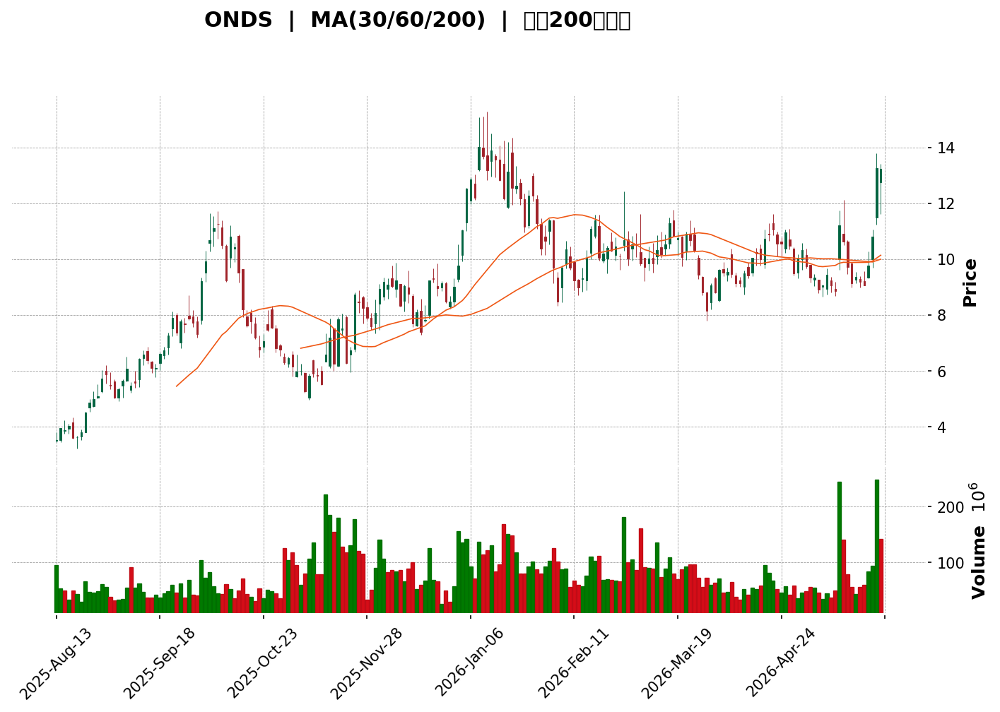
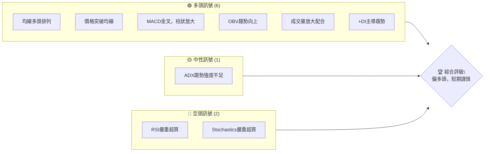
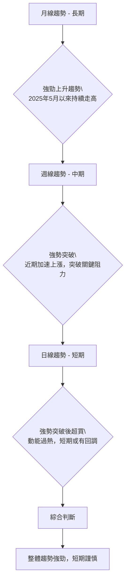
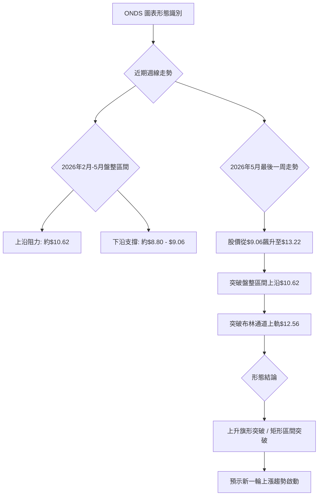
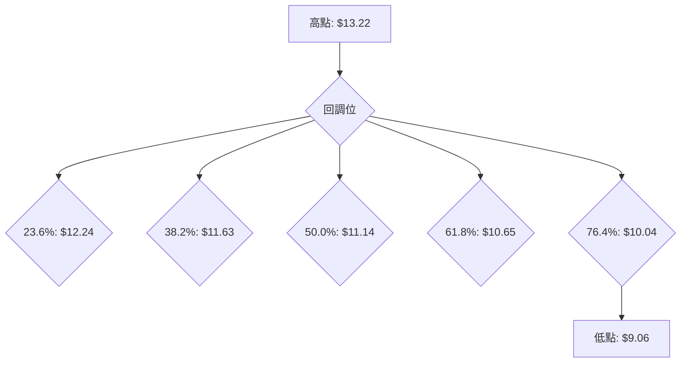

<details>
<summary>📊 靜態圖表 (點擊展開)</summary>

</details>

<html>
<head><meta charset="utf-8" /></head>
<body>
    <div>                        <script>window.PlotlyConfig = {MathJaxConfig: 'local'};</script>
        <script charset="utf-8" src="https://cdn.plot.ly/plotly-3.5.0.min.js" integrity="sha256-fHbNLP+GlIXN+efbQec78UkemUz3NJp7UmfGxC1tNxs=" crossorigin="anonymous"></script>                <div id="candlestick-chart" class="plotly-graph-div" style="height:500px; width:100%;"></div>            <script>                window.PLOTLYENV=window.PLOTLYENV || {};                                if (document.getElementById("candlestick-chart")) {                    Plotly.newPlot(                        "candlestick-chart",                        [{"close":{"dtype":"f8","bdata":"AAAAwPUoDEAAAADgo3APQAAAAKBH4Q5AAAAAgD0KEEAAAADgUbgMQAAAAKBH4QxAAAAAYGZmDkAAAACAwvURQAAAAGBmZhNAAAAAoEfhE0AAAAAgrkcUQAAAAMDMzBZAAAAA4KNwF0AAAABACtcVQAAAAGC4HhRAAAAAgOtRFUAAAADAHoUWQAAAAKBwPRhAAAAAwMzMFUAAAACgcD0WQAAAAIAUrhlAAAAAoHA9GkAAAADAHoUZQAAAAAApXBhAAAAAYGZmGEAAAABgZmYaQAAAAKBH4RpAAAAAgD0KHUAAAADAHoUfQAAAAGBmZh1AAAAAAAAAH0AAAAAA16MeQAAAAEDheh9AAAAAoEfhHkAAAACgcD0dQAAAACCFayJAAAAAgOvRI0AAAACA61ElQAAAAIAULiZAAAAAwB6FJkAAAABA4fokQAAAAOCjcCJAAAAAYLieJUAAAACA69EkQAAAAMAeBSNAAAAAYGZmIEAAAADgo3AeQAAAAOB6FB9AAAAAYI\u002fCHEAAAACAwvUaQAAAAKBwPRxAAAAAQArXHUAAAABguB4eQAAAAMD1KBtAAAAAAAAAG0AAAADA9SgZQAAAAGCPwhlAAAAAoJmZGEAAAABACtcXQAAAAAAAABhAAAAAAAAAFUAAAACgcD0XQAAAAMAehRdAAAAAQDMzF0AAAACAPQoWQAAAAKBwPRpAAAAA4FG4HEAAAADAHgUZQAAAAAApXB9AAAAAAAAAHkAAAADgehQZQAAAAOCj8BpAAAAA4KNwIUAAAACgR+EgQAAAAEDheiBAAAAAoJmZH0AAAACA61EeQAAAAADXIyBAAAAAQArXIUAAAACgR2EiQAAAAADXIyJAAAAAgD0KIkAAAACAwnUiQAAAAGBmpiBAAAAAgD0KIkAAAAAAAIAhQAAAAGCPwh5AAAAAgBQuIEAAAABA4XodQAAAAEAzMx9AAAAA4KNwIkAAAACAPYoiQAAAACCF6yFAAAAAYI9CIkAAAACAwvUgQAAAACCF6yBAAAAAQOH6IUAAAADAHoUjQAAAAIA9CiZAAAAAIFwPKUAAAACAFK4pQAAAAAApXChAAAAAwB4FLEAAAACgR2ErQAAAAKBHYSpAAAAAIK7HK0AAAABguB4rQAAAAADXoylAAAAAgOtRKEAAAABgj0IqQAAAAKCZGSlAAAAAoHA9KUAAAABAClcoQAAAAIDrUSZAAAAAwB6FKEAAAACAPYooQAAAAIA9iiZAAAAA4FG4JEAAAAAgrkclQAAAAGCPwiZAAAAAAClcI0AAAACAwvUgQAAAAKBHYSNAAAAAgBSuJEAAAAAAKVwjQAAAAIDCdSJAAAAA4KPwIUAAAABguJ4iQAAAAKCZGSRAAAAAANcjJkAAAAAgrscmQAAAACBcDyRAAAAAoEdhJEAAAADAzMwkQAAAAKCZmSRAAAAAYGbmJEAAAADA9SgkQAAAAEAKVyVAAAAAgD0KJEAAAADAHgUlQAAAAEDh+iRAAAAAwPWoI0AAAADgo3AjQAAAAMAeBSRAAAAAwPWoI0AAAADA9agkQAAAAIDrUSRAAAAAIFwPJUAAAAAgXI8mQAAAAMD1qCVAAAAAAACAJUAAAABguB4kQAAAAMDMzCVAAAAAAClcJUAAAABguJ4kQAAAAKBH4SJAAAAAoJmZIUAAAADAzEwgQAAAAOB6FCJAAAAAYLieIUAAAABAMzMjQAAAAIA9CiNAAAAAIFwPI0AAAABgZuYiQAAAACCuRyJAAAAAYI9CIkAAAADgo\u002fAiQAAAAMDMzCJAAAAAIFwPJEAAAABgZmYkQAAAAAAAACRAAAAAgMJ1JUAAAACgcL0lQAAAAGC4HiZAAAAA4HoUJUAAAACgmRklQAAAAGBm5iVAAAAAgML1JEAAAABA4foiQAAAAOB6FCRAAAAAANejJEAAAACAwnUjQAAAAMD1qCJAAAAAgBSuIkAAAAAgrschQAAAAGC4HiJAAAAAQArXIkAAAADgehQiQAAAAOBRuCFAAAAAIIVrJkAAAACgcD0lQAAAAGBmZiNAAAAAAABAIkAAAADgUbgiQAAAAAApXCJAAAAAYLgeIkAAAACAPYojQAAAAKCZmSVAAAAAAACAKkAAAADgo3AqQA=="},"high":{"dtype":"f8","bdata":"AAAAgOtRDkAAAADgo3APQAAAACCF6xBAAAAAAClcEEAAAACA61ERQAAAACCuRw1AAAAAYLgeD0AAAACAPQoSQAAAACCF6xNAAAAAgGgRFUAAAADAHgUWQAAAAIA9ChhAAAAAIIPAGEAAAADAzMwXQAAAAKBFthZAAAAAIFyPFUAAAADgUbgWQAAAAAAAABpAAAAAAClcFkAAAAAAAAAYQAAAAGCPwhlAAAAAoEfhGkAAAADgo3AbQAAAAGBmZhlAAAAAAAAAGUAAAAAgXI8aQAAAAAApXBtAAAAA4KNwHUAAAACgcD0gQAAAAADXIyBAAAAAAClcH0AAAAAgXI8fQAAAACCFayFAAAAAQApXIEAAAADAzMwfQAAAAIAUriJAAAAAIFyPJEAAAABgj0InQAAAAEAKFydAAAAAYGZmJ0AAAAAgrscmQAAAAMAeBSVAAAAAgBRuJkAAAABguB4lQAAAAKBwvSVAAAAAYI9CI0AAAACA61EgQAAAAKBHYSBAAAAAANejH0AAAACAPQodQAAAAEAzMx1AAAAAQApXIEAAAACgR6EgQAAAACBcjx5AAAAAwMzMG0AAAACAwnUaQAAAAAAAABpAAAAAYI\u002fCGkAAAAAgrkcaQAAAAAAAABlAAAAA4FG4F0AAAADgepQXQAAAACBcjxlAAAAAoEdhGEAAAADA9agYQAAAAAApXB1AAAAA4KNwH0AAAAAgXA8eQAAAAIAUrh9AAAAAgOsRIEAAAACgR+EfQAAAAGBmZhtAAAAAoJmZIUAAAABgj8IhQAAAAAApXCFAAAAAwCDwIEAAAAAA1yMgQAAAAKCZGSFAAAAAgMI1IkAAAACAFK4iQAAAAKCZmSJAAAAAAACAI0AAAADgUbgjQAAAAEDhOiJAAAAAwPUoIkAAAABgZiYjQAAAAEDheiFAAAAAANdjIEAAAABguB4hQAAAAGCRrSBAAAAAQOF6IkAAAACA61EjQAAAAIAUriNAAAAAYGZmIkAAAABAClciQAAAAEAKVyFAAAAAoJmZIkAAAAAgXA8lQAAAAGC4HiZAAAAA4HoUKUAAAAAAKdwpQAAAAIA9CipAAAAAANcjLkAAAABAMzMuQAAAACBcjy5AAAAAAAAALUAAAAAAAIArQAAAAADXIyxAAAAAAACALEAAAABgZmYsQAAAAMD1qCxAAAAAwPWoKkAAAABA4bopQAAAACCFqyhAAAAA4KPwKEAAAADA9SgqQAAAACBcjyhAAAAAYGbmJkAAAABgZmYmQAAAAEAK1yZAAAAAgD3KJkAAAAAgXA8jQAAAAMAehSNAAAAAIK5HJUAAAACgR+EkQAAAAEAK1yNAAAAAoMaLIkAAAAAAKVwjQAAAAADXoyRAAAAAQApXJkAAAACAFC4nQAAAAMD1KCdAAAAAANcjJUAAAACAwvUkQAAAAKBH4SVAAAAAIFyPJUAAAAAAKVwkQAAAAEAK1yhAAAAAAAAAJkAAAAAA16MlQAAAAEAK1yVAAAAA4FE4J0AAAAAgXA8kQAAAAGBm5iRAAAAAYLgeJUAAAACAFK4lQAAAAIDC9SVAAAAAoHC9JUAAAADgo\u002fAmQAAAAMAehSdAAAAAgML1JUAAAADA9aglQAAAAOCj8CVAAAAAoHC9JkAAAAAgrkcmQAAAACCuRyRAAAAAoHC9IkAAAAAA16MhQAAAACCuRyJAAAAAQDOzIkAAAABgj0IjQAAAAMDMzCNAAAAAoEdhI0AAAACgcL0kQAAAAIA9CiNAAAAA4FG4IkAAAAAghSsjQAAAAOBRuCNAAAAAIFwPJEAAAAAgrsckQAAAACBcDyVAAAAAYLgeJkAAAADgepQmQAAAAOBROCdAAAAA4KPwJUAAAACAPYolQAAAAGC4HiZAAAAAANcjJkAAAAAAKdwkQAAAAIDrUSRAAAAAYLgeJUAAAABA4bokQAAAAOB6lCNAAAAAIIXrIkAAAAAAAIAiQAAAAIAULiJAAAAAwMxMI0AAAABAM7MiQAAAAAApXCJAAAAAgMJ1J0AAAACgcD0oQAAAAEAKVyVAAAAAYI\u002fCI0AAAADgehQjQAAAAGCPwiJAAAAAoEchI0AAAADAHoUkQAAAAGC4HiZAAAAAIFyPK0AAAACA69EqQA=="},"hovertemplate":"\u003cb\u003e%{x|%Y-%m-%d}\u003c\u002fb\u003e\u003cbr\u003e\u958b: $%{open:.2f}\u003cbr\u003e\u9ad8: $%{high:.2f}\u003cbr\u003e\u4f4e: $%{low:.2f}\u003cbr\u003e\u6536: $%{close:.2f}\u003cextra\u003e\u003c\u002fextra\u003e","low":{"dtype":"f8","bdata":"AAAAwB6FC0AAAADgo3ALQAAAAIDC9Q1AAAAAwMzMDUAAAABA4XoMQAAAAKCZmQlAAAAA4HoUDEAAAABgZmYOQAAAAGC4HhJAAAAAQArXEkAAAACAPQoUQAAAAMDMzBRAAAAAwPUoFkAAAACA61EVQAAAAIA9ChRAAAAAoJmZE0AAAABguB4UQAAAAGBmZhZAAAAAQArXFEAAAACAPYoVQAAAAADXoxVAAAAAwMzMGEAAAAAAAAAZQAAAAIAUrhdAAAAAAAAAF0AAAACAPQoYQAAAAIAUrhlAAAAAgOtRGkAAAAAghescQAAAAAAAAB1AAAAAwPUoG0AAAADgo3AdQAAAAEAzMx9AAAAAIK5HHkAAAADgUbgcQAAAAADXox5AAAAAoEdhIkAAAACAPYokQAAAAGBm5iRAAAAAYA5tJUAAAAAAAMAkQAAAAKBHYSJAAAAAILJdI0AAAABgj8IjQAAAAIDrUSJAAAAAgBSuH0AAAADgUTgeQAAAAIDrUR1AAAAAAACAHEAAAAAAKdwZQAAAAKCZmRpAAAAAYLieHUAAAADgehQeQAAAAADXoxpAAAAA4HoUGkAAAACA69EYQAAAAEDhehhAAAAAYLgeF0AAAADgehQXQAAAAIDrURdAAAAAACncFEAAAADAzMwTQAAAAOB6FBdAAAAAYGZmFkAAAAAghesVQAAAAKBwPRlAAAAAYGZmGEAAAAAghesXQAAAAKCZmRhAAAAAgD0KHUAAAAAAAAAZQAAAAOBRuBdAAAAAgBSuGkAAAAAA1yMgQAAAAKBwvR5AAAAAQDMzH0AAAACgR+EdQAAAACCuRx1AAAAAQArXHUAAAACAPQohQAAAAMD1KCFAAAAA4KPwIUAAAADgUTghQAAAAAApnCBAAAAAoHA9IEAAAACA69EgQAAAAKBwPR5AAAAAAClcHkAAAABguB4dQAAAAIDC9R5AAAAA4KNwH0AAAAAgXE8iQAAAAEAKVyFAAAAAQDOzIUAAAAAAKdwgQAAAACCFayBAAAAAwPWoIEAAAABAClciQAAAAIDr0SNAAAAAQOH6JUAAAAAghesnQAAAAOBROChAAAAAwMxMKkAAAACAFC4rQAAAAMD1qClAAAAAIIXrKUAAAABACtcpQAAAAKCZmSlAAAAAoHA9KEAAAACgmZknQAAAAAAp3CdAAAAAQDOzKEAAAACgR+EnQAAAAGBm5iVAAAAAgBQuJkAAAABguB4oQAAAAADXIyZAAAAAIK5HJEAAAADAzEwkQAAAAMAeBSVAAAAAYI9CIkAAAAAA16MgQAAAAGBm5iBAAAAAQApXI0AAAABAMzMjQAAAAGCPwiFAAAAAYGZmIUAAAAAA16MhQAAAAKBwvSFAAAAAQOH6I0AAAABA4XolQAAAAGBm5iNAAAAA4FG4I0AAAACAwvUiQAAAAIA9iiRAAAAAYGbmI0AAAACgcD0jQAAAAKCZmSRAAAAAwB6FI0AAAAAAKdwjQAAAAGC4HiRAAAAAwB6FI0AAAABgZmYiQAAAAGBmJiNAAAAAAAAAI0AAAACgmZkjQAAAAKCZGSRAAAAA4FE4JEAAAACgcL0kQAAAAADXoyVAAAAAoHA9JEAAAACAwnUjQAAAAIAU7iNAAAAAQDPzJEAAAACAwnUkQAAAAIA9iiJAAAAAwPVoIUAAAABguB4fQAAAAGBmZiBAAAAAIFyPIUAAAAAghesgQAAAAGCPwiJAAAAA4E1iIkAAAACAFK4iQAAAAMAeBSJAAAAAQOH6IUAAAACAwnUhQAAAAKCZmSJAAAAAoHC9IkAAAADAHoUjQAAAAIA9iiNAAAAAgOtRI0AAAAAgrkclQAAAAEAzsyVAAAAAQDMzJEAAAABA4TokQAAAACCFayRAAAAAIIWrJEAAAACA69EiQAAAAGC4niJAAAAAoHA9I0AAAABAClcjQAAAAIDrUSJAAAAAgD0KIkAAAAAgXI8hQAAAAMDMTCFAAAAA4KNwIUAAAACgmZkhQAAAAEAKVyFAAAAAQDMzI0AAAAAAAAAlQAAAACCF6yJAAAAA4KPwIUAAAACgcD0iQAAAAIDC9SFAAAAAYLgeIkAAAAAgsp0iQAAAAAApXCNAAAAA4KNwJkAAAABAMzMnQA=="},"name":"\u50f9\u683c","open":{"dtype":"f8","bdata":"AAAAQArXC0AAAAAAAAAMQAAAAADXow5AAAAAAClcD0AAAAAgXI8QQAAAAMDMzAxAAAAAYLgeDUAAAABgZmYOQAAAAOBRuBJAAAAAoEfhEkAAAADgehQUQAAAAAAAABVAAAAAAAAAGEAAAABgZuYVQAAAAEDhehZAAAAAANcjFEAAAADAzMwVQAAAAMAehRZAAAAAoHA9FUAAAADgo3AWQAAAAOBRuBZAAAAAwMzMGUAAAABACtcaQAAAACCuRxlAAAAAoHA9GEAAAABguB4ZQAAAAEAzMxpAAAAAIK5HG0AAAAAgXA8eQAAAAIDC9R9AAAAAwB4FHEAAAAAgrsceQAAAAEAK1x9AAAAA4FG4H0AAAAAAAAAfQAAAAEAzMx9AAAAAwB4FI0AAAABguB4lQAAAAAAAACZAAAAAIK6HJkAAAAAgrkcmQAAAAIDC9SRAAAAAIFwPJEAAAABgj8IkQAAAAGBmpiVAAAAAYI9CI0AAAADAzMwfQAAAAGC4HiBAAAAA4FG4HkAAAABgZmYbQAAAAGBmZhtAAAAAgBSuHkAAAABguF4gQAAAAOB6FB5AAAAA4HqUG0AAAACAwvUZQAAAAAAAABlAAAAAwMxMGkAAAABguB4XQAAAACCF6xdAAAAAgBSuF0AAAADA9SgUQAAAAEDhehlAAAAAYGZmF0AAAADgo\u002fAXQAAAACCuRxlAAAAAwPWoGEAAAACAPQoeQAAAAGC4nhhAAAAAACncHUAAAACAFK4fQAAAAKBwPRpAAAAAANcjG0AAAACAwvUgQAAAAOBROCFAAAAAIFyPIEAAAADAHoUfQAAAAOBRuB5AAAAAIK7HIEAAAADAHkUhQAAAAAAp3CFAAAAAQAqXIkAAAABACtchQAAAAOBROCJAAAAAQOH6IEAAAACAwvUhQAAAAAApXCFAAAAAQOF6HkAAAAAgrkcgQAAAAMD1KB9AAAAAgML1H0AAAACgmZkiQAAAACBcDyJAAAAAgML1IUAAAADgJEYiQAAAAKCZmSBAAAAAIIXrIEAAAAAgXI8iQAAAAMAeRSRAAAAAoJmZJkAAAABAMzMoQAAAAGBmZilAAAAAwPVoKkAAAAAAAAAsQAAAACCFaytAAAAAAAAAK0AAAACgR2ErQAAAAADXIytAAAAA4HrUKkAAAACAwrUnQAAAAKCZmStAAAAAwB4FKUAAAAAghWspQAAAAMDMTChAAAAAIIVrJkAAAACAwvUpQAAAACCuRyhAAAAAAACAJkAAAABguJ4lQAAAAMAeBSZAAAAAYI\u002fCJkAAAACAFK4iQAAAAIAU7iFAAAAAACmcI0AAAACAFC4kQAAAAMAexSNAAAAAoHB9IkAAAACAPYoiQAAAAOBReCJAAAAAIIVrJEAAAAAA16MlQAAAAKBHYSZAAAAAACncI0AAAADAHgUkQAAAAGCPQiVAAAAAwMxMJEAAAACAFC4kQAAAAAAAACVAAAAAoEdhJUAAAADgUbgkQAAAAEDh+iRAAAAAAACAJEAAAAAgXA8kQAAAAIAUriNAAAAAoJkZJEAAAAAghSskQAAAAAAp3CRAAAAAoHC9JEAAAACgmRklQAAAAAAAwCZAAAAAYLheJUAAAADgepQlQAAAAOB6lCRAAAAAgOvRJUAAAABgj8IlQAAAAKCZGSRAAAAAQDOzIkAAAABguJ4hQAAAAGBm5iBAAAAAoJmZIkAAAAAgrgchQAAAAGCPQiNAAAAAACncIkAAAABAClckQAAAAOB61CJAAAAAgMJ1IkAAAADAHgUiQAAAAOCjcCNAAAAAwB4FI0AAAAAAAIAkQAAAAGCPwiRAAAAAoJmZI0AAAADAzMwlQAAAAIA9iiZAAAAAYI\u002fCJUAAAABgj0IlQAAAAMBLtyRAAAAAANdjJUAAAABgj8IkQAAAAAAAACNAAAAAAAAAJEAAAADAzEwkQAAAACBcjyNAAAAAAACAIkAAAAAAAIAiQAAAAAAAACJAAAAAQArXIUAAAADgUXgiQAAAAEAK1yFAAAAAQOH6I0AAAACA69ElQAAAAGCPQiVAAAAAYGamI0AAAAAAAIAiQAAAACBcjyJAAAAAIIVrIkAAAAAghasiQAAAAAAAACRAAAAAQDPzJkAAAAAAAIApQA=="},"x":["2025-08-13T00:00:00-04:00","2025-08-14T00:00:00-04:00","2025-08-15T00:00:00-04:00","2025-08-18T00:00:00-04:00","2025-08-19T00:00:00-04:00","2025-08-20T00:00:00-04:00","2025-08-21T00:00:00-04:00","2025-08-22T00:00:00-04:00","2025-08-25T00:00:00-04:00","2025-08-26T00:00:00-04:00","2025-08-27T00:00:00-04:00","2025-08-28T00:00:00-04:00","2025-08-29T00:00:00-04:00","2025-09-02T00:00:00-04:00","2025-09-03T00:00:00-04:00","2025-09-04T00:00:00-04:00","2025-09-05T00:00:00-04:00","2025-09-08T00:00:00-04:00","2025-09-09T00:00:00-04:00","2025-09-10T00:00:00-04:00","2025-09-11T00:00:00-04:00","2025-09-12T00:00:00-04:00","2025-09-15T00:00:00-04:00","2025-09-16T00:00:00-04:00","2025-09-17T00:00:00-04:00","2025-09-18T00:00:00-04:00","2025-09-19T00:00:00-04:00","2025-09-22T00:00:00-04:00","2025-09-23T00:00:00-04:00","2025-09-24T00:00:00-04:00","2025-09-25T00:00:00-04:00","2025-09-26T00:00:00-04:00","2025-09-29T00:00:00-04:00","2025-09-30T00:00:00-04:00","2025-10-01T00:00:00-04:00","2025-10-02T00:00:00-04:00","2025-10-03T00:00:00-04:00","2025-10-06T00:00:00-04:00","2025-10-07T00:00:00-04:00","2025-10-08T00:00:00-04:00","2025-10-09T00:00:00-04:00","2025-10-10T00:00:00-04:00","2025-10-13T00:00:00-04:00","2025-10-14T00:00:00-04:00","2025-10-15T00:00:00-04:00","2025-10-16T00:00:00-04:00","2025-10-17T00:00:00-04:00","2025-10-20T00:00:00-04:00","2025-10-21T00:00:00-04:00","2025-10-22T00:00:00-04:00","2025-10-23T00:00:00-04:00","2025-10-24T00:00:00-04:00","2025-10-27T00:00:00-04:00","2025-10-28T00:00:00-04:00","2025-10-29T00:00:00-04:00","2025-10-30T00:00:00-04:00","2025-10-31T00:00:00-04:00","2025-11-03T00:00:00-05:00","2025-11-04T00:00:00-05:00","2025-11-05T00:00:00-05:00","2025-11-06T00:00:00-05:00","2025-11-07T00:00:00-05:00","2025-11-10T00:00:00-05:00","2025-11-11T00:00:00-05:00","2025-11-12T00:00:00-05:00","2025-11-13T00:00:00-05:00","2025-11-14T00:00:00-05:00","2025-11-17T00:00:00-05:00","2025-11-18T00:00:00-05:00","2025-11-19T00:00:00-05:00","2025-11-20T00:00:00-05:00","2025-11-21T00:00:00-05:00","2025-11-24T00:00:00-05:00","2025-11-25T00:00:00-05:00","2025-11-26T00:00:00-05:00","2025-11-28T00:00:00-05:00","2025-12-01T00:00:00-05:00","2025-12-02T00:00:00-05:00","2025-12-03T00:00:00-05:00","2025-12-04T00:00:00-05:00","2025-12-05T00:00:00-05:00","2025-12-08T00:00:00-05:00","2025-12-09T00:00:00-05:00","2025-12-10T00:00:00-05:00","2025-12-11T00:00:00-05:00","2025-12-12T00:00:00-05:00","2025-12-15T00:00:00-05:00","2025-12-16T00:00:00-05:00","2025-12-17T00:00:00-05:00","2025-12-18T00:00:00-05:00","2025-12-19T00:00:00-05:00","2025-12-22T00:00:00-05:00","2025-12-23T00:00:00-05:00","2025-12-24T00:00:00-05:00","2025-12-26T00:00:00-05:00","2025-12-29T00:00:00-05:00","2025-12-30T00:00:00-05:00","2025-12-31T00:00:00-05:00","2026-01-02T00:00:00-05:00","2026-01-05T00:00:00-05:00","2026-01-06T00:00:00-05:00","2026-01-07T00:00:00-05:00","2026-01-08T00:00:00-05:00","2026-01-09T00:00:00-05:00","2026-01-12T00:00:00-05:00","2026-01-13T00:00:00-05:00","2026-01-14T00:00:00-05:00","2026-01-15T00:00:00-05:00","2026-01-16T00:00:00-05:00","2026-01-20T00:00:00-05:00","2026-01-21T00:00:00-05:00","2026-01-22T00:00:00-05:00","2026-01-23T00:00:00-05:00","2026-01-26T00:00:00-05:00","2026-01-27T00:00:00-05:00","2026-01-28T00:00:00-05:00","2026-01-29T00:00:00-05:00","2026-01-30T00:00:00-05:00","2026-02-02T00:00:00-05:00","2026-02-03T00:00:00-05:00","2026-02-04T00:00:00-05:00","2026-02-05T00:00:00-05:00","2026-02-06T00:00:00-05:00","2026-02-09T00:00:00-05:00","2026-02-10T00:00:00-05:00","2026-02-11T00:00:00-05:00","2026-02-12T00:00:00-05:00","2026-02-13T00:00:00-05:00","2026-02-17T00:00:00-05:00","2026-02-18T00:00:00-05:00","2026-02-19T00:00:00-05:00","2026-02-20T00:00:00-05:00","2026-02-23T00:00:00-05:00","2026-02-24T00:00:00-05:00","2026-02-25T00:00:00-05:00","2026-02-26T00:00:00-05:00","2026-02-27T00:00:00-05:00","2026-03-02T00:00:00-05:00","2026-03-03T00:00:00-05:00","2026-03-04T00:00:00-05:00","2026-03-05T00:00:00-05:00","2026-03-06T00:00:00-05:00","2026-03-09T00:00:00-04:00","2026-03-10T00:00:00-04:00","2026-03-11T00:00:00-04:00","2026-03-12T00:00:00-04:00","2026-03-13T00:00:00-04:00","2026-03-16T00:00:00-04:00","2026-03-17T00:00:00-04:00","2026-03-18T00:00:00-04:00","2026-03-19T00:00:00-04:00","2026-03-20T00:00:00-04:00","2026-03-23T00:00:00-04:00","2026-03-24T00:00:00-04:00","2026-03-25T00:00:00-04:00","2026-03-26T00:00:00-04:00","2026-03-27T00:00:00-04:00","2026-03-30T00:00:00-04:00","2026-03-31T00:00:00-04:00","2026-04-01T00:00:00-04:00","2026-04-02T00:00:00-04:00","2026-04-06T00:00:00-04:00","2026-04-07T00:00:00-04:00","2026-04-08T00:00:00-04:00","2026-04-09T00:00:00-04:00","2026-04-10T00:00:00-04:00","2026-04-13T00:00:00-04:00","2026-04-14T00:00:00-04:00","2026-04-15T00:00:00-04:00","2026-04-16T00:00:00-04:00","2026-04-17T00:00:00-04:00","2026-04-20T00:00:00-04:00","2026-04-21T00:00:00-04:00","2026-04-22T00:00:00-04:00","2026-04-23T00:00:00-04:00","2026-04-24T00:00:00-04:00","2026-04-27T00:00:00-04:00","2026-04-28T00:00:00-04:00","2026-04-29T00:00:00-04:00","2026-04-30T00:00:00-04:00","2026-05-01T00:00:00-04:00","2026-05-04T00:00:00-04:00","2026-05-05T00:00:00-04:00","2026-05-06T00:00:00-04:00","2026-05-07T00:00:00-04:00","2026-05-08T00:00:00-04:00","2026-05-11T00:00:00-04:00","2026-05-12T00:00:00-04:00","2026-05-13T00:00:00-04:00","2026-05-14T00:00:00-04:00","2026-05-15T00:00:00-04:00","2026-05-18T00:00:00-04:00","2026-05-19T00:00:00-04:00","2026-05-20T00:00:00-04:00","2026-05-21T00:00:00-04:00","2026-05-22T00:00:00-04:00","2026-05-26T00:00:00-04:00","2026-05-27T00:00:00-04:00","2026-05-28T00:00:00-04:00","2026-05-29T00:00:00-04:00"],"type":"candlestick"},{"hovertemplate":"MA30: $%{y:.2f}\u003cextra\u003e\u003c\u002fextra\u003e","line":{"color":"#2196F3","dash":"dash","width":2},"mode":"lines","name":"MA30","x":["2025-08-13T00:00:00-04:00","2025-08-14T00:00:00-04:00","2025-08-15T00:00:00-04:00","2025-08-18T00:00:00-04:00","2025-08-19T00:00:00-04:00","2025-08-20T00:00:00-04:00","2025-08-21T00:00:00-04:00","2025-08-22T00:00:00-04:00","2025-08-25T00:00:00-04:00","2025-08-26T00:00:00-04:00","2025-08-27T00:00:00-04:00","2025-08-28T00:00:00-04:00","2025-08-29T00:00:00-04:00","2025-09-02T00:00:00-04:00","2025-09-03T00:00:00-04:00","2025-09-04T00:00:00-04:00","2025-09-05T00:00:00-04:00","2025-09-08T00:00:00-04:00","2025-09-09T00:00:00-04:00","2025-09-10T00:00:00-04:00","2025-09-11T00:00:00-04:00","2025-09-12T00:00:00-04:00","2025-09-15T00:00:00-04:00","2025-09-16T00:00:00-04:00","2025-09-17T00:00:00-04:00","2025-09-18T00:00:00-04:00","2025-09-19T00:00:00-04:00","2025-09-22T00:00:00-04:00","2025-09-23T00:00:00-04:00","2025-09-24T00:00:00-04:00","2025-09-25T00:00:00-04:00","2025-09-26T00:00:00-04:00","2025-09-29T00:00:00-04:00","2025-09-30T00:00:00-04:00","2025-10-01T00:00:00-04:00","2025-10-02T00:00:00-04:00","2025-10-03T00:00:00-04:00","2025-10-06T00:00:00-04:00","2025-10-07T00:00:00-04:00","2025-10-08T00:00:00-04:00","2025-10-09T00:00:00-04:00","2025-10-10T00:00:00-04:00","2025-10-13T00:00:00-04:00","2025-10-14T00:00:00-04:00","2025-10-15T00:00:00-04:00","2025-10-16T00:00:00-04:00","2025-10-17T00:00:00-04:00","2025-10-20T00:00:00-04:00","2025-10-21T00:00:00-04:00","2025-10-22T00:00:00-04:00","2025-10-23T00:00:00-04:00","2025-10-24T00:00:00-04:00","2025-10-27T00:00:00-04:00","2025-10-28T00:00:00-04:00","2025-10-29T00:00:00-04:00","2025-10-30T00:00:00-04:00","2025-10-31T00:00:00-04:00","2025-11-03T00:00:00-05:00","2025-11-04T00:00:00-05:00","2025-11-05T00:00:00-05:00","2025-11-06T00:00:00-05:00","2025-11-07T00:00:00-05:00","2025-11-10T00:00:00-05:00","2025-11-11T00:00:00-05:00","2025-11-12T00:00:00-05:00","2025-11-13T00:00:00-05:00","2025-11-14T00:00:00-05:00","2025-11-17T00:00:00-05:00","2025-11-18T00:00:00-05:00","2025-11-19T00:00:00-05:00","2025-11-20T00:00:00-05:00","2025-11-21T00:00:00-05:00","2025-11-24T00:00:00-05:00","2025-11-25T00:00:00-05:00","2025-11-26T00:00:00-05:00","2025-11-28T00:00:00-05:00","2025-12-01T00:00:00-05:00","2025-12-02T00:00:00-05:00","2025-12-03T00:00:00-05:00","2025-12-04T00:00:00-05:00","2025-12-05T00:00:00-05:00","2025-12-08T00:00:00-05:00","2025-12-09T00:00:00-05:00","2025-12-10T00:00:00-05:00","2025-12-11T00:00:00-05:00","2025-12-12T00:00:00-05:00","2025-12-15T00:00:00-05:00","2025-12-16T00:00:00-05:00","2025-12-17T00:00:00-05:00","2025-12-18T00:00:00-05:00","2025-12-19T00:00:00-05:00","2025-12-22T00:00:00-05:00","2025-12-23T00:00:00-05:00","2025-12-24T00:00:00-05:00","2025-12-26T00:00:00-05:00","2025-12-29T00:00:00-05:00","2025-12-30T00:00:00-05:00","2025-12-31T00:00:00-05:00","2026-01-02T00:00:00-05:00","2026-01-05T00:00:00-05:00","2026-01-06T00:00:00-05:00","2026-01-07T00:00:00-05:00","2026-01-08T00:00:00-05:00","2026-01-09T00:00:00-05:00","2026-01-12T00:00:00-05:00","2026-01-13T00:00:00-05:00","2026-01-14T00:00:00-05:00","2026-01-15T00:00:00-05:00","2026-01-16T00:00:00-05:00","2026-01-20T00:00:00-05:00","2026-01-21T00:00:00-05:00","2026-01-22T00:00:00-05:00","2026-01-23T00:00:00-05:00","2026-01-26T00:00:00-05:00","2026-01-27T00:00:00-05:00","2026-01-28T00:00:00-05:00","2026-01-29T00:00:00-05:00","2026-01-30T00:00:00-05:00","2026-02-02T00:00:00-05:00","2026-02-03T00:00:00-05:00","2026-02-04T00:00:00-05:00","2026-02-05T00:00:00-05:00","2026-02-06T00:00:00-05:00","2026-02-09T00:00:00-05:00","2026-02-10T00:00:00-05:00","2026-02-11T00:00:00-05:00","2026-02-12T00:00:00-05:00","2026-02-13T00:00:00-05:00","2026-02-17T00:00:00-05:00","2026-02-18T00:00:00-05:00","2026-02-19T00:00:00-05:00","2026-02-20T00:00:00-05:00","2026-02-23T00:00:00-05:00","2026-02-24T00:00:00-05:00","2026-02-25T00:00:00-05:00","2026-02-26T00:00:00-05:00","2026-02-27T00:00:00-05:00","2026-03-02T00:00:00-05:00","2026-03-03T00:00:00-05:00","2026-03-04T00:00:00-05:00","2026-03-05T00:00:00-05:00","2026-03-06T00:00:00-05:00","2026-03-09T00:00:00-04:00","2026-03-10T00:00:00-04:00","2026-03-11T00:00:00-04:00","2026-03-12T00:00:00-04:00","2026-03-13T00:00:00-04:00","2026-03-16T00:00:00-04:00","2026-03-17T00:00:00-04:00","2026-03-18T00:00:00-04:00","2026-03-19T00:00:00-04:00","2026-03-20T00:00:00-04:00","2026-03-23T00:00:00-04:00","2026-03-24T00:00:00-04:00","2026-03-25T00:00:00-04:00","2026-03-26T00:00:00-04:00","2026-03-27T00:00:00-04:00","2026-03-30T00:00:00-04:00","2026-03-31T00:00:00-04:00","2026-04-01T00:00:00-04:00","2026-04-02T00:00:00-04:00","2026-04-06T00:00:00-04:00","2026-04-07T00:00:00-04:00","2026-04-08T00:00:00-04:00","2026-04-09T00:00:00-04:00","2026-04-10T00:00:00-04:00","2026-04-13T00:00:00-04:00","2026-04-14T00:00:00-04:00","2026-04-15T00:00:00-04:00","2026-04-16T00:00:00-04:00","2026-04-17T00:00:00-04:00","2026-04-20T00:00:00-04:00","2026-04-21T00:00:00-04:00","2026-04-22T00:00:00-04:00","2026-04-23T00:00:00-04:00","2026-04-24T00:00:00-04:00","2026-04-27T00:00:00-04:00","2026-04-28T00:00:00-04:00","2026-04-29T00:00:00-04:00","2026-04-30T00:00:00-04:00","2026-05-01T00:00:00-04:00","2026-05-04T00:00:00-04:00","2026-05-05T00:00:00-04:00","2026-05-06T00:00:00-04:00","2026-05-07T00:00:00-04:00","2026-05-08T00:00:00-04:00","2026-05-11T00:00:00-04:00","2026-05-12T00:00:00-04:00","2026-05-13T00:00:00-04:00","2026-05-14T00:00:00-04:00","2026-05-15T00:00:00-04:00","2026-05-18T00:00:00-04:00","2026-05-19T00:00:00-04:00","2026-05-20T00:00:00-04:00","2026-05-21T00:00:00-04:00","2026-05-22T00:00:00-04:00","2026-05-26T00:00:00-04:00","2026-05-27T00:00:00-04:00","2026-05-28T00:00:00-04:00","2026-05-29T00:00:00-04:00"],"y":{"dtype":"f8","bdata":"AAAAAAAA+H8AAAAAAAD4fwAAAAAAAPh\u002fAAAAAAAA+H8AAAAAAAD4fwAAAAAAAPh\u002fAAAAAAAA+H8AAAAAAAD4fwAAAAAAAPh\u002fAAAAAAAA+H8AAAAAAAD4fwAAAAAAAPh\u002fAAAAAAAA+H8AAAAAAAD4fwAAAAAAAPh\u002fAAAAAAAA+H8AAAAAAAD4fwAAAAAAAPh\u002fAAAAAAAA+H8AAAAAAAD4fwAAAAAAAPh\u002fAAAAAAAA+H8AAAAAAAD4fwAAAAAAAPh\u002fAAAAAAAA+H8AAAAAAAD4fwAAAAAAAPh\u002fAAAAAAAA+H8AAAAAAAD4f5qZmRGDwBVAd3d3X+VQFkC8u7ubNtAWQN7d3YUWWRdAZmZm\u002frjXF0CamZnZslYYQN7d3WXYFRlAREREZGbmGUDNzMysALkaQBEREaH+jRtA3t3dfbFkHEC8u7srsh0dQHd3d2fYlR1Aq6qqKs4+HkDNzMzsw+ceQDMzM8OugB9ARERENKXiH0CrqqpaHRMgQFVVVXVMMCBAq6qqov5NIEAiIiIiImIgQN7d3VUObSBA7+7ufmp8IEBERETsCpAgQM3MzET9myBAmpmZKRWnIECJiIjAyqEgQCIiImoDnSBAAAAAwBGKIEBEREQkTWkgQO\u002fu7uZCUiBAREREPJgnIEBmZmZ2BQggQKuqqgoezB9ARERE1JSKH0ARERExJE0fQDMzMyOw8h5AiYiICIGVHkDv7u6OJf8dQAAAAKA2kB1A3t3dPd8PHUAiIiJS1H8cQO\u002fu7g4CKxxAvLu7W6vjG0C8u7s7baAbQM3MzMwTdRtAzczMXNZqG0B3d3c30GkbQHd3d6cNdBtAAAAAoBqvG0DNzMwMuwIcQCIiIrJWRxxAAAAAMJZ8HEAiIiICnbYcQKuqqgoC6xxAvLu7m304HUCrqqpqdYwdQFVVVRUgtx1AAAAAEFj5HUBERETUeCkeQImIiHjpZh5AzczM3GvuHkDv7u7OhWQfQCIiIkKnzR9A7+7unqgfIEDv7u6+WFIgQBEREfnFciBAvLu7+6mRIEAAAACQe80gQCIiIjLBAyFAmpmZmZlZIUBmZmZeuskhQAAAAPCnJiJAzczMTPCAIkBmZmbmidoiQHd3d8cELyNAVVVVfT+VI0CrqqqCTvsjQLy7u5NfTCRAIiIiWquDJEAiIiJ66cYkQM3MzNRNAiVAAAAAeL4\u002fJUDv7u6G63ElQM3MzNRNoiVAMzMzm5nZJUARERG5rBUmQLy7u\u002fvFUiZAMzMzw4N5JkDNzMycUrEmQO\u002fu7t5r7iZAREREpEX2JkAzMzMTyugmQN7d3X0\u002f9SZAAAAAEOYJJ0AiIiLyYB4nQAAAACCFKydA7+7uvi0rJ0CrqqqqfyMnQLy7u6vxEidAVVVV1Qb6JkAAAACwR+EmQBERETGWvCZAq6qqWmR7JkAAAAAgPkMmQGZmZobrESZA7+7u7jXXJUBERESU0ZslQGZmZhYgdyVAmpmZSZpSJUBVVVVV4yUlQN7d3Q27AiVAvLu7Wx3TJEBVVVUlTakkQImIiLislSRAMzMz4zNsJEBVVVXlF0skQKuqqjomOCRAiYiI+Aw7JEC8u7sr+UUkQO\u002fu7i6WPCRAVVVVFdlOJEBmZmY20GkkQImIiMh2fiRARERERESEJEB3d3fHBI8kQImIiEiakiRAq6qqirOPJEC8u7tr53skQJqZmamqaiRAMzMzkxhEJEAiIiLyiyUkQJqZmbnXHCRAREREJJQRJEB3d3eHXQEkQJqZmWmR7SNA7+7uPgrXI0De3d0docwjQGZmZmb0tiNAZmZmFiC3I0DNzMys1bEjQFVVVdV4qSNA3t3d\u002fdS4I0CrqqpqdcwjQAAAAPBg3iNAmpmZ+X7qI0C8u7srQO4jQLy7u7u7+yNAd3d3R+H6I0BmZmamVNwjQGZmZhbZziNAMzMzY4LHI0B3d3eX4MEjQImIiCgVpyNAvLu7mzaQI0CJiIiI+ncjQKuqqkp+cSNAzczMHBN8I0BVVVWVQ4sjQGZmZiYxiCNAiYiI6CaxI0Crqqpaj8IjQImIiMihxSNAAAAAULi+I0CJiIgYL70jQLy7u9vdvSNAZmZmBqy8I0Dv7u6+ysEjQBEREXGv2SNAZmZm1qMQJEC8u7trLkQkQA=="},"type":"scatter"},{"hovertemplate":"MA60: $%{y:.2f}\u003cextra\u003e\u003c\u002fextra\u003e","line":{"color":"#9C27B0","dash":"dash","width":2},"mode":"lines","name":"MA60","x":["2025-08-13T00:00:00-04:00","2025-08-14T00:00:00-04:00","2025-08-15T00:00:00-04:00","2025-08-18T00:00:00-04:00","2025-08-19T00:00:00-04:00","2025-08-20T00:00:00-04:00","2025-08-21T00:00:00-04:00","2025-08-22T00:00:00-04:00","2025-08-25T00:00:00-04:00","2025-08-26T00:00:00-04:00","2025-08-27T00:00:00-04:00","2025-08-28T00:00:00-04:00","2025-08-29T00:00:00-04:00","2025-09-02T00:00:00-04:00","2025-09-03T00:00:00-04:00","2025-09-04T00:00:00-04:00","2025-09-05T00:00:00-04:00","2025-09-08T00:00:00-04:00","2025-09-09T00:00:00-04:00","2025-09-10T00:00:00-04:00","2025-09-11T00:00:00-04:00","2025-09-12T00:00:00-04:00","2025-09-15T00:00:00-04:00","2025-09-16T00:00:00-04:00","2025-09-17T00:00:00-04:00","2025-09-18T00:00:00-04:00","2025-09-19T00:00:00-04:00","2025-09-22T00:00:00-04:00","2025-09-23T00:00:00-04:00","2025-09-24T00:00:00-04:00","2025-09-25T00:00:00-04:00","2025-09-26T00:00:00-04:00","2025-09-29T00:00:00-04:00","2025-09-30T00:00:00-04:00","2025-10-01T00:00:00-04:00","2025-10-02T00:00:00-04:00","2025-10-03T00:00:00-04:00","2025-10-06T00:00:00-04:00","2025-10-07T00:00:00-04:00","2025-10-08T00:00:00-04:00","2025-10-09T00:00:00-04:00","2025-10-10T00:00:00-04:00","2025-10-13T00:00:00-04:00","2025-10-14T00:00:00-04:00","2025-10-15T00:00:00-04:00","2025-10-16T00:00:00-04:00","2025-10-17T00:00:00-04:00","2025-10-20T00:00:00-04:00","2025-10-21T00:00:00-04:00","2025-10-22T00:00:00-04:00","2025-10-23T00:00:00-04:00","2025-10-24T00:00:00-04:00","2025-10-27T00:00:00-04:00","2025-10-28T00:00:00-04:00","2025-10-29T00:00:00-04:00","2025-10-30T00:00:00-04:00","2025-10-31T00:00:00-04:00","2025-11-03T00:00:00-05:00","2025-11-04T00:00:00-05:00","2025-11-05T00:00:00-05:00","2025-11-06T00:00:00-05:00","2025-11-07T00:00:00-05:00","2025-11-10T00:00:00-05:00","2025-11-11T00:00:00-05:00","2025-11-12T00:00:00-05:00","2025-11-13T00:00:00-05:00","2025-11-14T00:00:00-05:00","2025-11-17T00:00:00-05:00","2025-11-18T00:00:00-05:00","2025-11-19T00:00:00-05:00","2025-11-20T00:00:00-05:00","2025-11-21T00:00:00-05:00","2025-11-24T00:00:00-05:00","2025-11-25T00:00:00-05:00","2025-11-26T00:00:00-05:00","2025-11-28T00:00:00-05:00","2025-12-01T00:00:00-05:00","2025-12-02T00:00:00-05:00","2025-12-03T00:00:00-05:00","2025-12-04T00:00:00-05:00","2025-12-05T00:00:00-05:00","2025-12-08T00:00:00-05:00","2025-12-09T00:00:00-05:00","2025-12-10T00:00:00-05:00","2025-12-11T00:00:00-05:00","2025-12-12T00:00:00-05:00","2025-12-15T00:00:00-05:00","2025-12-16T00:00:00-05:00","2025-12-17T00:00:00-05:00","2025-12-18T00:00:00-05:00","2025-12-19T00:00:00-05:00","2025-12-22T00:00:00-05:00","2025-12-23T00:00:00-05:00","2025-12-24T00:00:00-05:00","2025-12-26T00:00:00-05:00","2025-12-29T00:00:00-05:00","2025-12-30T00:00:00-05:00","2025-12-31T00:00:00-05:00","2026-01-02T00:00:00-05:00","2026-01-05T00:00:00-05:00","2026-01-06T00:00:00-05:00","2026-01-07T00:00:00-05:00","2026-01-08T00:00:00-05:00","2026-01-09T00:00:00-05:00","2026-01-12T00:00:00-05:00","2026-01-13T00:00:00-05:00","2026-01-14T00:00:00-05:00","2026-01-15T00:00:00-05:00","2026-01-16T00:00:00-05:00","2026-01-20T00:00:00-05:00","2026-01-21T00:00:00-05:00","2026-01-22T00:00:00-05:00","2026-01-23T00:00:00-05:00","2026-01-26T00:00:00-05:00","2026-01-27T00:00:00-05:00","2026-01-28T00:00:00-05:00","2026-01-29T00:00:00-05:00","2026-01-30T00:00:00-05:00","2026-02-02T00:00:00-05:00","2026-02-03T00:00:00-05:00","2026-02-04T00:00:00-05:00","2026-02-05T00:00:00-05:00","2026-02-06T00:00:00-05:00","2026-02-09T00:00:00-05:00","2026-02-10T00:00:00-05:00","2026-02-11T00:00:00-05:00","2026-02-12T00:00:00-05:00","2026-02-13T00:00:00-05:00","2026-02-17T00:00:00-05:00","2026-02-18T00:00:00-05:00","2026-02-19T00:00:00-05:00","2026-02-20T00:00:00-05:00","2026-02-23T00:00:00-05:00","2026-02-24T00:00:00-05:00","2026-02-25T00:00:00-05:00","2026-02-26T00:00:00-05:00","2026-02-27T00:00:00-05:00","2026-03-02T00:00:00-05:00","2026-03-03T00:00:00-05:00","2026-03-04T00:00:00-05:00","2026-03-05T00:00:00-05:00","2026-03-06T00:00:00-05:00","2026-03-09T00:00:00-04:00","2026-03-10T00:00:00-04:00","2026-03-11T00:00:00-04:00","2026-03-12T00:00:00-04:00","2026-03-13T00:00:00-04:00","2026-03-16T00:00:00-04:00","2026-03-17T00:00:00-04:00","2026-03-18T00:00:00-04:00","2026-03-19T00:00:00-04:00","2026-03-20T00:00:00-04:00","2026-03-23T00:00:00-04:00","2026-03-24T00:00:00-04:00","2026-03-25T00:00:00-04:00","2026-03-26T00:00:00-04:00","2026-03-27T00:00:00-04:00","2026-03-30T00:00:00-04:00","2026-03-31T00:00:00-04:00","2026-04-01T00:00:00-04:00","2026-04-02T00:00:00-04:00","2026-04-06T00:00:00-04:00","2026-04-07T00:00:00-04:00","2026-04-08T00:00:00-04:00","2026-04-09T00:00:00-04:00","2026-04-10T00:00:00-04:00","2026-04-13T00:00:00-04:00","2026-04-14T00:00:00-04:00","2026-04-15T00:00:00-04:00","2026-04-16T00:00:00-04:00","2026-04-17T00:00:00-04:00","2026-04-20T00:00:00-04:00","2026-04-21T00:00:00-04:00","2026-04-22T00:00:00-04:00","2026-04-23T00:00:00-04:00","2026-04-24T00:00:00-04:00","2026-04-27T00:00:00-04:00","2026-04-28T00:00:00-04:00","2026-04-29T00:00:00-04:00","2026-04-30T00:00:00-04:00","2026-05-01T00:00:00-04:00","2026-05-04T00:00:00-04:00","2026-05-05T00:00:00-04:00","2026-05-06T00:00:00-04:00","2026-05-07T00:00:00-04:00","2026-05-08T00:00:00-04:00","2026-05-11T00:00:00-04:00","2026-05-12T00:00:00-04:00","2026-05-13T00:00:00-04:00","2026-05-14T00:00:00-04:00","2026-05-15T00:00:00-04:00","2026-05-18T00:00:00-04:00","2026-05-19T00:00:00-04:00","2026-05-20T00:00:00-04:00","2026-05-21T00:00:00-04:00","2026-05-22T00:00:00-04:00","2026-05-26T00:00:00-04:00","2026-05-27T00:00:00-04:00","2026-05-28T00:00:00-04:00","2026-05-29T00:00:00-04:00"],"y":{"dtype":"f8","bdata":"AAAAAAAA+H8AAAAAAAD4fwAAAAAAAPh\u002fAAAAAAAA+H8AAAAAAAD4fwAAAAAAAPh\u002fAAAAAAAA+H8AAAAAAAD4fwAAAAAAAPh\u002fAAAAAAAA+H8AAAAAAAD4fwAAAAAAAPh\u002fAAAAAAAA+H8AAAAAAAD4fwAAAAAAAPh\u002fAAAAAAAA+H8AAAAAAAD4fwAAAAAAAPh\u002fAAAAAAAA+H8AAAAAAAD4fwAAAAAAAPh\u002fAAAAAAAA+H8AAAAAAAD4fwAAAAAAAPh\u002fAAAAAAAA+H8AAAAAAAD4fwAAAAAAAPh\u002fAAAAAAAA+H8AAAAAAAD4fwAAAAAAAPh\u002fAAAAAAAA+H8AAAAAAAD4fwAAAAAAAPh\u002fAAAAAAAA+H8AAAAAAAD4fwAAAAAAAPh\u002fAAAAAAAA+H8AAAAAAAD4fwAAAAAAAPh\u002fAAAAAAAA+H8AAAAAAAD4fwAAAAAAAPh\u002fAAAAAAAA+H8AAAAAAAD4fwAAAAAAAPh\u002fAAAAAAAA+H8AAAAAAAD4fwAAAAAAAPh\u002fAAAAAAAA+H8AAAAAAAD4fwAAAAAAAPh\u002fAAAAAAAA+H8AAAAAAAD4fwAAAAAAAPh\u002fAAAAAAAA+H8AAAAAAAD4fwAAAAAAAPh\u002fAAAAAAAA+H8AAAAAAAD4f7y7u2+EMhtAAAAA7ApQG0BERETEIHAbQEREREiakhtAVVVV6SaxG0BVVVWF69EbQImIiEREBBxAZmZmtvM9HEDe3d0dE1wcQImIiKAajxxA3t3dXUi6HEDv7u4+w84cQDMzMztt4BxAMzMzwzwRHUBERESUGEQdQAAAAEjheh1AiYiIyL2mHUBmZmZ2BcgdQBEREUlT6h1Aq6qq8oslHkCJiIiof2MeQO\u002fu7q65kB5A7+7ulrW6HkBVVVVtWeseQCIiIkp+ER9Ad3d391NDH0De3d11BWgfQM3MzHSTeB9AAAAAyL2GH0BmZmaOCX4fQDMzM6O3hR9Aq6qqKs6eH0De3d1dSLofQGZmZqbizB9AERERCfPkH0B3d3fX6vgfQKuqqgoe7B9AAAAAgGrcH0B3d3dXDs0fQCIiIoLcyx9AiYiIOInhH0C8u7tD0gQgQLy7u3sUHiBAVVVV\u002fWI5IEAiIiJCYFUgQO\u002fu7lbHdCBA3t3dVVWlIEAzMzNPG9ggQLy7uzMzAyFAERERVZwtIUBERESAI2QhQO\u002fu7pb8kiFAAAAAyAS\u002fIUAAAAAEneYhQBEREW3nCyJAiYiINOw6IkAzMzO3820iQDMzMwMrlyJAmpmZ5Re7IkB3d3eDB+MiQJqZmU3wECNAVVVVyb02I0BVVVV9hk0jQHd3d48JbiNAd3d3V8eUI0CJiIjYXLgjQImIiIwlzyNAVVVV3WveI0BVVVWdffgjQO\u002fu7m5ZCyRAd3d3N9ApJEAzMzMHgVUkQImIiBCfcSRAvLu7Uyp+JEAzMzMD5I4kQO\u002fu7iZ4oCRAIiIitjq2JEB3d3cLkMskQBEREdW\u002f4SRA3t3d0SLrJEC8u7tnZvYkQFVVVXGEAiVA3t3d6W0JJUAiIiJWnA0lQKuqqkb9GyVAMzMzv+YiJUAzMzNPYjAlQDMzMxt2RSVA3t3dXUhaJUBERETkpXslQO\u002fu7gaBlSVAzczMXI+iJUDNzMwkTaklQDMzMyPbuSVAIiIiKhXHJUDNzMzcstYlQERERLQP3yVAzczMpHDdJUAzMzOLs88lQKuqqirOviVAREREtA+fJUARERHRaYMlQFVVVfW2bCVAd3d3P3xGJUC8u7vTTSIlQAAAAHi+\u002fyRA7+7uFiDXJEARERFZObQkQGZmZj4KlyRAAAAAMN2EJEARERGB3GskQJqZmfEZViRAzczMLPlFJEAAAABI4TokQERERNQGOiRAZmZmblkrJECJiIgIrBwkQDMzM\u002fvwGSRAAAAAIPcaJEARERHpJhEkQKuqqqK3BSRAREREvC0LJEDv7u5m2BUkQImIiPjFEiRAAAAAcD0KJEAAAACofwMkQJqZmUkMAiRAvLu7U+MFJECJiIiAlQMkQAAAAOht+SNA3t3dvZ\u002f6I0BmZmamDfQjQBEREcE88SNAIiIiOiboI0AAAABQRt8jQKuqqqK31SNAq6qqItvJI0BmZmbuNccjQLy7u+tRyCNAZmZm9uHjI0BEREQMAvsjQA=="},"type":"scatter"},{"hovertemplate":"MA200: $%{y:.2f}\u003cextra\u003e\u003c\u002fextra\u003e","line":{"color":"#FF6F00","dash":"solid","width":2},"mode":"lines","name":"MA200","x":["2025-08-13T00:00:00-04:00","2025-08-14T00:00:00-04:00","2025-08-15T00:00:00-04:00","2025-08-18T00:00:00-04:00","2025-08-19T00:00:00-04:00","2025-08-20T00:00:00-04:00","2025-08-21T00:00:00-04:00","2025-08-22T00:00:00-04:00","2025-08-25T00:00:00-04:00","2025-08-26T00:00:00-04:00","2025-08-27T00:00:00-04:00","2025-08-28T00:00:00-04:00","2025-08-29T00:00:00-04:00","2025-09-02T00:00:00-04:00","2025-09-03T00:00:00-04:00","2025-09-04T00:00:00-04:00","2025-09-05T00:00:00-04:00","2025-09-08T00:00:00-04:00","2025-09-09T00:00:00-04:00","2025-09-10T00:00:00-04:00","2025-09-11T00:00:00-04:00","2025-09-12T00:00:00-04:00","2025-09-15T00:00:00-04:00","2025-09-16T00:00:00-04:00","2025-09-17T00:00:00-04:00","2025-09-18T00:00:00-04:00","2025-09-19T00:00:00-04:00","2025-09-22T00:00:00-04:00","2025-09-23T00:00:00-04:00","2025-09-24T00:00:00-04:00","2025-09-25T00:00:00-04:00","2025-09-26T00:00:00-04:00","2025-09-29T00:00:00-04:00","2025-09-30T00:00:00-04:00","2025-10-01T00:00:00-04:00","2025-10-02T00:00:00-04:00","2025-10-03T00:00:00-04:00","2025-10-06T00:00:00-04:00","2025-10-07T00:00:00-04:00","2025-10-08T00:00:00-04:00","2025-10-09T00:00:00-04:00","2025-10-10T00:00:00-04:00","2025-10-13T00:00:00-04:00","2025-10-14T00:00:00-04:00","2025-10-15T00:00:00-04:00","2025-10-16T00:00:00-04:00","2025-10-17T00:00:00-04:00","2025-10-20T00:00:00-04:00","2025-10-21T00:00:00-04:00","2025-10-22T00:00:00-04:00","2025-10-23T00:00:00-04:00","2025-10-24T00:00:00-04:00","2025-10-27T00:00:00-04:00","2025-10-28T00:00:00-04:00","2025-10-29T00:00:00-04:00","2025-10-30T00:00:00-04:00","2025-10-31T00:00:00-04:00","2025-11-03T00:00:00-05:00","2025-11-04T00:00:00-05:00","2025-11-05T00:00:00-05:00","2025-11-06T00:00:00-05:00","2025-11-07T00:00:00-05:00","2025-11-10T00:00:00-05:00","2025-11-11T00:00:00-05:00","2025-11-12T00:00:00-05:00","2025-11-13T00:00:00-05:00","2025-11-14T00:00:00-05:00","2025-11-17T00:00:00-05:00","2025-11-18T00:00:00-05:00","2025-11-19T00:00:00-05:00","2025-11-20T00:00:00-05:00","2025-11-21T00:00:00-05:00","2025-11-24T00:00:00-05:00","2025-11-25T00:00:00-05:00","2025-11-26T00:00:00-05:00","2025-11-28T00:00:00-05:00","2025-12-01T00:00:00-05:00","2025-12-02T00:00:00-05:00","2025-12-03T00:00:00-05:00","2025-12-04T00:00:00-05:00","2025-12-05T00:00:00-05:00","2025-12-08T00:00:00-05:00","2025-12-09T00:00:00-05:00","2025-12-10T00:00:00-05:00","2025-12-11T00:00:00-05:00","2025-12-12T00:00:00-05:00","2025-12-15T00:00:00-05:00","2025-12-16T00:00:00-05:00","2025-12-17T00:00:00-05:00","2025-12-18T00:00:00-05:00","2025-12-19T00:00:00-05:00","2025-12-22T00:00:00-05:00","2025-12-23T00:00:00-05:00","2025-12-24T00:00:00-05:00","2025-12-26T00:00:00-05:00","2025-12-29T00:00:00-05:00","2025-12-30T00:00:00-05:00","2025-12-31T00:00:00-05:00","2026-01-02T00:00:00-05:00","2026-01-05T00:00:00-05:00","2026-01-06T00:00:00-05:00","2026-01-07T00:00:00-05:00","2026-01-08T00:00:00-05:00","2026-01-09T00:00:00-05:00","2026-01-12T00:00:00-05:00","2026-01-13T00:00:00-05:00","2026-01-14T00:00:00-05:00","2026-01-15T00:00:00-05:00","2026-01-16T00:00:00-05:00","2026-01-20T00:00:00-05:00","2026-01-21T00:00:00-05:00","2026-01-22T00:00:00-05:00","2026-01-23T00:00:00-05:00","2026-01-26T00:00:00-05:00","2026-01-27T00:00:00-05:00","2026-01-28T00:00:00-05:00","2026-01-29T00:00:00-05:00","2026-01-30T00:00:00-05:00","2026-02-02T00:00:00-05:00","2026-02-03T00:00:00-05:00","2026-02-04T00:00:00-05:00","2026-02-05T00:00:00-05:00","2026-02-06T00:00:00-05:00","2026-02-09T00:00:00-05:00","2026-02-10T00:00:00-05:00","2026-02-11T00:00:00-05:00","2026-02-12T00:00:00-05:00","2026-02-13T00:00:00-05:00","2026-02-17T00:00:00-05:00","2026-02-18T00:00:00-05:00","2026-02-19T00:00:00-05:00","2026-02-20T00:00:00-05:00","2026-02-23T00:00:00-05:00","2026-02-24T00:00:00-05:00","2026-02-25T00:00:00-05:00","2026-02-26T00:00:00-05:00","2026-02-27T00:00:00-05:00","2026-03-02T00:00:00-05:00","2026-03-03T00:00:00-05:00","2026-03-04T00:00:00-05:00","2026-03-05T00:00:00-05:00","2026-03-06T00:00:00-05:00","2026-03-09T00:00:00-04:00","2026-03-10T00:00:00-04:00","2026-03-11T00:00:00-04:00","2026-03-12T00:00:00-04:00","2026-03-13T00:00:00-04:00","2026-03-16T00:00:00-04:00","2026-03-17T00:00:00-04:00","2026-03-18T00:00:00-04:00","2026-03-19T00:00:00-04:00","2026-03-20T00:00:00-04:00","2026-03-23T00:00:00-04:00","2026-03-24T00:00:00-04:00","2026-03-25T00:00:00-04:00","2026-03-26T00:00:00-04:00","2026-03-27T00:00:00-04:00","2026-03-30T00:00:00-04:00","2026-03-31T00:00:00-04:00","2026-04-01T00:00:00-04:00","2026-04-02T00:00:00-04:00","2026-04-06T00:00:00-04:00","2026-04-07T00:00:00-04:00","2026-04-08T00:00:00-04:00","2026-04-09T00:00:00-04:00","2026-04-10T00:00:00-04:00","2026-04-13T00:00:00-04:00","2026-04-14T00:00:00-04:00","2026-04-15T00:00:00-04:00","2026-04-16T00:00:00-04:00","2026-04-17T00:00:00-04:00","2026-04-20T00:00:00-04:00","2026-04-21T00:00:00-04:00","2026-04-22T00:00:00-04:00","2026-04-23T00:00:00-04:00","2026-04-24T00:00:00-04:00","2026-04-27T00:00:00-04:00","2026-04-28T00:00:00-04:00","2026-04-29T00:00:00-04:00","2026-04-30T00:00:00-04:00","2026-05-01T00:00:00-04:00","2026-05-04T00:00:00-04:00","2026-05-05T00:00:00-04:00","2026-05-06T00:00:00-04:00","2026-05-07T00:00:00-04:00","2026-05-08T00:00:00-04:00","2026-05-11T00:00:00-04:00","2026-05-12T00:00:00-04:00","2026-05-13T00:00:00-04:00","2026-05-14T00:00:00-04:00","2026-05-15T00:00:00-04:00","2026-05-18T00:00:00-04:00","2026-05-19T00:00:00-04:00","2026-05-20T00:00:00-04:00","2026-05-21T00:00:00-04:00","2026-05-22T00:00:00-04:00","2026-05-26T00:00:00-04:00","2026-05-27T00:00:00-04:00","2026-05-28T00:00:00-04:00","2026-05-29T00:00:00-04:00"],"y":{"dtype":"f8","bdata":"AAAAAAAA+H8AAAAAAAD4fwAAAAAAAPh\u002fAAAAAAAA+H8AAAAAAAD4fwAAAAAAAPh\u002fAAAAAAAA+H8AAAAAAAD4fwAAAAAAAPh\u002fAAAAAAAA+H8AAAAAAAD4fwAAAAAAAPh\u002fAAAAAAAA+H8AAAAAAAD4fwAAAAAAAPh\u002fAAAAAAAA+H8AAAAAAAD4fwAAAAAAAPh\u002fAAAAAAAA+H8AAAAAAAD4fwAAAAAAAPh\u002fAAAAAAAA+H8AAAAAAAD4fwAAAAAAAPh\u002fAAAAAAAA+H8AAAAAAAD4fwAAAAAAAPh\u002fAAAAAAAA+H8AAAAAAAD4fwAAAAAAAPh\u002fAAAAAAAA+H8AAAAAAAD4fwAAAAAAAPh\u002fAAAAAAAA+H8AAAAAAAD4fwAAAAAAAPh\u002fAAAAAAAA+H8AAAAAAAD4fwAAAAAAAPh\u002fAAAAAAAA+H8AAAAAAAD4fwAAAAAAAPh\u002fAAAAAAAA+H8AAAAAAAD4fwAAAAAAAPh\u002fAAAAAAAA+H8AAAAAAAD4fwAAAAAAAPh\u002fAAAAAAAA+H8AAAAAAAD4fwAAAAAAAPh\u002fAAAAAAAA+H8AAAAAAAD4fwAAAAAAAPh\u002fAAAAAAAA+H8AAAAAAAD4fwAAAAAAAPh\u002fAAAAAAAA+H8AAAAAAAD4fwAAAAAAAPh\u002fAAAAAAAA+H8AAAAAAAD4fwAAAAAAAPh\u002fAAAAAAAA+H8AAAAAAAD4fwAAAAAAAPh\u002fAAAAAAAA+H8AAAAAAAD4fwAAAAAAAPh\u002fAAAAAAAA+H8AAAAAAAD4fwAAAAAAAPh\u002fAAAAAAAA+H8AAAAAAAD4fwAAAAAAAPh\u002fAAAAAAAA+H8AAAAAAAD4fwAAAAAAAPh\u002fAAAAAAAA+H8AAAAAAAD4fwAAAAAAAPh\u002fAAAAAAAA+H8AAAAAAAD4fwAAAAAAAPh\u002fAAAAAAAA+H8AAAAAAAD4fwAAAAAAAPh\u002fAAAAAAAA+H8AAAAAAAD4fwAAAAAAAPh\u002fAAAAAAAA+H8AAAAAAAD4fwAAAAAAAPh\u002fAAAAAAAA+H8AAAAAAAD4fwAAAAAAAPh\u002fAAAAAAAA+H8AAAAAAAD4fwAAAAAAAPh\u002fAAAAAAAA+H8AAAAAAAD4fwAAAAAAAPh\u002fAAAAAAAA+H8AAAAAAAD4fwAAAAAAAPh\u002fAAAAAAAA+H8AAAAAAAD4fwAAAAAAAPh\u002fAAAAAAAA+H8AAAAAAAD4fwAAAAAAAPh\u002fAAAAAAAA+H8AAAAAAAD4fwAAAAAAAPh\u002fAAAAAAAA+H8AAAAAAAD4fwAAAAAAAPh\u002fAAAAAAAA+H8AAAAAAAD4fwAAAAAAAPh\u002fAAAAAAAA+H8AAAAAAAD4fwAAAAAAAPh\u002fAAAAAAAA+H8AAAAAAAD4fwAAAAAAAPh\u002fAAAAAAAA+H8AAAAAAAD4fwAAAAAAAPh\u002fAAAAAAAA+H8AAAAAAAD4fwAAAAAAAPh\u002fAAAAAAAA+H8AAAAAAAD4fwAAAAAAAPh\u002fAAAAAAAA+H8AAAAAAAD4fwAAAAAAAPh\u002fAAAAAAAA+H8AAAAAAAD4fwAAAAAAAPh\u002fAAAAAAAA+H8AAAAAAAD4fwAAAAAAAPh\u002fAAAAAAAA+H8AAAAAAAD4fwAAAAAAAPh\u002fAAAAAAAA+H8AAAAAAAD4fwAAAAAAAPh\u002fAAAAAAAA+H8AAAAAAAD4fwAAAAAAAPh\u002fAAAAAAAA+H8AAAAAAAD4fwAAAAAAAPh\u002fAAAAAAAA+H8AAAAAAAD4fwAAAAAAAPh\u002fAAAAAAAA+H8AAAAAAAD4fwAAAAAAAPh\u002fAAAAAAAA+H8AAAAAAAD4fwAAAAAAAPh\u002fAAAAAAAA+H8AAAAAAAD4fwAAAAAAAPh\u002fAAAAAAAA+H8AAAAAAAD4fwAAAAAAAPh\u002fAAAAAAAA+H8AAAAAAAD4fwAAAAAAAPh\u002fAAAAAAAA+H8AAAAAAAD4fwAAAAAAAPh\u002fAAAAAAAA+H8AAAAAAAD4fwAAAAAAAPh\u002fAAAAAAAA+H8AAAAAAAD4fwAAAAAAAPh\u002fAAAAAAAA+H8AAAAAAAD4fwAAAAAAAPh\u002fAAAAAAAA+H8AAAAAAAD4fwAAAAAAAPh\u002fAAAAAAAA+H8AAAAAAAD4fwAAAAAAAPh\u002fAAAAAAAA+H8AAAAAAAD4fwAAAAAAAPh\u002fAAAAAAAA+H8AAAAAAAD4fwAAAAAAAPh\u002fAAAAAAAA+H+uR+FDi8whQA=="},"type":"scatter"}],                        {"template":{"data":{"barpolar":[{"marker":{"line":{"color":"rgb(17,17,17)","width":0.5},"pattern":{"fillmode":"overlay","size":10,"solidity":0.2}},"type":"barpolar"}],"bar":[{"error_x":{"color":"#f2f5fa"},"error_y":{"color":"#f2f5fa"},"marker":{"line":{"color":"rgb(17,17,17)","width":0.5},"pattern":{"fillmode":"overlay","size":10,"solidity":0.2}},"type":"bar"}],"carpet":[{"aaxis":{"endlinecolor":"#A2B1C6","gridcolor":"#506784","linecolor":"#506784","minorgridcolor":"#506784","startlinecolor":"#A2B1C6"},"baxis":{"endlinecolor":"#A2B1C6","gridcolor":"#506784","linecolor":"#506784","minorgridcolor":"#506784","startlinecolor":"#A2B1C6"},"type":"carpet"}],"choropleth":[{"colorbar":{"outlinewidth":0,"ticks":""},"type":"choropleth"}],"contourcarpet":[{"colorbar":{"outlinewidth":0,"ticks":""},"type":"contourcarpet"}],"contour":[{"colorbar":{"outlinewidth":0,"ticks":""},"colorscale":[[0.0,"#0d0887"],[0.1111111111111111,"#46039f"],[0.2222222222222222,"#7201a8"],[0.3333333333333333,"#9c179e"],[0.4444444444444444,"#bd3786"],[0.5555555555555556,"#d8576b"],[0.6666666666666666,"#ed7953"],[0.7777777777777778,"#fb9f3a"],[0.8888888888888888,"#fdca26"],[1.0,"#f0f921"]],"type":"contour"}],"heatmap":[{"colorbar":{"outlinewidth":0,"ticks":""},"colorscale":[[0.0,"#0d0887"],[0.1111111111111111,"#46039f"],[0.2222222222222222,"#7201a8"],[0.3333333333333333,"#9c179e"],[0.4444444444444444,"#bd3786"],[0.5555555555555556,"#d8576b"],[0.6666666666666666,"#ed7953"],[0.7777777777777778,"#fb9f3a"],[0.8888888888888888,"#fdca26"],[1.0,"#f0f921"]],"type":"heatmap"}],"histogram2dcontour":[{"colorbar":{"outlinewidth":0,"ticks":""},"colorscale":[[0.0,"#0d0887"],[0.1111111111111111,"#46039f"],[0.2222222222222222,"#7201a8"],[0.3333333333333333,"#9c179e"],[0.4444444444444444,"#bd3786"],[0.5555555555555556,"#d8576b"],[0.6666666666666666,"#ed7953"],[0.7777777777777778,"#fb9f3a"],[0.8888888888888888,"#fdca26"],[1.0,"#f0f921"]],"type":"histogram2dcontour"}],"histogram2d":[{"colorbar":{"outlinewidth":0,"ticks":""},"colorscale":[[0.0,"#0d0887"],[0.1111111111111111,"#46039f"],[0.2222222222222222,"#7201a8"],[0.3333333333333333,"#9c179e"],[0.4444444444444444,"#bd3786"],[0.5555555555555556,"#d8576b"],[0.6666666666666666,"#ed7953"],[0.7777777777777778,"#fb9f3a"],[0.8888888888888888,"#fdca26"],[1.0,"#f0f921"]],"type":"histogram2d"}],"histogram":[{"marker":{"pattern":{"fillmode":"overlay","size":10,"solidity":0.2}},"type":"histogram"}],"mesh3d":[{"colorbar":{"outlinewidth":0,"ticks":""},"type":"mesh3d"}],"parcoords":[{"line":{"colorbar":{"outlinewidth":0,"ticks":""}},"type":"parcoords"}],"pie":[{"automargin":true,"type":"pie"}],"scatter3d":[{"line":{"colorbar":{"outlinewidth":0,"ticks":""}},"marker":{"colorbar":{"outlinewidth":0,"ticks":""}},"type":"scatter3d"}],"scattercarpet":[{"marker":{"colorbar":{"outlinewidth":0,"ticks":""}},"type":"scattercarpet"}],"scattergeo":[{"marker":{"colorbar":{"outlinewidth":0,"ticks":""}},"type":"scattergeo"}],"scattergl":[{"marker":{"line":{"color":"#283442"}},"type":"scattergl"}],"scattermapbox":[{"marker":{"colorbar":{"outlinewidth":0,"ticks":""}},"type":"scattermapbox"}],"scattermap":[{"marker":{"colorbar":{"outlinewidth":0,"ticks":""}},"type":"scattermap"}],"scatterpolargl":[{"marker":{"colorbar":{"outlinewidth":0,"ticks":""}},"type":"scatterpolargl"}],"scatterpolar":[{"marker":{"colorbar":{"outlinewidth":0,"ticks":""}},"type":"scatterpolar"}],"scatter":[{"marker":{"line":{"color":"#283442"}},"type":"scatter"}],"scatterternary":[{"marker":{"colorbar":{"outlinewidth":0,"ticks":""}},"type":"scatterternary"}],"surface":[{"colorbar":{"outlinewidth":0,"ticks":""},"colorscale":[[0.0,"#0d0887"],[0.1111111111111111,"#46039f"],[0.2222222222222222,"#7201a8"],[0.3333333333333333,"#9c179e"],[0.4444444444444444,"#bd3786"],[0.5555555555555556,"#d8576b"],[0.6666666666666666,"#ed7953"],[0.7777777777777778,"#fb9f3a"],[0.8888888888888888,"#fdca26"],[1.0,"#f0f921"]],"type":"surface"}],"table":[{"cells":{"fill":{"color":"#506784"},"line":{"color":"rgb(17,17,17)"}},"header":{"fill":{"color":"#2a3f5f"},"line":{"color":"rgb(17,17,17)"}},"type":"table"}]},"layout":{"annotationdefaults":{"arrowcolor":"#f2f5fa","arrowhead":0,"arrowwidth":1},"autotypenumbers":"strict","coloraxis":{"colorbar":{"outlinewidth":0,"ticks":""}},"colorscale":{"diverging":[[0,"#8e0152"],[0.1,"#c51b7d"],[0.2,"#de77ae"],[0.3,"#f1b6da"],[0.4,"#fde0ef"],[0.5,"#f7f7f7"],[0.6,"#e6f5d0"],[0.7,"#b8e186"],[0.8,"#7fbc41"],[0.9,"#4d9221"],[1,"#276419"]],"sequential":[[0.0,"#0d0887"],[0.1111111111111111,"#46039f"],[0.2222222222222222,"#7201a8"],[0.3333333333333333,"#9c179e"],[0.4444444444444444,"#bd3786"],[0.5555555555555556,"#d8576b"],[0.6666666666666666,"#ed7953"],[0.7777777777777778,"#fb9f3a"],[0.8888888888888888,"#fdca26"],[1.0,"#f0f921"]],"sequentialminus":[[0.0,"#0d0887"],[0.1111111111111111,"#46039f"],[0.2222222222222222,"#7201a8"],[0.3333333333333333,"#9c179e"],[0.4444444444444444,"#bd3786"],[0.5555555555555556,"#d8576b"],[0.6666666666666666,"#ed7953"],[0.7777777777777778,"#fb9f3a"],[0.8888888888888888,"#fdca26"],[1.0,"#f0f921"]]},"colorway":["#636efa","#EF553B","#00cc96","#ab63fa","#FFA15A","#19d3f3","#FF6692","#B6E880","#FF97FF","#FECB52"],"font":{"color":"#f2f5fa"},"geo":{"bgcolor":"rgb(17,17,17)","lakecolor":"rgb(17,17,17)","landcolor":"rgb(17,17,17)","showlakes":true,"showland":true,"subunitcolor":"#506784"},"hoverlabel":{"align":"left"},"hovermode":"closest","mapbox":{"style":"dark"},"paper_bgcolor":"rgb(17,17,17)","plot_bgcolor":"rgb(17,17,17)","polar":{"angularaxis":{"gridcolor":"#506784","linecolor":"#506784","ticks":""},"bgcolor":"rgb(17,17,17)","radialaxis":{"gridcolor":"#506784","linecolor":"#506784","ticks":""}},"scene":{"xaxis":{"backgroundcolor":"rgb(17,17,17)","gridcolor":"#506784","gridwidth":2,"linecolor":"#506784","showbackground":true,"ticks":"","zerolinecolor":"#C8D4E3"},"yaxis":{"backgroundcolor":"rgb(17,17,17)","gridcolor":"#506784","gridwidth":2,"linecolor":"#506784","showbackground":true,"ticks":"","zerolinecolor":"#C8D4E3"},"zaxis":{"backgroundcolor":"rgb(17,17,17)","gridcolor":"#506784","gridwidth":2,"linecolor":"#506784","showbackground":true,"ticks":"","zerolinecolor":"#C8D4E3"}},"shapedefaults":{"line":{"color":"#f2f5fa"}},"sliderdefaults":{"bgcolor":"#C8D4E3","bordercolor":"rgb(17,17,17)","borderwidth":1,"tickwidth":0},"ternary":{"aaxis":{"gridcolor":"#506784","linecolor":"#506784","ticks":""},"baxis":{"gridcolor":"#506784","linecolor":"#506784","ticks":""},"bgcolor":"rgb(17,17,17)","caxis":{"gridcolor":"#506784","linecolor":"#506784","ticks":""}},"title":{"x":0.05},"updatemenudefaults":{"bgcolor":"#506784","borderwidth":0},"xaxis":{"automargin":true,"gridcolor":"#283442","linecolor":"#506784","ticks":"","title":{"standoff":15},"zerolinecolor":"#283442","zerolinewidth":2},"yaxis":{"automargin":true,"gridcolor":"#283442","linecolor":"#506784","ticks":"","title":{"standoff":15},"zerolinecolor":"#283442","zerolinewidth":2}}},"xaxis":{"rangeslider":{"visible":false},"title":{"text":"\u65e5\u671f"}},"font":{"size":11},"title":{"text":"ONDS  |  MA(30\u002f60\u002f200)  |  \u6700\u8fd1200\u4ea4\u6613\u65e5"},"yaxis":{"title":{"text":"\u80a1\u50f9 (USD)"}},"hovermode":"x unified","height":500},                        {"responsive": true}                    )                };            </script>        </div>
</body>
</html>

# ONDS 技術分析報告

> **報告日期**：2026-05-31 ｜ **語言**：繁體中文 ｜ **數據來源**：Yahoo Finance ｜ **當前價格**：$13.22

---

## 目錄

| 章節 | 內容 |
|------|------|
| [1. 技術面概覽](#1-技術面概覽) | 訊號儀表板、核心指標、評分卡 |
| [2. 趨勢分析](#2-趨勢分析) | 多時框趨勢、長中短期走勢 |
| [3. 圖表形態分析](#3-圖表形態分析) | 形態識別、K線組合、目標價 |
| [4. 支撐與阻力](#4-支撐與阻力) | 關鍵價位、斐波那契回調 |
| [5. 技術指標深度解讀](#5-技術指標深度解讀) | MA/RSI/MACD/布林/成交量 |
| [6. 動能與波動率](#6-動能與波動率) | 動能評估、ATR、Beta |
| [7. 多時框架總結](#7-多時框架總結) | 時框架評分矩陣 |
| [8. 交易策略建議](#8-交易策略建議) | 多空策略、風險報酬比 |
| [9. 風險提示與監控](#9-風險提示與監控) | 監控指標、風險場景 |

---

## 1. 技術面概覽

ONDS (Ondas Inc.) 在2026年5月31日展現出極強的短期上漲動能，股價在過去一個月內強勁攀升，並突破了布林通道上軌。然而，多項動能指標已進入超買區間，顯示市場情緒過熱，短期內存在潛在回調或盤整風險。儘管如此，長中期均線系統呈現完美多頭排列，且成交量放大配合價格上漲，為整體多頭趨勢提供了堅實支撐。

### 🎯 技術訊號儀表板

ONDS 的技術面訊號分布如下，反映了當前市場的複雜性：強勁的趨勢和動能與潛在的超買風險並存。


**解讀**：
- **多頭訊號**佔據主導，表明 ONDS 在技術面上存在強烈的買盤動能和上漲趨勢。均線系統的完美多頭排列（MA20 > MA50 > MA200）是教科書式的看漲訊號，所有短期、中期、長期均線均向上傾斜，且價格位於所有均線上方。MACD 的金叉及柱狀圖的持續放大，進一步確認了上漲動能的強化。OBV 趨勢向上並伴隨近期放大的成交量，顯示資金流入和買盤積極，支撐了價格的上漲。ADX 的 +DI 遠高於 -DI，也表明多頭力量佔據絕對優勢。
- **中性訊號**主要來自 ADX 趨勢強度。ADX 值雖然低於25，通常被解讀為趨勢較弱或處於盤整，但在價格強勁上漲且多頭指標強勁的情況下，這可能意味著當前上漲趨勢是近期才啟動，或者在之前經歷了一段盤整後才爆發，ADX 尚未完全反映其強度。我們需要結合其他指標綜合判斷。
- **空頭訊號**則主要源於短期動能指標的過熱。RSI(14) 和 Stochastics (K/D) 均已進入嚴重超買區間，這通常預示著股價可能面臨短期回調、盤整或上漲動能減弱的風險。這並非是趨勢反轉的直接訊號，但提醒投資者注意短期內獲利了結的壓力。

**綜合評級**：ONDS 整體技術面偏向多頭，但由於動能指標嚴重超買，短期內需保持謹慎。任何回調都可能被視為重新介入的機會，前提是關鍵支撐位能夠守穩。

### 📊 核心指標速覽表

| 指標類別 | 指標名稱 | 當前數值 | 訊號 | 解讀 |
|----------|----------|----------|------|------|
| **價格** | 當前價格 | $13.22 | 🟢 | 位於所有均線上方，突破布林上軌，顯示強勁買盤。 |
| **均線** | MA20 | $9.96 | 🟢 | 價格遠高於短期均線，MA20向上，短期趨勢強勁。 |
| **均線** | MA50 | $9.93 | 🟢 | 價格遠高於中期均線，MA50向上，中期趨勢強勁。 |
| **均線** | MA200 | $8.90 | 🟢 | 價格遠高於長期均線，MA200向上，長期趨勢強勁。 |
| **動能** | RSI(14) | 70.57 | 🔴 | 進入超買區間 (>70)，短期內可能面臨回調壓力。 |
| **動能** | MACD | 0.474 | 🟢 | MACD線高於Signal線，柱狀圖為正且擴大，多頭動能強勁。 |
| **動能** | Stoch %K | 89.04 | 🔴 | 進入超買區間 (>80)，短期動能過熱。 |
| **趨勢** | ADX(14) | 20.16 | 🟡 | 趨勢強度偏弱 (<25)，但+DI遠大於-DI，多頭主導。 |
| **波動** | ATR(14) | $1.24 | 🟡 | 波動率相對較高 (9.38% of price)，適合短線交易者。 |
| **量能** | 量比(20日) | 1.71x | 🟢 | 成交量顯著放大，確認價格上漲的有效性。 |
| **量能** | OBV趨勢 | OBV > MA | 🟢 | 量能持續累積，支撐股價上漲。 |
| **通道** | BB %B | 1.13 | 🟢 | 價格位於布林上軌之外，顯示強勢突破。 |

### 🏆 技術評分卡

ONDS 的技術評分卡反映了其強勁的多頭趨勢，但短期動能過熱帶來了一定的風險。

╔══════════════════════════════════════════════════════════════╗
║              技術評分卡 — ONDS (2026-05-31)                      ║
╠══════════════════════════════════════════════════════════════╣
║ 趨勢強度      ███████████░░░░░░░░░  75/100  🟢 (ADX雖低，但趨勢明確且多頭主導)   ║
║ 動能指標      █████████░░░░░░░░░░░  80/100  🟡 (MACD強勁，RSI/Stoch超買需警惕)  ║
║ 支撐穩定度    █████████████████░░░  90/100  🟢 (價格遠高於主要均線，支撐強勁)   ║
║ 成交量配合    █████████████████░░░  90/100  🟢 (量價齊升，OBV確認，量能充沛)   ║
║ 形態完整度    ████████████░░░░░░░░  80/100  🟢 (強勢突破，形成上漲趨勢形態)   ║
║ 均線排列      ██████████████████░░  95/100  🟢 (完美多頭排列，所有均線向上)   ║
╠══════════════════════════════════════════════════════════════╣
║ 綜合評分      █████████████░░░░░░░  85/100  🟢 偏多頭 (強勁上漲動能，但短期有回調壓力)║
╚══════════════════════════════════════════════════════════════╝

**評分理由細節**：
- **趨勢強度 (75/100 🟢)**：雖然 ADX (20.16) 顯示趨勢強度不足，但價格的實際走勢和多頭均線排列表明當前處於明確的上升趨勢中。+DI (39.24) 遠高於 -DI (12.37) 強烈支持多頭主導。 ADX 可能因近期盤整後才爆發而滯後。
- **動能指標 (80/100 🟡)**：MACD (0.474) 的金叉和擴大的正柱狀圖顯示強勁的買盤動能。然而，RSI (70.57) 和 Stochastics (%K 89.04, %D 80.22) 均已進入超買區間，預示短期內動能可能過度擴張，存在獲利回吐風險。
- **支撐穩定度 (90/100 🟢)**：股價 $13.22 遠高於 MA20 ($9.96)、MA50 ($9.93) 和 MA200 ($8.90)，形成堅實的下方支撐系統。布林通道中軌 ($9.96) 也提供了額外支撐。
- **成交量配合 (90/100 🟢)**：最新成交量 (141,981,400) 是20日均量 (83,080,165) 的1.71倍，顯示價格上漲伴隨著強勁的買盤興趣。OBV 趨勢向上也確認了量能對價格的支撐。
- **形態完整度 (80/100 🟢)**：近期股價從低點迅速拉升並突破布林上軌，形成強勢的上升趨勢形態。雖然缺乏具體的經典形態數據，但這種突破本身就是強勢的表現。
- **均線排列 (95/100 🟢)**：MA20 > MA50 > MA200 的完美多頭排列，且所有均線均呈向上傾斜，這是最為看漲的均線訊號。

**綜合評分 (85/100 🟢 偏多頭)**：ONDS 目前處於強勁的多頭趨勢中，多數指標支持繼續上漲。但短期的超買狀況提醒投資者，不宜盲目追高，等待回調或盤整後的買入機會可能更為穩健。

---

## 2. 趨勢分析

ONDS 的股價在過去一年呈現出顯著的上升趨勢，尤其在近期加速上漲。多時框架分析顯示，長期和中期趨勢均為強勁的多頭，而短期趨勢在經歷強勢突破後，正進入動能過熱的階段。

### 🌐 多時框趨勢分析



**詳細分析**：
- **月線趨勢 (長期)**：自2025年5月以來，ONDS 股價從 $1.22 一路飆升至目前的 $13.22，漲幅驚人。這表明 ONDS 處於一個非常強勁的長期上升通道中，每一次顯著的回調都被迅速買入。這種長期趨勢的建立，為投資者提供了較高的信心。
- **週線趨勢 (中期)**：從2026年初至今，ONDS 經歷了一段從 $10.36 回調至 $9.06 (2026-05-10) 的盤整，隨後在2026年5月最後一周大幅拉升，從 $9.06 飆升至 $13.22。這是一個非常強勢的突破性上漲，突破了前期盤整區間的阻力，並帶動所有中期均線向上發散。
- **日線趨勢 (短期)**：在最近的強勁上漲中，股價已突破布林通道上軌，且 RSI 和 Stochastics 等動能指標均已達到超買區間。這表明短期內買盤力量過於集中，股價可能需要進行技術性調整，例如回調至布林通道中軌或前期阻力位，或者在高位進行盤整以消化獲利賣壓。

### 📈 長期趨勢 — 12個月走勢圖（Unicode）

以下是 ONDS 過去12個月的月線收盤價走勢圖，清晰展示了其強勁的上升趨勢。

```
ONDS 月線走勢圖（過去12個月）
價格軸 ($)
$14.00 ┤                                        ● $13.22 (2026-05)
$13.00 ┤
$12.00 ┤                                      ● $12.17 (2026-01)
$11.00 ┤                                    ● $10.36 (2026-01)
$10.00 ┤                                  ● $9.76 (2025-12)
$9.00  ┤                                ● $9.04 (2026-03)
$8.00  ┤                              ● $7.90 (2025-11)
$7.00  ┤                            ● $6.44 (2025-10)
$6.00  ┤                          ● $5.86 (2025-08)
$5.00  ┤
$4.00  ┤
$3.00  ┤                      ● $2.56 (2024-12)
$2.00  ┤                ● $1.92 (2025-06)
$1.00  ┤          ● $1.22 (2025-05) ● $0.98 (2025-02)
$0.00  └────────────────────────────────────────────────────────
        2025-05  06  07  08  09  10  11  12  2026-01  02  03  04  05
```
**關鍵高低點**：
- **近期高點**：$13.22 (2026-05-31)
- **歷史高點**：$15.28 (52週高點)
- **近期低點**：$9.06 (2026-05-10)
- **歷史低點**：$1.00 (52週低點)

**走勢特徵分析表格**：

| 時間區間 | 起始價 | 結束價 | 漲跌幅 (%) | 走勢特徵 |
|----------|--------|--------|------------|----------|
| 2024-05 ~ 2024-11 | $0.72 | $0.98 | +36.11% | 低位盤整築底，緩慢爬升。 |
| 2024-12 ~ 2025-02 | $2.56 | $0.98 | -61.72% | 強勁拉升後大幅回調，消化獲利盤。 |
| 2025-03 ~ 2025-07 | $1.07 | $2.12 | +98.13% | 築底後重新啟動升勢，動能逐漸增強。 |
| 2025-08 ~ 2026-01 | $5.86 | $10.36 | +76.80% | 主升浪階段，價格加速上漲，突破多個阻力位。 |
| 2026-02 ~ 2026-04 | $10.08 | $10.04 | -0.40% | 高位盤整，消化前期漲幅，為下一波上漲蓄勢。 |
| 2026-05 | $10.32 | $13.22 | +28.10% | 強勢突破盤整區間，重啟升勢，動能強勁。 |

**長期趨勢總結**：ONDS 股價在過去一年中展現出令人印象深刻的成長，從低谷 $0.72 (2024-05) 飆升至 $13.22 (2026-05)。儘管經歷了幾次回調，但每次回調都提供了買入機會，且股價隨後均創出新高。這表明市場對 ONDS 的基本面或未來前景抱有強烈信心，長期上升趨勢非常穩固。目前的價格突破了近期盤整區間，預示著可能開啟新的上漲階段。

### 📊 中期趨勢（週線分析）

中期趨勢主要關注過去幾個月的週線走勢。ONDS 在2026年初達到 $10.36 的高點後，經歷了約四個月的橫向盤整，價格主要在 $8.80 至 $10.62 之間波動。最近一周（2026-05-31）的強勁上漲，打破了這一盤整格局，形成了明確的向上突破。

**近期壓力與支撐示意圖**：

```
ONDS 近期週線壓力與支撐示意圖
════════════════════════════════════════════════════════════════
$15.28 ║                                    ▲ 52W 高點 (強阻力)
$14.00 ║
$13.22 ║───────────────────────────────────● 現價 (突破布林上軌)
$13.00 ║
$12.56 ║─────────── R1 (布林上軌/近期阻力)
$12.00 ║
$11.00 ║
$10.62 ║─────── 前期盤整區間上沿 (短期阻力轉支撐)
$10.00 ║───── S1 (MA20/MA50/布林中軌/心理關口)
$9.06  ║─── 前期盤整區間下沿 (近期支撐)
$9.00  ║
$8.90  ║───── S2 (MA200 長期支撐)
$8.00  ║
════════════════════════════════════════════════════════════════
```
**分析**：
- **突破性上漲**：ONDS 股價在最近一周從 $9.06 飆升至 $13.22，漲幅高達 45.92%。這是一個具有決定性意義的向上突破，成功突破了此前數月的盤整區間上沿 $10.62 和布林通道上軌 $12.56。
- **均線系統**：週線圖上，MA20、MA50、MA200 均呈現穩定的多頭排列，且均線角度向上，顯示中期趨勢極為健康。股價遠離所有主要均線，表明強勁的買盤勢頭。
- **成交量配合**：最近一周的成交量 (566,605,700) 顯著放大，遠超20日均量和50日均量，這為突破提供了強有力的量能支持，增加了突破的可靠性。
- **中期展望**：中期來看，ONDS 的上升趨勢已經確立，並在近期獲得動能強化。任何回調至 $10.62 (前期阻力轉支撐) 或 $9.96 (MA20/MA50/布林中軌) 附近，都可能被視為中期買入機會。

### ⚡ 趨勢強度評估（ADX 解讀）

ADX (Average Directional Index) 用於衡量趨勢的強度，而非方向。+DI 和 -DI 則指示趨勢的方向。

```mermaid
graph TD
    A[ADX(14) 值: 20.16] --> B{趨勢強度評估}
    B --> C{ADX < 25: 弱趨勢/盤整}
    C --> D[但，+DI: 39.24]
    D --> E[-DI: 12.37]
    D --> F{+DI > -DI: 多頭主導}
    F --> G{矛盾解讀}
    G --> H[結論: 價格已進入強勁上升趨勢，但ADX可能滯後，或反映剛脫離盤整。\\n多頭力量明顯佔優，趨勢強度有望隨後提升。]
```

**ADX 強度對照表**：

| ADX 值範圍 | 趨勢強度 | 市場狀態 |
|------------|----------|----------|
| 0-25       | 弱趨勢   | 盤整/無趨勢 |
| 25-50      | 中等趨勢 | 趨勢形成中/穩固趨勢 |
| 50-75      | 強趨勢   | 趨勢強勁/加速 |
| 75-100     | 極強趨勢 | 趨勢極端/超買/超賣 |

**ONDS ADX 分析**：
- **ADX 值 (20.16)**：根據標準解讀，ADX 值低於25通常表示趨勢較弱或市場處於盤整狀態。這與我們觀察到的近期強勁上漲似乎有些矛盾。
- **+DI (39.24) 與 -DI (12.37)**：然而，+DI 遠大於 -DI，且 +DI 值本身較高，這強烈表明多頭力量在當前市場中佔據絕對主導地位。多頭買盤非常積極。
- **矛盾解讀與綜合判斷**：這種 ADX 值偏低但 +DI 顯著高於 -DI 的情況，通常有幾種解釋：
    1. **趨勢剛啟動**：在經歷一段時間的盤整後，新的趨勢剛剛爆發，ADX 尚未完全反應其強度，但 +DI 已經迅速上升。ONDS 在5月前確實經歷了盤整，這符合此種情況。
    2. **波動較大但方向明確**：儘管每日波動可能較大，但整體方向性非常明確。
    3. **趨勢的穩定性**：低 ADX 可能反映趨勢在過去14天內缺乏持續的、單一方向的動能，但 +DI 顯示最近的買盤力量非常強勁。
- **結論**：儘管 ADX 值本身顯示趨勢強度偏弱，但結合 +DI 遠超 -DI 的事實，我們判斷 ONDS 已經進入一個由多頭主導的強勁上升趨勢。ADX 值有望在未來幾週內隨著趨勢的持續而上升，以更好地反映當前趨勢的真實強度。目前市場處於從盤整向強趨勢轉變的過渡階段。

---

## 3. 圖表形態分析

ONDS 近期的價格走勢，特別是2026年5月最後一周的表現，暗示著一個強勢的突破形態。雖然缺乏足夠的日線細節來識別複雜的經典形態（如頭肩頂/底），但從週線級別來看，股價成功突破了長期盤整區間，這本身就是一個重要的看漲形態。

### 🔍 形態識別系統



**詳細分析**：
- **矩形區間突破 (Rectangle Breakout)**：從2026年2月到5月初，ONDS 股價在 $8.80 到 $10.62 之間形成了一個橫向盤整的矩形區間。這種形態通常被視為趨勢的暫停，隨後的突破方向預示著新趨勢的啟動。
- **突破確認**：2026年5月最後一周，股價以一根強勁的大陽線，伴隨著巨量，向上突破了這個矩形區間的上沿 $10.62，並進一步突破了布林通道上軌 $12.56。這是一個經典的矩形突破形態，預示著股價將繼續沿突破方向運行。
- **潛在的上升旗形 (Bull Flag)**：如果將2025年8月至2026年1月的強勁上漲視為旗桿，2026年2月至5月的盤整則可視為旗面。近期突破旗面則形成一個看漲的上升旗形突破。這種形態通常預示著股價將按照旗桿的高度繼續上漲。

### 🕯️ 重要K線形態分析

根據近20週的收盤數據，我們可以觀察到一些關鍵的K線形態，尤其是在價格轉折點或加速點。

| 月份        | 收盤價 | K線形態 (推測) | 解讀                                                                 | 訊號 |
|-------------|--------|-----------------|----------------------------------------------------------------------|------|
| 2026-02-01  | $10.36 | 長陰線/吞噬      | 大幅下跌，可能形成頂部反轉或強勢回調的起始。RSI 跌至 31.6。            | 🔴   |
| 2026-02-08  | $9.69  | 陰線             | 延續跌勢，但跌幅收窄，可能接近支撐。                                 | 🔴   |
| 2026-02-15  | $9.31  | 陰線             | 跌勢放緩，但仍未見止跌訊號。                                         | 🔴   |
| 2026-02-22  | $10.03 | 長陽線/吞噬      | 強勢反彈，吞噬前幾週跌幅，顯示買盤介入，止跌訊號。                      | 🟢   |
| 2026-03-29  | $8.80  | 長陰線/破位      | 跌破近期支撐位，可能預示更深的回調，但隨後迅速反彈。                   | 🔴   |
| 2026-04-19  | $10.00 | 長陽線/啟明星    | 從低位強勢反彈，確認支撐有效，開啟新一輪上漲。                         | 🟢   |
| 2026-05-10  | $9.06  | 錘子線/長下影線  | 股價觸及近期低點後被強力拉升，形成底部反轉 K 線，買盤積極。            | 🟢   |
| 2026-05-17  | $10.62 | 大陽線           | 強勢上漲，確認底部形態，突破短期阻力。                               | 🟢   |
| 2026-05-31  | $13.22 | 巨量大陽線       | 突破性上漲，伴隨天量，確認強勁的多頭趨勢，但RSI超買。                | 🟢   |

**總結**：ONDS 的K線走勢在關鍵轉折點顯示出明確的底部反轉訊號（如2026-05-10的錘子線、2026-04-19的長陽線），隨後伴隨強勢的大陽線突破。這表明市場在低位有足夠的承接盤，且一旦動能積累，便能形成強勁的拉升。最近的巨量大陽線是對前期盤整區間的最終突破，預示著更大幅度的上漲空間。

### 📉 ASCII 走勢形態示意圖

以下示意圖展示了 ONDS 近期從盤整到突破的走勢形態。

```
ONDS 矩形區間突破示意圖
════════════════════════════════════════════════════════════════════════
$14.00 ┤                                                                ▲ 52W高點 $15.28
$13.22 ┤                                                               ● 現價 (強勢突破)
$13.00 ┤                                                             ／
$12.00 ┤                                                           ／
$11.00 ┤              ┌───────────────────────┐                  ／
$10.62 ┤─────────────┤                       ├───────────────────┘ 突破點
$10.00 ┤             │                       │
$9.06  ┤─────────────┤                       ├───────● (近期低點)
$9.00  ┤             └───────────────────────┘
$8.80  ┤───── 盤整區間下沿 (強支撐)
$8.00  ┤
       └──────────────────────────────────────────────────────────────
        2026-02     2026-03     2026-04     2026-05
```
**形態描述**：
- **盤整區間 (2026-02 至 2026-05 初)**：股價在 $8.80 至 $10.62 之間形成一個矩形盤整區域，顯示買賣雙方力量均衡，為後續突破蓄積能量。
- **突破 (2026-05 尾)**：股價在5月最後一周，以一根強勢的陽線，伴隨巨量，從 $9.06 飆升至 $13.22，一舉突破了 $10.62 的盤整區間上沿，並超越了布林通道上軌。
- **後續展望**：這種突破形態通常預示著股價將繼續向上運行，其上漲的目標價可以根據形態高度進行測量。

### 🎯 形態目標價計算

根據矩形區間突破形態，我們可以計算出一個初步的目標價。

**形態要素**：
- **盤整區間上沿 (阻力)**：約 $10.62
- **盤整區間下沿 (支撐)**：約 $8.80
- **形態高度**：$10.62 - $8.80 = $1.82

**計算方法**：突破形態的目標價通常是將形態高度疊加到突破點之上。
- **突破點**：我們可以取盤整區間上沿 $10.62 作為突破點。
- **目標價 (T1)**：$10.62 + $1.82 = $12.44

**分析與調整**：
- 這個目標價 $12.44 已經被當前價格 $13.22 成功突破，並且價格還突破了布林通道上軌 $12.56。這表明市場情緒極為樂觀，動能強勁。
- 由於價格已經超越了基於矩形高度的初步目標價，我們可以進一步考慮斐波那契擴展位或歷史高點作為下一目標。
- 考慮到當前價格 $13.22 已經突破了 $12.44，下一個重要的阻力將是52週高點 $15.28。
- 如果是上升旗形突破，其目標價通常是旗桿的高度。假設旗桿從 $1.00 (52W Low) 到 $10.36 (2026-01高點)，旗桿高度約為 $9.36。則目標價可能更高，約為 $10.62 + $9.36 = $19.98。此目標價與分析師平均目標價 $20.12 非常接近，具有參考價值。

**結論**：ONDS 已經成功突破了其矩形盤整區間，並可能正在形成上升旗形突破。基於上升旗形的目標價計算，ONDS 的長期上漲潛力可能達到約 **$19.98**。短期目標則可看向52週高點 **$15.28**。

---

## 4. 支撐與阻力

識別關鍵的支撐與阻力位對於制定交易策略至關重要。ONDS 在經歷了強勁上漲後，其阻力位和支撐位分佈發生了顯著變化。

### 🗺️ 關鍵價位分布圖（Unicode）

以下是 ONDS 的價位結構分布圖，顯示了當前股價與各級支撐阻力位的關係。

```
ONDS 價位結構分布圖
═══════════════════════════════════════════════════════════════════
$20.12 ║█████████████████████████████████████║ 強阻力 R3 (分析師目標價)
$16.00 ║███████████████████████████████      ║ 阻力 R2 (分析師低目標價)
$15.28 ║█████████████████████████████████████║ 關鍵阻力 R1 (52週高點)
$13.22 ╠═════════════════════════════════════╣ ◄ 現價
$12.56 ║▓▓▓▓▓▓▓▓▓▓▓▓▓▓▓▓▓▓▓▓▓▓▓▓▓▓▓▓▓▓▓▓▓▓▓▓▓║ 近期支撐 S1 (布林上軌/突破點)
$11.63 ║▓▓▓▓▓▓▓▓▓▓▓▓▓▓▓▓▓▓▓▓▓▓▓▓▓▓▓▓▓▓▓▓▓▓▓▓▓║ 斐波那契回調 S2 (38.2%)
$11.14 ║▓▓▓▓▓▓▓▓▓▓▓▓▓▓▓▓▓▓▓▓▓▓▓▓▓▓▓▓▓▓▓▓▓▓▓▓▓║ 斐波那契回調 S3 (50%)
$10.65 ║▓▓▓▓▓▓▓▓▓▓▓▓▓▓▓▓▓▓▓▓▓▓▓▓▓▓▓▓▓▓▓▓▓▓▓▓▓║ 斐波那契回調 S4 (61.8%)
$10.00 ║█████████████████████████████████████║ 強支撐 S5 (MA20/MA50/布林中軌/心理關口)
$8.90  ║█████████████████████████████████████║ 極強支撐 S6 (MA200 長期趨勢線)
═══════════════════════════════════════════════════════════════════
```

**解讀**：
- **現價**：$13.22
- **直接阻力**：目前股價已突破布林上軌 ($12.56)，下一個主要阻力是52週高點 $15.28。
- **直接支撐**：布林上軌 $12.56 在被突破後，將轉變為初步支撐。若有回調，此處可能提供買盤支撐。
- **重要支撐**：MA20 ($9.96) 和 MA50 ($9.93) 匯聚於 $9.96 附近，同時也是布林中軌，形成一個非常強大的支撐區域。心理關口 $10.00 也在此附近。
- **長期支撐**：MA200 ($8.90) 為長期上升趨勢提供了堅實的基礎支撐。

### 🚧 阻力位分析表

| 阻力級別 | 價位     | 形成原因                                   | 突破難度 | 重要性 |
|----------|----------|--------------------------------------------|----------|--------|
| **R1**   | $15.28   | 52週高點，歷史成交密集區，心理關口。       | 中       | 高     |
| **R2**   | $16.00   | 分析師低目標價，可能存在部分獲利了結壓力。 | 中       | 中     |
| **R3**   | $20.12   | 分析師平均目標價，具有較強的心理阻力作用。 | 高       | 高     |
| **R4**   | $25.00   | 分析師高目標價，極強的心理關口。           | 極高     | 高     |

**分析**：
- **R1 ($15.28)**：這是 ONDS 在過去一年中的最高點，對當前股價構成最直接且重要的阻力。突破此處將意味著股價進入一個新的上漲區間，且上方空間將被打開。
- **R2 ($16.00)**：分析師的最低目標價，這是一個潛在的賣壓區，因為一些投資者可能會在此價位附近獲利了結。
- **R3 ($20.12)**：分析師的平均目標價，這是一個強大的心理阻力位。股價若能觸及甚至突破此處，將極大地提升市場信心。

### 🛡️ 支撐位分析表

| 支撐級別 | 價位     | 形成原因                                       | 守住機率 | 重要性 |
|----------|----------|------------------------------------------------|----------|--------|
| **S1**   | $12.56   | 布林通道上軌 (突破後轉為支撐)，近期成交密集區。 | 高       | 中     |
| **S2**   | $11.63   | 斐波那契38.2%回調位 (基於近期 $9.06-$13.22 上漲)。 | 中       | 中     |
| **S3**   | $11.14   | 斐波那契50%回調位 (基於近期 $9.06-$13.22 上漲)。 | 中       | 高     |
| **S4**   | $10.65   | 斐波那契61.8%回調位 (基於近期 $9.06-$13.22 上漲)，前期盤整區間上沿。 | 高       | 高     |
| **S5**   | $9.96    | MA20 / MA50 / 布林通道中軌 / 心理關口 $10.00，多重匯聚。 | 極高     | 極高   |
| **S6**   | $8.90    | MA200 (長期趨勢線)，極強的長期支撐。           | 極高     | 極高   |

**分析**：
- **S1 ($12.56)**：布林通道上軌在被突破後，理論上會從阻力轉變為支撐。如果股價回調，此處是第一個需要觀察的支撐位。
- **S2-S4 ($11.63, $11.14, $10.65)**：這些斐波那契回調位是近期強勁上漲後的潛在回調目標。其中 $10.65 (61.8%回調) 與前期盤整區間上沿接近，具有較強的支撐意義。
- **S5 ($9.96)**：這是最為關鍵的短期和中期支撐區域。MA20、MA50 和布林通道中軌在此匯聚，同時也是 $10.00 的心理關口。若股價回調至此並獲得支撐，將是極佳的買入機會，因為這表明中期趨勢依然健康。
- **S6 ($8.90)**：MA200 作為長期趨勢線，提供了極其堅實的長期支撐。股價若跌破此處，將對長期趨勢構成嚴重威脅。

### 📐 斐波那契回調位分析

我們將分析兩個不同尺度的斐波那契回調位，以提供更全面的支撐與阻力參考。

**情境一：基於近期強勁上漲 (從 $9.06 到 $13.22)**

- **近期底部**：$9.06 (2026-05-10 週收盤價)
- **近期頂部**：$13.22 (2026-05-31 週收盤價)
- **總漲幅**：$13.22 - $9.06 = $4.16

**斐波那契回調位計算**：
- **23.6% 回調**：$13.22 - ($4.16 * 0.236) = $13.22 - $0.98 = **$12.24**
- **38.2% 回調**：$13.22 - ($4.16 * 0.382) = $13.22 - $1.59 = **$11.63**
- **50% 回調**：$13.22 - ($4.16 * 0.500) = $13.22 - $2.08 = **$11.14**
- **61.8% 回調**：$13.22 - ($4.16 * 0.618) = $13.22 - $2.57 = **$10.65**
- **76.4% 回調**：$13.22 - ($4.16 * 0.764) = $13.22 - $3.18 = **$10.04**

**視覺化**：



**分析**：
- 這些回調位在股價短期回調時將提供重要支撐。
- $10.65 (61.8%回調) 與前期盤整區間上沿接近，具有較強的支撐意義。
- $10.04 (76.4%回調) 接近 MA20/MA50/布林中軌的 $9.96 區域，形成強大的匯聚支撐。

**情境二：基於過去一年大漲幅 (從 $1.00 到 $15.28)**

- **長期底部**：$1.00 (52週低點)
- **長期頂部**：$15.28 (52週高點)
- **總漲幅**：$15.28 - $1.00 = $14.28

**斐波那契回調位計算**：
- **23.6% 回調**：$15.28 - ($14.28 * 0.236) = $15.28 - $3.37 = **$11.91**
- **38.2% 回調**：$15.28 - ($14.28 * 0.382) = $15.28 - $5.45 = **$9.83**
- **50% 回調**：$15.28 - ($14.28 * 0.500) = $15.28 - $7.14 = **$8.14**
- **61.8% 回調**：$15.28 - ($14.28 * 0.618) = $15.28 - $8.82 = **$6.46**

**分析**：
- $11.91 (23.6%回調) 是一個相對較淺的回調位，如果股價能夠守穩此處，表明多頭力量極為強勁。
- $9.83 (38.2%回調) 接近 MA20/MA50/布林中軌，再次確認了 $9.96 區域的強大支撐。
- 這些長期斐波那契回調位為更深度的回調提供了參考，但根據當前強勁的趨勢，股價不太可能在短期內回調至這些較深的位置。

**綜合斐波那契結論**：
ONDS 的短期斐波那契回調位 ($12.24, $11.63, $11.14, $10.65, $10.04) 和長期斐波那契回調位 ($11.91, $9.83) 提供了多層次的支撐參考。尤其值得關注的是 $9.83 - $10.04 區域，它與多條均線和心理關口匯聚，形成了極為重要的支撐帶。

---

## 5. 技術指標深度解讀

本章將對 ONDS 的各項技術指標進行深入剖析，並探討它們之間的相互確認或矛盾，以形成更全面的市場判斷。

### 🎛️ 指標訊號總覽

```mermaid
graph TD
    A[ONDS 技術指標分析] --> B[均線系統]
    B --> B1[MA20 > MA50 > MA200]
    B --> B2[價格 > 所有MA]
    B1 & B2 --> C{強烈多頭趨勢}

    A --> D[動能指標]
    D --> D1[RSI(14): 70.57]
    D1 --> D1a[🔴 超買區間]
    D --> D2[MACD: 0.474 (>Signal)]
    D2 --> D2a[🟢 金叉，柱狀圖正向擴大]
    D --> D3[Stoch %K: 89.04]
    D3 --> D3a[🔴 超買區間]
    D1a & D3a --> E{短期動能過熱，存在回調風險}
    D2a --> F{中期動能強勁}
    E & F --> G{動能指標矛盾：中期強勁，短期過熱}

    A --> H[趨勢強度與量能]
    H --> H1[ADX(14): 20.16]
    H1 --> H1a[🟡 趨勢強度不足]
    H --> H2[+DI: 39.24, -DI: 12.37]
    H2 --> H2a[🟢 多頭主導]
    H --> H3[OBV趨勢: OBV > MA]
    H3 --> H3a[🟢 量能支撐上漲]
    H --> H4[20日量比: 1.71x]
    H4 --> H4a[🟢 量能放大確認]
    H1a & H2a --> I{ADX滯後，多頭主導趨勢已形成}
    H3a & H4a --> J{量價配合良好，確認上漲}

    A --> K[布林通道