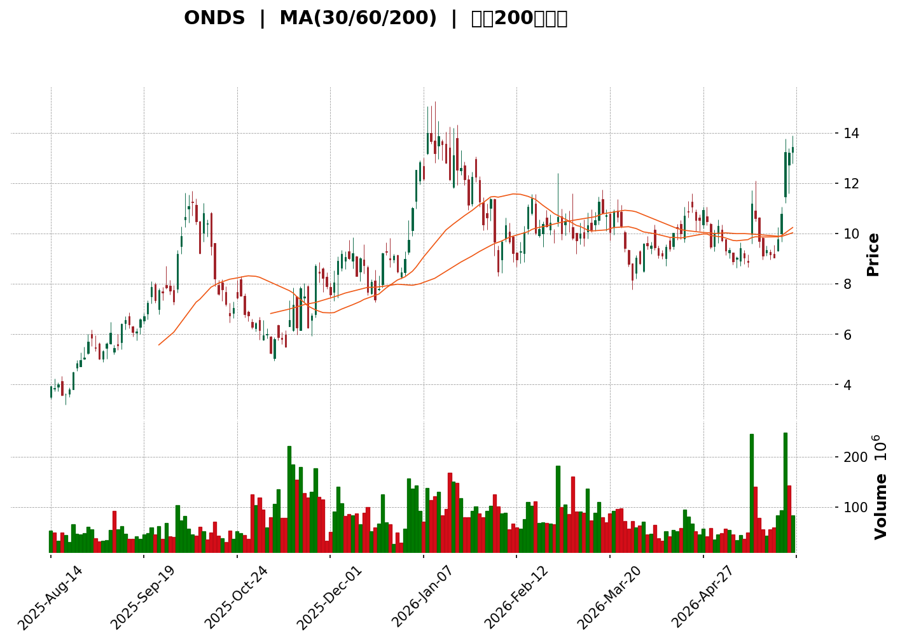
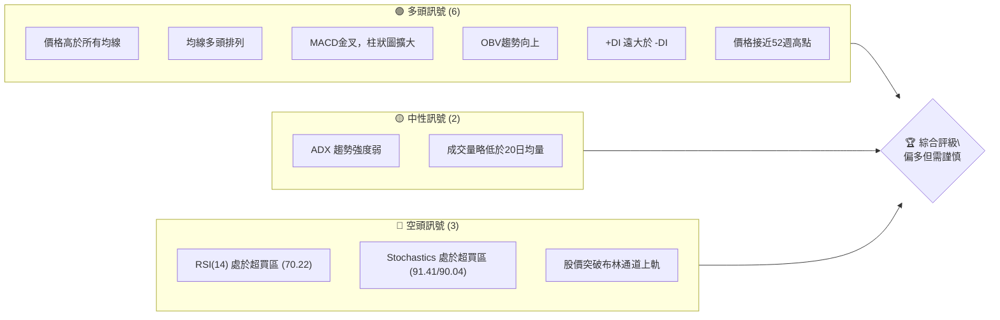

<details>
<summary>📊 靜態圖表 (點擊展開)</summary>

</details>

<html>
<head><meta charset="utf-8" /></head>
<body>
    <div>                        <script>window.PlotlyConfig = {MathJaxConfig: 'local'};</script>
        <script charset="utf-8" src="https://cdn.plot.ly/plotly-3.5.0.min.js" integrity="sha256-fHbNLP+GlIXN+efbQec78UkemUz3NJp7UmfGxC1tNxs=" crossorigin="anonymous"></script>                <div id="candlestick-chart" class="plotly-graph-div" style="height:500px; width:100%;"></div>            <script>                window.PLOTLYENV=window.PLOTLYENV || {};                                if (document.getElementById("candlestick-chart")) {                    Plotly.newPlot(                        "candlestick-chart",                        [{"close":{"dtype":"f8","bdata":"AAAA4KNwD0AAAACgR+EOQAAAAIA9ChBAAAAA4FG4DEAAAACgR+EMQAAAAGBmZg5AAAAAgML1EUAAAABgZmYTQAAAAKBH4RNAAAAAIK5HFEAAAADAzMwWQAAAAOCjcBdAAAAAQArXFUAAAABguB4UQAAAAIDrURVAAAAAwB6FFkAAAACgcD0YQAAAAMDMzBVAAAAAoHA9FkAAAACAFK4ZQAAAAKBwPRpAAAAAwB6FGUAAAAAAKVwYQAAAAGBmZhhAAAAAYGZmGkAAAACgR+EaQAAAAIA9Ch1AAAAAwB6FH0AAAABgZmYdQAAAAAAAAB9AAAAAANejHkAAAABA4XofQAAAAKBH4R5AAAAAoHA9HUAAAAAghWsiQAAAAIDr0SNAAAAAgOtRJUAAAACAFC4mQAAAAMAehSZAAAAAQOH6JEAAAADgo3AiQAAAAGC4niVAAAAAgOvRJEAAAADAHgUjQAAAAGBmZiBAAAAA4KNwHkAAAADgehQfQAAAAGCPwhxAAAAAgML1GkAAAACgcD0cQAAAAEAK1x1AAAAAYLgeHkAAAADA9SgbQAAAAAAAABtAAAAAwPUoGUAAAABgj8IZQAAAAKCZmRhAAAAAQArXF0AAAAAAAAAYQAAAAAAAABVAAAAAoHA9F0AAAADAHoUXQAAAAEAzMxdAAAAAgD0KFkAAAACgcD0aQAAAAOBRuBxAAAAAwB4FGUAAAAAAKVwfQAAAAAAAAB5AAAAA4HoUGUAAAADgo\u002fAaQAAAAOCjcCFAAAAAoEfhIEAAAABA4XogQAAAAKCZmR9AAAAAgOtRHkAAAAAA1yMgQAAAAEAK1yFAAAAAoEdhIkAAAAAA1yMiQAAAAIA9CiJAAAAAgMJ1IkAAAABgZqYgQAAAAIA9CiJAAAAAAACAIUAAAABgj8IeQAAAAIAULiBAAAAAQOF6HUAAAABAMzMfQAAAAOCjcCJAAAAAgD2KIkAAAAAgheshQAAAAGCPQiJAAAAAgML1IEAAAAAghesgQAAAAEDh+iFAAAAAwB6FI0AAAACAPQomQAAAACBcDylAAAAAgBSuKUAAAAAAKVwoQAAAAMAeBSxAAAAAoEdhK0AAAACgR2EqQAAAACCuxytAAAAAYLgeK0AAAAAA16MpQAAAAIDrUShAAAAAYI9CKkAAAACgmRkpQAAAAKBwPSlAAAAAQApXKEAAAACA61EmQAAAAMAehShAAAAAgD2KKEAAAACAPYomQAAAAOBRuCRAAAAAIK5HJUAAAABgj8ImQAAAAAApXCNAAAAAgML1IEAAAACgR2EjQAAAAIAUriRAAAAAAClcI0AAAACAwnUiQAAAAOCj8CFAAAAAYLieIkAAAACgmRkkQAAAAADXIyZAAAAAIK7HJkAAAAAgXA8kQAAAAKBHYSRAAAAAwMzMJEAAAACgmZkkQAAAAGBm5iRAAAAAwPUoJEAAAABAClclQAAAAIA9CiRAAAAAwB4FJUAAAABA4fokQAAAAMD1qCNAAAAA4KNwI0AAAADAHgUkQAAAAMD1qCNAAAAAwPWoJEAAAACA61EkQAAAACBcDyVAAAAAIFyPJkAAAADA9aglQAAAAAAAgCVAAAAAYLgeJEAAAADAzMwlQAAAAAApXCVAAAAAYLieJEAAAACgR+EiQAAAAKCZmSFAAAAAwMxMIEAAAADgehQiQAAAAGC4niFAAAAAQDMzI0AAAACAPQojQAAAACBcDyNAAAAAYGbmIkAAAAAgrkciQAAAAGCPQiJAAAAA4KPwIkAAAADAzMwiQAAAACBcDyRAAAAAYGZmJEAAAAAAAAAkQAAAAIDCdSVAAAAAoHC9JUAAAABguB4mQAAAAOB6FCVAAAAAoJkZJUAAAABgZuYlQAAAAIDC9SRAAAAAQOH6IkAAAADgehQkQAAAAADXoyRAAAAAgMJ1I0AAAADA9agiQAAAAIAUriJAAAAAIK7HIUAAAABguB4iQAAAAEAK1yJAAAAA4HoUIkAAAADgUbghQAAAACCFayZAAAAAoHA9JUAAAABgZmYjQAAAAAAAQCJAAAAA4FG4IkAAAAAAKVwiQAAAAGC4HiJAAAAAgD2KI0AAAACgmZklQAAAAAAAgCpAAAAA4KNwKkAAAAAghesqQA=="},"high":{"dtype":"f8","bdata":"AAAA4KNwD0AAAAAghesQQAAAAAApXBBAAAAAgOtREUAAAAAgrkcNQAAAAGC4Hg9AAAAAgD0KEkAAAAAghesTQAAAAIBoERVAAAAAwB4FFkAAAACAPQoYQAAAACCDwBhAAAAAwMzMF0AAAACgRbYWQAAAACBcjxVAAAAA4FG4FkAAAAAAAAAaQAAAAAApXBZAAAAAAAAAGEAAAABgj8IZQAAAAKBH4RpAAAAA4KNwG0AAAABgZmYZQAAAAAAAABlAAAAAIFyPGkAAAAAAKVwbQAAAAOCjcB1AAAAAoHA9IEAAAAAA1yMgQAAAAAApXB9AAAAAIFyPH0AAAAAghWshQAAAAEAKVyBAAAAAwMzMH0AAAACAFK4iQAAAACBcjyRAAAAAYI9CJ0AAAABAChcnQAAAAGBmZidAAAAAIK7HJkAAAADAHgUlQAAAAIAUbiZAAAAAYLgeJUAAAACgcL0lQAAAAGCPQiNAAAAAgOtRIEAAAACgR2EgQAAAAADXox9AAAAAgD0KHUAAAABAMzMdQAAAAEAKVyBAAAAAoEehIEAAAAAgXI8eQAAAAMDMzBtAAAAAgMJ1GkAAAAAAAAAaQAAAAGCPwhpAAAAAIK5HGkAAAAAAAAAZQAAAAOBRuBdAAAAA4HqUF0AAAAAgXI8ZQAAAAKBHYRhAAAAAwPWoGEAAAAAAKVwdQAAAAOCjcB9AAAAAIFwPHkAAAACAFK4fQAAAAIDrESBAAAAAoEfhH0AAAABgZmYbQAAAAKCZmSFAAAAAYI\u002fCIUAAAAAAKVwhQAAAAMAg8CBAAAAAANcjIEAAAACgmRkhQAAAAIDCNSJAAAAAgBSuIkAAAACgmZkiQAAAAAAAgCNAAAAA4FG4I0AAAABA4ToiQAAAAMD1KCJAAAAAYGYmI0AAAABA4XohQAAAAADXYyBAAAAAYLgeIUAAAABgka0gQAAAAEDheiJAAAAAgOtRI0AAAACAFK4jQAAAAGBmZiJAAAAAQApXIkAAAABAClchQAAAAKCZmSJAAAAAIFwPJUAAAABguB4mQAAAAOB6FClAAAAAACncKUAAAACAPQoqQAAAAADXIy5AAAAAQDMzLkAAAAAgXI8uQAAAAAAAAC1AAAAAAACAK0AAAAAA1yMsQAAAAAAAgCxAAAAAYGZmLEAAAADA9agsQAAAAMD1qCpAAAAAQOG6KUAAAAAghasoQAAAAOCj8ChAAAAAwPUoKkAAAAAgXI8oQAAAAGBm5iZAAAAAYGZmJkAAAABACtcmQAAAAIA9yiZAAAAAIFwPI0AAAADAHoUjQAAAACCuRyVAAAAAoEfhJEAAAABACtcjQAAAAKDGiyJAAAAAAClcI0AAAAAA16MkQAAAAEAKVyZAAAAAgBQuJ0AAAADA9SgnQAAAAADXIyVAAAAAgML1JEAAAACgR+ElQAAAACBcjyVAAAAAAClcJEAAAABACtcoQAAAAAAAACZAAAAAANejJUAAAABACtclQAAAAOBROCdAAAAAIFwPJEAAAABgZuYkQAAAAGC4HiVAAAAAgBSuJUAAAACAwvUlQAAAAKBwvSVAAAAA4KPwJkAAAADAHoUnQAAAAIDC9SVAAAAAwPWoJUAAAADgo\u002fAlQAAAAKBwvSZAAAAAIK5HJkAAAAAgrkckQAAAAKBwvSJAAAAAANejIUAAAAAgrkciQAAAAEAzsyJAAAAAYI9CI0AAAADAzMwjQAAAAKBHYSNAAAAAoHC9JEAAAACAPQojQAAAAOBRuCJAAAAAIIUrI0AAAADgUbgjQAAAACBcDyRAAAAAIK7HJEAAAAAgXA8lQAAAAGC4HiZAAAAA4HqUJkAAAADgUTgnQAAAAOCj8CVAAAAAgD2KJUAAAABguB4mQAAAAADXIyZAAAAAACncJEAAAACA61EkQAAAAGC4HiVAAAAAQOG6JEAAAADgepQjQAAAACCF6yJAAAAAAACAIkAAAACAFC4iQAAAAMDMTCNAAAAAQDOzIkAAAAAAKVwiQAAAAIDCdSdAAAAAoHA9KEAAAABAClclQAAAAGCPwiNAAAAA4HoUI0AAAABgj8IiQAAAAKBHISNAAAAAwB6FJEAAAABguB4mQAAAACBcjytAAAAAgOvRKkAAAACA69ErQA=="},"hovertemplate":"\u003cb\u003e%{x|%Y-%m-%d}\u003c\u002fb\u003e\u003cbr\u003e\u958b: $%{open:.2f}\u003cbr\u003e\u9ad8: $%{high:.2f}\u003cbr\u003e\u4f4e: $%{low:.2f}\u003cbr\u003e\u6536: $%{close:.2f}\u003cextra\u003e\u003c\u002fextra\u003e","low":{"dtype":"f8","bdata":"AAAA4KNwC0AAAACAwvUNQAAAAMDMzA1AAAAAQOF6DEAAAACgmZkJQAAAAOB6FAxAAAAAYGZmDkAAAABguB4SQAAAAEAK1xJAAAAAgD0KFEAAAADAzMwUQAAAAMD1KBZAAAAAgOtRFUAAAACAPQoUQAAAAKCZmRNAAAAAYLgeFEAAAABgZmYWQAAAAEAK1xRAAAAAgD2KFUAAAAAA16MVQAAAAMDMzBhAAAAAAAAAGUAAAACAFK4XQAAAAAAAABdAAAAAgD0KGEAAAACAFK4ZQAAAAIDrURpAAAAAIIXrHEAAAAAAAAAdQAAAAMD1KBtAAAAA4KNwHUAAAABAMzMfQAAAACCuRx5AAAAA4FG4HEAAAAAA16MeQAAAAKBHYSJAAAAAgD2KJEAAAABgZuYkQAAAAGAObSVAAAAAAADAJEAAAACgR2EiQAAAACCyXSNAAAAAYI\u002fCI0AAAACA61EiQAAAAIAUrh9AAAAA4FE4HkAAAACA61EdQAAAAAAAgBxAAAAAACncGUAAAACgmZkaQAAAAGC4nh1AAAAA4HoUHkAAAAAA16MaQAAAAOB6FBpAAAAAgOvRGEAAAABA4XoYQAAAAGC4HhdAAAAA4HoUF0AAAACA61EXQAAAAAAp3BRAAAAAwMzME0AAAADgehQXQAAAAGBmZhZAAAAAIIXrFUAAAACgcD0ZQAAAAGBmZhhAAAAAIIXrF0AAAACgmZkYQAAAAIA9Ch1AAAAAAAAAGUAAAADgUbgXQAAAAIAUrhpAAAAAANcjIEAAAACgcL0eQAAAAEAzMx9AAAAAoEfhHUAAAAAgrkcdQAAAAEAK1x1AAAAAgD0KIUAAAADA9SghQAAAAOCj8CFAAAAA4FE4IUAAAAAAKZwgQAAAAKBwPSBAAAAAgOvRIEAAAACgcD0eQAAAAAApXB5AAAAAYLgeHUAAAACAwvUeQAAAAOCjcB9AAAAAIFxPIkAAAABAClchQAAAAEAzsyFAAAAAACncIEAAAAAghWsgQAAAAMD1qCBAAAAAQApXIkAAAACA69EjQAAAAEDh+iVAAAAAIIXrJ0AAAADgUTgoQAAAAMDMTCpAAAAAgBQuK0AAAADA9agpQAAAACCF6ylAAAAAQArXKUAAAACgmZkpQAAAAKBwPShAAAAAoJmZJ0AAAAAAKdwnQAAAAEAzsyhAAAAAoEfhJ0AAAABgZuYlQAAAAIAULiZAAAAAYLgeKEAAAAAA1yMmQAAAACCuRyRAAAAAwMxMJEAAAADAHgUlQAAAAGCPQiJAAAAAANejIEAAAABgZuYgQAAAAEAKVyNAAAAAQDMzI0AAAABgj8IhQAAAAGBmZiFAAAAAANejIUAAAACgcL0hQAAAAEDh+iNAAAAAQOF6JUAAAABgZuYjQAAAAOBRuCNAAAAAgML1IkAAAACAPYokQAAAAGBm5iNAAAAAoHA9I0AAAACgmZkkQAAAAMAehSNAAAAAACncI0AAAABguB4kQAAAAMAehSNAAAAAYGZmIkAAAABgZiYjQAAAAAAAACNAAAAAoJmZI0AAAACgmRkkQAAAAOBROCRAAAAAoHC9JEAAAAAA16MlQAAAAKBwPSRAAAAAgMJ1I0AAAACAFO4jQAAAAEAz8yRAAAAAgMJ1JEAAAACAPYoiQAAAAMD1aCFAAAAAYLgeH0AAAABgZmYgQAAAACBcjyFAAAAAIIXrIEAAAABgj8IiQAAAAOBNYiJAAAAAgBSuIkAAAADAHgUiQAAAAEDh+iFAAAAAgMJ1IUAAAACgmZkiQAAAAKBwvSJAAAAAwB6FI0AAAACAPYojQAAAAIDrUSNAAAAAIK5HJUAAAABAM7MlQAAAAEAzMyRAAAAAQOE6JEAAAAAghWskQAAAACCFqyRAAAAAgOvRIkAAAABguJ4iQAAAAKBwPSNAAAAAQApXI0AAAACA61EiQAAAAIA9CiJAAAAAIFyPIUAAAADAzEwhQAAAAOCjcCFAAAAAoJmZIUAAAABAClchQAAAAEAzMyNAAAAAAAAAJUAAAAAghesiQAAAAOCj8CFAAAAAoHA9IkAAAACAwvUhQAAAAGC4HiJAAAAAILKdIkAAAAAAKVwjQAAAAOCjcCZAAAAAQDMzJ0AAAACgmZkpQA=="},"name":"\u50f9\u683c","open":{"dtype":"f8","bdata":"AAAAAAAADEAAAAAA16MOQAAAAAApXA9AAAAAIFyPEEAAAADAzMwMQAAAAGC4Hg1AAAAAYGZmDkAAAADgUbgSQAAAAKBH4RJAAAAA4HoUFEAAAAAAAAAVQAAAAAAAABhAAAAAYGbmFUAAAABA4XoWQAAAAADXIxRAAAAAwMzMFUAAAADAHoUWQAAAAKBwPRVAAAAA4KNwFkAAAADgUbgWQAAAAMDMzBlAAAAAQArXGkAAAAAgrkcZQAAAAKBwPRhAAAAAYLgeGUAAAABAMzMaQAAAACCuRxtAAAAAIFwPHkAAAACAwvUfQAAAAMAeBRxAAAAAIK7HHkAAAABACtcfQAAAAOBRuB9AAAAAAAAAH0AAAABAMzMfQAAAAMAeBSNAAAAAYLgeJUAAAAAAAAAmQAAAACCuhyZAAAAAIK5HJkAAAACAwvUkQAAAACBcDyRAAAAAYI\u002fCJEAAAABgZqYlQAAAAGCPQiNAAAAAwMzMH0AAAABguB4gQAAAAOBRuB5AAAAAYGZmG0AAAABgZmYbQAAAAIAUrh5AAAAAYLheIEAAAADgehQeQAAAAOB6lBtAAAAAgML1GUAAAAAAAAAZQAAAAMDMTBpAAAAAYLgeF0AAAAAghesXQAAAAIAUrhdAAAAAwPUoFEAAAABA4XoZQAAAAGBmZhdAAAAA4KPwF0AAAAAgrkcZQAAAAMD1qBhAAAAAgD0KHkAAAABguJ4YQAAAAAAp3B1AAAAAgBSuH0AAAACgcD0aQAAAAADXIxtAAAAAgML1IEAAAADgUTghQAAAACBcjyBAAAAAwB6FH0AAAADgUbgeQAAAACCuxyBAAAAAwB5FIUAAAAAAKdwhQAAAAEAKlyJAAAAAQArXIUAAAADgUTgiQAAAAEDh+iBAAAAAgML1IUAAAAAAKVwhQAAAAEDheh5AAAAAIK5HIEAAAADA9SgfQAAAAIDC9R9AAAAAoJmZIkAAAAAgXA8iQAAAAIDC9SFAAAAA4CRGIkAAAACgmZkgQAAAACCF6yBAAAAAIFyPIkAAAADAHkUkQAAAAKCZmSZAAAAAQDMzKEAAAABgZmYpQAAAAMD1aCpAAAAAAAAALEAAAAAghWsrQAAAAAAAACtAAAAAoEdhK0AAAAAA1yMrQAAAAOB61CpAAAAAgMK1J0AAAACgmZkrQAAAAMAeBSlAAAAAIIVrKUAAAADAzEwoQAAAACCFayZAAAAAgML1KUAAAAAgrkcoQAAAAAAAgCZAAAAAYLieJUAAAADAHgUmQAAAAGCPwiZAAAAAgBSuIkAAAACAFO4hQAAAAAApnCNAAAAAgBQuJEAAAADAHsUjQAAAAKBwfSJAAAAAgD2KIkAAAADgUXgiQAAAACCFayRAAAAAANejJUAAAACgR2EmQAAAAAAp3CNAAAAAwB4FJEAAAABgj0IlQAAAAMDMTCRAAAAAgBQuJEAAAAAAAAAlQAAAAKBHYSVAAAAA4FG4JEAAAABA4fokQAAAAAAAgCRAAAAAIFwPJEAAAACAFK4jQAAAAKCZGSRAAAAAIIUrJEAAAAAAKdwkQAAAAKBwvSRAAAAAoJkZJUAAAAAAAMAmQAAAAGC4XiVAAAAA4HqUJUAAAADgepQkQAAAAIDr0SVAAAAAYI\u002fCJUAAAACgmRkkQAAAAEAzsyJAAAAAYLieIUAAAABgZuYgQAAAAKCZmSJAAAAAIK4HIUAAAABgj0IjQAAAAAAp3CJAAAAAQApXJEAAAADgetQiQAAAAIDCdSJAAAAAwB4FIkAAAADgo3AjQAAAAMAeBSNAAAAAAACAJEAAAABgj8IkQAAAAKCZmSNAAAAAwMzMJUAAAACAPYomQAAAAGCPwiVAAAAAYI9CJUAAAADAS7ckQAAAAADXYyVAAAAAYI\u002fCJEAAAAAAAAAjQAAAAAAAACRAAAAAwMxMJEAAAAAgXI8jQAAAAAAAgCJAAAAAAACAIkAAAAAAAAAiQAAAAEAK1yFAAAAA4FF4IkAAAABACtchQAAAAEDh+iNAAAAAgOvRJUAAAABgj0IlQAAAAGBmpiNAAAAAAACAIkAAAAAgXI8iQAAAACCFayJAAAAAIIWrIkAAAAAAAAAkQAAAAEAz8yZAAAAAAACAKUAAAACgcH0qQA=="},"x":["2025-08-14T00:00:00-04:00","2025-08-15T00:00:00-04:00","2025-08-18T00:00:00-04:00","2025-08-19T00:00:00-04:00","2025-08-20T00:00:00-04:00","2025-08-21T00:00:00-04:00","2025-08-22T00:00:00-04:00","2025-08-25T00:00:00-04:00","2025-08-26T00:00:00-04:00","2025-08-27T00:00:00-04:00","2025-08-28T00:00:00-04:00","2025-08-29T00:00:00-04:00","2025-09-02T00:00:00-04:00","2025-09-03T00:00:00-04:00","2025-09-04T00:00:00-04:00","2025-09-05T00:00:00-04:00","2025-09-08T00:00:00-04:00","2025-09-09T00:00:00-04:00","2025-09-10T00:00:00-04:00","2025-09-11T00:00:00-04:00","2025-09-12T00:00:00-04:00","2025-09-15T00:00:00-04:00","2025-09-16T00:00:00-04:00","2025-09-17T00:00:00-04:00","2025-09-18T00:00:00-04:00","2025-09-19T00:00:00-04:00","2025-09-22T00:00:00-04:00","2025-09-23T00:00:00-04:00","2025-09-24T00:00:00-04:00","2025-09-25T00:00:00-04:00","2025-09-26T00:00:00-04:00","2025-09-29T00:00:00-04:00","2025-09-30T00:00:00-04:00","2025-10-01T00:00:00-04:00","2025-10-02T00:00:00-04:00","2025-10-03T00:00:00-04:00","2025-10-06T00:00:00-04:00","2025-10-07T00:00:00-04:00","2025-10-08T00:00:00-04:00","2025-10-09T00:00:00-04:00","2025-10-10T00:00:00-04:00","2025-10-13T00:00:00-04:00","2025-10-14T00:00:00-04:00","2025-10-15T00:00:00-04:00","2025-10-16T00:00:00-04:00","2025-10-17T00:00:00-04:00","2025-10-20T00:00:00-04:00","2025-10-21T00:00:00-04:00","2025-10-22T00:00:00-04:00","2025-10-23T00:00:00-04:00","2025-10-24T00:00:00-04:00","2025-10-27T00:00:00-04:00","2025-10-28T00:00:00-04:00","2025-10-29T00:00:00-04:00","2025-10-30T00:00:00-04:00","2025-10-31T00:00:00-04:00","2025-11-03T00:00:00-05:00","2025-11-04T00:00:00-05:00","2025-11-05T00:00:00-05:00","2025-11-06T00:00:00-05:00","2025-11-07T00:00:00-05:00","2025-11-10T00:00:00-05:00","2025-11-11T00:00:00-05:00","2025-11-12T00:00:00-05:00","2025-11-13T00:00:00-05:00","2025-11-14T00:00:00-05:00","2025-11-17T00:00:00-05:00","2025-11-18T00:00:00-05:00","2025-11-19T00:00:00-05:00","2025-11-20T00:00:00-05:00","2025-11-21T00:00:00-05:00","2025-11-24T00:00:00-05:00","2025-11-25T00:00:00-05:00","2025-11-26T00:00:00-05:00","2025-11-28T00:00:00-05:00","2025-12-01T00:00:00-05:00","2025-12-02T00:00:00-05:00","2025-12-03T00:00:00-05:00","2025-12-04T00:00:00-05:00","2025-12-05T00:00:00-05:00","2025-12-08T00:00:00-05:00","2025-12-09T00:00:00-05:00","2025-12-10T00:00:00-05:00","2025-12-11T00:00:00-05:00","2025-12-12T00:00:00-05:00","2025-12-15T00:00:00-05:00","2025-12-16T00:00:00-05:00","2025-12-17T00:00:00-05:00","2025-12-18T00:00:00-05:00","2025-12-19T00:00:00-05:00","2025-12-22T00:00:00-05:00","2025-12-23T00:00:00-05:00","2025-12-24T00:00:00-05:00","2025-12-26T00:00:00-05:00","2025-12-29T00:00:00-05:00","2025-12-30T00:00:00-05:00","2025-12-31T00:00:00-05:00","2026-01-02T00:00:00-05:00","2026-01-05T00:00:00-05:00","2026-01-06T00:00:00-05:00","2026-01-07T00:00:00-05:00","2026-01-08T00:00:00-05:00","2026-01-09T00:00:00-05:00","2026-01-12T00:00:00-05:00","2026-01-13T00:00:00-05:00","2026-01-14T00:00:00-05:00","2026-01-15T00:00:00-05:00","2026-01-16T00:00:00-05:00","2026-01-20T00:00:00-05:00","2026-01-21T00:00:00-05:00","2026-01-22T00:00:00-05:00","2026-01-23T00:00:00-05:00","2026-01-26T00:00:00-05:00","2026-01-27T00:00:00-05:00","2026-01-28T00:00:00-05:00","2026-01-29T00:00:00-05:00","2026-01-30T00:00:00-05:00","2026-02-02T00:00:00-05:00","2026-02-03T00:00:00-05:00","2026-02-04T00:00:00-05:00","2026-02-05T00:00:00-05:00","2026-02-06T00:00:00-05:00","2026-02-09T00:00:00-05:00","2026-02-10T00:00:00-05:00","2026-02-11T00:00:00-05:00","2026-02-12T00:00:00-05:00","2026-02-13T00:00:00-05:00","2026-02-17T00:00:00-05:00","2026-02-18T00:00:00-05:00","2026-02-19T00:00:00-05:00","2026-02-20T00:00:00-05:00","2026-02-23T00:00:00-05:00","2026-02-24T00:00:00-05:00","2026-02-25T00:00:00-05:00","2026-02-26T00:00:00-05:00","2026-02-27T00:00:00-05:00","2026-03-02T00:00:00-05:00","2026-03-03T00:00:00-05:00","2026-03-04T00:00:00-05:00","2026-03-05T00:00:00-05:00","2026-03-06T00:00:00-05:00","2026-03-09T00:00:00-04:00","2026-03-10T00:00:00-04:00","2026-03-11T00:00:00-04:00","2026-03-12T00:00:00-04:00","2026-03-13T00:00:00-04:00","2026-03-16T00:00:00-04:00","2026-03-17T00:00:00-04:00","2026-03-18T00:00:00-04:00","2026-03-19T00:00:00-04:00","2026-03-20T00:00:00-04:00","2026-03-23T00:00:00-04:00","2026-03-24T00:00:00-04:00","2026-03-25T00:00:00-04:00","2026-03-26T00:00:00-04:00","2026-03-27T00:00:00-04:00","2026-03-30T00:00:00-04:00","2026-03-31T00:00:00-04:00","2026-04-01T00:00:00-04:00","2026-04-02T00:00:00-04:00","2026-04-06T00:00:00-04:00","2026-04-07T00:00:00-04:00","2026-04-08T00:00:00-04:00","2026-04-09T00:00:00-04:00","2026-04-10T00:00:00-04:00","2026-04-13T00:00:00-04:00","2026-04-14T00:00:00-04:00","2026-04-15T00:00:00-04:00","2026-04-16T00:00:00-04:00","2026-04-17T00:00:00-04:00","2026-04-20T00:00:00-04:00","2026-04-21T00:00:00-04:00","2026-04-22T00:00:00-04:00","2026-04-23T00:00:00-04:00","2026-04-24T00:00:00-04:00","2026-04-27T00:00:00-04:00","2026-04-28T00:00:00-04:00","2026-04-29T00:00:00-04:00","2026-04-30T00:00:00-04:00","2026-05-01T00:00:00-04:00","2026-05-04T00:00:00-04:00","2026-05-05T00:00:00-04:00","2026-05-06T00:00:00-04:00","2026-05-07T00:00:00-04:00","2026-05-08T00:00:00-04:00","2026-05-11T00:00:00-04:00","2026-05-12T00:00:00-04:00","2026-05-13T00:00:00-04:00","2026-05-14T00:00:00-04:00","2026-05-15T00:00:00-04:00","2026-05-18T00:00:00-04:00","2026-05-19T00:00:00-04:00","2026-05-20T00:00:00-04:00","2026-05-21T00:00:00-04:00","2026-05-22T00:00:00-04:00","2026-05-26T00:00:00-04:00","2026-05-27T00:00:00-04:00","2026-05-28T00:00:00-04:00","2026-05-29T00:00:00-04:00","2026-06-01T00:00:00-04:00"],"type":"candlestick"},{"hovertemplate":"MA30: $%{y:.2f}\u003cextra\u003e\u003c\u002fextra\u003e","line":{"color":"#2196F3","dash":"dash","width":2},"mode":"lines","name":"MA30","x":["2025-08-14T00:00:00-04:00","2025-08-15T00:00:00-04:00","2025-08-18T00:00:00-04:00","2025-08-19T00:00:00-04:00","2025-08-20T00:00:00-04:00","2025-08-21T00:00:00-04:00","2025-08-22T00:00:00-04:00","2025-08-25T00:00:00-04:00","2025-08-26T00:00:00-04:00","2025-08-27T00:00:00-04:00","2025-08-28T00:00:00-04:00","2025-08-29T00:00:00-04:00","2025-09-02T00:00:00-04:00","2025-09-03T00:00:00-04:00","2025-09-04T00:00:00-04:00","2025-09-05T00:00:00-04:00","2025-09-08T00:00:00-04:00","2025-09-09T00:00:00-04:00","2025-09-10T00:00:00-04:00","2025-09-11T00:00:00-04:00","2025-09-12T00:00:00-04:00","2025-09-15T00:00:00-04:00","2025-09-16T00:00:00-04:00","2025-09-17T00:00:00-04:00","2025-09-18T00:00:00-04:00","2025-09-19T00:00:00-04:00","2025-09-22T00:00:00-04:00","2025-09-23T00:00:00-04:00","2025-09-24T00:00:00-04:00","2025-09-25T00:00:00-04:00","2025-09-26T00:00:00-04:00","2025-09-29T00:00:00-04:00","2025-09-30T00:00:00-04:00","2025-10-01T00:00:00-04:00","2025-10-02T00:00:00-04:00","2025-10-03T00:00:00-04:00","2025-10-06T00:00:00-04:00","2025-10-07T00:00:00-04:00","2025-10-08T00:00:00-04:00","2025-10-09T00:00:00-04:00","2025-10-10T00:00:00-04:00","2025-10-13T00:00:00-04:00","2025-10-14T00:00:00-04:00","2025-10-15T00:00:00-04:00","2025-10-16T00:00:00-04:00","2025-10-17T00:00:00-04:00","2025-10-20T00:00:00-04:00","2025-10-21T00:00:00-04:00","2025-10-22T00:00:00-04:00","2025-10-23T00:00:00-04:00","2025-10-24T00:00:00-04:00","2025-10-27T00:00:00-04:00","2025-10-28T00:00:00-04:00","2025-10-29T00:00:00-04:00","2025-10-30T00:00:00-04:00","2025-10-31T00:00:00-04:00","2025-11-03T00:00:00-05:00","2025-11-04T00:00:00-05:00","2025-11-05T00:00:00-05:00","2025-11-06T00:00:00-05:00","2025-11-07T00:00:00-05:00","2025-11-10T00:00:00-05:00","2025-11-11T00:00:00-05:00","2025-11-12T00:00:00-05:00","2025-11-13T00:00:00-05:00","2025-11-14T00:00:00-05:00","2025-11-17T00:00:00-05:00","2025-11-18T00:00:00-05:00","2025-11-19T00:00:00-05:00","2025-11-20T00:00:00-05:00","2025-11-21T00:00:00-05:00","2025-11-24T00:00:00-05:00","2025-11-25T00:00:00-05:00","2025-11-26T00:00:00-05:00","2025-11-28T00:00:00-05:00","2025-12-01T00:00:00-05:00","2025-12-02T00:00:00-05:00","2025-12-03T00:00:00-05:00","2025-12-04T00:00:00-05:00","2025-12-05T00:00:00-05:00","2025-12-08T00:00:00-05:00","2025-12-09T00:00:00-05:00","2025-12-10T00:00:00-05:00","2025-12-11T00:00:00-05:00","2025-12-12T00:00:00-05:00","2025-12-15T00:00:00-05:00","2025-12-16T00:00:00-05:00","2025-12-17T00:00:00-05:00","2025-12-18T00:00:00-05:00","2025-12-19T00:00:00-05:00","2025-12-22T00:00:00-05:00","2025-12-23T00:00:00-05:00","2025-12-24T00:00:00-05:00","2025-12-26T00:00:00-05:00","2025-12-29T00:00:00-05:00","2025-12-30T00:00:00-05:00","2025-12-31T00:00:00-05:00","2026-01-02T00:00:00-05:00","2026-01-05T00:00:00-05:00","2026-01-06T00:00:00-05:00","2026-01-07T00:00:00-05:00","2026-01-08T00:00:00-05:00","2026-01-09T00:00:00-05:00","2026-01-12T00:00:00-05:00","2026-01-13T00:00:00-05:00","2026-01-14T00:00:00-05:00","2026-01-15T00:00:00-05:00","2026-01-16T00:00:00-05:00","2026-01-20T00:00:00-05:00","2026-01-21T00:00:00-05:00","2026-01-22T00:00:00-05:00","2026-01-23T00:00:00-05:00","2026-01-26T00:00:00-05:00","2026-01-27T00:00:00-05:00","2026-01-28T00:00:00-05:00","2026-01-29T00:00:00-05:00","2026-01-30T00:00:00-05:00","2026-02-02T00:00:00-05:00","2026-02-03T00:00:00-05:00","2026-02-04T00:00:00-05:00","2026-02-05T00:00:00-05:00","2026-02-06T00:00:00-05:00","2026-02-09T00:00:00-05:00","2026-02-10T00:00:00-05:00","2026-02-11T00:00:00-05:00","2026-02-12T00:00:00-05:00","2026-02-13T00:00:00-05:00","2026-02-17T00:00:00-05:00","2026-02-18T00:00:00-05:00","2026-02-19T00:00:00-05:00","2026-02-20T00:00:00-05:00","2026-02-23T00:00:00-05:00","2026-02-24T00:00:00-05:00","2026-02-25T00:00:00-05:00","2026-02-26T00:00:00-05:00","2026-02-27T00:00:00-05:00","2026-03-02T00:00:00-05:00","2026-03-03T00:00:00-05:00","2026-03-04T00:00:00-05:00","2026-03-05T00:00:00-05:00","2026-03-06T00:00:00-05:00","2026-03-09T00:00:00-04:00","2026-03-10T00:00:00-04:00","2026-03-11T00:00:00-04:00","2026-03-12T00:00:00-04:00","2026-03-13T00:00:00-04:00","2026-03-16T00:00:00-04:00","2026-03-17T00:00:00-04:00","2026-03-18T00:00:00-04:00","2026-03-19T00:00:00-04:00","2026-03-20T00:00:00-04:00","2026-03-23T00:00:00-04:00","2026-03-24T00:00:00-04:00","2026-03-25T00:00:00-04:00","2026-03-26T00:00:00-04:00","2026-03-27T00:00:00-04:00","2026-03-30T00:00:00-04:00","2026-03-31T00:00:00-04:00","2026-04-01T00:00:00-04:00","2026-04-02T00:00:00-04:00","2026-04-06T00:00:00-04:00","2026-04-07T00:00:00-04:00","2026-04-08T00:00:00-04:00","2026-04-09T00:00:00-04:00","2026-04-10T00:00:00-04:00","2026-04-13T00:00:00-04:00","2026-04-14T00:00:00-04:00","2026-04-15T00:00:00-04:00","2026-04-16T00:00:00-04:00","2026-04-17T00:00:00-04:00","2026-04-20T00:00:00-04:00","2026-04-21T00:00:00-04:00","2026-04-22T00:00:00-04:00","2026-04-23T00:00:00-04:00","2026-04-24T00:00:00-04:00","2026-04-27T00:00:00-04:00","2026-04-28T00:00:00-04:00","2026-04-29T00:00:00-04:00","2026-04-30T00:00:00-04:00","2026-05-01T00:00:00-04:00","2026-05-04T00:00:00-04:00","2026-05-05T00:00:00-04:00","2026-05-06T00:00:00-04:00","2026-05-07T00:00:00-04:00","2026-05-08T00:00:00-04:00","2026-05-11T00:00:00-04:00","2026-05-12T00:00:00-04:00","2026-05-13T00:00:00-04:00","2026-05-14T00:00:00-04:00","2026-05-15T00:00:00-04:00","2026-05-18T00:00:00-04:00","2026-05-19T00:00:00-04:00","2026-05-20T00:00:00-04:00","2026-05-21T00:00:00-04:00","2026-05-22T00:00:00-04:00","2026-05-26T00:00:00-04:00","2026-05-27T00:00:00-04:00","2026-05-28T00:00:00-04:00","2026-05-29T00:00:00-04:00","2026-06-01T00:00:00-04:00"],"y":{"dtype":"f8","bdata":"AAAAAAAA+H8AAAAAAAD4fwAAAAAAAPh\u002fAAAAAAAA+H8AAAAAAAD4fwAAAAAAAPh\u002fAAAAAAAA+H8AAAAAAAD4fwAAAAAAAPh\u002fAAAAAAAA+H8AAAAAAAD4fwAAAAAAAPh\u002fAAAAAAAA+H8AAAAAAAD4fwAAAAAAAPh\u002fAAAAAAAA+H8AAAAAAAD4fwAAAAAAAPh\u002fAAAAAAAA+H8AAAAAAAD4fwAAAAAAAPh\u002fAAAAAAAA+H8AAAAAAAD4fwAAAAAAAPh\u002fAAAAAAAA+H8AAAAAAAD4fwAAAAAAAPh\u002fAAAAAAAA+H8AAAAAAAD4f3d3d1\u002flUBZAvLu7mzbQFkDe3d2FFlkXQGZmZv641xdAmpmZ2bJWGEDe3d1l2BUZQERERGRm5hlAzczMrAC5GkARERGh\u002fo0bQN7d3X2xZBxAvLu7K7IdHUB3d3dn2JUdQKuqqirOPh5AzczM7MPnHkAzMzPDroAfQERERDSl4h9Aq6qqWh0TIEBVVVV1TDAgQKuqqqL+TSBAIiIiIiJiIEDe3d1VDm0gQO\u002fu7n5qfCBARERE7AqQIEDNzMxE\u002fZsgQJqZmSkVpyBAiYiIwMqhIEAiIiJqA50gQAAAAMARiiBAREREJE1pIEDv7u7mQlIgQERERDyYJyBAZmZmdgUIIECrqqoKHswfQERERNSUih9AERERMSRNH0AzMzMjsPIeQImIiAiBlR5A7+7ujiX\u002fHUAAAACgNpAdQN7d3T3fDx1AIiIiUtR\u002fHEDv7u4OAiscQLy7u1ur4xtAvLu7O22gG0DNzMzME3UbQM3MzFzWahtAd3d3N9BpG0B3d3enDXQbQAAAAKAarxtAzczMDLsCHEAiIiKyVkccQAAAADCWfBxAIiIiAp22HECrqqoKAuscQLy7u5t9OB1Aq6qqanWMHUBVVVUVILcdQAAAABBY+R1ARERE1HgpHkCJiIh46WYeQM3MzNxr7h5A7+7uzoVkH0AiIiJCp80fQO\u002fu7p6oHyBA7+7uvlhSIEARERH5xXIgQLy7u\u002fupkSBAAAAAkHvNIEAiIiIywQMhQJqZmZmZWSFAZmZmXrrJIUAAAADwpyYiQM3MzEzwgCJAZmZm5onaIkB3d3fHBC8jQFVVVX0\u002flSNAq6qqgk77I0C8u7uTX0wkQCIiIlqrgyRAIiIieunGJEDNzMzUTQIlQAAAAHi+PyVA7+7uhutxJUDNzMzUTaIlQDMzM5uZ2SVAERERuawVJkC8u7v7xVImQDMzM8ODeSZAzczMnFKxJkDv7u7ea+4mQERERKRF9iZAMzMzE8roJkDe3d19P\u002fUmQAAAABDmCSdAIiIi8mAeJ0AAAAAghSsnQO\u002fu7r4tKydAq6qqqn8jJ0C8u7ur8RInQFVVVdUG+iZAAAAAsEfhJkARERExlrwmQKuqqlpkeyZAAAAAID5DJkBmZmaG6xEmQO\u002fu7u411yVARERElNGbJUBmZmYWIHclQJqZmUmaUiVAVVVVVeMlJUDe3d0NuwIlQLy7u1sd0yRAVVVVJU2pJECJiIi4rJUkQDMzM+MzbCRAVVVV5RdLJECrqqo6JjgkQImIiPgMOyRAvLu7K\u002flFJEDv7u4uljwkQFVVVRXZTiRAZmZmNtBpJECJiIjIdn4kQEREREREhCRAd3d3xwSPJECJiIhImpIkQKuqqoqzjyRAvLu7a+d7JECamZmpqmokQDMzM5MYRCRAIiIi8oslJECamZm51xwkQERERCSUESRAd3d3h10BJECamZlpke0jQO\u002fu7j4K1yNA3t3dHaHMI0BmZmZm9LYjQGZmZhYgtyNAzczMrNWxI0BVVVXVeKkjQN7d3f3UuCNAq6qqanXMI0AAAADwYN4jQJqZmfl+6iNAvLu7K0DuI0C8u7u7u\u002fsjQHd3d0fh+iNAZmZmplTcI0BmZmYW2c4jQDMzM2OCxyNAd3d3l+DBI0CJiIgoFacjQLy7u5s2kCNAiYiIiPp3I0CrqqpKfnEjQM3MzBwTfCNAVVVVlUOLI0BmZmYmMYgjQImIiOgmsSNAq6qqWo\u002fCI0CJiIjIocUjQAAAAFC4viNAiYiIGC+9I0C8u7vb3b0jQGZmZgasvCNA7+7uvsrBI0ARERFxr9kjQGZmZtajECRAvLu7ay5EJEBERERkO38kQA=="},"type":"scatter"},{"hovertemplate":"MA60: $%{y:.2f}\u003cextra\u003e\u003c\u002fextra\u003e","line":{"color":"#9C27B0","dash":"dash","width":2},"mode":"lines","name":"MA60","x":["2025-08-14T00:00:00-04:00","2025-08-15T00:00:00-04:00","2025-08-18T00:00:00-04:00","2025-08-19T00:00:00-04:00","2025-08-20T00:00:00-04:00","2025-08-21T00:00:00-04:00","2025-08-22T00:00:00-04:00","2025-08-25T00:00:00-04:00","2025-08-26T00:00:00-04:00","2025-08-27T00:00:00-04:00","2025-08-28T00:00:00-04:00","2025-08-29T00:00:00-04:00","2025-09-02T00:00:00-04:00","2025-09-03T00:00:00-04:00","2025-09-04T00:00:00-04:00","2025-09-05T00:00:00-04:00","2025-09-08T00:00:00-04:00","2025-09-09T00:00:00-04:00","2025-09-10T00:00:00-04:00","2025-09-11T00:00:00-04:00","2025-09-12T00:00:00-04:00","2025-09-15T00:00:00-04:00","2025-09-16T00:00:00-04:00","2025-09-17T00:00:00-04:00","2025-09-18T00:00:00-04:00","2025-09-19T00:00:00-04:00","2025-09-22T00:00:00-04:00","2025-09-23T00:00:00-04:00","2025-09-24T00:00:00-04:00","2025-09-25T00:00:00-04:00","2025-09-26T00:00:00-04:00","2025-09-29T00:00:00-04:00","2025-09-30T00:00:00-04:00","2025-10-01T00:00:00-04:00","2025-10-02T00:00:00-04:00","2025-10-03T00:00:00-04:00","2025-10-06T00:00:00-04:00","2025-10-07T00:00:00-04:00","2025-10-08T00:00:00-04:00","2025-10-09T00:00:00-04:00","2025-10-10T00:00:00-04:00","2025-10-13T00:00:00-04:00","2025-10-14T00:00:00-04:00","2025-10-15T00:00:00-04:00","2025-10-16T00:00:00-04:00","2025-10-17T00:00:00-04:00","2025-10-20T00:00:00-04:00","2025-10-21T00:00:00-04:00","2025-10-22T00:00:00-04:00","2025-10-23T00:00:00-04:00","2025-10-24T00:00:00-04:00","2025-10-27T00:00:00-04:00","2025-10-28T00:00:00-04:00","2025-10-29T00:00:00-04:00","2025-10-30T00:00:00-04:00","2025-10-31T00:00:00-04:00","2025-11-03T00:00:00-05:00","2025-11-04T00:00:00-05:00","2025-11-05T00:00:00-05:00","2025-11-06T00:00:00-05:00","2025-11-07T00:00:00-05:00","2025-11-10T00:00:00-05:00","2025-11-11T00:00:00-05:00","2025-11-12T00:00:00-05:00","2025-11-13T00:00:00-05:00","2025-11-14T00:00:00-05:00","2025-11-17T00:00:00-05:00","2025-11-18T00:00:00-05:00","2025-11-19T00:00:00-05:00","2025-11-20T00:00:00-05:00","2025-11-21T00:00:00-05:00","2025-11-24T00:00:00-05:00","2025-11-25T00:00:00-05:00","2025-11-26T00:00:00-05:00","2025-11-28T00:00:00-05:00","2025-12-01T00:00:00-05:00","2025-12-02T00:00:00-05:00","2025-12-03T00:00:00-05:00","2025-12-04T00:00:00-05:00","2025-12-05T00:00:00-05:00","2025-12-08T00:00:00-05:00","2025-12-09T00:00:00-05:00","2025-12-10T00:00:00-05:00","2025-12-11T00:00:00-05:00","2025-12-12T00:00:00-05:00","2025-12-15T00:00:00-05:00","2025-12-16T00:00:00-05:00","2025-12-17T00:00:00-05:00","2025-12-18T00:00:00-05:00","2025-12-19T00:00:00-05:00","2025-12-22T00:00:00-05:00","2025-12-23T00:00:00-05:00","2025-12-24T00:00:00-05:00","2025-12-26T00:00:00-05:00","2025-12-29T00:00:00-05:00","2025-12-30T00:00:00-05:00","2025-12-31T00:00:00-05:00","2026-01-02T00:00:00-05:00","2026-01-05T00:00:00-05:00","2026-01-06T00:00:00-05:00","2026-01-07T00:00:00-05:00","2026-01-08T00:00:00-05:00","2026-01-09T00:00:00-05:00","2026-01-12T00:00:00-05:00","2026-01-13T00:00:00-05:00","2026-01-14T00:00:00-05:00","2026-01-15T00:00:00-05:00","2026-01-16T00:00:00-05:00","2026-01-20T00:00:00-05:00","2026-01-21T00:00:00-05:00","2026-01-22T00:00:00-05:00","2026-01-23T00:00:00-05:00","2026-01-26T00:00:00-05:00","2026-01-27T00:00:00-05:00","2026-01-28T00:00:00-05:00","2026-01-29T00:00:00-05:00","2026-01-30T00:00:00-05:00","2026-02-02T00:00:00-05:00","2026-02-03T00:00:00-05:00","2026-02-04T00:00:00-05:00","2026-02-05T00:00:00-05:00","2026-02-06T00:00:00-05:00","2026-02-09T00:00:00-05:00","2026-02-10T00:00:00-05:00","2026-02-11T00:00:00-05:00","2026-02-12T00:00:00-05:00","2026-02-13T00:00:00-05:00","2026-02-17T00:00:00-05:00","2026-02-18T00:00:00-05:00","2026-02-19T00:00:00-05:00","2026-02-20T00:00:00-05:00","2026-02-23T00:00:00-05:00","2026-02-24T00:00:00-05:00","2026-02-25T00:00:00-05:00","2026-02-26T00:00:00-05:00","2026-02-27T00:00:00-05:00","2026-03-02T00:00:00-05:00","2026-03-03T00:00:00-05:00","2026-03-04T00:00:00-05:00","2026-03-05T00:00:00-05:00","2026-03-06T00:00:00-05:00","2026-03-09T00:00:00-04:00","2026-03-10T00:00:00-04:00","2026-03-11T00:00:00-04:00","2026-03-12T00:00:00-04:00","2026-03-13T00:00:00-04:00","2026-03-16T00:00:00-04:00","2026-03-17T00:00:00-04:00","2026-03-18T00:00:00-04:00","2026-03-19T00:00:00-04:00","2026-03-20T00:00:00-04:00","2026-03-23T00:00:00-04:00","2026-03-24T00:00:00-04:00","2026-03-25T00:00:00-04:00","2026-03-26T00:00:00-04:00","2026-03-27T00:00:00-04:00","2026-03-30T00:00:00-04:00","2026-03-31T00:00:00-04:00","2026-04-01T00:00:00-04:00","2026-04-02T00:00:00-04:00","2026-04-06T00:00:00-04:00","2026-04-07T00:00:00-04:00","2026-04-08T00:00:00-04:00","2026-04-09T00:00:00-04:00","2026-04-10T00:00:00-04:00","2026-04-13T00:00:00-04:00","2026-04-14T00:00:00-04:00","2026-04-15T00:00:00-04:00","2026-04-16T00:00:00-04:00","2026-04-17T00:00:00-04:00","2026-04-20T00:00:00-04:00","2026-04-21T00:00:00-04:00","2026-04-22T00:00:00-04:00","2026-04-23T00:00:00-04:00","2026-04-24T00:00:00-04:00","2026-04-27T00:00:00-04:00","2026-04-28T00:00:00-04:00","2026-04-29T00:00:00-04:00","2026-04-30T00:00:00-04:00","2026-05-01T00:00:00-04:00","2026-05-04T00:00:00-04:00","2026-05-05T00:00:00-04:00","2026-05-06T00:00:00-04:00","2026-05-07T00:00:00-04:00","2026-05-08T00:00:00-04:00","2026-05-11T00:00:00-04:00","2026-05-12T00:00:00-04:00","2026-05-13T00:00:00-04:00","2026-05-14T00:00:00-04:00","2026-05-15T00:00:00-04:00","2026-05-18T00:00:00-04:00","2026-05-19T00:00:00-04:00","2026-05-20T00:00:00-04:00","2026-05-21T00:00:00-04:00","2026-05-22T00:00:00-04:00","2026-05-26T00:00:00-04:00","2026-05-27T00:00:00-04:00","2026-05-28T00:00:00-04:00","2026-05-29T00:00:00-04:00","2026-06-01T00:00:00-04:00"],"y":{"dtype":"f8","bdata":"AAAAAAAA+H8AAAAAAAD4fwAAAAAAAPh\u002fAAAAAAAA+H8AAAAAAAD4fwAAAAAAAPh\u002fAAAAAAAA+H8AAAAAAAD4fwAAAAAAAPh\u002fAAAAAAAA+H8AAAAAAAD4fwAAAAAAAPh\u002fAAAAAAAA+H8AAAAAAAD4fwAAAAAAAPh\u002fAAAAAAAA+H8AAAAAAAD4fwAAAAAAAPh\u002fAAAAAAAA+H8AAAAAAAD4fwAAAAAAAPh\u002fAAAAAAAA+H8AAAAAAAD4fwAAAAAAAPh\u002fAAAAAAAA+H8AAAAAAAD4fwAAAAAAAPh\u002fAAAAAAAA+H8AAAAAAAD4fwAAAAAAAPh\u002fAAAAAAAA+H8AAAAAAAD4fwAAAAAAAPh\u002fAAAAAAAA+H8AAAAAAAD4fwAAAAAAAPh\u002fAAAAAAAA+H8AAAAAAAD4fwAAAAAAAPh\u002fAAAAAAAA+H8AAAAAAAD4fwAAAAAAAPh\u002fAAAAAAAA+H8AAAAAAAD4fwAAAAAAAPh\u002fAAAAAAAA+H8AAAAAAAD4fwAAAAAAAPh\u002fAAAAAAAA+H8AAAAAAAD4fwAAAAAAAPh\u002fAAAAAAAA+H8AAAAAAAD4fwAAAAAAAPh\u002fAAAAAAAA+H8AAAAAAAD4fwAAAAAAAPh\u002fAAAAAAAA+H8AAAAAAAD4fwAAAOwKUBtARERExCBwG0BERERImpIbQFVVVekmsRtAVVVVhevRG0CJiIhERAQcQGZmZrbzPRxA3t3dHRNcHECJiIigGo8cQN7d3V1IuhxA7+7uPsPOHEAzMzM7beAcQDMzM8M8ER1ARERElBhEHUAAAABI4XodQImIiMi9ph1AZmZmdgXIHUARERFJU+odQKuqqvKLJR5AiYiIqH9jHkDv7u6uuZAeQO\u002fu7pa1uh5AVVVVbVnrHkAiIiJKfhEfQHd3d\u002fdTQx9A3t3ddQVoH0DNzMx0k3gfQAAAAMi9hh9AZmZmjgl+H0AzMzOjt4UfQKuqqirOnh9A3t3dXUi6H0BmZmam4swfQBEREQnz5B9Ad3d31+r4H0CrqqoKHuwfQAAAAIBq3B9Ad3d3Vw7NH0AiIiKC3MsfQImIiDiJ4R9AvLu7Q9IEIEC8u7t7FB4gQFVVVf1iOSBAIiIiQmBVIEDv7u5Wx3QgQN7d3VVVpSBAMzMzTxvYIEC8u7szMwMhQBEREVWcLSFAREREgCNkIUDv7u6W\u002fJIhQAAAAMgEvyFAAAAABJ3mIUARERFt5wsiQImIiDTsOiJAMzMzt\u002fNtIkAzMzMDK5ciQJqZmeUXuyJAd3d3gwfjIkCamZlN8BAjQFVVVcm9NiNAVVVVfYZNI0B3d3ePCW4jQHd3d1fHlCNAiYiI2Fy4I0CJiIiMJc8jQFVVVd1r3iNAVVVVnX34I0Dv7u5uWQskQHd3dzfQKSRAMzMzB4FVJECJiIgQn3EkQLy7u1MqfiRAMzMzA+SOJEDv7u4meKAkQCIiIrY6tiRAd3d3C5DLJEARERHVv+EkQN7d3dEi6yRAvLu7Z2b2JEBVVVVxhAIlQN7d3eltCSVAIiIiVpwNJUCrqqpG\u002fRslQDMzM7\u002fmIiVAMzMzT2IwJUAzMzMbdkUlQN7d3V1IWiVARERE5KV7JUDv7u4GgZUlQM3MzFyPoiVAzczMJE2pJUAzMzMj27klQCIiIioVxyVAzczM3LLWJUBERES0D98lQM3MzKRw3SVAMzMzi7PPJUCrqqoqzr4lQERERLQPnyVAERER0WmDJUBVVVX1tmwlQHd3dz98RiVAvLu7000iJUAAAAB4vv8kQO\u002fu7hYg1yRAERERWTm0JEBmZmY+CpckQAAAADDdhCRAERERgdxrJECamZnxGVYkQM3MzCz5RSRAAAAASOE6JEBERETUBjokQGZmZm5ZKyRAiYiICKwcJEAzMzP78BkkQAAAACD3GiRAERER6SYRJECrqqqitwUkQERERLwtCyRA7+7uZtgVJECJiIj4xRIkQAAAAHA9CiRAAAAAqH8DJECamZlJDAIkQLy7u1PjBSRAiYiIgJUDJEAAAADobfkjQN7d3b2f+iNAZmZmpg30I0ARERHBPPEjQCIiIjom6CNAAAAAUEbfI0Crqqqit9UjQKuqqiLbySNAZmZm7jXHI0C8u7vrUcgjQGZmZvbh4yNAREREDAL7I0DNzMwcWhQkQA=="},"type":"scatter"},{"hovertemplate":"MA200: $%{y:.2f}\u003cextra\u003e\u003c\u002fextra\u003e","line":{"color":"#FF6F00","dash":"solid","width":2},"mode":"lines","name":"MA200","x":["2025-08-14T00:00:00-04:00","2025-08-15T00:00:00-04:00","2025-08-18T00:00:00-04:00","2025-08-19T00:00:00-04:00","2025-08-20T00:00:00-04:00","2025-08-21T00:00:00-04:00","2025-08-22T00:00:00-04:00","2025-08-25T00:00:00-04:00","2025-08-26T00:00:00-04:00","2025-08-27T00:00:00-04:00","2025-08-28T00:00:00-04:00","2025-08-29T00:00:00-04:00","2025-09-02T00:00:00-04:00","2025-09-03T00:00:00-04:00","2025-09-04T00:00:00-04:00","2025-09-05T00:00:00-04:00","2025-09-08T00:00:00-04:00","2025-09-09T00:00:00-04:00","2025-09-10T00:00:00-04:00","2025-09-11T00:00:00-04:00","2025-09-12T00:00:00-04:00","2025-09-15T00:00:00-04:00","2025-09-16T00:00:00-04:00","2025-09-17T00:00:00-04:00","2025-09-18T00:00:00-04:00","2025-09-19T00:00:00-04:00","2025-09-22T00:00:00-04:00","2025-09-23T00:00:00-04:00","2025-09-24T00:00:00-04:00","2025-09-25T00:00:00-04:00","2025-09-26T00:00:00-04:00","2025-09-29T00:00:00-04:00","2025-09-30T00:00:00-04:00","2025-10-01T00:00:00-04:00","2025-10-02T00:00:00-04:00","2025-10-03T00:00:00-04:00","2025-10-06T00:00:00-04:00","2025-10-07T00:00:00-04:00","2025-10-08T00:00:00-04:00","2025-10-09T00:00:00-04:00","2025-10-10T00:00:00-04:00","2025-10-13T00:00:00-04:00","2025-10-14T00:00:00-04:00","2025-10-15T00:00:00-04:00","2025-10-16T00:00:00-04:00","2025-10-17T00:00:00-04:00","2025-10-20T00:00:00-04:00","2025-10-21T00:00:00-04:00","2025-10-22T00:00:00-04:00","2025-10-23T00:00:00-04:00","2025-10-24T00:00:00-04:00","2025-10-27T00:00:00-04:00","2025-10-28T00:00:00-04:00","2025-10-29T00:00:00-04:00","2025-10-30T00:00:00-04:00","2025-10-31T00:00:00-04:00","2025-11-03T00:00:00-05:00","2025-11-04T00:00:00-05:00","2025-11-05T00:00:00-05:00","2025-11-06T00:00:00-05:00","2025-11-07T00:00:00-05:00","2025-11-10T00:00:00-05:00","2025-11-11T00:00:00-05:00","2025-11-12T00:00:00-05:00","2025-11-13T00:00:00-05:00","2025-11-14T00:00:00-05:00","2025-11-17T00:00:00-05:00","2025-11-18T00:00:00-05:00","2025-11-19T00:00:00-05:00","2025-11-20T00:00:00-05:00","2025-11-21T00:00:00-05:00","2025-11-24T00:00:00-05:00","2025-11-25T00:00:00-05:00","2025-11-26T00:00:00-05:00","2025-11-28T00:00:00-05:00","2025-12-01T00:00:00-05:00","2025-12-02T00:00:00-05:00","2025-12-03T00:00:00-05:00","2025-12-04T00:00:00-05:00","2025-12-05T00:00:00-05:00","2025-12-08T00:00:00-05:00","2025-12-09T00:00:00-05:00","2025-12-10T00:00:00-05:00","2025-12-11T00:00:00-05:00","2025-12-12T00:00:00-05:00","2025-12-15T00:00:00-05:00","2025-12-16T00:00:00-05:00","2025-12-17T00:00:00-05:00","2025-12-18T00:00:00-05:00","2025-12-19T00:00:00-05:00","2025-12-22T00:00:00-05:00","2025-12-23T00:00:00-05:00","2025-12-24T00:00:00-05:00","2025-12-26T00:00:00-05:00","2025-12-29T00:00:00-05:00","2025-12-30T00:00:00-05:00","2025-12-31T00:00:00-05:00","2026-01-02T00:00:00-05:00","2026-01-05T00:00:00-05:00","2026-01-06T00:00:00-05:00","2026-01-07T00:00:00-05:00","2026-01-08T00:00:00-05:00","2026-01-09T00:00:00-05:00","2026-01-12T00:00:00-05:00","2026-01-13T00:00:00-05:00","2026-01-14T00:00:00-05:00","2026-01-15T00:00:00-05:00","2026-01-16T00:00:00-05:00","2026-01-20T00:00:00-05:00","2026-01-21T00:00:00-05:00","2026-01-22T00:00:00-05:00","2026-01-23T00:00:00-05:00","2026-01-26T00:00:00-05:00","2026-01-27T00:00:00-05:00","2026-01-28T00:00:00-05:00","2026-01-29T00:00:00-05:00","2026-01-30T00:00:00-05:00","2026-02-02T00:00:00-05:00","2026-02-03T00:00:00-05:00","2026-02-04T00:00:00-05:00","2026-02-05T00:00:00-05:00","2026-02-06T00:00:00-05:00","2026-02-09T00:00:00-05:00","2026-02-10T00:00:00-05:00","2026-02-11T00:00:00-05:00","2026-02-12T00:00:00-05:00","2026-02-13T00:00:00-05:00","2026-02-17T00:00:00-05:00","2026-02-18T00:00:00-05:00","2026-02-19T00:00:00-05:00","2026-02-20T00:00:00-05:00","2026-02-23T00:00:00-05:00","2026-02-24T00:00:00-05:00","2026-02-25T00:00:00-05:00","2026-02-26T00:00:00-05:00","2026-02-27T00:00:00-05:00","2026-03-02T00:00:00-05:00","2026-03-03T00:00:00-05:00","2026-03-04T00:00:00-05:00","2026-03-05T00:00:00-05:00","2026-03-06T00:00:00-05:00","2026-03-09T00:00:00-04:00","2026-03-10T00:00:00-04:00","2026-03-11T00:00:00-04:00","2026-03-12T00:00:00-04:00","2026-03-13T00:00:00-04:00","2026-03-16T00:00:00-04:00","2026-03-17T00:00:00-04:00","2026-03-18T00:00:00-04:00","2026-03-19T00:00:00-04:00","2026-03-20T00:00:00-04:00","2026-03-23T00:00:00-04:00","2026-03-24T00:00:00-04:00","2026-03-25T00:00:00-04:00","2026-03-26T00:00:00-04:00","2026-03-27T00:00:00-04:00","2026-03-30T00:00:00-04:00","2026-03-31T00:00:00-04:00","2026-04-01T00:00:00-04:00","2026-04-02T00:00:00-04:00","2026-04-06T00:00:00-04:00","2026-04-07T00:00:00-04:00","2026-04-08T00:00:00-04:00","2026-04-09T00:00:00-04:00","2026-04-10T00:00:00-04:00","2026-04-13T00:00:00-04:00","2026-04-14T00:00:00-04:00","2026-04-15T00:00:00-04:00","2026-04-16T00:00:00-04:00","2026-04-17T00:00:00-04:00","2026-04-20T00:00:00-04:00","2026-04-21T00:00:00-04:00","2026-04-22T00:00:00-04:00","2026-04-23T00:00:00-04:00","2026-04-24T00:00:00-04:00","2026-04-27T00:00:00-04:00","2026-04-28T00:00:00-04:00","2026-04-29T00:00:00-04:00","2026-04-30T00:00:00-04:00","2026-05-01T00:00:00-04:00","2026-05-04T00:00:00-04:00","2026-05-05T00:00:00-04:00","2026-05-06T00:00:00-04:00","2026-05-07T00:00:00-04:00","2026-05-08T00:00:00-04:00","2026-05-11T00:00:00-04:00","2026-05-12T00:00:00-04:00","2026-05-13T00:00:00-04:00","2026-05-14T00:00:00-04:00","2026-05-15T00:00:00-04:00","2026-05-18T00:00:00-04:00","2026-05-19T00:00:00-04:00","2026-05-20T00:00:00-04:00","2026-05-21T00:00:00-04:00","2026-05-22T00:00:00-04:00","2026-05-26T00:00:00-04:00","2026-05-27T00:00:00-04:00","2026-05-28T00:00:00-04:00","2026-05-29T00:00:00-04:00","2026-06-01T00:00:00-04:00"],"y":{"dtype":"f8","bdata":"AAAAAAAA+H8AAAAAAAD4fwAAAAAAAPh\u002fAAAAAAAA+H8AAAAAAAD4fwAAAAAAAPh\u002fAAAAAAAA+H8AAAAAAAD4fwAAAAAAAPh\u002fAAAAAAAA+H8AAAAAAAD4fwAAAAAAAPh\u002fAAAAAAAA+H8AAAAAAAD4fwAAAAAAAPh\u002fAAAAAAAA+H8AAAAAAAD4fwAAAAAAAPh\u002fAAAAAAAA+H8AAAAAAAD4fwAAAAAAAPh\u002fAAAAAAAA+H8AAAAAAAD4fwAAAAAAAPh\u002fAAAAAAAA+H8AAAAAAAD4fwAAAAAAAPh\u002fAAAAAAAA+H8AAAAAAAD4fwAAAAAAAPh\u002fAAAAAAAA+H8AAAAAAAD4fwAAAAAAAPh\u002fAAAAAAAA+H8AAAAAAAD4fwAAAAAAAPh\u002fAAAAAAAA+H8AAAAAAAD4fwAAAAAAAPh\u002fAAAAAAAA+H8AAAAAAAD4fwAAAAAAAPh\u002fAAAAAAAA+H8AAAAAAAD4fwAAAAAAAPh\u002fAAAAAAAA+H8AAAAAAAD4fwAAAAAAAPh\u002fAAAAAAAA+H8AAAAAAAD4fwAAAAAAAPh\u002fAAAAAAAA+H8AAAAAAAD4fwAAAAAAAPh\u002fAAAAAAAA+H8AAAAAAAD4fwAAAAAAAPh\u002fAAAAAAAA+H8AAAAAAAD4fwAAAAAAAPh\u002fAAAAAAAA+H8AAAAAAAD4fwAAAAAAAPh\u002fAAAAAAAA+H8AAAAAAAD4fwAAAAAAAPh\u002fAAAAAAAA+H8AAAAAAAD4fwAAAAAAAPh\u002fAAAAAAAA+H8AAAAAAAD4fwAAAAAAAPh\u002fAAAAAAAA+H8AAAAAAAD4fwAAAAAAAPh\u002fAAAAAAAA+H8AAAAAAAD4fwAAAAAAAPh\u002fAAAAAAAA+H8AAAAAAAD4fwAAAAAAAPh\u002fAAAAAAAA+H8AAAAAAAD4fwAAAAAAAPh\u002fAAAAAAAA+H8AAAAAAAD4fwAAAAAAAPh\u002fAAAAAAAA+H8AAAAAAAD4fwAAAAAAAPh\u002fAAAAAAAA+H8AAAAAAAD4fwAAAAAAAPh\u002fAAAAAAAA+H8AAAAAAAD4fwAAAAAAAPh\u002fAAAAAAAA+H8AAAAAAAD4fwAAAAAAAPh\u002fAAAAAAAA+H8AAAAAAAD4fwAAAAAAAPh\u002fAAAAAAAA+H8AAAAAAAD4fwAAAAAAAPh\u002fAAAAAAAA+H8AAAAAAAD4fwAAAAAAAPh\u002fAAAAAAAA+H8AAAAAAAD4fwAAAAAAAPh\u002fAAAAAAAA+H8AAAAAAAD4fwAAAAAAAPh\u002fAAAAAAAA+H8AAAAAAAD4fwAAAAAAAPh\u002fAAAAAAAA+H8AAAAAAAD4fwAAAAAAAPh\u002fAAAAAAAA+H8AAAAAAAD4fwAAAAAAAPh\u002fAAAAAAAA+H8AAAAAAAD4fwAAAAAAAPh\u002fAAAAAAAA+H8AAAAAAAD4fwAAAAAAAPh\u002fAAAAAAAA+H8AAAAAAAD4fwAAAAAAAPh\u002fAAAAAAAA+H8AAAAAAAD4fwAAAAAAAPh\u002fAAAAAAAA+H8AAAAAAAD4fwAAAAAAAPh\u002fAAAAAAAA+H8AAAAAAAD4fwAAAAAAAPh\u002fAAAAAAAA+H8AAAAAAAD4fwAAAAAAAPh\u002fAAAAAAAA+H8AAAAAAAD4fwAAAAAAAPh\u002fAAAAAAAA+H8AAAAAAAD4fwAAAAAAAPh\u002fAAAAAAAA+H8AAAAAAAD4fwAAAAAAAPh\u002fAAAAAAAA+H8AAAAAAAD4fwAAAAAAAPh\u002fAAAAAAAA+H8AAAAAAAD4fwAAAAAAAPh\u002fAAAAAAAA+H8AAAAAAAD4fwAAAAAAAPh\u002fAAAAAAAA+H8AAAAAAAD4fwAAAAAAAPh\u002fAAAAAAAA+H8AAAAAAAD4fwAAAAAAAPh\u002fAAAAAAAA+H8AAAAAAAD4fwAAAAAAAPh\u002fAAAAAAAA+H8AAAAAAAD4fwAAAAAAAPh\u002fAAAAAAAA+H8AAAAAAAD4fwAAAAAAAPh\u002fAAAAAAAA+H8AAAAAAAD4fwAAAAAAAPh\u002fAAAAAAAA+H8AAAAAAAD4fwAAAAAAAPh\u002fAAAAAAAA+H8AAAAAAAD4fwAAAAAAAPh\u002fAAAAAAAA+H8AAAAAAAD4fwAAAAAAAPh\u002fAAAAAAAA+H8AAAAAAAD4fwAAAAAAAPh\u002fAAAAAAAA+H8AAAAAAAD4fwAAAAAAAPh\u002fAAAAAAAA+H8AAAAAAAD4fwAAAAAAAPh\u002fAAAAAAAA+H\u002fD9SiL\u002feUhQA=="},"type":"scatter"}],                        {"template":{"data":{"barpolar":[{"marker":{"line":{"color":"rgb(17,17,17)","width":0.5},"pattern":{"fillmode":"overlay","size":10,"solidity":0.2}},"type":"barpolar"}],"bar":[{"error_x":{"color":"#f2f5fa"},"error_y":{"color":"#f2f5fa"},"marker":{"line":{"color":"rgb(17,17,17)","width":0.5},"pattern":{"fillmode":"overlay","size":10,"solidity":0.2}},"type":"bar"}],"carpet":[{"aaxis":{"endlinecolor":"#A2B1C6","gridcolor":"#506784","linecolor":"#506784","minorgridcolor":"#506784","startlinecolor":"#A2B1C6"},"baxis":{"endlinecolor":"#A2B1C6","gridcolor":"#506784","linecolor":"#506784","minorgridcolor":"#506784","startlinecolor":"#A2B1C6"},"type":"carpet"}],"choropleth":[{"colorbar":{"outlinewidth":0,"ticks":""},"type":"choropleth"}],"contourcarpet":[{"colorbar":{"outlinewidth":0,"ticks":""},"type":"contourcarpet"}],"contour":[{"colorbar":{"outlinewidth":0,"ticks":""},"colorscale":[[0.0,"#0d0887"],[0.1111111111111111,"#46039f"],[0.2222222222222222,"#7201a8"],[0.3333333333333333,"#9c179e"],[0.4444444444444444,"#bd3786"],[0.5555555555555556,"#d8576b"],[0.6666666666666666,"#ed7953"],[0.7777777777777778,"#fb9f3a"],[0.8888888888888888,"#fdca26"],[1.0,"#f0f921"]],"type":"contour"}],"heatmap":[{"colorbar":{"outlinewidth":0,"ticks":""},"colorscale":[[0.0,"#0d0887"],[0.1111111111111111,"#46039f"],[0.2222222222222222,"#7201a8"],[0.3333333333333333,"#9c179e"],[0.4444444444444444,"#bd3786"],[0.5555555555555556,"#d8576b"],[0.6666666666666666,"#ed7953"],[0.7777777777777778,"#fb9f3a"],[0.8888888888888888,"#fdca26"],[1.0,"#f0f921"]],"type":"heatmap"}],"histogram2dcontour":[{"colorbar":{"outlinewidth":0,"ticks":""},"colorscale":[[0.0,"#0d0887"],[0.1111111111111111,"#46039f"],[0.2222222222222222,"#7201a8"],[0.3333333333333333,"#9c179e"],[0.4444444444444444,"#bd3786"],[0.5555555555555556,"#d8576b"],[0.6666666666666666,"#ed7953"],[0.7777777777777778,"#fb9f3a"],[0.8888888888888888,"#fdca26"],[1.0,"#f0f921"]],"type":"histogram2dcontour"}],"histogram2d":[{"colorbar":{"outlinewidth":0,"ticks":""},"colorscale":[[0.0,"#0d0887"],[0.1111111111111111,"#46039f"],[0.2222222222222222,"#7201a8"],[0.3333333333333333,"#9c179e"],[0.4444444444444444,"#bd3786"],[0.5555555555555556,"#d8576b"],[0.6666666666666666,"#ed7953"],[0.7777777777777778,"#fb9f3a"],[0.8888888888888888,"#fdca26"],[1.0,"#f0f921"]],"type":"histogram2d"}],"histogram":[{"marker":{"pattern":{"fillmode":"overlay","size":10,"solidity":0.2}},"type":"histogram"}],"mesh3d":[{"colorbar":{"outlinewidth":0,"ticks":""},"type":"mesh3d"}],"parcoords":[{"line":{"colorbar":{"outlinewidth":0,"ticks":""}},"type":"parcoords"}],"pie":[{"automargin":true,"type":"pie"}],"scatter3d":[{"line":{"colorbar":{"outlinewidth":0,"ticks":""}},"marker":{"colorbar":{"outlinewidth":0,"ticks":""}},"type":"scatter3d"}],"scattercarpet":[{"marker":{"colorbar":{"outlinewidth":0,"ticks":""}},"type":"scattercarpet"}],"scattergeo":[{"marker":{"colorbar":{"outlinewidth":0,"ticks":""}},"type":"scattergeo"}],"scattergl":[{"marker":{"line":{"color":"#283442"}},"type":"scattergl"}],"scattermapbox":[{"marker":{"colorbar":{"outlinewidth":0,"ticks":""}},"type":"scattermapbox"}],"scattermap":[{"marker":{"colorbar":{"outlinewidth":0,"ticks":""}},"type":"scattermap"}],"scatterpolargl":[{"marker":{"colorbar":{"outlinewidth":0,"ticks":""}},"type":"scatterpolargl"}],"scatterpolar":[{"marker":{"colorbar":{"outlinewidth":0,"ticks":""}},"type":"scatterpolar"}],"scatter":[{"marker":{"line":{"color":"#283442"}},"type":"scatter"}],"scatterternary":[{"marker":{"colorbar":{"outlinewidth":0,"ticks":""}},"type":"scatterternary"}],"surface":[{"colorbar":{"outlinewidth":0,"ticks":""},"colorscale":[[0.0,"#0d0887"],[0.1111111111111111,"#46039f"],[0.2222222222222222,"#7201a8"],[0.3333333333333333,"#9c179e"],[0.4444444444444444,"#bd3786"],[0.5555555555555556,"#d8576b"],[0.6666666666666666,"#ed7953"],[0.7777777777777778,"#fb9f3a"],[0.8888888888888888,"#fdca26"],[1.0,"#f0f921"]],"type":"surface"}],"table":[{"cells":{"fill":{"color":"#506784"},"line":{"color":"rgb(17,17,17)"}},"header":{"fill":{"color":"#2a3f5f"},"line":{"color":"rgb(17,17,17)"}},"type":"table"}]},"layout":{"annotationdefaults":{"arrowcolor":"#f2f5fa","arrowhead":0,"arrowwidth":1},"autotypenumbers":"strict","coloraxis":{"colorbar":{"outlinewidth":0,"ticks":""}},"colorscale":{"diverging":[[0,"#8e0152"],[0.1,"#c51b7d"],[0.2,"#de77ae"],[0.3,"#f1b6da"],[0.4,"#fde0ef"],[0.5,"#f7f7f7"],[0.6,"#e6f5d0"],[0.7,"#b8e186"],[0.8,"#7fbc41"],[0.9,"#4d9221"],[1,"#276419"]],"sequential":[[0.0,"#0d0887"],[0.1111111111111111,"#46039f"],[0.2222222222222222,"#7201a8"],[0.3333333333333333,"#9c179e"],[0.4444444444444444,"#bd3786"],[0.5555555555555556,"#d8576b"],[0.6666666666666666,"#ed7953"],[0.7777777777777778,"#fb9f3a"],[0.8888888888888888,"#fdca26"],[1.0,"#f0f921"]],"sequentialminus":[[0.0,"#0d0887"],[0.1111111111111111,"#46039f"],[0.2222222222222222,"#7201a8"],[0.3333333333333333,"#9c179e"],[0.4444444444444444,"#bd3786"],[0.5555555555555556,"#d8576b"],[0.6666666666666666,"#ed7953"],[0.7777777777777778,"#fb9f3a"],[0.8888888888888888,"#fdca26"],[1.0,"#f0f921"]]},"colorway":["#636efa","#EF553B","#00cc96","#ab63fa","#FFA15A","#19d3f3","#FF6692","#B6E880","#FF97FF","#FECB52"],"font":{"color":"#f2f5fa"},"geo":{"bgcolor":"rgb(17,17,17)","lakecolor":"rgb(17,17,17)","landcolor":"rgb(17,17,17)","showlakes":true,"showland":true,"subunitcolor":"#506784"},"hoverlabel":{"align":"left"},"hovermode":"closest","mapbox":{"style":"dark"},"paper_bgcolor":"rgb(17,17,17)","plot_bgcolor":"rgb(17,17,17)","polar":{"angularaxis":{"gridcolor":"#506784","linecolor":"#506784","ticks":""},"bgcolor":"rgb(17,17,17)","radialaxis":{"gridcolor":"#506784","linecolor":"#506784","ticks":""}},"scene":{"xaxis":{"backgroundcolor":"rgb(17,17,17)","gridcolor":"#506784","gridwidth":2,"linecolor":"#506784","showbackground":true,"ticks":"","zerolinecolor":"#C8D4E3"},"yaxis":{"backgroundcolor":"rgb(17,17,17)","gridcolor":"#506784","gridwidth":2,"linecolor":"#506784","showbackground":true,"ticks":"","zerolinecolor":"#C8D4E3"},"zaxis":{"backgroundcolor":"rgb(17,17,17)","gridcolor":"#506784","gridwidth":2,"linecolor":"#506784","showbackground":true,"ticks":"","zerolinecolor":"#C8D4E3"}},"shapedefaults":{"line":{"color":"#f2f5fa"}},"sliderdefaults":{"bgcolor":"#C8D4E3","bordercolor":"rgb(17,17,17)","borderwidth":1,"tickwidth":0},"ternary":{"aaxis":{"gridcolor":"#506784","linecolor":"#506784","ticks":""},"baxis":{"gridcolor":"#506784","linecolor":"#506784","ticks":""},"bgcolor":"rgb(17,17,17)","caxis":{"gridcolor":"#506784","linecolor":"#506784","ticks":""}},"title":{"x":0.05},"updatemenudefaults":{"bgcolor":"#506784","borderwidth":0},"xaxis":{"automargin":true,"gridcolor":"#283442","linecolor":"#506784","ticks":"","title":{"standoff":15},"zerolinecolor":"#283442","zerolinewidth":2},"yaxis":{"automargin":true,"gridcolor":"#283442","linecolor":"#506784","ticks":"","title":{"standoff":15},"zerolinecolor":"#283442","zerolinewidth":2}}},"xaxis":{"rangeslider":{"visible":false},"title":{"text":"\u65e5\u671f"}},"font":{"size":11},"title":{"text":"ONDS  |  MA(30\u002f60\u002f200)  |  \u6700\u8fd1200\u4ea4\u6613\u65e5"},"yaxis":{"title":{"text":"\u80a1\u50f9 (USD)"}},"hovermode":"x unified","height":500},                        {"responsive": true}                    )                };            </script>        </div>
</body>
</html>

# ONDS 技術分析報告

> **報告日期**：2026-06-02 ｜ **語言**：繁體中文 ｜ **數據來源**：Yahoo Finance ｜ **當前價格**：$13.46

---

## 目錄

| 章節 | 內容 |
|------|------|
| [1. 技術面概覽](#1-技術面概覽) | 訊號儀表板、核心指標、評分卡 |
| [2. 趨勢分析](#2-趨勢分析) | 多時框趨勢、長中短期走勢 |
| [3. 圖表形態分析](#3-圖表形態分析) | 形態識別、K線組合、目標價 |
| [4. 支撐與阻力](#4-支撐與阻力) | 關鍵價位、斐波那契回調 |
| [5. 技術指標深度解讀](#5-技術指標深度解讀) | MA/RSI/MACD/布林/成交量 |
| [6. 動能與波動率](#6-動能與波動率) | 動能評估、ATR、Beta |
| [7. 多時框架總結](#7-多時框架總結) | 時框架評分矩陣 |
| [8. 交易策略建議](#8-交易策略建議) | 多空策略、風險報酬比 |
| [9. 風險提示與監控](#9-風險提示與監控) | 監控指標、風險場景 |
| [10. 報告總結](#10-報告總結) | 關鍵結論與最優策略 |

---

## 1. 技術面概覽

本章節將對 ONDS 的當前技術狀況進行初步掃描，透過整合性的儀表板、核心指標速覽及技術評分卡，為投資者提供快速而全面的市場視角。

### 🎯 技術訊號儀表板

ONDS 目前的多空訊號呈現出複雜性，一方面強勁的價格走勢和均線排列顯示出顯著的多頭趨勢，另一方面，多個動能指標已進入超買區間，預示短期內存在回調壓力。趨勢強度指標 ADX 顯示趨勢尚未完全確立為強勢趨勢，這為當前的上漲帶來一絲不確定性。



**儀表板解讀**：
ONDS 目前呈現出強烈的多頭動能，尤其體現在價格高於所有主要移動平均線、均線系統形成標準的多頭排列，以及 MACD 指標的看漲訊號。然而，RSI 和 Stochastics 雙雙進入超買區，且股價已突破布林通道上軌，這些都是短期內可能面臨回調的警示。ADX 雖顯示多頭主導，但其整體數值仍處於「弱趨勢」範圍，表明儘管股價上漲，但趨勢的「強度」尚未完全確立，這可能是因為近期快速拉升導致波動性增加，而非穩健趨勢的形成。綜合來看，ONDS 仍處於上漲趨勢中，但短線追高風險較大，需警惕技術性修正。

### 📊 核心指標速覽表

以下表格匯總了 ONDS 當前最重要的技術指標數據及其初步解讀：

| 指標類別 | 指標名稱 | 當前數值 | 訊號 | 解讀 |
|:---------|:---------|:---------|:-----|:-----|
| **價格** | 當前價格 | $13.46 | 🟢 | 位於52週高點區間 87.2% |
| **均線** | MA20 | $10.12 | 🟢 | 價格遠高於MA20，短期強勢 |
| **均線** | MA50 | $9.98 | 🟢 | 價格遠高於MA50，中期強勢 |
| **均線** | MA200 | $8.95 | 🟢 | 價格遠高於MA200，長期趨勢向上 |
| **動能** | RSI(14) | 70.22 | 🔴 | 進入超買區，可能面臨回調 |
| **動能** | MACD | +0.466 (Hist) | 🟢 | MACD線在訊號線上方，多頭動能強勁 |
| **動能** | Stoch %K/%D | 91.41 / 90.04 | 🔴 | 進入超買區，與RSI互相確認 |
| **波動** | ATR(14) | $1.25 | 🟡 | 相對於價格 (9.31%) 波動較高，反映近期漲勢 |
| **趨勢** | ADX(14) | 22.66 | 🟡 | 趨勢強度處於弱勢/盤整邊緣，但+DI主導 |
| **通道** | BB %B | 1.05 | 🔴 | 價格突破布林通道上軌，短期超漲 |
| **成交量**| OBV趨勢 | OBV > MA | 🟢 | 成交量支持價格上漲趨勢 |

**解讀**：
ONDS 的價格表現極為強勁，當前價格 $13.46 顯著高於所有主要移動平均線，且均線系統呈現標準的多頭排列，這是經典的強勢上漲訊號。然而，動能指標如 RSI 和 Stochastics 已明確進入超買區，同時價格也已突破布林通道上軌，這些都強烈暗示股價短期內存在過熱現象，技術性回調的風險正在累積。儘管 MACD 柱狀圖持續擴大顯示多頭動能依然強勁，且 OBV 趨勢支持價格上漲，但 ADX 數值處於弱趨勢區間，這意味著雖然多頭佔據主導（+DI >> -DI），但趨勢的持續性和穩固性仍需觀察。

### 🏆 技術評分卡

根據上述核心指標和初步分析，我們對 ONDS 的技術面進行綜合評分。

╔══════════════════════════════════════════════════════════════════╗
║                    技術評分卡 — ONDS (2026-06-02)                    ║
╠══════════════════════════════════════════════════════════════════╣
║ 趨勢強度      ████████░░░░░░░░░░░░  40/100  🟡 (ADX弱趨勢，但多頭主導) ║
║ 動能指標      ██████░░░░░░░░░░░░░░  30/100  🔴 (RSI/Stoch超買，MACD強勁但有過熱風險) ║
║ 支撐穩定度    ████████████████░░░░  80/100  🟢 (均線系統提供強勁支撐)   ║
║ 成交量配合    ██████████░░░░░░░░░░  50/100  🟡 (OBV看漲，但近期量能略減) ║
║ 形態完整度    ████████████░░░░░░░░  60/100  🟢 (強勁上升趨勢，但無明確形態) ║
║ 均線排列      ██████████████████░░  90/100  🟢 (標準多頭排列，極為強勢)   ║
╠══════════════════════════════════════════════════════════════════╣
║ 綜合評分      ██████████░░░░░░░░░░  60/100  評級：中性偏多 (Neutral to Bullish) ║
╚══════════════════════════════════════════════════════════════════╝

**評分卡總結**：
ONDS 在均線排列和潛在支撐方面表現極佳，顯示其長期和中期趨勢非常健康。然而，動能指標的過熱和 ADX 顯示的弱趨勢強度，為短期上漲帶來了不確定性。成交量配合度中等，OBV支持上漲，但最新成交量略低於20日均量，需要觀察後續量能是否能有效跟上。整體而言，ONDS 處於一個強勢上漲的趨勢中，但短期內需要警惕技術性回調的風險。投資者應採取謹慎的偏多策略，等待回調至關鍵支撐位後再考慮進場。

---

## 2. 趨勢分析

對 ONDS 進行多時框趨勢分析，從宏觀到微觀，全面審視其價格走勢的結構與方向。

### 🌐 多時框趨勢分析

ONDS 的多時框趨勢分析揭示了從長期到短期的演變，並強調了不同時間週期訊號的協同與衝突。

```mermaid
graph TD
    A[長期趨勢: 月線/年線] --> B{自2024年中以來強勁上升趨勢}
    B --> C[中期趨勢: 週線/季線]
    C --> D{2025年下半年加速上漲，近期創高}
    D --> E[短期趨勢: 日線/週線]
    E --> F{當前價格處於高位，動能指標超買，但價格仍創近期新高}

    subgraph 趨勢強度判斷
        ADX_VAL[ADX(14): 22.66] --> ADX_INTERPRET(弱趨勢/盤整)
        DI_VAL[+DI: 39.65, -DI: 11.50] --> DI_INTERPRET(多頭主導)
        ADX_INTERPRET -- 矛盾 --> F
        DI_INTERPRET -- 支持 --> F
    end

    F -- 結論 --> G[整體趨勢強勁向上，但短期面臨超買修正壓力]
```

**詳細解讀**：
*   **長期趨勢 (月線/年線)**：ONDS 自 2024 年 6 月的 $0.58 啟動了一輪史詩級的漲勢。在過去的兩年時間裡，股價從低點一路飆升，尤其在 2025 年下半年開始，漲幅顯著加速。從 2025 年 6 月的 $1.92 上漲至 2026 年 6 月的 $13.46，漲幅高達 601%。這是一個非常明確且強勁的長期多頭趨勢，表明公司基本面或市場預期發生了根本性轉變。
*   **中期趨勢 (週線/季線)**：從 2025 年 6 月至 2026 年 6 月的數據來看，ONDS 股價呈現出階梯式上漲，每次回調後都能創出新高。特別是 2025 年 8 月至 12 月的連續上漲，以及 2026 年 5 月從 $9.06 迅速拉升至 $13.22，顯示中期動能強勁。週線圖上，股價穩定運行在所有主要移動平均線上方，且均線呈現完美的多頭排列，這是中期趨勢健康的有力證明。
*   **短期趨勢 (日線/週線)**：當前價格 $13.46 位於近期高點，且已突破布林通道上軌，RSI 和 Stochastics 等動能指標均處於超買區。這表明短期內股價上漲過快，累積了較大的獲利了結壓力。雖然 MACD 指標仍顯示多頭動能強勁，但短線技術性回調的可能性顯著增加。ADX (14) 的數值為 22.66，處於「弱趨勢」或「盤整」區間，這與價格的強勁上漲形成了一定程度的矛盾。儘管 +DI (39.65) 遠高於 -DI (11.50) 表明多頭主導市場，但 ADX 數值未能突破 25 甚至 30 以上，暗示當前的趨勢可能不夠「穩固」或「持續」，可能更多是受短期資金推動的急漲。

**總結**：ONDS 處於一個強勁的長期和中期上升趨勢中，但短期內動能過熱，存在技術性回調的需求。

### 📈 長期趨勢 — 12個月走勢圖（Unicode）

以下為 ONDS 過去 12 個月的月線收盤價走勢圖，清晰展示了其從 2025 年 6 月至今的強勁上升趨勢。

```
ONDS 月線走勢圖（過去12個月）
價格軸 ($)
$15.00 ┤                                                    ●(15.28 52W高點)
$14.00 ┤
$13.00 ┤                                                 ●(13.22) ●(13.46) ←現在
$12.00 ┤
$11.00 ┤
$10.00 ┤                          ●(10.36) ●(10.08)    ●(10.04)
$ 9.00 ┤                                 ●(9.04)
$ 8.00 ┤                  ●(7.90)
$ 7.00 ┤        ●(6.44)
$ 6.00 ┤    ●(5.86)
$ 5.00 ┤
$ 4.00 ┤
$ 3.00 ┤
$ 2.00 ┤●(1.92) ●(2.12)
$ 1.00 ┤
$ 0.00 └────────────────────────────────────────────────────────
       25/06 25/07 25/08 25/09 25/10 25/11 25/12 26/01 26/02 26/03 26/04 26/05 26/06
```

**走勢特徵分析表格**：

| 時間區間 | 起始價 | 結束價 | 漲跌幅 (%) | 關鍵特徵 |
|:---------|:-------|:-------|:----------|:---------|
| 2025-06 至 2025-07 | $1.92 | $2.12 | +10.42% | 溫和上漲，築底階段結束。 |
| 2025-07 至 2025-08 | $2.12 | $5.86 | +176.42% | 首次爆發性上漲，確立上行趨勢。 |
| 2025-08 至 2025-09 | $5.86 | $7.72 | +31.74% | 趨勢延續，但漲幅有所放緩。 |
| 2025-09 至 2025-10 | $7.72 | $6.44 | -16.60% | 第一次明顯回調，但未跌破關鍵支撐。 |
| 2025-10 至 2025-11 | $6.44 | $7.90 | +22.67% | 恢復上漲趨勢，突破前高。 |
| 2025-11 至 2025-12 | $7.90 | $9.76 | +23.54% | 持續強勁上漲，接近兩位數。 |
| 2025-12 至 2026-01 | $9.76 | $10.36 | +6.15% | 首次突破 $10 關口，漲勢有所放緩。 |
| 2026-01 至 2026-02 | $10.36 | $10.08 | -2.70% | 短暫溫和回調，在 $10 附近震盪。 |
| 2026-02 至 2026-03 | $10.08 | $9.04 | -10.32% | 較大幅度回調，測試 $9 支撐。 |
| 2026-03 至 2026-04 | $9.04 | $10.04 | +11.06% | 迅速反彈，收復失地。 |
| 2026-04 至 2026-05 | $10.04 | $13.22 | +31.67% | 近期再次爆發性上漲，創近期新高。 |
| 2026-05 至 2026-06 | $13.22 | $13.46 | +1.82% | 漲勢延續，但動能有所減弱，或進入盤整。 |

**長期趨勢總結**：ONDS 在過去 12 個月展現了非常強勁的上升趨勢，期間經歷了多次顯著的拉升和健康的技術性回調。儘管有回調，但每次都能在關鍵支撐位上方穩住並繼續上攻，顯示出市場對其未來前景的強烈看好。當前價格 $13.46 位於 52 週高點 $15.28 的 87.2% 區間，距離歷史最高點不遠，暗示多頭力量依然強勁，但短期內可能面臨考驗。

### 📊 中期趨勢（週線分析）

從週線級別來看，ONDS 的中期趨勢呈現出典型的上升通道形態。股價在過去一年中，大部分時間都運行在主要移動平均線上方，並且均線系統多次形成多頭排列，支撐了持續的上漲。

**近期壓力與支撐示意圖**：

```
ONDS 中期趨勢示意圖 (週線)
價格 ($)
$15.28 ┤                              ┌─ 52W 高點 (強阻力)
$14.50 ┤
$13.46 ┤                              ● 現價 (於近期高位)
$13.00 ┤                              └─ 近期壓力區 (布林上軌 $13.15)
$12.00 ┤
$11.68 ┤                           ┌─ 斐波那契 38.2% 回調支撐
$11.00 ┤                           ┌─ 斐波那契 50% 回調支撐
$10.12 ┤                           └─ MA20 (短期趨勢支撐)
$ 9.98 ┤                           └─ MA50 (中期趨勢支撐)
$ 9.06 ┤                           ┌─ 近期回調低點 (2026-05-10)
$ 8.95 ┤                           └─ MA200 (長期趨勢支撐)
$ 8.80 ┤                           ┌─ 斐波那契起點 (2026-03-29 低點)
$ 7.09 ┤                           └─ 布林下軌 (強勁支撐)
$ 6.00 ┤
     └─────────────────────────────────────────────────────
       時間軸 (近期數月)
```

**中期趨勢詳細分析**：
ONDS 的中期趨勢表現非常健康，自 2025 年 5 月底從 $1.22 的低點開始，股價經歷了數次強勁的拉升和溫和的技術性回調。在 2026 年 3 月底，股價曾回調至 $8.80，但隨後迅速反彈，並在 5 月份再次開啟一波強勁的漲勢，直接從 $9.06 飆升至 $13.46。這種「回調不破位，突破創新高」的走勢是典型牛市的特徵。

*   **均線系統**：MA20 ($10.12)、MA50 ($9.98) 和 MA200 ($8.95) 形成了完美的多頭排列。這意味著短期、中期和長期投資者的平均成本都在當前價格下方，為股價提供了堅實的支撐。MA20 位於 MA50 之上，且兩者均位於 MA200 之上，表明當前中期趨勢的看漲動能非常強烈。
*   **支撐與阻力**：近期 $9.06 (2026-05-10) 和 $8.80 (2026-03-29) 構成了重要的中期支撐位。這些支撐位若能守住，將為股價的進一步上漲提供基礎。上方的主要阻力位於 52 週高點 $15.28。
*   **動能**：中期動能強勁，但短期動能指標顯示超買。這可能導致股價在中期上升通道中進行震盪調整，以消化短期漲幅。

**結論**：ONDS 的中期趨勢非常樂觀，股價在上升通道中運行良好，均線系統提供強勁支撐。任何向 MA20 或 MA50 的回調都可能被視為買入機會。

### ⚡ 趨勢強度評估（ADX 解讀）

ADX (Average Directional Index) 是衡量趨勢強度而非方向的指標。ONDS 的 ADX 數據提供了關於其當前趨勢性質的重要洞察。

```mermaid
graph TD
    A[ADX(14) 值: 22.66] --> B{判斷趨勢強度}
    B -- ADX < 25 --> C[弱趨勢 / 盤整區間]
    B -- 25 < ADX < 50 --> D[中等趨勢]
    B -- ADX > 50 --> E[強趨勢]

    F[+DI: 39.65] --> G{多頭動能}
    H[-DI: 11.50] --> I{空頭動能}

    G -- +DI > -DI --> J[多頭主導市場]
    C & J --> K[結論: 儘管多頭主導，但趨勢強度尚未完全確立]
```

**ADX 強度對照表**：

| ADX 數值範圍 | 趨勢強度評估 | 當前 ONDS 狀態 |
|:-------------|:-------------|:---------------|
| 0-25 | 弱趨勢或盤整 | ▓▓▓▓▓▓▓▓░░░░░░░░░░░░ (22.66) 🟡 |
| 25-50 | 中等趨勢 | ░░░░░░░░░░░░░░░░░░░░ |
| 50-75 | 強趨勢 | ░░░░░░░░░░░░░░░░░░░░ |
| 75-100 | 極強趨勢 | ░░░░░░░░░░░░░░░░░░░░ |

**ADX 解讀**：
ONDS 的 ADX(14) 數值為 22.66，這表明當前的趨勢強度屬於「弱趨勢」或「盤整」區間。這是一個關鍵的矛盾點：儘管價格在近期表現出強勁的上漲，且創出新高，但 ADX 並未隨之上升至 25 或 30 以上的「中等趨勢」區間。這可能意味著：
1.  **趨勢的快速性但非持續性**：最近的拉升可能更多是短期資金的快速推動，而非穩健的趨勢建立過程。
2.  **市場共識不足**：儘管價格上漲，但市場對其未來方向的共識可能尚未完全形成，導致 ADX 無法持續走高。
3.  **潛在的波動加劇**：弱趨勢強度可能意味著價格更容易受到短期消息或資金流的影響，導致波動性增加，而非穩定上行。

然而，我們同時觀察到 +DI (39.65) 遠高於 -DI (11.50)。這明確指示了**多頭在市場中佔據主導地位**，買方力量遠強於賣方力量。因此，儘管 ADX 數值本身顯示趨勢強度不足，但 +DI 的強勢表明當前市場方向確實是向上，只是這種上漲的「勢頭」或「動能」可能還未達到一個非常穩固的階段。

**結論**：ONDS 目前處於一個「多頭主導但趨勢強度偏弱」的狀態。這提示投資者，儘管方向向上，但需警惕市場可能出現較大的震盪或回調，而非一路順暢的上漲。在這種情況下，追高風險較大，等待回調至關鍵支撐位後再進場會是更穩健的策略。

---

## 3. 圖表形態分析

圖表形態分析旨在識別價格走勢中重複出現的模式，這些模式可以預示價格的未來走向和潛在目標價位。

### 🔍 形態識別系統

根據 ONDS 過去 24 個月的價格歷史，其走勢主要呈現出強勁的上升趨勢。在這種背景下，並沒有出現典型的反轉形態（如頭肩頂、雙頂）或明確的整理形態（如三角形、矩形）來預示趨勢的終結。相反，價格更多是沿著一個上升通道運行，偶爾伴隨快速拉升和技術性回調。

```mermaid
graph TD
    A[ONDS 價格走勢] --> B{識別主要形態}
    B --> C{強勁上升通道}
    C --> D[特徵: 高點與低點不斷抬高]
    D --> E[近期: 快速拉升後進入高位震盪]

    B --> F{潛在整理形態 (不明顯)}
    F --> G[目前未形成清晰的頭肩頂/底、雙頂/底或三角形]
    G --> H[近期高位可能形成小型旗形/三角整理，但數據不足以確認]

    C & E --> I[結論: 主流趨勢為上升通道，近期需觀察高位整理]
```

**詳細形態分析**：
1.  **強勁上升通道**：自 2024 年 6 月以來，ONDS 的價格一直運行在一個寬闊的上升通道中。每次回調都能在通道下沿或關鍵移動平均線附近獲得支撐，並繼續向上突破通道上沿。這是一個典型的多頭趨勢形態。
2.  **無明確反轉形態**：目前沒有觀察到任何明確的頭肩頂、雙頂或三重頂等反轉形態，這表明長期上升趨勢尚未結束。
3.  **潛在的短期整理形態**：在 2026 年 5 月份的快速拉升之後，股價在 $13.22 至 $13.46 附近進行高位盤整，這可能形成一個小型的旗形 (Flag) 或三角整理形態。這些通常是上升趨勢中的中繼形態，預示著在消化漲幅後，價格可能會有進一步的上漲空間。然而，由於缺乏日線級別的詳細 K 線數據，無法精確判斷其形態的完整性和有效性。

### 🕯️ 重要K線形態分析

由於提供的數據是週收盤價，我們無法進行傳統的單日 K 線形態分析。但可以根據週價格變化來推斷可能的形態意義。

| 週結束日期 | 收盤價 | K線形態 (推斷) | 解讀 | 訊號 |
|:-----------|:-------|:----------------|:-----|:-----|
| 2026-03-29 | $8.80 | 大陰線/長下影線 | 價格跌破關鍵支撐，但隨後迅速反彈，可能形成看漲吞噬或錘子線 | 🟢 (反彈訊號) |
| 2026-04-05 | $9.60 | 大陽線 | 價格強勢反彈，確認前週的買盤力量 | 🟢 (反彈確認) |
| 2026-05-10 | $9.06 | 錘子線/長下影線 | 價格在MA200附近獲得強勁支撐，顯示買盤介入 | 🟢 (支撐確認) |
| 2026-05-17 | $10.62 | 大陽線 | 強勢突破，開啟新一輪上漲 | 🟢 (突破訊號) |
| 2026-05-31 | $13.22 | 大陽線 | 價格快速拉升，多頭動能強勁，但或有過熱 | 🟢 (強勢訊號) |
| 2026-06-07 | $13.46 | 短陽線/十字星 | 漲幅縮小，可能在高位震盪或消化漲幅，警惕短期回調 | 🟡 (盤整/警示) |

**K線形態解讀**：
從週線收盤價來看，ONDS 在關鍵時刻出現了幾次強勢的陽線反彈，尤其是在 $8.80 (2026-03-29) 和 $9.06 (2026-05-10) 附近，這些都顯示了強勁的買盤支撐。最近的 2026-05-31 週出現大陽線，顯示多頭力量強勁。然而，最新一週 (2026-06-07) 的收盤價 $13.46 僅比前一週微漲 $0.24，漲幅顯著縮小，這可能暗示價格在高位面臨阻力，或多頭動能暫時減弱，需要警惕可能形成的短期十字星或小實體 K 線，預示著短期趨勢的轉變或整理。

### 📉 ASCII 走勢形態示意圖

以下示意圖展示了 ONDS 在過去一年中，從底部啟動並沿著上升通道持續上漲的趨勢。

```
ONDS 上升通道走勢示意圖 (過去12個月)
價格 ($)
$15.28 ┤                                                     ┌─ 52W 高點
$14.00 ┤                                                    /
$13.46 ┤                                                   ● ← 現價
$12.00 ┤                                                /
$10.00 ┤                                             /
$ 8.00 ┤                                          /
$ 6.00 ┤                                       /
$ 4.00 ┤                                    /
$ 2.00 ┤                                 /
$ 1.00 ┤●───────────────────────────────────────────────/ ← 上升通道下沿
$ 0.00 └────────────────────────────────────────────────────────
       25/06 25/07 25/08 25/09 25/10 25/11 25/12 26/01 26/02 26/03 26/04 26/05 26/06
       ↑ 底部啟動點                                        ↑ 強勁拉升
```

**形態關鍵點位分析**：
*   **上升通道下沿**：從 2025 年 6 月 $1.92 的低點和隨後的 $2.12、$6.44、$8.80、$9.06 等回調低點連線，形成了一條清晰的上升趨勢線，作為股價的動態支撐。
*   **上升通道上沿**：連接各個階段性高點，形成了一條與下沿大致平行的阻力線。股價在觸及上沿後往往會面臨技術性回調。
*   **近期高位**：目前價格 $13.46 處於近期高點，逼近 52 週高點 $15.28。若能有效突破 $15.28，則上升通道將繼續擴展。

### 🎯 形態目標價計算

由於當前主要形態是上升通道且無明確的經典形態如頭肩底或雙底，我們將基於上升通道的特性和分析師的目標價來設定形態目標價。

1.  **基於上升通道的目標價**：
    *   假設上升通道的寬度大致為從 2026 年 3 月低點 $8.80 到 2026 年 5 月高點 $13.22 的波幅，約為 $4.42。
    *   若股價在當前高位 $13.46 附近進行整理後，能夠有效突破 52 週高點 $15.28，則可以將通道的寬度向上投射。
    *   假設突破點為 $15.28，則保守目標價為 $15.28 + ($13.46 - $9.06) = $15.28 + $4.40 = $19.68。
    *   **目標價 1 (通道突破)**：$19.68
    *   這個目標價與分析師的平均目標價 $20.12 接近，具有一定的合理性。

2.  **基於分析師共識的目標價**：
    *   分析師平均目標價：$20.12
    *   分析師最低目標價：$16.00
    *   分析師最高目標價：$25.00
    *   這些目標價為技術分析提供了外部驗證，特別是在當前沒有明確技術形態的情況下。突破 52 週高點 $15.28 後，分析師的最低目標價 $16.00 將成為第一個重要參考目標。

**計算方法說明**：
*   **通道突破法**：此方法假設價格在突破上升通道上沿（或重要阻力位）後，將會以與通道寬度相似的幅度繼續上漲。我們取近期一個完整的上漲波段 (例如 2026-03-29 的 $8.80 到 2026-05-31 的 $13.22，漲幅 $4.42) 作為通道寬度，並將其加到突破點 $15.28 上。
*   **分析師目標價作為參考**：由於技術形態的局限性，分析師的共識目標價為潛在的長期上漲空間提供了有力的佐證。

**結論**：ONDS 的主要形態是強勁的上升通道。雖然短期可能面臨整理，但只要能守住關鍵支撐並突破 52 週高點 $15.28，則其上行空間廣闊，第一個技術目標價可設定在 $19.68 附近，並進一步向上看向分析師的更高目標。

---

## 4. 支撐與阻力

精確識別支撐與阻力位是技術分析的基石，它們代表了買賣雙方力量的關鍵轉折點。本章節將結合歷史價格行為、移動平均線和斐波那契回調，全面分析 ONDS 的關鍵價位。

### 🗺️ 關鍵價位分布圖（Unicode）

以下圖表展示了 ONDS 當前的價位結構，標示出重要的支撐與阻力區間。

```
ONDS 價位結構分布圖
═══════════════════════════════════════════════════════════════════
$25.00 ║░░░░░░░░░░░░░░░░░░░░░░░░░░░░░░░░░░░░░░░░░░░░░░░░░░░░░░░░░░░░║ 分析師高目標價
$20.12 ║████████████████████████████████████████████████████████████║ 強阻力 R3 (分析師平均目標)
$19.68 ║▓▓▓▓▓▓▓▓▓▓▓▓▓▓▓▓▓▓▓▓▓▓▓▓▓▓▓▓▓▓▓▓▓▓▓▓▓▓▓▓▓▓▓▓▓▓▓▓▓▓▓▓▓▓▓▓▓▓▓▓║ 阻力 R2 (形態突破目標)
$16.00 ║████████████████████████████████████████████████████████████║ 阻力 R1 (分析師低目標價)
$15.28 ║▓▓▓▓▓▓▓▓▓▓▓▓▓▓▓▓▓▓▓▓▓▓▓▓▓▓▓▓▓▓▓▓▓▓▓▓▓▓▓▓▓▓▓▓▓▓▓▓▓▓▓▓▓▓▓▓▓▓▓▓║ 關鍵阻力 R0 (52W 高點)
$13.46 ╠═════════════════════════════════════════════════════════════╣ ◄ 現價
$13.15 ║░░░░░░░░░░░░░░░░░░░░░░░░░░░░░░░░░░░░░░░░░░░░░░░░░░░░░░░░░░░░║ 近期支撐 S0 (布林上軌，若回落)
$12.36 ║████████████████████████████████████████████████████████████║ 近期支撐 S1 (斐波那契 23.6%)
$11.68 ║▓▓▓▓▓▓▓▓▓▓▓▓▓▓▓▓▓▓▓▓▓▓▓▓▓▓▓▓▓▓▓▓▓▓▓▓▓▓▓▓▓▓▓▓▓▓▓▓▓▓▓▓▓▓▓▓▓▓▓▓║ 重要支撐 S2 (斐波那契 38.2%)
$11.13 ║████████████████████████████████████████████████████████████║ 重要支撐 S3 (斐波那契 50%)
$10.58 ║▓▓▓▓▓▓▓▓▓▓▓▓▓▓▓▓▓▓▓▓▓▓▓▓▓▓▓▓▓▓▓▓▓▓▓▓▓▓▓▓▓▓▓▓▓▓▓▓▓▓▓▓▓▓▓▓▓▓▓▓║ 強支撐 S4 (斐波那契 61.8%)
$10.12 ║████████████████████████████████████████████████████████████║ 強支撐 S5 (MA20 / 布林中軌)
$ 9.98 ║▓▓▓▓▓▓▓▓▓▓▓▓▓▓▓▓▓▓▓▓▓▓▓▓▓▓▓▓▓▓▓▓▓▓▓▓▓▓▓▓▓▓▓▓▓▓▓▓▓▓▓▓▓▓▓▓▓▓▓▓║ 強支撐 S6 (MA50)
$ 8.95 ║████████████████████████████████████████████████████████████║ 極強支撐 S7 (MA200)
$ 8.80 ║▓▓▓▓▓▓▓▓▓▓▓▓▓▓▓▓▓▓▓▓▓▓▓▓▓▓▓▓▓▓▓▓▓▓▓▓▓▓▓▓▓▓▓▓▓▓▓▓▓▓▓▓▓▓▓▓▓▓▓▓║ 極強支撐 S8 (2026-03-29 低點)
$ 7.09 ║████████████████████████████████████████████████████████████║ 終極支撐 S9 (布林下軌)
═══════════════════════════════════════════════════════════════════
```

### 🚧 阻力位分析表

ONDS 的上行阻力主要來自歷史高點、分析師目標價以及心理關口。

| 阻力級別 | 價位 | 形成原因 | 突破難度 | 重要性 |
|:---------|:-----|:---------|:---------|:-------|
| **R0** | $15.28 | 52週高點 | 中等偏高 | 🟢 若突破，將打開更大上漲空間 |
| **R1** | $16.00 | 分析師最低目標價 | 中等 | 🟢 心理關口，若突破將增強市場信心 |
| **R2** | $19.68 | 上升通道形態目標價 | 高 | 🟡 技術目標，需強勁動能配合 |
| **R3** | $20.12 | 分析師平均目標價 | 高 | 🟢 市場共識，長期上漲的重要參考 |
| **R4** | $25.00 | 分析師最高目標價 | 極高 | 🟡 極具挑戰性，需基本面超預期 |

**阻力位詳細分析**：
*   **$15.28 (52週高點)**：這是當前最直接且最重要的阻力位。股價若能有效突破並站穩此位，將宣告新的上升趨勢階段的開啟，並吸引更多買盤。突破此位需要較大的成交量配合。
*   **$16.00 (分析師最低目標價)**：這是一個重要的心理關口，也是分析師給出的保守目標。突破此位將強化市場對 ONDS 未來表現的信心。
*   **$19.68 (上升通道形態目標價)**：這是基於技術形態推算出的上行目標。若股價能維持當前強勢，並突破上述阻力，此價位將是下一個技術性挑戰。
*   **$20.12 (分析師平均目標價)**：這是市場分析師對 ONDS 的普遍預期。長期投資者會密切關注此目標價的實現。
*   **$25.00 (分析師最高目標價)**：這是最樂觀的預期，代表了 ONDS 在最理想情況下的潛在價值。

### 🛡️ 支撐位分析表

ONDS 的支撐位主要來自移動平均線、斐波那契回調位以及歷史交易密集區。

| 支撐級別 | 價位 | 形成原因 | 守住機率 | 重要性 |
|:---------|:-----|:---------|:---------|:-------|
| **S0** | $13.15 | 布林通道上軌 (若回落) | 偏低 | 🟡 短期回調的第一個考驗 |
| **S1** | $12.36 | 斐波那契 23.6% 回調位 | 中等 | 🟡 短期回調的技術性支撐 |
| **S2** | $11.68 | 斐波那契 38.2% 回調位 | 中等偏高 | 🟢 較強的技術性回調支撐 |
| **S3** | $11.13 | 斐波那契 50% 回調位 | 高 | 🟢 中期回調的關鍵心理與技術支撐 |
| **S4** | $10.58 | 斐波那契 61.8% 回調位 | 高 | 🟢 強勁回調的最後防線，與 MA 接近 |
| **S5** | $10.12 | MA20 / 布林通道中軌 | 極高 | 🟢 短期趨勢的生命線，買盤集中區 |
| **S6** | $9.98 | MA50 | 極高 | 🟢 中期趨勢的關鍵支撐，重要性高於 MA20 |
| **S7** | $8.95 | MA200 | 極高 | 🟢 長期趨勢的防線，跌破則趨勢轉弱 |
| **S8** | $8.80 | 2026-03-29 低點 | 極高 | 🟢 歷史低點，強勁的心理與技術支撐 |
| **S9** | $7.09 | 布林通道下軌 | 極高 | 🟢 極端情況下的強力支撐，跌破預示趨勢反轉 |

**支撐位詳細分析**：
*   **$13.15 (布林通道上軌)**：由於價格已突破上軌，若出現回調，此處可能成為短期支撐。
*   **$12.36 (斐波那契 23.6%)**：這是從 $8.80 至 $13.4