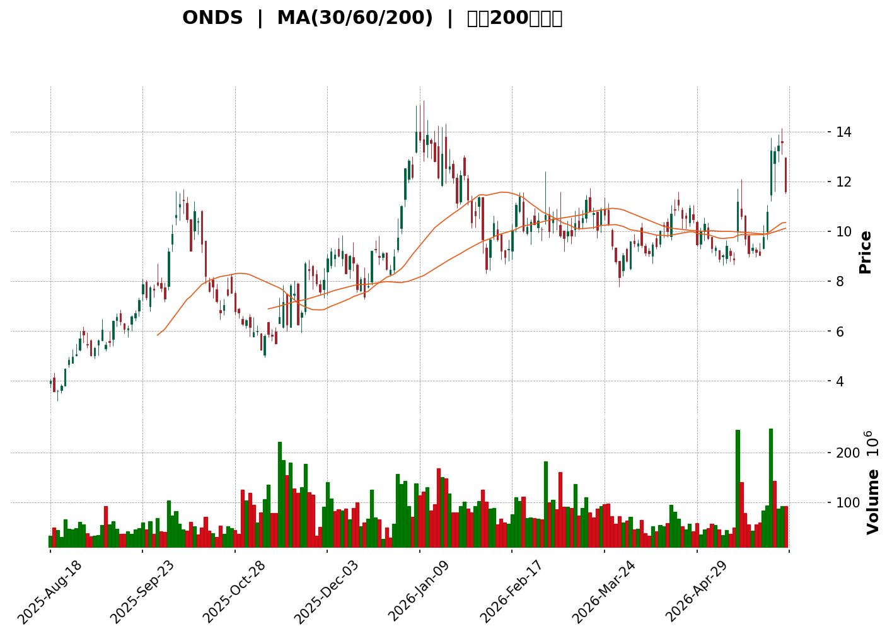
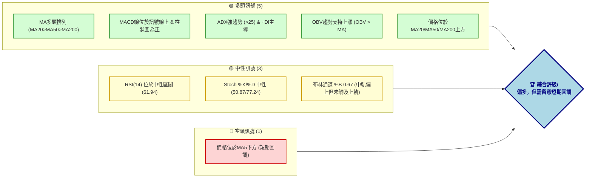
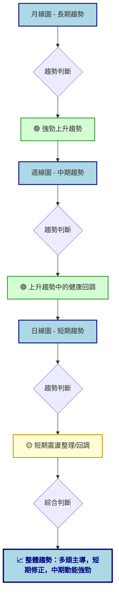

<details>
<summary>📊 靜態圖表 (點擊展開)</summary>

</details>

<html>
<head><meta charset="utf-8" /></head>
<body>
    <div style="height:500px; width:100%;">                        <script>window.PlotlyConfig = {MathJaxConfig: 'local'};</script>
        <script charset="utf-8" src="https://cdn.plot.ly/plotly-3.6.0.min.js" integrity="sha256-QaOVwtVY0T02VaHrr6pnoHLCwayMJp4O5n4YyaE3rJk=" crossorigin="anonymous"></script>                <div id="candlestick-chart" class="plotly-graph-div" style="height:100%; width:100%;"></div>            <script>                window.PLOTLYENV=window.PLOTLYENV || {};                                if (document.getElementById("candlestick-chart")) {                    Plotly.newPlot(                        "candlestick-chart",                        [{"close":{"dtype":"f8","bdata":"AAAAgD0KEEAAAADgUbgMQAAAAKBH4QxAAAAAYGZmDkAAAACAwvURQAAAAGBmZhNAAAAAoEfhE0AAAAAgrkcUQAAAAMDMzBZAAAAA4KNwF0AAAABACtcVQAAAAGC4HhRAAAAAgOtRFUAAAADAHoUWQAAAAKBwPRhAAAAAwMzMFUAAAACgcD0WQAAAAIAUrhlAAAAAoHA9GkAAAADAHoUZQAAAAAApXBhAAAAAYGZmGEAAAABgZmYaQAAAAKBH4RpAAAAAgD0KHUAAAADAHoUfQAAAAGBmZh1AAAAAAAAAH0AAAAAA16MeQAAAAEDheh9AAAAAoEfhHkAAAACgcD0dQAAAACCFayJAAAAAgOvRI0AAAACA61ElQAAAAIAULiZAAAAAwB6FJkAAAABA4fokQAAAAOCjcCJAAAAAYLieJUAAAACA69EkQAAAAMAeBSNAAAAAYGZmIEAAAADgo3AeQAAAAOB6FB9AAAAAYI\u002fCHEAAAACAwvUaQAAAAKBwPRxAAAAAQArXHUAAAABguB4eQAAAAMD1KBtAAAAAAAAAG0AAAADA9SgZQAAAAGCPwhlAAAAAoJmZGEAAAABACtcXQAAAAAAAABhAAAAAAAAAFUAAAACgcD0XQAAAAMAehRdAAAAAQDMzF0AAAACAPQoWQAAAAKBwPRpAAAAA4FG4HEAAAADAHgUZQAAAAAApXB9AAAAAAAAAHkAAAADgehQZQAAAAOCj8BpAAAAA4KNwIUAAAACgR+EgQAAAAEDheiBAAAAAoJmZH0AAAACA61EeQAAAAADXIyBAAAAAQArXIUAAAACgR2EiQAAAAADXIyJAAAAAgD0KIkAAAACAwnUiQAAAAGBmpiBAAAAAgD0KIkAAAAAAAIAhQAAAAGCPwh5AAAAAgBQuIEAAAABA4XodQAAAAEAzMx9AAAAA4KNwIkAAAACAPYoiQAAAACCF6yFAAAAAYI9CIkAAAACAwvUgQAAAACCF6yBAAAAAQOH6IUAAAADAHoUjQAAAAIA9CiZAAAAAIFwPKUAAAACAFK4pQAAAAAApXChAAAAAwB4FLEAAAACgR2ErQAAAAKBHYSpAAAAAIK7HK0AAAABguB4rQAAAAADXoylAAAAAgOtRKEAAAABgj0IqQAAAAKCZGSlAAAAAoHA9KUAAAABAClcoQAAAAIDrUSZAAAAAwB6FKEAAAACAPYooQAAAAIA9iiZAAAAA4FG4JEAAAAAgrkclQAAAAGCPwiZAAAAAAClcI0AAAACAwvUgQAAAAKBHYSNAAAAAgBSuJEAAAAAAKVwjQAAAAIDCdSJAAAAA4KPwIUAAAABguJ4iQAAAAKCZGSRAAAAAANcjJkAAAAAgrscmQAAAACBcDyRAAAAAoEdhJEAAAADAzMwkQAAAAKCZmSRAAAAAYGbmJEAAAADA9SgkQAAAAEAKVyVAAAAAgD0KJEAAAADAHgUlQAAAAEDh+iRAAAAAwPWoI0AAAADgo3AjQAAAAMAeBSRAAAAAwPWoI0AAAADA9agkQAAAAIDrUSRAAAAAIFwPJUAAAAAgXI8mQAAAAMD1qCVAAAAAAACAJUAAAABguB4kQAAAAMDMzCVAAAAAAClcJUAAAABguJ4kQAAAAKBH4SJAAAAAoJmZIUAAAADAzEwgQAAAAOB6FCJAAAAAYLieIUAAAABAMzMjQAAAAIA9CiNAAAAAIFwPI0AAAABgZuYiQAAAACCuRyJAAAAAYI9CIkAAAADgo\u002fAiQAAAAMDMzCJAAAAAIFwPJEAAAABgZmYkQAAAAAAAACRAAAAAgMJ1JUAAAACgcL0lQAAAAGC4HiZAAAAA4HoUJUAAAACgmRklQAAAAGBm5iVAAAAAgML1JEAAAABA4foiQAAAAOB6FCRAAAAAANejJEAAAACAwnUjQAAAAMD1qCJAAAAAgBSuIkAAAAAgrschQAAAAGC4HiJAAAAAQArXIkAAAADgehQiQAAAAOBRuCFAAAAAIIVrJkAAAACgcD0lQAAAAGBmZiNAAAAAAABAIkAAAADgUbgiQAAAAAApXCJAAAAAYLgeIkAAAACAPYojQAAAAKCZmSVAAAAAAACAKkAAAADgo3AqQAAAACCF6ypAAAAAwPUoK0AAAADgUTgnQA=="},"high":{"dtype":"f8","bdata":"AAAAAClcEEAAAACA61ERQAAAACCuRw1AAAAAYLgeD0AAAACAPQoSQAAAACCF6xNAAAAAgGgRFUAAAADAHgUWQAAAAIA9ChhAAAAAIIPAGEAAAADAzMwXQAAAAKBFthZAAAAAIFyPFUAAAADgUbgWQAAAAAAAABpAAAAAAClcFkAAAAAAAAAYQAAAAGCPwhlAAAAAoEfhGkAAAADgo3AbQAAAAGBmZhlAAAAAAAAAGUAAAAAgXI8aQAAAAAApXBtAAAAA4KNwHUAAAACgcD0gQAAAAADXIyBAAAAAAClcH0AAAAAgXI8fQAAAACCFayFAAAAAQApXIEAAAADAzMwfQAAAAIAUriJAAAAAIFyPJEAAAABgj0InQAAAAEAKFydAAAAAYGZmJ0AAAAAgrscmQAAAAMAeBSVAAAAAgBRuJkAAAABguB4lQAAAAKBwvSVAAAAAYI9CI0AAAACA61EgQAAAAKBHYSBAAAAAANejH0AAAACAPQodQAAAAEAzMx1AAAAAQApXIEAAAACgR6EgQAAAACBcjx5AAAAAwMzMG0AAAACAwnUaQAAAAAAAABpAAAAAYI\u002fCGkAAAAAgrkcaQAAAAAAAABlAAAAA4FG4F0AAAADgepQXQAAAACBcjxlAAAAAoEdhGEAAAADA9agYQAAAAAApXB1AAAAA4KNwH0AAAAAgXA8eQAAAAIAUrh9AAAAAgOsRIEAAAACgR+EfQAAAAGBmZhtAAAAAoJmZIUAAAABgj8IhQAAAAAApXCFAAAAAwCDwIEAAAAAA1yMgQAAAAKCZGSFAAAAAgMI1IkAAAACAFK4iQAAAAKCZmSJAAAAAAACAI0AAAADgUbgjQAAAAEDhOiJAAAAAwPUoIkAAAABgZiYjQAAAAEDheiFAAAAAANdjIEAAAABguB4hQAAAAGCRrSBAAAAAQOF6IkAAAACA61EjQAAAAIAUriNAAAAAYGZmIkAAAABAClciQAAAAEAKVyFAAAAAoJmZIkAAAAAgXA8lQAAAAGC4HiZAAAAA4HoUKUAAAAAAKdwpQAAAAIA9CipAAAAAANcjLkAAAABAMzMuQAAAACBcjy5AAAAAAAAALUAAAAAAAIArQAAAAADXIyxAAAAAAACALEAAAABgZmYsQAAAAMD1qCxAAAAAwPWoKkAAAABA4bopQAAAACCFqyhAAAAA4KPwKEAAAADA9SgqQAAAACBcjyhAAAAAYGbmJkAAAABgZmYmQAAAAEAK1yZAAAAAgD3KJkAAAAAgXA8jQAAAAMAehSNAAAAAIK5HJUAAAACgR+EkQAAAAEAK1yNAAAAAoMaLIkAAAAAAKVwjQAAAAADXoyRAAAAAQApXJkAAAACAFC4nQAAAAMD1KCdAAAAAANcjJUAAAACAwvUkQAAAAKBH4SVAAAAAIFyPJUAAAAAAKVwkQAAAAEAK1yhAAAAAAAAAJkAAAAAA16MlQAAAAEAK1yVAAAAA4FE4J0AAAAAgXA8kQAAAAGBm5iRAAAAAYLgeJUAAAACAFK4lQAAAAIDC9SVAAAAAoHC9JUAAAADgo\u002fAmQAAAAMAehSdAAAAAgML1JUAAAADA9aglQAAAAOCj8CVAAAAAoHC9JkAAAAAgrkcmQAAAACCuRyRAAAAAoHC9IkAAAAAA16MhQAAAACCuRyJAAAAAQDOzIkAAAABgj0IjQAAAAMDMzCNAAAAAoEdhI0AAAACgcL0kQAAAAIA9CiNAAAAA4FG4IkAAAAAghSsjQAAAAOBRuCNAAAAAIFwPJEAAAAAgrsckQAAAACBcDyVAAAAAYLgeJkAAAADgepQmQAAAAOBROCdAAAAA4KPwJUAAAACAPYolQAAAAGC4HiZAAAAAANcjJkAAAAAAKdwkQAAAAIDrUSRAAAAAYLgeJUAAAABA4bokQAAAAOB6lCNAAAAAIIXrIkAAAAAAAIAiQAAAAIAULiJAAAAAwMxMI0AAAABAM7MiQAAAAAApXCJAAAAAgMJ1J0AAAACgcD0oQAAAAEAKVyVAAAAAYI\u002fCI0AAAADgehQjQAAAAGCPwiJAAAAAoEchI0AAAADAHoUkQAAAAGC4HiZAAAAAIFyPK0AAAACA69EqQAAAAIDr0StAAAAAgOtRLEAAAAAAAAAqQA=="},"hovertemplate":"\u003cb\u003e%{x|%Y-%m-%d}\u003c\u002fb\u003e\u003cbr\u003e\u958b: $%{open:.2f}\u003cbr\u003e\u9ad8: $%{high:.2f}\u003cbr\u003e\u4f4e: $%{low:.2f}\u003cbr\u003e\u6536: $%{close:.2f}\u003cextra\u003e\u003c\u002fextra\u003e","low":{"dtype":"f8","bdata":"AAAAwMzMDUAAAABA4XoMQAAAAKCZmQlAAAAA4HoUDEAAAABgZmYOQAAAAGC4HhJAAAAAQArXEkAAAACAPQoUQAAAAMDMzBRAAAAAwPUoFkAAAACA61EVQAAAAIA9ChRAAAAAoJmZE0AAAABguB4UQAAAAGBmZhZAAAAAQArXFEAAAACAPYoVQAAAAADXoxVAAAAAwMzMGEAAAAAAAAAZQAAAAIAUrhdAAAAAAAAAF0AAAACAPQoYQAAAAIAUrhlAAAAAgOtRGkAAAAAghescQAAAAAAAAB1AAAAAwPUoG0AAAADgo3AdQAAAAEAzMx9AAAAAIK5HHkAAAADgUbgcQAAAAADXox5AAAAAoEdhIkAAAACAPYokQAAAAGBm5iRAAAAAYA5tJUAAAAAAAMAkQAAAAKBHYSJAAAAAILJdI0AAAABgj8IjQAAAAIDrUSJAAAAAgBSuH0AAAADgUTgeQAAAAIDrUR1AAAAAAACAHEAAAAAAKdwZQAAAAKCZmRpAAAAAYLieHUAAAADgehQeQAAAAADXoxpAAAAA4HoUGkAAAACA69EYQAAAAEDhehhAAAAAYLgeF0AAAADgehQXQAAAAIDrURdAAAAAACncFEAAAADAzMwTQAAAAOB6FBdAAAAAYGZmFkAAAAAghesVQAAAAKBwPRlAAAAAYGZmGEAAAAAghesXQAAAAKCZmRhAAAAAgD0KHUAAAAAAAAAZQAAAAOBRuBdAAAAAgBSuGkAAAAAA1yMgQAAAAKBwvR5AAAAAQDMzH0AAAACgR+EdQAAAACCuRx1AAAAAQArXHUAAAACAPQohQAAAAMD1KCFAAAAA4KPwIUAAAADgUTghQAAAAAApnCBAAAAAoHA9IEAAAACA69EgQAAAAKBwPR5AAAAAAClcHkAAAABguB4dQAAAAIDC9R5AAAAA4KNwH0AAAAAgXE8iQAAAAEAKVyFAAAAAQDOzIUAAAAAAKdwgQAAAACCFayBAAAAAwPWoIEAAAABAClciQAAAAIDr0SNAAAAAQOH6JUAAAAAghesnQAAAAOBROChAAAAAwMxMKkAAAACAFC4rQAAAAMD1qClAAAAAIIXrKUAAAABACtcpQAAAAKCZmSlAAAAAoHA9KEAAAACgmZknQAAAAAAp3CdAAAAAQDOzKEAAAACgR+EnQAAAAGBm5iVAAAAAgBQuJkAAAABguB4oQAAAAADXIyZAAAAAIK5HJEAAAADAzEwkQAAAAMAeBSVAAAAAYI9CIkAAAAAA16MgQAAAAGBm5iBAAAAAQApXI0AAAABAMzMjQAAAAGCPwiFAAAAAYGZmIUAAAAAA16MhQAAAAKBwvSFAAAAAQOH6I0AAAABA4XolQAAAAGBm5iNAAAAA4FG4I0AAAACAwvUiQAAAAIA9iiRAAAAAYGbmI0AAAACgcD0jQAAAAKCZmSRAAAAAwB6FI0AAAAAAKdwjQAAAAGC4HiRAAAAAwB6FI0AAAABgZmYiQAAAAGBmJiNAAAAAAAAAI0AAAACgmZkjQAAAAKCZGSRAAAAA4FE4JEAAAACgcL0kQAAAAADXoyVAAAAAoHA9JEAAAACAwnUjQAAAAIAU7iNAAAAAQDPzJEAAAACAwnUkQAAAAIA9iiJAAAAAwPVoIUAAAABguB4fQAAAAGBmZiBAAAAAIFyPIUAAAAAghesgQAAAAGCPwiJAAAAA4E1iIkAAAACAFK4iQAAAAMAeBSJAAAAAQOH6IUAAAACAwnUhQAAAAKCZmSJAAAAAoHC9IkAAAADAHoUjQAAAAIA9iiNAAAAAgOtRI0AAAAAgrkclQAAAAEAzsyVAAAAAQDMzJEAAAABA4TokQAAAACCFayRAAAAAIIWrJEAAAACA69EiQAAAAGC4niJAAAAAoHA9I0AAAABAClcjQAAAAIDrUSJAAAAAgD0KIkAAAAAgXI8hQAAAAMDMTCFAAAAA4KNwIUAAAACgmZkhQAAAAEAKVyFAAAAAQDMzI0AAAAAAAAAlQAAAACCF6yJAAAAA4KPwIUAAAACgcD0iQAAAAIDC9SFAAAAAYLgeIkAAAAAgsp0iQAAAAAApXCNAAAAA4KNwJkAAAABAMzMnQAAAAKCZmSlAAAAAgBQuKkAAAAAgXA8nQA=="},"name":"\u50f9\u683c","open":{"dtype":"f8","bdata":"AAAAAClcD0AAAAAgXI8QQAAAAMDMzAxAAAAAYLgeDUAAAABgZmYOQAAAAOBRuBJAAAAAoEfhEkAAAADgehQUQAAAAAAAABVAAAAAAAAAGEAAAABgZuYVQAAAAEDhehZAAAAAANcjFEAAAADAzMwVQAAAAMAehRZAAAAAoHA9FUAAAADgo3AWQAAAAOBRuBZAAAAAwMzMGUAAAABACtcaQAAAACCuRxlAAAAAoHA9GEAAAABguB4ZQAAAAEAzMxpAAAAAIK5HG0AAAAAgXA8eQAAAAIDC9R9AAAAAwB4FHEAAAAAgrsceQAAAAEAK1x9AAAAA4FG4H0AAAAAAAAAfQAAAAEAzMx9AAAAAwB4FI0AAAABguB4lQAAAAAAAACZAAAAAIK6HJkAAAAAgrkcmQAAAAIDC9SRAAAAAIFwPJEAAAABgj8IkQAAAAGBmpiVAAAAAYI9CI0AAAADAzMwfQAAAAGC4HiBAAAAA4FG4HkAAAABgZmYbQAAAAGBmZhtAAAAAgBSuHkAAAABguF4gQAAAAOB6FB5AAAAA4HqUG0AAAACAwvUZQAAAAAAAABlAAAAAwMxMGkAAAABguB4XQAAAACCF6xdAAAAAgBSuF0AAAADA9SgUQAAAAEDhehlAAAAAYGZmF0AAAADgo\u002fAXQAAAACCuRxlAAAAAwPWoGEAAAACAPQoeQAAAAGC4nhhAAAAAACncHUAAAACAFK4fQAAAAKBwPRpAAAAAANcjG0AAAACAwvUgQAAAAOBROCFAAAAAIFyPIEAAAADAHoUfQAAAAOBRuB5AAAAAIK7HIEAAAADAHkUhQAAAAAAp3CFAAAAAQAqXIkAAAABACtchQAAAAOBROCJAAAAAQOH6IEAAAACAwvUhQAAAAAApXCFAAAAAQOF6HkAAAAAgrkcgQAAAAMD1KB9AAAAAgML1H0AAAACgmZkiQAAAACBcDyJAAAAAgML1IUAAAADgJEYiQAAAAKCZmSBAAAAAIIXrIEAAAAAgXI8iQAAAAMAeRSRAAAAAoJmZJkAAAABAMzMoQAAAAGBmZilAAAAAwPVoKkAAAAAAAAAsQAAAACCFaytAAAAAAAAAK0AAAACgR2ErQAAAAADXIytAAAAA4HrUKkAAAACAwrUnQAAAAKCZmStAAAAAwB4FKUAAAAAghWspQAAAAMDMTChAAAAAIIVrJkAAAACAwvUpQAAAACCuRyhAAAAAAACAJkAAAABguJ4lQAAAAMAeBSZAAAAAYI\u002fCJkAAAACAFK4iQAAAAIAU7iFAAAAAACmcI0AAAACAFC4kQAAAAMAexSNAAAAAoHB9IkAAAACAPYoiQAAAAOBReCJAAAAAIIVrJEAAAAAA16MlQAAAAKBHYSZAAAAAACncI0AAAADAHgUkQAAAAGCPQiVAAAAAwMxMJEAAAACAFC4kQAAAAAAAACVAAAAAoEdhJUAAAADgUbgkQAAAAEDh+iRAAAAAAACAJEAAAAAgXA8kQAAAAIAUriNAAAAAoJkZJEAAAAAghSskQAAAAAAp3CRAAAAAoHC9JEAAAACgmRklQAAAAAAAwCZAAAAAYLheJUAAAADgepQlQAAAAOB6lCRAAAAAgOvRJUAAAABgj8IlQAAAAKCZGSRAAAAAQDOzIkAAAABguJ4hQAAAAGBm5iBAAAAAoJmZIkAAAAAgrgchQAAAAGCPQiNAAAAAACncIkAAAABAClckQAAAAOB61CJAAAAAgMJ1IkAAAADAHgUiQAAAAOCjcCNAAAAAwB4FI0AAAAAAAIAkQAAAAGCPwiRAAAAAoJmZI0AAAADAzMwlQAAAAIA9iiZAAAAAYI\u002fCJUAAAABgj0IlQAAAAMBLtyRAAAAAANdjJUAAAABgj8IkQAAAAAAAACNAAAAAAAAAJEAAAADAzEwkQAAAACBcjyNAAAAAAACAIkAAAAAAAIAiQAAAAAAAACJAAAAAQArXIUAAAADgUXgiQAAAAEAK1yFAAAAAQOH6I0AAAACA69ElQAAAAGCPQiVAAAAAYGamI0AAAAAAAIAiQAAAACBcjyJAAAAAIIVrIkAAAAAghasiQAAAAAAAACRAAAAAQDPzJkAAAAAAAIApQAAAAKBwfSpAAAAAoHA9K0AAAAAghespQA=="},"x":["2025-08-18T00:00:00-04:00","2025-08-19T00:00:00-04:00","2025-08-20T00:00:00-04:00","2025-08-21T00:00:00-04:00","2025-08-22T00:00:00-04:00","2025-08-25T00:00:00-04:00","2025-08-26T00:00:00-04:00","2025-08-27T00:00:00-04:00","2025-08-28T00:00:00-04:00","2025-08-29T00:00:00-04:00","2025-09-02T00:00:00-04:00","2025-09-03T00:00:00-04:00","2025-09-04T00:00:00-04:00","2025-09-05T00:00:00-04:00","2025-09-08T00:00:00-04:00","2025-09-09T00:00:00-04:00","2025-09-10T00:00:00-04:00","2025-09-11T00:00:00-04:00","2025-09-12T00:00:00-04:00","2025-09-15T00:00:00-04:00","2025-09-16T00:00:00-04:00","2025-09-17T00:00:00-04:00","2025-09-18T00:00:00-04:00","2025-09-19T00:00:00-04:00","2025-09-22T00:00:00-04:00","2025-09-23T00:00:00-04:00","2025-09-24T00:00:00-04:00","2025-09-25T00:00:00-04:00","2025-09-26T00:00:00-04:00","2025-09-29T00:00:00-04:00","2025-09-30T00:00:00-04:00","2025-10-01T00:00:00-04:00","2025-10-02T00:00:00-04:00","2025-10-03T00:00:00-04:00","2025-10-06T00:00:00-04:00","2025-10-07T00:00:00-04:00","2025-10-08T00:00:00-04:00","2025-10-09T00:00:00-04:00","2025-10-10T00:00:00-04:00","2025-10-13T00:00:00-04:00","2025-10-14T00:00:00-04:00","2025-10-15T00:00:00-04:00","2025-10-16T00:00:00-04:00","2025-10-17T00:00:00-04:00","2025-10-20T00:00:00-04:00","2025-10-21T00:00:00-04:00","2025-10-22T00:00:00-04:00","2025-10-23T00:00:00-04:00","2025-10-24T00:00:00-04:00","2025-10-27T00:00:00-04:00","2025-10-28T00:00:00-04:00","2025-10-29T00:00:00-04:00","2025-10-30T00:00:00-04:00","2025-10-31T00:00:00-04:00","2025-11-03T00:00:00-05:00","2025-11-04T00:00:00-05:00","2025-11-05T00:00:00-05:00","2025-11-06T00:00:00-05:00","2025-11-07T00:00:00-05:00","2025-11-10T00:00:00-05:00","2025-11-11T00:00:00-05:00","2025-11-12T00:00:00-05:00","2025-11-13T00:00:00-05:00","2025-11-14T00:00:00-05:00","2025-11-17T00:00:00-05:00","2025-11-18T00:00:00-05:00","2025-11-19T00:00:00-05:00","2025-11-20T00:00:00-05:00","2025-11-21T00:00:00-05:00","2025-11-24T00:00:00-05:00","2025-11-25T00:00:00-05:00","2025-11-26T00:00:00-05:00","2025-11-28T00:00:00-05:00","2025-12-01T00:00:00-05:00","2025-12-02T00:00:00-05:00","2025-12-03T00:00:00-05:00","2025-12-04T00:00:00-05:00","2025-12-05T00:00:00-05:00","2025-12-08T00:00:00-05:00","2025-12-09T00:00:00-05:00","2025-12-10T00:00:00-05:00","2025-12-11T00:00:00-05:00","2025-12-12T00:00:00-05:00","2025-12-15T00:00:00-05:00","2025-12-16T00:00:00-05:00","2025-12-17T00:00:00-05:00","2025-12-18T00:00:00-05:00","2025-12-19T00:00:00-05:00","2025-12-22T00:00:00-05:00","2025-12-23T00:00:00-05:00","2025-12-24T00:00:00-05:00","2025-12-26T00:00:00-05:00","2025-12-29T00:00:00-05:00","2025-12-30T00:00:00-05:00","2025-12-31T00:00:00-05:00","2026-01-02T00:00:00-05:00","2026-01-05T00:00:00-05:00","2026-01-06T00:00:00-05:00","2026-01-07T00:00:00-05:00","2026-01-08T00:00:00-05:00","2026-01-09T00:00:00-05:00","2026-01-12T00:00:00-05:00","2026-01-13T00:00:00-05:00","2026-01-14T00:00:00-05:00","2026-01-15T00:00:00-05:00","2026-01-16T00:00:00-05:00","2026-01-20T00:00:00-05:00","2026-01-21T00:00:00-05:00","2026-01-22T00:00:00-05:00","2026-01-23T00:00:00-05:00","2026-01-26T00:00:00-05:00","2026-01-27T00:00:00-05:00","2026-01-28T00:00:00-05:00","2026-01-29T00:00:00-05:00","2026-01-30T00:00:00-05:00","2026-02-02T00:00:00-05:00","2026-02-03T00:00:00-05:00","2026-02-04T00:00:00-05:00","2026-02-05T00:00:00-05:00","2026-02-06T00:00:00-05:00","2026-02-09T00:00:00-05:00","2026-02-10T00:00:00-05:00","2026-02-11T00:00:00-05:00","2026-02-12T00:00:00-05:00","2026-02-13T00:00:00-05:00","2026-02-17T00:00:00-05:00","2026-02-18T00:00:00-05:00","2026-02-19T00:00:00-05:00","2026-02-20T00:00:00-05:00","2026-02-23T00:00:00-05:00","2026-02-24T00:00:00-05:00","2026-02-25T00:00:00-05:00","2026-02-26T00:00:00-05:00","2026-02-27T00:00:00-05:00","2026-03-02T00:00:00-05:00","2026-03-03T00:00:00-05:00","2026-03-04T00:00:00-05:00","2026-03-05T00:00:00-05:00","2026-03-06T00:00:00-05:00","2026-03-09T00:00:00-04:00","2026-03-10T00:00:00-04:00","2026-03-11T00:00:00-04:00","2026-03-12T00:00:00-04:00","2026-03-13T00:00:00-04:00","2026-03-16T00:00:00-04:00","2026-03-17T00:00:00-04:00","2026-03-18T00:00:00-04:00","2026-03-19T00:00:00-04:00","2026-03-20T00:00:00-04:00","2026-03-23T00:00:00-04:00","2026-03-24T00:00:00-04:00","2026-03-25T00:00:00-04:00","2026-03-26T00:00:00-04:00","2026-03-27T00:00:00-04:00","2026-03-30T00:00:00-04:00","2026-03-31T00:00:00-04:00","2026-04-01T00:00:00-04:00","2026-04-02T00:00:00-04:00","2026-04-06T00:00:00-04:00","2026-04-07T00:00:00-04:00","2026-04-08T00:00:00-04:00","2026-04-09T00:00:00-04:00","2026-04-10T00:00:00-04:00","2026-04-13T00:00:00-04:00","2026-04-14T00:00:00-04:00","2026-04-15T00:00:00-04:00","2026-04-16T00:00:00-04:00","2026-04-17T00:00:00-04:00","2026-04-20T00:00:00-04:00","2026-04-21T00:00:00-04:00","2026-04-22T00:00:00-04:00","2026-04-23T00:00:00-04:00","2026-04-24T00:00:00-04:00","2026-04-27T00:00:00-04:00","2026-04-28T00:00:00-04:00","2026-04-29T00:00:00-04:00","2026-04-30T00:00:00-04:00","2026-05-01T00:00:00-04:00","2026-05-04T00:00:00-04:00","2026-05-05T00:00:00-04:00","2026-05-06T00:00:00-04:00","2026-05-07T00:00:00-04:00","2026-05-08T00:00:00-04:00","2026-05-11T00:00:00-04:00","2026-05-12T00:00:00-04:00","2026-05-13T00:00:00-04:00","2026-05-14T00:00:00-04:00","2026-05-15T00:00:00-04:00","2026-05-18T00:00:00-04:00","2026-05-19T00:00:00-04:00","2026-05-20T00:00:00-04:00","2026-05-21T00:00:00-04:00","2026-05-22T00:00:00-04:00","2026-05-26T00:00:00-04:00","2026-05-27T00:00:00-04:00","2026-05-28T00:00:00-04:00","2026-05-29T00:00:00-04:00","2026-06-01T00:00:00-04:00","2026-06-02T00:00:00-04:00","2026-06-03T00:00:00-04:00"],"type":"candlestick"},{"hovertemplate":"MA30: $%{y:.2f}\u003cextra\u003e\u003c\u002fextra\u003e","line":{"color":"#2196F3","dash":"dash","width":2},"mode":"lines","name":"MA30","x":["2025-08-18T00:00:00-04:00","2025-08-19T00:00:00-04:00","2025-08-20T00:00:00-04:00","2025-08-21T00:00:00-04:00","2025-08-22T00:00:00-04:00","2025-08-25T00:00:00-04:00","2025-08-26T00:00:00-04:00","2025-08-27T00:00:00-04:00","2025-08-28T00:00:00-04:00","2025-08-29T00:00:00-04:00","2025-09-02T00:00:00-04:00","2025-09-03T00:00:00-04:00","2025-09-04T00:00:00-04:00","2025-09-05T00:00:00-04:00","2025-09-08T00:00:00-04:00","2025-09-09T00:00:00-04:00","2025-09-10T00:00:00-04:00","2025-09-11T00:00:00-04:00","2025-09-12T00:00:00-04:00","2025-09-15T00:00:00-04:00","2025-09-16T00:00:00-04:00","2025-09-17T00:00:00-04:00","2025-09-18T00:00:00-04:00","2025-09-19T00:00:00-04:00","2025-09-22T00:00:00-04:00","2025-09-23T00:00:00-04:00","2025-09-24T00:00:00-04:00","2025-09-25T00:00:00-04:00","2025-09-26T00:00:00-04:00","2025-09-29T00:00:00-04:00","2025-09-30T00:00:00-04:00","2025-10-01T00:00:00-04:00","2025-10-02T00:00:00-04:00","2025-10-03T00:00:00-04:00","2025-10-06T00:00:00-04:00","2025-10-07T00:00:00-04:00","2025-10-08T00:00:00-04:00","2025-10-09T00:00:00-04:00","2025-10-10T00:00:00-04:00","2025-10-13T00:00:00-04:00","2025-10-14T00:00:00-04:00","2025-10-15T00:00:00-04:00","2025-10-16T00:00:00-04:00","2025-10-17T00:00:00-04:00","2025-10-20T00:00:00-04:00","2025-10-21T00:00:00-04:00","2025-10-22T00:00:00-04:00","2025-10-23T00:00:00-04:00","2025-10-24T00:00:00-04:00","2025-10-27T00:00:00-04:00","2025-10-28T00:00:00-04:00","2025-10-29T00:00:00-04:00","2025-10-30T00:00:00-04:00","2025-10-31T00:00:00-04:00","2025-11-03T00:00:00-05:00","2025-11-04T00:00:00-05:00","2025-11-05T00:00:00-05:00","2025-11-06T00:00:00-05:00","2025-11-07T00:00:00-05:00","2025-11-10T00:00:00-05:00","2025-11-11T00:00:00-05:00","2025-11-12T00:00:00-05:00","2025-11-13T00:00:00-05:00","2025-11-14T00:00:00-05:00","2025-11-17T00:00:00-05:00","2025-11-18T00:00:00-05:00","2025-11-19T00:00:00-05:00","2025-11-20T00:00:00-05:00","2025-11-21T00:00:00-05:00","2025-11-24T00:00:00-05:00","2025-11-25T00:00:00-05:00","2025-11-26T00:00:00-05:00","2025-11-28T00:00:00-05:00","2025-12-01T00:00:00-05:00","2025-12-02T00:00:00-05:00","2025-12-03T00:00:00-05:00","2025-12-04T00:00:00-05:00","2025-12-05T00:00:00-05:00","2025-12-08T00:00:00-05:00","2025-12-09T00:00:00-05:00","2025-12-10T00:00:00-05:00","2025-12-11T00:00:00-05:00","2025-12-12T00:00:00-05:00","2025-12-15T00:00:00-05:00","2025-12-16T00:00:00-05:00","2025-12-17T00:00:00-05:00","2025-12-18T00:00:00-05:00","2025-12-19T00:00:00-05:00","2025-12-22T00:00:00-05:00","2025-12-23T00:00:00-05:00","2025-12-24T00:00:00-05:00","2025-12-26T00:00:00-05:00","2025-12-29T00:00:00-05:00","2025-12-30T00:00:00-05:00","2025-12-31T00:00:00-05:00","2026-01-02T00:00:00-05:00","2026-01-05T00:00:00-05:00","2026-01-06T00:00:00-05:00","2026-01-07T00:00:00-05:00","2026-01-08T00:00:00-05:00","2026-01-09T00:00:00-05:00","2026-01-12T00:00:00-05:00","2026-01-13T00:00:00-05:00","2026-01-14T00:00:00-05:00","2026-01-15T00:00:00-05:00","2026-01-16T00:00:00-05:00","2026-01-20T00:00:00-05:00","2026-01-21T00:00:00-05:00","2026-01-22T00:00:00-05:00","2026-01-23T00:00:00-05:00","2026-01-26T00:00:00-05:00","2026-01-27T00:00:00-05:00","2026-01-28T00:00:00-05:00","2026-01-29T00:00:00-05:00","2026-01-30T00:00:00-05:00","2026-02-02T00:00:00-05:00","2026-02-03T00:00:00-05:00","2026-02-04T00:00:00-05:00","2026-02-05T00:00:00-05:00","2026-02-06T00:00:00-05:00","2026-02-09T00:00:00-05:00","2026-02-10T00:00:00-05:00","2026-02-11T00:00:00-05:00","2026-02-12T00:00:00-05:00","2026-02-13T00:00:00-05:00","2026-02-17T00:00:00-05:00","2026-02-18T00:00:00-05:00","2026-02-19T00:00:00-05:00","2026-02-20T00:00:00-05:00","2026-02-23T00:00:00-05:00","2026-02-24T00:00:00-05:00","2026-02-25T00:00:00-05:00","2026-02-26T00:00:00-05:00","2026-02-27T00:00:00-05:00","2026-03-02T00:00:00-05:00","2026-03-03T00:00:00-05:00","2026-03-04T00:00:00-05:00","2026-03-05T00:00:00-05:00","2026-03-06T00:00:00-05:00","2026-03-09T00:00:00-04:00","2026-03-10T00:00:00-04:00","2026-03-11T00:00:00-04:00","2026-03-12T00:00:00-04:00","2026-03-13T00:00:00-04:00","2026-03-16T00:00:00-04:00","2026-03-17T00:00:00-04:00","2026-03-18T00:00:00-04:00","2026-03-19T00:00:00-04:00","2026-03-20T00:00:00-04:00","2026-03-23T00:00:00-04:00","2026-03-24T00:00:00-04:00","2026-03-25T00:00:00-04:00","2026-03-26T00:00:00-04:00","2026-03-27T00:00:00-04:00","2026-03-30T00:00:00-04:00","2026-03-31T00:00:00-04:00","2026-04-01T00:00:00-04:00","2026-04-02T00:00:00-04:00","2026-04-06T00:00:00-04:00","2026-04-07T00:00:00-04:00","2026-04-08T00:00:00-04:00","2026-04-09T00:00:00-04:00","2026-04-10T00:00:00-04:00","2026-04-13T00:00:00-04:00","2026-04-14T00:00:00-04:00","2026-04-15T00:00:00-04:00","2026-04-16T00:00:00-04:00","2026-04-17T00:00:00-04:00","2026-04-20T00:00:00-04:00","2026-04-21T00:00:00-04:00","2026-04-22T00:00:00-04:00","2026-04-23T00:00:00-04:00","2026-04-24T00:00:00-04:00","2026-04-27T00:00:00-04:00","2026-04-28T00:00:00-04:00","2026-04-29T00:00:00-04:00","2026-04-30T00:00:00-04:00","2026-05-01T00:00:00-04:00","2026-05-04T00:00:00-04:00","2026-05-05T00:00:00-04:00","2026-05-06T00:00:00-04:00","2026-05-07T00:00:00-04:00","2026-05-08T00:00:00-04:00","2026-05-11T00:00:00-04:00","2026-05-12T00:00:00-04:00","2026-05-13T00:00:00-04:00","2026-05-14T00:00:00-04:00","2026-05-15T00:00:00-04:00","2026-05-18T00:00:00-04:00","2026-05-19T00:00:00-04:00","2026-05-20T00:00:00-04:00","2026-05-21T00:00:00-04:00","2026-05-22T00:00:00-04:00","2026-05-26T00:00:00-04:00","2026-05-27T00:00:00-04:00","2026-05-28T00:00:00-04:00","2026-05-29T00:00:00-04:00","2026-06-01T00:00:00-04:00","2026-06-02T00:00:00-04:00","2026-06-03T00:00:00-04:00"],"y":{"dtype":"f8","bdata":"AAAAAAAA+H8AAAAAAAD4fwAAAAAAAPh\u002fAAAAAAAA+H8AAAAAAAD4fwAAAAAAAPh\u002fAAAAAAAA+H8AAAAAAAD4fwAAAAAAAPh\u002fAAAAAAAA+H8AAAAAAAD4fwAAAAAAAPh\u002fAAAAAAAA+H8AAAAAAAD4fwAAAAAAAPh\u002fAAAAAAAA+H8AAAAAAAD4fwAAAAAAAPh\u002fAAAAAAAA+H8AAAAAAAD4fwAAAAAAAPh\u002fAAAAAAAA+H8AAAAAAAD4fwAAAAAAAPh\u002fAAAAAAAA+H8AAAAAAAD4fwAAAAAAAPh\u002fAAAAAAAA+H8AAAAAAAD4f97d3YUWWRdAZmZm\u002frjXF0CamZnZslYYQN7d3WXYFRlAREREZGbmGUDNzMysALkaQBEREaH+jRtA3t3dfbFkHEC8u7srsh0dQHd3d2fYlR1Aq6qqKs4+HkDNzMzsw+ceQDMzM8OugB9ARERENKXiH0CrqqpaHRMgQFVVVXVMMCBAq6qqov5NIEAiIiIiImIgQN7d3VUObSBA7+7ufmp8IEBERETsCpAgQM3MzET9myBAmpmZKRWnIECJiIjAyqEgQCIiImoDnSBAAAAAwBGKIEBEREQkTWkgQO\u002fu7uZCUiBAREREPJgnIEBmZmZ2BQggQKuqqgoezB9ARERE1JSKH0ARERExJE0fQDMzMyOw8h5AiYiICIGVHkDv7u6OJf8dQAAAAKA2kB1A3t3dPd8PHUAiIiJS1H8cQO\u002fu7g4CKxxAvLu7W6vjG0C8u7s7baAbQM3MzMwTdRtAzczMXNZqG0B3d3c30GkbQHd3d6cNdBtAAAAAoBqvG0DNzMwMuwIcQCIiIrJWRxxAAAAAMJZ8HEAiIiICnbYcQKuqqgoC6xxAvLu7m304HUCrqqpqdYwdQFVVVRUgtx1AAAAAEFj5HUBERETUeCkeQImIiHjpZh5AzczM3GvuHkDv7u7OhWQfQCIiIkKnzR9A7+7unqgfIEDv7u6+WFIgQBEREfnFciBAvLu7+6mRIEAAAACQe80gQCIiIjLBAyFAmpmZmZlZIUBmZmZeuskhQAAAAPCnJiJAzczMTPCAIkBmZmbmidoiQHd3d8cELyNAVVVVfT+VI0CrqqqCTvsjQLy7u5NfTCRAIiIiWquDJEAiIiJ66cYkQM3MzNRNAiVAAAAAeL4\u002fJUDv7u6G63ElQM3MzNRNoiVAMzMzm5nZJUARERG5rBUmQLy7u\u002fvFUiZAMzMzw4N5JkDNzMycUrEmQO\u002fu7t5r7iZAREREpEX2JkAzMzMTyugmQN7d3X0\u002f9SZAAAAAEOYJJ0AiIiLyYB4nQAAAACCFKydA7+7uvi0rJ0CrqqqqfyMnQLy7u6vxEidAVVVV1Qb6JkAAAACwR+EmQBERETGWvCZAq6qqWmR7JkAAAAAgPkMmQGZmZobrESZA7+7u7jXXJUBERESU0ZslQGZmZhYgdyVAmpmZSZpSJUBVVVVV4yUlQN7d3Q27AiVAvLu7Wx3TJEBVVVUlTakkQImIiLislSRAMzMz4zNsJEBVVVXlF0skQKuqqjomOCRAiYiI+Aw7JEC8u7sr+UUkQO\u002fu7i6WPCRAVVVVFdlOJEBmZmY20GkkQImIiMh2fiRARERERESEJEB3d3fHBI8kQImIiEiakiRAq6qqirOPJEC8u7tr53skQJqZmamqaiRAMzMzkxhEJEAiIiLyiyUkQJqZmbnXHCRAREREJJQRJEB3d3eHXQEkQJqZmWmR7SNA7+7uPgrXI0De3d0docwjQGZmZmb0tiNAZmZmFiC3I0DNzMys1bEjQFVVVdV4qSNA3t3d\u002fdS4I0CrqqpqdcwjQAAAAPBg3iNAmpmZ+X7qI0C8u7srQO4jQLy7u7u7+yNAd3d3R+H6I0BmZmamVNwjQGZmZhbZziNAMzMzY4LHI0B3d3eX4MEjQImIiCgVpyNAvLu7mzaQI0CJiIiI+ncjQKuqqkp+cSNAzczMHBN8I0BVVVWVQ4sjQGZmZiYxiCNAiYiI6CaxI0Crqqpaj8IjQImIiMihxSNAAAAAULi+I0CJiIgYL70jQLy7u9vdvSNAZmZmBqy8I0Dv7u6+ysEjQBEREXGv2SNAZmZm1qMQJEC8u7trLkQkQERERGQ7fyRAvLu7O9+vJEB3d3dXgLwkQA=="},"type":"scatter"},{"hovertemplate":"MA60: $%{y:.2f}\u003cextra\u003e\u003c\u002fextra\u003e","line":{"color":"#9C27B0","dash":"dash","width":2},"mode":"lines","name":"MA60","x":["2025-08-18T00:00:00-04:00","2025-08-19T00:00:00-04:00","2025-08-20T00:00:00-04:00","2025-08-21T00:00:00-04:00","2025-08-22T00:00:00-04:00","2025-08-25T00:00:00-04:00","2025-08-26T00:00:00-04:00","2025-08-27T00:00:00-04:00","2025-08-28T00:00:00-04:00","2025-08-29T00:00:00-04:00","2025-09-02T00:00:00-04:00","2025-09-03T00:00:00-04:00","2025-09-04T00:00:00-04:00","2025-09-05T00:00:00-04:00","2025-09-08T00:00:00-04:00","2025-09-09T00:00:00-04:00","2025-09-10T00:00:00-04:00","2025-09-11T00:00:00-04:00","2025-09-12T00:00:00-04:00","2025-09-15T00:00:00-04:00","2025-09-16T00:00:00-04:00","2025-09-17T00:00:00-04:00","2025-09-18T00:00:00-04:00","2025-09-19T00:00:00-04:00","2025-09-22T00:00:00-04:00","2025-09-23T00:00:00-04:00","2025-09-24T00:00:00-04:00","2025-09-25T00:00:00-04:00","2025-09-26T00:00:00-04:00","2025-09-29T00:00:00-04:00","2025-09-30T00:00:00-04:00","2025-10-01T00:00:00-04:00","2025-10-02T00:00:00-04:00","2025-10-03T00:00:00-04:00","2025-10-06T00:00:00-04:00","2025-10-07T00:00:00-04:00","2025-10-08T00:00:00-04:00","2025-10-09T00:00:00-04:00","2025-10-10T00:00:00-04:00","2025-10-13T00:00:00-04:00","2025-10-14T00:00:00-04:00","2025-10-15T00:00:00-04:00","2025-10-16T00:00:00-04:00","2025-10-17T00:00:00-04:00","2025-10-20T00:00:00-04:00","2025-10-21T00:00:00-04:00","2025-10-22T00:00:00-04:00","2025-10-23T00:00:00-04:00","2025-10-24T00:00:00-04:00","2025-10-27T00:00:00-04:00","2025-10-28T00:00:00-04:00","2025-10-29T00:00:00-04:00","2025-10-30T00:00:00-04:00","2025-10-31T00:00:00-04:00","2025-11-03T00:00:00-05:00","2025-11-04T00:00:00-05:00","2025-11-05T00:00:00-05:00","2025-11-06T00:00:00-05:00","2025-11-07T00:00:00-05:00","2025-11-10T00:00:00-05:00","2025-11-11T00:00:00-05:00","2025-11-12T00:00:00-05:00","2025-11-13T00:00:00-05:00","2025-11-14T00:00:00-05:00","2025-11-17T00:00:00-05:00","2025-11-18T00:00:00-05:00","2025-11-19T00:00:00-05:00","2025-11-20T00:00:00-05:00","2025-11-21T00:00:00-05:00","2025-11-24T00:00:00-05:00","2025-11-25T00:00:00-05:00","2025-11-26T00:00:00-05:00","2025-11-28T00:00:00-05:00","2025-12-01T00:00:00-05:00","2025-12-02T00:00:00-05:00","2025-12-03T00:00:00-05:00","2025-12-04T00:00:00-05:00","2025-12-05T00:00:00-05:00","2025-12-08T00:00:00-05:00","2025-12-09T00:00:00-05:00","2025-12-10T00:00:00-05:00","2025-12-11T00:00:00-05:00","2025-12-12T00:00:00-05:00","2025-12-15T00:00:00-05:00","2025-12-16T00:00:00-05:00","2025-12-17T00:00:00-05:00","2025-12-18T00:00:00-05:00","2025-12-19T00:00:00-05:00","2025-12-22T00:00:00-05:00","2025-12-23T00:00:00-05:00","2025-12-24T00:00:00-05:00","2025-12-26T00:00:00-05:00","2025-12-29T00:00:00-05:00","2025-12-30T00:00:00-05:00","2025-12-31T00:00:00-05:00","2026-01-02T00:00:00-05:00","2026-01-05T00:00:00-05:00","2026-01-06T00:00:00-05:00","2026-01-07T00:00:00-05:00","2026-01-08T00:00:00-05:00","2026-01-09T00:00:00-05:00","2026-01-12T00:00:00-05:00","2026-01-13T00:00:00-05:00","2026-01-14T00:00:00-05:00","2026-01-15T00:00:00-05:00","2026-01-16T00:00:00-05:00","2026-01-20T00:00:00-05:00","2026-01-21T00:00:00-05:00","2026-01-22T00:00:00-05:00","2026-01-23T00:00:00-05:00","2026-01-26T00:00:00-05:00","2026-01-27T00:00:00-05:00","2026-01-28T00:00:00-05:00","2026-01-29T00:00:00-05:00","2026-01-30T00:00:00-05:00","2026-02-02T00:00:00-05:00","2026-02-03T00:00:00-05:00","2026-02-04T00:00:00-05:00","2026-02-05T00:00:00-05:00","2026-02-06T00:00:00-05:00","2026-02-09T00:00:00-05:00","2026-02-10T00:00:00-05:00","2026-02-11T00:00:00-05:00","2026-02-12T00:00:00-05:00","2026-02-13T00:00:00-05:00","2026-02-17T00:00:00-05:00","2026-02-18T00:00:00-05:00","2026-02-19T00:00:00-05:00","2026-02-20T00:00:00-05:00","2026-02-23T00:00:00-05:00","2026-02-24T00:00:00-05:00","2026-02-25T00:00:00-05:00","2026-02-26T00:00:00-05:00","2026-02-27T00:00:00-05:00","2026-03-02T00:00:00-05:00","2026-03-03T00:00:00-05:00","2026-03-04T00:00:00-05:00","2026-03-05T00:00:00-05:00","2026-03-06T00:00:00-05:00","2026-03-09T00:00:00-04:00","2026-03-10T00:00:00-04:00","2026-03-11T00:00:00-04:00","2026-03-12T00:00:00-04:00","2026-03-13T00:00:00-04:00","2026-03-16T00:00:00-04:00","2026-03-17T00:00:00-04:00","2026-03-18T00:00:00-04:00","2026-03-19T00:00:00-04:00","2026-03-20T00:00:00-04:00","2026-03-23T00:00:00-04:00","2026-03-24T00:00:00-04:00","2026-03-25T00:00:00-04:00","2026-03-26T00:00:00-04:00","2026-03-27T00:00:00-04:00","2026-03-30T00:00:00-04:00","2026-03-31T00:00:00-04:00","2026-04-01T00:00:00-04:00","2026-04-02T00:00:00-04:00","2026-04-06T00:00:00-04:00","2026-04-07T00:00:00-04:00","2026-04-08T00:00:00-04:00","2026-04-09T00:00:00-04:00","2026-04-10T00:00:00-04:00","2026-04-13T00:00:00-04:00","2026-04-14T00:00:00-04:00","2026-04-15T00:00:00-04:00","2026-04-16T00:00:00-04:00","2026-04-17T00:00:00-04:00","2026-04-20T00:00:00-04:00","2026-04-21T00:00:00-04:00","2026-04-22T00:00:00-04:00","2026-04-23T00:00:00-04:00","2026-04-24T00:00:00-04:00","2026-04-27T00:00:00-04:00","2026-04-28T00:00:00-04:00","2026-04-29T00:00:00-04:00","2026-04-30T00:00:00-04:00","2026-05-01T00:00:00-04:00","2026-05-04T00:00:00-04:00","2026-05-05T00:00:00-04:00","2026-05-06T00:00:00-04:00","2026-05-07T00:00:00-04:00","2026-05-08T00:00:00-04:00","2026-05-11T00:00:00-04:00","2026-05-12T00:00:00-04:00","2026-05-13T00:00:00-04:00","2026-05-14T00:00:00-04:00","2026-05-15T00:00:00-04:00","2026-05-18T00:00:00-04:00","2026-05-19T00:00:00-04:00","2026-05-20T00:00:00-04:00","2026-05-21T00:00:00-04:00","2026-05-22T00:00:00-04:00","2026-05-26T00:00:00-04:00","2026-05-27T00:00:00-04:00","2026-05-28T00:00:00-04:00","2026-05-29T00:00:00-04:00","2026-06-01T00:00:00-04:00","2026-06-02T00:00:00-04:00","2026-06-03T00:00:00-04:00"],"y":{"dtype":"f8","bdata":"AAAAAAAA+H8AAAAAAAD4fwAAAAAAAPh\u002fAAAAAAAA+H8AAAAAAAD4fwAAAAAAAPh\u002fAAAAAAAA+H8AAAAAAAD4fwAAAAAAAPh\u002fAAAAAAAA+H8AAAAAAAD4fwAAAAAAAPh\u002fAAAAAAAA+H8AAAAAAAD4fwAAAAAAAPh\u002fAAAAAAAA+H8AAAAAAAD4fwAAAAAAAPh\u002fAAAAAAAA+H8AAAAAAAD4fwAAAAAAAPh\u002fAAAAAAAA+H8AAAAAAAD4fwAAAAAAAPh\u002fAAAAAAAA+H8AAAAAAAD4fwAAAAAAAPh\u002fAAAAAAAA+H8AAAAAAAD4fwAAAAAAAPh\u002fAAAAAAAA+H8AAAAAAAD4fwAAAAAAAPh\u002fAAAAAAAA+H8AAAAAAAD4fwAAAAAAAPh\u002fAAAAAAAA+H8AAAAAAAD4fwAAAAAAAPh\u002fAAAAAAAA+H8AAAAAAAD4fwAAAAAAAPh\u002fAAAAAAAA+H8AAAAAAAD4fwAAAAAAAPh\u002fAAAAAAAA+H8AAAAAAAD4fwAAAAAAAPh\u002fAAAAAAAA+H8AAAAAAAD4fwAAAAAAAPh\u002fAAAAAAAA+H8AAAAAAAD4fwAAAAAAAPh\u002fAAAAAAAA+H8AAAAAAAD4fwAAAAAAAPh\u002fAAAAAAAA+H8AAAAAAAD4f0REREiakhtAVVVV6SaxG0BVVVWF69EbQImIiEREBBxAZmZmtvM9HEDe3d0dE1wcQImIiKAajxxA3t3dXUi6HEDv7u4+w84cQDMzMztt4BxAMzMzwzwRHUBERESUGEQdQAAAAEjheh1AiYiIyL2mHUBmZmZ2BcgdQBEREUlT6h1Aq6qq8oslHkCJiIiof2MeQO\u002fu7q65kB5A7+7ulrW6HkBVVVVtWeseQCIiIkp+ER9Ad3d391NDH0De3d11BWgfQM3MzHSTeB9AAAAAyL2GH0BmZmaOCX4fQDMzM6O3hR9Aq6qqKs6eH0De3d1dSLofQGZmZqbizB9AERERCfPkH0B3d3fX6vgfQKuqqgoe7B9AAAAAgGrcH0B3d3dXDs0fQCIiIoLcyx9AiYiIOInhH0C8u7tD0gQgQLy7u3sUHiBAVVVV\u002fWI5IEAiIiJCYFUgQO\u002fu7lbHdCBA3t3dVVWlIEAzMzNPG9ggQLy7uzMzAyFAERERVZwtIUBERESAI2QhQO\u002fu7pb8kiFAAAAAyAS\u002fIUAAAAAEneYhQBEREW3nCyJAiYiINOw6IkAzMzO3820iQDMzMwMrlyJAmpmZ5Re7IkB3d3eDB+MiQJqZmU3wECNAVVVVyb02I0BVVVV9hk0jQHd3d48JbiNAd3d3V8eUI0CJiIjYXLgjQImIiIwlzyNAVVVV3WveI0BVVVWdffgjQO\u002fu7m5ZCyRAd3d3N9ApJEAzMzMHgVUkQImIiBCfcSRAvLu7Uyp+JEAzMzMD5I4kQO\u002fu7iZ4oCRAIiIitjq2JEB3d3cLkMskQBEREdW\u002f4SRA3t3d0SLrJEC8u7tnZvYkQFVVVXGEAiVA3t3d6W0JJUAiIiJWnA0lQKuqqkb9GyVAMzMzv+YiJUAzMzNPYjAlQDMzMxt2RSVA3t3dXUhaJUBERETkpXslQO\u002fu7gaBlSVAzczMXI+iJUDNzMwkTaklQDMzMyPbuSVAIiIiKhXHJUDNzMzcstYlQERERLQP3yVAzczMpHDdJUAzMzOLs88lQKuqqirOviVAREREtA+fJUARERHRaYMlQFVVVfW2bCVAd3d3P3xGJUC8u7vTTSIlQAAAAHi+\u002fyRA7+7uFiDXJEARERFZObQkQGZmZj4KlyRAAAAAMN2EJEARERGB3GskQJqZmfEZViRAzczMLPlFJEAAAABI4TokQERERNQGOiRAZmZmblkrJECJiIgIrBwkQDMzM\u002fvwGSRAAAAAIPcaJEARERHpJhEkQKuqqqK3BSRAREREvC0LJEDv7u5m2BUkQImIiPjFEiRAAAAAcD0KJEAAAACofwMkQJqZmUkMAiRAvLu7U+MFJECJiIiAlQMkQAAAAOht+SNA3t3dvZ\u002f6I0BmZmamDfQjQBEREcE88SNAIiIiOiboI0AAAABQRt8jQKuqqqK31SNAq6qqItvJI0BmZmbuNccjQLy7u+tRyCNAZmZm9uHjI0BEREQMAvsjQM3MzBxaFCRAzczMHFo0JEARERHhekQkQA=="},"type":"scatter"},{"hovertemplate":"MA200: $%{y:.2f}\u003cextra\u003e\u003c\u002fextra\u003e","line":{"color":"#FF6F00","dash":"solid","width":2},"mode":"lines","name":"MA200","x":["2025-08-18T00:00:00-04:00","2025-08-19T00:00:00-04:00","2025-08-20T00:00:00-04:00","2025-08-21T00:00:00-04:00","2025-08-22T00:00:00-04:00","2025-08-25T00:00:00-04:00","2025-08-26T00:00:00-04:00","2025-08-27T00:00:00-04:00","2025-08-28T00:00:00-04:00","2025-08-29T00:00:00-04:00","2025-09-02T00:00:00-04:00","2025-09-03T00:00:00-04:00","2025-09-04T00:00:00-04:00","2025-09-05T00:00:00-04:00","2025-09-08T00:00:00-04:00","2025-09-09T00:00:00-04:00","2025-09-10T00:00:00-04:00","2025-09-11T00:00:00-04:00","2025-09-12T00:00:00-04:00","2025-09-15T00:00:00-04:00","2025-09-16T00:00:00-04:00","2025-09-17T00:00:00-04:00","2025-09-18T00:00:00-04:00","2025-09-19T00:00:00-04:00","2025-09-22T00:00:00-04:00","2025-09-23T00:00:00-04:00","2025-09-24T00:00:00-04:00","2025-09-25T00:00:00-04:00","2025-09-26T00:00:00-04:00","2025-09-29T00:00:00-04:00","2025-09-30T00:00:00-04:00","2025-10-01T00:00:00-04:00","2025-10-02T00:00:00-04:00","2025-10-03T00:00:00-04:00","2025-10-06T00:00:00-04:00","2025-10-07T00:00:00-04:00","2025-10-08T00:00:00-04:00","2025-10-09T00:00:00-04:00","2025-10-10T00:00:00-04:00","2025-10-13T00:00:00-04:00","2025-10-14T00:00:00-04:00","2025-10-15T00:00:00-04:00","2025-10-16T00:00:00-04:00","2025-10-17T00:00:00-04:00","2025-10-20T00:00:00-04:00","2025-10-21T00:00:00-04:00","2025-10-22T00:00:00-04:00","2025-10-23T00:00:00-04:00","2025-10-24T00:00:00-04:00","2025-10-27T00:00:00-04:00","2025-10-28T00:00:00-04:00","2025-10-29T00:00:00-04:00","2025-10-30T00:00:00-04:00","2025-10-31T00:00:00-04:00","2025-11-03T00:00:00-05:00","2025-11-04T00:00:00-05:00","2025-11-05T00:00:00-05:00","2025-11-06T00:00:00-05:00","2025-11-07T00:00:00-05:00","2025-11-10T00:00:00-05:00","2025-11-11T00:00:00-05:00","2025-11-12T00:00:00-05:00","2025-11-13T00:00:00-05:00","2025-11-14T00:00:00-05:00","2025-11-17T00:00:00-05:00","2025-11-18T00:00:00-05:00","2025-11-19T00:00:00-05:00","2025-11-20T00:00:00-05:00","2025-11-21T00:00:00-05:00","2025-11-24T00:00:00-05:00","2025-11-25T00:00:00-05:00","2025-11-26T00:00:00-05:00","2025-11-28T00:00:00-05:00","2025-12-01T00:00:00-05:00","2025-12-02T00:00:00-05:00","2025-12-03T00:00:00-05:00","2025-12-04T00:00:00-05:00","2025-12-05T00:00:00-05:00","2025-12-08T00:00:00-05:00","2025-12-09T00:00:00-05:00","2025-12-10T00:00:00-05:00","2025-12-11T00:00:00-05:00","2025-12-12T00:00:00-05:00","2025-12-15T00:00:00-05:00","2025-12-16T00:00:00-05:00","2025-12-17T00:00:00-05:00","2025-12-18T00:00:00-05:00","2025-12-19T00:00:00-05:00","2025-12-22T00:00:00-05:00","2025-12-23T00:00:00-05:00","2025-12-24T00:00:00-05:00","2025-12-26T00:00:00-05:00","2025-12-29T00:00:00-05:00","2025-12-30T00:00:00-05:00","2025-12-31T00:00:00-05:00","2026-01-02T00:00:00-05:00","2026-01-05T00:00:00-05:00","2026-01-06T00:00:00-05:00","2026-01-07T00:00:00-05:00","2026-01-08T00:00:00-05:00","2026-01-09T00:00:00-05:00","2026-01-12T00:00:00-05:00","2026-01-13T00:00:00-05:00","2026-01-14T00:00:00-05:00","2026-01-15T00:00:00-05:00","2026-01-16T00:00:00-05:00","2026-01-20T00:00:00-05:00","2026-01-21T00:00:00-05:00","2026-01-22T00:00:00-05:00","2026-01-23T00:00:00-05:00","2026-01-26T00:00:00-05:00","2026-01-27T00:00:00-05:00","2026-01-28T00:00:00-05:00","2026-01-29T00:00:00-05:00","2026-01-30T00:00:00-05:00","2026-02-02T00:00:00-05:00","2026-02-03T00:00:00-05:00","2026-02-04T00:00:00-05:00","2026-02-05T00:00:00-05:00","2026-02-06T00:00:00-05:00","2026-02-09T00:00:00-05:00","2026-02-10T00:00:00-05:00","2026-02-11T00:00:00-05:00","2026-02-12T00:00:00-05:00","2026-02-13T00:00:00-05:00","2026-02-17T00:00:00-05:00","2026-02-18T00:00:00-05:00","2026-02-19T00:00:00-05:00","2026-02-20T00:00:00-05:00","2026-02-23T00:00:00-05:00","2026-02-24T00:00:00-05:00","2026-02-25T00:00:00-05:00","2026-02-26T00:00:00-05:00","2026-02-27T00:00:00-05:00","2026-03-02T00:00:00-05:00","2026-03-03T00:00:00-05:00","2026-03-04T00:00:00-05:00","2026-03-05T00:00:00-05:00","2026-03-06T00:00:00-05:00","2026-03-09T00:00:00-04:00","2026-03-10T00:00:00-04:00","2026-03-11T00:00:00-04:00","2026-03-12T00:00:00-04:00","2026-03-13T00:00:00-04:00","2026-03-16T00:00:00-04:00","2026-03-17T00:00:00-04:00","2026-03-18T00:00:00-04:00","2026-03-19T00:00:00-04:00","2026-03-20T00:00:00-04:00","2026-03-23T00:00:00-04:00","2026-03-24T00:00:00-04:00","2026-03-25T00:00:00-04:00","2026-03-26T00:00:00-04:00","2026-03-27T00:00:00-04:00","2026-03-30T00:00:00-04:00","2026-03-31T00:00:00-04:00","2026-04-01T00:00:00-04:00","2026-04-02T00:00:00-04:00","2026-04-06T00:00:00-04:00","2026-04-07T00:00:00-04:00","2026-04-08T00:00:00-04:00","2026-04-09T00:00:00-04:00","2026-04-10T00:00:00-04:00","2026-04-13T00:00:00-04:00","2026-04-14T00:00:00-04:00","2026-04-15T00:00:00-04:00","2026-04-16T00:00:00-04:00","2026-04-17T00:00:00-04:00","2026-04-20T00:00:00-04:00","2026-04-21T00:00:00-04:00","2026-04-22T00:00:00-04:00","2026-04-23T00:00:00-04:00","2026-04-24T00:00:00-04:00","2026-04-27T00:00:00-04:00","2026-04-28T00:00:00-04:00","2026-04-29T00:00:00-04:00","2026-04-30T00:00:00-04:00","2026-05-01T00:00:00-04:00","2026-05-04T00:00:00-04:00","2026-05-05T00:00:00-04:00","2026-05-06T00:00:00-04:00","2026-05-07T00:00:00-04:00","2026-05-08T00:00:00-04:00","2026-05-11T00:00:00-04:00","2026-05-12T00:00:00-04:00","2026-05-13T00:00:00-04:00","2026-05-14T00:00:00-04:00","2026-05-15T00:00:00-04:00","2026-05-18T00:00:00-04:00","2026-05-19T00:00:00-04:00","2026-05-20T00:00:00-04:00","2026-05-21T00:00:00-04:00","2026-05-22T00:00:00-04:00","2026-05-26T00:00:00-04:00","2026-05-27T00:00:00-04:00","2026-05-28T00:00:00-04:00","2026-05-29T00:00:00-04:00","2026-06-01T00:00:00-04:00","2026-06-02T00:00:00-04:00","2026-06-03T00:00:00-04:00"],"y":{"dtype":"f8","bdata":"AAAAAAAA+H8AAAAAAAD4fwAAAAAAAPh\u002fAAAAAAAA+H8AAAAAAAD4fwAAAAAAAPh\u002fAAAAAAAA+H8AAAAAAAD4fwAAAAAAAPh\u002fAAAAAAAA+H8AAAAAAAD4fwAAAAAAAPh\u002fAAAAAAAA+H8AAAAAAAD4fwAAAAAAAPh\u002fAAAAAAAA+H8AAAAAAAD4fwAAAAAAAPh\u002fAAAAAAAA+H8AAAAAAAD4fwAAAAAAAPh\u002fAAAAAAAA+H8AAAAAAAD4fwAAAAAAAPh\u002fAAAAAAAA+H8AAAAAAAD4fwAAAAAAAPh\u002fAAAAAAAA+H8AAAAAAAD4fwAAAAAAAPh\u002fAAAAAAAA+H8AAAAAAAD4fwAAAAAAAPh\u002fAAAAAAAA+H8AAAAAAAD4fwAAAAAAAPh\u002fAAAAAAAA+H8AAAAAAAD4fwAAAAAAAPh\u002fAAAAAAAA+H8AAAAAAAD4fwAAAAAAAPh\u002fAAAAAAAA+H8AAAAAAAD4fwAAAAAAAPh\u002fAAAAAAAA+H8AAAAAAAD4fwAAAAAAAPh\u002fAAAAAAAA+H8AAAAAAAD4fwAAAAAAAPh\u002fAAAAAAAA+H8AAAAAAAD4fwAAAAAAAPh\u002fAAAAAAAA+H8AAAAAAAD4fwAAAAAAAPh\u002fAAAAAAAA+H8AAAAAAAD4fwAAAAAAAPh\u002fAAAAAAAA+H8AAAAAAAD4fwAAAAAAAPh\u002fAAAAAAAA+H8AAAAAAAD4fwAAAAAAAPh\u002fAAAAAAAA+H8AAAAAAAD4fwAAAAAAAPh\u002fAAAAAAAA+H8AAAAAAAD4fwAAAAAAAPh\u002fAAAAAAAA+H8AAAAAAAD4fwAAAAAAAPh\u002fAAAAAAAA+H8AAAAAAAD4fwAAAAAAAPh\u002fAAAAAAAA+H8AAAAAAAD4fwAAAAAAAPh\u002fAAAAAAAA+H8AAAAAAAD4fwAAAAAAAPh\u002fAAAAAAAA+H8AAAAAAAD4fwAAAAAAAPh\u002fAAAAAAAA+H8AAAAAAAD4fwAAAAAAAPh\u002fAAAAAAAA+H8AAAAAAAD4fwAAAAAAAPh\u002fAAAAAAAA+H8AAAAAAAD4fwAAAAAAAPh\u002fAAAAAAAA+H8AAAAAAAD4fwAAAAAAAPh\u002fAAAAAAAA+H8AAAAAAAD4fwAAAAAAAPh\u002fAAAAAAAA+H8AAAAAAAD4fwAAAAAAAPh\u002fAAAAAAAA+H8AAAAAAAD4fwAAAAAAAPh\u002fAAAAAAAA+H8AAAAAAAD4fwAAAAAAAPh\u002fAAAAAAAA+H8AAAAAAAD4fwAAAAAAAPh\u002fAAAAAAAA+H8AAAAAAAD4fwAAAAAAAPh\u002fAAAAAAAA+H8AAAAAAAD4fwAAAAAAAPh\u002fAAAAAAAA+H8AAAAAAAD4fwAAAAAAAPh\u002fAAAAAAAA+H8AAAAAAAD4fwAAAAAAAPh\u002fAAAAAAAA+H8AAAAAAAD4fwAAAAAAAPh\u002fAAAAAAAA+H8AAAAAAAD4fwAAAAAAAPh\u002fAAAAAAAA+H8AAAAAAAD4fwAAAAAAAPh\u002fAAAAAAAA+H8AAAAAAAD4fwAAAAAAAPh\u002fAAAAAAAA+H8AAAAAAAD4fwAAAAAAAPh\u002fAAAAAAAA+H8AAAAAAAD4fwAAAAAAAPh\u002fAAAAAAAA+H8AAAAAAAD4fwAAAAAAAPh\u002fAAAAAAAA+H8AAAAAAAD4fwAAAAAAAPh\u002fAAAAAAAA+H8AAAAAAAD4fwAAAAAAAPh\u002fAAAAAAAA+H8AAAAAAAD4fwAAAAAAAPh\u002fAAAAAAAA+H8AAAAAAAD4fwAAAAAAAPh\u002fAAAAAAAA+H8AAAAAAAD4fwAAAAAAAPh\u002fAAAAAAAA+H8AAAAAAAD4fwAAAAAAAPh\u002fAAAAAAAA+H8AAAAAAAD4fwAAAAAAAPh\u002fAAAAAAAA+H8AAAAAAAD4fwAAAAAAAPh\u002fAAAAAAAA+H8AAAAAAAD4fwAAAAAAAPh\u002fAAAAAAAA+H8AAAAAAAD4fwAAAAAAAPh\u002fAAAAAAAA+H8AAAAAAAD4fwAAAAAAAPh\u002fAAAAAAAA+H8AAAAAAAD4fwAAAAAAAPh\u002fAAAAAAAA+H8AAAAAAAD4fwAAAAAAAPh\u002fAAAAAAAA+H8AAAAAAAD4fwAAAAAAAPh\u002fAAAAAAAA+H8AAAAAAAD4fwAAAAAAAPh\u002fAAAAAAAA+H8AAAAAAAD4fwAAAAAAAPh\u002fAAAAAAAA+H8AAAAAAAD4fwAAAAAAAPh\u002fAAAAAAAA+H97FK7OiBIiQA=="},"type":"scatter"}],                        {"template":{"data":{"barpolar":[{"marker":{"line":{"color":"rgb(17,17,17)","width":0.5},"pattern":{"fillmode":"overlay","size":10,"solidity":0.2}},"type":"barpolar"}],"bar":[{"error_x":{"color":"#f2f5fa"},"error_y":{"color":"#f2f5fa"},"marker":{"line":{"color":"rgb(17,17,17)","width":0.5},"pattern":{"fillmode":"overlay","size":10,"solidity":0.2}},"type":"bar"}],"carpet":[{"aaxis":{"endlinecolor":"#A2B1C6","gridcolor":"#506784","linecolor":"#506784","minorgridcolor":"#506784","startlinecolor":"#A2B1C6"},"baxis":{"endlinecolor":"#A2B1C6","gridcolor":"#506784","linecolor":"#506784","minorgridcolor":"#506784","startlinecolor":"#A2B1C6"},"type":"carpet"}],"choropleth":[{"colorbar":{"outlinewidth":0,"ticks":""},"type":"choropleth"}],"contourcarpet":[{"colorbar":{"outlinewidth":0,"ticks":""},"type":"contourcarpet"}],"contour":[{"colorbar":{"outlinewidth":0,"ticks":""},"colorscale":[[0.0,"#0d0887"],[0.1111111111111111,"#46039f"],[0.2222222222222222,"#7201a8"],[0.3333333333333333,"#9c179e"],[0.4444444444444444,"#bd3786"],[0.5555555555555556,"#d8576b"],[0.6666666666666666,"#ed7953"],[0.7777777777777778,"#fb9f3a"],[0.8888888888888888,"#fdca26"],[1.0,"#f0f921"]],"type":"contour"}],"heatmap":[{"colorbar":{"outlinewidth":0,"ticks":""},"colorscale":[[0.0,"#0d0887"],[0.1111111111111111,"#46039f"],[0.2222222222222222,"#7201a8"],[0.3333333333333333,"#9c179e"],[0.4444444444444444,"#bd3786"],[0.5555555555555556,"#d8576b"],[0.6666666666666666,"#ed7953"],[0.7777777777777778,"#fb9f3a"],[0.8888888888888888,"#fdca26"],[1.0,"#f0f921"]],"type":"heatmap"}],"histogram2dcontour":[{"colorbar":{"outlinewidth":0,"ticks":""},"colorscale":[[0.0,"#0d0887"],[0.1111111111111111,"#46039f"],[0.2222222222222222,"#7201a8"],[0.3333333333333333,"#9c179e"],[0.4444444444444444,"#bd3786"],[0.5555555555555556,"#d8576b"],[0.6666666666666666,"#ed7953"],[0.7777777777777778,"#fb9f3a"],[0.8888888888888888,"#fdca26"],[1.0,"#f0f921"]],"type":"histogram2dcontour"}],"histogram2d":[{"colorbar":{"outlinewidth":0,"ticks":""},"colorscale":[[0.0,"#0d0887"],[0.1111111111111111,"#46039f"],[0.2222222222222222,"#7201a8"],[0.3333333333333333,"#9c179e"],[0.4444444444444444,"#bd3786"],[0.5555555555555556,"#d8576b"],[0.6666666666666666,"#ed7953"],[0.7777777777777778,"#fb9f3a"],[0.8888888888888888,"#fdca26"],[1.0,"#f0f921"]],"type":"histogram2d"}],"histogram":[{"marker":{"pattern":{"fillmode":"overlay","size":10,"solidity":0.2}},"type":"histogram"}],"mesh3d":[{"colorbar":{"outlinewidth":0,"ticks":""},"type":"mesh3d"}],"parcoords":[{"line":{"colorbar":{"outlinewidth":0,"ticks":""}},"type":"parcoords"}],"pie":[{"automargin":true,"type":"pie"}],"scatter3d":[{"line":{"colorbar":{"outlinewidth":0,"ticks":""}},"marker":{"colorbar":{"outlinewidth":0,"ticks":""}},"type":"scatter3d"}],"scattercarpet":[{"marker":{"colorbar":{"outlinewidth":0,"ticks":""}},"type":"scattercarpet"}],"scattergeo":[{"marker":{"colorbar":{"outlinewidth":0,"ticks":""}},"type":"scattergeo"}],"scattergl":[{"marker":{"line":{"color":"#283442"}},"type":"scattergl"}],"scattermapbox":[{"marker":{"colorbar":{"outlinewidth":0,"ticks":""}},"type":"scattermapbox"}],"scattermap":[{"marker":{"colorbar":{"outlinewidth":0,"ticks":""}},"type":"scattermap"}],"scatterpolargl":[{"marker":{"colorbar":{"outlinewidth":0,"ticks":""}},"type":"scatterpolargl"}],"scatterpolar":[{"marker":{"colorbar":{"outlinewidth":0,"ticks":""}},"type":"scatterpolar"}],"scatter":[{"marker":{"line":{"color":"#283442"}},"type":"scatter"}],"scatterternary":[{"marker":{"colorbar":{"outlinewidth":0,"ticks":""}},"type":"scatterternary"}],"surface":[{"colorbar":{"outlinewidth":0,"ticks":""},"colorscale":[[0.0,"#0d0887"],[0.1111111111111111,"#46039f"],[0.2222222222222222,"#7201a8"],[0.3333333333333333,"#9c179e"],[0.4444444444444444,"#bd3786"],[0.5555555555555556,"#d8576b"],[0.6666666666666666,"#ed7953"],[0.7777777777777778,"#fb9f3a"],[0.8888888888888888,"#fdca26"],[1.0,"#f0f921"]],"type":"surface"}],"table":[{"cells":{"fill":{"color":"#506784"},"line":{"color":"rgb(17,17,17)"}},"header":{"fill":{"color":"#2a3f5f"},"line":{"color":"rgb(17,17,17)"}},"type":"table"}]},"layout":{"annotationdefaults":{"arrowcolor":"#f2f5fa","arrowhead":0,"arrowwidth":1},"autotypenumbers":"strict","coloraxis":{"colorbar":{"outlinewidth":0,"ticks":""}},"colorscale":{"diverging":[[0,"#8e0152"],[0.1,"#c51b7d"],[0.2,"#de77ae"],[0.3,"#f1b6da"],[0.4,"#fde0ef"],[0.5,"#f7f7f7"],[0.6,"#e6f5d0"],[0.7,"#b8e186"],[0.8,"#7fbc41"],[0.9,"#4d9221"],[1,"#276419"]],"sequential":[[0.0,"#0d0887"],[0.1111111111111111,"#46039f"],[0.2222222222222222,"#7201a8"],[0.3333333333333333,"#9c179e"],[0.4444444444444444,"#bd3786"],[0.5555555555555556,"#d8576b"],[0.6666666666666666,"#ed7953"],[0.7777777777777778,"#fb9f3a"],[0.8888888888888888,"#fdca26"],[1.0,"#f0f921"]],"sequentialminus":[[0.0,"#0d0887"],[0.1111111111111111,"#46039f"],[0.2222222222222222,"#7201a8"],[0.3333333333333333,"#9c179e"],[0.4444444444444444,"#bd3786"],[0.5555555555555556,"#d8576b"],[0.6666666666666666,"#ed7953"],[0.7777777777777778,"#fb9f3a"],[0.8888888888888888,"#fdca26"],[1.0,"#f0f921"]]},"colorway":["#636efa","#EF553B","#00cc96","#ab63fa","#FFA15A","#19d3f3","#FF6692","#B6E880","#FF97FF","#FECB52"],"font":{"color":"#f2f5fa"},"geo":{"bgcolor":"rgb(17,17,17)","lakecolor":"rgb(17,17,17)","landcolor":"rgb(17,17,17)","showlakes":true,"showland":true,"subunitcolor":"#506784"},"hoverlabel":{"align":"left"},"hovermode":"closest","mapbox":{"style":"dark"},"paper_bgcolor":"rgb(17,17,17)","plot_bgcolor":"rgb(17,17,17)","polar":{"angularaxis":{"gridcolor":"#506784","linecolor":"#506784","ticks":""},"bgcolor":"rgb(17,17,17)","radialaxis":{"gridcolor":"#506784","linecolor":"#506784","ticks":""}},"scene":{"xaxis":{"backgroundcolor":"rgb(17,17,17)","gridcolor":"#506784","gridwidth":2,"linecolor":"#506784","showbackground":true,"ticks":"","zerolinecolor":"#C8D4E3"},"yaxis":{"backgroundcolor":"rgb(17,17,17)","gridcolor":"#506784","gridwidth":2,"linecolor":"#506784","showbackground":true,"ticks":"","zerolinecolor":"#C8D4E3"},"zaxis":{"backgroundcolor":"rgb(17,17,17)","gridcolor":"#506784","gridwidth":2,"linecolor":"#506784","showbackground":true,"ticks":"","zerolinecolor":"#C8D4E3"}},"shapedefaults":{"line":{"color":"#f2f5fa"}},"sliderdefaults":{"bgcolor":"#C8D4E3","bordercolor":"rgb(17,17,17)","borderwidth":1,"tickwidth":0},"ternary":{"aaxis":{"gridcolor":"#506784","linecolor":"#506784","ticks":""},"baxis":{"gridcolor":"#506784","linecolor":"#506784","ticks":""},"bgcolor":"rgb(17,17,17)","caxis":{"gridcolor":"#506784","linecolor":"#506784","ticks":""}},"title":{"x":0.05},"updatemenudefaults":{"bgcolor":"#506784","borderwidth":0},"xaxis":{"automargin":true,"gridcolor":"#283442","linecolor":"#506784","ticks":"","title":{"standoff":15},"zerolinecolor":"#283442","zerolinewidth":2},"yaxis":{"automargin":true,"gridcolor":"#283442","linecolor":"#506784","ticks":"","title":{"standoff":15},"zerolinecolor":"#283442","zerolinewidth":2}}},"xaxis":{"rangeslider":{"visible":false},"title":{"text":"\u65e5\u671f"}},"font":{"size":11},"title":{"text":"ONDS  |  MA(30\u002f60\u002f200)  |  \u6700\u8fd1200\u4ea4\u6613\u65e5"},"yaxis":{"title":{"text":"\u80a1\u50f9 (USD)"}},"hovermode":"x unified","height":500},                        {"responsive": true}                    )                };            </script>        </div>
</body>
</html>

# ONDS 技術分析報告

> **報告日期**：2026-06-04 ｜ **語言**：繁體中文 ｜ **數據來源**：Yahoo Finance ｜ **當前價格**：$11.61

---

## 目錄

| 章節 | 內容 |
|------|------|
| [1. 技術面概覽](#1-技術面概覽) | 訊號儀表板、核心指標、評分卡 |
| [2. 趨勢分析](#2-趨勢分析) | 多時框趨勢、長中短期走勢 |
| [3. 圖表形態分析](#3-圖表形態分析) | 形態識別、K線組合、目標價 |
| [4. 支撐與阻力](#4-支撐與阻力) | 關鍵價位、斐波那契回調 |
| [5. 技術指標深度解讀](#5-技術指標深度解讀) | MA/RSI/MACD/布林/成交量 |
| [6. 動能與波動率](#6-動能與波動率) | 動能評估、ATR、Beta |
| [7. 多時框架總結](#7-多時框架總結) | 時框架評分矩陣 |
| [8. 交易策略建議](#8-交易策略建議) | 多空策略、風險報酬比 |
| [9. 風險提示與監控](#9-風險提示與監控) | 監控指標、風險場景 |
| [📋 報告總結](#-報告總結) | 綜合結論與建議 |

---

## 1. 技術面概覽

ONDS (Ondas Inc.) 目前正處於一個長期上升趨勢中的短期回調階段。儘管近期價格從高點回落，但主要趨勢指標仍保持強勁的多頭排列。動能指標顯示多頭力量仍佔優勢，但短線需警惕回調壓力。

### 🎯 技術訊號儀表板

ONDS 的技術訊號呈現多頭主導，但短期內伴隨部分中性或輕微看空的回調訊號。以下為當前主要技術訊號的分佈：



### 📊 核心指標速覽表

以下表格彙整了 ONDS 當前的關鍵技術指標數值及其所發出的訊號，提供快速概覽。

| 指標類別 | 指標名稱 | 當前數值 | 訊號 | 解讀 |
|----------|----------|----------|------|------|
| **價格** | 當前價格 | $11.61 | 🟡 | 位於MA20上方，但自近期高點回調 |
| **均線** | MA20 | $10.43 | 🟢 | 價格位於MA20上方，短期支撐 |
| **均線** | MA50 | $10.07 | 🟢 | 價格位於MA50上方，中期支撐強勁 |
| **均線** | MA200 | $9.04 | 🟢 | 價格位於MA200上方，長期趨勢向上 |
| **動能** | RSI(14) | 61.94 | 🟡 | 位於中性區間，但偏強，未達超買 |
| **動能** | MACD | 0.749 | 🟢 | MACD線在訊號線上，柱狀圖為正，看多 |
| **波動** | ATR(14) | $1.40 | 🔴 | 相對於價格的12.02%，波動性偏高 |
| **趨勢** | ADX(14) | 25.31 | 🟢 | 趨勢強度達強趨勢水平，+DI主導多頭 |
| **成交量** | OBV趨勢 | OBV > MA | 🟢 | 量能配合價格上漲，趨勢健康 |

### 🏆 技術評分卡

根據上述指標的綜合分析，ONDS 的技術面評分如下。

```
╔══════════════════════════════════════════════════════════════╗
║                   技術評分卡 — ONDS (2026-06-04)                 ║
╠══════════════════════════════════════════════════════════════╣
║ 趨勢強度      ██████████████░░░░░░  70/100  🟢 強勁上升趨勢，+DI主導       ║
║ 動能指標      ██████████░░░░░░░░░░  55/100  🟡 MACD看多，RSI/Stoch中性偏強 ║
║ 支撐穩定度    ████████████████░░░░  80/100  🟢 多條均線提供堅實支撐        ║
║ 成交量配合    ████████████░░░░░░░░  65/100  🟢 OBV支持上漲，回調量縮       ║
║ 形態完整度    ████████░░░░░░░░░░░░  40/100  🟡 缺乏明顯可辨識的突破形態    ║
║ 均線排列      ██████████████████░░  90/100  🟢 完美多頭排列，價格位於其上  ║
╠══════════════════════════════════════════════════════════════╣
║ 綜合評分      ████████████░░░░░░░░  68/100  🟢 偏多，但需警惕短期波動      ║
╚══════════════════════════════════════════════════════════════╝
```

**評級解讀**：ONDS 的技術面整體呈現偏多格局，尤其在長期趨勢和均線排列上表現出色，顯示出強勁的上升動能。然而，動能指標雖偏強但未達超買，且近期價格有所回調，表明短期存在獲利了結或調整壓力。成交量在回調時縮小，這通常被視為健康的修正。支撐位穩定，為後續上漲提供了基礎。形態方面，目前尚未形成明確的突破形態，處於震盪整理階段。

---

## 2. 趨勢分析

ONDS 的價格走勢在過去兩年展現了顯著的成長，從低點一路攀升，形成一個強勁的長期上升趨勢。儘管近期經歷了短期的回調，但整體結構仍然健康。

### 🌐 多時框趨勢分析

通過對月線、週線和日線等多個時間框架的分析，我們可以更全面地理解 ONDS 的趨勢結構。



- **長期趨勢 (月線)**：從2024年6月的$0.58到2026年5月的$13.22，ONDS 展現了一個非常陡峭且強勁的長期上升趨勢。這表明市場對該公司的長期前景抱持高度樂觀態度。月線圖上，價格持續運行在所有長期均線上方，顯示出強大的多頭力量。
- **中期趨勢 (週線)**：在過去的20週內，ONDS 經歷了多次漲跌，但整體重心不斷上移。儘管在2026年5月31日觸及$13.22的高點後，近期回調至$11.61，但週線圖上的MA20和MA50仍呈現金叉向上，且價格位於其上方，顯示中期趨勢依然向上，當前是上升途中的健康回調。
- **短期趨勢 (日線)**：短期來看，ONDS 在2026年5月31日創下高點後，於2026年6月7日收盤價為$11.61，跌破了MA5，顯示短期動能有所減弱，進入震盪整理或輕微回調階段。然而，價格仍遠高於MA20、MA50和MA200，表明短期回調並未改變主要上升趨勢。

### 📈 長期趨勢 — 12個月走勢圖（Unicode）

以下是 ONDS 過去12個月的月線收盤價走勢圖，清晰展示了其長期增長軌跡。

```
ONDS 月線走勢圖（過去12個月：2025-06 至 2026-06）
價格軸 ($)
$14.00 ┤                                        ●(2026-05)
$13.00 ┤                                        █
$12.00 ┤                                      ● █
$11.00 ┤                                    ●   █
$10.00 ┤                       ● ● ● ● ● ●       █
$ 9.00 ┤                     ●             ●     █
$ 8.00 ┤                   ●                     █
$ 7.00 ┤                 ●                       █
$ 6.00 ┤               ●                         █
$ 5.00 ┤             ●                           █
$ 4.00 ┤           ●                             █
$ 3.00 ┤         ●                               █
$ 2.00 ┤ ●━━━━━●━━━━━━━━━━━━━━━━━━━━━━━━━━━━━●←現在 ($11.61)
$ 1.00 ┤
     └───────────────────────────────────────────────────
      2025-06  07  08  09  10  11  12  2026-01  02  03  04  05  06
      收盤價: $1.92 $2.12 $5.86 $7.72 $6.44 $7.90 $9.76 $10.36 $10.08 $9.04 $10.04 $13.22 $11.61

關鍵高點：$13.22 (2026-05)
關鍵低點：$1.92 (2025-06)
```

**走勢特徵分析表格**：

| 時間段 | 起始價 | 結束價 | 漲跌幅 (%) | 特徵描述 |
|--------|--------|--------|------------|----------|
| 2025-06至2025-09 | $1.92 | $7.72 | +302.08% | 經歷了初始的快速上漲，從$1.92到$7.72，量能配合良好，確立了上升趨勢。 |
| 2025-09至2025-10 | $7.72 | $6.44 | -16.60% | 首次較大幅度回調，但未跌破關鍵支撐，顯示為健康的技術性修正。 |
| 2025-10至2026-01 | $6.44 | $10.36 | +60.87% | 恢復上漲動能，突破前期高點，形成新的上升通道，顯示多頭強勢。 |
| 2026-01至2026-03 | $10.36 | $9.04 | -12.74% | 再次經歷回調，但幅度較小，且在$9.04附近獲得支撐，顯示買盤介入。 |
| 2026-03至2026-05 | $9.04 | $13.22 | +46.24% | 再次啟動強勁升勢，創出歷史新高，市場情緒極度樂觀，量能放大。 |
| 2026-05至2026-06 | $13.22 | $11.61 | -12.18% | 近期的高點回調，價格跌破短期均線，但仍在主要長期均線上方，屬於短期獲利回吐。 |

### 📊 中期趨勢（週線分析）

中期趨勢方面，ONDS 在過去20週的走勢呈現出波動中上行的特點。儘管存在回調，但低點不斷抬高，高點持續創新，符合上升趨勢的定義。目前的價格 $11.61 位於 MA20 ($10.43) 和 MA50 ($10.07) 上方，顯示中期支撐穩固。

**近期壓力與支撐示意圖**：

```
ONDS 近期週線壓力與支撐示意圖
═══════════════════════════════════════════════════════════════
$13.22 (R1) ─────┐
                │             █ (近期高點)
$12.17 (R0) ─────┤           █
                │         █
$11.61 (現價) ───┼───────●
                │     █
$10.43 (S1) ─────┼───█ (MA20)
                │ █
$10.07 (S2) ─────┤█ (MA50)
                │
$ 9.04 (S3) ─────┘ (MA200)
═══════════════════════════════════════════════════════════════
```

- **近期阻力 (R0/R1)**：最近的阻力位於前週收盤價 $12.17 和上週最高點 $13.22。突破這些水平將確認短期回調結束，並可能開啟新的上漲。
- **近期支撐 (S1/S2/S3)**：MA20 ($10.43) 和 MA50 ($10.07) 構成了重要的中期支撐區間。這些均線在過去的修正中多次證明其有效性。MA200 ($9.04) 則提供了更強的長期支撐。

### ⚡ 趨勢強度評估（ADX 解讀）

ADX 指標用於衡量趨勢的強度，而非方向。+DI 和 -DI 則指示多頭和空頭的力量。

```mermaid
graph TD
    A[ADX (14): 25.31] --> B{ADX > 25?}
    B -- 是 --> C[🟢 趨勢強勁]
    B -- 否 --> D[🟡 趨勢疲弱或盤整]
    C --> E{+DI (33.76) vs -DI (18.82)}
    E -- +DI > -DI --> F[🟢 多頭主導]
    E -- -DI > +DI --> G[🔴 空頭主導]
    E -- 接近 --> H[🟡 趨勢不明顯/震盪]
    F --> I[🏆 結論：ONDS 處於強勁的多頭趨勢]

    style A fill:#ADD8E6,stroke:#000080,stroke-width:2px
    style C fill:#D4FDD4,stroke:#3C9B3C,stroke-width:2px
    style F fill:#D4FDD4,stroke:#3C9B3C,stroke-width:2px
    style I fill:#ADD8E6,stroke:#000080,stroke-width:3px,font-weight:bold,color:#000080
```

- **ADX(14) = 25.31**：由於 ADX 值高於25，這明確表示 ONDS 目前處於一個**強勁的趨勢行情**中，而非盤整行情。趨勢強度充足，表明市場方向明確。
- **+DI = 33.76，-DI = 18.82**：+DI 顯著高於 -DI，這表明當前的強勁趨勢是由**多頭主導**。多頭力量明顯強於空頭力量，儘管近期價格有所回調，但多頭仍掌握主動權。
- **綜合判斷**：ONDS 處於一個由多頭主導的強勁上升趨勢中。這是一個利於做多的環境，即使短期出現回調，也應視為買入機會，而非趨勢反轉的訊號。

**ADX 強度對照表**：

| ADX 數值範圍 | 趨勢強度 | 狀態評估 |
|--------------|----------|----------|
| 0-20         | 弱趨勢   | 盤整或無明顯方向 |
| 20-25        | 中等趨勢 | 趨勢開始形成或穩定 |
| **25-50**    | **強趨勢** | **趨勢明確且強勁** |
| 50-75        | 非常強勢 | 極端強勁的趨勢 |
| 75-100       | 超強趨勢 | 趨勢可能過熱，存在回調風險 |

---

## 3. 圖表形態分析

ONDS 的近期價格走勢顯示，在經歷了2026年5月底的快速拉升至$13.22後，隨即進入了$11.61的短期回調。從圖表上看，目前尚未形成經典的反轉形態，更傾向於上升趨勢中的整理或旗形/三角形態。

### 🔍 形態識別系統

根據目前的價格數據，我們主要觀察到以下潛在的圖表形態。

```mermaid
graph TD
    A[ONDS 圖表形態識別] --> B{近期價格行為}
    B --> C[🟢 上漲後的整理]
    C --> D{形態可能性}
    D --> D1[Rectangle Consolidation (矩形整理)]
    D1 --> E[價格在 $10.00 - $13.22 區間震盪]
    D --> D2[Bullish Flag/Pennant (看漲旗形/三角)]
    D2 --> F[上漲趨勢中的短期回調，量能萎縮]
    D --> D3[Double Top (雙頂)]
    D3 --> G[若未能突破 $13.22 並跌破關鍵支撐，則可能形成]
    D --> D4[No clear Head & Shoulders or other major reversal patterns identified]
    E --> H{目前最可能形態}
    F --> H
    H --> I[🏆 判斷：目前處於上升趨勢中的矩形整理或看漲旗形，雙頂風險存在但未確認。]

    style A fill:#ADD8E6,stroke:#000080,stroke-width:2px
    style C fill:#D4FDD4,stroke:#3C9B3C,stroke-width:2px
    style I fill:#ADD8E6,stroke:#000080,stroke-width:3px,font-weight:bold,color:#000080
```

- **矩形整理 (Rectangle Consolidation)**：在2026年1月至5月期間，ONDS 曾在 $9.00 至 $10.50 區間進行過多次整理，隨後向上突破。近期從 $13.22 回調至 $11.61，若能在 $10.00-$13.22 區間內震盪，則可能形成新的矩形整理，為後續上漲積蓄動能。
- **看漲旗形/三角 (Bullish Flag/Pennant)**：ONDS 經歷了一波從 $9.04 (2026-03) 到 $13.22 (2026-05) 的快速上漲（旗桿），隨後的 $13.22 到 $11.61 的回調，伴隨成交量縮小，有形成看漲旗形或三角形態的潛力。這種形態通常預示著趨勢的延續。
- **雙頂 (Double Top)**：雖然可能性較低，但如果 ONDS 未來再次上攻 $13.22 附近阻力失敗，並隨後跌破關鍵支撐（例如 MA20 或 MA50），則可能形成雙頂形態，預示趨勢反轉。目前尚未形成。

### 🕯️ 重要K線形態分析

根據近20週的收盤數據，我們可以觀察到一些關鍵的K線形態及其潛在意義。

| 月份 | 收盤價 | K線形態 (根據週收盤價推斷) | 解讀 | 訊號 |
|------|--------|----------------------------|------|------|
| 2026-05-10 | $9.06 | 錘子線 (Hammer) 或 倒錘子線 (Inverted Hammer) | 價格跌至低位後出現長下影線，顯示下方買盤承接力強，可能預示短期見底。 | 🟢 |
| 2026-05-17 | $10.62 | 大陽線 (Large White Candle) | 從前一週低點強勢反彈，實體較長，顯示多頭力量強勁，買盤積極。 | 🟢 |
| 2026-05-31 | $13.22 | 大陽線 (Large White Candle) | 再次出現強勁上漲，實體長，顯示多頭動能達到高峰，創出近期新高。 | 🟢 |
| 2026-06-07 | $11.61 | 大陰線 (Large Black Candle) 或 烏雲蓋頂 (Dark Cloud Cover) | 價格從高點顯著回落，實體較長，顯示賣壓增加，可能是獲利了結，預示短期回調。 | 🔴 |

**總結**：5月10日左右的K線形態預示了反彈，隨後兩週的大陽線確認了上升趨勢的恢復。而最新一週的大陰線則顯示短期回調壓力，但這是在一個強勁上升趨勢後的自然修正，需觀察後續K線組合是否能止跌企穩。

### 📉 ASCII 走勢形態示意圖

以下示意圖展示了 ONDS 近期的價格走勢，特別是從 $9.06 到 $13.22 的上漲以及隨後的 $11.61 回調，形成了潛在的看漲旗形或矩形整理。

```
ONDS 近期走勢形態示意圖 (潛在看漲旗形/矩形整理)

價格軸 ($)
$13.22 (近期高點) ───┐
                    │  \
$12.50              │   \  (旗形/矩形上沿)
                    │    \
$11.61 (現價) ──────┼─────●
                    │      \
$10.50              │       \  (旗形/矩形下沿)
                    │        \
$ 9.06 (近期低點) ───┘         ●
       ↑                      ↑
       2026-05-10             2026-06-07

形態特徵：
- 旗桿：從 $9.06 (2026-05-10) 上漲至 $13.22 (2026-05-31)
- 旗面：從 $13.22 開始的短期回調至 $11.61，可能在 $10.50-$13.22 區間內震盪
- 成交量：旗面形成期間，成交量應呈現萎縮狀態 (數據顯示近期量縮)

判斷：
  目前價格 $11.61 位於旗面內部，如果能在此區間內獲得支撐並向上突破 $13.22，則看漲旗形確認。
  若未能突破，則可能演變為更長時間的矩形整理。
```

### 🎯 形態目標價計算

基於上述潛在的看漲旗形形態，我們可以嘗試估算其潛在目標價。

**形態假設**：我們假設當前從 $13.22 回調至 $11.61 是一個看漲旗形 (Bullish Flag) 的旗面整理階段，而旗桿則為從 $9.06 (2026-05-10) 到 $13.22 (2026-05-31) 的上漲。

1.  **計算旗桿長度 (Pole Length)**：
    旗桿長度 = 旗形形成前的一波上漲幅度
    旗桿長度 = $13.22 (高點) - $9.06 (低點) = $4.16

2.  **預期突破點 (Breakout Point)**：
    通常，旗形突破點會是在旗面整理區間的上沿。假設旗面整理區間的上沿為 $13.22。

3.  **形態目標價 (Pattern Target Price)**：
    形態目標價 = 旗桿長度 + 預期突破點
    形態目標價 = $4.16 + $13.22 = $17.38

**結論**：
如果 ONDS 能夠成功完成看漲旗形的整理並向上突破 $13.22，則其形態目標價將設定在 **$17.38**。此目標價高於52週高點 $15.28，顯示出較大的上漲潛力。

**注意事項**：此目標價基於形態假設，需密切關注價格是否能有效突破旗形上沿，並伴隨成交量放大來確認形態的有效性。若形態失效（例如跌破旗形下沿），則此目標價無效。

---

## 4. 支撐與阻力

識別關鍵的支撐和阻力位是技術分析的核心，它們是價格可能反轉或加速的區域。ONDS 的價格走勢顯示出清晰的層次結構。

### 🗺️ 關鍵價位分布圖（Unicode）

以下是 ONDS 的價位結構分布圖，標示了當前價格、主要阻力位和支撐位。

```
ONDS 價位結構分布圖
═══════════════════════════════════════════════════
$25.00 ║████████████████████████║ 分析師高目標 R4
$20.12 ║████████████████████████║ 分析師均目標 R3
$16.00 ║████████████████████    ║ 分析師低目標 R2
$15.28 ║████████████████████████║ 52週高點 R1
$13.83 ║████████████████████    ║ 布林通道上軌 R0
$13.22 ║████████████████████████║ 近期高點 R0
$12.17 ║████████████████████    ║ 前週收盤價 R0
$11.61 ╠════════════════════════╣ ◄ 現價
$10.56 ║▓▓▓▓▓▓▓▓▓▓▓▓▓▓▓▓        ║ 斐波那契76.4%回調 S1
$10.43 ║▓▓▓▓▓▓▓▓▓▓▓▓▓▓▓▓        ║ MA20 / 布林通道中軌 S1
$10.07 ║▓▓▓▓▓▓▓▓▓▓▓▓▓▓▓▓        ║ MA50 S2
$ 9.04 ║████████████████████████║ MA200 S3
$ 7.02 ║████████████████████████║ 布林通道下軌 S4
$ 6.24 ║▓▓▓▓▓▓▓▓▓▓▓▓▓▓▓▓        ║ 斐波那契38.2%回調 S5
═══════════════════════════════════════════════════
```

### 🚧 阻力位分析表

ONDS 的上行阻力主要來自近期高點、52週高點以及分析師的目標價。

| 阻力級別 | 價位 | 形成原因 | 突破難度 | 重要性 |
|----------|------|----------|----------|--------|
| **R0**   | $12.17 | 前週收盤價 | 🟡 中等 | 突破此價位將顯示短期回調結束。 |
| **R0**   | $13.22 | 近期高點 (2026-05-31) | 🔴 高 | 歷史賣壓區，需要大量買盤才能突破並確認上升趨勢延續。 |
| **R0**   | $13.83 | 布林通道上軌 | 🟡 中等 | 價格通常不會長期維持在布林上軌之上，短期內可能面臨壓力。 |
| **R1**   | $15.28 | 52週高點 | 🔴 高 | 重要的心理和技術阻力，突破將創下新高，吸引更多買盤。 |
| **R2**   | $16.00 | 分析師低目標價 | 🟡 中等 | 機構分析師的保守目標，突破顯示市場情緒可能更樂觀。 |
| **R3**   | $20.12 | 分析師平均目標價 | 🔴 高 | 大部分分析師認為的合理估值上沿，具有較強的吸引力。 |
| **R4**   | $25.00 | 分析師高目標價 | 🔴 極高 | 極度樂觀情境下的目標，突破需非常強勁的基本面或市場熱情支持。 |

### 🛡️ 支撐位分析表

ONDS 的下行支撐由多條移動平均線和斐波那契回調位構成，顯示其支撐結構相對穩固。

| 支撐級別 | 價位 | 形成原因 | 守住機率 | 重要性 |
|----------|------|----------|----------|--------|
| **S1**   | $10.56 | 斐波那契76.4%回調位 | 🟢 高 | 與MA20和布林中軌接近，形成強勁的心理和技術支撐區。 |
| **S1**   | $10.43 | MA20 / 布林通道中軌 | 🟢 高 | 短期趨勢線，通常是健康回調的止跌點，守住則短期趨勢不變。 |
| **S2**   | $10.07 | MA50 | 🟢 高 | 中期趨勢線，若跌破MA20，MA50將提供第二道防線，重要性極高。 |
| **S3**   | $9.04 | MA200 | 🟢 極高 | 長期趨勢線，也是牛熊分界線。若跌破，將對長期趨勢構成嚴重威脅。 |
| **S4**   | $7.02 | 布林通道下軌 | 🟢 極高 | 極端下跌情況下的強力支撐，通常價格觸及此處會反彈。 |
| **S5**   | $6.24 | 斐波那契38.2%回調位 | 🟡 中等 | 較深的技術回調位，若價格跌至此處，可能意味著中期趨勢受損。 |

### 📐 斐波那契回調位分析

為了更深入分析 ONDS 的潛在支撐位，我們將使用斐波那契回調工具。考慮到 ONDS 在過去一年中的強勁表現，我們將選擇一個較長期的上升波段來計算回調位：從2025年6月的低點 $1.92 到2026年5月的高點 $13.22。

**計算基礎**：
- 斐波那契波段起點 (Low)：$1.92 (2025-06)
- 斐波那契波段終點 (High)：$13.22 (2026-05)
- 波段總幅度：$13.22 - $1.92 = $11.30

**斐波那契回調位計算**：

| 回調比例 | 計算方式 | 價位 ($) | 意義 |
|----------|----------|----------|------|
| 23.6%    | $13.22 - ($11.30 * 0.236) | $10.56 | 淺層回調位，與MA20及布林中軌重合，形成短期強支撐。 |
| 38.2%    | $13.22 - ($11.30 * 0.382) | $8.91 | 較重要的回調位，接近MA200，若跌破可能預示趨勢疲軟。 |
| 50.0%    | $13.22 - ($11.30 * 0.500) | $7.57 | 心理關口，若跌至此處，可能意味著深度修正。 |
| 61.8%    | $13.22 - ($11.30 * 0.618) | $6.24 | 黃金分割線，通常是強勢股回調的極限，若跌破則趨勢可能反轉。 |

**斐波那契回調位視覺化**：

```
ONDS 斐波那契回調位示意圖 (從 $1.92 到 $13.22 的上升波段)

$13.22 (100%) ───┐  高點
                 │
                 │
$11.61 (現價) ────●
                 │
$10.56 (76.4%) ───┼─ 🟢 關鍵支撐 (與MA20/BB中軌重疊)
                 │
                 │
$ 8.91 (61.8%) ───┼─ 🟡 重要支撐 (接近MA200)
                 │
                 │
$ 7.57 (50.0%) ───┼─ 🟡 心理支撐
                 │
                 │
$ 6.24 (38.2%) ───┼─ 🔴 強勢股回調極限
                 │
                 │
$ 1.92 (0%) ────┴─ 低點
```

**分析結論**：
當前價格 $11.61 位於斐波那契23.6%回調位 $10.56 之上。這意味著目前的短期回調尚未觸及關鍵的斐波那契支撐，顯示多頭仍有較強的控制力。
特別值得注意的是，**$10.56 (23.6%回調位) 與 MA20 ($10.43) 以及布林通道中軌 ($10.43) 形成了一個強大的支撐匯聚區**。這個區域將是 ONDS 短期回調的重要考驗。如果價格能在這個區域獲得有效支撐並反彈，將確認上升趨勢的延續。

---

## 5. 技術指標深度解讀

技術指標提供量化視角，幫助我們理解價格、動能、趨勢和波動性。將多個指標結合分析，可以提高判斷的準確性。

### 🎛️ 指標訊號總覽

以下 Mermaid 圖展示了各主要技術指標的當前訊號及其相互關係。

```mermaid
graph TD
    A[ONDS 技術指標訊號總覽] --> B(價格行為: $11.61)
    B --> C{均線系統}
    B --> D{動能指標}
    B --> E{趨勢強度}
    B --> F{波動率}
    B --> G{成交量}

    C --> C1[MA20: $10.43]
    C --> C2[MA50: $10.07]
    C --> C3[MA200: $9.04]
    C1 -- 價格在上方 --> C4[🟢 看多]
    C2 -- 價格在上方 --> C4
    C3 -- 價格在上方 --> C4
    C4 -- MA20>MA50>MA200 --> C5[🟢 多頭排列]

    D --> D1[RSI(14): 61.94]
    D1 -- 中性偏強 --> D2[🟡 中性]
    D --> D3[MACD: 0.749 / Signal: 0.400 / Hist: +0.349]
    D3 -- MACD > Signal & Hist > 0 --> D4[🟢 看多]
    D --> D5[Stoch %K: 50.87 / %D: 77.24]
    D5 -- K線下穿D線，但仍在50以上 --> D6[🟡 中性偏空]

    E --> E1[ADX(14): 25.31]
    E1 -- ADX > 25 --> E2[🟢 強趨勢]
    E1 -- +DI > -DI --> E3[🟢 多頭主導]
    E2 & E3 --> E4[🏆 強勁多頭趨勢]

    F --> F1[ATR(14): $1.40]
    F1 -- 12.02% of price --> F2[🔴 高波動率]

    G --> G1[最新成交量: 92.5M]
    G1 -- 量比 1.04x --> G2[🟡 成交量活躍]
    G --> G3[OBV趨勢: OBV > MA]
    G3 -- 量能支撐價格 --> G4[🟢 看多]

    C5 & D4 & E4 & G4 --> H[🏆 綜合結論：多頭趨勢強勁，短期回調健康，需警惕波動風險]

    style C4 fill:#D4FDD4,stroke:#3C9B3C,stroke-width:2px
    style C5 fill:#D4FDD4,stroke:#3C9B3C,stroke-width:2px
    style D2 fill:#FFFDD4,stroke:#CC9900,stroke-width:2px
    style D4 fill:#D4FDD4,stroke:#3C9B3C,stroke-width:2px
    style D6 fill:#FFFDD4,stroke:#CC9900,stroke-width:2px
    style E2 fill:#D4FDD4,stroke:#3C9B3C,stroke-width:2px
    style E3 fill:#D4FDD4,stroke:#3C9B3C,stroke-width:2px
    style E4 fill:#ADD8E6,stroke:#000080,stroke-width:2px
    style F2 fill:#FDD4D4,stroke:#CC0000,stroke-width:2px
    style G2 fill:#FFFDD4,stroke:#CC9900,stroke-width:2px
    style G4 fill:#D4FDD4,stroke:#3C9B3C,stroke-width:2px
    style H fill:#ADD8E6,stroke:#000080,stroke-width:3px,font-weight:bold,color:#000080
```

### 📈 移動平均線排列分析

移動平均線 (MA) 是判斷趨勢方向和強度的重要工具。ONDS 的均線系統呈現出非常健康的多頭排列。

**MA20 ($10.43) > MA50 ($10.07) > MA200 ($9.04)**

```mermaid
graph TD
    A[MA20 ($10.43)] --> B[MA50 ($10.07)]
    B --> C[MA200 ($9.04)]
    A -- 位於上方 --> C
    B -- 位於上方 --> C
    A -- 位於上方 --> B
    A -- 價格 $11.61 位於上方 --> D[🟢 短期趨勢看多]
    B -- 價格 $11.61 位於上方 --> E[🟢 中期趨勢看多]
    C -- 價格 $11.61 位於上方 --> F[🟢 長期趨勢看多]
    D & E & F --> G[🏆 結論：完美多頭排列，趨勢極為強勁]

    style D fill:#D4FDD4,stroke:#3C9B3C,stroke-width:2px
    style E fill:#D4FDD4,stroke:#3C9B3C,stroke-width:2px
    style F fill:#D4FDD4,stroke:#3C9B3C,stroke-width:2px
    style G fill:#ADD8E6,stroke:#000080,stroke-width:3px,font-weight:bold,color:#000080
```

**分析**：
- **多頭排列**：ONDS 的 MA20 ($10.43) 高於 MA50 ($10.07)，MA50 又高於 MA200 ($9.04)，這是一個經典的**多頭排列 (Golden Cross arrangement)**，被視為市場極度看漲的訊號。這表明短期、中期和長期動能均向上，趨勢非常強勁。
- **價格與均線關係**：當前價格 $11.61 位於所有主要移動平均線 (MA20, MA50, MA200) 之上。這進一步確認了多頭的強勢。這些均線在下跌時將扮演強勁的支撐角色。
- **短期回調**：儘管價格位於 MA5 ($13.02) 之下，顯示短期回調壓力，但只要價格能守住 MA20 ($10.43) 和 MA50 ($10.07) 的支撐，整體上升趨勢就不會改變。

### 📉 RSI(14) 分析

相對強弱指數 (RSI) 用於衡量價格變動的速度和幅度，判斷資產是否超買或超賣。

- **RSI(14) 數值**：61.94
- **超買/超賣區間**：通常，RSI 高於70為超買，低於30為超賣。
- **當前訊號**：ONDS 的 RSI 位於 61.94，處於**中性偏強**區域。這表示多頭仍佔優勢，但尚未達到超買水平，仍有上漲空間。

**RSI 進度條**：
RSI(14) 強度：▓▓▓▓▓▓▓▓▓▓▓▓░░░░░░░░ 61.94 (中性偏強)

**超買超賣區間分析**：
- **超買區 (70-100)**：價格在2026年5月31日達到 $13.22 時，RSI 曾達到 70.6，進入超買區。隨後的價格回調，使 RSI 回落至 61.94，這是一個健康的修正，釋放了部分超買壓力。
- **超賣區 (0-30)**：ONDS 的 RSI 在過去一年中很少觸及超賣區，即便在大幅回調時，也通常能在30-40區間獲得支撐並反彈，顯示買盤承接力強。

**背離判斷 (頂背離/底背離)**：
- **頂背離**：當價格創出新高，但 RSI 未能創出新高時，形成頂背離，預示潛在的下跌。根據提供的數據，ONDS 在2026年5月31日價格創出 $13.22 的高點，RSI 達到 70.6。而最新價格 $11.61，RSI 為 61.94。由於最新價格低於前高，不存在頂背離。如果未來價格再次挑戰 $13.22 失敗，且 RSI 無法同步創新高，則需警惕頂背離訊號。
- **底背離**：當價格創出新低，但 RSI 未能創出新低時，形成底背離，預示潛在的上漲。根據數據，在2026年5月10日，價格跌至 $9.06，RSI 為 33.8。隨後價格反彈，未形成底背離。

**結論**：目前 RSI 處於健康的中性偏強區間，沒有明顯的背離訊號。這支持了當前價格回調是健康修正的觀點，而非趨勢反轉。

### 📊 MACD(12/26/9) 訊號解讀

移動平均收斂/發散指標 (MACD) 用於識別趨勢的動能和方向。

- **MACD 線**：0.749
- **MACD 訊號線**：0.400
- **MACD 柱狀圖 (Histogram)**：+0.349

```mermaid
graph TD
    A[MACD線: 0.749] --> B{MACD線 > 訊號線?}
    B -- 是 (0.749 > 0.400) --> C[🟢 多頭動能]
    C --> D{MACD柱狀圖 > 0?}
    D -- 是 (+0.349 > 0) --> E[🟢 多頭動能增強 (或持續)]
    E --> F[🏆 結論：MACD發出明確看多訊號]

    style C fill:#D4FDD4,stroke:#3C9B3C,stroke-width:2px
    style E fill:#D4FDD4,stroke:#3C9B3C,stroke-width:2px
    style F fill:#ADD8E6,stroke:#000080,stroke-width:3px,font-weight:bold,color:#000080
```

**分析**：
- **MACD 線與訊號線**：MACD 線 (0.749) 位於訊號線 (0.400) 之上，這是一個**明確的看多訊號**，通常被稱為「金叉」，表明短期動能強於長期動能，預示價格可能繼續上漲。
- **MACD 柱狀圖**：柱狀圖為正值 (+0.349)，且雖然略低於前週的 +0.400，但仍處於正區間，表明多頭動能依然存在。柱狀圖的縮小可能預示著多頭動能有所減弱，但只要仍在正區間，趨勢方向仍傾向多頭。
- **背離判斷 (頂