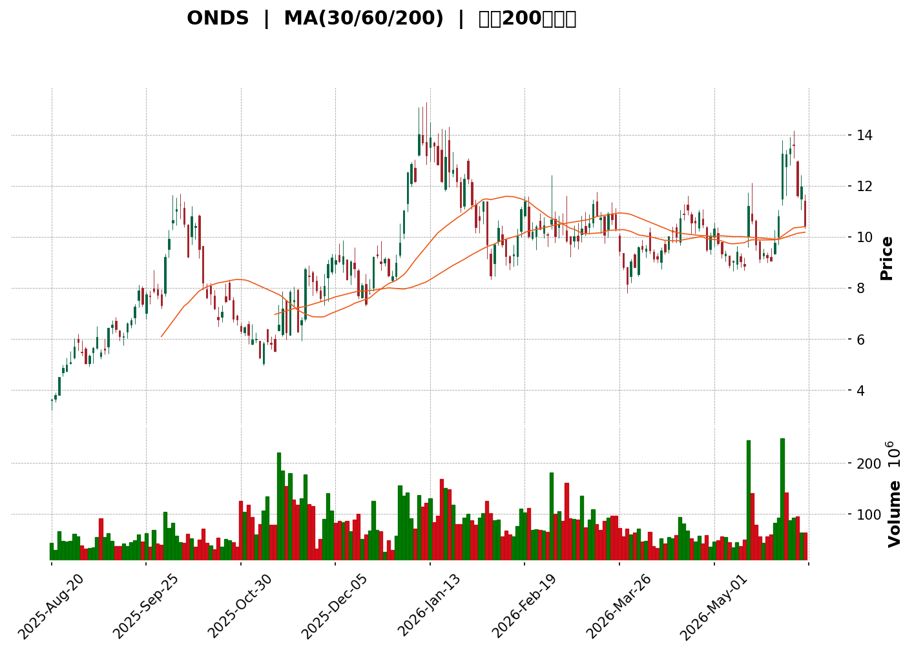
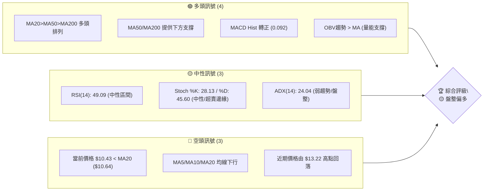

<details>
<summary>📊 靜態圖表 (點擊展開)</summary>

</details>

<html>
<head><meta charset="utf-8" /></head>
<body>
    <div style="height:500px; width:100%;">                        <script>window.PlotlyConfig = {MathJaxConfig: 'local'};</script>
        <script charset="utf-8" src="https://cdn.plot.ly/plotly-3.6.0.min.js" integrity="sha256-QaOVwtVY0T02VaHrr6pnoHLCwayMJp4O5n4YyaE3rJk=" crossorigin="anonymous"></script>                <div id="candlestick-chart" class="plotly-graph-div" style="height:100%; width:100%;"></div>            <script>                window.PLOTLYENV=window.PLOTLYENV || {};                                if (document.getElementById("candlestick-chart")) {                    Plotly.newPlot(                        "candlestick-chart",                        [{"close":{"dtype":"f8","bdata":"AAAAoEfhDEAAAABgZmYOQAAAAIDC9RFAAAAAYGZmE0AAAACgR+ETQAAAACCuRxRAAAAAwMzMFkAAAADgo3AXQAAAAEAK1xVAAAAAYLgeFEAAAACA61EVQAAAAMAehRZAAAAAoHA9GEAAAADAzMwVQAAAAKBwPRZAAAAAgBSuGUAAAACgcD0aQAAAAMAehRlAAAAAAClcGEAAAABgZmYYQAAAAGBmZhpAAAAAoEfhGkAAAACAPQodQAAAAMAehR9AAAAAYGZmHUAAAAAAAAAfQAAAAADXox5AAAAAQOF6H0AAAACgR+EeQAAAAKBwPR1AAAAAIIVrIkAAAACA69EjQAAAAIDrUSVAAAAAgBQuJkAAAADAHoUmQAAAAEDh+iRAAAAA4KNwIkAAAABguJ4lQAAAAIDr0SRAAAAAwB4FI0AAAABgZmYgQAAAAOCjcB5AAAAA4HoUH0AAAABgj8IcQAAAAIDC9RpAAAAAoHA9HEAAAABACtcdQAAAAGC4Hh5AAAAAwPUoG0AAAAAAAAAbQAAAAMD1KBlAAAAAYI\u002fCGUAAAACgmZkYQAAAAEAK1xdAAAAAAAAAGEAAAAAAAAAVQAAAAKBwPRdAAAAAwB6FF0AAAABAMzMXQAAAAIA9ChZAAAAAoHA9GkAAAADgUbgcQAAAAMAeBRlAAAAAAClcH0AAAAAAAAAeQAAAAOB6FBlAAAAA4KPwGkAAAADgo3AhQAAAAKBH4SBAAAAAQOF6IEAAAACgmZkfQAAAAIDrUR5AAAAAANcjIEAAAABACtchQAAAAKBHYSJAAAAAANcjIkAAAACAPQoiQAAAAIDCdSJAAAAAYGamIEAAAACAPQoiQAAAAAAAgCFAAAAAYI\u002fCHkAAAACAFC4gQAAAAEDheh1AAAAAQDMzH0AAAADgo3AiQAAAAIA9iiJAAAAAIIXrIUAAAABgj0IiQAAAAIDC9SBAAAAAIIXrIEAAAABA4fohQAAAAMAehSNAAAAAgD0KJkAAAAAgXA8pQAAAAIAUrilAAAAAAClcKEAAAADAHgUsQAAAAKBHYStAAAAAoEdhKkAAAAAgrscrQAAAAGC4HitAAAAAANejKUAAAACA61EoQAAAAGCPQipAAAAAoJkZKUAAAACgcD0pQAAAAEAKVyhAAAAAgOtRJkAAAADAHoUoQAAAAIA9iihAAAAAgD2KJkAAAADgUbgkQAAAACCuRyVAAAAAYI\u002fCJkAAAAAAKVwjQAAAAIDC9SBAAAAAoEdhI0AAAACAFK4kQAAAAAApXCNAAAAAgMJ1IkAAAADgo\u002fAhQAAAAGC4niJAAAAAoJkZJEAAAAAA1yMmQAAAACCuxyZAAAAAIFwPJEAAAACgR2EkQAAAAMDMzCRAAAAAoJmZJEAAAABgZuYkQAAAAMD1KCRAAAAAQApXJUAAAACAPQokQAAAAMAeBSVAAAAAQOH6JEAAAADA9agjQAAAAOCjcCNAAAAAwB4FJEAAAADA9agjQAAAAMD1qCRAAAAAgOtRJEAAAAAgXA8lQAAAACBcjyZAAAAAwPWoJUAAAAAAAIAlQAAAAGC4HiRAAAAAwMzMJUAAAAAAKVwlQAAAAGC4niRAAAAAoEfhIkAAAACgmZkhQAAAAMDMTCBAAAAA4HoUIkAAAABguJ4hQAAAAEAzMyNAAAAAgD0KI0AAAAAgXA8jQAAAAGBm5iJAAAAAIK5HIkAAAABgj0IiQAAAAOCj8CJAAAAAwMzMIkAAAAAgXA8kQAAAAGBmZiRAAAAAAAAAJEAAAACAwnUlQAAAAKBwvSVAAAAAYLgeJkAAAADgehQlQAAAAKCZGSVAAAAAYGbmJUAAAACAwvUkQAAAAEDh+iJAAAAA4HoUJEAAAAAA16MkQAAAAIDCdSNAAAAAwPWoIkAAAACAFK4iQAAAACCuxyFAAAAAYLgeIkAAAABACtciQAAAAOB6FCJAAAAA4FG4IUAAAAAghWsmQAAAAKBwPSVAAAAAYGZmI0AAAAAAAEAiQAAAAOBRuCJAAAAAAClcIkAAAABguB4iQAAAAIA9iiNAAAAAoJmZJUAAAAAAAIAqQAAAAOCjcCpAAAAAIIXrKkAAAADA9SgrQAAAAOBROCdAAAAA4KPwJ0AAAAAAKdwkQA=="},"high":{"dtype":"f8","bdata":"AAAAIK5HDUAAAABguB4PQAAAAIA9ChJAAAAAIIXrE0AAAACAaBEVQAAAAMAeBRZAAAAAgD0KGEAAAAAgg8AYQAAAAMDMzBdAAAAAoEW2FkAAAAAgXI8VQAAAAOBRuBZAAAAAAAAAGkAAAAAAKVwWQAAAAAAAABhAAAAAYI\u002fCGUAAAACgR+EaQAAAAOCjcBtAAAAAYGZmGUAAAAAAAAAZQAAAACBcjxpAAAAAAClcG0AAAADgo3AdQAAAAKBwPSBAAAAAANcjIEAAAAAAKVwfQAAAACBcjx9AAAAAIIVrIUAAAABAClcgQAAAAMDMzB9AAAAAgBSuIkAAAAAgXI8kQAAAAGCPQidAAAAAQAoXJ0AAAABgZmYnQAAAACCuxyZAAAAAwB4FJUAAAACAFG4mQAAAAGC4HiVAAAAAoHC9JUAAAABgj0IjQAAAAIDrUSBAAAAAoEdhIEAAAAAA16MfQAAAAIA9Ch1AAAAAQDMzHUAAAABAClcgQAAAAKBHoSBAAAAAIFyPHkAAAADAzMwbQAAAAIDCdRpAAAAAAAAAGkAAAABgj8IaQAAAACCuRxpAAAAAAAAAGUAAAADgUbgXQAAAAOB6lBdAAAAAIFyPGUAAAACgR2EYQAAAAMD1qBhAAAAAAClcHUAAAADgo3AfQAAAACBcDx5AAAAAgBSuH0AAAACA6xEgQAAAAKBH4R9AAAAAYGZmG0AAAACgmZkhQAAAAGCPwiFAAAAAAClcIUAAAADAIPAgQAAAAADXIyBAAAAAoJkZIUAAAACAwjUiQAAAAIAUriJAAAAAoJmZIkAAAAAAAIAjQAAAAOBRuCNAAAAAQOE6IkAAAADA9SgiQAAAAGBmJiNAAAAAQOF6IUAAAAAA12MgQAAAAGC4HiFAAAAAYJGtIEAAAABA4XoiQAAAAIDrUSNAAAAAgBSuI0AAAABgZmYiQAAAAEAKVyJAAAAAQApXIUAAAACgmZkiQAAAACBcDyVAAAAAYLgeJkAAAADgehQpQAAAAAAp3ClAAAAAgD0KKkAAAAAA1yMuQAAAAEAzMy5AAAAAIFyPLkAAAAAAAAAtQAAAAAAAgCtAAAAAANcjLEAAAAAAAIAsQAAAAGBmZixAAAAAwPWoLEAAAADA9agqQAAAAEDhuilAAAAAIIWrKEAAAADgo\u002fAoQAAAAMD1KCpAAAAAIFyPKEAAAABgZuYmQAAAAGBmZiZAAAAAQArXJkAAAACAPcomQAAAACBcDyNAAAAAwB6FI0AAAAAgrkclQAAAAKBH4SRAAAAAQArXI0AAAACgxosiQAAAAAApXCNAAAAAANejJEAAAABAClcmQAAAAIAULidAAAAAwPUoJ0AAAAAA1yMlQAAAAIDC9SRAAAAAoEfhJUAAAAAgXI8lQAAAAAApXCRAAAAAQArXKEAAAAAAAAAmQAAAAADXoyVAAAAAQArXJUAAAADgUTgnQAAAACBcDyRAAAAAYGbmJEAAAABguB4lQAAAAIAUriVAAAAAgML1JUAAAACgcL0lQAAAAOCj8CZAAAAAwB6FJ0AAAACAwvUlQAAAAMD1qCVAAAAA4KPwJUAAAACgcL0mQAAAACCuRyZAAAAAIK5HJEAAAACgcL0iQAAAAADXoyFAAAAAIK5HIkAAAABAM7MiQAAAAGCPQiNAAAAAwMzMI0AAAACgR2EjQAAAAKBwvSRAAAAAgD0KI0AAAADgUbgiQAAAACCFKyNAAAAA4FG4I0AAAAAgXA8kQAAAACCuxyRAAAAAIFwPJUAAAABguB4mQAAAAOB6lCZAAAAA4FE4J0AAAADgo\u002fAlQAAAAIA9iiVAAAAAYLgeJkAAAAAA1yMmQAAAAAAp3CRAAAAAgOtRJEAAAABguB4lQAAAAEDhuiRAAAAA4HqUI0AAAAAghesiQAAAAAAAgCJAAAAAgBQuIkAAAADAzEwjQAAAAEAzsyJAAAAAAClcIkAAAACAwnUnQAAAAKBwPShAAAAAQApXJUAAAABgj8IjQAAAAOB6FCNAAAAAYI\u002fCIkAAAACgRyEjQAAAAMAehSRAAAAAYLgeJkAAAAAgXI8rQAAAAIDr0SpAAAAAgOvRK0AAAACA61EsQAAAAAAAACpAAAAAQArXKEAAAAAgt1EnQA=="},"hovertemplate":"\u003cb\u003e%{x|%Y-%m-%d}\u003c\u002fb\u003e\u003cbr\u003e\u958b: $%{open:.2f}\u003cbr\u003e\u9ad8: $%{high:.2f}\u003cbr\u003e\u4f4e: $%{low:.2f}\u003cbr\u003e\u6536: $%{close:.2f}\u003cextra\u003e\u003c\u002fextra\u003e","low":{"dtype":"f8","bdata":"AAAAoJmZCUAAAADgehQMQAAAAGBmZg5AAAAAYLgeEkAAAABACtcSQAAAAIA9ChRAAAAAwMzMFEAAAADA9SgWQAAAAIDrURVAAAAAgD0KFEAAAACgmZkTQAAAAGC4HhRAAAAAYGZmFkAAAABACtcUQAAAAIA9ihVAAAAAANejFUAAAADAzMwYQAAAAAAAABlAAAAAgBSuF0AAAAAAAAAXQAAAAIA9ChhAAAAAgBSuGUAAAACA61EaQAAAACCF6xxAAAAAAAAAHUAAAADA9SgbQAAAAOCjcB1AAAAAQDMzH0AAAAAgrkceQAAAAOBRuBxAAAAAANejHkAAAACgR2EiQAAAAIA9iiRAAAAAYGbmJEAAAABgDm0lQAAAAAAAwCRAAAAAoEdhIkAAAAAgsl0jQAAAAGCPwiNAAAAAgOtRIkAAAACAFK4fQAAAAOBROB5AAAAAgOtRHUAAAAAAAIAcQAAAAAAp3BlAAAAAoJmZGkAAAABguJ4dQAAAAOB6FB5AAAAAANejGkAAAADgehQaQAAAAIDr0RhAAAAAQOF6GEAAAABguB4XQAAAAOB6FBdAAAAAgOtRF0AAAAAAKdwUQAAAAMDMzBNAAAAA4HoUF0AAAABgZmYWQAAAACCF6xVAAAAAoHA9GUAAAABgZmYYQAAAACCF6xdAAAAAoJmZGEAAAACAPQodQAAAAAAAABlAAAAA4FG4F0AAAACAFK4aQAAAAADXIyBAAAAAoHC9HkAAAABAMzMfQAAAAKBH4R1AAAAAIK5HHUAAAABACtcdQAAAAIA9CiFAAAAAwPUoIUAAAADgo\u002fAhQAAAAOBROCFAAAAAACmcIEAAAACgcD0gQAAAAIDr0SBAAAAAoHA9HkAAAAAAKVweQAAAAGC4Hh1AAAAAgML1HkAAAADgo3AfQAAAACBcTyJAAAAAQApXIUAAAABAM7MhQAAAAAAp3CBAAAAAIIVrIEAAAADA9aggQAAAAEAKVyJAAAAAgOvRI0AAAABA4folQAAAACCF6ydAAAAA4FE4KEAAAADAzEwqQAAAAIAULitAAAAAwPWoKUAAAAAghespQAAAAEAK1ylAAAAAoJmZKUAAAACgcD0oQAAAAKCZmSdAAAAAACncJ0AAAABAM7MoQAAAAKBH4SdAAAAAYGbmJUAAAACAFC4mQAAAAGC4HihAAAAAANcjJkAAAAAgrkckQAAAAMDMTCRAAAAAwB4FJUAAAABgj0IiQAAAAADXoyBAAAAAYGbmIEAAAABAClcjQAAAAEAzMyNAAAAAYI\u002fCIUAAAABgZmYhQAAAAADXoyFAAAAAoHC9IUAAAABA4fojQAAAAEDheiVAAAAAYGbmI0AAAADgUbgjQAAAAIDC9SJAAAAAgD2KJEAAAABgZuYjQAAAAKBwPSNAAAAAoJmZJEAAAADAHoUjQAAAAAAp3CNAAAAAYLgeJEAAAADAHoUjQAAAAGBmZiJAAAAAYGYmI0AAAAAAAAAjQAAAAKCZmSNAAAAAoJkZJEAAAADgUTgkQAAAAKBwvSRAAAAAANejJUAAAACgcD0kQAAAAIDCdSNAAAAAgBTuI0AAAABAM\u002fMkQAAAAIDCdSRAAAAAgD2KIkAAAADA9WghQAAAAGC4Hh9AAAAAYGZmIEAAAAAgXI8hQAAAACCF6yBAAAAAYI\u002fCIkAAAADgTWIiQAAAAIAUriJAAAAAwB4FIkAAAABA4fohQAAAAIDCdSFAAAAAoJmZIkAAAACgcL0iQAAAAMAehSNAAAAAgD2KI0AAAACA61EjQAAAACCuRyVAAAAAQDOzJUAAAABAMzMkQAAAAEDhOiRAAAAAIIVrJEAAAAAghaskQAAAAIDr0SJAAAAAYLieIkAAAACgcD0jQAAAAEAKVyNAAAAAgOtRIkAAAACAPQoiQAAAACBcjyFAAAAAwMxMIUAAAADgo3AhQAAAAKCZmSFAAAAAQApXIUAAAABAMzMjQAAAAAAAACVAAAAAIIXrIkAAAADgo\u002fAhQAAAAKBwPSJAAAAAgML1IUAAAABguB4iQAAAACCynSJAAAAAAClcI0AAAADgo3AmQAAAAEAzMydAAAAAoJmZKUAAAACAFC4qQAAAACBcDydAAAAAYLgeJkAAAADA9agkQA=="},"name":"\u50f9\u683c","open":{"dtype":"f8","bdata":"AAAAwMzMDEAAAABguB4NQAAAAGBmZg5AAAAA4FG4EkAAAACgR+ESQAAAAOB6FBRAAAAAAAAAFUAAAAAAAAAYQAAAAGBm5hVAAAAAQOF6FkAAAAAA1yMUQAAAAMDMzBVAAAAAwB6FFkAAAACgcD0VQAAAAOCjcBZAAAAA4FG4FkAAAADAzMwZQAAAAEAK1xpAAAAAIK5HGUAAAACgcD0YQAAAAGC4HhlAAAAAQDMzGkAAAAAgrkcbQAAAACBcDx5AAAAAgML1H0AAAADAHgUcQAAAACCuxx5AAAAAQArXH0AAAADgUbgfQAAAAAAAAB9AAAAAQDMzH0AAAADAHgUjQAAAAGC4HiVAAAAAAAAAJkAAAAAgrocmQAAAACCuRyZAAAAAgML1JEAAAAAgXA8kQAAAAGCPwiRAAAAAYGamJUAAAABgj0IjQAAAAMDMzB9AAAAAYLgeIEAAAADgUbgeQAAAAGBmZhtAAAAAYGZmG0AAAACAFK4eQAAAAGC4XiBAAAAA4HoUHkAAAADgepQbQAAAAIDC9RlAAAAAAAAAGUAAAADAzEwaQAAAAGC4HhdAAAAAIIXrF0AAAACAFK4XQAAAAMD1KBRAAAAAQOF6GUAAAABgZmYXQAAAAOCj8BdAAAAAIK5HGUAAAADA9agYQAAAAIA9Ch5AAAAAYLieGEAAAAAAKdwdQAAAAIAUrh9AAAAAoHA9GkAAAAAA1yMbQAAAAIDC9SBAAAAA4FE4IUAAAAAgXI8gQAAAAMAehR9AAAAA4FG4HkAAAAAgrscgQAAAAMAeRSFAAAAAACncIUAAAABACpciQAAAAEAK1yFAAAAA4FE4IkAAAABA4fogQAAAAIDC9SFAAAAAAClcIUAAAABA4XoeQAAAACCuRyBAAAAAwPUoH0AAAACAwvUfQAAAAKCZmSJAAAAAIFwPIkAAAACAwvUhQAAAAOAkRiJAAAAAoJmZIEAAAAAghesgQAAAACBcjyJAAAAAwB5FJEAAAACgmZkmQAAAAEAzMyhAAAAAYGZmKUAAAADA9WgqQAAAAAAAACxAAAAAIIVrK0AAAAAAAAArQAAAAKBHYStAAAAAANcjK0AAAADgetQqQAAAAIDCtSdAAAAAoJmZK0AAAADAHgUpQAAAACCFaylAAAAAwMxMKEAAAAAghWsmQAAAAIDC9SlAAAAAIK5HKEAAAAAAAIAmQAAAAGC4niVAAAAAwB4FJkAAAABgj8ImQAAAAIAUriJAAAAAgBTuIUAAAAAAKZwjQAAAAIAULiRAAAAAwB7FI0AAAACgcH0iQAAAAIA9iiJAAAAA4FF4IkAAAAAghWskQAAAAADXoyVAAAAAoEdhJkAAAAAAKdwjQAAAAMAeBSRAAAAAYI9CJUAAAADAzEwkQAAAAIAULiRAAAAAAAAAJUAAAACgR2ElQAAAAOBRuCRAAAAAQOH6JEAAAAAAAIAkQAAAACBcDyRAAAAAgBSuI0AAAACgmRkkQAAAACCFKyRAAAAAACncJEAAAACgcL0kQAAAAKCZGSVAAAAAAADAJkAAAABguF4lQAAAAOB6lCVAAAAA4HqUJEAAAACA69ElQAAAAGCPwiVAAAAAoJkZJEAAAABAM7MiQAAAAGC4niFAAAAAYGbmIEAAAACgmZkiQAAAACCuByFAAAAAYI9CI0AAAAAAKdwiQAAAAEAKVyRAAAAA4HrUIkAAAACAwnUiQAAAAMAeBSJAAAAA4KNwI0AAAADAHgUjQAAAAAAAgCRAAAAAYI\u002fCJEAAAACgmZkjQAAAAMDMzCVAAAAAgD2KJkAAAABgj8IlQAAAAGCPQiVAAAAAwEu3JEAAAAAA12MlQAAAAGCPwiRAAAAAAAAAI0AAAAAAAAAkQAAAAMDMTCRAAAAAIFyPI0AAAAAAAIAiQAAAAAAAgCJAAAAAAAAAIkAAAABACtchQAAAAOBReCJAAAAAQArXIUAAAABA4fojQAAAAIDr0SVAAAAAYI9CJUAAAABgZqYjQAAAAAAAgCJAAAAAIFyPIkAAAAAghWsiQAAAACCFqyJAAAAAAAAAJEAAAABAM\u002fMmQAAAAAAAgClAAAAAoHB9KkAAAACgcD0rQAAAACCF6ylAAAAAgML1JkAAAABACtcmQA=="},"x":["2025-08-20T00:00:00-04:00","2025-08-21T00:00:00-04:00","2025-08-22T00:00:00-04:00","2025-08-25T00:00:00-04:00","2025-08-26T00:00:00-04:00","2025-08-27T00:00:00-04:00","2025-08-28T00:00:00-04:00","2025-08-29T00:00:00-04:00","2025-09-02T00:00:00-04:00","2025-09-03T00:00:00-04:00","2025-09-04T00:00:00-04:00","2025-09-05T00:00:00-04:00","2025-09-08T00:00:00-04:00","2025-09-09T00:00:00-04:00","2025-09-10T00:00:00-04:00","2025-09-11T00:00:00-04:00","2025-09-12T00:00:00-04:00","2025-09-15T00:00:00-04:00","2025-09-16T00:00:00-04:00","2025-09-17T00:00:00-04:00","2025-09-18T00:00:00-04:00","2025-09-19T00:00:00-04:00","2025-09-22T00:00:00-04:00","2025-09-23T00:00:00-04:00","2025-09-24T00:00:00-04:00","2025-09-25T00:00:00-04:00","2025-09-26T00:00:00-04:00","2025-09-29T00:00:00-04:00","2025-09-30T00:00:00-04:00","2025-10-01T00:00:00-04:00","2025-10-02T00:00:00-04:00","2025-10-03T00:00:00-04:00","2025-10-06T00:00:00-04:00","2025-10-07T00:00:00-04:00","2025-10-08T00:00:00-04:00","2025-10-09T00:00:00-04:00","2025-10-10T00:00:00-04:00","2025-10-13T00:00:00-04:00","2025-10-14T00:00:00-04:00","2025-10-15T00:00:00-04:00","2025-10-16T00:00:00-04:00","2025-10-17T00:00:00-04:00","2025-10-20T00:00:00-04:00","2025-10-21T00:00:00-04:00","2025-10-22T00:00:00-04:00","2025-10-23T00:00:00-04:00","2025-10-24T00:00:00-04:00","2025-10-27T00:00:00-04:00","2025-10-28T00:00:00-04:00","2025-10-29T00:00:00-04:00","2025-10-30T00:00:00-04:00","2025-10-31T00:00:00-04:00","2025-11-03T00:00:00-05:00","2025-11-04T00:00:00-05:00","2025-11-05T00:00:00-05:00","2025-11-06T00:00:00-05:00","2025-11-07T00:00:00-05:00","2025-11-10T00:00:00-05:00","2025-11-11T00:00:00-05:00","2025-11-12T00:00:00-05:00","2025-11-13T00:00:00-05:00","2025-11-14T00:00:00-05:00","2025-11-17T00:00:00-05:00","2025-11-18T00:00:00-05:00","2025-11-19T00:00:00-05:00","2025-11-20T00:00:00-05:00","2025-11-21T00:00:00-05:00","2025-11-24T00:00:00-05:00","2025-11-25T00:00:00-05:00","2025-11-26T00:00:00-05:00","2025-11-28T00:00:00-05:00","2025-12-01T00:00:00-05:00","2025-12-02T00:00:00-05:00","2025-12-03T00:00:00-05:00","2025-12-04T00:00:00-05:00","2025-12-05T00:00:00-05:00","2025-12-08T00:00:00-05:00","2025-12-09T00:00:00-05:00","2025-12-10T00:00:00-05:00","2025-12-11T00:00:00-05:00","2025-12-12T00:00:00-05:00","2025-12-15T00:00:00-05:00","2025-12-16T00:00:00-05:00","2025-12-17T00:00:00-05:00","2025-12-18T00:00:00-05:00","2025-12-19T00:00:00-05:00","2025-12-22T00:00:00-05:00","2025-12-23T00:00:00-05:00","2025-12-24T00:00:00-05:00","2025-12-26T00:00:00-05:00","2025-12-29T00:00:00-05:00","2025-12-30T00:00:00-05:00","2025-12-31T00:00:00-05:00","2026-01-02T00:00:00-05:00","2026-01-05T00:00:00-05:00","2026-01-06T00:00:00-05:00","2026-01-07T00:00:00-05:00","2026-01-08T00:00:00-05:00","2026-01-09T00:00:00-05:00","2026-01-12T00:00:00-05:00","2026-01-13T00:00:00-05:00","2026-01-14T00:00:00-05:00","2026-01-15T00:00:00-05:00","2026-01-16T00:00:00-05:00","2026-01-20T00:00:00-05:00","2026-01-21T00:00:00-05:00","2026-01-22T00:00:00-05:00","2026-01-23T00:00:00-05:00","2026-01-26T00:00:00-05:00","2026-01-27T00:00:00-05:00","2026-01-28T00:00:00-05:00","2026-01-29T00:00:00-05:00","2026-01-30T00:00:00-05:00","2026-02-02T00:00:00-05:00","2026-02-03T00:00:00-05:00","2026-02-04T00:00:00-05:00","2026-02-05T00:00:00-05:00","2026-02-06T00:00:00-05:00","2026-02-09T00:00:00-05:00","2026-02-10T00:00:00-05:00","2026-02-11T00:00:00-05:00","2026-02-12T00:00:00-05:00","2026-02-13T00:00:00-05:00","2026-02-17T00:00:00-05:00","2026-02-18T00:00:00-05:00","2026-02-19T00:00:00-05:00","2026-02-20T00:00:00-05:00","2026-02-23T00:00:00-05:00","2026-02-24T00:00:00-05:00","2026-02-25T00:00:00-05:00","2026-02-26T00:00:00-05:00","2026-02-27T00:00:00-05:00","2026-03-02T00:00:00-05:00","2026-03-03T00:00:00-05:00","2026-03-04T00:00:00-05:00","2026-03-05T00:00:00-05:00","2026-03-06T00:00:00-05:00","2026-03-09T00:00:00-04:00","2026-03-10T00:00:00-04:00","2026-03-11T00:00:00-04:00","2026-03-12T00:00:00-04:00","2026-03-13T00:00:00-04:00","2026-03-16T00:00:00-04:00","2026-03-17T00:00:00-04:00","2026-03-18T00:00:00-04:00","2026-03-19T00:00:00-04:00","2026-03-20T00:00:00-04:00","2026-03-23T00:00:00-04:00","2026-03-24T00:00:00-04:00","2026-03-25T00:00:00-04:00","2026-03-26T00:00:00-04:00","2026-03-27T00:00:00-04:00","2026-03-30T00:00:00-04:00","2026-03-31T00:00:00-04:00","2026-04-01T00:00:00-04:00","2026-04-02T00:00:00-04:00","2026-04-06T00:00:00-04:00","2026-04-07T00:00:00-04:00","2026-04-08T00:00:00-04:00","2026-04-09T00:00:00-04:00","2026-04-10T00:00:00-04:00","2026-04-13T00:00:00-04:00","2026-04-14T00:00:00-04:00","2026-04-15T00:00:00-04:00","2026-04-16T00:00:00-04:00","2026-04-17T00:00:00-04:00","2026-04-20T00:00:00-04:00","2026-04-21T00:00:00-04:00","2026-04-22T00:00:00-04:00","2026-04-23T00:00:00-04:00","2026-04-24T00:00:00-04:00","2026-04-27T00:00:00-04:00","2026-04-28T00:00:00-04:00","2026-04-29T00:00:00-04:00","2026-04-30T00:00:00-04:00","2026-05-01T00:00:00-04:00","2026-05-04T00:00:00-04:00","2026-05-05T00:00:00-04:00","2026-05-06T00:00:00-04:00","2026-05-07T00:00:00-04:00","2026-05-08T00:00:00-04:00","2026-05-11T00:00:00-04:00","2026-05-12T00:00:00-04:00","2026-05-13T00:00:00-04:00","2026-05-14T00:00:00-04:00","2026-05-15T00:00:00-04:00","2026-05-18T00:00:00-04:00","2026-05-19T00:00:00-04:00","2026-05-20T00:00:00-04:00","2026-05-21T00:00:00-04:00","2026-05-22T00:00:00-04:00","2026-05-26T00:00:00-04:00","2026-05-27T00:00:00-04:00","2026-05-28T00:00:00-04:00","2026-05-29T00:00:00-04:00","2026-06-01T00:00:00-04:00","2026-06-02T00:00:00-04:00","2026-06-03T00:00:00-04:00","2026-06-04T00:00:00-04:00","2026-06-05T00:00:00-04:00"],"type":"candlestick"},{"hovertemplate":"MA30: $%{y:.2f}\u003cextra\u003e\u003c\u002fextra\u003e","line":{"color":"#2196F3","dash":"dash","width":2},"mode":"lines","name":"MA30","x":["2025-08-20T00:00:00-04:00","2025-08-21T00:00:00-04:00","2025-08-22T00:00:00-04:00","2025-08-25T00:00:00-04:00","2025-08-26T00:00:00-04:00","2025-08-27T00:00:00-04:00","2025-08-28T00:00:00-04:00","2025-08-29T00:00:00-04:00","2025-09-02T00:00:00-04:00","2025-09-03T00:00:00-04:00","2025-09-04T00:00:00-04:00","2025-09-05T00:00:00-04:00","2025-09-08T00:00:00-04:00","2025-09-09T00:00:00-04:00","2025-09-10T00:00:00-04:00","2025-09-11T00:00:00-04:00","2025-09-12T00:00:00-04:00","2025-09-15T00:00:00-04:00","2025-09-16T00:00:00-04:00","2025-09-17T00:00:00-04:00","2025-09-18T00:00:00-04:00","2025-09-19T00:00:00-04:00","2025-09-22T00:00:00-04:00","2025-09-23T00:00:00-04:00","2025-09-24T00:00:00-04:00","2025-09-25T00:00:00-04:00","2025-09-26T00:00:00-04:00","2025-09-29T00:00:00-04:00","2025-09-30T00:00:00-04:00","2025-10-01T00:00:00-04:00","2025-10-02T00:00:00-04:00","2025-10-03T00:00:00-04:00","2025-10-06T00:00:00-04:00","2025-10-07T00:00:00-04:00","2025-10-08T00:00:00-04:00","2025-10-09T00:00:00-04:00","2025-10-10T00:00:00-04:00","2025-10-13T00:00:00-04:00","2025-10-14T00:00:00-04:00","2025-10-15T00:00:00-04:00","2025-10-16T00:00:00-04:00","2025-10-17T00:00:00-04:00","2025-10-20T00:00:00-04:00","2025-10-21T00:00:00-04:00","2025-10-22T00:00:00-04:00","2025-10-23T00:00:00-04:00","2025-10-24T00:00:00-04:00","2025-10-27T00:00:00-04:00","2025-10-28T00:00:00-04:00","2025-10-29T00:00:00-04:00","2025-10-30T00:00:00-04:00","2025-10-31T00:00:00-04:00","2025-11-03T00:00:00-05:00","2025-11-04T00:00:00-05:00","2025-11-05T00:00:00-05:00","2025-11-06T00:00:00-05:00","2025-11-07T00:00:00-05:00","2025-11-10T00:00:00-05:00","2025-11-11T00:00:00-05:00","2025-11-12T00:00:00-05:00","2025-11-13T00:00:00-05:00","2025-11-14T00:00:00-05:00","2025-11-17T00:00:00-05:00","2025-11-18T00:00:00-05:00","2025-11-19T00:00:00-05:00","2025-11-20T00:00:00-05:00","2025-11-21T00:00:00-05:00","2025-11-24T00:00:00-05:00","2025-11-25T00:00:00-05:00","2025-11-26T00:00:00-05:00","2025-11-28T00:00:00-05:00","2025-12-01T00:00:00-05:00","2025-12-02T00:00:00-05:00","2025-12-03T00:00:00-05:00","2025-12-04T00:00:00-05:00","2025-12-05T00:00:00-05:00","2025-12-08T00:00:00-05:00","2025-12-09T00:00:00-05:00","2025-12-10T00:00:00-05:00","2025-12-11T00:00:00-05:00","2025-12-12T00:00:00-05:00","2025-12-15T00:00:00-05:00","2025-12-16T00:00:00-05:00","2025-12-17T00:00:00-05:00","2025-12-18T00:00:00-05:00","2025-12-19T00:00:00-05:00","2025-12-22T00:00:00-05:00","2025-12-23T00:00:00-05:00","2025-12-24T00:00:00-05:00","2025-12-26T00:00:00-05:00","2025-12-29T00:00:00-05:00","2025-12-30T00:00:00-05:00","2025-12-31T00:00:00-05:00","2026-01-02T00:00:00-05:00","2026-01-05T00:00:00-05:00","2026-01-06T00:00:00-05:00","2026-01-07T00:00:00-05:00","2026-01-08T00:00:00-05:00","2026-01-09T00:00:00-05:00","2026-01-12T00:00:00-05:00","2026-01-13T00:00:00-05:00","2026-01-14T00:00:00-05:00","2026-01-15T00:00:00-05:00","2026-01-16T00:00:00-05:00","2026-01-20T00:00:00-05:00","2026-01-21T00:00:00-05:00","2026-01-22T00:00:00-05:00","2026-01-23T00:00:00-05:00","2026-01-26T00:00:00-05:00","2026-01-27T00:00:00-05:00","2026-01-28T00:00:00-05:00","2026-01-29T00:00:00-05:00","2026-01-30T00:00:00-05:00","2026-02-02T00:00:00-05:00","2026-02-03T00:00:00-05:00","2026-02-04T00:00:00-05:00","2026-02-05T00:00:00-05:00","2026-02-06T00:00:00-05:00","2026-02-09T00:00:00-05:00","2026-02-10T00:00:00-05:00","2026-02-11T00:00:00-05:00","2026-02-12T00:00:00-05:00","2026-02-13T00:00:00-05:00","2026-02-17T00:00:00-05:00","2026-02-18T00:00:00-05:00","2026-02-19T00:00:00-05:00","2026-02-20T00:00:00-05:00","2026-02-23T00:00:00-05:00","2026-02-24T00:00:00-05:00","2026-02-25T00:00:00-05:00","2026-02-26T00:00:00-05:00","2026-02-27T00:00:00-05:00","2026-03-02T00:00:00-05:00","2026-03-03T00:00:00-05:00","2026-03-04T00:00:00-05:00","2026-03-05T00:00:00-05:00","2026-03-06T00:00:00-05:00","2026-03-09T00:00:00-04:00","2026-03-10T00:00:00-04:00","2026-03-11T00:00:00-04:00","2026-03-12T00:00:00-04:00","2026-03-13T00:00:00-04:00","2026-03-16T00:00:00-04:00","2026-03-17T00:00:00-04:00","2026-03-18T00:00:00-04:00","2026-03-19T00:00:00-04:00","2026-03-20T00:00:00-04:00","2026-03-23T00:00:00-04:00","2026-03-24T00:00:00-04:00","2026-03-25T00:00:00-04:00","2026-03-26T00:00:00-04:00","2026-03-27T00:00:00-04:00","2026-03-30T00:00:00-04:00","2026-03-31T00:00:00-04:00","2026-04-01T00:00:00-04:00","2026-04-02T00:00:00-04:00","2026-04-06T00:00:00-04:00","2026-04-07T00:00:00-04:00","2026-04-08T00:00:00-04:00","2026-04-09T00:00:00-04:00","2026-04-10T00:00:00-04:00","2026-04-13T00:00:00-04:00","2026-04-14T00:00:00-04:00","2026-04-15T00:00:00-04:00","2026-04-16T00:00:00-04:00","2026-04-17T00:00:00-04:00","2026-04-20T00:00:00-04:00","2026-04-21T00:00:00-04:00","2026-04-22T00:00:00-04:00","2026-04-23T00:00:00-04:00","2026-04-24T00:00:00-04:00","2026-04-27T00:00:00-04:00","2026-04-28T00:00:00-04:00","2026-04-29T00:00:00-04:00","2026-04-30T00:00:00-04:00","2026-05-01T00:00:00-04:00","2026-05-04T00:00:00-04:00","2026-05-05T00:00:00-04:00","2026-05-06T00:00:00-04:00","2026-05-07T00:00:00-04:00","2026-05-08T00:00:00-04:00","2026-05-11T00:00:00-04:00","2026-05-12T00:00:00-04:00","2026-05-13T00:00:00-04:00","2026-05-14T00:00:00-04:00","2026-05-15T00:00:00-04:00","2026-05-18T00:00:00-04:00","2026-05-19T00:00:00-04:00","2026-05-20T00:00:00-04:00","2026-05-21T00:00:00-04:00","2026-05-22T00:00:00-04:00","2026-05-26T00:00:00-04:00","2026-05-27T00:00:00-04:00","2026-05-28T00:00:00-04:00","2026-05-29T00:00:00-04:00","2026-06-01T00:00:00-04:00","2026-06-02T00:00:00-04:00","2026-06-03T00:00:00-04:00","2026-06-04T00:00:00-04:00","2026-06-05T00:00:00-04:00"],"y":{"dtype":"f8","bdata":"AAAAAAAA+H8AAAAAAAD4fwAAAAAAAPh\u002fAAAAAAAA+H8AAAAAAAD4fwAAAAAAAPh\u002fAAAAAAAA+H8AAAAAAAD4fwAAAAAAAPh\u002fAAAAAAAA+H8AAAAAAAD4fwAAAAAAAPh\u002fAAAAAAAA+H8AAAAAAAD4fwAAAAAAAPh\u002fAAAAAAAA+H8AAAAAAAD4fwAAAAAAAPh\u002fAAAAAAAA+H8AAAAAAAD4fwAAAAAAAPh\u002fAAAAAAAA+H8AAAAAAAD4fwAAAAAAAPh\u002fAAAAAAAA+H8AAAAAAAD4fwAAAAAAAPh\u002fAAAAAAAA+H8AAAAAAAD4f5qZmdmyVhhA3t3dZdgVGUBERERkZuYZQM3MzKwAuRpAERERof6NG0De3d19sWQcQLy7uyuyHR1Ad3d3Z9iVHUCrqqoqzj4eQM3MzOzD5x5AMzMzw66AH0BEREQ0peIfQKuqqlodEyBAVVVVdUwwIECrqqqi\u002fk0gQCIiIiIiYiBA3t3dVQ5tIEDv7u5+anwgQEREROwKkCBAzczMRP2bIECamZkpFacgQImIiMDKoSBAIiIiagOdIEAAAADAEYogQERERCRNaSBA7+7u5kJSIEBEREQ8mCcgQGZmZnYFCCBAq6qqCh7MH0BERETUlIofQBERETEkTR9AMzMzI7DyHkCJiIgIgZUeQO\u002fu7o4l\u002fx1AAAAAoDaQHUDe3d093w8dQCIiIlLUfxxA7+7uDgIrHEC8u7tbq+MbQLy7uzttoBtAzczMzBN1G0DNzMxc1mobQHd3dzfQaRtAd3d3pw10G0AAAACgGq8bQM3MzAy7AhxAIiIislZHHEAAAAAwlnwcQCIiIgKdthxAq6qqCgLrHEC8u7ubfTgdQKuqqmp1jB1AVVVVFSC3HUAAAAAQWPkdQERERNR4KR5AiYiIeOlmHkDNzMzca+4eQO\u002fu7s6FZB9AIiIiQqfNH0Dv7u6eqB8gQO\u002fu7r5YUiBAERER+cVyIEC8u7v7qZEgQAAAAJB7zSBAIiIiMsEDIUCamZmZmVkhQGZmZl66ySFAAAAA8KcmIkDNzMxM8IAiQGZmZuaJ2iJAd3d3xwQvI0BVVVV9P5UjQKuqqoJO+yNAvLu7k19MJEAiIiJaq4MkQCIiInrpxiRAzczM1E0CJUAAAAB4vj8lQO\u002fu7obrcSVAzczM1E2iJUAzMzObmdklQBEREbmsFSZAvLu7+8VSJkAzMzPDg3kmQM3MzJxSsSZA7+7u3mvuJkBERESkRfYmQDMzMxPK6CZA3t3dfT\u002f1JkAAAAAQ5gknQCIiIvJgHidAAAAAIIUrJ0Dv7u6+LSsnQKuqqqp\u002fIydAvLu7q\u002fESJ0BVVVXVBvomQAAAALBH4SZAERERMZa8JkCrqqpaZHsmQAAAACA+QyZAZmZmhusRJkDv7u7uNdclQERERJTRmyVAZmZmFiB3JUCamZlJmlIlQFVVVVXjJSVA3t3dDbsCJUC8u7tbHdMkQFVVVSVNqSRAiYiIuKyVJEAzMzPjM2wkQFVVVeUXSyRAq6qqOiY4JECJiIj4DDskQLy7uyv5RSRA7+7uLpY8JEBVVVUV2U4kQGZmZjbQaSRAiYiIyHZ+JEBERERERIQkQHd3d8cEjyRAiYiISJqSJECrqqqKs48kQLy7u2vneyRAmpmZqapqJEAzMzOTGEQkQCIiIvKLJSRAmpmZudccJEBEREQklBEkQHd3d4ddASRAmpmZaZHtI0Dv7u4+CtcjQN7d3R2hzCNAZmZmZvS2I0BmZmYWILcjQM3MzKzVsSNAVVVV1XipI0De3d391LgjQKuqqmp1zCNAAAAA8GDeI0CamZn5fuojQLy7uytA7iNAvLu7u7v7I0B3d3dH4fojQGZmZqZU3CNAZmZmFtnOI0AzMzNjgscjQHd3d5fgwSNAiYiIKBWnI0C8u7ubNpAjQImIiIj6dyNAq6qqSn5xI0DNzMwcE3wjQFVVVZVDiyNAZmZmJjGII0CJiIjoJrEjQKuqqlqPwiNAiYiIyKHFI0AAAABQuL4jQImIiBgvvSNAvLu72929I0BmZmYGrLwjQO\u002fu7r7KwSNAERERca\u002fZI0BmZmbWoxAkQLy7u2suRCRAREREZDt\u002fJEC8u7s7368kQHd3d1eAvCRAERERMQjMJECJiIiYJ8okQA=="},"type":"scatter"},{"hovertemplate":"MA60: $%{y:.2f}\u003cextra\u003e\u003c\u002fextra\u003e","line":{"color":"#9C27B0","dash":"dash","width":2},"mode":"lines","name":"MA60","x":["2025-08-20T00:00:00-04:00","2025-08-21T00:00:00-04:00","2025-08-22T00:00:00-04:00","2025-08-25T00:00:00-04:00","2025-08-26T00:00:00-04:00","2025-08-27T00:00:00-04:00","2025-08-28T00:00:00-04:00","2025-08-29T00:00:00-04:00","2025-09-02T00:00:00-04:00","2025-09-03T00:00:00-04:00","2025-09-04T00:00:00-04:00","2025-09-05T00:00:00-04:00","2025-09-08T00:00:00-04:00","2025-09-09T00:00:00-04:00","2025-09-10T00:00:00-04:00","2025-09-11T00:00:00-04:00","2025-09-12T00:00:00-04:00","2025-09-15T00:00:00-04:00","2025-09-16T00:00:00-04:00","2025-09-17T00:00:00-04:00","2025-09-18T00:00:00-04:00","2025-09-19T00:00:00-04:00","2025-09-22T00:00:00-04:00","2025-09-23T00:00:00-04:00","2025-09-24T00:00:00-04:00","2025-09-25T00:00:00-04:00","2025-09-26T00:00:00-04:00","2025-09-29T00:00:00-04:00","2025-09-30T00:00:00-04:00","2025-10-01T00:00:00-04:00","2025-10-02T00:00:00-04:00","2025-10-03T00:00:00-04:00","2025-10-06T00:00:00-04:00","2025-10-07T00:00:00-04:00","2025-10-08T00:00:00-04:00","2025-10-09T00:00:00-04:00","2025-10-10T00:00:00-04:00","2025-10-13T00:00:00-04:00","2025-10-14T00:00:00-04:00","2025-10-15T00:00:00-04:00","2025-10-16T00:00:00-04:00","2025-10-17T00:00:00-04:00","2025-10-20T00:00:00-04:00","2025-10-21T00:00:00-04:00","2025-10-22T00:00:00-04:00","2025-10-23T00:00:00-04:00","2025-10-24T00:00:00-04:00","2025-10-27T00:00:00-04:00","2025-10-28T00:00:00-04:00","2025-10-29T00:00:00-04:00","2025-10-30T00:00:00-04:00","2025-10-31T00:00:00-04:00","2025-11-03T00:00:00-05:00","2025-11-04T00:00:00-05:00","2025-11-05T00:00:00-05:00","2025-11-06T00:00:00-05:00","2025-11-07T00:00:00-05:00","2025-11-10T00:00:00-05:00","2025-11-11T00:00:00-05:00","2025-11-12T00:00:00-05:00","2025-11-13T00:00:00-05:00","2025-11-14T00:00:00-05:00","2025-11-17T00:00:00-05:00","2025-11-18T00:00:00-05:00","2025-11-19T00:00:00-05:00","2025-11-20T00:00:00-05:00","2025-11-21T00:00:00-05:00","2025-11-24T00:00:00-05:00","2025-11-25T00:00:00-05:00","2025-11-26T00:00:00-05:00","2025-11-28T00:00:00-05:00","2025-12-01T00:00:00-05:00","2025-12-02T00:00:00-05:00","2025-12-03T00:00:00-05:00","2025-12-04T00:00:00-05:00","2025-12-05T00:00:00-05:00","2025-12-08T00:00:00-05:00","2025-12-09T00:00:00-05:00","2025-12-10T00:00:00-05:00","2025-12-11T00:00:00-05:00","2025-12-12T00:00:00-05:00","2025-12-15T00:00:00-05:00","2025-12-16T00:00:00-05:00","2025-12-17T00:00:00-05:00","2025-12-18T00:00:00-05:00","2025-12-19T00:00:00-05:00","2025-12-22T00:00:00-05:00","2025-12-23T00:00:00-05:00","2025-12-24T00:00:00-05:00","2025-12-26T00:00:00-05:00","2025-12-29T00:00:00-05:00","2025-12-30T00:00:00-05:00","2025-12-31T00:00:00-05:00","2026-01-02T00:00:00-05:00","2026-01-05T00:00:00-05:00","2026-01-06T00:00:00-05:00","2026-01-07T00:00:00-05:00","2026-01-08T00:00:00-05:00","2026-01-09T00:00:00-05:00","2026-01-12T00:00:00-05:00","2026-01-13T00:00:00-05:00","2026-01-14T00:00:00-05:00","2026-01-15T00:00:00-05:00","2026-01-16T00:00:00-05:00","2026-01-20T00:00:00-05:00","2026-01-21T00:00:00-05:00","2026-01-22T00:00:00-05:00","2026-01-23T00:00:00-05:00","2026-01-26T00:00:00-05:00","2026-01-27T00:00:00-05:00","2026-01-28T00:00:00-05:00","2026-01-29T00:00:00-05:00","2026-01-30T00:00:00-05:00","2026-02-02T00:00:00-05:00","2026-02-03T00:00:00-05:00","2026-02-04T00:00:00-05:00","2026-02-05T00:00:00-05:00","2026-02-06T00:00:00-05:00","2026-02-09T00:00:00-05:00","2026-02-10T00:00:00-05:00","2026-02-11T00:00:00-05:00","2026-02-12T00:00:00-05:00","2026-02-13T00:00:00-05:00","2026-02-17T00:00:00-05:00","2026-02-18T00:00:00-05:00","2026-02-19T00:00:00-05:00","2026-02-20T00:00:00-05:00","2026-02-23T00:00:00-05:00","2026-02-24T00:00:00-05:00","2026-02-25T00:00:00-05:00","2026-02-26T00:00:00-05:00","2026-02-27T00:00:00-05:00","2026-03-02T00:00:00-05:00","2026-03-03T00:00:00-05:00","2026-03-04T00:00:00-05:00","2026-03-05T00:00:00-05:00","2026-03-06T00:00:00-05:00","2026-03-09T00:00:00-04:00","2026-03-10T00:00:00-04:00","2026-03-11T00:00:00-04:00","2026-03-12T00:00:00-04:00","2026-03-13T00:00:00-04:00","2026-03-16T00:00:00-04:00","2026-03-17T00:00:00-04:00","2026-03-18T00:00:00-04:00","2026-03-19T00:00:00-04:00","2026-03-20T00:00:00-04:00","2026-03-23T00:00:00-04:00","2026-03-24T00:00:00-04:00","2026-03-25T00:00:00-04:00","2026-03-26T00:00:00-04:00","2026-03-27T00:00:00-04:00","2026-03-30T00:00:00-04:00","2026-03-31T00:00:00-04:00","2026-04-01T00:00:00-04:00","2026-04-02T00:00:00-04:00","2026-04-06T00:00:00-04:00","2026-04-07T00:00:00-04:00","2026-04-08T00:00:00-04:00","2026-04-09T00:00:00-04:00","2026-04-10T00:00:00-04:00","2026-04-13T00:00:00-04:00","2026-04-14T00:00:00-04:00","2026-04-15T00:00:00-04:00","2026-04-16T00:00:00-04:00","2026-04-17T00:00:00-04:00","2026-04-20T00:00:00-04:00","2026-04-21T00:00:00-04:00","2026-04-22T00:00:00-04:00","2026-04-23T00:00:00-04:00","2026-04-24T00:00:00-04:00","2026-04-27T00:00:00-04:00","2026-04-28T00:00:00-04:00","2026-04-29T00:00:00-04:00","2026-04-30T00:00:00-04:00","2026-05-01T00:00:00-04:00","2026-05-04T00:00:00-04:00","2026-05-05T00:00:00-04:00","2026-05-06T00:00:00-04:00","2026-05-07T00:00:00-04:00","2026-05-08T00:00:00-04:00","2026-05-11T00:00:00-04:00","2026-05-12T00:00:00-04:00","2026-05-13T00:00:00-04:00","2026-05-14T00:00:00-04:00","2026-05-15T00:00:00-04:00","2026-05-18T00:00:00-04:00","2026-05-19T00:00:00-04:00","2026-05-20T00:00:00-04:00","2026-05-21T00:00:00-04:00","2026-05-22T00:00:00-04:00","2026-05-26T00:00:00-04:00","2026-05-27T00:00:00-04:00","2026-05-28T00:00:00-04:00","2026-05-29T00:00:00-04:00","2026-06-01T00:00:00-04:00","2026-06-02T00:00:00-04:00","2026-06-03T00:00:00-04:00","2026-06-04T00:00:00-04:00","2026-06-05T00:00:00-04:00"],"y":{"dtype":"f8","bdata":"AAAAAAAA+H8AAAAAAAD4fwAAAAAAAPh\u002fAAAAAAAA+H8AAAAAAAD4fwAAAAAAAPh\u002fAAAAAAAA+H8AAAAAAAD4fwAAAAAAAPh\u002fAAAAAAAA+H8AAAAAAAD4fwAAAAAAAPh\u002fAAAAAAAA+H8AAAAAAAD4fwAAAAAAAPh\u002fAAAAAAAA+H8AAAAAAAD4fwAAAAAAAPh\u002fAAAAAAAA+H8AAAAAAAD4fwAAAAAAAPh\u002fAAAAAAAA+H8AAAAAAAD4fwAAAAAAAPh\u002fAAAAAAAA+H8AAAAAAAD4fwAAAAAAAPh\u002fAAAAAAAA+H8AAAAAAAD4fwAAAAAAAPh\u002fAAAAAAAA+H8AAAAAAAD4fwAAAAAAAPh\u002fAAAAAAAA+H8AAAAAAAD4fwAAAAAAAPh\u002fAAAAAAAA+H8AAAAAAAD4fwAAAAAAAPh\u002fAAAAAAAA+H8AAAAAAAD4fwAAAAAAAPh\u002fAAAAAAAA+H8AAAAAAAD4fwAAAAAAAPh\u002fAAAAAAAA+H8AAAAAAAD4fwAAAAAAAPh\u002fAAAAAAAA+H8AAAAAAAD4fwAAAAAAAPh\u002fAAAAAAAA+H8AAAAAAAD4fwAAAAAAAPh\u002fAAAAAAAA+H8AAAAAAAD4fwAAAAAAAPh\u002fAAAAAAAA+H8AAAAAAAD4f1VVVYXr0RtAiYiIREQEHEBmZma28z0cQN7d3R0TXBxAiYiIoBqPHEDe3d1dSLocQO\u002fu7j7DzhxAMzMzO23gHEAzMzPDPBEdQERERJQYRB1AAAAASOF6HUCJiIjIvaYdQGZmZnYFyB1AERERSVPqHUCrqqryiyUeQImIiKh\u002fYx5A7+7urrmQHkDv7u6WtboeQFVVVW1Z6x5AIiIiSn4RH0B3d3f3U0MfQN7d3XUFaB9AzczMdJN4H0AAAADIvYYfQGZmZo4Jfh9AMzMzo7eFH0Crqqoqzp4fQN7d3V1Iuh9AZmZmpuLMH0AREREJ8+QfQHd3d9fq+B9Aq6qqCh7sH0AAAACAatwfQHd3d1cOzR9AIiIigtzLH0CJiIg4ieEfQLy7u0PSBCBAvLu7exQeIEBVVVX9YjkgQCIiIkJgVSBA7+7uVsd0IEDe3d1VVaUgQDMzM08b2CBAvLu7MzMDIUARERFVnC0hQERERIAjZCFA7+7ulvySIUAAAADIBL8hQAAAAASd5iFAERERbecLIkCJiIg07DoiQDMzM7fzbSJAMzMzAyuXIkCamZnlF7siQHd3d4MH4yJAmpmZTfAQI0BVVVXJvTYjQFVVVX2GTSNAd3d3jwluI0B3d3dXx5QjQImIiNhcuCNAiYiIjCXPI0BVVVXda94jQFVVVZ19+CNA7+7ublkLJEB3d3c30CkkQDMzMweBVSRAiYiIEJ9xJEC8u7tTKn4kQDMzMwPkjiRA7+7uJnigJEAiIiK2OrYkQHd3dwuQyyRAERER1b\u002fhJEDe3d3RIuskQLy7u2dm9iRAVVVVcYQCJUDe3d3pbQklQCIiIlacDSVAq6qqRv0bJUAzMzO\u002f5iIlQDMzM09iMCVAMzMzG3ZFJUDe3d1dSFolQEREROSleyVA7+7uBoGVJUDNzMxcj6IlQM3MzCRNqSVAMzMzI9u5JUAiIiIqFcclQM3MzNyy1iVAREREtA\u002ffJUDNzMykcN0lQDMzM4uzzyVAq6qqKs6+JUBERES0D58lQBEREdFpgyVAVVVV9bZsJUB3d3c\u002ffEYlQLy7u9NNIiVAAAAAeL7\u002fJEDv7u4WINckQBEREVk5tCRAZmZmPgqXJEAAAAAw3YQkQBEREYHcayRAmpmZ8RlWJEDNzMws+UUkQAAAAEjhOiRARERE1AY6JEBmZmZuWSskQImIiAisHCRAMzMz+\u002fAZJEAAAAAg9xokQBEREekmESRAq6qqorcFJEBERES8LQskQO\u002fu7mbYFSRAiYiI+MUSJEAAAABwPQokQAAAAKh\u002fAyRAmpmZSQwCJEC8u7tT4wUkQImIiICVAyRAAAAA6G35I0De3d29n\u002fojQGZmZqYN9CNAERERwTzxI0AiIiI6JugjQAAAAFBG3yNAq6qqorfVI0Crqqoi28kjQGZmZu41xyNAvLu761HII0BmZmb24eMjQERERAwC+yNAzczMHFoUJEDNzMwcWjQkQBEREeF6RCRAiYiIkDRVJEARERFJU1okQA=="},"type":"scatter"},{"hovertemplate":"MA200: $%{y:.2f}\u003cextra\u003e\u003c\u002fextra\u003e","line":{"color":"#FF6F00","dash":"solid","width":2},"mode":"lines","name":"MA200","x":["2025-08-20T00:00:00-04:00","2025-08-21T00:00:00-04:00","2025-08-22T00:00:00-04:00","2025-08-25T00:00:00-04:00","2025-08-26T00:00:00-04:00","2025-08-27T00:00:00-04:00","2025-08-28T00:00:00-04:00","2025-08-29T00:00:00-04:00","2025-09-02T00:00:00-04:00","2025-09-03T00:00:00-04:00","2025-09-04T00:00:00-04:00","2025-09-05T00:00:00-04:00","2025-09-08T00:00:00-04:00","2025-09-09T00:00:00-04:00","2025-09-10T00:00:00-04:00","2025-09-11T00:00:00-04:00","2025-09-12T00:00:00-04:00","2025-09-15T00:00:00-04:00","2025-09-16T00:00:00-04:00","2025-09-17T00:00:00-04:00","2025-09-18T00:00:00-04:00","2025-09-19T00:00:00-04:00","2025-09-22T00:00:00-04:00","2025-09-23T00:00:00-04:00","2025-09-24T00:00:00-04:00","2025-09-25T00:00:00-04:00","2025-09-26T00:00:00-04:00","2025-09-29T00:00:00-04:00","2025-09-30T00:00:00-04:00","2025-10-01T00:00:00-04:00","2025-10-02T00:00:00-04:00","2025-10-03T00:00:00-04:00","2025-10-06T00:00:00-04:00","2025-10-07T00:00:00-04:00","2025-10-08T00:00:00-04:00","2025-10-09T00:00:00-04:00","2025-10-10T00:00:00-04:00","2025-10-13T00:00:00-04:00","2025-10-14T00:00:00-04:00","2025-10-15T00:00:00-04:00","2025-10-16T00:00:00-04:00","2025-10-17T00:00:00-04:00","2025-10-20T00:00:00-04:00","2025-10-21T00:00:00-04:00","2025-10-22T00:00:00-04:00","2025-10-23T00:00:00-04:00","2025-10-24T00:00:00-04:00","2025-10-27T00:00:00-04:00","2025-10-28T00:00:00-04:00","2025-10-29T00:00:00-04:00","2025-10-30T00:00:00-04:00","2025-10-31T00:00:00-04:00","2025-11-03T00:00:00-05:00","2025-11-04T00:00:00-05:00","2025-11-05T00:00:00-05:00","2025-11-06T00:00:00-05:00","2025-11-07T00:00:00-05:00","2025-11-10T00:00:00-05:00","2025-11-11T00:00:00-05:00","2025-11-12T00:00:00-05:00","2025-11-13T00:00:00-05:00","2025-11-14T00:00:00-05:00","2025-11-17T00:00:00-05:00","2025-11-18T00:00:00-05:00","2025-11-19T00:00:00-05:00","2025-11-20T00:00:00-05:00","2025-11-21T00:00:00-05:00","2025-11-24T00:00:00-05:00","2025-11-25T00:00:00-05:00","2025-11-26T00:00:00-05:00","2025-11-28T00:00:00-05:00","2025-12-01T00:00:00-05:00","2025-12-02T00:00:00-05:00","2025-12-03T00:00:00-05:00","2025-12-04T00:00:00-05:00","2025-12-05T00:00:00-05:00","2025-12-08T00:00:00-05:00","2025-12-09T00:00:00-05:00","2025-12-10T00:00:00-05:00","2025-12-11T00:00:00-05:00","2025-12-12T00:00:00-05:00","2025-12-15T00:00:00-05:00","2025-12-16T00:00:00-05:00","2025-12-17T00:00:00-05:00","2025-12-18T00:00:00-05:00","2025-12-19T00:00:00-05:00","2025-12-22T00:00:00-05:00","2025-12-23T00:00:00-05:00","2025-12-24T00:00:00-05:00","2025-12-26T00:00:00-05:00","2025-12-29T00:00:00-05:00","2025-12-30T00:00:00-05:00","2025-12-31T00:00:00-05:00","2026-01-02T00:00:00-05:00","2026-01-05T00:00:00-05:00","2026-01-06T00:00:00-05:00","2026-01-07T00:00:00-05:00","2026-01-08T00:00:00-05:00","2026-01-09T00:00:00-05:00","2026-01-12T00:00:00-05:00","2026-01-13T00:00:00-05:00","2026-01-14T00:00:00-05:00","2026-01-15T00:00:00-05:00","2026-01-16T00:00:00-05:00","2026-01-20T00:00:00-05:00","2026-01-21T00:00:00-05:00","2026-01-22T00:00:00-05:00","2026-01-23T00:00:00-05:00","2026-01-26T00:00:00-05:00","2026-01-27T00:00:00-05:00","2026-01-28T00:00:00-05:00","2026-01-29T00:00:00-05:00","2026-01-30T00:00:00-05:00","2026-02-02T00:00:00-05:00","2026-02-03T00:00:00-05:00","2026-02-04T00:00:00-05:00","2026-02-05T00:00:00-05:00","2026-02-06T00:00:00-05:00","2026-02-09T00:00:00-05:00","2026-02-10T00:00:00-05:00","2026-02-11T00:00:00-05:00","2026-02-12T00:00:00-05:00","2026-02-13T00:00:00-05:00","2026-02-17T00:00:00-05:00","2026-02-18T00:00:00-05:00","2026-02-19T00:00:00-05:00","2026-02-20T00:00:00-05:00","2026-02-23T00:00:00-05:00","2026-02-24T00:00:00-05:00","2026-02-25T00:00:00-05:00","2026-02-26T00:00:00-05:00","2026-02-27T00:00:00-05:00","2026-03-02T00:00:00-05:00","2026-03-03T00:00:00-05:00","2026-03-04T00:00:00-05:00","2026-03-05T00:00:00-05:00","2026-03-06T00:00:00-05:00","2026-03-09T00:00:00-04:00","2026-03-10T00:00:00-04:00","2026-03-11T00:00:00-04:00","2026-03-12T00:00:00-04:00","2026-03-13T00:00:00-04:00","2026-03-16T00:00:00-04:00","2026-03-17T00:00:00-04:00","2026-03-18T00:00:00-04:00","2026-03-19T00:00:00-04:00","2026-03-20T00:00:00-04:00","2026-03-23T00:00:00-04:00","2026-03-24T00:00:00-04:00","2026-03-25T00:00:00-04:00","2026-03-26T00:00:00-04:00","2026-03-27T00:00:00-04:00","2026-03-30T00:00:00-04:00","2026-03-31T00:00:00-04:00","2026-04-01T00:00:00-04:00","2026-04-02T00:00:00-04:00","2026-04-06T00:00:00-04:00","2026-04-07T00:00:00-04:00","2026-04-08T00:00:00-04:00","2026-04-09T00:00:00-04:00","2026-04-10T00:00:00-04:00","2026-04-13T00:00:00-04:00","2026-04-14T00:00:00-04:00","2026-04-15T00:00:00-04:00","2026-04-16T00:00:00-04:00","2026-04-17T00:00:00-04:00","2026-04-20T00:00:00-04:00","2026-04-21T00:00:00-04:00","2026-04-22T00:00:00-04:00","2026-04-23T00:00:00-04:00","2026-04-24T00:00:00-04:00","2026-04-27T00:00:00-04:00","2026-04-28T00:00:00-04:00","2026-04-29T00:00:00-04:00","2026-04-30T00:00:00-04:00","2026-05-01T00:00:00-04:00","2026-05-04T00:00:00-04:00","2026-05-05T00:00:00-04:00","2026-05-06T00:00:00-04:00","2026-05-07T00:00:00-04:00","2026-05-08T00:00:00-04:00","2026-05-11T00:00:00-04:00","2026-05-12T00:00:00-04:00","2026-05-13T00:00:00-04:00","2026-05-14T00:00:00-04:00","2026-05-15T00:00:00-04:00","2026-05-18T00:00:00-04:00","2026-05-19T00:00:00-04:00","2026-05-20T00:00:00-04:00","2026-05-21T00:00:00-04:00","2026-05-22T00:00:00-04:00","2026-05-26T00:00:00-04:00","2026-05-27T00:00:00-04:00","2026-05-28T00:00:00-04:00","2026-05-29T00:00:00-04:00","2026-06-01T00:00:00-04:00","2026-06-02T00:00:00-04:00","2026-06-03T00:00:00-04:00","2026-06-04T00:00:00-04:00","2026-06-05T00:00:00-04:00"],"y":{"dtype":"f8","bdata":"AAAAAAAA+H8AAAAAAAD4fwAAAAAAAPh\u002fAAAAAAAA+H8AAAAAAAD4fwAAAAAAAPh\u002fAAAAAAAA+H8AAAAAAAD4fwAAAAAAAPh\u002fAAAAAAAA+H8AAAAAAAD4fwAAAAAAAPh\u002fAAAAAAAA+H8AAAAAAAD4fwAAAAAAAPh\u002fAAAAAAAA+H8AAAAAAAD4fwAAAAAAAPh\u002fAAAAAAAA+H8AAAAAAAD4fwAAAAAAAPh\u002fAAAAAAAA+H8AAAAAAAD4fwAAAAAAAPh\u002fAAAAAAAA+H8AAAAAAAD4fwAAAAAAAPh\u002fAAAAAAAA+H8AAAAAAAD4fwAAAAAAAPh\u002fAAAAAAAA+H8AAAAAAAD4fwAAAAAAAPh\u002fAAAAAAAA+H8AAAAAAAD4fwAAAAAAAPh\u002fAAAAAAAA+H8AAAAAAAD4fwAAAAAAAPh\u002fAAAAAAAA+H8AAAAAAAD4fwAAAAAAAPh\u002fAAAAAAAA+H8AAAAAAAD4fwAAAAAAAPh\u002fAAAAAAAA+H8AAAAAAAD4fwAAAAAAAPh\u002fAAAAAAAA+H8AAAAAAAD4fwAAAAAAAPh\u002fAAAAAAAA+H8AAAAAAAD4fwAAAAAAAPh\u002fAAAAAAAA+H8AAAAAAAD4fwAAAAAAAPh\u002fAAAAAAAA+H8AAAAAAAD4fwAAAAAAAPh\u002fAAAAAAAA+H8AAAAAAAD4fwAAAAAAAPh\u002fAAAAAAAA+H8AAAAAAAD4fwAAAAAAAPh\u002fAAAAAAAA+H8AAAAAAAD4fwAAAAAAAPh\u002fAAAAAAAA+H8AAAAAAAD4fwAAAAAAAPh\u002fAAAAAAAA+H8AAAAAAAD4fwAAAAAAAPh\u002fAAAAAAAA+H8AAAAAAAD4fwAAAAAAAPh\u002fAAAAAAAA+H8AAAAAAAD4fwAAAAAAAPh\u002fAAAAAAAA+H8AAAAAAAD4fwAAAAAAAPh\u002fAAAAAAAA+H8AAAAAAAD4fwAAAAAAAPh\u002fAAAAAAAA+H8AAAAAAAD4fwAAAAAAAPh\u002fAAAAAAAA+H8AAAAAAAD4fwAAAAAAAPh\u002fAAAAAAAA+H8AAAAAAAD4fwAAAAAAAPh\u002fAAAAAAAA+H8AAAAAAAD4fwAAAAAAAPh\u002fAAAAAAAA+H8AAAAAAAD4fwAAAAAAAPh\u002fAAAAAAAA+H8AAAAAAAD4fwAAAAAAAPh\u002fAAAAAAAA+H8AAAAAAAD4fwAAAAAAAPh\u002fAAAAAAAA+H8AAAAAAAD4fwAAAAAAAPh\u002fAAAAAAAA+H8AAAAAAAD4fwAAAAAAAPh\u002fAAAAAAAA+H8AAAAAAAD4fwAAAAAAAPh\u002fAAAAAAAA+H8AAAAAAAD4fwAAAAAAAPh\u002fAAAAAAAA+H8AAAAAAAD4fwAAAAAAAPh\u002fAAAAAAAA+H8AAAAAAAD4fwAAAAAAAPh\u002fAAAAAAAA+H8AAAAAAAD4fwAAAAAAAPh\u002fAAAAAAAA+H8AAAAAAAD4fwAAAAAAAPh\u002fAAAAAAAA+H8AAAAAAAD4fwAAAAAAAPh\u002fAAAAAAAA+H8AAAAAAAD4fwAAAAAAAPh\u002fAAAAAAAA+H8AAAAAAAD4fwAAAAAAAPh\u002fAAAAAAAA+H8AAAAAAAD4fwAAAAAAAPh\u002fAAAAAAAA+H8AAAAAAAD4fwAAAAAAAPh\u002fAAAAAAAA+H8AAAAAAAD4fwAAAAAAAPh\u002fAAAAAAAA+H8AAAAAAAD4fwAAAAAAAPh\u002fAAAAAAAA+H8AAAAAAAD4fwAAAAAAAPh\u002fAAAAAAAA+H8AAAAAAAD4fwAAAAAAAPh\u002fAAAAAAAA+H8AAAAAAAD4fwAAAAAAAPh\u002fAAAAAAAA+H8AAAAAAAD4fwAAAAAAAPh\u002fAAAAAAAA+H8AAAAAAAD4fwAAAAAAAPh\u002fAAAAAAAA+H8AAAAAAAD4fwAAAAAAAPh\u002fAAAAAAAA+H8AAAAAAAD4fwAAAAAAAPh\u002fAAAAAAAA+H8AAAAAAAD4fwAAAAAAAPh\u002fAAAAAAAA+H8AAAAAAAD4fwAAAAAAAPh\u002fAAAAAAAA+H8AAAAAAAD4fwAAAAAAAPh\u002fAAAAAAAA+H8AAAAAAAD4fwAAAAAAAPh\u002fAAAAAAAA+H8AAAAAAAD4fwAAAAAAAPh\u002fAAAAAAAA+H8AAAAAAAD4fwAAAAAAAPh\u002fAAAAAAAA+H8AAAAAAAD4fwAAAAAAAPh\u002fAAAAAAAA+H8AAAAAAAD4fwAAAAAAAPh\u002fAAAAAAAA+H\u002fsUbgibDgiQA=="},"type":"scatter"}],                        {"template":{"data":{"barpolar":[{"marker":{"line":{"color":"rgb(17,17,17)","width":0.5},"pattern":{"fillmode":"overlay","size":10,"solidity":0.2}},"type":"barpolar"}],"bar":[{"error_x":{"color":"#f2f5fa"},"error_y":{"color":"#f2f5fa"},"marker":{"line":{"color":"rgb(17,17,17)","width":0.5},"pattern":{"fillmode":"overlay","size":10,"solidity":0.2}},"type":"bar"}],"carpet":[{"aaxis":{"endlinecolor":"#A2B1C6","gridcolor":"#506784","linecolor":"#506784","minorgridcolor":"#506784","startlinecolor":"#A2B1C6"},"baxis":{"endlinecolor":"#A2B1C6","gridcolor":"#506784","linecolor":"#506784","minorgridcolor":"#506784","startlinecolor":"#A2B1C6"},"type":"carpet"}],"choropleth":[{"colorbar":{"outlinewidth":0,"ticks":""},"type":"choropleth"}],"contourcarpet":[{"colorbar":{"outlinewidth":0,"ticks":""},"type":"contourcarpet"}],"contour":[{"colorbar":{"outlinewidth":0,"ticks":""},"colorscale":[[0.0,"#0d0887"],[0.1111111111111111,"#46039f"],[0.2222222222222222,"#7201a8"],[0.3333333333333333,"#9c179e"],[0.4444444444444444,"#bd3786"],[0.5555555555555556,"#d8576b"],[0.6666666666666666,"#ed7953"],[0.7777777777777778,"#fb9f3a"],[0.8888888888888888,"#fdca26"],[1.0,"#f0f921"]],"type":"contour"}],"heatmap":[{"colorbar":{"outlinewidth":0,"ticks":""},"colorscale":[[0.0,"#0d0887"],[0.1111111111111111,"#46039f"],[0.2222222222222222,"#7201a8"],[0.3333333333333333,"#9c179e"],[0.4444444444444444,"#bd3786"],[0.5555555555555556,"#d8576b"],[0.6666666666666666,"#ed7953"],[0.7777777777777778,"#fb9f3a"],[0.8888888888888888,"#fdca26"],[1.0,"#f0f921"]],"type":"heatmap"}],"histogram2dcontour":[{"colorbar":{"outlinewidth":0,"ticks":""},"colorscale":[[0.0,"#0d0887"],[0.1111111111111111,"#46039f"],[0.2222222222222222,"#7201a8"],[0.3333333333333333,"#9c179e"],[0.4444444444444444,"#bd3786"],[0.5555555555555556,"#d8576b"],[0.6666666666666666,"#ed7953"],[0.7777777777777778,"#fb9f3a"],[0.8888888888888888,"#fdca26"],[1.0,"#f0f921"]],"type":"histogram2dcontour"}],"histogram2d":[{"colorbar":{"outlinewidth":0,"ticks":""},"colorscale":[[0.0,"#0d0887"],[0.1111111111111111,"#46039f"],[0.2222222222222222,"#7201a8"],[0.3333333333333333,"#9c179e"],[0.4444444444444444,"#bd3786"],[0.5555555555555556,"#d8576b"],[0.6666666666666666,"#ed7953"],[0.7777777777777778,"#fb9f3a"],[0.8888888888888888,"#fdca26"],[1.0,"#f0f921"]],"type":"histogram2d"}],"histogram":[{"marker":{"pattern":{"fillmode":"overlay","size":10,"solidity":0.2}},"type":"histogram"}],"mesh3d":[{"colorbar":{"outlinewidth":0,"ticks":""},"type":"mesh3d"}],"parcoords":[{"line":{"colorbar":{"outlinewidth":0,"ticks":""}},"type":"parcoords"}],"pie":[{"automargin":true,"type":"pie"}],"scatter3d":[{"line":{"colorbar":{"outlinewidth":0,"ticks":""}},"marker":{"colorbar":{"outlinewidth":0,"ticks":""}},"type":"scatter3d"}],"scattercarpet":[{"marker":{"colorbar":{"outlinewidth":0,"ticks":""}},"type":"scattercarpet"}],"scattergeo":[{"marker":{"colorbar":{"outlinewidth":0,"ticks":""}},"type":"scattergeo"}],"scattergl":[{"marker":{"line":{"color":"#283442"}},"type":"scattergl"}],"scattermapbox":[{"marker":{"colorbar":{"outlinewidth":0,"ticks":""}},"type":"scattermapbox"}],"scattermap":[{"marker":{"colorbar":{"outlinewidth":0,"ticks":""}},"type":"scattermap"}],"scatterpolargl":[{"marker":{"colorbar":{"outlinewidth":0,"ticks":""}},"type":"scatterpolargl"}],"scatterpolar":[{"marker":{"colorbar":{"outlinewidth":0,"ticks":""}},"type":"scatterpolar"}],"scatter":[{"marker":{"line":{"color":"#283442"}},"type":"scatter"}],"scatterternary":[{"marker":{"colorbar":{"outlinewidth":0,"ticks":""}},"type":"scatterternary"}],"surface":[{"colorbar":{"outlinewidth":0,"ticks":""},"colorscale":[[0.0,"#0d0887"],[0.1111111111111111,"#46039f"],[0.2222222222222222,"#7201a8"],[0.3333333333333333,"#9c179e"],[0.4444444444444444,"#bd3786"],[0.5555555555555556,"#d8576b"],[0.6666666666666666,"#ed7953"],[0.7777777777777778,"#fb9f3a"],[0.8888888888888888,"#fdca26"],[1.0,"#f0f921"]],"type":"surface"}],"table":[{"cells":{"fill":{"color":"#506784"},"line":{"color":"rgb(17,17,17)"}},"header":{"fill":{"color":"#2a3f5f"},"line":{"color":"rgb(17,17,17)"}},"type":"table"}]},"layout":{"annotationdefaults":{"arrowcolor":"#f2f5fa","arrowhead":0,"arrowwidth":1},"autotypenumbers":"strict","coloraxis":{"colorbar":{"outlinewidth":0,"ticks":""}},"colorscale":{"diverging":[[0,"#8e0152"],[0.1,"#c51b7d"],[0.2,"#de77ae"],[0.3,"#f1b6da"],[0.4,"#fde0ef"],[0.5,"#f7f7f7"],[0.6,"#e6f5d0"],[0.7,"#b8e186"],[0.8,"#7fbc41"],[0.9,"#4d9221"],[1,"#276419"]],"sequential":[[0.0,"#0d0887"],[0.1111111111111111,"#46039f"],[0.2222222222222222,"#7201a8"],[0.3333333333333333,"#9c179e"],[0.4444444444444444,"#bd3786"],[0.5555555555555556,"#d8576b"],[0.6666666666666666,"#ed7953"],[0.7777777777777778,"#fb9f3a"],[0.8888888888888888,"#fdca26"],[1.0,"#f0f921"]],"sequentialminus":[[0.0,"#0d0887"],[0.1111111111111111,"#46039f"],[0.2222222222222222,"#7201a8"],[0.3333333333333333,"#9c179e"],[0.4444444444444444,"#bd3786"],[0.5555555555555556,"#d8576b"],[0.6666666666666666,"#ed7953"],[0.7777777777777778,"#fb9f3a"],[0.8888888888888888,"#fdca26"],[1.0,"#f0f921"]]},"colorway":["#636efa","#EF553B","#00cc96","#ab63fa","#FFA15A","#19d3f3","#FF6692","#B6E880","#FF97FF","#FECB52"],"font":{"color":"#f2f5fa"},"geo":{"bgcolor":"rgb(17,17,17)","lakecolor":"rgb(17,17,17)","landcolor":"rgb(17,17,17)","showlakes":true,"showland":true,"subunitcolor":"#506784"},"hoverlabel":{"align":"left"},"hovermode":"closest","mapbox":{"style":"dark"},"paper_bgcolor":"rgb(17,17,17)","plot_bgcolor":"rgb(17,17,17)","polar":{"angularaxis":{"gridcolor":"#506784","linecolor":"#506784","ticks":""},"bgcolor":"rgb(17,17,17)","radialaxis":{"gridcolor":"#506784","linecolor":"#506784","ticks":""}},"scene":{"xaxis":{"backgroundcolor":"rgb(17,17,17)","gridcolor":"#506784","gridwidth":2,"linecolor":"#506784","showbackground":true,"ticks":"","zerolinecolor":"#C8D4E3"},"yaxis":{"backgroundcolor":"rgb(17,17,17)","gridcolor":"#506784","gridwidth":2,"linecolor":"#506784","showbackground":true,"ticks":"","zerolinecolor":"#C8D4E3"},"zaxis":{"backgroundcolor":"rgb(17,17,17)","gridcolor":"#506784","gridwidth":2,"linecolor":"#506784","showbackground":true,"ticks":"","zerolinecolor":"#C8D4E3"}},"shapedefaults":{"line":{"color":"#f2f5fa"}},"sliderdefaults":{"bgcolor":"#C8D4E3","bordercolor":"rgb(17,17,17)","borderwidth":1,"tickwidth":0},"ternary":{"aaxis":{"gridcolor":"#506784","linecolor":"#506784","ticks":""},"baxis":{"gridcolor":"#506784","linecolor":"#506784","ticks":""},"bgcolor":"rgb(17,17,17)","caxis":{"gridcolor":"#506784","linecolor":"#506784","ticks":""}},"title":{"x":0.05},"updatemenudefaults":{"bgcolor":"#506784","borderwidth":0},"xaxis":{"automargin":true,"gridcolor":"#283442","linecolor":"#506784","ticks":"","title":{"standoff":15},"zerolinecolor":"#283442","zerolinewidth":2},"yaxis":{"automargin":true,"gridcolor":"#283442","linecolor":"#506784","ticks":"","title":{"standoff":15},"zerolinecolor":"#283442","zerolinewidth":2}}},"xaxis":{"rangeslider":{"visible":false},"title":{"text":"\u65e5\u671f"}},"font":{"size":11},"title":{"text":"ONDS  |  MA(30\u002f60\u002f200)  |  \u6700\u8fd1200\u4ea4\u6613\u65e5"},"yaxis":{"title":{"text":"\u80a1\u50f9 (USD)"}},"hovermode":"x unified","height":500},                        {"responsive": true}                    )                };            </script>        </div>
</body>
</html>

# ONDS 技術分析報告

> **報告日期**：2026-06-05 ｜ **語言**：繁體中文 ｜ **數據來源**：Yahoo Finance ｜ **當前價格**：$10.43

---

## 目錄

| 章節 | 內容 |
|------|------|
| [1. 技術面概覽](#1-技術面概覽) | 訊號儀表板、核心指標、評分卡 |
| [2. 趨勢分析](#2-趨勢分析) | 多時框趨勢、長中短期走勢 |
| [3. 圖表形態分析](#3-圖表形態分析) | 形態識別、K線組合、目標價 |
| [4. 支撐與阻力](#4-支撐與阻力) | 關鍵價位、斐波那契回調 |
| [5. 技術指標深度解讀](#5-技術指標深度解讀) | MA/RSI/MACD/布林/成交量 |
| [6. 動能與波動率](#6-動能與波動率) | 動能評估、ATR、Beta |
| [7. 多時框架總結](#7-多時框架總結) | 時框架評分矩陣 |
| [8. 交易策略建議](#8-交易策略建議) | 多空策略、風險報酬比 |
| [9. 風險提示與監控](#9-風險提示與監控) | 監控指標、風險場景 |

---

## 1. 技術面概覽

本章節將對 ONDS 的技術面進行初步的宏觀掃描，透過訊號儀表板、核心指標速覽表與技術評分卡，快速掌握當前市場狀態與潛在的交易機會。我們將整合多個技術指標的即時讀數，為後續的深度分析奠定基礎。

### 🎯 技術訊號儀表板

ONDS 的技術訊號目前呈現多空交織的局面。雖然長期均線維持多頭排列，且OBV顯示量能支撐，但短期價格已跌破短期均線，且ADX指示趨勢強度偏弱，RSI也處於中性區間。這表明市場正處於一個關鍵的轉折點，多空雙方力量拉鋸。


**儀表板解讀**：目前多頭訊號主要來自於中長期趨勢的穩固，均線系統仍維持多頭排列，且MACD柱狀圖轉正，顯示短線動能有回升跡象。然而，短期價格跌破MA20，MA5、MA10、MA20均呈現下行趨勢，表明短期賣壓較重。ADX的低值則暗示市場缺乏明確的單邊趨勢，可能進入盤整或震盪階段。綜合來看，ONDS目前處於一個中性偏多的盤整期，等待方向選擇。

### 📊 核心指標速覽表

下表彙整了 ONDS 目前最重要的技術指標數據，提供快速參考。

| 指標類別 | 指標名稱 | 當前數值 | 訊號 | 解讀 |
|----------|----------|----------|------|------|
| **價格** | 當前價格 | $10.43 | 🟡 | 位於52W高點下方，近期回調 |
| **均線** | MA20 | $10.64 | 🔴 | 價格位於MA20下方，短期承壓 |
| **均線** | MA50 | $10.10 | 🟢 | 價格位於MA50上方，中期支撐 |
| **均線** | MA200 | $9.11 | 🟢 | 價格位於MA200上方，長期看多 |
| **動能** | RSI(14) | 49.09 | 🟡 | 中性區間，無超買超賣 |
| **動能** | MACD | 0.580 (MACD線) | 🟢 | MACD線高於Signal線，柱狀圖轉正，看多 |
| **波動** | ATR(14) | $1.29 | 🔴 | 12.36%的價格波動，波動率較高 |
| **趨勢** | ADX(14) | 24.04 | 🟡 | 弱趨勢，市場處於盤整或趨勢轉換期 |
| **成交量** | 量比 (vs 20MA) | 0.70x | 🔴 | 成交量低於20日均量，追漲意願不足 |

### 🏆 技術評分卡

這張評分卡將從多個維度評估 ONDS 的技術健康度，以百分比和視覺化進度條呈現。

╔══════════════════════════════════════════════════════════════╗
║             技術評分卡 — ONDS (2026-06-05)                     ║
╠══════════════════════════════════════════════════════════════╣
║ 趨勢強度      ████████░░░░░░░░░░░░  40/100  🟡 (ADX低於25，趨勢不明顯)  ║
║ 動能指標      ██████████░░░░░░░░░░  50/100  🟡 (RSI中性，MACD轉多但動力不足)║
║ 支撐穩定度    ██████████████░░░░░░  70/100  🟢 (MA50/MA200提供強力支撐) ║
║ 成交量配合    ██████░░░░░░░░░░░░░░  30/100  🔴 (成交量縮減，近期下跌放量) ║
║ 形態完整度    ████████░░░░░░░░░░░░  40/100  🟡 (無明顯多頭形態，短期回調) ║
║ 均線排列      ████████████████░░░░  80/100  🟢 (MA20>MA50>MA200多頭排列)║
╠══════════════════════════════════════════════════════════════╣
║ 綜合評分      ██████████░░░░░░░░░░  52/100  ⚖️ 中性偏多                  ║
╚══════════════════════════════════════════════════════════════╝
**評分解讀**：ONDS 在均線排列和支撐穩定度方面表現良好，顯示其長期和中期趨勢仍然健康。然而，趨勢強度、動能指標和成交量配合度較弱，反映出短期市場缺乏明確方向和上漲動力。綜合評分中性偏多，建議投資者謹慎觀望，等待更明確的買入訊號或趨勢確認。

---

## 2. 趨勢分析

趨勢是技術分析的核心。本章節將從多時框架深入剖析 ONDS 的價格走勢，從長期月線到中期週線，識別其主導趨勢、次級趨勢及其強度，為交易決策提供方向性指引。

### 🌐 多時框趨勢分析

ONDS 的多時框趨勢分析揭示了一個從長期強勢上漲到短期回調盤整的複雜局面。

```mermaid
graph TD
    A[ONDS 多時框架趨勢分析] --> B(長期趨勢：月線)
    B --> B1[24個月數據顯示強勁上漲]
    B --> B2[從$0.58漲至$13.22，漲幅巨大]
    B --> B3[目前位於高位區間回調]
    B --> B4[結論: 🟢 強勢多頭]

    A --> C(中期趨勢：週線/MA50-MA200)
    C --> C1[MA50 ($10.10) 和 MA200 ($9.11) 均位於現價下方]
    C --> C2[均線排列維持多頭格局 (MA20>MA50>MA200)]
    C --> C3[中期支撐穩固，但近期略有承壓]
    C --> C4[結論: 🟢 多頭主導，但有短期回調壓力]

    A --> D(短期趨勢：日線/MA5-MA20)
    D --> D1[現價 $10.43 跌破 MA20 ($10.64)]
    D --> D2[MA5 ($12.21) 和 MA10 ($11.72) 均高於現價且下行]
    D3[從 $13.22 高點快速回落至 $10.43]
    D4[結論: 🔴 短期空頭回調/盤整]

    B4 --> E{綜合趨勢判斷}
    C4 --> E
    D4 --> E
    E --> F[ONDS 長期結構穩固，中期趨勢偏多，但短期面臨較大回調壓力，可能進入盤整階段]
```
**多時框解讀**：
*   **長期趨勢 (月線)**：ONDS 在過去兩年展現了極其強勁的上升趨勢，從2024年6月的$0.58一路飆升至2026年5月的$13.22，漲幅驚人。儘管2026年6月出現回落，但整體而言，長期趨勢仍維持在一個強勢的多頭格局中。這表明公司基本面或產業前景受到市場高度認可。
*   **中期趨勢 (週線/MA50-MA200)**：中期移動平均線系統顯示，MA50 ($10.10) 和 MA200 ($9.11) 均位於當前價格下方，為股價提供了堅實的支撐。均線排列仍維持多頭格局 (MA20 > MA50 > MA200)，這是一個經典的看漲訊號。然而，近期股價從高點回落，對中期趨勢構成了一定的考驗，但尚未改變其多頭本質。
*   **短期趨勢 (日線/MA5-MA20)**：短期來看，ONDS 的表現則相對疲軟。當前價格 $10.43 已跌破 MA20 ($10.64)，且 MA5 ($12.21) 和 MA10 ($11.72) 均位於現價上方並呈現下行趨勢，形成短期壓力。這表示近期市場賣壓較重，股價正處於一個明顯的短期回調或盤整階段。

**綜合判斷**：ONDS 的長期和中期趨勢依然健康，為股價提供了堅實的基礎。然而，短期面臨的賣壓和回調可能會導致股價在當前區間內進行盤整，以消化前期的巨大漲幅。投資者需密切關注短期支撐位能否守住。

### 📈 長期趨勢 — 12個月走勢圖（Unicode）

以下是 ONDS 過去12個月的月線收盤價格走勢圖，清晰展示了其長期增長軌跡和近期回調。

```
ONDS 月線走勢圖（過去12個月：2025-06 至 2026-06）
價格軸 ($)
$15.00 ┤                                      ●(2026-05 $13.22)
$14.00 ┤
$13.00 ┤                                      ║              ●(2026-06 $10.43)
$12.00 ┤                                      ║
$11.00 ┤                                      ║
$10.00 ┤                    ●(2026-01 $10.36) ║
$ 9.00 ┤                          ●(2026-03 $9.04)
$ 8.00 ┤                ●(2025-11 $7.90)
$ 7.00 ┤            ●(2025-10 $6.44)
$ 6.00 ┤        ●(2025-08 $5.86)
$ 5.00 ┤
$ 4.00 ┤
$ 3.00 ┤
$ 2.00 ┤●(2025-06 $1.92) ●(2025-07 $2.12)
$ 1.00 ┤
     └─────────────────────────────────────────────────────────
      2025-06 07  08  09  10  11  12  2026-01 02  03  04  05  06
```
**走勢特徵分析表格**：
下表詳細分析了 ONDS 過去12個月的價格變化和趨勢特徵。

| 月份      | 收盤價 ($) | 月漲跌幅 (%) | 走勢特徵                                                                               |
|-----------|------------|--------------|----------------------------------------------------------------------------------------|
| 2025-06   | 1.92       | +57.38       | 從低點反彈，強勁上漲，開啟新一輪漲勢。                                                 |
| 2025-07   | 2.12       | +10.42       | 延續漲勢，但漲幅收窄，顯示上漲動能有所放緩。                                         |
| 2025-08   | 5.86       | +176.42      | 爆發性上漲，單月漲幅巨大，市場關注度顯著提升。                                         |
| 2025-09   | 7.72       | +31.74       | 繼續強勢上漲，漲幅雖不如上月，但趨勢保持良好。                                         |
| 2025-10   | 6.44       | -16.60       | 首次明顯回調，消化前期漲幅，但仍處於高位區間。                                         |
| 2025-11   | 7.90       | +22.67       | 回調後再次反彈，顯示買盤承接力強勁。                                                   |
| 2025-12   | 9.76       | +23.54       | 穩步上漲，突破前期高點，多頭趨勢持續。                                                 |
| 2026-01   | 10.36      | +6.15        | 漲勢繼續，但漲幅進一步收窄，顯示上漲動能開始減弱。                                     |
| 2026-02   | 10.08      | -2.69        | 小幅回調，但仍守住關鍵支撐，市場進入高位盤整。                                         |
| 2026-03   | 9.04       | -10.32       | 較大幅度回調，觸及中期支撐，考驗市場信心。                                             |
| 2026-04   | 10.04      | +11.06       | 回調後快速反彈，顯示下方買盤依然活躍，多頭趨勢未變。                                   |
| 2026-05   | 13.22      | +31.67       | 再次強勁上漲，創下年內新高，多頭力量強勢回歸。                                         |
| 2026-06   | 10.43      | -21.10       | 從歷史高點大幅回落，短期賣壓沉重，市場進入深度調整。                                   |

**長期趨勢總結**：ONDS 在過去一年經歷了從$1.92到$13.22的強勁牛市，整體漲幅超過580%。儘管近期從歷史高點$13.22回落至$10.43，但從宏觀視角看，這可以被視為強勢上漲後的一個健康回調，旨在消化獲利盤並為下一輪上漲積蓄動能。長期上升趨勢的結構尚未被破壞。

### 📊 中期趨勢（週線分析）

中期趨勢主要由週線圖和中期移動平均線（如MA50、MA60、MA120）來判斷。當前 ONDS 的中期趨勢依然偏多，但近期回調使得股價面臨一些考驗。

```
ONDS 中期支撐與壓力示意圖 (基於週線視角)
════════════════════════════════════════════════════════════════════
$13.22 ┤████████████████████████████████████████████████████████████████ 歷史高點 / 強阻力
$12.21 ┤                                                                 MA5  (短期阻力)
$11.72 ┤                                                                 MA10 (短期阻力)
$10.64 ┤                                                                 MA20 (短期阻力)
$10.43 ╠═══════════════════════════════════════════════════════════════╣ ◄ 現價
$10.10 ┤▓▓▓▓▓▓▓▓▓▓▓▓▓▓▓▓▓▓▓▓▓▓▓▓▓▓▓▓▓▓▓▓▓▓▓▓▓▓▓▓▓▓▓▓▓▓▓▓▓▓▓▓▓▓▓▓▓▓▓▓▓▓▓▓ MA50 (重要中期支撐)
$ 9.11 ┤▓▓▓▓▓▓▓▓▓▓▓▓▓▓▓▓▓▓▓▓▓▓▓▓▓▓▓▓▓▓▓▓▓▓▓▓▓▓▓▓▓▓▓▓▓▓▓▓▓▓▓▓▓▓▓▓▓▓▓▓▓▓▓▓ MA200 (長期強支撐)
$ 8.00 ┤                                                                 MA240 (長期強支撐)
════════════════════════════════════════════════════════════════════
```
**中期趨勢解讀**：
*   **MA50 ($10.10)**：當前價格 $10.43 位於 MA50 上方，MA50 作為重要的中期趨勢線，仍為股價提供良好支撐。這表明中期買盤力量依然存在，並試圖在該水平附近承接。
*   **MA200 ($9.11)**：MA200 更是位於現價下方較遠處，其向上傾斜的趨勢確認了長期牛市格局。只要股價不跌破 MA200，中期趨勢的看漲性質就不會改變。
*   **均線排列**：雖然短期均線 (MA5, MA10, MA20) 已位於現價上方並呈現下行，但中期均線 (MA50) 和長期均線 (MA200) 依然位於現價下方，且整體均線呈現 MA20 > MA50 > MA200 的多頭排列，這是一個經典的強勢訊號。這意味著在短期回調之後，中期趨勢仍有潛力恢復上漲。
*   **近期表現**：從5月份的$13.22高點回落，使得股價短期內跌破了MA20，但MA50的支撐作用至關重要。若能在此處企穩反彈，則中期多頭趨勢將得以延續；若跌破MA50，則可能面臨更深度的調整。

### ⚡ 趨勢強度評估（ADX 解讀）

ADX (Average Directional Index) 指標用於衡量趨勢的強度，而非方向。

```mermaid
graph TD
    A[ADX 趨勢強度分析] --> B{ADX(14): 24.04}
    B --> B1[判斷 ADX 值]
    B1 --> C{ADX < 25?}
    C -- 是 --> D[弱趨勢 或 盤整行情]
    C -- 否 --> E[強趨勢行情]

    D --> D1[市場缺乏明確方向]
    D1 --> D2[買賣雙方拉鋸]
    D2 --> F{綜合 ADX 與 +/-DI}

    B --> G{+DI: 28.04, -DI: 22.43}
    G --> G1[判斷 +/-DI 關係]
    G1 --> H{+DI > -DI?}
    H -- 是 --> I[多頭力量主導]
    H -- 否 --> J[空頭力量主導]

    I --> F
    J --> F

    F --> K[ONDS ADX結論]
    K --> K1[ADX 24.04 < 25，表明目前市場處於弱趨勢或盤整階段]
    K1 --> K2[儘管趨勢強度不高，但 +DI (28.04) > -DI (22.43)，說明在當前的弱趨勢中，多頭力量略佔上風]
    K2 --> K3[建議：在盤整區間內尋找支撐位附近的買入機會，或等待趨勢明確後再進場]
```
**ADX 強度對照表**：

| ADX 數值範圍 | 趨勢強度 | 狀態        |
|--------------|----------|-------------|
| 0-25         | 弱趨勢   | 盤整、震盪  |
| 25-50        | 中等趨勢 | 趨勢確立中  |
| 50-75        | 強趨勢   | 趨勢明確    |
| 75-100       | 極強趨勢 | 趨勢非常強勁|

**ADX 解讀**：
ONDS 的 ADX(14) 數值為 24.04，低於 25 的閾值，這明確指示當前市場處於一個**弱趨勢或盤整行情**。這意味著股價在短期內缺乏強勁的單邊上漲或下跌動能，很可能在一個較窄的區間內震盪。
然而，我們還需關注 +DI 和 -DI 的相對關係。目前 +DI 為 28.04，而 -DI 為 22.43。由於 **+DI > -DI**，這表明儘管整體趨勢強度不高，但在當前的市場環境下，**多頭力量仍然略微主導**。這與其長期和中期均線的多頭排列相符，暗示股價在盤整後仍有向上突破的潛力。
**總結**：ADX 分析支持短期內股價將以盤整為主，但多頭仍佔優勢，應密切關注盤整區間的突破方向。

---

## 3. 圖表形態分析

圖表形態是價格行為在圖形上的表現，它們往往預示著市場情緒的變化和未來價格的可能走向。本章節將識別 ONDS 圖表上是否存在重要的價格形態，並據此推斷潛在的目標價。

### 🔍 形態識別系統

根據 ONDS 過去12個月的價格走勢，特別是從2026年1月到2026年6月的表現，我們觀察到股價在創下歷史高點 $13.22 後出現快速回調。目前股價 $10.43 位於回調區間內，這可能構成幾種潛在的圖表形態。

```mermaid
graph TD
    A[ONDS 圖表形態識別] --> B{近期高點 $13.22 (2026-05)}
    B --> C{當前價格 $10.43 (2026-06)}
    C --> D{價格回落至 MA50 ($10.10) 附近}

    D --> E{潛在形態分析}
    E --> F[情境1: 上升旗形/矩形整理]
    F --> F1[若 $10.10 (MA50) 支撐有效，股價可能在 $10.10 - $13.22 區間內進行盤整]
    F1 --> F2[形成多頭趨勢中的健康回調整理形態]

    E --> G[情境2: 頭肩頂或雙頂的初期階段]
    G --> G1[若 $10.10 (MA50) 支撐被跌破，且未能迅速收復]
    G1 --> G2[則 $13.22 可能構成左肩或第一個頂部，需要警惕反轉風險]

    E --> H[情境3: 擴散三角形 (Broadening Formation)]
    H --> H1[若波動率持續高企，高點不斷抬高，低點不斷降低]
    H1 --> H2[但目前數據不足以確認此形態]

    F --> I{當前判斷: 🟡 傾向於高位整理，但需警惕回調加深風險}
    G --> I
```
**形態識別解讀**：
目前 ONDS 的圖表形態尚未完全確立為單一的經典反轉或持續形態。從2026年5月的高點$13.22到2026年6月的$10.43，股價經歷了快速的下跌。
1.  **潛在的「上升旗形」或「矩形整理」**：如果股價能在MA50 ($10.10) 附近找到支撐，並在$10.10至$13.22之間形成一個橫向整理區間，那麼這將是一個多頭趨勢中的健康回調形態。這類形態通常預示著在整理後，股價將延續原有的上升趨勢。
2.  **警惕「潛在雙頂」或「頭肩頂」的初期階段**：如果股價未能守住MA50 ($10.10) 甚至MA200 ($9.11) 這一類的關鍵支撐，並且後續反彈無力，那麼$13.22的高點就可能成為潛在反轉形態的組成部分。目前判斷為時尚早，但應保持警惕。
基於當前數據，最合理的判斷是股價正處於**強勢上漲後的技術性回調與高位整理階段**。市場正在消化前期的巨大漲幅，並在尋找新的平衡點。

### 🕯️ 重要K線形態分析

由於提供的數據是月度收盤價，而非每日K線，我們無法分析具體的K線組合（如錘子線、吞噬形態等）。但我們可以根據月度收盤價的變化來推斷月度K線的性質，並從中尋找趨勢變化的線索。

| 月份      | 收盤價 ($) | 漲跌幅 (%) | K線形態推斷 (基於月線)         | 解讀                                                                                                     | 訊號 |
|-----------|------------|------------|---------------------------------|----------------------------------------------------------------------------------------------------------|------|
| 2026-01   | 10.36      | +6.15      | 陽線 (小實體)                 | 漲勢放緩，多頭力量減弱，但仍維持上漲。                                                                   | 🟡   |
| 2026-02   | 10.08      | -2.69      | 陰線 (小實體)                 | 小幅回調，多空力量平衡，市場進入觀望。                                                                   | 🟡   |
| 2026-03   | 9.04       | -10.32     | 陰線 (中等實體)               | 回調加深，空頭力量佔優，考驗下方支撐。                                                                   | 🔴   |
| 2026-04   | 10.04      | +11.06     | 陽線 (中等實體)               | 強勢反彈，買盤積極介入，顯示支撐位附近有較強承接。                                                       | 🟢   |
| 2026-05   | 13.22      | +31.67     | 陽線 (長實體)                 | 強勁上漲，創下歷史新高，多頭勢頭強勁，但可能過度延伸。                                                   | 🟢   |
| 2026-06   | 10.43      | -21.10     | 陰線 (長實體，至目前為止)     | 從歷史高點大幅回落，空頭力量佔據主導，短期賣壓沉重，需要關注回調深度和速度。可能形成「烏雲罩頂」或「長陰線」。 | 🔴   |

**K線形態分析總結**：
2026年5月的長陽線顯示市場強烈的買入意願，將股價推至新高。然而，緊隨其後的2026年6月（截至目前）出現的長陰線，且跌幅超過20%，這是一個非常強烈的空頭訊號。這種價格行為可能構成一個「烏雲罩頂」或「看跌吞噬」的月線級別形態，預示著短期內市場情緒的顯著轉變和潛在的深度回調。投資者應對此保持高度警惕。

### 📉 ASCII 走勢形態示意圖

以下示意圖展示了 ONDS 近期從高點回落的走勢，並標註了可能的整理區間。

```
ONDS 近期走勢形態示意圖 (潛在矩形整理或回調)
═══════════════════════════════════════════════════════════════════
$13.22 ┤        ● (2026-05 高點)
$12.00 ┤        ║
$11.00 ┤        ║
$10.43 ╠════════╣ ◄ 現價
$10.10 ┤        ║ (MA50 支撐)
$ 9.11 ┤        ║ (MA200 支撐)
$ 8.00 ┤        ║
       └───────────────
       時間軸
```
**形態示意圖解讀**：
從圖中可以看出，股價在達到$13.22的高點後，迅速回落至當前價格$10.43。這波下跌使得股價回到了MA50 ($10.10) 的關鍵支撐區域上方。如果$10.10能夠有效支撐，股價可能會在$10.10至$13.22之間形成一個矩形整理區間。如果$10.10被跌破，則可能進一步下探MA200 ($9.11) 甚至更低。目前來看，市場正處於一個關鍵的抉擇點。

### 🎯 形態目標價計算

由於目前形態尚未完全確認（是整理還是反轉），我們將基於兩種情境進行目標價計算。

**情境一：假設形成「矩形整理」或「上升旗形」後的上漲目標**
如果股價在 $10.10 (MA50) 附近企穩，並在 $10.10 - $13.22 區間內進行整理，隨後向上突破 $13.22 的高點。
*   **整理區間高度**：$13.22 - $10.10 = $3.12
*   **突破目標價**：$13.22 (突破點) + $3.12 (形態高度) = **$16.34**
    *   此目標價位於分析師平均目標 $20.12 之下，以及52週高點 $15.28 之上，具備一定的合理性。

**情境二：假設形成「潛在雙頂」的反轉目標**
如果股價跌破 $10.10 (MA50) 這一關鍵支撐，並確認 $13.22 是一個頂部，那麼潛在的下跌目標可以基於雙頂形態來估算。假設頸線位於 $10.10。
*   **雙頂形態高度**：$13.22 (頂部) - $10.10 (頸線) = $3.12
*   **下跌目標價**：$10.10 (頸線) - $3.12 (形態高度) = **$6.98**
    *   此目標價接近斐波那契50%回調位 ($7.57) 和61.8%回調位 ($6.24)，具有一定的技術依據。

**總結**：目前市場處於觀望階段，兩種情境的目標價差異巨大。投資者應密切關注 $10.10 這一關鍵支撐位的表現。若能守住並向上突破 $13.22，則 $16.34 為上漲目標；若跌破 $10.10，則 $6.98 為下跌目標。

---

## 4. 支撐與阻力

支撐與阻力是技術分析的基石，它們是價格走勢圖上買賣雙方力量平衡的關鍵區域。本章節將詳細識別 ONDS 的主要支撐位和阻力位，並結合斐波那契回調進行分析。

### 🗺️ 關鍵價位分布圖（Unicode）

以下是 ONDS 重要的支撐與阻力價位分布圖，幫助我們直觀理解當前股價所處的市場結構。

```
ONDS 價位結構分布圖 (2026-06-05)
═══════════════════════════════════════════════════
$15.28 ║████████████████████████║ 強阻力 R3 (52週高點)
$13.98 ║████████████████████    ║ 阻力 R2 (布林上軌)
$13.22 ║████████████████████████║ 關鍵阻力 R1 (歷史高點)
$10.64 ║████████████████████    ║ 近期阻力 (MA20)
$10.56 ║████████████████████    ║ 近期阻力 (斐波那契23.6%)
$10.43 ╠════════════════════════╣ ◄ 現價
$10.10 ║▓▓▓▓▓▓▓▓▓▓▓▓▓▓▓▓        ║ 近期支撐 S1 (MA50)
$ 9.11 ║████████████████████████║ 強支撐 S2 (MA200)
$ 8.90 ║████████████████████████║ 強支撐 (斐波那契38.2%)
$ 7.57 ║████████████████████████║ 強支撐 (斐波那契50%)
$ 7.29 ║████████████████████████║ 強支撐 (布林下軌)
═══════════════════════════════════════════════════
```
**價位分布解讀**：
當前股價 $10.43 正處於一個多空拉鋸的關鍵區域。上方有 $10.56 (斐波那契23.6%) 和 $10.64 (MA20) 的短期阻力，而下方則有 $10.10 (MA50) 的重要支撐。這些密集的價位表明市場正處於一個方向選擇的關鍵時刻。

### 🚧 阻力位分析表

| 阻力級別 | 價位 ($) | 形成原因                                       | 突破難度 | 重要性 |
|----------|----------|------------------------------------------------|----------|--------|
| **R1**   | 13.22    | 2026年5月歷史高點，大量獲利盤壓力               | 極高     | 極高   |
| **R2**   | 13.98    | 布林通道上軌，通常為短期超買區的上限           | 高       | 中等   |
| **R3**   | 15.28    | 52週高點，長期阻力位                           | 極高     | 極高   |
| **近期阻力** | 10.64    | MA20，短期均線壓力，近期股價曾跌破           | 中等     | 高     |
| **近期阻力** | 10.56    | 斐波那契23.6%回調位，重要的心理關口          | 中等     | 高     |

**阻力位解讀**：
ONDS 的主要阻力位集中在 $10.56 到 $13.22 之間。其中，**$13.22** 是近期歷史高點，也是當前最直接且最強大的阻力，需要非常大的買盤動能才能突破。**$10.56 (斐波那契23.6%)** 和 **$10.64 (MA20)** 則是短期內股價反彈首先需要克服的阻力。若能成功突破這些短期阻力，則可能向上測試 $13.22。

### 🛡️ 支撐位分析表

| 支撐級別 | 價位 ($) | 形成原因                                       | 守住機率 | 重要性 |
|----------|----------|------------------------------------------------|----------|--------|
| **S1**   | 10.10    | MA50，中期趨勢線，多頭排列的重要組成部分       | 高       | 極高   |
| **S2**   | 9.11     | MA200，長期趨勢線，牛市的最後防線             | 極高     | 極高   |
| **S3**   | 8.90     | 斐波那契38.2%回調位，回調的黃金分割點         | 高       | 高     |
| **S4**   | 7.57     | 斐波那契50%回調位，深度回調的潛在止跌區       | 中等     | 中等   |
| **S5**   | 7.29     | 布林通道下軌，通常為短期超賣區的下限           | 中等     | 中等   |

**支撐位解讀**：
ONDS 的關鍵支撐位位於 $10.10 (MA50) 和 $9.11 (MA200)。其中，**$10.10 (MA50)** 是當前最為重要的中期支撐，若能在此處獲得有效支撐並反彈，則中期多頭趨勢將得以延續。**$9.11 (MA200)** 則是長期牛市的最後一道防線，一旦跌破，長期趨勢將面臨嚴峻考驗。**斐波那契38.2%回調位 $8.90** 也與MA200非常接近，增加了該區域的支撐強度。投資者應密切關注 $10.10 附近的價格行為。

### 📐 斐波那契回調位分析

斐波那契回調是從股價的波段高點到低點（或低點到高點）之間繪製的水平線，用來預測潛在的支撐和阻力位。我們將以過去12個月的最低點 $1.92 (2025-06) 和歷史最高點 $13.22 (2026-05) 作為主要波段，計算其回調位。

*   **波段範圍**：從 $1.92 (低點) 到 $13.22 (高點)
*   **波段總長度**：$13.22 - $1.92 = $11.30

**斐波那契回調位計算**：
*   **23.6% 回調位**：$13.22 - ($11.30 * 0.236) = $13.22 - $2.66 = **$10.56**
*   **38.2% 回調位**：$13.22 - ($11.30 * 0.382) = $13.22 - $4.32 = **$8.90**
*   **50.0% 回調位**：$13.22 - ($11.30 * 0.500) = $13.22 - $5.65 = **$7.57**
*   **61.8% 回調位**：$13.22 - ($11.30 * 0.618) = $13.22 - $6.98 = **$6.24**

```mermaid
graph TD
    A[斐波那契回調分析] --> B(起始點：2025-06 低點 $1.92)
    A --> C(結束點：2026-05 高點 $13.22)
    C --> D{回調位}
    D --> D1[23.6% 回調: $10.56]
    D --> D2[38.2% 回調: $8.90]
    D --> D3[50.0% 回調: $7.57]
    D --> D4[61.8% 回調: $6.24]

    D1 -- 近期阻力 --> E{當前價格 $10.43 位於 $10.56 之下}
    D2 -- 強支撐 --> F{與 MA200 ($9.11) 接近，構成強力支撐區}
    D3 -- 深度支撐 --> G{若回調加深，為潛在買入區}
    D4 -- 極強支撐 --> H{極端情況下的最後防線}

    E --> I[結論: $10.56 為短期反彈阻力，若突破則有望挑戰 $13.22；若 $10.10 (MA50) 失守，則 $8.90 為重要防線。]
```
**斐波那契回調解讀**：
ONDS 當前價格 $10.43 位於 23.6% 回