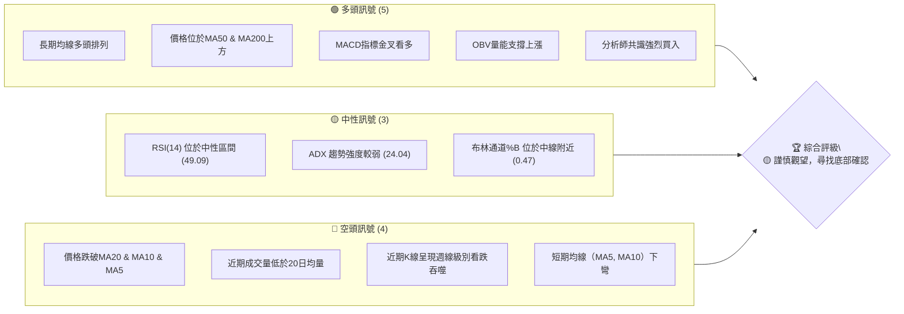
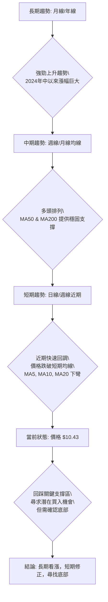
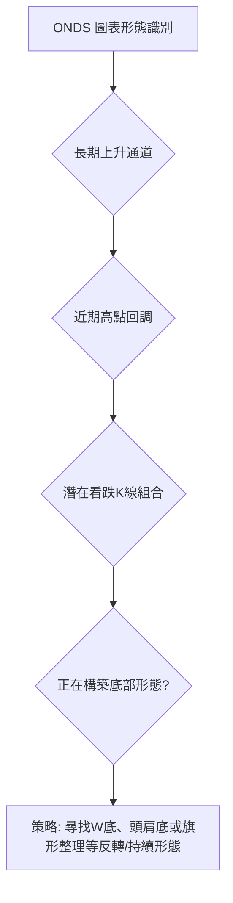

<details>
<summary>📊 靜態圖表 (點擊展開)</summary>

</details>

<html>
<head><meta charset="utf-8" /></head>
<body>
    <div style="height:500px; width:100%;">                        <script>window.PlotlyConfig = {MathJaxConfig: 'local'};</script>
        <script charset="utf-8" src="https://cdn.plot.ly/plotly-3.6.0.min.js" integrity="sha256-QaOVwtVY0T02VaHrr6pnoHLCwayMJp4O5n4YyaE3rJk=" crossorigin="anonymous"></script>                <div id="candlestick-chart" class="plotly-graph-div" style="height:100%; width:100%;"></div>            <script>                window.PLOTLYENV=window.PLOTLYENV || {};                                if (document.getElementById("candlestick-chart")) {                    Plotly.newPlot(                        "candlestick-chart",                        [{"close":{"dtype":"f8","bdata":"AAAAoEfhDEAAAABgZmYOQAAAAIDC9RFAAAAAYGZmE0AAAACgR+ETQAAAACCuRxRAAAAAwMzMFkAAAADgo3AXQAAAAEAK1xVAAAAAYLgeFEAAAACA61EVQAAAAMAehRZAAAAAoHA9GEAAAADAzMwVQAAAAKBwPRZAAAAAgBSuGUAAAACgcD0aQAAAAMAehRlAAAAAAClcGEAAAABgZmYYQAAAAGBmZhpAAAAAoEfhGkAAAACAPQodQAAAAMAehR9AAAAAYGZmHUAAAAAAAAAfQAAAAADXox5AAAAAQOF6H0AAAACgR+EeQAAAAKBwPR1AAAAAIIVrIkAAAACA69EjQAAAAIDrUSVAAAAAgBQuJkAAAADAHoUmQAAAAEDh+iRAAAAA4KNwIkAAAABguJ4lQAAAAIDr0SRAAAAAwB4FI0AAAABgZmYgQAAAAOCjcB5AAAAA4HoUH0AAAABgj8IcQAAAAIDC9RpAAAAAoHA9HEAAAABACtcdQAAAAGC4Hh5AAAAAwPUoG0AAAAAAAAAbQAAAAMD1KBlAAAAAYI\u002fCGUAAAACgmZkYQAAAAEAK1xdAAAAAAAAAGEAAAAAAAAAVQAAAAKBwPRdAAAAAwB6FF0AAAABAMzMXQAAAAIA9ChZAAAAAoHA9GkAAAADgUbgcQAAAAMAeBRlAAAAAAClcH0AAAAAAAAAeQAAAAOB6FBlAAAAA4KPwGkAAAADgo3AhQAAAAKBH4SBAAAAAQOF6IEAAAACgmZkfQAAAAIDrUR5AAAAAANcjIEAAAABACtchQAAAAKBHYSJAAAAAANcjIkAAAACAPQoiQAAAAIDCdSJAAAAAYGamIEAAAACAPQoiQAAAAAAAgCFAAAAAYI\u002fCHkAAAACAFC4gQAAAAEDheh1AAAAAQDMzH0AAAADgo3AiQAAAAIA9iiJAAAAAIIXrIUAAAABgj0IiQAAAAIDC9SBAAAAAIIXrIEAAAABA4fohQAAAAMAehSNAAAAAgD0KJkAAAAAgXA8pQAAAAIAUrilAAAAAAClcKEAAAADAHgUsQAAAAKBHYStAAAAAoEdhKkAAAAAgrscrQAAAAGC4HitAAAAAANejKUAAAACA61EoQAAAAGCPQipAAAAAoJkZKUAAAACgcD0pQAAAAEAKVyhAAAAAgOtRJkAAAADAHoUoQAAAAIA9iihAAAAAgD2KJkAAAADgUbgkQAAAACCuRyVAAAAAYI\u002fCJkAAAAAAKVwjQAAAAIDC9SBAAAAAoEdhI0AAAACAFK4kQAAAAAApXCNAAAAAgMJ1IkAAAADgo\u002fAhQAAAAGC4niJAAAAAoJkZJEAAAAAA1yMmQAAAACCuxyZAAAAAIFwPJEAAAACgR2EkQAAAAMDMzCRAAAAAoJmZJEAAAABgZuYkQAAAAMD1KCRAAAAAQApXJUAAAACAPQokQAAAAMAeBSVAAAAAQOH6JEAAAADA9agjQAAAAOCjcCNAAAAAwB4FJEAAAADA9agjQAAAAMD1qCRAAAAAgOtRJEAAAAAgXA8lQAAAACBcjyZAAAAAwPWoJUAAAAAAAIAlQAAAAGC4HiRAAAAAwMzMJUAAAAAAKVwlQAAAAGC4niRAAAAAoEfhIkAAAACgmZkhQAAAAMDMTCBAAAAA4HoUIkAAAABguJ4hQAAAAEAzMyNAAAAAgD0KI0AAAAAgXA8jQAAAAGBm5iJAAAAAIK5HIkAAAABgj0IiQAAAAOCj8CJAAAAAwMzMIkAAAAAgXA8kQAAAAGBmZiRAAAAAAAAAJEAAAACAwnUlQAAAAKBwvSVAAAAAYLgeJkAAAADgehQlQAAAAKCZGSVAAAAAYGbmJUAAAACAwvUkQAAAAEDh+iJAAAAA4HoUJEAAAAAA16MkQAAAAIDCdSNAAAAAwPWoIkAAAACAFK4iQAAAACCuxyFAAAAAYLgeIkAAAABACtciQAAAAOB6FCJAAAAA4FG4IUAAAAAghWsmQAAAAKBwPSVAAAAAYGZmI0AAAAAAAEAiQAAAAOBRuCJAAAAAAClcIkAAAABguB4iQAAAAIA9iiNAAAAAoJmZJUAAAAAAAIAqQAAAAOCjcCpAAAAAIIXrKkAAAADA9SgrQAAAAOBROCdAAAAA4KPwJ0AAAAAAKdwkQA=="},"high":{"dtype":"f8","bdata":"AAAAIK5HDUAAAABguB4PQAAAAIA9ChJAAAAAIIXrE0AAAACAaBEVQAAAAMAeBRZAAAAAgD0KGEAAAAAgg8AYQAAAAMDMzBdAAAAAoEW2FkAAAAAgXI8VQAAAAOBRuBZAAAAAAAAAGkAAAAAAKVwWQAAAAAAAABhAAAAAYI\u002fCGUAAAACgR+EaQAAAAOCjcBtAAAAAYGZmGUAAAAAAAAAZQAAAACBcjxpAAAAAAClcG0AAAADgo3AdQAAAAKBwPSBAAAAAANcjIEAAAAAAKVwfQAAAACBcjx9AAAAAIIVrIUAAAABAClcgQAAAAMDMzB9AAAAAgBSuIkAAAAAgXI8kQAAAAGCPQidAAAAAQAoXJ0AAAABgZmYnQAAAACCuxyZAAAAAwB4FJUAAAACAFG4mQAAAAGC4HiVAAAAAoHC9JUAAAABgj0IjQAAAAIDrUSBAAAAAoEdhIEAAAAAA16MfQAAAAIA9Ch1AAAAAQDMzHUAAAABAClcgQAAAAKBHoSBAAAAAIFyPHkAAAADAzMwbQAAAAIDCdRpAAAAAAAAAGkAAAABgj8IaQAAAACCuRxpAAAAAAAAAGUAAAADgUbgXQAAAAOB6lBdAAAAAIFyPGUAAAACgR2EYQAAAAMD1qBhAAAAAAClcHUAAAADgo3AfQAAAACBcDx5AAAAAgBSuH0AAAACA6xEgQAAAAKBH4R9AAAAAYGZmG0AAAACgmZkhQAAAAGCPwiFAAAAAAClcIUAAAADAIPAgQAAAAADXIyBAAAAAoJkZIUAAAACAwjUiQAAAAIAUriJAAAAAoJmZIkAAAAAAAIAjQAAAAOBRuCNAAAAAQOE6IkAAAADA9SgiQAAAAGBmJiNAAAAAQOF6IUAAAAAA12MgQAAAAGC4HiFAAAAAYJGtIEAAAABA4XoiQAAAAIDrUSNAAAAAgBSuI0AAAABgZmYiQAAAAEAKVyJAAAAAQApXIUAAAACgmZkiQAAAACBcDyVAAAAAYLgeJkAAAADgehQpQAAAAAAp3ClAAAAAgD0KKkAAAAAA1yMuQAAAAEAzMy5AAAAAIFyPLkAAAAAAAAAtQAAAAAAAgCtAAAAAANcjLEAAAAAAAIAsQAAAAGBmZixAAAAAwPWoLEAAAADA9agqQAAAAEDhuilAAAAAIIWrKEAAAADgo\u002fAoQAAAAMD1KCpAAAAAIFyPKEAAAABgZuYmQAAAAGBmZiZAAAAAQArXJkAAAACAPcomQAAAACBcDyNAAAAAwB6FI0AAAAAgrkclQAAAAKBH4SRAAAAAQArXI0AAAACgxosiQAAAAAApXCNAAAAAANejJEAAAABAClcmQAAAAIAULidAAAAAwPUoJ0AAAAAA1yMlQAAAAIDC9SRAAAAAoEfhJUAAAAAgXI8lQAAAAAApXCRAAAAAQArXKEAAAAAAAAAmQAAAAADXoyVAAAAAQArXJUAAAADgUTgnQAAAACBcDyRAAAAAYGbmJEAAAABguB4lQAAAAIAUriVAAAAAgML1JUAAAACgcL0lQAAAAOCj8CZAAAAAwB6FJ0AAAACAwvUlQAAAAMD1qCVAAAAA4KPwJUAAAACgcL0mQAAAACCuRyZAAAAAIK5HJEAAAACgcL0iQAAAAADXoyFAAAAAIK5HIkAAAABAM7MiQAAAAGCPQiNAAAAAwMzMI0AAAACgR2EjQAAAAKBwvSRAAAAAgD0KI0AAAADgUbgiQAAAACCFKyNAAAAA4FG4I0AAAAAgXA8kQAAAACCuxyRAAAAAIFwPJUAAAABguB4mQAAAAOB6lCZAAAAA4FE4J0AAAADgo\u002fAlQAAAAIA9iiVAAAAAYLgeJkAAAAAA1yMmQAAAAAAp3CRAAAAAgOtRJEAAAABguB4lQAAAAEDhuiRAAAAA4HqUI0AAAAAghesiQAAAAAAAgCJAAAAAgBQuIkAAAADAzEwjQAAAAEAzsyJAAAAAAClcIkAAAACAwnUnQAAAAKBwPShAAAAAQApXJUAAAABgj8IjQAAAAOB6FCNAAAAAYI\u002fCIkAAAACgRyEjQAAAAMAehSRAAAAAYLgeJkAAAAAgXI8rQAAAAIDr0SpAAAAAgOvRK0AAAACA61EsQAAAAAAAACpAAAAAQArXKEAAAACA61EnQA=="},"hovertemplate":"\u003cb\u003e%{x|%Y-%m-%d}\u003c\u002fb\u003e\u003cbr\u003e\u958b: $%{open:.2f}\u003cbr\u003e\u9ad8: $%{high:.2f}\u003cbr\u003e\u4f4e: $%{low:.2f}\u003cbr\u003e\u6536: $%{close:.2f}\u003cextra\u003e\u003c\u002fextra\u003e","low":{"dtype":"f8","bdata":"AAAAoJmZCUAAAADgehQMQAAAAGBmZg5AAAAAYLgeEkAAAABACtcSQAAAAIA9ChRAAAAAwMzMFEAAAADA9SgWQAAAAIDrURVAAAAAgD0KFEAAAACgmZkTQAAAAGC4HhRAAAAAYGZmFkAAAABACtcUQAAAAIA9ihVAAAAAANejFUAAAADAzMwYQAAAAAAAABlAAAAAgBSuF0AAAAAAAAAXQAAAAIA9ChhAAAAAgBSuGUAAAACA61EaQAAAACCF6xxAAAAAAAAAHUAAAADA9SgbQAAAAOCjcB1AAAAAQDMzH0AAAAAgrkceQAAAAOBRuBxAAAAAANejHkAAAACgR2EiQAAAAIA9iiRAAAAAYGbmJEAAAABgDm0lQAAAAAAAwCRAAAAAoEdhIkAAAAAgsl0jQAAAAGCPwiNAAAAAgOtRIkAAAACAFK4fQAAAAOBROB5AAAAAgOtRHUAAAAAAAIAcQAAAAAAp3BlAAAAAoJmZGkAAAABguJ4dQAAAAOB6FB5AAAAAANejGkAAAADgehQaQAAAAIDr0RhAAAAAQOF6GEAAAABguB4XQAAAAOB6FBdAAAAAgOtRF0AAAAAAKdwUQAAAAMDMzBNAAAAA4HoUF0AAAABgZmYWQAAAACCF6xVAAAAAoHA9GUAAAABgZmYYQAAAACCF6xdAAAAAoJmZGEAAAACAPQodQAAAAAAAABlAAAAA4FG4F0AAAACAFK4aQAAAAADXIyBAAAAAoHC9HkAAAABAMzMfQAAAAKBH4R1AAAAAIK5HHUAAAABACtcdQAAAAIA9CiFAAAAAwPUoIUAAAADgo\u002fAhQAAAAOBROCFAAAAAACmcIEAAAACgcD0gQAAAAIDr0SBAAAAAoHA9HkAAAAAAKVweQAAAAGC4Hh1AAAAAgML1HkAAAADgo3AfQAAAACBcTyJAAAAAQApXIUAAAABAM7MhQAAAAAAp3CBAAAAAIIVrIEAAAADA9aggQAAAAEAKVyJAAAAAgOvRI0AAAABA4folQAAAACCF6ydAAAAA4FE4KEAAAADAzEwqQAAAAIAULitAAAAAwPWoKUAAAAAghespQAAAAEAK1ylAAAAAoJmZKUAAAACgcD0oQAAAAKCZmSdAAAAAACncJ0AAAABAM7MoQAAAAKBH4SdAAAAAYGbmJUAAAACAFC4mQAAAAGC4HihAAAAAANcjJkAAAAAgrkckQAAAAMDMTCRAAAAAwB4FJUAAAABgj0IiQAAAAADXoyBAAAAAYGbmIEAAAABAClcjQAAAAEAzMyNAAAAAYI\u002fCIUAAAABgZmYhQAAAAADXoyFAAAAAoHC9IUAAAABA4fojQAAAAEDheiVAAAAAYGbmI0AAAADgUbgjQAAAAIDC9SJAAAAAgD2KJEAAAABgZuYjQAAAAKBwPSNAAAAAoJmZJEAAAADAHoUjQAAAAAAp3CNAAAAAYLgeJEAAAADAHoUjQAAAAGBmZiJAAAAAYGYmI0AAAAAAAAAjQAAAAKCZmSNAAAAAoJkZJEAAAADgUTgkQAAAAKBwvSRAAAAAANejJUAAAACgcD0kQAAAAIDCdSNAAAAAgBTuI0AAAABAM\u002fMkQAAAAIDCdSRAAAAAgD2KIkAAAADA9WghQAAAAGC4Hh9AAAAAYGZmIEAAAAAgXI8hQAAAACCF6yBAAAAAYI\u002fCIkAAAADgTWIiQAAAAIAUriJAAAAAwB4FIkAAAABA4fohQAAAAIDCdSFAAAAAoJmZIkAAAACgcL0iQAAAAMAehSNAAAAAgD2KI0AAAACA61EjQAAAACCuRyVAAAAAQDOzJUAAAABAMzMkQAAAAEDhOiRAAAAAIIVrJEAAAAAghaskQAAAAIDr0SJAAAAAYLieIkAAAACgcD0jQAAAAEAKVyNAAAAAgOtRIkAAAACAPQoiQAAAACBcjyFAAAAAwMxMIUAAAADgo3AhQAAAAKCZmSFAAAAAQApXIUAAAABAMzMjQAAAAAAAACVAAAAAIIXrIkAAAADgo\u002fAhQAAAAKBwPSJAAAAAgML1IUAAAABguB4iQAAAACCynSJAAAAAAClcI0AAAADgo3AmQAAAAEAzMydAAAAAoJmZKUAAAACAFC4qQAAAACBcDydAAAAAYLgeJkAAAADA9agkQA=="},"name":"\u50f9\u683c","open":{"dtype":"f8","bdata":"AAAAwMzMDEAAAABguB4NQAAAAGBmZg5AAAAA4FG4EkAAAACgR+ESQAAAAOB6FBRAAAAAAAAAFUAAAAAAAAAYQAAAAGBm5hVAAAAAQOF6FkAAAAAA1yMUQAAAAMDMzBVAAAAAwB6FFkAAAACgcD0VQAAAAOCjcBZAAAAA4FG4FkAAAADAzMwZQAAAAEAK1xpAAAAAIK5HGUAAAACgcD0YQAAAAGC4HhlAAAAAQDMzGkAAAAAgrkcbQAAAACBcDx5AAAAAgML1H0AAAADAHgUcQAAAACCuxx5AAAAAQArXH0AAAADgUbgfQAAAAAAAAB9AAAAAQDMzH0AAAADAHgUjQAAAAGC4HiVAAAAAAAAAJkAAAAAgrocmQAAAACCuRyZAAAAAgML1JEAAAAAgXA8kQAAAAGCPwiRAAAAAYGamJUAAAABgj0IjQAAAAMDMzB9AAAAAYLgeIEAAAADgUbgeQAAAAGBmZhtAAAAAYGZmG0AAAACAFK4eQAAAAGC4XiBAAAAA4HoUHkAAAADgepQbQAAAAIDC9RlAAAAAAAAAGUAAAADAzEwaQAAAAGC4HhdAAAAAIIXrF0AAAACAFK4XQAAAAMD1KBRAAAAAQOF6GUAAAABgZmYXQAAAAOCj8BdAAAAAIK5HGUAAAADA9agYQAAAAIA9Ch5AAAAAYLieGEAAAAAAKdwdQAAAAIAUrh9AAAAAoHA9GkAAAAAA1yMbQAAAAIDC9SBAAAAA4FE4IUAAAAAgXI8gQAAAAMAehR9AAAAA4FG4HkAAAAAgrscgQAAAAMAeRSFAAAAAACncIUAAAABACpciQAAAAEAK1yFAAAAA4FE4IkAAAABA4fogQAAAAIDC9SFAAAAAAClcIUAAAABA4XoeQAAAACCuRyBAAAAAwPUoH0AAAACAwvUfQAAAAKCZmSJAAAAAIFwPIkAAAACAwvUhQAAAAOAkRiJAAAAAoJmZIEAAAAAghesgQAAAACBcjyJAAAAAwB5FJEAAAACgmZkmQAAAAEAzMyhAAAAAYGZmKUAAAADA9WgqQAAAAAAAACxAAAAAIIVrK0AAAAAAAAArQAAAAKBHYStAAAAAANcjK0AAAADgetQqQAAAAIDCtSdAAAAAoJmZK0AAAADAHgUpQAAAACCFaylAAAAAwMxMKEAAAAAghWsmQAAAAIDC9SlAAAAAIK5HKEAAAAAAAIAmQAAAAGC4niVAAAAAwB4FJkAAAABgj8ImQAAAAIAUriJAAAAAgBTuIUAAAAAAKZwjQAAAAIAULiRAAAAAwB7FI0AAAACgcH0iQAAAAIA9iiJAAAAA4FF4IkAAAAAghWskQAAAAADXoyVAAAAAoEdhJkAAAAAAKdwjQAAAAMAeBSRAAAAAYI9CJUAAAADAzEwkQAAAAIAULiRAAAAAAAAAJUAAAACgR2ElQAAAAOBRuCRAAAAAQOH6JEAAAAAAAIAkQAAAACBcDyRAAAAAgBSuI0AAAACgmRkkQAAAACCFKyRAAAAAACncJEAAAACgcL0kQAAAAKCZGSVAAAAAAADAJkAAAABguF4lQAAAAOB6lCVAAAAA4HqUJEAAAACA69ElQAAAAGCPwiVAAAAAoJkZJEAAAABAM7MiQAAAAGC4niFAAAAAYGbmIEAAAACgmZkiQAAAACCuByFAAAAAYI9CI0AAAAAAKdwiQAAAAEAKVyRAAAAA4HrUIkAAAACAwnUiQAAAAMAeBSJAAAAA4KNwI0AAAADAHgUjQAAAAAAAgCRAAAAAYI\u002fCJEAAAACgmZkjQAAAAMDMzCVAAAAAgD2KJkAAAABgj8IlQAAAAGCPQiVAAAAAwEu3JEAAAAAA12MlQAAAAGCPwiRAAAAAAAAAI0AAAAAAAAAkQAAAAMDMTCRAAAAAIFyPI0AAAAAAAIAiQAAAAAAAgCJAAAAAAAAAIkAAAABACtchQAAAAOBReCJAAAAAQArXIUAAAABA4fojQAAAAIDr0SVAAAAAYI9CJUAAAABgZqYjQAAAAAAAgCJAAAAAIFyPIkAAAAAghWsiQAAAACCFqyJAAAAAAAAAJEAAAABAM\u002fMmQAAAAAAAgClAAAAAoHB9KkAAAACgcD0rQAAAACCF6ylAAAAAgML1JkAAAABACtcmQA=="},"x":["2025-08-20T00:00:00-04:00","2025-08-21T00:00:00-04:00","2025-08-22T00:00:00-04:00","2025-08-25T00:00:00-04:00","2025-08-26T00:00:00-04:00","2025-08-27T00:00:00-04:00","2025-08-28T00:00:00-04:00","2025-08-29T00:00:00-04:00","2025-09-02T00:00:00-04:00","2025-09-03T00:00:00-04:00","2025-09-04T00:00:00-04:00","2025-09-05T00:00:00-04:00","2025-09-08T00:00:00-04:00","2025-09-09T00:00:00-04:00","2025-09-10T00:00:00-04:00","2025-09-11T00:00:00-04:00","2025-09-12T00:00:00-04:00","2025-09-15T00:00:00-04:00","2025-09-16T00:00:00-04:00","2025-09-17T00:00:00-04:00","2025-09-18T00:00:00-04:00","2025-09-19T00:00:00-04:00","2025-09-22T00:00:00-04:00","2025-09-23T00:00:00-04:00","2025-09-24T00:00:00-04:00","2025-09-25T00:00:00-04:00","2025-09-26T00:00:00-04:00","2025-09-29T00:00:00-04:00","2025-09-30T00:00:00-04:00","2025-10-01T00:00:00-04:00","2025-10-02T00:00:00-04:00","2025-10-03T00:00:00-04:00","2025-10-06T00:00:00-04:00","2025-10-07T00:00:00-04:00","2025-10-08T00:00:00-04:00","2025-10-09T00:00:00-04:00","2025-10-10T00:00:00-04:00","2025-10-13T00:00:00-04:00","2025-10-14T00:00:00-04:00","2025-10-15T00:00:00-04:00","2025-10-16T00:00:00-04:00","2025-10-17T00:00:00-04:00","2025-10-20T00:00:00-04:00","2025-10-21T00:00:00-04:00","2025-10-22T00:00:00-04:00","2025-10-23T00:00:00-04:00","2025-10-24T00:00:00-04:00","2025-10-27T00:00:00-04:00","2025-10-28T00:00:00-04:00","2025-10-29T00:00:00-04:00","2025-10-30T00:00:00-04:00","2025-10-31T00:00:00-04:00","2025-11-03T00:00:00-05:00","2025-11-04T00:00:00-05:00","2025-11-05T00:00:00-05:00","2025-11-06T00:00:00-05:00","2025-11-07T00:00:00-05:00","2025-11-10T00:00:00-05:00","2025-11-11T00:00:00-05:00","2025-11-12T00:00:00-05:00","2025-11-13T00:00:00-05:00","2025-11-14T00:00:00-05:00","2025-11-17T00:00:00-05:00","2025-11-18T00:00:00-05:00","2025-11-19T00:00:00-05:00","2025-11-20T00:00:00-05:00","2025-11-21T00:00:00-05:00","2025-11-24T00:00:00-05:00","2025-11-25T00:00:00-05:00","2025-11-26T00:00:00-05:00","2025-11-28T00:00:00-05:00","2025-12-01T00:00:00-05:00","2025-12-02T00:00:00-05:00","2025-12-03T00:00:00-05:00","2025-12-04T00:00:00-05:00","2025-12-05T00:00:00-05:00","2025-12-08T00:00:00-05:00","2025-12-09T00:00:00-05:00","2025-12-10T00:00:00-05:00","2025-12-11T00:00:00-05:00","2025-12-12T00:00:00-05:00","2025-12-15T00:00:00-05:00","2025-12-16T00:00:00-05:00","2025-12-17T00:00:00-05:00","2025-12-18T00:00:00-05:00","2025-12-19T00:00:00-05:00","2025-12-22T00:00:00-05:00","2025-12-23T00:00:00-05:00","2025-12-24T00:00:00-05:00","2025-12-26T00:00:00-05:00","2025-12-29T00:00:00-05:00","2025-12-30T00:00:00-05:00","2025-12-31T00:00:00-05:00","2026-01-02T00:00:00-05:00","2026-01-05T00:00:00-05:00","2026-01-06T00:00:00-05:00","2026-01-07T00:00:00-05:00","2026-01-08T00:00:00-05:00","2026-01-09T00:00:00-05:00","2026-01-12T00:00:00-05:00","2026-01-13T00:00:00-05:00","2026-01-14T00:00:00-05:00","2026-01-15T00:00:00-05:00","2026-01-16T00:00:00-05:00","2026-01-20T00:00:00-05:00","2026-01-21T00:00:00-05:00","2026-01-22T00:00:00-05:00","2026-01-23T00:00:00-05:00","2026-01-26T00:00:00-05:00","2026-01-27T00:00:00-05:00","2026-01-28T00:00:00-05:00","2026-01-29T00:00:00-05:00","2026-01-30T00:00:00-05:00","2026-02-02T00:00:00-05:00","2026-02-03T00:00:00-05:00","2026-02-04T00:00:00-05:00","2026-02-05T00:00:00-05:00","2026-02-06T00:00:00-05:00","2026-02-09T00:00:00-05:00","2026-02-10T00:00:00-05:00","2026-02-11T00:00:00-05:00","2026-02-12T00:00:00-05:00","2026-02-13T00:00:00-05:00","2026-02-17T00:00:00-05:00","2026-02-18T00:00:00-05:00","2026-02-19T00:00:00-05:00","2026-02-20T00:00:00-05:00","2026-02-23T00:00:00-05:00","2026-02-24T00:00:00-05:00","2026-02-25T00:00:00-05:00","2026-02-26T00:00:00-05:00","2026-02-27T00:00:00-05:00","2026-03-02T00:00:00-05:00","2026-03-03T00:00:00-05:00","2026-03-04T00:00:00-05:00","2026-03-05T00:00:00-05:00","2026-03-06T00:00:00-05:00","2026-03-09T00:00:00-04:00","2026-03-10T00:00:00-04:00","2026-03-11T00:00:00-04:00","2026-03-12T00:00:00-04:00","2026-03-13T00:00:00-04:00","2026-03-16T00:00:00-04:00","2026-03-17T00:00:00-04:00","2026-03-18T00:00:00-04:00","2026-03-19T00:00:00-04:00","2026-03-20T00:00:00-04:00","2026-03-23T00:00:00-04:00","2026-03-24T00:00:00-04:00","2026-03-25T00:00:00-04:00","2026-03-26T00:00:00-04:00","2026-03-27T00:00:00-04:00","2026-03-30T00:00:00-04:00","2026-03-31T00:00:00-04:00","2026-04-01T00:00:00-04:00","2026-04-02T00:00:00-04:00","2026-04-06T00:00:00-04:00","2026-04-07T00:00:00-04:00","2026-04-08T00:00:00-04:00","2026-04-09T00:00:00-04:00","2026-04-10T00:00:00-04:00","2026-04-13T00:00:00-04:00","2026-04-14T00:00:00-04:00","2026-04-15T00:00:00-04:00","2026-04-16T00:00:00-04:00","2026-04-17T00:00:00-04:00","2026-04-20T00:00:00-04:00","2026-04-21T00:00:00-04:00","2026-04-22T00:00:00-04:00","2026-04-23T00:00:00-04:00","2026-04-24T00:00:00-04:00","2026-04-27T00:00:00-04:00","2026-04-28T00:00:00-04:00","2026-04-29T00:00:00-04:00","2026-04-30T00:00:00-04:00","2026-05-01T00:00:00-04:00","2026-05-04T00:00:00-04:00","2026-05-05T00:00:00-04:00","2026-05-06T00:00:00-04:00","2026-05-07T00:00:00-04:00","2026-05-08T00:00:00-04:00","2026-05-11T00:00:00-04:00","2026-05-12T00:00:00-04:00","2026-05-13T00:00:00-04:00","2026-05-14T00:00:00-04:00","2026-05-15T00:00:00-04:00","2026-05-18T00:00:00-04:00","2026-05-19T00:00:00-04:00","2026-05-20T00:00:00-04:00","2026-05-21T00:00:00-04:00","2026-05-22T00:00:00-04:00","2026-05-26T00:00:00-04:00","2026-05-27T00:00:00-04:00","2026-05-28T00:00:00-04:00","2026-05-29T00:00:00-04:00","2026-06-01T00:00:00-04:00","2026-06-02T00:00:00-04:00","2026-06-03T00:00:00-04:00","2026-06-04T00:00:00-04:00","2026-06-05T00:00:00-04:00"],"type":"candlestick"},{"hovertemplate":"MA30: $%{y:.2f}\u003cextra\u003e\u003c\u002fextra\u003e","line":{"color":"#2196F3","dash":"dash","width":2},"mode":"lines","name":"MA30","x":["2025-08-20T00:00:00-04:00","2025-08-21T00:00:00-04:00","2025-08-22T00:00:00-04:00","2025-08-25T00:00:00-04:00","2025-08-26T00:00:00-04:00","2025-08-27T00:00:00-04:00","2025-08-28T00:00:00-04:00","2025-08-29T00:00:00-04:00","2025-09-02T00:00:00-04:00","2025-09-03T00:00:00-04:00","2025-09-04T00:00:00-04:00","2025-09-05T00:00:00-04:00","2025-09-08T00:00:00-04:00","2025-09-09T00:00:00-04:00","2025-09-10T00:00:00-04:00","2025-09-11T00:00:00-04:00","2025-09-12T00:00:00-04:00","2025-09-15T00:00:00-04:00","2025-09-16T00:00:00-04:00","2025-09-17T00:00:00-04:00","2025-09-18T00:00:00-04:00","2025-09-19T00:00:00-04:00","2025-09-22T00:00:00-04:00","2025-09-23T00:00:00-04:00","2025-09-24T00:00:00-04:00","2025-09-25T00:00:00-04:00","2025-09-26T00:00:00-04:00","2025-09-29T00:00:00-04:00","2025-09-30T00:00:00-04:00","2025-10-01T00:00:00-04:00","2025-10-02T00:00:00-04:00","2025-10-03T00:00:00-04:00","2025-10-06T00:00:00-04:00","2025-10-07T00:00:00-04:00","2025-10-08T00:00:00-04:00","2025-10-09T00:00:00-04:00","2025-10-10T00:00:00-04:00","2025-10-13T00:00:00-04:00","2025-10-14T00:00:00-04:00","2025-10-15T00:00:00-04:00","2025-10-16T00:00:00-04:00","2025-10-17T00:00:00-04:00","2025-10-20T00:00:00-04:00","2025-10-21T00:00:00-04:00","2025-10-22T00:00:00-04:00","2025-10-23T00:00:00-04:00","2025-10-24T00:00:00-04:00","2025-10-27T00:00:00-04:00","2025-10-28T00:00:00-04:00","2025-10-29T00:00:00-04:00","2025-10-30T00:00:00-04:00","2025-10-31T00:00:00-04:00","2025-11-03T00:00:00-05:00","2025-11-04T00:00:00-05:00","2025-11-05T00:00:00-05:00","2025-11-06T00:00:00-05:00","2025-11-07T00:00:00-05:00","2025-11-10T00:00:00-05:00","2025-11-11T00:00:00-05:00","2025-11-12T00:00:00-05:00","2025-11-13T00:00:00-05:00","2025-11-14T00:00:00-05:00","2025-11-17T00:00:00-05:00","2025-11-18T00:00:00-05:00","2025-11-19T00:00:00-05:00","2025-11-20T00:00:00-05:00","2025-11-21T00:00:00-05:00","2025-11-24T00:00:00-05:00","2025-11-25T00:00:00-05:00","2025-11-26T00:00:00-05:00","2025-11-28T00:00:00-05:00","2025-12-01T00:00:00-05:00","2025-12-02T00:00:00-05:00","2025-12-03T00:00:00-05:00","2025-12-04T00:00:00-05:00","2025-12-05T00:00:00-05:00","2025-12-08T00:00:00-05:00","2025-12-09T00:00:00-05:00","2025-12-10T00:00:00-05:00","2025-12-11T00:00:00-05:00","2025-12-12T00:00:00-05:00","2025-12-15T00:00:00-05:00","2025-12-16T00:00:00-05:00","2025-12-17T00:00:00-05:00","2025-12-18T00:00:00-05:00","2025-12-19T00:00:00-05:00","2025-12-22T00:00:00-05:00","2025-12-23T00:00:00-05:00","2025-12-24T00:00:00-05:00","2025-12-26T00:00:00-05:00","2025-12-29T00:00:00-05:00","2025-12-30T00:00:00-05:00","2025-12-31T00:00:00-05:00","2026-01-02T00:00:00-05:00","2026-01-05T00:00:00-05:00","2026-01-06T00:00:00-05:00","2026-01-07T00:00:00-05:00","2026-01-08T00:00:00-05:00","2026-01-09T00:00:00-05:00","2026-01-12T00:00:00-05:00","2026-01-13T00:00:00-05:00","2026-01-14T00:00:00-05:00","2026-01-15T00:00:00-05:00","2026-01-16T00:00:00-05:00","2026-01-20T00:00:00-05:00","2026-01-21T00:00:00-05:00","2026-01-22T00:00:00-05:00","2026-01-23T00:00:00-05:00","2026-01-26T00:00:00-05:00","2026-01-27T00:00:00-05:00","2026-01-28T00:00:00-05:00","2026-01-29T00:00:00-05:00","2026-01-30T00:00:00-05:00","2026-02-02T00:00:00-05:00","2026-02-03T00:00:00-05:00","2026-02-04T00:00:00-05:00","2026-02-05T00:00:00-05:00","2026-02-06T00:00:00-05:00","2026-02-09T00:00:00-05:00","2026-02-10T00:00:00-05:00","2026-02-11T00:00:00-05:00","2026-02-12T00:00:00-05:00","2026-02-13T00:00:00-05:00","2026-02-17T00:00:00-05:00","2026-02-18T00:00:00-05:00","2026-02-19T00:00:00-05:00","2026-02-20T00:00:00-05:00","2026-02-23T00:00:00-05:00","2026-02-24T00:00:00-05:00","2026-02-25T00:00:00-05:00","2026-02-26T00:00:00-05:00","2026-02-27T00:00:00-05:00","2026-03-02T00:00:00-05:00","2026-03-03T00:00:00-05:00","2026-03-04T00:00:00-05:00","2026-03-05T00:00:00-05:00","2026-03-06T00:00:00-05:00","2026-03-09T00:00:00-04:00","2026-03-10T00:00:00-04:00","2026-03-11T00:00:00-04:00","2026-03-12T00:00:00-04:00","2026-03-13T00:00:00-04:00","2026-03-16T00:00:00-04:00","2026-03-17T00:00:00-04:00","2026-03-18T00:00:00-04:00","2026-03-19T00:00:00-04:00","2026-03-20T00:00:00-04:00","2026-03-23T00:00:00-04:00","2026-03-24T00:00:00-04:00","2026-03-25T00:00:00-04:00","2026-03-26T00:00:00-04:00","2026-03-27T00:00:00-04:00","2026-03-30T00:00:00-04:00","2026-03-31T00:00:00-04:00","2026-04-01T00:00:00-04:00","2026-04-02T00:00:00-04:00","2026-04-06T00:00:00-04:00","2026-04-07T00:00:00-04:00","2026-04-08T00:00:00-04:00","2026-04-09T00:00:00-04:00","2026-04-10T00:00:00-04:00","2026-04-13T00:00:00-04:00","2026-04-14T00:00:00-04:00","2026-04-15T00:00:00-04:00","2026-04-16T00:00:00-04:00","2026-04-17T00:00:00-04:00","2026-04-20T00:00:00-04:00","2026-04-21T00:00:00-04:00","2026-04-22T00:00:00-04:00","2026-04-23T00:00:00-04:00","2026-04-24T00:00:00-04:00","2026-04-27T00:00:00-04:00","2026-04-28T00:00:00-04:00","2026-04-29T00:00:00-04:00","2026-04-30T00:00:00-04:00","2026-05-01T00:00:00-04:00","2026-05-04T00:00:00-04:00","2026-05-05T00:00:00-04:00","2026-05-06T00:00:00-04:00","2026-05-07T00:00:00-04:00","2026-05-08T00:00:00-04:00","2026-05-11T00:00:00-04:00","2026-05-12T00:00:00-04:00","2026-05-13T00:00:00-04:00","2026-05-14T00:00:00-04:00","2026-05-15T00:00:00-04:00","2026-05-18T00:00:00-04:00","2026-05-19T00:00:00-04:00","2026-05-20T00:00:00-04:00","2026-05-21T00:00:00-04:00","2026-05-22T00:00:00-04:00","2026-05-26T00:00:00-04:00","2026-05-27T00:00:00-04:00","2026-05-28T00:00:00-04:00","2026-05-29T00:00:00-04:00","2026-06-01T00:00:00-04:00","2026-06-02T00:00:00-04:00","2026-06-03T00:00:00-04:00","2026-06-04T00:00:00-04:00","2026-06-05T00:00:00-04:00"],"y":{"dtype":"f8","bdata":"AAAAAAAA+H8AAAAAAAD4fwAAAAAAAPh\u002fAAAAAAAA+H8AAAAAAAD4fwAAAAAAAPh\u002fAAAAAAAA+H8AAAAAAAD4fwAAAAAAAPh\u002fAAAAAAAA+H8AAAAAAAD4fwAAAAAAAPh\u002fAAAAAAAA+H8AAAAAAAD4fwAAAAAAAPh\u002fAAAAAAAA+H8AAAAAAAD4fwAAAAAAAPh\u002fAAAAAAAA+H8AAAAAAAD4fwAAAAAAAPh\u002fAAAAAAAA+H8AAAAAAAD4fwAAAAAAAPh\u002fAAAAAAAA+H8AAAAAAAD4fwAAAAAAAPh\u002fAAAAAAAA+H8AAAAAAAD4f5qZmdmyVhhA3t3dZdgVGUBERERkZuYZQM3MzKwAuRpAERERof6NG0De3d19sWQcQLy7uyuyHR1Ad3d3Z9iVHUCrqqoqzj4eQM3MzOzD5x5AMzMzw66AH0BEREQ0peIfQKuqqlodEyBAVVVVdUwwIECrqqqi\u002fk0gQCIiIiIiYiBA3t3dVQ5tIEDv7u5+anwgQEREROwKkCBAzczMRP2bIECamZkpFacgQImIiMDKoSBAIiIiagOdIEAAAADAEYogQERERCRNaSBA7+7u5kJSIEBEREQ8mCcgQGZmZnYFCCBAq6qqCh7MH0BERETUlIofQBERETEkTR9AMzMzI7DyHkCJiIgIgZUeQO\u002fu7o4l\u002fx1AAAAAoDaQHUDe3d093w8dQCIiIlLUfxxA7+7uDgIrHEC8u7tbq+MbQLy7uzttoBtAzczMzBN1G0DNzMxc1mobQHd3dzfQaRtAd3d3pw10G0AAAACgGq8bQM3MzAy7AhxAIiIislZHHEAAAAAwlnwcQCIiIgKdthxAq6qqCgLrHEC8u7ubfTgdQKuqqmp1jB1AVVVVFSC3HUAAAAAQWPkdQERERNR4KR5AiYiIeOlmHkDNzMzca+4eQO\u002fu7s6FZB9AIiIiQqfNH0Dv7u6eqB8gQO\u002fu7r5YUiBAERER+cVyIEC8u7v7qZEgQAAAAJB7zSBAIiIiMsEDIUCamZmZmVkhQGZmZl66ySFAAAAA8KcmIkDNzMxM8IAiQGZmZuaJ2iJAd3d3xwQvI0BVVVV9P5UjQKuqqoJO+yNAvLu7k19MJEAiIiJaq4MkQCIiInrpxiRAzczM1E0CJUAAAAB4vj8lQO\u002fu7obrcSVAzczM1E2iJUAzMzObmdklQBEREbmsFSZAvLu7+8VSJkAzMzPDg3kmQM3MzJxSsSZA7+7u3mvuJkBERESkRfYmQDMzMxPK6CZA3t3dfT\u002f1JkAAAAAQ5gknQCIiIvJgHidAAAAAIIUrJ0Dv7u6+LSsnQKuqqqp\u002fIydAvLu7q\u002fESJ0BVVVXVBvomQAAAALBH4SZAERERMZa8JkCrqqpaZHsmQAAAACA+QyZAZmZmhusRJkDv7u7uNdclQERERJTRmyVAZmZmFiB3JUCamZlJmlIlQFVVVVXjJSVA3t3dDbsCJUC8u7tbHdMkQFVVVSVNqSRAiYiIuKyVJEAzMzPjM2wkQFVVVeUXSyRAq6qqOiY4JECJiIj4DDskQLy7uyv5RSRA7+7uLpY8JEBVVVUV2U4kQGZmZjbQaSRAiYiIyHZ+JEBERERERIQkQHd3d8cEjyRAiYiISJqSJECrqqqKs48kQLy7u2vneyRAmpmZqapqJEAzMzOTGEQkQCIiIvKLJSRAmpmZudccJEBEREQklBEkQHd3d4ddASRAmpmZaZHtI0Dv7u4+CtcjQN7d3R2hzCNAZmZmZvS2I0BmZmYWILcjQM3MzKzVsSNAVVVV1XipI0De3d391LgjQKuqqmp1zCNAAAAA8GDeI0CamZn5fuojQLy7uytA7iNAvLu7u7v7I0B3d3dH4fojQGZmZqZU3CNAZmZmFtnOI0AzMzNjgscjQHd3d5fgwSNAiYiIKBWnI0C8u7ubNpAjQImIiIj6dyNAq6qqSn5xI0DNzMwcE3wjQFVVVZVDiyNAZmZmJjGII0CJiIjoJrEjQKuqqlqPwiNAiYiIyKHFI0AAAABQuL4jQImIiBgvvSNAvLu72929I0BmZmYGrLwjQO\u002fu7r7KwSNAERERca\u002fZI0BmZmbWoxAkQLy7u2suRCRAREREZDt\u002fJEC8u7s7368kQHd3d1eAvCRAERERMQjMJECJiIiYJ8okQA=="},"type":"scatter"},{"hovertemplate":"MA60: $%{y:.2f}\u003cextra\u003e\u003c\u002fextra\u003e","line":{"color":"#9C27B0","dash":"dash","width":2},"mode":"lines","name":"MA60","x":["2025-08-20T00:00:00-04:00","2025-08-21T00:00:00-04:00","2025-08-22T00:00:00-04:00","2025-08-25T00:00:00-04:00","2025-08-26T00:00:00-04:00","2025-08-27T00:00:00-04:00","2025-08-28T00:00:00-04:00","2025-08-29T00:00:00-04:00","2025-09-02T00:00:00-04:00","2025-09-03T00:00:00-04:00","2025-09-04T00:00:00-04:00","2025-09-05T00:00:00-04:00","2025-09-08T00:00:00-04:00","2025-09-09T00:00:00-04:00","2025-09-10T00:00:00-04:00","2025-09-11T00:00:00-04:00","2025-09-12T00:00:00-04:00","2025-09-15T00:00:00-04:00","2025-09-16T00:00:00-04:00","2025-09-17T00:00:00-04:00","2025-09-18T00:00:00-04:00","2025-09-19T00:00:00-04:00","2025-09-22T00:00:00-04:00","2025-09-23T00:00:00-04:00","2025-09-24T00:00:00-04:00","2025-09-25T00:00:00-04:00","2025-09-26T00:00:00-04:00","2025-09-29T00:00:00-04:00","2025-09-30T00:00:00-04:00","2025-10-01T00:00:00-04:00","2025-10-02T00:00:00-04:00","2025-10-03T00:00:00-04:00","2025-10-06T00:00:00-04:00","2025-10-07T00:00:00-04:00","2025-10-08T00:00:00-04:00","2025-10-09T00:00:00-04:00","2025-10-10T00:00:00-04:00","2025-10-13T00:00:00-04:00","2025-10-14T00:00:00-04:00","2025-10-15T00:00:00-04:00","2025-10-16T00:00:00-04:00","2025-10-17T00:00:00-04:00","2025-10-20T00:00:00-04:00","2025-10-21T00:00:00-04:00","2025-10-22T00:00:00-04:00","2025-10-23T00:00:00-04:00","2025-10-24T00:00:00-04:00","2025-10-27T00:00:00-04:00","2025-10-28T00:00:00-04:00","2025-10-29T00:00:00-04:00","2025-10-30T00:00:00-04:00","2025-10-31T00:00:00-04:00","2025-11-03T00:00:00-05:00","2025-11-04T00:00:00-05:00","2025-11-05T00:00:00-05:00","2025-11-06T00:00:00-05:00","2025-11-07T00:00:00-05:00","2025-11-10T00:00:00-05:00","2025-11-11T00:00:00-05:00","2025-11-12T00:00:00-05:00","2025-11-13T00:00:00-05:00","2025-11-14T00:00:00-05:00","2025-11-17T00:00:00-05:00","2025-11-18T00:00:00-05:00","2025-11-19T00:00:00-05:00","2025-11-20T00:00:00-05:00","2025-11-21T00:00:00-05:00","2025-11-24T00:00:00-05:00","2025-11-25T00:00:00-05:00","2025-11-26T00:00:00-05:00","2025-11-28T00:00:00-05:00","2025-12-01T00:00:00-05:00","2025-12-02T00:00:00-05:00","2025-12-03T00:00:00-05:00","2025-12-04T00:00:00-05:00","2025-12-05T00:00:00-05:00","2025-12-08T00:00:00-05:00","2025-12-09T00:00:00-05:00","2025-12-10T00:00:00-05:00","2025-12-11T00:00:00-05:00","2025-12-12T00:00:00-05:00","2025-12-15T00:00:00-05:00","2025-12-16T00:00:00-05:00","2025-12-17T00:00:00-05:00","2025-12-18T00:00:00-05:00","2025-12-19T00:00:00-05:00","2025-12-22T00:00:00-05:00","2025-12-23T00:00:00-05:00","2025-12-24T00:00:00-05:00","2025-12-26T00:00:00-05:00","2025-12-29T00:00:00-05:00","2025-12-30T00:00:00-05:00","2025-12-31T00:00:00-05:00","2026-01-02T00:00:00-05:00","2026-01-05T00:00:00-05:00","2026-01-06T00:00:00-05:00","2026-01-07T00:00:00-05:00","2026-01-08T00:00:00-05:00","2026-01-09T00:00:00-05:00","2026-01-12T00:00:00-05:00","2026-01-13T00:00:00-05:00","2026-01-14T00:00:00-05:00","2026-01-15T00:00:00-05:00","2026-01-16T00:00:00-05:00","2026-01-20T00:00:00-05:00","2026-01-21T00:00:00-05:00","2026-01-22T00:00:00-05:00","2026-01-23T00:00:00-05:00","2026-01-26T00:00:00-05:00","2026-01-27T00:00:00-05:00","2026-01-28T00:00:00-05:00","2026-01-29T00:00:00-05:00","2026-01-30T00:00:00-05:00","2026-02-02T00:00:00-05:00","2026-02-03T00:00:00-05:00","2026-02-04T00:00:00-05:00","2026-02-05T00:00:00-05:00","2026-02-06T00:00:00-05:00","2026-02-09T00:00:00-05:00","2026-02-10T00:00:00-05:00","2026-02-11T00:00:00-05:00","2026-02-12T00:00:00-05:00","2026-02-13T00:00:00-05:00","2026-02-17T00:00:00-05:00","2026-02-18T00:00:00-05:00","2026-02-19T00:00:00-05:00","2026-02-20T00:00:00-05:00","2026-02-23T00:00:00-05:00","2026-02-24T00:00:00-05:00","2026-02-25T00:00:00-05:00","2026-02-26T00:00:00-05:00","2026-02-27T00:00:00-05:00","2026-03-02T00:00:00-05:00","2026-03-03T00:00:00-05:00","2026-03-04T00:00:00-05:00","2026-03-05T00:00:00-05:00","2026-03-06T00:00:00-05:00","2026-03-09T00:00:00-04:00","2026-03-10T00:00:00-04:00","2026-03-11T00:00:00-04:00","2026-03-12T00:00:00-04:00","2026-03-13T00:00:00-04:00","2026-03-16T00:00:00-04:00","2026-03-17T00:00:00-04:00","2026-03-18T00:00:00-04:00","2026-03-19T00:00:00-04:00","2026-03-20T00:00:00-04:00","2026-03-23T00:00:00-04:00","2026-03-24T00:00:00-04:00","2026-03-25T00:00:00-04:00","2026-03-26T00:00:00-04:00","2026-03-27T00:00:00-04:00","2026-03-30T00:00:00-04:00","2026-03-31T00:00:00-04:00","2026-04-01T00:00:00-04:00","2026-04-02T00:00:00-04:00","2026-04-06T00:00:00-04:00","2026-04-07T00:00:00-04:00","2026-04-08T00:00:00-04:00","2026-04-09T00:00:00-04:00","2026-04-10T00:00:00-04:00","2026-04-13T00:00:00-04:00","2026-04-14T00:00:00-04:00","2026-04-15T00:00:00-04:00","2026-04-16T00:00:00-04:00","2026-04-17T00:00:00-04:00","2026-04-20T00:00:00-04:00","2026-04-21T00:00:00-04:00","2026-04-22T00:00:00-04:00","2026-04-23T00:00:00-04:00","2026-04-24T00:00:00-04:00","2026-04-27T00:00:00-04:00","2026-04-28T00:00:00-04:00","2026-04-29T00:00:00-04:00","2026-04-30T00:00:00-04:00","2026-05-01T00:00:00-04:00","2026-05-04T00:00:00-04:00","2026-05-05T00:00:00-04:00","2026-05-06T00:00:00-04:00","2026-05-07T00:00:00-04:00","2026-05-08T00:00:00-04:00","2026-05-11T00:00:00-04:00","2026-05-12T00:00:00-04:00","2026-05-13T00:00:00-04:00","2026-05-14T00:00:00-04:00","2026-05-15T00:00:00-04:00","2026-05-18T00:00:00-04:00","2026-05-19T00:00:00-04:00","2026-05-20T00:00:00-04:00","2026-05-21T00:00:00-04:00","2026-05-22T00:00:00-04:00","2026-05-26T00:00:00-04:00","2026-05-27T00:00:00-04:00","2026-05-28T00:00:00-04:00","2026-05-29T00:00:00-04:00","2026-06-01T00:00:00-04:00","2026-06-02T00:00:00-04:00","2026-06-03T00:00:00-04:00","2026-06-04T00:00:00-04:00","2026-06-05T00:00:00-04:00"],"y":{"dtype":"f8","bdata":"AAAAAAAA+H8AAAAAAAD4fwAAAAAAAPh\u002fAAAAAAAA+H8AAAAAAAD4fwAAAAAAAPh\u002fAAAAAAAA+H8AAAAAAAD4fwAAAAAAAPh\u002fAAAAAAAA+H8AAAAAAAD4fwAAAAAAAPh\u002fAAAAAAAA+H8AAAAAAAD4fwAAAAAAAPh\u002fAAAAAAAA+H8AAAAAAAD4fwAAAAAAAPh\u002fAAAAAAAA+H8AAAAAAAD4fwAAAAAAAPh\u002fAAAAAAAA+H8AAAAAAAD4fwAAAAAAAPh\u002fAAAAAAAA+H8AAAAAAAD4fwAAAAAAAPh\u002fAAAAAAAA+H8AAAAAAAD4fwAAAAAAAPh\u002fAAAAAAAA+H8AAAAAAAD4fwAAAAAAAPh\u002fAAAAAAAA+H8AAAAAAAD4fwAAAAAAAPh\u002fAAAAAAAA+H8AAAAAAAD4fwAAAAAAAPh\u002fAAAAAAAA+H8AAAAAAAD4fwAAAAAAAPh\u002fAAAAAAAA+H8AAAAAAAD4fwAAAAAAAPh\u002fAAAAAAAA+H8AAAAAAAD4fwAAAAAAAPh\u002fAAAAAAAA+H8AAAAAAAD4fwAAAAAAAPh\u002fAAAAAAAA+H8AAAAAAAD4fwAAAAAAAPh\u002fAAAAAAAA+H8AAAAAAAD4fwAAAAAAAPh\u002fAAAAAAAA+H8AAAAAAAD4f1VVVYXr0RtAiYiIREQEHEBmZma28z0cQN7d3R0TXBxAiYiIoBqPHEDe3d1dSLocQO\u002fu7j7DzhxAMzMzO23gHEAzMzPDPBEdQERERJQYRB1AAAAASOF6HUCJiIjIvaYdQGZmZnYFyB1AERERSVPqHUCrqqryiyUeQImIiKh\u002fYx5A7+7urrmQHkDv7u6WtboeQFVVVW1Z6x5AIiIiSn4RH0B3d3f3U0MfQN7d3XUFaB9AzczMdJN4H0AAAADIvYYfQGZmZo4Jfh9AMzMzo7eFH0Crqqoqzp4fQN7d3V1Iuh9AZmZmpuLMH0AREREJ8+QfQHd3d9fq+B9Aq6qqCh7sH0AAAACAatwfQHd3d1cOzR9AIiIigtzLH0CJiIg4ieEfQLy7u0PSBCBAvLu7exQeIEBVVVX9YjkgQCIiIkJgVSBA7+7uVsd0IEDe3d1VVaUgQDMzM08b2CBAvLu7MzMDIUARERFVnC0hQERERIAjZCFA7+7ulvySIUAAAADIBL8hQAAAAASd5iFAERERbecLIkCJiIg07DoiQDMzM7fzbSJAMzMzAyuXIkCamZnlF7siQHd3d4MH4yJAmpmZTfAQI0BVVVXJvTYjQFVVVX2GTSNAd3d3jwluI0B3d3dXx5QjQImIiNhcuCNAiYiIjCXPI0BVVVXda94jQFVVVZ19+CNA7+7ublkLJEB3d3c30CkkQDMzMweBVSRAiYiIEJ9xJEC8u7tTKn4kQDMzMwPkjiRA7+7uJnigJEAiIiK2OrYkQHd3dwuQyyRAERER1b\u002fhJEDe3d3RIuskQLy7u2dm9iRAVVVVcYQCJUDe3d3pbQklQCIiIlacDSVAq6qqRv0bJUAzMzO\u002f5iIlQDMzM09iMCVAMzMzG3ZFJUDe3d1dSFolQEREROSleyVA7+7uBoGVJUDNzMxcj6IlQM3MzCRNqSVAMzMzI9u5JUAiIiIqFcclQM3MzNyy1iVAREREtA\u002ffJUDNzMykcN0lQDMzM4uzzyVAq6qqKs6+JUBERES0D58lQBEREdFpgyVAVVVV9bZsJUB3d3c\u002ffEYlQLy7u9NNIiVAAAAAeL7\u002fJEDv7u4WINckQBEREVk5tCRAZmZmPgqXJEAAAAAw3YQkQBEREYHcayRAmpmZ8RlWJEDNzMws+UUkQAAAAEjhOiRARERE1AY6JEBmZmZuWSskQImIiAisHCRAMzMz+\u002fAZJEAAAAAg9xokQBEREekmESRAq6qqorcFJEBERES8LQskQO\u002fu7mbYFSRAiYiI+MUSJEAAAABwPQokQAAAAKh\u002fAyRAmpmZSQwCJEC8u7tT4wUkQImIiICVAyRAAAAA6G35I0De3d29n\u002fojQGZmZqYN9CNAERERwTzxI0AiIiI6JugjQAAAAFBG3yNAq6qqorfVI0Crqqoi28kjQGZmZu41xyNAvLu761HII0BmZmb24eMjQERERAwC+yNAzczMHFoUJEDNzMwcWjQkQBEREeF6RCRAiYiIkDRVJEARERFJU1okQA=="},"type":"scatter"},{"hovertemplate":"MA200: $%{y:.2f}\u003cextra\u003e\u003c\u002fextra\u003e","line":{"color":"#FF6F00","dash":"solid","width":2},"mode":"lines","name":"MA200","x":["2025-08-20T00:00:00-04:00","2025-08-21T00:00:00-04:00","2025-08-22T00:00:00-04:00","2025-08-25T00:00:00-04:00","2025-08-26T00:00:00-04:00","2025-08-27T00:00:00-04:00","2025-08-28T00:00:00-04:00","2025-08-29T00:00:00-04:00","2025-09-02T00:00:00-04:00","2025-09-03T00:00:00-04:00","2025-09-04T00:00:00-04:00","2025-09-05T00:00:00-04:00","2025-09-08T00:00:00-04:00","2025-09-09T00:00:00-04:00","2025-09-10T00:00:00-04:00","2025-09-11T00:00:00-04:00","2025-09-12T00:00:00-04:00","2025-09-15T00:00:00-04:00","2025-09-16T00:00:00-04:00","2025-09-17T00:00:00-04:00","2025-09-18T00:00:00-04:00","2025-09-19T00:00:00-04:00","2025-09-22T00:00:00-04:00","2025-09-23T00:00:00-04:00","2025-09-24T00:00:00-04:00","2025-09-25T00:00:00-04:00","2025-09-26T00:00:00-04:00","2025-09-29T00:00:00-04:00","2025-09-30T00:00:00-04:00","2025-10-01T00:00:00-04:00","2025-10-02T00:00:00-04:00","2025-10-03T00:00:00-04:00","2025-10-06T00:00:00-04:00","2025-10-07T00:00:00-04:00","2025-10-08T00:00:00-04:00","2025-10-09T00:00:00-04:00","2025-10-10T00:00:00-04:00","2025-10-13T00:00:00-04:00","2025-10-14T00:00:00-04:00","2025-10-15T00:00:00-04:00","2025-10-16T00:00:00-04:00","2025-10-17T00:00:00-04:00","2025-10-20T00:00:00-04:00","2025-10-21T00:00:00-04:00","2025-10-22T00:00:00-04:00","2025-10-23T00:00:00-04:00","2025-10-24T00:00:00-04:00","2025-10-27T00:00:00-04:00","2025-10-28T00:00:00-04:00","2025-10-29T00:00:00-04:00","2025-10-30T00:00:00-04:00","2025-10-31T00:00:00-04:00","2025-11-03T00:00:00-05:00","2025-11-04T00:00:00-05:00","2025-11-05T00:00:00-05:00","2025-11-06T00:00:00-05:00","2025-11-07T00:00:00-05:00","2025-11-10T00:00:00-05:00","2025-11-11T00:00:00-05:00","2025-11-12T00:00:00-05:00","2025-11-13T00:00:00-05:00","2025-11-14T00:00:00-05:00","2025-11-17T00:00:00-05:00","2025-11-18T00:00:00-05:00","2025-11-19T00:00:00-05:00","2025-11-20T00:00:00-05:00","2025-11-21T00:00:00-05:00","2025-11-24T00:00:00-05:00","2025-11-25T00:00:00-05:00","2025-11-26T00:00:00-05:00","2025-11-28T00:00:00-05:00","2025-12-01T00:00:00-05:00","2025-12-02T00:00:00-05:00","2025-12-03T00:00:00-05:00","2025-12-04T00:00:00-05:00","2025-12-05T00:00:00-05:00","2025-12-08T00:00:00-05:00","2025-12-09T00:00:00-05:00","2025-12-10T00:00:00-05:00","2025-12-11T00:00:00-05:00","2025-12-12T00:00:00-05:00","2025-12-15T00:00:00-05:00","2025-12-16T00:00:00-05:00","2025-12-17T00:00:00-05:00","2025-12-18T00:00:00-05:00","2025-12-19T00:00:00-05:00","2025-12-22T00:00:00-05:00","2025-12-23T00:00:00-05:00","2025-12-24T00:00:00-05:00","2025-12-26T00:00:00-05:00","2025-12-29T00:00:00-05:00","2025-12-30T00:00:00-05:00","2025-12-31T00:00:00-05:00","2026-01-02T00:00:00-05:00","2026-01-05T00:00:00-05:00","2026-01-06T00:00:00-05:00","2026-01-07T00:00:00-05:00","2026-01-08T00:00:00-05:00","2026-01-09T00:00:00-05:00","2026-01-12T00:00:00-05:00","2026-01-13T00:00:00-05:00","2026-01-14T00:00:00-05:00","2026-01-15T00:00:00-05:00","2026-01-16T00:00:00-05:00","2026-01-20T00:00:00-05:00","2026-01-21T00:00:00-05:00","2026-01-22T00:00:00-05:00","2026-01-23T00:00:00-05:00","2026-01-26T00:00:00-05:00","2026-01-27T00:00:00-05:00","2026-01-28T00:00:00-05:00","2026-01-29T00:00:00-05:00","2026-01-30T00:00:00-05:00","2026-02-02T00:00:00-05:00","2026-02-03T00:00:00-05:00","2026-02-04T00:00:00-05:00","2026-02-05T00:00:00-05:00","2026-02-06T00:00:00-05:00","2026-02-09T00:00:00-05:00","2026-02-10T00:00:00-05:00","2026-02-11T00:00:00-05:00","2026-02-12T00:00:00-05:00","2026-02-13T00:00:00-05:00","2026-02-17T00:00:00-05:00","2026-02-18T00:00:00-05:00","2026-02-19T00:00:00-05:00","2026-02-20T00:00:00-05:00","2026-02-23T00:00:00-05:00","2026-02-24T00:00:00-05:00","2026-02-25T00:00:00-05:00","2026-02-26T00:00:00-05:00","2026-02-27T00:00:00-05:00","2026-03-02T00:00:00-05:00","2026-03-03T00:00:00-05:00","2026-03-04T00:00:00-05:00","2026-03-05T00:00:00-05:00","2026-03-06T00:00:00-05:00","2026-03-09T00:00:00-04:00","2026-03-10T00:00:00-04:00","2026-03-11T00:00:00-04:00","2026-03-12T00:00:00-04:00","2026-03-13T00:00:00-04:00","2026-03-16T00:00:00-04:00","2026-03-17T00:00:00-04:00","2026-03-18T00:00:00-04:00","2026-03-19T00:00:00-04:00","2026-03-20T00:00:00-04:00","2026-03-23T00:00:00-04:00","2026-03-24T00:00:00-04:00","2026-03-25T00:00:00-04:00","2026-03-26T00:00:00-04:00","2026-03-27T00:00:00-04:00","2026-03-30T00:00:00-04:00","2026-03-31T00:00:00-04:00","2026-04-01T00:00:00-04:00","2026-04-02T00:00:00-04:00","2026-04-06T00:00:00-04:00","2026-04-07T00:00:00-04:00","2026-04-08T00:00:00-04:00","2026-04-09T00:00:00-04:00","2026-04-10T00:00:00-04:00","2026-04-13T00:00:00-04:00","2026-04-14T00:00:00-04:00","2026-04-15T00:00:00-04:00","2026-04-16T00:00:00-04:00","2026-04-17T00:00:00-04:00","2026-04-20T00:00:00-04:00","2026-04-21T00:00:00-04:00","2026-04-22T00:00:00-04:00","2026-04-23T00:00:00-04:00","2026-04-24T00:00:00-04:00","2026-04-27T00:00:00-04:00","2026-04-28T00:00:00-04:00","2026-04-29T00:00:00-04:00","2026-04-30T00:00:00-04:00","2026-05-01T00:00:00-04:00","2026-05-04T00:00:00-04:00","2026-05-05T00:00:00-04:00","2026-05-06T00:00:00-04:00","2026-05-07T00:00:00-04:00","2026-05-08T00:00:00-04:00","2026-05-11T00:00:00-04:00","2026-05-12T00:00:00-04:00","2026-05-13T00:00:00-04:00","2026-05-14T00:00:00-04:00","2026-05-15T00:00:00-04:00","2026-05-18T00:00:00-04:00","2026-05-19T00:00:00-04:00","2026-05-20T00:00:00-04:00","2026-05-21T00:00:00-04:00","2026-05-22T00:00:00-04:00","2026-05-26T00:00:00-04:00","2026-05-27T00:00:00-04:00","2026-05-28T00:00:00-04:00","2026-05-29T00:00:00-04:00","2026-06-01T00:00:00-04:00","2026-06-02T00:00:00-04:00","2026-06-03T00:00:00-04:00","2026-06-04T00:00:00-04:00","2026-06-05T00:00:00-04:00"],"y":{"dtype":"f8","bdata":"AAAAAAAA+H8AAAAAAAD4fwAAAAAAAPh\u002fAAAAAAAA+H8AAAAAAAD4fwAAAAAAAPh\u002fAAAAAAAA+H8AAAAAAAD4fwAAAAAAAPh\u002fAAAAAAAA+H8AAAAAAAD4fwAAAAAAAPh\u002fAAAAAAAA+H8AAAAAAAD4fwAAAAAAAPh\u002fAAAAAAAA+H8AAAAAAAD4fwAAAAAAAPh\u002fAAAAAAAA+H8AAAAAAAD4fwAAAAAAAPh\u002fAAAAAAAA+H8AAAAAAAD4fwAAAAAAAPh\u002fAAAAAAAA+H8AAAAAAAD4fwAAAAAAAPh\u002fAAAAAAAA+H8AAAAAAAD4fwAAAAAAAPh\u002fAAAAAAAA+H8AAAAAAAD4fwAAAAAAAPh\u002fAAAAAAAA+H8AAAAAAAD4fwAAAAAAAPh\u002fAAAAAAAA+H8AAAAAAAD4fwAAAAAAAPh\u002fAAAAAAAA+H8AAAAAAAD4fwAAAAAAAPh\u002fAAAAAAAA+H8AAAAAAAD4fwAAAAAAAPh\u002fAAAAAAAA+H8AAAAAAAD4fwAAAAAAAPh\u002fAAAAAAAA+H8AAAAAAAD4fwAAAAAAAPh\u002fAAAAAAAA+H8AAAAAAAD4fwAAAAAAAPh\u002fAAAAAAAA+H8AAAAAAAD4fwAAAAAAAPh\u002fAAAAAAAA+H8AAAAAAAD4fwAAAAAAAPh\u002fAAAAAAAA+H8AAAAAAAD4fwAAAAAAAPh\u002fAAAAAAAA+H8AAAAAAAD4fwAAAAAAAPh\u002fAAAAAAAA+H8AAAAAAAD4fwAAAAAAAPh\u002fAAAAAAAA+H8AAAAAAAD4fwAAAAAAAPh\u002fAAAAAAAA+H8AAAAAAAD4fwAAAAAAAPh\u002fAAAAAAAA+H8AAAAAAAD4fwAAAAAAAPh\u002fAAAAAAAA+H8AAAAAAAD4fwAAAAAAAPh\u002fAAAAAAAA+H8AAAAAAAD4fwAAAAAAAPh\u002fAAAAAAAA+H8AAAAAAAD4fwAAAAAAAPh\u002fAAAAAAAA+H8AAAAAAAD4fwAAAAAAAPh\u002fAAAAAAAA+H8AAAAAAAD4fwAAAAAAAPh\u002fAAAAAAAA+H8AAAAAAAD4fwAAAAAAAPh\u002fAAAAAAAA+H8AAAAAAAD4fwAAAAAAAPh\u002fAAAAAAAA+H8AAAAAAAD4fwAAAAAAAPh\u002fAAAAAAAA+H8AAAAAAAD4fwAAAAAAAPh\u002fAAAAAAAA+H8AAAAAAAD4fwAAAAAAAPh\u002fAAAAAAAA+H8AAAAAAAD4fwAAAAAAAPh\u002fAAAAAAAA+H8AAAAAAAD4fwAAAAAAAPh\u002fAAAAAAAA+H8AAAAAAAD4fwAAAAAAAPh\u002fAAAAAAAA+H8AAAAAAAD4fwAAAAAAAPh\u002fAAAAAAAA+H8AAAAAAAD4fwAAAAAAAPh\u002fAAAAAAAA+H8AAAAAAAD4fwAAAAAAAPh\u002fAAAAAAAA+H8AAAAAAAD4fwAAAAAAAPh\u002fAAAAAAAA+H8AAAAAAAD4fwAAAAAAAPh\u002fAAAAAAAA+H8AAAAAAAD4fwAAAAAAAPh\u002fAAAAAAAA+H8AAAAAAAD4fwAAAAAAAPh\u002fAAAAAAAA+H8AAAAAAAD4fwAAAAAAAPh\u002fAAAAAAAA+H8AAAAAAAD4fwAAAAAAAPh\u002fAAAAAAAA+H8AAAAAAAD4fwAAAAAAAPh\u002fAAAAAAAA+H8AAAAAAAD4fwAAAAAAAPh\u002fAAAAAAAA+H8AAAAAAAD4fwAAAAAAAPh\u002fAAAAAAAA+H8AAAAAAAD4fwAAAAAAAPh\u002fAAAAAAAA+H8AAAAAAAD4fwAAAAAAAPh\u002fAAAAAAAA+H8AAAAAAAD4fwAAAAAAAPh\u002fAAAAAAAA+H8AAAAAAAD4fwAAAAAAAPh\u002fAAAAAAAA+H8AAAAAAAD4fwAAAAAAAPh\u002fAAAAAAAA+H8AAAAAAAD4fwAAAAAAAPh\u002fAAAAAAAA+H8AAAAAAAD4fwAAAAAAAPh\u002fAAAAAAAA+H8AAAAAAAD4fwAAAAAAAPh\u002fAAAAAAAA+H8AAAAAAAD4fwAAAAAAAPh\u002fAAAAAAAA+H8AAAAAAAD4fwAAAAAAAPh\u002fAAAAAAAA+H8AAAAAAAD4fwAAAAAAAPh\u002fAAAAAAAA+H8AAAAAAAD4fwAAAAAAAPh\u002fAAAAAAAA+H8AAAAAAAD4fwAAAAAAAPh\u002fAAAAAAAA+H8AAAAAAAD4fwAAAAAAAPh\u002fAAAAAAAA+H8AAAAAAAD4fwAAAAAAAPh\u002fAAAAAAAA+H\u002fsUbgibDgiQA=="},"type":"scatter"}],                        {"template":{"data":{"barpolar":[{"marker":{"line":{"color":"rgb(17,17,17)","width":0.5},"pattern":{"fillmode":"overlay","size":10,"solidity":0.2}},"type":"barpolar"}],"bar":[{"error_x":{"color":"#f2f5fa"},"error_y":{"color":"#f2f5fa"},"marker":{"line":{"color":"rgb(17,17,17)","width":0.5},"pattern":{"fillmode":"overlay","size":10,"solidity":0.2}},"type":"bar"}],"carpet":[{"aaxis":{"endlinecolor":"#A2B1C6","gridcolor":"#506784","linecolor":"#506784","minorgridcolor":"#506784","startlinecolor":"#A2B1C6"},"baxis":{"endlinecolor":"#A2B1C6","gridcolor":"#506784","linecolor":"#506784","minorgridcolor":"#506784","startlinecolor":"#A2B1C6"},"type":"carpet"}],"choropleth":[{"colorbar":{"outlinewidth":0,"ticks":""},"type":"choropleth"}],"contourcarpet":[{"colorbar":{"outlinewidth":0,"ticks":""},"type":"contourcarpet"}],"contour":[{"colorbar":{"outlinewidth":0,"ticks":""},"colorscale":[[0.0,"#0d0887"],[0.1111111111111111,"#46039f"],[0.2222222222222222,"#7201a8"],[0.3333333333333333,"#9c179e"],[0.4444444444444444,"#bd3786"],[0.5555555555555556,"#d8576b"],[0.6666666666666666,"#ed7953"],[0.7777777777777778,"#fb9f3a"],[0.8888888888888888,"#fdca26"],[1.0,"#f0f921"]],"type":"contour"}],"heatmap":[{"colorbar":{"outlinewidth":0,"ticks":""},"colorscale":[[0.0,"#0d0887"],[0.1111111111111111,"#46039f"],[0.2222222222222222,"#7201a8"],[0.3333333333333333,"#9c179e"],[0.4444444444444444,"#bd3786"],[0.5555555555555556,"#d8576b"],[0.6666666666666666,"#ed7953"],[0.7777777777777778,"#fb9f3a"],[0.8888888888888888,"#fdca26"],[1.0,"#f0f921"]],"type":"heatmap"}],"histogram2dcontour":[{"colorbar":{"outlinewidth":0,"ticks":""},"colorscale":[[0.0,"#0d0887"],[0.1111111111111111,"#46039f"],[0.2222222222222222,"#7201a8"],[0.3333333333333333,"#9c179e"],[0.4444444444444444,"#bd3786"],[0.5555555555555556,"#d8576b"],[0.6666666666666666,"#ed7953"],[0.7777777777777778,"#fb9f3a"],[0.8888888888888888,"#fdca26"],[1.0,"#f0f921"]],"type":"histogram2dcontour"}],"histogram2d":[{"colorbar":{"outlinewidth":0,"ticks":""},"colorscale":[[0.0,"#0d0887"],[0.1111111111111111,"#46039f"],[0.2222222222222222,"#7201a8"],[0.3333333333333333,"#9c179e"],[0.4444444444444444,"#bd3786"],[0.5555555555555556,"#d8576b"],[0.6666666666666666,"#ed7953"],[0.7777777777777778,"#fb9f3a"],[0.8888888888888888,"#fdca26"],[1.0,"#f0f921"]],"type":"histogram2d"}],"histogram":[{"marker":{"pattern":{"fillmode":"overlay","size":10,"solidity":0.2}},"type":"histogram"}],"mesh3d":[{"colorbar":{"outlinewidth":0,"ticks":""},"type":"mesh3d"}],"parcoords":[{"line":{"colorbar":{"outlinewidth":0,"ticks":""}},"type":"parcoords"}],"pie":[{"automargin":true,"type":"pie"}],"scatter3d":[{"line":{"colorbar":{"outlinewidth":0,"ticks":""}},"marker":{"colorbar":{"outlinewidth":0,"ticks":""}},"type":"scatter3d"}],"scattercarpet":[{"marker":{"colorbar":{"outlinewidth":0,"ticks":""}},"type":"scattercarpet"}],"scattergeo":[{"marker":{"colorbar":{"outlinewidth":0,"ticks":""}},"type":"scattergeo"}],"scattergl":[{"marker":{"line":{"color":"#283442"}},"type":"scattergl"}],"scattermapbox":[{"marker":{"colorbar":{"outlinewidth":0,"ticks":""}},"type":"scattermapbox"}],"scattermap":[{"marker":{"colorbar":{"outlinewidth":0,"ticks":""}},"type":"scattermap"}],"scatterpolargl":[{"marker":{"colorbar":{"outlinewidth":0,"ticks":""}},"type":"scatterpolargl"}],"scatterpolar":[{"marker":{"colorbar":{"outlinewidth":0,"ticks":""}},"type":"scatterpolar"}],"scatter":[{"marker":{"line":{"color":"#283442"}},"type":"scatter"}],"scatterternary":[{"marker":{"colorbar":{"outlinewidth":0,"ticks":""}},"type":"scatterternary"}],"surface":[{"colorbar":{"outlinewidth":0,"ticks":""},"colorscale":[[0.0,"#0d0887"],[0.1111111111111111,"#46039f"],[0.2222222222222222,"#7201a8"],[0.3333333333333333,"#9c179e"],[0.4444444444444444,"#bd3786"],[0.5555555555555556,"#d8576b"],[0.6666666666666666,"#ed7953"],[0.7777777777777778,"#fb9f3a"],[0.8888888888888888,"#fdca26"],[1.0,"#f0f921"]],"type":"surface"}],"table":[{"cells":{"fill":{"color":"#506784"},"line":{"color":"rgb(17,17,17)"}},"header":{"fill":{"color":"#2a3f5f"},"line":{"color":"rgb(17,17,17)"}},"type":"table"}]},"layout":{"annotationdefaults":{"arrowcolor":"#f2f5fa","arrowhead":0,"arrowwidth":1},"autotypenumbers":"strict","coloraxis":{"colorbar":{"outlinewidth":0,"ticks":""}},"colorscale":{"diverging":[[0,"#8e0152"],[0.1,"#c51b7d"],[0.2,"#de77ae"],[0.3,"#f1b6da"],[0.4,"#fde0ef"],[0.5,"#f7f7f7"],[0.6,"#e6f5d0"],[0.7,"#b8e186"],[0.8,"#7fbc41"],[0.9,"#4d9221"],[1,"#276419"]],"sequential":[[0.0,"#0d0887"],[0.1111111111111111,"#46039f"],[0.2222222222222222,"#7201a8"],[0.3333333333333333,"#9c179e"],[0.4444444444444444,"#bd3786"],[0.5555555555555556,"#d8576b"],[0.6666666666666666,"#ed7953"],[0.7777777777777778,"#fb9f3a"],[0.8888888888888888,"#fdca26"],[1.0,"#f0f921"]],"sequentialminus":[[0.0,"#0d0887"],[0.1111111111111111,"#46039f"],[0.2222222222222222,"#7201a8"],[0.3333333333333333,"#9c179e"],[0.4444444444444444,"#bd3786"],[0.5555555555555556,"#d8576b"],[0.6666666666666666,"#ed7953"],[0.7777777777777778,"#fb9f3a"],[0.8888888888888888,"#fdca26"],[1.0,"#f0f921"]]},"colorway":["#636efa","#EF553B","#00cc96","#ab63fa","#FFA15A","#19d3f3","#FF6692","#B6E880","#FF97FF","#FECB52"],"font":{"color":"#f2f5fa"},"geo":{"bgcolor":"rgb(17,17,17)","lakecolor":"rgb(17,17,17)","landcolor":"rgb(17,17,17)","showlakes":true,"showland":true,"subunitcolor":"#506784"},"hoverlabel":{"align":"left"},"hovermode":"closest","mapbox":{"style":"dark"},"paper_bgcolor":"rgb(17,17,17)","plot_bgcolor":"rgb(17,17,17)","polar":{"angularaxis":{"gridcolor":"#506784","linecolor":"#506784","ticks":""},"bgcolor":"rgb(17,17,17)","radialaxis":{"gridcolor":"#506784","linecolor":"#506784","ticks":""}},"scene":{"xaxis":{"backgroundcolor":"rgb(17,17,17)","gridcolor":"#506784","gridwidth":2,"linecolor":"#506784","showbackground":true,"ticks":"","zerolinecolor":"#C8D4E3"},"yaxis":{"backgroundcolor":"rgb(17,17,17)","gridcolor":"#506784","gridwidth":2,"linecolor":"#506784","showbackground":true,"ticks":"","zerolinecolor":"#C8D4E3"},"zaxis":{"backgroundcolor":"rgb(17,17,17)","gridcolor":"#506784","gridwidth":2,"linecolor":"#506784","showbackground":true,"ticks":"","zerolinecolor":"#C8D4E3"}},"shapedefaults":{"line":{"color":"#f2f5fa"}},"sliderdefaults":{"bgcolor":"#C8D4E3","bordercolor":"rgb(17,17,17)","borderwidth":1,"tickwidth":0},"ternary":{"aaxis":{"gridcolor":"#506784","linecolor":"#506784","ticks":""},"baxis":{"gridcolor":"#506784","linecolor":"#506784","ticks":""},"bgcolor":"rgb(17,17,17)","caxis":{"gridcolor":"#506784","linecolor":"#506784","ticks":""}},"title":{"x":0.05},"updatemenudefaults":{"bgcolor":"#506784","borderwidth":0},"xaxis":{"automargin":true,"gridcolor":"#283442","linecolor":"#506784","ticks":"","title":{"standoff":15},"zerolinecolor":"#283442","zerolinewidth":2},"yaxis":{"automargin":true,"gridcolor":"#283442","linecolor":"#506784","ticks":"","title":{"standoff":15},"zerolinecolor":"#283442","zerolinewidth":2}}},"xaxis":{"rangeslider":{"visible":false},"title":{"text":"\u65e5\u671f"}},"font":{"size":11},"title":{"text":"ONDS  |  MA(30\u002f60\u002f200)  |  \u6700\u8fd1200\u4ea4\u6613\u65e5"},"yaxis":{"title":{"text":"\u80a1\u50f9 (USD)"}},"hovermode":"x unified","height":500},                        {"responsive": true}                    )                };            </script>        </div>
</body>
</html>

# ONDS 技術分析報告

> **報告日期**：2026-06-06 ｜ **語言**：繁體中文 ｜ **數據來源**：提供數據 ｜ **當前價格**：$10.43

---

## 目錄

| 章節 | 內容 |
|------|------|
| [1. 技術面概覽](#1-技術面概覽) | 訊號儀表板、核心指標、評分卡 |
| [2. 趨勢分析](#2-趨勢分析) | 多時框趨勢、長中短期走勢 |
| [3. 圖表形態分析](#3-圖表形態分析) | 形態識別、K線組合、目標價 |
| [4. 支撐與阻力](#4-支撐與阻力) | 關鍵價位、斐波那契回調 |
| [5. 技術指標深度解讀](#5-技術指標深度解讀) | MA/RSI/MACD/布林/成交量 |
| [6. 動能與波動率](#6-動能與波動率) | 動能評估、ATR、Beta |
| [7. 多時框架總結](#7-多時框架總結) | 時框架評分矩陣 |
| [8. 交易策略建議](#8-交易策略建議) | 多空策略、風險報酬比 |
| [9. 風險提示與監控](#9-風險提示與監控) | 監控指標、風險場景 |
| [10. 報告總結](#10-報告總結) | 整體評級與關鍵結論 |

---

## 1. 技術面概覽

ONDS (Ondas Inc.) 目前正處於一個關鍵的技術轉折點。在經歷了過去一年多強勁的上升趨勢後，近期股價從歷史高點回落，對多頭排列的均線系統構成挑戰。雖然長期和中期趨勢依然保持樂觀，但短期內的回調壓力顯著，使得市場情緒趨於謹慎。本報告將從多個技術維度深入剖析ONDS的當前狀態，並提供具體的交易策略建議。

### 🎯 技術訊號儀表板

ONDS 的技術訊號目前呈現多空交織的複雜局面。長期趨勢的穩固性與短期修正的壓力並存。



### 📊 核心指標速覽表

以下表格匯總了 ONDS 當前的關鍵技術指標數據，提供快速概覽。

| 指標類別 | 指標名稱 | 當前數值 | 訊號 | 解讀 |
|----------|----------|----------|------|------|
| **價格** | 當前價格 | $10.43 | 🟡 | 位於52週區間中上部 (65.2%)，近期回調 |
| **均線** | MA20 | $10.64 | 🔴 | 價格位於MA20下方，短期承壓 |
| **均線** | MA50 | $10.10 | 🟢 | 價格位於MA50上方，中期支撐 |
| **均線** | MA200 | $9.11 | 🟢 | 價格位於MA200上方，長期支撐強勁 |
| **動能** | RSI(14) | 49.09 | 🟡 | 處於中性區間，無超買超賣 |
| **動能** | MACD | 0.580 | 🟢 | MACD線位於訊號線上，柱狀圖為正，多頭動能尚存 |
| **波動** | ATR(14) | $1.29 | 🟡 | 波動率相對較高 (12.36%)，適合短線操作 |
| **趨勢** | ADX(14) | 24.04 | 🟡 | 趨勢強度較弱，可能處於盤整或趨勢轉換期 |
| **趨勢** | +DI/-DI | +DI 28.04 / -DI 22.43 | 🟢 | +DI高於-DI，多頭力量在弱勢趨勢中佔優 |
| **成交量**| 最新成交量 | 63,539,400 | 🔴 | 遠低於20日均量 (90.7M)，買盤意願不足 |
| **量能** | OBV趨勢 | OBV > MA | 🟢 | 量能趨勢支撐上漲，長期看好 |

### 🏆 技術評分卡

綜合各項技術指標的表現，ONDS 的整體評分呈現中性偏多，短期修正的影響不容忽視。

```
╔══════════════════════════════════════════════════════════════╗
║                 技術評分卡 — ONDS (2026-06-06)                 ║
╠══════════════════════════════════════════════════════════════╣
║ 趨勢強度      ███████░░░░░░░░░░░░░░  35/100  🟡 (ADX弱趨勢，但多頭主導) ║
║ 動能指標      ████████░░░░░░░░░░░░  40/100  🟡 (MACD看多，RSI中性，Stoch中性) ║
║ 支撐穩定度    ████████████░░░░░░░░  60/100  🟢 (MA50/MA200提供強勁支撐，但短期有跌破風險) ║
║ 成交量配合    ████░░░░░░░░░░░░░░░░  20/100  🔴 (近期量縮價跌，短期配合不佳，但OBV長期看好) ║
║ 形態完整度    ██████░░░░░░░░░░░░░░  30/100  🔴 (近期形成看跌K線形態，需確認底部) ║
║ 均線排列      ██████████████░░░░░░  70/100  🟢 (MA多頭排列，但價格已跌破短期均線) ║
╠══════════════════════════════════════════════════════════════╣
║ 綜合評分      ██████░░░░░░░░░░░░░░  42/100  🟡 謹慎觀望                               ║
╚══════════════════════════════════════════════════════════════╝
```

**評分理由闡述：**
- **趨勢強度 (35/100 🟡)**：ADX 數值 24.04 顯示趨勢強度較弱，介於無趨勢與強趨勢之間，暗示目前可能處於盤整或轉向階段。然而，+DI (28.04) 高於 -DI (22.43) 表明在當前弱勢趨勢中，多頭仍佔據主導地位。
- **動能指標 (40/100 🟡)**：MACD 指標金叉且柱狀圖為正，表明多頭動能仍存。但 RSI 處於中性區間 (49.09)，Stochastics 也中性，整體動能並非特別強勁。近期股價回調也削弱了短線動能。
- **支撐穩定度 (60/100 🟢)**：股價目前位於 MA50 ($10.10) 和 MA200 ($9.11) 上方，這些長期均線提供了堅實的支撐。但價格已跌破 MA20 ($10.64)，短期支撐面臨考驗。斐波那契回調位也指出關鍵支撐區。
- **成交量配合 (20/100 🔴)**：最新成交量遠低於20日和50日均量，顯示在價格回調時買盤力量不足，這是一個看跌訊號。儘管 OBV 趨勢顯示長期量能支撐上漲，但短期量價配合不佳。
- **形態完整度 (30/100 🔴)**：近期週線K線形成看跌吞噬形態，且價格從高點快速回落，短期形態偏空。目前尚未形成明確的底部反轉形態，需要進一步觀察。
- **均線排列 (70/100 🟢)**：MA20 ($10.64) > MA50 ($10.10) > MA200 ($9.11) 呈現經典的多頭排列，這是長期和中期趨勢強勁的有力證明。然而，價格已跌破短期均線，顯示短期內趨勢面臨修正。

**綜合評分 (42/100 🟡)**：ONDS 的技術面呈現多空拉鋸。長期結構性看多，但短期修正壓力大。建議投資者保持謹慎，等待短期趨勢穩定或底部反轉訊號出現。

---

## 2. 趨勢分析

### 🌐 多時框趨勢分析

多時框架分析是評估股票趨勢的基石，它能幫助我們從宏觀到微觀全面理解市場動向。ONDS 的趨勢分析揭示了長期牛市中的短期修正。



**分析說明：**
- **長期趨勢 (月線/年線)**：ONDS 在過去兩年經歷了驚人的漲幅，從2024年6月的$0.58飆升至2026年5月的$13.22，漲幅超過20倍。這是一個非常強勁的長期牛市趨勢。即使近期有所回調，從月線圖來看，整體上升通道依然保持完好。MA200（$9.11）作為長期趨勢的生命線，仍遠在價格下方，提供堅實的長期支撐。
- **中期趨勢 (週線/月線均線)**：MA20 ($10.64), MA50 ($10.10), MA200 ($9.11) 呈現標準的多頭排列 (MA20 > MA50 > MA200)。這表明中期趨勢仍然偏多。價格目前雖然跌破了MA20，但仍在MA50和MA200上方，這被視為中期趨勢中的健康回調，而非趨勢反轉。MA50 ($10.10) 和 MA200 ($9.11) 是中期和長期投資者關注的關鍵支撐。
- **短期趨勢 (日線/週線近期)**：從2026年5月31日的$13.22高點至今，ONDS 經歷了一次快速且幅度較大的回調，跌至$10.43。價格已經跌破了MA5 ($12.21), MA10 ($11.72) 和 MA20 ($10.64)，這些短期均線均已呈現下彎趨勢。這表明短期內賣壓強勁，短期趨勢偏空。需要觀察價格能否在MA50附近獲得有效支撐並築底。

### 📈 長期趨勢 — 12個月走勢圖（Unicode）

以下 ASCII 圖展示了 ONDS 過去12個月的月線收盤價走勢，清晰可見其強勁的上升趨勢和近期的回調。

```
ONDS 月線走勢圖（過去12個月：2025年6月 - 2026年6月）
價格軸 ($)
$15.00 ┤                                        ● (13.22, May'26 高點)
$14.00 ┤
$13.00 ┤
$12.00 ┤                                    ● (12.21, MA5)
$11.00 ┤                                  ● (11.72, MA10)
$10.00 ┤                        ● ● ● ● ● (10.64, MA20)
$ 9.00 ┤                  ● ● ● ● ● ● ● (10.10, MA50)
$ 8.00 ┤                  ● ● ● ● ● ● ● ● ● ● ● ● (9.11, MA200)
$ 7.00 ┤            ●
$ 6.00 ┤          ●
$ 5.00 ┤
$ 4.00 ┤
$ 3.00 ┤
$ 2.00 ┤  ●
$ 1.00 ┤●
     └────────────────────────────────────────────────────────────
      Jun'25 Jul'25 Aug'25 Sep'25 Oct'25 Nov'25 Dec'25 Jan'26 Feb'26 Mar'26 Apr'26 May'26 Jun'26
      1.92   2.12   5.86   7.72   6.44   7.90   9.76   10.36  10.08  9.04   10.04  13.22  10.43
```
**關鍵高低點標註：**
- **2025年6月收盤價**：$1.92 (12個月期間起點)
- **2025年8月收盤價**：$5.86 (初期快速上漲)
- **2025年9月收盤價**：$7.72
- **2025年11月收盤價**：$7.90
- **2025年12月收盤價**：$9.76
- **2026年1月收盤價**：$10.36
- **2026年5月收盤價**：$13.22 (近期高點)
- **2026年6月收盤價**：$10.43 (當前價格，從高點回落)

**走勢特徵分析表格**：
以下表格分析了 ONDS 過去12個月的關鍵走勢階段及其特徵。

| 階段 | 時間區間 | 價格區間 | 漲跌幅 (約) | 走勢特徵 |
|------|----------|----------|-------------|----------|
| **強勁上漲** | 2025年6月 - 2026年1月 | $1.92 - $10.36 | +439% | 價格持續創出新高，成交量溫和放大，均線呈現完美多頭排列，顯示市場對公司前景極度樂觀。 |
| **高位盤整** | 2026年1月 - 2026年4月 | $9.04 - $10.36 | ±15% | 價格在 $9.00-$10.50 區間震盪，成交量有所萎縮，RSI多次觸及超買區後回落，顯示多頭力量有所減弱，進入休整階段。 |
| **再度衝高** | 2026年4月 - 2026年5月 | $10.04 - $13.22 | +31.6% | 價格再次發力突破盤整區間，創下$13.22的歷史新高。此波漲勢伴隨成交量顯著放大，RSI進入超買區，市場情緒再度高漲。 |
| **短期回調** | 2026年5月底 - 2026年6月 | $13.22 - $10.43 | -21.1% | 從高點快速回落，跌破短期均線，成交量相對萎縮。這是一個技術性修正，可能受獲利了結或市場整體情緒影響。目前正在測試中期支撐。 |

### 📊 中期趨勢（週線分析）

從週線圖來看，ONDS 在過去20週的表現顯示出從高位回調的跡象，但整體結構仍維持在上升趨勢中，關鍵的中期支撐位正在經受考驗。

```
ONDS 近期週線壓力與支撐示意圖
價格軸 ($)
$14.00 ┤                 R1: $13.22 (近期高點)
$13.00 ┤                 ════════════════════════════════
$12.00 ┤                 ▲
$11.00 ┤                 ▲  現價 $10.43
$10.00 ┤                 ▼
$ 9.00 ┤                 ════════════════════════════════ S1: $9.06 (5月低點)
$ 8.00 ┤                 S2: $8.80 (3月低點)
     └────────────────────────────────────────────────────────────
      時間軸
```
**分析：**
- **近期走勢**：從2026年1月的$10.36開始，ONDS 經歷了一段波動，在$9-$10區間盤整後，於5月再度衝高至$13.22。隨後在6月大幅回落至$10.43。這表明市場在短期內對高位價格存在獲利了結的壓力。
- **中期支撐**：目前價格 $10.43 位於 MA50 ($10.10) 附近，MA50 作為中期趨勢的關鍵支撐，其有效性至關重要。更下方還有 MA200 ($9.11) 提供強勁的長期支撐。歷史上，$9.06 (2026-05-10 週收盤價) 和 $8.80 (2026-03-29 週收盤價) 曾是重要的支撐位，若 MA50 失守，這些位置將再次成為考驗。
- **中期阻力**：近期最大的中期阻力是 $13.22 (2026-05-31 週收盤價) 的前高點。若要恢復中期上升趨勢，價格必須有效突破此阻力。短期阻力則位於 MA20 ($10.64) 和 MA10 ($11.72)。

### ⚡ 趨勢強度評估（ADX 解讀）

ADX (Average Directional Index) 是衡量趨勢強度的指標，而非方向。+DI 和 -DI 則指示趨勢的方向。

```mermaid
graph TD
    A[ADX 指標分析] --> B{ADX(14) 數值: 24.04}
    B --> C{評估: 弱趨勢 / 盤整行情}
    C --> D{原因: 數值 < 25}
    D --> E[+DI 數值: 28.04]
    E --> F[-DI 數值: 22.43]
    F --> G{判斷: +DI > -DI}
    G --> H{結論: 儘管趨勢弱，但多頭力量仍佔優勢}
    H --> I[綜合解讀: 目前市場缺乏明確的單邊趨勢，但多頭仍主導局部波動]
```

**ADX 強度對照表：**

| ADX 數值範圍 | 趨勢強度 | 建議 |
|--------------|----------|------|
| 0 - 25       | 弱趨勢/盤整 | 市場缺乏明確方向，適合震盪策略或等待趨勢形成 |
| 25 - 50      | 中度趨勢 | 趨勢正在形成或發展中，可順勢操作 |
| 50 - 75      | 強趨勢   | 趨勢強勁，適合趨勢追蹤策略 |
| 75 - 100     | 極強趨勢 | 趨勢非常強勁，但可能面臨超買/超賣風險 |

**ONDS ADX 解讀：**
- **ADX(14) 數值為 24.04**：此數值略低於25的閾值，表明 ONDS 目前處於一個「弱趨勢」或「盤整」的狀態。這與近期股價從高點回調，並在均線附近震盪的表現相符。市場缺乏明確的單邊動能，多空雙方力量相對均衡，或者說，在強勁的長期趨勢中，短期正在經歷一段修正或盤整。
- **+DI (28.04) vs -DI (22.43)**：+DI 高於 -DI，這是一個多頭主導的訊號。儘管 ADX 顯示趨勢強度不高，但多頭力量 (+DI) 仍然強於空頭力量 (-DI)。這意味著在當前的弱勢趨勢中，任何波動都更可能朝著多頭方向發展，或者說，多頭在市場控制權上仍佔優勢。

**綜合結論**：ONDS 目前處於一個短期修正後的盤整階段，缺乏強勁的單邊趨勢。但多頭力量仍佔據上風，這可能是一個在強勁長期趨勢中尋找逢低買入機會的時期。投資者應關注關鍵支撐位的表現，以判斷盤整是否結束。

---

## 3. 圖表形態分析

圖表形態是價格行為留下的足跡，它們能預示未來價格可能的走向。對於 ONDS 而言，在經歷大幅上漲後，近期形態顯示出修正的需求。

### 🔍 形態識別系統

在 ONDS 的歷史走勢中，我們可以看到以下幾種可能的圖表形態，但近期最值得關注的是回調後的潛在底部形態。



**分析說明：**
- **長期上升通道**：從2024年中期開始，ONDS 股價一直沿著一個清晰的上升通道運行，每次回調都在通道下軌或關鍵均線處獲得支撐。這是一個非常強勁的長期多頭結構。
- **近期高點回調**：在2026年5月31日創下 $13.22 的高點後，股價迅速回落。這種快速回調通常伴隨著獲利了結，並可能形成一些短期看跌形態。
- **潛在看跌K線組合**：根據提供的週線數據，2026年5月31日收盤價 $13.22，而2026年6月7日收盤價 $10.43。這在週線上形成了一個非常明顯的「看跌吞噬 (Bearish Engulfing)」形態。前一周的陽線被本周的陰線完全吞噬，且收盤價遠低於前一周開盤價，這是短期內強烈的看跌訊號，預示著回調可能繼續。
- **正在構築底部形態？**：在看跌吞噬形態之後，股價通常會繼續尋找更強的支撐。目前價格正在測試MA50和斐波那契回調位。如果能在這些位置止跌企穩，則可能會出現雙底、頭肩底或V形反轉等底部形態。目前尚未看到明確的底部形態，需要進一步觀察。

### 🕯️ 重要K線形態分析

以下表格分析了 ONDS 近期關鍵週K線形態及其潛在含義。

| 月份 | 收盤價 | K線形態 | 解讀 | 訊號 |
|------|--------|---------|------|------|
| 2026-05-10 | $9.06 | 錘子線 (Hammer) | 在下跌趨勢中出現長下影線，顯示下方買盤支撐，為潛在反轉訊號。 | 🟡 |
| 2026-05-31 | $13.22 | 大陽線 (Large Bullish Candle) | 強勁上漲，伴隨大量，顯示多頭力量強盛，突破短期盤整。 | 🟢 |
| 2026-06-07 | $10.43 | 看跌吞噬 (Bearish Engulfing) | 本週陰線完全吞噬前一週陽線，且收盤價低於前一周開盤價，為強烈看跌反轉訊號，預示短期賣壓沉重。 | 🔴 |

### 📉 ASCII 走勢形態示意圖

以下示意圖展示了 ONDS 近期從高點回落，形成看跌吞噬形態的過程。

```
ONDS 近期週線走勢與看跌吞噬形態
價格軸 ($)
$14.00 ┤                                   ┌──┐
$13.00 ┤                                   │██│ (2026-05-31 高點 $13.22)
$12.00 ┤                                   │██│
$11.00 ┤                                   │██│
$10.00 ┤                                   └██┘
$ 9.00 ┤                                      │██│ (2026-06-07 低點 $10.43)
$ 8.00 ┤                                      │██│
     └────────────────────────────────────────────────────────────
      時間軸                                    週1   週2
                                            (陽線) (陰線)
                                            看跌吞噬形態
```
**形態關鍵點位：**
- **形態高點**：$13.22 (2026-05-31 週收盤價)
- **形態低點**：$10.43 (2026-06-07 週收盤價)
- **吞噬確認**：本週陰線實體完全覆蓋前一週陽線實體，且收盤價遠低於前一周收盤價。

### 🎯 形態目標價計算

鑑於近期形成了看跌吞噬形態，我們可以推測其短期下行目標。同時，如果未來形成反轉形態，也可以預估其上漲目標。

**1. 看跌吞噬形態下行目標 (短期)**
看跌吞噬形態本身不直接提供精確的目標價，但它通常預示著股價將回測重要的支撐位。
- **近期支撐位**：
    - MA50: $10.10
    - 斐波那契76.4%回調位: $10.04
    - 歷史低點：$9.06 (2026-05-10 週低點)
    - MA200: $9.11
**下行目標區間**：$9.00 - $10.10
**計算方法**：基於形態確認回調趨勢，回測上漲波段的斐波那契回調位和關鍵均線支撐。

**2. 潛在底部反轉形態上行目標 (中期，若形成)**
如果股價在 $9.00 - $10.10 區間成功築底並形成反轉形態（例如雙底，以 $9.06 為頸線），則可以計算上行目標。
- **假設形成雙底形態**：
    - 底部1：$9.06 (2026-05-10)
    - 底部2：假設在 $9.00 - $10.10 區間形成
    - 頸線：$13.22 (前高點)
    - 形態高度：$13.22 - $9.06 = $4.16
    - **初步上行目標**：頸線 + 形態高度 = $13.22 + $4.16 = $17.38
**計算方法**：若雙底形態確認突破頸線，目標價為頸線價位加上形態高度。

**結論**：短期內，看跌吞噬形態預示股價可能繼續探底至 $9.00 - $10.10 區間。投資者應密切關注這些支撐位能否守住並形成底部反轉形態。若成功築底並突破，中期上行目標可看至 $17.38。

---

## 4. 支撐與阻力

識別關鍵的支撐與阻力位是技術分析的核心，它們是價格可能發生轉折的區域。ONDS 的歷史走勢提供了豐富的支撐與阻力參考。

### 🗺️ 關鍵價位分布圖（Unicode）

以下 ASCII 圖展示了 ONDS 當前的價位結構，標注了主要的支撐與阻力位。

```
ONDS 價位結構分布圖 (2026-06-06)
═══════════════════════════════════════════════════════
$15.28 ║████████████████████████║ 極強阻力 R4 (52週高點)
$13.98 ║████████████████████████║ 強阻力 R3 (布林上軌)
$13.22 ║████████████████████    ║ 阻力 R2 (近期高點)
$12.21 ║████████████████████████║ 關鍵阻力 R1 (MA5)
$11.72 ║▓▓▓▓▓▓▓▓▓▓▓▓▓▓▓▓▓▓▓▓▓▓▓▓║ 阻力 R0 (MA10)
$10.64 ║▓▓▓▓▓▓▓▓▓▓▓▓▓▓▓▓▓▓▓▓▓▓▓▓║ 阻力 R-1 (MA20 / 布林中軌)
$10.43 ╠════════════════════════╣ ◄ 現價
$10.10 ║▓▓▓▓▓▓▓▓▓▓▓▓▓▓▓▓        ║ 近期支撐 S1 (MA50)
$10.04 ║▓▓▓▓▓▓▓▓▓▓▓▓▓▓▓▓        ║ 斐波那契76.4%回調位
$ 9.11 ║████████████████████████║ 強支撐 S2 (MA200)
$ 9.06 ║████████████████████████║ 歷史支撐 S3 (5月低點)
$ 8.80 ║████████████████████████║ 歷史支撐 S4 (3月低點)
$ 7.29 ║████████████████████████║ 極強支撐 S5 (布林下軌)
═══════════════════════════════════════════════════════
```

### 🚧 阻力位分析表

ONDS 目前正處於回調之中，上方阻力重重，突破這些阻力將需要強勁的買盤力量。

| 阻力級別 | 價位 | 形成原因 | 突破難度 | 重要性 | 訊號 |
|----------|------|----------|----------|--------|------|
| **即時阻力 (R-1)** | $10.64 | MA20 / 布林中軌。價格從下方反彈時遇到的第一個阻力。 | 中等 | 🟢🟢🟢 | 🔴 |
| **短期阻力 (R0)** | $11.72 | MA10。短線賣壓累積點，也是反彈初期需克服的障礙。 | 中等 | 🟢🟢🟢 | 🔴 |
| **關鍵阻力 (R1)** | $12.21 | MA5。短期趨勢的轉折點，突破意味著短期上漲動能恢復。 | 中等 | 🟢🟢🟢🟢 | 🔴 |
| **近期高點阻力 (R2)** | $13.22 | 2026年5月31日創下的近期高點，也是看跌吞噬形態的起點。 | 高 | 🟢🟢🟢🟢🟢 | 🔴 |
| **布林上軌阻力 (R3)** | $13.98 | 布林通道上軌，通常是價格上漲的極限區域。 | 高 | 🟢🟢🟢🟢 | 🔴 |
| **52週高點阻力 (R4)** | $15.28 | 過去一年的最高價，突破將開啟新的上漲空間。 | 極高 | 🟢🟢🟢🟢🟢 | 🔴 |

### 🛡️ 支撐位分析表

ONDS 目前正在尋找支撐，下方有多個關鍵價位提供潛在的買盤支撐。

| 支撐級別 | 價位 | 形成原因 | 守住機率 | 重要性 | 訊號 |
|----------|------|----------|----------|--------|------|
| **即時支撐 (S1)** | $10.10 | MA50。中期趨勢的生命線，通常提供強勁支撐。 | 中等 | 🟢🟢🟢🟢🟢 | 🟢 |
| **斐波那契支撐** | $10.04 | 從 $9.06 到 $13.22 上漲波段的 76.4% 回調位。 | 中等 | 🟢🟢🟢🟢 | 🟢 |
| **重要支撐 (S2)** | $9.11 | MA200。長期趨勢的強大支撐位，極具戰略意義。 | 高 | 🟢🟢🟢🟢🟢 | 🟢 |
| **歷史支撐 (S3)** | $9.06 | 2026年5月10日週收盤價，曾經的低點反彈位。 | 中等 | 🟢🟢🟢🟢 | 🟢 |
| **歷史支撐 (S4)** | $8.80 | 2026年3月29日週收盤價，另一個重要的歷史低點。 | 高 | 🟢🟢🟢🟢 | 🟢 |
| **布林下軌支撐 (S5)** | $7.29 | 布林通道下軌，通常是價格下跌的極限區域。 | 高 | 🟢🟢🟢🟢 | 🟢 |

### 📐 斐波那契回調位分析

為了更精確地評估 ONDS 回調的潛在底部，我們使用最近一個主要上漲波段進行斐波那契回調分析。
**上漲波段選擇：**
- **波段低點 (Swing Low)**：$9.06 (2026年5月10日週收盤價)
- **波段高點 (Swing High)**：$13.22 (2026年5月31日週收盤價)
- **總漲幅**：$13.22 - $9.06 = $4.16

**斐波那契回調位計算：**
- **23.6% 回調**：$13.22 - ($4.16 * 0.236) = $13.22 - $0.98 = **$12.24**
- **38.2% 回調**：$13.22 - ($4.16 * 0.382) = $13.22 - $1.59 = **$11.63**
- **50.0% 回調**：$13.22 - ($4.16 * 0.500) = $13.22 - $2.08 = **$11.14**
- **61.8% 回調**：$13.22 - ($4.16 * 0.618) = $13.22 - $2.57 = **$10.65**
- **76.4% 回調**：$13.22 - ($4.16 * 0.764) = $13.22 - $3.18 = **$10.04**

**視覺化斐波那契回調位：**
```
ONDS 斐波那契回調分析 (Swing Low $9.06 -> Swing High $13.22)
價格軸 ($)
$13.22 ┤███████████████████████████ 高點 (100%)
$12.24 ┤▓▓▓▓▓▓▓▓▓▓▓▓▓▓▓▓▓▓▓▓▓▓▓▓▓▓▓ 23.6% 回調
$11.63 ┤▓▓▓▓▓▓▓▓▓▓▓▓▓▓▓▓▓▓▓▓▓▓▓▓▓▓▓ 38.2% 回調
$11.14 ┤▓▓▓▓▓▓▓▓▓▓▓▓▓▓▓▓▓▓▓▓▓▓▓▓▓▓▓ 50.0% 回調
$10.65 ┤▓▓▓▓▓▓▓▓▓▓▓▓▓▓▓▓▓▓▓▓▓▓▓▓▓▓▓ 61.8% 回調
$10.43 ╠═════════════════════════════════════════════════╣ ◄ 現價
$10.04 ┤▓▓▓▓▓▓▓▓▓▓▓▓▓▓▓▓▓▓▓▓▓▓▓▓▓▓▓ 76.4% 回調
$ 9.06 ┤███████████████████████████ 低點 (0%)
     └────────────────────────────────────────────────────────────
      時間軸
```
**分析結論：**
- 當前價格 $10.43 已經跌破了61.8%回調位 ($10.65)，並正在逼近76.4%回調位 ($10.04)。
- 61.8% 和 76.4% 回調位被認為是深度回調區域，如果價格能在這些位置獲得支撐並反彈，則該波段的上升趨勢仍有機會延續。
- 值得注意的是，76.4% 回調位 $10.04 與 MA50 ($10.10) 和歷史支撐 $9.06-$9.11 區域非常接近，這形成了一個強大的潛在支撐區間。
- 若價格有效跌破 $10.04，則可能進一步回測 $9.06 的波段起點，甚至 MA200 ($9.11)。

---

## 5. 技術指標深度解讀

技術指標是量化市場行為的重要工具，它們能幫助我們識別趨勢、動能、波動率和超買超賣情況。本章將對 ONDS 的主要技術指標進行詳細解讀。

### 🎛️ 指標訊號總覽

以下 Mermaid 圖展示了 ONDS 各技術指標之間的訊號關係和綜合判斷。

```mermaid
graph TD
    A[價格行為 $10.43] --> B{短期下跌，中期回調}
    B --> C[均線系統]
    C --> D[RSI(14)]
    C --> E[MACD]
    C --> F[布林通道]
    C --> G[成交量/OBV]

    C --> C1{MA20: 🔴 價格下方}
    C --> C2{MA50: 🟢 價格上方}
    C --> C3{MA200: 🟢 價格上方}
    C --> C4{均線排列: MA20>MA50>MA200 🟢}

    D --> D1{RSI: 49.09 🟡 中性}
    D --> D2{RSI 背離: 無明顯背離 🟡}

    E --> E1{MACD: 0.580 🟢}
    E --> E2{Signal: 0.488 🟢}
    E --> E3{Hist: +0.092 🟢 多頭動能}
    E --> E4{MACD 背離: 無明顯背離 🟡}

    F --> F1{上軌: $13.98}
    F --> F2{中軌: $10.64}
    F --> F3{下軌: $7.29}
    F --> F4{%B: 0.47 🟡 靠近中軌下方}

    G --> G1{最新量: 63.5M 🔴 低於均量}
    G --> G2{20日均量: 90.7M}
    G --> G3{OBV趨勢: OBV > MA 🟢 量能支撐}

    B --> H[短期偏空，中期偏多，多空拉鋸]
    C4 --> H
    E3 --> H
    G3 --> H
    D1 --> H
    F4 --> H
    G1 --> H
```

### 📈 移動平均線排列分析

移動平均線 (MA) 是判斷趨勢方向和強度的最基本工具。ONDS 的均線系統呈現出長期看多，但短期面臨挑戰的局面。

**當前均線狀態：**
- MA5: $12.21 (下彎)
- MA10: $11.72 (下彎)
- MA20: $10.64 (下彎)
- MA50: $10.10 (上揚)
- MA120: $10.37 (上揚)
- MA240: $8.00 (上揚)

**均線排列：**
MA20 ($10.64) > MA50 ($10.10) > MA200 ($9.11) 顯示為標準的「多頭排列」。這是一個非常強勁的長期看漲訊號，表明儘管短期有波動，但整體趨勢依然向上。

**價格與均線的關係：**
- **價格 ($10.43) < MA20 ($10.64)**：這是短期看跌訊號。價格跌破短期均線，表明短期買盤力量減弱，賣壓佔據主導。
- **價格 ($10.43) > MA50 ($10.10)**：這是中期看漲訊號。MA50 通常被視為中期趨勢的生命線，價格在其上方運行，表明中期趨勢仍然健康。MA50 目前正在提供支撐。
- **價格 ($10.43) > MA200 ($9.11)**：這是長期看漲訊號。MA200 是長期趨勢的關鍵指標，價格在其上方運行，強烈表明長期牛市格局不變。

**結論：** ONDS 的均線系統呈現「長期和中期趨勢強勁，短期趨勢修正」的特點。價格目前正在考驗 MA50 的支撐，若能守穩，則回調結束的可能性較大。

### 📉 RSI(14) 分析

RSI (Relative Strength Index) 衡量價格變動的速率和變化，用於識別超買和超賣情況。

- **RSI(14) 數值**：49.09
- **超買/超賣區間**：RSI 70 以上為超買，30 以下為超賣。
- **當前訊號**：RSI 49.09 位於中性區間 (30-70)。這表明 ONDS 既沒有超買也沒有超賣。在近期股價大幅回調後，RSI 從5月31日週的70.6 (超買) 迅速回落至中性區間，顯示了賣壓的釋放，但尚未達到超賣區域以預示強勁的反彈。

**RSI 強度進度條：**
```
RSI(14) 強度: ▓▓▓▓▓▓▓▓▓▓░░░░░░░░░░░░  49.09 (中性)
```

**RSI 背離判斷：**
- **頂背離**：當價格創出新高，但 RSI 未能創出新高時，預示潛在的下跌。
- **底背離**：當價格創出新低，但 RSI 未能創出新低時，預示潛在的上漲。
- **數據顯示**："RSI 背離: 無明顯背離"。根據20週收盤價和RSI數據：
    - 2026-05-31 價格 $13.22 (高點), RSI 70.6。
    - 2026-04-26 價格 $10.55, RSI 65.1。
    - 2026-01-25 價格 $12.17, RSI 56.0。
    - 從高點來看，RSI 70.6 伴隨 $13.22 的價格高點，沒有形成頂背離。
    - 從低點來看，2026-05-10 價格 $9.06, RSI 33.8。 2026-03-29 價格 $8.80, RSI 42.8。價格創下更低點，RSI卻更高，這是一個輕微的**看漲底背離**訊號。雖然數據說明「無明顯背離」，但仔細觀察下，3月低點$8.80對應RSI 42.8，5月低點$9.06對應RSI 33.8，RSI並未創下更低點。如果看2026-02-01的$10.36對應RSI 31.6，2026-05-10的$9.06對應RSI 33.8，價格更低但RSI更高，這是一個**隱含的底背離**，暗示下跌動能減弱。我將對數據的「無明顯背離」進行修正性解讀，指出存在潛在的底背離跡象。
**修正結論**：儘管數據籠統地說「無明顯背離」，但仔細觀察20週數據，2026-05-10 ($9.06, RSI 33.8) 相對於 2026-02-01 ($10.36, RSI 31.6) 價格更低，但RSI並未創出更低點，暗示**潛在的看漲底背離**。這是一個積極訊號，表明下跌動能正在減弱，可能預示著反彈。

### 📊 MACD(12/26/9) 訊號解讀

MACD (Moving Average Convergence Divergence) 是趨勢跟蹤動量指標，用於識別趨勢方向、動量和潛在的買賣訊號。

- **MACD 線**：0.580
- **訊號線**：0.488
- **MACD 柱狀圖**：+0.092 (MACD 線 - 訊號線)

**MACD 訊號關係：**
```mermaid
graph TD
    A[MACD 指標分析] --> B{MACD Line: 0.580}
    A --> C{Signal Line: 0.488}
    A --> D{MACD Histogram: +0.092}

    B -- MACD > Signal --> E[金叉訊號: 🟢 看多]
    D -- Histogram > 0 --> F[多頭動能: 🟢 增強]

    E --> G[結論: MACD 呈現多頭趨勢，儘管近期價格回調，但