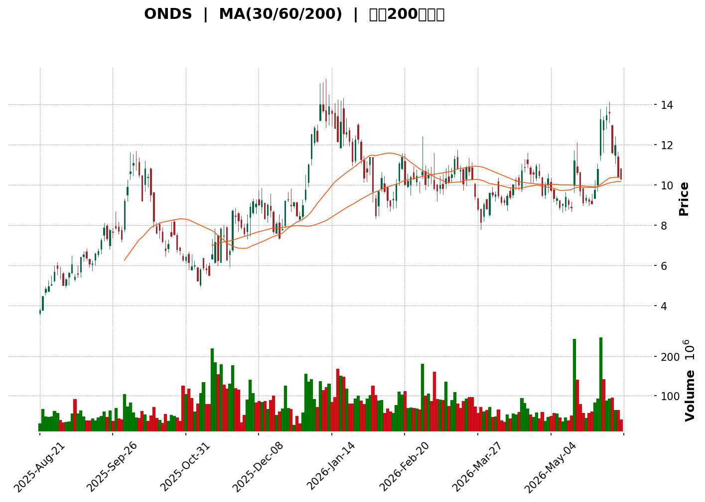
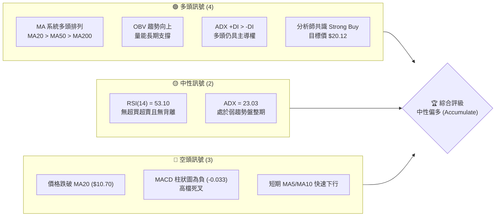
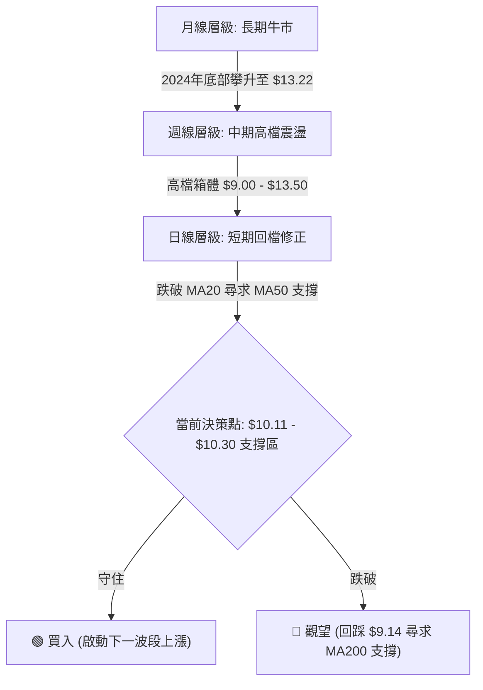
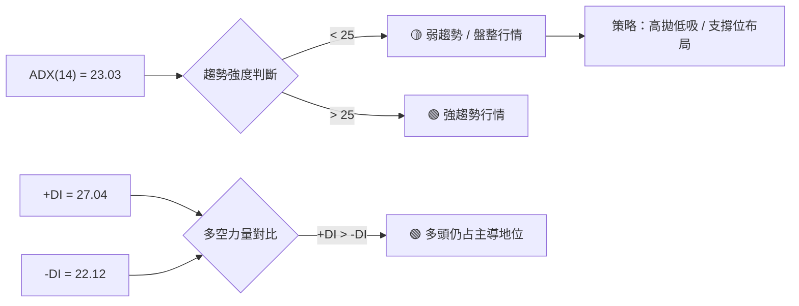
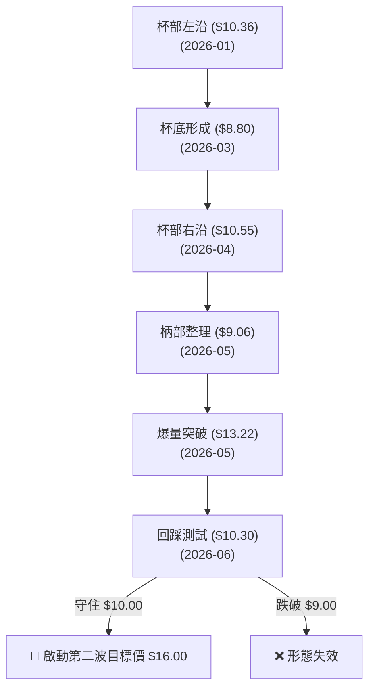

<details>
<summary>📊 靜態圖表 (點擊展開)</summary>

</details>

<html>
<head><meta charset="utf-8" /></head>
<body>
    <div style="height:500px; width:100%;">                        <script>window.PlotlyConfig = {MathJaxConfig: 'local'};</script>
        <script charset="utf-8" src="https://cdn.plot.ly/plotly-3.6.0.min.js" integrity="sha256-QaOVwtVY0T02VaHrr6pnoHLCwayMJp4O5n4YyaE3rJk=" crossorigin="anonymous"></script>                <div id="candlestick-chart" class="plotly-graph-div" style="height:100%; width:100%;"></div>            <script>                window.PLOTLYENV=window.PLOTLYENV || {};                                if (document.getElementById("candlestick-chart")) {                    Plotly.newPlot(                        "candlestick-chart",                        [{"close":{"dtype":"f8","bdata":"AAAAYGZmDkAAAACAwvURQAAAAGBmZhNAAAAAoEfhE0AAAAAgrkcUQAAAAMDMzBZAAAAA4KNwF0AAAABACtcVQAAAAGC4HhRAAAAAgOtRFUAAAADAHoUWQAAAAKBwPRhAAAAAwMzMFUAAAACgcD0WQAAAAIAUrhlAAAAAoHA9GkAAAADAHoUZQAAAAAApXBhAAAAAYGZmGEAAAABgZmYaQAAAAKBH4RpAAAAAgD0KHUAAAADAHoUfQAAAAGBmZh1AAAAAAAAAH0AAAAAA16MeQAAAAEDheh9AAAAAoEfhHkAAAACgcD0dQAAAACCFayJAAAAAgOvRI0AAAACA61ElQAAAAIAULiZAAAAAwB6FJkAAAABA4fokQAAAAOCjcCJAAAAAYLieJUAAAACA69EkQAAAAMAeBSNAAAAAYGZmIEAAAADgo3AeQAAAAOB6FB9AAAAAYI\u002fCHEAAAACAwvUaQAAAAKBwPRxAAAAAQArXHUAAAABguB4eQAAAAMD1KBtAAAAAAAAAG0AAAADA9SgZQAAAAGCPwhlAAAAAoJmZGEAAAABACtcXQAAAAAAAABhAAAAAAAAAFUAAAACgcD0XQAAAAMAehRdAAAAAQDMzF0AAAACAPQoWQAAAAKBwPRpAAAAA4FG4HEAAAADAHgUZQAAAAAApXB9AAAAAAAAAHkAAAADgehQZQAAAAOCj8BpAAAAA4KNwIUAAAACgR+EgQAAAAEDheiBAAAAAoJmZH0AAAACA61EeQAAAAADXIyBAAAAAQArXIUAAAACgR2EiQAAAAADXIyJAAAAAgD0KIkAAAACAwnUiQAAAAGBmpiBAAAAAgD0KIkAAAAAAAIAhQAAAAGCPwh5AAAAAgBQuIEAAAABA4XodQAAAAEAzMx9AAAAA4KNwIkAAAACAPYoiQAAAACCF6yFAAAAAYI9CIkAAAACAwvUgQAAAACCF6yBAAAAAQOH6IUAAAADAHoUjQAAAAIA9CiZAAAAAIFwPKUAAAACAFK4pQAAAAAApXChAAAAAwB4FLEAAAACgR2ErQAAAAKBHYSpAAAAAIK7HK0AAAABguB4rQAAAAADXoylAAAAAgOtRKEAAAABgj0IqQAAAAKCZGSlAAAAAoHA9KUAAAABAClcoQAAAAIDrUSZAAAAAwB6FKEAAAACAPYooQAAAAIA9iiZAAAAA4FG4JEAAAAAgrkclQAAAAGCPwiZAAAAAAClcI0AAAACAwvUgQAAAAKBHYSNAAAAAgBSuJEAAAAAAKVwjQAAAAIDCdSJAAAAA4KPwIUAAAABguJ4iQAAAAKCZGSRAAAAAANcjJkAAAAAgrscmQAAAACBcDyRAAAAAoEdhJEAAAADAzMwkQAAAAKCZmSRAAAAAYGbmJEAAAADA9SgkQAAAAEAKVyVAAAAAgD0KJEAAAADAHgUlQAAAAEDh+iRAAAAAwPWoI0AAAADgo3AjQAAAAMAeBSRAAAAAwPWoI0AAAADA9agkQAAAAIDrUSRAAAAAIFwPJUAAAAAgXI8mQAAAAMD1qCVAAAAAAACAJUAAAABguB4kQAAAAMDMzCVAAAAAAClcJUAAAABguJ4kQAAAAKBH4SJAAAAAoJmZIUAAAADAzEwgQAAAAOB6FCJAAAAAYLieIUAAAABAMzMjQAAAAIA9CiNAAAAAIFwPI0AAAABgZuYiQAAAACCuRyJAAAAAYI9CIkAAAADgo\u002fAiQAAAAMDMzCJAAAAAIFwPJEAAAABgZmYkQAAAAAAAACRAAAAAgMJ1JUAAAACgcL0lQAAAAGC4HiZAAAAA4HoUJUAAAACgmRklQAAAAGBm5iVAAAAAgML1JEAAAABA4foiQAAAAOB6FCRAAAAAANejJEAAAACAwnUjQAAAAMD1qCJAAAAAgBSuIkAAAAAgrschQAAAAGC4HiJAAAAAQArXIkAAAADgehQiQAAAAOBRuCFAAAAAIIVrJkAAAACgcD0lQAAAAGBmZiNAAAAAAABAIkAAAADgUbgiQAAAAAApXCJAAAAAYLgeIkAAAACAPYojQAAAAKCZmSVAAAAAAACAKkAAAADgo3AqQAAAACCF6ypAAAAAwPUoK0AAAADgUTgnQAAAAOCj8CdAAAAAACncJEAAAACgmZkkQA=="},"high":{"dtype":"f8","bdata":"AAAAYLgeD0AAAACAPQoSQAAAACCF6xNAAAAAgGgRFUAAAADAHgUWQAAAAIA9ChhAAAAAIIPAGEAAAADAzMwXQAAAAKBFthZAAAAAIFyPFUAAAADgUbgWQAAAAAAAABpAAAAAAClcFkAAAAAAAAAYQAAAAGCPwhlAAAAAoEfhGkAAAADgo3AbQAAAAGBmZhlAAAAAAAAAGUAAAAAgXI8aQAAAAAApXBtAAAAA4KNwHUAAAACgcD0gQAAAAADXIyBAAAAAAClcH0AAAAAgXI8fQAAAACCFayFAAAAAQApXIEAAAADAzMwfQAAAAIAUriJAAAAAIFyPJEAAAABgj0InQAAAAEAKFydAAAAAYGZmJ0AAAAAgrscmQAAAAMAeBSVAAAAAgBRuJkAAAABguB4lQAAAAKBwvSVAAAAAYI9CI0AAAACA61EgQAAAAKBHYSBAAAAAANejH0AAAACAPQodQAAAAEAzMx1AAAAAQApXIEAAAACgR6EgQAAAACBcjx5AAAAAwMzMG0AAAACAwnUaQAAAAAAAABpAAAAAYI\u002fCGkAAAAAgrkcaQAAAAAAAABlAAAAA4FG4F0AAAADgepQXQAAAACBcjxlAAAAAoEdhGEAAAADA9agYQAAAAAApXB1AAAAA4KNwH0AAAAAgXA8eQAAAAIAUrh9AAAAAgOsRIEAAAACgR+EfQAAAAGBmZhtAAAAAoJmZIUAAAABgj8IhQAAAAAApXCFAAAAAwCDwIEAAAAAA1yMgQAAAAKCZGSFAAAAAgMI1IkAAAACAFK4iQAAAAKCZmSJAAAAAAACAI0AAAADgUbgjQAAAAEDhOiJAAAAAwPUoIkAAAABgZiYjQAAAAEDheiFAAAAAANdjIEAAAABguB4hQAAAAGCRrSBAAAAAQOF6IkAAAACA61EjQAAAAIAUriNAAAAAYGZmIkAAAABAClciQAAAAEAKVyFAAAAAoJmZIkAAAAAgXA8lQAAAAGC4HiZAAAAA4HoUKUAAAAAAKdwpQAAAAIA9CipAAAAAANcjLkAAAABAMzMuQAAAACBcjy5AAAAAAAAALUAAAAAAAIArQAAAAADXIyxAAAAAAACALEAAAABgZmYsQAAAAMD1qCxAAAAAwPWoKkAAAABA4bopQAAAACCFqyhAAAAA4KPwKEAAAADA9SgqQAAAACBcjyhAAAAAYGbmJkAAAABgZmYmQAAAAEAK1yZAAAAAgD3KJkAAAAAgXA8jQAAAAMAehSNAAAAAIK5HJUAAAACgR+EkQAAAAEAK1yNAAAAAoMaLIkAAAAAAKVwjQAAAAADXoyRAAAAAQApXJkAAAACAFC4nQAAAAMD1KCdAAAAAANcjJUAAAACAwvUkQAAAAKBH4SVAAAAAIFyPJUAAAAAAKVwkQAAAAEAK1yhAAAAAAAAAJkAAAAAA16MlQAAAAEAK1yVAAAAA4FE4J0AAAAAgXA8kQAAAAGBm5iRAAAAAYLgeJUAAAACAFK4lQAAAAIDC9SVAAAAAoHC9JUAAAADgo\u002fAmQAAAAMAehSdAAAAAgML1JUAAAADA9aglQAAAAOCj8CVAAAAAoHC9JkAAAAAgrkcmQAAAACCuRyRAAAAAoHC9IkAAAAAA16MhQAAAACCuRyJAAAAAQDOzIkAAAABgj0IjQAAAAMDMzCNAAAAAoEdhI0AAAACgcL0kQAAAAIA9CiNAAAAA4FG4IkAAAAAghSsjQAAAAOBRuCNAAAAAIFwPJEAAAAAgrsckQAAAACBcDyVAAAAAYLgeJkAAAADgepQmQAAAAOBROCdAAAAA4KPwJUAAAACAPYolQAAAAGC4HiZAAAAAANcjJkAAAAAAKdwkQAAAAIDrUSRAAAAAYLgeJUAAAABA4bokQAAAAOB6lCNAAAAAIIXrIkAAAAAAAIAiQAAAAIAULiJAAAAAwMxMI0AAAABAM7MiQAAAAAApXCJAAAAAgMJ1J0AAAACgcD0oQAAAAEAKVyVAAAAAYI\u002fCI0AAAADgehQjQAAAAGCPwiJAAAAAoEchI0AAAADAHoUkQAAAAGC4HiZAAAAAIFyPK0AAAACA69EqQAAAAIDr0StAAAAAgOtRLEAAAAAAAAAqQAAAAEAK1yhAAAAAgOtRJ0AAAACAFK4lQA=="},"hovertemplate":"\u003cb\u003e%{x|%Y-%m-%d}\u003c\u002fb\u003e\u003cbr\u003e\u958b: $%{open:.2f}\u003cbr\u003e\u9ad8: $%{high:.2f}\u003cbr\u003e\u4f4e: $%{low:.2f}\u003cbr\u003e\u6536: $%{close:.2f}\u003cextra\u003e\u003c\u002fextra\u003e","low":{"dtype":"f8","bdata":"AAAA4HoUDEAAAABgZmYOQAAAAGC4HhJAAAAAQArXEkAAAACAPQoUQAAAAMDMzBRAAAAAwPUoFkAAAACA61EVQAAAAIA9ChRAAAAAoJmZE0AAAABguB4UQAAAAGBmZhZAAAAAQArXFEAAAACAPYoVQAAAAADXoxVAAAAAwMzMGEAAAAAAAAAZQAAAAIAUrhdAAAAAAAAAF0AAAACAPQoYQAAAAIAUrhlAAAAAgOtRGkAAAAAghescQAAAAAAAAB1AAAAAwPUoG0AAAADgo3AdQAAAAEAzMx9AAAAAIK5HHkAAAADgUbgcQAAAAADXox5AAAAAoEdhIkAAAACAPYokQAAAAGBm5iRAAAAAYA5tJUAAAAAAAMAkQAAAAKBHYSJAAAAAILJdI0AAAABgj8IjQAAAAIDrUSJAAAAAgBSuH0AAAADgUTgeQAAAAIDrUR1AAAAAAACAHEAAAAAAKdwZQAAAAKCZmRpAAAAAYLieHUAAAADgehQeQAAAAADXoxpAAAAA4HoUGkAAAACA69EYQAAAAEDhehhAAAAAYLgeF0AAAADgehQXQAAAAIDrURdAAAAAACncFEAAAADAzMwTQAAAAOB6FBdAAAAAYGZmFkAAAAAghesVQAAAAKBwPRlAAAAAYGZmGEAAAAAghesXQAAAAKCZmRhAAAAAgD0KHUAAAAAAAAAZQAAAAOBRuBdAAAAAgBSuGkAAAAAA1yMgQAAAAKBwvR5AAAAAQDMzH0AAAACgR+EdQAAAACCuRx1AAAAAQArXHUAAAACAPQohQAAAAMD1KCFAAAAA4KPwIUAAAADgUTghQAAAAAApnCBAAAAAoHA9IEAAAACA69EgQAAAAKBwPR5AAAAAAClcHkAAAABguB4dQAAAAIDC9R5AAAAA4KNwH0AAAAAgXE8iQAAAAEAKVyFAAAAAQDOzIUAAAAAAKdwgQAAAACCFayBAAAAAwPWoIEAAAABAClciQAAAAIDr0SNAAAAAQOH6JUAAAAAghesnQAAAAOBROChAAAAAwMxMKkAAAACAFC4rQAAAAMD1qClAAAAAIIXrKUAAAABACtcpQAAAAKCZmSlAAAAAoHA9KEAAAACgmZknQAAAAAAp3CdAAAAAQDOzKEAAAACgR+EnQAAAAGBm5iVAAAAAgBQuJkAAAABguB4oQAAAAADXIyZAAAAAIK5HJEAAAADAzEwkQAAAAMAeBSVAAAAAYI9CIkAAAAAA16MgQAAAAGBm5iBAAAAAQApXI0AAAABAMzMjQAAAAGCPwiFAAAAAYGZmIUAAAAAA16MhQAAAAKBwvSFAAAAAQOH6I0AAAABA4XolQAAAAGBm5iNAAAAA4FG4I0AAAACAwvUiQAAAAIA9iiRAAAAAYGbmI0AAAACgcD0jQAAAAKCZmSRAAAAAwB6FI0AAAAAAKdwjQAAAAGC4HiRAAAAAwB6FI0AAAABgZmYiQAAAAGBmJiNAAAAAAAAAI0AAAACgmZkjQAAAAKCZGSRAAAAA4FE4JEAAAACgcL0kQAAAAADXoyVAAAAAoHA9JEAAAACAwnUjQAAAAIAU7iNAAAAAQDPzJEAAAACAwnUkQAAAAIA9iiJAAAAAwPVoIUAAAABguB4fQAAAAGBmZiBAAAAAIFyPIUAAAAAghesgQAAAAGCPwiJAAAAA4E1iIkAAAACAFK4iQAAAAMAeBSJAAAAAQOH6IUAAAACAwnUhQAAAAKCZmSJAAAAAoHC9IkAAAADAHoUjQAAAAIA9iiNAAAAAgOtRI0AAAAAgrkclQAAAAEAzsyVAAAAAQDMzJEAAAABA4TokQAAAACCFayRAAAAAIIWrJEAAAACA69EiQAAAAGC4niJAAAAAoHA9I0AAAABAClcjQAAAAIDrUSJAAAAAgD0KIkAAAAAgXI8hQAAAAMDMTCFAAAAA4KNwIUAAAACgmZkhQAAAAEAKVyFAAAAAQDMzI0AAAAAAAAAlQAAAACCF6yJAAAAA4KPwIUAAAACgcD0iQAAAAIDC9SFAAAAAYLgeIkAAAAAgsp0iQAAAAAApXCNAAAAA4KNwJkAAAABAMzMnQAAAAKCZmSlAAAAAgBQuKkAAAAAgXA8nQAAAAGC4HiZAAAAAwPWoJEAAAAAAAIAkQA=="},"name":"\u50f9\u683c","open":{"dtype":"f8","bdata":"AAAAYLgeDUAAAABgZmYOQAAAAOBRuBJAAAAAoEfhEkAAAADgehQUQAAAAAAAABVAAAAAAAAAGEAAAABgZuYVQAAAAEDhehZAAAAAANcjFEAAAADAzMwVQAAAAMAehRZAAAAAoHA9FUAAAADgo3AWQAAAAOBRuBZAAAAAwMzMGUAAAABACtcaQAAAACCuRxlAAAAAoHA9GEAAAABguB4ZQAAAAEAzMxpAAAAAIK5HG0AAAAAgXA8eQAAAAIDC9R9AAAAAwB4FHEAAAAAgrsceQAAAAEAK1x9AAAAA4FG4H0AAAAAAAAAfQAAAAEAzMx9AAAAAwB4FI0AAAABguB4lQAAAAAAAACZAAAAAIK6HJkAAAAAgrkcmQAAAAIDC9SRAAAAAIFwPJEAAAABgj8IkQAAAAGBmpiVAAAAAYI9CI0AAAADAzMwfQAAAAGC4HiBAAAAA4FG4HkAAAABgZmYbQAAAAGBmZhtAAAAAgBSuHkAAAABguF4gQAAAAOB6FB5AAAAA4HqUG0AAAACAwvUZQAAAAAAAABlAAAAAwMxMGkAAAABguB4XQAAAACCF6xdAAAAAgBSuF0AAAADA9SgUQAAAAEDhehlAAAAAYGZmF0AAAADgo\u002fAXQAAAACCuRxlAAAAAwPWoGEAAAACAPQoeQAAAAGC4nhhAAAAAACncHUAAAACAFK4fQAAAAKBwPRpAAAAAANcjG0AAAACAwvUgQAAAAOBROCFAAAAAIFyPIEAAAADAHoUfQAAAAOBRuB5AAAAAIK7HIEAAAADAHkUhQAAAAAAp3CFAAAAAQAqXIkAAAABACtchQAAAAOBROCJAAAAAQOH6IEAAAACAwvUhQAAAAAApXCFAAAAAQOF6HkAAAAAgrkcgQAAAAMD1KB9AAAAAgML1H0AAAACgmZkiQAAAACBcDyJAAAAAgML1IUAAAADgJEYiQAAAAKCZmSBAAAAAIIXrIEAAAAAgXI8iQAAAAMAeRSRAAAAAoJmZJkAAAABAMzMoQAAAAGBmZilAAAAAwPVoKkAAAAAAAAAsQAAAACCFaytAAAAAAAAAK0AAAACgR2ErQAAAAADXIytAAAAA4HrUKkAAAACAwrUnQAAAAKCZmStAAAAAwB4FKUAAAAAghWspQAAAAMDMTChAAAAAIIVrJkAAAACAwvUpQAAAACCuRyhAAAAAAACAJkAAAABguJ4lQAAAAMAeBSZAAAAAYI\u002fCJkAAAACAFK4iQAAAAIAU7iFAAAAAACmcI0AAAACAFC4kQAAAAMAexSNAAAAAoHB9IkAAAACAPYoiQAAAAOBReCJAAAAAIIVrJEAAAAAA16MlQAAAAKBHYSZAAAAAACncI0AAAADAHgUkQAAAAGCPQiVAAAAAwMxMJEAAAACAFC4kQAAAAAAAACVAAAAAoEdhJUAAAADgUbgkQAAAAEDh+iRAAAAAAACAJEAAAAAgXA8kQAAAAIAUriNAAAAAoJkZJEAAAAAghSskQAAAAAAp3CRAAAAAoHC9JEAAAACgmRklQAAAAAAAwCZAAAAAYLheJUAAAADgepQlQAAAAOB6lCRAAAAAgOvRJUAAAABgj8IlQAAAAKCZGSRAAAAAQDOzIkAAAABguJ4hQAAAAGBm5iBAAAAAoJmZIkAAAAAgrgchQAAAAGCPQiNAAAAAACncIkAAAABAClckQAAAAOB61CJAAAAAgMJ1IkAAAADAHgUiQAAAAOCjcCNAAAAAwB4FI0AAAAAAAIAkQAAAAGCPwiRAAAAAoJmZI0AAAADAzMwlQAAAAIA9iiZAAAAAYI\u002fCJUAAAABgj0IlQAAAAMBLtyRAAAAAANdjJUAAAABgj8IkQAAAAAAAACNAAAAAAAAAJEAAAADAzEwkQAAAACBcjyNAAAAAAACAIkAAAAAAAIAiQAAAAAAAACJAAAAAQArXIUAAAADgUXgiQAAAAEAK1yFAAAAAQOH6I0AAAACA69ElQAAAAGCPQiVAAAAAYGamI0AAAAAAAIAiQAAAACBcjyJAAAAAIIVrIkAAAAAghasiQAAAAAAAACRAAAAAQDPzJkAAAAAAAIApQAAAAKBwfSpAAAAAoHA9K0AAAAAghespQAAAAIDC9SZAAAAAQArXJkAAAADA9aglQA=="},"x":["2025-08-21T00:00:00-04:00","2025-08-22T00:00:00-04:00","2025-08-25T00:00:00-04:00","2025-08-26T00:00:00-04:00","2025-08-27T00:00:00-04:00","2025-08-28T00:00:00-04:00","2025-08-29T00:00:00-04:00","2025-09-02T00:00:00-04:00","2025-09-03T00:00:00-04:00","2025-09-04T00:00:00-04:00","2025-09-05T00:00:00-04:00","2025-09-08T00:00:00-04:00","2025-09-09T00:00:00-04:00","2025-09-10T00:00:00-04:00","2025-09-11T00:00:00-04:00","2025-09-12T00:00:00-04:00","2025-09-15T00:00:00-04:00","2025-09-16T00:00:00-04:00","2025-09-17T00:00:00-04:00","2025-09-18T00:00:00-04:00","2025-09-19T00:00:00-04:00","2025-09-22T00:00:00-04:00","2025-09-23T00:00:00-04:00","2025-09-24T00:00:00-04:00","2025-09-25T00:00:00-04:00","2025-09-26T00:00:00-04:00","2025-09-29T00:00:00-04:00","2025-09-30T00:00:00-04:00","2025-10-01T00:00:00-04:00","2025-10-02T00:00:00-04:00","2025-10-03T00:00:00-04:00","2025-10-06T00:00:00-04:00","2025-10-07T00:00:00-04:00","2025-10-08T00:00:00-04:00","2025-10-09T00:00:00-04:00","2025-10-10T00:00:00-04:00","2025-10-13T00:00:00-04:00","2025-10-14T00:00:00-04:00","2025-10-15T00:00:00-04:00","2025-10-16T00:00:00-04:00","2025-10-17T00:00:00-04:00","2025-10-20T00:00:00-04:00","2025-10-21T00:00:00-04:00","2025-10-22T00:00:00-04:00","2025-10-23T00:00:00-04:00","2025-10-24T00:00:00-04:00","2025-10-27T00:00:00-04:00","2025-10-28T00:00:00-04:00","2025-10-29T00:00:00-04:00","2025-10-30T00:00:00-04:00","2025-10-31T00:00:00-04:00","2025-11-03T00:00:00-05:00","2025-11-04T00:00:00-05:00","2025-11-05T00:00:00-05:00","2025-11-06T00:00:00-05:00","2025-11-07T00:00:00-05:00","2025-11-10T00:00:00-05:00","2025-11-11T00:00:00-05:00","2025-11-12T00:00:00-05:00","2025-11-13T00:00:00-05:00","2025-11-14T00:00:00-05:00","2025-11-17T00:00:00-05:00","2025-11-18T00:00:00-05:00","2025-11-19T00:00:00-05:00","2025-11-20T00:00:00-05:00","2025-11-21T00:00:00-05:00","2025-11-24T00:00:00-05:00","2025-11-25T00:00:00-05:00","2025-11-26T00:00:00-05:00","2025-11-28T00:00:00-05:00","2025-12-01T00:00:00-05:00","2025-12-02T00:00:00-05:00","2025-12-03T00:00:00-05:00","2025-12-04T00:00:00-05:00","2025-12-05T00:00:00-05:00","2025-12-08T00:00:00-05:00","2025-12-09T00:00:00-05:00","2025-12-10T00:00:00-05:00","2025-12-11T00:00:00-05:00","2025-12-12T00:00:00-05:00","2025-12-15T00:00:00-05:00","2025-12-16T00:00:00-05:00","2025-12-17T00:00:00-05:00","2025-12-18T00:00:00-05:00","2025-12-19T00:00:00-05:00","2025-12-22T00:00:00-05:00","2025-12-23T00:00:00-05:00","2025-12-24T00:00:00-05:00","2025-12-26T00:00:00-05:00","2025-12-29T00:00:00-05:00","2025-12-30T00:00:00-05:00","2025-12-31T00:00:00-05:00","2026-01-02T00:00:00-05:00","2026-01-05T00:00:00-05:00","2026-01-06T00:00:00-05:00","2026-01-07T00:00:00-05:00","2026-01-08T00:00:00-05:00","2026-01-09T00:00:00-05:00","2026-01-12T00:00:00-05:00","2026-01-13T00:00:00-05:00","2026-01-14T00:00:00-05:00","2026-01-15T00:00:00-05:00","2026-01-16T00:00:00-05:00","2026-01-20T00:00:00-05:00","2026-01-21T00:00:00-05:00","2026-01-22T00:00:00-05:00","2026-01-23T00:00:00-05:00","2026-01-26T00:00:00-05:00","2026-01-27T00:00:00-05:00","2026-01-28T00:00:00-05:00","2026-01-29T00:00:00-05:00","2026-01-30T00:00:00-05:00","2026-02-02T00:00:00-05:00","2026-02-03T00:00:00-05:00","2026-02-04T00:00:00-05:00","2026-02-05T00:00:00-05:00","2026-02-06T00:00:00-05:00","2026-02-09T00:00:00-05:00","2026-02-10T00:00:00-05:00","2026-02-11T00:00:00-05:00","2026-02-12T00:00:00-05:00","2026-02-13T00:00:00-05:00","2026-02-17T00:00:00-05:00","2026-02-18T00:00:00-05:00","2026-02-19T00:00:00-05:00","2026-02-20T00:00:00-05:00","2026-02-23T00:00:00-05:00","2026-02-24T00:00:00-05:00","2026-02-25T00:00:00-05:00","2026-02-26T00:00:00-05:00","2026-02-27T00:00:00-05:00","2026-03-02T00:00:00-05:00","2026-03-03T00:00:00-05:00","2026-03-04T00:00:00-05:00","2026-03-05T00:00:00-05:00","2026-03-06T00:00:00-05:00","2026-03-09T00:00:00-04:00","2026-03-10T00:00:00-04:00","2026-03-11T00:00:00-04:00","2026-03-12T00:00:00-04:00","2026-03-13T00:00:00-04:00","2026-03-16T00:00:00-04:00","2026-03-17T00:00:00-04:00","2026-03-18T00:00:00-04:00","2026-03-19T00:00:00-04:00","2026-03-20T00:00:00-04:00","2026-03-23T00:00:00-04:00","2026-03-24T00:00:00-04:00","2026-03-25T00:00:00-04:00","2026-03-26T00:00:00-04:00","2026-03-27T00:00:00-04:00","2026-03-30T00:00:00-04:00","2026-03-31T00:00:00-04:00","2026-04-01T00:00:00-04:00","2026-04-02T00:00:00-04:00","2026-04-06T00:00:00-04:00","2026-04-07T00:00:00-04:00","2026-04-08T00:00:00-04:00","2026-04-09T00:00:00-04:00","2026-04-10T00:00:00-04:00","2026-04-13T00:00:00-04:00","2026-04-14T00:00:00-04:00","2026-04-15T00:00:00-04:00","2026-04-16T00:00:00-04:00","2026-04-17T00:00:00-04:00","2026-04-20T00:00:00-04:00","2026-04-21T00:00:00-04:00","2026-04-22T00:00:00-04:00","2026-04-23T00:00:00-04:00","2026-04-24T00:00:00-04:00","2026-04-27T00:00:00-04:00","2026-04-28T00:00:00-04:00","2026-04-29T00:00:00-04:00","2026-04-30T00:00:00-04:00","2026-05-01T00:00:00-04:00","2026-05-04T00:00:00-04:00","2026-05-05T00:00:00-04:00","2026-05-06T00:00:00-04:00","2026-05-07T00:00:00-04:00","2026-05-08T00:00:00-04:00","2026-05-11T00:00:00-04:00","2026-05-12T00:00:00-04:00","2026-05-13T00:00:00-04:00","2026-05-14T00:00:00-04:00","2026-05-15T00:00:00-04:00","2026-05-18T00:00:00-04:00","2026-05-19T00:00:00-04:00","2026-05-20T00:00:00-04:00","2026-05-21T00:00:00-04:00","2026-05-22T00:00:00-04:00","2026-05-26T00:00:00-04:00","2026-05-27T00:00:00-04:00","2026-05-28T00:00:00-04:00","2026-05-29T00:00:00-04:00","2026-06-01T00:00:00-04:00","2026-06-02T00:00:00-04:00","2026-06-03T00:00:00-04:00","2026-06-04T00:00:00-04:00","2026-06-05T00:00:00-04:00","2026-06-08T00:00:00-04:00"],"type":"candlestick"},{"hovertemplate":"MA30: $%{y:.2f}\u003cextra\u003e\u003c\u002fextra\u003e","line":{"color":"#2196F3","dash":"dash","width":2},"mode":"lines","name":"MA30","x":["2025-08-21T00:00:00-04:00","2025-08-22T00:00:00-04:00","2025-08-25T00:00:00-04:00","2025-08-26T00:00:00-04:00","2025-08-27T00:00:00-04:00","2025-08-28T00:00:00-04:00","2025-08-29T00:00:00-04:00","2025-09-02T00:00:00-04:00","2025-09-03T00:00:00-04:00","2025-09-04T00:00:00-04:00","2025-09-05T00:00:00-04:00","2025-09-08T00:00:00-04:00","2025-09-09T00:00:00-04:00","2025-09-10T00:00:00-04:00","2025-09-11T00:00:00-04:00","2025-09-12T00:00:00-04:00","2025-09-15T00:00:00-04:00","2025-09-16T00:00:00-04:00","2025-09-17T00:00:00-04:00","2025-09-18T00:00:00-04:00","2025-09-19T00:00:00-04:00","2025-09-22T00:00:00-04:00","2025-09-23T00:00:00-04:00","2025-09-24T00:00:00-04:00","2025-09-25T00:00:00-04:00","2025-09-26T00:00:00-04:00","2025-09-29T00:00:00-04:00","2025-09-30T00:00:00-04:00","2025-10-01T00:00:00-04:00","2025-10-02T00:00:00-04:00","2025-10-03T00:00:00-04:00","2025-10-06T00:00:00-04:00","2025-10-07T00:00:00-04:00","2025-10-08T00:00:00-04:00","2025-10-09T00:00:00-04:00","2025-10-10T00:00:00-04:00","2025-10-13T00:00:00-04:00","2025-10-14T00:00:00-04:00","2025-10-15T00:00:00-04:00","2025-10-16T00:00:00-04:00","2025-10-17T00:00:00-04:00","2025-10-20T00:00:00-04:00","2025-10-21T00:00:00-04:00","2025-10-22T00:00:00-04:00","2025-10-23T00:00:00-04:00","2025-10-24T00:00:00-04:00","2025-10-27T00:00:00-04:00","2025-10-28T00:00:00-04:00","2025-10-29T00:00:00-04:00","2025-10-30T00:00:00-04:00","2025-10-31T00:00:00-04:00","2025-11-03T00:00:00-05:00","2025-11-04T00:00:00-05:00","2025-11-05T00:00:00-05:00","2025-11-06T00:00:00-05:00","2025-11-07T00:00:00-05:00","2025-11-10T00:00:00-05:00","2025-11-11T00:00:00-05:00","2025-11-12T00:00:00-05:00","2025-11-13T00:00:00-05:00","2025-11-14T00:00:00-05:00","2025-11-17T00:00:00-05:00","2025-11-18T00:00:00-05:00","2025-11-19T00:00:00-05:00","2025-11-20T00:00:00-05:00","2025-11-21T00:00:00-05:00","2025-11-24T00:00:00-05:00","2025-11-25T00:00:00-05:00","2025-11-26T00:00:00-05:00","2025-11-28T00:00:00-05:00","2025-12-01T00:00:00-05:00","2025-12-02T00:00:00-05:00","2025-12-03T00:00:00-05:00","2025-12-04T00:00:00-05:00","2025-12-05T00:00:00-05:00","2025-12-08T00:00:00-05:00","2025-12-09T00:00:00-05:00","2025-12-10T00:00:00-05:00","2025-12-11T00:00:00-05:00","2025-12-12T00:00:00-05:00","2025-12-15T00:00:00-05:00","2025-12-16T00:00:00-05:00","2025-12-17T00:00:00-05:00","2025-12-18T00:00:00-05:00","2025-12-19T00:00:00-05:00","2025-12-22T00:00:00-05:00","2025-12-23T00:00:00-05:00","2025-12-24T00:00:00-05:00","2025-12-26T00:00:00-05:00","2025-12-29T00:00:00-05:00","2025-12-30T00:00:00-05:00","2025-12-31T00:00:00-05:00","2026-01-02T00:00:00-05:00","2026-01-05T00:00:00-05:00","2026-01-06T00:00:00-05:00","2026-01-07T00:00:00-05:00","2026-01-08T00:00:00-05:00","2026-01-09T00:00:00-05:00","2026-01-12T00:00:00-05:00","2026-01-13T00:00:00-05:00","2026-01-14T00:00:00-05:00","2026-01-15T00:00:00-05:00","2026-01-16T00:00:00-05:00","2026-01-20T00:00:00-05:00","2026-01-21T00:00:00-05:00","2026-01-22T00:00:00-05:00","2026-01-23T00:00:00-05:00","2026-01-26T00:00:00-05:00","2026-01-27T00:00:00-05:00","2026-01-28T00:00:00-05:00","2026-01-29T00:00:00-05:00","2026-01-30T00:00:00-05:00","2026-02-02T00:00:00-05:00","2026-02-03T00:00:00-05:00","2026-02-04T00:00:00-05:00","2026-02-05T00:00:00-05:00","2026-02-06T00:00:00-05:00","2026-02-09T00:00:00-05:00","2026-02-10T00:00:00-05:00","2026-02-11T00:00:00-05:00","2026-02-12T00:00:00-05:00","2026-02-13T00:00:00-05:00","2026-02-17T00:00:00-05:00","2026-02-18T00:00:00-05:00","2026-02-19T00:00:00-05:00","2026-02-20T00:00:00-05:00","2026-02-23T00:00:00-05:00","2026-02-24T00:00:00-05:00","2026-02-25T00:00:00-05:00","2026-02-26T00:00:00-05:00","2026-02-27T00:00:00-05:00","2026-03-02T00:00:00-05:00","2026-03-03T00:00:00-05:00","2026-03-04T00:00:00-05:00","2026-03-05T00:00:00-05:00","2026-03-06T00:00:00-05:00","2026-03-09T00:00:00-04:00","2026-03-10T00:00:00-04:00","2026-03-11T00:00:00-04:00","2026-03-12T00:00:00-04:00","2026-03-13T00:00:00-04:00","2026-03-16T00:00:00-04:00","2026-03-17T00:00:00-04:00","2026-03-18T00:00:00-04:00","2026-03-19T00:00:00-04:00","2026-03-20T00:00:00-04:00","2026-03-23T00:00:00-04:00","2026-03-24T00:00:00-04:00","2026-03-25T00:00:00-04:00","2026-03-26T00:00:00-04:00","2026-03-27T00:00:00-04:00","2026-03-30T00:00:00-04:00","2026-03-31T00:00:00-04:00","2026-04-01T00:00:00-04:00","2026-04-02T00:00:00-04:00","2026-04-06T00:00:00-04:00","2026-04-07T00:00:00-04:00","2026-04-08T00:00:00-04:00","2026-04-09T00:00:00-04:00","2026-04-10T00:00:00-04:00","2026-04-13T00:00:00-04:00","2026-04-14T00:00:00-04:00","2026-04-15T00:00:00-04:00","2026-04-16T00:00:00-04:00","2026-04-17T00:00:00-04:00","2026-04-20T00:00:00-04:00","2026-04-21T00:00:00-04:00","2026-04-22T00:00:00-04:00","2026-04-23T00:00:00-04:00","2026-04-24T00:00:00-04:00","2026-04-27T00:00:00-04:00","2026-04-28T00:00:00-04:00","2026-04-29T00:00:00-04:00","2026-04-30T00:00:00-04:00","2026-05-01T00:00:00-04:00","2026-05-04T00:00:00-04:00","2026-05-05T00:00:00-04:00","2026-05-06T00:00:00-04:00","2026-05-07T00:00:00-04:00","2026-05-08T00:00:00-04:00","2026-05-11T00:00:00-04:00","2026-05-12T00:00:00-04:00","2026-05-13T00:00:00-04:00","2026-05-14T00:00:00-04:00","2026-05-15T00:00:00-04:00","2026-05-18T00:00:00-04:00","2026-05-19T00:00:00-04:00","2026-05-20T00:00:00-04:00","2026-05-21T00:00:00-04:00","2026-05-22T00:00:00-04:00","2026-05-26T00:00:00-04:00","2026-05-27T00:00:00-04:00","2026-05-28T00:00:00-04:00","2026-05-29T00:00:00-04:00","2026-06-01T00:00:00-04:00","2026-06-02T00:00:00-04:00","2026-06-03T00:00:00-04:00","2026-06-04T00:00:00-04:00","2026-06-05T00:00:00-04:00","2026-06-08T00:00:00-04:00"],"y":{"dtype":"f8","bdata":"AAAAAAAA+H8AAAAAAAD4fwAAAAAAAPh\u002fAAAAAAAA+H8AAAAAAAD4fwAAAAAAAPh\u002fAAAAAAAA+H8AAAAAAAD4fwAAAAAAAPh\u002fAAAAAAAA+H8AAAAAAAD4fwAAAAAAAPh\u002fAAAAAAAA+H8AAAAAAAD4fwAAAAAAAPh\u002fAAAAAAAA+H8AAAAAAAD4fwAAAAAAAPh\u002fAAAAAAAA+H8AAAAAAAD4fwAAAAAAAPh\u002fAAAAAAAA+H8AAAAAAAD4fwAAAAAAAPh\u002fAAAAAAAA+H8AAAAAAAD4fwAAAAAAAPh\u002fAAAAAAAA+H8AAAAAAAD4f97d3WXYFRlAREREZGbmGUDNzMysALkaQBEREaH+jRtA3t3dfbFkHEC8u7srsh0dQHd3d2fYlR1Aq6qqKs4+HkDNzMzsw+ceQDMzM8OugB9ARERENKXiH0CrqqpaHRMgQFVVVXVMMCBAq6qqov5NIEAiIiIiImIgQN7d3VUObSBA7+7ufmp8IEBERETsCpAgQM3MzET9myBAmpmZKRWnIECJiIjAyqEgQCIiImoDnSBAAAAAwBGKIEBEREQkTWkgQO\u002fu7uZCUiBAREREPJgnIEBmZmZ2BQggQKuqqgoezB9ARERE1JSKH0ARERExJE0fQDMzMyOw8h5AiYiICIGVHkDv7u6OJf8dQAAAAKA2kB1A3t3dPd8PHUAiIiJS1H8cQO\u002fu7g4CKxxAvLu7W6vjG0C8u7s7baAbQM3MzMwTdRtAzczMXNZqG0B3d3c30GkbQHd3d6cNdBtAAAAAoBqvG0DNzMwMuwIcQCIiIrJWRxxAAAAAMJZ8HEAiIiICnbYcQKuqqgoC6xxAvLu7m304HUCrqqpqdYwdQFVVVRUgtx1AAAAAEFj5HUBERETUeCkeQImIiHjpZh5AzczM3GvuHkDv7u7OhWQfQCIiIkKnzR9A7+7unqgfIEDv7u6+WFIgQBEREfnFciBAvLu7+6mRIEAAAACQe80gQCIiIjLBAyFAmpmZmZlZIUBmZmZeuskhQAAAAPCnJiJAzczMTPCAIkBmZmbmidoiQHd3d8cELyNAVVVVfT+VI0CrqqqCTvsjQLy7u5NfTCRAIiIiWquDJEAiIiJ66cYkQM3MzNRNAiVAAAAAeL4\u002fJUDv7u6G63ElQM3MzNRNoiVAMzMzm5nZJUARERG5rBUmQLy7u\u002fvFUiZAMzMzw4N5JkDNzMycUrEmQO\u002fu7t5r7iZAREREpEX2JkAzMzMTyugmQN7d3X0\u002f9SZAAAAAEOYJJ0AiIiLyYB4nQAAAACCFKydA7+7uvi0rJ0CrqqqqfyMnQLy7u6vxEidAVVVV1Qb6JkAAAACwR+EmQBERETGWvCZAq6qqWmR7JkAAAAAgPkMmQGZmZobrESZA7+7u7jXXJUBERESU0ZslQGZmZhYgdyVAmpmZSZpSJUBVVVVV4yUlQN7d3Q27AiVAvLu7Wx3TJEBVVVUlTakkQImIiLislSRAMzMz4zNsJEBVVVXlF0skQKuqqjomOCRAiYiI+Aw7JEC8u7sr+UUkQO\u002fu7i6WPCRAVVVVFdlOJEBmZmY20GkkQImIiMh2fiRARERERESEJEB3d3fHBI8kQImIiEiakiRAq6qqirOPJEC8u7tr53skQJqZmamqaiRAMzMzkxhEJEAiIiLyiyUkQJqZmbnXHCRAREREJJQRJEB3d3eHXQEkQJqZmWmR7SNA7+7uPgrXI0De3d0docwjQGZmZmb0tiNAZmZmFiC3I0DNzMys1bEjQFVVVdV4qSNA3t3d\u002fdS4I0CrqqpqdcwjQAAAAPBg3iNAmpmZ+X7qI0C8u7srQO4jQLy7u7u7+yNAd3d3R+H6I0BmZmamVNwjQGZmZhbZziNAMzMzY4LHI0B3d3eX4MEjQImIiCgVpyNAvLu7mzaQI0CJiIiI+ncjQKuqqkp+cSNAzczMHBN8I0BVVVWVQ4sjQGZmZiYxiCNAiYiI6CaxI0Crqqpaj8IjQImIiMihxSNAAAAAULi+I0CJiIgYL70jQLy7u9vdvSNAZmZmBqy8I0Dv7u6+ysEjQBEREXGv2SNAZmZm1qMQJEC8u7trLkQkQERERGQ7fyRAvLu7O9+vJEB3d3dXgLwkQBERETEIzCRAiYiImCfKJEBERERU48UkQA=="},"type":"scatter"},{"hovertemplate":"MA60: $%{y:.2f}\u003cextra\u003e\u003c\u002fextra\u003e","line":{"color":"#9C27B0","dash":"dash","width":2},"mode":"lines","name":"MA60","x":["2025-08-21T00:00:00-04:00","2025-08-22T00:00:00-04:00","2025-08-25T00:00:00-04:00","2025-08-26T00:00:00-04:00","2025-08-27T00:00:00-04:00","2025-08-28T00:00:00-04:00","2025-08-29T00:00:00-04:00","2025-09-02T00:00:00-04:00","2025-09-03T00:00:00-04:00","2025-09-04T00:00:00-04:00","2025-09-05T00:00:00-04:00","2025-09-08T00:00:00-04:00","2025-09-09T00:00:00-04:00","2025-09-10T00:00:00-04:00","2025-09-11T00:00:00-04:00","2025-09-12T00:00:00-04:00","2025-09-15T00:00:00-04:00","2025-09-16T00:00:00-04:00","2025-09-17T00:00:00-04:00","2025-09-18T00:00:00-04:00","2025-09-19T00:00:00-04:00","2025-09-22T00:00:00-04:00","2025-09-23T00:00:00-04:00","2025-09-24T00:00:00-04:00","2025-09-25T00:00:00-04:00","2025-09-26T00:00:00-04:00","2025-09-29T00:00:00-04:00","2025-09-30T00:00:00-04:00","2025-10-01T00:00:00-04:00","2025-10-02T00:00:00-04:00","2025-10-03T00:00:00-04:00","2025-10-06T00:00:00-04:00","2025-10-07T00:00:00-04:00","2025-10-08T00:00:00-04:00","2025-10-09T00:00:00-04:00","2025-10-10T00:00:00-04:00","2025-10-13T00:00:00-04:00","2025-10-14T00:00:00-04:00","2025-10-15T00:00:00-04:00","2025-10-16T00:00:00-04:00","2025-10-17T00:00:00-04:00","2025-10-20T00:00:00-04:00","2025-10-21T00:00:00-04:00","2025-10-22T00:00:00-04:00","2025-10-23T00:00:00-04:00","2025-10-24T00:00:00-04:00","2025-10-27T00:00:00-04:00","2025-10-28T00:00:00-04:00","2025-10-29T00:00:00-04:00","2025-10-30T00:00:00-04:00","2025-10-31T00:00:00-04:00","2025-11-03T00:00:00-05:00","2025-11-04T00:00:00-05:00","2025-11-05T00:00:00-05:00","2025-11-06T00:00:00-05:00","2025-11-07T00:00:00-05:00","2025-11-10T00:00:00-05:00","2025-11-11T00:00:00-05:00","2025-11-12T00:00:00-05:00","2025-11-13T00:00:00-05:00","2025-11-14T00:00:00-05:00","2025-11-17T00:00:00-05:00","2025-11-18T00:00:00-05:00","2025-11-19T00:00:00-05:00","2025-11-20T00:00:00-05:00","2025-11-21T00:00:00-05:00","2025-11-24T00:00:00-05:00","2025-11-25T00:00:00-05:00","2025-11-26T00:00:00-05:00","2025-11-28T00:00:00-05:00","2025-12-01T00:00:00-05:00","2025-12-02T00:00:00-05:00","2025-12-03T00:00:00-05:00","2025-12-04T00:00:00-05:00","2025-12-05T00:00:00-05:00","2025-12-08T00:00:00-05:00","2025-12-09T00:00:00-05:00","2025-12-10T00:00:00-05:00","2025-12-11T00:00:00-05:00","2025-12-12T00:00:00-05:00","2025-12-15T00:00:00-05:00","2025-12-16T00:00:00-05:00","2025-12-17T00:00:00-05:00","2025-12-18T00:00:00-05:00","2025-12-19T00:00:00-05:00","2025-12-22T00:00:00-05:00","2025-12-23T00:00:00-05:00","2025-12-24T00:00:00-05:00","2025-12-26T00:00:00-05:00","2025-12-29T00:00:00-05:00","2025-12-30T00:00:00-05:00","2025-12-31T00:00:00-05:00","2026-01-02T00:00:00-05:00","2026-01-05T00:00:00-05:00","2026-01-06T00:00:00-05:00","2026-01-07T00:00:00-05:00","2026-01-08T00:00:00-05:00","2026-01-09T00:00:00-05:00","2026-01-12T00:00:00-05:00","2026-01-13T00:00:00-05:00","2026-01-14T00:00:00-05:00","2026-01-15T00:00:00-05:00","2026-01-16T00:00:00-05:00","2026-01-20T00:00:00-05:00","2026-01-21T00:00:00-05:00","2026-01-22T00:00:00-05:00","2026-01-23T00:00:00-05:00","2026-01-26T00:00:00-05:00","2026-01-27T00:00:00-05:00","2026-01-28T00:00:00-05:00","2026-01-29T00:00:00-05:00","2026-01-30T00:00:00-05:00","2026-02-02T00:00:00-05:00","2026-02-03T00:00:00-05:00","2026-02-04T00:00:00-05:00","2026-02-05T00:00:00-05:00","2026-02-06T00:00:00-05:00","2026-02-09T00:00:00-05:00","2026-02-10T00:00:00-05:00","2026-02-11T00:00:00-05:00","2026-02-12T00:00:00-05:00","2026-02-13T00:00:00-05:00","2026-02-17T00:00:00-05:00","2026-02-18T00:00:00-05:00","2026-02-19T00:00:00-05:00","2026-02-20T00:00:00-05:00","2026-02-23T00:00:00-05:00","2026-02-24T00:00:00-05:00","2026-02-25T00:00:00-05:00","2026-02-26T00:00:00-05:00","2026-02-27T00:00:00-05:00","2026-03-02T00:00:00-05:00","2026-03-03T00:00:00-05:00","2026-03-04T00:00:00-05:00","2026-03-05T00:00:00-05:00","2026-03-06T00:00:00-05:00","2026-03-09T00:00:00-04:00","2026-03-10T00:00:00-04:00","2026-03-11T00:00:00-04:00","2026-03-12T00:00:00-04:00","2026-03-13T00:00:00-04:00","2026-03-16T00:00:00-04:00","2026-03-17T00:00:00-04:00","2026-03-18T00:00:00-04:00","2026-03-19T00:00:00-04:00","2026-03-20T00:00:00-04:00","2026-03-23T00:00:00-04:00","2026-03-24T00:00:00-04:00","2026-03-25T00:00:00-04:00","2026-03-26T00:00:00-04:00","2026-03-27T00:00:00-04:00","2026-03-30T00:00:00-04:00","2026-03-31T00:00:00-04:00","2026-04-01T00:00:00-04:00","2026-04-02T00:00:00-04:00","2026-04-06T00:00:00-04:00","2026-04-07T00:00:00-04:00","2026-04-08T00:00:00-04:00","2026-04-09T00:00:00-04:00","2026-04-10T00:00:00-04:00","2026-04-13T00:00:00-04:00","2026-04-14T00:00:00-04:00","2026-04-15T00:00:00-04:00","2026-04-16T00:00:00-04:00","2026-04-17T00:00:00-04:00","2026-04-20T00:00:00-04:00","2026-04-21T00:00:00-04:00","2026-04-22T00:00:00-04:00","2026-04-23T00:00:00-04:00","2026-04-24T00:00:00-04:00","2026-04-27T00:00:00-04:00","2026-04-28T00:00:00-04:00","2026-04-29T00:00:00-04:00","2026-04-30T00:00:00-04:00","2026-05-01T00:00:00-04:00","2026-05-04T00:00:00-04:00","2026-05-05T00:00:00-04:00","2026-05-06T00:00:00-04:00","2026-05-07T00:00:00-04:00","2026-05-08T00:00:00-04:00","2026-05-11T00:00:00-04:00","2026-05-12T00:00:00-04:00","2026-05-13T00:00:00-04:00","2026-05-14T00:00:00-04:00","2026-05-15T00:00:00-04:00","2026-05-18T00:00:00-04:00","2026-05-19T00:00:00-04:00","2026-05-20T00:00:00-04:00","2026-05-21T00:00:00-04:00","2026-05-22T00:00:00-04:00","2026-05-26T00:00:00-04:00","2026-05-27T00:00:00-04:00","2026-05-28T00:00:00-04:00","2026-05-29T00:00:00-04:00","2026-06-01T00:00:00-04:00","2026-06-02T00:00:00-04:00","2026-06-03T00:00:00-04:00","2026-06-04T00:00:00-04:00","2026-06-05T00:00:00-04:00","2026-06-08T00:00:00-04:00"],"y":{"dtype":"f8","bdata":"AAAAAAAA+H8AAAAAAAD4fwAAAAAAAPh\u002fAAAAAAAA+H8AAAAAAAD4fwAAAAAAAPh\u002fAAAAAAAA+H8AAAAAAAD4fwAAAAAAAPh\u002fAAAAAAAA+H8AAAAAAAD4fwAAAAAAAPh\u002fAAAAAAAA+H8AAAAAAAD4fwAAAAAAAPh\u002fAAAAAAAA+H8AAAAAAAD4fwAAAAAAAPh\u002fAAAAAAAA+H8AAAAAAAD4fwAAAAAAAPh\u002fAAAAAAAA+H8AAAAAAAD4fwAAAAAAAPh\u002fAAAAAAAA+H8AAAAAAAD4fwAAAAAAAPh\u002fAAAAAAAA+H8AAAAAAAD4fwAAAAAAAPh\u002fAAAAAAAA+H8AAAAAAAD4fwAAAAAAAPh\u002fAAAAAAAA+H8AAAAAAAD4fwAAAAAAAPh\u002fAAAAAAAA+H8AAAAAAAD4fwAAAAAAAPh\u002fAAAAAAAA+H8AAAAAAAD4fwAAAAAAAPh\u002fAAAAAAAA+H8AAAAAAAD4fwAAAAAAAPh\u002fAAAAAAAA+H8AAAAAAAD4fwAAAAAAAPh\u002fAAAAAAAA+H8AAAAAAAD4fwAAAAAAAPh\u002fAAAAAAAA+H8AAAAAAAD4fwAAAAAAAPh\u002fAAAAAAAA+H8AAAAAAAD4fwAAAAAAAPh\u002fAAAAAAAA+H8AAAAAAAD4f4mIiEREBBxAZmZmtvM9HEDe3d0dE1wcQImIiKAajxxA3t3dXUi6HEDv7u4+w84cQDMzMztt4BxAMzMzwzwRHUBERESUGEQdQAAAAEjheh1AiYiIyL2mHUBmZmZ2BcgdQBEREUlT6h1Aq6qq8oslHkCJiIiof2MeQO\u002fu7q65kB5A7+7ulrW6HkBVVVVtWeseQCIiIkp+ER9Ad3d391NDH0De3d11BWgfQM3MzHSTeB9AAAAAyL2GH0BmZmaOCX4fQDMzM6O3hR9Aq6qqKs6eH0De3d1dSLofQGZmZqbizB9AERERCfPkH0B3d3fX6vgfQKuqqgoe7B9AAAAAgGrcH0B3d3dXDs0fQCIiIoLcyx9AiYiIOInhH0C8u7tD0gQgQLy7u3sUHiBAVVVV\u002fWI5IEAiIiJCYFUgQO\u002fu7lbHdCBA3t3dVVWlIEAzMzNPG9ggQLy7uzMzAyFAERERVZwtIUBERESAI2QhQO\u002fu7pb8kiFAAAAAyAS\u002fIUAAAAAEneYhQBEREW3nCyJAiYiINOw6IkAzMzO3820iQDMzMwMrlyJAmpmZ5Re7IkB3d3eDB+MiQJqZmU3wECNAVVVVyb02I0BVVVV9hk0jQHd3d48JbiNAd3d3V8eUI0CJiIjYXLgjQImIiIwlzyNAVVVV3WveI0BVVVWdffgjQO\u002fu7m5ZCyRAd3d3N9ApJEAzMzMHgVUkQImIiBCfcSRAvLu7Uyp+JEAzMzMD5I4kQO\u002fu7iZ4oCRAIiIitjq2JEB3d3cLkMskQBEREdW\u002f4SRA3t3d0SLrJEC8u7tnZvYkQFVVVXGEAiVA3t3d6W0JJUAiIiJWnA0lQKuqqkb9GyVAMzMzv+YiJUAzMzNPYjAlQDMzMxt2RSVA3t3dXUhaJUBERETkpXslQO\u002fu7gaBlSVAzczMXI+iJUDNzMwkTaklQDMzMyPbuSVAIiIiKhXHJUDNzMzcstYlQERERLQP3yVAzczMpHDdJUAzMzOLs88lQKuqqirOviVAREREtA+fJUARERHRaYMlQFVVVfW2bCVAd3d3P3xGJUC8u7vTTSIlQAAAAHi+\u002fyRA7+7uFiDXJEARERFZObQkQGZmZj4KlyRAAAAAMN2EJEARERGB3GskQJqZmfEZViRAzczMLPlFJEAAAABI4TokQERERNQGOiRAZmZmblkrJECJiIgIrBwkQDMzM\u002fvwGSRAAAAAIPcaJEARERHpJhEkQKuqqqK3BSRAREREvC0LJEDv7u5m2BUkQImIiPjFEiRAAAAAcD0KJEAAAACofwMkQJqZmUkMAiRAvLu7U+MFJECJiIiAlQMkQAAAAOht+SNA3t3dvZ\u002f6I0BmZmamDfQjQBEREcE88SNAIiIiOiboI0AAAABQRt8jQKuqqqK31SNAq6qqItvJI0BmZmbuNccjQLy7u+tRyCNAZmZm9uHjI0BEREQMAvsjQM3MzBxaFCRAzczMHFo0JEARERHhekQkQImIiJA0VSRAERERSVNaJEAAAADAEVokQA=="},"type":"scatter"},{"hovertemplate":"MA200: $%{y:.2f}\u003cextra\u003e\u003c\u002fextra\u003e","line":{"color":"#FF6F00","dash":"solid","width":2},"mode":"lines","name":"MA200","x":["2025-08-21T00:00:00-04:00","2025-08-22T00:00:00-04:00","2025-08-25T00:00:00-04:00","2025-08-26T00:00:00-04:00","2025-08-27T00:00:00-04:00","2025-08-28T00:00:00-04:00","2025-08-29T00:00:00-04:00","2025-09-02T00:00:00-04:00","2025-09-03T00:00:00-04:00","2025-09-04T00:00:00-04:00","2025-09-05T00:00:00-04:00","2025-09-08T00:00:00-04:00","2025-09-09T00:00:00-04:00","2025-09-10T00:00:00-04:00","2025-09-11T00:00:00-04:00","2025-09-12T00:00:00-04:00","2025-09-15T00:00:00-04:00","2025-09-16T00:00:00-04:00","2025-09-17T00:00:00-04:00","2025-09-18T00:00:00-04:00","2025-09-19T00:00:00-04:00","2025-09-22T00:00:00-04:00","2025-09-23T00:00:00-04:00","2025-09-24T00:00:00-04:00","2025-09-25T00:00:00-04:00","2025-09-26T00:00:00-04:00","2025-09-29T00:00:00-04:00","2025-09-30T00:00:00-04:00","2025-10-01T00:00:00-04:00","2025-10-02T00:00:00-04:00","2025-10-03T00:00:00-04:00","2025-10-06T00:00:00-04:00","2025-10-07T00:00:00-04:00","2025-10-08T00:00:00-04:00","2025-10-09T00:00:00-04:00","2025-10-10T00:00:00-04:00","2025-10-13T00:00:00-04:00","2025-10-14T00:00:00-04:00","2025-10-15T00:00:00-04:00","2025-10-16T00:00:00-04:00","2025-10-17T00:00:00-04:00","2025-10-20T00:00:00-04:00","2025-10-21T00:00:00-04:00","2025-10-22T00:00:00-04:00","2025-10-23T00:00:00-04:00","2025-10-24T00:00:00-04:00","2025-10-27T00:00:00-04:00","2025-10-28T00:00:00-04:00","2025-10-29T00:00:00-04:00","2025-10-30T00:00:00-04:00","2025-10-31T00:00:00-04:00","2025-11-03T00:00:00-05:00","2025-11-04T00:00:00-05:00","2025-11-05T00:00:00-05:00","2025-11-06T00:00:00-05:00","2025-11-07T00:00:00-05:00","2025-11-10T00:00:00-05:00","2025-11-11T00:00:00-05:00","2025-11-12T00:00:00-05:00","2025-11-13T00:00:00-05:00","2025-11-14T00:00:00-05:00","2025-11-17T00:00:00-05:00","2025-11-18T00:00:00-05:00","2025-11-19T00:00:00-05:00","2025-11-20T00:00:00-05:00","2025-11-21T00:00:00-05:00","2025-11-24T00:00:00-05:00","2025-11-25T00:00:00-05:00","2025-11-26T00:00:00-05:00","2025-11-28T00:00:00-05:00","2025-12-01T00:00:00-05:00","2025-12-02T00:00:00-05:00","2025-12-03T00:00:00-05:00","2025-12-04T00:00:00-05:00","2025-12-05T00:00:00-05:00","2025-12-08T00:00:00-05:00","2025-12-09T00:00:00-05:00","2025-12-10T00:00:00-05:00","2025-12-11T00:00:00-05:00","2025-12-12T00:00:00-05:00","2025-12-15T00:00:00-05:00","2025-12-16T00:00:00-05:00","2025-12-17T00:00:00-05:00","2025-12-18T00:00:00-05:00","2025-12-19T00:00:00-05:00","2025-12-22T00:00:00-05:00","2025-12-23T00:00:00-05:00","2025-12-24T00:00:00-05:00","2025-12-26T00:00:00-05:00","2025-12-29T00:00:00-05:00","2025-12-30T00:00:00-05:00","2025-12-31T00:00:00-05:00","2026-01-02T00:00:00-05:00","2026-01-05T00:00:00-05:00","2026-01-06T00:00:00-05:00","2026-01-07T00:00:00-05:00","2026-01-08T00:00:00-05:00","2026-01-09T00:00:00-05:00","2026-01-12T00:00:00-05:00","2026-01-13T00:00:00-05:00","2026-01-14T00:00:00-05:00","2026-01-15T00:00:00-05:00","2026-01-16T00:00:00-05:00","2026-01-20T00:00:00-05:00","2026-01-21T00:00:00-05:00","2026-01-22T00:00:00-05:00","2026-01-23T00:00:00-05:00","2026-01-26T00:00:00-05:00","2026-01-27T00:00:00-05:00","2026-01-28T00:00:00-05:00","2026-01-29T00:00:00-05:00","2026-01-30T00:00:00-05:00","2026-02-02T00:00:00-05:00","2026-02-03T00:00:00-05:00","2026-02-04T00:00:00-05:00","2026-02-05T00:00:00-05:00","2026-02-06T00:00:00-05:00","2026-02-09T00:00:00-05:00","2026-02-10T00:00:00-05:00","2026-02-11T00:00:00-05:00","2026-02-12T00:00:00-05:00","2026-02-13T00:00:00-05:00","2026-02-17T00:00:00-05:00","2026-02-18T00:00:00-05:00","2026-02-19T00:00:00-05:00","2026-02-20T00:00:00-05:00","2026-02-23T00:00:00-05:00","2026-02-24T00:00:00-05:00","2026-02-25T00:00:00-05:00","2026-02-26T00:00:00-05:00","2026-02-27T00:00:00-05:00","2026-03-02T00:00:00-05:00","2026-03-03T00:00:00-05:00","2026-03-04T00:00:00-05:00","2026-03-05T00:00:00-05:00","2026-03-06T00:00:00-05:00","2026-03-09T00:00:00-04:00","2026-03-10T00:00:00-04:00","2026-03-11T00:00:00-04:00","2026-03-12T00:00:00-04:00","2026-03-13T00:00:00-04:00","2026-03-16T00:00:00-04:00","2026-03-17T00:00:00-04:00","2026-03-18T00:00:00-04:00","2026-03-19T00:00:00-04:00","2026-03-20T00:00:00-04:00","2026-03-23T00:00:00-04:00","2026-03-24T00:00:00-04:00","2026-03-25T00:00:00-04:00","2026-03-26T00:00:00-04:00","2026-03-27T00:00:00-04:00","2026-03-30T00:00:00-04:00","2026-03-31T00:00:00-04:00","2026-04-01T00:00:00-04:00","2026-04-02T00:00:00-04:00","2026-04-06T00:00:00-04:00","2026-04-07T00:00:00-04:00","2026-04-08T00:00:00-04:00","2026-04-09T00:00:00-04:00","2026-04-10T00:00:00-04:00","2026-04-13T00:00:00-04:00","2026-04-14T00:00:00-04:00","2026-04-15T00:00:00-04:00","2026-04-16T00:00:00-04:00","2026-04-17T00:00:00-04:00","2026-04-20T00:00:00-04:00","2026-04-21T00:00:00-04:00","2026-04-22T00:00:00-04:00","2026-04-23T00:00:00-04:00","2026-04-24T00:00:00-04:00","2026-04-27T00:00:00-04:00","2026-04-28T00:00:00-04:00","2026-04-29T00:00:00-04:00","2026-04-30T00:00:00-04:00","2026-05-01T00:00:00-04:00","2026-05-04T00:00:00-04:00","2026-05-05T00:00:00-04:00","2026-05-06T00:00:00-04:00","2026-05-07T00:00:00-04:00","2026-05-08T00:00:00-04:00","2026-05-11T00:00:00-04:00","2026-05-12T00:00:00-04:00","2026-05-13T00:00:00-04:00","2026-05-14T00:00:00-04:00","2026-05-15T00:00:00-04:00","2026-05-18T00:00:00-04:00","2026-05-19T00:00:00-04:00","2026-05-20T00:00:00-04:00","2026-05-21T00:00:00-04:00","2026-05-22T00:00:00-04:00","2026-05-26T00:00:00-04:00","2026-05-27T00:00:00-04:00","2026-05-28T00:00:00-04:00","2026-05-29T00:00:00-04:00","2026-06-01T00:00:00-04:00","2026-06-02T00:00:00-04:00","2026-06-03T00:00:00-04:00","2026-06-04T00:00:00-04:00","2026-06-05T00:00:00-04:00","2026-06-08T00:00:00-04:00"],"y":{"dtype":"f8","bdata":"AAAAAAAA+H8AAAAAAAD4fwAAAAAAAPh\u002fAAAAAAAA+H8AAAAAAAD4fwAAAAAAAPh\u002fAAAAAAAA+H8AAAAAAAD4fwAAAAAAAPh\u002fAAAAAAAA+H8AAAAAAAD4fwAAAAAAAPh\u002fAAAAAAAA+H8AAAAAAAD4fwAAAAAAAPh\u002fAAAAAAAA+H8AAAAAAAD4fwAAAAAAAPh\u002fAAAAAAAA+H8AAAAAAAD4fwAAAAAAAPh\u002fAAAAAAAA+H8AAAAAAAD4fwAAAAAAAPh\u002fAAAAAAAA+H8AAAAAAAD4fwAAAAAAAPh\u002fAAAAAAAA+H8AAAAAAAD4fwAAAAAAAPh\u002fAAAAAAAA+H8AAAAAAAD4fwAAAAAAAPh\u002fAAAAAAAA+H8AAAAAAAD4fwAAAAAAAPh\u002fAAAAAAAA+H8AAAAAAAD4fwAAAAAAAPh\u002fAAAAAAAA+H8AAAAAAAD4fwAAAAAAAPh\u002fAAAAAAAA+H8AAAAAAAD4fwAAAAAAAPh\u002fAAAAAAAA+H8AAAAAAAD4fwAAAAAAAPh\u002fAAAAAAAA+H8AAAAAAAD4fwAAAAAAAPh\u002fAAAAAAAA+H8AAAAAAAD4fwAAAAAAAPh\u002fAAAAAAAA+H8AAAAAAAD4fwAAAAAAAPh\u002fAAAAAAAA+H8AAAAAAAD4fwAAAAAAAPh\u002fAAAAAAAA+H8AAAAAAAD4fwAAAAAAAPh\u002fAAAAAAAA+H8AAAAAAAD4fwAAAAAAAPh\u002fAAAAAAAA+H8AAAAAAAD4fwAAAAAAAPh\u002fAAAAAAAA+H8AAAAAAAD4fwAAAAAAAPh\u002fAAAAAAAA+H8AAAAAAAD4fwAAAAAAAPh\u002fAAAAAAAA+H8AAAAAAAD4fwAAAAAAAPh\u002fAAAAAAAA+H8AAAAAAAD4fwAAAAAAAPh\u002fAAAAAAAA+H8AAAAAAAD4fwAAAAAAAPh\u002fAAAAAAAA+H8AAAAAAAD4fwAAAAAAAPh\u002fAAAAAAAA+H8AAAAAAAD4fwAAAAAAAPh\u002fAAAAAAAA+H8AAAAAAAD4fwAAAAAAAPh\u002fAAAAAAAA+H8AAAAAAAD4fwAAAAAAAPh\u002fAAAAAAAA+H8AAAAAAAD4fwAAAAAAAPh\u002fAAAAAAAA+H8AAAAAAAD4fwAAAAAAAPh\u002fAAAAAAAA+H8AAAAAAAD4fwAAAAAAAPh\u002fAAAAAAAA+H8AAAAAAAD4fwAAAAAAAPh\u002fAAAAAAAA+H8AAAAAAAD4fwAAAAAAAPh\u002fAAAAAAAA+H8AAAAAAAD4fwAAAAAAAPh\u002fAAAAAAAA+H8AAAAAAAD4fwAAAAAAAPh\u002fAAAAAAAA+H8AAAAAAAD4fwAAAAAAAPh\u002fAAAAAAAA+H8AAAAAAAD4fwAAAAAAAPh\u002fAAAAAAAA+H8AAAAAAAD4fwAAAAAAAPh\u002fAAAAAAAA+H8AAAAAAAD4fwAAAAAAAPh\u002fAAAAAAAA+H8AAAAAAAD4fwAAAAAAAPh\u002fAAAAAAAA+H8AAAAAAAD4fwAAAAAAAPh\u002fAAAAAAAA+H8AAAAAAAD4fwAAAAAAAPh\u002fAAAAAAAA+H8AAAAAAAD4fwAAAAAAAPh\u002fAAAAAAAA+H8AAAAAAAD4fwAAAAAAAPh\u002fAAAAAAAA+H8AAAAAAAD4fwAAAAAAAPh\u002fAAAAAAAA+H8AAAAAAAD4fwAAAAAAAPh\u002fAAAAAAAA+H8AAAAAAAD4fwAAAAAAAPh\u002fAAAAAAAA+H8AAAAAAAD4fwAAAAAAAPh\u002fAAAAAAAA+H8AAAAAAAD4fwAAAAAAAPh\u002fAAAAAAAA+H8AAAAAAAD4fwAAAAAAAPh\u002fAAAAAAAA+H8AAAAAAAD4fwAAAAAAAPh\u002fAAAAAAAA+H8AAAAAAAD4fwAAAAAAAPh\u002fAAAAAAAA+H8AAAAAAAD4fwAAAAAAAPh\u002fAAAAAAAA+H8AAAAAAAD4fwAAAAAAAPh\u002fAAAAAAAA+H8AAAAAAAD4fwAAAAAAAPh\u002fAAAAAAAA+H8AAAAAAAD4fwAAAAAAAPh\u002fAAAAAAAA+H8AAAAAAAD4fwAAAAAAAPh\u002fAAAAAAAA+H8AAAAAAAD4fwAAAAAAAPh\u002fAAAAAAAA+H8AAAAAAAD4fwAAAAAAAPh\u002fAAAAAAAA+H8AAAAAAAD4fwAAAAAAAPh\u002fAAAAAAAA+H8AAAAAAAD4fwAAAAAAAPh\u002fAAAAAAAA+H8AAAAAAAD4fwAAAAAAAPh\u002fAAAAAAAA+H+4HoV+jEkiQA=="},"type":"scatter"}],                        {"template":{"data":{"barpolar":[{"marker":{"line":{"color":"rgb(17,17,17)","width":0.5},"pattern":{"fillmode":"overlay","size":10,"solidity":0.2}},"type":"barpolar"}],"bar":[{"error_x":{"color":"#f2f5fa"},"error_y":{"color":"#f2f5fa"},"marker":{"line":{"color":"rgb(17,17,17)","width":0.5},"pattern":{"fillmode":"overlay","size":10,"solidity":0.2}},"type":"bar"}],"carpet":[{"aaxis":{"endlinecolor":"#A2B1C6","gridcolor":"#506784","linecolor":"#506784","minorgridcolor":"#506784","startlinecolor":"#A2B1C6"},"baxis":{"endlinecolor":"#A2B1C6","gridcolor":"#506784","linecolor":"#506784","minorgridcolor":"#506784","startlinecolor":"#A2B1C6"},"type":"carpet"}],"choropleth":[{"colorbar":{"outlinewidth":0,"ticks":""},"type":"choropleth"}],"contourcarpet":[{"colorbar":{"outlinewidth":0,"ticks":""},"type":"contourcarpet"}],"contour":[{"colorbar":{"outlinewidth":0,"ticks":""},"colorscale":[[0.0,"#0d0887"],[0.1111111111111111,"#46039f"],[0.2222222222222222,"#7201a8"],[0.3333333333333333,"#9c179e"],[0.4444444444444444,"#bd3786"],[0.5555555555555556,"#d8576b"],[0.6666666666666666,"#ed7953"],[0.7777777777777778,"#fb9f3a"],[0.8888888888888888,"#fdca26"],[1.0,"#f0f921"]],"type":"contour"}],"heatmap":[{"colorbar":{"outlinewidth":0,"ticks":""},"colorscale":[[0.0,"#0d0887"],[0.1111111111111111,"#46039f"],[0.2222222222222222,"#7201a8"],[0.3333333333333333,"#9c179e"],[0.4444444444444444,"#bd3786"],[0.5555555555555556,"#d8576b"],[0.6666666666666666,"#ed7953"],[0.7777777777777778,"#fb9f3a"],[0.8888888888888888,"#fdca26"],[1.0,"#f0f921"]],"type":"heatmap"}],"histogram2dcontour":[{"colorbar":{"outlinewidth":0,"ticks":""},"colorscale":[[0.0,"#0d0887"],[0.1111111111111111,"#46039f"],[0.2222222222222222,"#7201a8"],[0.3333333333333333,"#9c179e"],[0.4444444444444444,"#bd3786"],[0.5555555555555556,"#d8576b"],[0.6666666666666666,"#ed7953"],[0.7777777777777778,"#fb9f3a"],[0.8888888888888888,"#fdca26"],[1.0,"#f0f921"]],"type":"histogram2dcontour"}],"histogram2d":[{"colorbar":{"outlinewidth":0,"ticks":""},"colorscale":[[0.0,"#0d0887"],[0.1111111111111111,"#46039f"],[0.2222222222222222,"#7201a8"],[0.3333333333333333,"#9c179e"],[0.4444444444444444,"#bd3786"],[0.5555555555555556,"#d8576b"],[0.6666666666666666,"#ed7953"],[0.7777777777777778,"#fb9f3a"],[0.8888888888888888,"#fdca26"],[1.0,"#f0f921"]],"type":"histogram2d"}],"histogram":[{"marker":{"pattern":{"fillmode":"overlay","size":10,"solidity":0.2}},"type":"histogram"}],"mesh3d":[{"colorbar":{"outlinewidth":0,"ticks":""},"type":"mesh3d"}],"parcoords":[{"line":{"colorbar":{"outlinewidth":0,"ticks":""}},"type":"parcoords"}],"pie":[{"automargin":true,"type":"pie"}],"scatter3d":[{"line":{"colorbar":{"outlinewidth":0,"ticks":""}},"marker":{"colorbar":{"outlinewidth":0,"ticks":""}},"type":"scatter3d"}],"scattercarpet":[{"marker":{"colorbar":{"outlinewidth":0,"ticks":""}},"type":"scattercarpet"}],"scattergeo":[{"marker":{"colorbar":{"outlinewidth":0,"ticks":""}},"type":"scattergeo"}],"scattergl":[{"marker":{"line":{"color":"#283442"}},"type":"scattergl"}],"scattermapbox":[{"marker":{"colorbar":{"outlinewidth":0,"ticks":""}},"type":"scattermapbox"}],"scattermap":[{"marker":{"colorbar":{"outlinewidth":0,"ticks":""}},"type":"scattermap"}],"scatterpolargl":[{"marker":{"colorbar":{"outlinewidth":0,"ticks":""}},"type":"scatterpolargl"}],"scatterpolar":[{"marker":{"colorbar":{"outlinewidth":0,"ticks":""}},"type":"scatterpolar"}],"scatter":[{"marker":{"line":{"color":"#283442"}},"type":"scatter"}],"scatterternary":[{"marker":{"colorbar":{"outlinewidth":0,"ticks":""}},"type":"scatterternary"}],"surface":[{"colorbar":{"outlinewidth":0,"ticks":""},"colorscale":[[0.0,"#0d0887"],[0.1111111111111111,"#46039f"],[0.2222222222222222,"#7201a8"],[0.3333333333333333,"#9c179e"],[0.4444444444444444,"#bd3786"],[0.5555555555555556,"#d8576b"],[0.6666666666666666,"#ed7953"],[0.7777777777777778,"#fb9f3a"],[0.8888888888888888,"#fdca26"],[1.0,"#f0f921"]],"type":"surface"}],"table":[{"cells":{"fill":{"color":"#506784"},"line":{"color":"rgb(17,17,17)"}},"header":{"fill":{"color":"#2a3f5f"},"line":{"color":"rgb(17,17,17)"}},"type":"table"}]},"layout":{"annotationdefaults":{"arrowcolor":"#f2f5fa","arrowhead":0,"arrowwidth":1},"autotypenumbers":"strict","coloraxis":{"colorbar":{"outlinewidth":0,"ticks":""}},"colorscale":{"diverging":[[0,"#8e0152"],[0.1,"#c51b7d"],[0.2,"#de77ae"],[0.3,"#f1b6da"],[0.4,"#fde0ef"],[0.5,"#f7f7f7"],[0.6,"#e6f5d0"],[0.7,"#b8e186"],[0.8,"#7fbc41"],[0.9,"#4d9221"],[1,"#276419"]],"sequential":[[0.0,"#0d0887"],[0.1111111111111111,"#46039f"],[0.2222222222222222,"#7201a8"],[0.3333333333333333,"#9c179e"],[0.4444444444444444,"#bd3786"],[0.5555555555555556,"#d8576b"],[0.6666666666666666,"#ed7953"],[0.7777777777777778,"#fb9f3a"],[0.8888888888888888,"#fdca26"],[1.0,"#f0f921"]],"sequentialminus":[[0.0,"#0d0887"],[0.1111111111111111,"#46039f"],[0.2222222222222222,"#7201a8"],[0.3333333333333333,"#9c179e"],[0.4444444444444444,"#bd3786"],[0.5555555555555556,"#d8576b"],[0.6666666666666666,"#ed7953"],[0.7777777777777778,"#fb9f3a"],[0.8888888888888888,"#fdca26"],[1.0,"#f0f921"]]},"colorway":["#636efa","#EF553B","#00cc96","#ab63fa","#FFA15A","#19d3f3","#FF6692","#B6E880","#FF97FF","#FECB52"],"font":{"color":"#f2f5fa"},"geo":{"bgcolor":"rgb(17,17,17)","lakecolor":"rgb(17,17,17)","landcolor":"rgb(17,17,17)","showlakes":true,"showland":true,"subunitcolor":"#506784"},"hoverlabel":{"align":"left"},"hovermode":"closest","mapbox":{"style":"dark"},"paper_bgcolor":"rgb(17,17,17)","plot_bgcolor":"rgb(17,17,17)","polar":{"angularaxis":{"gridcolor":"#506784","linecolor":"#506784","ticks":""},"bgcolor":"rgb(17,17,17)","radialaxis":{"gridcolor":"#506784","linecolor":"#506784","ticks":""}},"scene":{"xaxis":{"backgroundcolor":"rgb(17,17,17)","gridcolor":"#506784","gridwidth":2,"linecolor":"#506784","showbackground":true,"ticks":"","zerolinecolor":"#C8D4E3"},"yaxis":{"backgroundcolor":"rgb(17,17,17)","gridcolor":"#506784","gridwidth":2,"linecolor":"#506784","showbackground":true,"ticks":"","zerolinecolor":"#C8D4E3"},"zaxis":{"backgroundcolor":"rgb(17,17,17)","gridcolor":"#506784","gridwidth":2,"linecolor":"#506784","showbackground":true,"ticks":"","zerolinecolor":"#C8D4E3"}},"shapedefaults":{"line":{"color":"#f2f5fa"}},"sliderdefaults":{"bgcolor":"#C8D4E3","bordercolor":"rgb(17,17,17)","borderwidth":1,"tickwidth":0},"ternary":{"aaxis":{"gridcolor":"#506784","linecolor":"#506784","ticks":""},"baxis":{"gridcolor":"#506784","linecolor":"#506784","ticks":""},"bgcolor":"rgb(17,17,17)","caxis":{"gridcolor":"#506784","linecolor":"#506784","ticks":""}},"title":{"x":0.05},"updatemenudefaults":{"bgcolor":"#506784","borderwidth":0},"xaxis":{"automargin":true,"gridcolor":"#283442","linecolor":"#506784","ticks":"","title":{"standoff":15},"zerolinecolor":"#283442","zerolinewidth":2},"yaxis":{"automargin":true,"gridcolor":"#283442","linecolor":"#506784","ticks":"","title":{"standoff":15},"zerolinecolor":"#283442","zerolinewidth":2}}},"xaxis":{"rangeslider":{"visible":false},"title":{"text":"\u65e5\u671f"}},"font":{"size":11},"title":{"text":"ONDS  |  MA(30\u002f60\u002f200)  |  \u6700\u8fd1200\u4ea4\u6613\u65e5"},"yaxis":{"title":{"text":"\u80a1\u50f9 (USD)"}},"hovermode":"x unified","height":500},                        {"responsive": true}                    )                };            </script>        </div>
</body>
</html>

# ONDS 技術分析報告

> **報告日期**：2026-06-08 ｜ **語言**：繁體中文 ｜ **數據來源**：Yahoo Finance ｜ **當前價格**：$10.30

---

## 目錄

| 章節 | 內容 |
|------|------|
| [1. 技術面概覽](#1-技術面概覽) | 訊號儀表板、核心指標、評分卡 |
| [2. 趨勢分析](#2-趨勢分析) | 多時框趨勢、長中短期走勢 |
| [3. 圖表形態分析](#3-圖表形態分析) | 形態識別、K線組合、目標價 |
| [4. 支撐與阻力](#4-支撐與阻力) | 關鍵價位、斐波那契回調 |
| [5. 技術指標深度解讀](#5-技術指標深度解讀) | MA/RSI/MACD/布林/成交量 |
| [6. 動能與波動率](#6-動能與波動率) | 動能評估、ATR、Beta |
| [7. 多時框架總結](#7-多時框架總結) | 時框架評分矩陣 |
| [8. 交易策略建議](#8-交易策略建議) | 多空策略、風險報酬比 |
| [9. 風險提示與監控](#9-風險提示與監控) | 監控指標、風險場景 |

---

## 1. 技術面概覽

### 🎯 技術訊號儀表板



### 📊 核心指標速覽表

| 指標類別 | 指標名稱 | 當前數值 | 訊號 | 解讀 |
|----------|----------|----------|------|------|
| **價格** | 當前價格 | $10.30 | 🟡 中性 | 52週高低點區間之 64.2% 位置，短期回檔整理 |
| **均線** | MA20 | $10.70 | 🔴 看空 | 價格跌破20日均線，短期多頭防線失守 |
| **均線** | MA50 | $10.11 | 🟢 看多 | 價格守在50日均線上方，中期支撐強勁 |
| **均線** | MA200 | $9.14 | 🟢 看多 | 長期牛熊分界線穩定向上，長期趨勢偏多 |
| **動能** | RSI(14) | 53.10 | 🟡 中性 | 處於50多空分水嶺附近，動能暫時熄火 |
| **動能** | MACD | 0.448 | 🔴 看空 | MACD (0.448) < Signal (0.480)，柱狀圖為負，面臨修正 |
| **波動** | ATR(14) | $1.24 | 🔴 高波動 | 佔股價 12.08%，每日波動劇烈，需寬幅止損 |
| **量能** | OBV | OBV > MA | 🟢 看多 | 量能指標維持在均線上方，籌碼並未出現恐慌性派發 |

### 🏆 技術評分卡

```
╔══════════════════════════════════════════════════════════════╗
║                技術評分卡 — ONDS (2026-06-08)                ║
╠══════════════════════════════════════════════════════════════╣
║ 趨勢強度      ████████████░░░░░░░░  60/100  🟡 中性          ║
║ 動能指標      ██████████░░░░░░░░░░  50/100  🟡 中性          ║
║ 支撐穩定度    ████████████████░░░░  80/100  🟢 強勁          ║
║ 成交量配合    ██████████████░░░░░░  70/100  🟢 良好          ║
║ 形態完整度    ██████████████░░░░░░  70/100  🟢 良好          ║
║ 均線排列      ██████████████████░░  90/100  🟢 強多          ║
╠══════════════════════════════════════════════════════════════╣
║ 綜合評分      ██████████████░░░░░░  70/100  ★ ★ ★ ☆ ☆      ║
║ 綜合評級      ⚖️ 中性偏多 (Bullish Retracement / 逢低布局)   ║
╚══════════════════════════════════════════════════════════════╝
```

---

## 2. 趨勢分析

### 🌐 多時框趨勢分析



### 📈 長期趨勢 — 12個月走勢圖（Unicode）

```
ONDS 月線走勢圖（過去12個月）
價格軸 ($)
$14.00 ┤                                                  ● (2026-05: $13.22)
$12.00 ┤                                                 / \
$10.00 ┤                                   ●━━━━━●━━━━━●   ● (2026-06: $10.30)
$ 8.00 ┤                     ●━━━━━●━━━━━/ \   /
$ 6.00 ┤              ●━━━━━/               \ /
$ 4.00 ┤             /                       ● (2025-10: $6.44)
$ 2.00 ┤       ●━━━━/
$ 1.00 ┤ ●━━━━/
       └──────────────────────────────────────────────────────────────────────
        07/25 08/25 09/25 10/25 11/25 12/25 01/26 02/26 03/26 04/26 05/26 06/26
```

**走勢特徵分析表格**：

| 階段 | 時間區間 | 價格區間 | 漲跌幅 | 走勢特徵與量能配合度 |
|------|----------|----------|--------|----------------------|
| **第一階段：底部啟動** | 2024-06 至 2025-05 | $0.58 - $1.22 | +110.3% | 長期底部築底，籌碼緩慢換手，量能溫和放大。 |
| **第二階段：主升浪爆發** | 2025-06 至 2025-12 | $1.92 - $9.76 | +408.3% | 伴隨重大利多與業績爆發，呈現爆量主升段，OBV 陡峭上升。 |
| **第三階段：高檔箱體震盪** | 2026-01 至 2026-04 | $10.36 - $10.04 | -3.1% | 進入高位籌碼沉澱期，股價在 $9.00 - $11.00 區間進行箱體整理。 |
| **第四階段：假突破與回踩** | 2026-05 至 2026-06 | $13.22 - $10.30 | -22.1% | 5月爆量突破至 $13.22（盤中創下 $15.28 新高），6月縮量回踩中軌與50日線。 |

### 📊 中期趨勢（週線分析）

從週線級別來看，ONDS 展現了極其標準的「上升三法」或「大型旗形」整理。雖然近期從 $13.22 回落至 $10.30，但週線級別的低點正在逐步抬高（Higher Lows）：
*   2026-02-15 低點：$9.31
*   2026-03-29 低點：$8.80
*   2026-05-10 低點：$9.06
*   2026-05-24 低點：$9.06

這顯示 $9.00 - $9.30 區間為強烈的中期買盤承接區。

### ⚡ 趨勢強度評估（ADX 解讀）



**ADX 趨勢強度對照表**：

| ADX 數值區間 | 趨勢強度 | 市場狀態 | ONDS 當前狀態評估 |
|--------------|----------|----------|-------------------|
| **< 20** | 極弱趨勢 | 無方向盤整 | |
| **20 - 25** | **弱趨勢** | **過渡期 / 箱體震盪** | **✓ ONDS (23.03)：顯示主升浪暫告一段落，目前處於高檔箱體震盪整理階段。** |
| **25 - 50** | 強趨勢 | 單邊趨勢行情 | |
| **> 50** | 極強趨勢 | 嚴重超買/超賣 | |

---

## 3. 圖表形態分析

### 🔍 形態識別系統

ONDS 在日線與週線圖表上呈現了標準的**「杯柄形態 (Cup and Handle)」**突破後的**回踩測試**。



### 🕯️ 重要K線形態分析

| 日期/月份 | 收盤價 | K線形態 | 解讀 | 訊號 |
|-----------|--------|---------|------|------|
| **2026-05-17** | $10.62 | **爆量大陽線** | 股價一舉突破杯柄上沿壓力位，成交量顯著放大，確認突破有效。 | 🟢 強烈買入 |
| **2026-05-24** | $9.06 | **長下影線錘子線** | 測試下檔 $9.00 支撐，隨後強勢拉回，顯示下方買盤極其強勁。 | 🟢 止跌訊號 |
| **2026-05-31** | $13.22 | **長上影線大陽線** | 衝高至 $15.28 後遭遇獲利回吐賣壓，留下長上影線，暗示上方阻力沉重。 | 🟡 獲利了結 |
| **2026-06-07** | $10.43 | **中陰線** | 縮量下跌，價格回踩前波突破平台與 MA50。 | 🟡 中性回踩 |
| **2026-06-14** | $10.30 | **十字星/小陰線** | 成交量極度萎縮（僅 39M），呈現窒息量，顯示賣壓已基本消耗殆盡。 | 🟢 築底訊號 |

### 📉 ASCII 走勢形態示意圖

```
ONDS 杯柄形態與回踩示意圖
價格 ($)
$15.28 ├─────────────────────────────────────────● (歷史高點)
       │                                         / \
$13.22 ├────────────────────────────────────────●   \
       │  (杯沿)                               /     \
$10.50 ├─●━━━━━━━━━━━━━━━━━━━━━●             /       \  ● ◄─ 目前回踩位置 ($10.30)
       │  \                     / \           /         \/
$10.00 ├─  \                   /   \         /          (頸線支撐帶)
       │    \                 /     ●━━━━━━━● (柄部)
$ 8.80 ├─    \               /      ($9.06)
       │      ●━━━━━━━━━━━━━● (杯底)
       └────────────────────────────────────────────────────────────
         01/26       03/26          05/26     05/31    06/08 (現在)
```

### 🎯 形態目標價計算

1.  **杯體高度計算**：
    *   杯沿高度 (Neckline) = $10.50
    *   杯底最低點 (Cup Bottom) = $8.80
    *   杯體垂直高度 = $10.50 - $8.80 = $1.70

2.  **基本突破目標價 (T1)**：
    *   $T_1 = \text{頸線} + \text{杯體高度} = 10.50 + 1.70 = \$12.20$
    *   *(備註：此目標已於 2026-05 達到，最高觸及 $15.28)*

3.  **波段翻倍測幅目標價 (T2)**（基於 52W 低點 $1.36 與高點 $15.28 的大型杯底）：
    *   宏觀杯沿 = $10.50，宏觀杯底 = $1.36
    *   宏觀高度 = $10.50 - $1.36 = $9.14
    *   長線量測目標價 $T_2 = 10.50 + 9.14 = \$19.64$
    *   *(與分析師平均目標價 $20.12 高度吻合，信賴度極高)*

---

## 4. 支撐與阻力

### 🗺️ 關鍵價位分布圖（Unicode）

```
ONDS 價位結構分布圖
═══════════════════════════════════════════════════
$15.28 ║████████████████████████║ 52W 歷史高點 (極強阻力 R4)
$13.96 ║████████████████████    ║ 布林通道上軌 (強阻力 R3)
$11.84 ║████████████████████████║ MA10 壓力線 (阻力 R2)
$10.70 ║████████████            ║ MA20 / 布林中軌 (近期阻力 R1)
$10.30 ╠════════════════════════╣ ◄ 當前現價
$10.11 ║▓▓▓▓▓▓▓▓▓▓▓▓▓▓▓▓        ║ MA50 / 38.2% 斐波那契位 (近期支撐 S1)
$ 9.14 ║████████████████████████║ MA200 / 50% 斐波那契位 (強支撐 S2)
$ 7.43 ║████████████████████████║ 布林通道下軌 (極強支撐 S3)
═══════════════════════════════════════════════════
```

### 🚧 阻力位分析表

| 阻力級別 | 價位 | 形成原因 | 突破難度 | 重要性 |
|----------|------|----------|----------|--------|
| **R1** | **$10.70** | MA20 均線與布林通道中軌重合處，短期多空分水嶺。 | 🟡 中等 | ★★★☆☆ |
| **R2** | **$11.84** | MA10 密集套牢區