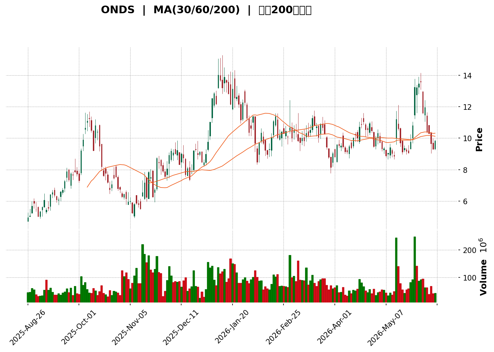
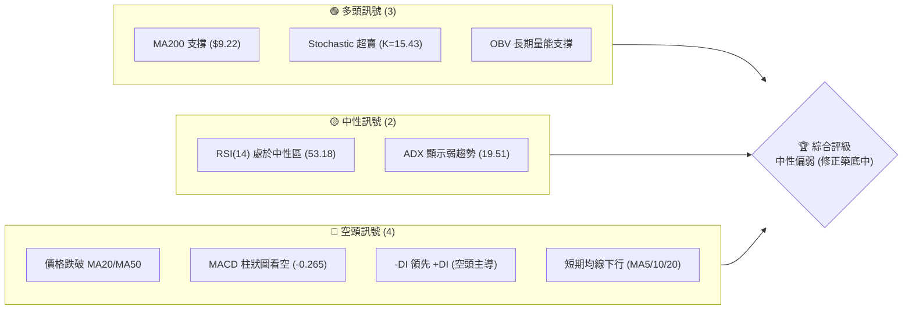
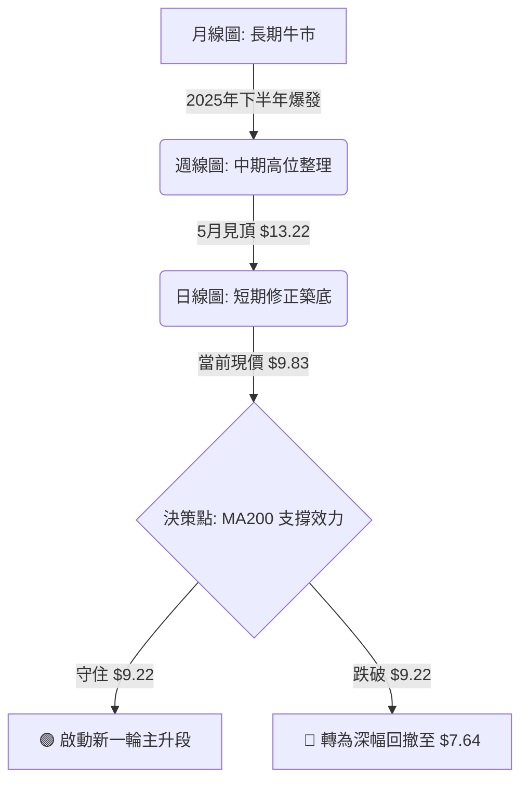
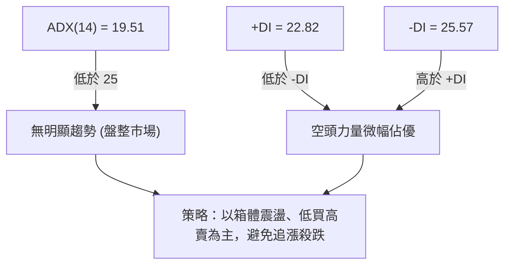
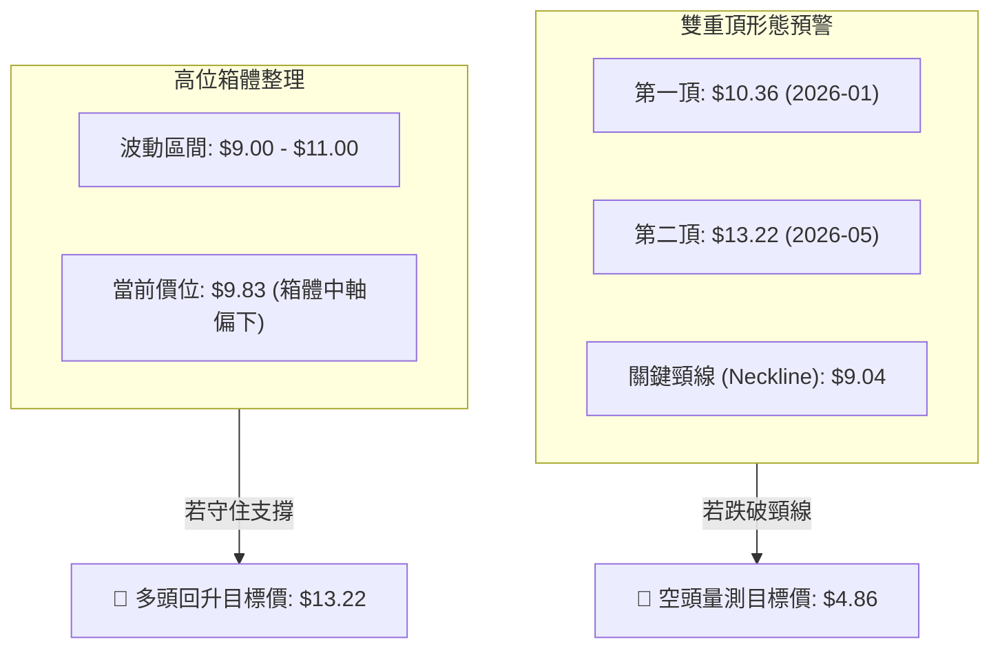

<details>
<summary>📊 靜態圖表 (點擊展開)</summary>

</details>

<html>
<head><meta charset="utf-8" /></head>
<body>
    <div style="height:500px; width:100%;">                        <script>window.PlotlyConfig = {MathJaxConfig: 'local'};</script>
        <script charset="utf-8" src="https://cdn.plot.ly/plotly-3.6.0.min.js" integrity="sha256-QaOVwtVY0T02VaHrr6pnoHLCwayMJp4O5n4YyaE3rJk=" crossorigin="anonymous"></script>                <div id="candlestick-chart" class="plotly-graph-div" style="height:100%; width:100%;"></div>            <script>                window.PLOTLYENV=window.PLOTLYENV || {};                                if (document.getElementById("candlestick-chart")) {                    Plotly.newPlot(                        "candlestick-chart",                        [{"close":{"dtype":"f8","bdata":"AAAAoEfhE0AAAAAgrkcUQAAAAMDMzBZAAAAA4KNwF0AAAABACtcVQAAAAGC4HhRAAAAAgOtRFUAAAADAHoUWQAAAAKBwPRhAAAAAwMzMFUAAAACgcD0WQAAAAIAUrhlAAAAAoHA9GkAAAADAHoUZQAAAAAApXBhAAAAAYGZmGEAAAABgZmYaQAAAAKBH4RpAAAAAgD0KHUAAAADAHoUfQAAAAGBmZh1AAAAAAAAAH0AAAAAA16MeQAAAAEDheh9AAAAAoEfhHkAAAACgcD0dQAAAACCFayJAAAAAgOvRI0AAAACA61ElQAAAAIAULiZAAAAAwB6FJkAAAABA4fokQAAAAOCjcCJAAAAAYLieJUAAAACA69EkQAAAAMAeBSNAAAAAYGZmIEAAAADgo3AeQAAAAOB6FB9AAAAAYI\u002fCHEAAAACAwvUaQAAAAKBwPRxAAAAAQArXHUAAAABguB4eQAAAAMD1KBtAAAAAAAAAG0AAAADA9SgZQAAAAGCPwhlAAAAAoJmZGEAAAABACtcXQAAAAAAAABhAAAAAAAAAFUAAAACgcD0XQAAAAMAehRdAAAAAQDMzF0AAAACAPQoWQAAAAKBwPRpAAAAA4FG4HEAAAADAHgUZQAAAAAApXB9AAAAAAAAAHkAAAADgehQZQAAAAOCj8BpAAAAA4KNwIUAAAACgR+EgQAAAAEDheiBAAAAAoJmZH0AAAACA61EeQAAAAADXIyBAAAAAQArXIUAAAACgR2EiQAAAAADXIyJAAAAAgD0KIkAAAACAwnUiQAAAAGBmpiBAAAAAgD0KIkAAAAAAAIAhQAAAAGCPwh5AAAAAgBQuIEAAAABA4XodQAAAAEAzMx9AAAAA4KNwIkAAAACAPYoiQAAAACCF6yFAAAAAYI9CIkAAAACAwvUgQAAAACCF6yBAAAAAQOH6IUAAAADAHoUjQAAAAIA9CiZAAAAAIFwPKUAAAACAFK4pQAAAAAApXChAAAAAwB4FLEAAAACgR2ErQAAAAKBHYSpAAAAAIK7HK0AAAABguB4rQAAAAADXoylAAAAAgOtRKEAAAABgj0IqQAAAAKCZGSlAAAAAoHA9KUAAAABAClcoQAAAAIDrUSZAAAAAwB6FKEAAAACAPYooQAAAAIA9iiZAAAAA4FG4JEAAAAAgrkclQAAAAGCPwiZAAAAAAClcI0AAAACAwvUgQAAAAKBHYSNAAAAAgBSuJEAAAAAAKVwjQAAAAIDCdSJAAAAA4KPwIUAAAABguJ4iQAAAAKCZGSRAAAAAANcjJkAAAAAgrscmQAAAACBcDyRAAAAAoEdhJEAAAADAzMwkQAAAAKCZmSRAAAAAYGbmJEAAAADA9SgkQAAAAEAKVyVAAAAAgD0KJEAAAADAHgUlQAAAAEDh+iRAAAAAwPWoI0AAAADgo3AjQAAAAMAeBSRAAAAAwPWoI0AAAADA9agkQAAAAIDrUSRAAAAAIFwPJUAAAAAgXI8mQAAAAMD1qCVAAAAAAACAJUAAAABguB4kQAAAAMDMzCVAAAAAAClcJUAAAABguJ4kQAAAAKBH4SJAAAAAoJmZIUAAAADAzEwgQAAAAOB6FCJAAAAAYLieIUAAAABAMzMjQAAAAIA9CiNAAAAAIFwPI0AAAABgZuYiQAAAACCuRyJAAAAAYI9CIkAAAADgo\u002fAiQAAAAMDMzCJAAAAAIFwPJEAAAABgZmYkQAAAAAAAACRAAAAAgMJ1JUAAAACgcL0lQAAAAGC4HiZAAAAA4HoUJUAAAACgmRklQAAAAGBm5iVAAAAAgML1JEAAAABA4foiQAAAAOB6FCRAAAAAANejJEAAAACAwnUjQAAAAMD1qCJAAAAAgBSuIkAAAAAgrschQAAAAGC4HiJAAAAAQArXIkAAAADgehQiQAAAAOBRuCFAAAAAIIVrJkAAAACgcD0lQAAAAGBmZiNAAAAAAABAIkAAAADgUbgiQAAAAAApXCJAAAAAYLgeIkAAAACAPYojQAAAAKCZmSVAAAAAAACAKkAAAADgo3AqQAAAACCF6ypAAAAAwPUoK0AAAADgUTgnQAAAAOCj8CdAAAAAACncJEAAAACgmZkkQAAAAMDMTCNAAAAAYLieIkAAAADA9agjQA=="},"high":{"dtype":"f8","bdata":"AAAAgGgRFUAAAADAHgUWQAAAAIA9ChhAAAAAIIPAGEAAAADAzMwXQAAAAKBFthZAAAAAIFyPFUAAAADgUbgWQAAAAAAAABpAAAAAAClcFkAAAAAAAAAYQAAAAGCPwhlAAAAAoEfhGkAAAADgo3AbQAAAAGBmZhlAAAAAAAAAGUAAAAAgXI8aQAAAAAApXBtAAAAA4KNwHUAAAACgcD0gQAAAAADXIyBAAAAAAClcH0AAAAAgXI8fQAAAACCFayFAAAAAQApXIEAAAADAzMwfQAAAAIAUriJAAAAAIFyPJEAAAABgj0InQAAAAEAKFydAAAAAYGZmJ0AAAAAgrscmQAAAAMAeBSVAAAAAgBRuJkAAAABguB4lQAAAAKBwvSVAAAAAYI9CI0AAAACA61EgQAAAAKBHYSBAAAAAANejH0AAAACAPQodQAAAAEAzMx1AAAAAQApXIEAAAACgR6EgQAAAACBcjx5AAAAAwMzMG0AAAACAwnUaQAAAAAAAABpAAAAAYI\u002fCGkAAAAAgrkcaQAAAAAAAABlAAAAA4FG4F0AAAADgepQXQAAAACBcjxlAAAAAoEdhGEAAAADA9agYQAAAAAApXB1AAAAA4KNwH0AAAAAgXA8eQAAAAIAUrh9AAAAAgOsRIEAAAACgR+EfQAAAAGBmZhtAAAAAoJmZIUAAAABgj8IhQAAAAAApXCFAAAAAwCDwIEAAAAAA1yMgQAAAAKCZGSFAAAAAgMI1IkAAAACAFK4iQAAAAKCZmSJAAAAAAACAI0AAAADgUbgjQAAAAEDhOiJAAAAAwPUoIkAAAABgZiYjQAAAAEDheiFAAAAAANdjIEAAAABguB4hQAAAAGCRrSBAAAAAQOF6IkAAAACA61EjQAAAAIAUriNAAAAAYGZmIkAAAABAClciQAAAAEAKVyFAAAAAoJmZIkAAAAAgXA8lQAAAAGC4HiZAAAAA4HoUKUAAAAAAKdwpQAAAAIA9CipAAAAAANcjLkAAAABAMzMuQAAAACBcjy5AAAAAAAAALUAAAAAAAIArQAAAAADXIyxAAAAAAACALEAAAABgZmYsQAAAAMD1qCxAAAAAwPWoKkAAAABA4bopQAAAACCFqyhAAAAA4KPwKEAAAADA9SgqQAAAACBcjyhAAAAAYGbmJkAAAABgZmYmQAAAAEAK1yZAAAAAgD3KJkAAAAAgXA8jQAAAAMAehSNAAAAAIK5HJUAAAACgR+EkQAAAAEAK1yNAAAAAoMaLIkAAAAAAKVwjQAAAAADXoyRAAAAAQApXJkAAAACAFC4nQAAAAMD1KCdAAAAAANcjJUAAAACAwvUkQAAAAKBH4SVAAAAAIFyPJUAAAAAAKVwkQAAAAEAK1yhAAAAAAAAAJkAAAAAA16MlQAAAAEAK1yVAAAAA4FE4J0AAAAAgXA8kQAAAAGBm5iRAAAAAYLgeJUAAAACAFK4lQAAAAIDC9SVAAAAAoHC9JUAAAADgo\u002fAmQAAAAMAehSdAAAAAgML1JUAAAADA9aglQAAAAOCj8CVAAAAAoHC9JkAAAAAgrkcmQAAAACCuRyRAAAAAoHC9IkAAAAAA16MhQAAAACCuRyJAAAAAQDOzIkAAAABgj0IjQAAAAMDMzCNAAAAAoEdhI0AAAACgcL0kQAAAAIA9CiNAAAAA4FG4IkAAAAAghSsjQAAAAOBRuCNAAAAAIFwPJEAAAAAgrsckQAAAACBcDyVAAAAAYLgeJkAAAADgepQmQAAAAOBROCdAAAAA4KPwJUAAAACAPYolQAAAAGC4HiZAAAAAANcjJkAAAAAAKdwkQAAAAIDrUSRAAAAAYLgeJUAAAABA4bokQAAAAOB6lCNAAAAAIIXrIkAAAAAAAIAiQAAAAIAULiJAAAAAwMxMI0AAAABAM7MiQAAAAAApXCJAAAAAgMJ1J0AAAACgcD0oQAAAAEAKVyVAAAAAYI\u002fCI0AAAADgehQjQAAAAGCPwiJAAAAAoEchI0AAAADAHoUkQAAAAGC4HiZAAAAAIFyPK0AAAACA69EqQAAAAIDr0StAAAAAgOtRLEAAAAAAAAAqQAAAAEAK1yhAAAAAgOtRJ0AAAACAFK4lQAAAAIDr0SRAAAAAgML1I0AAAACAPcojQA=="},"hovertemplate":"\u003cb\u003e%{x|%Y-%m-%d}\u003c\u002fb\u003e\u003cbr\u003e\u958b: $%{open:.2f}\u003cbr\u003e\u9ad8: $%{high:.2f}\u003cbr\u003e\u4f4e: $%{low:.2f}\u003cbr\u003e\u6536: $%{close:.2f}\u003cextra\u003e\u003c\u002fextra\u003e","low":{"dtype":"f8","bdata":"AAAAQArXEkAAAACAPQoUQAAAAMDMzBRAAAAAwPUoFkAAAACA61EVQAAAAIA9ChRAAAAAoJmZE0AAAABguB4UQAAAAGBmZhZAAAAAQArXFEAAAACAPYoVQAAAAADXoxVAAAAAwMzMGEAAAAAAAAAZQAAAAIAUrhdAAAAAAAAAF0AAAACAPQoYQAAAAIAUrhlAAAAAgOtRGkAAAAAghescQAAAAAAAAB1AAAAAwPUoG0AAAADgo3AdQAAAAEAzMx9AAAAAIK5HHkAAAADgUbgcQAAAAADXox5AAAAAoEdhIkAAAACAPYokQAAAAGBm5iRAAAAAYA5tJUAAAAAAAMAkQAAAAKBHYSJAAAAAILJdI0AAAABgj8IjQAAAAIDrUSJAAAAAgBSuH0AAAADgUTgeQAAAAIDrUR1AAAAAAACAHEAAAAAAKdwZQAAAAKCZmRpAAAAAYLieHUAAAADgehQeQAAAAADXoxpAAAAA4HoUGkAAAACA69EYQAAAAEDhehhAAAAAYLgeF0AAAADgehQXQAAAAIDrURdAAAAAACncFEAAAADAzMwTQAAAAOB6FBdAAAAAYGZmFkAAAAAghesVQAAAAKBwPRlAAAAAYGZmGEAAAAAghesXQAAAAKCZmRhAAAAAgD0KHUAAAAAAAAAZQAAAAOBRuBdAAAAAgBSuGkAAAAAA1yMgQAAAAKBwvR5AAAAAQDMzH0AAAACgR+EdQAAAACCuRx1AAAAAQArXHUAAAACAPQohQAAAAMD1KCFAAAAA4KPwIUAAAADgUTghQAAAAAApnCBAAAAAoHA9IEAAAACA69EgQAAAAKBwPR5AAAAAAClcHkAAAABguB4dQAAAAIDC9R5AAAAA4KNwH0AAAAAgXE8iQAAAAEAKVyFAAAAAQDOzIUAAAAAAKdwgQAAAACCFayBAAAAAwPWoIEAAAABAClciQAAAAIDr0SNAAAAAQOH6JUAAAAAghesnQAAAAOBROChAAAAAwMxMKkAAAACAFC4rQAAAAMD1qClAAAAAIIXrKUAAAABACtcpQAAAAKCZmSlAAAAAoHA9KEAAAACgmZknQAAAAAAp3CdAAAAAQDOzKEAAAACgR+EnQAAAAGBm5iVAAAAAgBQuJkAAAABguB4oQAAAAADXIyZAAAAAIK5HJEAAAADAzEwkQAAAAMAeBSVAAAAAYI9CIkAAAAAA16MgQAAAAGBm5iBAAAAAQApXI0AAAABAMzMjQAAAAGCPwiFAAAAAYGZmIUAAAAAA16MhQAAAAKBwvSFAAAAAQOH6I0AAAABA4XolQAAAAGBm5iNAAAAA4FG4I0AAAACAwvUiQAAAAIA9iiRAAAAAYGbmI0AAAACgcD0jQAAAAKCZmSRAAAAAwB6FI0AAAAAAKdwjQAAAAGC4HiRAAAAAwB6FI0AAAABgZmYiQAAAAGBmJiNAAAAAAAAAI0AAAACgmZkjQAAAAKCZGSRAAAAA4FE4JEAAAACgcL0kQAAAAADXoyVAAAAAoHA9JEAAAACAwnUjQAAAAIAU7iNAAAAAQDPzJEAAAACAwnUkQAAAAIA9iiJAAAAAwPVoIUAAAABguB4fQAAAAGBmZiBAAAAAIFyPIUAAAAAghesgQAAAAGCPwiJAAAAA4E1iIkAAAACAFK4iQAAAAMAeBSJAAAAAQOH6IUAAAACAwnUhQAAAAKCZmSJAAAAAoHC9IkAAAADAHoUjQAAAAIA9iiNAAAAAgOtRI0AAAAAgrkclQAAAAEAzsyVAAAAAQDMzJEAAAABA4TokQAAAACCFayRAAAAAIIWrJEAAAACA69EiQAAAAGC4niJAAAAAoHA9I0AAAABAClcjQAAAAIDrUSJAAAAAgD0KIkAAAAAgXI8hQAAAAMDMTCFAAAAA4KNwIUAAAACgmZkhQAAAAEAKVyFAAAAAQDMzI0AAAAAAAAAlQAAAACCF6yJAAAAA4KPwIUAAAACgcD0iQAAAAIDC9SFAAAAAYLgeIkAAAAAgsp0iQAAAAAApXCNAAAAA4KNwJkAAAABAMzMnQAAAAKCZmSlAAAAAgBQuKkAAAAAgXA8nQAAAAGC4HiZAAAAAwPWoJEAAAAAAAIAkQAAAAOB6FCJAAAAAoJmZIkAAAADAHoUiQA=="},"name":"\u50f9\u683c","open":{"dtype":"f8","bdata":"AAAAoEfhEkAAAADgehQUQAAAAAAAABVAAAAAAAAAGEAAAABgZuYVQAAAAEDhehZAAAAAANcjFEAAAADAzMwVQAAAAMAehRZAAAAAoHA9FUAAAADgo3AWQAAAAOBRuBZAAAAAwMzMGUAAAABACtcaQAAAACCuRxlAAAAAoHA9GEAAAABguB4ZQAAAAEAzMxpAAAAAIK5HG0AAAAAgXA8eQAAAAIDC9R9AAAAAwB4FHEAAAAAgrsceQAAAAEAK1x9AAAAA4FG4H0AAAAAAAAAfQAAAAEAzMx9AAAAAwB4FI0AAAABguB4lQAAAAAAAACZAAAAAIK6HJkAAAAAgrkcmQAAAAIDC9SRAAAAAIFwPJEAAAABgj8IkQAAAAGBmpiVAAAAAYI9CI0AAAADAzMwfQAAAAGC4HiBAAAAA4FG4HkAAAABgZmYbQAAAAGBmZhtAAAAAgBSuHkAAAABguF4gQAAAAOB6FB5AAAAA4HqUG0AAAACAwvUZQAAAAAAAABlAAAAAwMxMGkAAAABguB4XQAAAACCF6xdAAAAAgBSuF0AAAADA9SgUQAAAAEDhehlAAAAAYGZmF0AAAADgo\u002fAXQAAAACCuRxlAAAAAwPWoGEAAAACAPQoeQAAAAGC4nhhAAAAAACncHUAAAACAFK4fQAAAAKBwPRpAAAAAANcjG0AAAACAwvUgQAAAAOBROCFAAAAAIFyPIEAAAADAHoUfQAAAAOBRuB5AAAAAIK7HIEAAAADAHkUhQAAAAAAp3CFAAAAAQAqXIkAAAABACtchQAAAAOBROCJAAAAAQOH6IEAAAACAwvUhQAAAAAApXCFAAAAAQOF6HkAAAAAgrkcgQAAAAMD1KB9AAAAAgML1H0AAAACgmZkiQAAAACBcDyJAAAAAgML1IUAAAADgJEYiQAAAAKCZmSBAAAAAIIXrIEAAAAAgXI8iQAAAAMAeRSRAAAAAoJmZJkAAAABAMzMoQAAAAGBmZilAAAAAwPVoKkAAAAAAAAAsQAAAACCFaytAAAAAAAAAK0AAAACgR2ErQAAAAADXIytAAAAA4HrUKkAAAACAwrUnQAAAAKCZmStAAAAAwB4FKUAAAAAghWspQAAAAMDMTChAAAAAIIVrJkAAAACAwvUpQAAAACCuRyhAAAAAAACAJkAAAABguJ4lQAAAAMAeBSZAAAAAYI\u002fCJkAAAACAFK4iQAAAAIAU7iFAAAAAACmcI0AAAACAFC4kQAAAAMAexSNAAAAAoHB9IkAAAACAPYoiQAAAAOBReCJAAAAAIIVrJEAAAAAA16MlQAAAAKBHYSZAAAAAACncI0AAAADAHgUkQAAAAGCPQiVAAAAAwMxMJEAAAACAFC4kQAAAAAAAACVAAAAAoEdhJUAAAADgUbgkQAAAAEDh+iRAAAAAAACAJEAAAAAgXA8kQAAAAIAUriNAAAAAoJkZJEAAAAAghSskQAAAAAAp3CRAAAAAoHC9JEAAAACgmRklQAAAAAAAwCZAAAAAYLheJUAAAADgepQlQAAAAOB6lCRAAAAAgOvRJUAAAABgj8IlQAAAAKCZGSRAAAAAQDOzIkAAAABguJ4hQAAAAGBm5iBAAAAAoJmZIkAAAAAgrgchQAAAAGCPQiNAAAAAACncIkAAAABAClckQAAAAOB61CJAAAAAgMJ1IkAAAADAHgUiQAAAAOCjcCNAAAAAwB4FI0AAAAAAAIAkQAAAAGCPwiRAAAAAoJmZI0AAAADAzMwlQAAAAIA9iiZAAAAAYI\u002fCJUAAAABgj0IlQAAAAMBLtyRAAAAAANdjJUAAAABgj8IkQAAAAAAAACNAAAAAAAAAJEAAAADAzEwkQAAAACBcjyNAAAAAAACAIkAAAAAAAIAiQAAAAAAAACJAAAAAQArXIUAAAADgUXgiQAAAAEAK1yFAAAAAQOH6I0AAAACA69ElQAAAAGCPQiVAAAAAYGamI0AAAAAAAIAiQAAAACBcjyJAAAAAIIVrIkAAAAAghasiQAAAAAAAACRAAAAAQDPzJkAAAAAAAIApQAAAAKBwfSpAAAAAoHA9K0AAAAAghespQAAAAIDC9SZAAAAAQArXJkAAAADA9aglQAAAACCFqyRAAAAAoEdhI0AAAABgZqYiQA=="},"x":["2025-08-26T00:00:00-04:00","2025-08-27T00:00:00-04:00","2025-08-28T00:00:00-04:00","2025-08-29T00:00:00-04:00","2025-09-02T00:00:00-04:00","2025-09-03T00:00:00-04:00","2025-09-04T00:00:00-04:00","2025-09-05T00:00:00-04:00","2025-09-08T00:00:00-04:00","2025-09-09T00:00:00-04:00","2025-09-10T00:00:00-04:00","2025-09-11T00:00:00-04:00","2025-09-12T00:00:00-04:00","2025-09-15T00:00:00-04:00","2025-09-16T00:00:00-04:00","2025-09-17T00:00:00-04:00","2025-09-18T00:00:00-04:00","2025-09-19T00:00:00-04:00","2025-09-22T00:00:00-04:00","2025-09-23T00:00:00-04:00","2025-09-24T00:00:00-04:00","2025-09-25T00:00:00-04:00","2025-09-26T00:00:00-04:00","2025-09-29T00:00:00-04:00","2025-09-30T00:00:00-04:00","2025-10-01T00:00:00-04:00","2025-10-02T00:00:00-04:00","2025-10-03T00:00:00-04:00","2025-10-06T00:00:00-04:00","2025-10-07T00:00:00-04:00","2025-10-08T00:00:00-04:00","2025-10-09T00:00:00-04:00","2025-10-10T00:00:00-04:00","2025-10-13T00:00:00-04:00","2025-10-14T00:00:00-04:00","2025-10-15T00:00:00-04:00","2025-10-16T00:00:00-04:00","2025-10-17T00:00:00-04:00","2025-10-20T00:00:00-04:00","2025-10-21T00:00:00-04:00","2025-10-22T00:00:00-04:00","2025-10-23T00:00:00-04:00","2025-10-24T00:00:00-04:00","2025-10-27T00:00:00-04:00","2025-10-28T00:00:00-04:00","2025-10-29T00:00:00-04:00","2025-10-30T00:00:00-04:00","2025-10-31T00:00:00-04:00","2025-11-03T00:00:00-05:00","2025-11-04T00:00:00-05:00","2025-11-05T00:00:00-05:00","2025-11-06T00:00:00-05:00","2025-11-07T00:00:00-05:00","2025-11-10T00:00:00-05:00","2025-11-11T00:00:00-05:00","2025-11-12T00:00:00-05:00","2025-11-13T00:00:00-05:00","2025-11-14T00:00:00-05:00","2025-11-17T00:00:00-05:00","2025-11-18T00:00:00-05:00","2025-11-19T00:00:00-05:00","2025-11-20T00:00:00-05:00","2025-11-21T00:00:00-05:00","2025-11-24T00:00:00-05:00","2025-11-25T00:00:00-05:00","2025-11-26T00:00:00-05:00","2025-11-28T00:00:00-05:00","2025-12-01T00:00:00-05:00","2025-12-02T00:00:00-05:00","2025-12-03T00:00:00-05:00","2025-12-04T00:00:00-05:00","2025-12-05T00:00:00-05:00","2025-12-08T00:00:00-05:00","2025-12-09T00:00:00-05:00","2025-12-10T00:00:00-05:00","2025-12-11T00:00:00-05:00","2025-12-12T00:00:00-05:00","2025-12-15T00:00:00-05:00","2025-12-16T00:00:00-05:00","2025-12-17T00:00:00-05:00","2025-12-18T00:00:00-05:00","2025-12-19T00:00:00-05:00","2025-12-22T00:00:00-05:00","2025-12-23T00:00:00-05:00","2025-12-24T00:00:00-05:00","2025-12-26T00:00:00-05:00","2025-12-29T00:00:00-05:00","2025-12-30T00:00:00-05:00","2025-12-31T00:00:00-05:00","2026-01-02T00:00:00-05:00","2026-01-05T00:00:00-05:00","2026-01-06T00:00:00-05:00","2026-01-07T00:00:00-05:00","2026-01-08T00:00:00-05:00","2026-01-09T00:00:00-05:00","2026-01-12T00:00:00-05:00","2026-01-13T00:00:00-05:00","2026-01-14T00:00:00-05:00","2026-01-15T00:00:00-05:00","2026-01-16T00:00:00-05:00","2026-01-20T00:00:00-05:00","2026-01-21T00:00:00-05:00","2026-01-22T00:00:00-05:00","2026-01-23T00:00:00-05:00","2026-01-26T00:00:00-05:00","2026-01-27T00:00:00-05:00","2026-01-28T00:00:00-05:00","2026-01-29T00:00:00-05:00","2026-01-30T00:00:00-05:00","2026-02-02T00:00:00-05:00","2026-02-03T00:00:00-05:00","2026-02-04T00:00:00-05:00","2026-02-05T00:00:00-05:00","2026-02-06T00:00:00-05:00","2026-02-09T00:00:00-05:00","2026-02-10T00:00:00-05:00","2026-02-11T00:00:00-05:00","2026-02-12T00:00:00-05:00","2026-02-13T00:00:00-05:00","2026-02-17T00:00:00-05:00","2026-02-18T00:00:00-05:00","2026-02-19T00:00:00-05:00","2026-02-20T00:00:00-05:00","2026-02-23T00:00:00-05:00","2026-02-24T00:00:00-05:00","2026-02-25T00:00:00-05:00","2026-02-26T00:00:00-05:00","2026-02-27T00:00:00-05:00","2026-03-02T00:00:00-05:00","2026-03-03T00:00:00-05:00","2026-03-04T00:00:00-05:00","2026-03-05T00:00:00-05:00","2026-03-06T00:00:00-05:00","2026-03-09T00:00:00-04:00","2026-03-10T00:00:00-04:00","2026-03-11T00:00:00-04:00","2026-03-12T00:00:00-04:00","2026-03-13T00:00:00-04:00","2026-03-16T00:00:00-04:00","2026-03-17T00:00:00-04:00","2026-03-18T00:00:00-04:00","2026-03-19T00:00:00-04:00","2026-03-20T00:00:00-04:00","2026-03-23T00:00:00-04:00","2026-03-24T00:00:00-04:00","2026-03-25T00:00:00-04:00","2026-03-26T00:00:00-04:00","2026-03-27T00:00:00-04:00","2026-03-30T00:00:00-04:00","2026-03-31T00:00:00-04:00","2026-04-01T00:00:00-04:00","2026-04-02T00:00:00-04:00","2026-04-06T00:00:00-04:00","2026-04-07T00:00:00-04:00","2026-04-08T00:00:00-04:00","2026-04-09T00:00:00-04:00","2026-04-10T00:00:00-04:00","2026-04-13T00:00:00-04:00","2026-04-14T00:00:00-04:00","2026-04-15T00:00:00-04:00","2026-04-16T00:00:00-04:00","2026-04-17T00:00:00-04:00","2026-04-20T00:00:00-04:00","2026-04-21T00:00:00-04:00","2026-04-22T00:00:00-04:00","2026-04-23T00:00:00-04:00","2026-04-24T00:00:00-04:00","2026-04-27T00:00:00-04:00","2026-04-28T00:00:00-04:00","2026-04-29T00:00:00-04:00","2026-04-30T00:00:00-04:00","2026-05-01T00:00:00-04:00","2026-05-04T00:00:00-04:00","2026-05-05T00:00:00-04:00","2026-05-06T00:00:00-04:00","2026-05-07T00:00:00-04:00","2026-05-08T00:00:00-04:00","2026-05-11T00:00:00-04:00","2026-05-12T00:00:00-04:00","2026-05-13T00:00:00-04:00","2026-05-14T00:00:00-04:00","2026-05-15T00:00:00-04:00","2026-05-18T00:00:00-04:00","2026-05-19T00:00:00-04:00","2026-05-20T00:00:00-04:00","2026-05-21T00:00:00-04:00","2026-05-22T00:00:00-04:00","2026-05-26T00:00:00-04:00","2026-05-27T00:00:00-04:00","2026-05-28T00:00:00-04:00","2026-05-29T00:00:00-04:00","2026-06-01T00:00:00-04:00","2026-06-02T00:00:00-04:00","2026-06-03T00:00:00-04:00","2026-06-04T00:00:00-04:00","2026-06-05T00:00:00-04:00","2026-06-08T00:00:00-04:00","2026-06-09T00:00:00-04:00","2026-06-10T00:00:00-04:00","2026-06-11T00:00:00-04:00"],"type":"candlestick"},{"hovertemplate":"MA30: $%{y:.2f}\u003cextra\u003e\u003c\u002fextra\u003e","line":{"color":"#2196F3","dash":"dash","width":2},"mode":"lines","name":"MA30","x":["2025-08-26T00:00:00-04:00","2025-08-27T00:00:00-04:00","2025-08-28T00:00:00-04:00","2025-08-29T00:00:00-04:00","2025-09-02T00:00:00-04:00","2025-09-03T00:00:00-04:00","2025-09-04T00:00:00-04:00","2025-09-05T00:00:00-04:00","2025-09-08T00:00:00-04:00","2025-09-09T00:00:00-04:00","2025-09-10T00:00:00-04:00","2025-09-11T00:00:00-04:00","2025-09-12T00:00:00-04:00","2025-09-15T00:00:00-04:00","2025-09-16T00:00:00-04:00","2025-09-17T00:00:00-04:00","2025-09-18T00:00:00-04:00","2025-09-19T00:00:00-04:00","2025-09-22T00:00:00-04:00","2025-09-23T00:00:00-04:00","2025-09-24T00:00:00-04:00","2025-09-25T00:00:00-04:00","2025-09-26T00:00:00-04:00","2025-09-29T00:00:00-04:00","2025-09-30T00:00:00-04:00","2025-10-01T00:00:00-04:00","2025-10-02T00:00:00-04:00","2025-10-03T00:00:00-04:00","2025-10-06T00:00:00-04:00","2025-10-07T00:00:00-04:00","2025-10-08T00:00:00-04:00","2025-10-09T00:00:00-04:00","2025-10-10T00:00:00-04:00","2025-10-13T00:00:00-04:00","2025-10-14T00:00:00-04:00","2025-10-15T00:00:00-04:00","2025-10-16T00:00:00-04:00","2025-10-17T00:00:00-04:00","2025-10-20T00:00:00-04:00","2025-10-21T00:00:00-04:00","2025-10-22T00:00:00-04:00","2025-10-23T00:00:00-04:00","2025-10-24T00:00:00-04:00","2025-10-27T00:00:00-04:00","2025-10-28T00:00:00-04:00","2025-10-29T00:00:00-04:00","2025-10-30T00:00:00-04:00","2025-10-31T00:00:00-04:00","2025-11-03T00:00:00-05:00","2025-11-04T00:00:00-05:00","2025-11-05T00:00:00-05:00","2025-11-06T00:00:00-05:00","2025-11-07T00:00:00-05:00","2025-11-10T00:00:00-05:00","2025-11-11T00:00:00-05:00","2025-11-12T00:00:00-05:00","2025-11-13T00:00:00-05:00","2025-11-14T00:00:00-05:00","2025-11-17T00:00:00-05:00","2025-11-18T00:00:00-05:00","2025-11-19T00:00:00-05:00","2025-11-20T00:00:00-05:00","2025-11-21T00:00:00-05:00","2025-11-24T00:00:00-05:00","2025-11-25T00:00:00-05:00","2025-11-26T00:00:00-05:00","2025-11-28T00:00:00-05:00","2025-12-01T00:00:00-05:00","2025-12-02T00:00:00-05:00","2025-12-03T00:00:00-05:00","2025-12-04T00:00:00-05:00","2025-12-05T00:00:00-05:00","2025-12-08T00:00:00-05:00","2025-12-09T00:00:00-05:00","2025-12-10T00:00:00-05:00","2025-12-11T00:00:00-05:00","2025-12-12T00:00:00-05:00","2025-12-15T00:00:00-05:00","2025-12-16T00:00:00-05:00","2025-12-17T00:00:00-05:00","2025-12-18T00:00:00-05:00","2025-12-19T00:00:00-05:00","2025-12-22T00:00:00-05:00","2025-12-23T00:00:00-05:00","2025-12-24T00:00:00-05:00","2025-12-26T00:00:00-05:00","2025-12-29T00:00:00-05:00","2025-12-30T00:00:00-05:00","2025-12-31T00:00:00-05:00","2026-01-02T00:00:00-05:00","2026-01-05T00:00:00-05:00","2026-01-06T00:00:00-05:00","2026-01-07T00:00:00-05:00","2026-01-08T00:00:00-05:00","2026-01-09T00:00:00-05:00","2026-01-12T00:00:00-05:00","2026-01-13T00:00:00-05:00","2026-01-14T00:00:00-05:00","2026-01-15T00:00:00-05:00","2026-01-16T00:00:00-05:00","2026-01-20T00:00:00-05:00","2026-01-21T00:00:00-05:00","2026-01-22T00:00:00-05:00","2026-01-23T00:00:00-05:00","2026-01-26T00:00:00-05:00","2026-01-27T00:00:00-05:00","2026-01-28T00:00:00-05:00","2026-01-29T00:00:00-05:00","2026-01-30T00:00:00-05:00","2026-02-02T00:00:00-05:00","2026-02-03T00:00:00-05:00","2026-02-04T00:00:00-05:00","2026-02-05T00:00:00-05:00","2026-02-06T00:00:00-05:00","2026-02-09T00:00:00-05:00","2026-02-10T00:00:00-05:00","2026-02-11T00:00:00-05:00","2026-02-12T00:00:00-05:00","2026-02-13T00:00:00-05:00","2026-02-17T00:00:00-05:00","2026-02-18T00:00:00-05:00","2026-02-19T00:00:00-05:00","2026-02-20T00:00:00-05:00","2026-02-23T00:00:00-05:00","2026-02-24T00:00:00-05:00","2026-02-25T00:00:00-05:00","2026-02-26T00:00:00-05:00","2026-02-27T00:00:00-05:00","2026-03-02T00:00:00-05:00","2026-03-03T00:00:00-05:00","2026-03-04T00:00:00-05:00","2026-03-05T00:00:00-05:00","2026-03-06T00:00:00-05:00","2026-03-09T00:00:00-04:00","2026-03-10T00:00:00-04:00","2026-03-11T00:00:00-04:00","2026-03-12T00:00:00-04:00","2026-03-13T00:00:00-04:00","2026-03-16T00:00:00-04:00","2026-03-17T00:00:00-04:00","2026-03-18T00:00:00-04:00","2026-03-19T00:00:00-04:00","2026-03-20T00:00:00-04:00","2026-03-23T00:00:00-04:00","2026-03-24T00:00:00-04:00","2026-03-25T00:00:00-04:00","2026-03-26T00:00:00-04:00","2026-03-27T00:00:00-04:00","2026-03-30T00:00:00-04:00","2026-03-31T00:00:00-04:00","2026-04-01T00:00:00-04:00","2026-04-02T00:00:00-04:00","2026-04-06T00:00:00-04:00","2026-04-07T00:00:00-04:00","2026-04-08T00:00:00-04:00","2026-04-09T00:00:00-04:00","2026-04-10T00:00:00-04:00","2026-04-13T00:00:00-04:00","2026-04-14T00:00:00-04:00","2026-04-15T00:00:00-04:00","2026-04-16T00:00:00-04:00","2026-04-17T00:00:00-04:00","2026-04-20T00:00:00-04:00","2026-04-21T00:00:00-04:00","2026-04-22T00:00:00-04:00","2026-04-23T00:00:00-04:00","2026-04-24T00:00:00-04:00","2026-04-27T00:00:00-04:00","2026-04-28T00:00:00-04:00","2026-04-29T00:00:00-04:00","2026-04-30T00:00:00-04:00","2026-05-01T00:00:00-04:00","2026-05-04T00:00:00-04:00","2026-05-05T00:00:00-04:00","2026-05-06T00:00:00-04:00","2026-05-07T00:00:00-04:00","2026-05-08T00:00:00-04:00","2026-05-11T00:00:00-04:00","2026-05-12T00:00:00-04:00","2026-05-13T00:00:00-04:00","2026-05-14T00:00:00-04:00","2026-05-15T00:00:00-04:00","2026-05-18T00:00:00-04:00","2026-05-19T00:00:00-04:00","2026-05-20T00:00:00-04:00","2026-05-21T00:00:00-04:00","2026-05-22T00:00:00-04:00","2026-05-26T00:00:00-04:00","2026-05-27T00:00:00-04:00","2026-05-28T00:00:00-04:00","2026-05-29T00:00:00-04:00","2026-06-01T00:00:00-04:00","2026-06-02T00:00:00-04:00","2026-06-03T00:00:00-04:00","2026-06-04T00:00:00-04:00","2026-06-05T00:00:00-04:00","2026-06-08T00:00:00-04:00","2026-06-09T00:00:00-04:00","2026-06-10T00:00:00-04:00","2026-06-11T00:00:00-04:00"],"y":{"dtype":"f8","bdata":"AAAAAAAA+H8AAAAAAAD4fwAAAAAAAPh\u002fAAAAAAAA+H8AAAAAAAD4fwAAAAAAAPh\u002fAAAAAAAA+H8AAAAAAAD4fwAAAAAAAPh\u002fAAAAAAAA+H8AAAAAAAD4fwAAAAAAAPh\u002fAAAAAAAA+H8AAAAAAAD4fwAAAAAAAPh\u002fAAAAAAAA+H8AAAAAAAD4fwAAAAAAAPh\u002fAAAAAAAA+H8AAAAAAAD4fwAAAAAAAPh\u002fAAAAAAAA+H8AAAAAAAD4fwAAAAAAAPh\u002fAAAAAAAA+H8AAAAAAAD4fwAAAAAAAPh\u002fAAAAAAAA+H8AAAAAAAD4fxEREaH+jRtA3t3dfbFkHEC8u7srsh0dQHd3d2fYlR1Aq6qqKs4+HkDNzMzsw+ceQDMzM8OugB9ARERENKXiH0CrqqpaHRMgQFVVVXVMMCBAq6qqov5NIEAiIiIiImIgQN7d3VUObSBA7+7ufmp8IEBERETsCpAgQM3MzET9myBAmpmZKRWnIECJiIjAyqEgQCIiImoDnSBAAAAAwBGKIEBEREQkTWkgQO\u002fu7uZCUiBAREREPJgnIEBmZmZ2BQggQKuqqgoezB9ARERE1JSKH0ARERExJE0fQDMzMyOw8h5AiYiICIGVHkDv7u6OJf8dQAAAAKA2kB1A3t3dPd8PHUAiIiJS1H8cQO\u002fu7g4CKxxAvLu7W6vjG0C8u7s7baAbQM3MzMwTdRtAzczMXNZqG0B3d3c30GkbQHd3d6cNdBtAAAAAoBqvG0DNzMwMuwIcQCIiIrJWRxxAAAAAMJZ8HEAiIiICnbYcQKuqqgoC6xxAvLu7m304HUCrqqpqdYwdQFVVVRUgtx1AAAAAEFj5HUBERETUeCkeQImIiHjpZh5AzczM3GvuHkDv7u7OhWQfQCIiIkKnzR9A7+7unqgfIEDv7u6+WFIgQBEREfnFciBAvLu7+6mRIEAAAACQe80gQCIiIjLBAyFAmpmZmZlZIUBmZmZeuskhQAAAAPCnJiJAzczMTPCAIkBmZmbmidoiQHd3d8cELyNAVVVVfT+VI0CrqqqCTvsjQLy7u5NfTCRAIiIiWquDJEAiIiJ66cYkQM3MzNRNAiVAAAAAeL4\u002fJUDv7u6G63ElQM3MzNRNoiVAMzMzm5nZJUARERG5rBUmQLy7u\u002fvFUiZAMzMzw4N5JkDNzMycUrEmQO\u002fu7t5r7iZAREREpEX2JkAzMzMTyugmQN7d3X0\u002f9SZAAAAAEOYJJ0AiIiLyYB4nQAAAACCFKydA7+7uvi0rJ0CrqqqqfyMnQLy7u6vxEidAVVVV1Qb6JkAAAACwR+EmQBERETGWvCZAq6qqWmR7JkAAAAAgPkMmQGZmZobrESZA7+7u7jXXJUBERESU0ZslQGZmZhYgdyVAmpmZSZpSJUBVVVVV4yUlQN7d3Q27AiVAvLu7Wx3TJEBVVVUlTakkQImIiLislSRAMzMz4zNsJEBVVVXlF0skQKuqqjomOCRAiYiI+Aw7JEC8u7sr+UUkQO\u002fu7i6WPCRAVVVVFdlOJEBmZmY20GkkQImIiMh2fiRARERERESEJEB3d3fHBI8kQImIiEiakiRAq6qqirOPJEC8u7tr53skQJqZmamqaiRAMzMzkxhEJEAiIiLyiyUkQJqZmbnXHCRAREREJJQRJEB3d3eHXQEkQJqZmWmR7SNA7+7uPgrXI0De3d0docwjQGZmZmb0tiNAZmZmFiC3I0DNzMys1bEjQFVVVdV4qSNA3t3d\u002fdS4I0CrqqpqdcwjQAAAAPBg3iNAmpmZ+X7qI0C8u7srQO4jQLy7u7u7+yNAd3d3R+H6I0BmZmamVNwjQGZmZhbZziNAMzMzY4LHI0B3d3eX4MEjQImIiCgVpyNAvLu7mzaQI0CJiIiI+ncjQKuqqkp+cSNAzczMHBN8I0BVVVWVQ4sjQGZmZiYxiCNAiYiI6CaxI0Crqqpaj8IjQImIiMihxSNAAAAAULi+I0CJiIgYL70jQLy7u9vdvSNAZmZmBqy8I0Dv7u6+ysEjQBEREXGv2SNAZmZm1qMQJEC8u7trLkQkQERERGQ7fyRAvLu7O9+vJEB3d3dXgLwkQBERETEIzCRAiYiImCfKJEBERERU48UkQKuqqoqzryRAzczMvLubJECJiIg4iaEkQA=="},"type":"scatter"},{"hovertemplate":"MA60: $%{y:.2f}\u003cextra\u003e\u003c\u002fextra\u003e","line":{"color":"#9C27B0","dash":"dash","width":2},"mode":"lines","name":"MA60","x":["2025-08-26T00:00:00-04:00","2025-08-27T00:00:00-04:00","2025-08-28T00:00:00-04:00","2025-08-29T00:00:00-04:00","2025-09-02T00:00:00-04:00","2025-09-03T00:00:00-04:00","2025-09-04T00:00:00-04:00","2025-09-05T00:00:00-04:00","2025-09-08T00:00:00-04:00","2025-09-09T00:00:00-04:00","2025-09-10T00:00:00-04:00","2025-09-11T00:00:00-04:00","2025-09-12T00:00:00-04:00","2025-09-15T00:00:00-04:00","2025-09-16T00:00:00-04:00","2025-09-17T00:00:00-04:00","2025-09-18T00:00:00-04:00","2025-09-19T00:00:00-04:00","2025-09-22T00:00:00-04:00","2025-09-23T00:00:00-04:00","2025-09-24T00:00:00-04:00","2025-09-25T00:00:00-04:00","2025-09-26T00:00:00-04:00","2025-09-29T00:00:00-04:00","2025-09-30T00:00:00-04:00","2025-10-01T00:00:00-04:00","2025-10-02T00:00:00-04:00","2025-10-03T00:00:00-04:00","2025-10-06T00:00:00-04:00","2025-10-07T00:00:00-04:00","2025-10-08T00:00:00-04:00","2025-10-09T00:00:00-04:00","2025-10-10T00:00:00-04:00","2025-10-13T00:00:00-04:00","2025-10-14T00:00:00-04:00","2025-10-15T00:00:00-04:00","2025-10-16T00:00:00-04:00","2025-10-17T00:00:00-04:00","2025-10-20T00:00:00-04:00","2025-10-21T00:00:00-04:00","2025-10-22T00:00:00-04:00","2025-10-23T00:00:00-04:00","2025-10-24T00:00:00-04:00","2025-10-27T00:00:00-04:00","2025-10-28T00:00:00-04:00","2025-10-29T00:00:00-04:00","2025-10-30T00:00:00-04:00","2025-10-31T00:00:00-04:00","2025-11-03T00:00:00-05:00","2025-11-04T00:00:00-05:00","2025-11-05T00:00:00-05:00","2025-11-06T00:00:00-05:00","2025-11-07T00:00:00-05:00","2025-11-10T00:00:00-05:00","2025-11-11T00:00:00-05:00","2025-11-12T00:00:00-05:00","2025-11-13T00:00:00-05:00","2025-11-14T00:00:00-05:00","2025-11-17T00:00:00-05:00","2025-11-18T00:00:00-05:00","2025-11-19T00:00:00-05:00","2025-11-20T00:00:00-05:00","2025-11-21T00:00:00-05:00","2025-11-24T00:00:00-05:00","2025-11-25T00:00:00-05:00","2025-11-26T00:00:00-05:00","2025-11-28T00:00:00-05:00","2025-12-01T00:00:00-05:00","2025-12-02T00:00:00-05:00","2025-12-03T00:00:00-05:00","2025-12-04T00:00:00-05:00","2025-12-05T00:00:00-05:00","2025-12-08T00:00:00-05:00","2025-12-09T00:00:00-05:00","2025-12-10T00:00:00-05:00","2025-12-11T00:00:00-05:00","2025-12-12T00:00:00-05:00","2025-12-15T00:00:00-05:00","2025-12-16T00:00:00-05:00","2025-12-17T00:00:00-05:00","2025-12-18T00:00:00-05:00","2025-12-19T00:00:00-05:00","2025-12-22T00:00:00-05:00","2025-12-23T00:00:00-05:00","2025-12-24T00:00:00-05:00","2025-12-26T00:00:00-05:00","2025-12-29T00:00:00-05:00","2025-12-30T00:00:00-05:00","2025-12-31T00:00:00-05:00","2026-01-02T00:00:00-05:00","2026-01-05T00:00:00-05:00","2026-01-06T00:00:00-05:00","2026-01-07T00:00:00-05:00","2026-01-08T00:00:00-05:00","2026-01-09T00:00:00-05:00","2026-01-12T00:00:00-05:00","2026-01-13T00:00:00-05:00","2026-01-14T00:00:00-05:00","2026-01-15T00:00:00-05:00","2026-01-16T00:00:00-05:00","2026-01-20T00:00:00-05:00","2026-01-21T00:00:00-05:00","2026-01-22T00:00:00-05:00","2026-01-23T00:00:00-05:00","2026-01-26T00:00:00-05:00","2026-01-27T00:00:00-05:00","2026-01-28T00:00:00-05:00","2026-01-29T00:00:00-05:00","2026-01-30T00:00:00-05:00","2026-02-02T00:00:00-05:00","2026-02-03T00:00:00-05:00","2026-02-04T00:00:00-05:00","2026-02-05T00:00:00-05:00","2026-02-06T00:00:00-05:00","2026-02-09T00:00:00-05:00","2026-02-10T00:00:00-05:00","2026-02-11T00:00:00-05:00","2026-02-12T00:00:00-05:00","2026-02-13T00:00:00-05:00","2026-02-17T00:00:00-05:00","2026-02-18T00:00:00-05:00","2026-02-19T00:00:00-05:00","2026-02-20T00:00:00-05:00","2026-02-23T00:00:00-05:00","2026-02-24T00:00:00-05:00","2026-02-25T00:00:00-05:00","2026-02-26T00:00:00-05:00","2026-02-27T00:00:00-05:00","2026-03-02T00:00:00-05:00","2026-03-03T00:00:00-05:00","2026-03-04T00:00:00-05:00","2026-03-05T00:00:00-05:00","2026-03-06T00:00:00-05:00","2026-03-09T00:00:00-04:00","2026-03-10T00:00:00-04:00","2026-03-11T00:00:00-04:00","2026-03-12T00:00:00-04:00","2026-03-13T00:00:00-04:00","2026-03-16T00:00:00-04:00","2026-03-17T00:00:00-04:00","2026-03-18T00:00:00-04:00","2026-03-19T00:00:00-04:00","2026-03-20T00:00:00-04:00","2026-03-23T00:00:00-04:00","2026-03-24T00:00:00-04:00","2026-03-25T00:00:00-04:00","2026-03-26T00:00:00-04:00","2026-03-27T00:00:00-04:00","2026-03-30T00:00:00-04:00","2026-03-31T00:00:00-04:00","2026-04-01T00:00:00-04:00","2026-04-02T00:00:00-04:00","2026-04-06T00:00:00-04:00","2026-04-07T00:00:00-04:00","2026-04-08T00:00:00-04:00","2026-04-09T00:00:00-04:00","2026-04-10T00:00:00-04:00","2026-04-13T00:00:00-04:00","2026-04-14T00:00:00-04:00","2026-04-15T00:00:00-04:00","2026-04-16T00:00:00-04:00","2026-04-17T00:00:00-04:00","2026-04-20T00:00:00-04:00","2026-04-21T00:00:00-04:00","2026-04-22T00:00:00-04:00","2026-04-23T00:00:00-04:00","2026-04-24T00:00:00-04:00","2026-04-27T00:00:00-04:00","2026-04-28T00:00:00-04:00","2026-04-29T00:00:00-04:00","2026-04-30T00:00:00-04:00","2026-05-01T00:00:00-04:00","2026-05-04T00:00:00-04:00","2026-05-05T00:00:00-04:00","2026-05-06T00:00:00-04:00","2026-05-07T00:00:00-04:00","2026-05-08T00:00:00-04:00","2026-05-11T00:00:00-04:00","2026-05-12T00:00:00-04:00","2026-05-13T00:00:00-04:00","2026-05-14T00:00:00-04:00","2026-05-15T00:00:00-04:00","2026-05-18T00:00:00-04:00","2026-05-19T00:00:00-04:00","2026-05-20T00:00:00-04:00","2026-05-21T00:00:00-04:00","2026-05-22T00:00:00-04:00","2026-05-26T00:00:00-04:00","2026-05-27T00:00:00-04:00","2026-05-28T00:00:00-04:00","2026-05-29T00:00:00-04:00","2026-06-01T00:00:00-04:00","2026-06-02T00:00:00-04:00","2026-06-03T00:00:00-04:00","2026-06-04T00:00:00-04:00","2026-06-05T00:00:00-04:00","2026-06-08T00:00:00-04:00","2026-06-09T00:00:00-04:00","2026-06-10T00:00:00-04:00","2026-06-11T00:00:00-04:00"],"y":{"dtype":"f8","bdata":"AAAAAAAA+H8AAAAAAAD4fwAAAAAAAPh\u002fAAAAAAAA+H8AAAAAAAD4fwAAAAAAAPh\u002fAAAAAAAA+H8AAAAAAAD4fwAAAAAAAPh\u002fAAAAAAAA+H8AAAAAAAD4fwAAAAAAAPh\u002fAAAAAAAA+H8AAAAAAAD4fwAAAAAAAPh\u002fAAAAAAAA+H8AAAAAAAD4fwAAAAAAAPh\u002fAAAAAAAA+H8AAAAAAAD4fwAAAAAAAPh\u002fAAAAAAAA+H8AAAAAAAD4fwAAAAAAAPh\u002fAAAAAAAA+H8AAAAAAAD4fwAAAAAAAPh\u002fAAAAAAAA+H8AAAAAAAD4fwAAAAAAAPh\u002fAAAAAAAA+H8AAAAAAAD4fwAAAAAAAPh\u002fAAAAAAAA+H8AAAAAAAD4fwAAAAAAAPh\u002fAAAAAAAA+H8AAAAAAAD4fwAAAAAAAPh\u002fAAAAAAAA+H8AAAAAAAD4fwAAAAAAAPh\u002fAAAAAAAA+H8AAAAAAAD4fwAAAAAAAPh\u002fAAAAAAAA+H8AAAAAAAD4fwAAAAAAAPh\u002fAAAAAAAA+H8AAAAAAAD4fwAAAAAAAPh\u002fAAAAAAAA+H8AAAAAAAD4fwAAAAAAAPh\u002fAAAAAAAA+H8AAAAAAAD4fwAAAAAAAPh\u002fAAAAAAAA+H8AAAAAAAD4f4mIiKAajxxA3t3dXUi6HEDv7u4+w84cQDMzMztt4BxAMzMzwzwRHUBERESUGEQdQAAAAEjheh1AiYiIyL2mHUBmZmZ2BcgdQBEREUlT6h1Aq6qq8oslHkCJiIiof2MeQO\u002fu7q65kB5A7+7ulrW6HkBVVVVtWeseQCIiIkp+ER9Ad3d391NDH0De3d11BWgfQM3MzHSTeB9AAAAAyL2GH0BmZmaOCX4fQDMzM6O3hR9Aq6qqKs6eH0De3d1dSLofQGZmZqbizB9AERERCfPkH0B3d3fX6vgfQKuqqgoe7B9AAAAAgGrcH0B3d3dXDs0fQCIiIoLcyx9AiYiIOInhH0C8u7tD0gQgQLy7u3sUHiBAVVVV\u002fWI5IEAiIiJCYFUgQO\u002fu7lbHdCBA3t3dVVWlIEAzMzNPG9ggQLy7uzMzAyFAERERVZwtIUBERESAI2QhQO\u002fu7pb8kiFAAAAAyAS\u002fIUAAAAAEneYhQBEREW3nCyJAiYiINOw6IkAzMzO3820iQDMzMwMrlyJAmpmZ5Re7IkB3d3eDB+MiQJqZmU3wECNAVVVVyb02I0BVVVV9hk0jQHd3d48JbiNAd3d3V8eUI0CJiIjYXLgjQImIiIwlzyNAVVVV3WveI0BVVVWdffgjQO\u002fu7m5ZCyRAd3d3N9ApJEAzMzMHgVUkQImIiBCfcSRAvLu7Uyp+JEAzMzMD5I4kQO\u002fu7iZ4oCRAIiIitjq2JEB3d3cLkMskQBEREdW\u002f4SRA3t3d0SLrJEC8u7tnZvYkQFVVVXGEAiVA3t3d6W0JJUAiIiJWnA0lQKuqqkb9GyVAMzMzv+YiJUAzMzNPYjAlQDMzMxt2RSVA3t3dXUhaJUBERETkpXslQO\u002fu7gaBlSVAzczMXI+iJUDNzMwkTaklQDMzMyPbuSVAIiIiKhXHJUDNzMzcstYlQERERLQP3yVAzczMpHDdJUAzMzOLs88lQKuqqirOviVAREREtA+fJUARERHRaYMlQFVVVfW2bCVAd3d3P3xGJUC8u7vTTSIlQAAAAHi+\u002fyRA7+7uFiDXJEARERFZObQkQGZmZj4KlyRAAAAAMN2EJEARERGB3GskQJqZmfEZViRAzczMLPlFJEAAAABI4TokQERERNQGOiRAZmZmblkrJECJiIgIrBwkQDMzM\u002fvwGSRAAAAAIPcaJEARERHpJhEkQKuqqqK3BSRAREREvC0LJEDv7u5m2BUkQImIiPjFEiRAAAAAcD0KJEAAAACofwMkQJqZmUkMAiRAvLu7U+MFJECJiIiAlQMkQAAAAOht+SNA3t3dvZ\u002f6I0BmZmamDfQjQBEREcE88SNAIiIiOiboI0AAAABQRt8jQKuqqqK31SNAq6qqItvJI0BmZmbuNccjQLy7u+tRyCNAZmZm9uHjI0BEREQMAvsjQM3MzBxaFCRAzczMHFo0JEARERHhekQkQImIiJA0VSRAERERSVNaJEAAAADAEVokQDMzM6O3VSRAIiIigk5LJEB3d3fv7j4kQA=="},"type":"scatter"},{"hovertemplate":"MA200: $%{y:.2f}\u003cextra\u003e\u003c\u002fextra\u003e","line":{"color":"#FF6F00","dash":"solid","width":2},"mode":"lines","name":"MA200","x":["2025-08-26T00:00:00-04:00","2025-08-27T00:00:00-04:00","2025-08-28T00:00:00-04:00","2025-08-29T00:00:00-04:00","2025-09-02T00:00:00-04:00","2025-09-03T00:00:00-04:00","2025-09-04T00:00:00-04:00","2025-09-05T00:00:00-04:00","2025-09-08T00:00:00-04:00","2025-09-09T00:00:00-04:00","2025-09-10T00:00:00-04:00","2025-09-11T00:00:00-04:00","2025-09-12T00:00:00-04:00","2025-09-15T00:00:00-04:00","2025-09-16T00:00:00-04:00","2025-09-17T00:00:00-04:00","2025-09-18T00:00:00-04:00","2025-09-19T00:00:00-04:00","2025-09-22T00:00:00-04:00","2025-09-23T00:00:00-04:00","2025-09-24T00:00:00-04:00","2025-09-25T00:00:00-04:00","2025-09-26T00:00:00-04:00","2025-09-29T00:00:00-04:00","2025-09-30T00:00:00-04:00","2025-10-01T00:00:00-04:00","2025-10-02T00:00:00-04:00","2025-10-03T00:00:00-04:00","2025-10-06T00:00:00-04:00","2025-10-07T00:00:00-04:00","2025-10-08T00:00:00-04:00","2025-10-09T00:00:00-04:00","2025-10-10T00:00:00-04:00","2025-10-13T00:00:00-04:00","2025-10-14T00:00:00-04:00","2025-10-15T00:00:00-04:00","2025-10-16T00:00:00-04:00","2025-10-17T00:00:00-04:00","2025-10-20T00:00:00-04:00","2025-10-21T00:00:00-04:00","2025-10-22T00:00:00-04:00","2025-10-23T00:00:00-04:00","2025-10-24T00:00:00-04:00","2025-10-27T00:00:00-04:00","2025-10-28T00:00:00-04:00","2025-10-29T00:00:00-04:00","2025-10-30T00:00:00-04:00","2025-10-31T00:00:00-04:00","2025-11-03T00:00:00-05:00","2025-11-04T00:00:00-05:00","2025-11-05T00:00:00-05:00","2025-11-06T00:00:00-05:00","2025-11-07T00:00:00-05:00","2025-11-10T00:00:00-05:00","2025-11-11T00:00:00-05:00","2025-11-12T00:00:00-05:00","2025-11-13T00:00:00-05:00","2025-11-14T00:00:00-05:00","2025-11-17T00:00:00-05:00","2025-11-18T00:00:00-05:00","2025-11-19T00:00:00-05:00","2025-11-20T00:00:00-05:00","2025-11-21T00:00:00-05:00","2025-11-24T00:00:00-05:00","2025-11-25T00:00:00-05:00","2025-11-26T00:00:00-05:00","2025-11-28T00:00:00-05:00","2025-12-01T00:00:00-05:00","2025-12-02T00:00:00-05:00","2025-12-03T00:00:00-05:00","2025-12-04T00:00:00-05:00","2025-12-05T00:00:00-05:00","2025-12-08T00:00:00-05:00","2025-12-09T00:00:00-05:00","2025-12-10T00:00:00-05:00","2025-12-11T00:00:00-05:00","2025-12-12T00:00:00-05:00","2025-12-15T00:00:00-05:00","2025-12-16T00:00:00-05:00","2025-12-17T00:00:00-05:00","2025-12-18T00:00:00-05:00","2025-12-19T00:00:00-05:00","2025-12-22T00:00:00-05:00","2025-12-23T00:00:00-05:00","2025-12-24T00:00:00-05:00","2025-12-26T00:00:00-05:00","2025-12-29T00:00:00-05:00","2025-12-30T00:00:00-05:00","2025-12-31T00:00:00-05:00","2026-01-02T00:00:00-05:00","2026-01-05T00:00:00-05:00","2026-01-06T00:00:00-05:00","2026-01-07T00:00:00-05:00","2026-01-08T00:00:00-05:00","2026-01-09T00:00:00-05:00","2026-01-12T00:00:00-05:00","2026-01-13T00:00:00-05:00","2026-01-14T00:00:00-05:00","2026-01-15T00:00:00-05:00","2026-01-16T00:00:00-05:00","2026-01-20T00:00:00-05:00","2026-01-21T00:00:00-05:00","2026-01-22T00:00:00-05:00","2026-01-23T00:00:00-05:00","2026-01-26T00:00:00-05:00","2026-01-27T00:00:00-05:00","2026-01-28T00:00:00-05:00","2026-01-29T00:00:00-05:00","2026-01-30T00:00:00-05:00","2026-02-02T00:00:00-05:00","2026-02-03T00:00:00-05:00","2026-02-04T00:00:00-05:00","2026-02-05T00:00:00-05:00","2026-02-06T00:00:00-05:00","2026-02-09T00:00:00-05:00","2026-02-10T00:00:00-05:00","2026-02-11T00:00:00-05:00","2026-02-12T00:00:00-05:00","2026-02-13T00:00:00-05:00","2026-02-17T00:00:00-05:00","2026-02-18T00:00:00-05:00","2026-02-19T00:00:00-05:00","2026-02-20T00:00:00-05:00","2026-02-23T00:00:00-05:00","2026-02-24T00:00:00-05:00","2026-02-25T00:00:00-05:00","2026-02-26T00:00:00-05:00","2026-02-27T00:00:00-05:00","2026-03-02T00:00:00-05:00","2026-03-03T00:00:00-05:00","2026-03-04T00:00:00-05:00","2026-03-05T00:00:00-05:00","2026-03-06T00:00:00-05:00","2026-03-09T00:00:00-04:00","2026-03-10T00:00:00-04:00","2026-03-11T00:00:00-04:00","2026-03-12T00:00:00-04:00","2026-03-13T00:00:00-04:00","2026-03-16T00:00:00-04:00","2026-03-17T00:00:00-04:00","2026-03-18T00:00:00-04:00","2026-03-19T00:00:00-04:00","2026-03-20T00:00:00-04:00","2026-03-23T00:00:00-04:00","2026-03-24T00:00:00-04:00","2026-03-25T00:00:00-04:00","2026-03-26T00:00:00-04:00","2026-03-27T00:00:00-04:00","2026-03-30T00:00:00-04:00","2026-03-31T00:00:00-04:00","2026-04-01T00:00:00-04:00","2026-04-02T00:00:00-04:00","2026-04-06T00:00:00-04:00","2026-04-07T00:00:00-04:00","2026-04-08T00:00:00-04:00","2026-04-09T00:00:00-04:00","2026-04-10T00:00:00-04:00","2026-04-13T00:00:00-04:00","2026-04-14T00:00:00-04:00","2026-04-15T00:00:00-04:00","2026-04-16T00:00:00-04:00","2026-04-17T00:00:00-04:00","2026-04-20T00:00:00-04:00","2026-04-21T00:00:00-04:00","2026-04-22T00:00:00-04:00","2026-04-23T00:00:00-04:00","2026-04-24T00:00:00-04:00","2026-04-27T00:00:00-04:00","2026-04-28T00:00:00-04:00","2026-04-29T00:00:00-04:00","2026-04-30T00:00:00-04:00","2026-05-01T00:00:00-04:00","2026-05-04T00:00:00-04:00","2026-05-05T00:00:00-04:00","2026-05-06T00:00:00-04:00","2026-05-07T00:00:00-04:00","2026-05-08T00:00:00-04:00","2026-05-11T00:00:00-04:00","2026-05-12T00:00:00-04:00","2026-05-13T00:00:00-04:00","2026-05-14T00:00:00-04:00","2026-05-15T00:00:00-04:00","2026-05-18T00:00:00-04:00","2026-05-19T00:00:00-04:00","2026-05-20T00:00:00-04:00","2026-05-21T00:00:00-04:00","2026-05-22T00:00:00-04:00","2026-05-26T00:00:00-04:00","2026-05-27T00:00:00-04:00","2026-05-28T00:00:00-04:00","2026-05-29T00:00:00-04:00","2026-06-01T00:00:00-04:00","2026-06-02T00:00:00-04:00","2026-06-03T00:00:00-04:00","2026-06-04T00:00:00-04:00","2026-06-05T00:00:00-04:00","2026-06-08T00:00:00-04:00","2026-06-09T00:00:00-04:00","2026-06-10T00:00:00-04:00","2026-06-11T00:00:00-04:00"],"y":{"dtype":"f8","bdata":"AAAAAAAA+H8AAAAAAAD4fwAAAAAAAPh\u002fAAAAAAAA+H8AAAAAAAD4fwAAAAAAAPh\u002fAAAAAAAA+H8AAAAAAAD4fwAAAAAAAPh\u002fAAAAAAAA+H8AAAAAAAD4fwAAAAAAAPh\u002fAAAAAAAA+H8AAAAAAAD4fwAAAAAAAPh\u002fAAAAAAAA+H8AAAAAAAD4fwAAAAAAAPh\u002fAAAAAAAA+H8AAAAAAAD4fwAAAAAAAPh\u002fAAAAAAAA+H8AAAAAAAD4fwAAAAAAAPh\u002fAAAAAAAA+H8AAAAAAAD4fwAAAAAAAPh\u002fAAAAAAAA+H8AAAAAAAD4fwAAAAAAAPh\u002fAAAAAAAA+H8AAAAAAAD4fwAAAAAAAPh\u002fAAAAAAAA+H8AAAAAAAD4fwAAAAAAAPh\u002fAAAAAAAA+H8AAAAAAAD4fwAAAAAAAPh\u002fAAAAAAAA+H8AAAAAAAD4fwAAAAAAAPh\u002fAAAAAAAA+H8AAAAAAAD4fwAAAAAAAPh\u002fAAAAAAAA+H8AAAAAAAD4fwAAAAAAAPh\u002fAAAAAAAA+H8AAAAAAAD4fwAAAAAAAPh\u002fAAAAAAAA+H8AAAAAAAD4fwAAAAAAAPh\u002fAAAAAAAA+H8AAAAAAAD4fwAAAAAAAPh\u002fAAAAAAAA+H8AAAAAAAD4fwAAAAAAAPh\u002fAAAAAAAA+H8AAAAAAAD4fwAAAAAAAPh\u002fAAAAAAAA+H8AAAAAAAD4fwAAAAAAAPh\u002fAAAAAAAA+H8AAAAAAAD4fwAAAAAAAPh\u002fAAAAAAAA+H8AAAAAAAD4fwAAAAAAAPh\u002fAAAAAAAA+H8AAAAAAAD4fwAAAAAAAPh\u002fAAAAAAAA+H8AAAAAAAD4fwAAAAAAAPh\u002fAAAAAAAA+H8AAAAAAAD4fwAAAAAAAPh\u002fAAAAAAAA+H8AAAAAAAD4fwAAAAAAAPh\u002fAAAAAAAA+H8AAAAAAAD4fwAAAAAAAPh\u002fAAAAAAAA+H8AAAAAAAD4fwAAAAAAAPh\u002fAAAAAAAA+H8AAAAAAAD4fwAAAAAAAPh\u002fAAAAAAAA+H8AAAAAAAD4fwAAAAAAAPh\u002fAAAAAAAA+H8AAAAAAAD4fwAAAAAAAPh\u002fAAAAAAAA+H8AAAAAAAD4fwAAAAAAAPh\u002fAAAAAAAA+H8AAAAAAAD4fwAAAAAAAPh\u002fAAAAAAAA+H8AAAAAAAD4fwAAAAAAAPh\u002fAAAAAAAA+H8AAAAAAAD4fwAAAAAAAPh\u002fAAAAAAAA+H8AAAAAAAD4fwAAAAAAAPh\u002fAAAAAAAA+H8AAAAAAAD4fwAAAAAAAPh\u002fAAAAAAAA+H8AAAAAAAD4fwAAAAAAAPh\u002fAAAAAAAA+H8AAAAAAAD4fwAAAAAAAPh\u002fAAAAAAAA+H8AAAAAAAD4fwAAAAAAAPh\u002fAAAAAAAA+H8AAAAAAAD4fwAAAAAAAPh\u002fAAAAAAAA+H8AAAAAAAD4fwAAAAAAAPh\u002fAAAAAAAA+H8AAAAAAAD4fwAAAAAAAPh\u002fAAAAAAAA+H8AAAAAAAD4fwAAAAAAAPh\u002fAAAAAAAA+H8AAAAAAAD4fwAAAAAAAPh\u002fAAAAAAAA+H8AAAAAAAD4fwAAAAAAAPh\u002fAAAAAAAA+H8AAAAAAAD4fwAAAAAAAPh\u002fAAAAAAAA+H8AAAAAAAD4fwAAAAAAAPh\u002fAAAAAAAA+H8AAAAAAAD4fwAAAAAAAPh\u002fAAAAAAAA+H8AAAAAAAD4fwAAAAAAAPh\u002fAAAAAAAA+H8AAAAAAAD4fwAAAAAAAPh\u002fAAAAAAAA+H8AAAAAAAD4fwAAAAAAAPh\u002fAAAAAAAA+H8AAAAAAAD4fwAAAAAAAPh\u002fAAAAAAAA+H8AAAAAAAD4fwAAAAAAAPh\u002fAAAAAAAA+H8AAAAAAAD4fwAAAAAAAPh\u002fAAAAAAAA+H8AAAAAAAD4fwAAAAAAAPh\u002fAAAAAAAA+H8AAAAAAAD4fwAAAAAAAPh\u002fAAAAAAAA+H8AAAAAAAD4fwAAAAAAAPh\u002fAAAAAAAA+H8AAAAAAAD4fwAAAAAAAPh\u002fAAAAAAAA+H8AAAAAAAD4fwAAAAAAAPh\u002fAAAAAAAA+H8AAAAAAAD4fwAAAAAAAPh\u002fAAAAAAAA+H8AAAAAAAD4fwAAAAAAAPh\u002fAAAAAAAA+H8AAAAAAAD4fwAAAAAAAPh\u002fAAAAAAAA+H8AAAAAAAD4fwAAAAAAAPh\u002fAAAAAAAA+H+uR+HgnHEiQA=="},"type":"scatter"}],                        {"template":{"data":{"barpolar":[{"marker":{"line":{"color":"rgb(17,17,17)","width":0.5},"pattern":{"fillmode":"overlay","size":10,"solidity":0.2}},"type":"barpolar"}],"bar":[{"error_x":{"color":"#f2f5fa"},"error_y":{"color":"#f2f5fa"},"marker":{"line":{"color":"rgb(17,17,17)","width":0.5},"pattern":{"fillmode":"overlay","size":10,"solidity":0.2}},"type":"bar"}],"carpet":[{"aaxis":{"endlinecolor":"#A2B1C6","gridcolor":"#506784","linecolor":"#506784","minorgridcolor":"#506784","startlinecolor":"#A2B1C6"},"baxis":{"endlinecolor":"#A2B1C6","gridcolor":"#506784","linecolor":"#506784","minorgridcolor":"#506784","startlinecolor":"#A2B1C6"},"type":"carpet"}],"choropleth":[{"colorbar":{"outlinewidth":0,"ticks":""},"type":"choropleth"}],"contourcarpet":[{"colorbar":{"outlinewidth":0,"ticks":""},"type":"contourcarpet"}],"contour":[{"colorbar":{"outlinewidth":0,"ticks":""},"colorscale":[[0.0,"#0d0887"],[0.1111111111111111,"#46039f"],[0.2222222222222222,"#7201a8"],[0.3333333333333333,"#9c179e"],[0.4444444444444444,"#bd3786"],[0.5555555555555556,"#d8576b"],[0.6666666666666666,"#ed7953"],[0.7777777777777778,"#fb9f3a"],[0.8888888888888888,"#fdca26"],[1.0,"#f0f921"]],"type":"contour"}],"heatmap":[{"colorbar":{"outlinewidth":0,"ticks":""},"colorscale":[[0.0,"#0d0887"],[0.1111111111111111,"#46039f"],[0.2222222222222222,"#7201a8"],[0.3333333333333333,"#9c179e"],[0.4444444444444444,"#bd3786"],[0.5555555555555556,"#d8576b"],[0.6666666666666666,"#ed7953"],[0.7777777777777778,"#fb9f3a"],[0.8888888888888888,"#fdca26"],[1.0,"#f0f921"]],"type":"heatmap"}],"histogram2dcontour":[{"colorbar":{"outlinewidth":0,"ticks":""},"colorscale":[[0.0,"#0d0887"],[0.1111111111111111,"#46039f"],[0.2222222222222222,"#7201a8"],[0.3333333333333333,"#9c179e"],[0.4444444444444444,"#bd3786"],[0.5555555555555556,"#d8576b"],[0.6666666666666666,"#ed7953"],[0.7777777777777778,"#fb9f3a"],[0.8888888888888888,"#fdca26"],[1.0,"#f0f921"]],"type":"histogram2dcontour"}],"histogram2d":[{"colorbar":{"outlinewidth":0,"ticks":""},"colorscale":[[0.0,"#0d0887"],[0.1111111111111111,"#46039f"],[0.2222222222222222,"#7201a8"],[0.3333333333333333,"#9c179e"],[0.4444444444444444,"#bd3786"],[0.5555555555555556,"#d8576b"],[0.6666666666666666,"#ed7953"],[0.7777777777777778,"#fb9f3a"],[0.8888888888888888,"#fdca26"],[1.0,"#f0f921"]],"type":"histogram2d"}],"histogram":[{"marker":{"pattern":{"fillmode":"overlay","size":10,"solidity":0.2}},"type":"histogram"}],"mesh3d":[{"colorbar":{"outlinewidth":0,"ticks":""},"type":"mesh3d"}],"parcoords":[{"line":{"colorbar":{"outlinewidth":0,"ticks":""}},"type":"parcoords"}],"pie":[{"automargin":true,"type":"pie"}],"scatter3d":[{"line":{"colorbar":{"outlinewidth":0,"ticks":""}},"marker":{"colorbar":{"outlinewidth":0,"ticks":""}},"type":"scatter3d"}],"scattercarpet":[{"marker":{"colorbar":{"outlinewidth":0,"ticks":""}},"type":"scattercarpet"}],"scattergeo":[{"marker":{"colorbar":{"outlinewidth":0,"ticks":""}},"type":"scattergeo"}],"scattergl":[{"marker":{"line":{"color":"#283442"}},"type":"scattergl"}],"scattermapbox":[{"marker":{"colorbar":{"outlinewidth":0,"ticks":""}},"type":"scattermapbox"}],"scattermap":[{"marker":{"colorbar":{"outlinewidth":0,"ticks":""}},"type":"scattermap"}],"scatterpolargl":[{"marker":{"colorbar":{"outlinewidth":0,"ticks":""}},"type":"scatterpolargl"}],"scatterpolar":[{"marker":{"colorbar":{"outlinewidth":0,"ticks":""}},"type":"scatterpolar"}],"scatter":[{"marker":{"line":{"color":"#283442"}},"type":"scatter"}],"scatterternary":[{"marker":{"colorbar":{"outlinewidth":0,"ticks":""}},"type":"scatterternary"}],"surface":[{"colorbar":{"outlinewidth":0,"ticks":""},"colorscale":[[0.0,"#0d0887"],[0.1111111111111111,"#46039f"],[0.2222222222222222,"#7201a8"],[0.3333333333333333,"#9c179e"],[0.4444444444444444,"#bd3786"],[0.5555555555555556,"#d8576b"],[0.6666666666666666,"#ed7953"],[0.7777777777777778,"#fb9f3a"],[0.8888888888888888,"#fdca26"],[1.0,"#f0f921"]],"type":"surface"}],"table":[{"cells":{"fill":{"color":"#506784"},"line":{"color":"rgb(17,17,17)"}},"header":{"fill":{"color":"#2a3f5f"},"line":{"color":"rgb(17,17,17)"}},"type":"table"}]},"layout":{"annotationdefaults":{"arrowcolor":"#f2f5fa","arrowhead":0,"arrowwidth":1},"autotypenumbers":"strict","coloraxis":{"colorbar":{"outlinewidth":0,"ticks":""}},"colorscale":{"diverging":[[0,"#8e0152"],[0.1,"#c51b7d"],[0.2,"#de77ae"],[0.3,"#f1b6da"],[0.4,"#fde0ef"],[0.5,"#f7f7f7"],[0.6,"#e6f5d0"],[0.7,"#b8e186"],[0.8,"#7fbc41"],[0.9,"#4d9221"],[1,"#276419"]],"sequential":[[0.0,"#0d0887"],[0.1111111111111111,"#46039f"],[0.2222222222222222,"#7201a8"],[0.3333333333333333,"#9c179e"],[0.4444444444444444,"#bd3786"],[0.5555555555555556,"#d8576b"],[0.6666666666666666,"#ed7953"],[0.7777777777777778,"#fb9f3a"],[0.8888888888888888,"#fdca26"],[1.0,"#f0f921"]],"sequentialminus":[[0.0,"#0d0887"],[0.1111111111111111,"#46039f"],[0.2222222222222222,"#7201a8"],[0.3333333333333333,"#9c179e"],[0.4444444444444444,"#bd3786"],[0.5555555555555556,"#d8576b"],[0.6666666666666666,"#ed7953"],[0.7777777777777778,"#fb9f3a"],[0.8888888888888888,"#fdca26"],[1.0,"#f0f921"]]},"colorway":["#636efa","#EF553B","#00cc96","#ab63fa","#FFA15A","#19d3f3","#FF6692","#B6E880","#FF97FF","#FECB52"],"font":{"color":"#f2f5fa"},"geo":{"bgcolor":"rgb(17,17,17)","lakecolor":"rgb(17,17,17)","landcolor":"rgb(17,17,17)","showlakes":true,"showland":true,"subunitcolor":"#506784"},"hoverlabel":{"align":"left"},"hovermode":"closest","mapbox":{"style":"dark"},"paper_bgcolor":"rgb(17,17,17)","plot_bgcolor":"rgb(17,17,17)","polar":{"angularaxis":{"gridcolor":"#506784","linecolor":"#506784","ticks":""},"bgcolor":"rgb(17,17,17)","radialaxis":{"gridcolor":"#506784","linecolor":"#506784","ticks":""}},"scene":{"xaxis":{"backgroundcolor":"rgb(17,17,17)","gridcolor":"#506784","gridwidth":2,"linecolor":"#506784","showbackground":true,"ticks":"","zerolinecolor":"#C8D4E3"},"yaxis":{"backgroundcolor":"rgb(17,17,17)","gridcolor":"#506784","gridwidth":2,"linecolor":"#506784","showbackground":true,"ticks":"","zerolinecolor":"#C8D4E3"},"zaxis":{"backgroundcolor":"rgb(17,17,17)","gridcolor":"#506784","gridwidth":2,"linecolor":"#506784","showbackground":true,"ticks":"","zerolinecolor":"#C8D4E3"}},"shapedefaults":{"line":{"color":"#f2f5fa"}},"sliderdefaults":{"bgcolor":"#C8D4E3","bordercolor":"rgb(17,17,17)","borderwidth":1,"tickwidth":0},"ternary":{"aaxis":{"gridcolor":"#506784","linecolor":"#506784","ticks":""},"baxis":{"gridcolor":"#506784","linecolor":"#506784","ticks":""},"bgcolor":"rgb(17,17,17)","caxis":{"gridcolor":"#506784","linecolor":"#506784","ticks":""}},"title":{"x":0.05},"updatemenudefaults":{"bgcolor":"#506784","borderwidth":0},"xaxis":{"automargin":true,"gridcolor":"#283442","linecolor":"#506784","ticks":"","title":{"standoff":15},"zerolinecolor":"#283442","zerolinewidth":2},"yaxis":{"automargin":true,"gridcolor":"#283442","linecolor":"#506784","ticks":"","title":{"standoff":15},"zerolinecolor":"#283442","zerolinewidth":2}}},"xaxis":{"rangeslider":{"visible":false},"title":{"text":"\u65e5\u671f"}},"font":{"size":11},"title":{"text":"ONDS  |  MA(30\u002f60\u002f200)  |  \u6700\u8fd1200\u4ea4\u6613\u65e5"},"yaxis":{"title":{"text":"\u80a1\u50f9 (USD)"}},"hovermode":"x unified","height":500},                        {"responsive": true}                    )                };            </script>        </div>
</body>
</html>

# ONDS 技術分析報告

> **報告日期**：2026-06-12 ｜ **語言**：繁體中文 ｜ **數據來源**：Yahoo Finance ｜ **當前價格**：$9.83

---

## 目錄

| 章節 | 內容 |
|------|------|
| [1. 技術面概覽](#1-技術面概覽) | 訊號儀表板、核心指標、評分卡 |
| [2. 趨勢分析](#2-趨勢分析) | 多時框趨勢、長中短期走勢 |
| [3. 圖表形態分析](#3-圖表形態分析) | 形態識別、K線組合、目標價 |
| [4. 支撐與阻力](#4-支撐與阻力) | 關鍵價位、斐波那契回調 |
| [5. 技術指標深度解讀](#5-技術指標深度解讀) | MA/RSI/MACD/布林/成交量 |
| [6. 動能與波動率](#6-動能與波動率) | 動能評估、ATR、Beta |
| [7. 多時框架總結](#7-多時框架總結) | 時框架評分矩陣 |
| [8. 交易策略建議](#8-交易策略建議) | 多空策略、風險報酬比 |
| [9. 風險提示與監控](#9-風險提示與監控) | 監控指標、風險場景 |
| [10. 📋 報告總結](#10--報告總結) | 核心結論與最優策略 |

---

## 1. 技術面概覽

### 🎯 技術訊號儀表板

本儀表板整合了當前 ONDS 的技術訊號，顯示市場在經歷 5 月份的高峰（$13.22）後，目前正處於中期修正與短期尋找支撐的關鍵階段。



### 📊 核心指標速覽表

| 指標類別 | 指標名稱 | 當前數值 | 訊號 | 解讀 |
|----------|----------|----------|------|------|
| **價格** | 當前價格 | $9.83 | 🟡 中性 | 位於52周高低點區間之 60.8% 處，短期面臨修正 |
| **均線** | MA20 | $10.77 | 🔴 空頭 | 價格位於 MA20 下方，短期趨勢偏弱 |
| **均線** | MA50 | $10.17 | 🔴 空頭 | 價格跌破中期均線，MA50 轉為上方阻力 |
| **均線** | MA200 | $9.22 | 🟢 多頭 | 價格仍高於長期均線，長期牛市結構未破壞 |
| **動能** | RSI(14) | 53.18 | 🟡 中性 | 處於 30-70 中性區間，無極端超買或超賣 |
| **動能** | MACD | -0.265 (柱) | 🔴 空頭 | MACD 柱狀圖呈現負值且擴大，短期下行視為修正 |
| **波動** | ATR(14) | $1.31 | 🔴 高波動 | 波動率占股價 13.36%，操作需放寬止損區間 |
| **量能** | OBV | OBV > MA | 🟢 多頭 | 量能結構良好，上漲有量、下跌縮量，支撐長期走勢 |

### 🏆 技術評分卡

╔══════════════════════════════════════════════════════════╗
║             技術評分卡 — ONDS (2026-06-12)               ║
╠══════════════════════════════════════════════════════════╣
║ 趨勢強度    ██████████░░░░░░░░░░   50/100   🟡 中性      ║
║ 動能指標    ████████░░░░░░░░░░░░   40/100   🔴 看空      ║
║ 支撐穩定度  ██████████████░░░░░░   70/100   🟢 看多      ║
║ 成交量配合  ████████████████░░░░   80/100   🟢 看多      ║
║ 形態完整度  ██████████░░░░░░░░░░   50/100   🟡 中性      ║
║ 均線排列    ████████████░░░░░░░░   60/100   🟡 中性      ║
╠══════════════════════════════════════════════════════════╣
║ 綜合評分    ████████████░░░░░░░░   58/100   ⚖️ 中性偏弱   ║
╚══════════════════════════════════════════════════════════╝

---

## 2. 趨勢分析

### 🌐 多時框趨勢分析

多時框架（Multi-timeframe）分析顯示，ONDS 在不同時間維度上呈現出明顯的趨勢背離。這種背離通常預示著**大週期上升趨勢中的中短期回調**。



### 📈 長期趨勢 — 12個月走勢圖（Unicode）

以下為 ONDS 過去 12 個月（2025-07 至 2026-06）的收盤走勢圖。可以清晰看出，股價在 2025 年 8 月突破後步入快速上升通道，於 2026 年 5 月達到 $13.22 的高點，隨後在 6 月份出現顯著回撤。

```
ONDS 月線走勢圖（過去12個月）
價格軸 ($)
14.00 ┤                                              ● (2026-05: $13.22)
12.00 ┤                                             
10.00 ┤                                  ●     ●     ▲ (現在: $9.83)
 8.00 ┤                      ●     ●     
 6.00 ┤                ●                 
 4.00 ┤                                  
 2.00 ┤          ●                       
 0.00 └────●─────────────────────────────────────────
          M07   M08   M09   M10   M11   M12   M01   M02   M03   M04   M05   M06 (2026)
```

**走勢特徵分析表格**：

| 階段 | 時間區間 | 價格區間 | 漲跌幅 | 走勢特徵與量能配合 |
|------|----------|----------|--------|-------------------|
| **築底突破期** | 2024-06 至 2025-05 | $0.58 - $1.22 | +110.3% | 長達一年的底部橫盤，成交量極低，5月開始溫和放量。 |
| **主升浪階段** | 2025-06 至 2026-01 | $1.92 - $10.36 | +439.6% | 爆發性上漲，伴隨成交量急劇放大。12月至1月出現加速趕頂跡象。 |
| **高位箱體震盪** | 2026-02 至 2026-04 | $9.04 - $10.04 | +11.1% | 進入寬幅震盪，多次在 $9.00 附近獲得支撐，成交量有所萎縮。 |
| **二次衝高與回撤** | 2026-05 至 2026-06 | $13.22 - $9.83 | -25.6% | 5月爆量拉升至 $13.22，但6月迅速回吐漲幅，呈現典型的「雙頂預警」或「高位洗盤」。 |

### 📊 中期趨勢（週線分析）

從週線級別來看，近期 20 週的收盤價顯示，ONDS 正在進行一個大型的對稱三角形或高位箱體整理。

```
中期阻力位: $13.22 (5月高點) ════════════════════════════════════════ (強阻力)
                                   /\
                                  /  \
                                 /    \
中期整理中樞: $10.00 ───────────/──────\───────● (現價 $9.83) ───────── (多空分水嶺)
                              /        \     /
                             /          \   /
                            /            \_/
中期支撐位: $9.04 (3月低點) ══════════════════════════════════════════ (強支撐)
```

*   **週線級別解讀**：在 2026-05-31 當週，股價收於 $13.22，RSI 衝高至 70.6（超買臨界點），隨後兩週出現連續修正，成交量從 56.6M 萎縮至 194M（日均量換算），顯示賣壓在下跌過程中逐漸減弱，屬於良性回調。

### ⚡ 趨勢強度評估（ADX 解讀）

為了評估當前趨勢的持續性，我們引入趨勢指標 ADX（平均趨向指數）。



| ADX 數值區間 | 趨勢強度 | ONDS 當前狀態 | 交易策略建議 |
|--------------|----------|---------------|--------------|
| **< 20** | **極弱趨勢 / 盤整** | **✓ 19.51 (當前)** | 採用網格交易或在關鍵支撐位/阻力位進行區間操作。 |
| **20 - 25** | 溫和趨勢 | - | 觀望趨勢確立，等待突破。 |
| **> 25** | 強趨勢 | - | 順勢交易，使用均線系統跟蹤趨勢。 |

---

## 3. 圖表形態分析

### 🔍 形態識別系統

在日線與週線圖表上，ONDS 呈現出一個非常典型且關鍵的**「雙重頂（Double Top）」預警**與**「高位箱體（Rectangle Box）」**的複合形態。



### 🕯️ 重要K線形態分析

分析近期的 K 線組合，可以發現高位震盪中的多空轉換信號：

| 日期/月份 | 收盤價 | K線形態 | 解讀 | 訊號 |
|------|--------|---------|------|------|
| **2026-01** | $10.36 | **流星線 (Shooting Star)** | 長上影線顯示高位買盤衰竭，面臨獲利了結壓力。 | 🔴 看空 |
| **2026-03** | $9.04 | **錘頭線 (Hammer)** | 探底 $9.04 後強勢拉回，顯示下方買盤強勁，確立中期支撐。 | 🟢 看多 |
| **2026-05** | $13.22 | **大陽線 (Marubozu)** | 強勢突破前期高點，但成交量未能持續放大，存在假突破風險。 | 🟡 中性 |
| **2026-06-12** | $9.83 | **陰線吞噬 (Bearish Engulfing)** | 近期日線連續陰線跌破多條短期均線，空頭短期主導。 | 🔴 看空 |

### 📉 ASCII 走勢形態示意圖

以下展示 ONDS 從 2026 年 1 月至今的「雙頂與箱體」複合形態結構：

```
$13.22 ───────────────────────────● (第二頂: 2026-05)
                                 / \
                                /   \
$10.36 ─────● (第一頂: 2026-01) /     \
           / \                 /       \
          /   \               /         \
         /     \             /           \
$9.83 ──/───────\───────────/─────────────● (當前位置: 2026-06-12)
       /         \         /
$9.04 ════════════●───────●═══════════════════════ (關鍵頸線/箱體下軌支撐)
             (2026-03)   (2026-05-24)
```

### 🎯 形態目標價計算

根據雙重頂與高位箱體形態的量測原理，我們計算出以下多空情境的目標價位：

1.  **多頭情境（守住箱體下軌 $9.04）**：
    *   **計算公式**：$\text{目標價} = \text{現價} + (\text{箱體上軌} - \text{箱體下軌})$
    *   **數值**：$9.83 + (11.00 - 9.04) = \$11.79$
    *   **終極目標**：若能進一步挑戰五月高點，目標指向 **$13.22**。
2.  **空頭情境（有效跌破頸線 $9.04）**：
    *   **計算公式**：$\text{量測跌幅} = \text{第二頂} - \text{頸線} = 13.22 - 9.04 = \$4.18$
    *   **空頭目標價**：$\text{頸線} - \text{量測跌幅} = 9.04 - 4.18 = \$4.86$
    *   **第一緩衝位**：**$7.64**（布林通道下軌）。

---

## 4. 支撐與阻力

### 🗺️ 關鍵價位分布圖（Unicode）

基於歷史交易密集區、均線位置與斐波那契回調位，我們繪製出 ONDS 當前的價位結構分布圖。這張圖表是交易決策的核心依據。

```
ONDS 價位結構分布圖 (2026-06-12)
═══════════════════════════════════════════════════
$15.28 ║████████████████████████║ 52W 歷史高點 (極強阻力 R3)
$13.22 ║████████████████████    ║ 5月雙頂高點 (強阻力 R2)
$10.77 ║████████████████████████║ MA20 & 布林中軌 (近期阻力 R1)
$9.83  ╠════════════════════════╣ ◄ 當前現價 ($9.83)
$9.22  ║▓▓▓▓▓▓▓▓▓▓▓▓▓▓▓▓        ║ MA200 & 歷史密集區 (關鍵支撐 S1)
$7.64  ║████████████████████████║ 布林通道下軌 (強支撐 S2)
$5.86  ║████████████████████████║ 2025年8月突破平台 (極強支撐 S3)
═══════════════════════════════════════════════════
```

### 🚧 阻力位分析表

| 阻力級別 | 價位 | 形成原因 | 突破難度 | 重要性 |
|----------|------|----------|----------|--------|
| **R1 (近期)** | **$10.77** | MA20 均線、布林通道中軌。此處為多空短期分水嶺。 | ⭐⭐ 中等 | 站穩此處才能宣告短期修正結束。 |
| **R2 (中期)** | **$13.22** | 2026年5月的波段高點，也是雙頂結構的右頂。 | ⭐⭐⭐⭐ 困難 | 必須放量突破此處，才能打開通往 $15.00 以上的空間。 |
| **R3 (強阻)** | **$15.28** | 52周歷史最高點，高位套牢盤密集區。 | ⭐⭐⭐⭐⭐ 極難 | 長期趨勢的終極考驗位。 |

### 🛡️ 支撐位分析表

| 支撐級別 | 價位 | 形成原因 | 守住機率 | 重要性 |
|----------|------|----------|----------|--------|
| **S1 (關鍵)** | **$9.22** | MA200 長期均線、3月震盪低點附近。 | ⭐⭐⭐⭐ 高 | 長期牛市的「生命線」，絕對不容有失。 |
| **S2 (強撐)** | **$7.64** | 布林通道下軌、日線級別超賣支撐區。 | ⭐⭐⭐⭐ 高 | 若 S1 失守，此處將是強力的多頭防線。 |
| **S3 (終極)** | **$5.86** | 2025年8月的放量突破平台，具備極強的物理支撐。 | ⭐⭐⭐⭐⭐ 極高 | 長期投資者的黃金買點。 |

### 📐 斐波那契回調位分析

我們以 52W 最低點 **$1.36** 至 52W 最高點 **$15.2