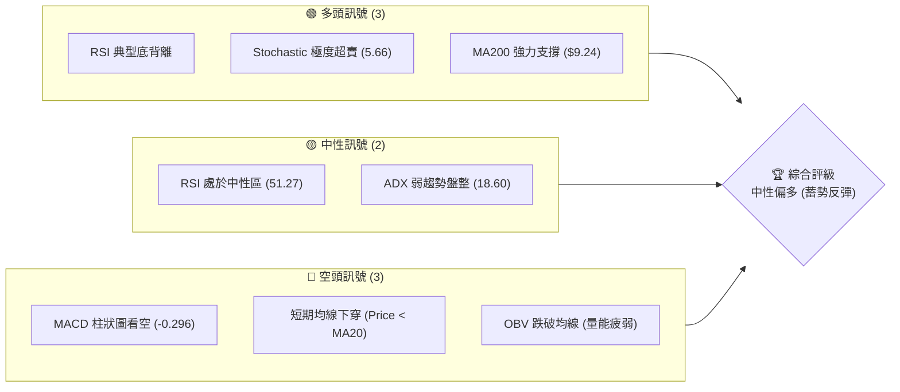
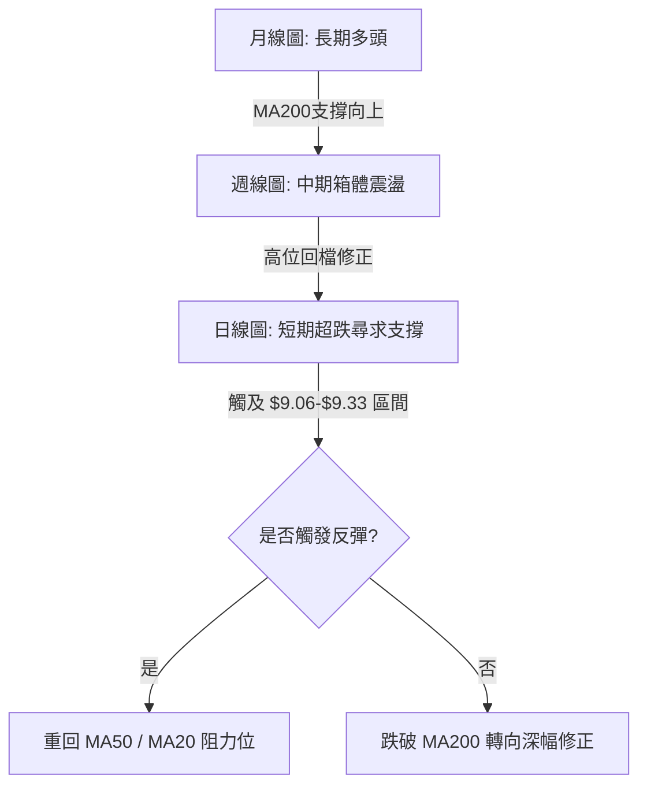
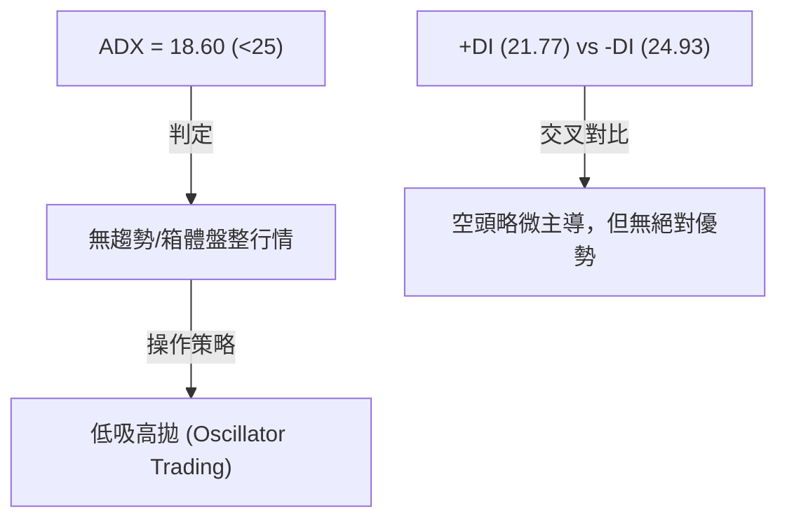
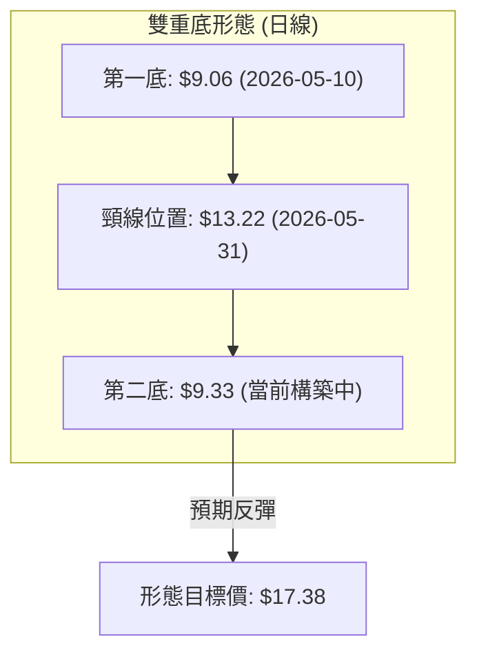

<details>
<summary>📊 靜態圖表 (點擊展開)</summary>

</details>

<html>
<head><meta charset="utf-8" /></head>
<body>
    <div style="height:500px; width:100%;">                        <script>window.PlotlyConfig = {MathJaxConfig: 'local'};</script>
        <script charset="utf-8" src="https://cdn.plot.ly/plotly-3.6.0.min.js" integrity="sha256-QaOVwtVY0T02VaHrr6pnoHLCwayMJp4O5n4YyaE3rJk=" crossorigin="anonymous"></script>                <div id="candlestick-chart" class="plotly-graph-div" style="height:100%; width:100%;"></div>            <script>                window.PLOTLYENV=window.PLOTLYENV || {};                                if (document.getElementById("candlestick-chart")) {                    Plotly.newPlot(                        "candlestick-chart",                        [{"close":{"dtype":"f8","bdata":"AAAAIK5HFEAAAADAzMwWQAAAAOCjcBdAAAAAQArXFUAAAABguB4UQAAAAIDrURVAAAAAwB6FFkAAAACgcD0YQAAAAMDMzBVAAAAAoHA9FkAAAACAFK4ZQAAAAKBwPRpAAAAAwB6FGUAAAAAAKVwYQAAAAGBmZhhAAAAAYGZmGkAAAACgR+EaQAAAAIA9Ch1AAAAAwB6FH0AAAABgZmYdQAAAAAAAAB9AAAAAANejHkAAAABA4XofQAAAAKBH4R5AAAAAoHA9HUAAAAAghWsiQAAAAIDr0SNAAAAAgOtRJUAAAACAFC4mQAAAAMAehSZAAAAAQOH6JEAAAADgo3AiQAAAAGC4niVAAAAAgOvRJEAAAADAHgUjQAAAAGBmZiBAAAAA4KNwHkAAAADgehQfQAAAAGCPwhxAAAAAgML1GkAAAACgcD0cQAAAAEAK1x1AAAAAYLgeHkAAAADA9SgbQAAAAAAAABtAAAAAwPUoGUAAAABgj8IZQAAAAKCZmRhAAAAAQArXF0AAAAAAAAAYQAAAAAAAABVAAAAAoHA9F0AAAADAHoUXQAAAAEAzMxdAAAAAgD0KFkAAAACgcD0aQAAAAOBRuBxAAAAAwB4FGUAAAAAAKVwfQAAAAAAAAB5AAAAA4HoUGUAAAADgo\u002fAaQAAAAOCjcCFAAAAAoEfhIEAAAABA4XogQAAAAKCZmR9AAAAAgOtRHkAAAAAA1yMgQAAAAEAK1yFAAAAAoEdhIkAAAAAA1yMiQAAAAIA9CiJAAAAAgMJ1IkAAAABgZqYgQAAAAIA9CiJAAAAAAACAIUAAAABgj8IeQAAAAIAULiBAAAAAQOF6HUAAAABAMzMfQAAAAOCjcCJAAAAAgD2KIkAAAAAgheshQAAAAGCPQiJAAAAAgML1IEAAAAAghesgQAAAAEDh+iFAAAAAwB6FI0AAAACAPQomQAAAACBcDylAAAAAgBSuKUAAAAAAKVwoQAAAAMAeBSxAAAAAoEdhK0AAAACgR2EqQAAAACCuxytAAAAAYLgeK0AAAAAA16MpQAAAAIDrUShAAAAAYI9CKkAAAACgmRkpQAAAAKBwPSlAAAAAQApXKEAAAACA61EmQAAAAMAehShAAAAAgD2KKEAAAACAPYomQAAAAOBRuCRAAAAAIK5HJUAAAABgj8ImQAAAAAApXCNAAAAAgML1IEAAAACgR2EjQAAAAIAUriRAAAAAAClcI0AAAACAwnUiQAAAAOCj8CFAAAAAYLieIkAAAACgmRkkQAAAAADXIyZAAAAAIK7HJkAAAAAgXA8kQAAAAKBHYSRAAAAAwMzMJEAAAACgmZkkQAAAAGBm5iRAAAAAwPUoJEAAAABAClclQAAAAIA9CiRAAAAAwB4FJUAAAABA4fokQAAAAMD1qCNAAAAA4KNwI0AAAADAHgUkQAAAAMD1qCNAAAAAwPWoJEAAAACA61EkQAAAACBcDyVAAAAAIFyPJkAAAADA9aglQAAAAAAAgCVAAAAAYLgeJEAAAADAzMwlQAAAAAApXCVAAAAAYLieJEAAAACgR+EiQAAAAKCZmSFAAAAAwMxMIEAAAADgehQiQAAAAGC4niFAAAAAQDMzI0AAAACAPQojQAAAACBcDyNAAAAAYGbmIkAAAAAgrkciQAAAAGCPQiJAAAAA4KPwIkAAAADAzMwiQAAAACBcDyRAAAAAYGZmJEAAAAAAAAAkQAAAAIDCdSVAAAAAoHC9JUAAAABguB4mQAAAAOB6FCVAAAAAoJkZJUAAAABgZuYlQAAAAIDC9SRAAAAAQOH6IkAAAADgehQkQAAAAADXoyRAAAAAgMJ1I0AAAADA9agiQAAAAIAUriJAAAAAIK7HIUAAAABguB4iQAAAAEAK1yJAAAAA4HoUIkAAAADgUbghQAAAACCFayZAAAAAoHA9JUAAAABgZmYjQAAAAAAAQCJAAAAA4FG4IkAAAAAAKVwiQAAAAGC4HiJAAAAAgD2KI0AAAACgmZklQAAAAAAAgCpAAAAA4KNwKkAAAAAghesqQAAAAMD1KCtAAAAA4FE4J0AAAADgo\u002fAnQAAAAAAp3CRAAAAAoJmZJEAAAADAzEwjQAAAAGC4niJAAAAAwPWoI0AAAADA9agiQA=="},"high":{"dtype":"f8","bdata":"AAAAwB4FFkAAAACAPQoYQAAAACCDwBhAAAAAwMzMF0AAAACgRbYWQAAAACBcjxVAAAAA4FG4FkAAAAAAAAAaQAAAAAApXBZAAAAAAAAAGEAAAABgj8IZQAAAAKBH4RpAAAAA4KNwG0AAAABgZmYZQAAAAAAAABlAAAAAIFyPGkAAAAAAKVwbQAAAAOCjcB1AAAAAoHA9IEAAAAAA1yMgQAAAAAApXB9AAAAAIFyPH0AAAAAghWshQAAAAEAKVyBAAAAAwMzMH0AAAACAFK4iQAAAACBcjyRAAAAAYI9CJ0AAAABAChcnQAAAAGBmZidAAAAAIK7HJkAAAADAHgUlQAAAAIAUbiZAAAAAYLgeJUAAAACgcL0lQAAAAGCPQiNAAAAAgOtRIEAAAACgR2EgQAAAAADXox9AAAAAgD0KHUAAAABAMzMdQAAAAEAKVyBAAAAAoEehIEAAAAAgXI8eQAAAAMDMzBtAAAAAgMJ1GkAAAAAAAAAaQAAAAGCPwhpAAAAAIK5HGkAAAAAAAAAZQAAAAOBRuBdAAAAA4HqUF0AAAAAgXI8ZQAAAAKBHYRhAAAAAwPWoGEAAAAAAKVwdQAAAAOCjcB9AAAAAIFwPHkAAAACAFK4fQAAAAIDrESBAAAAAoEfhH0AAAABgZmYbQAAAAKCZmSFAAAAAYI\u002fCIUAAAAAAKVwhQAAAAMAg8CBAAAAAANcjIEAAAACgmRkhQAAAAIDCNSJAAAAAgBSuIkAAAACgmZkiQAAAAAAAgCNAAAAA4FG4I0AAAABA4ToiQAAAAMD1KCJAAAAAYGYmI0AAAABA4XohQAAAAADXYyBAAAAAYLgeIUAAAABgka0gQAAAAEDheiJAAAAAgOtRI0AAAACAFK4jQAAAAGBmZiJAAAAAQApXIkAAAABAClchQAAAAKCZmSJAAAAAIFwPJUAAAABguB4mQAAAAOB6FClAAAAAACncKUAAAACAPQoqQAAAAADXIy5AAAAAQDMzLkAAAAAgXI8uQAAAAAAAAC1AAAAAAACAK0AAAAAA1yMsQAAAAAAAgCxAAAAAYGZmLEAAAADA9agsQAAAAMD1qCpAAAAAQOG6KUAAAAAghasoQAAAAOCj8ChAAAAAwPUoKkAAAAAgXI8oQAAAAGBm5iZAAAAAYGZmJkAAAABACtcmQAAAAIA9yiZAAAAAIFwPI0AAAADAHoUjQAAAACCuRyVAAAAAoEfhJEAAAABACtcjQAAAAKDGiyJAAAAAAClcI0AAAAAA16MkQAAAAEAKVyZAAAAAgBQuJ0AAAADA9SgnQAAAAADXIyVAAAAAgML1JEAAAACgR+ElQAAAACBcjyVAAAAAAClcJEAAAABACtcoQAAAAAAAACZAAAAAANejJUAAAABACtclQAAAAOBROCdAAAAAIFwPJEAAAABgZuYkQAAAAGC4HiVAAAAAgBSuJUAAAACAwvUlQAAAAKBwvSVAAAAA4KPwJkAAAADAHoUnQAAAAIDC9SVAAAAAwPWoJUAAAADgo\u002fAlQAAAAKBwvSZAAAAAIK5HJkAAAAAgrkckQAAAAKBwvSJAAAAAANejIUAAAAAgrkciQAAAAEAzsyJAAAAAYI9CI0AAAADAzMwjQAAAAKBHYSNAAAAAoHC9JEAAAACAPQojQAAAAOBRuCJAAAAAIIUrI0AAAADgUbgjQAAAACBcDyRAAAAAIK7HJEAAAAAgXA8lQAAAAGC4HiZAAAAA4HqUJkAAAADgUTgnQAAAAOCj8CVAAAAAgD2KJUAAAABguB4mQAAAAADXIyZAAAAAACncJEAAAACA61EkQAAAAGC4HiVAAAAAQOG6JEAAAADgepQjQAAAACCF6yJAAAAAAACAIkAAAACAFC4iQAAAAMDMTCNAAAAAQDOzIkAAAAAAKVwiQAAAAIDCdSdAAAAAoHA9KEAAAABAClclQAAAAGCPwiNAAAAA4HoUI0AAAABgj8IiQAAAAKBHISNAAAAAwB6FJEAAAABguB4mQAAAACBcjytAAAAAgOvRKkAAAACA69ErQAAAAIDrUSxAAAAAAAAAKkAAAABACtcoQAAAAIDrUSdAAAAAgBSuJUAAAACA69EkQAAAAIDC9SNAAAAAoEPLI0AAAABAicEjQA=="},"hovertemplate":"\u003cb\u003e%{x|%Y-%m-%d}\u003c\u002fb\u003e\u003cbr\u003e\u958b: $%{open:.2f}\u003cbr\u003e\u9ad8: $%{high:.2f}\u003cbr\u003e\u4f4e: $%{low:.2f}\u003cbr\u003e\u6536: $%{close:.2f}\u003cextra\u003e\u003c\u002fextra\u003e","low":{"dtype":"f8","bdata":"AAAAgD0KFEAAAADAzMwUQAAAAMD1KBZAAAAAgOtRFUAAAACAPQoUQAAAAKCZmRNAAAAAYLgeFEAAAABgZmYWQAAAAEAK1xRAAAAAgD2KFUAAAAAA16MVQAAAAMDMzBhAAAAAAAAAGUAAAACAFK4XQAAAAAAAABdAAAAAgD0KGEAAAACAFK4ZQAAAAIDrURpAAAAAIIXrHEAAAAAAAAAdQAAAAMD1KBtAAAAA4KNwHUAAAABAMzMfQAAAACCuRx5AAAAA4FG4HEAAAAAA16MeQAAAAKBHYSJAAAAAgD2KJEAAAABgZuYkQAAAAGAObSVAAAAAAADAJEAAAACgR2EiQAAAACCyXSNAAAAAYI\u002fCI0AAAACA61EiQAAAAIAUrh9AAAAA4FE4HkAAAACA61EdQAAAAAAAgBxAAAAAACncGUAAAACgmZkaQAAAAGC4nh1AAAAA4HoUHkAAAAAA16MaQAAAAOB6FBpAAAAAgOvRGEAAAABA4XoYQAAAAGC4HhdAAAAA4HoUF0AAAACA61EXQAAAAAAp3BRAAAAAwMzME0AAAADgehQXQAAAAGBmZhZAAAAAIIXrFUAAAACgcD0ZQAAAAGBmZhhAAAAAIIXrF0AAAACgmZkYQAAAAIA9Ch1AAAAAAAAAGUAAAADgUbgXQAAAAIAUrhpAAAAAANcjIEAAAACgcL0eQAAAAEAzMx9AAAAAoEfhHUAAAAAgrkcdQAAAAEAK1x1AAAAAgD0KIUAAAADA9SghQAAAAOCj8CFAAAAA4FE4IUAAAAAAKZwgQAAAAKBwPSBAAAAAgOvRIEAAAACgcD0eQAAAAAApXB5AAAAAYLgeHUAAAACAwvUeQAAAAOCjcB9AAAAAIFxPIkAAAABAClchQAAAAEAzsyFAAAAAACncIEAAAAAghWsgQAAAAMD1qCBAAAAAQApXIkAAAACA69EjQAAAAEDh+iVAAAAAIIXrJ0AAAADgUTgoQAAAAMDMTCpAAAAAgBQuK0AAAADA9agpQAAAACCF6ylAAAAAQArXKUAAAACgmZkpQAAAAKBwPShAAAAAoJmZJ0AAAAAAKdwnQAAAAEAzsyhAAAAAoEfhJ0AAAABgZuYlQAAAAIAULiZAAAAAYLgeKEAAAAAA1yMmQAAAACCuRyRAAAAAwMxMJEAAAADAHgUlQAAAAGCPQiJAAAAAANejIEAAAABgZuYgQAAAAEAKVyNAAAAAQDMzI0AAAABgj8IhQAAAAGBmZiFAAAAAANejIUAAAACgcL0hQAAAAEDh+iNAAAAAQOF6JUAAAABgZuYjQAAAAOBRuCNAAAAAgML1IkAAAACAPYokQAAAAGBm5iNAAAAAoHA9I0AAAACgmZkkQAAAAMAehSNAAAAAACncI0AAAABguB4kQAAAAMAehSNAAAAAYGZmIkAAAABgZiYjQAAAAAAAACNAAAAAoJmZI0AAAACgmRkkQAAAAOBROCRAAAAAoHC9JEAAAAAA16MlQAAAAKBwPSRAAAAAgMJ1I0AAAACAFO4jQAAAAEAz8yRAAAAAgMJ1JEAAAACAPYoiQAAAAMD1aCFAAAAAYLgeH0AAAABgZmYgQAAAACBcjyFAAAAAIIXrIEAAAABgj8IiQAAAAOBNYiJAAAAAgBSuIkAAAADAHgUiQAAAAEDh+iFAAAAAgMJ1IUAAAACgmZkiQAAAAKBwvSJAAAAAwB6FI0AAAACAPYojQAAAAIDrUSNAAAAAIK5HJUAAAABAM7MlQAAAAEAzMyRAAAAAQOE6JEAAAAAghWskQAAAACCFqyRAAAAAgOvRIkAAAABguJ4iQAAAAKBwPSNAAAAAQApXI0AAAACA61EiQAAAAIA9CiJAAAAAIFyPIUAAAADAzEwhQAAAAOCjcCFAAAAAoJmZIUAAAABAClchQAAAAEAzMyNAAAAAAAAAJUAAAAAghesiQAAAAOCj8CFAAAAAoHA9IkAAAACAwvUhQAAAAGC4HiJAAAAAILKdIkAAAAAAKVwjQAAAAOCjcCZAAAAAQDMzJ0AAAACgmZkpQAAAAIAULipAAAAAIFwPJ0AAAABguB4mQAAAAMD1qCRAAAAAAACAJEAAAADgehQiQAAAAKCZmSJAAAAAwB6FIkAAAAAAKVwiQA=="},"name":"\u50f9\u683c","open":{"dtype":"f8","bdata":"AAAA4HoUFEAAAAAAAAAVQAAAAAAAABhAAAAAYGbmFUAAAABA4XoWQAAAAADXIxRAAAAAwMzMFUAAAADAHoUWQAAAAKBwPRVAAAAA4KNwFkAAAADgUbgWQAAAAMDMzBlAAAAAQArXGkAAAAAgrkcZQAAAAKBwPRhAAAAAYLgeGUAAAABAMzMaQAAAACCuRxtAAAAAIFwPHkAAAACAwvUfQAAAAMAeBRxAAAAAIK7HHkAAAABACtcfQAAAAOBRuB9AAAAAAAAAH0AAAABAMzMfQAAAAMAeBSNAAAAAYLgeJUAAAAAAAAAmQAAAACCuhyZAAAAAIK5HJkAAAACAwvUkQAAAACBcDyRAAAAAYI\u002fCJEAAAABgZqYlQAAAAGCPQiNAAAAAwMzMH0AAAABguB4gQAAAAOBRuB5AAAAAYGZmG0AAAABgZmYbQAAAAIAUrh5AAAAAYLheIEAAAADgehQeQAAAAOB6lBtAAAAAgML1GUAAAAAAAAAZQAAAAMDMTBpAAAAAYLgeF0AAAAAghesXQAAAAIAUrhdAAAAAwPUoFEAAAABA4XoZQAAAAGBmZhdAAAAA4KPwF0AAAAAgrkcZQAAAAMD1qBhAAAAAgD0KHkAAAABguJ4YQAAAAAAp3B1AAAAAgBSuH0AAAACgcD0aQAAAAADXIxtAAAAAgML1IEAAAADgUTghQAAAACBcjyBAAAAAwB6FH0AAAADgUbgeQAAAACCuxyBAAAAAwB5FIUAAAAAAKdwhQAAAAEAKlyJAAAAAQArXIUAAAADgUTgiQAAAAEDh+iBAAAAAgML1IUAAAAAAKVwhQAAAAEDheh5AAAAAIK5HIEAAAADA9SgfQAAAAIDC9R9AAAAAoJmZIkAAAAAgXA8iQAAAAIDC9SFAAAAA4CRGIkAAAACgmZkgQAAAACCF6yBAAAAAIFyPIkAAAADAHkUkQAAAAKCZmSZAAAAAQDMzKEAAAABgZmYpQAAAAMD1aCpAAAAAAAAALEAAAAAghWsrQAAAAAAAACtAAAAAoEdhK0AAAAAA1yMrQAAAAOB61CpAAAAAgMK1J0AAAACgmZkrQAAAAMAeBSlAAAAAIIVrKUAAAADAzEwoQAAAACCFayZAAAAAgML1KUAAAAAgrkcoQAAAAAAAgCZAAAAAYLieJUAAAADAHgUmQAAAAGCPwiZAAAAAgBSuIkAAAACAFO4hQAAAAAApnCNAAAAAgBQuJEAAAADAHsUjQAAAAKBwfSJAAAAAgD2KIkAAAADgUXgiQAAAACCFayRAAAAAANejJUAAAACgR2EmQAAAAAAp3CNAAAAAwB4FJEAAAABgj0IlQAAAAMDMTCRAAAAAgBQuJEAAAAAAAAAlQAAAAKBHYSVAAAAA4FG4JEAAAABA4fokQAAAAAAAgCRAAAAAIFwPJEAAAACAFK4jQAAAAKCZGSRAAAAAIIUrJEAAAAAAKdwkQAAAAKBwvSRAAAAAoJkZJUAAAAAAAMAmQAAAAGC4XiVAAAAA4HqUJUAAAADgepQkQAAAAIDr0SVAAAAAYI\u002fCJUAAAACgmRkkQAAAAEAzsyJAAAAAYLieIUAAAABgZuYgQAAAAKCZmSJAAAAAIK4HIUAAAABgj0IjQAAAAAAp3CJAAAAAQApXJEAAAADgetQiQAAAAIDCdSJAAAAAwB4FIkAAAADgo3AjQAAAAMAeBSNAAAAAAACAJEAAAABgj8IkQAAAAKCZmSNAAAAAwMzMJUAAAACAPYomQAAAAGCPwiVAAAAAYI9CJUAAAADAS7ckQAAAAADXYyVAAAAAYI\u002fCJEAAAAAAAAAjQAAAAAAAACRAAAAAwMxMJEAAAAAgXI8jQAAAAAAAgCJAAAAAAACAIkAAAAAAAAAiQAAAAEAK1yFAAAAA4FF4IkAAAABACtchQAAAAEDh+iNAAAAAgOvRJUAAAABgj0IlQAAAAGBmpiNAAAAAAACAIkAAAAAgXI8iQAAAACCFayJAAAAAIIWrIkAAAAAAAAAkQAAAAEAz8yZAAAAAAACAKUAAAACgcH0qQAAAAKBwPStAAAAAIIXrKUAAAACAwvUmQAAAAEAK1yZAAAAAwPWoJUAAAAAghaskQAAAAKBHYSNAAAAAYGamIkAAAAAA\u002fpQjQA=="},"x":["2025-08-27T00:00:00-04:00","2025-08-28T00:00:00-04:00","2025-08-29T00:00:00-04:00","2025-09-02T00:00:00-04:00","2025-09-03T00:00:00-04:00","2025-09-04T00:00:00-04:00","2025-09-05T00:00:00-04:00","2025-09-08T00:00:00-04:00","2025-09-09T00:00:00-04:00","2025-09-10T00:00:00-04:00","2025-09-11T00:00:00-04:00","2025-09-12T00:00:00-04:00","2025-09-15T00:00:00-04:00","2025-09-16T00:00:00-04:00","2025-09-17T00:00:00-04:00","2025-09-18T00:00:00-04:00","2025-09-19T00:00:00-04:00","2025-09-22T00:00:00-04:00","2025-09-23T00:00:00-04:00","2025-09-24T00:00:00-04:00","2025-09-25T00:00:00-04:00","2025-09-26T00:00:00-04:00","2025-09-29T00:00:00-04:00","2025-09-30T00:00:00-04:00","2025-10-01T00:00:00-04:00","2025-10-02T00:00:00-04:00","2025-10-03T00:00:00-04:00","2025-10-06T00:00:00-04:00","2025-10-07T00:00:00-04:00","2025-10-08T00:00:00-04:00","2025-10-09T00:00:00-04:00","2025-10-10T00:00:00-04:00","2025-10-13T00:00:00-04:00","2025-10-14T00:00:00-04:00","2025-10-15T00:00:00-04:00","2025-10-16T00:00:00-04:00","2025-10-17T00:00:00-04:00","2025-10-20T00:00:00-04:00","2025-10-21T00:00:00-04:00","2025-10-22T00:00:00-04:00","2025-10-23T00:00:00-04:00","2025-10-24T00:00:00-04:00","2025-10-27T00:00:00-04:00","2025-10-28T00:00:00-04:00","2025-10-29T00:00:00-04:00","2025-10-30T00:00:00-04:00","2025-10-31T00:00:00-04:00","2025-11-03T00:00:00-05:00","2025-11-04T00:00:00-05:00","2025-11-05T00:00:00-05:00","2025-11-06T00:00:00-05:00","2025-11-07T00:00:00-05:00","2025-11-10T00:00:00-05:00","2025-11-11T00:00:00-05:00","2025-11-12T00:00:00-05:00","2025-11-13T00:00:00-05:00","2025-11-14T00:00:00-05:00","2025-11-17T00:00:00-05:00","2025-11-18T00:00:00-05:00","2025-11-19T00:00:00-05:00","2025-11-20T00:00:00-05:00","2025-11-21T00:00:00-05:00","2025-11-24T00:00:00-05:00","2025-11-25T00:00:00-05:00","2025-11-26T00:00:00-05:00","2025-11-28T00:00:00-05:00","2025-12-01T00:00:00-05:00","2025-12-02T00:00:00-05:00","2025-12-03T00:00:00-05:00","2025-12-04T00:00:00-05:00","2025-12-05T00:00:00-05:00","2025-12-08T00:00:00-05:00","2025-12-09T00:00:00-05:00","2025-12-10T00:00:00-05:00","2025-12-11T00:00:00-05:00","2025-12-12T00:00:00-05:00","2025-12-15T00:00:00-05:00","2025-12-16T00:00:00-05:00","2025-12-17T00:00:00-05:00","2025-12-18T00:00:00-05:00","2025-12-19T00:00:00-05:00","2025-12-22T00:00:00-05:00","2025-12-23T00:00:00-05:00","2025-12-24T00:00:00-05:00","2025-12-26T00:00:00-05:00","2025-12-29T00:00:00-05:00","2025-12-30T00:00:00-05:00","2025-12-31T00:00:00-05:00","2026-01-02T00:00:00-05:00","2026-01-05T00:00:00-05:00","2026-01-06T00:00:00-05:00","2026-01-07T00:00:00-05:00","2026-01-08T00:00:00-05:00","2026-01-09T00:00:00-05:00","2026-01-12T00:00:00-05:00","2026-01-13T00:00:00-05:00","2026-01-14T00:00:00-05:00","2026-01-15T00:00:00-05:00","2026-01-16T00:00:00-05:00","2026-01-20T00:00:00-05:00","2026-01-21T00:00:00-05:00","2026-01-22T00:00:00-05:00","2026-01-23T00:00:00-05:00","2026-01-26T00:00:00-05:00","2026-01-27T00:00:00-05:00","2026-01-28T00:00:00-05:00","2026-01-29T00:00:00-05:00","2026-01-30T00:00:00-05:00","2026-02-02T00:00:00-05:00","2026-02-03T00:00:00-05:00","2026-02-04T00:00:00-05:00","2026-02-05T00:00:00-05:00","2026-02-06T00:00:00-05:00","2026-02-09T00:00:00-05:00","2026-02-10T00:00:00-05:00","2026-02-11T00:00:00-05:00","2026-02-12T00:00:00-05:00","2026-02-13T00:00:00-05:00","2026-02-17T00:00:00-05:00","2026-02-18T00:00:00-05:00","2026-02-19T00:00:00-05:00","2026-02-20T00:00:00-05:00","2026-02-23T00:00:00-05:00","2026-02-24T00:00:00-05:00","2026-02-25T00:00:00-05:00","2026-02-26T00:00:00-05:00","2026-02-27T00:00:00-05:00","2026-03-02T00:00:00-05:00","2026-03-03T00:00:00-05:00","2026-03-04T00:00:00-05:00","2026-03-05T00:00:00-05:00","2026-03-06T00:00:00-05:00","2026-03-09T00:00:00-04:00","2026-03-10T00:00:00-04:00","2026-03-11T00:00:00-04:00","2026-03-12T00:00:00-04:00","2026-03-13T00:00:00-04:00","2026-03-16T00:00:00-04:00","2026-03-17T00:00:00-04:00","2026-03-18T00:00:00-04:00","2026-03-19T00:00:00-04:00","2026-03-20T00:00:00-04:00","2026-03-23T00:00:00-04:00","2026-03-24T00:00:00-04:00","2026-03-25T00:00:00-04:00","2026-03-26T00:00:00-04:00","2026-03-27T00:00:00-04:00","2026-03-30T00:00:00-04:00","2026-03-31T00:00:00-04:00","2026-04-01T00:00:00-04:00","2026-04-02T00:00:00-04:00","2026-04-06T00:00:00-04:00","2026-04-07T00:00:00-04:00","2026-04-08T00:00:00-04:00","2026-04-09T00:00:00-04:00","2026-04-10T00:00:00-04:00","2026-04-13T00:00:00-04:00","2026-04-14T00:00:00-04:00","2026-04-15T00:00:00-04:00","2026-04-16T00:00:00-04:00","2026-04-17T00:00:00-04:00","2026-04-20T00:00:00-04:00","2026-04-21T00:00:00-04:00","2026-04-22T00:00:00-04:00","2026-04-23T00:00:00-04:00","2026-04-24T00:00:00-04:00","2026-04-27T00:00:00-04:00","2026-04-28T00:00:00-04:00","2026-04-29T00:00:00-04:00","2026-04-30T00:00:00-04:00","2026-05-01T00:00:00-04:00","2026-05-04T00:00:00-04:00","2026-05-05T00:00:00-04:00","2026-05-06T00:00:00-04:00","2026-05-07T00:00:00-04:00","2026-05-08T00:00:00-04:00","2026-05-11T00:00:00-04:00","2026-05-12T00:00:00-04:00","2026-05-13T00:00:00-04:00","2026-05-14T00:00:00-04:00","2026-05-15T00:00:00-04:00","2026-05-18T00:00:00-04:00","2026-05-19T00:00:00-04:00","2026-05-20T00:00:00-04:00","2026-05-21T00:00:00-04:00","2026-05-22T00:00:00-04:00","2026-05-26T00:00:00-04:00","2026-05-27T00:00:00-04:00","2026-05-28T00:00:00-04:00","2026-05-29T00:00:00-04:00","2026-06-01T00:00:00-04:00","2026-06-02T00:00:00-04:00","2026-06-03T00:00:00-04:00","2026-06-04T00:00:00-04:00","2026-06-05T00:00:00-04:00","2026-06-08T00:00:00-04:00","2026-06-09T00:00:00-04:00","2026-06-10T00:00:00-04:00","2026-06-11T00:00:00-04:00","2026-06-12T00:00:00-04:00"],"type":"candlestick"},{"hovertemplate":"MA30: $%{y:.2f}\u003cextra\u003e\u003c\u002fextra\u003e","line":{"color":"#2196F3","dash":"dash","width":2},"mode":"lines","name":"MA30","x":["2025-08-27T00:00:00-04:00","2025-08-28T00:00:00-04:00","2025-08-29T00:00:00-04:00","2025-09-02T00:00:00-04:00","2025-09-03T00:00:00-04:00","2025-09-04T00:00:00-04:00","2025-09-05T00:00:00-04:00","2025-09-08T00:00:00-04:00","2025-09-09T00:00:00-04:00","2025-09-10T00:00:00-04:00","2025-09-11T00:00:00-04:00","2025-09-12T00:00:00-04:00","2025-09-15T00:00:00-04:00","2025-09-16T00:00:00-04:00","2025-09-17T00:00:00-04:00","2025-09-18T00:00:00-04:00","2025-09-19T00:00:00-04:00","2025-09-22T00:00:00-04:00","2025-09-23T00:00:00-04:00","2025-09-24T00:00:00-04:00","2025-09-25T00:00:00-04:00","2025-09-26T00:00:00-04:00","2025-09-29T00:00:00-04:00","2025-09-30T00:00:00-04:00","2025-10-01T00:00:00-04:00","2025-10-02T00:00:00-04:00","2025-10-03T00:00:00-04:00","2025-10-06T00:00:00-04:00","2025-10-07T00:00:00-04:00","2025-10-08T00:00:00-04:00","2025-10-09T00:00:00-04:00","2025-10-10T00:00:00-04:00","2025-10-13T00:00:00-04:00","2025-10-14T00:00:00-04:00","2025-10-15T00:00:00-04:00","2025-10-16T00:00:00-04:00","2025-10-17T00:00:00-04:00","2025-10-20T00:00:00-04:00","2025-10-21T00:00:00-04:00","2025-10-22T00:00:00-04:00","2025-10-23T00:00:00-04:00","2025-10-24T00:00:00-04:00","2025-10-27T00:00:00-04:00","2025-10-28T00:00:00-04:00","2025-10-29T00:00:00-04:00","2025-10-30T00:00:00-04:00","2025-10-31T00:00:00-04:00","2025-11-03T00:00:00-05:00","2025-11-04T00:00:00-05:00","2025-11-05T00:00:00-05:00","2025-11-06T00:00:00-05:00","2025-11-07T00:00:00-05:00","2025-11-10T00:00:00-05:00","2025-11-11T00:00:00-05:00","2025-11-12T00:00:00-05:00","2025-11-13T00:00:00-05:00","2025-11-14T00:00:00-05:00","2025-11-17T00:00:00-05:00","2025-11-18T00:00:00-05:00","2025-11-19T00:00:00-05:00","2025-11-20T00:00:00-05:00","2025-11-21T00:00:00-05:00","2025-11-24T00:00:00-05:00","2025-11-25T00:00:00-05:00","2025-11-26T00:00:00-05:00","2025-11-28T00:00:00-05:00","2025-12-01T00:00:00-05:00","2025-12-02T00:00:00-05:00","2025-12-03T00:00:00-05:00","2025-12-04T00:00:00-05:00","2025-12-05T00:00:00-05:00","2025-12-08T00:00:00-05:00","2025-12-09T00:00:00-05:00","2025-12-10T00:00:00-05:00","2025-12-11T00:00:00-05:00","2025-12-12T00:00:00-05:00","2025-12-15T00:00:00-05:00","2025-12-16T00:00:00-05:00","2025-12-17T00:00:00-05:00","2025-12-18T00:00:00-05:00","2025-12-19T00:00:00-05:00","2025-12-22T00:00:00-05:00","2025-12-23T00:00:00-05:00","2025-12-24T00:00:00-05:00","2025-12-26T00:00:00-05:00","2025-12-29T00:00:00-05:00","2025-12-30T00:00:00-05:00","2025-12-31T00:00:00-05:00","2026-01-02T00:00:00-05:00","2026-01-05T00:00:00-05:00","2026-01-06T00:00:00-05:00","2026-01-07T00:00:00-05:00","2026-01-08T00:00:00-05:00","2026-01-09T00:00:00-05:00","2026-01-12T00:00:00-05:00","2026-01-13T00:00:00-05:00","2026-01-14T00:00:00-05:00","2026-01-15T00:00:00-05:00","2026-01-16T00:00:00-05:00","2026-01-20T00:00:00-05:00","2026-01-21T00:00:00-05:00","2026-01-22T00:00:00-05:00","2026-01-23T00:00:00-05:00","2026-01-26T00:00:00-05:00","2026-01-27T00:00:00-05:00","2026-01-28T00:00:00-05:00","2026-01-29T00:00:00-05:00","2026-01-30T00:00:00-05:00","2026-02-02T00:00:00-05:00","2026-02-03T00:00:00-05:00","2026-02-04T00:00:00-05:00","2026-02-05T00:00:00-05:00","2026-02-06T00:00:00-05:00","2026-02-09T00:00:00-05:00","2026-02-10T00:00:00-05:00","2026-02-11T00:00:00-05:00","2026-02-12T00:00:00-05:00","2026-02-13T00:00:00-05:00","2026-02-17T00:00:00-05:00","2026-02-18T00:00:00-05:00","2026-02-19T00:00:00-05:00","2026-02-20T00:00:00-05:00","2026-02-23T00:00:00-05:00","2026-02-24T00:00:00-05:00","2026-02-25T00:00:00-05:00","2026-02-26T00:00:00-05:00","2026-02-27T00:00:00-05:00","2026-03-02T00:00:00-05:00","2026-03-03T00:00:00-05:00","2026-03-04T00:00:00-05:00","2026-03-05T00:00:00-05:00","2026-03-06T00:00:00-05:00","2026-03-09T00:00:00-04:00","2026-03-10T00:00:00-04:00","2026-03-11T00:00:00-04:00","2026-03-12T00:00:00-04:00","2026-03-13T00:00:00-04:00","2026-03-16T00:00:00-04:00","2026-03-17T00:00:00-04:00","2026-03-18T00:00:00-04:00","2026-03-19T00:00:00-04:00","2026-03-20T00:00:00-04:00","2026-03-23T00:00:00-04:00","2026-03-24T00:00:00-04:00","2026-03-25T00:00:00-04:00","2026-03-26T00:00:00-04:00","2026-03-27T00:00:00-04:00","2026-03-30T00:00:00-04:00","2026-03-31T00:00:00-04:00","2026-04-01T00:00:00-04:00","2026-04-02T00:00:00-04:00","2026-04-06T00:00:00-04:00","2026-04-07T00:00:00-04:00","2026-04-08T00:00:00-04:00","2026-04-09T00:00:00-04:00","2026-04-10T00:00:00-04:00","2026-04-13T00:00:00-04:00","2026-04-14T00:00:00-04:00","2026-04-15T00:00:00-04:00","2026-04-16T00:00:00-04:00","2026-04-17T00:00:00-04:00","2026-04-20T00:00:00-04:00","2026-04-21T00:00:00-04:00","2026-04-22T00:00:00-04:00","2026-04-23T00:00:00-04:00","2026-04-24T00:00:00-04:00","2026-04-27T00:00:00-04:00","2026-04-28T00:00:00-04:00","2026-04-29T00:00:00-04:00","2026-04-30T00:00:00-04:00","2026-05-01T00:00:00-04:00","2026-05-04T00:00:00-04:00","2026-05-05T00:00:00-04:00","2026-05-06T00:00:00-04:00","2026-05-07T00:00:00-04:00","2026-05-08T00:00:00-04:00","2026-05-11T00:00:00-04:00","2026-05-12T00:00:00-04:00","2026-05-13T00:00:00-04:00","2026-05-14T00:00:00-04:00","2026-05-15T00:00:00-04:00","2026-05-18T00:00:00-04:00","2026-05-19T00:00:00-04:00","2026-05-20T00:00:00-04:00","2026-05-21T00:00:00-04:00","2026-05-22T00:00:00-04:00","2026-05-26T00:00:00-04:00","2026-05-27T00:00:00-04:00","2026-05-28T00:00:00-04:00","2026-05-29T00:00:00-04:00","2026-06-01T00:00:00-04:00","2026-06-02T00:00:00-04:00","2026-06-03T00:00:00-04:00","2026-06-04T00:00:00-04:00","2026-06-05T00:00:00-04:00","2026-06-08T00:00:00-04:00","2026-06-09T00:00:00-04:00","2026-06-10T00:00:00-04:00","2026-06-11T00:00:00-04:00","2026-06-12T00:00:00-04:00"],"y":{"dtype":"f8","bdata":"AAAAAAAA+H8AAAAAAAD4fwAAAAAAAPh\u002fAAAAAAAA+H8AAAAAAAD4fwAAAAAAAPh\u002fAAAAAAAA+H8AAAAAAAD4fwAAAAAAAPh\u002fAAAAAAAA+H8AAAAAAAD4fwAAAAAAAPh\u002fAAAAAAAA+H8AAAAAAAD4fwAAAAAAAPh\u002fAAAAAAAA+H8AAAAAAAD4fwAAAAAAAPh\u002fAAAAAAAA+H8AAAAAAAD4fwAAAAAAAPh\u002fAAAAAAAA+H8AAAAAAAD4fwAAAAAAAPh\u002fAAAAAAAA+H8AAAAAAAD4fwAAAAAAAPh\u002fAAAAAAAA+H8AAAAAAAD4f97d3X2xZBxAvLu7K7IdHUB3d3dn2JUdQKuqqirOPh5AzczM7MPnHkAzMzPDroAfQERERDSl4h9Aq6qqWh0TIEBVVVV1TDAgQKuqqqL+TSBAIiIiIiJiIEDe3d1VDm0gQO\u002fu7n5qfCBARERE7AqQIEDNzMxE\u002fZsgQJqZmSkVpyBAiYiIwMqhIEAiIiJqA50gQAAAAMARiiBAREREJE1pIEDv7u7mQlIgQERERDyYJyBAZmZmdgUIIECrqqoKHswfQERERNSUih9AERERMSRNH0AzMzMjsPIeQImIiAiBlR5A7+7ujiX\u002fHUAAAACgNpAdQN7d3T3fDx1AIiIiUtR\u002fHEDv7u4OAiscQLy7u1ur4xtAvLu7O22gG0DNzMzME3UbQM3MzFzWahtAd3d3N9BpG0B3d3enDXQbQAAAAKAarxtAzczMDLsCHEAiIiKyVkccQAAAADCWfBxAIiIiAp22HECrqqoKAuscQLy7u5t9OB1Aq6qqanWMHUBVVVUVILcdQAAAABBY+R1ARERE1HgpHkCJiIh46WYeQM3MzNxr7h5A7+7uzoVkH0AiIiJCp80fQO\u002fu7p6oHyBA7+7uvlhSIEARERH5xXIgQLy7u\u002fupkSBAAAAAkHvNIEAiIiIywQMhQJqZmZmZWSFAZmZmXrrJIUAAAADwpyYiQM3MzEzwgCJAZmZm5onaIkB3d3fHBC8jQFVVVX0\u002flSNAq6qqgk77I0C8u7uTX0wkQCIiIlqrgyRAIiIieunGJEDNzMzUTQIlQAAAAHi+PyVA7+7uhutxJUDNzMzUTaIlQDMzM5uZ2SVAERERuawVJkC8u7v7xVImQDMzM8ODeSZAzczMnFKxJkDv7u7ea+4mQERERKRF9iZAMzMzE8roJkDe3d19P\u002fUmQAAAABDmCSdAIiIi8mAeJ0AAAAAghSsnQO\u002fu7r4tKydAq6qqqn8jJ0C8u7ur8RInQFVVVdUG+iZAAAAAsEfhJkARERExlrwmQKuqqlpkeyZAAAAAID5DJkBmZmaG6xEmQO\u002fu7u411yVARERElNGbJUBmZmYWIHclQJqZmUmaUiVAVVVVVeMlJUDe3d0NuwIlQLy7u1sd0yRAVVVVJU2pJECJiIi4rJUkQDMzM+MzbCRAVVVV5RdLJECrqqo6JjgkQImIiPgMOyRAvLu7K\u002flFJEDv7u4uljwkQFVVVRXZTiRAZmZmNtBpJECJiIjIdn4kQEREREREhCRAd3d3xwSPJECJiIhImpIkQKuqqoqzjyRAvLu7a+d7JECamZmpqmokQDMzM5MYRCRAIiIi8oslJECamZm51xwkQERERCSUESRAd3d3h10BJECamZlpke0jQO\u002fu7j4K1yNA3t3dHaHMI0BmZmZm9LYjQGZmZhYgtyNAzczMrNWxI0BVVVXVeKkjQN7d3f3UuCNAq6qqanXMI0AAAADwYN4jQJqZmfl+6iNAvLu7K0DuI0C8u7u7u\u002fsjQHd3d0fh+iNAZmZmplTcI0BmZmYW2c4jQDMzM2OCxyNAd3d3l+DBI0CJiIgoFacjQLy7u5s2kCNAiYiIiPp3I0CrqqpKfnEjQM3MzBwTfCNAVVVVlUOLI0BmZmYmMYgjQImIiOgmsSNAq6qqWo\u002fCI0CJiIjIocUjQAAAAFC4viNAiYiIGC+9I0C8u7vb3b0jQGZmZgasvCNA7+7uvsrBI0ARERFxr9kjQGZmZtajECRAvLu7ay5EJEBERERkO38kQLy7uzvfryRAd3d3V4C8JEARERExCMwkQImIiJgnyiRAREREVOPFJECrqqqKs68kQM3MzLy7myRAiYiIOImhJEDv7u4ua5UkQA=="},"type":"scatter"},{"hovertemplate":"MA60: $%{y:.2f}\u003cextra\u003e\u003c\u002fextra\u003e","line":{"color":"#9C27B0","dash":"dash","width":2},"mode":"lines","name":"MA60","x":["2025-08-27T00:00:00-04:00","2025-08-28T00:00:00-04:00","2025-08-29T00:00:00-04:00","2025-09-02T00:00:00-04:00","2025-09-03T00:00:00-04:00","2025-09-04T00:00:00-04:00","2025-09-05T00:00:00-04:00","2025-09-08T00:00:00-04:00","2025-09-09T00:00:00-04:00","2025-09-10T00:00:00-04:00","2025-09-11T00:00:00-04:00","2025-09-12T00:00:00-04:00","2025-09-15T00:00:00-04:00","2025-09-16T00:00:00-04:00","2025-09-17T00:00:00-04:00","2025-09-18T00:00:00-04:00","2025-09-19T00:00:00-04:00","2025-09-22T00:00:00-04:00","2025-09-23T00:00:00-04:00","2025-09-24T00:00:00-04:00","2025-09-25T00:00:00-04:00","2025-09-26T00:00:00-04:00","2025-09-29T00:00:00-04:00","2025-09-30T00:00:00-04:00","2025-10-01T00:00:00-04:00","2025-10-02T00:00:00-04:00","2025-10-03T00:00:00-04:00","2025-10-06T00:00:00-04:00","2025-10-07T00:00:00-04:00","2025-10-08T00:00:00-04:00","2025-10-09T00:00:00-04:00","2025-10-10T00:00:00-04:00","2025-10-13T00:00:00-04:00","2025-10-14T00:00:00-04:00","2025-10-15T00:00:00-04:00","2025-10-16T00:00:00-04:00","2025-10-17T00:00:00-04:00","2025-10-20T00:00:00-04:00","2025-10-21T00:00:00-04:00","2025-10-22T00:00:00-04:00","2025-10-23T00:00:00-04:00","2025-10-24T00:00:00-04:00","2025-10-27T00:00:00-04:00","2025-10-28T00:00:00-04:00","2025-10-29T00:00:00-04:00","2025-10-30T00:00:00-04:00","2025-10-31T00:00:00-04:00","2025-11-03T00:00:00-05:00","2025-11-04T00:00:00-05:00","2025-11-05T00:00:00-05:00","2025-11-06T00:00:00-05:00","2025-11-07T00:00:00-05:00","2025-11-10T00:00:00-05:00","2025-11-11T00:00:00-05:00","2025-11-12T00:00:00-05:00","2025-11-13T00:00:00-05:00","2025-11-14T00:00:00-05:00","2025-11-17T00:00:00-05:00","2025-11-18T00:00:00-05:00","2025-11-19T00:00:00-05:00","2025-11-20T00:00:00-05:00","2025-11-21T00:00:00-05:00","2025-11-24T00:00:00-05:00","2025-11-25T00:00:00-05:00","2025-11-26T00:00:00-05:00","2025-11-28T00:00:00-05:00","2025-12-01T00:00:00-05:00","2025-12-02T00:00:00-05:00","2025-12-03T00:00:00-05:00","2025-12-04T00:00:00-05:00","2025-12-05T00:00:00-05:00","2025-12-08T00:00:00-05:00","2025-12-09T00:00:00-05:00","2025-12-10T00:00:00-05:00","2025-12-11T00:00:00-05:00","2025-12-12T00:00:00-05:00","2025-12-15T00:00:00-05:00","2025-12-16T00:00:00-05:00","2025-12-17T00:00:00-05:00","2025-12-18T00:00:00-05:00","2025-12-19T00:00:00-05:00","2025-12-22T00:00:00-05:00","2025-12-23T00:00:00-05:00","2025-12-24T00:00:00-05:00","2025-12-26T00:00:00-05:00","2025-12-29T00:00:00-05:00","2025-12-30T00:00:00-05:00","2025-12-31T00:00:00-05:00","2026-01-02T00:00:00-05:00","2026-01-05T00:00:00-05:00","2026-01-06T00:00:00-05:00","2026-01-07T00:00:00-05:00","2026-01-08T00:00:00-05:00","2026-01-09T00:00:00-05:00","2026-01-12T00:00:00-05:00","2026-01-13T00:00:00-05:00","2026-01-14T00:00:00-05:00","2026-01-15T00:00:00-05:00","2026-01-16T00:00:00-05:00","2026-01-20T00:00:00-05:00","2026-01-21T00:00:00-05:00","2026-01-22T00:00:00-05:00","2026-01-23T00:00:00-05:00","2026-01-26T00:00:00-05:00","2026-01-27T00:00:00-05:00","2026-01-28T00:00:00-05:00","2026-01-29T00:00:00-05:00","2026-01-30T00:00:00-05:00","2026-02-02T00:00:00-05:00","2026-02-03T00:00:00-05:00","2026-02-04T00:00:00-05:00","2026-02-05T00:00:00-05:00","2026-02-06T00:00:00-05:00","2026-02-09T00:00:00-05:00","2026-02-10T00:00:00-05:00","2026-02-11T00:00:00-05:00","2026-02-12T00:00:00-05:00","2026-02-13T00:00:00-05:00","2026-02-17T00:00:00-05:00","2026-02-18T00:00:00-05:00","2026-02-19T00:00:00-05:00","2026-02-20T00:00:00-05:00","2026-02-23T00:00:00-05:00","2026-02-24T00:00:00-05:00","2026-02-25T00:00:00-05:00","2026-02-26T00:00:00-05:00","2026-02-27T00:00:00-05:00","2026-03-02T00:00:00-05:00","2026-03-03T00:00:00-05:00","2026-03-04T00:00:00-05:00","2026-03-05T00:00:00-05:00","2026-03-06T00:00:00-05:00","2026-03-09T00:00:00-04:00","2026-03-10T00:00:00-04:00","2026-03-11T00:00:00-04:00","2026-03-12T00:00:00-04:00","2026-03-13T00:00:00-04:00","2026-03-16T00:00:00-04:00","2026-03-17T00:00:00-04:00","2026-03-18T00:00:00-04:00","2026-03-19T00:00:00-04:00","2026-03-20T00:00:00-04:00","2026-03-23T00:00:00-04:00","2026-03-24T00:00:00-04:00","2026-03-25T00:00:00-04:00","2026-03-26T00:00:00-04:00","2026-03-27T00:00:00-04:00","2026-03-30T00:00:00-04:00","2026-03-31T00:00:00-04:00","2026-04-01T00:00:00-04:00","2026-04-02T00:00:00-04:00","2026-04-06T00:00:00-04:00","2026-04-07T00:00:00-04:00","2026-04-08T00:00:00-04:00","2026-04-09T00:00:00-04:00","2026-04-10T00:00:00-04:00","2026-04-13T00:00:00-04:00","2026-04-14T00:00:00-04:00","2026-04-15T00:00:00-04:00","2026-04-16T00:00:00-04:00","2026-04-17T00:00:00-04:00","2026-04-20T00:00:00-04:00","2026-04-21T00:00:00-04:00","2026-04-22T00:00:00-04:00","2026-04-23T00:00:00-04:00","2026-04-24T00:00:00-04:00","2026-04-27T00:00:00-04:00","2026-04-28T00:00:00-04:00","2026-04-29T00:00:00-04:00","2026-04-30T00:00:00-04:00","2026-05-01T00:00:00-04:00","2026-05-04T00:00:00-04:00","2026-05-05T00:00:00-04:00","2026-05-06T00:00:00-04:00","2026-05-07T00:00:00-04:00","2026-05-08T00:00:00-04:00","2026-05-11T00:00:00-04:00","2026-05-12T00:00:00-04:00","2026-05-13T00:00:00-04:00","2026-05-14T00:00:00-04:00","2026-05-15T00:00:00-04:00","2026-05-18T00:00:00-04:00","2026-05-19T00:00:00-04:00","2026-05-20T00:00:00-04:00","2026-05-21T00:00:00-04:00","2026-05-22T00:00:00-04:00","2026-05-26T00:00:00-04:00","2026-05-27T00:00:00-04:00","2026-05-28T00:00:00-04:00","2026-05-29T00:00:00-04:00","2026-06-01T00:00:00-04:00","2026-06-02T00:00:00-04:00","2026-06-03T00:00:00-04:00","2026-06-04T00:00:00-04:00","2026-06-05T00:00:00-04:00","2026-06-08T00:00:00-04:00","2026-06-09T00:00:00-04:00","2026-06-10T00:00:00-04:00","2026-06-11T00:00:00-04:00","2026-06-12T00:00:00-04:00"],"y":{"dtype":"f8","bdata":"AAAAAAAA+H8AAAAAAAD4fwAAAAAAAPh\u002fAAAAAAAA+H8AAAAAAAD4fwAAAAAAAPh\u002fAAAAAAAA+H8AAAAAAAD4fwAAAAAAAPh\u002fAAAAAAAA+H8AAAAAAAD4fwAAAAAAAPh\u002fAAAAAAAA+H8AAAAAAAD4fwAAAAAAAPh\u002fAAAAAAAA+H8AAAAAAAD4fwAAAAAAAPh\u002fAAAAAAAA+H8AAAAAAAD4fwAAAAAAAPh\u002fAAAAAAAA+H8AAAAAAAD4fwAAAAAAAPh\u002fAAAAAAAA+H8AAAAAAAD4fwAAAAAAAPh\u002fAAAAAAAA+H8AAAAAAAD4fwAAAAAAAPh\u002fAAAAAAAA+H8AAAAAAAD4fwAAAAAAAPh\u002fAAAAAAAA+H8AAAAAAAD4fwAAAAAAAPh\u002fAAAAAAAA+H8AAAAAAAD4fwAAAAAAAPh\u002fAAAAAAAA+H8AAAAAAAD4fwAAAAAAAPh\u002fAAAAAAAA+H8AAAAAAAD4fwAAAAAAAPh\u002fAAAAAAAA+H8AAAAAAAD4fwAAAAAAAPh\u002fAAAAAAAA+H8AAAAAAAD4fwAAAAAAAPh\u002fAAAAAAAA+H8AAAAAAAD4fwAAAAAAAPh\u002fAAAAAAAA+H8AAAAAAAD4fwAAAAAAAPh\u002fAAAAAAAA+H8AAAAAAAD4f97d3V1IuhxA7+7uPsPOHEAzMzM7beAcQDMzM8M8ER1ARERElBhEHUAAAABI4XodQImIiMi9ph1AZmZmdgXIHUARERFJU+odQKuqqvKLJR5AiYiIqH9jHkDv7u6uuZAeQO\u002fu7pa1uh5AVVVVbVnrHkAiIiJKfhEfQHd3d\u002fdTQx9A3t3ddQVoH0DNzMx0k3gfQAAAAMi9hh9AZmZmjgl+H0AzMzOjt4UfQKuqqirOnh9A3t3dXUi6H0BmZmam4swfQBEREQnz5B9Ad3d31+r4H0CrqqoKHuwfQAAAAIBq3B9Ad3d3Vw7NH0AiIiKC3MsfQImIiDiJ4R9AvLu7Q9IEIEC8u7t7FB4gQFVVVf1iOSBAIiIiQmBVIEDv7u5Wx3QgQN7d3VVVpSBAMzMzTxvYIEC8u7szMwMhQBEREVWcLSFAREREgCNkIUDv7u6W\u002fJIhQAAAAMgEvyFAAAAABJ3mIUARERFt5wsiQImIiDTsOiJAMzMzt\u002fNtIkAzMzMDK5ciQJqZmeUXuyJAd3d3gwfjIkCamZlN8BAjQFVVVcm9NiNAVVVVfYZNI0B3d3ePCW4jQHd3d1fHlCNAiYiI2Fy4I0CJiIiMJc8jQFVVVd1r3iNAVVVVnX34I0Dv7u5uWQskQHd3dzfQKSRAMzMzB4FVJECJiIgQn3EkQLy7u1MqfiRAMzMzA+SOJEDv7u4meKAkQCIiIrY6tiRAd3d3C5DLJEARERHVv+EkQN7d3dEi6yRAvLu7Z2b2JEBVVVVxhAIlQN7d3eltCSVAIiIiVpwNJUCrqqpG\u002fRslQDMzM7\u002fmIiVAMzMzT2IwJUAzMzMbdkUlQN7d3V1IWiVARERE5KV7JUDv7u4GgZUlQM3MzFyPoiVAzczMJE2pJUAzMzMj27klQCIiIioVxyVAzczM3LLWJUBERES0D98lQM3MzKRw3SVAMzMzi7PPJUCrqqoqzr4lQERERLQPnyVAERER0WmDJUBVVVX1tmwlQHd3dz98RiVAvLu7000iJUAAAAB4vv8kQO\u002fu7hYg1yRAERERWTm0JEBmZmY+CpckQAAAADDdhCRAERERgdxrJECamZnxGVYkQM3MzCz5RSRAAAAASOE6JEBERETUBjokQGZmZm5ZKyRAiYiICKwcJEAzMzP78BkkQAAAACD3GiRAERER6SYRJECrqqqitwUkQERERLwtCyRA7+7uZtgVJECJiIj4xRIkQAAAAHA9CiRAAAAAqH8DJECamZlJDAIkQLy7u1PjBSRAiYiIgJUDJEAAAADobfkjQN7d3b2f+iNAZmZmpg30I0ARERHBPPEjQCIiIjom6CNAAAAAUEbfI0Crqqqit9UjQKuqqiLbySNAZmZm7jXHI0C8u7vrUcgjQGZmZvbh4yNAREREDAL7I0DNzMwcWhQkQM3MzBxaNCRAERER4XpEJECJiIiQNFUkQBEREUlTWiRAAAAAwBFaJEAzMzOjt1UkQCIiIoJOSyRAd3d37+4+JECrqqoiIjIkQA=="},"type":"scatter"},{"hovertemplate":"MA200: $%{y:.2f}\u003cextra\u003e\u003c\u002fextra\u003e","line":{"color":"#FF6F00","dash":"solid","width":2},"mode":"lines","name":"MA200","x":["2025-08-27T00:00:00-04:00","2025-08-28T00:00:00-04:00","2025-08-29T00:00:00-04:00","2025-09-02T00:00:00-04:00","2025-09-03T00:00:00-04:00","2025-09-04T00:00:00-04:00","2025-09-05T00:00:00-04:00","2025-09-08T00:00:00-04:00","2025-09-09T00:00:00-04:00","2025-09-10T00:00:00-04:00","2025-09-11T00:00:00-04:00","2025-09-12T00:00:00-04:00","2025-09-15T00:00:00-04:00","2025-09-16T00:00:00-04:00","2025-09-17T00:00:00-04:00","2025-09-18T00:00:00-04:00","2025-09-19T00:00:00-04:00","2025-09-22T00:00:00-04:00","2025-09-23T00:00:00-04:00","2025-09-24T00:00:00-04:00","2025-09-25T00:00:00-04:00","2025-09-26T00:00:00-04:00","2025-09-29T00:00:00-04:00","2025-09-30T00:00:00-04:00","2025-10-01T00:00:00-04:00","2025-10-02T00:00:00-04:00","2025-10-03T00:00:00-04:00","2025-10-06T00:00:00-04:00","2025-10-07T00:00:00-04:00","2025-10-08T00:00:00-04:00","2025-10-09T00:00:00-04:00","2025-10-10T00:00:00-04:00","2025-10-13T00:00:00-04:00","2025-10-14T00:00:00-04:00","2025-10-15T00:00:00-04:00","2025-10-16T00:00:00-04:00","2025-10-17T00:00:00-04:00","2025-10-20T00:00:00-04:00","2025-10-21T00:00:00-04:00","2025-10-22T00:00:00-04:00","2025-10-23T00:00:00-04:00","2025-10-24T00:00:00-04:00","2025-10-27T00:00:00-04:00","2025-10-28T00:00:00-04:00","2025-10-29T00:00:00-04:00","2025-10-30T00:00:00-04:00","2025-10-31T00:00:00-04:00","2025-11-03T00:00:00-05:00","2025-11-04T00:00:00-05:00","2025-11-05T00:00:00-05:00","2025-11-06T00:00:00-05:00","2025-11-07T00:00:00-05:00","2025-11-10T00:00:00-05:00","2025-11-11T00:00:00-05:00","2025-11-12T00:00:00-05:00","2025-11-13T00:00:00-05:00","2025-11-14T00:00:00-05:00","2025-11-17T00:00:00-05:00","2025-11-18T00:00:00-05:00","2025-11-19T00:00:00-05:00","2025-11-20T00:00:00-05:00","2025-11-21T00:00:00-05:00","2025-11-24T00:00:00-05:00","2025-11-25T00:00:00-05:00","2025-11-26T00:00:00-05:00","2025-11-28T00:00:00-05:00","2025-12-01T00:00:00-05:00","2025-12-02T00:00:00-05:00","2025-12-03T00:00:00-05:00","2025-12-04T00:00:00-05:00","2025-12-05T00:00:00-05:00","2025-12-08T00:00:00-05:00","2025-12-09T00:00:00-05:00","2025-12-10T00:00:00-05:00","2025-12-11T00:00:00-05:00","2025-12-12T00:00:00-05:00","2025-12-15T00:00:00-05:00","2025-12-16T00:00:00-05:00","2025-12-17T00:00:00-05:00","2025-12-18T00:00:00-05:00","2025-12-19T00:00:00-05:00","2025-12-22T00:00:00-05:00","2025-12-23T00:00:00-05:00","2025-12-24T00:00:00-05:00","2025-12-26T00:00:00-05:00","2025-12-29T00:00:00-05:00","2025-12-30T00:00:00-05:00","2025-12-31T00:00:00-05:00","2026-01-02T00:00:00-05:00","2026-01-05T00:00:00-05:00","2026-01-06T00:00:00-05:00","2026-01-07T00:00:00-05:00","2026-01-08T00:00:00-05:00","2026-01-09T00:00:00-05:00","2026-01-12T00:00:00-05:00","2026-01-13T00:00:00-05:00","2026-01-14T00:00:00-05:00","2026-01-15T00:00:00-05:00","2026-01-16T00:00:00-05:00","2026-01-20T00:00:00-05:00","2026-01-21T00:00:00-05:00","2026-01-22T00:00:00-05:00","2026-01-23T00:00:00-05:00","2026-01-26T00:00:00-05:00","2026-01-27T00:00:00-05:00","2026-01-28T00:00:00-05:00","2026-01-29T00:00:00-05:00","2026-01-30T00:00:00-05:00","2026-02-02T00:00:00-05:00","2026-02-03T00:00:00-05:00","2026-02-04T00:00:00-05:00","2026-02-05T00:00:00-05:00","2026-02-06T00:00:00-05:00","2026-02-09T00:00:00-05:00","2026-02-10T00:00:00-05:00","2026-02-11T00:00:00-05:00","2026-02-12T00:00:00-05:00","2026-02-13T00:00:00-05:00","2026-02-17T00:00:00-05:00","2026-02-18T00:00:00-05:00","2026-02-19T00:00:00-05:00","2026-02-20T00:00:00-05:00","2026-02-23T00:00:00-05:00","2026-02-24T00:00:00-05:00","2026-02-25T00:00:00-05:00","2026-02-26T00:00:00-05:00","2026-02-27T00:00:00-05:00","2026-03-02T00:00:00-05:00","2026-03-03T00:00:00-05:00","2026-03-04T00:00:00-05:00","2026-03-05T00:00:00-05:00","2026-03-06T00:00:00-05:00","2026-03-09T00:00:00-04:00","2026-03-10T00:00:00-04:00","2026-03-11T00:00:00-04:00","2026-03-12T00:00:00-04:00","2026-03-13T00:00:00-04:00","2026-03-16T00:00:00-04:00","2026-03-17T00:00:00-04:00","2026-03-18T00:00:00-04:00","2026-03-19T00:00:00-04:00","2026-03-20T00:00:00-04:00","2026-03-23T00:00:00-04:00","2026-03-24T00:00:00-04:00","2026-03-25T00:00:00-04:00","2026-03-26T00:00:00-04:00","2026-03-27T00:00:00-04:00","2026-03-30T00:00:00-04:00","2026-03-31T00:00:00-04:00","2026-04-01T00:00:00-04:00","2026-04-02T00:00:00-04:00","2026-04-06T00:00:00-04:00","2026-04-07T00:00:00-04:00","2026-04-08T00:00:00-04:00","2026-04-09T00:00:00-04:00","2026-04-10T00:00:00-04:00","2026-04-13T00:00:00-04:00","2026-04-14T00:00:00-04:00","2026-04-15T00:00:00-04:00","2026-04-16T00:00:00-04:00","2026-04-17T00:00:00-04:00","2026-04-20T00:00:00-04:00","2026-04-21T00:00:00-04:00","2026-04-22T00:00:00-04:00","2026-04-23T00:00:00-04:00","2026-04-24T00:00:00-04:00","2026-04-27T00:00:00-04:00","2026-04-28T00:00:00-04:00","2026-04-29T00:00:00-04:00","2026-04-30T00:00:00-04:00","2026-05-01T00:00:00-04:00","2026-05-04T00:00:00-04:00","2026-05-05T00:00:00-04:00","2026-05-06T00:00:00-04:00","2026-05-07T00:00:00-04:00","2026-05-08T00:00:00-04:00","2026-05-11T00:00:00-04:00","2026-05-12T00:00:00-04:00","2026-05-13T00:00:00-04:00","2026-05-14T00:00:00-04:00","2026-05-15T00:00:00-04:00","2026-05-18T00:00:00-04:00","2026-05-19T00:00:00-04:00","2026-05-20T00:00:00-04:00","2026-05-21T00:00:00-04:00","2026-05-22T00:00:00-04:00","2026-05-26T00:00:00-04:00","2026-05-27T00:00:00-04:00","2026-05-28T00:00:00-04:00","2026-05-29T00:00:00-04:00","2026-06-01T00:00:00-04:00","2026-06-02T00:00:00-04:00","2026-06-03T00:00:00-04:00","2026-06-04T00:00:00-04:00","2026-06-05T00:00:00-04:00","2026-06-08T00:00:00-04:00","2026-06-09T00:00:00-04:00","2026-06-10T00:00:00-04:00","2026-06-11T00:00:00-04:00","2026-06-12T00:00:00-04:00"],"y":{"dtype":"f8","bdata":"AAAAAAAA+H8AAAAAAAD4fwAAAAAAAPh\u002fAAAAAAAA+H8AAAAAAAD4fwAAAAAAAPh\u002fAAAAAAAA+H8AAAAAAAD4fwAAAAAAAPh\u002fAAAAAAAA+H8AAAAAAAD4fwAAAAAAAPh\u002fAAAAAAAA+H8AAAAAAAD4fwAAAAAAAPh\u002fAAAAAAAA+H8AAAAAAAD4fwAAAAAAAPh\u002fAAAAAAAA+H8AAAAAAAD4fwAAAAAAAPh\u002fAAAAAAAA+H8AAAAAAAD4fwAAAAAAAPh\u002fAAAAAAAA+H8AAAAAAAD4fwAAAAAAAPh\u002fAAAAAAAA+H8AAAAAAAD4fwAAAAAAAPh\u002fAAAAAAAA+H8AAAAAAAD4fwAAAAAAAPh\u002fAAAAAAAA+H8AAAAAAAD4fwAAAAAAAPh\u002fAAAAAAAA+H8AAAAAAAD4fwAAAAAAAPh\u002fAAAAAAAA+H8AAAAAAAD4fwAAAAAAAPh\u002fAAAAAAAA+H8AAAAAAAD4fwAAAAAAAPh\u002fAAAAAAAA+H8AAAAAAAD4fwAAAAAAAPh\u002fAAAAAAAA+H8AAAAAAAD4fwAAAAAAAPh\u002fAAAAAAAA+H8AAAAAAAD4fwAAAAAAAPh\u002fAAAAAAAA+H8AAAAAAAD4fwAAAAAAAPh\u002fAAAAAAAA+H8AAAAAAAD4fwAAAAAAAPh\u002fAAAAAAAA+H8AAAAAAAD4fwAAAAAAAPh\u002fAAAAAAAA+H8AAAAAAAD4fwAAAAAAAPh\u002fAAAAAAAA+H8AAAAAAAD4fwAAAAAAAPh\u002fAAAAAAAA+H8AAAAAAAD4fwAAAAAAAPh\u002fAAAAAAAA+H8AAAAAAAD4fwAAAAAAAPh\u002fAAAAAAAA+H8AAAAAAAD4fwAAAAAAAPh\u002fAAAAAAAA+H8AAAAAAAD4fwAAAAAAAPh\u002fAAAAAAAA+H8AAAAAAAD4fwAAAAAAAPh\u002fAAAAAAAA+H8AAAAAAAD4fwAAAAAAAPh\u002fAAAAAAAA+H8AAAAAAAD4fwAAAAAAAPh\u002fAAAAAAAA+H8AAAAAAAD4fwAAAAAAAPh\u002fAAAAAAAA+H8AAAAAAAD4fwAAAAAAAPh\u002fAAAAAAAA+H8AAAAAAAD4fwAAAAAAAPh\u002fAAAAAAAA+H8AAAAAAAD4fwAAAAAAAPh\u002fAAAAAAAA+H8AAAAAAAD4fwAAAAAAAPh\u002fAAAAAAAA+H8AAAAAAAD4fwAAAAAAAPh\u002fAAAAAAAA+H8AAAAAAAD4fwAAAAAAAPh\u002fAAAAAAAA+H8AAAAAAAD4fwAAAAAAAPh\u002fAAAAAAAA+H8AAAAAAAD4fwAAAAAAAPh\u002fAAAAAAAA+H8AAAAAAAD4fwAAAAAAAPh\u002fAAAAAAAA+H8AAAAAAAD4fwAAAAAAAPh\u002fAAAAAAAA+H8AAAAAAAD4fwAAAAAAAPh\u002fAAAAAAAA+H8AAAAAAAD4fwAAAAAAAPh\u002fAAAAAAAA+H8AAAAAAAD4fwAAAAAAAPh\u002fAAAAAAAA+H8AAAAAAAD4fwAAAAAAAPh\u002fAAAAAAAA+H8AAAAAAAD4fwAAAAAAAPh\u002fAAAAAAAA+H8AAAAAAAD4fwAAAAAAAPh\u002fAAAAAAAA+H8AAAAAAAD4fwAAAAAAAPh\u002fAAAAAAAA+H8AAAAAAAD4fwAAAAAAAPh\u002fAAAAAAAA+H8AAAAAAAD4fwAAAAAAAPh\u002fAAAAAAAA+H8AAAAAAAD4fwAAAAAAAPh\u002fAAAAAAAA+H8AAAAAAAD4fwAAAAAAAPh\u002fAAAAAAAA+H8AAAAAAAD4fwAAAAAAAPh\u002fAAAAAAAA+H8AAAAAAAD4fwAAAAAAAPh\u002fAAAAAAAA+H8AAAAAAAD4fwAAAAAAAPh\u002fAAAAAAAA+H8AAAAAAAD4fwAAAAAAAPh\u002fAAAAAAAA+H8AAAAAAAD4fwAAAAAAAPh\u002fAAAAAAAA+H8AAAAAAAD4fwAAAAAAAPh\u002fAAAAAAAA+H8AAAAAAAD4fwAAAAAAAPh\u002fAAAAAAAA+H8AAAAAAAD4fwAAAAAAAPh\u002fAAAAAAAA+H8AAAAAAAD4fwAAAAAAAPh\u002fAAAAAAAA+H8AAAAAAAD4fwAAAAAAAPh\u002fAAAAAAAA+H8AAAAAAAD4fwAAAAAAAPh\u002fAAAAAAAA+H8AAAAAAAD4fwAAAAAAAPh\u002fAAAAAAAA+H8AAAAAAAD4fwAAAAAAAPh\u002fAAAAAAAA+H8AAAAAAAD4fwAAAAAAAPh\u002fAAAAAAAA+H+4HoU\u002fxnwiQA=="},"type":"scatter"}],                        {"template":{"data":{"barpolar":[{"marker":{"line":{"color":"rgb(17,17,17)","width":0.5},"pattern":{"fillmode":"overlay","size":10,"solidity":0.2}},"type":"barpolar"}],"bar":[{"error_x":{"color":"#f2f5fa"},"error_y":{"color":"#f2f5fa"},"marker":{"line":{"color":"rgb(17,17,17)","width":0.5},"pattern":{"fillmode":"overlay","size":10,"solidity":0.2}},"type":"bar"}],"carpet":[{"aaxis":{"endlinecolor":"#A2B1C6","gridcolor":"#506784","linecolor":"#506784","minorgridcolor":"#506784","startlinecolor":"#A2B1C6"},"baxis":{"endlinecolor":"#A2B1C6","gridcolor":"#506784","linecolor":"#506784","minorgridcolor":"#506784","startlinecolor":"#A2B1C6"},"type":"carpet"}],"choropleth":[{"colorbar":{"outlinewidth":0,"ticks":""},"type":"choropleth"}],"contourcarpet":[{"colorbar":{"outlinewidth":0,"ticks":""},"type":"contourcarpet"}],"contour":[{"colorbar":{"outlinewidth":0,"ticks":""},"colorscale":[[0.0,"#0d0887"],[0.1111111111111111,"#46039f"],[0.2222222222222222,"#7201a8"],[0.3333333333333333,"#9c179e"],[0.4444444444444444,"#bd3786"],[0.5555555555555556,"#d8576b"],[0.6666666666666666,"#ed7953"],[0.7777777777777778,"#fb9f3a"],[0.8888888888888888,"#fdca26"],[1.0,"#f0f921"]],"type":"contour"}],"heatmap":[{"colorbar":{"outlinewidth":0,"ticks":""},"colorscale":[[0.0,"#0d0887"],[0.1111111111111111,"#46039f"],[0.2222222222222222,"#7201a8"],[0.3333333333333333,"#9c179e"],[0.4444444444444444,"#bd3786"],[0.5555555555555556,"#d8576b"],[0.6666666666666666,"#ed7953"],[0.7777777777777778,"#fb9f3a"],[0.8888888888888888,"#fdca26"],[1.0,"#f0f921"]],"type":"heatmap"}],"histogram2dcontour":[{"colorbar":{"outlinewidth":0,"ticks":""},"colorscale":[[0.0,"#0d0887"],[0.1111111111111111,"#46039f"],[0.2222222222222222,"#7201a8"],[0.3333333333333333,"#9c179e"],[0.4444444444444444,"#bd3786"],[0.5555555555555556,"#d8576b"],[0.6666666666666666,"#ed7953"],[0.7777777777777778,"#fb9f3a"],[0.8888888888888888,"#fdca26"],[1.0,"#f0f921"]],"type":"histogram2dcontour"}],"histogram2d":[{"colorbar":{"outlinewidth":0,"ticks":""},"colorscale":[[0.0,"#0d0887"],[0.1111111111111111,"#46039f"],[0.2222222222222222,"#7201a8"],[0.3333333333333333,"#9c179e"],[0.4444444444444444,"#bd3786"],[0.5555555555555556,"#d8576b"],[0.6666666666666666,"#ed7953"],[0.7777777777777778,"#fb9f3a"],[0.8888888888888888,"#fdca26"],[1.0,"#f0f921"]],"type":"histogram2d"}],"histogram":[{"marker":{"pattern":{"fillmode":"overlay","size":10,"solidity":0.2}},"type":"histogram"}],"mesh3d":[{"colorbar":{"outlinewidth":0,"ticks":""},"type":"mesh3d"}],"parcoords":[{"line":{"colorbar":{"outlinewidth":0,"ticks":""}},"type":"parcoords"}],"pie":[{"automargin":true,"type":"pie"}],"scatter3d":[{"line":{"colorbar":{"outlinewidth":0,"ticks":""}},"marker":{"colorbar":{"outlinewidth":0,"ticks":""}},"type":"scatter3d"}],"scattercarpet":[{"marker":{"colorbar":{"outlinewidth":0,"ticks":""}},"type":"scattercarpet"}],"scattergeo":[{"marker":{"colorbar":{"outlinewidth":0,"ticks":""}},"type":"scattergeo"}],"scattergl":[{"marker":{"line":{"color":"#283442"}},"type":"scattergl"}],"scattermapbox":[{"marker":{"colorbar":{"outlinewidth":0,"ticks":""}},"type":"scattermapbox"}],"scattermap":[{"marker":{"colorbar":{"outlinewidth":0,"ticks":""}},"type":"scattermap"}],"scatterpolargl":[{"marker":{"colorbar":{"outlinewidth":0,"ticks":""}},"type":"scatterpolargl"}],"scatterpolar":[{"marker":{"colorbar":{"outlinewidth":0,"ticks":""}},"type":"scatterpolar"}],"scatter":[{"marker":{"line":{"color":"#283442"}},"type":"scatter"}],"scatterternary":[{"marker":{"colorbar":{"outlinewidth":0,"ticks":""}},"type":"scatterternary"}],"surface":[{"colorbar":{"outlinewidth":0,"ticks":""},"colorscale":[[0.0,"#0d0887"],[0.1111111111111111,"#46039f"],[0.2222222222222222,"#7201a8"],[0.3333333333333333,"#9c179e"],[0.4444444444444444,"#bd3786"],[0.5555555555555556,"#d8576b"],[0.6666666666666666,"#ed7953"],[0.7777777777777778,"#fb9f3a"],[0.8888888888888888,"#fdca26"],[1.0,"#f0f921"]],"type":"surface"}],"table":[{"cells":{"fill":{"color":"#506784"},"line":{"color":"rgb(17,17,17)"}},"header":{"fill":{"color":"#2a3f5f"},"line":{"color":"rgb(17,17,17)"}},"type":"table"}]},"layout":{"annotationdefaults":{"arrowcolor":"#f2f5fa","arrowhead":0,"arrowwidth":1},"autotypenumbers":"strict","coloraxis":{"colorbar":{"outlinewidth":0,"ticks":""}},"colorscale":{"diverging":[[0,"#8e0152"],[0.1,"#c51b7d"],[0.2,"#de77ae"],[0.3,"#f1b6da"],[0.4,"#fde0ef"],[0.5,"#f7f7f7"],[0.6,"#e6f5d0"],[0.7,"#b8e186"],[0.8,"#7fbc41"],[0.9,"#4d9221"],[1,"#276419"]],"sequential":[[0.0,"#0d0887"],[0.1111111111111111,"#46039f"],[0.2222222222222222,"#7201a8"],[0.3333333333333333,"#9c179e"],[0.4444444444444444,"#bd3786"],[0.5555555555555556,"#d8576b"],[0.6666666666666666,"#ed7953"],[0.7777777777777778,"#fb9f3a"],[0.8888888888888888,"#fdca26"],[1.0,"#f0f921"]],"sequentialminus":[[0.0,"#0d0887"],[0.1111111111111111,"#46039f"],[0.2222222222222222,"#7201a8"],[0.3333333333333333,"#9c179e"],[0.4444444444444444,"#bd3786"],[0.5555555555555556,"#d8576b"],[0.6666666666666666,"#ed7953"],[0.7777777777777778,"#fb9f3a"],[0.8888888888888888,"#fdca26"],[1.0,"#f0f921"]]},"colorway":["#636efa","#EF553B","#00cc96","#ab63fa","#FFA15A","#19d3f3","#FF6692","#B6E880","#FF97FF","#FECB52"],"font":{"color":"#f2f5fa"},"geo":{"bgcolor":"rgb(17,17,17)","lakecolor":"rgb(17,17,17)","landcolor":"rgb(17,17,17)","showlakes":true,"showland":true,"subunitcolor":"#506784"},"hoverlabel":{"align":"left"},"hovermode":"closest","mapbox":{"style":"dark"},"paper_bgcolor":"rgb(17,17,17)","plot_bgcolor":"rgb(17,17,17)","polar":{"angularaxis":{"gridcolor":"#506784","linecolor":"#506784","ticks":""},"bgcolor":"rgb(17,17,17)","radialaxis":{"gridcolor":"#506784","linecolor":"#506784","ticks":""}},"scene":{"xaxis":{"backgroundcolor":"rgb(17,17,17)","gridcolor":"#506784","gridwidth":2,"linecolor":"#506784","showbackground":true,"ticks":"","zerolinecolor":"#C8D4E3"},"yaxis":{"backgroundcolor":"rgb(17,17,17)","gridcolor":"#506784","gridwidth":2,"linecolor":"#506784","showbackground":true,"ticks":"","zerolinecolor":"#C8D4E3"},"zaxis":{"backgroundcolor":"rgb(17,17,17)","gridcolor":"#506784","gridwidth":2,"linecolor":"#506784","showbackground":true,"ticks":"","zerolinecolor":"#C8D4E3"}},"shapedefaults":{"line":{"color":"#f2f5fa"}},"sliderdefaults":{"bgcolor":"#C8D4E3","bordercolor":"rgb(17,17,17)","borderwidth":1,"tickwidth":0},"ternary":{"aaxis":{"gridcolor":"#506784","linecolor":"#506784","ticks":""},"baxis":{"gridcolor":"#506784","linecolor":"#506784","ticks":""},"bgcolor":"rgb(17,17,17)","caxis":{"gridcolor":"#506784","linecolor":"#506784","ticks":""}},"title":{"x":0.05},"updatemenudefaults":{"bgcolor":"#506784","borderwidth":0},"xaxis":{"automargin":true,"gridcolor":"#283442","linecolor":"#506784","ticks":"","title":{"standoff":15},"zerolinecolor":"#283442","zerolinewidth":2},"yaxis":{"automargin":true,"gridcolor":"#283442","linecolor":"#506784","ticks":"","title":{"standoff":15},"zerolinecolor":"#283442","zerolinewidth":2}}},"xaxis":{"rangeslider":{"visible":false},"title":{"text":"\u65e5\u671f"}},"font":{"size":11},"title":{"text":"ONDS  |  MA(30\u002f60\u002f200)  |  \u6700\u8fd1200\u4ea4\u6613\u65e5"},"yaxis":{"title":{"text":"\u80a1\u50f9 (USD)"}},"hovermode":"x unified","height":500},                        {"responsive": true}                    )                };            </script>        </div>
</body>
</html>

# ONDS 技術分析報告

> **報告日期**：2026-06-13 ｜ **語言**：繁體中文 ｜ **數據來源**：Yahoo Finance ｜ **當前價格**：$9.33

---

## 目錄

| 章節 | 內容 |
|------|------|
| [1. 技術面概覽](#1-技術面概覽) | 訊號儀表板、核心指標、評分卡 |
| [2. 趨勢分析](#2-趨勢分析) | 多時框趨勢、長中短期走勢、ADX 趨勢強度 |
| [3. 圖表形態分析](#3-圖表形態分析) | 形態識別、K線組合、目標價計算 |
| [4. 支撐與阻力](#4-支撐與阻力) | 關鍵價位分布、斐波那契回調 |
| [5. 技術指標深度解讀](#5-技術指標深度解讀) | MA/RSI/MACD/布林/量價配合 |
| [6. 動能與波動率](#6-動能與波動率) | 動能評估、ATR 波動率、大盤相關性 |
| [7. 多時框架總結](#7-多時框架總結) | 時框架評分矩陣、綜合訊號 |
| [8. 交易策略建議](#8-交易策略建議) | 多空雙向策略、風險報酬比、評星 |
| [9. 風險提示與監控](#9-風險提示與監控) | 監控指標 Checklist、多空情境分析 |

---

## 1. 技術面概覽

Ondas Inc. (ONDS) 目前正處於極具戲劇性的技術修正階段。在 2026 年 5 月底股價飆升至 $13.22 之後，近期出現了快速的回檔，目前收盤價為 **$9.33**。雖然短期動能受到劇烈拋售的壓制，但長期的多頭結構並未完全破壞，且多個技術指標已在當前價位附近展現出強烈的超賣與底背離訊號。

### 🎯 技術訊號儀表板



### 📊 核心指標速覽表

| 指標類別 | 指標名稱 | 當前數值 | 訊號 | 解讀 |
|----------|----------|----------|------|------|
| **價格** | 當前價格 | $9.33 | 🟡 中性 | 52週區間中值偏上，近期遭遇高位回檔 |
| **均線** | MA20 | $10.68 | 🔴 空頭 | 價格位於 MA20 下方，短期趨勢偏弱 |
| **均線** | MA50 | $10.18 | 🔴 空頭 | 價格跌破中期生命線，轉為阻力 |
| **均線** | MA200 | $9.24 | 🟢 多頭 | 價格守在長期年線上方，長期多頭結構未破 |
| **動能** | RSI(14) | 51.27 | 🟡 中性 | 數值中性，但日線與週線呈現顯著「底背離」 |
| **動能** | Stochastic | %K: 5.66 / %D: 9.15 | 🟢 多頭 | 進入極度超賣區，隨時有技術性反彈需求 |
| **趨勢** | ADX(14) | 18.60 | 🟡 中性 | 數值 < 25，顯示當前為「無趨勢盤整區間」 |
| **波動** | ATR(14) | $1.33 | 🔴 高波動 | 佔股價 14.22%，波動率極高，需寬幅止損 |
| **資金** | OBV | OBV < MA | 🔴 空頭 | 量能指標低於均線，顯示買盤動能尚未回歸 |

### 🏆 技術評分卡

```
技術評分卡 — ONDS (2026-06-13)
════════════════════════════════════════════════════
趨勢強度      ████████░░░░░░░░░░░░  40/100  🟡 中性
動能指標      ████████████░░░░░░░░  60/100  🟢 多頭
支撐穩定度    ████████████████░░░░  80/100  🟢 強勁
成交量配合    ████████░░░░░░░░░░░░  40/100  🔴 疲弱
形態完整度    ██████████████░░░░░░  70/100  🟢 良好
均線排列      ██████████████░░░░░░  70/100  🟢 多頭
════════════════════════════════════════════════════
綜合評分      ████████████░░░░░░░░  60/100  ⚖️ 中性偏多
════════════════════════════════════════════════════
```

---

## 2. 趨勢分析

### 🌐 多時框趨勢分析

透過多時框架（Multi-timeframe）的系統化梳理，ONDS 呈現出「**長期牛市、中期震盪、短期修正**」的複雜格局。



*   **月線維度（長期）**：自 2024 年底的 $0.58 起步，ONDS 經歷了長達兩年的震盪上行。MA240 目前位於 $8.17 且持續上揚，長期多頭趨勢非常健康。
*   **週線維度（中期）**：過去 20 週股價主要在 $9.00 - $11.00 區間進行箱體整理。5 月底短暫向上突破至 $13.22，但隨後迅速拉回至箱體下軌，顯示中期仍屬強勢震盪市。
*   **日線維度（短期）**：股價連續跌破 MA5 ($9.68)、MA20 ($10.68) 和 MA50 ($10.18)，短期空頭佔據主導，但目前已逼近關鍵的 MA200 ($9.24) 護城河。

### 📈 長期趨勢 — 12個月走勢圖（Unicode）

以下為 ONDS 自 2025 年 7 月至 2026 年 6 月（目前）的收盤走勢與關鍵高低點：

```
ONDS 月線走勢圖（過去12個月）
價格軸 ($)
$14.00 ┤                                                 ● (2026-05: $13.22)
$12.00 ┤
$10.00 ┤                                   ●━━━━━●       ● (現在: $9.33)
$8.00  ┤                 ●                 ┃     ┃   ●   ┃
$6.00  ┤         ●       ┃   ●             ┃     ┗━━━┛   └───●
$4.00  ┤         ┃       ┃   ┃             ┃                 (2026-03: $9.04)
$2.00  ┤   ●━━━━━┛       └───┛             ┃
$0.00  ┼───● (2025-07: $2.12)              ● (2025-12: $9.76)
       └─────────────────────────────────────────────────────────────
          M07     M08     M09     M10     M11     M12     M01     M02     M03     M04     M05     M06
```

#### 走勢特徵分析表

| 階段區間 | 價格起迄點 | 漲跌幅 (%) | 交易量特徵 | 技術面主導特徵 |
|----------|------------|------------|------------|----------------|
| **2025-07 ~ 2025-09** | $2.12 → $7.72 | +264.15% | 顯著放量 | 主升浪啟動，突破長期底部阻力 |
| **2025-10 ~ 2025-12** | $6.44 → $9.76 | +51.55% | 溫和縮量 | 高位橫盤整理，籌碼進行良性換手 |
| **2026-01 ~ 2026-03** | $10.36 → $9.04 | -12.74% | 持平 | 箱體震盪，於 $9.00 附近構築雙重底 |
| **2026-04 ~ 2026-05** | $10.04 → $13.22| +31.67% | 局部放量 | 假突破高點，隨後遭遇獲利了結賣壓 |
| **2026-06 (至今)** | $13.22 → $9.33 | -29.42% | 縮量拉回 | 急速無量下跌，屬於典型的「牛市回踩」 |

### ⚡ 趨勢強度評估（ADX 解讀）

目前 ONDS 的 ADX(14) 數值為 **18.60**。在技術分析中，ADX 數值低於 25 代表市場處於**無趨勢的盤整行情**。



#### ADX 趨勢強度對照

| ADX 數值區間 | 趨勢強度分類 | ONDS 當前狀態 | 適用交易工具 |
|--------------|--------------|---------------|--------------|
| **0 - 20** | 🟢 **極弱趨勢 / 盤整** | **18.60 (當前值)** | **RSI、Stochastic、布林通道下軌** |
| **20 - 40** | 🟡 中等趨勢 | - | 均線交叉、通道突破 |
| **40 - 60** | 🔴 強勁趨勢 | - | 趨勢追蹤 (Trend Following) |

**結論**：由於 ADX 處於 18.60 的低位，任何試圖追逐趨勢的突破單（Breakout）在現階段都容易遭遇假突破。此時最理想的策略是**在關鍵支撐位（如 $9.00 - $9.24）進行逆勢低吸**。

---

## 3. 圖表形態分析

### 🔍 形態識別系統

在日線與週線圖表上，ONDS 正在構築一個非常標準的**「雙重底」（Double Bottom）**，同時也伴隨著一個中期**「上升通道」（Ascending Channel）**的回踩。



### 🕯️ 重要 K 線形態分析

觀察最近幾週的 K 線表現，可以發現高檔出現了強烈的反轉訊號，而低檔則有買盤承接。

| 日期/月份 | 收盤價 | K 線形態 | 技術解讀 | 訊號強度 |
|-----------|--------|----------|----------|----------|
| **2026-05-24** | $9.06 | **錘頭線 (Hammer)** | 探底 $9.06 後強力拉回，顯示下方買盤極強 | 🟢 偏多 |
| **2026-05-31** | $13.22 | **長陽突破 (Marubozu)** | 實體極長的陽線，一舉突破前高，但留有獲利回吐壓力 | 🟡 中性 |
| **2026-06-07** | $10.43 | **陰線吞噬 (Bearish Engulfing)** | 完全吞噬前一週的部分漲幅，確認 $13.22 為短期頭部 | 🔴 看空 |
| **2026-06-14** | $9.33 | **縮量十字星 (Doji)** | 下跌動能衰竭，多空在 MA200 附近達成暫時平衡 | 🟢 轉折訊號 |

### 📉 ASCII 雙重底與通道示意圖

```
ONDS 雙重底與上升通道軌跡
價格 ($)
$14.00 ┤                       ★ 假突破高點 ($13.22)
       │                      / \
$12.00 ┤                     /   \
       │  頸線 ($10.68)      /     \
$10.00 ┤─────●─────────────●       \
       │    / \           /         \     ● 當前位置 ($9.33)
$8.00  ┤   /   \         /           \   /
       │  /     \       /             \ /
$6.00  ┤─●───────●─────●───────────────●─── (通道下軌支撐)
         底1      回檔  底2            底3
      (5/10: $9.06)                 (6/13: $9.33)
```

### 🎯 形態目標價計算

根據雙重底（Double Bottom）的經典量化測算公式：

$$\text{形態高度} = \text{頸線價位} - \text{最低點} = \$13.22 - \$9.06 = \$4.16$$

$$\text{最小理論目標價 (T1)} = \text{頸線價位} + \text{形態高度} = \$13.22 + \$4.16 = \$17.38$$

如果將此形態與 8 位華爾街分析師的平均目標價 **$20.12** 進行對比，可以發現技術面測算出的 $17.38 具有極高的可信度，且正好落在分析師給出的最低目標價 $16.00 以上。

---

## 4. 支撐與阻力

### 🗺️ 關鍵價位分布圖

```
ONDS 價位結構分布圖
═══════════════════════════════════════════════════
$15.28 ║████████████████████████║ 強阻力 R3 (52W最高點)
$13.22 ║████████████████████    ║ 阻力 R2 (近期假突破高點)
$10.68 ║████████████████████████║ 關鍵阻力 R1 (MA20/布林中軌)
$9.33  ╠════════════════════════╣ ◄ 當前現價
$9.24  ║▓▓▓▓▓▓▓▓▓▓▓▓▓▓▓▓        ║ 近期支撐 S1 (MA200