<details>
<summary>📊 靜態圖表 (點擊展開)</summary>
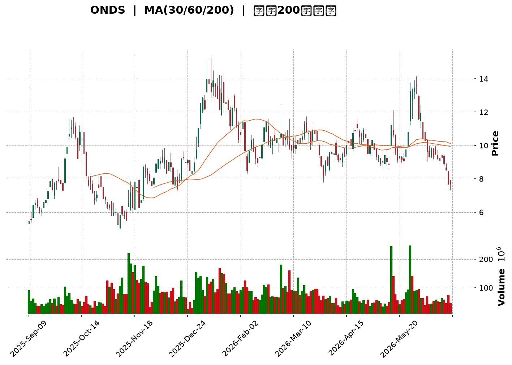
</details>

<html>
<head><meta charset="utf-8" /></head>
<body>
    <div style="height:500px; width:100%;">                        <script>window.PlotlyConfig = {MathJaxConfig: 'local'};</script>
        <script charset="utf-8" src="https://cdn.plot.ly/plotly-3.6.0.min.js" integrity="sha256-QaOVwtVY0T02VaHrr6pnoHLCwayMJp4O5n4YyaE3rJk=" crossorigin="anonymous"></script>                <div id="candlestick-chart" class="plotly-graph-div" style="height:100%; width:100%;"></div>            <script>                window.PLOTLYENV=window.PLOTLYENV || {};                                if (document.getElementById("candlestick-chart")) {                    Plotly.newPlot(                        "candlestick-chart",                        [{"close":{"dtype":"f8","bdata":"AAAAwMzMFUAAAACgcD0WQAAAAIAUrhlAAAAAoHA9GkAAAADAHoUZQAAAAAApXBhAAAAAYGZmGEAAAABgZmYaQAAAAKBH4RpAAAAAgD0KHUAAAADAHoUfQAAAAGBmZh1AAAAAAAAAH0AAAAAA16MeQAAAAEDheh9AAAAAoEfhHkAAAACgcD0dQAAAACCFayJAAAAAgOvRI0AAAACA61ElQAAAAIAULiZAAAAAwB6FJkAAAABA4fokQAAAAOCjcCJAAAAAYLieJUAAAACA69EkQAAAAMAeBSNAAAAAYGZmIEAAAADgo3AeQAAAAOB6FB9AAAAAYI\u002fCHEAAAACAwvUaQAAAAKBwPRxAAAAAQArXHUAAAABguB4eQAAAAMD1KBtAAAAAAAAAG0AAAADA9SgZQAAAAGCPwhlAAAAAoJmZGEAAAABACtcXQAAAAAAAABhAAAAAAAAAFUAAAACgcD0XQAAAAMAehRdAAAAAQDMzF0AAAACAPQoWQAAAAKBwPRpAAAAA4FG4HEAAAADAHgUZQAAAAAApXB9AAAAAAAAAHkAAAADgehQZQAAAAOCj8BpAAAAA4KNwIUAAAACgR+EgQAAAAEDheiBAAAAAoJmZH0AAAACA61EeQAAAAADXIyBAAAAAQArXIUAAAACgR2EiQAAAAADXIyJAAAAAgD0KIkAAAACAwnUiQAAAAGBmpiBAAAAAgD0KIkAAAAAAAIAhQAAAAGCPwh5AAAAAgBQuIEAAAABA4XodQAAAAEAzMx9AAAAA4KNwIkAAAACAPYoiQAAAACCF6yFAAAAAYI9CIkAAAACAwvUgQAAAACCF6yBAAAAAQOH6IUAAAADAHoUjQAAAAIA9CiZAAAAAIFwPKUAAAACAFK4pQAAAAAApXChAAAAAwB4FLEAAAACgR2ErQAAAAKBHYSpAAAAAIK7HK0AAAABguB4rQAAAAADXoylAAAAAgOtRKEAAAABgj0IqQAAAAKCZGSlAAAAAoHA9KUAAAABAClcoQAAAAIDrUSZAAAAAwB6FKEAAAACAPYooQAAAAIA9iiZAAAAA4FG4JEAAAAAgrkclQAAAAGCPwiZAAAAAAClcI0AAAACAwvUgQAAAAKBHYSNAAAAAgBSuJEAAAAAAKVwjQAAAAIDCdSJAAAAA4KPwIUAAAABguJ4iQAAAAKCZGSRAAAAAANcjJkAAAAAgrscmQAAAACBcDyRAAAAAoEdhJEAAAADAzMwkQAAAAKCZmSRAAAAAYGbmJEAAAADA9SgkQAAAAEAKVyVAAAAAgD0KJEAAAADAHgUlQAAAAEDh+iRAAAAAwPWoI0AAAADgo3AjQAAAAMAeBSRAAAAAwPWoI0AAAADA9agkQAAAAIDrUSRAAAAAIFwPJUAAAAAgXI8mQAAAAMD1qCVAAAAAAACAJUAAAABguB4kQAAAAMDMzCVAAAAAAClcJUAAAABguJ4kQAAAAKBH4SJAAAAAoJmZIUAAAADAzEwgQAAAAOB6FCJAAAAAYLieIUAAAABAMzMjQAAAAIA9CiNAAAAAIFwPI0AAAABgZuYiQAAAACCuRyJAAAAAYI9CIkAAAADgo\u002fAiQAAAAMDMzCJAAAAAIFwPJEAAAABgZmYkQAAAAAAAACRAAAAAgMJ1JUAAAACgcL0lQAAAAGC4HiZAAAAA4HoUJUAAAACgmRklQAAAAGBm5iVAAAAAgML1JEAAAABA4foiQAAAAOB6FCRAAAAAANejJEAAAACAwnUjQAAAAMD1qCJAAAAAgBSuIkAAAAAgrschQAAAAGC4HiJAAAAAQArXIkAAAADgehQiQAAAAOBRuCFAAAAAIIVrJkAAAACgcD0lQAAAAGBmZiNAAAAAAABAIkAAAADgUbgiQAAAAAApXCJAAAAAYLgeIkAAAACAPYojQAAAAKCZmSVAAAAAAACAKkAAAADgo3AqQAAAACCF6ypAAAAAwPUoK0AAAADgUTgnQAAAAOCj8CdAAAAAACncJEAAAACgmZkkQAAAAMDMTCNAAAAAYLieIkAAAADA9agjQAAAAMD1qCJAAAAAwB4FI0AAAAAghWsiQAAAAKBwPSJAAAAAgD2KIkAAAAAgrschQAAAACBcDyFAAAAA4FG4HkAAAABAM7MeQA=="},"high":{"dtype":"f8","bdata":"AAAAAClcFkAAAAAAAAAYQAAAAGCPwhlAAAAAoEfhGkAAAADgo3AbQAAAAGBmZhlAAAAAAAAAGUAAAAAgXI8aQAAAAAApXBtAAAAA4KNwHUAAAACgcD0gQAAAAADXIyBAAAAAAClcH0AAAAAgXI8fQAAAACCFayFAAAAAQApXIEAAAADAzMwfQAAAAIAUriJAAAAAIFyPJEAAAABgj0InQAAAAEAKFydAAAAAYGZmJ0AAAAAgrscmQAAAAMAeBSVAAAAAgBRuJkAAAABguB4lQAAAAKBwvSVAAAAAYI9CI0AAAACA61EgQAAAAKBHYSBAAAAAANejH0AAAACAPQodQAAAAEAzMx1AAAAAQApXIEAAAACgR6EgQAAAACBcjx5AAAAAwMzMG0AAAACAwnUaQAAAAAAAABpAAAAAYI\u002fCGkAAAAAgrkcaQAAAAAAAABlAAAAA4FG4F0AAAADgepQXQAAAACBcjxlAAAAAoEdhGEAAAADA9agYQAAAAAApXB1AAAAA4KNwH0AAAAAgXA8eQAAAAIAUrh9AAAAAgOsRIEAAAACgR+EfQAAAAGBmZhtAAAAAoJmZIUAAAABgj8IhQAAAAAApXCFAAAAAwCDwIEAAAAAA1yMgQAAAAKCZGSFAAAAAgMI1IkAAAACAFK4iQAAAAKCZmSJAAAAAAACAI0AAAADgUbgjQAAAAEDhOiJAAAAAwPUoIkAAAABgZiYjQAAAAEDheiFAAAAAANdjIEAAAABguB4hQAAAAGCRrSBAAAAAQOF6IkAAAACA61EjQAAAAIAUriNAAAAAYGZmIkAAAABAClciQAAAAEAKVyFAAAAAoJmZIkAAAAAgXA8lQAAAAGC4HiZAAAAA4HoUKUAAAAAAKdwpQAAAAIA9CipAAAAAANcjLkAAAABAMzMuQAAAACBcjy5AAAAAAAAALUAAAAAAAIArQAAAAADXIyxAAAAAAACALEAAAABgZmYsQAAAAMD1qCxAAAAAwPWoKkAAAABA4bopQAAAACCFqyhAAAAA4KPwKEAAAADA9SgqQAAAACBcjyhAAAAAYGbmJkAAAABgZmYmQAAAAEAK1yZAAAAAgD3KJkAAAAAgXA8jQAAAAMAehSNAAAAAIK5HJUAAAACgR+EkQAAAAEAK1yNAAAAAoMaLIkAAAAAAKVwjQAAAAADXoyRAAAAAQApXJkAAAACAFC4nQAAAAMD1KCdAAAAAANcjJUAAAACAwvUkQAAAAKBH4SVAAAAAIFyPJUAAAAAAKVwkQAAAAEAK1yhAAAAAAAAAJkAAAAAA16MlQAAAAEAK1yVAAAAA4FE4J0AAAAAgXA8kQAAAAGBm5iRAAAAAYLgeJUAAAACAFK4lQAAAAIDC9SVAAAAAoHC9JUAAAADgo\u002fAmQAAAAMAehSdAAAAAgML1JUAAAADA9aglQAAAAOCj8CVAAAAAoHC9JkAAAAAgrkcmQAAAACCuRyRAAAAAoHC9IkAAAAAA16MhQAAAACCuRyJAAAAAQDOzIkAAAABgj0IjQAAAAMDMzCNAAAAAoEdhI0AAAACgcL0kQAAAAIA9CiNAAAAA4FG4IkAAAAAghSsjQAAAAOBRuCNAAAAAIFwPJEAAAAAgrsckQAAAACBcDyVAAAAAYLgeJkAAAADgepQmQAAAAOBROCdAAAAA4KPwJUAAAACAPYolQAAAAGC4HiZAAAAAANcjJkAAAAAAKdwkQAAAAIDrUSRAAAAAYLgeJUAAAABA4bokQAAAAOB6lCNAAAAAIIXrIkAAAAAAAIAiQAAAAIAULiJAAAAAwMxMI0AAAABAM7MiQAAAAAApXCJAAAAAgMJ1J0AAAACgcD0oQAAAAEAKVyVAAAAAYI\u002fCI0AAAADgehQjQAAAAGCPwiJAAAAAoEchI0AAAADAHoUkQAAAAGC4HiZAAAAAIFyPK0AAAACA69EqQAAAAIDr0StAAAAAgOtRLEAAAAAAAAAqQAAAAEAK1yhAAAAAgOtRJ0AAAACAFK4lQAAAAIDr0SRAAAAAgML1I0AAAACgQ8sjQAAAAECJwSNAAAAA4KPwI0AAAABA4XojQAAAAAAAACNAAAAAIIXrIkAAAAAghesiQAAAAAAp3CFAAAAAAAAAIUAAAABgj8IfQA=="},"hovertemplate":"\u003cb\u003e%{x|%Y-%m-%d}\u003c\u002fb\u003e\u003cbr\u003e\u958b: $%{open:.2f}\u003cbr\u003e\u9ad8: $%{high:.2f}\u003cbr\u003e\u4f4e: $%{low:.2f}\u003cbr\u003e\u6536: $%{close:.2f}\u003cextra\u003e\u003c\u002fextra\u003e","low":{"dtype":"f8","bdata":"AAAAQArXFEAAAACAPYoVQAAAAADXoxVAAAAAwMzMGEAAAAAAAAAZQAAAAIAUrhdAAAAAAAAAF0AAAACAPQoYQAAAAIAUrhlAAAAAgOtRGkAAAAAghescQAAAAAAAAB1AAAAAwPUoG0AAAADgo3AdQAAAAEAzMx9AAAAAIK5HHkAAAADgUbgcQAAAAADXox5AAAAAoEdhIkAAAACAPYokQAAAAGBm5iRAAAAAYA5tJUAAAAAAAMAkQAAAAKBHYSJAAAAAILJdI0AAAABgj8IjQAAAAIDrUSJAAAAAgBSuH0AAAADgUTgeQAAAAIDrUR1AAAAAAACAHEAAAAAAKdwZQAAAAKCZmRpAAAAAYLieHUAAAADgehQeQAAAAADXoxpAAAAA4HoUGkAAAACA69EYQAAAAEDhehhAAAAAYLgeF0AAAADgehQXQAAAAIDrURdAAAAAACncFEAAAADAzMwTQAAAAOB6FBdAAAAAYGZmFkAAAAAghesVQAAAAKBwPRlAAAAAYGZmGEAAAAAghesXQAAAAKCZmRhAAAAAgD0KHUAAAAAAAAAZQAAAAOBRuBdAAAAAgBSuGkAAAAAA1yMgQAAAAKBwvR5AAAAAQDMzH0AAAACgR+EdQAAAACCuRx1AAAAAQArXHUAAAACAPQohQAAAAMD1KCFAAAAA4KPwIUAAAADgUTghQAAAAAApnCBAAAAAoHA9IEAAAACA69EgQAAAAKBwPR5AAAAAAClcHkAAAABguB4dQAAAAIDC9R5AAAAA4KNwH0AAAAAgXE8iQAAAAEAKVyFAAAAAQDOzIUAAAAAAKdwgQAAAACCFayBAAAAAwPWoIEAAAABAClciQAAAAIDr0SNAAAAAQOH6JUAAAAAghesnQAAAAOBROChAAAAAwMxMKkAAAACAFC4rQAAAAMD1qClAAAAAIIXrKUAAAABACtcpQAAAAKCZmSlAAAAAoHA9KEAAAACgmZknQAAAAAAp3CdAAAAAQDOzKEAAAACgR+EnQAAAAGBm5iVAAAAAgBQuJkAAAABguB4oQAAAAADXIyZAAAAAIK5HJEAAAADAzEwkQAAAAMAeBSVAAAAAYI9CIkAAAAAA16MgQAAAAGBm5iBAAAAAQApXI0AAAABAMzMjQAAAAGCPwiFAAAAAYGZmIUAAAAAA16MhQAAAAKBwvSFAAAAAQOH6I0AAAABA4XolQAAAAGBm5iNAAAAA4FG4I0AAAACAwvUiQAAAAIA9iiRAAAAAYGbmI0AAAACgcD0jQAAAAKCZmSRAAAAAwB6FI0AAAAAAKdwjQAAAAGC4HiRAAAAAwB6FI0AAAABgZmYiQAAAAGBmJiNAAAAAAAAAI0AAAACgmZkjQAAAAKCZGSRAAAAA4FE4JEAAAACgcL0kQAAAAADXoyVAAAAAoHA9JEAAAACAwnUjQAAAAIAU7iNAAAAAQDPzJEAAAACAwnUkQAAAAIA9iiJAAAAAwPVoIUAAAABguB4fQAAAAGBmZiBAAAAAIFyPIUAAAAAghesgQAAAAGCPwiJAAAAA4E1iIkAAAACAFK4iQAAAAMAeBSJAAAAAQOH6IUAAAACAwnUhQAAAAKCZmSJAAAAAoHC9IkAAAADAHoUjQAAAAIA9iiNAAAAAgOtRI0AAAAAgrkclQAAAAEAzsyVAAAAAQDMzJEAAAABA4TokQAAAACCFayRAAAAAIIWrJEAAAACA69EiQAAAAGC4niJAAAAAoHA9I0AAAABAClcjQAAAAIDrUSJAAAAAgD0KIkAAAAAgXI8hQAAAAMDMTCFAAAAA4KNwIUAAAACgmZkhQAAAAEAKVyFAAAAAQDMzI0AAAAAAAAAlQAAAACCF6yJAAAAA4KPwIUAAAACgcD0iQAAAAIDC9SFAAAAAYLgeIkAAAAAgsp0iQAAAAAApXCNAAAAA4KNwJkAAAABAMzMnQAAAAKCZmSlAAAAAgBQuKkAAAAAgXA8nQAAAAGC4HiZAAAAAwPWoJEAAAAAAAIAkQAAAAOB6FCJAAAAAoJmZIkAAAADAHoUiQAAAAAApXCJAAAAAoJnZIkAAAAAgrkciQAAAAMD1KCJAAAAAQArXIUAAAAAgXI8hQAAAAAAAACFAAAAAIFyPHkAAAACgcD0dQA=="},"name":"\u50f9\u683c","open":{"dtype":"f8","bdata":"AAAAoHA9FUAAAADgo3AWQAAAAOBRuBZAAAAAwMzMGUAAAABACtcaQAAAACCuRxlAAAAAoHA9GEAAAABguB4ZQAAAAEAzMxpAAAAAIK5HG0AAAAAgXA8eQAAAAIDC9R9AAAAAwB4FHEAAAAAgrsceQAAAAEAK1x9AAAAA4FG4H0AAAAAAAAAfQAAAAEAzMx9AAAAAwB4FI0AAAABguB4lQAAAAAAAACZAAAAAIK6HJkAAAAAgrkcmQAAAAIDC9SRAAAAAIFwPJEAAAABgj8IkQAAAAGBmpiVAAAAAYI9CI0AAAADAzMwfQAAAAGC4HiBAAAAA4FG4HkAAAABgZmYbQAAAAGBmZhtAAAAAgBSuHkAAAABguF4gQAAAAOB6FB5AAAAA4HqUG0AAAACAwvUZQAAAAAAAABlAAAAAwMxMGkAAAABguB4XQAAAACCF6xdAAAAAgBSuF0AAAADA9SgUQAAAAEDhehlAAAAAYGZmF0AAAADgo\u002fAXQAAAACCuRxlAAAAAwPWoGEAAAACAPQoeQAAAAGC4nhhAAAAAACncHUAAAACAFK4fQAAAAKBwPRpAAAAAANcjG0AAAACAwvUgQAAAAOBROCFAAAAAIFyPIEAAAADAHoUfQAAAAOBRuB5AAAAAIK7HIEAAAADAHkUhQAAAAAAp3CFAAAAAQAqXIkAAAABACtchQAAAAOBROCJAAAAAQOH6IEAAAACAwvUhQAAAAAApXCFAAAAAQOF6HkAAAAAgrkcgQAAAAMD1KB9AAAAAgML1H0AAAACgmZkiQAAAACBcDyJAAAAAgML1IUAAAADgJEYiQAAAAKCZmSBAAAAAIIXrIEAAAAAgXI8iQAAAAMAeRSRAAAAAoJmZJkAAAABAMzMoQAAAAGBmZilAAAAAwPVoKkAAAAAAAAAsQAAAACCFaytAAAAAAAAAK0AAAACgR2ErQAAAAADXIytAAAAA4HrUKkAAAACAwrUnQAAAAKCZmStAAAAAwB4FKUAAAAAghWspQAAAAMDMTChAAAAAIIVrJkAAAACAwvUpQAAAACCuRyhAAAAAAACAJkAAAABguJ4lQAAAAMAeBSZAAAAAYI\u002fCJkAAAACAFK4iQAAAAIAU7iFAAAAAACmcI0AAAACAFC4kQAAAAMAexSNAAAAAoHB9IkAAAACAPYoiQAAAAOBReCJAAAAAIIVrJEAAAAAA16MlQAAAAKBHYSZAAAAAACncI0AAAADAHgUkQAAAAGCPQiVAAAAAwMxMJEAAAACAFC4kQAAAAAAAACVAAAAAoEdhJUAAAADgUbgkQAAAAEDh+iRAAAAAAACAJEAAAAAgXA8kQAAAAIAUriNAAAAAoJkZJEAAAAAghSskQAAAAAAp3CRAAAAAoHC9JEAAAACgmRklQAAAAAAAwCZAAAAAYLheJUAAAADgepQlQAAAAOB6lCRAAAAAgOvRJUAAAABgj8IlQAAAAKCZGSRAAAAAQDOzIkAAAABguJ4hQAAAAGBm5iBAAAAAoJmZIkAAAAAgrgchQAAAAGCPQiNAAAAAACncIkAAAABAClckQAAAAOB61CJAAAAAgMJ1IkAAAADAHgUiQAAAAOCjcCNAAAAAwB4FI0AAAAAAAIAkQAAAAGCPwiRAAAAAoJmZI0AAAADAzMwlQAAAAIA9iiZAAAAAYI\u002fCJUAAAABgj0IlQAAAAMBLtyRAAAAAANdjJUAAAABgj8IkQAAAAAAAACNAAAAAAAAAJEAAAADAzEwkQAAAACBcjyNAAAAAAACAIkAAAAAAAIAiQAAAAAAAACJAAAAAQArXIUAAAADgUXgiQAAAAEAK1yFAAAAAQOH6I0AAAACA69ElQAAAAGCPQiVAAAAAYGamI0AAAAAAAIAiQAAAACBcjyJAAAAAIIVrIkAAAAAghasiQAAAAAAAACRAAAAAQDPzJkAAAAAAAIApQAAAAKBwfSpAAAAAoHA9K0AAAAAghespQAAAAIDC9SZAAAAAQArXJkAAAADA9aglQAAAACCFqyRAAAAAoEdhI0AAAABgZqYiQAAAAEAKlyNAAAAAQDOzI0AAAACA69EiQAAAAKBwfSJAAAAAgOvRIkAAAACAwrUiQAAAAGC4XiFAAAAAgML1IEAAAACgcL0fQA=="},"x":["2025-09-09T00:00:00-04:00","2025-09-10T00:00:00-04:00","2025-09-11T00:00:00-04:00","2025-09-12T00:00:00-04:00","2025-09-15T00:00:00-04:00","2025-09-16T00:00:00-04:00","2025-09-17T00:00:00-04:00","2025-09-18T00:00:00-04:00","2025-09-19T00:00:00-04:00","2025-09-22T00:00:00-04:00","2025-09-23T00:00:00-04:00","2025-09-24T00:00:00-04:00","2025-09-25T00:00:00-04:00","2025-09-26T00:00:00-04:00","2025-09-29T00:00:00-04:00","2025-09-30T00:00:00-04:00","2025-10-01T00:00:00-04:00","2025-10-02T00:00:00-04:00","2025-10-03T00:00:00-04:00","2025-10-06T00:00:00-04:00","2025-10-07T00:00:00-04:00","2025-10-08T00:00:00-04:00","2025-10-09T00:00:00-04:00","2025-10-10T00:00:00-04:00","2025-10-13T00:00:00-04:00","2025-10-14T00:00:00-04:00","2025-10-15T00:00:00-04:00","2025-10-16T00:00:00-04:00","2025-10-17T00:00:00-04:00","2025-10-20T00:00:00-04:00","2025-10-21T00:00:00-04:00","2025-10-22T00:00:00-04:00","2025-10-23T00:00:00-04:00","2025-10-24T00:00:00-04:00","2025-10-27T00:00:00-04:00","2025-10-28T00:00:00-04:00","2025-10-29T00:00:00-04:00","2025-10-30T00:00:00-04:00","2025-10-31T00:00:00-04:00","2025-11-03T00:00:00-05:00","2025-11-04T00:00:00-05:00","2025-11-05T00:00:00-05:00","2025-11-06T00:00:00-05:00","2025-11-07T00:00:00-05:00","2025-11-10T00:00:00-05:00","2025-11-11T00:00:00-05:00","2025-11-12T00:00:00-05:00","2025-11-13T00:00:00-05:00","2025-11-14T00:00:00-05:00","2025-11-17T00:00:00-05:00","2025-11-18T00:00:00-05:00","2025-11-19T00:00:00-05:00","2025-11-20T00:00:00-05:00","2025-11-21T00:00:00-05:00","2025-11-24T00:00:00-05:00","2025-11-25T00:00:00-05:00","2025-11-26T00:00:00-05:00","2025-11-28T00:00:00-05:00","2025-12-01T00:00:00-05:00","2025-12-02T00:00:00-05:00","2025-12-03T00:00:00-05:00","2025-12-04T00:00:00-05:00","2025-12-05T00:00:00-05:00","2025-12-08T00:00:00-05:00","2025-12-09T00:00:00-05:00","2025-12-10T00:00:00-05:00","2025-12-11T00:00:00-05:00","2025-12-12T00:00:00-05:00","2025-12-15T00:00:00-05:00","2025-12-16T00:00:00-05:00","2025-12-17T00:00:00-05:00","2025-12-18T00:00:00-05:00","2025-12-19T00:00:00-05:00","2025-12-22T00:00:00-05:00","2025-12-23T00:00:00-05:00","2025-12-24T00:00:00-05:00","2025-12-26T00:00:00-05:00","2025-12-29T00:00:00-05:00","2025-12-30T00:00:00-05:00","2025-12-31T00:00:00-05:00","2026-01-02T00:00:00-05:00","2026-01-05T00:00:00-05:00","2026-01-06T00:00:00-05:00","2026-01-07T00:00:00-05:00","2026-01-08T00:00:00-05:00","2026-01-09T00:00:00-05:00","2026-01-12T00:00:00-05:00","2026-01-13T00:00:00-05:00","2026-01-14T00:00:00-05:00","2026-01-15T00:00:00-05:00","2026-01-16T00:00:00-05:00","2026-01-20T00:00:00-05:00","2026-01-21T00:00:00-05:00","2026-01-22T00:00:00-05:00","2026-01-23T00:00:00-05:00","2026-01-26T00:00:00-05:00","2026-01-27T00:00:00-05:00","2026-01-28T00:00:00-05:00","2026-01-29T00:00:00-05:00","2026-01-30T00:00:00-05:00","2026-02-02T00:00:00-05:00","2026-02-03T00:00:00-05:00","2026-02-04T00:00:00-05:00","2026-02-05T00:00:00-05:00","2026-02-06T00:00:00-05:00","2026-02-09T00:00:00-05:00","2026-02-10T00:00:00-05:00","2026-02-11T00:00:00-05:00","2026-02-12T00:00:00-05:00","2026-02-13T00:00:00-05:00","2026-02-17T00:00:00-05:00","2026-02-18T00:00:00-05:00","2026-02-19T00:00:00-05:00","2026-02-20T00:00:00-05:00","2026-02-23T00:00:00-05:00","2026-02-24T00:00:00-05:00","2026-02-25T00:00:00-05:00","2026-02-26T00:00:00-05:00","2026-02-27T00:00:00-05:00","2026-03-02T00:00:00-05:00","2026-03-03T00:00:00-05:00","2026-03-04T00:00:00-05:00","2026-03-05T00:00:00-05:00","2026-03-06T00:00:00-05:00","2026-03-09T00:00:00-04:00","2026-03-10T00:00:00-04:00","2026-03-11T00:00:00-04:00","2026-03-12T00:00:00-04:00","2026-03-13T00:00:00-04:00","2026-03-16T00:00:00-04:00","2026-03-17T00:00:00-04:00","2026-03-18T00:00:00-04:00","2026-03-19T00:00:00-04:00","2026-03-20T00:00:00-04:00","2026-03-23T00:00:00-04:00","2026-03-24T00:00:00-04:00","2026-03-25T00:00:00-04:00","2026-03-26T00:00:00-04:00","2026-03-27T00:00:00-04:00","2026-03-30T00:00:00-04:00","2026-03-31T00:00:00-04:00","2026-04-01T00:00:00-04:00","2026-04-02T00:00:00-04:00","2026-04-06T00:00:00-04:00","2026-04-07T00:00:00-04:00","2026-04-08T00:00:00-04:00","2026-04-09T00:00:00-04:00","2026-04-10T00:00:00-04:00","2026-04-13T00:00:00-04:00","2026-04-14T00:00:00-04:00","2026-04-15T00:00:00-04:00","2026-04-16T00:00:00-04:00","2026-04-17T00:00:00-04:00","2026-04-20T00:00:00-04:00","2026-04-21T00:00:00-04:00","2026-04-22T00:00:00-04:00","2026-04-23T00:00:00-04:00","2026-04-24T00:00:00-04:00","2026-04-27T00:00:00-04:00","2026-04-28T00:00:00-04:00","2026-04-29T00:00:00-04:00","2026-04-30T00:00:00-04:00","2026-05-01T00:00:00-04:00","2026-05-04T00:00:00-04:00","2026-05-05T00:00:00-04:00","2026-05-06T00:00:00-04:00","2026-05-07T00:00:00-04:00","2026-05-08T00:00:00-04:00","2026-05-11T00:00:00-04:00","2026-05-12T00:00:00-04:00","2026-05-13T00:00:00-04:00","2026-05-14T00:00:00-04:00","2026-05-15T00:00:00-04:00","2026-05-18T00:00:00-04:00","2026-05-19T00:00:00-04:00","2026-05-20T00:00:00-04:00","2026-05-21T00:00:00-04:00","2026-05-22T00:00:00-04:00","2026-05-26T00:00:00-04:00","2026-05-27T00:00:00-04:00","2026-05-28T00:00:00-04:00","2026-05-29T00:00:00-04:00","2026-06-01T00:00:00-04:00","2026-06-02T00:00:00-04:00","2026-06-03T00:00:00-04:00","2026-06-04T00:00:00-04:00","2026-06-05T00:00:00-04:00","2026-06-08T00:00:00-04:00","2026-06-09T00:00:00-04:00","2026-06-10T00:00:00-04:00","2026-06-11T00:00:00-04:00","2026-06-12T00:00:00-04:00","2026-06-15T00:00:00-04:00","2026-06-16T00:00:00-04:00","2026-06-17T00:00:00-04:00","2026-06-18T00:00:00-04:00","2026-06-22T00:00:00-04:00","2026-06-23T00:00:00-04:00","2026-06-24T00:00:00-04:00","2026-06-25T00:00:00-04:00"],"type":"candlestick"},{"hovertemplate":"MA30: $%{y:.2f}\u003cextra\u003e\u003c\u002fextra\u003e","line":{"color":"#2196F3","dash":"dash","width":2},"mode":"lines","name":"MA30","x":["2025-09-09T00:00:00-04:00","2025-09-10T00:00:00-04:00","2025-09-11T00:00:00-04:00","2025-09-12T00:00:00-04:00","2025-09-15T00:00:00-04:00","2025-09-16T00:00:00-04:00","2025-09-17T00:00:00-04:00","2025-09-18T00:00:00-04:00","2025-09-19T00:00:00-04:00","2025-09-22T00:00:00-04:00","2025-09-23T00:00:00-04:00","2025-09-24T00:00:00-04:00","2025-09-25T00:00:00-04:00","2025-09-26T00:00:00-04:00","2025-09-29T00:00:00-04:00","2025-09-30T00:00:00-04:00","2025-10-01T00:00:00-04:00","2025-10-02T00:00:00-04:00","2025-10-03T00:00:00-04:00","2025-10-06T00:00:00-04:00","2025-10-07T00:00:00-04:00","2025-10-08T00:00:00-04:00","2025-10-09T00:00:00-04:00","2025-10-10T00:00:00-04:00","2025-10-13T00:00:00-04:00","2025-10-14T00:00:00-04:00","2025-10-15T00:00:00-04:00","2025-10-16T00:00:00-04:00","2025-10-17T00:00:00-04:00","2025-10-20T00:00:00-04:00","2025-10-21T00:00:00-04:00","2025-10-22T00:00:00-04:00","2025-10-23T00:00:00-04:00","2025-10-24T00:00:00-04:00","2025-10-27T00:00:00-04:00","2025-10-28T00:00:00-04:00","2025-10-29T00:00:00-04:00","2025-10-30T00:00:00-04:00","2025-10-31T00:00:00-04:00","2025-11-03T00:00:00-05:00","2025-11-04T00:00:00-05:00","2025-11-05T00:00:00-05:00","2025-11-06T00:00:00-05:00","2025-11-07T00:00:00-05:00","2025-11-10T00:00:00-05:00","2025-11-11T00:00:00-05:00","2025-11-12T00:00:00-05:00","2025-11-13T00:00:00-05:00","2025-11-14T00:00:00-05:00","2025-11-17T00:00:00-05:00","2025-11-18T00:00:00-05:00","2025-11-19T00:00:00-05:00","2025-11-20T00:00:00-05:00","2025-11-21T00:00:00-05:00","2025-11-24T00:00:00-05:00","2025-11-25T00:00:00-05:00","2025-11-26T00:00:00-05:00","2025-11-28T00:00:00-05:00","2025-12-01T00:00:00-05:00","2025-12-02T00:00:00-05:00","2025-12-03T00:00:00-05:00","2025-12-04T00:00:00-05:00","2025-12-05T00:00:00-05:00","2025-12-08T00:00:00-05:00","2025-12-09T00:00:00-05:00","2025-12-10T00:00:00-05:00","2025-12-11T00:00:00-05:00","2025-12-12T00:00:00-05:00","2025-12-15T00:00:00-05:00","2025-12-16T00:00:00-05:00","2025-12-17T00:00:00-05:00","2025-12-18T00:00:00-05:00","2025-12-19T00:00:00-05:00","2025-12-22T00:00:00-05:00","2025-12-23T00:00:00-05:00","2025-12-24T00:00:00-05:00","2025-12-26T00:00:00-05:00","2025-12-29T00:00:00-05:00","2025-12-30T00:00:00-05:00","2025-12-31T00:00:00-05:00","2026-01-02T00:00:00-05:00","2026-01-05T00:00:00-05:00","2026-01-06T00:00:00-05:00","2026-01-07T00:00:00-05:00","2026-01-08T00:00:00-05:00","2026-01-09T00:00:00-05:00","2026-01-12T00:00:00-05:00","2026-01-13T00:00:00-05:00","2026-01-14T00:00:00-05:00","2026-01-15T00:00:00-05:00","2026-01-16T00:00:00-05:00","2026-01-20T00:00:00-05:00","2026-01-21T00:00:00-05:00","2026-01-22T00:00:00-05:00","2026-01-23T00:00:00-05:00","2026-01-26T00:00:00-05:00","2026-01-27T00:00:00-05:00","2026-01-28T00:00:00-05:00","2026-01-29T00:00:00-05:00","2026-01-30T00:00:00-05:00","2026-02-02T00:00:00-05:00","2026-02-03T00:00:00-05:00","2026-02-04T00:00:00-05:00","2026-02-05T00:00:00-05:00","2026-02-06T00:00:00-05:00","2026-02-09T00:00:00-05:00","2026-02-10T00:00:00-05:00","2026-02-11T00:00:00-05:00","2026-02-12T00:00:00-05:00","2026-02-13T00:00:00-05:00","2026-02-17T00:00:00-05:00","2026-02-18T00:00:00-05:00","2026-02-19T00:00:00-05:00","2026-02-20T00:00:00-05:00","2026-02-23T00:00:00-05:00","2026-02-24T00:00:00-05:00","2026-02-25T00:00:00-05:00","2026-02-26T00:00:00-05:00","2026-02-27T00:00:00-05:00","2026-03-02T00:00:00-05:00","2026-03-03T00:00:00-05:00","2026-03-04T00:00:00-05:00","2026-03-05T00:00:00-05:00","2026-03-06T00:00:00-05:00","2026-03-09T00:00:00-04:00","2026-03-10T00:00:00-04:00","2026-03-11T00:00:00-04:00","2026-03-12T00:00:00-04:00","2026-03-13T00:00:00-04:00","2026-03-16T00:00:00-04:00","2026-03-17T00:00:00-04:00","2026-03-18T00:00:00-04:00","2026-03-19T00:00:00-04:00","2026-03-20T00:00:00-04:00","2026-03-23T00:00:00-04:00","2026-03-24T00:00:00-04:00","2026-03-25T00:00:00-04:00","2026-03-26T00:00:00-04:00","2026-03-27T00:00:00-04:00","2026-03-30T00:00:00-04:00","2026-03-31T00:00:00-04:00","2026-04-01T00:00:00-04:00","2026-04-02T00:00:00-04:00","2026-04-06T00:00:00-04:00","2026-04-07T00:00:00-04:00","2026-04-08T00:00:00-04:00","2026-04-09T00:00:00-04:00","2026-04-10T00:00:00-04:00","2026-04-13T00:00:00-04:00","2026-04-14T00:00:00-04:00","2026-04-15T00:00:00-04:00","2026-04-16T00:00:00-04:00","2026-04-17T00:00:00-04:00","2026-04-20T00:00:00-04:00","2026-04-21T00:00:00-04:00","2026-04-22T00:00:00-04:00","2026-04-23T00:00:00-04:00","2026-04-24T00:00:00-04:00","2026-04-27T00:00:00-04:00","2026-04-28T00:00:00-04:00","2026-04-29T00:00:00-04:00","2026-04-30T00:00:00-04:00","2026-05-01T00:00:00-04:00","2026-05-04T00:00:00-04:00","2026-05-05T00:00:00-04:00","2026-05-06T00:00:00-04:00","2026-05-07T00:00:00-04:00","2026-05-08T00:00:00-04:00","2026-05-11T00:00:00-04:00","2026-05-12T00:00:00-04:00","2026-05-13T00:00:00-04:00","2026-05-14T00:00:00-04:00","2026-05-15T00:00:00-04:00","2026-05-18T00:00:00-04:00","2026-05-19T00:00:00-04:00","2026-05-20T00:00:00-04:00","2026-05-21T00:00:00-04:00","2026-05-22T00:00:00-04:00","2026-05-26T00:00:00-04:00","2026-05-27T00:00:00-04:00","2026-05-28T00:00:00-04:00","2026-05-29T00:00:00-04:00","2026-06-01T00:00:00-04:00","2026-06-02T00:00:00-04:00","2026-06-03T00:00:00-04:00","2026-06-04T00:00:00-04:00","2026-06-05T00:00:00-04:00","2026-06-08T00:00:00-04:00","2026-06-09T00:00:00-04:00","2026-06-10T00:00:00-04:00","2026-06-11T00:00:00-04:00","2026-06-12T00:00:00-04:00","2026-06-15T00:00:00-04:00","2026-06-16T00:00:00-04:00","2026-06-17T00:00:00-04:00","2026-06-18T00:00:00-04:00","2026-06-22T00:00:00-04:00","2026-06-23T00:00:00-04:00","2026-06-24T00:00:00-04:00","2026-06-25T00:00:00-04:00"],"y":{"dtype":"f8","bdata":"AAAAAAAA+H8AAAAAAAD4fwAAAAAAAPh\u002fAAAAAAAA+H8AAAAAAAD4fwAAAAAAAPh\u002fAAAAAAAA+H8AAAAAAAD4fwAAAAAAAPh\u002fAAAAAAAA+H8AAAAAAAD4fwAAAAAAAPh\u002fAAAAAAAA+H8AAAAAAAD4fwAAAAAAAPh\u002fAAAAAAAA+H8AAAAAAAD4fwAAAAAAAPh\u002fAAAAAAAA+H8AAAAAAAD4fwAAAAAAAPh\u002fAAAAAAAA+H8AAAAAAAD4fwAAAAAAAPh\u002fAAAAAAAA+H8AAAAAAAD4fwAAAAAAAPh\u002fAAAAAAAA+H8AAAAAAAD4f1VVVXVMMCBAq6qqov5NIEAiIiIiImIgQN7d3VUObSBA7+7ufmp8IEBERETsCpAgQM3MzET9myBAmpmZKRWnIECJiIjAyqEgQCIiImoDnSBAAAAAwBGKIEBEREQkTWkgQO\u002fu7uZCUiBAREREPJgnIEBmZmZ2BQggQKuqqgoezB9ARERE1JSKH0ARERExJE0fQDMzMyOw8h5AiYiICIGVHkDv7u6OJf8dQAAAAKA2kB1A3t3dPd8PHUAiIiJS1H8cQO\u002fu7g4CKxxAvLu7W6vjG0C8u7s7baAbQM3MzMwTdRtAzczMXNZqG0B3d3c30GkbQHd3d6cNdBtAAAAAoBqvG0DNzMwMuwIcQCIiIrJWRxxAAAAAMJZ8HEAiIiICnbYcQKuqqgoC6xxAvLu7m304HUCrqqpqdYwdQFVVVRUgtx1AAAAAEFj5HUBERETUeCkeQImIiHjpZh5AzczM3GvuHkDv7u7OhWQfQCIiIkKnzR9A7+7unqgfIEDv7u6+WFIgQBEREfnFciBAvLu7+6mRIEAAAACQe80gQCIiIjLBAyFAmpmZmZlZIUBmZmZeuskhQAAAAPCnJiJAzczMTPCAIkBmZmbmidoiQHd3d8cELyNAVVVVfT+VI0CrqqqCTvsjQLy7u5NfTCRAIiIiWquDJEAiIiJ66cYkQM3MzNRNAiVAAAAAeL4\u002fJUDv7u6G63ElQM3MzNRNoiVAMzMzm5nZJUARERG5rBUmQLy7u\u002fvFUiZAMzMzw4N5JkDNzMycUrEmQO\u002fu7t5r7iZAREREpEX2JkAzMzMTyugmQN7d3X0\u002f9SZAAAAAEOYJJ0AiIiLyYB4nQAAAACCFKydA7+7uvi0rJ0CrqqqqfyMnQLy7u6vxEidAVVVV1Qb6JkAAAACwR+EmQBERETGWvCZAq6qqWmR7JkAAAAAgPkMmQGZmZobrESZA7+7u7jXXJUBERESU0ZslQGZmZhYgdyVAmpmZSZpSJUBVVVVV4yUlQN7d3Q27AiVAvLu7Wx3TJEBVVVUlTakkQImIiLislSRAMzMz4zNsJEBVVVXlF0skQKuqqjomOCRAiYiI+Aw7JEC8u7sr+UUkQO\u002fu7i6WPCRAVVVVFdlOJEBmZmY20GkkQImIiMh2fiRARERERESEJEB3d3fHBI8kQImIiEiakiRAq6qqirOPJEC8u7tr53skQJqZmamqaiRAMzMzkxhEJEAiIiLyiyUkQJqZmbnXHCRAREREJJQRJEB3d3eHXQEkQJqZmWmR7SNA7+7uPgrXI0De3d0docwjQGZmZmb0tiNAZmZmFiC3I0DNzMys1bEjQFVVVdV4qSNA3t3d\u002fdS4I0CrqqpqdcwjQAAAAPBg3iNAmpmZ+X7qI0C8u7srQO4jQLy7u7u7+yNAd3d3R+H6I0BmZmamVNwjQGZmZhbZziNAMzMzY4LHI0B3d3eX4MEjQImIiCgVpyNAvLu7mzaQI0CJiIiI+ncjQKuqqkp+cSNAzczMHBN8I0BVVVWVQ4sjQGZmZiYxiCNAiYiI6CaxI0Crqqpaj8IjQImIiMihxSNAAAAAULi+I0CJiIgYL70jQLy7u9vdvSNAZmZmBqy8I0Dv7u6+ysEjQBEREXGv2SNAZmZm1qMQJEC8u7trLkQkQERERGQ7fyRAvLu7O9+vJEB3d3dXgLwkQBERETEIzCRAiYiImCfKJEBERERU48UkQKuqqoqzryRAzczMvLubJECJiIg4iaEkQO\u002fu7i5rlSRA3t3dPZiHJEBERERUuH4kQDMzM9MieyRA3t3d\u002ffB5JEDe3d398HkkQCIiImLlcCRAzczMNDNTJEBmZmZu5zskQA=="},"type":"scatter"},{"hovertemplate":"MA60: $%{y:.2f}\u003cextra\u003e\u003c\u002fextra\u003e","line":{"color":"#9C27B0","dash":"dash","width":2},"mode":"lines","name":"MA60","x":["2025-09-09T00:00:00-04:00","2025-09-10T00:00:00-04:00","2025-09-11T00:00:00-04:00","2025-09-12T00:00:00-04:00","2025-09-15T00:00:00-04:00","2025-09-16T00:00:00-04:00","2025-09-17T00:00:00-04:00","2025-09-18T00:00:00-04:00","2025-09-19T00:00:00-04:00","2025-09-22T00:00:00-04:00","2025-09-23T00:00:00-04:00","2025-09-24T00:00:00-04:00","2025-09-25T00:00:00-04:00","2025-09-26T00:00:00-04:00","2025-09-29T00:00:00-04:00","2025-09-30T00:00:00-04:00","2025-10-01T00:00:00-04:00","2025-10-02T00:00:00-04:00","2025-10-03T00:00:00-04:00","2025-10-06T00:00:00-04:00","2025-10-07T00:00:00-04:00","2025-10-08T00:00:00-04:00","2025-10-09T00:00:00-04:00","2025-10-10T00:00:00-04:00","2025-10-13T00:00:00-04:00","2025-10-14T00:00:00-04:00","2025-10-15T00:00:00-04:00","2025-10-16T00:00:00-04:00","2025-10-17T00:00:00-04:00","2025-10-20T00:00:00-04:00","2025-10-21T00:00:00-04:00","2025-10-22T00:00:00-04:00","2025-10-23T00:00:00-04:00","2025-10-24T00:00:00-04:00","2025-10-27T00:00:00-04:00","2025-10-28T00:00:00-04:00","2025-10-29T00:00:00-04:00","2025-10-30T00:00:00-04:00","2025-10-31T00:00:00-04:00","2025-11-03T00:00:00-05:00","2025-11-04T00:00:00-05:00","2025-11-05T00:00:00-05:00","2025-11-06T00:00:00-05:00","2025-11-07T00:00:00-05:00","2025-11-10T00:00:00-05:00","2025-11-11T00:00:00-05:00","2025-11-12T00:00:00-05:00","2025-11-13T00:00:00-05:00","2025-11-14T00:00:00-05:00","2025-11-17T00:00:00-05:00","2025-11-18T00:00:00-05:00","2025-11-19T00:00:00-05:00","2025-11-20T00:00:00-05:00","2025-11-21T00:00:00-05:00","2025-11-24T00:00:00-05:00","2025-11-25T00:00:00-05:00","2025-11-26T00:00:00-05:00","2025-11-28T00:00:00-05:00","2025-12-01T00:00:00-05:00","2025-12-02T00:00:00-05:00","2025-12-03T00:00:00-05:00","2025-12-04T00:00:00-05:00","2025-12-05T00:00:00-05:00","2025-12-08T00:00:00-05:00","2025-12-09T00:00:00-05:00","2025-12-10T00:00:00-05:00","2025-12-11T00:00:00-05:00","2025-12-12T00:00:00-05:00","2025-12-15T00:00:00-05:00","2025-12-16T00:00:00-05:00","2025-12-17T00:00:00-05:00","2025-12-18T00:00:00-05:00","2025-12-19T00:00:00-05:00","2025-12-22T00:00:00-05:00","2025-12-23T00:00:00-05:00","2025-12-24T00:00:00-05:00","2025-12-26T00:00:00-05:00","2025-12-29T00:00:00-05:00","2025-12-30T00:00:00-05:00","2025-12-31T00:00:00-05:00","2026-01-02T00:00:00-05:00","2026-01-05T00:00:00-05:00","2026-01-06T00:00:00-05:00","2026-01-07T00:00:00-05:00","2026-01-08T00:00:00-05:00","2026-01-09T00:00:00-05:00","2026-01-12T00:00:00-05:00","2026-01-13T00:00:00-05:00","2026-01-14T00:00:00-05:00","2026-01-15T00:00:00-05:00","2026-01-16T00:00:00-05:00","2026-01-20T00:00:00-05:00","2026-01-21T00:00:00-05:00","2026-01-22T00:00:00-05:00","2026-01-23T00:00:00-05:00","2026-01-26T00:00:00-05:00","2026-01-27T00:00:00-05:00","2026-01-28T00:00:00-05:00","2026-01-29T00:00:00-05:00","2026-01-30T00:00:00-05:00","2026-02-02T00:00:00-05:00","2026-02-03T00:00:00-05:00","2026-02-04T00:00:00-05:00","2026-02-05T00:00:00-05:00","2026-02-06T00:00:00-05:00","2026-02-09T00:00:00-05:00","2026-02-10T00:00:00-05:00","2026-02-11T00:00:00-05:00","2026-02-12T00:00:00-05:00","2026-02-13T00:00:00-05:00","2026-02-17T00:00:00-05:00","2026-02-18T00:00:00-05:00","2026-02-19T00:00:00-05:00","2026-02-20T00:00:00-05:00","2026-02-23T00:00:00-05:00","2026-02-24T00:00:00-05:00","2026-02-25T00:00:00-05:00","2026-02-26T00:00:00-05:00","2026-02-27T00:00:00-05:00","2026-03-02T00:00:00-05:00","2026-03-03T00:00:00-05:00","2026-03-04T00:00:00-05:00","2026-03-05T00:00:00-05:00","2026-03-06T00:00:00-05:00","2026-03-09T00:00:00-04:00","2026-03-10T00:00:00-04:00","2026-03-11T00:00:00-04:00","2026-03-12T00:00:00-04:00","2026-03-13T00:00:00-04:00","2026-03-16T00:00:00-04:00","2026-03-17T00:00:00-04:00","2026-03-18T00:00:00-04:00","2026-03-19T00:00:00-04:00","2026-03-20T00:00:00-04:00","2026-03-23T00:00:00-04:00","2026-03-24T00:00:00-04:00","2026-03-25T00:00:00-04:00","2026-03-26T00:00:00-04:00","2026-03-27T00:00:00-04:00","2026-03-30T00:00:00-04:00","2026-03-31T00:00:00-04:00","2026-04-01T00:00:00-04:00","2026-04-02T00:00:00-04:00","2026-04-06T00:00:00-04:00","2026-04-07T00:00:00-04:00","2026-04-08T00:00:00-04:00","2026-04-09T00:00:00-04:00","2026-04-10T00:00:00-04:00","2026-04-13T00:00:00-04:00","2026-04-14T00:00:00-04:00","2026-04-15T00:00:00-04:00","2026-04-16T00:00:00-04:00","2026-04-17T00:00:00-04:00","2026-04-20T00:00:00-04:00","2026-04-21T00:00:00-04:00","2026-04-22T00:00:00-04:00","2026-04-23T00:00:00-04:00","2026-04-24T00:00:00-04:00","2026-04-27T00:00:00-04:00","2026-04-28T00:00:00-04:00","2026-04-29T00:00:00-04:00","2026-04-30T00:00:00-04:00","2026-05-01T00:00:00-04:00","2026-05-04T00:00:00-04:00","2026-05-05T00:00:00-04:00","2026-05-06T00:00:00-04:00","2026-05-07T00:00:00-04:00","2026-05-08T00:00:00-04:00","2026-05-11T00:00:00-04:00","2026-05-12T00:00:00-04:00","2026-05-13T00:00:00-04:00","2026-05-14T00:00:00-04:00","2026-05-15T00:00:00-04:00","2026-05-18T00:00:00-04:00","2026-05-19T00:00:00-04:00","2026-05-20T00:00:00-04:00","2026-05-21T00:00:00-04:00","2026-05-22T00:00:00-04:00","2026-05-26T00:00:00-04:00","2026-05-27T00:00:00-04:00","2026-05-28T00:00:00-04:00","2026-05-29T00:00:00-04:00","2026-06-01T00:00:00-04:00","2026-06-02T00:00:00-04:00","2026-06-03T00:00:00-04:00","2026-06-04T00:00:00-04:00","2026-06-05T00:00:00-04:00","2026-06-08T00:00:00-04:00","2026-06-09T00:00:00-04:00","2026-06-10T00:00:00-04:00","2026-06-11T00:00:00-04:00","2026-06-12T00:00:00-04:00","2026-06-15T00:00:00-04:00","2026-06-16T00:00:00-04:00","2026-06-17T00:00:00-04:00","2026-06-18T00:00:00-04:00","2026-06-22T00:00:00-04:00","2026-06-23T00:00:00-04:00","2026-06-24T00:00:00-04:00","2026-06-25T00:00:00-04:00"],"y":{"dtype":"f8","bdata":"AAAAAAAA+H8AAAAAAAD4fwAAAAAAAPh\u002fAAAAAAAA+H8AAAAAAAD4fwAAAAAAAPh\u002fAAAAAAAA+H8AAAAAAAD4fwAAAAAAAPh\u002fAAAAAAAA+H8AAAAAAAD4fwAAAAAAAPh\u002fAAAAAAAA+H8AAAAAAAD4fwAAAAAAAPh\u002fAAAAAAAA+H8AAAAAAAD4fwAAAAAAAPh\u002fAAAAAAAA+H8AAAAAAAD4fwAAAAAAAPh\u002fAAAAAAAA+H8AAAAAAAD4fwAAAAAAAPh\u002fAAAAAAAA+H8AAAAAAAD4fwAAAAAAAPh\u002fAAAAAAAA+H8AAAAAAAD4fwAAAAAAAPh\u002fAAAAAAAA+H8AAAAAAAD4fwAAAAAAAPh\u002fAAAAAAAA+H8AAAAAAAD4fwAAAAAAAPh\u002fAAAAAAAA+H8AAAAAAAD4fwAAAAAAAPh\u002fAAAAAAAA+H8AAAAAAAD4fwAAAAAAAPh\u002fAAAAAAAA+H8AAAAAAAD4fwAAAAAAAPh\u002fAAAAAAAA+H8AAAAAAAD4fwAAAAAAAPh\u002fAAAAAAAA+H8AAAAAAAD4fwAAAAAAAPh\u002fAAAAAAAA+H8AAAAAAAD4fwAAAAAAAPh\u002fAAAAAAAA+H8AAAAAAAD4fwAAAAAAAPh\u002fAAAAAAAA+H8AAAAAAAD4fxEREUlT6h1Aq6qq8oslHkCJiIiof2MeQO\u002fu7q65kB5A7+7ulrW6HkBVVVVtWeseQCIiIkp+ER9Ad3d391NDH0De3d11BWgfQM3MzHSTeB9AAAAAyL2GH0BmZmaOCX4fQDMzM6O3hR9Aq6qqKs6eH0De3d1dSLofQGZmZqbizB9AERERCfPkH0B3d3fX6vgfQKuqqgoe7B9AAAAAgGrcH0B3d3dXDs0fQCIiIoLcyx9AiYiIOInhH0C8u7tD0gQgQLy7u3sUHiBAVVVV\u002fWI5IEAiIiJCYFUgQO\u002fu7lbHdCBA3t3dVVWlIEAzMzNPG9ggQLy7uzMzAyFAERERVZwtIUBERESAI2QhQO\u002fu7pb8kiFAAAAAyAS\u002fIUAAAAAEneYhQBEREW3nCyJAiYiINOw6IkAzMzO3820iQDMzMwMrlyJAmpmZ5Re7IkB3d3eDB+MiQJqZmU3wECNAVVVVyb02I0BVVVV9hk0jQHd3d48JbiNAd3d3V8eUI0CJiIjYXLgjQImIiIwlzyNAVVVV3WveI0BVVVWdffgjQO\u002fu7m5ZCyRAd3d3N9ApJEAzMzMHgVUkQImIiBCfcSRAvLu7Uyp+JEAzMzMD5I4kQO\u002fu7iZ4oCRAIiIitjq2JEB3d3cLkMskQBEREdW\u002f4SRA3t3d0SLrJEC8u7tnZvYkQFVVVXGEAiVA3t3d6W0JJUAiIiJWnA0lQKuqqkb9GyVAMzMzv+YiJUAzMzNPYjAlQDMzMxt2RSVA3t3dXUhaJUBERETkpXslQO\u002fu7gaBlSVAzczMXI+iJUDNzMwkTaklQDMzMyPbuSVAIiIiKhXHJUDNzMzcstYlQERERLQP3yVAzczMpHDdJUAzMzOLs88lQKuqqirOviVAREREtA+fJUARERHRaYMlQFVVVfW2bCVAd3d3P3xGJUC8u7vTTSIlQAAAAHi+\u002fyRA7+7uFiDXJEARERFZObQkQGZmZj4KlyRAAAAAMN2EJEARERGB3GskQJqZmfEZViRAzczMLPlFJEAAAABI4TokQERERNQGOiRAZmZmblkrJECJiIgIrBwkQDMzM\u002fvwGSRAAAAAIPcaJEARERHpJhEkQKuqqqK3BSRAREREvC0LJEDv7u5m2BUkQImIiPjFEiRAAAAAcD0KJEAAAACofwMkQJqZmUkMAiRAvLu7U+MFJECJiIiAlQMkQAAAAOht+SNA3t3dvZ\u002f6I0BmZmamDfQjQBEREcE88SNAIiIiOiboI0AAAABQRt8jQKuqqqK31SNAq6qqItvJI0BmZmbuNccjQLy7u+tRyCNAZmZm9uHjI0BEREQMAvsjQM3MzBxaFCRAzczMHFo0JEARERHhekQkQImIiJA0VSRAERERSVNaJEAAAADAEVokQDMzM6O3VSRAIiIigk5LJEB3d3fv7j4kQKuqqiIiMiRAiYiIUI0nJEDe3d11TCAkQN7d3f0bESRAzczMzBMFJEAzMzPD9fgjQGZmZtYx8SNAzczMKKPnI0De3d2BleMjQA=="},"type":"scatter"},{"hovertemplate":"MA200: $%{y:.2f}\u003cextra\u003e\u003c\u002fextra\u003e","line":{"color":"#FF6F00","dash":"solid","width":2},"mode":"lines","name":"MA200","x":["2025-09-09T00:00:00-04:00","2025-09-10T00:00:00-04:00","2025-09-11T00:00:00-04:00","2025-09-12T00:00:00-04:00","2025-09-15T00:00:00-04:00","2025-09-16T00:00:00-04:00","2025-09-17T00:00:00-04:00","2025-09-18T00:00:00-04:00","2025-09-19T00:00:00-04:00","2025-09-22T00:00:00-04:00","2025-09-23T00:00:00-04:00","2025-09-24T00:00:00-04:00","2025-09-25T00:00:00-04:00","2025-09-26T00:00:00-04:00","2025-09-29T00:00:00-04:00","2025-09-30T00:00:00-04:00","2025-10-01T00:00:00-04:00","2025-10-02T00:00:00-04:00","2025-10-03T00:00:00-04:00","2025-10-06T00:00:00-04:00","2025-10-07T00:00:00-04:00","2025-10-08T00:00:00-04:00","2025-10-09T00:00:00-04:00","2025-10-10T00:00:00-04:00","2025-10-13T00:00:00-04:00","2025-10-14T00:00:00-04:00","2025-10-15T00:00:00-04:00","2025-10-16T00:00:00-04:00","2025-10-17T00:00:00-04:00","2025-10-20T00:00:00-04:00","2025-10-21T00:00:00-04:00","2025-10-22T00:00:00-04:00","2025-10-23T00:00:00-04:00","2025-10-24T00:00:00-04:00","2025-10-27T00:00:00-04:00","2025-10-28T00:00:00-04:00","2025-10-29T00:00:00-04:00","2025-10-30T00:00:00-04:00","2025-10-31T00:00:00-04:00","2025-11-03T00:00:00-05:00","2025-11-04T00:00:00-05:00","2025-11-05T00:00:00-05:00","2025-11-06T00:00:00-05:00","2025-11-07T00:00:00-05:00","2025-11-10T00:00:00-05:00","2025-11-11T00:00:00-05:00","2025-11-12T00:00:00-05:00","2025-11-13T00:00:00-05:00","2025-11-14T00:00:00-05:00","2025-11-17T00:00:00-05:00","2025-11-18T00:00:00-05:00","2025-11-19T00:00:00-05:00","2025-11-20T00:00:00-05:00","2025-11-21T00:00:00-05:00","2025-11-24T00:00:00-05:00","2025-11-25T00:00:00-05:00","2025-11-26T00:00:00-05:00","2025-11-28T00:00:00-05:00","2025-12-01T00:00:00-05:00","2025-12-02T00:00:00-05:00","2025-12-03T00:00:00-05:00","2025-12-04T00:00:00-05:00","2025-12-05T00:00:00-05:00","2025-12-08T00:00:00-05:00","2025-12-09T00:00:00-05:00","2025-12-10T00:00:00-05:00","2025-12-11T00:00:00-05:00","2025-12-12T00:00:00-05:00","2025-12-15T00:00:00-05:00","2025-12-16T00:00:00-05:00","2025-12-17T00:00:00-05:00","2025-12-18T00:00:00-05:00","2025-12-19T00:00:00-05:00","2025-12-22T00:00:00-05:00","2025-12-23T00:00:00-05:00","2025-12-24T00:00:00-05:00","2025-12-26T00:00:00-05:00","2025-12-29T00:00:00-05:00","2025-12-30T00:00:00-05:00","2025-12-31T00:00:00-05:00","2026-01-02T00:00:00-05:00","2026-01-05T00:00:00-05:00","2026-01-06T00:00:00-05:00","2026-01-07T00:00:00-05:00","2026-01-08T00:00:00-05:00","2026-01-09T00:00:00-05:00","2026-01-12T00:00:00-05:00","2026-01-13T00:00:00-05:00","2026-01-14T00:00:00-05:00","2026-01-15T00:00:00-05:00","2026-01-16T00:00:00-05:00","2026-01-20T00:00:00-05:00","2026-01-21T00:00:00-05:00","2026-01-22T00:00:00-05:00","2026-01-23T00:00:00-05:00","2026-01-26T00:00:00-05:00","2026-01-27T00:00:00-05:00","2026-01-28T00:00:00-05:00","2026-01-29T00:00:00-05:00","2026-01-30T00:00:00-05:00","2026-02-02T00:00:00-05:00","2026-02-03T00:00:00-05:00","2026-02-04T00:00:00-05:00","2026-02-05T00:00:00-05:00","2026-02-06T00:00:00-05:00","2026-02-09T00:00:00-05:00","2026-02-10T00:00:00-05:00","2026-02-11T00:00:00-05:00","2026-02-12T00:00:00-05:00","2026-02-13T00:00:00-05:00","2026-02-17T00:00:00-05:00","2026-02-18T00:00:00-05:00","2026-02-19T00:00:00-05:00","2026-02-20T00:00:00-05:00","2026-02-23T00:00:00-05:00","2026-02-24T00:00:00-05:00","2026-02-25T00:00:00-05:00","2026-02-26T00:00:00-05:00","2026-02-27T00:00:00-05:00","2026-03-02T00:00:00-05:00","2026-03-03T00:00:00-05:00","2026-03-04T00:00:00-05:00","2026-03-05T00:00:00-05:00","2026-03-06T00:00:00-05:00","2026-03-09T00:00:00-04:00","2026-03-10T00:00:00-04:00","2026-03-11T00:00:00-04:00","2026-03-12T00:00:00-04:00","2026-03-13T00:00:00-04:00","2026-03-16T00:00:00-04:00","2026-03-17T00:00:00-04:00","2026-03-18T00:00:00-04:00","2026-03-19T00:00:00-04:00","2026-03-20T00:00:00-04:00","2026-03-23T00:00:00-04:00","2026-03-24T00:00:00-04:00","2026-03-25T00:00:00-04:00","2026-03-26T00:00:00-04:00","2026-03-27T00:00:00-04:00","2026-03-30T00:00:00-04:00","2026-03-31T00:00:00-04:00","2026-04-01T00:00:00-04:00","2026-04-02T00:00:00-04:00","2026-04-06T00:00:00-04:00","2026-04-07T00:00:00-04:00","2026-04-08T00:00:00-04:00","2026-04-09T00:00:00-04:00","2026-04-10T00:00:00-04:00","2026-04-13T00:00:00-04:00","2026-04-14T00:00:00-04:00","2026-04-15T00:00:00-04:00","2026-04-16T00:00:00-04:00","2026-04-17T00:00:00-04:00","2026-04-20T00:00:00-04:00","2026-04-21T00:00:00-04:00","2026-04-22T00:00:00-04:00","2026-04-23T00:00:00-04:00","2026-04-24T00:00:00-04:00","2026-04-27T00:00:00-04:00","2026-04-28T00:00:00-04:00","2026-04-29T00:00:00-04:00","2026-04-30T00:00:00-04:00","2026-05-01T00:00:00-04:00","2026-05-04T00:00:00-04:00","2026-05-05T00:00:00-04:00","2026-05-06T00:00:00-04:00","2026-05-07T00:00:00-04:00","2026-05-08T00:00:00-04:00","2026-05-11T00:00:00-04:00","2026-05-12T00:00:00-04:00","2026-05-13T00:00:00-04:00","2026-05-14T00:00:00-04:00","2026-05-15T00:00:00-04:00","2026-05-18T00:00:00-04:00","2026-05-19T00:00:00-04:00","2026-05-20T00:00:00-04:00","2026-05-21T00:00:00-04:00","2026-05-22T00:00:00-04:00","2026-05-26T00:00:00-04:00","2026-05-27T00:00:00-04:00","2026-05-28T00:00:00-04:00","2026-05-29T00:00:00-04:00","2026-06-01T00:00:00-04:00","2026-06-02T00:00:00-04:00","2026-06-03T00:00:00-04:00","2026-06-04T00:00:00-04:00","2026-06-05T00:00:00-04:00","2026-06-08T00:00:00-04:00","2026-06-09T00:00:00-04:00","2026-06-10T00:00:00-04:00","2026-06-11T00:00:00-04:00","2026-06-12T00:00:00-04:00","2026-06-15T00:00:00-04:00","2026-06-16T00:00:00-04:00","2026-06-17T00:00:00-04:00","2026-06-18T00:00:00-04:00","2026-06-22T00:00:00-04:00","2026-06-23T00:00:00-04:00","2026-06-24T00:00:00-04:00","2026-06-25T00:00:00-04:00"],"y":{"dtype":"f8","bdata":"AAAAAAAA+H8AAAAAAAD4fwAAAAAAAPh\u002fAAAAAAAA+H8AAAAAAAD4fwAAAAAAAPh\u002fAAAAAAAA+H8AAAAAAAD4fwAAAAAAAPh\u002fAAAAAAAA+H8AAAAAAAD4fwAAAAAAAPh\u002fAAAAAAAA+H8AAAAAAAD4fwAAAAAAAPh\u002fAAAAAAAA+H8AAAAAAAD4fwAAAAAAAPh\u002fAAAAAAAA+H8AAAAAAAD4fwAAAAAAAPh\u002fAAAAAAAA+H8AAAAAAAD4fwAAAAAAAPh\u002fAAAAAAAA+H8AAAAAAAD4fwAAAAAAAPh\u002fAAAAAAAA+H8AAAAAAAD4fwAAAAAAAPh\u002fAAAAAAAA+H8AAAAAAAD4fwAAAAAAAPh\u002fAAAAAAAA+H8AAAAAAAD4fwAAAAAAAPh\u002fAAAAAAAA+H8AAAAAAAD4fwAAAAAAAPh\u002fAAAAAAAA+H8AAAAAAAD4fwAAAAAAAPh\u002fAAAAAAAA+H8AAAAAAAD4fwAAAAAAAPh\u002fAAAAAAAA+H8AAAAAAAD4fwAAAAAAAPh\u002fAAAAAAAA+H8AAAAAAAD4fwAAAAAAAPh\u002fAAAAAAAA+H8AAAAAAAD4fwAAAAAAAPh\u002fAAAAAAAA+H8AAAAAAAD4fwAAAAAAAPh\u002fAAAAAAAA+H8AAAAAAAD4fwAAAAAAAPh\u002fAAAAAAAA+H8AAAAAAAD4fwAAAAAAAPh\u002fAAAAAAAA+H8AAAAAAAD4fwAAAAAAAPh\u002fAAAAAAAA+H8AAAAAAAD4fwAAAAAAAPh\u002fAAAAAAAA+H8AAAAAAAD4fwAAAAAAAPh\u002fAAAAAAAA+H8AAAAAAAD4fwAAAAAAAPh\u002fAAAAAAAA+H8AAAAAAAD4fwAAAAAAAPh\u002fAAAAAAAA+H8AAAAAAAD4fwAAAAAAAPh\u002fAAAAAAAA+H8AAAAAAAD4fwAAAAAAAPh\u002fAAAAAAAA+H8AAAAAAAD4fwAAAAAAAPh\u002fAAAAAAAA+H8AAAAAAAD4fwAAAAAAAPh\u002fAAAAAAAA+H8AAAAAAAD4fwAAAAAAAPh\u002fAAAAAAAA+H8AAAAAAAD4fwAAAAAAAPh\u002fAAAAAAAA+H8AAAAAAAD4fwAAAAAAAPh\u002fAAAAAAAA+H8AAAAAAAD4fwAAAAAAAPh\u002fAAAAAAAA+H8AAAAAAAD4fwAAAAAAAPh\u002fAAAAAAAA+H8AAAAAAAD4fwAAAAAAAPh\u002fAAAAAAAA+H8AAAAAAAD4fwAAAAAAAPh\u002fAAAAAAAA+H8AAAAAAAD4fwAAAAAAAPh\u002fAAAAAAAA+H8AAAAAAAD4fwAAAAAAAPh\u002fAAAAAAAA+H8AAAAAAAD4fwAAAAAAAPh\u002fAAAAAAAA+H8AAAAAAAD4fwAAAAAAAPh\u002fAAAAAAAA+H8AAAAAAAD4fwAAAAAAAPh\u002fAAAAAAAA+H8AAAAAAAD4fwAAAAAAAPh\u002fAAAAAAAA+H8AAAAAAAD4fwAAAAAAAPh\u002fAAAAAAAA+H8AAAAAAAD4fwAAAAAAAPh\u002fAAAAAAAA+H8AAAAAAAD4fwAAAAAAAPh\u002fAAAAAAAA+H8AAAAAAAD4fwAAAAAAAPh\u002fAAAAAAAA+H8AAAAAAAD4fwAAAAAAAPh\u002fAAAAAAAA+H8AAAAAAAD4fwAAAAAAAPh\u002fAAAAAAAA+H8AAAAAAAD4fwAAAAAAAPh\u002fAAAAAAAA+H8AAAAAAAD4fwAAAAAAAPh\u002fAAAAAAAA+H8AAAAAAAD4fwAAAAAAAPh\u002fAAAAAAAA+H8AAAAAAAD4fwAAAAAAAPh\u002fAAAAAAAA+H8AAAAAAAD4fwAAAAAAAPh\u002fAAAAAAAA+H8AAAAAAAD4fwAAAAAAAPh\u002fAAAAAAAA+H8AAAAAAAD4fwAAAAAAAPh\u002fAAAAAAAA+H8AAAAAAAD4fwAAAAAAAPh\u002fAAAAAAAA+H8AAAAAAAD4fwAAAAAAAPh\u002fAAAAAAAA+H8AAAAAAAD4fwAAAAAAAPh\u002fAAAAAAAA+H8AAAAAAAD4fwAAAAAAAPh\u002fAAAAAAAA+H8AAAAAAAD4fwAAAAAAAPh\u002fAAAAAAAA+H8AAAAAAAD4fwAAAAAAAPh\u002fAAAAAAAA+H8AAAAAAAD4fwAAAAAAAPh\u002fAAAAAAAA+H8AAAAAAAD4fwAAAAAAAPh\u002fAAAAAAAA+H8AAAAAAAD4fwAAAAAAAPh\u002fAAAAAAAA+H8AAAAAAAD4fwAAAAAAAPh\u002fAAAAAAAA+H89Ctd9rr4iQA=="},"type":"scatter"}],                        {"template":{"data":{"barpolar":[{"marker":{"line":{"color":"rgb(17,17,17)","width":0.5},"pattern":{"fillmode":"overlay","size":10,"solidity":0.2}},"type":"barpolar"}],"bar":[{"error_x":{"color":"#f2f5fa"},"error_y":{"color":"#f2f5fa"},"marker":{"line":{"color":"rgb(17,17,17)","width":0.5},"pattern":{"fillmode":"overlay","size":10,"solidity":0.2}},"type":"bar"}],"carpet":[{"aaxis":{"endlinecolor":"#A2B1C6","gridcolor":"#506784","linecolor":"#506784","minorgridcolor":"#506784","startlinecolor":"#A2B1C6"},"baxis":{"endlinecolor":"#A2B1C6","gridcolor":"#506784","linecolor":"#506784","minorgridcolor":"#506784","startlinecolor":"#A2B1C6"},"type":"carpet"}],"choropleth":[{"colorbar":{"outlinewidth":0,"ticks":""},"type":"choropleth"}],"contourcarpet":[{"colorbar":{"outlinewidth":0,"ticks":""},"type":"contourcarpet"}],"contour":[{"colorbar":{"outlinewidth":0,"ticks":""},"colorscale":[[0.0,"#0d0887"],[0.1111111111111111,"#46039f"],[0.2222222222222222,"#7201a8"],[0.3333333333333333,"#9c179e"],[0.4444444444444444,"#bd3786"],[0.5555555555555556,"#d8576b"],[0.6666666666666666,"#ed7953"],[0.7777777777777778,"#fb9f3a"],[0.8888888888888888,"#fdca26"],[1.0,"#f0f921"]],"type":"contour"}],"heatmap":[{"colorbar":{"outlinewidth":0,"ticks":""},"colorscale":[[0.0,"#0d0887"],[0.1111111111111111,"#46039f"],[0.2222222222222222,"#7201a8"],[0.3333333333333333,"#9c179e"],[0.4444444444444444,"#bd3786"],[0.5555555555555556,"#d8576b"],[0.6666666666666666,"#ed7953"],[0.7777777777777778,"#fb9f3a"],[0.8888888888888888,"#fdca26"],[1.0,"#f0f921"]],"type":"heatmap"}],"histogram2dcontour":[{"colorbar":{"outlinewidth":0,"ticks":""},"colorscale":[[0.0,"#0d0887"],[0.1111111111111111,"#46039f"],[0.2222222222222222,"#7201a8"],[0.3333333333333333,"#9c179e"],[0.4444444444444444,"#bd3786"],[0.5555555555555556,"#d8576b"],[0.6666666666666666,"#ed7953"],[0.7777777777777778,"#fb9f3a"],[0.8888888888888888,"#fdca26"],[1.0,"#f0f921"]],"type":"histogram2dcontour"}],"histogram2d":[{"colorbar":{"outlinewidth":0,"ticks":""},"colorscale":[[0.0,"#0d0887"],[0.1111111111111111,"#46039f"],[0.2222222222222222,"#7201a8"],[0.3333333333333333,"#9c179e"],[0.4444444444444444,"#bd3786"],[0.5555555555555556,"#d8576b"],[0.6666666666666666,"#ed7953"],[0.7777777777777778,"#fb9f3a"],[0.8888888888888888,"#fdca26"],[1.0,"#f0f921"]],"type":"histogram2d"}],"histogram":[{"marker":{"pattern":{"fillmode":"overlay","size":10,"solidity":0.2}},"type":"histogram"}],"mesh3d":[{"colorbar":{"outlinewidth":0,"ticks":""},"type":"mesh3d"}],"parcoords":[{"line":{"colorbar":{"outlinewidth":0,"ticks":""}},"type":"parcoords"}],"pie":[{"automargin":true,"type":"pie"}],"scatter3d":[{"line":{"colorbar":{"outlinewidth":0,"ticks":""}},"marker":{"colorbar":{"outlinewidth":0,"ticks":""}},"type":"scatter3d"}],"scattercarpet":[{"marker":{"colorbar":{"outlinewidth":0,"ticks":""}},"type":"scattercarpet"}],"scattergeo":[{"marker":{"colorbar":{"outlinewidth":0,"ticks":""}},"type":"scattergeo"}],"scattergl":[{"marker":{"line":{"color":"#283442"}},"type":"scattergl"}],"scattermapbox":[{"marker":{"colorbar":{"outlinewidth":0,"ticks":""}},"type":"scattermapbox"}],"scattermap":[{"marker":{"colorbar":{"outlinewidth":0,"ticks":""}},"type":"scattermap"}],"scatterpolargl":[{"marker":{"colorbar":{"outlinewidth":0,"ticks":""}},"type":"scatterpolargl"}],"scatterpolar":[{"marker":{"colorbar":{"outlinewidth":0,"ticks":""}},"type":"scatterpolar"}],"scatter":[{"marker":{"line":{"color":"#283442"}},"type":"scatter"}],"scatterternary":[{"marker":{"colorbar":{"outlinewidth":0,"ticks":""}},"type":"scatterternary"}],"surface":[{"colorbar":{"outlinewidth":0,"ticks":""},"colorscale":[[0.0,"#0d0887"],[0.1111111111111111,"#46039f"],[0.2222222222222222,"#7201a8"],[0.3333333333333333,"#9c179e"],[0.4444444444444444,"#bd3786"],[0.5555555555555556,"#d8576b"],[0.6666666666666666,"#ed7953"],[0.7777777777777778,"#fb9f3a"],[0.8888888888888888,"#fdca26"],[1.0,"#f0f921"]],"type":"surface"}],"table":[{"cells":{"fill":{"color":"#506784"},"line":{"color":"rgb(17,17,17)"}},"header":{"fill":{"color":"#2a3f5f"},"line":{"color":"rgb(17,17,17)"}},"type":"table"}]},"layout":{"annotationdefaults":{"arrowcolor":"#f2f5fa","arrowhead":0,"arrowwidth":1},"autotypenumbers":"strict","coloraxis":{"colorbar":{"outlinewidth":0,"ticks":""}},"colorscale":{"diverging":[[0,"#8e0152"],[0.1,"#c51b7d"],[0.2,"#de77ae"],[0.3,"#f1b6da"],[0.4,"#fde0ef"],[0.5,"#f7f7f7"],[0.6,"#e6f5d0"],[0.7,"#b8e186"],[0.8,"#7fbc41"],[0.9,"#4d9221"],[1,"#276419"]],"sequential":[[0.0,"#0d0887"],[0.1111111111111111,"#46039f"],[0.2222222222222222,"#7201a8"],[0.3333333333333333,"#9c179e"],[0.4444444444444444,"#bd3786"],[0.5555555555555556,"#d8576b"],[0.6666666666666666,"#ed7953"],[0.7777777777777778,"#fb9f3a"],[0.8888888888888888,"#fdca26"],[1.0,"#f0f921"]],"sequentialminus":[[0.0,"#0d0887"],[0.1111111111111111,"#46039f"],[0.2222222222222222,"#7201a8"],[0.3333333333333333,"#9c179e"],[0.4444444444444444,"#bd3786"],[0.5555555555555556,"#d8576b"],[0.6666666666666666,"#ed7953"],[0.7777777777777778,"#fb9f3a"],[0.8888888888888888,"#fdca26"],[1.0,"#f0f921"]]},"colorway":["#636efa","#EF553B","#00cc96","#ab63fa","#FFA15A","#19d3f3","#FF6692","#B6E880","#FF97FF","#FECB52"],"font":{"color":"#f2f5fa"},"geo":{"bgcolor":"rgb(17,17,17)","lakecolor":"rgb(17,17,17)","landcolor":"rgb(17,17,17)","showlakes":true,"showland":true,"subunitcolor":"#506784"},"hoverlabel":{"align":"left"},"hovermode":"closest","mapbox":{"style":"dark"},"paper_bgcolor":"rgb(17,17,17)","plot_bgcolor":"rgb(17,17,17)","polar":{"angularaxis":{"gridcolor":"#506784","linecolor":"#506784","ticks":""},"bgcolor":"rgb(17,17,17)","radialaxis":{"gridcolor":"#506784","linecolor":"#506784","ticks":""}},"scene":{"xaxis":{"backgroundcolor":"rgb(17,17,17)","gridcolor":"#506784","gridwidth":2,"linecolor":"#506784","showbackground":true,"ticks":"","zerolinecolor":"#C8D4E3"},"yaxis":{"backgroundcolor":"rgb(17,17,17)","gridcolor":"#506784","gridwidth":2,"linecolor":"#506784","showbackground":true,"ticks":"","zerolinecolor":"#C8D4E3"},"zaxis":{"backgroundcolor":"rgb(17,17,17)","gridcolor":"#506784","gridwidth":2,"linecolor":"#506784","showbackground":true,"ticks":"","zerolinecolor":"#C8D4E3"}},"shapedefaults":{"line":{"color":"#f2f5fa"}},"sliderdefaults":{"bgcolor":"#C8D4E3","bordercolor":"rgb(17,17,17)","borderwidth":1,"tickwidth":0},"ternary":{"aaxis":{"gridcolor":"#506784","linecolor":"#506784","ticks":""},"baxis":{"gridcolor":"#506784","linecolor":"#506784","ticks":""},"bgcolor":"rgb(17,17,17)","caxis":{"gridcolor":"#506784","linecolor":"#506784","ticks":""}},"title":{"x":0.05},"updatemenudefaults":{"bgcolor":"#506784","borderwidth":0},"xaxis":{"automargin":true,"gridcolor":"#283442","linecolor":"#506784","ticks":"","title":{"standoff":15},"zerolinecolor":"#283442","zerolinewidth":2},"yaxis":{"automargin":true,"gridcolor":"#283442","linecolor":"#506784","ticks":"","title":{"standoff":15},"zerolinecolor":"#283442","zerolinewidth":2}}},"xaxis":{"rangeslider":{"visible":false},"title":{"text":"\u65e5\u671f"}},"font":{"size":11},"title":{"text":"ONDS  |  MA(30\u002f60\u002f200)  |  \u6700\u8fd1200\u4ea4\u6613\u65e5"},"yaxis":{"title":{"text":"\u80a1\u50f9 (USD)"}},"hovermode":"x unified","height":500},                        {"responsive": true}                    )                };            </script>        </div>
</body>
</html>

# ONDS 技術分析報告

> **報告日期**：2026-06-26 ｜ **語言**：繁體中文 ｜ **數據來源**：Yahoo Finance ｜ **當前價格**：$7.68

---

## 目錄

| 章節 | 內容 |
|------|------|
| [1. 技術面概覽](#1-技術面概覽) | 訊號儀表板、核心指標、評分卡 |
| [2. 趨勢分析](#2-趨勢分析) | 多時框趨勢、長中短期走勢 |
| [3. 圖表形態分析](#3-圖表形態分析) | 形態識別、K線組合、目標價 |
| [4. 支撐與阻力](#4-支撐與阻力) | 關鍵價位、斐波那契回調 |
| [5. 技術指標深度解讀](#5-技術指標深度解讀) | MA/RSI/MACD/布林/成交量 |
| [6. 動能與波動率](#6-動能與波動率) | 動能評估、ATR、Beta |
| [7. 多時框架總結](#7-多時框架總結) | 時框架評分矩陣 |
| [8. 交易策略建議](#8-交易策略建議) | 多空策略、風險報酬比 |
| [9. 風險提示與監控](#9-風險提示與監控) | 監控指標、風險場景 |

---

## 1. 技術面概覽

### 🎯 技術訊號儀表板

ONDS 目前面臨顯著的賣壓，多數短期及中期指標均指向空頭。儘管RSI和Stoch指標顯示超賣，為潛在反彈提供了一線希望，但整體趨勢和量能配合仍需謹慎。

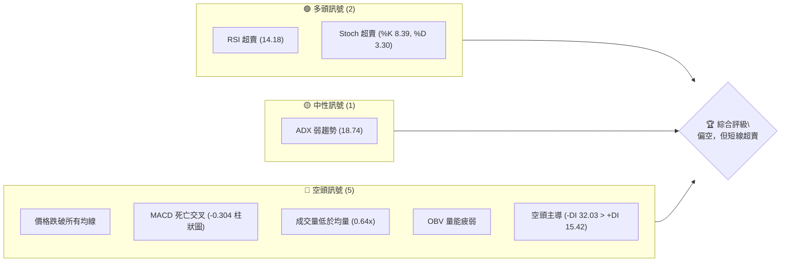

### 📊 核心指標速覽表

| 指標類別 | 指標名稱 | 當前數值 | 訊號 | 解讀 |
|----------|----------|----------|------|------|
| **價格** | 當前價格 | $7.68 | 🔴 | 價格位於所有短期至長期均線下方，顯示強烈賣壓。 |
| **均線** | MA20 | $10.29 | 🔴 | 價格遠低於MA20，短期下跌趨勢確立。 |
| **均線** | MA50 | $10.07 | 🔴 | 價格遠低於MA50，中期下跌趨勢確立。 |
| **均線** | MA200 | $9.37 | 🔴 | 價格跌破MA200，長期上升趨勢可能反轉或進入修正。 |
| **動能** | RSI(14) | 14.18 | 🟢 | 進入極度超賣區間 (<30)，暗示股價短期可能出現技術性反彈。 |
| **動能** | MACD | -0.621 (MACD線) | 🔴 | MACD線位於訊號線下方，且柱狀圖為負值並擴大，空頭動能強勁。 |
| **波動** | ATR | $0.75 | 🟡 | ATR佔股價9.72%，顯示波動率偏高，短期價格變動劇烈。 |

### 🏆 技術評分卡

ONDS 的技術面目前呈現嚴重疲弱。儘管超賣指標提供了一絲反彈希望，但整體趨勢向下，均線系統被擊穿，量能配合不佳，使得短期內反轉的可能性較低，更可能在經歷反彈後繼續尋求下方支撐。

```
技術評分卡 — ONDS (2026-06-26)
════════════════════════════════════════════════════
趨勢強度      ██████░░░░░░░░░░░░░░  30/100  🔴 (弱勢下跌趨勢)
動能指標      ████████░░░░░░░░░░░░  40/100  🟡 (MACD看空，RSI超賣)
支撐穩定度    ████░░░░░░░░░░░░░░░░  20/100  🔴 (已跌破多重支撐)
成交量配合    ████░░░░░░░░░░░░░░░░  20/100  🔴 (量能疲弱，下跌放量)
形態完整度    ██████░░░░░░░░░░░░░░  30/100  🔴 (潛在頂部形態)
均線排列      ██████░░░░░░░░░░░░░░  30/100  🔴 (價格跌破均線集群)
════════════════════════════════════════════════════
綜合評分      ██████░░░░░░░░░░░░░░  30/100  🔴 弱勢看空
════════════════════════════════════════════════════
```

---

## 2. 趨勢分析

### 🌐 多時框趨勢分析

ONDS 在不同時間框架下呈現出複雜的趨勢結構。長期來看，儘管經歷了大幅上漲，但近期已進入深度回調。中期和短期趨勢均轉為明顯的空頭，顯示市場情緒極度悲觀。

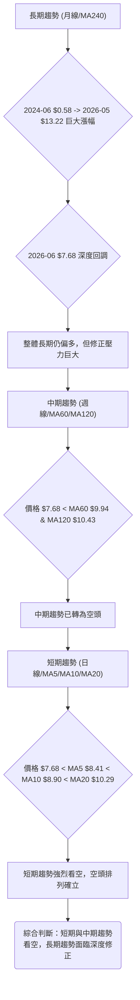

### 📈 長期趨勢 — 12個月走勢圖（Unicode）

過去12個月，ONDS 經歷了一輪波瀾壯闊的漲勢，從2025年6月的$1.92一路飆升至2026年5月的$13.22，漲幅高達588%。然而，在達到歷史高點後，2026年6月出現了急劇的回調，單月跌幅高達41.9%，顯示出強大的獲利了結壓力。

```
ONDS 月線走勢圖（過去12個月）
價格軸 ($)
$15.00 ┤                                    ●(2026-05 高點 $13.22)
$12.50 ┤                                  ●
$10.00 ┤              ●   ●   ●   ●   ●       ●
$ 7.50 ┤                                        ●←現在 ($7.68)
$ 5.00 ┤        ●
$ 2.50 ┤●   ●   ●
$ 0.00 └────────────────────────────────────────────
      2025-06 07  08  09  10  11  12  2026-01 02  03  04  05  06
```

**走勢特徵分析表格**：

| 階段 | 時間區間 | 價格範圍 | 漲跌幅 | 走勢特徵 |
|------|----------|----------|--------|----------|
| **強勁上漲** | 2025-06 至 2026-01 | $1.92 -> $10.36 | +439.58% | 股價呈現多頭排列，成交量溫和放大，動能強勁。 |
| **高位震盪** | 2026-01 至 2026-04 | $10.36 -> $10.04 | -3.09% | 股價在高位盤整，多次嘗試突破未果，動能開始減弱。 |
| **衝刺與見頂** | 2026-05 | $10.04 -> $13.22 | +31.67% | 股價再次向上衝刺，創出新高，但隨後即出現回落，顯示強烈阻力。 |
| **急劇回調** | 2026-06 | $13.22 -> $7.68 | -41.91% | 大量賣盤湧現，股價快速跌破多重支撐，短期趨勢徹底逆轉。 |

### 📊 中期趨勢（週線分析）

從週線圖來看，ONDS 在2026年5月底達到$13.22的峰值後，隨即進入快速下跌通道。目前股價已跌破中期移動平均線（如MA60和MA120），顯示中期趨勢已轉為空頭。近期價格在$7.68附近徘徊，下方主要支撐位於布林通道下軌和歷史成交密集區。

```
ONDS 近期壓力與支撐示意圖 (週線視角)
價格軸 ($)
$15.00 ┤                            (主要阻力)
       │                              ▲
$13.22 ┤                             / \
       │                            /   \
$12.00 ┤                           /     \
       │                          /       \
$10.29 ┤─────── R1 (MA20) ───────┼         ┼
$10.07 ┤─────── R2 (MA50) ───────┼         ┼
$ 9.37 ┤─────── R3 (MA200) ──────┼         ┼
       │                          │         │
$ 7.68 ├──────────────────────────● 現價
       │                          │         │
$ 6.50 ┤─────── S1 (BB下軌) ─────┼─────────┤
$ 5.86 ┤─────── S2 (歷史低點) ───┼─────────┤
       │                          │         │
$ 2.50 ┤                            (強勁支撐)
       └──────────────────────────────────────────
           時間軸
```

### ⚡ 趨勢強度評估（ADX 解讀）

ADX 指標用於衡量趨勢的強度，而非方向。ONDS 的ADX(14)目前為18.74，遠低於25的門檻，表明當前市場處於**弱趨勢或盤整行情**。這意味著雖然價格正在下跌，但下跌的趨勢強度尚未達到強勢趨勢的標準，可能在尋找新的平衡點。

進一步分析+DI和-DI：
- +DI (多頭方向指數) 為 15.42
- -DI (空頭方向指數) 為 32.03
由於-DI顯著高於+DI，明確指出**空頭力量在當前弱趨勢中佔據主導地位**。這確認了雖然整體趨勢不強，但其方向是向下傾斜的。這通常發生在股價經歷快速下跌後，進入震盪尋底階段。

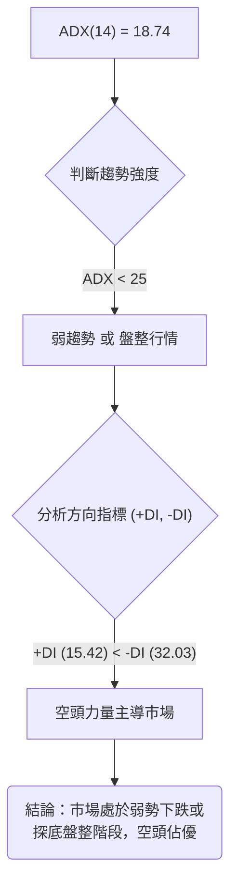

**ADX 強度對照表**：

| ADX 數值範圍 | 趨勢強度 | 市場解讀 |
|--------------|----------|----------|
| 0 - 25       | 弱趨勢/盤整 | 市場缺乏明確方向，價格波動可能較小，或在尋找趨勢。 |
| 25 - 50      | 中等趨勢 | 趨勢明確，動能良好，適合趨勢追蹤策略。 |
| 50 - 75      | 強趨勢   | 趨勢非常強勁，價格單邊運行，可能出現超買超賣。 |
| 75 - 100     | 極強趨勢 | 市場極度單邊，短期內可能面臨修正風險。 |

---

## 3. 圖表形態分析

### 🔍 形態識別系統

ONDS 在2026年5月創下$13.22的高點後急劇下跌，這段走勢值得關注。雖然目前尚未形成典型的反轉形態（如頭肩頂或雙頂），但其快速下跌的性質暗示了市場情緒的劇烈變化。若股價在未來反彈至$10-$12區間後再次受阻下跌，則有可能形成一個大型的M字頭部形態。目前，可以將其視為從高點回落的**潛在圓弧頂**或**V形反轉失敗**後的下跌。

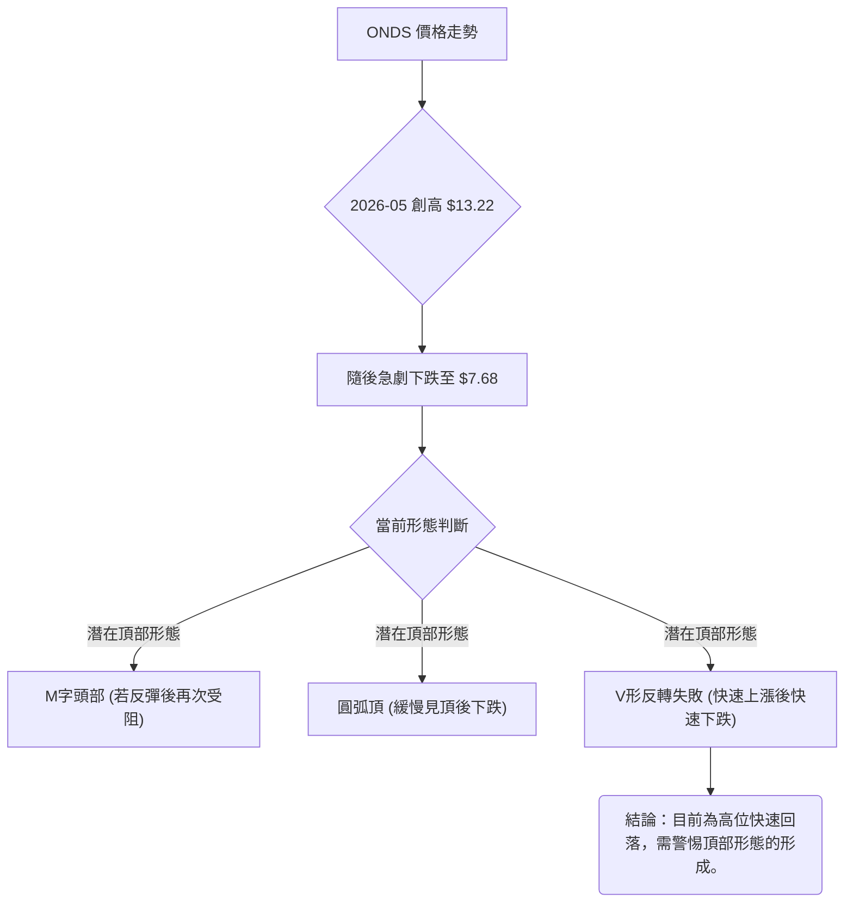

### 🕯️ 重要K線形態分析

從近20週的收盤價數據來看，ONDS 在2026年5月底至6月間形成了明確的空頭K線組合，顯示賣壓強勁。

| 月份 | 收盤價 | K線形態 (推測) | 解讀 | 訊號 |
|------|--------|----------------|------|------|
| 2026-05-31 | $13.22 | **高位長上影線/烏雲蓋頂** | 股價在創出新高後，未能守住漲幅，收盤價相對較低，表明上方賣壓沉重。 | 🔴 |
| 2026-06-07 | $10.43 | **長陰線** | 在高點之後出現的大幅下跌，吞噬了前期的部分漲幅，確認了空頭力量的介入。 | 🔴 |
| 2026-06-14 | $9.33 | **小陰線** | 跌勢稍緩，但仍處於下跌通道中，多頭缺乏反擊力量。 | 🔴 |
| 2026-06-21 | $9.27 | **小陰線** | 延續跌勢，顯示市場信心不足，多頭無力扭轉局面。 | 🔴 |
| 2026-06-28 | $7.68 | **大陰線/實體陰線** | 再次出現大幅下跌，直接跌破多重支撐，空頭力量再度爆發，確認了下跌趨勢。 | 🔴 |

### 📉 ASCII 走勢形態示意圖

ONDS 的近期走勢呈現出一個明顯的「高位反轉」形態，即股價在達到$13.22的峰值後，連續數週大幅下挫，形成了一個陡峭的下跌通道。

```
ONDS 近期走勢形態示意圖 (高位反轉)

價格軸 ($)
$14.00 ┤                     ● (2026-05 峰值 $13.22)
$13.00 ┤                    /
$12.00 ┤                   /
$11.00 ┤                  /
$10.00 ┤                 /
$ 9.00 ┤                /
$ 8.00 ┤               ● (現在 $7.68)
$ 7.00 ┤              /
$ 6.00 ┤             /
       └───────────────────────────
             時間軸 (近幾週)
```

### 🎯 形態目標價計算

鑑於目前尚未形成明確的經典反轉形態（如頭肩頂或雙頂），因此無法直接依據形態高度來計算目標價。目前的下跌更像是對前期大幅上漲的深度回調。若將2026年5月的$13.22視為一個短期頂部，並且股價未能有效反彈並突破此高點，則其潛在的下跌目標將依賴於斐波那契回調和關鍵支撐位。

**潛在情境一：若形成雙頂 (M頭部)**
- **假設條件**：股價反彈後未能突破 $13.22，且在 $10.00 - $11.00 區間再次受阻下跌，並跌破 $7.68 的近期低點作為頸線。
- **形態高點**：約 $13.22
- **頸線位置**：約 $7.68
- **形態高度**：$13.22 - $7.68 = $5.54
- **目標價計算**：頸線 - 形態高度 = $7.68 - $5.54 = $2.14
- **解讀**：此為極端看空情境，若發生，則股價可能向此目標邁進。

**潛在情境二：斐波那契延伸目標**
如果股價跌破目前的 $7.68 支撐位，並無法有效反彈，則下一層級的斐波那契延伸目標將會是基於更早期的上漲波段。基於當前數據，我們將主要依賴支撐阻力分析和斐波那契回調來設定目標。

---

## 4. 支撐與阻力

ONDS 目前處於關鍵的支撐區域。價格已跌破多數移動平均線，這些均線現在轉化為上方的阻力。下方的斐波那契回調位和布林通道下軌是當前最重要的支撐。

### 🗺️ 關鍵價位分布圖（Unicode）

```
ONDS 價位結構分布圖 (2026-06-26)
═══════════════════════════════════════════════════
$13.22 ║████████████████████████║ 強阻力 R3 (2026-05 高點)
$10.41 ║████████████████████    ║ 阻力 R2 (斐波那契 38.2%)
$10.29 ║████████████████████████║ 關鍵阻力 R1 (MA20)
$10.07 ║████████████████████████║ 阻力 R1 (MA50)
$ 9.54 ║▓▓▓▓▓▓▓▓▓▓▓▓▓▓▓▓        ║ 阻力 (斐波那契 50%)
$ 9.37 ║████████████████████████║ 阻力 (MA200)
$ 8.67 ║▓▓▓▓▓▓▓▓▓▓▓▓▓▓▓▓        ║ 近期阻力 (斐波那契 61.8%)
$ 7.68 ╠════════════════════════╣ ◄ 現價
$ 7.60 ║▓▓▓▓▓▓▓▓▓▓▓▓▓▓▓▓        ║ 近期支撐 S1 (斐波那契 76.4%)
$ 6.50 ║████████████████████████║ 強支撐 S2 (布林通道下軌)
$ 6.44 ║████████████████████████║ 強支撐 S2 (2025-10 低點)
$ 5.86 ║████████████████████████║ 強支撐 S3 (2025-08 低點)
═══════════════════════════════════════════════════
```

### 🚧 阻力位分析表

| 阻力級別 | 價位 | 形成原因 | 突破難度 | 重要性 |
|----------|------|----------|----------|--------|
| **R1**   | $8.67 | 斐波那契 61.8% 回調位 | 中等 | 若能突破，短期跌勢可能趨緩。 |
| **R2**   | $9.37 | MA200 | 較高 | 長期趨勢的關鍵轉折點，突破意味著長期趨勢可能轉好。 |
| **R3**   | $10.29 | MA20 / MA50 | 高 | 短期和中期趨勢的強大阻力，需要大量買盤才能突破。 |
| **R4**   | $13.22 | 2026年5月歷史高點 | 極高 | 股價需經歷大幅反彈並伴隨巨量才能再次挑戰此高點。 |

### 🛡️ 支撐位分析表

| 支撐級別 | 價位 | 形成原因 | 守住機率 | 重要性 |
|----------|------|----------|----------|--------|
| **S1**   | $7.60 | 斐波那契 76.4% 回調位 | 中等 | 當前價格附近，是近期跌勢的關鍵支撐，若跌破則可能加速下跌。 |
| **S2**   | $6.50 | 布林通道下軌 | 較高 | 極度超賣的技術支撐，通常在此處有較強的反彈動能。 |
| **S3**   | $6.44 | 2025年10月低點 | 較高 | 歷史成交密集區，具有較強的支撐作用。 |
| **S4**   | $5.86 | 2025年8月低點 | 高 | 前期重要起漲點，若跌至此處，將是對長期多頭趨勢的嚴峻考驗。 |

### 📐 斐波那契回調位分析

我們以 ONDS 從 2025年8月的低點 $5.86 到 2026年5月的高點 $13.22 作為主要上漲波段，計算其回調位。當前價格 $7.68 位於 76.4% 回調位附近，顯示市場正在經歷深度回調，並觸及關鍵的支撐區域。

- **上漲波段**：低點 $5.86 (2025-08) 至 高點 $13.22 (2026-05)
- **波段長度**：$13.22 - $5.86 = $7.36

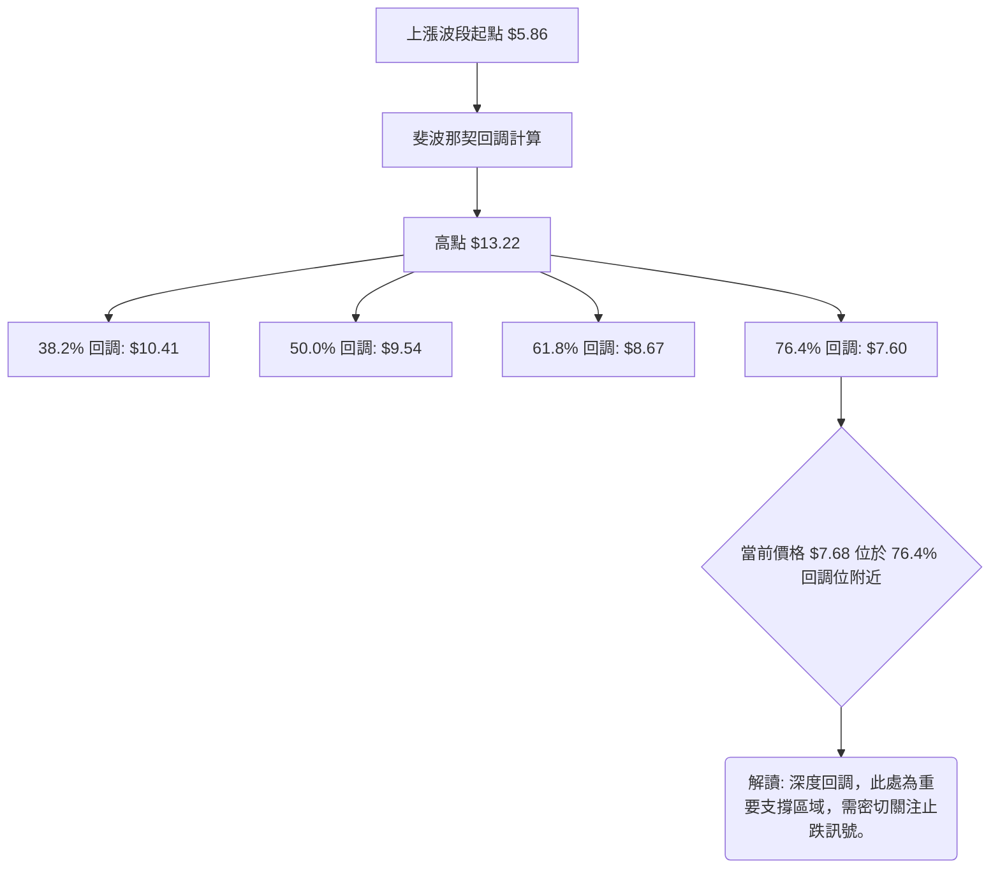

**斐波那契回調位詳情**：

| 回調比例 | 價位 | 解讀 |
|----------|------|------|
| **38.2%** | $10.41 | 輕微回調，若價格能在此止跌反彈，則趨勢仍強。 |
| **50.0%** | $9.54 | 中度回調，通常在強勢市場中，價格在此處獲得支撐。 |
| **61.8%** | $8.67 | 黃金分割位，若價格跌破此處，則趨勢可能轉弱。 |
| **76.4%** | $7.60 | 深度回調，接近此價位通常表明市場極度悲觀，但也是潛在的強勁反彈點。 |

---

## 5. 技術指標深度解讀

ONDS 的技術指標目前呈現出強烈的空頭訊號，但同時也伴隨著極度超賣的狀況，暗示短線可能出現技術性反彈。

### 🎛️ 指標訊號總覽

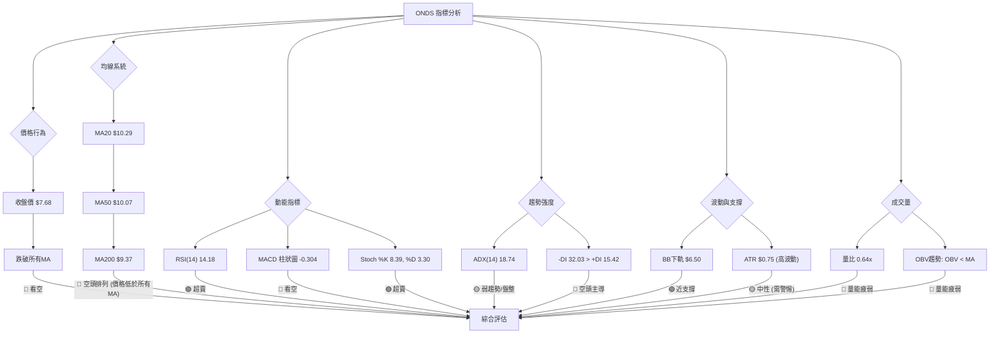

### 📈 移動平均線排列分析

ONDS 的移動平均線系統目前呈現出一個矛盾的狀態：均線本身 (MA20 > MA50 > MA200) 仍然是多頭排列，但當前股價 $7.68 卻已跌破所有這些均線。這意味著**長期上升趨勢的結構尚未完全被破壞，但短期和中期趨勢已經徹底轉為空頭**，股價正經歷深度修正。

- **MA20** ($10.29) 位於 MA50 ($10.07) 上方，MA50 位於 MA200 ($9.37) 上方。這是一個經典的多頭排列，反映了過去一段時間的強勁上漲。
- 然而，**當前價格 $7.68 遠低於所有均線**。這表明股價的下跌速度非常快，已經完全脫離了其原有的上漲通道。
- **解讀**：均線本身的多頭排列現在成為了股價反彈的巨大阻力。每條均線都可能成為股價反彈時的壓力位。

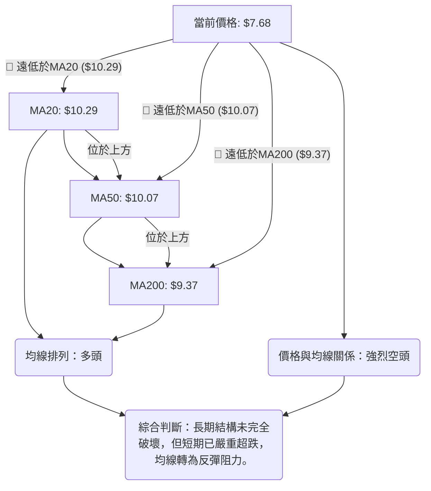

### 📉 RSI(14) 分析

ONDS 的 RSI(14) 當前數值為 **14.18**，這是一個極低的數值。

- **數值進度條**：RSI強度：▓▓▓░░░░░░░░░░░░░░░░░ 14.18/100
- **超買超賣區間分析**：RSI 低於 30 被視為超賣區間，而 ONDS 的 14.18 更是處於極度超賣狀態。這表明股價在短期內下跌過快，可能存在技術性反彈的需求。從歷史經驗來看，極端超賣往往是股價短期觸底或反彈的先兆。
- **背離判斷**：從提供的數據（近20週收盤走勢）來看，ONDS 的RSI與價格走勢基本同步下跌。在2026-05-31價格達到$13.22時，RSI為70.6，隨後價格和RSI均同步下跌。在2026-06-21價格為$9.27時RSI為22.1，到2026-06-28價格為$7.68時RSI為14.2。**目前沒有觀察到明顯的底背離現象**，即價格創新低而RSI未能創新低。這意味著當前的下跌動能依然強勁，尚未出現明確的止跌訊號。

### 📊 MACD(12/26/9) 訊號解讀

MACD 指標目前發出強烈的空頭訊號。

- **MACD 線**：-0.621
- **MACD Signal 線**：-0.317
- **MACD Hist 柱狀圖**：-0.304 🔴 (看空)

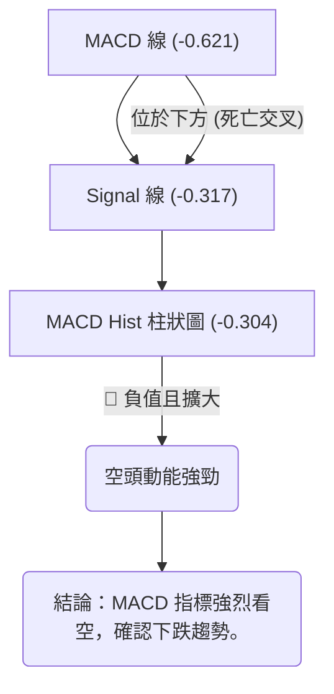
- **解讀**：MACD 線位於 Signal 線下方，形成了**死亡交叉**，這是一個明確的賣出訊號。MACD 柱狀圖為負值且絕對值正在擴大，這表明空頭動能正在增強，賣壓持續。
- **背離判斷**：與RSI類似，從提供的週線數據看，MACD柱狀圖從5月31日的+0.400到6月28日的-0.304，與股價的下跌同步。**目前沒有觀察到明顯的底背離現象**。MACD柱狀圖持續為負且擴大，顯示空頭力量仍佔優勢。

### 📦 布林通道分析

布林通道 (Bollinger Bands) 用於衡量價格的波動區間和超買超賣情況。

- **BB上軌**：$14.08
- **BB中軌 (MA20)**：$10.29
- **BB下軌**：$6.50
- **BB %B**：0.15 (0=下軌, 0.5=中軌, 1=上軌)

```
ONDS 布林通道示意圖 (2026-06-26)

價格軸 ($)
$15.00 ┤                     ┌─────────────────┐
$14.08 ┤─────────────────────┤ BB上軌
       │                     │                 │
$12.50 ┤                     │                 │
       │                     │                 │
$10.29 ┤─────────────────────┼─ BB中軌 (MA20)
       │                     │                 │
$ 7.68 ├─────────────────────● 現價
       │                     │                 │
$ 6.50 ┤─────────────────────┼─ BB下軌
$ 5.00 ┤                     └─────────────────┘
       └─────────────────────────────────────────
            時間軸
```
- **解讀**：當前價格 $7.68 位於布林通道下軌 $6.50 附近 (BB %B = 0.15)。這表明股價已經觸及或接近布林通道的下限，處於技術性超賣狀態。在大多數情況下，價格在觸及布林通道邊界後會有向中軌線回歸的傾向 (mean reversion)。然而，在強勢下跌趨勢中，價格可能會沿著下軌線運行，甚至跌破下軌。結合RSI的極度超賣，短期內出現反彈的可能性增加，但反彈的高度可能受限於中軌 ($10.29) 和其他移動平均線的阻力。

### 💹 成交量分析（量價配合度）

成交量是確認價格走勢的重要指標。

- **最新成交量**：47,590,200
- **20日均量**：74,632,730
- **量比**：0.64x (最新成交量 / 20日均量)
- **OBV趨勢**：OBV < MA → 量能疲弱

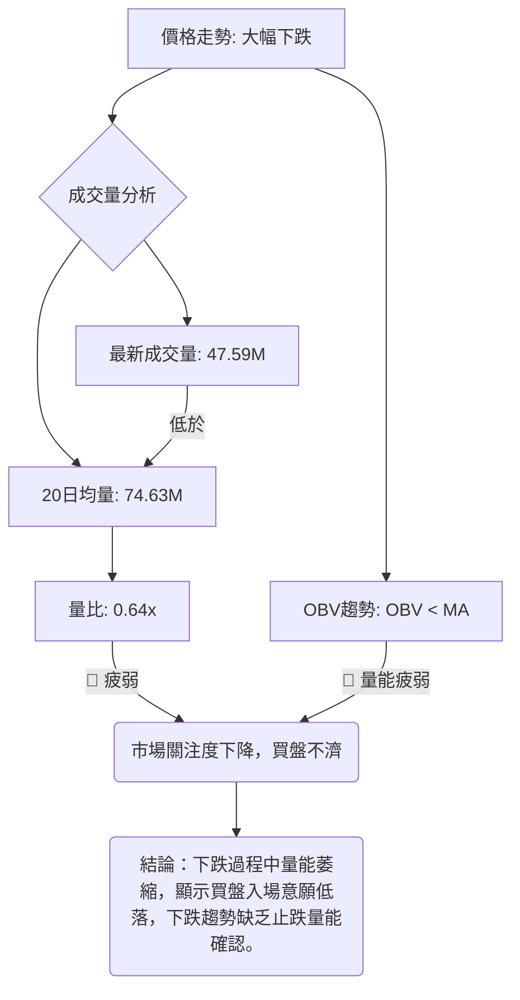
- **解讀**：當前成交量遠低於20日均量，量比僅為0.64x。這表明在股價急劇下跌後，市場的活躍度顯著下降，買盤入場意願低落。
- **量價配合度**：通常，在下跌趨勢中，如果伴隨放量，則表示賣壓沉重，下跌趨勢可能持續。如果下跌過程中量能萎縮，則可能意味著賣壓正在減輕，但同時也缺乏買盤的積極介入，導致股價繼續疲弱。
- **OBV分析**：OBV趨勢低於其移動平均線，這是一個明確的空頭訊號，表明累積買盤不足，賣壓佔優。這與價格的下跌走勢相符，確認了當前的下跌趨勢。

---

## 6. 動能與波動率

### ⚡ 動能評估四象限

ONDS 目前處於「弱動能、高波動」的象限。這表示雖然股價大幅下跌，但市場趨勢強度 (ADX) 尚未達到極強，且波動劇烈 (ATR高)。這種情況下，投資者應極度謹慎。

| 象限 | 動能 | 波動 | 當前狀態 (ONDS) | 評估 |
|------|------|------|-----------------|------|
| Q1   | 強   | 低   | -               | 最佳進場機會 (趨勢明確且穩定) |
| Q2   | 弱   | 低   | -               | 謹慎觀望 (缺乏明確方向) |
| Q3   | 強   | 高   | -               | 高風險高收益 (趨勢強勁但風險高) |
| **Q4** | **弱** | **高** | **✓**           | **避免進場 (方向不明，波動劇烈，極度不確定性)** |

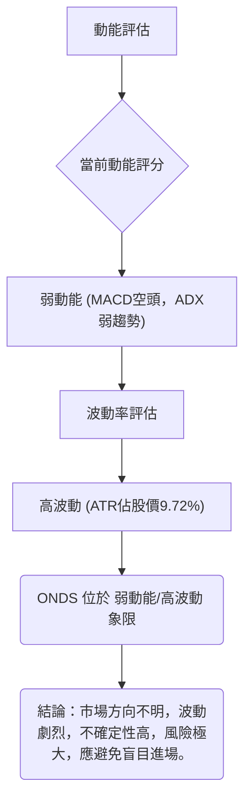

### 📊 ATR 波動率分析

- **ATR(14)**：$0.75
- **ATR佔股價比例**：$0.75 / $7.68 = 9.77%

- **解讀**：ATR 數值高達 $0.75，且佔當前股價的 9.77%。這是一個相對較高的波動率，表明 ONDS 在過去14天內的每日價格波動幅度較大。高波動率意味著股價在短期內可能出現大幅漲跌，這增加了交易的風險和潛在回報。
- **止損距離建議**：對於高波動股票，止損點的設置需要更寬鬆，以避免被短期噪音波動掃出局。建議將止損點設置在當前價格下方 1.5 到 2 倍 ATR 的距離。
    - 1.5倍ATR止損：$7.68 - (1.5 * $0.75) = $7.68 - $1.125 = $6.555
    - 2倍ATR止損：$7.68 - (2 * $0.75) = $7.68 - $1.50 = $6.18
    這也與布林通道下軌 $6.50 和斐波那契回調位 $7.60 形成支撐區域。

### 📐 Beta 與市場相關性

由於提供的數據中沒有 ONDS 的 Beta 值，因此無法直接分析其與市場的相關性。

- **推測**：Ondas Inc. 屬於科技產業的通訊設備領域，通常這類公司對市場情緒和科技板塊的整體表現較為敏感。在市場風險偏好較低時，高成長性或高風險性的科技股往往會經歷更大的波動和跌幅。考慮到其近期股價的劇烈波動，ONDS 可能具有較高的 Beta 值，即其股價波動幅度可能大於整體市場。

---

## 7. 多時框架總結

ONDS 在不同時間框架下呈現出一致的空頭訊號，尤其是在中短期。儘管長期趨勢仍有上漲的基礎，但短期內面臨強大的修正壓力。

### 📋 時框架評分表

| 時框架 | 趨勢方向 | 動能 | 均線排列 | 形態 | 綜合評分 | 建議 |
|--------|----------|------|----------|------|----------|------|
| **長期** | 🟡 修正中 | 🟡 減弱 | 🟢 多頭但價格跌破 | 🟡 潛在頂部 | 4/10 | 警惕深度回調 |
| **中期** | 🔴 下跌   | 🔴 負向 | 🔴 價格跌破MA集群 | 🔴 高位反轉 | 2/10 | 避免進場 |
| **短期** | 🔴 急跌   | 🔴 極弱/超賣 | 🔴 空頭排列 | 🔴 強勢下跌 | 1/10 | 關注超賣反彈 |

### 🔲 綜合訊號矩陣

ONDS 的多時框架訊號顯示，短期和中期均處於強烈的空頭控制之下，長期趨勢也受到嚴重威脅。雖然超賣指標暗示短期存在反彈空間，但這僅限於技術性修正，並非趨勢反轉。

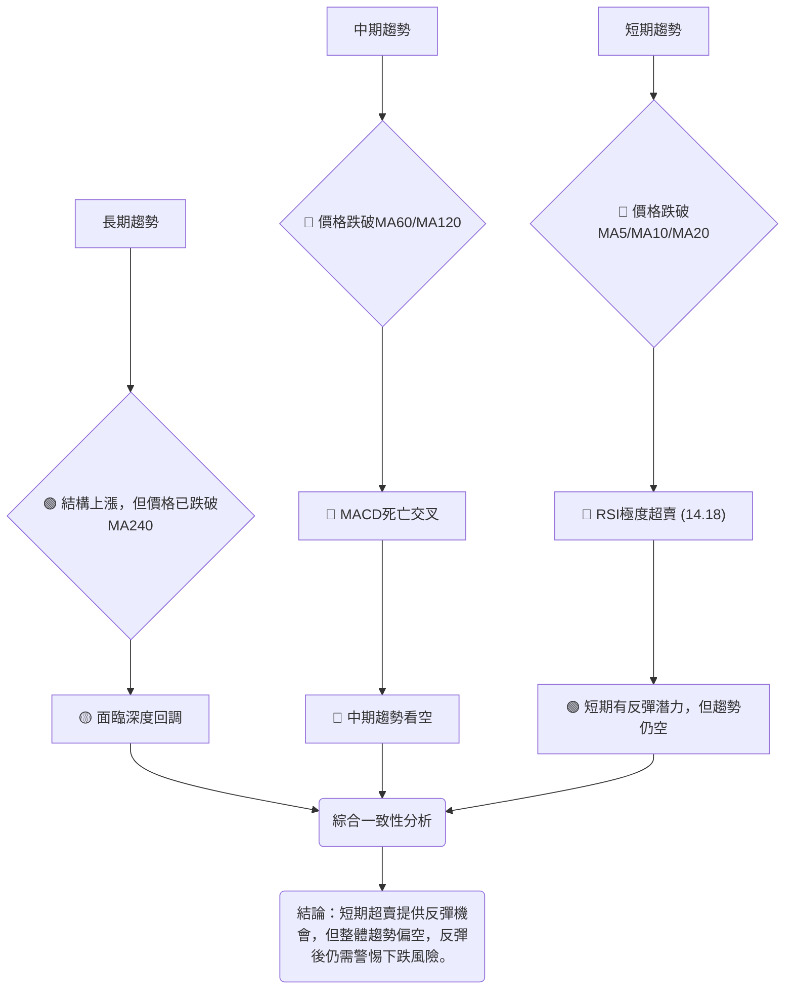

---

## 8. 交易策略建議

ONDS 目前處於極度超賣狀態，但整體趨勢仍然偏空。因此，交易策略應側重於短線超跌反彈機會，或在反彈失敗後建立空頭部位。由於波動率高，風險管理至關重要。

### 🗺️ 策略決策流程圖

```mermaid
graph TD
    A["ONDS 當前狀態分析"] --> B{"RSI/Stoch 極度超賣?"}
    B -- 是 --> C["考慮短線超跌反彈策略"]
    B -- 否 --> D["價格是否跌破關鍵支撐 $7.60 / $6.50 ?"]

    C --> C1{"反彈目標: R1 $8.67, R2 $9.54"}
    C1 --> C2{"止損: S1 $7.60 之下"}
    C2 --> C_END("執行多頭策略 (高風險"))

    D -- 是 --> D1["確認下跌趨勢，考慮空頭追擊"]
    D -- 否 (仍在支撐區) --> E["觀望，等待止跌訊號"]

    D1 --> D2{"進場: 跌破 $7.60 或反彈不過 $8.67"}
    D2 --> D3{"目標: S2 $6.50, S3 $5.86"}
    D3 --> D4{"止損: R1 $8.67 之上"}
    D4 --> D_END("執行空頭策略 (高風險"))

    E --> E_END("等待趨勢明朗")
```

### 🟢 多頭策略詳情 (短線超跌反彈)

此策略基於RSI和Stoch指標的極度超賣以及價格接近斐波那契76.4%回調位和布林通道下軌。這是一個**高風險的反向操作**，僅適合短線交易者。

| 策略要素 | 策略 A (激進反彈) | 策略 B (保守反彈) |
|----------|--------------------|--------------------|
| 進場條件 | 價格在 $7.60 - $7.70 區間出現放量止跌K線 (如錘子線) | 價格在 $6.50 附近 (布林下軌) 獲得支撐，RSI/Stoch出現底部鈍化或金叉 |
| 進場價格 | $7.65 | $6.55 |
| 目標價 T1 | $8.67 (斐波那契 61.8% 回調) | $7.60 (斐波那契 76.4% 回調) |
| 目標價 T2 | $9.54 (斐波那契 50% 回調) | $8.67 (斐波那契 61.8% 回調) |
| 止損價格 | $7.20 (跌破 $7.60 支撐，考慮ATR) | $6.10 (跌破布林下軌 $6.50 考慮ATR) |
| 風險報酬比 | (T1: $8.67 - $7.65) / ($7.65 - $7.20) = 1.02 / 0.45 ≈ 2.27:1 | (T1: $7.60 - $6.55) / ($6.55 - $6.10) = 1.05 / 0.45 ≈ 2.33:1 |
| 成功機率 | 40% (高波動，反彈可能迅速結束) | 45% (更強支撐，但可能需要更長時間等待) |
| 建議倉位 | 5% (極低倉位，嚴格控制風險) | 5% (極低倉位，嚴格控制風險) |

### 🔴 空頭策略詳情 (趨勢延續或反彈失敗)

此策略基於 MACD 的空頭訊號、ADX 的空頭主導以及價格跌破多條均線。

| 策略要素 | 策略 A (追擊下跌) | 策略 B (反彈做空) |
|----------|--------------------|--------------------|
| 進場條件 | 價格跌破 $7.60 支撐，並伴隨放量 | 價格反彈至 $8.67 (斐波那契 61.8%) 或 $9.54 (斐波那契 50%) 受阻，出現看空K線 |
| 進場價格 | $7.55 | $8.60 (反彈受阻後) |
| 目標價 T1 | $6.50 (布林通道下軌/2025-10低點) | $7.60 (近期支撐) |
| 目標價 T2 | $5.86 (2025-08低點) | $6.50 (布林通道下軌/2025-10低點) |
| 止損價格 | $8.10 (上方最近小阻力) | $9.00 (略高於 $8.67 阻力) |
| 風險報酬比 | (T1: $7.55 - $6.50) / ($8.10 - $7.55) = 1.05 / 0.55 ≈ 1.91:1 | (T1: $8.60 - $7.60) / ($9.00 - $8.60) = 1.00 / 0.40 ≈ 2.50:1 |
| 成功機率 | 55% (符合當前趨勢) | 50% (等待反彈確認阻力) |
| 建議倉位 | 8% (中低倉位，控制風險) | 8% (中低倉位，控制風險) |

### ⭐ 整體訊號強度評星

做多訊號強度：★★☆☆☆ (2/5星) - 僅基於超賣，趨勢逆勢，風險高。
做空訊號強度：★★★★☆ (4/5星) - 符合當前趨勢，多數指標確認空頭。
整體可信度：  ★★★☆☆ (3/5星