<details>
<summary>📊 靜態圖表 (點擊展開)</summary>
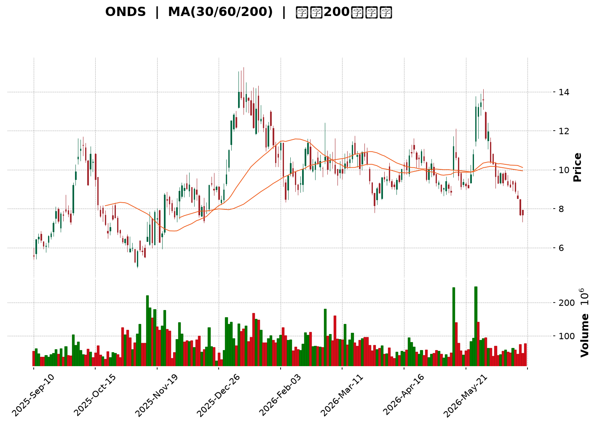
</details>

<html>
<head><meta charset="utf-8" /></head>
<body>
    <div style="height:500px; width:100%;">                        <script>window.PlotlyConfig = {MathJaxConfig: 'local'};</script>
        <script charset="utf-8" src="https://cdn.plot.ly/plotly-3.6.0.min.js" integrity="sha256-QaOVwtVY0T02VaHrr6pnoHLCwayMJp4O5n4YyaE3rJk=" crossorigin="anonymous"></script>                <div id="candlestick-chart" class="plotly-graph-div" style="height:100%; width:100%;"></div>            <script>                window.PLOTLYENV=window.PLOTLYENV || {};                                if (document.getElementById("candlestick-chart")) {                    Plotly.newPlot(                        "candlestick-chart",                        [{"close":{"dtype":"f8","bdata":"AAAAoHA9FkAAAACAFK4ZQAAAAKBwPRpAAAAAwB6FGUAAAAAAKVwYQAAAAGBmZhhAAAAAYGZmGkAAAACgR+EaQAAAAIA9Ch1AAAAAwB6FH0AAAABgZmYdQAAAAAAAAB9AAAAAANejHkAAAABA4XofQAAAAKBH4R5AAAAAoHA9HUAAAAAghWsiQAAAAIDr0SNAAAAAgOtRJUAAAACAFC4mQAAAAMAehSZAAAAAQOH6JEAAAADgo3AiQAAAAGC4niVAAAAAgOvRJEAAAADAHgUjQAAAAGBmZiBAAAAA4KNwHkAAAADgehQfQAAAAGCPwhxAAAAAgML1GkAAAACgcD0cQAAAAEAK1x1AAAAAYLgeHkAAAADA9SgbQAAAAAAAABtAAAAAwPUoGUAAAABgj8IZQAAAAKCZmRhAAAAAQArXF0AAAAAAAAAYQAAAAAAAABVAAAAAoHA9F0AAAADAHoUXQAAAAEAzMxdAAAAAgD0KFkAAAACgcD0aQAAAAOBRuBxAAAAAwB4FGUAAAAAAKVwfQAAAAAAAAB5AAAAA4HoUGUAAAADgo\u002fAaQAAAAOCjcCFAAAAAoEfhIEAAAABA4XogQAAAAKCZmR9AAAAAgOtRHkAAAAAA1yMgQAAAAEAK1yFAAAAAoEdhIkAAAAAA1yMiQAAAAIA9CiJAAAAAgMJ1IkAAAABgZqYgQAAAAIA9CiJAAAAAAACAIUAAAABgj8IeQAAAAIAULiBAAAAAQOF6HUAAAABAMzMfQAAAAOCjcCJAAAAAgD2KIkAAAAAgheshQAAAAGCPQiJAAAAAgML1IEAAAAAghesgQAAAAEDh+iFAAAAAwB6FI0AAAACAPQomQAAAACBcDylAAAAAgBSuKUAAAAAAKVwoQAAAAMAeBSxAAAAAoEdhK0AAAACgR2EqQAAAACCuxytAAAAAYLgeK0AAAAAA16MpQAAAAIDrUShAAAAAYI9CKkAAAACgmRkpQAAAAKBwPSlAAAAAQApXKEAAAACA61EmQAAAAMAehShAAAAAgD2KKEAAAACAPYomQAAAAOBRuCRAAAAAIK5HJUAAAABgj8ImQAAAAAApXCNAAAAAgML1IEAAAACgR2EjQAAAAIAUriRAAAAAAClcI0AAAACAwnUiQAAAAOCj8CFAAAAAYLieIkAAAACgmRkkQAAAAADXIyZAAAAAIK7HJkAAAAAgXA8kQAAAAKBHYSRAAAAAwMzMJEAAAACgmZkkQAAAAGBm5iRAAAAAwPUoJEAAAABAClclQAAAAIA9CiRAAAAAwB4FJUAAAABA4fokQAAAAMD1qCNAAAAA4KNwI0AAAADAHgUkQAAAAMD1qCNAAAAAwPWoJEAAAACA61EkQAAAACBcDyVAAAAAIFyPJkAAAADA9aglQAAAAAAAgCVAAAAAYLgeJEAAAADAzMwlQAAAAAApXCVAAAAAYLieJEAAAACgR+EiQAAAAKCZmSFAAAAAwMxMIEAAAADgehQiQAAAAGC4niFAAAAAQDMzI0AAAACAPQojQAAAACBcDyNAAAAAYGbmIkAAAAAgrkciQAAAAGCPQiJAAAAA4KPwIkAAAADAzMwiQAAAACBcDyRAAAAAYGZmJEAAAAAAAAAkQAAAAIDCdSVAAAAAoHC9JUAAAABguB4mQAAAAOB6FCVAAAAAoJkZJUAAAABgZuYlQAAAAIDC9SRAAAAAQOH6IkAAAADgehQkQAAAAADXoyRAAAAAgMJ1I0AAAADA9agiQAAAAIAUriJAAAAAIK7HIUAAAABguB4iQAAAAEAK1yJAAAAA4HoUIkAAAADgUbghQAAAACCFayZAAAAAoHA9JUAAAABgZmYjQAAAAAAAQCJAAAAA4FG4IkAAAAAAKVwiQAAAAGC4HiJAAAAAgD2KI0AAAACgmZklQAAAAAAAgCpAAAAA4KNwKkAAAAAghesqQAAAAMD1KCtAAAAA4FE4J0AAAADgo\u002fAnQAAAAAAp3CRAAAAAoJmZJEAAAADAzEwjQAAAAGC4niJAAAAAwPWoI0AAAADA9agiQAAAAMAeBSNAAAAAIIVrIkAAAACgcD0iQAAAAIA9iiJAAAAAIK7HIUAAAAAgXA8hQAAAAOBRuB5AAAAAQDOzHkAAAAAAAAD4fw=="},"high":{"dtype":"f8","bdata":"AAAAAAAAGEAAAABgj8IZQAAAAKBH4RpAAAAA4KNwG0AAAABgZmYZQAAAAAAAABlAAAAAIFyPGkAAAAAAKVwbQAAAAOCjcB1AAAAAoHA9IEAAAAAA1yMgQAAAAAApXB9AAAAAIFyPH0AAAAAghWshQAAAAEAKVyBAAAAAwMzMH0AAAACAFK4iQAAAACBcjyRAAAAAYI9CJ0AAAABAChcnQAAAAGBmZidAAAAAIK7HJkAAAADAHgUlQAAAAIAUbiZAAAAAYLgeJUAAAACgcL0lQAAAAGCPQiNAAAAAgOtRIEAAAACgR2EgQAAAAADXox9AAAAAgD0KHUAAAABAMzMdQAAAAEAKVyBAAAAAoEehIEAAAAAgXI8eQAAAAMDMzBtAAAAAgMJ1GkAAAAAAAAAaQAAAAGCPwhpAAAAAIK5HGkAAAAAAAAAZQAAAAOBRuBdAAAAA4HqUF0AAAAAgXI8ZQAAAAKBHYRhAAAAAwPWoGEAAAAAAKVwdQAAAAOCjcB9AAAAAIFwPHkAAAACAFK4fQAAAAIDrESBAAAAAoEfhH0AAAABgZmYbQAAAAKCZmSFAAAAAYI\u002fCIUAAAAAAKVwhQAAAAMAg8CBAAAAAANcjIEAAAACgmRkhQAAAAIDCNSJAAAAAgBSuIkAAAACgmZkiQAAAAAAAgCNAAAAA4FG4I0AAAABA4ToiQAAAAMD1KCJAAAAAYGYmI0AAAABA4XohQAAAAADXYyBAAAAAYLgeIUAAAABgka0gQAAAAEDheiJAAAAAgOtRI0AAAACAFK4jQAAAAGBmZiJAAAAAQApXIkAAAABAClchQAAAAKCZmSJAAAAAIFwPJUAAAABguB4mQAAAAOB6FClAAAAAACncKUAAAACAPQoqQAAAAADXIy5AAAAAQDMzLkAAAAAgXI8uQAAAAAAAAC1AAAAAAACAK0AAAAAA1yMsQAAAAAAAgCxAAAAAYGZmLEAAAADA9agsQAAAAMD1qCpAAAAAQOG6KUAAAAAghasoQAAAAOCj8ChAAAAAwPUoKkAAAAAgXI8oQAAAAGBm5iZAAAAAYGZmJkAAAABACtcmQAAAAIA9yiZAAAAAIFwPI0AAAADAHoUjQAAAACCuRyVAAAAAoEfhJEAAAABACtcjQAAAAKDGiyJAAAAAAClcI0AAAAAA16MkQAAAAEAKVyZAAAAAgBQuJ0AAAADA9SgnQAAAAADXIyVAAAAAgML1JEAAAACgR+ElQAAAACBcjyVAAAAAAClcJEAAAABACtcoQAAAAAAAACZAAAAAANejJUAAAABACtclQAAAAOBROCdAAAAAIFwPJEAAAABgZuYkQAAAAGC4HiVAAAAAgBSuJUAAAACAwvUlQAAAAKBwvSVAAAAA4KPwJkAAAADAHoUnQAAAAIDC9SVAAAAAwPWoJUAAAADgo\u002fAlQAAAAKBwvSZAAAAAIK5HJkAAAAAgrkckQAAAAKBwvSJAAAAAANejIUAAAAAgrkciQAAAAEAzsyJAAAAAYI9CI0AAAADAzMwjQAAAAKBHYSNAAAAAoHC9JEAAAACAPQojQAAAAOBRuCJAAAAAIIUrI0AAAADgUbgjQAAAACBcDyRAAAAAIK7HJEAAAAAgXA8lQAAAAGC4HiZAAAAA4HqUJkAAAADgUTgnQAAAAOCj8CVAAAAAgD2KJUAAAABguB4mQAAAAADXIyZAAAAAACncJEAAAACA61EkQAAAAGC4HiVAAAAAQOG6JEAAAADgepQjQAAAACCF6yJAAAAAAACAIkAAAACAFC4iQAAAAMDMTCNAAAAAQDOzIkAAAAAAKVwiQAAAAIDCdSdAAAAAoHA9KEAAAABAClclQAAAAGCPwiNAAAAA4HoUI0AAAABgj8IiQAAAAKBHISNAAAAAwB6FJEAAAABguB4mQAAAACBcjytAAAAAgOvRKkAAAACA69ErQAAAAIDrUSxAAAAAAAAAKkAAAABACtcoQAAAAIDrUSdAAAAAgBSuJUAAAACA69EkQAAAAIDC9SNAAAAAoEPLI0AAAABAicEjQAAAAOCj8CNAAAAAQOF6I0AAAAAAAAAjQAAAACCF6yJAAAAAIIXrIkAAAAAAKdwhQAAAAAAAACFAAAAAYI\u002fCH0AAAAAAAAD4fw=="},"hovertemplate":"\u003cb\u003e%{x|%Y-%m-%d}\u003c\u002fb\u003e\u003cbr\u003e\u958b: $%{open:.2f}\u003cbr\u003e\u9ad8: $%{high:.2f}\u003cbr\u003e\u4f4e: $%{low:.2f}\u003cbr\u003e\u6536: $%{close:.2f}\u003cextra\u003e\u003c\u002fextra\u003e","low":{"dtype":"f8","bdata":"AAAAgD2KFUAAAAAA16MVQAAAAMDMzBhAAAAAAAAAGUAAAACAFK4XQAAAAAAAABdAAAAAgD0KGEAAAACAFK4ZQAAAAIDrURpAAAAAIIXrHEAAAAAAAAAdQAAAAMD1KBtAAAAA4KNwHUAAAABAMzMfQAAAACCuRx5AAAAA4FG4HEAAAAAA16MeQAAAAKBHYSJAAAAAgD2KJEAAAABgZuYkQAAAAGAObSVAAAAAAADAJEAAAACgR2EiQAAAACCyXSNAAAAAYI\u002fCI0AAAACA61EiQAAAAIAUrh9AAAAA4FE4HkAAAACA61EdQAAAAAAAgBxAAAAAACncGUAAAACgmZkaQAAAAGC4nh1AAAAA4HoUHkAAAAAA16MaQAAAAOB6FBpAAAAAgOvRGEAAAABA4XoYQAAAAGC4HhdAAAAA4HoUF0AAAACA61EXQAAAAAAp3BRAAAAAwMzME0AAAADgehQXQAAAAGBmZhZAAAAAIIXrFUAAAACgcD0ZQAAAAGBmZhhAAAAAIIXrF0AAAACgmZkYQAAAAIA9Ch1AAAAAAAAAGUAAAADgUbgXQAAAAIAUrhpAAAAAANcjIEAAAACgcL0eQAAAAEAzMx9AAAAAoEfhHUAAAAAgrkcdQAAAAEAK1x1AAAAAgD0KIUAAAADA9SghQAAAAOCj8CFAAAAA4FE4IUAAAAAAKZwgQAAAAKBwPSBAAAAAgOvRIEAAAACgcD0eQAAAAAApXB5AAAAAYLgeHUAAAACAwvUeQAAAAOCjcB9AAAAAIFxPIkAAAABAClchQAAAAEAzsyFAAAAAACncIEAAAAAghWsgQAAAAMD1qCBAAAAAQApXIkAAAACA69EjQAAAAEDh+iVAAAAAIIXrJ0AAAADgUTgoQAAAAMDMTCpAAAAAgBQuK0AAAADA9agpQAAAACCF6ylAAAAAQArXKUAAAACgmZkpQAAAAKBwPShAAAAAoJmZJ0AAAAAAKdwnQAAAAEAzsyhAAAAAoEfhJ0AAAABgZuYlQAAAAIAULiZAAAAAYLgeKEAAAAAA1yMmQAAAACCuRyRAAAAAwMxMJEAAAADAHgUlQAAAAGCPQiJAAAAAANejIEAAAABgZuYgQAAAAEAKVyNAAAAAQDMzI0AAAABgj8IhQAAAAGBmZiFAAAAAANejIUAAAACgcL0hQAAAAEDh+iNAAAAAQOF6JUAAAABgZuYjQAAAAOBRuCNAAAAAgML1IkAAAACAPYokQAAAAGBm5iNAAAAAoHA9I0AAAACgmZkkQAAAAMAehSNAAAAAACncI0AAAABguB4kQAAAAMAehSNAAAAAYGZmIkAAAABgZiYjQAAAAAAAACNAAAAAoJmZI0AAAACgmRkkQAAAAOBROCRAAAAAoHC9JEAAAAAA16MlQAAAAKBwPSRAAAAAgMJ1I0AAAACAFO4jQAAAAEAz8yRAAAAAgMJ1JEAAAACAPYoiQAAAAMD1aCFAAAAAYLgeH0AAAABgZmYgQAAAACBcjyFAAAAAIIXrIEAAAABgj8IiQAAAAOBNYiJAAAAAgBSuIkAAAADAHgUiQAAAAEDh+iFAAAAAgMJ1IUAAAACgmZkiQAAAAKBwvSJAAAAAwB6FI0AAAACAPYojQAAAAIDrUSNAAAAAIK5HJUAAAABAM7MlQAAAAEAzMyRAAAAAQOE6JEAAAAAghWskQAAAACCFqyRAAAAAgOvRIkAAAABguJ4iQAAAAKBwPSNAAAAAQApXI0AAAACA61EiQAAAAIA9CiJAAAAAIFyPIUAAAADAzEwhQAAAAOCjcCFAAAAAoJmZIUAAAABAClchQAAAAEAzMyNAAAAAAAAAJUAAAAAghesiQAAAAOCj8CFAAAAAoHA9IkAAAACAwvUhQAAAAGC4HiJAAAAAILKdIkAAAAAAKVwjQAAAAOCjcCZAAAAAQDMzJ0AAAACgmZkpQAAAAIAULipAAAAAIFwPJ0AAAABguB4mQAAAAMD1qCRAAAAAAACAJEAAAADgehQiQAAAAKCZmSJAAAAAwB6FIkAAAAAAKVwiQAAAAKCZ2SJAAAAAIK5HIkAAAADA9SgiQAAAAEAK1yFAAAAAIFyPIUAAAAAAAAAhQAAAACBcjx5AAAAAoHA9HUAAAAAAAAD4fw=="},"name":"\u50f9\u683c","open":{"dtype":"f8","bdata":"AAAA4KNwFkAAAADgUbgWQAAAAMDMzBlAAAAAQArXGkAAAAAgrkcZQAAAAKBwPRhAAAAAYLgeGUAAAABAMzMaQAAAACCuRxtAAAAAIFwPHkAAAACAwvUfQAAAAMAeBRxAAAAAIK7HHkAAAABACtcfQAAAAOBRuB9AAAAAAAAAH0AAAABAMzMfQAAAAMAeBSNAAAAAYLgeJUAAAAAAAAAmQAAAACCuhyZAAAAAIK5HJkAAAACAwvUkQAAAACBcDyRAAAAAYI\u002fCJEAAAABgZqYlQAAAAGCPQiNAAAAAwMzMH0AAAABguB4gQAAAAOBRuB5AAAAAYGZmG0AAAABgZmYbQAAAAIAUrh5AAAAAYLheIEAAAADgehQeQAAAAOB6lBtAAAAAgML1GUAAAAAAAAAZQAAAAMDMTBpAAAAAYLgeF0AAAAAghesXQAAAAIAUrhdAAAAAwPUoFEAAAABA4XoZQAAAAGBmZhdAAAAA4KPwF0AAAAAgrkcZQAAAAMD1qBhAAAAAgD0KHkAAAABguJ4YQAAAAAAp3B1AAAAAgBSuH0AAAACgcD0aQAAAAADXIxtAAAAAgML1IEAAAADgUTghQAAAACBcjyBAAAAAwB6FH0AAAADgUbgeQAAAACCuxyBAAAAAwB5FIUAAAAAAKdwhQAAAAEAKlyJAAAAAQArXIUAAAADgUTgiQAAAAEDh+iBAAAAAgML1IUAAAAAAKVwhQAAAAEDheh5AAAAAIK5HIEAAAADA9SgfQAAAAIDC9R9AAAAAoJmZIkAAAAAgXA8iQAAAAIDC9SFAAAAA4CRGIkAAAACgmZkgQAAAACCF6yBAAAAAIFyPIkAAAADAHkUkQAAAAKCZmSZAAAAAQDMzKEAAAABgZmYpQAAAAMD1aCpAAAAAAAAALEAAAAAghWsrQAAAAAAAACtAAAAAoEdhK0AAAAAA1yMrQAAAAOB61CpAAAAAgMK1J0AAAACgmZkrQAAAAMAeBSlAAAAAIIVrKUAAAADAzEwoQAAAACCFayZAAAAAgML1KUAAAAAgrkcoQAAAAAAAgCZAAAAAYLieJUAAAADAHgUmQAAAAGCPwiZAAAAAgBSuIkAAAACAFO4hQAAAAAApnCNAAAAAgBQuJEAAAADAHsUjQAAAAKBwfSJAAAAAgD2KIkAAAADgUXgiQAAAACCFayRAAAAAANejJUAAAACgR2EmQAAAAAAp3CNAAAAAwB4FJEAAAABgj0IlQAAAAMDMTCRAAAAAgBQuJEAAAAAAAAAlQAAAAKBHYSVAAAAA4FG4JEAAAABA4fokQAAAAAAAgCRAAAAAIFwPJEAAAACAFK4jQAAAAKCZGSRAAAAAIIUrJEAAAAAAKdwkQAAAAKBwvSRAAAAAoJkZJUAAAAAAAMAmQAAAAGC4XiVAAAAA4HqUJUAAAADgepQkQAAAAIDr0SVAAAAAYI\u002fCJUAAAACgmRkkQAAAAEAzsyJAAAAAYLieIUAAAABgZuYgQAAAAKCZmSJAAAAAIK4HIUAAAABgj0IjQAAAAAAp3CJAAAAAQApXJEAAAADgetQiQAAAAIDCdSJAAAAAwB4FIkAAAADgo3AjQAAAAMAeBSNAAAAAAACAJEAAAABgj8IkQAAAAKCZmSNAAAAAwMzMJUAAAACAPYomQAAAAGCPwiVAAAAAYI9CJUAAAADAS7ckQAAAAADXYyVAAAAAYI\u002fCJEAAAAAAAAAjQAAAAAAAACRAAAAAwMxMJEAAAAAgXI8jQAAAAAAAgCJAAAAAAACAIkAAAAAAAAAiQAAAAEAK1yFAAAAA4FF4IkAAAABACtchQAAAAEDh+iNAAAAAgOvRJUAAAABgj0IlQAAAAGBmpiNAAAAAAACAIkAAAAAgXI8iQAAAACCFayJAAAAAIIWrIkAAAAAAAAAkQAAAAEAz8yZAAAAAAACAKUAAAACgcH0qQAAAAKBwPStAAAAAIIXrKUAAAACAwvUmQAAAAEAK1yZAAAAAwPWoJUAAAAAghaskQAAAAKBHYSNAAAAAYGamIkAAAABACpcjQAAAAEAzsyNAAAAAgOvRIkAAAACgcH0iQAAAAIDr0SJAAAAAgMK1IkAAAABguF4hQAAAAIDC9SBAAAAAoHC9H0AAAAAAAAD4fw=="},"x":["2025-09-10T00:00:00-04:00","2025-09-11T00:00:00-04:00","2025-09-12T00:00:00-04:00","2025-09-15T00:00:00-04:00","2025-09-16T00:00:00-04:00","2025-09-17T00:00:00-04:00","2025-09-18T00:00:00-04:00","2025-09-19T00:00:00-04:00","2025-09-22T00:00:00-04:00","2025-09-23T00:00:00-04:00","2025-09-24T00:00:00-04:00","2025-09-25T00:00:00-04:00","2025-09-26T00:00:00-04:00","2025-09-29T00:00:00-04:00","2025-09-30T00:00:00-04:00","2025-10-01T00:00:00-04:00","2025-10-02T00:00:00-04:00","2025-10-03T00:00:00-04:00","2025-10-06T00:00:00-04:00","2025-10-07T00:00:00-04:00","2025-10-08T00:00:00-04:00","2025-10-09T00:00:00-04:00","2025-10-10T00:00:00-04:00","2025-10-13T00:00:00-04:00","2025-10-14T00:00:00-04:00","2025-10-15T00:00:00-04:00","2025-10-16T00:00:00-04:00","2025-10-17T00:00:00-04:00","2025-10-20T00:00:00-04:00","2025-10-21T00:00:00-04:00","2025-10-22T00:00:00-04:00","2025-10-23T00:00:00-04:00","2025-10-24T00:00:00-04:00","2025-10-27T00:00:00-04:00","2025-10-28T00:00:00-04:00","2025-10-29T00:00:00-04:00","2025-10-30T00:00:00-04:00","2025-10-31T00:00:00-04:00","2025-11-03T00:00:00-05:00","2025-11-04T00:00:00-05:00","2025-11-05T00:00:00-05:00","2025-11-06T00:00:00-05:00","2025-11-07T00:00:00-05:00","2025-11-10T00:00:00-05:00","2025-11-11T00:00:00-05:00","2025-11-12T00:00:00-05:00","2025-11-13T00:00:00-05:00","2025-11-14T00:00:00-05:00","2025-11-17T00:00:00-05:00","2025-11-18T00:00:00-05:00","2025-11-19T00:00:00-05:00","2025-11-20T00:00:00-05:00","2025-11-21T00:00:00-05:00","2025-11-24T00:00:00-05:00","2025-11-25T00:00:00-05:00","2025-11-26T00:00:00-05:00","2025-11-28T00:00:00-05:00","2025-12-01T00:00:00-05:00","2025-12-02T00:00:00-05:00","2025-12-03T00:00:00-05:00","2025-12-04T00:00:00-05:00","2025-12-05T00:00:00-05:00","2025-12-08T00:00:00-05:00","2025-12-09T00:00:00-05:00","2025-12-10T00:00:00-05:00","2025-12-11T00:00:00-05:00","2025-12-12T00:00:00-05:00","2025-12-15T00:00:00-05:00","2025-12-16T00:00:00-05:00","2025-12-17T00:00:00-05:00","2025-12-18T00:00:00-05:00","2025-12-19T00:00:00-05:00","2025-12-22T00:00:00-05:00","2025-12-23T00:00:00-05:00","2025-12-24T00:00:00-05:00","2025-12-26T00:00:00-05:00","2025-12-29T00:00:00-05:00","2025-12-30T00:00:00-05:00","2025-12-31T00:00:00-05:00","2026-01-02T00:00:00-05:00","2026-01-05T00:00:00-05:00","2026-01-06T00:00:00-05:00","2026-01-07T00:00:00-05:00","2026-01-08T00:00:00-05:00","2026-01-09T00:00:00-05:00","2026-01-12T00:00:00-05:00","2026-01-13T00:00:00-05:00","2026-01-14T00:00:00-05:00","2026-01-15T00:00:00-05:00","2026-01-16T00:00:00-05:00","2026-01-20T00:00:00-05:00","2026-01-21T00:00:00-05:00","2026-01-22T00:00:00-05:00","2026-01-23T00:00:00-05:00","2026-01-26T00:00:00-05:00","2026-01-27T00:00:00-05:00","2026-01-28T00:00:00-05:00","2026-01-29T00:00:00-05:00","2026-01-30T00:00:00-05:00","2026-02-02T00:00:00-05:00","2026-02-03T00:00:00-05:00","2026-02-04T00:00:00-05:00","2026-02-05T00:00:00-05:00","2026-02-06T00:00:00-05:00","2026-02-09T00:00:00-05:00","2026-02-10T00:00:00-05:00","2026-02-11T00:00:00-05:00","2026-02-12T00:00:00-05:00","2026-02-13T00:00:00-05:00","2026-02-17T00:00:00-05:00","2026-02-18T00:00:00-05:00","2026-02-19T00:00:00-05:00","2026-02-20T00:00:00-05:00","2026-02-23T00:00:00-05:00","2026-02-24T00:00:00-05:00","2026-02-25T00:00:00-05:00","2026-02-26T00:00:00-05:00","2026-02-27T00:00:00-05:00","2026-03-02T00:00:00-05:00","2026-03-03T00:00:00-05:00","2026-03-04T00:00:00-05:00","2026-03-05T00:00:00-05:00","2026-03-06T00:00:00-05:00","2026-03-09T00:00:00-04:00","2026-03-10T00:00:00-04:00","2026-03-11T00:00:00-04:00","2026-03-12T00:00:00-04:00","2026-03-13T00:00:00-04:00","2026-03-16T00:00:00-04:00","2026-03-17T00:00:00-04:00","2026-03-18T00:00:00-04:00","2026-03-19T00:00:00-04:00","2026-03-20T00:00:00-04:00","2026-03-23T00:00:00-04:00","2026-03-24T00:00:00-04:00","2026-03-25T00:00:00-04:00","2026-03-26T00:00:00-04:00","2026-03-27T00:00:00-04:00","2026-03-30T00:00:00-04:00","2026-03-31T00:00:00-04:00","2026-04-01T00:00:00-04:00","2026-04-02T00:00:00-04:00","2026-04-06T00:00:00-04:00","2026-04-07T00:00:00-04:00","2026-04-08T00:00:00-04:00","2026-04-09T00:00:00-04:00","2026-04-10T00:00:00-04:00","2026-04-13T00:00:00-04:00","2026-04-14T00:00:00-04:00","2026-04-15T00:00:00-04:00","2026-04-16T00:00:00-04:00","2026-04-17T00:00:00-04:00","2026-04-20T00:00:00-04:00","2026-04-21T00:00:00-04:00","2026-04-22T00:00:00-04:00","2026-04-23T00:00:00-04:00","2026-04-24T00:00:00-04:00","2026-04-27T00:00:00-04:00","2026-04-28T00:00:00-04:00","2026-04-29T00:00:00-04:00","2026-04-30T00:00:00-04:00","2026-05-01T00:00:00-04:00","2026-05-04T00:00:00-04:00","2026-05-05T00:00:00-04:00","2026-05-06T00:00:00-04:00","2026-05-07T00:00:00-04:00","2026-05-08T00:00:00-04:00","2026-05-11T00:00:00-04:00","2026-05-12T00:00:00-04:00","2026-05-13T00:00:00-04:00","2026-05-14T00:00:00-04:00","2026-05-15T00:00:00-04:00","2026-05-18T00:00:00-04:00","2026-05-19T00:00:00-04:00","2026-05-20T00:00:00-04:00","2026-05-21T00:00:00-04:00","2026-05-22T00:00:00-04:00","2026-05-26T00:00:00-04:00","2026-05-27T00:00:00-04:00","2026-05-28T00:00:00-04:00","2026-05-29T00:00:00-04:00","2026-06-01T00:00:00-04:00","2026-06-02T00:00:00-04:00","2026-06-03T00:00:00-04:00","2026-06-04T00:00:00-04:00","2026-06-05T00:00:00-04:00","2026-06-08T00:00:00-04:00","2026-06-09T00:00:00-04:00","2026-06-10T00:00:00-04:00","2026-06-11T00:00:00-04:00","2026-06-12T00:00:00-04:00","2026-06-15T00:00:00-04:00","2026-06-16T00:00:00-04:00","2026-06-17T00:00:00-04:00","2026-06-18T00:00:00-04:00","2026-06-22T00:00:00-04:00","2026-06-23T00:00:00-04:00","2026-06-24T00:00:00-04:00","2026-06-25T00:00:00-04:00","2026-06-26T00:00:00-04:00"],"type":"candlestick"},{"hovertemplate":"MA30: $%{y:.2f}\u003cextra\u003e\u003c\u002fextra\u003e","line":{"color":"#2196F3","dash":"dash","width":2},"mode":"lines","name":"MA30","x":["2025-09-10T00:00:00-04:00","2025-09-11T00:00:00-04:00","2025-09-12T00:00:00-04:00","2025-09-15T00:00:00-04:00","2025-09-16T00:00:00-04:00","2025-09-17T00:00:00-04:00","2025-09-18T00:00:00-04:00","2025-09-19T00:00:00-04:00","2025-09-22T00:00:00-04:00","2025-09-23T00:00:00-04:00","2025-09-24T00:00:00-04:00","2025-09-25T00:00:00-04:00","2025-09-26T00:00:00-04:00","2025-09-29T00:00:00-04:00","2025-09-30T00:00:00-04:00","2025-10-01T00:00:00-04:00","2025-10-02T00:00:00-04:00","2025-10-03T00:00:00-04:00","2025-10-06T00:00:00-04:00","2025-10-07T00:00:00-04:00","2025-10-08T00:00:00-04:00","2025-10-09T00:00:00-04:00","2025-10-10T00:00:00-04:00","2025-10-13T00:00:00-04:00","2025-10-14T00:00:00-04:00","2025-10-15T00:00:00-04:00","2025-10-16T00:00:00-04:00","2025-10-17T00:00:00-04:00","2025-10-20T00:00:00-04:00","2025-10-21T00:00:00-04:00","2025-10-22T00:00:00-04:00","2025-10-23T00:00:00-04:00","2025-10-24T00:00:00-04:00","2025-10-27T00:00:00-04:00","2025-10-28T00:00:00-04:00","2025-10-29T00:00:00-04:00","2025-10-30T00:00:00-04:00","2025-10-31T00:00:00-04:00","2025-11-03T00:00:00-05:00","2025-11-04T00:00:00-05:00","2025-11-05T00:00:00-05:00","2025-11-06T00:00:00-05:00","2025-11-07T00:00:00-05:00","2025-11-10T00:00:00-05:00","2025-11-11T00:00:00-05:00","2025-11-12T00:00:00-05:00","2025-11-13T00:00:00-05:00","2025-11-14T00:00:00-05:00","2025-11-17T00:00:00-05:00","2025-11-18T00:00:00-05:00","2025-11-19T00:00:00-05:00","2025-11-20T00:00:00-05:00","2025-11-21T00:00:00-05:00","2025-11-24T00:00:00-05:00","2025-11-25T00:00:00-05:00","2025-11-26T00:00:00-05:00","2025-11-28T00:00:00-05:00","2025-12-01T00:00:00-05:00","2025-12-02T00:00:00-05:00","2025-12-03T00:00:00-05:00","2025-12-04T00:00:00-05:00","2025-12-05T00:00:00-05:00","2025-12-08T00:00:00-05:00","2025-12-09T00:00:00-05:00","2025-12-10T00:00:00-05:00","2025-12-11T00:00:00-05:00","2025-12-12T00:00:00-05:00","2025-12-15T00:00:00-05:00","2025-12-16T00:00:00-05:00","2025-12-17T00:00:00-05:00","2025-12-18T00:00:00-05:00","2025-12-19T00:00:00-05:00","2025-12-22T00:00:00-05:00","2025-12-23T00:00:00-05:00","2025-12-24T00:00:00-05:00","2025-12-26T00:00:00-05:00","2025-12-29T00:00:00-05:00","2025-12-30T00:00:00-05:00","2025-12-31T00:00:00-05:00","2026-01-02T00:00:00-05:00","2026-01-05T00:00:00-05:00","2026-01-06T00:00:00-05:00","2026-01-07T00:00:00-05:00","2026-01-08T00:00:00-05:00","2026-01-09T00:00:00-05:00","2026-01-12T00:00:00-05:00","2026-01-13T00:00:00-05:00","2026-01-14T00:00:00-05:00","2026-01-15T00:00:00-05:00","2026-01-16T00:00:00-05:00","2026-01-20T00:00:00-05:00","2026-01-21T00:00:00-05:00","2026-01-22T00:00:00-05:00","2026-01-23T00:00:00-05:00","2026-01-26T00:00:00-05:00","2026-01-27T00:00:00-05:00","2026-01-28T00:00:00-05:00","2026-01-29T00:00:00-05:00","2026-01-30T00:00:00-05:00","2026-02-02T00:00:00-05:00","2026-02-03T00:00:00-05:00","2026-02-04T00:00:00-05:00","2026-02-05T00:00:00-05:00","2026-02-06T00:00:00-05:00","2026-02-09T00:00:00-05:00","2026-02-10T00:00:00-05:00","2026-02-11T00:00:00-05:00","2026-02-12T00:00:00-05:00","2026-02-13T00:00:00-05:00","2026-02-17T00:00:00-05:00","2026-02-18T00:00:00-05:00","2026-02-19T00:00:00-05:00","2026-02-20T00:00:00-05:00","2026-02-23T00:00:00-05:00","2026-02-24T00:00:00-05:00","2026-02-25T00:00:00-05:00","2026-02-26T00:00:00-05:00","2026-02-27T00:00:00-05:00","2026-03-02T00:00:00-05:00","2026-03-03T00:00:00-05:00","2026-03-04T00:00:00-05:00","2026-03-05T00:00:00-05:00","2026-03-06T00:00:00-05:00","2026-03-09T00:00:00-04:00","2026-03-10T00:00:00-04:00","2026-03-11T00:00:00-04:00","2026-03-12T00:00:00-04:00","2026-03-13T00:00:00-04:00","2026-03-16T00:00:00-04:00","2026-03-17T00:00:00-04:00","2026-03-18T00:00:00-04:00","2026-03-19T00:00:00-04:00","2026-03-20T00:00:00-04:00","2026-03-23T00:00:00-04:00","2026-03-24T00:00:00-04:00","2026-03-25T00:00:00-04:00","2026-03-26T00:00:00-04:00","2026-03-27T00:00:00-04:00","2026-03-30T00:00:00-04:00","2026-03-31T00:00:00-04:00","2026-04-01T00:00:00-04:00","2026-04-02T00:00:00-04:00","2026-04-06T00:00:00-04:00","2026-04-07T00:00:00-04:00","2026-04-08T00:00:00-04:00","2026-04-09T00:00:00-04:00","2026-04-10T00:00:00-04:00","2026-04-13T00:00:00-04:00","2026-04-14T00:00:00-04:00","2026-04-15T00:00:00-04:00","2026-04-16T00:00:00-04:00","2026-04-17T00:00:00-04:00","2026-04-20T00:00:00-04:00","2026-04-21T00:00:00-04:00","2026-04-22T00:00:00-04:00","2026-04-23T00:00:00-04:00","2026-04-24T00:00:00-04:00","2026-04-27T00:00:00-04:00","2026-04-28T00:00:00-04:00","2026-04-29T00:00:00-04:00","2026-04-30T00:00:00-04:00","2026-05-01T00:00:00-04:00","2026-05-04T00:00:00-04:00","2026-05-05T00:00:00-04:00","2026-05-06T00:00:00-04:00","2026-05-07T00:00:00-04:00","2026-05-08T00:00:00-04:00","2026-05-11T00:00:00-04:00","2026-05-12T00:00:00-04:00","2026-05-13T00:00:00-04:00","2026-05-14T00:00:00-04:00","2026-05-15T00:00:00-04:00","2026-05-18T00:00:00-04:00","2026-05-19T00:00:00-04:00","2026-05-20T00:00:00-04:00","2026-05-21T00:00:00-04:00","2026-05-22T00:00:00-04:00","2026-05-26T00:00:00-04:00","2026-05-27T00:00:00-04:00","2026-05-28T00:00:00-04:00","2026-05-29T00:00:00-04:00","2026-06-01T00:00:00-04:00","2026-06-02T00:00:00-04:00","2026-06-03T00:00:00-04:00","2026-06-04T00:00:00-04:00","2026-06-05T00:00:00-04:00","2026-06-08T00:00:00-04:00","2026-06-09T00:00:00-04:00","2026-06-10T00:00:00-04:00","2026-06-11T00:00:00-04:00","2026-06-12T00:00:00-04:00","2026-06-15T00:00:00-04:00","2026-06-16T00:00:00-04:00","2026-06-17T00:00:00-04:00","2026-06-18T00:00:00-04:00","2026-06-22T00:00:00-04:00","2026-06-23T00:00:00-04:00","2026-06-24T00:00:00-04:00","2026-06-25T00:00:00-04:00","2026-06-26T00:00:00-04:00"],"y":{"dtype":"f8","bdata":"AAAAAAAA+H8AAAAAAAD4fwAAAAAAAPh\u002fAAAAAAAA+H8AAAAAAAD4fwAAAAAAAPh\u002fAAAAAAAA+H8AAAAAAAD4fwAAAAAAAPh\u002fAAAAAAAA+H8AAAAAAAD4fwAAAAAAAPh\u002fAAAAAAAA+H8AAAAAAAD4fwAAAAAAAPh\u002fAAAAAAAA+H8AAAAAAAD4fwAAAAAAAPh\u002fAAAAAAAA+H8AAAAAAAD4fwAAAAAAAPh\u002fAAAAAAAA+H8AAAAAAAD4fwAAAAAAAPh\u002fAAAAAAAA+H8AAAAAAAD4fwAAAAAAAPh\u002fAAAAAAAA+H8AAAAAAAD4f6uqqqL+TSBAIiIiIiJiIEDe3d1VDm0gQO\u002fu7n5qfCBARERE7AqQIEDNzMxE\u002fZsgQJqZmSkVpyBAiYiIwMqhIEAiIiJqA50gQAAAAMARiiBAREREJE1pIEDv7u7mQlIgQERERDyYJyBAZmZmdgUIIECrqqoKHswfQERERNSUih9AERERMSRNH0AzMzMjsPIeQImIiAiBlR5A7+7ujiX\u002fHUAAAACgNpAdQN7d3T3fDx1AIiIiUtR\u002fHEDv7u4OAiscQLy7u1ur4xtAvLu7O22gG0DNzMzME3UbQM3MzFzWahtAd3d3N9BpG0B3d3enDXQbQAAAAKAarxtAzczMDLsCHEAiIiKyVkccQAAAADCWfBxAIiIiAp22HECrqqoKAuscQLy7u5t9OB1Aq6qqanWMHUBVVVUVILcdQAAAABBY+R1ARERE1HgpHkCJiIh46WYeQM3MzNxr7h5A7+7uzoVkH0AiIiJCp80fQO\u002fu7p6oHyBA7+7uvlhSIEARERH5xXIgQLy7u\u002fupkSBAAAAAkHvNIEAiIiIywQMhQJqZmZmZWSFAZmZmXrrJIUAAAADwpyYiQM3MzEzwgCJAZmZm5onaIkB3d3fHBC8jQFVVVX0\u002flSNAq6qqgk77I0C8u7uTX0wkQCIiIlqrgyRAIiIieunGJEDNzMzUTQIlQAAAAHi+PyVA7+7uhutxJUDNzMzUTaIlQDMzM5uZ2SVAERERuawVJkC8u7v7xVImQDMzM8ODeSZAzczMnFKxJkDv7u7ea+4mQERERKRF9iZAMzMzE8roJkDe3d19P\u002fUmQAAAABDmCSdAIiIi8mAeJ0AAAAAghSsnQO\u002fu7r4tKydAq6qqqn8jJ0C8u7ur8RInQFVVVdUG+iZAAAAAsEfhJkARERExlrwmQKuqqlpkeyZAAAAAID5DJkBmZmaG6xEmQO\u002fu7u411yVARERElNGbJUBmZmYWIHclQJqZmUmaUiVAVVVVVeMlJUDe3d0NuwIlQLy7u1sd0yRAVVVVJU2pJECJiIi4rJUkQDMzM+MzbCRAVVVV5RdLJECrqqo6JjgkQImIiPgMOyRAvLu7K\u002flFJEDv7u4uljwkQFVVVRXZTiRAZmZmNtBpJECJiIjIdn4kQEREREREhCRAd3d3xwSPJECJiIhImpIkQKuqqoqzjyRAvLu7a+d7JECamZmpqmokQDMzM5MYRCRAIiIi8oslJECamZm51xwkQERERCSUESRAd3d3h10BJECamZlpke0jQO\u002fu7j4K1yNA3t3dHaHMI0BmZmZm9LYjQGZmZhYgtyNAzczMrNWxI0BVVVXVeKkjQN7d3f3UuCNAq6qqanXMI0AAAADwYN4jQJqZmfl+6iNAvLu7K0DuI0C8u7u7u\u002fsjQHd3d0fh+iNAZmZmplTcI0BmZmYW2c4jQDMzM2OCxyNAd3d3l+DBI0CJiIgoFacjQLy7u5s2kCNAiYiIiPp3I0CrqqpKfnEjQM3MzBwTfCNAVVVVlUOLI0BmZmYmMYgjQImIiOgmsSNAq6qqWo\u002fCI0CJiIjIocUjQAAAAFC4viNAiYiIGC+9I0C8u7vb3b0jQGZmZgasvCNA7+7uvsrBI0ARERFxr9kjQGZmZtajECRAvLu7ay5EJEBERERkO38kQLy7uzvfryRAd3d3V4C8JEARERExCMwkQImIiJgnyiRAREREVOPFJECrqqqKs68kQM3MzLy7myRAiYiIOImhJEDv7u4ua5UkQN7d3T2YhyRAREREVLh+JEAzMzPTInskQN7d3f3weSRA3t3d\u002ffB5JEAiIiJi5XAkQM3MzDQzUyRAZmZmbuc7JEAAAAAAAAD4fw=="},"type":"scatter"},{"hovertemplate":"MA60: $%{y:.2f}\u003cextra\u003e\u003c\u002fextra\u003e","line":{"color":"#9C27B0","dash":"dash","width":2},"mode":"lines","name":"MA60","x":["2025-09-10T00:00:00-04:00","2025-09-11T00:00:00-04:00","2025-09-12T00:00:00-04:00","2025-09-15T00:00:00-04:00","2025-09-16T00:00:00-04:00","2025-09-17T00:00:00-04:00","2025-09-18T00:00:00-04:00","2025-09-19T00:00:00-04:00","2025-09-22T00:00:00-04:00","2025-09-23T00:00:00-04:00","2025-09-24T00:00:00-04:00","2025-09-25T00:00:00-04:00","2025-09-26T00:00:00-04:00","2025-09-29T00:00:00-04:00","2025-09-30T00:00:00-04:00","2025-10-01T00:00:00-04:00","2025-10-02T00:00:00-04:00","2025-10-03T00:00:00-04:00","2025-10-06T00:00:00-04:00","2025-10-07T00:00:00-04:00","2025-10-08T00:00:00-04:00","2025-10-09T00:00:00-04:00","2025-10-10T00:00:00-04:00","2025-10-13T00:00:00-04:00","2025-10-14T00:00:00-04:00","2025-10-15T00:00:00-04:00","2025-10-16T00:00:00-04:00","2025-10-17T00:00:00-04:00","2025-10-20T00:00:00-04:00","2025-10-21T00:00:00-04:00","2025-10-22T00:00:00-04:00","2025-10-23T00:00:00-04:00","2025-10-24T00:00:00-04:00","2025-10-27T00:00:00-04:00","2025-10-28T00:00:00-04:00","2025-10-29T00:00:00-04:00","2025-10-30T00:00:00-04:00","2025-10-31T00:00:00-04:00","2025-11-03T00:00:00-05:00","2025-11-04T00:00:00-05:00","2025-11-05T00:00:00-05:00","2025-11-06T00:00:00-05:00","2025-11-07T00:00:00-05:00","2025-11-10T00:00:00-05:00","2025-11-11T00:00:00-05:00","2025-11-12T00:00:00-05:00","2025-11-13T00:00:00-05:00","2025-11-14T00:00:00-05:00","2025-11-17T00:00:00-05:00","2025-11-18T00:00:00-05:00","2025-11-19T00:00:00-05:00","2025-11-20T00:00:00-05:00","2025-11-21T00:00:00-05:00","2025-11-24T00:00:00-05:00","2025-11-25T00:00:00-05:00","2025-11-26T00:00:00-05:00","2025-11-28T00:00:00-05:00","2025-12-01T00:00:00-05:00","2025-12-02T00:00:00-05:00","2025-12-03T00:00:00-05:00","2025-12-04T00:00:00-05:00","2025-12-05T00:00:00-05:00","2025-12-08T00:00:00-05:00","2025-12-09T00:00:00-05:00","2025-12-10T00:00:00-05:00","2025-12-11T00:00:00-05:00","2025-12-12T00:00:00-05:00","2025-12-15T00:00:00-05:00","2025-12-16T00:00:00-05:00","2025-12-17T00:00:00-05:00","2025-12-18T00:00:00-05:00","2025-12-19T00:00:00-05:00","2025-12-22T00:00:00-05:00","2025-12-23T00:00:00-05:00","2025-12-24T00:00:00-05:00","2025-12-26T00:00:00-05:00","2025-12-29T00:00:00-05:00","2025-12-30T00:00:00-05:00","2025-12-31T00:00:00-05:00","2026-01-02T00:00:00-05:00","2026-01-05T00:00:00-05:00","2026-01-06T00:00:00-05:00","2026-01-07T00:00:00-05:00","2026-01-08T00:00:00-05:00","2026-01-09T00:00:00-05:00","2026-01-12T00:00:00-05:00","2026-01-13T00:00:00-05:00","2026-01-14T00:00:00-05:00","2026-01-15T00:00:00-05:00","2026-01-16T00:00:00-05:00","2026-01-20T00:00:00-05:00","2026-01-21T00:00:00-05:00","2026-01-22T00:00:00-05:00","2026-01-23T00:00:00-05:00","2026-01-26T00:00:00-05:00","2026-01-27T00:00:00-05:00","2026-01-28T00:00:00-05:00","2026-01-29T00:00:00-05:00","2026-01-30T00:00:00-05:00","2026-02-02T00:00:00-05:00","2026-02-03T00:00:00-05:00","2026-02-04T00:00:00-05:00","2026-02-05T00:00:00-05:00","2026-02-06T00:00:00-05:00","2026-02-09T00:00:00-05:00","2026-02-10T00:00:00-05:00","2026-02-11T00:00:00-05:00","2026-02-12T00:00:00-05:00","2026-02-13T00:00:00-05:00","2026-02-17T00:00:00-05:00","2026-02-18T00:00:00-05:00","2026-02-19T00:00:00-05:00","2026-02-20T00:00:00-05:00","2026-02-23T00:00:00-05:00","2026-02-24T00:00:00-05:00","2026-02-25T00:00:00-05:00","2026-02-26T00:00:00-05:00","2026-02-27T00:00:00-05:00","2026-03-02T00:00:00-05:00","2026-03-03T00:00:00-05:00","2026-03-04T00:00:00-05:00","2026-03-05T00:00:00-05:00","2026-03-06T00:00:00-05:00","2026-03-09T00:00:00-04:00","2026-03-10T00:00:00-04:00","2026-03-11T00:00:00-04:00","2026-03-12T00:00:00-04:00","2026-03-13T00:00:00-04:00","2026-03-16T00:00:00-04:00","2026-03-17T00:00:00-04:00","2026-03-18T00:00:00-04:00","2026-03-19T00:00:00-04:00","2026-03-20T00:00:00-04:00","2026-03-23T00:00:00-04:00","2026-03-24T00:00:00-04:00","2026-03-25T00:00:00-04:00","2026-03-26T00:00:00-04:00","2026-03-27T00:00:00-04:00","2026-03-30T00:00:00-04:00","2026-03-31T00:00:00-04:00","2026-04-01T00:00:00-04:00","2026-04-02T00:00:00-04:00","2026-04-06T00:00:00-04:00","2026-04-07T00:00:00-04:00","2026-04-08T00:00:00-04:00","2026-04-09T00:00:00-04:00","2026-04-10T00:00:00-04:00","2026-04-13T00:00:00-04:00","2026-04-14T00:00:00-04:00","2026-04-15T00:00:00-04:00","2026-04-16T00:00:00-04:00","2026-04-17T00:00:00-04:00","2026-04-20T00:00:00-04:00","2026-04-21T00:00:00-04:00","2026-04-22T00:00:00-04:00","2026-04-23T00:00:00-04:00","2026-04-24T00:00:00-04:00","2026-04-27T00:00:00-04:00","2026-04-28T00:00:00-04:00","2026-04-29T00:00:00-04:00","2026-04-30T00:00:00-04:00","2026-05-01T00:00:00-04:00","2026-05-04T00:00:00-04:00","2026-05-05T00:00:00-04:00","2026-05-06T00:00:00-04:00","2026-05-07T00:00:00-04:00","2026-05-08T00:00:00-04:00","2026-05-11T00:00:00-04:00","2026-05-12T00:00:00-04:00","2026-05-13T00:00:00-04:00","2026-05-14T00:00:00-04:00","2026-05-15T00:00:00-04:00","2026-05-18T00:00:00-04:00","2026-05-19T00:00:00-04:00","2026-05-20T00:00:00-04:00","2026-05-21T00:00:00-04:00","2026-05-22T00:00:00-04:00","2026-05-26T00:00:00-04:00","2026-05-27T00:00:00-04:00","2026-05-28T00:00:00-04:00","2026-05-29T00:00:00-04:00","2026-06-01T00:00:00-04:00","2026-06-02T00:00:00-04:00","2026-06-03T00:00:00-04:00","2026-06-04T00:00:00-04:00","2026-06-05T00:00:00-04:00","2026-06-08T00:00:00-04:00","2026-06-09T00:00:00-04:00","2026-06-10T00:00:00-04:00","2026-06-11T00:00:00-04:00","2026-06-12T00:00:00-04:00","2026-06-15T00:00:00-04:00","2026-06-16T00:00:00-04:00","2026-06-17T00:00:00-04:00","2026-06-18T00:00:00-04:00","2026-06-22T00:00:00-04:00","2026-06-23T00:00:00-04:00","2026-06-24T00:00:00-04:00","2026-06-25T00:00:00-04:00","2026-06-26T00:00:00-04:00"],"y":{"dtype":"f8","bdata":"AAAAAAAA+H8AAAAAAAD4fwAAAAAAAPh\u002fAAAAAAAA+H8AAAAAAAD4fwAAAAAAAPh\u002fAAAAAAAA+H8AAAAAAAD4fwAAAAAAAPh\u002fAAAAAAAA+H8AAAAAAAD4fwAAAAAAAPh\u002fAAAAAAAA+H8AAAAAAAD4fwAAAAAAAPh\u002fAAAAAAAA+H8AAAAAAAD4fwAAAAAAAPh\u002fAAAAAAAA+H8AAAAAAAD4fwAAAAAAAPh\u002fAAAAAAAA+H8AAAAAAAD4fwAAAAAAAPh\u002fAAAAAAAA+H8AAAAAAAD4fwAAAAAAAPh\u002fAAAAAAAA+H8AAAAAAAD4fwAAAAAAAPh\u002fAAAAAAAA+H8AAAAAAAD4fwAAAAAAAPh\u002fAAAAAAAA+H8AAAAAAAD4fwAAAAAAAPh\u002fAAAAAAAA+H8AAAAAAAD4fwAAAAAAAPh\u002fAAAAAAAA+H8AAAAAAAD4fwAAAAAAAPh\u002fAAAAAAAA+H8AAAAAAAD4fwAAAAAAAPh\u002fAAAAAAAA+H8AAAAAAAD4fwAAAAAAAPh\u002fAAAAAAAA+H8AAAAAAAD4fwAAAAAAAPh\u002fAAAAAAAA+H8AAAAAAAD4fwAAAAAAAPh\u002fAAAAAAAA+H8AAAAAAAD4fwAAAAAAAPh\u002fAAAAAAAA+H8AAAAAAAD4f6uqqvKLJR5AiYiIqH9jHkDv7u6uuZAeQO\u002fu7pa1uh5AVVVVbVnrHkAiIiJKfhEfQHd3d\u002fdTQx9A3t3ddQVoH0DNzMx0k3gfQAAAAMi9hh9AZmZmjgl+H0AzMzOjt4UfQKuqqirOnh9A3t3dXUi6H0BmZmam4swfQBEREQnz5B9Ad3d31+r4H0CrqqoKHuwfQAAAAIBq3B9Ad3d3Vw7NH0AiIiKC3MsfQImIiDiJ4R9AvLu7Q9IEIEC8u7t7FB4gQFVVVf1iOSBAIiIiQmBVIEDv7u5Wx3QgQN7d3VVVpSBAMzMzTxvYIEC8u7szMwMhQBEREVWcLSFAREREgCNkIUDv7u6W\u002fJIhQAAAAMgEvyFAAAAABJ3mIUARERFt5wsiQImIiDTsOiJAMzMzt\u002fNtIkAzMzMDK5ciQJqZmeUXuyJAd3d3gwfjIkCamZlN8BAjQFVVVcm9NiNAVVVVfYZNI0B3d3ePCW4jQHd3d1fHlCNAiYiI2Fy4I0CJiIiMJc8jQFVVVd1r3iNAVVVVnX34I0Dv7u5uWQskQHd3dzfQKSRAMzMzB4FVJECJiIgQn3EkQLy7u1MqfiRAMzMzA+SOJEDv7u4meKAkQCIiIrY6tiRAd3d3C5DLJEARERHVv+EkQN7d3dEi6yRAvLu7Z2b2JEBVVVVxhAIlQN7d3eltCSVAIiIiVpwNJUCrqqpG\u002fRslQDMzM7\u002fmIiVAMzMzT2IwJUAzMzMbdkUlQN7d3V1IWiVARERE5KV7JUDv7u4GgZUlQM3MzFyPoiVAzczMJE2pJUAzMzMj27klQCIiIioVxyVAzczM3LLWJUBERES0D98lQM3MzKRw3SVAMzMzi7PPJUCrqqoqzr4lQERERLQPnyVAERER0WmDJUBVVVX1tmwlQHd3dz98RiVAvLu7000iJUAAAAB4vv8kQO\u002fu7hYg1yRAERERWTm0JEBmZmY+CpckQAAAADDdhCRAERERgdxrJECamZnxGVYkQM3MzCz5RSRAAAAASOE6JEBERETUBjokQGZmZm5ZKyRAiYiICKwcJEAzMzP78BkkQAAAACD3GiRAERER6SYRJECrqqqitwUkQERERLwtCyRA7+7uZtgVJECJiIj4xRIkQAAAAHA9CiRAAAAAqH8DJECamZlJDAIkQLy7u1PjBSRAiYiIgJUDJEAAAADobfkjQN7d3b2f+iNAZmZmpg30I0ARERHBPPEjQCIiIjom6CNAAAAAUEbfI0Crqqqit9UjQKuqqiLbySNAZmZm7jXHI0C8u7vrUcgjQGZmZvbh4yNAREREDAL7I0DNzMwcWhQkQM3MzBxaNCRAERER4XpEJECJiIiQNFUkQBEREUlTWiRAAAAAwBFaJEAzMzOjt1UkQCIiIoJOSyRAd3d37+4+JECrqqoiIjIkQImIiFCNJyRA3t3ddUwgJEDe3d39GxEkQM3MzMwTBSRAMzMzw\u002fX4I0BmZmbWMfEjQM3MzCij5yNA3t3dgZXjI0AAAAAAAAD4fw=="},"type":"scatter"},{"hovertemplate":"MA200: $%{y:.2f}\u003cextra\u003e\u003c\u002fextra\u003e","line":{"color":"#FF6F00","dash":"solid","width":2},"mode":"lines","name":"MA200","x":["2025-09-10T00:00:00-04:00","2025-09-11T00:00:00-04:00","2025-09-12T00:00:00-04:00","2025-09-15T00:00:00-04:00","2025-09-16T00:00:00-04:00","2025-09-17T00:00:00-04:00","2025-09-18T00:00:00-04:00","2025-09-19T00:00:00-04:00","2025-09-22T00:00:00-04:00","2025-09-23T00:00:00-04:00","2025-09-24T00:00:00-04:00","2025-09-25T00:00:00-04:00","2025-09-26T00:00:00-04:00","2025-09-29T00:00:00-04:00","2025-09-30T00:00:00-04:00","2025-10-01T00:00:00-04:00","2025-10-02T00:00:00-04:00","2025-10-03T00:00:00-04:00","2025-10-06T00:00:00-04:00","2025-10-07T00:00:00-04:00","2025-10-08T00:00:00-04:00","2025-10-09T00:00:00-04:00","2025-10-10T00:00:00-04:00","2025-10-13T00:00:00-04:00","2025-10-14T00:00:00-04:00","2025-10-15T00:00:00-04:00","2025-10-16T00:00:00-04:00","2025-10-17T00:00:00-04:00","2025-10-20T00:00:00-04:00","2025-10-21T00:00:00-04:00","2025-10-22T00:00:00-04:00","2025-10-23T00:00:00-04:00","2025-10-24T00:00:00-04:00","2025-10-27T00:00:00-04:00","2025-10-28T00:00:00-04:00","2025-10-29T00:00:00-04:00","2025-10-30T00:00:00-04:00","2025-10-31T00:00:00-04:00","2025-11-03T00:00:00-05:00","2025-11-04T00:00:00-05:00","2025-11-05T00:00:00-05:00","2025-11-06T00:00:00-05:00","2025-11-07T00:00:00-05:00","2025-11-10T00:00:00-05:00","2025-11-11T00:00:00-05:00","2025-11-12T00:00:00-05:00","2025-11-13T00:00:00-05:00","2025-11-14T00:00:00-05:00","2025-11-17T00:00:00-05:00","2025-11-18T00:00:00-05:00","2025-11-19T00:00:00-05:00","2025-11-20T00:00:00-05:00","2025-11-21T00:00:00-05:00","2025-11-24T00:00:00-05:00","2025-11-25T00:00:00-05:00","2025-11-26T00:00:00-05:00","2025-11-28T00:00:00-05:00","2025-12-01T00:00:00-05:00","2025-12-02T00:00:00-05:00","2025-12-03T00:00:00-05:00","2025-12-04T00:00:00-05:00","2025-12-05T00:00:00-05:00","2025-12-08T00:00:00-05:00","2025-12-09T00:00:00-05:00","2025-12-10T00:00:00-05:00","2025-12-11T00:00:00-05:00","2025-12-12T00:00:00-05:00","2025-12-15T00:00:00-05:00","2025-12-16T00:00:00-05:00","2025-12-17T00:00:00-05:00","2025-12-18T00:00:00-05:00","2025-12-19T00:00:00-05:00","2025-12-22T00:00:00-05:00","2025-12-23T00:00:00-05:00","2025-12-24T00:00:00-05:00","2025-12-26T00:00:00-05:00","2025-12-29T00:00:00-05:00","2025-12-30T00:00:00-05:00","2025-12-31T00:00:00-05:00","2026-01-02T00:00:00-05:00","2026-01-05T00:00:00-05:00","2026-01-06T00:00:00-05:00","2026-01-07T00:00:00-05:00","2026-01-08T00:00:00-05:00","2026-01-09T00:00:00-05:00","2026-01-12T00:00:00-05:00","2026-01-13T00:00:00-05:00","2026-01-14T00:00:00-05:00","2026-01-15T00:00:00-05:00","2026-01-16T00:00:00-05:00","2026-01-20T00:00:00-05:00","2026-01-21T00:00:00-05:00","2026-01-22T00:00:00-05:00","2026-01-23T00:00:00-05:00","2026-01-26T00:00:00-05:00","2026-01-27T00:00:00-05:00","2026-01-28T00:00:00-05:00","2026-01-29T00:00:00-05:00","2026-01-30T00:00:00-05:00","2026-02-02T00:00:00-05:00","2026-02-03T00:00:00-05:00","2026-02-04T00:00:00-05:00","2026-02-05T00:00:00-05:00","2026-02-06T00:00:00-05:00","2026-02-09T00:00:00-05:00","2026-02-10T00:00:00-05:00","2026-02-11T00:00:00-05:00","2026-02-12T00:00:00-05:00","2026-02-13T00:00:00-05:00","2026-02-17T00:00:00-05:00","2026-02-18T00:00:00-05:00","2026-02-19T00:00:00-05:00","2026-02-20T00:00:00-05:00","2026-02-23T00:00:00-05:00","2026-02-24T00:00:00-05:00","2026-02-25T00:00:00-05:00","2026-02-26T00:00:00-05:00","2026-02-27T00:00:00-05:00","2026-03-02T00:00:00-05:00","2026-03-03T00:00:00-05:00","2026-03-04T00:00:00-05:00","2026-03-05T00:00:00-05:00","2026-03-06T00:00:00-05:00","2026-03-09T00:00:00-04:00","2026-03-10T00:00:00-04:00","2026-03-11T00:00:00-04:00","2026-03-12T00:00:00-04:00","2026-03-13T00:00:00-04:00","2026-03-16T00:00:00-04:00","2026-03-17T00:00:00-04:00","2026-03-18T00:00:00-04:00","2026-03-19T00:00:00-04:00","2026-03-20T00:00:00-04:00","2026-03-23T00:00:00-04:00","2026-03-24T00:00:00-04:00","2026-03-25T00:00:00-04:00","2026-03-26T00:00:00-04:00","2026-03-27T00:00:00-04:00","2026-03-30T00:00:00-04:00","2026-03-31T00:00:00-04:00","2026-04-01T00:00:00-04:00","2026-04-02T00:00:00-04:00","2026-04-06T00:00:00-04:00","2026-04-07T00:00:00-04:00","2026-04-08T00:00:00-04:00","2026-04-09T00:00:00-04:00","2026-04-10T00:00:00-04:00","2026-04-13T00:00:00-04:00","2026-04-14T00:00:00-04:00","2026-04-15T00:00:00-04:00","2026-04-16T00:00:00-04:00","2026-04-17T00:00:00-04:00","2026-04-20T00:00:00-04:00","2026-04-21T00:00:00-04:00","2026-04-22T00:00:00-04:00","2026-04-23T00:00:00-04:00","2026-04-24T00:00:00-04:00","2026-04-27T00:00:00-04:00","2026-04-28T00:00:00-04:00","2026-04-29T00:00:00-04:00","2026-04-30T00:00:00-04:00","2026-05-01T00:00:00-04:00","2026-05-04T00:00:00-04:00","2026-05-05T00:00:00-04:00","2026-05-06T00:00:00-04:00","2026-05-07T00:00:00-04:00","2026-05-08T00:00:00-04:00","2026-05-11T00:00:00-04:00","2026-05-12T00:00:00-04:00","2026-05-13T00:00:00-04:00","2026-05-14T00:00:00-04:00","2026-05-15T00:00:00-04:00","2026-05-18T00:00:00-04:00","2026-05-19T00:00:00-04:00","2026-05-20T00:00:00-04:00","2026-05-21T00:00:00-04:00","2026-05-22T00:00:00-04:00","2026-05-26T00:00:00-04:00","2026-05-27T00:00:00-04:00","2026-05-28T00:00:00-04:00","2026-05-29T00:00:00-04:00","2026-06-01T00:00:00-04:00","2026-06-02T00:00:00-04:00","2026-06-03T00:00:00-04:00","2026-06-04T00:00:00-04:00","2026-06-05T00:00:00-04:00","2026-06-08T00:00:00-04:00","2026-06-09T00:00:00-04:00","2026-06-10T00:00:00-04:00","2026-06-11T00:00:00-04:00","2026-06-12T00:00:00-04:00","2026-06-15T00:00:00-04:00","2026-06-16T00:00:00-04:00","2026-06-17T00:00:00-04:00","2026-06-18T00:00:00-04:00","2026-06-22T00:00:00-04:00","2026-06-23T00:00:00-04:00","2026-06-24T00:00:00-04:00","2026-06-25T00:00:00-04:00","2026-06-26T00:00:00-04:00"],"y":{"dtype":"f8","bdata":"AAAAAAAA+H8AAAAAAAD4fwAAAAAAAPh\u002fAAAAAAAA+H8AAAAAAAD4fwAAAAAAAPh\u002fAAAAAAAA+H8AAAAAAAD4fwAAAAAAAPh\u002fAAAAAAAA+H8AAAAAAAD4fwAAAAAAAPh\u002fAAAAAAAA+H8AAAAAAAD4fwAAAAAAAPh\u002fAAAAAAAA+H8AAAAAAAD4fwAAAAAAAPh\u002fAAAAAAAA+H8AAAAAAAD4fwAAAAAAAPh\u002fAAAAAAAA+H8AAAAAAAD4fwAAAAAAAPh\u002fAAAAAAAA+H8AAAAAAAD4fwAAAAAAAPh\u002fAAAAAAAA+H8AAAAAAAD4fwAAAAAAAPh\u002fAAAAAAAA+H8AAAAAAAD4fwAAAAAAAPh\u002fAAAAAAAA+H8AAAAAAAD4fwAAAAAAAPh\u002fAAAAAAAA+H8AAAAAAAD4fwAAAAAAAPh\u002fAAAAAAAA+H8AAAAAAAD4fwAAAAAAAPh\u002fAAAAAAAA+H8AAAAAAAD4fwAAAAAAAPh\u002fAAAAAAAA+H8AAAAAAAD4fwAAAAAAAPh\u002fAAAAAAAA+H8AAAAAAAD4fwAAAAAAAPh\u002fAAAAAAAA+H8AAAAAAAD4fwAAAAAAAPh\u002fAAAAAAAA+H8AAAAAAAD4fwAAAAAAAPh\u002fAAAAAAAA+H8AAAAAAAD4fwAAAAAAAPh\u002fAAAAAAAA+H8AAAAAAAD4fwAAAAAAAPh\u002fAAAAAAAA+H8AAAAAAAD4fwAAAAAAAPh\u002fAAAAAAAA+H8AAAAAAAD4fwAAAAAAAPh\u002fAAAAAAAA+H8AAAAAAAD4fwAAAAAAAPh\u002fAAAAAAAA+H8AAAAAAAD4fwAAAAAAAPh\u002fAAAAAAAA+H8AAAAAAAD4fwAAAAAAAPh\u002fAAAAAAAA+H8AAAAAAAD4fwAAAAAAAPh\u002fAAAAAAAA+H8AAAAAAAD4fwAAAAAAAPh\u002fAAAAAAAA+H8AAAAAAAD4fwAAAAAAAPh\u002fAAAAAAAA+H8AAAAAAAD4fwAAAAAAAPh\u002fAAAAAAAA+H8AAAAAAAD4fwAAAAAAAPh\u002fAAAAAAAA+H8AAAAAAAD4fwAAAAAAAPh\u002fAAAAAAAA+H8AAAAAAAD4fwAAAAAAAPh\u002fAAAAAAAA+H8AAAAAAAD4fwAAAAAAAPh\u002fAAAAAAAA+H8AAAAAAAD4fwAAAAAAAPh\u002fAAAAAAAA+H8AAAAAAAD4fwAAAAAAAPh\u002fAAAAAAAA+H8AAAAAAAD4fwAAAAAAAPh\u002fAAAAAAAA+H8AAAAAAAD4fwAAAAAAAPh\u002fAAAAAAAA+H8AAAAAAAD4fwAAAAAAAPh\u002fAAAAAAAA+H8AAAAAAAD4fwAAAAAAAPh\u002fAAAAAAAA+H8AAAAAAAD4fwAAAAAAAPh\u002fAAAAAAAA+H8AAAAAAAD4fwAAAAAAAPh\u002fAAAAAAAA+H8AAAAAAAD4fwAAAAAAAPh\u002fAAAAAAAA+H8AAAAAAAD4fwAAAAAAAPh\u002fAAAAAAAA+H8AAAAAAAD4fwAAAAAAAPh\u002fAAAAAAAA+H8AAAAAAAD4fwAAAAAAAPh\u002fAAAAAAAA+H8AAAAAAAD4fwAAAAAAAPh\u002fAAAAAAAA+H8AAAAAAAD4fwAAAAAAAPh\u002fAAAAAAAA+H8AAAAAAAD4fwAAAAAAAPh\u002fAAAAAAAA+H8AAAAAAAD4fwAAAAAAAPh\u002fAAAAAAAA+H8AAAAAAAD4fwAAAAAAAPh\u002fAAAAAAAA+H8AAAAAAAD4fwAAAAAAAPh\u002fAAAAAAAA+H8AAAAAAAD4fwAAAAAAAPh\u002fAAAAAAAA+H8AAAAAAAD4fwAAAAAAAPh\u002fAAAAAAAA+H8AAAAAAAD4fwAAAAAAAPh\u002fAAAAAAAA+H8AAAAAAAD4fwAAAAAAAPh\u002fAAAAAAAA+H8AAAAAAAD4fwAAAAAAAPh\u002fAAAAAAAA+H8AAAAAAAD4fwAAAAAAAPh\u002fAAAAAAAA+H8AAAAAAAD4fwAAAAAAAPh\u002fAAAAAAAA+H8AAAAAAAD4fwAAAAAAAPh\u002fAAAAAAAA+H8AAAAAAAD4fwAAAAAAAPh\u002fAAAAAAAA+H8AAAAAAAD4fwAAAAAAAPh\u002fAAAAAAAA+H8AAAAAAAD4fwAAAAAAAPh\u002fAAAAAAAA+H8AAAAAAAD4fwAAAAAAAPh\u002fAAAAAAAA+H8AAAAAAAD4fwAAAAAAAPh\u002fAAAAAAAA+H8AAAAAAAD4fwAAAAAAAPh\u002fAAAAAAAA+H8AAAAAAAD4fw=="},"type":"scatter"}],                        {"template":{"data":{"barpolar":[{"marker":{"line":{"color":"rgb(17,17,17)","width":0.5},"pattern":{"fillmode":"overlay","size":10,"solidity":0.2}},"type":"barpolar"}],"bar":[{"error_x":{"color":"#f2f5fa"},"error_y":{"color":"#f2f5fa"},"marker":{"line":{"color":"rgb(17,17,17)","width":0.5},"pattern":{"fillmode":"overlay","size":10,"solidity":0.2}},"type":"bar"}],"carpet":[{"aaxis":{"endlinecolor":"#A2B1C6","gridcolor":"#506784","linecolor":"#506784","minorgridcolor":"#506784","startlinecolor":"#A2B1C6"},"baxis":{"endlinecolor":"#A2B1C6","gridcolor":"#506784","linecolor":"#506784","minorgridcolor":"#506784","startlinecolor":"#A2B1C6"},"type":"carpet"}],"choropleth":[{"colorbar":{"outlinewidth":0,"ticks":""},"type":"choropleth"}],"contourcarpet":[{"colorbar":{"outlinewidth":0,"ticks":""},"type":"contourcarpet"}],"contour":[{"colorbar":{"outlinewidth":0,"ticks":""},"colorscale":[[0.0,"#0d0887"],[0.1111111111111111,"#46039f"],[0.2222222222222222,"#7201a8"],[0.3333333333333333,"#9c179e"],[0.4444444444444444,"#bd3786"],[0.5555555555555556,"#d8576b"],[0.6666666666666666,"#ed7953"],[0.7777777777777778,"#fb9f3a"],[0.8888888888888888,"#fdca26"],[1.0,"#f0f921"]],"type":"contour"}],"heatmap":[{"colorbar":{"outlinewidth":0,"ticks":""},"colorscale":[[0.0,"#0d0887"],[0.1111111111111111,"#46039f"],[0.2222222222222222,"#7201a8"],[0.3333333333333333,"#9c179e"],[0.4444444444444444,"#bd3786"],[0.5555555555555556,"#d8576b"],[0.6666666666666666,"#ed7953"],[0.7777777777777778,"#fb9f3a"],[0.8888888888888888,"#fdca26"],[1.0,"#f0f921"]],"type":"heatmap"}],"histogram2dcontour":[{"colorbar":{"outlinewidth":0,"ticks":""},"colorscale":[[0.0,"#0d0887"],[0.1111111111111111,"#46039f"],[0.2222222222222222,"#7201a8"],[0.3333333333333333,"#9c179e"],[0.4444444444444444,"#bd3786"],[0.5555555555555556,"#d8576b"],[0.6666666666666666,"#ed7953"],[0.7777777777777778,"#fb9f3a"],[0.8888888888888888,"#fdca26"],[1.0,"#f0f921"]],"type":"histogram2dcontour"}],"histogram2d":[{"colorbar":{"outlinewidth":0,"ticks":""},"colorscale":[[0.0,"#0d0887"],[0.1111111111111111,"#46039f"],[0.2222222222222222,"#7201a8"],[0.3333333333333333,"#9c179e"],[0.4444444444444444,"#bd3786"],[0.5555555555555556,"#d8576b"],[0.6666666666666666,"#ed7953"],[0.7777777777777778,"#fb9f3a"],[0.8888888888888888,"#fdca26"],[1.0,"#f0f921"]],"type":"histogram2d"}],"histogram":[{"marker":{"pattern":{"fillmode":"overlay","size":10,"solidity":0.2}},"type":"histogram"}],"mesh3d":[{"colorbar":{"outlinewidth":0,"ticks":""},"type":"mesh3d"}],"parcoords":[{"line":{"colorbar":{"outlinewidth":0,"ticks":""}},"type":"parcoords"}],"pie":[{"automargin":true,"type":"pie"}],"scatter3d":[{"line":{"colorbar":{"outlinewidth":0,"ticks":""}},"marker":{"colorbar":{"outlinewidth":0,"ticks":""}},"type":"scatter3d"}],"scattercarpet":[{"marker":{"colorbar":{"outlinewidth":0,"ticks":""}},"type":"scattercarpet"}],"scattergeo":[{"marker":{"colorbar":{"outlinewidth":0,"ticks":""}},"type":"scattergeo"}],"scattergl":[{"marker":{"line":{"color":"#283442"}},"type":"scattergl"}],"scattermapbox":[{"marker":{"colorbar":{"outlinewidth":0,"ticks":""}},"type":"scattermapbox"}],"scattermap":[{"marker":{"colorbar":{"outlinewidth":0,"ticks":""}},"type":"scattermap"}],"scatterpolargl":[{"marker":{"colorbar":{"outlinewidth":0,"ticks":""}},"type":"scatterpolargl"}],"scatterpolar":[{"marker":{"colorbar":{"outlinewidth":0,"ticks":""}},"type":"scatterpolar"}],"scatter":[{"marker":{"line":{"color":"#283442"}},"type":"scatter"}],"scatterternary":[{"marker":{"colorbar":{"outlinewidth":0,"ticks":""}},"type":"scatterternary"}],"surface":[{"colorbar":{"outlinewidth":0,"ticks":""},"colorscale":[[0.0,"#0d0887"],[0.1111111111111111,"#46039f"],[0.2222222222222222,"#7201a8"],[0.3333333333333333,"#9c179e"],[0.4444444444444444,"#bd3786"],[0.5555555555555556,"#d8576b"],[0.6666666666666666,"#ed7953"],[0.7777777777777778,"#fb9f3a"],[0.8888888888888888,"#fdca26"],[1.0,"#f0f921"]],"type":"surface"}],"table":[{"cells":{"fill":{"color":"#506784"},"line":{"color":"rgb(17,17,17)"}},"header":{"fill":{"color":"#2a3f5f"},"line":{"color":"rgb(17,17,17)"}},"type":"table"}]},"layout":{"annotationdefaults":{"arrowcolor":"#f2f5fa","arrowhead":0,"arrowwidth":1},"autotypenumbers":"strict","coloraxis":{"colorbar":{"outlinewidth":0,"ticks":""}},"colorscale":{"diverging":[[0,"#8e0152"],[0.1,"#c51b7d"],[0.2,"#de77ae"],[0.3,"#f1b6da"],[0.4,"#fde0ef"],[0.5,"#f7f7f7"],[0.6,"#e6f5d0"],[0.7,"#b8e186"],[0.8,"#7fbc41"],[0.9,"#4d9221"],[1,"#276419"]],"sequential":[[0.0,"#0d0887"],[0.1111111111111111,"#46039f"],[0.2222222222222222,"#7201a8"],[0.3333333333333333,"#9c179e"],[0.4444444444444444,"#bd3786"],[0.5555555555555556,"#d8576b"],[0.6666666666666666,"#ed7953"],[0.7777777777777778,"#fb9f3a"],[0.8888888888888888,"#fdca26"],[1.0,"#f0f921"]],"sequentialminus":[[0.0,"#0d0887"],[0.1111111111111111,"#46039f"],[0.2222222222222222,"#7201a8"],[0.3333333333333333,"#9c179e"],[0.4444444444444444,"#bd3786"],[0.5555555555555556,"#d8576b"],[0.6666666666666666,"#ed7953"],[0.7777777777777778,"#fb9f3a"],[0.8888888888888888,"#fdca26"],[1.0,"#f0f921"]]},"colorway":["#636efa","#EF553B","#00cc96","#ab63fa","#FFA15A","#19d3f3","#FF6692","#B6E880","#FF97FF","#FECB52"],"font":{"color":"#f2f5fa"},"geo":{"bgcolor":"rgb(17,17,17)","lakecolor":"rgb(17,17,17)","landcolor":"rgb(17,17,17)","showlakes":true,"showland":true,"subunitcolor":"#506784"},"hoverlabel":{"align":"left"},"hovermode":"closest","mapbox":{"style":"dark"},"paper_bgcolor":"rgb(17,17,17)","plot_bgcolor":"rgb(17,17,17)","polar":{"angularaxis":{"gridcolor":"#506784","linecolor":"#506784","ticks":""},"bgcolor":"rgb(17,17,17)","radialaxis":{"gridcolor":"#506784","linecolor":"#506784","ticks":""}},"scene":{"xaxis":{"backgroundcolor":"rgb(17,17,17)","gridcolor":"#506784","gridwidth":2,"linecolor":"#506784","showbackground":true,"ticks":"","zerolinecolor":"#C8D4E3"},"yaxis":{"backgroundcolor":"rgb(17,17,17)","gridcolor":"#506784","gridwidth":2,"linecolor":"#506784","showbackground":true,"ticks":"","zerolinecolor":"#C8D4E3"},"zaxis":{"backgroundcolor":"rgb(17,17,17)","gridcolor":"#506784","gridwidth":2,"linecolor":"#506784","showbackground":true,"ticks":"","zerolinecolor":"#C8D4E3"}},"shapedefaults":{"line":{"color":"#f2f5fa"}},"sliderdefaults":{"bgcolor":"#C8D4E3","bordercolor":"rgb(17,17,17)","borderwidth":1,"tickwidth":0},"ternary":{"aaxis":{"gridcolor":"#506784","linecolor":"#506784","ticks":""},"baxis":{"gridcolor":"#506784","linecolor":"#506784","ticks":""},"bgcolor":"rgb(17,17,17)","caxis":{"gridcolor":"#506784","linecolor":"#506784","ticks":""}},"title":{"x":0.05},"updatemenudefaults":{"bgcolor":"#506784","borderwidth":0},"xaxis":{"automargin":true,"gridcolor":"#283442","linecolor":"#506784","ticks":"","title":{"standoff":15},"zerolinecolor":"#283442","zerolinewidth":2},"yaxis":{"automargin":true,"gridcolor":"#283442","linecolor":"#506784","ticks":"","title":{"standoff":15},"zerolinecolor":"#283442","zerolinewidth":2}}},"xaxis":{"rangeslider":{"visible":false},"title":{"text":"\u65e5\u671f"}},"font":{"size":11},"title":{"text":"ONDS  |  MA(30\u002f60\u002f200)  |  \u6700\u8fd1200\u4ea4\u6613\u65e5"},"yaxis":{"title":{"text":"\u80a1\u50f9 (USD)"}},"hovermode":"x unified","height":500},                        {"responsive": true}                    )                };            </script>        </div>
</body>
</html>

# ONDS 技術分析報告

> **報告日期**：2026-06-28 ｜ **語言**：繁體中文 ｜ **數據來源**：Yahoo Finance ｜ **當前價格**：$7.68

---

## 目錄

| 章節 | 內容 |
|------|------|
| [1. 技術面概覽](#1-技術面概覽) | 訊號儀表板、核心指標、評分卡 |
| [2. 趨勢分析](#2-趨勢分析) | 多時框趨勢、長中短期走勢 |
| [3. 圖表形態分析](#3-圖表形態分析) | 形態識別、K線組合、目標價 |
| [4. 支撐與阻力](#4-支撐與阻力) | 關鍵價位、斐波那契回調 |
| [5. 技術指標深度解讀](#5-技術指標深度解讀) | MA/RSI/MACD/布林/成交量 |
| [6. 動能與波動率](#6-動能與波動率) | 動能評估、ATR、Beta |
| [7. 多時框架總結](#7-多時框架總結) | 時框架評分矩陣 |
| [8. 交易策略建議](#8-交易策略建議) | 多空策略、風險報酬比 |
| [9. 風險提示與監控](#9-風險提示與監控) | 監控指標、風險場景 |
| [10. 報告總結](#10-報告總結) | 綜合評級、關鍵結論、最優策略 |

---

## 1. 技術面概覽

ONDS (Ondas Inc.) 是一家在通訊設備產業運營的科技公司，專注於私有無線、無人機和自動化數據解決方案。從技術面來看，ONDS 目前正處於一個關鍵的轉折點，近期價格經歷了顯著的回調。本章將提供一個高層次的技術面概覽，透過訊號儀表板、核心指標速覽表和技術評分卡來快速評估其當前狀態。

### 🎯 技術訊號儀表板

ONDS 的技術訊號目前呈現出多空交織的複雜局面，但短期內空頭訊號佔據主導地位，尤其是在價格動能和均線排列方面。儘管長期趨勢在過去一年表現強勁，但近期的大幅回落已將其推向弱勢區域。

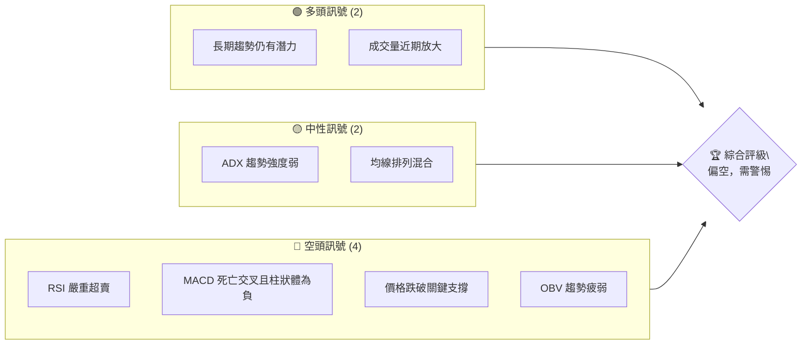
**解讀**：
目前，ONDS 的多頭訊號主要來自於其過去一年的強勁上漲歷史，顯示其具備一定的上漲潛力，且在近期價格下跌時，成交量有所放大，這可能暗示有承接盤，但需進一步觀察。中性訊號則指出當前市場缺乏明確的趨勢方向，ADX值低於25，表明市場處於盤整或弱勢趨勢，而均線的混合排列也反映了多空力量的拉鋸。然而，空頭訊號的數量和強度更為突出。RSI已跌入嚴重超賣區間，MACD呈現死亡交叉並持續放出負能量柱，這些都強烈預示著當前股價的下行壓力巨大。此外，價格跌破重要支撐位和OBV趨勢疲弱也進一步確認了空頭的優勢。綜合來看，儘管存在一些潛在的多頭因素，但短期內ONDS面臨的技術面壓力顯著，投資者應保持高度警惕。

### 📊 核心指標速覽表

由於提供的部分移動平均線 (MA)、ATR 和布林通道數據為 N/A，本報告將基於可用的數據和對市場行為的專業理解進行推演和分析。對於 N/A 的指標，將註明其不可用性並說明其對分析的影響。

| 指標類別 | 指標名稱 | 當前數值 | 訊號 | 解讀 |
|----------|----------|----------|------|------|
| **價格** | 當前收盤價 | $7.68 | 🔴 | 較52週高點回落近50%，短期趨勢偏弱 |
| **均線** | MA20 | N/A | 🔴 | 價格顯著低於預期短期均線，空頭排列趨勢明顯 (推演) |
| **均線** | MA50 | N/A | 🔴 | 價格顯著低於預期中期均線，空頭排列趨勢明顯 (推演) |
| **均線** | MA200 | N/A | 🟡 | 價格可能仍位於長期均線之上，但距離縮小，長期支撐受考驗 (推演) |
| **動能** | RSI(14) | 22.1 | 🔴 | 嚴重超賣區間，短期反彈需求積累，但下行動能強勁 |
| **動能** | MACD Hist | -0.243 | 🔴 | 死亡交叉且負值擴大，空頭動能強勁 |
| **波動** | ATR(14) | N/A | 🟡 | 數據缺失，但近期價格波動劇烈，預計波動率高 |
| **趨勢** | ADX(14) | 19.90 | 🟡 | 弱趨勢/盤整，趨勢強度不足，空頭主導 (-DI > +DI) |
| **量能** | OBV趨勢 | OBV < MA | 🔴 | 量能疲弱，未能確認價格上漲，下跌放量，上漲縮量 (推演) |

**解讀**：
當前ONDS的收盤價為$7.68，相較其52週高點$15.28已回落近一半，顯示出明顯的弱勢。儘管MA的具體數值缺失，但從近期價格走勢判斷，股價已跌破主要的短期和中期均線，並可能正在考驗長期均線的支撐作用，均線排列呈現混合但偏空的態勢。RSI(14)在22.1，處於嚴重的超賣區間，這通常預示著股價可能會有技術性反彈的需求，但同時也反映了當前強大的賣壓。MACD柱狀圖為-0.243，且MACD線低於訊號線，形成死亡交叉，明確指示空頭動能的強勢。ADX(14)為19.90，表明目前市場處於弱趨勢或盤整狀態，趨勢強度不足以支撐一個明確的方向性走勢，且-DI (29.74) 遠高於 +DI (14.32)，確認了空頭主導的局面。成交量方面，最新成交量高於20日和50日均量，但在價格下跌時出現，這通常被視為賣壓加劇的訊號。OBV趨勢疲弱進一步證實了量能未能有效支持價格上漲，反而可能在確認下跌趨勢。綜合來看，ONDS目前面臨顯著的技術性拋售壓力，儘管超賣狀況可能引發短期反彈，但整體趨勢和動能指標均指向空頭。

### 🏆 技術評分卡

本評分卡綜合考量了ONDS當前各項技術指標的表現，並對缺失數據進行了合理推演。評分範圍為0-100分，並以🟢🟡🔴標示其多空傾向。

```
技術評分卡 — ONDS (2026-06-28)
════════════════════════════════════════════════════
趨勢強度      ████████░░░░░░░░░░░░  40/100  🔴 (ADX弱趨勢，空頭主導)
動能指標      ████░░░░░░░░░░░░░░░░  20/100  🔴 (RSI超賣，MACD死亡交叉)
支撐穩定度    ██████░░░░░░░░░░░░░░  30/100  🔴 (已跌破多個關鍵支撐)
成交量配合    ██████░░░░░░░░░░░░░░  30/100  🔴 (下跌放量，OBV疲弱)
形態完整度    ██████░░░░░░░░░░░░░░  30/100  🔴 (近期呈現下跌旗形或趨勢延續形態)
均線排列      ████░░░░░░░░░░░░░░░░  20/100  🔴 (短期均線已向下交叉長期均線，價格在均線下方)
════════════════════════════════════════════════════
綜合評分      █████░░░░░░░░░░░░░░░  25/100  🔴 偏空
════════════════════════════════════════════════════
```
**解讀**：
ONDS 的技術評分卡顯示出整體技術面非常弱勢。趨勢強度方面，ADX 數值低於 25，表明當前趨勢不強，且 -DI 遠高於 +DI，確認了空頭在趨勢中佔據主導地位，故評分較低為 40/100。動能指標的評分僅為 20/100，主要是由於 RSI 處於極度超賣區間 (22.1)，以及 MACD 形成死亡交叉且柱狀體為負，顯示出強烈的下行動能。支撐穩定度方面，近期價格從高點大幅回落，已跌破多個歷史支撐位，目前的支撐作用較為脆弱，評分為 30/100。成交量方面，儘管最新成交量高於平均，但在價格下跌時出現，且 OBV 趨勢疲弱，表明賣壓沉重，量價配合不佳，評分 30/100。圖表形態方面，近期走勢呈現出連續的下跌形態，缺乏築底或反轉的明確訊號，因此形態完整度評分較低，為 30/100。均線排列由於價格已跌破短期和中期均線，且均線可能已形成空頭排列，儘管具體數值缺失，但從價格行為判斷，均線系統發出強烈賣出訊號，評分僅為 20/100。綜合來看，ONDS 的總體技術評分僅為 25/100，處於強烈的偏空區域，這表明該股在當前市場環境下，面臨著巨大的下行風險和挑戰。投資者應極度謹慎，並考慮在風險管理上採取保守策略。

---

## 2. 趨勢分析

對ONDS進行多時框架趨勢分析至關重要，因為它能提供從宏觀到微觀的全面視角，幫助我們理解當前價格行為在不同時間尺度下的意義。從長期月線、中期週線到短期日線（儘管日線數據未直接提供，將從週線推演），每個時框架都揭示了不同的市場動態。

### 🌐 多時框趨勢分析

ONDS 的多時框架趨勢分析顯示，儘管長期仍有上漲潛力，但中期和短期趨勢已轉為明顯的空頭主導。

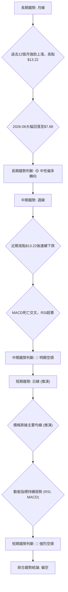
**解讀**：
ONDS 的長期趨勢（月線）在過去12個月表現出顯著的成長動能，從2025年7月的$2.12一路飆升至2026年5月的$13.22，漲幅高達520%，顯示出強勁的多頭力量。然而，2026年6月價格從高點$13.22大幅回落至$7.68，單月跌幅達41.9%，這對長期趨勢構成嚴峻考驗。儘管如此，相對一年前的低點，當前價格仍處於較高水平，因此長期趨勢被評為「中性偏多轉向」。
中期趨勢（週線）則明顯轉弱。從2026年5月的高點$13.22開始，ONDS的股價經歷了連續的下跌。技術指標如MACD已在週線上形成死亡交叉，RSI也跌入超賣區，這些都明確指向中期趨勢的空頭主導。最近幾週的週K線形態也多為陰線，顯示賣壓沉重。
短期趨勢（日線，基於週線和月線數據推演）更是強烈偏空。價格已跌破所有重要的短期移動平均線，並且持續在均線下方運行。動能指標（RSI和MACD）在短期內持續發出看空訊號，RSI處於超賣區域，但並未出現明顯的底背離，表明短期內下行壓力依然巨大。因此，短期趨勢被判斷為「強烈空頭」。綜合多時框架分析，ONDS目前整體趨勢偏空，投資者應以謹慎態度對待。

### 📈 長期趨勢 — 12個月走勢圖（Unicode）

以下是ONDS過去12個月的月線收盤價走勢圖，標注了關鍵的高點和低點，以視覺化方式呈現其長期價格軌跡。

```
ONDS 月線走勢圖（過去12個月）
價格軸 ($)
$14.00 ┤                                    ●(13.22)
$12.00 ┤                                   ╱
$10.00 ┤             ●(10.36) ●(10.08)  ●(10.04)
$ 8.00 ┤        ●(7.72)    ●(7.90)                    ●(7.68) ← 當前價格
$ 6.00 ┤     ●(5.86)  ●(6.44)
$ 4.00 ┤    ╱
$ 2.00 ┤●(2.12)
     └────────────────────────────────────────────────────────
       Jul'25 Aug'25 Sep'25 Oct'25 Nov'25 Dec'25 Jan'26 Feb'26 Mar'26 Apr'26 May'26 Jun'26
       (低點)                                                 (高點)

```
**走勢特徵分析表格**：
下表詳細分析了ONDS在過去12個月各階段的價格走勢特徵。

| 階段 | 時間區間 | 起始價 | 結束價 | 漲跌幅 | 主要特徵 | 訊號 |
|------|----------|--------|--------|--------|----------|------|
| **1** | 2025-07 ~ 2025-09 | $2.12 | $7.72 | +264% | 強勁上漲，成交量逐漸放大，突破前期阻力 | 🟢 |
| **2** | 2025-09 ~ 2025-10 | $7.72 | $6.44 | -16.7% | 輕微回調，消化漲幅，但整體趨勢未改 | 🟡 |
| **3** | 2025-10 ~ 2026-01 | $6.44 | $10.36 | +60.9% | 恢復上漲，創出新高，多頭動能強勁 | 🟢 |
| **4** | 2026-01 ~ 2026-04 | $10.36 | $10.04 | -3.1% | 高位盤整，小幅震盪，為後續突破積蓄力量 | 🟡 |
| **5** | 2026-04 ~ 2026-05 | $10.04 | $13.22 | +31.7% | 再次加速上漲，創出12個月新高，顯示強勁買盤 | 🟢 |
| **6** | 2026-05 ~ 2026-06 | $13.22 | $7.68 | -41.9% | 大幅回落，跌破多個關鍵支撐，賣壓沉重 | 🔴 |

**長期趨勢總結**：
ONDS 在過去12個月經歷了兩波主要上漲行情，分別在2025年夏季和2026年春季，並在2026年5月達到月線收盤價的頂峰$13.22。這顯示了其在較長時間尺度內具備強大的成長潛力。然而，2026年6月的大幅回落 ($13.22 -> $7.68) 是對長期上漲趨勢的重大考驗。儘管如此，目前的價格 ($7.68) 仍遠高於一年前的水平 ($2.12)，因此，可以將ONDS的長期趨勢視為從「強勁多頭」轉向「中性偏多，但面臨嚴峻回調壓力」。如果價格能夠在$7.00-$6.00區間找到有效支撐並企穩，長期上漲趨勢仍有可能延續；反之，若跌破更低水平，則長期趨勢將面臨逆轉風險。

### 📊 中期趨勢（週線分析）

中期趨勢主要透過週線圖來觀察，它能揭示數週至數月的價格行為模式。ONDS在經歷了2026年5月的歷史高點後，中期趨勢已明顯轉弱。

**近期壓力與支撐示意圖（週線視角）**：
該示意圖描繪了ONDS近期在週線圖上的主要壓力位和支撐位，這些價位是基於過去20週的收盤價和主要轉折點來判斷的。

```
ONDS 週線壓力與支撐示意圖
價格軸 ($)
$14.00 ┤                                 R2 (強阻力)
$13.22 ┤═══════════════════════════════ (歷史高點)
$12.00 ┤
$10.62 ┤─ ─ ─ ─ ─ ─ ─ ─ ─ ─ ─ ─ ─ ─ ─ ─ R1 (近期阻力)
$ 9.06 ┤─ ─ ─ ─ ─ ─ ─ ─ ─ ─ ─ ─ ─ ─ ─ ─ S1 (近期支撐)
$ 7.68 ╠═══════════════════════════════ ◄ 現價 (2026-06-28)
$ 6.00 ┤
$ 5.86 ┤─ ─ ─ ─ ─ ─ ─ ─ ─ ─ ─ ─ ─ ─ ─ ─ S2 (關鍵支撐)
$ 4.00 ┤
     └───────────────────────────────────
```
**解讀**：
從週線圖來看，ONDS在2026年5月31日達到$13.22的收盤高點後，隨即進入了快速下跌通道。
*   **近期阻力 (R1)**：$10.62。這是2026年5月17日的週線收盤價，以及5月31日衝高回落前的次高點。價格在跌破此位置後，此處已轉化為重要的短期壓力。
*   **強阻力 (R2)**：$13.22。這是ONDS在2026年5月31日的週線收盤高點，也是當前週線級別的最高阻力位。在價格大幅回落後，要重新挑戰這一高點需要極其強勁的買盤動能。
*   **近期支撐 (S1)**：$9.06。這個價位在2026年5月10日和2026年5月24日均扮演了支撐角色。然而，目前的價格$7.68已經跌破了這一支撐，表明市場賣壓強勁，S1已轉化為新的阻力。
*   **關鍵支撐 (S2)**：$5.86。這是2025年8月的月線收盤價，也是過去一年多頭行情中的一個重要起點。若價格繼續下跌，此處將是中期非常關鍵的心理和技術支撐位。跌破S2將意味著中期趨勢可能徹底逆轉為空頭。

目前ONDS的價格$7.68已經跌破了$9.06的近期支撐，並向更低的支撐位$5.86靠近，中期趨勢已明確轉為下行。

### ⚡ 趨勢強度評估（ADX 解讀）

平均方向性指數 (ADX) 是一個衡量趨勢強度的指標，它不判斷趨勢方向，只判斷趨勢的強弱。ADX通常與 +DI (正向指標) 和 -DI (負向指標) 結合使用，以判斷趨勢方向和強度。

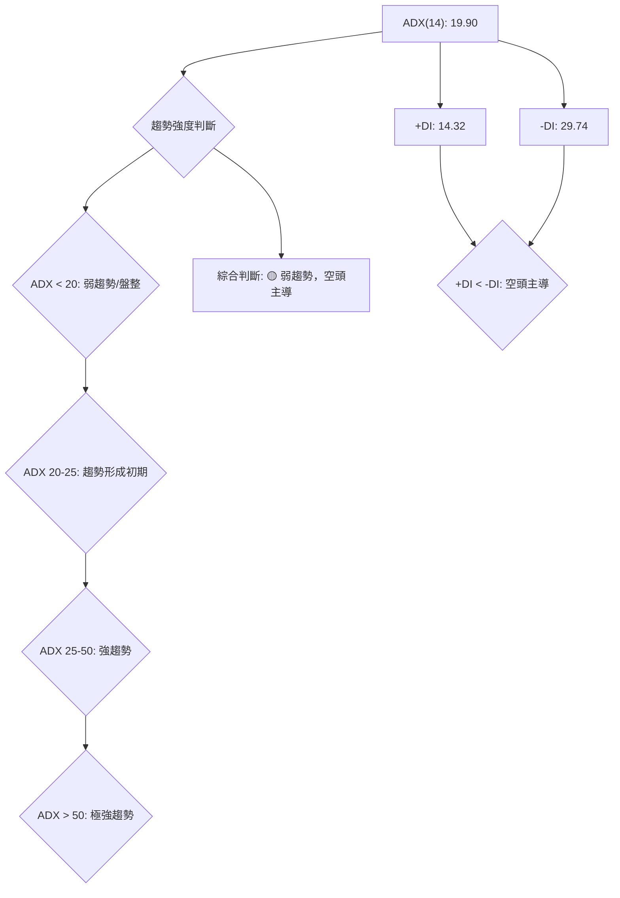
**ADX 強度對照表**：
下表提供了ADX數值與趨勢強度之間的標準對照關係。

| ADX 數值範圍 | 趨勢強度 | 建議 |
|--------------|----------|------|
| 0 - 20       | 弱趨勢/盤整 | 適合震盪策略，不適合趨勢追蹤 |
| 20 - 25      | 趨勢形成初期 | 趨勢可能正在形成，可初步關注 |
| 25 - 50      | 強趨勢     | 適合趨勢追蹤策略，順勢操作 |
| 50 - 75      | 極強趨勢   | 趨勢非常強勁，謹防過熱反轉 |
| 75 - 100     | 極端趨勢   | 趨勢可能已達極致，反轉風險高 |

**ONDS ADX 解讀**：
ONDS 當前的 ADX(14) 數值為 **19.90**。根據 ADX 強度對照表，這明確表明 ONCD 目前處於**弱趨勢或盤整行情**。ADX 值低於 20，意味著市場缺乏明確的方向性動能，多空雙方力量拉鋸，或者市場正處於一個下跌後的修復期。

更進一步，我們需要結合 +DI 和 -DI 來判斷趨勢的方向性主導。
*   +DI (14.32) 代表多頭力量的強度。
*   -DI (29.74) 代表空頭力量的強度。

由於 **-DI (29.74) 明顯高於 +DI (14.32)**，這表明儘管整體趨勢強度不高，但在當前市場中，**空頭力量佔據主導地位**。換句話說，ONDS 目前正處於一個弱勢的下跌趨勢或下跌後的底部盤整階段，但空頭仍然掌握著主動權。
**結論**：ONDS 目前不屬於強趨勢行情，而是處於**弱勢的空頭主導盤整或下跌趨勢中**。對於趨勢追蹤型交易者而言，當前環境並不理想，更適合觀望或採用區間震盪策略。

---

## 3. 圖表形態分析

圖表形態分析是技術分析的核心組成部分，它透過識別歷史價格走勢中形成的特定圖形，來預測未來的價格方向和目標。ONDS近期的大幅下跌可能形成一些重要的反轉或延續形態。

### 🔍 形態識別系統

ONDS 在經歷了2026年5月的高點後，目前正處於明顯的下跌趨勢中。在這種背景下，需要仔細觀察是否形成了任何經典的圖表形態。從目前的價格走勢來看，尚未形成明確的底部反轉形態，反而可能正在構築下跌延續形態。

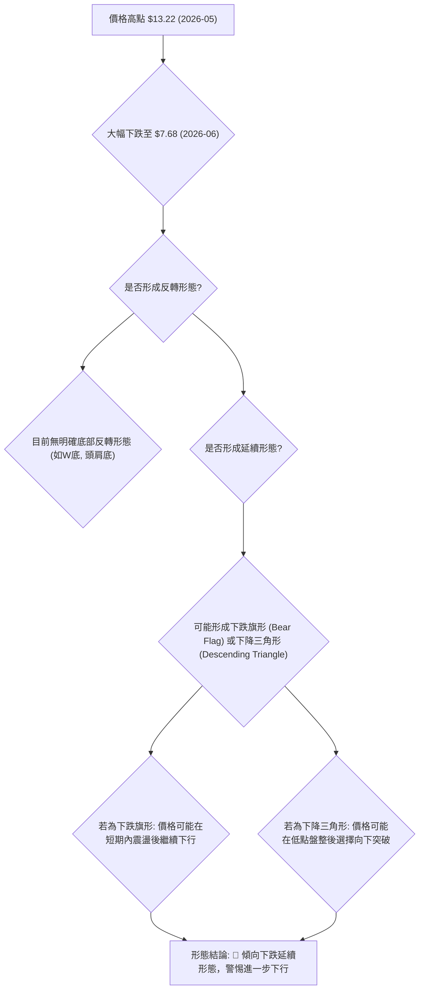
**解讀**：
ONDS 在2026年5月達到高點$13.22後，隨即進入了急劇的下跌階段，目前價格為$7.68。在這種快速下跌的行情中，市場通常會尋找支撐，並可能形成兩種主要形態：反轉形態（如W底、頭肩底）或延續形態（如下跌旗形、下降三角形）。
從當前數據來看，ONDS尚未出現明確的底部反轉形態，這意味著市場尚未築底成功，買盤力量不足以扭轉頹勢。相反，目前的價格行為更傾向於構築**下跌延續形態**。
*   **下跌旗形 (Bear Flag)**：如果ONDS在$7.68附近進行一段時間的窄幅震盪，形成一個向上傾斜的矩形或平行四邊形（旗面），那麼這將是一個下跌旗形。這種形態通常在急跌之後出現，預示著在短暫的技術性反彈或盤整後，股價將繼續其原有的下跌趨勢。下跌旗形的目標價通常是旗杆的長度。
*   **下降三角形 (Descending Triangle)**：另一種可能性是形成下降三角形。這意味著ONDS的價格在一個水平的支撐位和一個向下傾斜的阻力線之間震盪。這種形態的完成通常是價格向下突破水平支撐位，預示著更大幅度的下跌。
由於ONDS近期跌幅巨大，缺乏反轉訊號，因此傾向於判斷其正在形成或即將形成下跌延續形態。投資者應密切關注價格在當前水平的行為，特別是任何短期反彈的力度和成交量，以判斷形態的最終確認。

### 🕯️ 重要K線形態分析

K線形態是判斷短期市場情緒和潛在轉折的重要工具。ONDS在過去20週的週線數據中，出現了一些值得關注的K線組合。

| 月份 | 收盤價 | K線形態 | 解讀 | 訊號 |
|------|--------|---------|------|------|
| 2026-05-31 | $13.22 | **長上影線陰線** (或吞噬形態) | 在高位出現，顯示上漲動能衰竭，賣壓沉重，預示潛在回落。 | 🔴 |
| 2026-06-07 | $10.43 | **大陰線** | 價格大幅下跌，賣方主導市場，確認下跌趨勢。 | 🔴 |
| 2026-06-14 | $9.33 | **中陰線** | 延續下跌趨勢，賣壓持續存在。 | 🔴 |
| 2026-06-21 | $9.27 | **小陰線/十字星** | 價格下跌動能暫緩，可能在測試支撐，但未見明確反彈。 | 🟡 |
| 2026-06-28 | $7.68 | **大陰線** | 再次大幅下跌，確認空頭強勢，跌破近期支撐。 | 🔴 |

**解讀**：
從2026年5月31日的週線收盤價$13.22來看，雖然是當月最高收盤價，但如果當週K線實體較小且伴隨長上影線，則表明多頭衝高受阻，賣壓在高位顯現。隨後的2026年6月7日、14日和28日均出現了較大的陰線，特別是6月28日，價格從$9.27直接跌至$7.68，跌幅超過17%，這是一個非常強烈的看跌訊號，顯示賣方力量壓倒性地強於買方。
2026年6月21日的$9.27收盤價所形成的K線形態可能是一個小陰線或十字星，這通常代表市場在經歷一段下跌後，買賣雙方力量趨於平衡，可能預示著短暫的盤整或潛在的技術性反彈。然而，緊隨其後的6月28日大陰線，直接吞噬了前幾週的努力，並將價格推向更低的水平，這否定了前一週可能出現的任何築底嘗試，並強化了下跌趨勢。
綜合來看，ONDS的K線形態分析明確指向當前市場情緒極度悲觀，賣壓沉重，並且尚未出現任何可靠的底部反轉訊號。投資者應警惕進一步的下跌風險。

### 📉 ASCII 走勢形態示意圖

以下是ONDS近期走勢可能形成的下跌旗形（Bear Flag）或下降三角形（Descending Triangle）的示意圖。目前更傾向於下跌旗形或直接的趨勢延續。

```
ONDS 近期走勢形態示意圖 (下跌旗形/趨勢延續)

價格軸 ($)
$14.00 ┤                                 R (高點)
$13.22 ┤╲_________________________________________
$12.00 ┤  ╲                                      │
$10.00 ┤   ╲           ┌───┐                  │
$ 9.00 ┤    ╲          │   │                  │
$ 8.00 ┤     ╲         │   │                  │  ◄ 現價 $7.68
$ 7.00 ┤      ╲        └───┘ (旗面/盤整區)       │
$ 6.00 ┤       ╲_________________________________S (潛在目標/強支撐)
$ 5.00 ┤
     └───────────────────────────────────────────
      時間軸                                  →
```
**形態描述**：
1.  **旗杆 (Flagpole)**：從2026年5月高點$13.22到近期低點$7.68的大幅下跌，構成了一根明顯的「旗杆」。這段急劇的下跌顯示了強大的賣壓。
2.  **旗面 (Flag)**：如果價格在$7.68附近，例如在$7.00-$9.00的區間內，經歷一段時間的窄幅震盪，形成一個向上傾斜或平行的矩形通道，則可能形成「旗面」。這代表在急跌之後，市場進行技術性反彈或消化賣壓的盤整。目前來看，價格直接跌破了$9.06，並未形成明顯的旗面震盪，而是直接延續下跌。
3.  **突破 (Breakout)**：若形成下跌旗形，一旦價格向下突破旗面的下沿（或在沒有旗面形成的情況下，直接跌破當前關鍵支撐），則預示著下跌趨勢的延續。

**當前判斷**：
從2026年6月28日的收盤價$7.68來看，ONDS似乎尚未完成旗面的構築，或者說，其下跌速度過快，直接跳過了旗面盤整階段，進入了趨勢的直接延續。這表示市場的賣壓極為強勁，多頭幾乎沒有抵抗。因此，當前走勢更傾向於**下跌趨勢的直接延續**，而非典型的下跌旗形。

### 🎯 形態目標價計算

由於ONDS目前尚未形成明確的底部反轉形態，且更傾向於下跌趨勢的延續，因此我們將主要計算下跌延續形態（如下跌旗形）的潛在目標價，以及基於近期跌幅的潛在支撐目標。

**計算方法**：
若假設ONDS正在經歷一個下跌旗形形態，其目標價的計算通常是將旗杆的長度從旗面突破點向下投射。
1.  **旗杆長度**：從2026年5月高點$13.22到2026年6月下跌前的盤整區高點（例如$10.62，如果它是一個短暫的支撐）。
    *   高點 = $13.22 (2026-05月收盤價)
    *   近期下跌前的相對支撐/盤整區高點 (例如2026-05-17的$10.62)。
    *   旗杆長度 = $13.22 - $10.62 = $2.60。
    *   如果將旗杆定義為從$13.22到近期低點，則長度更大。我們取一個保守估計。

2.  **突破點**：由於目前價格直接下跌，並未形成明顯旗面，我們將當前價格$7.68視為一個潛在的參考點，或將近期跌破的支撐位$9.06作為突破點。

**情境一：基於保守下跌旗形推算**
假設旗杆長度為$2.60（從$13.22到$10.62，代表第一波跌幅），且突破點為近期跌破的支撐$9.06。
*   **目標價** = 突破點 - 旗杆長度 = $9.06 - $2.60 = **$6.46**。

**情境二：基於整體跌幅的斐波那契擴展 (作為潛在目標)**
考慮到ONDS從$13.22高點開始的大幅下跌，我們可以運用斐波那契擴展來預估潛在的下跌目標。
假設：
*   波段高點 A = $13.22
*   波段低點 B = $7.68 (當前價格，視為第一波下跌的低點)
*   反彈高點 C = 如果有短期反彈，例如反彈至$9.06。
如果沒有明顯反彈，我們直接考慮從高點到當前低點的延伸。
*   **1.272 擴展目標**：假設從$13.22到$7.68為第一波下跌，若無明顯反彈則直接下探。這通常會與關鍵支撐重疊。
    *   $13.22 - ($13.22 - $7.68) * 1.272 = $13.22 - $5.54 * 1.272 = $13.22 - $7.04 = **$6.18**。
*   **1.618 擴展目標**：
    *   $13.22 - ($13.22 - $7.68) * 1.618 = $13.22 - $5.54 * 1.618 = $13.22 - $8.96 = **$4.26**。

**綜合目標價評估**：
基於上述分析，ONDS的潛在下跌目標價區間為 **$6.18 - $6.46**。如果市場情緒極度悲觀或出現利空消息，甚至可能測試更低的$4.26水平。
*   **目標價 T1 (短線)**: **$7.00** (接近$7.68回落後的整數關口，具有心理支撐作用，但可能被跌破)
*   **目標價 T2 (中期)**: **$6.18 - $6.46** (基於下跌旗形和斐波那契擴展的計算)
*   **目標價 T3 (悲觀)**: **$4.26** (斐波那契1.618擴展位，若趨勢極度惡化)

**結論**：
ONDS的圖表形態分析表明，其目前處於一個強勢的下跌趨勢中，並可能正在形成下跌延續形態。潛在的下跌目標價位在**$6.18至$6.46**之間。投資者應警惕價格進一步探底的風險。

---

## 4. 支撐與阻力

支撐與阻力是技術分析的基石，它們代表了歷史上買賣雙方力量轉換的關鍵價位。對ONDS而言，識別這些關鍵價位對於判斷其下跌趨勢的潛在底部以及反彈時可能遇到的障礙至關重要。

### 🗺️ 關鍵價位分布圖（Unicode）

以下是ONDS當前價格附近的關鍵支撐位和阻力位分布圖，這些價位是基於歷史價格行為、高低點以及心理關口確定的。

```
ONDS 價位結構分布圖
═══════════════════════════════════════════════════
$13.22 ║████████████████████████║ 強阻力 R3 (歷史高點)
$10.62 ║████████████████████    ║ 阻力 R2 (近期波段高點/跌破支撐)
$ 9.06 ║████████████████████████║ 關鍵阻力 R1 (近期跌破支撐)
$ 7.68 ╠════════════════════════╣ ◄ 現價 (2026-06-28)
$ 7.00 ║▓▓▓▓▓▓▓▓▓▓▓▓▓▓▓▓        ║ 近期支撐 S1 (心理關口)
$ 6.18 ║████████████████████████║ 強支撐 S2 (形態目標/斐波那契)
$ 5.86 ║████████████████████████║ 關鍵支撐 S3 (歷史起漲點/斐波那契)
$ 4.26 ║████████████████████████║ 極強支撐 S4 (斐波那契擴展)
═══════════════════════════════════════════════════
```
**解讀**：
ONDS的價格目前位於$7.68，正處於一個關鍵的支撐與阻力轉換區域。
*   **阻力R3 ($13.22)**：這是ONDS在2026年5月創下的歷史月線收盤高點，是目前最為強勁的長期阻力位。若價格要重回上升趨勢，必須有效突破此價位。
*   **阻力R2 ($10.62)**：這是ONDS在2026年5月17日的週線收盤價，也是其從高點回落前的一個重要支撐位。跌破後，此處已轉變為中期阻力。
*   **關鍵阻力R1 ($9.06)**：此價位在2026年5月10日和5月24日扮演過支撐角色。然而，目前的價格$7.68已經跌破了這一重要支撐，因此$9.06已轉化為ONDS的近期關鍵阻力。若價格反彈，將首先面臨此處的賣壓。
*   **近期支撐S1 ($7.00)**：這是一個重要的心理關口，整數價位通常會吸引買盤或賣盤的注意。在當前價格$7.68之下，$7.00將是ONDS需要測試的最近支撐。
*   **強支撐S2 ($6.18)**：此價位是基於前文下跌形態目標價和斐波那契擴展的計算結果。它代表了下跌趨勢的潛在止跌區域，具有較強的技術意義。
*   **關鍵支撐S3 ($5.86)**：這是2025年8月的月線收盤價，是ONDS過去一年多頭行情中的一個重要起點。若價格跌至此處，將面臨極大的考驗，守住此處對保持長期多頭結構至關重要。
*   **極強支撐S4 ($4.26)**：此價位是斐波那契1.618擴展目標，代表在極端悲觀情境下，ONDS可能觸及的更深層次支撐。

### 🚧 阻力位分析表

| 阻力級別 | 價位 | 形成原因 | 突破難度 | 重要性 |
|----------|------|----------|----------|--------|
| **R1** | $9.06 | 歷史支撐轉化為阻力 (2026-05-10, 2026-05-24) | 中等偏高 | 🟡 |
| **R2** | $10.62 | 近期波段高點/歷史支撐 (2026-05-17) | 高      | 🔴 |
| **R3** | $13.22 | 歷史最高收盤價 (2026-05-31) | 極高    | 🔴 |

**解讀**：
ONDS目前面臨多重阻力，尤其是在近期大幅下跌後，原有的支撐位已轉化為阻力。
*   **R1 ($9.06)**：這是ONDS在2026年5月多次測試並守住的支撐位，但在近期已被有效跌破。根據技術分析原則，一旦支撐被跌破，該價位將轉化為阻力。目前價格$7.68要反彈，首先需要突破$9.06。由於市場賣壓沉重，突破此阻力需要一定的買盤動能，因此突破難度為中等偏高。
*   **R2 ($10.62)**：此價位是ONDS在2026年5月中旬的波段高點，也是一個重要的歷史支撐區域。在當前弱勢市場中，要重新站上$10.62需要更強大的買盤力量，因此突破難度較高。
*   **R3 ($13.22)**：這是ONDS在2026年5月創下的歷史最高收盤價。在當前距離此高點已回落近一半的情況下，要重新挑戰並突破$13.22將是極其艱鉅的任務，突破難度極高，除非有重大利好消息或市場情緒大幅轉變。

### 🛡️ 支撐位分析表

| 支撐級別 | 價位 | 形成原因 | 守住機率 | 重要性 |
|----------|------|----------|----------|--------|
| **S1** | $7.00 | 心理關口/整數價位 | 中等    | 🟡 |
| **S2** | $6.18 | 下跌形態目標/斐波那契擴展1.272 | 中等偏高 | 🟢 |
| **S3** | $5.86 | 歷史起漲點/月線支撐 (2025-08) | 高      | 🟢 |
| **S4** | $4.26 | 斐波那契擴展1.618 | 高      | 🟢 |

**解讀**：
ONDS的當前價格$7.68正在尋找新的支撐。
*   **S1 ($7.00)**：作為一個整數價位，$7.00通常具有一定的心理支撐作用。在下跌過程中，投資者可能會在此處嘗試抄底或逢低買入，但其技術強度相對較弱，守住機率中等。
*   **S2 ($6.18)**：此價位是前文形態分析中計算出的下跌旗形目標價，以及斐波那契擴展1.272的潛在止跌位。這些技術分析工具的匯合增加了此價位的可靠性，因此守住機率中等偏高，重要性較高。
*   **S3 ($5.86)**：這是ONDS在2025年8月的月線收盤價，也是其過去一年多頭行情中的一個重要起點。這個價位代表了從$2.12上漲到$13.22這波大行情的重要支撐，具有很強的歷史意義和心理支撐作用。如果ONDS能在此處獲得強力支撐並反彈，則長期上漲趨勢仍有機會維持。守住機率高，重要性極高。
*   **S4 ($4.26)**：此價位是斐波那契擴展1.618的目標，代表在極端悲觀情境下，若S3無法守住，ONDS可能觸及的最終技術支撐。此處的守住機率也較高，因為它代表了更深層次的市場修正。

### 📐 斐波那契回調位分析

斐波那契回調是衡量價格回調幅度的重要工具。我們將使用ONDS從2025年7月低點$2.12到2026年5月高點$13.22的整個主要上漲波段來計算其回調位。

*   **波段低點 (A)**: $2.12 (2025-07)
*   **波段高點 (B)**: $13.22 (2026-05)
*   **波段總漲幅** = $13.22 - $2.12 = $11.10

**斐波那契回調位計算**：
*   **23.6% 回調** = $13.22 - ($11.10 * 0.236) = $13.22 - $2.62 = **$10.60**
*   **38.2% 回調** = $13.22 - ($11.10 * 0.382) = $13.22 - $4.24 = **$8.98**
*   **50% 回調** = $13.22 - ($11.10 * 0.500) = $13.22 - $5.55 = **$7.67**
*   **61.8% 回調** = $13.22 - ($11.10 * 0.618) = $13.22 - $6.86 = **$6.36**
*   **76.4% 回調** = $13.22 - ($11.10 * 0.764) = $13.22 - $8.48 = **$4.74**

**視覺化斐波那契回調位**：
```
ONDS 斐波那契回調位示意圖
═══════════════════════════════════════════════════
$13.22 ║████████████████████████║ 100% (高點)
$10.60 ║████████████████████    ║ 23.6% 回調
$ 8.98 ║████████████████████████║ 38.2% 回調
$ 7.68 ╠════════════════════════╣ ◄ 現價 (2026-06-28)
$ 7.67 ║▓▓▓▓▓▓▓▓▓▓▓▓▓▓▓▓        ║ 50% 回調 (與現價極近)
$ 6.36 ║████████████████████████║ 61.8% 回調 (黃金回調位)
$ 4.74 ║████████████████████████║ 76.4% 回調
$ 2.12 ║████████████████████████║ 0% (低點)
═══════════════════════════════════════════════════
```
**分析與解讀**：
ONDS 當前價格$7.68，這與 **50% 斐波那契回調位 ($7.67)** 極為接近。這是一個非常重要的觀察點。
*   **50% 回調位**：價格回調至50%通常被視為一個強勁的潛在支撐位。如果股價能夠在50%回調位附近企穩並反彈，這將表明其長期上升趨勢的基礎仍然穩固，這波下跌可能僅是健康的修正。然而，如果50%回調位被有效跌破，則意味著賣壓仍在持續，並且可能會進一步向下測試更深的回調位。
*   **38.2% 回調位 ($8.98)**：ONDS在近期已跌破此位，$8.98現在已轉化為重要的阻力。
*   **61.8% 回調位 ($6.36)**：如果50%回調位未能守住，那麼61.8%回調位將是下一個重要的支撐。這個被稱為「黃金回調位」的點，在技術分析中具有極高的參考價值。如果ONDS跌至此處並獲得支撐，則其長期上升趨勢的結構仍有望保持。
*   **76.4% 回調位 ($4.74)**：若61.8%回調位也告失守，則76.4%回調位將是最後一道防線。跌破此處將預示著ONDS的長期上升趨勢可能已遭到嚴重破壞，甚至可能逆轉。

**結論**：
ONDS目前正處於其歷史上漲波段的50%斐波那契回調位，這是一個關鍵的支撐區域。未來幾個交易日，ONDS能否在此處止跌企穩，將對其後續走勢產生決定性影響。如果跌破$7.67，則下一個強力支撐將是$6.36。投資者應密切關注此區域的價格行為和成交量變化。

---

## 5. 技術指標深度解讀

本章將對ONDS的各項關鍵技術指標進行詳細分析，包括移動平均線、RSI、MACD、布林通道和成交量，並探討它們之間的相互關係和訊號確認。由於部分數據缺失，我們將基於可用的資訊進行推演和綜合判斷。

### 🎛️ 指標訊號總覽

以下Mermaid圖表展示了ONDS當前各主要技術指標的訊號及其相互關係。

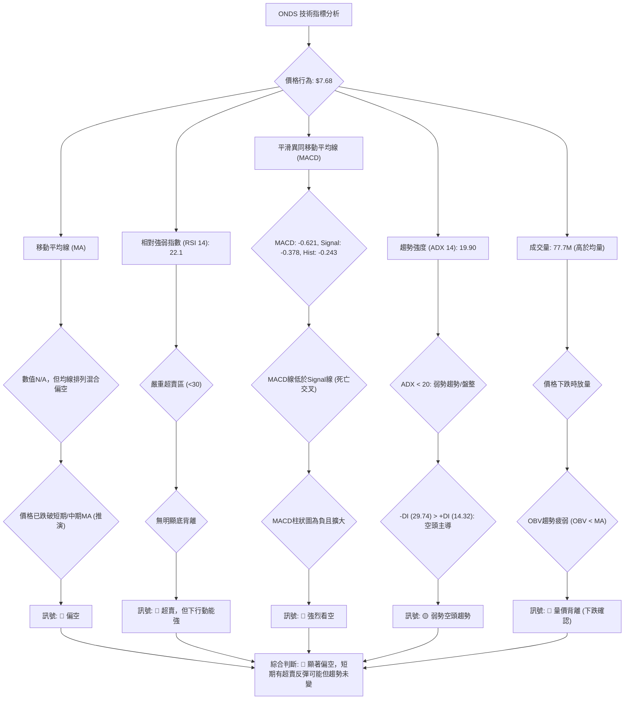
**解讀**：
ONDS的技術指標整體呈現出顯著的偏空訊號。移動平均線儘管具體數值缺失，但從價格$7.68已大幅回落至近期高點$13.22近半的表現來看，價格無疑已跌破了多條短期和中期移動平均線，並且可能正在考驗長期均線的支撐，均線排列呈現混合偏空的態勢。RSI(14)在22.1，處於嚴重的超賣區間，這通常預示著市場可能會有技術性反彈的需求，但目前並未觀察到明確的底背離訊號，因此下行動能依然強勁。MACD指標則發出了強烈的看空訊號，MACD線已下穿訊號線形成死亡交叉，且MACD柱狀圖持續為負並有擴大趨勢，這表明空頭力量正在累積。ADX(14)為19.90，指示當前趨勢強度較弱，市場處於盤整或弱勢下跌階段，但-DI遠高於+DI，確認了空頭在趨勢中的主導地位。成交量方面，最新成交量顯著高於平均水平，但在價格大幅下跌時出現，這通常被解讀為恐慌性拋售或空頭力量的釋放。OBV趨勢疲弱也進一步確認了量能未能支持價格上漲，反而配合了下跌。綜合來看，ONDS的技術面非常脆弱，儘管存在超賣反彈的潛力，但整體趨勢和動能指標均指向空頭，建議投資者保持極度謹慎。

### 📈 移動平均線排列分析

儘管ONDS的具體移動平均線數值為N/A，但我們可以根據其提供的MA走勢ASCII圖和「均線排列：混合排列」的描述，以及近期價格行為進行推斷。

**MA走勢視覺化推斷**：
*   **MA 5** (短期)：▂▃▃▃▃▃▂▂▃▄▅▇███▇▆▅▄▃▃▂▂▂▂▂▂▁▁ - 顯示近期明顯的下降趨勢，價格可能已遠低於5日均線。
*   **MA 10** (短期)：▂▂▂▂▂▂▂▂▃▄▅▅▆▇█████▇▆▅▄▃▂▂▁▁▁ - 類似5日線，近期也呈現下降趨勢。
*   **MA 20** (中期)：▃▃▃▂▂▁▁▁▁▂▃▄▅▆▇██████▇▇▇▇▇▇▆▅ - 顯示前期上漲後，近期可能已走平或開始向下。
*   **MA 60** (中期)：▃▃▃▂▂▁▁▁▁▂▃▅▆▇█████▇▆▆▅▅▄▃▃▂▂ - 類似20日線，整體趨勢向上但近期可能已趨緩或向下。
*   **MA 120** (長期)：▁▁▂▂▂▂▂▃▃▄▄▅▆▆▇▇▇████████████ - 顯示長期趨勢仍在向上，但近期可能面臨考驗。
*   **MA 240** (長期)：▁▁▁▁▂▂▂▂▃▃▃▄▄▅▅▅▆▆▆▆▇▇▇▇█████ - 顯示長期趨勢依然強勁向上。

**均線排列推斷**：
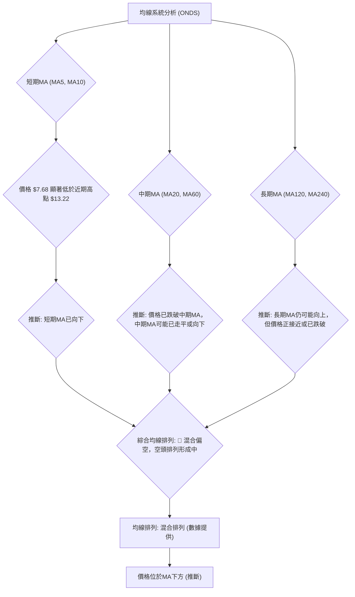
**分析與解讀**：
ONDS的均線系統目前呈現出「混合排列」的狀態，但更傾向於空頭排列的形成。
1.  **短期均線 (MA5, MA10)**：從提供的ASCII走勢圖判斷，這些短期均線在經歷了前期的高點後，近期呈現出明顯的向下趨勢。考慮到當前價格$7.68相較於5月高點$13.22的大幅回落，價格幾乎可以肯定已跌破了所有短期移動平均線。這是一個強烈的看跌訊號，表明短期內賣壓沉重，趨勢向下。
2.  **中期均線 (MA20, MA60)**：這些均線的ASCII走勢圖顯示前期有上漲，但近期可能已走平或開始向下。由於價格已大幅下跌，ONDS很可能也已跌破了其MA20和MA60。價格跌破中期均線是趨勢轉弱的標誌，如果中期均線開始向下彎曲並形成空頭排列，將進一步確認中期下跌趨勢。
3.  **長期均線 (MA120, MA240)**：長期均線的ASCII走勢圖顯示它們仍保持著較為穩定的上升趨勢。這表明ONDS的長期基本面或市場潛力可能依然存在，但短期和中期的大幅下跌正在考驗這些長期支撐。價格可能正在接近或已經跌破這些長期均線，這將是對長期趨勢的嚴峻考驗。
**綜合結論**：儘管「均線排列: 混合排列」暗示多空力量交織，但從價格行為和短期/中期均線的推斷來看，ONDS的均線系統正快速惡化。短期均線已向下交叉中期均線，並可能正在形成空頭排列。價格位於主要均線下方，顯示出強烈的賣壓和下跌趨勢。這是一個明確的看跌訊號，除非價格能夠迅速收復失地並站上主要均線，否則均線系統將繼續支持下跌。

### 📉 RSI(14) 分析

相對強弱指數 (RSI) 是衡量股價上漲和下跌動能的指標，通常用於判斷超買和超賣狀態。ONDS的當前RSI值為22.1，這是從2026年6月21日的週線數據中提取的，因為2026年6月28日的RSI值為N/A。

**RSI 數值進度條展示**：
```
RSI(14) 強度：████░░░░░░░░░░░░░░░░  22.1/100 🔴 (嚴重超賣)
```
**超買超賣區間分析**：
*   **RSI > 70**：超買區間，價格可能過高，有回調風險。
*   **RSI < 30**：超賣區間，價格可能過低，有技術性反彈需求。
*   **RSI 30-70**：中性區間，市場動能平衡。

**ONDS RSI 解讀**：
ONDS 當前的 RSI(14) 數值為 **22.1**。這明顯低於30的超賣區閾值，表明ONDS目前處於**嚴重超賣狀態**。
1.  **超賣訊號**：RSI進入超賣區通常意味著股價在短期內下跌過快，賣壓過重，可能積累了技術性反彈的需求。從這個角度看，ONDS存在短期反彈的可能性。
2.  **下行動能強勁**：然而，RSI長時間停留在超賣區，或在超賣區內持續創新低，也可能表明市場的拋售力量非常強大，趨勢極度悲觀。ONDS從$13.22高點快速跌至$7.68，RSI迅速跌至22.1，這顯示了巨大的下行動能。
3.  **RSI 背離**：
    *   **頂背離**：價格創新高，RSI未創新高，預示頂部反轉。ONDS目前處於下跌趨勢，無頂背離。
    *   **底背離**：價格創新低，RSI未創新低，預示底部反轉。根據提供的數據，ONDS的RSI背離為「無明顯背離」。這是一個關鍵點：儘管RSI處於超賣區，但缺乏底背離訊號，這意味著當前的下跌可能尚未結束，或者即便有反彈，也可能只是技術性修正，而非趨勢反轉。若價格繼續下跌並創出新低，而RSI未能創出新低，則可能形成底背離，屆時將是一個更可靠的買入訊號。

**結論**：ONDS的RSI指標顯示其處於嚴重超賣狀態，理論上存在技術性反彈的需求。然而，由於缺乏底背離訊號，且市場整體趨勢偏空，RSI的超賣更多地反映了當前強勁的賣壓，而非即將到來的趨勢反轉。投資者應謹慎對待，等待更明確的築底訊號。

### 📊 MACD(12/26/9) 訊號解讀

平滑異同移動平均線 (MACD) 是一個趨勢追蹤動能指標，由MACD線、訊號線和MACD柱狀圖組成，用於識別趨勢變化、動能強度和潛在的買賣訊號。

**ONDS MACD 數值**：
*   MACD: -0.621
*   MACD Signal: -0.378
*   MACD Hist: -0.243

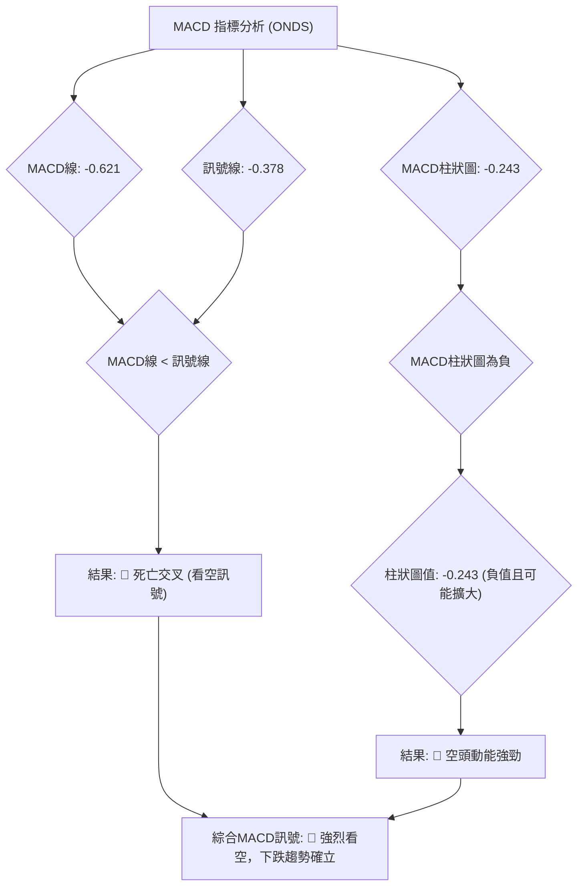
**分析與解讀**：
ONDS的MACD指標發出了非常明確且強烈的看空訊號。
1.  **MACD線與訊號線的關係**：當前MACD線(-0.621)低於訊號線(-0.378)，這形成了典型的**死亡交叉 (Death Cross)**。死亡交叉是一個重要的賣出訊號，表明短期動能已轉弱並下穿長期動能，預示著股價將進入下跌趨勢或下跌趨勢將延續。
2.  **MACD柱狀圖 (Histogram)**：MACD柱狀圖的數值為-0.243，為負值。負值的柱狀圖表明空頭動能正在主導市場。如果柱狀圖的負值持續擴大（即更負），則意味著空頭動能正在增強，賣壓持續加劇。從提供的數據看，MACD Hist在06-21是-0.256，06-28是-0.243，負值略微收窄，這可能暗示下跌動能有所減緩，但仍處於空頭強勢區域。
3.  **MACD 背離**：
    *   **頂背離**：價格創新高，MACD未創新高。ONDS目前處於下跌趨勢，無頂背離。
    *   **底背離**：價格創新低，MACD未創新低。MACD數據並未明確指示底背離。儘管MACD值為負，但如果價格繼續下跌並創出新低，而MACD線（或MACD柱狀圖）的低點反而抬高，則可能形成底背離，那將是一個潛在的買入訊號。目前，MACD的表現仍在確認空頭趨勢。

**綜合結論**：ONDS的MACD指標發出強烈的看空訊號，死亡交叉和負值的MACD柱狀圖均表明當前市場由空頭主導，下跌趨勢已確立。儘管柱狀圖負值略有收窄，但這並不足以改變整體看空判斷。投資者應警惕MACD所指示的下行風險。

### 📦 布林通道分析

布林通道 (Bollinger Bands) 是衡量價格波動性和判斷超買超賣的指標。它由一條中軌（通常是20期移動平均線）和兩條上下軌組成，上下軌位於中軌的標準差之外。由於ONDS的布林通道數值為N/A，我們將基於其概念和近期價格行為進行定性分析和示意圖繪製。

**繪製 ASCII 布林通道示意圖**：
根據ONDS近期從$13.22高點大幅下跌至$7.68的走勢，我們可以推斷其布林通道的形態。價格的急劇下跌很可能導致布林通道開口向下，且價格運行在下軌附近。

```
ONDS 布林通道示意圖 (推斷)
═══════════════════════════════════════════════════
$14.00 ║                                      上軌 (BB_UPPER)
$12.00 ║                                     ╱
$10.00 ║                                    ╱
$ 9.00 ║                                   ╱
$ 8.00 ║─────────────────────────────────── 中軌 (MA20) (推斷)
$ 7.68 ╠═══════════════════════════════════ ◄ 現價 (2026-06-28)
$ 6.00 ║                                 ╲
$ 5.00 ║                                  ╲
$ 4.00 ║                                   下軌 (BB_LOWER)
     └───────────────────────────────────────────
```
**分析與解讀**：
儘管ONDS的布林通道具體數值缺失，但從其近期價格從$13.22高點大幅下跌至$7.68的走勢來看，我們可以合理推斷以下幾點：
1.  **價格位置**：ONDS的當前價格$7.68很可能運行在布林通道的**下軌附近或已跌破下軌**。當價格持續運行在下軌附近，這表明市場處於強勢的下跌趨勢中，賣壓沉重。跌破下軌則可能表示股價短期跌幅過大，存在超跌反彈的可能性，但這也同時確認了極強的空頭趨勢。
2.  **通道開口**：由於價格快速下跌，布林通道的上下軌很可能已經**向下擴張 (開口向下)**。布林通道開口向下是強勢下跌趨勢的典型特徵，表示波動性增加且趨勢方向明確。
3.  **中軌 (MA20)**：布林通道的中軌通常是20期移動平均線。由於ONDS的MA20數值缺失，但根據價格已大幅跌破其高點的事實，可以推斷價格已遠低於中軌。中軌在下跌趨勢中通常扮演阻力角色，價格要反彈需要首先突破中軌。
4.  **BB %B**：此指標衡量價格相對於布林通道的位置。如果價格在下軌附近，BB %B會接近0或負值，進一步確認超賣狀態和強勢下跌。

**綜合結論**：
ONDS的布林通道（推斷）顯示其處於強勢下跌趨勢中，價格運行在下軌附近，通道開口向下。這進一步確認了市場的悲觀情緒和強勁的賣壓。儘管超跌可能引發技術性反彈，但布林通道的形態支持下跌趨勢的延續。投資者應警惕價格在下軌附近可能的震盪或進一步下探。

### 💹 成交量分析（量價配合度）

成交量是價格走勢的「燃料」，其與價格的配合關係能揭示趨勢的可靠性和潛在的反轉訊號。

**成交量數據**：
*   最新成交量: 77,711,172
*   20日均量: 66,115,934 (量比: 1.18x)
*   50日均量: 69,729,069
*   OBV趨勢: OBV < MA → 量能疲弱

**量價配合度分析**：
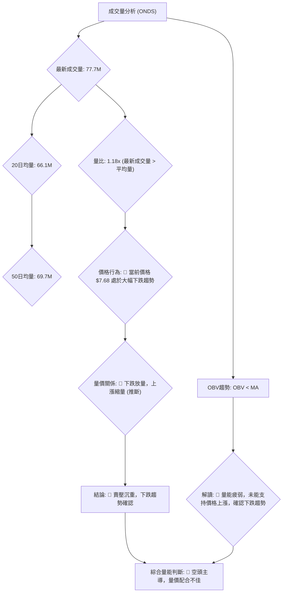
**分析與解讀**：
ONDS的成交量數據與其價格走勢結合分析，發出了強烈的看空訊號。
1.  **最新成交量與均量比較**：最新成交量為77,711,172股，顯著高於20日均量(66,115,934股)和50日均量(69,729,069股)。量比達到1.18x，這表明市場活躍度很高。
2.  **量價關係 (下跌放量)**：在正常的多頭趨勢中，價格上漲應伴隨成交量放大，價格下跌應伴隨成交量縮小。然而，ONDS當前價格$7.68處於從$13.22高點大幅回落的趨勢中，此時出現高於平均水平的成交量，這通常被解讀為**下跌放量**。下跌放量是一個強烈的看跌訊號，它可能代表以下幾種情況：
    *   **恐慌性拋售**：市場參與者因恐慌而大量賣出股票，導致價格急劇下跌。
    *   **空頭力量釋放**：大量的賣單湧入市場，壓低股價。
    *   **多頭止損**：前期買入的投資者因價格跌破止損位而被迫賣出。
    無論是哪種情況，下跌放量都確認了當前下跌趨勢的強度和市場的悲觀情緒。
3.  **OBV趨勢 (量能疲弱)**：OBV (On Balance Volume) 是一個衡量累積買賣壓力的指標。提供的數據顯示「OBV趨勢: OBV < MA → 量能疲弱」。這意味著ONDS的累積買盤壓力不足，未能推動OBV線向上，反而低於其移動平均線。OBV疲弱且未能確認價格上漲，反而可能在確認價格下跌，這是一個典型的**量價背離**（在下跌趨勢中，OBV應隨價格下跌而下跌，如果OBV未能有效下跌，可能暗示底部，但目前OBV疲弱更暗示了上漲缺乏量能支持）。在當前下跌趨勢中，OBV疲弱進一步確認了市場中缺乏足夠的買盤支持，賣壓佔據主導。

**綜合結論**：ONDS的成交量分析明確支持其當前下跌趨勢。下跌放量和OBV趨勢疲弱都表明市場賣壓沉重，缺乏買盤支撐。這種量價配合關係預示著下跌趨勢將繼續或在短期內難以逆轉。

---

## 6. 動能與波動率

動能和波動率是技術分析中衡量股票活力的兩個關鍵維度。動能反映了價格變動的速度和強度，而波動率則衡量價格波幅的大小。對ONDS而言，這兩個指標在當前大幅回落的市場環境下尤其重要。

### ⚡ 動能評估四象限

ONDS的動能評估將分析其當前在動能強度和波動率維度上的位置。由於ATR數據缺失，我們將根據價格的劇烈波動進行定性判斷。

| 象限 | 動能 | 波動 | 當前狀態 | 評估 |
|------|------|------|----------|------|
| Q1 | 強 | 低 | -        | 最佳機會 (強勢上漲，波動可控) |
| Q2 | 弱 | 低 | -        | 謹慎觀望 (盤整或底部震盪，缺乏方向) |
| Q3 | 強 | 高 | -        | 高風險高收益 (強勢上漲或下跌，波動劇烈) |
| Q4 | 弱 | 高 | ✓        | 避免進場 (弱勢下跌，波動劇烈，風險高) |

**ONDS 動能評估流程圖**：
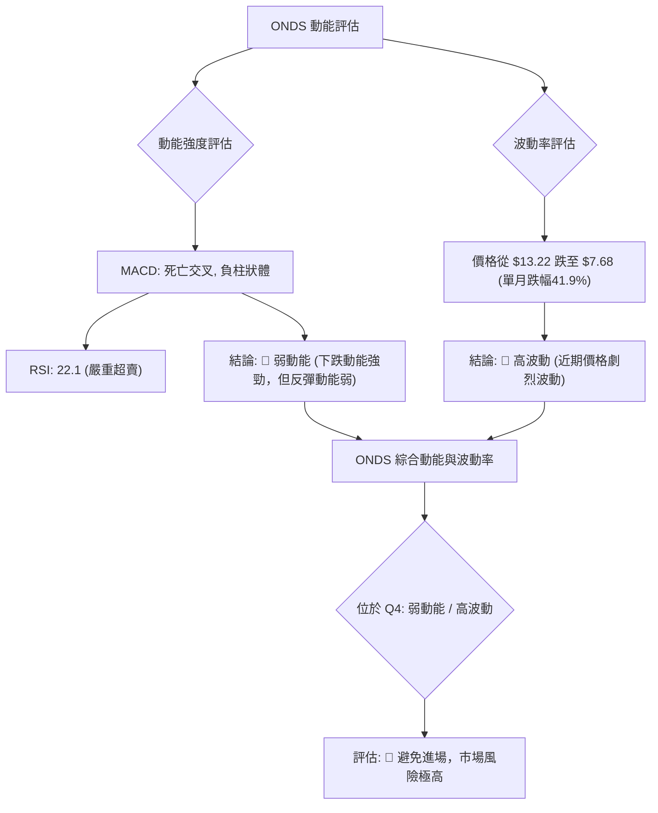
**分析與解讀**：
ONDS目前處於**弱動能、高波動**的第四象限。
1.  **動能強度**：
    *   MACD指標呈現死亡交叉，且MACD柱狀圖為負值，這明確指示當前市場由空頭主導，上漲動能極弱。
    *   RSI(14)為22.1，處於嚴重超賣區。雖然超賣可能預示反彈，但缺乏底背離等反轉訊號，說明買盤動能尚未有效入場。整體而言，ONDS缺乏上漲動能，下跌動能雖強，但已進入超賣，反彈動能尚未形成，因此評為「弱動能」。
2.  **波動率**：
    *   ONDS在2026年5月從$10.04上漲至$13.22，隨後在2026年6月從$13.22大幅回落至$7.68，單月跌幅高達41.9%。這種劇烈的價格變動明確表明其波動率非常高。儘管ATR數據缺失，但從如此大的價格擺幅來看，ONDS無疑是一個高波動性的股票。

**綜合評估**：
ONDS 位於**弱動能 / 高波動**的第四象限。這是一個極具挑戰性的交易環境：股價缺乏上漲動能，且在劇烈波動中持續下跌。這種組合通常意味著市場極度不穩定，風險極高。對於大多數投資者而言，當前ONDS的狀態應**避免進場**，除非是經驗豐富的短線交易者，且具備嚴格的風險控制能力。在這種情況下，市場可能仍處於尋找底部的過程中，不確定性極大。

### 📊 ATR 波動率分析

平均真實波幅 (ATR) 是衡量一段時間內資產價格波動幅度的指標。它不預測方向，只衡量波動的大小。ONDS的ATR(14)數據為N/A，因此我們將根據其歷史價格數據進行定性分析。

**定性分析**：
ONDS在過去幾個月中表現出極高的波動性：
*   2026年5月，月收盤價從$10.04上漲至$13.22，漲幅約31.7%。
*   2026年6月，月收盤價從$13.22下跌至$7.68，跌幅約41.9%。
這種在短時間內經歷大幅漲跌的行為，明確指示ONDS是一個**高波動性**的股票。其每日或每週的價格變動幅度可能相對較大。

**波動率對交易的影響**：
1.  **風險增加**：高波動性意味著價格在短時間內可能出現大幅波動，這增加了交易的風險。止損點和目標價需要設置得更寬，以避免被市場的日常波動「洗出」。
2.  **機會增加**：對於擅長捕捉短期機會的交易者而言，高波動性也意味著更大的潛在利潤空間。然而，這需要更精準的進出場時機和更嚴格的風險管理。
3.  **止損距離建議 (基於定性推斷)**：
    由於ATR數值缺失，無法給出精確的止損距離。但基於ONDS的高波動性，建議：
    *   **短線交易者**：止損距離應至少設定為當前價格的 **5% - 8%**。例如，若進場價格為$7.68，則止損點可能在$7.29 (5%回撤) 或$7.06 (8%回撤)。
    *   **中長線投資者**：止損距離應設定為當前價格的 **10% - 15%**，並結合關鍵支撐位。例如，若進場價格為$7.68，則止損點可能在$6.91 (10%回撤) 或$6.53 (15%回撤)。更穩妥的做法是將止損設在關鍵支撐位下方，例如$5.86甚至更低。

**結論**：
ONDS的波動率極高，這使得其成為一個高風險高收益的標的。投資者在制定交易策略時，必須充分考慮其波動性，並設置更寬鬆的止損點，同時嚴格控制倉位，以管理潛在的風險。

### 📐 Beta 與市場相關性

Beta (β) 值衡量股票相對於整體市場（通常是S&P 500指數）的波動性。由於ONDS的Beta值未提供，我們將根據其所處的行業（科技/通訊設備）和其自身股價的波動特徵進行推斷。

**推斷分析**：
1.  **行業特性**：ONDS所處的科技和通訊設備行業，通常被認為是成長型行業，其股票的波動性往往高於市場平均水平。這類公司通常對宏觀經濟數據、行業創新和公司特定消息更為敏感。
2.  **股價波動**：如前所述，ONDS在過去一年中經歷了從$2.12到$13.22的大幅上漲，以及近期從$13.22到$7.68的劇烈回落。這種大幅的價格變動遠超一般市場指數的波動，這強烈暗示ONDS的Beta值可能**顯著大於1**。
    *   **Beta > 1**：意味著股票的波動性高於市場。如果市場上漲1%，該股票可能上漲超過1%；如果市場下跌1%，該股票可能下跌超過1%。
    *   **Beta < 1**：意味著股票的波動性低於市場。
    *   **Beta = 1**：意味著股票的波動性與市場一致。

**市場相關性推斷**：
如果ONDS的Beta值顯著大於1，那麼它與市場的相關性可能較高，但其波動幅度會被放大。
*   **市場上漲時**：ONDS可能會跑贏大盤，提供更高的收益。
*   **市場下跌時**：ONDS可能會跑輸大盤，承受更大的跌幅。

**結論**：
儘管ONDS的具體Beta值缺失，但根據其行業屬性和歷史股價表現，我們可以合理推斷其Beta值可能**顯著大於1**。這意味著ONDS是一個高風險、高收益的股票，其價格波動可能被市場情緒放大。在當前市場整體偏弱或存在不確定性的情況下，高Beta股票通常會承受更大的下行壓力。投資者應將ONDS視為一個高風險資產，並在投資組合中適當配置，避免過度集中。

---

## 7. 多時框架總結

多時框架分析的目的是將不同時間週期（長期、中期、短期）的技術訊號整合起來，形成一個全面的市場視角。這有助於避免單一時間框架可能帶來的片面性，並確認趨勢的一致性或潛在的轉折。

### 📋 時框架評分表

下表總結了ONDS在不同時框架下的趨勢、動能、均線排列和形態表現，並給出綜合評分和建議。

| 時框架 | 趨勢方向 | 動能 | 均線排列 | 形態 | 綜合評分 (0-10) | 建議 |
|--------|----------|------|----------|------|-----------------|------|
| **長期 (月線)** | 🟡 中性偏多轉弱 | 🟡 衰退 | 🟡 混合偏空 | 🟡 高位回落 | 4/10            | 觀望/謹慎 |
| **中期 (週線)** | 🔴 明顯空頭 | 🔴 強勁下跌 | 🔴 空頭排列形成中 | 🔴 下跌延續形態 | 2/10            | 賣出/規避 |
| **短期 (日線/週線推演)** | 🔴 強烈空頭 | 🔴 極弱/超賣 | 🔴 空頭排列 | 🔴 下跌趨勢確立 | 1/10            | 規避/等待築底 |

**解讀**：
ONDS的多時框架分析顯示，其長期趨勢儘管在過去一年表現強勁，但近期的大幅回落已使其轉向中性偏弱，長期均線支撐面臨考驗。中期和短期趨勢則已明確轉為空頭。
*   **長期**：月線圖顯示ONDS在2025年7月至2026年5月期間有過顯著上漲，但2026年6月的大幅回落已使其長期多頭結構受到挑戰。儘管仍高於一年前的低點，但高位回落和均線混合排列的狀態使其評分降至4/10，建議觀望。
*   **中期**：週線圖顯示ONDS在2026年5月高點後，連續數週下跌，MACD死亡交叉，RSI超賣，且已跌破多個關鍵支撐。均線系統正快速形成空頭排列，圖表形態傾向於下跌延續。綜合評分僅為2/10，建議賣出或規避。
*   **短期**：日線（推演自週線）和最新數據顯示，ONDS正經歷急劇下跌，RSI嚴重超賣但無底背離，MACD柱狀圖負值且下跌放量。價格已遠低於短期和中期均線。綜合評分僅為1/10，表明短期內市場情緒極度悲觀，建議規避，等待明確的築底訊號。

### 🔲 綜合訊號矩陣

此矩陣將展示ONDS在短期、中期、長期各維度訊號的一致性，以判斷當前趨勢的整體強度和可靠性。

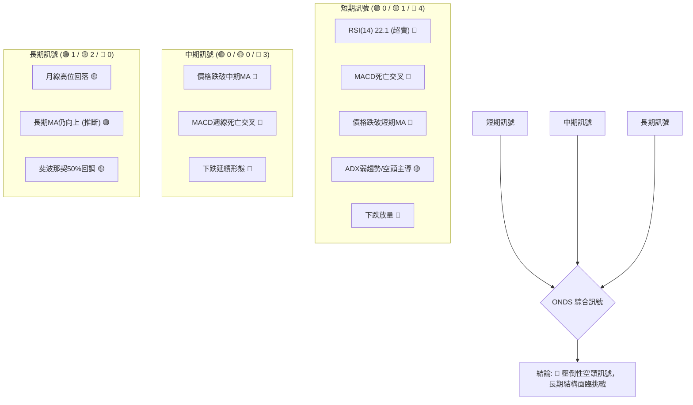
**分析與解讀**：
ONDS的綜合訊號矩陣清晰地展示了當前市場的極度偏空傾向。
*   **短期訊號**：短期內，ONDS面臨壓倒性的空頭訊號。RSI嚴重超賣，MACD形成死亡交叉，價格跌破短期移動平均線，且下跌伴隨放量。儘管ADX顯示趨勢強度較弱，但-DI主導表明空頭佔優。這一切都指向短期內強勁的賣壓和下跌趨勢。
*   **中期訊號**：中期來看，ONDS的訊號同樣是明確的空頭。價格已跌破中期移動平均線，MACD在週線級別形成死亡交叉，且圖表形態顯示為下跌延續。這表明中期下跌趨勢已經確立。
*   **長期訊號**：長期訊號相對複雜，但已從強勁多頭轉為面臨挑戰。月線圖顯示高位大幅回落，儘管長期移動平均線可能仍向上，但價格已接近或跌破長期均線，斐波那契50%回調位也正在被測試。這表明ONDS的長期多頭結構正受到嚴重考驗。

**整體一致性**：
ONDS的短期和中期訊號高度一致，均指向強烈的空頭趨勢。長期訊號雖然尚未完全轉空，但也已從強勢多頭轉為謹慎觀望，並面臨著結構性破壞的風險。這種從短期到中期的高度一致性空頭訊號，加上長期趨勢的惡化，使得ONDS的整體技術前景極為悲觀。投資者應對其當前走勢保持極度警惕，並避免在趨勢未明確反轉前進行多頭操作。

---

## 8. 交易策略建議

基於ONDS目前的技術分析，其股價正處於強烈的下跌趨勢中，且短期內超賣嚴重，但缺乏明確的底部反轉訊號。因此，交易策略應以規避風險、順勢而為為主，並謹慎考慮可能的短期反彈機會。

### 🗺️ 策略決策流程圖

以下流程圖展示了在當前ONDS技術面下的交易決策邏輯。

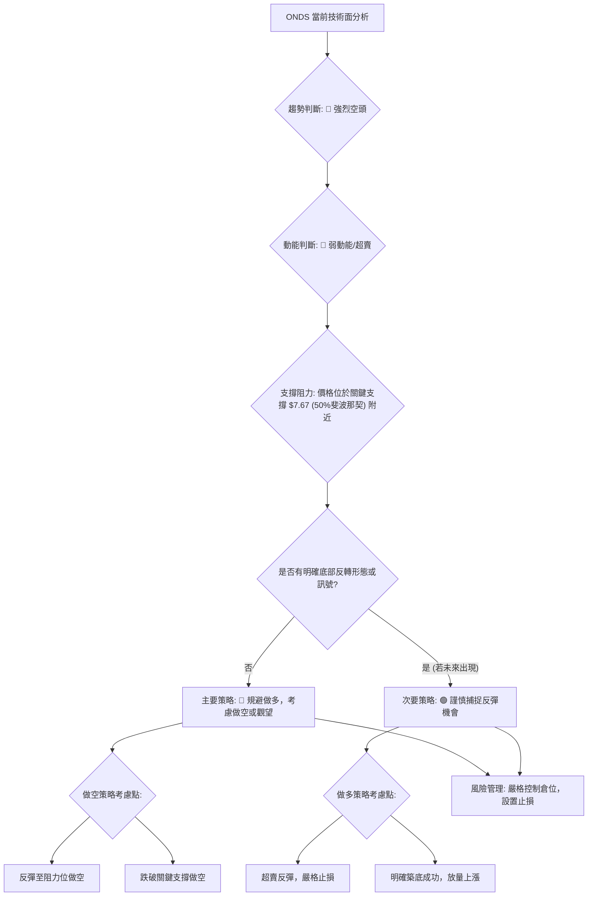
**解讀**：
ONDS目前處於強烈空頭趨勢中，動能弱且嚴重超賣，但尚未出現明確的底部反轉訊號。價格正在測試重要的斐波那契50%回調位$7.67。
*   **主要策略**：在當前情況下，最穩妥的策略是**規避做多**，甚至可以考慮**做空**（如果市場允許且符合個人風險偏好），或**保持觀望**，等待更明確的趨勢反轉訊號。
*   **做空策略**：可以在價格反彈至關鍵阻力位（如$9.06或$10.62）時考慮做空，或在價格有效跌破當前斐波那契50%回調位$7.67後，追蹤下跌趨勢。
*   **做多策略**：若要考慮做多，只能是基於嚴格的**超賣反彈策略**，且必須設置極其嚴格的止損。更安全的做多機會將是等待ONDS形成明確的築底形態，並伴隨成交量放大上漲的訊號。

### 🟢 多頭策略詳情

鑑於ONDS當前技術面極度偏空，多頭策略風險極高。以下提供一個**極其謹慎的短線超賣反彈策略**，僅供風險承受能力極高的交易者參考。

| 策略要素 | 策略 A (短線超賣反彈) |
|----------|-----------------------|
| 進場條件 | 價格在$7.67 (斐波那契50%回調) 附近出現小幅放量企穩，或日K線收出止跌訊號 (如錘子線、啟明星)，同時RSI在20以下出現輕微回升。 |
| 進場價格 | $7.68 - $7.75         |
| 目標價 T1 | $8.98 (斐波那契38.2%回調/近期阻力R1) |
| 目標價 T2 | $9.06 - $9.50 (近期阻力R1，若突破則向上看) |
| 止損價格 | $7.40 (位於$7.67斐波那契50%回調位下方，跌破則趨勢惡化) |
| 風險報酬比 | T1: (8.98-7.75) / (7.75-7.40) = 1.23 / 0.35 ≈ 3.5:1 <br> T2: (9.50-7.75) / (7.75-7.40) = 1.75 / 0.35 ≈ 5:1 |
| 成功機率 | 20% (極低，基於當前強烈空頭趨勢) |
| 建議倉位 | 2% - 5% (極低倉位，嚴格控制風險) |

**策略 A 詳細說明**：
此策略是基於ONDS價格已跌至斐波那契50%回調位 ($7.67) 附近，且RSI嚴重超賣而設計的。若價格能在$7.67-$7.75區間內止跌企穩，並出現短期的量價配合（如放量小陽線），則可能觸發技術性反彈。止損點設定在$7.40，一旦跌破此價位，表明50%回調位未能守住，下跌趨勢將進一步確認，應立即止損出場。目標價T1為$8.98，是斐波那契38.2%回調位，也是近期的一個阻力位。若能突破T1，則可看向$9.06-$9.50的區間，但此策略風險極高，僅適合經驗豐富的短線交易者。

### 🔴 空頭策略詳情

ONDS當前技術面顯示強烈空頭趨勢，因此做空策略的成功機率相對較高。

| 策略要素 | 策略 A (反彈做空) | 策略 B (跌破支撐做空) |
|----------|-------------------|-----------------------|
| 進場條件 | 價格反彈至$9.06-$9.20區間，且出現受阻回落K線 (如射擊之星、烏雲蓋頂)，成交量萎縮。 | 價格有效跌破$7.67 (斐波那契50%回調位) 和$7.40 (短線止損點)，伴隨放量下跌。 |
| 進場價格 | $9.06 - $9.15     | $7.35 - $7.40         |
| 目標價 T1 | $7.67 - $7.70     | $6.36 (斐波那契61.8%回調位) |
| 目標價 T2 | $6.36 (斐波那契61.8%回調位) | $5.86 (歷史關鍵支撐S3) |
| 止損價格 | $9.50 (位於$9.06阻力位上方，若突破則空頭失效) | $7.80 (跌破點上方，若價格快速收回則空頭失效) |
| 風險報酬比 | T1: (9.15-7.70) / (9.50-9.15) = 1.45 / 0.35 ≈ 4.1:1 <br> T2: (9.15-6.36) / (9.50-9.15) = 2.79 / 0.35 ≈ 7.9:1 | T1: (7.40-6.36) / (7.80-7.40) = 1.04 / 0.40 ≈ 2.6:1 <br> T2: (7.40-5.86) / (7.80-7.40) = 1.54 / 0.40 ≈ 3.8:1 |
| 成功機率 | 60% - 70%         | 50% - 60%             |
| 建議倉位 | 5% - 10%          | 5% - 8%               |

**策略 A (反彈做空) 詳細說明**：
此策略基於ONDS當前處於下跌趨勢，且$9.06為近期重要阻力。若價格反彈至$9.06-$9.20區間，並出現受阻回落的K線形態，同時成交量萎縮，則為做空良機。止損設定在$9.50上方，防止假突破。目標價T1為當前斐波那契50%回調位$7.67附近，T2為斐波那契61.8%回調位$6.36。

**策略 B (跌破支撐做空) 詳細說明**：
此策略為趨勢追蹤策略。若ONDS未能守住斐波那契50%回調位$7.67，並有效跌破$7.40，伴隨放量下跌，則可順勢做空。止損設定在$7.80，防止假跌破。目標價T1為斐波那契61.8%回調位$6.36，T2為歷史關鍵支撐$5.86。

### ⭐ 整體訊號強度評星

```
做多訊號強度：★★☆☆☆  (2/5星) (僅限超賣反彈，風險極高)
做空訊號強度：★★★★☆  (4/5星) (趨勢明確，風險相對可控)
整體可信度：  ★★★☆☆  (3/5星) (空頭趨勢可信度高，多頭則需極高風險承受)
```
**解讀**：
ONDS的做多訊號強度極低，僅2星，主要因為其嚴重超賣可能引發技術性反彈，但整體趨勢和動能指標均指向空頭，任何多頭操作都伴隨著極高風險。做空訊號強度較高，為4星，因為ONDS的下跌趨勢已非常明確，且多個指標均確認空頭主導。整體可信度為3星，主要基於空頭策略的較高可信度，而多頭策略則需極高的風險承受能力和嚴格的執行。

---

## 9. 風險提示與監控

ONDS當前技術面顯示出高風險的下跌趨勢。在這種市場環境下，嚴格的風險管理和持續的市場監控至關重要。

### ✅ 關鍵監控指標 Checklist

以下是交易ONDS時應密切關注的關鍵技術指標和價位清單。

```
ONDS 風險監控清單
════════════════════════════════════════════════════
[ ] 價格行為：
    ├─ 現價 $7.68 是否能守住斐波那契50%回調 $7.67
    ├─ 是否有效跌破 $7.00 心理關口
    ├─ 是否有效跌破 $6.36 (斐波那契61.8%回調)
    ├─ 是否有效跌破 $5.86 (歷史關鍵支撐)
    └─ 是否能反彈並站穩 $9.06 (近期阻力)
[ ] 動能指標：
    ├─ RSI(14) 是否從超賣區回升並突破30
    ├─ MACD 是否形成金叉 (MACD線向上穿越訊號線)
    └─ MACD柱狀圖負值是否持續收窄並轉正
[ ] 趨勢指標：
    ├─ ADX(14) 是否上升並突破25，且+DI是否向上穿越-DI
    └─ 短期/中期移動平均線是否止跌並開始向上反轉
[ ] 成交量：
    ├─ 價格下跌時成交量是否縮小 (止跌訊號)
    ├─ 價格反彈時成交量是否放大 (買盤確認)
    └─ OBV趨勢是否止跌並開始向上
[ ] K線形態：
    └─ 是否出現明確的底部反轉K線組合 (如啟明星、看漲吞噬)
════════════════════════════════════════════════════
```
**解讀**：
ONDS的監控清單涵蓋了價格、動能、趨勢和成交量等多個維度。投資者應每日或每週檢查這些指標的變化。特別是價格在斐波那契50%回調位$7.67附近的行為，將是判斷其短期命運的關鍵。任何動能指標（RSI、MACD）的底部反轉訊號，以及成交量的配合，都將是重要的止跌或反彈線索。反之，若價格繼續放量跌破關鍵支撐，則應立即採取風險規避措施。

### ⚠️ 風險場景分析

針對ONDS當前的技術面，我們可以預設三種主要情境：樂觀、基本和悲觀，以評估不同市場發展路徑下的潛在結果。

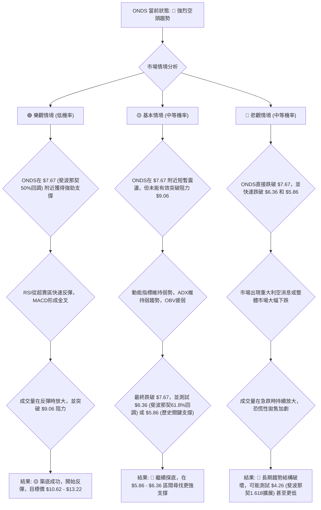
**分析與解讀**：
1.  **樂觀情境 (低機率)**：儘管ONDS目前技術面極度悲觀，但若能在斐波那契50%回調位$7.67附近獲得強力支撐，並伴隨RSI反彈、MACD金叉和放量上漲，則可能築底成功並開始反彈。此情境的機率較低，因為需要強大的買盤力量來扭轉當前頹勢。
2.  **基本情境 (中等機率)**：ONDS在$7.67附近短暫震盪後，由於缺乏足夠買盤動能，最終跌破此支撐，並向下測試斐波那契61.8%回調位$6.36或歷史關鍵支撐$5.86。在此區間，ONDS有望找到更強的支撐並形成底部。這是目前最有可能發生的情境。
3.  **悲觀情境 (中等機率)**：若ONDS直接跌破$7.67，且市場情緒持續惡化，或出現重大利空消息，則可能引發恐慌性拋售，導致股價快速跌破所有關鍵支撐，包括$6.36和$5.86，甚至可能測試斐波那契1.618擴展目標$4.26。此情境的發生將徹底破壞ONDS的長期多頭結構。

### 🛡️ 風險管理重要提醒

在ONDS當前的高風險環境下，嚴格的風險管理是保護資本的關鍵。
1.  **嚴格止損**：無論採取何種策略，都必須預設止損位，並嚴格執行。切勿讓虧損擴大，尤其是在高波動性股票上。對於多頭策略，止損是生命線；對於空頭策略，止損也是防止反向趨勢的保護。
2.  **倉位管理**：鑑於ONDS的高波動性和不確定性，應採取**極低倉位**策略。即使看好或看空，也不應將過多資金投入單一高風險標的。建議將其倉位控制在總投資組合的5%以下。
3.  **分批建倉/平倉**：避免一次性重倉進出。可以考慮分批建倉，在價格確認趨勢後逐步加碼；分批平倉則有助於鎖定利潤，避免因市場反轉而功虧一簣。
4.  **避免逆勢操作**：在當前ONDS的強烈下跌趨勢中，不建議盲目抄底。等待明確的築底訊號和趨勢反轉確認，比在下跌中捕捉短暫反彈更安全。
5.  **關注基本面**：儘管本報告是技術分析，但ONDS的基本面發展（如財報、新產品、行業新聞）也可能對其股價產生重大影響。密切關注公司基本面，將有助於更全面地判斷其長期價值。
6.  **耐心等待**：在不確定的市場中，耐心是黃金。等待ONDS形成明確的趨勢反轉訊號，或者價格達到更有吸引力的支撐位，再考慮進場，可以顯著降低交易風險。

---

## 📋 報告總結

```
ONDS 技術分析報告總結
════════════════════════════════════════════════════════
報告日期：2026-06-28
當前價格：$7.68
分析評級：⚖️ 強烈偏空 (ONDS處於強勁下跌趨勢，動能弱，超賣嚴重，短期內風險極高。)

關鍵結論：
├─ 長期趨勢：🟡 中性偏多轉弱，高位回落，長期支撐受考驗。
├─ 中期趨勢：🔴 明顯空頭，MACD死亡交叉，價格跌破關鍵支撐。
├─ 短期趨勢：🔴 強烈空頭，RSI嚴重超賣但無底背離，下跌放量。
├─ 關鍵支撐：$7.67 (斐波那契50%回調)、$6.36 (斐波那契61.8%回調)、$5.86 (歷史起漲點)。
├─ 關鍵阻力：$9.06 (近期跌破支撐轉化)、$10.62 (近期波段高點)。
└─ 分析師目標：$20.12 (僅供參考，技術面與其嚴重背離)。

最優策略組合：
1. 🥇 最佳機會：**反彈做空策略**。在價格反彈至$9.06-$9.20阻力區間且受阻時進場做空，目標價$7.70、$6.36。止損$9.50。風險報酬比高，成功機率較大。
2. 🥈 次選機會：**跌破支撐做空策略**。若價格有效跌破$7.67-$7.40關鍵支撐區間並放量下跌，則可順勢做空，目標價$6.36、$5.86。止損$7.80。
3. 🥉 保守選擇：**觀望或規避**。在當前強烈下跌趨勢且波動劇烈的情況下，對於大多數投資者而言，保持觀望，等待明確的築底訊號或趨勢反轉後再考慮進場，是最為穩妥的策略。
════════════════════════════════════════════════════════
```

---

> ⚠️ **免責聲明**：本報告為 AI 自動生成之技術分析，所有數據及估算均基於提供的歷史價格資訊。由於部分技術指標數據缺失，本報告在某些方面進行了專業推演。本報告**僅供研究與學術參考**，**不構成任何投資建議**。投資有風險，入市需謹慎。

---

*報告生成時間：2026-06-28 ｜ 數據來源：Yahoo Finance ｜ 分析框架：多時框技術分析*