<details>
<summary>📊 靜態圖表 (點擊展開)</summary>
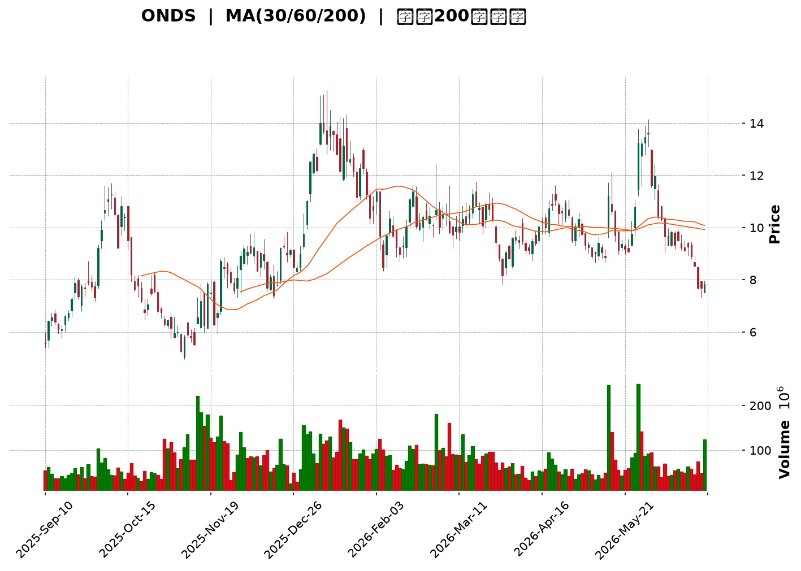
</details>

<html>
<head><meta charset="utf-8" /></head>
<body>
    <div style="height:500px; width:100%;">                        <script>window.PlotlyConfig = {MathJaxConfig: 'local'};</script>
        <script charset="utf-8" src="https://cdn.plot.ly/plotly-3.6.0.min.js" integrity="sha256-QaOVwtVY0T02VaHrr6pnoHLCwayMJp4O5n4YyaE3rJk=" crossorigin="anonymous"></script>                <div id="candlestick-chart" class="plotly-graph-div" style="height:100%; width:100%;"></div>            <script>                window.PLOTLYENV=window.PLOTLYENV || {};                                if (document.getElementById("candlestick-chart")) {                    Plotly.newPlot(                        "candlestick-chart",                        [{"close":{"dtype":"f8","bdata":"AAAAoHA9FkAAAACAFK4ZQAAAAKBwPRpAAAAAwB6FGUAAAAAAKVwYQAAAAGBmZhhAAAAAYGZmGkAAAACgR+EaQAAAAIA9Ch1AAAAAwB6FH0AAAABgZmYdQAAAAAAAAB9AAAAAANejHkAAAABA4XofQAAAAKBH4R5AAAAAoHA9HUAAAAAghWsiQAAAAIDr0SNAAAAAgOtRJUAAAACAFC4mQAAAAMAehSZAAAAAQOH6JEAAAADgo3AiQAAAAGC4niVAAAAAgOvRJEAAAADAHgUjQAAAAGBmZiBAAAAA4KNwHkAAAADgehQfQAAAAGCPwhxAAAAAgML1GkAAAACgcD0cQAAAAEAK1x1AAAAAYLgeHkAAAADA9SgbQAAAAAAAABtAAAAAwPUoGUAAAABgj8IZQAAAAKCZmRhAAAAAQArXF0AAAAAAAAAYQAAAAAAAABVAAAAAoHA9F0AAAADAHoUXQAAAAEAzMxdAAAAAgD0KFkAAAACgcD0aQAAAAOBRuBxAAAAAwB4FGUAAAAAAKVwfQAAAAAAAAB5AAAAA4HoUGUAAAADgo\u002fAaQAAAAOCjcCFAAAAAoEfhIEAAAABA4XogQAAAAKCZmR9AAAAAgOtRHkAAAAAA1yMgQAAAAEAK1yFAAAAAoEdhIkAAAAAA1yMiQAAAAIA9CiJAAAAAgMJ1IkAAAABgZqYgQAAAAIA9CiJAAAAAAACAIUAAAABgj8IeQAAAAIAULiBAAAAAQOF6HUAAAABAMzMfQAAAAOCjcCJAAAAAgD2KIkAAAAAgheshQAAAAGCPQiJAAAAAgML1IEAAAAAghesgQAAAAEDh+iFAAAAAwB6FI0AAAACAPQomQAAAACBcDylAAAAAgBSuKUAAAAAAKVwoQAAAAMAeBSxAAAAAoEdhK0AAAACgR2EqQAAAACCuxytAAAAAYLgeK0AAAAAA16MpQAAAAIDrUShAAAAAYI9CKkAAAACgmRkpQAAAAKBwPSlAAAAAQApXKEAAAACA61EmQAAAAMAehShAAAAAgD2KKEAAAACAPYomQAAAAOBRuCRAAAAAIK5HJUAAAABgj8ImQAAAAAApXCNAAAAAgML1IEAAAACgR2EjQAAAAIAUriRAAAAAAClcI0AAAACAwnUiQAAAAOCj8CFAAAAAYLieIkAAAACgmRkkQAAAAADXIyZAAAAAIK7HJkAAAAAgXA8kQAAAAKBHYSRAAAAAwMzMJEAAAACgmZkkQAAAAGBm5iRAAAAAwPUoJEAAAABAClclQAAAAIA9CiRAAAAAwB4FJUAAAABA4fokQAAAAMD1qCNAAAAA4KNwI0AAAADAHgUkQAAAAMD1qCNAAAAAwPWoJEAAAACA61EkQAAAACBcDyVAAAAAIFyPJkAAAADA9aglQAAAAAAAgCVAAAAAYLgeJEAAAADAzMwlQAAAAAApXCVAAAAAYLieJEAAAACgR+EiQAAAAKCZmSFAAAAAwMxMIEAAAADgehQiQAAAAGC4niFAAAAAQDMzI0AAAACAPQojQAAAACBcDyNAAAAAYGbmIkAAAAAgrkciQAAAAGCPQiJAAAAA4KPwIkAAAADAzMwiQAAAACBcDyRAAAAAYGZmJEAAAAAAAAAkQAAAAIDCdSVAAAAAoHC9JUAAAABguB4mQAAAAOB6FCVAAAAAoJkZJUAAAABgZuYlQAAAAIDC9SRAAAAAQOH6IkAAAADgehQkQAAAAADXoyRAAAAAgMJ1I0AAAADA9agiQAAAAIAUriJAAAAAIK7HIUAAAABguB4iQAAAAEAK1yJAAAAA4HoUIkAAAADgUbghQAAAACCFayZAAAAAoHA9JUAAAABgZmYjQAAAAAAAQCJAAAAA4FG4IkAAAAAAKVwiQAAAAGC4HiJAAAAAgD2KI0AAAACgmZklQAAAAAAAgCpAAAAA4KNwKkAAAAAghesqQAAAAMD1KCtAAAAA4FE4J0AAAADgo\u002fAnQAAAAAAp3CRAAAAAoJmZJEAAAADAzEwjQAAAAGC4niJAAAAAwPWoI0AAAADA9agiQAAAAMAeBSNAAAAAIIVrIkAAAACgcD0iQAAAAIA9iiJAAAAAIK7HIUAAAAAgXA8hQAAAAOBRuB5AAAAAQDOzHkAAAACA61EfQA=="},"high":{"dtype":"f8","bdata":"AAAAAAAAGEAAAABgj8IZQAAAAKBH4RpAAAAA4KNwG0AAAABgZmYZQAAAAAAAABlAAAAAIFyPGkAAAAAAKVwbQAAAAOCjcB1AAAAAoHA9IEAAAAAA1yMgQAAAAAApXB9AAAAAIFyPH0AAAAAghWshQAAAAEAKVyBAAAAAwMzMH0AAAACAFK4iQAAAACBcjyRAAAAAYI9CJ0AAAABAChcnQAAAAGBmZidAAAAAIK7HJkAAAADAHgUlQAAAAIAUbiZAAAAAYLgeJUAAAACgcL0lQAAAAGCPQiNAAAAAgOtRIEAAAACgR2EgQAAAAADXox9AAAAAgD0KHUAAAABAMzMdQAAAAEAKVyBAAAAAoEehIEAAAAAgXI8eQAAAAMDMzBtAAAAAgMJ1GkAAAAAAAAAaQAAAAGCPwhpAAAAAIK5HGkAAAAAAAAAZQAAAAOBRuBdAAAAA4HqUF0AAAAAgXI8ZQAAAAKBHYRhAAAAAwPWoGEAAAAAAKVwdQAAAAOCjcB9AAAAAIFwPHkAAAACAFK4fQAAAAIDrESBAAAAAoEfhH0AAAABgZmYbQAAAAKCZmSFAAAAAYI\u002fCIUAAAAAAKVwhQAAAAMAg8CBAAAAAANcjIEAAAACgmRkhQAAAAIDCNSJAAAAAgBSuIkAAAACgmZkiQAAAAAAAgCNAAAAA4FG4I0AAAABA4ToiQAAAAMD1KCJAAAAAYGYmI0AAAABA4XohQAAAAADXYyBAAAAAYLgeIUAAAABgka0gQAAAAEDheiJAAAAAgOtRI0AAAACAFK4jQAAAAGBmZiJAAAAAQApXIkAAAABAClchQAAAAKCZmSJAAAAAIFwPJUAAAABguB4mQAAAAOB6FClAAAAAACncKUAAAACAPQoqQAAAAADXIy5AAAAAQDMzLkAAAAAgXI8uQAAAAAAAAC1AAAAAAACAK0AAAAAA1yMsQAAAAAAAgCxAAAAAYGZmLEAAAADA9agsQAAAAMD1qCpAAAAAQOG6KUAAAAAghasoQAAAAOCj8ChAAAAAwPUoKkAAAAAgXI8oQAAAAGBm5iZAAAAAYGZmJkAAAABACtcmQAAAAIA9yiZAAAAAIFwPI0AAAADAHoUjQAAAACCuRyVAAAAAoEfhJEAAAABACtcjQAAAAKDGiyJAAAAAAClcI0AAAAAA16MkQAAAAEAKVyZAAAAAgBQuJ0AAAADA9SgnQAAAAADXIyVAAAAAgML1JEAAAACgR+ElQAAAACBcjyVAAAAAAClcJEAAAABACtcoQAAAAAAAACZAAAAAANejJUAAAABACtclQAAAAOBROCdAAAAAIFwPJEAAAABgZuYkQAAAAGC4HiVAAAAAgBSuJUAAAACAwvUlQAAAAKBwvSVAAAAA4KPwJkAAAADAHoUnQAAAAIDC9SVAAAAAwPWoJUAAAADgo\u002fAlQAAAAKBwvSZAAAAAIK5HJkAAAAAgrkckQAAAAKBwvSJAAAAAANejIUAAAAAgrkciQAAAAEAzsyJAAAAAYI9CI0AAAADAzMwjQAAAAKBHYSNAAAAAoHC9JEAAAACAPQojQAAAAOBRuCJAAAAAIIUrI0AAAADgUbgjQAAAACBcDyRAAAAAIK7HJEAAAAAgXA8lQAAAAGC4HiZAAAAA4HqUJkAAAADgUTgnQAAAAOCj8CVAAAAAgD2KJUAAAABguB4mQAAAAADXIyZAAAAAACncJEAAAACA61EkQAAAAGC4HiVAAAAAQOG6JEAAAADgepQjQAAAACCF6yJAAAAAAACAIkAAAACAFC4iQAAAAMDMTCNAAAAAQDOzIkAAAAAAKVwiQAAAAIDCdSdAAAAAoHA9KEAAAABAClclQAAAAGCPwiNAAAAA4HoUI0AAAABgj8IiQAAAAKBHISNAAAAAwB6FJEAAAABguB4mQAAAACBcjytAAAAAgOvRKkAAAACA69ErQAAAAIDrUSxAAAAAAAAAKkAAAABACtcoQAAAAIDrUSdAAAAAgBSuJUAAAACA69EkQAAAAIDC9SNAAAAAoEPLI0AAAABAicEjQAAAAOCj8CNAAAAAQOF6I0AAAAAAAAAjQAAAACCF6yJAAAAAIIXrIkAAAAAAKdwhQAAAAAAAACFAAAAAYI\u002fCH0AAAAAAKdwfQA=="},"hovertemplate":"\u003cb\u003e%{x|%Y-%m-%d}\u003c\u002fb\u003e\u003cbr\u003e\u958b: $%{open:.2f}\u003cbr\u003e\u9ad8: $%{high:.2f}\u003cbr\u003e\u4f4e: $%{low:.2f}\u003cbr\u003e\u6536: $%{close:.2f}\u003cextra\u003e\u003c\u002fextra\u003e","low":{"dtype":"f8","bdata":"AAAAgD2KFUAAAAAA16MVQAAAAMDMzBhAAAAAAAAAGUAAAACAFK4XQAAAAAAAABdAAAAAgD0KGEAAAACAFK4ZQAAAAIDrURpAAAAAIIXrHEAAAAAAAAAdQAAAAMD1KBtAAAAA4KNwHUAAAABAMzMfQAAAACCuRx5AAAAA4FG4HEAAAAAA16MeQAAAAKBHYSJAAAAAgD2KJEAAAABgZuYkQAAAAGAObSVAAAAAAADAJEAAAACgR2EiQAAAACCyXSNAAAAAYI\u002fCI0AAAACA61EiQAAAAIAUrh9AAAAA4FE4HkAAAACA61EdQAAAAAAAgBxAAAAAACncGUAAAACgmZkaQAAAAGC4nh1AAAAA4HoUHkAAAAAA16MaQAAAAOB6FBpAAAAAgOvRGEAAAABA4XoYQAAAAGC4HhdAAAAA4HoUF0AAAACA61EXQAAAAAAp3BRAAAAAwMzME0AAAADgehQXQAAAAGBmZhZAAAAAIIXrFUAAAACgcD0ZQAAAAGBmZhhAAAAAIIXrF0AAAACgmZkYQAAAAIA9Ch1AAAAAAAAAGUAAAADgUbgXQAAAAIAUrhpAAAAAANcjIEAAAACgcL0eQAAAAEAzMx9AAAAAoEfhHUAAAAAgrkcdQAAAAEAK1x1AAAAAgD0KIUAAAADA9SghQAAAAOCj8CFAAAAA4FE4IUAAAAAAKZwgQAAAAKBwPSBAAAAAgOvRIEAAAACgcD0eQAAAAAApXB5AAAAAYLgeHUAAAACAwvUeQAAAAOCjcB9AAAAAIFxPIkAAAABAClchQAAAAEAzsyFAAAAAACncIEAAAAAghWsgQAAAAMD1qCBAAAAAQApXIkAAAACA69EjQAAAAEDh+iVAAAAAIIXrJ0AAAADgUTgoQAAAAMDMTCpAAAAAgBQuK0AAAADA9agpQAAAACCF6ylAAAAAQArXKUAAAACgmZkpQAAAAKBwPShAAAAAoJmZJ0AAAAAAKdwnQAAAAEAzsyhAAAAAoEfhJ0AAAABgZuYlQAAAAIAULiZAAAAAYLgeKEAAAAAA1yMmQAAAACCuRyRAAAAAwMxMJEAAAADAHgUlQAAAAGCPQiJAAAAAANejIEAAAABgZuYgQAAAAEAKVyNAAAAAQDMzI0AAAABgj8IhQAAAAGBmZiFAAAAAANejIUAAAACgcL0hQAAAAEDh+iNAAAAAQOF6JUAAAABgZuYjQAAAAOBRuCNAAAAAgML1IkAAAACAPYokQAAAAGBm5iNAAAAAoHA9I0AAAACgmZkkQAAAAMAehSNAAAAAACncI0AAAABguB4kQAAAAMAehSNAAAAAYGZmIkAAAABgZiYjQAAAAAAAACNAAAAAoJmZI0AAAACgmRkkQAAAAOBROCRAAAAAoHC9JEAAAAAA16MlQAAAAKBwPSRAAAAAgMJ1I0AAAACAFO4jQAAAAEAz8yRAAAAAgMJ1JEAAAACAPYoiQAAAAMD1aCFAAAAAYLgeH0AAAABgZmYgQAAAACBcjyFAAAAAIIXrIEAAAABgj8IiQAAAAOBNYiJAAAAAgBSuIkAAAADAHgUiQAAAAEDh+iFAAAAAgMJ1IUAAAACgmZkiQAAAAKBwvSJAAAAAwB6FI0AAAACAPYojQAAAAIDrUSNAAAAAIK5HJUAAAABAM7MlQAAAAEAzMyRAAAAAQOE6JEAAAAAghWskQAAAACCFqyRAAAAAgOvRIkAAAABguJ4iQAAAAKBwPSNAAAAAQApXI0AAAACA61EiQAAAAIA9CiJAAAAAIFyPIUAAAADAzEwhQAAAAOCjcCFAAAAAoJmZIUAAAABAClchQAAAAEAzMyNAAAAAAAAAJUAAAAAghesiQAAAAOCj8CFAAAAAoHA9IkAAAACAwvUhQAAAAGC4HiJAAAAAILKdIkAAAAAAKVwjQAAAAOCjcCZAAAAAQDMzJ0AAAACgmZkpQAAAAIAULipAAAAAIFwPJ0AAAABguB4mQAAAAMD1qCRAAAAAAACAJEAAAADgehQiQAAAAKCZmSJAAAAAwB6FIkAAAAAAKVwiQAAAAKCZ2SJAAAAAIK5HIkAAAADA9SgiQAAAAEAK1yFAAAAAIFyPIUAAAAAAAAAhQAAAACBcjx5AAAAAoHA9HUAAAAAAAAAeQA=="},"name":"\u50f9\u683c","open":{"dtype":"f8","bdata":"AAAA4KNwFkAAAADgUbgWQAAAAMDMzBlAAAAAQArXGkAAAAAgrkcZQAAAAKBwPRhAAAAAYLgeGUAAAABAMzMaQAAAACCuRxtAAAAAIFwPHkAAAACAwvUfQAAAAMAeBRxAAAAAIK7HHkAAAABACtcfQAAAAOBRuB9AAAAAAAAAH0AAAABAMzMfQAAAAMAeBSNAAAAAYLgeJUAAAAAAAAAmQAAAACCuhyZAAAAAIK5HJkAAAACAwvUkQAAAACBcDyRAAAAAYI\u002fCJEAAAABgZqYlQAAAAGCPQiNAAAAAwMzMH0AAAABguB4gQAAAAOBRuB5AAAAAYGZmG0AAAABgZmYbQAAAAIAUrh5AAAAAYLheIEAAAADgehQeQAAAAOB6lBtAAAAAgML1GUAAAAAAAAAZQAAAAMDMTBpAAAAAYLgeF0AAAAAghesXQAAAAIAUrhdAAAAAwPUoFEAAAABA4XoZQAAAAGBmZhdAAAAA4KPwF0AAAAAgrkcZQAAAAMD1qBhAAAAAgD0KHkAAAABguJ4YQAAAAAAp3B1AAAAAgBSuH0AAAACgcD0aQAAAAADXIxtAAAAAgML1IEAAAADgUTghQAAAACBcjyBAAAAAwB6FH0AAAADgUbgeQAAAACCuxyBAAAAAwB5FIUAAAAAAKdwhQAAAAEAKlyJAAAAAQArXIUAAAADgUTgiQAAAAEDh+iBAAAAAgML1IUAAAAAAKVwhQAAAAEDheh5AAAAAIK5HIEAAAADA9SgfQAAAAIDC9R9AAAAAoJmZIkAAAAAgXA8iQAAAAIDC9SFAAAAA4CRGIkAAAACgmZkgQAAAACCF6yBAAAAAIFyPIkAAAADAHkUkQAAAAKCZmSZAAAAAQDMzKEAAAABgZmYpQAAAAMD1aCpAAAAAAAAALEAAAAAghWsrQAAAAAAAACtAAAAAoEdhK0AAAAAA1yMrQAAAAOB61CpAAAAAgMK1J0AAAACgmZkrQAAAAMAeBSlAAAAAIIVrKUAAAADAzEwoQAAAACCFayZAAAAAgML1KUAAAAAgrkcoQAAAAAAAgCZAAAAAYLieJUAAAADAHgUmQAAAAGCPwiZAAAAAgBSuIkAAAACAFO4hQAAAAAApnCNAAAAAgBQuJEAAAADAHsUjQAAAAKBwfSJAAAAAgD2KIkAAAADgUXgiQAAAACCFayRAAAAAANejJUAAAACgR2EmQAAAAAAp3CNAAAAAwB4FJEAAAABgj0IlQAAAAMDMTCRAAAAAgBQuJEAAAAAAAAAlQAAAAKBHYSVAAAAA4FG4JEAAAABA4fokQAAAAAAAgCRAAAAAIFwPJEAAAACAFK4jQAAAAKCZGSRAAAAAIIUrJEAAAAAAKdwkQAAAAKBwvSRAAAAAoJkZJUAAAAAAAMAmQAAAAGC4XiVAAAAA4HqUJUAAAADgepQkQAAAAIDr0SVAAAAAYI\u002fCJUAAAACgmRkkQAAAAEAzsyJAAAAAYLieIUAAAABgZuYgQAAAAKCZmSJAAAAAIK4HIUAAAABgj0IjQAAAAAAp3CJAAAAAQApXJEAAAADgetQiQAAAAIDCdSJAAAAAwB4FIkAAAADgo3AjQAAAAMAeBSNAAAAAAACAJEAAAABgj8IkQAAAAKCZmSNAAAAAwMzMJUAAAACAPYomQAAAAGCPwiVAAAAAYI9CJUAAAADAS7ckQAAAAADXYyVAAAAAYI\u002fCJEAAAAAAAAAjQAAAAAAAACRAAAAAwMxMJEAAAAAgXI8jQAAAAAAAgCJAAAAAAACAIkAAAAAAAAAiQAAAAEAK1yFAAAAA4FF4IkAAAABACtchQAAAAEDh+iNAAAAAgOvRJUAAAABgj0IlQAAAAGBmpiNAAAAAAACAIkAAAAAgXI8iQAAAACCFayJAAAAAIIWrIkAAAAAAAAAkQAAAAEAz8yZAAAAAAACAKUAAAACgcH0qQAAAAKBwPStAAAAAIIXrKUAAAACAwvUmQAAAAEAK1yZAAAAAwPWoJUAAAAAghaskQAAAAKBHYSNAAAAAYGamIkAAAABACpcjQAAAAEAzsyNAAAAAgOvRIkAAAACgcH0iQAAAAIDr0SJAAAAAgMK1IkAAAABguF4hQAAAAIDC9SBAAAAAoHC9H0AAAAAgXA8eQA=="},"x":["2025-09-10T00:00:00-04:00","2025-09-11T00:00:00-04:00","2025-09-12T00:00:00-04:00","2025-09-15T00:00:00-04:00","2025-09-16T00:00:00-04:00","2025-09-17T00:00:00-04:00","2025-09-18T00:00:00-04:00","2025-09-19T00:00:00-04:00","2025-09-22T00:00:00-04:00","2025-09-23T00:00:00-04:00","2025-09-24T00:00:00-04:00","2025-09-25T00:00:00-04:00","2025-09-26T00:00:00-04:00","2025-09-29T00:00:00-04:00","2025-09-30T00:00:00-04:00","2025-10-01T00:00:00-04:00","2025-10-02T00:00:00-04:00","2025-10-03T00:00:00-04:00","2025-10-06T00:00:00-04:00","2025-10-07T00:00:00-04:00","2025-10-08T00:00:00-04:00","2025-10-09T00:00:00-04:00","2025-10-10T00:00:00-04:00","2025-10-13T00:00:00-04:00","2025-10-14T00:00:00-04:00","2025-10-15T00:00:00-04:00","2025-10-16T00:00:00-04:00","2025-10-17T00:00:00-04:00","2025-10-20T00:00:00-04:00","2025-10-21T00:00:00-04:00","2025-10-22T00:00:00-04:00","2025-10-23T00:00:00-04:00","2025-10-24T00:00:00-04:00","2025-10-27T00:00:00-04:00","2025-10-28T00:00:00-04:00","2025-10-29T00:00:00-04:00","2025-10-30T00:00:00-04:00","2025-10-31T00:00:00-04:00","2025-11-03T00:00:00-05:00","2025-11-04T00:00:00-05:00","2025-11-05T00:00:00-05:00","2025-11-06T00:00:00-05:00","2025-11-07T00:00:00-05:00","2025-11-10T00:00:00-05:00","2025-11-11T00:00:00-05:00","2025-11-12T00:00:00-05:00","2025-11-13T00:00:00-05:00","2025-11-14T00:00:00-05:00","2025-11-17T00:00:00-05:00","2025-11-18T00:00:00-05:00","2025-11-19T00:00:00-05:00","2025-11-20T00:00:00-05:00","2025-11-21T00:00:00-05:00","2025-11-24T00:00:00-05:00","2025-11-25T00:00:00-05:00","2025-11-26T00:00:00-05:00","2025-11-28T00:00:00-05:00","2025-12-01T00:00:00-05:00","2025-12-02T00:00:00-05:00","2025-12-03T00:00:00-05:00","2025-12-04T00:00:00-05:00","2025-12-05T00:00:00-05:00","2025-12-08T00:00:00-05:00","2025-12-09T00:00:00-05:00","2025-12-10T00:00:00-05:00","2025-12-11T00:00:00-05:00","2025-12-12T00:00:00-05:00","2025-12-15T00:00:00-05:00","2025-12-16T00:00:00-05:00","2025-12-17T00:00:00-05:00","2025-12-18T00:00:00-05:00","2025-12-19T00:00:00-05:00","2025-12-22T00:00:00-05:00","2025-12-23T00:00:00-05:00","2025-12-24T00:00:00-05:00","2025-12-26T00:00:00-05:00","2025-12-29T00:00:00-05:00","2025-12-30T00:00:00-05:00","2025-12-31T00:00:00-05:00","2026-01-02T00:00:00-05:00","2026-01-05T00:00:00-05:00","2026-01-06T00:00:00-05:00","2026-01-07T00:00:00-05:00","2026-01-08T00:00:00-05:00","2026-01-09T00:00:00-05:00","2026-01-12T00:00:00-05:00","2026-01-13T00:00:00-05:00","2026-01-14T00:00:00-05:00","2026-01-15T00:00:00-05:00","2026-01-16T00:00:00-05:00","2026-01-20T00:00:00-05:00","2026-01-21T00:00:00-05:00","2026-01-22T00:00:00-05:00","2026-01-23T00:00:00-05:00","2026-01-26T00:00:00-05:00","2026-01-27T00:00:00-05:00","2026-01-28T00:00:00-05:00","2026-01-29T00:00:00-05:00","2026-01-30T00:00:00-05:00","2026-02-02T00:00:00-05:00","2026-02-03T00:00:00-05:00","2026-02-04T00:00:00-05:00","2026-02-05T00:00:00-05:00","2026-02-06T00:00:00-05:00","2026-02-09T00:00:00-05:00","2026-02-10T00:00:00-05:00","2026-02-11T00:00:00-05:00","2026-02-12T00:00:00-05:00","2026-02-13T00:00:00-05:00","2026-02-17T00:00:00-05:00","2026-02-18T00:00:00-05:00","2026-02-19T00:00:00-05:00","2026-02-20T00:00:00-05:00","2026-02-23T00:00:00-05:00","2026-02-24T00:00:00-05:00","2026-02-25T00:00:00-05:00","2026-02-26T00:00:00-05:00","2026-02-27T00:00:00-05:00","2026-03-02T00:00:00-05:00","2026-03-03T00:00:00-05:00","2026-03-04T00:00:00-05:00","2026-03-05T00:00:00-05:00","2026-03-06T00:00:00-05:00","2026-03-09T00:00:00-04:00","2026-03-10T00:00:00-04:00","2026-03-11T00:00:00-04:00","2026-03-12T00:00:00-04:00","2026-03-13T00:00:00-04:00","2026-03-16T00:00:00-04:00","2026-03-17T00:00:00-04:00","2026-03-18T00:00:00-04:00","2026-03-19T00:00:00-04:00","2026-03-20T00:00:00-04:00","2026-03-23T00:00:00-04:00","2026-03-24T00:00:00-04:00","2026-03-25T00:00:00-04:00","2026-03-26T00:00:00-04:00","2026-03-27T00:00:00-04:00","2026-03-30T00:00:00-04:00","2026-03-31T00:00:00-04:00","2026-04-01T00:00:00-04:00","2026-04-02T00:00:00-04:00","2026-04-06T00:00:00-04:00","2026-04-07T00:00:00-04:00","2026-04-08T00:00:00-04:00","2026-04-09T00:00:00-04:00","2026-04-10T00:00:00-04:00","2026-04-13T00:00:00-04:00","2026-04-14T00:00:00-04:00","2026-04-15T00:00:00-04:00","2026-04-16T00:00:00-04:00","2026-04-17T00:00:00-04:00","2026-04-20T00:00:00-04:00","2026-04-21T00:00:00-04:00","2026-04-22T00:00:00-04:00","2026-04-23T00:00:00-04:00","2026-04-24T00:00:00-04:00","2026-04-27T00:00:00-04:00","2026-04-28T00:00:00-04:00","2026-04-29T00:00:00-04:00","2026-04-30T00:00:00-04:00","2026-05-01T00:00:00-04:00","2026-05-04T00:00:00-04:00","2026-05-05T00:00:00-04:00","2026-05-06T00:00:00-04:00","2026-05-07T00:00:00-04:00","2026-05-08T00:00:00-04:00","2026-05-11T00:00:00-04:00","2026-05-12T00:00:00-04:00","2026-05-13T00:00:00-04:00","2026-05-14T00:00:00-04:00","2026-05-15T00:00:00-04:00","2026-05-18T00:00:00-04:00","2026-05-19T00:00:00-04:00","2026-05-20T00:00:00-04:00","2026-05-21T00:00:00-04:00","2026-05-22T00:00:00-04:00","2026-05-26T00:00:00-04:00","2026-05-27T00:00:00-04:00","2026-05-28T00:00:00-04:00","2026-05-29T00:00:00-04:00","2026-06-01T00:00:00-04:00","2026-06-02T00:00:00-04:00","2026-06-03T00:00:00-04:00","2026-06-04T00:00:00-04:00","2026-06-05T00:00:00-04:00","2026-06-08T00:00:00-04:00","2026-06-09T00:00:00-04:00","2026-06-10T00:00:00-04:00","2026-06-11T00:00:00-04:00","2026-06-12T00:00:00-04:00","2026-06-15T00:00:00-04:00","2026-06-16T00:00:00-04:00","2026-06-17T00:00:00-04:00","2026-06-18T00:00:00-04:00","2026-06-22T00:00:00-04:00","2026-06-23T00:00:00-04:00","2026-06-24T00:00:00-04:00","2026-06-25T00:00:00-04:00","2026-06-26T00:00:00-04:00"],"type":"candlestick"},{"hovertemplate":"MA30: $%{y:.2f}\u003cextra\u003e\u003c\u002fextra\u003e","line":{"color":"#2196F3","dash":"dash","width":2},"mode":"lines","name":"MA30","x":["2025-09-10T00:00:00-04:00","2025-09-11T00:00:00-04:00","2025-09-12T00:00:00-04:00","2025-09-15T00:00:00-04:00","2025-09-16T00:00:00-04:00","2025-09-17T00:00:00-04:00","2025-09-18T00:00:00-04:00","2025-09-19T00:00:00-04:00","2025-09-22T00:00:00-04:00","2025-09-23T00:00:00-04:00","2025-09-24T00:00:00-04:00","2025-09-25T00:00:00-04:00","2025-09-26T00:00:00-04:00","2025-09-29T00:00:00-04:00","2025-09-30T00:00:00-04:00","2025-10-01T00:00:00-04:00","2025-10-02T00:00:00-04:00","2025-10-03T00:00:00-04:00","2025-10-06T00:00:00-04:00","2025-10-07T00:00:00-04:00","2025-10-08T00:00:00-04:00","2025-10-09T00:00:00-04:00","2025-10-10T00:00:00-04:00","2025-10-13T00:00:00-04:00","2025-10-14T00:00:00-04:00","2025-10-15T00:00:00-04:00","2025-10-16T00:00:00-04:00","2025-10-17T00:00:00-04:00","2025-10-20T00:00:00-04:00","2025-10-21T00:00:00-04:00","2025-10-22T00:00:00-04:00","2025-10-23T00:00:00-04:00","2025-10-24T00:00:00-04:00","2025-10-27T00:00:00-04:00","2025-10-28T00:00:00-04:00","2025-10-29T00:00:00-04:00","2025-10-30T00:00:00-04:00","2025-10-31T00:00:00-04:00","2025-11-03T00:00:00-05:00","2025-11-04T00:00:00-05:00","2025-11-05T00:00:00-05:00","2025-11-06T00:00:00-05:00","2025-11-07T00:00:00-05:00","2025-11-10T00:00:00-05:00","2025-11-11T00:00:00-05:00","2025-11-12T00:00:00-05:00","2025-11-13T00:00:00-05:00","2025-11-14T00:00:00-05:00","2025-11-17T00:00:00-05:00","2025-11-18T00:00:00-05:00","2025-11-19T00:00:00-05:00","2025-11-20T00:00:00-05:00","2025-11-21T00:00:00-05:00","2025-11-24T00:00:00-05:00","2025-11-25T00:00:00-05:00","2025-11-26T00:00:00-05:00","2025-11-28T00:00:00-05:00","2025-12-01T00:00:00-05:00","2025-12-02T00:00:00-05:00","2025-12-03T00:00:00-05:00","2025-12-04T00:00:00-05:00","2025-12-05T00:00:00-05:00","2025-12-08T00:00:00-05:00","2025-12-09T00:00:00-05:00","2025-12-10T00:00:00-05:00","2025-12-11T00:00:00-05:00","2025-12-12T00:00:00-05:00","2025-12-15T00:00:00-05:00","2025-12-16T00:00:00-05:00","2025-12-17T00:00:00-05:00","2025-12-18T00:00:00-05:00","2025-12-19T00:00:00-05:00","2025-12-22T00:00:00-05:00","2025-12-23T00:00:00-05:00","2025-12-24T00:00:00-05:00","2025-12-26T00:00:00-05:00","2025-12-29T00:00:00-05:00","2025-12-30T00:00:00-05:00","2025-12-31T00:00:00-05:00","2026-01-02T00:00:00-05:00","2026-01-05T00:00:00-05:00","2026-01-06T00:00:00-05:00","2026-01-07T00:00:00-05:00","2026-01-08T00:00:00-05:00","2026-01-09T00:00:00-05:00","2026-01-12T00:00:00-05:00","2026-01-13T00:00:00-05:00","2026-01-14T00:00:00-05:00","2026-01-15T00:00:00-05:00","2026-01-16T00:00:00-05:00","2026-01-20T00:00:00-05:00","2026-01-21T00:00:00-05:00","2026-01-22T00:00:00-05:00","2026-01-23T00:00:00-05:00","2026-01-26T00:00:00-05:00","2026-01-27T00:00:00-05:00","2026-01-28T00:00:00-05:00","2026-01-29T00:00:00-05:00","2026-01-30T00:00:00-05:00","2026-02-02T00:00:00-05:00","2026-02-03T00:00:00-05:00","2026-02-04T00:00:00-05:00","2026-02-05T00:00:00-05:00","2026-02-06T00:00:00-05:00","2026-02-09T00:00:00-05:00","2026-02-10T00:00:00-05:00","2026-02-11T00:00:00-05:00","2026-02-12T00:00:00-05:00","2026-02-13T00:00:00-05:00","2026-02-17T00:00:00-05:00","2026-02-18T00:00:00-05:00","2026-02-19T00:00:00-05:00","2026-02-20T00:00:00-05:00","2026-02-23T00:00:00-05:00","2026-02-24T00:00:00-05:00","2026-02-25T00:00:00-05:00","2026-02-26T00:00:00-05:00","2026-02-27T00:00:00-05:00","2026-03-02T00:00:00-05:00","2026-03-03T00:00:00-05:00","2026-03-04T00:00:00-05:00","2026-03-05T00:00:00-05:00","2026-03-06T00:00:00-05:00","2026-03-09T00:00:00-04:00","2026-03-10T00:00:00-04:00","2026-03-11T00:00:00-04:00","2026-03-12T00:00:00-04:00","2026-03-13T00:00:00-04:00","2026-03-16T00:00:00-04:00","2026-03-17T00:00:00-04:00","2026-03-18T00:00:00-04:00","2026-03-19T00:00:00-04:00","2026-03-20T00:00:00-04:00","2026-03-23T00:00:00-04:00","2026-03-24T00:00:00-04:00","2026-03-25T00:00:00-04:00","2026-03-26T00:00:00-04:00","2026-03-27T00:00:00-04:00","2026-03-30T00:00:00-04:00","2026-03-31T00:00:00-04:00","2026-04-01T00:00:00-04:00","2026-04-02T00:00:00-04:00","2026-04-06T00:00:00-04:00","2026-04-07T00:00:00-04:00","2026-04-08T00:00:00-04:00","2026-04-09T00:00:00-04:00","2026-04-10T00:00:00-04:00","2026-04-13T00:00:00-04:00","2026-04-14T00:00:00-04:00","2026-04-15T00:00:00-04:00","2026-04-16T00:00:00-04:00","2026-04-17T00:00:00-04:00","2026-04-20T00:00:00-04:00","2026-04-21T00:00:00-04:00","2026-04-22T00:00:00-04:00","2026-04-23T00:00:00-04:00","2026-04-24T00:00:00-04:00","2026-04-27T00:00:00-04:00","2026-04-28T00:00:00-04:00","2026-04-29T00:00:00-04:00","2026-04-30T00:00:00-04:00","2026-05-01T00:00:00-04:00","2026-05-04T00:00:00-04:00","2026-05-05T00:00:00-04:00","2026-05-06T00:00:00-04:00","2026-05-07T00:00:00-04:00","2026-05-08T00:00:00-04:00","2026-05-11T00:00:00-04:00","2026-05-12T00:00:00-04:00","2026-05-13T00:00:00-04:00","2026-05-14T00:00:00-04:00","2026-05-15T00:00:00-04:00","2026-05-18T00:00:00-04:00","2026-05-19T00:00:00-04:00","2026-05-20T00:00:00-04:00","2026-05-21T00:00:00-04:00","2026-05-22T00:00:00-04:00","2026-05-26T00:00:00-04:00","2026-05-27T00:00:00-04:00","2026-05-28T00:00:00-04:00","2026-05-29T00:00:00-04:00","2026-06-01T00:00:00-04:00","2026-06-02T00:00:00-04:00","2026-06-03T00:00:00-04:00","2026-06-04T00:00:00-04:00","2026-06-05T00:00:00-04:00","2026-06-08T00:00:00-04:00","2026-06-09T00:00:00-04:00","2026-06-10T00:00:00-04:00","2026-06-11T00:00:00-04:00","2026-06-12T00:00:00-04:00","2026-06-15T00:00:00-04:00","2026-06-16T00:00:00-04:00","2026-06-17T00:00:00-04:00","2026-06-18T00:00:00-04:00","2026-06-22T00:00:00-04:00","2026-06-23T00:00:00-04:00","2026-06-24T00:00:00-04:00","2026-06-25T00:00:00-04:00","2026-06-26T00:00:00-04:00"],"y":{"dtype":"f8","bdata":"AAAAAAAA+H8AAAAAAAD4fwAAAAAAAPh\u002fAAAAAAAA+H8AAAAAAAD4fwAAAAAAAPh\u002fAAAAAAAA+H8AAAAAAAD4fwAAAAAAAPh\u002fAAAAAAAA+H8AAAAAAAD4fwAAAAAAAPh\u002fAAAAAAAA+H8AAAAAAAD4fwAAAAAAAPh\u002fAAAAAAAA+H8AAAAAAAD4fwAAAAAAAPh\u002fAAAAAAAA+H8AAAAAAAD4fwAAAAAAAPh\u002fAAAAAAAA+H8AAAAAAAD4fwAAAAAAAPh\u002fAAAAAAAA+H8AAAAAAAD4fwAAAAAAAPh\u002fAAAAAAAA+H8AAAAAAAD4f6uqqqL+TSBAIiIiIiJiIEDe3d1VDm0gQO\u002fu7n5qfCBARERE7AqQIEDNzMxE\u002fZsgQJqZmSkVpyBAiYiIwMqhIEAiIiJqA50gQAAAAMARiiBAREREJE1pIEDv7u7mQlIgQERERDyYJyBAZmZmdgUIIECrqqoKHswfQERERNSUih9AERERMSRNH0AzMzMjsPIeQImIiAiBlR5A7+7ujiX\u002fHUAAAACgNpAdQN7d3T3fDx1AIiIiUtR\u002fHEDv7u4OAiscQLy7u1ur4xtAvLu7O22gG0DNzMzME3UbQM3MzFzWahtAd3d3N9BpG0B3d3enDXQbQAAAAKAarxtAzczMDLsCHEAiIiKyVkccQAAAADCWfBxAIiIiAp22HECrqqoKAuscQLy7u5t9OB1Aq6qqanWMHUBVVVUVILcdQAAAABBY+R1ARERE1HgpHkCJiIh46WYeQM3MzNxr7h5A7+7uzoVkH0AiIiJCp80fQO\u002fu7p6oHyBA7+7uvlhSIEARERH5xXIgQLy7u\u002fupkSBAAAAAkHvNIEAiIiIywQMhQJqZmZmZWSFAZmZmXrrJIUAAAADwpyYiQM3MzEzwgCJAZmZm5onaIkB3d3fHBC8jQFVVVX0\u002flSNAq6qqgk77I0C8u7uTX0wkQCIiIlqrgyRAIiIieunGJEDNzMzUTQIlQAAAAHi+PyVA7+7uhutxJUDNzMzUTaIlQDMzM5uZ2SVAERERuawVJkC8u7v7xVImQDMzM8ODeSZAzczMnFKxJkDv7u7ea+4mQERERKRF9iZAMzMzE8roJkDe3d19P\u002fUmQAAAABDmCSdAIiIi8mAeJ0AAAAAghSsnQO\u002fu7r4tKydAq6qqqn8jJ0C8u7ur8RInQFVVVdUG+iZAAAAAsEfhJkARERExlrwmQKuqqlpkeyZAAAAAID5DJkBmZmaG6xEmQO\u002fu7u411yVARERElNGbJUBmZmYWIHclQJqZmUmaUiVAVVVVVeMlJUDe3d0NuwIlQLy7u1sd0yRAVVVVJU2pJECJiIi4rJUkQDMzM+MzbCRAVVVV5RdLJECrqqo6JjgkQImIiPgMOyRAvLu7K\u002flFJEDv7u4uljwkQFVVVRXZTiRAZmZmNtBpJECJiIjIdn4kQEREREREhCRAd3d3xwSPJECJiIhImpIkQKuqqoqzjyRAvLu7a+d7JECamZmpqmokQDMzM5MYRCRAIiIi8oslJECamZm51xwkQERERCSUESRAd3d3h10BJECamZlpke0jQO\u002fu7j4K1yNA3t3dHaHMI0BmZmZm9LYjQGZmZhYgtyNAzczMrNWxI0BVVVXVeKkjQN7d3f3UuCNAq6qqanXMI0AAAADwYN4jQJqZmfl+6iNAvLu7K0DuI0C8u7u7u\u002fsjQHd3d0fh+iNAZmZmplTcI0BmZmYW2c4jQDMzM2OCxyNAd3d3l+DBI0CJiIgoFacjQLy7u5s2kCNAiYiIiPp3I0CrqqpKfnEjQM3MzBwTfCNAVVVVlUOLI0BmZmYmMYgjQImIiOgmsSNAq6qqWo\u002fCI0CJiIjIocUjQAAAAFC4viNAiYiIGC+9I0C8u7vb3b0jQGZmZgasvCNA7+7uvsrBI0ARERFxr9kjQGZmZtajECRAvLu7ay5EJEBERERkO38kQLy7uzvfryRAd3d3V4C8JEARERExCMwkQImIiJgnyiRAREREVOPFJECrqqqKs68kQM3MzLy7myRAiYiIOImhJEDv7u4ua5UkQN7d3T2YhyRAREREVLh+JEAzMzPTInskQN7d3f3weSRA3t3d\u002ffB5JEAiIiJi5XAkQM3MzDQzUyRAZmZmbuc7JEAzMzNLUyokQA=="},"type":"scatter"},{"hovertemplate":"MA60: $%{y:.2f}\u003cextra\u003e\u003c\u002fextra\u003e","line":{"color":"#9C27B0","dash":"dash","width":2},"mode":"lines","name":"MA60","x":["2025-09-10T00:00:00-04:00","2025-09-11T00:00:00-04:00","2025-09-12T00:00:00-04:00","2025-09-15T00:00:00-04:00","2025-09-16T00:00:00-04:00","2025-09-17T00:00:00-04:00","2025-09-18T00:00:00-04:00","2025-09-19T00:00:00-04:00","2025-09-22T00:00:00-04:00","2025-09-23T00:00:00-04:00","2025-09-24T00:00:00-04:00","2025-09-25T00:00:00-04:00","2025-09-26T00:00:00-04:00","2025-09-29T00:00:00-04:00","2025-09-30T00:00:00-04:00","2025-10-01T00:00:00-04:00","2025-10-02T00:00:00-04:00","2025-10-03T00:00:00-04:00","2025-10-06T00:00:00-04:00","2025-10-07T00:00:00-04:00","2025-10-08T00:00:00-04:00","2025-10-09T00:00:00-04:00","2025-10-10T00:00:00-04:00","2025-10-13T00:00:00-04:00","2025-10-14T00:00:00-04:00","2025-10-15T00:00:00-04:00","2025-10-16T00:00:00-04:00","2025-10-17T00:00:00-04:00","2025-10-20T00:00:00-04:00","2025-10-21T00:00:00-04:00","2025-10-22T00:00:00-04:00","2025-10-23T00:00:00-04:00","2025-10-24T00:00:00-04:00","2025-10-27T00:00:00-04:00","2025-10-28T00:00:00-04:00","2025-10-29T00:00:00-04:00","2025-10-30T00:00:00-04:00","2025-10-31T00:00:00-04:00","2025-11-03T00:00:00-05:00","2025-11-04T00:00:00-05:00","2025-11-05T00:00:00-05:00","2025-11-06T00:00:00-05:00","2025-11-07T00:00:00-05:00","2025-11-10T00:00:00-05:00","2025-11-11T00:00:00-05:00","2025-11-12T00:00:00-05:00","2025-11-13T00:00:00-05:00","2025-11-14T00:00:00-05:00","2025-11-17T00:00:00-05:00","2025-11-18T00:00:00-05:00","2025-11-19T00:00:00-05:00","2025-11-20T00:00:00-05:00","2025-11-21T00:00:00-05:00","2025-11-24T00:00:00-05:00","2025-11-25T00:00:00-05:00","2025-11-26T00:00:00-05:00","2025-11-28T00:00:00-05:00","2025-12-01T00:00:00-05:00","2025-12-02T00:00:00-05:00","2025-12-03T00:00:00-05:00","2025-12-04T00:00:00-05:00","2025-12-05T00:00:00-05:00","2025-12-08T00:00:00-05:00","2025-12-09T00:00:00-05:00","2025-12-10T00:00:00-05:00","2025-12-11T00:00:00-05:00","2025-12-12T00:00:00-05:00","2025-12-15T00:00:00-05:00","2025-12-16T00:00:00-05:00","2025-12-17T00:00:00-05:00","2025-12-18T00:00:00-05:00","2025-12-19T00:00:00-05:00","2025-12-22T00:00:00-05:00","2025-12-23T00:00:00-05:00","2025-12-24T00:00:00-05:00","2025-12-26T00:00:00-05:00","2025-12-29T00:00:00-05:00","2025-12-30T00:00:00-05:00","2025-12-31T00:00:00-05:00","2026-01-02T00:00:00-05:00","2026-01-05T00:00:00-05:00","2026-01-06T00:00:00-05:00","2026-01-07T00:00:00-05:00","2026-01-08T00:00:00-05:00","2026-01-09T00:00:00-05:00","2026-01-12T00:00:00-05:00","2026-01-13T00:00:00-05:00","2026-01-14T00:00:00-05:00","2026-01-15T00:00:00-05:00","2026-01-16T00:00:00-05:00","2026-01-20T00:00:00-05:00","2026-01-21T00:00:00-05:00","2026-01-22T00:00:00-05:00","2026-01-23T00:00:00-05:00","2026-01-26T00:00:00-05:00","2026-01-27T00:00:00-05:00","2026-01-28T00:00:00-05:00","2026-01-29T00:00:00-05:00","2026-01-30T00:00:00-05:00","2026-02-02T00:00:00-05:00","2026-02-03T00:00:00-05:00","2026-02-04T00:00:00-05:00","2026-02-05T00:00:00-05:00","2026-02-06T00:00:00-05:00","2026-02-09T00:00:00-05:00","2026-02-10T00:00:00-05:00","2026-02-11T00:00:00-05:00","2026-02-12T00:00:00-05:00","2026-02-13T00:00:00-05:00","2026-02-17T00:00:00-05:00","2026-02-18T00:00:00-05:00","2026-02-19T00:00:00-05:00","2026-02-20T00:00:00-05:00","2026-02-23T00:00:00-05:00","2026-02-24T00:00:00-05:00","2026-02-25T00:00:00-05:00","2026-02-26T00:00:00-05:00","2026-02-27T00:00:00-05:00","2026-03-02T00:00:00-05:00","2026-03-03T00:00:00-05:00","2026-03-04T00:00:00-05:00","2026-03-05T00:00:00-05:00","2026-03-06T00:00:00-05:00","2026-03-09T00:00:00-04:00","2026-03-10T00:00:00-04:00","2026-03-11T00:00:00-04:00","2026-03-12T00:00:00-04:00","2026-03-13T00:00:00-04:00","2026-03-16T00:00:00-04:00","2026-03-17T00:00:00-04:00","2026-03-18T00:00:00-04:00","2026-03-19T00:00:00-04:00","2026-03-20T00:00:00-04:00","2026-03-23T00:00:00-04:00","2026-03-24T00:00:00-04:00","2026-03-25T00:00:00-04:00","2026-03-26T00:00:00-04:00","2026-03-27T00:00:00-04:00","2026-03-30T00:00:00-04:00","2026-03-31T00:00:00-04:00","2026-04-01T00:00:00-04:00","2026-04-02T00:00:00-04:00","2026-04-06T00:00:00-04:00","2026-04-07T00:00:00-04:00","2026-04-08T00:00:00-04:00","2026-04-09T00:00:00-04:00","2026-04-10T00:00:00-04:00","2026-04-13T00:00:00-04:00","2026-04-14T00:00:00-04:00","2026-04-15T00:00:00-04:00","2026-04-16T00:00:00-04:00","2026-04-17T00:00:00-04:00","2026-04-20T00:00:00-04:00","2026-04-21T00:00:00-04:00","2026-04-22T00:00:00-04:00","2026-04-23T00:00:00-04:00","2026-04-24T00:00:00-04:00","2026-04-27T00:00:00-04:00","2026-04-28T00:00:00-04:00","2026-04-29T00:00:00-04:00","2026-04-30T00:00:00-04:00","2026-05-01T00:00:00-04:00","2026-05-04T00:00:00-04:00","2026-05-05T00:00:00-04:00","2026-05-06T00:00:00-04:00","2026-05-07T00:00:00-04:00","2026-05-08T00:00:00-04:00","2026-05-11T00:00:00-04:00","2026-05-12T00:00:00-04:00","2026-05-13T00:00:00-04:00","2026-05-14T00:00:00-04:00","2026-05-15T00:00:00-04:00","2026-05-18T00:00:00-04:00","2026-05-19T00:00:00-04:00","2026-05-20T00:00:00-04:00","2026-05-21T00:00:00-04:00","2026-05-22T00:00:00-04:00","2026-05-26T00:00:00-04:00","2026-05-27T00:00:00-04:00","2026-05-28T00:00:00-04:00","2026-05-29T00:00:00-04:00","2026-06-01T00:00:00-04:00","2026-06-02T00:00:00-04:00","2026-06-03T00:00:00-04:00","2026-06-04T00:00:00-04:00","2026-06-05T00:00:00-04:00","2026-06-08T00:00:00-04:00","2026-06-09T00:00:00-04:00","2026-06-10T00:00:00-04:00","2026-06-11T00:00:00-04:00","2026-06-12T00:00:00-04:00","2026-06-15T00:00:00-04:00","2026-06-16T00:00:00-04:00","2026-06-17T00:00:00-04:00","2026-06-18T00:00:00-04:00","2026-06-22T00:00:00-04:00","2026-06-23T00:00:00-04:00","2026-06-24T00:00:00-04:00","2026-06-25T00:00:00-04:00","2026-06-26T00:00:00-04:00"],"y":{"dtype":"f8","bdata":"AAAAAAAA+H8AAAAAAAD4fwAAAAAAAPh\u002fAAAAAAAA+H8AAAAAAAD4fwAAAAAAAPh\u002fAAAAAAAA+H8AAAAAAAD4fwAAAAAAAPh\u002fAAAAAAAA+H8AAAAAAAD4fwAAAAAAAPh\u002fAAAAAAAA+H8AAAAAAAD4fwAAAAAAAPh\u002fAAAAAAAA+H8AAAAAAAD4fwAAAAAAAPh\u002fAAAAAAAA+H8AAAAAAAD4fwAAAAAAAPh\u002fAAAAAAAA+H8AAAAAAAD4fwAAAAAAAPh\u002fAAAAAAAA+H8AAAAAAAD4fwAAAAAAAPh\u002fAAAAAAAA+H8AAAAAAAD4fwAAAAAAAPh\u002fAAAAAAAA+H8AAAAAAAD4fwAAAAAAAPh\u002fAAAAAAAA+H8AAAAAAAD4fwAAAAAAAPh\u002fAAAAAAAA+H8AAAAAAAD4fwAAAAAAAPh\u002fAAAAAAAA+H8AAAAAAAD4fwAAAAAAAPh\u002fAAAAAAAA+H8AAAAAAAD4fwAAAAAAAPh\u002fAAAAAAAA+H8AAAAAAAD4fwAAAAAAAPh\u002fAAAAAAAA+H8AAAAAAAD4fwAAAAAAAPh\u002fAAAAAAAA+H8AAAAAAAD4fwAAAAAAAPh\u002fAAAAAAAA+H8AAAAAAAD4fwAAAAAAAPh\u002fAAAAAAAA+H8AAAAAAAD4f6uqqvKLJR5AiYiIqH9jHkDv7u6uuZAeQO\u002fu7pa1uh5AVVVVbVnrHkAiIiJKfhEfQHd3d\u002fdTQx9A3t3ddQVoH0DNzMx0k3gfQAAAAMi9hh9AZmZmjgl+H0AzMzOjt4UfQKuqqirOnh9A3t3dXUi6H0BmZmam4swfQBEREQnz5B9Ad3d31+r4H0CrqqoKHuwfQAAAAIBq3B9Ad3d3Vw7NH0AiIiKC3MsfQImIiDiJ4R9AvLu7Q9IEIEC8u7t7FB4gQFVVVf1iOSBAIiIiQmBVIEDv7u5Wx3QgQN7d3VVVpSBAMzMzTxvYIEC8u7szMwMhQBEREVWcLSFAREREgCNkIUDv7u6W\u002fJIhQAAAAMgEvyFAAAAABJ3mIUARERFt5wsiQImIiDTsOiJAMzMzt\u002fNtIkAzMzMDK5ciQJqZmeUXuyJAd3d3gwfjIkCamZlN8BAjQFVVVcm9NiNAVVVVfYZNI0B3d3ePCW4jQHd3d1fHlCNAiYiI2Fy4I0CJiIiMJc8jQFVVVd1r3iNAVVVVnX34I0Dv7u5uWQskQHd3dzfQKSRAMzMzB4FVJECJiIgQn3EkQLy7u1MqfiRAMzMzA+SOJEDv7u4meKAkQCIiIrY6tiRAd3d3C5DLJEARERHVv+EkQN7d3dEi6yRAvLu7Z2b2JEBVVVVxhAIlQN7d3eltCSVAIiIiVpwNJUCrqqpG\u002fRslQDMzM7\u002fmIiVAMzMzT2IwJUAzMzMbdkUlQN7d3V1IWiVARERE5KV7JUDv7u4GgZUlQM3MzFyPoiVAzczMJE2pJUAzMzMj27klQCIiIioVxyVAzczM3LLWJUBERES0D98lQM3MzKRw3SVAMzMzi7PPJUCrqqoqzr4lQERERLQPnyVAERER0WmDJUBVVVX1tmwlQHd3dz98RiVAvLu7000iJUAAAAB4vv8kQO\u002fu7hYg1yRAERERWTm0JEBmZmY+CpckQAAAADDdhCRAERERgdxrJECamZnxGVYkQM3MzCz5RSRAAAAASOE6JEBERETUBjokQGZmZm5ZKyRAiYiICKwcJEAzMzP78BkkQAAAACD3GiRAERER6SYRJECrqqqitwUkQERERLwtCyRA7+7uZtgVJECJiIj4xRIkQAAAAHA9CiRAAAAAqH8DJECamZlJDAIkQLy7u1PjBSRAiYiIgJUDJEAAAADobfkjQN7d3b2f+iNAZmZmpg30I0ARERHBPPEjQCIiIjom6CNAAAAAUEbfI0Crqqqit9UjQKuqqiLbySNAZmZm7jXHI0C8u7vrUcgjQGZmZvbh4yNAREREDAL7I0DNzMwcWhQkQM3MzBxaNCRAERER4XpEJECJiIiQNFUkQBEREUlTWiRAAAAAwBFaJEAzMzOjt1UkQCIiIoJOSyRAd3d37+4+JECrqqoiIjIkQImIiFCNJyRA3t3ddUwgJEDe3d39GxEkQM3MzMwTBSRAMzMzw\u002fX4I0BmZmbWMfEjQM3MzCij5yNA3t3dgZXjI0DNzMw4QtkjQA=="},"type":"scatter"},{"hovertemplate":"MA200: $%{y:.2f}\u003cextra\u003e\u003c\u002fextra\u003e","line":{"color":"#FF6F00","dash":"solid","width":2},"mode":"lines","name":"MA200","x":["2025-09-10T00:00:00-04:00","2025-09-11T00:00:00-04:00","2025-09-12T00:00:00-04:00","2025-09-15T00:00:00-04:00","2025-09-16T00:00:00-04:00","2025-09-17T00:00:00-04:00","2025-09-18T00:00:00-04:00","2025-09-19T00:00:00-04:00","2025-09-22T00:00:00-04:00","2025-09-23T00:00:00-04:00","2025-09-24T00:00:00-04:00","2025-09-25T00:00:00-04:00","2025-09-26T00:00:00-04:00","2025-09-29T00:00:00-04:00","2025-09-30T00:00:00-04:00","2025-10-01T00:00:00-04:00","2025-10-02T00:00:00-04:00","2025-10-03T00:00:00-04:00","2025-10-06T00:00:00-04:00","2025-10-07T00:00:00-04:00","2025-10-08T00:00:00-04:00","2025-10-09T00:00:00-04:00","2025-10-10T00:00:00-04:00","2025-10-13T00:00:00-04:00","2025-10-14T00:00:00-04:00","2025-10-15T00:00:00-04:00","2025-10-16T00:00:00-04:00","2025-10-17T00:00:00-04:00","2025-10-20T00:00:00-04:00","2025-10-21T00:00:00-04:00","2025-10-22T00:00:00-04:00","2025-10-23T00:00:00-04:00","2025-10-24T00:00:00-04:00","2025-10-27T00:00:00-04:00","2025-10-28T00:00:00-04:00","2025-10-29T00:00:00-04:00","2025-10-30T00:00:00-04:00","2025-10-31T00:00:00-04:00","2025-11-03T00:00:00-05:00","2025-11-04T00:00:00-05:00","2025-11-05T00:00:00-05:00","2025-11-06T00:00:00-05:00","2025-11-07T00:00:00-05:00","2025-11-10T00:00:00-05:00","2025-11-11T00:00:00-05:00","2025-11-12T00:00:00-05:00","2025-11-13T00:00:00-05:00","2025-11-14T00:00:00-05:00","2025-11-17T00:00:00-05:00","2025-11-18T00:00:00-05:00","2025-11-19T00:00:00-05:00","2025-11-20T00:00:00-05:00","2025-11-21T00:00:00-05:00","2025-11-24T00:00:00-05:00","2025-11-25T00:00:00-05:00","2025-11-26T00:00:00-05:00","2025-11-28T00:00:00-05:00","2025-12-01T00:00:00-05:00","2025-12-02T00:00:00-05:00","2025-12-03T00:00:00-05:00","2025-12-04T00:00:00-05:00","2025-12-05T00:00:00-05:00","2025-12-08T00:00:00-05:00","2025-12-09T00:00:00-05:00","2025-12-10T00:00:00-05:00","2025-12-11T00:00:00-05:00","2025-12-12T00:00:00-05:00","2025-12-15T00:00:00-05:00","2025-12-16T00:00:00-05:00","2025-12-17T00:00:00-05:00","2025-12-18T00:00:00-05:00","2025-12-19T00:00:00-05:00","2025-12-22T00:00:00-05:00","2025-12-23T00:00:00-05:00","2025-12-24T00:00:00-05:00","2025-12-26T00:00:00-05:00","2025-12-29T00:00:00-05:00","2025-12-30T00:00:00-05:00","2025-12-31T00:00:00-05:00","2026-01-02T00:00:00-05:00","2026-01-05T00:00:00-05:00","2026-01-06T00:00:00-05:00","2026-01-07T00:00:00-05:00","2026-01-08T00:00:00-05:00","2026-01-09T00:00:00-05:00","2026-01-12T00:00:00-05:00","2026-01-13T00:00:00-05:00","2026-01-14T00:00:00-05:00","2026-01-15T00:00:00-05:00","2026-01-16T00:00:00-05:00","2026-01-20T00:00:00-05:00","2026-01-21T00:00:00-05:00","2026-01-22T00:00:00-05:00","2026-01-23T00:00:00-05:00","2026-01-26T00:00:00-05:00","2026-01-27T00:00:00-05:00","2026-01-28T00:00:00-05:00","2026-01-29T00:00:00-05:00","2026-01-30T00:00:00-05:00","2026-02-02T00:00:00-05:00","2026-02-03T00:00:00-05:00","2026-02-04T00:00:00-05:00","2026-02-05T00:00:00-05:00","2026-02-06T00:00:00-05:00","2026-02-09T00:00:00-05:00","2026-02-10T00:00:00-05:00","2026-02-11T00:00:00-05:00","2026-02-12T00:00:00-05:00","2026-02-13T00:00:00-05:00","2026-02-17T00:00:00-05:00","2026-02-18T00:00:00-05:00","2026-02-19T00:00:00-05:00","2026-02-20T00:00:00-05:00","2026-02-23T00:00:00-05:00","2026-02-24T00:00:00-05:00","2026-02-25T00:00:00-05:00","2026-02-26T00:00:00-05:00","2026-02-27T00:00:00-05:00","2026-03-02T00:00:00-05:00","2026-03-03T00:00:00-05:00","2026-03-04T00:00:00-05:00","2026-03-05T00:00:00-05:00","2026-03-06T00:00:00-05:00","2026-03-09T00:00:00-04:00","2026-03-10T00:00:00-04:00","2026-03-11T00:00:00-04:00","2026-03-12T00:00:00-04:00","2026-03-13T00:00:00-04:00","2026-03-16T00:00:00-04:00","2026-03-17T00:00:00-04:00","2026-03-18T00:00:00-04:00","2026-03-19T00:00:00-04:00","2026-03-20T00:00:00-04:00","2026-03-23T00:00:00-04:00","2026-03-24T00:00:00-04:00","2026-03-25T00:00:00-04:00","2026-03-26T00:00:00-04:00","2026-03-27T00:00:00-04:00","2026-03-30T00:00:00-04:00","2026-03-31T00:00:00-04:00","2026-04-01T00:00:00-04:00","2026-04-02T00:00:00-04:00","2026-04-06T00:00:00-04:00","2026-04-07T00:00:00-04:00","2026-04-08T00:00:00-04:00","2026-04-09T00:00:00-04:00","2026-04-10T00:00:00-04:00","2026-04-13T00:00:00-04:00","2026-04-14T00:00:00-04:00","2026-04-15T00:00:00-04:00","2026-04-16T00:00:00-04:00","2026-04-17T00:00:00-04:00","2026-04-20T00:00:00-04:00","2026-04-21T00:00:00-04:00","2026-04-22T00:00:00-04:00","2026-04-23T00:00:00-04:00","2026-04-24T00:00:00-04:00","2026-04-27T00:00:00-04:00","2026-04-28T00:00:00-04:00","2026-04-29T00:00:00-04:00","2026-04-30T00:00:00-04:00","2026-05-01T00:00:00-04:00","2026-05-04T00:00:00-04:00","2026-05-05T00:00:00-04:00","2026-05-06T00:00:00-04:00","2026-05-07T00:00:00-04:00","2026-05-08T00:00:00-04:00","2026-05-11T00:00:00-04:00","2026-05-12T00:00:00-04:00","2026-05-13T00:00:00-04:00","2026-05-14T00:00:00-04:00","2026-05-15T00:00:00-04:00","2026-05-18T00:00:00-04:00","2026-05-19T00:00:00-04:00","2026-05-20T00:00:00-04:00","2026-05-21T00:00:00-04:00","2026-05-22T00:00:00-04:00","2026-05-26T00:00:00-04:00","2026-05-27T00:00:00-04:00","2026-05-28T00:00:00-04:00","2026-05-29T00:00:00-04:00","2026-06-01T00:00:00-04:00","2026-06-02T00:00:00-04:00","2026-06-03T00:00:00-04:00","2026-06-04T00:00:00-04:00","2026-06-05T00:00:00-04:00","2026-06-08T00:00:00-04:00","2026-06-09T00:00:00-04:00","2026-06-10T00:00:00-04:00","2026-06-11T00:00:00-04:00","2026-06-12T00:00:00-04:00","2026-06-15T00:00:00-04:00","2026-06-16T00:00:00-04:00","2026-06-17T00:00:00-04:00","2026-06-18T00:00:00-04:00","2026-06-22T00:00:00-04:00","2026-06-23T00:00:00-04:00","2026-06-24T00:00:00-04:00","2026-06-25T00:00:00-04:00","2026-06-26T00:00:00-04:00"],"y":{"dtype":"f8","bdata":"AAAAAAAA+H8AAAAAAAD4fwAAAAAAAPh\u002fAAAAAAAA+H8AAAAAAAD4fwAAAAAAAPh\u002fAAAAAAAA+H8AAAAAAAD4fwAAAAAAAPh\u002fAAAAAAAA+H8AAAAAAAD4fwAAAAAAAPh\u002fAAAAAAAA+H8AAAAAAAD4fwAAAAAAAPh\u002fAAAAAAAA+H8AAAAAAAD4fwAAAAAAAPh\u002fAAAAAAAA+H8AAAAAAAD4fwAAAAAAAPh\u002fAAAAAAAA+H8AAAAAAAD4fwAAAAAAAPh\u002fAAAAAAAA+H8AAAAAAAD4fwAAAAAAAPh\u002fAAAAAAAA+H8AAAAAAAD4fwAAAAAAAPh\u002fAAAAAAAA+H8AAAAAAAD4fwAAAAAAAPh\u002fAAAAAAAA+H8AAAAAAAD4fwAAAAAAAPh\u002fAAAAAAAA+H8AAAAAAAD4fwAAAAAAAPh\u002fAAAAAAAA+H8AAAAAAAD4fwAAAAAAAPh\u002fAAAAAAAA+H8AAAAAAAD4fwAAAAAAAPh\u002fAAAAAAAA+H8AAAAAAAD4fwAAAAAAAPh\u002fAAAAAAAA+H8AAAAAAAD4fwAAAAAAAPh\u002fAAAAAAAA+H8AAAAAAAD4fwAAAAAAAPh\u002fAAAAAAAA+H8AAAAAAAD4fwAAAAAAAPh\u002fAAAAAAAA+H8AAAAAAAD4fwAAAAAAAPh\u002fAAAAAAAA+H8AAAAAAAD4fwAAAAAAAPh\u002fAAAAAAAA+H8AAAAAAAD4fwAAAAAAAPh\u002fAAAAAAAA+H8AAAAAAAD4fwAAAAAAAPh\u002fAAAAAAAA+H8AAAAAAAD4fwAAAAAAAPh\u002fAAAAAAAA+H8AAAAAAAD4fwAAAAAAAPh\u002fAAAAAAAA+H8AAAAAAAD4fwAAAAAAAPh\u002fAAAAAAAA+H8AAAAAAAD4fwAAAAAAAPh\u002fAAAAAAAA+H8AAAAAAAD4fwAAAAAAAPh\u002fAAAAAAAA+H8AAAAAAAD4fwAAAAAAAPh\u002fAAAAAAAA+H8AAAAAAAD4fwAAAAAAAPh\u002fAAAAAAAA+H8AAAAAAAD4fwAAAAAAAPh\u002fAAAAAAAA+H8AAAAAAAD4fwAAAAAAAPh\u002fAAAAAAAA+H8AAAAAAAD4fwAAAAAAAPh\u002fAAAAAAAA+H8AAAAAAAD4fwAAAAAAAPh\u002fAAAAAAAA+H8AAAAAAAD4fwAAAAAAAPh\u002fAAAAAAAA+H8AAAAAAAD4fwAAAAAAAPh\u002fAAAAAAAA+H8AAAAAAAD4fwAAAAAAAPh\u002fAAAAAAAA+H8AAAAAAAD4fwAAAAAAAPh\u002fAAAAAAAA+H8AAAAAAAD4fwAAAAAAAPh\u002fAAAAAAAA+H8AAAAAAAD4fwAAAAAAAPh\u002fAAAAAAAA+H8AAAAAAAD4fwAAAAAAAPh\u002fAAAAAAAA+H8AAAAAAAD4fwAAAAAAAPh\u002fAAAAAAAA+H8AAAAAAAD4fwAAAAAAAPh\u002fAAAAAAAA+H8AAAAAAAD4fwAAAAAAAPh\u002fAAAAAAAA+H8AAAAAAAD4fwAAAAAAAPh\u002fAAAAAAAA+H8AAAAAAAD4fwAAAAAAAPh\u002fAAAAAAAA+H8AAAAAAAD4fwAAAAAAAPh\u002fAAAAAAAA+H8AAAAAAAD4fwAAAAAAAPh\u002fAAAAAAAA+H8AAAAAAAD4fwAAAAAAAPh\u002fAAAAAAAA+H8AAAAAAAD4fwAAAAAAAPh\u002fAAAAAAAA+H8AAAAAAAD4fwAAAAAAAPh\u002fAAAAAAAA+H8AAAAAAAD4fwAAAAAAAPh\u002fAAAAAAAA+H8AAAAAAAD4fwAAAAAAAPh\u002fAAAAAAAA+H8AAAAAAAD4fwAAAAAAAPh\u002fAAAAAAAA+H8AAAAAAAD4fwAAAAAAAPh\u002fAAAAAAAA+H8AAAAAAAD4fwAAAAAAAPh\u002fAAAAAAAA+H8AAAAAAAD4fwAAAAAAAPh\u002fAAAAAAAA+H8AAAAAAAD4fwAAAAAAAPh\u002fAAAAAAAA+H8AAAAAAAD4fwAAAAAAAPh\u002fAAAAAAAA+H8AAAAAAAD4fwAAAAAAAPh\u002fAAAAAAAA+H8AAAAAAAD4fwAAAAAAAPh\u002fAAAAAAAA+H8AAAAAAAD4fwAAAAAAAPh\u002fAAAAAAAA+H8AAAAAAAD4fwAAAAAAAPh\u002fAAAAAAAA+H8AAAAAAAD4fwAAAAAAAPh\u002fAAAAAAAA+H8AAAAAAAD4fwAAAAAAAPh\u002fAAAAAAAA+H8AAAAAAAD4fwAAAAAAAPh\u002fAAAAAAAA+H+amZk\u002fxsQiQA=="},"type":"scatter"}],                        {"template":{"data":{"barpolar":[{"marker":{"line":{"color":"rgb(17,17,17)","width":0.5},"pattern":{"fillmode":"overlay","size":10,"solidity":0.2}},"type":"barpolar"}],"bar":[{"error_x":{"color":"#f2f5fa"},"error_y":{"color":"#f2f5fa"},"marker":{"line":{"color":"rgb(17,17,17)","width":0.5},"pattern":{"fillmode":"overlay","size":10,"solidity":0.2}},"type":"bar"}],"carpet":[{"aaxis":{"endlinecolor":"#A2B1C6","gridcolor":"#506784","linecolor":"#506784","minorgridcolor":"#506784","startlinecolor":"#A2B1C6"},"baxis":{"endlinecolor":"#A2B1C6","gridcolor":"#506784","linecolor":"#506784","minorgridcolor":"#506784","startlinecolor":"#A2B1C6"},"type":"carpet"}],"choropleth":[{"colorbar":{"outlinewidth":0,"ticks":""},"type":"choropleth"}],"contourcarpet":[{"colorbar":{"outlinewidth":0,"ticks":""},"type":"contourcarpet"}],"contour":[{"colorbar":{"outlinewidth":0,"ticks":""},"colorscale":[[0.0,"#0d0887"],[0.1111111111111111,"#46039f"],[0.2222222222222222,"#7201a8"],[0.3333333333333333,"#9c179e"],[0.4444444444444444,"#bd3786"],[0.5555555555555556,"#d8576b"],[0.6666666666666666,"#ed7953"],[0.7777777777777778,"#fb9f3a"],[0.8888888888888888,"#fdca26"],[1.0,"#f0f921"]],"type":"contour"}],"heatmap":[{"colorbar":{"outlinewidth":0,"ticks":""},"colorscale":[[0.0,"#0d0887"],[0.1111111111111111,"#46039f"],[0.2222222222222222,"#7201a8"],[0.3333333333333333,"#9c179e"],[0.4444444444444444,"#bd3786"],[0.5555555555555556,"#d8576b"],[0.6666666666666666,"#ed7953"],[0.7777777777777778,"#fb9f3a"],[0.8888888888888888,"#fdca26"],[1.0,"#f0f921"]],"type":"heatmap"}],"histogram2dcontour":[{"colorbar":{"outlinewidth":0,"ticks":""},"colorscale":[[0.0,"#0d0887"],[0.1111111111111111,"#46039f"],[0.2222222222222222,"#7201a8"],[0.3333333333333333,"#9c179e"],[0.4444444444444444,"#bd3786"],[0.5555555555555556,"#d8576b"],[0.6666666666666666,"#ed7953"],[0.7777777777777778,"#fb9f3a"],[0.8888888888888888,"#fdca26"],[1.0,"#f0f921"]],"type":"histogram2dcontour"}],"histogram2d":[{"colorbar":{"outlinewidth":0,"ticks":""},"colorscale":[[0.0,"#0d0887"],[0.1111111111111111,"#46039f"],[0.2222222222222222,"#7201a8"],[0.3333333333333333,"#9c179e"],[0.4444444444444444,"#bd3786"],[0.5555555555555556,"#d8576b"],[0.6666666666666666,"#ed7953"],[0.7777777777777778,"#fb9f3a"],[0.8888888888888888,"#fdca26"],[1.0,"#f0f921"]],"type":"histogram2d"}],"histogram":[{"marker":{"pattern":{"fillmode":"overlay","size":10,"solidity":0.2}},"type":"histogram"}],"mesh3d":[{"colorbar":{"outlinewidth":0,"ticks":""},"type":"mesh3d"}],"parcoords":[{"line":{"colorbar":{"outlinewidth":0,"ticks":""}},"type":"parcoords"}],"pie":[{"automargin":true,"type":"pie"}],"scatter3d":[{"line":{"colorbar":{"outlinewidth":0,"ticks":""}},"marker":{"colorbar":{"outlinewidth":0,"ticks":""}},"type":"scatter3d"}],"scattercarpet":[{"marker":{"colorbar":{"outlinewidth":0,"ticks":""}},"type":"scattercarpet"}],"scattergeo":[{"marker":{"colorbar":{"outlinewidth":0,"ticks":""}},"type":"scattergeo"}],"scattergl":[{"marker":{"line":{"color":"#283442"}},"type":"scattergl"}],"scattermapbox":[{"marker":{"colorbar":{"outlinewidth":0,"ticks":""}},"type":"scattermapbox"}],"scattermap":[{"marker":{"colorbar":{"outlinewidth":0,"ticks":""}},"type":"scattermap"}],"scatterpolargl":[{"marker":{"colorbar":{"outlinewidth":0,"ticks":""}},"type":"scatterpolargl"}],"scatterpolar":[{"marker":{"colorbar":{"outlinewidth":0,"ticks":""}},"type":"scatterpolar"}],"scatter":[{"marker":{"line":{"color":"#283442"}},"type":"scatter"}],"scatterternary":[{"marker":{"colorbar":{"outlinewidth":0,"ticks":""}},"type":"scatterternary"}],"surface":[{"colorbar":{"outlinewidth":0,"ticks":""},"colorscale":[[0.0,"#0d0887"],[0.1111111111111111,"#46039f"],[0.2222222222222222,"#7201a8"],[0.3333333333333333,"#9c179e"],[0.4444444444444444,"#bd3786"],[0.5555555555555556,"#d8576b"],[0.6666666666666666,"#ed7953"],[0.7777777777777778,"#fb9f3a"],[0.8888888888888888,"#fdca26"],[1.0,"#f0f921"]],"type":"surface"}],"table":[{"cells":{"fill":{"color":"#506784"},"line":{"color":"rgb(17,17,17)"}},"header":{"fill":{"color":"#2a3f5f"},"line":{"color":"rgb(17,17,17)"}},"type":"table"}]},"layout":{"annotationdefaults":{"arrowcolor":"#f2f5fa","arrowhead":0,"arrowwidth":1},"autotypenumbers":"strict","coloraxis":{"colorbar":{"outlinewidth":0,"ticks":""}},"colorscale":{"diverging":[[0,"#8e0152"],[0.1,"#c51b7d"],[0.2,"#de77ae"],[0.3,"#f1b6da"],[0.4,"#fde0ef"],[0.5,"#f7f7f7"],[0.6,"#e6f5d0"],[0.7,"#b8e186"],[0.8,"#7fbc41"],[0.9,"#4d9221"],[1,"#276419"]],"sequential":[[0.0,"#0d0887"],[0.1111111111111111,"#46039f"],[0.2222222222222222,"#7201a8"],[0.3333333333333333,"#9c179e"],[0.4444444444444444,"#bd3786"],[0.5555555555555556,"#d8576b"],[0.6666666666666666,"#ed7953"],[0.7777777777777778,"#fb9f3a"],[0.8888888888888888,"#fdca26"],[1.0,"#f0f921"]],"sequentialminus":[[0.0,"#0d0887"],[0.1111111111111111,"#46039f"],[0.2222222222222222,"#7201a8"],[0.3333333333333333,"#9c179e"],[0.4444444444444444,"#bd3786"],[0.5555555555555556,"#d8576b"],[0.6666666666666666,"#ed7953"],[0.7777777777777778,"#fb9f3a"],[0.8888888888888888,"#fdca26"],[1.0,"#f0f921"]]},"colorway":["#636efa","#EF553B","#00cc96","#ab63fa","#FFA15A","#19d3f3","#FF6692","#B6E880","#FF97FF","#FECB52"],"font":{"color":"#f2f5fa"},"geo":{"bgcolor":"rgb(17,17,17)","lakecolor":"rgb(17,17,17)","landcolor":"rgb(17,17,17)","showlakes":true,"showland":true,"subunitcolor":"#506784"},"hoverlabel":{"align":"left"},"hovermode":"closest","mapbox":{"style":"dark"},"paper_bgcolor":"rgb(17,17,17)","plot_bgcolor":"rgb(17,17,17)","polar":{"angularaxis":{"gridcolor":"#506784","linecolor":"#506784","ticks":""},"bgcolor":"rgb(17,17,17)","radialaxis":{"gridcolor":"#506784","linecolor":"#506784","ticks":""}},"scene":{"xaxis":{"backgroundcolor":"rgb(17,17,17)","gridcolor":"#506784","gridwidth":2,"linecolor":"#506784","showbackground":true,"ticks":"","zerolinecolor":"#C8D4E3"},"yaxis":{"backgroundcolor":"rgb(17,17,17)","gridcolor":"#506784","gridwidth":2,"linecolor":"#506784","showbackground":true,"ticks":"","zerolinecolor":"#C8D4E3"},"zaxis":{"backgroundcolor":"rgb(17,17,17)","gridcolor":"#506784","gridwidth":2,"linecolor":"#506784","showbackground":true,"ticks":"","zerolinecolor":"#C8D4E3"}},"shapedefaults":{"line":{"color":"#f2f5fa"}},"sliderdefaults":{"bgcolor":"#C8D4E3","bordercolor":"rgb(17,17,17)","borderwidth":1,"tickwidth":0},"ternary":{"aaxis":{"gridcolor":"#506784","linecolor":"#506784","ticks":""},"baxis":{"gridcolor":"#506784","linecolor":"#506784","ticks":""},"bgcolor":"rgb(17,17,17)","caxis":{"gridcolor":"#506784","linecolor":"#506784","ticks":""}},"title":{"x":0.05},"updatemenudefaults":{"bgcolor":"#506784","borderwidth":0},"xaxis":{"automargin":true,"gridcolor":"#283442","linecolor":"#506784","ticks":"","title":{"standoff":15},"zerolinecolor":"#283442","zerolinewidth":2},"yaxis":{"automargin":true,"gridcolor":"#283442","linecolor":"#506784","ticks":"","title":{"standoff":15},"zerolinecolor":"#283442","zerolinewidth":2}}},"xaxis":{"rangeslider":{"visible":false},"title":{"text":"\u65e5\u671f"}},"font":{"size":11},"title":{"text":"ONDS  |  MA(30\u002f60\u002f200)  |  \u6700\u8fd1200\u4ea4\u6613\u65e5"},"yaxis":{"title":{"text":"\u80a1\u50f9 (USD)"}},"hovermode":"x unified","height":500},                        {"responsive": true}                    )                };            </script>        </div>
</body>
</html>

# ONDS 技術分析報告

> **報告日期**：2026-06-29 ｜ **語言**：繁體中文 ｜ **數據來源**：提供數據 ｜ **當前價格**：$7.83

---

## 目錄

| 章節 | 內容 |
|------|------|
| [1. 技術面概覽](#1-技術面概覽) | 訊號儀表板、核心指標、評分卡 |
| [2. 趨勢分析](#2-趨勢分析) | 多時框趨勢、長中短期走勢 |
| [3. 圖表形態分析](#3-圖表形態分析) | 形態識別、K線組合、目標價 |
| [4. 支撐與阻力](#4-支撐與阻力) | 關鍵價位、斐波那契回調 |
| [5. 技術指標深度解讀](#5-技術指標深度解讀) | MA/RSI/MACD/布林/成交量 |
| [6. 動能與波動率](#6-動能與波動率) | 動能評估、ATR、Beta |
| [7. 多時框架總結](#7-多時框架總結) | 時框架評分矩陣 |
| [8. 交易策略建議](#8-交易策略建議) | 多空策略、風險報酬比 |
| [9. 風險提示與監控](#9-風險提示與監控) | 監控指標、風險場景 |

---

## 1. 技術面概覽

ONDS (Ondas Inc.) 目前股價為 $7.83，正處於一個關鍵的技術轉折點。從長期看，該股經歷了一波強勁上漲，但近期遭遇了顯著的回調。短期和中期趨勢均顯示出強烈的賣壓，價格已跌破所有主要移動平均線，且多數動能指標處於超賣區間。儘管超賣可能預示著反彈，但缺乏明確的底部形態和趨勢反轉訊號，使得當前市場情緒偏向謹慎。

### 🎯 技術訊號儀表板

以下儀表板視覺化呈現了 ONDS 當前技術訊號的多空分布，為投資者提供快速概覽。

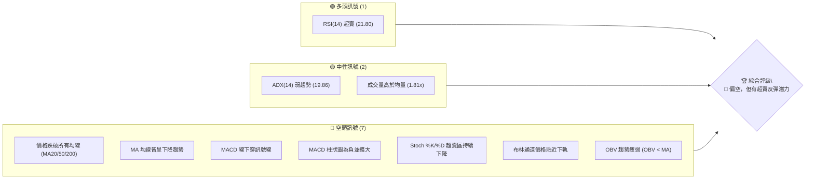
**解讀**：目前空頭訊號佔據主導地位，顯示股價處於明顯的下降趨勢中，賣壓沉重。唯一的明確多頭訊號是RSI進入超賣區，這可能預示著短期內有技術性反彈的需求。中性訊號則表明市場缺乏強勁的單邊趨勢，但高成交量伴隨下跌則強化了空頭力量。

### 📊 核心指標速覽表

| 指標類別 | 指標名稱 | 當前數值 | 訊號 | 解讀 |
|----------|----------|----------|------|------|
| **價格** | 當前價格 | $7.83 | 🔴 | 位於近期高點大幅回落 |
| **均線** | MA20 | $10.02 | 🔴 | 價格遠低於短期均線 |
| **均線** | MA50 | $10.03 | 🔴 | 價格遠低於中期均線 |
| **均線** | MA200 | $9.38 | 🔴 | 價格遠低於長期均線 |
| **動能** | RSI(14) | 21.80 | 🟢 | 嚴重超賣，可能反彈 |
| **動能** | MACD | -0.668 | 🔴 | 空頭排列，動能向下 |
| **波動** | ATR(14) | $0.66 | 🟡 | 相對較高，日內波動劇烈 |

### 🏆 技術評分卡

該評分卡綜合了各項技術指標的表現，提供 ONDS 當前技術健康度的量化評估。

```
╔══════════════════════════════════════════════════════════════╗
║             ONDS 技術評分卡 (2026-06-29)                     ║
╠══════════════════════════════════════════════════════════════╣
║ 趨勢強度      ████░░░░░░░░░░░░░░░░  20/100  🔴 (弱勢下跌趨勢) ║
║ 動能指標      ██████░░░░░░░░░░░░░░  30/100  🔴 (空頭主導，超賣)║
║ 支撐穩定度    ████████░░░░░░░░░░░░  40/100  🟡 (接近關鍵支撐) ║
║ 成交量配合    ████░░░░░░░░░░░░░░░░  25/100  🔴 (放量下跌，疲弱)║
║ 形態完整度    ████░░░░░░░░░░░░░░░░  20/100  🔴 (無明確底部形態)║
║ 均線排列      ████░░░░░░░░░░░░░░░░  20/100  🔴 (空頭排列，價格下方)║
╠══════════════════════════════════════════════════════════════╣
║ 綜合評分      ████░░░░░░░░░░░░░░░░  28/100  🔴 弱勢賣出/觀望  ║
╚══════════════════════════════════════════════════════════════╝
```
**評級解讀**：ONDS 的綜合技術評分極低，主要反映出其強烈的下跌趨勢、疲弱的動能和不利的均線排列。儘管 RSI 顯示超賣，為潛在反彈提供了一線希望，但整體而言，該股目前處於明顯的弱勢。投資者應極度謹慎，避免盲目抄底。

---

## 2. 趨勢分析

### 🌐 多時框趨勢分析

多時框分析對於理解 ONDS 的整體市場定位至關重要。我們將從月線、週線、日線三個維度進行深入剖析。

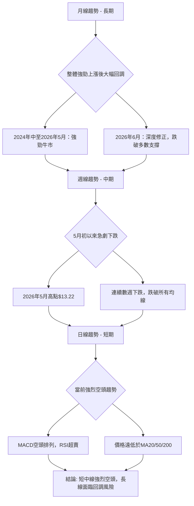
**解讀**：
- **長期 (月線)**：ONDS 在過去兩年經歷了從低點 $0.58 飆升至 $13.22 的強勁牛市。然而，2026年6月的回調幅度巨大，一個月的跌幅就抹去了此前數月的漲幅。長期趨勢的樂觀情緒已被近期的大幅修正所衝擊，未來走勢充滿不確定性。
- **中期 (週線)**：從2026年5月初創下 $13.22 高點後，ONDS 進入了急劇的下跌通道，連續數週的陰線顯示出強大的賣壓。股價已跌破所有重要的中期移動平均線，確立了中期的空頭趨勢。
- **短期 (日線)**：目前股價在 $7.83，短期內呈現出強烈的空頭趨勢。RSI 和 Stochastics 均處於超賣區，MACD 柱狀圖為負且擴大，表明下跌動能依然強勁，儘管超賣可能引發短線反彈。

### 📈 長期趨勢 — 12個月走勢圖（Unicode）

以下 ASCII 圖表展示了 ONDS 過去 12 個月的月線收盤價走勢，標注了關鍵高點和低點。

```
ONDS 月線走勢圖（過去12個月）
價格軸 ($)
$14 ┤                                      
$13 ┤                              ●(13.22)
$12 ┤                                      
$11 ┤                      ●(10.36)
$10 ┤            ●(9.76) ●(10.08)  ●(10.04)
 $9 ┤                    ●(9.04)
 $8 ┤        ●(7.72) ●(7.90)              ●(7.83)←現在
 $7 ┤                ●(6.44)
 $6 ┤    ●(5.86)
 $5 ┤
 $4 ┤
 $3 ┤
 $2 ┤●(2.12)
    └─────────────────────────────────────────────────────
      Jul Aug Sep Oct Nov Dec Jan Feb Mar Apr May Jun
      25  25  25  25  25  25  26  26  26  26  26  26
```
**走勢特徵分析表格**：
| 期間 (起始月份) | 起始價 | 結束價 | 漲跌幅 | 趨勢特徵 | 備註 |
|-----------------|--------|--------|--------|----------|------|
| 225年7月 - 226年5月 | $2.12  | $13.22 | +523.58% | 強勁上漲趨勢 | 多頭動能強勁，創下歷史高點 |
| 226年5月 - 226年6月 | $13.22 | $7.83  | -40.77% | 急劇回調 | 一個月內跌幅巨大，抹去部分漲幅 |

**分析**：過去12個月，ONDS 在2025年7月至2026年5月期間展現了令人印象深刻的牛市行情，股價從 $2.12 大幅上漲至 $13.22，漲幅超過五倍。然而，隨後的2026年6月，股價遭遇了嚴重的調整，單月下跌超過40%，從 $13.22 跌至 $7.83。這表明儘管長期趨勢曾非常強勁，但目前正經歷深度修正，市場情緒已由極度樂觀轉為高度謹慎。當前價格 $7.83 已經跌破了2025年12月至2026年4月期間的多數收盤價，顯示出強烈的賣壓。

### 📊 中期趨勢（週線分析）

中期趨勢主要由近期週線走勢決定。ONDS 在2026年5月31日當週達到 $13.22 的高點後，隨即展開了連續三週的下跌，目前已跌至 $7.83。

```
ONDS 近期壓力與支撐示意圖 (週線)
$13.22 ─────────┐ (近期高點/強阻力)
                │
                │
      $10.02 ───┼─── (MA20/MA50 阻力)
                │
                │
                ● $7.83 (當前價格)
                │
      $6.35 ────┼──── (布林下軌/潛在支撐)
                │
$5.86 ──────────┘ (重要歷史支撐)
```
**分析**：從週線圖來看，ONDS 在 $13.22 形成了一個明顯的頂部，隨後快速下行。目前股價 $7.83 遠低於所有短期和中期移動平均線，且這些均線均呈現向下拐頭的趨勢，確認了中期趨勢的空頭格局。最近幾週的下跌伴隨著相對較大的成交量，尤其是在2026年5月31日當週上漲至 $13.22 時伴隨巨大成交量 (566,998,300)，隨後下跌的幾週成交量有所縮減，但仍高於歷史平均水平，顯示出市場在下跌過程中仍有資金參與。

### ⚡ 趨勢強度評估（ADX 解讀）

ADX 指標用於衡量趨勢的強度，而非方向。

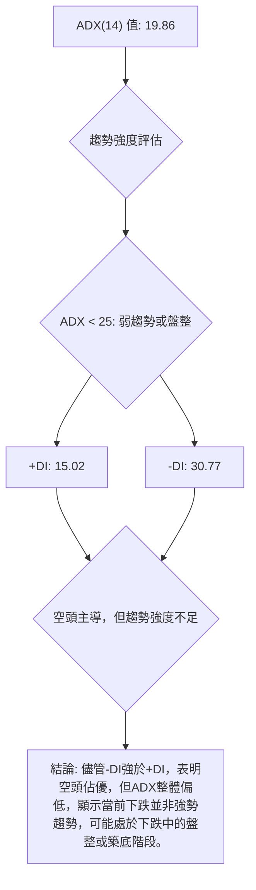
**ADX 強度對照表**：
| ADX 數值範圍 | 趨勢強度 | 市場解讀 |
|--------------|----------|----------|
| 0-25         | 弱趨勢/盤整 | 市場缺乏明確方向，或處於趨勢末期/初期 |
| 25-50        | 中度趨勢 | 趨勢明顯且持續 |
| 50-75        | 強趨勢 | 趨勢非常強勁 |
| 75-100       | 極強趨勢 | 趨勢極端強勁，可能面臨超買/超賣修正 |

**分析**：ONDS 的 ADX(14) 數值為 19.86，遠低於25，這通常表示市場處於弱趨勢或盤整狀態。然而，我們必須結合 +DI 和 -DI 進行判斷。當前 -DI 為 30.77，遠高於 +DI 的 15.02，這明確指出空頭力量在市場中佔據主導地位。因此，儘管 ADX 總體數值顯示趨勢不夠強勁，但 -DI 的高位表明當前市場由空頭控制，股價正處於一個下行通道。這種情況下，股價可能會在下跌過程中伴隨較大的波動，而非單邊急跌，或者說，下跌趨勢可能還未達到極致的強勢階段。

---

## 3. 圖表形態分析

圖表形態分析旨在識別價格走勢中可能預示未來方向的結構性模式。ONDS 近期的走勢呈現出急劇下跌，但缺乏典型的反轉或持續形態。

### 🔍 形態識別系統

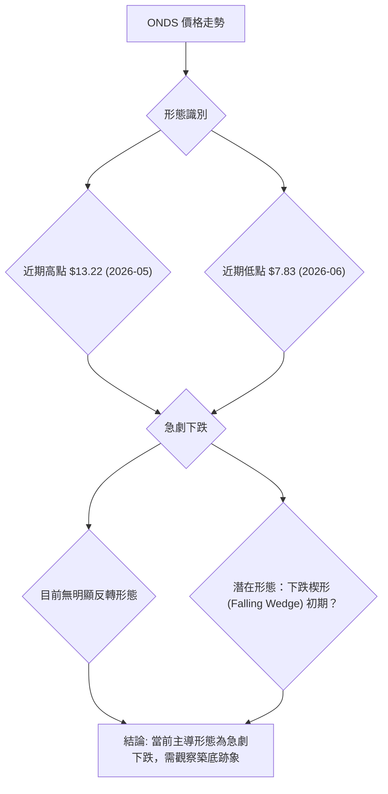
**分析**：
ONDS 自2026年5月 $13.22 的高點以來，股價呈現出快速且連續的下跌。這種走勢本身並未形成典型的反轉或持續形態，例如頭肩頂、雙頂或三角形等。當前更像是一個「V型頂」後的快速回落，或者說是一個「下降通道」的初期。
- **V型頂 (V-Top)**：在 $13.22 附近，股價迅速見頂回落，沒有經過明顯的盤整或多次測試阻力，這表明市場情緒快速逆轉，賣壓強勁。
- **潛在下跌楔形 (Falling Wedge)**：如果股價能在當前位置或略低位置找到支撐，並開始在收斂的兩條下降趨勢線之間波動，則可能形成下跌楔形。下跌楔形通常被視為看漲反轉形態，但目前尚處於早期階段，需要更多K線確認。

### 🕯️ 重要K線形態分析

根據提供的近20週收盤走勢數據，我們分析關鍵K線形態。由於數據僅提供收盤價，無法繪製完整的K線，但可根據價格變化判斷趨勢和潛在形態。

| 月份 | 收盤價 | K線形態 (推斷) | 解讀 | 訊號 |
|------|--------|-----------------|------|------|
| 2026-05-31 | $13.22 | 長陽線/吞噬形態頂部 | 價格突破前期，但伴隨巨大成交量，可能是誘多或多頭力竭 | 🔴 |
| 2026-06-07 | $10.43 | 長陰線 | 快速下跌，確認賣壓出現 | 🔴 |
| 2026-06-14 | $9.33 | 陰線 | 延續跌勢，動能不足 | 🔴 |
| 2026-06-21 | $9.27 | 小陰線/十字星 (推斷) | 跌速減緩，可能在測試支撐，但RSI超賣 | 🟡 |
| 2026-06-28 | $7.83 | 長陰線 | 跌破前低，空頭力量再次加強，創下近期新低 | 🔴 |

**分析**：
- **2026年5月31日當週**：收盤價 $13.22，創下近期新高，RSI高達70.6，進入超買區。儘管當週成交量巨大，顯示市場活躍，但極端超買往往伴隨著回調風險。
- **2026年6月前兩週**：股價從 $13.22 迅速下跌至 $10.43 再到 $9.33，形成連續的下跌K線（推斷為陰線），顯示賣壓迅速增加，多頭失去控制。
- **2026年6月21日當週**：收盤價 $9.27，RSI降至22.1，嚴重超賣。MACD柱狀圖為負且擴大，但價格跌幅相對前幾週有所收斂，可能形成小陰線或帶下影線的K線，暗示短期有止跌或反彈的嘗試。
- **2026年6月28日當週**：收盤價 $7.83，RSI進一步降至21.8，仍然嚴重超賣。然而，價格再次大幅下跌，形成強烈的長陰線（推斷），並跌破了前一週的低點，這表明空頭力量再次加強，超賣狀況並未阻止價格進一步下跌。

### 📉 ASCII 走勢形態示意圖

以下圖表示意了 ONDS 近期從高點急劇下跌的走勢，並標注了潛在的形態。

```
ONDS 近期走勢形態示意圖
$14 ┤             ● (2026年5月高點 $13.22)
    │           /
$12 ┤         /
    │       /
$10 ┤     /
    │   /
 $8 ┤ ●───────● (當前價格 $7.83)
    │   \     \
 $6 ┤     \     \
    │       \     \
 $4 ┤         \     \
    └─────────────────────
      時間軸
      (V型頂後急劇下跌，形成下降通道)
```
**分析**：ONDS 的走勢在 $13.22 形成一個尖銳的頂部，隨後迅速下行，這種形態在技術分析中常被稱為「V型頂」反轉，預示著趨勢的快速逆轉。目前價格正沿著一個陡峭的下降趨勢線運行，形成一個「下降通道」。在這種通道中，股價通常會在通道的上下軌之間波動，直到有足夠的力量突破。當前價格 $7.83 處於下降通道的下半部分，並可能繼續測試通道下軌或更低的支撐。

### 🎯 形態目標價計算

由於當前缺乏明確的傳統反轉或持續形態來計算目標價，我們將主要基於近期急劇下跌的幅度來推斷潛在的下跌目標。
如果將 $13.22 視為一個短期頂部，並且下跌趨勢持續，則可以考慮以下幾種方式：

1.  **V型頂下跌目標 (基於對稱性)**：
    *   假設 $13.22 是頂部，而前一個重要的支撐位在 $9.04 (2026年3月低點) 或 $9.06 (2026年5月10日低點)。
    *   下跌幅度 = $13.22 - $9.04 = $4.18
    *   目標價 = $9.04 - $4.18 = $4.86
    *   **這個計算方式目前看來過於悲觀，因為它假設了對稱的快速下跌。**

2.  **下降通道目標**：
    *   目前價格在 $7.83，如果下降通道延續，股價將繼續向通道下軌運行。通道下軌的斜率和位置會隨時間變化。
    *   基於斐波那契回調的分析（詳見下一節）， $6.00 (61.8% 回調位) 和 $7.37 (50% 回調位) 將是重要的潛在支撐。如果跌破 $7.37，則 $6.00 是下一目標。

3.  **基於歷史支撐的目標**：
    *   回顧2025年8月的低點 $5.86，這是一個重要的歷史支撐位。
    *   如果當前跌勢未能守住 $6.00-$6.35 區間，則 $5.86 將是下一個重要的心理和技術目標。

**結論**：
由於當前走勢為急劇下跌，缺乏明確的形態目標。但若下跌趨勢持續，則短期目標將是斐波那契50%回調位 $7.37，中期目標則是斐波那契61.8%回調位 $6.00 以及2025年8月低點 $5.86。
**形態目標價 (下跌趨勢)**：
- **短期目標**：$7.37 (斐波那契50%回調位)
- **中期目標**：$6.00 (斐波那契61.8%回調位)
- **長期目標**：$5.86 (2025年8月低點)

---

## 4. 支撐與阻力

支撐和阻力位是技術分析的核心，它們標示了價格可能反轉或加速的關鍵區域。

### 🗺️ 關鍵價位分布圖（Unicode）

以下 ASCII 圖表展示了 ONDS 重要的支撐和阻力價位。

```
ONDS 價位結構分布圖
═══════════════════════════════════════════════════════════════
$15.28 ║██████████████████████████████████████████║ 52週高點 / 強阻力 R4
$13.22 ║██████████████████████████████████████████║ 近期高點 / 強阻力 R3
$10.36 ║██████████████████████████████████████████║ 2026年1月高點 / 阻力 R2
$10.03 ║██████████████████████████████████████████║ MA50 / MA20 / 關鍵阻力 R1
$9.38  ║██████████████████████████████████████████║ MA200 / 阻力 R0
$7.83  ╠══════════════════════════════════════════╣ ◄ 現價
$7.37  ║▓▓▓▓▓▓▓▓▓▓▓▓▓▓▓▓▓▓▓▓▓▓▓▓▓▓▓▓▓▓▓▓▓▓▓▓▓▓▓▓▓▓║ 斐波那契50%回調 / 近期支撐 S1
$6.44  ║▓▓▓▓▓▓▓▓▓▓▓▓▓▓▓▓▓▓▓▓▓▓▓▓▓▓▓▓▓▓▓▓▓▓▓▓▓▓▓▓▓▓║ 2025年10月低點 / 強支撐 S2
$6.35  ║▓▓▓▓▓▓▓▓▓▓▓▓▓▓▓▓▓▓▓▓▓▓▓▓▓▓▓▓▓▓▓▓▓▓▓▓▓▓▓▓▓▓║ 布林通道下軌 / 強支撐 S2
$6.00  ║▓▓▓▓▓▓▓▓▓▓▓▓▓▓▓▓▓▓▓▓▓▓▓▓▓▓▓▓▓▓▓▓▓▓▓▓▓▓▓▓▓▓║ 斐波那契61.8%回調 / 強支撐 S3
$5.86  ║▓▓▓▓▓▓▓▓▓▓▓▓▓▓▓▓▓▓▓▓▓▓▓▓▓▓▓▓▓▓▓▓▓▓▓▓▓▓▓▓▓▓║ 2025年8月低點 / 強支撐 S4
$1.53  ║▓▓▓▓▓▓▓▓▓▓▓▓▓▓▓▓▓▓▓▓▓▓▓▓▓▓▓▓▓▓▓▓▓▓▓▓▓▓▓▓▓▓║ 52週低點 / 極強支撐 S5
═══════════════════════════════════════════════════════════════
```

### 🚧 阻力位分析表

| 阻力級別 | 價位 | 形成原因 | 突破難度 | 重要性 |
|----------|------|----------|----------|--------|
| **R0**   | $9.38  | MA200 | 中等 | 若能突破，可能企穩 |
| **R1**   | $10.02-$10.03 | MA20 / MA50 | 較高 | 價格需站穩此區間才能扭轉短期跌勢 |
| **R2**   | $10.36 | 2026年1月高點 | 較高 | 前期反彈高點，心理阻力 |
| **R3**   | $13.22 | 2026年5月高點 | 極高 | 近期歷史高點，強大賣壓區 |
| **R4**   | $15.28 | 52週高點 | 極高 | 年度高點，具長期阻力意義 |

**分析**：ONDS 目前面臨多重阻力，尤其是在 $9.38 (MA200) 和 $10.02-$10.03 (MA20/MA50) 區間，這些移動平均線在當前價格上方形成強大的動態阻力。股價需要連續突破這些阻力才能宣告短期趨勢反轉。近期高點 $13.22 更是一個強大的心理和技術阻力位，代表了大量的套牢盤。

### 🛡️ 支撐位分析表

| 支撐級別 | 價位 | 形成原因 | 守住機率 | 重要性 |
|----------|------|----------|----------|--------|
| **S1**   | $7.37  | 斐波那契50%回調 | 中等 | 若跌破，將加速下跌 |
| **S2**   | $6.35-$6.44 | 布林通道下軌 / 2025年10月低點 | 較高 | 短期重要支撐，可能觸發反彈 |
| **S3**   | $6.00  | 斐波那契61.8%回調 | 較高 | 關鍵回調位，具重要心理意義 |
| **S4**   | $5.86  | 2025年8月低點 | 較高 | 歷史低點，具較強支撐作用 |
| **S5**   | $1.53  | 52週低點 | 極高 | 年度最低點，極端情況下的最後防線 |

**分析**：ONDS 目前正快速接近其關鍵支撐區域。斐波那契50%回調位 $7.37 是第一個需要關注的支撐。隨後，布林通道下軌 $6.35 與2025年10月低點 $6.44 形成一個非常強勁的支撐區間。若此區間失守，斐波那契61.8%回調位 $6.00 和2025年8月低點 $5.86 將是下一個重要的考驗。這些支撐位若能守住，可能為股價提供止跌反彈的機會。

### 📐 斐波那契回調位分析

我們以 ONDS 過去52週的漲幅作為基礎，從52週低點 $1.53 到近期高點 $13.22 進行斐波那契回調分析。

- **52週低點 (Swing Low)**: $1.53
- **近期高點 (Swing High)**: $13.22
- **總漲幅**: $13.22 - $1.53 = $11.69

**斐波那契回調位計算**：
- **38.2% 回調**: $13.22 - ($11.69 * 0.382) = $13.22 - $4.46 = **$8.76**
- **50.0% 回調**: $13.22 - ($11.69 * 0.500) = $13.22 - $5.85 = **$7.37**
- **61.8% 回調**: $13.22 - ($11.69 * 0.618) = $13.22 - $7.22 = **$6.00**
- **76.4% 回調**: $13.22 - ($11.69 * 0.764) = $13.22 - $8.93 = **$4.29**

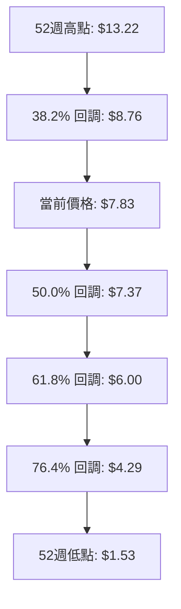
**分析**：
當前價格 $7.83 位於斐波那契 38.2% 回調位 $8.76 和 50.0% 回調位 $7.37 之間。這表明股價已經回吐了其過去一年漲幅的一半以上。
- **$8.76 (38.2% 回調)**：作為第一個重要支撐，股價未能在此企穩，現已跌破。現在成為短期阻力。
- **$7.37 (50.0% 回調)**：這是一個重要的心理和技術支撐位，通常被認為是趨勢反轉或深度回調的關鍵點。如果此處能獲得支撐，則可能止跌。
- **$6.00 (61.8% 回調)**：這是黃金分割位，若股價跌至此處並獲得支撐，則表明整體牛市結構可能仍未被破壞，仍有機會反彈。但若此處失守，則長期趨勢可能轉為悲觀。

ONDS 目前正快速逼近 50% 回調位 $7.37，此處將是判斷其近期走勢是否能止跌反彈的關鍵。

---

## 5. 技術指標深度解讀

### 🎛️ 指標訊號總覽

以下 Mermaid 圖表展示了 ONDS 各項技術指標的當前訊號及其相互關係，幫助我們形成綜合判斷。

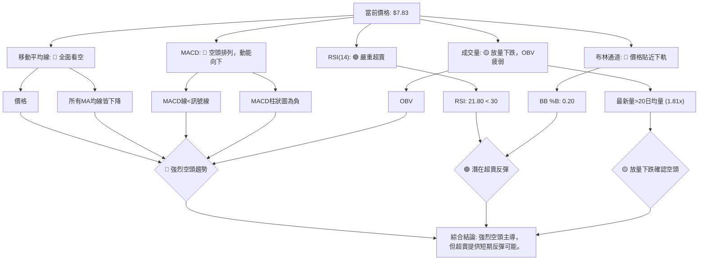
**分析**：從指標總覽來看，ONDS 的絕大多數技術指標都發出了強烈的空頭訊號。價格位於所有主要移動平均線下方，且均線呈現空頭排列並持續下降。MACD 的空頭交叉和擴大的負值柱狀圖進一步確認了下跌動能。布林通道顯示價格已觸及下軌，表明短期跌幅可能過大。唯一的亮點是 RSI 和 Stochastics 均處於嚴重超賣區，這為短期技術性反彈提供了可能性，但這種反彈能否持續並扭轉趨勢，仍需觀察。

### 📈 移動平均線排列分析

移動平均線 (MA) 是判斷趨勢方向和強度最直觀的指標之一。

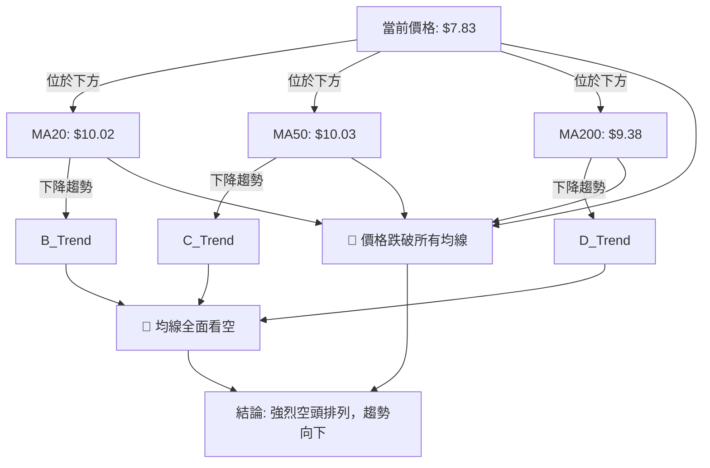
**分析**：
- **價格與均線關係**：ONDS 的當前價格 $7.83 已經顯著跌破了所有重要的移動平均線：MA20 ($10.02)、MA50 ($10.03) 和 MA200 ($9.38)。這是一個極其負面的訊號，表明多頭力量已完全失守，空頭完全控制了市場。
- **均線排列**：當前均線排列呈現出 MA200 ($9.38) 位於 MA20 ($10.02) 和 MA50 ($10.03) 之下，而 MA20 和 MA50 則非常接近。雖然不是典型的「死亡交叉」排列（通常是短期MA下穿長期MA），但所有均線都位於現價上方，並且均線本身都呈現出下降趨勢，這是一個明確的空頭排列。
- **均線走勢**：MA5 ($8.12)、MA10 ($8.70)、MA20 ($10.02)、MA60 ($9.92)、MA120 ($10.40)、MA240 ($8.42) 全都呈現下降趨勢。這表明無論短期、中期還是長期，股價的趨勢都正在向下加速。
**結論**：均線系統發出強烈賣出訊號，股價在短期內要扭轉跌勢，必須首先收復 MA20 和 MA50。

### 📉 RSI(14) 分析

相對強弱指數 (RSI) 用於衡量價格變動的速度和幅度，判斷股票是超買還是超賣。

```
RSI(14) 強度：▓▓▓▓▓░░░░░░░░░░░░░░░░░░░░░░░░  21.80 (超賣區) 🟢
```
**分析**：
- **RSI 數值**：ONDS 的 RSI(14) 當前值為 21.80。根據傳統解讀，RSI 低於 30 進入超賣區，而 21.80 是一個非常低的數值，表明股票已經被過度拋售，市場情緒極度悲觀。
- **超買超賣區間分析**：
    - **超買區 (>70)**：在2026年5月31日當週，RSI 曾高達 70.6，處於超買區，隨後就發生了急劇下跌。
    - **超賣區 (<30)**：當前 RSI 21.80 處於嚴重超賣區。理論上，超賣狀況可能預示著股價有技術性反彈的需求。然而，在強烈的下降趨勢中，RSI 可能會長時間停留在超賣區，直到真正底部形成。
- **背離判斷**：
    - **無明顯背離**：根據提供的數據，價格從 $9.27 跌至 $7.83，RSI 從 22.1 跌至 21.8。價格下跌，RSI 也同步下跌，並未出現「底背離」的訊號（即價格創新低而 RSI 未創新低）。這表明下跌趨勢仍在持續，缺乏短期反轉的動能。

**結論**：RSI 嚴重超賣，為短期反彈提供了技術依據，但缺乏底背離訊號，使得反彈的持續性和強度存疑。在強勢下跌中，超賣區往往僅提供短暫喘息，而非趨勢反轉的保證。

### 📊 MACD(12/26/9) 訊號解讀

平滑異同移動平均線 (MACD) 是趨勢跟蹤動量指標，用於識別趨勢方向、動量和潛在的買賣點。

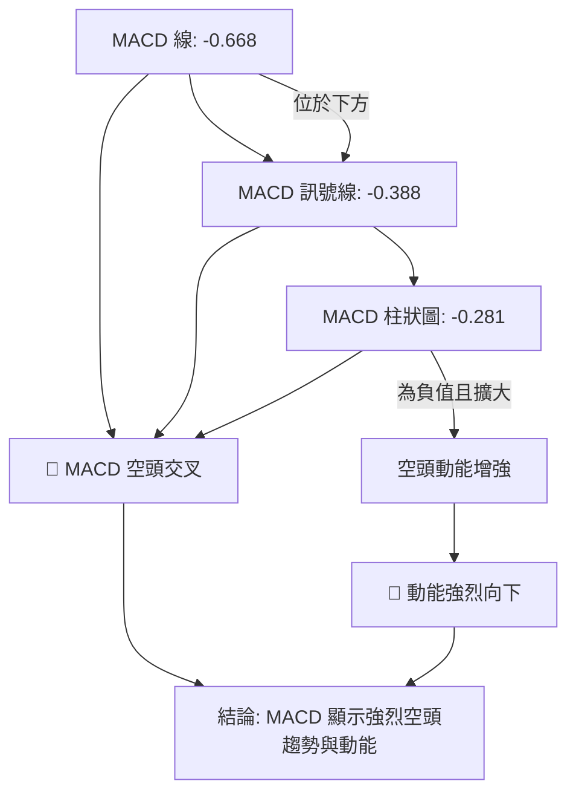
**分析**：
- **MACD 線與訊號線**：MACD 線 (-0.668) 位於其訊號線 (-0.388) 下方，這是一個明確的「空頭交叉」訊號。自2026年5月31日當週 MACD 柱狀圖從正值轉負 ($+0.400 -> $+0.092 -> $-0.296 -> $-0.256 -> $-0.281)，表明空頭力量已完全佔據主導。
- **MACD 柱狀圖**：MACD 柱狀圖為 -0.281，且其絕對值在最近幾週持續擴大 (從 $-0.159 -> $-0.055 -> $+0.400 -> $+0.092 -> $-0.296 -> $-0.256 -> $-0.281)。雖然中間有反彈，但最新數據顯示柱狀圖為負值，且相對於前一週的 $-0.256 再次擴大，這表明下跌動能正在加強，賣壓持續。
- **背離判斷**：
    - **無明顯背離**：價格從 $9.27 跌至 $7.83，MACD 柱狀圖從 $-0.256 擴大至 $-0.281。價格和 MACD 動能都同步下跌，沒有出現「底背離」訊號（即價格創新低但 MACD 柱狀圖收斂或上升）。這進一步確認了當前的下跌趨勢，缺乏短期反轉的跡象。

**結論**：MACD 指標明確發出強烈的賣出訊號，空頭趨勢和動能都非常強勁，沒有任何趨勢反轉的早期訊號。

### 📦 布林通道分析

布林通道 (Bollinger Bands) 用於衡量價格的波動區間，判斷股價是否處於相對高位或低位。

```
ONDS 布林通道示意圖
╔══════════════════════════════════════════════════════════════╗
║                                                              ║
║ $13.69 ─────────────────────────────────────────────── 上軌 ║
║        ║                                                   ║
║        ║                                                   ║
║        ║                                                   ║
║ $10.02 ║─────────────────────────────────────────────── 中軌 ║
║        ║                                                   ║
║        ║                                                   ║
║        ║                                                   ║
║  $7.83 ║                 ● 現價                            ║
║        ║                                                   ║
║  $6.35 ║─────────────────────────────────────────────── 下軌 ║
║                                                              ║
╚══════════════════════════════════════════════════════════════╝
```
**分析**：
- **布林通道位置**：ONDS 的當前價格 $7.83 已經非常接近布林通道的下軌 $6.35。布林通道的 %B 值為 0.20，表示價格處於通道的底部 20% 區間，這通常被認為是超賣的跡象。
- **通道收斂/擴張**：數據未直接提供布林通道的寬度變化，但從價格急劇下跌的情況來看，通道可能正在擴張，表明波動性增加。如果通道正在擴張而價格持續貼近下軌，則可能預示著下跌趨勢的延續。
- **潛在反彈**：價格觸及或跌破布林通道下軌，通常會引發技術性反彈，向中軌（MA20）回歸。然而，在強勢下跌趨勢中，價格可能會沿著下軌運行，甚至在下軌之外運行一段時間。
**結論**：股價已觸及布林通道下軌，顯示短期超賣，有反彈需求。但中軌 $10.02 將構成強大阻力。若無法反彈並站穩中軌上方，則下跌趨勢將持續。

### 💹 成交量分析（量價配合度）

成交量是價格走勢的燃料，量價配合是判斷趨勢可信度的關鍵。

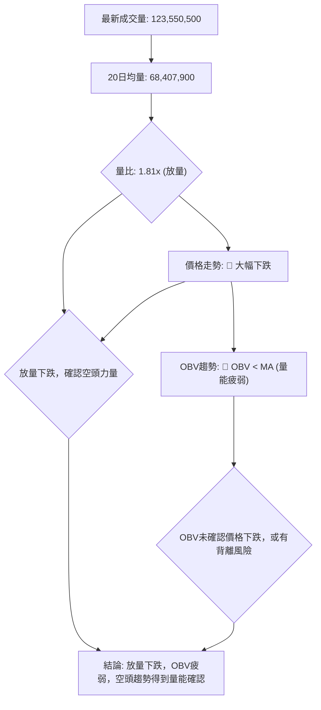
**分析**：
- **最新成交量與均量**：ONDS 的最新成交量為 123,550,500 股，是其20日均量 68,407,900 股的 1.81 倍。這是一個顯著的「放量」情況。
- **量價配合**：在股價大幅下跌 $13.22 -> $7.83 的過程中，伴隨高於平均水平的成交量 (尤其在 $13.22 高點和 $7.83 低點附近)。「放量下跌」通常被視為空頭力量強勁的訊號，表明大量賣單湧出，投資者積極拋售，進一步確認了下跌趨勢的有效性。
- **OBV 趨勢**：OBV (On-Balance Volume) 趨勢顯示「OBV < MA → 量能疲弱」。這表明在價格下跌的過程中，買盤的累積量不足，或者說，下跌是伴隨著淨賣盤的。OBV 疲弱進一步確認了當前下跌趨勢的健康性（對空頭而言），即下跌是真實的，而非無量的假跌。
**結論**：成交量分析顯示，ONDS 的下跌趨勢得到了量能的確認。放量下跌和疲弱的 OBV 均強化了當前空頭趨勢的可信度。

---

## 6. 動能與波動率

動能和波動率指標幫助我們理解價格變動的速度和潛在的風險。

### ⚡ 動能評估四象限

動能評估四象限將股票分為四類，基於其動能強度和波動率。

| 象限 | 動能 (RSI, MACD) | 波動 (ATR) | 當前狀態 | 評估 |
|------|------------------|------------|----------|------|
| Q1   | 強               | 低         | -        | 最佳機會 (趨勢強勁，風險低) |
| Q2   | 弱               | 低         | -        | 謹慎觀望 (趨勢不明，風險低) |
| Q3   | 強               | 高         | -        | 高風險高收益 (趨勢強勁，風險高) |
| Q4   | 弱               | 高         | ✓        | 避免進場 (趨勢不明，風險高) |

**分析**：
- **動能**：ONDS 的 RSI(14) 為 21.80 (超賣)，MACD 柱狀圖為 -0.281 (負值且擴大)。這些指標都指向「弱動能」或「下跌動能強勁」的狀態。雖然超賣可能暗示反彈，但目前仍是下跌趨勢中的弱勢。
- **波動率**：ATR(14) 為 $0.66，佔當前價格 $7.83 的 8.46%。這是一個相對較高的百分比，表明 ONDS 的日內價格波動非常劇烈，屬於「高波動」股票。
- **當前狀態**：綜合來看，ONDS 目前位於「**弱動能，高波動**」的 Q4 象限。
**結論**：ONDS 位於 Q4 象限，這是一個高風險的交易環境。儘管超賣可能引發反彈，但其高波動性會放大交易風險。對於大多數投資者而言，在這種市場條件下應避免進場，或只進行極短線且嚴格止損的交易。

### 📊 ATR 波動率分析

平均真實波幅 (ATR) 衡量資產價格的波動性。

```
ATR(14) 波動率：▓▓▓▓▓▓▓▓▓▓▓▓▓▓▓▓▓░░░░  8.46% (高波動) 🟡
```
**分析**：
- **ATR 數值**：ONDS 的 ATR(14) 為 $0.66。這意味著在過去14天中，ONDS 的平均每日價格波動範圍約為 $0.66。
- **相對波動率**：ATR 佔當前價格 $7.83 的 8.46% ($0.66 / $7.83)。對於大多數股票而言，超過 5% 的 ATR 佔比就被認為是高波動性股票。ONDS 的 8.46% 顯示其波動性非常高。
- **止損距離建議**：由於波動性高，傳統的固定止損點可能過於緊密，容易被日內波動觸發。建議止損距離應至少為 1.5 倍至 2 倍的 ATR。
    - 若以 1.5 倍 ATR 為止損距離：1.5 * $0.66 = $0.99
    - 若以 2 倍 ATR 為止損距離：2 * $0.66 = $1.32
    - 這意味著在制定交易策略時，止損點應距離進場價至少 $0.99 到 $1.32。例如，如果進場價為 $7.00，則止損點可能設定在 $7.00 - $0.99 = $6.01 或 $7.00 - $1.32 = $5.68。

**結論**：ONDS 具有顯著的高波動性，這增加了交易風險但也可能提供短線機會。交易者必須將其高波動性納入風險管理考量，設定較寬鬆的止損點以避免被“洗出”。

### 📐 Beta 與市場相關性

Beta 值衡量股票相對於大盤的波動性。由於提供的數據中未包含 ONDS 的 Beta 值，我們無法直接進行量化分析。

**分析**：
- **數據缺失**：提供的技術數據中未包含 ONDS 的 Beta 值。因此，無法直接評估其與大盤（如 SPY、QQQ）的相關性及波動程度。
- **推斷**：Ondas Inc. 屬於科技產業的通訊設備領域，通常這類股票在成長期可能具有較高的 Beta 值，即其波動性可能大於大盤。在牛市中，高 Beta 股可能表現優於大盤；在熊市中，則可能跌幅大於大盤。從其近期股價從 $13.22 急劇下跌至 $7.83 的表現來看，其波動性確實較大，可能暗示著一個較高的 Beta 值。
**結論**：由於缺乏具體數據，無法量化 ONDS 的 Beta 值。然而，從其行業屬性和歷史價格波動來看，ONDS 可能是一個高 Beta 股票，這意味著它對市場情緒的反應可能較為劇烈。投資者在考慮其市場相關性時應保持謹慎。

---

## 7. 多時框架總結

多時框架分析的目的是確保交易決策與不同時間尺度的趨勢保持一致，避免在短期反彈中逆大勢而行。

### 📋 時框架評分表

| 時框架 | 趨勢方向 | 動能 | 均線排列 | 形態 | 綜合評分 | 建議 |
|--------|----------|------|----------|------|----------|------|
| **長期** | 🟡 震盪下行 | 🔴 疲弱 | 🔴 空頭初期 | 🟡 修正中 | 3/10 | 觀望 |
| **中期** | 🔴 強烈下行 | 🔴 強烈向下 | 🔴 空頭排列 | 🔴 急劇下跌 | 2/10 | 賣出/觀望 |
| **短期** | 🔴 強烈下行 | 🟢 超賣，但仍向下 | 🔴 空頭排列 | 🔴 急劇下跌 | 2/10 | 賣出/觀望 |

**評分說明**：
- **長期** (月線，過去12-24個月)：雖然2024年中至2026年5月是強勁牛市，但2026年6月的深度修正改變了長期趨勢的樂觀性，目前處於長期趨勢的關鍵修正期，故評為震盪下行。
- **中期** (週線，過去幾個月)：從5月高點 $13.22 以來，股價連續下跌，所有中期均線均被跌破並呈現下降趨勢，中期趨勢顯著空頭。
- **短期** (日線，過去幾週)：價格急劇下跌，所有短期均線被跌破，動能指標如 MACD 顯示強烈空頭，RSI 雖然超賣但並未出現底背離，短期仍處於強烈空頭趨勢。

### 🔲 綜合訊號矩陣

以下矩陣展示了 ONDS 在不同時框架下各維度訊號的一致性，以判斷整體市場情緒。

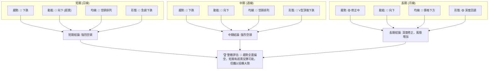
**分析**：ONDS 在短期和中期框架下都呈現出強烈的空頭趨勢，各項指標均指向下跌。長期框架雖然整體背景是過去的牛市，但近期一個月的急劇下跌已使其進入深度修正階段，風險顯著增加。儘管 RSI 嚴重超賣，為短期反彈提供了技術空間，但這種反彈很可能只是熊市中的一次技術性調整，而非趨勢反轉的開始。投資者應當高度警惕，避免在缺乏明確底部訊號的情況下盲目進場。

---

## 8. 交易策略建議

基於上述詳盡的技術分析，ONDS 目前處於強烈的下跌趨勢中，但同時也面臨嚴重的超賣狀況。因此，交易策略應以謹慎為主，並考慮兩種情境：趨勢延續的空頭策略，以及超賣反彈的多頭策略。

### 🗺️ 策略決策流程圖

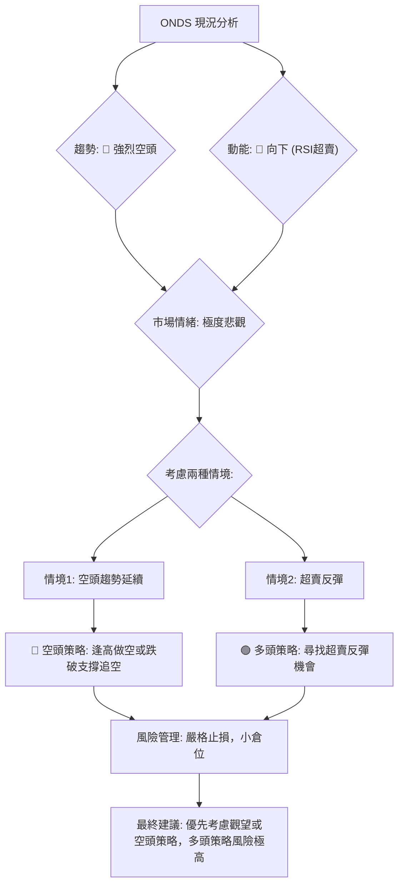

### 🟢 多頭策略詳情

此策略基於 ONDS 目前嚴重超賣的狀況，預期可能出現技術性反彈。此為逆勢操作，風險極高，建議小倉位且嚴格止損。

| 策略要素 | 策略 A (超賣反彈) |
|----------|-------------------|
| 進場條件 | 股價在 $6.35-$6.44 區間獲得支撐，出現止跌K線形態 (如長下影線、陽包陰)，且成交量放大。 |
| 進場價格 | $6.50 (略高於布林下軌和2025年10月低點) |
| 目標價 T1 | $7.37 (斐波那契50%回調位) |
| 目標價 T2 | $8.76 (斐波那契38.2%回調位) |
| 止損價格 | $5.80 (低於2025年8月低點 $5.86) |
| 風險報酬比 | (T1: $7.37 - $6.50) : ($6.50 - $5.80) = $0.87 : $0.70 = **1.24 : 1** |
|          | (T2: $8.76 - $6.50) : ($6.50 - $5.80) = $2.26 : $0.70 = **3.23 : 1** |
| 成功機率 | 25% (逆勢操作，風險極高) |
| 建議倉位 | 小於 5% |

**策略分析**：此多頭策略旨在捕捉短期超賣反彈，但由於整體趨勢偏空，反彈的持續性和強度可能有限。進場時機的選擇至關重要，必須等待明確的止跌訊號。若市場情緒未能有效改善，反彈可能無力，甚至直接跌破支撐。

### 🔴 空頭策略詳情

此策略基於 ONDS 當前強烈的下跌趨勢，順勢操作，相對風險較低，但仍需嚴格止損。

| 策略要素 | 策略 A (趨勢延續做空) |
|----------|-----------------------|
| 進場條件 | 股價反彈至 $8.76 (斐波那契38.2%回調位) 附近受阻，或跌破 $7.37 (斐波那契50%回調位) 後確認。 |
| 進場價格 | $8.70 (反彈至斐波那契38.2%回調位附近) 或 $7.30 (跌破斐波那契50%回調位後) |
| 目標價 T1 | $7.37 (斐波那契50%回調位，若從 $8.70 進場) 或 $6.35 (布林通道下軌，若從 $7.30 進場) |
| 目標價 T2 | $6.00 (斐波那契61.8%回調位) 或 $5.86 (2025年8月低點) |
| 止損價格 | $9.00 (略高於斐波那契38.2%回調位和MA200) |
| 風險報酬比 | (若 $8.70 進場，T1: $8.70 - $7.37) : ($9.00 - $8.70) = $1.33 : $0.30 = **4.43 : 1** |
|          | (若 $8.70 進場，T2: $8.70 - $6.00) : ($9.00 - $8.70) = $2.70 : $0.30 = **9.00 : 1** |
| 成功機率 | 60% (順勢操作，但超賣可能引發短暫反彈) |
| 建議倉位 | 5% - 10% |

**策略分析**：此空頭策略與當前市場趨勢保持一致，風險報酬比相對吸引。關鍵在於選擇最佳的進場點：在反彈受阻時做空（逢高做空）或在關鍵支撐被有效跌破時追空（突破做空）。止損點應設定在明顯的阻力位上方。

### ⭐ 整體訊號強度評星

```
做多訊號強度：★★☆☆☆  (2/5星)
做空訊號強度：★★★★☆  (4/5星)
整體可信度：  ★★★☆☆  (3/5星)
```
**評級解讀**：目前 ONDS 的做空訊號強度遠高於做多訊號。儘管超賣可能帶來短線反彈，但其持續性和力度存疑。整體而言，市場仍由空頭主導，順勢做空或觀望是更為穩健的選擇。

---

## 9. 風險提示與監控

ONDS 目前處於高度不確定的下跌趨勢中，高波動性增加了交易風險。嚴格的風險管理和持續監控是保護資本的關鍵。

### ✅ 關鍵監控指標 Checklist

以下是交易者應持續關注的關鍵技術指標清單，以判斷市場情緒和趨勢的潛在變化。

```
╔══════════════════════════════════════════════════════════════╗
║             ONDS 關鍵監控指標清單                            ║
╠══════════════════════════════════════════════════════════════╣
║ ├─ 價格是否能站穩 $7.37 (斐波那契50%回調)？                 ║
║ ├─ 價格是否能有效突破 MA20 ($10.02) 並站穩？                 ║
║ ├─ RSI 是否能從超賣區回升並突破 30/50 關口？                 ║
║ ├─ MACD 是否出現黃金交叉，且柱狀圖轉為正值？                 ║
║ ├─ 成交量是否在股價上漲時顯著放大，下跌時縮小？               ║
║ ├─ 是否出現明確的底部反轉K線形態 (如看漲吞噬、錘子線)？       ║
║ ├─ ADX 的 -DI 是否開始下降，+DI 是否開始上升？               ║
║ ├─ 布林通道是否收窄，且價格在中軌附近盤整或突破？             ║
╚══════════════════════════════════════════════════════════════╝
```
**監控策略**：投資者應每日或每週檢查這些指標。如果多數指標開始發出多頭訊號，則可能預示著趨勢反轉的開始；反之，若空頭訊號持續，則應維持謹慎或空頭立場。

### ⚠️ 風險場景分析

針對 ONDS 當前的技術面，我們分析三種可能的情境：樂觀、基本和悲觀。

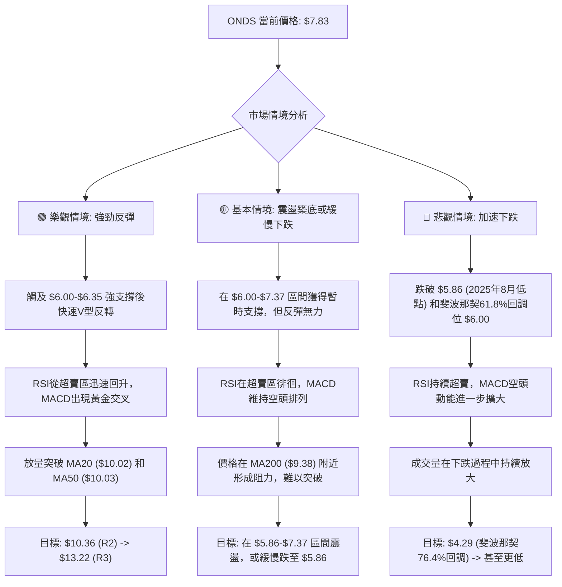
**分析**：
- **樂觀情境**：可能性較低。需要強勁的外部利好消息或市場情緒全面轉暖，配合超賣反彈，才能實現 V 型反轉。
- **基本情境**：可能性中等偏高。在經歷大幅下跌後，股價可能在關鍵支撐位附近嘗試築底，但由於缺乏強勁的多頭訊號，反彈空間有限，更可能在低位震盪或緩慢下跌尋找更堅實的底部。
- **悲觀情境**：可能性中等。如果關鍵支撐位 $6.00-$6.35 區間未能守住，或市場整體情緒惡化，ONDS 可能會加速下跌，尋找更低的支撐位。

### 🛡️ 風險管理重要提醒

1.  **倉位管理**：鑑於 ONDS 的高波動性和當前不確定的趨勢，建議嚴格控制倉位，避免重倉。對於任何交易，單一倉位不應超過總投資組合的 5-10%。
2.  **嚴格止損**：無論採取何種策略，必須設定並嚴格執行止損點。考慮到 ATR 較高，止損點應設定在 1.5-2 倍 ATR 之外，以避免不必要的波動洗盤。
3.  **避免盲目抄底**：儘管 RSI 嚴重超賣，但在下降趨勢中，股價可能長時間維持超賣狀態。在沒有明確底部形態和趨勢反轉訊號之前，不建議盲目抄底。
4.  **分批建倉/減倉**：可以採用分批建倉或分批減倉的策略，以攤薄風險並優化成本。
5.  **關注基本面變化**：儘管本報告是技術分析，但任何重大的基本面變化（如財報、新訂單、監管政策）都可能迅速改變技術面走勢。

---

## 📋 報告總結

```
ONDS 技術分析報告總結
═══════════════════════════════════════════════════════════════
報告日期：2026-06-29
當前價格：$7.83
分析評級：⚖️ 🔴 強烈偏空，短期有超賣反彈潛力

關鍵結論：
├─ 長期趨勢：🟡 經歷強勁上漲後，目前處於深度回調修正期，風險增加。
├─ 中期趨勢：🔴 自 $13.22 高點以來急劇下跌，所有中期均線被跌破，趨勢強烈偏空。
├─ 短期趨勢：🔴 價格遠低於所有均線，MACD空頭排列，成交量放量下跌，確認短期強烈空頭。
├─ 動能指標：RSI(14) 21.80 嚴重超賣，存在技術性反彈需求，但無底背離訊號。
├─ 關鍵支撐：$7.37 (斐波那契50%回調)、$6.35-$6.44 (布林下軌/歷史低點)、$6.00 (斐波那契61.8%回調)。
├─ 關鍵阻力：$8.76 (斐波那契38.2%回調)、$9.38 (MA200)、$10.02-$10.03 (MA20/MA50)。
└─ 分析師目標：分析師平均目標價 $20.12 遠高於現價，但此為基本面分析，與當前技術面嚴重背離，投資者應警惕。

最優策略組合：
1. 🥇 **最佳機會 (觀望/空頭)**：等待價格反彈至 $8.76 附近受阻，或跌破 $7.37 關鍵支撐後，順勢做空。
   - 進場點：$8.70 或 $7.30
   - 止損點：$9.00 (若 $8.70 進場) 或 $7.60 (若 $7.30 進場)
   - 目標價：$6.00-$6.35 區間
2. 🥈 **次選機會 (謹慎多頭)**：若股價在 $6.00-$6.44 強支撐區間出現明確止跌反轉形態，可考慮小倉位短線反彈。
   - 進場點：$6.50
   - 止損點：$5.80
   - 目標價：$7.37 (T1), $8.76 (T2)
3. 🥉 **保守選擇**：在當前趨勢不明朗且波動性高的情況下，觀望是最佳選擇，等待市場築底訊號或趨勢明確反轉。
═══════════════════════════════════════════════════════════════
```

---

> ⚠️ **免責聲明**：本報告為 AI 自動生成之技術分析，所有數據及估算均基於提供的歷史價格資訊。本報告**僅供研究與學術參考**，**不構成任何投資建議**。投資有風險，入市需謹慎。

---

*報告生成時間：2026-06-29 ｜ 數據來源：提供數據 ｜ 分析框架：多時框技術分析*