<details>
<summary>📊 靜態圖表 (點擊展開)</summary>
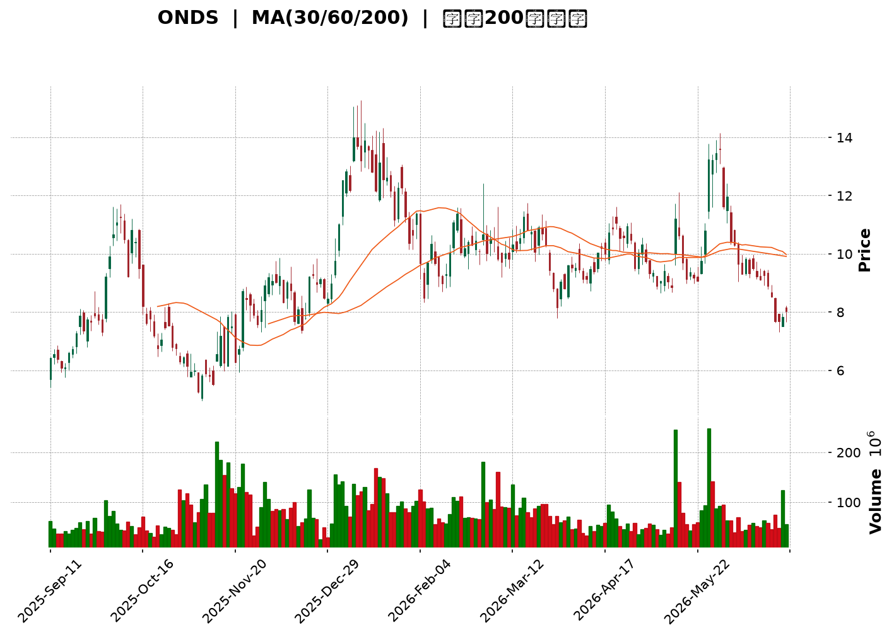
</details>

<html>
<head><meta charset="utf-8" /></head>
<body>
    <div style="height:500px; width:100%;">                        <script>window.PlotlyConfig = {MathJaxConfig: 'local'};</script>
        <script charset="utf-8" src="https://cdn.plot.ly/plotly-3.6.0.min.js" integrity="sha256-QaOVwtVY0T02VaHrr6pnoHLCwayMJp4O5n4YyaE3rJk=" crossorigin="anonymous"></script>                <div id="candlestick-chart" class="plotly-graph-div" style="height:100%; width:100%;"></div>            <script>                window.PLOTLYENV=window.PLOTLYENV || {};                                if (document.getElementById("candlestick-chart")) {                    Plotly.newPlot(                        "candlestick-chart",                        [{"close":{"dtype":"f8","bdata":"AAAAgBSuGUAAAACgcD0aQAAAAMAehRlAAAAAAClcGEAAAABgZmYYQAAAAGBmZhpAAAAAoEfhGkAAAACAPQodQAAAAMAehR9AAAAAYGZmHUAAAAAAAAAfQAAAAADXox5AAAAAQOF6H0AAAACgR+EeQAAAAKBwPR1AAAAAIIVrIkAAAACA69EjQAAAAIDrUSVAAAAAgBQuJkAAAADAHoUmQAAAAEDh+iRAAAAA4KNwIkAAAABguJ4lQAAAAIDr0SRAAAAAwB4FI0AAAABgZmYgQAAAAOCjcB5AAAAA4HoUH0AAAABgj8IcQAAAAIDC9RpAAAAAoHA9HEAAAABACtcdQAAAAGC4Hh5AAAAAwPUoG0AAAAAAAAAbQAAAAMD1KBlAAAAAYI\u002fCGUAAAACgmZkYQAAAAEAK1xdAAAAAAAAAGEAAAAAAAAAVQAAAAKBwPRdAAAAAwB6FF0AAAABAMzMXQAAAAIA9ChZAAAAAoHA9GkAAAADgUbgcQAAAAMAeBRlAAAAAAClcH0AAAAAAAAAeQAAAAOB6FBlAAAAA4KPwGkAAAADgo3AhQAAAAKBH4SBAAAAAQOF6IEAAAACgmZkfQAAAAIDrUR5AAAAAANcjIEAAAABACtchQAAAAKBHYSJAAAAAANcjIkAAAACAPQoiQAAAAIDCdSJAAAAAYGamIEAAAACAPQoiQAAAAAAAgCFAAAAAYI\u002fCHkAAAACAFC4gQAAAAEDheh1AAAAAQDMzH0AAAADgo3AiQAAAAIA9iiJAAAAAIIXrIUAAAABgj0IiQAAAAIDC9SBAAAAAIIXrIEAAAABA4fohQAAAAMAehSNAAAAAgD0KJkAAAAAgXA8pQAAAAIAUrilAAAAAAClcKEAAAADAHgUsQAAAAKBHYStAAAAAoEdhKkAAAAAgrscrQAAAAGC4HitAAAAAANejKUAAAACA61EoQAAAAGCPQipAAAAAoJkZKUAAAACgcD0pQAAAAEAKVyhAAAAAgOtRJkAAAADAHoUoQAAAAIA9iihAAAAAgD2KJkAAAADgUbgkQAAAACCuRyVAAAAAYI\u002fCJkAAAAAAKVwjQAAAAIDC9SBAAAAAoEdhI0AAAACAFK4kQAAAAAApXCNAAAAAgMJ1IkAAAADgo\u002fAhQAAAAGC4niJAAAAAoJkZJEAAAAAA1yMmQAAAACCuxyZAAAAAIFwPJEAAAACgR2EkQAAAAMDMzCRAAAAAoJmZJEAAAABgZuYkQAAAAMD1KCRAAAAAQApXJUAAAACAPQokQAAAAMAeBSVAAAAAQOH6JEAAAADA9agjQAAAAOCjcCNAAAAAwB4FJEAAAADA9agjQAAAAMD1qCRAAAAAgOtRJEAAAAAgXA8lQAAAACBcjyZAAAAAwPWoJUAAAAAAAIAlQAAAAGC4HiRAAAAAwMzMJUAAAAAAKVwlQAAAAGC4niRAAAAAoEfhIkAAAACgmZkhQAAAAMDMTCBAAAAA4HoUIkAAAABguJ4hQAAAAEAzMyNAAAAAgD0KI0AAAAAgXA8jQAAAAGBm5iJAAAAAIK5HIkAAAABgj0IiQAAAAOCj8CJAAAAAwMzMIkAAAAAgXA8kQAAAAGBmZiRAAAAAAAAAJEAAAACAwnUlQAAAAKBwvSVAAAAAYLgeJkAAAADgehQlQAAAAKCZGSVAAAAAYGbmJUAAAACAwvUkQAAAAEDh+iJAAAAA4HoUJEAAAAAA16MkQAAAAIDCdSNAAAAAwPWoIkAAAACAFK4iQAAAACCuxyFAAAAAYLgeIkAAAABACtciQAAAAOB6FCJAAAAA4FG4IUAAAAAghWsmQAAAAKBwPSVAAAAAYGZmI0AAAAAAAEAiQAAAAOBRuCJAAAAAAClcIkAAAABguB4iQAAAAIA9iiNAAAAAoJmZJUAAAAAAAIAqQAAAAOCjcCpAAAAAIIXrKkAAAADA9SgrQAAAAOBROCdAAAAA4KPwJ0AAAAAAKdwkQAAAAKCZmSRAAAAAwMxMI0AAAABguJ4iQAAAAMD1qCNAAAAAwPWoIkAAAADAHgUjQAAAACCFayJAAAAAoHA9IkAAAACAPYoiQAAAACCuxyFAAAAAIFwPIUAAAADgUbgeQAAAAEAzsx5AAAAAgOtRH0AAAACAPQogQA=="},"high":{"dtype":"f8","bdata":"AAAAYI\u002fCGUAAAACgR+EaQAAAAOCjcBtAAAAAYGZmGUAAAAAAAAAZQAAAACBcjxpAAAAAAClcG0AAAADgo3AdQAAAAKBwPSBAAAAAANcjIEAAAAAAKVwfQAAAACBcjx9AAAAAIIVrIUAAAABAClcgQAAAAMDMzB9AAAAAgBSuIkAAAAAgXI8kQAAAAGCPQidAAAAAQAoXJ0AAAABgZmYnQAAAACCuxyZAAAAAwB4FJUAAAACAFG4mQAAAAGC4HiVAAAAAoHC9JUAAAABgj0IjQAAAAIDrUSBAAAAAoEdhIEAAAAAA16MfQAAAAIA9Ch1AAAAAQDMzHUAAAABAClcgQAAAAKBHoSBAAAAAIFyPHkAAAADAzMwbQAAAAIDCdRpAAAAAAAAAGkAAAABgj8IaQAAAACCuRxpAAAAAAAAAGUAAAADgUbgXQAAAAOB6lBdAAAAAIFyPGUAAAACgR2EYQAAAAMD1qBhAAAAAAClcHUAAAADgo3AfQAAAACBcDx5AAAAAgBSuH0AAAACA6xEgQAAAAKBH4R9AAAAAYGZmG0AAAACgmZkhQAAAAGCPwiFAAAAAAClcIUAAAADAIPAgQAAAAADXIyBAAAAAoJkZIUAAAACAwjUiQAAAAIAUriJAAAAAoJmZIkAAAAAAAIAjQAAAAOBRuCNAAAAAQOE6IkAAAADA9SgiQAAAAGBmJiNAAAAAQOF6IUAAAAAA12MgQAAAAGC4HiFAAAAAYJGtIEAAAABA4XoiQAAAAIDrUSNAAAAAgBSuI0AAAABgZmYiQAAAAEAKVyJAAAAAQApXIUAAAACgmZkiQAAAACBcDyVAAAAAYLgeJkAAAADgehQpQAAAAAAp3ClAAAAAgD0KKkAAAAAA1yMuQAAAAEAzMy5AAAAAIFyPLkAAAAAAAAAtQAAAAAAAgCtAAAAAANcjLEAAAAAAAIAsQAAAAGBmZixAAAAAwPWoLEAAAADA9agqQAAAAEDhuilAAAAAIIWrKEAAAADgo\u002fAoQAAAAMD1KCpAAAAAIFyPKEAAAABgZuYmQAAAAGBmZiZAAAAAQArXJkAAAACAPcomQAAAACBcDyNAAAAAwB6FI0AAAAAgrkclQAAAAKBH4SRAAAAAQArXI0AAAACgxosiQAAAAAApXCNAAAAAANejJEAAAABAClcmQAAAAIAULidAAAAAwPUoJ0AAAAAA1yMlQAAAAIDC9SRAAAAAoEfhJUAAAAAgXI8lQAAAAAApXCRAAAAAQArXKEAAAAAAAAAmQAAAAADXoyVAAAAAQArXJUAAAADgUTgnQAAAACBcDyRAAAAAYGbmJEAAAABguB4lQAAAAIAUriVAAAAAgML1JUAAAACgcL0lQAAAAOCj8CZAAAAAwB6FJ0AAAACAwvUlQAAAAMD1qCVAAAAA4KPwJUAAAACgcL0mQAAAACCuRyZAAAAAIK5HJEAAAACgcL0iQAAAAADXoyFAAAAAIK5HIkAAAABAM7MiQAAAAGCPQiNAAAAAwMzMI0AAAACgR2EjQAAAAKBwvSRAAAAAgD0KI0AAAADgUbgiQAAAACCFKyNAAAAA4FG4I0AAAAAgXA8kQAAAACCuxyRAAAAAIFwPJUAAAABguB4mQAAAAOB6lCZAAAAA4FE4J0AAAADgo\u002fAlQAAAAIA9iiVAAAAAYLgeJkAAAAAA1yMmQAAAAAAp3CRAAAAAgOtRJEAAAABguB4lQAAAAEDhuiRAAAAA4HqUI0AAAAAghesiQAAAAAAAgCJAAAAAgBQuIkAAAADAzEwjQAAAAEAzsyJAAAAAAClcIkAAAACAwnUnQAAAAKBwPShAAAAAQApXJUAAAABgj8IjQAAAAOB6FCNAAAAAYI\u002fCIkAAAACgRyEjQAAAAMAehSRAAAAAYLgeJkAAAAAgXI8rQAAAAIDr0SpAAAAAgOvRK0AAAACA61EsQAAAAAAAACpAAAAAQArXKEAAAACA61EnQAAAAIAUriVAAAAAgOvRJEAAAACAwvUjQAAAAKBDyyNAAAAAQInBI0AAAADgo\u002fAjQAAAAEDheiNAAAAAAAAAI0AAAAAghesiQAAAACCF6yJAAAAAACncIUAAAAAAAAAhQAAAAGCPwh9AAAAAACncH0AAAADgo3AgQA=="},"hovertemplate":"\u003cb\u003e%{x|%Y-%m-%d}\u003c\u002fb\u003e\u003cbr\u003e\u958b: $%{open:.2f}\u003cbr\u003e\u9ad8: $%{high:.2f}\u003cbr\u003e\u4f4e: $%{low:.2f}\u003cbr\u003e\u6536: $%{close:.2f}\u003cextra\u003e\u003c\u002fextra\u003e","low":{"dtype":"f8","bdata":"AAAAANejFUAAAADAzMwYQAAAAAAAABlAAAAAgBSuF0AAAAAAAAAXQAAAAIA9ChhAAAAAgBSuGUAAAACA61EaQAAAACCF6xxAAAAAAAAAHUAAAADA9SgbQAAAAOCjcB1AAAAAQDMzH0AAAAAgrkceQAAAAOBRuBxAAAAAANejHkAAAACgR2EiQAAAAIA9iiRAAAAAYGbmJEAAAABgDm0lQAAAAAAAwCRAAAAAoEdhIkAAAAAgsl0jQAAAAGCPwiNAAAAAgOtRIkAAAACAFK4fQAAAAOBROB5AAAAAgOtRHUAAAAAAAIAcQAAAAAAp3BlAAAAAoJmZGkAAAABguJ4dQAAAAOB6FB5AAAAAANejGkAAAADgehQaQAAAAIDr0RhAAAAAQOF6GEAAAABguB4XQAAAAOB6FBdAAAAAgOtRF0AAAAAAKdwUQAAAAMDMzBNAAAAA4HoUF0AAAABgZmYWQAAAACCF6xVAAAAAoHA9GUAAAABgZmYYQAAAACCF6xdAAAAAoJmZGEAAAACAPQodQAAAAAAAABlAAAAA4FG4F0AAAACAFK4aQAAAAADXIyBAAAAAoHC9HkAAAABAMzMfQAAAAKBH4R1AAAAAIK5HHUAAAABACtcdQAAAAIA9CiFAAAAAwPUoIUAAAADgo\u002fAhQAAAAOBROCFAAAAAACmcIEAAAACgcD0gQAAAAIDr0SBAAAAAoHA9HkAAAAAAKVweQAAAAGC4Hh1AAAAAgML1HkAAAADgo3AfQAAAACBcTyJAAAAAQApXIUAAAABAM7MhQAAAAAAp3CBAAAAAIIVrIEAAAADA9aggQAAAAEAKVyJAAAAAgOvRI0AAAABA4folQAAAACCF6ydAAAAA4FE4KEAAAADAzEwqQAAAAIAULitAAAAAwPWoKUAAAAAghespQAAAAEAK1ylAAAAAoJmZKUAAAACgcD0oQAAAAKCZmSdAAAAAACncJ0AAAABAM7MoQAAAAKBH4SdAAAAAYGbmJUAAAACAFC4mQAAAAGC4HihAAAAAANcjJkAAAAAgrkckQAAAAMDMTCRAAAAAwB4FJUAAAABgj0IiQAAAAADXoyBAAAAAYGbmIEAAAABAClcjQAAAAEAzMyNAAAAAYI\u002fCIUAAAABgZmYhQAAAAADXoyFAAAAAoHC9IUAAAABA4fojQAAAAEDheiVAAAAAYGbmI0AAAADgUbgjQAAAAIDC9SJAAAAAgD2KJEAAAABgZuYjQAAAAKBwPSNAAAAAoJmZJEAAAADAHoUjQAAAAAAp3CNAAAAAYLgeJEAAAADAHoUjQAAAAGBmZiJAAAAAYGYmI0AAAAAAAAAjQAAAAKCZmSNAAAAAoJkZJEAAAADgUTgkQAAAAKBwvSRAAAAAANejJUAAAACgcD0kQAAAAIDCdSNAAAAAgBTuI0AAAABAM\u002fMkQAAAAIDCdSRAAAAAgD2KIkAAAADA9WghQAAAAGC4Hh9AAAAAYGZmIEAAAAAgXI8hQAAAACCF6yBAAAAAYI\u002fCIkAAAADgTWIiQAAAAIAUriJAAAAAwB4FIkAAAABA4fohQAAAAIDCdSFAAAAAoJmZIkAAAACgcL0iQAAAAMAehSNAAAAAgD2KI0AAAACA61EjQAAAACCuRyVAAAAAQDOzJUAAAABAMzMkQAAAAEDhOiRAAAAAIIVrJEAAAAAghaskQAAAAIDr0SJAAAAAYLieIkAAAACgcD0jQAAAAEAKVyNAAAAAgOtRIkAAAACAPQoiQAAAACBcjyFAAAAAwMxMIUAAAADgo3AhQAAAAKCZmSFAAAAAQApXIUAAAABAMzMjQAAAAAAAACVAAAAAIIXrIkAAAADgo\u002fAhQAAAAKBwPSJAAAAAgML1IUAAAABguB4iQAAAACCynSJAAAAAAClcI0AAAADgo3AmQAAAAEAzMydAAAAAoJmZKUAAAACAFC4qQAAAACBcDydAAAAAYLgeJkAAAADA9agkQAAAAAAAgCRAAAAA4HoUIkAAAACgmZkiQAAAAMAehSJAAAAAAClcIkAAAACgmdkiQAAAACCuRyJAAAAAwPUoIkAAAABACtchQAAAACBcjyFAAAAAAAAAIUAAAAAgXI8eQAAAAKBwPR1AAAAAAAAAHkAAAACgmZkeQA=="},"name":"\u50f9\u683c","open":{"dtype":"f8","bdata":"AAAA4FG4FkAAAADAzMwZQAAAAEAK1xpAAAAAIK5HGUAAAACgcD0YQAAAAGC4HhlAAAAAQDMzGkAAAAAgrkcbQAAAACBcDx5AAAAAgML1H0AAAADAHgUcQAAAACCuxx5AAAAAQArXH0AAAADgUbgfQAAAAAAAAB9AAAAAQDMzH0AAAADAHgUjQAAAAGC4HiVAAAAAAAAAJkAAAAAgrocmQAAAACCuRyZAAAAAgML1JEAAAAAgXA8kQAAAAGCPwiRAAAAAYGamJUAAAABgj0IjQAAAAMDMzB9AAAAAYLgeIEAAAADgUbgeQAAAAGBmZhtAAAAAYGZmG0AAAACAFK4eQAAAAGC4XiBAAAAA4HoUHkAAAADgepQbQAAAAIDC9RlAAAAAAAAAGUAAAADAzEwaQAAAAGC4HhdAAAAAIIXrF0AAAACAFK4XQAAAAMD1KBRAAAAAQOF6GUAAAABgZmYXQAAAAOCj8BdAAAAAIK5HGUAAAADA9agYQAAAAIA9Ch5AAAAAYLieGEAAAAAAKdwdQAAAAIAUrh9AAAAAoHA9GkAAAAAA1yMbQAAAAIDC9SBAAAAA4FE4IUAAAAAgXI8gQAAAAMAehR9AAAAA4FG4HkAAAAAgrscgQAAAAMAeRSFAAAAAACncIUAAAABACpciQAAAAEAK1yFAAAAA4FE4IkAAAABA4fogQAAAAIDC9SFAAAAAAClcIUAAAABA4XoeQAAAACCuRyBAAAAAwPUoH0AAAACAwvUfQAAAAKCZmSJAAAAAIFwPIkAAAACAwvUhQAAAAOAkRiJAAAAAoJmZIEAAAAAghesgQAAAACBcjyJAAAAAwB5FJEAAAACgmZkmQAAAAEAzMyhAAAAAYGZmKUAAAADA9WgqQAAAAAAAACxAAAAAIIVrK0AAAAAAAAArQAAAAKBHYStAAAAAANcjK0AAAADgetQqQAAAAIDCtSdAAAAAoJmZK0AAAADAHgUpQAAAACCFaylAAAAAwMxMKEAAAAAghWsmQAAAAIDC9SlAAAAAIK5HKEAAAAAAAIAmQAAAAGC4niVAAAAAwB4FJkAAAABgj8ImQAAAAIAUriJAAAAAgBTuIUAAAAAAKZwjQAAAAIAULiRAAAAAwB7FI0AAAACgcH0iQAAAAIA9iiJAAAAA4FF4IkAAAAAghWskQAAAAADXoyVAAAAAoEdhJkAAAAAAKdwjQAAAAMAeBSRAAAAAYI9CJUAAAADAzEwkQAAAAIAULiRAAAAAAAAAJUAAAACgR2ElQAAAAOBRuCRAAAAAQOH6JEAAAAAAAIAkQAAAACBcDyRAAAAAgBSuI0AAAACgmRkkQAAAACCFKyRAAAAAACncJEAAAACgcL0kQAAAAKCZGSVAAAAAAADAJkAAAABguF4lQAAAAOB6lCVAAAAA4HqUJEAAAACA69ElQAAAAGCPwiVAAAAAoJkZJEAAAABAM7MiQAAAAGC4niFAAAAAYGbmIEAAAACgmZkiQAAAACCuByFAAAAAYI9CI0AAAAAAKdwiQAAAAEAKVyRAAAAA4HrUIkAAAACAwnUiQAAAAMAeBSJAAAAA4KNwI0AAAADAHgUjQAAAAAAAgCRAAAAAYI\u002fCJEAAAACgmZkjQAAAAMDMzCVAAAAAgD2KJkAAAABgj8IlQAAAAGCPQiVAAAAAwEu3JEAAAAAA12MlQAAAAGCPwiRAAAAAAAAAI0AAAAAAAAAkQAAAAMDMTCRAAAAAIFyPI0AAAAAAAIAiQAAAAAAAgCJAAAAAAAAAIkAAAABACtchQAAAAOBReCJAAAAAQArXIUAAAABA4fojQAAAAIDr0SVAAAAAYI9CJUAAAABgZqYjQAAAAAAAgCJAAAAAIFyPIkAAAAAghWsiQAAAACCFqyJAAAAAAAAAJEAAAABAM\u002fMmQAAAAAAAgClAAAAAoHB9KkAAAACgcD0rQAAAACCF6ylAAAAAgML1JkAAAABACtcmQAAAAMD1qCVAAAAAIIWrJEAAAACgR2EjQAAAAGBmpiJAAAAAQAqXI0AAAABAM7MjQAAAAIDr0SJAAAAAoHB9IkAAAACA69EiQAAAAIDCtSJAAAAAYLheIUAAAACAwvUgQAAAAKBwvR9AAAAAIFwPHkAAAAAAcUwgQA=="},"x":["2025-09-11T00:00:00-04:00","2025-09-12T00:00:00-04:00","2025-09-15T00:00:00-04:00","2025-09-16T00:00:00-04:00","2025-09-17T00:00:00-04:00","2025-09-18T00:00:00-04:00","2025-09-19T00:00:00-04:00","2025-09-22T00:00:00-04:00","2025-09-23T00:00:00-04:00","2025-09-24T00:00:00-04:00","2025-09-25T00:00:00-04:00","2025-09-26T00:00:00-04:00","2025-09-29T00:00:00-04:00","2025-09-30T00:00:00-04:00","2025-10-01T00:00:00-04:00","2025-10-02T00:00:00-04:00","2025-10-03T00:00:00-04:00","2025-10-06T00:00:00-04:00","2025-10-07T00:00:00-04:00","2025-10-08T00:00:00-04:00","2025-10-09T00:00:00-04:00","2025-10-10T00:00:00-04:00","2025-10-13T00:00:00-04:00","2025-10-14T00:00:00-04:00","2025-10-15T00:00:00-04:00","2025-10-16T00:00:00-04:00","2025-10-17T00:00:00-04:00","2025-10-20T00:00:00-04:00","2025-10-21T00:00:00-04:00","2025-10-22T00:00:00-04:00","2025-10-23T00:00:00-04:00","2025-10-24T00:00:00-04:00","2025-10-27T00:00:00-04:00","2025-10-28T00:00:00-04:00","2025-10-29T00:00:00-04:00","2025-10-30T00:00:00-04:00","2025-10-31T00:00:00-04:00","2025-11-03T00:00:00-05:00","2025-11-04T00:00:00-05:00","2025-11-05T00:00:00-05:00","2025-11-06T00:00:00-05:00","2025-11-07T00:00:00-05:00","2025-11-10T00:00:00-05:00","2025-11-11T00:00:00-05:00","2025-11-12T00:00:00-05:00","2025-11-13T00:00:00-05:00","2025-11-14T00:00:00-05:00","2025-11-17T00:00:00-05:00","2025-11-18T00:00:00-05:00","2025-11-19T00:00:00-05:00","2025-11-20T00:00:00-05:00","2025-11-21T00:00:00-05:00","2025-11-24T00:00:00-05:00","2025-11-25T00:00:00-05:00","2025-11-26T00:00:00-05:00","2025-11-28T00:00:00-05:00","2025-12-01T00:00:00-05:00","2025-12-02T00:00:00-05:00","2025-12-03T00:00:00-05:00","2025-12-04T00:00:00-05:00","2025-12-05T00:00:00-05:00","2025-12-08T00:00:00-05:00","2025-12-09T00:00:00-05:00","2025-12-10T00:00:00-05:00","2025-12-11T00:00:00-05:00","2025-12-12T00:00:00-05:00","2025-12-15T00:00:00-05:00","2025-12-16T00:00:00-05:00","2025-12-17T00:00:00-05:00","2025-12-18T00:00:00-05:00","2025-12-19T00:00:00-05:00","2025-12-22T00:00:00-05:00","2025-12-23T00:00:00-05:00","2025-12-24T00:00:00-05:00","2025-12-26T00:00:00-05:00","2025-12-29T00:00:00-05:00","2025-12-30T00:00:00-05:00","2025-12-31T00:00:00-05:00","2026-01-02T00:00:00-05:00","2026-01-05T00:00:00-05:00","2026-01-06T00:00:00-05:00","2026-01-07T00:00:00-05:00","2026-01-08T00:00:00-05:00","2026-01-09T00:00:00-05:00","2026-01-12T00:00:00-05:00","2026-01-13T00:00:00-05:00","2026-01-14T00:00:00-05:00","2026-01-15T00:00:00-05:00","2026-01-16T00:00:00-05:00","2026-01-20T00:00:00-05:00","2026-01-21T00:00:00-05:00","2026-01-22T00:00:00-05:00","2026-01-23T00:00:00-05:00","2026-01-26T00:00:00-05:00","2026-01-27T00:00:00-05:00","2026-01-28T00:00:00-05:00","2026-01-29T00:00:00-05:00","2026-01-30T00:00:00-05:00","2026-02-02T00:00:00-05:00","2026-02-03T00:00:00-05:00","2026-02-04T00:00:00-05:00","2026-02-05T00:00:00-05:00","2026-02-06T00:00:00-05:00","2026-02-09T00:00:00-05:00","2026-02-10T00:00:00-05:00","2026-02-11T00:00:00-05:00","2026-02-12T00:00:00-05:00","2026-02-13T00:00:00-05:00","2026-02-17T00:00:00-05:00","2026-02-18T00:00:00-05:00","2026-02-19T00:00:00-05:00","2026-02-20T00:00:00-05:00","2026-02-23T00:00:00-05:00","2026-02-24T00:00:00-05:00","2026-02-25T00:00:00-05:00","2026-02-26T00:00:00-05:00","2026-02-27T00:00:00-05:00","2026-03-02T00:00:00-05:00","2026-03-03T00:00:00-05:00","2026-03-04T00:00:00-05:00","2026-03-05T00:00:00-05:00","2026-03-06T00:00:00-05:00","2026-03-09T00:00:00-04:00","2026-03-10T00:00:00-04:00","2026-03-11T00:00:00-04:00","2026-03-12T00:00:00-04:00","2026-03-13T00:00:00-04:00","2026-03-16T00:00:00-04:00","2026-03-17T00:00:00-04:00","2026-03-18T00:00:00-04:00","2026-03-19T00:00:00-04:00","2026-03-20T00:00:00-04:00","2026-03-23T00:00:00-04:00","2026-03-24T00:00:00-04:00","2026-03-25T00:00:00-04:00","2026-03-26T00:00:00-04:00","2026-03-27T00:00:00-04:00","2026-03-30T00:00:00-04:00","2026-03-31T00:00:00-04:00","2026-04-01T00:00:00-04:00","2026-04-02T00:00:00-04:00","2026-04-06T00:00:00-04:00","2026-04-07T00:00:00-04:00","2026-04-08T00:00:00-04:00","2026-04-09T00:00:00-04:00","2026-04-10T00:00:00-04:00","2026-04-13T00:00:00-04:00","2026-04-14T00:00:00-04:00","2026-04-15T00:00:00-04:00","2026-04-16T00:00:00-04:00","2026-04-17T00:00:00-04:00","2026-04-20T00:00:00-04:00","2026-04-21T00:00:00-04:00","2026-04-22T00:00:00-04:00","2026-04-23T00:00:00-04:00","2026-04-24T00:00:00-04:00","2026-04-27T00:00:00-04:00","2026-04-28T00:00:00-04:00","2026-04-29T00:00:00-04:00","2026-04-30T00:00:00-04:00","2026-05-01T00:00:00-04:00","2026-05-04T00:00:00-04:00","2026-05-05T00:00:00-04:00","2026-05-06T00:00:00-04:00","2026-05-07T00:00:00-04:00","2026-05-08T00:00:00-04:00","2026-05-11T00:00:00-04:00","2026-05-12T00:00:00-04:00","2026-05-13T00:00:00-04:00","2026-05-14T00:00:00-04:00","2026-05-15T00:00:00-04:00","2026-05-18T00:00:00-04:00","2026-05-19T00:00:00-04:00","2026-05-20T00:00:00-04:00","2026-05-21T00:00:00-04:00","2026-05-22T00:00:00-04:00","2026-05-26T00:00:00-04:00","2026-05-27T00:00:00-04:00","2026-05-28T00:00:00-04:00","2026-05-29T00:00:00-04:00","2026-06-01T00:00:00-04:00","2026-06-02T00:00:00-04:00","2026-06-03T00:00:00-04:00","2026-06-04T00:00:00-04:00","2026-06-05T00:00:00-04:00","2026-06-08T00:00:00-04:00","2026-06-09T00:00:00-04:00","2026-06-10T00:00:00-04:00","2026-06-11T00:00:00-04:00","2026-06-12T00:00:00-04:00","2026-06-15T00:00:00-04:00","2026-06-16T00:00:00-04:00","2026-06-17T00:00:00-04:00","2026-06-18T00:00:00-04:00","2026-06-22T00:00:00-04:00","2026-06-23T00:00:00-04:00","2026-06-24T00:00:00-04:00","2026-06-25T00:00:00-04:00","2026-06-26T00:00:00-04:00","2026-06-29T00:00:00-04:00"],"type":"candlestick"},{"hovertemplate":"MA30: $%{y:.2f}\u003cextra\u003e\u003c\u002fextra\u003e","line":{"color":"#2196F3","dash":"dash","width":2},"mode":"lines","name":"MA30","x":["2025-09-11T00:00:00-04:00","2025-09-12T00:00:00-04:00","2025-09-15T00:00:00-04:00","2025-09-16T00:00:00-04:00","2025-09-17T00:00:00-04:00","2025-09-18T00:00:00-04:00","2025-09-19T00:00:00-04:00","2025-09-22T00:00:00-04:00","2025-09-23T00:00:00-04:00","2025-09-24T00:00:00-04:00","2025-09-25T00:00:00-04:00","2025-09-26T00:00:00-04:00","2025-09-29T00:00:00-04:00","2025-09-30T00:00:00-04:00","2025-10-01T00:00:00-04:00","2025-10-02T00:00:00-04:00","2025-10-03T00:00:00-04:00","2025-10-06T00:00:00-04:00","2025-10-07T00:00:00-04:00","2025-10-08T00:00:00-04:00","2025-10-09T00:00:00-04:00","2025-10-10T00:00:00-04:00","2025-10-13T00:00:00-04:00","2025-10-14T00:00:00-04:00","2025-10-15T00:00:00-04:00","2025-10-16T00:00:00-04:00","2025-10-17T00:00:00-04:00","2025-10-20T00:00:00-04:00","2025-10-21T00:00:00-04:00","2025-10-22T00:00:00-04:00","2025-10-23T00:00:00-04:00","2025-10-24T00:00:00-04:00","2025-10-27T00:00:00-04:00","2025-10-28T00:00:00-04:00","2025-10-29T00:00:00-04:00","2025-10-30T00:00:00-04:00","2025-10-31T00:00:00-04:00","2025-11-03T00:00:00-05:00","2025-11-04T00:00:00-05:00","2025-11-05T00:00:00-05:00","2025-11-06T00:00:00-05:00","2025-11-07T00:00:00-05:00","2025-11-10T00:00:00-05:00","2025-11-11T00:00:00-05:00","2025-11-12T00:00:00-05:00","2025-11-13T00:00:00-05:00","2025-11-14T00:00:00-05:00","2025-11-17T00:00:00-05:00","2025-11-18T00:00:00-05:00","2025-11-19T00:00:00-05:00","2025-11-20T00:00:00-05:00","2025-11-21T00:00:00-05:00","2025-11-24T00:00:00-05:00","2025-11-25T00:00:00-05:00","2025-11-26T00:00:00-05:00","2025-11-28T00:00:00-05:00","2025-12-01T00:00:00-05:00","2025-12-02T00:00:00-05:00","2025-12-03T00:00:00-05:00","2025-12-04T00:00:00-05:00","2025-12-05T00:00:00-05:00","2025-12-08T00:00:00-05:00","2025-12-09T00:00:00-05:00","2025-12-10T00:00:00-05:00","2025-12-11T00:00:00-05:00","2025-12-12T00:00:00-05:00","2025-12-15T00:00:00-05:00","2025-12-16T00:00:00-05:00","2025-12-17T00:00:00-05:00","2025-12-18T00:00:00-05:00","2025-12-19T00:00:00-05:00","2025-12-22T00:00:00-05:00","2025-12-23T00:00:00-05:00","2025-12-24T00:00:00-05:00","2025-12-26T00:00:00-05:00","2025-12-29T00:00:00-05:00","2025-12-30T00:00:00-05:00","2025-12-31T00:00:00-05:00","2026-01-02T00:00:00-05:00","2026-01-05T00:00:00-05:00","2026-01-06T00:00:00-05:00","2026-01-07T00:00:00-05:00","2026-01-08T00:00:00-05:00","2026-01-09T00:00:00-05:00","2026-01-12T00:00:00-05:00","2026-01-13T00:00:00-05:00","2026-01-14T00:00:00-05:00","2026-01-15T00:00:00-05:00","2026-01-16T00:00:00-05:00","2026-01-20T00:00:00-05:00","2026-01-21T00:00:00-05:00","2026-01-22T00:00:00-05:00","2026-01-23T00:00:00-05:00","2026-01-26T00:00:00-05:00","2026-01-27T00:00:00-05:00","2026-01-28T00:00:00-05:00","2026-01-29T00:00:00-05:00","2026-01-30T00:00:00-05:00","2026-02-02T00:00:00-05:00","2026-02-03T00:00:00-05:00","2026-02-04T00:00:00-05:00","2026-02-05T00:00:00-05:00","2026-02-06T00:00:00-05:00","2026-02-09T00:00:00-05:00","2026-02-10T00:00:00-05:00","2026-02-11T00:00:00-05:00","2026-02-12T00:00:00-05:00","2026-02-13T00:00:00-05:00","2026-02-17T00:00:00-05:00","2026-02-18T00:00:00-05:00","2026-02-19T00:00:00-05:00","2026-02-20T00:00:00-05:00","2026-02-23T00:00:00-05:00","2026-02-24T00:00:00-05:00","2026-02-25T00:00:00-05:00","2026-02-26T00:00:00-05:00","2026-02-27T00:00:00-05:00","2026-03-02T00:00:00-05:00","2026-03-03T00:00:00-05:00","2026-03-04T00:00:00-05:00","2026-03-05T00:00:00-05:00","2026-03-06T00:00:00-05:00","2026-03-09T00:00:00-04:00","2026-03-10T00:00:00-04:00","2026-03-11T00:00:00-04:00","2026-03-12T00:00:00-04:00","2026-03-13T00:00:00-04:00","2026-03-16T00:00:00-04:00","2026-03-17T00:00:00-04:00","2026-03-18T00:00:00-04:00","2026-03-19T00:00:00-04:00","2026-03-20T00:00:00-04:00","2026-03-23T00:00:00-04:00","2026-03-24T00:00:00-04:00","2026-03-25T00:00:00-04:00","2026-03-26T00:00:00-04:00","2026-03-27T00:00:00-04:00","2026-03-30T00:00:00-04:00","2026-03-31T00:00:00-04:00","2026-04-01T00:00:00-04:00","2026-04-02T00:00:00-04:00","2026-04-06T00:00:00-04:00","2026-04-07T00:00:00-04:00","2026-04-08T00:00:00-04:00","2026-04-09T00:00:00-04:00","2026-04-10T00:00:00-04:00","2026-04-13T00:00:00-04:00","2026-04-14T00:00:00-04:00","2026-04-15T00:00:00-04:00","2026-04-16T00:00:00-04:00","2026-04-17T00:00:00-04:00","2026-04-20T00:00:00-04:00","2026-04-21T00:00:00-04:00","2026-04-22T00:00:00-04:00","2026-04-23T00:00:00-04:00","2026-04-24T00:00:00-04:00","2026-04-27T00:00:00-04:00","2026-04-28T00:00:00-04:00","2026-04-29T00:00:00-04:00","2026-04-30T00:00:00-04:00","2026-05-01T00:00:00-04:00","2026-05-04T00:00:00-04:00","2026-05-05T00:00:00-04:00","2026-05-06T00:00:00-04:00","2026-05-07T00:00:00-04:00","2026-05-08T00:00:00-04:00","2026-05-11T00:00:00-04:00","2026-05-12T00:00:00-04:00","2026-05-13T00:00:00-04:00","2026-05-14T00:00:00-04:00","2026-05-15T00:00:00-04:00","2026-05-18T00:00:00-04:00","2026-05-19T00:00:00-04:00","2026-05-20T00:00:00-04:00","2026-05-21T00:00:00-04:00","2026-05-22T00:00:00-04:00","2026-05-26T00:00:00-04:00","2026-05-27T00:00:00-04:00","2026-05-28T00:00:00-04:00","2026-05-29T00:00:00-04:00","2026-06-01T00:00:00-04:00","2026-06-02T00:00:00-04:00","2026-06-03T00:00:00-04:00","2026-06-04T00:00:00-04:00","2026-06-05T00:00:00-04:00","2026-06-08T00:00:00-04:00","2026-06-09T00:00:00-04:00","2026-06-10T00:00:00-04:00","2026-06-11T00:00:00-04:00","2026-06-12T00:00:00-04:00","2026-06-15T00:00:00-04:00","2026-06-16T00:00:00-04:00","2026-06-17T00:00:00-04:00","2026-06-18T00:00:00-04:00","2026-06-22T00:00:00-04:00","2026-06-23T00:00:00-04:00","2026-06-24T00:00:00-04:00","2026-06-25T00:00:00-04:00","2026-06-26T00:00:00-04:00","2026-06-29T00:00:00-04:00"],"y":{"dtype":"f8","bdata":"AAAAAAAA+H8AAAAAAAD4fwAAAAAAAPh\u002fAAAAAAAA+H8AAAAAAAD4fwAAAAAAAPh\u002fAAAAAAAA+H8AAAAAAAD4fwAAAAAAAPh\u002fAAAAAAAA+H8AAAAAAAD4fwAAAAAAAPh\u002fAAAAAAAA+H8AAAAAAAD4fwAAAAAAAPh\u002fAAAAAAAA+H8AAAAAAAD4fwAAAAAAAPh\u002fAAAAAAAA+H8AAAAAAAD4fwAAAAAAAPh\u002fAAAAAAAA+H8AAAAAAAD4fwAAAAAAAPh\u002fAAAAAAAA+H8AAAAAAAD4fwAAAAAAAPh\u002fAAAAAAAA+H8AAAAAAAD4fyIiIiIiYiBA3t3dVQ5tIEDv7u5+anwgQEREROwKkCBAzczMRP2bIECamZkpFacgQImIiMDKoSBAIiIiagOdIEAAAADAEYogQERERCRNaSBA7+7u5kJSIEBEREQ8mCcgQGZmZnYFCCBAq6qqCh7MH0BERETUlIofQBERETEkTR9AMzMzI7DyHkCJiIgIgZUeQO\u002fu7o4l\u002fx1AAAAAoDaQHUDe3d093w8dQCIiIlLUfxxA7+7uDgIrHEC8u7tbq+MbQLy7uzttoBtAzczMzBN1G0DNzMxc1mobQHd3dzfQaRtAd3d3pw10G0AAAACgGq8bQM3MzAy7AhxAIiIislZHHEAAAAAwlnwcQCIiIgKdthxAq6qqCgLrHEC8u7ubfTgdQKuqqmp1jB1AVVVVFSC3HUAAAAAQWPkdQERERNR4KR5AiYiIeOlmHkDNzMzca+4eQO\u002fu7s6FZB9AIiIiQqfNH0Dv7u6eqB8gQO\u002fu7r5YUiBAERER+cVyIEC8u7v7qZEgQAAAAJB7zSBAIiIiMsEDIUCamZmZmVkhQGZmZl66ySFAAAAA8KcmIkDNzMxM8IAiQGZmZuaJ2iJAd3d3xwQvI0BVVVV9P5UjQKuqqoJO+yNAvLu7k19MJEAiIiJaq4MkQCIiInrpxiRAzczM1E0CJUAAAAB4vj8lQO\u002fu7obrcSVAzczM1E2iJUAzMzObmdklQBEREbmsFSZAvLu7+8VSJkAzMzPDg3kmQM3MzJxSsSZA7+7u3mvuJkBERESkRfYmQDMzMxPK6CZA3t3dfT\u002f1JkAAAAAQ5gknQCIiIvJgHidAAAAAIIUrJ0Dv7u6+LSsnQKuqqqp\u002fIydAvLu7q\u002fESJ0BVVVXVBvomQAAAALBH4SZAERERMZa8JkCrqqpaZHsmQAAAACA+QyZAZmZmhusRJkDv7u7uNdclQERERJTRmyVAZmZmFiB3JUCamZlJmlIlQFVVVVXjJSVA3t3dDbsCJUC8u7tbHdMkQFVVVSVNqSRAiYiIuKyVJEAzMzPjM2wkQFVVVeUXSyRAq6qqOiY4JECJiIj4DDskQLy7uyv5RSRA7+7uLpY8JEBVVVUV2U4kQGZmZjbQaSRAiYiIyHZ+JEBERERERIQkQHd3d8cEjyRAiYiISJqSJECrqqqKs48kQLy7u2vneyRAmpmZqapqJEAzMzOTGEQkQCIiIvKLJSRAmpmZudccJEBEREQklBEkQHd3d4ddASRAmpmZaZHtI0Dv7u4+CtcjQN7d3R2hzCNAZmZmZvS2I0BmZmYWILcjQM3MzKzVsSNAVVVV1XipI0De3d391LgjQKuqqmp1zCNAAAAA8GDeI0CamZn5fuojQLy7uytA7iNAvLu7u7v7I0B3d3dH4fojQGZmZqZU3CNAZmZmFtnOI0AzMzNjgscjQHd3d5fgwSNAiYiIKBWnI0C8u7ubNpAjQImIiIj6dyNAq6qqSn5xI0DNzMwcE3wjQFVVVZVDiyNAZmZmJjGII0CJiIjoJrEjQKuqqlqPwiNAiYiIyKHFI0AAAABQuL4jQImIiBgvvSNAvLu72929I0BmZmYGrLwjQO\u002fu7r7KwSNAERERca\u002fZI0BmZmbWoxAkQLy7u2suRCRAREREZDt\u002fJEC8u7s7368kQHd3d1eAvCRAERERMQjMJECJiIiYJ8okQERERFTjxSRAq6qqirOvJEDNzMy8u5skQImIiDiJoSRA7+7uLmuVJEDe3d09mIckQERERFS4fiRAMzMz0yJ7JEDe3d398HkkQN7d3f3weSRAIiIiYuVwJEDNzMw0M1MkQGZmZm7nOyRAMzMzS1MqJEARERH54fMjQA=="},"type":"scatter"},{"hovertemplate":"MA60: $%{y:.2f}\u003cextra\u003e\u003c\u002fextra\u003e","line":{"color":"#9C27B0","dash":"dash","width":2},"mode":"lines","name":"MA60","x":["2025-09-11T00:00:00-04:00","2025-09-12T00:00:00-04:00","2025-09-15T00:00:00-04:00","2025-09-16T00:00:00-04:00","2025-09-17T00:00:00-04:00","2025-09-18T00:00:00-04:00","2025-09-19T00:00:00-04:00","2025-09-22T00:00:00-04:00","2025-09-23T00:00:00-04:00","2025-09-24T00:00:00-04:00","2025-09-25T00:00:00-04:00","2025-09-26T00:00:00-04:00","2025-09-29T00:00:00-04:00","2025-09-30T00:00:00-04:00","2025-10-01T00:00:00-04:00","2025-10-02T00:00:00-04:00","2025-10-03T00:00:00-04:00","2025-10-06T00:00:00-04:00","2025-10-07T00:00:00-04:00","2025-10-08T00:00:00-04:00","2025-10-09T00:00:00-04:00","2025-10-10T00:00:00-04:00","2025-10-13T00:00:00-04:00","2025-10-14T00:00:00-04:00","2025-10-15T00:00:00-04:00","2025-10-16T00:00:00-04:00","2025-10-17T00:00:00-04:00","2025-10-20T00:00:00-04:00","2025-10-21T00:00:00-04:00","2025-10-22T00:00:00-04:00","2025-10-23T00:00:00-04:00","2025-10-24T00:00:00-04:00","2025-10-27T00:00:00-04:00","2025-10-28T00:00:00-04:00","2025-10-29T00:00:00-04:00","2025-10-30T00:00:00-04:00","2025-10-31T00:00:00-04:00","2025-11-03T00:00:00-05:00","2025-11-04T00:00:00-05:00","2025-11-05T00:00:00-05:00","2025-11-06T00:00:00-05:00","2025-11-07T00:00:00-05:00","2025-11-10T00:00:00-05:00","2025-11-11T00:00:00-05:00","2025-11-12T00:00:00-05:00","2025-11-13T00:00:00-05:00","2025-11-14T00:00:00-05:00","2025-11-17T00:00:00-05:00","2025-11-18T00:00:00-05:00","2025-11-19T00:00:00-05:00","2025-11-20T00:00:00-05:00","2025-11-21T00:00:00-05:00","2025-11-24T00:00:00-05:00","2025-11-25T00:00:00-05:00","2025-11-26T00:00:00-05:00","2025-11-28T00:00:00-05:00","2025-12-01T00:00:00-05:00","2025-12-02T00:00:00-05:00","2025-12-03T00:00:00-05:00","2025-12-04T00:00:00-05:00","2025-12-05T00:00:00-05:00","2025-12-08T00:00:00-05:00","2025-12-09T00:00:00-05:00","2025-12-10T00:00:00-05:00","2025-12-11T00:00:00-05:00","2025-12-12T00:00:00-05:00","2025-12-15T00:00:00-05:00","2025-12-16T00:00:00-05:00","2025-12-17T00:00:00-05:00","2025-12-18T00:00:00-05:00","2025-12-19T00:00:00-05:00","2025-12-22T00:00:00-05:00","2025-12-23T00:00:00-05:00","2025-12-24T00:00:00-05:00","2025-12-26T00:00:00-05:00","2025-12-29T00:00:00-05:00","2025-12-30T00:00:00-05:00","2025-12-31T00:00:00-05:00","2026-01-02T00:00:00-05:00","2026-01-05T00:00:00-05:00","2026-01-06T00:00:00-05:00","2026-01-07T00:00:00-05:00","2026-01-08T00:00:00-05:00","2026-01-09T00:00:00-05:00","2026-01-12T00:00:00-05:00","2026-01-13T00:00:00-05:00","2026-01-14T00:00:00-05:00","2026-01-15T00:00:00-05:00","2026-01-16T00:00:00-05:00","2026-01-20T00:00:00-05:00","2026-01-21T00:00:00-05:00","2026-01-22T00:00:00-05:00","2026-01-23T00:00:00-05:00","2026-01-26T00:00:00-05:00","2026-01-27T00:00:00-05:00","2026-01-28T00:00:00-05:00","2026-01-29T00:00:00-05:00","2026-01-30T00:00:00-05:00","2026-02-02T00:00:00-05:00","2026-02-03T00:00:00-05:00","2026-02-04T00:00:00-05:00","2026-02-05T00:00:00-05:00","2026-02-06T00:00:00-05:00","2026-02-09T00:00:00-05:00","2026-02-10T00:00:00-05:00","2026-02-11T00:00:00-05:00","2026-02-12T00:00:00-05:00","2026-02-13T00:00:00-05:00","2026-02-17T00:00:00-05:00","2026-02-18T00:00:00-05:00","2026-02-19T00:00:00-05:00","2026-02-20T00:00:00-05:00","2026-02-23T00:00:00-05:00","2026-02-24T00:00:00-05:00","2026-02-25T00:00:00-05:00","2026-02-26T00:00:00-05:00","2026-02-27T00:00:00-05:00","2026-03-02T00:00:00-05:00","2026-03-03T00:00:00-05:00","2026-03-04T00:00:00-05:00","2026-03-05T00:00:00-05:00","2026-03-06T00:00:00-05:00","2026-03-09T00:00:00-04:00","2026-03-10T00:00:00-04:00","2026-03-11T00:00:00-04:00","2026-03-12T00:00:00-04:00","2026-03-13T00:00:00-04:00","2026-03-16T00:00:00-04:00","2026-03-17T00:00:00-04:00","2026-03-18T00:00:00-04:00","2026-03-19T00:00:00-04:00","2026-03-20T00:00:00-04:00","2026-03-23T00:00:00-04:00","2026-03-24T00:00:00-04:00","2026-03-25T00:00:00-04:00","2026-03-26T00:00:00-04:00","2026-03-27T00:00:00-04:00","2026-03-30T00:00:00-04:00","2026-03-31T00:00:00-04:00","2026-04-01T00:00:00-04:00","2026-04-02T00:00:00-04:00","2026-04-06T00:00:00-04:00","2026-04-07T00:00:00-04:00","2026-04-08T00:00:00-04:00","2026-04-09T00:00:00-04:00","2026-04-10T00:00:00-04:00","2026-04-13T00:00:00-04:00","2026-04-14T00:00:00-04:00","2026-04-15T00:00:00-04:00","2026-04-16T00:00:00-04:00","2026-04-17T00:00:00-04:00","2026-04-20T00:00:00-04:00","2026-04-21T00:00:00-04:00","2026-04-22T00:00:00-04:00","2026-04-23T00:00:00-04:00","2026-04-24T00:00:00-04:00","2026-04-27T00:00:00-04:00","2026-04-28T00:00:00-04:00","2026-04-29T00:00:00-04:00","2026-04-30T00:00:00-04:00","2026-05-01T00:00:00-04:00","2026-05-04T00:00:00-04:00","2026-05-05T00:00:00-04:00","2026-05-06T00:00:00-04:00","2026-05-07T00:00:00-04:00","2026-05-08T00:00:00-04:00","2026-05-11T00:00:00-04:00","2026-05-12T00:00:00-04:00","2026-05-13T00:00:00-04:00","2026-05-14T00:00:00-04:00","2026-05-15T00:00:00-04:00","2026-05-18T00:00:00-04:00","2026-05-19T00:00:00-04:00","2026-05-20T00:00:00-04:00","2026-05-21T00:00:00-04:00","2026-05-22T00:00:00-04:00","2026-05-26T00:00:00-04:00","2026-05-27T00:00:00-04:00","2026-05-28T00:00:00-04:00","2026-05-29T00:00:00-04:00","2026-06-01T00:00:00-04:00","2026-06-02T00:00:00-04:00","2026-06-03T00:00:00-04:00","2026-06-04T00:00:00-04:00","2026-06-05T00:00:00-04:00","2026-06-08T00:00:00-04:00","2026-06-09T00:00:00-04:00","2026-06-10T00:00:00-04:00","2026-06-11T00:00:00-04:00","2026-06-12T00:00:00-04:00","2026-06-15T00:00:00-04:00","2026-06-16T00:00:00-04:00","2026-06-17T00:00:00-04:00","2026-06-18T00:00:00-04:00","2026-06-22T00:00:00-04:00","2026-06-23T00:00:00-04:00","2026-06-24T00:00:00-04:00","2026-06-25T00:00:00-04:00","2026-06-26T00:00:00-04:00","2026-06-29T00:00:00-04:00"],"y":{"dtype":"f8","bdata":"AAAAAAAA+H8AAAAAAAD4fwAAAAAAAPh\u002fAAAAAAAA+H8AAAAAAAD4fwAAAAAAAPh\u002fAAAAAAAA+H8AAAAAAAD4fwAAAAAAAPh\u002fAAAAAAAA+H8AAAAAAAD4fwAAAAAAAPh\u002fAAAAAAAA+H8AAAAAAAD4fwAAAAAAAPh\u002fAAAAAAAA+H8AAAAAAAD4fwAAAAAAAPh\u002fAAAAAAAA+H8AAAAAAAD4fwAAAAAAAPh\u002fAAAAAAAA+H8AAAAAAAD4fwAAAAAAAPh\u002fAAAAAAAA+H8AAAAAAAD4fwAAAAAAAPh\u002fAAAAAAAA+H8AAAAAAAD4fwAAAAAAAPh\u002fAAAAAAAA+H8AAAAAAAD4fwAAAAAAAPh\u002fAAAAAAAA+H8AAAAAAAD4fwAAAAAAAPh\u002fAAAAAAAA+H8AAAAAAAD4fwAAAAAAAPh\u002fAAAAAAAA+H8AAAAAAAD4fwAAAAAAAPh\u002fAAAAAAAA+H8AAAAAAAD4fwAAAAAAAPh\u002fAAAAAAAA+H8AAAAAAAD4fwAAAAAAAPh\u002fAAAAAAAA+H8AAAAAAAD4fwAAAAAAAPh\u002fAAAAAAAA+H8AAAAAAAD4fwAAAAAAAPh\u002fAAAAAAAA+H8AAAAAAAD4fwAAAAAAAPh\u002fAAAAAAAA+H8AAAAAAAD4f4mIiKh\u002fYx5A7+7urrmQHkDv7u6WtboeQFVVVW1Z6x5AIiIiSn4RH0B3d3f3U0MfQN7d3XUFaB9AzczMdJN4H0AAAADIvYYfQGZmZo4Jfh9AMzMzo7eFH0Crqqoqzp4fQN7d3V1Iuh9AZmZmpuLMH0AREREJ8+QfQHd3d9fq+B9Aq6qqCh7sH0AAAACAatwfQHd3d1cOzR9AIiIigtzLH0CJiIg4ieEfQLy7u0PSBCBAvLu7exQeIEBVVVX9YjkgQCIiIkJgVSBA7+7uVsd0IEDe3d1VVaUgQDMzM08b2CBAvLu7MzMDIUARERFVnC0hQERERIAjZCFA7+7ulvySIUAAAADIBL8hQAAAAASd5iFAERERbecLIkCJiIg07DoiQDMzM7fzbSJAMzMzAyuXIkCamZnlF7siQHd3d4MH4yJAmpmZTfAQI0BVVVXJvTYjQFVVVX2GTSNAd3d3jwluI0B3d3dXx5QjQImIiNhcuCNAiYiIjCXPI0BVVVXda94jQFVVVZ19+CNA7+7ublkLJEB3d3c30CkkQDMzMweBVSRAiYiIEJ9xJEC8u7tTKn4kQDMzMwPkjiRA7+7uJnigJEAiIiK2OrYkQHd3dwuQyyRAERER1b\u002fhJEDe3d3RIuskQLy7u2dm9iRAVVVVcYQCJUDe3d3pbQklQCIiIlacDSVAq6qqRv0bJUAzMzO\u002f5iIlQDMzM09iMCVAMzMzG3ZFJUDe3d1dSFolQEREROSleyVA7+7uBoGVJUDNzMxcj6IlQM3MzCRNqSVAMzMzI9u5JUAiIiIqFcclQM3MzNyy1iVAREREtA\u002ffJUDNzMykcN0lQDMzM4uzzyVAq6qqKs6+JUBERES0D58lQBEREdFpgyVAVVVV9bZsJUB3d3c\u002ffEYlQLy7u9NNIiVAAAAAeL7\u002fJEDv7u4WINckQBEREVk5tCRAZmZmPgqXJEAAAAAw3YQkQBEREYHcayRAmpmZ8RlWJEDNzMws+UUkQAAAAEjhOiRARERE1AY6JEBmZmZuWSskQImIiAisHCRAMzMz+\u002fAZJEAAAAAg9xokQBEREekmESRAq6qqorcFJEBERES8LQskQO\u002fu7mbYFSRAiYiI+MUSJEAAAABwPQokQAAAAKh\u002fAyRAmpmZSQwCJEC8u7tT4wUkQImIiICVAyRAAAAA6G35I0De3d29n\u002fojQGZmZqYN9CNAERERwTzxI0AiIiI6JugjQAAAAFBG3yNAq6qqorfVI0Crqqoi28kjQGZmZu41xyNAvLu761HII0BmZmb24eMjQERERAwC+yNAzczMHFoUJEDNzMwcWjQkQBEREeF6RCRAiYiIkDRVJEARERFJU1okQAAAAMARWiRAMzMzo7dVJEAiIiKCTkskQHd3d+\u002fuPiRAq6qqIiIyJECJiIhQjSckQN7d3XVMICRA3t3d\u002fRsRJEDNzMzMEwUkQDMzM8P1+CNAZmZm1jHxI0DNzMwoo+cjQN7d3YGV4yNAzczMOELZI0DNzMxwhNIjQA=="},"type":"scatter"},{"hovertemplate":"MA200: $%{y:.2f}\u003cextra\u003e\u003c\u002fextra\u003e","line":{"color":"#FF6F00","dash":"solid","width":2},"mode":"lines","name":"MA200","x":["2025-09-11T00:00:00-04:00","2025-09-12T00:00:00-04:00","2025-09-15T00:00:00-04:00","2025-09-16T00:00:00-04:00","2025-09-17T00:00:00-04:00","2025-09-18T00:00:00-04:00","2025-09-19T00:00:00-04:00","2025-09-22T00:00:00-04:00","2025-09-23T00:00:00-04:00","2025-09-24T00:00:00-04:00","2025-09-25T00:00:00-04:00","2025-09-26T00:00:00-04:00","2025-09-29T00:00:00-04:00","2025-09-30T00:00:00-04:00","2025-10-01T00:00:00-04:00","2025-10-02T00:00:00-04:00","2025-10-03T00:00:00-04:00","2025-10-06T00:00:00-04:00","2025-10-07T00:00:00-04:00","2025-10-08T00:00:00-04:00","2025-10-09T00:00:00-04:00","2025-10-10T00:00:00-04:00","2025-10-13T00:00:00-04:00","2025-10-14T00:00:00-04:00","2025-10-15T00:00:00-04:00","2025-10-16T00:00:00-04:00","2025-10-17T00:00:00-04:00","2025-10-20T00:00:00-04:00","2025-10-21T00:00:00-04:00","2025-10-22T00:00:00-04:00","2025-10-23T00:00:00-04:00","2025-10-24T00:00:00-04:00","2025-10-27T00:00:00-04:00","2025-10-28T00:00:00-04:00","2025-10-29T00:00:00-04:00","2025-10-30T00:00:00-04:00","2025-10-31T00:00:00-04:00","2025-11-03T00:00:00-05:00","2025-11-04T00:00:00-05:00","2025-11-05T00:00:00-05:00","2025-11-06T00:00:00-05:00","2025-11-07T00:00:00-05:00","2025-11-10T00:00:00-05:00","2025-11-11T00:00:00-05:00","2025-11-12T00:00:00-05:00","2025-11-13T00:00:00-05:00","2025-11-14T00:00:00-05:00","2025-11-17T00:00:00-05:00","2025-11-18T00:00:00-05:00","2025-11-19T00:00:00-05:00","2025-11-20T00:00:00-05:00","2025-11-21T00:00:00-05:00","2025-11-24T00:00:00-05:00","2025-11-25T00:00:00-05:00","2025-11-26T00:00:00-05:00","2025-11-28T00:00:00-05:00","2025-12-01T00:00:00-05:00","2025-12-02T00:00:00-05:00","2025-12-03T00:00:00-05:00","2025-12-04T00:00:00-05:00","2025-12-05T00:00:00-05:00","2025-12-08T00:00:00-05:00","2025-12-09T00:00:00-05:00","2025-12-10T00:00:00-05:00","2025-12-11T00:00:00-05:00","2025-12-12T00:00:00-05:00","2025-12-15T00:00:00-05:00","2025-12-16T00:00:00-05:00","2025-12-17T00:00:00-05:00","2025-12-18T00:00:00-05:00","2025-12-19T00:00:00-05:00","2025-12-22T00:00:00-05:00","2025-12-23T00:00:00-05:00","2025-12-24T00:00:00-05:00","2025-12-26T00:00:00-05:00","2025-12-29T00:00:00-05:00","2025-12-30T00:00:00-05:00","2025-12-31T00:00:00-05:00","2026-01-02T00:00:00-05:00","2026-01-05T00:00:00-05:00","2026-01-06T00:00:00-05:00","2026-01-07T00:00:00-05:00","2026-01-08T00:00:00-05:00","2026-01-09T00:00:00-05:00","2026-01-12T00:00:00-05:00","2026-01-13T00:00:00-05:00","2026-01-14T00:00:00-05:00","2026-01-15T00:00:00-05:00","2026-01-16T00:00:00-05:00","2026-01-20T00:00:00-05:00","2026-01-21T00:00:00-05:00","2026-01-22T00:00:00-05:00","2026-01-23T00:00:00-05:00","2026-01-26T00:00:00-05:00","2026-01-27T00:00:00-05:00","2026-01-28T00:00:00-05:00","2026-01-29T00:00:00-05:00","2026-01-30T00:00:00-05:00","2026-02-02T00:00:00-05:00","2026-02-03T00:00:00-05:00","2026-02-04T00:00:00-05:00","2026-02-05T00:00:00-05:00","2026-02-06T00:00:00-05:00","2026-02-09T00:00:00-05:00","2026-02-10T00:00:00-05:00","2026-02-11T00:00:00-05:00","2026-02-12T00:00:00-05:00","2026-02-13T00:00:00-05:00","2026-02-17T00:00:00-05:00","2026-02-18T00:00:00-05:00","2026-02-19T00:00:00-05:00","2026-02-20T00:00:00-05:00","2026-02-23T00:00:00-05:00","2026-02-24T00:00:00-05:00","2026-02-25T00:00:00-05:00","2026-02-26T00:00:00-05:00","2026-02-27T00:00:00-05:00","2026-03-02T00:00:00-05:00","2026-03-03T00:00:00-05:00","2026-03-04T00:00:00-05:00","2026-03-05T00:00:00-05:00","2026-03-06T00:00:00-05:00","2026-03-09T00:00:00-04:00","2026-03-10T00:00:00-04:00","2026-03-11T00:00:00-04:00","2026-03-12T00:00:00-04:00","2026-03-13T00:00:00-04:00","2026-03-16T00:00:00-04:00","2026-03-17T00:00:00-04:00","2026-03-18T00:00:00-04:00","2026-03-19T00:00:00-04:00","2026-03-20T00:00:00-04:00","2026-03-23T00:00:00-04:00","2026-03-24T00:00:00-04:00","2026-03-25T00:00:00-04:00","2026-03-26T00:00:00-04:00","2026-03-27T00:00:00-04:00","2026-03-30T00:00:00-04:00","2026-03-31T00:00:00-04:00","2026-04-01T00:00:00-04:00","2026-04-02T00:00:00-04:00","2026-04-06T00:00:00-04:00","2026-04-07T00:00:00-04:00","2026-04-08T00:00:00-04:00","2026-04-09T00:00:00-04:00","2026-04-10T00:00:00-04:00","2026-04-13T00:00:00-04:00","2026-04-14T00:00:00-04:00","2026-04-15T00:00:00-04:00","2026-04-16T00:00:00-04:00","2026-04-17T00:00:00-04:00","2026-04-20T00:00:00-04:00","2026-04-21T00:00:00-04:00","2026-04-22T00:00:00-04:00","2026-04-23T00:00:00-04:00","2026-04-24T00:00:00-04:00","2026-04-27T00:00:00-04:00","2026-04-28T00:00:00-04:00","2026-04-29T00:00:00-04:00","2026-04-30T00:00:00-04:00","2026-05-01T00:00:00-04:00","2026-05-04T00:00:00-04:00","2026-05-05T00:00:00-04:00","2026-05-06T00:00:00-04:00","2026-05-07T00:00:00-04:00","2026-05-08T00:00:00-04:00","2026-05-11T00:00:00-04:00","2026-05-12T00:00:00-04:00","2026-05-13T00:00:00-04:00","2026-05-14T00:00:00-04:00","2026-05-15T00:00:00-04:00","2026-05-18T00:00:00-04:00","2026-05-19T00:00:00-04:00","2026-05-20T00:00:00-04:00","2026-05-21T00:00:00-04:00","2026-05-22T00:00:00-04:00","2026-05-26T00:00:00-04:00","2026-05-27T00:00:00-04:00","2026-05-28T00:00:00-04:00","2026-05-29T00:00:00-04:00","2026-06-01T00:00:00-04:00","2026-06-02T00:00:00-04:00","2026-06-03T00:00:00-04:00","2026-06-04T00:00:00-04:00","2026-06-05T00:00:00-04:00","2026-06-08T00:00:00-04:00","2026-06-09T00:00:00-04:00","2026-06-10T00:00:00-04:00","2026-06-11T00:00:00-04:00","2026-06-12T00:00:00-04:00","2026-06-15T00:00:00-04:00","2026-06-16T00:00:00-04:00","2026-06-17T00:00:00-04:00","2026-06-18T00:00:00-04:00","2026-06-22T00:00:00-04:00","2026-06-23T00:00:00-04:00","2026-06-24T00:00:00-04:00","2026-06-25T00:00:00-04:00","2026-06-26T00:00:00-04:00","2026-06-29T00:00:00-04:00"],"y":{"dtype":"f8","bdata":"AAAAAAAA+H8AAAAAAAD4fwAAAAAAAPh\u002fAAAAAAAA+H8AAAAAAAD4fwAAAAAAAPh\u002fAAAAAAAA+H8AAAAAAAD4fwAAAAAAAPh\u002fAAAAAAAA+H8AAAAAAAD4fwAAAAAAAPh\u002fAAAAAAAA+H8AAAAAAAD4fwAAAAAAAPh\u002fAAAAAAAA+H8AAAAAAAD4fwAAAAAAAPh\u002fAAAAAAAA+H8AAAAAAAD4fwAAAAAAAPh\u002fAAAAAAAA+H8AAAAAAAD4fwAAAAAAAPh\u002fAAAAAAAA+H8AAAAAAAD4fwAAAAAAAPh\u002fAAAAAAAA+H8AAAAAAAD4fwAAAAAAAPh\u002fAAAAAAAA+H8AAAAAAAD4fwAAAAAAAPh\u002fAAAAAAAA+H8AAAAAAAD4fwAAAAAAAPh\u002fAAAAAAAA+H8AAAAAAAD4fwAAAAAAAPh\u002fAAAAAAAA+H8AAAAAAAD4fwAAAAAAAPh\u002fAAAAAAAA+H8AAAAAAAD4fwAAAAAAAPh\u002fAAAAAAAA+H8AAAAAAAD4fwAAAAAAAPh\u002fAAAAAAAA+H8AAAAAAAD4fwAAAAAAAPh\u002fAAAAAAAA+H8AAAAAAAD4fwAAAAAAAPh\u002fAAAAAAAA+H8AAAAAAAD4fwAAAAAAAPh\u002fAAAAAAAA+H8AAAAAAAD4fwAAAAAAAPh\u002fAAAAAAAA+H8AAAAAAAD4fwAAAAAAAPh\u002fAAAAAAAA+H8AAAAAAAD4fwAAAAAAAPh\u002fAAAAAAAA+H8AAAAAAAD4fwAAAAAAAPh\u002fAAAAAAAA+H8AAAAAAAD4fwAAAAAAAPh\u002fAAAAAAAA+H8AAAAAAAD4fwAAAAAAAPh\u002fAAAAAAAA+H8AAAAAAAD4fwAAAAAAAPh\u002fAAAAAAAA+H8AAAAAAAD4fwAAAAAAAPh\u002fAAAAAAAA+H8AAAAAAAD4fwAAAAAAAPh\u002fAAAAAAAA+H8AAAAAAAD4fwAAAAAAAPh\u002fAAAAAAAA+H8AAAAAAAD4fwAAAAAAAPh\u002fAAAAAAAA+H8AAAAAAAD4fwAAAAAAAPh\u002fAAAAAAAA+H8AAAAAAAD4fwAAAAAAAPh\u002fAAAAAAAA+H8AAAAAAAD4fwAAAAAAAPh\u002fAAAAAAAA+H8AAAAAAAD4fwAAAAAAAPh\u002fAAAAAAAA+H8AAAAAAAD4fwAAAAAAAPh\u002fAAAAAAAA+H8AAAAAAAD4fwAAAAAAAPh\u002fAAAAAAAA+H8AAAAAAAD4fwAAAAAAAPh\u002fAAAAAAAA+H8AAAAAAAD4fwAAAAAAAPh\u002fAAAAAAAA+H8AAAAAAAD4fwAAAAAAAPh\u002fAAAAAAAA+H8AAAAAAAD4fwAAAAAAAPh\u002fAAAAAAAA+H8AAAAAAAD4fwAAAAAAAPh\u002fAAAAAAAA+H8AAAAAAAD4fwAAAAAAAPh\u002fAAAAAAAA+H8AAAAAAAD4fwAAAAAAAPh\u002fAAAAAAAA+H8AAAAAAAD4fwAAAAAAAPh\u002fAAAAAAAA+H8AAAAAAAD4fwAAAAAAAPh\u002fAAAAAAAA+H8AAAAAAAD4fwAAAAAAAPh\u002fAAAAAAAA+H8AAAAAAAD4fwAAAAAAAPh\u002fAAAAAAAA+H8AAAAAAAD4fwAAAAAAAPh\u002fAAAAAAAA+H8AAAAAAAD4fwAAAAAAAPh\u002fAAAAAAAA+H8AAAAAAAD4fwAAAAAAAPh\u002fAAAAAAAA+H8AAAAAAAD4fwAAAAAAAPh\u002fAAAAAAAA+H8AAAAAAAD4fwAAAAAAAPh\u002fAAAAAAAA+H8AAAAAAAD4fwAAAAAAAPh\u002fAAAAAAAA+H8AAAAAAAD4fwAAAAAAAPh\u002fAAAAAAAA+H8AAAAAAAD4fwAAAAAAAPh\u002fAAAAAAAA+H8AAAAAAAD4fwAAAAAAAPh\u002fAAAAAAAA+H8AAAAAAAD4fwAAAAAAAPh\u002fAAAAAAAA+H8AAAAAAAD4fwAAAAAAAPh\u002fAAAAAAAA+H8AAAAAAAD4fwAAAAAAAPh\u002fAAAAAAAA+H8AAAAAAAD4fwAAAAAAAPh\u002fAAAAAAAA+H8AAAAAAAD4fwAAAAAAAPh\u002fAAAAAAAA+H8AAAAAAAD4fwAAAAAAAPh\u002fAAAAAAAA+H8AAAAAAAD4fwAAAAAAAPh\u002fAAAAAAAA+H8AAAAAAAD4fwAAAAAAAPh\u002fAAAAAAAA+H8AAAAAAAD4fwAAAAAAAPh\u002fAAAAAAAA+H8AAAAAAAD4fwAAAAAAAPh\u002fAAAAAAAA+H8zMzNvEssiQA=="},"type":"scatter"}],                        {"template":{"data":{"barpolar":[{"marker":{"line":{"color":"rgb(17,17,17)","width":0.5},"pattern":{"fillmode":"overlay","size":10,"solidity":0.2}},"type":"barpolar"}],"bar":[{"error_x":{"color":"#f2f5fa"},"error_y":{"color":"#f2f5fa"},"marker":{"line":{"color":"rgb(17,17,17)","width":0.5},"pattern":{"fillmode":"overlay","size":10,"solidity":0.2}},"type":"bar"}],"carpet":[{"aaxis":{"endlinecolor":"#A2B1C6","gridcolor":"#506784","linecolor":"#506784","minorgridcolor":"#506784","startlinecolor":"#A2B1C6"},"baxis":{"endlinecolor":"#A2B1C6","gridcolor":"#506784","linecolor":"#506784","minorgridcolor":"#506784","startlinecolor":"#A2B1C6"},"type":"carpet"}],"choropleth":[{"colorbar":{"outlinewidth":0,"ticks":""},"type":"choropleth"}],"contourcarpet":[{"colorbar":{"outlinewidth":0,"ticks":""},"type":"contourcarpet"}],"contour":[{"colorbar":{"outlinewidth":0,"ticks":""},"colorscale":[[0.0,"#0d0887"],[0.1111111111111111,"#46039f"],[0.2222222222222222,"#7201a8"],[0.3333333333333333,"#9c179e"],[0.4444444444444444,"#bd3786"],[0.5555555555555556,"#d8576b"],[0.6666666666666666,"#ed7953"],[0.7777777777777778,"#fb9f3a"],[0.8888888888888888,"#fdca26"],[1.0,"#f0f921"]],"type":"contour"}],"heatmap":[{"colorbar":{"outlinewidth":0,"ticks":""},"colorscale":[[0.0,"#0d0887"],[0.1111111111111111,"#46039f"],[0.2222222222222222,"#7201a8"],[0.3333333333333333,"#9c179e"],[0.4444444444444444,"#bd3786"],[0.5555555555555556,"#d8576b"],[0.6666666666666666,"#ed7953"],[0.7777777777777778,"#fb9f3a"],[0.8888888888888888,"#fdca26"],[1.0,"#f0f921"]],"type":"heatmap"}],"histogram2dcontour":[{"colorbar":{"outlinewidth":0,"ticks":""},"colorscale":[[0.0,"#0d0887"],[0.1111111111111111,"#46039f"],[0.2222222222222222,"#7201a8"],[0.3333333333333333,"#9c179e"],[0.4444444444444444,"#bd3786"],[0.5555555555555556,"#d8576b"],[0.6666666666666666,"#ed7953"],[0.7777777777777778,"#fb9f3a"],[0.8888888888888888,"#fdca26"],[1.0,"#f0f921"]],"type":"histogram2dcontour"}],"histogram2d":[{"colorbar":{"outlinewidth":0,"ticks":""},"colorscale":[[0.0,"#0d0887"],[0.1111111111111111,"#46039f"],[0.2222222222222222,"#7201a8"],[0.3333333333333333,"#9c179e"],[0.4444444444444444,"#bd3786"],[0.5555555555555556,"#d8576b"],[0.6666666666666666,"#ed7953"],[0.7777777777777778,"#fb9f3a"],[0.8888888888888888,"#fdca26"],[1.0,"#f0f921"]],"type":"histogram2d"}],"histogram":[{"marker":{"pattern":{"fillmode":"overlay","size":10,"solidity":0.2}},"type":"histogram"}],"mesh3d":[{"colorbar":{"outlinewidth":0,"ticks":""},"type":"mesh3d"}],"parcoords":[{"line":{"colorbar":{"outlinewidth":0,"ticks":""}},"type":"parcoords"}],"pie":[{"automargin":true,"type":"pie"}],"scatter3d":[{"line":{"colorbar":{"outlinewidth":0,"ticks":""}},"marker":{"colorbar":{"outlinewidth":0,"ticks":""}},"type":"scatter3d"}],"scattercarpet":[{"marker":{"colorbar":{"outlinewidth":0,"ticks":""}},"type":"scattercarpet"}],"scattergeo":[{"marker":{"colorbar":{"outlinewidth":0,"ticks":""}},"type":"scattergeo"}],"scattergl":[{"marker":{"line":{"color":"#283442"}},"type":"scattergl"}],"scattermapbox":[{"marker":{"colorbar":{"outlinewidth":0,"ticks":""}},"type":"scattermapbox"}],"scattermap":[{"marker":{"colorbar":{"outlinewidth":0,"ticks":""}},"type":"scattermap"}],"scatterpolargl":[{"marker":{"colorbar":{"outlinewidth":0,"ticks":""}},"type":"scatterpolargl"}],"scatterpolar":[{"marker":{"colorbar":{"outlinewidth":0,"ticks":""}},"type":"scatterpolar"}],"scatter":[{"marker":{"line":{"color":"#283442"}},"type":"scatter"}],"scatterternary":[{"marker":{"colorbar":{"outlinewidth":0,"ticks":""}},"type":"scatterternary"}],"surface":[{"colorbar":{"outlinewidth":0,"ticks":""},"colorscale":[[0.0,"#0d0887"],[0.1111111111111111,"#46039f"],[0.2222222222222222,"#7201a8"],[0.3333333333333333,"#9c179e"],[0.4444444444444444,"#bd3786"],[0.5555555555555556,"#d8576b"],[0.6666666666666666,"#ed7953"],[0.7777777777777778,"#fb9f3a"],[0.8888888888888888,"#fdca26"],[1.0,"#f0f921"]],"type":"surface"}],"table":[{"cells":{"fill":{"color":"#506784"},"line":{"color":"rgb(17,17,17)"}},"header":{"fill":{"color":"#2a3f5f"},"line":{"color":"rgb(17,17,17)"}},"type":"table"}]},"layout":{"annotationdefaults":{"arrowcolor":"#f2f5fa","arrowhead":0,"arrowwidth":1},"autotypenumbers":"strict","coloraxis":{"colorbar":{"outlinewidth":0,"ticks":""}},"colorscale":{"diverging":[[0,"#8e0152"],[0.1,"#c51b7d"],[0.2,"#de77ae"],[0.3,"#f1b6da"],[0.4,"#fde0ef"],[0.5,"#f7f7f7"],[0.6,"#e6f5d0"],[0.7,"#b8e186"],[0.8,"#7fbc41"],[0.9,"#4d9221"],[1,"#276419"]],"sequential":[[0.0,"#0d0887"],[0.1111111111111111,"#46039f"],[0.2222222222222222,"#7201a8"],[0.3333333333333333,"#9c179e"],[0.4444444444444444,"#bd3786"],[0.5555555555555556,"#d8576b"],[0.6666666666666666,"#ed7953"],[0.7777777777777778,"#fb9f3a"],[0.8888888888888888,"#fdca26"],[1.0,"#f0f921"]],"sequentialminus":[[0.0,"#0d0887"],[0.1111111111111111,"#46039f"],[0.2222222222222222,"#7201a8"],[0.3333333333333333,"#9c179e"],[0.4444444444444444,"#bd3786"],[0.5555555555555556,"#d8576b"],[0.6666666666666666,"#ed7953"],[0.7777777777777778,"#fb9f3a"],[0.8888888888888888,"#fdca26"],[1.0,"#f0f921"]]},"colorway":["#636efa","#EF553B","#00cc96","#ab63fa","#FFA15A","#19d3f3","#FF6692","#B6E880","#FF97FF","#FECB52"],"font":{"color":"#f2f5fa"},"geo":{"bgcolor":"rgb(17,17,17)","lakecolor":"rgb(17,17,17)","landcolor":"rgb(17,17,17)","showlakes":true,"showland":true,"subunitcolor":"#506784"},"hoverlabel":{"align":"left"},"hovermode":"closest","mapbox":{"style":"dark"},"paper_bgcolor":"rgb(17,17,17)","plot_bgcolor":"rgb(17,17,17)","polar":{"angularaxis":{"gridcolor":"#506784","linecolor":"#506784","ticks":""},"bgcolor":"rgb(17,17,17)","radialaxis":{"gridcolor":"#506784","linecolor":"#506784","ticks":""}},"scene":{"xaxis":{"backgroundcolor":"rgb(17,17,17)","gridcolor":"#506784","gridwidth":2,"linecolor":"#506784","showbackground":true,"ticks":"","zerolinecolor":"#C8D4E3"},"yaxis":{"backgroundcolor":"rgb(17,17,17)","gridcolor":"#506784","gridwidth":2,"linecolor":"#506784","showbackground":true,"ticks":"","zerolinecolor":"#C8D4E3"},"zaxis":{"backgroundcolor":"rgb(17,17,17)","gridcolor":"#506784","gridwidth":2,"linecolor":"#506784","showbackground":true,"ticks":"","zerolinecolor":"#C8D4E3"}},"shapedefaults":{"line":{"color":"#f2f5fa"}},"sliderdefaults":{"bgcolor":"#C8D4E3","bordercolor":"rgb(17,17,17)","borderwidth":1,"tickwidth":0},"ternary":{"aaxis":{"gridcolor":"#506784","linecolor":"#506784","ticks":""},"baxis":{"gridcolor":"#506784","linecolor":"#506784","ticks":""},"bgcolor":"rgb(17,17,17)","caxis":{"gridcolor":"#506784","linecolor":"#506784","ticks":""}},"title":{"x":0.05},"updatemenudefaults":{"bgcolor":"#506784","borderwidth":0},"xaxis":{"automargin":true,"gridcolor":"#283442","linecolor":"#506784","ticks":"","title":{"standoff":15},"zerolinecolor":"#283442","zerolinewidth":2},"yaxis":{"automargin":true,"gridcolor":"#283442","linecolor":"#506784","ticks":"","title":{"standoff":15},"zerolinecolor":"#283442","zerolinewidth":2}}},"xaxis":{"rangeslider":{"visible":false},"title":{"text":"\u65e5\u671f"}},"font":{"size":11},"title":{"text":"ONDS  |  MA(30\u002f60\u002f200)  |  \u6700\u8fd1200\u4ea4\u6613\u65e5"},"yaxis":{"title":{"text":"\u80a1\u50f9 (USD)"}},"hovermode":"x unified","height":500},                        {"responsive": true}                    )                };            </script>        </div>
</body>
</html>

# ONDS 技術分析報告

> **報告日期**：2026-06-30 ｜ **語言**：繁體中文 ｜ **數據來源**：Yahoo Finance ｜ **當前價格**：$8.02

---

## 目錄

| 章節 | 內容 |
|------|------|
| [1. 技術面概覽](#1-技術面概覽) | 訊號儀表板、核心指標、評分卡 |
| [2. 趨勢分析](#2-趨勢分析) | 多時框趨勢、長中短期走勢 |
| [3. 圖表形態分析](#3-圖表形態分析) | 形態識別、K線組合、目標價 |
| [4. 支撐與阻力](#4-支撐與阻力) | 關鍵價位、斐波那契回調 |
| [5. 技術指標深度解讀](#5-技術指標深度解讀) | MA/RSI/MACD/布林/成交量 |
| [6. 動能與波動率](#6-動能與波動率) | 動能評估、ATR、Beta |
| [7. 多時框架總結](#7-多時框架總結) | 時框架評分矩陣 |
| [8. 交易策略建議](#8-交易策略建議) | 多空策略、風險報酬比 |
| [9. 風險提示與監控](#9-風險提示與監控) | 監控指標、風險場景 |

---

## 1. 技術面概覽

### 🎯 技術訊號儀表板

ONDS 目前的技術訊號呈現明顯的空頭主導，儘管 RSI 進入超賣區提供了一絲潛在反彈的希望，但整體趨勢、動能和量能均指向下方。

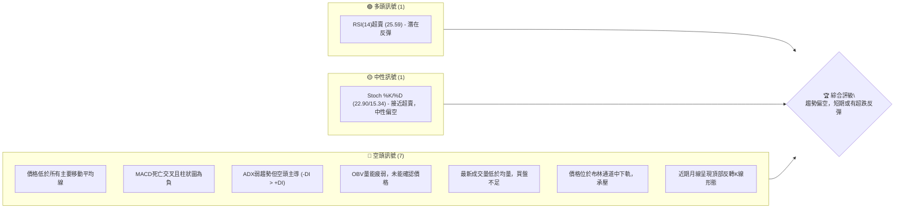

### 📊 核心指標速覽表

| 指標類別 | 指標名稱 | 當前數值 | 訊號 | 解讀 |
|----------|----------|----------|------|------|
| **價格** | 當前價格 | $8.02 | 🔴 | 位於所有主要均線下方 |
| **均線** | MA20 | $9.76 | 🔴 | 價格遠低於MA20，短期趨勢空頭 |
| **均線** | MA50 | $9.98 | 🔴 | 價格遠低於MA50，中期趨勢承壓 |
| **均線** | MA200 | $9.40 | 🔴 | 價格低於MA200，長期趨勢轉弱 |
| **動能** | RSI(14) | 25.59 | 🟢 | 進入超賣區，潛在反彈機會 |
| **動能** | MACD | -0.682 | 🔴 | MACD線在訊號線下方，空頭動能 |
| **波動** | ATR | $0.66 | 🔴 | 8.24%的相對高波動率，風險較高 |

### 🏆 技術評分卡

ONDS 的技術評分顯示，在多個維度上均處於弱勢，尤其在趨勢強度、均線排列和成交量配合方面表現不佳。

```
╔══════════════════════════════════════════════════════════════╗
║              技術評分卡 — ONDS (2026-06-30)                  ║
╠══════════════════════════════════════════════════════════════╣
║ 趨勢強度      ███░░░░░░░░░░░░░░░░░░░  30/100  🔴             ║
║ 動能指標      ████░░░░░░░░░░░░░░░░░  40/100  🟡             ║
║ 支撐穩定度    ██████░░░░░░░░░░░░░░░  60/100  🟡             ║
║ 成交量配合    ██░░░░░░░░░░░░░░░░░░░  20/100  🔴             ║
║ 形態完整度    ████░░░░░░░░░░░░░░░░░  40/100  🟡             ║
║ 均線排列      ██░░░░░░░░░░░░░░░░░░░  20/100  🔴             ║
╠══════════════════════════════════════════════════════════════╣
║ 綜合評分      ███░░░░░░░░░░░░░░░░░░░  35/100  🔴 空頭主導    ║
╚══════════════════════════════════════════════════════════════╝
```

---

## 2. 趨勢分析

### 🌐 多時框趨勢分析

ONDS 的多時框趨勢分析顯示，儘管長期曾有強勁上漲，但目前已進入全面的修正階段，短期、中期趨勢均偏空。

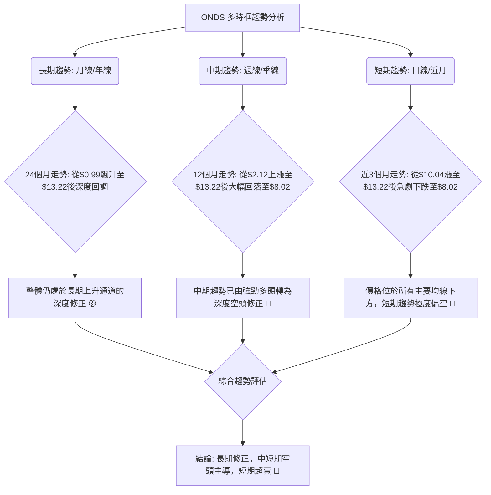

### 📈 長期趨勢 — 12個月走勢圖（Unicode）

ONDS 在過去12個月經歷了從低點 $2.12 (2025-07) 到高點 $13.22 (2026-05) 的大幅上漲，隨後在 2026-06 經歷了劇烈的單月回調。

```
ONDS 月線走勢圖（過去12個月）
價格軸 ($)
$14 ┤                                         ●(13.22)
$13 ┤
$12 ┤
$11 ┤                      ●(10.36) ●(10.08)
$10 ┤            ●(9.76)                    ●(10.04)
 $9 ┤                                  ●(9.04)
 $8 ┤                                                  ●(8.02) ←現在
 $7 ┤          ●(7.72)
 $6 ┤      ●(5.86)
 $5 ┤
 $4 ┤
 $3 ┤
 $2 ┤●(2.12)
 $1 ┤
     └────────────────────────────────────────────────────────
      25-07  25-08  25-09  25-10  25-11  25-12  26-01  26-02  26-03  26-04  26-05  26-06
```

**走勢特徵分析表格**：

| 時間區間 | 起始價 | 結束價 | 漲跌幅 | 走勢特徵 | 評估 |
|----------|--------|--------|--------|----------|------|
| 2025-07 至 2026-05 | $2.12 | $13.22 | +524.53% | 強勁的上升趨勢，期間伴隨小幅修正。 | 🟢 強勁多頭 |
| 2026-05 至 2026-06 | $13.22 | $8.02 | -39.33% | 急劇的單月下跌，跌破多個關鍵支撐。 | 🔴 深度空頭修正 |
| **整體12個月** | $2.12 | $8.02 | +278.30% | 先強後弱，目前處於長期上漲趨勢中的劇烈回調。 | 🟡 修正中 |

### 📊 中期趨勢（週線分析）

從提供的近20週收盤走勢來看，ONDS 在 2026-05-31 達到近期高點 $13.22 後，隨後連續數週大幅下跌，跌破了 $10.00、$9.00 等重要心理關口，目前在 $8.02 附近尋求支撐。週線圖上，最近三週的收盤價分別為 $9.33, $9.27, $7.83 (2026-06-28)，呈現連續下跌的趨勢，且成交量在下跌初期放量，後期萎縮。

近期壓力與支撐示意圖：
```
ONDS 中期走勢示意圖 (週線)
價格軸 ($)
$13.22 ┤              ● (2026-05-31 高點)
       │             / \
$10.43 ┤            /   \
$10.00 ┤───────────R1───╮ (心理關口 / 均線壓力區)
 $9.20 ┤           /     \
 $8.02 ┤───────────●(現價)
 $7.70 ┤───────────S1─────── (近期斐波那契支撐 / 歷史月線支撐)
 $6.30 ┤───────────S2─────── (斐波那契強支撐 / 布林下軌)
       └───────────────────────────────────
        時間軸 (近幾週)
```
*   **R1 (主要阻力)**: $9.76 - $10.00 區間 (MA20, MA50, 心理關口)
*   **S1 (近期支撐)**: $7.67 - $7.72 區間 (斐波那契50%回調，2025-09月收盤價)
*   **S2 (強支撐)**: $6.31 - $6.36 區間 (布林下軌，斐波那契61.8%回調)

### ⚡ 趨勢強度評估（ADX 解讀）

ADX 指標用於衡量趨勢的強度，而非方向。+DI 和 -DI 則指示多頭和空頭的相對強度。

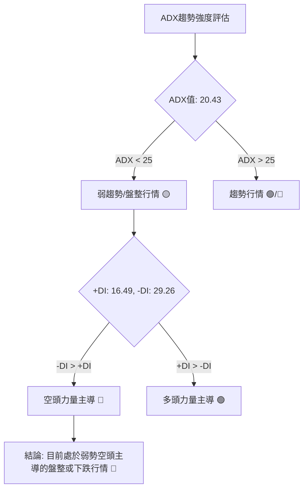

**ADX 強度對照表**：

| ADX 數值區間 | 趨勢強度 | 市場判斷 |
|--------------|----------|----------|
| 0-25         | 弱趨勢   | 盤整行情 |
| 25-50        | 中等趨勢 | 趨勢形成 |
| 50-75        | 強趨勢   | 趨勢確立 |
| 75-100       | 極強趨勢 | 趨勢過熱 |

ONDS 的 ADX(14) 為 20.43，明確指示目前處於 **弱趨勢或盤整行情**。雖然價格近期大幅下跌，但 ADX 數值較低表明這種下跌缺乏強勁的趨勢動能，更像是恐慌性拋售後的無力反彈或持續盤跌。同時，-DI (29.26) 顯著高於 +DI (16.49)，確認了當前市場由 **空頭力量主導**。這意味著即使是盤整，也更傾向於向下盤整，或在反彈後再次下跌。

---

## 3. 圖表形態分析

### 🔍 形態識別系統

根據提供的月線數據，ONDS 在 2026 年 5 月創下 $13.22 的高點後，隨後在 6 月份經歷了劇烈下跌。這種快速上漲後急劇回落的走勢，暗示了頂部形態的可能性。

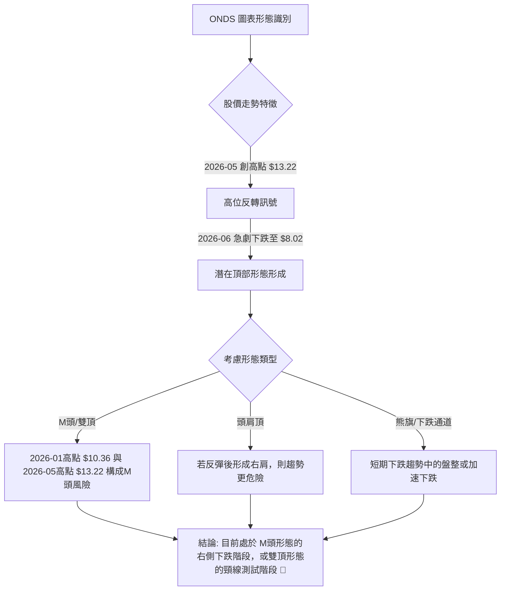

### 🕯️ 重要K線形態分析

根據提供的月線收盤價數據，我們可以推斷出以下月度 K 線形態特徵：

| 月份 | 收盤價 | K線形態 (推斷) | 解讀 | 訊號 |
|------|--------|----------------|------|------|
| 2026-05 | $13.22 | 長實體陽線/長上影線 (若考慮日內高點) | 創下新高點，但可能面臨巨大賣壓。 | 🟡 潛在見頂 |
| 2026-06 | $8.02 | 長實體陰線/大陰線 | 價格急劇下跌，完全吞噬前月漲幅。 | 🔴 強烈看空 |
| **組合** | $13.22 -> $8.02 | 烏雲罩頂/看跌吞噬 (月線級別) | 在高位出現的強烈反轉形態，確認頂部賣壓。 | 🔴 強烈反轉 |

2026年5月創下的 $13.22 高點，緊接著 6 月份的長實體陰線，在月線圖上形成了極為強烈的「烏雲罩頂」或「看跌吞噬」形態。這通常被視為一個重要的頂部反轉訊號，表明市場情緒從極度樂觀轉為悲觀，賣方力量全面壓倒買方。這種形態的出現，加劇了股價繼續下跌的風險。

### 📉 ASCII 走勢形態示意圖

以下示意圖展示了 ONDS 近期的月線走勢，尤其突出了 2026 年 5 月的高點與 6 月的急劇下跌，暗示了一個潛在的頂部反轉形態。

```
ONDS 潛在頂部形態示意圖 (月線)
價格軸 ($)
$14 ┤                      ● (2026-05 高點 $13.22)
$13 ┤                     /|\
$12 ┤                    / | \
$11 ┤                   /  |  \
$10 ┤   ● (2026-01 高點 $10.36)
 $9 ┤  /                |
 $8 ┤─S1───────────────● (2026-06 現價 $8.02)
 $7 ┤ \                 |
 $6 ┤  \                |
 $5 ┤   \               |
 $4 ┤    S2────────────J
     └──────────────────────────────────
      時間軸
```
*   **S1**: 潛在頸線支撐區域，約在 $7.70 - $8.00 附近。
*   **S2**: 更深層次的支撐，約在 $6.30 - $6.40 附近。
*   此圖顯示了從 $10.36 到 $13.22 的上升，隨後急劇跌破 $10.36，並接近 $7.70 區域。這是一個典型的 M 頭形態的右側下跌，若 $7.70 頸線被有效跌破，則下跌目標將進一步打開。

### 🎯 形態目標價計算

根據上述分析，若將 2026 年 1 月高點 $10.36 和 2026 年 5 月高點 $13.22 視為一個潛在的「M頭」形態的兩個頂部，並以 2025 年 9 月的 $7.72 作為頸線參考點。

*   **形態高點**: $13.22 (2026-05)
*   **頸線價位**: $7.72 (2025-09 月收盤價，作為參考頸線)
*   **形態高度**: $13.22 - $7.72 = $5.50

**形態目標價計算方法**:
目標價 = 頸線價位 - 形態高度
目標價 = $7.72 - $5.50 = **$2.22**

**詳細說明**:
這個 $2.22 的目標價是一個基於經典形態分析的理論目標，通常在頸線被有效跌破並確認後才會實現。它代表了 M 頭形態可能導致的潛在下跌幅度。考慮到 ONDS 在 2024 年底至 2025 年初的低點約在 $0.77-$0.99 區間，這個目標價雖然激進，但並非沒有歷史低點的呼應。然而，在實際交易中，價格往往會在達到理論目標之前，在斐波那契回調位或更強的歷史支撐位獲得支撐。因此，在 $2.22 之前，我們應關注 $6.36 (斐波那契61.8%)、$5.86 (2025-08低點) 等更近期的支撐位。

---

## 4. 支撐與阻力

### 🗺️ 關鍵價位分布圖（Unicode）

ONDS 目前的價位結構顯示，上方阻力重重，而下方則有數個關鍵支撐等待考驗。

```
ONDS 價位結構分布圖
═══════════════════════════════════════════════════
$15.28 ║████████████████████████║ 52週高點 / 極強阻力 R4
$13.22 ║████████████████████████║ 強阻力 R3 (2026-05高點)
$10.36 ║████████████████████    ║ 阻力 R2 (2026-01高點 / MA120)
 $9.98 ║████████████████████████║ 關鍵阻力 R1 (MA50)
 $9.76 ║████████████████████████║ 關鍵阻力 R1 (MA20 / BB中軌)
 $9.40 ║████████████████████████║ 關鍵阻力 R1 (MA200)
 $8.02 ╠════════════════════════╣ ◄ 現價
 $7.72 ║▓▓▓▓▓▓▓▓▓▓▓▓▓▓▓▓        ║ 近期支撐 S1 (2025-09月收盤 / Fib 50%回調)
 $7.67 ║▓▓▓▓▓▓▓▓▓▓▓▓▓▓▓▓        ║ 近期支撐 S1 (斐波那契50%回調)
 $6.36 ║████████████████████████║ 強支撐 S2 (斐波那契61.8%回調 / BB下軌)
 $6.31 ║████████████████████████║ 強支撐 S2 (布林通道下軌)
 $5.86 ║████████████████████████║ 歷史支撐 S3 (2025-08月收盤)
 $1.69 ║████████████████████████║ 52週低點 / 極強支撐 S4
═══════════════════════════════════════════════════
```

### 🚧 阻力位分析表

ONDS 上方的阻力位密集且強勁，主要由移動平均線、歷史高點和布林通道上軌構成，突破難度較大。

| 阻力級別 | 價位 | 形成原因 | 突破難度 | 重要性 |
|----------|------|----------|----------|--------|
| **R1** | $9.40 - $9.98 | MA200 ($9.40), MA20 ($9.76), BB中軌 ($9.76), MA50 ($9.98)。多條均線在此形成密集壓力區。 | 極高 🔴 | 非常關鍵，突破此區才能扭轉短期頹勢。 |
| **R2** | $10.36 | 2026-01 月高點，也是 MA120 所在，具備較強心理和技術阻力。 | 高 🔴 | 突破此位才能挑戰更高點。 |
| **R3** | $13.22 | 2026-05 月歷史高點，也是 M 頭形態的頂部，賣壓沉重。 | 極高 🔴 | 需極大利好才能觸及甚至突破。 |
| **R4** | $15.28 | 52 週最高點，代表過去一年的最高市場認可價位。 | 極高 🔴 | 長期多頭反轉的終極考驗。 |

### 🛡️ 支撐位分析表

ONDS 下方的支撐位主要集中在斐波那契回調和布林通道下軌，這些位置有望提供一定的買盤支撐。

| 支撐級別 | 價位 | 形成原因 | 守住機率 | 重要性 |
|----------|------|----------|----------|--------|
| **S1** | $7.67 - $7.72 | 斐波那契50%回調位 ($7.67)，2025-09 月收盤價 ($7.72)。近期重要心理和技術支撐。 | 中 🟡 | 若跌破此位，將確認更深層次的回調。 |
| **S2** | $6.31 - $6.36 | 布林通道下軌 ($6.31)，斐波那契61.8%回調位 ($6.36)。強勁的技術和形態支撐。 | 高 🟢 | 重要的多頭防線，是 M 頭形態頸線的關鍵防守點。 |
| **S3** | $5.86 | 2025-08 月收盤價，歷史上漲的起點之一。 | 中高 🟡 | 跌破 S2 後的下一個重要考驗。 |
| **S4** | $1.69 | 52 週最低點，代表過去一年市場的最低認可價位。 | 較低 🟢 | 最終防線，若觸及則意味著長期趨勢的徹底破壞。 |

### 📐 斐波那契回調位分析

我們以 ONDS 自 2025 年 7 月的低點 $2.12 作為主要上漲波段的起點，至 2026 年 5 月高點 $13.22 作為終點，計算其回調位。

*   **上漲波段範圍**: $13.22 - $2.12 = $11.10
*   **當前價格**: $8.02

**斐波那契回調位計算及分析**:

| 回調比例 | 回調價位 | 距現價 ($8.02) | 意義 | 訊號 |
|----------|----------|----------------|------|------|
| **38.2%** | $8.98 | +12.0% (阻力) | 淺層回調位，若能突破並站穩，則可能止跌反彈。 | 🟡 阻力 |
| **50.0%** | $7.67 | -4.4% (支撐) | 重要的心理和技術支撐位，與 S1 區域重疊。 | 🟢 支撐 |
| **61.8%** | $6.36 | -20.7% (支撐) | 黃金回調位，通常被視為多頭趨勢的最後防線。與 S2 區域重疊。 | 🟢 強支撐 |
| **76.4%** | $4.74 | -40.9% (支撐) | 深層回調位，若跌至此位，長期多頭趨勢將面臨嚴峻考驗。 | 🟡 潛在支撐 |

**視覺化斐波那契回調**:
```
ONDS 斐波那契回調示意圖 (從 $2.12 至 $13.22)
價格軸 ($)
$13.22 ┤─────────────────── 高點
       │
 $8.98 ┤───────────────38.2%回調 (RSI超賣反彈的初步目標)
       │
 $8.02 ┤─────────────── 現價
 $7.67 ┤───────────────50.0%回調 (關鍵心理支撐)
       │
 $6.36 ┤───────────────61.8%回調 (黃金回調位，重要防線)
       │
 $4.74 ┤───────────────76.4%回調 (深層支撐)
       │
 $2.12 ┤─────────────────── 低點
       └───────────────────────────────────
        斐波那契回調區間
```
ONDS 目前股價 $8.02 位於斐波那契 38.2% ($8.98) 和 50% ($7.67) 回調位之間，且更接近 50% 回調位。這表明股價正處於一個關鍵的支撐測試區域。若能守住 $7.67，則有望形成底部並展開反彈；若跌破，則將進一步測試 $6.36 的黃金回調位。

---

## 5. 技術指標深度解讀

### 🎛️ 指標訊號總覽

ONDS 的各項技術指標目前呈現出複雜的訊號，但整體而言，空頭力量佔據主導，僅有 RSI 顯示超賣可能帶來短期反彈。

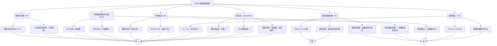

### 📈 移動平均線排列分析

ONDS 的移動平均線系統呈現出顯著的空頭排列特徵，對股價構成強大壓力。

| 移動平均線 | 數值 | 與現價 ($8.02) 關係 | 走勢 | 訊號 |
|------------|------|--------------------|------|------|
| MA5        | $7.95 | 現價上方 (微幅)      | 向上 | 🟡 |
| MA10       | $8.57 | 現價上方           | 向下 | 🔴 |
| MA20       | $9.76 | 現價上方           | 向下 | 🔴 |
| MA50       | $9.98 | 現價上方           | 向下 | 🔴 |
| MA60       | $9.91 | 現價上方           | 向下 | 🔴 |
| MA120      | $10.36 | 現價上方           | 向下 | 🔴 |
| MA200      | $9.40 | 現價上方           | 向下 | 🔴 |
| MA240      | $8.44 | 現價上方           | 向下 | 🔴 |

**分析**:
*   **價格位置**: 當前價格 $8.02 位於除了 MA5 ($7.95) 之外的所有主要移動平均線下方。這是一個極為強烈的空頭訊號，表明短期、中期、長期趨勢均已轉弱或處於下跌通道中。
*   **均線走勢**: 所有中長期均線 (MA10, MA20, MA50, MA60, MA120, MA200, MA240) 均呈現向下走勢，這確認了下降趨勢的確立。
*   **均線排列**: 雖然數據中提到「混合排列」，但從絕對位置來看，除了 MA5 之外，所有均線均在價格上方，且中長期均線的排列順序是 MA120 > MA50 > MA60 > MA20 > MA200 > MA10 > MA240，這是一種多頭排列被破壞後的糾結向下排列，本質上是空頭主導的表現。
*   **壓力位**: MA20 ($9.76)、MA50 ($9.98)、MA200 ($9.40) 等將在股價反彈時構成強勁的阻力。

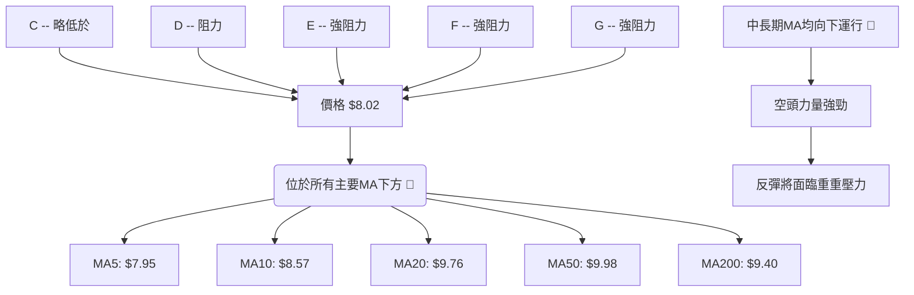

### 📉 RSI(14) 分析

*   **RSI 數值進度條展示**:
    RSI(14): 25.59  🟢 超賣區間 (0-30)
    ▓▓▓▓▓░░░░░░░░░░░░░░░░ 25.59%

*   **超買超賣區間分析**:
    ONDS 的 RSI(14) 當前數值為 25.59，明確落入傳統意義上的「超賣區間」（通常指 RSI 低於 30）。
    *   **訊號**: 🟢 RSI 超賣通常被視為一個潛在的多頭反彈訊號，表明在短期內，市場可能對該股票進行了過度拋售，股價有技術性反彈的需求。
    *   **解讀**: 儘管 RSI 處於超賣，但這並不意味著股價會立即反轉上漲。在強勢的下跌趨勢中，RSI 可以在超賣區徘徊一段時間，或者在短暫反彈後繼續下跌。因此，單獨的超賣訊號應謹慎對待，需要其他指標的確認。

*   **背離判斷（頂背離/底背離）**:
    根據提供的數據，「RSI 背離: 無明顯背離」。這意味著在價格創新低（或接近新低）的同時，RSI 並未出現不創新低的「底背離」訊號。缺乏底背離，使得當前的超賣訊號更多地被解讀為下跌過程中的正常現象，而非強烈的反轉預警。因此，RSI 僅提供了一個潛在的短線反彈機會，而非趨勢逆轉的訊號。

### 📊 MACD(12/26/9) 訊號解讀

MACD 指標是衡量動量和趨勢的利器，ONDS 的 MACD 數據呈現出明顯的空頭態勢。

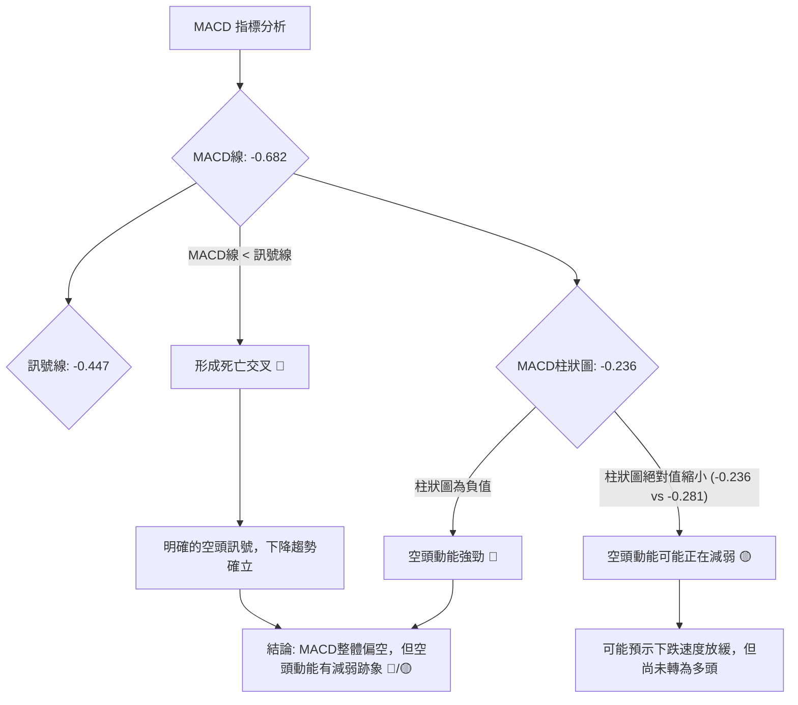

**分析**:
*   **死亡交叉**: MACD 線 (-0.682) 位於訊號線 (-0.447) 下方，這是一個經典的「死亡交叉」形態，明確指示股價處於下降趨勢之中。這是強烈的空頭訊號。
*   **柱狀圖**: MACD 柱狀圖為負值 (-0.236)，表明空頭動能佔據主導。然而，其絕對值從前一周的 -0.281 縮小至 -0.236，這可能暗示下跌的動能在減緩。雖然這並不是一個多頭訊號，但它可能預示著股價下跌的急劇程度正在降低，可能會進入盤整或緩慢築底階段。
*   **綜合判斷**: MACD 指標整體上仍處於空頭市場，確認了股價的下跌趨勢。儘管柱狀圖顯示空頭動能有所減弱，但這不足以構成反轉訊號，仍需謹慎。

### 📦 布林通道分析

布林通道能有效顯示股價的波動範圍和相對位置。

```
ONDS 布林通道示意圖
價格軸 ($)
$13.21 ┤──────────────────────── BB上軌
       │                          ▓▓▓▓▓▓▓▓▓▓▓▓▓▓▓▓
       │                       ▓▓▓▓▓▓▓▓▓▓▓▓▓▓▓▓▓▓▓▓
 $9.76 ┤──────────────────────── BB中軌 (MA20)
       │                    ▓▓▓▓▓▓▓▓▓▓▓▓▓▓▓▓▓▓▓▓▓▓▓▓
       │                 ▓▓▓▓▓▓▓▓▓▓▓▓▓▓▓▓▓▓▓▓▓▓▓▓▓▓▓▓
 $8.02 ┤───────────────● 現價
       │             ▓▓▓▓▓▓▓▓▓▓▓▓▓▓▓▓▓▓▓▓▓▓▓▓▓▓▓▓▓▓▓▓
       │          ▓▓▓▓▓▓▓▓▓▓▓▓▓▓▓▓▓▓▓▓▓▓▓▓▓▓▓▓▓▓▓▓▓▓▓▓
 $6.31 ┤──────────────────────── BB下軌
       └───────────────────────────────────
        時間軸
```

**分析**:
*   **價格位置**: 當前價格 $8.02 位於布林通道的中軌 ($9.76) 和下軌 ($6.31) 之間，且更靠近下軌。這是一個明確的🔴空頭訊號，表明股價處於下跌趨勢中，並持續受到中軌的壓制。
*   **BB %B**: %B 值為 0.25，這表示價格位於布林通道底部 25% 的位置，進一步確認了價格偏向布林通道下沿。通常，%B 值低於 0.2 甚至 0 時，才被視為極度超賣，可能觸發反彈。
*   **通道寬度**: 上軌 $13.21，下軌 $6.31，通道寬度為 $6.90，約佔中軌 $9.76 的 70.7%。如此寬闊的通道表明 ONDS 的波動性非常高 (與 ATR 數據一致)。高波動性意味著價格在短期內可能出現劇烈變動，無論是下跌還是反彈。
*   **綜合判斷**: 布林通道顯示 ONDS 股價在下跌通道中運行，下軌 $6.31 將是重要的支撐位。高波動性則意味著風險與機會並存。

### 💹 成交量分析（量價配合度）

成交量是判斷價格走勢是否可靠的重要依據。

*   **最新成交量**: 55,800,186 股
*   **20日均量**: 64,087,714 股 (量比: 0.87x)
*   **50日均量**: 70,721,700 股
*   **OBV趨勢**: OBV < MA → 量能疲弱

**分析**:
*   **成交量萎縮**: 最新成交量顯著低於 20 日和 50 日的平均成交量。這表明在當前價格水平上，市場的交易活動相對不活躍。
    *   **下跌過程中的量能萎縮**: 在股價下跌過程中，如果成交量萎縮，通常有兩種解讀：
        1.  **缺乏拋壓**: 賣方力量可能正在枯竭，下跌動能減弱，可能預示著底部即將形成。
        2.  **缺乏買盤**: 更常見的解釋是，市場缺乏足夠的買盤來支撐股價，導致價格持續走低。
    *   對於 ONDS 而言，結合其他空頭指標（如 MACD、均線），量能萎縮更傾向於後者，即 **缺乏買盤支撐**，這是一個🔴空頭訊號。
*   **OBV趨勢**: OBV (On-Balance Volume) 趨勢顯示「OBV < MA → 量能疲弱」。這意味著在價格下跌的過程中，累積的買入壓力不及賣出壓力，再次確認了市場的弱勢。OBV未能與價格同步或領先反轉，表明當前下跌趨勢的可靠性較高。
*   **量價背離**: 目前股價處於下跌趨勢中，但成交量相對萎縮。這是一種量價背離，顯示下跌的動能可能在減弱，但同時也暗示市場缺乏足夠的參與者來推動價格反轉。對於反彈而言，如果沒有成交量的顯著放大，反彈的持續性將會受到質疑。

---

## 6. 動能與波動率

### ⚡ 動能評估四象限

ONDS 目前處於「弱動能、高波動」的象限，這是一個需要極度謹慎的市場環境。

| 象限 | 動能 | 波動 | 當前狀態 (ONDS) | 評估 |
|------|------|------|-----------------|------|
| Q1 | 強 | 低 | -                 | 最佳機會 (趨勢明確，風險可控) |
| Q2 | 弱 | 低 | -                 | 謹慎觀望 (缺乏方向，波動小) |
| Q3 | 強 | 高 | -                 | 高風險高收益 (追漲殺跌風險大) |
| Q4 | 弱 | 高 | ✓                 | **避免進場** (方向不明，波動劇烈，極易被套牢) |

**分析**:
ONDS 的 RSI 雖處於超賣區 (25.59)，但 MACD 仍為空頭，且 ADX 顯示弱趨勢且空頭主導 (-DI > +DI)。價格位於所有主要均線下方，成交量萎縮。這些綜合訊號表明 ONDS 的 **動能極弱**，市場缺乏明確的買盤支持。
同時，ATR(14) 為 $0.66，佔股價的 8.24%，布林通道寬度也很大，顯示其 **波動率極高**。
因此，ONDS 目前位於 Q4 象限。在這種市場環境下，股價容易出現大幅度的無序波動，且缺乏上漲動能，投資者面臨極高的不確定性和風險。建議投資者應避免在此時進場，或僅以極小的倉位進行短線的超跌反彈交易，並嚴格控制風險。

### 📊 ATR 波動率分析

*   **ATR(14)**: $0.66
*   **ATR佔股價比例**: $0.66 / $8.02 = 8.24%

**分析**:
ONDS 的 14 日平均真實波幅 (ATR) 為 $0.66，佔當前股價 $8.02 的 8.24%。這個百分比相對較高，表明 ONDS 是一隻波動性非常大的股票。
*   **高波動性影響**:
    *   **風險增加**: 每日價格波動範圍大，意味著投資者可能在短時間內面臨較大的浮動虧損或收益。
    *   **止損設置**: 由於波動性高，傳統的固定百分比止損點可能過於緊密，容易被“洗盤”出場。建議在設置止損時，應考慮 ATR 的倍數，例如 1.5 倍或 2 倍 ATR，以給予股價足夠的波動空間。
        *   若以現價 $8.02 計算，1.5倍 ATR 為 $0.99，2倍 ATR 為 $1.32。
        *   這意味著止損點應至少在進場價下方 $1.00 - $1.30 的範圍。
    *   **倉位管理**: 高波動性股票應搭配較小的倉位，以降低單一交易對整體投資組合的衝擊。
*   **綜合判斷**: ONDS 的高 ATR 證實了其高風險、高回報的潛在特徵。交易者必須有充分的風險意識和應對策略。

### 📐 Beta 與市場相關性

提供的數據中並未直接給出 ONDS 的 Beta 值。

**分析**:
*   **Beta 概念**: Beta 值衡量個股相對於整個市場（如 S&P 500 指數）的波動性。
    *   Beta > 1: 股票波動性大於市場。
    *   Beta < 1: 股票波動性小於市場。
    *   Beta = 1: 股票波動性與市場一致。
    *   Beta < 0: 股票走勢與市場相反 (極少見)。
*   **對 ONDS 的推斷**: 雖然沒有具體數值，但從其高 ATR (8.24%) 和作為科技股（Communication Equipment 行業）的性質來看，ONDS 很可能是一個 **高 Beta 股票** (Beta 值可能大於 1)。
*   **市場相關性影響**:
    *   **順週期性**: 如果 ONDS 具有高 Beta 值，它在牛市中可能會跑贏大盤，但在熊市中也可能跌幅更深。
    *   **系統性風險**: 當整體市場面臨調整或下跌時，高 Beta 股票更容易受到衝擊。投資者在考慮 ONDS 時，除了關注公司自身的基本面和技術面外，還需密切留意宏觀經濟環境和整體股市的健康狀況。
*   **綜合判斷**: 缺乏 Beta 數據限制了我們對其市場相關性的精確評估，但高波動性已暗示其可能具有較強的市場敏感性。

---

## 7. 多時框架總結

### 📋 時框架評分表

ONDS 在不同時間框架下的技術評估結果顯示，短期和中期趨勢均處於空頭，長期趨勢也正經歷深度修正。

| 時框架 | 趨勢方向 | 動能 | 均線排列 | 形態 | 綜合評分 | 建議 |
|--------|----------|------|----------|------|----------|------|
| **短期** | 🔴 極度偏空 | 🟡 超賣但未轉強 | 🔴 空頭排列 | 🔴 下跌趨勢 | 2/10 | 避免做多，或僅限超跌反彈 |
| **中期** | 🔴 深度修正 | 🔴 轉弱 | 🔴 糾結偏空 | 🔴 M頭確認中 | 3/10 | 謹慎觀望，等待築底訊號 |
| **長期** | 🟡 修正中 | 🟡 轉弱 | 🟡 混合偏空 | 🔴 潛在頂部反轉 | 4/10 | 長期觀察，等待趨勢逆轉 |

### 🔲 綜合訊號矩陣

以下 Mermaid 圖表展示了短期、中期、長期各維度訊號的一致性分析，突顯了 ONDS 目前的疲弱態勢。

```mermaid
graph TD
    subgraph "短期 (Daily/Weekly)"
        S_Trend["趨勢: 🔴 極度偏空"]
        S_Momentum["動能: 🟡 超賣，但未轉強"]
        S_MA["均線: 🔴 空頭排列"]
        S_Vol["成交量: 🔴 萎縮，無買盤"]
        S_RSI["RSI: 🟢 超賣"]
        S_MACD["MACD: 🔴 死亡交叉"]
        S_ADX["ADX: 🔴 弱趨勢，空頭主導"]
        S_Score["綜合評分: 2/10"]
    end

    subgraph "中期 (Weekly/Monthly)"
        M_Trend["趨勢: 🔴 深度修正"]
        M_Momentum["動能: 🔴 轉弱"]
        M_MA["均線: 🔴 糾結偏空"]
        M_Pattern["形態: 🔴 M頭確認中"]
        M_Fib["斐波那契: 🟡 測試50%支撐"]
        M_BB["布林通道: 🔴 價格中下軌"]
        M_Score["綜合評分: 3/10"]
    end

    subgraph "長期 (Monthly/Yearly)"
        L_Trend["趨勢: 🟡 修正中"]
        L_Momentum["動能: 🟡 轉弱"]
        L_MA["均線: 🟡 混合偏空"]
        L_Pattern["形態: 🔴 潛在頂部反轉"]
        L_HighLow["52W高低: 🟡 處於中低區間"]
        L_Score["綜合評分: 4/10"]
    end

    S_Score --> Overall_Summary["🎯 綜合結論: 🔴 市場極度疲弱，短期有超跌反彈可能，但趨勢偏空"]
    M_Score --> Overall_Summary
    L_Score --> Overall_Summary
```
**分析**:
綜合多時框架分析，ONDS 目前處於一個極度疲弱的技術狀態。短期內，雖然 RSI 顯示超賣，可能引發技術性反彈，但所有關鍵趨勢和動能指標都指向空頭。中期來看，股價在經歷大幅上漲後進入深度修正，並有 M 頭頂部反轉的風險。長期而言，儘管相對歷史低點仍處於高位，但當前的修正深度和速度令人擔憂，長期多頭結構正受到嚴峻考驗。總體而言，ONDS 在目前階段應以 **空頭思維** 對待，任何反彈都可能被視為做空的機會，或僅是短線止跌。

---

## 8. 交易策略建議

### 🗺️ 策略決策流程圖

針對 ONDS 目前的技術狀況，以下是策略決策的流程圖，主要考量其空頭趨勢和超賣狀況。

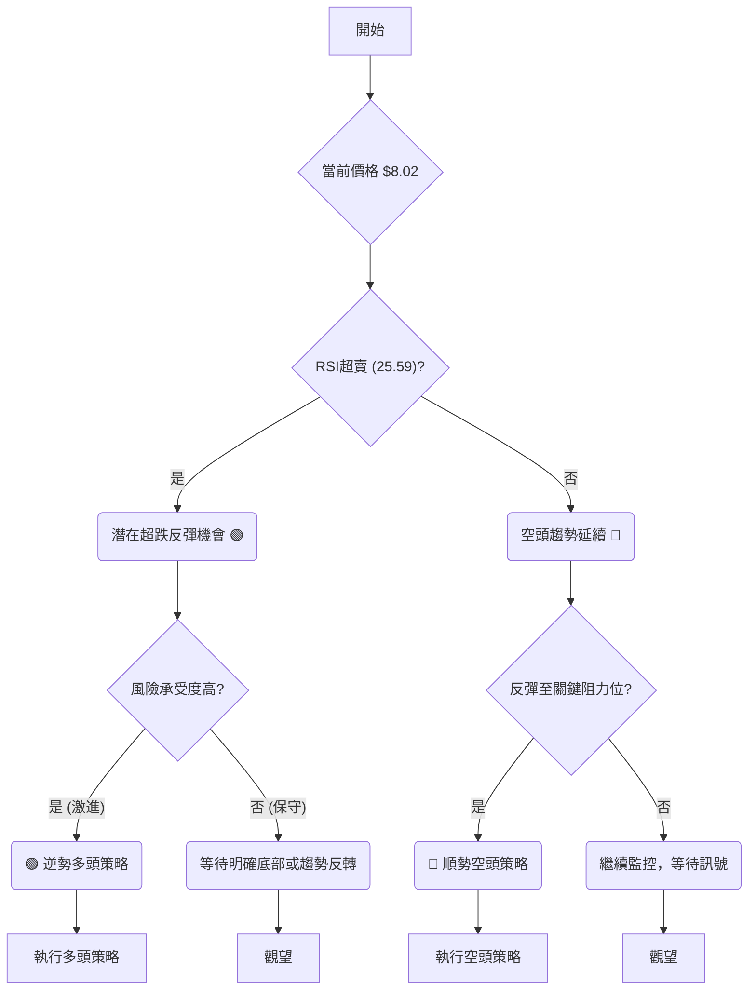

### 🟢 多頭策略詳情 (激進反彈交易)

此策略基於 RSI 超賣和股價接近斐波那契重要支撐的潛在反彈機會。由於是逆勢交易，風險較高，需嚴格控制倉位和止損。

| 策略要素 | 策略 A (超跌反彈) |
|----------|--------------------|
| 進場條件 | 價格在 $7.67 (斐波那契50%回調位) 附近企穩，並出現明顯止跌K線訊號。 |
| 進場價格 | **$7.70** |
| 目標價 T1 | **$8.98** (斐波那契38.2%回調位) |
| 目標價 T2 | **$9.40** (MA200，強阻力) |
| 止損價格 | **$6.90** (略低於斐波那契50%回調位 $7.67 和布林下軌 $6.31 之間，提供約 1.2 倍 ATR 緩衝) |
| 風險報酬比 | T1: (8.98 - 7.70) / (7.70 - 6.90) = 1.28 / 0.80 = **1.60 : 1** |
| | T2: (9.40 - 7.70) / (7.70 - 6.90) = 1.70 / 0.80 = **2.12 : 1** |
| 成功機率 | 40% (逆勢交易，風險高，需嚴格執行) |
| 建議倉位 | 5-10% (小倉位試探) |

### 🔴 空頭策略詳情 (順勢反彈做空)

此策略基於 ONDS 明顯的空頭趨勢、均線壓制和 MACD 空頭訊號。等待股價反彈至關鍵阻力位時進行做空，勝率相對較高。

| 策略要素 | 策略 A (反彈做空) |
|----------|--------------------|
| 進場條件 | 價格反彈至 $9.00 - $9.40 區間 (斐波那契38.2%回調位/MA200)，並出現看跌K線訊號。 |
| 進場價格 | **$9.20** |
| 目標價 T1 | **$7.70** (近期支撐，斐波那契50%回調位) |
| 目標價 T2 | **$6.30** (斐波那契61.8%回調位/布林下軌) |
| 止損價格 | **$10.00** (略高於 MA50 $9.98，提供約 1.2 倍 ATR 緩衝) |
| 風險報酬比 | T1: (9.20 - 7.70) / (10.00 - 9.20) = 1.50 / 0.80 = **1.88 : 1** |
| | T2: (9.20 - 6.30) / (10.00 - 9.20) = 2.90 / 0.80 = **3.63 : 1** |
| 成功機率 | 60% (順勢交易，相對較高) |
| 建議倉位 | 10-15% (中等倉位) |

### ⭐ 整體訊號強度評星

```
做多訊號強度：★★☆☆☆  (2/5星)
    理由：僅RSI超賣提供潛在反彈機會，但整體趨勢極差，均線空頭排列，逆勢風險高，反彈持續性存疑。

做空訊號強度：★★★★☆  (4/5星)
    理由：短期趨勢明確空頭，均線壓制，MACD空頭，形態有頂部風險。順勢交易機會較大，風險報酬比優異。

整體可信度：  ★★★☆☆  (3/5星)
    理由：市場波動性高，多空策略均有其邏輯。空頭策略基於趨勢，勝率相對較高；多頭策略為逆勢，需嚴格風控。
```

---

## 9. 風險提示與監控

### ✅ 關鍵監控指標 Checklist

以下是交易 ONDS 時應密切關注的關鍵技術和市場指標清單，以確保及時調整策略並管理風險。

```
╔══════════════════════════════════════════════════════════════╗
║              ONDS 關鍵監控指標清單                           ║
╠══════════════════════════════════════════════════════════════╣
║ ├─ 價格是否持續低於MA20 ($9.76)?              [🔴 是 ]        ║
║ ├─ RSI是否突破30並持續向上?                  [🟡 否，但接近]   ║
║ ├─ MACD是否出現黃金交叉或柱狀圖轉正?          [🔴 否 ]        ║
║ ├─ 成交量是否在反彈時顯著放大?                [🔴 否 ]        ║
║ ├─ 是否有效跌破斐波那契50%回調位 ($7.67)?      [🟡 接近]       ║
║ ├─ ADX是否轉強並顯示多頭主導 (+DI > -DI)?     [🔴 否 ]        ║
║ ├─ 股價是否跌破布林通道下軌 ($6.31)?          [🟡 否，但接近]   ║
║ ├─ 是否有任何利好消息發布 (基本面)?           [🔴 否 ]        ║
║ └─ 52週低點 ($1.69) 是否有被測試的風險?       [🟡 可能性低，但需警惕]║
╚══════════════════════════════════════════════════════════════╝
```

### ⚠️ 風險場景分析

ONDS 目前處於關鍵的修正階段，未來走勢存在多種可能性。以下是三種主要情境的分析：

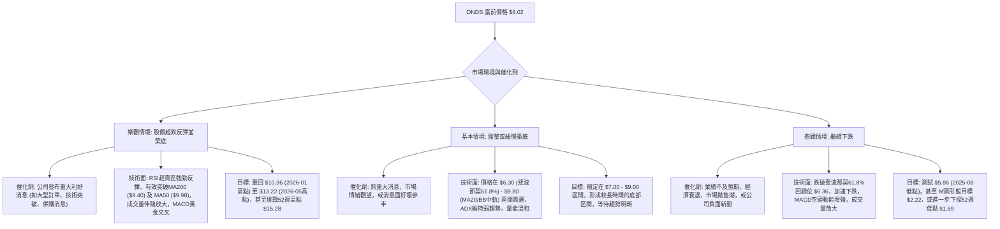

### 🛡️ 風險管理重要提醒

1.  **倉位控制**: ONDS 的高波動性 (ATR 8.24%) 要求投資者必須嚴格控制單一股票的倉位。建議不超過總投資組合的 5-10%，以避免單一股票的劇烈波動對整體資產造成過大影響。
2.  **止損執行**: 無論採用何種策略，都必須設定明確的止損點並嚴格執行。一旦價格觸及止損位，應果斷離場，避免因情緒因素導致虧損擴大。高波動性股票的止損點應給予足夠的緩衝空間 (例如 1.5-2 倍 ATR)。
3.  **多空平衡與逆勢交易**: 目前 ONES 整體趨勢偏空。逆勢做多（如超跌反彈）應僅限於小倉位，並以短線快速交易為主，獲利即走。順勢做空雖然勝率較高，但也需警惕市場情緒的突然反轉和軋空風險。
4.  **基本面監控**: 雖然本報告專注於技術分析，但基本面因素可能隨時改變技術走勢。投資者應密切關注 Ondas Inc. 的財報發布、業務發展、行業新聞以及分析師評級變動，及時將基本面信息納入決策考量。
5.  **市場情緒與板塊輪動**: 留意整體市場走勢和科技股板塊的表現。大盤的系統性風險或行業的負面消息可能對 ONDS 產生巨大影響。在弱勢市場中，即使個股有反彈訊號，也可能因大盤拖累而失敗。
6.  **時間框架匹配**: 確保您的交易策略與所分析的時間框架一致。短期交易者應更關注日內或日線圖的訊號，而中長期投資者則應以週線和月線圖的趨勢為主。

---

## 📋 報告總結

```
╔══════════════════════════════════════════════════════════════════╗
║              ONDS 技術分析報告總結                               ║
╠══════════════════════════════════════════════════════════════════╣
║ 報告日期：2026-06-30                                               ║
║ 當前價格：$8.02                                                    ║
║ 分析評級：⚖️ 🔴 空頭主導，短期有超賣反彈機會 (整體趨勢偏弱，風險較高)║
║                                                                  ║
║ 關鍵結論：                                                         ║
║ ├─ 長期趨勢：🟡 曾強勁上漲，目前處於深度修正階段，結構未完全破壞。      ║
║ ├─ 中期趨勢：🔴 已從多頭轉為空頭修正，M頭形態確認中，壓力巨大。          ║
║ ├─ 短期趨勢：🔴 極度偏空，價格位於所有主要均線下方，動能疲弱。          ║
║ ├─ 關鍵支撐：$7.67 (斐波那契50%回調), $6.36 (斐波那契61.8%回調/BB下軌)  ║
║ ├─ 關鍵阻力：$9.40 (MA200), $9.76 (MA20/BB中軌), $9.98 (MA50)       ║
║ └─ 分析師目標：$20.12 (市場普遍預期，但與當前技術面嚴重背離，需時間修復) ║
║                                                                  ║
║ 最優策略組合：                                                     ║
║ 1. 🥇 最佳機會：**順勢空頭策略**。等待價格反彈至 $9.00 - $9.40 阻力區間，確認看跌訊號後做空，目標價 $7.70 / $6.30。風險報酬比優異。  ║
║ 2. 🥈 次選機會：**激進反彈多頭策略**。若價格在 $7.67 附近企穩並出現明確止跌K線，可小倉位介入超跌反彈，目標價 $8.98 / $9.40。此為逆勢交易，風險高。║
║ 3. 🥉 保守選擇：**觀望等待**。目前市場環境不確定性高，波動劇烈。保守投資者應等待明確的底部形態、趨勢反轉訊號或基本面利好出現後再考慮入場。║
╚══════════════════════════════════════════════════════════════════╝
```

---

> ⚠️ **免責聲明**：本報告為 AI 自動生成之技術分析，所有數據及估算均基於提供的歷史價格資訊。本報告**僅供研究與學術參考**，**不構成任何投資建議**。投資有風險，入市需謹慎。

---

*報告生成時間：2026-06-30 ｜ 數據來源：Yahoo Finance ｜ 分析框架：多時框技術分析*