<details>
<summary>📊 靜態圖表 (點擊展開)</summary>
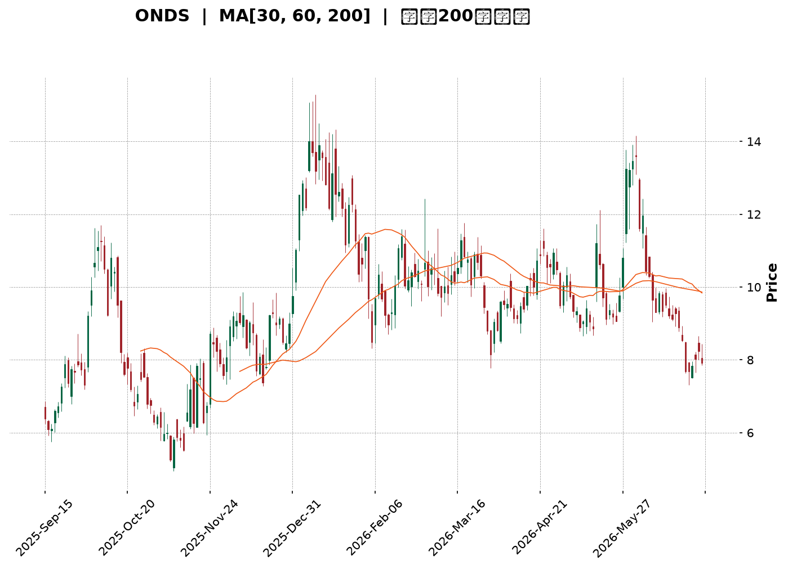
</details>

<html>
<head><meta charset="utf-8" /></head>
<body>
    <div style="height:500px; width:100%;">                        <script>window.PlotlyConfig = {MathJaxConfig: 'local'};</script>
        <script charset="utf-8" src="https://cdn.plot.ly/plotly-3.6.0.min.js" integrity="sha256-QaOVwtVY0T02VaHrr6pnoHLCwayMJp4O5n4YyaE3rJk=" crossorigin="anonymous"></script>                <div id="candlestick-chart" class="plotly-graph-div" style="height:100%; width:100%;"></div>            <script>                window.PLOTLYENV=window.PLOTLYENV || {};                                if (document.getElementById("candlestick-chart")) {                    Plotly.newPlot(                        "candlestick-chart",                        [{"close":{"dtype":"f8","bdata":"AAAAwB6FGUAAAAAAKVwYQAAAAGBmZhhAAAAAYGZmGkAAAACgR+EaQAAAAIA9Ch1AAAAAwB6FH0AAAABgZmYdQAAAAAAAAB9AAAAAANejHkAAAABA4XofQAAAAKBH4R5AAAAAoHA9HUAAAAAghWsiQAAAAIDr0SNAAAAAgOtRJUAAAACAFC4mQAAAAMAehSZAAAAAQOH6JEAAAADgo3AiQAAAAGC4niVAAAAAgOvRJEAAAADAHgUjQAAAAGBmZiBAAAAA4KNwHkAAAADgehQfQAAAAGCPwhxAAAAAgML1GkAAAACgcD0cQAAAAEAK1x1AAAAAYLgeHkAAAADA9SgbQAAAAAAAABtAAAAAwPUoGUAAAABgj8IZQAAAAKCZmRhAAAAAQArXF0AAAAAAAAAYQAAAAAAAABVAAAAAoHA9F0AAAADAHoUXQAAAAEAzMxdAAAAAgD0KFkAAAACgcD0aQAAAAOBRuBxAAAAAwB4FGUAAAAAAKVwfQAAAAAAAAB5AAAAA4HoUGUAAAADgo\u002fAaQAAAAOCjcCFAAAAAoEfhIEAAAABA4XogQAAAAKCZmR9AAAAAgOtRHkAAAAAA1yMgQAAAAEAK1yFAAAAAoEdhIkAAAAAA1yMiQAAAAIA9CiJAAAAAgMJ1IkAAAABgZqYgQAAAAIA9CiJAAAAAAACAIUAAAABgj8IeQAAAAIAULiBAAAAAQOF6HUAAAABAMzMfQAAAAOCjcCJAAAAAgD2KIkAAAAAgheshQAAAAGCPQiJAAAAAgML1IEAAAAAghesgQAAAAEDh+iFAAAAAwB6FI0AAAACAPQomQAAAACBcDylAAAAAgBSuKUAAAAAAKVwoQAAAAMAeBSxAAAAAoEdhK0AAAACgR2EqQAAAACCuxytAAAAAYLgeK0AAAAAA16MpQAAAAIDrUShAAAAAYI9CKkAAAACgmRkpQAAAAKBwPSlAAAAAQApXKEAAAACA61EmQAAAAMAehShAAAAAgD2KKEAAAACAPYomQAAAAOBRuCRAAAAAIK5HJUAAAABgj8ImQAAAAAApXCNAAAAAgML1IEAAAACgR2EjQAAAAIAUriRAAAAAAClcI0AAAACAwnUiQAAAAOCj8CFAAAAAYLieIkAAAACgmRkkQAAAAADXIyZAAAAAIK7HJkAAAAAgXA8kQAAAAKBHYSRAAAAAwMzMJEAAAACgmZkkQAAAAGBm5iRAAAAAwPUoJEAAAABAClclQAAAAIA9CiRAAAAAwB4FJUAAAABA4fokQAAAAMD1qCNAAAAA4KNwI0AAAADAHgUkQAAAAMD1qCNAAAAAwPWoJEAAAACA61EkQAAAACBcDyVAAAAAIFyPJkAAAADA9aglQAAAAAAAgCVAAAAAYLgeJEAAAADAzMwlQAAAAAApXCVAAAAAYLieJEAAAACgR+EiQAAAAKCZmSFAAAAAwMxMIEAAAADgehQiQAAAAGC4niFAAAAAQDMzI0AAAACAPQojQAAAACBcDyNAAAAAYGbmIkAAAAAgrkciQAAAAGCPQiJAAAAA4KPwIkAAAADAzMwiQAAAACBcDyRAAAAAYGZmJEAAAAAAAAAkQAAAAIDCdSVAAAAAoHC9JUAAAABguB4mQAAAAOB6FCVAAAAAoJkZJUAAAABgZuYlQAAAAIDC9SRAAAAAQOH6IkAAAADgehQkQAAAAADXoyRAAAAAgMJ1I0AAAADA9agiQAAAAIAUriJAAAAAIK7HIUAAAABguB4iQAAAAEAK1yJAAAAA4HoUIkAAAADgUbghQAAAACCFayZAAAAAoHA9JUAAAABgZmYjQAAAAAAAQCJAAAAA4FG4IkAAAAAAKVwiQAAAAGC4HiJAAAAAgD2KI0AAAACgmZklQAAAAAAAgCpAAAAA4KNwKkAAAAAghesqQAAAAMD1KCtAAAAA4FE4J0AAAADgo\u002fAnQAAAAAAp3CRAAAAAoJmZJEAAAADAzEwjQAAAAGC4niJAAAAAwPWoI0AAAADA9agiQAAAAMAeBSNAAAAAIIVrIkAAAACgcD0iQAAAAIA9iiJAAAAAIK7HIUAAAAAgXA8hQAAAAOBRuB5AAAAAQDOzHkAAAACA61EfQAAAAIA9CiBAAAAAQOF6IEAAAACAFK4fQA=="},"high":{"dtype":"f8","bdata":"AAAA4KNwG0AAAABgZmYZQAAAAAAAABlAAAAAIFyPGkAAAAAAKVwbQAAAAOCjcB1AAAAAoHA9IEAAAAAA1yMgQAAAAAApXB9AAAAAIFyPH0AAAAAghWshQAAAAEAKVyBAAAAAwMzMH0AAAACAFK4iQAAAACBcjyRAAAAAYI9CJ0AAAABAChcnQAAAAGBmZidAAAAAIK7HJkAAAADAHgUlQAAAAIAUbiZAAAAAYLgeJUAAAACgcL0lQAAAAGCPQiNAAAAAgOtRIEAAAACgR2EgQAAAAADXox9AAAAAgD0KHUAAAABAMzMdQAAAAEAKVyBAAAAAoEehIEAAAAAgXI8eQAAAAMDMzBtAAAAAgMJ1GkAAAAAAAAAaQAAAAGCPwhpAAAAAIK5HGkAAAAAAAAAZQAAAAOBRuBdAAAAA4HqUF0AAAAAgXI8ZQAAAAKBHYRhAAAAAwPWoGEAAAAAAKVwdQAAAAOCjcB9AAAAAIFwPHkAAAACAFK4fQAAAAIDrESBAAAAAoEfhH0AAAABgZmYbQAAAAKCZmSFAAAAAYI\u002fCIUAAAAAAKVwhQAAAAMAg8CBAAAAAANcjIEAAAACgmRkhQAAAAIDCNSJAAAAAgBSuIkAAAACgmZkiQAAAAAAAgCNAAAAA4FG4I0AAAABA4ToiQAAAAMD1KCJAAAAAYGYmI0AAAABA4XohQAAAAADXYyBAAAAAYLgeIUAAAABgka0gQAAAAEDheiJAAAAAgOtRI0AAAACAFK4jQAAAAGBmZiJAAAAAQApXIkAAAABAClchQAAAAKCZmSJAAAAAIFwPJUAAAABguB4mQAAAAOB6FClAAAAAACncKUAAAACAPQoqQAAAAADXIy5AAAAAQDMzLkAAAAAgXI8uQAAAAAAAAC1AAAAAAACAK0AAAAAA1yMsQAAAAAAAgCxAAAAAYGZmLEAAAADA9agsQAAAAMD1qCpAAAAAQOG6KUAAAAAghasoQAAAAOCj8ChAAAAAwPUoKkAAAAAgXI8oQAAAAGBm5iZAAAAAYGZmJkAAAABACtcmQAAAAIA9yiZAAAAAIFwPI0AAAADAHoUjQAAAACCuRyVAAAAAoEfhJEAAAABACtcjQAAAAKDGiyJAAAAAAClcI0AAAAAA16MkQAAAAEAKVyZAAAAAgBQuJ0AAAADA9SgnQAAAAADXIyVAAAAAgML1JEAAAACgR+ElQAAAACBcjyVAAAAAAClcJEAAAABACtcoQAAAAAAAACZAAAAAANejJUAAAABACtclQAAAAOBROCdAAAAAIFwPJEAAAABgZuYkQAAAAGC4HiVAAAAAgBSuJUAAAACAwvUlQAAAAKBwvSVAAAAA4KPwJkAAAADAHoUnQAAAAIDC9SVAAAAAwPWoJUAAAADgo\u002fAlQAAAAKBwvSZAAAAAIK5HJkAAAAAgrkckQAAAAKBwvSJAAAAAANejIUAAAAAgrkciQAAAAEAzsyJAAAAAYI9CI0AAAADAzMwjQAAAAKBHYSNAAAAAoHC9JEAAAACAPQojQAAAAOBRuCJAAAAAIIUrI0AAAADgUbgjQAAAACBcDyRAAAAAIK7HJEAAAAAgXA8lQAAAAGC4HiZAAAAA4HqUJkAAAADgUTgnQAAAAOCj8CVAAAAAgD2KJUAAAABguB4mQAAAAADXIyZAAAAAACncJEAAAACA61EkQAAAAGC4HiVAAAAAQOG6JEAAAADgepQjQAAAACCF6yJAAAAAAACAIkAAAACAFC4iQAAAAMDMTCNAAAAAQDOzIkAAAAAAKVwiQAAAAIDCdSdAAAAAoHA9KEAAAABAClclQAAAAGCPwiNAAAAA4HoUI0AAAABgj8IiQAAAAKBHISNAAAAAwB6FJEAAAABguB4mQAAAACBcjytAAAAAgOvRKkAAAACA69ErQAAAAIDrUSxAAAAAAAAAKkAAAABACtcoQAAAAIDrUSdAAAAAgBSuJUAAAACA69EkQAAAAIDC9SNAAAAAoEPLI0AAAABAicEjQAAAAOCj8CNAAAAAQOF6I0AAAAAAAAAjQAAAACCF6yJAAAAAIIXrIkAAAAAAKdwhQAAAAAAAACFAAAAAYI\u002fCH0AAAAAAKdwfQAAAAOCjcCBAAAAAwMxMIUAAAACgR+EgQA=="},"hovertemplate":"\u003cb\u003e%{x|%Y-%m-%d}\u003c\u002fb\u003e\u003cbr\u003e\u958b: $%{open:.2f}\u003cbr\u003e\u9ad8: $%{high:.2f}\u003cbr\u003e\u4f4e: $%{low:.2f}\u003cbr\u003e\u6536: $%{close:.2f}\u003cextra\u003e\u003c\u002fextra\u003e","low":{"dtype":"f8","bdata":"AAAAAAAAGUAAAACAFK4XQAAAAAAAABdAAAAAgD0KGEAAAACAFK4ZQAAAAIDrURpAAAAAIIXrHEAAAAAAAAAdQAAAAMD1KBtAAAAA4KNwHUAAAABAMzMfQAAAACCuRx5AAAAA4FG4HEAAAAAA16MeQAAAAKBHYSJAAAAAgD2KJEAAAABgZuYkQAAAAGAObSVAAAAAAADAJEAAAACgR2EiQAAAACCyXSNAAAAAYI\u002fCI0AAAACA61EiQAAAAIAUrh9AAAAA4FE4HkAAAACA61EdQAAAAAAAgBxAAAAAACncGUAAAACgmZkaQAAAAGC4nh1AAAAA4HoUHkAAAAAA16MaQAAAAOB6FBpAAAAAgOvRGEAAAABA4XoYQAAAAGC4HhdAAAAA4HoUF0AAAACA61EXQAAAAAAp3BRAAAAAwMzME0AAAADgehQXQAAAAGBmZhZAAAAAIIXrFUAAAACgcD0ZQAAAAGBmZhhAAAAAIIXrF0AAAACgmZkYQAAAAIA9Ch1AAAAAAAAAGUAAAADgUbgXQAAAAIAUrhpAAAAAANcjIEAAAACgcL0eQAAAAEAzMx9AAAAAoEfhHUAAAAAgrkcdQAAAAEAK1x1AAAAAgD0KIUAAAADA9SghQAAAAOCj8CFAAAAA4FE4IUAAAAAAKZwgQAAAAKBwPSBAAAAAgOvRIEAAAACgcD0eQAAAAAApXB5AAAAAYLgeHUAAAACAwvUeQAAAAOCjcB9AAAAAIFxPIkAAAABAClchQAAAAEAzsyFAAAAAACncIEAAAAAghWsgQAAAAMD1qCBAAAAAQApXIkAAAACA69EjQAAAAEDh+iVAAAAAIIXrJ0AAAADgUTgoQAAAAMDMTCpAAAAAgBQuK0AAAADA9agpQAAAACCF6ylAAAAAQArXKUAAAACgmZkpQAAAAKBwPShAAAAAoJmZJ0AAAAAAKdwnQAAAAEAzsyhAAAAAoEfhJ0AAAABgZuYlQAAAAIAULiZAAAAAYLgeKEAAAAAA1yMmQAAAACCuRyRAAAAAwMxMJEAAAADAHgUlQAAAAGCPQiJAAAAAANejIEAAAABgZuYgQAAAAEAKVyNAAAAAQDMzI0AAAABgj8IhQAAAAGBmZiFAAAAAANejIUAAAACgcL0hQAAAAEDh+iNAAAAAQOF6JUAAAABgZuYjQAAAAOBRuCNAAAAAgML1IkAAAACAPYokQAAAAGBm5iNAAAAAoHA9I0AAAACgmZkkQAAAAMAehSNAAAAAACncI0AAAABguB4kQAAAAMAehSNAAAAAYGZmIkAAAABgZiYjQAAAAAAAACNAAAAAoJmZI0AAAACgmRkkQAAAAOBROCRAAAAAoHC9JEAAAAAA16MlQAAAAKBwPSRAAAAAgMJ1I0AAAACAFO4jQAAAAEAz8yRAAAAAgMJ1JEAAAACAPYoiQAAAAMD1aCFAAAAAYLgeH0AAAABgZmYgQAAAACBcjyFAAAAAIIXrIEAAAABgj8IiQAAAAOBNYiJAAAAAgBSuIkAAAADAHgUiQAAAAEDh+iFAAAAAgMJ1IUAAAACgmZkiQAAAAKBwvSJAAAAAwB6FI0AAAACAPYojQAAAAIDrUSNAAAAAIK5HJUAAAABAM7MlQAAAAEAzMyRAAAAAQOE6JEAAAAAghWskQAAAACCFqyRAAAAAgOvRIkAAAABguJ4iQAAAAKBwPSNAAAAAQApXI0AAAACA61EiQAAAAIA9CiJAAAAAIFyPIUAAAADAzEwhQAAAAOCjcCFAAAAAoJmZIUAAAABAClchQAAAAEAzMyNAAAAAAAAAJUAAAAAghesiQAAAAOCj8CFAAAAAoHA9IkAAAACAwvUhQAAAAGC4HiJAAAAAILKdIkAAAAAAKVwjQAAAAOCjcCZAAAAAQDMzJ0AAAACgmZkpQAAAAIAULipAAAAAIFwPJ0AAAABguB4mQAAAAMD1qCRAAAAAAACAJEAAAADgehQiQAAAAKCZmSJAAAAAwB6FIkAAAAAAKVwiQAAAAKCZ2SJAAAAAIK5HIkAAAADA9SgiQAAAAEAK1yFAAAAAIFyPIUAAAAAAAAAhQAAAACBcjx5AAAAAoHA9HUAAAAAAAAAeQAAAAKCZmR5AAAAAwB4FIEAAAABgZmYfQA=="},"name":"\u50f9\u683c","open":{"dtype":"f8","bdata":"AAAAQArXGkAAAAAgrkcZQAAAAKBwPRhAAAAAYLgeGUAAAABAMzMaQAAAACCuRxtAAAAAIFwPHkAAAACAwvUfQAAAAMAeBRxAAAAAIK7HHkAAAABACtcfQAAAAOBRuB9AAAAAAAAAH0AAAABAMzMfQAAAAMAeBSNAAAAAYLgeJUAAAAAAAAAmQAAAACCuhyZAAAAAIK5HJkAAAACAwvUkQAAAACBcDyRAAAAAYI\u002fCJEAAAABgZqYlQAAAAGCPQiNAAAAAwMzMH0AAAABguB4gQAAAAOBRuB5AAAAAYGZmG0AAAABgZmYbQAAAAIAUrh5AAAAAYLheIEAAAADgehQeQAAAAOB6lBtAAAAAgML1GUAAAAAAAAAZQAAAAMDMTBpAAAAAYLgeF0AAAAAghesXQAAAAIAUrhdAAAAAwPUoFEAAAABA4XoZQAAAAGBmZhdAAAAA4KPwF0AAAAAgrkcZQAAAAMD1qBhAAAAAgD0KHkAAAABguJ4YQAAAAAAp3B1AAAAAgBSuH0AAAACgcD0aQAAAAADXIxtAAAAAgML1IEAAAADgUTghQAAAACBcjyBAAAAAwB6FH0AAAADgUbgeQAAAACCuxyBAAAAAwB5FIUAAAAAAKdwhQAAAAEAKlyJAAAAAQArXIUAAAADgUTgiQAAAAEDh+iBAAAAAgML1IUAAAAAAKVwhQAAAAEDheh5AAAAAIK5HIEAAAADA9SgfQAAAAIDC9R9AAAAAoJmZIkAAAAAgXA8iQAAAAIDC9SFAAAAA4CRGIkAAAACgmZkgQAAAACCF6yBAAAAAIFyPIkAAAADAHkUkQAAAAKCZmSZAAAAAQDMzKEAAAABgZmYpQAAAAMD1aCpAAAAAAAAALEAAAAAghWsrQAAAAAAAACtAAAAAoEdhK0AAAAAA1yMrQAAAAOB61CpAAAAAgMK1J0AAAACgmZkrQAAAAMAeBSlAAAAAIIVrKUAAAADAzEwoQAAAACCFayZAAAAAgML1KUAAAAAgrkcoQAAAAAAAgCZAAAAAYLieJUAAAADAHgUmQAAAAGCPwiZAAAAAgBSuIkAAAACAFO4hQAAAAAApnCNAAAAAgBQuJEAAAADAHsUjQAAAAKBwfSJAAAAAgD2KIkAAAADgUXgiQAAAACCFayRAAAAAANejJUAAAACgR2EmQAAAAAAp3CNAAAAAwB4FJEAAAABgj0IlQAAAAMDMTCRAAAAAgBQuJEAAAAAAAAAlQAAAAKBHYSVAAAAA4FG4JEAAAABA4fokQAAAAAAAgCRAAAAAIFwPJEAAAACAFK4jQAAAAKCZGSRAAAAAIIUrJEAAAAAAKdwkQAAAAKBwvSRAAAAAoJkZJUAAAAAAAMAmQAAAAGC4XiVAAAAA4HqUJUAAAADgepQkQAAAAIDr0SVAAAAAYI\u002fCJUAAAACgmRkkQAAAAEAzsyJAAAAAYLieIUAAAABgZuYgQAAAAKCZmSJAAAAAIK4HIUAAAABgj0IjQAAAAAAp3CJAAAAAQApXJEAAAADgetQiQAAAAIDCdSJAAAAAwB4FIkAAAADgo3AjQAAAAMAeBSNAAAAAAACAJEAAAABgj8IkQAAAAKCZmSNAAAAAwMzMJUAAAACAPYomQAAAAGCPwiVAAAAAYI9CJUAAAADAS7ckQAAAAADXYyVAAAAAYI\u002fCJEAAAAAAAAAjQAAAAAAAACRAAAAAwMxMJEAAAAAgXI8jQAAAAAAAgCJAAAAAAACAIkAAAAAAAAAiQAAAAEAK1yFAAAAA4FF4IkAAAABACtchQAAAAEDh+iNAAAAAgOvRJUAAAABgj0IlQAAAAGBmpiNAAAAAAACAIkAAAAAgXI8iQAAAACCFayJAAAAAIIWrIkAAAAAAAAAkQAAAAEAz8yZAAAAAAACAKUAAAACgcH0qQAAAAKBwPStAAAAAIIXrKUAAAACAwvUmQAAAAEAK1yZAAAAAwPWoJUAAAAAghaskQAAAAKBHYSNAAAAAYGamIkAAAABACpcjQAAAAEAzsyNAAAAAgOvRIkAAAACgcH0iQAAAAIDr0SJAAAAAgMK1IkAAAABguF4hQAAAAIDC9SBAAAAAoHC9H0AAAAAgXA8eQAAAACCuRyBAAAAA4KPwIEAAAAAAKRwgQA=="},"x":["2025-09-15T00:00:00-04:00","2025-09-16T00:00:00-04:00","2025-09-17T00:00:00-04:00","2025-09-18T00:00:00-04:00","2025-09-19T00:00:00-04:00","2025-09-22T00:00:00-04:00","2025-09-23T00:00:00-04:00","2025-09-24T00:00:00-04:00","2025-09-25T00:00:00-04:00","2025-09-26T00:00:00-04:00","2025-09-29T00:00:00-04:00","2025-09-30T00:00:00-04:00","2025-10-01T00:00:00-04:00","2025-10-02T00:00:00-04:00","2025-10-03T00:00:00-04:00","2025-10-06T00:00:00-04:00","2025-10-07T00:00:00-04:00","2025-10-08T00:00:00-04:00","2025-10-09T00:00:00-04:00","2025-10-10T00:00:00-04:00","2025-10-13T00:00:00-04:00","2025-10-14T00:00:00-04:00","2025-10-15T00:00:00-04:00","2025-10-16T00:00:00-04:00","2025-10-17T00:00:00-04:00","2025-10-20T00:00:00-04:00","2025-10-21T00:00:00-04:00","2025-10-22T00:00:00-04:00","2025-10-23T00:00:00-04:00","2025-10-24T00:00:00-04:00","2025-10-27T00:00:00-04:00","2025-10-28T00:00:00-04:00","2025-10-29T00:00:00-04:00","2025-10-30T00:00:00-04:00","2025-10-31T00:00:00-04:00","2025-11-03T00:00:00-05:00","2025-11-04T00:00:00-05:00","2025-11-05T00:00:00-05:00","2025-11-06T00:00:00-05:00","2025-11-07T00:00:00-05:00","2025-11-10T00:00:00-05:00","2025-11-11T00:00:00-05:00","2025-11-12T00:00:00-05:00","2025-11-13T00:00:00-05:00","2025-11-14T00:00:00-05:00","2025-11-17T00:00:00-05:00","2025-11-18T00:00:00-05:00","2025-11-19T00:00:00-05:00","2025-11-20T00:00:00-05:00","2025-11-21T00:00:00-05:00","2025-11-24T00:00:00-05:00","2025-11-25T00:00:00-05:00","2025-11-26T00:00:00-05:00","2025-11-28T00:00:00-05:00","2025-12-01T00:00:00-05:00","2025-12-02T00:00:00-05:00","2025-12-03T00:00:00-05:00","2025-12-04T00:00:00-05:00","2025-12-05T00:00:00-05:00","2025-12-08T00:00:00-05:00","2025-12-09T00:00:00-05:00","2025-12-10T00:00:00-05:00","2025-12-11T00:00:00-05:00","2025-12-12T00:00:00-05:00","2025-12-15T00:00:00-05:00","2025-12-16T00:00:00-05:00","2025-12-17T00:00:00-05:00","2025-12-18T00:00:00-05:00","2025-12-19T00:00:00-05:00","2025-12-22T00:00:00-05:00","2025-12-23T00:00:00-05:00","2025-12-24T00:00:00-05:00","2025-12-26T00:00:00-05:00","2025-12-29T00:00:00-05:00","2025-12-30T00:00:00-05:00","2025-12-31T00:00:00-05:00","2026-01-02T00:00:00-05:00","2026-01-05T00:00:00-05:00","2026-01-06T00:00:00-05:00","2026-01-07T00:00:00-05:00","2026-01-08T00:00:00-05:00","2026-01-09T00:00:00-05:00","2026-01-12T00:00:00-05:00","2026-01-13T00:00:00-05:00","2026-01-14T00:00:00-05:00","2026-01-15T00:00:00-05:00","2026-01-16T00:00:00-05:00","2026-01-20T00:00:00-05:00","2026-01-21T00:00:00-05:00","2026-01-22T00:00:00-05:00","2026-01-23T00:00:00-05:00","2026-01-26T00:00:00-05:00","2026-01-27T00:00:00-05:00","2026-01-28T00:00:00-05:00","2026-01-29T00:00:00-05:00","2026-01-30T00:00:00-05:00","2026-02-02T00:00:00-05:00","2026-02-03T00:00:00-05:00","2026-02-04T00:00:00-05:00","2026-02-05T00:00:00-05:00","2026-02-06T00:00:00-05:00","2026-02-09T00:00:00-05:00","2026-02-10T00:00:00-05:00","2026-02-11T00:00:00-05:00","2026-02-12T00:00:00-05:00","2026-02-13T00:00:00-05:00","2026-02-17T00:00:00-05:00","2026-02-18T00:00:00-05:00","2026-02-19T00:00:00-05:00","2026-02-20T00:00:00-05:00","2026-02-23T00:00:00-05:00","2026-02-24T00:00:00-05:00","2026-02-25T00:00:00-05:00","2026-02-26T00:00:00-05:00","2026-02-27T00:00:00-05:00","2026-03-02T00:00:00-05:00","2026-03-03T00:00:00-05:00","2026-03-04T00:00:00-05:00","2026-03-05T00:00:00-05:00","2026-03-06T00:00:00-05:00","2026-03-09T00:00:00-04:00","2026-03-10T00:00:00-04:00","2026-03-11T00:00:00-04:00","2026-03-12T00:00:00-04:00","2026-03-13T00:00:00-04:00","2026-03-16T00:00:00-04:00","2026-03-17T00:00:00-04:00","2026-03-18T00:00:00-04:00","2026-03-19T00:00:00-04:00","2026-03-20T00:00:00-04:00","2026-03-23T00:00:00-04:00","2026-03-24T00:00:00-04:00","2026-03-25T00:00:00-04:00","2026-03-26T00:00:00-04:00","2026-03-27T00:00:00-04:00","2026-03-30T00:00:00-04:00","2026-03-31T00:00:00-04:00","2026-04-01T00:00:00-04:00","2026-04-02T00:00:00-04:00","2026-04-06T00:00:00-04:00","2026-04-07T00:00:00-04:00","2026-04-08T00:00:00-04:00","2026-04-09T00:00:00-04:00","2026-04-10T00:00:00-04:00","2026-04-13T00:00:00-04:00","2026-04-14T00:00:00-04:00","2026-04-15T00:00:00-04:00","2026-04-16T00:00:00-04:00","2026-04-17T00:00:00-04:00","2026-04-20T00:00:00-04:00","2026-04-21T00:00:00-04:00","2026-04-22T00:00:00-04:00","2026-04-23T00:00:00-04:00","2026-04-24T00:00:00-04:00","2026-04-27T00:00:00-04:00","2026-04-28T00:00:00-04:00","2026-04-29T00:00:00-04:00","2026-04-30T00:00:00-04:00","2026-05-01T00:00:00-04:00","2026-05-04T00:00:00-04:00","2026-05-05T00:00:00-04:00","2026-05-06T00:00:00-04:00","2026-05-07T00:00:00-04:00","2026-05-08T00:00:00-04:00","2026-05-11T00:00:00-04:00","2026-05-12T00:00:00-04:00","2026-05-13T00:00:00-04:00","2026-05-14T00:00:00-04:00","2026-05-15T00:00:00-04:00","2026-05-18T00:00:00-04:00","2026-05-19T00:00:00-04:00","2026-05-20T00:00:00-04:00","2026-05-21T00:00:00-04:00","2026-05-22T00:00:00-04:00","2026-05-26T00:00:00-04:00","2026-05-27T00:00:00-04:00","2026-05-28T00:00:00-04:00","2026-05-29T00:00:00-04:00","2026-06-01T00:00:00-04:00","2026-06-02T00:00:00-04:00","2026-06-03T00:00:00-04:00","2026-06-04T00:00:00-04:00","2026-06-05T00:00:00-04:00","2026-06-08T00:00:00-04:00","2026-06-09T00:00:00-04:00","2026-06-10T00:00:00-04:00","2026-06-11T00:00:00-04:00","2026-06-12T00:00:00-04:00","2026-06-15T00:00:00-04:00","2026-06-16T00:00:00-04:00","2026-06-17T00:00:00-04:00","2026-06-18T00:00:00-04:00","2026-06-22T00:00:00-04:00","2026-06-23T00:00:00-04:00","2026-06-24T00:00:00-04:00","2026-06-25T00:00:00-04:00","2026-06-26T00:00:00-04:00","2026-06-29T00:00:00-04:00","2026-06-30T00:00:00-04:00","2026-07-01T00:00:00-04:00"],"type":"candlestick"},{"hovertemplate":"MA30: $%{y:.2f}\u003cextra\u003e\u003c\u002fextra\u003e","line":{"color":"#2196F3","dash":"dash","width":2},"mode":"lines","name":"MA30","x":["2025-09-15T00:00:00-04:00","2025-09-16T00:00:00-04:00","2025-09-17T00:00:00-04:00","2025-09-18T00:00:00-04:00","2025-09-19T00:00:00-04:00","2025-09-22T00:00:00-04:00","2025-09-23T00:00:00-04:00","2025-09-24T00:00:00-04:00","2025-09-25T00:00:00-04:00","2025-09-26T00:00:00-04:00","2025-09-29T00:00:00-04:00","2025-09-30T00:00:00-04:00","2025-10-01T00:00:00-04:00","2025-10-02T00:00:00-04:00","2025-10-03T00:00:00-04:00","2025-10-06T00:00:00-04:00","2025-10-07T00:00:00-04:00","2025-10-08T00:00:00-04:00","2025-10-09T00:00:00-04:00","2025-10-10T00:00:00-04:00","2025-10-13T00:00:00-04:00","2025-10-14T00:00:00-04:00","2025-10-15T00:00:00-04:00","2025-10-16T00:00:00-04:00","2025-10-17T00:00:00-04:00","2025-10-20T00:00:00-04:00","2025-10-21T00:00:00-04:00","2025-10-22T00:00:00-04:00","2025-10-23T00:00:00-04:00","2025-10-24T00:00:00-04:00","2025-10-27T00:00:00-04:00","2025-10-28T00:00:00-04:00","2025-10-29T00:00:00-04:00","2025-10-30T00:00:00-04:00","2025-10-31T00:00:00-04:00","2025-11-03T00:00:00-05:00","2025-11-04T00:00:00-05:00","2025-11-05T00:00:00-05:00","2025-11-06T00:00:00-05:00","2025-11-07T00:00:00-05:00","2025-11-10T00:00:00-05:00","2025-11-11T00:00:00-05:00","2025-11-12T00:00:00-05:00","2025-11-13T00:00:00-05:00","2025-11-14T00:00:00-05:00","2025-11-17T00:00:00-05:00","2025-11-18T00:00:00-05:00","2025-11-19T00:00:00-05:00","2025-11-20T00:00:00-05:00","2025-11-21T00:00:00-05:00","2025-11-24T00:00:00-05:00","2025-11-25T00:00:00-05:00","2025-11-26T00:00:00-05:00","2025-11-28T00:00:00-05:00","2025-12-01T00:00:00-05:00","2025-12-02T00:00:00-05:00","2025-12-03T00:00:00-05:00","2025-12-04T00:00:00-05:00","2025-12-05T00:00:00-05:00","2025-12-08T00:00:00-05:00","2025-12-09T00:00:00-05:00","2025-12-10T00:00:00-05:00","2025-12-11T00:00:00-05:00","2025-12-12T00:00:00-05:00","2025-12-15T00:00:00-05:00","2025-12-16T00:00:00-05:00","2025-12-17T00:00:00-05:00","2025-12-18T00:00:00-05:00","2025-12-19T00:00:00-05:00","2025-12-22T00:00:00-05:00","2025-12-23T00:00:00-05:00","2025-12-24T00:00:00-05:00","2025-12-26T00:00:00-05:00","2025-12-29T00:00:00-05:00","2025-12-30T00:00:00-05:00","2025-12-31T00:00:00-05:00","2026-01-02T00:00:00-05:00","2026-01-05T00:00:00-05:00","2026-01-06T00:00:00-05:00","2026-01-07T00:00:00-05:00","2026-01-08T00:00:00-05:00","2026-01-09T00:00:00-05:00","2026-01-12T00:00:00-05:00","2026-01-13T00:00:00-05:00","2026-01-14T00:00:00-05:00","2026-01-15T00:00:00-05:00","2026-01-16T00:00:00-05:00","2026-01-20T00:00:00-05:00","2026-01-21T00:00:00-05:00","2026-01-22T00:00:00-05:00","2026-01-23T00:00:00-05:00","2026-01-26T00:00:00-05:00","2026-01-27T00:00:00-05:00","2026-01-28T00:00:00-05:00","2026-01-29T00:00:00-05:00","2026-01-30T00:00:00-05:00","2026-02-02T00:00:00-05:00","2026-02-03T00:00:00-05:00","2026-02-04T00:00:00-05:00","2026-02-05T00:00:00-05:00","2026-02-06T00:00:00-05:00","2026-02-09T00:00:00-05:00","2026-02-10T00:00:00-05:00","2026-02-11T00:00:00-05:00","2026-02-12T00:00:00-05:00","2026-02-13T00:00:00-05:00","2026-02-17T00:00:00-05:00","2026-02-18T00:00:00-05:00","2026-02-19T00:00:00-05:00","2026-02-20T00:00:00-05:00","2026-02-23T00:00:00-05:00","2026-02-24T00:00:00-05:00","2026-02-25T00:00:00-05:00","2026-02-26T00:00:00-05:00","2026-02-27T00:00:00-05:00","2026-03-02T00:00:00-05:00","2026-03-03T00:00:00-05:00","2026-03-04T00:00:00-05:00","2026-03-05T00:00:00-05:00","2026-03-06T00:00:00-05:00","2026-03-09T00:00:00-04:00","2026-03-10T00:00:00-04:00","2026-03-11T00:00:00-04:00","2026-03-12T00:00:00-04:00","2026-03-13T00:00:00-04:00","2026-03-16T00:00:00-04:00","2026-03-17T00:00:00-04:00","2026-03-18T00:00:00-04:00","2026-03-19T00:00:00-04:00","2026-03-20T00:00:00-04:00","2026-03-23T00:00:00-04:00","2026-03-24T00:00:00-04:00","2026-03-25T00:00:00-04:00","2026-03-26T00:00:00-04:00","2026-03-27T00:00:00-04:00","2026-03-30T00:00:00-04:00","2026-03-31T00:00:00-04:00","2026-04-01T00:00:00-04:00","2026-04-02T00:00:00-04:00","2026-04-06T00:00:00-04:00","2026-04-07T00:00:00-04:00","2026-04-08T00:00:00-04:00","2026-04-09T00:00:00-04:00","2026-04-10T00:00:00-04:00","2026-04-13T00:00:00-04:00","2026-04-14T00:00:00-04:00","2026-04-15T00:00:00-04:00","2026-04-16T00:00:00-04:00","2026-04-17T00:00:00-04:00","2026-04-20T00:00:00-04:00","2026-04-21T00:00:00-04:00","2026-04-22T00:00:00-04:00","2026-04-23T00:00:00-04:00","2026-04-24T00:00:00-04:00","2026-04-27T00:00:00-04:00","2026-04-28T00:00:00-04:00","2026-04-29T00:00:00-04:00","2026-04-30T00:00:00-04:00","2026-05-01T00:00:00-04:00","2026-05-04T00:00:00-04:00","2026-05-05T00:00:00-04:00","2026-05-06T00:00:00-04:00","2026-05-07T00:00:00-04:00","2026-05-08T00:00:00-04:00","2026-05-11T00:00:00-04:00","2026-05-12T00:00:00-04:00","2026-05-13T00:00:00-04:00","2026-05-14T00:00:00-04:00","2026-05-15T00:00:00-04:00","2026-05-18T00:00:00-04:00","2026-05-19T00:00:00-04:00","2026-05-20T00:00:00-04:00","2026-05-21T00:00:00-04:00","2026-05-22T00:00:00-04:00","2026-05-26T00:00:00-04:00","2026-05-27T00:00:00-04:00","2026-05-28T00:00:00-04:00","2026-05-29T00:00:00-04:00","2026-06-01T00:00:00-04:00","2026-06-02T00:00:00-04:00","2026-06-03T00:00:00-04:00","2026-06-04T00:00:00-04:00","2026-06-05T00:00:00-04:00","2026-06-08T00:00:00-04:00","2026-06-09T00:00:00-04:00","2026-06-10T00:00:00-04:00","2026-06-11T00:00:00-04:00","2026-06-12T00:00:00-04:00","2026-06-15T00:00:00-04:00","2026-06-16T00:00:00-04:00","2026-06-17T00:00:00-04:00","2026-06-18T00:00:00-04:00","2026-06-22T00:00:00-04:00","2026-06-23T00:00:00-04:00","2026-06-24T00:00:00-04:00","2026-06-25T00:00:00-04:00","2026-06-26T00:00:00-04:00","2026-06-29T00:00:00-04:00","2026-06-30T00:00:00-04:00","2026-07-01T00:00:00-04:00"],"y":{"dtype":"f8","bdata":"AAAAAAAA+H8AAAAAAAD4fwAAAAAAAPh\u002fAAAAAAAA+H8AAAAAAAD4fwAAAAAAAPh\u002fAAAAAAAA+H8AAAAAAAD4fwAAAAAAAPh\u002fAAAAAAAA+H8AAAAAAAD4fwAAAAAAAPh\u002fAAAAAAAA+H8AAAAAAAD4fwAAAAAAAPh\u002fAAAAAAAA+H8AAAAAAAD4fwAAAAAAAPh\u002fAAAAAAAA+H8AAAAAAAD4fwAAAAAAAPh\u002fAAAAAAAA+H8AAAAAAAD4fwAAAAAAAPh\u002fAAAAAAAA+H8AAAAAAAD4fwAAAAAAAPh\u002fAAAAAAAA+H8AAAAAAAD4f+\u002fu7n5qfCBARERE7AqQIEDNzMxE\u002fZsgQJqZmSkVpyBAiYiIwMqhIEAiIiJqA50gQAAAAMARiiBAREREJE1pIEDv7u7mQlIgQERERDyYJyBAZmZmdgUIIECrqqoKHswfQERERNSUih9AERERMSRNH0AzMzMjsPIeQImIiAiBlR5A7+7ujiX\u002fHUAAAACgNpAdQN7d3T3fDx1AIiIiUtR\u002fHEDv7u4OAiscQLy7u1ur4xtAvLu7O22gG0DNzMzME3UbQM3MzFzWahtAd3d3N9BpG0B3d3enDXQbQAAAAKAarxtAzczMDLsCHEAiIiKyVkccQAAAADCWfBxAIiIiAp22HECrqqoKAuscQLy7u5t9OB1Aq6qqanWMHUBVVVUVILcdQAAAABBY+R1ARERE1HgpHkCJiIh46WYeQM3MzNxr7h5A7+7uzoVkH0AiIiJCp80fQO\u002fu7p6oHyBA7+7uvlhSIEARERH5xXIgQLy7u\u002fupkSBAAAAAkHvNIEAiIiIywQMhQJqZmZmZWSFAZmZmXrrJIUAAAADwpyYiQM3MzEzwgCJAZmZm5onaIkB3d3fHBC8jQFVVVX0\u002flSNAq6qqgk77I0C8u7uTX0wkQCIiIlqrgyRAIiIieunGJEDNzMzUTQIlQAAAAHi+PyVA7+7uhutxJUDNzMzUTaIlQDMzM5uZ2SVAERERuawVJkC8u7v7xVImQDMzM8ODeSZAzczMnFKxJkDv7u7ea+4mQERERKRF9iZAMzMzE8roJkDe3d19P\u002fUmQAAAABDmCSdAIiIi8mAeJ0AAAAAghSsnQO\u002fu7r4tKydAq6qqqn8jJ0C8u7ur8RInQFVVVdUG+iZAAAAAsEfhJkARERExlrwmQKuqqlpkeyZAAAAAID5DJkBmZmaG6xEmQO\u002fu7u411yVARERElNGbJUBmZmYWIHclQJqZmUmaUiVAVVVVVeMlJUDe3d0NuwIlQLy7u1sd0yRAVVVVJU2pJECJiIi4rJUkQDMzM+MzbCRAVVVV5RdLJECrqqo6JjgkQImIiPgMOyRAvLu7K\u002flFJEDv7u4uljwkQFVVVRXZTiRAZmZmNtBpJECJiIjIdn4kQEREREREhCRAd3d3xwSPJECJiIhImpIkQKuqqoqzjyRAvLu7a+d7JECamZmpqmokQDMzM5MYRCRAIiIi8oslJECamZm51xwkQERERCSUESRAd3d3h10BJECamZlpke0jQO\u002fu7j4K1yNA3t3dHaHMI0BmZmZm9LYjQGZmZhYgtyNAzczMrNWxI0BVVVXVeKkjQN7d3f3UuCNAq6qqanXMI0AAAADwYN4jQJqZmfl+6iNAvLu7K0DuI0C8u7u7u\u002fsjQHd3d0fh+iNAZmZmplTcI0BmZmYW2c4jQDMzM2OCxyNAd3d3l+DBI0CJiIgoFacjQLy7u5s2kCNAiYiIiPp3I0CrqqpKfnEjQM3MzBwTfCNAVVVVlUOLI0BmZmYmMYgjQImIiOgmsSNAq6qqWo\u002fCI0CJiIjIocUjQAAAAFC4viNAiYiIGC+9I0C8u7vb3b0jQGZmZgasvCNA7+7uvsrBI0ARERFxr9kjQGZmZtajECRAvLu7ay5EJEBERERkO38kQLy7uzvfryRAd3d3V4C8JEARERExCMwkQImIiJgnyiRAREREVOPFJECrqqqKs68kQM3MzLy7myRAiYiIOImhJEDv7u4ua5UkQN7d3T2YhyRAREREVLh+JEAzMzPTInskQN7d3f3weSRA3t3d\u002ffB5JEAiIiJi5XAkQM3MzDQzUyRAZmZmbuc7JEAzMzNLUyokQBEREfnh8yNAAAAAmEPLI0AAAACo4qwjQA=="},"type":"scatter"},{"hovertemplate":"MA60: $%{y:.2f}\u003cextra\u003e\u003c\u002fextra\u003e","line":{"color":"#9C27B0","dash":"dash","width":2},"mode":"lines","name":"MA60","x":["2025-09-15T00:00:00-04:00","2025-09-16T00:00:00-04:00","2025-09-17T00:00:00-04:00","2025-09-18T00:00:00-04:00","2025-09-19T00:00:00-04:00","2025-09-22T00:00:00-04:00","2025-09-23T00:00:00-04:00","2025-09-24T00:00:00-04:00","2025-09-25T00:00:00-04:00","2025-09-26T00:00:00-04:00","2025-09-29T00:00:00-04:00","2025-09-30T00:00:00-04:00","2025-10-01T00:00:00-04:00","2025-10-02T00:00:00-04:00","2025-10-03T00:00:00-04:00","2025-10-06T00:00:00-04:00","2025-10-07T00:00:00-04:00","2025-10-08T00:00:00-04:00","2025-10-09T00:00:00-04:00","2025-10-10T00:00:00-04:00","2025-10-13T00:00:00-04:00","2025-10-14T00:00:00-04:00","2025-10-15T00:00:00-04:00","2025-10-16T00:00:00-04:00","2025-10-17T00:00:00-04:00","2025-10-20T00:00:00-04:00","2025-10-21T00:00:00-04:00","2025-10-22T00:00:00-04:00","2025-10-23T00:00:00-04:00","2025-10-24T00:00:00-04:00","2025-10-27T00:00:00-04:00","2025-10-28T00:00:00-04:00","2025-10-29T00:00:00-04:00","2025-10-30T00:00:00-04:00","2025-10-31T00:00:00-04:00","2025-11-03T00:00:00-05:00","2025-11-04T00:00:00-05:00","2025-11-05T00:00:00-05:00","2025-11-06T00:00:00-05:00","2025-11-07T00:00:00-05:00","2025-11-10T00:00:00-05:00","2025-11-11T00:00:00-05:00","2025-11-12T00:00:00-05:00","2025-11-13T00:00:00-05:00","2025-11-14T00:00:00-05:00","2025-11-17T00:00:00-05:00","2025-11-18T00:00:00-05:00","2025-11-19T00:00:00-05:00","2025-11-20T00:00:00-05:00","2025-11-21T00:00:00-05:00","2025-11-24T00:00:00-05:00","2025-11-25T00:00:00-05:00","2025-11-26T00:00:00-05:00","2025-11-28T00:00:00-05:00","2025-12-01T00:00:00-05:00","2025-12-02T00:00:00-05:00","2025-12-03T00:00:00-05:00","2025-12-04T00:00:00-05:00","2025-12-05T00:00:00-05:00","2025-12-08T00:00:00-05:00","2025-12-09T00:00:00-05:00","2025-12-10T00:00:00-05:00","2025-12-11T00:00:00-05:00","2025-12-12T00:00:00-05:00","2025-12-15T00:00:00-05:00","2025-12-16T00:00:00-05:00","2025-12-17T00:00:00-05:00","2025-12-18T00:00:00-05:00","2025-12-19T00:00:00-05:00","2025-12-22T00:00:00-05:00","2025-12-23T00:00:00-05:00","2025-12-24T00:00:00-05:00","2025-12-26T00:00:00-05:00","2025-12-29T00:00:00-05:00","2025-12-30T00:00:00-05:00","2025-12-31T00:00:00-05:00","2026-01-02T00:00:00-05:00","2026-01-05T00:00:00-05:00","2026-01-06T00:00:00-05:00","2026-01-07T00:00:00-05:00","2026-01-08T00:00:00-05:00","2026-01-09T00:00:00-05:00","2026-01-12T00:00:00-05:00","2026-01-13T00:00:00-05:00","2026-01-14T00:00:00-05:00","2026-01-15T00:00:00-05:00","2026-01-16T00:00:00-05:00","2026-01-20T00:00:00-05:00","2026-01-21T00:00:00-05:00","2026-01-22T00:00:00-05:00","2026-01-23T00:00:00-05:00","2026-01-26T00:00:00-05:00","2026-01-27T00:00:00-05:00","2026-01-28T00:00:00-05:00","2026-01-29T00:00:00-05:00","2026-01-30T00:00:00-05:00","2026-02-02T00:00:00-05:00","2026-02-03T00:00:00-05:00","2026-02-04T00:00:00-05:00","2026-02-05T00:00:00-05:00","2026-02-06T00:00:00-05:00","2026-02-09T00:00:00-05:00","2026-02-10T00:00:00-05:00","2026-02-11T00:00:00-05:00","2026-02-12T00:00:00-05:00","2026-02-13T00:00:00-05:00","2026-02-17T00:00:00-05:00","2026-02-18T00:00:00-05:00","2026-02-19T00:00:00-05:00","2026-02-20T00:00:00-05:00","2026-02-23T00:00:00-05:00","2026-02-24T00:00:00-05:00","2026-02-25T00:00:00-05:00","2026-02-26T00:00:00-05:00","2026-02-27T00:00:00-05:00","2026-03-02T00:00:00-05:00","2026-03-03T00:00:00-05:00","2026-03-04T00:00:00-05:00","2026-03-05T00:00:00-05:00","2026-03-06T00:00:00-05:00","2026-03-09T00:00:00-04:00","2026-03-10T00:00:00-04:00","2026-03-11T00:00:00-04:00","2026-03-12T00:00:00-04:00","2026-03-13T00:00:00-04:00","2026-03-16T00:00:00-04:00","2026-03-17T00:00:00-04:00","2026-03-18T00:00:00-04:00","2026-03-19T00:00:00-04:00","2026-03-20T00:00:00-04:00","2026-03-23T00:00:00-04:00","2026-03-24T00:00:00-04:00","2026-03-25T00:00:00-04:00","2026-03-26T00:00:00-04:00","2026-03-27T00:00:00-04:00","2026-03-30T00:00:00-04:00","2026-03-31T00:00:00-04:00","2026-04-01T00:00:00-04:00","2026-04-02T00:00:00-04:00","2026-04-06T00:00:00-04:00","2026-04-07T00:00:00-04:00","2026-04-08T00:00:00-04:00","2026-04-09T00:00:00-04:00","2026-04-10T00:00:00-04:00","2026-04-13T00:00:00-04:00","2026-04-14T00:00:00-04:00","2026-04-15T00:00:00-04:00","2026-04-16T00:00:00-04:00","2026-04-17T00:00:00-04:00","2026-04-20T00:00:00-04:00","2026-04-21T00:00:00-04:00","2026-04-22T00:00:00-04:00","2026-04-23T00:00:00-04:00","2026-04-24T00:00:00-04:00","2026-04-27T00:00:00-04:00","2026-04-28T00:00:00-04:00","2026-04-29T00:00:00-04:00","2026-04-30T00:00:00-04:00","2026-05-01T00:00:00-04:00","2026-05-04T00:00:00-04:00","2026-05-05T00:00:00-04:00","2026-05-06T00:00:00-04:00","2026-05-07T00:00:00-04:00","2026-05-08T00:00:00-04:00","2026-05-11T00:00:00-04:00","2026-05-12T00:00:00-04:00","2026-05-13T00:00:00-04:00","2026-05-14T00:00:00-04:00","2026-05-15T00:00:00-04:00","2026-05-18T00:00:00-04:00","2026-05-19T00:00:00-04:00","2026-05-20T00:00:00-04:00","2026-05-21T00:00:00-04:00","2026-05-22T00:00:00-04:00","2026-05-26T00:00:00-04:00","2026-05-27T00:00:00-04:00","2026-05-28T00:00:00-04:00","2026-05-29T00:00:00-04:00","2026-06-01T00:00:00-04:00","2026-06-02T00:00:00-04:00","2026-06-03T00:00:00-04:00","2026-06-04T00:00:00-04:00","2026-06-05T00:00:00-04:00","2026-06-08T00:00:00-04:00","2026-06-09T00:00:00-04:00","2026-06-10T00:00:00-04:00","2026-06-11T00:00:00-04:00","2026-06-12T00:00:00-04:00","2026-06-15T00:00:00-04:00","2026-06-16T00:00:00-04:00","2026-06-17T00:00:00-04:00","2026-06-18T00:00:00-04:00","2026-06-22T00:00:00-04:00","2026-06-23T00:00:00-04:00","2026-06-24T00:00:00-04:00","2026-06-25T00:00:00-04:00","2026-06-26T00:00:00-04:00","2026-06-29T00:00:00-04:00","2026-06-30T00:00:00-04:00","2026-07-01T00:00:00-04:00"],"y":{"dtype":"f8","bdata":"AAAAAAAA+H8AAAAAAAD4fwAAAAAAAPh\u002fAAAAAAAA+H8AAAAAAAD4fwAAAAAAAPh\u002fAAAAAAAA+H8AAAAAAAD4fwAAAAAAAPh\u002fAAAAAAAA+H8AAAAAAAD4fwAAAAAAAPh\u002fAAAAAAAA+H8AAAAAAAD4fwAAAAAAAPh\u002fAAAAAAAA+H8AAAAAAAD4fwAAAAAAAPh\u002fAAAAAAAA+H8AAAAAAAD4fwAAAAAAAPh\u002fAAAAAAAA+H8AAAAAAAD4fwAAAAAAAPh\u002fAAAAAAAA+H8AAAAAAAD4fwAAAAAAAPh\u002fAAAAAAAA+H8AAAAAAAD4fwAAAAAAAPh\u002fAAAAAAAA+H8AAAAAAAD4fwAAAAAAAPh\u002fAAAAAAAA+H8AAAAAAAD4fwAAAAAAAPh\u002fAAAAAAAA+H8AAAAAAAD4fwAAAAAAAPh\u002fAAAAAAAA+H8AAAAAAAD4fwAAAAAAAPh\u002fAAAAAAAA+H8AAAAAAAD4fwAAAAAAAPh\u002fAAAAAAAA+H8AAAAAAAD4fwAAAAAAAPh\u002fAAAAAAAA+H8AAAAAAAD4fwAAAAAAAPh\u002fAAAAAAAA+H8AAAAAAAD4fwAAAAAAAPh\u002fAAAAAAAA+H8AAAAAAAD4fwAAAAAAAPh\u002fAAAAAAAA+H8AAAAAAAD4f+\u002fu7pa1uh5AVVVVbVnrHkAiIiJKfhEfQHd3d\u002fdTQx9A3t3ddQVoH0DNzMx0k3gfQAAAAMi9hh9AZmZmjgl+H0AzMzOjt4UfQKuqqirOnh9A3t3dXUi6H0BmZmam4swfQBEREQnz5B9Ad3d31+r4H0CrqqoKHuwfQAAAAIBq3B9Ad3d3Vw7NH0AiIiKC3MsfQImIiDiJ4R9AvLu7Q9IEIEC8u7t7FB4gQFVVVf1iOSBAIiIiQmBVIEDv7u5Wx3QgQN7d3VVVpSBAMzMzTxvYIEC8u7szMwMhQBEREVWcLSFAREREgCNkIUDv7u6W\u002fJIhQAAAAMgEvyFAAAAABJ3mIUARERFt5wsiQImIiDTsOiJAMzMzt\u002fNtIkAzMzMDK5ciQJqZmeUXuyJAd3d3gwfjIkCamZlN8BAjQFVVVcm9NiNAVVVVfYZNI0B3d3ePCW4jQHd3d1fHlCNAiYiI2Fy4I0CJiIiMJc8jQFVVVd1r3iNAVVVVnX34I0Dv7u5uWQskQHd3dzfQKSRAMzMzB4FVJECJiIgQn3EkQLy7u1MqfiRAMzMzA+SOJEDv7u4meKAkQCIiIrY6tiRAd3d3C5DLJEARERHVv+EkQN7d3dEi6yRAvLu7Z2b2JEBVVVVxhAIlQN7d3eltCSVAIiIiVpwNJUCrqqpG\u002fRslQDMzM7\u002fmIiVAMzMzT2IwJUAzMzMbdkUlQN7d3V1IWiVARERE5KV7JUDv7u4GgZUlQM3MzFyPoiVAzczMJE2pJUAzMzMj27klQCIiIioVxyVAzczM3LLWJUBERES0D98lQM3MzKRw3SVAMzMzi7PPJUCrqqoqzr4lQERERLQPnyVAERER0WmDJUBVVVX1tmwlQHd3dz98RiVAvLu7000iJUAAAAB4vv8kQO\u002fu7hYg1yRAERERWTm0JEBmZmY+CpckQAAAADDdhCRAERERgdxrJECamZnxGVYkQM3MzCz5RSRAAAAASOE6JEBERETUBjokQGZmZm5ZKyRAiYiICKwcJEAzMzP78BkkQAAAACD3GiRAERER6SYRJECrqqqitwUkQERERLwtCyRA7+7uZtgVJECJiIj4xRIkQAAAAHA9CiRAAAAAqH8DJECamZlJDAIkQLy7u1PjBSRAiYiIgJUDJEAAAADobfkjQN7d3b2f+iNAZmZmpg30I0ARERHBPPEjQCIiIjom6CNAAAAAUEbfI0Crqqqit9UjQKuqqiLbySNAZmZm7jXHI0C8u7vrUcgjQGZmZvbh4yNAREREDAL7I0DNzMwcWhQkQM3MzBxaNCRAERER4XpEJECJiIiQNFUkQBEREUlTWiRAAAAAwBFaJEAzMzOjt1UkQCIiIoJOSyRAd3d37+4+JECrqqoiIjIkQImIiFCNJyRA3t3ddUwgJEDe3d39GxEkQM3MzMwTBSRAMzMzw\u002fX4I0BmZmbWMfEjQM3MzCij5yNA3t3dgZXjI0DNzMw4QtkjQM3MzHCE0iNAVVVVeenGI0BEREQ4QrkjQA=="},"type":"scatter"},{"hovertemplate":"MA200: $%{y:.2f}\u003cextra\u003e\u003c\u002fextra\u003e","line":{"color":"#FF6F00","dash":"solid","width":2},"mode":"lines","name":"MA200","x":["2025-09-15T00:00:00-04:00","2025-09-16T00:00:00-04:00","2025-09-17T00:00:00-04:00","2025-09-18T00:00:00-04:00","2025-09-19T00:00:00-04:00","2025-09-22T00:00:00-04:00","2025-09-23T00:00:00-04:00","2025-09-24T00:00:00-04:00","2025-09-25T00:00:00-04:00","2025-09-26T00:00:00-04:00","2025-09-29T00:00:00-04:00","2025-09-30T00:00:00-04:00","2025-10-01T00:00:00-04:00","2025-10-02T00:00:00-04:00","2025-10-03T00:00:00-04:00","2025-10-06T00:00:00-04:00","2025-10-07T00:00:00-04:00","2025-10-08T00:00:00-04:00","2025-10-09T00:00:00-04:00","2025-10-10T00:00:00-04:00","2025-10-13T00:00:00-04:00","2025-10-14T00:00:00-04:00","2025-10-15T00:00:00-04:00","2025-10-16T00:00:00-04:00","2025-10-17T00:00:00-04:00","2025-10-20T00:00:00-04:00","2025-10-21T00:00:00-04:00","2025-10-22T00:00:00-04:00","2025-10-23T00:00:00-04:00","2025-10-24T00:00:00-04:00","2025-10-27T00:00:00-04:00","2025-10-28T00:00:00-04:00","2025-10-29T00:00:00-04:00","2025-10-30T00:00:00-04:00","2025-10-31T00:00:00-04:00","2025-11-03T00:00:00-05:00","2025-11-04T00:00:00-05:00","2025-11-05T00:00:00-05:00","2025-11-06T00:00:00-05:00","2025-11-07T00:00:00-05:00","2025-11-10T00:00:00-05:00","2025-11-11T00:00:00-05:00","2025-11-12T00:00:00-05:00","2025-11-13T00:00:00-05:00","2025-11-14T00:00:00-05:00","2025-11-17T00:00:00-05:00","2025-11-18T00:00:00-05:00","2025-11-19T00:00:00-05:00","2025-11-20T00:00:00-05:00","2025-11-21T00:00:00-05:00","2025-11-24T00:00:00-05:00","2025-11-25T00:00:00-05:00","2025-11-26T00:00:00-05:00","2025-11-28T00:00:00-05:00","2025-12-01T00:00:00-05:00","2025-12-02T00:00:00-05:00","2025-12-03T00:00:00-05:00","2025-12-04T00:00:00-05:00","2025-12-05T00:00:00-05:00","2025-12-08T00:00:00-05:00","2025-12-09T00:00:00-05:00","2025-12-10T00:00:00-05:00","2025-12-11T00:00:00-05:00","2025-12-12T00:00:00-05:00","2025-12-15T00:00:00-05:00","2025-12-16T00:00:00-05:00","2025-12-17T00:00:00-05:00","2025-12-18T00:00:00-05:00","2025-12-19T00:00:00-05:00","2025-12-22T00:00:00-05:00","2025-12-23T00:00:00-05:00","2025-12-24T00:00:00-05:00","2025-12-26T00:00:00-05:00","2025-12-29T00:00:00-05:00","2025-12-30T00:00:00-05:00","2025-12-31T00:00:00-05:00","2026-01-02T00:00:00-05:00","2026-01-05T00:00:00-05:00","2026-01-06T00:00:00-05:00","2026-01-07T00:00:00-05:00","2026-01-08T00:00:00-05:00","2026-01-09T00:00:00-05:00","2026-01-12T00:00:00-05:00","2026-01-13T00:00:00-05:00","2026-01-14T00:00:00-05:00","2026-01-15T00:00:00-05:00","2026-01-16T00:00:00-05:00","2026-01-20T00:00:00-05:00","2026-01-21T00:00:00-05:00","2026-01-22T00:00:00-05:00","2026-01-23T00:00:00-05:00","2026-01-26T00:00:00-05:00","2026-01-27T00:00:00-05:00","2026-01-28T00:00:00-05:00","2026-01-29T00:00:00-05:00","2026-01-30T00:00:00-05:00","2026-02-02T00:00:00-05:00","2026-02-03T00:00:00-05:00","2026-02-04T00:00:00-05:00","2026-02-05T00:00:00-05:00","2026-02-06T00:00:00-05:00","2026-02-09T00:00:00-05:00","2026-02-10T00:00:00-05:00","2026-02-11T00:00:00-05:00","2026-02-12T00:00:00-05:00","2026-02-13T00:00:00-05:00","2026-02-17T00:00:00-05:00","2026-02-18T00:00:00-05:00","2026-02-19T00:00:00-05:00","2026-02-20T00:00:00-05:00","2026-02-23T00:00:00-05:00","2026-02-24T00:00:00-05:00","2026-02-25T00:00:00-05:00","2026-02-26T00:00:00-05:00","2026-02-27T00:00:00-05:00","2026-03-02T00:00:00-05:00","2026-03-03T00:00:00-05:00","2026-03-04T00:00:00-05:00","2026-03-05T00:00:00-05:00","2026-03-06T00:00:00-05:00","2026-03-09T00:00:00-04:00","2026-03-10T00:00:00-04:00","2026-03-11T00:00:00-04:00","2026-03-12T00:00:00-04:00","2026-03-13T00:00:00-04:00","2026-03-16T00:00:00-04:00","2026-03-17T00:00:00-04:00","2026-03-18T00:00:00-04:00","2026-03-19T00:00:00-04:00","2026-03-20T00:00:00-04:00","2026-03-23T00:00:00-04:00","2026-03-24T00:00:00-04:00","2026-03-25T00:00:00-04:00","2026-03-26T00:00:00-04:00","2026-03-27T00:00:00-04:00","2026-03-30T00:00:00-04:00","2026-03-31T00:00:00-04:00","2026-04-01T00:00:00-04:00","2026-04-02T00:00:00-04:00","2026-04-06T00:00:00-04:00","2026-04-07T00:00:00-04:00","2026-04-08T00:00:00-04:00","2026-04-09T00:00:00-04:00","2026-04-10T00:00:00-04:00","2026-04-13T00:00:00-04:00","2026-04-14T00:00:00-04:00","2026-04-15T00:00:00-04:00","2026-04-16T00:00:00-04:00","2026-04-17T00:00:00-04:00","2026-04-20T00:00:00-04:00","2026-04-21T00:00:00-04:00","2026-04-22T00:00:00-04:00","2026-04-23T00:00:00-04:00","2026-04-24T00:00:00-04:00","2026-04-27T00:00:00-04:00","2026-04-28T00:00:00-04:00","2026-04-29T00:00:00-04:00","2026-04-30T00:00:00-04:00","2026-05-01T00:00:00-04:00","2026-05-04T00:00:00-04:00","2026-05-05T00:00:00-04:00","2026-05-06T00:00:00-04:00","2026-05-07T00:00:00-04:00","2026-05-08T00:00:00-04:00","2026-05-11T00:00:00-04:00","2026-05-12T00:00:00-04:00","2026-05-13T00:00:00-04:00","2026-05-14T00:00:00-04:00","2026-05-15T00:00:00-04:00","2026-05-18T00:00:00-04:00","2026-05-19T00:00:00-04:00","2026-05-20T00:00:00-04:00","2026-05-21T00:00:00-04:00","2026-05-22T00:00:00-04:00","2026-05-26T00:00:00-04:00","2026-05-27T00:00:00-04:00","2026-05-28T00:00:00-04:00","2026-05-29T00:00:00-04:00","2026-06-01T00:00:00-04:00","2026-06-02T00:00:00-04:00","2026-06-03T00:00:00-04:00","2026-06-04T00:00:00-04:00","2026-06-05T00:00:00-04:00","2026-06-08T00:00:00-04:00","2026-06-09T00:00:00-04:00","2026-06-10T00:00:00-04:00","2026-06-11T00:00:00-04:00","2026-06-12T00:00:00-04:00","2026-06-15T00:00:00-04:00","2026-06-16T00:00:00-04:00","2026-06-17T00:00:00-04:00","2026-06-18T00:00:00-04:00","2026-06-22T00:00:00-04:00","2026-06-23T00:00:00-04:00","2026-06-24T00:00:00-04:00","2026-06-25T00:00:00-04:00","2026-06-26T00:00:00-04:00","2026-06-29T00:00:00-04:00","2026-06-30T00:00:00-04:00","2026-07-01T00:00:00-04:00"],"y":{"dtype":"f8","bdata":"AAAAAAAA+H8AAAAAAAD4fwAAAAAAAPh\u002fAAAAAAAA+H8AAAAAAAD4fwAAAAAAAPh\u002fAAAAAAAA+H8AAAAAAAD4fwAAAAAAAPh\u002fAAAAAAAA+H8AAAAAAAD4fwAAAAAAAPh\u002fAAAAAAAA+H8AAAAAAAD4fwAAAAAAAPh\u002fAAAAAAAA+H8AAAAAAAD4fwAAAAAAAPh\u002fAAAAAAAA+H8AAAAAAAD4fwAAAAAAAPh\u002fAAAAAAAA+H8AAAAAAAD4fwAAAAAAAPh\u002fAAAAAAAA+H8AAAAAAAD4fwAAAAAAAPh\u002fAAAAAAAA+H8AAAAAAAD4fwAAAAAAAPh\u002fAAAAAAAA+H8AAAAAAAD4fwAAAAAAAPh\u002fAAAAAAAA+H8AAAAAAAD4fwAAAAAAAPh\u002fAAAAAAAA+H8AAAAAAAD4fwAAAAAAAPh\u002fAAAAAAAA+H8AAAAAAAD4fwAAAAAAAPh\u002fAAAAAAAA+H8AAAAAAAD4fwAAAAAAAPh\u002fAAAAAAAA+H8AAAAAAAD4fwAAAAAAAPh\u002fAAAAAAAA+H8AAAAAAAD4fwAAAAAAAPh\u002fAAAAAAAA+H8AAAAAAAD4fwAAAAAAAPh\u002fAAAAAAAA+H8AAAAAAAD4fwAAAAAAAPh\u002fAAAAAAAA+H8AAAAAAAD4fwAAAAAAAPh\u002fAAAAAAAA+H8AAAAAAAD4fwAAAAAAAPh\u002fAAAAAAAA+H8AAAAAAAD4fwAAAAAAAPh\u002fAAAAAAAA+H8AAAAAAAD4fwAAAAAAAPh\u002fAAAAAAAA+H8AAAAAAAD4fwAAAAAAAPh\u002fAAAAAAAA+H8AAAAAAAD4fwAAAAAAAPh\u002fAAAAAAAA+H8AAAAAAAD4fwAAAAAAAPh\u002fAAAAAAAA+H8AAAAAAAD4fwAAAAAAAPh\u002fAAAAAAAA+H8AAAAAAAD4fwAAAAAAAPh\u002fAAAAAAAA+H8AAAAAAAD4fwAAAAAAAPh\u002fAAAAAAAA+H8AAAAAAAD4fwAAAAAAAPh\u002fAAAAAAAA+H8AAAAAAAD4fwAAAAAAAPh\u002fAAAAAAAA+H8AAAAAAAD4fwAAAAAAAPh\u002fAAAAAAAA+H8AAAAAAAD4fwAAAAAAAPh\u002fAAAAAAAA+H8AAAAAAAD4fwAAAAAAAPh\u002fAAAAAAAA+H8AAAAAAAD4fwAAAAAAAPh\u002fAAAAAAAA+H8AAAAAAAD4fwAAAAAAAPh\u002fAAAAAAAA+H8AAAAAAAD4fwAAAAAAAPh\u002fAAAAAAAA+H8AAAAAAAD4fwAAAAAAAPh\u002fAAAAAAAA+H8AAAAAAAD4fwAAAAAAAPh\u002fAAAAAAAA+H8AAAAAAAD4fwAAAAAAAPh\u002fAAAAAAAA+H8AAAAAAAD4fwAAAAAAAPh\u002fAAAAAAAA+H8AAAAAAAD4fwAAAAAAAPh\u002fAAAAAAAA+H8AAAAAAAD4fwAAAAAAAPh\u002fAAAAAAAA+H8AAAAAAAD4fwAAAAAAAPh\u002fAAAAAAAA+H8AAAAAAAD4fwAAAAAAAPh\u002fAAAAAAAA+H8AAAAAAAD4fwAAAAAAAPh\u002fAAAAAAAA+H8AAAAAAAD4fwAAAAAAAPh\u002fAAAAAAAA+H8AAAAAAAD4fwAAAAAAAPh\u002fAAAAAAAA+H8AAAAAAAD4fwAAAAAAAPh\u002fAAAAAAAA+H8AAAAAAAD4fwAAAAAAAPh\u002fAAAAAAAA+H8AAAAAAAD4fwAAAAAAAPh\u002fAAAAAAAA+H8AAAAAAAD4fwAAAAAAAPh\u002fAAAAAAAA+H8AAAAAAAD4fwAAAAAAAPh\u002fAAAAAAAA+H8AAAAAAAD4fwAAAAAAAPh\u002fAAAAAAAA+H8AAAAAAAD4fwAAAAAAAPh\u002fAAAAAAAA+H8AAAAAAAD4fwAAAAAAAPh\u002fAAAAAAAA+H8AAAAAAAD4fwAAAAAAAPh\u002fAAAAAAAA+H8AAAAAAAD4fwAAAAAAAPh\u002fAAAAAAAA+H8AAAAAAAD4fwAAAAAAAPh\u002fAAAAAAAA+H8AAAAAAAD4fwAAAAAAAPh\u002fAAAAAAAA+H8AAAAAAAD4fwAAAAAAAPh\u002fAAAAAAAA+H8AAAAAAAD4fwAAAAAAAPh\u002fAAAAAAAA+H8AAAAAAAD4fwAAAAAAAPh\u002fAAAAAAAA+H8AAAAAAAD4fwAAAAAAAPh\u002fAAAAAAAA+H8AAAAAAAD4fwAAAAAAAPh\u002fAAAAAAAA+H8AAAAAAAD4fwAAAAAAAPh\u002fAAAAAAAA+H8K16N6NtMiQA=="},"type":"scatter"}],                        {"template":{"data":{"barpolar":[{"marker":{"line":{"color":"rgb(17,17,17)","width":0.5},"pattern":{"fillmode":"overlay","size":10,"solidity":0.2}},"type":"barpolar"}],"bar":[{"error_x":{"color":"#f2f5fa"},"error_y":{"color":"#f2f5fa"},"marker":{"line":{"color":"rgb(17,17,17)","width":0.5},"pattern":{"fillmode":"overlay","size":10,"solidity":0.2}},"type":"bar"}],"carpet":[{"aaxis":{"endlinecolor":"#A2B1C6","gridcolor":"#506784","linecolor":"#506784","minorgridcolor":"#506784","startlinecolor":"#A2B1C6"},"baxis":{"endlinecolor":"#A2B1C6","gridcolor":"#506784","linecolor":"#506784","minorgridcolor":"#506784","startlinecolor":"#A2B1C6"},"type":"carpet"}],"choropleth":[{"colorbar":{"outlinewidth":0,"ticks":""},"type":"choropleth"}],"contourcarpet":[{"colorbar":{"outlinewidth":0,"ticks":""},"type":"contourcarpet"}],"contour":[{"colorbar":{"outlinewidth":0,"ticks":""},"colorscale":[[0.0,"#0d0887"],[0.1111111111111111,"#46039f"],[0.2222222222222222,"#7201a8"],[0.3333333333333333,"#9c179e"],[0.4444444444444444,"#bd3786"],[0.5555555555555556,"#d8576b"],[0.6666666666666666,"#ed7953"],[0.7777777777777778,"#fb9f3a"],[0.8888888888888888,"#fdca26"],[1.0,"#f0f921"]],"type":"contour"}],"heatmap":[{"colorbar":{"outlinewidth":0,"ticks":""},"colorscale":[[0.0,"#0d0887"],[0.1111111111111111,"#46039f"],[0.2222222222222222,"#7201a8"],[0.3333333333333333,"#9c179e"],[0.4444444444444444,"#bd3786"],[0.5555555555555556,"#d8576b"],[0.6666666666666666,"#ed7953"],[0.7777777777777778,"#fb9f3a"],[0.8888888888888888,"#fdca26"],[1.0,"#f0f921"]],"type":"heatmap"}],"histogram2dcontour":[{"colorbar":{"outlinewidth":0,"ticks":""},"colorscale":[[0.0,"#0d0887"],[0.1111111111111111,"#46039f"],[0.2222222222222222,"#7201a8"],[0.3333333333333333,"#9c179e"],[0.4444444444444444,"#bd3786"],[0.5555555555555556,"#d8576b"],[0.6666666666666666,"#ed7953"],[0.7777777777777778,"#fb9f3a"],[0.8888888888888888,"#fdca26"],[1.0,"#f0f921"]],"type":"histogram2dcontour"}],"histogram2d":[{"colorbar":{"outlinewidth":0,"ticks":""},"colorscale":[[0.0,"#0d0887"],[0.1111111111111111,"#46039f"],[0.2222222222222222,"#7201a8"],[0.3333333333333333,"#9c179e"],[0.4444444444444444,"#bd3786"],[0.5555555555555556,"#d8576b"],[0.6666666666666666,"#ed7953"],[0.7777777777777778,"#fb9f3a"],[0.8888888888888888,"#fdca26"],[1.0,"#f0f921"]],"type":"histogram2d"}],"histogram":[{"marker":{"pattern":{"fillmode":"overlay","size":10,"solidity":0.2}},"type":"histogram"}],"mesh3d":[{"colorbar":{"outlinewidth":0,"ticks":""},"type":"mesh3d"}],"parcoords":[{"line":{"colorbar":{"outlinewidth":0,"ticks":""}},"type":"parcoords"}],"pie":[{"automargin":true,"type":"pie"}],"scatter3d":[{"line":{"colorbar":{"outlinewidth":0,"ticks":""}},"marker":{"colorbar":{"outlinewidth":0,"ticks":""}},"type":"scatter3d"}],"scattercarpet":[{"marker":{"colorbar":{"outlinewidth":0,"ticks":""}},"type":"scattercarpet"}],"scattergeo":[{"marker":{"colorbar":{"outlinewidth":0,"ticks":""}},"type":"scattergeo"}],"scattergl":[{"marker":{"line":{"color":"#283442"}},"type":"scattergl"}],"scattermapbox":[{"marker":{"colorbar":{"outlinewidth":0,"ticks":""}},"type":"scattermapbox"}],"scattermap":[{"marker":{"colorbar":{"outlinewidth":0,"ticks":""}},"type":"scattermap"}],"scatterpolargl":[{"marker":{"colorbar":{"outlinewidth":0,"ticks":""}},"type":"scatterpolargl"}],"scatterpolar":[{"marker":{"colorbar":{"outlinewidth":0,"ticks":""}},"type":"scatterpolar"}],"scatter":[{"marker":{"line":{"color":"#283442"}},"type":"scatter"}],"scatterternary":[{"marker":{"colorbar":{"outlinewidth":0,"ticks":""}},"type":"scatterternary"}],"surface":[{"colorbar":{"outlinewidth":0,"ticks":""},"colorscale":[[0.0,"#0d0887"],[0.1111111111111111,"#46039f"],[0.2222222222222222,"#7201a8"],[0.3333333333333333,"#9c179e"],[0.4444444444444444,"#bd3786"],[0.5555555555555556,"#d8576b"],[0.6666666666666666,"#ed7953"],[0.7777777777777778,"#fb9f3a"],[0.8888888888888888,"#fdca26"],[1.0,"#f0f921"]],"type":"surface"}],"table":[{"cells":{"fill":{"color":"#506784"},"line":{"color":"rgb(17,17,17)"}},"header":{"fill":{"color":"#2a3f5f"},"line":{"color":"rgb(17,17,17)"}},"type":"table"}]},"layout":{"annotationdefaults":{"arrowcolor":"#f2f5fa","arrowhead":0,"arrowwidth":1},"autotypenumbers":"strict","coloraxis":{"colorbar":{"outlinewidth":0,"ticks":""}},"colorscale":{"diverging":[[0,"#8e0152"],[0.1,"#c51b7d"],[0.2,"#de77ae"],[0.3,"#f1b6da"],[0.4,"#fde0ef"],[0.5,"#f7f7f7"],[0.6,"#e6f5d0"],[0.7,"#b8e186"],[0.8,"#7fbc41"],[0.9,"#4d9221"],[1,"#276419"]],"sequential":[[0.0,"#0d0887"],[0.1111111111111111,"#46039f"],[0.2222222222222222,"#7201a8"],[0.3333333333333333,"#9c179e"],[0.4444444444444444,"#bd3786"],[0.5555555555555556,"#d8576b"],[0.6666666666666666,"#ed7953"],[0.7777777777777778,"#fb9f3a"],[0.8888888888888888,"#fdca26"],[1.0,"#f0f921"]],"sequentialminus":[[0.0,"#0d0887"],[0.1111111111111111,"#46039f"],[0.2222222222222222,"#7201a8"],[0.3333333333333333,"#9c179e"],[0.4444444444444444,"#bd3786"],[0.5555555555555556,"#d8576b"],[0.6666666666666666,"#ed7953"],[0.7777777777777778,"#fb9f3a"],[0.8888888888888888,"#fdca26"],[1.0,"#f0f921"]]},"colorway":["#636efa","#EF553B","#00cc96","#ab63fa","#FFA15A","#19d3f3","#FF6692","#B6E880","#FF97FF","#FECB52"],"font":{"color":"#f2f5fa"},"geo":{"bgcolor":"rgb(17,17,17)","lakecolor":"rgb(17,17,17)","landcolor":"rgb(17,17,17)","showlakes":true,"showland":true,"subunitcolor":"#506784"},"hoverlabel":{"align":"left"},"hovermode":"closest","mapbox":{"style":"dark"},"paper_bgcolor":"rgb(17,17,17)","plot_bgcolor":"rgb(17,17,17)","polar":{"angularaxis":{"gridcolor":"#506784","linecolor":"#506784","ticks":""},"bgcolor":"rgb(17,17,17)","radialaxis":{"gridcolor":"#506784","linecolor":"#506784","ticks":""}},"scene":{"xaxis":{"backgroundcolor":"rgb(17,17,17)","gridcolor":"#506784","gridwidth":2,"linecolor":"#506784","showbackground":true,"ticks":"","zerolinecolor":"#C8D4E3"},"yaxis":{"backgroundcolor":"rgb(17,17,17)","gridcolor":"#506784","gridwidth":2,"linecolor":"#506784","showbackground":true,"ticks":"","zerolinecolor":"#C8D4E3"},"zaxis":{"backgroundcolor":"rgb(17,17,17)","gridcolor":"#506784","gridwidth":2,"linecolor":"#506784","showbackground":true,"ticks":"","zerolinecolor":"#C8D4E3"}},"shapedefaults":{"line":{"color":"#f2f5fa"}},"sliderdefaults":{"bgcolor":"#C8D4E3","bordercolor":"rgb(17,17,17)","borderwidth":1,"tickwidth":0},"ternary":{"aaxis":{"gridcolor":"#506784","linecolor":"#506784","ticks":""},"baxis":{"gridcolor":"#506784","linecolor":"#506784","ticks":""},"bgcolor":"rgb(17,17,17)","caxis":{"gridcolor":"#506784","linecolor":"#506784","ticks":""}},"title":{"x":0.05},"updatemenudefaults":{"bgcolor":"#506784","borderwidth":0},"xaxis":{"automargin":true,"gridcolor":"#283442","linecolor":"#506784","ticks":"","title":{"standoff":15},"zerolinecolor":"#283442","zerolinewidth":2},"yaxis":{"automargin":true,"gridcolor":"#283442","linecolor":"#506784","ticks":"","title":{"standoff":15},"zerolinecolor":"#283442","zerolinewidth":2}}},"xaxis":{"rangeslider":{"visible":false},"title":{"text":"\u65e5\u671f"}},"font":{"size":11},"title":{"text":"ONDS  |  MA(30\u002f60\u002f200)  |  \u6700\u8fd1200\u4ea4\u6613\u65e5"},"yaxis":{"title":{"text":"\u80a1\u50f9 (USD)"}},"hovermode":"x unified","height":500},                        {"responsive": true}                    )                };            </script>        </div>
</body>
</html>

# ONDS 技術分析報告

> **報告日期**：2026-07-02 ｜ **語言**：繁體中文 ｜ **數據來源**：提供資料 ｜ **當前價格**：$7.92

---

## 目錄

| 章節 | 內容 |
|------|------|
| [1. 技術面概覽](#1-技術面概覽) | 訊號儀表板、核心指標、評分卡 |
| [2. 趨勢分析](#2-趨勢分析) | 多時框趨勢、長中短期走勢 |
| [3. 圖表形態分析](#3-圖表形態分析) | 形態識別、K線組合、目標價 |
| [4. 支撐與阻力](#4-支撐與阻力) | 關鍵價位、斐波那契回調 |
| [5. 技術指標深度解讀](#5-技術指標深度解讀) | MA/RSI/MACD/布林/成交量 |
| [6. 動能與波動率](#6-動能與波動率) | 動能評估、ATR、Beta |
| [7. 多時框架總結](#7-多時框架總結) | 時框架評分矩陣 |
| [8. 交易策略建議](#8-交易策略建議) | 多空策略、風險報酬比 |
| [9. 風險提示與監控](#9-風險提示與監控) | 監控指標、風險場景 |
| [10. 報告總結](#10-報告總結) | 總結評級與策略 |

---

## 1. 技術面概覽

ONDS 目前處於一個複雜的技術格局中。股價在經歷了2025年下半年的強勁上漲後，於2026年5月觸及高點$13.22，隨後展開了一輪急劇的下跌修正。當前價格$7.92已跌破所有主要移動平均線，且多個動能指標顯示空頭佔優，但RSI已從超賣區反彈，暗示短期可能存在技術性反彈需求。

### 🎯 技術訊號儀表板

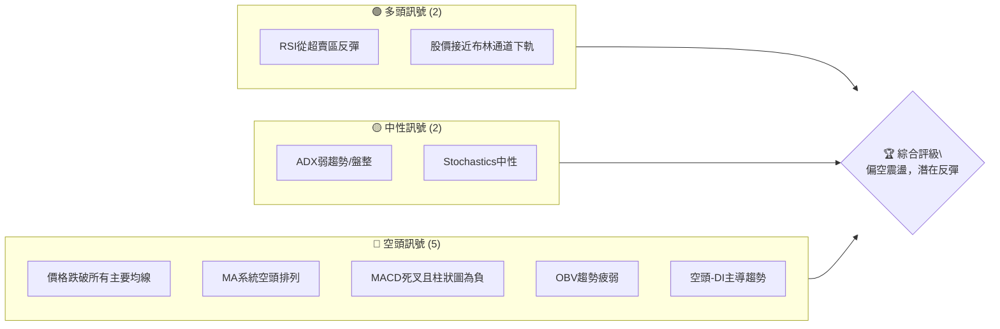

**解讀**：目前空頭訊號明顯多於多頭訊號，主要體現在價格位於所有均線下方、均線空頭排列以及MACD的明確空頭趨勢。然而，RSI從超賣區的反彈以及股價接近布林通道下軌，為短期技術性反彈提供了依據。ADX指示趨勢強度不足，市場處於弱趨勢或盤整狀態，但空頭力量佔優。整體而言，ONDS仍處於下跌趨勢中的修正階段，但短期可能出現反彈。

### 📊 核心指標速覽表

| 指標類別 | 指標名稱 | 當前數值 | 訊號 | 解讀 |
|----------|----------|----------|------|------|
| **價格** | 當前價格 | $7.92 | 🔴 | 較52週高點下跌近一半，處於深度修正 |
| **均線** | MA20 | $9.22 | 🔴 | 價格遠低於短期均線，空頭壓力大 |
| **均線** | MA50 | $9.89 | 🔴 | 價格遠低於中期均線，中期趨勢向下 |
| **均線** | MA200 | $9.41 | 🔴 | 價格遠低於長期均線，長期趨勢轉弱 |
| **動能** | RSI(14) | 33.53 | 🟡 | 脫離超賣區，但仍處於弱勢區域，潛在反彈 |
| **動能** | MACD | -0.675 | 🔴 | MACD線在訊號線下方，柱狀圖為負，空頭動能強勁 |
| **波動** | ATR(14) | $0.60 | 🟡 | 每日波動約7.60%，屬中高波動 |

### 🏆 技術評分卡

```
╔══════════════════════════════════════════════════════════════╗
║              ONDS 技術評分卡 (2026-07-02)                    ║
╠══════════════════════════════════════════════════════════════╣
║ 趨勢強度      ████████░░░░░░░░░░░░  40/100  🔴 (ADX弱趨勢，空頭主導) ║
║ 動能指標      ██████░░░░░░░░░░░░░░  30/100  🔴 (MACD空頭，RSI弱勢)   ║
║ 支撐穩定度    ██████████░░░░░░░░░░  50/100  🟡 (接近斐波那契50-61.8%) ║
║ 成交量配合    ██████░░░░░░░░░░░░░░  30/100  🔴 (OBV疲弱，量能未確認)  ║
║ 形態完整度    ██████░░░░░░░░░░░░░░  30/100  🔴 (近期呈現下跌修正形態) ║
║ 均線排列      ████░░░░░░░░░░░░░░░░  20/100  🔴 (所有均線皆在價格上方) ║
╠══════════════════════════════════════════════════════════════╣
║ 綜合評分      ██████░░░░░░░░░░░░░░  35/100  🔴 謹慎觀望，偏空操作 ║
╚══════════════════════════════════════════════════════════════╝
```
**評級說明**：ONDS 的技術評分整體偏低，主要受制於明確的下跌趨勢、弱勢的動能指標和不利的均線排列。雖然短期存在技術性反彈的可能，但缺乏強勁的多頭訊號支持，投資者應保持高度謹慎。

---

## 2. 趨勢分析

### 🌐 多時框趨勢分析

ONDS 的多時框趨勢呈現出從長期牛市向中期修正、短期震盪偏空的轉變。

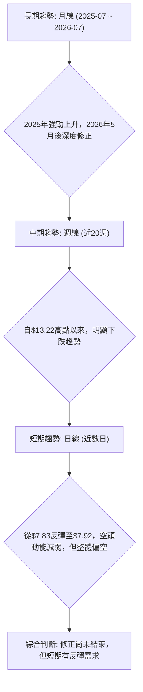

### 📈 長期趨勢 — 12個月走勢圖（Unicode）

ONDS 在過去12個月經歷了從$2.12到$13.22的強勁上升，隨後在$13.22高點後進入快速修正。

```
ONDS 月線走勢圖（過去12個月）
價格軸 ($)
$14 ┤                                ●(13.22)
$12 ┤                                
$10 ┤                   ●(10.36) ●(10.08) ●(10.04)
$8  ┤            ●(7.72) ●(7.90)                    ●(8.24) ●(7.92)←現在
$6  ┤      ●(5.86)                  ●(6.44)
$4  ┤
$2  ┤●(2.12)
    └─────────────────────────────────────────────────────
     2025-07  08  09  10  11  12  2026-01  02  03  04  05  06  07
```

**走勢特徵分析表格**：

| 時間區間 | 起始價 | 結束價 | 漲跌幅 | 走勢特徵 | 評級 |
|----------|--------|--------|--------|----------|------|
| 2025-07至2026-05 | $2.12 | $13.22 | +523.58% | 強勁多頭趨勢，多次突破新高，動能充沛 | 🟢 強勁多頭 |
| 2026-05至2026-07 | $13.22 | $7.92 | -40.10% | 快速深度修正，跌破多個關鍵支撐，空頭主導 | 🔴 深度修正 |

**長期趨勢總結**：ONDS 在過去一年中呈現出一個典型的「過山車」走勢。從2025年7月到2026年5月，股價經歷了驚人的漲幅，顯示出強勁的成長潛力或市場炒作。然而，從2026年5月高點$13.22開始的修正，下跌幅度已超過40%，表明市場對其估值或未來預期進行了大幅調整。目前股價已回吐大部分漲幅，長期趨勢正從強勁多頭轉向震盪修正。

### 📊 中期趨勢（週線分析）

中期趨勢（近20週）顯示ONDS自2026年5月31日創下高點$13.22後，便進入了明確的下跌通道。儘管期間有零星的反彈嘗試，但均未能有效突破前期阻力，並在隨後跌破關鍵支撐。

```
ONDS 中期走勢與關鍵點示意圖 (週線)
    $14.00 ─────────────── R1 ($13.22, 2026-05高點)
           ╲
            ╲
    $12.00   ╲
              ╲
    $10.00     ╲───────── R2 (MA50, MA200附近)
                ╲
    $8.00        ● (現價 $7.92)
                  ╲
    $6.00          ───────── S1 (Fibonacci 61.8% $6.90)
                    ╲
    $4.00              ───────── S2 (斐波那契76.4% $4.92)
                        ╲
```
**解讀**：從週線圖來看，ONDS 的中期趨勢已轉為下跌。股價在$13.22形成明顯的高點後，呈現出「高點降低、低點降低」的典型下跌結構。目前的價格$7.92位於所有主要均線下方，且均線呈現空頭排列。近期價格在$7.83附近獲得初步支撐後小幅反彈，但上方阻力重重，尤其是MA20 ($9.22)、MA50 ($9.89)和MA200 ($9.41)形成密集的阻力區。

### ⚡ 趨勢強度評估（ADX 解讀）

ADX 指標用於衡量趨勢的強度，而非方向。當前ADX(14)為20.23，低於25的閾值，表明ONDS目前處於弱趨勢或盤整行情中。

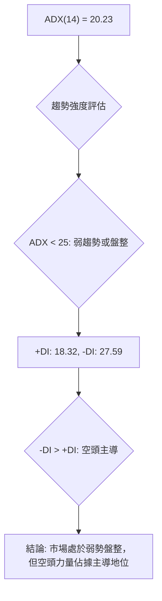

**ADX 強度對照表**：

| ADX 數值 | 趨勢強度 | 市場狀態 |
|----------|----------|----------|
| 0-25     | 弱趨勢   | 盤整或趨勢不明顯 |
| 25-50    | 中等趨勢 | 趨勢明確，動能穩定 |
| 50-75    | 強趨勢   | 趨勢非常強勁，動能加速 |
| 75-100   | 極強趨勢 | 趨勢極端強勁，可能面臨超買/超賣 |

**解讀**：ONDS 的ADX為20.23，明確指示當前市場缺乏強勁的單邊趨勢。這意味著股價在短期內可能不會出現大幅度的單邊行情，而更傾向於在一定區間內震盪。然而，-DI (27.59) 顯著高於 +DI (18.32)，這表明在當前的弱勢趨勢中，空頭力量佔據了主導地位。因此，儘管整體趨勢不強，但若有方向性突破，向下突破的可能性更大，或者在區間震盪中，空頭反彈至阻力位後再次下跌的機率較高。這是一個「空頭控制下的弱勢盤整」格局。

---

## 3. 圖表形態分析

### 🔍 形態識別系統

根據ONDS過去12個月的價格走勢，特別是2026年5月的高點$13.22和隨後的快速下跌，目前尚未形成經典的、明確的長期反轉形態（如頭肩頂或雙頂），但可以觀察到潛在的短期修正或延續形態。

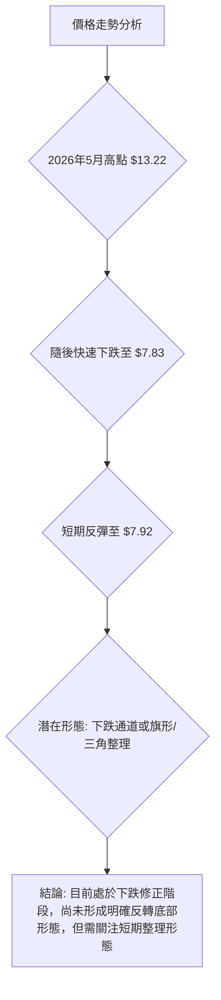

**形態分析**：
1.  **高點修正形態**：從$13.22高點後的下跌，可以看作是一個「M形頂」的右肩正在形成，或者僅僅是強勁上漲後的深度修正。如果價格未能有效突破$9.00-$10.00的阻力區，並再次跌破$7.83的近期低點，則「M形頂」的可能性會增加。
2.  **下跌通道**：自$13.22以來，股價一直在一個下降通道中運行。上方阻力線和下方支撐線共同構成通道，表明空頭力量持續佔優。
3.  **潛在整理形態**：近期股價在$7.83-$8.00區間獲得初步支撐，可能形成一個短期的小型底部整理形態，如「潛在雙底」或「小型箱體震盪」。但由於成交量配合不佳，其有效性有待觀察。

### 🕯️ 重要K線形態分析

根據近20週的收盤走勢，我們可以觀察到一些關鍵的K線形態和價格行為。

| 日期 | 收盤價 | RSI | MACD柱 | 週成交量 | K線形態 (週線推斷) | 解讀 | 訊號 |
|------|--------|--------|--------|------------|---------------------|------|------|
| 2026-05-24 | $9.06 | 45.2 | -0.055 | 293,975,000 | 較長下影線/小實體 | 買盤嘗試介入，但多頭力量不足 | 🟡 |
| 2026-05-31 | $13.22 | 70.6 | +0.400 | 566,998,300 | 大陽線，突破前高 | 強勁多頭動能，短期超買 | 🟢 |
| 2026-06-07 | $10.43 | 49.1 | +0.092 | 402,521,100 | 長陰線，吞噬前一週漲幅 | 巨量下跌，空頭強勢，反轉訊號 | 🔴 |
| 2026-06-14 | $9.33 | 51.3 | -0.296 | 250,831,800 | 中陰線，跌破多個均線 | 下跌趨勢確立，空頭動能持續 | 🔴 |
| 2026-06-21 | $9.27 | 22.1 | -0.256 | 222,893,900 | 小陰線，RSI進入超賣區 | 下跌動能略減緩，RSI超賣 | 🟡 |
| 2026-06-28 | $7.83 | 21.8 | -0.281 | 349,707,300 | 大陰線，創近期新低 | 空頭強勢，但RSI嚴重超賣，可能反彈 | 🔴 |
| 2026-07-05 | $7.92 | 33.5 | -0.147 | 227,552,399 | 小陽線，反彈 | 從低點反彈，空頭動能減弱，或為止跌訊號 | 🟢 |

**分析**：
-   **2026年5月31日**的巨量大陽線是短期高潮，但隨後**2026年6月7日**的長陰線以巨量吞噬了前一週的漲幅，形成了一個明確的「看跌吞噬」形態，這是強烈的反轉訊號。
-   **2026年6月28日**的大陰線伴隨RSI進入極度超賣區 (21.8)，表明市場情緒極度悲觀，但物極必反，隨後一週的**2026年7月5日**出現小陽線，RSI反彈至33.53，這可能是一個短期止跌或反彈的訊號。
-   整體而言，近期的K線形態強烈指示空頭主導，但最後一週的K線顯示出買盤在低位介入的跡象。

### 📉 ASCII 走勢形態示意圖

以下示意圖描繪了ONDS自2026年5月高點以來的下跌修正走勢，以及近期可能的短期底部形態。

```
ONDS 近期走勢形態示意圖
═══════════════════════════════════════════════════════
$14.00 ┤              ● (2026-05高點 $13.22)
$12.00 ┤             /
$10.00 ┤            /  R1 ($9.89, MA50)
$8.00  ┤           /─────── ● (現價 $7.92)
$6.00  ┤          /           ╲
$4.00  ┤         /             S1 ($7.83, 近期低點)
$2.00  ┤        /               ╲
       └───────────────────────────────────────────────
             近期下跌通道，可能形成短期底部平台
```
**形態解讀**：
圖中顯示股價從高點$13.22開始沿著一個下跌通道運行。當前價格$7.92位於通道下沿附近，並在近期低點$7.83處獲得初步支撐。如果此處能有效築底，可能會形成一個小型「W底」或「矩形整理」形態。然而，若跌破$7.83，則下跌通道將繼續延伸。

### 🎯 形態目標價計算

由於目前尚未形成明確的經典反轉形態，因此無法給出基於形態的目標價。但我們可以根據當前的下跌趨勢，推測可能的下跌目標或反彈目標。

**下跌目標推測**：
若股價跌破近期支撐$7.83，並有效跌破斐波那契61.8%回調位$6.90，則可能繼續探底。
*   **下跌目標1**：斐波那契76.4%回調位 **$4.92**。
*   **下跌目標2**：歷史低點或更深層次的斐波那契擴展位，例如接近2025年7月的$2.12。

**反彈目標推測**：
若股價能有效站穩$7.83並向上反彈，則可能的反彈目標將是上方的阻力位。
*   **反彈目標1**：斐波那契50%回調位 **$8.50**，以及MA20 ($9.22)。
*   **反彈目標2**：斐波那契38.2%回調位 **$10.10**，以及MA50 ($9.89) 和MA200 ($9.41) 形成的密集阻力區。
*   **反彈目標3**：若能突破所有均線阻力，則可能挑戰斐波那契23.6%回調位 **$12.08**。

**結論**：目前股價在尋找底部，任何形態都處於初期階段，具有較高的不確定性。交易應更多依賴於關鍵支撐阻力位的突破與否。

---

## 4. 支撐與阻力

ONDS 目前正處於一個關鍵的價格區間，下方支撐與上方阻力均清晰可見。

### 🗺️ 關鍵價位分布圖（Unicode）

```
ONDS 價位結構分布圖
═══════════════════════════════════════════════════
$15.28 ║████████████████████████║ 歷史高點 / 強阻力 R4
$13.22 ║████████████████████████║ 近期高點 / 強阻力 R3
$11.64 ║████████████████████    ║ 布林上軌 / 阻力 R2
$10.10 ║████████████████████████║ 斐波那契38.2% / 阻力 R1
$9.89  ║████████████████████████║ MA50
$9.41  ║████████████████████████║ MA200
$9.22  ║████████████████████████║ MA20
$7.92  ╠════════════════════════╣ ◄ 現價
$7.83  ║▓▓▓▓▓▓▓▓▓▓▓▓▓▓▓▓        ║ 近期支撐 S1 (2026-06-28低點)
$6.90  ║████████████████████████║ 斐波那契61.8% / 強支撐 S2
$6.79  ║████████████████████████║ 布林下軌
$4.92  ║████████████████████████║ 斐波那契76.4% / 強支撐 S3
$1.71  ║████████████████████████║ 52週低點 / 極強支撐 S4
═══════════════════════════════════════════════════
```

### 🚧 阻力位分析表

| 阻力級別 | 價位 | 形成原因 | 突破難度 | 重要性 |
|----------|------|----------|----------|--------|
| **R1** | $9.22 (MA20) | 短期均線壓力，近期下跌後第一個考驗 | 中等 | 高 |
| **R2** | $9.41 (MA200) | 長期均線壓力，需強勁買盤才能突破 | 中等偏高 | 高 |
| **R3** | $9.89 (MA50) | 中期均線壓力，與斐波那契38.2%($10.10)形成密集阻力區 | 高 | 極高 |
| **R4** | $10.10 (Fib 38.2%) | 斐波那契回調位，強勁反彈的第一個關鍵考驗 | 高 | 極高 |
| **R5** | $11.64 (BB上軌) | 布林通道上軌，通常是短期反彈的極限 | 高 | 中 |
| **R6** | $13.22 (2026-05高點) | 近期歷史高點，強大心理及技術阻力 | 極高 | 極高 |

**解讀**：ONDS 上方阻力重重，從$9.22到$10.10形成了一個非常密集的阻力區，包含了所有主要移動平均線和斐波那契38.2%回調位。這意味著任何反彈都將面臨巨大的賣壓。若要確認止跌回升，股價必須有效突破並站穩$10.10上方，同時伴隨成交量的放大。

### 🛡️ 支撐位分析表

| 支撐級別 | 價位 | 形成原因 | 守住機率 | 重要性 |
|----------|------|----------|----------|--------|
| **S1** | $7.83 (2026-06-28低點) | 近期下跌的最低點，短期心理支撐 | 中等 | 高 |
| **S2** | $6.90 (Fib 61.8%) | 斐波那契61.8%回調位，重要黃金分割支撐 | 中等偏高 | 極高 |
| **S3** | $6.79 (BB下軌) | 布林通道下軌，通常是短期下跌的極限 | 中等 | 高 |
| **S4** | $4.92 (Fib 76.4%) | 斐波那契76.4%回調位，若跌破61.8%則此為下一主要目標 | 較低 | 極高 |
| **S5** | $1.71 (52週低點) | 52週最低點，極強的長期支撐 | 高 | 極高 |

**解讀**：ONDS 目前位於$7.92，非常接近近期低點$7.83。這個點位是短期買盤是否願意介入的關鍵。更重要的是，斐波那契61.8%回調位$6.90是從52週低點到52週高點漲幅的關鍵回調位，具有非常強的技術意義。如果$6.90被有效跌破，將預示著更深層次的修正，甚至可能測試$4.92。

### 📐 斐波那契回調位分析

我們以ONDS過去52週的最低點 ($1.71) 到最高點 ($15.28) 作為主要波動區間來計算斐波那契回調位。當前價格 $7.92 正好介於50%和61.8%回調位之間，顯示市場處於深度修正階段。

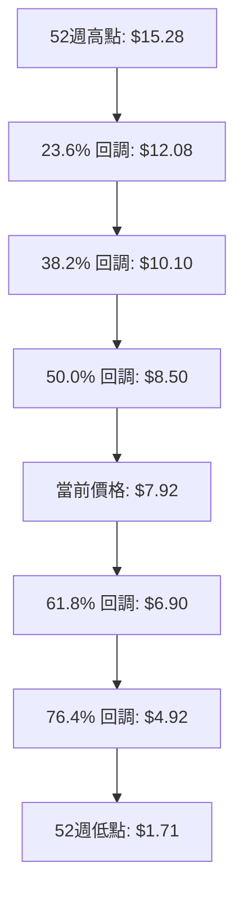

**計算結果與解讀**：
-   **23.6% 回調位**：**$12.08**。若股價能成功反轉，這是第一個需要挑戰的阻力位。
-   **38.2% 回調位**：**$10.10**。這是相對較強的阻力位，通常被視為反彈能否延續的關鍵。與MA50/MA200密集區重合，形成極強阻力。
-   **50.0% 回調位**：**$8.50**。這是一個重要的心理和技術支撐/阻力位，通常代表著上漲趨勢的一半回吐。目前股價已跌破此位，顯示空頭力量強勁。
-   **61.8% 回調位**：**$6.90**。被稱為「黃金分割位」，是多頭能否守住的最後一道重要防線。若此位失守，趨勢將極有可能轉為長期下跌。目前價格正向此位靠攏，其重要性不言而喻。
-   **76.4% 回調位**：**$4.92**。若61.8%回調位被擊穿，則此位將是下一個主要支撐目標。

**結論**：ONDS 目前面臨斐波那契50%回調位$8.50的壓力，並正向61.8%回調位$6.90尋求支撐。這兩個價位將是判斷其長期走勢的關鍵。

---

## 5. 技術指標深度解讀

### 🎛️ 指標訊號總覽

以下Mermaid圖展示了各主要技術指標當前提供的訊號及其相互關係。

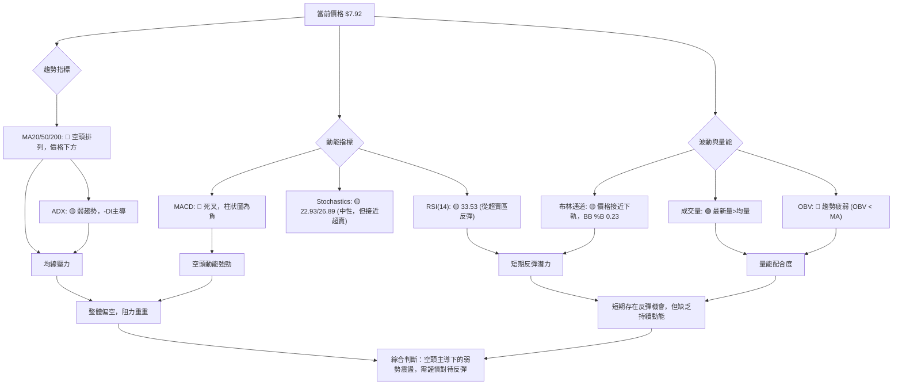

### 📈 移動平均線排列分析

ONDS 的移動平均線系統目前呈現出明顯的空頭排列，且所有主要均線均位於當前價格上方，構成強大阻力。

```mermaid
graph TD
    A["當前價格: $7.92"] --> B("MA20: $9.22")
    A --> C("MA50: $9.89")
    A --> D("MA200: $9.41")
    B --> E("價格遠低於MA20")
    C --> F("價格遠低於MA50")
    D --> G("價格遠低於MA200")

    E & F & G --> H("結論: 所有均線構成上方阻力，均線系統呈現空頭排列初期或修正排列")
    H --> I("MA20 < MA200 < MA50 (混合排列，非典型死亡交叉，但普遍空頭"))
    I --> J("訊號: 🔴 強烈看空，趨勢向下")
```
**均線排列解讀**：
-   **MA20 ($9.22)**：短期均線，代表20天的平均成本。股價$7.92遠低於MA20，顯示短期賣壓沉重。
-   **MA50 ($9.89)**：中期均線，代表50天的平均成本。股價同樣遠低於MA50，表明中期下跌趨勢已經確立。
-   **MA200 ($9.41)**：長期均線，代表200天的平均成本。股價跌破MA200，這是長期趨勢轉弱的關鍵訊號。
-   **均線排列**：數據顯示為「混合排列」，具體為 MA20 ($9.22) < MA200 ($9.41) < MA50 ($9.89)。這種排列本身不是典型的死亡交叉（MA50在MA200之上通常偏多），但所有均線都高於當前價格，且整體趨勢向下，這是一個非常明確的看空訊號。意味著多頭力量潰散，短期、中期、長期成本線都已成為股價上漲的沉重負擔。每次反彈都可能在這些均線處遇到強大阻力。

### 📉 RSI(14) 分析

**RSI 數值進度條**：
RSI(14): 33.53 ▓▓▓▓▓▓▓░░░░░░░░░░░░ 33.53% 🟡 (中性偏弱)

**超買超賣區間分析**：
-   **超買區 (RSI > 70)**：ONDS 在2026年5月31日週線RSI達到70.6，進入超買區，隨後觸發了大幅度的回調。
-   **超賣區 (RSI < 30)**：2026年6月21日和28日，週線RSI分別為22.1和21.8，進入嚴重超賣區。當前RSI為33.53，已從超賣區反彈，但仍處於弱勢區域（30-50）。

**背離判斷**：
-   **頂背離**：在2026年5月31日，價格創出新高$13.22，而RSI達到70.6，並未出現明顯的頂背離。
-   **底背離**：在2026年6月28日，價格創出近期新低$7.83，RSI為21.8。隨後2026年7月5日價格微幅反彈至$7.92，而RSI則從21.8反彈至33.53。雖然價格僅小幅上漲，但RSI的顯著反彈形成了一個潛在的**底背離**跡象（價格創新低或持平，但RSI未創新低反而回升）。這暗示了短期下跌動能減弱，可能預示著一個技術性反彈。

**結論**：RSI 從超賣區反彈，並出現潛在底背離訊號，這是短期多頭的唯一亮點。它預示著短期內股價有機會進行技術性反彈，但由於RSI仍處於50以下，反彈的強度和持續性可能有限。

### 📊 MACD(12/26/9) 訊號解讀

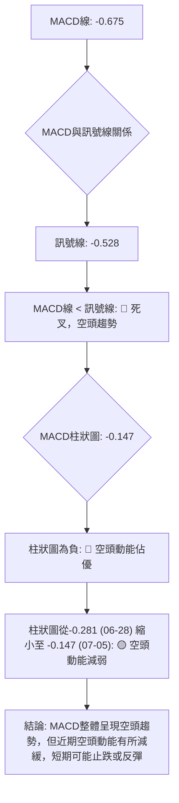
**MACD 解讀**：
-   **MACD 線 (-0.675) 與訊號線 (-0.528)**：MACD 線位於訊號線下方，形成「死叉」形態，這是明確的空頭訊號，表明短期均線已跌破長期均線，下跌趨勢確立。
-   **MACD 柱狀圖 (-0.147)**：柱狀圖為負值，確認了空頭動能佔優。然而，與上一週的-0.281相比，柱狀圖的負值絕對值有所縮小。這表明空頭力量雖然仍佔主導，但其下行動能正在減弱。這與RSI從超賣區反彈的訊號相互確認，預示著短期內下跌速度可能放緩，甚至出現技術性反彈。
-   **MACD 背離**：根據近20週數據，MACD柱狀圖在2026年6月28日達到最低點-0.281，隨後價格在$7.83。而2026年7月5日價格為$7.92，MACD柱狀圖為-0.147。雖然價格沒有明顯創新低，但MACD柱狀圖負值縮小，MACD線也開始趨近訊號線（儘管仍在其下方），這是一個**潛在的底背離**跡象，暗示空頭動能正在衰竭。

**結論**：MACD 指標明確顯示ONDS 處於空頭趨勢，但近期柱狀圖的變化和潛在底背離，與RSI一同暗示短期可能出現技術性反彈。

### 📦 布林通道分析

布林通道反映了股價的波動範圍和相對位置。

```
ONDS 布林通道示意圖
═══════════════════════════════════════════════════
$12.00 ║           BB上軌: $11.64
$10.00 ║     BB中軌(MA20): $9.22
$8.00  ╠═════════════════════════╣ ◄ 現價 $7.92
$6.00  ║           BB下軌: $6.79
═══════════════════════════════════════════════════
```
**布林通道解讀**：
-   **上軌 ($11.64)**：代表價格波動的上限，是強勁阻力。
-   **中軌 (MA20 $9.22)**：作為短期趨勢線，目前股價遠低於中軌，確認短期下跌趨勢。
-   **下軌 ($6.79)**：代表價格波動的下限，是重要的支撐位。
-   **BB %B (0.23)**：此數值表示當前價格位於下軌和中軌之間，且更接近下軌 (0為下軌，1為上軌)。這表明股價處於布林通道的下半部分，且接近極端低位。

**結論**：股價位於布林通道中軌下方並接近下軌，這通常意味著短期內超賣，可能觸發向中軌的反彈。下軌$6.79是重要的動態支撐位，若能守住，則股價有望向中軌$9.22反彈。若跌破下軌，則可能預示著更大幅度的下跌。

### 💹 成交量分析（量價配合度）

-   **最新成交量 (87,741,999)**：高於20日均量 (63,670,040) 和50日均量 (71,095,182)。量比為1.38x。這表示在當前價格區間，市場交易活躍度增加。
-   **OBV 趨勢**：數據顯示「OBV < MA → 量能疲弱」。這是一個重要的熊市訊號。儘管最新成交量較大，但OBV趨勢疲弱表明這些成交量並未有效推動股價上漲，或者下跌時的成交量更大，導致整體累積量能向下。

**量價配合度解讀**：
-   **反彈中的量價配合**：ONDS 在2026年6月28日跌至$7.83，隨後反彈至$7.92，伴隨較高的成交量。如果這次反彈是在低位放量，理論上是積極的。然而，OBV的疲弱趨勢卻與此矛盾。這可能意味著近期的高成交量主要來自於空頭回補或多頭抄底的初步嘗試，但整體市場的累積買盤力量仍然不足以扭轉下跌趨勢。
-   **下跌中的量價配合**：從2026年5月31日高點$13.22下跌以來，隨後的巨量下跌（如2026年6月7日）確認了空頭的強勢。
-   **結論**：當前量能活躍，但OBV趨勢疲弱，顯示儘管有短期放量，但買盤動能不足以支撐趨勢反轉。這表明任何反彈都可能面臨持續的賣壓，且缺乏強勁的買盤支持。

---

## 6. 動能與波動率

### ⚡ 動能評估四象限

ONDS 目前處於一個「弱動能」但「高波動」的狀態。

| 象限 | 動能 | 波動 | 當前狀態 | 評估 |
|------|------|------|----------|------|
| Q1 | 強 | 低 | - | 最佳機會 (股價穩定上漲) |
| Q2 | 弱 | 低 | - | 謹慎觀望 (盤整，缺乏方向) |
| Q3 | 強 | 高 | - | 高風險高收益 (強勢趨勢，但波動大) |
| Q4 | 弱 | 高 | ✓ | 避免進場 (下跌趨勢，波動劇烈，風險高) |

**動能評估流程**：
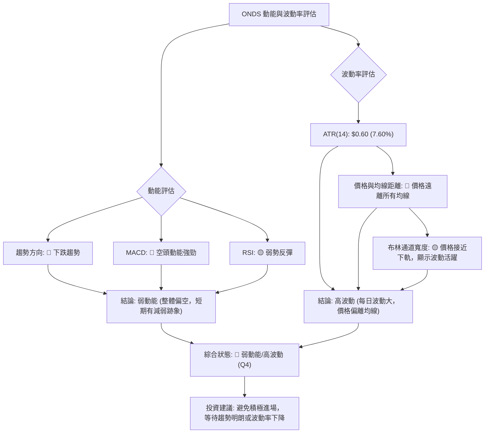
**解讀**：ONDS 目前處於「弱動能/高波動」的第四象限。這是一個高風險的投資環境，通常建議投資者避免積極進場。股價缺乏明確的上升動能，且每日波動劇烈，容易造成追高殺低的損失。即使短期有反彈，也可能在缺乏強勁動能支持下迅速結束。

### 📊 ATR 波動率分析

-   **ATR(14) 數值**：$0.60
-   **佔股價比例**：7.60% (相對於當前價格$7.92)

**ATR 解讀**：
ATR(14) 為 $0.60，這意味著ONDS在過去14天內的平均每日價格波動範圍為$0.60。對於一個股價在$7-$8區間的股票而言，7.60%的每日波動率屬於中高水平。高波動性意味著潛在的快速價格變動，既可能帶來豐厚利潤，也可能導致迅速虧損。

**止損距離建議**：
在當前高波動環境下，設置止損點時應考慮ATR。一般建議將止損點設置在ATR的1.5倍至2倍距離之外，以避免被正常波動洗出。
-   **1.5倍ATR止損**：$0.60 * 1.5 = $0.90
-   **2倍ATR止損**：$0.60 * 2 = $1.20

**例如**：
若考慮做多，進場價為$7.92，則止損點可考慮設置在：
-   保守止損：$7.92 - $0.90 = $7.02
-   激進止損：$7.92 - $1.20 = $6.72 (接近布林通道下軌和斐波那契61.8%回調位)
這需要結合具體的支撐位來確定，以避免過早止損。

### 📐 Beta 與市場相關性

提供的數據中沒有ONDS的Beta係數。然而，根據其所屬的科技行業 (Communication Equipment) 和公司業務 (private wireless, drone, automated data solutions)，通常這類成長型科技股的Beta值會相對較高。

**一般推斷**：
-   **高Beta (>1.0)**：若ONDS的Beta值較高，表示其股價波動性可能大於整體市場。在牛市中，它可能漲得比大盤多；在熊市中，它也可能跌得比大盤多。
-   **市場相關性**：作為科技股，ONDS 的表現可能受到科技板塊整體情緒和宏觀經濟環境的影響。在當前修正市場中，高Beta股面臨更大的下行壓力。

**結論**：由於缺乏具體Beta數據，我們假設ONDS具有較高的市場敏感性。投資者應意識到，ONDS的股價波動可能放大市場的漲跌幅，因此在當前市場不確定性較高的環境下，其風險敞口較大。

---

## 7. 多時框架總結

### 📋 時框架評分表

| 時框架 | 趨勢方向 | 動能 | 均線排列 | 形態 | 綜合評分 | 建議 |
|--------|----------|------|----------|------|----------|------|
| **長期** | 🔴 下跌修正 | 🔴 轉弱 | 🔴 空頭 | 🔴 深度修正 | 3/10 | 觀望/看空 |
| **中期** | 🔴 下跌通道 | 🔴 負向 | 🔴 空頭 | 🔴 下跌通道 | 2/10 | 偏空操作 |
| **短期** | 🟡 震盪偏空 | 🟡 止跌/反彈 | 🔴 空頭 | 🟡 潛在止跌 | 4/10 | 謹慎反彈 |

**解讀**：從長、中、短期來看，ONDS 的趨勢方向均為偏空。長期和中期趨勢明確處於下跌修正和下跌通道中，所有均線均形成強力阻力。短期來看，儘管RSI和MACD顯示出下跌動能減弱和潛在反彈的跡象，但這些只是技術性反彈的可能性，整體趨勢並未改變。因此，對於ONDS的投資策略應以偏空為主，或在極其嚴格的風險控制下進行短期反彈操作。

### 🔲 綜合訊號矩陣

以下矩陣展示了不同時框架下各技術維度訊號的一致性。

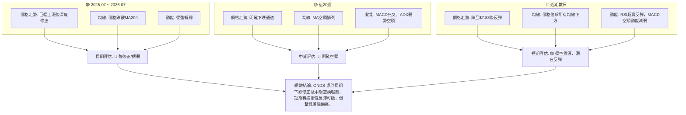
**一致性分析**：
-   **趨勢一致性**：長、中、短期趨勢均指向偏空或深度修正，顯示出市場對ONDS的普遍看跌情緒。
-   **動能一致性**：長期和中期動能均已轉弱或為負，僅短期動能顯示出止跌或反彈的跡象，但其強度和持續性存疑。
-   **均線一致性**：所有時框架下的均線系統都對價格構成壓力，且呈現空頭排列或價格在均線下方。

**總結**：ONDS 的多時框架分析結果指向一個明確的空頭主導市場。儘管短期可能出現技術性反彈，但這應被視為下跌趨勢中的修正，而非趨勢反轉的開始。投資者應極其謹慎，除非有明確的趨勢反轉訊號出現，否則應避免盲目抄底。

---

## 8. 交易策略建議

ONDS 目前處於深度修正後的震盪階段，整體偏空，但短期有潛在技術性反彈機會。基於此，我們提出以下交易策略。

### 🗺️ 策略決策流程圖

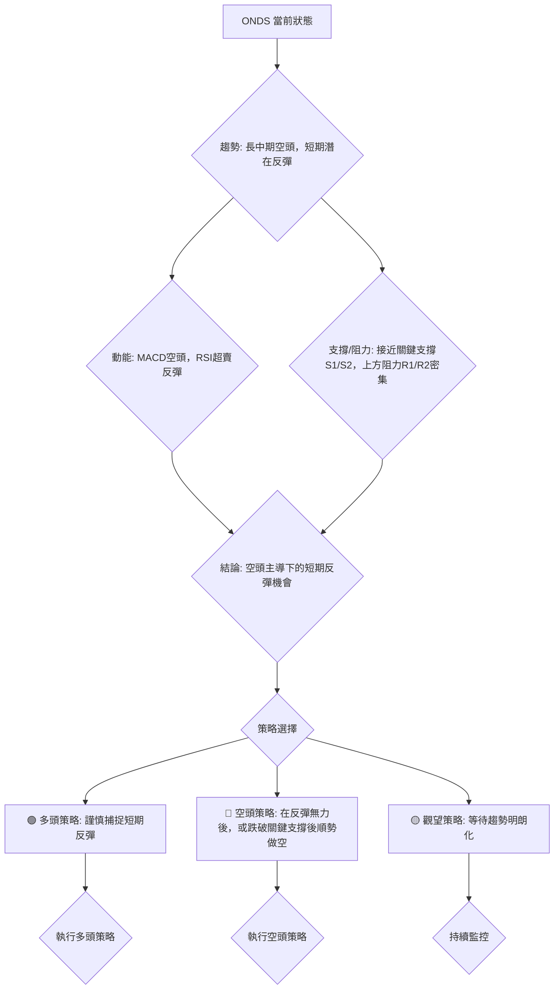

### 🟢 多頭策略詳情 (謹慎捕捉短期反彈)

此策略基於RSI從超賣區反彈、MACD空頭動能減弱以及股價接近布林通道下軌和重要斐波那契回調位的考量。這是一個逆勢操作，風險較高，需嚴格止損。

| 策略要素 | 策略 A (激進反彈) | 策略 B (保守反彈) |
|----------|--------------------|--------------------|
| 進場條件 | 股價站穩 $7.83，並伴隨成交量放大 | 股價突破 $8.00 並站穩，RSI突破40 |
| 進場價格 | $7.95 | $8.10 |
| 目標價 T1 | $8.50 (斐波那契50%) | $9.22 (MA20) |
| 目標價 T2 | $9.22 (MA20) | $9.89 (MA50) |
| 止損價格 | $7.60 (跌破近期低點 $7.83 下方) | $7.80 (跌破 $7.83) |
| 風險報酬比 | $0.35 : $0.55 (1:1.57) / $0.35 : $1.27 (1:3.63) | $0.30 : $1.12 (1:3.73) / $0.30 : $1.79 (1:5.97) |
| 成功機率 | 30% | 40% |
| 建議倉位 | 5% | 10% |

**策略 A (激進反彈) 解讀**：在股價確認在$7.83附近築底後，快速進場博取短期反彈。止損點設定在$7.60，以保護資本。目標價設定在斐波那契50%回調位和MA20。風險報酬比相對可觀，但成功率較低。
**策略 B (保守反彈) 解讀**：等待更明確的反彈訊號，例如股價突破$8.00，並期待RSI能進一步回升。止損點設定在$7.80，風險控制較嚴格。目標價設定在更上方的均線阻力，可能獲取更大的回報，但同樣需要克服強勁阻力。

### 🔴 空頭策略詳情 (順勢做空)

此策略基於ONDS 的長中期明確空頭趨勢、所有均線壓力以及MACD的空頭訊號。這是一個順勢操作，相對風險較低。

| 策略要素 | 策略 C (反彈做空) | 策略 D (破位追空) |
|----------|--------------------|--------------------|
| 進場條件 | 股價反彈至阻力區 $9.00-$9.50，並出現滯漲K線 | 股價有效跌破 $7.83 支撐位 |
| 進場價格 | $9.20 | $7.75 |
| 目標價 T1 | $7.83 (近期低點) | $6.90 (斐波那契61.8%) |
| 目標價 T2 | $6.90 (斐波那契61.8%) | $4.92 (斐波那契76.4%) |
| 止損價格 | $9.50 (突破MA200或MA50) | $8.00 (反彈回 $7.83上方) |
| 風險報酬比 | $0.30 : $1.37 (1:4.57) / $0.30 : $2.30 (1:7.67) | $0.25 : $0.85 (1:3.4) / $0.25 : $2.83 (1:11.32) |
| 成功機率 | 60% | 50% |
| 建議倉位 | 15% | 10% |

**策略 C (反彈做空) 解讀**：利用股價反彈至MA20或MA200等阻力位時進行做空。止損點設在阻力位上方，目標價設在近期低點和斐波那契61.8%回調位。此策略符合順勢交易原則。
**策略 D (破位追空) 解讀**：若股價跌破近期關鍵支撐$7.83，則確認下跌趨勢延續，可追空。止損點設在被跌破的支撐位上方。目標價設在更深的斐波那契回調位，潛在回報非常高，但需警惕假突破和超賣反彈。

### ⭐ 整體訊號強度評星

```
做多訊號強度：★★☆☆☆  (2/5星) (短期有反彈需求，但缺乏趨勢支持)
做空訊號強度：★★★★☆  (4/5星) (長中期趨勢明確向下，多指標確認)
整體可信度：  ★★★☆☆  (3/5星) (空頭趨勢明顯，但短期波動大，操作需謹慎)
```
**評級**：ONDS 的整體技術面偏空，做空策略的成功機率和風險報酬比更具吸引力。做多僅限於激進的短期技術性反彈操作，且需嚴格控制風險。

---

## 9. 風險提示與監控

ONDS 股價在經歷大幅上漲後深度回調，目前處於高波動且趨勢不明朗的階段。投資者需高度警惕風險。

### ✅ 關鍵監控指標 Checklist

```
╔══════════════════════════════════════════════════════════════╗
║              ONDS 關鍵監控指標清單                           ║
╠══════════════════════════════════════════════════════════════╣
║ ├─ 價格行為：                                                 ║
║ ║  [ ] 股價是否有效站穩 $7.83 (近期低點)？                     ║
║ ║  [ ] 股價是否有效突破 $8.50 (斐波那契50%)？                  ║
║ ║  [ ] 股價是否跌破 $6.90 (斐波那契61.8%)？                    ║
║ ├─ 均線系統：                                                 ║
║ ║  [ ] 價格是否能站上 MA20 ($9.22)？                           ║
║ ║  [ ] MA系統是否出現金叉或多頭排列跡象？                      ║
║ ├─ 動能指標：                                                 ║
║ ║  [ ] RSI 是否能突破50並持續上升？                            ║
║ ║  [ ] MACD 是否能形成金叉並柱狀圖轉正？                       ║
║ ├─ 成交量：                                                   ║
║ ║  [ ] 上漲時是否伴隨明顯放量，OBV趨勢能否轉強？               ║
║ ║  [ ] 下跌時是否出現縮量，表明賣壓減輕？                      ║
║ ├─ 外部因素：                                                 ║
║ ║  [ ] 公司是否有重大新聞或財報公布？                          ║
║ ║  [ ] 宏觀經濟環境或科技板塊情緒是否發生變化？                ║
╚══════════════════════════════════════════════════════════════╝
```

### ⚠️ 風險場景分析

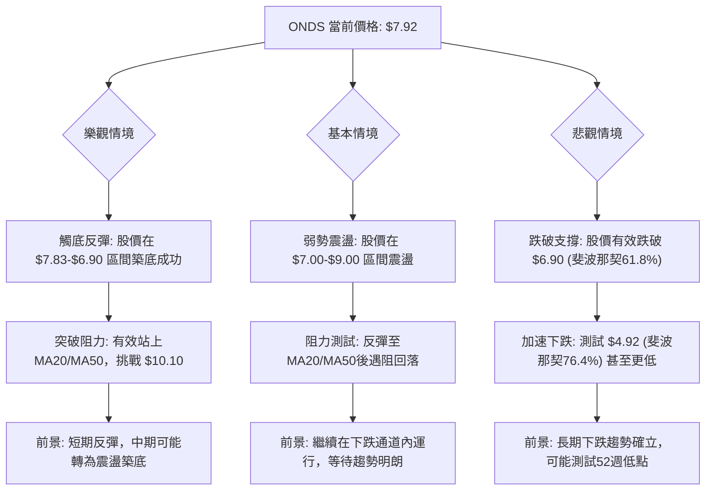
**情境解讀**：
-   **樂觀情境**：需要強勁的買盤力量和積極消息的配合，才能在當前關鍵支撐位築底成功，並突破上方密集阻力。目前技術面支持較弱。
-   **基本情境**：可能性最高。股價在當前區間進行震盪整理，反彈至阻力位後再次回落，延續下跌通道。
-   **悲觀情境**：若關鍵斐波那契61.8%回調位 $6.90 被跌破，將引發進一步恐慌性拋售，加速下跌。

### 🛡️ 風險管理重要提醒

1.  **嚴格止損**：鑑於ONDS的高波動性和下跌趨勢，每次交易都必須設置明確且嚴格的止損點。一旦達到止損價位，應堅決離場，避免虧損擴大。
2.  **倉位控制**：在不確定性較高的市場中，應採取小倉位策略，尤其對於逆勢操作。將單一股票的風險敞口控制在可承受範圍內。
3.  **分批建倉/減倉**：無論做多還是做空，都應考慮分批建倉，以平攤成本並降低單次交易的風險。達到目標價後也應分批減倉，鎖定利潤。
4.  **避免追高殺低**：在高波動環境下，價格容易出現快速反轉。避免在急漲時追高或急跌時殺跌。
5.  **關注基本面與新聞**：ONDS 屬於科技股，其股價表現可能受公司基本面變化、新產品發布、行業趨勢或分析師評級調整的影響。雖然本報告是技術分析，但基本面變化可能導致技術形態的快速失效。
6.  **耐心等待**：在趨勢不明朗時，觀望是最好的策略。等待明確的趨勢反轉訊號或更穩定的交易機會出現。

---

## 📋 報告總結

```
ONDS 技術分析報告總結
════════════════════════════════════════════════════════
報告日期：2026-07-02
當前價格：$7.92
分析評級：⚖️ 偏空震盪，短期潛在反彈

關鍵結論：
├─ 長期趨勢：🔴 經歷巨幅上漲後深度修正，趨勢轉弱。
├─ 中期趨勢：🔴 明確的下跌通道，高點降低、低點降低。
├─ 短期趨勢：🟡 震盪偏空，RSI從超賣區反彈，MACD空頭動能減弱，存在技術性反彈潛力。
├─ 關鍵支撐：$7.83 (近期低點)，$6.90 (斐波那契61.8%回調位)。
├─ 關鍵阻力：$9.22 (MA20)，$9.89 (MA50)，$10.10 (斐波那契38.2%回調位)。
└─ 分析師目標：平均 $20.12 (與當前技術面嚴重背離，需謹慎對待)。

最優策略組合：
1. 🥇 最佳機會：**反彈做空策略 (策略 C)** - 在股價反彈至 $9.00 - $9.50 阻力區時，配合滯漲訊號做空，目標 $7.83 / $6.90，止損 $9.50。風險報酬比優異。
2. 🥈 次選機會：**破位追空策略 (策略 D)** - 若股價有效跌破 $7.83，確認下跌趨勢延續，追空至 $6.90 / $4.92，止損 $8.00。
3. 🥉 保守選擇：**觀望策略** - 在當前高波動、趨勢不明朗且多空訊號混雜的情況下，耐心等待市場給出更明確的方向性訊號。若需操作，則嚴格控制倉位和止損。
════════════════════════════════════════════════════════
```

---

> ⚠️ **免責聲明**：本報告為 AI 自動生成之技術分析，所有數據及估算均基於提供的歷史價格資訊。本報告**僅供研究與學術參考**，**不構成任何投資建議**。投資有風險，入市需謹慎。

---

*報告生成時間：2026-07-02 ｜ 數據來源：提供資料 ｜ 分析框架：多時框技術分析*