<details>
<summary>📊 靜態圖表 (點擊展開)</summary>

</details>

<html>
<head><meta charset="utf-8" /></head>
<body>
    <div style="height:500px; width:100%;">                        <script>window.PlotlyConfig = {MathJaxConfig: 'local'};</script>
        <script charset="utf-8" src="https://cdn.plot.ly/plotly-3.6.0.min.js" integrity="sha256-QaOVwtVY0T02VaHrr6pnoHLCwayMJp4O5n4YyaE3rJk=" crossorigin="anonymous"></script>                <div id="candlestick-chart" class="plotly-graph-div" style="height:100%; width:100%;"></div>            <script>                window.PLOTLYENV=window.PLOTLYENV || {};                                if (document.getElementById("candlestick-chart")) {                    Plotly.newPlot(                        "candlestick-chart",                        [{"close":{"dtype":"f8","bdata":"AAAAAClcGEAAAABgZmYYQAAAAGBmZhpAAAAAoEfhGkAAAACAPQodQAAAAMAehR9AAAAAYGZmHUAAAAAAAAAfQAAAAADXox5AAAAAQOF6H0AAAACgR+EeQAAAAKBwPR1AAAAAIIVrIkAAAACA69EjQAAAAIDrUSVAAAAAgBQuJkAAAADAHoUmQAAAAEDh+iRAAAAA4KNwIkAAAABguJ4lQAAAAIDr0SRAAAAAwB4FI0AAAABgZmYgQAAAAOCjcB5AAAAA4HoUH0AAAABgj8IcQAAAAIDC9RpAAAAAoHA9HEAAAABACtcdQAAAAGC4Hh5AAAAAwPUoG0AAAAAAAAAbQAAAAMD1KBlAAAAAYI\u002fCGUAAAACgmZkYQAAAAEAK1xdAAAAAAAAAGEAAAAAAAAAVQAAAAKBwPRdAAAAAwB6FF0AAAABAMzMXQAAAAIA9ChZAAAAAoHA9GkAAAADgUbgcQAAAAMAeBRlAAAAAAClcH0AAAAAAAAAeQAAAAOB6FBlAAAAA4KPwGkAAAADgo3AhQAAAAKBH4SBAAAAAQOF6IEAAAACgmZkfQAAAAIDrUR5AAAAAANcjIEAAAABACtchQAAAAKBHYSJAAAAAANcjIkAAAACAPQoiQAAAAIDCdSJAAAAAYGamIEAAAACAPQoiQAAAAAAAgCFAAAAAYI\u002fCHkAAAACAFC4gQAAAAEDheh1AAAAAQDMzH0AAAADgo3AiQAAAAIA9iiJAAAAAIIXrIUAAAABgj0IiQAAAAIDC9SBAAAAAIIXrIEAAAABA4fohQAAAAMAehSNAAAAAgD0KJkAAAAAgXA8pQAAAAIAUrilAAAAAAClcKEAAAADAHgUsQAAAAKBHYStAAAAAoEdhKkAAAAAgrscrQAAAAGC4HitAAAAAANejKUAAAACA61EoQAAAAGCPQipAAAAAoJkZKUAAAACgcD0pQAAAAEAKVyhAAAAAgOtRJkAAAADAHoUoQAAAAIA9iihAAAAAgD2KJkAAAADgUbgkQAAAACCuRyVAAAAAYI\u002fCJkAAAAAAKVwjQAAAAIDC9SBAAAAAoEdhI0AAAACAFK4kQAAAAAApXCNAAAAAgMJ1IkAAAADgo\u002fAhQAAAAGC4niJAAAAAoJkZJEAAAAAA1yMmQAAAACCuxyZAAAAAIFwPJEAAAACgR2EkQAAAAMDMzCRAAAAAoJmZJEAAAABgZuYkQAAAAMD1KCRAAAAAQApXJUAAAACAPQokQAAAAMAeBSVAAAAAQOH6JEAAAADA9agjQAAAAOCjcCNAAAAAwB4FJEAAAADA9agjQAAAAMD1qCRAAAAAgOtRJEAAAAAgXA8lQAAAACBcjyZAAAAAwPWoJUAAAAAAAIAlQAAAAGC4HiRAAAAAwMzMJUAAAAAAKVwlQAAAAGC4niRAAAAAoEfhIkAAAACgmZkhQAAAAMDMTCBAAAAA4HoUIkAAAABguJ4hQAAAAEAzMyNAAAAAgD0KI0AAAAAgXA8jQAAAAGBm5iJAAAAAIK5HIkAAAABgj0IiQAAAAOCj8CJAAAAAwMzMIkAAAAAgXA8kQAAAAGBmZiRAAAAAAAAAJEAAAACAwnUlQAAAAKBwvSVAAAAAYLgeJkAAAADgehQlQAAAAKCZGSVAAAAAYGbmJUAAAACAwvUkQAAAAEDh+iJAAAAA4HoUJEAAAAAA16MkQAAAAIDCdSNAAAAAwPWoIkAAAACAFK4iQAAAACCuxyFAAAAAYLgeIkAAAABACtciQAAAAOB6FCJAAAAA4FG4IUAAAAAghWsmQAAAAKBwPSVAAAAAYGZmI0AAAAAAAEAiQAAAAOBRuCJAAAAAAClcIkAAAABguB4iQAAAAIA9iiNAAAAAoJmZJUAAAAAAAIAqQAAAAOCjcCpAAAAAIIXrKkAAAADA9SgrQAAAAOBROCdAAAAA4KPwJ0AAAAAAKdwkQAAAAKCZmSRAAAAAwMxMI0AAAABguJ4iQAAAAMD1qCNAAAAAwPWoIkAAAADAHgUjQAAAACCFayJAAAAAoHA9IkAAAACAPYoiQAAAACCuxyFAAAAAIFwPIUAAAADgUbgeQAAAAEAzsx5AAAAAgOtRH0AAAACAPQogQAAAAEDheiBAAAAAgBSuH0AAAAAA16MdQA=="},"high":{"dtype":"f8","bdata":"AAAAYGZmGUAAAAAAAAAZQAAAACBcjxpAAAAAAClcG0AAAADgo3AdQAAAAKBwPSBAAAAAANcjIEAAAAAAKVwfQAAAACBcjx9AAAAAIIVrIUAAAABAClcgQAAAAMDMzB9AAAAAgBSuIkAAAAAgXI8kQAAAAGCPQidAAAAAQAoXJ0AAAABgZmYnQAAAACCuxyZAAAAAwB4FJUAAAACAFG4mQAAAAGC4HiVAAAAAoHC9JUAAAABgj0IjQAAAAIDrUSBAAAAAoEdhIEAAAAAA16MfQAAAAIA9Ch1AAAAAQDMzHUAAAABAClcgQAAAAKBHoSBAAAAAIFyPHkAAAADAzMwbQAAAAIDCdRpAAAAAAAAAGkAAAABgj8IaQAAAACCuRxpAAAAAAAAAGUAAAADgUbgXQAAAAOB6lBdAAAAAIFyPGUAAAACgR2EYQAAAAMD1qBhAAAAAAClcHUAAAADgo3AfQAAAACBcDx5AAAAAgBSuH0AAAACA6xEgQAAAAKBH4R9AAAAAYGZmG0AAAACgmZkhQAAAAGCPwiFAAAAAAClcIUAAAADAIPAgQAAAAADXIyBAAAAAoJkZIUAAAACAwjUiQAAAAIAUriJAAAAAoJmZIkAAAAAAAIAjQAAAAOBRuCNAAAAAQOE6IkAAAADA9SgiQAAAAGBmJiNAAAAAQOF6IUAAAAAA12MgQAAAAGC4HiFAAAAAYJGtIEAAAABA4XoiQAAAAIDrUSNAAAAAgBSuI0AAAABgZmYiQAAAAEAKVyJAAAAAQApXIUAAAACgmZkiQAAAACBcDyVAAAAAYLgeJkAAAADgehQpQAAAAAAp3ClAAAAAgD0KKkAAAAAA1yMuQAAAAEAzMy5AAAAAIFyPLkAAAAAAAAAtQAAAAAAAgCtAAAAAANcjLEAAAAAAAIAsQAAAAGBmZixAAAAAwPWoLEAAAADA9agqQAAAAEDhuilAAAAAIIWrKEAAAADgo\u002fAoQAAAAMD1KCpAAAAAIFyPKEAAAABgZuYmQAAAAGBmZiZAAAAAQArXJkAAAACAPcomQAAAACBcDyNAAAAAwB6FI0AAAAAgrkclQAAAAKBH4SRAAAAAQArXI0AAAACgxosiQAAAAAApXCNAAAAAANejJEAAAABAClcmQAAAAIAULidAAAAAwPUoJ0AAAAAA1yMlQAAAAIDC9SRAAAAAoEfhJUAAAAAgXI8lQAAAAAApXCRAAAAAQArXKEAAAAAAAAAmQAAAAADXoyVAAAAAQArXJUAAAADgUTgnQAAAACBcDyRAAAAAYGbmJEAAAABguB4lQAAAAIAUriVAAAAAgML1JUAAAACgcL0lQAAAAOCj8CZAAAAAwB6FJ0AAAACAwvUlQAAAAMD1qCVAAAAA4KPwJUAAAACgcL0mQAAAACCuRyZAAAAAIK5HJEAAAACgcL0iQAAAAADXoyFAAAAAIK5HIkAAAABAM7MiQAAAAGCPQiNAAAAAwMzMI0AAAACgR2EjQAAAAKBwvSRAAAAAgD0KI0AAAADgUbgiQAAAACCFKyNAAAAA4FG4I0AAAAAgXA8kQAAAACCuxyRAAAAAIFwPJUAAAABguB4mQAAAAOB6lCZAAAAA4FE4J0AAAADgo\u002fAlQAAAAIA9iiVAAAAAYLgeJkAAAAAA1yMmQAAAAAAp3CRAAAAAgOtRJEAAAABguB4lQAAAAEDhuiRAAAAA4HqUI0AAAAAghesiQAAAAAAAgCJAAAAAgBQuIkAAAADAzEwjQAAAAEAzsyJAAAAAAClcIkAAAACAwnUnQAAAAKBwPShAAAAAQApXJUAAAABgj8IjQAAAAOB6FCNAAAAAYI\u002fCIkAAAACgRyEjQAAAAMAehSRAAAAAYLgeJkAAAAAgXI8rQAAAAIDr0SpAAAAAgOvRK0AAAACA61EsQAAAAAAAACpAAAAAQArXKEAAAACA61EnQAAAAIAUriVAAAAAgOvRJEAAAACAwvUjQAAAAKBDyyNAAAAAQInBI0AAAADgo\u002fAjQAAAAEDheiNAAAAAAAAAI0AAAAAghesiQAAAACCF6yJAAAAAACncIUAAAAAAAAAhQAAAAGCPwh9AAAAAACncH0AAAADgo3AgQAAAAMDMTCFAAAAAoEfhIEAAAABgZuYgQA=="},"hovertemplate":"\u003cb\u003e%{x|%Y-%m-%d}\u003c\u002fb\u003e\u003cbr\u003e\u958b: $%{open:.2f}\u003cbr\u003e\u9ad8: $%{high:.2f}\u003cbr\u003e\u4f4e: $%{low:.2f}\u003cbr\u003e\u6536: $%{close:.2f}\u003cextra\u003e\u003c\u002fextra\u003e","low":{"dtype":"f8","bdata":"AAAAgBSuF0AAAAAAAAAXQAAAAIA9ChhAAAAAgBSuGUAAAACA61EaQAAAACCF6xxAAAAAAAAAHUAAAADA9SgbQAAAAOCjcB1AAAAAQDMzH0AAAAAgrkceQAAAAOBRuBxAAAAAANejHkAAAACgR2EiQAAAAIA9iiRAAAAAYGbmJEAAAABgDm0lQAAAAAAAwCRAAAAAoEdhIkAAAAAgsl0jQAAAAGCPwiNAAAAAgOtRIkAAAACAFK4fQAAAAOBROB5AAAAAgOtRHUAAAAAAAIAcQAAAAAAp3BlAAAAAoJmZGkAAAABguJ4dQAAAAOB6FB5AAAAAANejGkAAAADgehQaQAAAAIDr0RhAAAAAQOF6GEAAAABguB4XQAAAAOB6FBdAAAAAgOtRF0AAAAAAKdwUQAAAAMDMzBNAAAAA4HoUF0AAAABgZmYWQAAAACCF6xVAAAAAoHA9GUAAAABgZmYYQAAAACCF6xdAAAAAoJmZGEAAAACAPQodQAAAAAAAABlAAAAA4FG4F0AAAACAFK4aQAAAAADXIyBAAAAAoHC9HkAAAABAMzMfQAAAAKBH4R1AAAAAIK5HHUAAAABACtcdQAAAAIA9CiFAAAAAwPUoIUAAAADgo\u002fAhQAAAAOBROCFAAAAAACmcIEAAAACgcD0gQAAAAIDr0SBAAAAAoHA9HkAAAAAAKVweQAAAAGC4Hh1AAAAAgML1HkAAAADgo3AfQAAAACBcTyJAAAAAQApXIUAAAABAM7MhQAAAAAAp3CBAAAAAIIVrIEAAAADA9aggQAAAAEAKVyJAAAAAgOvRI0AAAABA4folQAAAACCF6ydAAAAA4FE4KEAAAADAzEwqQAAAAIAULitAAAAAwPWoKUAAAAAghespQAAAAEAK1ylAAAAAoJmZKUAAAACgcD0oQAAAAKCZmSdAAAAAACncJ0AAAABAM7MoQAAAAKBH4SdAAAAAYGbmJUAAAACAFC4mQAAAAGC4HihAAAAAANcjJkAAAAAgrkckQAAAAMDMTCRAAAAAwB4FJUAAAABgj0IiQAAAAADXoyBAAAAAYGbmIEAAAABAClcjQAAAAEAzMyNAAAAAYI\u002fCIUAAAABgZmYhQAAAAADXoyFAAAAAoHC9IUAAAABA4fojQAAAAEDheiVAAAAAYGbmI0AAAADgUbgjQAAAAIDC9SJAAAAAgD2KJEAAAABgZuYjQAAAAKBwPSNAAAAAoJmZJEAAAADAHoUjQAAAAAAp3CNAAAAAYLgeJEAAAADAHoUjQAAAAGBmZiJAAAAAYGYmI0AAAAAAAAAjQAAAAKCZmSNAAAAAoJkZJEAAAADgUTgkQAAAAKBwvSRAAAAAANejJUAAAACgcD0kQAAAAIDCdSNAAAAAgBTuI0AAAABAM\u002fMkQAAAAIDCdSRAAAAAgD2KIkAAAADA9WghQAAAAGC4Hh9AAAAAYGZmIEAAAAAgXI8hQAAAACCF6yBAAAAAYI\u002fCIkAAAADgTWIiQAAAAIAUriJAAAAAwB4FIkAAAABA4fohQAAAAIDCdSFAAAAAoJmZIkAAAACgcL0iQAAAAMAehSNAAAAAgD2KI0AAAACA61EjQAAAACCuRyVAAAAAQDOzJUAAAABAMzMkQAAAAEDhOiRAAAAAIIVrJEAAAAAghaskQAAAAIDr0SJAAAAAYLieIkAAAACgcD0jQAAAAEAKVyNAAAAAgOtRIkAAAACAPQoiQAAAACBcjyFAAAAAwMxMIUAAAADgo3AhQAAAAKCZmSFAAAAAQApXIUAAAABAMzMjQAAAAAAAACVAAAAAIIXrIkAAAADgo\u002fAhQAAAAKBwPSJAAAAAgML1IUAAAABguB4iQAAAACCynSJAAAAAAClcI0AAAADgo3AmQAAAAEAzMydAAAAAoJmZKUAAAACAFC4qQAAAACBcDydAAAAAYLgeJkAAAADA9agkQAAAAAAAgCRAAAAA4HoUIkAAAACgmZkiQAAAAMAehSJAAAAAAClcIkAAAACgmdkiQAAAACCuRyJAAAAAwPUoIkAAAABACtchQAAAACBcjyFAAAAAAAAAIUAAAAAgXI8eQAAAAKBwPR1AAAAAAAAAHkAAAACgmZkeQAAAAMAeBSBAAAAAYGZmH0AAAABA4XodQA=="},"name":"\u50f9\u683c","open":{"dtype":"f8","bdata":"AAAAIK5HGUAAAACgcD0YQAAAAGC4HhlAAAAAQDMzGkAAAAAgrkcbQAAAACBcDx5AAAAAgML1H0AAAADAHgUcQAAAACCuxx5AAAAAQArXH0AAAADgUbgfQAAAAAAAAB9AAAAAQDMzH0AAAADAHgUjQAAAAGC4HiVAAAAAAAAAJkAAAAAgrocmQAAAACCuRyZAAAAAgML1JEAAAAAgXA8kQAAAAGCPwiRAAAAAYGamJUAAAABgj0IjQAAAAMDMzB9AAAAAYLgeIEAAAADgUbgeQAAAAGBmZhtAAAAAYGZmG0AAAACAFK4eQAAAAGC4XiBAAAAA4HoUHkAAAADgepQbQAAAAIDC9RlAAAAAAAAAGUAAAADAzEwaQAAAAGC4HhdAAAAAIIXrF0AAAACAFK4XQAAAAMD1KBRAAAAAQOF6GUAAAABgZmYXQAAAAOCj8BdAAAAAIK5HGUAAAADA9agYQAAAAIA9Ch5AAAAAYLieGEAAAAAAKdwdQAAAAIAUrh9AAAAAoHA9GkAAAAAA1yMbQAAAAIDC9SBAAAAA4FE4IUAAAAAgXI8gQAAAAMAehR9AAAAA4FG4HkAAAAAgrscgQAAAAMAeRSFAAAAAACncIUAAAABACpciQAAAAEAK1yFAAAAA4FE4IkAAAABA4fogQAAAAIDC9SFAAAAAAClcIUAAAABA4XoeQAAAACCuRyBAAAAAwPUoH0AAAACAwvUfQAAAAKCZmSJAAAAAIFwPIkAAAACAwvUhQAAAAOAkRiJAAAAAoJmZIEAAAAAghesgQAAAACBcjyJAAAAAwB5FJEAAAACgmZkmQAAAAEAzMyhAAAAAYGZmKUAAAADA9WgqQAAAAAAAACxAAAAAIIVrK0AAAAAAAAArQAAAAKBHYStAAAAAANcjK0AAAADgetQqQAAAAIDCtSdAAAAAoJmZK0AAAADAHgUpQAAAACCFaylAAAAAwMxMKEAAAAAghWsmQAAAAIDC9SlAAAAAIK5HKEAAAAAAAIAmQAAAAGC4niVAAAAAwB4FJkAAAABgj8ImQAAAAIAUriJAAAAAgBTuIUAAAAAAKZwjQAAAAIAULiRAAAAAwB7FI0AAAACgcH0iQAAAAIA9iiJAAAAA4FF4IkAAAAAghWskQAAAAADXoyVAAAAAoEdhJkAAAAAAKdwjQAAAAMAeBSRAAAAAYI9CJUAAAADAzEwkQAAAAIAULiRAAAAAAAAAJUAAAACgR2ElQAAAAOBRuCRAAAAAQOH6JEAAAAAAAIAkQAAAACBcDyRAAAAAgBSuI0AAAACgmRkkQAAAACCFKyRAAAAAACncJEAAAACgcL0kQAAAAKCZGSVAAAAAAADAJkAAAABguF4lQAAAAOB6lCVAAAAA4HqUJEAAAACA69ElQAAAAGCPwiVAAAAAoJkZJEAAAABAM7MiQAAAAGC4niFAAAAAYGbmIEAAAACgmZkiQAAAACCuByFAAAAAYI9CI0AAAAAAKdwiQAAAAEAKVyRAAAAA4HrUIkAAAACAwnUiQAAAAMAeBSJAAAAA4KNwI0AAAADAHgUjQAAAAAAAgCRAAAAAYI\u002fCJEAAAACgmZkjQAAAAMDMzCVAAAAAgD2KJkAAAABgj8IlQAAAAGCPQiVAAAAAwEu3JEAAAAAA12MlQAAAAGCPwiRAAAAAAAAAI0AAAAAAAAAkQAAAAMDMTCRAAAAAIFyPI0AAAAAAAIAiQAAAAAAAgCJAAAAAAAAAIkAAAABACtchQAAAAOBReCJAAAAAQArXIUAAAABA4fojQAAAAIDr0SVAAAAAYI9CJUAAAABgZqYjQAAAAAAAgCJAAAAAIFyPIkAAAAAghWsiQAAAACCFqyJAAAAAAAAAJEAAAABAM\u002fMmQAAAAAAAgClAAAAAoHB9KkAAAACgcD0rQAAAACCF6ylAAAAAgML1JkAAAABACtcmQAAAAMD1qCVAAAAAIIWrJEAAAACgR2EjQAAAAGBmpiJAAAAAQAqXI0AAAABAM7MjQAAAAIDr0SJAAAAAoHB9IkAAAACA69EiQAAAAIDCtSJAAAAAYLheIUAAAACAwvUgQAAAAKBwvR9AAAAAIFwPHkAAAAAgrkcgQAAAAOCj8CBAAAAAANcjIEAAAAAgrscfQA=="},"x":["2025-09-16T00:00:00-04:00","2025-09-17T00:00:00-04:00","2025-09-18T00:00:00-04:00","2025-09-19T00:00:00-04:00","2025-09-22T00:00:00-04:00","2025-09-23T00:00:00-04:00","2025-09-24T00:00:00-04:00","2025-09-25T00:00:00-04:00","2025-09-26T00:00:00-04:00","2025-09-29T00:00:00-04:00","2025-09-30T00:00:00-04:00","2025-10-01T00:00:00-04:00","2025-10-02T00:00:00-04:00","2025-10-03T00:00:00-04:00","2025-10-06T00:00:00-04:00","2025-10-07T00:00:00-04:00","2025-10-08T00:00:00-04:00","2025-10-09T00:00:00-04:00","2025-10-10T00:00:00-04:00","2025-10-13T00:00:00-04:00","2025-10-14T00:00:00-04:00","2025-10-15T00:00:00-04:00","2025-10-16T00:00:00-04:00","2025-10-17T00:00:00-04:00","2025-10-20T00:00:00-04:00","2025-10-21T00:00:00-04:00","2025-10-22T00:00:00-04:00","2025-10-23T00:00:00-04:00","2025-10-24T00:00:00-04:00","2025-10-27T00:00:00-04:00","2025-10-28T00:00:00-04:00","2025-10-29T00:00:00-04:00","2025-10-30T00:00:00-04:00","2025-10-31T00:00:00-04:00","2025-11-03T00:00:00-05:00","2025-11-04T00:00:00-05:00","2025-11-05T00:00:00-05:00","2025-11-06T00:00:00-05:00","2025-11-07T00:00:00-05:00","2025-11-10T00:00:00-05:00","2025-11-11T00:00:00-05:00","2025-11-12T00:00:00-05:00","2025-11-13T00:00:00-05:00","2025-11-14T00:00:00-05:00","2025-11-17T00:00:00-05:00","2025-11-18T00:00:00-05:00","2025-11-19T00:00:00-05:00","2025-11-20T00:00:00-05:00","2025-11-21T00:00:00-05:00","2025-11-24T00:00:00-05:00","2025-11-25T00:00:00-05:00","2025-11-26T00:00:00-05:00","2025-11-28T00:00:00-05:00","2025-12-01T00:00:00-05:00","2025-12-02T00:00:00-05:00","2025-12-03T00:00:00-05:00","2025-12-04T00:00:00-05:00","2025-12-05T00:00:00-05:00","2025-12-08T00:00:00-05:00","2025-12-09T00:00:00-05:00","2025-12-10T00:00:00-05:00","2025-12-11T00:00:00-05:00","2025-12-12T00:00:00-05:00","2025-12-15T00:00:00-05:00","2025-12-16T00:00:00-05:00","2025-12-17T00:00:00-05:00","2025-12-18T00:00:00-05:00","2025-12-19T00:00:00-05:00","2025-12-22T00:00:00-05:00","2025-12-23T00:00:00-05:00","2025-12-24T00:00:00-05:00","2025-12-26T00:00:00-05:00","2025-12-29T00:00:00-05:00","2025-12-30T00:00:00-05:00","2025-12-31T00:00:00-05:00","2026-01-02T00:00:00-05:00","2026-01-05T00:00:00-05:00","2026-01-06T00:00:00-05:00","2026-01-07T00:00:00-05:00","2026-01-08T00:00:00-05:00","2026-01-09T00:00:00-05:00","2026-01-12T00:00:00-05:00","2026-01-13T00:00:00-05:00","2026-01-14T00:00:00-05:00","2026-01-15T00:00:00-05:00","2026-01-16T00:00:00-05:00","2026-01-20T00:00:00-05:00","2026-01-21T00:00:00-05:00","2026-01-22T00:00:00-05:00","2026-01-23T00:00:00-05:00","2026-01-26T00:00:00-05:00","2026-01-27T00:00:00-05:00","2026-01-28T00:00:00-05:00","2026-01-29T00:00:00-05:00","2026-01-30T00:00:00-05:00","2026-02-02T00:00:00-05:00","2026-02-03T00:00:00-05:00","2026-02-04T00:00:00-05:00","2026-02-05T00:00:00-05:00","2026-02-06T00:00:00-05:00","2026-02-09T00:00:00-05:00","2026-02-10T00:00:00-05:00","2026-02-11T00:00:00-05:00","2026-02-12T00:00:00-05:00","2026-02-13T00:00:00-05:00","2026-02-17T00:00:00-05:00","2026-02-18T00:00:00-05:00","2026-02-19T00:00:00-05:00","2026-02-20T00:00:00-05:00","2026-02-23T00:00:00-05:00","2026-02-24T00:00:00-05:00","2026-02-25T00:00:00-05:00","2026-02-26T00:00:00-05:00","2026-02-27T00:00:00-05:00","2026-03-02T00:00:00-05:00","2026-03-03T00:00:00-05:00","2026-03-04T00:00:00-05:00","2026-03-05T00:00:00-05:00","2026-03-06T00:00:00-05:00","2026-03-09T00:00:00-04:00","2026-03-10T00:00:00-04:00","2026-03-11T00:00:00-04:00","2026-03-12T00:00:00-04:00","2026-03-13T00:00:00-04:00","2026-03-16T00:00:00-04:00","2026-03-17T00:00:00-04:00","2026-03-18T00:00:00-04:00","2026-03-19T00:00:00-04:00","2026-03-20T00:00:00-04:00","2026-03-23T00:00:00-04:00","2026-03-24T00:00:00-04:00","2026-03-25T00:00:00-04:00","2026-03-26T00:00:00-04:00","2026-03-27T00:00:00-04:00","2026-03-30T00:00:00-04:00","2026-03-31T00:00:00-04:00","2026-04-01T00:00:00-04:00","2026-04-02T00:00:00-04:00","2026-04-06T00:00:00-04:00","2026-04-07T00:00:00-04:00","2026-04-08T00:00:00-04:00","2026-04-09T00:00:00-04:00","2026-04-10T00:00:00-04:00","2026-04-13T00:00:00-04:00","2026-04-14T00:00:00-04:00","2026-04-15T00:00:00-04:00","2026-04-16T00:00:00-04:00","2026-04-17T00:00:00-04:00","2026-04-20T00:00:00-04:00","2026-04-21T00:00:00-04:00","2026-04-22T00:00:00-04:00","2026-04-23T00:00:00-04:00","2026-04-24T00:00:00-04:00","2026-04-27T00:00:00-04:00","2026-04-28T00:00:00-04:00","2026-04-29T00:00:00-04:00","2026-04-30T00:00:00-04:00","2026-05-01T00:00:00-04:00","2026-05-04T00:00:00-04:00","2026-05-05T00:00:00-04:00","2026-05-06T00:00:00-04:00","2026-05-07T00:00:00-04:00","2026-05-08T00:00:00-04:00","2026-05-11T00:00:00-04:00","2026-05-12T00:00:00-04:00","2026-05-13T00:00:00-04:00","2026-05-14T00:00:00-04:00","2026-05-15T00:00:00-04:00","2026-05-18T00:00:00-04:00","2026-05-19T00:00:00-04:00","2026-05-20T00:00:00-04:00","2026-05-21T00:00:00-04:00","2026-05-22T00:00:00-04:00","2026-05-26T00:00:00-04:00","2026-05-27T00:00:00-04:00","2026-05-28T00:00:00-04:00","2026-05-29T00:00:00-04:00","2026-06-01T00:00:00-04:00","2026-06-02T00:00:00-04:00","2026-06-03T00:00:00-04:00","2026-06-04T00:00:00-04:00","2026-06-05T00:00:00-04:00","2026-06-08T00:00:00-04:00","2026-06-09T00:00:00-04:00","2026-06-10T00:00:00-04:00","2026-06-11T00:00:00-04:00","2026-06-12T00:00:00-04:00","2026-06-15T00:00:00-04:00","2026-06-16T00:00:00-04:00","2026-06-17T00:00:00-04:00","2026-06-18T00:00:00-04:00","2026-06-22T00:00:00-04:00","2026-06-23T00:00:00-04:00","2026-06-24T00:00:00-04:00","2026-06-25T00:00:00-04:00","2026-06-26T00:00:00-04:00","2026-06-29T00:00:00-04:00","2026-06-30T00:00:00-04:00","2026-07-01T00:00:00-04:00","2026-07-02T00:00:00-04:00"],"type":"candlestick"},{"hovertemplate":"MA30: $%{y:.2f}\u003cextra\u003e\u003c\u002fextra\u003e","line":{"color":"#2196F3","dash":"dash","width":2},"mode":"lines","name":"MA30","x":["2025-09-16T00:00:00-04:00","2025-09-17T00:00:00-04:00","2025-09-18T00:00:00-04:00","2025-09-19T00:00:00-04:00","2025-09-22T00:00:00-04:00","2025-09-23T00:00:00-04:00","2025-09-24T00:00:00-04:00","2025-09-25T00:00:00-04:00","2025-09-26T00:00:00-04:00","2025-09-29T00:00:00-04:00","2025-09-30T00:00:00-04:00","2025-10-01T00:00:00-04:00","2025-10-02T00:00:00-04:00","2025-10-03T00:00:00-04:00","2025-10-06T00:00:00-04:00","2025-10-07T00:00:00-04:00","2025-10-08T00:00:00-04:00","2025-10-09T00:00:00-04:00","2025-10-10T00:00:00-04:00","2025-10-13T00:00:00-04:00","2025-10-14T00:00:00-04:00","2025-10-15T00:00:00-04:00","2025-10-16T00:00:00-04:00","2025-10-17T00:00:00-04:00","2025-10-20T00:00:00-04:00","2025-10-21T00:00:00-04:00","2025-10-22T00:00:00-04:00","2025-10-23T00:00:00-04:00","2025-10-24T00:00:00-04:00","2025-10-27T00:00:00-04:00","2025-10-28T00:00:00-04:00","2025-10-29T00:00:00-04:00","2025-10-30T00:00:00-04:00","2025-10-31T00:00:00-04:00","2025-11-03T00:00:00-05:00","2025-11-04T00:00:00-05:00","2025-11-05T00:00:00-05:00","2025-11-06T00:00:00-05:00","2025-11-07T00:00:00-05:00","2025-11-10T00:00:00-05:00","2025-11-11T00:00:00-05:00","2025-11-12T00:00:00-05:00","2025-11-13T00:00:00-05:00","2025-11-14T00:00:00-05:00","2025-11-17T00:00:00-05:00","2025-11-18T00:00:00-05:00","2025-11-19T00:00:00-05:00","2025-11-20T00:00:00-05:00","2025-11-21T00:00:00-05:00","2025-11-24T00:00:00-05:00","2025-11-25T00:00:00-05:00","2025-11-26T00:00:00-05:00","2025-11-28T00:00:00-05:00","2025-12-01T00:00:00-05:00","2025-12-02T00:00:00-05:00","2025-12-03T00:00:00-05:00","2025-12-04T00:00:00-05:00","2025-12-05T00:00:00-05:00","2025-12-08T00:00:00-05:00","2025-12-09T00:00:00-05:00","2025-12-10T00:00:00-05:00","2025-12-11T00:00:00-05:00","2025-12-12T00:00:00-05:00","2025-12-15T00:00:00-05:00","2025-12-16T00:00:00-05:00","2025-12-17T00:00:00-05:00","2025-12-18T00:00:00-05:00","2025-12-19T00:00:00-05:00","2025-12-22T00:00:00-05:00","2025-12-23T00:00:00-05:00","2025-12-24T00:00:00-05:00","2025-12-26T00:00:00-05:00","2025-12-29T00:00:00-05:00","2025-12-30T00:00:00-05:00","2025-12-31T00:00:00-05:00","2026-01-02T00:00:00-05:00","2026-01-05T00:00:00-05:00","2026-01-06T00:00:00-05:00","2026-01-07T00:00:00-05:00","2026-01-08T00:00:00-05:00","2026-01-09T00:00:00-05:00","2026-01-12T00:00:00-05:00","2026-01-13T00:00:00-05:00","2026-01-14T00:00:00-05:00","2026-01-15T00:00:00-05:00","2026-01-16T00:00:00-05:00","2026-01-20T00:00:00-05:00","2026-01-21T00:00:00-05:00","2026-01-22T00:00:00-05:00","2026-01-23T00:00:00-05:00","2026-01-26T00:00:00-05:00","2026-01-27T00:00:00-05:00","2026-01-28T00:00:00-05:00","2026-01-29T00:00:00-05:00","2026-01-30T00:00:00-05:00","2026-02-02T00:00:00-05:00","2026-02-03T00:00:00-05:00","2026-02-04T00:00:00-05:00","2026-02-05T00:00:00-05:00","2026-02-06T00:00:00-05:00","2026-02-09T00:00:00-05:00","2026-02-10T00:00:00-05:00","2026-02-11T00:00:00-05:00","2026-02-12T00:00:00-05:00","2026-02-13T00:00:00-05:00","2026-02-17T00:00:00-05:00","2026-02-18T00:00:00-05:00","2026-02-19T00:00:00-05:00","2026-02-20T00:00:00-05:00","2026-02-23T00:00:00-05:00","2026-02-24T00:00:00-05:00","2026-02-25T00:00:00-05:00","2026-02-26T00:00:00-05:00","2026-02-27T00:00:00-05:00","2026-03-02T00:00:00-05:00","2026-03-03T00:00:00-05:00","2026-03-04T00:00:00-05:00","2026-03-05T00:00:00-05:00","2026-03-06T00:00:00-05:00","2026-03-09T00:00:00-04:00","2026-03-10T00:00:00-04:00","2026-03-11T00:00:00-04:00","2026-03-12T00:00:00-04:00","2026-03-13T00:00:00-04:00","2026-03-16T00:00:00-04:00","2026-03-17T00:00:00-04:00","2026-03-18T00:00:00-04:00","2026-03-19T00:00:00-04:00","2026-03-20T00:00:00-04:00","2026-03-23T00:00:00-04:00","2026-03-24T00:00:00-04:00","2026-03-25T00:00:00-04:00","2026-03-26T00:00:00-04:00","2026-03-27T00:00:00-04:00","2026-03-30T00:00:00-04:00","2026-03-31T00:00:00-04:00","2026-04-01T00:00:00-04:00","2026-04-02T00:00:00-04:00","2026-04-06T00:00:00-04:00","2026-04-07T00:00:00-04:00","2026-04-08T00:00:00-04:00","2026-04-09T00:00:00-04:00","2026-04-10T00:00:00-04:00","2026-04-13T00:00:00-04:00","2026-04-14T00:00:00-04:00","2026-04-15T00:00:00-04:00","2026-04-16T00:00:00-04:00","2026-04-17T00:00:00-04:00","2026-04-20T00:00:00-04:00","2026-04-21T00:00:00-04:00","2026-04-22T00:00:00-04:00","2026-04-23T00:00:00-04:00","2026-04-24T00:00:00-04:00","2026-04-27T00:00:00-04:00","2026-04-28T00:00:00-04:00","2026-04-29T00:00:00-04:00","2026-04-30T00:00:00-04:00","2026-05-01T00:00:00-04:00","2026-05-04T00:00:00-04:00","2026-05-05T00:00:00-04:00","2026-05-06T00:00:00-04:00","2026-05-07T00:00:00-04:00","2026-05-08T00:00:00-04:00","2026-05-11T00:00:00-04:00","2026-05-12T00:00:00-04:00","2026-05-13T00:00:00-04:00","2026-05-14T00:00:00-04:00","2026-05-15T00:00:00-04:00","2026-05-18T00:00:00-04:00","2026-05-19T00:00:00-04:00","2026-05-20T00:00:00-04:00","2026-05-21T00:00:00-04:00","2026-05-22T00:00:00-04:00","2026-05-26T00:00:00-04:00","2026-05-27T00:00:00-04:00","2026-05-28T00:00:00-04:00","2026-05-29T00:00:00-04:00","2026-06-01T00:00:00-04:00","2026-06-02T00:00:00-04:00","2026-06-03T00:00:00-04:00","2026-06-04T00:00:00-04:00","2026-06-05T00:00:00-04:00","2026-06-08T00:00:00-04:00","2026-06-09T00:00:00-04:00","2026-06-10T00:00:00-04:00","2026-06-11T00:00:00-04:00","2026-06-12T00:00:00-04:00","2026-06-15T00:00:00-04:00","2026-06-16T00:00:00-04:00","2026-06-17T00:00:00-04:00","2026-06-18T00:00:00-04:00","2026-06-22T00:00:00-04:00","2026-06-23T00:00:00-04:00","2026-06-24T00:00:00-04:00","2026-06-25T00:00:00-04:00","2026-06-26T00:00:00-04:00","2026-06-29T00:00:00-04:00","2026-06-30T00:00:00-04:00","2026-07-01T00:00:00-04:00","2026-07-02T00:00:00-04:00"],"y":{"dtype":"f8","bdata":"AAAAAAAA+H8AAAAAAAD4fwAAAAAAAPh\u002fAAAAAAAA+H8AAAAAAAD4fwAAAAAAAPh\u002fAAAAAAAA+H8AAAAAAAD4fwAAAAAAAPh\u002fAAAAAAAA+H8AAAAAAAD4fwAAAAAAAPh\u002fAAAAAAAA+H8AAAAAAAD4fwAAAAAAAPh\u002fAAAAAAAA+H8AAAAAAAD4fwAAAAAAAPh\u002fAAAAAAAA+H8AAAAAAAD4fwAAAAAAAPh\u002fAAAAAAAA+H8AAAAAAAD4fwAAAAAAAPh\u002fAAAAAAAA+H8AAAAAAAD4fwAAAAAAAPh\u002fAAAAAAAA+H8AAAAAAAD4f0REROwKkCBAzczMRP2bIECamZkpFacgQImIiMDKoSBAIiIiagOdIEAAAADAEYogQERERCRNaSBA7+7u5kJSIEBEREQ8mCcgQGZmZnYFCCBAq6qqCh7MH0BERETUlIofQBERETEkTR9AMzMzI7DyHkCJiIgIgZUeQO\u002fu7o4l\u002fx1AAAAAoDaQHUDe3d093w8dQCIiIlLUfxxA7+7uDgIrHEC8u7tbq+MbQLy7uzttoBtAzczMzBN1G0DNzMxc1mobQHd3dzfQaRtAd3d3pw10G0AAAACgGq8bQM3MzAy7AhxAIiIislZHHEAAAAAwlnwcQCIiIgKdthxAq6qqCgLrHEC8u7ubfTgdQKuqqmp1jB1AVVVVFSC3HUAAAAAQWPkdQERERNR4KR5AiYiIeOlmHkDNzMzca+4eQO\u002fu7s6FZB9AIiIiQqfNH0Dv7u6eqB8gQO\u002fu7r5YUiBAERER+cVyIEC8u7v7qZEgQAAAAJB7zSBAIiIiMsEDIUCamZmZmVkhQGZmZl66ySFAAAAA8KcmIkDNzMxM8IAiQGZmZuaJ2iJAd3d3xwQvI0BVVVV9P5UjQKuqqoJO+yNAvLu7k19MJEAiIiJaq4MkQCIiInrpxiRAzczM1E0CJUAAAAB4vj8lQO\u002fu7obrcSVAzczM1E2iJUAzMzObmdklQBEREbmsFSZAvLu7+8VSJkAzMzPDg3kmQM3MzJxSsSZA7+7u3mvuJkBERESkRfYmQDMzMxPK6CZA3t3dfT\u002f1JkAAAAAQ5gknQCIiIvJgHidAAAAAIIUrJ0Dv7u6+LSsnQKuqqqp\u002fIydAvLu7q\u002fESJ0BVVVXVBvomQAAAALBH4SZAERERMZa8JkCrqqpaZHsmQAAAACA+QyZAZmZmhusRJkDv7u7uNdclQERERJTRmyVAZmZmFiB3JUCamZlJmlIlQFVVVVXjJSVA3t3dDbsCJUC8u7tbHdMkQFVVVSVNqSRAiYiIuKyVJEAzMzPjM2wkQFVVVeUXSyRAq6qqOiY4JECJiIj4DDskQLy7uyv5RSRA7+7uLpY8JEBVVVUV2U4kQGZmZjbQaSRAiYiIyHZ+JEBERERERIQkQHd3d8cEjyRAiYiISJqSJECrqqqKs48kQLy7u2vneyRAmpmZqapqJEAzMzOTGEQkQCIiIvKLJSRAmpmZudccJEBEREQklBEkQHd3d4ddASRAmpmZaZHtI0Dv7u4+CtcjQN7d3R2hzCNAZmZmZvS2I0BmZmYWILcjQM3MzKzVsSNAVVVV1XipI0De3d391LgjQKuqqmp1zCNAAAAA8GDeI0CamZn5fuojQLy7uytA7iNAvLu7u7v7I0B3d3dH4fojQGZmZqZU3CNAZmZmFtnOI0AzMzNjgscjQHd3d5fgwSNAiYiIKBWnI0C8u7ubNpAjQImIiIj6dyNAq6qqSn5xI0DNzMwcE3wjQFVVVZVDiyNAZmZmJjGII0CJiIjoJrEjQKuqqlqPwiNAiYiIyKHFI0AAAABQuL4jQImIiBgvvSNAvLu72929I0BmZmYGrLwjQO\u002fu7r7KwSNAERERca\u002fZI0BmZmbWoxAkQLy7u2suRCRAREREZDt\u002fJEC8u7s7368kQHd3d1eAvCRAERERMQjMJECJiIiYJ8okQERERFTjxSRAq6qqirOvJEDNzMy8u5skQImIiDiJoSRA7+7uLmuVJEDe3d09mIckQERERFS4fiRAMzMz0yJ7JEDe3d398HkkQN7d3f3weSRAIiIiYuVwJEDNzMw0M1MkQGZmZm7nOyRAMzMzS1MqJEARERH54fMjQAAAAJhDyyNAAAAAqOKsI0DNzMy0nY8jQA=="},"type":"scatter"},{"hovertemplate":"MA60: $%{y:.2f}\u003cextra\u003e\u003c\u002fextra\u003e","line":{"color":"#9C27B0","dash":"dash","width":2},"mode":"lines","name":"MA60","x":["2025-09-16T00:00:00-04:00","2025-09-17T00:00:00-04:00","2025-09-18T00:00:00-04:00","2025-09-19T00:00:00-04:00","2025-09-22T00:00:00-04:00","2025-09-23T00:00:00-04:00","2025-09-24T00:00:00-04:00","2025-09-25T00:00:00-04:00","2025-09-26T00:00:00-04:00","2025-09-29T00:00:00-04:00","2025-09-30T00:00:00-04:00","2025-10-01T00:00:00-04:00","2025-10-02T00:00:00-04:00","2025-10-03T00:00:00-04:00","2025-10-06T00:00:00-04:00","2025-10-07T00:00:00-04:00","2025-10-08T00:00:00-04:00","2025-10-09T00:00:00-04:00","2025-10-10T00:00:00-04:00","2025-10-13T00:00:00-04:00","2025-10-14T00:00:00-04:00","2025-10-15T00:00:00-04:00","2025-10-16T00:00:00-04:00","2025-10-17T00:00:00-04:00","2025-10-20T00:00:00-04:00","2025-10-21T00:00:00-04:00","2025-10-22T00:00:00-04:00","2025-10-23T00:00:00-04:00","2025-10-24T00:00:00-04:00","2025-10-27T00:00:00-04:00","2025-10-28T00:00:00-04:00","2025-10-29T00:00:00-04:00","2025-10-30T00:00:00-04:00","2025-10-31T00:00:00-04:00","2025-11-03T00:00:00-05:00","2025-11-04T00:00:00-05:00","2025-11-05T00:00:00-05:00","2025-11-06T00:00:00-05:00","2025-11-07T00:00:00-05:00","2025-11-10T00:00:00-05:00","2025-11-11T00:00:00-05:00","2025-11-12T00:00:00-05:00","2025-11-13T00:00:00-05:00","2025-11-14T00:00:00-05:00","2025-11-17T00:00:00-05:00","2025-11-18T00:00:00-05:00","2025-11-19T00:00:00-05:00","2025-11-20T00:00:00-05:00","2025-11-21T00:00:00-05:00","2025-11-24T00:00:00-05:00","2025-11-25T00:00:00-05:00","2025-11-26T00:00:00-05:00","2025-11-28T00:00:00-05:00","2025-12-01T00:00:00-05:00","2025-12-02T00:00:00-05:00","2025-12-03T00:00:00-05:00","2025-12-04T00:00:00-05:00","2025-12-05T00:00:00-05:00","2025-12-08T00:00:00-05:00","2025-12-09T00:00:00-05:00","2025-12-10T00:00:00-05:00","2025-12-11T00:00:00-05:00","2025-12-12T00:00:00-05:00","2025-12-15T00:00:00-05:00","2025-12-16T00:00:00-05:00","2025-12-17T00:00:00-05:00","2025-12-18T00:00:00-05:00","2025-12-19T00:00:00-05:00","2025-12-22T00:00:00-05:00","2025-12-23T00:00:00-05:00","2025-12-24T00:00:00-05:00","2025-12-26T00:00:00-05:00","2025-12-29T00:00:00-05:00","2025-12-30T00:00:00-05:00","2025-12-31T00:00:00-05:00","2026-01-02T00:00:00-05:00","2026-01-05T00:00:00-05:00","2026-01-06T00:00:00-05:00","2026-01-07T00:00:00-05:00","2026-01-08T00:00:00-05:00","2026-01-09T00:00:00-05:00","2026-01-12T00:00:00-05:00","2026-01-13T00:00:00-05:00","2026-01-14T00:00:00-05:00","2026-01-15T00:00:00-05:00","2026-01-16T00:00:00-05:00","2026-01-20T00:00:00-05:00","2026-01-21T00:00:00-05:00","2026-01-22T00:00:00-05:00","2026-01-23T00:00:00-05:00","2026-01-26T00:00:00-05:00","2026-01-27T00:00:00-05:00","2026-01-28T00:00:00-05:00","2026-01-29T00:00:00-05:00","2026-01-30T00:00:00-05:00","2026-02-02T00:00:00-05:00","2026-02-03T00:00:00-05:00","2026-02-04T00:00:00-05:00","2026-02-05T00:00:00-05:00","2026-02-06T00:00:00-05:00","2026-02-09T00:00:00-05:00","2026-02-10T00:00:00-05:00","2026-02-11T00:00:00-05:00","2026-02-12T00:00:00-05:00","2026-02-13T00:00:00-05:00","2026-02-17T00:00:00-05:00","2026-02-18T00:00:00-05:00","2026-02-19T00:00:00-05:00","2026-02-20T00:00:00-05:00","2026-02-23T00:00:00-05:00","2026-02-24T00:00:00-05:00","2026-02-25T00:00:00-05:00","2026-02-26T00:00:00-05:00","2026-02-27T00:00:00-05:00","2026-03-02T00:00:00-05:00","2026-03-03T00:00:00-05:00","2026-03-04T00:00:00-05:00","2026-03-05T00:00:00-05:00","2026-03-06T00:00:00-05:00","2026-03-09T00:00:00-04:00","2026-03-10T00:00:00-04:00","2026-03-11T00:00:00-04:00","2026-03-12T00:00:00-04:00","2026-03-13T00:00:00-04:00","2026-03-16T00:00:00-04:00","2026-03-17T00:00:00-04:00","2026-03-18T00:00:00-04:00","2026-03-19T00:00:00-04:00","2026-03-20T00:00:00-04:00","2026-03-23T00:00:00-04:00","2026-03-24T00:00:00-04:00","2026-03-25T00:00:00-04:00","2026-03-26T00:00:00-04:00","2026-03-27T00:00:00-04:00","2026-03-30T00:00:00-04:00","2026-03-31T00:00:00-04:00","2026-04-01T00:00:00-04:00","2026-04-02T00:00:00-04:00","2026-04-06T00:00:00-04:00","2026-04-07T00:00:00-04:00","2026-04-08T00:00:00-04:00","2026-04-09T00:00:00-04:00","2026-04-10T00:00:00-04:00","2026-04-13T00:00:00-04:00","2026-04-14T00:00:00-04:00","2026-04-15T00:00:00-04:00","2026-04-16T00:00:00-04:00","2026-04-17T00:00:00-04:00","2026-04-20T00:00:00-04:00","2026-04-21T00:00:00-04:00","2026-04-22T00:00:00-04:00","2026-04-23T00:00:00-04:00","2026-04-24T00:00:00-04:00","2026-04-27T00:00:00-04:00","2026-04-28T00:00:00-04:00","2026-04-29T00:00:00-04:00","2026-04-30T00:00:00-04:00","2026-05-01T00:00:00-04:00","2026-05-04T00:00:00-04:00","2026-05-05T00:00:00-04:00","2026-05-06T00:00:00-04:00","2026-05-07T00:00:00-04:00","2026-05-08T00:00:00-04:00","2026-05-11T00:00:00-04:00","2026-05-12T00:00:00-04:00","2026-05-13T00:00:00-04:00","2026-05-14T00:00:00-04:00","2026-05-15T00:00:00-04:00","2026-05-18T00:00:00-04:00","2026-05-19T00:00:00-04:00","2026-05-20T00:00:00-04:00","2026-05-21T00:00:00-04:00","2026-05-22T00:00:00-04:00","2026-05-26T00:00:00-04:00","2026-05-27T00:00:00-04:00","2026-05-28T00:00:00-04:00","2026-05-29T00:00:00-04:00","2026-06-01T00:00:00-04:00","2026-06-02T00:00:00-04:00","2026-06-03T00:00:00-04:00","2026-06-04T00:00:00-04:00","2026-06-05T00:00:00-04:00","2026-06-08T00:00:00-04:00","2026-06-09T00:00:00-04:00","2026-06-10T00:00:00-04:00","2026-06-11T00:00:00-04:00","2026-06-12T00:00:00-04:00","2026-06-15T00:00:00-04:00","2026-06-16T00:00:00-04:00","2026-06-17T00:00:00-04:00","2026-06-18T00:00:00-04:00","2026-06-22T00:00:00-04:00","2026-06-23T00:00:00-04:00","2026-06-24T00:00:00-04:00","2026-06-25T00:00:00-04:00","2026-06-26T00:00:00-04:00","2026-06-29T00:00:00-04:00","2026-06-30T00:00:00-04:00","2026-07-01T00:00:00-04:00","2026-07-02T00:00:00-04:00"],"y":{"dtype":"f8","bdata":"AAAAAAAA+H8AAAAAAAD4fwAAAAAAAPh\u002fAAAAAAAA+H8AAAAAAAD4fwAAAAAAAPh\u002fAAAAAAAA+H8AAAAAAAD4fwAAAAAAAPh\u002fAAAAAAAA+H8AAAAAAAD4fwAAAAAAAPh\u002fAAAAAAAA+H8AAAAAAAD4fwAAAAAAAPh\u002fAAAAAAAA+H8AAAAAAAD4fwAAAAAAAPh\u002fAAAAAAAA+H8AAAAAAAD4fwAAAAAAAPh\u002fAAAAAAAA+H8AAAAAAAD4fwAAAAAAAPh\u002fAAAAAAAA+H8AAAAAAAD4fwAAAAAAAPh\u002fAAAAAAAA+H8AAAAAAAD4fwAAAAAAAPh\u002fAAAAAAAA+H8AAAAAAAD4fwAAAAAAAPh\u002fAAAAAAAA+H8AAAAAAAD4fwAAAAAAAPh\u002fAAAAAAAA+H8AAAAAAAD4fwAAAAAAAPh\u002fAAAAAAAA+H8AAAAAAAD4fwAAAAAAAPh\u002fAAAAAAAA+H8AAAAAAAD4fwAAAAAAAPh\u002fAAAAAAAA+H8AAAAAAAD4fwAAAAAAAPh\u002fAAAAAAAA+H8AAAAAAAD4fwAAAAAAAPh\u002fAAAAAAAA+H8AAAAAAAD4fwAAAAAAAPh\u002fAAAAAAAA+H8AAAAAAAD4fwAAAAAAAPh\u002fAAAAAAAA+H8AAAAAAAD4f1VVVW1Z6x5AIiIiSn4RH0B3d3f3U0MfQN7d3XUFaB9AzczMdJN4H0AAAADIvYYfQGZmZo4Jfh9AMzMzo7eFH0Crqqoqzp4fQN7d3V1Iuh9AZmZmpuLMH0AREREJ8+QfQHd3d9fq+B9Aq6qqCh7sH0AAAACAatwfQHd3d1cOzR9AIiIigtzLH0CJiIg4ieEfQLy7u0PSBCBAvLu7exQeIEBVVVX9YjkgQCIiIkJgVSBA7+7uVsd0IEDe3d1VVaUgQDMzM08b2CBAvLu7MzMDIUARERFVnC0hQERERIAjZCFA7+7ulvySIUAAAADIBL8hQAAAAASd5iFAERERbecLIkCJiIg07DoiQDMzM7fzbSJAMzMzAyuXIkCamZnlF7siQHd3d4MH4yJAmpmZTfAQI0BVVVXJvTYjQFVVVX2GTSNAd3d3jwluI0B3d3dXx5QjQImIiNhcuCNAiYiIjCXPI0BVVVXda94jQFVVVZ19+CNA7+7ublkLJEB3d3c30CkkQDMzMweBVSRAiYiIEJ9xJEC8u7tTKn4kQDMzMwPkjiRA7+7uJnigJEAiIiK2OrYkQHd3dwuQyyRAERER1b\u002fhJEDe3d3RIuskQLy7u2dm9iRAVVVVcYQCJUDe3d3pbQklQCIiIlacDSVAq6qqRv0bJUAzMzO\u002f5iIlQDMzM09iMCVAMzMzG3ZFJUDe3d1dSFolQEREROSleyVA7+7uBoGVJUDNzMxcj6IlQM3MzCRNqSVAMzMzI9u5JUAiIiIqFcclQM3MzNyy1iVAREREtA\u002ffJUDNzMykcN0lQDMzM4uzzyVAq6qqKs6+JUBERES0D58lQBEREdFpgyVAVVVV9bZsJUB3d3c\u002ffEYlQLy7u9NNIiVAAAAAeL7\u002fJEDv7u4WINckQBEREVk5tCRAZmZmPgqXJEAAAAAw3YQkQBEREYHcayRAmpmZ8RlWJEDNzMws+UUkQAAAAEjhOiRARERE1AY6JEBmZmZuWSskQImIiAisHCRAMzMz+\u002fAZJEAAAAAg9xokQBEREekmESRAq6qqorcFJEBERES8LQskQO\u002fu7mbYFSRAiYiI+MUSJEAAAABwPQokQAAAAKh\u002fAyRAmpmZSQwCJEC8u7tT4wUkQImIiICVAyRAAAAA6G35I0De3d29n\u002fojQGZmZqYN9CNAERERwTzxI0AiIiI6JugjQAAAAFBG3yNAq6qqorfVI0Crqqoi28kjQGZmZu41xyNAvLu761HII0BmZmb24eMjQERERAwC+yNAzczMHFoUJEDNzMwcWjQkQBEREeF6RCRAiYiIkDRVJEARERFJU1okQAAAAMARWiRAMzMzo7dVJEAiIiKCTkskQHd3d+\u002fuPiRAq6qqIiIyJECJiIhQjSckQN7d3XVMICRA3t3d\u002fRsRJEDNzMzMEwUkQDMzM8P1+CNAZmZm1jHxI0DNzMwoo+cjQN7d3YGV4yNAzczMOELZI0DNzMxwhNIjQFVVVXnpxiNAREREOEK5I0BmZmYCK6cjQA=="},"type":"scatter"},{"hovertemplate":"MA200: $%{y:.2f}\u003cextra\u003e\u003c\u002fextra\u003e","line":{"color":"#FF6F00","dash":"solid","width":2},"mode":"lines","name":"MA200","x":["2025-09-16T00:00:00-04:00","2025-09-17T00:00:00-04:00","2025-09-18T00:00:00-04:00","2025-09-19T00:00:00-04:00","2025-09-22T00:00:00-04:00","2025-09-23T00:00:00-04:00","2025-09-24T00:00:00-04:00","2025-09-25T00:00:00-04:00","2025-09-26T00:00:00-04:00","2025-09-29T00:00:00-04:00","2025-09-30T00:00:00-04:00","2025-10-01T00:00:00-04:00","2025-10-02T00:00:00-04:00","2025-10-03T00:00:00-04:00","2025-10-06T00:00:00-04:00","2025-10-07T00:00:00-04:00","2025-10-08T00:00:00-04:00","2025-10-09T00:00:00-04:00","2025-10-10T00:00:00-04:00","2025-10-13T00:00:00-04:00","2025-10-14T00:00:00-04:00","2025-10-15T00:00:00-04:00","2025-10-16T00:00:00-04:00","2025-10-17T00:00:00-04:00","2025-10-20T00:00:00-04:00","2025-10-21T00:00:00-04:00","2025-10-22T00:00:00-04:00","2025-10-23T00:00:00-04:00","2025-10-24T00:00:00-04:00","2025-10-27T00:00:00-04:00","2025-10-28T00:00:00-04:00","2025-10-29T00:00:00-04:00","2025-10-30T00:00:00-04:00","2025-10-31T00:00:00-04:00","2025-11-03T00:00:00-05:00","2025-11-04T00:00:00-05:00","2025-11-05T00:00:00-05:00","2025-11-06T00:00:00-05:00","2025-11-07T00:00:00-05:00","2025-11-10T00:00:00-05:00","2025-11-11T00:00:00-05:00","2025-11-12T00:00:00-05:00","2025-11-13T00:00:00-05:00","2025-11-14T00:00:00-05:00","2025-11-17T00:00:00-05:00","2025-11-18T00:00:00-05:00","2025-11-19T00:00:00-05:00","2025-11-20T00:00:00-05:00","2025-11-21T00:00:00-05:00","2025-11-24T00:00:00-05:00","2025-11-25T00:00:00-05:00","2025-11-26T00:00:00-05:00","2025-11-28T00:00:00-05:00","2025-12-01T00:00:00-05:00","2025-12-02T00:00:00-05:00","2025-12-03T00:00:00-05:00","2025-12-04T00:00:00-05:00","2025-12-05T00:00:00-05:00","2025-12-08T00:00:00-05:00","2025-12-09T00:00:00-05:00","2025-12-10T00:00:00-05:00","2025-12-11T00:00:00-05:00","2025-12-12T00:00:00-05:00","2025-12-15T00:00:00-05:00","2025-12-16T00:00:00-05:00","2025-12-17T00:00:00-05:00","2025-12-18T00:00:00-05:00","2025-12-19T00:00:00-05:00","2025-12-22T00:00:00-05:00","2025-12-23T00:00:00-05:00","2025-12-24T00:00:00-05:00","2025-12-26T00:00:00-05:00","2025-12-29T00:00:00-05:00","2025-12-30T00:00:00-05:00","2025-12-31T00:00:00-05:00","2026-01-02T00:00:00-05:00","2026-01-05T00:00:00-05:00","2026-01-06T00:00:00-05:00","2026-01-07T00:00:00-05:00","2026-01-08T00:00:00-05:00","2026-01-09T00:00:00-05:00","2026-01-12T00:00:00-05:00","2026-01-13T00:00:00-05:00","2026-01-14T00:00:00-05:00","2026-01-15T00:00:00-05:00","2026-01-16T00:00:00-05:00","2026-01-20T00:00:00-05:00","2026-01-21T00:00:00-05:00","2026-01-22T00:00:00-05:00","2026-01-23T00:00:00-05:00","2026-01-26T00:00:00-05:00","2026-01-27T00:00:00-05:00","2026-01-28T00:00:00-05:00","2026-01-29T00:00:00-05:00","2026-01-30T00:00:00-05:00","2026-02-02T00:00:00-05:00","2026-02-03T00:00:00-05:00","2026-02-04T00:00:00-05:00","2026-02-05T00:00:00-05:00","2026-02-06T00:00:00-05:00","2026-02-09T00:00:00-05:00","2026-02-10T00:00:00-05:00","2026-02-11T00:00:00-05:00","2026-02-12T00:00:00-05:00","2026-02-13T00:00:00-05:00","2026-02-17T00:00:00-05:00","2026-02-18T00:00:00-05:00","2026-02-19T00:00:00-05:00","2026-02-20T00:00:00-05:00","2026-02-23T00:00:00-05:00","2026-02-24T00:00:00-05:00","2026-02-25T00:00:00-05:00","2026-02-26T00:00:00-05:00","2026-02-27T00:00:00-05:00","2026-03-02T00:00:00-05:00","2026-03-03T00:00:00-05:00","2026-03-04T00:00:00-05:00","2026-03-05T00:00:00-05:00","2026-03-06T00:00:00-05:00","2026-03-09T00:00:00-04:00","2026-03-10T00:00:00-04:00","2026-03-11T00:00:00-04:00","2026-03-12T00:00:00-04:00","2026-03-13T00:00:00-04:00","2026-03-16T00:00:00-04:00","2026-03-17T00:00:00-04:00","2026-03-18T00:00:00-04:00","2026-03-19T00:00:00-04:00","2026-03-20T00:00:00-04:00","2026-03-23T00:00:00-04:00","2026-03-24T00:00:00-04:00","2026-03-25T00:00:00-04:00","2026-03-26T00:00:00-04:00","2026-03-27T00:00:00-04:00","2026-03-30T00:00:00-04:00","2026-03-31T00:00:00-04:00","2026-04-01T00:00:00-04:00","2026-04-02T00:00:00-04:00","2026-04-06T00:00:00-04:00","2026-04-07T00:00:00-04:00","2026-04-08T00:00:00-04:00","2026-04-09T00:00:00-04:00","2026-04-10T00:00:00-04:00","2026-04-13T00:00:00-04:00","2026-04-14T00:00:00-04:00","2026-04-15T00:00:00-04:00","2026-04-16T00:00:00-04:00","2026-04-17T00:00:00-04:00","2026-04-20T00:00:00-04:00","2026-04-21T00:00:00-04:00","2026-04-22T00:00:00-04:00","2026-04-23T00:00:00-04:00","2026-04-24T00:00:00-04:00","2026-04-27T00:00:00-04:00","2026-04-28T00:00:00-04:00","2026-04-29T00:00:00-04:00","2026-04-30T00:00:00-04:00","2026-05-01T00:00:00-04:00","2026-05-04T00:00:00-04:00","2026-05-05T00:00:00-04:00","2026-05-06T00:00:00-04:00","2026-05-07T00:00:00-04:00","2026-05-08T00:00:00-04:00","2026-05-11T00:00:00-04:00","2026-05-12T00:00:00-04:00","2026-05-13T00:00:00-04:00","2026-05-14T00:00:00-04:00","2026-05-15T00:00:00-04:00","2026-05-18T00:00:00-04:00","2026-05-19T00:00:00-04:00","2026-05-20T00:00:00-04:00","2026-05-21T00:00:00-04:00","2026-05-22T00:00:00-04:00","2026-05-26T00:00:00-04:00","2026-05-27T00:00:00-04:00","2026-05-28T00:00:00-04:00","2026-05-29T00:00:00-04:00","2026-06-01T00:00:00-04:00","2026-06-02T00:00:00-04:00","2026-06-03T00:00:00-04:00","2026-06-04T00:00:00-04:00","2026-06-05T00:00:00-04:00","2026-06-08T00:00:00-04:00","2026-06-09T00:00:00-04:00","2026-06-10T00:00:00-04:00","2026-06-11T00:00:00-04:00","2026-06-12T00:00:00-04:00","2026-06-15T00:00:00-04:00","2026-06-16T00:00:00-04:00","2026-06-17T00:00:00-04:00","2026-06-18T00:00:00-04:00","2026-06-22T00:00:00-04:00","2026-06-23T00:00:00-04:00","2026-06-24T00:00:00-04:00","2026-06-25T00:00:00-04:00","2026-06-26T00:00:00-04:00","2026-06-29T00:00:00-04:00","2026-06-30T00:00:00-04:00","2026-07-01T00:00:00-04:00","2026-07-02T00:00:00-04:00"],"y":{"dtype":"f8","bdata":"AAAAAAAA+H8AAAAAAAD4fwAAAAAAAPh\u002fAAAAAAAA+H8AAAAAAAD4fwAAAAAAAPh\u002fAAAAAAAA+H8AAAAAAAD4fwAAAAAAAPh\u002fAAAAAAAA+H8AAAAAAAD4fwAAAAAAAPh\u002fAAAAAAAA+H8AAAAAAAD4fwAAAAAAAPh\u002fAAAAAAAA+H8AAAAAAAD4fwAAAAAAAPh\u002fAAAAAAAA+H8AAAAAAAD4fwAAAAAAAPh\u002fAAAAAAAA+H8AAAAAAAD4fwAAAAAAAPh\u002fAAAAAAAA+H8AAAAAAAD4fwAAAAAAAPh\u002fAAAAAAAA+H8AAAAAAAD4fwAAAAAAAPh\u002fAAAAAAAA+H8AAAAAAAD4fwAAAAAAAPh\u002fAAAAAAAA+H8AAAAAAAD4fwAAAAAAAPh\u002fAAAAAAAA+H8AAAAAAAD4fwAAAAAAAPh\u002fAAAAAAAA+H8AAAAAAAD4fwAAAAAAAPh\u002fAAAAAAAA+H8AAAAAAAD4fwAAAAAAAPh\u002fAAAAAAAA+H8AAAAAAAD4fwAAAAAAAPh\u002fAAAAAAAA+H8AAAAAAAD4fwAAAAAAAPh\u002fAAAAAAAA+H8AAAAAAAD4fwAAAAAAAPh\u002fAAAAAAAA+H8AAAAAAAD4fwAAAAAAAPh\u002fAAAAAAAA+H8AAAAAAAD4fwAAAAAAAPh\u002fAAAAAAAA+H8AAAAAAAD4fwAAAAAAAPh\u002fAAAAAAAA+H8AAAAAAAD4fwAAAAAAAPh\u002fAAAAAAAA+H8AAAAAAAD4fwAAAAAAAPh\u002fAAAAAAAA+H8AAAAAAAD4fwAAAAAAAPh\u002fAAAAAAAA+H8AAAAAAAD4fwAAAAAAAPh\u002fAAAAAAAA+H8AAAAAAAD4fwAAAAAAAPh\u002fAAAAAAAA+H8AAAAAAAD4fwAAAAAAAPh\u002fAAAAAAAA+H8AAAAAAAD4fwAAAAAAAPh\u002fAAAAAAAA+H8AAAAAAAD4fwAAAAAAAPh\u002fAAAAAAAA+H8AAAAAAAD4fwAAAAAAAPh\u002fAAAAAAAA+H8AAAAAAAD4fwAAAAAAAPh\u002fAAAAAAAA+H8AAAAAAAD4fwAAAAAAAPh\u002fAAAAAAAA+H8AAAAAAAD4fwAAAAAAAPh\u002fAAAAAAAA+H8AAAAAAAD4fwAAAAAAAPh\u002fAAAAAAAA+H8AAAAAAAD4fwAAAAAAAPh\u002fAAAAAAAA+H8AAAAAAAD4fwAAAAAAAPh\u002fAAAAAAAA+H8AAAAAAAD4fwAAAAAAAPh\u002fAAAAAAAA+H8AAAAAAAD4fwAAAAAAAPh\u002fAAAAAAAA+H8AAAAAAAD4fwAAAAAAAPh\u002fAAAAAAAA+H8AAAAAAAD4fwAAAAAAAPh\u002fAAAAAAAA+H8AAAAAAAD4fwAAAAAAAPh\u002fAAAAAAAA+H8AAAAAAAD4fwAAAAAAAPh\u002fAAAAAAAA+H8AAAAAAAD4fwAAAAAAAPh\u002fAAAAAAAA+H8AAAAAAAD4fwAAAAAAAPh\u002fAAAAAAAA+H8AAAAAAAD4fwAAAAAAAPh\u002fAAAAAAAA+H8AAAAAAAD4fwAAAAAAAPh\u002fAAAAAAAA+H8AAAAAAAD4fwAAAAAAAPh\u002fAAAAAAAA+H8AAAAAAAD4fwAAAAAAAPh\u002fAAAAAAAA+H8AAAAAAAD4fwAAAAAAAPh\u002fAAAAAAAA+H8AAAAAAAD4fwAAAAAAAPh\u002fAAAAAAAA+H8AAAAAAAD4fwAAAAAAAPh\u002fAAAAAAAA+H8AAAAAAAD4fwAAAAAAAPh\u002fAAAAAAAA+H8AAAAAAAD4fwAAAAAAAPh\u002fAAAAAAAA+H8AAAAAAAD4fwAAAAAAAPh\u002fAAAAAAAA+H8AAAAAAAD4fwAAAAAAAPh\u002fAAAAAAAA+H8AAAAAAAD4fwAAAAAAAPh\u002fAAAAAAAA+H8AAAAAAAD4fwAAAAAAAPh\u002fAAAAAAAA+H8AAAAAAAD4fwAAAAAAAPh\u002fAAAAAAAA+H8AAAAAAAD4fwAAAAAAAPh\u002fAAAAAAAA+H8AAAAAAAD4fwAAAAAAAPh\u002fAAAAAAAA+H8AAAAAAAD4fwAAAAAAAPh\u002fAAAAAAAA+H8AAAAAAAD4fwAAAAAAAPh\u002fAAAAAAAA+H8AAAAAAAD4fwAAAAAAAPh\u002fAAAAAAAA+H8AAAAAAAD4fwAAAAAAAPh\u002fAAAAAAAA+H8AAAAAAAD4fwAAAAAAAPh\u002fAAAAAAAA+H8AAAAAAAD4fwAAAAAAAPh\u002fAAAAAAAA+H8fhet\u002f2dUiQA=="},"type":"scatter"}],                        {"template":{"data":{"barpolar":[{"marker":{"line":{"color":"rgb(17,17,17)","width":0.5},"pattern":{"fillmode":"overlay","size":10,"solidity":0.2}},"type":"barpolar"}],"bar":[{"error_x":{"color":"#f2f5fa"},"error_y":{"color":"#f2f5fa"},"marker":{"line":{"color":"rgb(17,17,17)","width":0.5},"pattern":{"fillmode":"overlay","size":10,"solidity":0.2}},"type":"bar"}],"carpet":[{"aaxis":{"endlinecolor":"#A2B1C6","gridcolor":"#506784","linecolor":"#506784","minorgridcolor":"#506784","startlinecolor":"#A2B1C6"},"baxis":{"endlinecolor":"#A2B1C6","gridcolor":"#506784","linecolor":"#506784","minorgridcolor":"#506784","startlinecolor":"#A2B1C6"},"type":"carpet"}],"choropleth":[{"colorbar":{"outlinewidth":0,"ticks":""},"type":"choropleth"}],"contourcarpet":[{"colorbar":{"outlinewidth":0,"ticks":""},"type":"contourcarpet"}],"contour":[{"colorbar":{"outlinewidth":0,"ticks":""},"colorscale":[[0.0,"#0d0887"],[0.1111111111111111,"#46039f"],[0.2222222222222222,"#7201a8"],[0.3333333333333333,"#9c179e"],[0.4444444444444444,"#bd3786"],[0.5555555555555556,"#d8576b"],[0.6666666666666666,"#ed7953"],[0.7777777777777778,"#fb9f3a"],[0.8888888888888888,"#fdca26"],[1.0,"#f0f921"]],"type":"contour"}],"heatmap":[{"colorbar":{"outlinewidth":0,"ticks":""},"colorscale":[[0.0,"#0d0887"],[0.1111111111111111,"#46039f"],[0.2222222222222222,"#7201a8"],[0.3333333333333333,"#9c179e"],[0.4444444444444444,"#bd3786"],[0.5555555555555556,"#d8576b"],[0.6666666666666666,"#ed7953"],[0.7777777777777778,"#fb9f3a"],[0.8888888888888888,"#fdca26"],[1.0,"#f0f921"]],"type":"heatmap"}],"histogram2dcontour":[{"colorbar":{"outlinewidth":0,"ticks":""},"colorscale":[[0.0,"#0d0887"],[0.1111111111111111,"#46039f"],[0.2222222222222222,"#7201a8"],[0.3333333333333333,"#9c179e"],[0.4444444444444444,"#bd3786"],[0.5555555555555556,"#d8576b"],[0.6666666666666666,"#ed7953"],[0.7777777777777778,"#fb9f3a"],[0.8888888888888888,"#fdca26"],[1.0,"#f0f921"]],"type":"histogram2dcontour"}],"histogram2d":[{"colorbar":{"outlinewidth":0,"ticks":""},"colorscale":[[0.0,"#0d0887"],[0.1111111111111111,"#46039f"],[0.2222222222222222,"#7201a8"],[0.3333333333333333,"#9c179e"],[0.4444444444444444,"#bd3786"],[0.5555555555555556,"#d8576b"],[0.6666666666666666,"#ed7953"],[0.7777777777777778,"#fb9f3a"],[0.8888888888888888,"#fdca26"],[1.0,"#f0f921"]],"type":"histogram2d"}],"histogram":[{"marker":{"pattern":{"fillmode":"overlay","size":10,"solidity":0.2}},"type":"histogram"}],"mesh3d":[{"colorbar":{"outlinewidth":0,"ticks":""},"type":"mesh3d"}],"parcoords":[{"line":{"colorbar":{"outlinewidth":0,"ticks":""}},"type":"parcoords"}],"pie":[{"automargin":true,"type":"pie"}],"scatter3d":[{"line":{"colorbar":{"outlinewidth":0,"ticks":""}},"marker":{"colorbar":{"outlinewidth":0,"ticks":""}},"type":"scatter3d"}],"scattercarpet":[{"marker":{"colorbar":{"outlinewidth":0,"ticks":""}},"type":"scattercarpet"}],"scattergeo":[{"marker":{"colorbar":{"outlinewidth":0,"ticks":""}},"type":"scattergeo"}],"scattergl":[{"marker":{"line":{"color":"#283442"}},"type":"scattergl"}],"scattermapbox":[{"marker":{"colorbar":{"outlinewidth":0,"ticks":""}},"type":"scattermapbox"}],"scattermap":[{"marker":{"colorbar":{"outlinewidth":0,"ticks":""}},"type":"scattermap"}],"scatterpolargl":[{"marker":{"colorbar":{"outlinewidth":0,"ticks":""}},"type":"scatterpolargl"}],"scatterpolar":[{"marker":{"colorbar":{"outlinewidth":0,"ticks":""}},"type":"scatterpolar"}],"scatter":[{"marker":{"line":{"color":"#283442"}},"type":"scatter"}],"scatterternary":[{"marker":{"colorbar":{"outlinewidth":0,"ticks":""}},"type":"scatterternary"}],"surface":[{"colorbar":{"outlinewidth":0,"ticks":""},"colorscale":[[0.0,"#0d0887"],[0.1111111111111111,"#46039f"],[0.2222222222222222,"#7201a8"],[0.3333333333333333,"#9c179e"],[0.4444444444444444,"#bd3786"],[0.5555555555555556,"#d8576b"],[0.6666666666666666,"#ed7953"],[0.7777777777777778,"#fb9f3a"],[0.8888888888888888,"#fdca26"],[1.0,"#f0f921"]],"type":"surface"}],"table":[{"cells":{"fill":{"color":"#506784"},"line":{"color":"rgb(17,17,17)"}},"header":{"fill":{"color":"#2a3f5f"},"line":{"color":"rgb(17,17,17)"}},"type":"table"}]},"layout":{"annotationdefaults":{"arrowcolor":"#f2f5fa","arrowhead":0,"arrowwidth":1},"autotypenumbers":"strict","coloraxis":{"colorbar":{"outlinewidth":0,"ticks":""}},"colorscale":{"diverging":[[0,"#8e0152"],[0.1,"#c51b7d"],[0.2,"#de77ae"],[0.3,"#f1b6da"],[0.4,"#fde0ef"],[0.5,"#f7f7f7"],[0.6,"#e6f5d0"],[0.7,"#b8e186"],[0.8,"#7fbc41"],[0.9,"#4d9221"],[1,"#276419"]],"sequential":[[0.0,"#0d0887"],[0.1111111111111111,"#46039f"],[0.2222222222222222,"#7201a8"],[0.3333333333333333,"#9c179e"],[0.4444444444444444,"#bd3786"],[0.5555555555555556,"#d8576b"],[0.6666666666666666,"#ed7953"],[0.7777777777777778,"#fb9f3a"],[0.8888888888888888,"#fdca26"],[1.0,"#f0f921"]],"sequentialminus":[[0.0,"#0d0887"],[0.1111111111111111,"#46039f"],[0.2222222222222222,"#7201a8"],[0.3333333333333333,"#9c179e"],[0.4444444444444444,"#bd3786"],[0.5555555555555556,"#d8576b"],[0.6666666666666666,"#ed7953"],[0.7777777777777778,"#fb9f3a"],[0.8888888888888888,"#fdca26"],[1.0,"#f0f921"]]},"colorway":["#636efa","#EF553B","#00cc96","#ab63fa","#FFA15A","#19d3f3","#FF6692","#B6E880","#FF97FF","#FECB52"],"font":{"color":"#f2f5fa"},"geo":{"bgcolor":"rgb(17,17,17)","lakecolor":"rgb(17,17,17)","landcolor":"rgb(17,17,17)","showlakes":true,"showland":true,"subunitcolor":"#506784"},"hoverlabel":{"align":"left"},"hovermode":"closest","mapbox":{"style":"dark"},"paper_bgcolor":"rgb(17,17,17)","plot_bgcolor":"rgb(17,17,17)","polar":{"angularaxis":{"gridcolor":"#506784","linecolor":"#506784","ticks":""},"bgcolor":"rgb(17,17,17)","radialaxis":{"gridcolor":"#506784","linecolor":"#506784","ticks":""}},"scene":{"xaxis":{"backgroundcolor":"rgb(17,17,17)","gridcolor":"#506784","gridwidth":2,"linecolor":"#506784","showbackground":true,"ticks":"","zerolinecolor":"#C8D4E3"},"yaxis":{"backgroundcolor":"rgb(17,17,17)","gridcolor":"#506784","gridwidth":2,"linecolor":"#506784","showbackground":true,"ticks":"","zerolinecolor":"#C8D4E3"},"zaxis":{"backgroundcolor":"rgb(17,17,17)","gridcolor":"#506784","gridwidth":2,"linecolor":"#506784","showbackground":true,"ticks":"","zerolinecolor":"#C8D4E3"}},"shapedefaults":{"line":{"color":"#f2f5fa"}},"sliderdefaults":{"bgcolor":"#C8D4E3","bordercolor":"rgb(17,17,17)","borderwidth":1,"tickwidth":0},"ternary":{"aaxis":{"gridcolor":"#506784","linecolor":"#506784","ticks":""},"baxis":{"gridcolor":"#506784","linecolor":"#506784","ticks":""},"bgcolor":"rgb(17,17,17)","caxis":{"gridcolor":"#506784","linecolor":"#506784","ticks":""}},"title":{"x":0.05},"updatemenudefaults":{"bgcolor":"#506784","borderwidth":0},"xaxis":{"automargin":true,"gridcolor":"#283442","linecolor":"#506784","ticks":"","title":{"standoff":15},"zerolinecolor":"#283442","zerolinewidth":2},"yaxis":{"automargin":true,"gridcolor":"#283442","linecolor":"#506784","ticks":"","title":{"standoff":15},"zerolinecolor":"#283442","zerolinewidth":2}}},"xaxis":{"rangeslider":{"visible":false},"title":{"text":"\u65e5\u671f"}},"font":{"size":11},"title":{"text":"ONDS  |  MA(30\u002f60\u002f200)  |  \u6700\u8fd1200\u4ea4\u6613\u65e5"},"yaxis":{"title":{"text":"\u80a1\u50f9 (USD)"}},"hovermode":"x unified","height":500},                        {"responsive": true}                    )                };            </script>        </div>
</body>
</html>

# ONDS 技術分析報告

> **報告日期**：2026-07-03 ｜ **語言**：繁體中文 ｜ **數據來源**：Yahoo Finance ｜ **當前價格**：$7.41

---

## 目錄

| 章節 | 內容 |
|------|------|
| [1. 技術面概覽](#1-技術面概覽) | 訊號儀表板、核心指標、評分卡 |
| [2. 趨勢分析](#2-趨勢分析) | 多時框趨勢、長中短期走勢 |
| [3. 圖表形態分析](#3-圖表形態分析) | 形態識別、K線組合、目標價 |
| [4. 支撐與阻力](#4-支撐與阻力) | 關鍵價位、斐波那契回調 |
| [5. 技術指標深度解讀](#5-技術指標深度解讀) | MA/RSI/MACD/布林/成交量 |
| [6. 動能與波動率](#6-動能與波動率) | 動能評估、ATR、Beta |
| [7. 多時框架總結](#7-多時框架總結) | 時框架評分矩陣 |
| [8. 交易策略建議](#8-交易策略建議) | 多空策略、風險報酬比 |
| [9. 風險提示與監控](#9-風險提示與監控) | 監控指標、風險場景 |

---

## 1. 技術面概覽

ONDS 目前股價為 $7.41，相較於 52 週高點 $15.28 已大幅回落，位於 52 週區間的 42.0% 位置。短期內，股價已跌破所有主要移動平均線，且動能指標如 RSI 及 Stochastics 均顯示超賣狀態。雖然超賣可能預示短期反彈，但 MACD 柱狀圖為負，且 ADX 顯示趨勢疲弱但空頭佔優，表明整體下行壓力仍大。

### 🎯 技術訊號儀表板

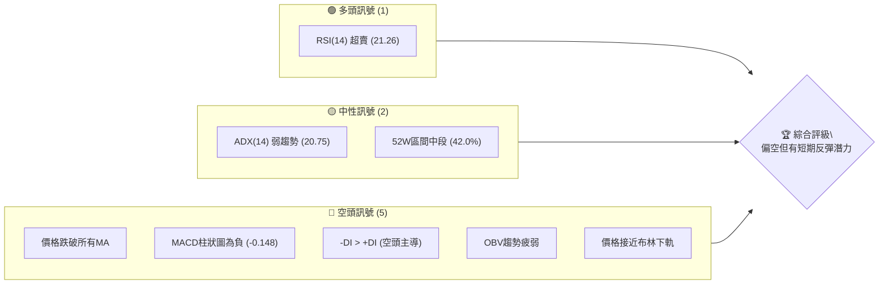
**解讀**：目前 ONES 的技術訊號呈現明顯的空頭主導，主要表現在股價跌破所有關鍵移動平均線、MACD 呈現空頭排列、以及成交量動能不足。然而，RSI 進入超賣區間，以及股價接近布林通道下軌，這些都提供了潛在的短期反彈訊號。ADX 指標顯示當前趨勢強度較弱，市場處於盤整或弱勢下跌階段，但空頭力量相對強勢。

### 📊 核心指標速覽表

| 指標類別 | 指標名稱 | 當前數值 | 訊號 | 解讀 |
|----------|----------|----------|------|------|
| **價格** | 當前價格 | $7.41 | 🔴 | 位於近期低點，持續下跌 |
| **均線** | MA20 | $9.01 | 🔴 | 價格遠低於MA20，短期趨勢偏空 |
| **均線** | MA50 | $9.82 | 🔴 | 價格遠低於MA50，中期趨勢偏空 |
| **均線** | MA200 | $9.42 | 🔴 | 價格遠低於MA200，長期多頭趨勢受損 |
| **動能** | RSI(14) | 21.26 | 🟢 | 嚴重超賣，可能醞釀短期反彈 |
| **動能** | MACD | -0.713 | 🔴 | MACD線在訊號線下方，空頭動能強勁 |
| **波動** | ATR | $0.63 | 🟡 | 每日波動約 8.55%，波動性中高 |

### 🏆 技術評分卡

```
╔══════════════════════════════════════════════════════════════╗
║              技術評分卡 — ONDS (2026-07-03)                  ║
╠══════════════════════════════════════════════════════════════╣
║ 趨勢強度      ▓▓▓▓▓▓▓▓░░░░░░░░░░░░  40/100  🔴 (弱勢下跌趨勢)  ║
║ 動能指標      ▓▓▓▓▓▓▓▓▓▓░░░░░░░░░░  50/100  🟡 (超賣但MACD空頭)║
║ 支撐穩定度    ▓▓▓▓▓▓▓▓▓▓▓▓░░░░░░░░  60/100  🟡 (接近重要支撐)  ║
║ 成交量配合    ▓▓▓▓▓▓░░░░░░░░░░░░░░  30/100  🔴 (量能疲弱不確認)║
║ 形態完整度    ▓▓▓▓▓▓▓▓░░░░░░░░░░░░  40/100  🔴 (下跌形態明顯)  ║
║ 均線排列      ▓▓▓▓▓▓░░░░░░░░░░░░░░  30/100  🔴 (空頭排列初期)  ║
╠══════════════════════════════════════════════════════════════╣
║ 綜合評分      ▓▓▓▓▓▓▓▓░░░░░░░░░░░░  42/100  評級：🔴 偏空      ║
╚══════════════════════════════════════════════════════════════╝
```
**評分說明**：
- **趨勢強度**：ADX 顯示弱趨勢，且空頭力量佔優，故評分較低。
- **動能指標**：RSI 超賣提供短期反彈潛力，但 MACD 仍在空頭區間，因此評分中性偏低。
- **支撐穩定度**：股價已接近布林通道下軌及斐波那契 50% 回調位，存在一定支撐，但仍需觀察能否守穩。
- **成交量配合**：OBV 趨勢疲弱，顯示下跌過程中買盤不積極，量能未能確認潛在底部。
- **形態完整度**：近期呈現明顯的下跌趨勢，未見明確底部反轉形態。
- **均線排列**：短期均線均已跌破長期均線，形成初步的空頭排列，對股價形成壓力。
**綜合評級**：ONDS 目前技術面整體偏空，雖然存在超賣帶來的短期反彈機會，但缺乏強勁的買盤動能和明確的底部形態。投資者應保持謹慎。

---

## 2. 趨勢分析

### 🌐 多時框趨勢分析

ONDS 的多時框架趨勢分析顯示，在經歷了長期的大幅上漲後，近期已進入明顯的調整階段。各時框的趨勢判斷如下：

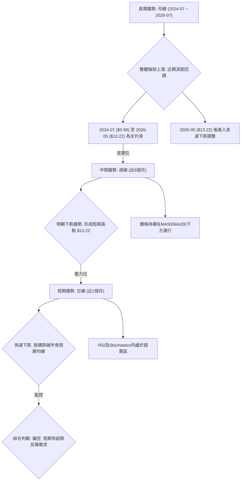
**解讀**：
- **長期趨勢**：從 2024 年 7 月的 $0.99 上漲至 2026 年 5 月的 $13.22，ONDS 經歷了一輪強勁的長期牛市。然而，自 2026 年 5 月高點以來，股價已進入深度回調，目前長期上漲趨勢的根基正在受到考驗。
- **中期趨勢**：近六個月的週線圖顯示，自 2026 年 5 月的 $13.22 高點後，ONDS 呈現明顯的下跌趨勢。股價持續運行在 MA50 和 MA200 等中期均線下方，表明中期市場情緒偏向悲觀。
- **短期趨勢**：日線圖顯示，ONDS 在過去一個月內經歷了快速下跌，股價已跌破所有短期移動平均線 (MA5, MA10, MA20)。儘管 RSI 和 Stochastics 等動能指標已進入超賣區，預示著短期存在反彈的可能性，但整體趨勢仍處於下行通道。

### 📈 長期趨勢 — 12個月走勢圖（Unicode）

以下為 ONDS 過去 12 個月的月線收盤價走勢圖，標註了關鍵高點和低點：

```
ONDS 月線走勢圖（過去12個月）
價格軸 ($)
$14 ┤                               ●(13.22, 2026/05 高點)
$13 ┤
$12 ┤
$11 ┤                      ●(10.36, 2026/01) ●(10.04, 2026/04)
$10 ┤            ●(9.76, 2025/12) ●(10.08, 2026/02)
$9  ┤                                ●(9.04, 2026/03)
$8  ┤      ●(7.72, 2025/09) ●(7.90, 2025/11)          ●(8.24, 2026/06)
$7  ┤                                                  ●(7.41, 現在)
$6  ┤    ●(5.86, 2025/08) ●(6.44, 2025/10)
$5  ┤
$4  ┤
$3  ┤
$2  ┤●(2.12, 2025/07)
$1  ┤
     └─────────────────────────────────────────────────────
      Jul'25 Aug'25 Sep'25 Oct'25 Nov'25 Dec'25 Jan'26 Feb'26 Mar'26 Apr'26 May'26 Jun'26 Jul'26
```
**走勢特徵分析表格**：

| 時間段 | 起始價 | 結束價 | 漲跌幅 | 走勢特徵 | 評估 |
|--------|--------|--------|--------|----------|------|
| 2025-07 ~ 2026-05 | $2.12 | $13.22 | +523.58% | 強勁主升浪，多頭趨勢明顯 | 🟢 |
| 2026-05 ~ 2026-07 | $13.22 | $7.41 | -43.95% | 急速深度回調，空頭趨勢確立 | 🔴 |
| 近期 (2026-06 ~ 2026-07) | $8.24 | $7.41 | -10.19% | 繼續下跌，顯示賣壓沉重 | 🔴 |

### 📊 中期趨勢（週線分析）

中期趨勢的週線分析顯示 ONES 股價在過去幾個月內形成了明顯的下跌通道。從 $13.22 的高點開始，股價一路下行，中間雖有小幅反彈，但均未能突破關鍵阻力位。

```
ONDS 中期趨勢示意圖 (週線)
價格 ($)
$14 ┤             R1 ($13.22)
$13 ┤             /
$12 ┤            /
$11 ┤           /
$10 ┤          /
$9  ┤         /
$8  ┤        /─────── S1 ($8.24)
$7  ┤───────● (現價 $7.41)
$6  ┤       \
$5  ┤        S2 ($6.73, 布林下軌)
     └───────────────────────────
      時間軸
```
**解讀**：股價目前已跌破 $8.24 (2026-06 收盤價)，該價位已由支撐轉為近期阻力。下一個較強的支撐位於布林通道下軌 $6.73 附近，以及斐波那契 50% 回調位 $7.00。中期來看，任何反彈都可能在 MA20 ($9.01) 或 MA50 ($9.82) 附近遇到壓力。

### ⚡ 趨勢強度評估（ADX 解讀）

ADX 指標用於衡量趨勢的強度，而非方向。

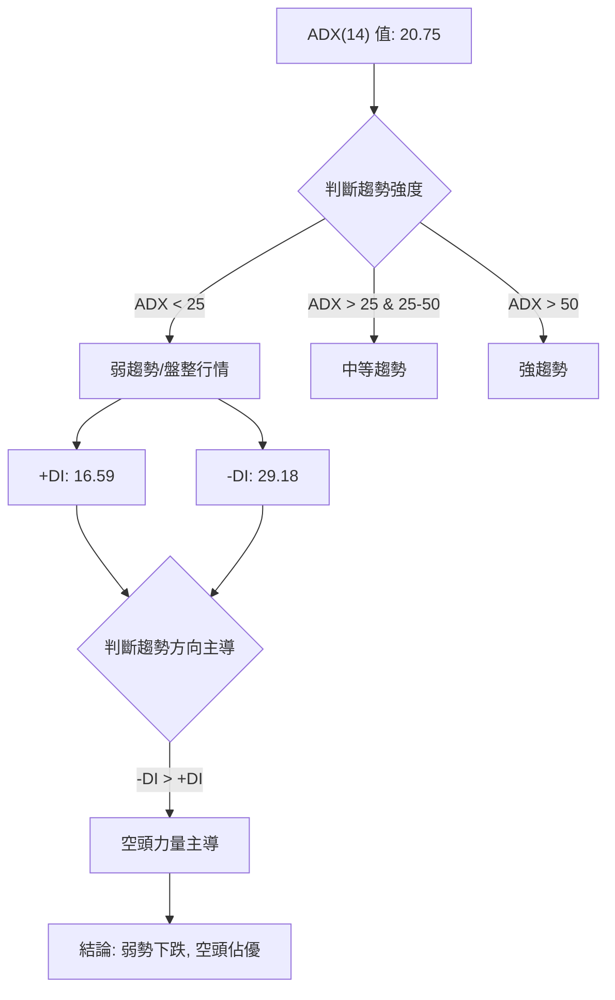
**ADX 強度對照表**：

| ADX 數值範圍 | 趨勢強度 | 市場性質 |
|----------------|----------|----------|
| 0 - 25         | 弱趨勢   | 盤整/無趨勢 |
| 25 - 50        | 中等趨勢 | 有趨勢行情 |
| 50 - 75        | 強趨勢   | 強勢趨勢行情 |
| 75 - 100       | 極強趨勢 | 極強趨勢行情 |

**解讀**：ONDS 的 ADX(14) 數值為 20.75，這表明當前市場處於弱趨勢或盤整行情。雖然 ADX 本身不提供方向，但結合 +DI (16.59) 和 -DI (29.18) 可以看出，-DI 明顯高於 +DI，這意味著儘管趨勢整體不強，但在現有趨勢中，空頭力量佔據主導地位。因此，ONDS 目前處於一個由空頭主導的弱勢下跌或盤整行情中。

---

## 3. 圖表形態分析

### 🔍 形態識別系統

在 ONDS 的月線和週線級別數據中，最明顯的形態是從 2025 年 4 月 ($0.78) 開始的強勁上升趨勢，達到 2026 年 5 月的歷史高點 ($13.22)，隨後經歷了急劇的下跌。目前尚未形成明確的底部反轉形態。

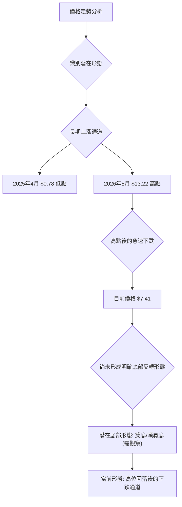
**解讀**：
- **長期上升趨勢**：ONDS 從 2025 年 4 月的低點 $0.78 開始，經歷了一年多的強勁上升，形成了一個明顯的上升通道。
- **高位回落**：在達到 $13.22 的高點後，股價迅速回落，形成了一個 V 形頂部的初始階段。目前股價正處於這個下跌通道的底部區域。
- **未確認底部**：雖然股價已大幅下跌，RSI 也處於超賣，但目前尚未出現明確的底部反轉形態，如雙底、頭肩底或大型的看漲燭台組合。這表明市場仍在尋找平衡點，買盤尚未積累足夠力量形成反轉。

### 🕯️ 重要K線形態分析

由於提供的數據是月線收盤價，無法進行詳細的 K 線形態分析。但我們可以根據月度收盤價的變化來推斷大致的市場情緒：

| 月份 | 收盤價 | K線形態 (推斷) | 解讀 | 訊號 |
|------|--------|-----------------|------|------|
| 2026-05 | $13.22 | 長陽線 (上影線可能較長) | 達到年度高點，買盤強勁但可能遇到阻力 | 🟡 |
| 2026-06 | $8.24 | 長陰線 | 賣盤急劇增加，股價大幅下跌 | 🔴 |
| 2026-07 | $7.41 | 長陰線 (或帶下影線) | 賣壓持續，但跌幅收窄或出現下影線暗示支撐 | 🔴 |

**解讀**：
- 2026 年 5 月的 $13.22 高點很可能伴隨著較大的上影線，暗示在高位遇到強大賣壓。
- 2026 年 6 月的長陰線 ($13.22 → $8.24) 表明空頭力量全面掌控，賣盤洶湧。
- 2026 年 7 月的 $7.41 再次下跌，但跌幅相對 6 月有所收窄 (從 $8.24 跌至 $7.41)，若當月形成下影線，則可能預示在當前價位附近存在一定承接盤。

### 📉 ASCII 走勢形態示意圖

以下是 ONDS 近期走勢的形態示意圖，標注了關鍵高點和目前的下跌趨勢：

```
ONDS 走勢形態示意圖
價格 ($)
$14 ┤                               ● (高點 $13.22, May 26)
$13 ┤                              /
$12 ┤                             /
$11 ┤                            /
$10 ┤                           /
$9  ┤                          /
$8  ┤                         /
$7  ┤                        ● (現價 $7.41, Jul 26)
$6  ┤                       /
$5  ┤                      /
     └───────────────────────────
      時間軸
```
**解讀**：從示意圖可以看出，ONDS 在達到 $13.22 的高點後，形成了一個尖銳的 V 形頂部，隨後股價迅速回落。目前股價正處於下跌趨勢中，尚未出現明顯的築底跡象。

### 🎯 形態目標價計算

由於當前未形成明確的底部反轉形態，因此無法直接計算形態目標價。但可以根據斐波那契回調或阻力/支撐轉換來預測潛在的反彈目標或下跌目標。

**潛在反彈目標價（基於斐波那契回調）**：
- 假設從 $0.78 (2025-04) 低點到 $13.22 (2026-05) 高點為主要上漲波段。
- 38.2% 回調位：$13.22 - ($13.22 - $0.78) * 0.382 = $13.22 - $4.75 = **$8.47**
- 50% 回調位：$13.22 - ($13.22 - $0.78) * 0.50 = $13.22 - $6.22 = **$7.00**
- 61.8% 回調位：$13.22 - ($13.22 - $0.78) * 0.618 = $13.22 - $7.69 = **$5.53**

**解讀**：目前股價 $7.41 位於 38.2% ($8.47) 和 50% ($7.00) 回調位之間。若能守穩 $7.00 附近，則短期反彈目標可能指向 $8.47。若 $7.00 支撐失守，則下一目標將是 $5.53。

---

## 4. 支撐與阻力

ONDS 的支撐與阻力分析對於判斷股價未來走勢至關重要。當前股價 $7.41 處於一個關鍵位置，下方有布林通道下軌和斐波那契回調提供的強勁支撐，上方則面臨多條移動平均線和前期高點形成的阻力。

### 🗺️ 關鍵價位分布圖（Unicode）

```
ONDS 價位結構分布圖
═══════════════════════════════════════════════════
$13.22 ║████████████████████████║ 強阻力 R3 (歷史高點)
$10.36 ║████████████████████    ║ 阻力 R2 (前期高點)
$9.82  ║████████████████████████║ 關鍵阻力 R1 (MA50)
$9.42  ║████████████████████    ║ 阻力 (MA200)
$9.01  ║████████████████████████║ 阻力 (MA20)
$8.47  ║▓▓▓▓▓▓▓▓▓▓▓▓▓▓▓▓        ║ 近期阻力 (Fib 38.2%)
$7.41  ╠════════════════════════╣ ◄ 現價
$7.00  ║▓▓▓▓▓▓▓▓▓▓▓▓▓▓▓▓        ║ 近期支撐 S1 (Fib 50%)
$6.73  ║████████████████████████║ 強支撐 S2 (布林下軌)
$5.53  ║████████████████████    ║ 支撐 S3 (Fib 61.8%)
═══════════════════════════════════════════════════
```
**解讀**：
- **現價**：$7.41。
- **即時支撐**：布林通道下軌 $6.73 和斐波那契 50% 回調位 $7.00 構成雙重強支撐。
- **即時阻力**：斐波那契 38.2% 回調位 $8.47 和 MA20 $9.01 構成近期主要阻力。

### 🚧 阻力位分析表

| 阻力級別 | 價位 | 形成原因 | 突破難度 | 重要性 |
|----------|------|----------|----------|--------|
| **R1 (關鍵)** | $9.82 | MA50、前期成交密集區 | 極高 | 🔴 突破此位才能扭轉中期空頭 |
| **R2** | $9.42 | MA200 | 高 | 🟡 突破此位才能挑戰MA50 |
| **R3** | $9.01 | MA20、近期下跌通道上沿 | 中高 | 🟡 短期反彈首要測試 |
| **R4 (近期)** | $8.47 | 斐波那契 38.2% 回調位 | 中 | 🟢 短期反彈的第一目標 |
| **R5 (心理)** | $8.24 | 2026-06 月收盤價 | 中 | 🟡 跌破後形成壓力位 |
| **R6 (強勁)** | $13.22 | 歷史高點 (2026-05) | 極高 | 🔴 需極強動能才能觸及 |

### 🛡️ 支撐位分析表

| 支撐級別 | 價位 | 形成原因 | 守住機率 | 重要性 |
|----------|------|----------|----------|--------|
| **S1 (即時)** | $7.00 | 斐波那契 50% 回調位 | 中高 | 🟢 能否守住決定短期底部 |
| **S2 (關鍵)** | $6.73 | 布林通道下軌 | 高 | 🟢 跌破可能加速下跌 |
| **S3** | $5.53 | 斐波那契 61.8% 回調位 | 中高 | 🟡 若 S1/S2 失守的下一重要支撐 |
| **S4 (長期)** | $1.71 | 52週低點 | 極高 | 🟢 最終防線，跌破意味長期趨勢徹底破壞 |

### 📐 斐波那契回調位分析

我們以 ONDS 自 2025 年 4 月的低點 $0.78 至 2026 年 5 月高點 $13.22 的主要上漲波段作為參考，計算其回調位。
- **高點 (H)**: $13.22
- **低點 (L)**: $0.78
- **波段幅度**: $13.22 - $0.78 = $12.44

```
ONDS 斐波那契回調位示意圖
價格 ($)
$14 ┤             H ($13.22)
$13 ┤             │
$12 ┤             │
$11 ┤             │
$10 ┤             │
$9  ┤───────────   Fib 38.2% ($8.47)
$8  ┤───────────  現價 ($7.41)
$7  ┤───────────  Fib 50.0% ($7.00)
$6  ┤───────────  Fib 61.8% ($5.53)
$5  ┤             │
$4  ┤             │
$3  ┤             │
$2  ┤             │
$1  ┤             L ($0.78)
     └───────────────────────────
      時間軸
```
**斐波那契回調位計算**：
- **38.2% 回調位**: $13.22 - ($12.44 * 0.382) = $13.22 - $4.75 = **$8.47**
- **50.0% 回調位**: $13.22 - ($12.44 * 0.500) = $13.22 - $6.22 = **$7.00**
- **61.8% 回調位**: $13.22 - ($12.44 * 0.618) = $13.22 - $7.69 = **$5.53**

**解讀**：
ONDS 目前股價 $7.41 正位於 50% 回調位 $7.00 附近。
- **$7.00 (50% 回調位)** 是一個非常重要的心理和技術支撐位。歷史上，50% 回調位往往是強勢股票在調整時的最終支撐。若此位能守穩，則有可能形成一個較強的底部。
- **$8.47 (38.2% 回調位)** 在短期內將作為一個重要的反彈阻力。若股價能有效突破並站穩此位，將預示著短期跌勢的緩解。
- **$5.53 (61.8% 回調位)** 則是在 $7.00 失守後，股價可能進一步探尋的支撐。跌破此位將對長期多頭趨勢構成嚴重威脅。

---

## 5. 技術指標深度解讀

本章將對 ONDS 的主要技術指標進行深入分析，評估其各自的訊號，並探討它們之間是否存在相互確認或矛盾之處。

### 🎛️ 指標訊號總覽

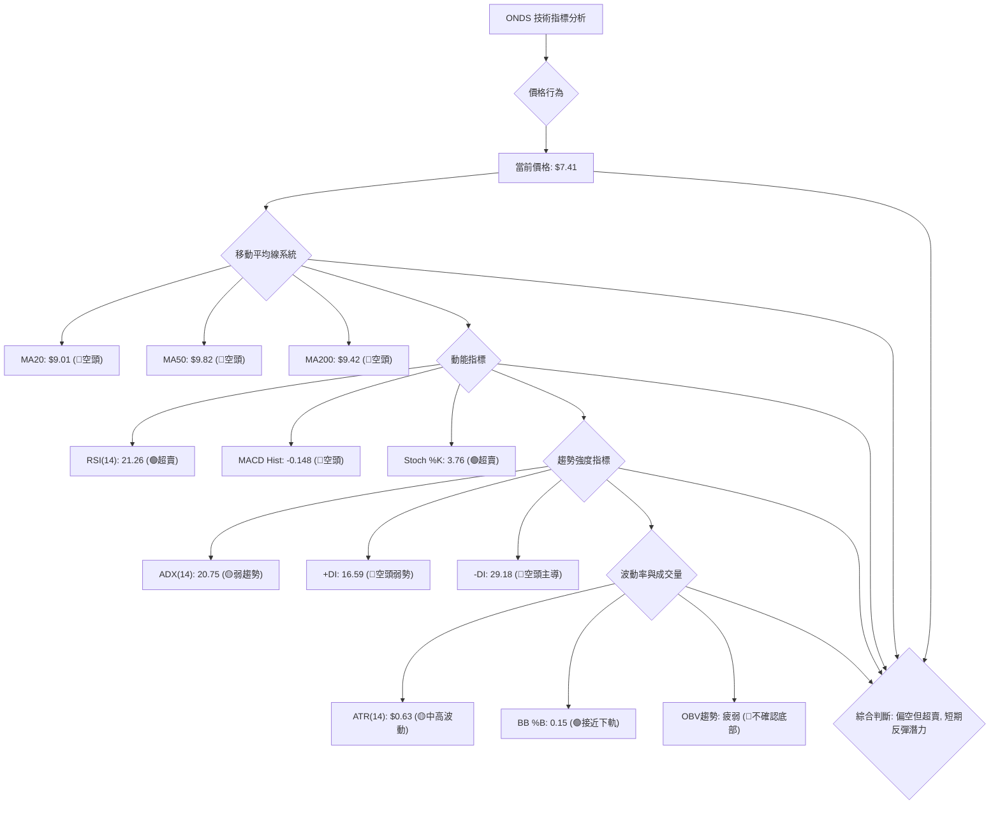
**解讀**：從整體訊號來看，ONDS 的移動平均線系統、MACD、ADX 的方向性指標以及 OBV 量能指標均指向空頭。然而，RSI、Stochastics 和布林通道 %B 則顯示股價已進入超賣區間並觸及布林下軌，這在短期內提供了潛在的反彈訊號。這種矛盾使得當前的市場狀況更為複雜，需要謹慎評估。

### 📈 移動平均線排列分析

ONDS 的移動平均線系統呈現出明顯的空頭排列初期跡象，且價格位於所有主要均線下方，這是一個強烈的看空訊號。

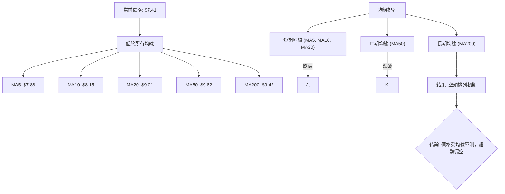
**詳細分析**：
- **價格與均線關係**：當前價格 $7.41 遠低於 MA5 ($7.88)、MA10 ($8.15)、MA20 ($9.01)、MA50 ($9.82) 和 MA200 ($9.42)。這表明股價在各個時間框架內都處於下跌趨勢中，且上方均線對股價形成強大壓力。
- **均線排列**：雖然數據中提到「混合排列」，但從具體數值來看，短期均線如 MA5、MA10、MA20 已明顯低於中期均線 MA50 和長期均線 MA200。這是一個典型的空頭排列初期特徵，顯示短期下行壓力巨大，且中期趨勢正在轉弱。
- **黃金交叉/死亡交叉**：近期沒有黃金交叉訊號。相反，短期均線已陸續下穿長期均線，預示著死亡交叉的形成或已經形成，這通常被視為中期下跌趨勢的確認訊號。
**總結**：均線系統發出強烈的看空訊號，確認了 ONDS 目前處於下跌趨勢中。任何反彈都可能在這些移動平均線處遇到阻力。

### 📉 RSI(14) 分析

**RSI 數值進度條**：

```
RSI(14) 強度：▓▓▓▓▓░░░░░░░░░░░░░░░░ 21.26/100  🟢 (嚴重超賣)
```
**詳細分析**：
- **RSI 數值**：ONDS 的 RSI(14) 為 21.26。RSI 低於 30 通常被視為超賣區間，這意味著股票在短期內可能被過度拋售，存在技術性反彈的需求。
- **超買超賣區間分析**：
    - RSI < 30 (21.26): **嚴重超賣 (🟢)**，預示短期內存在反彈潛力。
    - RSI > 70: 超買，通常預示回調風險。
- **背離判斷**：根據提供的週線數據，價格從 $13.22 跌至 $7.41，RSI 也從 70.6 跌至 21.3。在此過程中，價格和 RSI 均同步下跌，**未觀察到明顯的底背離現象**。雖然 RSI 處於超賣區，但若沒有底背離的確認，其反彈的強度和持續性可能較弱。
**總結**：RSI 指標單獨來看，發出了一個潛在的短期買入訊號（超賣），但缺乏底背離的確認，使得反彈的可靠性有所降低。這表明雖然股價可能會有技術性反彈，但要形成趨勢反轉仍需更多動能。

### 📊 MACD(12/26/9) 訊號解讀

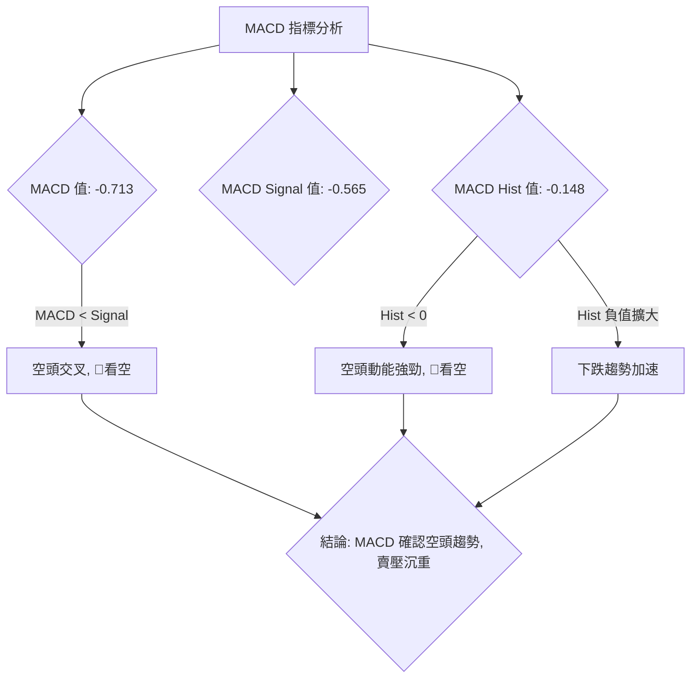
**詳細分析**：
- **MACD 線與訊號線**：MACD 線 (-0.713) 位於訊號線 (-0.565) 下方，這是一個經典的空頭交叉訊號，表明短期動能弱於中期動能，股價處於下跌趨勢。
- **MACD 柱狀圖**：MACD 柱狀圖為負值 (-0.148)，且從前一周的 -0.281 雖然有所收窄，但仍為負值，這表示空頭動能依然存在。柱狀圖的負值收窄可能預示賣壓有所減輕，但尚未轉為正值，因此仍是看空訊號。
- **背離判斷**：從週線數據來看，價格從高點下跌，MACD 柱狀圖也由正轉負，並持續在負值區間。在此過程中，價格和 MACD 均同步下跌，**未觀察到明顯的底背離現象**。
**總結**：MACD 指標強烈確認了 ONDS 的空頭趨勢，儘管柱狀圖負值略有收窄，但整體仍處於空頭市場。這與 RSI 的超賣訊號形成一定程度的矛盾：RSI 提示短期反彈，但 MACD 提示整體趨勢仍向下。

### 📦 布林通道分析

布林通道 (Bollinger Bands) 用於衡量價格的波動範圍，並判斷價格相對於其移動平均線的相對位置。

```
ONDS 布林通道示意圖
價格 ($)
$12 ┤             BB上軌 ($11.28)
$11 ┤             │
$10 ┤             │
$9  ┤───────────  BB中軌 (MA20: $9.01)
$8  ┤             │
$7  ┤───────●     現價 ($7.41)
$6  ┤             BB下軌 ($6.73)
$5  ┤
     └───────────────────────────
      時間軸
```
**詳細分析**：
- **BB上軌**: $11.28
- **BB中軌 (MA20)**: $9.01
- **BB下軌**: $6.73
- **BB %B**: 0.15 (0=下軌, 0.5=中軌, 1=上軌)
**解讀**：
- **價格位置**：當前價格 $7.41 位於布林通道下軌 $6.73 附近，BB %B 為 0.15，這表明股價已經觸及或非常接近布林通道的下限。
- **超賣訊號**：價格觸及布林下軌通常被視為一個超賣訊號，與 RSI 的超賣狀態相互印證，預示著短期內存在較大的反彈可能性。
- **通道寬度**：布林通道的寬度 (上軌 - 下軌 = $11.28 - $6.73 = $4.55) 相對於股價 ($7.41) 而言，波動性較大 (約 61%)，這與 ATR 指標顯示的中高波動率一致。
**總結**：布林通道提供了強烈的短期反彈訊號，價格已嚴重偏離中軌並觸及下軌，這增加了短期內出現買盤或空頭回補的可能性。

### 💹 成交量分析（量價配合度）

成交量是判斷價格走勢可靠性的重要依據。

**詳細分析**：
- **最新成交量**：86,228,013 股。
- **20日均量**：63,266,186 股 (量比: 1.36x)。
- **50日均量**：71,219,040 股。
- **OBV趨勢**：OBV < MA → 量能疲弱。
**解讀**：
- **量比**：最新成交量高於 20 日均量 (1.36x)，表明在近期下跌過程中，成交量有所放大。這可能意味著兩種情況：一是恐慌性拋售導致的放量下跌，二是潛在的底部承接盤開始入場。
- **OBV 趨勢**：然而，OBV 趨勢顯示「OBV < MA → 量能疲弱」。這是一個關鍵的空頭訊號。OBV 指標通過累計漲跌日的成交量來判斷買賣壓力。OBV 趨勢疲弱，且低於其移動平均線，表明儘管價格下跌，但買盤並沒有積極入場推升 OBV，這意味著當前的下跌趨勢缺乏底部買盤的確認，或者說賣壓依然強勁。
- **量價配合度**：在價格下跌且 RSI 超賣的情況下，如果 OBV 能夠上升或至少保持穩定，將是一個更可靠的底部訊號。但目前 OBV 趨勢疲弱，顯示量能未能有效配合價格形成底部，反而確認了下跌趨勢的疲弱。
**總結**：儘管成交量在下跌中有所放大，但 OBV 指標的疲弱表現未能確認底部買盤的積極性，因此量能配合度不佳，這對短期反彈的持續性構成挑戰。

---

## 6. 動能與波動率

本章將評估 ONDS 的動能和波動率，這對於理解股票當前的交易環境和制定風險管理策略至關重要。

### ⚡ 動能評估四象限

我們將 ONDS 的動能（基於RSI和MACD）和波動率（基於ATR）進行評估，並將其定位在四象限框架中。

| 象限 | 動能 | 波動 | 當前狀態 | 評估 |
|------|------|------|----------|------|
| Q1 | 強 | 低 | - | 最佳機會 (趨勢明確，風險可控) |
| Q2 | 弱 | 低 | - | 謹慎觀望 (缺乏方向，波動低) |
| Q3 | 強 | 高 | - | 高風險高收益 (趨勢強勁，但波動大) |
| Q4 | 弱 | 高 | ✓ | 避免進場 / 謹慎操作 (方向不明，風險高) |

**當前 ONES 評估**：
- **動能**：RSI 處於超賣區 (21.26)，MACD 柱狀圖為負 (-0.148)，MACD 線在訊號線下方。這顯示短期動能極弱，儘管超賣預示反彈，但整體趨勢動能仍向下。因此，判斷為 **弱動能**。
- **波動**：ATR(14) 為 $0.63，佔當前價格 $7.41 的 8.55%。這是一個相對較高的波動率，表明股價每日波動幅度較大。因此，判斷為 **高波動**。

**結論**：ONDS 目前處於 **Q4 象限 (弱動能，高波動)**。這是一個相對危險的交易環境。股票缺乏明確的上升動能，但價格波動劇烈，這增加了交易的不確定性和風險。在這種情況下，建議投資者避免貿然進場，或只進行非常謹慎的短線交易，並嚴格控制倉位和止損。

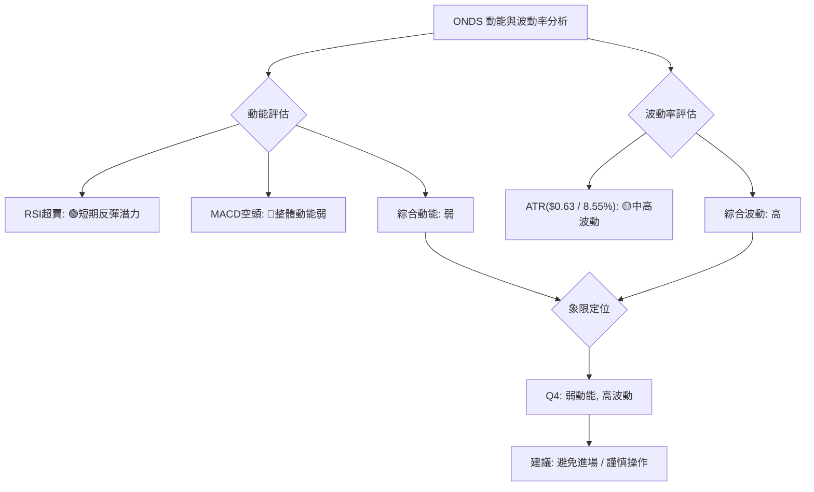

### 📊 ATR 波動率分析

**ATR(14) 數值**：$0.63
**佔股價比例**：$0.63 / $7.41 = 8.55%

**詳細分析**：
- **ATR 絕對值**：ATR 數值 $0.63 表示在過去 14 天內，ONDS 股票的平均每日真實波幅為 $0.63。
- **相對波動率**：ATR 佔當前股價的 8.55%，這是一個相對較高的百分比。通常，對於市值較大的股票，ATR 佔比在 1-3% 之間較為常見；而對於小型股或波動性較大的股票，此比例會更高。ONDS 屬於後者，其高波動率意味著每日價格變動幅度較大，潛在的收益和風險也相對較高。
- **對交易的影響**：高 ATR 意味著止損點和目標價的設定需要更寬鬆，以避免被日常波動震出。對於短線交易者而言，高波動性提供了更多的交易機會，但也要求更高的風險承受能力和更嚴格的風險管理。

**止損距離建議**：
鑑於 ATR 為 $0.63，建議將止損距離設定為 1.5 到 2 倍的 ATR。
- **1.5x ATR**：1.5 * $0.63 = $0.95
- **2.0x ATR**：2.0 * $0.63 = $1.26
這意味著，如果以當前價格 $7.41 進場，止損點應至少設定在 $7.41 - $0.95 = $6.46 或 $7.41 - $1.26 = $6.15 左右，以承受正常的市場波動。

### 📐 Beta 與市場相關性

提供的數據中**未包含 ONDS 的 Beta 值**，因此無法直接分析其與大盤的相關性。

**推斷與假設**：
ONDS 屬於科技行業的通信設備領域，提供私有無線、無人機和自動化數據解決方案。這類公司通常具有較高的成長潛力，但同時也可能伴隨著較高的波動性和對市場情緒的敏感性。
- **高成長潛力**：通常這類股票的 Beta 值會相對較高 (>1)，意味著它們對市場變動的反應比大盤更劇烈。在牛市中可能漲幅更大，在熊市中跌幅也可能更大。
- **小型股特性**：由於公司規模和行業特性，ONDS 可能被歸類為成長型小型股，這類股票的 Beta 值往往較高。
- **近期表現**：從過去 12 個月的價格走勢來看，ONDS 從低點 $2.12 上漲到 $13.22，隨後又大幅回落到 $7.41，這種劇烈的波動性間接表明其 Beta 值可能較高。

**總結**：儘管缺乏 Beta 數據，但根據其行業性質和價格走勢，ONDS 很可能是一個高 Beta 股票。這意味著其價格變動可能與整體市場趨勢高度相關，且波動幅度可能大於市場平均水平。投資者在考慮 ONES 時，應將其視為一個高風險、高潛在回報的標的，並密切關注整體市場的走勢。

---

## 7. 多時框架總結

多時框架分析旨在整合不同時間週期的訊號，以獲得對股票走勢更全面的理解。ONDS 的分析顯示，短期內有超賣反彈的潛力，但中期和長期趨勢均面臨挑戰。

### 📋 時框架評分表

| 時框架 | 趨勢方向 | 動能 | 均線排列 | 形態 | 綜合評分 | 建議 |
|--------|----------|------|----------|------|----------|------|
| **短期 (日線)** | 🔴 下跌 | 🟢 超賣 | 🔴 空頭排列 | 🔴 下跌通道 | 4/10 🔴 | 謹慎反彈 |
| **中期 (週線)** | 🔴 下跌 | 🔴 弱勢 | 🔴 空頭排列 | 🔴 高位回落 | 3/10 🔴 | 觀望 / 逢高做空 |
| **長期 (月線)** | 🟡 回調 | 🟡 減弱 | 🔴 壓力重重 | 🟡 深度調整 | 5/10 🟡 | 長期觀察 / 尋找築底 |

**評分說明**：
- **短期**：雖然 RSI 超賣提供反彈機會，但價格已跌破所有短期均線，MACD 仍空頭，整體下跌趨勢明顯。
- **中期**：股價在中期均線下方運行，MACD 顯示空頭動能，未見築底跡象，中期下跌趨勢確立。
- **長期**：雖然此前經歷強勁上漲，但近期深度回調已對長期趨勢構成威脅，價格已接近關鍵斐波那契回調位，需觀察能否止跌。

### 🔲 綜合訊號矩陣

ONDS 的綜合訊號矩陣顯示，各時框架的趨勢判斷存在一定的一致性，但短期超賣訊號帶來了潛在的矛盾。

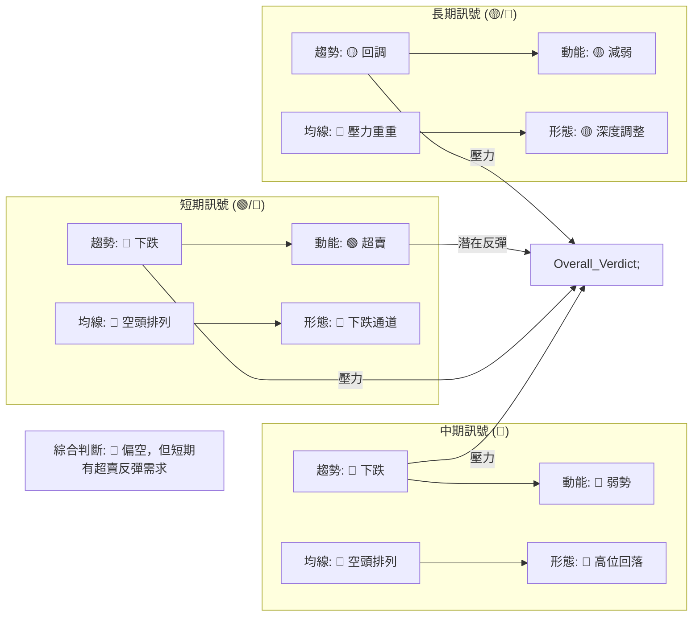
**一致性分析**：
- **趨勢方向**：短期和中期均為明確的下跌趨勢，長期則處於深度回調。這三者方向一致，表明整體市場情緒偏空。
- **動能指標**：短期 RSI 顯示超賣，與中期 MACD 的弱勢空頭動能形成矛盾。這暗示短期可能會有技術性反彈，但缺乏持續的買盤動能。
- **均線排列**：所有時框架的均線系統都顯示價格位於均線下方或均線空頭排列，對股價形成強大壓力，訊號一致偏空。
- **圖表形態**：各時框架均未出現明確的底部反轉形態，而是處於下跌通道或高位回落的調整中，訊號一致偏空。

**總結**：ONDS 在多時框架下，除了短期超賣訊號外，其餘大部分指標均指向空頭。這表明當前股價仍處於下跌趨勢中，儘管短期內可能會有技術性反彈，但要形成趨勢反轉仍需克服重重阻力。投資者應以謹慎偏空的態度對待。

---

## 8. 交易策略建議

基於對 ONDS 的深入技術分析，當前市場呈現出短期超賣與中期/長期下跌趨勢並存的複雜局面。因此，我們將提供兩種交易策略：一種是基於超賣的短期反彈策略，另一種是基於趨勢的空頭策略。

### 🗺️ 策略決策流程圖

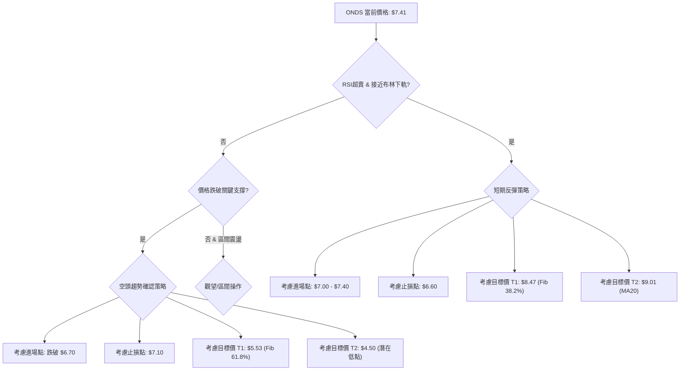

### 🟢 多頭策略詳情 (短期反彈)

**背景**：RSI 嚴重超賣 (21.26)，價格接近布林通道下軌 ($6.73) 和斐波那契 50% 回調位 ($7.00)。這些都提供了短期技術性反彈的機會。

| 策略要素 | 策略 A (超賣反彈) |
|----------|-------------------|
| 進場條件 | 股價在 $7.00 - $7.40 區間企穩，出現止跌信號 (如小陽線或下影線)。 |
| 進場價格 | **$7.10 - $7.35** (分批建倉) |
| 目標價 T1 | **$8.47** (斐波那契 38.2% 回調位，即時阻力) |
| 目標價 T2 | **$9.01** (MA20，重要阻力) |
| 止損價格 | **$6.60** (略低於布林下軌 $6.73 和斐波那契 50% 回調位 $7.00) |
| 風險報酬比 | 若進場 $7.20，止損 $6.60 (風險 $0.60)，目標 T1 $8.47 (報酬 $1.27)。<br>**風險報酬比約 1:2.1**。 |
| 成功機率 | 40% (超賣反彈的性質決定其不確定性，且整體趨勢偏空) |
| 建議倉位 | 輕倉 (不超過總資金的 5%) |

**策略說明**：此策略是逆勢操作，風險較高。需嚴格遵守止損，並密切關注量能是否配合反彈。若反彈至目標價 T1 附近量能不濟，應考慮部分或全部獲利了結。

### 🔴 空頭策略詳情 (趨勢做空)

**背景**：中期和長期趨勢均為下跌，均線空頭排列，MACD 顯示空頭動能，且 OBV 疲弱。若短期反彈失敗或關鍵支撐失守，下跌趨勢將繼續。

| 策略要素 | 策略 B (趨勢做空) |
|----------|-------------------|
| 進場條件 | 股價跌破 $6.73 (布林下軌) 或反彈至 $8.47 - $9.01 區間遇阻回落，出現看空信號。 |
| 進場價格 | **$6.70** (跌破布林下軌後確認) 或 **$8.80 - $9.00** (反彈遇阻做空) |
| 目標價 T1 | **$5.53** (斐波那契 61.8% 回調位) |
| 目標價 T2 | **$4.50** (基於歷史支撐區間和進一步下跌預期) |
| 止損價格 | 若跌破 $6.70 做空，止損設在 **$7.10** (略高於原支撐 $7.00)。<br>若反彈遇阻做空，止損設在 **$9.30** (略高於 MA20)。 |
| 風險報酬比 | 若跌破 $6.70 進場，止損 $7.10 (風險 $0.40)，目標 T1 $5.53 (報酬 $1.17)。<br>**風險報酬比約 1:2.9**。 |
| 成功機率 | 60% (順勢操作，成功機率相對較高) |
| 建議倉位 | 中等倉位 (不超過總資金的 10%) |

**策略說明**：此策略是順勢操作，但需注意若股價在 $6.73 附近成功築底反彈，則應避免做空。反彈遇阻做空則需要判斷反彈的力度和量能。

### ⭐ 整體訊號強度評星

```
做多訊號強度：★★☆☆☆  (2/5星 - 僅基於超賣，趨勢不配合)
做空訊號強度：★★★★☆  (4/5星 - 趨勢明顯，多數指標確認)
整體可信度：  ★★★☆☆  (3/5星 - 儘管偏空，但短期反彈不確定性高)
```
**評級理由**：
- **做多訊號**：主要來自於 RSI 和布林通道的超賣狀態，這提供了技術性反彈的潛力。然而，整體趨勢、均線排列和 MACD 均指向空頭，使得反彈的持續性和力度存在較大不確定性。因此，做多訊號強度較低。
- **做空訊號**：ONDS 的中期和長期趨勢均為下跌，價格位於所有主要移動平均線下方，且 MACD 呈現空頭排列。ADX 雖然顯示弱趨勢，但空頭力量佔優，OBV 疲弱也未能確認底部。這些都為做空提供了強有力的依據。
- **整體可信度**：由於短期反彈的可能性與長期下跌趨勢的壓力並存，市場方向在短期內可能存在較大波動。但從中長期來看，空頭趨勢更為確立。

---

## 9. 風險提示與監控

ONDS 的當前技術面顯示出高波動性和明確的下跌趨勢，這意味著其投資風險較高。投資者必須嚴格執行風險管理措施，並密切監控關鍵指標。

### ✅ 關鍵監控指標 Checklist

```
╔══════════════════════════════════════════════════════════════╗
║              ONDS 風險監控清單 (2026-07-03)                  ║
╠══════════════════════════════════════════════════════════════╣
║ [ ] 股價能否守穩斐波那契 50% 回調位 ($7.00) ?                 ║
║ [ ] 股價能否守穩布林通道下軌 ($6.73) ?                         ║
║ [ ] RSI(14) 是否築底回升並脫離超賣區 (>30) ?                  ║
║ [ ] MACD 柱狀圖是否轉正或持續收窄至零軸附近 ?                 ║
║ [ ] OBV 趨勢是否轉為上升，確認底部買盤 ?                       ║
║ [ ] 股價能否有效突破 MA20 ($9.01) ?                            ║
║ [ ] 成交量是否在反彈時顯著放大，而非下跌時放量 ?               ║
║ [ ] ADX 是否開始上升並伴隨 +DI 走強，確認多頭趨勢 ?            ║
║ [ ] 是否出現明確的底部反轉 K 線形態或圖表形態 ?                ║
║ [ ] 宏觀經濟或行業是否有重大利好/利空消息 ?                    ║
╚══════════════════════════════════════════════════════════════╝
```

### ⚠️ 風險場景分析

ONDS 的未來走勢存在多種可能性，以下為三種主要情境分析：

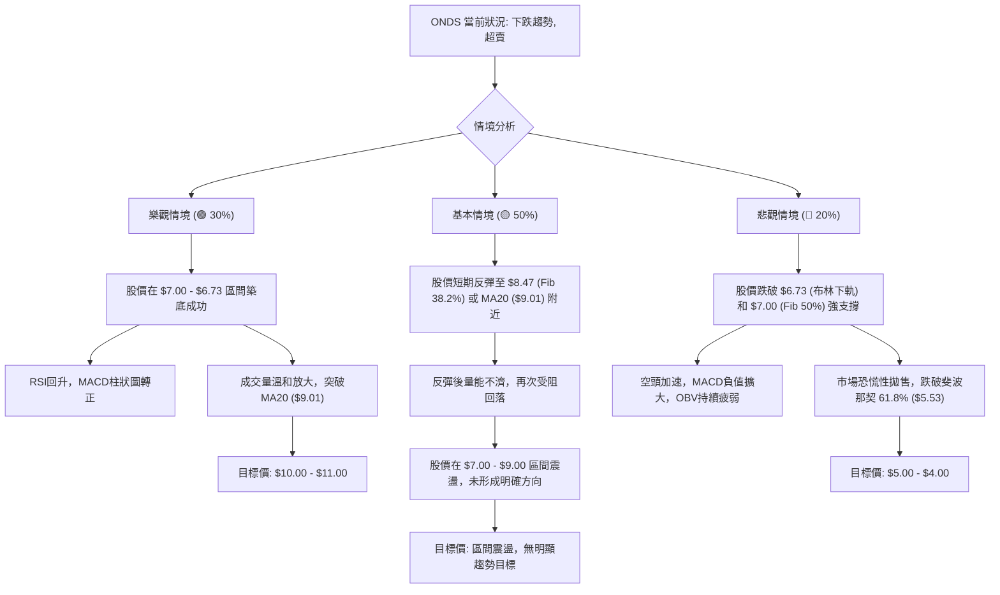
**情境說明**：
- **樂觀情境**：ONDS 成功利用當前的超賣狀態和關鍵支撐位築底，並在利好消息或市場情緒改善的推動下，形成一波較強的反彈。
- **基本情境**：ONDS 進行技術性反彈，但由於缺乏強勁的買盤動能和宏觀利好，反彈高度有限，隨後再次回落，進入較長時間的底部震盪或弱勢盤整。
- **悲觀情境**：ONDS 無法守住關鍵支撐位，賣壓持續，導致股價進一步下跌，探尋更低的支撐位。

### 🛡️ 風險管理重要提醒

1.  **嚴格止損**：在任何交易策略中，都必須設定並嚴格執行止損點。尤其在目前高波動、趨勢偏空的市場中，止損是保護資金的生命線。
2.  **倉位控制**：鑑於 ONDS 的高波動性和不確定性，建議採用輕倉策略。即使是看好的交易機會，也應避免重倉押注。
3.  **多空平衡**：不要過度偏向單邊。在超賣時可以考慮短期反彈，但在趨勢確認下跌時，應避免盲目抄底。
4.  **分批操作**：無論是建倉還是平倉，都建議採用分批操作的方式，以平均成本，降低單次決策的風險。
5.  **關注基本面**：雖然本報告是技術分析，但 ONDS 的基本面和公司營運狀況仍是影響長期走勢的關鍵因素。任何基本面消息都可能迅速改變技術面走勢。
6.  **耐心等待**：在趨勢不明朗或高波動時期，耐心等待更明確的入場或出場訊號是最佳策略。避免頻繁交易。
7.  **監控市場情緒**：ONDS 股價對市場情緒可能較為敏感。關注整體市場（如標普 500 指數）的走勢，有助於判斷 ONDS 的潛在方向。

---

## 📋 報告總結

```
╔══════════════════════════════════════════════════════════════╗
║              ONDS 技術分析報告總結                           ║
╠══════════════════════════════════════════════════════════════╣
║ 報告日期：2026-07-03                                           ║
║ 當前價格：$7.41                                                ║
║ 分析評級：⚖️ 偏空但有短期反彈潛力。整體風險較高。                ║
╠══════════════════════════════════════════════════════════════╣
║ 關鍵結論：                                                     ║
║ ├─ 長期趨勢：🟡 經歷大幅上漲後進入深度回調，趨勢面臨考驗。        ║
║ ├─ 中期趨勢：🔴 明顯下跌趨勢，股價受均線壓制。                  ║
║ ├─ 短期趨勢：🔴 快速下跌，但RSI嚴重超賣，存在技術性反彈需求。    ║
║ ├─ 關鍵支撐：$7.00 (斐波那契50%) / $6.73 (布林下軌)             ║
║ ├─ 關鍵阻力：$8.47 (斐波那契38.2%) / $9.01 (MA20)               ║
║ └─ 分析師目標：平均目標價 $20.12 (基本面目標，技術面短期難以觸及)║
╠══════════════════════════════════════════════════════════════╣
║ 最優策略組合：                                                 ║
║ 1. 🥇 最佳機會：**觀望為主，等待明確底部訊號**。在目前高波動且趨勢不明確時，謹慎是上策。如果沒有明確的底部形態或量能配合，貿然抄底風險極高。       ║
║ 2. 🥈 次選機會：**短期超賣反彈交易**。若股價在 $7.00 - $7.40 區間企穩，可考慮輕倉做多，目標 $8.47 - $9.01，止損 $6.60。此為逆勢操作，風險高。     ║
║ 3. 🥉 保守選擇：**趨勢做空策略**。若股價反彈至 $8.47 - $9.01 區間遇阻回落，或跌破關鍵支撐 $6.73，則可考慮做空，目標 $5.53 - $4.50，止損 $7.10。此為順勢操作，風險相對較低。║
╚══════════════════════════════════════════════════════════════╝
```

---

> ⚠️ **免責聲明**：本報告為 AI 自動生成之技術分析，所有數據及估算均基於提供的歷史價格資訊。本報告**僅供研究與學術參考**，**不構成任何投資建議**。投資有風險，入市需謹慎。

---

*報告生成時間：2026-07-03 ｜ 數據來源：Yahoo Finance ｜ 分析框架：多時框技術分析*