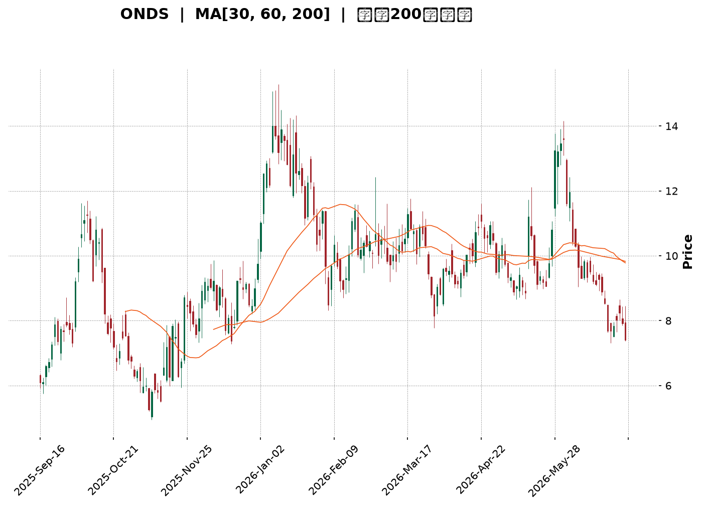
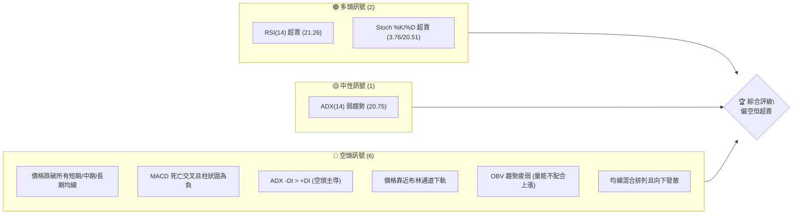
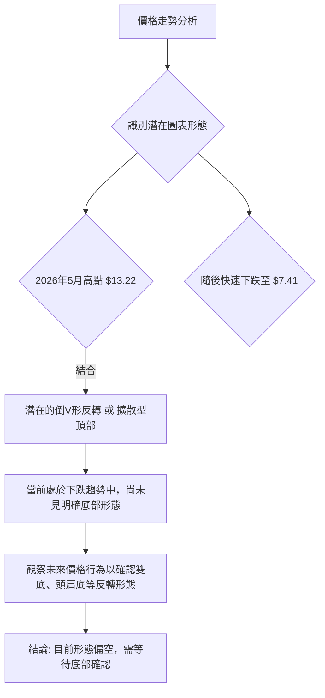
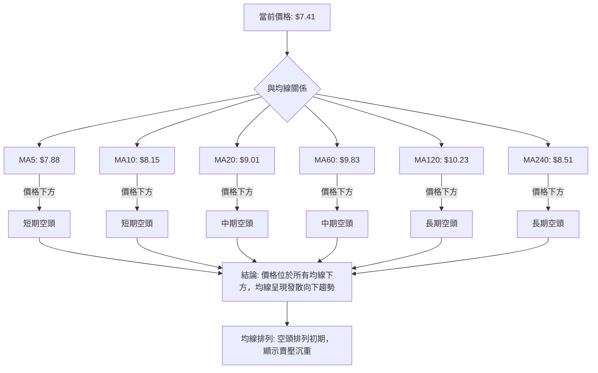

<details>
<summary>📊 靜態圖表 (點擊展開)</summary>

</details>

<html>
<head><meta charset="utf-8" /></head>
<body>
    <div style="height:500px; width:100%;">                        <script>window.PlotlyConfig = {MathJaxConfig: 'local'};</script>
        <script charset="utf-8" src="https://cdn.plot.ly/plotly-3.6.0.min.js" integrity="sha256-QaOVwtVY0T02VaHrr6pnoHLCwayMJp4O5n4YyaE3rJk=" crossorigin="anonymous"></script>                <div id="candlestick-chart" class="plotly-graph-div" style="height:100%; width:100%;"></div>            <script>                window.PLOTLYENV=window.PLOTLYENV || {};                                if (document.getElementById("candlestick-chart")) {                    Plotly.newPlot(                        "candlestick-chart",                        [{"close":{"dtype":"f8","bdata":"AAAAAClcGEAAAABgZmYYQAAAAGBmZhpAAAAAoEfhGkAAAACAPQodQAAAAMAehR9AAAAAYGZmHUAAAAAAAAAfQAAAAADXox5AAAAAQOF6H0AAAACgR+EeQAAAAKBwPR1AAAAAIIVrIkAAAACA69EjQAAAAIDrUSVAAAAAgBQuJkAAAADAHoUmQAAAAEDh+iRAAAAA4KNwIkAAAABguJ4lQAAAAIDr0SRAAAAAwB4FI0AAAABgZmYgQAAAAOCjcB5AAAAA4HoUH0AAAABgj8IcQAAAAIDC9RpAAAAAoHA9HEAAAABACtcdQAAAAGC4Hh5AAAAAwPUoG0AAAAAAAAAbQAAAAMD1KBlAAAAAYI\u002fCGUAAAACgmZkYQAAAAEAK1xdAAAAAAAAAGEAAAAAAAAAVQAAAAKBwPRdAAAAAwB6FF0AAAABAMzMXQAAAAIA9ChZAAAAAoHA9GkAAAADgUbgcQAAAAMAeBRlAAAAAAClcH0AAAAAAAAAeQAAAAOB6FBlAAAAA4KPwGkAAAADgo3AhQAAAAKBH4SBAAAAAQOF6IEAAAACgmZkfQAAAAIDrUR5AAAAAANcjIEAAAABACtchQAAAAKBHYSJAAAAAANcjIkAAAACAPQoiQAAAAIDCdSJAAAAAYGamIEAAAACAPQoiQAAAAAAAgCFAAAAAYI\u002fCHkAAAACAFC4gQAAAAEDheh1AAAAAQDMzH0AAAADgo3AiQAAAAIA9iiJAAAAAIIXrIUAAAABgj0IiQAAAAIDC9SBAAAAAIIXrIEAAAABA4fohQAAAAMAehSNAAAAAgD0KJkAAAAAgXA8pQAAAAIAUrilAAAAAAClcKEAAAADAHgUsQAAAAKBHYStAAAAAoEdhKkAAAAAgrscrQAAAAGC4HitAAAAAANejKUAAAACA61EoQAAAAGCPQipAAAAAoJkZKUAAAACgcD0pQAAAAEAKVyhAAAAAgOtRJkAAAADAHoUoQAAAAIA9iihAAAAAgD2KJkAAAADgUbgkQAAAACCuRyVAAAAAYI\u002fCJkAAAAAAKVwjQAAAAIDC9SBAAAAAoEdhI0AAAACAFK4kQAAAAAApXCNAAAAAgMJ1IkAAAADgo\u002fAhQAAAAGC4niJAAAAAoJkZJEAAAAAA1yMmQAAAACCuxyZAAAAAIFwPJEAAAACgR2EkQAAAAMDMzCRAAAAAoJmZJEAAAABgZuYkQAAAAMD1KCRAAAAAQApXJUAAAACAPQokQAAAAMAeBSVAAAAAQOH6JEAAAADA9agjQAAAAOCjcCNAAAAAwB4FJEAAAADA9agjQAAAAMD1qCRAAAAAgOtRJEAAAAAgXA8lQAAAACBcjyZAAAAAwPWoJUAAAAAAAIAlQAAAAGC4HiRAAAAAwMzMJUAAAAAAKVwlQAAAAGC4niRAAAAAoEfhIkAAAACgmZkhQAAAAMDMTCBAAAAA4HoUIkAAAABguJ4hQAAAAEAzMyNAAAAAgD0KI0AAAAAgXA8jQAAAAGBm5iJAAAAAIK5HIkAAAABgj0IiQAAAAOCj8CJAAAAAwMzMIkAAAAAgXA8kQAAAAGBmZiRAAAAAAAAAJEAAAACAwnUlQAAAAKBwvSVAAAAAYLgeJkAAAADgehQlQAAAAKCZGSVAAAAAYGbmJUAAAACAwvUkQAAAAEDh+iJAAAAA4HoUJEAAAAAA16MkQAAAAIDCdSNAAAAAwPWoIkAAAACAFK4iQAAAACCuxyFAAAAAYLgeIkAAAABACtciQAAAAOB6FCJAAAAA4FG4IUAAAAAghWsmQAAAAKBwPSVAAAAAYGZmI0AAAAAAAEAiQAAAAOBRuCJAAAAAAClcIkAAAABguB4iQAAAAIA9iiNAAAAAoJmZJUAAAAAAAIAqQAAAAOCjcCpAAAAAIIXrKkAAAADA9SgrQAAAAOBROCdAAAAA4KPwJ0AAAAAAKdwkQAAAAKCZmSRAAAAAwMxMI0AAAABguJ4iQAAAAMD1qCNAAAAAwPWoIkAAAADAHgUjQAAAACCFayJAAAAAoHA9IkAAAACAPYoiQAAAACCuxyFAAAAAIFwPIUAAAADgUbgeQAAAAEAzsx5AAAAAgOtRH0AAAACAPQogQAAAAEDheiBAAAAAgBSuH0AAAAAA16MdQA=="},"high":{"dtype":"f8","bdata":"AAAAYGZmGUAAAAAAAAAZQAAAACBcjxpAAAAAAClcG0AAAADgo3AdQAAAAKBwPSBAAAAAANcjIEAAAAAAKVwfQAAAACBcjx9AAAAAIIVrIUAAAABAClcgQAAAAMDMzB9AAAAAgBSuIkAAAAAgXI8kQAAAAGCPQidAAAAAQAoXJ0AAAABgZmYnQAAAACCuxyZAAAAAwB4FJUAAAACAFG4mQAAAAGC4HiVAAAAAoHC9JUAAAABgj0IjQAAAAIDrUSBAAAAAoEdhIEAAAAAA16MfQAAAAIA9Ch1AAAAAQDMzHUAAAABAClcgQAAAAKBHoSBAAAAAIFyPHkAAAADAzMwbQAAAAIDCdRpAAAAAAAAAGkAAAABgj8IaQAAAACCuRxpAAAAAAAAAGUAAAADgUbgXQAAAAOB6lBdAAAAAIFyPGUAAAACgR2EYQAAAAMD1qBhAAAAAAClcHUAAAADgo3AfQAAAACBcDx5AAAAAgBSuH0AAAACA6xEgQAAAAKBH4R9AAAAAYGZmG0AAAACgmZkhQAAAAGCPwiFAAAAAAClcIUAAAADAIPAgQAAAAADXIyBAAAAAoJkZIUAAAACAwjUiQAAAAIAUriJAAAAAoJmZIkAAAAAAAIAjQAAAAOBRuCNAAAAAQOE6IkAAAADA9SgiQAAAAGBmJiNAAAAAQOF6IUAAAAAA12MgQAAAAGC4HiFAAAAAYJGtIEAAAABA4XoiQAAAAIDrUSNAAAAAgBSuI0AAAABgZmYiQAAAAEAKVyJAAAAAQApXIUAAAACgmZkiQAAAACBcDyVAAAAAYLgeJkAAAADgehQpQAAAAAAp3ClAAAAAgD0KKkAAAAAA1yMuQAAAAEAzMy5AAAAAIFyPLkAAAAAAAAAtQAAAAAAAgCtAAAAAANcjLEAAAAAAAIAsQAAAAGBmZixAAAAAwPWoLEAAAADA9agqQAAAAEDhuilAAAAAIIWrKEAAAADgo\u002fAoQAAAAMD1KCpAAAAAIFyPKEAAAABgZuYmQAAAAGBmZiZAAAAAQArXJkAAAACAPcomQAAAACBcDyNAAAAAwB6FI0AAAAAgrkclQAAAAKBH4SRAAAAAQArXI0AAAACgxosiQAAAAAApXCNAAAAAANejJEAAAABAClcmQAAAAIAULidAAAAAwPUoJ0AAAAAA1yMlQAAAAIDC9SRAAAAAoEfhJUAAAAAgXI8lQAAAAAApXCRAAAAAQArXKEAAAAAAAAAmQAAAAADXoyVAAAAAQArXJUAAAADgUTgnQAAAACBcDyRAAAAAYGbmJEAAAABguB4lQAAAAIAUriVAAAAAgML1JUAAAACgcL0lQAAAAOCj8CZAAAAAwB6FJ0AAAACAwvUlQAAAAMD1qCVAAAAA4KPwJUAAAACgcL0mQAAAACCuRyZAAAAAIK5HJEAAAACgcL0iQAAAAADXoyFAAAAAIK5HIkAAAABAM7MiQAAAAGCPQiNAAAAAwMzMI0AAAACgR2EjQAAAAKBwvSRAAAAAgD0KI0AAAADgUbgiQAAAACCFKyNAAAAA4FG4I0AAAAAgXA8kQAAAACCuxyRAAAAAIFwPJUAAAABguB4mQAAAAOB6lCZAAAAA4FE4J0AAAADgo\u002fAlQAAAAIA9iiVAAAAAYLgeJkAAAAAA1yMmQAAAAAAp3CRAAAAAgOtRJEAAAABguB4lQAAAAEDhuiRAAAAA4HqUI0AAAAAghesiQAAAAAAAgCJAAAAAgBQuIkAAAADAzEwjQAAAAEAzsyJAAAAAAClcIkAAAACAwnUnQAAAAKBwPShAAAAAQApXJUAAAABgj8IjQAAAAOB6FCNAAAAAYI\u002fCIkAAAACgRyEjQAAAAMAehSRAAAAAYLgeJkAAAAAgXI8rQAAAAIDr0SpAAAAAgOvRK0AAAACA61EsQAAAAAAAACpAAAAAQArXKEAAAACA61EnQAAAAIAUriVAAAAAgOvRJEAAAACAwvUjQAAAAKBDyyNAAAAAQInBI0AAAADgo\u002fAjQAAAAEDheiNAAAAAAAAAI0AAAAAghesiQAAAACCF6yJAAAAAACncIUAAAAAAAAAhQAAAAGCPwh9AAAAAACncH0AAAADgo3AgQAAAAMDMTCFAAAAAoEfhIEAAAABgZuYgQA=="},"hovertemplate":"\u003cb\u003e%{x|%Y-%m-%d}\u003c\u002fb\u003e\u003cbr\u003e\u958b: $%{open:.2f}\u003cbr\u003e\u9ad8: $%{high:.2f}\u003cbr\u003e\u4f4e: $%{low:.2f}\u003cbr\u003e\u6536: $%{close:.2f}\u003cextra\u003e\u003c\u002fextra\u003e","low":{"dtype":"f8","bdata":"AAAAgBSuF0AAAAAAAAAXQAAAAIA9ChhAAAAAgBSuGUAAAACA61EaQAAAACCF6xxAAAAAAAAAHUAAAADA9SgbQAAAAOCjcB1AAAAAQDMzH0AAAAAgrkceQAAAAOBRuBxAAAAAANejHkAAAACgR2EiQAAAAIA9iiRAAAAAYGbmJEAAAABgDm0lQAAAAAAAwCRAAAAAoEdhIkAAAAAgsl0jQAAAAGCPwiNAAAAAgOtRIkAAAACAFK4fQAAAAOBROB5AAAAAgOtRHUAAAAAAAIAcQAAAAAAp3BlAAAAAoJmZGkAAAABguJ4dQAAAAOB6FB5AAAAAANejGkAAAADgehQaQAAAAIDr0RhAAAAAQOF6GEAAAABguB4XQAAAAOB6FBdAAAAAgOtRF0AAAAAAKdwUQAAAAMDMzBNAAAAA4HoUF0AAAABgZmYWQAAAACCF6xVAAAAAoHA9GUAAAABgZmYYQAAAACCF6xdAAAAAoJmZGEAAAACAPQodQAAAAAAAABlAAAAA4FG4F0AAAACAFK4aQAAAAADXIyBAAAAAoHC9HkAAAABAMzMfQAAAAKBH4R1AAAAAIK5HHUAAAABACtcdQAAAAIA9CiFAAAAAwPUoIUAAAADgo\u002fAhQAAAAOBROCFAAAAAACmcIEAAAACgcD0gQAAAAIDr0SBAAAAAoHA9HkAAAAAAKVweQAAAAGC4Hh1AAAAAgML1HkAAAADgo3AfQAAAACBcTyJAAAAAQApXIUAAAABAM7MhQAAAAAAp3CBAAAAAIIVrIEAAAADA9aggQAAAAEAKVyJAAAAAgOvRI0AAAABA4folQAAAACCF6ydAAAAA4FE4KEAAAADAzEwqQAAAAIAULitAAAAAwPWoKUAAAAAghespQAAAAEAK1ylAAAAAoJmZKUAAAACgcD0oQAAAAKCZmSdAAAAAACncJ0AAAABAM7MoQAAAAKBH4SdAAAAAYGbmJUAAAACAFC4mQAAAAGC4HihAAAAAANcjJkAAAAAgrkckQAAAAMDMTCRAAAAAwB4FJUAAAABgj0IiQAAAAADXoyBAAAAAYGbmIEAAAABAClcjQAAAAEAzMyNAAAAAYI\u002fCIUAAAABgZmYhQAAAAADXoyFAAAAAoHC9IUAAAABA4fojQAAAAEDheiVAAAAAYGbmI0AAAADgUbgjQAAAAIDC9SJAAAAAgD2KJEAAAABgZuYjQAAAAKBwPSNAAAAAoJmZJEAAAADAHoUjQAAAAAAp3CNAAAAAYLgeJEAAAADAHoUjQAAAAGBmZiJAAAAAYGYmI0AAAAAAAAAjQAAAAKCZmSNAAAAAoJkZJEAAAADgUTgkQAAAAKBwvSRAAAAAANejJUAAAACgcD0kQAAAAIDCdSNAAAAAgBTuI0AAAABAM\u002fMkQAAAAIDCdSRAAAAAgD2KIkAAAADA9WghQAAAAGC4Hh9AAAAAYGZmIEAAAAAgXI8hQAAAACCF6yBAAAAAYI\u002fCIkAAAADgTWIiQAAAAIAUriJAAAAAwB4FIkAAAABA4fohQAAAAIDCdSFAAAAAoJmZIkAAAACgcL0iQAAAAMAehSNAAAAAgD2KI0AAAACA61EjQAAAACCuRyVAAAAAQDOzJUAAAABAMzMkQAAAAEDhOiRAAAAAIIVrJEAAAAAghaskQAAAAIDr0SJAAAAAYLieIkAAAACgcD0jQAAAAEAKVyNAAAAAgOtRIkAAAACAPQoiQAAAACBcjyFAAAAAwMxMIUAAAADgo3AhQAAAAKCZmSFAAAAAQApXIUAAAABAMzMjQAAAAAAAACVAAAAAIIXrIkAAAADgo\u002fAhQAAAAKBwPSJAAAAAgML1IUAAAABguB4iQAAAACCynSJAAAAAAClcI0AAAADgo3AmQAAAAEAzMydAAAAAoJmZKUAAAACAFC4qQAAAACBcDydAAAAAYLgeJkAAAADA9agkQAAAAAAAgCRAAAAA4HoUIkAAAACgmZkiQAAAAMAehSJAAAAAAClcIkAAAACgmdkiQAAAACCuRyJAAAAAwPUoIkAAAABACtchQAAAACBcjyFAAAAAAAAAIUAAAAAgXI8eQAAAAKBwPR1AAAAAAAAAHkAAAACgmZkeQAAAAMAeBSBAAAAAYGZmH0AAAABA4XodQA=="},"name":"\u50f9\u683c","open":{"dtype":"f8","bdata":"AAAAIK5HGUAAAACgcD0YQAAAAGC4HhlAAAAAQDMzGkAAAAAgrkcbQAAAACBcDx5AAAAAgML1H0AAAADAHgUcQAAAACCuxx5AAAAAQArXH0AAAADgUbgfQAAAAAAAAB9AAAAAQDMzH0AAAADAHgUjQAAAAGC4HiVAAAAAAAAAJkAAAAAgrocmQAAAACCuRyZAAAAAgML1JEAAAAAgXA8kQAAAAGCPwiRAAAAAYGamJUAAAABgj0IjQAAAAMDMzB9AAAAAYLgeIEAAAADgUbgeQAAAAGBmZhtAAAAAYGZmG0AAAACAFK4eQAAAAGC4XiBAAAAA4HoUHkAAAADgepQbQAAAAIDC9RlAAAAAAAAAGUAAAADAzEwaQAAAAGC4HhdAAAAAIIXrF0AAAACAFK4XQAAAAMD1KBRAAAAAQOF6GUAAAABgZmYXQAAAAOCj8BdAAAAAIK5HGUAAAADA9agYQAAAAIA9Ch5AAAAAYLieGEAAAAAAKdwdQAAAAIAUrh9AAAAAoHA9GkAAAAAA1yMbQAAAAIDC9SBAAAAA4FE4IUAAAAAgXI8gQAAAAMAehR9AAAAA4FG4HkAAAAAgrscgQAAAAMAeRSFAAAAAACncIUAAAABACpciQAAAAEAK1yFAAAAA4FE4IkAAAABA4fogQAAAAIDC9SFAAAAAAClcIUAAAABA4XoeQAAAACCuRyBAAAAAwPUoH0AAAACAwvUfQAAAAKCZmSJAAAAAIFwPIkAAAACAwvUhQAAAAOAkRiJAAAAAoJmZIEAAAAAghesgQAAAACBcjyJAAAAAwB5FJEAAAACgmZkmQAAAAEAzMyhAAAAAYGZmKUAAAADA9WgqQAAAAAAAACxAAAAAIIVrK0AAAAAAAAArQAAAAKBHYStAAAAAANcjK0AAAADgetQqQAAAAIDCtSdAAAAAoJmZK0AAAADAHgUpQAAAACCFaylAAAAAwMxMKEAAAAAghWsmQAAAAIDC9SlAAAAAIK5HKEAAAAAAAIAmQAAAAGC4niVAAAAAwB4FJkAAAABgj8ImQAAAAIAUriJAAAAAgBTuIUAAAAAAKZwjQAAAAIAULiRAAAAAwB7FI0AAAACgcH0iQAAAAIA9iiJAAAAA4FF4IkAAAAAghWskQAAAAADXoyVAAAAAoEdhJkAAAAAAKdwjQAAAAMAeBSRAAAAAYI9CJUAAAADAzEwkQAAAAIAULiRAAAAAAAAAJUAAAACgR2ElQAAAAOBRuCRAAAAAQOH6JEAAAAAAAIAkQAAAACBcDyRAAAAAgBSuI0AAAACgmRkkQAAAACCFKyRAAAAAACncJEAAAACgcL0kQAAAAKCZGSVAAAAAAADAJkAAAABguF4lQAAAAOB6lCVAAAAA4HqUJEAAAACA69ElQAAAAGCPwiVAAAAAoJkZJEAAAABAM7MiQAAAAGC4niFAAAAAYGbmIEAAAACgmZkiQAAAACCuByFAAAAAYI9CI0AAAAAAKdwiQAAAAEAKVyRAAAAA4HrUIkAAAACAwnUiQAAAAMAeBSJAAAAA4KNwI0AAAADAHgUjQAAAAAAAgCRAAAAAYI\u002fCJEAAAACgmZkjQAAAAMDMzCVAAAAAgD2KJkAAAABgj8IlQAAAAGCPQiVAAAAAwEu3JEAAAAAA12MlQAAAAGCPwiRAAAAAAAAAI0AAAAAAAAAkQAAAAMDMTCRAAAAAIFyPI0AAAAAAAIAiQAAAAAAAgCJAAAAAAAAAIkAAAABACtchQAAAAOBReCJAAAAAQArXIUAAAABA4fojQAAAAIDr0SVAAAAAYI9CJUAAAABgZqYjQAAAAAAAgCJAAAAAIFyPIkAAAAAghWsiQAAAACCFqyJAAAAAAAAAJEAAAABAM\u002fMmQAAAAAAAgClAAAAAoHB9KkAAAACgcD0rQAAAACCF6ylAAAAAgML1JkAAAABACtcmQAAAAMD1qCVAAAAAIIWrJEAAAACgR2EjQAAAAGBmpiJAAAAAQAqXI0AAAABAM7MjQAAAAIDr0SJAAAAAoHB9IkAAAACA69EiQAAAAIDCtSJAAAAAYLheIUAAAACAwvUgQAAAAKBwvR9AAAAAIFwPHkAAAAAgrkcgQAAAAOCj8CBAAAAAANcjIEAAAABgj8IfQA=="},"x":["2025-09-16T00:00:00-04:00","2025-09-17T00:00:00-04:00","2025-09-18T00:00:00-04:00","2025-09-19T00:00:00-04:00","2025-09-22T00:00:00-04:00","2025-09-23T00:00:00-04:00","2025-09-24T00:00:00-04:00","2025-09-25T00:00:00-04:00","2025-09-26T00:00:00-04:00","2025-09-29T00:00:00-04:00","2025-09-30T00:00:00-04:00","2025-10-01T00:00:00-04:00","2025-10-02T00:00:00-04:00","2025-10-03T00:00:00-04:00","2025-10-06T00:00:00-04:00","2025-10-07T00:00:00-04:00","2025-10-08T00:00:00-04:00","2025-10-09T00:00:00-04:00","2025-10-10T00:00:00-04:00","2025-10-13T00:00:00-04:00","2025-10-14T00:00:00-04:00","2025-10-15T00:00:00-04:00","2025-10-16T00:00:00-04:00","2025-10-17T00:00:00-04:00","2025-10-20T00:00:00-04:00","2025-10-21T00:00:00-04:00","2025-10-22T00:00:00-04:00","2025-10-23T00:00:00-04:00","2025-10-24T00:00:00-04:00","2025-10-27T00:00:00-04:00","2025-10-28T00:00:00-04:00","2025-10-29T00:00:00-04:00","2025-10-30T00:00:00-04:00","2025-10-31T00:00:00-04:00","2025-11-03T00:00:00-05:00","2025-11-04T00:00:00-05:00","2025-11-05T00:00:00-05:00","2025-11-06T00:00:00-05:00","2025-11-07T00:00:00-05:00","2025-11-10T00:00:00-05:00","2025-11-11T00:00:00-05:00","2025-11-12T00:00:00-05:00","2025-11-13T00:00:00-05:00","2025-11-14T00:00:00-05:00","2025-11-17T00:00:00-05:00","2025-11-18T00:00:00-05:00","2025-11-19T00:00:00-05:00","2025-11-20T00:00:00-05:00","2025-11-21T00:00:00-05:00","2025-11-24T00:00:00-05:00","2025-11-25T00:00:00-05:00","2025-11-26T00:00:00-05:00","2025-11-28T00:00:00-05:00","2025-12-01T00:00:00-05:00","2025-12-02T00:00:00-05:00","2025-12-03T00:00:00-05:00","2025-12-04T00:00:00-05:00","2025-12-05T00:00:00-05:00","2025-12-08T00:00:00-05:00","2025-12-09T00:00:00-05:00","2025-12-10T00:00:00-05:00","2025-12-11T00:00:00-05:00","2025-12-12T00:00:00-05:00","2025-12-15T00:00:00-05:00","2025-12-16T00:00:00-05:00","2025-12-17T00:00:00-05:00","2025-12-18T00:00:00-05:00","2025-12-19T00:00:00-05:00","2025-12-22T00:00:00-05:00","2025-12-23T00:00:00-05:00","2025-12-24T00:00:00-05:00","2025-12-26T00:00:00-05:00","2025-12-29T00:00:00-05:00","2025-12-30T00:00:00-05:00","2025-12-31T00:00:00-05:00","2026-01-02T00:00:00-05:00","2026-01-05T00:00:00-05:00","2026-01-06T00:00:00-05:00","2026-01-07T00:00:00-05:00","2026-01-08T00:00:00-05:00","2026-01-09T00:00:00-05:00","2026-01-12T00:00:00-05:00","2026-01-13T00:00:00-05:00","2026-01-14T00:00:00-05:00","2026-01-15T00:00:00-05:00","2026-01-16T00:00:00-05:00","2026-01-20T00:00:00-05:00","2026-01-21T00:00:00-05:00","2026-01-22T00:00:00-05:00","2026-01-23T00:00:00-05:00","2026-01-26T00:00:00-05:00","2026-01-27T00:00:00-05:00","2026-01-28T00:00:00-05:00","2026-01-29T00:00:00-05:00","2026-01-30T00:00:00-05:00","2026-02-02T00:00:00-05:00","2026-02-03T00:00:00-05:00","2026-02-04T00:00:00-05:00","2026-02-05T00:00:00-05:00","2026-02-06T00:00:00-05:00","2026-02-09T00:00:00-05:00","2026-02-10T00:00:00-05:00","2026-02-11T00:00:00-05:00","2026-02-12T00:00:00-05:00","2026-02-13T00:00:00-05:00","2026-02-17T00:00:00-05:00","2026-02-18T00:00:00-05:00","2026-02-19T00:00:00-05:00","2026-02-20T00:00:00-05:00","2026-02-23T00:00:00-05:00","2026-02-24T00:00:00-05:00","2026-02-25T00:00:00-05:00","2026-02-26T00:00:00-05:00","2026-02-27T00:00:00-05:00","2026-03-02T00:00:00-05:00","2026-03-03T00:00:00-05:00","2026-03-04T00:00:00-05:00","2026-03-05T00:00:00-05:00","2026-03-06T00:00:00-05:00","2026-03-09T00:00:00-04:00","2026-03-10T00:00:00-04:00","2026-03-11T00:00:00-04:00","2026-03-12T00:00:00-04:00","2026-03-13T00:00:00-04:00","2026-03-16T00:00:00-04:00","2026-03-17T00:00:00-04:00","2026-03-18T00:00:00-04:00","2026-03-19T00:00:00-04:00","2026-03-20T00:00:00-04:00","2026-03-23T00:00:00-04:00","2026-03-24T00:00:00-04:00","2026-03-25T00:00:00-04:00","2026-03-26T00:00:00-04:00","2026-03-27T00:00:00-04:00","2026-03-30T00:00:00-04:00","2026-03-31T00:00:00-04:00","2026-04-01T00:00:00-04:00","2026-04-02T00:00:00-04:00","2026-04-06T00:00:00-04:00","2026-04-07T00:00:00-04:00","2026-04-08T00:00:00-04:00","2026-04-09T00:00:00-04:00","2026-04-10T00:00:00-04:00","2026-04-13T00:00:00-04:00","2026-04-14T00:00:00-04:00","2026-04-15T00:00:00-04:00","2026-04-16T00:00:00-04:00","2026-04-17T00:00:00-04:00","2026-04-20T00:00:00-04:00","2026-04-21T00:00:00-04:00","2026-04-22T00:00:00-04:00","2026-04-23T00:00:00-04:00","2026-04-24T00:00:00-04:00","2026-04-27T00:00:00-04:00","2026-04-28T00:00:00-04:00","2026-04-29T00:00:00-04:00","2026-04-30T00:00:00-04:00","2026-05-01T00:00:00-04:00","2026-05-04T00:00:00-04:00","2026-05-05T00:00:00-04:00","2026-05-06T00:00:00-04:00","2026-05-07T00:00:00-04:00","2026-05-08T00:00:00-04:00","2026-05-11T00:00:00-04:00","2026-05-12T00:00:00-04:00","2026-05-13T00:00:00-04:00","2026-05-14T00:00:00-04:00","2026-05-15T00:00:00-04:00","2026-05-18T00:00:00-04:00","2026-05-19T00:00:00-04:00","2026-05-20T00:00:00-04:00","2026-05-21T00:00:00-04:00","2026-05-22T00:00:00-04:00","2026-05-26T00:00:00-04:00","2026-05-27T00:00:00-04:00","2026-05-28T00:00:00-04:00","2026-05-29T00:00:00-04:00","2026-06-01T00:00:00-04:00","2026-06-02T00:00:00-04:00","2026-06-03T00:00:00-04:00","2026-06-04T00:00:00-04:00","2026-06-05T00:00:00-04:00","2026-06-08T00:00:00-04:00","2026-06-09T00:00:00-04:00","2026-06-10T00:00:00-04:00","2026-06-11T00:00:00-04:00","2026-06-12T00:00:00-04:00","2026-06-15T00:00:00-04:00","2026-06-16T00:00:00-04:00","2026-06-17T00:00:00-04:00","2026-06-18T00:00:00-04:00","2026-06-22T00:00:00-04:00","2026-06-23T00:00:00-04:00","2026-06-24T00:00:00-04:00","2026-06-25T00:00:00-04:00","2026-06-26T00:00:00-04:00","2026-06-29T00:00:00-04:00","2026-06-30T00:00:00-04:00","2026-07-01T00:00:00-04:00","2026-07-02T00:00:00-04:00"],"type":"candlestick"},{"hovertemplate":"MA30: $%{y:.2f}\u003cextra\u003e\u003c\u002fextra\u003e","line":{"color":"#2196F3","dash":"dash","width":2},"mode":"lines","name":"MA30","x":["2025-09-16T00:00:00-04:00","2025-09-17T00:00:00-04:00","2025-09-18T00:00:00-04:00","2025-09-19T00:00:00-04:00","2025-09-22T00:00:00-04:00","2025-09-23T00:00:00-04:00","2025-09-24T00:00:00-04:00","2025-09-25T00:00:00-04:00","2025-09-26T00:00:00-04:00","2025-09-29T00:00:00-04:00","2025-09-30T00:00:00-04:00","2025-10-01T00:00:00-04:00","2025-10-02T00:00:00-04:00","2025-10-03T00:00:00-04:00","2025-10-06T00:00:00-04:00","2025-10-07T00:00:00-04:00","2025-10-08T00:00:00-04:00","2025-10-09T00:00:00-04:00","2025-10-10T00:00:00-04:00","2025-10-13T00:00:00-04:00","2025-10-14T00:00:00-04:00","2025-10-15T00:00:00-04:00","2025-10-16T00:00:00-04:00","2025-10-17T00:00:00-04:00","2025-10-20T00:00:00-04:00","2025-10-21T00:00:00-04:00","2025-10-22T00:00:00-04:00","2025-10-23T00:00:00-04:00","2025-10-24T00:00:00-04:00","2025-10-27T00:00:00-04:00","2025-10-28T00:00:00-04:00","2025-10-29T00:00:00-04:00","2025-10-30T00:00:00-04:00","2025-10-31T00:00:00-04:00","2025-11-03T00:00:00-05:00","2025-11-04T00:00:00-05:00","2025-11-05T00:00:00-05:00","2025-11-06T00:00:00-05:00","2025-11-07T00:00:00-05:00","2025-11-10T00:00:00-05:00","2025-11-11T00:00:00-05:00","2025-11-12T00:00:00-05:00","2025-11-13T00:00:00-05:00","2025-11-14T00:00:00-05:00","2025-11-17T00:00:00-05:00","2025-11-18T00:00:00-05:00","2025-11-19T00:00:00-05:00","2025-11-20T00:00:00-05:00","2025-11-21T00:00:00-05:00","2025-11-24T00:00:00-05:00","2025-11-25T00:00:00-05:00","2025-11-26T00:00:00-05:00","2025-11-28T00:00:00-05:00","2025-12-01T00:00:00-05:00","2025-12-02T00:00:00-05:00","2025-12-03T00:00:00-05:00","2025-12-04T00:00:00-05:00","2025-12-05T00:00:00-05:00","2025-12-08T00:00:00-05:00","2025-12-09T00:00:00-05:00","2025-12-10T00:00:00-05:00","2025-12-11T00:00:00-05:00","2025-12-12T00:00:00-05:00","2025-12-15T00:00:00-05:00","2025-12-16T00:00:00-05:00","2025-12-17T00:00:00-05:00","2025-12-18T00:00:00-05:00","2025-12-19T00:00:00-05:00","2025-12-22T00:00:00-05:00","2025-12-23T00:00:00-05:00","2025-12-24T00:00:00-05:00","2025-12-26T00:00:00-05:00","2025-12-29T00:00:00-05:00","2025-12-30T00:00:00-05:00","2025-12-31T00:00:00-05:00","2026-01-02T00:00:00-05:00","2026-01-05T00:00:00-05:00","2026-01-06T00:00:00-05:00","2026-01-07T00:00:00-05:00","2026-01-08T00:00:00-05:00","2026-01-09T00:00:00-05:00","2026-01-12T00:00:00-05:00","2026-01-13T00:00:00-05:00","2026-01-14T00:00:00-05:00","2026-01-15T00:00:00-05:00","2026-01-16T00:00:00-05:00","2026-01-20T00:00:00-05:00","2026-01-21T00:00:00-05:00","2026-01-22T00:00:00-05:00","2026-01-23T00:00:00-05:00","2026-01-26T00:00:00-05:00","2026-01-27T00:00:00-05:00","2026-01-28T00:00:00-05:00","2026-01-29T00:00:00-05:00","2026-01-30T00:00:00-05:00","2026-02-02T00:00:00-05:00","2026-02-03T00:00:00-05:00","2026-02-04T00:00:00-05:00","2026-02-05T00:00:00-05:00","2026-02-06T00:00:00-05:00","2026-02-09T00:00:00-05:00","2026-02-10T00:00:00-05:00","2026-02-11T00:00:00-05:00","2026-02-12T00:00:00-05:00","2026-02-13T00:00:00-05:00","2026-02-17T00:00:00-05:00","2026-02-18T00:00:00-05:00","2026-02-19T00:00:00-05:00","2026-02-20T00:00:00-05:00","2026-02-23T00:00:00-05:00","2026-02-24T00:00:00-05:00","2026-02-25T00:00:00-05:00","2026-02-26T00:00:00-05:00","2026-02-27T00:00:00-05:00","2026-03-02T00:00:00-05:00","2026-03-03T00:00:00-05:00","2026-03-04T00:00:00-05:00","2026-03-05T00:00:00-05:00","2026-03-06T00:00:00-05:00","2026-03-09T00:00:00-04:00","2026-03-10T00:00:00-04:00","2026-03-11T00:00:00-04:00","2026-03-12T00:00:00-04:00","2026-03-13T00:00:00-04:00","2026-03-16T00:00:00-04:00","2026-03-17T00:00:00-04:00","2026-03-18T00:00:00-04:00","2026-03-19T00:00:00-04:00","2026-03-20T00:00:00-04:00","2026-03-23T00:00:00-04:00","2026-03-24T00:00:00-04:00","2026-03-25T00:00:00-04:00","2026-03-26T00:00:00-04:00","2026-03-27T00:00:00-04:00","2026-03-30T00:00:00-04:00","2026-03-31T00:00:00-04:00","2026-04-01T00:00:00-04:00","2026-04-02T00:00:00-04:00","2026-04-06T00:00:00-04:00","2026-04-07T00:00:00-04:00","2026-04-08T00:00:00-04:00","2026-04-09T00:00:00-04:00","2026-04-10T00:00:00-04:00","2026-04-13T00:00:00-04:00","2026-04-14T00:00:00-04:00","2026-04-15T00:00:00-04:00","2026-04-16T00:00:00-04:00","2026-04-17T00:00:00-04:00","2026-04-20T00:00:00-04:00","2026-04-21T00:00:00-04:00","2026-04-22T00:00:00-04:00","2026-04-23T00:00:00-04:00","2026-04-24T00:00:00-04:00","2026-04-27T00:00:00-04:00","2026-04-28T00:00:00-04:00","2026-04-29T00:00:00-04:00","2026-04-30T00:00:00-04:00","2026-05-01T00:00:00-04:00","2026-05-04T00:00:00-04:00","2026-05-05T00:00:00-04:00","2026-05-06T00:00:00-04:00","2026-05-07T00:00:00-04:00","2026-05-08T00:00:00-04:00","2026-05-11T00:00:00-04:00","2026-05-12T00:00:00-04:00","2026-05-13T00:00:00-04:00","2026-05-14T00:00:00-04:00","2026-05-15T00:00:00-04:00","2026-05-18T00:00:00-04:00","2026-05-19T00:00:00-04:00","2026-05-20T00:00:00-04:00","2026-05-21T00:00:00-04:00","2026-05-22T00:00:00-04:00","2026-05-26T00:00:00-04:00","2026-05-27T00:00:00-04:00","2026-05-28T00:00:00-04:00","2026-05-29T00:00:00-04:00","2026-06-01T00:00:00-04:00","2026-06-02T00:00:00-04:00","2026-06-03T00:00:00-04:00","2026-06-04T00:00:00-04:00","2026-06-05T00:00:00-04:00","2026-06-08T00:00:00-04:00","2026-06-09T00:00:00-04:00","2026-06-10T00:00:00-04:00","2026-06-11T00:00:00-04:00","2026-06-12T00:00:00-04:00","2026-06-15T00:00:00-04:00","2026-06-16T00:00:00-04:00","2026-06-17T00:00:00-04:00","2026-06-18T00:00:00-04:00","2026-06-22T00:00:00-04:00","2026-06-23T00:00:00-04:00","2026-06-24T00:00:00-04:00","2026-06-25T00:00:00-04:00","2026-06-26T00:00:00-04:00","2026-06-29T00:00:00-04:00","2026-06-30T00:00:00-04:00","2026-07-01T00:00:00-04:00","2026-07-02T00:00:00-04:00"],"y":{"dtype":"f8","bdata":"AAAAAAAA+H8AAAAAAAD4fwAAAAAAAPh\u002fAAAAAAAA+H8AAAAAAAD4fwAAAAAAAPh\u002fAAAAAAAA+H8AAAAAAAD4fwAAAAAAAPh\u002fAAAAAAAA+H8AAAAAAAD4fwAAAAAAAPh\u002fAAAAAAAA+H8AAAAAAAD4fwAAAAAAAPh\u002fAAAAAAAA+H8AAAAAAAD4fwAAAAAAAPh\u002fAAAAAAAA+H8AAAAAAAD4fwAAAAAAAPh\u002fAAAAAAAA+H8AAAAAAAD4fwAAAAAAAPh\u002fAAAAAAAA+H8AAAAAAAD4fwAAAAAAAPh\u002fAAAAAAAA+H8AAAAAAAD4f0REROwKkCBAzczMRP2bIECamZkpFacgQImIiMDKoSBAIiIiagOdIEAAAADAEYogQERERCRNaSBA7+7u5kJSIEBEREQ8mCcgQGZmZnYFCCBAq6qqCh7MH0BERETUlIofQBERETEkTR9AMzMzI7DyHkCJiIgIgZUeQO\u002fu7o4l\u002fx1AAAAAoDaQHUDe3d093w8dQCIiIlLUfxxA7+7uDgIrHEC8u7tbq+MbQLy7uzttoBtAzczMzBN1G0DNzMxc1mobQHd3dzfQaRtAd3d3pw10G0AAAACgGq8bQM3MzAy7AhxAIiIislZHHEAAAAAwlnwcQCIiIgKdthxAq6qqCgLrHEC8u7ubfTgdQKuqqmp1jB1AVVVVFSC3HUAAAAAQWPkdQERERNR4KR5AiYiIeOlmHkDNzMzca+4eQO\u002fu7s6FZB9AIiIiQqfNH0Dv7u6eqB8gQO\u002fu7r5YUiBAERER+cVyIEC8u7v7qZEgQAAAAJB7zSBAIiIiMsEDIUCamZmZmVkhQGZmZl66ySFAAAAA8KcmIkDNzMxM8IAiQGZmZuaJ2iJAd3d3xwQvI0BVVVV9P5UjQKuqqoJO+yNAvLu7k19MJEAiIiJaq4MkQCIiInrpxiRAzczM1E0CJUAAAAB4vj8lQO\u002fu7obrcSVAzczM1E2iJUAzMzObmdklQBEREbmsFSZAvLu7+8VSJkAzMzPDg3kmQM3MzJxSsSZA7+7u3mvuJkBERESkRfYmQDMzMxPK6CZA3t3dfT\u002f1JkAAAAAQ5gknQCIiIvJgHidAAAAAIIUrJ0Dv7u6+LSsnQKuqqqp\u002fIydAvLu7q\u002fESJ0BVVVXVBvomQAAAALBH4SZAERERMZa8JkCrqqpaZHsmQAAAACA+QyZAZmZmhusRJkDv7u7uNdclQERERJTRmyVAZmZmFiB3JUCamZlJmlIlQFVVVVXjJSVA3t3dDbsCJUC8u7tbHdMkQFVVVSVNqSRAiYiIuKyVJEAzMzPjM2wkQFVVVeUXSyRAq6qqOiY4JECJiIj4DDskQLy7uyv5RSRA7+7uLpY8JEBVVVUV2U4kQGZmZjbQaSRAiYiIyHZ+JEBERERERIQkQHd3d8cEjyRAiYiISJqSJECrqqqKs48kQLy7u2vneyRAmpmZqapqJEAzMzOTGEQkQCIiIvKLJSRAmpmZudccJEBEREQklBEkQHd3d4ddASRAmpmZaZHtI0Dv7u4+CtcjQN7d3R2hzCNAZmZmZvS2I0BmZmYWILcjQM3MzKzVsSNAVVVV1XipI0De3d391LgjQKuqqmp1zCNAAAAA8GDeI0CamZn5fuojQLy7uytA7iNAvLu7u7v7I0B3d3dH4fojQGZmZqZU3CNAZmZmFtnOI0AzMzNjgscjQHd3d5fgwSNAiYiIKBWnI0C8u7ubNpAjQImIiIj6dyNAq6qqSn5xI0DNzMwcE3wjQFVVVZVDiyNAZmZmJjGII0CJiIjoJrEjQKuqqlqPwiNAiYiIyKHFI0AAAABQuL4jQImIiBgvvSNAvLu72929I0BmZmYGrLwjQO\u002fu7r7KwSNAERERca\u002fZI0BmZmbWoxAkQLy7u2suRCRAREREZDt\u002fJEC8u7s7368kQHd3d1eAvCRAERERMQjMJECJiIiYJ8okQERERFTjxSRAq6qqirOvJEDNzMy8u5skQImIiDiJoSRA7+7uLmuVJEDe3d09mIckQERERFS4fiRAMzMz0yJ7JEDe3d398HkkQN7d3f3weSRAIiIiYuVwJEDNzMw0M1MkQGZmZm7nOyRAMzMzS1MqJEARERH54fMjQAAAAJhDyyNAAAAAqOKsI0DNzMy0nY8jQA=="},"type":"scatter"},{"hovertemplate":"MA60: $%{y:.2f}\u003cextra\u003e\u003c\u002fextra\u003e","line":{"color":"#9C27B0","dash":"dash","width":2},"mode":"lines","name":"MA60","x":["2025-09-16T00:00:00-04:00","2025-09-17T00:00:00-04:00","2025-09-18T00:00:00-04:00","2025-09-19T00:00:00-04:00","2025-09-22T00:00:00-04:00","2025-09-23T00:00:00-04:00","2025-09-24T00:00:00-04:00","2025-09-25T00:00:00-04:00","2025-09-26T00:00:00-04:00","2025-09-29T00:00:00-04:00","2025-09-30T00:00:00-04:00","2025-10-01T00:00:00-04:00","2025-10-02T00:00:00-04:00","2025-10-03T00:00:00-04:00","2025-10-06T00:00:00-04:00","2025-10-07T00:00:00-04:00","2025-10-08T00:00:00-04:00","2025-10-09T00:00:00-04:00","2025-10-10T00:00:00-04:00","2025-10-13T00:00:00-04:00","2025-10-14T00:00:00-04:00","2025-10-15T00:00:00-04:00","2025-10-16T00:00:00-04:00","2025-10-17T00:00:00-04:00","2025-10-20T00:00:00-04:00","2025-10-21T00:00:00-04:00","2025-10-22T00:00:00-04:00","2025-10-23T00:00:00-04:00","2025-10-24T00:00:00-04:00","2025-10-27T00:00:00-04:00","2025-10-28T00:00:00-04:00","2025-10-29T00:00:00-04:00","2025-10-30T00:00:00-04:00","2025-10-31T00:00:00-04:00","2025-11-03T00:00:00-05:00","2025-11-04T00:00:00-05:00","2025-11-05T00:00:00-05:00","2025-11-06T00:00:00-05:00","2025-11-07T00:00:00-05:00","2025-11-10T00:00:00-05:00","2025-11-11T00:00:00-05:00","2025-11-12T00:00:00-05:00","2025-11-13T00:00:00-05:00","2025-11-14T00:00:00-05:00","2025-11-17T00:00:00-05:00","2025-11-18T00:00:00-05:00","2025-11-19T00:00:00-05:00","2025-11-20T00:00:00-05:00","2025-11-21T00:00:00-05:00","2025-11-24T00:00:00-05:00","2025-11-25T00:00:00-05:00","2025-11-26T00:00:00-05:00","2025-11-28T00:00:00-05:00","2025-12-01T00:00:00-05:00","2025-12-02T00:00:00-05:00","2025-12-03T00:00:00-05:00","2025-12-04T00:00:00-05:00","2025-12-05T00:00:00-05:00","2025-12-08T00:00:00-05:00","2025-12-09T00:00:00-05:00","2025-12-10T00:00:00-05:00","2025-12-11T00:00:00-05:00","2025-12-12T00:00:00-05:00","2025-12-15T00:00:00-05:00","2025-12-16T00:00:00-05:00","2025-12-17T00:00:00-05:00","2025-12-18T00:00:00-05:00","2025-12-19T00:00:00-05:00","2025-12-22T00:00:00-05:00","2025-12-23T00:00:00-05:00","2025-12-24T00:00:00-05:00","2025-12-26T00:00:00-05:00","2025-12-29T00:00:00-05:00","2025-12-30T00:00:00-05:00","2025-12-31T00:00:00-05:00","2026-01-02T00:00:00-05:00","2026-01-05T00:00:00-05:00","2026-01-06T00:00:00-05:00","2026-01-07T00:00:00-05:00","2026-01-08T00:00:00-05:00","2026-01-09T00:00:00-05:00","2026-01-12T00:00:00-05:00","2026-01-13T00:00:00-05:00","2026-01-14T00:00:00-05:00","2026-01-15T00:00:00-05:00","2026-01-16T00:00:00-05:00","2026-01-20T00:00:00-05:00","2026-01-21T00:00:00-05:00","2026-01-22T00:00:00-05:00","2026-01-23T00:00:00-05:00","2026-01-26T00:00:00-05:00","2026-01-27T00:00:00-05:00","2026-01-28T00:00:00-05:00","2026-01-29T00:00:00-05:00","2026-01-30T00:00:00-05:00","2026-02-02T00:00:00-05:00","2026-02-03T00:00:00-05:00","2026-02-04T00:00:00-05:00","2026-02-05T00:00:00-05:00","2026-02-06T00:00:00-05:00","2026-02-09T00:00:00-05:00","2026-02-10T00:00:00-05:00","2026-02-11T00:00:00-05:00","2026-02-12T00:00:00-05:00","2026-02-13T00:00:00-05:00","2026-02-17T00:00:00-05:00","2026-02-18T00:00:00-05:00","2026-02-19T00:00:00-05:00","2026-02-20T00:00:00-05:00","2026-02-23T00:00:00-05:00","2026-02-24T00:00:00-05:00","2026-02-25T00:00:00-05:00","2026-02-26T00:00:00-05:00","2026-02-27T00:00:00-05:00","2026-03-02T00:00:00-05:00","2026-03-03T00:00:00-05:00","2026-03-04T00:00:00-05:00","2026-03-05T00:00:00-05:00","2026-03-06T00:00:00-05:00","2026-03-09T00:00:00-04:00","2026-03-10T00:00:00-04:00","2026-03-11T00:00:00-04:00","2026-03-12T00:00:00-04:00","2026-03-13T00:00:00-04:00","2026-03-16T00:00:00-04:00","2026-03-17T00:00:00-04:00","2026-03-18T00:00:00-04:00","2026-03-19T00:00:00-04:00","2026-03-20T00:00:00-04:00","2026-03-23T00:00:00-04:00","2026-03-24T00:00:00-04:00","2026-03-25T00:00:00-04:00","2026-03-26T00:00:00-04:00","2026-03-27T00:00:00-04:00","2026-03-30T00:00:00-04:00","2026-03-31T00:00:00-04:00","2026-04-01T00:00:00-04:00","2026-04-02T00:00:00-04:00","2026-04-06T00:00:00-04:00","2026-04-07T00:00:00-04:00","2026-04-08T00:00:00-04:00","2026-04-09T00:00:00-04:00","2026-04-10T00:00:00-04:00","2026-04-13T00:00:00-04:00","2026-04-14T00:00:00-04:00","2026-04-15T00:00:00-04:00","2026-04-16T00:00:00-04:00","2026-04-17T00:00:00-04:00","2026-04-20T00:00:00-04:00","2026-04-21T00:00:00-04:00","2026-04-22T00:00:00-04:00","2026-04-23T00:00:00-04:00","2026-04-24T00:00:00-04:00","2026-04-27T00:00:00-04:00","2026-04-28T00:00:00-04:00","2026-04-29T00:00:00-04:00","2026-04-30T00:00:00-04:00","2026-05-01T00:00:00-04:00","2026-05-04T00:00:00-04:00","2026-05-05T00:00:00-04:00","2026-05-06T00:00:00-04:00","2026-05-07T00:00:00-04:00","2026-05-08T00:00:00-04:00","2026-05-11T00:00:00-04:00","2026-05-12T00:00:00-04:00","2026-05-13T00:00:00-04:00","2026-05-14T00:00:00-04:00","2026-05-15T00:00:00-04:00","2026-05-18T00:00:00-04:00","2026-05-19T00:00:00-04:00","2026-05-20T00:00:00-04:00","2026-05-21T00:00:00-04:00","2026-05-22T00:00:00-04:00","2026-05-26T00:00:00-04:00","2026-05-27T00:00:00-04:00","2026-05-28T00:00:00-04:00","2026-05-29T00:00:00-04:00","2026-06-01T00:00:00-04:00","2026-06-02T00:00:00-04:00","2026-06-03T00:00:00-04:00","2026-06-04T00:00:00-04:00","2026-06-05T00:00:00-04:00","2026-06-08T00:00:00-04:00","2026-06-09T00:00:00-04:00","2026-06-10T00:00:00-04:00","2026-06-11T00:00:00-04:00","2026-06-12T00:00:00-04:00","2026-06-15T00:00:00-04:00","2026-06-16T00:00:00-04:00","2026-06-17T00:00:00-04:00","2026-06-18T00:00:00-04:00","2026-06-22T00:00:00-04:00","2026-06-23T00:00:00-04:00","2026-06-24T00:00:00-04:00","2026-06-25T00:00:00-04:00","2026-06-26T00:00:00-04:00","2026-06-29T00:00:00-04:00","2026-06-30T00:00:00-04:00","2026-07-01T00:00:00-04:00","2026-07-02T00:00:00-04:00"],"y":{"dtype":"f8","bdata":"AAAAAAAA+H8AAAAAAAD4fwAAAAAAAPh\u002fAAAAAAAA+H8AAAAAAAD4fwAAAAAAAPh\u002fAAAAAAAA+H8AAAAAAAD4fwAAAAAAAPh\u002fAAAAAAAA+H8AAAAAAAD4fwAAAAAAAPh\u002fAAAAAAAA+H8AAAAAAAD4fwAAAAAAAPh\u002fAAAAAAAA+H8AAAAAAAD4fwAAAAAAAPh\u002fAAAAAAAA+H8AAAAAAAD4fwAAAAAAAPh\u002fAAAAAAAA+H8AAAAAAAD4fwAAAAAAAPh\u002fAAAAAAAA+H8AAAAAAAD4fwAAAAAAAPh\u002fAAAAAAAA+H8AAAAAAAD4fwAAAAAAAPh\u002fAAAAAAAA+H8AAAAAAAD4fwAAAAAAAPh\u002fAAAAAAAA+H8AAAAAAAD4fwAAAAAAAPh\u002fAAAAAAAA+H8AAAAAAAD4fwAAAAAAAPh\u002fAAAAAAAA+H8AAAAAAAD4fwAAAAAAAPh\u002fAAAAAAAA+H8AAAAAAAD4fwAAAAAAAPh\u002fAAAAAAAA+H8AAAAAAAD4fwAAAAAAAPh\u002fAAAAAAAA+H8AAAAAAAD4fwAAAAAAAPh\u002fAAAAAAAA+H8AAAAAAAD4fwAAAAAAAPh\u002fAAAAAAAA+H8AAAAAAAD4fwAAAAAAAPh\u002fAAAAAAAA+H8AAAAAAAD4f1VVVW1Z6x5AIiIiSn4RH0B3d3f3U0MfQN7d3XUFaB9AzczMdJN4H0AAAADIvYYfQGZmZo4Jfh9AMzMzo7eFH0Crqqoqzp4fQN7d3V1Iuh9AZmZmpuLMH0AREREJ8+QfQHd3d9fq+B9Aq6qqCh7sH0AAAACAatwfQHd3d1cOzR9AIiIigtzLH0CJiIg4ieEfQLy7u0PSBCBAvLu7exQeIEBVVVX9YjkgQCIiIkJgVSBA7+7uVsd0IEDe3d1VVaUgQDMzM08b2CBAvLu7MzMDIUARERFVnC0hQERERIAjZCFA7+7ulvySIUAAAADIBL8hQAAAAASd5iFAERERbecLIkCJiIg07DoiQDMzM7fzbSJAMzMzAyuXIkCamZnlF7siQHd3d4MH4yJAmpmZTfAQI0BVVVXJvTYjQFVVVX2GTSNAd3d3jwluI0B3d3dXx5QjQImIiNhcuCNAiYiIjCXPI0BVVVXda94jQFVVVZ19+CNA7+7ublkLJEB3d3c30CkkQDMzMweBVSRAiYiIEJ9xJEC8u7tTKn4kQDMzMwPkjiRA7+7uJnigJEAiIiK2OrYkQHd3dwuQyyRAERER1b\u002fhJEDe3d3RIuskQLy7u2dm9iRAVVVVcYQCJUDe3d3pbQklQCIiIlacDSVAq6qqRv0bJUAzMzO\u002f5iIlQDMzM09iMCVAMzMzG3ZFJUDe3d1dSFolQEREROSleyVA7+7uBoGVJUDNzMxcj6IlQM3MzCRNqSVAMzMzI9u5JUAiIiIqFcclQM3MzNyy1iVAREREtA\u002ffJUDNzMykcN0lQDMzM4uzzyVAq6qqKs6+JUBERES0D58lQBEREdFpgyVAVVVV9bZsJUB3d3c\u002ffEYlQLy7u9NNIiVAAAAAeL7\u002fJEDv7u4WINckQBEREVk5tCRAZmZmPgqXJEAAAAAw3YQkQBEREYHcayRAmpmZ8RlWJEDNzMws+UUkQAAAAEjhOiRARERE1AY6JEBmZmZuWSskQImIiAisHCRAMzMz+\u002fAZJEAAAAAg9xokQBEREekmESRAq6qqorcFJEBERES8LQskQO\u002fu7mbYFSRAiYiI+MUSJEAAAABwPQokQAAAAKh\u002fAyRAmpmZSQwCJEC8u7tT4wUkQImIiICVAyRAAAAA6G35I0De3d29n\u002fojQGZmZqYN9CNAERERwTzxI0AiIiI6JugjQAAAAFBG3yNAq6qqorfVI0Crqqoi28kjQGZmZu41xyNAvLu761HII0BmZmb24eMjQERERAwC+yNAzczMHFoUJEDNzMwcWjQkQBEREeF6RCRAiYiIkDRVJEARERFJU1okQAAAAMARWiRAMzMzo7dVJEAiIiKCTkskQHd3d+\u002fuPiRAq6qqIiIyJECJiIhQjSckQN7d3XVMICRA3t3d\u002fRsRJEDNzMzMEwUkQDMzM8P1+CNAZmZm1jHxI0DNzMwoo+cjQN7d3YGV4yNAzczMOELZI0DNzMxwhNIjQFVVVXnpxiNAREREOEK5I0BmZmYCK6cjQA=="},"type":"scatter"},{"hovertemplate":"MA200: $%{y:.2f}\u003cextra\u003e\u003c\u002fextra\u003e","line":{"color":"#FF6F00","dash":"solid","width":2},"mode":"lines","name":"MA200","x":["2025-09-16T00:00:00-04:00","2025-09-17T00:00:00-04:00","2025-09-18T00:00:00-04:00","2025-09-19T00:00:00-04:00","2025-09-22T00:00:00-04:00","2025-09-23T00:00:00-04:00","2025-09-24T00:00:00-04:00","2025-09-25T00:00:00-04:00","2025-09-26T00:00:00-04:00","2025-09-29T00:00:00-04:00","2025-09-30T00:00:00-04:00","2025-10-01T00:00:00-04:00","2025-10-02T00:00:00-04:00","2025-10-03T00:00:00-04:00","2025-10-06T00:00:00-04:00","2025-10-07T00:00:00-04:00","2025-10-08T00:00:00-04:00","2025-10-09T00:00:00-04:00","2025-10-10T00:00:00-04:00","2025-10-13T00:00:00-04:00","2025-10-14T00:00:00-04:00","2025-10-15T00:00:00-04:00","2025-10-16T00:00:00-04:00","2025-10-17T00:00:00-04:00","2025-10-20T00:00:00-04:00","2025-10-21T00:00:00-04:00","2025-10-22T00:00:00-04:00","2025-10-23T00:00:00-04:00","2025-10-24T00:00:00-04:00","2025-10-27T00:00:00-04:00","2025-10-28T00:00:00-04:00","2025-10-29T00:00:00-04:00","2025-10-30T00:00:00-04:00","2025-10-31T00:00:00-04:00","2025-11-03T00:00:00-05:00","2025-11-04T00:00:00-05:00","2025-11-05T00:00:00-05:00","2025-11-06T00:00:00-05:00","2025-11-07T00:00:00-05:00","2025-11-10T00:00:00-05:00","2025-11-11T00:00:00-05:00","2025-11-12T00:00:00-05:00","2025-11-13T00:00:00-05:00","2025-11-14T00:00:00-05:00","2025-11-17T00:00:00-05:00","2025-11-18T00:00:00-05:00","2025-11-19T00:00:00-05:00","2025-11-20T00:00:00-05:00","2025-11-21T00:00:00-05:00","2025-11-24T00:00:00-05:00","2025-11-25T00:00:00-05:00","2025-11-26T00:00:00-05:00","2025-11-28T00:00:00-05:00","2025-12-01T00:00:00-05:00","2025-12-02T00:00:00-05:00","2025-12-03T00:00:00-05:00","2025-12-04T00:00:00-05:00","2025-12-05T00:00:00-05:00","2025-12-08T00:00:00-05:00","2025-12-09T00:00:00-05:00","2025-12-10T00:00:00-05:00","2025-12-11T00:00:00-05:00","2025-12-12T00:00:00-05:00","2025-12-15T00:00:00-05:00","2025-12-16T00:00:00-05:00","2025-12-17T00:00:00-05:00","2025-12-18T00:00:00-05:00","2025-12-19T00:00:00-05:00","2025-12-22T00:00:00-05:00","2025-12-23T00:00:00-05:00","2025-12-24T00:00:00-05:00","2025-12-26T00:00:00-05:00","2025-12-29T00:00:00-05:00","2025-12-30T00:00:00-05:00","2025-12-31T00:00:00-05:00","2026-01-02T00:00:00-05:00","2026-01-05T00:00:00-05:00","2026-01-06T00:00:00-05:00","2026-01-07T00:00:00-05:00","2026-01-08T00:00:00-05:00","2026-01-09T00:00:00-05:00","2026-01-12T00:00:00-05:00","2026-01-13T00:00:00-05:00","2026-01-14T00:00:00-05:00","2026-01-15T00:00:00-05:00","2026-01-16T00:00:00-05:00","2026-01-20T00:00:00-05:00","2026-01-21T00:00:00-05:00","2026-01-22T00:00:00-05:00","2026-01-23T00:00:00-05:00","2026-01-26T00:00:00-05:00","2026-01-27T00:00:00-05:00","2026-01-28T00:00:00-05:00","2026-01-29T00:00:00-05:00","2026-01-30T00:00:00-05:00","2026-02-02T00:00:00-05:00","2026-02-03T00:00:00-05:00","2026-02-04T00:00:00-05:00","2026-02-05T00:00:00-05:00","2026-02-06T00:00:00-05:00","2026-02-09T00:00:00-05:00","2026-02-10T00:00:00-05:00","2026-02-11T00:00:00-05:00","2026-02-12T00:00:00-05:00","2026-02-13T00:00:00-05:00","2026-02-17T00:00:00-05:00","2026-02-18T00:00:00-05:00","2026-02-19T00:00:00-05:00","2026-02-20T00:00:00-05:00","2026-02-23T00:00:00-05:00","2026-02-24T00:00:00-05:00","2026-02-25T00:00:00-05:00","2026-02-26T00:00:00-05:00","2026-02-27T00:00:00-05:00","2026-03-02T00:00:00-05:00","2026-03-03T00:00:00-05:00","2026-03-04T00:00:00-05:00","2026-03-05T00:00:00-05:00","2026-03-06T00:00:00-05:00","2026-03-09T00:00:00-04:00","2026-03-10T00:00:00-04:00","2026-03-11T00:00:00-04:00","2026-03-12T00:00:00-04:00","2026-03-13T00:00:00-04:00","2026-03-16T00:00:00-04:00","2026-03-17T00:00:00-04:00","2026-03-18T00:00:00-04:00","2026-03-19T00:00:00-04:00","2026-03-20T00:00:00-04:00","2026-03-23T00:00:00-04:00","2026-03-24T00:00:00-04:00","2026-03-25T00:00:00-04:00","2026-03-26T00:00:00-04:00","2026-03-27T00:00:00-04:00","2026-03-30T00:00:00-04:00","2026-03-31T00:00:00-04:00","2026-04-01T00:00:00-04:00","2026-04-02T00:00:00-04:00","2026-04-06T00:00:00-04:00","2026-04-07T00:00:00-04:00","2026-04-08T00:00:00-04:00","2026-04-09T00:00:00-04:00","2026-04-10T00:00:00-04:00","2026-04-13T00:00:00-04:00","2026-04-14T00:00:00-04:00","2026-04-15T00:00:00-04:00","2026-04-16T00:00:00-04:00","2026-04-17T00:00:00-04:00","2026-04-20T00:00:00-04:00","2026-04-21T00:00:00-04:00","2026-04-22T00:00:00-04:00","2026-04-23T00:00:00-04:00","2026-04-24T00:00:00-04:00","2026-04-27T00:00:00-04:00","2026-04-28T00:00:00-04:00","2026-04-29T00:00:00-04:00","2026-04-30T00:00:00-04:00","2026-05-01T00:00:00-04:00","2026-05-04T00:00:00-04:00","2026-05-05T00:00:00-04:00","2026-05-06T00:00:00-04:00","2026-05-07T00:00:00-04:00","2026-05-08T00:00:00-04:00","2026-05-11T00:00:00-04:00","2026-05-12T00:00:00-04:00","2026-05-13T00:00:00-04:00","2026-05-14T00:00:00-04:00","2026-05-15T00:00:00-04:00","2026-05-18T00:00:00-04:00","2026-05-19T00:00:00-04:00","2026-05-20T00:00:00-04:00","2026-05-21T00:00:00-04:00","2026-05-22T00:00:00-04:00","2026-05-26T00:00:00-04:00","2026-05-27T00:00:00-04:00","2026-05-28T00:00:00-04:00","2026-05-29T00:00:00-04:00","2026-06-01T00:00:00-04:00","2026-06-02T00:00:00-04:00","2026-06-03T00:00:00-04:00","2026-06-04T00:00:00-04:00","2026-06-05T00:00:00-04:00","2026-06-08T00:00:00-04:00","2026-06-09T00:00:00-04:00","2026-06-10T00:00:00-04:00","2026-06-11T00:00:00-04:00","2026-06-12T00:00:00-04:00","2026-06-15T00:00:00-04:00","2026-06-16T00:00:00-04:00","2026-06-17T00:00:00-04:00","2026-06-18T00:00:00-04:00","2026-06-22T00:00:00-04:00","2026-06-23T00:00:00-04:00","2026-06-24T00:00:00-04:00","2026-06-25T00:00:00-04:00","2026-06-26T00:00:00-04:00","2026-06-29T00:00:00-04:00","2026-06-30T00:00:00-04:00","2026-07-01T00:00:00-04:00","2026-07-02T00:00:00-04:00"],"y":{"dtype":"f8","bdata":"AAAAAAAA+H8AAAAAAAD4fwAAAAAAAPh\u002fAAAAAAAA+H8AAAAAAAD4fwAAAAAAAPh\u002fAAAAAAAA+H8AAAAAAAD4fwAAAAAAAPh\u002fAAAAAAAA+H8AAAAAAAD4fwAAAAAAAPh\u002fAAAAAAAA+H8AAAAAAAD4fwAAAAAAAPh\u002fAAAAAAAA+H8AAAAAAAD4fwAAAAAAAPh\u002fAAAAAAAA+H8AAAAAAAD4fwAAAAAAAPh\u002fAAAAAAAA+H8AAAAAAAD4fwAAAAAAAPh\u002fAAAAAAAA+H8AAAAAAAD4fwAAAAAAAPh\u002fAAAAAAAA+H8AAAAAAAD4fwAAAAAAAPh\u002fAAAAAAAA+H8AAAAAAAD4fwAAAAAAAPh\u002fAAAAAAAA+H8AAAAAAAD4fwAAAAAAAPh\u002fAAAAAAAA+H8AAAAAAAD4fwAAAAAAAPh\u002fAAAAAAAA+H8AAAAAAAD4fwAAAAAAAPh\u002fAAAAAAAA+H8AAAAAAAD4fwAAAAAAAPh\u002fAAAAAAAA+H8AAAAAAAD4fwAAAAAAAPh\u002fAAAAAAAA+H8AAAAAAAD4fwAAAAAAAPh\u002fAAAAAAAA+H8AAAAAAAD4fwAAAAAAAPh\u002fAAAAAAAA+H8AAAAAAAD4fwAAAAAAAPh\u002fAAAAAAAA+H8AAAAAAAD4fwAAAAAAAPh\u002fAAAAAAAA+H8AAAAAAAD4fwAAAAAAAPh\u002fAAAAAAAA+H8AAAAAAAD4fwAAAAAAAPh\u002fAAAAAAAA+H8AAAAAAAD4fwAAAAAAAPh\u002fAAAAAAAA+H8AAAAAAAD4fwAAAAAAAPh\u002fAAAAAAAA+H8AAAAAAAD4fwAAAAAAAPh\u002fAAAAAAAA+H8AAAAAAAD4fwAAAAAAAPh\u002fAAAAAAAA+H8AAAAAAAD4fwAAAAAAAPh\u002fAAAAAAAA+H8AAAAAAAD4fwAAAAAAAPh\u002fAAAAAAAA+H8AAAAAAAD4fwAAAAAAAPh\u002fAAAAAAAA+H8AAAAAAAD4fwAAAAAAAPh\u002fAAAAAAAA+H8AAAAAAAD4fwAAAAAAAPh\u002fAAAAAAAA+H8AAAAAAAD4fwAAAAAAAPh\u002fAAAAAAAA+H8AAAAAAAD4fwAAAAAAAPh\u002fAAAAAAAA+H8AAAAAAAD4fwAAAAAAAPh\u002fAAAAAAAA+H8AAAAAAAD4fwAAAAAAAPh\u002fAAAAAAAA+H8AAAAAAAD4fwAAAAAAAPh\u002fAAAAAAAA+H8AAAAAAAD4fwAAAAAAAPh\u002fAAAAAAAA+H8AAAAAAAD4fwAAAAAAAPh\u002fAAAAAAAA+H8AAAAAAAD4fwAAAAAAAPh\u002fAAAAAAAA+H8AAAAAAAD4fwAAAAAAAPh\u002fAAAAAAAA+H8AAAAAAAD4fwAAAAAAAPh\u002fAAAAAAAA+H8AAAAAAAD4fwAAAAAAAPh\u002fAAAAAAAA+H8AAAAAAAD4fwAAAAAAAPh\u002fAAAAAAAA+H8AAAAAAAD4fwAAAAAAAPh\u002fAAAAAAAA+H8AAAAAAAD4fwAAAAAAAPh\u002fAAAAAAAA+H8AAAAAAAD4fwAAAAAAAPh\u002fAAAAAAAA+H8AAAAAAAD4fwAAAAAAAPh\u002fAAAAAAAA+H8AAAAAAAD4fwAAAAAAAPh\u002fAAAAAAAA+H8AAAAAAAD4fwAAAAAAAPh\u002fAAAAAAAA+H8AAAAAAAD4fwAAAAAAAPh\u002fAAAAAAAA+H8AAAAAAAD4fwAAAAAAAPh\u002fAAAAAAAA+H8AAAAAAAD4fwAAAAAAAPh\u002fAAAAAAAA+H8AAAAAAAD4fwAAAAAAAPh\u002fAAAAAAAA+H8AAAAAAAD4fwAAAAAAAPh\u002fAAAAAAAA+H8AAAAAAAD4fwAAAAAAAPh\u002fAAAAAAAA+H8AAAAAAAD4fwAAAAAAAPh\u002fAAAAAAAA+H8AAAAAAAD4fwAAAAAAAPh\u002fAAAAAAAA+H8AAAAAAAD4fwAAAAAAAPh\u002fAAAAAAAA+H8AAAAAAAD4fwAAAAAAAPh\u002fAAAAAAAA+H8AAAAAAAD4fwAAAAAAAPh\u002fAAAAAAAA+H8AAAAAAAD4fwAAAAAAAPh\u002fAAAAAAAA+H8AAAAAAAD4fwAAAAAAAPh\u002fAAAAAAAA+H8AAAAAAAD4fwAAAAAAAPh\u002fAAAAAAAA+H8AAAAAAAD4fwAAAAAAAPh\u002fAAAAAAAA+H8AAAAAAAD4fwAAAAAAAPh\u002fAAAAAAAA+H8AAAAAAAD4fwAAAAAAAPh\u002fAAAAAAAA+H8fhet\u002f2dUiQA=="},"type":"scatter"}],                        {"template":{"data":{"barpolar":[{"marker":{"line":{"color":"rgb(17,17,17)","width":0.5},"pattern":{"fillmode":"overlay","size":10,"solidity":0.2}},"type":"barpolar"}],"bar":[{"error_x":{"color":"#f2f5fa"},"error_y":{"color":"#f2f5fa"},"marker":{"line":{"color":"rgb(17,17,17)","width":0.5},"pattern":{"fillmode":"overlay","size":10,"solidity":0.2}},"type":"bar"}],"carpet":[{"aaxis":{"endlinecolor":"#A2B1C6","gridcolor":"#506784","linecolor":"#506784","minorgridcolor":"#506784","startlinecolor":"#A2B1C6"},"baxis":{"endlinecolor":"#A2B1C6","gridcolor":"#506784","linecolor":"#506784","minorgridcolor":"#506784","startlinecolor":"#A2B1C6"},"type":"carpet"}],"choropleth":[{"colorbar":{"outlinewidth":0,"ticks":""},"type":"choropleth"}],"contourcarpet":[{"colorbar":{"outlinewidth":0,"ticks":""},"type":"contourcarpet"}],"contour":[{"colorbar":{"outlinewidth":0,"ticks":""},"colorscale":[[0.0,"#0d0887"],[0.1111111111111111,"#46039f"],[0.2222222222222222,"#7201a8"],[0.3333333333333333,"#9c179e"],[0.4444444444444444,"#bd3786"],[0.5555555555555556,"#d8576b"],[0.6666666666666666,"#ed7953"],[0.7777777777777778,"#fb9f3a"],[0.8888888888888888,"#fdca26"],[1.0,"#f0f921"]],"type":"contour"}],"heatmap":[{"colorbar":{"outlinewidth":0,"ticks":""},"colorscale":[[0.0,"#0d0887"],[0.1111111111111111,"#46039f"],[0.2222222222222222,"#7201a8"],[0.3333333333333333,"#9c179e"],[0.4444444444444444,"#bd3786"],[0.5555555555555556,"#d8576b"],[0.6666666666666666,"#ed7953"],[0.7777777777777778,"#fb9f3a"],[0.8888888888888888,"#fdca26"],[1.0,"#f0f921"]],"type":"heatmap"}],"histogram2dcontour":[{"colorbar":{"outlinewidth":0,"ticks":""},"colorscale":[[0.0,"#0d0887"],[0.1111111111111111,"#46039f"],[0.2222222222222222,"#7201a8"],[0.3333333333333333,"#9c179e"],[0.4444444444444444,"#bd3786"],[0.5555555555555556,"#d8576b"],[0.6666666666666666,"#ed7953"],[0.7777777777777778,"#fb9f3a"],[0.8888888888888888,"#fdca26"],[1.0,"#f0f921"]],"type":"histogram2dcontour"}],"histogram2d":[{"colorbar":{"outlinewidth":0,"ticks":""},"colorscale":[[0.0,"#0d0887"],[0.1111111111111111,"#46039f"],[0.2222222222222222,"#7201a8"],[0.3333333333333333,"#9c179e"],[0.4444444444444444,"#bd3786"],[0.5555555555555556,"#d8576b"],[0.6666666666666666,"#ed7953"],[0.7777777777777778,"#fb9f3a"],[0.8888888888888888,"#fdca26"],[1.0,"#f0f921"]],"type":"histogram2d"}],"histogram":[{"marker":{"pattern":{"fillmode":"overlay","size":10,"solidity":0.2}},"type":"histogram"}],"mesh3d":[{"colorbar":{"outlinewidth":0,"ticks":""},"type":"mesh3d"}],"parcoords":[{"line":{"colorbar":{"outlinewidth":0,"ticks":""}},"type":"parcoords"}],"pie":[{"automargin":true,"type":"pie"}],"scatter3d":[{"line":{"colorbar":{"outlinewidth":0,"ticks":""}},"marker":{"colorbar":{"outlinewidth":0,"ticks":""}},"type":"scatter3d"}],"scattercarpet":[{"marker":{"colorbar":{"outlinewidth":0,"ticks":""}},"type":"scattercarpet"}],"scattergeo":[{"marker":{"colorbar":{"outlinewidth":0,"ticks":""}},"type":"scattergeo"}],"scattergl":[{"marker":{"line":{"color":"#283442"}},"type":"scattergl"}],"scattermapbox":[{"marker":{"colorbar":{"outlinewidth":0,"ticks":""}},"type":"scattermapbox"}],"scattermap":[{"marker":{"colorbar":{"outlinewidth":0,"ticks":""}},"type":"scattermap"}],"scatterpolargl":[{"marker":{"colorbar":{"outlinewidth":0,"ticks":""}},"type":"scatterpolargl"}],"scatterpolar":[{"marker":{"colorbar":{"outlinewidth":0,"ticks":""}},"type":"scatterpolar"}],"scatter":[{"marker":{"line":{"color":"#283442"}},"type":"scatter"}],"scatterternary":[{"marker":{"colorbar":{"outlinewidth":0,"ticks":""}},"type":"scatterternary"}],"surface":[{"colorbar":{"outlinewidth":0,"ticks":""},"colorscale":[[0.0,"#0d0887"],[0.1111111111111111,"#46039f"],[0.2222222222222222,"#7201a8"],[0.3333333333333333,"#9c179e"],[0.4444444444444444,"#bd3786"],[0.5555555555555556,"#d8576b"],[0.6666666666666666,"#ed7953"],[0.7777777777777778,"#fb9f3a"],[0.8888888888888888,"#fdca26"],[1.0,"#f0f921"]],"type":"surface"}],"table":[{"cells":{"fill":{"color":"#506784"},"line":{"color":"rgb(17,17,17)"}},"header":{"fill":{"color":"#2a3f5f"},"line":{"color":"rgb(17,17,17)"}},"type":"table"}]},"layout":{"annotationdefaults":{"arrowcolor":"#f2f5fa","arrowhead":0,"arrowwidth":1},"autotypenumbers":"strict","coloraxis":{"colorbar":{"outlinewidth":0,"ticks":""}},"colorscale":{"diverging":[[0,"#8e0152"],[0.1,"#c51b7d"],[0.2,"#de77ae"],[0.3,"#f1b6da"],[0.4,"#fde0ef"],[0.5,"#f7f7f7"],[0.6,"#e6f5d0"],[0.7,"#b8e186"],[0.8,"#7fbc41"],[0.9,"#4d9221"],[1,"#276419"]],"sequential":[[0.0,"#0d0887"],[0.1111111111111111,"#46039f"],[0.2222222222222222,"#7201a8"],[0.3333333333333333,"#9c179e"],[0.4444444444444444,"#bd3786"],[0.5555555555555556,"#d8576b"],[0.6666666666666666,"#ed7953"],[0.7777777777777778,"#fb9f3a"],[0.8888888888888888,"#fdca26"],[1.0,"#f0f921"]],"sequentialminus":[[0.0,"#0d0887"],[0.1111111111111111,"#46039f"],[0.2222222222222222,"#7201a8"],[0.3333333333333333,"#9c179e"],[0.4444444444444444,"#bd3786"],[0.5555555555555556,"#d8576b"],[0.6666666666666666,"#ed7953"],[0.7777777777777778,"#fb9f3a"],[0.8888888888888888,"#fdca26"],[1.0,"#f0f921"]]},"colorway":["#636efa","#EF553B","#00cc96","#ab63fa","#FFA15A","#19d3f3","#FF6692","#B6E880","#FF97FF","#FECB52"],"font":{"color":"#f2f5fa"},"geo":{"bgcolor":"rgb(17,17,17)","lakecolor":"rgb(17,17,17)","landcolor":"rgb(17,17,17)","showlakes":true,"showland":true,"subunitcolor":"#506784"},"hoverlabel":{"align":"left"},"hovermode":"closest","mapbox":{"style":"dark"},"paper_bgcolor":"rgb(17,17,17)","plot_bgcolor":"rgb(17,17,17)","polar":{"angularaxis":{"gridcolor":"#506784","linecolor":"#506784","ticks":""},"bgcolor":"rgb(17,17,17)","radialaxis":{"gridcolor":"#506784","linecolor":"#506784","ticks":""}},"scene":{"xaxis":{"backgroundcolor":"rgb(17,17,17)","gridcolor":"#506784","gridwidth":2,"linecolor":"#506784","showbackground":true,"ticks":"","zerolinecolor":"#C8D4E3"},"yaxis":{"backgroundcolor":"rgb(17,17,17)","gridcolor":"#506784","gridwidth":2,"linecolor":"#506784","showbackground":true,"ticks":"","zerolinecolor":"#C8D4E3"},"zaxis":{"backgroundcolor":"rgb(17,17,17)","gridcolor":"#506784","gridwidth":2,"linecolor":"#506784","showbackground":true,"ticks":"","zerolinecolor":"#C8D4E3"}},"shapedefaults":{"line":{"color":"#f2f5fa"}},"sliderdefaults":{"bgcolor":"#C8D4E3","bordercolor":"rgb(17,17,17)","borderwidth":1,"tickwidth":0},"ternary":{"aaxis":{"gridcolor":"#506784","linecolor":"#506784","ticks":""},"baxis":{"gridcolor":"#506784","linecolor":"#506784","ticks":""},"bgcolor":"rgb(17,17,17)","caxis":{"gridcolor":"#506784","linecolor":"#506784","ticks":""}},"title":{"x":0.05},"updatemenudefaults":{"bgcolor":"#506784","borderwidth":0},"xaxis":{"automargin":true,"gridcolor":"#283442","linecolor":"#506784","ticks":"","title":{"standoff":15},"zerolinecolor":"#283442","zerolinewidth":2},"yaxis":{"automargin":true,"gridcolor":"#283442","linecolor":"#506784","ticks":"","title":{"standoff":15},"zerolinecolor":"#283442","zerolinewidth":2}}},"xaxis":{"rangeslider":{"visible":false},"title":{"text":"\u65e5\u671f"}},"font":{"size":11},"title":{"text":"ONDS  |  MA(30\u002f60\u002f200)  |  \u6700\u8fd1200\u4ea4\u6613\u65e5"},"yaxis":{"title":{"text":"\u80a1\u50f9 (USD)"}},"hovermode":"x unified","height":500},                        {"responsive": true}                    )                };            </script>        </div>
</body>
</html>

# ONDS 技術分析報告

> **報告日期**：2026-07-04 ｜ **語言**：繁體中文 ｜ **數據來源**：Yahoo Finance ｜ **當前價格**：$7.41

---

## 目錄

| 章節 | 內容 |
|------|------|
| [1. 技術面概覽](#1-技術面概覽) | 訊號儀表板、核心指標、評分卡 |
| [2. 趨勢分析](#2-趨勢分析) | 多時框趨勢、長中短期走勢 |
| [3. 圖表形態分析](#3-圖表形態分析) | 形態識別、K線組合、目標價 |
| [4. 支撐與阻力](#4-支撐與阻力) | 關鍵價位、斐波那契回調 |
| [5. 技術指標深度解讀](#5-技術指標深度解讀) | MA/RSI/MACD/布林/成交量 |
| [6. 動能與波動率](#6-動能與波動率) | 動能評估、ATR、Beta |
| [7. 多時框架總結](#7-多時框架總結) | 時框架評分矩陣 |
| [8. 交易策略建議](#8-交易策略建議) | 多空策略、風險報酬比 |
| [9. 風險提示與監控](#9-風險提示與監控) | 監控指標、風險場景 |

---

## 1. 技術面概覽

### 🎯 技術訊號儀表板

ONDS 當前技術訊號呈現顯著的空頭主導格局，儘管短線出現極度超賣訊號，暗示存在技術性反彈的可能性，但整體趨勢仍偏向下行。



### 📊 核心指標速覽表

| 指標類別 | 指標名稱 | 當前數值 | 訊號 | 解讀 |
|----------|----------|----------|------|------|
| **價格** | 當前價格 | $7.41 | 🔴 | 處於近期下跌趨勢低點 |
| **均線** | MA20 | $9.01 | 🔴 | 價格遠低於MA20，短期趨勢空頭 |
| **均線** | MA50 | $9.82 | 🔴 | 價格遠低於MA50，中期趨勢空頭 |
| **均線** | MA200 | $9.42 | 🔴 | 價格遠低於MA200，長期趨勢轉弱 |
| **動能** | RSI(14) | 21.26 | 🟢 | 進入超賣區，存在反彈潛力 |
| **動能** | MACD | -0.713 | 🔴 | MACD線在訊號線下方，柱狀圖為負，空頭動能強勁 |
| **波動** | ATR(14) | $0.63 | 🟡 | 相對價格波動率8.55%，中高波動 |
| **趨勢** | ADX(14) | 20.75 | 🟡 | 趨勢強度較弱，可能進入盤整或趨勢轉折前夕 |
| **成交量** | 量比(20日) | 1.38x | 🔴 | 成交量放大但股價下跌，空頭出貨或恐慌性賣盤 |

### 🏆 技術評分卡

ONDS 的技術評分卡反映出其當前處於顯著的空頭壓力之下，儘管動能指標顯示超賣，但趨勢和均線排列均指向下行。

```
技術評分卡 — ONDS (2026-07-04)
════════════════════════════════════════════════════
趨勢強度      █████░░░░░░░░░░░░░░░  25/100  🔴 (弱趨勢，空頭主導)
動能指標      ████████░░░░░░░░░░░░  40/100  🟢 (超賣，但空頭動能仍強)
支撐穩定度    ██████░░░░░░░░░░░░░░  30/100  🔴 (近期支撐被跌破，考驗更深層支撐)
成交量配合    ████░░░░░░░░░░░░░░░░  20/100  🔴 (下跌放量，OBV疲弱，量價背離)
形態完整度    █████░░░░░░░░░░░░░░░  25/100  🔴 (潛在頂部形態，下行趨勢明顯)
均線排列      ████░░░░░░░░░░░░░░░░  20/100  🔴 (價格在所有均線下方，均線空頭排列趨勢)
════════════════════════════════════════════════════
綜合評分      ████░░░░░░░░░░░░░░░░  27/100  🔴 顯著看空 (短期超賣或有反彈，但大勢向下)
════════════════════════════════════════════════════
```

---

## 2. 趨勢分析

### 🌐 多時框趨勢分析

ONDS 在過去兩年經歷了一輪驚人的上漲，但近期則進入了快速下跌的修正階段。多時框架分析顯示，長期上漲趨勢面臨嚴峻考驗，中期和短期趨勢均已轉為空頭。

```mermaid
graph TD
    A[月線趨勢 (長期)] --> B{2024年低點 $0.77 至 2026年高點 $13.22}
    B --> C{強勁上漲趨勢，但近期出現大幅回調}
    C --> D[目前月線呈現長陰線，回吐大量漲幅]
    D --> E[長期趨勢評價: 🟡 轉弱]

    F[週線趨勢 (中期)] --> G{2026年5月高點 $13.22 後快速下跌}
    G --> H{價格跌破週線級別多條均線，形成空頭排列}
    H --> I{週線連續收陰，且帶量下跌}
    I --> J[中期趨勢評價: 🔴 顯著空頭]

    K[日線趨勢 (短期)] --> L{價格位於所有短期均線下方}
    L --> M{RSI/Stoch 嚴重超賣，MACD 空頭動能強}
    M --> N{跌勢加速，尚未出現止跌訊號}
    N --> O[短期趨勢評價: 🔴 快速下跌]

    E -- 影響 --> Q(綜合趨勢)
    J -- 影響 --> Q
    O -- 影響 --> Q
    Q --> R[整體趨勢: 🔴 處於快速修正的空頭市場，短期雖超賣但未見反轉訊號]
```

### 📈 長期趨勢 — 12個月走勢圖（Unicode）

ONDS 在過去一年（2025年7月至2026年7月）的走勢呈現先急劇拉升後快速回落的「倒V」形狀。從2025年7月的$2.12起步，經歷了驚人的漲幅，於2026年1月達到$10.36，並在2026年5月衝上$13.22的階段性高點。然而，隨後兩個月則快速下跌，至2026年7月收於$7.41，回吐了近一半的漲幅。

```
ONDS 月線走勢圖（過去12個月）
價格軸 ($)
$14.00 ┤                                        ●(2026-05 $13.22)
$13.00 ┤                                      █
$12.00 ┤                                    █
$11.00 ┤                         ●(2026-01 $10.36)
$10.00 ┤                   ●(2025-12 $9.76)   █     ●(2026-04 $10.04)
 $9.00 ┤                 █                     █   █   ●(2026-03 $9.04)
 $8.00 ┤               █                       █   █ █     ●(2026-06 $8.24)
 $7.00 ┤             █                         █   █ █ █       ●(2026-07 $7.41)←現在
 $6.00 ┤           ●(2025-08 $5.86)
 $5.00 ┤         █
 $4.00 ┤       █
 $3.00 ┤     █
 $2.00 ┤   ●(2025-07 $2.12)
 $1.00 ┤ ●(2024-07 $0.99)
      └───────────────────────────────────────────────────────────
       2024-07 ... 2025-07  2025-08  2025-09  2025-10  2025-11  2025-12  2026-01  2026-02  2026-03  2026-04  2026-05  2026-06  2026-07
```

**走勢特徵分析表格**：

| 階段 | 時間區間 | 起始價 | 結束價 | 漲跌幅 | 主要特徵 | 評估 |
|------|------------|--------|--------|--------|------------------------------------|------|
| **初期上漲** | 2024-07 ~ 2025-07 | $0.99 | $2.12 | +114.14% | 緩慢築底後穩步上漲，為後續爆發奠定基礎。 | 🟢 |
| **爆發性上漲** | 2025-08 ~ 2026-01 | $5.86 | $10.36 | +76.80% | 兩個月內從$5.86漲至$10.36，漲勢凌厲。 | 🟢 |
| **盤整後再創新高** | 2026-02 ~ 2026-05 | $10.08 | $13.22 | +31.15% | 在高位進行震盪整理，隨後突破前高。 | 🟡 |
| **快速下跌修正** | 2026-06 ~ 2026-07 | $13.22 | $7.41 | -43.95% | 兩個月內跌去近一半漲幅，恐慌性賣盤湧現。 | 🔴 |
| **當前狀態** | 2026-07 | $7.41 | $7.41 | - | 處於下跌通道，嚴重超賣，考驗下方支撐。 | 🔴 |

### 📊 中期趨勢（週線分析）

從近20週的週線數據來看，ONDS 的中期趨勢已由多頭轉為空頭。在2026年5月底創下$13.22的高點後，股價迅速掉頭向下，連續兩週出現帶量長陰線，確立了中期下跌趨勢。目前價格已跌破所有中短期均線，且均線開始呈現空頭排列的初期跡象。

**近期壓力與支撐示意圖（週線級別）**

```
ONDS 週線壓力與支撐示意圖
價格軸 ($)
$14.00 ┤                                 ● (2026-05-31 高點 $13.22)
$13.00 ┤                                 ║
$12.00 ┤                                 ║
$11.00 ┤                                 ║
$10.00 ┤          R1 ($10.43 - 2026-06-07 低點反彈位)
 $9.00 ┤          R2 ($9.33 - 2026-06-14 低點反彈位)
 $8.00 ┤════════════════════════════════════════════════════════════════════════
 $7.41 ┤ ◄ 現價
 $7.00 ┤ S1 ($6.73 - 布林下軌，潛在支撐)
 $6.00 ┤
 $5.00 ┤
      └───────────────────────────────────────────────────────────
       時間軸 (近期週線)
```

- **中期阻力位**：最直接的阻力位於前期的反彈失敗高點，例如 $10.43 (2026-06-07) 和 $9.33 (2026-06-14)。這些位置在下跌過程中曾短暫提供支撐，但在跌破後便轉化為阻力。MA20 ($9.01) 和 MA50 ($9.82) 也構成重要的中期阻力區。
- **中期支撐位**：當前價格 $7.41 已經接近布林通道下軌 $6.73，此處可能提供短期技術性支撐。若 $6.73 失守，則需關注更長期的斐波那契回調位和2025年8月的低點 $5.86。

### ⚡ 趨勢強度評估（ADX 解讀）

ADX (Average Directional Index) 指標用於衡量趨勢的強度，而非方向。當前 ADX(14) 數值為 20.75，低於關鍵的 25 閾值，這表明 ONDS 目前處於一個**弱趨勢或盤整行情**。這與其近期快速下跌後可能進入震盪的預期相符，也可能是下跌趨勢暫時放緩的信號。

```mermaid
graph TD
    A[ADX(14) 值: 20.75] --> B{判斷趨勢強度}
    B -- ADX < 25 --> C[弱趨勢 或 盤整行情]
    B -- 25 < ADX < 50 --> D[中等趨勢]
    B -- ADX > 50 --> E[強趨勢]

    C --> F{觀察 +DI 和 -DI}
    F --> G[+DI: 16.59]
    F --> H[-DI: 29.18]
    G -- 比較 --> I{+DI < -DI}
    I --> J[結論: 空頭主導]
    J --> K[綜合判斷: 雖然趨勢強度較弱，但空頭動能仍佔優勢，處於下跌後的盤整或弱勢下跌階段]
```

**ADX 強度對照表**：

| ADX 數值範圍 | 趨勢強度評估 | 當前狀態 |
|--------------|--------------|----------|
| 0 - 20       | 無趨勢或極弱趨勢 | ░░░░░░░░░░░░░░░░░░░░ (0%) |
| 20 - 25      | 弱趨勢 / 盤整 | ▓▓▓▓▓░░░░░░░░░░░░░░░ (25%) |
| 25 - 50      | 中等趨勢     | ▓▓▓▓▓▓▓▓▓▓▓▓▓▓▓▓▓▓▓▓ (50%) |
| 50 以上      | 強趨勢       | ▓▓▓▓▓▓▓▓▓▓▓▓▓▓▓▓▓▓▓▓ (100%) |

**當前 ADX 評估**：
- ADX 數值 20.75 處於「弱趨勢/盤整」區間，表明市場缺乏明確的方向性。
- 然而，+DI (16.59) 遠低於 -DI (29.18)，這明確指出**空頭力量在當前弱勢趨勢中佔據主導地位**。雖然整體趨勢強度不高，但目前的市場壓力主要來自賣方。
- 這意味著，ONDS 可能在經歷快速下跌後進入一個震盪築底的階段，但多頭尚未展現出足夠的力量來扭轉空頭的優勢。

---

## 3. 圖表形態分析

### 🔍 形態識別系統

根據 ONDS 過去一年的價格走勢，從2026年5月的高點$13.22到當前$7.41的快速下跌，可能正在形成一個大型的**倒V形反轉**或**頂部築底形態**。由於數據僅提供月度收盤價和20週數據，難以精確識別複雜的日線級別形態，但週線級別的快速下跌顯示了強烈的看跌訊號。



### 🕯️ 重要K線形態分析

根據提供的近20週收盤走勢，我們可以觀察到以下幾個重要的K線和價格行為：

| 月份 (週數) | 收盤價 | RSI | MACD柱 | 週成交量 | K線形態 (推斷) | 解讀 | 訊號 |
|-------------|--------|-----|--------|----------|-----------------|------|------|
| 2026-05-31  | $13.22 | 70.6 | +0.400 | 566,998,300 | **高位長陽線** | 創下新高，但RSI已超買，隨後即轉向。 | 🟡 (潛在轉折) |
| 2026-06-07  | $10.43 | 49.1 | +0.092 | 402,521,100 | **長陰線/吞噬** | 跌破前週低點，帶量下跌，確認頂部壓力。 | 🔴 |
| 2026-06-14  | $9.33 | 51.3 | -0.296 | 250,831,800 | **長陰線** | 繼續下跌，MACD柱轉負，空頭動能增強。 | 🔴 |
| 2026-06-21  | $9.27 | 22.1 | -0.256 | 222,893,900 | **小陰線 (低位)** | 價格雖小幅下跌，但RSI已達極度超賣，可能醞釀反彈。 | 🟢 (超賣) |
| 2026-06-28  | $7.83 | 21.8 | -0.281 | 349,707,300 | **長陰線/加速下跌** | 再次放量下跌，跌破$9.00關口，確認下跌趨勢。 | 🔴 |
| 2026-07-05  | $7.41 | 21.3 | -0.148 | 315,513,700 | **中陰線 (低位)** | 延續跌勢，RSI持續超賣，但MACD柱負值收窄，跌勢或暫緩。 | 🔴 (短期超賣) |

**總結**：從K線形態來看，ONDS 在 $13.22 附近形成了一個明顯的頂部形態，隨後連續出現多根長陰線，確認了強勁的下跌趨勢。儘管近期出現超賣，但尚未見到明確的止跌K線組合（如錘頭線、啟明星等），表明空頭力量依然強勁。

### 📉 ASCII 走勢形態示意圖

以下示意圖描繪了 ONDS 近期可能形成的「倒V形反轉」模式，其特徵是價格快速上漲至高點後，沒有經過充分的盤整便迅速下跌，形成尖銳的頂部。

```
ONDS 潛在倒V形反轉形態示意圖
價格軸 ($)
$14.00 ┤              ● (高點 $13.22)
$13.00 ┤            ╱ ╲
$12.00 ┤          ╱     ╲
$11.00 ┤        ╱         ╲
$10.00 ┤      ╱             ╲
 $9.00 ┤    ╱                 ╲
 $8.00 ┤  ╱                     ● (現價 $7.41)
 $7.00 ┤╱
 $6.00 ┤
      └───────────────────────────────────
       時間軸 (近期走勢)

關鍵點位:
- 頂部: $13.22 (2026-05-31)
- 跌破點: 約 $9.00 - $10.00 (前期支撐區，現轉為阻力)
- 當前價格: $7.41
```
**形態解讀**：這種形態通常預示著市場情緒的劇烈轉變，從極度樂觀到極度悲觀。在倒V形反轉中，價格很少有機會回測前高，而是直接進入下跌趨勢。ONDS 的走勢符合這一特徵，顯示了強烈的賣壓。

### 🎯 形態目標價計算

由於當前形態更偏向於「倒V形反轉」或持續下跌，而非明確的反轉形態（如頭肩底、雙底），因此直接計算反轉目標價較為困難。然而，我們可以基於歷史高點和當前跌幅來評估潛在的下跌目標。

若將 $13.22 視為頂部，且下方缺乏堅實的盤整區，則下跌目標可能指向前期較為重要的支撐位。

**基於斐波那契回調的目標價（詳見下一節）**：
- 在 $13.22 至 $5.86 的漲幅中，76.4% 回調位為 $7.60。當前價格 $7.41 已跌破此位，顯示弱勢。
- 若以更長期的漲幅（例如從 $0.77 到 $13.22）計算，50% 回調位約為 $7.00 附近，這將是下一個潛在的心理及技術支撐。

**基於形態高度的目標價 (若形成雙頂/頭肩頂)**：
由於目前缺乏明確的雙頂或頭肩頂頸線，僅能進行推演。
假設 $13.22 為左肩，中間有一個小反彈，再形成右肩，則頸線可能在 $9.00 附近。
- 若頸線為 $9.00，頂部為 $13.22，形態高度 = $13.22 - $9.00 = $4.22
- 形態目標價 = 頸線 - 形態高度 = $9.00 - $4.22 = $4.78
此為極端悲觀情境下的推算，僅供參考，實際走勢需觀察市場反應。

**結論**：目前 ONDS 處於明顯的下跌趨勢中，尚未見到明確的底部反轉形態。當前價格 $7.41 已跌破多個關鍵支撐，下一個重要支撐區間位於 $6.73 (布林下軌) 至 $5.86 (2025年8月低點)。在底部形態形成之前，不宜貿然預測反轉目標。

---

## 4. 支撐與阻力

### 🗺️ 關鍵價位分布圖（Unicode）

ONDS 當前價格 $7.41 位於多重阻力之下，同時考驗著近期的心理與技術支撐。

```
ONDS 價位結構分布圖
═══════════════════════════════════════════════════
$13.22 ║████████████████████████║ 歷史高點
$11.49 ║████████████████████    ║ 阻力 R3 (斐波那契 23.6%)
$10.41 ║████████████████████████║ 阻力 R2 (斐波那契 38.2%)
$9.82  ║████████████████████    ║ 阻力 R1 (MA50)
$9.42  ║████████████████████████║ 關鍵阻力 (MA200)
$9.01  ║████████████████████    ║ 近期阻力 (MA20/BB中軌)
$7.41  ╠════════════════════════╣ ◄ 現價
$7.60  ║▓▓▓▓▓▓▓▓▓▓▓▓▓▓▓▓        ║ 近期支撐 S1 (斐波那契 76.4% 已破)
$6.73  ║████████████████████████║ 強支撐 S2 (布林下軌)
$5.86  ║████████████████████    ║ 歷史支撐 S3 (2025-08 低點)
═══════════════════════════════════════════════════
```

### 🚧 阻力位分析表

ONDS 的上行阻力重重，價格需要突破一系列關鍵價位才能扭轉當前頹勢。

| 阻力級別 | 價位 | 形成原因 | 突破難度 | 重要性 |
|----------|------|----------|----------|--------|
| **近期阻力 R1** | $9.01 | MA20 / 布林通道中軌。這是短期多頭反彈的首個考驗。 | 中等 | 高 |
| **關鍵阻力 R2** | $9.42 | MA200。長期均線，若能突破並站穩，則長期趨勢有望轉好。 | 較高 | 非常高 |
| **中期阻力 R3** | $9.82 | MA50。中長期均線，突破此位才能確認中期趨勢有改善。 | 較高 | 高 |
| **斐波那契阻力 R4** | $10.41 | 從 $5.86 至 $13.22 漲幅的 38.2% 回調位。心理與技術阻力。 | 較高 | 中 |
| **斐波那契阻力 R5** | $11.49 | 從 $5.86 至 $13.22 漲幅的 23.6% 回調位。 | 高 | 中 |
| **歷史高點 R6** | $13.22 | 2026年5月創下的歷史高點。 | 極高 | 非常高 |

### 🛡️ 支撐位分析表

ONDS 當前價格已跌破多個近期支撐，下方的關鍵支撐位顯得尤為重要。

| 支撐級別 | 價位 | 形成原因 | 守住機率 | 重要性 |
|----------|------|----------|----------|--------|
| **斐波那契支撐 S1** | $7.60 | 從 $5.86 至 $13.22 漲幅的 76.4% 回調位。已跌破，轉為壓力。 | 低 | 高 |
| **布林通道下軌 S2** | $6.73 | 布林通道下軌，是價格在極端下跌時的技術性支撐。 | 中等 | 非常高 |
| **歷史支撐 S3** | $5.86 | 2025年8月的階段性低點，具有較強的心理和技術支撐作用。 | 中等 | 非常高 |
| **斐波那契支撐 S4** | $4.78 | 假設倒V形態目標價，或更深的回調位。 | 待觀察 | 中 |

### 📐 斐波那契回調位分析

我們以 ONDS 自 2025年8月的低點 $5.86 至 2026年5月的高點 $13.22 這一波主要的上漲趨勢為基礎，計算其回調位。當前價格 $7.41 已經跌破了 76.4% 的回調位，顯示其修正深度非常大，幾乎回吐了這一波漲幅的全部。

```mermaid
graph TD
    A[上漲區間: $5.86 (2025-08) --> $13.22 (2026-05)]
    A --> B{計算斐波那契回調位}
    B --> C[0% 回調 (高點): $13.22]
    B --> D[23.6% 回調: $11.49]
    B --> E[38.2% 回調: $10.41]
    B --> F[50% 回調: $9.54]
    B --> G[61.8% 回調: $8.67]
    B --> H[76.4% 回調: $7.60]
    B --> I[100% 回調 (低點): $5.86]

    J[當前價格: $7.41] --> K{與回調位比較}
    K --> L[價格已跌破 76.4% 回調位 $7.60]
    L --> M[顯示強烈賣壓，回調深度極大]
    M --> N[下一個潛在重要支撐為 100% 回調位 $5.86]
```

**斐波那契回調位詳情**：

| 回調比例 | 價格 | 當前狀態 | 解讀 | 訊號 |
|----------|------|----------|------|------|
| **23.6%** | $11.49 | 已跌破 | 輕度回調，已失守。 | 🔴 |
| **38.2%** | $10.41 | 已跌破 | 較深回調，已失守。 | 🔴 |
| **50.0%** | $9.54 | 已跌破 | 中度回調，已失守，通常視為趨勢反轉的警訊。 | 🔴 |
| **61.8%** | $8.67 | 已跌破 | 關鍵回調位，失守則趨勢極度看空。 | 🔴 |
| **76.4%** | $7.60 | **已跌破** | 極度回調，價格 $7.41 位於其下方，顯示多頭力量極度疲弱。 | 🔴 |

**結論**：ONDS 股價已跌破所有重要的斐波那契回調位，尤其跌破 76.4% 回調位 $7.60 是一個非常負面的訊號，表明之前的上漲趨勢已受到嚴重破壞。下一個關鍵的長期支撐將是原始上漲的起點 $5.86。

---

## 5. 技術指標深度解讀

### 🎛️ 指標訊號總覽

ONDS 的技術指標目前呈現出一個複雜但整體偏空的局面。動能指標顯示超賣，為短線反彈提供潛力，但趨勢指標和均線系統的強烈空頭訊號則主導了中期和長期展望。

```mermaid
graph TD
    A[ONDS 技術指標分析] --> B{價格行為: $7.41}
    B --> C[均線系統: 價格 < MA20/MA50/MA200]
    C --> C1[MA20: $9.01 (🔴)]
    C --> C2[MA50: $9.82 (🔴)]
    C --> C3[MA200: $9.42 (🔴)]
    C --> C4[均線排列: 混合，但整體偏空 (🔴)]

    B --> D[動能指標]
    D --> D1[RSI(14): 21.26 (🟢 超賣)]
    D --> D2[MACD: -0.713, Signal: -0.565, Hist: -0.148 (🔴 死亡交叉，空頭動能強)]
    D --> D3[Stoch %K/%D: 3.76/20.51 (🟢 超賣)]

    B --> E[趨勢強度與波動率]
    E --> E1[ADX(14): 20.75 (🟡 弱趨勢/盤整)]
    E --> E2[+DI: 16.59, -DI: 29.18 (🔴 空頭主導)]
    E --> E3[ATR(14): $0.63 (🟡 中高波動)]

    B --> F[通道與量能]
    F --> F1[布林通道: 價格接近下軌 $6.73 (🔴)]
    F --> F2[BB %B: 0.15 (🔴 極度偏低)]
    F --> F3[最新成交量: 87.1M (🟢 高於均量)]
    F --> F4[OBV趨勢: OBV < MA (🔴 量能疲弱)]

    C -- 強化 --> G[整體空頭趨勢]
    D -- 預示 --> H[短期反彈潛力]
    E -- 說明 --> I[缺乏明確方向，但空頭佔優]
    F -- 確認 --> J[下跌趨勢配合放量，但量能質量不高]
    G & H & I & J --> K[綜合結論: 短期超賣反彈機會，但中期趨勢仍偏空]
```

### 📈 移動平均線排列分析

ONDS 的均線系統呈現出明顯的空頭排列趨勢，價格已跌破所有重要的移動平均線，這是一個強烈的看跌訊號。



**均線排列狀態詳情**：

| 均線名稱 | 當前數值 | 與現價關係 | 趨勢方向 | 訊號 |
|----------|----------|------------|----------|------|
| MA5      | $7.88     | 價格下方   | ▼ 下降   | 🔴   |
| MA10     | $8.15     | 價格下方   | ▼ 下降   | 🔴   |
| MA20     | $9.01     | 價格下方   | ▼ 下降   | 🔴   |
| MA50     | $9.82     | 價格下方   | ▼ 下降   | 🔴   |
| MA200    | $9.42     | 價格下方   | ▼ 下降   | 🔴   |

**深度分析**：
- **短期均線 (MA5, MA10, MA20)**：所有短期均線均位於當前價格上方，且呈現向下傾斜的趨勢，這明確指示了短期內強烈的賣壓和下跌動能。價格每當嘗試反彈至這些均線附近，都可能遇到阻力。
- **中期均線 (MA50, MA60)**：MA50 ($9.82) 和 MA60 ($9.83) 也遠高於當前價格並向下彎曲，這確認了中期趨勢的空頭性質。
- **長期均線 (MA200, MA240)**：MA200 ($9.42) 和 MA240 ($8.51) 雖然數值上略有混合，但價格 $7.41 仍遠低於這些長期均線，表明長期趨勢也已轉弱。
- **均線排列**：數據顯示「均線排列: 混合排列」，但實際上，**價格已跌破所有重要均線，且短期均線位於長期均線之下，形成初步的空頭排列**。MA5 < MA10 < MA20 < MA240 < MA200 < MA50 (大致趨勢，MA200和MA240的具體相對位置可能因計算週期而異，但核心是價格在所有均線下方)。這種排列是典型的空頭市場特徵，未來反彈可能會在這些均線處遇到強勁阻力。

### 📉 RSI(14) 分析

RSI(14) 當前數值為 21.26，這是一個極度超賣的水平。

**RSI 強度進度條**：
RSI(14): ▓▓▓▓▓▓▓▓▓▓▓▓▓▓▓▓▓▓▓▓░░░░░░░░░░░░░░░░░░░░░░░░░░░░░░░░░░░░░░░░░░░░░░░░░░░░ (21.26%) 🟢 超賣

- **超買超賣區間分析**：
    - **超賣區 (<30)**：RSI 21.26 處於超賣區，表示市場在短期內可能存在過度拋售，存在技術性反彈的需求。這通常被視為一個潛在的買入訊號，但必須結合其他指標確認趨勢反轉。
    - **超買區 (>70)**：ONDS 在 2026-05-31 達到 $13.22 高點時，RSI 曾高達 70.6，進入超買區，隨後出現大幅回調，印證了超買的風險。
- **背離判斷 (頂背離/底背離)**：
    - **頂背離**：在 2026-05-31 價格創出新高 $13.22 (RSI 70.6)，而 2026-04-26 價格 $10.55 (RSI 65.1)。雖然高點RSI值高於前高RSI值，但隨後的急劇下跌顯示了市場的脆弱性。當前數據中沒有明確的頂背離訊號 (即價格創新高而RSI未創新高)。
    - **底背離**：目前價格從 $13.22 跌至 $7.41，RSI 從 70.6 跌至 21.26。價格在持續創新低，RSI 也在持續創新低 (2026-06-21為 22.1，2026-07-05為 21.3)，沒有出現價格創新低而 RSI 卻抬高的 **牛市底背離** 訊號。因此，儘管 RSI 極度超賣，但**尚未形成明確的底背離，這意味著反彈的可能性仍存，但反轉的確定性不高。**

**結論**：RSI 的極度超賣為 ONDS 提供了一個短線技術性反彈的潛力，但由於缺乏底背離的確認，且整體趨勢仍處於強勁下跌中，任何反彈都應被視為修正性反彈，而非趨勢反轉的開始。

### 📊 MACD(12/26/9) 訊號解讀

MACD (Moving Average Convergence Divergence) 指標當前顯示出強烈的空頭訊號，確認了股價的下跌趨勢。

```mermaid
graph LR
    A[MACD Line: -0.713] --> B{與 Signal Line 比較}
    B --> C[Signal Line: -0.565]
    C --> D{MACD < Signal}
    D --> E[死亡交叉 (🔴 看空)]

    E --> F{MACD Histogram: -0.148}
    F --> G[柱狀圖為負值且持續擴大 (🔴 空頭動能強勁)]
    G --> H[結論: MACD 確認空頭趨勢，賣壓沉重]
```

**MACD 訊號詳情**：
- **MACD 線 (-0.713) 與訊號線 (-0.565)**：MACD 線位於訊號線下方，形成**死亡交叉**，這是一個明確的看跌訊號，表明短期動能已轉弱並落後於中期動能。
- **MACD 柱狀圖 (-0.148)**：柱狀圖為負值，且在上一週的 -0.281 之後收窄至 -0.148。柱狀圖的負值代表空頭動能，雖然本週負值收窄，可能暗示下跌速度有所放緩，但仍處於負值區間，空頭力量依然佔優。
- **背離判斷**：
    - **頂背離**：在股價從 $10.55 上漲至 $13.22 的過程中，MACD 並沒有出現明顯的頂背離。
    - **底背離**：在價格持續下跌並創新低的過程中，MACD 線也在持續創新低，MACD 柱狀圖的負值雖有收窄，但尚未形成價格創新低而 MACD 線或柱狀圖卻抬升的 **底背離** 訊號。因此，MACD 指標也未能提供明確的止跌反轉訊號。

**結論**：MACD 指標明確支持空頭趨勢，死亡交叉和負值柱狀圖均為看跌訊號。儘管柱狀圖負值收窄可能預示短期跌勢放緩，但尚未提供趨勢反轉的有力證據。

### 📦 布林通道分析

布林通道 (Bollinger Bands) 顯示 ONDS 當前價格已跌至下軌附近，通道正在收窄，預示著波動性可能有所下降或即將發生趨勢變化。

```
ONDS 布林通道示意圖
價格軸 ($)
$12.00 ┤                                      BB上軌 ($11.28)
$11.00 ┤                                    ╱
$10.00 ┤                                  ╱
 $9.00 ┤──────────BB中軌 (MA20: $9.01)──────────
 $8.00 ┤                                  ╲
 $7.41 ┤ ◄ 現價
 $7.00 ┤                                    ╲
 $6.00 ┤                                      BB下軌 ($6.73)
      └─────────────────────────────────────────────────
       時間軸 (近期)
```

**布林通道詳情**：
- **BB上軌**：$11.28
- **BB中軌 (MA20)**：$9.01
- **BB下軌**：$6.73
- **BB %B**：0.15 (0=下軌, 0.5=中軌, 1=上軌)

**深度分析**：
- **價格與下軌關係**：當前價格 $7.41 距離下軌 $6.73 非常近 (BB %B 為 0.15)，這通常表示股價處於極度弱勢，或者在短期內被過度拋售，存在向中軌回歸的潛在技術性反彈需求。
- **通道寬度**：從數據中無法直接判斷通道寬度變化，但近期價格的快速下跌通常伴隨著通道的擴張。如果通道開始收窄，則可能意味著波動性減小，市場可能進入盤整階段，或在醞釀新的趨勢。
- **突破下軌**：如果價格跌破布林通道下軌 $6.73 並持續運行在下軌之外，則預示著更為強勁的下跌動能。
- **回歸中軌**：在極度超賣的情況下，價格有趨勢向中軌 ($9.01) 回歸。但中軌本身也正向下傾斜，構成反彈的阻力。

**結論**：布林通道顯示 ONDS 處於極度弱勢，價格已觸及下軌附近，這與 RSI 的超賣訊號相互印證，預示著短期內可能出現技術性反彈。然而，中軌 $9.01 將構成重要的反彈阻力。

### 💹 成交量分析（量價配合度）

成交量是確認價格趨勢強度的重要指標。ONDS 的成交量數據顯示出一些值得關注的量價配合現象。

| 指標名稱 | 當前數值 | 訊號 | 解讀 |
|----------|----------|------|------|
| 最新成交量 | 87,137,400 | 🟢 | 高於均量，市場活躍 |
| 20日均量 | 63,311,655 | - | - |
| 量比 (最新/20日均) | 1.38x | 🟢 | 成交量顯著放大 |
| 50日均量 | 71,237,228 | - | - |
| OBV趨勢 | OBV < MA | 🔴 | 量能疲弱，未確認價格上漲動能 |

**深度分析**：
- **最新成交量與均量比較**：當前成交量 87,137,400 股，顯著高於 20 日均量 63,311,655 股 (量比 1.38x)。這表明市場交易活躍度高。
- **量價配合度**：
    - **下跌放量**：在股價從 $13.22 快速下跌至 $7.41 的過程中，高成交量伴隨著價格的下跌。例如，2026-06-28 週收盤價 $7.83 時週成交量高達 349,707,300 股，而最近一週收盤價 $7.41 時週成交量為 315,513,700 股。這種**下跌放量**的現象通常被視為空頭力量強勁、恐慌性拋售或主力出貨的訊號，對股價構成進一步壓力。
    - **OBV 趨勢**：OBV (On Balance Volume) 趨勢顯示「OBV < MA」，這意味著儘管有時出現放量，但整體而言，在股價上漲時的累積買盤量能並未有效推升 OBV，反而顯示出量能的疲弱或資金流出。這是一個看跌訊號，表明當前的買盤不足以支撐價格的反彈或反轉。
- **量能背離**：目前沒有明顯的量能底背離訊號（即價格創新低但 OBV 不創新低），這進一步確認了當前下跌趨勢的健康性（從空頭角度看）。

**結論**：ONDS 的成交量分析顯示，當前的高成交量主要伴隨著下跌，且 OBV 趨勢疲弱，這確認了市場的空頭氛圍，並對任何潛在的反彈構成壓力。在沒有看到明顯的放量上漲或量能底背離之前，應對反彈保持謹慎。

---

## 6. 動能與波動率

### ⚡ 動能評估四象限

ONDS 當前處於「弱動能、高波動」的象限，這通常代表市場存在較大的不確定性和風險。

| 象限 | 動能 | 波動 | 當前狀態 (ONDS) | 評估 |
|------|------|------|-----------------|------|
| Q1 | 強 | 低 | -                 | 最佳機會 (穩定上漲) |
| Q2 | 弱 | 低 | -                 | 謹慎觀望 (盤整築底) |
| Q3 | 強 | 高 | -                 | 高風險高收益 (快速上漲或下跌) |
| Q4 | 弱 | 高 | ✓                 | 避免進場 (不確定性高，易受消息面影響，或下跌加速) |

**ONDS 動能與波動率評估**：
- **動能**：
    - RSI 21.26 (超賣，但尚未形成底背離，僅為技術性反彈潛力)
    - MACD 死亡交叉，柱狀圖為負 (空頭動能強勁)
    - 價格遠低於所有均線 (下跌動能主導)
    - **結論**：整體動能評估為**弱動能**，儘管超賣，但趨勢性上漲動能不足。
- **波動率**：
    - ATR(14) 為 $0.63，佔當前股價 $7.41 的 8.55%。這是一個相對較高的百分比，表明股價的日均波動幅度較大。
    - 近期股價從 $13.22 快速下跌至 $7.41，顯示出市場情緒的劇烈波動。
    - **結論**：波動率評估為**高波動**。

**綜合判斷**：ONDS 目前位於「弱動能、高波動」的第四象限。這是一個高風險的交易環境。儘管超賣可能帶來短線反彈，但缺乏明確的上漲動能，且高波動性意味著價格可能在短時間內劇烈變動，包括進一步下跌。對於尋求穩定趨勢的投資者而言，當前環境應避免進場。

### 📊 ATR 波動率分析

ATR (Average True Range) 指標衡量資產價格的波動性。ONDS 的 ATR(14) 為 $0.63。

- **ATR 數值解讀**：ATR 數值 $0.63 意味著在過去 14 個交易日中，ONDS 的平均每日價格波動範圍為 $0.63。
- **相對波動率**：$0.63 / $7.41 (當前價格) = 8.55%。這個百分比相對較高，表明 ONDS 是一隻波動性較大的股票。高波動性意味著潛在的利潤空間較大，但也伴隨著更高的風險。
- **止損距離建議**：對於波動性較高的股票，設置止損點時應考慮 ATR。
    - **保守止損**：可設置為 2 倍 ATR，即 $0.63 * 2 = $1.26。若從當前價格 $7.41 計算，止損價位約為 $7.41 - $1.26 = $6.15。
    - **激進止損**：可設置為 1 倍 ATR，即 $0.63。止損價位約為 $7.41 - $0.63 = $6.78。
    - 由於當前處於下跌趨勢，止損點應設置在關鍵支撐下方，例如布林下軌 $6.73 或歷史低點 $5.86 附近。若考慮反彈交易，止損可設置在 $6.73 之下。

**結論**：ONDS 的高 ATR 值提示交易者需要謹慎設置止損點，並預期較大的價格波動。這也意味著短線交易的風險和機會並存。

### 📐 Beta 與市場相關性

提供的數據中沒有 ONDS 的 Beta 值。Beta 值衡量個股相對於大盤指數（如標普500）的波動性。

- **若 Beta > 1**：表示股票波動性大於大盤。在牛市中可能漲幅更大，在熊市中可能跌幅更大。
- **若 Beta < 1**：表示股票波動性小於大盤。
- **若 Beta ≈ 1**：表示股票波動性與大盤接近。

由於缺乏 Beta 數據，我們無法直接評估 ONDS 與市場的相關性。然而，從其行業（Technology, Communication Equipment）的性質來看，這類成長型公司通常具有較高的 Beta 值，即對市場情緒和經濟環境更為敏感。其自身的高 ATR 也間接支持了其可能具有較高波動性的推測。

**建議**：在進行投資決策時，應考慮 ONDS 可能具有高 Beta 的潛在特點，並將其波動性納入風險管理考量。

---

## 7. 多時框架總結

多時框架分析顯示 ONDS 在不同時間尺度上呈現出一致的空頭訊號，尤其在中短期內。儘管短期超賣，但缺乏反轉跡象。

### 📋 時框架評分表

| 時框架 | 趨勢方向 | 動能 | 均線排列 | 形態 | 綜合評分 | 建議 |
|--------|----------|------|----------|------|----------|------|
| **長期 (月線)** | 🔴 下跌修正 | 🟡 轉弱 | 🔴 價格在均線下方 | 🔴 倒V形反轉 | 2/10 | 觀望/減持 |
| **中期 (週線)** | 🔴 明顯空頭 | 🔴 賣壓沉重 | 🔴 空頭排列 | 🔴 頂部形態確立 | 1/10 | 賣出/避險 |
| **短期 (日線)** | 🔴 快速下跌 | 🟢 極度超賣 | 🔴 價格在均線下方 | 🔴 下跌通道 | 3/10 | 短線反彈潛力，但風險高 |

### 🔲 綜合訊號矩陣

此矩陣綜合了不同時框架下各技術維度的訊號一致性。ONDS 的訊號一致性偏向空頭。

```
ONDS 綜合訊號矩陣
════════════════════════════════════════════════════════════════════════════════════
                 |   趨勢方向    |   動能指標    |   均線排列    |   圖表形態    |
════════════════════════════════════════════════════════════════════════════════════
**長期 (月線)**  | 🔴 下跌修正     | 🟡 轉弱        | 🔴 價格在均線下方 | 🔴 倒V形反轉  |
**中期 (週線)**  | 🔴 明顯空頭     | 🔴 賣壓沉重    | 🔴 空頭排列      | 🔴 頂部形態確立 |
**短期 (日線)**  | 🔴 快速下跌     | 🟢 極度超賣    | 🔴 價格在均線下方 | 🔴 下跌通道   |
════════════════════════════════════════════════════════════════════════════════════
一致性分析:
├─ 趨勢方向: 長中短期均為🔴空頭，一致性高。
├─ 動能指標: 長中期🔴空頭，短期🟢超賣，存在矛盾，提示短期反彈可能。
├─ 均線排列: 長中短期均為🔴空頭，一致性高。
└─ 圖表形態: 長中短期均為🔴空頭，一致性高。

整體結論:
儘管短期動能指標顯示極度超賣，提供潛在反彈機會，但長中短期趨勢、均線排列和圖表形態均指向強烈的空頭。這表明任何反彈都可能只是下跌趨勢中的技術性修正，而非趨勢反轉。
```

---

## 8. 交易策略建議

基於 ONDS 當前極度超賣但整體趨勢仍為空頭的技術面分析，我們提出以下交易策略。鑑於其高波動性和明確的空頭趨勢，任何多頭操作都應被視為高風險的逆勢交易，並嚴格控制倉位和止損。

### 🗺️ 策略決策流程圖

```mermaid
graph TD
    A[ONDS 技術分析結果] --> B{當前價格 $7.41}
    B -- RSI/Stoch 極度超賣 --> C{短線反彈潛力?}
    B -- 價格跌破所有均線, MACD空頭, 下跌放量 --> D{中期空頭趨勢確立}

    C -- 確認反彈訊號 (止跌K線/量能配合) --> E[考慮短線多頭策略 (逆勢)]
    D -- 確認阻力有效 (反彈無力/再次下跌) --> F[考慮趨勢空頭策略]

    E --> G[風險管理: 嚴格止損, 小倉位]
    F --> H[風險管理: 關注阻力, 倉位控制]

    G -- 成功 --> I[獲利了結]
    G -- 失敗 --> J[止損出場]
    H -- 成功 --> K[獲利了結]
    H -- 失敗 --> L[止損出場]

    A -- 綜合 --> M[整體建議: 🔴 謹慎觀望，或小倉位進行短線交易]
```

### 🟢 多頭策略詳情 (反彈策略 - 高風險)

此策略為針對極度超賣的反彈交易，屬於逆勢操作，風險極高。僅建議有經驗的短線交易者以小倉位嘗試。

| 策略要素 | 策略 A (超賣反彈) |
|----------|--------------------|
| 進場條件 | 價格在布林下軌附近止跌，出現小陽線或止跌K線組合。RSI/Stoch 持續超賣。 |
| 進場價格 | $6.80 - $7.00 (靠近布林下軌 $6.73) |
| 目標價 T1 | $8.67 (斐波那契 61.8% 回調位，或 MA5 附近) |
| 目標價 T2 | $9.01 (MA20 / 布林中軌) |
| 止損價格 | $6.50 (跌破布林下軌 $6.73 及 $0.63 ATR 止損位) |
| 風險報酬比 | T1: (8.67-6.80)/(6.80-6.50) = 1.87/0.30 = 6.23:1 <br> T2: (9.01-6.80)/(6.80-6.50) = 2.21/0.30 = 7.37:1 |
| 成功機率 | 30% - 40% (逆勢交易，成功率較低) |
| 建議倉位 | 5% - 10% (極小倉位) |

### 🔴 空頭策略詳情 (趨勢策略 - 順勢，風險中等)

此策略為順應當前下跌趨勢，在反彈至阻力位時進行做空。

| 策略要素 | 策略 A (反彈做空) |
|----------|--------------------|
| 進場條件 | 價格反彈至關鍵阻力位 (如 MA20 或 MA50)，未能突破並出現看跌K線。MACD 負值區間再次擴大。 |
| 進場價格 | $8.80 - $9.20 (MA20 $9.01 或 MA200 $9.42 附近) |
| 目標價 T1 | $7.60 (斐波那契 76.4% 回調位) |
| 目標價 T2 | $6.73 (布林通道下軌) |
| 止損價格 | $9.60 (突破 MA200 或 MA50 並站穩) |
| 風險報酬比 | T1: (8.80-7.60)/(9.60-8.80) = 1.20/0.80 = 1.5:1 <br> T2: (8.80-6.73)/(9.60-8.80) = 2.07/0.80 = 2.59:1 |
| 成功機率 | 60% - 70% (順勢交易，成功率較高) |
| 建議倉位 | 10% - 15% (中等倉位) |

### ⭐ 整體訊號強度評星

```
做多訊號強度：★★☆☆☆  (2/5星) (僅基於超賣，缺乏反轉確認)
做空訊號強度：★★★★☆  (4/5星) (趨勢明確，多指標確認)
整體可信度：  ★★★☆☆  (3/5星) (空頭趨勢明確，但短期超賣增加不確定性)
```

**分析師共識**：分析師平均目標價 $20.12 遠高於當前價格 $7.41，且為強烈買入。這與當前技術面顯示的強烈空頭趨勢形成巨大反差。這可能意味著分析師基於基本面給出較高的長期預期，而市場短期情緒和技術面則反映了對基本面實現的擔憂或短期壓力。投資者應注意這種基本面與技術面的背離，並考慮自己的投資期限。若採納分析師觀點，則需等待技術面止跌回穩，否則短期下跌風險巨大。

---

## 9. 風險提示與監控

ONDS 當前處於技術面的嚴重弱勢，伴隨高波動性。投資者應高度警惕，並嚴格執行風險管理措施。

### ✅ 關鍵監控指標 Checklist

以下為投資者應密切關注的關鍵技術指標和價格行為清單，以動態調整策略。

```
ONDS 風險監控清單 (2026-07-04)
════════════════════════════════════════════════════════
[ ] 價格行為:
    ├─ 是否跌破 $6.73 (布林下軌)?              [ ] 是 [ ] 否
    ├─ 是否跌破 $5.86 (2025-08 低點)?           [ ] 是 [ ] 否
    ├─ 是否出現明確的止跌K線組合 (如錘頭、啟明星)? [ ] 是 [ ] 否
    └─ 是否站穩 $9.01 (MA20/布林中軌)?          [ ] 是 [ ] 否

[ ] 動能指標:
    ├─ RSI 是否形成底背離並從超賣區反彈?       [ ] 是 [ ] 否
    ├─ MACD 死亡交叉是否解除，柱狀圖轉正?       [ ] 是 [ ] 否
    └─ Stoch 是否從超賣區金叉向上?            [ ] 是 [ ] 否

[ ] 趨勢指標:
    ├─ ADX 是否從弱趨勢轉為上漲趨勢 (+DI > -DI)? [ ] 是 [ ] 否
    └─ 均線是否開始收斂並轉為多頭排列?          [ ] 是 [ ] 否

[ ] 成交量:
    ├─ 股價上漲時是否配合放量?                 [ ] 是 [ ] 否
    ├─ OBV 趨勢是否轉為向上?                   [ ] 是 [ ] 否
    └─ 下跌時成交量是否明顯縮小?                [ ] 是 [ ] 否

[ ] 外部因素:
    ├─ 公司是否有重大利好消息發布?              [ ] 是 [ ] 否
    └─ 大盤走勢是否穩定或反彈?                 [ ] 是 [ ] 否
════════════════════════════════════════════════════════
```

### ⚠️ 風險場景分析

ONDS 的未來走勢存在多種可能性，投資者應為不同情境做好準備。

```mermaid
graph TD
    A[ONDS 當前狀態: 極度超賣下的空頭趨勢] --> B{情境分析}

    B -- 樂觀情境 (低機率) --> C[短期超賣反彈強勁]
    C --> C1[價格快速回升至 $9.01 (MA20)]
    C1 --> C2[RSI/MACD 形成底背離並轉強]
    C2 --> C3[成交量配合上漲，OBV 轉強]
    C3 --> C4[趨勢反轉，挑戰 $10.41 及更高阻力]
    C4 --> C5[評估: 短線做多者可獲利，但需觀察能否突破關鍵阻力]

    B -- 基本情境 (中機率) --> D[超賣反彈後繼續下跌或盤整]
    D --> D1[價格短暫反彈至 $8.67 (斐波那契 61.8%) 或 $9.01 (MA20)]
    D1 --> D2[反彈無力，再次受阻回落]
    D2 --> D3[在 $6.73 - $7.60 區間震盪築底]
    D3 --> D4[評估: 短線做多者可能被套牢，做空者可在反彈高位再次進場]

    B -- 悲觀情境 (中高機率) --> E[跌破關鍵支撐，加速下跌]
    E --> E1[價格跌破 $6.73 (布林下軌)]
    E1 --> E2[加速下跌至 $5.86 (2025-08 低點)]
    E2 --> E3[若 $5.86 失守，可能測試 $4.78 甚至更低]
    E3 --> E4[評估: 持有者應考慮止損，避免更大損失；做空者可逢高加碼]
```

### 🛡️ 風險管理重要提醒

1.  **嚴格止損**：在當前高波動、空頭趨勢的市場中，設定並嚴格執行止損點是保護資本的關鍵。任何交易都應在進場前明確止損位。
2.  **倉位管理**：避免重倉單一股票，尤其是在趨勢不明朗或逆勢交易時。建議使用極小倉位進行試探性交易。
3.  **多指標確認**：不要單一依賴某個指標的超賣訊號。務必結合趨勢、均線、成交量和圖表形態等多個指標的確認訊號，才能提高交易的成功率。
4.  **耐心等待**：在明確的底部形態或趨勢反轉訊號出現之前，保持觀望是更為穩健的策略。盲目抄底往往風險巨大。
5.  **關注基本面**：雖然本報告為技術分析，但分析師共識目標價與當前技術走勢的巨大背離值得關注。投資者應結合公司基本面（如營收增長、盈利能力、新訂單等）的變化來判斷長期趨勢是否能支撐反彈。
6.  **現金為王**：在市場不確定性較高時，保留充足的現金頭寸，可以在風險解除後或出現明確機會時進行投資。

---

## 📋 報告總結

```
ONDS 技術分析報告總結
════════════════════════════════════════════════════════
報告日期：2026-07-04
當前價格：$7.41
分析評級：⚖️ 偏空但極度超賣，短期或有反彈 (🔴)

關鍵結論：
├─ 長期趨勢：🟡 經歷大幅上漲後進入深度修正，趨勢轉弱。
├─ 中期趨勢：🔴 明顯空頭，價格在所有中期均線下方，且均線呈空頭排列趨勢。
├─ 短期趨勢：🔴 快速下跌，但RSI和Stoch顯示極度超賣，存在技術性反彈潛力。
├─ 關鍵支撐：$6.73 (布林下軌)，其次為 $5.86 (2025-08 低點)。
├─ 關鍵阻力：$9.01 (MA20/布林中軌)，其次為 $9.42 (MA200) 和 $9.82 (MA50)。
└─ 分析師目標：$20.12 (與技術面嚴重背離，提示基本面與市場短期情緒的差異)

最優策略組合：
1. 🥇 最佳機會：**等待底部確認**。在明確的止跌K線組合、量能底背離、RSI形成底背離並從超賣區有效反彈後，再考慮小倉位介入。當前市場風險過高。
2. 🥈 次選機會：**反彈做空策略**。若價格反彈至 $8.80 - $9.20 阻力區間，且未能站穩，可考慮小倉位做空，目標價 $7.60 / $6.73，止損 $9.60。
3. 🥉 保守選擇：**持幣觀望**。在當前弱勢市場中，保護資本比追求短期利潤更重要。等待趨勢明確反轉或底部形態確立後再考慮入場。
════════════════════════════════════════════════════════
```

---

> ⚠️ **免責聲明**：本報告為 AI 自動生成之技術分析，所有數據及估算均基於提供的歷史價格資訊。本報告**僅供研究與學術參考**，**不構成任何投資建議**。投資有風險，入市需謹慎。

---

*報告生成時間：2026-07-04 ｜ 數據來源：Yahoo Finance ｜ 分析框架：多時框技術分析*