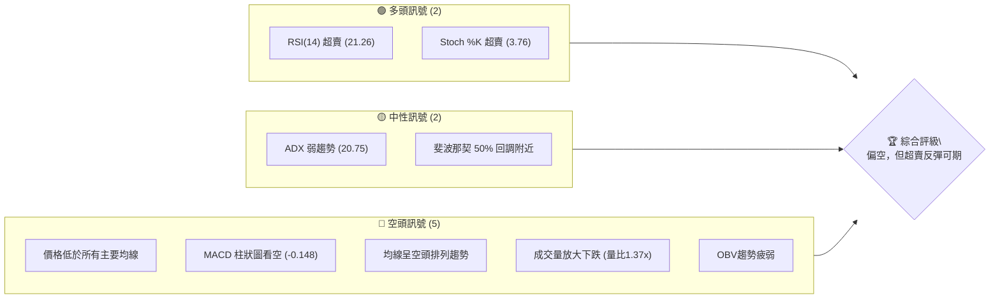
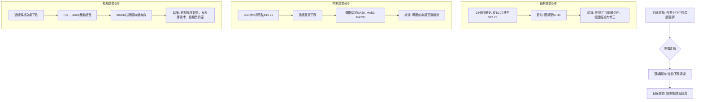
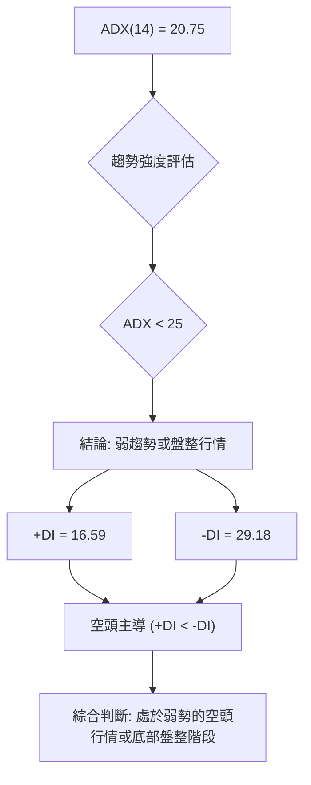
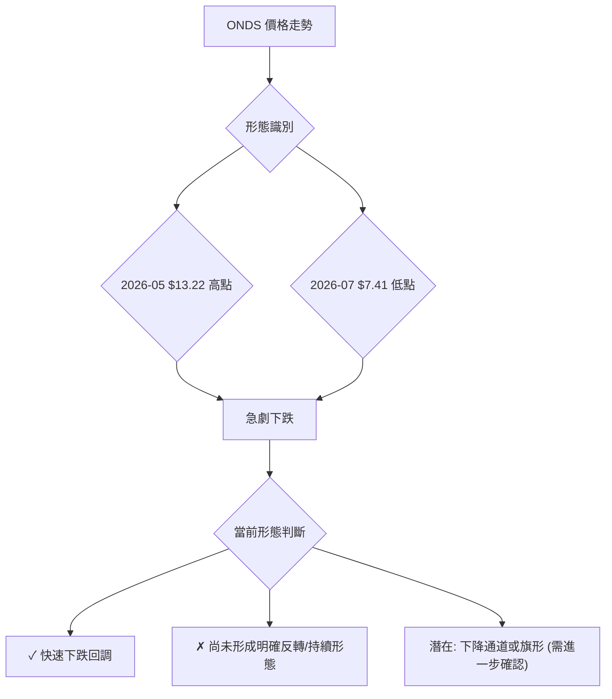
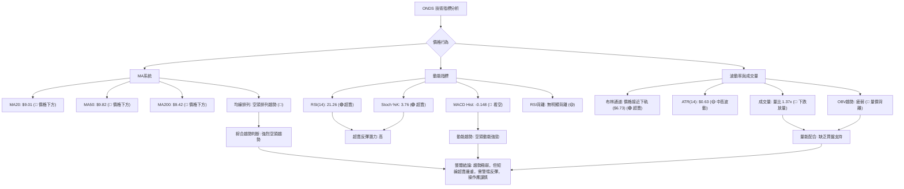
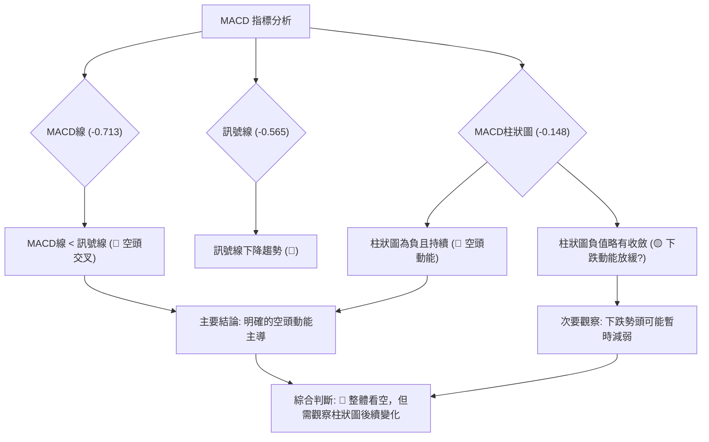
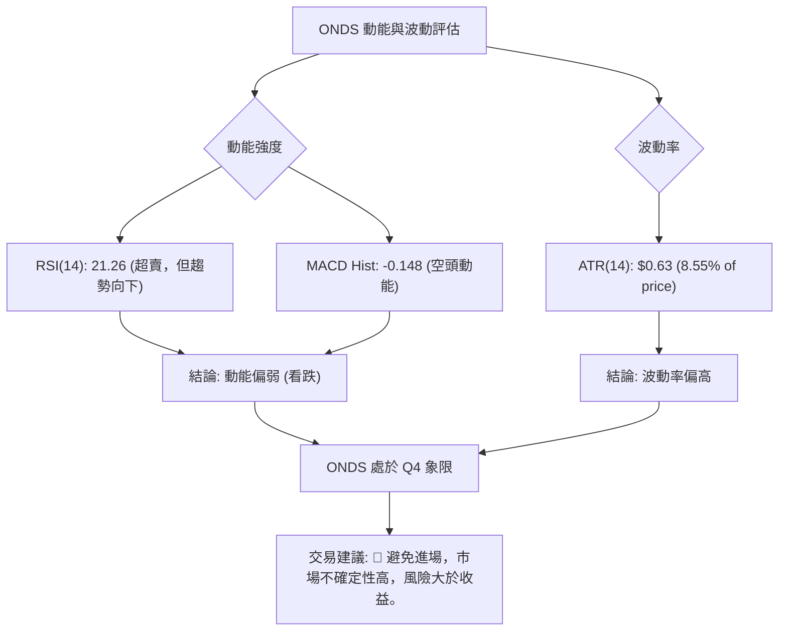
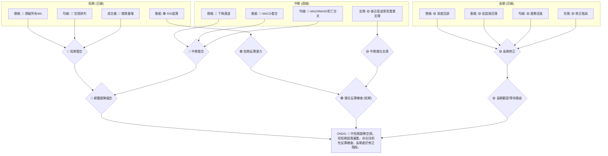
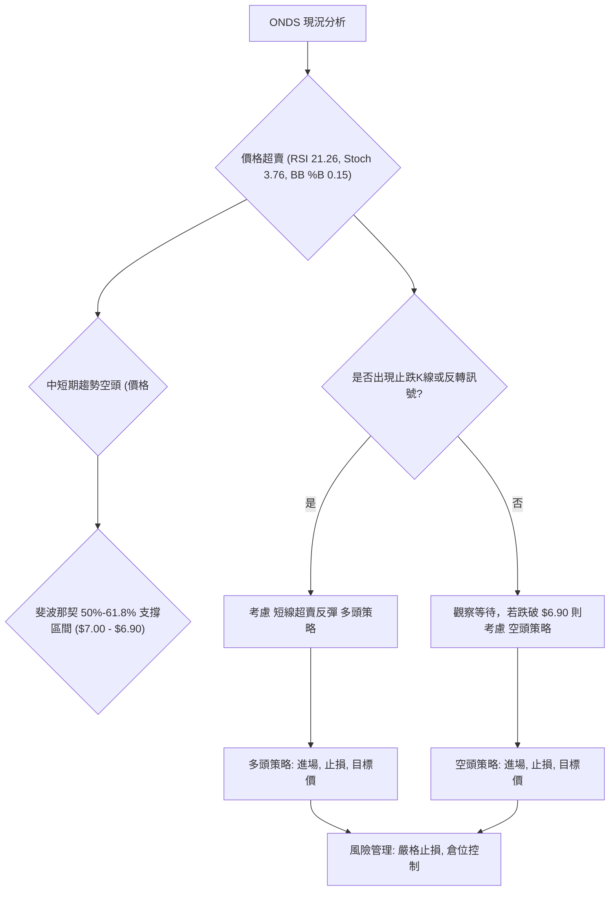
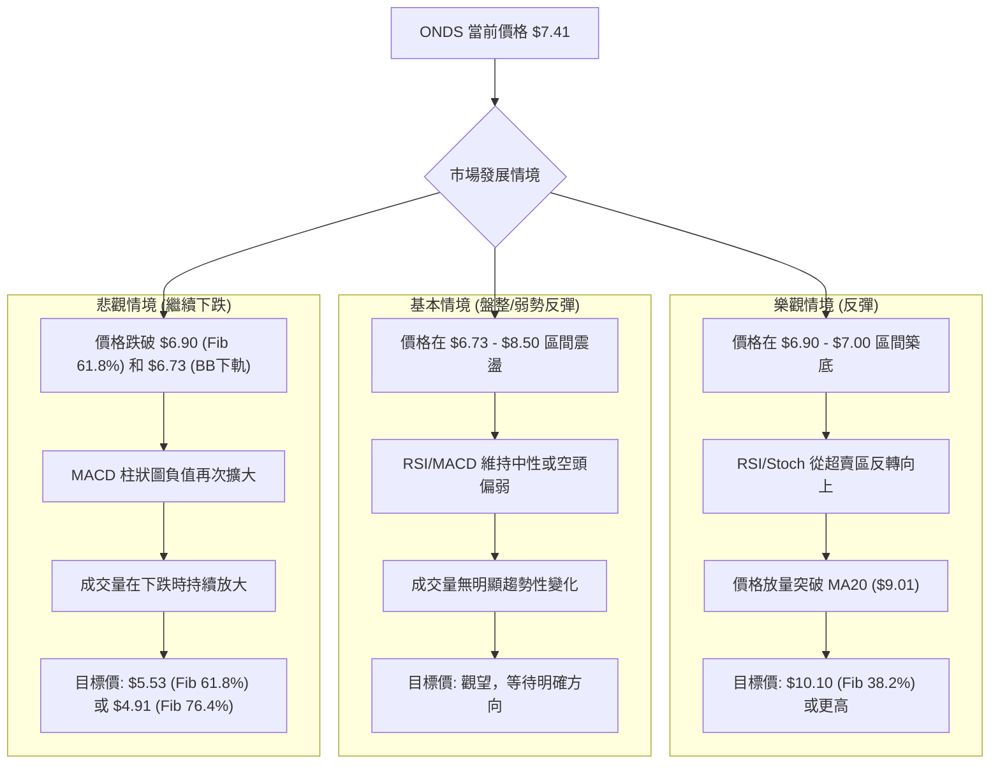

<details>
<summary>📊 靜態圖表 (點擊展開)</summary>

</details>

<html>
<head><meta charset="utf-8" /></head>
<body>
    <div style="height:500px; width:100%;">                        <script>window.PlotlyConfig = {MathJaxConfig: 'local'};</script>
        <script charset="utf-8" src="https://cdn.plot.ly/plotly-3.6.0.min.js" integrity="sha256-QaOVwtVY0T02VaHrr6pnoHLCwayMJp4O5n4YyaE3rJk=" crossorigin="anonymous"></script>                <div id="candlestick-chart" class="plotly-graph-div" style="height:100%; width:100%;"></div>            <script>                window.PLOTLYENV=window.PLOTLYENV || {};                                if (document.getElementById("candlestick-chart")) {                    Plotly.newPlot(                        "candlestick-chart",                        [{"close":{"dtype":"f8","bdata":"AAAAAClcGEAAAABgZmYYQAAAAGBmZhpAAAAAoEfhGkAAAACAPQodQAAAAMAehR9AAAAAYGZmHUAAAAAAAAAfQAAAAADXox5AAAAAQOF6H0AAAACgR+EeQAAAAKBwPR1AAAAAIIVrIkAAAACA69EjQAAAAIDrUSVAAAAAgBQuJkAAAADAHoUmQAAAAEDh+iRAAAAA4KNwIkAAAABguJ4lQAAAAIDr0SRAAAAAwB4FI0AAAABgZmYgQAAAAOCjcB5AAAAA4HoUH0AAAABgj8IcQAAAAIDC9RpAAAAAoHA9HEAAAABACtcdQAAAAGC4Hh5AAAAAwPUoG0AAAAAAAAAbQAAAAMD1KBlAAAAAYI\u002fCGUAAAACgmZkYQAAAAEAK1xdAAAAAAAAAGEAAAAAAAAAVQAAAAKBwPRdAAAAAwB6FF0AAAABAMzMXQAAAAIA9ChZAAAAAoHA9GkAAAADgUbgcQAAAAMAeBRlAAAAAAClcH0AAAAAAAAAeQAAAAOB6FBlAAAAA4KPwGkAAAADgo3AhQAAAAKBH4SBAAAAAQOF6IEAAAACgmZkfQAAAAIDrUR5AAAAAANcjIEAAAABACtchQAAAAKBHYSJAAAAAANcjIkAAAACAPQoiQAAAAIDCdSJAAAAAYGamIEAAAACAPQoiQAAAAAAAgCFAAAAAYI\u002fCHkAAAACAFC4gQAAAAEDheh1AAAAAQDMzH0AAAADgo3AiQAAAAIA9iiJAAAAAIIXrIUAAAABgj0IiQAAAAIDC9SBAAAAAIIXrIEAAAABA4fohQAAAAMAehSNAAAAAgD0KJkAAAAAgXA8pQAAAAIAUrilAAAAAAClcKEAAAADAHgUsQAAAAKBHYStAAAAAoEdhKkAAAAAgrscrQAAAAGC4HitAAAAAANejKUAAAACA61EoQAAAAGCPQipAAAAAoJkZKUAAAACgcD0pQAAAAEAKVyhAAAAAgOtRJkAAAADAHoUoQAAAAIA9iihAAAAAgD2KJkAAAADgUbgkQAAAACCuRyVAAAAAYI\u002fCJkAAAAAAKVwjQAAAAIDC9SBAAAAAoEdhI0AAAACAFK4kQAAAAAApXCNAAAAAgMJ1IkAAAADgo\u002fAhQAAAAGC4niJAAAAAoJkZJEAAAAAA1yMmQAAAACCuxyZAAAAAIFwPJEAAAACgR2EkQAAAAMDMzCRAAAAAoJmZJEAAAABgZuYkQAAAAMD1KCRAAAAAQApXJUAAAACAPQokQAAAAMAeBSVAAAAAQOH6JEAAAADA9agjQAAAAOCjcCNAAAAAwB4FJEAAAADA9agjQAAAAMD1qCRAAAAAgOtRJEAAAAAgXA8lQAAAACBcjyZAAAAAwPWoJUAAAAAAAIAlQAAAAGC4HiRAAAAAwMzMJUAAAAAAKVwlQAAAAGC4niRAAAAAoEfhIkAAAACgmZkhQAAAAMDMTCBAAAAA4HoUIkAAAABguJ4hQAAAAEAzMyNAAAAAgD0KI0AAAAAgXA8jQAAAAGBm5iJAAAAAIK5HIkAAAABgj0IiQAAAAOCj8CJAAAAAwMzMIkAAAAAgXA8kQAAAAGBmZiRAAAAAAAAAJEAAAACAwnUlQAAAAKBwvSVAAAAAYLgeJkAAAADgehQlQAAAAKCZGSVAAAAAYGbmJUAAAACAwvUkQAAAAEDh+iJAAAAA4HoUJEAAAAAA16MkQAAAAIDCdSNAAAAAwPWoIkAAAACAFK4iQAAAACCuxyFAAAAAYLgeIkAAAABACtciQAAAAOB6FCJAAAAA4FG4IUAAAAAghWsmQAAAAKBwPSVAAAAAYGZmI0AAAAAAAEAiQAAAAOBRuCJAAAAAAClcIkAAAABguB4iQAAAAIA9iiNAAAAAoJmZJUAAAAAAAIAqQAAAAOCjcCpAAAAAIIXrKkAAAADA9SgrQAAAAOBROCdAAAAA4KPwJ0AAAAAAKdwkQAAAAKCZmSRAAAAAwMxMI0AAAABguJ4iQAAAAMD1qCNAAAAAwPWoIkAAAADAHgUjQAAAACCFayJAAAAAoHA9IkAAAACAPYoiQAAAACCuxyFAAAAAIFwPIUAAAADgUbgeQAAAAEAzsx5AAAAAgOtRH0AAAACAPQogQAAAAEDheiBAAAAAgBSuH0AAAAAA16MdQA=="},"high":{"dtype":"f8","bdata":"AAAAYGZmGUAAAAAAAAAZQAAAACBcjxpAAAAAAClcG0AAAADgo3AdQAAAAKBwPSBAAAAAANcjIEAAAAAAKVwfQAAAACBcjx9AAAAAIIVrIUAAAABAClcgQAAAAMDMzB9AAAAAgBSuIkAAAAAgXI8kQAAAAGCPQidAAAAAQAoXJ0AAAABgZmYnQAAAACCuxyZAAAAAwB4FJUAAAACAFG4mQAAAAGC4HiVAAAAAoHC9JUAAAABgj0IjQAAAAIDrUSBAAAAAoEdhIEAAAAAA16MfQAAAAIA9Ch1AAAAAQDMzHUAAAABAClcgQAAAAKBHoSBAAAAAIFyPHkAAAADAzMwbQAAAAIDCdRpAAAAAAAAAGkAAAABgj8IaQAAAACCuRxpAAAAAAAAAGUAAAADgUbgXQAAAAOB6lBdAAAAAIFyPGUAAAACgR2EYQAAAAMD1qBhAAAAAAClcHUAAAADgo3AfQAAAACBcDx5AAAAAgBSuH0AAAACA6xEgQAAAAKBH4R9AAAAAYGZmG0AAAACgmZkhQAAAAGCPwiFAAAAAAClcIUAAAADAIPAgQAAAAADXIyBAAAAAoJkZIUAAAACAwjUiQAAAAIAUriJAAAAAoJmZIkAAAAAAAIAjQAAAAOBRuCNAAAAAQOE6IkAAAADA9SgiQAAAAGBmJiNAAAAAQOF6IUAAAAAA12MgQAAAAGC4HiFAAAAAYJGtIEAAAABA4XoiQAAAAIDrUSNAAAAAgBSuI0AAAABgZmYiQAAAAEAKVyJAAAAAQApXIUAAAACgmZkiQAAAACBcDyVAAAAAYLgeJkAAAADgehQpQAAAAAAp3ClAAAAAgD0KKkAAAAAA1yMuQAAAAEAzMy5AAAAAIFyPLkAAAAAAAAAtQAAAAAAAgCtAAAAAANcjLEAAAAAAAIAsQAAAAGBmZixAAAAAwPWoLEAAAADA9agqQAAAAEDhuilAAAAAIIWrKEAAAADgo\u002fAoQAAAAMD1KCpAAAAAIFyPKEAAAABgZuYmQAAAAGBmZiZAAAAAQArXJkAAAACAPcomQAAAACBcDyNAAAAAwB6FI0AAAAAgrkclQAAAAKBH4SRAAAAAQArXI0AAAACgxosiQAAAAAApXCNAAAAAANejJEAAAABAClcmQAAAAIAULidAAAAAwPUoJ0AAAAAA1yMlQAAAAIDC9SRAAAAAoEfhJUAAAAAgXI8lQAAAAAApXCRAAAAAQArXKEAAAAAAAAAmQAAAAADXoyVAAAAAQArXJUAAAADgUTgnQAAAACBcDyRAAAAAYGbmJEAAAABguB4lQAAAAIAUriVAAAAAgML1JUAAAACgcL0lQAAAAOCj8CZAAAAAwB6FJ0AAAACAwvUlQAAAAMD1qCVAAAAA4KPwJUAAAACgcL0mQAAAACCuRyZAAAAAIK5HJEAAAACgcL0iQAAAAADXoyFAAAAAIK5HIkAAAABAM7MiQAAAAGCPQiNAAAAAwMzMI0AAAACgR2EjQAAAAKBwvSRAAAAAgD0KI0AAAADgUbgiQAAAACCFKyNAAAAA4FG4I0AAAAAgXA8kQAAAACCuxyRAAAAAIFwPJUAAAABguB4mQAAAAOB6lCZAAAAA4FE4J0AAAADgo\u002fAlQAAAAIA9iiVAAAAAYLgeJkAAAAAA1yMmQAAAAAAp3CRAAAAAgOtRJEAAAABguB4lQAAAAEDhuiRAAAAA4HqUI0AAAAAghesiQAAAAAAAgCJAAAAAgBQuIkAAAADAzEwjQAAAAEAzsyJAAAAAAClcIkAAAACAwnUnQAAAAKBwPShAAAAAQApXJUAAAABgj8IjQAAAAOB6FCNAAAAAYI\u002fCIkAAAACgRyEjQAAAAMAehSRAAAAAYLgeJkAAAAAgXI8rQAAAAIDr0SpAAAAAgOvRK0AAAACA61EsQAAAAAAAACpAAAAAQArXKEAAAACA61EnQAAAAIAUriVAAAAAgOvRJEAAAACAwvUjQAAAAKBDyyNAAAAAQInBI0AAAADgo\u002fAjQAAAAEDheiNAAAAAAAAAI0AAAAAghesiQAAAACCF6yJAAAAAACncIUAAAAAAAAAhQAAAAGCPwh9AAAAAACncH0AAAADgo3AgQAAAAMDMTCFAAAAAoEfhIEAAAABgZuYgQA=="},"hovertemplate":"\u003cb\u003e%{x|%Y-%m-%d}\u003c\u002fb\u003e\u003cbr\u003e\u958b: $%{open:.2f}\u003cbr\u003e\u9ad8: $%{high:.2f}\u003cbr\u003e\u4f4e: $%{low:.2f}\u003cbr\u003e\u6536: $%{close:.2f}\u003cextra\u003e\u003c\u002fextra\u003e","low":{"dtype":"f8","bdata":"AAAAgBSuF0AAAAAAAAAXQAAAAIA9ChhAAAAAgBSuGUAAAACA61EaQAAAACCF6xxAAAAAAAAAHUAAAADA9SgbQAAAAOCjcB1AAAAAQDMzH0AAAAAgrkceQAAAAOBRuBxAAAAAANejHkAAAACgR2EiQAAAAIA9iiRAAAAAYGbmJEAAAABgDm0lQAAAAAAAwCRAAAAAoEdhIkAAAAAgsl0jQAAAAGCPwiNAAAAAgOtRIkAAAACAFK4fQAAAAOBROB5AAAAAgOtRHUAAAAAAAIAcQAAAAAAp3BlAAAAAoJmZGkAAAABguJ4dQAAAAOB6FB5AAAAAANejGkAAAADgehQaQAAAAIDr0RhAAAAAQOF6GEAAAABguB4XQAAAAOB6FBdAAAAAgOtRF0AAAAAAKdwUQAAAAMDMzBNAAAAA4HoUF0AAAABgZmYWQAAAACCF6xVAAAAAoHA9GUAAAABgZmYYQAAAACCF6xdAAAAAoJmZGEAAAACAPQodQAAAAAAAABlAAAAA4FG4F0AAAACAFK4aQAAAAADXIyBAAAAAoHC9HkAAAABAMzMfQAAAAKBH4R1AAAAAIK5HHUAAAABACtcdQAAAAIA9CiFAAAAAwPUoIUAAAADgo\u002fAhQAAAAOBROCFAAAAAACmcIEAAAACgcD0gQAAAAIDr0SBAAAAAoHA9HkAAAAAAKVweQAAAAGC4Hh1AAAAAgML1HkAAAADgo3AfQAAAACBcTyJAAAAAQApXIUAAAABAM7MhQAAAAAAp3CBAAAAAIIVrIEAAAADA9aggQAAAAEAKVyJAAAAAgOvRI0AAAABA4folQAAAACCF6ydAAAAA4FE4KEAAAADAzEwqQAAAAIAULitAAAAAwPWoKUAAAAAghespQAAAAEAK1ylAAAAAoJmZKUAAAACgcD0oQAAAAKCZmSdAAAAAACncJ0AAAABAM7MoQAAAAKBH4SdAAAAAYGbmJUAAAACAFC4mQAAAAGC4HihAAAAAANcjJkAAAAAgrkckQAAAAMDMTCRAAAAAwB4FJUAAAABgj0IiQAAAAADXoyBAAAAAYGbmIEAAAABAClcjQAAAAEAzMyNAAAAAYI\u002fCIUAAAABgZmYhQAAAAADXoyFAAAAAoHC9IUAAAABA4fojQAAAAEDheiVAAAAAYGbmI0AAAADgUbgjQAAAAIDC9SJAAAAAgD2KJEAAAABgZuYjQAAAAKBwPSNAAAAAoJmZJEAAAADAHoUjQAAAAAAp3CNAAAAAYLgeJEAAAADAHoUjQAAAAGBmZiJAAAAAYGYmI0AAAAAAAAAjQAAAAKCZmSNAAAAAoJkZJEAAAADgUTgkQAAAAKBwvSRAAAAAANejJUAAAACgcD0kQAAAAIDCdSNAAAAAgBTuI0AAAABAM\u002fMkQAAAAIDCdSRAAAAAgD2KIkAAAADA9WghQAAAAGC4Hh9AAAAAYGZmIEAAAAAgXI8hQAAAACCF6yBAAAAAYI\u002fCIkAAAADgTWIiQAAAAIAUriJAAAAAwB4FIkAAAABA4fohQAAAAIDCdSFAAAAAoJmZIkAAAACgcL0iQAAAAMAehSNAAAAAgD2KI0AAAACA61EjQAAAACCuRyVAAAAAQDOzJUAAAABAMzMkQAAAAEDhOiRAAAAAIIVrJEAAAAAghaskQAAAAIDr0SJAAAAAYLieIkAAAACgcD0jQAAAAEAKVyNAAAAAgOtRIkAAAACAPQoiQAAAACBcjyFAAAAAwMxMIUAAAADgo3AhQAAAAKCZmSFAAAAAQApXIUAAAABAMzMjQAAAAAAAACVAAAAAIIXrIkAAAADgo\u002fAhQAAAAKBwPSJAAAAAgML1IUAAAABguB4iQAAAACCynSJAAAAAAClcI0AAAADgo3AmQAAAAEAzMydAAAAAoJmZKUAAAACAFC4qQAAAACBcDydAAAAAYLgeJkAAAADA9agkQAAAAAAAgCRAAAAA4HoUIkAAAACgmZkiQAAAAMAehSJAAAAAAClcIkAAAACgmdkiQAAAACCuRyJAAAAAwPUoIkAAAABACtchQAAAACBcjyFAAAAAAAAAIUAAAAAgXI8eQAAAAKBwPR1AAAAAAAAAHkAAAACgmZkeQAAAAMAeBSBAAAAAYGZmH0AAAABA4XodQA=="},"name":"\u50f9\u683c","open":{"dtype":"f8","bdata":"AAAAIK5HGUAAAACgcD0YQAAAAGC4HhlAAAAAQDMzGkAAAAAgrkcbQAAAACBcDx5AAAAAgML1H0AAAADAHgUcQAAAACCuxx5AAAAAQArXH0AAAADgUbgfQAAAAAAAAB9AAAAAQDMzH0AAAADAHgUjQAAAAGC4HiVAAAAAAAAAJkAAAAAgrocmQAAAACCuRyZAAAAAgML1JEAAAAAgXA8kQAAAAGCPwiRAAAAAYGamJUAAAABgj0IjQAAAAMDMzB9AAAAAYLgeIEAAAADgUbgeQAAAAGBmZhtAAAAAYGZmG0AAAACAFK4eQAAAAGC4XiBAAAAA4HoUHkAAAADgepQbQAAAAIDC9RlAAAAAAAAAGUAAAADAzEwaQAAAAGC4HhdAAAAAIIXrF0AAAACAFK4XQAAAAMD1KBRAAAAAQOF6GUAAAABgZmYXQAAAAOCj8BdAAAAAIK5HGUAAAADA9agYQAAAAIA9Ch5AAAAAYLieGEAAAAAAKdwdQAAAAIAUrh9AAAAAoHA9GkAAAAAA1yMbQAAAAIDC9SBAAAAA4FE4IUAAAAAgXI8gQAAAAMAehR9AAAAA4FG4HkAAAAAgrscgQAAAAMAeRSFAAAAAACncIUAAAABACpciQAAAAEAK1yFAAAAA4FE4IkAAAABA4fogQAAAAIDC9SFAAAAAAClcIUAAAABA4XoeQAAAACCuRyBAAAAAwPUoH0AAAACAwvUfQAAAAKCZmSJAAAAAIFwPIkAAAACAwvUhQAAAAOAkRiJAAAAAoJmZIEAAAAAghesgQAAAACBcjyJAAAAAwB5FJEAAAACgmZkmQAAAAEAzMyhAAAAAYGZmKUAAAADA9WgqQAAAAAAAACxAAAAAIIVrK0AAAAAAAAArQAAAAKBHYStAAAAAANcjK0AAAADgetQqQAAAAIDCtSdAAAAAoJmZK0AAAADAHgUpQAAAACCFaylAAAAAwMxMKEAAAAAghWsmQAAAAIDC9SlAAAAAIK5HKEAAAAAAAIAmQAAAAGC4niVAAAAAwB4FJkAAAABgj8ImQAAAAIAUriJAAAAAgBTuIUAAAAAAKZwjQAAAAIAULiRAAAAAwB7FI0AAAACgcH0iQAAAAIA9iiJAAAAA4FF4IkAAAAAghWskQAAAAADXoyVAAAAAoEdhJkAAAAAAKdwjQAAAAMAeBSRAAAAAYI9CJUAAAADAzEwkQAAAAIAULiRAAAAAAAAAJUAAAACgR2ElQAAAAOBRuCRAAAAAQOH6JEAAAAAAAIAkQAAAACBcDyRAAAAAgBSuI0AAAACgmRkkQAAAACCFKyRAAAAAACncJEAAAACgcL0kQAAAAKCZGSVAAAAAAADAJkAAAABguF4lQAAAAOB6lCVAAAAA4HqUJEAAAACA69ElQAAAAGCPwiVAAAAAoJkZJEAAAABAM7MiQAAAAGC4niFAAAAAYGbmIEAAAACgmZkiQAAAACCuByFAAAAAYI9CI0AAAAAAKdwiQAAAAEAKVyRAAAAA4HrUIkAAAACAwnUiQAAAAMAeBSJAAAAA4KNwI0AAAADAHgUjQAAAAAAAgCRAAAAAYI\u002fCJEAAAACgmZkjQAAAAMDMzCVAAAAAgD2KJkAAAABgj8IlQAAAAGCPQiVAAAAAwEu3JEAAAAAA12MlQAAAAGCPwiRAAAAAAAAAI0AAAAAAAAAkQAAAAMDMTCRAAAAAIFyPI0AAAAAAAIAiQAAAAAAAgCJAAAAAAAAAIkAAAABACtchQAAAAOBReCJAAAAAQArXIUAAAABA4fojQAAAAIDr0SVAAAAAYI9CJUAAAABgZqYjQAAAAAAAgCJAAAAAIFyPIkAAAAAghWsiQAAAACCFqyJAAAAAAAAAJEAAAABAM\u002fMmQAAAAAAAgClAAAAAoHB9KkAAAACgcD0rQAAAACCF6ylAAAAAgML1JkAAAABACtcmQAAAAMD1qCVAAAAAIIWrJEAAAACgR2EjQAAAAGBmpiJAAAAAQAqXI0AAAABAM7MjQAAAAIDr0SJAAAAAoHB9IkAAAACA69EiQAAAAIDCtSJAAAAAYLheIUAAAACAwvUgQAAAAKBwvR9AAAAAIFwPHkAAAAAgrkcgQAAAAOCj8CBAAAAAANcjIEAAAABgj8IfQA=="},"x":["2025-09-16T00:00:00-04:00","2025-09-17T00:00:00-04:00","2025-09-18T00:00:00-04:00","2025-09-19T00:00:00-04:00","2025-09-22T00:00:00-04:00","2025-09-23T00:00:00-04:00","2025-09-24T00:00:00-04:00","2025-09-25T00:00:00-04:00","2025-09-26T00:00:00-04:00","2025-09-29T00:00:00-04:00","2025-09-30T00:00:00-04:00","2025-10-01T00:00:00-04:00","2025-10-02T00:00:00-04:00","2025-10-03T00:00:00-04:00","2025-10-06T00:00:00-04:00","2025-10-07T00:00:00-04:00","2025-10-08T00:00:00-04:00","2025-10-09T00:00:00-04:00","2025-10-10T00:00:00-04:00","2025-10-13T00:00:00-04:00","2025-10-14T00:00:00-04:00","2025-10-15T00:00:00-04:00","2025-10-16T00:00:00-04:00","2025-10-17T00:00:00-04:00","2025-10-20T00:00:00-04:00","2025-10-21T00:00:00-04:00","2025-10-22T00:00:00-04:00","2025-10-23T00:00:00-04:00","2025-10-24T00:00:00-04:00","2025-10-27T00:00:00-04:00","2025-10-28T00:00:00-04:00","2025-10-29T00:00:00-04:00","2025-10-30T00:00:00-04:00","2025-10-31T00:00:00-04:00","2025-11-03T00:00:00-05:00","2025-11-04T00:00:00-05:00","2025-11-05T00:00:00-05:00","2025-11-06T00:00:00-05:00","2025-11-07T00:00:00-05:00","2025-11-10T00:00:00-05:00","2025-11-11T00:00:00-05:00","2025-11-12T00:00:00-05:00","2025-11-13T00:00:00-05:00","2025-11-14T00:00:00-05:00","2025-11-17T00:00:00-05:00","2025-11-18T00:00:00-05:00","2025-11-19T00:00:00-05:00","2025-11-20T00:00:00-05:00","2025-11-21T00:00:00-05:00","2025-11-24T00:00:00-05:00","2025-11-25T00:00:00-05:00","2025-11-26T00:00:00-05:00","2025-11-28T00:00:00-05:00","2025-12-01T00:00:00-05:00","2025-12-02T00:00:00-05:00","2025-12-03T00:00:00-05:00","2025-12-04T00:00:00-05:00","2025-12-05T00:00:00-05:00","2025-12-08T00:00:00-05:00","2025-12-09T00:00:00-05:00","2025-12-10T00:00:00-05:00","2025-12-11T00:00:00-05:00","2025-12-12T00:00:00-05:00","2025-12-15T00:00:00-05:00","2025-12-16T00:00:00-05:00","2025-12-17T00:00:00-05:00","2025-12-18T00:00:00-05:00","2025-12-19T00:00:00-05:00","2025-12-22T00:00:00-05:00","2025-12-23T00:00:00-05:00","2025-12-24T00:00:00-05:00","2025-12-26T00:00:00-05:00","2025-12-29T00:00:00-05:00","2025-12-30T00:00:00-05:00","2025-12-31T00:00:00-05:00","2026-01-02T00:00:00-05:00","2026-01-05T00:00:00-05:00","2026-01-06T00:00:00-05:00","2026-01-07T00:00:00-05:00","2026-01-08T00:00:00-05:00","2026-01-09T00:00:00-05:00","2026-01-12T00:00:00-05:00","2026-01-13T00:00:00-05:00","2026-01-14T00:00:00-05:00","2026-01-15T00:00:00-05:00","2026-01-16T00:00:00-05:00","2026-01-20T00:00:00-05:00","2026-01-21T00:00:00-05:00","2026-01-22T00:00:00-05:00","2026-01-23T00:00:00-05:00","2026-01-26T00:00:00-05:00","2026-01-27T00:00:00-05:00","2026-01-28T00:00:00-05:00","2026-01-29T00:00:00-05:00","2026-01-30T00:00:00-05:00","2026-02-02T00:00:00-05:00","2026-02-03T00:00:00-05:00","2026-02-04T00:00:00-05:00","2026-02-05T00:00:00-05:00","2026-02-06T00:00:00-05:00","2026-02-09T00:00:00-05:00","2026-02-10T00:00:00-05:00","2026-02-11T00:00:00-05:00","2026-02-12T00:00:00-05:00","2026-02-13T00:00:00-05:00","2026-02-17T00:00:00-05:00","2026-02-18T00:00:00-05:00","2026-02-19T00:00:00-05:00","2026-02-20T00:00:00-05:00","2026-02-23T00:00:00-05:00","2026-02-24T00:00:00-05:00","2026-02-25T00:00:00-05:00","2026-02-26T00:00:00-05:00","2026-02-27T00:00:00-05:00","2026-03-02T00:00:00-05:00","2026-03-03T00:00:00-05:00","2026-03-04T00:00:00-05:00","2026-03-05T00:00:00-05:00","2026-03-06T00:00:00-05:00","2026-03-09T00:00:00-04:00","2026-03-10T00:00:00-04:00","2026-03-11T00:00:00-04:00","2026-03-12T00:00:00-04:00","2026-03-13T00:00:00-04:00","2026-03-16T00:00:00-04:00","2026-03-17T00:00:00-04:00","2026-03-18T00:00:00-04:00","2026-03-19T00:00:00-04:00","2026-03-20T00:00:00-04:00","2026-03-23T00:00:00-04:00","2026-03-24T00:00:00-04:00","2026-03-25T00:00:00-04:00","2026-03-26T00:00:00-04:00","2026-03-27T00:00:00-04:00","2026-03-30T00:00:00-04:00","2026-03-31T00:00:00-04:00","2026-04-01T00:00:00-04:00","2026-04-02T00:00:00-04:00","2026-04-06T00:00:00-04:00","2026-04-07T00:00:00-04:00","2026-04-08T00:00:00-04:00","2026-04-09T00:00:00-04:00","2026-04-10T00:00:00-04:00","2026-04-13T00:00:00-04:00","2026-04-14T00:00:00-04:00","2026-04-15T00:00:00-04:00","2026-04-16T00:00:00-04:00","2026-04-17T00:00:00-04:00","2026-04-20T00:00:00-04:00","2026-04-21T00:00:00-04:00","2026-04-22T00:00:00-04:00","2026-04-23T00:00:00-04:00","2026-04-24T00:00:00-04:00","2026-04-27T00:00:00-04:00","2026-04-28T00:00:00-04:00","2026-04-29T00:00:00-04:00","2026-04-30T00:00:00-04:00","2026-05-01T00:00:00-04:00","2026-05-04T00:00:00-04:00","2026-05-05T00:00:00-04:00","2026-05-06T00:00:00-04:00","2026-05-07T00:00:00-04:00","2026-05-08T00:00:00-04:00","2026-05-11T00:00:00-04:00","2026-05-12T00:00:00-04:00","2026-05-13T00:00:00-04:00","2026-05-14T00:00:00-04:00","2026-05-15T00:00:00-04:00","2026-05-18T00:00:00-04:00","2026-05-19T00:00:00-04:00","2026-05-20T00:00:00-04:00","2026-05-21T00:00:00-04:00","2026-05-22T00:00:00-04:00","2026-05-26T00:00:00-04:00","2026-05-27T00:00:00-04:00","2026-05-28T00:00:00-04:00","2026-05-29T00:00:00-04:00","2026-06-01T00:00:00-04:00","2026-06-02T00:00:00-04:00","2026-06-03T00:00:00-04:00","2026-06-04T00:00:00-04:00","2026-06-05T00:00:00-04:00","2026-06-08T00:00:00-04:00","2026-06-09T00:00:00-04:00","2026-06-10T00:00:00-04:00","2026-06-11T00:00:00-04:00","2026-06-12T00:00:00-04:00","2026-06-15T00:00:00-04:00","2026-06-16T00:00:00-04:00","2026-06-17T00:00:00-04:00","2026-06-18T00:00:00-04:00","2026-06-22T00:00:00-04:00","2026-06-23T00:00:00-04:00","2026-06-24T00:00:00-04:00","2026-06-25T00:00:00-04:00","2026-06-26T00:00:00-04:00","2026-06-29T00:00:00-04:00","2026-06-30T00:00:00-04:00","2026-07-01T00:00:00-04:00","2026-07-02T00:00:00-04:00"],"type":"candlestick"},{"hovertemplate":"MA30: $%{y:.2f}\u003cextra\u003e\u003c\u002fextra\u003e","line":{"color":"#2196F3","dash":"dash","width":2},"mode":"lines","name":"MA30","x":["2025-09-16T00:00:00-04:00","2025-09-17T00:00:00-04:00","2025-09-18T00:00:00-04:00","2025-09-19T00:00:00-04:00","2025-09-22T00:00:00-04:00","2025-09-23T00:00:00-04:00","2025-09-24T00:00:00-04:00","2025-09-25T00:00:00-04:00","2025-09-26T00:00:00-04:00","2025-09-29T00:00:00-04:00","2025-09-30T00:00:00-04:00","2025-10-01T00:00:00-04:00","2025-10-02T00:00:00-04:00","2025-10-03T00:00:00-04:00","2025-10-06T00:00:00-04:00","2025-10-07T00:00:00-04:00","2025-10-08T00:00:00-04:00","2025-10-09T00:00:00-04:00","2025-10-10T00:00:00-04:00","2025-10-13T00:00:00-04:00","2025-10-14T00:00:00-04:00","2025-10-15T00:00:00-04:00","2025-10-16T00:00:00-04:00","2025-10-17T00:00:00-04:00","2025-10-20T00:00:00-04:00","2025-10-21T00:00:00-04:00","2025-10-22T00:00:00-04:00","2025-10-23T00:00:00-04:00","2025-10-24T00:00:00-04:00","2025-10-27T00:00:00-04:00","2025-10-28T00:00:00-04:00","2025-10-29T00:00:00-04:00","2025-10-30T00:00:00-04:00","2025-10-31T00:00:00-04:00","2025-11-03T00:00:00-05:00","2025-11-04T00:00:00-05:00","2025-11-05T00:00:00-05:00","2025-11-06T00:00:00-05:00","2025-11-07T00:00:00-05:00","2025-11-10T00:00:00-05:00","2025-11-11T00:00:00-05:00","2025-11-12T00:00:00-05:00","2025-11-13T00:00:00-05:00","2025-11-14T00:00:00-05:00","2025-11-17T00:00:00-05:00","2025-11-18T00:00:00-05:00","2025-11-19T00:00:00-05:00","2025-11-20T00:00:00-05:00","2025-11-21T00:00:00-05:00","2025-11-24T00:00:00-05:00","2025-11-25T00:00:00-05:00","2025-11-26T00:00:00-05:00","2025-11-28T00:00:00-05:00","2025-12-01T00:00:00-05:00","2025-12-02T00:00:00-05:00","2025-12-03T00:00:00-05:00","2025-12-04T00:00:00-05:00","2025-12-05T00:00:00-05:00","2025-12-08T00:00:00-05:00","2025-12-09T00:00:00-05:00","2025-12-10T00:00:00-05:00","2025-12-11T00:00:00-05:00","2025-12-12T00:00:00-05:00","2025-12-15T00:00:00-05:00","2025-12-16T00:00:00-05:00","2025-12-17T00:00:00-05:00","2025-12-18T00:00:00-05:00","2025-12-19T00:00:00-05:00","2025-12-22T00:00:00-05:00","2025-12-23T00:00:00-05:00","2025-12-24T00:00:00-05:00","2025-12-26T00:00:00-05:00","2025-12-29T00:00:00-05:00","2025-12-30T00:00:00-05:00","2025-12-31T00:00:00-05:00","2026-01-02T00:00:00-05:00","2026-01-05T00:00:00-05:00","2026-01-06T00:00:00-05:00","2026-01-07T00:00:00-05:00","2026-01-08T00:00:00-05:00","2026-01-09T00:00:00-05:00","2026-01-12T00:00:00-05:00","2026-01-13T00:00:00-05:00","2026-01-14T00:00:00-05:00","2026-01-15T00:00:00-05:00","2026-01-16T00:00:00-05:00","2026-01-20T00:00:00-05:00","2026-01-21T00:00:00-05:00","2026-01-22T00:00:00-05:00","2026-01-23T00:00:00-05:00","2026-01-26T00:00:00-05:00","2026-01-27T00:00:00-05:00","2026-01-28T00:00:00-05:00","2026-01-29T00:00:00-05:00","2026-01-30T00:00:00-05:00","2026-02-02T00:00:00-05:00","2026-02-03T00:00:00-05:00","2026-02-04T00:00:00-05:00","2026-02-05T00:00:00-05:00","2026-02-06T00:00:00-05:00","2026-02-09T00:00:00-05:00","2026-02-10T00:00:00-05:00","2026-02-11T00:00:00-05:00","2026-02-12T00:00:00-05:00","2026-02-13T00:00:00-05:00","2026-02-17T00:00:00-05:00","2026-02-18T00:00:00-05:00","2026-02-19T00:00:00-05:00","2026-02-20T00:00:00-05:00","2026-02-23T00:00:00-05:00","2026-02-24T00:00:00-05:00","2026-02-25T00:00:00-05:00","2026-02-26T00:00:00-05:00","2026-02-27T00:00:00-05:00","2026-03-02T00:00:00-05:00","2026-03-03T00:00:00-05:00","2026-03-04T00:00:00-05:00","2026-03-05T00:00:00-05:00","2026-03-06T00:00:00-05:00","2026-03-09T00:00:00-04:00","2026-03-10T00:00:00-04:00","2026-03-11T00:00:00-04:00","2026-03-12T00:00:00-04:00","2026-03-13T00:00:00-04:00","2026-03-16T00:00:00-04:00","2026-03-17T00:00:00-04:00","2026-03-18T00:00:00-04:00","2026-03-19T00:00:00-04:00","2026-03-20T00:00:00-04:00","2026-03-23T00:00:00-04:00","2026-03-24T00:00:00-04:00","2026-03-25T00:00:00-04:00","2026-03-26T00:00:00-04:00","2026-03-27T00:00:00-04:00","2026-03-30T00:00:00-04:00","2026-03-31T00:00:00-04:00","2026-04-01T00:00:00-04:00","2026-04-02T00:00:00-04:00","2026-04-06T00:00:00-04:00","2026-04-07T00:00:00-04:00","2026-04-08T00:00:00-04:00","2026-04-09T00:00:00-04:00","2026-04-10T00:00:00-04:00","2026-04-13T00:00:00-04:00","2026-04-14T00:00:00-04:00","2026-04-15T00:00:00-04:00","2026-04-16T00:00:00-04:00","2026-04-17T00:00:00-04:00","2026-04-20T00:00:00-04:00","2026-04-21T00:00:00-04:00","2026-04-22T00:00:00-04:00","2026-04-23T00:00:00-04:00","2026-04-24T00:00:00-04:00","2026-04-27T00:00:00-04:00","2026-04-28T00:00:00-04:00","2026-04-29T00:00:00-04:00","2026-04-30T00:00:00-04:00","2026-05-01T00:00:00-04:00","2026-05-04T00:00:00-04:00","2026-05-05T00:00:00-04:00","2026-05-06T00:00:00-04:00","2026-05-07T00:00:00-04:00","2026-05-08T00:00:00-04:00","2026-05-11T00:00:00-04:00","2026-05-12T00:00:00-04:00","2026-05-13T00:00:00-04:00","2026-05-14T00:00:00-04:00","2026-05-15T00:00:00-04:00","2026-05-18T00:00:00-04:00","2026-05-19T00:00:00-04:00","2026-05-20T00:00:00-04:00","2026-05-21T00:00:00-04:00","2026-05-22T00:00:00-04:00","2026-05-26T00:00:00-04:00","2026-05-27T00:00:00-04:00","2026-05-28T00:00:00-04:00","2026-05-29T00:00:00-04:00","2026-06-01T00:00:00-04:00","2026-06-02T00:00:00-04:00","2026-06-03T00:00:00-04:00","2026-06-04T00:00:00-04:00","2026-06-05T00:00:00-04:00","2026-06-08T00:00:00-04:00","2026-06-09T00:00:00-04:00","2026-06-10T00:00:00-04:00","2026-06-11T00:00:00-04:00","2026-06-12T00:00:00-04:00","2026-06-15T00:00:00-04:00","2026-06-16T00:00:00-04:00","2026-06-17T00:00:00-04:00","2026-06-18T00:00:00-04:00","2026-06-22T00:00:00-04:00","2026-06-23T00:00:00-04:00","2026-06-24T00:00:00-04:00","2026-06-25T00:00:00-04:00","2026-06-26T00:00:00-04:00","2026-06-29T00:00:00-04:00","2026-06-30T00:00:00-04:00","2026-07-01T00:00:00-04:00","2026-07-02T00:00:00-04:00"],"y":{"dtype":"f8","bdata":"AAAAAAAA+H8AAAAAAAD4fwAAAAAAAPh\u002fAAAAAAAA+H8AAAAAAAD4fwAAAAAAAPh\u002fAAAAAAAA+H8AAAAAAAD4fwAAAAAAAPh\u002fAAAAAAAA+H8AAAAAAAD4fwAAAAAAAPh\u002fAAAAAAAA+H8AAAAAAAD4fwAAAAAAAPh\u002fAAAAAAAA+H8AAAAAAAD4fwAAAAAAAPh\u002fAAAAAAAA+H8AAAAAAAD4fwAAAAAAAPh\u002fAAAAAAAA+H8AAAAAAAD4fwAAAAAAAPh\u002fAAAAAAAA+H8AAAAAAAD4fwAAAAAAAPh\u002fAAAAAAAA+H8AAAAAAAD4f0REROwKkCBAzczMRP2bIECamZkpFacgQImIiMDKoSBAIiIiagOdIEAAAADAEYogQERERCRNaSBA7+7u5kJSIEBEREQ8mCcgQGZmZnYFCCBAq6qqCh7MH0BERETUlIofQBERETEkTR9AMzMzI7DyHkCJiIgIgZUeQO\u002fu7o4l\u002fx1AAAAAoDaQHUDe3d093w8dQCIiIlLUfxxA7+7uDgIrHEC8u7tbq+MbQLy7uzttoBtAzczMzBN1G0DNzMxc1mobQHd3dzfQaRtAd3d3pw10G0AAAACgGq8bQM3MzAy7AhxAIiIislZHHEAAAAAwlnwcQCIiIgKdthxAq6qqCgLrHEC8u7ubfTgdQKuqqmp1jB1AVVVVFSC3HUAAAAAQWPkdQERERNR4KR5AiYiIeOlmHkDNzMzca+4eQO\u002fu7s6FZB9AIiIiQqfNH0Dv7u6eqB8gQO\u002fu7r5YUiBAERER+cVyIEC8u7v7qZEgQAAAAJB7zSBAIiIiMsEDIUCamZmZmVkhQGZmZl66ySFAAAAA8KcmIkDNzMxM8IAiQGZmZuaJ2iJAd3d3xwQvI0BVVVV9P5UjQKuqqoJO+yNAvLu7k19MJEAiIiJaq4MkQCIiInrpxiRAzczM1E0CJUAAAAB4vj8lQO\u002fu7obrcSVAzczM1E2iJUAzMzObmdklQBEREbmsFSZAvLu7+8VSJkAzMzPDg3kmQM3MzJxSsSZA7+7u3mvuJkBERESkRfYmQDMzMxPK6CZA3t3dfT\u002f1JkAAAAAQ5gknQCIiIvJgHidAAAAAIIUrJ0Dv7u6+LSsnQKuqqqp\u002fIydAvLu7q\u002fESJ0BVVVXVBvomQAAAALBH4SZAERERMZa8JkCrqqpaZHsmQAAAACA+QyZAZmZmhusRJkDv7u7uNdclQERERJTRmyVAZmZmFiB3JUCamZlJmlIlQFVVVVXjJSVA3t3dDbsCJUC8u7tbHdMkQFVVVSVNqSRAiYiIuKyVJEAzMzPjM2wkQFVVVeUXSyRAq6qqOiY4JECJiIj4DDskQLy7uyv5RSRA7+7uLpY8JEBVVVUV2U4kQGZmZjbQaSRAiYiIyHZ+JEBERERERIQkQHd3d8cEjyRAiYiISJqSJECrqqqKs48kQLy7u2vneyRAmpmZqapqJEAzMzOTGEQkQCIiIvKLJSRAmpmZudccJEBEREQklBEkQHd3d4ddASRAmpmZaZHtI0Dv7u4+CtcjQN7d3R2hzCNAZmZmZvS2I0BmZmYWILcjQM3MzKzVsSNAVVVV1XipI0De3d391LgjQKuqqmp1zCNAAAAA8GDeI0CamZn5fuojQLy7uytA7iNAvLu7u7v7I0B3d3dH4fojQGZmZqZU3CNAZmZmFtnOI0AzMzNjgscjQHd3d5fgwSNAiYiIKBWnI0C8u7ubNpAjQImIiIj6dyNAq6qqSn5xI0DNzMwcE3wjQFVVVZVDiyNAZmZmJjGII0CJiIjoJrEjQKuqqlqPwiNAiYiIyKHFI0AAAABQuL4jQImIiBgvvSNAvLu72929I0BmZmYGrLwjQO\u002fu7r7KwSNAERERca\u002fZI0BmZmbWoxAkQLy7u2suRCRAREREZDt\u002fJEC8u7s7368kQHd3d1eAvCRAERERMQjMJECJiIiYJ8okQERERFTjxSRAq6qqirOvJEDNzMy8u5skQImIiDiJoSRA7+7uLmuVJEDe3d09mIckQERERFS4fiRAMzMz0yJ7JEDe3d398HkkQN7d3f3weSRAIiIiYuVwJEDNzMw0M1MkQGZmZm7nOyRAMzMzS1MqJEARERH54fMjQAAAAJhDyyNAAAAAqOKsI0DNzMy0nY8jQA=="},"type":"scatter"},{"hovertemplate":"MA60: $%{y:.2f}\u003cextra\u003e\u003c\u002fextra\u003e","line":{"color":"#9C27B0","dash":"dash","width":2},"mode":"lines","name":"MA60","x":["2025-09-16T00:00:00-04:00","2025-09-17T00:00:00-04:00","2025-09-18T00:00:00-04:00","2025-09-19T00:00:00-04:00","2025-09-22T00:00:00-04:00","2025-09-23T00:00:00-04:00","2025-09-24T00:00:00-04:00","2025-09-25T00:00:00-04:00","2025-09-26T00:00:00-04:00","2025-09-29T00:00:00-04:00","2025-09-30T00:00:00-04:00","2025-10-01T00:00:00-04:00","2025-10-02T00:00:00-04:00","2025-10-03T00:00:00-04:00","2025-10-06T00:00:00-04:00","2025-10-07T00:00:00-04:00","2025-10-08T00:00:00-04:00","2025-10-09T00:00:00-04:00","2025-10-10T00:00:00-04:00","2025-10-13T00:00:00-04:00","2025-10-14T00:00:00-04:00","2025-10-15T00:00:00-04:00","2025-10-16T00:00:00-04:00","2025-10-17T00:00:00-04:00","2025-10-20T00:00:00-04:00","2025-10-21T00:00:00-04:00","2025-10-22T00:00:00-04:00","2025-10-23T00:00:00-04:00","2025-10-24T00:00:00-04:00","2025-10-27T00:00:00-04:00","2025-10-28T00:00:00-04:00","2025-10-29T00:00:00-04:00","2025-10-30T00:00:00-04:00","2025-10-31T00:00:00-04:00","2025-11-03T00:00:00-05:00","2025-11-04T00:00:00-05:00","2025-11-05T00:00:00-05:00","2025-11-06T00:00:00-05:00","2025-11-07T00:00:00-05:00","2025-11-10T00:00:00-05:00","2025-11-11T00:00:00-05:00","2025-11-12T00:00:00-05:00","2025-11-13T00:00:00-05:00","2025-11-14T00:00:00-05:00","2025-11-17T00:00:00-05:00","2025-11-18T00:00:00-05:00","2025-11-19T00:00:00-05:00","2025-11-20T00:00:00-05:00","2025-11-21T00:00:00-05:00","2025-11-24T00:00:00-05:00","2025-11-25T00:00:00-05:00","2025-11-26T00:00:00-05:00","2025-11-28T00:00:00-05:00","2025-12-01T00:00:00-05:00","2025-12-02T00:00:00-05:00","2025-12-03T00:00:00-05:00","2025-12-04T00:00:00-05:00","2025-12-05T00:00:00-05:00","2025-12-08T00:00:00-05:00","2025-12-09T00:00:00-05:00","2025-12-10T00:00:00-05:00","2025-12-11T00:00:00-05:00","2025-12-12T00:00:00-05:00","2025-12-15T00:00:00-05:00","2025-12-16T00:00:00-05:00","2025-12-17T00:00:00-05:00","2025-12-18T00:00:00-05:00","2025-12-19T00:00:00-05:00","2025-12-22T00:00:00-05:00","2025-12-23T00:00:00-05:00","2025-12-24T00:00:00-05:00","2025-12-26T00:00:00-05:00","2025-12-29T00:00:00-05:00","2025-12-30T00:00:00-05:00","2025-12-31T00:00:00-05:00","2026-01-02T00:00:00-05:00","2026-01-05T00:00:00-05:00","2026-01-06T00:00:00-05:00","2026-01-07T00:00:00-05:00","2026-01-08T00:00:00-05:00","2026-01-09T00:00:00-05:00","2026-01-12T00:00:00-05:00","2026-01-13T00:00:00-05:00","2026-01-14T00:00:00-05:00","2026-01-15T00:00:00-05:00","2026-01-16T00:00:00-05:00","2026-01-20T00:00:00-05:00","2026-01-21T00:00:00-05:00","2026-01-22T00:00:00-05:00","2026-01-23T00:00:00-05:00","2026-01-26T00:00:00-05:00","2026-01-27T00:00:00-05:00","2026-01-28T00:00:00-05:00","2026-01-29T00:00:00-05:00","2026-01-30T00:00:00-05:00","2026-02-02T00:00:00-05:00","2026-02-03T00:00:00-05:00","2026-02-04T00:00:00-05:00","2026-02-05T00:00:00-05:00","2026-02-06T00:00:00-05:00","2026-02-09T00:00:00-05:00","2026-02-10T00:00:00-05:00","2026-02-11T00:00:00-05:00","2026-02-12T00:00:00-05:00","2026-02-13T00:00:00-05:00","2026-02-17T00:00:00-05:00","2026-02-18T00:00:00-05:00","2026-02-19T00:00:00-05:00","2026-02-20T00:00:00-05:00","2026-02-23T00:00:00-05:00","2026-02-24T00:00:00-05:00","2026-02-25T00:00:00-05:00","2026-02-26T00:00:00-05:00","2026-02-27T00:00:00-05:00","2026-03-02T00:00:00-05:00","2026-03-03T00:00:00-05:00","2026-03-04T00:00:00-05:00","2026-03-05T00:00:00-05:00","2026-03-06T00:00:00-05:00","2026-03-09T00:00:00-04:00","2026-03-10T00:00:00-04:00","2026-03-11T00:00:00-04:00","2026-03-12T00:00:00-04:00","2026-03-13T00:00:00-04:00","2026-03-16T00:00:00-04:00","2026-03-17T00:00:00-04:00","2026-03-18T00:00:00-04:00","2026-03-19T00:00:00-04:00","2026-03-20T00:00:00-04:00","2026-03-23T00:00:00-04:00","2026-03-24T00:00:00-04:00","2026-03-25T00:00:00-04:00","2026-03-26T00:00:00-04:00","2026-03-27T00:00:00-04:00","2026-03-30T00:00:00-04:00","2026-03-31T00:00:00-04:00","2026-04-01T00:00:00-04:00","2026-04-02T00:00:00-04:00","2026-04-06T00:00:00-04:00","2026-04-07T00:00:00-04:00","2026-04-08T00:00:00-04:00","2026-04-09T00:00:00-04:00","2026-04-10T00:00:00-04:00","2026-04-13T00:00:00-04:00","2026-04-14T00:00:00-04:00","2026-04-15T00:00:00-04:00","2026-04-16T00:00:00-04:00","2026-04-17T00:00:00-04:00","2026-04-20T00:00:00-04:00","2026-04-21T00:00:00-04:00","2026-04-22T00:00:00-04:00","2026-04-23T00:00:00-04:00","2026-04-24T00:00:00-04:00","2026-04-27T00:00:00-04:00","2026-04-28T00:00:00-04:00","2026-04-29T00:00:00-04:00","2026-04-30T00:00:00-04:00","2026-05-01T00:00:00-04:00","2026-05-04T00:00:00-04:00","2026-05-05T00:00:00-04:00","2026-05-06T00:00:00-04:00","2026-05-07T00:00:00-04:00","2026-05-08T00:00:00-04:00","2026-05-11T00:00:00-04:00","2026-05-12T00:00:00-04:00","2026-05-13T00:00:00-04:00","2026-05-14T00:00:00-04:00","2026-05-15T00:00:00-04:00","2026-05-18T00:00:00-04:00","2026-05-19T00:00:00-04:00","2026-05-20T00:00:00-04:00","2026-05-21T00:00:00-04:00","2026-05-22T00:00:00-04:00","2026-05-26T00:00:00-04:00","2026-05-27T00:00:00-04:00","2026-05-28T00:00:00-04:00","2026-05-29T00:00:00-04:00","2026-06-01T00:00:00-04:00","2026-06-02T00:00:00-04:00","2026-06-03T00:00:00-04:00","2026-06-04T00:00:00-04:00","2026-06-05T00:00:00-04:00","2026-06-08T00:00:00-04:00","2026-06-09T00:00:00-04:00","2026-06-10T00:00:00-04:00","2026-06-11T00:00:00-04:00","2026-06-12T00:00:00-04:00","2026-06-15T00:00:00-04:00","2026-06-16T00:00:00-04:00","2026-06-17T00:00:00-04:00","2026-06-18T00:00:00-04:00","2026-06-22T00:00:00-04:00","2026-06-23T00:00:00-04:00","2026-06-24T00:00:00-04:00","2026-06-25T00:00:00-04:00","2026-06-26T00:00:00-04:00","2026-06-29T00:00:00-04:00","2026-06-30T00:00:00-04:00","2026-07-01T00:00:00-04:00","2026-07-02T00:00:00-04:00"],"y":{"dtype":"f8","bdata":"AAAAAAAA+H8AAAAAAAD4fwAAAAAAAPh\u002fAAAAAAAA+H8AAAAAAAD4fwAAAAAAAPh\u002fAAAAAAAA+H8AAAAAAAD4fwAAAAAAAPh\u002fAAAAAAAA+H8AAAAAAAD4fwAAAAAAAPh\u002fAAAAAAAA+H8AAAAAAAD4fwAAAAAAAPh\u002fAAAAAAAA+H8AAAAAAAD4fwAAAAAAAPh\u002fAAAAAAAA+H8AAAAAAAD4fwAAAAAAAPh\u002fAAAAAAAA+H8AAAAAAAD4fwAAAAAAAPh\u002fAAAAAAAA+H8AAAAAAAD4fwAAAAAAAPh\u002fAAAAAAAA+H8AAAAAAAD4fwAAAAAAAPh\u002fAAAAAAAA+H8AAAAAAAD4fwAAAAAAAPh\u002fAAAAAAAA+H8AAAAAAAD4fwAAAAAAAPh\u002fAAAAAAAA+H8AAAAAAAD4fwAAAAAAAPh\u002fAAAAAAAA+H8AAAAAAAD4fwAAAAAAAPh\u002fAAAAAAAA+H8AAAAAAAD4fwAAAAAAAPh\u002fAAAAAAAA+H8AAAAAAAD4fwAAAAAAAPh\u002fAAAAAAAA+H8AAAAAAAD4fwAAAAAAAPh\u002fAAAAAAAA+H8AAAAAAAD4fwAAAAAAAPh\u002fAAAAAAAA+H8AAAAAAAD4fwAAAAAAAPh\u002fAAAAAAAA+H8AAAAAAAD4f1VVVW1Z6x5AIiIiSn4RH0B3d3f3U0MfQN7d3XUFaB9AzczMdJN4H0AAAADIvYYfQGZmZo4Jfh9AMzMzo7eFH0Crqqoqzp4fQN7d3V1Iuh9AZmZmpuLMH0AREREJ8+QfQHd3d9fq+B9Aq6qqCh7sH0AAAACAatwfQHd3d1cOzR9AIiIigtzLH0CJiIg4ieEfQLy7u0PSBCBAvLu7exQeIEBVVVX9YjkgQCIiIkJgVSBA7+7uVsd0IEDe3d1VVaUgQDMzM08b2CBAvLu7MzMDIUARERFVnC0hQERERIAjZCFA7+7ulvySIUAAAADIBL8hQAAAAASd5iFAERERbecLIkCJiIg07DoiQDMzM7fzbSJAMzMzAyuXIkCamZnlF7siQHd3d4MH4yJAmpmZTfAQI0BVVVXJvTYjQFVVVX2GTSNAd3d3jwluI0B3d3dXx5QjQImIiNhcuCNAiYiIjCXPI0BVVVXda94jQFVVVZ19+CNA7+7ublkLJEB3d3c30CkkQDMzMweBVSRAiYiIEJ9xJEC8u7tTKn4kQDMzMwPkjiRA7+7uJnigJEAiIiK2OrYkQHd3dwuQyyRAERER1b\u002fhJEDe3d3RIuskQLy7u2dm9iRAVVVVcYQCJUDe3d3pbQklQCIiIlacDSVAq6qqRv0bJUAzMzO\u002f5iIlQDMzM09iMCVAMzMzG3ZFJUDe3d1dSFolQEREROSleyVA7+7uBoGVJUDNzMxcj6IlQM3MzCRNqSVAMzMzI9u5JUAiIiIqFcclQM3MzNyy1iVAREREtA\u002ffJUDNzMykcN0lQDMzM4uzzyVAq6qqKs6+JUBERES0D58lQBEREdFpgyVAVVVV9bZsJUB3d3c\u002ffEYlQLy7u9NNIiVAAAAAeL7\u002fJEDv7u4WINckQBEREVk5tCRAZmZmPgqXJEAAAAAw3YQkQBEREYHcayRAmpmZ8RlWJEDNzMws+UUkQAAAAEjhOiRARERE1AY6JEBmZmZuWSskQImIiAisHCRAMzMz+\u002fAZJEAAAAAg9xokQBEREekmESRAq6qqorcFJEBERES8LQskQO\u002fu7mbYFSRAiYiI+MUSJEAAAABwPQokQAAAAKh\u002fAyRAmpmZSQwCJEC8u7tT4wUkQImIiICVAyRAAAAA6G35I0De3d29n\u002fojQGZmZqYN9CNAERERwTzxI0AiIiI6JugjQAAAAFBG3yNAq6qqorfVI0Crqqoi28kjQGZmZu41xyNAvLu761HII0BmZmb24eMjQERERAwC+yNAzczMHFoUJEDNzMwcWjQkQBEREeF6RCRAiYiIkDRVJEARERFJU1okQAAAAMARWiRAMzMzo7dVJEAiIiKCTkskQHd3d+\u002fuPiRAq6qqIiIyJECJiIhQjSckQN7d3XVMICRA3t3d\u002fRsRJEDNzMzMEwUkQDMzM8P1+CNAZmZm1jHxI0DNzMwoo+cjQN7d3YGV4yNAzczMOELZI0DNzMxwhNIjQFVVVXnpxiNAREREOEK5I0BmZmYCK6cjQA=="},"type":"scatter"},{"hovertemplate":"MA200: $%{y:.2f}\u003cextra\u003e\u003c\u002fextra\u003e","line":{"color":"#FF6F00","dash":"solid","width":2},"mode":"lines","name":"MA200","x":["2025-09-16T00:00:00-04:00","2025-09-17T00:00:00-04:00","2025-09-18T00:00:00-04:00","2025-09-19T00:00:00-04:00","2025-09-22T00:00:00-04:00","2025-09-23T00:00:00-04:00","2025-09-24T00:00:00-04:00","2025-09-25T00:00:00-04:00","2025-09-26T00:00:00-04:00","2025-09-29T00:00:00-04:00","2025-09-30T00:00:00-04:00","2025-10-01T00:00:00-04:00","2025-10-02T00:00:00-04:00","2025-10-03T00:00:00-04:00","2025-10-06T00:00:00-04:00","2025-10-07T00:00:00-04:00","2025-10-08T00:00:00-04:00","2025-10-09T00:00:00-04:00","2025-10-10T00:00:00-04:00","2025-10-13T00:00:00-04:00","2025-10-14T00:00:00-04:00","2025-10-15T00:00:00-04:00","2025-10-16T00:00:00-04:00","2025-10-17T00:00:00-04:00","2025-10-20T00:00:00-04:00","2025-10-21T00:00:00-04:00","2025-10-22T00:00:00-04:00","2025-10-23T00:00:00-04:00","2025-10-24T00:00:00-04:00","2025-10-27T00:00:00-04:00","2025-10-28T00:00:00-04:00","2025-10-29T00:00:00-04:00","2025-10-30T00:00:00-04:00","2025-10-31T00:00:00-04:00","2025-11-03T00:00:00-05:00","2025-11-04T00:00:00-05:00","2025-11-05T00:00:00-05:00","2025-11-06T00:00:00-05:00","2025-11-07T00:00:00-05:00","2025-11-10T00:00:00-05:00","2025-11-11T00:00:00-05:00","2025-11-12T00:00:00-05:00","2025-11-13T00:00:00-05:00","2025-11-14T00:00:00-05:00","2025-11-17T00:00:00-05:00","2025-11-18T00:00:00-05:00","2025-11-19T00:00:00-05:00","2025-11-20T00:00:00-05:00","2025-11-21T00:00:00-05:00","2025-11-24T00:00:00-05:00","2025-11-25T00:00:00-05:00","2025-11-26T00:00:00-05:00","2025-11-28T00:00:00-05:00","2025-12-01T00:00:00-05:00","2025-12-02T00:00:00-05:00","2025-12-03T00:00:00-05:00","2025-12-04T00:00:00-05:00","2025-12-05T00:00:00-05:00","2025-12-08T00:00:00-05:00","2025-12-09T00:00:00-05:00","2025-12-10T00:00:00-05:00","2025-12-11T00:00:00-05:00","2025-12-12T00:00:00-05:00","2025-12-15T00:00:00-05:00","2025-12-16T00:00:00-05:00","2025-12-17T00:00:00-05:00","2025-12-18T00:00:00-05:00","2025-12-19T00:00:00-05:00","2025-12-22T00:00:00-05:00","2025-12-23T00:00:00-05:00","2025-12-24T00:00:00-05:00","2025-12-26T00:00:00-05:00","2025-12-29T00:00:00-05:00","2025-12-30T00:00:00-05:00","2025-12-31T00:00:00-05:00","2026-01-02T00:00:00-05:00","2026-01-05T00:00:00-05:00","2026-01-06T00:00:00-05:00","2026-01-07T00:00:00-05:00","2026-01-08T00:00:00-05:00","2026-01-09T00:00:00-05:00","2026-01-12T00:00:00-05:00","2026-01-13T00:00:00-05:00","2026-01-14T00:00:00-05:00","2026-01-15T00:00:00-05:00","2026-01-16T00:00:00-05:00","2026-01-20T00:00:00-05:00","2026-01-21T00:00:00-05:00","2026-01-22T00:00:00-05:00","2026-01-23T00:00:00-05:00","2026-01-26T00:00:00-05:00","2026-01-27T00:00:00-05:00","2026-01-28T00:00:00-05:00","2026-01-29T00:00:00-05:00","2026-01-30T00:00:00-05:00","2026-02-02T00:00:00-05:00","2026-02-03T00:00:00-05:00","2026-02-04T00:00:00-05:00","2026-02-05T00:00:00-05:00","2026-02-06T00:00:00-05:00","2026-02-09T00:00:00-05:00","2026-02-10T00:00:00-05:00","2026-02-11T00:00:00-05:00","2026-02-12T00:00:00-05:00","2026-02-13T00:00:00-05:00","2026-02-17T00:00:00-05:00","2026-02-18T00:00:00-05:00","2026-02-19T00:00:00-05:00","2026-02-20T00:00:00-05:00","2026-02-23T00:00:00-05:00","2026-02-24T00:00:00-05:00","2026-02-25T00:00:00-05:00","2026-02-26T00:00:00-05:00","2026-02-27T00:00:00-05:00","2026-03-02T00:00:00-05:00","2026-03-03T00:00:00-05:00","2026-03-04T00:00:00-05:00","2026-03-05T00:00:00-05:00","2026-03-06T00:00:00-05:00","2026-03-09T00:00:00-04:00","2026-03-10T00:00:00-04:00","2026-03-11T00:00:00-04:00","2026-03-12T00:00:00-04:00","2026-03-13T00:00:00-04:00","2026-03-16T00:00:00-04:00","2026-03-17T00:00:00-04:00","2026-03-18T00:00:00-04:00","2026-03-19T00:00:00-04:00","2026-03-20T00:00:00-04:00","2026-03-23T00:00:00-04:00","2026-03-24T00:00:00-04:00","2026-03-25T00:00:00-04:00","2026-03-26T00:00:00-04:00","2026-03-27T00:00:00-04:00","2026-03-30T00:00:00-04:00","2026-03-31T00:00:00-04:00","2026-04-01T00:00:00-04:00","2026-04-02T00:00:00-04:00","2026-04-06T00:00:00-04:00","2026-04-07T00:00:00-04:00","2026-04-08T00:00:00-04:00","2026-04-09T00:00:00-04:00","2026-04-10T00:00:00-04:00","2026-04-13T00:00:00-04:00","2026-04-14T00:00:00-04:00","2026-04-15T00:00:00-04:00","2026-04-16T00:00:00-04:00","2026-04-17T00:00:00-04:00","2026-04-20T00:00:00-04:00","2026-04-21T00:00:00-04:00","2026-04-22T00:00:00-04:00","2026-04-23T00:00:00-04:00","2026-04-24T00:00:00-04:00","2026-04-27T00:00:00-04:00","2026-04-28T00:00:00-04:00","2026-04-29T00:00:00-04:00","2026-04-30T00:00:00-04:00","2026-05-01T00:00:00-04:00","2026-05-04T00:00:00-04:00","2026-05-05T00:00:00-04:00","2026-05-06T00:00:00-04:00","2026-05-07T00:00:00-04:00","2026-05-08T00:00:00-04:00","2026-05-11T00:00:00-04:00","2026-05-12T00:00:00-04:00","2026-05-13T00:00:00-04:00","2026-05-14T00:00:00-04:00","2026-05-15T00:00:00-04:00","2026-05-18T00:00:00-04:00","2026-05-19T00:00:00-04:00","2026-05-20T00:00:00-04:00","2026-05-21T00:00:00-04:00","2026-05-22T00:00:00-04:00","2026-05-26T00:00:00-04:00","2026-05-27T00:00:00-04:00","2026-05-28T00:00:00-04:00","2026-05-29T00:00:00-04:00","2026-06-01T00:00:00-04:00","2026-06-02T00:00:00-04:00","2026-06-03T00:00:00-04:00","2026-06-04T00:00:00-04:00","2026-06-05T00:00:00-04:00","2026-06-08T00:00:00-04:00","2026-06-09T00:00:00-04:00","2026-06-10T00:00:00-04:00","2026-06-11T00:00:00-04:00","2026-06-12T00:00:00-04:00","2026-06-15T00:00:00-04:00","2026-06-16T00:00:00-04:00","2026-06-17T00:00:00-04:00","2026-06-18T00:00:00-04:00","2026-06-22T00:00:00-04:00","2026-06-23T00:00:00-04:00","2026-06-24T00:00:00-04:00","2026-06-25T00:00:00-04:00","2026-06-26T00:00:00-04:00","2026-06-29T00:00:00-04:00","2026-06-30T00:00:00-04:00","2026-07-01T00:00:00-04:00","2026-07-02T00:00:00-04:00"],"y":{"dtype":"f8","bdata":"AAAAAAAA+H8AAAAAAAD4fwAAAAAAAPh\u002fAAAAAAAA+H8AAAAAAAD4fwAAAAAAAPh\u002fAAAAAAAA+H8AAAAAAAD4fwAAAAAAAPh\u002fAAAAAAAA+H8AAAAAAAD4fwAAAAAAAPh\u002fAAAAAAAA+H8AAAAAAAD4fwAAAAAAAPh\u002fAAAAAAAA+H8AAAAAAAD4fwAAAAAAAPh\u002fAAAAAAAA+H8AAAAAAAD4fwAAAAAAAPh\u002fAAAAAAAA+H8AAAAAAAD4fwAAAAAAAPh\u002fAAAAAAAA+H8AAAAAAAD4fwAAAAAAAPh\u002fAAAAAAAA+H8AAAAAAAD4fwAAAAAAAPh\u002fAAAAAAAA+H8AAAAAAAD4fwAAAAAAAPh\u002fAAAAAAAA+H8AAAAAAAD4fwAAAAAAAPh\u002fAAAAAAAA+H8AAAAAAAD4fwAAAAAAAPh\u002fAAAAAAAA+H8AAAAAAAD4fwAAAAAAAPh\u002fAAAAAAAA+H8AAAAAAAD4fwAAAAAAAPh\u002fAAAAAAAA+H8AAAAAAAD4fwAAAAAAAPh\u002fAAAAAAAA+H8AAAAAAAD4fwAAAAAAAPh\u002fAAAAAAAA+H8AAAAAAAD4fwAAAAAAAPh\u002fAAAAAAAA+H8AAAAAAAD4fwAAAAAAAPh\u002fAAAAAAAA+H8AAAAAAAD4fwAAAAAAAPh\u002fAAAAAAAA+H8AAAAAAAD4fwAAAAAAAPh\u002fAAAAAAAA+H8AAAAAAAD4fwAAAAAAAPh\u002fAAAAAAAA+H8AAAAAAAD4fwAAAAAAAPh\u002fAAAAAAAA+H8AAAAAAAD4fwAAAAAAAPh\u002fAAAAAAAA+H8AAAAAAAD4fwAAAAAAAPh\u002fAAAAAAAA+H8AAAAAAAD4fwAAAAAAAPh\u002fAAAAAAAA+H8AAAAAAAD4fwAAAAAAAPh\u002fAAAAAAAA+H8AAAAAAAD4fwAAAAAAAPh\u002fAAAAAAAA+H8AAAAAAAD4fwAAAAAAAPh\u002fAAAAAAAA+H8AAAAAAAD4fwAAAAAAAPh\u002fAAAAAAAA+H8AAAAAAAD4fwAAAAAAAPh\u002fAAAAAAAA+H8AAAAAAAD4fwAAAAAAAPh\u002fAAAAAAAA+H8AAAAAAAD4fwAAAAAAAPh\u002fAAAAAAAA+H8AAAAAAAD4fwAAAAAAAPh\u002fAAAAAAAA+H8AAAAAAAD4fwAAAAAAAPh\u002fAAAAAAAA+H8AAAAAAAD4fwAAAAAAAPh\u002fAAAAAAAA+H8AAAAAAAD4fwAAAAAAAPh\u002fAAAAAAAA+H8AAAAAAAD4fwAAAAAAAPh\u002fAAAAAAAA+H8AAAAAAAD4fwAAAAAAAPh\u002fAAAAAAAA+H8AAAAAAAD4fwAAAAAAAPh\u002fAAAAAAAA+H8AAAAAAAD4fwAAAAAAAPh\u002fAAAAAAAA+H8AAAAAAAD4fwAAAAAAAPh\u002fAAAAAAAA+H8AAAAAAAD4fwAAAAAAAPh\u002fAAAAAAAA+H8AAAAAAAD4fwAAAAAAAPh\u002fAAAAAAAA+H8AAAAAAAD4fwAAAAAAAPh\u002fAAAAAAAA+H8AAAAAAAD4fwAAAAAAAPh\u002fAAAAAAAA+H8AAAAAAAD4fwAAAAAAAPh\u002fAAAAAAAA+H8AAAAAAAD4fwAAAAAAAPh\u002fAAAAAAAA+H8AAAAAAAD4fwAAAAAAAPh\u002fAAAAAAAA+H8AAAAAAAD4fwAAAAAAAPh\u002fAAAAAAAA+H8AAAAAAAD4fwAAAAAAAPh\u002fAAAAAAAA+H8AAAAAAAD4fwAAAAAAAPh\u002fAAAAAAAA+H8AAAAAAAD4fwAAAAAAAPh\u002fAAAAAAAA+H8AAAAAAAD4fwAAAAAAAPh\u002fAAAAAAAA+H8AAAAAAAD4fwAAAAAAAPh\u002fAAAAAAAA+H8AAAAAAAD4fwAAAAAAAPh\u002fAAAAAAAA+H8AAAAAAAD4fwAAAAAAAPh\u002fAAAAAAAA+H8AAAAAAAD4fwAAAAAAAPh\u002fAAAAAAAA+H8AAAAAAAD4fwAAAAAAAPh\u002fAAAAAAAA+H8AAAAAAAD4fwAAAAAAAPh\u002fAAAAAAAA+H8AAAAAAAD4fwAAAAAAAPh\u002fAAAAAAAA+H8AAAAAAAD4fwAAAAAAAPh\u002fAAAAAAAA+H8AAAAAAAD4fwAAAAAAAPh\u002fAAAAAAAA+H8AAAAAAAD4fwAAAAAAAPh\u002fAAAAAAAA+H8AAAAAAAD4fwAAAAAAAPh\u002fAAAAAAAA+H8AAAAAAAD4fwAAAAAAAPh\u002fAAAAAAAA+H8fhet\u002f2dUiQA=="},"type":"scatter"}],                        {"template":{"data":{"barpolar":[{"marker":{"line":{"color":"rgb(17,17,17)","width":0.5},"pattern":{"fillmode":"overlay","size":10,"solidity":0.2}},"type":"barpolar"}],"bar":[{"error_x":{"color":"#f2f5fa"},"error_y":{"color":"#f2f5fa"},"marker":{"line":{"color":"rgb(17,17,17)","width":0.5},"pattern":{"fillmode":"overlay","size":10,"solidity":0.2}},"type":"bar"}],"carpet":[{"aaxis":{"endlinecolor":"#A2B1C6","gridcolor":"#506784","linecolor":"#506784","minorgridcolor":"#506784","startlinecolor":"#A2B1C6"},"baxis":{"endlinecolor":"#A2B1C6","gridcolor":"#506784","linecolor":"#506784","minorgridcolor":"#506784","startlinecolor":"#A2B1C6"},"type":"carpet"}],"choropleth":[{"colorbar":{"outlinewidth":0,"ticks":""},"type":"choropleth"}],"contourcarpet":[{"colorbar":{"outlinewidth":0,"ticks":""},"type":"contourcarpet"}],"contour":[{"colorbar":{"outlinewidth":0,"ticks":""},"colorscale":[[0.0,"#0d0887"],[0.1111111111111111,"#46039f"],[0.2222222222222222,"#7201a8"],[0.3333333333333333,"#9c179e"],[0.4444444444444444,"#bd3786"],[0.5555555555555556,"#d8576b"],[0.6666666666666666,"#ed7953"],[0.7777777777777778,"#fb9f3a"],[0.8888888888888888,"#fdca26"],[1.0,"#f0f921"]],"type":"contour"}],"heatmap":[{"colorbar":{"outlinewidth":0,"ticks":""},"colorscale":[[0.0,"#0d0887"],[0.1111111111111111,"#46039f"],[0.2222222222222222,"#7201a8"],[0.3333333333333333,"#9c179e"],[0.4444444444444444,"#bd3786"],[0.5555555555555556,"#d8576b"],[0.6666666666666666,"#ed7953"],[0.7777777777777778,"#fb9f3a"],[0.8888888888888888,"#fdca26"],[1.0,"#f0f921"]],"type":"heatmap"}],"histogram2dcontour":[{"colorbar":{"outlinewidth":0,"ticks":""},"colorscale":[[0.0,"#0d0887"],[0.1111111111111111,"#46039f"],[0.2222222222222222,"#7201a8"],[0.3333333333333333,"#9c179e"],[0.4444444444444444,"#bd3786"],[0.5555555555555556,"#d8576b"],[0.6666666666666666,"#ed7953"],[0.7777777777777778,"#fb9f3a"],[0.8888888888888888,"#fdca26"],[1.0,"#f0f921"]],"type":"histogram2dcontour"}],"histogram2d":[{"colorbar":{"outlinewidth":0,"ticks":""},"colorscale":[[0.0,"#0d0887"],[0.1111111111111111,"#46039f"],[0.2222222222222222,"#7201a8"],[0.3333333333333333,"#9c179e"],[0.4444444444444444,"#bd3786"],[0.5555555555555556,"#d8576b"],[0.6666666666666666,"#ed7953"],[0.7777777777777778,"#fb9f3a"],[0.8888888888888888,"#fdca26"],[1.0,"#f0f921"]],"type":"histogram2d"}],"histogram":[{"marker":{"pattern":{"fillmode":"overlay","size":10,"solidity":0.2}},"type":"histogram"}],"mesh3d":[{"colorbar":{"outlinewidth":0,"ticks":""},"type":"mesh3d"}],"parcoords":[{"line":{"colorbar":{"outlinewidth":0,"ticks":""}},"type":"parcoords"}],"pie":[{"automargin":true,"type":"pie"}],"scatter3d":[{"line":{"colorbar":{"outlinewidth":0,"ticks":""}},"marker":{"colorbar":{"outlinewidth":0,"ticks":""}},"type":"scatter3d"}],"scattercarpet":[{"marker":{"colorbar":{"outlinewidth":0,"ticks":""}},"type":"scattercarpet"}],"scattergeo":[{"marker":{"colorbar":{"outlinewidth":0,"ticks":""}},"type":"scattergeo"}],"scattergl":[{"marker":{"line":{"color":"#283442"}},"type":"scattergl"}],"scattermapbox":[{"marker":{"colorbar":{"outlinewidth":0,"ticks":""}},"type":"scattermapbox"}],"scattermap":[{"marker":{"colorbar":{"outlinewidth":0,"ticks":""}},"type":"scattermap"}],"scatterpolargl":[{"marker":{"colorbar":{"outlinewidth":0,"ticks":""}},"type":"scatterpolargl"}],"scatterpolar":[{"marker":{"colorbar":{"outlinewidth":0,"ticks":""}},"type":"scatterpolar"}],"scatter":[{"marker":{"line":{"color":"#283442"}},"type":"scatter"}],"scatterternary":[{"marker":{"colorbar":{"outlinewidth":0,"ticks":""}},"type":"scatterternary"}],"surface":[{"colorbar":{"outlinewidth":0,"ticks":""},"colorscale":[[0.0,"#0d0887"],[0.1111111111111111,"#46039f"],[0.2222222222222222,"#7201a8"],[0.3333333333333333,"#9c179e"],[0.4444444444444444,"#bd3786"],[0.5555555555555556,"#d8576b"],[0.6666666666666666,"#ed7953"],[0.7777777777777778,"#fb9f3a"],[0.8888888888888888,"#fdca26"],[1.0,"#f0f921"]],"type":"surface"}],"table":[{"cells":{"fill":{"color":"#506784"},"line":{"color":"rgb(17,17,17)"}},"header":{"fill":{"color":"#2a3f5f"},"line":{"color":"rgb(17,17,17)"}},"type":"table"}]},"layout":{"annotationdefaults":{"arrowcolor":"#f2f5fa","arrowhead":0,"arrowwidth":1},"autotypenumbers":"strict","coloraxis":{"colorbar":{"outlinewidth":0,"ticks":""}},"colorscale":{"diverging":[[0,"#8e0152"],[0.1,"#c51b7d"],[0.2,"#de77ae"],[0.3,"#f1b6da"],[0.4,"#fde0ef"],[0.5,"#f7f7f7"],[0.6,"#e6f5d0"],[0.7,"#b8e186"],[0.8,"#7fbc41"],[0.9,"#4d9221"],[1,"#276419"]],"sequential":[[0.0,"#0d0887"],[0.1111111111111111,"#46039f"],[0.2222222222222222,"#7201a8"],[0.3333333333333333,"#9c179e"],[0.4444444444444444,"#bd3786"],[0.5555555555555556,"#d8576b"],[0.6666666666666666,"#ed7953"],[0.7777777777777778,"#fb9f3a"],[0.8888888888888888,"#fdca26"],[1.0,"#f0f921"]],"sequentialminus":[[0.0,"#0d0887"],[0.1111111111111111,"#46039f"],[0.2222222222222222,"#7201a8"],[0.3333333333333333,"#9c179e"],[0.4444444444444444,"#bd3786"],[0.5555555555555556,"#d8576b"],[0.6666666666666666,"#ed7953"],[0.7777777777777778,"#fb9f3a"],[0.8888888888888888,"#fdca26"],[1.0,"#f0f921"]]},"colorway":["#636efa","#EF553B","#00cc96","#ab63fa","#FFA15A","#19d3f3","#FF6692","#B6E880","#FF97FF","#FECB52"],"font":{"color":"#f2f5fa"},"geo":{"bgcolor":"rgb(17,17,17)","lakecolor":"rgb(17,17,17)","landcolor":"rgb(17,17,17)","showlakes":true,"showland":true,"subunitcolor":"#506784"},"hoverlabel":{"align":"left"},"hovermode":"closest","mapbox":{"style":"dark"},"paper_bgcolor":"rgb(17,17,17)","plot_bgcolor":"rgb(17,17,17)","polar":{"angularaxis":{"gridcolor":"#506784","linecolor":"#506784","ticks":""},"bgcolor":"rgb(17,17,17)","radialaxis":{"gridcolor":"#506784","linecolor":"#506784","ticks":""}},"scene":{"xaxis":{"backgroundcolor":"rgb(17,17,17)","gridcolor":"#506784","gridwidth":2,"linecolor":"#506784","showbackground":true,"ticks":"","zerolinecolor":"#C8D4E3"},"yaxis":{"backgroundcolor":"rgb(17,17,17)","gridcolor":"#506784","gridwidth":2,"linecolor":"#506784","showbackground":true,"ticks":"","zerolinecolor":"#C8D4E3"},"zaxis":{"backgroundcolor":"rgb(17,17,17)","gridcolor":"#506784","gridwidth":2,"linecolor":"#506784","showbackground":true,"ticks":"","zerolinecolor":"#C8D4E3"}},"shapedefaults":{"line":{"color":"#f2f5fa"}},"sliderdefaults":{"bgcolor":"#C8D4E3","bordercolor":"rgb(17,17,17)","borderwidth":1,"tickwidth":0},"ternary":{"aaxis":{"gridcolor":"#506784","linecolor":"#506784","ticks":""},"baxis":{"gridcolor":"#506784","linecolor":"#506784","ticks":""},"bgcolor":"rgb(17,17,17)","caxis":{"gridcolor":"#506784","linecolor":"#506784","ticks":""}},"title":{"x":0.05},"updatemenudefaults":{"bgcolor":"#506784","borderwidth":0},"xaxis":{"automargin":true,"gridcolor":"#283442","linecolor":"#506784","ticks":"","title":{"standoff":15},"zerolinecolor":"#283442","zerolinewidth":2},"yaxis":{"automargin":true,"gridcolor":"#283442","linecolor":"#506784","ticks":"","title":{"standoff":15},"zerolinecolor":"#283442","zerolinewidth":2}}},"xaxis":{"rangeslider":{"visible":false},"title":{"text":"\u65e5\u671f"}},"font":{"size":11},"title":{"text":"ONDS  |  MA(30\u002f60\u002f200)  |  \u6700\u8fd1200\u4ea4\u6613\u65e5"},"yaxis":{"title":{"text":"\u80a1\u50f9 (USD)"}},"hovermode":"x unified","height":500},                        {"responsive": true}                    )                };            </script>        </div>
</body>
</html>

# ONDS 技術分析報告

> **報告日期**：2026-07-05 ｜ **語言**：繁體中文 ｜ **數據來源**：Yahoo Finance ｜ **當前價格**：$7.41

---

## 目錄

| 章節 | 內容 |
|------|------|
| [1. 技術面概覽](#1-技術面概覽) | 訊號儀表板、核心指標、評分卡 |
| [2. 趨勢分析](#2-趨勢分析) | 多時框趨勢、長中短期走勢 |
| [3. 圖表形態分析](#3-圖表形態分析) | 形態識別、K線組合、目標價 |
| [4. 支撐與阻力](#4-支撐與阻力) | 關鍵價位、斐波那契回調 |
| [5. 技術指標深度解讀](#5-技術指標深度解讀) | MA/RSI/MACD/布林/成交量 |
| [6. 動能與波動率](#6-動能與波動率) | 動能評估、ATR、Beta |
| [7. 多時框架總結](#7-多時框架總結) | 時框架評分矩陣 |
| [8. 交易策略建議](#8-交易策略建議) | 多空策略、風險報酬比 |
| [9. 風險提示與監控](#9-風險提示與監控) | 監控指標、風險場景 |

---

## 1. 技術面概覽

ONDS 目前正處於一段劇烈的下跌修正中，股價已從近期高點大幅回落，並觸及多個超賣區間。雖然長期來看仍處於上升趨勢，但中短期指標均顯示強烈的空頭壓力，需密切關注潛在的技術性反彈機會。

### 🎯 技術訊號儀表板

ONDS 的技術訊號目前偏向空頭，但超賣狀況預示潛在反彈。



### 📊 核心指標速覽表

| 指標類別 | 指標名稱 | 當前數值 | 訊號 | 解讀 |
|----------|----------|----------|------|------|
| **價格** | 當前價格 | $7.41 | 🔴 | 較52週高點 $15.28 回落超過50% |
| **均線** | MA20 | $9.01 | 🔴 | 價格低於短期均線，空頭排列 |
| **均線** | MA50 | $9.82 | 🔴 | 價格低於中期均線，壓力顯著 |
| **均線** | MA200 | $9.42 | 🔴 | 價格低於長期均線，趨勢轉弱 |
| **動能** | RSI(14) | 21.26 | 🟢 | 處於嚴重超賣區間 (<30)，具反彈潛力 |
| **動能** | MACD | -0.713 | 🔴 | MACD線在訊號線下方，柱狀圖為負，看空 |
| **波動** | ATR | $0.63 | 🟡 | 每日波動約 8.55%，屬中高波動 |

### 🏆 技術評分卡

```
╔══════════════════════════════════════════════════════════════╗
║              ONDS 技術評分卡 (2026-07-05)                    ║
╠══════════════════════════════════════════════════════════════╣
║ 趨勢強度      █████░░░░░░░░░░░░░░░░  25/100  🔴             ║
║ 動能指標      ████████░░░░░░░░░░░░  40/100  🟡             ║
║ 支撐穩定度    ██████████░░░░░░░░░░  50/100  🟡             ║
║ 成交量配合    ████░░░░░░░░░░░░░░░░░  20/100  🔴             ║
║ 形態完整度    ██████░░░░░░░░░░░░░░  30/100  🔴             ║
║ 均線排列      ██░░░░░░░░░░░░░░░░░░░  10/100  🔴             ║
╠══════════════════════════════════════════════════════════════╣
║ 綜合評分      ████░░░░░░░░░░░░░░░░░  29/100  🔴             ║
╚══════════════════════════════════════════════════════════════╝
```
**評分說明**:
- **趨勢強度 (25/100 🔴)**: ADX 數值 20.75 顯示趨勢較弱，且 -DI 主導 (+DI 16.59 vs -DI 29.18)，表明空頭趨勢佔優，但強度不足。
- **動能指標 (40/100 🟡)**: RSI 和 Stoch 處於超賣區，具備反彈動能，但 MACD 仍為空頭訊號，故給予中性偏空的評分。
- **支撐穩定度 (50/100 🟡)**: 價格接近布林通道下軌及斐波那契 50% 回調位，存在一定支撐，但尚未確認有效。
- **成交量配合 (20/100 🔴)**: 近期下跌伴隨成交量放大，且 OBV 趨勢疲弱，顯示量價配合不佳，空頭主導。
- **形態完整度 (30/100 🔴)**: 目前處於急劇下跌後的盤整或繼續尋底階段，尚未形成明確的反轉或持續形態。
- **均線排列 (10/100 🔴)**: 價格位於所有主要均線下方，且短期均線位於長期均線下方，呈典型的空頭排列，壓力巨大。
- **綜合評分 (29/100 🔴)**: 整體技術面偏弱，空頭訊號佔主導，儘管存在超賣反彈的潛力，但趨勢性做多風險較高。

---

## 2. 趨勢分析

### 🌐 多時框趨勢分析

ONDS 的多時框架趨勢呈現複雜局面，長期雖有上行基礎，但中短期均面臨顯著的下行壓力。



### 📈 長期趨勢 — 12個月走勢圖（Unicode）

過去12個月 ONDS 經歷了從低點 $2.12 (2025-07) 到高點 $13.22 (2026-05) 的強勁上漲，隨後在近兩個月經歷了劇烈回調，目前穩定在 $7.41。

```
ONDS 月線走勢圖（過去12個月）
價格軸 ($)
$14.0 ┤
$13.0 ┤                                   ●(13.22)
$12.0 ┤
$11.0 ┤                                 ●(10.36)
$10.0 ┤                               ●       ●(10.04)
$9.0  ┤                      ●(9.76)      ●(9.04)
$8.0  ┤             ●(7.90)                    ●(8.24)
$7.0  ┤                                              ●(7.41)←現在
$6.0  ┤         ●(5.86)
$5.0  ┤
$4.0  ┤
$3.0  ┤
$2.0  ┤●(2.12)
      └─────────────────────────────────────────────────────
       25-07 25-08 25-09 25-10 25-11 25-12 26-01 26-02 26-03 26-04 26-05 26-06 26-07
```

**走勢特徵分析表格**：

| 階段 | 時間區間 | 主要特徵 | 漲跌幅 (起始-結束) | 關鍵點位 |
|------|----------|----------|--------------------|----------|
| **V型反轉啟動** | 2024-07 至 2025-06 | 從低點 $0.77 逐步反彈，形成底部結構，為後續上漲奠定基礎。 | +144.4% ($0.77 -> $1.92) | 2024-10 低點 $0.77, 2025-06 $1.92 |
| **主升浪** | 2025-07 至 2026-01 | 強勁的趨勢性上漲，股價從 $2.12 飆升至 $10.36，伴隨交易量顯著放大。 | +388.7% ($2.12 -> $10.36) | 2025-08 $5.86, 2025-09 $7.72, 2026-01 $10.36 |
| **高位震盪** | 2026-02 至 2026-04 | 股價在 $9.00 - $10.50 區間內震盪，顯示多空在此區間爭奪激烈，動能有所減弱。 | -3.1% ($10.36 -> $10.04) | 2026-02 $10.08, 2026-03 $9.04, 2026-04 $10.04 |
| **最終衝刺與反轉** | 2026-05 | 股價短暫突破前高，創下 $13.22 的新高，但未能站穩，隨後迅速回落，形成潛在反轉訊號。 | +31.7% ($10.04 -> $13.22) | 2026-05 高點 $13.22 |
| **深度回調** | 2026-06 至 2026-07 | 股價從高點 $13.22 急劇下跌至 $7.41，回調幅度超過40%，且伴隨空頭動能增強，RSI進入超賣。 | -43.9% ($13.22 -> $7.41) | 2026-06 $8.24, 2026-07 $7.41 |

### 📊 中期趨勢（週線分析）

中期來看，ONDS 在 2026 年 5 月達到 $13.22 的高點後，隨即進入了明確的下跌通道。股價在過去兩個月內持續走低，並跌破了所有重要的移動平均線，顯示中期趨勢已轉為空頭。雖然目前處於超賣狀態，但缺乏中期趨勢反轉的明確訊號。

**近期壓力與支撐示意圖**
```
ONDS 近期週線走勢與關鍵價位
價格軸 ($)
$14.0 ┤
$13.0 ┤                 R1 ($13.22, 2026-05高點)
$12.0 ┤
$11.0 ┤
$10.0 ┤         R2 ($10.55, 2026-04-26)
$9.0  ┤         R3 ($9.01, MA20)
$8.0  ┤               ▲ 現價 $7.41
$7.0  ┤           S1 ($6.73, BB下軌)
$6.0  ┤
$5.0  ┤
      └─────────────────────────────────────────────
       2026-04    2026-05    2026-06    2026-07
```

### ⚡ 趨勢強度評估（ADX 解讀）

ADX 指標用於衡量趨勢的強度，而非方向。ONDS 的 ADX 讀數為 20.75，低於 25，這通常表示當前趨勢較弱，或者市場處於盤整階段。



**ADX 強度對照表**:

| ADX 數值範圍 | 趨勢強度 | 市場狀態 | ONDS 當前狀態 |
|--------------|----------|----------|---------------|
| 0 - 25       | 弱趨勢   | 盤整/震盪 | ▓▓▓▓▓▓▓▓░░░░░░░░░░░░  20.75 |
| 25 - 50      | 中度趨勢 | 趨勢行情 | ░░░░░░░░░░░░░░░░░░░░ |
| 50 - 75      | 強趨勢   | 強趨勢行情 | ░░░░░░░░░░░░░░░░░░░░ |
| 75 - 100     | 極強趨勢 | 極強趨勢行情 | ░░░░░░░░░░░░░░░░░░░░ |

**解讀**: 儘管 ADX 顯示趨勢較弱，但 -DI (29.18) 明顯高於 +DI (16.59)，這表明市場中的空頭力量仍佔據主導地位。因此，ONDS 目前處於一個由空頭主導的弱勢行情中，可能正在尋找新的平衡點或築底。這也解釋了為何股價在均線下方持續承壓。

---

## 3. 圖表形態分析

ONDS 近期的價格走勢主要呈現為高位向下修正，尚未形成典型的反轉或持續形態。從 2026 年 5 月的 $13.22 高點到目前的 $7.41，走勢為急劇下跌，這更像是一個快速回調而非緩慢的形態構築。

### 🔍 形態識別系統

在當前數據下，ONDS 尚未形成明確的經典圖表形態（如頭肩頂、雙頂、三角形等）。其走勢更像是一次從高位迅速回落的「**V型反轉下跌段**」或「**下降旗形/通道的早期階段**」。由於缺乏更詳細的盤中或日線K線數據，難以識別複雜的形態。目前我們觀察到的是一個強烈的拋售壓力導致的價格下跌。



### 🕯️ 重要K線形態分析

根據近20週的收盤走勢，可以觀察到以下幾個關鍵的K線（週線）形態和其蘊含的意義：

| 月份 | 收盤價 | RSI | MACD柱 | 週成交量 | K線形態 (週線) | 解讀 | 訊號 |
|------|--------|-----|--------|----------|-----------------|------|------|
| 2026-05-31 | $13.22 | 70.6 | +0.400 | 566,998,300 | **高位長上影線/射擊之星 (潛在)** | 價格創出新高，但收盤價未能維持在最高點，RSI進入嚴重超買區，顯示上漲動能衰竭，賣壓開始浮現。成交量放大，可能是多頭的最後衝刺。 | 🔴 |
| 2026-06-07 | $10.43 | 49.1 | +0.092 | 402,521,100 | **實體陰線** | 股價大幅下跌，跌破前一週收盤價，確認了高位的賣壓，MACD柱狀圖雖仍為正但已大幅縮小，顯示空頭力量開始佔據主導。 | 🔴 |
| 2026-06-14 | $9.33 | 51.3 | -0.296 | 250,831,800 | **實體陰線** | 股價繼續下跌，MACD柱狀圖轉為負值且大幅擴大，明確了空頭趨勢的形成。成交量相對縮小，但仍處於較高水平。 | 🔴 |
| 2026-06-21 | $9.27 | 22.1 | -0.256 | 222,893,900 | **實體陰線** | 股價再次下跌，RSI首次跌破 30 進入超賣區，表明市場情緒極度悲觀，賣壓持續。 | 🔴 |
| 2026-06-28 | $7.83 | 21.8 | -0.281 | 349,707,300 | **實體陰線** | 股價繼續下跌，RSI維持在超賣區，且MACD柱狀圖負值進一步擴大，下跌動能強勁。成交量有所放大，顯示恐慌性拋售。 | 🔴 |
| 2026-07-05 | $7.41 | 21.3 | -0.148 | 315,225,300 | **實體陰線** | 股價繼續下跌，RSI仍處於超賣，MACD柱狀圖負值雖略有收斂但仍為空頭，表明下跌趨勢仍在延續，但下跌速度可能有所放緩。 | 🔴 |

**總結**: 近期週線圖呈現一系列實體陰線，伴隨 RSI 進入超賣區，MACD 指標也持續發出空頭訊號，明確顯示了強勁的下跌趨勢。高位出現的潛在反轉 K 線（如 2026-05-31 的長上影線）在隨後的下跌中得到確認。

### 📉 ASCII 走勢形態示意圖

以下示意圖展示了 ONDS 從 2026 年 5 月高點以來形成的急劇下降走勢，呈現出一個潛在的下降通道。

```
ONDS 近期下降走勢示意圖 (2026-05 至 2026-07)

價格軸 ($)
$14.0 ┤
$13.0 ┤           ● (13.22)
$12.0 ┤           ╲
$11.0 ┤             ╲
$10.0 ┤               ╲
$9.0  ┤                 ╲
$8.0  ┤                   ╲
$7.0  ┤                     ● (7.41)
$6.0  ┤                     │
      └───────────────────────────────────
       2026-05         2026-06         2026-07
       (高點)                            (現價)

形態特徵:
- 從高點 $13.22 急速下跌，形成陡峭的下降趨勢線。
- 價格持續在下降趨勢線下方運行，顯示強烈賣壓。
- 尚未出現明顯的底部反轉形態，如雙底或頭肩底。
- 當前走勢更像是下降通道的延續，或在尋找新的支撐位。
```

### 🎯 形態目標價計算

由於 ONDS 尚未形成明確的經典圖表形態，因此我們主要依賴斐波那契回調來計算潛在的支撐和目標價位。如果後續形成下降通道，其目標價可能為通道下軌。

**當前階段，更側重於斐波那契回調位作為潛在的支撐和反彈目標。**

**斐波那契回調目標價 (基於 52 週高點 $15.28 和 52 週低點 $1.71)**:
- **高點**: $15.28 (2026-05-31 達到，數據中為 $13.22，但52W高點為 $15.28，取最高點為基準)
- **低點**: $1.71 (52週低點)
- **總跌幅 (100%)**: $15.28 - $1.71 = $13.57

| 回調比例 | 價位 ($) | 意義 |
|----------|----------|------|
| 38.2% | $15.28 - ($13.57 * 0.382) = $10.10 | 較淺回調，若能守住此位則趨勢仍強 |
| 50.0% | $15.28 - ($13.57 * 0.500) = $8.50 | 心理學上重要支撐，通常是健康回調的極限 |
| 61.8% | $15.28 - ($13.57 * 0.618) = $6.90 | 黃金回調位，若跌破則看空訊號更強 |
| 76.4% | $15.28 - ($13.57 * 0.764) = $4.91 | 深度回調，趨勢可能面臨反轉 |

**當前價格 $7.41 介於 50% 回調位 ($8.50) 和 61.8% 回調位 ($6.90) 之間，這是一個關鍵的支撐區間。** 如果價格能在此區間築底並反彈，則有機會挑戰 $8.50 和 $10.10 等阻力位。若跌破 $6.90，則可能進一步下探 $4.91。

---

## 4. 支撐與阻力

ONDS 的關鍵支撐與阻力價位是判斷其未來走勢的重要依據。目前股價在 $7.41，已跌破多個關鍵支撐，並面臨上方重重阻力。

### 🗺️ 關鍵價位分布圖（Unicode）

以下圖示展示了 ONDS 當前的價格結構，標示了重要的支撐和阻力位。

```
ONDS 價位結構分布圖 (2026-07-05)
═══════════════════════════════════════════════════
$13.22 ║████████████████████████║ 強阻力 R4 (2026-05高點)
$11.28 ║████████████████████████║ 阻力 R3 (布林上軌)
$10.10 ║████████████████████    ║ 阻力 R2 (斐波那契 38.2% 回調)
$9.82  ║████████████████████████║ 關鍵阻力 R1 (MA50)
$9.42  ║████████████████████████║ 關鍵阻力 R0 (MA200)
$9.01  ║████████████████████████║ 關鍵阻力 R-1 (MA20 / 布林中軌)
$7.41  ╠════════════════════════╣ ◄ 現價
$7.00  ║▓▓▓▓▓▓▓▓▓▓▓▓▓▓▓▓        ║ 近期支撐 S1 (斐波那契 50% 回調)
$6.90  ║████████████████████████║ 強支撐 S2 (斐波那契 61.8% 回調)
$6.73  ║████████████████████████║ 強支撐 S3 (布林下軌)
$5.53  ║████████████████████████║ 強支撐 S4 (斐波那契 61.8% 回調 from 2024-10 low)
═══════════════════════════════════════════════════
```

### 🚧 阻力位分析表

ONDS 上方阻力重重，短期反彈將面臨嚴峻考驗。

| 阻力級別 | 價位 ($) | 形成原因 | 突破難度 | 重要性 |
|----------|----------|----------|----------|--------|
| **R-1 (即時阻力)** | $9.01    | MA20 / 布林通道中軌。短期下跌趨勢的關鍵分水嶺。 | 中高 | 🟢 |
| **R0 (短期阻力)** | $9.42    | MA200。長期均線，具有強大心理和技術阻力作用。 | 高 | 🟡 |
| **R1 (關鍵阻力)** | $9.82    | MA50。中期趨勢線，若能突破此位，中期趨勢有望改善。 | 高 | 🟡 |
| **R2 (斐波那契阻力)** | $10.10   | 斐波那契 38.2% 回調位 (基於 52W 高低點)。 | 高 | 🟡 |
| **R3 (強阻力)** | $11.28   | 布林通道上軌。若能觸及此位，需配合量能判斷是否超買。 | 極高 | 🔴 |
| **R4 (歷史高點)** | $13.22   | 2026年5月歷史高點。強大的心理和技術阻力。 | 極高 | 🔴 |

### 🛡️ 支撐位分析表

ONDS 目前處於關鍵支撐區間，這些價位將決定其能否止跌企穩。

| 支撐級別 | 價位 ($) | 形成原因 | 守住機率 | 重要性 |
|----------|----------|----------|----------|--------|
| **S1 (即時支撐)** | $7.00    | 斐波那契 50% 回調位 (基於 52W 高低點)。心理學上的重要關口。 | 中 | 🟢 |
| **S2 (關鍵支撐)** | $6.90    | 斐波那契 61.8% 回調位 (基於 52W 高低點)。黃金回調位，極為關鍵。 | 中高 | 🟢 |
| **S3 (強支撐)** | $6.73    | 布林通道下軌。極端超賣區，通常會引發技術性反彈。 | 高 | 🟢 |
| **S4 (次級強支撐)** | $5.53    | 斐波那契 61.8% 回調位 (基於 2024-10 低點至 2026-05 高點)。若 S1-S3 失守，此為下一個重要支撐。 | 中 | 🟡 |

### 📐 斐波那契回調位分析

我們基於 ONDS 過去 52 週的最高點 ($15.28) 和最低點 ($1.71) 來計算斐波那契回調位，以評估當前下跌的潛在支撐區域。

**計算基準**:
- **52週高點 (Swing High)**: $15.28
- **52週低點 (Swing Low)**: $1.71
- **總波幅**: $15.28 - $1.71 = $13.57

| 斐波那契比例 | 回調價位 ($) | 當前價格 ($7.41) 位置 | 意義及判斷 |
|--------------|--------------|-----------------------|--------------|
| **23.6%**    | $15.28 - ($13.57 * 0.236) = $12.04 | 遠高於現價 | 若能在此止跌，則趨勢極為強勁，但目前已跌破 |
| **38.2%**    | $15.28 - ($13.57 * 0.382) = $10.10 | 遠高於現價 | 重要的中期支撐，目前已跌破，轉為阻力 |
| **50.0%**    | $15.28 - ($13.57 * 0.500) = $8.50 | 略高於現價 | 心理和技術上的重要支撐，目前已跌破，轉為即時阻力 |
| **61.8%**    | $15.28 - ($13.57 * 0.618) = $6.90 | 略低於現價 | **黃金回調位**，目前價格 $7.41 正在此區間上方，為強勁支撐 |
| **76.4%**    | $15.28 - ($13.57 * 0.764) = $4.91 | 遠低於現價 | 深度回調，若跌破 61.8% 則可能測試此位 |

**視覺化斐波那契回調位**:
```
ONDS 斐波那契回調位 (基於52週高低點)

$15.28 ┤─────────────────────── 高點 (0%)
$12.04 ┤─────── 23.6% 回調
$10.10 ┤────────── 38.2% 回調
$8.50  ┤────────────── 50.0% 回調
$7.41  ╠═══════════════════════ 現價
$6.90  ┤────────────────── 61.8% 回調 (黃金分割)
$4.91  ┤─────────────────────── 76.4% 回調
$1.71  ┤─────────────────────── 低點 (100%)
```
**結論**: 當前價格 $7.41 位於 50% 回調位 ($8.50) 和 61.8% 回調位 ($6.90) 之間。這表明股價處於一個關鍵的支撐區域。如果 61.8% 回調位 ($6.90) 能夠守住，則可能形成底部並啟動反彈。反之，若跌破此位，則下行空間將擴大至 $4.91。

---

## 5. 技術指標深度解讀

本章將對 ONDS 的主要技術指標進行深入分析，評估其各自的訊號及相互之間的確認或矛盾。

### 🎛️ 指標訊號總覽



### 📈 移動平均線排列分析

ONDS 的移動平均線系統呈現出明確的空頭排列，這是一個非常強烈的看空訊號。當前價格 $7.41 遠低於所有主要短期、中期和長期移動平均線。

```mermaid
graph TD
    A["當前價格: $7.41"]
    B["MA5: $7.88"]
    C["MA10: $8.15"]
    D["MA20: $9.01"]
    E["MA50: $9.82"]
    F["MA200: $9.42"]

    A -->|"位於下方"| B
    A -->|"位於下方"| C
    A -->|"位於下方"| D
    A -->|"位於下方"| E
    A -->|"位於下方"| F

    subgraph "均線相對位置 (由高到低)"
        nb1["E -- $9.82"] --> nb2["F -- $9.42"] --> nb3["D -- $9.01"] --> nb4["C -- $8.15"] --> nb5["B -- $7.88"] --> A
        (MA50 > MA200 > MA20 > MA10 > MA5 > 現價)
    end

    G["結論: 典型的空頭排列，壓力重重"] --> H["訊號: 🔴 強烈看空"]
```
**詳細分析**:
- **短期均線 (MA5, MA10, MA20)**: 都位於價格上方，且呈下降趨勢，顯示短期賣壓強勁。MA5 ($7.88) 和 MA10 ($8.15) 距離現價最近，是短線反彈的首要阻力。
- **中期均線 (MA50)**: 位於 $9.82，遠高於現價，是中期趨勢的強大阻力。
- **長期均線 (MA200)**: 位於 $9.42，雖然略低於 MA50，但仍遠高於現價，顯示長期趨勢也受到威脅。
- **均線排列**: MA5 < MA10 < MA20 < MA200 < MA50 (MA200與MA50的順序略有混亂，但總體呈現長期均線在上方，短期均線在下方，且均線本身呈下降趨勢)。這是一個「死亡交叉」的擴展，短期均線持續下穿長期均線，確認了空頭趨勢。
**總結**: 均線系統全面看空，股價任何反彈都可能在均線附近遭遇賣壓。

### 📉 RSI(14) 分析

RSI (相對強弱指標) 用於衡量股價上漲和下跌的強度。ONDS 的 RSI 讀數為 21.26。

**RSI 數值進度條**:
RSI(14): ▓▓▓▓▓▓▓▓░░░░░░░░░░░░░░░░  21.26/100

**超買超賣區間分析**:
- **超買區 (>70)**: RSI 在 2026-05-31 曾達到 70.6，顯示當時股價過熱，隨後即開始大幅回落，證實了超買的警告作用。
- **超賣區 (<30)**: 當前 RSI 21.26 處於嚴重超賣區。這表明市場中賣方力量過度，股價可能被低估，存在技術性反彈的需求。ONDS 的 RSI 在 2026-06-21 (22.1) 和 2026-06-28 (21.8) 也持續處於超賣，顯示賣壓持續，但同時也累積了巨大的反彈能量。

**背離判斷 (頂背離/底背離)**:
根據提供的數據，**ONDS 目前沒有明顯的 RSI 背離訊號**。
- **頂背離 (看空)**: 價格創新高，RSI 未創新高。在 2026-05-31 達到 $13.22 (RSI 70.6) 之後，價格急劇下跌，沒有形成新的更高的高點，因此沒有頂背離。
- **底背離 (看多)**: 價格創新低，RSI 未創新低。儘管價格持續下跌，RSI 也同步創下新低（從 22.1 到 21.3），並未出現價格創新低而 RSI 抬升的情況。因此，目前沒有確認的底背離，這意味著雖然超賣，但尚未有強烈的反轉訊號。

**結論**: RSI 嚴重超賣是一個潛在的短線反彈訊號，但缺乏底背離則表明反彈可能缺乏強勁的趨勢支撐，更可能是一個技術性修正而非趨勢反轉。

### 📊 MACD(12/26/9) 訊號解讀

MACD (移動平均收斂/發散指標) 用於識別趨勢的動能、方向和潛在反轉。


**詳細分析**:
- **MACD 線 (-0.713) 與訊號線 (-0.565)**: MACD 線位於訊號線下方，且兩者均為負值並持續下降，這是經典的空頭排列和空頭趨勢訊號。這表明短期動能弱於長期動能，賣壓強勁。
- **MACD 柱狀圖 (-0.148)**: 柱狀圖為負值，表示 MACD 線在訊號線下方。儘管從上週的 -0.281 略微收斂至 -0.148，這可能暗示下跌動能有所減弱，但仍處於空頭市場。柱狀圖的收斂可能是短期反彈的前兆，但尚未形成金叉，因此仍不能確認趨勢反轉。
- **背離判斷**: 目前未見 MACD 與價格的明顯背離。價格持續下跌，MACD 指標也同步走低。

**結論**: MACD 指標整體發出強烈的空頭訊號，確認了當前的下跌趨勢。儘管柱狀圖負值略有收斂，這可能預示著短期下跌勢頭的放緩，但尚未提供足夠的證據證明趨勢即將反轉。

### 📦 布林通道分析

布林通道 (Bollinger Bands) 用於衡量價格的波動區間和超買超賣狀態。

**布林通道關鍵點位**:
- **上軌**: $11.28
- **中軌 (MA20)**: $9.01
- **下軌**: $6.73
- **當前價格**: $7.41
- **BB %B**: 0.15 (表示價格位於下軌的 15% 處，非常接近下軌)

**ASCII 布林通道示意圖**:
```
ONDS 布林通道示意圖 (2026-07-05)

價格軸 ($)
$12.0 ┤          BB上軌 ($11.28)
$11.0 ┤       ╭──────────╮
$10.0 ┤       │          │
$9.0  ┤───────┼───BB中軌 ($9.01)
$8.0  ┤       │   ▲ 現價 $7.41
$7.0  ┤       ╰───────BB下軌 ($6.73)
$6.0  ┤
      └─────────────────────────────────
       時間軸

```
**詳細分析**:
- **價格與布林通道關係**: 當前價格 $7.41 非常接近布林通道下軌 $6.73，BB %B 僅為 0.15。這是一個強烈的超賣訊號，表明股價可能已跌至其短期波動區間的下限，存在反彈需求。
- **通道寬度**: ATR 為 $0.63 (8.55% of price)，顯示通道寬度相對較大，波動性較高。
- **趨勢判斷**: 價格沿著下軌下跌，中軌 (MA20) 傾斜向下，顯示強烈的空頭趨勢。

**結論**: 布林通道明確顯示 ONDS 處於超賣狀態，股價已跌至通道下緣，這增加了短期內技術性反彈的可能性。然而，只要中軌 $9.01 保持下行趨勢且未能被突破，整體下跌趨勢仍將持續。

### 💹 成交量分析（量價配合度）

成交量是確認價格走勢的重要指標。ONDS 近期的成交量數據提供了關鍵線索。

| 日期          | 收盤價 | 週成交量  | 量價關係 | OBV趨勢 |
|---------------|--------|-----------|----------|---------|
| 2026-05-31    | $13.22 | 566,998,300 | 價漲量增 | 增長    |
| 2026-06-07    | $10.43 | 402,521,100 | 價跌量減 | 下降    |
| 2026-06-14    | $9.33  | 250,831,800 | 價跌量減 | 下降    |
| 2026-06-21    | $9.27  | 222,893,900 | 價跌量減 | 下降    |
| 2026-06-28    | $7.83  | 349,707,300 | **價跌量增** | 下降    |
| 2026-07-05    | $7.41  | 315,225,300 | **價跌量增** | 下降    |

**詳細分析**:
- **最新成交量與均量比較**: 最新成交量 86,849,000 股，顯著高於 20 日均量 63,297,235 股 (量比 1.37x) 和 50 日均量 71,231,460 股。在價格下跌的背景下，成交量放大通常被解讀為**空頭力量強勁，賣壓沉重**。
- **OBV 趨勢**: 數據顯示「OBV < MA → 量能疲弱」。這表示 OBV (On-Balance Volume) 位於其移動平均線下方，確認了成交量無法支撐當前價格，或更確切地說，下跌過程中的成交量放大，且 OBV 趨勢向下，表明**量能與價格走勢一致，確認了下跌趨勢**。
- **量價配合度**:
    - 在 2026-05-31 股價達到高點 $13.22 時，成交量達到 566,998,300 股，是近期高點。這是「價漲量增」，通常是健康的上升趨勢。
    - 隨後幾週，股價下跌，成交量有所萎縮，這在下跌初期是正常的。
    - 然而，在 2026-06-28 和 2026-07-05 這兩週，股價持續下跌 ($7.83 -> $7.41)，但週成交量卻再次放大 (349,707,300 -> 315,225,300)。這種「**價跌量增**」的現象是非常看空的，表明有大量拋售發生，且拋售意願強烈，市場恐慌情緒加劇。

**結論**: 成交量分析與價格走勢高度配合，確認了 ONDS 處於強勁的下跌趨勢中。雖然短期超賣可能引發反彈，但缺乏買盤支撐的量價關係，使得反彈的持續性存疑。

---

## 6. 動能與波動率

### ⚡ 動能評估四象限

ONDS 當前的動能與波動率狀況，需要謹慎評估。我們將其置於「動能強度」與「波動率」的四個象限中進行分析。

| 象限 | 動能 (RSI, MACD) | 波動 (ATR) | 當前狀態 (ONDS) | 評估與交易建議 |
|------|------------------|------------|-----------------|----------------|
| Q1   | 強勁 (看漲)      | 低         | -               | **最佳機會**: 買入並持有，利用趨勢。 |
| Q2   | 弱 (看跌)        | 低         | -               | **謹慎觀望**: 趨勢不明顯，等待方向。 |
| Q3   | 強勁 (看漲)      | 高         | -               | **高風險高收益**: 適合短線交易者，需嚴格止損。 |
| Q4   | 弱 (看跌)        | 高         | **✓**           | **避免進場**: 市場不確定性高，風險大於收益。 |


**分析**: ONDS 的 RSI 雖然處於超賣區，但整體趨勢仍向下，MACD 柱狀圖也顯示空頭動能。因此，動能判斷為「弱 (看跌)」。同時，ATR 佔股價的 8.55%，顯示其每日波動較大，屬於「高波動」。綜合來看，ONDS 位於「弱動能、高波動」的 Q4 象限。在這種市場環境下，價格走勢可能反覆無常，容易出現假突破或快速反轉，不適合進行趨勢性交易，應避免盲目進場。

### 📊 ATR 波動率分析

ATR (平均真實波幅) 衡量資產價格在特定時間段內的波動性。ONDS 的 ATR(14) 為 $0.63。

**詳細分析**:
- **ATR 數值**: 當前 ATR(14) 為 $0.63。
- **相對波動率**: ATR 佔當前價格 ($7.41) 的比例為 ($0.63 / $7.41) * 100% = 8.55%。這是一個相對較高的比例，表明 ONDS 的每日價格波動較大。高波動性意味著潛在的快速價格變動，既可能帶來高收益，也伴隨高風險。
- **歷史比較**: 雖然缺乏歷史 ATR 數據進行比較，但 8.55% 的波動率對於一般股票而言，屬於中高水平。這與 ONDS 近期從高點急劇下跌的走勢相符。

**止損距離建議**:
基於 ATR，交易者可以設定動態止損位。
- **保守止損**: 建議將止損設定在 2 倍 ATR 距離。
    - 若做多，止損點 = 進場價 - (2 * $0.63) = 進場價 - $1.26
    - 若做空，止損點 = 進場價 + (2 * $0.63) = 進場價 + $1.26
- **激進止損**: 建議將止損設定在 1 倍 ATR 距離。
    - 若做多，止損點 = 進場價 - $0.63
    - 若做空，止損點 = 進場價 + $0.63

**舉例**: 如果在 $7.00 處嘗試做多，保守止損建議設在 $7.00 - $1.26 = $5.74。激進止損則設在 $7.00 - $0.63 = $6.37。由於 ONDS 波動性較高，建議採用較寬鬆的止損範圍，或結合關鍵支撐位來設置，以避免被短期波動震出。

### 📐 Beta 與市場相關性

Beta 值衡量單一股票相對於整個市場的波動性。由於數據中未提供 ONDS 的 Beta 值，我們將基於其所屬產業進行推斷。

**推斷分析**:
- **產業**: ONDS 屬於「技術」板塊的「通訊設備」行業。
- **行業特性**: 技術股通常具有較高的成長潛力，但也伴隨著較高的波動性和市場敏感度。通訊設備行業可能受到技術創新、基礎設施建設投入以及宏觀經濟週期的影響。
- **歷史股價表現**: ONDS 在過去一年中從 $2.12 上漲至 $13.22，隨後又從高點回落超過 40%，這種劇烈的價格波動模式暗示其 Beta 值可能**高於市場平均水平 (Beta > 1.0)**。

**結論**: 雖然缺乏精確數據，但推斷 ONDS 的 Beta 值可能較高，表明其股價波動幅度可能大於大盤。這意味著在牛市中，ONDS 可能會跑贏大盤；但在熊市或市場回調時，其跌幅也可能更大。投資者在考慮 ONES 時，應將其視為波動性較高、與市場相關性較強的成長型股票，並做好相應的風險管理。

---

## 7. 多時框架總結

多時框架分析有助於全面理解 ONDS 的技術狀況，避免單一時框架的片面性。

### 📋 時框架評分表

| 時框架 | 趨勢方向 | 動能 | 均線排列 | 形態 | 綜合評分 (1-10) | 建議 |
|--------|----------|------|----------|------|-----------------|------|
| **短期 (日線)** | 🔴 下跌 | 🟢 超賣 | 🔴 空頭 | 🔴 急跌 | 3/10            | 謹慎觀望，或考慮超賣反彈機會 |
| **中期 (週線)** | 🔴 下跌 | 🔴 疲弱 | 🔴 空頭 | 🔴 下降通道 | 2/10            | 賣出或觀望，避免做多 |
| **長期 (月線)** | 🟡 回調 | 🟡 中性 | 🟡 混合 | 🟡 修正 | 5/10            | 長線投資者可等待築底訊號 |

**評分說明**:
- **短期**: 股價急劇下跌，所有短期均線向下，MACD 負值，儘管 RSI 超賣，但缺乏明確反轉訊號。
- **中期**: 股價跌破所有主要均線，形成下降通道，MACD 持續看空，中期趨勢明確為空頭。
- **長期**: 雖然從 2024 年低點看仍處於上升趨勢，但近期深度回調使得長期走勢面臨考驗，均線排列開始混亂，長期上漲動能被削弱。

### 🔲 綜合訊號矩陣

以下矩陣展示了 ONDS 在不同時框架和各技術維度上的訊號一致性。


**一致性分析**:
- **短期與中期高度一致**：兩者都明確指向空頭趨勢，價格在均線下方，動能指標看空，成交量配合下跌。這是最為強烈的訊號。
- **超賣訊號的矛盾**：RSI 和 Stoch 的超賣訊號與 MACD 的空頭訊號形成矛盾。這表明雖然趨勢向下，但短期內下跌動能可能過度，存在技術性反彈的空間。
- **長期趨勢的修正**：長期來看，ONDS 仍處於從低點反彈後的修正階段。雖然跌幅較大，但尚未完全破壞長期上升結構，只是在進行深度回調。

**結論**: ONDS 目前處於一個「**中短期強烈空頭，但短期超賣嚴重，存在技術性反彈需求，長期趨勢受損但未完全破壞**」的狀態。在這樣的背景下，激進的空頭操作可能面臨短期反彈的風險，而激進的多頭操作則面臨趨勢性下跌的壓力。穩健的策略是等待明確的底部形態或趨勢反轉訊號。

---

## 8. 交易策略建議

基於 ONDS 目前的技術分析，我們將提供兩種潛在的交易策略：針對短期超賣反彈的多頭策略，以及趨勢延續的空頭策略。

### 🗺️ 策略決策流程圖



### 🟢 多頭策略詳情 (反彈交易)

此策略基於 ONDS 目前嚴重超賣的狀況，預期技術性反彈。

| 策略要素 | 策略 A (激進反彈) | 策略 B (穩健反彈) |
|----------|--------------------|--------------------|
| 進場條件 | 價格在 $7.00-$7.20 區間內出現止跌K線 (如錘子線、啟明星) 或放量陽線。 | 價格在 $6.90 (斐波那契 61.8%) 附近企穩，並伴隨 RSI 從超賣區向上突破 30。 |
| 進場價格 | $7.10              | $7.00              |
| 目標價 T1 | $8.50 (斐波那契 50% 回調) | $8.50 (斐波那契 50% 回調) |
| 目標價 T2 | $9.01 (MA20 / 布林中軌) | $9.01 (MA20 / 布林中軌) |
| 止損價格 | $6.50 (略低於布林下軌 $6.73 和斐波那契 61.8% 回調 $6.90) | $6.30 (低於關鍵支撐 S3 $6.73，並考慮 ATR) |
| 風險報酬比 | **T1: 2.8:1** ($1.40/$0.60) <br> **T2: 3.18:1** ($1.91/$0.60) | **T1: 2.5:1** ($1.50/$0.70) <br> **T2: 2.87:1** ($2.01/$0.70) |
| 成功機率 | 40% (逆勢操作，風險較高) | 50% (等待更明確訊號，成功率略高) |
| 建議倉位 | 5-10% (小倉位試探) | 10-15% (適中倉位) |

**策略說明**:
- **策略 A** 較為激進，旨在捕捉快速反彈。入場點位較高，但止損相對緊湊。
- **策略 B** 較為穩健，等待更強的築底訊號。入場點位更接近關鍵支撐，止損空間稍大，但風險報酬比依然可觀。
- **風險提示**: 這是逆勢操作，成功率相對較低，需要嚴格的止損和倉位管理。若反彈未能突破 MA20 或 MA50 等阻力，應考慮獲利了結或減倉。

### 🔴 空頭策略詳情 (趨勢延續交易)

此策略基於 ONES 中短期空頭趨勢的延續。

| 策略要素 | 策略 C (跌破追空) | 策略 D (反彈做空) |
|----------|--------------------|--------------------|
| 進場條件 | 股價跌破 $6.90 (斐波那契 61.8%) 且伴隨放量。 | 股價反彈至 $8.50 (斐波那契 50%) 或 $9.01 (MA20) 附近受阻，形成看跌K線。 |
| 進場價格 | $6.80              | $8.80              |
| 目標價 T1 | $5.53 (斐波那契 61.8% from 2024-10 low) | $7.00 (斐波那契 50% 回調) |
| 目標價 T2 | $4.91 (斐波那契 76.4% from 52W high/low) | $6.50 (布林下軌下方) |
| 止損價格 | $7.50 (略高於斐波那契 50% 回調 $8.50，考慮 ATR) | $9.50 (略高於 MA200 $9.42) |
| 風險報酬比 | **T1: 2.12:1** ($1.27/$0.70) <br> **T2: 2.7:1** ($1.89/$0.70) | **T1: 2.4:1** ($1.80/$0.70) <br> **T2: 3.28:1** ($2.30/$0.70) |
| 成功機率 | 60% (順應趨勢，成功率較高) | 55% (等待反彈失敗，風險較低) |
| 建議倉位 | 15-20% (順勢操作，倉位可適中) | 10-15% (反彈做空，仍需謹慎) |

**策略說明**:
- **策略 C** 旨在捕捉下跌趨勢的加速。一旦關鍵支撐位 $6.90 失守，恐慌性拋售可能加速。
- **策略 D** 較為保守，等待反彈受阻後再入場，風險相對較低。
- **風險提示**: 空頭策略也存在風險，特別是在超賣情況下可能出現意想不到的強勁反彈。應密切監控市場情緒和成交量變化。

### ⭐ 整體訊號強度評星

```
做多訊號強度：★★☆☆☆  (2/5星) 理由：嚴重超賣，存在技術性反彈需求，但趨勢仍空。
做空訊號強度：★★★★☆  (4/5星) 理由：中短期趨勢明確空頭，均線空頭排列，量價配合下跌。
整體可信度：  ★★★☆☆  (3/5星) 理由：空頭趨勢明顯，但超賣導致短期不確定性增加。
```
**結論**: 整體而言，ONDS 目前的技術面偏向空頭，空頭策略的成功機率和風險報酬比相對更優。但由於嚴重超賣，短期內存在一定的反彈風險，因此做空也需謹慎。對於激進的交易者，可以考慮小倉位博取超賣反彈，但務必嚴格執行止損。對於穩健的交易者，建議等待更明確的趨勢反轉或延續訊號。

---

## 9. 風險提示與監控

ONDS 股價在近期經歷了劇烈波動，當前技術面複雜。投資者必須充分認識並管理相關風險。

### ✅ 關鍵監控指標 Checklist

以下清單列出了投資者在交易 ONDS 時應密切關注的關鍵技術指標，以隨時調整策略。

```
╔══════════════════════════════════════════════════════════════╗
║              ONDS 關鍵監控指標 Checklist                     ║
╠══════════════════════════════════════════════════════════════╣
║ 1. 價格是否跌破 $6.90 (斐波那契 61.8% 關鍵支撐)?              ║
║    → 若跌破，空頭趨勢可能加速。                             ║
║ 2. 價格是否能站穩 $7.00 (斐波那契 50% 回調)?                  ║
║    → 若站穩，短期反彈有望。                                 ║
║ 3. RSI 是否從超賣區 (21.26) 向上突破 30?                     ║
║    → 若突破，反彈動能增強訊號。                             ║
║ 4. MACD 柱狀圖是否由負轉正或負值持續收斂?                     ║
║    → 若是，空頭動能減弱訊號。                               ║
║ 5. 成交量在下跌時是否持續放大，或在反彈時是否放量?            ║
║    → 價跌量增看空，價漲量增看多。                           ║
║ 6. 價格是否能突破 MA20 ($9.01) 或 MA50 ($9.82) 等關鍵阻力?   ║
║    → 若突破，趨勢可能轉變。                                 ║
║ 7. 布林通道下軌 ($6.73) 是否有效支撐價格?                     ║
║    → 若跌破下軌，可能進入更深層次的下跌。                   ║
╚══════════════════════════════════════════════════════════════╝
```

### ⚠️ 風險場景分析


**分析**:
- **樂觀情境**: ONDS 在當前超賣狀態下，於 $6.90 - $7.00 的關鍵斐波那契支撐區間成功築底，並在放量配合下啟動技術性反彈，有望回補部分跌幅，挑戰 $9.01 (MA20) 甚至 $10.10 (斐波那契 38.2%)。
- **基本情境**: 股價在當前超賣區獲得暫時支撐，但由於整體空頭趨勢強勁，反彈動能不足，可能進入一段時間的低位震盪盤整，在 $6.73 至 $8.50 之間尋找方向，等待市場情緒或基本面變化。
- **悲觀情境**: 關鍵支撐位 $6.90 和 $6.73 失守，引發新一輪恐慌性拋售。在 MACD 持續看空和成交量放大的配合下，股價可能加速下跌，進一步測試 $5.53 甚至 $4.91 等更深層次的支撐位。

### 🛡️ 風險管理重要提醒

1.  **倉位管理**: 鑑於 ONDS 目前的高波動性 (ATR 8.55%) 和不確定性，建議嚴格控制倉位，避免重倉。對於任何交易策略，建議單次風險敞口不超過總資金的 1-2%。
2.  **嚴格止損**: 無論是反彈做多還是趨勢做空，都必須設定明確的止損點並嚴格執行。ATR 指標可用於輔助設置合理的止損距離，避免被短期雜訊震出。
3.  **多時框驗證**: 在進行交易決策前，應從日線、週線等多個時框確認訊號的一致性。當前中短期趨勢偏空，逆勢交易需更加謹慎。
4.  **避免追漲殺跌**: 在高波動、無明確趨勢的市場中，追漲殺跌往往導致虧損。等待價格穩定或形態確認後再入場，能有效降低風險。
5.  **監控基本面**: 雖然本報告為技術分析，但 ONDS 作為一家科技公司，其基本面（如財報、新產品、訂單等）的任何變化都可能迅速影響股價。應持續關注公司新聞和分析師報告。
6.  **耐心等待**: 市場底部或頂部的形成需要時間。在趨勢不明確時，耐心等待明確的趨勢反轉或延續訊號，是最佳的風險管理策略。

---

## 📋 報告總結

```
╔═══════════════════════════════════════════════════════════════════════════╗
║                      ONDS 技術分析報告總結                                  ║
╠═══════════════════════════════════════════════════════════════════════════╣
║ 報告日期：2026-07-05                                                      ║
║ 當前價格：$7.41                                                           ║
║ 分析評級：⚖️ 偏空，但超賣嚴重 (中短期空頭趨勢明確，長期處於深度修正，短期有反彈潛力) ║
║                                                                           ║
║ 關鍵結論：                                                                ║
║ ├─ 長期趨勢：🟡 處於上升趨勢中的深度回調，基礎未完全破壞。                   ║
║ ├─ 中期趨勢：🔴 強烈空頭趨勢，股價位於所有主要均線下方。                     ║
║ ├─ 短期趨勢：🔴 急劇下跌，但RSI、Stoch等指標顯示嚴重超賣，有反彈需求。      ║
║ ├─ 關鍵支撐：$7.00 (斐波那契 50% 回調)，$6.90 (斐波那契 61.8% 回調)，$6.73 (布林下軌) ║
║ ├─ 關鍵阻力：$9.01 (MA20 / 布林中軌)，$9.82 (MA50)，$10.10 (斐波那契 38.2% 回調) ║
║ └─ 分析師目標：平均目標價 $20.12 (遠高於現價，但需警惕基本面與技術面的背離) ║
║                                                                           ║
║ 最優策略組合：                                                            ║
║ 1. 🥇 **最佳機會 (超賣反彈)**：在 $7.00 附近（斐波那契 50% 回調）尋找止跌訊號，小倉位博取反彈至 $8.50-$9.01。止損設於 $6.50。風險報酬比約 3:1。 ║
║ 2. 🥈 **次選機會 (趨勢延續)**：若股價跌破 $6.90 關鍵支撐，可考慮追空至 $5.53 或 $4.91。止損設於 $7.50。風險報酬比約 2:1。 ║
║ 3. 🥉 **保守選擇 (觀望)**：鑑於市場波動性高且趨勢不確定，等待明確的趨勢反轉訊號（如放量突破主要均線）或底部形態形成後再考慮入場。 ║
╚═══════════════════════════════════════════════════════════════════════════╝
```

---

> ⚠️ **免責聲明**：本報告為 AI 自動生成之技術分析，所有數據及估算均基於提供的歷史價格資訊。本報告**僅供研究與學術參考**，**不構成任何投資建議**。投資有風險，入市需謹慎。

---

*報告生成時間：2026-07-05 ｜ 數據來源：Yahoo Finance ｜ 分析框架：多時框技術分析*