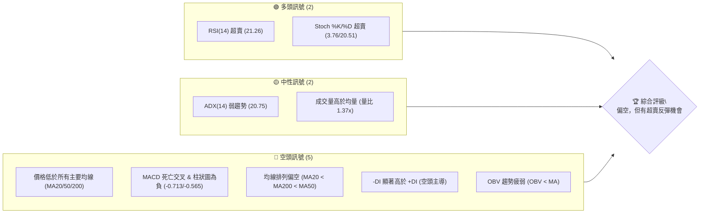
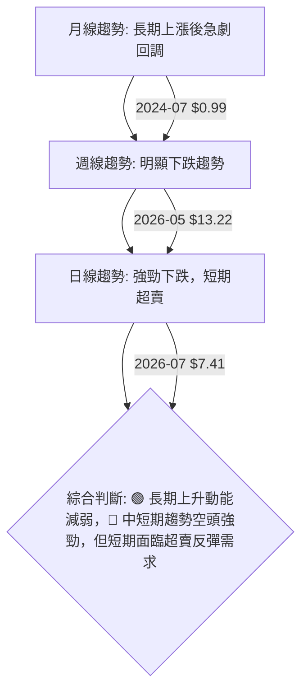
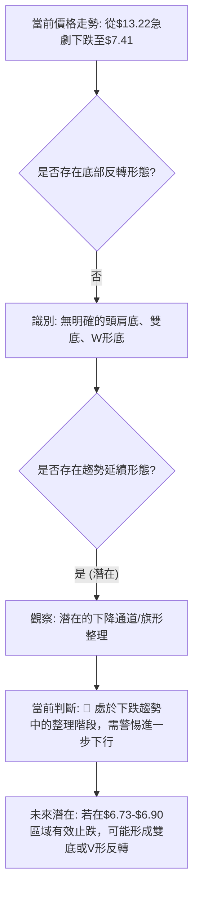
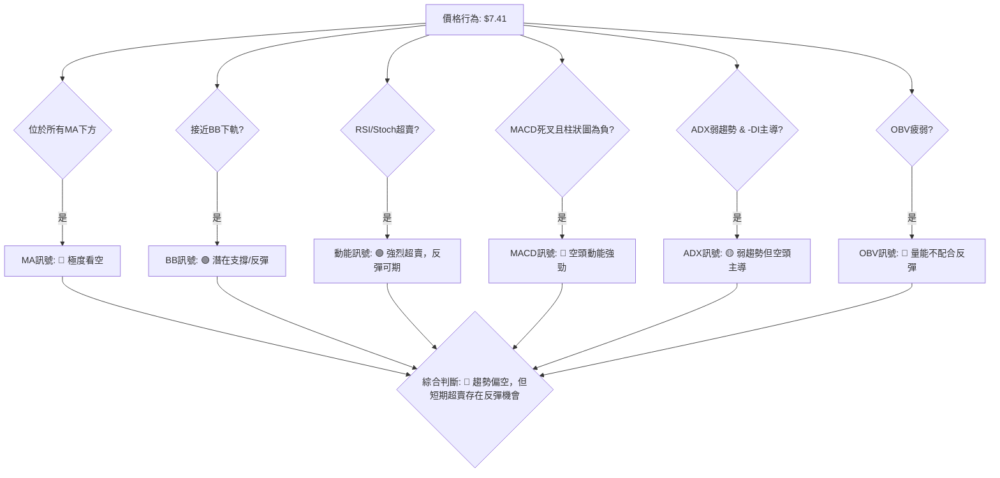
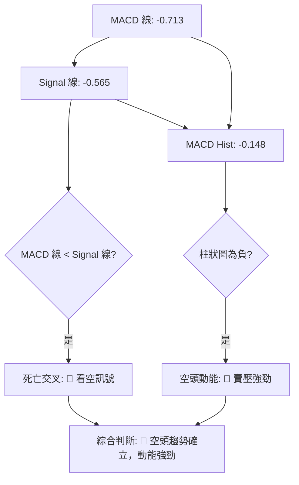

<details>
<summary>📊 靜態圖表 (點擊展開)</summary>

</details>

<html>
<head><meta charset="utf-8" /></head>
<body>
    <div style="height:500px; width:100%;">                        <script>window.PlotlyConfig = {MathJaxConfig: 'local'};</script>
        <script charset="utf-8" src="https://cdn.plot.ly/plotly-3.6.0.min.js" integrity="sha256-QaOVwtVY0T02VaHrr6pnoHLCwayMJp4O5n4YyaE3rJk=" crossorigin="anonymous"></script>                <div id="candlestick-chart" class="plotly-graph-div" style="height:100%; width:100%;"></div>            <script>                window.PLOTLYENV=window.PLOTLYENV || {};                                if (document.getElementById("candlestick-chart")) {                    Plotly.newPlot(                        "candlestick-chart",                        [{"close":{"dtype":"f8","bdata":"AAAAAClcGEAAAABgZmYYQAAAAGBmZhpAAAAAoEfhGkAAAACAPQodQAAAAMAehR9AAAAAYGZmHUAAAAAAAAAfQAAAAADXox5AAAAAQOF6H0AAAACgR+EeQAAAAKBwPR1AAAAAIIVrIkAAAACA69EjQAAAAIDrUSVAAAAAgBQuJkAAAADAHoUmQAAAAEDh+iRAAAAA4KNwIkAAAABguJ4lQAAAAIDr0SRAAAAAwB4FI0AAAABgZmYgQAAAAOCjcB5AAAAA4HoUH0AAAABgj8IcQAAAAIDC9RpAAAAAoHA9HEAAAABACtcdQAAAAGC4Hh5AAAAAwPUoG0AAAAAAAAAbQAAAAMD1KBlAAAAAYI\u002fCGUAAAACgmZkYQAAAAEAK1xdAAAAAAAAAGEAAAAAAAAAVQAAAAKBwPRdAAAAAwB6FF0AAAABAMzMXQAAAAIA9ChZAAAAAoHA9GkAAAADgUbgcQAAAAMAeBRlAAAAAAClcH0AAAAAAAAAeQAAAAOB6FBlAAAAA4KPwGkAAAADgo3AhQAAAAKBH4SBAAAAAQOF6IEAAAACgmZkfQAAAAIDrUR5AAAAAANcjIEAAAABACtchQAAAAKBHYSJAAAAAANcjIkAAAACAPQoiQAAAAIDCdSJAAAAAYGamIEAAAACAPQoiQAAAAAAAgCFAAAAAYI\u002fCHkAAAACAFC4gQAAAAEDheh1AAAAAQDMzH0AAAADgo3AiQAAAAIA9iiJAAAAAIIXrIUAAAABgj0IiQAAAAIDC9SBAAAAAIIXrIEAAAABA4fohQAAAAMAehSNAAAAAgD0KJkAAAAAgXA8pQAAAAIAUrilAAAAAAClcKEAAAADAHgUsQAAAAKBHYStAAAAAoEdhKkAAAAAgrscrQAAAAGC4HitAAAAAANejKUAAAACA61EoQAAAAGCPQipAAAAAoJkZKUAAAACgcD0pQAAAAEAKVyhAAAAAgOtRJkAAAADAHoUoQAAAAIA9iihAAAAAgD2KJkAAAADgUbgkQAAAACCuRyVAAAAAYI\u002fCJkAAAAAAKVwjQAAAAIDC9SBAAAAAoEdhI0AAAACAFK4kQAAAAAApXCNAAAAAgMJ1IkAAAADgo\u002fAhQAAAAGC4niJAAAAAoJkZJEAAAAAA1yMmQAAAACCuxyZAAAAAIFwPJEAAAACgR2EkQAAAAMDMzCRAAAAAoJmZJEAAAABgZuYkQAAAAMD1KCRAAAAAQApXJUAAAACAPQokQAAAAMAeBSVAAAAAQOH6JEAAAADA9agjQAAAAOCjcCNAAAAAwB4FJEAAAADA9agjQAAAAMD1qCRAAAAAgOtRJEAAAAAgXA8lQAAAACBcjyZAAAAAwPWoJUAAAAAAAIAlQAAAAGC4HiRAAAAAwMzMJUAAAAAAKVwlQAAAAGC4niRAAAAAoEfhIkAAAACgmZkhQAAAAMDMTCBAAAAA4HoUIkAAAABguJ4hQAAAAEAzMyNAAAAAgD0KI0AAAAAgXA8jQAAAAGBm5iJAAAAAIK5HIkAAAABgj0IiQAAAAOCj8CJAAAAAwMzMIkAAAAAgXA8kQAAAAGBmZiRAAAAAAAAAJEAAAACAwnUlQAAAAKBwvSVAAAAAYLgeJkAAAADgehQlQAAAAKCZGSVAAAAAYGbmJUAAAACAwvUkQAAAAEDh+iJAAAAA4HoUJEAAAAAA16MkQAAAAIDCdSNAAAAAwPWoIkAAAACAFK4iQAAAACCuxyFAAAAAYLgeIkAAAABACtciQAAAAOB6FCJAAAAA4FG4IUAAAAAghWsmQAAAAKBwPSVAAAAAYGZmI0AAAAAAAEAiQAAAAOBRuCJAAAAAAClcIkAAAABguB4iQAAAAIA9iiNAAAAAoJmZJUAAAAAAAIAqQAAAAOCjcCpAAAAAIIXrKkAAAADA9SgrQAAAAOBROCdAAAAA4KPwJ0AAAAAAKdwkQAAAAKCZmSRAAAAAwMxMI0AAAABguJ4iQAAAAMD1qCNAAAAAwPWoIkAAAADAHgUjQAAAACCFayJAAAAAoHA9IkAAAACAPYoiQAAAACCuxyFAAAAAIFwPIUAAAADgUbgeQAAAAEAzsx5AAAAAgOtRH0AAAACAPQogQAAAAEDheiBAAAAAgBSuH0AAAAAA16MdQA=="},"high":{"dtype":"f8","bdata":"AAAAYGZmGUAAAAAAAAAZQAAAACBcjxpAAAAAAClcG0AAAADgo3AdQAAAAKBwPSBAAAAAANcjIEAAAAAAKVwfQAAAACBcjx9AAAAAIIVrIUAAAABAClcgQAAAAMDMzB9AAAAAgBSuIkAAAAAgXI8kQAAAAGCPQidAAAAAQAoXJ0AAAABgZmYnQAAAACCuxyZAAAAAwB4FJUAAAACAFG4mQAAAAGC4HiVAAAAAoHC9JUAAAABgj0IjQAAAAIDrUSBAAAAAoEdhIEAAAAAA16MfQAAAAIA9Ch1AAAAAQDMzHUAAAABAClcgQAAAAKBHoSBAAAAAIFyPHkAAAADAzMwbQAAAAIDCdRpAAAAAAAAAGkAAAABgj8IaQAAAACCuRxpAAAAAAAAAGUAAAADgUbgXQAAAAOB6lBdAAAAAIFyPGUAAAACgR2EYQAAAAMD1qBhAAAAAAClcHUAAAADgo3AfQAAAACBcDx5AAAAAgBSuH0AAAACA6xEgQAAAAKBH4R9AAAAAYGZmG0AAAACgmZkhQAAAAGCPwiFAAAAAAClcIUAAAADAIPAgQAAAAADXIyBAAAAAoJkZIUAAAACAwjUiQAAAAIAUriJAAAAAoJmZIkAAAAAAAIAjQAAAAOBRuCNAAAAAQOE6IkAAAADA9SgiQAAAAGBmJiNAAAAAQOF6IUAAAAAA12MgQAAAAGC4HiFAAAAAYJGtIEAAAABA4XoiQAAAAIDrUSNAAAAAgBSuI0AAAABgZmYiQAAAAEAKVyJAAAAAQApXIUAAAACgmZkiQAAAACBcDyVAAAAAYLgeJkAAAADgehQpQAAAAAAp3ClAAAAAgD0KKkAAAAAA1yMuQAAAAEAzMy5AAAAAIFyPLkAAAAAAAAAtQAAAAAAAgCtAAAAAANcjLEAAAAAAAIAsQAAAAGBmZixAAAAAwPWoLEAAAADA9agqQAAAAEDhuilAAAAAIIWrKEAAAADgo\u002fAoQAAAAMD1KCpAAAAAIFyPKEAAAABgZuYmQAAAAGBmZiZAAAAAQArXJkAAAACAPcomQAAAACBcDyNAAAAAwB6FI0AAAAAgrkclQAAAAKBH4SRAAAAAQArXI0AAAACgxosiQAAAAAApXCNAAAAAANejJEAAAABAClcmQAAAAIAULidAAAAAwPUoJ0AAAAAA1yMlQAAAAIDC9SRAAAAAoEfhJUAAAAAgXI8lQAAAAAApXCRAAAAAQArXKEAAAAAAAAAmQAAAAADXoyVAAAAAQArXJUAAAADgUTgnQAAAACBcDyRAAAAAYGbmJEAAAABguB4lQAAAAIAUriVAAAAAgML1JUAAAACgcL0lQAAAAOCj8CZAAAAAwB6FJ0AAAACAwvUlQAAAAMD1qCVAAAAA4KPwJUAAAACgcL0mQAAAACCuRyZAAAAAIK5HJEAAAACgcL0iQAAAAADXoyFAAAAAIK5HIkAAAABAM7MiQAAAAGCPQiNAAAAAwMzMI0AAAACgR2EjQAAAAKBwvSRAAAAAgD0KI0AAAADgUbgiQAAAACCFKyNAAAAA4FG4I0AAAAAgXA8kQAAAACCuxyRAAAAAIFwPJUAAAABguB4mQAAAAOB6lCZAAAAA4FE4J0AAAADgo\u002fAlQAAAAIA9iiVAAAAAYLgeJkAAAAAA1yMmQAAAAAAp3CRAAAAAgOtRJEAAAABguB4lQAAAAEDhuiRAAAAA4HqUI0AAAAAghesiQAAAAAAAgCJAAAAAgBQuIkAAAADAzEwjQAAAAEAzsyJAAAAAAClcIkAAAACAwnUnQAAAAKBwPShAAAAAQApXJUAAAABgj8IjQAAAAOB6FCNAAAAAYI\u002fCIkAAAACgRyEjQAAAAMAehSRAAAAAYLgeJkAAAAAgXI8rQAAAAIDr0SpAAAAAgOvRK0AAAACA61EsQAAAAAAAACpAAAAAQArXKEAAAACA61EnQAAAAIAUriVAAAAAgOvRJEAAAACAwvUjQAAAAKBDyyNAAAAAQInBI0AAAADgo\u002fAjQAAAAEDheiNAAAAAAAAAI0AAAAAghesiQAAAACCF6yJAAAAAACncIUAAAAAAAAAhQAAAAGCPwh9AAAAAACncH0AAAADgo3AgQAAAAMDMTCFAAAAAoEfhIEAAAABgZuYgQA=="},"hovertemplate":"\u003cb\u003e%{x|%Y-%m-%d}\u003c\u002fb\u003e\u003cbr\u003e\u958b: $%{open:.2f}\u003cbr\u003e\u9ad8: $%{high:.2f}\u003cbr\u003e\u4f4e: $%{low:.2f}\u003cbr\u003e\u6536: $%{close:.2f}\u003cextra\u003e\u003c\u002fextra\u003e","low":{"dtype":"f8","bdata":"AAAAgBSuF0AAAAAAAAAXQAAAAIA9ChhAAAAAgBSuGUAAAACA61EaQAAAACCF6xxAAAAAAAAAHUAAAADA9SgbQAAAAOCjcB1AAAAAQDMzH0AAAAAgrkceQAAAAOBRuBxAAAAAANejHkAAAACgR2EiQAAAAIA9iiRAAAAAYGbmJEAAAABgDm0lQAAAAAAAwCRAAAAAoEdhIkAAAAAgsl0jQAAAAGCPwiNAAAAAgOtRIkAAAACAFK4fQAAAAOBROB5AAAAAgOtRHUAAAAAAAIAcQAAAAAAp3BlAAAAAoJmZGkAAAABguJ4dQAAAAOB6FB5AAAAAANejGkAAAADgehQaQAAAAIDr0RhAAAAAQOF6GEAAAABguB4XQAAAAOB6FBdAAAAAgOtRF0AAAAAAKdwUQAAAAMDMzBNAAAAA4HoUF0AAAABgZmYWQAAAACCF6xVAAAAAoHA9GUAAAABgZmYYQAAAACCF6xdAAAAAoJmZGEAAAACAPQodQAAAAAAAABlAAAAA4FG4F0AAAACAFK4aQAAAAADXIyBAAAAAoHC9HkAAAABAMzMfQAAAAKBH4R1AAAAAIK5HHUAAAABACtcdQAAAAIA9CiFAAAAAwPUoIUAAAADgo\u002fAhQAAAAOBROCFAAAAAACmcIEAAAACgcD0gQAAAAIDr0SBAAAAAoHA9HkAAAAAAKVweQAAAAGC4Hh1AAAAAgML1HkAAAADgo3AfQAAAACBcTyJAAAAAQApXIUAAAABAM7MhQAAAAAAp3CBAAAAAIIVrIEAAAADA9aggQAAAAEAKVyJAAAAAgOvRI0AAAABA4folQAAAACCF6ydAAAAA4FE4KEAAAADAzEwqQAAAAIAULitAAAAAwPWoKUAAAAAghespQAAAAEAK1ylAAAAAoJmZKUAAAACgcD0oQAAAAKCZmSdAAAAAACncJ0AAAABAM7MoQAAAAKBH4SdAAAAAYGbmJUAAAACAFC4mQAAAAGC4HihAAAAAANcjJkAAAAAgrkckQAAAAMDMTCRAAAAAwB4FJUAAAABgj0IiQAAAAADXoyBAAAAAYGbmIEAAAABAClcjQAAAAEAzMyNAAAAAYI\u002fCIUAAAABgZmYhQAAAAADXoyFAAAAAoHC9IUAAAABA4fojQAAAAEDheiVAAAAAYGbmI0AAAADgUbgjQAAAAIDC9SJAAAAAgD2KJEAAAABgZuYjQAAAAKBwPSNAAAAAoJmZJEAAAADAHoUjQAAAAAAp3CNAAAAAYLgeJEAAAADAHoUjQAAAAGBmZiJAAAAAYGYmI0AAAAAAAAAjQAAAAKCZmSNAAAAAoJkZJEAAAADgUTgkQAAAAKBwvSRAAAAAANejJUAAAACgcD0kQAAAAIDCdSNAAAAAgBTuI0AAAABAM\u002fMkQAAAAIDCdSRAAAAAgD2KIkAAAADA9WghQAAAAGC4Hh9AAAAAYGZmIEAAAAAgXI8hQAAAACCF6yBAAAAAYI\u002fCIkAAAADgTWIiQAAAAIAUriJAAAAAwB4FIkAAAABA4fohQAAAAIDCdSFAAAAAoJmZIkAAAACgcL0iQAAAAMAehSNAAAAAgD2KI0AAAACA61EjQAAAACCuRyVAAAAAQDOzJUAAAABAMzMkQAAAAEDhOiRAAAAAIIVrJEAAAAAghaskQAAAAIDr0SJAAAAAYLieIkAAAACgcD0jQAAAAEAKVyNAAAAAgOtRIkAAAACAPQoiQAAAACBcjyFAAAAAwMxMIUAAAADgo3AhQAAAAKCZmSFAAAAAQApXIUAAAABAMzMjQAAAAAAAACVAAAAAIIXrIkAAAADgo\u002fAhQAAAAKBwPSJAAAAAgML1IUAAAABguB4iQAAAACCynSJAAAAAAClcI0AAAADgo3AmQAAAAEAzMydAAAAAoJmZKUAAAACAFC4qQAAAACBcDydAAAAAYLgeJkAAAADA9agkQAAAAAAAgCRAAAAA4HoUIkAAAACgmZkiQAAAAMAehSJAAAAAAClcIkAAAACgmdkiQAAAACCuRyJAAAAAwPUoIkAAAABACtchQAAAACBcjyFAAAAAAAAAIUAAAAAgXI8eQAAAAKBwPR1AAAAAAAAAHkAAAACgmZkeQAAAAMAeBSBAAAAAYGZmH0AAAABA4XodQA=="},"name":"\u50f9\u683c","open":{"dtype":"f8","bdata":"AAAAIK5HGUAAAACgcD0YQAAAAGC4HhlAAAAAQDMzGkAAAAAgrkcbQAAAACBcDx5AAAAAgML1H0AAAADAHgUcQAAAACCuxx5AAAAAQArXH0AAAADgUbgfQAAAAAAAAB9AAAAAQDMzH0AAAADAHgUjQAAAAGC4HiVAAAAAAAAAJkAAAAAgrocmQAAAACCuRyZAAAAAgML1JEAAAAAgXA8kQAAAAGCPwiRAAAAAYGamJUAAAABgj0IjQAAAAMDMzB9AAAAAYLgeIEAAAADgUbgeQAAAAGBmZhtAAAAAYGZmG0AAAACAFK4eQAAAAGC4XiBAAAAA4HoUHkAAAADgepQbQAAAAIDC9RlAAAAAAAAAGUAAAADAzEwaQAAAAGC4HhdAAAAAIIXrF0AAAACAFK4XQAAAAMD1KBRAAAAAQOF6GUAAAABgZmYXQAAAAOCj8BdAAAAAIK5HGUAAAADA9agYQAAAAIA9Ch5AAAAAYLieGEAAAAAAKdwdQAAAAIAUrh9AAAAAoHA9GkAAAAAA1yMbQAAAAIDC9SBAAAAA4FE4IUAAAAAgXI8gQAAAAMAehR9AAAAA4FG4HkAAAAAgrscgQAAAAMAeRSFAAAAAACncIUAAAABACpciQAAAAEAK1yFAAAAA4FE4IkAAAABA4fogQAAAAIDC9SFAAAAAAClcIUAAAABA4XoeQAAAACCuRyBAAAAAwPUoH0AAAACAwvUfQAAAAKCZmSJAAAAAIFwPIkAAAACAwvUhQAAAAOAkRiJAAAAAoJmZIEAAAAAghesgQAAAACBcjyJAAAAAwB5FJEAAAACgmZkmQAAAAEAzMyhAAAAAYGZmKUAAAADA9WgqQAAAAAAAACxAAAAAIIVrK0AAAAAAAAArQAAAAKBHYStAAAAAANcjK0AAAADgetQqQAAAAIDCtSdAAAAAoJmZK0AAAADAHgUpQAAAACCFaylAAAAAwMxMKEAAAAAghWsmQAAAAIDC9SlAAAAAIK5HKEAAAAAAAIAmQAAAAGC4niVAAAAAwB4FJkAAAABgj8ImQAAAAIAUriJAAAAAgBTuIUAAAAAAKZwjQAAAAIAULiRAAAAAwB7FI0AAAACgcH0iQAAAAIA9iiJAAAAA4FF4IkAAAAAghWskQAAAAADXoyVAAAAAoEdhJkAAAAAAKdwjQAAAAMAeBSRAAAAAYI9CJUAAAADAzEwkQAAAAIAULiRAAAAAAAAAJUAAAACgR2ElQAAAAOBRuCRAAAAAQOH6JEAAAAAAAIAkQAAAACBcDyRAAAAAgBSuI0AAAACgmRkkQAAAACCFKyRAAAAAACncJEAAAACgcL0kQAAAAKCZGSVAAAAAAADAJkAAAABguF4lQAAAAOB6lCVAAAAA4HqUJEAAAACA69ElQAAAAGCPwiVAAAAAoJkZJEAAAABAM7MiQAAAAGC4niFAAAAAYGbmIEAAAACgmZkiQAAAACCuByFAAAAAYI9CI0AAAAAAKdwiQAAAAEAKVyRAAAAA4HrUIkAAAACAwnUiQAAAAMAeBSJAAAAA4KNwI0AAAADAHgUjQAAAAAAAgCRAAAAAYI\u002fCJEAAAACgmZkjQAAAAMDMzCVAAAAAgD2KJkAAAABgj8IlQAAAAGCPQiVAAAAAwEu3JEAAAAAA12MlQAAAAGCPwiRAAAAAAAAAI0AAAAAAAAAkQAAAAMDMTCRAAAAAIFyPI0AAAAAAAIAiQAAAAAAAgCJAAAAAAAAAIkAAAABACtchQAAAAOBReCJAAAAAQArXIUAAAABA4fojQAAAAIDr0SVAAAAAYI9CJUAAAABgZqYjQAAAAAAAgCJAAAAAIFyPIkAAAAAghWsiQAAAACCFqyJAAAAAAAAAJEAAAABAM\u002fMmQAAAAAAAgClAAAAAoHB9KkAAAACgcD0rQAAAACCF6ylAAAAAgML1JkAAAABACtcmQAAAAMD1qCVAAAAAIIWrJEAAAACgR2EjQAAAAGBmpiJAAAAAQAqXI0AAAABAM7MjQAAAAIDr0SJAAAAAoHB9IkAAAACA69EiQAAAAIDCtSJAAAAAYLheIUAAAACAwvUgQAAAAKBwvR9AAAAAIFwPHkAAAAAgrkcgQAAAAOCj8CBAAAAAANcjIEAAAABgj8IfQA=="},"x":["2025-09-16T00:00:00-04:00","2025-09-17T00:00:00-04:00","2025-09-18T00:00:00-04:00","2025-09-19T00:00:00-04:00","2025-09-22T00:00:00-04:00","2025-09-23T00:00:00-04:00","2025-09-24T00:00:00-04:00","2025-09-25T00:00:00-04:00","2025-09-26T00:00:00-04:00","2025-09-29T00:00:00-04:00","2025-09-30T00:00:00-04:00","2025-10-01T00:00:00-04:00","2025-10-02T00:00:00-04:00","2025-10-03T00:00:00-04:00","2025-10-06T00:00:00-04:00","2025-10-07T00:00:00-04:00","2025-10-08T00:00:00-04:00","2025-10-09T00:00:00-04:00","2025-10-10T00:00:00-04:00","2025-10-13T00:00:00-04:00","2025-10-14T00:00:00-04:00","2025-10-15T00:00:00-04:00","2025-10-16T00:00:00-04:00","2025-10-17T00:00:00-04:00","2025-10-20T00:00:00-04:00","2025-10-21T00:00:00-04:00","2025-10-22T00:00:00-04:00","2025-10-23T00:00:00-04:00","2025-10-24T00:00:00-04:00","2025-10-27T00:00:00-04:00","2025-10-28T00:00:00-04:00","2025-10-29T00:00:00-04:00","2025-10-30T00:00:00-04:00","2025-10-31T00:00:00-04:00","2025-11-03T00:00:00-05:00","2025-11-04T00:00:00-05:00","2025-11-05T00:00:00-05:00","2025-11-06T00:00:00-05:00","2025-11-07T00:00:00-05:00","2025-11-10T00:00:00-05:00","2025-11-11T00:00:00-05:00","2025-11-12T00:00:00-05:00","2025-11-13T00:00:00-05:00","2025-11-14T00:00:00-05:00","2025-11-17T00:00:00-05:00","2025-11-18T00:00:00-05:00","2025-11-19T00:00:00-05:00","2025-11-20T00:00:00-05:00","2025-11-21T00:00:00-05:00","2025-11-24T00:00:00-05:00","2025-11-25T00:00:00-05:00","2025-11-26T00:00:00-05:00","2025-11-28T00:00:00-05:00","2025-12-01T00:00:00-05:00","2025-12-02T00:00:00-05:00","2025-12-03T00:00:00-05:00","2025-12-04T00:00:00-05:00","2025-12-05T00:00:00-05:00","2025-12-08T00:00:00-05:00","2025-12-09T00:00:00-05:00","2025-12-10T00:00:00-05:00","2025-12-11T00:00:00-05:00","2025-12-12T00:00:00-05:00","2025-12-15T00:00:00-05:00","2025-12-16T00:00:00-05:00","2025-12-17T00:00:00-05:00","2025-12-18T00:00:00-05:00","2025-12-19T00:00:00-05:00","2025-12-22T00:00:00-05:00","2025-12-23T00:00:00-05:00","2025-12-24T00:00:00-05:00","2025-12-26T00:00:00-05:00","2025-12-29T00:00:00-05:00","2025-12-30T00:00:00-05:00","2025-12-31T00:00:00-05:00","2026-01-02T00:00:00-05:00","2026-01-05T00:00:00-05:00","2026-01-06T00:00:00-05:00","2026-01-07T00:00:00-05:00","2026-01-08T00:00:00-05:00","2026-01-09T00:00:00-05:00","2026-01-12T00:00:00-05:00","2026-01-13T00:00:00-05:00","2026-01-14T00:00:00-05:00","2026-01-15T00:00:00-05:00","2026-01-16T00:00:00-05:00","2026-01-20T00:00:00-05:00","2026-01-21T00:00:00-05:00","2026-01-22T00:00:00-05:00","2026-01-23T00:00:00-05:00","2026-01-26T00:00:00-05:00","2026-01-27T00:00:00-05:00","2026-01-28T00:00:00-05:00","2026-01-29T00:00:00-05:00","2026-01-30T00:00:00-05:00","2026-02-02T00:00:00-05:00","2026-02-03T00:00:00-05:00","2026-02-04T00:00:00-05:00","2026-02-05T00:00:00-05:00","2026-02-06T00:00:00-05:00","2026-02-09T00:00:00-05:00","2026-02-10T00:00:00-05:00","2026-02-11T00:00:00-05:00","2026-02-12T00:00:00-05:00","2026-02-13T00:00:00-05:00","2026-02-17T00:00:00-05:00","2026-02-18T00:00:00-05:00","2026-02-19T00:00:00-05:00","2026-02-20T00:00:00-05:00","2026-02-23T00:00:00-05:00","2026-02-24T00:00:00-05:00","2026-02-25T00:00:00-05:00","2026-02-26T00:00:00-05:00","2026-02-27T00:00:00-05:00","2026-03-02T00:00:00-05:00","2026-03-03T00:00:00-05:00","2026-03-04T00:00:00-05:00","2026-03-05T00:00:00-05:00","2026-03-06T00:00:00-05:00","2026-03-09T00:00:00-04:00","2026-03-10T00:00:00-04:00","2026-03-11T00:00:00-04:00","2026-03-12T00:00:00-04:00","2026-03-13T00:00:00-04:00","2026-03-16T00:00:00-04:00","2026-03-17T00:00:00-04:00","2026-03-18T00:00:00-04:00","2026-03-19T00:00:00-04:00","2026-03-20T00:00:00-04:00","2026-03-23T00:00:00-04:00","2026-03-24T00:00:00-04:00","2026-03-25T00:00:00-04:00","2026-03-26T00:00:00-04:00","2026-03-27T00:00:00-04:00","2026-03-30T00:00:00-04:00","2026-03-31T00:00:00-04:00","2026-04-01T00:00:00-04:00","2026-04-02T00:00:00-04:00","2026-04-06T00:00:00-04:00","2026-04-07T00:00:00-04:00","2026-04-08T00:00:00-04:00","2026-04-09T00:00:00-04:00","2026-04-10T00:00:00-04:00","2026-04-13T00:00:00-04:00","2026-04-14T00:00:00-04:00","2026-04-15T00:00:00-04:00","2026-04-16T00:00:00-04:00","2026-04-17T00:00:00-04:00","2026-04-20T00:00:00-04:00","2026-04-21T00:00:00-04:00","2026-04-22T00:00:00-04:00","2026-04-23T00:00:00-04:00","2026-04-24T00:00:00-04:00","2026-04-27T00:00:00-04:00","2026-04-28T00:00:00-04:00","2026-04-29T00:00:00-04:00","2026-04-30T00:00:00-04:00","2026-05-01T00:00:00-04:00","2026-05-04T00:00:00-04:00","2026-05-05T00:00:00-04:00","2026-05-06T00:00:00-04:00","2026-05-07T00:00:00-04:00","2026-05-08T00:00:00-04:00","2026-05-11T00:00:00-04:00","2026-05-12T00:00:00-04:00","2026-05-13T00:00:00-04:00","2026-05-14T00:00:00-04:00","2026-05-15T00:00:00-04:00","2026-05-18T00:00:00-04:00","2026-05-19T00:00:00-04:00","2026-05-20T00:00:00-04:00","2026-05-21T00:00:00-04:00","2026-05-22T00:00:00-04:00","2026-05-26T00:00:00-04:00","2026-05-27T00:00:00-04:00","2026-05-28T00:00:00-04:00","2026-05-29T00:00:00-04:00","2026-06-01T00:00:00-04:00","2026-06-02T00:00:00-04:00","2026-06-03T00:00:00-04:00","2026-06-04T00:00:00-04:00","2026-06-05T00:00:00-04:00","2026-06-08T00:00:00-04:00","2026-06-09T00:00:00-04:00","2026-06-10T00:00:00-04:00","2026-06-11T00:00:00-04:00","2026-06-12T00:00:00-04:00","2026-06-15T00:00:00-04:00","2026-06-16T00:00:00-04:00","2026-06-17T00:00:00-04:00","2026-06-18T00:00:00-04:00","2026-06-22T00:00:00-04:00","2026-06-23T00:00:00-04:00","2026-06-24T00:00:00-04:00","2026-06-25T00:00:00-04:00","2026-06-26T00:00:00-04:00","2026-06-29T00:00:00-04:00","2026-06-30T00:00:00-04:00","2026-07-01T00:00:00-04:00","2026-07-02T00:00:00-04:00"],"type":"candlestick"},{"hovertemplate":"MA30: $%{y:.2f}\u003cextra\u003e\u003c\u002fextra\u003e","line":{"color":"#2196F3","dash":"dash","width":2},"mode":"lines","name":"MA30","x":["2025-09-16T00:00:00-04:00","2025-09-17T00:00:00-04:00","2025-09-18T00:00:00-04:00","2025-09-19T00:00:00-04:00","2025-09-22T00:00:00-04:00","2025-09-23T00:00:00-04:00","2025-09-24T00:00:00-04:00","2025-09-25T00:00:00-04:00","2025-09-26T00:00:00-04:00","2025-09-29T00:00:00-04:00","2025-09-30T00:00:00-04:00","2025-10-01T00:00:00-04:00","2025-10-02T00:00:00-04:00","2025-10-03T00:00:00-04:00","2025-10-06T00:00:00-04:00","2025-10-07T00:00:00-04:00","2025-10-08T00:00:00-04:00","2025-10-09T00:00:00-04:00","2025-10-10T00:00:00-04:00","2025-10-13T00:00:00-04:00","2025-10-14T00:00:00-04:00","2025-10-15T00:00:00-04:00","2025-10-16T00:00:00-04:00","2025-10-17T00:00:00-04:00","2025-10-20T00:00:00-04:00","2025-10-21T00:00:00-04:00","2025-10-22T00:00:00-04:00","2025-10-23T00:00:00-04:00","2025-10-24T00:00:00-04:00","2025-10-27T00:00:00-04:00","2025-10-28T00:00:00-04:00","2025-10-29T00:00:00-04:00","2025-10-30T00:00:00-04:00","2025-10-31T00:00:00-04:00","2025-11-03T00:00:00-05:00","2025-11-04T00:00:00-05:00","2025-11-05T00:00:00-05:00","2025-11-06T00:00:00-05:00","2025-11-07T00:00:00-05:00","2025-11-10T00:00:00-05:00","2025-11-11T00:00:00-05:00","2025-11-12T00:00:00-05:00","2025-11-13T00:00:00-05:00","2025-11-14T00:00:00-05:00","2025-11-17T00:00:00-05:00","2025-11-18T00:00:00-05:00","2025-11-19T00:00:00-05:00","2025-11-20T00:00:00-05:00","2025-11-21T00:00:00-05:00","2025-11-24T00:00:00-05:00","2025-11-25T00:00:00-05:00","2025-11-26T00:00:00-05:00","2025-11-28T00:00:00-05:00","2025-12-01T00:00:00-05:00","2025-12-02T00:00:00-05:00","2025-12-03T00:00:00-05:00","2025-12-04T00:00:00-05:00","2025-12-05T00:00:00-05:00","2025-12-08T00:00:00-05:00","2025-12-09T00:00:00-05:00","2025-12-10T00:00:00-05:00","2025-12-11T00:00:00-05:00","2025-12-12T00:00:00-05:00","2025-12-15T00:00:00-05:00","2025-12-16T00:00:00-05:00","2025-12-17T00:00:00-05:00","2025-12-18T00:00:00-05:00","2025-12-19T00:00:00-05:00","2025-12-22T00:00:00-05:00","2025-12-23T00:00:00-05:00","2025-12-24T00:00:00-05:00","2025-12-26T00:00:00-05:00","2025-12-29T00:00:00-05:00","2025-12-30T00:00:00-05:00","2025-12-31T00:00:00-05:00","2026-01-02T00:00:00-05:00","2026-01-05T00:00:00-05:00","2026-01-06T00:00:00-05:00","2026-01-07T00:00:00-05:00","2026-01-08T00:00:00-05:00","2026-01-09T00:00:00-05:00","2026-01-12T00:00:00-05:00","2026-01-13T00:00:00-05:00","2026-01-14T00:00:00-05:00","2026-01-15T00:00:00-05:00","2026-01-16T00:00:00-05:00","2026-01-20T00:00:00-05:00","2026-01-21T00:00:00-05:00","2026-01-22T00:00:00-05:00","2026-01-23T00:00:00-05:00","2026-01-26T00:00:00-05:00","2026-01-27T00:00:00-05:00","2026-01-28T00:00:00-05:00","2026-01-29T00:00:00-05:00","2026-01-30T00:00:00-05:00","2026-02-02T00:00:00-05:00","2026-02-03T00:00:00-05:00","2026-02-04T00:00:00-05:00","2026-02-05T00:00:00-05:00","2026-02-06T00:00:00-05:00","2026-02-09T00:00:00-05:00","2026-02-10T00:00:00-05:00","2026-02-11T00:00:00-05:00","2026-02-12T00:00:00-05:00","2026-02-13T00:00:00-05:00","2026-02-17T00:00:00-05:00","2026-02-18T00:00:00-05:00","2026-02-19T00:00:00-05:00","2026-02-20T00:00:00-05:00","2026-02-23T00:00:00-05:00","2026-02-24T00:00:00-05:00","2026-02-25T00:00:00-05:00","2026-02-26T00:00:00-05:00","2026-02-27T00:00:00-05:00","2026-03-02T00:00:00-05:00","2026-03-03T00:00:00-05:00","2026-03-04T00:00:00-05:00","2026-03-05T00:00:00-05:00","2026-03-06T00:00:00-05:00","2026-03-09T00:00:00-04:00","2026-03-10T00:00:00-04:00","2026-03-11T00:00:00-04:00","2026-03-12T00:00:00-04:00","2026-03-13T00:00:00-04:00","2026-03-16T00:00:00-04:00","2026-03-17T00:00:00-04:00","2026-03-18T00:00:00-04:00","2026-03-19T00:00:00-04:00","2026-03-20T00:00:00-04:00","2026-03-23T00:00:00-04:00","2026-03-24T00:00:00-04:00","2026-03-25T00:00:00-04:00","2026-03-26T00:00:00-04:00","2026-03-27T00:00:00-04:00","2026-03-30T00:00:00-04:00","2026-03-31T00:00:00-04:00","2026-04-01T00:00:00-04:00","2026-04-02T00:00:00-04:00","2026-04-06T00:00:00-04:00","2026-04-07T00:00:00-04:00","2026-04-08T00:00:00-04:00","2026-04-09T00:00:00-04:00","2026-04-10T00:00:00-04:00","2026-04-13T00:00:00-04:00","2026-04-14T00:00:00-04:00","2026-04-15T00:00:00-04:00","2026-04-16T00:00:00-04:00","2026-04-17T00:00:00-04:00","2026-04-20T00:00:00-04:00","2026-04-21T00:00:00-04:00","2026-04-22T00:00:00-04:00","2026-04-23T00:00:00-04:00","2026-04-24T00:00:00-04:00","2026-04-27T00:00:00-04:00","2026-04-28T00:00:00-04:00","2026-04-29T00:00:00-04:00","2026-04-30T00:00:00-04:00","2026-05-01T00:00:00-04:00","2026-05-04T00:00:00-04:00","2026-05-05T00:00:00-04:00","2026-05-06T00:00:00-04:00","2026-05-07T00:00:00-04:00","2026-05-08T00:00:00-04:00","2026-05-11T00:00:00-04:00","2026-05-12T00:00:00-04:00","2026-05-13T00:00:00-04:00","2026-05-14T00:00:00-04:00","2026-05-15T00:00:00-04:00","2026-05-18T00:00:00-04:00","2026-05-19T00:00:00-04:00","2026-05-20T00:00:00-04:00","2026-05-21T00:00:00-04:00","2026-05-22T00:00:00-04:00","2026-05-26T00:00:00-04:00","2026-05-27T00:00:00-04:00","2026-05-28T00:00:00-04:00","2026-05-29T00:00:00-04:00","2026-06-01T00:00:00-04:00","2026-06-02T00:00:00-04:00","2026-06-03T00:00:00-04:00","2026-06-04T00:00:00-04:00","2026-06-05T00:00:00-04:00","2026-06-08T00:00:00-04:00","2026-06-09T00:00:00-04:00","2026-06-10T00:00:00-04:00","2026-06-11T00:00:00-04:00","2026-06-12T00:00:00-04:00","2026-06-15T00:00:00-04:00","2026-06-16T00:00:00-04:00","2026-06-17T00:00:00-04:00","2026-06-18T00:00:00-04:00","2026-06-22T00:00:00-04:00","2026-06-23T00:00:00-04:00","2026-06-24T00:00:00-04:00","2026-06-25T00:00:00-04:00","2026-06-26T00:00:00-04:00","2026-06-29T00:00:00-04:00","2026-06-30T00:00:00-04:00","2026-07-01T00:00:00-04:00","2026-07-02T00:00:00-04:00"],"y":{"dtype":"f8","bdata":"AAAAAAAA+H8AAAAAAAD4fwAAAAAAAPh\u002fAAAAAAAA+H8AAAAAAAD4fwAAAAAAAPh\u002fAAAAAAAA+H8AAAAAAAD4fwAAAAAAAPh\u002fAAAAAAAA+H8AAAAAAAD4fwAAAAAAAPh\u002fAAAAAAAA+H8AAAAAAAD4fwAAAAAAAPh\u002fAAAAAAAA+H8AAAAAAAD4fwAAAAAAAPh\u002fAAAAAAAA+H8AAAAAAAD4fwAAAAAAAPh\u002fAAAAAAAA+H8AAAAAAAD4fwAAAAAAAPh\u002fAAAAAAAA+H8AAAAAAAD4fwAAAAAAAPh\u002fAAAAAAAA+H8AAAAAAAD4f0REROwKkCBAzczMRP2bIECamZkpFacgQImIiMDKoSBAIiIiagOdIEAAAADAEYogQERERCRNaSBA7+7u5kJSIEBEREQ8mCcgQGZmZnYFCCBAq6qqCh7MH0BERETUlIofQBERETEkTR9AMzMzI7DyHkCJiIgIgZUeQO\u002fu7o4l\u002fx1AAAAAoDaQHUDe3d093w8dQCIiIlLUfxxA7+7uDgIrHEC8u7tbq+MbQLy7uzttoBtAzczMzBN1G0DNzMxc1mobQHd3dzfQaRtAd3d3pw10G0AAAACgGq8bQM3MzAy7AhxAIiIislZHHEAAAAAwlnwcQCIiIgKdthxAq6qqCgLrHEC8u7ubfTgdQKuqqmp1jB1AVVVVFSC3HUAAAAAQWPkdQERERNR4KR5AiYiIeOlmHkDNzMzca+4eQO\u002fu7s6FZB9AIiIiQqfNH0Dv7u6eqB8gQO\u002fu7r5YUiBAERER+cVyIEC8u7v7qZEgQAAAAJB7zSBAIiIiMsEDIUCamZmZmVkhQGZmZl66ySFAAAAA8KcmIkDNzMxM8IAiQGZmZuaJ2iJAd3d3xwQvI0BVVVV9P5UjQKuqqoJO+yNAvLu7k19MJEAiIiJaq4MkQCIiInrpxiRAzczM1E0CJUAAAAB4vj8lQO\u002fu7obrcSVAzczM1E2iJUAzMzObmdklQBEREbmsFSZAvLu7+8VSJkAzMzPDg3kmQM3MzJxSsSZA7+7u3mvuJkBERESkRfYmQDMzMxPK6CZA3t3dfT\u002f1JkAAAAAQ5gknQCIiIvJgHidAAAAAIIUrJ0Dv7u6+LSsnQKuqqqp\u002fIydAvLu7q\u002fESJ0BVVVXVBvomQAAAALBH4SZAERERMZa8JkCrqqpaZHsmQAAAACA+QyZAZmZmhusRJkDv7u7uNdclQERERJTRmyVAZmZmFiB3JUCamZlJmlIlQFVVVVXjJSVA3t3dDbsCJUC8u7tbHdMkQFVVVSVNqSRAiYiIuKyVJEAzMzPjM2wkQFVVVeUXSyRAq6qqOiY4JECJiIj4DDskQLy7uyv5RSRA7+7uLpY8JEBVVVUV2U4kQGZmZjbQaSRAiYiIyHZ+JEBERERERIQkQHd3d8cEjyRAiYiISJqSJECrqqqKs48kQLy7u2vneyRAmpmZqapqJEAzMzOTGEQkQCIiIvKLJSRAmpmZudccJEBEREQklBEkQHd3d4ddASRAmpmZaZHtI0Dv7u4+CtcjQN7d3R2hzCNAZmZmZvS2I0BmZmYWILcjQM3MzKzVsSNAVVVV1XipI0De3d391LgjQKuqqmp1zCNAAAAA8GDeI0CamZn5fuojQLy7uytA7iNAvLu7u7v7I0B3d3dH4fojQGZmZqZU3CNAZmZmFtnOI0AzMzNjgscjQHd3d5fgwSNAiYiIKBWnI0C8u7ubNpAjQImIiIj6dyNAq6qqSn5xI0DNzMwcE3wjQFVVVZVDiyNAZmZmJjGII0CJiIjoJrEjQKuqqlqPwiNAiYiIyKHFI0AAAABQuL4jQImIiBgvvSNAvLu72929I0BmZmYGrLwjQO\u002fu7r7KwSNAERERca\u002fZI0BmZmbWoxAkQLy7u2suRCRAREREZDt\u002fJEC8u7s7368kQHd3d1eAvCRAERERMQjMJECJiIiYJ8okQERERFTjxSRAq6qqirOvJEDNzMy8u5skQImIiDiJoSRA7+7uLmuVJEDe3d09mIckQERERFS4fiRAMzMz0yJ7JEDe3d398HkkQN7d3f3weSRAIiIiYuVwJEDNzMw0M1MkQGZmZm7nOyRAMzMzS1MqJEARERH54fMjQAAAAJhDyyNAAAAAqOKsI0DNzMy0nY8jQA=="},"type":"scatter"},{"hovertemplate":"MA60: $%{y:.2f}\u003cextra\u003e\u003c\u002fextra\u003e","line":{"color":"#9C27B0","dash":"dash","width":2},"mode":"lines","name":"MA60","x":["2025-09-16T00:00:00-04:00","2025-09-17T00:00:00-04:00","2025-09-18T00:00:00-04:00","2025-09-19T00:00:00-04:00","2025-09-22T00:00:00-04:00","2025-09-23T00:00:00-04:00","2025-09-24T00:00:00-04:00","2025-09-25T00:00:00-04:00","2025-09-26T00:00:00-04:00","2025-09-29T00:00:00-04:00","2025-09-30T00:00:00-04:00","2025-10-01T00:00:00-04:00","2025-10-02T00:00:00-04:00","2025-10-03T00:00:00-04:00","2025-10-06T00:00:00-04:00","2025-10-07T00:00:00-04:00","2025-10-08T00:00:00-04:00","2025-10-09T00:00:00-04:00","2025-10-10T00:00:00-04:00","2025-10-13T00:00:00-04:00","2025-10-14T00:00:00-04:00","2025-10-15T00:00:00-04:00","2025-10-16T00:00:00-04:00","2025-10-17T00:00:00-04:00","2025-10-20T00:00:00-04:00","2025-10-21T00:00:00-04:00","2025-10-22T00:00:00-04:00","2025-10-23T00:00:00-04:00","2025-10-24T00:00:00-04:00","2025-10-27T00:00:00-04:00","2025-10-28T00:00:00-04:00","2025-10-29T00:00:00-04:00","2025-10-30T00:00:00-04:00","2025-10-31T00:00:00-04:00","2025-11-03T00:00:00-05:00","2025-11-04T00:00:00-05:00","2025-11-05T00:00:00-05:00","2025-11-06T00:00:00-05:00","2025-11-07T00:00:00-05:00","2025-11-10T00:00:00-05:00","2025-11-11T00:00:00-05:00","2025-11-12T00:00:00-05:00","2025-11-13T00:00:00-05:00","2025-11-14T00:00:00-05:00","2025-11-17T00:00:00-05:00","2025-11-18T00:00:00-05:00","2025-11-19T00:00:00-05:00","2025-11-20T00:00:00-05:00","2025-11-21T00:00:00-05:00","2025-11-24T00:00:00-05:00","2025-11-25T00:00:00-05:00","2025-11-26T00:00:00-05:00","2025-11-28T00:00:00-05:00","2025-12-01T00:00:00-05:00","2025-12-02T00:00:00-05:00","2025-12-03T00:00:00-05:00","2025-12-04T00:00:00-05:00","2025-12-05T00:00:00-05:00","2025-12-08T00:00:00-05:00","2025-12-09T00:00:00-05:00","2025-12-10T00:00:00-05:00","2025-12-11T00:00:00-05:00","2025-12-12T00:00:00-05:00","2025-12-15T00:00:00-05:00","2025-12-16T00:00:00-05:00","2025-12-17T00:00:00-05:00","2025-12-18T00:00:00-05:00","2025-12-19T00:00:00-05:00","2025-12-22T00:00:00-05:00","2025-12-23T00:00:00-05:00","2025-12-24T00:00:00-05:00","2025-12-26T00:00:00-05:00","2025-12-29T00:00:00-05:00","2025-12-30T00:00:00-05:00","2025-12-31T00:00:00-05:00","2026-01-02T00:00:00-05:00","2026-01-05T00:00:00-05:00","2026-01-06T00:00:00-05:00","2026-01-07T00:00:00-05:00","2026-01-08T00:00:00-05:00","2026-01-09T00:00:00-05:00","2026-01-12T00:00:00-05:00","2026-01-13T00:00:00-05:00","2026-01-14T00:00:00-05:00","2026-01-15T00:00:00-05:00","2026-01-16T00:00:00-05:00","2026-01-20T00:00:00-05:00","2026-01-21T00:00:00-05:00","2026-01-22T00:00:00-05:00","2026-01-23T00:00:00-05:00","2026-01-26T00:00:00-05:00","2026-01-27T00:00:00-05:00","2026-01-28T00:00:00-05:00","2026-01-29T00:00:00-05:00","2026-01-30T00:00:00-05:00","2026-02-02T00:00:00-05:00","2026-02-03T00:00:00-05:00","2026-02-04T00:00:00-05:00","2026-02-05T00:00:00-05:00","2026-02-06T00:00:00-05:00","2026-02-09T00:00:00-05:00","2026-02-10T00:00:00-05:00","2026-02-11T00:00:00-05:00","2026-02-12T00:00:00-05:00","2026-02-13T00:00:00-05:00","2026-02-17T00:00:00-05:00","2026-02-18T00:00:00-05:00","2026-02-19T00:00:00-05:00","2026-02-20T00:00:00-05:00","2026-02-23T00:00:00-05:00","2026-02-24T00:00:00-05:00","2026-02-25T00:00:00-05:00","2026-02-26T00:00:00-05:00","2026-02-27T00:00:00-05:00","2026-03-02T00:00:00-05:00","2026-03-03T00:00:00-05:00","2026-03-04T00:00:00-05:00","2026-03-05T00:00:00-05:00","2026-03-06T00:00:00-05:00","2026-03-09T00:00:00-04:00","2026-03-10T00:00:00-04:00","2026-03-11T00:00:00-04:00","2026-03-12T00:00:00-04:00","2026-03-13T00:00:00-04:00","2026-03-16T00:00:00-04:00","2026-03-17T00:00:00-04:00","2026-03-18T00:00:00-04:00","2026-03-19T00:00:00-04:00","2026-03-20T00:00:00-04:00","2026-03-23T00:00:00-04:00","2026-03-24T00:00:00-04:00","2026-03-25T00:00:00-04:00","2026-03-26T00:00:00-04:00","2026-03-27T00:00:00-04:00","2026-03-30T00:00:00-04:00","2026-03-31T00:00:00-04:00","2026-04-01T00:00:00-04:00","2026-04-02T00:00:00-04:00","2026-04-06T00:00:00-04:00","2026-04-07T00:00:00-04:00","2026-04-08T00:00:00-04:00","2026-04-09T00:00:00-04:00","2026-04-10T00:00:00-04:00","2026-04-13T00:00:00-04:00","2026-04-14T00:00:00-04:00","2026-04-15T00:00:00-04:00","2026-04-16T00:00:00-04:00","2026-04-17T00:00:00-04:00","2026-04-20T00:00:00-04:00","2026-04-21T00:00:00-04:00","2026-04-22T00:00:00-04:00","2026-04-23T00:00:00-04:00","2026-04-24T00:00:00-04:00","2026-04-27T00:00:00-04:00","2026-04-28T00:00:00-04:00","2026-04-29T00:00:00-04:00","2026-04-30T00:00:00-04:00","2026-05-01T00:00:00-04:00","2026-05-04T00:00:00-04:00","2026-05-05T00:00:00-04:00","2026-05-06T00:00:00-04:00","2026-05-07T00:00:00-04:00","2026-05-08T00:00:00-04:00","2026-05-11T00:00:00-04:00","2026-05-12T00:00:00-04:00","2026-05-13T00:00:00-04:00","2026-05-14T00:00:00-04:00","2026-05-15T00:00:00-04:00","2026-05-18T00:00:00-04:00","2026-05-19T00:00:00-04:00","2026-05-20T00:00:00-04:00","2026-05-21T00:00:00-04:00","2026-05-22T00:00:00-04:00","2026-05-26T00:00:00-04:00","2026-05-27T00:00:00-04:00","2026-05-28T00:00:00-04:00","2026-05-29T00:00:00-04:00","2026-06-01T00:00:00-04:00","2026-06-02T00:00:00-04:00","2026-06-03T00:00:00-04:00","2026-06-04T00:00:00-04:00","2026-06-05T00:00:00-04:00","2026-06-08T00:00:00-04:00","2026-06-09T00:00:00-04:00","2026-06-10T00:00:00-04:00","2026-06-11T00:00:00-04:00","2026-06-12T00:00:00-04:00","2026-06-15T00:00:00-04:00","2026-06-16T00:00:00-04:00","2026-06-17T00:00:00-04:00","2026-06-18T00:00:00-04:00","2026-06-22T00:00:00-04:00","2026-06-23T00:00:00-04:00","2026-06-24T00:00:00-04:00","2026-06-25T00:00:00-04:00","2026-06-26T00:00:00-04:00","2026-06-29T00:00:00-04:00","2026-06-30T00:00:00-04:00","2026-07-01T00:00:00-04:00","2026-07-02T00:00:00-04:00"],"y":{"dtype":"f8","bdata":"AAAAAAAA+H8AAAAAAAD4fwAAAAAAAPh\u002fAAAAAAAA+H8AAAAAAAD4fwAAAAAAAPh\u002fAAAAAAAA+H8AAAAAAAD4fwAAAAAAAPh\u002fAAAAAAAA+H8AAAAAAAD4fwAAAAAAAPh\u002fAAAAAAAA+H8AAAAAAAD4fwAAAAAAAPh\u002fAAAAAAAA+H8AAAAAAAD4fwAAAAAAAPh\u002fAAAAAAAA+H8AAAAAAAD4fwAAAAAAAPh\u002fAAAAAAAA+H8AAAAAAAD4fwAAAAAAAPh\u002fAAAAAAAA+H8AAAAAAAD4fwAAAAAAAPh\u002fAAAAAAAA+H8AAAAAAAD4fwAAAAAAAPh\u002fAAAAAAAA+H8AAAAAAAD4fwAAAAAAAPh\u002fAAAAAAAA+H8AAAAAAAD4fwAAAAAAAPh\u002fAAAAAAAA+H8AAAAAAAD4fwAAAAAAAPh\u002fAAAAAAAA+H8AAAAAAAD4fwAAAAAAAPh\u002fAAAAAAAA+H8AAAAAAAD4fwAAAAAAAPh\u002fAAAAAAAA+H8AAAAAAAD4fwAAAAAAAPh\u002fAAAAAAAA+H8AAAAAAAD4fwAAAAAAAPh\u002fAAAAAAAA+H8AAAAAAAD4fwAAAAAAAPh\u002fAAAAAAAA+H8AAAAAAAD4fwAAAAAAAPh\u002fAAAAAAAA+H8AAAAAAAD4f1VVVW1Z6x5AIiIiSn4RH0B3d3f3U0MfQN7d3XUFaB9AzczMdJN4H0AAAADIvYYfQGZmZo4Jfh9AMzMzo7eFH0Crqqoqzp4fQN7d3V1Iuh9AZmZmpuLMH0AREREJ8+QfQHd3d9fq+B9Aq6qqCh7sH0AAAACAatwfQHd3d1cOzR9AIiIigtzLH0CJiIg4ieEfQLy7u0PSBCBAvLu7exQeIEBVVVX9YjkgQCIiIkJgVSBA7+7uVsd0IEDe3d1VVaUgQDMzM08b2CBAvLu7MzMDIUARERFVnC0hQERERIAjZCFA7+7ulvySIUAAAADIBL8hQAAAAASd5iFAERERbecLIkCJiIg07DoiQDMzM7fzbSJAMzMzAyuXIkCamZnlF7siQHd3d4MH4yJAmpmZTfAQI0BVVVXJvTYjQFVVVX2GTSNAd3d3jwluI0B3d3dXx5QjQImIiNhcuCNAiYiIjCXPI0BVVVXda94jQFVVVZ19+CNA7+7ublkLJEB3d3c30CkkQDMzMweBVSRAiYiIEJ9xJEC8u7tTKn4kQDMzMwPkjiRA7+7uJnigJEAiIiK2OrYkQHd3dwuQyyRAERER1b\u002fhJEDe3d3RIuskQLy7u2dm9iRAVVVVcYQCJUDe3d3pbQklQCIiIlacDSVAq6qqRv0bJUAzMzO\u002f5iIlQDMzM09iMCVAMzMzG3ZFJUDe3d1dSFolQEREROSleyVA7+7uBoGVJUDNzMxcj6IlQM3MzCRNqSVAMzMzI9u5JUAiIiIqFcclQM3MzNyy1iVAREREtA\u002ffJUDNzMykcN0lQDMzM4uzzyVAq6qqKs6+JUBERES0D58lQBEREdFpgyVAVVVV9bZsJUB3d3c\u002ffEYlQLy7u9NNIiVAAAAAeL7\u002fJEDv7u4WINckQBEREVk5tCRAZmZmPgqXJEAAAAAw3YQkQBEREYHcayRAmpmZ8RlWJEDNzMws+UUkQAAAAEjhOiRARERE1AY6JEBmZmZuWSskQImIiAisHCRAMzMz+\u002fAZJEAAAAAg9xokQBEREekmESRAq6qqorcFJEBERES8LQskQO\u002fu7mbYFSRAiYiI+MUSJEAAAABwPQokQAAAAKh\u002fAyRAmpmZSQwCJEC8u7tT4wUkQImIiICVAyRAAAAA6G35I0De3d29n\u002fojQGZmZqYN9CNAERERwTzxI0AiIiI6JugjQAAAAFBG3yNAq6qqorfVI0Crqqoi28kjQGZmZu41xyNAvLu761HII0BmZmb24eMjQERERAwC+yNAzczMHFoUJEDNzMwcWjQkQBEREeF6RCRAiYiIkDRVJEARERFJU1okQAAAAMARWiRAMzMzo7dVJEAiIiKCTkskQHd3d+\u002fuPiRAq6qqIiIyJECJiIhQjSckQN7d3XVMICRA3t3d\u002fRsRJEDNzMzMEwUkQDMzM8P1+CNAZmZm1jHxI0DNzMwoo+cjQN7d3YGV4yNAzczMOELZI0DNzMxwhNIjQFVVVXnpxiNAREREOEK5I0BmZmYCK6cjQA=="},"type":"scatter"},{"hovertemplate":"MA200: $%{y:.2f}\u003cextra\u003e\u003c\u002fextra\u003e","line":{"color":"#FF6F00","dash":"solid","width":2},"mode":"lines","name":"MA200","x":["2025-09-16T00:00:00-04:00","2025-09-17T00:00:00-04:00","2025-09-18T00:00:00-04:00","2025-09-19T00:00:00-04:00","2025-09-22T00:00:00-04:00","2025-09-23T00:00:00-04:00","2025-09-24T00:00:00-04:00","2025-09-25T00:00:00-04:00","2025-09-26T00:00:00-04:00","2025-09-29T00:00:00-04:00","2025-09-30T00:00:00-04:00","2025-10-01T00:00:00-04:00","2025-10-02T00:00:00-04:00","2025-10-03T00:00:00-04:00","2025-10-06T00:00:00-04:00","2025-10-07T00:00:00-04:00","2025-10-08T00:00:00-04:00","2025-10-09T00:00:00-04:00","2025-10-10T00:00:00-04:00","2025-10-13T00:00:00-04:00","2025-10-14T00:00:00-04:00","2025-10-15T00:00:00-04:00","2025-10-16T00:00:00-04:00","2025-10-17T00:00:00-04:00","2025-10-20T00:00:00-04:00","2025-10-21T00:00:00-04:00","2025-10-22T00:00:00-04:00","2025-10-23T00:00:00-04:00","2025-10-24T00:00:00-04:00","2025-10-27T00:00:00-04:00","2025-10-28T00:00:00-04:00","2025-10-29T00:00:00-04:00","2025-10-30T00:00:00-04:00","2025-10-31T00:00:00-04:00","2025-11-03T00:00:00-05:00","2025-11-04T00:00:00-05:00","2025-11-05T00:00:00-05:00","2025-11-06T00:00:00-05:00","2025-11-07T00:00:00-05:00","2025-11-10T00:00:00-05:00","2025-11-11T00:00:00-05:00","2025-11-12T00:00:00-05:00","2025-11-13T00:00:00-05:00","2025-11-14T00:00:00-05:00","2025-11-17T00:00:00-05:00","2025-11-18T00:00:00-05:00","2025-11-19T00:00:00-05:00","2025-11-20T00:00:00-05:00","2025-11-21T00:00:00-05:00","2025-11-24T00:00:00-05:00","2025-11-25T00:00:00-05:00","2025-11-26T00:00:00-05:00","2025-11-28T00:00:00-05:00","2025-12-01T00:00:00-05:00","2025-12-02T00:00:00-05:00","2025-12-03T00:00:00-05:00","2025-12-04T00:00:00-05:00","2025-12-05T00:00:00-05:00","2025-12-08T00:00:00-05:00","2025-12-09T00:00:00-05:00","2025-12-10T00:00:00-05:00","2025-12-11T00:00:00-05:00","2025-12-12T00:00:00-05:00","2025-12-15T00:00:00-05:00","2025-12-16T00:00:00-05:00","2025-12-17T00:00:00-05:00","2025-12-18T00:00:00-05:00","2025-12-19T00:00:00-05:00","2025-12-22T00:00:00-05:00","2025-12-23T00:00:00-05:00","2025-12-24T00:00:00-05:00","2025-12-26T00:00:00-05:00","2025-12-29T00:00:00-05:00","2025-12-30T00:00:00-05:00","2025-12-31T00:00:00-05:00","2026-01-02T00:00:00-05:00","2026-01-05T00:00:00-05:00","2026-01-06T00:00:00-05:00","2026-01-07T00:00:00-05:00","2026-01-08T00:00:00-05:00","2026-01-09T00:00:00-05:00","2026-01-12T00:00:00-05:00","2026-01-13T00:00:00-05:00","2026-01-14T00:00:00-05:00","2026-01-15T00:00:00-05:00","2026-01-16T00:00:00-05:00","2026-01-20T00:00:00-05:00","2026-01-21T00:00:00-05:00","2026-01-22T00:00:00-05:00","2026-01-23T00:00:00-05:00","2026-01-26T00:00:00-05:00","2026-01-27T00:00:00-05:00","2026-01-28T00:00:00-05:00","2026-01-29T00:00:00-05:00","2026-01-30T00:00:00-05:00","2026-02-02T00:00:00-05:00","2026-02-03T00:00:00-05:00","2026-02-04T00:00:00-05:00","2026-02-05T00:00:00-05:00","2026-02-06T00:00:00-05:00","2026-02-09T00:00:00-05:00","2026-02-10T00:00:00-05:00","2026-02-11T00:00:00-05:00","2026-02-12T00:00:00-05:00","2026-02-13T00:00:00-05:00","2026-02-17T00:00:00-05:00","2026-02-18T00:00:00-05:00","2026-02-19T00:00:00-05:00","2026-02-20T00:00:00-05:00","2026-02-23T00:00:00-05:00","2026-02-24T00:00:00-05:00","2026-02-25T00:00:00-05:00","2026-02-26T00:00:00-05:00","2026-02-27T00:00:00-05:00","2026-03-02T00:00:00-05:00","2026-03-03T00:00:00-05:00","2026-03-04T00:00:00-05:00","2026-03-05T00:00:00-05:00","2026-03-06T00:00:00-05:00","2026-03-09T00:00:00-04:00","2026-03-10T00:00:00-04:00","2026-03-11T00:00:00-04:00","2026-03-12T00:00:00-04:00","2026-03-13T00:00:00-04:00","2026-03-16T00:00:00-04:00","2026-03-17T00:00:00-04:00","2026-03-18T00:00:00-04:00","2026-03-19T00:00:00-04:00","2026-03-20T00:00:00-04:00","2026-03-23T00:00:00-04:00","2026-03-24T00:00:00-04:00","2026-03-25T00:00:00-04:00","2026-03-26T00:00:00-04:00","2026-03-27T00:00:00-04:00","2026-03-30T00:00:00-04:00","2026-03-31T00:00:00-04:00","2026-04-01T00:00:00-04:00","2026-04-02T00:00:00-04:00","2026-04-06T00:00:00-04:00","2026-04-07T00:00:00-04:00","2026-04-08T00:00:00-04:00","2026-04-09T00:00:00-04:00","2026-04-10T00:00:00-04:00","2026-04-13T00:00:00-04:00","2026-04-14T00:00:00-04:00","2026-04-15T00:00:00-04:00","2026-04-16T00:00:00-04:00","2026-04-17T00:00:00-04:00","2026-04-20T00:00:00-04:00","2026-04-21T00:00:00-04:00","2026-04-22T00:00:00-04:00","2026-04-23T00:00:00-04:00","2026-04-24T00:00:00-04:00","2026-04-27T00:00:00-04:00","2026-04-28T00:00:00-04:00","2026-04-29T00:00:00-04:00","2026-04-30T00:00:00-04:00","2026-05-01T00:00:00-04:00","2026-05-04T00:00:00-04:00","2026-05-05T00:00:00-04:00","2026-05-06T00:00:00-04:00","2026-05-07T00:00:00-04:00","2026-05-08T00:00:00-04:00","2026-05-11T00:00:00-04:00","2026-05-12T00:00:00-04:00","2026-05-13T00:00:00-04:00","2026-05-14T00:00:00-04:00","2026-05-15T00:00:00-04:00","2026-05-18T00:00:00-04:00","2026-05-19T00:00:00-04:00","2026-05-20T00:00:00-04:00","2026-05-21T00:00:00-04:00","2026-05-22T00:00:00-04:00","2026-05-26T00:00:00-04:00","2026-05-27T00:00:00-04:00","2026-05-28T00:00:00-04:00","2026-05-29T00:00:00-04:00","2026-06-01T00:00:00-04:00","2026-06-02T00:00:00-04:00","2026-06-03T00:00:00-04:00","2026-06-04T00:00:00-04:00","2026-06-05T00:00:00-04:00","2026-06-08T00:00:00-04:00","2026-06-09T00:00:00-04:00","2026-06-10T00:00:00-04:00","2026-06-11T00:00:00-04:00","2026-06-12T00:00:00-04:00","2026-06-15T00:00:00-04:00","2026-06-16T00:00:00-04:00","2026-06-17T00:00:00-04:00","2026-06-18T00:00:00-04:00","2026-06-22T00:00:00-04:00","2026-06-23T00:00:00-04:00","2026-06-24T00:00:00-04:00","2026-06-25T00:00:00-04:00","2026-06-26T00:00:00-04:00","2026-06-29T00:00:00-04:00","2026-06-30T00:00:00-04:00","2026-07-01T00:00:00-04:00","2026-07-02T00:00:00-04:00"],"y":{"dtype":"f8","bdata":"AAAAAAAA+H8AAAAAAAD4fwAAAAAAAPh\u002fAAAAAAAA+H8AAAAAAAD4fwAAAAAAAPh\u002fAAAAAAAA+H8AAAAAAAD4fwAAAAAAAPh\u002fAAAAAAAA+H8AAAAAAAD4fwAAAAAAAPh\u002fAAAAAAAA+H8AAAAAAAD4fwAAAAAAAPh\u002fAAAAAAAA+H8AAAAAAAD4fwAAAAAAAPh\u002fAAAAAAAA+H8AAAAAAAD4fwAAAAAAAPh\u002fAAAAAAAA+H8AAAAAAAD4fwAAAAAAAPh\u002fAAAAAAAA+H8AAAAAAAD4fwAAAAAAAPh\u002fAAAAAAAA+H8AAAAAAAD4fwAAAAAAAPh\u002fAAAAAAAA+H8AAAAAAAD4fwAAAAAAAPh\u002fAAAAAAAA+H8AAAAAAAD4fwAAAAAAAPh\u002fAAAAAAAA+H8AAAAAAAD4fwAAAAAAAPh\u002fAAAAAAAA+H8AAAAAAAD4fwAAAAAAAPh\u002fAAAAAAAA+H8AAAAAAAD4fwAAAAAAAPh\u002fAAAAAAAA+H8AAAAAAAD4fwAAAAAAAPh\u002fAAAAAAAA+H8AAAAAAAD4fwAAAAAAAPh\u002fAAAAAAAA+H8AAAAAAAD4fwAAAAAAAPh\u002fAAAAAAAA+H8AAAAAAAD4fwAAAAAAAPh\u002fAAAAAAAA+H8AAAAAAAD4fwAAAAAAAPh\u002fAAAAAAAA+H8AAAAAAAD4fwAAAAAAAPh\u002fAAAAAAAA+H8AAAAAAAD4fwAAAAAAAPh\u002fAAAAAAAA+H8AAAAAAAD4fwAAAAAAAPh\u002fAAAAAAAA+H8AAAAAAAD4fwAAAAAAAPh\u002fAAAAAAAA+H8AAAAAAAD4fwAAAAAAAPh\u002fAAAAAAAA+H8AAAAAAAD4fwAAAAAAAPh\u002fAAAAAAAA+H8AAAAAAAD4fwAAAAAAAPh\u002fAAAAAAAA+H8AAAAAAAD4fwAAAAAAAPh\u002fAAAAAAAA+H8AAAAAAAD4fwAAAAAAAPh\u002fAAAAAAAA+H8AAAAAAAD4fwAAAAAAAPh\u002fAAAAAAAA+H8AAAAAAAD4fwAAAAAAAPh\u002fAAAAAAAA+H8AAAAAAAD4fwAAAAAAAPh\u002fAAAAAAAA+H8AAAAAAAD4fwAAAAAAAPh\u002fAAAAAAAA+H8AAAAAAAD4fwAAAAAAAPh\u002fAAAAAAAA+H8AAAAAAAD4fwAAAAAAAPh\u002fAAAAAAAA+H8AAAAAAAD4fwAAAAAAAPh\u002fAAAAAAAA+H8AAAAAAAD4fwAAAAAAAPh\u002fAAAAAAAA+H8AAAAAAAD4fwAAAAAAAPh\u002fAAAAAAAA+H8AAAAAAAD4fwAAAAAAAPh\u002fAAAAAAAA+H8AAAAAAAD4fwAAAAAAAPh\u002fAAAAAAAA+H8AAAAAAAD4fwAAAAAAAPh\u002fAAAAAAAA+H8AAAAAAAD4fwAAAAAAAPh\u002fAAAAAAAA+H8AAAAAAAD4fwAAAAAAAPh\u002fAAAAAAAA+H8AAAAAAAD4fwAAAAAAAPh\u002fAAAAAAAA+H8AAAAAAAD4fwAAAAAAAPh\u002fAAAAAAAA+H8AAAAAAAD4fwAAAAAAAPh\u002fAAAAAAAA+H8AAAAAAAD4fwAAAAAAAPh\u002fAAAAAAAA+H8AAAAAAAD4fwAAAAAAAPh\u002fAAAAAAAA+H8AAAAAAAD4fwAAAAAAAPh\u002fAAAAAAAA+H8AAAAAAAD4fwAAAAAAAPh\u002fAAAAAAAA+H8AAAAAAAD4fwAAAAAAAPh\u002fAAAAAAAA+H8AAAAAAAD4fwAAAAAAAPh\u002fAAAAAAAA+H8AAAAAAAD4fwAAAAAAAPh\u002fAAAAAAAA+H8AAAAAAAD4fwAAAAAAAPh\u002fAAAAAAAA+H8AAAAAAAD4fwAAAAAAAPh\u002fAAAAAAAA+H8AAAAAAAD4fwAAAAAAAPh\u002fAAAAAAAA+H8AAAAAAAD4fwAAAAAAAPh\u002fAAAAAAAA+H8AAAAAAAD4fwAAAAAAAPh\u002fAAAAAAAA+H8AAAAAAAD4fwAAAAAAAPh\u002fAAAAAAAA+H8AAAAAAAD4fwAAAAAAAPh\u002fAAAAAAAA+H8AAAAAAAD4fwAAAAAAAPh\u002fAAAAAAAA+H8AAAAAAAD4fwAAAAAAAPh\u002fAAAAAAAA+H8AAAAAAAD4fwAAAAAAAPh\u002fAAAAAAAA+H8AAAAAAAD4fwAAAAAAAPh\u002fAAAAAAAA+H8AAAAAAAD4fwAAAAAAAPh\u002fAAAAAAAA+H8AAAAAAAD4fwAAAAAAAPh\u002fAAAAAAAA+H8fhet\u002f2dUiQA=="},"type":"scatter"}],                        {"template":{"data":{"barpolar":[{"marker":{"line":{"color":"rgb(17,17,17)","width":0.5},"pattern":{"fillmode":"overlay","size":10,"solidity":0.2}},"type":"barpolar"}],"bar":[{"error_x":{"color":"#f2f5fa"},"error_y":{"color":"#f2f5fa"},"marker":{"line":{"color":"rgb(17,17,17)","width":0.5},"pattern":{"fillmode":"overlay","size":10,"solidity":0.2}},"type":"bar"}],"carpet":[{"aaxis":{"endlinecolor":"#A2B1C6","gridcolor":"#506784","linecolor":"#506784","minorgridcolor":"#506784","startlinecolor":"#A2B1C6"},"baxis":{"endlinecolor":"#A2B1C6","gridcolor":"#506784","linecolor":"#506784","minorgridcolor":"#506784","startlinecolor":"#A2B1C6"},"type":"carpet"}],"choropleth":[{"colorbar":{"outlinewidth":0,"ticks":""},"type":"choropleth"}],"contourcarpet":[{"colorbar":{"outlinewidth":0,"ticks":""},"type":"contourcarpet"}],"contour":[{"colorbar":{"outlinewidth":0,"ticks":""},"colorscale":[[0.0,"#0d0887"],[0.1111111111111111,"#46039f"],[0.2222222222222222,"#7201a8"],[0.3333333333333333,"#9c179e"],[0.4444444444444444,"#bd3786"],[0.5555555555555556,"#d8576b"],[0.6666666666666666,"#ed7953"],[0.7777777777777778,"#fb9f3a"],[0.8888888888888888,"#fdca26"],[1.0,"#f0f921"]],"type":"contour"}],"heatmap":[{"colorbar":{"outlinewidth":0,"ticks":""},"colorscale":[[0.0,"#0d0887"],[0.1111111111111111,"#46039f"],[0.2222222222222222,"#7201a8"],[0.3333333333333333,"#9c179e"],[0.4444444444444444,"#bd3786"],[0.5555555555555556,"#d8576b"],[0.6666666666666666,"#ed7953"],[0.7777777777777778,"#fb9f3a"],[0.8888888888888888,"#fdca26"],[1.0,"#f0f921"]],"type":"heatmap"}],"histogram2dcontour":[{"colorbar":{"outlinewidth":0,"ticks":""},"colorscale":[[0.0,"#0d0887"],[0.1111111111111111,"#46039f"],[0.2222222222222222,"#7201a8"],[0.3333333333333333,"#9c179e"],[0.4444444444444444,"#bd3786"],[0.5555555555555556,"#d8576b"],[0.6666666666666666,"#ed7953"],[0.7777777777777778,"#fb9f3a"],[0.8888888888888888,"#fdca26"],[1.0,"#f0f921"]],"type":"histogram2dcontour"}],"histogram2d":[{"colorbar":{"outlinewidth":0,"ticks":""},"colorscale":[[0.0,"#0d0887"],[0.1111111111111111,"#46039f"],[0.2222222222222222,"#7201a8"],[0.3333333333333333,"#9c179e"],[0.4444444444444444,"#bd3786"],[0.5555555555555556,"#d8576b"],[0.6666666666666666,"#ed7953"],[0.7777777777777778,"#fb9f3a"],[0.8888888888888888,"#fdca26"],[1.0,"#f0f921"]],"type":"histogram2d"}],"histogram":[{"marker":{"pattern":{"fillmode":"overlay","size":10,"solidity":0.2}},"type":"histogram"}],"mesh3d":[{"colorbar":{"outlinewidth":0,"ticks":""},"type":"mesh3d"}],"parcoords":[{"line":{"colorbar":{"outlinewidth":0,"ticks":""}},"type":"parcoords"}],"pie":[{"automargin":true,"type":"pie"}],"scatter3d":[{"line":{"colorbar":{"outlinewidth":0,"ticks":""}},"marker":{"colorbar":{"outlinewidth":0,"ticks":""}},"type":"scatter3d"}],"scattercarpet":[{"marker":{"colorbar":{"outlinewidth":0,"ticks":""}},"type":"scattercarpet"}],"scattergeo":[{"marker":{"colorbar":{"outlinewidth":0,"ticks":""}},"type":"scattergeo"}],"scattergl":[{"marker":{"line":{"color":"#283442"}},"type":"scattergl"}],"scattermapbox":[{"marker":{"colorbar":{"outlinewidth":0,"ticks":""}},"type":"scattermapbox"}],"scattermap":[{"marker":{"colorbar":{"outlinewidth":0,"ticks":""}},"type":"scattermap"}],"scatterpolargl":[{"marker":{"colorbar":{"outlinewidth":0,"ticks":""}},"type":"scatterpolargl"}],"scatterpolar":[{"marker":{"colorbar":{"outlinewidth":0,"ticks":""}},"type":"scatterpolar"}],"scatter":[{"marker":{"line":{"color":"#283442"}},"type":"scatter"}],"scatterternary":[{"marker":{"colorbar":{"outlinewidth":0,"ticks":""}},"type":"scatterternary"}],"surface":[{"colorbar":{"outlinewidth":0,"ticks":""},"colorscale":[[0.0,"#0d0887"],[0.1111111111111111,"#46039f"],[0.2222222222222222,"#7201a8"],[0.3333333333333333,"#9c179e"],[0.4444444444444444,"#bd3786"],[0.5555555555555556,"#d8576b"],[0.6666666666666666,"#ed7953"],[0.7777777777777778,"#fb9f3a"],[0.8888888888888888,"#fdca26"],[1.0,"#f0f921"]],"type":"surface"}],"table":[{"cells":{"fill":{"color":"#506784"},"line":{"color":"rgb(17,17,17)"}},"header":{"fill":{"color":"#2a3f5f"},"line":{"color":"rgb(17,17,17)"}},"type":"table"}]},"layout":{"annotationdefaults":{"arrowcolor":"#f2f5fa","arrowhead":0,"arrowwidth":1},"autotypenumbers":"strict","coloraxis":{"colorbar":{"outlinewidth":0,"ticks":""}},"colorscale":{"diverging":[[0,"#8e0152"],[0.1,"#c51b7d"],[0.2,"#de77ae"],[0.3,"#f1b6da"],[0.4,"#fde0ef"],[0.5,"#f7f7f7"],[0.6,"#e6f5d0"],[0.7,"#b8e186"],[0.8,"#7fbc41"],[0.9,"#4d9221"],[1,"#276419"]],"sequential":[[0.0,"#0d0887"],[0.1111111111111111,"#46039f"],[0.2222222222222222,"#7201a8"],[0.3333333333333333,"#9c179e"],[0.4444444444444444,"#bd3786"],[0.5555555555555556,"#d8576b"],[0.6666666666666666,"#ed7953"],[0.7777777777777778,"#fb9f3a"],[0.8888888888888888,"#fdca26"],[1.0,"#f0f921"]],"sequentialminus":[[0.0,"#0d0887"],[0.1111111111111111,"#46039f"],[0.2222222222222222,"#7201a8"],[0.3333333333333333,"#9c179e"],[0.4444444444444444,"#bd3786"],[0.5555555555555556,"#d8576b"],[0.6666666666666666,"#ed7953"],[0.7777777777777778,"#fb9f3a"],[0.8888888888888888,"#fdca26"],[1.0,"#f0f921"]]},"colorway":["#636efa","#EF553B","#00cc96","#ab63fa","#FFA15A","#19d3f3","#FF6692","#B6E880","#FF97FF","#FECB52"],"font":{"color":"#f2f5fa"},"geo":{"bgcolor":"rgb(17,17,17)","lakecolor":"rgb(17,17,17)","landcolor":"rgb(17,17,17)","showlakes":true,"showland":true,"subunitcolor":"#506784"},"hoverlabel":{"align":"left"},"hovermode":"closest","mapbox":{"style":"dark"},"paper_bgcolor":"rgb(17,17,17)","plot_bgcolor":"rgb(17,17,17)","polar":{"angularaxis":{"gridcolor":"#506784","linecolor":"#506784","ticks":""},"bgcolor":"rgb(17,17,17)","radialaxis":{"gridcolor":"#506784","linecolor":"#506784","ticks":""}},"scene":{"xaxis":{"backgroundcolor":"rgb(17,17,17)","gridcolor":"#506784","gridwidth":2,"linecolor":"#506784","showbackground":true,"ticks":"","zerolinecolor":"#C8D4E3"},"yaxis":{"backgroundcolor":"rgb(17,17,17)","gridcolor":"#506784","gridwidth":2,"linecolor":"#506784","showbackground":true,"ticks":"","zerolinecolor":"#C8D4E3"},"zaxis":{"backgroundcolor":"rgb(17,17,17)","gridcolor":"#506784","gridwidth":2,"linecolor":"#506784","showbackground":true,"ticks":"","zerolinecolor":"#C8D4E3"}},"shapedefaults":{"line":{"color":"#f2f5fa"}},"sliderdefaults":{"bgcolor":"#C8D4E3","bordercolor":"rgb(17,17,17)","borderwidth":1,"tickwidth":0},"ternary":{"aaxis":{"gridcolor":"#506784","linecolor":"#506784","ticks":""},"baxis":{"gridcolor":"#506784","linecolor":"#506784","ticks":""},"bgcolor":"rgb(17,17,17)","caxis":{"gridcolor":"#506784","linecolor":"#506784","ticks":""}},"title":{"x":0.05},"updatemenudefaults":{"bgcolor":"#506784","borderwidth":0},"xaxis":{"automargin":true,"gridcolor":"#283442","linecolor":"#506784","ticks":"","title":{"standoff":15},"zerolinecolor":"#283442","zerolinewidth":2},"yaxis":{"automargin":true,"gridcolor":"#283442","linecolor":"#506784","ticks":"","title":{"standoff":15},"zerolinecolor":"#283442","zerolinewidth":2}}},"xaxis":{"rangeslider":{"visible":false},"title":{"text":"\u65e5\u671f"}},"font":{"size":11},"title":{"text":"ONDS  |  MA(30\u002f60\u002f200)  |  \u6700\u8fd1200\u4ea4\u6613\u65e5"},"yaxis":{"title":{"text":"\u80a1\u50f9 (USD)"}},"hovermode":"x unified","height":500},                        {"responsive": true}                    )                };            </script>        </div>
</body>
</html>

# ONDS 技術分析報告

> **報告日期**：2026-07-06 ｜ **語言**：繁體中文 ｜ **數據來源**：提供數據 ｜ **當前價格**：$7.41

---

## 目錄

| 章節 | 內容 |
|------|------|
| [1. 技術面概覽](#1-技術面概覽) | 訊號儀表板、核心指標、評分卡 |
| [2. 趨勢分析](#2-趨勢分析) | 多時框趨勢、長中短期走勢 |
| [3. 圖表形態分析](#3-圖表形態分析) | 形態識別、K線組合、目標價 |
| [4. 支撐與阻力](#4-支撐與阻力) | 關鍵價位、斐波那契回調 |
| [5. 技術指標深度解讀](#5-技術指標深度解讀) | MA/RSI/MACD/布林/成交量 |
| [6. 動能與波動率](#6-動能與波動率) | 動能評估、ATR、Beta |
| [7. 多時框架總結](#7-多時框架總結) | 時框架評分矩陣 |
| [8. 交易策略建議](#8-交易策略建議) | 多空策略、風險報酬比 |
| [9. 風險提示與監控](#9-風險提示與監控) | 監控指標、風險場景 |
| [📋 報告總結](#-報告總結) | 綜合評級與策略匯總 |

---

## 1. 技術面概覽

ONDS 目前股價為 $7.41，相較於 52 週高點 $15.28 已大幅回落，位於 52 週區間的 42.0% 位置。近期走勢呈現顯著的空頭主導，多數技術指標均發出看空訊號，但同時也存在超賣情況，預示著潛在的技術性反彈機會。

### 🎯 技術訊號儀表板



**解讀**：目前 ONES 的空頭訊號數量明顯多於多頭訊號，反映整體趨勢處於下行。然而，RSI 和 Stochastics 的嚴重超賣狀態，暗示市場可能過度反應，短期內存在技術性反彈的需求。交易者應警惕這種矛盾訊號，謹慎規劃交易策略。

### 📊 核心指標速覽表

| 指標類別 | 指標名稱 | 當前數值 | 訊號 | 解讀 |
|----------|----------|----------|------|------|
| **價格** | 當前價格 | $7.41 | 🔴 | 位於所有主要均線下方，接近布林下軌 |
| **均線** | MA20 | $9.01 | 🔴 | 價格遠低於 MA20，短期趨勢強勁向下 |
| **均線** | MA50 | $9.82 | 🔴 | 價格遠低於 MA50，中期趨勢顯著下行 |
| **均線** | MA200 | $9.42 | 🔴 | 價格遠低於 MA200，長期上升動能受損 |
| **動能** | RSI(14) | 21.26 | 🟢 | 嚴重超賣，可能醞釀反彈 |
| **動能** | MACD | -0.713 | 🔴 | MACD 線在訊號線下方，柱狀圖為負，空頭動能強勁 |
| **波動** | ATR | $0.63 | 🟡 | 每日波動約 8.55%，波動性中等偏高 |
| **趨勢** | ADX(14) | 20.75 | 🟡 | 趨勢強度較弱，市場可能處於盤整或弱趨勢 |
| **成交量** | 量比 | 1.37x | 🟡 | 成交量放大，但 OBV 疲弱，需警惕下跌放量 |

### 🏆 技術評分卡

ONDS 的技術面顯示出明顯的弱勢，主要趨勢指標均指向下跌。儘管動能指標顯示超賣，但整體結構仍偏空。

```
╔══════════════════════════════════════════════════════════════╗
║              技術評分卡 — ONDS (2026-07-06)                  ║
╠══════════════════════════════════════════════════════════════╣
║  趨勢強度      ████░░░░░░░░░░░░░░░░  20/100  🔴 (ADX弱趨勢，空頭主導)   ║
║  動能指標      ██████████████░░░░░░  70/100  🟢 (RSI/Stoch嚴重超賣)     ║
║  支撐穩定度    ██████░░░░░░░░░░░░░░  30/100  🔴 (接近關鍵支撐，破位風險) ║
║  成交量配合    ██████░░░░░░░░░░░░░░  30/100  🔴 (下跌放量，OBV疲弱)     ║
║  形態完整度    ████░░░░░░░░░░░░░░░░  20/100  🔴 (無明確底部形態)         ║
║  均線排列      ████░░░░░░░░░░░░░░░░  20/100  🔴 (均線空頭排列趨勢)       ║
╠══════════════════════════════════════════════════════════════╣
║  綜合評分      ██████░░░░░░░░░░░░░░  35/100  🟡 (偏空，但超賣提供短期反彈機會) ║
╚══════════════════════════════════════════════════════════════╝
```

---

## 2. 趨勢分析

### 🌐 多時框趨勢分析

ONDS 的多時框架趨勢分析顯示，雖然長期（24個月）曾有顯著上漲，但近期（過去2-3個月）已轉為強勢下跌，短期更是加速下探。



**解讀**：從月線級別看，ONDS 在過去兩年經歷了一波從 $0.99 飆升至 $13.22 的長期漲勢。然而，自 2026 年 5 月高點以來，股價開始急劇下跌，顯示長期上升趨勢的動能已遭受嚴重破壞。週線和日線圖上，下跌趨勢清晰可見，價格持續創下新低，並跌破所有主要移動平均線。儘管如此，日線級別的指標已顯示出嚴重超賣，預示著在下跌趨勢中可能出現技術性反彈。

### 📈 長期趨勢 — 12個月走勢圖（Unicode）

ONDS 在過去 12 個月中的價格走勢呈現先強勁上漲後急劇下跌的 V 形反轉。

```
ONDS 月線走勢圖（過去12個月）
價格軸 ($)
$14 ┤                                      ●(13.22, 26-05)
$13 ┤
$12 ┤
$11 ┤                      ●(10.36, 26-01) ●(10.04, 26-04)
$10 ┤            ●(9.76, 25-12)
$9  ┤          ●(9.04, 26-03)
$8  ┤        ●(7.90, 25-11) ●(8.24, 26-06)
$7  ┤●(7.41, 26-07)
$6  ┤      ●(6.44, 25-10)
$5  ┤    ●(5.86, 25-08)
$4  ┤
$3  ┤  ●(2.12, 25-07)
$2  ┤
$1  ┤
     └─────────────────────────────────────────────────────
      25-07 25-08 25-09 25-10 25-11 25-12 26-01 26-02 26-03 26-04 26-05 26-06 26-07
```

**走勢特徵分析表格**：

| 階段 | 時間區間 | 價格區間 | 漲跌幅 | 特徵與解讀 |
|------|----------|----------|--------|------------|
| **強勁上漲** | 2025-07 至 2026-01 | $2.12 → $10.36 | +388.7% | 股價從低點迅速拉升，形成陡峭的上升趨勢，多頭動能極強。 |
| **高位盤整** | 2026-02 至 2026-04 | $9.04 → $10.04 | +11.1% | 股價在高位震盪，顯示多空雙方力量均衡，但上漲動能已開始減弱。 |
| **最後衝刺** | 2026-05 | $10.04 → $13.22 | +31.7% | 股價在短時間內再次拉升創高，可能為軋空行情或最後的買盤力量。 |
| **急劇下跌** | 2026-06 至 2026-07 | $13.22 → $7.41 | -43.9% | 股價從高點快速崩跌，形成強勁的下降趨勢，空頭力量主導市場。 |

### 📊 中期趨勢（週線分析）

ONDS 的中期趨勢在 2026 年 5 月達到高點 $13.22 後，呈現出明顯的下跌走勢。價格已連續跌破多個關鍵支撐位，並位於所有主要移動平均線下方，顯示中期空頭趨勢強勁。

```
ONDS 中期走勢 — 近期壓力與支撐示意圖
════════════════════════════════════════════════════════
$13.22 ┤███████████████████████████████████████████████████████ ◀ 主要阻力 (2026-05 高點)
$11.28 ┤███████████████████████████████████████████████████████ ◀ 布林上軌
$10.10 ┤███████████████████████████████████████████████████████ ◀ 斐波那契 38.2% 回調位
$9.82  ┤███████████████████████████████████████████████████████ ◀ MA50 阻力
$9.42  ┤███████████████████████████████████████████████████████ ◀ MA200 阻力
$9.01  ┤███████████████████████████████████████████████████████ ◀ MA20 阻力
$8.50  ┤███████████████████████████████████████████████████████ ◀ 斐波那契 50% 回調位
$7.41  ╠═════════════════════════════════════════════════════════╣ ◀ 當前價格
$6.90  ┤▓▓▓▓▓▓▓▓▓▓▓▓▓▓▓▓▓▓▓▓▓▓▓▓▓▓▓▓▓▓▓▓▓▓▓▓▓▓▓▓▓▓▓▓▓▓▓▓▓▓▓▓▓▓▓▓▓ ◀ 斐波那契 61.8% 回調位
$6.73  ┤▓▓▓▓▓▓▓▓▓▓▓▓▓▓▓▓▓▓▓▓▓▓▓▓▓▓▓▓▓▓▓▓▓▓▓▓▓▓▓▓▓▓▓▓▓▓▓▓▓▓▓▓▓▓▓▓▓ ◀ 布林下軌支撐
════════════════════════════════════════════════════════
```

**解讀**：週線圖上，ONDS 股價在 $13.22 高點後遭遇強烈拋售，目前已跌破所有短期、中期及長期移動平均線。MA20 ($9.01)、MA50 ($9.82) 和 MA200 ($9.42) 已由支撐轉為重要的阻力位。當前價格 $7.41 接近布林通道下軌 $6.73 及斐波那契 61.8% 回調位 $6.90，這些將是重要的短期支撐。若這些支撐被有效跌破，則可能進一步下探。

### ⚡ 趨勢強度評估（ADX 解讀）

ADX 指標用於衡量趨勢的強度，而非方向。ONDS 的 ADX 讀數結合 +DI 和 -DI 提供了明確的趨勢判斷。

```mermaid
graph TD
    A[ADX(14) 值: 20.75] --> B{ADX < 25?}
    B -- Yes --> C[判斷: 趨勢強度弱 / 盤整行情]
    C --> D[+DI: 16.59]
    C --> E[-DI: 29.18]
    D & E --> F{比較: -DI > +DI?}
    F -- Yes --> G[結論: 空頭主導，雖然整體趨勢強度不高，但空頭力量佔優]
    G --> H[綜合判斷: 🔴 弱勢下跌趨勢或下跌後的盤整]
```

**ADX 強度對照表**：

| ADX 區間 | 趨勢強度 | 市場狀態 |
|----------|----------|----------|
| 0-25     | 弱趨勢   | 盤整或震盪 |
| 25-50    | 中等趨勢 | 趨勢形成中 |
| 50-75    | 強趨勢   | 趨勢確立 |
| 75-100   | 極強趨勢 | 趨勢加速 |

**解讀**：ONDS 的 ADX(14) 為 20.75，處於 0-25 區間，這表示目前市場的趨勢強度較弱，可能處於盤整或弱趨勢狀態。然而，結合方向性指標 +DI (16.59) 和 -DI (29.18)，我們看到 -DI 顯著高於 +DI。這意味著在當前弱勢的整體趨勢中，空頭力量佔據主導地位。因此，ONDS 目前處於一個由空頭主導的弱勢下跌趨勢或下跌後的整理階段。這表明雖然下跌的動能不如強趨勢時那麼猛烈，但價格仍傾向於下行，或者在底部區域進行震盪築底。

---

## 3. 圖表形態分析

ONDS 近期走勢為快速下跌，目前尚未形成明確的底部反轉形態。然而，可以觀察到一些潛在的趨勢延續或初步的築底跡象。

### 🔍 形態識別系統



**解讀**：ONDS 目前的價格走勢主要由 2026 年 5 月高點 $13.22 以來的強勁下跌趨勢構成。在如此快速的下跌中，尚未觀察到任何明確的底部反轉形態，如頭肩底或雙底。這表明市場尚未形成有效的買盤支撐來扭轉趨勢。然而，股價在接近布林下軌和斐波那契回調位時，可能會形成一個短期的下降通道或旗形整理，這通常被視為下跌趨勢的延續形態。若價格能在此區域有效止跌並向上突破下降趨勢線，則可能預示著更強的反彈或築底。

### 🕯️ 重要K線形態分析

根據提供的週線收盤數據，我們可以觀察到近期連續的下跌，並推斷出一些K線形態的意義。

| 月份 (週) | 收盤價 | K線形態 (推斷) | 解讀 | 訊號 |
|-----------|--------|-----------------|------|------|
| 2026-05-31 | $13.22 | 潛在射擊之星/烏雲罩頂 | 在高點出現，暗示上漲動能耗盡，潛在反轉。 | 🔴 |
| 2026-06-07 | $10.43 | 巨陰線 | 伴隨前一週高點，強烈賣壓，確認下跌趨勢。 | 🔴 |
| 2026-06-14 | $9.33 | 中陰線 | 延續跌勢，空頭力量持續。 | 🔴 |
| 2026-06-21 | $9.27 | 錘子線 (若有長下影) | 若此週最低價遠低於收盤價，可能為止跌信號。數據顯示收盤價僅略低。 | 🟡 |
| 2026-06-28 | $7.83 | 巨陰線 | 下跌加速，賣盤強勁，跌破多個支撐。 | 🔴 |
| 2026-07-05 | $7.41 | 中陰線 | 繼續下跌，但下跌速度可能略有放緩。 | 🔴 |

**解讀**：自 2026 年 5 月底達到 $13.22 的高點以來，ONDS 的週線圖呈現出一系列強烈的空頭 K 線形態。特別是 5 月 31 日的高點之後，連續出現的大陰線，如 6 月 7 日和 6 月 28 日，明確顯示了市場上強勁的拋售壓力。這些 K 線形態共同確認了股價從高位反轉並進入下降趨勢。儘管 6 月 21 日的收盤價 $9.27 與前一周接近，但隨後的大陰線再次確認了空頭控制。目前，股價持續下跌，K線形態仍以陰線為主，表明空頭勢頭未減。

### 📉 ASCII 走勢形態示意圖

ONDS 股價從高點 $13.22 急劇下跌，目前形成一個斜率較大的下降趨勢通道，並在短期內跌至超賣區域。

```
ONDS 近期走勢形態示意圖
════════════════════════════════════════════════════════
$14 ┤                      ● (26-05 高點)
$13 ┤                     /
$12 ┤                   /
$11 ┤                 /
$10 ┤                /
$9  ┤               /
$8  ┤              /
$7  ┤             /
$6  ┤            /  ● (現價 7.41)
$5  ┤           /
$4  ┤          /
$3  ┤         /
$2  ┤        /
$1  ┤       /
     └─────────────────────────────────────────────────────
      時間軸 (從高點開始)

目前形態：🔴 急劇下降通道 (Steep Descending Channel)
特徵：價格在兩條平行下降趨勢線之間波動，顯示強勁的空頭動能。
      近期價格已觸及通道下沿，或接近關鍵支撐，可能出現短期反彈。
```

### 🎯 形態目標價計算

由於目前沒有明確的底部反轉形態可以計算上漲目標價，我們主要根據當前的下降趨勢和潛在的整理形態來評估。若假設當前為下降旗形或通道，則形態目標價傾向於更低的水平。

**當前階段無明確看漲形態目標價。**

**若考慮技術性反彈目標 (基於斐波那契回調和均線阻力)：**
若股價能在 $6.73 - $6.90 區域獲得支撐並反彈，其可能的反彈目標價將是：
- **第一目標價 (T1)**：斐波那契 50% 回調位 $8.50 或 MA20 $9.01。
- **第二目標價 (T2)**：斐波那契 38.2% 回調位 $10.10。

**若考慮趨勢延續的下跌目標價 (基於形態和斐波那契)：**
若股價跌破 $6.73 的布林下軌和 $6.90 的斐波那契 61.8% 回調位，則可能進一步下跌。
- **下跌目標價 (T1)**：斐波那契 76.4% 回調位 $4.92。
- **下跌目標價 (T2)**：2025 年 8 月低點 $5.86 附近（若被跌破，則 $4.92 更可能）。

---

## 4. 支撐與阻力

ONDS 目前處於一個關鍵的價格區間，下方支撐位顯得尤為重要，而上方阻力則層層疊疊。

### 🗺️ 關鍵價位分布圖（Unicode）

```
ONDS 價位結構分布圖 (當前價格 $7.41)
═══════════════════════════════════════════════════════════════
$13.22 ║█████████████████████████████████████████████████████████║ 強阻力 R4 (26-05 歷史高點)
$11.28 ║█████████████████████████████████████████████████████████║ 阻力 R3 (布林上軌)
$10.10 ║█████████████████████████████████████████████████████████║ 關鍵阻力 R2 (斐波那契 38.2% 回調)
$9.82  ║█████████████████████████████████████████████████████████║ 阻力 R1.2 (MA50)
$9.42  ║█████████████████████████████████████████████████████████║ 阻力 R1.1 (MA200)
$9.01  ║█████████████████████████████████████████████████████████║ 阻力 R1 (MA20)
$8.50  ║█████████████████████████████████████████████████████████║ 近期阻力 (斐波那契 50% 回調)
$7.41  ╠═════════════════════════════════════════════════════════╣ ◄ 現價
$6.90  ║▓▓▓▓▓▓▓▓▓▓▓▓▓▓▓▓▓▓▓▓▓▓▓▓▓▓▓▓▓▓▓▓▓▓▓▓▓▓▓▓▓▓▓▓▓▓▓▓▓▓▓▓▓▓▓▓▓║ 近期支撐 S1 (斐波那契 61.8% 回調)
$6.73  ║▓▓▓▓▓▓▓▓▓▓▓▓▓▓▓▓▓▓▓▓▓▓▓▓▓▓▓▓▓▓▓▓▓▓▓▓▓▓▓▓▓▓▓▓▓▓▓▓▓▓▓▓▓▓▓▓▓║ 關鍵支撐 S2 (布林下軌)
$5.86  ║▓▓▓▓▓▓▓▓▓▓▓▓▓▓▓▓▓▓▓▓▓▓▓▓▓▓▓▓▓▓▓▓▓▓▓▓▓▓▓▓▓▓▓▓▓▓▓▓▓▓▓▓▓▓▓▓▓║ 強支撐 S3 (25-08 低點)
$4.92  ║▓▓▓▓▓▓▓▓▓▓▓▓▓▓▓▓▓▓▓▓▓▓▓▓▓▓▓▓▓▓▓▓▓▓▓▓▓▓▓▓▓▓▓▓▓▓▓▓▓▓▓▓▓▓▓▓▓║ 強支撐 S4 (斐波那契 76.4% 回調)
═══════════════════════════════════════════════════════════════
```

### 🚧 阻力位分析表

| 阻力級別 | 價位 | 形成原因 | 突破難度 | 重要性 |
|----------|------|----------|----------|--------|
| **R1**   | $9.01 | MA20 | 中等偏高 | 🟢 |
| **R1.1** | $9.42 | MA200 | 中等偏高 | 🟢 |
| **R1.2** | $9.82 | MA50 | 高 | 🟢 |
| **R2**   | $10.10 | 斐波那契 38.2% 回調 (從 $1.71-$15.28 計算) | 高 | 🟢 |
| **R3**   | $11.28 | 布林上軌 | 高 | 🟡 |
| **R4**   | $13.22 | 2026-05 高點 | 極高 | 🔴 |

**解讀**：ONDS 目前的阻力位密集且強勁。所有主要移動平均線均位於當前價格上方，形成層層阻力。其中，MA20 ($9.01) 是最近的短期阻力，而斐波那契 38.2% 回調位 ($10.10) 則與多條均線形成強大的阻力區。要扭轉當前跌勢，股價必須有效突破這些阻力。

### 🛡️ 支撐位分析表

| 支撐級別 | 價位 | 形成原因 | 守住機率 | 重要性 |
|----------|------|----------|----------|--------|
| **S1**   | $6.90 | 斐波那契 61.8% 回調 (從 $1.71-$15.28 計算) | 中等 | 🟢 |
| **S2**   | $6.73 | 布林下軌 | 中等 | 🟢 |
| **S3**   | $5.86 | 2025-08 低點 | 中等偏高 | 🟡 |
| **S4**   | $4.92 | 斐波那契 76.4% 回調 (從 $1.71-$15.28 計算) | 高 | 🔴 |

**解讀**：當前價格 $7.41 位於斐波那契 61.8% 回調位 $6.90 和布林下軌 $6.73 附近，這兩個價位構成重要的短期支撐。如果這些支撐能夠守住，ONDS 可能會出現技術性反彈。然而，一旦這些關鍵支撐被有效跌破，股價可能加速下探至 $5.86 (2025-08 低點) 甚至 $4.92 (斐波那契 76.4% 回調位)。因此，S1 和 S2 的表現將是判斷 ONES 短期走勢的關鍵。

### 📐 斐波那契回調位分析

我們以 ONDS 過去 52 週的最低點 $1.71 和最高點 $15.28 為基礎，計算斐波那契回調位。

- **52 週高點**：$15.28
- **52 週低點**：$1.71
- **總波幅**：$15.28 - $1.71 = $13.57

| 回調比例 | 計算方式 | 價位 | 解讀 | 訊號 |
|----------|----------|------|------|------|
| **38.2%** | $15.28 - ($13.57 * 0.382) | $10.10 | 重要的反彈阻力位，與 MA20/MA200 形成阻力區。 | 🔴 |
| **50.0%** | $15.28 - ($13.57 * 0.500) | $8.50 | 中期回調的關鍵水平，通常是反彈的第一個目標。 | 🟡 |
| **61.8%** | $15.28 - ($13.57 * 0.618) | $6.90 | 強勁的支撐位，往往是反彈的起點，或趨勢反轉的關鍵。 | 🟢 |
| **76.4%** | $15.28 - ($13.57 * 0.764) | $4.92 | 極深的回調，若跌破可能預示長期趨勢的反轉。 | 🔴 |

**視覺化**：
```
ONDS 斐波那契回調示意圖 (基於 $1.71-$15.28)
═══════════════════════════════════════════════════════════════
$15.28 ┤███████████████████████████████████████████████████████║ 52W 高點 (0% 回調)
$10.10 ┤███████████████████████████████████████████████████████║ 38.2% 回調
$8.50  ┤███████████████████████████████████████████████████████║ 50.0% 回調
$7.41  ╠═════════════════════════════════════════════════════════╣ ◄ 當前價格
$6.90  ┤▓▓▓▓▓▓▓▓▓▓▓▓▓▓▓▓▓▓▓▓▓▓▓▓▓▓▓▓▓▓▓▓▓▓▓▓▓▓▓▓▓▓▓▓▓▓▓▓▓▓▓▓▓▓▓▓▓║ 61.8% 回調 (關鍵支撐)
$4.92  ┤▓▓▓▓▓▓▓▓▓▓▓▓▓▓▓▓▓▓▓▓▓▓▓▓▓▓▓▓▓▓▓▓▓▓▓▓▓▓▓▓▓▓▓▓▓▓▓▓▓▓▓▓▓▓▓▓▓║ 76.4% 回調
$1.71  ┤▓▓▓▓▓▓▓▓▓▓▓▓▓▓▓▓▓▓▓▓▓▓▓▓▓▓▓▓▓▓▓▓▓▓▓▓▓▓▓▓▓▓▓▓▓▓▓▓▓▓▓▓▓▓▓▓▓║ 52W 低點 (100% 回調)
═══════════════════════════════════════════════════════════════
```

**解讀**：ONDS 當前價格 $7.41 介於斐波那契 50% 回調位 $8.50 和 61.8% 回調位 $6.90 之間。61.8% 回調位 $6.90 通常被視為非常關鍵的支撐，若此處能有效守住，則可能預示著下跌趨勢的暫停或反轉。目前價格已非常接近此黃金回調位，結合 RSI 的超賣，增強了此區域作為潛在反彈點的重要性。若跌破 $6.90，則 $4.92 (76.4% 回調位) 將成為下一個重要支撐。

---

## 5. 技術指標深度解讀

### 🎛️ 指標訊號總覽

ONDS 的技術指標呈現出一個複雜的局面：短期動能指標嚴重超賣，但趨勢和中期動能指標仍顯示強烈空頭。



### 📈 移動平均線排列分析

ONDS 的移動平均線（MA）排列顯示出強烈的空頭趨勢。

| 移動平均線 | 當前數值 | 價格與均線關係 | 均線趨勢 | 訊號 |
|------------|----------|----------------|----------|------|
| MA5        | $7.88    | 價格在其下方 | 下降     | 🔴   |
| MA10       | $8.15    | 價格在其下方 | 下降     | 🔴   |
| MA20       | $9.01    | 價格在其下方 | 下降     | 🔴   |
| MA50       | $9.82    | 價格在其下方 | 下降     | 🔴   |
| MA120      | $10.23   | 價格在其下方 | 下降     | 🔴   |
| MA240      | $8.51    | 價格在其下方 | 下降     | 🔴   |

**均線排列狀況**：
當前價格 $7.41 位於所有主要短期、中期和長期移動平均線（MA20, MA50, MA200）的下方。
MA20 ($9.01) < MA200 ($9.42) < MA50 ($9.82)。這是一個典型的空頭排列前期，雖然 MA50 仍高於 MA200，但 MA20 已跌破所有長期均線，形成短期死亡交叉。

```mermaid
graph TD
    P[當前價格: $7.41]
    MA20[MA20: $9.01]
    MA200[MA200: $9.42]
    MA50[MA50: $9.82]

    P -->|遠低於| MA20
    P -->|遠低於| MA200
    P -->|遠低於| MA50

    MA20 -->|低於| MA200
    MA200 -->|低於| MA50
    
    Subgraph 均線排列判斷
        A[價格 < MA20 < MA200 < MA50] --> B[結論: 🔴 強烈空頭排列，趨勢向下]
    End
```

**解讀**：ONDS 的價格已深陷於所有主要移動平均線之下，且短期均線位於長期均線下方，顯示出強烈的空頭趨勢。這種排列通常被稱為「熊市排列」或「死亡交叉」的初期階段，表明賣方力量強勁，買方難以推動價格上漲。所有均線目前都形成阻力，任何反彈都可能在這些均線處遇到拋壓。

### 📉 RSI(14) 分析

相對強弱指數 (RSI) 用於衡量價格變動的速度和變化，以評估資產是超買還是超賣。

- **RSI(14)**：21.26

**RSI 數值進度條**：
RSI 強度：▓▓▓▓░░░░░░░░░░░░░░░░  21.26/100 🟢

**超買超賣區間分析**：
- **超賣區間**：RSI < 30
- **超買區間**：RSI > 70
- **中性區間**：30 <= RSI <= 70

ONDS 的 RSI(14) 為 21.26，顯著低於 30，處於嚴重的**超賣區間**。這表明股價在短期內下跌過快，可能存在技術性反彈的需求。

**背離判斷（頂背離/底背離）**：
根據提供的數據，ONDS 的 RSI 沒有顯示出明確的**底背離**。在股價從 $13.22 下跌至 $7.41 的過程中，RSI 也是同步下跌的，並沒有出現價格創新低而 RSI 未創新低的現象。因此，目前沒有 RSI 底背離的看漲訊號。這意味著雖然超賣，但缺乏背離所提供的更強烈反轉訊號。

**解讀**：RSI 嚴重超賣是短期內可能出現反彈的強烈訊號。然而，在沒有底背離的情況下，這種反彈可能只是下跌趨勢中的技術性修正，而非趨勢反轉。交易者應謹慎對待，等待更多確認訊號。

### 📊 MACD(12/26/9) 訊號解讀

移動平均收斂/發散指標 (MACD) 用於識別趨勢的強度、方向、動量和持續時間。

- **MACD 線**：-0.713
- **MACD Signal 線**：-0.565
- **MACD Hist (柱狀圖)**：-0.148



**解讀**：MACD 線 (-0.713) 位於 Signal 線 (-0.565) 下方，這是一個明確的**死亡交叉 (Bearish Crossover)**，表明短期動能已轉為向下，並對長期動能構成壓力。MACD 柱狀圖為負值 (-0.148)，且根據提供的數據，前幾週的柱狀圖也是負值並持續擴大，這說明空頭動能正在增強，賣壓持續。目前沒有 MACD 底背離的跡象，價格和 MACD 都同步下跌，進一步確認了下跌趨勢的延續。

### 📦 布林通道分析

布林通道 (Bollinger Bands) 用於衡量波動性和識別超買/超賣情況。

- **BB 上軌**：$11.28
- **BB 中軌 (MA20)**：$9.01
- **BB 下軌**：$6.73
- **BB %B**：0.15 (0=下軌, 0.5=中軌, 1=上軌)

**ASCII 布林通道示意圖**：
```
ONDS 布林通道示意圖
═══════════════════════════════════════════════════════════════
$12 ┤                                             ● BB上軌 ($11.28)
$11 ┤
$10 ┤                           ● BB中軌 ($9.01)
$9  ┤
$8  ┤
$7  ┤                           ● 現價 ($7.41)
$6  ┤                       ● BB下軌 ($6.73)
$5  ┤
     └─────────────────────────────────────────────────────
      時間軸

解讀：價格已跌破中軌，並接近下軌，通道開口可能擴大。
```

**解讀**：ONDS 的股價 $7.41 已經跌破布林通道中軌 ($9.01)，並非常接近布林通道下軌 ($6.73)。BB %B 值為 0.15，表明價格位於通道的下緣，這是一個強烈的超賣訊號，與 RSI 的超賣狀況相互印證。通常，價格觸及或跌破下軌後，存在反彈至中軌的傾向。然而，如果通道開口持續擴大（即上軌和下軌之間的距離增大），則表明波動性增加，且下跌趨勢可能加速。目前通道開口可能正在擴大，暗示下跌動能強勁。

### 💹 成交量分析（量價配合度）

成交量是價格走勢的重要確認指標，能揭示市場參與者的情緒和趨勢的健康度。

- **最新成交量**：86,849,000
- **20日均量**：63,297,235
- **50日均量**：71,231,460
- **量比 (最新/20日均量)**：1.37x
- **OBV趨勢**：OBV < MA → 量能疲弱

**量價配合度分析**：
當前股價 $7.41 處於下跌趨勢中，但最新的成交量 86,849,000 顯著高於 20 日均量 (63,297,235) 和 50 日均量 (71,231,460)，量比達到 1.37x。這是一個**下跌放量**的訊號。

```mermaid
graph TD
    P[價格走勢: 🔴 下跌] --> V[成交量: 🟢 放大 (86.8M > 63.3M)]
    V --> C{量價關係: 下跌放量}
    C --> R[結果: 🔴 確認下跌趨勢，賣壓沉重]
    O[OBV趨勢: OBV < MA] --> S[訊號: 🔴 量能疲弱，缺乏買盤支撐]
    R & S --> D[綜合判斷: 🔴 賣盤積極，缺乏底部承接力，下跌動能強勁]
```

**解讀**：在下跌趨勢中出現放量，通常被視為趨勢的確認，表明有大量的賣單湧出，且市場參與者對當前價格的認可度降低。這種「下跌放量」的現象加劇了下跌的勢頭，並顯示市場恐慌情緒較重。同時，OBV 趨勢顯示 OBV 線低於其移動平均線，這是一個**量能疲弱**的訊號，意味著儘管有成交量，但買盤並未積極介入，無法有效推動 OBV 上升。這兩者結合起來，表明 ONES 目前的下跌趨勢得到成交量的確認，且缺乏築底所需的買盤支撐，預示著短期內股價仍面臨較大的下行壓力。

---

## 6. 動能與波動率

### ⚡ 動能評估四象限

ONDS 目前處於一個「弱勢下跌動能，高波動」的狀態，這通常對尋求穩定收益的投資者而言風險較高。

| 象限 | 動能 (趨勢方向) | 波動 (ATR) | 當前狀態 | 評估 |
|------|-----------------|------------|----------|------|
| Q1   | 強 (上升)       | 低         | -        | 最佳機會 (強勢上漲，波動可控) |
| Q2   | 弱 (盤整/下跌)  | 低         | -        | 謹慎觀望 (趨勢不明，波動不大) |
| Q3   | 強 (上升/下跌)  | 高         | -        | 高風險高收益 (趨勢明確，但波動劇烈) |
| Q4   | 弱 (下跌)       | 高         | ✓        | **避免進場 / 謹慎操作** (趨勢不明或下跌，波動大) |

**Mermaid 流程圖**：
```mermaid
graph TD
    A[ONDS 動能評估] --> B{趨勢強度 (ADX) < 25?}
    B -- 是 --> C[判斷: 弱趨勢]
    C --> D{主要趨勢方向 (-DI > +DI)?}
    D -- 是 --> E[判斷: 弱勢下跌動能]
    E --> F{波動率 (ATR) 8.55% (高)?}
    F -- 是 --> G[判斷: 高波動]
    G --> H[綜合結論: 🔴 處於「弱勢下跌動能，高波動」象限，操作風險高]
```

**解讀**：ONDS 的 ADX 值為 20.75，屬於弱趨勢，但 -DI 顯著高於 +DI，表明在弱趨勢中空頭佔主導。這使得其動能被歸類為「弱勢下跌」。同時，ATR(14) 佔股價的 8.55%，顯示其每日波動性相對較高。綜合來看，ONDS 目前位於「弱動能，高波動」的第四象限。這種市場環境通常意味著價格缺乏明確的趨勢方向（尤其是在下跌後的整理階段），但每日價格波動劇烈，增加了交易的不確定性和風險。對於保守型投資者，應避免在此階段進場；對於積極型交易者，則需極其謹慎，嚴格控制風險。

### 📊 ATR 波動率分析

平均真實波幅 (ATR) 衡量資產價格的平均波動幅度，是評估市場風險和設置止損點的重要工具。

- **ATR(14)**：$0.63
- **ATR 佔價格比**：$0.63 / $7.41 = 8.50%

**ATR 數值進度條**：
ATR 波動強度：▓▓▓▓▓▓▓▓░░░░░░░░░░░░  40/100 (中等偏高) 🟡

**分析**：
ONDS 的 ATR(14) 為 $0.63，這意味著在過去 14 天內，ONDS 股票的每日平均波動幅度約為 $0.63。相對於當前股價 $7.41，ATR 佔比高達 8.50%，這表明 ONES 的波動性相對較高。高波動性意味著價格在短時間內可能出現較大的漲跌幅，帶來更高的風險，但也提供了更大的短期交易機會。

**止損距離建議**：
基於 ATR，保守的止損點通常設置在 1.5 倍至 2 倍 ATR 之外。
- **1.5 * ATR 止損距離**：1.5 * $0.63 = $0.945
- **2.0 * ATR 止損距離**：2.0 * $0.63 = $1.26

例如，若您計劃在 $7.00 買入，則止損點可考慮設置在 $7.00 - $0.945 = $6.055 (1.5x ATR) 或 $7.00 - $1.26 = $5.74 (2.0x ATR)。這有助於避免因日常波動而被過早止損。

### 📐 Beta 與市場相關性

提供的數據中沒有 Beta 值。

**專業推演**：
由於 ONDS 屬於科技產業的通訊設備領域，且其股價波動性較高 (ATR 佔比 8.50%)，通常這類股票的 Beta 值會高於 1。高 Beta 值意味著該股票的波動幅度會比整體市場（如 S&P 500）更大。當市場上漲時，高 Beta 股票可能漲幅更大；反之，當市場下跌時，其跌幅也可能更大。

**解讀**：若 ONDS 的 Beta 值確實較高，則在當前整體市場不確定性增加或趨勢不明朗時，ONDS 的股價波動將會被放大。投資者應將其視為一個相對激進的投資標的，並在市場波動較大時，謹慎考量其與大盤的相關性風險。

---

## 7. 多時框架總結

ONDS 在多時框架下呈現出複雜的訊號，但整體而言，中短期趨勢仍偏空，儘管短期存在技術性反彈的可能性。

### 📋 時框架評分表

| 時框架 | 趨勢方向 | 動能 | 均線排列 | 形態 | 綜合評分 (1-10) | 建議 |
|--------|----------|------|----------|------|-----------------|------|
| **長期** | 🟡 震盪下行 | 🔴 減弱 | 🔴 空頭趨勢 | 🔴 V形反轉 (向下) | 3/10 | 觀察，不宜追高 |
| **中期** | 🔴 顯著下行 | 🔴 強勁空頭 | 🔴 空頭排列 | 🔴 下降通道 | 2/10 | 避免做多，逢高做空 |
| **短期** | 🔴 急劇下行 | 🟢 嚴重超賣 | 🔴 空頭排列 | 🟡 潛在整理/反彈 | 4/10 | 謹慎超跌反彈，嚴格止損 |

**解讀**：
- **長期**：儘管過去兩年曾有大幅上漲，但近期從高點的急劇下跌已破壞了長期上升趨勢的完整性，目前更傾向於長期趨勢的震盪下行或築底。動能明顯減弱。
- **中期**：ONDS 的中期趨勢呈現顯著的下跌，所有主要均線均形成空頭排列，MACD 顯示強勁的空頭動能。此框架下做空訊號強烈。
- **短期**：短線來看，股價處於急劇下跌，但 RSI 和 Stochastics 嚴重超賣，布林通道價格觸及下軌，這些都預示著短期內存在技術性反彈的需求。然而，均線和 MACD 仍為空頭，意味著反彈幅度可能有限。

### 🔲 綜合訊號矩陣

```mermaid
graph TD
    subgraph 短期 (Daily)
        SD1["價格: 🔴 跌破所有MA"]
        SD2["RSI: 🟢 嚴重超賣 (21.26)"]
        SD3["MACD: 🔴 死亡交叉"]
        SD4["BB: 🟢 觸及下軌"]
        SD5["成交量: 🔴 下跌放量"]
    end

    subgraph 中期 (Weekly)
        MD1["價格: 🔴 下跌趨勢"]
        MD2["MA排列: 🔴 空頭排列"]
        MD3["ADX: 🟡 弱趨勢/空頭主導"]
        MD4["形態: 🔴 下降通道"]
    end

    subgraph 長期 (Monthly)
        LD1["價格: 🟡 從高點大幅回調"]
        LD2["動能: 🔴 長期上升動能受損"]
        LD3["支撐: 🟢 接近斐波那契關鍵支撐"]
    end

    SD1 & SD2 & SD3 & SD4 & SD5 --> ShortTermSignal{短期訊號: 🟡 偏空，但超賣反彈機會}
    MD1 & MD2 & MD3 & MD4 --> MidTermSignal{中期訊號: 🔴 強烈看空}
    LD1 & LD2 & LD3 --> LongTermSignal{長期訊號: 🟡 趨勢轉弱，尋找底部}

    ShortTermSignal & MidTermSignal & LongTermSignal --> OverallVerdict{"🏆 綜合判斷: 🔴 ONDS 目前處於中短期強勢下跌趨勢，長期上漲動能已遭破壞。儘管短期嚴重超賣，存在技術性反彈機會，但整體風險較高，不宜盲目抄底。"}
```

**解讀**：ONDS 的多時框架訊號矩陣清晰地揭示了其當前的市場地位。短期內，儘管價格持續下跌且成交量放大，但動能指標的極度超賣為激進交易者提供了潛在的超跌反彈機會。然而，中期和長期框架下的趨勢分析均指向明確的空頭。均線排列、MACD 訊號以及形態分析都確認了下跌趨主導。因此，任何短期反彈都應被視為在更大下跌趨勢中的修正，而非趨勢逆轉。投資者應保持極度謹慎，並優先考慮順應中期空頭趨勢的策略。

---

## 8. 交易策略建議

基於 ONES 的多時框架技術分析，目前市場處於強勢下跌趨勢中的超賣狀態，因此交易策略應以謹慎為主，並嚴格控制風險。

### 🗺️ 策略決策流程圖

```mermaid
graph TD
    A[ONDS 現況判斷: 🔴 強勢下跌，短期超賣] --> B{是否等待明確底部反轉形態?}
    B -- 否 (尋求超跌反彈) --> C[考慮: 🟢 激進型多頭策略 (高風險)]
    B -- 是 (順應趨勢或等待確認) --> D[考慮: 🔴 趨勢延續型空頭策略 (中風險)]
    C --> E[評估: 進場點, 止損, 目標, 風險報酬比]
    D --> E
    E --> F[結論: 選擇最優策略組合，嚴格風控]
```

### 🟢 多頭策略詳情 (激進型：超跌反彈)

此策略為逆勢交易，風險極高，僅適合風險承受能力強且有豐富經驗的交易者。目標是捕捉股價從嚴重超賣區的反彈。

| 策略要素 | 策略 A：布林下軌反彈 |
|----------|----------------------|
| **進場條件** | 股價在 $6.73 (布林下軌) 或 $6.90 (斐波那契 61.8%) 附近出現明顯止跌 K 線（如錘子線、啟明星），且 RSI 維持超賣。 |
| **進場價格** | $6.85 (在 $6.73-$6.90 區間內觀察 K 線確認後進場) |
| **目標價 T1** | $8.50 (斐波那契 50% 回調位) |
| **目標價 T2** | $9.01 (MA20 阻力位) |
| **止損價格** | $6.50 (跌破布林下軌 $6.73 並確認下破) |
| **風險報酬比** | (8.50 - 6.85) / (6.85 - 6.50) = 1.65 / 0.35 = **4.71:1** (基於 T1) |
| **成功機率** | 30% (逆勢交易，成功率較低) |
| **建議倉位** | 5% (極低倉位，嚴格控制風險) |

### 🔴 空頭策略詳情 (趨勢延續型：反彈受阻做空)

此策略順應當前中期下跌趨勢，風險相對較低，但仍需等待反彈確認受阻。

| 策略要素 | 策略 B：均線阻力做空 |
|----------|----------------------|
| **進場條件** | 股價反彈至 MA20 ($9.01) 或斐波那契 50% 回調位 ($8.50) 附近，出現看跌 K 線形態（如射擊之星、烏雲罩頂），且 MACD 柱狀圖仍為負或再次轉負。 |
| **進場價格** | $8.80 (在 $8.50-$9.01 區間觀察 K 線確認受阻後進場) |
| **目標價 T1** | $6.90 (斐波那契 61.8% 回調位) |
| **目標價 T2** | $4.92 (斐波那契 76.4% 回調位) |
| **止損價格** | $9.20 (突破 MA20 並站穩其上) |
| **風險報酬比** | (8.80 - 6.90) / (9.20 - 8.80) = 1.90 / 0.40 = **4.75:1** (基於 T1) |
| **成功機率** | 60% (順勢交易，成功率較高) |
| **建議倉位** | 10% (中低倉位，控制風險) |

### ⭐ 整體訊號強度評星

```
做多訊號強度：★★☆☆☆  (2/5星) 🟢 (嚴重超賣引發的反彈，風險高)
做空訊號強度：★★★★☆  (4/5星) 🔴 (順應中期下跌趨勢，機會較大)
整體可信度：  ★★★☆☆  (3/5星) 🟡 (市場不確定性高，需嚴格風控)
```

**解讀**：ONDS 的整體技術訊號顯示，當前最優的策略是順應中期下跌趨勢，在股價反彈至關鍵阻力位受阻時考慮做空。儘管存在超賣反彈機會，但逆勢做多風險極高，且反彈幅度可能有限。任何交易都必須配備嚴格的止損和倉位管理。

---

## 9. 風險提示與監控

ONDS 當前處於高波動且趨勢偏空的市場環境中，風險管理至關重要。

### ✅ 關鍵監控指標 Checklist

以下是交易者在操作 ONES 時應密切關注的關鍵指標和行為：

```
╔══════════════════════════════════════════════════════════════╗
║              ONDS 關鍵監控指標 Checklist                     ║
╠══════════════════════════════════════════════════════════════╣
║ ├─ 價格行為：                                                 ║
║ ║    [ ] 是否有效突破 $9.01 (MA20 阻力)？                    ║
║ ║    [ ] 是否有效跌破 $6.73 (布林下軌支撐)？                 ║
║ ║    [ ] 在 $6.73-$6.90 區間是否出現明確的止跌 K 線形態？     ║
║ ├─ 成交量：                                                   ║
║ ║    [ ] 反彈時是否有持續放量？ (確認買盤)                     ║
║ ║    [ ] 下跌時是否持續放量？ (確認賣壓)                       ║
║ ║    [ ] OBV 趨勢是否轉為上升？ (確認量能配合)                 ║
║ ├─ 動能指標：                                                 ║
║ ║    [ ] RSI 是否脫離超賣區並向上突破 30？                   ║
║ ║    [ ] MACD 是否形成金叉或柱狀圖轉正？                     ║
║ ║    [ ] ADX 是否開始上升並顯示趨勢強度增加？ (+DI vs -DI)   ║
║ ├─ 形態變化：                                                 ║
║ ║    [ ] 是否形成底部反轉形態 (如雙底、頭肩底)？              ║
║ ║    [ ] 下降通道是否被向上突破？                            ║
║ ├─ 市場情緒：                                                 ║
║ ║    [ ] 盤中是否出現恐慌性拋售或報復性反彈？                ║
╚══════════════════════════════════════════════════════════════╝
```

### ⚠️ 風險場景分析

```mermaid
graph TD
    A[ONDS 當前價格: $7.41] --> B{市場發展情境?}

    subgraph 樂觀情境 (Optimistic)
        O1[價格在 $6.73-$6.90 區間獲得強勁支撐] --> O2[形成明確底部形態，RSI/MACD 產生底背離]
        O2 --> O3[放量突破 MA20 ($9.01) 和斐波那契 50% ($8.50)]
        O3 --> O4[目標反彈至 $10.10 (斐波那契 38.2%) 甚至更高]
        O4 --> OV[結果: 🟢 強勢反彈，趨勢可能逆轉]
    end

    subgraph 基本情境 (Base Case)
        B1[價格在 $6.73-$6.90 區間短暫止跌，形成超賣反彈] --> B2[反彈至 MA20 ($9.01) 或斐波那契 50% ($8.50) 附近受阻]
        B2 --> B3[未能有效突破阻力，再次回落]
        B3 --> BV[結果: 🟡 震盪整理，下跌趨勢未變]
    end

    subgraph 悲觀情境 (Pessimistic)
        P1[價格未能守住 $6.73 (布林下軌) 和 $6.90 (斐波那契 61.8%) 支撐] --> P2[伴隨放量，加速跌破關鍵支撐]
        P2 --> P3[MACD 負柱狀圖持續擴大，RSI 保持低位或再創新低]
        P3 --> P4[目標下探至 $5.86 (2025-08 低點) 或 $4.92 (斐波那契 76.4%)]
        P4 --> PV[結果: 🔴 趨勢加速下跌，損失擴大]
    end

    B --> O1
    B --> B1
    B --> P1
```

### 🛡️ 風險管理重要提醒

1.  **嚴格止損**：無論採取何種策略，必須設定並嚴格執行止損點。在 ONES 這種高波動的股票中，止損是保護資本的唯一有效方式。
2.  **倉位管理**：鑑於 ONES 具有較高的波動性和當前的空頭趨勢，建議使用較小的倉位進行交易，尤其是逆勢操作時。將單筆交易風險控制在總資本的 1-2% 以內。
3.  **分批建倉/平倉**：避免一次性全倉進出。可以分批建倉以平攤成本，分批平倉以鎖定利潤並降低風險。
4.  **避免追漲殺跌**：在急劇下跌或反彈時，市場情緒往往會放大，容易做出非理性決策。應堅持自己的交易計劃，等待明確的訊號。
5.  **關注基本面**：雖然本報告是技術分析，但長期而言，公司的基本面仍是影響股價的關鍵因素。應關注公司是否有任何新的利好或利空消息，以及行業的整體發展。
6.  **耐心等待確認**：在下跌趨勢中，底部不是一天形成的。即使出現超賣訊號，也應耐心等待更強烈的反轉確認訊號，如底部形態的形成、成交量的配合、以及關鍵阻力位的有效突破。

---

## 📋 報告總結

```
ONDS 技術分析報告總結
════════════════════════════════════════════════════════
報告日期：2026-07-06
當前價格：$7.41
分析評級：⚖️ 偏空，但短期有超賣反彈機會 (Strong Bearish with Oversold Bounce Potential)

關鍵結論：
├─ 長期趨勢：🟡 從高點急劇回調，上升動能受損，趨勢轉弱。
├─ 中期趨勢：🔴 強烈下跌趨勢，所有主要均線呈空頭排列，MACD 顯示強勁賣壓。
├─ 短期趨勢：🔴 急劇下跌，但 RSI 和 Stochastics 嚴重超賣，價格接近布林下軌和斐波那契 61.8% 支撐。
├─ 關鍵支撐：$6.90 (斐波那契 61.8%) / $6.73 (布林下軌)。若跌破，下看 $4.92。
├─ 關鍵阻力：$9.01 (MA20) / $8.50 (斐波那契 50%) / $10.10 (斐波那契 38.2%)。
└─ 分析師目標：$20.12 (與當前技術面嚴重背離，可能基於長期基本面，但短期難以實現)。

最優策略組合：
1. 🥇 最佳機會：**趨勢延續型空頭策略 (策略 B)**。在股價反彈至 $8.50-$9.01 阻力區受阻時做空，止損 $9.20，目標 $6.90 / $4.92。此策略順應中期趨勢，風險報酬比優異。
2. 🥈 次選機會：**激進型多頭策略 (策略 A)**。若在 $6.73-$6.90 區間出現明確止跌反轉訊號，可考慮小倉位做多，止損 $6.50，目標 $8.50 / $9.01。此為逆勢操作，風險極高，僅限經驗豐富者。
3. 🥉 保守選擇：**觀望**。在當前高波動且趨勢不明朗（短期超賣與中期空頭矛盾）的市場環境下，保守型投資者應耐心等待市場趨勢明朗化，或等待更明確的底部形態形成再考慮進場。
════════════════════════════════════════════════════════
```

---

> ⚠️ **免責聲明**：本報告為 AI 自動生成之技術分析，所有數據及估算均基於提供的歷史價格資訊。本報告**僅供研究與學術參考**，**不構成任何投資建議**。投資有風險，入市需謹慎。

---

*報告生成時間：2026-07-06 ｜ 數據來源：提供數據 ｜ 分析框架：多時框技術分析*