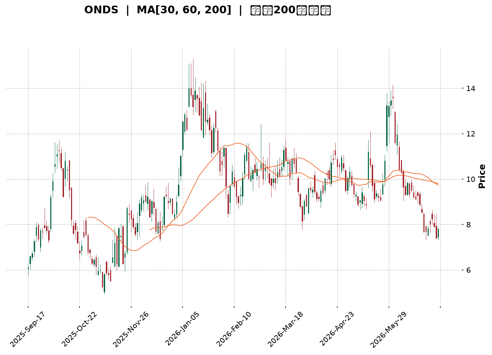
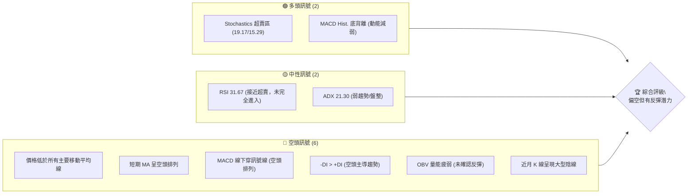
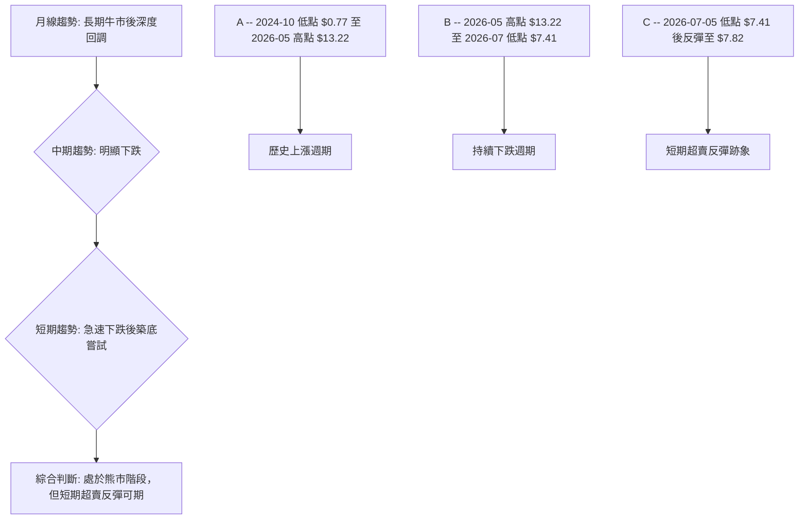
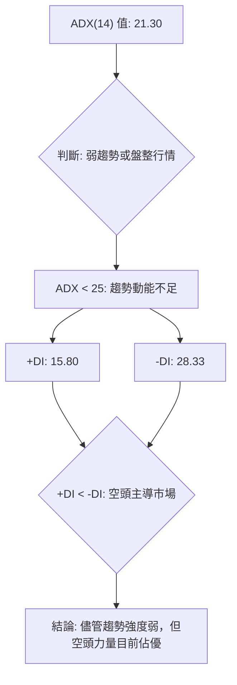
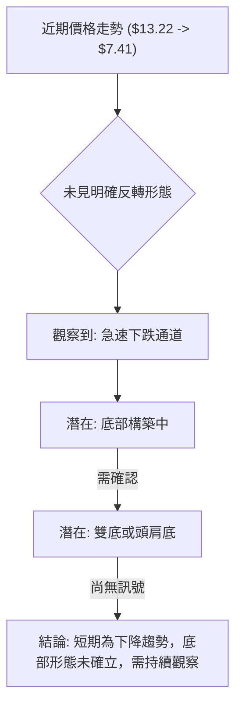
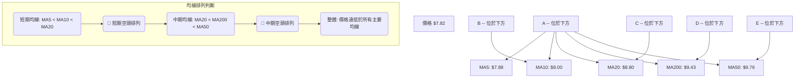
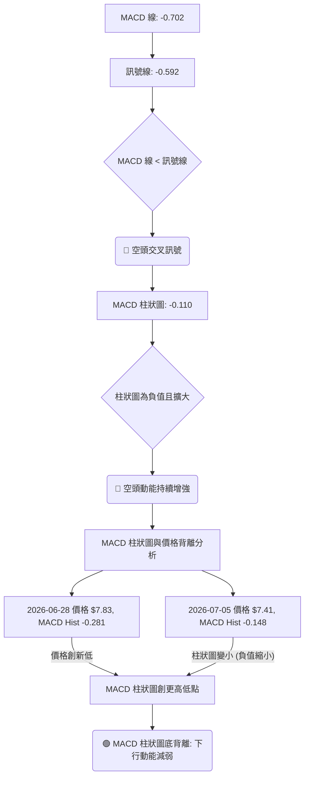
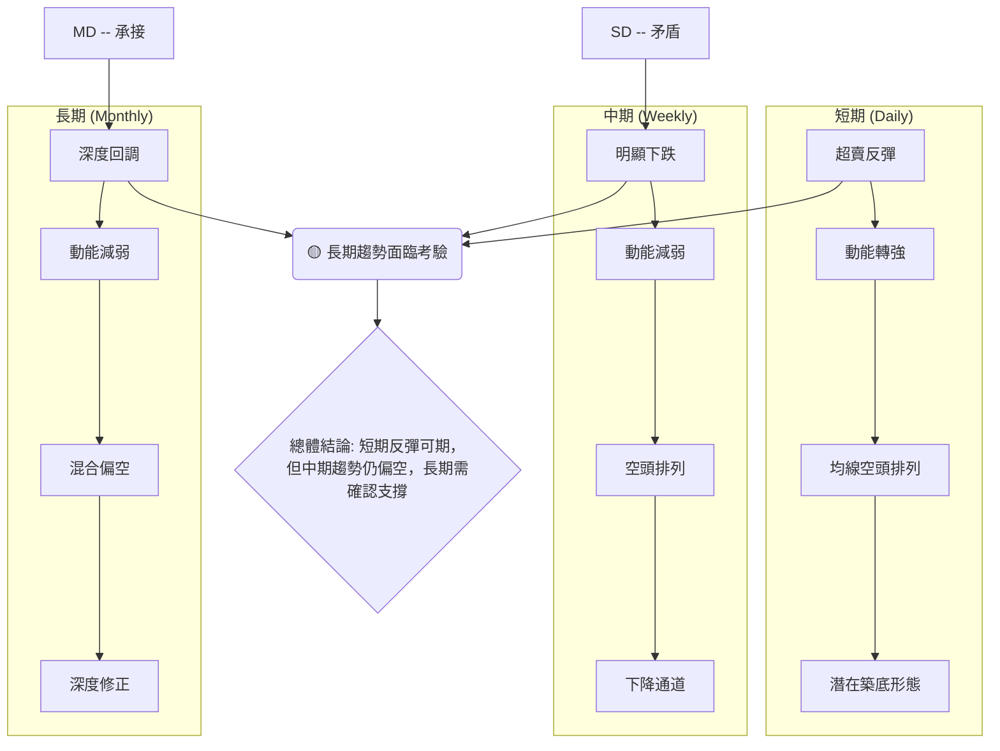
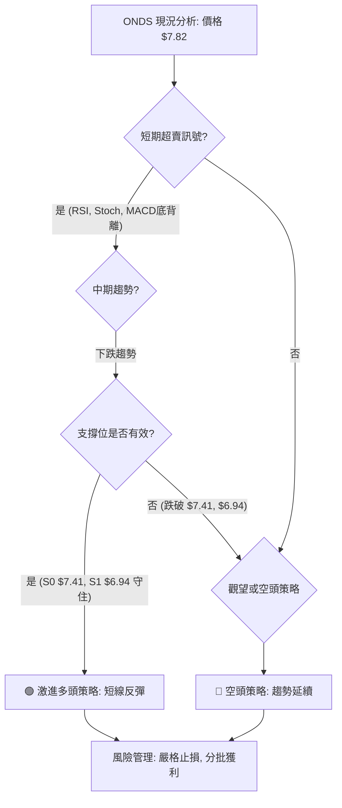
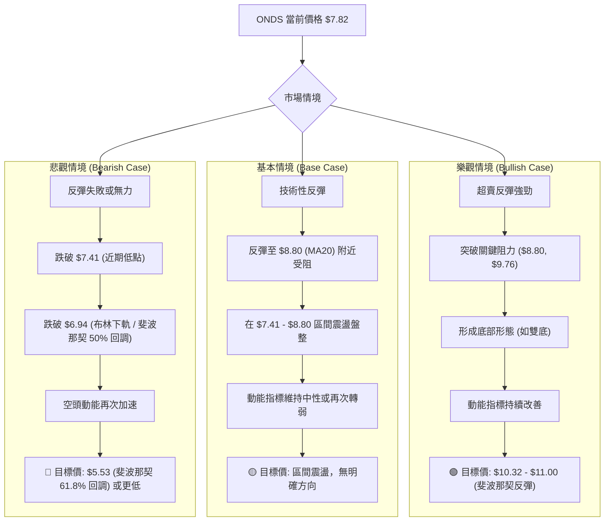

<details>
<summary>📊 靜態圖表 (點擊展開)</summary>

</details>

<html>
<head><meta charset="utf-8" /></head>
<body>
    <div style="height:500px; width:100%;">                        <script>window.PlotlyConfig = {MathJaxConfig: 'local'};</script>
        <script charset="utf-8" src="https://cdn.plot.ly/plotly-3.6.0.min.js" integrity="sha256-QaOVwtVY0T02VaHrr6pnoHLCwayMJp4O5n4YyaE3rJk=" crossorigin="anonymous"></script>                <div id="candlestick-chart" class="plotly-graph-div" style="height:100%; width:100%;"></div>            <script>                window.PLOTLYENV=window.PLOTLYENV || {};                                if (document.getElementById("candlestick-chart")) {                    Plotly.newPlot(                        "candlestick-chart",                        [{"close":{"dtype":"f8","bdata":"AAAAYGZmGEAAAABgZmYaQAAAAKBH4RpAAAAAgD0KHUAAAADAHoUfQAAAAGBmZh1AAAAAAAAAH0AAAAAA16MeQAAAAEDheh9AAAAAoEfhHkAAAACgcD0dQAAAACCFayJAAAAAgOvRI0AAAACA61ElQAAAAIAULiZAAAAAwB6FJkAAAABA4fokQAAAAOCjcCJAAAAAYLieJUAAAACA69EkQAAAAMAeBSNAAAAAYGZmIEAAAADgo3AeQAAAAOB6FB9AAAAAYI\u002fCHEAAAACAwvUaQAAAAKBwPRxAAAAAQArXHUAAAABguB4eQAAAAMD1KBtAAAAAAAAAG0AAAADA9SgZQAAAAGCPwhlAAAAAoJmZGEAAAABACtcXQAAAAAAAABhAAAAAAAAAFUAAAACgcD0XQAAAAMAehRdAAAAAQDMzF0AAAACAPQoWQAAAAKBwPRpAAAAA4FG4HEAAAADAHgUZQAAAAAApXB9AAAAAAAAAHkAAAADgehQZQAAAAOCj8BpAAAAA4KNwIUAAAACgR+EgQAAAAEDheiBAAAAAoJmZH0AAAACA61EeQAAAAADXIyBAAAAAQArXIUAAAACgR2EiQAAAAADXIyJAAAAAgD0KIkAAAACAwnUiQAAAAGBmpiBAAAAAgD0KIkAAAAAAAIAhQAAAAGCPwh5AAAAAgBQuIEAAAABA4XodQAAAAEAzMx9AAAAA4KNwIkAAAACAPYoiQAAAACCF6yFAAAAAYI9CIkAAAACAwvUgQAAAACCF6yBAAAAAQOH6IUAAAADAHoUjQAAAAIA9CiZAAAAAIFwPKUAAAACAFK4pQAAAAAApXChAAAAAwB4FLEAAAACgR2ErQAAAAKBHYSpAAAAAIK7HK0AAAABguB4rQAAAAADXoylAAAAAgOtRKEAAAABgj0IqQAAAAKCZGSlAAAAAoHA9KUAAAABAClcoQAAAAIDrUSZAAAAAwB6FKEAAAACAPYooQAAAAIA9iiZAAAAA4FG4JEAAAAAgrkclQAAAAGCPwiZAAAAAAClcI0AAAACAwvUgQAAAAKBHYSNAAAAAgBSuJEAAAAAAKVwjQAAAAIDCdSJAAAAA4KPwIUAAAABguJ4iQAAAAKCZGSRAAAAAANcjJkAAAAAgrscmQAAAACBcDyRAAAAAoEdhJEAAAADAzMwkQAAAAKCZmSRAAAAAYGbmJEAAAADA9SgkQAAAAEAKVyVAAAAAgD0KJEAAAADAHgUlQAAAAEDh+iRAAAAAwPWoI0AAAADgo3AjQAAAAMAeBSRAAAAAwPWoI0AAAADA9agkQAAAAIDrUSRAAAAAIFwPJUAAAAAgXI8mQAAAAMD1qCVAAAAAAACAJUAAAABguB4kQAAAAMDMzCVAAAAAAClcJUAAAABguJ4kQAAAAKBH4SJAAAAAoJmZIUAAAADAzEwgQAAAAOB6FCJAAAAAYLieIUAAAABAMzMjQAAAAIA9CiNAAAAAIFwPI0AAAABgZuYiQAAAACCuRyJAAAAAYI9CIkAAAADgo\u002fAiQAAAAMDMzCJAAAAAIFwPJEAAAABgZmYkQAAAAAAAACRAAAAAgMJ1JUAAAACgcL0lQAAAAGC4HiZAAAAA4HoUJUAAAACgmRklQAAAAGBm5iVAAAAAgML1JEAAAABA4foiQAAAAOB6FCRAAAAAANejJEAAAACAwnUjQAAAAMD1qCJAAAAAgBSuIkAAAAAgrschQAAAAGC4HiJAAAAAQArXIkAAAADgehQiQAAAAOBRuCFAAAAAIIVrJkAAAACgcD0lQAAAAGBmZiNAAAAAAABAIkAAAADgUbgiQAAAAAApXCJAAAAAYLgeIkAAAACAPYojQAAAAKCZmSVAAAAAAACAKkAAAADgo3AqQAAAACCF6ypAAAAAwPUoK0AAAADgUTgnQAAAAOCj8CdAAAAAACncJEAAAACgmZkkQAAAAMDMTCNAAAAAYLieIkAAAADA9agjQAAAAMD1qCJAAAAAwB4FI0AAAAAghWsiQAAAAKBwPSJAAAAAgD2KIkAAAAAgrschQAAAACBcDyFAAAAA4FG4HkAAAABAM7MeQAAAAIDrUR9AAAAAgD0KIEAAAABA4XogQAAAAIAUrh9AAAAAANejHUAAAAAgrkcfQA=="},"high":{"dtype":"f8","bdata":"AAAAAAAAGUAAAAAgXI8aQAAAAAApXBtAAAAA4KNwHUAAAACgcD0gQAAAAADXIyBAAAAAAClcH0AAAAAgXI8fQAAAACCFayFAAAAAQApXIEAAAADAzMwfQAAAAIAUriJAAAAAIFyPJEAAAABgj0InQAAAAEAKFydAAAAAYGZmJ0AAAAAgrscmQAAAAMAeBSVAAAAAgBRuJkAAAABguB4lQAAAAKBwvSVAAAAAYI9CI0AAAACA61EgQAAAAKBHYSBAAAAAANejH0AAAACAPQodQAAAAEAzMx1AAAAAQApXIEAAAACgR6EgQAAAACBcjx5AAAAAwMzMG0AAAACAwnUaQAAAAAAAABpAAAAAYI\u002fCGkAAAAAgrkcaQAAAAAAAABlAAAAA4FG4F0AAAADgepQXQAAAACBcjxlAAAAAoEdhGEAAAADA9agYQAAAAAApXB1AAAAA4KNwH0AAAAAgXA8eQAAAAIAUrh9AAAAAgOsRIEAAAACgR+EfQAAAAGBmZhtAAAAAoJmZIUAAAABgj8IhQAAAAAApXCFAAAAAwCDwIEAAAAAA1yMgQAAAAKCZGSFAAAAAgMI1IkAAAACAFK4iQAAAAKCZmSJAAAAAAACAI0AAAADgUbgjQAAAAEDhOiJAAAAAwPUoIkAAAABgZiYjQAAAAEDheiFAAAAAANdjIEAAAABguB4hQAAAAGCRrSBAAAAAQOF6IkAAAACA61EjQAAAAIAUriNAAAAAYGZmIkAAAABAClciQAAAAEAKVyFAAAAAoJmZIkAAAAAgXA8lQAAAAGC4HiZAAAAA4HoUKUAAAAAAKdwpQAAAAIA9CipAAAAAANcjLkAAAABAMzMuQAAAACBcjy5AAAAAAAAALUAAAAAAAIArQAAAAADXIyxAAAAAAACALEAAAABgZmYsQAAAAMD1qCxAAAAAwPWoKkAAAABA4bopQAAAACCFqyhAAAAA4KPwKEAAAADA9SgqQAAAACBcjyhAAAAAYGbmJkAAAABgZmYmQAAAAEAK1yZAAAAAgD3KJkAAAAAgXA8jQAAAAMAehSNAAAAAIK5HJUAAAACgR+EkQAAAAEAK1yNAAAAAoMaLIkAAAAAAKVwjQAAAAADXoyRAAAAAQApXJkAAAACAFC4nQAAAAMD1KCdAAAAAANcjJUAAAACAwvUkQAAAAKBH4SVAAAAAIFyPJUAAAAAAKVwkQAAAAEAK1yhAAAAAAAAAJkAAAAAA16MlQAAAAEAK1yVAAAAA4FE4J0AAAAAgXA8kQAAAAGBm5iRAAAAAYLgeJUAAAACAFK4lQAAAAIDC9SVAAAAAoHC9JUAAAADgo\u002fAmQAAAAMAehSdAAAAAgML1JUAAAADA9aglQAAAAOCj8CVAAAAAoHC9JkAAAAAgrkcmQAAAACCuRyRAAAAAoHC9IkAAAAAA16MhQAAAACCuRyJAAAAAQDOzIkAAAABgj0IjQAAAAMDMzCNAAAAAoEdhI0AAAACgcL0kQAAAAIA9CiNAAAAA4FG4IkAAAAAghSsjQAAAAOBRuCNAAAAAIFwPJEAAAAAgrsckQAAAACBcDyVAAAAAYLgeJkAAAADgepQmQAAAAOBROCdAAAAA4KPwJUAAAACAPYolQAAAAGC4HiZAAAAAANcjJkAAAAAAKdwkQAAAAIDrUSRAAAAAYLgeJUAAAABA4bokQAAAAOB6lCNAAAAAIIXrIkAAAAAAAIAiQAAAAIAULiJAAAAAwMxMI0AAAABAM7MiQAAAAAApXCJAAAAAgMJ1J0AAAACgcD0oQAAAAEAKVyVAAAAAYI\u002fCI0AAAADgehQjQAAAAGCPwiJAAAAAoEchI0AAAADAHoUkQAAAAGC4HiZAAAAAIFyPK0AAAACA69EqQAAAAIDr0StAAAAAgOtRLEAAAAAAAAAqQAAAAEAK1yhAAAAAgOtRJ0AAAACAFK4lQAAAAIDr0SRAAAAAgML1I0AAAACgQ8sjQAAAAECJwSNAAAAA4KPwI0AAAABA4XojQAAAAAAAACNAAAAAIIXrIkAAAAAghesiQAAAAAAp3CFAAAAAAAAAIUAAAABgj8IfQAAAAAAp3B9AAAAA4KNwIEAAAADAzEwhQAAAAKBH4SBAAAAAYGbmIEAAAAAAKVwfQA=="},"hovertemplate":"\u003cb\u003e%{x|%Y-%m-%d}\u003c\u002fb\u003e\u003cbr\u003e\u958b: $%{open:.2f}\u003cbr\u003e\u9ad8: $%{high:.2f}\u003cbr\u003e\u4f4e: $%{low:.2f}\u003cbr\u003e\u6536: $%{close:.2f}\u003cextra\u003e\u003c\u002fextra\u003e","low":{"dtype":"f8","bdata":"AAAAAAAAF0AAAACAPQoYQAAAAIAUrhlAAAAAgOtRGkAAAAAghescQAAAAAAAAB1AAAAAwPUoG0AAAADgo3AdQAAAAEAzMx9AAAAAIK5HHkAAAADgUbgcQAAAAADXox5AAAAAoEdhIkAAAACAPYokQAAAAGBm5iRAAAAAYA5tJUAAAAAAAMAkQAAAAKBHYSJAAAAAILJdI0AAAABgj8IjQAAAAIDrUSJAAAAAgBSuH0AAAADgUTgeQAAAAIDrUR1AAAAAAACAHEAAAAAAKdwZQAAAAKCZmRpAAAAAYLieHUAAAADgehQeQAAAAADXoxpAAAAA4HoUGkAAAACA69EYQAAAAEDhehhAAAAAYLgeF0AAAADgehQXQAAAAIDrURdAAAAAACncFEAAAADAzMwTQAAAAOB6FBdAAAAAYGZmFkAAAAAghesVQAAAAKBwPRlAAAAAYGZmGEAAAAAghesXQAAAAKCZmRhAAAAAgD0KHUAAAAAAAAAZQAAAAOBRuBdAAAAAgBSuGkAAAAAA1yMgQAAAAKBwvR5AAAAAQDMzH0AAAACgR+EdQAAAACCuRx1AAAAAQArXHUAAAACAPQohQAAAAMD1KCFAAAAA4KPwIUAAAADgUTghQAAAAAApnCBAAAAAoHA9IEAAAACA69EgQAAAAKBwPR5AAAAAAClcHkAAAABguB4dQAAAAIDC9R5AAAAA4KNwH0AAAAAgXE8iQAAAAEAKVyFAAAAAQDOzIUAAAAAAKdwgQAAAACCFayBAAAAAwPWoIEAAAABAClciQAAAAIDr0SNAAAAAQOH6JUAAAAAghesnQAAAAOBROChAAAAAwMxMKkAAAACAFC4rQAAAAMD1qClAAAAAIIXrKUAAAABACtcpQAAAAKCZmSlAAAAAoHA9KEAAAACgmZknQAAAAAAp3CdAAAAAQDOzKEAAAACgR+EnQAAAAGBm5iVAAAAAgBQuJkAAAABguB4oQAAAAADXIyZAAAAAIK5HJEAAAADAzEwkQAAAAMAeBSVAAAAAYI9CIkAAAAAA16MgQAAAAGBm5iBAAAAAQApXI0AAAABAMzMjQAAAAGCPwiFAAAAAYGZmIUAAAAAA16MhQAAAAKBwvSFAAAAAQOH6I0AAAABA4XolQAAAAGBm5iNAAAAA4FG4I0AAAACAwvUiQAAAAIA9iiRAAAAAYGbmI0AAAACgcD0jQAAAAKCZmSRAAAAAwB6FI0AAAAAAKdwjQAAAAGC4HiRAAAAAwB6FI0AAAABgZmYiQAAAAGBmJiNAAAAAAAAAI0AAAACgmZkjQAAAAKCZGSRAAAAA4FE4JEAAAACgcL0kQAAAAADXoyVAAAAAoHA9JEAAAACAwnUjQAAAAIAU7iNAAAAAQDPzJEAAAACAwnUkQAAAAIA9iiJAAAAAwPVoIUAAAABguB4fQAAAAGBmZiBAAAAAIFyPIUAAAAAghesgQAAAAGCPwiJAAAAA4E1iIkAAAACAFK4iQAAAAMAeBSJAAAAAQOH6IUAAAACAwnUhQAAAAKCZmSJAAAAAoHC9IkAAAADAHoUjQAAAAIA9iiNAAAAAgOtRI0AAAAAgrkclQAAAAEAzsyVAAAAAQDMzJEAAAABA4TokQAAAACCFayRAAAAAIIWrJEAAAACA69EiQAAAAGC4niJAAAAAoHA9I0AAAABAClcjQAAAAIDrUSJAAAAAgD0KIkAAAAAgXI8hQAAAAMDMTCFAAAAA4KNwIUAAAACgmZkhQAAAAEAKVyFAAAAAQDMzI0AAAAAAAAAlQAAAACCF6yJAAAAA4KPwIUAAAACgcD0iQAAAAIDC9SFAAAAAYLgeIkAAAAAgsp0iQAAAAAApXCNAAAAA4KNwJkAAAABAMzMnQAAAAKCZmSlAAAAAgBQuKkAAAAAgXA8nQAAAAGC4HiZAAAAAwPWoJEAAAAAAAIAkQAAAAOB6FCJAAAAAoJmZIkAAAADAHoUiQAAAAAApXCJAAAAAoJnZIkAAAAAgrkciQAAAAMD1KCJAAAAAQArXIUAAAAAgXI8hQAAAAAAAACFAAAAAIFyPHkAAAACgcD0dQAAAAAAAAB5AAAAAoJmZHkAAAADAHgUgQAAAAGBmZh9AAAAAQOF6HUAAAACgcD0dQA=="},"name":"\u50f9\u683c","open":{"dtype":"f8","bdata":"AAAAoHA9GEAAAABguB4ZQAAAAEAzMxpAAAAAIK5HG0AAAAAgXA8eQAAAAIDC9R9AAAAAwB4FHEAAAAAgrsceQAAAAEAK1x9AAAAA4FG4H0AAAAAAAAAfQAAAAEAzMx9AAAAAwB4FI0AAAABguB4lQAAAAAAAACZAAAAAIK6HJkAAAAAgrkcmQAAAAIDC9SRAAAAAIFwPJEAAAABgj8IkQAAAAGBmpiVAAAAAYI9CI0AAAADAzMwfQAAAAGC4HiBAAAAA4FG4HkAAAABgZmYbQAAAAGBmZhtAAAAAgBSuHkAAAABguF4gQAAAAOB6FB5AAAAA4HqUG0AAAACAwvUZQAAAAAAAABlAAAAAwMxMGkAAAABguB4XQAAAACCF6xdAAAAAgBSuF0AAAADA9SgUQAAAAEDhehlAAAAAYGZmF0AAAADgo\u002fAXQAAAACCuRxlAAAAAwPWoGEAAAACAPQoeQAAAAGC4nhhAAAAAACncHUAAAACAFK4fQAAAAKBwPRpAAAAAANcjG0AAAACAwvUgQAAAAOBROCFAAAAAIFyPIEAAAADAHoUfQAAAAOBRuB5AAAAAIK7HIEAAAADAHkUhQAAAAAAp3CFAAAAAQAqXIkAAAABACtchQAAAAOBROCJAAAAAQOH6IEAAAACAwvUhQAAAAAApXCFAAAAAQOF6HkAAAAAgrkcgQAAAAMD1KB9AAAAAgML1H0AAAACgmZkiQAAAACBcDyJAAAAAgML1IUAAAADgJEYiQAAAAKCZmSBAAAAAIIXrIEAAAAAgXI8iQAAAAMAeRSRAAAAAoJmZJkAAAABAMzMoQAAAAGBmZilAAAAAwPVoKkAAAAAAAAAsQAAAACCFaytAAAAAAAAAK0AAAACgR2ErQAAAAADXIytAAAAA4HrUKkAAAACAwrUnQAAAAKCZmStAAAAAwB4FKUAAAAAghWspQAAAAMDMTChAAAAAIIVrJkAAAACAwvUpQAAAACCuRyhAAAAAAACAJkAAAABguJ4lQAAAAMAeBSZAAAAAYI\u002fCJkAAAACAFK4iQAAAAIAU7iFAAAAAACmcI0AAAACAFC4kQAAAAMAexSNAAAAAoHB9IkAAAACAPYoiQAAAAOBReCJAAAAAIIVrJEAAAAAA16MlQAAAAKBHYSZAAAAAACncI0AAAADAHgUkQAAAAGCPQiVAAAAAwMxMJEAAAACAFC4kQAAAAAAAACVAAAAAoEdhJUAAAADgUbgkQAAAAEDh+iRAAAAAAACAJEAAAAAgXA8kQAAAAIAUriNAAAAAoJkZJEAAAAAghSskQAAAAAAp3CRAAAAAoHC9JEAAAACgmRklQAAAAAAAwCZAAAAAYLheJUAAAADgepQlQAAAAOB6lCRAAAAAgOvRJUAAAABgj8IlQAAAAKCZGSRAAAAAQDOzIkAAAABguJ4hQAAAAGBm5iBAAAAAoJmZIkAAAAAgrgchQAAAAGCPQiNAAAAAACncIkAAAABAClckQAAAAOB61CJAAAAAgMJ1IkAAAADAHgUiQAAAAOCjcCNAAAAAwB4FI0AAAAAAAIAkQAAAAGCPwiRAAAAAoJmZI0AAAADAzMwlQAAAAIA9iiZAAAAAYI\u002fCJUAAAABgj0IlQAAAAMBLtyRAAAAAANdjJUAAAABgj8IkQAAAAAAAACNAAAAAAAAAJEAAAADAzEwkQAAAACBcjyNAAAAAAACAIkAAAAAAAIAiQAAAAAAAACJAAAAAQArXIUAAAADgUXgiQAAAAEAK1yFAAAAAQOH6I0AAAACA69ElQAAAAGCPQiVAAAAAYGamI0AAAAAAAIAiQAAAACBcjyJAAAAAIIVrIkAAAAAghasiQAAAAAAAACRAAAAAQDPzJkAAAAAAAIApQAAAAKBwfSpAAAAAoHA9K0AAAAAghespQAAAAIDC9SZAAAAAQArXJkAAAADA9aglQAAAACCFqyRAAAAAoEdhI0AAAABgZqYiQAAAAEAKlyNAAAAAQDOzI0AAAACA69EiQAAAAKBwfSJAAAAAgOvRIkAAAACAwrUiQAAAAGC4XiFAAAAAgML1IEAAAACgcL0fQAAAACBcDx5AAAAAIK5HIEAAAADgo\u002fAgQAAAAADXIyBAAAAAYI\u002fCH0AAAAAg2c4dQA=="},"x":["2025-09-17T00:00:00-04:00","2025-09-18T00:00:00-04:00","2025-09-19T00:00:00-04:00","2025-09-22T00:00:00-04:00","2025-09-23T00:00:00-04:00","2025-09-24T00:00:00-04:00","2025-09-25T00:00:00-04:00","2025-09-26T00:00:00-04:00","2025-09-29T00:00:00-04:00","2025-09-30T00:00:00-04:00","2025-10-01T00:00:00-04:00","2025-10-02T00:00:00-04:00","2025-10-03T00:00:00-04:00","2025-10-06T00:00:00-04:00","2025-10-07T00:00:00-04:00","2025-10-08T00:00:00-04:00","2025-10-09T00:00:00-04:00","2025-10-10T00:00:00-04:00","2025-10-13T00:00:00-04:00","2025-10-14T00:00:00-04:00","2025-10-15T00:00:00-04:00","2025-10-16T00:00:00-04:00","2025-10-17T00:00:00-04:00","2025-10-20T00:00:00-04:00","2025-10-21T00:00:00-04:00","2025-10-22T00:00:00-04:00","2025-10-23T00:00:00-04:00","2025-10-24T00:00:00-04:00","2025-10-27T00:00:00-04:00","2025-10-28T00:00:00-04:00","2025-10-29T00:00:00-04:00","2025-10-30T00:00:00-04:00","2025-10-31T00:00:00-04:00","2025-11-03T00:00:00-05:00","2025-11-04T00:00:00-05:00","2025-11-05T00:00:00-05:00","2025-11-06T00:00:00-05:00","2025-11-07T00:00:00-05:00","2025-11-10T00:00:00-05:00","2025-11-11T00:00:00-05:00","2025-11-12T00:00:00-05:00","2025-11-13T00:00:00-05:00","2025-11-14T00:00:00-05:00","2025-11-17T00:00:00-05:00","2025-11-18T00:00:00-05:00","2025-11-19T00:00:00-05:00","2025-11-20T00:00:00-05:00","2025-11-21T00:00:00-05:00","2025-11-24T00:00:00-05:00","2025-11-25T00:00:00-05:00","2025-11-26T00:00:00-05:00","2025-11-28T00:00:00-05:00","2025-12-01T00:00:00-05:00","2025-12-02T00:00:00-05:00","2025-12-03T00:00:00-05:00","2025-12-04T00:00:00-05:00","2025-12-05T00:00:00-05:00","2025-12-08T00:00:00-05:00","2025-12-09T00:00:00-05:00","2025-12-10T00:00:00-05:00","2025-12-11T00:00:00-05:00","2025-12-12T00:00:00-05:00","2025-12-15T00:00:00-05:00","2025-12-16T00:00:00-05:00","2025-12-17T00:00:00-05:00","2025-12-18T00:00:00-05:00","2025-12-19T00:00:00-05:00","2025-12-22T00:00:00-05:00","2025-12-23T00:00:00-05:00","2025-12-24T00:00:00-05:00","2025-12-26T00:00:00-05:00","2025-12-29T00:00:00-05:00","2025-12-30T00:00:00-05:00","2025-12-31T00:00:00-05:00","2026-01-02T00:00:00-05:00","2026-01-05T00:00:00-05:00","2026-01-06T00:00:00-05:00","2026-01-07T00:00:00-05:00","2026-01-08T00:00:00-05:00","2026-01-09T00:00:00-05:00","2026-01-12T00:00:00-05:00","2026-01-13T00:00:00-05:00","2026-01-14T00:00:00-05:00","2026-01-15T00:00:00-05:00","2026-01-16T00:00:00-05:00","2026-01-20T00:00:00-05:00","2026-01-21T00:00:00-05:00","2026-01-22T00:00:00-05:00","2026-01-23T00:00:00-05:00","2026-01-26T00:00:00-05:00","2026-01-27T00:00:00-05:00","2026-01-28T00:00:00-05:00","2026-01-29T00:00:00-05:00","2026-01-30T00:00:00-05:00","2026-02-02T00:00:00-05:00","2026-02-03T00:00:00-05:00","2026-02-04T00:00:00-05:00","2026-02-05T00:00:00-05:00","2026-02-06T00:00:00-05:00","2026-02-09T00:00:00-05:00","2026-02-10T00:00:00-05:00","2026-02-11T00:00:00-05:00","2026-02-12T00:00:00-05:00","2026-02-13T00:00:00-05:00","2026-02-17T00:00:00-05:00","2026-02-18T00:00:00-05:00","2026-02-19T00:00:00-05:00","2026-02-20T00:00:00-05:00","2026-02-23T00:00:00-05:00","2026-02-24T00:00:00-05:00","2026-02-25T00:00:00-05:00","2026-02-26T00:00:00-05:00","2026-02-27T00:00:00-05:00","2026-03-02T00:00:00-05:00","2026-03-03T00:00:00-05:00","2026-03-04T00:00:00-05:00","2026-03-05T00:00:00-05:00","2026-03-06T00:00:00-05:00","2026-03-09T00:00:00-04:00","2026-03-10T00:00:00-04:00","2026-03-11T00:00:00-04:00","2026-03-12T00:00:00-04:00","2026-03-13T00:00:00-04:00","2026-03-16T00:00:00-04:00","2026-03-17T00:00:00-04:00","2026-03-18T00:00:00-04:00","2026-03-19T00:00:00-04:00","2026-03-20T00:00:00-04:00","2026-03-23T00:00:00-04:00","2026-03-24T00:00:00-04:00","2026-03-25T00:00:00-04:00","2026-03-26T00:00:00-04:00","2026-03-27T00:00:00-04:00","2026-03-30T00:00:00-04:00","2026-03-31T00:00:00-04:00","2026-04-01T00:00:00-04:00","2026-04-02T00:00:00-04:00","2026-04-06T00:00:00-04:00","2026-04-07T00:00:00-04:00","2026-04-08T00:00:00-04:00","2026-04-09T00:00:00-04:00","2026-04-10T00:00:00-04:00","2026-04-13T00:00:00-04:00","2026-04-14T00:00:00-04:00","2026-04-15T00:00:00-04:00","2026-04-16T00:00:00-04:00","2026-04-17T00:00:00-04:00","2026-04-20T00:00:00-04:00","2026-04-21T00:00:00-04:00","2026-04-22T00:00:00-04:00","2026-04-23T00:00:00-04:00","2026-04-24T00:00:00-04:00","2026-04-27T00:00:00-04:00","2026-04-28T00:00:00-04:00","2026-04-29T00:00:00-04:00","2026-04-30T00:00:00-04:00","2026-05-01T00:00:00-04:00","2026-05-04T00:00:00-04:00","2026-05-05T00:00:00-04:00","2026-05-06T00:00:00-04:00","2026-05-07T00:00:00-04:00","2026-05-08T00:00:00-04:00","2026-05-11T00:00:00-04:00","2026-05-12T00:00:00-04:00","2026-05-13T00:00:00-04:00","2026-05-14T00:00:00-04:00","2026-05-15T00:00:00-04:00","2026-05-18T00:00:00-04:00","2026-05-19T00:00:00-04:00","2026-05-20T00:00:00-04:00","2026-05-21T00:00:00-04:00","2026-05-22T00:00:00-04:00","2026-05-26T00:00:00-04:00","2026-05-27T00:00:00-04:00","2026-05-28T00:00:00-04:00","2026-05-29T00:00:00-04:00","2026-06-01T00:00:00-04:00","2026-06-02T00:00:00-04:00","2026-06-03T00:00:00-04:00","2026-06-04T00:00:00-04:00","2026-06-05T00:00:00-04:00","2026-06-08T00:00:00-04:00","2026-06-09T00:00:00-04:00","2026-06-10T00:00:00-04:00","2026-06-11T00:00:00-04:00","2026-06-12T00:00:00-04:00","2026-06-15T00:00:00-04:00","2026-06-16T00:00:00-04:00","2026-06-17T00:00:00-04:00","2026-06-18T00:00:00-04:00","2026-06-22T00:00:00-04:00","2026-06-23T00:00:00-04:00","2026-06-24T00:00:00-04:00","2026-06-25T00:00:00-04:00","2026-06-26T00:00:00-04:00","2026-06-29T00:00:00-04:00","2026-06-30T00:00:00-04:00","2026-07-01T00:00:00-04:00","2026-07-02T00:00:00-04:00","2026-07-06T00:00:00-04:00"],"type":"candlestick"},{"hovertemplate":"MA30: $%{y:.2f}\u003cextra\u003e\u003c\u002fextra\u003e","line":{"color":"#2196F3","dash":"dash","width":2},"mode":"lines","name":"MA30","x":["2025-09-17T00:00:00-04:00","2025-09-18T00:00:00-04:00","2025-09-19T00:00:00-04:00","2025-09-22T00:00:00-04:00","2025-09-23T00:00:00-04:00","2025-09-24T00:00:00-04:00","2025-09-25T00:00:00-04:00","2025-09-26T00:00:00-04:00","2025-09-29T00:00:00-04:00","2025-09-30T00:00:00-04:00","2025-10-01T00:00:00-04:00","2025-10-02T00:00:00-04:00","2025-10-03T00:00:00-04:00","2025-10-06T00:00:00-04:00","2025-10-07T00:00:00-04:00","2025-10-08T00:00:00-04:00","2025-10-09T00:00:00-04:00","2025-10-10T00:00:00-04:00","2025-10-13T00:00:00-04:00","2025-10-14T00:00:00-04:00","2025-10-15T00:00:00-04:00","2025-10-16T00:00:00-04:00","2025-10-17T00:00:00-04:00","2025-10-20T00:00:00-04:00","2025-10-21T00:00:00-04:00","2025-10-22T00:00:00-04:00","2025-10-23T00:00:00-04:00","2025-10-24T00:00:00-04:00","2025-10-27T00:00:00-04:00","2025-10-28T00:00:00-04:00","2025-10-29T00:00:00-04:00","2025-10-30T00:00:00-04:00","2025-10-31T00:00:00-04:00","2025-11-03T00:00:00-05:00","2025-11-04T00:00:00-05:00","2025-11-05T00:00:00-05:00","2025-11-06T00:00:00-05:00","2025-11-07T00:00:00-05:00","2025-11-10T00:00:00-05:00","2025-11-11T00:00:00-05:00","2025-11-12T00:00:00-05:00","2025-11-13T00:00:00-05:00","2025-11-14T00:00:00-05:00","2025-11-17T00:00:00-05:00","2025-11-18T00:00:00-05:00","2025-11-19T00:00:00-05:00","2025-11-20T00:00:00-05:00","2025-11-21T00:00:00-05:00","2025-11-24T00:00:00-05:00","2025-11-25T00:00:00-05:00","2025-11-26T00:00:00-05:00","2025-11-28T00:00:00-05:00","2025-12-01T00:00:00-05:00","2025-12-02T00:00:00-05:00","2025-12-03T00:00:00-05:00","2025-12-04T00:00:00-05:00","2025-12-05T00:00:00-05:00","2025-12-08T00:00:00-05:00","2025-12-09T00:00:00-05:00","2025-12-10T00:00:00-05:00","2025-12-11T00:00:00-05:00","2025-12-12T00:00:00-05:00","2025-12-15T00:00:00-05:00","2025-12-16T00:00:00-05:00","2025-12-17T00:00:00-05:00","2025-12-18T00:00:00-05:00","2025-12-19T00:00:00-05:00","2025-12-22T00:00:00-05:00","2025-12-23T00:00:00-05:00","2025-12-24T00:00:00-05:00","2025-12-26T00:00:00-05:00","2025-12-29T00:00:00-05:00","2025-12-30T00:00:00-05:00","2025-12-31T00:00:00-05:00","2026-01-02T00:00:00-05:00","2026-01-05T00:00:00-05:00","2026-01-06T00:00:00-05:00","2026-01-07T00:00:00-05:00","2026-01-08T00:00:00-05:00","2026-01-09T00:00:00-05:00","2026-01-12T00:00:00-05:00","2026-01-13T00:00:00-05:00","2026-01-14T00:00:00-05:00","2026-01-15T00:00:00-05:00","2026-01-16T00:00:00-05:00","2026-01-20T00:00:00-05:00","2026-01-21T00:00:00-05:00","2026-01-22T00:00:00-05:00","2026-01-23T00:00:00-05:00","2026-01-26T00:00:00-05:00","2026-01-27T00:00:00-05:00","2026-01-28T00:00:00-05:00","2026-01-29T00:00:00-05:00","2026-01-30T00:00:00-05:00","2026-02-02T00:00:00-05:00","2026-02-03T00:00:00-05:00","2026-02-04T00:00:00-05:00","2026-02-05T00:00:00-05:00","2026-02-06T00:00:00-05:00","2026-02-09T00:00:00-05:00","2026-02-10T00:00:00-05:00","2026-02-11T00:00:00-05:00","2026-02-12T00:00:00-05:00","2026-02-13T00:00:00-05:00","2026-02-17T00:00:00-05:00","2026-02-18T00:00:00-05:00","2026-02-19T00:00:00-05:00","2026-02-20T00:00:00-05:00","2026-02-23T00:00:00-05:00","2026-02-24T00:00:00-05:00","2026-02-25T00:00:00-05:00","2026-02-26T00:00:00-05:00","2026-02-27T00:00:00-05:00","2026-03-02T00:00:00-05:00","2026-03-03T00:00:00-05:00","2026-03-04T00:00:00-05:00","2026-03-05T00:00:00-05:00","2026-03-06T00:00:00-05:00","2026-03-09T00:00:00-04:00","2026-03-10T00:00:00-04:00","2026-03-11T00:00:00-04:00","2026-03-12T00:00:00-04:00","2026-03-13T00:00:00-04:00","2026-03-16T00:00:00-04:00","2026-03-17T00:00:00-04:00","2026-03-18T00:00:00-04:00","2026-03-19T00:00:00-04:00","2026-03-20T00:00:00-04:00","2026-03-23T00:00:00-04:00","2026-03-24T00:00:00-04:00","2026-03-25T00:00:00-04:00","2026-03-26T00:00:00-04:00","2026-03-27T00:00:00-04:00","2026-03-30T00:00:00-04:00","2026-03-31T00:00:00-04:00","2026-04-01T00:00:00-04:00","2026-04-02T00:00:00-04:00","2026-04-06T00:00:00-04:00","2026-04-07T00:00:00-04:00","2026-04-08T00:00:00-04:00","2026-04-09T00:00:00-04:00","2026-04-10T00:00:00-04:00","2026-04-13T00:00:00-04:00","2026-04-14T00:00:00-04:00","2026-04-15T00:00:00-04:00","2026-04-16T00:00:00-04:00","2026-04-17T00:00:00-04:00","2026-04-20T00:00:00-04:00","2026-04-21T00:00:00-04:00","2026-04-22T00:00:00-04:00","2026-04-23T00:00:00-04:00","2026-04-24T00:00:00-04:00","2026-04-27T00:00:00-04:00","2026-04-28T00:00:00-04:00","2026-04-29T00:00:00-04:00","2026-04-30T00:00:00-04:00","2026-05-01T00:00:00-04:00","2026-05-04T00:00:00-04:00","2026-05-05T00:00:00-04:00","2026-05-06T00:00:00-04:00","2026-05-07T00:00:00-04:00","2026-05-08T00:00:00-04:00","2026-05-11T00:00:00-04:00","2026-05-12T00:00:00-04:00","2026-05-13T00:00:00-04:00","2026-05-14T00:00:00-04:00","2026-05-15T00:00:00-04:00","2026-05-18T00:00:00-04:00","2026-05-19T00:00:00-04:00","2026-05-20T00:00:00-04:00","2026-05-21T00:00:00-04:00","2026-05-22T00:00:00-04:00","2026-05-26T00:00:00-04:00","2026-05-27T00:00:00-04:00","2026-05-28T00:00:00-04:00","2026-05-29T00:00:00-04:00","2026-06-01T00:00:00-04:00","2026-06-02T00:00:00-04:00","2026-06-03T00:00:00-04:00","2026-06-04T00:00:00-04:00","2026-06-05T00:00:00-04:00","2026-06-08T00:00:00-04:00","2026-06-09T00:00:00-04:00","2026-06-10T00:00:00-04:00","2026-06-11T00:00:00-04:00","2026-06-12T00:00:00-04:00","2026-06-15T00:00:00-04:00","2026-06-16T00:00:00-04:00","2026-06-17T00:00:00-04:00","2026-06-18T00:00:00-04:00","2026-06-22T00:00:00-04:00","2026-06-23T00:00:00-04:00","2026-06-24T00:00:00-04:00","2026-06-25T00:00:00-04:00","2026-06-26T00:00:00-04:00","2026-06-29T00:00:00-04:00","2026-06-30T00:00:00-04:00","2026-07-01T00:00:00-04:00","2026-07-02T00:00:00-04:00","2026-07-06T00:00:00-04:00"],"y":{"dtype":"f8","bdata":"AAAAAAAA+H8AAAAAAAD4fwAAAAAAAPh\u002fAAAAAAAA+H8AAAAAAAD4fwAAAAAAAPh\u002fAAAAAAAA+H8AAAAAAAD4fwAAAAAAAPh\u002fAAAAAAAA+H8AAAAAAAD4fwAAAAAAAPh\u002fAAAAAAAA+H8AAAAAAAD4fwAAAAAAAPh\u002fAAAAAAAA+H8AAAAAAAD4fwAAAAAAAPh\u002fAAAAAAAA+H8AAAAAAAD4fwAAAAAAAPh\u002fAAAAAAAA+H8AAAAAAAD4fwAAAAAAAPh\u002fAAAAAAAA+H8AAAAAAAD4fwAAAAAAAPh\u002fAAAAAAAA+H8AAAAAAAD4f83MzET9myBAmpmZKRWnIECJiIjAyqEgQCIiImoDnSBAAAAAwBGKIEBEREQkTWkgQO\u002fu7uZCUiBAREREPJgnIEBmZmZ2BQggQKuqqgoezB9ARERE1JSKH0ARERExJE0fQDMzMyOw8h5AiYiICIGVHkDv7u6OJf8dQAAAAKA2kB1A3t3dPd8PHUAiIiJS1H8cQO\u002fu7g4CKxxAvLu7W6vjG0C8u7s7baAbQM3MzMwTdRtAzczMXNZqG0B3d3c30GkbQHd3d6cNdBtAAAAAoBqvG0DNzMwMuwIcQCIiIrJWRxxAAAAAMJZ8HEAiIiICnbYcQKuqqgoC6xxAvLu7m304HUCrqqpqdYwdQFVVVRUgtx1AAAAAEFj5HUBERETUeCkeQImIiHjpZh5AzczM3GvuHkDv7u7OhWQfQCIiIkKnzR9A7+7unqgfIEDv7u6+WFIgQBEREfnFciBAvLu7+6mRIEAAAACQe80gQCIiIjLBAyFAmpmZmZlZIUBmZmZeuskhQAAAAPCnJiJAzczMTPCAIkBmZmbmidoiQHd3d8cELyNAVVVVfT+VI0CrqqqCTvsjQLy7u5NfTCRAIiIiWquDJEAiIiJ66cYkQM3MzNRNAiVAAAAAeL4\u002fJUDv7u6G63ElQM3MzNRNoiVAMzMzm5nZJUARERG5rBUmQLy7u\u002fvFUiZAMzMzw4N5JkDNzMycUrEmQO\u002fu7t5r7iZAREREpEX2JkAzMzMTyugmQN7d3X0\u002f9SZAAAAAEOYJJ0AiIiLyYB4nQAAAACCFKydA7+7uvi0rJ0CrqqqqfyMnQLy7u6vxEidAVVVV1Qb6JkAAAACwR+EmQBERETGWvCZAq6qqWmR7JkAAAAAgPkMmQGZmZobrESZA7+7u7jXXJUBERESU0ZslQGZmZhYgdyVAmpmZSZpSJUBVVVVV4yUlQN7d3Q27AiVAvLu7Wx3TJEBVVVUlTakkQImIiLislSRAMzMz4zNsJEBVVVXlF0skQKuqqjomOCRAiYiI+Aw7JEC8u7sr+UUkQO\u002fu7i6WPCRAVVVVFdlOJEBmZmY20GkkQImIiMh2fiRARERERESEJEB3d3fHBI8kQImIiEiakiRAq6qqirOPJEC8u7tr53skQJqZmamqaiRAMzMzkxhEJEAiIiLyiyUkQJqZmbnXHCRAREREJJQRJEB3d3eHXQEkQJqZmWmR7SNA7+7uPgrXI0De3d0docwjQGZmZmb0tiNAZmZmFiC3I0DNzMys1bEjQFVVVdV4qSNA3t3d\u002fdS4I0CrqqpqdcwjQAAAAPBg3iNAmpmZ+X7qI0C8u7srQO4jQLy7u7u7+yNAd3d3R+H6I0BmZmamVNwjQGZmZhbZziNAMzMzY4LHI0B3d3eX4MEjQImIiCgVpyNAvLu7mzaQI0CJiIiI+ncjQKuqqkp+cSNAzczMHBN8I0BVVVWVQ4sjQGZmZiYxiCNAiYiI6CaxI0Crqqpaj8IjQImIiMihxSNAAAAAULi+I0CJiIgYL70jQLy7u9vdvSNAZmZmBqy8I0Dv7u6+ysEjQBEREXGv2SNAZmZm1qMQJEC8u7trLkQkQERERGQ7fyRAvLu7O9+vJEB3d3dXgLwkQBERETEIzCRAiYiImCfKJEBERERU48UkQKuqqoqzryRAzczMvLubJECJiIg4iaEkQO\u002fu7i5rlSRA3t3dPZiHJEBERERUuH4kQDMzM9MieyRA3t3d\u002ffB5JEDe3d398HkkQCIiImLlcCRAzczMNDNTJEBmZmZu5zskQDMzM0tTKiRAERER+eHzI0AAAACYQ8sjQAAAAKjirCNAzczMtJ2PI0CJiIhYVXUjQA=="},"type":"scatter"},{"hovertemplate":"MA60: $%{y:.2f}\u003cextra\u003e\u003c\u002fextra\u003e","line":{"color":"#9C27B0","dash":"dash","width":2},"mode":"lines","name":"MA60","x":["2025-09-17T00:00:00-04:00","2025-09-18T00:00:00-04:00","2025-09-19T00:00:00-04:00","2025-09-22T00:00:00-04:00","2025-09-23T00:00:00-04:00","2025-09-24T00:00:00-04:00","2025-09-25T00:00:00-04:00","2025-09-26T00:00:00-04:00","2025-09-29T00:00:00-04:00","2025-09-30T00:00:00-04:00","2025-10-01T00:00:00-04:00","2025-10-02T00:00:00-04:00","2025-10-03T00:00:00-04:00","2025-10-06T00:00:00-04:00","2025-10-07T00:00:00-04:00","2025-10-08T00:00:00-04:00","2025-10-09T00:00:00-04:00","2025-10-10T00:00:00-04:00","2025-10-13T00:00:00-04:00","2025-10-14T00:00:00-04:00","2025-10-15T00:00:00-04:00","2025-10-16T00:00:00-04:00","2025-10-17T00:00:00-04:00","2025-10-20T00:00:00-04:00","2025-10-21T00:00:00-04:00","2025-10-22T00:00:00-04:00","2025-10-23T00:00:00-04:00","2025-10-24T00:00:00-04:00","2025-10-27T00:00:00-04:00","2025-10-28T00:00:00-04:00","2025-10-29T00:00:00-04:00","2025-10-30T00:00:00-04:00","2025-10-31T00:00:00-04:00","2025-11-03T00:00:00-05:00","2025-11-04T00:00:00-05:00","2025-11-05T00:00:00-05:00","2025-11-06T00:00:00-05:00","2025-11-07T00:00:00-05:00","2025-11-10T00:00:00-05:00","2025-11-11T00:00:00-05:00","2025-11-12T00:00:00-05:00","2025-11-13T00:00:00-05:00","2025-11-14T00:00:00-05:00","2025-11-17T00:00:00-05:00","2025-11-18T00:00:00-05:00","2025-11-19T00:00:00-05:00","2025-11-20T00:00:00-05:00","2025-11-21T00:00:00-05:00","2025-11-24T00:00:00-05:00","2025-11-25T00:00:00-05:00","2025-11-26T00:00:00-05:00","2025-11-28T00:00:00-05:00","2025-12-01T00:00:00-05:00","2025-12-02T00:00:00-05:00","2025-12-03T00:00:00-05:00","2025-12-04T00:00:00-05:00","2025-12-05T00:00:00-05:00","2025-12-08T00:00:00-05:00","2025-12-09T00:00:00-05:00","2025-12-10T00:00:00-05:00","2025-12-11T00:00:00-05:00","2025-12-12T00:00:00-05:00","2025-12-15T00:00:00-05:00","2025-12-16T00:00:00-05:00","2025-12-17T00:00:00-05:00","2025-12-18T00:00:00-05:00","2025-12-19T00:00:00-05:00","2025-12-22T00:00:00-05:00","2025-12-23T00:00:00-05:00","2025-12-24T00:00:00-05:00","2025-12-26T00:00:00-05:00","2025-12-29T00:00:00-05:00","2025-12-30T00:00:00-05:00","2025-12-31T00:00:00-05:00","2026-01-02T00:00:00-05:00","2026-01-05T00:00:00-05:00","2026-01-06T00:00:00-05:00","2026-01-07T00:00:00-05:00","2026-01-08T00:00:00-05:00","2026-01-09T00:00:00-05:00","2026-01-12T00:00:00-05:00","2026-01-13T00:00:00-05:00","2026-01-14T00:00:00-05:00","2026-01-15T00:00:00-05:00","2026-01-16T00:00:00-05:00","2026-01-20T00:00:00-05:00","2026-01-21T00:00:00-05:00","2026-01-22T00:00:00-05:00","2026-01-23T00:00:00-05:00","2026-01-26T00:00:00-05:00","2026-01-27T00:00:00-05:00","2026-01-28T00:00:00-05:00","2026-01-29T00:00:00-05:00","2026-01-30T00:00:00-05:00","2026-02-02T00:00:00-05:00","2026-02-03T00:00:00-05:00","2026-02-04T00:00:00-05:00","2026-02-05T00:00:00-05:00","2026-02-06T00:00:00-05:00","2026-02-09T00:00:00-05:00","2026-02-10T00:00:00-05:00","2026-02-11T00:00:00-05:00","2026-02-12T00:00:00-05:00","2026-02-13T00:00:00-05:00","2026-02-17T00:00:00-05:00","2026-02-18T00:00:00-05:00","2026-02-19T00:00:00-05:00","2026-02-20T00:00:00-05:00","2026-02-23T00:00:00-05:00","2026-02-24T00:00:00-05:00","2026-02-25T00:00:00-05:00","2026-02-26T00:00:00-05:00","2026-02-27T00:00:00-05:00","2026-03-02T00:00:00-05:00","2026-03-03T00:00:00-05:00","2026-03-04T00:00:00-05:00","2026-03-05T00:00:00-05:00","2026-03-06T00:00:00-05:00","2026-03-09T00:00:00-04:00","2026-03-10T00:00:00-04:00","2026-03-11T00:00:00-04:00","2026-03-12T00:00:00-04:00","2026-03-13T00:00:00-04:00","2026-03-16T00:00:00-04:00","2026-03-17T00:00:00-04:00","2026-03-18T00:00:00-04:00","2026-03-19T00:00:00-04:00","2026-03-20T00:00:00-04:00","2026-03-23T00:00:00-04:00","2026-03-24T00:00:00-04:00","2026-03-25T00:00:00-04:00","2026-03-26T00:00:00-04:00","2026-03-27T00:00:00-04:00","2026-03-30T00:00:00-04:00","2026-03-31T00:00:00-04:00","2026-04-01T00:00:00-04:00","2026-04-02T00:00:00-04:00","2026-04-06T00:00:00-04:00","2026-04-07T00:00:00-04:00","2026-04-08T00:00:00-04:00","2026-04-09T00:00:00-04:00","2026-04-10T00:00:00-04:00","2026-04-13T00:00:00-04:00","2026-04-14T00:00:00-04:00","2026-04-15T00:00:00-04:00","2026-04-16T00:00:00-04:00","2026-04-17T00:00:00-04:00","2026-04-20T00:00:00-04:00","2026-04-21T00:00:00-04:00","2026-04-22T00:00:00-04:00","2026-04-23T00:00:00-04:00","2026-04-24T00:00:00-04:00","2026-04-27T00:00:00-04:00","2026-04-28T00:00:00-04:00","2026-04-29T00:00:00-04:00","2026-04-30T00:00:00-04:00","2026-05-01T00:00:00-04:00","2026-05-04T00:00:00-04:00","2026-05-05T00:00:00-04:00","2026-05-06T00:00:00-04:00","2026-05-07T00:00:00-04:00","2026-05-08T00:00:00-04:00","2026-05-11T00:00:00-04:00","2026-05-12T00:00:00-04:00","2026-05-13T00:00:00-04:00","2026-05-14T00:00:00-04:00","2026-05-15T00:00:00-04:00","2026-05-18T00:00:00-04:00","2026-05-19T00:00:00-04:00","2026-05-20T00:00:00-04:00","2026-05-21T00:00:00-04:00","2026-05-22T00:00:00-04:00","2026-05-26T00:00:00-04:00","2026-05-27T00:00:00-04:00","2026-05-28T00:00:00-04:00","2026-05-29T00:00:00-04:00","2026-06-01T00:00:00-04:00","2026-06-02T00:00:00-04:00","2026-06-03T00:00:00-04:00","2026-06-04T00:00:00-04:00","2026-06-05T00:00:00-04:00","2026-06-08T00:00:00-04:00","2026-06-09T00:00:00-04:00","2026-06-10T00:00:00-04:00","2026-06-11T00:00:00-04:00","2026-06-12T00:00:00-04:00","2026-06-15T00:00:00-04:00","2026-06-16T00:00:00-04:00","2026-06-17T00:00:00-04:00","2026-06-18T00:00:00-04:00","2026-06-22T00:00:00-04:00","2026-06-23T00:00:00-04:00","2026-06-24T00:00:00-04:00","2026-06-25T00:00:00-04:00","2026-06-26T00:00:00-04:00","2026-06-29T00:00:00-04:00","2026-06-30T00:00:00-04:00","2026-07-01T00:00:00-04:00","2026-07-02T00:00:00-04:00","2026-07-06T00:00:00-04:00"],"y":{"dtype":"f8","bdata":"AAAAAAAA+H8AAAAAAAD4fwAAAAAAAPh\u002fAAAAAAAA+H8AAAAAAAD4fwAAAAAAAPh\u002fAAAAAAAA+H8AAAAAAAD4fwAAAAAAAPh\u002fAAAAAAAA+H8AAAAAAAD4fwAAAAAAAPh\u002fAAAAAAAA+H8AAAAAAAD4fwAAAAAAAPh\u002fAAAAAAAA+H8AAAAAAAD4fwAAAAAAAPh\u002fAAAAAAAA+H8AAAAAAAD4fwAAAAAAAPh\u002fAAAAAAAA+H8AAAAAAAD4fwAAAAAAAPh\u002fAAAAAAAA+H8AAAAAAAD4fwAAAAAAAPh\u002fAAAAAAAA+H8AAAAAAAD4fwAAAAAAAPh\u002fAAAAAAAA+H8AAAAAAAD4fwAAAAAAAPh\u002fAAAAAAAA+H8AAAAAAAD4fwAAAAAAAPh\u002fAAAAAAAA+H8AAAAAAAD4fwAAAAAAAPh\u002fAAAAAAAA+H8AAAAAAAD4fwAAAAAAAPh\u002fAAAAAAAA+H8AAAAAAAD4fwAAAAAAAPh\u002fAAAAAAAA+H8AAAAAAAD4fwAAAAAAAPh\u002fAAAAAAAA+H8AAAAAAAD4fwAAAAAAAPh\u002fAAAAAAAA+H8AAAAAAAD4fwAAAAAAAPh\u002fAAAAAAAA+H8AAAAAAAD4fwAAAAAAAPh\u002fAAAAAAAA+H8AAAAAAAD4fyIiIkp+ER9Ad3d391NDH0De3d11BWgfQM3MzHSTeB9AAAAAyL2GH0BmZmaOCX4fQDMzM6O3hR9Aq6qqKs6eH0De3d1dSLofQGZmZqbizB9AERERCfPkH0B3d3fX6vgfQKuqqgoe7B9AAAAAgGrcH0B3d3dXDs0fQCIiIoLcyx9AiYiIOInhH0C8u7tD0gQgQLy7u3sUHiBAVVVV\u002fWI5IEAiIiJCYFUgQO\u002fu7lbHdCBA3t3dVVWlIEAzMzNPG9ggQLy7uzMzAyFAERERVZwtIUBERESAI2QhQO\u002fu7pb8kiFAAAAAyAS\u002fIUAAAAAEneYhQBEREW3nCyJAiYiINOw6IkAzMzO3820iQDMzMwMrlyJAmpmZ5Re7IkB3d3eDB+MiQJqZmU3wECNAVVVVyb02I0BVVVV9hk0jQHd3d48JbiNAd3d3V8eUI0CJiIjYXLgjQImIiIwlzyNAVVVV3WveI0BVVVWdffgjQO\u002fu7m5ZCyRAd3d3N9ApJEAzMzMHgVUkQImIiBCfcSRAvLu7Uyp+JEAzMzMD5I4kQO\u002fu7iZ4oCRAIiIitjq2JEB3d3cLkMskQBEREdW\u002f4SRA3t3d0SLrJEC8u7tnZvYkQFVVVXGEAiVA3t3d6W0JJUAiIiJWnA0lQKuqqkb9GyVAMzMzv+YiJUAzMzNPYjAlQDMzMxt2RSVA3t3dXUhaJUBERETkpXslQO\u002fu7gaBlSVAzczMXI+iJUDNzMwkTaklQDMzMyPbuSVAIiIiKhXHJUDNzMzcstYlQERERLQP3yVAzczMpHDdJUAzMzOLs88lQKuqqirOviVAREREtA+fJUARERHRaYMlQFVVVfW2bCVAd3d3P3xGJUC8u7vTTSIlQAAAAHi+\u002fyRA7+7uFiDXJEARERFZObQkQGZmZj4KlyRAAAAAMN2EJEARERGB3GskQJqZmfEZViRAzczMLPlFJEAAAABI4TokQERERNQGOiRAZmZmblkrJECJiIgIrBwkQDMzM\u002fvwGSRAAAAAIPcaJEARERHpJhEkQKuqqqK3BSRAREREvC0LJEDv7u5m2BUkQImIiPjFEiRAAAAAcD0KJEAAAACofwMkQJqZmUkMAiRAvLu7U+MFJECJiIiAlQMkQAAAAOht+SNA3t3dvZ\u002f6I0BmZmamDfQjQBEREcE88SNAIiIiOiboI0AAAABQRt8jQKuqqqK31SNAq6qqItvJI0BmZmbuNccjQLy7u+tRyCNAZmZm9uHjI0BEREQMAvsjQM3MzBxaFCRAzczMHFo0JEARERHhekQkQImIiJA0VSRAERERSVNaJEAAAADAEVokQDMzM6O3VSRAIiIigk5LJEB3d3fv7j4kQKuqqiIiMiRAiYiIUI0nJEDe3d11TCAkQN7d3f0bESRAzczMzBMFJEAzMzPD9fgjQGZmZtYx8SNAzczMKKPnI0De3d2BleMjQM3MzDhC2SNAzczMcITSI0BVVVV56cYjQERERDhCuSNAZmZmAiunI0CJiIg4QpkjQA=="},"type":"scatter"},{"hovertemplate":"MA200: $%{y:.2f}\u003cextra\u003e\u003c\u002fextra\u003e","line":{"color":"#FF6F00","dash":"solid","width":2},"mode":"lines","name":"MA200","x":["2025-09-17T00:00:00-04:00","2025-09-18T00:00:00-04:00","2025-09-19T00:00:00-04:00","2025-09-22T00:00:00-04:00","2025-09-23T00:00:00-04:00","2025-09-24T00:00:00-04:00","2025-09-25T00:00:00-04:00","2025-09-26T00:00:00-04:00","2025-09-29T00:00:00-04:00","2025-09-30T00:00:00-04:00","2025-10-01T00:00:00-04:00","2025-10-02T00:00:00-04:00","2025-10-03T00:00:00-04:00","2025-10-06T00:00:00-04:00","2025-10-07T00:00:00-04:00","2025-10-08T00:00:00-04:00","2025-10-09T00:00:00-04:00","2025-10-10T00:00:00-04:00","2025-10-13T00:00:00-04:00","2025-10-14T00:00:00-04:00","2025-10-15T00:00:00-04:00","2025-10-16T00:00:00-04:00","2025-10-17T00:00:00-04:00","2025-10-20T00:00:00-04:00","2025-10-21T00:00:00-04:00","2025-10-22T00:00:00-04:00","2025-10-23T00:00:00-04:00","2025-10-24T00:00:00-04:00","2025-10-27T00:00:00-04:00","2025-10-28T00:00:00-04:00","2025-10-29T00:00:00-04:00","2025-10-30T00:00:00-04:00","2025-10-31T00:00:00-04:00","2025-11-03T00:00:00-05:00","2025-11-04T00:00:00-05:00","2025-11-05T00:00:00-05:00","2025-11-06T00:00:00-05:00","2025-11-07T00:00:00-05:00","2025-11-10T00:00:00-05:00","2025-11-11T00:00:00-05:00","2025-11-12T00:00:00-05:00","2025-11-13T00:00:00-05:00","2025-11-14T00:00:00-05:00","2025-11-17T00:00:00-05:00","2025-11-18T00:00:00-05:00","2025-11-19T00:00:00-05:00","2025-11-20T00:00:00-05:00","2025-11-21T00:00:00-05:00","2025-11-24T00:00:00-05:00","2025-11-25T00:00:00-05:00","2025-11-26T00:00:00-05:00","2025-11-28T00:00:00-05:00","2025-12-01T00:00:00-05:00","2025-12-02T00:00:00-05:00","2025-12-03T00:00:00-05:00","2025-12-04T00:00:00-05:00","2025-12-05T00:00:00-05:00","2025-12-08T00:00:00-05:00","2025-12-09T00:00:00-05:00","2025-12-10T00:00:00-05:00","2025-12-11T00:00:00-05:00","2025-12-12T00:00:00-05:00","2025-12-15T00:00:00-05:00","2025-12-16T00:00:00-05:00","2025-12-17T00:00:00-05:00","2025-12-18T00:00:00-05:00","2025-12-19T00:00:00-05:00","2025-12-22T00:00:00-05:00","2025-12-23T00:00:00-05:00","2025-12-24T00:00:00-05:00","2025-12-26T00:00:00-05:00","2025-12-29T00:00:00-05:00","2025-12-30T00:00:00-05:00","2025-12-31T00:00:00-05:00","2026-01-02T00:00:00-05:00","2026-01-05T00:00:00-05:00","2026-01-06T00:00:00-05:00","2026-01-07T00:00:00-05:00","2026-01-08T00:00:00-05:00","2026-01-09T00:00:00-05:00","2026-01-12T00:00:00-05:00","2026-01-13T00:00:00-05:00","2026-01-14T00:00:00-05:00","2026-01-15T00:00:00-05:00","2026-01-16T00:00:00-05:00","2026-01-20T00:00:00-05:00","2026-01-21T00:00:00-05:00","2026-01-22T00:00:00-05:00","2026-01-23T00:00:00-05:00","2026-01-26T00:00:00-05:00","2026-01-27T00:00:00-05:00","2026-01-28T00:00:00-05:00","2026-01-29T00:00:00-05:00","2026-01-30T00:00:00-05:00","2026-02-02T00:00:00-05:00","2026-02-03T00:00:00-05:00","2026-02-04T00:00:00-05:00","2026-02-05T00:00:00-05:00","2026-02-06T00:00:00-05:00","2026-02-09T00:00:00-05:00","2026-02-10T00:00:00-05:00","2026-02-11T00:00:00-05:00","2026-02-12T00:00:00-05:00","2026-02-13T00:00:00-05:00","2026-02-17T00:00:00-05:00","2026-02-18T00:00:00-05:00","2026-02-19T00:00:00-05:00","2026-02-20T00:00:00-05:00","2026-02-23T00:00:00-05:00","2026-02-24T00:00:00-05:00","2026-02-25T00:00:00-05:00","2026-02-26T00:00:00-05:00","2026-02-27T00:00:00-05:00","2026-03-02T00:00:00-05:00","2026-03-03T00:00:00-05:00","2026-03-04T00:00:00-05:00","2026-03-05T00:00:00-05:00","2026-03-06T00:00:00-05:00","2026-03-09T00:00:00-04:00","2026-03-10T00:00:00-04:00","2026-03-11T00:00:00-04:00","2026-03-12T00:00:00-04:00","2026-03-13T00:00:00-04:00","2026-03-16T00:00:00-04:00","2026-03-17T00:00:00-04:00","2026-03-18T00:00:00-04:00","2026-03-19T00:00:00-04:00","2026-03-20T00:00:00-04:00","2026-03-23T00:00:00-04:00","2026-03-24T00:00:00-04:00","2026-03-25T00:00:00-04:00","2026-03-26T00:00:00-04:00","2026-03-27T00:00:00-04:00","2026-03-30T00:00:00-04:00","2026-03-31T00:00:00-04:00","2026-04-01T00:00:00-04:00","2026-04-02T00:00:00-04:00","2026-04-06T00:00:00-04:00","2026-04-07T00:00:00-04:00","2026-04-08T00:00:00-04:00","2026-04-09T00:00:00-04:00","2026-04-10T00:00:00-04:00","2026-04-13T00:00:00-04:00","2026-04-14T00:00:00-04:00","2026-04-15T00:00:00-04:00","2026-04-16T00:00:00-04:00","2026-04-17T00:00:00-04:00","2026-04-20T00:00:00-04:00","2026-04-21T00:00:00-04:00","2026-04-22T00:00:00-04:00","2026-04-23T00:00:00-04:00","2026-04-24T00:00:00-04:00","2026-04-27T00:00:00-04:00","2026-04-28T00:00:00-04:00","2026-04-29T00:00:00-04:00","2026-04-30T00:00:00-04:00","2026-05-01T00:00:00-04:00","2026-05-04T00:00:00-04:00","2026-05-05T00:00:00-04:00","2026-05-06T00:00:00-04:00","2026-05-07T00:00:00-04:00","2026-05-08T00:00:00-04:00","2026-05-11T00:00:00-04:00","2026-05-12T00:00:00-04:00","2026-05-13T00:00:00-04:00","2026-05-14T00:00:00-04:00","2026-05-15T00:00:00-04:00","2026-05-18T00:00:00-04:00","2026-05-19T00:00:00-04:00","2026-05-20T00:00:00-04:00","2026-05-21T00:00:00-04:00","2026-05-22T00:00:00-04:00","2026-05-26T00:00:00-04:00","2026-05-27T00:00:00-04:00","2026-05-28T00:00:00-04:00","2026-05-29T00:00:00-04:00","2026-06-01T00:00:00-04:00","2026-06-02T00:00:00-04:00","2026-06-03T00:00:00-04:00","2026-06-04T00:00:00-04:00","2026-06-05T00:00:00-04:00","2026-06-08T00:00:00-04:00","2026-06-09T00:00:00-04:00","2026-06-10T00:00:00-04:00","2026-06-11T00:00:00-04:00","2026-06-12T00:00:00-04:00","2026-06-15T00:00:00-04:00","2026-06-16T00:00:00-04:00","2026-06-17T00:00:00-04:00","2026-06-18T00:00:00-04:00","2026-06-22T00:00:00-04:00","2026-06-23T00:00:00-04:00","2026-06-24T00:00:00-04:00","2026-06-25T00:00:00-04:00","2026-06-26T00:00:00-04:00","2026-06-29T00:00:00-04:00","2026-06-30T00:00:00-04:00","2026-07-01T00:00:00-04:00","2026-07-02T00:00:00-04:00","2026-07-06T00:00:00-04:00"],"y":{"dtype":"f8","bdata":"AAAAAAAA+H8AAAAAAAD4fwAAAAAAAPh\u002fAAAAAAAA+H8AAAAAAAD4fwAAAAAAAPh\u002fAAAAAAAA+H8AAAAAAAD4fwAAAAAAAPh\u002fAAAAAAAA+H8AAAAAAAD4fwAAAAAAAPh\u002fAAAAAAAA+H8AAAAAAAD4fwAAAAAAAPh\u002fAAAAAAAA+H8AAAAAAAD4fwAAAAAAAPh\u002fAAAAAAAA+H8AAAAAAAD4fwAAAAAAAPh\u002fAAAAAAAA+H8AAAAAAAD4fwAAAAAAAPh\u002fAAAAAAAA+H8AAAAAAAD4fwAAAAAAAPh\u002fAAAAAAAA+H8AAAAAAAD4fwAAAAAAAPh\u002fAAAAAAAA+H8AAAAAAAD4fwAAAAAAAPh\u002fAAAAAAAA+H8AAAAAAAD4fwAAAAAAAPh\u002fAAAAAAAA+H8AAAAAAAD4fwAAAAAAAPh\u002fAAAAAAAA+H8AAAAAAAD4fwAAAAAAAPh\u002fAAAAAAAA+H8AAAAAAAD4fwAAAAAAAPh\u002fAAAAAAAA+H8AAAAAAAD4fwAAAAAAAPh\u002fAAAAAAAA+H8AAAAAAAD4fwAAAAAAAPh\u002fAAAAAAAA+H8AAAAAAAD4fwAAAAAAAPh\u002fAAAAAAAA+H8AAAAAAAD4fwAAAAAAAPh\u002fAAAAAAAA+H8AAAAAAAD4fwAAAAAAAPh\u002fAAAAAAAA+H8AAAAAAAD4fwAAAAAAAPh\u002fAAAAAAAA+H8AAAAAAAD4fwAAAAAAAPh\u002fAAAAAAAA+H8AAAAAAAD4fwAAAAAAAPh\u002fAAAAAAAA+H8AAAAAAAD4fwAAAAAAAPh\u002fAAAAAAAA+H8AAAAAAAD4fwAAAAAAAPh\u002fAAAAAAAA+H8AAAAAAAD4fwAAAAAAAPh\u002fAAAAAAAA+H8AAAAAAAD4fwAAAAAAAPh\u002fAAAAAAAA+H8AAAAAAAD4fwAAAAAAAPh\u002fAAAAAAAA+H8AAAAAAAD4fwAAAAAAAPh\u002fAAAAAAAA+H8AAAAAAAD4fwAAAAAAAPh\u002fAAAAAAAA+H8AAAAAAAD4fwAAAAAAAPh\u002fAAAAAAAA+H8AAAAAAAD4fwAAAAAAAPh\u002fAAAAAAAA+H8AAAAAAAD4fwAAAAAAAPh\u002fAAAAAAAA+H8AAAAAAAD4fwAAAAAAAPh\u002fAAAAAAAA+H8AAAAAAAD4fwAAAAAAAPh\u002fAAAAAAAA+H8AAAAAAAD4fwAAAAAAAPh\u002fAAAAAAAA+H8AAAAAAAD4fwAAAAAAAPh\u002fAAAAAAAA+H8AAAAAAAD4fwAAAAAAAPh\u002fAAAAAAAA+H8AAAAAAAD4fwAAAAAAAPh\u002fAAAAAAAA+H8AAAAAAAD4fwAAAAAAAPh\u002fAAAAAAAA+H8AAAAAAAD4fwAAAAAAAPh\u002fAAAAAAAA+H8AAAAAAAD4fwAAAAAAAPh\u002fAAAAAAAA+H8AAAAAAAD4fwAAAAAAAPh\u002fAAAAAAAA+H8AAAAAAAD4fwAAAAAAAPh\u002fAAAAAAAA+H8AAAAAAAD4fwAAAAAAAPh\u002fAAAAAAAA+H8AAAAAAAD4fwAAAAAAAPh\u002fAAAAAAAA+H8AAAAAAAD4fwAAAAAAAPh\u002fAAAAAAAA+H8AAAAAAAD4fwAAAAAAAPh\u002fAAAAAAAA+H8AAAAAAAD4fwAAAAAAAPh\u002fAAAAAAAA+H8AAAAAAAD4fwAAAAAAAPh\u002fAAAAAAAA+H8AAAAAAAD4fwAAAAAAAPh\u002fAAAAAAAA+H8AAAAAAAD4fwAAAAAAAPh\u002fAAAAAAAA+H8AAAAAAAD4fwAAAAAAAPh\u002fAAAAAAAA+H8AAAAAAAD4fwAAAAAAAPh\u002fAAAAAAAA+H8AAAAAAAD4fwAAAAAAAPh\u002fAAAAAAAA+H8AAAAAAAD4fwAAAAAAAPh\u002fAAAAAAAA+H8AAAAAAAD4fwAAAAAAAPh\u002fAAAAAAAA+H8AAAAAAAD4fwAAAAAAAPh\u002fAAAAAAAA+H8AAAAAAAD4fwAAAAAAAPh\u002fAAAAAAAA+H8AAAAAAAD4fwAAAAAAAPh\u002fAAAAAAAA+H8AAAAAAAD4fwAAAAAAAPh\u002fAAAAAAAA+H8AAAAAAAD4fwAAAAAAAPh\u002fAAAAAAAA+H8AAAAAAAD4fwAAAAAAAPh\u002fAAAAAAAA+H8AAAAAAAD4fwAAAAAAAPh\u002fAAAAAAAA+H8AAAAAAAD4fwAAAAAAAPh\u002fAAAAAAAA+H8AAAAAAAD4fwAAAAAAAPh\u002fAAAAAAAA+H9cj8JFR9oiQA=="},"type":"scatter"}],                        {"template":{"data":{"barpolar":[{"marker":{"line":{"color":"rgb(17,17,17)","width":0.5},"pattern":{"fillmode":"overlay","size":10,"solidity":0.2}},"type":"barpolar"}],"bar":[{"error_x":{"color":"#f2f5fa"},"error_y":{"color":"#f2f5fa"},"marker":{"line":{"color":"rgb(17,17,17)","width":0.5},"pattern":{"fillmode":"overlay","size":10,"solidity":0.2}},"type":"bar"}],"carpet":[{"aaxis":{"endlinecolor":"#A2B1C6","gridcolor":"#506784","linecolor":"#506784","minorgridcolor":"#506784","startlinecolor":"#A2B1C6"},"baxis":{"endlinecolor":"#A2B1C6","gridcolor":"#506784","linecolor":"#506784","minorgridcolor":"#506784","startlinecolor":"#A2B1C6"},"type":"carpet"}],"choropleth":[{"colorbar":{"outlinewidth":0,"ticks":""},"type":"choropleth"}],"contourcarpet":[{"colorbar":{"outlinewidth":0,"ticks":""},"type":"contourcarpet"}],"contour":[{"colorbar":{"outlinewidth":0,"ticks":""},"colorscale":[[0.0,"#0d0887"],[0.1111111111111111,"#46039f"],[0.2222222222222222,"#7201a8"],[0.3333333333333333,"#9c179e"],[0.4444444444444444,"#bd3786"],[0.5555555555555556,"#d8576b"],[0.6666666666666666,"#ed7953"],[0.7777777777777778,"#fb9f3a"],[0.8888888888888888,"#fdca26"],[1.0,"#f0f921"]],"type":"contour"}],"heatmap":[{"colorbar":{"outlinewidth":0,"ticks":""},"colorscale":[[0.0,"#0d0887"],[0.1111111111111111,"#46039f"],[0.2222222222222222,"#7201a8"],[0.3333333333333333,"#9c179e"],[0.4444444444444444,"#bd3786"],[0.5555555555555556,"#d8576b"],[0.6666666666666666,"#ed7953"],[0.7777777777777778,"#fb9f3a"],[0.8888888888888888,"#fdca26"],[1.0,"#f0f921"]],"type":"heatmap"}],"histogram2dcontour":[{"colorbar":{"outlinewidth":0,"ticks":""},"colorscale":[[0.0,"#0d0887"],[0.1111111111111111,"#46039f"],[0.2222222222222222,"#7201a8"],[0.3333333333333333,"#9c179e"],[0.4444444444444444,"#bd3786"],[0.5555555555555556,"#d8576b"],[0.6666666666666666,"#ed7953"],[0.7777777777777778,"#fb9f3a"],[0.8888888888888888,"#fdca26"],[1.0,"#f0f921"]],"type":"histogram2dcontour"}],"histogram2d":[{"colorbar":{"outlinewidth":0,"ticks":""},"colorscale":[[0.0,"#0d0887"],[0.1111111111111111,"#46039f"],[0.2222222222222222,"#7201a8"],[0.3333333333333333,"#9c179e"],[0.4444444444444444,"#bd3786"],[0.5555555555555556,"#d8576b"],[0.6666666666666666,"#ed7953"],[0.7777777777777778,"#fb9f3a"],[0.8888888888888888,"#fdca26"],[1.0,"#f0f921"]],"type":"histogram2d"}],"histogram":[{"marker":{"pattern":{"fillmode":"overlay","size":10,"solidity":0.2}},"type":"histogram"}],"mesh3d":[{"colorbar":{"outlinewidth":0,"ticks":""},"type":"mesh3d"}],"parcoords":[{"line":{"colorbar":{"outlinewidth":0,"ticks":""}},"type":"parcoords"}],"pie":[{"automargin":true,"type":"pie"}],"scatter3d":[{"line":{"colorbar":{"outlinewidth":0,"ticks":""}},"marker":{"colorbar":{"outlinewidth":0,"ticks":""}},"type":"scatter3d"}],"scattercarpet":[{"marker":{"colorbar":{"outlinewidth":0,"ticks":""}},"type":"scattercarpet"}],"scattergeo":[{"marker":{"colorbar":{"outlinewidth":0,"ticks":""}},"type":"scattergeo"}],"scattergl":[{"marker":{"line":{"color":"#283442"}},"type":"scattergl"}],"scattermapbox":[{"marker":{"colorbar":{"outlinewidth":0,"ticks":""}},"type":"scattermapbox"}],"scattermap":[{"marker":{"colorbar":{"outlinewidth":0,"ticks":""}},"type":"scattermap"}],"scatterpolargl":[{"marker":{"colorbar":{"outlinewidth":0,"ticks":""}},"type":"scatterpolargl"}],"scatterpolar":[{"marker":{"colorbar":{"outlinewidth":0,"ticks":""}},"type":"scatterpolar"}],"scatter":[{"marker":{"line":{"color":"#283442"}},"type":"scatter"}],"scatterternary":[{"marker":{"colorbar":{"outlinewidth":0,"ticks":""}},"type":"scatterternary"}],"surface":[{"colorbar":{"outlinewidth":0,"ticks":""},"colorscale":[[0.0,"#0d0887"],[0.1111111111111111,"#46039f"],[0.2222222222222222,"#7201a8"],[0.3333333333333333,"#9c179e"],[0.4444444444444444,"#bd3786"],[0.5555555555555556,"#d8576b"],[0.6666666666666666,"#ed7953"],[0.7777777777777778,"#fb9f3a"],[0.8888888888888888,"#fdca26"],[1.0,"#f0f921"]],"type":"surface"}],"table":[{"cells":{"fill":{"color":"#506784"},"line":{"color":"rgb(17,17,17)"}},"header":{"fill":{"color":"#2a3f5f"},"line":{"color":"rgb(17,17,17)"}},"type":"table"}]},"layout":{"annotationdefaults":{"arrowcolor":"#f2f5fa","arrowhead":0,"arrowwidth":1},"autotypenumbers":"strict","coloraxis":{"colorbar":{"outlinewidth":0,"ticks":""}},"colorscale":{"diverging":[[0,"#8e0152"],[0.1,"#c51b7d"],[0.2,"#de77ae"],[0.3,"#f1b6da"],[0.4,"#fde0ef"],[0.5,"#f7f7f7"],[0.6,"#e6f5d0"],[0.7,"#b8e186"],[0.8,"#7fbc41"],[0.9,"#4d9221"],[1,"#276419"]],"sequential":[[0.0,"#0d0887"],[0.1111111111111111,"#46039f"],[0.2222222222222222,"#7201a8"],[0.3333333333333333,"#9c179e"],[0.4444444444444444,"#bd3786"],[0.5555555555555556,"#d8576b"],[0.6666666666666666,"#ed7953"],[0.7777777777777778,"#fb9f3a"],[0.8888888888888888,"#fdca26"],[1.0,"#f0f921"]],"sequentialminus":[[0.0,"#0d0887"],[0.1111111111111111,"#46039f"],[0.2222222222222222,"#7201a8"],[0.3333333333333333,"#9c179e"],[0.4444444444444444,"#bd3786"],[0.5555555555555556,"#d8576b"],[0.6666666666666666,"#ed7953"],[0.7777777777777778,"#fb9f3a"],[0.8888888888888888,"#fdca26"],[1.0,"#f0f921"]]},"colorway":["#636efa","#EF553B","#00cc96","#ab63fa","#FFA15A","#19d3f3","#FF6692","#B6E880","#FF97FF","#FECB52"],"font":{"color":"#f2f5fa"},"geo":{"bgcolor":"rgb(17,17,17)","lakecolor":"rgb(17,17,17)","landcolor":"rgb(17,17,17)","showlakes":true,"showland":true,"subunitcolor":"#506784"},"hoverlabel":{"align":"left"},"hovermode":"closest","mapbox":{"style":"dark"},"paper_bgcolor":"rgb(17,17,17)","plot_bgcolor":"rgb(17,17,17)","polar":{"angularaxis":{"gridcolor":"#506784","linecolor":"#506784","ticks":""},"bgcolor":"rgb(17,17,17)","radialaxis":{"gridcolor":"#506784","linecolor":"#506784","ticks":""}},"scene":{"xaxis":{"backgroundcolor":"rgb(17,17,17)","gridcolor":"#506784","gridwidth":2,"linecolor":"#506784","showbackground":true,"ticks":"","zerolinecolor":"#C8D4E3"},"yaxis":{"backgroundcolor":"rgb(17,17,17)","gridcolor":"#506784","gridwidth":2,"linecolor":"#506784","showbackground":true,"ticks":"","zerolinecolor":"#C8D4E3"},"zaxis":{"backgroundcolor":"rgb(17,17,17)","gridcolor":"#506784","gridwidth":2,"linecolor":"#506784","showbackground":true,"ticks":"","zerolinecolor":"#C8D4E3"}},"shapedefaults":{"line":{"color":"#f2f5fa"}},"sliderdefaults":{"bgcolor":"#C8D4E3","bordercolor":"rgb(17,17,17)","borderwidth":1,"tickwidth":0},"ternary":{"aaxis":{"gridcolor":"#506784","linecolor":"#506784","ticks":""},"baxis":{"gridcolor":"#506784","linecolor":"#506784","ticks":""},"bgcolor":"rgb(17,17,17)","caxis":{"gridcolor":"#506784","linecolor":"#506784","ticks":""}},"title":{"x":0.05},"updatemenudefaults":{"bgcolor":"#506784","borderwidth":0},"xaxis":{"automargin":true,"gridcolor":"#283442","linecolor":"#506784","ticks":"","title":{"standoff":15},"zerolinecolor":"#283442","zerolinewidth":2},"yaxis":{"automargin":true,"gridcolor":"#283442","linecolor":"#506784","ticks":"","title":{"standoff":15},"zerolinecolor":"#283442","zerolinewidth":2}}},"xaxis":{"rangeslider":{"visible":false},"title":{"text":"\u65e5\u671f"}},"font":{"size":11},"title":{"text":"ONDS  |  MA(30\u002f60\u002f200)  |  \u6700\u8fd1200\u4ea4\u6613\u65e5"},"yaxis":{"title":{"text":"\u80a1\u50f9 (USD)"}},"hovermode":"x unified","height":500},                        {"responsive": true}                    )                };            </script>        </div>
</body>
</html>

# ONDS 技術分析報告

> **報告日期**：2026-07-07 ｜ **語言**：繁體中文 ｜ **數據來源**：Yahoo Finance ｜ **當前價格**：$7.82

---

## 目錄

| 章節 | 內容 |
|------|------|
| [1. 技術面概覽](#1-技術面概覽) | 訊號儀表板、核心指標、評分卡 |
| [2. 趨勢分析](#2-趨勢分析) | 多時框趨勢、長中短期走勢 |
| [3. 圖表形態分析](#3-圖表形態分析) | 形態識別、K線組合、目標價 |
| [4. 支撐與阻力](#4-支撐與阻力) | 關鍵價位、斐波那契回調 |
| [5. 技術指標深度解讀](#5-技術指標深度解讀) | MA/RSI/MACD/布林/成交量 |
| [6. 動能與波動率](#6-動能與波動率) | 動能評估、ATR、Beta |
| [7. 多時框架總結](#7-多時框架總結) | 時框架評分矩陣 |
| [8. 交易策略建議](#8-交易策略建議) | 多空策略、風險報酬比 |
| [9. 風險提示與監控](#9-風險提示與監控) | 監控指標、風險場景 |

---

## 1. 技術面概覽

ONDS 目前股價 $7.82，正處於一個關鍵的技術轉折點。在經歷了從 2024 年底至 2026 年初的強勁上漲後，該股自 2026 年 5 月底高點 $13.22 之後出現了大幅回調。當前價格已跌破所有主要移動平均線，顯示出短期和中期市場的強烈賣壓。然而，一些動能指標已接近超賣區，且 MACD 柱狀圖出現初步的底背離訊號，暗示下行動能可能正在減弱，存在技術性反彈的潛力。

### 🎯 技術訊號儀表板


**儀表板解讀**：目前 ONES 的技術訊號仍以空頭為主導，多數指標顯示股價處於下降趨勢且賣壓沉重。然而，Stochastics 和 MACD 柱狀圖的底背離訊號提供了初步的反彈線索，表明空頭動能可能正逐漸衰竭。RSI 接近超賣區也為潛在的反彈提供了空間。ADX 顯示趨勢強度較弱，暗示市場可能從單邊下跌轉向震盪築底。

### 📊 核心指標速覽表

| 指標類別 | 指標名稱 | 當前數值 | 訊號 | 解讀 |
|----------|----------|----------|------|------|
| **價格** | 當前價格 | $7.82 | 🔴 | 位於多數均線下方，處於近期低點區間 |
| **均線** | MA20 | $8.80 | 🔴 | 價格位於 MA20 下方，且 MA20 趨勢向下 |
| **均線** | MA50 | $9.76 | 🔴 | 價格位於 MA50 下方，且 MA50 趨勢向下 |
| **均線** | MA200 | $9.43 | 🔴 | 價格位於 MA200 下方，但 MA200 仍相對平緩 |
| **動能** | RSI(14) | 31.67 | 🟡 | 接近超賣區 (30)，有潛在反彈動能 |
| **動能** | MACD | -0.702 | 🔴 | MACD 線低於訊號線，柱狀圖為負值且擴大 |
| **動能** | Stoch %K | 19.17 | 🟢 | 進入超賣區 (<20)，預示短期反彈可能 |
| **趨勢** | ADX(14) | 21.30 | 🟡 | 趨勢強度較弱，可能處於盤整或趨勢轉折期 |
| **波動** | ATR(14) | $0.62 | 🟢 | 波動性相對較高 (7.95% of price)，提供交易機會 |
| **布林** | BB %B | 0.24 | 🟢 | 價格接近布林通道下軌，可能出現支撐反彈 |
| **成交量** | 量比 (vs 20MA) | 1.13x | 🟡 | 成交量略高於均量，但 OBV 仍疲弱，量能未有效確認反彈 |

### 🏆 技術評分卡

```
技術評分卡 — ONDS (2026-07-07)
════════════════════════════════════════════════════
趨勢強度      ███████░░░░░░░░░░░░░  35/100  🔴 (弱趨勢，空頭主導)
動能指標      ████████░░░░░░░░░░░░  40/100  🟡 (RSI/Stoch超賣但MACD空頭)
支撐穩定度    ██████████░░░░░░░░░░  50/100  🟡 (接近關鍵支撐，但尚未確認築底)
成交量配合    ██████░░░░░░░░░░░░░░  30/100  🔴 (成交量略增但OBV疲弱，未有效配合反彈)
形態完整度    ██████░░░░░░░░░░░░░░  30/100  🔴 (短期下跌趨勢明顯，未見明確反轉形態)
均線排列      ████░░░░░░░░░░░░░░░░  20/100  🔴 (空頭排列，價格遠低於所有均線)
════════════════════════════════════════════════════
綜合評分      ██████░░░░░░░░░░░░░░  34/100  評級: 🔴 偏空，需謹慎觀望反彈訊號
════════════════════════════════════════════════════
```
**評分卡解讀**：ONDS 的技術面目前處於偏弱狀態，綜合評分僅為 34/100，顯示出明顯的下行壓力。趨勢強度和均線排列都指向空頭市場。雖然動能指標有超賣跡象，但尚未形成強勁的反轉訊號。成交量配合度也未見明顯改善。整體而言，在確認明確的底部形態和反轉訊號之前，投資者應保持高度警惕。

---

## 2. 趨勢分析

### 🌐 多時框趨勢分析


**多時框解讀**：
- **月線趨勢 (長期)**：從 2024 年 10 月的 $0.77 低點至 2026 年 5 月的 $13.22 高點，ONDS 經歷了一輪波瀾壯闊的長期牛市。這段期間，股價漲幅超過 16 倍，展現了強勁的成長潛力。然而，自 2026 年 5 月高點以來，股價已回調近 40%，目前正處於長期上漲趨勢中的深度修正階段。從大週期來看，如果能守住關鍵斐波那契回調位，長期上漲趨勢仍有可能延續。
- **週線趨勢 (中期)**：在過去 20 週的數據中，股價在 2026 年 5 月 31 日達到 $13.22 的高點後，迅速轉向下跌。隨後的幾週，連續出現大型陰線，有效跌破了多條中期移動平均線。目前股價在 $7.82，較高點已下跌近 40%，中期趨勢確立為明顯的下跌趨勢。市場賣壓沉重，尚未出現明顯的築底訊號。
- **日線趨勢 (短期)**：從 2026 年 6 月初開始的下跌趨勢加速，股價跌破所有短期均線。目前股價在 $7.82，處於近期低點區間，並在 2026 年 7 月 5 日觸及 $7.41 的短期低點後出現小幅反彈。短期動能指標顯示超賣，暗示可能會有技術性反彈，但反彈的持續性仍待觀察。

### 📈 長期趨勢 — 12個月走勢圖（Unicode）

```
ONDS 月線走勢圖（過去12個月）
價格軸 ($)
$15.28 ┤                                                              ●(52W高點 $15.28)
$13.22 ┤                                                 ●(2026-05 高點)
$12.00 ┤
$10.36 ┤                          ●(2026-01 高點)
$10.00 ┤                    ●
$9.76  ┤                                                      ●(2025-12 高點)
$8.00  ┤          ●━━━━━━━━━━━━━━━━━━━━━━━━━━━━━━━━━━━━━━━━━━━━●←現在 ($7.82)
$7.72  ┤        ●
$6.00  ┤      ●
$4.00  ┤
$2.12  ┤  ●
$1.71  ┤●(52W低點 $1.71)
     └───────────────────────────────────────────────────────────────────
      2025-07  2025-08  2025-09  2025-10  2025-11  2025-12  2026-01  2026-02  2026-03  2026-04  2026-05  2026-06  2026-07
```
**走勢特徵分析表格**：
| 期間 | 起始價 | 結束價 | 漲跌幅 | 走勢特徵 | 關鍵事件/觀察 |
|------|--------|--------|--------|----------|--------------------|
| 2024-07至2024-11 | $0.99 | $0.98 | -1.01% | 低檔盤整 | 股價在低位徘徊，積蓄動能 |
| 2024-12 | $0.98 | $2.56 | +161.22% | 首次爆發 | 成交量顯著放大，突破盤整區 |
| 2025-01至2025-04 | $2.56 | $0.78 | -69.53% | 大幅回調 | 漲幅回吐，回到低位，市場情緒不穩 |
| 2025-05至2026-01 | $0.78 | $10.36 | +1228.21% | 主升浪 | 股價持續飆升，突破歷史高點，強勁牛市 |
| 2026-02至2026-05 | $10.36 | $13.22 | +27.60% | 震盪上行 | 增速放緩，但仍創歷史新高，伴隨較大波動 |
| 2026-06至2026-07 | $13.22 | $7.82 | -40.85% | 深度回調 | 快速下跌，跌破多數均線，賣壓沉重 |

### 📊 中期趨勢（週線分析）

```
ONDS 中期壓力與支撐示意圖
                 $13.22 (高點 R3)
                   ▲
                   │
                   │
                   │  (下降通道)
                   │
                   │
                   ▲ $10.62 (R2)
                   │
                   │
                   │
                   ▲ $9.76 (MA50 & R1)
                   │
                   │
                   │
                   ● $7.82 (現價)
                   │
                   │
                   ▼ $7.41 (近期支撐 S1)
                   │
                   │
                   ▼ $6.94 (布林下軌 S2)
                   │
                   │
                   ▼ $5.53 (斐波那契 S3)
```
**中期趨勢解讀**：從週線圖來看，ONDS 自 2026 年 5 月底的高點 $13.22 之後，形成了一個明顯的下降趨勢。股價在快速下跌的過程中，相繼跌破了 $10.62、$9.76 等關鍵支撐位，這些價位現在已轉化為重要的阻力。當前股價 $7.82 位於近期低點 $7.41 上方，但仍處於下降通道中。中期阻力主要集中在 $8.80 (MA20)、$9.76 (MA50) 和 $9.43 (MA200) 附近。如果能有效突破這些阻力，中期趨勢才有望改善。

### ⚡ 趨勢強度評估（ADX 解讀）


**ADX 強度對照表**：
| ADX 數值範圍 | 趨勢強度 | 市場判斷 |
|--------------|----------|----------|
| 0-25         | 弱趨勢   | 盤整/無趨勢 |
| 25-50        | 中等趨勢 | 明顯趨勢 |
| 50-75        | 強趨勢   | 強勁趨勢 |
| 75-100       | 極強趨勢 | 趨勢極度強勁 |

**ADX 解讀**：ONDS 的 ADX(14) 數值為 21.30，低於 25 的閾值，這表明當前市場處於一個「弱趨勢」或「盤整」的狀態。換句話說，雖然股價在下跌，但其下跌的動能並不構成一個強勁的單邊趨勢。市場可能正在尋找底部，或在較寬的區間內震盪。
然而，值得注意的是，-DI (28.33) 顯著高於 +DI (15.80)。這表示儘管整體趨勢強度不高，但在現有的弱趨勢中，空頭力量明顯佔據主導地位。這是一個重要的警訊，說明雖然市場可能在盤整，但賣方仍掌握著主動權，任何反彈都可能面臨較大的賣壓。因此，ONDS 目前的行情更傾向於「空頭主導下的弱勢盤整或緩慢下跌」。

---

## 3. 圖表形態分析

### 🔍 形態識別系統


**形態識別解讀**：ONDS 在經歷了 2026 年 5 月底的高點 $13.22 後，股價呈現出一個快速且大幅下跌的走勢。從提供的數據來看，尚未形成經典的底部反轉形態，如雙底、頭肩底或反轉島形。目前的走勢更像是一個「下降旗形」或「下降楔形」的初期階段，但這些形態的確立需要更多的價格行為來確認。

### 🕯️ 重要K線形態分析

| 月份 | 收盤價 | K線形態 (推斷) | 解讀 | 訊號 |
|------|--------|----------------|------|------|
| 2026-05-31 | $13.22 | 長上影線或吞噬線 | 價格達到高點，出現賣壓，可能為反轉訊號 | 🔴 |
| 2026-06-07 | $10.43 | 大型陰線 | 確認下跌趨勢，賣方力量強勁 | 🔴 |
| 2026-06-14 | $9.33 | 實體陰線 | 下跌趨勢延續，市場信心不足 | 🔴 |
| 2026-06-21 | $9.27 | 實體陰線 | 繼續下跌，接近短期支撐 | 🔴 |
| 2026-06-28 | $7.83 | 長實體陰線 | 恐慌性拋售，跌破關鍵支撐 | 🔴 |
| 2026-07-05 | $7.41 | 長下影線或錘子線 | 觸及低點後出現買盤承接，可能為短期止跌訊號 | 🟢 |
| 2026-07-12 | $7.82 | 短實體陽線 | 止跌反彈，但力度尚弱，需確認 | 🟡 |

**K線形態解讀**：從 2026 年 5 月底的高點到 7 月初的低點，ONDS 的週線圖呈現出一系列具有強烈看跌意味的 K 線組合。
- **2026 年 5 月 31 日**：高點 $13.22 附近可能形成了長上影線或看跌吞噬形態，標誌著市場由多轉空。
- **2026 年 6 月份**：連續出現大型實體陰線，表明賣壓持續且強勁，多方幾乎沒有抵抗。
- **2026 年 7 月 5 日**：收盤價 $7.41，這根 K 線很可能帶有較長的下影線（或形成錘子線），顯示在低位有買盤介入，阻止了價格的進一步下跌，這是一個潛在的短期止跌訊號。
- **2026 年 7 月 12 日 (當前)**：收盤價 $7.82，這可能是一根小陽線，確認了前一周的止跌訊號，並嘗試向上反彈。然而，其反彈力度和成交量配合度仍需進一步觀察。

### 📉 ASCII 走勢形態示意圖

```
ONDS 近期走勢形態示意圖 (可能為下降楔形或通道)

價格 ($)
$13.22 ┤
       │     ╱╲
       │   ╱    ╲
       │ ╱        ╲ (下降趨勢線 R1)
$10.00 ┤              ╲
       │                ╲
       │                  ╲
       │                    ╲
       │                      ● $7.82 (現價)
$7.41  ┤                    ╱  ╲
       │                  ╱      ╲
       │                ╱          ╲
       │              ╱              ╲
$5.00  ┤            ╱                  ╲ (下降支撐線 S1)
       └───────────────────────────────────
        時間 (5月 -> 7月)
```
**走勢形態解讀**：ONDS 自 2026 年 5 月高點 $13.22 後，價格呈現出明顯的下降趨勢。從近期走勢觀察，股價可能正在形成一個「下降通道」或「下降楔形」的形態。下降通道意味著價格在兩條平行的下降趨勢線之間波動，而下降楔形則表示價格波動區間逐漸收窄。當前 $7.82 的價格處於下降趨勢線下方，但靠近潛在的支撐線。若能成功突破下降趨勢線，則可能預示著短期趨勢的反轉。

### 🎯 形態目標價計算

由於目前尚未形成明確的底部反轉形態，因此無法給出基於形態的精確反轉目標價。當前判斷為下降趨勢中的潛在築底階段。

**若未來形成下降楔形並向上突破**：
- **形態識別**：股價在下降通道中震盪，但波動幅度逐漸收窄，形成楔形。
- **頸線突破**：當股價帶量突破下降楔形的上邊界 (下降趨勢線) 時，形態確認。
- **目標價計算**：目標價通常為楔形起點處的最大寬度，從突破點向上計算。
    - 若以 $13.22 為起點，最低點 $7.41 附近為支撐，最大寬度約為 $5.81。
    - 假設在 $8.50 突破下降趨勢線，則潛在目標價可能為 $8.50 + $5.81 = $14.31 (此為長期反轉形態的理想目標，短期可能性較低)。
- **當前狀況**：目前價格 $7.82 尚未突破任何下降趨勢線，因此此類形態目標價僅供參考，需等待形態確認。

**短期反彈目標 (基於超賣和阻力位)**：
由於當前為超賣後的反彈，更實際的目標是測試短期阻力。
- **目標價 T1**：測試 MA5 ($7.88) 和 MA10 ($8.00)。
- **目標價 T2**：測試 MA20 ($8.80) 和斐波那契 23.6% 回調位 ($8.78)。

---

## 4. 支撐與阻力

### 🗺️ 關鍵價位分布圖（Unicode）

```
ONDS 價位結構分布圖 (2026-07-07)
═══════════════════════════════════════════════════
$15.28 ║████████████████████████║ 52週高點 / 強阻力 R4
$13.22 ║████████████████████████║ 歷史高點 / 強阻力 R3
$10.65 ║████████████████████    ║ 布林上軌 / 阻力 R2
$9.76  ║████████████████████████║ MA50 / 關鍵阻力 R1 (短期極強阻力)
$9.43  ║████████████████████    ║ MA200 / 阻力 R1 (短期極強阻力)
$8.80  ║████████████████████████║ MA20 / 關鍵阻力 R0 (短期阻力)
$7.82  ╠════════════════════════╣ ◄ 現價
$7.41  ║▓▓▓▓▓▓▓▓▓▓▓▓▓▓▓▓        ║ 近期支撐 S0 (7/5低點)
$6.99  ║████████████████████████║ 斐波那契50%回調 / 強支撐 S1
$6.94  ║████████████████████████║ 布林下軌 / 強支撐 S1
$5.53  ║████████████████████████║ 斐波那契61.8%回調 / 強支撐 S2
$1.71  ║████████████████████████║ 52週低點 / 極強支撐 S3
═══════════════════════════════════════════════════
```
**價位結構解讀**：ONDS 的價格結構顯示其目前處於較低的區間，上方阻力重重，下方支撐相對較少但關鍵。現價 $7.82 位於多條短期均線下方，這些均線均構成即時阻力。最直接的支撐是近期低點 $7.41 和布林通道下軌 $6.94。

### 🚧 阻力位分析表

| 阻力級別 | 價位 | 形成原因 | 突破難度 | 重要性 |
|----------|------|----------|----------|--------|
| **即時阻力** | $7.88 | MA5 | 低 | 🟢 (短期反彈目標) |
| **短期阻力** | $8.00 | MA10 | 中 | 🟡 (短期反彈目標) |
| **關鍵阻力 R0** | $8.80 | MA20 / 布林中軌 | 高 | 🔴 (多空分界線，突破則趨勢有望改善) |
| **關鍵阻力 R1** | $9.43 - $9.76 | MA200 / MA50 | 極高 | 🔴 (主要趨勢判斷點，突破難度大) |
| **次要阻力 R2** | $10.65 | 布林上軌 | 極高 | 🔴 (短期強勢反彈目標，可能性較低) |
| **強阻力 R3** | $13.22 | 2026年5月高點 | 極高 | 🔴 (歷史高點，短期幾乎不可能突破) |
| **極強阻力 R4** | $15.28 | 52週高點 | 極高 | 🔴 (歷史高點，短期幾乎不可能突破) |

**阻力位解讀**：ONDS 的上方阻力層層疊疊，顯示出強烈的賣壓。最直接的挑戰是短期均線 MA5 和 MA10。能否站穩 MA20 ($8.80) 是判斷短期趨勢是否扭轉的關鍵。而 MA50 ($9.76) 和 MA200 ($9.43) 則構成了中期趨勢的強大阻力。在當前弱勢下，要突破這些主要阻力，需要極大的買盤動能配合。

### 🛡️ 支撐位分析表

| 支撐級別 | 價位 | 形成原因 | 守住機率 | 重要性 |
|----------|------|----------|----------|--------|
| **即時支撐 S0** | $7.41 | 2026年7月5日低點 | 高 | 🟢 (短期止跌關鍵，跌破則可能加速下跌) |
| **關鍵支撐 S1** | $6.94 | 布林通道下軌 | 中高 | 🟡 (技術性強支撐，往往有反彈) |
| **關鍵支撐 S2** | $6.99 | 斐波那契50%回調位 (長期) | 中高 | 🟡 (心理關口，長期上漲趨勢的關鍵回調位) |
| **強支撐 S3** | $5.53 | 斐波那契61.8%回調位 (長期) | 中 | 🔴 (長期趨勢的最後一道防線，跌破則長期趨勢堪憂) |
| **極強支撐 S4** | $1.71 | 52週低點 | 極高 | 🟢 (極限支撐，短期難以跌破) |

**支撐位解讀**：ONDS 目前最重要的支撐是近期低點 $7.41。若此位失守，則布林通道下軌 $6.94 和長期斐波那契 50% 回調位 $6.99 將是下一個強力支撐區間。這是一個非常重要的心理和技術關口，若能在此區間築底成功，則可能為後市反彈奠定基礎。若連 $6.99 都被跌破，則長期上漲趨勢可能面臨嚴峻考驗，甚至可能測試 $5.53 的斐波那契 61.8% 回調位。

### 📐 斐波那契回調位分析

我們將從兩個角度計算斐波那契回調位：
1. **長期上漲趨勢回調**：從 2024 年 10 月的低點 $0.77 到 2026 年 5 月的高點 $13.22。
2. **近期下跌趨勢反彈**：從 2026 年 5 月的高點 $13.22 到 2026 年 7 月的低點 $7.41。

**情境一：長期上漲趨勢回調 (低點 $0.77 至 高點 $13.22)**
- **總漲幅** = $13.22 - $0.77 = $12.45
- **23.6% 回調**：$13.22 - ($12.45 * 0.236) = $10.28
- **38.2% 回調**：$13.22 - ($12.45 * 0.382) = $8.46
- **50.0% 回調**：$13.22 - ($12.45 * 0.500) = $6.99
- **61.8% 回調**：$13.22 - ($12.45 * 0.618) = $5.53

**情境二：近期下跌趨勢反彈 (高點 $13.22 至 低點 $7.41)**
- **總跌幅** = $13.22 - $7.41 = $5.81
- **23.6% 反彈**：$7.41 + ($5.81 * 0.236) = $7.41 + $1.37 = $8.78
- **38.2% 反彈**：$7.41 + ($5.81 * 0.382) = $7.41 + $2.22 = $9.63
- **50.0% 反彈**：$7.41 + ($5.81 * 0.500) = $7.41 + $2.91 = $10.32
- **61.8% 反彈**：$7.41 + ($5.81 * 0.618) = $7.41 + $3.59 = $11.00

**斐波那契回調位視覺化**：
```
ONDS 斐波那契關鍵價位 (長期回調 & 短期反彈)

$13.22 ┤█████████████████████████████████████████████████████████████████████████████ (近期高點)
$11.00 ┤█████████████████████████████████████████████████████████████████████████████ (近期跌幅 61.8% 反彈)
$10.32 ┤█████████████████████████████████████████████████████████████████████████████ (近期跌幅 50% 反彈)
$10.28 ┤█████████████████████████████████████████████████████████████████████████████ (長期漲幅 23.6% 回調)
$9.63  ┤█████████████████████████████████████████████████████████████████████████████ (近期跌幅 38.2% 反彈)
$8.78  ┤█████████████████████████████████████████████████████████████████████████████ (近期跌幅 23.6% 反彈)
$8.46  ┤█████████████████████████████████████████████████████████████████████████████ (長期漲幅 38.2% 回調)
$7.82  ╠═════════════════════════════════════════════════════════════════════════════╣ ◄ 現價
$7.41  ┤▓▓▓▓▓▓▓▓▓▓▓▓▓▓▓▓▓▓▓▓▓▓▓▓▓▓▓▓▓▓▓▓▓▓▓▓▓▓▓▓▓▓▓▓▓▓▓▓▓▓▓▓▓▓▓▓▓▓▓▓▓▓▓▓▓▓▓▓▓▓▓▓▓▓▓▓▓▓▓ (近期低點)
$6.99  ┤█████████████████████████████████████████████████████████████████████████████ (長期漲幅 50% 回調)
$5.53  ┤█████████████████████████████████████████████████████████████████████████████ (長期漲幅 61.8% 回調)
$0.77  ┤█████████████████████████████████████████████████████████████████████████████ (長期低點)
```
**斐波那契解讀**：
- **長期回調**：當前價格 $7.82 位於長期漲幅的 38.2% 和 50% 回調位之間 ($8.46 ~ $6.99)。這表示股價已經回調了自 2024 年底以來漲幅的一半左右，是一個非常關鍵的區域。如果能守住 $6.99 的 50% 回調位，則長期牛市結構仍有機會維持；若跌破，則可能進一步測試 $5.53 的 61.8% 回調位，屆時長期趨勢將面臨嚴峻考驗。
- **短期反彈**：對於近期從 $13.22 下跌到 $7.41 的反彈，其第一個重要阻力是 23.6% 反彈位 $8.78 (這與 MA20 的 $8.80 非常接近，形成強烈共振阻力)。如果能突破 $8.78，則可能進一步挑戰 38.2% 反彈位 $9.63 (接近 MA50 和 MA200)。這顯示短期反彈的空間可能有限，且面臨強大阻力。

---

## 5. 技術指標深度解讀

### 🎛️ 指標訊號總覽

```mermaid
graph TD
    A["價格 $7.82"] --> B{"均線系統"}
    A --> C{"動能指標"}
    A --> D{"趨勢強度"}
    A --> E{"波動率"}
    A --> F{"成交量"}

    B -- MA5, MA10, MA20, MA50, MA200 --> B1["全部位於價格上方"]
    B1 --> B2["短期均線空頭排列"]
    B2 --> B3("🔴 均線空頭訊號")

    C -- RSI("31.67") --> C1["接近超賣區"]
    C1 --> C2("🟡 潛在反彈訊號")
    C -- Stochastics("19.17/15.29") --> C3["進入超賣區"]
    C3 --> C4("🟢 強烈反彈訊號")
    C -- MACD("-0.702/-0.592") --> C5["MACD線下穿訊號線"]
    C5 --> C6["MACD柱狀圖負值擴大"]
    C6 --> C7["MACD柱狀圖底背離"]
    C7 --> C8("🔴/🟢 空頭主導但動能減弱")

    D -- ADX("21.30") --> D1["弱趨勢"]
    D1 --> D2["+DI(15.80) < -DI(28.33)"]
    D2 --> D3("🔴 空頭主導的弱趨勢")

    E -- ATR("$0.62") --> E1["高波動性 (7.95%)"]
    E1 --> E2("🟢 潛在交易機會")
    E -- 布林通道("%B 0.24") --> E3["價格接近下軌"]
    E3 --> E4("🟢 超賣反彈潛力")

    F -- 最新成交量("71.8M") vs 均量("63.7M") --> F1["成交量略增 (1.13x)"]
    F1 --> F2["OBV趨勢: OBV < MA"]
    F2 --> F3("🟡 量能未有效確認反彈")

    B3 & C8 & D3 & E4 & F3 --> G["綜合判斷: 偏空但超賣反彈機會存在"]
```
**總覽解讀**：ONDS 的技術指標呈現複雜的局面。均線系統、MACD 線和 ADX 指向明確的空頭趨勢。然而，RSI、Stochastics 和布林通道卻發出了超賣反彈的訊號。尤其值得注意的是 MACD 柱狀圖的底背離，這是一個潛在的積極訊號，表明下行動能正在減弱。成交量略有放大，但 OBV 仍顯疲弱，未能完全確認反彈的有效性。

### 📈 移動平均線排列分析


**移動平均線分析**：
ONDS 的當前價格 $7.82 位於所有關鍵移動平均線 (MA5、MA10、MA20、MA50、MA200) 的下方，這是一個極其明確的空頭訊號。
- **短期均線 (MA5, MA10, MA20)**：MA5 ($7.88) < MA10 ($8.00) < MA20 ($8.80)。這種「空頭排列」顯示短期下降趨勢非常強勁，且短期內股價難以有效反彈。
- **中期及長期均線 (MA50, MA200)**：MA20 ($8.80) < MA200 ($9.43) < MA50 ($9.76)。雖然 MA200 尚未完全下穿 MA50 形成傳統的「死亡交叉」，但 MA50 和 MA200 均位於價格上方，且 MA50 趨勢向下，表明中期趨勢已轉為空頭。
**結論**：均線系統呈現出壓倒性的空頭訊號。價格在所有主要均線下方運行，且短期均線呈空頭排列。這意味著股價上方阻力重重，每一次反彈都可能面臨賣壓。在均線系統沒有明顯改善之前，ONDS 的整體趨勢將維持弱勢。

### 📉 RSI(14) 分析

**RSI 數值進度條**：
RSI(14): 31.67 ▓▓▓▓▓▓▓▓▓▓▓▓▓▓▓▓░░░░░░░░░░░░░░░░░░░░░░░░░░░░░░░░░░░░░░░░░░░░░░░░░░░░░░░░░░░░░░░░ (31.67%)
- **RSI 數值**：當前 RSI(14) 為 31.67。
- **超買超賣區間分析**：RSI 位於 30-70 的中性區間，但非常接近超賣區 (30)。這表示股價在經歷大幅下跌後，市場賣壓雖重，但已接近短期情緒的極限，可能隨時出現技術性反彈。
- **背離判斷**：
    - **頂背離**：從 2026 年 5 月 31 日價格高點 $13.22 (RSI 70.6) 到 2026 年 4 月 26 日價格高點 $10.55 (RSI 65.1)，價格創新高，但 RSI 未創新高，這是一個潛在的頂背離訊號，預示著隨後的下跌。
    - **底背離**：觀察近期低點。
        - 2026 年 6 月 28 日價格 $7.83，RSI 21.8。
        - 2026 年 7 月 5 日價格 $7.41，RSI 21.3。
        - 價格創下更低的新低 ($7.41 < $7.83)，但 RSI 也創下更低的新低 (21.3 < 21.8)。**因此，RSI 並未出現明顯的底背離訊號**。這意味著雖然股價超賣，但反彈的內在動能尚未被 RSI 確認。

### 📊 MACD(12/26/9) 訊號解讀


**MACD 分析**：
- **MACD 線與訊號線**：MACD 線 (-0.702) 低於訊號線 (-0.592)，這是一個明確的「空頭交叉」訊號。它表明短期股價的移動平均線已下穿長期移動平均線，趨勢向下。
- **MACD 柱狀圖**：柱狀圖為 -0.110，且相較於上週的 -0.148，負值有所收斂。這是一個關鍵的變化。
- **背離判斷 (MACD 柱狀圖)**：
    - 2026 年 6 月 28 日，收盤價 $7.83，MACD 柱狀圖為 -0.281。
    - 2026 年 7 月 5 日，收盤價 $7.41，MACD 柱狀圖為 -0.148。
    - 價格從 $7.83 下跌到 $7.41，創下了更低的低點。然而，MACD 柱狀圖的負值卻從 -0.281 縮小到 -0.148 (即從更負變為負值較小，形成「更高」的低點)。
    - **結論**：MACD 柱狀圖出現了「底背離」訊號 (Bullish Divergence)。這是一個強烈的反轉訊號，表明雖然價格持續下跌，但下行動能已經明顯減弱，空頭力量正在衰竭，預示著潛在的反彈或築底。

### 📦 布林通道分析

```
ONDS 布林通道示意圖
═══════════════════════════════════════════════════
$10.65 ║████████████████████████║ BB上軌
       ║                        ║
$8.80  ║████████████████████████║ BB中軌 (MA20)
       ║                        ║
$7.82  ║    ● 現價              ║
       ║                        ║
$6.94  ║████████████████████████║ BB下軌
═══════════════════════════════════════════════════
```
**布林通道分析**：
- **價格位置**：當前價格 $7.82 位於布林通道的下半區，且非常接近下軌 ($6.94)。
- **BB %B**：0.24。該數值表示價格位於下軌和中軌之間，且更靠近下軌。通常，當 %B 值低於 0.2 或接近 0 時，表示股價處於超賣狀態，有反彈的潛力。
- **通道寬度**：上軌 ($10.65) 與下軌 ($6.94) 之間的寬度為 $3.71。ATR(14) 為 $0.62。通道寬度約為 ATR 的 6 倍，顯示近期波動性較大，布林通道可能處於擴張狀態，這通常發生在趨勢啟動或加速時。
**結論**：價格接近布林通道下軌，結合 %B 數值，發出短期超賣訊號，預示著可能會有向中軌 ($8.80) 反彈的機會。然而，通道的擴張也提醒我們，市場波動性較大，反彈後仍需警惕再次下跌的風險。

### 💹 成交量分析（量價配合度）

- **最新成交量**：71,841,149 股。
- **20 日均量**：63,719,042 股 (量比: 1.13x)。
- **50 日均量**：71,316,011 股。
- **OBV 趨勢**：OBV < MA → 量能疲弱。

**成交量解讀**：
- **量比分析**：當前成交量 (71.8M) 略高於 20 日均量 (63.7M)，量比為 1.13x。這表明在股價從 $7.41 反彈至 $7.82 的過程中，有一定程度的買盤介入。相較於前幾週的低迷成交量，這是一個積極的跡象，可能代表底部買盤的嘗試。
- **量價配合度**：股價在經歷大幅下跌後，在低位出現放量反彈，這符合經典的「底部放量」理論，即在下跌尾聲，恐慌性拋售後，有新的資金進場承接。
- **OBV 分析**：然而，OBV 趨勢顯示「OBV < MA → 量能疲弱」。這是一個矛盾的訊號。雖然單日成交量放大，但累積成交量 (OBV) 的趨勢仍然向下，未能有效確認當前的反彈。這可能意味著近期放量只是短期資金的博弈，或者整體市場的拋壓依然存在，尚未完全消化。
**結論**：成交量在近期低點有所放大，配合價格小幅反彈，這是一個潛在的止跌訊號。但 OBV 的疲弱表明，僅憑單日放量還不足以確認趨勢反轉，反彈的持續性仍需觀察後續量能的配合。如果反彈過程中成交量不能持續放大，則反彈可能只是曇花一現。

---

## 6. 動能與波動率

### ⚡ 動能評估四象限

由於用戶要求避免使用 quadrantChart，我將使用表格和 Mermaid 流程圖來呈現動能評估。

| 象限 | 動能 (Momentum) | 波動 (Volatility) | 當前狀態 (ONDS) | 評估與交易策略建議 |
|------|-----------------|-------------------|-----------------|--------------------|
| Q1   | 強勁 (Strong)   | 低 (Low)          | -               | 最佳機會：趨勢明確，風險可控，適合趨勢追蹤 |
| Q2   | 弱勢 (Weak)     | 低 (Low)          | -               | 謹慎觀望：趨勢不明，波動性低，等待突破 |
| Q3   | 強勁 (Strong)   | 高 (High)         | -               | 高風險高收益：趨勢明顯但波動大，適合短線交易 |
| Q4   | 弱勢 (Weak)     | 高 (High)         | ✓               | 避免進場或謹慎短線：趨勢不明，波動大，風險高 |

```mermaid
graph TD
    A["ONDS 動能評估"] --> B{"動能強度"}
    A --> C{"波動率強度"}

    B -- RSI接近超賣, Stoch超賣, MACD柱狀圖底背離 --> B1["動能: 弱勢但有轉強跡象"]
    C -- ATR高("$0.62"), 布林通道擴張 --> C1["波動率: 高"]

    B1 & C1 --> D["ONDS 位於「弱勢高波動」象限"]
    D --> E["結論: 趨勢不明，但波動性大，適合短線交易者尋找反彈機會，風險極高"]
```
**動能評估解讀**：
ONDS 目前的動能指標 (RSI, Stochastics) 顯示其處於超賣狀態，MACD 柱狀圖的底背離進一步證實了下行動能的減弱。這表明雖然整體趨勢仍然偏空，但短期內有動能轉強的潛在跡象，或至少是下跌動能的衰竭。因此，動能狀態被評估為「弱勢但有轉強跡象」。
在波動率方面，ATR 數值達到 $0.62，佔股價的 7.95%，這是一個相對較高的百分比，且布林通道的擴張也印證了市場波動性的增加。因此，波動率被評估為「高」。
綜合來看，ONDS 目前處於「弱勢高波動」的象限。這類型的股票通常不適合長期持有或趨勢交易，因為趨勢不明確且價格波動劇烈。然而，對於短線交易者而言，高波動性可能提供快速進出的機會，例如在超賣後尋求技術性反彈。但由於趨勢仍未明確反轉，風險極高，必須嚴格控制倉位和止損。

### 📊 ATR 波動率分析

- **ATR(14) 數值**：$0.62
- **佔收盤價百分比**：($0.62 / $7.82) * 100% = 7.93%

**ATR 分析**：
ONDS 的 14 日平均真實波動範圍 (ATR) 為 $0.62，佔當前收盤價 $7.82 的 7.93%。這是一個相對較高的波動率百分比，表明 ONDS 在過去 14 天內平均每日波動幅度較大。
- **高波動性**：近 8% 的每日波動意味著該股票具有較高的交易風險，但也提供了較大的潛在收益空間，適合風險承受能力較高的交易者。
- **止損距離建議**：ATR 可以作為設定止損點的參考。
    - 對於**短線交易**：建議將止損設置在入場點下方 1.5 到 2 倍 ATR 的位置。
        - 1.5 * $0.62 = $0.93。
        - 2.0 * $0.62 = $1.24。
        - 若考慮做多，進場點 $7.82，止損可設在 $7.82 - $0.93 = $6.89 或 $7.82 - $1.24 = $6.58。
    - 對於**波段交易**：建議將止損設置在入場點下方 2 到 3 倍 ATR 的位置。
        - 3.0 * $0.62 = $1.86。
        - 若考慮做多，進場點 $7.82，止損可設在 $7.82 - $1.86 = $5.96。
**結論**：ONDS 的高波動性使得其交易風險和潛在回報都相對較高。交易者在制定策略時，應充分考慮 ATR 提供的波動區間，合理設定止損點以保護本金。

### 📐 Beta 與市場相關性

**Beta 數據**：本次提供的數據中未包含 ONDS 的 Beta 值。
**市場相關性推斷**：
- **行業特性**：ONDS 屬於「科技」板塊中的「通訊設備」行業。科技股通常被認為是高成長、高風險的股票，其 Beta 值往往高於市場平均水平 (Beta > 1)。
- **近期走勢**：在市場整體風險偏好較高時，科技股通常表現出色，反之亦然。ONDS 在 2025-2026 年初的強勁上漲，可能與當時的市場情緒和行業熱點相關。而近期的大幅回調，也可能部分受到整體市場或科技板塊調整的影響。
**結論**：雖然沒有具體的 Beta 值，但根據其行業屬性和近期價格走勢推斷，ONDS 很可能具有較高的 Beta 值，即其股價波動性可能大於大盤。這意味著在牛市中它可能漲得更多，但在熊市中也可能跌得更深。投資者應將其視為高風險資產，並密切關注大盤走勢。

---

## 7. 多時框架總結

### 📋 時框架評分表

| 時框架 | 趨勢方向 | 動能 | 均線排列 | 形態 | 綜合評分 (1-10) | 建議 |
|--------|----------|------|----------|------|-----------------|------|
| **長期 (月)** | 下跌回調 | 減弱 | 混合偏空 | 深度修正 | 4 | 謹慎觀望 |
| **中期 (週)** | 明顯下跌 | 減弱 | 空頭排列 | 下降通道 | 3 | 規避風險 |
| **短期 (日)** | 止跌反彈 | 超賣轉強 | 空頭排列 | 潛在築底 | 5 | 尋求反彈 |

**評分表解讀**：
- **長期**：儘管從 2024 年低點以來有巨大漲幅，但近期深度回調使得長期趨勢動能減弱，均線排列也從多頭轉為混合偏空。目前處於長期上漲趨勢中的修正階段，需觀察能否守住關鍵支撐。
- **中期**：ONDS 的中期趨勢已轉為明確的下跌趨勢。價格位於所有中期均線下方，且均線呈現空頭排列。動能指標雖有超賣跡象，但尚未完全扭轉中期頹勢。此時應規避風險。
- **短期**：短期內，在經歷了急劇下跌後，多個動能指標 (RSI, Stochastics) 顯示超賣，MACD 柱狀圖也出現底背離，配合價格在近期低點出現反彈。這預示著短期內存在技術性反彈的機會，但上方阻力重重，反彈空間可能有限。

### 🔲 綜合訊號矩陣


**綜合訊號矩陣解讀**：
ONDS 的多時框架分析顯示出訊號的矛盾性。
- **短期**：多個指標發出超賣和動能減弱的訊號，暗示短期內有望出現技術性反彈。MACD 柱狀圖的底背離是其中一個較為強烈的反彈訊號。
- **中期**：所有均線均呈空頭排列，價格仍處於下降通道中，中期下跌趨勢尚未改變。即使有短期反彈，也將面臨來自均線和斐波那契回調位的強大阻力。
- **長期**：股價從歷史高點深度回調，雖然尚未破壞長期牛市結構，但已接近關鍵的斐波那契 50% 回調位。能否守住此支撐，將是判斷長期趨勢能否延續的關鍵。
**總結**：ONDS 目前處於一個「短期有反彈需求，但中期下跌趨勢未變，長期面臨考驗」的複雜局面。對於激進的短線交易者，可以在嚴格止損下尋求超賣反彈機會。但對於中長期投資者，目前仍應保持觀望，等待更明確的築底訊號和趨勢反轉確認。

---

## 8. 交易策略建議

基於上述詳盡的技術分析，ONDS 目前處於短期超賣反彈與中期下跌趨勢的交匯點。我們將提供兩種潛在的交易策略：針對短期反彈的激進多頭策略，以及在反彈失敗或趨勢惡化時的空頭策略。

### 🗺️ 策略決策流程圖



### 🟢 多頭策略詳情 (激進短線反彈)

此策略基於短期超賣指標和 MACD 柱狀圖的底背離訊號，旨在捕捉股價在跌勢中的技術性反彈。

| 策略要素 | 策略 A (超賣反彈) | 策略 B (確認反彈) |
|----------|--------------------|--------------------|
| **進場條件** | 價格在 $7.41 附近止跌，並出現小陽線或放量。 | 價格突破 MA5 ($7.88) 並站穩，成交量放大。 |
| **進場價格** | $7.60 - $7.80 (接近 $7.41 低點) | $7.90 - $8.10 (確認突破後追入) |
| **目標價 T1** | $8.78 (斐波那契 23.6% 反彈位 / MA20) | $9.63 (斐波那契 38.2% 反彈位 / 接近 MA50/MA200) |
| **目標價 T2** | $9.63 (斐波那契 38.2% 反彈位 / 接近 MA50/MA200) | $10.32 (斐波那契 50% 反彈位) |
| **止損價格** | $7.30 (跌破 $7.41 近期低點) | $7.70 (跌破 MA5 關鍵支撐) |
| **風險報酬比** | 策略 A (以 $7.70 進場為例): <br> 止損 $0.40 ($7.70-$7.30) <br> 目標 T1 $1.08 ($8.78-$7.70) <br> R:R 約 1:2.7 | 策略 B (以 $8.00 進場為例): <br> 止損 $0.30 ($8.00-$7.70) <br> 目標 T1 $1.63 ($9.63-$8.00) <br> R:R 約 1:5.4 |
| **成功機率** | 40% (激進，市場仍偏空) | 50% (等待確認，但可能錯過最佳入場點) |
| **建議倉位** | 輕倉 (不超過總資金 5%) | 輕倉至中倉 (不超過總資金 10%) |

### 🔴 空頭策略詳情 (趨勢延續或反彈失敗)

此策略基於中期下跌趨勢的延續，以及短期反彈在關鍵阻力位受阻的判斷。

| 策略要素 | 策略 C (反彈受阻做空) | 策略 D (跌破關鍵支撐做空) |
|----------|--------------------|--------------------|
| **進場條件** | 價格反彈至 MA20 ($8.80) 或 MA50 ($9.76) 附近受阻，出現看跌 K 線形態，且成交量未放大。 | 價格跌破近期低點 $7.41 或布林下軌 $6.94，並帶量。 |
| **進場價格** | $8.70 - $9.00 (反彈高點附近) | $7.35 - $7.40 (跌破 $7.41 後追空) 或 $6.90 - $6.93 (跌破 $6.94 後追空) |
| **目標價 T1** | $7.41 (近期低點) | $6.94 (布林下軌) / $6.99 (斐波那契 50% 回調) |
| **目標價 T2** | $6.94 (布林下軌) / $6.99 (斐波那契 50% 回調) | $5.53 (斐波那契 61.8% 回調) |
| **止損價格** | $9.90 (突破 MA50 或 MA200) | $7.55 (跌破 $7.41 後反彈站穩) 或 $7.05 (跌破 $6.94 後反彈站穩) |
| **風險報酬比** | 策略 C (以 $8.80 進場為例): <br> 止損 $1.10 ($9.90-$8.80) <br> 目標 T1 $1.39 ($8.80-$7.41) <br> R:R 約 1:1.26 | 策略 D (以 $7.35 進場為例): <br> 止損 $0.20 ($7.55-$7.35) <br> 目標 T1 $0.41 ($7.35-$6.94) <br> R:R 約 1:2.05 |
| **成功機率** | 60% (符合中期趨勢) | 65% (趨勢延續，動能可能加速) |
| **建議倉位** | 輕倉至中倉 (不超過總資金 10%) | 中倉 (不超過總資金 15%) |

### ⭐ 整體訊號強度評星

```
做多訊號強度：★★☆☆☆  (2/5星) (短期超賣反彈機會，但整體趨勢偏空)
做空訊號強度：★★★★☆  (4/5星) (中期下跌趨勢明確，反彈受阻則做空機會大)
整體可信度：  ★★★☆☆  (3/5星) (短期與中期訊號矛盾，需嚴格按照策略執行)
```
**評星解讀**：ONDS 目前的整體技術面訊號偏空，但短期存在超賣反彈的潛力。因此，做多訊號強度較弱，僅限於激進的短線反彈交易，且風險較高。做空訊號強度較強，因為中期趨勢仍然向下，任何反彈都可能成為做空機會，或在跌破關鍵支撐後順勢而為。整體可信度為中等，這反映了短期與中期訊號的矛盾性，交易者必須保持高度警惕，嚴格遵循交易計劃和風險管理原則。

---

## 9. 風險提示與監控

ONDS 當前處於技術面的敏感時期，雖然有短期超賣反彈的潛力，但中期下跌趨勢尚未改變，風險仍相對較高。嚴格的風險管理和持續的市場監控至關重要。

### ✅ 關鍵監控指標 Checklist

```
ONDS 風險監控清單 (2026-07-07)
════════════════════════════════════════════════════
[ ] 價格行為:
    ├─ 是否有效突破 $7.88 (MA5) 和 $8.00 (MA10)?
    ├─ 是否能站穩 $8.80 (MA20) 和 $8.78 (斐波那契 23.6% 反彈)?
    ├─ 是否跌破 $7.41 (近期低點) 和 $6.94 (布林下軌 / 斐波那契 50% 回調)?
[ ] 動能指標:
    ├─ RSI 是否能有效脫離超賣區 (>40)?
    ├─ Stochastics 是否形成金叉並持續向上?
    ├─ MACD 線是否形成金叉 (上穿訊號線)?
    ├─ MACD 柱狀圖的底背離是否得到確認並持續擴大 (正值)?
[ ] 趨勢強度:
    ├─ ADX 是否能回升至 25 以上，且 +DI 向上突破 -DI?
[ ] 成交量:
    ├─ 價格反彈時，成交量是否持續放大並高於均量?
    ├─ OBV 趨勢是否能止跌回升，並上穿其移動平均線?
[ ] 均線系統:
    ├─ 短期均線 (MA5, MA10, MA20) 是否能形成多頭排列?
    ├─ 價格是否能站穩 MA20, MA50, MA200?
[ ] 基本面/新聞:
    ├─ 公司是否有新的利好消息或業績報告?
    ├─ 宏觀經濟或行業環境是否有重大變化?
════════════════════════════════════════════════════
```

### ⚠️ 風險場景分析


**風險場景解讀**：
- **樂觀情境**：若短期反彈動能強勁，價格能有效突破並站穩 MA20 ($8.80) 和 MA50/MA200 所在的 $9.43-$9.76 區間，且成交量持續放大，則可能確認底部形態，股價有望向 $10.32 (斐波那契 50% 反彈) 甚至 $11.00 (斐波那契 61.8% 反彈) 邁進。
- **基本情境**：股價在超賣後進行技術性反彈，但反彈至 MA20 ($8.80) 附近即受阻回落，未能有效突破關鍵阻力。隨後股價可能在 $7.41 (近期低點) 至 $8.80 (MA20) 之間進行震盪盤整，等待更明確的市場方向或基本面消息。
- **悲觀情境**：反彈無力或直接失敗，股價再次跌破近期低點 $7.41，並進一步跌破布林下軌 $6.94 和長期斐波那契 50% 回調位 $6.99。這將確認中期下跌趨勢的延續，空頭動能可能加速，股價將面臨測試 $5.53 (斐波那契 61.8% 回調) 甚至更低水平的風險。

### 🛡️ 風險管理重要提醒

1.  **嚴格止損**：無論採取何種策略，必須設定明確的止損點並嚴格執行。ONDS 波動性高，不設止損可能導致巨大虧損。
2.  **倉位管理**：鑑於當前市場的複雜性和高波動性，建議採取輕倉策略。即使是看好的反彈機會，也應控制倉位在總資金的 5%-10% 以內，避免重倉。
3.  **分批進出**：在不確定的市場中，建議分批建倉和分批獲利。不要一次性投入所有資金，也不要一次性清倉，以平滑風險和收益。
4.  **動態監控**：持續監控上述關鍵指標和市場新聞。一旦出現與預期不符的訊號，應及時調整策略或離場。
5.  **避免逆勢而為**：雖然短期有反彈潛力，但中期趨勢仍偏空。在趨勢沒有明確反轉之前，所有多頭操作都應視為逆勢交易，風險較高。
6.  **耐心等待確認**：對於中長期投資者，建議等待更明確的築底形態、均線系統改善以及動能指標的強勁轉多訊號出現後再考慮進場。

---

## 📋 報告總結

```
ONDS 技術分析報告總結
════════════════════════════════════════════════════════
報告日期：2026-07-07
當前價格：$7.82
分析評級：⚖️ 偏空但短期有反彈潛力 (綜合多空訊號，中期趨勢下行，但短期超賣)

關鍵結論：
├─ 長期趨勢：🟡 經歷長期牛市後深度回調，接近關鍵斐波那契支撐 $6.99。
├─ 中期趨勢：🔴 明顯下跌趨勢，價格位於所有主要均線下方，均線空頭排列。
├─ 短期趨勢：🟢 急跌後超賣，RSI 接近超賣，Stochastics 超賣，MACD 柱狀圖底背離，存在技術性反彈需求。
├─ 關鍵支撐：$7.41 (近期低點), $6.94 (布林下軌), $6.99 (長期斐波那契 50% 回調)。
├─ 關鍵阻力：$8.80 (MA20 / 布林中軌 / 斐波那契 23.6% 反彈), $9.43-$9.76 (MA200 / MA50)。
└─ 分析師目標：$20.12 (與技術面嚴重背離，需謹慎對待，短期內難以達到)。

最優策略組合：
1. 🥇 最佳機會 (短線激進多頭)：在 $7.60 - $7.80 區間尋找超賣反彈機會，止損 $7.30，目標 $8.78 (T1) / $9.63 (T2)。
2. 🥈 次選機會 (短線確認多頭)：等待價格突破 MA5 ($7.88) 並站穩 $7.90-$8.10 區間進場，止損 $7.70，目標 $9.63 (T1) / $10.32 (T2)。
3. 🥉 保守選擇 (觀望或趨勢做空)：若反彈在 $8.80 或 $9.76 附近受阻，或跌破 $7.41 關鍵支撐，則可考慮做空，止損 $9.90 (反彈受阻) 或 $7.55 (跌破支撐)，目標 $6.94 / $5.53。
════════════════════════════════════════════════════════
```

---

> ⚠️ **免責聲明**：本報告為 AI 自動生成之技術分析，所有數據及估算均基於提供的歷史價格資訊。本報告**僅供研究與學術參考**，**不構成任何投資建議**。投資有風險，入市需謹慎。

---

*報告生成時間：2026-07-07 ｜ 數據來源：Yahoo Finance ｜ 分析框架：多時框技術分析*