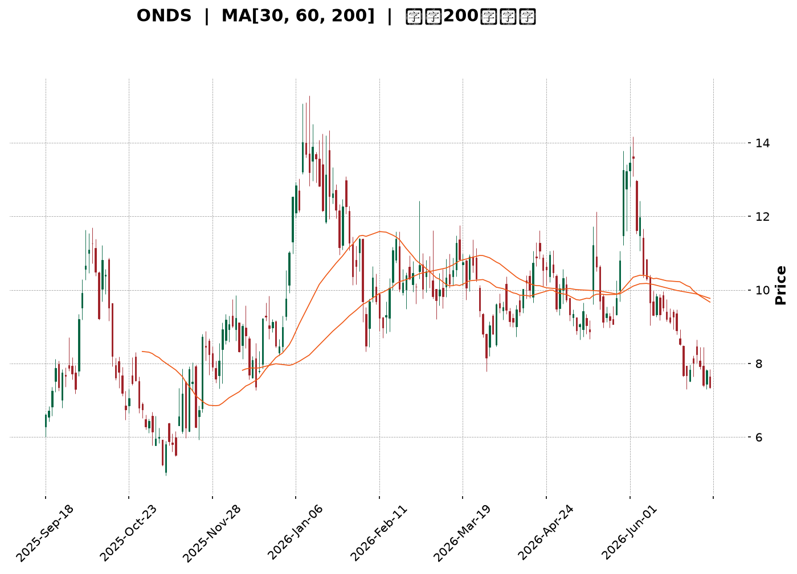
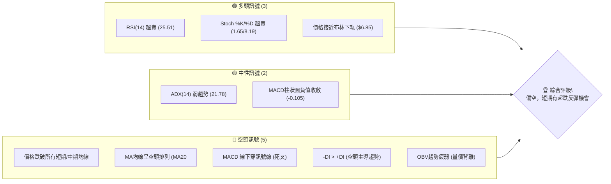
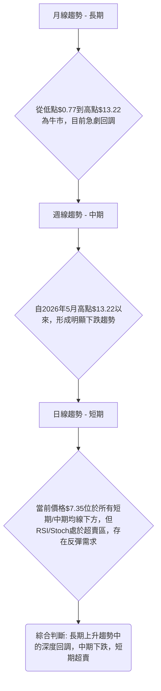
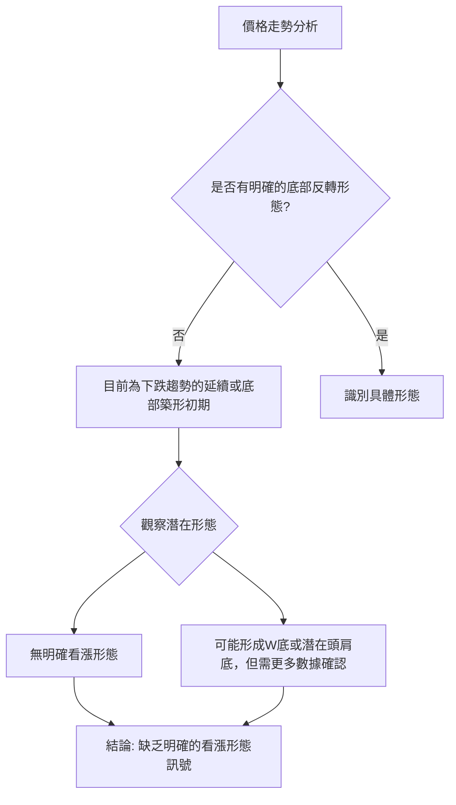
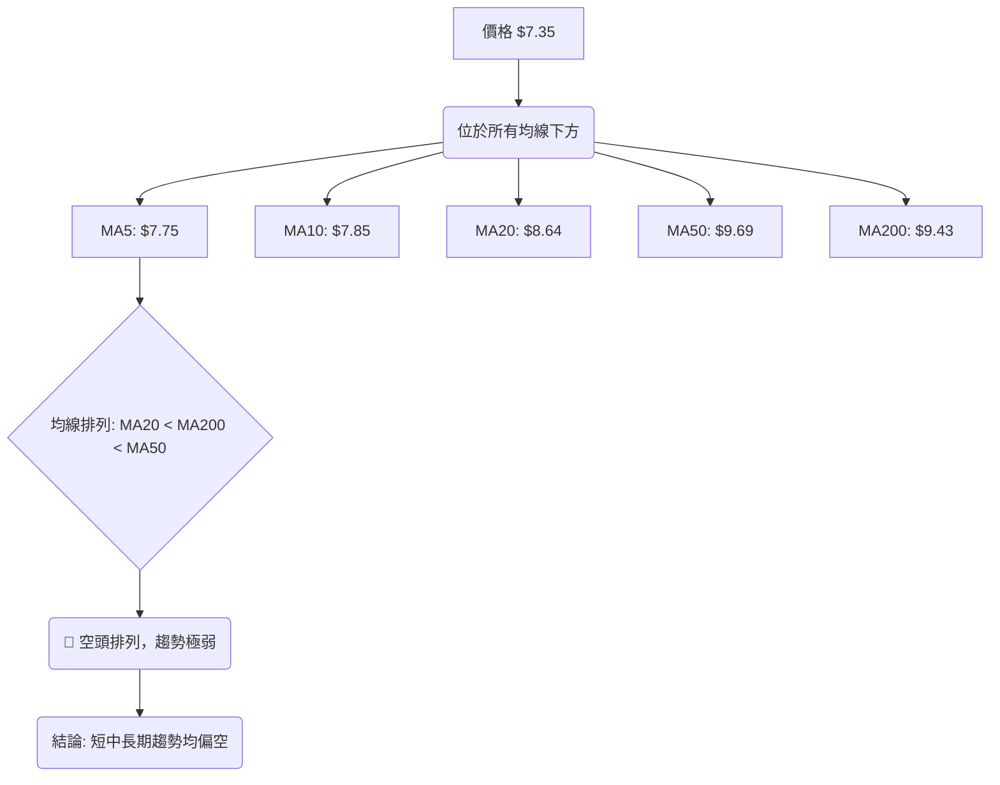
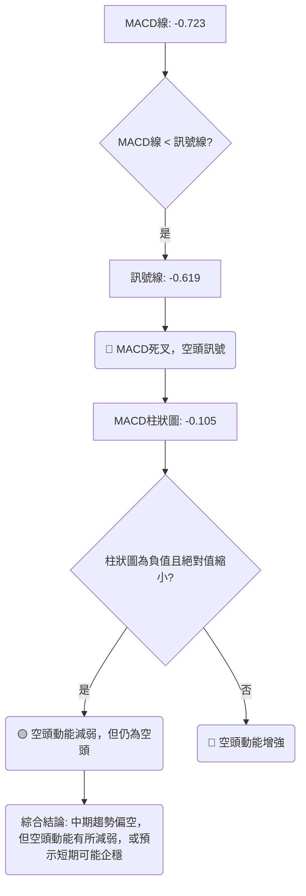
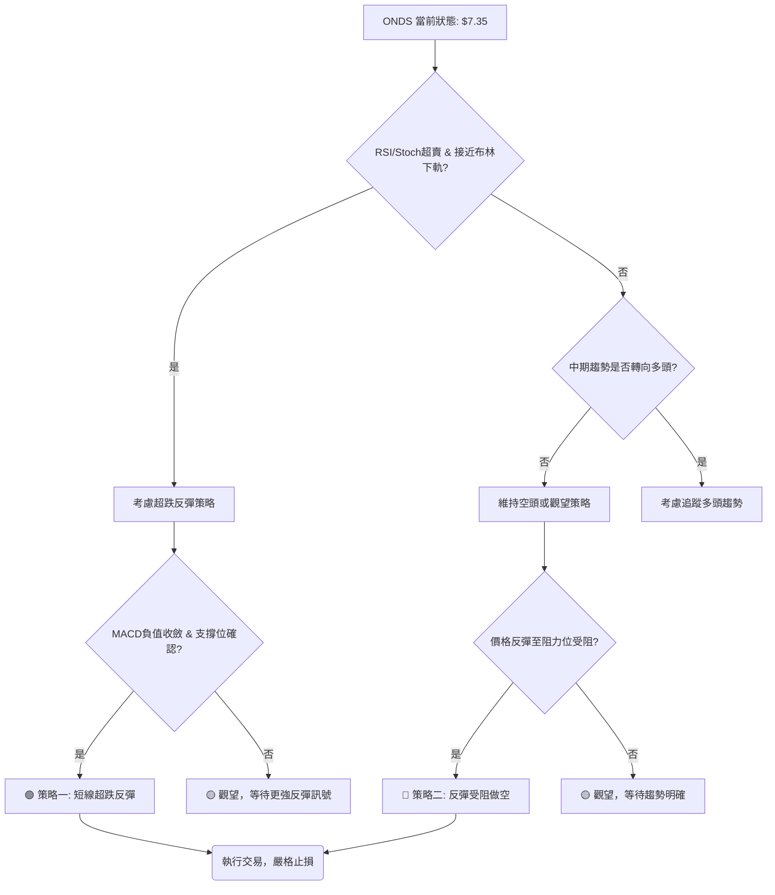

<details>
<summary>📊 靜態圖表 (點擊展開)</summary>

</details>

<html>
<head><meta charset="utf-8" /></head>
<body>
    <div style="height:500px; width:100%;">                        <script>window.PlotlyConfig = {MathJaxConfig: 'local'};</script>
        <script charset="utf-8" src="https://cdn.plot.ly/plotly-3.6.0.min.js" integrity="sha256-QaOVwtVY0T02VaHrr6pnoHLCwayMJp4O5n4YyaE3rJk=" crossorigin="anonymous"></script>                <div id="candlestick-chart" class="plotly-graph-div" style="height:100%; width:100%;"></div>            <script>                window.PLOTLYENV=window.PLOTLYENV || {};                                if (document.getElementById("candlestick-chart")) {                    Plotly.newPlot(                        "candlestick-chart",                        [{"close":{"dtype":"f8","bdata":"AAAAYGZmGkAAAACgR+EaQAAAAIA9Ch1AAAAAwB6FH0AAAABgZmYdQAAAAAAAAB9AAAAAANejHkAAAABA4XofQAAAAKBH4R5AAAAAoHA9HUAAAAAghWsiQAAAAIDr0SNAAAAAgOtRJUAAAACAFC4mQAAAAMAehSZAAAAAQOH6JEAAAADgo3AiQAAAAGC4niVAAAAAgOvRJEAAAADAHgUjQAAAAGBmZiBAAAAA4KNwHkAAAADgehQfQAAAAGCPwhxAAAAAgML1GkAAAACgcD0cQAAAAEAK1x1AAAAAYLgeHkAAAADA9SgbQAAAAAAAABtAAAAAwPUoGUAAAABgj8IZQAAAAKCZmRhAAAAAQArXF0AAAAAAAAAYQAAAAAAAABVAAAAAoHA9F0AAAADAHoUXQAAAAEAzMxdAAAAAgD0KFkAAAACgcD0aQAAAAOBRuBxAAAAAwB4FGUAAAAAAKVwfQAAAAAAAAB5AAAAA4HoUGUAAAADgo\u002fAaQAAAAOCjcCFAAAAAoEfhIEAAAABA4XogQAAAAKCZmR9AAAAAgOtRHkAAAAAA1yMgQAAAAEAK1yFAAAAAoEdhIkAAAAAA1yMiQAAAAIA9CiJAAAAAgMJ1IkAAAABgZqYgQAAAAIA9CiJAAAAAAACAIUAAAABgj8IeQAAAAIAULiBAAAAAQOF6HUAAAABAMzMfQAAAAOCjcCJAAAAAgD2KIkAAAAAgheshQAAAAGCPQiJAAAAAgML1IEAAAAAghesgQAAAAEDh+iFAAAAAwB6FI0AAAACAPQomQAAAACBcDylAAAAAgBSuKUAAAAAAKVwoQAAAAMAeBSxAAAAAoEdhK0AAAACgR2EqQAAAACCuxytAAAAAYLgeK0AAAAAA16MpQAAAAIDrUShAAAAAYI9CKkAAAACgmRkpQAAAAKBwPSlAAAAAQApXKEAAAACA61EmQAAAAMAehShAAAAAgD2KKEAAAACAPYomQAAAAOBRuCRAAAAAIK5HJUAAAABgj8ImQAAAAAApXCNAAAAAgML1IEAAAACgR2EjQAAAAIAUriRAAAAAAClcI0AAAACAwnUiQAAAAOCj8CFAAAAAYLieIkAAAACgmRkkQAAAAADXIyZAAAAAIK7HJkAAAAAgXA8kQAAAAKBHYSRAAAAAwMzMJEAAAACgmZkkQAAAAGBm5iRAAAAAwPUoJEAAAABAClclQAAAAIA9CiRAAAAAwB4FJUAAAABA4fokQAAAAMD1qCNAAAAA4KNwI0AAAADAHgUkQAAAAMD1qCNAAAAAwPWoJEAAAACA61EkQAAAACBcDyVAAAAAIFyPJkAAAADA9aglQAAAAAAAgCVAAAAAYLgeJEAAAADAzMwlQAAAAAApXCVAAAAAYLieJEAAAACgR+EiQAAAAKCZmSFAAAAAwMxMIEAAAADgehQiQAAAAGC4niFAAAAAQDMzI0AAAACAPQojQAAAACBcDyNAAAAAYGbmIkAAAAAgrkciQAAAAGCPQiJAAAAA4KPwIkAAAADAzMwiQAAAACBcDyRAAAAAYGZmJEAAAAAAAAAkQAAAAIDCdSVAAAAAoHC9JUAAAABguB4mQAAAAOB6FCVAAAAAoJkZJUAAAABgZuYlQAAAAIDC9SRAAAAAQOH6IkAAAADgehQkQAAAAADXoyRAAAAAgMJ1I0AAAADA9agiQAAAAIAUriJAAAAAIK7HIUAAAABguB4iQAAAAEAK1yJAAAAA4HoUIkAAAADgUbghQAAAACCFayZAAAAAoHA9JUAAAABgZmYjQAAAAAAAQCJAAAAA4FG4IkAAAAAAKVwiQAAAAGC4HiJAAAAAgD2KI0AAAACgmZklQAAAAAAAgCpAAAAA4KNwKkAAAAAghesqQAAAAMD1KCtAAAAA4FE4J0AAAADgo\u002fAnQAAAAAAp3CRAAAAAoJmZJEAAAADAzEwjQAAAAGC4niJAAAAAwPWoI0AAAADA9agiQAAAAMAeBSNAAAAAIIVrIkAAAACgcD0iQAAAAIA9iiJAAAAAIK7HIUAAAAAgXA8hQAAAAOBRuB5AAAAAQDOzHkAAAACA61EfQAAAAIA9CiBAAAAAQOF6IEAAAACAFK4fQAAAAADXox1AAAAAIK5HH0AAAABgZmYdQA=="},"high":{"dtype":"f8","bdata":"AAAAIFyPGkAAAAAAKVwbQAAAAOCjcB1AAAAAoHA9IEAAAAAA1yMgQAAAAAApXB9AAAAAIFyPH0AAAAAghWshQAAAAEAKVyBAAAAAwMzMH0AAAACAFK4iQAAAACBcjyRAAAAAYI9CJ0AAAABAChcnQAAAAGBmZidAAAAAIK7HJkAAAADAHgUlQAAAAIAUbiZAAAAAYLgeJUAAAACgcL0lQAAAAGCPQiNAAAAAgOtRIEAAAACgR2EgQAAAAADXox9AAAAAgD0KHUAAAABAMzMdQAAAAEAKVyBAAAAAoEehIEAAAAAgXI8eQAAAAMDMzBtAAAAAgMJ1GkAAAAAAAAAaQAAAAGCPwhpAAAAAIK5HGkAAAAAAAAAZQAAAAOBRuBdAAAAA4HqUF0AAAAAgXI8ZQAAAAKBHYRhAAAAAwPWoGEAAAAAAKVwdQAAAAOCjcB9AAAAAIFwPHkAAAACAFK4fQAAAAIDrESBAAAAAoEfhH0AAAABgZmYbQAAAAKCZmSFAAAAAYI\u002fCIUAAAAAAKVwhQAAAAMAg8CBAAAAAANcjIEAAAACgmRkhQAAAAIDCNSJAAAAAgBSuIkAAAACgmZkiQAAAAAAAgCNAAAAA4FG4I0AAAABA4ToiQAAAAMD1KCJAAAAAYGYmI0AAAABA4XohQAAAAADXYyBAAAAAYLgeIUAAAABgka0gQAAAAEDheiJAAAAAgOtRI0AAAACAFK4jQAAAAGBmZiJAAAAAQApXIkAAAABAClchQAAAAKCZmSJAAAAAIFwPJUAAAABguB4mQAAAAOB6FClAAAAAACncKUAAAACAPQoqQAAAAADXIy5AAAAAQDMzLkAAAAAgXI8uQAAAAAAAAC1AAAAAAACAK0AAAAAA1yMsQAAAAAAAgCxAAAAAYGZmLEAAAADA9agsQAAAAMD1qCpAAAAAQOG6KUAAAAAghasoQAAAAOCj8ChAAAAAwPUoKkAAAAAgXI8oQAAAAGBm5iZAAAAAYGZmJkAAAABACtcmQAAAAIA9yiZAAAAAIFwPI0AAAADAHoUjQAAAACCuRyVAAAAAoEfhJEAAAABACtcjQAAAAKDGiyJAAAAAAClcI0AAAAAA16MkQAAAAEAKVyZAAAAAgBQuJ0AAAADA9SgnQAAAAADXIyVAAAAAgML1JEAAAACgR+ElQAAAACBcjyVAAAAAAClcJEAAAABACtcoQAAAAAAAACZAAAAAANejJUAAAABACtclQAAAAOBROCdAAAAAIFwPJEAAAABgZuYkQAAAAGC4HiVAAAAAgBSuJUAAAACAwvUlQAAAAKBwvSVAAAAA4KPwJkAAAADAHoUnQAAAAIDC9SVAAAAAwPWoJUAAAADgo\u002fAlQAAAAKBwvSZAAAAAIK5HJkAAAAAgrkckQAAAAKBwvSJAAAAAANejIUAAAAAgrkciQAAAAEAzsyJAAAAAYI9CI0AAAADAzMwjQAAAAKBHYSNAAAAAoHC9JEAAAACAPQojQAAAAOBRuCJAAAAAIIUrI0AAAADgUbgjQAAAACBcDyRAAAAAIK7HJEAAAAAgXA8lQAAAAGC4HiZAAAAA4HqUJkAAAADgUTgnQAAAAOCj8CVAAAAAgD2KJUAAAABguB4mQAAAAADXIyZAAAAAACncJEAAAACA61EkQAAAAGC4HiVAAAAAQOG6JEAAAADgepQjQAAAACCF6yJAAAAAAACAIkAAAACAFC4iQAAAAMDMTCNAAAAAQDOzIkAAAAAAKVwiQAAAAIDCdSdAAAAAoHA9KEAAAABAClclQAAAAGCPwiNAAAAA4HoUI0AAAABgj8IiQAAAAKBHISNAAAAAwB6FJEAAAABguB4mQAAAACBcjytAAAAAgOvRKkAAAACA69ErQAAAAIDrUSxAAAAAAAAAKkAAAABACtcoQAAAAIDrUSdAAAAAgBSuJUAAAACA69EkQAAAAIDC9SNAAAAAoEPLI0AAAABAicEjQAAAAOCj8CNAAAAAQOF6I0AAAAAAAAAjQAAAACCF6yJAAAAAIIXrIkAAAAAAKdwhQAAAAAAAACFAAAAAYI\u002fCH0AAAAAAKdwfQAAAAOCjcCBAAAAAwMxMIUAAAACgR+EgQAAAAGBm5iBAAAAAAClcH0AAAABgZmYfQA=="},"hovertemplate":"\u003cb\u003e%{x|%Y-%m-%d}\u003c\u002fb\u003e\u003cbr\u003e\u958b: $%{open:.2f}\u003cbr\u003e\u9ad8: $%{high:.2f}\u003cbr\u003e\u4f4e: $%{low:.2f}\u003cbr\u003e\u6536: $%{close:.2f}\u003cextra\u003e\u003c\u002fextra\u003e","low":{"dtype":"f8","bdata":"AAAAgD0KGEAAAACAFK4ZQAAAAIDrURpAAAAAIIXrHEAAAAAAAAAdQAAAAMD1KBtAAAAA4KNwHUAAAABAMzMfQAAAACCuRx5AAAAA4FG4HEAAAAAA16MeQAAAAKBHYSJAAAAAgD2KJEAAAABgZuYkQAAAAGAObSVAAAAAAADAJEAAAACgR2EiQAAAACCyXSNAAAAAYI\u002fCI0AAAACA61EiQAAAAIAUrh9AAAAA4FE4HkAAAACA61EdQAAAAAAAgBxAAAAAACncGUAAAACgmZkaQAAAAGC4nh1AAAAA4HoUHkAAAAAA16MaQAAAAOB6FBpAAAAAgOvRGEAAAABA4XoYQAAAAGC4HhdAAAAA4HoUF0AAAACA61EXQAAAAAAp3BRAAAAAwMzME0AAAADgehQXQAAAAGBmZhZAAAAAIIXrFUAAAACgcD0ZQAAAAGBmZhhAAAAAIIXrF0AAAACgmZkYQAAAAIA9Ch1AAAAAAAAAGUAAAADgUbgXQAAAAIAUrhpAAAAAANcjIEAAAACgcL0eQAAAAEAzMx9AAAAAoEfhHUAAAAAgrkcdQAAAAEAK1x1AAAAAgD0KIUAAAADA9SghQAAAAOCj8CFAAAAA4FE4IUAAAAAAKZwgQAAAAKBwPSBAAAAAgOvRIEAAAACgcD0eQAAAAAApXB5AAAAAYLgeHUAAAACAwvUeQAAAAOCjcB9AAAAAIFxPIkAAAABAClchQAAAAEAzsyFAAAAAACncIEAAAAAghWsgQAAAAMD1qCBAAAAAQApXIkAAAACA69EjQAAAAEDh+iVAAAAAIIXrJ0AAAADgUTgoQAAAAMDMTCpAAAAAgBQuK0AAAADA9agpQAAAACCF6ylAAAAAQArXKUAAAACgmZkpQAAAAKBwPShAAAAAoJmZJ0AAAAAAKdwnQAAAAEAzsyhAAAAAoEfhJ0AAAABgZuYlQAAAAIAULiZAAAAAYLgeKEAAAAAA1yMmQAAAACCuRyRAAAAAwMxMJEAAAADAHgUlQAAAAGCPQiJAAAAAANejIEAAAABgZuYgQAAAAEAKVyNAAAAAQDMzI0AAAABgj8IhQAAAAGBmZiFAAAAAANejIUAAAACgcL0hQAAAAEDh+iNAAAAAQOF6JUAAAABgZuYjQAAAAOBRuCNAAAAAgML1IkAAAACAPYokQAAAAGBm5iNAAAAAoHA9I0AAAACgmZkkQAAAAMAehSNAAAAAACncI0AAAABguB4kQAAAAMAehSNAAAAAYGZmIkAAAABgZiYjQAAAAAAAACNAAAAAoJmZI0AAAACgmRkkQAAAAOBROCRAAAAAoHC9JEAAAAAA16MlQAAAAKBwPSRAAAAAgMJ1I0AAAACAFO4jQAAAAEAz8yRAAAAAgMJ1JEAAAACAPYoiQAAAAMD1aCFAAAAAYLgeH0AAAABgZmYgQAAAACBcjyFAAAAAIIXrIEAAAABgj8IiQAAAAOBNYiJAAAAAgBSuIkAAAADAHgUiQAAAAEDh+iFAAAAAgMJ1IUAAAACgmZkiQAAAAKBwvSJAAAAAwB6FI0AAAACAPYojQAAAAIDrUSNAAAAAIK5HJUAAAABAM7MlQAAAAEAzMyRAAAAAQOE6JEAAAAAghWskQAAAACCFqyRAAAAAgOvRIkAAAABguJ4iQAAAAKBwPSNAAAAAQApXI0AAAACA61EiQAAAAIA9CiJAAAAAIFyPIUAAAADAzEwhQAAAAOCjcCFAAAAAoJmZIUAAAABAClchQAAAAEAzMyNAAAAAAAAAJUAAAAAghesiQAAAAOCj8CFAAAAAoHA9IkAAAACAwvUhQAAAAGC4HiJAAAAAILKdIkAAAAAAKVwjQAAAAOCjcCZAAAAAQDMzJ0AAAACgmZkpQAAAAIAULipAAAAAIFwPJ0AAAABguB4mQAAAAMD1qCRAAAAAAACAJEAAAADgehQiQAAAAKCZmSJAAAAAwB6FIkAAAAAAKVwiQAAAAKCZ2SJAAAAAIK5HIkAAAADA9SgiQAAAAEAK1yFAAAAAIFyPIUAAAAAAAAAhQAAAACBcjx5AAAAAoHA9HUAAAAAAAAAeQAAAAKCZmR5AAAAAwB4FIEAAAABgZmYfQAAAAEDheh1AAAAAoHA9HUAAAAAgrkcdQA=="},"name":"\u50f9\u683c","open":{"dtype":"f8","bdata":"AAAAYLgeGUAAAABAMzMaQAAAACCuRxtAAAAAIFwPHkAAAACAwvUfQAAAAMAeBRxAAAAAIK7HHkAAAABACtcfQAAAAOBRuB9AAAAAAAAAH0AAAABAMzMfQAAAAMAeBSNAAAAAYLgeJUAAAAAAAAAmQAAAACCuhyZAAAAAIK5HJkAAAACAwvUkQAAAACBcDyRAAAAAYI\u002fCJEAAAABgZqYlQAAAAGCPQiNAAAAAwMzMH0AAAABguB4gQAAAAOBRuB5AAAAAYGZmG0AAAABgZmYbQAAAAIAUrh5AAAAAYLheIEAAAADgehQeQAAAAOB6lBtAAAAAgML1GUAAAAAAAAAZQAAAAMDMTBpAAAAAYLgeF0AAAAAghesXQAAAAIAUrhdAAAAAwPUoFEAAAABA4XoZQAAAAGBmZhdAAAAA4KPwF0AAAAAgrkcZQAAAAMD1qBhAAAAAgD0KHkAAAABguJ4YQAAAAAAp3B1AAAAAgBSuH0AAAACgcD0aQAAAAADXIxtAAAAAgML1IEAAAADgUTghQAAAACBcjyBAAAAAwB6FH0AAAADgUbgeQAAAACCuxyBAAAAAwB5FIUAAAAAAKdwhQAAAAEAKlyJAAAAAQArXIUAAAADgUTgiQAAAAEDh+iBAAAAAgML1IUAAAAAAKVwhQAAAAEDheh5AAAAAIK5HIEAAAADA9SgfQAAAAIDC9R9AAAAAoJmZIkAAAAAgXA8iQAAAAIDC9SFAAAAA4CRGIkAAAACgmZkgQAAAACCF6yBAAAAAIFyPIkAAAADAHkUkQAAAAKCZmSZAAAAAQDMzKEAAAABgZmYpQAAAAMD1aCpAAAAAAAAALEAAAAAghWsrQAAAAAAAACtAAAAAoEdhK0AAAAAA1yMrQAAAAOB61CpAAAAAgMK1J0AAAACgmZkrQAAAAMAeBSlAAAAAIIVrKUAAAADAzEwoQAAAACCFayZAAAAAgML1KUAAAAAgrkcoQAAAAAAAgCZAAAAAYLieJUAAAADAHgUmQAAAAGCPwiZAAAAAgBSuIkAAAACAFO4hQAAAAAApnCNAAAAAgBQuJEAAAADAHsUjQAAAAKBwfSJAAAAAgD2KIkAAAADgUXgiQAAAACCFayRAAAAAANejJUAAAACgR2EmQAAAAAAp3CNAAAAAwB4FJEAAAABgj0IlQAAAAMDMTCRAAAAAgBQuJEAAAAAAAAAlQAAAAKBHYSVAAAAA4FG4JEAAAABA4fokQAAAAAAAgCRAAAAAIFwPJEAAAACAFK4jQAAAAKCZGSRAAAAAIIUrJEAAAAAAKdwkQAAAAKBwvSRAAAAAoJkZJUAAAAAAAMAmQAAAAGC4XiVAAAAA4HqUJUAAAADgepQkQAAAAIDr0SVAAAAAYI\u002fCJUAAAACgmRkkQAAAAEAzsyJAAAAAYLieIUAAAABgZuYgQAAAAKCZmSJAAAAAIK4HIUAAAABgj0IjQAAAAAAp3CJAAAAAQApXJEAAAADgetQiQAAAAIDCdSJAAAAAwB4FIkAAAADgo3AjQAAAAMAeBSNAAAAAAACAJEAAAABgj8IkQAAAAKCZmSNAAAAAwMzMJUAAAACAPYomQAAAAGCPwiVAAAAAYI9CJUAAAADAS7ckQAAAAADXYyVAAAAAYI\u002fCJEAAAAAAAAAjQAAAAAAAACRAAAAAwMxMJEAAAAAgXI8jQAAAAAAAgCJAAAAAAACAIkAAAAAAAAAiQAAAAEAK1yFAAAAA4FF4IkAAAABACtchQAAAAEDh+iNAAAAAgOvRJUAAAABgj0IlQAAAAGBmpiNAAAAAAACAIkAAAAAgXI8iQAAAACCFayJAAAAAIIWrIkAAAAAAAAAkQAAAAEAz8yZAAAAAAACAKUAAAACgcH0qQAAAAKBwPStAAAAAIIXrKUAAAACAwvUmQAAAAEAK1yZAAAAAwPWoJUAAAAAghaskQAAAAKBHYSNAAAAAYGamIkAAAABACpcjQAAAAEAzsyNAAAAAgOvRIkAAAACgcH0iQAAAAIDr0SJAAAAAgMK1IkAAAABguF4hQAAAAIDC9SBAAAAAoHC9H0AAAAAgXA8eQAAAACCuRyBAAAAA4KPwIEAAAAAA1yMgQAAAAGCPwh9AAAAAwMzMHUAAAACgmZkeQA=="},"x":["2025-09-18T00:00:00-04:00","2025-09-19T00:00:00-04:00","2025-09-22T00:00:00-04:00","2025-09-23T00:00:00-04:00","2025-09-24T00:00:00-04:00","2025-09-25T00:00:00-04:00","2025-09-26T00:00:00-04:00","2025-09-29T00:00:00-04:00","2025-09-30T00:00:00-04:00","2025-10-01T00:00:00-04:00","2025-10-02T00:00:00-04:00","2025-10-03T00:00:00-04:00","2025-10-06T00:00:00-04:00","2025-10-07T00:00:00-04:00","2025-10-08T00:00:00-04:00","2025-10-09T00:00:00-04:00","2025-10-10T00:00:00-04:00","2025-10-13T00:00:00-04:00","2025-10-14T00:00:00-04:00","2025-10-15T00:00:00-04:00","2025-10-16T00:00:00-04:00","2025-10-17T00:00:00-04:00","2025-10-20T00:00:00-04:00","2025-10-21T00:00:00-04:00","2025-10-22T00:00:00-04:00","2025-10-23T00:00:00-04:00","2025-10-24T00:00:00-04:00","2025-10-27T00:00:00-04:00","2025-10-28T00:00:00-04:00","2025-10-29T00:00:00-04:00","2025-10-30T00:00:00-04:00","2025-10-31T00:00:00-04:00","2025-11-03T00:00:00-05:00","2025-11-04T00:00:00-05:00","2025-11-05T00:00:00-05:00","2025-11-06T00:00:00-05:00","2025-11-07T00:00:00-05:00","2025-11-10T00:00:00-05:00","2025-11-11T00:00:00-05:00","2025-11-12T00:00:00-05:00","2025-11-13T00:00:00-05:00","2025-11-14T00:00:00-05:00","2025-11-17T00:00:00-05:00","2025-11-18T00:00:00-05:00","2025-11-19T00:00:00-05:00","2025-11-20T00:00:00-05:00","2025-11-21T00:00:00-05:00","2025-11-24T00:00:00-05:00","2025-11-25T00:00:00-05:00","2025-11-26T00:00:00-05:00","2025-11-28T00:00:00-05:00","2025-12-01T00:00:00-05:00","2025-12-02T00:00:00-05:00","2025-12-03T00:00:00-05:00","2025-12-04T00:00:00-05:00","2025-12-05T00:00:00-05:00","2025-12-08T00:00:00-05:00","2025-12-09T00:00:00-05:00","2025-12-10T00:00:00-05:00","2025-12-11T00:00:00-05:00","2025-12-12T00:00:00-05:00","2025-12-15T00:00:00-05:00","2025-12-16T00:00:00-05:00","2025-12-17T00:00:00-05:00","2025-12-18T00:00:00-05:00","2025-12-19T00:00:00-05:00","2025-12-22T00:00:00-05:00","2025-12-23T00:00:00-05:00","2025-12-24T00:00:00-05:00","2025-12-26T00:00:00-05:00","2025-12-29T00:00:00-05:00","2025-12-30T00:00:00-05:00","2025-12-31T00:00:00-05:00","2026-01-02T00:00:00-05:00","2026-01-05T00:00:00-05:00","2026-01-06T00:00:00-05:00","2026-01-07T00:00:00-05:00","2026-01-08T00:00:00-05:00","2026-01-09T00:00:00-05:00","2026-01-12T00:00:00-05:00","2026-01-13T00:00:00-05:00","2026-01-14T00:00:00-05:00","2026-01-15T00:00:00-05:00","2026-01-16T00:00:00-05:00","2026-01-20T00:00:00-05:00","2026-01-21T00:00:00-05:00","2026-01-22T00:00:00-05:00","2026-01-23T00:00:00-05:00","2026-01-26T00:00:00-05:00","2026-01-27T00:00:00-05:00","2026-01-28T00:00:00-05:00","2026-01-29T00:00:00-05:00","2026-01-30T00:00:00-05:00","2026-02-02T00:00:00-05:00","2026-02-03T00:00:00-05:00","2026-02-04T00:00:00-05:00","2026-02-05T00:00:00-05:00","2026-02-06T00:00:00-05:00","2026-02-09T00:00:00-05:00","2026-02-10T00:00:00-05:00","2026-02-11T00:00:00-05:00","2026-02-12T00:00:00-05:00","2026-02-13T00:00:00-05:00","2026-02-17T00:00:00-05:00","2026-02-18T00:00:00-05:00","2026-02-19T00:00:00-05:00","2026-02-20T00:00:00-05:00","2026-02-23T00:00:00-05:00","2026-02-24T00:00:00-05:00","2026-02-25T00:00:00-05:00","2026-02-26T00:00:00-05:00","2026-02-27T00:00:00-05:00","2026-03-02T00:00:00-05:00","2026-03-03T00:00:00-05:00","2026-03-04T00:00:00-05:00","2026-03-05T00:00:00-05:00","2026-03-06T00:00:00-05:00","2026-03-09T00:00:00-04:00","2026-03-10T00:00:00-04:00","2026-03-11T00:00:00-04:00","2026-03-12T00:00:00-04:00","2026-03-13T00:00:00-04:00","2026-03-16T00:00:00-04:00","2026-03-17T00:00:00-04:00","2026-03-18T00:00:00-04:00","2026-03-19T00:00:00-04:00","2026-03-20T00:00:00-04:00","2026-03-23T00:00:00-04:00","2026-03-24T00:00:00-04:00","2026-03-25T00:00:00-04:00","2026-03-26T00:00:00-04:00","2026-03-27T00:00:00-04:00","2026-03-30T00:00:00-04:00","2026-03-31T00:00:00-04:00","2026-04-01T00:00:00-04:00","2026-04-02T00:00:00-04:00","2026-04-06T00:00:00-04:00","2026-04-07T00:00:00-04:00","2026-04-08T00:00:00-04:00","2026-04-09T00:00:00-04:00","2026-04-10T00:00:00-04:00","2026-04-13T00:00:00-04:00","2026-04-14T00:00:00-04:00","2026-04-15T00:00:00-04:00","2026-04-16T00:00:00-04:00","2026-04-17T00:00:00-04:00","2026-04-20T00:00:00-04:00","2026-04-21T00:00:00-04:00","2026-04-22T00:00:00-04:00","2026-04-23T00:00:00-04:00","2026-04-24T00:00:00-04:00","2026-04-27T00:00:00-04:00","2026-04-28T00:00:00-04:00","2026-04-29T00:00:00-04:00","2026-04-30T00:00:00-04:00","2026-05-01T00:00:00-04:00","2026-05-04T00:00:00-04:00","2026-05-05T00:00:00-04:00","2026-05-06T00:00:00-04:00","2026-05-07T00:00:00-04:00","2026-05-08T00:00:00-04:00","2026-05-11T00:00:00-04:00","2026-05-12T00:00:00-04:00","2026-05-13T00:00:00-04:00","2026-05-14T00:00:00-04:00","2026-05-15T00:00:00-04:00","2026-05-18T00:00:00-04:00","2026-05-19T00:00:00-04:00","2026-05-20T00:00:00-04:00","2026-05-21T00:00:00-04:00","2026-05-22T00:00:00-04:00","2026-05-26T00:00:00-04:00","2026-05-27T00:00:00-04:00","2026-05-28T00:00:00-04:00","2026-05-29T00:00:00-04:00","2026-06-01T00:00:00-04:00","2026-06-02T00:00:00-04:00","2026-06-03T00:00:00-04:00","2026-06-04T00:00:00-04:00","2026-06-05T00:00:00-04:00","2026-06-08T00:00:00-04:00","2026-06-09T00:00:00-04:00","2026-06-10T00:00:00-04:00","2026-06-11T00:00:00-04:00","2026-06-12T00:00:00-04:00","2026-06-15T00:00:00-04:00","2026-06-16T00:00:00-04:00","2026-06-17T00:00:00-04:00","2026-06-18T00:00:00-04:00","2026-06-22T00:00:00-04:00","2026-06-23T00:00:00-04:00","2026-06-24T00:00:00-04:00","2026-06-25T00:00:00-04:00","2026-06-26T00:00:00-04:00","2026-06-29T00:00:00-04:00","2026-06-30T00:00:00-04:00","2026-07-01T00:00:00-04:00","2026-07-02T00:00:00-04:00","2026-07-06T00:00:00-04:00","2026-07-07T00:00:00-04:00"],"type":"candlestick"},{"hovertemplate":"MA30: $%{y:.2f}\u003cextra\u003e\u003c\u002fextra\u003e","line":{"color":"#2196F3","dash":"dash","width":2},"mode":"lines","name":"MA30","x":["2025-09-18T00:00:00-04:00","2025-09-19T00:00:00-04:00","2025-09-22T00:00:00-04:00","2025-09-23T00:00:00-04:00","2025-09-24T00:00:00-04:00","2025-09-25T00:00:00-04:00","2025-09-26T00:00:00-04:00","2025-09-29T00:00:00-04:00","2025-09-30T00:00:00-04:00","2025-10-01T00:00:00-04:00","2025-10-02T00:00:00-04:00","2025-10-03T00:00:00-04:00","2025-10-06T00:00:00-04:00","2025-10-07T00:00:00-04:00","2025-10-08T00:00:00-04:00","2025-10-09T00:00:00-04:00","2025-10-10T00:00:00-04:00","2025-10-13T00:00:00-04:00","2025-10-14T00:00:00-04:00","2025-10-15T00:00:00-04:00","2025-10-16T00:00:00-04:00","2025-10-17T00:00:00-04:00","2025-10-20T00:00:00-04:00","2025-10-21T00:00:00-04:00","2025-10-22T00:00:00-04:00","2025-10-23T00:00:00-04:00","2025-10-24T00:00:00-04:00","2025-10-27T00:00:00-04:00","2025-10-28T00:00:00-04:00","2025-10-29T00:00:00-04:00","2025-10-30T00:00:00-04:00","2025-10-31T00:00:00-04:00","2025-11-03T00:00:00-05:00","2025-11-04T00:00:00-05:00","2025-11-05T00:00:00-05:00","2025-11-06T00:00:00-05:00","2025-11-07T00:00:00-05:00","2025-11-10T00:00:00-05:00","2025-11-11T00:00:00-05:00","2025-11-12T00:00:00-05:00","2025-11-13T00:00:00-05:00","2025-11-14T00:00:00-05:00","2025-11-17T00:00:00-05:00","2025-11-18T00:00:00-05:00","2025-11-19T00:00:00-05:00","2025-11-20T00:00:00-05:00","2025-11-21T00:00:00-05:00","2025-11-24T00:00:00-05:00","2025-11-25T00:00:00-05:00","2025-11-26T00:00:00-05:00","2025-11-28T00:00:00-05:00","2025-12-01T00:00:00-05:00","2025-12-02T00:00:00-05:00","2025-12-03T00:00:00-05:00","2025-12-04T00:00:00-05:00","2025-12-05T00:00:00-05:00","2025-12-08T00:00:00-05:00","2025-12-09T00:00:00-05:00","2025-12-10T00:00:00-05:00","2025-12-11T00:00:00-05:00","2025-12-12T00:00:00-05:00","2025-12-15T00:00:00-05:00","2025-12-16T00:00:00-05:00","2025-12-17T00:00:00-05:00","2025-12-18T00:00:00-05:00","2025-12-19T00:00:00-05:00","2025-12-22T00:00:00-05:00","2025-12-23T00:00:00-05:00","2025-12-24T00:00:00-05:00","2025-12-26T00:00:00-05:00","2025-12-29T00:00:00-05:00","2025-12-30T00:00:00-05:00","2025-12-31T00:00:00-05:00","2026-01-02T00:00:00-05:00","2026-01-05T00:00:00-05:00","2026-01-06T00:00:00-05:00","2026-01-07T00:00:00-05:00","2026-01-08T00:00:00-05:00","2026-01-09T00:00:00-05:00","2026-01-12T00:00:00-05:00","2026-01-13T00:00:00-05:00","2026-01-14T00:00:00-05:00","2026-01-15T00:00:00-05:00","2026-01-16T00:00:00-05:00","2026-01-20T00:00:00-05:00","2026-01-21T00:00:00-05:00","2026-01-22T00:00:00-05:00","2026-01-23T00:00:00-05:00","2026-01-26T00:00:00-05:00","2026-01-27T00:00:00-05:00","2026-01-28T00:00:00-05:00","2026-01-29T00:00:00-05:00","2026-01-30T00:00:00-05:00","2026-02-02T00:00:00-05:00","2026-02-03T00:00:00-05:00","2026-02-04T00:00:00-05:00","2026-02-05T00:00:00-05:00","2026-02-06T00:00:00-05:00","2026-02-09T00:00:00-05:00","2026-02-10T00:00:00-05:00","2026-02-11T00:00:00-05:00","2026-02-12T00:00:00-05:00","2026-02-13T00:00:00-05:00","2026-02-17T00:00:00-05:00","2026-02-18T00:00:00-05:00","2026-02-19T00:00:00-05:00","2026-02-20T00:00:00-05:00","2026-02-23T00:00:00-05:00","2026-02-24T00:00:00-05:00","2026-02-25T00:00:00-05:00","2026-02-26T00:00:00-05:00","2026-02-27T00:00:00-05:00","2026-03-02T00:00:00-05:00","2026-03-03T00:00:00-05:00","2026-03-04T00:00:00-05:00","2026-03-05T00:00:00-05:00","2026-03-06T00:00:00-05:00","2026-03-09T00:00:00-04:00","2026-03-10T00:00:00-04:00","2026-03-11T00:00:00-04:00","2026-03-12T00:00:00-04:00","2026-03-13T00:00:00-04:00","2026-03-16T00:00:00-04:00","2026-03-17T00:00:00-04:00","2026-03-18T00:00:00-04:00","2026-03-19T00:00:00-04:00","2026-03-20T00:00:00-04:00","2026-03-23T00:00:00-04:00","2026-03-24T00:00:00-04:00","2026-03-25T00:00:00-04:00","2026-03-26T00:00:00-04:00","2026-03-27T00:00:00-04:00","2026-03-30T00:00:00-04:00","2026-03-31T00:00:00-04:00","2026-04-01T00:00:00-04:00","2026-04-02T00:00:00-04:00","2026-04-06T00:00:00-04:00","2026-04-07T00:00:00-04:00","2026-04-08T00:00:00-04:00","2026-04-09T00:00:00-04:00","2026-04-10T00:00:00-04:00","2026-04-13T00:00:00-04:00","2026-04-14T00:00:00-04:00","2026-04-15T00:00:00-04:00","2026-04-16T00:00:00-04:00","2026-04-17T00:00:00-04:00","2026-04-20T00:00:00-04:00","2026-04-21T00:00:00-04:00","2026-04-22T00:00:00-04:00","2026-04-23T00:00:00-04:00","2026-04-24T00:00:00-04:00","2026-04-27T00:00:00-04:00","2026-04-28T00:00:00-04:00","2026-04-29T00:00:00-04:00","2026-04-30T00:00:00-04:00","2026-05-01T00:00:00-04:00","2026-05-04T00:00:00-04:00","2026-05-05T00:00:00-04:00","2026-05-06T00:00:00-04:00","2026-05-07T00:00:00-04:00","2026-05-08T00:00:00-04:00","2026-05-11T00:00:00-04:00","2026-05-12T00:00:00-04:00","2026-05-13T00:00:00-04:00","2026-05-14T00:00:00-04:00","2026-05-15T00:00:00-04:00","2026-05-18T00:00:00-04:00","2026-05-19T00:00:00-04:00","2026-05-20T00:00:00-04:00","2026-05-21T00:00:00-04:00","2026-05-22T00:00:00-04:00","2026-05-26T00:00:00-04:00","2026-05-27T00:00:00-04:00","2026-05-28T00:00:00-04:00","2026-05-29T00:00:00-04:00","2026-06-01T00:00:00-04:00","2026-06-02T00:00:00-04:00","2026-06-03T00:00:00-04:00","2026-06-04T00:00:00-04:00","2026-06-05T00:00:00-04:00","2026-06-08T00:00:00-04:00","2026-06-09T00:00:00-04:00","2026-06-10T00:00:00-04:00","2026-06-11T00:00:00-04:00","2026-06-12T00:00:00-04:00","2026-06-15T00:00:00-04:00","2026-06-16T00:00:00-04:00","2026-06-17T00:00:00-04:00","2026-06-18T00:00:00-04:00","2026-06-22T00:00:00-04:00","2026-06-23T00:00:00-04:00","2026-06-24T00:00:00-04:00","2026-06-25T00:00:00-04:00","2026-06-26T00:00:00-04:00","2026-06-29T00:00:00-04:00","2026-06-30T00:00:00-04:00","2026-07-01T00:00:00-04:00","2026-07-02T00:00:00-04:00","2026-07-06T00:00:00-04:00","2026-07-07T00:00:00-04:00"],"y":{"dtype":"f8","bdata":"AAAAAAAA+H8AAAAAAAD4fwAAAAAAAPh\u002fAAAAAAAA+H8AAAAAAAD4fwAAAAAAAPh\u002fAAAAAAAA+H8AAAAAAAD4fwAAAAAAAPh\u002fAAAAAAAA+H8AAAAAAAD4fwAAAAAAAPh\u002fAAAAAAAA+H8AAAAAAAD4fwAAAAAAAPh\u002fAAAAAAAA+H8AAAAAAAD4fwAAAAAAAPh\u002fAAAAAAAA+H8AAAAAAAD4fwAAAAAAAPh\u002fAAAAAAAA+H8AAAAAAAD4fwAAAAAAAPh\u002fAAAAAAAA+H8AAAAAAAD4fwAAAAAAAPh\u002fAAAAAAAA+H8AAAAAAAD4f5qZmSkVpyBAiYiIwMqhIEAiIiJqA50gQAAAAMARiiBAREREJE1pIEDv7u7mQlIgQERERDyYJyBAZmZmdgUIIECrqqoKHswfQERERNSUih9AERERMSRNH0AzMzMjsPIeQImIiAiBlR5A7+7ujiX\u002fHUAAAACgNpAdQN7d3T3fDx1AIiIiUtR\u002fHEDv7u4OAiscQLy7u1ur4xtAvLu7O22gG0DNzMzME3UbQM3MzFzWahtAd3d3N9BpG0B3d3enDXQbQAAAAKAarxtAzczMDLsCHEAiIiKyVkccQAAAADCWfBxAIiIiAp22HECrqqoKAuscQLy7u5t9OB1Aq6qqanWMHUBVVVUVILcdQAAAABBY+R1ARERE1HgpHkCJiIh46WYeQM3MzNxr7h5A7+7uzoVkH0AiIiJCp80fQO\u002fu7p6oHyBA7+7uvlhSIEARERH5xXIgQLy7u\u002fupkSBAAAAAkHvNIEAiIiIywQMhQJqZmZmZWSFAZmZmXrrJIUAAAADwpyYiQM3MzEzwgCJAZmZm5onaIkB3d3fHBC8jQFVVVX0\u002flSNAq6qqgk77I0C8u7uTX0wkQCIiIlqrgyRAIiIieunGJEDNzMzUTQIlQAAAAHi+PyVA7+7uhutxJUDNzMzUTaIlQDMzM5uZ2SVAERERuawVJkC8u7v7xVImQDMzM8ODeSZAzczMnFKxJkDv7u7ea+4mQERERKRF9iZAMzMzE8roJkDe3d19P\u002fUmQAAAABDmCSdAIiIi8mAeJ0AAAAAghSsnQO\u002fu7r4tKydAq6qqqn8jJ0C8u7ur8RInQFVVVdUG+iZAAAAAsEfhJkARERExlrwmQKuqqlpkeyZAAAAAID5DJkBmZmaG6xEmQO\u002fu7u411yVARERElNGbJUBmZmYWIHclQJqZmUmaUiVAVVVVVeMlJUDe3d0NuwIlQLy7u1sd0yRAVVVVJU2pJECJiIi4rJUkQDMzM+MzbCRAVVVV5RdLJECrqqo6JjgkQImIiPgMOyRAvLu7K\u002flFJEDv7u4uljwkQFVVVRXZTiRAZmZmNtBpJECJiIjIdn4kQEREREREhCRAd3d3xwSPJECJiIhImpIkQKuqqoqzjyRAvLu7a+d7JECamZmpqmokQDMzM5MYRCRAIiIi8oslJECamZm51xwkQERERCSUESRAd3d3h10BJECamZlpke0jQO\u002fu7j4K1yNA3t3dHaHMI0BmZmZm9LYjQGZmZhYgtyNAzczMrNWxI0BVVVXVeKkjQN7d3f3UuCNAq6qqanXMI0AAAADwYN4jQJqZmfl+6iNAvLu7K0DuI0C8u7u7u\u002fsjQHd3d0fh+iNAZmZmplTcI0BmZmYW2c4jQDMzM2OCxyNAd3d3l+DBI0CJiIgoFacjQLy7u5s2kCNAiYiIiPp3I0CrqqpKfnEjQM3MzBwTfCNAVVVVlUOLI0BmZmYmMYgjQImIiOgmsSNAq6qqWo\u002fCI0CJiIjIocUjQAAAAFC4viNAiYiIGC+9I0C8u7vb3b0jQGZmZgasvCNA7+7uvsrBI0ARERFxr9kjQGZmZtajECRAvLu7ay5EJEBERERkO38kQLy7uzvfryRAd3d3V4C8JEARERExCMwkQImIiJgnyiRAREREVOPFJECrqqqKs68kQM3MzLy7myRAiYiIOImhJEDv7u4ua5UkQN7d3T2YhyRAREREVLh+JEAzMzPTInskQN7d3f3weSRA3t3d\u002ffB5JEAiIiJi5XAkQM3MzDQzUyRAZmZmbuc7JEAzMzNLUyokQBEREfnh8yNAAAAAmEPLI0AAAACo4qwjQM3MzLSdjyNAiYiIWFV1I0C8u7vzGVYjQA=="},"type":"scatter"},{"hovertemplate":"MA60: $%{y:.2f}\u003cextra\u003e\u003c\u002fextra\u003e","line":{"color":"#9C27B0","dash":"dash","width":2},"mode":"lines","name":"MA60","x":["2025-09-18T00:00:00-04:00","2025-09-19T00:00:00-04:00","2025-09-22T00:00:00-04:00","2025-09-23T00:00:00-04:00","2025-09-24T00:00:00-04:00","2025-09-25T00:00:00-04:00","2025-09-26T00:00:00-04:00","2025-09-29T00:00:00-04:00","2025-09-30T00:00:00-04:00","2025-10-01T00:00:00-04:00","2025-10-02T00:00:00-04:00","2025-10-03T00:00:00-04:00","2025-10-06T00:00:00-04:00","2025-10-07T00:00:00-04:00","2025-10-08T00:00:00-04:00","2025-10-09T00:00:00-04:00","2025-10-10T00:00:00-04:00","2025-10-13T00:00:00-04:00","2025-10-14T00:00:00-04:00","2025-10-15T00:00:00-04:00","2025-10-16T00:00:00-04:00","2025-10-17T00:00:00-04:00","2025-10-20T00:00:00-04:00","2025-10-21T00:00:00-04:00","2025-10-22T00:00:00-04:00","2025-10-23T00:00:00-04:00","2025-10-24T00:00:00-04:00","2025-10-27T00:00:00-04:00","2025-10-28T00:00:00-04:00","2025-10-29T00:00:00-04:00","2025-10-30T00:00:00-04:00","2025-10-31T00:00:00-04:00","2025-11-03T00:00:00-05:00","2025-11-04T00:00:00-05:00","2025-11-05T00:00:00-05:00","2025-11-06T00:00:00-05:00","2025-11-07T00:00:00-05:00","2025-11-10T00:00:00-05:00","2025-11-11T00:00:00-05:00","2025-11-12T00:00:00-05:00","2025-11-13T00:00:00-05:00","2025-11-14T00:00:00-05:00","2025-11-17T00:00:00-05:00","2025-11-18T00:00:00-05:00","2025-11-19T00:00:00-05:00","2025-11-20T00:00:00-05:00","2025-11-21T00:00:00-05:00","2025-11-24T00:00:00-05:00","2025-11-25T00:00:00-05:00","2025-11-26T00:00:00-05:00","2025-11-28T00:00:00-05:00","2025-12-01T00:00:00-05:00","2025-12-02T00:00:00-05:00","2025-12-03T00:00:00-05:00","2025-12-04T00:00:00-05:00","2025-12-05T00:00:00-05:00","2025-12-08T00:00:00-05:00","2025-12-09T00:00:00-05:00","2025-12-10T00:00:00-05:00","2025-12-11T00:00:00-05:00","2025-12-12T00:00:00-05:00","2025-12-15T00:00:00-05:00","2025-12-16T00:00:00-05:00","2025-12-17T00:00:00-05:00","2025-12-18T00:00:00-05:00","2025-12-19T00:00:00-05:00","2025-12-22T00:00:00-05:00","2025-12-23T00:00:00-05:00","2025-12-24T00:00:00-05:00","2025-12-26T00:00:00-05:00","2025-12-29T00:00:00-05:00","2025-12-30T00:00:00-05:00","2025-12-31T00:00:00-05:00","2026-01-02T00:00:00-05:00","2026-01-05T00:00:00-05:00","2026-01-06T00:00:00-05:00","2026-01-07T00:00:00-05:00","2026-01-08T00:00:00-05:00","2026-01-09T00:00:00-05:00","2026-01-12T00:00:00-05:00","2026-01-13T00:00:00-05:00","2026-01-14T00:00:00-05:00","2026-01-15T00:00:00-05:00","2026-01-16T00:00:00-05:00","2026-01-20T00:00:00-05:00","2026-01-21T00:00:00-05:00","2026-01-22T00:00:00-05:00","2026-01-23T00:00:00-05:00","2026-01-26T00:00:00-05:00","2026-01-27T00:00:00-05:00","2026-01-28T00:00:00-05:00","2026-01-29T00:00:00-05:00","2026-01-30T00:00:00-05:00","2026-02-02T00:00:00-05:00","2026-02-03T00:00:00-05:00","2026-02-04T00:00:00-05:00","2026-02-05T00:00:00-05:00","2026-02-06T00:00:00-05:00","2026-02-09T00:00:00-05:00","2026-02-10T00:00:00-05:00","2026-02-11T00:00:00-05:00","2026-02-12T00:00:00-05:00","2026-02-13T00:00:00-05:00","2026-02-17T00:00:00-05:00","2026-02-18T00:00:00-05:00","2026-02-19T00:00:00-05:00","2026-02-20T00:00:00-05:00","2026-02-23T00:00:00-05:00","2026-02-24T00:00:00-05:00","2026-02-25T00:00:00-05:00","2026-02-26T00:00:00-05:00","2026-02-27T00:00:00-05:00","2026-03-02T00:00:00-05:00","2026-03-03T00:00:00-05:00","2026-03-04T00:00:00-05:00","2026-03-05T00:00:00-05:00","2026-03-06T00:00:00-05:00","2026-03-09T00:00:00-04:00","2026-03-10T00:00:00-04:00","2026-03-11T00:00:00-04:00","2026-03-12T00:00:00-04:00","2026-03-13T00:00:00-04:00","2026-03-16T00:00:00-04:00","2026-03-17T00:00:00-04:00","2026-03-18T00:00:00-04:00","2026-03-19T00:00:00-04:00","2026-03-20T00:00:00-04:00","2026-03-23T00:00:00-04:00","2026-03-24T00:00:00-04:00","2026-03-25T00:00:00-04:00","2026-03-26T00:00:00-04:00","2026-03-27T00:00:00-04:00","2026-03-30T00:00:00-04:00","2026-03-31T00:00:00-04:00","2026-04-01T00:00:00-04:00","2026-04-02T00:00:00-04:00","2026-04-06T00:00:00-04:00","2026-04-07T00:00:00-04:00","2026-04-08T00:00:00-04:00","2026-04-09T00:00:00-04:00","2026-04-10T00:00:00-04:00","2026-04-13T00:00:00-04:00","2026-04-14T00:00:00-04:00","2026-04-15T00:00:00-04:00","2026-04-16T00:00:00-04:00","2026-04-17T00:00:00-04:00","2026-04-20T00:00:00-04:00","2026-04-21T00:00:00-04:00","2026-04-22T00:00:00-04:00","2026-04-23T00:00:00-04:00","2026-04-24T00:00:00-04:00","2026-04-27T00:00:00-04:00","2026-04-28T00:00:00-04:00","2026-04-29T00:00:00-04:00","2026-04-30T00:00:00-04:00","2026-05-01T00:00:00-04:00","2026-05-04T00:00:00-04:00","2026-05-05T00:00:00-04:00","2026-05-06T00:00:00-04:00","2026-05-07T00:00:00-04:00","2026-05-08T00:00:00-04:00","2026-05-11T00:00:00-04:00","2026-05-12T00:00:00-04:00","2026-05-13T00:00:00-04:00","2026-05-14T00:00:00-04:00","2026-05-15T00:00:00-04:00","2026-05-18T00:00:00-04:00","2026-05-19T00:00:00-04:00","2026-05-20T00:00:00-04:00","2026-05-21T00:00:00-04:00","2026-05-22T00:00:00-04:00","2026-05-26T00:00:00-04:00","2026-05-27T00:00:00-04:00","2026-05-28T00:00:00-04:00","2026-05-29T00:00:00-04:00","2026-06-01T00:00:00-04:00","2026-06-02T00:00:00-04:00","2026-06-03T00:00:00-04:00","2026-06-04T00:00:00-04:00","2026-06-05T00:00:00-04:00","2026-06-08T00:00:00-04:00","2026-06-09T00:00:00-04:00","2026-06-10T00:00:00-04:00","2026-06-11T00:00:00-04:00","2026-06-12T00:00:00-04:00","2026-06-15T00:00:00-04:00","2026-06-16T00:00:00-04:00","2026-06-17T00:00:00-04:00","2026-06-18T00:00:00-04:00","2026-06-22T00:00:00-04:00","2026-06-23T00:00:00-04:00","2026-06-24T00:00:00-04:00","2026-06-25T00:00:00-04:00","2026-06-26T00:00:00-04:00","2026-06-29T00:00:00-04:00","2026-06-30T00:00:00-04:00","2026-07-01T00:00:00-04:00","2026-07-02T00:00:00-04:00","2026-07-06T00:00:00-04:00","2026-07-07T00:00:00-04:00"],"y":{"dtype":"f8","bdata":"AAAAAAAA+H8AAAAAAAD4fwAAAAAAAPh\u002fAAAAAAAA+H8AAAAAAAD4fwAAAAAAAPh\u002fAAAAAAAA+H8AAAAAAAD4fwAAAAAAAPh\u002fAAAAAAAA+H8AAAAAAAD4fwAAAAAAAPh\u002fAAAAAAAA+H8AAAAAAAD4fwAAAAAAAPh\u002fAAAAAAAA+H8AAAAAAAD4fwAAAAAAAPh\u002fAAAAAAAA+H8AAAAAAAD4fwAAAAAAAPh\u002fAAAAAAAA+H8AAAAAAAD4fwAAAAAAAPh\u002fAAAAAAAA+H8AAAAAAAD4fwAAAAAAAPh\u002fAAAAAAAA+H8AAAAAAAD4fwAAAAAAAPh\u002fAAAAAAAA+H8AAAAAAAD4fwAAAAAAAPh\u002fAAAAAAAA+H8AAAAAAAD4fwAAAAAAAPh\u002fAAAAAAAA+H8AAAAAAAD4fwAAAAAAAPh\u002fAAAAAAAA+H8AAAAAAAD4fwAAAAAAAPh\u002fAAAAAAAA+H8AAAAAAAD4fwAAAAAAAPh\u002fAAAAAAAA+H8AAAAAAAD4fwAAAAAAAPh\u002fAAAAAAAA+H8AAAAAAAD4fwAAAAAAAPh\u002fAAAAAAAA+H8AAAAAAAD4fwAAAAAAAPh\u002fAAAAAAAA+H8AAAAAAAD4fwAAAAAAAPh\u002fAAAAAAAA+H8AAAAAAAD4f3d3d\u002fdTQx9A3t3ddQVoH0DNzMx0k3gfQAAAAMi9hh9AZmZmjgl+H0AzMzOjt4UfQKuqqirOnh9A3t3dXUi6H0BmZmam4swfQBEREQnz5B9Ad3d31+r4H0CrqqoKHuwfQAAAAIBq3B9Ad3d3Vw7NH0AiIiKC3MsfQImIiDiJ4R9AvLu7Q9IEIEC8u7t7FB4gQFVVVf1iOSBAIiIiQmBVIEDv7u5Wx3QgQN7d3VVVpSBAMzMzTxvYIEC8u7szMwMhQBEREVWcLSFAREREgCNkIUDv7u6W\u002fJIhQAAAAMgEvyFAAAAABJ3mIUARERFt5wsiQImIiDTsOiJAMzMzt\u002fNtIkAzMzMDK5ciQJqZmeUXuyJAd3d3gwfjIkCamZlN8BAjQFVVVcm9NiNAVVVVfYZNI0B3d3ePCW4jQHd3d1fHlCNAiYiI2Fy4I0CJiIiMJc8jQFVVVd1r3iNAVVVVnX34I0Dv7u5uWQskQHd3dzfQKSRAMzMzB4FVJECJiIgQn3EkQLy7u1MqfiRAMzMzA+SOJEDv7u4meKAkQCIiIrY6tiRAd3d3C5DLJEARERHVv+EkQN7d3dEi6yRAvLu7Z2b2JEBVVVVxhAIlQN7d3eltCSVAIiIiVpwNJUCrqqpG\u002fRslQDMzM7\u002fmIiVAMzMzT2IwJUAzMzMbdkUlQN7d3V1IWiVARERE5KV7JUDv7u4GgZUlQM3MzFyPoiVAzczMJE2pJUAzMzMj27klQCIiIioVxyVAzczM3LLWJUBERES0D98lQM3MzKRw3SVAMzMzi7PPJUCrqqoqzr4lQERERLQPnyVAERER0WmDJUBVVVX1tmwlQHd3dz98RiVAvLu7000iJUAAAAB4vv8kQO\u002fu7hYg1yRAERERWTm0JEBmZmY+CpckQAAAADDdhCRAERERgdxrJECamZnxGVYkQM3MzCz5RSRAAAAASOE6JEBERETUBjokQGZmZm5ZKyRAiYiICKwcJEAzMzP78BkkQAAAACD3GiRAERER6SYRJECrqqqitwUkQERERLwtCyRA7+7uZtgVJECJiIj4xRIkQAAAAHA9CiRAAAAAqH8DJECamZlJDAIkQLy7u1PjBSRAiYiIgJUDJEAAAADobfkjQN7d3b2f+iNAZmZmpg30I0ARERHBPPEjQCIiIjom6CNAAAAAUEbfI0Crqqqit9UjQKuqqiLbySNAZmZm7jXHI0C8u7vrUcgjQGZmZvbh4yNAREREDAL7I0DNzMwcWhQkQM3MzBxaNCRAERER4XpEJECJiIiQNFUkQBEREUlTWiRAAAAAwBFaJEAzMzOjt1UkQCIiIoJOSyRAd3d37+4+JECrqqoiIjIkQImIiFCNJyRA3t3ddUwgJEDe3d39GxEkQM3MzMwTBSRAMzMzw\u002fX4I0BmZmbWMfEjQM3MzCij5yNA3t3dgZXjI0DNzMw4QtkjQM3MzHCE0iNAVVVVeenGI0BEREQ4QrkjQGZmZgIrpyNAiYiIOEKZI0C8u7vn+4kjQA=="},"type":"scatter"},{"hovertemplate":"MA200: $%{y:.2f}\u003cextra\u003e\u003c\u002fextra\u003e","line":{"color":"#FF6F00","dash":"solid","width":2},"mode":"lines","name":"MA200","x":["2025-09-18T00:00:00-04:00","2025-09-19T00:00:00-04:00","2025-09-22T00:00:00-04:00","2025-09-23T00:00:00-04:00","2025-09-24T00:00:00-04:00","2025-09-25T00:00:00-04:00","2025-09-26T00:00:00-04:00","2025-09-29T00:00:00-04:00","2025-09-30T00:00:00-04:00","2025-10-01T00:00:00-04:00","2025-10-02T00:00:00-04:00","2025-10-03T00:00:00-04:00","2025-10-06T00:00:00-04:00","2025-10-07T00:00:00-04:00","2025-10-08T00:00:00-04:00","2025-10-09T00:00:00-04:00","2025-10-10T00:00:00-04:00","2025-10-13T00:00:00-04:00","2025-10-14T00:00:00-04:00","2025-10-15T00:00:00-04:00","2025-10-16T00:00:00-04:00","2025-10-17T00:00:00-04:00","2025-10-20T00:00:00-04:00","2025-10-21T00:00:00-04:00","2025-10-22T00:00:00-04:00","2025-10-23T00:00:00-04:00","2025-10-24T00:00:00-04:00","2025-10-27T00:00:00-04:00","2025-10-28T00:00:00-04:00","2025-10-29T00:00:00-04:00","2025-10-30T00:00:00-04:00","2025-10-31T00:00:00-04:00","2025-11-03T00:00:00-05:00","2025-11-04T00:00:00-05:00","2025-11-05T00:00:00-05:00","2025-11-06T00:00:00-05:00","2025-11-07T00:00:00-05:00","2025-11-10T00:00:00-05:00","2025-11-11T00:00:00-05:00","2025-11-12T00:00:00-05:00","2025-11-13T00:00:00-05:00","2025-11-14T00:00:00-05:00","2025-11-17T00:00:00-05:00","2025-11-18T00:00:00-05:00","2025-11-19T00:00:00-05:00","2025-11-20T00:00:00-05:00","2025-11-21T00:00:00-05:00","2025-11-24T00:00:00-05:00","2025-11-25T00:00:00-05:00","2025-11-26T00:00:00-05:00","2025-11-28T00:00:00-05:00","2025-12-01T00:00:00-05:00","2025-12-02T00:00:00-05:00","2025-12-03T00:00:00-05:00","2025-12-04T00:00:00-05:00","2025-12-05T00:00:00-05:00","2025-12-08T00:00:00-05:00","2025-12-09T00:00:00-05:00","2025-12-10T00:00:00-05:00","2025-12-11T00:00:00-05:00","2025-12-12T00:00:00-05:00","2025-12-15T00:00:00-05:00","2025-12-16T00:00:00-05:00","2025-12-17T00:00:00-05:00","2025-12-18T00:00:00-05:00","2025-12-19T00:00:00-05:00","2025-12-22T00:00:00-05:00","2025-12-23T00:00:00-05:00","2025-12-24T00:00:00-05:00","2025-12-26T00:00:00-05:00","2025-12-29T00:00:00-05:00","2025-12-30T00:00:00-05:00","2025-12-31T00:00:00-05:00","2026-01-02T00:00:00-05:00","2026-01-05T00:00:00-05:00","2026-01-06T00:00:00-05:00","2026-01-07T00:00:00-05:00","2026-01-08T00:00:00-05:00","2026-01-09T00:00:00-05:00","2026-01-12T00:00:00-05:00","2026-01-13T00:00:00-05:00","2026-01-14T00:00:00-05:00","2026-01-15T00:00:00-05:00","2026-01-16T00:00:00-05:00","2026-01-20T00:00:00-05:00","2026-01-21T00:00:00-05:00","2026-01-22T00:00:00-05:00","2026-01-23T00:00:00-05:00","2026-01-26T00:00:00-05:00","2026-01-27T00:00:00-05:00","2026-01-28T00:00:00-05:00","2026-01-29T00:00:00-05:00","2026-01-30T00:00:00-05:00","2026-02-02T00:00:00-05:00","2026-02-03T00:00:00-05:00","2026-02-04T00:00:00-05:00","2026-02-05T00:00:00-05:00","2026-02-06T00:00:00-05:00","2026-02-09T00:00:00-05:00","2026-02-10T00:00:00-05:00","2026-02-11T00:00:00-05:00","2026-02-12T00:00:00-05:00","2026-02-13T00:00:00-05:00","2026-02-17T00:00:00-05:00","2026-02-18T00:00:00-05:00","2026-02-19T00:00:00-05:00","2026-02-20T00:00:00-05:00","2026-02-23T00:00:00-05:00","2026-02-24T00:00:00-05:00","2026-02-25T00:00:00-05:00","2026-02-26T00:00:00-05:00","2026-02-27T00:00:00-05:00","2026-03-02T00:00:00-05:00","2026-03-03T00:00:00-05:00","2026-03-04T00:00:00-05:00","2026-03-05T00:00:00-05:00","2026-03-06T00:00:00-05:00","2026-03-09T00:00:00-04:00","2026-03-10T00:00:00-04:00","2026-03-11T00:00:00-04:00","2026-03-12T00:00:00-04:00","2026-03-13T00:00:00-04:00","2026-03-16T00:00:00-04:00","2026-03-17T00:00:00-04:00","2026-03-18T00:00:00-04:00","2026-03-19T00:00:00-04:00","2026-03-20T00:00:00-04:00","2026-03-23T00:00:00-04:00","2026-03-24T00:00:00-04:00","2026-03-25T00:00:00-04:00","2026-03-26T00:00:00-04:00","2026-03-27T00:00:00-04:00","2026-03-30T00:00:00-04:00","2026-03-31T00:00:00-04:00","2026-04-01T00:00:00-04:00","2026-04-02T00:00:00-04:00","2026-04-06T00:00:00-04:00","2026-04-07T00:00:00-04:00","2026-04-08T00:00:00-04:00","2026-04-09T00:00:00-04:00","2026-04-10T00:00:00-04:00","2026-04-13T00:00:00-04:00","2026-04-14T00:00:00-04:00","2026-04-15T00:00:00-04:00","2026-04-16T00:00:00-04:00","2026-04-17T00:00:00-04:00","2026-04-20T00:00:00-04:00","2026-04-21T00:00:00-04:00","2026-04-22T00:00:00-04:00","2026-04-23T00:00:00-04:00","2026-04-24T00:00:00-04:00","2026-04-27T00:00:00-04:00","2026-04-28T00:00:00-04:00","2026-04-29T00:00:00-04:00","2026-04-30T00:00:00-04:00","2026-05-01T00:00:00-04:00","2026-05-04T00:00:00-04:00","2026-05-05T00:00:00-04:00","2026-05-06T00:00:00-04:00","2026-05-07T00:00:00-04:00","2026-05-08T00:00:00-04:00","2026-05-11T00:00:00-04:00","2026-05-12T00:00:00-04:00","2026-05-13T00:00:00-04:00","2026-05-14T00:00:00-04:00","2026-05-15T00:00:00-04:00","2026-05-18T00:00:00-04:00","2026-05-19T00:00:00-04:00","2026-05-20T00:00:00-04:00","2026-05-21T00:00:00-04:00","2026-05-22T00:00:00-04:00","2026-05-26T00:00:00-04:00","2026-05-27T00:00:00-04:00","2026-05-28T00:00:00-04:00","2026-05-29T00:00:00-04:00","2026-06-01T00:00:00-04:00","2026-06-02T00:00:00-04:00","2026-06-03T00:00:00-04:00","2026-06-04T00:00:00-04:00","2026-06-05T00:00:00-04:00","2026-06-08T00:00:00-04:00","2026-06-09T00:00:00-04:00","2026-06-10T00:00:00-04:00","2026-06-11T00:00:00-04:00","2026-06-12T00:00:00-04:00","2026-06-15T00:00:00-04:00","2026-06-16T00:00:00-04:00","2026-06-17T00:00:00-04:00","2026-06-18T00:00:00-04:00","2026-06-22T00:00:00-04:00","2026-06-23T00:00:00-04:00","2026-06-24T00:00:00-04:00","2026-06-25T00:00:00-04:00","2026-06-26T00:00:00-04:00","2026-06-29T00:00:00-04:00","2026-06-30T00:00:00-04:00","2026-07-01T00:00:00-04:00","2026-07-02T00:00:00-04:00","2026-07-06T00:00:00-04:00","2026-07-07T00:00:00-04:00"],"y":{"dtype":"f8","bdata":"AAAAAAAA+H8AAAAAAAD4fwAAAAAAAPh\u002fAAAAAAAA+H8AAAAAAAD4fwAAAAAAAPh\u002fAAAAAAAA+H8AAAAAAAD4fwAAAAAAAPh\u002fAAAAAAAA+H8AAAAAAAD4fwAAAAAAAPh\u002fAAAAAAAA+H8AAAAAAAD4fwAAAAAAAPh\u002fAAAAAAAA+H8AAAAAAAD4fwAAAAAAAPh\u002fAAAAAAAA+H8AAAAAAAD4fwAAAAAAAPh\u002fAAAAAAAA+H8AAAAAAAD4fwAAAAAAAPh\u002fAAAAAAAA+H8AAAAAAAD4fwAAAAAAAPh\u002fAAAAAAAA+H8AAAAAAAD4fwAAAAAAAPh\u002fAAAAAAAA+H8AAAAAAAD4fwAAAAAAAPh\u002fAAAAAAAA+H8AAAAAAAD4fwAAAAAAAPh\u002fAAAAAAAA+H8AAAAAAAD4fwAAAAAAAPh\u002fAAAAAAAA+H8AAAAAAAD4fwAAAAAAAPh\u002fAAAAAAAA+H8AAAAAAAD4fwAAAAAAAPh\u002fAAAAAAAA+H8AAAAAAAD4fwAAAAAAAPh\u002fAAAAAAAA+H8AAAAAAAD4fwAAAAAAAPh\u002fAAAAAAAA+H8AAAAAAAD4fwAAAAAAAPh\u002fAAAAAAAA+H8AAAAAAAD4fwAAAAAAAPh\u002fAAAAAAAA+H8AAAAAAAD4fwAAAAAAAPh\u002fAAAAAAAA+H8AAAAAAAD4fwAAAAAAAPh\u002fAAAAAAAA+H8AAAAAAAD4fwAAAAAAAPh\u002fAAAAAAAA+H8AAAAAAAD4fwAAAAAAAPh\u002fAAAAAAAA+H8AAAAAAAD4fwAAAAAAAPh\u002fAAAAAAAA+H8AAAAAAAD4fwAAAAAAAPh\u002fAAAAAAAA+H8AAAAAAAD4fwAAAAAAAPh\u002fAAAAAAAA+H8AAAAAAAD4fwAAAAAAAPh\u002fAAAAAAAA+H8AAAAAAAD4fwAAAAAAAPh\u002fAAAAAAAA+H8AAAAAAAD4fwAAAAAAAPh\u002fAAAAAAAA+H8AAAAAAAD4fwAAAAAAAPh\u002fAAAAAAAA+H8AAAAAAAD4fwAAAAAAAPh\u002fAAAAAAAA+H8AAAAAAAD4fwAAAAAAAPh\u002fAAAAAAAA+H8AAAAAAAD4fwAAAAAAAPh\u002fAAAAAAAA+H8AAAAAAAD4fwAAAAAAAPh\u002fAAAAAAAA+H8AAAAAAAD4fwAAAAAAAPh\u002fAAAAAAAA+H8AAAAAAAD4fwAAAAAAAPh\u002fAAAAAAAA+H8AAAAAAAD4fwAAAAAAAPh\u002fAAAAAAAA+H8AAAAAAAD4fwAAAAAAAPh\u002fAAAAAAAA+H8AAAAAAAD4fwAAAAAAAPh\u002fAAAAAAAA+H8AAAAAAAD4fwAAAAAAAPh\u002fAAAAAAAA+H8AAAAAAAD4fwAAAAAAAPh\u002fAAAAAAAA+H8AAAAAAAD4fwAAAAAAAPh\u002fAAAAAAAA+H8AAAAAAAD4fwAAAAAAAPh\u002fAAAAAAAA+H8AAAAAAAD4fwAAAAAAAPh\u002fAAAAAAAA+H8AAAAAAAD4fwAAAAAAAPh\u002fAAAAAAAA+H8AAAAAAAD4fwAAAAAAAPh\u002fAAAAAAAA+H8AAAAAAAD4fwAAAAAAAPh\u002fAAAAAAAA+H8AAAAAAAD4fwAAAAAAAPh\u002fAAAAAAAA+H8AAAAAAAD4fwAAAAAAAPh\u002fAAAAAAAA+H8AAAAAAAD4fwAAAAAAAPh\u002fAAAAAAAA+H8AAAAAAAD4fwAAAAAAAPh\u002fAAAAAAAA+H8AAAAAAAD4fwAAAAAAAPh\u002fAAAAAAAA+H8AAAAAAAD4fwAAAAAAAPh\u002fAAAAAAAA+H8AAAAAAAD4fwAAAAAAAPh\u002fAAAAAAAA+H8AAAAAAAD4fwAAAAAAAPh\u002fAAAAAAAA+H8AAAAAAAD4fwAAAAAAAPh\u002fAAAAAAAA+H8AAAAAAAD4fwAAAAAAAPh\u002fAAAAAAAA+H8AAAAAAAD4fwAAAAAAAPh\u002fAAAAAAAA+H8AAAAAAAD4fwAAAAAAAPh\u002fAAAAAAAA+H8AAAAAAAD4fwAAAAAAAPh\u002fAAAAAAAA+H8AAAAAAAD4fwAAAAAAAPh\u002fAAAAAAAA+H8AAAAAAAD4fwAAAAAAAPh\u002fAAAAAAAA+H8AAAAAAAD4fwAAAAAAAPh\u002fAAAAAAAA+H8AAAAAAAD4fwAAAAAAAPh\u002fAAAAAAAA+H8AAAAAAAD4fwAAAAAAAPh\u002fAAAAAAAA+H8AAAAAAAD4fwAAAAAAAPh\u002fAAAAAAAA+H+PwvV4et0iQA=="},"type":"scatter"}],                        {"template":{"data":{"barpolar":[{"marker":{"line":{"color":"rgb(17,17,17)","width":0.5},"pattern":{"fillmode":"overlay","size":10,"solidity":0.2}},"type":"barpolar"}],"bar":[{"error_x":{"color":"#f2f5fa"},"error_y":{"color":"#f2f5fa"},"marker":{"line":{"color":"rgb(17,17,17)","width":0.5},"pattern":{"fillmode":"overlay","size":10,"solidity":0.2}},"type":"bar"}],"carpet":[{"aaxis":{"endlinecolor":"#A2B1C6","gridcolor":"#506784","linecolor":"#506784","minorgridcolor":"#506784","startlinecolor":"#A2B1C6"},"baxis":{"endlinecolor":"#A2B1C6","gridcolor":"#506784","linecolor":"#506784","minorgridcolor":"#506784","startlinecolor":"#A2B1C6"},"type":"carpet"}],"choropleth":[{"colorbar":{"outlinewidth":0,"ticks":""},"type":"choropleth"}],"contourcarpet":[{"colorbar":{"outlinewidth":0,"ticks":""},"type":"contourcarpet"}],"contour":[{"colorbar":{"outlinewidth":0,"ticks":""},"colorscale":[[0.0,"#0d0887"],[0.1111111111111111,"#46039f"],[0.2222222222222222,"#7201a8"],[0.3333333333333333,"#9c179e"],[0.4444444444444444,"#bd3786"],[0.5555555555555556,"#d8576b"],[0.6666666666666666,"#ed7953"],[0.7777777777777778,"#fb9f3a"],[0.8888888888888888,"#fdca26"],[1.0,"#f0f921"]],"type":"contour"}],"heatmap":[{"colorbar":{"outlinewidth":0,"ticks":""},"colorscale":[[0.0,"#0d0887"],[0.1111111111111111,"#46039f"],[0.2222222222222222,"#7201a8"],[0.3333333333333333,"#9c179e"],[0.4444444444444444,"#bd3786"],[0.5555555555555556,"#d8576b"],[0.6666666666666666,"#ed7953"],[0.7777777777777778,"#fb9f3a"],[0.8888888888888888,"#fdca26"],[1.0,"#f0f921"]],"type":"heatmap"}],"histogram2dcontour":[{"colorbar":{"outlinewidth":0,"ticks":""},"colorscale":[[0.0,"#0d0887"],[0.1111111111111111,"#46039f"],[0.2222222222222222,"#7201a8"],[0.3333333333333333,"#9c179e"],[0.4444444444444444,"#bd3786"],[0.5555555555555556,"#d8576b"],[0.6666666666666666,"#ed7953"],[0.7777777777777778,"#fb9f3a"],[0.8888888888888888,"#fdca26"],[1.0,"#f0f921"]],"type":"histogram2dcontour"}],"histogram2d":[{"colorbar":{"outlinewidth":0,"ticks":""},"colorscale":[[0.0,"#0d0887"],[0.1111111111111111,"#46039f"],[0.2222222222222222,"#7201a8"],[0.3333333333333333,"#9c179e"],[0.4444444444444444,"#bd3786"],[0.5555555555555556,"#d8576b"],[0.6666666666666666,"#ed7953"],[0.7777777777777778,"#fb9f3a"],[0.8888888888888888,"#fdca26"],[1.0,"#f0f921"]],"type":"histogram2d"}],"histogram":[{"marker":{"pattern":{"fillmode":"overlay","size":10,"solidity":0.2}},"type":"histogram"}],"mesh3d":[{"colorbar":{"outlinewidth":0,"ticks":""},"type":"mesh3d"}],"parcoords":[{"line":{"colorbar":{"outlinewidth":0,"ticks":""}},"type":"parcoords"}],"pie":[{"automargin":true,"type":"pie"}],"scatter3d":[{"line":{"colorbar":{"outlinewidth":0,"ticks":""}},"marker":{"colorbar":{"outlinewidth":0,"ticks":""}},"type":"scatter3d"}],"scattercarpet":[{"marker":{"colorbar":{"outlinewidth":0,"ticks":""}},"type":"scattercarpet"}],"scattergeo":[{"marker":{"colorbar":{"outlinewidth":0,"ticks":""}},"type":"scattergeo"}],"scattergl":[{"marker":{"line":{"color":"#283442"}},"type":"scattergl"}],"scattermapbox":[{"marker":{"colorbar":{"outlinewidth":0,"ticks":""}},"type":"scattermapbox"}],"scattermap":[{"marker":{"colorbar":{"outlinewidth":0,"ticks":""}},"type":"scattermap"}],"scatterpolargl":[{"marker":{"colorbar":{"outlinewidth":0,"ticks":""}},"type":"scatterpolargl"}],"scatterpolar":[{"marker":{"colorbar":{"outlinewidth":0,"ticks":""}},"type":"scatterpolar"}],"scatter":[{"marker":{"line":{"color":"#283442"}},"type":"scatter"}],"scatterternary":[{"marker":{"colorbar":{"outlinewidth":0,"ticks":""}},"type":"scatterternary"}],"surface":[{"colorbar":{"outlinewidth":0,"ticks":""},"colorscale":[[0.0,"#0d0887"],[0.1111111111111111,"#46039f"],[0.2222222222222222,"#7201a8"],[0.3333333333333333,"#9c179e"],[0.4444444444444444,"#bd3786"],[0.5555555555555556,"#d8576b"],[0.6666666666666666,"#ed7953"],[0.7777777777777778,"#fb9f3a"],[0.8888888888888888,"#fdca26"],[1.0,"#f0f921"]],"type":"surface"}],"table":[{"cells":{"fill":{"color":"#506784"},"line":{"color":"rgb(17,17,17)"}},"header":{"fill":{"color":"#2a3f5f"},"line":{"color":"rgb(17,17,17)"}},"type":"table"}]},"layout":{"annotationdefaults":{"arrowcolor":"#f2f5fa","arrowhead":0,"arrowwidth":1},"autotypenumbers":"strict","coloraxis":{"colorbar":{"outlinewidth":0,"ticks":""}},"colorscale":{"diverging":[[0,"#8e0152"],[0.1,"#c51b7d"],[0.2,"#de77ae"],[0.3,"#f1b6da"],[0.4,"#fde0ef"],[0.5,"#f7f7f7"],[0.6,"#e6f5d0"],[0.7,"#b8e186"],[0.8,"#7fbc41"],[0.9,"#4d9221"],[1,"#276419"]],"sequential":[[0.0,"#0d0887"],[0.1111111111111111,"#46039f"],[0.2222222222222222,"#7201a8"],[0.3333333333333333,"#9c179e"],[0.4444444444444444,"#bd3786"],[0.5555555555555556,"#d8576b"],[0.6666666666666666,"#ed7953"],[0.7777777777777778,"#fb9f3a"],[0.8888888888888888,"#fdca26"],[1.0,"#f0f921"]],"sequentialminus":[[0.0,"#0d0887"],[0.1111111111111111,"#46039f"],[0.2222222222222222,"#7201a8"],[0.3333333333333333,"#9c179e"],[0.4444444444444444,"#bd3786"],[0.5555555555555556,"#d8576b"],[0.6666666666666666,"#ed7953"],[0.7777777777777778,"#fb9f3a"],[0.8888888888888888,"#fdca26"],[1.0,"#f0f921"]]},"colorway":["#636efa","#EF553B","#00cc96","#ab63fa","#FFA15A","#19d3f3","#FF6692","#B6E880","#FF97FF","#FECB52"],"font":{"color":"#f2f5fa"},"geo":{"bgcolor":"rgb(17,17,17)","lakecolor":"rgb(17,17,17)","landcolor":"rgb(17,17,17)","showlakes":true,"showland":true,"subunitcolor":"#506784"},"hoverlabel":{"align":"left"},"hovermode":"closest","mapbox":{"style":"dark"},"paper_bgcolor":"rgb(17,17,17)","plot_bgcolor":"rgb(17,17,17)","polar":{"angularaxis":{"gridcolor":"#506784","linecolor":"#506784","ticks":""},"bgcolor":"rgb(17,17,17)","radialaxis":{"gridcolor":"#506784","linecolor":"#506784","ticks":""}},"scene":{"xaxis":{"backgroundcolor":"rgb(17,17,17)","gridcolor":"#506784","gridwidth":2,"linecolor":"#506784","showbackground":true,"ticks":"","zerolinecolor":"#C8D4E3"},"yaxis":{"backgroundcolor":"rgb(17,17,17)","gridcolor":"#506784","gridwidth":2,"linecolor":"#506784","showbackground":true,"ticks":"","zerolinecolor":"#C8D4E3"},"zaxis":{"backgroundcolor":"rgb(17,17,17)","gridcolor":"#506784","gridwidth":2,"linecolor":"#506784","showbackground":true,"ticks":"","zerolinecolor":"#C8D4E3"}},"shapedefaults":{"line":{"color":"#f2f5fa"}},"sliderdefaults":{"bgcolor":"#C8D4E3","bordercolor":"rgb(17,17,17)","borderwidth":1,"tickwidth":0},"ternary":{"aaxis":{"gridcolor":"#506784","linecolor":"#506784","ticks":""},"baxis":{"gridcolor":"#506784","linecolor":"#506784","ticks":""},"bgcolor":"rgb(17,17,17)","caxis":{"gridcolor":"#506784","linecolor":"#506784","ticks":""}},"title":{"x":0.05},"updatemenudefaults":{"bgcolor":"#506784","borderwidth":0},"xaxis":{"automargin":true,"gridcolor":"#283442","linecolor":"#506784","ticks":"","title":{"standoff":15},"zerolinecolor":"#283442","zerolinewidth":2},"yaxis":{"automargin":true,"gridcolor":"#283442","linecolor":"#506784","ticks":"","title":{"standoff":15},"zerolinecolor":"#283442","zerolinewidth":2}}},"xaxis":{"rangeslider":{"visible":false},"title":{"text":"\u65e5\u671f"}},"font":{"size":11},"title":{"text":"ONDS  |  MA(30\u002f60\u002f200)  |  \u6700\u8fd1200\u4ea4\u6613\u65e5"},"yaxis":{"title":{"text":"\u80a1\u50f9 (USD)"}},"hovermode":"x unified","height":500},                        {"responsive": true}                    )                };            </script>        </div>
</body>
</html>

# ONDS 技術分析報告

> **報告日期**：2026-07-08 ｜ **語言**：繁體中文 ｜ **數據來源**：提供數據 ｜ **當前價格**：$7.35

---

## 目錄

| 章節 | 內容 |
|------|------|
| [1. 技術面概覽](#1-技術面概覽) | 訊號儀表板、核心指標、評分卡 |
| [2. 趨勢分析](#2-趨勢分析) | 多時框趨勢、長中短期走勢 |
| [3. 圖表形態分析](#3-圖表形態分析) | 形態識別、K線組合、目標價 |
| [4. 支撐與阻力](#4-支撐與阻力) | 關鍵價位、斐波那契回調 |
| [5. 技術指標深度解讀](#5-技術指標深度解讀) | MA/RSI/MACD/布林/成交量 |
| [6. 動能與波動率](#6-動能與波動率) | 動能評估、ATR、Beta |
| [7. 多時框架總結](#7-多時框架總結) | 時框架評分矩陣 |
| [8. 交易策略建議](#8-交易策略建議) | 多空策略、風險報酬比 |
| [9. 風險提示與監控](#9-風險提示與監控) | 監控指標、風險場景 |

---

## 1. 技術面概覽

### 🎯 技術訊號儀表板

ONDS 目前處於顯著的下跌趨勢中，短期指標顯示超賣，但中期趨勢仍偏空。多頭訊號主要來自於超賣區的潛在反彈機會，而空頭訊號則反映了價格跌破關鍵均線、動能指標偏弱以及趨勢由空頭主導的事實。



### 📊 核心指標速覽表

| 指標類別 | 指標名稱 | 當前數值 | 訊號 | 解讀 |
|----------|----------|----------|------|------|
| **價格** | 當前價格 | $7.35 | 🔴 | 位於52週區間的41.6%，處於近期下跌趨勢低位 |
| **均線** | MA20 | $8.64 | 🔴 | 價格遠低於MA20，短期趨勢偏空 |
| **均線** | MA50 | $9.69 | 🔴 | 價格遠低於MA50，中期趨勢偏空 |
| **均線** | MA200 | $9.43 | 🔴 | 價格遠低於MA200，長期趨勢受威脅 |
| **動能** | RSI(14) | 25.51 | 🟢 | 進入超賣區，預示短期有反彈潛力 |
| **動能** | MACD | -0.723 | 🔴 | MACD線在訊號線下方，且柱狀圖為負，中期動能看空 |
| **波動** | ATR(14) | $0.61 | 🟡 | 佔價格8.35%，波動性中等偏高 |
| **趨勢** | ADX(14) | 21.78 | 🟡 | 趨勢強度較弱，市場可能處於盤整或趨勢轉換期 |
| **成交量**| 量比 (vs. 20日均量) | 0.94x | 🔴 | 成交量低於均量，下跌過程中的量能萎縮 |

### 🏆 技術評分卡

ONDS 的技術面整體呈現弱勢，儘管存在超跌反彈的潛在機會，但主要趨勢和動能指標均指向空頭。

```
╔══════════════════════════════════════════════════════════════╗
║              技術評分卡 — ONDS (2026-07-08)                  ║
╠══════════════════════════════════════════════════════════════╣
║ 趨勢強度      ███░░░░░░░░░░░░░░░░░░░░  15/100  🔴 (ADX弱趨勢，空頭主導)   ║
║ 動能指標      █████░░░░░░░░░░░░░░░░░  25/100  🔴 (MACD空頭，RSI超賣待確認)║
║ 支撐穩定度    █████████░░░░░░░░░░░░░  45/100  🟡 (接近關鍵支撐，但有跌破風險)║
║ 成交量配合    ███░░░░░░░░░░░░░░░░░░░  15/100  🔴 (量能萎縮，OBV疲弱)     ║
║ 形態完整度    ████░░░░░░░░░░░░░░░░░░  20/100  🔴 (無明確看漲形態，處於下跌趨勢)║
║ 均線排列      ██░░░░░░░░░░░░░░░░░░░░  10/100  🔴 (價格在所有均線下方，空頭排列)║
╠══════════════════════════════════════════════════════════════╣
║ 綜合評分      ████░░░░░░░░░░░░░░░░░░  23/100  🔴 弱勢/偏空              ║
╚══════════════════════════════════════════════════════════════╝
```

---

## 2. 趨勢分析

### 🌐 多時框趨勢分析

ONDS 的多時框架分析顯示，雖然長期（過去兩年）整體處於上升趨勢中，但近期（過去數月）已轉為明顯的下跌趨勢，且短期動能指標顯示超賣，預示可能存在技術性反彈。



### 📈 長期趨勢 — 12個月走勢圖（Unicode）

ONDS 在過去12個月經歷了劇烈的價格波動，從2025年7月的$2.12一路飆升至2026年5月的$13.22高點，隨後在2026年6月和7月經歷了快速且大幅度的回調。

```
ONDS 月線走勢圖（過去12個月）
價格軸 ($)
$14 ┤                                ●(2026-05, $13.22)
$12 ┤
$10 ┤           ●(2026-01, $10.36) ●(2026-02, $10.08) ●(2026-04, $10.04)
$ 8 ┤     ●(2025-09, $7.72)  ●(2025-11, $7.90)                    ●(2026-06, $8.24)
$ 6 ┤   ●(2025-08, $5.86)  ●(2025-10, $6.44)
$ 4 ┤
$ 2 ┤●(2025-07, $2.12)─────────────────────────────────────────●(2026-07, $7.35)←現在
     └────────────────────────────────────────────────────────────
      25/07 25/08 25/09 25/10 25/11 25/12 26/01 26/02 26/03 26/04 26/05 26/06 26/07
```

**走勢特徵分析表格**

| 階段 | 時間區間 | 主要特徵 | 漲跌幅 (約) | 評估 |
|------|----------|----------|------------|------|
| **V型反轉** | 2024-07至2025-01 | 從低點$0.77快速反彈至$10.36，強勁上升趨勢。 | +1245% | 🟢 極強勢 |
| **盤整洗盤** | 2025-02至2025-05 | 在$0.78至$1.92區間盤整，為後續上漲積蓄動能。 | +146% | 🟡 中性/蓄勢 |
| **主升浪** | 2025-07至2026-05 | 從$2.12飆升至$13.22，形成歷史高點，強勁多頭行情。 | +523% | 🟢 極強勢 |
| **急劇回調** | 2026-05至2026-07 | 從$13.22高點快速下跌至$7.35，形成短期空頭趨勢。 | -44.4% | 🔴 極弱勢 |

### 📊 中期趨勢（週線分析）

中期來看，ONDS 在2026年5月創下$13.22的歷史新高後，便進入了快速的下跌通道。目前價格已跌破所有重要的中期均線，並在$7.35附近尋求支撐。近期K線呈現連續陰線，顯示賣壓沉重。

```
ONDS 週線壓力與支撐示意圖 (近20週)
價格軸 ($)
$14 ┤                                     R3 ($13.22, 前高)
$13 ┤
$12 ┤
$11 ┤
$10 ┤             R2 ($10.44, 布林上軌)  R1 ($9.69, MA50)
$ 9 ┤               R1 ($9.43, MA200)   R1 ($8.64, MA20)
$ 8 ┤                                   ◄ 現價 ($7.35)
$ 7 ┤             S1 ($6.85, 布林下軌)
$ 6 ┤         S2 ($5.86, 2025-08低點)
$ 5 ┤
$ 4 ┤
$ 3 ┤
$ 2 ┤
$ 1 ┤ S3 ($1.71, 52週低點)
     └────────────────────────────────────────────────────────────
      時間軸
```

### ⚡ 趨勢強度評估（ADX 解讀）

ADX 指標用於衡量趨勢的強度，而非方向。當前 ADX 讀數為 21.78，表明 ONDS 的趨勢強度較弱，市場可能處於盤整階段或趨勢轉換期。

```mermaid
graph TD
    A[ADX(14) 值: 21.78] --> B{ADX < 25?}
    B -- 是 --> C[判斷: 趨勢強度弱 / 盤整行情]
    B -- 否 --> D[判斷: 趨勢強度強 / 趨勢行情]
    C --> E{比較 +DI 與 -DI}
    E --> F[+DI (15.12) 與 -DI (26.95)]
    F --> G{+DI < -DI?}
    G -- 是 --> H[結論: 弱趨勢中的空頭主導]
    G -- 否 --> I[結論: 弱趨勢中的多頭主導]
```

**ADX 強度對照表**

| ADX 數值 | 趨勢強度 | 市場解讀 | ONDS 當前狀態 |
|----------|----------|----------|---------------|
| 0-25     | 弱趨勢/盤整 | 市場方向不明，適合區間操作或等待突破 | ▓▓▓▓▓▓▓▓▓▓░░░░░░░░░░ (21.78) 🔴 |
| 25-50    | 中等趨勢 | 趨勢明確，可跟隨趨勢操作 | ░░░░░░░░░░░░░░░░░░░░ |
| 50-75    | 強趨勢   | 趨勢強勁，順勢操作 | ░░░░░░░░░░░░░░░░░░░░ |
| 75-100   | 極強趨勢 | 趨勢極度強勁，注意潛在反轉 | ░░░░░░░░░░░░░░░░░░░░ |

ONDS 的 ADX 數值為 21.78，明確表明目前處於弱趨勢或盤整狀態。然而，由於 -DI (26.95) 大於 +DI (15.12)，這進一步確認了在當前弱勢中，空頭力量佔據主導地位。這意味著即使市場整體趨勢不強，但方向上仍偏向下行。

---

## 3. 圖表形態分析

### 🔍 形態識別系統

根據提供的週線收盤價數據，ONDS 近期走勢自2026年5月高點$13.22以來，呈現出連續的下跌趨勢，尚未形成明確的底部反轉形態（如雙底、頭肩底）。目前的價格行為更像是下跌趨勢中的延續或潛在的底部築形初期。



### 🕯️ 重要K線形態分析

由於數據為週收盤價，我們將分析週線價格行為所暗示的形態特徵。

| 月份 | 收盤價 | K線形態 (週線價格行為) | 解讀 | 訊號 |
|------|--------|----------------------|------|------|
| 2026-03-01 | $10.08 | 震盪整理 | 價格在$9-$10區間震盪，多空力量拉鋸。 | 🟡 中性 |
| 2026-03-08 | $9.83 | 震盪整理 | 延續前週震盪，小幅下跌。 | 🟡 中性 |
| 2026-03-15 | $10.16 | 震盪整理 | 價格小幅反彈，但未能突破前期高點。 | 🟡 中性 |
| 2026-03-22 | $10.06 | 震盪整理 | 價格再次回落，顯示上方壓力。 | 🟡 中性 |
| 2026-03-29 | $8.80 | 大陰線 | 價格跌破整理區間，空頭力量顯著。 | 🔴 看空 |
| 2026-04-05 | $9.60 | 反彈 | 價格出現反彈，但未能收復失地。 | 🟡 中性 |
| 2026-04-12 | $9.13 | 回落 | 反彈後再次回落，確認下行壓力。 | 🔴 看空 |
| 2026-04-19 | $10.00 | 強勢反彈 | 價格強勁反彈，一度收復部分失地。 | 🟢 看多 |
| 2026-04-26 | $10.55 | 延續反彈 | 價格繼續上漲，接近前期高點。 | 🟢 看多 |
| 2026-05-03 | $10.32 | 小幅回落 | 反彈動能減弱，可能遇到阻力。 | 🟡 中性 |
| 2026-05-10 | $9.06 | 大陰線 | 再次出現大幅下跌，跌破短期支撐。 | 🔴 看空 |
| 2026-05-17 | $10.62 | 反彈 | 價格反彈，試圖挑戰前期阻力。 | 🟢 看多 |
| 2026-05-24 | $9.06 | 回落 | 反彈失敗，再次回落，市場情緒不穩。 | 🔴 看空 |
| 2026-05-31 | $13.22 | 強勁拉升 | 突破前期高點，創下歷史新高，成交量放大。 | 🟢 極強勢 |
| 2026-06-07 | $10.43 | 大陰線 | 創高後快速回落，顯示高位獲利了結壓力巨大。 | 🔴 極看空 |
| 2026-06-14 | $9.33 | 延續下跌 | 價格繼續下跌，確認短期趨勢反轉。 | 🔴 看空 |
| 2026-06-21 | $9.27 | 陰線 | 價格略微下跌，但跌幅收斂，可能接近支撐。 | 🔴 看空 |
| 2026-06-28 | $7.83 | 大陰線 | 再次大幅下跌，確認空頭趨勢。 | 🔴 極看空 |
| 2026-07-05 | $7.41 | 陰線 | 價格繼續下跌，但跌幅收斂。 | 🔴 看空 |
| 2026-07-12 | $7.35 | 小陰線 | 價格在低位震盪，可能在測試支撐。 | 🟡 中性 |

### 📉 ASCII 走勢形態示意圖

ONDS 近期從歷史高點$13.22的下跌走勢，呈現出清晰的下行趨勢通道。

```
ONDS 近期下跌趨勢示意圖 (2026年5月至7月)
價格軸 ($)
$14 ┤              ●(13.22)
$13 ┤             ╱
$12 ┤            ╱
$11 ┤           ╱
$10 ┤          ●(10.43)
$ 9 ┤         ╱  ●(9.33)
$ 8 ┤        ╱     ●(8.24)
$ 7 ┤       ╱        ●(7.35)
     └────────────────────────────
      26/05 26/06 26/07
```
圖中顯示了從$13.22高點開始，股價一路下行，形成了一系列較低的高點和較低的低點，這是典型的下跌趨勢形態。目前價格在$7.35附近，處於下跌通道的下緣。

### 🎯 形態目標價計算

目前 ONDS 股價處於下跌趨勢中，尚未形成明確的底部反轉形態（如雙底、頭肩底）以計算上漲目標價。如果價格未能守住當前支撐並繼續下跌，則可能形成下降旗形或熊旗形態，其下跌目標價將會更低。

- **情境一：若形成雙底反轉**
    - 假設股價在$6.85（布林下軌）附近形成第一個底部，並反彈至$8.64（MA20/布林中軌）形成頸線，隨後再次回落形成第二個底部，並最終突破$8.64頸線。
    - 形態高度：$8.64 - $6.85 = $1.79
    - 目標價：$8.64 + $1.79 = $10.43
    - **此為假設情境，目前尚未形成。**

- **情境二：若下跌趨勢延續**
    - 若價格跌破關鍵支撐$6.85，則可能進一步下探至斐波那契61.8%回調位$6.11，甚至挑戰2025年8月的低點$5.86。
    - **目前更傾向於此情境的風險。**

**結論：** 由於缺乏明確的看漲形態，目前無法給出基於形態的明確目標價。短期的目標價將主要依賴於關鍵支撐與阻力位的突破情況。

---

## 4. 支撐與阻力

### 🗺️ 關鍵價位分布圖（Unicode）

ONDS 目前位於多個關鍵支撐位附近，但上方阻力重重，顯示市場處於空頭主導下的弱勢格局。

```
ONDS 價位結構分布圖 (當前價格 $7.35)
═══════════════════════════════════════════════════════════════
$15.28 ║███████████████████████████████████████████████████████████║ 52週高點 / 強阻力 R4
$13.22 ║███████████████████████████████████████████████████████████║ 前期高點 / 強阻力 R3
$10.44 ║███████████████████████████████████████████████████████████║ 布林上軌 / 阻力 R2
$ 9.69 ║███████████████████████████████████████████████████████████║ MA50 / 阻力 R2
$ 9.43 ║███████████████████████████████████████████████████████████║ MA200 / 阻力 R2
$ 8.64 ║███████████████████████████████████████████████████████████║ MA20 / 布林中軌 / 關鍵阻力 R1
$ 7.35 ╠═══════════════════════════════════════════════════════════╣ ◄ 現價
$ 6.85 ║▓▓▓▓▓▓▓▓▓▓▓▓▓▓▓▓▓▓▓▓▓▓▓▓▓▓▓▓▓▓▓▓▓▓▓▓▓▓▓▓▓▓▓▓▓▓▓▓▓▓▓▓▓▓▓▓▓▓▓║ 布林下軌 / 近期支撐 S1
$ 6.11 ║███████████████████████████████████████████████████████████║ 斐波那契61.8%回調 / 支撐 S2
$ 5.86 ║███████████████████████████████████████████████████████████║ 2025年8月低點 / 支撐 S2
$ 1.71 ║███████████████████████████████████████████████████████████║ 52週低點 / 強支撐 S3
═══════════════════════════════════════════════════════════════
```

### 🚧 阻力位分析表

| 阻力級別 | 價位 | 形成原因 | 突破難度 | 重要性 |
|----------|------|----------|----------|--------|
| **R1 (關鍵短期阻力)** | $8.64 | MA20、布林中軌，也是近期反彈的初步考驗。 | 中等偏高 | 🟢 |
| **R2 (中期阻力區)** | $9.43 - $9.69 | MA200、MA50，以及前期多次形成的壓力區間。 | 高 | 🟡 |
| **R3 (強阻力)** | $10.44 | 布林上軌，若能反彈至此，顯示多頭力量顯著增強。 | 高 | 🟡 |
| **R4 (極強阻力)** | $13.22 - $15.28 | 歷史高點及52週高點，短期內難以觸及。 | 極高 | 🔴 |

### 🛡️ 支撐位分析表

| 支撐級別 | 價位 | 形成原因 | 守住機率 | 重要性 |
|----------|------|----------|----------|--------|
| **S1 (近期關鍵支撐)** | $6.85 | 布林下軌，價格已接近，可能形成技術性反彈。 | 中等 | 🟢 |
| **S2 (中期支撐)** | $6.11 - $5.86 | 斐波那契61.8%回調位 ($6.11) 以及2025年8月低點 ($5.86)。 | 中等偏高 | 🟡 |
| **S3 (強支撐)** | $1.71 | 52週低點，若跌至此，則意味著長期趨勢徹底逆轉。 | 高 | 🔴 |

### 📐 斐波那契回調位分析

我們分析 ONDS 從52週低點 $1.71 (2025-02) 至近期高點 $13.22 (2026-05) 的主要上升波段。當前股價正處於這個波段的深度回調中。

- **上升波段**：低點 = $1.71，高點 = $13.22
- **波段幅度**：$13.22 - $1.71 = $11.51

| 回調比例 | 斐波那契回調價位 | 解讀 | 訊號 |
|----------|------------------|------|------|
| **23.6%** | $13.22 - ($11.51 * 0.236) = $10.51 | 已被跌破，顯示回調壓力大。 | 🔴 |
| **38.2%** | $13.22 - ($11.51 * 0.382) = $8.82 | 已被跌破，是重要的壓力位。 | 🔴 |
| **50.0%** | $13.22 - ($11.51 * 0.500) = $7.47 | **當前價格 $7.35 正在此關鍵位下方，是極為重要的支撐區域。** | 🟢 |
| **61.8%** | $13.22 - ($11.51 * 0.618) = $6.11 | 若50%位失守，此為下一個強支撐。 | 🟡 |
| **76.4%** | $13.22 - ($11.51 * 0.764) = $4.49 | 深度回調位，意味著多頭趨勢嚴重受損。 | 🔴 |

```
ONDS 斐波那契回調位示意圖
價格軸 ($)
$13.22 ┤███████████████████████████████████████████████████████████║ 高點 (100%)
$12.00 ┤
$10.51 ┤▓▓▓▓▓▓▓▓▓▓▓▓▓▓▓▓▓▓▓▓▓▓▓▓▓▓▓▓▓▓▓▓▓▓▓▓▓▓▓▓▓▓▓▓▓▓▓▓▓▓▓▓▓▓▓▓▓▓▓║ 23.6% 回調
$ 8.82 ┤▓▓▓▓▓▓▓▓▓▓▓▓▓▓▓▓▓▓▓▓▓▓▓▓▓▓▓▓▓▓▓▓▓▓▓▓▓▓▓▓▓▓▓▓▓▓▓▓▓▓▓▓▓▓▓▓▓▓▓║ 38.2% 回調
$ 7.47 ┤▓▓▓▓▓▓▓▓▓▓▓▓▓▓▓▓▓▓▓▓▓▓▓▓▓▓▓▓▓▓▓▓▓▓▓▓▓▓▓▓▓▓▓▓▓▓▓▓▓▓▓▓▓▓▓▓▓▓▓║ 50.0% 回調 (關鍵支撐)
$ 7.35 ╠═══════════════════════════════════════════════════════════╣ ◄ 現價
$ 6.11 ┤▓▓▓▓▓▓▓▓▓▓▓▓▓▓▓▓▓▓▓▓▓▓▓▓▓▓▓▓▓▓▓▓▓▓▓▓▓▓▓▓▓▓▓▓▓▓▓▓▓▓▓▓▓▓▓▓▓▓▓║ 61.8% 回調
$ 4.49 ┤▓▓▓▓▓▓▓▓▓▓▓▓▓▓▓▓▓▓▓▓▓▓▓▓▓▓▓▓▓▓▓▓▓▓▓▓▓▓▓▓▓▓▓▓▓▓▓▓▓▓▓▓▓▓▓▓▓▓▓║ 76.4% 回調
$ 1.71 ┤███████████████████████████████████████████████████████████║ 低點 (0%)
═══════════════════════════════════════════════════════════════
```
當前價格 $7.35 已經跌破了斐波那契50%回調位 $7.47，這是一個重要的警示訊號。這意味著股價已經回吐了自52週低點以來一半的漲幅。若價格未能迅速收復 $7.47，則下一個重要支撐將是61.8%回調位 $6.11。

---

## 5. 技術指標深度解讀

### 🎛️ 指標訊號總覽

ONDS 的技術指標呈現出短期超賣但中期趨勢偏空的複雜局面。多數趨勢和動能指標顯示空頭主導，但超賣指標預示短期可能出現技術性反彈。

```mermaid
graph TD
    A[當前價格: $7.35] --> B{趨勢指標}
    A --> C{動能指標}
    A --> D{波動率/成交量}

    B --> B1[均線系統]
    B1 --> B1a[MA20/50/200: $8.64/$9.69/$9.43]
    B1a --> B1b{價格 < 所有均線, 均線空頭排列} --> B1c(🔴 強烈看空)

    B --> B2[ADX趨勢強度]
    B2 --> B2a[ADX: 21.78, +DI: 15.12, -DI: 26.95]
    B2a --> B2b{ADX < 25, -DI > +DI} --> B2c(🔴 弱趨勢，空頭主導)

    C --> C1[RSI(14)]
    C1 --> C1a[RSI: 25.51]
    C1a --> C1b{RSI < 30} --> C1c(🟢 超賣，潛在反彈)

    C --> C2[MACD(12/26/9)]
    C2 --> C2a[MACD: -0.723, Signal: -0.619, Hist: -0.105]
    C2a --> C2b{MACD線 < Signal線, 柱狀圖為負值} --> C2c(🔴 看空，但負值收斂)

    C --> C3[Stochastic Oscillator]
    C3 --> C3a[%K: 1.65, %D: 8.19]
    C3a --> C3b{%K < %D, 均處於超賣區} --> C3c(🟢 超賣，潛在反彈)

    D --> D1[布林通道]
    D1 --> D1a[上軌: $10.44, 中軌: $8.64, 下軌: $6.85, %B: 0.14]
    D1a --> D1b{價格接近下軌, %B < 0.2} --> D1c(🟢 超賣，可能觸底)

    D --> D2[成交量/OBV]
    D2 --> D2a[最新量: 59.6M, 20日均量: 63.6M, OBV趨勢: 疲弱]
    D2a --> D2b{量能萎縮，OBV未能確認價格走勢} --> D2c(🔴 量能疲弱，空頭趨勢確認不充分)
```

### 📈 移動平均線排列分析

ONDS 的移動平均線系統呈現出明確的空頭排列跡象，價格已跌破所有重要的短期、中期和長期均線。

- **當前價格 (Close)**: $7.35
- **MA5**: $7.75 (價格下方)
- **MA10**: $7.85 (價格下方)
- **MA20**: $8.64 (價格下方)
- **MA50**: $9.69 (價格下方)
- **MA200**: $9.43 (價格下方)


當前價格 $7.35 遠低於所有短期 (MA5, MA10, MA20)、中期 (MA50) 和長期 (MA200) 移動平均線，這是一個極其負面的訊號，表明多頭力量已完全喪失控制權。均線的排列順序為 MA20 ($8.64) < MA200 ($9.43) < MA50 ($9.69)，這是一種典型的空頭排列，預示著強烈的下跌趨勢。

### 📉 RSI(14) 分析

相對強弱指標 (RSI) 是衡量股價上漲和下跌動能的指標。

- **RSI(14) 數值**: 25.51

```
RSI(14) 強度條: ▓▓▓▓▓▓▓▓▓▓▓▓▓▓▓▓▓▓▓▓▓▓▓▓▓░░░░░░░░░░░░░░░░░░░░░░░░░░░░░░░░░░░░░░░░░░░░░░░░░░ (25.51)
```

- **超買超賣區間分析**:
    - RSI 數值 25.51 遠低於 30 的超賣線，表明 ONDS 股票目前處於嚴重的超賣狀態。
    - 歷史經驗顯示，當RSI進入超賣區時，股價往往會出現技術性反彈。然而，在強烈的下跌趨勢中，RSI可能會在超賣區徘徊一段時間，形成「鈍化」，這並非立即的反轉訊號，僅代表短期下跌動能過強。

- **背離判斷 (頂背離/底背離)**:
    - 數據顯示「無明顯背離」。在當前情況下，股價持續創下新低，RSI也隨之創下新低（或在低位徘徊），這表示價格與動能指標的走勢一致，沒有出現底背離（即價格創新低但RSI未創新低）的看漲訊號。缺乏底背離使得潛在反彈的可靠性降低，僅能視為超跌反彈。

**結論**: RSI 強烈暗示 ONDS 短期存在超跌反彈的需求，但缺乏底背離訊號，反彈的持續性與強度仍有待觀察。

### 📊 MACD(12/26/9) 訊號解讀

移動平均收斂/發散指標 (MACD) 用於判斷股價趨勢的強度、方向和持續性。

- **MACD**: -0.723
- **MACD Signal**: -0.619
- **MACD Hist**: -0.105


MACD 線 (-0.723) 位於訊號線 (-0.619) 下方，形成「死叉」形態，這是一個明確的看空訊號，表明中期下跌趨勢仍在持續。MACD 柱狀圖為負值 (-0.105)，也確認了空頭動能的存在。然而，值得注意的是，本週的 MACD 柱狀圖 (-0.105) 相較於上週 (-0.148) 絕對值有所收斂，這可能暗示空頭力量正在減弱，雖然尚未轉為多頭，但下跌的慣性可能正在放緩。

**背離判斷**: 目前數據未顯示MACD與價格之間存在明顯的底背離。

**結論**: MACD 指標確認 ONDS 處於中期空頭趨勢，但柱狀圖的收斂可能為短期企穩或反彈提供一線希望。

### 📦 布林通道分析

布林通道 (Bollinger Bands) 用於衡量股價的波動範圍和相對高低。

- **BB上軌**: $10.44
- **BB中軌 (MA20)**: $8.64
- **BB下軌**: $6.85
- **BB %B**: 0.14

```
ONDS 布林通道示意圖 (當前價格 $7.35)
價格軸 ($)
$12 ┤
$11 ┤                      上軌 ($10.44)
$10 ┤                      ══════════════════════════════════════════
$ 9 ┤                      中軌 ($8.64)
$ 8 ┤                      ──────────────────────────────────────────
$ 7 ┤                      ◄ 現價 ($7.35)
$ 6 ┤                      下軌 ($6.85)
$ 5 ┤                      ══════════════════════════════════════════
     └────────────────────────────────────────────────────────────
      時間軸
```
當前價格 $7.35 位於布林通道的下軌 ($6.85) 附近，BB %B 值為 0.14，這表示價格非常接近下軌，處於通道的底部區域。這是一個強烈的超賣訊號，通常預示著股價有向中軌回歸的傾向，或者至少下跌動能將有所減緩。然而，在極端下跌趨勢中，價格可能會沿著下軌運行，甚至在下軌之外運行，直到賣壓充分釋放。

**結論**: 布林通道表明 ONDS 處於超賣狀態，短期內可能出現向中軌 $8.64 反彈的機會，但需注意若下軌 $6.85 失守，則下跌空間將進一步打開。

### 💹 成交量分析（量價配合度）

成交量是確認價格走勢和趨勢強度的重要指標。

- **最新成交量**: 59,596,985
- **20日均量**: 63,582,474
- **50日均量**: 71,493,124
- **量比 (vs. 20日均量)**: 0.94x
- **OBV趨勢**: OBV < MA → 量能疲弱

```mermaid
graph TD
    A[價格走勢: 下跌] --> B{成交量表現?}
    B --> C[最新成交量: 59.6M]
    B --> D[20日均量: 63.6M]
    B --> E[50日均量: 71.5M]
    C --> F{量能萎縮?}
    D --> F
    E --> F
    F -- 是 (量比0.94x) --> G[OBV趨勢: 疲弱 (OBV < MA)]
    G --> H{量價配合結論}
    H --> I(🔴 下跌過程中量能萎縮，賣壓有所減輕，但買盤不濟，缺乏底部量能確認)
    I --> J(可能預示下跌動能放緩，但反轉訊號不足)
```
ONDS 當前的成交量為 59,596,985，低於其 20日均量 (63,582,474) 和 50日均量 (71,493,124)。量比僅為 0.94x，顯示成交量處於萎縮狀態。在股價下跌的過程中，量能萎縮通常有兩種解讀：
1. **積極方面**: 賣壓可能正在減輕，因為願意賣出的人越來越少。這可能為未來的築底或反彈創造條件。
2. **消極方面**: 買盤也同樣不積極，缺乏足夠的買入力量來扭轉下跌趨勢。

此外，OBV 趨勢顯示「OBV < MA → 量能疲弱」，這表示累積的買盤壓力不足以推動股價上漲，確認了當前市場的弱勢。

**結論**: ONDS 的量價配合顯示在下跌趨勢中量能萎縮，這可能暗示賣壓在減輕，但缺乏強勁的買盤介入訊號，因此量能疲弱的狀態仍為空頭趨勢增添了不確定性，未能為潛在反彈提供堅實的量能支持。

---

## 6. 動能與波動率

### ⚡ 動能評估四象限

ONDS 目前的動能評估顯示其處於「弱動能」且「高波動」的狀態。

| 象限 | 動能 (RSI, MACD) | 波動 (ATR) | 當前狀態 | 評估 |
|------|------------------|------------|----------|------|
| Q1   | 強               | 低         | -        | 最佳機會 (趨勢明確，風險可控) |
| Q2   | 弱               | 低         | -        | 謹慎觀望 (缺乏方向，但波動小) |
| Q3   | 強               | 高         | -        | 高風險高收益 (趨勢強勁，但波動大) |
| **Q4** | **弱**           | **高**     | **✓**    | **避免進場 / 觀望 (方向不明，波動大，風險高)** |

```mermaid
graph TD
    A[動能評估] --> B{RSI/Stoch超賣 vs MACD空頭}
    B -- 短期超賣但中期空頭 --> C[動能狀態: 弱動能]
    A --> D{波動率評估}
    D --> E[ATR(14): $0.61 (8.35% of price)]
    E -- 佔價格比例高 --> F[波動狀態: 高波動]
    C & F --> G(綜合判斷: 弱動能，高波動)
    G --> H(結論: 市場方向不明，波動劇烈，風險較高，建議觀望或小倉位試探性操作)
```
ONDS 的 RSI 和 Stochastic 指標均處於超賣區，預示短期有反彈動能，但 MACD 仍處於空頭排列，且價格在所有均線下方，顯示中期趨勢依然偏弱，因此整體動能被評估為「弱」。同時，ATR 佔股價的 8.35%，相對於一般股票而言，屬於較高的波動水平。將這兩者結合，ONDS 目前位於「弱動能，高波動」的象限，這意味著市場缺乏明確的方向性，但價格波動劇烈，交易風險相對較高。

### 📊 ATR 波動率分析

平均真實波幅 (ATR) 用於衡量資產價格的波動性。

- **ATR(14)**: $0.61
- **佔當前價格比例**: ($0.61 / $7.35) * 100% = 8.30%

ONDS 的 ATR 數值為 $0.61，佔當前價格 $7.35 的 8.30%。這是一個相對較高的波動率，表明 ONDS 每日的價格變動幅度較大，適合風險承受能力較高的交易者。高波動性也意味著潛在的獲利空間較大，但同時虧損風險也隨之增加。

**止損距離建議**:
基於 ATR，建議將止損距離設置為 1.5 倍至 2 倍的 ATR，以避免被日常波動震出。
- 1.5 倍 ATR 止損: $0.61 * 1.5 = $0.915
- 2 倍 ATR 止損: $0.61 * 2 = $1.22
若以當前價格 $7.35 進場，則建議止損位為：
- 1.5 倍 ATR 止損: $7.35 - $0.915 = $6.435
- 2 倍 ATR 止損: $7.35 - $1.22 = $6.13
這些止損位與斐波那契61.8%回調位 $6.11 以及布林下軌 $6.85 相結合，可作為重要的風險管理參考點。

### 📐 Beta 與市場相關性

提供的數據未包含 ONDS 的 Beta 值。
然而，鑑於 Ondas Inc. 屬於科技行業的通訊設備領域，且公司規模相對較小（459名員工），通常這類公司對市場波動的敏感度較高。因此，我們可以合理推斷 ONDS 的 Beta 值可能較高 (例如 > 1.2)。

- **推斷**: 預計 Beta 較高。
- **市場相關性**: 若 Beta 較高，則 ONDS 的股價波動傾向於放大市場的波動。在市場上漲時，其漲幅可能超過大盤；在市場下跌時，其跌幅也可能超過大盤。這使得 ONDS 在整體市場風險偏好下降時，面臨更大的下行壓力。
- **影響**: 在當前下跌趨勢中，若市場情緒不佳，ONDS 的跌幅可能比大盤更劇烈。投資者應將其視為一項高風險資產。

---

## 7. 多時框架總結

ONDS 的多時框架分析顯示，長期趨勢雖曾強勁，但目前正經歷深度回調；中期趨勢明確偏空；短期則因超賣而存在反彈契機。

### 📋 時框架評分表

| 時框架 | 趨勢方向 | 動能 | 均線排列 | 形態 | 綜合評分 | 建議 |
|--------|----------|------|----------|------|----------|------|
| **長期 (月線)** | 🔴 回調 | 🟡 減弱 | 🔴 威脅 | 🔴 下跌 | 3/10 🔴 | 謹慎觀望 |
| **中期 (週線)** | 🔴 下跌 | 🔴 偏空 | 🔴 空頭 | 🔴 下跌 | 2/10 🔴 | 嚴格止損 |
| **短期 (日線)** | 🟡 整理 | 🟢 超賣 | 🔴 空頭 | 🟡 無明確 | 4/10 🟡 | 關注反彈 |

### 🔲 綜合訊號矩陣

ONDS 的綜合訊號矩陣顯示，空頭訊號在各時框架中佔據主導，但短期超賣提供了有限的反彈機會。

```
ONDS 綜合訊號矩陣 (2026-07-08)
═══════════════════════════════════════════════════════════════
        | 趨勢方向 | 動能指標 | 均線排列 | 支撐阻力 | 成交量 | 綜合訊號
--------|----------|----------|----------|----------|--------|----------
**短期**|  🔴 下跌  | 🟢 超賣  |  🔴 空頭  | 🟢 接近支撐| 🔴 萎縮 | 🟡 偏空，但有反彈需求
**中期**|  🔴 下跌  | 🔴 偏空  |  🔴 空頭  | 🔴 跌破關鍵| 🔴 疲弱 | 🔴 強烈偏空
**長期**|  🔴 回調  | 🟡 減弱  |  🔴 威脅  | 🟡 深度回調| 🟡 減弱 | 🔴 偏空
═══════════════════════════════════════════════════════════════
**結論**| 股價處於強烈的中期下跌趨勢，短期超賣提供反彈契機，但長期趨勢面臨回調壓力。
```
**一致性分析**:
- **趨勢方向**: 短期、中期、長期均指向下跌或回調，訊號高度一致，表明整體市場情緒偏空。
- **動能指標**: 短期RSI/Stoch超賣與中期MACD空頭形成矛盾，顯示短期有反彈可能，但中期動能仍弱。
- **均線排列**: 各時框架均線排列均呈空頭，一致性極高，是強烈的看空訊號。
- **支撐阻力**: 價格接近短期關鍵支撐，但已跌破多個中期支撐，上方阻力重重。
- **成交量**: 量能萎縮，未能為下跌趨勢或潛在反彈提供確認。

**總結**: ONDS 目前處於一個複雜的技術環境中。雖然短期超賣提供了反彈的技術性基礎，但中期和長期趨勢的空頭主導地位不容忽視。任何反彈都可能只是下跌途中的修正，而非趨勢反轉。投資者應極度謹慎，並等待明確的底部形成訊號。

---

## 8. 交易策略建議

ONDS 目前處於中期下跌趨勢中的超賣狀態。鑑於其高波動性和缺乏明確的底部反轉形態，交易策略應以謹慎為主，並嚴格控制風險。分析師目標價 $20.12 與當前技術面嚴重背離，需謹慎對待。

### 🗺️ 策略決策流程圖



### 🟢 多頭策略詳情

**策略 A: 短線超跌反彈 (Counter-trend Bounce)**

本策略基於 RSI、Stochastic 和布林通道的超賣訊號，預期股價在關鍵支撐位附近出現技術性反彈。

| 策略要素 | 策略 A: 短線超跌反彈 |
|----------|----------------------|
| **進場條件** | 價格在 $6.85 (布林下軌) 或 $7.47 (斐波那契50%回調) 附近企穩，RSI/Stoch在超賣區鈍化後向上拐頭，且MACD柱狀圖負值持續收斂。 |
| **進場價格** | **$7.00 - $7.20** (接近布林下軌和斐波那契50%回調位，風險報酬較優) |
| **止損價格** | **$6.60** (跌破布林下軌 $6.85 並給予 $0.25 的緩衝，約1.2倍ATR) |
| **目標價 T1** | **$7.85** (MA10阻力位) |
| **目標價 T2** | **$8.64** (MA20/布林中軌阻力位) |
| **風險報酬比** | - 若進場 $7.10，止損 $6.60 (風險 $0.50)。<br> - 目標 T1 獲利 $0.75 ($7.85 - $7.10)，風險報酬比 **1.5:1**。<br> - 目標 T2 獲利 $1.54 ($8.64 - $7.10)，風險報酬比 **3.08:1**。 |
| **成功機率** | 40% (逆勢操作，且缺乏明確底背離，成功率較低，需嚴格監控) |
| **建議倉位** | 5% (低倉位試探，嚴格控制風險) |

### 🔴 空頭策略詳情

**策略 A: 反彈受阻做空 (Trend-following Short)**

本策略基於中期下跌趨勢，尋求在價格反彈至關鍵阻力位受阻時做空，以順應主要趨勢。

| 策略要素 | 策略 A: 反彈受阻做空 |
|----------|----------------------|
| **進場條件** | 價格反彈至 MA20 ($8.64) 或 MA200/MA50 區域 ($9.43-$9.69) 後出現看空K線形態 (如烏雲蓋頂、吞噬)，或MACD再次死叉向下。 |
| **進場價格** | **$8.50 - $9.50** (視反彈高度及受阻訊號而定) |
| **止損價格** | **$10.00** (反彈高點上方，確保反轉訊號失效即止損) |
| **目標價 T1** | **$7.35** (當前價格區間，作為初步獲利點) |
| **目標價 T2** | **$6.85** (布林下軌/關鍵支撐，若跌破則看更低) |
| **風險報酬比** | - 若進場 $9.00，止損 $10.00 (風險 $1.00)。<br> - 目標 T1 獲利 $1.65 ($9.00 - $7.35)，風險報酬比 **1.65:1**。<br> - 目標 T2 獲利 $2.15 ($9.00 - $6.85)，風險報酬比 **2.15:1**。 |
| **成功機率** | 55% (順應中期趨勢，但需等待反彈結束訊號) |
| **建議倉位** | 5% (考慮到已大幅下跌，繼續下跌空間有限，倉位不宜過重) |

### ⭐ 整體訊號強度評星

```
╔══════════════════════════════════════════════════════════════╗
║              ONDS 交易訊號強度評星 (2026-07-08)               ║
╠══════════════════════════════════════════════════════════════╣
║ 做多訊號強度：★★☆☆☆  (2/5星 - 超賣反彈機會，但趨勢偏空，風險高) ║
║ 做空訊號強度：★★★☆☆  (3/5星 - 順應中期趨勢，但短期超跌，需等待反彈) ║
║ 整體可信度：  ★★★☆☆  (3/5星 - 技術指標存在矛盾，需謹慎判斷)   ║
╚══════════════════════════════════════════════════════════════╝
```

---

## 9. 風險提示與監控

ONDS 當前技術面顯示高度不確定性，交易者必須時刻保持警惕，並實施嚴格的風險管理措施。

### ✅ 關鍵監控指標 Checklist

```
╔══════════════════════════════════════════════════════════════╗
║              ONDS 關鍵監控指標 Checklist                       ║
╠══════════════════════════════════════════════════════════════╣
║ [ ] 價格是否跌破 $6.85 (布林下軌 / 短期強支撐)                 ║
║ [ ] 價格是否收復 $7.47 (斐波那契50%回調位) 並站穩              ║
║ [ ] RSI 是否從超賣區 (25.51) 向上突破 30 或 50                 ║
║ [ ] MACD 線是否上穿訊號線 (金叉) 或柱狀圖轉為正值              ║
║ [ ] 成交量是否在價格上漲時顯著放大 (確認買盤介入)              ║
║ [ ] ADX 是否開始上升 (>25)，且 +DI 向上突破 -DI (趨勢反轉)     ║
║ [ ] 均線系統是否出現黃金交叉 (短期MA上穿長期MA)                 ║
║ [ ] 是否出現明確的底部反轉K線形態或圖表形態 (如雙底)           ║
║ [ ] 公司基本面是否有新的利好消息 (儘管技術分析為重，但基本面影響巨大) ║
╚══════════════════════════════════════════════════════════════╝
```

### ⚠️ 風險場景分析

```mermaid
graph TD
    A[ONDS 當前價格: $7.35] --> B{樂觀情境}
    A --> C{基本情境}
    A --> D{悲觀情境}

    B --> B1[超賣反彈強勁，成功突破MA20 ($8.64) 和MA50 ($9.69)]
    B1 --> B2[築底成功，形成反轉形態，目標價看向 $10.44 (布林上軌) 甚至更高]
    B2 --> B3(🟢 潛在目標: $10.44 - $13.22)

    C --> C1[在 $6.85 - $7.47 區間震盪築底，或小幅反彈至MA10 ($7.85) 後再次回落]
    C1 --> C2[未能有效突破關鍵阻力，維持弱勢盤整格局]
    C2 --> C3(🟡 潛在區間: $6.85 - $8.64)

    D --> D1[跌破 $6.85 (布林下軌) 和 $6.11 (斐波那契61.8%回調位)]
    D1 --> D2[加速下跌，考驗 $5.86 (2025年8月低點) 甚至 $1.71 (52週低點)]
    D2 --> D3(🔴 潛在目標: $5.86 - $1.71)
```

### 🛡️ 風險管理重要提醒

1.  **嚴格止損**: 鑑於 ONDS 高波動性且處於下跌趨勢，任何交易都必須設置明確的止損點。一旦價格觸及止損位，應毫不猶豫地執行。
2.  **倉位控制**: 避免重倉操作。在趨勢不明朗或逆勢交易時，建議使用小倉位進行試探性交易。
3.  **分批建倉/減倉**: 不要一次性投入所有資金。可以考慮在關鍵支撐位附近分批建倉，並在反彈至阻力位時分批減倉。
4.  **等待確認訊號**: 儘管存在超賣訊號，但在下跌趨勢中，超賣鈍化是常見現象。在進場前，應等待更明確的反轉K線形態、量能配合或關鍵阻力突破等確認訊號。
5.  **關注市場情緒**: ONDS 作為科技股，容易受到整體市場情緒和板塊輪動的影響。若整體市場風險偏好下降，ONDS 的下行壓力可能更大。
6.  **基本面風險**: 雖然本報告側重技術分析，但仍需留意公司的基本面變化、財報表現及行業新聞，這些因素可能導致技術形態的快速失效。

---

## 📋 報告總結

```
╔══════════════════════════════════════════════════════════════╗
║              ONDS 技術分析報告總結                             ║
╠══════════════════════════════════════════════════════════════╣
║ 報告日期：2026-07-08                                           ║
║ 當前價格：$7.35                                                ║
║ 分析評級：⚖️ 偏空，但短期存在超跌反彈機會                      ║
║                                                                ║
║ 關鍵結論：                                                     ║
║ ├─ 長期趨勢：🔴 從高點 $13.22 進入深度回調，但兩年趨勢仍為上升。 ║
║ ├─ 中期趨勢：🔴 明確的下跌趨勢，價格在所有均線下方，均線呈空頭排列。║
║ ├─ 短期趨勢：🟡 超賣狀態，RSI/Stoch顯示有反彈需求，但MACD仍空頭。 ║
║ ├─ 關鍵支撐：$6.85 (布林下軌), $7.47 (斐波那契50%回調位)。    ║
║ ├─ 關鍵阻力：$8.64 (MA20/布林中軌), $9.43-$9.69 (MA200/MA50)。║
║ └─ 分析師目標：$20.12 (與技術面嚴重背離，需謹慎對待)。        ║
║                                                                ║
║ 最優策略組合：                                                 ║
║ 1. 🥇 **最佳機會 (超跌反彈)**：在 $7.00 - $7.20 區間尋找短期反彈機會，止損 $6.60，目標 $7.85 - $8.64。此為逆勢操作，倉位宜輕。║
║ 2. 🥈 **次選機會 (反彈受阻做空)**：若價格反彈至 $8.50 - $9.50 阻力區受阻，可考慮順勢做空，止損 $10.00，目標 $7.35 - $6.85。║
║ 3. 🥉 **保守選擇 (觀望)**：等待價格在 $6.85 附近形成明確的底部反轉形態，並伴隨量能放大和MACD金叉等確認訊號後再考慮進場。║
╚══════════════════════════════════════════════════════════════╝
```

---

> ⚠️ **免責聲明**：本報告為 AI 自動生成之技術分析，所有數據及估算均基於提供的歷史價格資訊。本報告**僅供研究與學術參考**，**不構成任何投資建議**。投資有風險，入市需謹慎。

---

*報告生成時間：2026-07-08 ｜ 數據來源：提供數據 ｜ 分析框架：多時框技術分析*